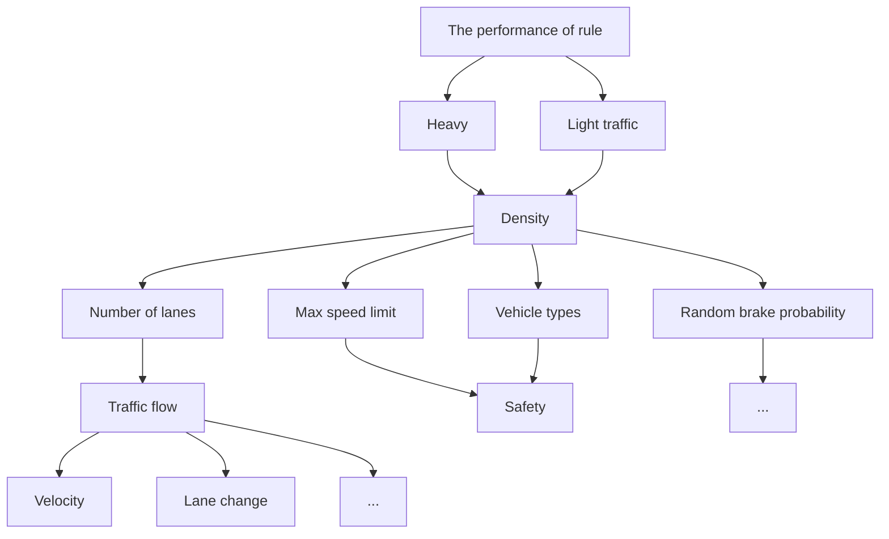

## Team Control Number

For office use only

T1

T2

T3

T4

## 30532

Problem Chosen

A

For office use only

F1

F2

F3

F4

## 2014 Mathematical Contest in Modeling (MCM) Summary Sheet

We build a simulation and statistical model to analyze the performance of Keep-Right-Except-To-Pass rule in light and heavy traffic. We extend the famous Cellular Automaton single-lane Traffic flow simulation model (NaSch model) to multi-lane model using our new lane-changing rules. The factor analyze method is employed by us to study the tradeoffs between traffic flow, safety, max velocity limits and other metrics. Besides the Keep-Right-Except-To-Pass rule mentioned in the problem, we also propose two other rules: Keep-Right-Or-Left rule and High-Velocity-Left -Low-Velocity-Right-Except-To-Pass rule. A deep compare between the three rules has be done. The result shows that when traffic density, the probability of lane-changing and the velocity limits are low, Keep-Right-Or-Left rule is able to promote traffic flow and safety. In general, Keep-Right-Or-Left rule performs the best, while High-Velocity-Left -Low-Velocity-Right-Except-To-Pass rule performs the worst.

In countries where driving automobiles on the left is norm, our Keep-Right-Except-To-Pass model is also suitable with a simple change of orientation. Considering the other two models set no limit on the lane in which vehicles drive, the model can be applied without modification to those countries driving to the left.

Last, if the whole traffic is controlled by an intelligent system, we will simulate the random behaviors of the model parameters to optimal parameters under ideal circumstances and also analyze the effects to the three rules. Under the control of an intelligent system, the safety of three rules is almost the same. And the rule of Keep-Right-Except-To-Pass promotes the traffic flow the least while the range of difference is the greatest and the other two rules promote the traffic flow to a similar degree that is greater than that promoted by the Keep-Right-Except-To-Pass rule.

# Simulating and Scoring the Performance of Traffic Driving Rules

Simulating and Scoring the Performance of Traffic Driving Rules

SUMMARY. . 3

1 INTRODUCTION & BACKGROUNDS 4  
2 PROBLEM ANALYSIS. 4

2.1 Restatement of the Problem.  
2.2 Research Method..

3 ASSUMPTIONS 5  
4 MODEL DEVELOPMENT 6

4.1 Multi-lane Traffic Model for Cellular Automaton 6

4.1.1 Single Lane Model . 6  
4.1.2 A Generic Multi-Lane Model 6

4.2 Rule analysis Keep-Right-Except-Pass Rule .

4.2.1 Introduction.  
4.2.2 Simulation Setup . 8  
4.2.3 Simulation Results and Discussion 8

4.3 Comparison of Different Rules. .15

4.3.1 Introduction of Other Rules.. 15

a. Keep-Left-Or-Right Rule . .15  
b. High-Speed-Right-And-Low-Speed-Left-Except-Pass Rule. 16

4.3.2 Simulation Results and Discussion . 16  
4.3.3 Introduction of factor analysis.. . 19  
4.3.4 Simulation Results and Discussion . 19

4.4 Results and Discussion under Intelligent System . .25

5 CONCLUSION. .. 28  
6 STRENGTH AND WEAKNESS. .. 28  
7 REFERENCE .29

## Summary

We build a simulation and statistical model to analyze the performance of Keep-Right-Or-Left rule in light and heavy traffic. We extend the famous Cellular Automaton single-lane Traffic flow simulation model (NaSch model) to multi-lane model using our new lane changing rules. The factor analyze method is employed by us to study the tradeoffs between traffic flow, safety, max speed limits and other metrics. Besides the Keep-Right-Except-To-Pass rule mentioned in the problem, we also propose two other rules: KROL(Keep-Right-Or-Left) rule and HLLR(High-Velocity-Left -Low-Velocity-Right-Except-To-Pass) rule. A deep compare between the three rules has be done. The result shows that when traffic density, the probability of lane-changing and the speed limit is low, KROL rule is able to promote traffic flow and safety. In general, KROL rule performs the best, while HLLR rule performs the worst.

In countries where driving automobiles on the left is norm, our Keep-Right-Except-To-Pass model is also suitable with a simple change of orientation. Considering the other two models set no limit on the lane in which vehicles drive, the model can be applied without modification to those countries driving to the left.

Last, if the whole traffic is controlled by an intelligent system, we will simulate the random behaviors of the model parameters to optimal parameters under ideal circumstances and also analyze the effects to the three rules. Under the control of an intelligent system, the safety of three rules is almost the same. And the rule of Keep-Right-Except-To-Pass promotes the traffic flow the least while the range of difference is the greatest and the other two rules promote the traffic flow to a similar degree that is greater than that promoted by the Keep-Right-Except-To-Pass rule.

## 1 Introduction & Backgrounds

Driving rules in the world can be categorized into two factions: driving to the left and driving to the right. Nowadays, most of the countries in the world abide by the Keep-Right-Except-To-Pass rule. On the other hand, driving to the left is prevalent and became a basic traffic rule in countries with UK as the representative and those that have undergone the influence of colonial domination. In the 1920s, traffic accident exponentially increased and studies showed that sitting on the right side of the vehicles and driving to the right often led to the blocking of the drivers’ view when they tried to pass other vehicles on the road. In addition, since most of the population in the world lived in the north hemisphere, driving to the right is safer due to Coriolis force. Consequently, most countries, especially those in Europe and America, unanimously decided to implement the rule of sitting on the right side of vehicles and driving to the right. Today, almost 4 billion people around the world drive on the right side of the road while 2 billion drive on the left.

This paper intends to develop a mathematical model for the mainstream Keep-Right-Except-To-Pass rule and analysis the changes on traffic flow and safety brought about by various variables. A comparison with other traffic rules will be made to evaluate the strengths and weaknesses of different rules. Furthermore, a quantitative analysis will be carried out on to determine which of these rules outshines the others.

## 2 Problem Analysis

## 2.1 Restatement of the Problem

First and foremost, driving automobiles on the right is the rule in most countries unless the drivers need to pass another vehicle, in which case they move one lane to the left, pass, and return to the right-most lane. This paper intends to analyze:

1. The rationality of this rule from the perspectives of safety and promotion of traffic flow under the circumstances of different traffic loads or speed limits.  
2. The effectiveness of this rule in promoting better traffic flow? If its effectiveness is low, suggest alternatives.  
3. The effect on the solution once the rule is changed to “Keep-Left-Except-To-Pass”.  
4. The changes need to be made of the earlier analysis if vehicle transportation on the same roadway was fully under the control of an intelligent system.

## 2.2 Research Method

First, the performance of this rule is indicated by safety and traffic flow; therefore, it is a must to pin down measurable parametric factors related to tradeoffs between traffic flow and safety as well as the ways in which this rule performs under different load conditions. Load and speed of vehicles will be held as independent variables while the parametric factors will function as dependent variables and the evaluating indicators of the performance of the rule. In addition, a reference model for comparison will be established and used for evaluating the Keep-Right-Except-To-Pass rule.

In case this rule, compared with the reference group, is not capable of promoting traffic flow, a new driving rule will be drafted against the yardstick of previously-stipulated evaluating indicators to ensure a better performance. The analyzing procedure can be illustrated by the flowchart below:

flowchart

The performance of The Keep-Left-Except-To-Pass rule can be compared with that of the Keep-Right-Except-To-Pass rule once the rule is changed in analog simulation and the outputs of the two calculations are obtained.

It is a limiting case if vehicle transportation on the same roadway was fully under the control of an intelligent system, which rules out the random cases ; thus the third question can be addressed by following the method in previous questions and compare distinct outputs for difference.

## 3 Assumptions

All vehicles involved are assumed to be to be under ideal condition and the road in the analysis in the analysis is also ideally flat. Besides, all vehicles drive straightly forward all the time with no direction change, rollover or sway.

When under the circumstances of change lanes, the acceleration and deceleration processes of the vehicles will not be taken into consideration. If the lane-changing conditions are satisfied, the vehicles will directly shift to the adjacent lane.

## 4 Model Development

## 4.1 Multi-lane Traffic Model for Cellular Automaton

## 4.1.1 Single Lane Model

We extend the famous Nagel-Schreckenberg(NaSch)[3] single lane model to multi-lane model to simulate the traffic flow by defining our traffic rules.

For the convenience of the readers we would like to outline the single lane model. The system consists of a one dimensional grid of L sites with periodic boundary conditions. A site can either be empty, or occupied by a vehicle of velocity zero to $\mathbf { V } _ { \mathrm { I n a x } } .$ . The velocity is equivalent to the number of sites that a vehicle advances in one update — provided that there are no obstacles ahead. Vehicles move only in one direction. The index i denotes the number of a vehicle, $\mathbf { x } ( \mathrm { i } )$ its position, $\mathrm { v ( i ) }$ its current velocity, $\mathbf { V } _ { \mathrm { d } } ( \mathrm { i } )$ its maximum speed, pred(i) the number of the preceding vehicle, $\mathtt { g a p ( i ) } : = \mathtt { x ( p r e d ( i ) ) } - \mathtt { x ( i ) } - 1$ the width of the gap to the predecessor. At the beginning of each step the rules are applied to all vehicles simultaneously (parallel update, in contrast to sequential updates which yield slightly different results). Then the vehicles are advanced according to their new velocities.

$\bullet I F \nu ( i ) \ I = - \ \nu _ { d } ( i ) \ T H E N \nu ( i ) : = \nu ( i ) + I \ ( S I )$  
• IF v(i) > gap(i) THEN v(i) := gap(i) (S2)  
$\bullet I F \nu ( i ) > 0 A N D r a n d < p _ { d } ( i ) T H E N \nu ( i ) : = \nu ( i ) - I \ : ( S 3 )$

S1 represents a linear acceleration until the vehicle has reached its maximum velocity $\mathbf { V } _ { \mathrm { d } } .$ S2 ensures that vehicles having predecessors in their way slow down in order not to run into others. In S3 a random generator is used to decelerate a vehicle with a certain probability of modeling erratic driver behavior.

## 4.1.2 A Generic Multi-Lane Model

The single lane model is not capable of modeling realistic traffic situation mainly for one reason: a realistic fleet is usually composed of vehicle types having different desired velocities. Introducing such different vehicle types in the single lane model only results in slow vehicles being followed by faster ones and the average velocity reduced to the free–flow velocity of the slowest vehicle.

We extend the NaSch model by using several parallel single lane models with periodic boundary conditions and additional rules defining the exchange of vehicles between the lanes. The update step is split into two sub-steps:

1. Check the exchange of vehicles between the two lanes according to the new rule set. Vehicles are only moved sideways. They do not advance. Note that in reality this sub-step in this regard seems unfeasible since vehicles are usually incapable of pure transversal motion. Only when being together with the second sub-step to do our update rules make sense physically. This first sub-step is implemented as a strict parallel update with each vehicle making its decision based upon the configuration at the beginning of the time step.  
2. Perform independent single lane updates on both lanes according to the single lane update rules. In this second sub-step the resulting configuration of the first sub-step is used.

According to the rule set used to guide the lane change, we can have different Multi-Lane traffic flow model. We have implemented the Keep-Right-Except-Pass rule which is used in most countries. To find out more effective traffic rules, we also implement the KROL rule and the HLLR rule, which we will cover in the next sections in detail.

## 4.2 Rule analysis：Keep-Right-Except-Pass Rule

## 4.2.1 Introduction

Technically, we use L to represent the index of current lane, and ' L the index of the target lane. Note that the index of lane increases from the right-most lanes to the left-most ones. We keep using gap(i) for the number of empty sites ahead in the same lane, and add the definitions of gap (i) for the forward gap on the other lane, and gap0,back for the backward gap on the other lane. Note that if there is a vehicle on a neighboring site both return -1.

The Keep-Right-Except-Pass rule stipulates that a vehicle i changes to the other lane if all the following incentive, safety and Stochastic conditions are satisfied:

Incentive Condition:

$$
L <   L ^ {\prime} \left(\mathrm{T} _ {1}\right)
$$

or

$$
L > L ^ {\prime} \text {   and   } \operatorname{gap} (i) <   v _ {i} + 1 \left(T _ {2}\right)
$$

Safety Condition:

$$
g a p _ {0} (i) > v _ {i} + 1 \quad (T _ {3})
$$

$$
g a p _ {0, b a c k} (i) > v _ {\max} \left(T _ {4}\right)
$$

Stochastic condition

$$
\text { rand } () <   P _ {\text { change }} (T _ {5})
$$

Incentive Condition models the desire of a driver to change lane. There are two conditions, either $\mathrm { T } _ { 1 }$ or $\mathrm { T } _ { 2 }$ is met then the incentive condition is found: $\mathrm { T } _ { 1 { \cdot } }$ , if the driver is on the left lane, according to the traffic rule, he/she should have the desire to change to right lane; $\mathrm { T } _ { 2 } ,$ if the driver is on right lane and there is another vehicle ahead, if he/she can get a greater speed when changing lane, then there is an incentive to change lanes. $\mathrm { T } _ { 3 }$ and rule $\mathrm { T } _ { 4 }$ ensure that the lane change is safe and does not ensue a sudden brake from an approaching vehicle.

$\mathrm { T } _ { 5 }$ shows that lane changes are made with probability LCP to simulate the unlikelihood of a driver’s lane-changing move whenever possible.

## 4.2.2 Simulation Setup

In our simulation, each time step represents one second. We separate the lane into many road sections(sites), with each road section representing 7.5 meters of a lane and can be occupied by one vehicle at a time or be empty. 7.5 meters is selected since it is the approximate length of one vehicle as well as the distance between two stopped vehicles. Each of our lanes consists of 133 road sections. With 133 sections, each of our lanes is effectively 997.5 meters long. Our lanes are modeled as a closed system, making our road a loop. If a vehicle reaches the end of the road, it will loop back to the start.

Before the simulation starts, the simulation road is populated according to the given density, and each vehicle is placed randomly on the road with a random velocity equal to or less than their maximum velocity.

In our experiments the RBP (random braking probability) is set to 0.2, with LCP (lane changing probability) to 0.9 and $\mathbf { V } _ { \mathrm { I n a x } }$ and $\mathbf { V } _ { \mathrm { t h r e s o l d } }$ to 5 and 4 respectively.

## 4.2.3 Simulation Results and Discussion

Through numerical simulation, we can obtain the average density, speed and flow of the traffic. The model under experiment assumes the road to be a loop. The flow rate Q can be calculated if the total number of the laps that all vehicles have run is represented by S, the total simulation time by T and the number of lanes by L.

$$
Q = \frac {S}{T * L}
$$

The density is defined as：

$$
\rho = \frac {N}{2 L}
$$

The average speed is defined as：

$$
\bar {V} = \frac {1}{N * T} \sum_ {i = 1} ^ {L} \sum_ {t = 1} ^ {T} \sum_ {j = 1} ^ {N _ {i}} V _ {i, j, T}
$$

In the above formula, $\mathrm { V _ { i , t , j } }$ represents the speed of vehicle j driving in Lane i at the time of t.

The average totality of lane-changing can be defined as：

$$
C = \frac {1}{T} \sum_ {t = 1} ^ {T} c _ {t}
$$

${ \mathsf { c } } _ { \mathrm { t } }$ in this formula represents the total number of times lane-changing happens with a range of time t.

The average rate of lane use $\mathrm { U _ { i } }$ is defined as：

$$
U _ {i} = \frac {1}{T} \sum_ {t = 1} ^ {T} N _ {i, t}
$$

$\Nu _ { \mathrm { i , t } }$ represents the number of vehicles on the road at the time of t.

We analyzed the effects on the traffic flow, the times of lane-changing and average speed brought about by these six factors: traffic density, number of lanes, maximum speed limit, the proportion of large vehicles, lane-changing probability and the probability of random braking.

The simulated results of car track can be described into the following Time-Space chart, and the numbers express the velocity of car.

## Space

<table><tr><td>40.10.1,20.00.1,2,2,2,2,4,5,5,5,4,5,4,3,2,1,1.1,4,4,5,5</td><td></td></tr><tr><td>40.10.1,20.1,1.1,2,2,3,2,3,5,4,5,5,5,5,5,5,5,5,2,1,10.2,3,5</td><td></td></tr><tr><td>0.10.1,20.1,1.1,2,2,3,2,3,4,5,5,5,5,5,5,5,3,1,10.1,2,4,3</td><td></td></tr><tr><td>10.1.20.10.0,2,3,2,2,3,3,5,5,5,5,5,5,5,5,10.0.1.2.2.3</td><td></td></tr><tr><td>10.1.20.100.1,3,2,3,3,3,4,5,5,5,5,5,5,5-20.1.1.2.2.3</td><td></td></tr><tr><td>0.1.1.1000.1,2,3,3.2,3,4,5,5,5-5,5-5-50.1.1.2.2.2.2-4,5-0</td><td></td></tr><tr><td>1.1.11000.1,2-3-3-3-3-4-4-4-4-4-4-4-4-4-4-4-4-4-4-4-4-4-4-4-4-4-4-4-4-4-4-4-4-4-4-4-4-4-4-4-4-4-4-4-4-4-4-4-4-4-4-4-4-4-4- 0</td><td></td></tr><tr><td>1.1.11000.1.2 3 -3 -3 -3 -3 -3 -3 -3 -3 -3 -3 -3 -3 -3 -3 -3 -3 -3 -3 -3 -3 -3 -3 -3 -3 -3 -3 -3 -3 -3 -3 -3 -3 -3 -3 -3 -3 -3 -3 -3 -3 -3 -3 -3 -3 -3 -3 -3 -3 -3 -3</td><td></td></tr><tr><td>1.10.000.1.2 3 , 3 , 3 , 3 , 3 , 3 , 4 , 5 , 5 , 5 , 5 , 5 , 5 , 5 , 5 , 5 , 10 .1 .1 .1 .2 .2 .3 , 5 , 5</td><td></td></tr><tr><td>1.10.100.1.2 2 , 3 , 3 , 3 , 3 , 4 , 5 , 5 , 5 , 5 , 5 , 5 , 5 , 5 , 5 , 10 .1 .1 .2 .2 .1 .3 , 4 , 5 , 5</td><td></td></tr><tr><td>100.00.1.2 .2 .2 .4 , 3 . 3 , 3 , 3 , 5 , 5 , 5 , 5 , 5 , 5 , 4 , 5 , 4 , 30 .1 .2 .2 .2 .2 .2 .4 , 5 , 5</td><td></td></tr><tr><td>100.100.1 .2 .2 .3 , 3 , 3 , 4 , 4 , 5 , 5 , 5 , 5 , 5 , 5 , 5 , 5 , 0 .1 .2 .2 .2 .2 .2 .2 .2 .2 .2 .2 .2 .2 .2 .2 .2 .2 .2 .2 .2 .2 .2 .2 .2 .2 .2 .2 .2 .2 .2 .2 .2 .2 .2 .2 .2 .2 .2 .2 .2 .2 .2 .2 .2 .2 .2 .2 .2 .2 .2 .2 .</td><td></td></tr><tr><td>00.100.1 : 1 , 2 , 2 , 4 , 5 , 3 , 4 , 4 , 5 , 5 , 5 , 5 , 5 , 5 , 5 , 5 , 5 , 5 , 5 , 6 , 6 , 6 , 6 , 6 , 6 , 6 , 6 , 6 , 6 , 6 , 6 , 6 , 6 , 6 , 6 , 6 , 6 , 6 , 6 , 6 , 6 , 6 , 6 , 6 , 6 , 6 , 6 , 6 , 6 , 6 , 6 , 6</td><td></td></tr><tr><td>00.100.1 : ( ) ; ( ) ; ( ) ; ( ) ; ( ) ; ( ) ; ( ) ; ( ) ; ( ) ; ( ) ; ( ) ; ( ) ; ( ) ; ( ) ; ( ) ; ( ) ; ( ) ; ( ) ; ( ) ; ( ) ; ( ) ; ( ) ; ( ) ; ( ) ; ( ) ; ( ) ; ( ) ; ( ) ; ( ) ; ( ) ; ( ) ; ( ) ; ( ) ; ( ) ;( ) ; ( ) ; ( ) ; ( ) ; ( ) ; ( ) ; ( ) ; ( ) ; ( ) ; ( ) ; ( ) ; ( ) ; ( ) ; ( ) ; ( ) ; ( ) ; ( ) ; ( ) ; ( ) ; ( ) ; ( ) ; ( ) ; ( ) ; ( ) ; ( ) ; ( ) ; ( ) ; ( ) ; ( ) ; ( ) ; ( ) ; ( ) ; ( ) ; ( )</td><td>( ) ; ( ) ;( ) ;( ) ;( ) ;( ) ;( ) ;( ) ;( ) ;( ) ;( ) ;( ) ;( ) ;( ) ;( ) ;( ) ;( ) ;( ) ;( ) ;( ) ;( ) ;( ) ;( ) ;( ) ;( ) ;( ) ;( ) ;( ) ;( ) ;( ) ;( ) ;( ) ;( ) ;( ) ;( ) ;( ]; ( ]; ( ]; ( ]; ( ]; ( ]; ( ]; ( ]; ( ]; ( ]; ( ]; ( ]; ( ]; ( ]; ( ]; ( ]; ( ]; ( ]; ( ]; ( ]; ( ]; ( ]; ( ]; ( ]; ( ]; ( ]; ( ]; ( ]; ( ]; ( ]; ( ]; ( ]; ( ]; ( ]; ( [ ]; ( ]; ( ]; ( ]; ( ]; ( ]; ( ]; ( ]; ( ]; ( ]; ( ]; ( ]; ( ]; ( ]; ( ]; ( ]; ( ]; ( ]; ( ]; ( ]; ( ]; ( ]; ( ]; ( ]; ( ]; ( ]; ( ]; ( ];</td></tr><tr><td>( ) ! / [ ],( ),( ),( ),( ),( ),( ),( ),( ),( ),( ),( ),( ),( ),( ),( ),( ),( ),( ),( ),( ),( ),( ),( ),( ),( ),( ),( ),( ),( ),( ),( ),( ),( ),( ),( ),( ),( ),( ),( ),( ),( ),( ),( ),( ),( ),( ),( ),( ),( ),( ),( ],)</td><td></td></tr></table>

Figure 1: Track Time vs. Space

$$
\begin{array}{cccccccccccccccccccccccccccc}0.1,2,3,4,4,5,4,4,4,5,5,4,4 & 4 & 5,0001,2 & 4,2,2,2 & 4 \\ 1,1,3,3,5,5,3,4,5,5,5,4,5 & 4 & 3100,2,2 & 21,3,3,5 \\ 4,2,2,3,4,5,3,3,4 & 5,5,5,5,4 & 5,1001,2 & 3 & 0.1 & 4 & 4 \\ 5,1,2,3,4,5,5,4,3,4,5,4 & 5,5,5,5,4 & 5,30011,3 & 3 & 4 & 2 & 4 \\ 31,3,4,5,5,3,4,5,5,5 & 5,5,5,5 & 0010,2 & 3 & 1.2 & 3 & 5 \\ 31,2,4,5,5,4,4,5,5< fcel>56789< fcel>1.1< fcel>1.1< fcel>1.1< fcel>1.1< fcel>1.1< fcel>1.1< fcel>1.1< fcel>1.1< fcel>1.1< fcel>1.1< fcel>1.1< nl>
< fcel>0.22< fcel>5< fcel>5< fcel>4< fcel>3< fcel>5< fcel>4< fcel>5< fcel>500111< fcel>4< fcel>2.2< fcel>2.3< fcel>3< fcel>5< ecel>< nl>
< fcel>51< fcel>2< fcel>4< fcel>5< fcel>3< fcel>4< fcel>5< fcel>5< fcel>500110< fcel>2< fcel>3.3< fcel>3.4< fcel>4< ecel>< ecel>< nl>
< fcel>0.23< fcel>3< fcel>4< fcel>5< fcel>3< fcel>4< fcel>5< fcel>5< fcel>500110< fcel>1< fcel>3.3< fcel>3.4< fcel>4< ecel>< ecel>< nl>
< fcel>51< fcel>3< fcel>4< fcel>4< fcel>4< fcel>5< fcel>5< fcel>5< fcel>400001011< fcel>4< fcel>2.2< fcel>4.4< ecel>< ecel>< ecel>< nl>
< fcel>2.23< fcel>4< fcel>4< fcel>5< fcel>3< fcel>4< fcel>5< fcel>5< fcel>400011111< fcel>5< fcel>3.3< fcel>4.4< ecel>< ecel>< ecel>< nl>
< fcel>2.23< fcel>3< fcel>4< fcel>5< fcel>5< fcel>5< fcel>4< fcel>5< fcel>400011112< fcel>3.5< fcel>5.4< fcel>4.3< ecel>< ecel>< ecel>< nl>
< fcel>2.23< fcel>3< fcel>4< fcel>5< fcel>5< fcel>5< fcel>4< fcel>4.3< fcel>5000020113< fcel>3.4< fcel>4.4< fcel>5.2< ecel>< ecel>< ecel>< nl>
< fcel>3.3< fcel>4.4< fcel>5< fcel>5< fcel>5< fcel>5< fcel>4.4< fcel>4.3< fcel>300011000-1-2-2-2-2-2-2-2-2-2-2-2-2-2-2-2-2-2-2-2-2-2-2-2-2-2-2-2-2-2-2-2-2-2-2-2-2-2-2-2-2-2-2-2-2-2-2-2-2-2-2-< lcel>< lcel>< lcel>< lcel>< lcel>< lcel>< lcel>< lcel>< lcel>< lcel>< lcel>< lcel>< lcel>< lcel>< lcel>< lcel>< lcel>< lcel>< lcel>< lcel>< lcel>< lcel>< lcel>< lcel>< lcel>< lcel>< lcel>< lcel>< lcel>< lcel>< lcel>< lcel>< lcel>< lcel>< lcel>< lcel>< lcel>< lcel>< lcel>< lcel>< lcel>< lcel>< lcel>< lcel>< lcel>< lcel>< lcel>< lcel>< lcel>< lcel>< lcel>< lcel>< lcel>< lcel>< lcel>< lcel>< lcel>< lcel>< lcel>< lcel>< lcel>< lcel>< lcel>< lcel>< lcel>< lcel>< lcel>< lcel>< lcel>< lcel>< lcel>< lcel>< lcel>< lcel>< lcel>< lcel>< lcel>< lcel>< lcel>< lcel>< lcel>< lcel>< lcel>< lcel>< lcel>< lcel>< lcel>< lcel>< lcel>< lcel>< lcel>< lcel>< lcel>< lcel>< lcel>< lcel>< lcel>< lcel>< lcel>< lcel>< nl>
< ucel>< xcel>< xcel>< xcel>< xcel>< xcel>< xcel>< xcel>< xcel>< xcel>< xcel>< xcel>< xcel>< xcel>< xcel>< xcel>< xcel>< xcel>< xcel>< xcel>< xcel>< xcel>< xcel>< xcel>< xcel>< xcel>< xcel>< xcel>< xcel>< xcel>< xcel>< xcel>< xcel>< xcel>< xcel>< xcel>< xcel>< xcel>< xcel>< xcel>< xcel>< xcel>< xcel>< xcel>< xcel>< xcel>< xcel>< xcel>< xcel>< xcel>< xcel>< xcel>< xcel>< xcel>< xcel>< xcel>< xcel>< xcel>< xcel>< xcel>< xcel>< xcel>< xcel>< xcel>< xcel>< xcel>< xcel>< xcel>< xcel>< xcel>< xcel>< xcel>< xcel>< xcel>< xcel>< xcel>< xcel>< xcel>< xcel>< xcel>< xcel>< xcel>< xcel>< xcel>< xcel>< xcel>< xcel>< xcel>< xcel>< xcel>< xcel>< xcel>< xcel>< xcel>< xcel>< xcel>< xcel>< xcel>< xcel>< xcel>< xcel>< nl>
< ucel>< xcel>< xcel>< xcel>< xcel>< xcel>< xcel>< xcel>< xcel>< xcel>< xcel>< xcel>< xcel>< xcel>< xcel>< xcel>< xcel>< xcel>< xcel>< xcel>< xcel>< xcel>< xcel>< xcel>< xcel>< xcel>< xcel>< xcel>< xcel>< xcel>< xcel>< xcel>< xcel>< xcel>< xcel>< xcel>< xcel>< xcel>< xcel>< xcel>< xcel>< xcel>< xcel>< xcel>< xcel>< xcel>< xcel>< xcel>< xcel>< xcel>< xcel>< xcel>< xcel>< xcel>< xcel>< xcel>< xcel>< xcel>< xcel>< xcel>< xcel>< xcel>< xcel>< xcel>< xcel>< xcel>< xcel>< ucel>< ucel>< ucel>< ucel>< ucel>< ucel>< ucel>< ucel>< ucel>< ucel>< ucel>< ucel>< ucel>< ucel>< ucel>< ucel>< ucel>< ucel>< ucel>< ucel>< ucel>< ucel>< ucel>< ucel>< ucel>< ucel>< ucel>< ucel>< ucel>< ucel>< ucel>< ucel>< ucel>< ucel>< ucel>< ucel>< ucel>< ucel>< ucel>< ucel>< ucel>< ucel>< ucel>< ucel>< ucel>< ucel>< ucel>< ucel>< ucel>< ucel>< ucel>< ucel>< ucel>< ucel>< ucel>< ucel>< ucel>< ucel>< ucel>< ucel>< ucel>< ucel>< ucel>< ucel>< ucel>< ucel>< ucel>< ucel>< ucel>< ucel>< ucel>< ucel>< ucel>< ucel>< ucel>< ucel>< ucel>< ucel>< ucel>< ucel>< ucel>< ucel>< ucel>< nl>
< ucel>< xcel>< xcel>< xcel>< xcel>< xcel>< xcel>< xcel>< xcel>< xcel>< xcel>< xcel>< xcel>< xcel>< xcel>< xcel>< xcel>< ecel>< ecel>< ecel>< ecel>< ecel>< ecel>< ecel>< ecel>< ecel>< ecel>< ecel>< ecel>< ecel>< ecel>< ecel>< ecel>< ecel>< ecel>< ecel>< ecel>< ecel>< ecel>< ecel>< ecel>< ecel>< ecel>< ecel>< ecel>< ecel>< ecel>< ecel>< ecel>< ecel>< ecel>< ecel>< ecel>< ecel>< ecel>< ecel>< ecel>< ecel>< ecel>< ecel>< ecel>< ecel>< ecel>< ecel>< ecel>< ecel>< ecel>< ecel>< ecel>< ecel>< ecel>< ecel>< ecel>< ecel>< ecel>< ecel>< ecel>< ecel>< ecel>< ecel>< ecel>< ecel>< ecel>< ecel>< ecel>< ecel>< ecel>< ecel>< ecel>< ecel>< nl>
< ucel>< xcel>< xcel>< xcel>< xcel>< xcel>< xcel>< xcel>< xcel>< xcel>< xcel>< xcel>< xcel>< xcel>< xcel>< xcel>< ecel>< ecel>< ecel>< ecel>< ecel>< ecel>< ecel>< ecel>< ecel>< ecel>< ecel>< ecel>< ecel>< ecel>< ecel>< ecel>< ecel>< ecel>< ecel>< ecel>< ecel>< ecel>< ecel>< ecel>< ecel>< ecel>< ecel>< ecel>< ecel>< ecel>< ecel>< ecel>< ecel>< ecel>< ecel>< ecel>< ecel>< ecel>< ecel>< ecel>< ecel>< ecel>< ecel>< ecel>< ecel>< ecel>< ecel>< ecel>< ecel>< ecel>< ecel>< ecel>< ecel>< ecel>< ecel>< ecel>< ecel>< ecel>< ecel>< ecel>< ecel>< ecel>< ecel>< ecel>< ecel>< ecel>< nl>
< ucel>< xcel>< xcel>< xcel>< xcel>< xcel>< xcel>< xcel>< xcel>< xcel>< xcel>< xcel>< xcel>< xcel>< xcel>< xcel>< ecel>< ecel>< ecel>< ecel>< ecel>< ecel>< ecel>< ecel>< ecel>< ecel>< ecel>< ecel>< ecel>< ecel>< ecel>< nl>
< ucel>< xcel>< xcel>< xcel>< xcel>< xcel>< xcel>< xcel>< xcel>< xcel>< xcel>< xcel>< xcel>< xcel>< xcel>< ucel>< ucel>< ucel>< ucel>< ucel>< ucel>< ucel>< ucel>< ucel>< ucel>< ucel>< ucel>< ucel>< ucel>< ucel>< ucel>< ucel>< ucel>< ucel>< ucel>< ucel>< ucel>< ucel>< ucel>< ucel>< ucel>< ucel>< ucel>< ucel>< ucel>< ucel>< ucel>< ucel>< ucel>< ucel>< ucel>< ucel>< ucel>< ucel>< ucel>< ucel>< ucel>< ucel>< ucel>< ucel>< ucel>< ucel>< ucel>< ucel>< ucel>< ucel>< ucel>< ucel>< ucel>< ucel>< ucel>< ucel>< ucel>< ucel>< ucel>< ucel>< ucel>< ucel>< ucel>< ucel>< ucel>< ucel>< ucel>< ucel>< ucel>< ucel>< ucel>< ucel>< ucel>< ucel>< ucel>< ucel>< nl>
$$

We can find that traffic jam is generated after a period of time. And the jam in one road can be reduced by another load.

## a. Density vs. Flow, Lane Changing Frequency and Average Velocity

We vary the vehicle density form 0 to 1, and get the corresponding traffic flow、 lane changing frequency and average velocity.

scatter plot

| density(vehicle/section) | flow(vehicle/s/lane) |
| ------------------------ | ------------------- |
| 0.00                     | 0.05                |
| 0.02                     | 0.10                |
| 0.04                     | 0.15                |
| 0.06                     | 0.20                |
| 0.08                     | 0.25                |
| 0.10                     | 0.30                |
| 0.12                     | 0.35                |
| 0.14                     | 0.40                |
| 0.16                     | 0.45                |
| 0.18                     | 0.50                |
| 0.20                     | 0.55                |
| 0.22                     | 0.58                |
| 0.24                     | 0.60                |
| 0.26                     | 0.62                |
| 0.28                     | 0.64                |
| 0.30                     | 0.66                |
| 0.32                     | 0.68                |
| 0.34                     | 0.70                |
| 0.36                     | 0.72                |
| 0.38                     | 0.74                |
| 0.40                     | 0.76                |
| 0.42                     | 0.78                |
| 0.44                     | 0.80                |
| 0.46                     | 0.82                |
| 0.48                     | 0.84                |
| 0.50                     | 0.86                |
| 0.52                     | 0.88                |
| 0.54                     | 0.90                |
| 0.56                     | 0.92                |
| 0.58                     | 0.94                |
| 0.60                     | 0.96                |
| 0.62                     | 0.98                |
| 0.64                     | 1.00                |
| 0.66                     | 1.02                |
| 0.68                     | 1.04                |
| 0.70                     | 1.06                |
| 0.72                     | 1.08                |
| 0.74                     | 1.10                |
| 0.76                     | 1.12                |
| 0.78                     | 1.14                |
| 0.80                     | 1.16                |
| 0.82                     | 1.18                |
| 0.84                     | 1.20                |
| 0.86                     | 1.22                |
| 0.88                     | 1.24                |
| 0.90                     | 1.26                |
| 0.92                     | 1.28                |
| 0.94                     | 1.30                |
| 0.96                     | 1.32                |
| 0.98                     | 1.34                |
| 1.00                     | 1.36                |

Figure 2.a: Density vs. Flow

line chart

| density(vehicle/section) | laneChange(times/s) |
| ------------------------ | ------------------- |
| 0                        | 0.0                 |
| 10                       | 0.0                 |
| 20                       | 0.3                 |
| 30                       | 0.5                 |
| 40                       | 0.6                 |
| 50                       | 0.55                |
| 60                       | 0.4                 |
| 70                       | 0.2                 |
| 80                       | 0.1                 |
| 90                       | 0.0                 |
| 100                      | 0.0                 |

Figure 2.b: Density vs. Lane Changing Frequency

line chart

| density(vehicle/section) | Velocity(sections/s) |
| ------------------------ | -------------------- |
| 0                        | 4.8                  |
| 5                        | 4.7                  |
| 10                       | 4.6                  |
| 15                       | 4.0                  |
| 20                       | 3.5                  |
| 25                       | 3.0                  |
| 30                       | 2.5                  |
| 35                       | 2.0                  |
| 40                       | 1.5                  |
| 45                       | 1.2                  |
| 50                       | 1.0                  |
| 55                       | 0.8                  |
| 60                       | 0.6                  |
| 65                       | 0.5                  |
| 70                       | 0.4                  |
| 75                       | 0.3                  |
| 80                       | 0.2                  |
| 85                       | 0.1                  |
| 90                       | 0.05                 |
| 95                       | 0.02                 |
| 100                      | 0.01                 |

Figure 2.c: Density vs. Velocity

The figures show that with the density increasing, flow and lane changing frequency both first increase then decrease, the average velocity has a decrease trend. In fact, when vehicle density increases, the number of vehicle is increase, and ca flow is increasing, when flow reach top, increase density will cause the flow decrease because high density cause jam, and the vehicle velocity is decrease.

b. Number of Lanes vs. Flow, Lane Changing

## Frequency and Average Velocity

We vary the lane number from 1 to 8, and get the corresponding traffic flow、lane changing frequency and average velocity.

line chart

| lanes | flow(vehicle/section/s) |
| ----- | ------------------------ |
| 1     | 0.528                    |
| 2     | 0.545                    |
| 3     | 0.551                    |
| 4     | 0.556                    |
| 5     | 0.558                    |
| 6     | 0.559                    |
| 7     | 0.558                    |
| 8     | 0.561                    |

Figure 3.a: Lanes vs. Flow

line chart

| lanes | laneChange (times/s) |
| ----- | -------------------- |
| 1     | 0.0                  |
| 2     | 0.3                  |
| 3     | 0.5                  |
| 4     | 0.8                  |
| 5     | 1.1                  |
| 6     | 1.4                  |
| 7     | 1.7                  |
| 8     | 2.0                  |

Figure 3.b: Lanes vs. Lane Changing Frequency

line chart

| lanes | velocity (sections/s) |
| ----- | --------------------- |
| 1     | 2.60                  |
| 2     | 2.68                  |
| 3     | 2.75                  |
| 4     | 2.76                  |
| 5     | 2.79                  |
| 6     | 2.79                  |
| 7     | 2.78                  |
| 8     | 2.80                  |

Figure 3.c: Lanes vs. Velocity

Obviously, flow、lane changing frequency and average velocity all increase with the lane number. In reality, most freeways are 4-lane or 6-lane.

## c. Maximal Velocity Limit vs. Flow, Lane Changing

## Frequency and Average Velocity

We vary maximal velocity limit from 1 to 10, and get the corresponding traffic flow, lane changing frequency and average velocity.

line chart

| max speed(section/s) | flow(vehicle/section/s) |
| --------------------- | ------------------------ |
| 1                     | 0.0                      |
| 2                     | 0.35                     |
| 3                     | 0.5                      |
| 4                     | 0.53                     |
| 5                     | 0.53                     |
| 6                     | 0.53                     |
| 7                     | 0.53                     |
| 8                     | 0.53                     |
| 9                     | 0.52                     |
| 10                    | 0.52                     |

Figure 4.a: Max Velocity Limit vs. Flow

line chart

| max speed(section/s) | laneChange(time/s) |
| --------------------- | ------------------ |
| 1                     | 0.32               |
| 2                     | 0.13               |
| 3                     | 0.05               |
| 4                     | 0.10               |
| 5                     | 0.10               |
| 6                     | 0.11               |
| 7                     | 0.12               |
| 8                     | 0.13               |
| 9                     | 0.13               |
| 10                    | 0.13               |

Figure 4.b: Max Velocity Limit vs. Lane Changing Frequency

line chart

| max speed(section/s) | velocity(vehicle/section/s) |
| --------------------- | --------------------------- |
| 1                     | 0.7                         |
| 2                     | 1.7                         |
| 3                     | 2.4                         |
| 4                     | 2.6                         |
| 5                     | 2.6                         |
| 6                     | 2.6                         |
| 7                     | 2.6                         |
| 8                     | 2.6                         |
| 9                     | 2.6                         |
| 10                    | 2.6                         |

Figure 4.c: Max Velocity Limit vs. Velocity

We can find that at first, flow and average velocity both increase with the max velocity, while lane changing frequency decrease with the max velocity. When reach a certern maximal velocity, all the three metrics keep stable.

## d. Big Car Fraction vs. Flow, Lane Changing Frequency and Average Velocity

We vary big car fraction from 0 to 1, and get the corresponding traffic flow、lane changing frequency and average velocity.

scatter plot

| bit car fraction | flow(vehicle/section/s) |
| ---------------- | ---------------------- |
| 0.0              | 0.546                  |
| 0.1              | 0.547                  |
| 0.2              | 0.545                  |
| 0.3              | 0.546                  |
| 0.4              | 0.543                  |
| 0.5              | 0.542                  |
| 0.6              | 0.544                  |
| 0.7              | 0.545                  |
| 0.8              | 0.543                  |
| 0.9              | 0.545                  |
| 1.0              | 0.547                  |

Figure 5.a: Big Car Fraction vs. Flow

scatter plot

| bit car fraction | lane change (times/s) |
| ---------------- | --------------------- |
| 0                | 0.135                 |
| 5                | 0.155                 |
| 10               | 0.158                 |
| 15               | 0.162                 |
| 20               | 0.165                 |
| 25               | 0.158                 |
| 30               | 0.155                 |
| 35               | 0.145                 |
| 40               | 0.135                 |
| 45               | 0.125                 |
| 50               | 0.115                 |
| 55               | 0.105                 |
| 60               | 0.095                 |
| 65               | 0.085                 |
| 70               | 0.075                 |
| 75               | 0.065                 |
| 80               | 0.055                 |
| 85               | 0.060                 |
| 90               | 0.055                 |
| 95               | 0.065                 |
| 100              | 0.055                 |

Figure 5.b: Big Car Fraction vs. Lane Changing Frequency

scatter plot

| bit car fraction | velocity(section/s) |
| ---------------- | ------------------- |
| 5                | 2.66                |
| 10               | 2.65                |
| 15               | 2.64                |
| 20               | 2.63                |
| 25               | 2.62                |
| 30               | 2.61                |
| 35               | 2.60                |
| 40               | 2.61                |
| 45               | 2.62                |
| 50               | 2.63                |
| 55               | 2.64                |
| 60               | 2.65                |
| 65               | 2.64                |
| 70               | 2.63                |
| 75               | 2.62                |
| 80               | 2.61                |
| 85               | 2.60                |
| 90               | 2.61                |
| 95               | 2.62                |
| 100              | 2.63                |

Figure 5.c: Big Car Fraction vs. Velocity

We find that big car fraction mainly influence the lane changing frequence. When big car fraction is less than 20%, lane changing frequency increases, after that, lane changing frequency decrease.

## e. Lane Changing Probability vs. Flow, Lane Changing Frequency and Average Velocity)

We vary lane changing probability from 0 to 1, and get the corresponding traffic flow、lane changing frequency and average velocity.

scatter plot

| lane change probability | flow(vehicle/section/s) |
| ----------------------- | ------------------------ |
| 0.0                     | 0.47                     |
| 0.1                     | 0.52                     |
| 0.2                     | 0.54                     |
| 0.3                     | 0.53                     |
| 0.4                     | 0.54                     |
| 0.5                     | 0.53                     |
| 0.6                     | 0.54                     |
| 0.7                     | 0.53                     |
| 0.8                     | 0.54                     |
| 0.9                     | 0.53                     |
| 1.0                     | 0.54                     |

Figure 6.a: Lane Change Probability vs. Flow

scatter plot

| lane change probability | lane change (times/s) |
| ----------------------- | --------------------- |
| 0                       | 0.03                  |
| 5                       | 0.04                  |
| 10                      | 0.05                  |
| 15                      | 0.06                  |
| 20                      | 0.07                  |
| 25                      | 0.08                  |
| 30                      | 0.09                  |
| 35                      | 0.10                  |
| 40                      | 0.11                  |
| 45                      | 0.10                  |
| 50                      | 0.11                  |
| 55                      | 0.10                  |
| 60                      | 0.11                  |
| 65                      | 0.12                  |
| 70                      | 0.13                  |
| 75                      | 0.12                  |
| 80                      | 0.11                  |
| 85                      | 0.10                  |
| 90                      | 0.11                  |
| 95                      | 0.12                  |
| 100                     | 0.11                  |

Figure 6.b: Lane Change Probability vs. Lane Changing Frequency

scatter plot

| lane change probability | velocity (section/s) |
| ----------------------- | -------------------- |
| 0                       | 2.3                  |
| 5                       | 2.45                 |
| 10                      | 2.55                 |
| 15                      | 2.6                  |
| 20                      | 2.6                  |
| 25                      | 2.6                  |
| 30                      | 2.6                  |
| 35                      | 2.6                  |
| 40                      | 2.6                  |
| 45                      | 2.6                  |
| 50                      | 2.6                  |
| 55                      | 2.6                  |
| 60                      | 2.6                  |
| 65                      | 2.6                  |
| 70                      | 2.6                  |
| 75                      | 2.6                  |
| 80                      | 2.6                  |
| 85                      | 2.6                  |
| 90                      | 2.6                  |
| 95                      | 2.6                  |
| 100                     | 2.6                  |

Figure 6.c: Lane Change Probability vs. Velocity

We find that with the increase of lane changing probability, flow and average velocity keep increase until lane changing probability reach 0.1. While the lane changing keeep increase all the time.

## f. Random Braking Probability vs. Flow, Lane Changing Frequency and Average Velocity)

The influence of random braking probability to flow、lane changing frequency and average velocity.

We vary random braking probability from 0 to 1, and get the corresponding traffic flow、lane changing frequency and average velocity.

line chart

| random brake probability | flow(vehicle/section/s) |
| ------------------------ | ---------------------- |
| 0.0                      | 0.78                   |
| 0.1                      | 0.65                   |
| 0.2                      | 0.55                   |
| 0.3                      | 0.45                   |
| 0.4                      | 0.35                   |
| 0.5                      | 0.25                   |
| 0.6                      | 0.15                   |
| 0.7                      | 0.08                   |
| 0.8                      | 0.03                   |
| 0.9                      | 0.01                   |
| 1.0                      | 0.0                    |

Figure 7.a: Random Braking Probability vs. Flow

line chart

| random brake probability | velocity(sections/s) |
| ------------------------ | -------------------- |
| 0                        | 4.0                  |
| 10                       | 3.5                  |
| 20                       | 3.0                  |
| 30                       | 2.5                  |
| 40                       | 2.0                  |
| 50                       | 1.5                  |
| 60                       | 1.0                  |
| 70                       | 0.5                  |
| 80                       | 0.25                 |
| 90                       | 0.1                  |
| 100                      | 0.0                  |

Figure 7.b: Random Braking Probability vs. Lane Changing Frequency

scatter plot

| random brake probability | lane change (times/s) |
| ------------------------ | --------------------- |
| 0                        | 0.00                  |
| 5                        | 0.01                  |
| 10                       | 0.03                  |
| 15                       | 0.06                  |
| 20                       | 0.10                  |
| 25                       | 0.14                  |
| 30                       | 0.18                  |
| 35                       | 0.22                  |
| 40                       | 0.26                  |
| 45                       | 0.30                  |
| 50                       | 0.34                  |
| 55                       | 0.38                  |
| 60                       | 0.42                  |
| 65                       | 0.44                  |
| 70                       | 0.46                  |
| 75                       | 0.45                  |
| 80                       | 0.43                  |
| 85                       | 0.41                  |
| 90                       | 0.38                  |
| 95                       | 0.32                  |
| 100                      | 0.25                  |

Figure 7.c: Random Braking Probability vs. Velocity

We can see that with the random braking probability increase, flow and average velocity decrease and the lane changing frequency first increase then decrease. In fact, when random braking probability increase, the vehicle will decrease which will cause the flow decrease.

## 4.3 Comparison of Different Rules

## 4.3.1 Introduction of Other Rules

## a. Keep-Left-Or-Right Rule

The Keep-Right-Except-Pass rule is an asymmetry rule because the conditions of changing to the left or the right lane are not the same. To model the symmetry conditions, we define a new rule called Keep-Left-Or-Right rule, in which the driver can pass other vehicles from the left or right lanes and it would not be necessary to keep to the right lane. The following figure illustrates the rules for a vehicle i to change to another lane:

Incentive Condition:

$$
g a p (i) <   v _ {i} + 1
$$

Safety Condition:

$$
\begin{array}{l} g a p _ {0} (i) > v _ {i} + 1 \\ g a p _ {0, b a c k} (i) > v _ {\max} \\ \end{array}
$$

Stochastic condition

$$
\text { rand() } <   P _ {\text { change }}
$$

We can find that in this rule, drivers always change lanes with a probability $\mathrm { P _ { c h a n g e } }$ to get a greater speed under the condition that changing lane is safe.

## b. High-Speed-Right-And-Low-Speed-Left-Except-Pass Rule

We also propose a new rule to classify the vehicles under discussion according to their speed. Under this rule, vehicles with a speed lower than $\mathbf { V _ { t h r e s h o l d } }$ should run on the right lane, and vehicles with a speed higher or equal to $\mathbf { V _ { t h r e s h o l d } }$ should run on the left lane. If a vehicle intends to pass another vehicle, it can temporally change to another lane. The following illustration demonstrates the rules for a vehicle i to change to another lane:

Incentive conditions:

$$
L <   L ^ {\prime} \text {   and   } v _ {i} > = v _ {\text { threshold }} (T _ {l})
$$

$$
L > L ^ {\prime} \text {   and   } v _ {i} <   v _ {\text { threshold }} (T _ {2})
$$

$$
g a p (i) <   v _ {i} + 1 \quad (T _ {3})
$$

Safety conditions:

$$
g a p _ {0} (i) > v _ {i} + 1
$$

$$
g a p _ {0, b a c k} (i) > v _ {\max}
$$

Stochastic condition

$$
r a n d () <   P _ {c h a n g e}
$$

$\mathrm { T } _ { 1 }$ and $\mathrm { T } _ { 2 }$ mean that when a vehicle in the high (low) speed lane has a low (high) speed, it needs to change to the low(high) speed lane; If one of $\mathrm { T } _ { 1 } , \mathrm { T } _ { 2 } \mathrm { T } _ { 3 }$ agrees, then there is an incentive to change lanes. The safety condition and Stochastic condition applies the same in terms of the other two rules.

## 4.3.2 Simulation Results and Discussion

## a. Flow vs. Density

line chart

| density | Keep-Left-Or-Right | Hight-in-Left-Low-in-Right | Keep-Rigjt-Except-Pass |
| ------- | ------------------ | -------------------------- | ---------------------- |
| 0.0     | 0.1                | 0.1                        | 0.1                    |
| 0.05    | 0.3                | 0.3                        | 0.3                    |
| 0.1     | 0.6                | 0.6                        | 0.6                    |
| 0.15    | 0.7                | 0.7                        | 0.7                    |
| 0.2     | 0.65               | 0.65                       | 0.65                   |
| 0.25    | 0.6                | 0.6                        | 0.6                    |
| 0.3     | 0.55               | 0.55                       | 0.55                   |
| 0.35    | 0.5                | 0.5                        | 0.5                    |

Figure 8: Flow vs. Density

This figure shows that, when density is around 0.15, Keep-left-or-right rule has a bigger flow.

## b. Lane Changing Frequency vs. Density

line chart

| density | Keep-Left-Or-Right | High-in-Left-Low-in-Right | Keep-Right-Except-Pass |
| ------- | ------------------ | ------------------------- | ----------------------- |
| 0.05    | 0.005              | 0.035                     | 0.03                    |
| 0.1     | 0.01               | 0.03                      | 0.025                   |
| 0.15    | 0.005              | 0.005                     | 0.005                   |
| 0.2     | 0.15               | 0.01                      | 0.035                   |
| 0.25    | 0.18               | 0.02                      | 0.04                    |
| 0.3     | 0.23               | 0.025                     | 0.045                   |

Figure 9: Lane Changing Frequency vs. Density

It’s obvious that three rules have a big difference in lane changing frequency. There is more lane changing in Keep-left-or-right rule, because this rule allows turn right or left. However larger lane changing frequency will decrease the safety.

## c. Average Velocity vs. Density

line chart

| density | Keep-Left-Or-Right | High-in-Left-Low-in-Right | Keep-Right-Except-Pass |
| ------- | ------------------ | ------------------------- | ----------------------- |
| 0.05    | 4.9                | 4.9                       | 4.9                     |
| 0.1     | 4.8                | 4.8                       | 4.8                     |
| 0.15    | 4.7                | 4.7                       | 4.7                     |
| 0.2     | 3.5                | 3.5                       | 3.5                     |
| 0.25    | 2.5                | 2.5                       | 2.5                     |
| 0.3     | 1.9                | 1.9                       | 1.9                     |

Figure 10: Average Velocity vs. Density

This figure shows that when density is around 0.15, Keep-left-or-right rule has a bigger velocity.

## d. Lane Usage vs. Density

line chart

| density | Keep-Left-Or-Right | High-Left-Low-Right | Keep-Right-Except-Pass |
| ------- | ------------------ | ------------------- | ---------------------- |
| 0.05    | 0.02               | 0.05                | 0.04                   |
| 0.1     | 0.12               | 0.12                | 0.13                   |
| 0.15    | 0.16               | 0.17                | 0.18                   |
| 0.2     | 0.24               | 0.22                | 0.28                   |
| 0.25    | 0.28               | 0.28                | 0.30                   |
| 0.3     | 0.34               | 0.37                | 0.34                   |

line chart

| density | Keep-Left-Or-Right | High-in-Left-Low-in-Right | Keep-Right-Except-Pass |
| ------- | ------------------ | ------------------------- | ----------------------- |
| 0.05    | 0.06               | 0.04                      | 0.02                    |
| 0.1     | 0.1                | 0.1                       | 0.1                     |
| 0.15    | 0.18               | 0.18                      | 0.17                    |
| 0.2     | 0.2                | 0.27                      | 0.17                    |
| 0.25    | 0.25               | 0.25                      | 0.25                    |
| 0.3     | 0.32               | 0.32                      | 0.32                    |

Figure 11: Lane Usage vs. Density

Compare this two figures, because our lane is a loop which means the total lane usage is not changed, one lane usage high will cause another lane usage low. These figures show that Keep-Right-Except-Pass rule has a high usage in left lane and High-in-left-Low-in-Right rule has a high usage in right lane, and Keep-Left-or-Right is in between.

## 4.3.3 Introduction of factor analysis

We need to evaluate the performance of different rules, so we have to define some metrics. In the previous section, we define several metrics (i.e. traffic flow, average velocity, lane change frequency) . In this section, in order to get a general metrics, we apply the factor analysis method to the output data of our simulation model.

Factor analysis method is a kind of quantitative analysis method that finds a few random variables being able to represent all variables through analyzing internal dependency relationship of covariance matrix (or correlation coefficient matrix) among many variables. Among it, several random variables found are immeasurable, which are called common factors. It is irrelevant between each common factor and common factor, and all the variables can be expressed by these several common factors. Factor analysis analyzes the whole economic issues through reducing the number of the variables and replacing all the variables with several factors, which greatly simplifies the realistic analysis process. Assume that there are N samples and P indexes, $\mathbf { x } { = } ( \mathbf { x } _ { 1 } , \mathbf { x } _ { 2 } , . . . , \mathbf { x _ { \mathrm { { r } } } } ) ^ { \mathrm { { T } } }$ is random variable, the common factor needing to be found is $\mathrm { F } { = } ( \mathrm { F } _ { 1 } , \mathrm { F } _ { 2 } , . . . , \mathrm { F } _ { \mathrm { m } } ) ^ { \mathrm { T } }$ . Assume the impact of common factors is linear, the indexes can be decomposed into the following form. We call this model

$$
\left( \begin{array}{c} X _ {1} \\ X _ {2} \\ \dots \\ X _ {p} \end{array} \right) = \left( \begin{array}{c c c c} a _ {1 1} & a _ {1 2} & \dots & a _ {1 q} \\ a _ {2 1} & a _ {2 2} & \dots & a _ {2 q} \\ \dots & \dots & \dots & \dots \\ a _ {p 1} & a _ {p 2} & \dots & a _ {p q} \end{array} \right) + \left( \begin{array}{c} F _ {1} \\ F _ {2} \\ \dots \\ F _ {m} \end{array} \right) + \left( \begin{array}{c} \varepsilon_ {1} \\ \varepsilon_ {2} \\ \dots \\ \varepsilon_ {p} \end{array} \right)
$$

as factor models. We call matrix $\mathrm { A } { = } ( \mathrm { a _ { i j } } )$ factor loading (Loading), call $\mathbf { a } _ { \mathrm { i j } }$ factor and the essence of loading is the related coefficient of common factor $\mathrm { F _ { i } }$ and variable $\mathrm { X _ { j } } .$ . Among it, ε is special factor, which represents the influencing factor except common factor, when actually analyzing generally it can be ignored. For the common factor needing to solve out, the actual meaning is depended on that on which variables the common factor has greater loading. But under the general condition, the factor loading matrix of initial factor model is complicated, which is not good for the explanation of factor. Therefore, the more reasonable and obvious explanation for each common factor can be given further through factor rotation, so that Loading can be closer $^ { \mathrm { t o } \pm 1 , 0 }$ as possible, thereby simplifying the complication of factor.

After the common factor is solved, regression estimate etc. methods can further used to solve the mathematical model of each common factor scoring, and express them to the linear form of the variable, thus calculating the score. The model is as following:

$$
F _ {i} = a _ {i 1} X _ {1} + a _ {i 2} X _ {2} + \dots + a _ {i n} X _ {n} (i = 1, 2, \dots , m)
$$

## 4.3.4 Simulation Results and Discussion

We apply factor analyze to the output data of our simulation model. In our analyze, the X1-X8 represents density, flow, velocity, lane changing frequency, maximal velocity, fraction of big car, lane changing probability and random braking probability respectively. We use principal component method to estimate the factor loading matrix, and get the eigenvalues of the correlation matrix, the difference of neighbor eigenvalues, the proportion and cumulative proportion (see below form):

<table><tr><td colspan="5">Eigenvalues of the Correlation Matrix: Total = 8 Average = 1</td></tr><tr><td></td><td>Eigenvalue</td><td>Difference</td><td>Proportion</td><td>Cumulative</td></tr><tr><td>1</td><td>2.89645713</td><td>1.31353361</td><td>0.3621</td><td>0.3621</td></tr><tr><td>2</td><td>1.58292351</td><td>0.37816016</td><td>0.1979</td><td>0.5599</td></tr><tr><td>3</td><td>1.20476335</td><td>0.20044055</td><td>0.1506</td><td>0.7105</td></tr><tr><td>4</td><td>1.00432280</td><td>0.37373366</td><td>0.1255</td><td>0.8361</td></tr><tr><td>5</td><td>0.63058914</td><td>0.12739757</td><td>0.0788</td><td>0.9149</td></tr><tr><td>6</td><td>0.50319158</td><td>0.34892813</td><td>0.0629</td><td>0.9778</td></tr><tr><td>7</td><td>0.15426345</td><td>0.13077440</td><td>0.0193</td><td>0.9971</td></tr><tr><td>8</td><td>0.02348904</td><td></td><td>0.0029</td><td>1.0000</td></tr></table>

Table 1

We find that the first four common factors have a cumulative proportion of more than 80%, which shows that the first four common factors represents more than 80% data of the original data’s information.

Then we apply the orthogonal rotation that has the biggest variance to the factor loading matrix, and get the rotated factor pattern:

<table><tr><td colspan="5">Rotated Factor Pattern</td></tr><tr><td></td><td>Factor1</td><td>Factor2</td><td>Factor3</td><td>Factor4</td></tr><tr><td>x1</td><td>-0.88732</td><td>-0.38185</td><td>0.02988</td><td>0.03612</td></tr><tr><td>x2</td><td>0.83844</td><td>-0.40101</td><td>0.04766</td><td>0.07084</td></tr><tr><td>x3</td><td>0.89907</td><td>-0.26680</td><td>0.01582</td><td>0.04136</td></tr><tr><td>x4</td><td>0.04415</td><td>0.82960</td><td>0.10929</td><td>0.03195</td></tr><tr><td>x5</td><td>0.04149</td><td>0.00296</td><td>-0.00558</td><td>0.99387</td></tr><tr><td>x6</td><td>0.30426</td><td>-0.16390</td><td>0.77151</td><td>-0.07155</td></tr><tr><td>x7</td><td>-0.29847</td><td>0.23335</td><td>0.77425</td><td>0.06986</td></tr><tr><td>x8</td><td>-0.28825</td><td>0.86579</td><td>-0.08082</td><td>-0.03168</td></tr></table>

Table 2

We find that among all the factors of F1, positive factors are mainly X3(velocity), X2(flow), negative factors are mainly X1(density), so we think that F1 represents the ability of promoting traffic flow; among all the factors of F2, positive factors are mainly X4(lane changing frequency) and X8(random braking probability), negative factors are mainly X1(density), X2(flow), so we think that F2 represents the safety; The positive factors of F3 are mainly X6(fraction of big car) and X7(lane changing probability), so we think F3 represents the usage of the road. The position factor of F4 is X5(maximal velocity limits), so we think F4 represents the maximal velocity limits.

After that, we use Thompson factor to calculate the scores of F1, F2, F3 and F4, and get the following form of standardized scoring coefficients:

<table><tr><td colspan="5">Standardized Scoring Coefficients</td></tr><tr><td></td><td>Factor1</td><td>Factor2</td><td>Factor3</td><td>Factor4</td></tr><tr><td>x1</td><td>-0.42148</td><td>-0.32831</td><td>0.05569</td><td>0.05885</td></tr><tr><td>x2</td><td>0.29755</td><td>-0.12210</td><td>0.02855</td><td>0.04560</td></tr><tr><td>x3</td><td>0.34145</td><td>-0.03788</td><td>-0.00242</td><td>0.01521</td></tr><tr><td>x4</td><td>0.11943</td><td>0.47215</td><td>0.06831</td><td>0.03353</td></tr><tr><td>x5</td><td>-0.00956</td><td>0.01093</td><td>-0.00814</td><td>0.98713</td></tr><tr><td>x6</td><td>0.08992</td><td>-0.07379</td><td>0.63251</td><td>-0.08209</td></tr><tr><td>x7</td><td>-0.11648</td><td>0.07545</td><td>0.63929</td><td>0.07671</td></tr><tr><td>x8</td><td>-0.00884</td><td>0.45523</td><td>-0.08095</td><td>-0.01995</td></tr></table>

Table 3

Base on this form, we get the factor scoring function for the four factors.

$$
\begin{array}{l} \mathrm{F} _ {1} = - 0. 4 2 1 4 8 \mathrm{X} _ {1} + 0. 2 9 7 5 5 \mathrm{X} _ {2} + 0. 3 4 1 4 5 \mathrm{X} _ {3} + 0. 1 1 9 4 3 \mathrm{X} _ {4} - 0. 0 0 9 5 6 \mathrm{X} _ {5} \\ + 0. 0 8 9 9 2 \mathrm{X} _ {6} - 0. 1 1 6 4 8 \mathrm{X} _ {7} - 0. 0 0 8 8 4 \mathrm{X} _ {8} \\ \end{array}
$$

$$
\begin{array}{l} \mathrm{F} _ {2} = - 0. 3 2 8 3 1 \mathrm{X} _ {1} - 0. 1 2 2 1 \mathrm{X} _ {2} - 0. 0 3 7 8 8 \mathrm{X} _ {3} + 0. 4 7 2 1 5 \mathrm{X} _ {4} + 0. 0 1 0 9 3 \mathrm{X} _ {5} \\ - 0. 0 7 3 7 9 \mathrm{X} _ {6} + 0. 0 7 5 4 5 \mathrm{X} _ {7} + 0. 4 5 5 2 3 \mathrm{X} _ {8} \\ \end{array}
$$

$$
\mathrm{F} _ {3} = 0. 0 5 5 6 9 \mathrm{X} _ {1} + 0. 0 2 8 5 5 \mathrm{X} _ {2} - 0. 0 0 2 4 2 \mathrm{X} _ {3} + 0. 0 6 8 3 1 \mathrm{X} _ {4} - 0. 0 0 8 1 4 \mathrm{X} _ {5}
$$

$$
+ 0. 6 3 2 5 1 \mathrm{X} _ {6} + 0. 6 3 9 2 9 \mathrm{X} _ {7} - 0. 0 8 0 9 5 \mathrm{X} _ {8}
$$

$$
\mathrm{F} _ {4} = 0. 0 5 8 8 5 \mathrm{X} _ {1} + 0. 0 4 5 6 \mathrm{X} _ {2} + 0. 0 1 5 2 1 \mathrm{X} _ {3} + 0. 0 3 3 5 3 \mathrm{X} _ {4} + 0. 9 8 7 1 3 \mathrm{X} _ {5}
$$

$$
- 0. 0 8 2 0 9 \mathrm{X} _ {6} + 0. 0 7 6 7 1 \mathrm{X} _ {7} - 0. 0 1 9 9 5 \mathrm{X} _ {8}
$$

We apply theses scoring functions to our simulation data, and get following curves. In these figures, KROL=Keep-Right-Or-Left，KREP=Keep-Right-Except-Pass， HLLR=High speed-Right-Low speed-Left。

line chart

| Density | KROL_Traffic flow | KREP_Traffic flow | HLLR_Traffic flow | KROL_Safety | KREP_Safety | HLLR_Safety |
| ------- | ----------------- | ------------------ | ------------------ | ----------- | ----------- | ----------- |
| 0.0     | 0.0               | 0.0                | 0.0                | 0.0         | 0.0         | 0.0         |
| 0.2     | -0.7              | -0.6               | -0.5               | -0.8        | -0.7        | -0.6        |
| 0.4     | -1.2              | -1.1               | -1.0               | -1.5        | -1.3        | -1.2        |
| 0.6     | -1.8              | -1.7               | -1.6               | -2.2        | -2.0        | -1.8        |
| 0.8     | -2.5              | -2.4               | -2.3               | -3.0        | -2.8        | -2.5        |
| 1.0     | -3.2              | -3.1               | -3.0               | -3.8        | -3.6        | -3.3        |
| 1.2     | -3.8              | -3.7               | -3.6               | -4.5        | -4.3        | -4.0        |

Figure 12: Density vs. Factor Score

From this figure we can get that the flow of three rules first increase then decrease when the density is increasing. And the safety has the trend of first decreasing then increasing and finally decreasing slowly. Before the density reach 0.1, three rules performs equal, when density is over 0.1, the flow and safety of KROL rule are better than other two rules. KREP rule is the second, which is slightly better than HLLR rule.

line chart

| Max speed limits | KROL_Traffic flow | KREP_Traffic flow | HLLR_Traffic flow | KROL_Safety | KREP_Safety | HLLR_Safety |
| ---------------- | ----------------- | ------------------ | ------------------ | ----------- | ----------- | ----------- |
| 0                | -1.0              | -1.0               | -1.0               | -1.0        | -1.0        | -1.0        |
| 2                | -0.5              | -0.5               | -0.5               | -0.5        | -0.5        | -0.5        |
| 4                | 0.5               | 0.3                | 0.2                | 0.0         | -0.4        | -0.5        |
| 6                | 0.7               | 0.5                | 0.4                | 0.2         | -0.3        | -0.4        |
| 8                | 0.9               | 0.6                | 0.5                | 0.4         | -0.2        | -0.3        |
| 10               | 1.1               | 0.7                | 0.6                | 0.5         | -0.1        | -0.2        |

Figure 13: Max speed limits vs. Factor sore

From the above figure we find that with the increasing of maximal velocity limit, the flow of three rules keep increasing, but the increasing speed is slow; the safety is first decrease then increase slowly.

line chart

| The proportion of big car | KROL_Traffic flow | KREP_Traffic flow | HLLR_Traffic flow | KROL_Safety | KREP_Safety | HLLR_Safety |
| ------------------------- | ----------------- | ------------------ | ------------------ | ----------- | ----------- | ----------- |
| 0.0                       | 0.6               | 0.4                | 0.35               | -0.2        | -0.2        | -0.3        |
| 0.2                       | 0.8               | 0.5                | 0.45               | -0.1        | -0.1        | -0.2        |
| 0.4                       | 0.9               | 0.6                | 0.55               | 0.0         | 0.0         | -0.3        |
| 0.6                       | 1.0               | 0.7                | 0.65               | 0.1         | 0.1         | -0.4        |
| 0.8                       | 1.1               | 0.8                | 0.75               | 0.2         | 0.2         | -0.5        |
| 1.0                       | 1.2               | 0.9                | 0.85               | 0.3         | 0.3         | -0.6        |
| 1.2                       | 1.3               | 1.0                | 0.95               | 0.4         | 0.4         | -0.7        |

Figure 14: The proportion of big car vs. Factor Score

Above figure shows that with the increasing of the big car fraction, the flow of three rules all continue increase, but the safety is decrease. In this experiment, the KROL rule performs best, the second is KREP rule and the last is HLLR rule.

line chart

| Probability of changing lanes | KROL_Traffic flow | KREP_Traffic flow | HLLR_Traffic flow | KROL_Safety | KREP_Safety | HLLR_Safety |
| ----------------------------- | ------------------ | ------------------ | ------------------ | ----------- | ----------- | ----------- |
| 0.0                           | 0.35               | 0.25               | 0.40               | -1.2        | -1.1        | -1.3        |
| 0.2                           | 0.45               | 0.40               | 0.42               | -0.8        | -0.7        | -0.9        |
| 0.4                           | 0.50               | 0.42               | 0.45               | -0.4        | -0.3        | -0.6        |
| 0.6                           | 0.52               | 0.45               | 0.48               | 0.0         | 0.1         | -0.3        |
| 0.8                           | 0.55               | 0.48               | 0.50               | 0.3         | 0.2         | -0.1        |
| 1.0                           | 0.58               | 0.50               | 0.52               | 0.5         | 0.3         | 0.1         |
| 1.2                           | 0.60               | 0.52               | 0.55               | 0.6         | 0.4         | 0.2         |

Figure 15: Probability of changing lanes vs. Factor score

Above figure shows that, with the increase of lane changing probability, the flow of three rules is sable with no big change, and the safety is continue increasing. In this experiment, KROL continue performs best, the KREP rule is the second and the worst is HLLR rule.

line chart

| Probability of random brake | KROL_Traffic flow | KREL_Safety | KREP_Traffic flow | KREP_Safety | HLLR_Traffic flow | HLLR_Safety |
| ---------------------------- | ----------------- | ----------- | ------------------ | ----------- | ------------------ | ----------- |
| 0.0                          | 1.0               | -1.5        | 1.0                | -1.5        | 1.0                | -1.5        |
| 0.2                          | 0.5               | -0.5        | 0.5                | -0.5        | 0.5                | -0.5        |
| 0.4                          | 0.0               | 1.0         | 0.0                | 0.5         | 0.0                | 1.0         |
| 0.6                          | -0.5              | 2.0         | -0.5               | 1.5         | -0.5               | 2.0         |
| 0.8                          | -1.0              | 2.5         | -1.0               | 2.5         | -1.0               | 2.5         |
| 1.0                          | -1.5              | 3.0         | -1.5               | 3.0         | -1.5               | 3.0         |
| 1.2                          | -2.0              | 3.5         | -2.0               | 3.5         | -2.0               | 3.5         |

Figure 16: Probability of random brake vs. Factor score

From above figure we can find that with the increase of random braking probability, the flow decrease but the safety increase. In this situation, the KROL rule performs best, the KREP rule is the second and HLLR rule is the worst.

To conclude, the KROL rule performs best, KREP is the second and HLLR rule is the last.

On the other hand, if we need to scoring traffic driving rules, collect the actual data and get data into factor scoring function, comparing the score, it is easy to judge the performance of rule.

## 4.4 Results and Discussion under Intelligent System

As we know, under the intelligent system, drivers know road condition ahead in advance, so we can choose the shortest and fastest way to drive on. Owing to ITS is embedded in road network and vehicles, it can be interpreted that we do not need a human operator, car’s behavior is fully under ITS control. However, due to the owners liking, speed will be various.

In that case, we let randomly brake probability drops to 0, the probability of changing lanes will be promoted to 1, the traffic situation is artificially enhanced to the ideal situation through intelligent control. The following are figures of flow, lane change frequency and average speed.

## a. Density vs. Traffic Flow

line chart

| density | Keep-Left-Or-Right | Hight-in-Left-Low-in-Right | Keep-Rigit-Except-Pass |
| ------- | ------------------ | -------------------------- | ---------------------- |
| 0.05    | 0.1                | 0.1                        | 0.1                    |
| 0.1     | 0.3                | 0.3                        | 0.3                    |
| 0.15    | 0.8                | 0.8                        | 0.8                    |
| 0.2     | 0.8                | 0.8                        | 0.75                   |
| 0.25    | 0.75               | 0.75                       | 0.7                    |
| 0.3     | 0.7                | 0.7                        | 0.7                    |

Figure 17: Density vs. Traffic Flow

When 0.15<density<0.23, the traffic flow under KLOR rule and HLLR rule is almost the same, and KREP is the lowest.

## b. Density vs. Lane Change Frequency

line chart

| density | Keep-Left-Or-Right | High-in-Left-Low-in-Right | Keep-Right-Except-Pass |
| ------- | ------------------ | ------------------------- | ----------------------- |
| 0.05    | 0                  | 2.0e-4                    | 0                       |
| 0.1     | 0                  | 0                         | 1.0e-4                  |
| 0.15    | 0                  | 0                         | 1.0e-4                  |
| 0.25    | 1.0e-4             | 0                         | 0                       |
| 0.3     | 1.0e-4             | 0                         | 0                       |

Figure 18: Density vs. Lane Change Frequency

Under the three kinds of rules, Lane change behavior exists only occur in their specific density range. This is consistent with the facts. The average number of lane change frequency under KREP rule is minimal.

## c. Density vs. Average Velocity

line chart

| density | Keep-Left-Or-Right | High-in-Left-Low-in-Right | Keep-Right-Except-Pass |
| ------- | ------------------ | ------------------------- | ----------------------- |
| 0.0     | 5.0                | 5.0                       | 5.0                     |
| 0.15    | 5.0                | 5.0                       | 5.0                     |
| 0.2     | 4.5                | 4.5                       | 3.7                     |
| 0.25    | 3.5                | 3.5                       | 3.0                     |
| 0.3     | 2.5                | 2.5                       | 2.3                     |

Figure 19: Density vs. Average Velocity

When 0.15<density<0.2, the average velocity under KLOR rule and HLLR rule is almost the same, but KREP rule is the lowest.

We get the data into the formula of factor score, get the following figure:

line chart

| Density | KROL_traffic flow | KROL_Safety | KREP_Traffic flow | KREP_Safety | HLLR_Traffic flow | HLLR_Safety |
| ------- | ----------------- | ----------- | ------------------ | ----------- | ------------------ | ----------- |
| 0.00    | 1.58              | 1.58        | 1.58               | 1.58        | 1.58               | -0.10       |
| 0.05    | 1.60              | 1.60        | 1.60               | 1.60        | 1.60               | -0.15       |
| 0.10    | 1.62              | 1.62        | 1.62               | 1.62        | 1.62               | -0.20       |
| 0.15    | 1.65              | 1.65        | 1.65               | 1.65        | 1.65               | -0.25       |
| 0.20    | 1.30              | 1.30        | 1.30               | 1.30        | 1.30               | -0.20       |
| 0.25    | 0.95              | 0.95        | 0.95               | 0.95        | 0.95               | -0.15       |
| 0.30    | 0.70              | 0.70        | 0.70               | 0.70        | 0.70               | -0.10       |
| 0.35    | 0.55              | 0.55        | 0.55               | 0.55        | 0.55               | -0.05       |

Figure 12: Density vs. Factor Score

When 0.15<density<0.23, the traffic flow under KROL rule is maximal, the next is HLLR rule and the last one is KREP rule. However, the safety under the three rules is almost unanimous.

## 5 Conclusion

Finishing the work above, we conclude that, when traffic density, the probability of lane-changing and the speed limit is low, KROL rule is able to promote traffic flow and safety. In general, KROL rule performs the best, while HLLR rule performs the worst.

In countries where driving automobiles on the left is norm, our KREP model is also suitable with a simple change of orientation. Considering the other two models set no limit on the lane in which vehicles drive, the model can be applied without modification to those countries driving to the left.

Under the control of an intelligent system, the rule of KREP rule promotes the traffic flow the least while the range of difference is the greatest and the other two rules promote the traffic flow to a similar degree that is greater than that promoted by the KREP rule.

## 6 Strength and Weakness

## Strengths

1. The application of cell automation model has advantages in large traffic network simulation in that this model entails discrete result from the perspectives of time, space and state.  
2. This model succeeded in improving the CA model and managed a two-lane simulation, which is persuasive in that it is more in line with the actual situation.  
3. Factor analysis has been applied to the evaluation of dispersing capability and safety, which makes more sharp comparison among various evaluations with regard to traffic rules.

## Weaknesses

1. It is a pity that we have not found adequate data for empirical date evaluation on the basis of the proposed model.  
2. In reality, there is higher probability that drivers randomly brake and pass other cars during driving. Thus we only made a rough estimation due to lack of accurate statistics from the actual life.

## 7 Reference

[1] Nagel K, Schreckenberg M. A cellular automaton model for freeway traffic. Journal de Physique I, 1992, 2(12): 2221-2229.  
[2] Carlos F. Daganzo. A continuum theory of traffic dynamics for freeways with special lanes, Transportation Research Part B. 1997, 31 (2):83-102.  
[3] Peter Hidas. Modeling lane changing and merging in microscopic traffic simulation, Transportation Research Part C. 2002,10: 351-371.  
[4] H. W. Zhang. Anisotropic property revisited-does it hold in multi-lane traffic. Transportation Research Part B. 2003,37: 561-577.