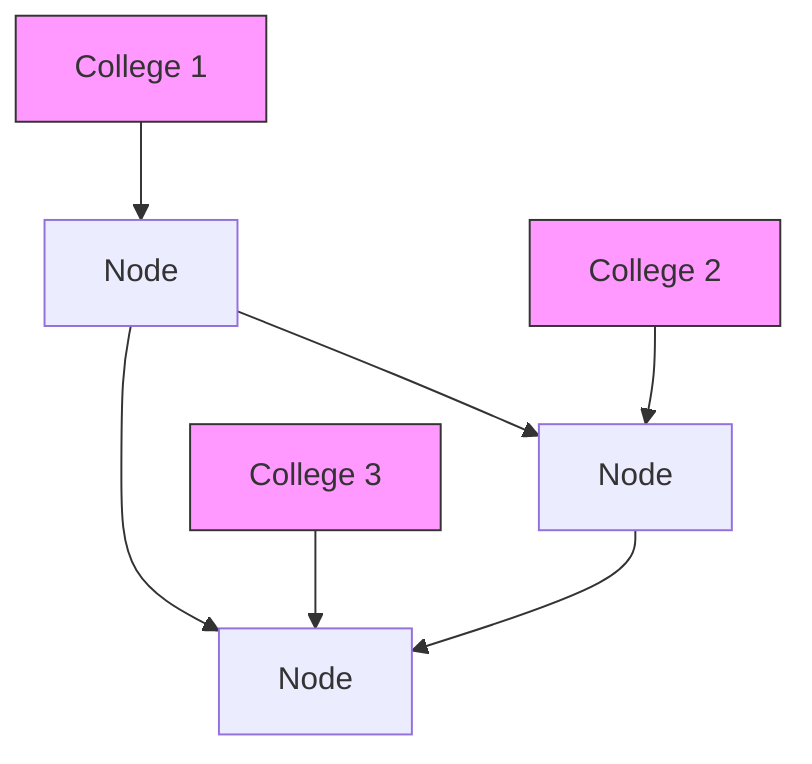

For office use only

T1

T2

T3

T4

Team Control Number

## 31262

Problem Chosen

C

For office use only

F1

F2

F3

F4

# 2014 Mathematical Contest in Modeling (MCM) Summary Sheet

## A Three-dimensional Network Impact Analysis Model

## Based on Centralizing, Connecting and Spreading Characteristics

## ABSTRACT

Last decade has witnessed a burst in the research of network impact analysis. However, most of the previous research focused on single factor or single algorithm to analyze the impact, which is insufficient for complex networks.

According to our observation and correlation analysis, we propose a characteristic classification method to systematically construct a three-dimension network impact analysis model. We establish the concept of centralizing characteristics, connecting characteristics and spreading characteristics, each of which consists of three sub-characteristics. Sub-characteristics include degree, eigenvector centrality, PageRank algorithm, betweenness centrality, clustering coefficient, node removal method, closeness centrality and two newly-proposed characteristics——spreading breadth index and spreading depth index both obtained from a submodel we design ourselves. Principal Component Analysis (PCA) is applied to obtain three one-dimension characteristic vector respectively. Finally a weighted sum of the three characteristic vectors is obtained to represent the impact measurement result for each node in the network.

Three datasets have been used for testing the rationality of the model and very promising performances have been measured. Additional efforts are made to extract the data, validate our model, visualize the network and discuss various utilities. In this way, we offer a rather comprehensive and reliable solution to this problem.

We strongly recommended our model because of its novel ideas, convincing analysis, exquisite visualization and promising performances.

## Keywords

Network Impact Analysis; Centralizing Characteristics; Connecting Characteristics; Spreading

Characteristics; Spreading Breadth Index; Spreading Depth Index; PCA.

## A Three-dimensional Network Impact Analysis Model Based on Centralizing, Connecting and Spreading Characteristics

## Content

1. INTRODUCTION.  
2. BACKGROUND. 3  
3. METHODOLOGY. 3

3.1 Centralizing Characteristics.. 4

3.1.1 Degree Centrality ( D ) ....  
3.1.2 Eigenvector Centrality $( C _ { e } )$ .  
3.1.3 PageRank (PR). /

3.2 Connecting Characteristics .....

3.2.1 Betweenness Centrality $( C _ { B } )$ .  
3.2.2 Clustering Coefficient $( C _ { _ { c o e } } )$ .. 5  
3.2.3 Node Removal Method and Total Loss (TL). 5

3.3 Spreading Characteristics .. .6

3.3.1 Closeness Centrality $( C _ { c } )$ . 6  
3.3.2 Spreading Breadth Index $( B _ { s } )$ ) and Half-network Period $( T _ { h } )$ . .6  
3.3.3 Spreading Depth Index $( D _ { s } )$ .. .9

3.4 DATA PROCESSING.. ..10

3.4.1 Principal Component Analysis(PCA). .10  
3.4.2 Data Processing Procedures. .10

4. RESULT AND ANALYSIS. .10

4.1 Task1 .... ....10  
4.2 Task2 ... ..13  
4.3 Task3 . .14  
4.4 Task4 .... .17  
4.5 Task5 .... ...18

5. DISCUSSION AND CONCLUSION . .19

5.1 Strengths . ..19  
5.2 Weakness and Sensitivity . .19  
5.3 Contribution.. ..20

6. ACKNOWLEDGMENTS ..20  
7. REFERENCES... ..20

## 1. INTRODUCTION

In recent years, people are increasingly finding themselves bombarded with information. As with researchers, they have to filter huge mass of existing papers to find the most useful one. This situation calls for a method to help people analyze influence and impact, which correspondently leads to the burst in the study of social networks.

Most of the previous research focused on single factor to analyze the impact, which is insufficient for complex network. Our goal is to give a multi-factor impact measuring model for impact analysis in research network and extend the utility of our model to other areas of society. In addition, efforts is made to propose new analysis index, validate our model, visualize the network and discuss various utilities. In this way, we offer a rather reliable solution to this longstanding problem.

The paper is organized as follows. Section 2 contains a review of previous studies in the field of network impact analysis. Section 3 demonstrates our modeling method in details and systematically describes relevant algorithms, including two impact analysis index we propose——Spreading Breadth Index and Spreading Depth Index. We give result and analysis for the five tasks in section 4. Finally in section 5 we summarize the main contribution of the present paper and discuss the potential weakness and sensitivity.

## 2. BACKGROUND

Widely accepted and efficiently utilized in the real world, the concept of a network, having formed for a long time, gradually arouses people’s interest to study and unearth some abstract characteristics of it. Some researchers, like Girvan, M., & Newman, M. E. (2002), are trying to depict the detailed structure of the network, while others, in spite of the same research direction, use some quantitative parameters to give an estimate of characteristics the network has. Bonacich, P. (2007), Latapy, M. (2008) and Yan, E., & Ding, Y. (2009) are among those people. They used a quantified system to describe the centrality, connection and other characteristics of the network.

Implementing some existing or new algorithms to operate on the network system in order to obtain some meaningful results is also attempted by some researchers, like Batagelj, V. (2003). However, they must make some modification to the existing algorithm to make it fit the research thought and approach in the field of network science.

As some creative and outstanding work completed by some researchers, like Jolliffe, I. (2005), some existing mathematical algorithms and methods become more rational, which allow us to use them to construct a more comprehensive appraising system to evaluate the characteristics of the network. In this article, we concentrate our effort on establishing a complete model to estimate the importance and influence of each vertice in a network.

## 3. METHODOLOGY

After deliberate study of previous research, we propose a characteristic classification method to systematically construct a three-dimension network impact analysis model. In our model, there are three types of characteristic parameters that are playing critical roles in impact analysis. They are centralizing, connecting, and spreading characteristics.

Centralizing characteristics focus on describing the extent of structural centrality for a vertice in its communities. In this type, there are degree, eigenvector centrality and PageRank, which reveal the feature of a vertice in the network from a similar angle.

Connecting characteristics, including betweenness centrality, clustering coefficient and node removal method, are to indicate how the vertice contribute to guarantee the connection of the network.

Spreading characteristics, such as closeness centrality, spreading breadth index and spreading depth index, are to quantify the efficiency of information dissemination for the whole network with the information starting from a particular vertice. Based on the fact that any vertice in our model is an information source (people or paper) and all any other vertices connected to it may receive the information released by it, we must think up a standard to assess the information spreading ability of each vertice. So we design a brand-new submodel (spreading breadth index and spreading depth index are the characteristic parameters obtained from it), along with an existing standard (closeness centrality), to describe the information spreading ability for each vertice in the network. This kind of feature naturally should be regarded as another aspect for vertice evaluation.

Our data-processing procedure is based on the classification method above. After getting the nine parameters of a vertice through computer programming or gephi(a visualization software) calculation, we classify the parameters into three groups according to above analysis. And for each group, we use Principal Component Analysis (PCA) to get a comprehensive result of the three parameters in a group. Now with three parameters obtained from three groups correspondingly after PCA, we use three weight factor to operate on the three parameters to work out a final evaluation result of a vertice.

## 3.1 Centralizing Characteristics

The first type of characteristics of a network is centralizing characteristics. Actually while taking vertex-influenceevaluation into consideration, the first idea coming to our mind is to check to what extent a vertex is in the center of the network. Centralizing characteristic parameters are defined to quantify such kind of extent

## 3.1.1 Degree Centrality ( D )

Degree centrality, or degree, of a vertice equals to the number of edges a vertex has in common with other neighbor vertices. If there are totally D vertices and E edges in the network, the two sums have the following relation

$$
\mathrm{D} = 2 \mathrm{E} \tag {1}
$$

Generally, the vertice with a higher degree or more connection edges is more central in structure and has the tendency to possess a greater ability to influence others. Those nodes should have a relatively more important role among all the nodes in the network.

## 3.1.2 Eigenvector Centrality $( C _ { e } )$

In a network, if we merely use the degree centrality to describe the extent a vertex is located in the center, the standard could be too one-sided and we may miss some important features of the network.

As a result, eigenvector centrality is defined. In some networks, some vertices with a high degree are connected to lots of low-degree vertices and the eigenvector centrality is to quantify the extent of such situations. This parameter is defined to standardize the centrality of vertices from another angle.

## 3.1.3 PageRank (PR)

PageRank is initially proposed, over ten years ago, by Page and Brin (1998). This parameter is used to assess the rank or importance of a vertice in a network according to a method of iteration using the following equation:

$$
\mathrm{PR} (\mathrm{p}) = (1 - \mathrm{d}) \frac {1}{\mathrm{N}} + \mathrm{d} \sum_ {\mathrm{i} = 1} ^ {\mathrm{k}} \frac {\mathrm{PR} \left(\mathrm{p} _ {\mathrm{i}}\right)}{\mathrm{C} \left(\mathrm{p} _ {\mathrm{i}}\right)} \tag {2}
$$

where  N is the number of vertices in the network, d is a damping factor, and $p _ { i }$ is all other vertices linking to the selected vertice p. After continuous operations of iteration, each point refresh its PR once and once again. Finally all the vertices will have a weight to indicate the importance of it in the whole network.

## 3.2 Connecting Characteristics

The second type of characteristics of a network is connecting characteristics. For the characteristic parameters in this group, they are defined to indicate the contribution of a vertex to the connection and integrity of the whole network. In other words, they reveal how many times a vertice is located in a key position to make the network connected.

## 3.2.1 Betweenness Centrality $( C _ { B } )$

Betweenness centrality is based on the number of shortest paths passing through a vertex. Vertices with a high betweenness play the role of connecting different groups. We use the following equation to define $C _ { B }$ :

$$
C _ {B \left(n _ {i}\right)} = \sum_ {j, k \neq i} \frac {g _ {j i k}}{g _ {j k}} \tag {3}
$$

In the equation (3), $g _ { j i k }$ is all geodesics linking node ?? and node ?? which pass through node $g _ { j i k }$ is the geodesic distance between the vertices of ?? and ??.

In social networks, vertices with high betweenness are the brokers and connectors who bring others together (Yin et al., 2006). Being between means that a vertex has the ability to control the flow of information between most others. Individuals with high betweenness are the pivots in the network information flowing. The vertices with highest betweenness also result in the largest increase in typical distance between others when they are removed.

## 3.2.2 Clustering Coefficient $( C _ { _ { c o e } } )$

A clustering coefficient measures the tendency of nodes in a graph to cluster together. The clustering coefficient of a vertex ?? (with a degree at least 2) is the probability that any two randomly chosen neighbors of ?? are linked together. It is computed by dividing the number of triangles containing ?? by the number of possible edges between its neighbors, $\mathfrak { i . e . } \binom { d ( v ) } { 2 }$ , where $d ( v )$ denotes the number of neighbors of ??. We can then define the clustering coefficient of the whole network as the average of this value for all the vertices (with degree at least 2).

## 3.2.3 Node Removal Method and Total Loss (TL)

Another method to appraise the extent of connection of a given node in a connected network is node removal method. We can know the connection importance of a vertice by removing it from the network and then estimate the consequential loss. The final result, the value of the loss, can be used to evaluate the importance, with regard to connection characteristic, of the removed vertice.

If a vertice is removed from the network, two kinds of losses could be led to.

Self-Loss (SL) is based on the fact that after removing, all the vertices in the remaining network are not connected to the removed vertice anymore, and we could use the length of the shortest path from the removed vertice to other vertices to quantify the loss of the i-th vertice:

$$
S L _ {i} = \sum_ {j \in \{1, 2 \dots N \}, j \neq i} \frac {1}{d _ {i j}} \tag {4}
$$

where $d _ { i j }$ is the distance between the two vertices with label i and j.

Mutual loss (ML) is the loss of disconnection caused by the removal of a vertice. Assume that the remaining network have K connected components and each component has $N _ { i } ( i = 1 , 2 . . . K )$ vertices, then there will be totally $\sum _ { i = 1 } ^ { K } \sum _ { j = i + 1 } ^ { K } N _ { i } N _ { j }$ pairs of disconnected vertices. We assume that all the pairs form a set ${ \mathrm { \bf S } } ,$ and we could define $M L _ { i }$ for the i-th vertice, as:

$$
M L _ {i} = \sum_ {j \in S} \frac {1}{d _ {j}} \tag {5}
$$

where j is an arbitrary pair disconnected vertices in the set S.

Finally we could define the total loss (TL) as:

$$
T L _ {i} = S L _ {i} + M L _ {i} \tag {6}
$$

Practically, if we would like to calculate the value of $T L _ { _ i }$ , we should know the distance matrix, which could be obtained by Floyd Algorithm and each element in which stands for the distance between two vertices, before the removal(D) and after the removal(D’). Then the sum of the reciprocal of the non-zero elements in the first line is SL of the removed vertice. To get the ML, we check each element in D and find all the non-infinity elements, above the diagonal and not in the first line in D. Those elements form a set of T. Then we select out all the elements in T, which have values of infinity in the corresponding place in the matrix $\mathbf { D } ^ { \prime }$ and we can get ML by calculating the sum of the reciprocal of those elements.

## 3.3 Spreading Characteristics

The third type of characteristics of a network is spreading characteristic, which we define to describe how information flow, such as academic resource, could be spread in the network between vertices. Establishing the following parameters to describe such characteristics is indispensable to estimate the extent of information spreading so as to evaluate the importance of each vertice to the whole network.

## 3.3.1 Closeness Centrality $( C _ { c } )$

Closeness centrality is a sophisticated, however useful way to evaluate the characteristic of a vertice. An institutive fact is that for a vertice P, if most vertices in the whole network all have very large distances from it, it must be less central compared with a vertice Q with most vertices having smaller distances from it. So we could use the following equation to define the close centrality:

$$
C _ {c} (n _ {i}) = \sum_ {j = 1} ^ {N} \frac {1}{d (n _ {i} , n _ {j})} \tag {7}
$$

Where $C _ { c } ( n _ { i } )$ is the closeness centrality of the vertice and $d \big ( n _ { i } , n _ { j } \big )$ is the distance, the length of the shortest path, between the two vertices in the network. In the equation, each distance between the two vertices contributes to the closeness centrality separately and determines the extent of centrality together.

Practically speaking, this parameter could be used to estimate whether it is easy or not to spread information from a given vertice to other vertices in the network.

## 3.3.2 Spreading Breadth Index $( B _ { s } )$ and Half-network Period $( T _ { h } )$

For a given network with N vertices in total and a given vertice P, we define the spreading breadth index to help describe the information-spreading-efficiency of the network based on the vertice selected.

In the following several paragraphs, we will propose the submodel mentioned at the beginning of the article.

Assume that at time t=0, we release a particle (standing for a piece of information) at vertice P and it passes through exactly one edge per second to reach another vertice. If the particle meets a branch at a vertice with degree m, it will split into (m-1) particles and each of them will choose one of the m edges, except the one they come from, to go on moving. Then we set a timespan T (with the unit of second), and define $n ( t ) ( t = 1 , 2 , \dots , T )$ to be the total number of vertices that are being occupied by particles at the time t. Next we can suppose the expression of the spreading breadth index of the vertice P to be:

$$
B _ {s} (P) = \sum_ {t = 1} ^ {T} a (t) \frac {n (t)}{N - 1} \tag {8}
$$

where $( N - 1 )$ is the total number of vertices in the network except P and ??(??) is an attenuation factor of each term.

The attenuation factor $a ( t )$ for the definition of the spreading breadth index is necessary. Take the spread of information as an example, if a vertice could let the information reach the same number of other vertices in a shorter time, this vertice is more significant, as a result of which for a vertice P, those other vertices reached by the particles released from P earlier should have a larger weight. So as time goes by, the particles reached later should contribute less to the spreading breadth index and should be multiplied by an attenuation factor to lessen their importance.

Now we must determine $a ( t )$ . First we assume that average degree of vertices in the network is ??, and we could get the roughly estimated equation:

$$
n (t + 1) = (D - 1) n (t) \tag {9}
$$

because from time ?? to time ?? + 1, each particle will become (?? − 1) ones to go on passing into the branches except the one it comes from. From equation (9) we can know ??(??) has the form:

$$
n (t) = n (1) (D - 1) ^ {t - 1} \tag {10}
$$

Apply (10) to (8) we get:

$$
B _ {s} (P) = \frac {n (1)}{N - 1} \sum_ {t = 1} ^ {T} a (t) (D - 1) ^ {t - 1} \tag {11}
$$

Noticing that T, a changeable timespan, is only for testing, $B _ { s } ( p )$ should be independent of T. So we must let the term $( D - 1 ) ^ { t - 1 }$ disappear. Assume:

$$
a (t) = b (t) \frac {1}{(D - 1) ^ {t - 1}} \tag {12}
$$

Apply (12) to (11) we get:

$$
B _ {s} (P) = \frac {n (1)}{N - 1} \sum_ {t = 1} ^ {T} b (t) \tag {13}
$$

To let $B _ { s } ( p )$ indispensable of T in (13), we could let $b ( t )$ to be the multiple of ${ } _ { \overline { { T } } } ^ { 1 } .$ For convenience we set:

$$
b (t) = \frac {1}{T} \tag {14}
$$

and we get from (13) and (14):

$$
B _ {s} (P) = \frac {n (1)}{N - 1} \tag {15}
$$

Unfortunately, this could not be regarded as the spreading breadth index of P because the equation (9), based on which (15) is obtained, is not accurate and the procedure from equation (9) to equation (15) is just to determine ??(??). Apply (14) to (12) we know:

$$
a (t) = \frac {1}{T (D - 1) ^ {t - 1}} \tag {16}
$$

Apply (16) to (8) we could get the definition of $B _ { s } ( P )$ :

$$
B _ {s} (P) = \sum_ {t = 1} ^ {T} \frac {1}{T (D - 1) ^ {t - 1}} \frac {n (t)}{N - 1} = \frac {1}{T (N - 1)} \sum_ {t = 1} ^ {T} \frac {n (t)}{(D - 1) ^ {t - 1}} \tag {17}
$$

where ?? is the timespan we choose to get $\mathtt { B } _ { s } ( \mathtt { P } )$ , N is the number of vertices in the network, D is the average degree of the vertices in the network and $\mathrm { n ( t ) } ( \mathrm { t } = 1 , 2 , \dots , \mathrm { T } )$ is the total number of vertices that are being occupied by particles at the time t.

Furthermore, we could get the lower bound of the $B _ { s } ( P )$ . For a network with N vertices, we have:

$$
n (t) \geq 1 \tag {18}
$$

if ?? is selected properly. Apply (18) to (17) and we get:

$$
B _ {s} (P) = \frac {1}{T (N - 1)} \sum_ {t = 1} ^ {T} \frac {n (t)}{(D - 1) ^ {t - 1}} \geq \frac {1}{T (N - 1)} \sum_ {t = 1} ^ {T} \frac {1}{(D - 1) ^ {t - 1}} \geq \frac {D}{T (N - 1) (D - 1)} \tag {19}
$$

the last sign of inequality is correct because we eliminate all the terms in the $\sum _ { t = 1 } ^ { T } { \frac { 1 } { ( D - 1 ) ^ { t - 1 } } } { \mathrm { i f ~ } } t \geq 3$ . 1t 

For upper bound, we notice that

$$
n (t) \leq N - 1 \tag {20}
$$

Apply (20) to (17), we have:

$$
B _ {s} (P) = \frac {1}{T (N - 1)} \sum_ {t = 1} ^ {T} \frac {n (t)}{(D - 1) ^ {t - 1}} \leq \frac {1}{T (N - 1)} \sum_ {t = 1} ^ {T} n (t) \leq \frac {1}{T} \tag {21}
$$

Plus, the timespan ?? must be the same for all the vertices while testing ${ \ ; B _ { s } ( P ) }$ for each vertice. One thing we should pay enough attention to is that if the particle reaches the edge vertice of the network, it will stop moving. Another factor we should consider carefully is that the timespan ?? must be selected properly. For one thing, it should not be too large because the particle will cover every vertice in the network in the end for each vertice selected at the beginning. For another, if the timespan is too small, the particle will have insufficient time to spread and the evaluation of the spreading breadth index could be unconvincing.

Additionally, we define the half-network period to evaluate the spreading characteristic of the network. Also for a network with  n vertices, all the condition is exactly like the submodel explained above. Now we define the time $T _ { h } ( P ) \mathrm { t o }$ $\begin{array} { r } { ( \sum _ { t = 1 } ^ { T _ { h } ( P ) } n ( t ) = \frac { N - 1 } { 2 } } \end{array}$ )in the network. However, starting from some vertices, the particle may never reach half of all the vertices. For example, if the vertice is in a small component of the network, finally it could only reach each vertice in the component, but not the whole network. In this occasion, we could define the half-network period as infinity.

It could be obviously noticed that for each given point P, the spreading breadth index $B _ { s } ( P )$ and the half-network period $T _ { h } ( P )$ for P have the following relations:

$$
\begin{array}{l} B _ {s} (P) = \frac {1}{T _ {h} (P) (N - 1)} \sum_ {t = 1} ^ {T _ {h} (P)} \frac {n (t)}{(D - 1) ^ {t - 1}} \geq \frac {1}{T _ {h} (P) (N - 1)} \sum_ {t = 1} ^ {T _ {h} (P)} \frac {n (t)}{(D - 1) ^ {T _ {h} (P) - 1}} \\ \geq \frac {(N - 1) / 2}{T _ {h} (P) (N - 1) (D - 1) ^ {T _ {h} (P) - 1}} = \frac {1}{2 T _ {h} (P) (D - 1) ^ {T _ {h} (P) - 1}} \tag {22} \\ \end{array}
$$

and:

$$
B _ {s} (P) = \frac {1}{T _ {h} (P) (N - 1)} \sum_ {t = 1} ^ {T _ {h} (P)} \frac {n (t)}{(D - 1) ^ {t - 1}} \leq \frac {1}{T _ {h} (P) (N - 1)} \sum_ {t = 1} ^ {T _ {h} (P)} n (t) = \frac {(N - 1) / 2}{T _ {h} (P) (N - 1)} = \frac {1}{2 T _ {h} (P)} \tag {23}
$$

So if we know $T _ { h } ( P )$ of vertice P, we can restrict the range of $B _ { s } ( P )$ .

It should be noticed that the two variable $B _ { s } ( P )$ and $T _ { h } ( P )$ are both used to evaluate the spreading-breadth efficiency of a vertice. If a vertice has a larger spreading breadth index and a smaller half-network period, the spreading ability of the network based on this point will be better.

While considering the practical meaning of the two parameters, it is not hard to notice that they could be used to confirm how wide the information flow could be spread through a particular point, which undoubtedly has a significant meaning to the whole network.

## 3.3.3 Spreading Depth Index $( D _ { s } )$

After consideration of the breadth characteristic of the network, it is natural to think up an idea to define some parameter to evaluate the depth characteristic of the network. Assume that we still have use the particle model in the section above, that is we release a particle from P at t=0 and let it move in the network. Similarly, we set a timespan $T$ as the time measurement factor, and define the maximum of the distances(the length of the shortest path) from all the particles at time t to the vertice P as $d ( t )$ . So we can assume, just like the equation to get the spreading breadth index, the form of the spreading depth index of $P$ as:

$$
D _ {s} (P) = \sum_ {t = 1} ^ {T} m (t) \frac {d (t) - d (t - 1)}{D} \tag {24}
$$

where  D is the diameter of the network, that is, the maximum of the distances for any two vertices in the network. In (24), $d ( t ) - d ( t - 1 )$ is the increase of the distance in the t-th second. $m ( t )$ is the attenuation factor for distance. It is easily understood that the spreading distance of the information should have a smaller and smaller weight as time increases to guarantee the time efficiency of the spreading. Make the approximation:

$$
d (t) - d (t - 1) = 1 \tag {25}
$$

and use almost the same way as in the process to get spreading breadth index, we have:

$$
m (t) = \frac {1}{T} \tag {26}
$$

And finally we define:

$$
D _ {s} (P) = \sum_ {t = 1} ^ {T} m (t) \frac {d (t) - d (t - 1)}{D} = \frac {1}{T D} \sum_ {t = 1} ^ {T} d (t) - d (t - 1) = \frac {d (T)}{T D} \tag {27}
$$

as the spreading depth index of vertice P .

For the spreading depth index, we can get the upper bound and the lower bound of it:

$$
\frac {1}{T D} \leq D _ {s} (P) = \frac {d (T)}{T D} \leq \frac {D}{T D} = \frac {1}{T} \tag {28}
$$

since $d ( T )$ is in the range of $[ 1 , D ]$ .

The spreading depth index could describe the distance of spreading information in a certain time, which means that a vertice, or a researcher, with a larger index has a more outstanding ability to disseminate information and contributes more to the whole network. Actually in the definition equation (27), the term $\frac { d ( T ) } { T }$ could be regarded as the spreading velocity, which is independent of the time T, of the information flow.

## 3.4 DATA PROCESSING

## 3.4.1 Principal Component Analysis(PCA)

During the process of data analysis, we obtain many indexes. However, it will be too complex to take all these indexes into consideration. In order to reduce the dimension of the indexes, we consider the utilization of Principal Component Analysis (PCA). The basic use of PCA is as a dimension-reducing technique whose results are used in a descriptive manner, but there are many variations on this central theme (see [1]). Because the ‘best’ two-(or three-) dimensional representation of a dataset in a least squares sense is given by a plot of the first two-(or three-) principal components, the components provide a ‘best’ low-dimensional graphical display of the data (see [1]). In general, if we want to reduce a n-dimension characteristic matrix to a q-dimension one, PCA operates on the data as the following steps:

a. Calculate the covariance matrix $\left( \boldsymbol { C o v _ { n \times n } } \right)$ of $A _ { m \times n }$ , where $A _ { m \times n }$ documents the characteristic matrix, ?? documents the size of dataset, and ?? documents the total number of indexes.  
b. Find the eigenvectors and eigenvalues of the covariance matrix. We can assume that $a _ { 1 } , a _ { 2 } , \ldots , a _ { n }$ are the eigenvectors and $\lambda _ { 1 } , \lambda _ { 2 } , \ldots , \lambda _ { n }$ are the eigenvalues.  
c. Choose $a _ { i 1 } , a _ { i 2 } , \dots , a _ { i q }$ , which correspond to the ?? largest eigenvalues, and we can get matrix $C _ { n \times q }$ .  
d. $\mathrm { L e t } D _ { m \times q } = A _ { m \times n } \cdot C _ { n \times q }$ , and $D _ { m \times q }$ is the lower dimension of the matrix.

## 3.4.2 Data Processing Procedures

As mentioning above, we divide the parameters into three groups according to their correlation. We assume that these three groups represent different aspect of the model, and the parameters in the same group have a higher correlation coefficient.

Hence, after the preliminary-data-process, we obtain three characteristic matrices $A _ { m \times 3 } , B _ { m \times 3 }$ and $C _ { m \times 3 }$ . Matrix ?? documents the information of centralizing characteristics, matrix ?? documents the information of connecting characteristics, and matrix ?? documents the information of spreading characteristics. ?? is the size of dataset. After normalizing, all parameters are set to the range [0, 1]. Then we apply the above-mentioned PCA procedure to matrix A, B and C respectively to obtain three one-dimension characteristic vector: ??????????????, ?????????????? ?????? ????????????.

Finally, we obtain a weighted sum of the three characteristic vectors. The sum is named influence measurement (IM):

$$
\mathrm{IM} = \alpha \cdot \text { Central } + \beta \cdot \text { Connect } + \gamma \cdot \text { Spread } \tag {29}
$$

IM could represent the importance and influence of each vertice in a network. In general, $\alpha , \beta , \gamma$ can be assigned to the same weight.

## 4. RESULT AND ANALYSIS

## 4.1 Task1

## 4.1.1 Building the co-author network of the Erdos1 authors

To build the co-author network from the file Erdos1, we first eliminate the lines to indirect coauthors of Erdos, that is to say, the lines whose one endpoint is not the direct coauthor of Erdos. Without links to Erdos, there are some isolated authors left. Obviously, these isolated authors can’t be of vital importance. Therefore, we eliminate these isolated authors from our dataset.

## 4.1.2 Analyzing the properties of this network

After extracting the data of co-author network, we import the data into Gephi and get some information from it, showing in TABLE 1.

TABLE 1. Summary statistics for co-author network

<table><tr><td></td><td>Value</td></tr><tr><td>Nodes</td><td>474</td></tr><tr><td>Edges</td><td>1640</td></tr><tr><td>Average Degree</td><td>6.920</td></tr><tr><td>Connected Components</td><td>5</td></tr><tr><td>Density</td><td>0.015</td></tr><tr><td>Average Clustering Coefficient</td><td>0.282</td></tr><tr><td>Modularity</td><td>0.493</td></tr><tr><td>Number of Triangles</td><td>1828</td></tr><tr><td>Diameter (Longest Path Length)</td><td>10</td></tr><tr><td>Average Path Length</td><td>3.825</td></tr></table>

There are 474 vertices and 1640 edges in this network, in which each vertice represents an author and each edge means the cooperation between two authors. The value of the average degree of all the vertices means that in average, each author collaborates with 6.920 authors. The 4th line shows that there are 5 distinctive connected components, between which the authors do not cooperate with each other. The modularity of a partition is a scalar value between −1 and 1 that measures the density of edges inside communities compared with the density between communities. The last line documents the average length of shortest path. The meaning of clustering coefficient have been mentioned above.

Now we have obtained some global property of this model. In order to have a more direct recognition, we visualize some properties in FIGURE 1.

bar chart

| Component ID | Count |
| ------------ | ----- |
| 0            | 470   |
| 1            | 5     |
| 2            | 5     |
| 3            | 5     |
| 4            | 5     |

bar chart

| Degree Range | Count |
| ------------ | ----- |
| 0 - 2        | 85    |
| 2 - 4        | 70    |
| 4 - 6        | 50    |
| 6 - 8        | 35    |
| 8 - 10       | 30    |
| 10 - 12      | 20    |
| 12 - 14      | 15    |
| 14 - 16      | 10    |
| 16 - 18      | 8     |
| 18 - 20      | 6     |
| 20 - 22      | 5     |
| 22 - 24      | 4     |
| 24 - 26      | 3     |
| 26 - 28      | 5     |
| 28 - 30      | 4     |
| 30 - 32      | 3     |
| 32 - 34      | 2     |
| 34 - 36      | 1     |
| 36 - 38      | 1     |
| 38 - 40      | 2     |
| 40 - 42      | 3     |
| 42 - 44      | 2     |
| 44 - 46      | 1     |
| 46 - 48      | 1     |
| 48 - 50      | 1     |
| 50 - 52      | 1     |
| 52 - 54      | 1     |
| 54 - 56      | 1     |
| 56 - 58      | 1     |
| 58 - 60      | 1     |

Figure 1. Component and degree distribution

FIGURE 1 shows the distribution of components and degrees. We can easily perceive that almost all vertices are in one component, which means this network has a strong extent of relationship and deserves to be analyzed. The second picture shows the distribution of the degree, which is one of the most important factors in determining the influence of authors. Through this picture, we can know that most vertices have few degrees, which means they have weaker relations with each other.

In order to have a clearer recognition, we draw a figure to show the features of the network. See Figure 2.

network graph

| Node | Color | Connected To |
| --- | --- | --- |
| Galvin, Friesman, William | Blue | Central Circle |
| Moon, Solaris, Hagioli | Pink | Central Circle |
| Solaris, Hagioli | Pink | Central Circle |
| Solaris, Hagioli | Pink | Central Circle |
| Solaris, Hagioli | Pink | Central Circle |
| Solaris, Hagioli | Pink | Central Circle |
| Solaris, Hagioli | Pink | Central Circle |
| Solaris, Hagioli | Pink | Central Circle |
| Solaris, Hagioli | Pink | Central Circle |

Figure 2.The co-author network

In Figure 2, there are many circles with different colors. We classify these vertices based on their modularity. The size of the vertice is in positive correlation with its degree and the edges between vertices mean that they have cooperation relationship with each other. Each vertice has its own information such as name.

TABLE 2 to TABLE 5 show the top 30 authors based on closeness centrality, betweenness centrality, degree centrality, and PageRank.

TABLE 2. Top 30 authors based on closeness centrality

<table><tr><td>Rank</td><td>Name</td><td>Rank</td><td>Name</td><td>Rank</td><td>Name</td><td>Rank</td><td>Name</td><td>Rank</td><td>Name</td></tr><tr><td>1</td><td>HENRIKSEN, M</td><td>7</td><td>HERZOG, F</td><td>13</td><td>HUNT, G</td><td>19</td><td>FELLER, W</td><td>25</td><td>SEIDEL, W</td></tr><tr><td>2</td><td>GILLMAN, L</td><td>8</td><td>BONAR, D</td><td>14</td><td>SIRAO, T</td><td>20</td><td>JACKSON, S</td><td>26</td><td>BLEICHER,M</td></tr><tr><td>3</td><td>BOES, D</td><td>9</td><td>CARROLL, F</td><td>15</td><td>BAGEMIHL, F</td><td>21</td><td>VIJAYAN, K</td><td>27</td><td>BABU, G</td></tr><tr><td>4</td><td>GAAL,S</td><td>10</td><td>DARLING, D</td><td>16</td><td>KHARE, SP</td><td>22</td><td>HWANG,J</td><td>28</td><td>KUNEN, K</td></tr><tr><td>5</td><td>SCHERK, P</td><td>11</td><td>VAN, ER</td><td>17</td><td>SMITH, B</td><td>23</td><td>BOVEY, J</td><td>29</td><td>BUCK, R</td></tr><tr><td>6</td><td>HERZOG, F</td><td>12</td><td>WINTNER, AF</td><td>18</td><td>DARST, R</td><td>24</td><td>BUKOR, J</td><td>30</td><td>VOLKMANN,B</td></tr></table>

TABLE 3. Top 30 authors based on betweenness centrality

<table><tr><td>Rank</td><td>Name</td><td>Rank</td><td>Name</td><td>Rank</td><td>Name</td><td>Rank</td><td>Name</td><td>Rank</td><td>Name</td></tr><tr><td>1</td><td>HARARY, F</td><td>7</td><td>ALON, N</td><td>13</td><td>RUZSA, I</td><td>19</td><td>RODL, V</td><td>25</td><td>LOVASZ, L</td></tr><tr><td>2</td><td>SOS, V</td><td>8</td><td>GRAHAM, RL</td><td>14</td><td>SARKOZY, A</td><td>20</td><td>SHIELDS, AL</td><td>26</td><td>ROGERS, CA</td></tr><tr><td>3</td><td>RUBEL, LA</td><td>9</td><td>BOLLOBAS, B</td><td>15</td><td>ODLYZKO,AM</td><td>21</td><td>TURAN, P</td><td>27</td><td>FAUDREE, RJ</td></tr><tr><td>4</td><td>STRAUS, EG</td><td>10</td><td>PACH, J</td><td>16</td><td>KLEITMAN, D.</td><td>22</td><td>SZEKELY,L</td><td>28</td><td>SHELAH, S</td></tr><tr><td>5</td><td>POMERANCE, C</td><td>11</td><td>HAJNAL, A</td><td>17</td><td>SPENCER, J H</td><td>23</td><td>CHUNG, FRK</td><td>29</td><td>WORMALD,NC</td></tr><tr><td>6</td><td>FUREDI, Z</td><td>12</td><td>TUZA, Z</td><td>18</td><td>SCHINZEL,AB</td><td>24</td><td>SZEKERES, G</td><td>30</td><td>NESETRIL,J</td></tr></table>

TABLE 4. Top 30 authors based on Degree centrality

<table><tr><td>Rank</td><td>Name</td><td>Rank</td><td>Name</td><td>Rank</td><td>Name</td><td>Rank</td><td>Name</td><td>Rank</td><td>Name</td></tr><tr><td>1</td><td>ALON,N</td><td>7</td><td>TUZA, Z</td><td>13</td><td>HAJNAL,A</td><td>19</td><td>SZEMEREDI,E</td><td>25</td><td>LUCZAK, T</td></tr><tr><td>2</td><td>HARARY,F</td><td>8</td><td>SOS,VT</td><td>14</td><td>LOVASZ,L</td><td>20</td><td>CHARTRAND,GT</td><td>26</td><td>KOSTOCHKA,A</td></tr><tr><td>3</td><td>GRAHAM,RL</td><td>9</td><td>SPENCER,JH</td><td>15</td><td>FAUDREE,RJ</td><td>21</td><td>STRAUS,EG</td><td>27</td><td>WEST,DB</td></tr><tr><td>4</td><td>BOLLOBAS,B</td><td>10</td><td>PACH,J</td><td>16</td><td>POMERANCE,CB</td><td>22</td><td>SARKOZY,A</td><td>28</td><td>SIMONOVITS,M</td></tr><tr><td>5</td><td>RODL, V</td><td>11</td><td>GYARFAS,A</td><td>17</td><td>KLEITMAN,D</td><td>23</td><td>BABAI,L</td><td>29</td><td>RUZSA,I</td></tr><tr><td>6</td><td>FUREDI,Z</td><td>12</td><td>CHUNG,FRK</td><td>18</td><td>NESETRIL,J</td><td>24</td><td>SCHELP,R</td><td>30</td><td>WORMALD,NC</td></tr></table>

TABLE 5. Top 30 authors based on PageRank

<table><tr><td>Rank</td><td>Name</td><td>Rank</td><td>Name</td><td>Rank</td><td>Name</td><td>Rank</td><td>Name</td><td>Rank</td><td>Name</td></tr><tr><td>1</td><td>HARARY,F</td><td>7</td><td>TUZA, Z</td><td>13</td><td>STRAUS,EG</td><td>19</td><td>NESETRIL,J</td><td>25</td><td>ODLYZKO, AM</td></tr><tr><td>2</td><td>ALON,N</td><td>8</td><td>POMERANCE,CB</td><td>14</td><td>CHUNG,FRK</td><td>20</td><td>FAUDREE,RJ</td><td>26</td><td>LUCZAK, T</td></tr><tr><td>3</td><td>GRAHAM,RL</td><td>9</td><td>FUREDI,Z</td><td>15</td><td>SARKOZY,A</td><td>21</td><td>SZEMEREDI,E</td><td>27</td><td>SCHELP,R</td></tr><tr><td>4</td><td>BOLLOBAS,B</td><td>10</td><td>SPENCER,JH</td><td>16</td><td>KLEITMAN,D</td><td>22</td><td>CHARTRAND,GT</td><td>28</td><td>WEST,DB</td></tr><tr><td>5</td><td>SOS,VT</td><td>11</td><td>HAJNAL,A</td><td>17</td><td>GYARFAS,A</td><td>23</td><td>BABAI,L</td><td>29</td><td>KOSTOCHKA,A</td></tr><tr><td>6</td><td>RODL, V</td><td>12</td><td>PACH,J</td><td>18</td><td>LOVASZ,L</td><td>24</td><td>RUZSA,I</td><td>30</td><td>SHELAH,S</td></tr></table>

A few authors are highly ranked in all the tables. And these authors can be regarded as one of the most influential authors in the network.

## 4.2 Task2

In this part, we start to use our data to analyze and determine most important authors. In our model, we have already classified the characteristic parameters into three types (Centralizing Characteristics, Connecting Characteristics, and Spreading Characteristics). We try to extract their main feature with PCA and provide a more comprehensive estimate of the authors by adding a weight factor to each vector. Some variables and their meanings are listed here for convenience：

TABLE 6. Variable and their meaning

<table><tr><td>Variable</td><td>Meaning</td></tr><tr><td>IM</td><td>Impact measurement</td></tr><tr><td>Central</td><td>The metric for Centralizing Characteristics</td></tr><tr><td>Connect</td><td>The metric for Connecting Characteristics</td></tr><tr><td>Spread</td><td>The metric for Spreading Characteristics</td></tr><tr><td>α, β, γ</td><td>Weighting coefficient</td></tr></table>

We assume that Central, Connect, Spread are the vectors extracted from their characteristic matrix with PCA. As for IM, it is defined as:

$$
\mathrm{IM} = \alpha \cdot \text { Central } + \beta \cdot \text { Connect } + \gamma \cdot \text { Spread } \tag {30}
$$

In this passage, we let $\begin{array} { r } { \alpha = \beta = \gamma = \frac { 1 } { 3 } . } \end{array}$ Through comparing IM, we can get their comprehensive rank and compare their influence. TABLE 7 shows the top 10 authors according to each characteristic respectively and provides the list of the top 20 authors by taking all the IM into consideration.

TABLE 7. Top 10 authors based on central, connect and spread

<table><tr><td rowspan="2">Rank</td><td colspan="2">Central</td><td colspan="2">Connect</td><td colspan="2">Spread</td><td colspan="2">Final IM</td><td colspan="2">Final IM</td></tr><tr><td>Name</td><td>Rank</td><td>Name</td><td>Rank</td><td>Name</td><td>Rank</td><td>Name</td><td>Rank</td><td>Name</td><td></td></tr><tr><td>1</td><td>ALON,N</td><td>1</td><td>BECK, I</td><td>1</td><td>FUREDI,Z</td><td>1</td><td>ALON,N</td><td>11</td><td>SZEMEREDI,E</td><td></td></tr><tr><td>2</td><td>GRAHAM,RL</td><td>2</td><td>BEJLEGAARD,N</td><td>2</td><td>ALON,N</td><td>2</td><td>RODL, V</td><td>12</td><td>FAUDREE,RJ</td><td></td></tr><tr><td>3</td><td>RODL, V</td><td>3</td><td>BERGER,MA</td><td>3</td><td>GRAHAM,RL</td><td>3</td><td>GRAHAM,RL</td><td>13</td><td>LOVASZ,L</td><td></td></tr><tr><td>4</td><td>BOLLOBAS,B</td><td>4</td><td>BLECKSMITH,RF</td><td>4</td><td>BOLLOBAS,B</td><td>4</td><td>BOLLOBAS,B</td><td>14</td><td>PACH,J</td><td></td></tr><tr><td>5</td><td>HARARY,F</td><td>5</td><td>BOALS,AJ</td><td>5</td><td>SOS,VT&#x27;</td><td>5</td><td>FUREDI,Z</td><td>15</td><td>CHUNG,FRK</td><td></td></tr></table>

<table><tr><td>6</td><td>FUREDI,Z</td><td>6</td><td>BONAR,DD</td><td>6</td><td>TUZA, Z</td><td>6</td><td>TUZA, Z</td><td>16</td><td>NESETRIL,J</td></tr><tr><td>7</td><td>TUZA, Z</td><td>7</td><td>BUCK, RC</td><td>7</td><td>STRAUS,EG</td><td>7</td><td>HARARY,F</td><td>17</td><td>SIMONOVITS, M</td></tr><tr><td>8</td><td>SOS,VT&#x27;</td><td>8</td><td>BUKOR, J</td><td>8</td><td>RODL, V</td><td>8</td><td>SPENCER,JH</td><td>18</td><td>KOSTOCHKA,A</td></tr><tr><td>9</td><td>SPENCER,JH</td><td>9</td><td>CARROLL,FW</td><td>9</td><td>LOVASZ,L</td><td>9</td><td>GYARFAS,A</td><td>19</td><td>SCHELP,R</td></tr><tr><td>10</td><td>PACH,J</td><td>10</td><td>CATES,ML</td><td>10</td><td>SPENCER,JH</td><td>10</td><td>SOS,VT</td><td>20</td><td>HAJNAL,A</td></tr></table>

From TABLE 7, we obtain the final comprehensive rank of these authors. ALON, NOGA M. is the most influential author among them. RODL, VOJTECH ranks 2nd and GRAHAM, RONALD LEWIS ranks 3rd. In fact, we can find their name appear frequently from TABLE 2 to TABLE 5. In some extent, this fact proves the rationality of our model. Figure 7 provides the comparison between Top3 authors. We can see differences do exist among these three characteristics. The nodes with high centralizing characteristics and spreading characteristics can have low connecting characteristics, and vice versa, which to some extent validates our hypothesis of the three classification.

Centralizing, Connecting and Spreading Characteristics Comparison of the top three people in the final rank  

radar chart

| Method | Spreading Characteristics | Centralizing Characteristics | Connecting Characteristics |
| --- | --- | --- | --- |
| ALON,N rank1 | 1.0 | 0.8 | 0.6 |
| RODL,V rank2 | 0.4 | 0.3 | 0.2 |
| GRAHAM,RL rank3 | 0.9 | 0.7 | 0.5 |

Figure 7. Comparison of top three author in the final rank

## 4.3 Task3

## 4.3.1 Choosing a dataset

We use the sixteen papers given to establish the model of network and evaluate the influence and the importance of each vertice. Actually the sixteen papers are selected carefully to guarantee sufficient citation-relations between vertices, or papers, to test the rationality of the model.

## 4.3.2 Developing the co-author (citation) model

We select the sixteen papers as the vertices of the network to establish our citation model. For each paper, we assign a number from one to sixteen to it for convenience (shown in TABLE 8). In the citation network, for instance, if the paper A cited the paper B, then we add a directed line segment pointing from B to A to indicate this citation relation, as well as the information flow direction. If we assign number m to A and number n to B (m, n ∈ {1,2 … 16}), then in the citation matrix C (16\*16), C(n, m) will be set to one correspondingly. FIGURE 3 shows the structure of our model.

TABLE 8. Articles’ Number

```mermaid
graph TD
  A["Scientific collaboration network"] --> B["On Random Graphs"]
  C["Navigation in a small world"] --> B
  D["Models of core/periphery structure"] --> E["Identifying sets of key player..."]
  F["Emergence of scaling in random..."] --> G["Power and Centralizing A family"]
  H["Statistical mechanics of compl..."] --> I["Social network thresholds in..."]
  J["Collective dynamics of small..."] --> K["Networks, influence and public..."]
  L["The structure of scientific co..."] --> M["The structure and function of ..."]
  N["Statistical models for social..."] --> O["Statistical models for social ..."]
  P["Engagement of networks"] --> Q["Identify end search in social ..."]
  R["Emerging design in random..."] --> S["Statistical mechanisms of compl..."]
  T["Networks, influence and public..."] --> U["Identify end search in social ..."]
```

<table><tr><td>Number</td><td>Article Name</td><td>Number</td><td>Article Name</td></tr><tr><td>1</td><td>On Random Graphs.</td><td>9</td><td>Scientific collaboration networks: II.</td></tr><tr><td>2</td><td>Statistical mechanics of complex networks.</td><td>10</td><td>The structure of scientific collaboration networks.</td></tr><tr><td>3</td><td>Power and Centrality: A family of measures.</td><td>11</td><td>The structure and function of complex networks.</td></tr><tr><td>4</td><td>Emergence of scaling in random networks.</td><td>12</td><td>Networks, influence, and public opinion formation.</td></tr><tr><td>5</td><td>Identifying sets of key players in a network.</td><td>13</td><td>Identity and search in social networks.</td></tr><tr><td>6</td><td>Models of core/periphery structures. Social Networks.</td><td>14</td><td>Collective dynamics of `small-world' networks.</td></tr><tr><td>7</td><td>On properties of a well-known graph, or, What is your Ramsey number?</td><td>15</td><td>Statistical models for social networks.</td></tr><tr><td>8</td><td>Navigation in a small world.</td><td>16</td><td>Social network thresholds in the diffusion of innovations.</td></tr></table>

flowchart

Figure 3. The citation network of 16 papers

## 4.3.3 Paper influence measurement

TABLE 9. Articles’ rank based on central, connect and spread

<table><tr><td colspan="2">Central</td><td colspan="2">Connect</td><td colspan="2">Spread</td><td colspan="2">IM</td></tr><tr><td>Rank</td><td>No.</td><td>Rank</td><td>No.</td><td>Rank</td><td>No.</td><td>Rank</td><td>No.</td></tr><tr><td>1</td><td>14</td><td>1</td><td>1</td><td>1</td><td>12</td><td>1</td><td>12</td></tr><tr><td>2</td><td>4</td><td>2</td><td>8</td><td>2</td><td>2</td><td>2</td><td>8</td></tr><tr><td>3</td><td>11</td><td>3</td><td>9</td><td>3</td><td>15</td><td>3</td><td>14</td></tr><tr><td>4</td><td>3</td><td>4</td><td>12</td><td>4</td><td>11</td><td>4</td><td>10</td></tr><tr><td>5</td><td>13</td><td>5</td><td>10</td><td>5</td><td>13</td><td>5</td><td>2</td></tr><tr><td>6</td><td>10</td><td>6</td><td>14</td><td>6</td><td>10</td><td>6</td><td>4</td></tr><tr><td>7</td><td>8</td><td>7</td><td>13</td><td>7</td><td>4</td><td>7</td><td>13</td></tr><tr><td>8</td><td>2</td><td>8</td><td>2</td><td>8</td><td>6</td><td>8</td><td>11</td></tr><tr><td>9</td><td>1</td><td>9</td><td>4</td><td>9</td><td>8</td><td>9</td><td>1</td></tr><tr><td>10</td><td>9</td><td>10</td><td>11</td><td>10</td><td>16</td><td>10</td><td>9</td></tr><tr><td>11</td><td>12</td><td>11</td><td>3</td><td>11</td><td>1</td><td>11</td><td>15</td></tr><tr><td>12</td><td>6</td><td>12</td><td>5</td><td>12</td><td>3</td><td>12</td><td>6</td></tr><tr><td>13</td><td>15</td><td>13</td><td>6</td><td>13</td><td>5</td><td>13</td><td>16</td></tr><tr><td>14</td><td>16</td><td>14</td><td>7</td><td>14</td><td>7</td><td>14</td><td>3</td></tr><tr><td>15</td><td>5</td><td>15</td><td>15</td><td>15</td><td>9</td><td>15</td><td>5</td></tr><tr><td>16</td><td>7</td><td>16</td><td>16</td><td>16</td><td>14</td><td>16</td><td>7</td></tr></table>

In TABLE 9, we list the rank of the sixteen papers according to their centralizing, connecting, spreading and comprehensive contributions to the whole network. So we could find that the paper with number 12 (Networks, influence, and public opinion formation.) is the most influential one in the network science.

In FIGURE 3, we demonstrate the citation relation of the sixteen papers. Each circle stands for a paper and the size of the circle is in positive correlation with the degree of the vertice. The directed line segment, as mentioned above, illustrate the citation relation. For instance, if a segment points from 4 to 11, it means paper 11 cites the paper 4. One interesting thing we observe from the figure is that the circle 11, with the largest size, has a low rank (8) in the last column of TABLE 9, which means paper 11 has a low IM(influential measurement). However, circle 12, with a quite small size, has the highest rank. How could such phenomenon happen?

line chart

| Paper | Final | Centralizing | Connecting | Spreading |
|-------|-------|--------------|----------|---------|
| P1    | 0.4   | 0.2          | 1.0      | 0.0     |
| P2    | 0.5   | 0.3          | 0.5      | 0.75    |
| P3    | 0.1   | 0.3          | 0.0      | 0.0     |
| P4    | 0.5   | 0.5          | 0.5      | 0.4     |
| P5    | 0.0   | 0.0          | 0.0      | 0.0     |
| P6    | 0.2   | 0.1          | 0.0      | 0.4     |
| P7    | 0.0   | 0.1          | 0.0      | 0.0     |
| P8    | 0.6   | 0.3          | 1.0      | 0.4     |
| P9    | 0.4   | 0.2          | 1.0      | 0.0     |
| P10   | 0.5   | 0.3          | 0.8      | 0.4     |
| P11   | 0.4   | 0.4          | 0.2      | 0.7     |
| P12   | 0.7   | 0.1          | 1.0      | 1.0     |
| P13   | 0.5   | 0.3          | 0.6      | 0.4     |
| P14   | 0.5   | 1.0          | 0.6      | 0.0     |
| P15   | 0.3   | 0.1          | 0.0      | 0.75    |
| P16   | 0.2   | 0.1          | 0.0      | 0.4     |

Figure 4. Influence analysis result of 16 papers

flowchart

Network diagram showing connections between numbered nodes and a central node, with a magnified view of node 11 connected to nodes 12 and 14.

Figure 5. A detail of citation network

For convenience, we use FIGURE 4, which demonstrates the normalized result of the characteristics of the sixteen papers, to show the superficial paradox. Paper 11, with a relatively high spreading and centralizing contribution, has a quite terrible connecting characteristic at the same time. So in the final assessment result after the weighting process, paper 11 is not as important as we expect at first. Then let’s consider paper 12. It has a low centralizing characteristic, but its other two parameters are quite high, which makes paper 12 the most influential ones among the sixteen. If we further observe FIGURE 5, we could find from the detailed drawing that the paper 11 could only be connected to other papers through paper 12. In other words, the information of paper 11 must be with the help of paper 12 to spread in the network. So the paper 12 is actually quite vital for the whole network.

The instance above indicates that we could not simply evaluate the influence of a vertice by its degree and other direct features. Some potential significance must be considered to assess the impact of the vertice more comprehensively.

## 4.3.4 Utilities in other areas

For an individual researcher in the field of network, we can also apply this model to establish the whole system. Conspicuously, each vertice of the model stands for a researcher. As for the edges in the network, it means that two researchers have cooperative relation, which can also mean they have programs completed together, besides cooperative papers. Next we could use some weight coefficients to work on the cooperative factors mentioned above and get the final weight of each edge. No problem here for the structure of the model, and we can then implement the process in our model to work out the influence and the importance of each vertice. The last question is the data we need. Actually, to implement the model, for any two researchers in the network, we need at least the number of cooperative papers, the number and scale of the cooperative projects and the time, as well as the frequency, of co-citation of the two people’s research result.

For a department in a university, we can use this model to estimate the influence and role of each department. Naturally, we use vertices to represent departments in a given universities. Similarly, just as the standard we set for the individual researcher network mentioned above, we will match tow vertices if the two departments have cooperative programs or co-completed papers by the researchers from the two departments. Next we use some weight coefficients to get the final weight of each edge. The final network is expected to like:

flowchart

Figure 6 The department network

The vertices(departments) are separated into several communities(colleges), and there are more edges within a community than between two communities in comparison, which could be easily understood since the department within a college should naturally be more correlated. The remaining problem is the data. We can use all the data discussed above in the researcher model since there are a great many professors and researchers in a department and each vertice is actually a large set of professors and researchers. Furthermore, we could select some other data, such as the time of sport activities or public benefit activities organized by the two departments, to make the model more rational and convincing. After all, the academic level is not the only factor to be considered while appraising the role and the influence of a department within a university.

## 4.4 Task4

## 4.4.1 Data extraction and network establishment

To further test our model, we extract a relatively larger dataset from a website. Precisely, we first select a hot list of movies in China on the internet (http://movie.douban.com/top250), then parse its HTML and crawl the list of movie subject ID. Next we enter the comment page of a particular subject (The Shawshank Redemption for instance) to parsing the HTML to obtain the raw data of user id and user comment score of users who have commented this movie.

Then let us consider how to establish the network model. We regard each user (we have 971 users in total) as a vertice in the network, and for every two users, we calculate the weight of the edge between them. The integral part of the weight is the number of movies both of them have commented, and the decimal part of the weight is a value between 0 and 1 to indicate the similarity of their comments for this movie. If the weight is nonzero, we draw an edge between the two users and assign the calculated value to the edge as its weight. Finally, we get 259179 edges in the network in total.

## 4.4.2 User influential analysis

We implement our algorithm on a set of the user of Douban Movie. In order to analyze the activity on this site, we try to find the most “influential” user on the site. We try to find the connection of the users by seeing whether they comment on the same movie. In this network, we find 971 users and regard every user as a node. And if they comment on the same movie, there will be an edge between them. We implement our algorithm on this set, and get TABLE 10.

TABLE 10. Top10 of the user of Douban based on central, connecting, spreading and final characteristics

<table><tr><td colspan="2">Central</td><td colspan="2">Connect</td><td colspan="2">Spread</td><td colspan="2">IM</td></tr><tr><td>Rank</td><td>No.</td><td>Rank</td><td>No.</td><td>Rank</td><td>No.</td><td>Rank</td><td>No.</td></tr><tr><td>1</td><td>856</td><td>1</td><td>329</td><td>1</td><td>9</td><td>1</td><td>9</td></tr><tr><td>2</td><td>713</td><td>2</td><td>636</td><td>2</td><td>11</td><td>2</td><td>47</td></tr><tr><td>3</td><td>620</td><td>3</td><td>504</td><td>3</td><td>4</td><td>3</td><td>10</td></tr><tr><td>4</td><td>736</td><td>4</td><td>913</td><td>4</td><td>20</td><td>4</td><td>65</td></tr><tr><td>5</td><td>163</td><td>5</td><td>836</td><td>5</td><td>8</td><td>5</td><td>11</td></tr><tr><td>6</td><td>967</td><td>6</td><td>509</td><td>6</td><td>47</td><td>6</td><td>21</td></tr><tr><td>7</td><td>107</td><td>7</td><td>760</td><td>7</td><td>28</td><td>7</td><td>29</td></tr><tr><td>8</td><td>352</td><td>8</td><td>141</td><td>8</td><td>16</td><td>8</td><td>75</td></tr><tr><td>9</td><td>306</td><td>9</td><td>399</td><td>9</td><td>14</td><td>9</td><td>32</td></tr><tr><td>10</td><td>654</td><td>10</td><td>37</td><td>10</td><td>65</td><td>10</td><td>28</td></tr></table>

We can see that their final rank differs in many ways from the first two ranks. However, it has some similarity with the rank of spreading characteristic. It means that spreading characteristic influence the most in this network. Meanwhile, we plot the distribution of 971 Douban users as follow:

line chart

| IM   | Count |
| ---- | ----- |
| 0.0  | 32    |
| 0.1  | 4     |
| 0.2  | 18    |
| 0.3  | 5     |
| 0.4  | 6     |
| 0.5  | 14    |
| 0.6  | 42    |
| 0.7  | 106   |
| 0.8  | 68    |
| 0.9  | 52    |
| 1.0  | 8     |

Figure 8. Impact Measurement distribution of 971 Douban users

In the figure, we set 0.05 as step length and calculate the number of the user in this interval. Then we get this figure. We can see that this figure have some similarities with Gaussian distribution. To some extent, the curve fit the fact. In this task, we can analyze the activeness of users. For many website, it is very crucial to pay attention to this group and consider their advice more carefully. Therefore, it is meaningful to analyze influential” users for them.

## 4.5 Task5

## 4.5.1 Understanding and science of modeling influence and impact within networks

To model the network is not a simple task since there is no principle to quantify and simplify either the co-author network or the paper network. Precisely, we must create some self-defined things and combine them together to describe the whole network, despite the fact we also add some classical models to our final framework.

For a network, there already exist some well-defined parameters to indicate its characteristics. However, we additionally define several new parameters ourselves to further reveal the structure of the network in consideration of the fact that there is some distinctive characteristics of the network system to be modelled. Furthermore, we also use the thought of classification in this model. Precisely, we divide the several characteristics into three groups in order to process them separately and finally synthesize the three results together to get a comprehensive evaluation of each vertice in the network system.

## 4.5.2 Utilities of modeling influence and impact within networks

The main utility of our model is to evaluate the importance of each vertice in a given network. In fact, according to the type and the specific characteristics of the network given, the model could be modified by adding or eliminating some parameters, which could help reveal the property of the network more accurately, to make it more suitable to the question.

Practically, this model could be applied to not only individuals, but also organizations and even nations to make some estimate of the importance. For instance, in the whole science system nowadays, how could we estimate the importance of each discipline? If we regard each vertice in the network as one discipline and two vertices are matched by a line if there are some intersectional fields between the two disciplines. Plus, we can regulate that the weight of the lines stands for the interdisciplinary extent of two disciplines, which can be obtained, for instance, by investigate the number of academic papers related to intersectional field. In this way, the final result of the modeling process could help appraise the significance of each discipline nowadays. Another example of use of this model is to evaluate the influence of the university all over the world, which could be further used as one factor for university ranking. Vertices of the model could be regarded as the universities and the line between two universities mean that the two universities have cooperative programs or projects. The weights of the lines stand for the extent the two universities cooperate. Then we could use our model to evaluate the influence of each universities. However, the result we obtain could only indicate one aspect of the universities, which actually reveals the impact and interrelation between each other among the whole network of universities. Honestly speaking, our model is not feasible for all situations due to the exquisite classification. However, our main idea fits for most of similar models. If we want to take more factors into consideration, we should make a new classification to get a better performance.

## 5. DISCUSSION AND CONCLUSION

## 5.1 Strengths

## Comprehensive Evaluation

In our model, we set three types of characteristic parameter, with three ones in each type, to attain a panorama of the network structure. The comprehensive evaluation from different angles enables us to analyze and appraise the network with a more tenable and convincing statistical foundation.

## Self-defined Evaluation Standards

Among the nine parameters in our model, two of them are completely defined by ourselves. Despite the fact that in the academia, there still exists many standards to delineate the outline of a network model, our self-defined standards, which are designed according to the distinctive peculiarities of our model, can give us a more objective and convincing assessment of the importance of the vertices in the network.

## Classification of Characteristics

We hold the opinion that of the nine description parameters, some are correlated and should be considered together, which triggers the idea of the three-type-classification-method. After the process of PCA, every three parameters in a type could be simplified to one parameter. Finally, with the three parameters obtained from the three big groups, we are able to appraise the importance of the vertices in the network from three aspects.

## Rational Visualization

To assess our model more exquisitely, we visualize the result data and transform them into many graphs, which could help use have a more intuitive perception of the evaluation result. One advantage of this operation is that we could roughly estimate the rationality of the model conveniently through direct observation of the graphs.

## 5.2 Weakness and Sensitivity

## Dynamic Features

Like many other static models, our model lacks a consideration of the time factor. Precisely, the structure of the network may change with the time and this will lead to a change of the result of the model. It is conspicuous that in the real world, the influence of a researcher, or a paper, could never remain unchanged and this naturally give us a new angle to modify our model.

## Limited amount of data

To further test our model, we use some data obtained from a movie website. Totally we consider almost one thousand people to verify the rationality of our model. However, like many other models of network, our model is designed to deal with large network and data set, and the scale of the data tested could be larger to better test the advantages and disadvantages of our model.

## Imprecise evaluation of weight

In task 2, we simply let $\scriptstyle { \mathsf { a } } = { \mathsf {beta } } = { \mathsf { \gamma } } = 1 / 3$ . However we only know that $\alpha + \beta + \gamma = 1$ . Our imprecise evaluation may lead to an inaccurate result. In reality, we should have a dataset to train the value of weight constantly. Then the model will have a more convincing and accurate result.

## 5.3 Contribution

Most of the previous research focused on single factor to analyze the impact, which is insufficient for complex network. To thoroughly and comprehensively describe the features of a network, we systematically construct a three-dimension network impact analysis model, combining nine characteristic parameters, existing ones and self-defined ones, together and dividing them into three groups. Based on the hypothesis that the parameters in the same group are relatively highly correlated, we use PCA to simplify them and get three characteristic parameters totally. We use three weight factors to operate on the three values and obtain a final evaluation value for each node. We collect some raw data and use three datasets to test our model and verify the reasonability of it. Besides, we discuss and further extends the utilities of our model to many other areas of society. At the end of the paper, we objectively assess our model and analyze the advantages as well as disadvantages of it.

## 6. ACKNOWLEDGMENTS

Our thanks to Geghi Graph Visualization and Manipulation software for facilitating our graph visualization and characteristic calculation.

Our thanks to Highcharts JS for facilitating our chart making.

## 7. REFERENCES

[1] Jolliffe, I. (2005). Principal component analysis. John Wiley & Sons, Ltd.  
[2] Yan, E., & Ding, Y. (2009). Applying centrality measures to impact analysis: A coauthorship network analysis. Journal of the American Society for Information Science and Technology, 60(10), 2107-2118.  
[3] Watts, D. J., & Strogatz, S. H. (1998). Collective dynamics of small-world’networks. nature, 393(6684), 440-442.  
[4] Latapy, M. (2008). Main-memory triangle computations for very large (sparse (power-law)) graphs. Theoretical Computer Science, 407(1), 458-473.  
[5] Bonacich, P. (2007). Some unique properties of eigenvector centrality. Social Networks, 29(4), 555-564.  
[6] Yan, E., & Ding, Y. (2009). Applying centrality measures to impact analysis: A coauthorship network analysis. Journal of the American Society for Information Science and Technology, 60(10), 2107-2118.  
[7] Chen, Y., Hu, A. Q., & Hu, J. (2004). A method for finding the most vital node in communication networks. High Technology Letters, 14(1), 21-2.  
[8] Brin, S., & Page, L. (1998). The anatomy of a large-scale hypertextual Web search engine. Computer networks and ISDN systems, 30(1), 107-117.  
[9] Blondel, V. D., Guillaume, J. L., Lambiotte, R., & Lefebvre, E. (2008). Fast unfolding of communities in large networks. Journal of Statistical Mechanics: Theory and Experiment, 2008(10), P10008.