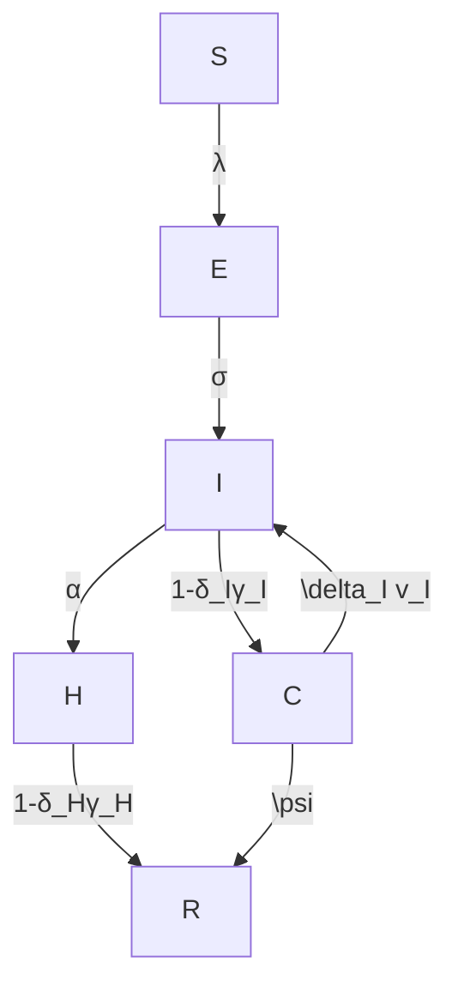

For office use only  
T1  
T2  
T3  
T4

Team Control Number

## 32150

Problem Chosen

For office use only

F1

F2

F3

F4

## 2015 Mathematical Contest in Modeling (MCM/ICM) Summary Sheet How to Eradicate Ebola?

The breakout of Ebola in 2014 triggered global panic. How to control and eradicate Ebola has become a universal concern ever since.

Firstly, we build up an epidemic model SEIHCR (CT) which takes the special features of Ebola into consideration. These are treatment from hospital, infectious corpses and intensified contact tracing. This model is developed from the traditional SEIR model. The model’s results (Fig.4,5,6), whose parameters are decided using computer simulation, match perfectly with the data reported by WHO, suggesting the validity of our improved model.

Secondly, pharmaceutical intervention is studied thoroughly. The total quantity of the medicine needed is based on the cumulative number of individuals CUM (Fig.7). Results calculated from the WHO statistics and from the SEIHCR (CT) model show only minor discrepancy, further indicating the feasibility of our model. In designing the delivery system, we apply the weighted Fuzzy c- Means Clustering Algorithm and select 6 locations (Fig.10, Table.2) that should serve as the delivery centers for other cities. We optimize the delivery locations by each city’s location and needed medicine. The percentage each location shares is also figured out to facilitate future allocation (Table.3,4). The average speed of manufacturing should be no less than 106.2 unit dose per day and an increase in the manufacturing speed and the efficacy of medicine will reinforce the intervention effect.

Thirdly, other critical factors besides those discussed early in the model, safer treatment of corpses, and earlier identification/isolation also prove to be relevant. By varying the value of parameters, we can project the future CUM . Results (Fig.12,13) show that these interventions will help reduce CUM to a lower plateau at a faster speed.

We then analyze the factors for controlling and the time of eradication of Ebola. For example, when the rate of the infectious being isolated is 33% - 40%, the disease can be successfully controlled (Table.5). When the introduction time for treatment decreases from 210 to 145 days, the eradication of Ebola arrives over 200 days earlier.

Finally, we select three parameters: the transmission rate, the incubation period and the fatality rate for sensitivity analysis.

Key words: Ebola, epidemic model, cumulative cases, Clustering Algorithm

## Contents

## 1. Introduction....

1.1. Problem Background  
1.2. Previous Research.  
1.3. Our Work..

## 2. General Assumptions ( .

## 3. Notations and Symbol Description 4

3.1. Notations ..  
3.2. Symbol Description

## 4. Spread of Ebola.

4.1. Traditional Epidemic Model

4.1.1. The SEIR Model.  
4.1.2. Outbreak Data.. 6  
4.1.3. Results of the SEIR Model.

4.2. Improved Model. .8

4.2.1. The SEIHCR (CT) Model .8  
4.2.2. Choosing Parameters. ..10  
2.1.1. Results of the SEIHCR (CT) Model. 1 1

## 5. Pharmaceutical Intervention .13

5.1. Total Quantity of the Medicine . .13

5.1.1. Results from WHO Statistics. .13  
5.1.2. Results from the SEIHCR (CT) Model . ..15

5.2. Delivery System.... .15

5.2.1. Locations of Delivery. .16  
5.2.2. Amount of Delivery.... .19

5.3. Speed of Manufacturing. .20  
5.4. Medicine Efficacy. 21

## 6. Other Important Interventions. .21

6.1. Safer Treatment of Corpses.. .21  
6.2. Intensified Contact Tracing and Earlier Isolation . .22  
6.3. Conclusion . .24

## 7. Control and Eradication of Ebola .... ..24

7.1. How Ebola Can Be Controlled .24  
7.2. When Ebola Will Be Eradicated .26

## 8. Sensitivity Analysis.. .27

8.1. Impact of Transmission Rate $\beta _ { \iota }$ .27  
8.2. Impact of the Incubation Period 1/ .28  
8.3. Fluctuation of $\delta _ { \scriptscriptstyle H }$ ..28

## 9. Strengths and Weaknesses.. .29

9.1. Strengths .. .29  
9.2. Weaknesses . ..30  
9.3. Future Work . ..30

## Letter to the World Medical Association 31

## References.. .33

## 1. Introduction

## 1.1. Problem Background

Ebola virus disease (EVD), formerly known as Ebola haemorrhagic fever, is a severe, often fatal illness in humans. The current outbreak in West Africa, (first cases notified in March 2014), is the largest and most complex Ebola outbreak since the Ebola virus was first discovered in 1976. There have been more cases and deaths in this outbreak than all others combined. It started in Guinea and later spread across land borders to Sierra Leone and Liberia[1]. The current situation in the most affected countries can be seen clearly by the latest outbreak situation graph released by the World Health Organization (WHO).

choropleth map

| Country/Region | Total Cases Range |
| -------------- | ----------------- |
| Guinea-Bissau  | 1 - 5             |
| Sierra Leone  | 6 - 20            |
| Liberia       | 21 - 100          |
| Côte d'Ivoire | 101 - 500         |
| Mali           | 501 - 4,000       |
| Guinea         | Newly Infected    |
| Guinea         | Cases in last 21 days |

Figure 1. Ebola Outbreak Distribution Map in West Africa on 4th Feb, 2015  
http://www.cdc.gov/vhf/ebola/outbreaks/2014-west-africa/distribution-map.html

Ebola was first transmitted from fruit bats to the human population. It can now spread from human to human via direct contact with the blood, secretions, organs or other bodily fluids of infected people, and with surfaces and materials contaminated with these fluids. Burial ceremonies can also play a role in the transmission of Ebola because the virus can also be transmitted through the body of the deceased person[1].

Control of outbreaks requires coordinated medical services, alongside a certain level of community engagement. The medical services include rapid detection of cases of disease, contact tracing of those who have come into contact with infected individuals, quick access to laboratory services, proper healthcare for those who are infected, and proper disposal of the dead through cremation or burial[1],[2]. There are lots of different experimental vaccines and drug treatments for Ebola under development, tested both in the lab and in animal populations, but they have not yet been fully tested for safety or effectiveness[3], [4]. In the summer of 2014, the World Health Organization claimed fast-tracking testing was ethical in light of the epidemic[4]. In fact, the first batch of an experimental vaccine against Ebola have already been sent to Liberia in January 2015. According to the Dr Moncef Slaoui of British production company GlaxoSmithKline, the initial phase is encouraging and encourages them to progress to the next phases of clinical testing[5].

## 1.2. Previous Research

The analysis of the spread of epidemic has been a universal concern. Moreover, there have been a lot of research into the studies of the 2014 Ebola epidemic in West Africa[6]. For the spread of the disease, which is considered as an important factor in eradicating Ebola, there are a lot of previous research that can facilitate our understanding of the disease.

For example, Fisman et al. used a two-parameter mathematical model to describe the epidemic growth and control[7]. Gomes et al. researched into the risk of Ebola’s international spread along with its mobility data. His research reached a conclusion that the risk of Ebola’s international spread to outside Africa is relatively small compared to its expansion among the West African countries[8]. The Centers for Disease Control and Prevention used the traditional SIR model to extrapolate the Ebola epidemic and projected that Liberia and Sierra Leone will have had 1.4 million Ebola cases by Jan. 20, 2015[9]. Chowell et al. used the SEIR model and studied the effect of Ebola outbreaks in 1995 in Congo and in 2000 in Uganda[10]. The SEIR model takes the state of exposure into consideration, which is a special feature of Ebola because exposure to the virus will make individuals a lot more easily to be infected. Based on the SEIR model of Chowell et al[10], Althaus developed a model where the reproduction number is dependent on the time[11]. Valdez et al. developed a model and found that reducing population mobility had little effect on geographical containment of the disease and a rapid and early intervention that increases the hospitalization and reduces the disease transmission in hospitals and at funerals is the most important response to any possible re-emerging Ebola epidemic[12].

## 1.3. Our Work

We are asked to build a realistic, sensible, and useful model to optimize the eradication of Ebola or at least its current strain. Our model should not only consider the spread of the disease, the quantity of the medicine needed, possible feasible delivery systems, locations of delivery, speed of manufacturing of the vaccine or drug, but also other critical factors that we consider to be necessary.

To begin with, we searched a large number of papers that discuss the spread of Ebola to help us deepen the understanding of the problem. Chowell et al. provided a large amount of background information and their work[6] served as an important introduction. We found that a few of the papers used the traditional epidemic model to predict the transmission of the disease such as the SEIR model used by Althaus[11] to estimate the reproduction number of the virus during the 2014 outbreak. Therefore, we also applied the SEIR model in the early stage to predict the spread of Ebola. Later, we found out that the Ebola virus has some specific feathers that also needed to be considered and that are, the potential transmission threat posed by the highly infectious corpses, the improved infection control and reduced transmission rate if patients can be treated in hospitals, and the powerful intervention method: contact tracing. After taking all these critical factors into consideration, we improved our original epidemic model.

Next, we deeply analyzed the pharmaceutical intervention. We first used the statistics provided by WHO[24] to help figure out the quantity of the needed medicine. We also used our improved model to predict the number of the patients and needed medicine in Guinea, Sierra Leone and Liberia. Two parameters: 1) the current cumulative number of patients $C U M _ { p }$ and 2) the increasing rate of the disease  to decide the quantity of the medicine are set up as criteria. After the quantity of the medicine had been calculated, we sorted the affected cities of the three countries into several groups to determine the location of delivery. We applied the Fuzzy c- Means Clustering Algorithm and eventually selected 6 delivery points. These delivery points will be in charge of storing the medicine and transporting them to the set of cities surrounding them. Later, we took the speed of manufacturing and the efficacy of medicine into consideration and tested how these parameters could affect intervention.

We then considered other important factors that would help the eradication of Ebola: 1) safer treatment of corpses and 2) intensified contact tracing and earlier isolation.

After finishing analyzing all the relevant factors, we reached our final conclusion and predicted a time for Ebola’s eradication. In the last stage, we provide a nontechnical letter for the world medical association to use in their announcement of inventing a new drug to stop Ebola and treat patients whose disease is not advanced.

## 2. General Assumptions

The population of the new-born are not counted in the total population.  
 An individual who is exposed enters the incubation period and is not yet

infectious.

Recovered patients will not be infected again.  
Medicine are only provided in hospitals.  
Every location inside Guinea, Sierra Leone and Liberia can be selected as the delivery center and delivery routes between cities are straight lines.  
Medicine and vaccines can be delivered across borders.

## 3. Notations and Symbol Description

## 3.1. Notations

Susceptible individual[12]: A person with a clinical illness compatible with EVD and within 21 days before onset of illness, either:

a history of travel to the affected areas OR  
direct contact with a probable or confirmed case OR  
exposure to EVD-infected blood or other body fluids or tissues OR  
direct handling of bats, rodents or primates, from Ebola-affected countries OR  
preparation or consumption of bush meat from Ebola-affected countries.

Exposed individual[14]: A person who has been infected by Ebola virus but are not yet infectious or symptomatic.

Basic reproduction number[6]: The average number of secondary cases caused by a typical infected individual through its entire course of infection in a completely susceptible population and in the absence of control interventions.

Contact tracing[15]: Find everyone who comes in direct contact with a sick Ebola patient. Contacts are watched for illness for 21 days from the last day they came in contact with the Ebola patient. If the contact develops a fever or other Ebola symptoms, they are immediately isolated, tested, provided care, and the cycle starts again-all of the new patient’s contacts are found and watched for 21 days.

## 3.2. Symbol Description

<table><tr><td>Symbol</td><td>Description</td></tr><tr><td> $R_0$ </td><td>Basic reproduction number</td></tr><tr><td>N</td><td>Size of total population</td></tr><tr><td>S(t)</td><td>Number of suspected individuals at time t</td></tr><tr><td>E(t)</td><td>Number of exposed individuals at time t</td></tr><tr><td>I(t)</td><td>Number of infectious individuals outside hospital at time t</td></tr><tr><td>H(t)</td><td>Number of hospitalized individuals at time t</td></tr><tr><td>C(t)</td><td>Number of contaminated deceased at time t</td></tr><tr><td>R(t)</td><td>Number of removed individuals at time t</td></tr><tr><td>CUM(t)</td><td>Cumulative number of individuals at time t</td></tr><tr><td> $(\beta_I, \beta_H, \beta_C)$ </td><td>Transmission rate(outside hospital, inside hospital, by corpses)</td></tr><tr><td>1/σ</td><td>Average duration of incubation</td></tr><tr><td>α</td><td>Rate of infectious individuals to be identified/isolated</td></tr><tr><td> $(\gamma_I, \gamma_H)$ </td><td>Average time from symptoms onset to recovery(outside hospital, inside hospital)</td></tr><tr><td> $(\nu_I, \nu_H)$ </td><td>Average time from symptoms onset to death(outside hospital, inside hospital)</td></tr><tr><td> $(\delta_I, \delta_H)$ </td><td>Fatality rate(outside hospital, inside hospital)</td></tr><tr><td>1/ψ</td><td>Average time until the deceased is properly handled</td></tr><tr><td>κ</td><td>Average number of contacts traced per identified/isolated infectious individual</td></tr><tr><td> $(\pi_E, \pi_I)$ </td><td>Probability a contact traced individual (exposed, infectious)is isolated without causing a new case</td></tr><tr><td> $(\omega_E, \omega_I)$ </td><td>Ratio of probability that contact traced individual is (exposed, infectious) at time of originating case identification to the probability a random individual in the population is (exposed, infectious)</td></tr></table>

## 4. Spread of Ebola

## 4.1. Traditional Epidemic Model

## 4.1.1.The SEIR Model

The transmission of EBOV follows SEIR (susceptible-exposed-infectiousrecovered) dynamics and can be described by the following set of ordinary differential equations[10]:

$$
\left\{ \begin{array}{l} \dot {S} (t) = - \beta S (t) I (t) / N, \\ \dot {E} (t) = \beta S (t) I (t) / N - \sigma E (t), \\ \dot {I} (t) = \sigma E (t) - \gamma I (t), \\ \dot {R} (t) = \gamma I (t), \\ C \dot {U} M (t) = \sigma E (t), \end{array} \right. \tag {4.1}
$$

where:

S t( ) is the number of susceptible individuals at time $t ,$

E t( ) is the number of exposed individuals at time $t ,$

I t( ) is the number of infectious individuals at time $t ,$

R t( ) is the number of removed individuals at time $t ,$

CUM t( ) is the cumulative number of Ebola cases from symptoms onset,

N is the size of total population,

$1 / \sigma$ is the average duration of incubation,

$1 / \gamma$ is the average duration of infectiousness.

$\beta$ is the transmission rate per person per day. $\beta$ is constant in absence of control interventions. However, after control measures are introduced at time $t \geq \tau$ , $\beta$ is assumed to decay exponentially at rate $k ^ { [ 1 6 ] }$ . That is,

$$
\beta (t) = \left\{ \begin{array}{l l} \beta_ {0} & t <   \tau , \\ \beta_ {0} e ^ {- k (1 - \tau)} & t \geq \tau , \end{array} \right. \tag {4.2}
$$

## 4.1.2.Outbreak Data

The most seriously affected countries of the 2014 EBOV outbreak were Guinea, Sierra Leone and Liberia. Therefore, we mainly use the SEIR model to estimate the cumulative cases of these three countries. The data needed for the estimation can be obtained from the Centers for Disease Control and Prevention[17] which organizes the information provided in all the WHO situation reports[18] that are from March 1, 2014 to the most recent one on February 4, 2015. The data includes the numbers of reported total cases (confirmed, probable and suspected) and deaths.

To test the validity of the SEIR model on the spread of the 2014 EBOV, we have to compare the actual data of cases and deaths in Guinea, Sierra Leone and Liberia with the calculated data from the model. And we need to first set the value for some of the parameters to carry on the calculation.

Table 1. Parameter estimates for the 2014 EBOV outbreak

<table><tr><td>Parameter</td><td>Guinea</td><td>Sierra Leone</td><td>Liberia</td></tr><tr><td>Basic reproduction number,  $R_0$ </td><td>1.51</td><td>2.53</td><td>1.59</td></tr><tr><td>Transmission rate without control intervention  $β_0$ </td><td>0.27</td><td>0.45</td><td>0.28</td></tr><tr><td>Reduce transmission, k</td><td>0.048</td><td>0.048</td><td>0.048</td></tr><tr><td>Total population size, N</td><td>12,000,000</td><td>6,100,000</td><td>4,092,310</td></tr></table>

The basic reproduction number $R _ { 0 }$ is given by $R _ { 0 } = \beta / \gamma$ where $1 / \gamma = 5 . 6 1$ day is the infectious duration from the study by Chowell et $a l ^ { [ 1 0 ] }$ . Besides $1 / \gamma = 5 . 6 1$ , $1 / \sigma = 5 . 3$ is the average duration of the incubation period from a previous outbreak of the same EBOV in Congo in 1995[10]. Values of other parameters estimates[11] are listed in table 1.

First, by applying the parameters into Equation (4.1), we are able to calculate the estimated number of cases and deaths for these three countries, that is, we will be able to predict the spread of the disease. Then, by comparing the calculated number with the reported data, we will be able to verify the validity of the SEIR model.

## 4.1.3.Results of the SEIR Model

Actual data of the cumulative numbers of infected cases and deaths are shown in the dotted curve, which are fitted against the data found in the WHO situation reports[18]. March 1, 2014 is defined as Day $1 ^ { \mathrm { s t } }$ and one cross in the figure represents one statistics of the cumulative numbers. Calculated data are obtained by solving Equation (4.1).

line chart

| Time (day) | Actual Data | Calculated Data |
| ---------- | ----------- | --------------- |
| 0          | 0           | 0               |
| 50         | ~100        | ~50             |
| 100        | ~300        | ~150            |
| 150        | ~600        | ~400            |
| 200        | ~1000       | ~800            |
| 250        | ~1800       | ~1600           |
| 300        | ~2500       | ~2300           |
| 350        | ~3000       | ~2900           |

line chart

| Time (day) | Actual Data | Calculated Data |
| ---------- | ----------- | --------------- |
| 0          | 0           | 0               |
| 50         | ~100        | ~100            |
| 100        | ~500        | ~500            |
| 150        | ~1000       | ~1000           |
| 200        | ~2000       | ~2000           |
| 250        | ~5000       | ~4000           |
| 300        | ~8000       | ~7000           |
| 350        | ~11000      | ~9500           |

line chart

| Time (day) | Actual Data | Calculated Data |
| ---------- | ----------- | --------------- |
| 0          | 0           | 0               |
| 50         | 0           | 0               |
| 100        | 0           | 0               |
| 150        | 500         | 500             |
| 200        | 3000        | 3000            |
| 250        | 6500        | 6500            |
| 300        | 7500        | 7500            |
| 350        | 8500        | 7800            |

Figure 2. Cumulative number of individuals for Guinea, Sierra Leone and Liberia respectively

From the figure above, we can see that the model fits the reported data of cases and deaths in these three countries very well. Therefore, SEIR can serve as a good tool for analyzing the spread of the 2014 EBOV outbreak.

## 4.2. Improved Model

## 4.2.1.The SEIHCR (CT) Model

SEIR is a basic model for predicting the spread of a disease. However, for the specific case of Ebola, we have to take other important factors into consideration. We mainly considered

1) The potential threat posed by infectious corpses and the provision of hospital care;  
2) The involvement of contact tracing (CT).

Figure 3 shows a schematic presentation of the improved model SEIHCR (CT), and indicates the compartmental states and the transition rates among the states.

flowchart

Figure 3. Compartmental flow of the SEIHCR (CT) model

The traditional model SEIR should be modified[20], [23] and the improved SEIHCR (CT) model can be written as

$$
\left\{ \begin{array}{l} \dot {S} (t) = - \beta_ {I} S (t) I (t) / N - \beta_ {H} S (t) H (t) / N - \beta_ {C} S (t) C (t) / N, \\ \dot {E} (t) = \beta_ {I} S (t) I (t) / N + \beta_ {H} S (t) H (t) / N + \beta_ {C} S (t) C (t) / N - \sigma E (t) \\ \quad - \kappa (\alpha I (t) + \psi C (t)) \pi_ {E} \omega_ {E} (E (t) / N), \\ \dot {I} (t) = \sigma E (t) - \alpha I (t) - (1 - \delta_ {I}) \gamma_ {I} I (t) - \delta_ {I} \nu_ {I} I (t) \\ \quad - \kappa (\alpha I (t) + \psi C (t)) \pi_ {I} \omega_ {I} (I (t) / N), \\ \dot {H} (t) = \alpha I (t) - (1 - \delta_ {H}) \gamma_ {H} H (t) - \delta_ {H} \nu_ {H} H (t), \\ \dot {C} (t) = \delta_ {I} \nu_ {I} I (t) + \delta_ {H} \nu_ {H} H (t) - \psi C (t), \\ \dot {R} (t) = (1 - \delta_ {I}) \gamma_ {I} I (t) + (1 - \delta_ {H}) \gamma_ {H} H (t) + \psi C (t), \end{array} \right. \tag {4.3}
$$

where:

S t( ) is the number of susceptible individuals at time t,

E t( ) is the number of exposed individuals at time t,

I t( ) is the number of infectious individuals outside hospital at time $t ,$

H t( ) is the number of hospitalized individuals at time $t ,$

C t( ) is the number of contaminated deceased at time t,

R t( ) is the number of removed individuals at time t,

CUM t( ) is the cumulative number of Ebola cases from symptoms onset.

$\beta _ { \iota }$ is the transmission rate outside hospital,

$\beta _ { { \scriptscriptstyle H } }$ is the transmission rate inside hospital,

$\beta _ { c }$ is the transmission rate due to improper handling of deceased,

and $\lambda = \beta _ { I } \frac { I \left( t \right) } { N } + \beta _ { H } \frac { H \left( t \right) } { N } + \beta _ { C } \frac { C \left( t \right) } { N }$     H t  

is the total transmission rate,

$1 / \sigma$ is the average duration of incubation,

is the rate of infectious individuals to be identified/isolated,

$1 / \gamma _ { _ { H } }$ is the average time from symptoms onset to recovery inside hospital,

$1 / \nu _ { { \scriptscriptstyle H } }$ is the average time from symptoms onset to death inside hospital,

$\delta _ { { \scriptscriptstyle H } }$ is the fatality rate inside hospital,

$1 / \gamma _ { I }$ is the average time from symptoms onset to recovery outside hospital,

$1 / \nu _ { I }$ is the average time from symptoms onset to death outside hospital,

$\delta _ { \scriptscriptstyle I }$ is the fatality rate outside hospital,

$1 / \psi$ is the average time until deceased is properly handled.

is the average number of contacts traced per identified/isolated infectious individual,

$\pi _ { E }$ is the probability a contact traced exposed individual is isolated without causing a new case,

$\omega _ { E }$ is the ratio of probability that contact traced individual is exposed at time of originating case identification to the probability a random individual in the population is exposed,

$\pi _ { I }$ is the probability of a contact traced infectious individual is isolated without causing a new case,

$\omega _ { I }$ is the ratio probability that contact traced individual is infectious at time of originating case identification to the probability a random individual in the population is infectious.

When we are to test the validity of the ultimate model, we should compare the calculated data with the actual data, just like what we have done in Section 4.1. The cumulative number of individuals can be obtained by

$$
C U M (t + \Delta t) = C U M (t) + \int_ {t} ^ {t + \Delta t} \sigma E (s) d s. \tag {4.4}
$$

## Reasons for considering corpses, hospitals and contact tracing

Firstly, the provision of hospital care[19] to affected populations could be used as a basis for treating patients and prevent the disease from spreading to a larger scale. Besides, funerals and burials[19] if regulated, will reduce the risk of being infected from improperly handled corpses of infected (contaminated deceased).

Secondly, contact tracing is sometimes regarded as the key factor to stanch the Ebola outbreak in West Africa because if patients can be found earlier in their course of illness, their chances of exposure to family members and community health workers will reduce significantly[21].

Equation (4.3) is improved from the original model SEIR and it is our ultimate model. We name it the SEIHCR (CT) model to illustrate its improvement and differences from the traditional SEIR model. The transition SEIR to SEIHCR (CT) shows how basic model can be greatly improved based on other factors and our own understanding toward this problem.

## 4.2.2.Choosing Parameters

## 1. Estimation of $R _ { 0 }$

In order to obtain the reproduction number $R _ { 0 }$ , we use a method, following van den Driessche et al[22]. $a l ^ { [ 2 2 ] }$

$$
R _ {0} = \rho (F V ^ {- 1}), \tag {4.5}
$$

where:

$\rho ( A )$ denotes the spectral radius of a matrix A,

$F$ is the rate of appearance of new infections,

V is the rate of transfer of individuals by all other means.

F and V that are corresponded with the SEIHCR (CT) model are

$$
F = \left( \begin{array}{c} - \left(\beta_ {I} S I / N + \beta_ {H} S H / N + \beta_ {C} S C / N\right) \\ \beta_ {I} S I / N + \beta_ {H} S H / N + \beta_ {C} S C / N \\ 0 \\ 0 \\ 0 \\ 0 \\ 0 \end{array} \right), V = \left( \begin{array}{c} 0 \\ - \sigma E \\ \sigma E - \alpha I - \gamma_ {I} I - \nu_ {I} I \\ \alpha I - \gamma_ {H} H - \nu_ {H} H \\ \nu_ {I} I + \nu_ {H} H - \psi C \\ \gamma_ {I} I + \gamma_ {H} H + \psi C \end{array} \right).
$$

## 2. Determination of other parameters

The values of the parameters $\beta _ { I } , \beta _ { H } , \beta _ { C } , \alpha$ and $\psi$ are estimated for the three countries using a least square curve fitting algorithm. The parameters $\sigma , \gamma _ { I }$ , ,  ,  ,   and  are borrowed from existing references[11]. $\gamma _ { H } , \nu _ { I } , \nu _ { H } , \delta _ { I }$ $\delta _ { \scriptscriptstyle H }$

The basic reproduction number of the SEIHCR (CT) model is given by the following formula, computed by the next-generation method:

$$
R _ {0} = \frac {\beta_ {I}}{\alpha + (1 - \delta_ {I}) \gamma_ {I} + \delta_ {I} \nu_ {I}} + \frac {\beta_ {H}}{(1 - \delta_ {H}) \gamma_ {H} + \delta_ {H} \nu_ {H}} + \frac {\beta_ {C}}{\psi}. \tag {4.6}
$$

Among all these parameters, $\beta _ { \iota }$ is constant in absence of control interventions, just as $\beta$ from the SEIR model. After control measures are introduced at time $t \geq \tau$ , $\beta _ { \iota }$ is assumed to decay exponentially at rate $k ^ { [ 1 6 ] }$ . That is,

$$
\beta_ {I} (t) = \left\{ \begin{array}{l l} \beta_ {I 0} & t <   \tau , \\ \beta_ {I 0} e ^ {- k (1 - \tau)} & t \geq \tau , \end{array} \right. \tag {4.7}
$$

Since k and $\gamma _ { H }$ are both related to the efficacy of medicine, we assume their relationship to be

$$
\gamma_ {H} = \theta k, \tag {4.8}
$$

where $\theta$ is assumed to be 3.2 based on experience.

## 2.1.1.Results of the SEIHCR (CT) Model

Again, we use the dotted line to represent the actual data of the cumulative numbers found in the WHO situation reports[18] and the solid line to represent our calculated number from Equation (4.3) of the SEIHCR (CT) model. The start day of the simulation is defined as Day 1st.

line chart

| Time (day) | Actual Data | Calculated Data |
| ---------- | ----------- | --------------- |
| 0          | 0           | 0               |
| 50         | ~200        | ~150            |
| 100        | ~400        | ~350            |
| 150        | ~700        | ~650            |
| 200        | ~1500       | ~1400           |
| 250        | ~2200       | ~2100           |
| 300        | ~2800       | ~2700           |
| 350        | ~3000       | ~2900           |

Figure 4. Simulation of cumulative cases in Guinea from March $2 5 ^ { \mathrm { t h } } ,$ , 2014 to $\operatorname { F e b 4 } ^ { \mathrm { t h } }$ , 2015. The parameter values are $N = 1 2 , 0 0 0 , 0 0 0$ , $\beta _ { { } _ { I 0 } } = 0 . 2 0 5$ , $\beta _ { { } _ { H } } = 0 . 0 0 0 1$ , $\beta _ { c } = 0 . 2 2 4$ , $\alpha = 0 . 2$ , $\gamma _ { _ { I } } = 1 / 3 2$ , $\gamma _ { _ { H } } = 1 / 1 0$ , $\upsilon _ { I } = 1 / 8$ , $\upsilon _ { H } = 1 / 4 0$ , $\psi = 0 . 1 8$ , $\kappa = 0$ , $k = 0 . 0 3$ , $\tau = 2 0 0$ .

line chart

| Time (day) | Actual Data | Calculated Data |
| ---------- | ----------- | --------------- |
| 0          | 0           | 0               |
| 50         | ~500        | ~400            |
| 100        | ~1500       | ~1300           |
| 150        | ~5000       | ~4800           |
| 200        | ~8000       | ~7800           |
| 250        | ~11000      | ~10800          |

Figure 5. Simulation of cumulative cases in Sierra Leone from May $2 7 ^ { \mathrm { t h } }$ , 2014 to Feb $4 ^ { \mathrm { t h } } ,$ 2015. The parameter values are $N = 6 , 0 0 0 , 0 0 0$ , $\beta _ { I 0 } = 0 . 3 1$ , $\beta _ { { \scriptscriptstyle H } } = 0 . 0 0 0 1$ , $\beta _ { C } = 0 . 1 2 5$ , $\alpha = 0 . 2$ , $\gamma _ { I } = 1 / 3 0$ , $\gamma _ { \scriptscriptstyle H } = 1 / 2 1$ , $\upsilon _ { I } = 1 / 8$ , $\upsilon _ { H } = 1 / 3 1$ , $\psi = 1 / 5 . 5$ , $\kappa = 0$ , $k = 0 . 0 1 5$ , $\tau = 1 6 0$ .

line chart

| Time (day) | Actual Data | Calculated Data |
| ---------- | ----------- | --------------- |
| 0          | 0           | 0               |
| 50         | 0           | 0               |
| 100        | 0           | 0               |
| 150        | 1000        | 1000            |
| 200        | 4000        | 4000            |
| 250        | 7500        | 7500            |
| 300        | 8500        | 8500            |
| 350        | 9000        | 9000            |

Figure 6. Simulation of cumulative cases in Liberia from March $2 7 ^ { \mathrm { t h } }$ , 2014 to $\operatorname { F e b 4 } ^ { \mathrm { t h } }$ ,

2015. The parameter values are $N = 4 , 1 0 0 , 0 0 0$ , $\beta _ { I 0 } = 0 . 3 0$ , $\beta _ { { } _ { H } } = 0 . 0 0 0 1$ ,

$$
\beta_ {C} = 0. 2 3, \alpha = 0. 2, \gamma_ {I} = 1 / 3 2, \gamma_ {H} = 1 / 1 0, \nu_ {I} = 1 / 8, \nu_ {H} = 1 / 4 0,
$$

$$
\psi = 0. 1 6, \kappa = 0, k = 0. 0 3, \tau = 1 9 0.
$$

These simulations are accomplished by varying combinations of parameters. Comparing these simulations with the ones based on the SEIR model, we can see that we obtain a better fit using the SEIHCR (CT) model, for the calculated data become more smoothly and closely approximate to the actual reported data with the simulation for Sierra Leone being the perfect approximation.

## 5. Pharmaceutical Intervention

If medicine and vaccines can be available to patients and healthy people, the survival rate of the patients will increase and the situation of affected countries will improve to a great extent. Therefore, the manufacturing and delivery of medicine should remain an important factor in combating Ebola. Our tasks are to calculate the total amount of medicine, design a favorable delivery system and compare the intervention extent of different manufacturing speed and different level of medicine efficacy.

## 5.1. Total Quantity of the Medicine

## 5.1.1. Results from WHO Statistics

When medicine are about to be delivered to affected areas of Ebola, apparently, people should first analyze how serious the current situation is to decide the amount of medicine. However, just knowing the present situation is not enough. We should also take the speed of the spread of the virus into consideration because a large speed poses great potential threat. Therefore, when deciding the quantity of the medicine needed, we considered two important factors:

1) The current cumulative number of patients $C U M _ { p }$ ;  
2) The increasing rate of the disease .

WHO has been releasing a weekly report of newly confirmed cases by district, which represent the sum of new patients[24] $S U M _ { n e w }$ . Divide $S U M _ { n e w }$ by the duration period $T ( T = 7$ in this case since the report is released every week) and we will get the increasing rate of the disease v . Meanwhile, by adding the newly infected cases, we can know the current cumulative patients $C U M _ { p }$ as well.

By far, we have gathered all the information that we need to calculate the quantity of the medicine. By adding the current cumulative number of patients and the increasing rate of the disease (we place equal weights on these two factors), we can obtain the unit dose of the medicine needed every day D for each city and

$$
D = C U M _ {p} + \upsilon \times T. \tag {5.1}
$$

Due to the extremely large amount of statistics for both the number of cities (56 cities) and the duration of the reported data (57 weeks till Feb 1st, 2015), the concrete data and calculated value will not be presented. Instead, we drew a graph that illustrates the units of medicine needed by these three countries from Dec $3 0 ^ { \mathrm { t h } } .$ , 2013 to Jan $3 1 ^ { \mathrm { s t } }$ , 2015.

line chart

| Date     | Total Quantity | Guinea | Liberia | Sierra Leone |
| -------- | -------------- | ------ | ------- | ------------ |
| 12/30/13 | 0              | 0      | 0       | 0            |
| 01/30/14 | 0              | 0      | 0       | 0            |
| 02/28/14 | 0              | 0      | 0       | 0            |
| 03/31/14 | 0              | 50     | 0       | 0            |
| 04/30/14 | 0              | 50     | 0       | 0            |
| 05/31/14 | 0              | 100    | 0       | 0            |
| 06/30/14 | 200            | 50     | 50      | 100          |
| 07/31/14 | 500            | 100    | 200     | 300          |
| 08/31/14 | 1500           | 200    | 800     | 600          |
| 09/30/14 | 2200           | 300    | 850     | 1100         |
| 10/31/14 | 1800           | 250    | 200     | 1350         |
| 11/30/14 | 1900           | 350    | 150     | 1500         |
| 12/31/14 | 1400           | 450    | 50      | 1000         |
| 01/31/15 | 100            | 50     | 5       | 50           |

Figure 7. Unit dose of the medicine needed per day for Guinea, Liberia and Sierra Leone

In the figure above, the blue, orange and green curve represents the unit dose of medicine needed per day by patients in Guinea, Liberia and Sierra Leone respectively. The grey area represents the combined doses needed by the three countries altogether.

Since no effective medicine has been developed and distributed in a large scale, the specific dose of medicine one patient needs is nowhere to be found. Therefore, we use the unit dose instead. It also perfectly reflects the quantity of needed medicine.

## 5.1.2.Results from the SEIHCR (CT) Model

As is mentioned before, there are so many cities that if we calculate every city’s need from the improved model, there will be too much work. Therefore, we only take one city as an example to test the feasibility of our model and we choose the capital of Sierra Leone, Freetown because this city has the largest number of cumulative patients.

The number of patients of Freetown can be calculated from the improved model and after $C U M _ { p }$ is obtained, we can also know the increasing rate   . Applying these to Equation (5.1) and we will get the quantity of needed medicine per day D .

line chart

| Time (day) | Actual Data | Calculated Data |
| ---------- | ----------- | --------------- |
| 0          | 0           | 0               |
| 50         | 0           | 0               |
| 100        | 50          | 50              |
| 150        | 300         | 300             |
| 200        | 1000        | 1000            |
| 250        | 1900        | 1900            |
| 300        | 2100        | 2100            |

line chart

| Time (day) | Calculated Data | Actual Data |
| ---------- | --------------- | ----------- |
| 0          | 0               | 0           |
| 50         | 10              | 15          |
| 100        | 50              | 60          |
| 150        | 150             | 180         |
| 200        | 450             | 400         |
| 250        | 150             | 180         |
| 300        | 50              | 60          |

Figure 8. Cumulative number of patients in Freetown and quantity of needed medicine per week

The left graph in Figure 8 presents the changes of the cumulative numbers with time in Freetown. The grey curve in the right graph represents the every day’s unit dose of needed medicine and the shaded area represents the total quantity of needed medicine. Beside these, we also compared the result from the SEIHCR (HC) model and the result fitted by WHO statistics (the solid curve). We can see that these two results match and the discrepancies are within the acceptable range.

To conclude, SEIHCR (HC) can serve as a feasible model for both predicting the cumulative patients and figuring the quantity of needed medicine.

## 5.2. Delivery System

The medicine and vaccines of Ebola are manufactured in developed countries like USA and UK. Therefore, it is not difficult to determine the locations that are in charge of loading drugs and vaccines. It is in fact the amount of medicine and the places that the airplanes are headed to are the most difficult part to decide for the delivery system.

Hence, to design the delivery system of medicine and vaccines, we divided our task into two parts:

1) Deciding the locations for receiving drugs;  
2) Calculating the amount of drugs these locations need respectively.

## 5.2.1.Locations of Delivery

To transport the drugs and vaccines to the three most affected West African countries: Guinea, Sierra Leone and Liberia, we should first find several places to store the drugs. These places will also be responsible for delivering medicine to a few places next to them. In other words, we will first find some ‘headquarters’ for storage. Then we will determine from which one of these headquarters other cities will receive the drugs.

We now need to divide these three countries into several parts and we use the Fuzzy c- Means Clustering Algorithm to accomplish this goal.

## The Weighted Fuzzy  c- Means Clustering Algorithm:

The Weighted Fuzzy c- Means Clustering Algorithm differs from the traditional Fuzzy c- Means Clustering Algorithm in that it considers $D _ { \boldsymbol { k } }$ , the quantity of medicine needed by each city.

The key of Fuzzy c- Means Clustering Algorithm is to represent the similarity a point shares with each cluster with a function whose values (memberships) are between zero and one[25]. Each sample will have a membership in every cluster, memberships close to unity signify a high degree of similarity between the sample and the cluster while memberships close to zero imply little similarity between the sample and that cluster[25].

Let $Y = \left\{ y _ { k } , k = 1 , 2 , \cdots N \right\}$ be a sample of N observations in $\begin{array} { r l } { R ^ { n } } & { { } ( { \ n - } } \end{array}$ dimensional Euclidean space), $y _ { k } = \left[ y _ { k 1 } , y _ { k 2 } , \cdots , y _ { k n } \right]$ being a  n- dimensional vector, and $U$ be a real $c \times N$ matrix, $U = \left[ u _ { i k } \right]$ . U is the matrix representation of the partition $\left\{ Y _ { i } \right\}$ and the elements satisfy

$$
\sum_ {i = 1} ^ {n} u _ {i k} = 1 \text {   for   all   } k, \tag {5.2}
$$

we denote the sets of all fuzzy c-partitions of Y by $M _ { \mathit { f c } } = \left\{ U _ { \mathit { c } \times N } \ : \vert \ : u _ { i k } \in [ 0 , 1 ] \right\}$ .

The most popular and well-studied clustering criteria for identifying optimal fuzzy c- partitions in Y is associated with the generalized least-squared errors functional. After weights, the quantity of medicine needed by each city, have been applied, the generalized least-squared errors functional can be written as

$$
\begin{array}{l} \min J _ {m} (U, v) = \sum_ {k = 1} ^ {N} \sum_ {i = 1} ^ {c} D _ {k} \left(u _ {i k}\right) ^ {m} \left\| y _ {k} - v _ {i} \right\| ^ {2}, \\ \text {s.t.} \left\{ \begin{array}{l} c <   c _ {\max}, \\ y _ {k i \min} <   y _ {k i} <   y _ {k i \max}, \end{array} \right. \tag {5.3} \\ \end{array}
$$

where

$$
Y = \left\{y _ {1}, y _ {2}, \dots y _ {N} \right\} \in R ^ {n} = \text { the   data },
$$

$$
c = \text { number   of   clusters   in } Y, 2 \leq c <   n,
$$

$$
m = \text { weighting   exponent }, 1 \leq m <   \infty ,
$$

$$
U = \text { fuzzy   } c \text {-partition of } Y, U \in M _ {f c},
$$

$$
D _ {k} = \text { quantity   of   medicine   needed   by   city } k,
$$

$$
v = \left\{v _ {1}, v _ {2}, \dots v _ {c} \right\} = \text { vectors   of   centers },
$$

$$
v _ {i} = \left\{v _ {i 1}, v _ {i 2}, \dots v _ {i n} \right\} = \text { center   of   cluster } i.
$$

Optimal fuzzy clustering of  Y are defined as pairs $\left( \hat { U } , \hat { \nu } \right)$ that locally minimize $J _ { { _ m } }$ . The necessary conditions for $m = 1$ are well known. For $m > 1$ , if $y _ { k } \neq \hat { \nu } _ { j }$ , for all j and $k , \ \left( \hat { U } , \hat { \nu } \right)$ may be locally optimal for $J _ { { _ m } }$ only if

$$
\hat {v} _ {i} = \frac {\sum_ {k = 1} ^ {N} D _ {k} \left(\hat {u} _ {i k}\right) ^ {m} y _ {k}}{\sum_ {k = 1} ^ {N} D _ {k} \left(\hat {u} _ {i k}\right) ^ {m}}, \quad 1 \leq i \leq c, \tag {5.4}
$$

$$
\hat {u} _ {i k} = \left(\sum_ {j = 1} ^ {c} \left(\frac {d _ {i k}}{d _ {j k}}\right) ^ {2 / (m - 1)}\right) ^ {- 1} \quad 1 \leq k \leq N, 1 \leq i \leq c, \tag {5.5}
$$

where $\hat { d } _ { i k } = \lVert y _ { k } - \hat { \nu } _ { i } \rVert$ .

Equation (5.2) and (5.3) provide means for optimizing $J _ { { _ m } }$ via iteration by looping back and forth from these two equations until the iterate sequence shows but small changes in successive entries of $\hat { U }$ or vˆ . We formalize the general procedure for the Fuzzy c- Means Clustering Algorithm as follows:

1) Fix $c , m .$ . Choose an initial matrix ${ \cal U } ^ { ( 0 ) } \in { \cal M } _ { f c }$ . Then at step $k , k , = 0 , 1 , . . . , N .$ .  
2) Compute means $\hat { \boldsymbol { \nu } } ^ { ( k ) } , i = 1 , 2 , . . . , c$ with Equation (5.3).  
3) Compute an updated membership matrix $\hat { U } ^ { \left( k + 1 \right) } = \left[ \hat { u } _ { i k } ^ { ( \mathrm { k + 1 ) } } \right]$ with Equation (5.4).  
4) Compare $\hat { U } ^ { ( k + 1 ) }$ to $\hat { U } ^ { ( k ) }$ in any convenient matrix norm. If $\left\| \hat { U } ^ { ( k + 1 ) } - \hat { U } ^ { ( k ) } \right\| < \varepsilon$ , stop. Otherwise, set $\hat { U } ^ { ( k ) } = \hat { U } ^ { ( k + 1 ) }$ and return to step 2).

In this case, we set m to be 2. For the value of c , we first decide that the number of headquarters should nether be too large nor too small, which should not only be enough to facilitate the delivery but will also be able to prevent the delivery to be a too demanding job. To set the specific value for c , we found out that $J _ { { _ m } }$ is surely decreasing with more clusters. When  c is increased from 1 to $c ^ { * }$ , $J _ { { _ m } }$ will decrease dramatically. However the decreasing pace will slow down when c continues to increase. If we draw a curve that reflects the variance of $J _ { { _ m } }$ with c , the inflection point should be the ultimate cluster number. The curve is drawn below:

line chart

| c   | J^E  |
| --- | ---- |
| 1   | 7700 |
| 2   | 5400 |
| 3   | 4200 |
| 4   | 3400 |
| 5   | 2900 |
| 6   | 2500 |
| 7   | 2200 |
| 8   | 2000 |
| 9   | 1800 |
| 10  | 1600 |
| 11  | 1500 |
| 12  | 1400 |
| 13  | 1300 |

Figure 9. The variation of $J _ { { _ m } }$ with  c

From Figure 9, we can see that choosing 6 clusters and consequently 6 headquarters for all the cities in Guinea, Sierra Leone and Liberia is the ultimate choice, which also corresponds with our initial criterion.

WHO provides explicit data on the number of cases in the three countries’ cities that have patients[24]. Using these data, we are able to calculate means $\hat { \nu } ^ { ( k ) }$ and membership matrix $\hat { U } ^ { ( k + 1 ) }$ to carry on the algorithm. Through iteration, we can obtain our results of delivery locations which are presented below.

map with color-coded cases

| Country | Total Cases (Count) |
| --- | --- |
| Guinea-Bissau | 6 - 20 |
| Sierra Leone | 501 - 4,000 |
| Liberia | 1 - 5 |
| Côte d'Ivoire | 21 - 100 |
| Mali | 101 - 500 |
| Guinea | 501 - 4,000 |
| Guinea-Bissau | 1 - 5 |
| Sierra Leone | 21 - 100 |
| Liberia | 1 - 5 |
| Côte d'Ivoire | 21 - 100 |
| Guinea-Bissau | 21 - 100 |
| Guinea | 21 - 100 |
| Guinea-Bissau | 21 - 100 |
| Guinea-Bissau | 21 - 100 |
| Guinea-Bissau | 21 - 100 |
| Guinea-Bissau | 21 - 100 |
| Guinea-Bissau | 21 - 100 |
| Guinea-Bissau | 21 - 100 |
| Guinea-Bissau | 21 - 100 |

Figure 10. Delivery location

In the above figure, the 6 yellow stars represent the 6 ‘headquarters’ that we select to store the medicine and they are labelled from 1 to 6 to facilitate later discussion. The geographical locations for these 6 headquarters are presented in Table 2.

Table 2. Geographical locations for the delivery points

<table><tr><td>Location</td><td>1</td><td>2</td><td>3</td><td>4</td><td>5</td><td>6</td></tr><tr><td>Latitude</td><td>8.4897 N</td><td>10.3315 N</td><td>10.9935 N</td><td>6.9627 N</td><td>8.5729 N</td><td>10.5202 E</td></tr><tr><td>Longitude</td><td>9.1702 W</td><td>13.4050 W</td><td>10.8677 W</td><td>10.5202 W</td><td>12.4282 W</td><td>8.3181 W</td></tr></table>

There are also 6 sets of dots that are distinguished from each other using 6 different colors. Each set of dots will later receive medicine and vaccines from the headquarter inside them. That is to say, medicine and vaccines will be delivered from the 6 yellow stars to the specific set of colored dots surrounding them.

## 5.2.2.Amount of Delivery

Apply the Fuzzy  c- Means Clustering Algorithm and we get the unit dose of needed medicine for the 6 headquarters. We use 4 weeks as a cycle to reduce the amount of statistics needed to be enclosed. We also add up the unit of dose to see the total amount of medicine needed for a certain period of time. Besides, percentage of the medicine that will be allocated for these 6 headquarters is also calculated to facilitate further delivery.

Table 3. Doses of medicine for the 6 headquarters and their delivery percentage

<table><tr><td>Every 4 weeks</td><td>1</td><td>2</td><td>3</td><td>4</td><td>5</td><td>6</td><td>Sum</td></tr><tr><td>2013/12/30</td><td>0</td><td>0</td><td>0</td><td>0</td><td>0</td><td>0</td><td>0</td></tr><tr><td>2014/1/27</td><td>0</td><td>0</td><td>0</td><td>0</td><td>0</td><td>0</td><td>0</td></tr><tr><td>2014/2/24</td><td>63</td><td>3</td><td>0</td><td>0</td><td>0</td><td>0</td><td>66</td></tr><tr><td>2014/3/24</td><td>158</td><td>99</td><td>9</td><td>3</td><td>0</td><td>0</td><td>269</td></tr><tr><td>2014/4/21</td><td>82</td><td>15</td><td>0</td><td>3</td><td>6</td><td>6</td><td>112</td></tr><tr><td>2014/5/19</td><td>193</td><td>145</td><td>3</td><td>290</td><td>12</td><td>0</td><td>643</td></tr><tr><td>2014/6/16</td><td>272</td><td>35</td><td>0</td><td>945</td><td>37</td><td>13</td><td>1302</td></tr><tr><td>2014/7/14</td><td>336</td><td>66</td><td>21</td><td>1719</td><td>248</td><td>41</td><td>2431</td></tr><tr><td>2014/8/11</td><td>1063</td><td>202</td><td>0</td><td>3038</td><td>1208</td><td>185</td><td>5696</td></tr><tr><td>2014/9/8</td><td>961</td><td>253</td><td>20</td><td>3208</td><td>3546</td><td>162</td><td>8150</td></tr><tr><td>2014/10/6</td><td>957</td><td>284</td><td>24</td><td>1345</td><td>4669</td><td>69</td><td>7348</td></tr><tr><td>2014/11/3</td><td>942</td><td>333</td><td>173</td><td>629</td><td>5219</td><td>43</td><td>7339</td></tr><tr><td>2014/12/1</td><td>625</td><td>672</td><td>49</td><td>58</td><td>4153</td><td>0</td><td>5557</td></tr><tr><td>2014/12/29</td><td>116</td><td>412</td><td>21</td><td>3</td><td>2059</td><td>0</td><td>2611</td></tr><tr><td>2015/1/26</td><td>31</td><td>66</td><td>9</td><td>0</td><td>5</td><td>0</td><td>111</td></tr><tr><td>Percentage</td><td>13.93%</td><td>6.21%</td><td>0.79%</td><td>27.00%</td><td>50.83%</td><td>1.25%</td><td>100%</td></tr></table>

Apart from the respective amount of medicine needed by the six quarters, we also categorize the needed medicine by country. That is, the specific amount of medicine needed by each country is calculated and their percentage is also figured out to facilitate further allocation.

Table 4. Doses of medicine for Guinea, Liberia and Sierra Leone and their delivery percentage

<table><tr><td>Every 4 weeks</td><td>Guinea</td><td>Liberia</td><td>Sierra Leone</td><td>Sum</td></tr><tr><td>2013/12/30</td><td>0</td><td>0</td><td>0</td><td>0</td></tr><tr><td>2014/1/27</td><td>0</td><td>0</td><td>0</td><td>0</td></tr><tr><td>2014/2/24</td><td>64</td><td>2</td><td>0</td><td>66</td></tr><tr><td>2014/3/24</td><td>259</td><td>10</td><td>0</td><td>269</td></tr><tr><td>2014/4/21</td><td>91</td><td>15</td><td>6</td><td>112</td></tr><tr><td>2014/5/19</td><td>313</td><td>46</td><td>284</td><td>643</td></tr><tr><td>2014/6/16</td><td>165</td><td>282</td><td>855</td><td>1302</td></tr><tr><td>2014/7/14</td><td>197</td><td>907</td><td>1327</td><td>2431</td></tr><tr><td>2014/8/11</td><td>851</td><td>2856</td><td>1989</td><td>5696</td></tr><tr><td>2014/9/8</td><td>1138</td><td>3163</td><td>3849</td><td>8150</td></tr><tr><td>2014/10/6</td><td>1238</td><td>1170</td><td>4940</td><td>7348</td></tr><tr><td>2014/11/3</td><td>1445</td><td>622</td><td>5272</td><td>7339</td></tr><tr><td>2014/12/1</td><td>1346</td><td>23</td><td>4188</td><td>5557</td></tr><tr><td>2014/12/29</td><td>549</td><td>0</td><td>2062</td><td>2611</td></tr><tr><td>2015/1/26</td><td>106</td><td>0</td><td>5</td><td>111</td></tr><tr><td>Percentage</td><td>18.64%</td><td>21.85%</td><td>59.51%</td><td>100.00%</td></tr></table>

## 5.3. Speed of Manufacturing

Since the fatality rate inside hospital $\delta _ { \scriptscriptstyle H }$ depends greatly on the amount of available medicine, if the speed of manufacturing  u is larger than the quantity of the daily needed medicine D , we assume the fatality rate will reach the lowest value $\delta _ { H 0 }$ . However, if the speed of manufacturing u is smaller than the quantity of the daily needed medicine D , demands will not be wholly met and will result in a decrease in the fatality rate. Therefore, u and $\delta _ { { \scriptscriptstyle H } }$ satisfy the following equation

$$
\delta_ {H} = \left\{ \begin{array}{l l} \rho_ {u} \cdot \frac {D - u}{D} + \delta_ {H 0}, & u <   D, \\ \delta_ {H 0}, & u \geq D, \end{array} \right. \tag {5.6}
$$

where $\rho _ { u }$ is a coefficient that has a value of 0.7, the lowest fatality rate $\delta _ { H 0 } = 2 0 \%$ .

From the calculated doses of medicine before, the average quantity of daily needed medicine is 106.2 unit dose per day. Therefore, if the manufacturing speed $u \geq 1 0 6 . 2$ unit dose per day, the fatality rate $\delta _ { { \scriptscriptstyle H } } = \delta _ { { \scriptscriptstyle H 0 } } = 2 0 \%$ . However, if the manufacturing speed $u < 1 0 6 . 2$ unit dose per day, assume $u = 5 0$ , the fatality rate $\delta _ { { \scriptscriptstyle H } }$ is calculated to be 57.0%, which is a huge increase..

To conclude, the speed of manufacturing can greatly impact the efficiency of pharmaceutical intervention.

## 5.4. Medicine Efficacy

Since $1 / \gamma _ { _ { H } }$ represents the average time from symptoms onset to recovery inside hospital, this is a parameter that is influenced greatly by the efficacy of medicine. If a medicine has a greater efficacy, the cure time will probably reduce. The relationship between $\gamma _ { _ { H } }$ and the efficacy of medicine   is,

$$
\gamma_ {H} = \rho_ {\eta} \ln (\eta + 1), \tag {5.7}
$$

where is a coefficient that has a value of 0.206. Therefore, by varying the value of $\rho _ { \eta }$ $\gamma _ { _ { H } }$ (different values of   at the same time), we can test how different values of $\gamma _ { _ { H } }$ affect the cumulative number of individuals CUM .

line chart

| Time (day) | Cumulative number of individuals |
| ---------- | --------------------------------- |
| 0          | 0                                 |
| 50         | ~500                              |
| 100        | ~2000                             |
| 150        | ~4000                             |
| 200        | ~8000                             |
| 250        | ~11000                            |
| 300        | ~12000                            |
| 350        | ~12500                            |
| 400        | ~12750                            |
| 450        | ~12875                            |
| 500        | ~12938                            |

Figure 11. Simulation of predicted cumulative cases in Sierra Leone from Feb $4 ^ { \mathrm { t h } } .$ , 2015 with $\gamma _ { { \scriptscriptstyle H } } = 1 0 , 1 5 , 2 0 , 2 5 , 3 0$

In Figure 11, five values have been set to $\gamma _ { \scriptscriptstyle H }$ . We can see that a larger $\gamma _ { \scriptscriptstyle H }$ , which in turn leads to a better medicine efficacy , will lead to a moderate drop in the cumulative number of individuals CUM .

## 6. Other Important Interventions

## 6.1. Safer Treatment of Corpses

As can be seen from the comparison of the fitted statistics between the original SEIR model and the improved model that considers infectious corpses, better treatment of corpses remain a positive factor that will potentially help control the spread of Ebola. Since $1 / \psi$ is the average time until the deceased is properly handled, we can vary the value of $\psi$ to see if better treatment of corpses can serve as a potential intervention for Ebola.

We set the value of $\psi$ to be 2, 4, 6, 8, 10 and the value of $1 / \psi$ varies at the same time. The predicted cumulative cases will also vary correspondingly.

line chart

| Time (day) | Cumulative number of individuals |
| ---------- | --------------------------------- |
| 0          | 0                                 |
| 50         | ~500                              |
| 100        | ~2000                             |
| 150        | ~5000                             |
| 200        | ~8000                             |
| 250        | ~11000                            |
| 300        | ~12000                            |
| 350        | ~13000                            |
| 400        | ~14000                            |
| 450        | ~14500                            |
| 500        | ~15000                            |

Figure 12. Simulation of predicted cumulative cases in Sierra Leone from Feb $4 ^ { \mathrm { t h } }$ , 2015 with $\psi = 2 , 4 , 6 , 8 , 1 0$

In fact, the curve for predicted cumulative cases descend with the increase in $\psi$ . That is, the highest predicted cumulative number is predicted to occur when $1 / \psi = 1 / 1 0$ and the lowest curve is corresponding to the condition of $1 / \psi = 1 / 2$ .

From the analysis above, we can see that a decrease in the average time before the deceased can be properly handled $( 1 / \psi )$ is of great importance in trying to control or further eradicate Ebola. The shorter the average time before the deceased can be properly handled is, the slower the virus will spread, leading to a smaller population of cumulative number of individuals.

## 6.2. Intensified Contact Tracing and Earlier Isolation

As has been defined and given description before, is the average number of contacts traced per identified/isolated infectious individual, which describes the intensity of contact tracing. is the rate of infectious individuals to be identified/isolated, which is also a contact tracing parameter.

Varying these two contact tracing parameters and $\alpha$ while keeping other parameters constant can help us see the effect of intensified contact tracing and identification/isolation.

line chart

| Time (day) | Cumulative number of individuals |
| ---------- | ---------------------------------- |
| 0          | 0                                  |
| 50         | ~500                               |
| 100        | ~2000                              |
| 150        | ~5000                              |
| 200        | ~10000                             |
| 250        | ~11000                             |
| 300        | ~11500                             |
| 350        | ~12000                             |
| 400        | ~12500                             |
| 450        | ~13000                             |
| 500        | ~13500                             |

line chart

| Time (day) | Cumulative number of individuals |
| ---------- | --------------------------------- |
| 0          | 0                                 |
| 50         | ~500                              |
| 100        | ~2000                             |
| 150        | ~4000                             |
| 200        | ~7000                             |
| 250        | ~11000                            |
| 300        | ~12000                            |
| 350        | ~13000                            |
| 400        | ~14000                            |
| 450        | ~15000                            |
| 500        | ~16000                            |

line chart

| Time (day) | Cumulative number of individuals |
| ---------- | --------------------------------- |
| 0          | 0                                 |
| 50         | ~500                              |
| 100        | ~2000                             |
| 150        | ~4000                             |
| 200        | ~7000                             |
| 250        | ~11000                            |
| 300        | ~12000                            |
| 350        | ~12500                            |
| 400        | ~13000                            |
| 450        | ~13500                            |
| 500        | ~14000                            |

line chart

| Time (day) | Cumulative number of individuals |
| ---------- | --------------------------------- |
| 0          | 0                                 |
| 50         | ~500                              |
| 100        | ~2000                             |
| 150        | ~4000                             |
| 200        | ~7000                             |
| 250        | ~11000                            |
| 300        | ~12000                            |
| 350        | ~12500                            |
| 400        | ~12800                            |
| 450        | ~13000                            |
| 500        | ~13200                            |

Figure 13. Simulation of predicted cumulative cases in Sierra Leone from Feb $4 ^ { \mathrm { t h } } .$ , 2015 with $\kappa = 0 , 1 0 , 2 0 , 3 0 , 4 0$ . The value of $\alpha$ for these four figures are 0.05, 0.1, 0.2, and 0.3 respectively.

Firstly, for each of the four figures, with an increase in , the number of the future cumulative cases is predicted to increase in a decreasing speed. That is, the highest curve corresponds to the condition of $\kappa = 0$ and the lowest curve represents the condition of $\kappa = 4 0$ . Therefore, a larger value of $\kappa$ (meaning more contacts being traced) is beneficial to control the spread of the Ebola.

Secondly, comparing all these four figures, we can see that with a small $\alpha$ , there are chances that the disease will spread beyond control. For example, the cumulative cases under the condition of $\alpha = 0 . 0 5$ will increase dramatically and beyond control when $\kappa = 0$ . Therefore, the number of contacts traced per identified case $\kappa$ is important if $\alpha$ is small.

To conclude, and are both important figures in trying to control and eradicate Ebola. Intensified contact tracing and earlier identification/isolation can serve as effective tools for the eradication of Ebola.

## 6.3. Conclusion

From the above discussion regarding safer treatment of corpses, intensified contact tracing and earlier identification and isolation, we can see that these important interventions will help reduce the increasing rate of cumulative number of cases to a lowered plateau to help control and eventually eradicate the spread of the disease. .

Furthermore, we can make a reasonable assumption that if intervention strategies had been applied earlier and in a more effective way, the control and eradication of the Ebola epidemic could have appeared at a much earlier time.

## 7. Control and Eradication of Ebola

When we are to predict the control and eradication of Ebola, we use the statistics of all the three countries instead of just using Sierra Leone as an example. The reason is, control and eradicate Ebola is of significant meaning to all the affected West African countries. Therefore, it makes sense to take all of them into consideration. The value of parameters under this condition vary and new values for the parameters are $\beta _ { I 0 } = 0 . 3 0$ , $\beta _ { { } _ { H } } = 0 . 0 0 9$ , $\beta _ { c } = 0 . 1 2 5$ , $\gamma _ { _ { I } } = 1 / 3 0$ , $\upsilon _ { I } = 1 / 8$ , $\upsilon _ { H } = 1 / 3 0$ , $\psi = 1 / 5 . 5$ and $k = 0 . 0 2 1$ .

## 7.1. How Ebola Can Be Controlled

We first define the control of Ebola to be: 1) the second derivative of the cumulative case number CUM is less than or equal to 0; 2) the derivative of CUM is not 0. That is,

$$
\left\{ \begin{array}{l} C U M ^ {\prime \prime} \leq 0, \\ C U M ^ {\prime} \neq 0. \end{array} \right. \tag {7.1}
$$

The critical condition occurs when $C U M ^ { \prime \prime } { = } 0$ , which means Ebola is just about to be controlled.

Many factors influence CUM and its growing trend and we mainly consider four of them:

1) , which is the rate of infectious individuals to be identified/isolated,  
2) , which reflects the intensity of contact tracing,  
3) $1 / \gamma _ { _ { H } }$ , which reflects the cure cycle,  
4) $\delta _ { { \scriptscriptstyle H } }$ , which is the fatality rate inside hospital.

We vary the value of these four parameters and predict the trend of CUM .

line chart

| Time (day) | Cumulative number of individuals |
| ---------- | ---------------------------------- |
| 0          | 0                                  |
| 100        | ~5000                              |
| 200        | ~1,000                             |
| 300        | ~1,400                             |
| 400        | ~1,500                             |
| 500        | ~1,700                             |
| 600        | ~1.900                             |
| 700        | ~2.000                             |

line chart

| Time (day) | Cumulative number of individuals |
| ---------- | --------------------------------- |
| 0          | 0                                 |
| 100        | ~0                                |
| 200        | ~0.5×10⁴                          |
| 300        | ~1.4×10⁴                          |
| 400        | ~1.5×10⁴                          |
| 500        | ~1.8×10⁴                          |
| 600        | ~2.0×10⁴                          |
| 700        | ~2.2×10⁴                          |

line chart

| Time (day) | Cumulative number of individuals |
| ---------- | --------------------------------- |
| 0          | 0                                 |
| 100        | ~5000                             |
| 200        | ~1,000                            |
| 300        | ~1,400                            |
| 400        | ~1,600                            |
| 500        | ~1.800                            |
| 600        | ~2.000                            |
| 700        | ~2.200                            |

line chart

| Time (day) | Cumulative number of individuals |
| ---------- | --------------------------------- |
| 0          | 0                                 |
| 100        | ~5000                             |
| 200        | ~1,0000                           |
| 300        | ~1,4000                           |
| 400        | ~1,8000                           |
| 500        | ~2,0000                           |
| 600        | ~2,2000                           |
| 700        | ~2,4000                           |

Figure 14. The effect of  ,  , $1 / \gamma _ { _ { H } }$ , $\delta _ { { \scriptscriptstyle H } }$ on controlling spread of Ebola

The black line in the blue area means the critical condition when $C U M ^ { \prime \prime } { = } 0$ and the blue area represents the critical region where Ebola can be regarded as being controlled. The red area above the blue area means the situation that Ebola will spread out of control. The green area below the blue area is the region where Ebola can be effectively controlled. The remaining grey area is where CUM can be located theoretically but not practically.

The specific values for  ,  , $1 / \gamma _ { \scriptscriptstyle H }$ and $\delta _ { \scriptscriptstyle H }$ in different colored regions are listed in Table 5.

Table 5. Value for $\alpha , \kappa , 1 / \gamma _ { \scriptscriptstyle H }$ and $\delta _ { { \scriptscriptstyle H } }$ in different colored region

<table><tr><td></td><td></td><td>Red</td><td>Blue</td><td>Green</td><td>Critical value</td></tr><tr><td>Graph 1</td><td> $\alpha$ </td><td>0.25-0.31</td><td>0.31-0.33</td><td>0.33-0.4</td><td>0.32</td></tr><tr><td>Graph 2</td><td> $\kappa$ </td><td>5-17</td><td>17-26</td><td>26-50</td><td>20</td></tr><tr><td>Graph 3</td><td> $1/\gamma_{H}$ </td><td>1/25-1/7</td><td>1/7-1/2.9</td><td>1/2.9-1/1.7</td><td>1/3.2</td></tr><tr><td>Graph 4</td><td> $\delta_{H}$ </td><td>0.6-0.01</td><td>0.01-0.04</td><td>0.04-0</td><td>0.07</td></tr></table>

From Graph 1, we can see that an increase in can lead to better control of the disease. This is the same with an increase in (see Graph 2), which suggests an increasing rate of identifying and isolating infectious individuals and an intensified contact tracing practice will both help control the spread of Ebola. From Graph 3 and Graph 4, we can see that though the decreasing of curing cycle and fatality rate can lead to the control of Ebola, it is not that an effective approach.

## 7.2. When Ebola Will Be Eradicated

If the cumulative case number  CUM remains unchanged with time, apparently there are no new infectious individuals, meaning the eradication of Ebola. Therefore, if Ebola is to be eradicated, CUM should satisfy

$$
C U M ^ {\prime} = 0. \tag {7.2}
$$

Three parameters are especially essential in trying to eradicate Ebola and they are 1) the introduction time of control measures $\tau ; 2 )$ the efficacy of the medicine $\eta ; 3 )$ the introduction time of contact tracing  . $\tau _ { { \scriptscriptstyle C T } }$

By varying their values, we can see how these three parameters  ,  and $\tau _ { { \scriptscriptstyle C T } }$ affect the final day for the eradication of Ebola.

area chart

| Time (day) | τ=145   | τ=160   | τ=175   | τ=180   | τ=195   | τ=210   | τ=225   | τ=240   |
| ---------- | ------- | ------- | ------- | ------- | ------- | ------- | ------- | ------- |
| 0          | 0       | 0       | 0       | 0       | 0       | 0       | 0       | 0       |
| 100        | ~0      | ~0      | ~0      | ~0      | ~0      | ~0      | ~0      | ~0      |
| 200        | ~0      | ~0      | ~0      | ~0      | ~0      | ~0      | ~0      | ~0      |
| 300        | ~0      | ~0      | ~0      | ~0      | ~0      | ~0      | ~0      | ~0      |
| 400        | ~0      | ~0      | ~0      | ~0      | ~0      | ~0      | ~0      | ~0      |
| 500        | ~0      | ~0      | ~0      | ~0      | ~0      | ~0      | ~0      | ~0      |
| 600        | ~0      | ~0      | ~0      | ~0      | ~0      | ~0      | ~0      | ~0      |
| 700        | ~0      | ~0      | ~0      | ~0      | ~0      | ~0      | ~0      | ~0      |

Figure 15. Simulation of the eradicating date by varying the introduction time of medicine

The black line in Figure 14 represents the trend of CUM without changing and the colored lines each correspond to a particular value of . We can see that a small value of , which represents a really fast responding time for introducing control measures, will have a great impact on the eradicating date of Ebola. By comparing the two curves of $\tau = 1 4 5$ and $\tau = 2 4 0$ , we can see most significantly, a smaller will lead to a tremendous drop in the cumulative number of individuals. Besides, the eradicating date also shortens with a smaller . A decrease from $\tau = 2 1 0$ to $\tau = 1 4 5$ will approximately witness an earlier coming of the final eradicating day by 200 days.

line chart

| Time (day) | Cumulative number of individuals (x 10^4) |
| ---------- | ---------------------------------------- |
| 0          | 0                                        |
| 100        | ~0.1                                     |
| 200        | ~0.5                                     |
| 300        | ~1.2                                     |
| 400        | ~1.5                                     |
| 500        | ~1.6                                     |
| 600        | ~1.6                                     |
| 700        | ~1.6                                     |

line chart

| Time (day) | Cumulative number of individuals |
| ---------- | --------------------------------- |
| 0          | 0                                 |
| 100        | ~1000                             |
| 200        | ~4000                             |
| 300        | ~14000                            |
| 400        | ~15000                            |
| 500        | ~15500                            |
| 600        | ~15500                            |
| 700        | ~15500                            |

Figure 16. Simulation of the eradicating day by varying the efficacy of medicine $\eta$ , the introduction time of contact tracing c

The black lines in Figure 16 also represent no changing of the medicine efficacy and the introduction time of contact tracing $\tau _ { { C T } }$ respectively. The dotted line in these two graphs represent the eradicating points of Ebola. By increasing   and $\tau _ { { C T } }$ , the eradicating points will arrive more quickly. Another thing that is worth noting is that, even if $\tau _ { { C T } }$ is relatively large, it still won’t cause CUM to expand without control. However, an early introduction of contract tracing will lead to both a drop in CUM and an earlier eradicating day.

## 8. Sensitivity Analysis

There are some parameters that have a fixed value throughout our work. By varying the value of these parameters, we can see their impact on the model.

## 8.1. Impact of Transmission Rate $\beta _ { \iota }$

line chart

| Time (day) | Cumulative number of individuals |
| ---------- | --------------------------------- |
| 0          | 0                                 |
| 50         | ~500                              |
| 100        | ~2000                             |
| 150        | ~5000                             |
| 200        | ~8000                             |
| 250        | ~10500                            |
| 300        | ~14000                            |

Figure 17. Impact of transmission rate on the cumulative number of individuals

The black dotted curve in Figure 17 represents the actual statistics. The red area surrounding this curve represents the normal range for the cumulative number of individuals where results in this range are assumed to be reasonable. However, a little variance in the value of $\beta _ { \iota }$ will probably let the results fall into the grey region, which we regard as being irrational.

The value of $\beta _ { \iota }$ for the red area is from 0.30 to 0.32, which is relatively small compared to the grey area whose value of $\beta _ { \iota }$ is from 0.2 to 0.30 and 0.32 to 0.45. Therefore, $\beta _ { \iota }$ is a rather sensitive parameter and any error, either from calculation or from misunderstanding will lead to a comparatively large discrepancy for the prediction of the cumulative number of individuals. Values within the acceptable range are regarded as reasonable. This is the same with other transmission rates $\beta _ { { \scriptscriptstyle H } }$ and $\beta _ { c }$ .

## 8.2. Impact of the Incubation Period $1 / \sigma$

line chart

| Time (day) | σ=1/5  | σ=1/9  | σ=1/15 |
| ---------- | ------ | ------ | ------ |
| 0          | 0      | 0      | 0      |
| 50         | ~500   | ~500   | ~200   |
| 100        | ~2000  | ~1500  | ~800   |
| 150        | ~6000  | ~4000  | ~1800  |
| 200        | ~12000 | ~7000  | ~3000  |
| 250        | ~14000 | ~9500  | ~4000  |
| 300        | ~14000 | ~11500 | ~4500  |

Figure 18. Impact of the incubation period to the cumulative number of individuals

$\sigma$ is set to be 9 when fitting the reported data and is not changed ever since. However, by varying the value of $\sigma$ from 5 to 15, which is a quite large variance that is almost beyond the normal range, we can see from Figure 18 that the trends of cumulative number of individuals are quite similar. Therefore, we come to the conclusion that the results are not sensitive to different values of $\sigma$ .

## 8.3. Fluctuation of $\delta _ { \scriptscriptstyle H }$

Noises are added to the fatality rate inside hospital $\delta _ { { \scriptscriptstyle H } }$ to test its sensibility. The left graph and right graph add a 50% and 100% Gaussian noise respectively.

line chart

| Time (day) | Cumulative number of individuals |
| ---------- | --------------------------------- |
| 0          | 0                                 |
| 50         | ~500                              |
| 100        | ~1500                             |
| 150        | ~4500                             |
| 200        | ~8000                             |
| 250        | ~10500                            |
| 300        | ~12500                            |

line chart

| Time (day) | Cumulative number of individuals |
| ---------- | --------------------------------- |
| 0          | 0                                 |
| 50         | ~500                              |
| 100        | ~1500                             |
| 150        | ~4000                             |
| 200        | ~8000                             |
| 250        | ~11000                            |
| 300        | ~12500                            |

Figure 19. Cumulative number of individual after noises are added to $\delta _ { \scriptscriptstyle H }$

We can see that minor differences occur when noises are added. Since $\delta _ { { \scriptscriptstyle H } }$ mainly reflects the manufacturing speed of medicine and the efficacy of medicine as wel, we can come to the conclusion that the speed of manufacturing and the efficacy of medicine will not impact the cumulative number of individuals too much.

## 9. Strengths and Weaknesses

## 9.1. Strengths

We improved the traditional epidemic model SEIR and transformed it into the SEIHCR (CT) model which considers more factors and is thus better suited to the special features of West Africa.  
We divided the factors that would impact the situation of Ebola into three parts:  
1) Factors that should be taken into consideration when improving the spread model;  
2) Factors regarding the pharmaceutical intervention, such as medication efficacy;  
3) Other important interventions such as treatment of corpses, contact tracing. Different methods have been applied for different factors to improve accuracy.  
The Weighted Fuzzy c- Means Clustering Algorithm is applied in deciding the delivery locations. Daily needed medicine quantities for different cities calculated from the SEIHCR (CT) model are used as weights to make this algorithm a part of the whole epidemic model, which increases integrity.  
Later, we analyzed the influence of the critical factors on the control and eradication of Ebola and predicted the day of the final eradication, providing valuable reference information to the public.

## 9.2. Weaknesses

Due to the large number of parameters in the model, the integrity of them in solving the problem may sometimes be lacking.  
Due to the large quantity of statistics for the cities in Guinea, Sierra Leone and Liberia, we only selected Freetown as an example for analysis, which might cause some discrepancy.

## 9.3. Future Work

Since there are many weaknesses in our work, such as a relatively weak integrity between parameters and not enough analysis of each city’ statistics, plenty of efforts can be spent in the future to improve our work.

Firstly, relationship between parameters will be our top consideration in the future. In this article, we only considered a few of them, such as the relationship between $\gamma _ { H }$ and k . Considering the large amount of parameters, it is impossible that they are totally isolated from each other. For example, the value of the three transmission rates: $\beta _ { \iota }$ , $\beta _ { { \scriptscriptstyle H } } , \beta _ { c }$ are correlative in practice, so the variation of these three parameters should be related. Marisa C. Eisenberg et al showed deep insight into this problem[26].

Secondly, more analysis of each city’s data can be obtained using the SEIHCR (CT) model. In this sense, we’ll know how Ebola spreads among cities by the results of our own model, not only according to the statistics of WHO.

Furthermore, we can also test the possibility of applying our model to other epidemics that share similar features with Ebola. By doing so, we may even discover differences between diseases and will probably improve our model even further. More importantly, we can apply our model to the former outbreaks of Ebola and test its feasibility.

Finally, because all outbreaks of Ebola in history didn’t last long, we could try to find out the inner reason why diseases like these have this kind of unusual characteristic.

## Letter to the World Medical Association

To whom it may concern,

Upon hearing that your association has developed a new medication that is able to stop Ebola and cure patients whose disease is not advanced, I believe not only me, but also every other person in the affected areas is thrilled ！ Not a single effective pharmaceutical drug had been able to be produced in large quantity before your announcement though numerous efforts have been paid to slow the spread of Ebola and invent new drugs to cure patients!

I and my fellow colleagues have been researching deeply into the spread of Ebola and how medication can serve as an important intervention in controlling and eradicating this deathly disease. We hope some of the outcome of our research can help you decide on the manufacturing and delivering this new medication. This is the reason we write this letter.

Specifically, we improved the traditional epidemic model and transformed it into one that suited the specific feathers of Ebola. Our model is of good feasibility because we successfully simulated the growing trend of the number of cumulative individuals in Freetown, capital of Sierra Leone, the city with the most patients. Our calculated data correspond with the reported data by WHO greatly. Since the quantity of needed medicine is related to the number of cumulative patients, our model will serve as a perfect tool for later decide the quantity of medicine each city needs.

Based on our studies, the location of delivery in the terrain of Guinea, Sierra Leone and Liberia will include 6 ‘headquarters’. These headquarters will be in charge of storing and allocating medicine. Their locations are presented in the following picture.

map with color-coded cases

| Region | Total Cases (Count) |
| --- | --- |
| Guinea-Bissau | 1 - 5 |
| Sierra Leone | 6 - 20 |
| Côte d'Ivoire | 21 - 100 |
| Liberia | 101 - 500 |
| Mali | 501 - 4,000 |
| Guinea | 501 - 4,000 |
| Guinea-Bissau | 6 - 20 |
| Sierra Leone | 1 - 5 |
| Côte d'Ivoire | 1 - 5 |
| Liberia | 1 - 5 |
| Guinea-Bissau | 6 - 20 |
| Guinea | 6 - 20 |
| Guinea-Bissau | 21 - 100 |
| Guinea-Bissau | 21 - 100 |
| Guinea-Bissau | 501 - 4,000 |
| Guinea-Bissau | 501 - 4,000 |
| Guinea-Bissau | No cases reported |
| Guinea-Bissau | No cases reported |
| Guinea-Bissau | Cases in last 21 days |
| Sierra Leone | 1 - 5 |
| Côte d'Ivoire | 1 - 5 |
| Liberia | 1 - 5 |
| Guinea-Bissau | Cases in last 21 days |

One specific set of colored cities will later receive medication from the headquarter inside them. The geographical coordinates for these headquarters are:

<table><tr><td>Location</td><td>1</td><td>2</td><td>3</td><td>4</td><td>5</td><td>6</td></tr><tr><td>Latitude</td><td>8.4897 N</td><td>10.3315 N</td><td>10.9935 N</td><td>6.9627 N</td><td>8.5729 N</td><td>10.5202 E</td></tr><tr><td>Longitude</td><td>9.1702 W</td><td>13.4050 W</td><td>10.8677 W</td><td>10.5202 W</td><td>12.4282 W</td><td>8.3181 W</td></tr></table>

If medicine are to be delivered every 4 weeks, the respective percentage allocated to these 6 headquarters are 13.93%, 6.21%, 0.79%, 27.00%, 50.83% and 1.25%.

We suggest that a few important factors be taken into careful consideration if you want to control and eradicate Ebola. Firstly, it’s the speed of manufacturing. The results of our studies suggest that the average speed of manufacturing should be 106.2 unit dose per day to assure needs from patients per day can be satisfied. Secondly, it’s the introduction time before allocation takes place. The earlier medicine can be sent to those in need, the better the control effect will be. Thirdly, it’s the efficacy of the medicine. With an increase in the efficacy of medicine, the day of finally eradicating Ebola is predicted to arrive faster. And lastly, it’s the time before contact tracing takes place. An intensified contact taking practice will lead to a much faster controlling of the disease.

To conclude, we hope that the studies of us will be helpful for you to make the strategy of manufacturing and delivering the new medication. We sincerely hope that with everyone’s efforts, including our research and your invention of the new medication, the day of the eradication of Ebola to come as soon as possible!

Best regards,

Team #32150.

## References

[1] World Health Organization, Ebola Virus disease fact sheets, update Sep 2014, http://www.who.int/mediacentre/fact sheets/fs103/en/  
[2] Centers for Disease Control and Prevention, Guidance for Safe Handling of Human Remains of Ebola Patients in U. S. Hospitals and Mortuaries, http://www.cdc.gov/vhf/ebola/healthcare-us/hospitals/handling-humanremains.html.  
[3] Centers for Disease Control and Prevention, Ebola Virus disease treatment http://www.cdc.gov/vhf/ebola/treatment/index.html  
[4] Popular Science, The Ebola Vaccine Situation: a Cause for Hope, http://www.popsci.com/ebola-vaccine-situation-cause-hope  
[5] BBC News Health, Ebola crisis: Experimental vaccine 'shipped to Liberia' http://www.bbc.com/news/health-30943377  
[6] Chowell, G., Nishiura, H., Transmission dynamics and control of Ebola virus disease (EVD): a review, BMC Medicine, 12(196):1-16, 2014.  
[7] Fisman, D., Khoo, E., Tuite, A., Early epidemic dynamics of the West African 2014 Ebola outbreak: estimates derived with a simple two-parameter model, PLOS Currents Outbreaks, Sep 8th, 2014.  
[8] Gomes, M.F., Piontti, A.P., Rossi, L., Chao, D., Longini, I., Halloran, M.E., Vespignani, A.: Assessing the international spreading risk associated with the 2014 West African Ebola outbreak, PLOS Currents Outbreaks, Sep 2nd, 2014.  
[9] Mathemathinking, The mathematics behind the Ebola epidemic, http://mathemathinking.com/uncategorized/the-mathematics-behind-the-ebolaepidemic/  
[10]Chowell, G., Hengartner, N. W., Castillo-Chavez, C., Fenimore, P. W., Hyman, J. M. The basic reproductive number of Ebola and the effects of public health measures: the cases of Congo and Uganda, Journal of Theoretical Biology, 229: 119–126, 2004.  
[11]Althaus, C. L., Estimating the reproduction number of Ebola virus (EBOV) during the 2014 outbreak in West Africa, PLOS Currents Outbreaks, Sep 2nd, 2014.  
[12]Valdez, L. D., Rêgo, H. H. A., Stanley, H. E., Braunstein, L. A., Predicting the extinction of Ebola spreading in Liberia due to mitigation strategies, arXiv:1502.01326v2, 2015.  
[13]New Zealand Ministry of Care, Case definitions for Ebola virus disease, http://www.health.govt.nz/our-work/diseases-and-conditions/ebola-updates/casedefinitions-ebola-virus-disease.  
[14]Legrand, J., Grais, R.F., Boelle, P.Y., Valleron, A.J., Flahault, A., Understanding the dynamics of Ebola epidemics, Epidemiology and Infection, 135(4): 610-621, 2007.  
[15]Centers for Disease Control and Prevention, Contact tracing can stop Ebola in its tracks, http://www.cdc.gov/vhf/ebola/outbreaks/what-is-contact-tracing.html.  
[16]Lekone, P. E., Finkenstädt, B. F., Statistical inference in a stochastic epidemic SEIR model with control intervention: Ebola as a case study, Biometrics, 62(4): 1170–1177, 2006.  
[17]Centers for Disease Control and Prevention, 2014 Ebola Outbreak in West Africa - Reported Cases Graphs, http://www.cdc.gov/vhf/ebola/outbreaks/2014-west-africa/cumulative-casesgraphs.html  
[18]World Health Organization, Ebola situation report, http://www.who.int/csr/disease/ebola/situation-reports/en/.  
[19]Briand, S., Bertherat, E., Cox, P., et al, The international Ebola emergency, The New England Journal of Medicine, 371: 1180-1183,2014.  
[20]Rivers, C. M., Lofgren, E.T., Marathe, M., Eubank, S., Lewis, B.L., Modeling the Impact of Interventions on an Epidemic of Ebola in Sierra Leone and Liberia. PLOS Currents Outbreaks. Oct 17th, 2014.  
[21]Partners in Health, Need to Know: How Contact Tracing Can Stop Ebola, http://www.pih.org/media/need-to-know-contact-tracing.  
[22]Driessche, P. V. D., Watmough, J., Reproduction numbers and sub-threshold endemic equilibrium for compartmental models of disease transmission, Math. Biosci., 180:29-48, 2002.  
[23]Browne, C., Huo, X., Magal, P., Seydi, M., Seydi, O., Webb, G., A Model of the 2014 Ebola Epidemic in West Africa with Contact Tracing, arXiv:1410.3817v2[q-bio.PE], Oct 21st, 2014  
[24]World Health Organization, Ebola data and statistics http://apps.who.int/gho/data/node.ebola-sitrep.ebola-country?lang=en  
[25]Bezdek, J.C., Ehrlich, R., Full, W., FCM: The fuzzy c-means clustering algorithm, Computers and Geosciences, 10 (2-3): 191-203,1984.  
[26]Eisenberg, M. C., Eisenberg, J. N. S., Jeremy, D’Silva, P., Wells, E. V., Cherng, S., Kao, Y. H., Meza, R., Modeling surveillance and interventions in the 2014 Ebola epidemic, arXiv:1501.05555v1 [q-bio.PE], Jan 22nd, 2015.