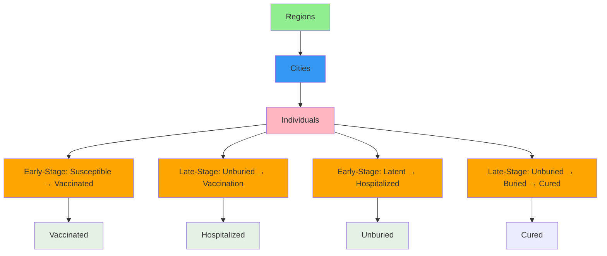
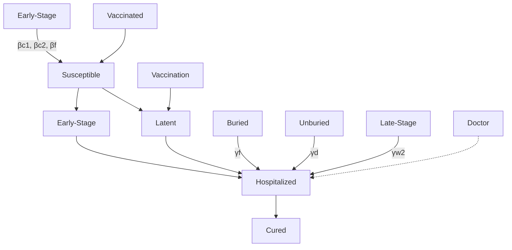

# Turning the Tables: Modeling the Fight against Ebola

Team 32722

## Abstract

We have constructed a multi-layer state-based model that appears to hold promise for providing insight into not only how the Ebola outbreak in West Africa will continue to develop, but also the best course of intervention in the event an effective vaccine or cure should be created. This model considers a large number of parameters thought to be important to or characteristic of the outbreak, including the impact of the infection’s unique progression in humans, transmission to new individuals from infected persons at different stages of the infection, and the effects of geographic connections on the movement of infected persons and pharmaceuticals.

The aforementioned multi-layer approach includes interactions on the level of the individual, a collection of individuals (or “region”), and a collection of regions, in order to capture behaviors at each scale. Individuals transition through states, representing the various stages of an Ebola infection, in a stochastic way with some probabilities being intrinsic to the illness and some being related to the current state-of-affairs in the region.

Individuals are treated as homogeneously mixed within regions, but are capable of moving between regions with probabilities determined by the various characteristics of each region. Distribution of medicines occurs at the local level through hospitals and at the regional levels through transit, with medicines and vaccines entering the simulation through defined transportation “hubs”, then being distributed along defined delivery routes from region to region.

Our model focuses exclusively on the three countries still suffering from an active presence of Ebola (Guinea, Liberia, and Sierra Leone), making predictions across the next 6 months.

Specific attention is given to the sensitivity of our model to variations in its fundamental parameters, whose values are based largely on inadequate and varied statistical data from regions affected by the outbreak. We attempt to use our model to identify important factors related to the effectiveness of distributing a cure for Ebola, and show simulation results related to the influence of geographic factors, delivery frequency/quantity, and distribution tactics in comparison to baseline predictions.

Ultimately, we have concluded that given the complex nature of this scenario and the limited quantity and quality of detailed information concerning the outbreak, it is not possible at this time to quantitatively predict the effectiveness of a vaccine/cure distribution plan. Instead, the results presented here qualitatively show how our baseline model responds to changes in the parameters that govern its behavior. These qualitative results are then used to craft a tentative deployment strategy for these hypothetical vaccines and cures.

## Contents

## 1 Introduction 4

1.1 Context of the Problem . . 4  
1.2 The Task at Hand 5  
1.3 Previous Work 6  
1.4 The GLEAM Simulator 6

## 2 Our Model 7

2.1 Modeling Objectives 7  
2.2 Problem Space 7  
2.3 The Multi-Layer State Based Stochastic Epidemic Model 8

2.3.1 Individual Layer - Stochastic State Based Model . 9  
2.3.2 Inter-Region Layer modeling . . 12  
2.3.3 Human Mobility Model . . 12  
2.3.4 Supply Distribution Model . 14  
2.3.5 A note on GLEAM 14

2.4 Implementation 15  
2.5 Additional Considerations 15

2.5.1 Modeling of Hospitals 15

2.6 Consequences of Complexity . . . 16

## 3 Sensitivity Analysis and Results 16

3.0.1 Individual Region Tests 17

3.0.1.1 Initial Number of Infected . . . . 17  
3.0.1.2 Hospital Bed Number . . . 18  
3.0.1.3 Population Scale . . . . 18  
3.0.1.4 Medicine Efficacy . . . . 19

3.0.2 Vaccine Quantity and Frequency of Shipments . . 20

3.0.3 Multiple-Region Simulations . . 22  
3.0.4 Vaccine Distribution 22  
3.0.5 Cure Distribution 24

3.0.5.1 Initial Distribution of Infected . . . . 26  
3.0.5.2 Movement Parameter Variation . . . . 26  
3.0.5.3 Inter-Regional Parameter Variation . . . . 27

3.1 Further Sensitivities and Limitations 28

3.1.1 Weather Dynamics 28  
3.1.2 Burial 28

## 4 Conclusion 28

4.1 Future Epidemic Trajectories 28  
4.2 Summary and Recommendations 29

4.2.1 The Art of Eradicating Ebola 30

4.3 Future Work . . 31  
4.3.1 Geography Based Modeling 31

4.3.2 Placement of Distribution Centers . 32  
4.3.3 Distribution Laws . 32

Appendix A Assumptions 34

Appendix B Differential Equation Model 35

## 1. Introduction

## 1.1. Context of the Problem

The ongoing outbreak of Ebola Virus Disease in Western Africa represents one of the most serious acute human health crises in the last thirty years, far exceeding the impact of SARS and the much maligned bird and swine flus. Detected in March of 2014, the disease has infected more than 20,000 people and killed nearly half of that number over the course of the past ten months [1].

The Ebola virus is a fairly recent addition to mankind’s stable of afflictions, having been first reported in 1976 in both Sudan and the Democratic Republic of the Congo. Due to the highly infectious and deadly nature of the virus, all outbreaks of Ebola prior to 2014 had been on the order of several hundred people; most infections had a tendency to flare out before they could spread significantly. The sporadic nature of these “flare-up, flare-out” cycles stalled research into the disease, its natural reservoirs, and potential treatments.

Ebola Zaire (the strain of Ebola currently afflicting West Africa and hereafter referred to as Ebola) is a virus that is transmitted primarily through direct contact with bodily fluids, entering the human body through breaks in the skin or mucus membranes. This means that transmission of the disease is easily stunted through protective equipment and procedures— gloves, masks, and face shields will prevent transmission through fluids and contact, and judicious procedure to replace and clean such equipment will prevent cross-contamination [2].

natural_image

Microscopic image of a rod-shaped bacterial cell with visible internal structures (no text or labels)

Figure 1: The Ebola virus [3]

Once an individual is exposed to Ebola, there is a 2 to 21 day incubation period in which the individual is asymptomatic and not contagious [4]. On average, symptoms develop in 8 to 10 days. Early symptoms resemble influenza and a variety of other, more common diseases, complicating detection and treatment efforts. Over a span of days, symptoms go from flu-like (fever, chills, headache, weakness, sore throat, stomach pain) to much more severe symptoms characteristic to hemorrhagic fevers, including dramatic bleeding, extremely high fever, and organ failure [4]. Fatality rates from Ebola Virus Disease range from 40%-90% percent depending on the outbreak; in the current West African outbreak, the reported fatality rate is approximately 50% to 61% [1].

text_image

EBOLA OUTBREAK IN WEST AFRICA
SENEGAL
GUINEA
SIERRA LEONE
LIBERIA
NIGERIA

Figure 2: Senegal, Nigeria, Guinea, Sierra Leone, and Liberia constitute the critical Ebola nations of West Africa. Currently, only Sierra Leone, Guinea, and Liberia have an active outbreak [1].

The Ebola outbreak in West Africa spans several nations in the region, but is most severe in Guinea, Liberia, and Sierra Leone. Nigeria, Senegal, and Mali have also reported cases, but disease response measures have proven effective in preventing further spread of the virus, and these nations are considered free of the virus as of February 4, 2015 [1]. A scattering of imported cases have also been reported in Spain, the United Kingdom, and the United States; however these nations have by and large leveraged their enormous medical resources to prevent further cases, containing it to a handful of persons. To effectively model the factors that made it possible for the normally flare-out prone Ebola to so devastate these nations, it is important to understand the region’s current state and issues.

Demographically, the population of West Africa is both large and young, with a total population of approximately 340 million people and an average age of 18 [5]. While there are three major language groups, the ethnic population of the region defies simple classification, consisting of a mosaic of tribal and ethnic ties. As mentioned previously, the region suffers from a dire lack of both transportation and medical infrastructure owing partially to its prior status as European resource-extraction colonies and military dictatorships. Liberia, for example, had only fifty physicians in the entire country prior to the outbreak. This lack of medical infrastructure is further compounded by other ongoing medical crises, such as the AIDS epidemic and malaria. In addition, years of despotic rule and war have severely reduced the ability of the populace to trust both their own government and edificies of foreign intervention, complicating control efforts from local governments, the World Health organization, and Doctors without Borders.

## 1.2. The Task at Hand

Should a cure or vaccine for Ebola be developed, it is extremely likely that its initial supply will be extremely limited. At the same time, given the current spread of the outbreak and the number of lives at risk, it will be critical to utilize the available medicines to combat and eventually eradicate Ebola as rapidly as possible. Our team aims to develop a mathematical model to formulate effective strategies for vaccine/cure delivery in this region, so as to minimize loss of life as well as the global impact and financial burden associated with this outbreak.

## 1.3. Previous Work

\* Modeling epidemics using mathematics is a practice that dates back before the widespread acceptance of germ theory, starting instead with Bernoulli’s model of the spread of smallpox and the impact of the smallpox vaccine [6]. This model was one of the first applications of the now-common branch of differential equations known as population modeling. Bernoulli was among the first to demonstrate mathematically the effectiveness of vaccination, a major landmark that has been ignored by the superstitious ever since.

From these population models, a branch of the differential equations based modeling approach known as compartmental models arose. First seen in 1927 with Kermack and McKendrick’s “Susceptible - Infected - Recovered” (SIR) approach, these models provide a means of modeling the development of epidemics while taking into account the characteristics of the disease being spread [7]. These SIR models have proven themselves to be extremely adaptable, and are frequently used to deterministically analyze the spread of relatively nonlethal diseases like Measles and Chickenpox in small populations. These models have served as the framework for the bulk of the epidemic modeling work done in the mid to late $2 0 ^ { \mathrm { t h } }$ century. The rise of computational power in the late $2 0 ^ { \mathrm { t h } }$ century has enabled the creation of an entirely new category of numerical, agent-based models for simulating the spread of epidemics.

## 1.4. The GLEAM Simulator

The Global Epidemic And Mobility simulation/visualizer suite (or GLEAMviz/GLEAM) is a framework for the creation of extremely detailed models of disease spread on a global scale. GLEAM uses a modular, multi-layer approach to incorporate many layers of information into a high-fidelity state-based simulation [8].

GLEAM’s primary benefit is its extremely detailed mobility model, which incorporates data from a variety of commercial and government sources on road, rail, sea, and air transportation between defined transportation “regions.” An accurate model of transportation between regions is incredibly important for accurately simulating the spread of a disease originating in discrete regions, and GLEAM delivers on this point.

Regional spread and disease progression characteristics are determined by stochastic, state-based rules defined within each region. Each simulated person has an associated state, such as infected or recovered. As time progresses in the simulation, each person has a chance to change from their current state to another state. The possible states, as well as the probability of changing to any given state, can be defined using a directed graph of states to states, with edges weighted by the probability of changing from one state to another. GLEAM allows users to rapidly implement their own set of state-changing rules using its convenient desktop client. Unfortunately we were unable to utilize this software for our own purposes (due to limitations to be discussed later), though we did see merit in such a novel and extensible state-based approach.

## 2. Our Model

## 2.1. Modeling Objectives

We aim to develop a model that captures the behavior of both the current Ebola outbreak in West Africa and the impact that a hypothetical vaccine or cure for Ebola would have on said outbreak. This aim is easily separated into two components: accurately accounting for the various factors and implications behind the spread of Ebola, and providing a model of the intricacies involved in the distribution and application of such treatments. This flows down and creates further issues that must be dealt with.

Ebola’s distinctive prognosis is a significant enough factor in its spread that we feel the need to incorporate it in our model. For an epidemic disease, Ebola tends to strike and kill at an alarming rate, with only a brief symptomatic period before an infected individual dies. This behavior, while frightening, has tended in the past to produce intense but shortlived outbreaks as the disease strikes down individuals before they can spread it to others. While this outbreak appears to buck the trend, it is still subject to the same fundamental progression of symptoms as the others; by ensuring that these characteristics are modeled faithfully, we can more carefully analyze scenarios that play off the natural tendency of the virus to cause self-destroying outbreaks.

As mentioned in Sec. 1, the current outbreak has arisen from a complex combination of social, political, economic, and ecological factors in West Africa, and many of these factors continue to complicate the health response. We make a decided effort to capture these “environmental” factors as they relate to the direct spread of Ebola, especially when they are characteristic of the outbreak, cf. sections 2.3.1 and 2.3.3. Examples of characteristic environmental factors influencing the spread of the outbreak include infection from burial and human migration.

Our final criterion for the model is that it faithfully and accurately shows the impacts of a hypothetical vaccine on the ongoing epidemic, which is surprisingly even harder than it sounds. The hypothetical nature of the vaccine or cure gives us control over its effectiveness and mechanism of action, but also presents a large unknown within our model that must be able to be tuned. Likewise, the freedom inherent to the unspecified distribution mechanism for the treatments requires us to model the impact of the geographic and infrastructure constraints of the region.

## 2.2. Problem Space

Breaking down these aims into something we could feasibly create in 96 hours was not a simple task. To simplify the problems our model must deal with, we have seen it prudent to define a problem-space through the definition of boundary assumptions. The implications of these boundary assumptions are expanded upon further in Sec. 3 and Appendix A.

Firstly, we have limited our model’s geographic scope to cover only the three most infected countries over the next six months, Guinea, Liberia, and Sierra Leone. While this boundary does not explicitly limit the ability of our model to deal with other nations or epidemics outside of these nations, it does allow us to focus more heavily on those nations that are hardest hit and therefore most likely to receive a coordinated eradication campaign and tailor our model more closely to these critical regions.

flowchart

Figure 3: The network and interaction of different regions are mediated by the sub-network of cities in each region, which is further mediated by the interaction of individuals in a city. Each individual is characterized by a state in the compartment diagram, simulating progression through the epidemic at the base interaction level, cf. Fig. 4 and Sec. 2.3.1.

Secondly, we expect our model to produce meaningful results only over a short term (i.e. six month) period. The failure of other models devised by major medical associations to forecast long-term conditions is indicative of the incredibly stochastic, complex, and deeply time-varying behaviors lurking behind the epidemic. A short list of these factors includes population growth, migration, seasonal change, and the international political will to support aid efforts. Rather than concerning ourselves with these long-term and varying causes, we can instead concentrate on more immediate and clear factors that will impact near-term results.

## 2.3. The Multi-Layer State Based Stochastic Epidemic Model

The relatively broad scope of our model necessitated the choice of a modeling framework that supports a high level of detail at both the individual level, wherein persons can become infected and progress through the disease with varying levels of infectiousness, to the level of an entire nation and set of nations. The implicitly multi-layer nature of this problem space drove us to use what we describe as a multi-layer state-based stochastic epidemic model, a relatively recent approach.

At the most basic level, the simulation models individuals as state-based creatures that are some quantized level of healthy ranging from susceptible to infected. Individuals transition between states in a stochastic manner, allowing for the simulation of transitions from merely infected to extremely ill to dead. The same probability-based approach also governs the likelihood that an individual will become infected from other infected individuals. More details on the specific structure and function of this layer can be found in the following section.

Moving one layer up from the individual models is the regional or “city” model. Each city acts as a node in a larger network, with connections to nearby cities that allow for the modeling of intercity movement and transportation dynamics. Although a city is comprised of individual state-based persons, the interactions between cities can be governed by different rules that may not arise from individual modeling alone.

Cities can be likewise grouped into nations and further grouped into regions and continents ad absurdum, allowing for progressively larger (or smaller) levels of detail that can be implemented in a modular way. A simulation done at the national level, for example, can be further refined by breaking nations into districts and modeling them separately, down to the level of individual villages or neighborhoods. This implicit scalability and potential for detail made the model extremely attractive for our purposes. Our specific implementation of this model is described below.

## 2.3.1. Individual Layer - Stochastic State Based Model

At the beginning of each simulation, we designate a number of individuals as either susceptible, latent, or infectious based off of World Health Organization (WHO) data on the outbreak. These individuals are accurately spread throughout the afflicted districts based on the February 2015 Situation Report [1] and, as previously mentioned, progress through the states defined in Fig. 4.

Before even entering into the probability of a state transition, individuals that are susceptible, latent, or displaying early symptoms check to see if they “decide” to move based on their region’s probability of movement, a factor whose determination is discussed in Sec. 2.3.3. Regardless of the outcome of this roll, individuals then proceed to check the modifications of their state within the context of their starting region on that day.

Transitions between states are probabilistic at two levels, depending on the transition. All transitions have a probability of occurring within the state model, defined in Table 1 when an individual is in the preceding state. Some interactions, specifically the chance of a susceptible individual becoming infected and the chance of an individual becoming hospitalized or vaccinated, must be triggered by the simulation before the aforementioned probability calculation.

The probabilities of an individual triggering an interaction with an individual deemed infectious (broken up into early stage symptomatic, late stage symptomatic, and unburied individuals) is simulation dependent and calculated at each timestep from the following equation:

$$
P _ {i n t e r a c t} = \frac {\mathrm{Quantityoftypeofindividualinregion}}{\mathrm{Totalnumberofindividualsinregion}}
$$

After a state transition has been triggered, the simulation checks the probability of such a transition occurring as governed by the probabilities listed in Table 1. These probabilities attempt to fit real-world data on the epidemic to an individual’s progression through the disease, normalized to the average duration of each stage of the illness from available data from Sierra Leone and Liberia. Guinea was discounted due to lack of available statistics, and when referenced used data from Liberia. This approach means that, on average, the duration of an individual’s case will be similar if not identical to the average real individual.

flowchart

Figure 4: The directed graph compartment model of the Ebola epidemic; red states both carry and are able to spread the infection, the orange states carry the virus but are not able to spread it, and the blue states do not further interact with the simulation. The grey nodes refer to the contact that must occur in order to progress to the next state.

In the case of susceptible individual triggering an interaction with a carrier of the virus, the simulation checks to see if the susceptible individual definitively contracts the disease, a probability governed by the parameters $\beta _ { c 1 } , \ \beta _ { c 2 }$ , and $\beta _ { f }$ respectively. These parameters represent the probability of an individual becoming infected from contact with an early-stage infected individual, a late stage infected individual, or a deceased but unburied individual, respectively. Once an individual is determined to have contracted the disease, they transition to the latent state.

Latent individuals will eventually transition to early-stage symptomatic individuals at a rate governed by $\gamma _ { w 1 }$ . The rate $\gamma _ { w 1 }$ is calculated by taking the inverse of the average incubation period, consistent with the other data sets [9]. Latent individuals are assumed to be blind to the fact that they have contracted Ebola, and behave identically to susceptible individuals, including their attempts to seek vaccination and move. Unfortunately for them, our simulated vaccines do not work on individuals who have already contracted the virus1

<table><tr><td>Parameter</td><td>Liberia Value</td><td>Sierra Leone Value</td><td>Factor</td></tr><tr><td> $\beta_{c1}$ </td><td>0.1600</td><td>0.1280</td><td>Early-stage contraction probability</td></tr><tr><td> $\beta_{c2}$ </td><td>0.3200</td><td>0.2560</td><td>Late-stage contraction probability</td></tr><tr><td> $\beta_f$ </td><td>0.4890</td><td>0.1110</td><td>Unburied contraction probability</td></tr><tr><td> $\gamma_{w1}$ </td><td>0.0833</td><td>0.0800</td><td>Average rate of developing symptoms</td></tr><tr><td> $\gamma_{w2}$ </td><td>0.1667</td><td>0.1600</td><td>Average rate of symptoms worsening [10]</td></tr><tr><td> $\gamma_{h1}$ </td><td>0.0608</td><td>0.0478</td><td>Probability of an early-stage hospitalization</td></tr><tr><td> $\gamma_{h2}$ </td><td>0.1216</td><td>0.0956</td><td>Probability of a late-stage hospitalization</td></tr><tr><td> $\gamma_d$ </td><td>0.0335</td><td>0.0580</td><td>Probability of untreated late-stage death</td></tr><tr><td> $\gamma_{dh}$ </td><td>0.0551</td><td>0.1198</td><td>Probability of hospitalized death</td></tr><tr><td> $\gamma_R$ </td><td>0.0280</td><td>0.0280</td><td>Recovery rate and probability</td></tr><tr><td> $\gamma_f$ </td><td>0.4975</td><td>0.2222</td><td>Rate of proper burials</td></tr></table>

Table 1: Model parameter values and explanation. Guinea shares the same parameters as Liberia. Most of the parameter values were taken or derived from Rivers et al. [9]

Early-stage symptomatic individuals are faced with a choice: become hospitalized with a probability $\gamma _ { h 1 }$ , which has some chance of curing them, or allow their infection to continue to worsen at probability $\gamma _ { w 2 }$ . The probabilities of hospitalization, $\gamma _ { h 1 }$ and $\gamma _ { h 2 }$ , are a product of the portion of cases that are both reported and hospitalized, 0.197, and the inverse of the average time from infection to hospitalization, 3.24 days. As we are considering two stages of infectious, we make the assumption that the probability of hospitalization of a late-stage person is double that of the early-stage. We believe that this reflects the fact that more individuals will attempt to be admitted into a hospital once they realize that their symptoms have advanced beyond a standard flu.

Once an individual “decides” to seek hospitalization, the simulation checks to see if a hospital bed is actually available in that region. If a bed is available, the individual transitions to the hospitalized state and the number of available beds in the region decreases by 1.

The extremely deadly nature of Ebola is reflected in the probabilities of death from hospitalization and untreated late-stage infection. The late-stage death probability, $\gamma _ { d } ,$ is derived from a number of factors. We factor in the percentage of cases that are reported but not hospitalized, (1 − 0.197), the current case mortality rate as of February 6, 2015, (0.555), and the inverse of the average time from infection to death, 13.31 days. The probability of death after hospitalization, $\gamma _ { d h }$ , is the product of the case mortality rate and the inverse of the average time from hospitalization to death, 10.07 days.

On the other hand, the recovery rate, $\gamma _ { R } ,$ is the product of the survival rate, (1 − 0.555), and the inverse of the average time of treated recovery, 15.88 days.

One of the reasons experts believe the current outbreak has been sustained for as long as it has is regional attitudes on corpse-handling, with some traditional funerals calling for a variety of close contact with the corpse (hugging, kissing, touching, et cetera) that allows for infection to occur between individuals and highly infectious corpses. Rivers et al. report that the traditional funeral in Liberia will last 2.01 days on average. It is during this time that a susceptible individual will be able to become infected by an unburied individual with contact probability $\beta _ { f } \colon$ ; hence, the probability to transition from unburied to buried, $\gamma _ { f }$ , is essentially the rate of proper burials, 1/(2.01 days).

For the implementation of the vaccine, we assume the ideal situation of a 100% effective vaccine. Thus we do not have a probability for the transition of susceptible to vaccinated after contact with the vaccination event. Rather, the probability of vaccination is determined by the simulation itself through the supply and demand of the vaccine. In Fig. 4, the latent individuals loop back to themselves upon the vaccination event, reflecting the fact that the vaccination did not work since they are already infected and that they have used some of the vaccine supply as well.

## 2.3.2. Inter-Region Layer modeling

Operating at a level above the individual is the region, which is broadly speaking a representation of a discrete statistical region; in less abstract terms, regions represent villages, cities, or entire national districts and nations themselves depending on the scale of the simulation. Regions provide a number of benefits to the fidelity of the simulation that are unwieldy to model at the individual level, especially with regards to the impact of geography on the spread of disease.

Each region has a number of parameters that can be defined and modified to reflect geographic and statistical realities, cf. Table 1. Regions interact with other regions through discrete, well-defined set of connections in a graph-like manner. Each day, individual regions first check to update their stockpiles of vaccines and or $\mathrm { c u r e ^ { 2 } }$ as determined by the drug distribution model (cf. Sec. 2.3.4), and then check to see what the quantity of migration between regions occurs (cf. Sec. 2.3.3). These probabilities are then passed down to the aforementioned individual layer to determine actual movement and cure usage.

An astute reader will recognize this setup as a subtype of the compartmental differential equations approach to epidemic modeling outlined in Sec. 1.3

## 2.3.3. Human Mobility Model

There are two widely used theories for modeling human mobility, the so-called “radiation” and “gravity” theories. The radiation model predicts the flux of travel between two cities, $T _ { i j }$ by their respective populations, $P _ { i }$ and $P _ { j }$ , and the population density of the surrounding area3, $s _ { i j }$ ,

$$
T _ {i j} = T _ {i} \frac {P _ {i} P _ {j}}{\left(P _ {i} + s _ {i j}\right) \left(P _ {i} + P _ {j} + s _ {i j}\right)} \tag {1}
$$

where $T _ { i }$ is the number of commuters from city i. The standard gravity model predicts the flux of travel as a function only of the population of the two cities and the inverse of the

<table><tr><td>Constant</td><td>Value</td><td>Implication</td></tr><tr><td>α</td><td>0.78</td><td>Prevalence of destination population</td></tr><tr><td>β</td><td>1.60</td><td>Prevalence of travel distance</td></tr><tr><td>γ</td><td>1.54</td><td>Prevalence of native city population</td></tr><tr><td>k</td><td>—</td><td>Chance factor, see Sec. 3.0.5.2</td></tr></table>

Table 2: Modified gravity mobility model constants for the best fit to the Guinea mobility census microdata.

distance between them to a quadratic order,

$$
T _ {i j} = \frac {P _ {i} ^ {\alpha} P _ {j} ^ {\beta}}{r _ {i j} ^ {\gamma}} \tag {2}
$$

where $\alpha , \beta _ { \mathrm { { \ell } } }$ and $\gamma$ are fitting constants. The literature reports that the radiation model more accurately matches empirical data. Unfortunately, our simulation is based around interactions between distinct groups of people (“regions”) rather than continuous population distributions. The consequence is that we would be unable to get a realistic value for $s _ { i j }$ [11].

Data on human mobility is sparse for West Africa, and while this data set does not fully encompass every aspect of human movement, we considered it the most relevant and accurate data for the purpose of having a comparison for our simulation [12]. We initially implemented the standard gravity model, yet quickly realized that we could not simulate human movement in a manner that would make sense; cities became black holes that drained the surrounding populations and lead to unreasonable population densities.

To capture a realistic movement of people as well as normalize the movement for the simplicity of our simulation, we derived a modified gravity model, defined as follows:

$$
\Phi_ {i j} (t) = k \cdot \phi_ {j} (t) \frac {P _ {j} ^ {\alpha} (t)}{r _ {i j} ^ {\beta}} \left[ \phi_ {i} (t) \frac {2 ^ {\beta} P _ {i} ^ {\gamma} (t)}{\sum_ {k} r _ {i k} ^ {\beta}} + \sum_ {k} \phi_ {k} (t) \frac {P _ {k} ^ {\alpha} (t)}{r _ {i k} ^ {\beta}} \right] ^ {- 1} \tag {3}
$$

$$
\Phi_ {i} (t) = k \cdot \phi_ {i} (t) \frac {2 ^ {\beta} P _ {i} ^ {\gamma} (t)}{\sum_ {k} r _ {i k} ^ {\beta}} \left[ \phi_ {i} (t) \frac {2 ^ {\beta} P _ {i} ^ {\gamma} (t)}{\sum_ {k} r _ {i k} ^ {\beta}} + \sum_ {k} \phi_ {k} (t) \frac {P _ {k} ^ {\alpha} (t)}{r _ {i k} ^ {\beta}} \right] ^ {- 1} \tag {4}
$$

Equation (3) is the probability that an individual will travel from city i to $j .$ . Equation (4) is the probability that an individual will remain in city i. In addition to the population density and distance between the cities, we also consider the confidence factor, $\phi _ { i } ( t )$ , of a city. The confidence factor represents the disposition of an individual considering traveling to a certain city. We reasoned that an individual’s disposition to travel to a city would be based on the number of infected (early-stage, late-stage) individuals, I(t), the number of unburied corpses, $U ( t )$ , the number of available hospital or treatment center beds, $B ( t )$ , and the number of doctors and health care staff, D(t). We formally define the confidence factor as,

$$
\phi_ {i} (t) = \exp \left[ \frac {(B (t) + D (t)) - (I (t) + U (t))}{P _ {i} (t)} \right] \tag {5}
$$

Since our modified gravity model is dependent not only on the city populations but also on the highly variant access to treatment and infected population, it is updated at each time step to reflect an individual’s changing disposition as the epidemic situation unfolds. In our modified gravity model we use the fitting constants $\alpha , \beta , \gamma ,$ , and k, for which we have chosen the following values to best fit the data, cf. Table 2. With these values our modified gravity model matched the Guinea census migration microdata for 33 cities with an average standard deviation of 3.141% and a standard deviation of 4.75% [13]. Due to the lack of mobility data for Liberia or Sierra Leone, we have assumed these same constant values for those simulation sets as well.

## 2.3.4. Supply Distribution Model

Accurately simulating the distribution and logistics behind the distribution of anti-Ebola medicines is central to the purpose and design of our model. Each geographic region has a “stockpile” of cures and/or vaccines that can be used to treat afflicted persons as outlined in the Disease section. Each time an individual in a region receives a vaccine or medicine, the regional stockpile is depleted by one, regardless of whether or not the vaccine or medicine was effective at treating the disease. In addition, our model uses estimated medical infrastructure capacities to determine the probability of an individual receiving a vaccine or treatment when they are in stock, allowing us to model the impact of constructing additional treatment facilities, the destruction of treatment facilities, and of overcrowding of treatment facilities in light of the continued spread of the disease.

We make the assumption that any cure or vaccine would need to be imported into the region, as opposed to it being manufactured locally. This complicates the logistics of vaccine manufacture and distribution, as the limited transportation infrastructure of the region makes transporting large quantities of medicine across thousands of kilometers difficult. To incorporate the implications of this issue, we have included a logistics model that operates independently of the human mobility models.

To this end, we have worked out a flexible “hub and spoke” distribution system, cf. Fig. 13. Certain cities can be designated as hub cities, which will regenerate their supplies of vaccine or cure at regular variables that can be changed or scaled to simulate different situations. From these hubs, cures and vaccines can travel by a predetermined and scenariodependent “travel rule” to other cities. This travel rule can be modified to represent varying levels of loss or spoilage en route, various distribution tactics, and various rates of distribution based on the availability of transportation. The variety of scenarios that can be modeled by this system is a testament to its design.

## 2.3.5. A note on GLEAM

Despite its extremely high fidelity data and network models, GLEAM’s closed-source nature makes it unfortunately very difficult to modify, and it lacks built-in support for modifying many of the base parameters that we would be interested in changing, such as the way hospitals and doctors interact with the infected population, production and distribution of cures, and modification of the underlying simulation, which are treated as a black box. In the light of these issues, we found it prudent to develop our own simulation, drawing inspiration from GLEAM.

## 2.4. Implementation

Our model uses a GLEAM-like combination of compartmental and metapopulation models to allow us to capture a variety of behaviors both within and between regions. This is implemented in Python, with individuals, regions, and connections between regions defined as classes to allow for the addition of the wide variety of parameters we are interested in modeling. Simulations were run using the PyPy interpreter [14]

To start, we define a list of geographic regions, their population, area, regional Ebola parameters, and the latitude and longitude of their centroids. For toy models, some of these parameters (latitude/longitude) can be defined arbitrarily, but the program treats toy data and real data as equal, so scaling to real-world data is trivial. After defining these regions, we create a list of people, each of which is assigned a starting region and an initial state, being healthy, latent-infected, or otherwise. This state can change by reassignment at any point in the simulation. Lastly, hospitals with a fixed number of beds are created and assigned to their respective regions. Any relevant parameters are saved to a file before the simulation continues.

Once all object creation is finished, the simulation begins. Once each timestep all of the regional statistics are updated - things such as “total number of open beds” or “total number of stage-1 infected individuals”. These values are often used to calculate some of the many probabilities used to advance people from state to state or region to region. Once these statistics are calculated, the program iterates over the list of people, checking their current state, generating a random number (using the Mersenne Twister engine), and seeing if the person will move from their current state to another allowed state using said random number (the allowed states being defined by the Ebola state-flow network diagram). Each person can also attempt to move to another region, with probabilities defined by our modified gravity mobility model.

This process of updating and iterating continues on for a predefined number of timesteps, with data being outout to a file after each timestep. This data was then analyzed and plotted using the Numpy and MatplotLib Python libraries [15] [16].

## 2.5. Additional Considerations

## 2.5.1. Modeling of Hospitals

For the purposes of treatment distribution, the simulation considers three levels of medical technology: basic, in which doctors and hospitals have no cure save those available today for Ebola patients; vaccine available, in which susceptible and latent individuals will attempt to obtain innoculations without a dependence on hospitals or doctors; and cure available, in which doctors and hospitals can use a stock of medicine to cure infected individuals in the early stage of the illness. These levels can be mixed and matched to simulate varying treatment regimes.

Cures are modeled as an additional path for individuals to enter the cured state at a higher probability governed by the effectiveness of the cure. Cure effectiveness is described in terms of the average number of days needed for an individual taking doses of the cure to become cured; that is, models which state the cure has an effectiveness of “5” mean that the cure being modeled will, on average, result in individuals supplied with the cure becoming cured after five simulated days. This applies only to hospitalized individuals. Unfortunately, this means that our model does not make the cure less effective for late stage individuals, which is an oversight of the model; an additional state for hospitalized late-stage individuals could be added to compensate, but for now, we treat this as an assumption.

## 2.6. Consequences of Complexity

Our attempted attention to detail in the construction of this model has inadvertently revealed a small portion of the enormous potential parameter space belying the Ebola epidemic. Between the stochastic and regional layers, we have more than twenty possible parameters that can be modified and which will have effects on the results and dynamics of our model. This is a double-edged sword; on one hand, we have many potential avenues through which to tune and adjust our model, but on the other hand, we are heavily dependent on many parameters that are not currently well known, such as the state transition probabilities in Table 1.

This extreme dependency on a large number of parameters that are calculated from largely inaccurate data presents a severe problem for our model as a source of quantitative predictions for the effectiveness of cure strategies. Instead, we feel that the strengths of our model’s focus on inclusion of dynamic effects from disparate sources lies not with numerical results but with qualitative behaviors. It is neither feasible nor desirable for us to sweep over all of our tunable parameters and all possible combinations of the parameters in an attempt to fit our model to existing data, as even with our large set of parameters we are aware of the components of the outbreak we are not modeling.

The result of these complications is that we are not able to compare the results of simulations in which multiple different parameters were varied in an apples-to-apples way. The number of parameters that can be varied makes multivariable analysis using a complex model (such as ours) an exceedingly difficult, if not impossible task.

## 3. Sensitivity Analysis and Results

Epidemic modeling, especially in the case of highly dynamic illnesses like Ebola, is notorious for its dependence on initial conditions and minor variable differences. While our model is significantly more complex than simple differential equations models, the large number of variables and components within our model makes it extremely vulnerable to chaotic disturbances arising from minor factors.

To better characterize the sensitivity of our model to the natural variations and errors present in our initial conditions and simulated components, we have performed a large number of simulations on so-called toy models. These sensitivity tests are divided into effects expected from errors arising at the single-region level (including initial number of infected, number of hospital beds, variation in virus compartment-change probabilities, etc.) and those effects expected from interaction between regions (including initial distribution of the infected, inter-region variation of parameters, human and equipment mobility model parameter variation, etc.). The method, results, and implications of these tests are given a thorough treatment below.

## 3.0.1. Individual Region Tests

All tests in this section were run on a hypothetical version of Sierra Leone’s Kailahun District. Our baseline has a population of 350,000 persons, and a latitude and longitude of 9.18S and -12.822 W respectively.

3.0.1.1. Initial Number of Infected. One major difficulty health authorities have struggled with since the beginning of the outbreak is understanding the real number of cases out there. Early on, the West African health care system did not have the infrastructure in place to deal with the region’s endemic diseases, such as HIV and malaria; during the Ebola outbreak, gathering statistics took a back seat to saving lives.

The result of this is that the number of reported cases in the region fluctuates significantly as reports come in and are adjusted. There is currently no standard for estimating the true number of infected from reported data, and the ratio of reported to total cases fluctuates dramatically [1]. Under-reporting from rural districts, which make up a majority of the West African population and tend to have the least medical and statistical infrastructure, adds an additional and highly non-linear potential for varying the number of cases.

line chart

| Time (days) | Infected (stage 1) | Cured | Vaccinated | Died | Hospitalized | Medicine used | Vaccines used |
|-------------|--------------------|-------|------------|------|--------------|---------------|---------------|
| 0           | 200                | 0     | 0          | 0    | 0            | 0             | 0             |
| 50          | 60                 | 0     | 0          | 70   | 0            | 0             | 0             |
| 100         | 40                 | 0     | 0          | 50   | 0            | 0             | 0             |
| 150         | 30                 | 0     | 0          | 40   | 0            | 0             | 0             |
| 200         | 25                 | 0     | 0          | 35   | 0            | 0             | 0             |

(a) 5% latent

line chart

| Time (days) | Infected (stage 1) | Cured | Vaccinated | Died | Hospitalized | Medicine used | Vaccines used |
| ----------- | ------------------ | ----- | ---------- | ---- | ------------ | ------------- | ------------- |
| 0           | 5500               | 0     | 0          | 0    | 0            | 0             | 0             |
| 10          | 1500               | 1200  | 1300       | 800  | 1200         | 1200          | 1200          |
| 20          | 1000               | 1200  | 1300       | 1200 | 1200         | 1200          | 1200          |
| 30          | 800                | 1200  | 1300       | 1200 | 1200         | 1200          | 1200          |
| 40          | 700                | 1200  | 1300       | 1200 | 1200         | 1200          | 1200          |
| 50          | 600                | 1200  | 1300       | 1200 | 1200         | 1200          | 1200          |
| 60          | 550                | 1200  | 1300       | 1200 | 1200         | 1200          | 1200          |
| 70          | 500                | 1200  | 1300       | 1200 | 1200         | 1200          | 1200          |
| 80          | 450                | 1200  | 1300       | 1200 | 1200         | 1200          | 1200          |
| 90          | 400                | 1200  | 1300       | 1200 | 1200         | 1200          | 1200          |
| 100         | 350                | 1200  | 1300       | 1200 | 1200         | 1200          | 1200          |
| 110         | 350                | 1200  | 1300       | 1200 | 1200         | 1200          | 1200          |
| 120         | 350                | 1200  | 1300       | 1200 | 1200         | 1200          | 1200          |
| 130         | 350                | 1200  | 1300       | 1200 | 1200         | 1200          | 1200          |
| 140         | 350                | 1200  | 1300       | 1200 | 1200         | 1200          | 1200          |
| 150         | 35                 | 12    | 13         | 12   | 12           | 12            | 12            |
| 160         | 3                  | 1     | 1          | 1    | 1            | 1             | 1             |
| 170         | 3                  | 1     | 1          | 1    | 1            | 1             | 1             |
| 180         | 3                  | 1     | 1          | 1    | 1            | 1             | 1             |
| 190         | 3                  | 1     | 1          | 1    | 1            | 1             | 1             |
| 20+         | ~3                 | ~3    | ~3         | ~3   | ~3           | ~3            | ~3            |
The chart displays the cumulative distribution of infections over time (in days) for each stage. The x-axis represents time in days, and the y-axis represents the quantity of infections (units/day). The legend indicates that 'Infected (stage 1)' is shown in blue, 'Cured' in green, 'Vaccinated' in red, 'Died' in cyan, 'Hospitalized' in magenta, 'Medicine used' in yellow, 'Vaccines used' in black. The data is already in the required format.

(b) 20% latent  
Figure 5: The rate of change in infected cases and death with 5% and 20% of the initial population starting in the latent state.

Understanding the impact of this extremely non-linear factor was accomplished by varying the initial number of cases within a single region. Increasing the percentage of individuals in a district that start out infected appears to increase the magnitude of the initial spike of cases and deaths, but in all tests the net behavior of the outbreak is similar; the infection rate appears to drop over time, with the number of new deaths initially increasing significantly and then remaining higher than the number of new infections for the duration of the simulation; if this trend continues, the virus will inevitably flare out, as victims do not spread the disease faster than they die off. The point at which the death rate exceeds the new infection rate also appears to hold steadily at roughly 25 days independent of the initial number of infected. The data does appear significantly more sensitive to minute fluctuations at lower infection numbers; this relates to the size of the population being modeled and the stochastic mechanism by which we model compartment transitions, and is expected. Overall, the initial number of infected does not appear to have a substantial effect on the qualitative behavior of an individual city.

3.0.1.2. Hospital Bed Number. Outside of our model, there is no single cure or vaccine for Ebola. Despite this, the medical community has shown that survival rates for Ebola can be dramatically improved by providing supportive treatment for the disease—keeping patients hygienic, hydrated, and isolated [17]. In addition, by isolating patients during treatment (which typically coincides with highly infectious periods for the patient), hospitalization further reduces the spread of the disease, which has many knock-on effects for improving the survival of the population as a whole.

Because of these factors, current aid efforts have focused largely on the construction and staffing of additional hospitals and treatment centers for Ebola. While the number of these centers is relatively well known and public knowledge, it also changes frequently and rapidly: prior to the outbreak, Liberia had only 0.8 hospital beds per thousand people to handle all diseases in the nation; as of January 21, 2015, treatment centers are reporting a 2 to 1 ratio of beds to reported cases, a dramatic improvement [18].

The importance and variation of the number of beds makes it a potentially decisive factor within our simulation, as it directly affects the number of individuals that can be hospitalized. Hospitalized individuals present a highly non-linear component of our model; the probability of an infected individual becoming hospitalized is governed not only by pure probability, but also by the number of other individuals seeking hospitalization. This uncertainty is compounded by the way our model handles infection chance; hospitalized individuals are treated as quarantined, and are therefore unable to further spread their disease.

Analyzing this factor was accomplished by running our single-city simulation with several different bed multipliers, ranging from the initial number of beds—which is based off of the pre-outbreak per capita number of hospital beds and therefore the lower bound—to ten times as many, comparable to that of a first-world nation. The tests were run for the standard population size of 350,000 and an initial latent fraction of five percent.

These graphs demonstrate the extreme importance of the number of hospitals in the spread and development of the virus within our model. Although each case shows a passive decline for Ebola, increasing the number of hospital beds—even by a linear scale—appears to produce large results in the rate at which the outbreak diminishes. This has very important implications for the results of our modeling endeavor, but the gist of it is that our model is highly sensitive to variations in the number of beds, and activities such as construction of new medical facilities will directly impact our results in a non-linear way; however, it is reasonable to say that in all cases, increasing the amount of hospital beds improves outcomes for the population in the model.

3.0.1.3. Population Scale. To test the behavior of our model when the total population size is changed, we simulated one region with a baseline population with the same initial percentage of the population as infected individuals, and varied both the size of the population and the number of hospitals, scaling both down by a factor of ten from the actual scale.

The very clear dependence on the scale of the population/hospitals was surprising for us to discover. Intuitively we could not understand it, as the hospital number is correct, and the rates of contact between individuals scale with the population size by definition. We believe this strong dependence comes instead from parameters that govern hospital dynamics, specifically the chance of an individual to seek medical attention, and the length of their stay once accepted. These factors did not scale with population size or hospital number, as the correct way of representing that dependency is not clear. This dependence is clearly important, and would be interesting to study. Unfortunately due to computational constraints, our simulations involving multiple cities/regions had to have the city size scaled down so that the total global population was on the order of 1 million persons. This no doubt has a poorly-defined effect on our results, though one could guess that overall hospitalization rates would be higher in these scaled-down simulations.

line chart

| Time (days) | Infected (stage 1) | Cured | Vaccinated | Died | Hospitalized | Medicine used | Vaccines used |
| ----------- | ------------------ | ----- | ---------- | ---- | ------------ | ------------- | ------------- |
| 0           | 0                  | 0     | 0          | 0    | 0            | 0             | 0             |
| 50          | 450                | 50    | 150        | 250  | 150          | 100           | 100           |
| 100         | 500                | 80    | 250        | 380  | 250          | 150           | 150           |
| 150         | 520                | 90    | 270        | 420  | 270          | 180           | 180           |
| 200         | 520                | 90    | 270        | 420  | 270          | 180           | 180           |

(a) ≈ 35, 000 people

line chart

| Time (days) | Infected (stage 1) | Cured | Vaccinated | Died | Hospitalized | Medicine used | Vaccines used |
| ----------- | ------------------ | ----- | ---------- | ---- | ------------ | ------------- | ------------- |
| 0           | 0                  | 0     | 0          | 0    | 0            | 0             | 0             |
| 50          | ~25000             | ~500  | ~1000      | ~15000 | ~1500        | ~500          | ~500          |
| 100         | ~35000             | ~1000 | ~2000      | ~25000 | ~3000        | ~1000         | ~1000         |
| 150         | ~42500             | ~1500 | ~3000      | ~35000 | ~4500        | ~1500         | ~1500         |
| 200         | ~45000             | ~2000 | ~4000      | ~40000 | ~5000        | ~2000         | ~2000         |

(b) ≈ 350, 000 people  
Figure 6: The total infection/hospitalization counts for a city of ≈ 35, 000 people (10x scale down) and a city of ≈ 350, 000 people (actual scale).

3.0.1.4. Medicine Efficacy. Our model attempts to determine the impact of a hypothetical cure or vaccine for Ebola, a virus for which there is currently no such thing. This inherently masochistic endeavor is heavily dependent upon the characteristics of such a cure or vaccine, the most important of which is treatment/vaccine’s effectiveness at curing/preventing the disease. In the process of constructing the model, the effect of an anti-Ebola cure is represented by an efficacy factor that speeds the recovery rate of hospitalized individuals while the region still has stockpiles of the cure available. Because our aims include a study of how a cure should most effectively be deployed, we expounded that it may be important to see whether the effectiveness of said cure impacts the simulation significantly enough to be considered when determining which distribution schemes to test.

A simulation of a single city was run with a set stockpile of medicine and 5 percent initial infected. Medicine efficacy multipliers were set at 2, 5 and 10, representing recovery times of 8 days, 3 days, and less than 1 day respectively. Specifically, these multipliers are applied to the value of $\gamma _ { R } ,$ the hospital recovery rate, in order to increase the chance of a hospitalized person recovering.

line chart

| Time (days) | Infected (stage 1) | Cured | Vaccinated | Died | Hospitalized | Medicine used | Vaccines used |
| ----------- | ------------------ | ----- | ---------- | ---- | ------------ | ------------- | ------------- |
| 0           | 0                  | 0     | 0          | 0    | 0            | 0             | 0             |
| 50          | ~25000             | ~500  | ~1000      | ~15000 | ~500         | ~10000        | ~500          |
| 100         | ~35000             | ~1000 | ~2000      | ~25000 | ~1000        | ~25000        | ~1000         |
| 150         | ~45000             | ~1500 | ~3000      | ~35000 | ~1500        | ~35000        | ~1500         |
| 200         | ~50000             | ~2000 | ~4000      | ~45000 | ~2000        | ~45000        | ~2000         |

(a) Medicine efficacy of 2 (≈ 8 days)

line chart

| Time (days) | Infected (stage 1) | Cured | Vaccinated | Died | Hospitalized | Medicine used | Vaccines used |
| ----------- | ------------------ | ----- | ---------- | ---- | ------------ | ------------- | ------------- |
| 0           | 0                  | 0     | 0          | 0    | 0            | 0             | 0             |
| 50          | ~25000             | ~500  | ~1000      | ~15000 | ~1000        | ~1000         | ~500          |
| 100         | ~35000             | ~1000 | ~2000      | ~25000 | ~1500        | ~2000         | ~1000         |
| 150         | ~45000             | ~1500 | ~3000      | ~35000 | ~2000        | ~3000         | ~1500         |
| 200         | ~50000             | ~2000 | ~4000      | ~42000 | ~2500        | ~4200         | ~2000         |

(b) $5 \approx 3$ days)

line chart

| Time (days) | Infected (stage 1) | Cured | Vaccinated | Died | Hospitalized | Medicine used | Vaccines used |
| ----------- | ------------------ | ----- | ---------- | ---- | ------------ | ------------- | ------------- |
| 0           | 0                  | 0     | 0          | 0    | 0            | 0             | 0             |
| 50          | ~25000             | ~1000 | ~500       | ~15000 | ~1000        | ~1000         | ~500          |
| 100         | ~35000             | ~2000 | ~1000      | ~25000 | ~2000        | ~2000         | ~1000         |
| 150         | ~45000             | ~3000 | ~1500      | ~35000 | ~3000        | ~3000         | ~1500         |
| 200         | ~47500             | ~3500 | ~2000      | ~39000 | ~3500        | ~3500         | ~2000         |

(c) $1 0 \approx 1$ day)  
Figure 7: The total infection/hospitalization counts for a city of ≈ 35, 000 people (10x scale down) and a city of ≈ 350, 000 people (actual scale).

Visual inspection of the data makes it clear that introducing more effective (i.e. faster) cures will directly reduce the number of deaths and infections. It appears that the method behind this action is two-fold—not only does the number of cured individuals increase with efficacy and the number of infected and dead decrease, but the number of persons hospitalized also shows steady increases with increasing efficacy. In our model, more effective cures lessen the duration that an infected individual will remain in a hospital. Shorter durations of stay means that the hospital will have a higher throughput; because of the way we model efficacy, more effective cures work not only because they reduce the chance of death during treatment but also because they effectively increase the capacity of hospitals.

## 3.0.2. Vaccine Quantity and Frequency of Shipments

Vaccines have a long and established history of eradicating disease, but are not always 100% effective. In this case, we once again run into the issue of dealing with a hypothetical vaccine with no defined characteristics. We have already made the assumption that the vaccine is perfectly effective, i.e. every susceptible individual given a dose of it will be unable to be infected. In real life, this will most certainly not be the case, and our model will under-predict the number of doses needed to introduce herd immunity and halt the virus. At the same time, this perfect vaccine needs to be produced and shipped to the areas that need it, a highly non-trivial process that is again complicated by Ebola’s highly infectious nature (making the manufacturing processes behind a potential vaccine more rigorous and safety focused) and the region’s limited transportation infrastructure.

To test our model’s response to wildly varying values for the quantity of vaccine deployed, we ran the simulation with specified delivery quantities with a frequency of one delivery per five days.

line chart

| Time (days) | Infected (stage 1) | Cured | Vaccinated | Died | Hospitalized | Medicine used | Vaccines used |
|-------------|--------------------|-------|------------|------|--------------|---------------|---------------|
| 0           | 0                  | 0     | 0          | 0    | 0            | 0             | 0             |
| 50          | ~25000             | ~100  | ~500       | ~15000 | ~100         | ~50           | ~100          |
| 100         | ~35000             | ~150  | ~100       | ~25000 | ~150         | ~100          | ~200          |
| 150         | ~45000             | ~200  | ~150       | ~35000 | ~200         | ~150          | ~300          |
| 200         | ~50000             | ~250  | ~200       | ~42000 | ~250         | ~200          | ~400          |

(a) 100 vaccines added every 5 days

line chart

| Time (days) | Infected (stage 1) | Cured | Vaccinated | Died | Hospitalized | Medicine used | Vaccines used |
| ----------- | ------------------ | ----- | ---------- | ---- | ----------- | ------------- | ------------- |
| 0           | 0                  | 0     | 0          | 0    | 0           | 0             | 0             |
| 50          | ~25000             | ~1000 | ~10000     | ~15000 | ~100        | ~500          | ~500          |
| 100         | ~35000             | ~1500 | ~20000     | ~25000 | ~150        | ~1000         | ~1000         |
| 150         | ~45000             | ~2000 | ~30000     | ~35000 | ~200        | ~1500         | ~1500         |
| 200         | ~48000             | ~2500 | ~35000     | ~42000 | ~250        | ~2000         | ~2000         |

(b) 1000 vaccines every 5 days

line chart

| Time (days) | Infected (stage 1) | Cured | Vaccinated | Died | Hospitalized | Medicine used | Vaccines used |
|-------------|--------------------|-------|------------|------|--------------|---------------|---------------|
| 0           | 0                  | 0     | 0          | 0    | 0            | 0             | 0             |
| 50          | ~20000             | ~15000| ~15000     | ~15000| ~15000       | ~15000        | ~15000        |
| 100         | ~25000             | ~25000| ~25000     | ~25000| ~25000       | ~25000        | ~25000        |
| 150         | ~30000             | ~30000| ~30000     | ~30000| ~30000       | ~30000        | ~30000        |
| 175         | ~32500             | ~32500| ~32500     | ~32500| ~32500       | ~32500        | ~32500        |

(c) 10000 vaccines every 5 days

line chart

| Time (days) | Infected (stage 1) | Cured | Vaccinated | Died | Hospitalized | Medicine used | Vaccines used |
|-------------|--------------------|-------|------------|------|--------------|---------------|---------------|
| 0           | 0                  | 0     | 0          | 0    | 0            | 0             | 0             |
| 50          | ~20000             | ~15000| ~180000    | ~10000| ~500         | ~500          | ~25000        |
| 100         | ~25000             | ~20000| ~320000    | ~15000| ~500         | ~500          | ~32500        |
| 150         | ~25000             | ~25000| ~325000    | ~20000| ~500         | ~500          | ~32500        |
| 200         | ~25000             | ~25000| ~325000    | ~25000| ~500         | ~500          | ~32500        |

(d) 20000 vaccines every 5 days  
Figure 8: Total infection rate with changes in amount of vaccine distributed to a single city.

Our single-region results show that low quantities of vaccine actually do very little to slow the outbreak, as the number of persons vaccinated is small when compared to the number of new infections. However, when a large number of individuals can be vaccinated—more than are infected every day—the vaccine tends to slow the spread of infection and therefore the number of deaths. While we estimate the number of doses that could be produced per week from manufacturing data on other vaccines, this result does have important implications for the distribution of vaccinations: namely, that it may not be worthwhile to send vaccines into a region where it is know that the rate of new infections will exceed the rate of vaccination. Stated concisely, vaccines are only effective when the rate at which they can be manufactured and deployed is higher than the rate at which new individuals are infected. This is often the case for regions surrounding a region undergoing a large outbreak; vaccinating these areas may prove effective at slowing the outward spread of the disease, which agrees with our intuition.

## 3.0.3. Multiple-Region Simulations

Usage of multi-layer node models allows for the modeling of behaviors at varying scales and levels of complexity, but also introduces the potential for highly chaotic and non-linear behavior. With the behavior of each individual node now fairly well understood, we sought to understand how the assumptions we made in modeling the connections and interactions between regions comes into play.

Due to the extreme complexity intrinsic to modeling an entire geopolitical region of the world, we used our four-city toy model to develop qualitative insights from our model before attempting to tackle a large-scale simulation of the region.

<table><tr><td>City</td><td>Population</td><td>Latitude and Longitude</td><td>Initial Percent Infected (Latent)</td><td>Parameter Set</td></tr><tr><td>A</td><td>350,000</td><td>9.17N, -12.82E</td><td>10%</td><td>Liberia</td></tr><tr><td>B</td><td>500,000</td><td>9.31N, -12.16E</td><td>10%</td><td>Liberia</td></tr><tr><td>C</td><td>335,000</td><td>9.72N, -12.75E</td><td>10%</td><td>Liberia</td></tr><tr><td>D</td><td>400,000</td><td>9.65N, -11.68E</td><td>10%</td><td>Liberia</td></tr></table>

Table 3: Toy model cities, initial conditions, and parameter sets

## 3.0.4. Vaccine Distribution

Firstly, a simulation of the possible methods of distributing a vaccine was performed. Four scenarios were devised:

1. Rural infection distribution, focus vaccine distribution to urban centers  
2. Rural infection distribution, focus vaccine distribution to rural districts  
3. Urban infection distribution, focus vaccine distribution to urban centers  
4. Urban infection distribution, focus vaccine distribution to rural districts

line chart

| Time (days) | Infected (stage 1) | Cured | Vaccinated | Died | Hospitalized | Medicine used | Vaccines used |
| ----------- | ------------------- | ----- | ---------- | ---- | ------------ | ------------- | ------------- |
| 0           | 0                   | 0     | 0          | 0    | 0            | 0             | 0             |
| 50          | ~10000              | ~1000 | ~2000      | ~5000| ~1000        | ~12000        | ~15000        |
| 100         | ~12000              | ~1500 | ~3000      | ~7500| ~1500        | ~15000        | ~20000        |
| 150         | ~14000              | ~2000 | ~4000      | ~10000| ~2000        | ~15500        | ~25000        |
| 200         | ~15500              | ~2500 | ~5000      | ~12500| ~2500        | ~16000        | ~30000        |

(a) Rural regions infected, vaccines distributed to rural regions

line chart

| Time (days) | Infected (stage 1) | Cured | Vaccinated | Died | Hospitalized | Medicine used | Vaccines used |
| ----------- | ------------------ | ----- | ---------- | ---- | ------------ | ------------- | ------------- |
| 0           | 0                  | 0     | 0          | 0    | 0            | 0             | 0             |
| 50          | ~8000              | ~500  | ~2000      | ~4000| ~1000        | ~13000        | ~10000        |
| 100         | ~12000             | ~1000 | ~3000      | ~8000| ~1500        | ~16000        | ~17000        |
| 150         | ~15000             | ~1500 | ~3500      | ~12000| ~2000       | ~16500        | ~25000        |
| 200         | ~16000             | ~2000 | ~4000      | ~14000| ~2500       | ~16500        | ~29000        |

(b) Rural regions infected, vaccines distributed to urban regions

line chart

| Time (days) | Infected (stage 1) | Cured | Vaccinated | Died | Hospitalized | Medicine used | Vaccines used |
| ----------- | ------------------ | ----- | ---------- | ---- | ------------ | ------------- | ------------- |
| 0           | 0                  | 0     | 0          | 0    | 0            | 0             | 0             |
| 50          | ~12000             | ~1000 | ~8000      | ~6000| ~2000        | ~25000        | ~15000        |
| 100         | ~15000             | ~1500 | ~14000     | ~10000| ~3000        | ~35000        | ~25000        |
| 150         | ~16000             | ~2000 | ~22000     | ~12000| ~4000        | ~45000        | ~35000        |
| 200         | ~16500             | ~2500 | ~28000     | ~13000| ~4500        | ~55000        | ~45000        |

(c) Urban regions infected, vaccines distributed to urban regions

line chart

| Time (days) | Infected (stage 1) | Cured | Vaccinated | Died | Hospitalized | Medicine used | Vaccines used |
|-------------|--------------------|-------|------------|------|--------------|---------------|---------------|
| 0           | 0                  | 0     | 0          | 0    | 0            | 0             | 0             |
| 50          | ~12000             | ~1000 | ~8000      | ~6000| ~2000        | ~25000        | ~15000        |
| 100         | ~15000             | ~2000 | ~14000     | ~10000| ~3000        | ~35000        | ~25000        |
| 150         | ~16000             | ~2500 | ~22000     | ~12000| ~4000        | ~45000        | ~35000        |
| 200         | ~16500             | ~3000 | ~29000     | ~13000| ~4500        | ~55000        | ~45000        |

(d) Urban regions infected, vaccines distributed to rural regions  
Figure 9: Changes in infection count with differences in vaccine distribution.

Interestingly, the two urban distribution cases and the two rural distribution cases show opposite results; vaccinating city dwellers during a primarily rural infection appears to slightly reduce the total number of deaths and infections, while focusing the vaccination effort on rural areas during a largely urban outbreak tends to slightly increase the number of infections and deaths.

Discounting the implicit assumptions behind the vaccination characteristics we have chosen, we can infer a number of trends from this population data. Rural outbreaks – which are assumed to be small due to the low population density in these regions – do tend to move towards urban centers, making vaccinating urban centers during the early stages of an outbreak very effective while it is still largely contained in rural regions. Urban outbreaks, on the other hand, tend to be large but do not spread as readily to rural areas. The high rate of growth of these outbreaks means that vaccination during the middle of a large, urban outbreak does not appear to have a significant impact on the number of infections or deaths. However, as shown in our sensitivity analysis, vaccination campaigns in large cities with outbreaks can be successful if it is possible to flood the city with vaccinations faster than the disease will spread (i.e. vaccinations must outpace new infections).

However, it is important to remember that our human mobility model is gravity-based, with large urban centers tending to draw in more individuals than rural ones in order to represent them as hubs of travel and commerce. This simple model is likely to blame for some of the difference in results between the two scenarios; while rural cases will readily move into the urban nodes, urban cases do not return the favor, leading to a bias towards urban cases. Whether this accurately describes human behavior is discussed in Appendix A.

Qualitatively, we can say that this simulation reinforces our previously discussed notion of the role of vaccines during very large outbreaks. When it is possible to manufacture and distribute doses of the vaccine faster than the outbreak spreads, vaccination campaigns reduce the number of infections and deaths. Otherwise, the campaigns—while having some impact—do not appear to significantly impact the health outcomes for the region.

## 3.0.5. Cure Distribution

Following from the findings in the vaccine distribution case, a similar set of tests was run with doses of the cure4:

1. Rural infection distribution, focus cure distribution to rural districts  
2. Rural infection distribution, focus cure distribution to urban centers  
3. Urban infection distribution, focus cure distribution to urban centers  
4. Urban infection distribution, focus cure distribution to rural districts

line chart

| Time (days) | Infected (stage 1) | Cured | Vaccinated | Died | Hospitalized | Medicine used | Vaccines used |
| ----------- | ------------------ | ----- | ---------- | ---- | ------------ | ------------- | ------------- |
| 0           | 0                  | 0     | 0          | 0    | 0            | 0             | 0             |
| 50          | ~7000              | ~100  | ~200       | ~400 | ~100         | ~1200         | ~1000         |
| 100         | ~12000             | ~150  | ~300       | ~800 | ~150         | ~1500         | ~1500         |
| 150         | ~15000             | ~200  | ~400       | ~1200| ~200         | ~1500         | ~2500         |
| 200         | ~16000             | ~250  | ~500       | ~1300| ~250         | ~1500         | ~3000         |

(a) Rural regions infected, medicine distributed to rural regions

line chart

| Time (days) | Infected (stage 1) | Cured | Vaccinated | Died | Hospitalized | Medicine used | Vaccines used |
| ----------- | ------------------ | ----- | ---------- | ---- | ------------ | ------------- | ------------- |
| 0           | 0                  | 0     | 0          | 0    | 0            | 0             | 0             |
| 50          | ~8000              | ~500  | ~2000      | ~4000| ~1000        | ~15000        | ~12000        |
| 100         | ~12000             | ~1000 | ~3000      | ~8000| ~1500        | ~16000        | ~18000        |
| 150         | ~15000             | ~1500 | ~4000      | ~12000| ~2000       | ~16500        | ~25000        |
| 200         | ~16000             | ~2000 | ~5000      | ~13500| ~2500       | ~16500        | ~29000        |

(b) Rural regions infected, medicine distributed to urban regions

line chart

| Time (days) | Infected (stage 1) | Cured | Vaccinated | Died | Hospitalized | Medicine used | Vaccines used |
| ----------- | ------------------ | ----- | ---------- | ---- | ------------ | ------------- | ------------- |
| 0           | 0                  | 0     | 0          | 0    | 0            | 0             | 0             |
| 50          | ~12000             | ~1500 | ~10000     | ~7000 | ~2000        | ~25000        | ~15000        |
| 100         | ~15000             | ~2500 | ~15000     | ~10000 | ~3000        | ~30000        | ~25000        |
| 150         | ~16000             | ~3500 | ~25000     | ~12000 | ~4000        | ~35000        | ~35000        |
| 200         | ~16500             | ~4500 | ~35000     | ~13000 | ~5000        | ~38000        | ~45000        |

(c) Urban regions infected, medicine distributed to urban regions

line chart

| Time (days) | Infected (stage 1) | Cured | Vaccinated | Died | Hospitalized | Medicine used | Vaccines used |
|-------------|--------------------|-------|------------|------|--------------|---------------|---------------|
| 0           | 0                  | 0     | 0          | 0    | 0            | 0             | 0             |
| 50          | ~12000             | ~1000 | ~8000      | ~6000| ~2000        | ~25000        | ~15000        |
| 100         | ~15000             | ~1500 | ~14000     | ~10000| ~3000        | ~35000        | ~25000        |
| 150         | ~16000             | ~2000 | ~22000     | ~12000| ~4000        | ~45000        | ~35000        |
| 200         | ~16500             | ~2500 | ~28000     | ~13500| ~4500        | ~55000        | ~45000        |

(d) Urban regions infected, medicine distributed to rural regions  
Figure 10: Total infection count with differences in medicine distribution.

In all of the scenarios, it appears that distributing doses of the cure to the regions most heavily afflicted by the illness is the most effective at reducing the number of deaths and infections. This is highly intuitive—curing individuals with Ebola both prevents them from spreading the illness and allows them to leave the hospitals, freeing up that room for additional patients. This allows further patients to be admitted, isolating them to prevent further spread and steadily slowing the cycle of infections.

These scenarios do not appear to be heavily impacted by our transportation model, likely owing to the more straightforward mode of action by which supplying the cure defeats the outbreak. Curing individuals in rural regions prevents them from spreading the illness to the urban region; curing individuals in the urban region prevents further spread to either region.

However, we do have a constant number of hospital beds in each region, which is defined in relation to data on the total number of beds in the country as a whole. This assumption is not valid, as there is little doubt that most hospitals lie in large urban centers. In order for these results to be more valid, hospitals or treatment centers capable of effectively distributing medicine to those in need would need to be set up in rural settings. How the system will behave without this condition was not studied, but would be very interesting.

3.0.5.1. Initial Distribution of Infected. As mentioned previously, the health care response in this outbreak has suffered tremendously in the face of inadequate statistical data, especially in rural areas. Similar to the single-region test of the number of initial infected, we sought to identify the behavioral changes stemming from varying distributions of the initial population of infected individuals.

For any given n regions and k initial distributions of infected persons, there exist a very large number of potential distributions that can be tested. Rather than gaze into that abyss of a parameter space, we looked at three simple initial configurations; mostly rural infections, mostly urban infections, and an even mix of both urban and rural.

3.0.5.2. Movement Parameter Variation. Like the rest of the statistical data from West Africa, information on the motion and mobility of people remains scattered at best and has been a major sticking point for models of this outbreak. Our model, which uses a small set of empirical data from mobile phones, is vulnerable to both over- and under-estimation of the number of persons that migrate around the region [13].

Evaluating the effect of larger or smaller quantities of moving persons was accomplished by varying a so-called chance factor, $k ,$ that multiplies the probability that an individual will chose to move between cities. We tested the multi-region simulation at chance factors of $k \_ = 1$ , and 5, where 1 represents a higher transportation rate than 5 (essentially the probability of moving is divided by k).

line chart

| Time (days) | Infected (stage 1) | Cured | Vaccinated | Died | Hospitalized | Medicine used | Vaccines used |
|-------------|--------------------|-------|------------|------|--------------|---------------|---------------|
| 0           | 0                  | 0     | 0          | 0    | 0            | 0             | 0             |
| 50          | ~10000             | ~2000 | ~8000      | ~4000| ~2000        | ~15000        | ~6000         |
| 100         | ~13000             | ~2500 | ~15000     | ~7000| ~3000        | ~25000        | ~12000        |
| 150         | ~15000             | ~3000 | ~25000     | ~9000| ~4000        | ~35000        | ~22000        |
| 200         | ~15500             | ~3500 | ~35000     | ~11000| ~5000       | ~45000        | ~32000        |

(a) Movement factor $k = 1$ , higher movement rate

line chart

| Time (days) | Infected (stage 1) | Cured | Vaccinated | Died | Hospitalized | Medicine used | Vaccines used |
| ----------- | ------------------ | ----- | ---------- | ---- | ------------ | ------------- | ------------- |
| 0           | 0                  | 0     | 0          | 0    | 0            | 0             | 0             |
| 50          | ~10000             | ~2000 | ~5000      | ~7000| ~3000        | ~25000        | ~15000        |
| 100         | ~15000             | ~3000 | ~10000     | ~12000| ~4000        | ~45000        | ~25000        |
| 150         | ~16000             | ~3500 | ~15000     | ~13000| ~4500        | ~55000        | ~35000        |
| 200         | ~16500             | ~4000 | ~20000     | ~14000| ~5000        | ~60000        | ~45000        |

(b) Movement factor $k = 5 ,$ lower movement rate  
Figure 11: Changes in infection count with varying movement factos.

The results of this simulation show surprisingly little dependence on the rate at which people migrate. The end quantities of cure used, number of infected, and number of dead tend to increase with increasing mobility, but remain within roughly ten percent of one another; more importantly, the overall behavior of the simulation appears unchanged. This remains only somewhat reassuring—the affect of individual migration scales non-linearly with the number of cities and their population, and so the effect of variations in this parameter will likely become more apparent at very large scales. This implicit issue is discussed further in Appendix A.

3.0.5.3. Inter-Regional Parameter Variation. The parameters governing the characteristics of Ebola vary from country to country. We study this behaviour by setting the parameters for each city to different sets of values, i.e. one simulation where all of the cities are “in” Libera, one where they are all in Sierra Leone, and one where they are mixed.

line chart

| Time (days) | Infected (stage 1) | Cured | Vaccinated | Died | Hospitalized | Medicine used | Vaccines used |
| ----------- | ------------------ | ----- | ---------- | ---- | ------------ | ------------- | ------------- |
| 0           | 0                  | 0     | 0          | 0    | 0            | 0             | 0             |
| 50          | ~10000             | ~1000 | ~5000      | ~5000| ~2000        | ~30000        | ~10000        |
| 100         | ~15000             | ~2000 | ~15000     | ~10000| ~4000        | ~45000        | ~25000        |
| 150         | ~16000             | ~2500 | ~25000     | ~12000| ~5000        | ~58000        | ~35000        |
| 200         | ~16500             | ~3000 | ~30000     | ~13000| ~6000        | ~60000        | ~45000        |

(a) All cities in Liberia

line chart

| Time (days) | Infected (stage 1) | Cured | Vaccinated | Died | Hospitalized | Medicine used | Vaccines used |
| ----------- | ------------------ | ----- | ---------- | ---- | ------------ | ------------- | ------------- |
| 0           | 0                  | 0     | 0          | 0    | 0            | 0             | 0             |
| 50          | 8000               | 5500  | 12000      | 2000 | 1500         | 12500         | 12500         |
| 100         | 8500               | 5750  | 17500      | 2250 | 1750         | 12500         | 17500         |
| 150         | 8500               | 5750  | 22500      | 2250 | 1750         | 12500         | 22500         |
| 200         | 8500               | 5750  | 27500      | 2250 | 1750         | 12500         | 27500         |

(b) All cities in Sierra Leone

line chart

| Time (days) | Infected (stage 1) | Cured | Vaccinated | Died | Hospitalized | Medicine used | Vaccines used |
| ----------- | ------------------ | ----- | ---------- | ---- | ------------ | ------------- | ------------- |
| 0           | 0                  | 0     | 0          | 0    | 0            | 0             | 0             |
| 50          | ~9000              | ~3000 | ~1000      | ~4000| ~2000        | ~15000        | ~8000         |
| 100         | ~11000             | ~4000 | ~1500      | ~6000| ~3000        | ~25000        | ~12000        |
| 150         | ~12000             | ~4500 | ~2500      | ~7000| ~3500        | ~35000        | ~18000        |
| 200         | ~12500             | ~4500 | ~3500      | ~7500| ~4000        | ~38000        | ~25000        |

(c) 2 cities in Liberia, 2 cities in Sierra Leone  
Figure 12: The total infection counts for a 4 city system, with various region-specific Ebola parameters chosen.

Our simulation shows a high dependence on the local parameter sets of a region, cf. Table 1. This is evident in the data as well when identifying the number of cases, deaths, and primary vectors of the spread for Guinea, Liberia, and Sierra Leone [1]. Unfortunately, the values of the parameters vary in the literature and Guinea completely lacks enough data to compile an appropriate parameter set. These results do effectively rule out the possibility of generalizing “West Africa” into one region for the purposes of modelling, as Ebola spreads very differently in different regions, and these effects do not “even out”. Furthermore, a limitation of our approach is claiming that the parameter sets do not change within any given region - an assumption that is likely unjustified, but hard to get around without extraordinarily better data on this region.

## 3.1. Further Sensitivities and Limitations

In addition to the model sensitivities that we were able to easily study, we identified many other potential sensitivities and limitations of our model arising from the assumptions listed in Appendix A. To provide a better portrait of our model before discussing any formal results of our modeled scenarios, these further limitations are discussed here.

## 3.1.1. Weather Dynamics

Seasonal changes aside, there is no support in the literature for local weather directly affecting the transmission of the disease. The primary sensitivity would be during the of the wet season from May to October, as many remote areas will no longer be accessible. The most effective way to represent these regions in our model would be to represent their connections to other regions as time-varying—we chose to simply ignore them for the purposes of our study. As this is the first Ebola outbreak of such magnitude, data on effective transportation measures for such a large amount of aid during the wet season is absent and difficult to postulate. Typical vehicles would likely not be useable, and air-drops may be more appropriate, though more costly.

This aside, the climate of West Africa remains constant for the most part throughout the year and does not experiece any wide fluctuations in temperature. While a local climate may have an effect on the outbreak, it is not considered in our current study of West Africa.

## 3.1.2. Burial

The literature almost unanimously agrees on the predominance of proper body disposal. One of the initial surges of Ebola in Guinea originated at a single funeral in which over 300 individuals became infected. Guinea still reports almost 60% of its cases related to funeral practices [19]. Even now that the outbreak is well known among the population, the most recent WHO Ebola Situation Report has documented 35 unsafe burials for Guinea and 11 unsafe burials for Sierra Leone [1]. One could potentially model this burial behavior with “bursts” of new infections at various points in time, but whether or not this is more or less accurate is not clear.

## 4. Conclusion

## 4.1. Future Epidemic Trajectories

An interesting and unexpected result of all of our models is that, in every case we looked at, the Ebola outbreak always displayed self-limiting behavior. Indeed, a defining characteristic of our simulations is that the total number of infected appears to grow either logarithmically or as a decaying exponential up to a point, after which growth stops and the outbreak ends.

In addition to the reassuring nature of this finding, it is consistent with both recent WHO situation reports [1] and the indication of previous outbreaks. Currently, the WHO is reporting that the number of new outbreaks being reported in Guinea, Liberia, and Sierra Leone is decreasing steadily, similar to the behavior predicted by our model. Prior outbreaks have also universally shown self-limiting behavior over their relatively brief durations, and this behavior is highly characteristic of Ebola and other diseases with high mortality rates.

Ultimately, this demonstrated behavior lends credence to the behavioral accuracy of our model and allows us to focus our advice on optimizing the usage of a hypothetical cure or vaccine to bring an end to the illness, rather than simply controlling it.

## 4.2. Summary and Recommendations

We have developed a multi-layer, stochasic, state-based model that allows for the incorporation of real world data into the modeling of the Ebola outbreak and the impact of a potential cure. As shown by our simulations, our model demonstrates behavioral stability and predicts baseline results that are consistent with the predictions of major world health organizations. We have also shown that it provides an extensible framework for the modeling of various kinds of treatment for the cure and prevention of Ebola, including the modeling of implications of different distribution strategies for said treatments. In addition, we have performed an introductory analysis of the sensitivity of our model to parameters that we believe are critically important to the behavior of the system, providing future users with some indication of how changes to parameters with physical significance (such as the initial number of infected and availability of hospital beds) will affect the predictions of our model. Our sensitivity analysis, when coupled with the actual results of our simulation, provides valuable insight into the qualitative dynamics of the outbreak.

Our multi-layer modeling approach does appear to have several merits with regards types of behavioral parameters it incorporates. First and foremost, our model has shown itself to be highly adaptable, supporting a variety of potential geographic and geopolitical scenarios through modification of the region layer. This level of modeling allows analysts to perform what-if simulations on the impact of various transportation and infrastructure changes in the region, such as the construction of roads or how transportation logistics will change during the wet season. This ability is doubly important due to the upcoming wet season in the region, in which many rural areas become yet more isolated when the roads linking them to the rest of the region are cut off.

In addition, the stochastic state modeling approach used to model individual agents within the simulation has shown itself to be a flexible method of incorporating the complex and characteristic nature of both the Ebola virus and the region at large into the simulation. The set of probabilities that govern transitions between states can be modified and tuned as new data on the outbreak becomes available, and allows for the incorporation of individual “willingness” or “preference” into the simulation.

However, we are acutely aware of our model’s extreme dependence on a large parameter set that is itself dependent on information from the real-world that is unreliable and incomplete. Upon attempting to gather relevant statistics on the outbreak, we found that the majority of available information was either not up to date, did not exist, or described itself as inaccurate and approximate. Because of this, we conclude that it is neither possible nor reasonable to draw quantitative conclusions from models that attempt to capture as much behavior as ours.

## 4.2.1. The Art of Eradicating Ebola

Should a cure or vaccine for Ebola ever materialize, early results from our model—while not definitive—shed some light on how such treatments would be best utilized. However, if there is one thing developing this model has taught us, it is that making predictions for this region of the world is more of an art than a science. This section aims to present a coherent set of guidelines from our model’s preliminary, qualitative results to aid organizations intending to deploy a cure or otherwise fight the Ebola outbreak.

The “Zeroeth Law” of this strategem (one that we ourselves overlooked before attempting this problem) is to mind always the extreme complexity and delicacy of the entire outbreak system. The results of seemingly innocent modifications to parameters can have unexpectedly dramatic results. Additionally, the history of the present outbreak shows that fundamental and important parameters, such as the rate at which the virus can be transmitted, can vary wildly based on factors that may not be immediately observable or predictable. With this in mind, one should acknowledge that there are no hard and fast rules in the realm of epidemic modeling, and least so when fighting Ebola in West Africa.

First and foremost, it is apparent from our simulations that the existence or development of a cure or vaccine does not preclude the continued development of medical infrastructure within the region. Hospitals and treatment wards allow highly contagious Ebola patients to be isolated, preventing further spread of the disease through quarantine. In our scenario, such infrastructure is also a requirement to distribute a treatment that will cure individuals already infected with Ebola, so halting investments in hospitals to fund cure or vaccine research is likely poor practice. (Medical infrastructure will also help deal with the huge number of other medical problems the region will face after dealing with this outbreak, but that is a tangential benefit from our perspective).

With regards to the distribution of medication, it is important to note the difference between preventative medications (i.e. vaccines) and curative ones. Vaccination is a powerful tool for preventing the spread of an epidemic, but due to herd immunity effects, works best when implemented on a scale that outpaces the rate of infection. Cures, on the other hand, act in a more linear manner; each dose of a curative medicine supplied to a region will increase the number of individuals in that region that survive. The type of treatment is therefore fundamental to the strategy one employs to combat the virus.

As previously described, vaccines are most effective when used in regions with few to no cases of the virus. Inoculating these regions will prevent the spread of the virus, which has the same effect on a regional scale as hospitals do on a small scale. Using doses of vaccine to keep the outbreak contained within the most afflicted regions, while ethically suspect, will likely save more lives than attempting to vaccinate everyone equally and allowing the virus to spread.

Cures, on the other hand, will linearly reduce the number of persons infected with the virus and the number of persons occupying hospital beds. This one-two punch means that cures, when supplied to a region, do even better than expected if the cure takes less time to take effect than the average duration of a recovery or death, as the cure will effectively free up additional hospital beds and improve the “efficiency” of hospitals at treating and

isolating patients.

Finally, we should note that in a scenario as complex as this one, models are not a substitute for real data, and a close eye should be kept on both the actual trends predicted from data and ground reports in addition to those produced by models. In addition, should models be necessary, an effort must be made to procure useful and accurate data on the ground to provide background for these models, something we sorely lacked.

## 4.3. Future Work

Our model was intended to be used with a large number of regions corresponding to actual geographic regions, with specific regional parameters derived from real-world data. This would allow us to run simulations with specific geographic meaning with varying degrees of fidelity. However, gathering the data on the geographic specifics of each region, how they connect, and how the outbreak is currently occurring in them turned out to be a monumental task outside of the scope of this 96 hour project.

## 4.3.1. Geography Based Modeling

There comes a time in every model’s life when it must put away simple toy models and attempt to tackle the things it was built to deal with. One of the core features of our multilayered approach is that it is a simple matter to expand a simulation to include additional levels of detail, from adding new cities to new regions to new nations outright.

We had devised but did not implement an extremely simple model of the infected region demonstrating this potential application of our approach, cf.13. These nodes, and their geographic positions, were chosen in an arbitrary manner but are intended to represent the major urban centers of each nation and rural areas that are either largely isolated or closely bordering other nations. We make no claims as to the accuracy of this model as it relates to actual geopolitical connections between these nations, nor do we use it to make actual claims about said region. It exists to serve as an example of the mixture of urban, rural, and isolated communities present in the West Africa region and serve as an example of the types of behaviors that emerge when dealing with such a system.

map with network connections

| Region         | Urban | Rural | Isolated |
| -------------- | ----- | ----- | -------- |
| Conakry        | Green | Green | Orange   |
| Freetown       | Green | Yellow| Orange   |
| Sierra Leone  | Yellow| Yellow| Orange   |
| Liberia        | Green | Yellow| Orange   |
| Monrovia       | Green | Green | Orange   |

Figure 13: The generalized geography based network model. Background image from [20].

## 4.3.2. Placement of Distribution Centers

We have already covered at length the fact that the lack of infrastructure in the region complicates aid efforts due to the level of difficulty in getting persons and material from one point to another. At the same time, the distribution of population in the afflicted countries typically features a few dense cities spread throughout low-density, semi-isolated rural regions.

This raises an interesting conundrum: where do we first ship our medicines, such that we minimize the number of persons afflicted with the disease and the duration of the outbreak?

Our model allows us to attempt to answer this question by changing which nodes are identified as transportation hubs and are therefore capable of receiving shipments of the cure and vaccine from the outside world. Investigating the trade off of placing distribution centers—which are guaranteed to receive more doses of the cure and vaccine—in extremely populated areas that are vulnerable to massive outbreaks versus extremely well-connected regions without regard to the number of infected is an interesting one, and one that can be potentially investigated with our model.

## 4.3.3. Distribution Laws

Considering data gathered with our 4-region model, it is apparent that different methods of splitting the limited quantity of drugs between nodes will produce different outcomes, and that some distributions are more favorable than others with regards to human survivability.

To examine the effects of this behavior, our model could be forced to distribute medications in accordance to a variety of additional distribution rules. For example, it may make sense for individual regions to consider the regions it is connected to and distribute a quantity of medicines that is proportional to the number of infected persons in those regions. Or perhaps another approach more equitably reduces the number of deaths. In either case, the modular framework for defining distribution laws should allow for more modeling to be done in this region, contingent on the ability of the modeler to obtain accurate and sensible data on the geographic and infrastructure factors within a region.

## Appendix A. Assumptions

1. Closed system: Regions in the simulation constitute the “world” as a whole, i.e. there are no people able to enter from/leave to other undefined regions. This limits our ability to model the spread on a global scale without including the entire world in our simulation.  
2. Partial Motivation: Individuals in the simulation react to the overall state of the epidemic in a city, φi(t), but are unable to have any further motivations, such as familial ties. This does not allow us to encompass full human behavior.  
3. Data collected on West African Countries is accurate, if it exists: Data from this region is notoriously hard to find, incomplete, and/or out of date. Since no other data exists (aside from synthetic data, see [21]) we assume what we have is accurate.  
4. Modified Gravity Mobility Model is accurate: The core of this model seems sound, and its predictions match empirical data for this region, but the data from specific regions tends to be unreliable and the fitting parameters in this model may not be consistent across different regions.  
5. Virus propagation parameters for Guinea and Liberia are the same: little to no data could be found concerning Guinea’s sanitation/health infrastructure, region specific virus behavior, etc. This prevented us from creating a set of parameters for this critical nation. As Sierra Leone was harder-hit than both Liberia and Guinea, we assume that Guinea would more likely share parameters with Liberia than with Sierra Leone.  
6. Virus propagation parameters are constant across any given country: These parameters can in principle be affected by changes in sanitation level, climate, education, and other characteristics that can vary across a country. By assuming they are constant, we lose some richness in our results, which may lead to some emergent behaviors.  
7. Vaccination attempts are limited solely by the quantity of vaccines in the region: In reality, doctors/aid workers are likely to be a part of the process of getting vaccinated. We assume that this is not the case because it is simpler and the length of time/amount of effort required to vaccinate someone is not clear. For example, are people being vaccinated after they go to a hospital, or are aid workers travelling the city and rapidly vaccinating anyone that is eligible and willing?  
8. Vaccine is 100% effective for susceptible individuals and 0% effective for all others: As no vaccine for Ebola exists presently, judging the efficacy of such a vaccine is challenging. Modelling it after other vaccines is also not justified, as many different vaccination techniques exist, and viruses behave differently in each case.  
9. An individual must remain in a hospital/treatment center throughout the cure and recovery process: Since the cure does not yet exist, we postulated that it would only be able to be administered in a hospital setting. This restricts the available hospital space and hence, the number of individuals able to receive the cure.  
10. Generalization of smaller administrative divisions: Computational expense prohibits one from simulation large numbers of cities at once. We represented groups of individual cities as a single large city, but by doing so we are unable to take into

account small variances that may give rise to important emergent behaviors at the correct scale.

11. Population sizes are re-scalable to some extent: The simulations shows only a slight sensitivity to the order of magnitude of the number of individuals in a city or region—down to a lower bound. This is useful as it greatly lowers computational expense. How the simulation behaves at very large orders of magnitude is not well defined.

12. Vaccine (and medicine) distribution follows a percentage-of-available rule: Each city has their own quantity of vaccines, as well as a list of cities it is responsible for shipping vaccines to. The quantity they ship is always some constant fraction of their current vaccine supply. In reality, this fraction should depend on the need for vaccines in both cities, as well as both cities’ current quantity of vaccines. This assumption actually caused errors when we attempted large-scale simulations, as some cities acted as “vaccine sinks”, accepting vaccines but not being responsible for shipping to any other cities.

13. No averaging of simulations is needed to accurately capture behavior: This assumption was only taken due to time constraints; upon visible inspection there were slight changes in values from run to run for any given set of parameters.

14. Vaccines and Medication may be stored indefinitely: Without an idea of how long an actual vaccine would be able to be used, the simulation results would vary significantly. By assuming that vaccines and medicines have an infinite shelf life, we may not fully capture the true supply and demand behavior of vaccine-implementation.

15. Vaccination only requires a single dose: The feasibility and logistics of administering a multiple dosage vaccination to a large percentage of the population would be a herculean effort. Individuals would need to not only be willing to get vaccinated, but also be able to follow through with the multiple doses. Without this assumption, the number of vaccines needed and the timeline for which they should be deployed would be an even more severe challenge. Hence, we justify this assumption by focusing our model on the most effective and reasonable form of vaccination.

## Appendix B. Differential Equation Model

The following equations can be used to describe the changes of state in our compartment model on a more rigorous mathematical basis, cf. Fig. 4.

$$
\partial_ {t} S (t) = - \frac {\beta_ {c 1} I _ {e} (t) + \beta_ {c 2} I _ {l} (t) + \beta_ {f} U (t)}{P _ {t o t a l}} S \tag {B.1}
$$

$$
\partial_ {t} L (t) = - \partial_ {t} S (t) - \gamma_ {w 1} L (t) \tag {B.2}
$$

$$
\partial_ {t} I _ {e} (t) = \gamma_ {w 1} L (t) - (\gamma_ {w 2} + \gamma_ {h 1}) I _ {e} (t) \tag {B.3}
$$

$$
\partial_ {t} I _ {l} (t) = \gamma_ {w 2} I _ {e} (t) - (\gamma_ {h 2} + \gamma_ {d}) I _ {l} (t) \tag {B.4}
$$

$$
\partial_ {t} H (t) = \gamma_ {h 1} I _ {e} (t) + \gamma_ {h 2} I _ {l} (t) - (\gamma_ {d h} + \gamma_ {R}) H (t) \tag {B.5}
$$

$$
\partial_ {t} C (t) = \gamma_ {R} H (t) \tag {B.6}
$$

$$
\partial_ {t} U (t) = \gamma_ {d} I _ {l} (t) + \gamma_ {d h} H (t) - \gamma_ {f} U (t) \tag {B.7}
$$

$$
\partial_ {t} B (t) = \gamma_ {f} U (t) \tag {B.8}
$$

## References

[1] Ebola situation report - 4 february 2015. World Health Organization. [Online]. Available: http://apps.who.int/ebola/en/ebola-situation-report/situation-reports/ ebola-situation-report-4-february-2015  
[2] (2014, November) Prevention. Centers for Disease Control and Prevention. [Online]. Available: http://www.cdc.gov/vhf/ebola/prevention/index.html  
[3] (2014, August). [Online]. Available: http://www.dw.de/ebola-outbreak-in-drc-same-virus-but-different/a-17875656  
[4] (2014, August) Frequently asked questions on ebola virus disease. World Health Organization. [Online]. Available: http://www.who.int/csr/disease/ebola/faq-ebola/en/  
[5] C. Ezigbalike, “African statistical yearbook - 2014,” African Statistical Coordination Committee, Tech. Rep., 2014.  
[6] H. Hethcote, “The mathematics of infectious diseases,” SIAM Review, vol. 42, no. 4, pp. 599–653, December 2000.  
[7] A Contribution to the Mathematical Theory of Epidemics, vol. 115, no. 772. Royal Society of London. Series A, Containing Papers of a Mathematical and Physical Character, August 1927.  
[8] GLEAMviz Simulator Client Manual, The Global Epidemic and Mobility Model.  
[9] C. M. Rivers, E. T. Lofgren, M. Marathe, S. Eubank, and B. L. Lewis, “Modeling the Impact of Interventions on an Epidemic of Ebola in Sierra Leone and Liberia,” PLOS Curr. Outbreaks, pp. 1–14, 2014.  
[10] (2015, February) Ebola virus disease (evd) information for clinicians in u.s. healthcare settings. Centers for Disease Control and Prevention. [Online]. Available: http://www.cdc.gov/vhf/ebola/healthcare-us/preparing/clinicians.html  
[11] F. Simini, M. C. Gonz´alez, A. Maritan, and A.-L. Barab´asi, “A universal model for mobility and migration patterns,” Nature, vol. 484, pp. 96–100, 2012.  
[12] M. E. Halloran, A. Vespignani, N. Bharti, L. R. Feldstein, K. A. Alexander, M. Ferrari, J. Shaman, J. M. Drake, T. Porco, J. N. S. Eisenberg, S. Y. Del Valle, E. Lofgren, S. V. Scarpino, M. C. Eisenberg, D. Gao, J. M. Hyman, S. Eubank, and I. M. Longini, “Ebola: Mobility data,” Science, vol. 346, no. 6208, p. 433, 2014. [Online]. Available: http://www.sciencemag.org/content/346/6208/433.1.short  
[13] A. Tatem and L. Bengtsson. (2014, August) Ebola mobility estimates. [Online]. Available: http://www.worldpop.org.uk/ebola/  
[14] A. Rigo et al.  
[15] E. Jones, T. Oliphant, P. Peterson et al., “SciPy: Open source scientific tools for Python,” 2015, [Online; accessed 2015-02-09]. [Online]. Available: http://www.scipy.org/  
[16] J. D. Hunter, “Matplotlib: A 2d graphics environment,” Computing In Science & Engineering, vol. 9, no. 3, pp. 90–95, 2007.  
[17] (2014, November) Treatment. Centers for Disease Control and Prevention. [Online]. Available: http://www.cdc.gov/vhf/ebola/treatment/index.html  
[18] Ebola situation report - 21 january 2015. World Health Organization. [Online]. Available: http://apps.who.int/ebola/en/status-outbreak/situation-reports/ ebola-situation-report-21-january-2015  
[19] (2014, September) Sierra leone: a traditional healer and a funeral. World Health Organization. [Online]. Available: http://www.who.int/csr/disease/ebola/ebola-6-months/sierra-leone/en/  
[20] (2014, October). [Online]. Available: http://www.dw.de/fearing-ebola-german-companies-leave-west-africa/a-17996012  
[21] (2015) Ebola synthetic information. Network Dynamics and Simulation Science Laboratory. [Online]. Available: http://www.vbi.vt.edu/ndssl/ebola/ebola-data

February 10th, 2015

World Health And Medical Organization (WHAMO) Bulletin

Following millions of dollars in research and development funding and scores of human trials, we are proud to announce that both a vaccine (Preventatine®) and cure (Curzimall®) for Ebola have successfully passed human trials and are entering full-scale production. In light of the current outbreak of Ebola in the West African region, these drugs will provide us with additional tools to reduce and eventually eradicate the virus from the region and, if all goes well, the world at large.

Serial production of Curzimall® and Preventatine® will begin in the coming months, during which time their supply will be extremely limited. Beyond the dosages required for health and medical workers, the distribution of these drugs remains an ethical and logistical nightmare. To provide us with unbiased, reasonable, and accurate guidance, we have given three of our unpaid interns the last ninety-six hours to develop a mathematical model of both the spread of Ebola and the mechanisms governing the effectiveness and logistics surrounding a vaccine and cure distribution plan.

In response to the predictions of the model, we have identified the following as the focal points of our plan to eradicate Ebola in the West African region:

1. Continued expansion of hospitals and Ebola Treatment Centers: For all scenarios analyzed by the model, the most important factor in eliminating the prevalence of Ebola and containing its spread was the ability of the medical community to isolate symptomatic patients, which is closely tied to the capacity of local medical facilities.  
2. Cure and Vaccine Production Targets: While unable to predict the exact quantity of Curzimall® and Preventatine® required to eradicate Ebola in this region, our model has predicted that the quantities required will scale as a constant factor of the number of infected persons in the region. Though the exact number of infected is not known (and estimations are disputed), this knowledge has allowed us to set the pace for the expansion of our production facilities in a rational and sane way, assuming funding and public support remain high.  
3. Distribution of Cures and Vaccines: Our model predicts that doses of the Curzimall® drug are best utilized in regions where the medical facilities are at or exceeding capacity, as it will allow for the treatment and isolation of additional cases, whereas if the medical infrastructure is undertaxed (or extraordinarily small), the throughput of infected persons will be less than ideal. Doses of the vaccine Preventatine®, on the other hand, are most useful when delivered to locations that are at high risk of an increase in the number of infections, but currently have relatively few, thus allowing the region to \`outpace' the infection. These utility models will guide our distribution plan for the first several batches of Curzimall® and Preventatine®.  
4. Geographic location of regional distribution centers: Citing their lack of time, data, and sleep, our team of interns was not able to fully incorporate geographic location data to tell us precisely where to send supplies. We must thus rely on our intuition and the existing (but poorly documented) transportation infrastructure of the region to decide where to set up distribution centers.

Past experiences in releasing the explicit predictions of our models have dissuaded us from providing the specific predictions raised by this model to prevent wide-scale panic. With that being said, the

model does predict that, barring any large breakouts due to uncontrollable evnets, the decline and demise of the Ebola virus in West Africa by late 2015 is inevitable even if the cures and vaccine turn out to be largely ineffective, and possibly as early as May of 2015 if they prove to be very effective.