<table><tr><td>For office use only</td><td></td><td rowspan="4">Team Control Number 32879</td><td>For office use only</td><td></td></tr><tr><td>T1</td><td></td><td>F1</td><td></td></tr><tr><td>T2</td><td></td><td>F2</td><td></td></tr><tr><td>T3</td><td></td><td>F3</td><td></td></tr><tr><td>T4</td><td></td><td>Problem Chosen B</td><td>F4</td><td></td></tr></table>

2015 Mathematical Contest in Modeling (MCM) Summary Sheet

## Into the Void: A Probabalistic Approach to the Search for Missing Aircraft

In recent years, the disappearance of major commercial aircraft over open ocean has led to expensive international search efforts. These searches require the efficient allocation of resources and time in order to find survivors of the crash and the airplane itself.

We develop a generic probabilistic model to not only predict the location of the downed aircraft, but to also aid in optimizing the search in a time effective manner. This model assumes that at the moment of lost signal, the plane experiences a failure and is no longer powered. Specifically, we accomplish the following:

• Initial Probability Distribution: We create a prior probability density function to model the potential locations of the missing plane. This distribution is based solely on the knowledge that we have about the plane at the time of lost contact: its location, bearing, cruise altitude, and lift-to-drag ratio.  
• Search Patterns: We implement four independent search patterns and develop a method to measure their effectiveness based on the total probability of finding the aircraft. We construct an optimization algorithm to determine the most effective means of conducting each search.  
• Dynamic Probability Model: We employ Bayesian Inference to continuously adjust the probabilities of our distribution as information from the search is collected and processed. This allows us to create a posterior probability distribution which refines the data utilized in subsequent searches.  
• Versatility: We explore variations of crash and search scenarios that realistically simulate actual incidents. This adaptability is achieved through the incorporation of adjustable input parameters that reflect unique circumstances.

Ultimately, our model demonstrates that an easily-packed and spacially-efficient pattern, such as the rectangular parallel-sweep, most efficiently maximizes the probability of finding a lost aircraft over time.

## Contents

## 1 Introduction 3

1.1 Overview . 3  
1.2 Nomenclature 3  
1.3 Simplifying Assumptions . . 4

## 2 Model Theory 5

2.1 Prior Probability: Random Descent 5  
2.2 Bayes’ Theorem 8  
2.3 Posterior Probability: Search Paths . . 9  
2.4 Optimization Criteria . . 11

## 3 Model Implementation and Results 13

3.1 Prior Probability Model: A Discrete Grid . 1 3  
3.2 General Search Model Methods 14  
3.3 Simple Square Search Model . 15  
3.4 Optimized Rectangle Search Model 17  
3.5 Spiral Square Search Model 18  
3.6 Octagonal Sector Search Model 21  
3.7 Model Variation and Comparison 23

3.7.1 Single Plane Search Model Comparison . . 24  
3.7.2 Five Plane Model Comparison 25  
3.7.3 High Likelihood of Stall 2 5  
3.7.4 Short Range Search Aircraft . 27  
3.7.5 Comparison of Varied Search Patterns 28  
3.7.6 The Effectiveness Parameter 29

## 4 Final Remarks 32

4.1 Strengths and Weaknesses 32  
4.2 Future Model Development 32  
4.3 Conclusions 3 3

## 1 Introduction

## 1.1 Overview

Since the dawn of the aviation age, crashes and other incidents have helped shaped the technology in the aviation industry. Not only have they guided the design of airframes, propulsion systems, wings, and many other components of an aircraft, they have also heavily influenced the technology of the entire industry, including that of search and rescue. In the last decade, worldwide attention has been directed towards the search for missing aircraft, especially over water, due to two major incidents:

• June, 2009: Air France Flight Flight 447 (Airbus A-330) went missing over the Atlantic Ocean without a trace. It took five days for searchers to find any signs of wreckage and nearly two years for the flight data recorders to be recovered[1].  
• March, 2014: Malaysian Airlines Flight 370 (Boeing 777) disappeared over the South China Sea. A nearly year-long international search effort has still found no trace of the aircraft[2].

In both of the above cases, all crew and passengers were lost (or are assumed to be lost), and many millions of dollars were spent in the search effort. The efficient search and recovery of aircraft in the future could save lives and money. In this report, we will detail a series of generic mathematical models that describe and optimize the search for a missing aircraft.

## 1.2 Nomenclature

We will begin by defining a list of the nomenclature used in this report:

## Abbreviation Description

A Area of the search grid

h Cruise altitude for missing aircraft

L/D Lift-to-drag ratio for missing aircraft

n Number of search passes in a search region

p Probability of a grid point containing the aircraft

p0 Posterior probability for a searched location

q Probability of detecting the aircraft given it is within the search region

r Probability of a grid point containing the aircraft, where no search is conducted

r0 Posterior probability for an un-searched location

R Entire search region

s Square region side length

W Lateral search range

x East-West distance from the point of losing contact

y North-South distance from the point of losing contact

z Distance traveled by the search plane within a search area

## Abbreviation Description

α Parameter describing the ease of finding the missing plane  
β Parameter describing the effectiveness of a search plane  
λ Effectiveness parameter  
φ Angle of change in bearing  
σ Standard deviation  
θ Glide angle

## 1.3 Simplifying Assumptions

The accuracy of our models rely on certain key, simplifying assumptions. These assumptions are listed below:

• The plane is precisely tracked until the moment that contact is lost. At that point, it is no longer powered (i.e. the engines provide no thrust and no signals are transmitted).  
• The plane lost contact during the cruise phase of its flight.  
• The pilot can make a single turn of no more than 180◦ in either direction immediately after losing contact. This turn is assumed to occur instantaneously, as the theoretical range lost during this turn is insignificant.  
• There is no wind.  
• There are no ocean currents.  
• The plane/debris will float indefinitely.  
• The entire search area is water (i.e. the search area does not extend on to land).  
• The search planes only search in their search area. Although their flight from the runway to their specified search area may be over other search areas, the plane is assumed to not be searching during this time.  
• The search planes can make instantaneous turns.  
• There is no local curvature of the earth – the search area is a perfectly flat, twodimensional surface.  
• On a given search day, there are 12 hours of daylight during which a search aircraft can be flying.

There are also several parameters of the search that were defined arbitrarily in order to present consistent results in this report. These parameters, however, can be easily varied to accommodate a specific case of a missing aircraft:

• The plane is flying due North when it loses contact.  
• A runway, from which search and rescue efforts can be based, lies exactly 400 miles South of the point of lost signal.

## 2 Model Theory

## 2.1 Prior Probability: Random Descent

First, we model the potential locations for the missing aircraft with their associated probabilities. We assume that the plane is not powered after the loss of signal, so the information on which to base the search is limited to the last known position of the aircraft, the direction the aircraft was traveling, and the type of aircraft that is missing. This last known position will be used to define the origin of a region R in which the plane could be located. Region R will be defined in the Cartesian coordinate system, with North in the positive y direction and East in the positive x direction. There are two properties of the lost aircraft that are useful in determining where the aircraft may be located: lift-to-drag ratio $( L / D )$ and altitude (h). We will define θ as the glide angle of the plane below the horizontal and φ as the aircraft’s possible change in bearing with respect to its initial bearing. These quantities are illustrated in Figures 1a & 1b below:

text_image

Horizontal
θ

(a) Visual definition of θ.

text_image

North
φ
C

(b) Visual definition of $\phi .$

The minimum value for the unpowered glide slope angle θ is defined by $L / D$ of the aircraft[3]:

$$
\theta_ {m i n} = \tan^ {- 1} \left(\frac {1}{L / D}\right) \tag {1}
$$

A common plane used for trans-ocean, long distance flight is the Boeing 747, having flown more than 42 billion nautical miles in its lifetime[4]. For a Boeing 747-400, the most common variety of the 747, the lift-to-drag ratio is 17 and the cruise altitude is 35000ft[5]. Due to its frequency of travel over oceans, the 747-400 will be the first aircraft considered as the missing aircraft in this report. It is important to note that the probabilistic model described later is general and can therefore be applied to any missing aircraft; the values of $L / D$ and cruise altitude simply need to be changed in the model. From Equation 1, the minimum glide slope angle for a 747 is about 3.37◦. By geometrically analyzing the glide angle, as shown in Figure 2 below, an expression defining the maximum range, $r _ { m a x }$ , of the plane without power can be defined, seen in Equation 2. Since the plane is assumed to lose signal during cruise, h will be equal to the cruise altitude. A 747 has an impressive theoretical maximum glide range of nearly 113 miles.

text_image

Point of Lost
Contact
θ_min
Glide Slope
h
r_max
θ_min
Ocean

Figure 2: Derivation of Maximum Glide Range.

$$
r _ {g l i d e} = h \cot (\theta) \tag {2}
$$

Our initial probability density function is based on the likelihood of every possible crash trajectory. Each crash trajectory is defined by a value of $\theta$ and $\phi .$ Both of these variables are random and independent, as $\theta$ and $\phi$ characterize different aspects of the random flight path experienced upon the loss of signal. The region R of the probability function is bounded by the calculated maximum unpowered range of the aircraft, swept in all directions from the point of lost signal. Because they are independent, θ and $\phi$ are assigned their own probability functions.

A θ value very close to the minimum glide angle $\theta _ { m i n }$ represents a power outage in the plane and the pilot’s decision to glide at that set angle, maximizing distance and minimizing chance of damage upon impact with the water. θ values closer to $9 0 °$ signify catastrophic failures, such as sudden loss of lift due to a stall or an explosion, both of which would cause rapid descent. The θ probability distribution is modeled as a bimodal normal distribution, with weighting toward the extreme cases of an optimal glide and a catastrophic failure. The distribution itself is the sum of two mutually exclusive normal distributions. The weighting of each is shown below as a ratio of the probability of a sudden crash, $p _ { c r a s h }$ , to that of a glide, $p _ { g l i d e } = 1 - p _ { c r a s h }$ .

$$
f (\theta) = p _ {c r a s h} * f (\theta_ {c r a s h}) + p _ {g l i d e} * f (\theta_ {g l i d e}) = \frac {p _ {c r a s h}}{\sqrt {2 \pi} \sigma_ {1}} e ^ {- \frac {1}{2} (\frac {\theta - \theta_ {m a x}}{\sigma_ {1}}) ^ {2}} + \frac {p _ {g l i d e}}{\sqrt {2 \pi} \sigma_ {2}} e ^ {- \frac {1}{2} (\frac {\theta - \theta_ {m i n}}{\sigma_ {2}}) ^ {2}} (3)
$$

The quantities $\sigma _ { 1 }$ and $\sigma _ { 2 }$ correspond to the standard deviations of the crash and glide distributions, respectively. Similarly, the mean of the crash angle distribution is $\theta _ { m a x } = 9 0 ^ { \circ }$ , while the mean of the glide angle distribution is $\theta _ { m i n }$ .

$\phi$ is either a random value, if the loss of power causes a loss of control, or a pilotdependent value that describes the degree of turning deemed suitable for accident mitigation. However, since nothing is known about the decisions of the pilot or the controllability of the aircraft at this time, $\phi$ will be varied according to a normal distribution with a mean of zero, corresponding to the most likely scenario that the plane does not alter its course.

$$
f (\phi) = \frac {1}{\sigma_ {3} \sqrt {2 \pi}} e ^ {- \frac {1}{2} \left(\frac {\phi}{\sigma_ {3}}\right) ^ {2}} \tag {4}
$$

The standard deviation of the $\phi$ probability distribution is denoted as $\sigma _ { 3 }$ , with a mean of zero explained previously. The standard deviations of both the $\phi$ and $\theta$ distributions were chosen arbitrarily to approximate a likely scenario. These may be adjusted based on crash statistics and standards of the missing aircraft. We let $\sigma _ { 1 } = 1 5 ^ { \circ } , \sigma _ { 2 } = 2 0 ^ { \circ }$ and $\sigma _ { 3 } = 3 0 ^ { \circ }$ .

Since these two variables are independent and random, their probability functions can be multiplied to obtain a probability function that spans the entire possible search space, in $( \theta , \phi )$ coordinates.

$$
p (\theta , \phi) = f (\theta) f (\phi) \tag {5}
$$

This probability in $( \theta , \phi )$ space does represent the probabilities we are interested in; however, it is more meaningful to searchers to map these probabilities to a Cartesian $( x , y )$ coordinate system. These transformations are given by the following equations, where $\rho$ is the characteristic turning radius of the lost plane in a φ-radian turn. From these equations, the probability distribution can now be transformed from $p ( \theta , \phi ) \Rightarrow p ( x , y )$ .

$$
x = \sqrt {2 \rho^ {2} (1 - \cos (\phi))} \cos \left(\frac {\pi - \phi}{2}\right)) + (h \cot (\theta) - | \rho \phi |) \sin (\phi) \tag {6}
$$

$$
y = \sqrt {2 \rho^ {2} (1 - \cos (\phi))} \sin \left(\frac {\pi - \phi}{2}\right)) + (h \cot (\theta) - | \rho \phi |) \cos (\phi) \tag {7}
$$

Equations 6 and $7$ apply to a precise conversion of θ and $\phi$ to Cartesian coordinates, accounting for elevation lost both during a straight glide and during any initial turn that the plane may have made. However, these equations may be simplified such that the turn is made instantaneously with no elevation loss, and the plane is then free to glide at any angle within the possible values. This simplification of the aircraft trajectory is allowable due to the insignificant loss of altitude during the plane’s turn with respect to the full cruising altitude. Using this simplification and substituting $\rho = 0$ into the above equations, the initial probability distribution of the plane’s landing location is mapped into Cartesian space.

Figure 3 below displays the initial probability distribution for our example aircraft, the Boeing 747-400, in $( x , y )$ space. There is a spike at the origin, corresponding to the probability of the sudden crash case, and a more gradual increase in the initial direction of the plane until the maximum glide range is reached, at which point the probabilities decrease to zero.

3d surface plot

| x-coordinate [miles] | y-coordinate [miles] | Probability (×10⁻⁴) |
| --------------------- | --------------------- | ------------------- |
| -150                  | -150                  | ~0.0                |
| -100                  | -100                  | ~0.5                |
| -50                   | -50                   | ~1.0                |
| 0                     | 0                     | ~1.5                |
| 50                    | 50                    | ~1.2                |
| 100                   | 100                   | ~0.8                |
| 150                   | 150                   | ~0.5                |

Figure 3: Initial Probability Distribution of Plane Location.

## 2.2 Bayes’ Theorem

After the initial probability has been determined, we must model how this probability distribution is affected by the search. To accomplish this, we separate the information known before the search is conducted from information gathered during the search. Bayes’ Theorem will be used to derive a general expression for the probability of finding the wreckage. Bayes’ theorem stated mathematically is

$$
P (A \mid B) = \frac {P (B \mid A) P (A)}{P (B)} \tag {8}
$$

for events A and B. P (A) and P (B) are the probabilities of A and B, while P (A|B) is the probability of A given that B is true. In our case, event A is finding the plane and event B is the plane being in the location we are searching. The variable q will represent P (A|B) in further equations[6].

This theorem can be rewritten to model the manner in which search information affects the probability distribution. If a location is searched and the plane is not found within that region, the new probability of finding the plane in that search area should not equal zero. This is due to the fact that there remains the possibility of the plane being there while not being seen. Bayes’ theorem can be rewritten to model exactly how the probability distribution should change after a location is searched and nothing is found. For the grid point that was searched,

$$
p ^ {\prime} = \frac {p (1 - q)}{(1 - p) + p (1 - q)} \tag {9}
$$

where $p ^ { \prime }$ is the posterior probability; in our case, this is the likelihood of finding the plane in the future after having not found it previously in the same location. Similarly, p is the prior probability of finding the plane at any given location. Given this point, the quantity $p ( 1 - q )$ represents the likelihood of the location containing the aircraft and the aircraft not being found, and $( 1 - p )$ is the likelihood that the aircraft is not at the location. This formula applies to locations that are searched, reducing the posterior probability, $p ^ { \prime } [ 7 ]$ .

After a location is checked and the aircraft is not found, the likelihood of the aircraft being in a different location must be increased. To revise these probabilities, we use the following formula:

$$
r ^ {\prime} = \frac {r}{1 - p q} \tag {10}
$$

$r ^ { \prime }$ and r are the posterior and prior probabilities respectively, and are analogous to $p ^ { \prime }$ and $p$ in locations that were searched[7].

These formulae allow us to continually model new probability distributions based on new data about searches that have already taken place. They also renormalize the probability distribution so that at every time, the plane has a 100% chance of being in the full search area.

## 2.3 Posterior Probability: Search Paths

Having already set up the theory for modeling an initial probability distribution and how that distribution will change over time, we now address the likelihood that the plane is detected given that it is at a location that is being searched. This probability, q, will be defined as a function of three variables: the lateral search range, the total distance traveled by the search vehicle, and the area that bounds a given location. Let the lateral search range be W , which can vary with the electronics being used and the visibility in the region of interest. The total distance that the search aircraft travels while searching, z, can greatly affect the success of the search. In the same vein, A, the area containing the grid squares also affects the efficiency with which the search is conducted.

To visualize the search path, the following figure depicts a sample path:

text_image

A
w

Figure 4: Visual definition of W .

To derive an expression for the probability of finding the aircraft in this region A, we first need to make more simplifying assumptions about the search path. First, the target distribution must be uniform over the rectangle. Second, disjoint sections of track must be uniformly and independently distributed in the rectangle. Lastly, no effort will fall outside this search region. Compliance with these three assumptions constitutes a random search [8].

Now consider some incremental step, h, in this track. Let $g ( h )$ be a function that describes the probability of finding the target in the increment h given the failure to find it previously. The rectangle swept out in this new incremental step is shown below:

text_image

A
w
h

Figure 5: Visual definition of h.

It follows that

$$
g (h) = \frac {W h}{A} \tag {11}
$$

because the greater the width and distance of the search, the higher the probability of success, but when the area is increased, this probability decreases.

To find the expression we want for q, we will follow a derivation outlined by Stone[8]. Let $b ( z )$ be the probability that the target is detected after traveling some length z. Then, by Bayes’ Theorem, $[ 1 - b ( z ) ] [ g ( h ) ]$ is the chance of failing to detect the object after length z but of succeeding in the next step h. So,

$$
b (z + h) = b (z) + [ 1 - b (z) ] \frac {W}{A} \tag {12}
$$

with

$$
b ^ {\prime} (z) = \lim _ {h \rightarrow \infty} \frac {b (z + h) - b (z)}{h} = [ 1 - b (z) ] \frac {W}{A} \tag {13}
$$

The above differential equation is simply a non-homogeneous, linear differential equation with constant coefficients for $b ( 0 ) = 0$ . Its solution is then

$$
b (z) = 1 - e ^ {- \frac {z W}{A}} \tag {14}
$$

This will define $q : = b ( z , W , A )$ , or the conditional probability to be used in revising the prior probability model.

## 2.4 Optimization Criteria

The primary objective of our model is to maximize the cumulative probability of success for any given search region. This will be accomplished through minimizing the posterior probability $p ^ { \prime }$ for some region to be searched, as lower posterior probability correlates to a more thorough search within that region. A thorough search is represented in our model as the maximization of $q ,$ the probability of finding the plane given that it is located within the region searched. Because our initial model produces an initial density distribution over a twodimensional plane, we need to integrate over a specified region to find the total probability that a search within that region will be successful. Mathematically, this is stated in Equation 15, where A is the area of the region that has been searched.

$$
p (\text { find   plane } | \text { plane   is   in   region }) = q (z ^ {*}) = \max _ {z \in R} \iint_ {A} b (z) \mathrm{d} A \tag {15}
$$

Similarly, through Bayes’ Theorem, the probability of finding the plane in the region is the product of the probability that it is in the region and the probability of finding the plane given it is in the region. This is shown in Equation 16.

$$
p (\text { find   plane }) = q (z ^ {*}) p (x, y) = \iint_ {A} b (z) * p (x, y) \mathrm{d} A \tag {16}
$$

As seen in the theoretical application of Bayes’ Theorem, Bayesian Inference is used to continuously adjust the probabilities of a distribution as new information is collected and processed [9]. As Bayesian Inference will be used in the optimization of our search methods, we must incorporate both q and the change of probability when a given region has been checked. Essentially, every time a region is checked and the plane is not found there, Bayesian Inference will be applied to reduce the probability of the plane being in that location while simultaneously re-normalizing the rest of the probability distribution to account for this change.

An interesting facet of Bayesian Inference appears when implementing this method across a large area. When searching an area A, the probability of that area containing the plane is reduced by the correct factor and every probability outside of that area is renormalized. However, the same results are achieved when the probability change and renormalization occur for an incremental area dA within the larger area A. In fact, an entire region of the distribution can be checked for a success one incremental area element at a time. This is very applicable when the process is implemented through a computer simulation where a distribution is mapped to a grid of discrete probabilities. A two-dimensional application of Bayesian Inference is shown below in Figure 6, where the middle section is “searched.”

line chart

| Index | Prior Probability | Posterior Probability |
|-------|-------------------|------------------------|
| 0     | 0.002             | 0.002                  |
| 20    | 0.008             | 0.010                  |
| 40    | 0.016             | 0.018                  |
| 50    | 0.017             | 0.007                  |
| 60    | 0.016             | 0.019                  |
| 80    | 0.010             | 0.012                  |
| 100   | 0.002             | 0.002                  |

Figure 6: Two Dimensional Example of Bayesian Inference.

As the probability of finding the plane at any given point will continuously change with each successive search, the optimal location to search for the plane will change over the course of multiple days. Similarly, the probability of finding the plane on any given day will change. For instance, over the course of many days the probability distribution will be much more uniform as the locations of high probability have already been checked. Meanwhile, the locations of initially low probability have been increasing in relative probability due to the renormalization process. Because of this renormalization, a given day’s probability of success is defined as the product of all of the previous day’s probabilities of failure with the given day’s probability of a success. This probability for success on day N , P (N ), is described below in Equation 17.

$$
P (N) = \prod_ {k = 1} ^ {N - 1} (1 - P (k)) * \iint_ {A} b (z) * p (x, y) \mathrm{d} A \tag {17}
$$

The optimization of this probability is noticeably dependent upon the path length of the search path, z. Each of the different types of search paths will have different lengths, as each length will vary due to the range of the search plane and the distance the search plane must travel to reach the search area. Due to this length dependence, the area able to be covered (and therefore maximum probability to be checked) will also vary for each type of search. Through software optimization, the ideal path length for any given path type and search plane range will be determined. As this is an iterative process over the course of multiple days and planes, new regions to be searched and different search paths will be optimized over the course of each day. The details of chosen search paths and the process of our model simulation are detailed below.

## 3 Model Implementation and Results

## 3.1 Prior Probability Model: A Discrete Grid

In order to map the probability density function onto a matrix that can be analyzed, a discrete square grid of points is defined in the $( x , y )$ -coordinate system, with each grid section exactly one square mile in area for simplicity. The bounds of this grid are determined based on $r _ { m a x } ,$ which is based on the properties of the missing aircraft. This yields a square grid; an inscribed circle represents the actual search area, but the matrix must remain square.

After establishing this set of (x, y) grid points, Equation 5, with substitutions from Equations 6 and 7, is overlaid on this grid for each corresponding point $( x , y )$ to produce the discrete initial probability mass distribution:

radar chart

| x-coordinate [miles] | y-coordinate [miles] |
| --------------------- | --------------------- |
| -100                  | 20                    |
| -80                   | 40                    |
| -60                   | 60                    |
| -40                   | 80                    |
| -20                   | 95                    |
| 0                     | 100                   |
| 20                    | 95                    |
| 40                    | 80                    |
| 60                    | 60                    |
| 80                    | 40                    |
| 100                   | 20                    |

Figure 7: Contour map of the probability mass distribution.

This choice of grid system will affect later derivations in the model, so we will define W to be the length of a single grid. This is also the lateral search range, and the origin of the coordinate system is the point of lost contact. For simplification, $W : = 1$ . We will also adjust Equation 16 to be approximated over our grid:

$$
\iint_ {A} p (x, y) \mathrm{d} A \approx \sum_ {i = a} ^ {b} \sum_ {j = c} ^ {d} p _ {i j} \tag {18}
$$

where $p _ { i j }$ describes the probability of the aircraft being at each point in the grid, whose x and y coordinates are indexed over i and j, respectively. a and b are the x bounds of the double integral and c and d are the y bounds. This will allow us to do a grid-wise computation of the probabilities using Equations 9 and 10.

## 3.2 General Search Model Methods

In the following subsections, four different types of search models will be discussed. This section will describe the common aspects of all of the models to avoid redundancy in the explanations. All of the models were developed in MATLAB because it caters very nicely to the process of iterating over a set of Cartesian points.

All of the simulations, unless noted otherwise, are based on one C-130 search plane with a range of 2360 miles[10]. Some of the simulations were run using a different type of search aircraft with a different range. In each case, the actual daily range of the aircraft was calculated using that aircraft’s cruise speed and a 12-hour flight limit. If this range was less than the maximum range to reach the search grid it was used as the range for the calculations.

In each model, the optimal search location and corresponding search size is determined by checking the probability of success for a search centered at every grid point. The central grid point corresponding to the maximum probability of success defines the optimal search location. In order to calculate this maximum probability of success, the following steps are followed for each grid square:

1. Determine the distance to and from the runway (arbitrarily defined 400 miles South of the point of lost contact) and use this value to determine the possible range remaining for the actual search.  
2. Convert this usable range into maximum dimensions of the search area.  
3. Using this maximum search area and the shape of the search model, calculate the total probability of success over each grid point that is passed over in the path.

The optimal search location is then determined by the location with the maximum prob ability of success. This location is then “searched” in the model; the probabilities in each searched and un-searched square are adjusted according to Equations 9 & 10. This entire process is repeated for each day of searching. The posterior probability from day one becomes the prior probability for day two, and so on. The cumulative probability is determined using Equation 17 described previously. The only variations within the model for each type of search pattern occur in the calculation of maximum search area from usable range, total probability of success, and conditional probability q. These differences, along with the results from each model, are discussed in the next subsections.

## 3.3 Simple Square Search Model

The first type of search path we will consider is a parallel sweep of a square area. Consider a partition of the grid space R, with area A. If restricted to the set of squares, this region R has a corresponding side length s. Suppose that a search plane searches this region with the “parallel sweep” search method [11], with a lateral search range of W , allowing it to see the entire grid square:

heatmap

| x-coordinate [miles] | y-coordinate [miles] | Value |
|----------------------|----------------------|-------|
| -100                 | 0                    | Low   |
| -80                  | 20                   | Medium|
| -60                  | 40                   | High  |
| -40                  | 60                   | Medium|
| -20                  | 80                   | Low   |
| 0                    | 100                  | Very Low |
| 20                   | 80                   | Medium|
| 40                   | 60                   | High  |
| 60                   | 40                   | Medium|
| 80                   | 20                   | Low   |
| 100                  | 0                    | Very Low |
S                    |

Figure 8: “Parallel Sweep” through a search square.

The parameters of this search provide all of the information in Equation 14, allowing us to compute $q ,$ the conditional probability that we find the aircraft. Since each square has length W , and area $W ^ { 2 } , q$ for each of these squares is the same: $1 - e ^ { - 1 }$ .

We now need a way to find the size of a potential search square from a calculated usable search distance. We introduce n, the number of passes the plane makes in the grid space.

$$
n = \frac {s}{W} \tag {19}
$$

The total distance z traveled in the search square can be found by taking n horizontal passes with length (s − W ) (from figure 8), plus a distance s vertically. This relationship is shown below:

$$
z = n (s - W) + s \tag {20}
$$

Substituting the expression from Equation 19 and solving for s, we get that

$$
s = \sqrt {W z} \tag {21}
$$

Using this value of s calculated at each grid point, the largest square search area centered on that grid point is determined. This largest square for each grid point is used in the optimization described in the previous section. After five days of a single plane search with this model, the probability distribution function is shown below:

3d surface plot

| x-coordinate [miles] | y-coordinate [miles] | Probability (×10⁻⁴) |
| --------------------- | --------------------- | ------------------- |
| -150                  | -150                  | ~0.0                |
| -100                  | -100                  | ~0.0                |
| -50                   | -50                   | ~0.0                |
| 0                     | 0                     | ~0.0                |
| 50                    | 50                    | ~0.0                |
| 100                   | 100                   | ~0.0                |
| 150                   | 150                   | ~0.0                |

Figure 9: Probability Density Distribution after a 5-day search.

The optimization is clear; five distinct square regions were removed from the probability distribution function where the probabilities within each associated area were maximized. The cumulative probability of success is also shown below:

line chart

| Search Day | Cumulative Probability of Success | Daily Probability of Success |
| ---------- | --------------------------------- | ----------------------------- |
| 1          | 0.08                              | 0.08                          |
| 2          | 0.15                              | 0.07                          |
| 3          | 0.22                              | 0.06                          |
| 4          | 0.28                              | 0.06                          |
| 5          | 0.33                              | 0.05                          |
| 6          | 0.38                              | 0.04                          |
| 7          | 0.42                              | 0.04                          |
| 8          | 0.45                              | 0.03                          |
| 9          | 0.48                              | 0.03                          |
| 10         | 0.51                              | 0.03                          |
| 11         | 0.54                              | 0.03                          |
| 12         | 0.57                              | 0.03                          |
| 13         | 0.60                              | 0.03                          |
| 14         | 0.63                              | 0.02                          |
| 15         | 0.66                              | 0.02                          |
| 16         | 0.68                              | 0.02                          |
| 17         | 0.70                              | 0.02                          |
| 18         | 0.72                              | 0.02                          |
| 19         | 0.74                              | 0.02                          |
| 20         | 0.75                              | 0.02                          |

Figure 10: Cumulative Probability of Success after a 20-day search.

This strength of this model lies in its simplicity and computational efficiency; however, as the search area is constrained to a square shape it does not necessarily optimize the parallel-sweep method.

## 3.4 Optimized Rectangle Search Model

A rectangular parallel sweep search pattern is simply a generalization of the square pattern detailed above. The only change is the relationship between the search dimensions and the usable range. The area, which was previously confined to a square, can now be made up by any ordered pair of (length, width) for A ≥ length∗width. The more generalized relationship between search size and usable range is shown here:

$$
A = W z \tag {22}
$$

From this area, the optimization code also tested the total probability of success for all possible combinations of (length, width) at each grid point. A constraint in this process was to ensure that the combinations (length, width) were integer multiples of the grid dimensions.

After five days of single plane searching, the probability distribution function is shown below:

3d surface plot

| x-coordinate [miles] | y-coordinate [miles] | Probability (×10⁻⁴) |
| --------------------- | --------------------- | ------------------- |
| -150                  | -150                  | ~0.0                |
| -100                  | -100                  | ~0.0                |
| -50                   | -50                   | ~0.0                |
| 0                     | 0                     | ~0.0                |
| 50                    | 50                    | ~0.0                |
| 100                   | 100                   | ~0.0                |
| 150                   | 150                   | ~0.0                |

Figure 11: Probability Density Distribution after a 5-day search.

This distribution resembles that of the five day square search, but it leaves less gaps, clearly showing that a rectangular search path is generally more effective than a square search path. The cumulative probability of success is also shown below:

line chart

| Search Day | Cumulative Probability of Success | Daily Probability of Success |
| ---------- | ---------------------------------- | ----------------------------- |
| 0          | 0.08                               | 0.08                          |
| 2          | 0.15                               | 0.07                          |
| 4          | 0.25                               | 0.06                          |
| 6          | 0.35                               | 0.06                          |
| 8          | 0.45                               | 0.04                          |
| 10         | 0.55                               | 0.04                          |
| 12         | 0.60                               | 0.03                          |
| 14         | 0.65                               | 0.02                          |
| 16         | 0.70                               | 0.02                          |
| 18         | 0.73                               | 0.01                          |
| 20         | 0.76                               | 0.01                          |

Figure 12: Cumulative Probability of Success after a 20-day search.

This search path model does an excellent job of optimization. This optimization comes at a cost however, as the model is much more computationally intensive than the simple square model. One time-step of optimization takes about 20-30 seconds to run, compared with less than a second for the square model.

## 3.5 Spiral Square Search Model

The next search model is an expanding square spiral. The following figure describes the “spiral” shaped search path:

```mermaid
graph TD
  A["Square 1"] --> B["Section 2"]
  B --> C["Section 3"]
  C --> D["Section 4"]
  D --> E["Section 5"]
  E --> F["Section 6"]
  F --> G["Section 7"]
  G --> H["Section 8"]
  H --> I["Section 9"]
  I --> J["Section 10"]
  J --> K["Section 11"]
  K --> L["Section 12"]
  L --> M["Section 13"]
  M --> N["Section 14"]
  N --> O["Section 15"]
  O --> P["Section 16"]
  P --> Q["Section 17"]
  Q --> R["Section 18"]
  R --> S["Section 19"]
  S --> T["Section 20"]
  T --> U["Section 21"]
  U --> V["Section 22"]
  V --> W["Section 23"]
  W --> X["Section 24"]
  X --> Y["Section 25"]
  Y --> Z["Section 26"]
  Z --> AA["Section 27"]
  AA --> AB["Section 28"]
  AB --> AC["Section 29"]
  AC --> AD["Section 30"]
  AD --> AE["Section 31"]
  AE --> AF["Section 32"]
  AF --> AG["Section 33"]
  AG --> AH["Section 34"]
  AH --> AI["Section 35"]
  AI --> AJ["Section 36"]
  AJ --> AK["Section 37"]
  AK --> AL["Section 38"]
  AL --> AM["Section 39"]
  AM --> AN["Section 40"]
  AN --> AO["Section 41"]
  AO --> AP["Section 42"]
  AP --> AQ["Section 43"]
  AQ --> AR["Section 44"]
  AR --> AS["Section 45"]
  AS --> AT["Section 46"]
  AT --> AU["Section 47"]
  AU --> AV["Section 48"]
  AV --> AW["Section 49"]
  AW --> AX["Section 50"]
```

flowchart

Figure 13: “Spiral Sweep” through a search square [12].

The derivation of the relationship between the search pattern area and the arc length traveled inside is more involved than that of either the simple square or optimized rectangle. Consider now the following figure:

2d surface plot

| x-coordinate [miles] | y-coordinate [miles] |
| --------------------- | --------------------- |
| -100                  | 0                     |
| -80                   | 20                    |
| -60                   | 40                    |
| -40                   | 60                    |
| -20                   | 80                    |
| 0                     | 100                   |
| 20                    | 80                    |
| 40                    | 60                    |
| 60                    | 40                    |
| 80                    | 20                    |
| 100                   | 0                     |

Figure 14: Symmetry of the “Spiral Sweep”.

The symmetry of the path about the diagonal simplifies the approach to this derivation. Each set of two turns in the search is 2W longer than the previous. These sets of two turns begin from the center as the arrows show in Figure 14. Additionally, the spiral search pattern has been designed to consistently end at the bottom right corner of the search pattern. Extra allowable distance in the optimization of the square region to be searched may be interpreted as a safety factor for the fuel consumption of the search plane. To find the total length of the search, these segments can be summed as necessary:

$$
\begin{array}{l} z = (W + W) + (2 W + 2 W) + \dots + ((l - 1) W + (l - 1) W) + (l - 1) W \\ = 2 W (\sum_ {i = 1} ^ {l - 1} i) + (l - 1) W \tag {23} \\ = (l + 1) (W l - 1) + \frac {l}{\sqrt {2}} \\ \end{array}
$$

$$
\rightarrow l = \frac {1}{4} (- \sqrt {2} + \sqrt {1 8 - 1 6 z})) \tag {24}
$$

The simplification of W = 1 has been made in Equation 24 to reflect our model. The term (l − 1)W accounts for the event of the path ending at the bottom right of the square without extending the side length of the square. As these side lengths are added, a pattern develops within the sum that can be reduced to the above equation, with the previously explained (l − 1)W term factored in. The final expression of path length z as a function of square side length l was then inverted such that an optimal l for a maximum possible z could be obtained.

Using this relationship and the same optimization process detailed earlier, the optimal spiral search over five days and the cumulative probability of success are shown below:

3d surface plot

| x-coordinate [miles] | y-coordinate [miles] | Probability (×10⁻⁴) |
| --------------------- | --------------------- | ------------------- |
| -150                  | -150                  | ~0.0                |
| -100                  | -100                  | ~0.0                |
| -50                   | -50                   | ~0.0                |
| 0                     | 0                     | ~0.0                |
| 50                    | 50                    | ~0.0                |
| 100                   | 100                   | ~0.0                |
| 150                   | 150                   | ~0.0                |

Figure 15: Probability Density Distribution after a 5-day search.

line chart

| Search Day | Cumulative Probability of Success | Daily Probability of Success |
| ---------- | ---------------------------------- | ----------------------------- |
| 0          | 0.08                               | 0.08                          |
| 2          | 0.15                               | 0.07                          |
| 4          | 0.25                               | 0.06                          |
| 6          | 0.35                               | 0.05                          |
| 8          | 0.45                               | 0.04                          |
| 10         | 0.55                               | 0.03                          |
| 12         | 0.60                               | 0.03                          |
| 14         | 0.65                               | 0.02                          |
| 16         | 0.68                               | 0.02                          |
| 18         | 0.70                               | 0.01                          |
| 20         | 0.73                               | 0.01                          |

Figure 16: Cumulative Probability of Success after a 20-day search.

This model’s strength is in its efficiency. However, as it is less spatially efficient than the parallel-sweep square path, it will never perform better than the parallel-sweep.

## 3.6 Octagonal Sector Search Model

The last search model that will be presented is an octagonal “sector search,” which can be visualized in the following figure:

text_image

S max
S mean

Figure 17: “Sector Search” in a region [12].

Although the outlining geometry is no longer a square: we still seek a relationship between z and l, where l is the side length of the regular octagon:

scatterplot

| x-coordinate [miles] | y-coordinate [miles] |
| --------------------- | --------------------- |
| -100                  | 0                     |
| -80                   | 20                    |
| -60                   | 40                    |
| -40                   | 60                    |
| -20                   | 80                    |
| 0                     | 100                   |
| 20                    | 80                    |
| 40                    | 60                    |
| 60                    | 40                    |
| 80                    | 20                    |
| 100                   | 0                     |

Figure 18: Parameters for the “Sector Search”.

Here, the path length z is independent of the choice of grid size W . In one full search, the plane travels along the perimeter once and every interior path twice, meaning that the center is passed over eight times. The relationship between l and z, derived from basic geometry, is shown here.

$$
l = \frac {z \sin (6 7 . 5 ^ {\circ})}{8 (\cos (6 7 . 5 ^ {\circ}) + 1)} \tag {25}
$$

The optimization for this method is slightly different due to the interior sections of the pattern left unsearched. For the square or rectangular paths, the probability over the full area could be calculated using a simple double sum. For this path, however, interior sections are not searched so it would not be valid to optimize the double sum of the full square. Instead, the search location is prioritized based on the central area, as it is passed over eight times.

When looking for the best grid square on which to center the search, the model looks for the highest 3-by-3 double sum of probabilities, which would theoretically represent the optimal center of the grid. However, since certain search areas are much further from the runway, there may be less usable search range, which makes that search less efficient. To balance the usable range for the whole search with the highest probability sum for the center grid, the product of these two quantities is optimized. This method is rudimentary at best, as it operates naively on the assumption that a simple product of these two quantities truly models the actual efficiency of the search path. In the future, a more realistic optimization model should be implemented.

The probability function after five days and the cumulative probability over time are both shown below:

3d surface plot

| x-coordinate [miles] | y-coordinate [miles] | Probability (×10⁻⁴) |
| --------------------- | --------------------- | ------------------- |
| -150                  | -150                  | ~0.0                |
| -100                  | -100                  | ~0.0                |
| -50                   | -50                   | ~0.0                |
| 0                     | 0                     | ~0.0                |
| 50                    | 50                    | ~0.0                |
| 100                   | 100                   | ~0.0                |
| 150                   | 150                   | ~0.0                |

Figure 19: Probability Density Distribution after a 5-day search.

line chart

| Search Day | Cumulative Probability of Success | Daily Probability of Success |
| ---------- | ---------------------------------- | ----------------------------- |
| 0          | 0.05                               | 0.05                          |
| 2          | 0.10                               | 0.05                          |
| 4          | 0.19                               | 0.05                          |
| 6          | 0.25                               | 0.03                          |
| 8          | 0.32                               | 0.03                          |
| 10         | 0.38                               | 0.03                          |
| 12         | 0.45                               | 0.03                          |
| 14         | 0.48                               | 0.01                          |
| 16         | 0.50                               | 0.01                          |
| 18         | 0.54                               | 0.02                          |
| 20         | 0.57                               | 0.01                          |

Figure 20: Cumulative Probability of Success after a 20-day search.

This model is also very computationally efficient. The weaknesses of this model however, are significant. As discussed previously, the optimization is only based on the central area, which does not globally optimize the search area and location.

## 3.7 Model Variation and Comparison

With enough resources, a search operation for a lost aircraft may consist of dozens of planes over the course of weeks or months, if not longer. It is very important to optimize the use of all of the resources allotted to the search operation. In the context of our model, this means simulating many different types of scenarios, from number of days spent searching to type of search plane available, and even variations in search patterns chosen for different planes based upon that plane’s capabilities. The efficiency of each of the different models will be compared through their cumulative success probabilities. The optimal search pattern and plane combination should ideally result in the greatest accumulated probability of finding the missing aircraft on any given day.

In the following sections, the results for different variations of our model are presented:

• One search aircraft  
• Multiple search aircraft  
• High probability of stall  
• Shorter-range search aircraft  
• Utilizing multiple search patterns for different search aircraft

• Search aircraft that have different effectiveness (sensors, electronics, number of searchers)  
• Missing aircraft that are easier/harder to see  
• Different parameters for the missing aircraft

These variations demonstrate one of the major strengths of our model: the ease of modification.

## 3.7.1 Single Plane Search Model Comparison

Results from each of the four models have been presented separately, but it is more helpful to directly compare the effectiveness of each model. Shown below are the cumulative probabilities of success for a single plane search over the course of 20 days. This is the best direct comparison of the flight paths because it models the simplest case.

line chart

| Search Day | Simple Square Model | Spiral Square Model | Octagonal Sector Model | Rectangular Model |
| ---------- | ------------------- | ------------------- | ---------------------- | ----------------- |
| 0          | 0.1                 | 0.1                 | 0.05                   | 0.1               |
| 2          | 0.25                | 0.25                | 0.1                    | 0.25              |
| 4          | 0.35                | 0.35                | 0.15                   | 0.35              |
| 6          | 0.45                | 0.45                | 0.2                    | 0.45              |
| 8          | 0.55                | 0.55                | 0.25                   | 0.55              |
| 10         | 0.6                 | 0.6                 | 0.3                    | 0.6               |
| 12         | 0.65                | 0.65                | 0.35                   | 0.65              |
| 14         | 0.7                 | 0.7                 | 0.4                    | 0.7               |
| 16         | 0.75                | 0.75                | 0.45                   | 0.75              |
| 18         | 0.8                 | 0.8                 | 0.5                    | 0.8               |
| 20         | 0.85                | 0.85                | 0.6                    | 0.85              |

Figure 21: Direct Model Comparison.

The rectangular search pattern is the best pattern consistently, followed very closely by the square sweep and the square spiral. The rectangle is a generalized case of the square, so the probability of success should always be the same if not better than for the square. The square spiral is slightly less efficient than the square sweep due to the increased search length required to search the same area. The octagonal sector search is much less effective, partially due to the nature of the search and partially due to the shortcomings of the model. The search leaves large triangles un-searched, and on subsequent days, there is no way to effectively search these triangles. Also, the model is likely not identifying the exact optimal search path. There are many inefficiencies associated with this search path that make it much less effective.

## 3.7.2 Five Plane Model Comparison

To determine how the number of search planes affects the results, the models were run using five planes per day instead of one. In effect, this is no different than searching with one plane for five times the number of days. It makes sense that the same results are found for five planes as for one plane: the rectangular search is best, closely followed by the two square paths. This is shown below in Figure 22:

line chart

| Search Day | Simple Square Model | Spiral Square Model | Octagonal Sector Model | Rectangular Model |
| ---------- | ------------------- | ------------------- | ---------------------- | ----------------- |
| 0          | 0.34                | 0.33                | 0.22                   | 0.35              |
| 2          | 0.55                | 0.54                | 0.40                   | 0.56              |
| 4          | 0.72                | 0.71                | 0.58                   | 0.73              |
| 6          | 0.82                | 0.81                | 0.68                   | 0.83              |
| 8          | 0.88                | 0.87                | 0.75                   | 0.90              |
| 10         | 0.92                | 0.91                | 0.79                   | 0.94              |
| 12         | 0.95                | 0.94                | 0.82                   | 0.96              |
| 14         | 0.97                | 0.96                | 0.84                   | 0.97              |
| 16         | 0.98                | 0.97                | 0.85                   | 0.98              |
| 18         | 0.99                | 0.98                | 0.86                   | 0.99              |
| 20         | 0.99                | 0.99                | 0.87                   | 0.99              |

Figure 22: Comparison of Search Patterns for 5 Large Planes over 20 Days.

## 3.7.3 High Likelihood of Stall

To demonstrate the effect of a different initial probability distribution, we model a case where there is high likelihood of stall. The initial probability distribution could be varied based on additional information about the missing aircraft. In this case, we consider a high likelihood of stall based on past occurrences of stall in the missing aircraft. In the probability density function for $\theta , \ p _ { c r a s h }$ is weighted more heavily, resulting in the following prior probability distribution:

3d surface plot

| x-coordinate [miles] | y-coordinate [miles] | Probability (×10⁻⁴) |
| --------------------- | --------------------- | ------------------- |
| -140                  | -140                  | 5                   |
| -120                  | -120                  | 1                   |
| -100                  | -100                  | 1                   |
| -80                   | -80                   | 1                   |
| -60                   | -60                   | 1                   |
| -40                   | -40                   | 1                   |
| -20                   | -20                   | 1                   |
| 0                     | 0                     | 1                   |
| 20                    | 20                    | 1                   |
| 40                    | 40                    | 1                   |
| 60                    | 60                    | 1                   |
| 80                    | 80                    | 1                   |
| 100                   | 100                   | 1                   |
| 120                   | 120                   | 1                   |
| 140                   | 140                   | 1                   |

Figure 23: Initial Probability Distribution if a Stall is More Likely.

Each of the four models was run with this initial probability distribution, yielding the following results:

line chart

| Search Day | Simple Square Model | Spiral Square Model | Octagonal Sector Model | Rectangular Model |
| ---------- | ------------------- | ------------------- | ---------------------- | ----------------- |
| 0          | 0.1                 | 0.1                 | 0.0                    | 0.1               |
| 2          | 0.25                | 0.25                | 0.1                    | 0.3               |
| 4          | 0.35                | 0.35                | 0.18                   | 0.4               |
| 6          | 0.45                | 0.45                | 0.25                   | 0.5               |
| 8          | 0.55                | 0.55                | 0.35                   | 0.6               |
| 10         | 0.6                 | 0.6                 | 0.4                    | 0.65              |
| 12         | 0.65                | 0.65                | 0.45                   | 0.7               |
| 14         | 0.7                 | 0.7                 | 0.5                    | 0.75              |
| 16         | 0.75                | 0.75                | 0.55                   | 0.8               |
| 18         | 0.8                 | 0.8                 | 0.6                    | 0.85              |
| 20         | 0.85                | 0.85                | 0.65                   | 0.9               |

Figure 24: Model Comparison for Likely Stall Scenario.

The same trends persist in this model: the rectangular search is the most effective and the octagonal sector search is the least effective, while the two square patterns lie in the middle.

## 3.7.4 Short Range Search Aircraft

Next, short range search aircraft are considered. Instead of the base case C-130 search aircraft, a V-22 Osprey is considered, which has a range of only 1011 miles[13]. For a single one of these aircraft, the cumulative success probabilities for each search pattern are shown below, first over 20 days and then zoomed to show only the first five days:

line chart

| Search Day | Simple Square Model | Spiral Square Model | Octagonal Sector Model | Rectangular Model |
| ---------- | ------------------- | ------------------- | ---------------------- | ----------------- |
| 0          | 0.01                | 0.01                | 0.01                   | 0.01              |
| 2          | 0.03                | 0.03                | 0.02                   | 0.03              |
| 4          | 0.05                | 0.05                | 0.03                   | 0.05              |
| 6          | 0.07                | 0.07                | 0.04                   | 0.07              |
| 8          | 0.09                | 0.09                | 0.05                   | 0.09              |
| 10         | 0.11                | 0.11                | 0.06                   | 0.11              |
| 12         | 0.13                | 0.13                | 0.07                   | 0.13              |
| 14         | 0.15                | 0.15                | 0.08                   | 0.15              |
| 16         | 0.17                | 0.17                | 0.09                   | 0.17              |
| 18         | 0.19                | 0.19                | 0.10                   | 0.19              |
| 20         | 0.21                | 0.21                | 0.11                   | 0.21              |

(a) Comparison of Search Patterns for Single Small Plane over 20 Days.

line chart

| Search Day | Simple Square Model | Spiral Square Model | Octagonal Sector Model | Rectangular Model |
| ---------- | ------------------- | ------------------- | ---------------------- | ----------------- |
| 1          | 0.01                | 0.01                | 0.009                  | 0.01              |
| 2          | 0.02                | 0.02                | 0.016                  | 0.02              |
| 3          | 0.03                | 0.03                | 0.022                  | 0.03              |
| 4          | 0.04                | 0.04                | 0.028                  | 0.04              |
| 5          | 0.05                | 0.05                | 0.036                  | 0.05              |

(b) Comparison of Search Patterns for Single Small Plane over 5 Days.

These plots show several interesting trends:

• The cumulative success probability is much more linear than when using longer range search aircraft. This is because the search areas are much smaller, so the search on each day can be nearly as effective as the search on the previous day.  
• For an increased number of days the simple square search path is demonstrated to outperform all other patterns. In the first few days, the rectangular search is optimal, but as time continues, the rectangles become less efficient because preceding rectangular searches have partitioned the probability distribution in a way that future rectangles have difficulty covering. This phenomena seems strange, and should be explored further in future developments.

The results from the previous sections describe a few very important trends that persist throughout each of our simulations regardless of type of search plane, initial distribution, or number of search planes:

1. The optimized rectangle, simple square, and spiral square are all relatively consistent and similar in their ability to maximize cumulative probability of finding the plane.  
2. The optimized rectangle is consistently the most successful for the large plane (large range) searches, followed closely by the simple square and spiral square, in order of decreasing success. The octagonal sector search is far less effective.  
3. It is also useful to note that all searches do approach a cumulative probability of 1, suggesting that given enough time the plane would inevitably be found.

## 3.7.5 Comparison of Varied Search Patterns

We now move beyond the comparison of different search patterns and the different search aircraft to investigate the efficiency of different search patterns being employed simultaneously by two aircraft. The plot below displays the cumulative probability of a two plane search over twenty days. Both scenarios utilize a long range (C-130) and a short range (Osprey) search plane. In one scenario both planes utilized the simple square search method, while in the other scenario the long range plane performed a simple square search while the short range plane performed an octagonal sector search.

line chart

| Search Day | Two Square Paths | One Square and One Octagonal Path |
| ---------- | ---------------- | ---------------------------------- |
| 0          | 0.1              | 0.1                                |
| 2          | 0.23             | 0.22                               |
| 4          | 0.4              | 0.39                               |
| 6          | 0.52             | 0.51                               |
| 8          | 0.6              | 0.59                               |
| 10         | 0.68             | 0.66                               |
| 12         | 0.73             | 0.71                               |
| 14         | 0.78             | 0.76                               |
| 16         | 0.81             | 0.79                               |
| 18         | 0.83             | 0.82                               |
| 20         | 0.85             | 0.84                               |

Figure 26: Comparison of Same and Different Paths.

After observing how relatively ineffective the octagonal sector search is, it may seem a surprising result that the combination of a square and sector search is nearly comparable to that of both squares. This can be explained by observing what occurs with the probability distribution model over the course of multiple search days and how each search pattern works. The simple square seeks out the largest possible square of greatest probability to search, while the sector pattern looks for a small concentration of high probability and builds a wide perimeter about this concentration to search. By using these two patterns in conjunction, the square search pattern is able to reduce large uniform regions, and the sector pattern will target regions of high probability but small area. Thus, using two square search paths is still preferable to one square path and one octagonal sector path, but only slightly. This is our first attempt at testing combinations of search paths; in the future, we would like to test more combinations using different quantities and types of aircraft.

## 3.7.6 The Effectiveness Parameter

After analyzing the various combinations of search plane ranges and search patterns, we introduced another parameter to create a more robust model: the effectiveness parameter. This “effectiveness parameter” is useful in modifying the simulation to more precisely model a realistic scenario. The effectiveness parameter λ is defined below in Equation 26 as the product of two other parameters which are determined by the specific search.

$$
\lambda = \alpha * \beta \tag {26}
$$

The α parameter, a value centered around 1, describes the ease of finding a lost plane. For instance, a missing plane such as the large Boeing 747 would have a larger α than a Cessna because it is theoretically easier to find. The $\beta$ parameter, also centered around 1, describes the effectiveness of the search aircraft. For instance, a small plane with a single searcher performing a visual scan for signs of the lost plane would have a lower $\beta$ value than a C-130 Hercules equipped with multiple observers and electronic sensors such as sonar and infra-red detection.

Using the definition of λ, we can re-derive a modification of Equation 14. Because λ represents how well an area is searched, this modifies Equation 11:

$$
g (h) = \frac {\lambda W h}{A} \tag {27}
$$

The higher the value of λ is, the more likely the plane could be found in that incremental area. We then plug this expression for $g ( h )$ back into Equation 12 to get

$$
b ^ {\prime} (z) = [ 1 - b (z) ] \frac {\lambda W}{A} \tag {28}
$$

The solution to this differential equation is no different than from before, except that the exponent now contains the effectiveness parameter:

$$
q = 1 - e ^ {\frac {- \lambda z W}{A}} \tag {29}
$$

In essence, we have been using an effectiveness parameter of one for all of the preceding models.

The plot below shows the result of doubling the effectiveness parameter between two square searches where every other parameter is held constant:

line chart

| Search Day | Unit Effectiveness Square Search | Double Effectiveness Square Search |
| ---------- | --------------------------------- | ----------------------------------- |
| 0          | 0.1                               | 0.15                                |
| 2          | 0.2                               | 0.3                                 |
| 4          | 0.35                              | 0.48                                |
| 6          | 0.45                              | 0.6                                 |
| 8          | 0.55                              | 0.7                                 |
| 10         | 0.65                              | 0.78                                |
| 12         | 0.7                               | 0.85                                |
| 14         | 0.75                              | 0.88                                |
| 16         | 0.8                               | 0.9                                 |
| 18         | 0.82                              | 0.92                                |
| 20         | 0.83                              | 0.93                                |

Figure 27: Comparison of Differing Effectiveness Parameters.

This illustrates the following results for doubling the effectiveness parameter:

• There is a noticeable increase of cumulative probability over the course of a 20 day search.  
• The greater effectiveness parameter does not fully double the cumulative probability of the search with lower efficiency.

These results are consistent with what would be expected. The Law of Diminishing Returns states that if only one factor is increased continually, the return rate will decrease over time due to the incremental increase of this factor[8]. As shown above in Equation 29, q decreases non-linearly with an increase of $z \ \mathrm { o r } \ \lambda .$ . This means that the longer the path (or the longer the search duration), the less probability of success will be accumulated on any given day of searching.

To model a real world application of the effectiveness parameter, we consider the disappearance of a 747 vs. the disappearance of a Cessna 172. The Cessna has a cruise altitude of only 13000ft and a lift-to-drag ratio of 7.5[14]. This not only changes the effectiveness parameter, but also the initial probability distribution. An effectiveness parameter of 1 is used for the 747 search and 0.5 is used for the Cessna search, based on the hypothesis that a Cessna would be about twice as hard for searchers to see. The cumulative probability of success for both of these cases is shown below:

line chart

| Search Day | 747 Crash | Cessna 172 Crash |
| ---------- | --------- | ---------------- |
| 0          | 0.1       | 0.4              |
| 2          | 0.2       | 0.6              |
| 4          | 0.35      | 0.8              |
| 6          | 0.45      | 0.9              |
| 8          | 0.55      | 0.95             |
| 10         | 0.6       | 0.98             |
| 12         | 0.65      | 0.99             |
| 14         | 0.7       | 0.995            |
| 16         | 0.75      | 0.998            |
| 18         | 0.8       | 0.999            |
| 20         | 0.83      | 1.0              |

Figure 28: Comparison of Search for Small and Large Missing Aircraft.

This plot shows a potentially surprising result of our model: it is more likely that a search will result in the finding of a small aircraft, such as a Cessna 172, than a large aircraft, such as a Boeing 747. Though the effectiveness parameter for the Boeing search is larger than that of the Cessna search, the search area for the Cessna is much smaller than the search area for the Boeing, due to the lower cruising altitude and lower lift to drag ratio. This shows that while the effectiveness parameter does influence the probability of success of a search, the initial conditions of the search are also important when considering the overall probability of success. It is also important to note that the values for the effectiveness parameters used in these simulations were entirely hypothetical. To model this more accurately, a better estimate of the effectiveness parameter would be needed.

## 4 Final Remarks

## 4.1 Strengths and Weaknesses

Our model is a probabilistic approach to designating likely locations for a downed aircraft as well as an attempt to optimize search patterns and search regions in light of physical constraints. This model was purposefully designed with the intention of being easily customizable and applicable to a variety of scenarios. This intentional use of modular programming and generalization leads to a set of strengths and weakness of the overall model.

## Strengths:

• The initial probability distribution can be easily varied based on the properties of the missing aircraft.  
• Different types, numbers, and effectiveness of search aircraft can be easily considered.  
• Different types of missing aircraft can be easily considered.  
• The global optimum search location and size/shape is found for the square and rectangular search models.  
• Our model can be practically implemented in the field. By varying the initial parameters based on the specific case, optimal search paths can be determined.

## Weaknesses:

• The optimization for the rectangle is computationally intensive.  
• The octagonal sector search method is not globally optimized.  
• The model relies on many assumptions. In order to model a real world scenario, these assumptions would need to be removed and incorporated into the model.  
• We do not consider the cost-effectiveness of the search. We only model an “all-out” search effort.

## 4.2 Future Model Development

As discussed in the previous section, many of the issues arising from such a generalized simulation is that the more unique factors of the scenario are overlooked. Also, many of the assumptions of the model are not realistic. In the future, we would further develop the model in the following ways:

• Further explore the optimization of searching with many different planes and different patterns simultaneously.  
• Determine more realistic values for certain search parameters, such as the effectiveness parameter.

• Consider a probability-of-success to cost ratio so that the search can be financially limited when it is appropriate.  
• Consider the plane/debris sinking and underwater search efforts.  
• Account for weather and ocean currents.  
• Rework the optimization algorithms so that they are more computationally efficient.  
• Consider multiple search and rescue staging locations, as well as mid-air refueling for the search aircraft.

## 4.3 Conclusions

We modeled the disappearance of an aircraft over water by dividing the problem into parts: the initial probability model and the search models. To develop the initial probability model, we considered the type of aircraft that disappeared and the likelihood of different crash trajectories. We developed four separate models for aircraft search patterns based on commonly used search techniques. We then used Bayesian Search Theory to calculate and optimize the probability of a successful search for each of the different search paths, updating our probability distribution continually as areas were searched and no aircraft was found. Finally, we tested variations of our models, including combinations of search patterns, multiple search aircraft, more effective search aircraft, and different types of failures that would cause lossof-signal. Overall, our model showed that to optimize the search, square and rectangular parallel-sweep search patterns should be used because they most efficiently cover an area and leave the un-searched areas ready to be searched by similar patterns on future days.

## References

[1] “Air France 447 - Final Report.” (n.d.): n. pag. BEA, July 2012. Web. 8 Feb. 2015.  
[2] ‘’Missing Malaysia Plane: What We Know.” BBC News. BBC, 30 Jan. 2015. Web. 02 Feb. 2015.  
[3] Anderson, John David. Introduction to Flight. New York: McGraw-Hill, 1985. Print.  
[4] “747 Family.” Boeing: 747 Fun Facts. Boeing, n.d. Web. 08 Feb. 2015.  
[5] Pike, John. “Boeing 747.” Military. Global Security, 7 July 2011. Web. 9 Feb. 2015.  
[6] Ross, Sheldon M. A First Course in Probability. New York: Macmillan, 1976. Print.  
[7] “Working out a Part of the Bayesian Search Theory Equation.” Web log post. Math Crumbs. N.p., 25 Dec. 2012. Web. 9 Feb. 2015.  
[8] Stone, Lawrence D. Theory of Optimal Search. New York: Academic, 1975. Print.  
[9] Lenk, Peter. “Bayesian Inference and Markov Chain Monte Carlo.” University of Michigan, 1 Nov. 2001. Web. 9 Feb. 2015.  
[10] “C-130 Hercules.” U.S. Air Force, 1 Sept. 2013. Web. 8 Feb. 2015.  
[11] “The Theory of Search: A Simplified Explanation.” Soza & Company, Ltd. Web. 8 Feb. 2015.  
[12] “Visual Search Patterns.” Washington State Department of Transportation. 13 Jan. 1997. Web. 8 Feb. 2015.  
[13] “Bell Boeing V-22 Osprey - History, Specs and Pictures - Military Aircraft.” Bell Boeing V-22 Osprey. 29 Jan. 2015. Web. 8 Feb. 2015.  
[14] “Cessna 172.” Cessna.us. Cessna Airplanes RSS, n.d. Web. 08 Feb. 2015.

natural_image

Green triangular shape with diagonal stripes, casting a shadow on a white background (no text or symbols)

# Convergent Industries\*

# Independent Consulting for all of your Mathematical Needs

Convergent Industries, L.L.C.

Letter to Commercial Airlines 2/9/15

To whom it may concern:

Following the events of MH370 and other commercial aircraft disappearances, we would like to present a plan to all airlines for future open-water aircraft searches. We understand the urgency that accompanies a tragedy of this magnitude to your organization, as well as the desire to be fully prepared for any such emergency. To this end, we have developed a far-reaching model to accommodate and supplement any operation concerning the loss of an aircraft at sea.

We present a generic, flexible mathematical model that will account for the various possible search and rescue scenarios that may be encountered within your sphere of operations. As your company spans a significant portion of the globe, this model is specifically designed to accommodate the myriad of possible incidents that may occur. The breadth of our model incorporates a variety of these possible incidents, ranging from a full and immediate power loss to a sustained glide of the affected aircraft.

Our model begins with the production of a map of likely locations for the downed aircraft. This map is constructed through the use of specifications that you would be fully qualified to provide, such as the make of the plane, standard cruising altitudes, and flight path of the plane at point of last contact. With this information a strong prediction of aircraft location will be produced to begin the search effort.

Furthermore, as the search progresses, this model will continuously update probable plane locations with the gathering of information and data from the search. The dynamic model allows for your search efforts to be fully optimized, both with respect to time and available resources.

Additionally, the search paths used by your pilots in the search effort will be commonly used patterns that are most likely familiar to personnel already. These standard patterns include the parallel sweep methods, spiral square method, and octagonal sector search. A further benefit of our model is that the simple conversion of coordinates from the simulations can be easily translated to flight paths and geographic coordinates for the use of your pilots.

We hope that this model is sufficient in meeting your needs in any further search and rescue endeavors.