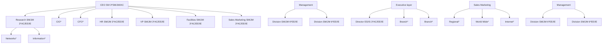
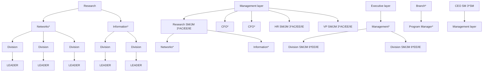
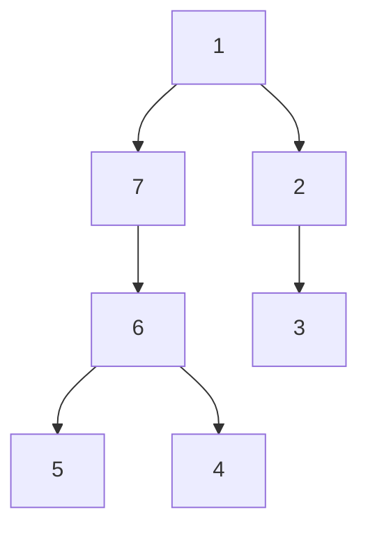
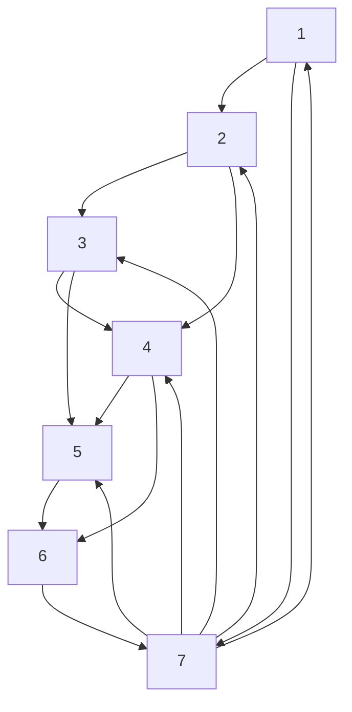
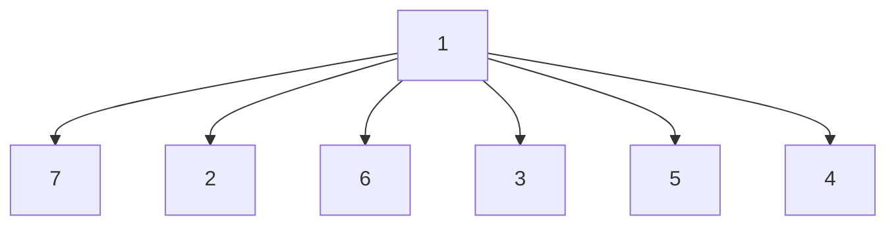
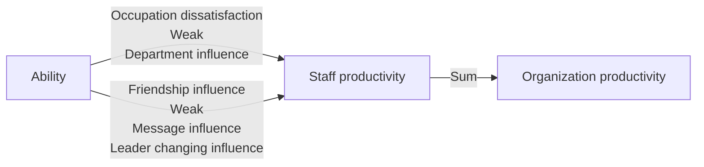

For office use only

T1

T2

T3

T4

Team Control Number

## 33572

Problem Chosen

C

For office use only

F1

F2

F3

F4

# 2015 Mathematical Contest in Modeling (MCM) Summary Sheet

## Simulation company:

## a dynamic model based on the Multiplex Network

## Summary

In order to build a Human Capital Network model inside an organization, our idea is to establish a comprehensive model with plentiful properties of nodes which are consistent with the actual situations. Therefore, the concept of Multiplex Network is introduced to enrich the nodes’ characteristics. What’s more, the notion of automaton is applied to present the dynamic process within the company.

Based on the desire for simulating the reality more vividly, a multiplex network with specific assumptions describing the occupation distribution methods is selected rather than a single-layer network. Having considered about the complex ity of human beings, four typical layers are explored to describe the relationship within the organization. The four subnets of the multiplex network are Friendship Network, Department Network, Leadership Network and Information Flow Network. The multiplex network of the Human Capital Network is set up after connecting the four layers together. And the four effect indexes, namely, friendship influence index, department influence index, leader changing influence index and message influence index are calculated to evaluate each subnets’ impact on the personnels.

Since the static network is gained, the dynamic process is divided into five events covering common scenarios like demission, promotion, transfer, recruitment and settlement to drive the network. Besides, some concepts are defined before the course of evolution. Moreover, the demission index consists of the above four indexes and the occupation dissatisfaction index is proposed to measure the churn rate in the company. And the evaluation on the further influence on organization’s productivity is conducted under the churn value of 18% in a decade.

The prediction about the company’s budget in the next two years indicates the ability of the algorithm serving for the above five events. After simulations of the process, the total recruiting budget is 32.8σ and the budget of training is 141.79σ.

The accuracy and stability of the Human Capital Network are proved by the sensitivity analysis on the changing churn rate. And ICM can not sustain its 80% full status no matter the annual churn rate is 25% or 35%. Task Five reflects the rationality of the construction method of the model due to the fact that ICM can sustain its 56.8% status under such extreme conditions.

Key Words: Multiplex Network; Automaton; Churn rate; Dynamic processes

## 1 Introduction

## 1.1 Background

The company economic benefit were limited much when the company organizations were lengthy and jumbled in the past. And the appearance of Human resource (HR) as a newlydeveloping discipline marks the arrival of Knowledge Management era. Human Capital concept is put forward to emphasize the importance of human resource management within the produce performance. Hence, as industries move from manual to more managerial professions so does the need for more highly skilled graduates.

HR specialists are hired to help senior leadership improve the corporate structure, provide mature officers continuing education projects and foster an enterprise culture. Especially, leaders intend to establish an effective company structure where staff can get work training and remuneration as they deserve. Besides, priority promotions are given to employees who are more experienced. These talent managements and team building aspects of HR management improve the sense of belonging of each clerk and rise the company outcomes.

Therefore, it is necessary to build a Human Capital Network to reflect the dynamic process of HR. Thus, it would be much easier for senior managers to monitor and control skilled personnels in order to prevent them from turning over. Moreover, analyzing the network enables employers to optimize Workforce Management for saving money and contributes to the remake of companies in the end.

## 1.2 Problem Restatement and Analysis

Firstly, combining with the given nine issues, the HR manager requires writers to set up a model with bold assumptions to reflect the dynamic process within the human resource. Referring to bibliography, the science of team science[1] and some discoveries on teamwork are applied to the modelling. What‘s more, a multi-layered model is taken into account to describe the connections among human capital, information flow, friendship and so on. Having considered about the specific situation within the networks, a multiplex network is used. The edges in the multiplex network link the same node in different layers and it satisfies our requirements. Therefore, on the basis of the multiplex network, our model is established to show the organizational churn and its influence on the company benefits. As preparation we need to propose a dynamic occupation distribution method to allocate 370 positions into the comprehensive organizational graph.

Secondly, a vivid dynamic process involved in organizational churn should be presented. We decide to fulfill this through model simulation. The data obtained from simulating can explain this course and its direct and indirect effects on the organization productivity. In addition, integrating the data with Table 1 in the problem, the organization‘s budget for talent management in terms of for both recruiting and training over the next 2 years should be worked out.

Finally, the HR manager asks authors evaluate sensitivity and robustness of the multilayered model by changing the annual churn rate and adding extra conditions.

Having considered about all the requirements above, our goal is to construct a four-layered model to simulate the behavior of turning over and gain further analysis and answers for the problem.

## 2 Bold Assumptions

• Efficiency man gets promotion eliminating other personal reasons;  
• No discharge and demotion except for special cases;  
• Demission, promotion, transfer and recruitment happen in the beginning of the month while settlement happens in the end of the month;  
• The posting diagram is dynamic and thus has universality which means the model is suitable for multiple post distribution methods;  
• The churn rate remains constant except for specific requirements;  
• Administrative clerk can not be promoted to any other positions;  
• The organizational churn rate is only related to the demission index.

Under the bold assumptions proposed in the paper, the occupation distribution method and the multiplex model can be designed later.

## 3 Symbol Description

In the section, we define some symbols when constructing the model as follows.

Table 1: Symbol Description

<table><tr><td>Symbol</td><td>Description</td></tr><tr><td>X</td><td>The set of personnels.</td></tr><tr><td>J</td><td>The set of 7 kinds of jobs.</td></tr><tr><td> $NP_S$ </td><td>The total number of company personnels.</td></tr><tr><td> $NP_M$ </td><td>The number of middle managers.</td></tr><tr><td>Ab</td><td>The current capacity value.</td></tr><tr><td> $Ab_G$ </td><td>Growth limitation.</td></tr><tr><td> $Ab_N$ </td><td>Position threshold.</td></tr><tr><td> $P_C$ </td><td>Churn rate.</td></tr></table>

## 4 Model Preparation: occupation distribution

A comprehensive organizational graph describing the corporate structure is given by the HR manager. It is significant to determine the occupation distribution before the construction of multi-layered networks. Because persons in different level of positions have diverse characteristics and thus the network structures among nodes vary from one plan to other plans. Therefore, it is necessary for us to work out an appropriate distribution plan to allocate 370 positions into the comprehensive organizational graph. What’s more, the arrangement should be dynamic and flexible so that the model based on it could be universal. Several assumptions are made before the distribution as below.

• Divide the graph into two parts. The first three layers are regarded as management layer and the latter two are called executive layer. The arrangements are completely independent from one another.  
• The distribution order is arranged from top to bottom and left to right as well. And each department adopts one position at a time.  
• The managers in the management layer are senior manager (SM) and junior manager (JM) while the mangers in the executive layer are experienced supervisor (ES) and inexperienced supervisor (IS). SM is prior to JM and ES is prior to IS.  
• Each department can only have one manager except for CEO and branchs. CEO and branches can have several managers in the mean while.  
• The priority list of the rest of employees in the office is administrative clerk (AC), experienced employee (EE) and inexperienced employee (IE) respectively. The priority list of the rest of employees in the division is EE and IE.  
• Allocate the first place positions to the department as much as possible. Then the positions in the second place is used to fill the vacancies.

After applying the rules to the organizational graph, an occupation distribution diagram is drawn in Figure 1.

flowchart

Figure 1: Occupation distribution diagram

From Figure 1, the distribution plan is dynamic due to the fact that once someone leave the organization, his or her position can be replaced by other positions. For instance, an AC working in a VP office quits his or her job and it is much easier for the VP office to find an EE or IE or another AC to replace her rather than only AC is feasible. Hence, the multi-layered network based on it is suitable for many organization structures.

## 5 A multiplex network construction: Human Capital Network model

The concept of multiplex network [5] is introduced due to the consideration of personnels’ properties. An employee’s characteristics consist of several factors like the organization position in a department, the connections between him and his friends, the leading role of his supervisors and the atmosphere among the organization and so on. Besides, in Task Six, the HR manager asserts that the HR office should take the lead in the effort to connect network models of the organization, fulfilling the talent management. Therefore, the consideration of nodes’ properties in the human capital network counts on not only the characteristics of Department Network but also other networks such as Information Flow Network, Friendship Network and Leadership Network. Hence, a multiplex network is needed to combine all the factors we think about in different networks so that a comprehensive model can be set up.

First, a Department Network based on the occupation distribution diagram is constructed to describe the relationship inside the division or office. And the index of departmental cohesiveness is obtained. Then, the other three networks are used for reference. The structuring methods are explained and three equations to compute the influence index in each network is worked out below. Finally, the Department Network is connected with the other three networks to gain the considerate network model, namely, Human Capital Network.

## 5.1 First layer: Department Network

The definition of the Department Network is $G _ { H } = ( V _ { H } , E _ { H } )$ where $V _ { H } = X ; E _ { H }$ stands for the relationship between an employee and the organization.

The Department Network details the occupation distribution diagram in respect of working divisions inside the department. And the part of the Department Network graph is drawn in Figure 2.

flowchart

Figure 2: The partial graph represents the typical construction inside the department where the rest of the divisions and offices are similar to it. The seven staffs are divided into two parts which are the leader part consisting one person and the subordinate part consisting six persons respectively. The classification method inside the department makes the distribution diagram more distinct.

From Figure 2, the Department Network is established by considering personnels inside the department as nodes while the connections between parent departments and child departments are regarded as edges. Besides, there is no link among departments in the same layer. Thus the edges reflect the promotion path in the organization.

Moreover, the change in the number of staffs within the department will influence the departmental cohesiveness. For example, a division with adequate and experienced employees has greater power of execution than a division lack of manpower. It means that working members in an outstanding department are much closer and work together to gain office honour while people in a downhill department are more willing to leave. This phenomenon can be demonstrated by the index of department influence. And its calculation formula is listed below.

$$
I _ {H} ^ {(x)} = \frac {H _ {D} ^ {(x)}}{H _ {M} ^ {(x)} - 1} \tag {1}
$$

where $x \in X ; H _ { D } ^ { ( x ) }$ is the job vacancy in node x’s department; $H _ { M } ( x )$ is the amount of positions in node x’s department.

## 5.2 The other three layers: Friendship, Leadership and Information flow Network

Task Six requires authors to connect Department Network to other organizational network layers such as information flow, trust, influence, and friendship. After digging into the reference and considering reality factors, the layers are simplified into three layers which are leadership, friendship and information flow. The clerk loyalties to the office complex and to subgroups mainly lie on the ability of a leader. And to great extent, a leader has great influence on the employee loyalties to the office complex and to subgroups. Hence, it is sensible to classify trust and leader influence into the leadership layer.

The definition of the three networks are as follow.

• Friendship Network: $G _ { F } = ( V _ { F } , E _ { F } )$ where $V _ { F } = X ; E _ { F }$ represents the undirected edge describing the friendship between two persons;  
• Information flow Network: $G _ { M } = ( V _ { M } , E _ { M } )$ where $V _ { M } = X ; E _ { M }$ stands for the undirected edge showing the information path among nodes;  
• Leadership Network: $G _ { L } = \left( V _ { L } , E _ { L } \right)$ where $V _ { L } = X ; E _ { L }$ is the directed edge pointed from immediate boss to their subordinates;

flowchart

flowchart

flowchart

Figure 3: The three charts describe the same division with seven personnels. Chart A is a Friendship Network and the edge between two nodes shows a friend relationship. The negative emotion of an employee will pass on to his friends and lead to herd mentality. Chart B is a Information Flow Network and the edge between two nodes stands for the communication links. Once a clerk who is short-tempered talks to others, working atmosphere becomes stifling. However, the connections between friends are much stronger than colleagues. Chart C is a Leadership Network and it is an oriented graph. The edge linking from supervisors to underlings represents the impact of leaders on their subordinates. Therefore, if a leader resign his position or is pointed to other positions, the morale of his department is sinking lower.

What is noticeable is that due to the lack of real data, all the three networks can only be established by virtual data which is in good agreement with life experience and theory in the reference. For example, certain information topics can only be assumed to simulate the message traffic among personnels. Still, evaluations on the influence of the information network can be operated with the experience of daily conversations. Moreover, the Leadership Network is a directed tree graph where edges are pointed from immediate boss to their subordinates. Such linking method shows leaders’ impacts on the employees.

Then, according to the network theory, the nodes are considered as working staffs and use edges to describe the relationship among personnels. The specific construction method varies from one network to other networks. For instance, an edge between two nodes in the Information Flow Network means the communication links. And the numbers over the edge stand for the types of topics in the message traffic. Afterwards, three networks are drawn in Figure 3 and formula of each is obtained as follow.

One of the characteristic of Centrality called Degree Centrality[2] is introduced to depict the impact of friendship. It calculates the number of neighbour nodes linking to node x equals to the concept of degree in graph theory. In the Friendship Network, only neighbour nodes are considered as friends and have effect on each other. Therefore, when an employee complains about the regulations of the organization, the rest of his friends will also feel discontented about it. This phenomenon is called the herd mentality. The formula of friendship influence index measuring the influence degree of herd mentality is listed below:

$$
I _ {F} ^ {(x)} = \frac {1}{F _ {S} ^ {(x)} + 1} \tag {2}
$$

where $x \in X ; F _ { S } ^ { ( x ) }$ represents the degree of node x.

The PageRank[4], an algorithm used by Google Search to rank websites in their search engine results, is used in the Information Flow Network. The similarity between PageRank and the network is that they are both formed by nodes and edges referring to the interaction effect. And the PageRank is applied to the calculation of weights of nodes satisfying the requirement of representing the influence degree of message traffic. As for the office complex, a employee with bad mood may talk to others inappropriately and thus cause the person he chats with is also in a bad temper. Such phenomenon can be demonstrated by the PageRank algorithm. And the equation of message influence index is drawn below:

$$
I _ {M} ^ {(x)} = \operatorname{tansig} \left(P R ^ {(x)}\right) \tag {3}
$$

where ${ \mathfrak { z } } \in X ; P R ^ { ( x ) }$ is the value of PageRank in node x; tansig is the hyperbolic tangent function.

When it comes to the discussion of Leadership Network, the consideration of distance between node i with its superior node is taken. The network is made up by a tree diagram which is similar to the occupation distribution diagram. Hence, the paper defines the greatest impact on an employee coming from his immediate supervisors is equal to the shortest distance in the diagram. In addition, once a leader in a department is promoted or fired, the employee loyalties and sense of belonging is destroyed. The formula of leader changing influence index which calculates the distance of the two nodes is shown below:

$$
I _ {L} ^ {(x)} = \max _ {y \in L L} \left(\frac {1}{\text {distance} (x , y)}\right) \tag {4}
$$

where $x \in X ;$ LL denotes the set of leaved leaders; distance $( x , y )$ stands for the distance between node x and its immediate superior node y.

The model of Human Capital Network is established through the combination of Department Network and other three networks. The relation among four networks will be discussed below.

## 5.3 Connections among four networks

Due to the fact that a employee’s status is complex and related to the four factors discussed above, the transformation of the four networks into a multiplex network[5] is conducted, leading to the construction of the Human Capital Network. The definition of the multiplex network is ${ \mathcal { M } } = ( { \mathcal { G } } , { \mathcal { C } } )$ where $\mathcal { G } = \{ G _ { H } , G _ { F } , G _ { M } , G _ { L } \}$ ; C shows the edges of the same node in different layers. And five effect indexes of nodes are imported from the four networks in order to describe the specific dynamic process of organizational churn. The graph of multiplex network and its indexes are drawn as follow.

```mermaid
graph TD
  A["Department network"] -->|6| B["Friendship network"]
  A -->|5| C["Information flow network"]
  A -->|7| D["Leadership network"]
  A -->|4| E["Leadership network"]
  A -->|1| F["Department influence"]
  A -->|2| G["Friendship influence"]
  A -->|3| H["Message influence"]
  A -->|2| I["Leader changing influence"]
  J["Occupation dissatisfaction"] --> K["Personnel situation"]
    style A fill:#f9f,stroke:#333
    style B fill:#bbf,stroke:#333
    style C fill:#bbf,stroke:#333
    style D fill:#bbf,stroke:#333
    style E fill:#bbf,stroke:#333
    style F fill:#ff9,stroke:#333
    style G fill:#ff9,stroke:#333
    style H fill:#ff9,stroke:#333
    style I fill:#ff9,stroke:#333
    style J fill:#fff,stroke:#333
    style K fill:#fff,stroke:#333
  style_L["Influence"] --> M["Department influence"]
  L --> N["Friendship influence"]
  L --> O["Information flow network"]
  L --> P["Leadership network"]
  L --> Q["Leadership network"]
```

flowchart

Figure 4: The multiplex network is made up by the above four networks describing the same sevenemployee division. Besides, node x in each network represents the same staff. Moreover, a new property called occupation dissatisfaction index is introduced adding the list of effect index. The five effect indexes describe the status of a employee in total.

From the Leadership Network, we can see that node 1 is the boss in the division and the rest are under him. And node 7 is a friend of node 4 in the Friendship Network. However it doesn’t mean node 4 only has one friend. It can have connections with others outside the Department Network. Equally, the Information Flow Network is not limited to the sevenemployee division network indicating people’s influence on others within the organization. What’s more, five indexes are detailed to describe the situation of organizational churn in the following ways.

First, the department influence index stands for the efficiency inside the sector which means as the number of employees changes from biggest to smallest. The uncomfortable feelings among workers will breed and cause the situation where the work efficiency varies from top to bottom and people want to hunt for another job. Especially, when a leader is turn-over from the organization, it is a disaster for his department’s morale due to the fact that employees are used to taking orders from him rather than anyone else. It would be difficult for the employees to listen to the new leader who may not as good as the former one. This phenomenon is depicted by the leadership influence index.

When considering the message influence index, if a colleague complains about the low payment and terrible working environment to an employee, the employee’s unsatisfactory will rise and may push him to quit the position. What’s worse, as for the friendship influence index, the impact is even stronger and results that both the friends and employee himself resign their positions.

In addition, even if a working member is not affected by others, it is possible for him to leave the organization. Because as time flies, an inexperienced employee becomes an experienced one while the desire of promotion has grown. However, if the organization can not satisfy his expectation, the employee’s occupation dissatisfaction index will grow; thus let him quit office eventually.

Having taken the five indexes into account, the Human Capital Network model is complete. Applying several events and threshold values to the network, the paper finally simulates the dynamic process below.

## 6 Description of the dynamic processes on organizational churn

## 6.1 Construction of ability system

The properties of nodes in the Human Capital Network must be determined before the simulation of organizational churn. Apart from the five effect indexes, a few basis factors of an employee are set below.

• Level of present position: the location of the staff’s present post in the list of position level; moving to the next level means moving to the higher level of position called promotion.  
• Ability score: a criterion to evaluate the working ability of a staff and estimate whether he is able to be promoted (move to the next level);  
• Growth limitation on employee’s ability score: the maximum ability score a staff can obtained in the present position;  
• Lower limit on next level position’s ability score: the minimum ability score needed to move to the next level.  
• Type of present position: no matter the staff is a manager or a subordinate;  
• Location in the Department Network: reflecting the department and position where the staff is in the Department Network.  
• Employee churn rate: the probability for the staff to resign his position.

The equation of occupation dissatisfaction index is drawn after the definition of ability score.

$$
I _ {P} ^ {(x)} = \left\{ \begin{array}{c c} 0 & i f A b \leq A b _ {N} \\ \frac {A b ^ {(x)} - A b _ {N} ^ {(x)}}{A b _ {G} ^ {(x)} - A b _ {N} ^ {(x)}} & e l s e \end{array} \right. \tag {5}
$$

where x $\boldsymbol { \cdot } \in { \boldsymbol { X } } ; { \boldsymbol { A } } { \boldsymbol { b } } ^ { ( x ) }$ is the present ability score of node x; $A b _ { N } ^ { ( x ) }$ is the lowest limit on the next level position’s ability score; $A b _ { G } ( x )$ is the growth limitation on employee’s ability score.

An ability growth system measuring the dynamic changes in the organization is established with the above properties. The annual growth of ability score is set based on the average annual training cost. Without loss of generality, the average annual salary rate for AC or IE is set to unit 1 in designing the table of position threshold. Besides the given Issue Six indicates that in order to move up into the higher management-level positions, people are currently required to have several years of experience in the organization at specific levels and types of positions. Therefore, the authors stipulate the promotion interval of each position referring to the enterprise’s regulations and rules. Assume the employee’s ability score increased by the month and the table of threshold in each position is drawn below:

Table 2: Threshold in each position

<table><tr><td>Level of Position</td><td>Threshold in position</td><td>Annual growth</td></tr><tr><td>AC</td><td>1</td><td>0.05</td></tr><tr><td>IE</td><td>1</td><td>0.3</td></tr><tr><td>EE</td><td>1.6</td><td>0.1</td></tr><tr><td>IS</td><td>1.8</td><td>0.3</td></tr><tr><td>ES</td><td>2.1</td><td>0.2</td></tr><tr><td>JM</td><td>2.3</td><td>0.6</td></tr><tr><td>SM</td><td>5.3</td><td>0.5</td></tr></table>

From Table 2, it takes two years for an IE to be promoted to EE. However, thinking over the special sorting technique using in the Department Network, an EE in the executive layer only need two years to be promoted to the manager part as IS in the division. Unfortunately, it will take him seven years to become a department manager as a JM in the management layer. Such situation is similar to our social experience.

In addition, the growth limitation on employee’s ability score in the present position is quantized as a computational formula:

$$
A b _ {B} ^ {(x)} = 1. 3 \cdot A b _ {N} ^ {(x)}
$$

Due to the fact that SM can not be promoted to the higher level and the assumption that AC can not be promoted to other positions, the growth limitation for SM and AC are shown respectively.

$$
A b _ {B} ^ {(x)} = 1. 5 \times 5. 3
$$

$$
A b _ {B} ^ {(x)} = 1. 5 \times 1
$$

Once a staff’s ability score has risen to the upper limit and he cannot be moved to the higher level, the occupation dissatisfaction causing the rise of employee churn rate will increase .

## 6.2 Description of dynamic process

Since the salary is paid monthly and the median time to recruit is depicted by month, the nodes in the Human Capital Network are updated monthly[7].

Before the discussion on the five events, it is necessary to draw a clear distinction between promotion and transfer. Promotion means a employee’s position is risen to the higher level. For example, an IE becoming an EE is called a direct promotion. On the contrary, to some extent, transfer is different from promotion. Transfer stands for the change of node’s location in the Department Network. Hence, an IS who becomes an ES but still listen to the ES’s order in his branch is called promotion without transfer. And if the new ES becomes a manager in his department or other departments, this behaviour is called promotion with transfer. What’s more, the concept of transfer with no promotion depicts the situation where an JM is moved from one department manager location to another department manger location. After understanding all the concepts, the five events are discussed below.

flowchart

Figure 5: The update order concludes five events which are demission event, promotion event, transfer event, recruitment event and settlement event. The former four events happen in the beginning of a month and the latter one takes place in the end of the month.

## (1) Demission event:

The demission event represents the phenomenon where personnels resign their jobs due to the occupation dissatisfaction and the influence caused by others. In the given Issue Seven, the current churn rate is 18% per year constantly which is demonstrated by the number of resigned employees in each level. Hence, demission conditions and the demission index are worked out to make a priority list of the probability for a staff to resign in each position. Then, pick up the top of the list to meet the specified data of churn rate. Some parameters of the demission conditions are defined as follows.

• Overall number of personnels: $N P _ { S }$  
• The number of middle managers including JM, ES and IS: $N P _ { M }$  
• Overall churn rate of the company: $P _ { C } = 1 8 \%$  
• Churn rate of middle managers: P = $\begin{array} { r } { P _ { M } = \frac { 2 N P _ { S } \cdot N P _ { M } \cdot P _ { C } } { ( N P _ { S } + N P _ { M } ) \cdot N P _ { M } } } \end{array}$  
• Churn rate of other positions: $\begin{array} { r } { P _ { O } = \frac { P _ { M } } { 2 } } \end{array}$  
$\begin{array} { r } { P L ^ { ( p ) } = \mathrm { R } _ { P } \left( \frac { N P ^ { ( p ) } \cdot P ^ { ( p ) } } { 1 2 } \right) } \end{array}$

where $R _ { P }$ is a random function following Poissonian distribution; P (p) denotes the churn rate of each position which is equal to $P _ { M }$ when p is a middle manager or $P _ { O }$ when p is other positions.

The number of resigned personnels per month is calculated by the demission index. The demission index is an equation consisting of five effect indexes introduced before. And the Analytic Hierarchy Process (AHP), a structured technique for organizing and analyzing complex decisions based on mathematics and psychology[3], is used to determine the weights of each effect index. The importance of the five indexes has been evaluated and the result shows that occupation dissatisfaction index is the most important one and friendship influence index take the second place. Department influence index weights the same to leader changing influence index. And leadership influence index is the least one. A priority list based on the employee’s churn rate is made after calculation.

Applying AHP to the numeration of weights for each index, the results are $W _ { O } = 0 . 5 9 9 2 ,$ , $W _ { H } = \mathrm { 0 . 0 7 9 5 }$ , WF = 0.1926, $W _ { M } = \mathrm { 0 . 0 4 9 2 }$ and $W _ { L } = \mathrm { 0 } . 0 7 9 5$ . Therefore, the equation of demission index is listed below

$$
I _ {D} = W \cdot I \tag {6}
$$

where I denotes the vector of indexes and W represents the vector of weights. According to Equation (1) (2) (3) (4) (5)

$$
\begin{array}{r l} & W = \left[ \begin{array}{l l l l l} W _ {O} & W _ {H} & W _ {F} & W _ {M} & W _ {L} \end{array} \right] \\ & I = \left[ \begin{array}{l l l l l} I _ {O} & I _ {H} & I _ {F} & I _ {M} & I _ {L} \end{array} \right] ^ {\prime} \end{array}
$$

Finally, the equation of demission index is listed below.

$$
I _ {D} = 0. 5 9 9 2 \times I _ {O} + 0. 0 7 9 5 \times I _ {H} + 0. 1 9 2 6 \times I _ {F} + 0. 0 4 9 2 \times I _ {M} + 0. 0 7 9 5 \times I _ {L}
$$

Therefore, the algorithm of demission event can be divided into two steps.

• Step One: compute the churn rate of position in each level on the basis of overall churn rate of the organization;  
• Step Two: compute the demission index of each employee and make a priority list based on the possibilities of quitting the job. Then pick up the top of the list to meet the specified data of churn rate in each position.

## (2) Promotion event:

As time goes by, a employee’s ability score will increase and touch the lowest limit on the next level. Under such circumstance, two promotion methods are designed to reflect the real situations. The situations are converted into the following algorithm.

• Step One: update all working members’ ability scores;  
• Step Two: if an employee’s ability score meets the lowest limit on the higher position and there are job vacancies in the same location of the Department Network, then the person is promoted to the next level (promotion without transfer);  
• Step Three: Two: else if a employee’s ability score meets the lowest limit on the higher position and there are job vacancies in the superior location of the Department Network, then the person is promoted to the next level (promotion with transfer)  
• Step Four: else if none of the above conditions is satisfied, the promotion is delayed.

## (3) Transfer event:

The transfer event is triggered when someone is leaving from the organization. The occupation vacancy is needed to be filled so that the organization can maintain in good condition. The transfer for an EE, IE or AC is not considered in order to save labour. Equally the situations for managers’ transfer are divided into several steps.

• Step One: if someone inside the department is able to be promoted and cover the vacancy, then the transfer is conducted with promotion;  
• Step Two: else if someone in the subordinate department satisfy the managerial level of position required in the department, then the transfer is conducted without promotion;  
• Step Three: else if someone in the subordinate department meets the lowest limit on the managerial position, then the promotion and transfer are conducted.  
• Step Four: else if the subordinate in the CEO office meets the demand of manager’s level of position, then the transfer is conducted without promotion;

• Step Five: Search for the substitution manager among the brother departments;

– Substep One: if someone inside the brother departments is able to promote and cover the vacancy, then the transfer is conducted with promotion;  
– Substep Two: else if someone in the subordinate sectors of the brother departments satisfy the managerial level of position required in the department, then the transfer is conducted without promotion;  
– Substep Three: else if someone in the subordinate sectors of the brother departments meets the lowest limit on the managerial position, then promotion and transfer are conducted.

• Step Six: the position remains empty and waits for the recruitment.

## (4) Recruitment event:

Once the suitable personnels cannot be found inside the organization to make up for the gap, it is time to recruit new employees from the outside world. The paper define the present month as NM and the medium time to recruit for the position P as $\dot { M } ^ { ( \dot { P } ) }$ .What’s more $J V ^ { ( P ) }$ cYanmaGentYelowb represents the number of the rest of the job vacancies.The algorithm is listed below.

• Step One: if NM mod $M ^ { ( P ) } = 0 ,$ , conduct the recruitment and put the hired people into the list to be assigned, refreshing the multiplex network; this step indicates the minimum recruiting numbers which is computed by the formula min $\left( \tilde { J { V ^ { ( p ) } } } , R P \left( \frac { J { V ^ { ( p ) } } { \cdot } { 2 } / 3 } { M ^ { ( p ) } / 1 2 } \right) \right)$ and the personnels hired meet the lowest limit on the recruiting department.  
• Step Two: calculate the cost of recruitment according to the distribution list;  
• Step Three: refer to the priority list of positions which is SM, JM, AC, ES, IS, EE and IE respectively, and allocate the hired personnels to the vacant departments until the distribution list is empty; the distribution order is from top to bottom and from left to right; and each department adopts one position at a time.

– Substep One: if the hired person in the list is suitable for a vacant position, put the person in the Department Network and delete its data in the list;

– Substep Two: else if there is no appropriate job vacancy, according to the distribution method, compare the present to-be-assigned employee to the personnels within the department in order; if the former one is prior to a certain person inside, swap the to-be-assigned employee with the old one then put the old one to the distribution list and delete the data of assigned employee; if not, change to the next department.

## (5) Settlement event:

After the employee changes within a month, the settlement event happens at the end of the month to compute the expense in each category like continuing education, recruitment and so on. The evaluation of the settlement reflects the economic benefit of the organization.

## 7 Task Two: Results and analysis on dynamic process

## 7.1 Analysis on the organizational churn

A comprehensive broken line graph is drawn to identify and analyze the dynamic processes of organizational churn.

line chart

| Month | Total | Resign | Recruit |
| --- | --- | --- | --- |
| 1 | 310 | 255 | 250 |
| 5 | 305 | 258 | 255 |
| 9 | 308 | 257 | 258 |
| 13 | 298 | 259 | 252 |
| 17 | 288 | 260 | 258 |
| 21 | 285 | 258 | 254 |
| 25 | 273 | 255 | 265 |
| 29 | 286 | 257 | 256 |
| 33 | 287 | 260 | 258 |
| 37 | 294 | 263 | 268 |
| 41 | 284 | 258 | 256 |
| 45 | 299 | 260 | 260 |
| 49 | 299 | 261 | 263 |
| 53 | 291 | 257 | 254 |
| 57 | 294 | 255 | 256 |
| 61 | 291 | 258 | 254 |
| 65 | 294 | 260 | 260 |
| 69 | 280 | 255 | 254 |
| 73 | 287 | 263 | 260 |
| 77 | 283 | 258 | 256 |
| 81 | 280 | 257 | 254 |
| 85 | 289 | 258 | 268 |
| 89 | 281 | 257 | 254 |
| 93 | 284 | 259 | 256 |
| 97 | 277 | 260 | 260 |
| 101 | 281 | 263 | 258 |
| 105 | 271 | 264 | 260 |
| 109 | 277 | 258 | 254 |
| 113 | 287 | 260 | 260 |
| 117 | 280 | 257 | 258 |
|  |  |  |  |
|  |  |  |  |
|  |  |  |  |
|  |  |  |  |
|  |  |  |  |
|  |  |  |  |
|  |  |  |  |
|  |  |  |  |
|  |  |  |  |
|  |  |  |  |
|  |  |  |  |
|  |  |  |  |

Figure 6: Where the number of recruits, resignation and total personnels per month provides a full picture of the dynamic processes involved in organizational churn under the circumstance of 18% churn rate. And the crests and troughs indicate the busy seasons and slack seasons of recruitment in a decade.

From Figure $6 ,$ a downtrend on the total number of employees is observed in the first two years. Then with a gradual increase, the amount of staffs varies from 285 to 295 leading to a steady state. Besides, the per month amount of employees depends on the recruitments and the churn rate in each month. Due to the hiring cycle, the number of recruits varies from time to time. And the churn rate remains stable so that the number of employees will rise during the furious recruiting time and it will drop when few job fairs is held. The above mentioned are called hiring busy seasons and slack seasons respectively which cause the crests and troughs in the graph. For example, it is easier to find that lost of people are hired in March, June, September and December thus the sum of the employees is increased. The reason to explain the phenomenon is the great amounts of EE and IE are hired during that period. What is more noticeable is that the sum of employees always rises to the peak in December in every year. This is related to the situation where most of the positions except for SM and ES are opening at that time.

Further digging focuses on proving the accuracy of the multiplex network. The comparison between the true value and ideal value is conducted during the steady stage in the later period.

First, some parameters are defined. Let $N _ { S }$ denotes the sum of employees in the steady state. And $P _ { C }$ stands for the present churn rate. So the expectation of personnels leaving from the organization is $N _ { S } { \times } P _ { C }$ . Similarly, the expectation of personnels newly hired is $( 3 7 0 - N _ { S } ) \times$ $2 / 3$ . When the two expectations come to the balanced state, the equation is worked out below.

$$
N _ {S} \times P _ {C} = (3 7 0 - N _ {S}) \times \frac {2}{3}
$$

$$
N _ {S} = \frac {3 7 0 \times 2 / 3}{P _ {C} + 2 / 3} \tag {7}
$$

As for the current case, $P _ { C } = 1 8 \%$ and thus the ideal value for the amount of working members is 291 within the true value interval during the stable stage. This fact indicates the reliability and accuracy of our model.

What’s more, as the staff comes and goes, the structure of the multiplex network has been changed. The new nodes are put into the networks while the long gone nodes are deleted. Thus, the connections between nodes become changeable. As time goes by, the total number of clerk resigning their positions is increased, causing great damage to the Friendship Network. What’s worse, the dissatisfaction for not being promoted has pass on through the Information Flow Network resulting in the growth of bad atmosphere in the organization. So once a leader is moved to another department or quit his job, the demission index rises to the threshold and the demission event is triggered. After a gradual decline of the demission index, a dynamic balance is gained between the number of recruitment and the amount of resign. Therefore, the sum of personnels remains stable and the factors of the networks are dynamically balanced. Meanwhile, the structure of the multiplex network also becomes stable which means the allocation of each layer in the organization is steady.

## 7.2 Effects on organization’s productivity

Some definitions measuring the productive forces is needed before analyzing the dynamic process’s effect on organization’s productivity.

flowchart

Figure 7: Where the employee ability score evolves to the employee productivity on the basis of minor effects. And the organization’s productivity is the summation of each employee productivity within the network.

The first one is employee productive power which is mainly influenced by the ability score of clerk himself. Other minor influence factors are the five effect indexes talked above like the occupation dissatisfaction index, department influence index and so on. Hence, the equation of employee productivity is obtained as follow according to Equation (6).

$$
P r o ^ {(x)} = A b ^ {(x)} - w e a k \cdot A b ^ {(x)}
$$

$$
w e a k = I _ {D} \times 0. 5 = (0. 5 9 9 2 \times I _ {O} + 0. 0 7 9 5 \times I _ {H} + 0. 1 9 2 6 \times I _ {F} + 0. 0 4 9 2 \times I _ {M} + 0. 0 7 9 5 \times I _ {L}) \times 0. 5
$$

where ${ P r o } ^ { ( x ) }$ is the employee productive power; $A b ^ { ( x ) }$ characterizes the employee’s ability score; weak represents the minor effect factors.

Taking the concepts of personnels above as reference, the ability score and productivity of the organization are defined below.

$$
A b _ {O} = \sum_ {x \in M} A b ^ {(x)}
$$

$$
P r o _ {O} = \sum_ {x \in M} P r o ^ {(x)}
$$

where AbO stands for the ability score of the organization; P roO denotes the productivity of the organization; M is the set of the working members.

The definition procedure can also be demonstrated by Figure 7.

From Figure 7 and the above-mentioned analysis, it is wise for us to regard the ability score of employees as the most powerful and favourable factor when determining the productivity of the organization. Other indirect acting factors working as adverse factors are occupation dissatisfaction index, department influence index, friendship influence index, message influence index and leader changing influence index. The good effect brought by the employee’s ability score offsets part of the bad impact of the negative factors.

Moreover, a broken line graph describing the ten-year dynamic processes of organization’s productivity based on the 18% churn rate is drawn in Figure 8.

line chart

| Month | Organization's ability | Organization's productivity | The average churn index |
| --- | --- | --- | --- |
| 1 | 560 | 520 | 0.2 |
| 4 | 570 | 530 | 0.2 |
| 7 | 590 | 550 | 0.2 |
| 10 | 595 | 545 | 0.2 |
| 13 | 600 | 555 | 0.2 |
| 16 | 590 | 540 | 0.2 |
| 19 | 610 | 555 | 0.2 |
| 22 | 600 | 540 | 0.2 |
| 25 | 620 | 560 | 0.2 |
| 28 | 630 | 570 | 0.2 |
| 31 | 625 | 575 | 0.2 |
| 34 | 635 | 580 | 0.2 |
| 37 | 665 | 610 | 0.2 |
| 40 | 645 | 590 | 0.2 |
| 43 | 670 | 615 | 0.2 |
| 46 | 665 | 610 | 0.2 |
| 49 | 660 | 605 | 0.2 |
| 52 | 655 | 595 | 0.2 |
| 55 | 665 | 605 | 0.2 |
| 58 | 670 | 610 | 0.2 |
| 61 | 665 | 605 | 0.2 |
| 64 | 660 | 600 | 0.2 |
| 67 | 655 | 585 | 0.2 |
| 70 | 645 | 575 | 0.2 |
| 73 | 660 | 585 | 0.2 |
| 76 | 645 | 575 | 0.2 |
| 79 | 640 | 580 | 0.2 |
| 82 | 635 | 575 | 0.2 |
| 85 | 665 | 600 | 0.2 |
| 88 | 655 | 585 | 0.2 |
| 91 | 660 | 590 | 0.2 |
| 94 | 655 | 585 | 0.2 |
| 97 | 640 | 575 | 0.2 |
| 100 | 635 | 580 | 0.2 |
| 103 | 615 | 545 | 0.2 |
| 106 | 630 | 570 | 0.2 |
| 109 | 640 | 580 | 0.2 |
| 112 | 645 | 590 | 0.2 |
| 115 | 635 | 585 | 0.2 |
| 118 | 630 | 580 | 0.2 |
|  |  |  |  |
|  |  |  |  |
|  |  |  |  |
|  |  |  |  |
|  |  |  |  |
|  |  |  |  |
|  |  |  |  |
|  |  |  |  |
|  |  |  |  |
|  |  |  |  |
|  |  |  |  |
|  |  |  |  |
| - |  |  |  |
| - |  |  |  |
| - |  |  |  |
| - |  |  |  |
| - |  |  |  |
| - |  |  |  |
| - |  |  |  |
| - |  |  |  |
| - |  |  |  |
| - - |  |  |  |
| - - |  |  |  |
| - - |  |  |  |
| - - |  |  |  |
| - - |  |  |  |
| - - - |  |  |  |

Figure 8: The ability score and productivity of organization are in the left vertical axis; The average demission index is in the right vertical axis.

Figure 8 shows that the productivity rises with the ability score at first. Then it keeps constant within the interval from 600 to 700. And the demission index maintains its increase until it enters into the steady stage. Such phenomenon is accordant to the analysis of the organizational churn.

The dynamic processes’ direct and indirect effects on the organization’s productivity are analyzed below:

## • Direct effects:

From Figure 8, the productivity of the organization is directly influenced by the clerk’s ability score. In the early stage of the personnels, even though the number of employees is decreased, the ability score of the organization is increased. Because of the fact that the staff in the early stage has much promotion space so that the ability score of the organization rises with the one of the employee, leading to the rising of the organization’s productivity. Finally, the number of employees is tending towards stability and the ability of employee is saturated over time. Thus the organization’s productivity keeps stable.

## • Indirect effects:

The minor factor consisting of five effected indexes is similar to the demission index. Because they all put negative impact on the productivity. From Figure 8 we can see that the difference value between ability and productivity becomes larger as the rising of demission index. However, when the demission index is unchanged, so does the difference value. And the description about the change of demission index has been discussed in the multiplex network section.

## 8 Task Three: prediction of the organization’s budget

Task Three requires the prediction of the organization‘s budget requirements for human resource management in terms of σ for both recruiting and training over the next 2 years. Besides the churn rate of the organization is still 18% per year.

bar chart

| Month | Cost(σ) |
|-------|---------|
| 1     | 0.0     |
| 3     | 1.6     |
| 5     | 2.8     |
| 7     | 1.0     |
| 9     | 0.6     |
| 11    | 4.0     |
| 13    | 2.8     |
| 15    | 2.8     |
| 17    | 3.6     |
| 19    | 1.2     |
| 21    | 0.6     |
| 23    | 5.6     |

bar chart

| Month | Blue Bar | Yellow Bar | Orange Line |
|-------|----------|------------|-------------|
| 1     | 0.0      | 0.0        | 0.0         |
| 3     | 2.8      | 2.9        | 12.0        |
| 5     | 0.0      | 0.0        | 1.0         |
| 7     | 0.6      | 3.0        | 2.0         |
| 9     | 0.8      | 3.4        | 1.4         |
| 11    | 0.2      | 0.0        | 0.3         |
| 13    | 0.2      | 1.7        | 0.7         |
| 15    | 0.2      | 2.3        | 3.0         |
| 17    | 0.4      | 0.8        | 1.6         |
| 19    | 0.4      | 1.6        | 4.0         |
| 21    | 1.5      | 2.7        | 2.7         |
| 23    | 0.2      | 2.8        | 1.0         |

bar chart

| Month | IE   | EE   | AC   | IS   | ES   | JM   | SM   | Recruit |
|-------|------|------|------|------|------|------|------|---------|
| 1     | 0.1  | 0.0  | 0.0  | 0.0  | 0.0  | 0.0  | 0.0  | 0.5     |
| 3     | 0.2  | 0.0  | 0.0  | 0.0  | 0.0  | 0.0  | 0.0  | 1.0     |
| 5     | 0.3  | 0.0  | 0.0  | 0.0  | 0.0  | 0.0  | 0.0  | 1.5     |
| 7     | 0.4  | 0.0  | 0.0  | 0.0  | 0.0  | 0.0  | 0.0  | 3.5     |
| 9     | 0.5  | 0.0  | 0.0  | 0.0  | 0.0  | 0.0  | 0.0  | 2.5     |
| 11    | 0.6  | 0.0  | 0.0  | 0.0  | 0.0  | 0.0  | 0.0  | 3.5     |
| 13    | 0.7  | 0.0  | 0.0  | 0.0  | 0.0  | 0.0  | 0.0  | 1.5     |
| 15    | 0.8  | 0.5  | 0.0  | 0.0  | 0.0  | 0.0  | 0.0  | 1.5     |
| 17    | 0.9  | 1.5  | 0.5  | 0.5  | 0.5  | 1.5  | 1.5  | 2.5     |
| 19    | 1.0  | 2.5  | 1.5  | 1.5  | 1.5  | 2.5  | 2.5  | 3.5     |
| 21    | 1.1  | 3.5  | 2.5  | 2.5  | 2.5  | 3.5  | 3.5  | 4.5     |
| 23    | 1.2  | 4.5  | 3.5  | 3.5  | 3.5  | 4.5  | 4.5  | 9.5     |

Figure 9: The multiple graph consists of three simulation results in two years and shows the relationship between cost for recruiting and the number of opening positions. Accumulative bar diagram stands for the cost for holding job fairs and hiring personnels monthly and broken line graph represents the number of job vacancies by the month.

Figure 9 gives three distinct simulation results which can be explained by the fact that both the demission event and the recruitment event obey Poisson distribution. So the random variation of these events is equal to the reality that the actual amount of recruitment depends on the quality of applicants rather than the expected quantity. What is noteworthy is that December is still the hiring peak in a year which is identical to the conclusion in Task Two.

In the mean time, the cost for hiring middle layer managers makes up a high proportion of the total cost. This situation can be demonstrated by the given Issue Four. And these mid-level positions suffer churn rate as twice the average rate of the rest of the company so that they are need filling all the time. Besides, the cost for hiring a middle layer manager is more expensive than other positions.

When it comes to the discussion about the reason why ES is not hired at a frenetic pace, the paper figures out that on the basis of a large amount of IS is recruited, the one-year promotion interval between IS and ES makes it possible for IS to fulfil the vacancy left by ES. Therefore, there is no need to hire extra ES from the outside.

From Figure 10, the total training cost to each position’s training cost ratio is very similar in the three simulations. And the total training cost remains invariant. The reasons for the phenomenon are the following two ways.

stacked bar chart

| Month | Cost(σ) |
|-------|---------|
| 1     | 0.5     |
| 2     | 0.5     |
| 3     | 0.5     |
| 4     | 0.5     |
| 5     | 0.5     |
| 6     | 0.5     |
| 7     | 0.5     |
| 8     | 0.5     |
| 9     | 0.5     |
| 10    | 0.5     |
| 11    | 0.5     |
| 12    | 0.5     |
| 13    | 0.5     |
| 14    | 0.5     |
| 15    | 0.5     |
| 16    | 0.5     |
| 17    | 0.5     |
| 18    | 0.5     |
| 19    | 0.5     |
| 20    | 0.5     |
| 21    | 0.5     |
| 22    | 0.5     |
| 23    | 0.5     |

stacked bar chart

| Month | Bottom Segment | Middle Segment | Top Segment | Total |
|-------|----------------|----------------|-------------|-------|
| 1     | 0.5            | 0.5            | 0.5         | 6.0   |
| 3     | 0.5            | 0.5            | 0.5         | 6.0   |
| 5     | 0.5            | 0.5            | 0.5         | 6.0   |
| 7     | 0.5            | 0.5            | 0.5         | 6.0   |
| 9     | 0.5            | 0.5            | 0.5         | 6.0   |
| 11    | 0.5            | 0.5            | 0.5         | 6.0   |
| 13    | 0.5            | 0.5            | 0.5         | 6.0   |
| 15    | 0.5            | 0.5            | 0.5         | 6.0   |
| 17    | 0.5            | 0.5            | 0.5         | 6.0   |
| 19    | 0.5            | 0.5            | 0.5         | 6.0   |
| 21    | 0.5            | 0.5            | 0.5         | 6.0   |
| 23    | 0.5            | 0.5            | 0.5         | 6.0   |

stacked bar chart

| Month | IE   | EE   | AC   | IS   | ES   | JM   | SM   |
|-------|------|------|------|------|------|------|------|
| 1     | 6.0  | 0.5  | 0.5  | 0.5  | 0.5  | 0.5  | 0.5  |
| 3     | 6.0  | 0.5  | 0.5  | 0.5  | 0.5  | 0.5  | 0.5  |
| 5     | 6.0  | 0.5  | 0.5  | 0.5  | 0.5  | 0.5  | 0.5  |
| 7     | 6.0  | 0.5  | 0.5  | 0.5  | 0.5  | 0.5  | 0.5  |
| 9     | 6.0  | 0.5  | 0.5  | 0.5  | 0.5  | 0.5  | 0.5  |
| 11    | 6.0  | 0.5  | 0.5  | 0.5  | 0.5  | 0.5  | 0.5  |
| 13    | 6.0  | 0.5  | 0.5  | 0.5  | 0.5  | 0.5  | 0.5  |
| 15    | 6.0  | 0.5  | 0.5  | 0.5  | 0.5  | 0.5  | 0.5  |
| 17    | 6.0  | 0.5  | 0.5  | 0.5  | 0.5  | 0.5  | 0.5  |
| 19    | 6.0  | 0.5  | 0.5  | 0.5  | 0.5  | 0.5  | 0.5  |
| 21    | 6.0  | 0.5  | 0.5  | 0.5  | 0.5  | 0.5  | 0.5  |
| 23    | 6.0  | 0.5  | 0.5  | 0.5  | 0.5  | 0.5  | 0.5  |

Figure 10: The accumulative bar diagram consists of three simulation results in two years and shows the dynamic changes of the training cost with the 18% churn rate.

On the one hand, one of the conclusions drawn in the Task Two shows that the organization network is stable and the types of positions keeps unchanged in the two years. Therefore, the ratios among the simulations is quite close. On the other hand, there is no sign of randomness when compared with Figure 9 which is to say the stability of the company structure prevents the training cost from changing randomly.

Table 3: Organization’s budget

<table><tr><td rowspan="2"></td><td colspan="4">DATA1</td><td colspan="4">DATA2</td><td colspan="4">DATA3</td></tr><tr><td>Recruiting(σ)</td><td>Salary(σ)</td><td>Training(σ)</td><td>Total(σ)</td><td>Recruiting(σ)</td><td>Salary(σ)</td><td>Training(σ)</td><td>Total(σ)</td><td>Recruiting(σ)</td><td>Salary(σ)</td><td>Training(σ)</td><td>Total(σ)</td></tr><tr><td>SM</td><td>2.40</td><td>148.67</td><td>9.29</td><td>160.36</td><td>1.20</td><td>133.33</td><td>8.33</td><td>142.87</td><td>0.00</td><td>159.33</td><td>9.96</td><td>169.29</td></tr><tr><td>JM</td><td>9.10</td><td>123.67</td><td>18.55</td><td>151.32</td><td>4.20</td><td>123.33</td><td>18.50</td><td>146.03</td><td>4.90</td><td>132.00</td><td>19.80</td><td>156.70</td></tr><tr><td>ES</td><td>0.00</td><td>98.50</td><td>9.85</td><td>108.35</td><td>0.00</td><td>97.83</td><td>9.78</td><td>107.62</td><td>0.00</td><td>97.67</td><td>9.77</td><td>107.43</td></tr><tr><td>IS</td><td>7.80</td><td>42.13</td><td>8.43</td><td>58.35</td><td>9.00</td><td>39.38</td><td>7.88</td><td>56.25</td><td>10.20</td><td>46.00</td><td>9.20</td><td>65.40</td></tr><tr><td>AC</td><td>1.80</td><td>48.75</td><td>2.71</td><td>53.26</td><td>2.10</td><td>46.28</td><td>2.57</td><td>50.95</td><td>2.10</td><td>45.83</td><td>2.55</td><td>50.47</td></tr><tr><td>EE</td><td>7.20</td><td>197.67</td><td>19.77</td><td>224.63</td><td>6.30</td><td>199.17</td><td>19.92</td><td>225.38</td><td>4.20</td><td>193.17</td><td>19.32</td><td>216.68</td></tr><tr><td>IE</td><td>4.50</td><td>219.60</td><td>73.20</td><td>297.30</td><td>5.60</td><td>225.68</td><td>75.23</td><td>306.50</td><td>4.60</td><td>210.83</td><td>70.28</td><td>285.70</td></tr><tr><td>Total</td><td>32.80</td><td>878.98</td><td>141.79</td><td>1053.57</td><td>28.40</td><td>864.99</td><td>142.20</td><td>1035.60</td><td>26.00</td><td>884.82</td><td>140.86</td><td>1051.68</td></tr></table>

Using the Human Capital Network to simulate the cost of the company in terms of recruiting, salary, training and in total. And thus the prediction of the company’s budget in the following two years is made. As for the above three aspects, the total budget varies within a small interval. This result corresponds to the reality that the senior managers always want to keep the prosperity of their company.

## 9 Task Four: sensitivity analysis

Task Four requires to conduct a sensitivity analysis on the Human Capital Network by changing the annual churn rate for all positions. Estimating whether ICM can sustain its 80% full status for positions after the adjustment, the determination of the costs and indirect effects of these higher turnover rates is proceed.

Three broken lines whose churn rates are 18%, 25% and 35% respectively are drawn below. Besides, after using the equation of employee’s steady-state value[Equation (7)] to calculate the ideal value of the amount of employees, the results are worked out as 291, 269 and 242 separately. However, the expected number of staffs is 296 which varies widely from the ideal value. Thus, ICM cannot sustain its 80% full status for positions after changing the turnover rate theoretically.

Change $P _ { C }$ to satisfy the task and add the original curve to the graph, the dynamic process in the number of personnels with three different churn rates is drawn in Figure 11.

line chart

| Month | Churn rate:18% | Churn rate:25% | Churn rate:35% |
|-------|----------------|----------------|----------------|
| 0     | 310            | 300            | 305            |
| 10    | 305            | 295            | 280            |
| 20    | 285            | 280            | 260            |
| 30    | 275            | 270            | 240            |
| 40    | 290            | 265            | 250            |
| 50    | 295            | 270            | 245            |
| 60    | 290            | 275            | 255            |
| 70    | 285            | 280            | 245            |
| 80    | 290            | 275            | 230            |
| 90    | 285            | 270            | 245            |
| 100   | 280            | 275            | 255            |
| 110   | 275            | 270            | 245            |
| 120   | 285            | 270            | 240            |

Figure 11: The number of personnels with three different churn rates in a decade.

Figure 11 implies that the higher the staff turnover is, the lower the steady-state value with respect to the total number of employees. Besides, the curves drop much in the first 36 months. All these three curves approach to the steady-state value at the end of the third year. And the steady areas are nearby the theoretical steady value corresponding to the churn rate. Hence the simulation results and the theoretical ones are consistent: the ICM company cannot sustain its 80% full status for positions.

Table 4: Several parameters in different churn rate

<table><tr><td></td><td colspan="4">Cost(σ)</td><td colspan="9">Average</td></tr><tr><td>Churn rate</td><td>Recruiting</td><td>Salary</td><td>Training</td><td>Total</td><td>vacancy</td><td>Leader vacancy</td><td> $Pro_O$ </td><td> $I_D$ </td><td> $I_O$ </td><td> $I_H$ </td><td> $I_F$ </td><td> $I_M$ </td><td> $I_L$ </td></tr><tr><td>18%</td><td>119.00</td><td>4358.31</td><td>670.11</td><td>5147.42</td><td>83.27</td><td>4.49</td><td>574.78</td><td>0.26</td><td>0.20</td><td>0.20</td><td>0.02</td><td>0.76</td><td>0.89</td></tr><tr><td>25%</td><td>167.90</td><td>4013.64</td><td>597.53</td><td>4779.07</td><td>92.11</td><td>5.40</td><td>528.46</td><td>0.20</td><td>0.10</td><td>0.21</td><td>0.03</td><td>0.76</td><td>0.88</td></tr><tr><td>35%</td><td>250.10</td><td>3672.95</td><td>538.18</td><td>4461.23</td><td>116.38</td><td>8.25</td><td>459.71</td><td>0.16</td><td>0.04</td><td>0.21</td><td>0.03</td><td>0.76</td><td>0.84</td></tr></table>

Table 4 indicates that the high turnover rate causes great damage to the health of human resource. The cost for recruitment rises with the churn rate while salary and training fees drop much, causing the reduction of the total budget. As the turnover rate goes up, much more money is allocated to the recruitment, causing the rise of the recruitment costs. However, the more staffs leave the company the lower the cost is for training and salary. What’s worse, even if the total budget is decreased which saves money for the company, the number of job vacancies still increases and most of the departments are short of manpower. The disorder in the Department Network is harmful to the organization’s productivity eventually.

The indirect effects of high turnover rate are mainly concentrated on the Human Capital Network and they are reflected by the five effect indexes. As for $I _ { O , }$ , the job vacancies in the Department Network make it easier for an employee to get promotion. And the lack of employees raises the value of $I _ { H }$ . As the number of people quitting jobs goes up, the number of friends people have is decreased; thus cause the rise of $I _ { F }$ . When considering $I _ { L } ,$ , the centralization allows personnels connect with others much close. Thus the index of leadership drops. In addition, the index of demission $I _ { D }$ relies on IO partly so that $I _ { D }$ decreases with $I _ { O }$ .

## 10 Task Five: analysis on specific conditions

Task Five simulates a situation where the churn rates are 30% in both junior managers and experienced supervisors. Besides, external recruiting is forbidden and only qualified employees can be promoted inside the network for the next two years. Other churn values remain at 18%. In addition, an explanation on the impact of the specific situation on the HR health of the organization is asked.

line chart

| Month | Resign | Promote | Transfer | Leader vacancy | Total |
|-------|--------|---------|----------|----------------|-------|
| 1     | 2      | 5       | 0        | 0              | 14    |
| 2     | 7      | 1       | 0        | 0              | 14    |
| 3     | 4      | 0       | 2        | 0              | 14    |
| 4     | 3      | 0       | 2        | 0              | 14    |
| 5     | 5      | 0       | 0        | 0              | 14    |
| 6     | 3      | 0       | 0        | 1              | 14    |
| 7     | 4      | 0       | 0        | 1              | 14    |
| 8     | 3      | 0       | 0        | 1              | 14    |
| 9     | 4      | 2       | 2        | 1              | 14    |
| 10    | 2      | 0       | 0        | 1              | 14    |
| 11    | 4      | 0       | 0        | 2              | 14    |
| 12    | 10     | 2       | 2        | 2              | 14    |
| 13    | 5      | 2       | 3        | 3              | 14    |
| 14    | 5      | 0       | 0        | 5              | 14    |
| 15    | 11     | 0       | 1        | 6              | 14    |
| 16    | 1      | 0       | 0        | 7              | 14    |
| 17    | 4      | 35      | 4        | 7              | 14    |
| 18    | 4      | 10      | 2        | 7              | 14    |
| 19    | 1      | 25      | 0        | 8              | 14    |
| 20    | 6      | 25      | 0        | 8              | 14    |
| 21    | 5      | 25      | 2        | 8              | 14    |
| 22    | 9      | 6       | 4        | 8              | 14    |
| 23    | 1      | 6       | 0        | 9              | 14    |
| 24    | 0      | 1       | 0        | 9              | 14    |

Figure 12: The statistical chart reflects each amount of resigning, promoting, transferring, job vacancies and total employees. The total number of employees is in the right vertical axis. The rest of properties are in the left vertical axis.

Figure 12 implies that the number of employees decreases little by little to 200 at the end of the next year. In the mean time, the problem of lacking leaders becomes more serious. Even though some of the vacancies are filled by promotion and transfer, the gap is bigger and reach 9 at the end of the following year. It is due to the fact that it will take a long time before a general staff becomes a manager and the two-year time is too short.

Table 5: The number of personnels with three different churn rates in a decad

<table><tr><td></td><td colspan="3">Sum(σ)</td><td colspan="9">Last Month</td></tr><tr><td>Item</td><td>Resign</td><td>Promote</td><td>Transfer</td><td>Leader vacancy</td><td>Total</td><td> $Pro_{O}$ </td><td> $I_{D}$ </td><td> $I_{O}$ </td><td> $I_{H}$ </td><td> $I_{F}$ </td><td> $I_{M}$ </td><td> $I_{L}$ </td></tr><tr><td>Number</td><td>104</td><td>88</td><td>24</td><td>9.00</td><td>210.00</td><td>404.04</td><td>0.23</td><td>0.10</td><td>0.35</td><td>0.04</td><td>0.76</td><td>0.90</td></tr></table>

Similarly with the situation in the Task Four, Table 5 discusses about the performance of five effect indexes especially in the last month of the following two years. Because there are nine leader vacancies in the last month, $I _ { L }$ is small. It means the value of $I _ { O }$ is also small. Since the message influence index is calculated by the PageRank algorithm, $I _ { M }$ is much more stable and thus the Information Flow Network is steady. Based on the analysis of five indexes in different subnet, a employee’s situation can be described comprehensively.

## 11 Strengths and Weaknesses

## Strengths:

• The multiplex network model is more comprehensive and effective to chracterize the Human Capital Network than single-layer Department Network in describing and estimating the demission index which is effected by a variety of factors.  
• The dynamic process is divided into five events covering common scenarios like promotion, transfer and so on, which not only simplify the model and enhance the intelligibility, but also make model more robust in maintaining high occupancy of positions even if under the worst condition such as no recruitment event.  
• The results of the simulations according to the multiplex network model are more reliable and practical than those of derivations simply based on empirical value.

## Weaknesses:

• In multiplex network model, the edges connected between nodes in the same layer are randomly generated except for the Department Network,which do not necessarily conform to reality.  
• Subjective factors of employees are not taken into account in the configuration of Table 4 which are uncontrollable, such as family factor.

## References

[1] D. Stokols, K.L. Hall, B.K. Taylor, R.P. Moser (2008). The Science of Team Science: Overview of the Field and Introduction to the Supplement, Am J Prev Med 2008;35(2S): S77-S89.  
[2] Wasserman, S. & Faust, K. (1994) Social Network Analysis: Methods and Applications. Cambridge: Cambridge University Press.  
[3] AHP. http://en.wikipedia.org/wiki/Analytic\_hierarchy\_process 02/08/2015  
[4] PageRank. http://en.wikipedia.org/wiki/PageRank 02/08/2015  
[5] Mikko KivelÃd’, Alexandre Arenas, Marc Barthelemy, James P. Gleeson, Yamir Moreno, Mason A. Porter. (2013). Multilayer Networks, J. Complex Networks, 2(3):203-271 (2014); arXiv preprint arXiv:1309.7233, 2013.  
[6] E. Salas, N.J. Cooke, and M.A. Rosen. (2008). On Teams, Teamwork, and Team Performance: Discoveries and Developments. Human Factors: The Journal of the Human Factors and Ergonomics Society June 2008 vol. 50 no. 3 540-547.  
[7] Hopcroft, John E. Introduction to automata theory, languages, and computation. Pearson Education India, 1979.