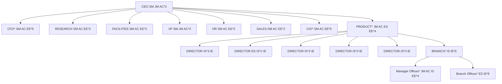

For office use only

T1

T2

T3

T4

Team Control Number

## 33900

Problem Chosen

C

For office use only

F1

F2

F3

F4

## 2015 Mathematical Contest in Modeling (MCM) Summary Sheet

## Analyzing Employee Turnover Using Dynamic Network

## Summary

In this paper, we build a dynamic network model and perform various simulations to study the behavior of Human Capital Network (HCN) under disturbance such as churns.

We detail the structure of HCN factors and continuing effects of turnover and dynamics of HCN utilizing given information and run simulations to examine the contagion of turnover and analyze the sustainability of HCN. We interpret and present our results along with robustness analysis and strengths and weaknesses of our model.

For Task 1, we build two networks (Personnel Relationship Network and Organizational Network), which together form our Human Capital Network. We extract important information from problem material and make assumptions when necessary to deduce the detailed structure and assign employees with the offices. We propose an evaluation function of assignments and use Genetic Algorithm to find the optimal assignment. The assignment provides us with new information about employee relationship(co-office relationship etc.), together with the supervisory relationship form the edges in HCN and complete our network building.

For Task 2, we first detail the turnover in terms of factors and impacts and evaluate the cost and productivity of HCN. We then dig into the dynamics in terms of turnover process, promotion process and recruitment process using probabilistic method and discrete time system simulation. The results show that organizational churn has both direct and indirect effects on the organization’s productivity. The direct effect is because it causes loss of employee and the indirect is because it will make other employee more likely to turnover.

For Task 3, we utilize our dynamic network model with our discrete time simulating system to calculate the budget. Our result is a budget requirement of 19.14σ for recruiting and 10.87σ for training in the next 2 years, adding up to 30.01σ.

For Task 4, we also run simulations and results show that ICM can’t sustain its 80% full status.

For Task 5, our results show that promotion increases the number of high-level employee and improve the quality of staff because only those qualified can be promoted. Thus promotion increases the productivity.

We also make further discussions on Multi-layer Networks and HR issues which complete Task 6, 7 and other requirements that the problem material brought forth.

## Contents

## 1 Introduction 1

1.1 Problem Statement  
1.2 Related Work

## 2 Assumptions and Notations 1

2.1 Assumptions  
2.2 Notations . . 2

## 3 The Human Capital Network Model 2

3.1 Assigning Employees to Offices . . 2

3.1.1 Principles of Employee Assignment . . . 2  
3.1.2 Evaluation of Employee Assignment . . . 3  
3.1.3 Optimization Using Genetic Algorithm . . . . 3

3.2 Building The Human Capital Network . 4

3.2.1 Building The Network of Personnel Relationship . . . 4  
3.2.2 Building the Organizational Network . . . . 5

3.3 Evaluating Turnover Intention of Employee . . 6

3.3.1 Factor of Turnover Contagion . . . 6  
3.3.2 Factor of Employee Centrality . . . . 7  
3.3.3 Factors of Salary and Promotion Prospect 7  
3.3.4 Evaluation using AHP] . . . . 8

3.4 Productivity and Costs of HCM 9

## 4 Dynamics of Human Capital Network 9

4.1 Process of Turnover 10  
4.2 Process of Promotion 10  
4.3 Process of Recruitment 10

## 5 Simulation Results and Analysis 11

## 6 Sensitivity Analysis 14

## 7 Improvements using Multi-layered Networks 15

## 8 Further Discussions on HR 16

## 9 Strengths and Weaknesses 16

9.1 Strengths . 16  
9.2 Weaknesses . 16

## References 17

## 1 Introduction

## 1.1 Problem Statement

Among various factors that influence a teamąŕs performance, the members of the team and the chemistry between them, i.e. teamwork, is an important one. The approach to this is to maintain a team of talented and well-trained people and keep them in proper positions. However, in modern companies employee turnover [5] often takes place and disturb the environments. This paper offers a model of employee turnover and its impact based on the Human Capital Network. The HCN is extracted as a hierarchy structure of staff offices and divisions as nodes and a list of 370 employees as nodes, then the turnover intention is analyzed by the AHP method, and divided as salary, promotion, importance and impacts from others. The importance of the nodes is given by the closeness centrality and the LeaderRank value of nodesąŕ departments. Salary and promotion are impacts indicators in consideration for different levels. The impact is conducted through links and damps as time elapse. The promotion process and recruit process are also predicted by stochastic process methods, which make a part in the total dynamic process.

## 1.2 Related Work

In recent years, there has been tremendous interest in studying Team Science and developing appropriate model of team and team performance. Salas et al. reviewed key discoveries and developments in the field of team performance over the past 50 years [2]. They concluded that ‘team performance can be modeled’ and which are our motivation to model the productivity.Stokols et al. argued about [3] and Kivelä et al. studied the Multilayer Networks. which are incorporated into our paper for improvement of our model.

Many works have inspected the nature of rumor propagation etc. which is similar to[NOT good...] turnover propagation. However, the methods they used are mainly mean-field equations for homogeneous networks and ... for heterogenous networks. the underlying mechanism of how network structure influences the rumor spreading is still an open question.

There have been extensive study But limited work has been done in analyzing the turnover process using a mathematical model and quantifying (??) its impact on the overall team performance. We are concerned in this paper with the...

## 2 Assumptions and Notations

## 2.1 Assumptions

We make the following basic assumptions in order to simplify the problem. Each of our assumptions is justified and is consistent with the information given in [1].

• Turnover behavior of an employee is contagious. So the worker connected to other employees who have churned is more likely to churn [1].  
• Similar individuals are more likely to affect each other’s behavior. This is

an adopted assumption from previous work of Feeley et al. [15].

## 2.2 Notations

We use a list of symbols (cf. Table 1) for simplification of expression.

Table 1. Notations (in the order of model)

<table><tr><td>Symbol</td><td>Definition</td><td>Notes</td></tr><tr><td colspan="3">Human Capital Network Model</td></tr><tr><td>G</td><td>graph of Personnel Relationship Network of ICM</td><td>cf. Figure 2</td></tr><tr><td>g</td><td>graph of Organizational Network of ICM</td><td>cf. Figure 3</td></tr><tr><td>N</td><td>number of nodes</td><td></td></tr><tr><td> $d_{ij}$ </td><td>topological distance between node i and j</td><td></td></tr><tr><td> $R_t$ </td><td>employee turnover rate</td><td> $R_t=\frac{NELDY^1}{(NEBY^2+NEEY^3)/2}\times100\% [5]$ </td></tr><tr><td>T</td><td>turnover intention</td><td></td></tr><tr><td>CC</td><td>Closeness Centrality</td><td> $CC_i=\frac{1}{d_i}=\frac{N}{\sum_{j=1}^{N}d_{ij}}$ </td></tr><tr><td> $P_i$ </td><td>average annual salarypayment) of employee i</td><td>represents employee&#x27;s ability</td></tr><tr><td> $L_i$ </td><td>level of hierarchy of the office of employee i</td><td> $L_{CEO}=5$  and  $L_{Branch}=1$ </td></tr><tr><td colspan="3">The Second Model</td></tr><tr><td>Emu</td><td>stuffed</td><td></td></tr><tr><td>C</td><td>frozen</td><td></td></tr></table>

## 3 The Human Capital Network Model

In this model, the HCN is extracted as a hierarchy structure of staff offices and divisions as nodes and a list of 370 employees as nodes, then the turnover intention is analyzed by the AHP method, and divided as salary, promotion, importance and impacts from others. The importance of the nodes is given by the closeness centrality and the LeaderRank value of nodesąŕ departments.

## 3.1 Assigning Employees to Offices

Due to limited given information on the personnel relationship of ICM in detail, we assume some basic rules of allocating offices to complete our model. We apply these rules and form an AHP-based evaluation model, then we use Genetic Algorithm to find the solution.

## 3.1.1 Principles of Employee Assignment

Our principles for allocating offices is listed as follows:

• Employees with higher level of position should occupy offices of higher centrality and higher hierarchy in the structure diagram given in [1].  
• Supervisors and executives should distribute as broadly as possible to ensure widespread supervisory and to maximally utilize the manager resource.  
• Offices of same level should have similar constitute for equality.  
• Each executive should be matched with an administrative clerk as his/her secretary.

## 3.1.2 Evaluation of Employee Assignment

We first quantify these principles as follows:

1. Principle of centrality: $\begin{array} { r } { E _ { 1 } = \sum P _ { i } \cdot C C _ { i } } \end{array}$  
2. Principle of hierarchy: $\begin{array} { r } { E _ { 2 } = \sum P _ { i } \cdot L _ { i } } \end{array}$  
3. Principle of equality: $E _ { 3 } = \sum D _ { j }$  
4. Principle of uniformity: $E _ { 4 } = \sum S _ { j }$

$P _ { i }$ is the annual salary of an employee, which is a representative of his ability. $D _ { j }$ is differences between office $j$ and other offices of the same level. $S _ { j }$ is the number of same type of employees in office $j$ . We hereby give the evaluation function:

$$
E v a l = \alpha_ {1} E _ {1} + \alpha_ {2} E _ {2} + \alpha_ {3} E _ {3} + \alpha_ {4} E _ {4} \tag {1}
$$

Because that $E _ { 3 }$ and $E _ { 4 }$ are too large, we choose $\alpha _ { 1 } = 0 . 5 , \alpha _ { 2 } = 0 . 5 , \alpha _ { 3 } = - 0 . 0 5$ , $\alpha _ { 4 } = - 0 . 0 5$ after some experiments with random assignments. We plug these parameters back into Equation 1 to obtain the evaluation function.

## 3.1.3 Optimization Using Genetic Algorithm

We got an evaluation function in Section 3.1.2. Next we are going to find its optimum, which in correspondence is the best assignment solution. It is easy to show that this problem is a Combinatorial Optimization problem, for which search heuristics such as Genetic Algorithm and Tabu Search are proven to be more efficient. We notice that the assignment itself is naturally a representation of the gene code, so we choose Genetic Algorithm to find the maximum of the evaluation function (cf. Equation 1). Thus the evolution process such as gene crossover can be easily achieved by swap employees in different offices. We implement the algorithm using MATLAB, initialize 500 random solutions and begin iteration. The algorithm produce a satisfactory result (cf. Figure 1).

We can see from Figure 1 that the algorithm not only assigned offices according to staff hierarchy (i.e. superior offices for staff of higher position like senior manager) but also incorporated uniformity and equality.

flowchart

Figure 1. Organizational structure of ICM with all the employees assigned. Each block represents an office (without \*) or two divisions (with \* and thicker border). Bold text is abbreviation of positions(SM for Senior Manager etc.). Blocks with the same color and style share same constitute. Some blocks (Manager Offices and Branch Offices) are replaced by legend symbols for simplification.

## 3.2 Building The Human Capital Network

We assigned the staff with proper offices in the above mentioned. Next we are going to build the network using this newly deducted information.

## 3.2.1 Building The Network of Personnel Relationship

Now that there are a grant total of $N ( N \leqslant 3 7 0 )$ employees in ICM, which is corresponding to the N node in graph $G ,$ and we use $v _ { i } ( 1 \leqslant i \leqslant N )$ to denote the ith node in G. In order to simplify the problem,we make a natural assumption that any pair of nodes $v _ { i }$ and in G is connected if and only if the three following conditions are satisfied:

• $v _ { i }$ and $v _ { j }$ are in the same Branch or division;  
• $v _ { i }$ and $v _ { j }$ are in the same level;  
• $v _ { i }$ and $v _ { j }$ are respectively leaders of two office whose superior department are the same.

It’s worth noting that the relationship between any two persons in ICM varies, thus $G$ is a weighted graph,the weight of edge $e _ { i j }$ reveals the level of relationship between node $v _ { i }$ and node $v _ { j }$ .Let $N$ dimensional matrix $A = ( w _ { i j } ) _ { N \times N }$ be the adjacency matrix of graph G ,we can conclude from previous discussion that:

$$
w _ {i j} = \left\{ \begin{array}{l l} \sigma & i f \mathrm{v} _ {i} a n d v _ {j} s a t i s f y c o n d i t i o n 2 \\ 1 & i f \mathrm{v} _ {i} a n d v _ {j} s a t i s f y c o n d i t i o n 1 o r 3 \end{array} \right.
$$

The graph G is illustrated in Figure 2.

```mermaid
graph TD
  A["Links within an office/division"] --> B["Inter-hierarchy links"]
  A --> C["Director 2"]
  A --> D["Branch L"]
  A --> E["Internet"]
  F["top-level"] --> G["CEO"]
  H["mid-level"] --> I["VP"]
  J["mid-top"] --> K["Bottom-level"]
  L["mid-bottom"] --> M["Mid-top"]
  N["Bottom-level"] --> O["Mid-bottom"]
  P["Link between office heads"] --> Q["Inter-hierarchy links"]
  R["Links within an office/division"] --> S["Director 2"]
  T["Links between office heads"] --> U["Internet"]
  V["Links within an office/division"] --> W["Director 2"]
  X["Links between office heads"] --> Y["Internet"]
  Z["Links within an office/division"] --> AA["Director 2"]
```

flowchart

Figure 2. Personnel Relationship Network of ICM. The color denotes office hierarchy. Small clusters of offices and three types of edges are labeled. Some edges are omitted for conciseness.

## 3.2.2 Building the Organizational Network

Also we can get the Organizational Network. The procedures of forming g can be implemented as follows:

1. add all staff offices and divisions to g as nodes.  
2. add hierarchy chains as directed edges, from lower hierarchy to higher.  
3. for all nodes pairs, if the two nodes have the same hierarchical father, add a bidirected edge between them.  
4. add a sink node to graph, then connect all nodes except the sink node to the sink node with a bi-directed edge, which is in convenience for leader rank.

Graph g is a directed graph (cf. Figure 3). The calculated LeaderRank Value is illustrated by the node size. Note that LeaderRank Value is not always consistent with hierarchy.

```mermaid
graph TD
  CEO --> VP
  CEO --> HR
  CEO --> CFO
  CEO --> CIO
  CEO --> Research
  CEO --> HR
  CEO --> SalesMarketing["Sales Marketing"]
  CEO --> WorldWide["World Wide"]
  CEO --> Regional
  CEO --> Internet
  CEO --> WorldWide
  CEO --> Information
  CEO --> Networks
  CEO --> PlantGreen["Plant Green"]
  CEO --> Factilities
  CEO --> PlantBlue["Plant Blue"]
  CEO --> CFO
  VP --> Director4["Director 4"]
  VP --> Director3["Director 3"]
  VP --> Director2["Director 2"]
  VP --> Director1["Director 1"]
  VP --> Director5["Director 5"]
  VP --> Director6["Director 6"]
  VP --> DirectorL["Director L"]
  VP --> BranchK["Branch K"]
  VP --> BranchL["Branch L"]
  VP --> BranchJ["Branch J"]
  VP --> BranchI["Branch I"]
  VP --> BranchB["Branch B"]
  VP --> BranchA["Branch A"]
  VP --> BranchC["Branch C"]
  VP --> BranchD["Branch D"]
  VP --> BranchG["Branch G"]
  VP --> BranchE["Branch E"]
  VP --> BranchF["Branch F"]
  VP --> BranchH["Branch H"]
  VP --> Director4
  VP --> Director3
  VP --> Director2
  VP --> Director1
  VP --> Director5
  VP --> Director6
```

flowchart

Figure 3. Organizational Network of ICM. The color denotes office level. The size of the node denotes the LeaderRank Value. Note that the LeaderRank Value of Production Manager is higher than that of VP despite of their hierarchical relations.

## 3.3 Evaluating Turnover Intention of Employee

Cotton et al. found that factors such as pay and employment perception are the most highly reliable correlates of turnover [6]. The factors can be divided into External Factors and Internal Factors. We adopt his conclusion and further specify them into three basic elements: salary, level of position, promotion prospect. We also introduce the influence of other people’s turnover behavior, summing up to four elements denoted by $C _ { 1 } ~ , C _ { 2 } ~ , C _ { 3 }$ , $C _ { 4 }$ for quantification.

In order to find the employee with the highest turnover probability, we use AHP to evaluate the contribution of each factor to turnover intention.

## 3.3.1 Factor of Turnover Contagion

Hereinbefore we assumed that if one employee left, other employees close to him are influenced and are more likely to ‘churn’ (cf. Section 2.1). We quantify the level of influence by introducing Structural Equivalence [15] as closeness. We assume that the level of influence of one’s turnover to another’s intention is positively correlated with Structural Equivalence (in other words, similarity).

We adopt the RA Index [16] in weighted graph to measure the similarity between nodes. Consider a pair of nodes, x and y which are not directly connected. If node x can send some information to y with their common neighbors playing the role of transmitters, then they would share some similarity. We revise the original RA Index and define the similarity between x and y as the amount of resource y received from x :

$$
s _ {x y} = \sum_ {z \in \Gamma (x) \cap \Gamma (y)} \frac {w _ {x z} + w _ {y z}}{k (z)}
$$

where Γ(i) is the set of neighbors of x and $k ( i )$ the degree of $x$ , and we can develop the expression of $C _ { 1 i }$ :

$$
C _ {1 i} = \sum_ {a _ {j} \in S} \frac {e ^ {- \beta (t - t _ {j})}}{1 + e ^ {- \beta (t - t _ {j})}} s _ {i j}
$$

where $S$ denotes the set of former employees who have churned at moment $t _ { i }$ . We use Logistic Curve to describe former employee’s impact due to the attenuation effect.

## 3.3.2 Factor of Employee Centrality

Individuals with greater centrality in a communication network are less likely to turnover due to the information and social support benefits provided by peers in the workplace [15].

In our model the overall importance of an employee is determined by his centrality in graph G (cf. Figure 2) and the importance of his department in graph g (cf. Figure 3). Because Closeness Centrality can be regarded as a measure of how long it will take to spread information from certain node to all other nodes and is widely used in Social Network Analysis [17], we choose Closeness Centrality as the measurement. And the importance of his department in graph g is determined by the LeaderRank Value of the office.

For each node in graph $G$ , we calculate its Closeness Centrality as follows: For node i , calculate mean distance between it and every other node as $d _ { i }$ :

$$
d _ {i} = \frac {1}{n} \sum_ {j = 1} ^ {N} d _ {i j}
$$

where $d _ { i j }$ is the topological distance between i and $j$ . The reciprocal of $d _ { i }$ is defined as Closeness Centrality:

$$
C C _ {i} = \frac {1}{d _ {i}} = \frac {N}{\sum_ {j = 1} ^ {N} d _ {i j}}
$$

For each office in directed graph $g$ , we calculate the LeaderRank Value LR as follows:

To conclude we give the expression of $C _ { 2 i } \colon$

$$
C _ {2 i} = \frac {1}{L R \times C C _ {i}}
$$

## 3.3.3 Factors of Salary and Promotion Prospect

We assume that the salary is the same among same hierarchy, so we quantify the factor of salary as follows:

$$
C _ {3 i} = \left\{ \begin{array}{l l} \xi_ {1} & \text {node i belongs to top hierarchy} \\ \xi_ {2} & \text {node i belongs to mid hierarchy} \\ \xi_ {3} & \text {node i belongs to bottom hierarchy} \end{array} \right.
$$

Similarly, assuming that the promotion prospect is the same, we give:

$$
C _ {4 i} = \left\{ \begin{array}{l l} \psi_ {1} & \text {node i belongs to top hierarchy} \\ \psi_ {2} & \text {node i belongs to mid hierarchy} \\ \psi_ {3} & \text {node i belongs to bottom hierarchy} \end{array} \right.
$$

We choose $\xi _ { 1 } = 1 , \xi _ { 2 } = 0 , \xi _ { 3 } = 0$ on account of the relatively low CEO-to-worker salary ratio. And because that employees in the middle ‘feel stuck in their jobs with little opportunity to advance’ [1], we choose $\psi _ { 1 } = 0 \ , \psi _ { 2 } = 1 \ , \psi _ { 3 } = 0$ .

## 3.3.4 Evaluation using AHP]

We gave the quantification of factors in the above text. Our AHP hierarchy for this evaluation is illustrated in Figure 4.

```mermaid
graph TD
  A["Turnover Intention (T)"] --> B["Impact from Others (C1)"]
  A --> C["Employee Centrality (C2)"]
  A --> D["Salary (C3)"]
  A --> E["Promotion Prospect (C4)"]
  B --> F["Employee1"]
  B --> G["Employee2"]
  B --> H["Employee3"]
  C --> I["......"]
  D --> J["..."]
  E --> K["..."]
  B --> L["Employee1"]
  C --> M["Employee2"]
  D --> N["Employee3"]
  E --> O["..."]
  B --> P["Employee1"]
  C --> Q["Employee2"]
  D --> R["Employee3"]
  E --> S["..."]
  B --> T["Employee1"]
  C --> U["Employee2"]
  D --> V["Employee3"]
  E --> W["..."]
  B --> X["Employee1"]
  C --> Y["Employee2"]
  D --> Z["Employee3"]
  E --> AA["..."]
  B --> AB["Employee1"]
  C --> AC["Employee2"]
  D --> AD["Employee3"]
  E --> AE["..."]
  B --> AF["Employee1"]
  C --> AG["Employee2"]
  D --> AH["Employee3"]
  E --> AI["..."]
  B --> AJ["Employee1"]
  C --> AK["Employee2"]
  D --> AL["Employee3"]
  E --> AM["..."]
  B --> AN["Employee1"]
  C --> AO["Employee2"]
  D --> AP["Employee3"]
  E --> AQ["..."]
  B --> AR["Employee1"]
  C --> AS["Employee2"]
  D --> AT["Employee3"]
  E --> AU["..."]
  B --> AV["Employee1"]
  C --> AW["Employee2"]
  D --> AX["Employee3"]
  E --> AY["..."]
  B --> AZ["Employee1"]
  C --> BA["Employee2"]
  D --> BB["Employee3"]
  E --> BC["..."]
  B --> BD["Employee1"]
  C --> BE["Employee2"]
  D --> BF["Employee3"]
  E --> BG["..."]
  B --> BH["Employee1"]
  C --> BI["Employee2"]
  D --> BJ["Employee3"]
  E --> BK["..."]
  B --> BL["Employee1"]
  C --> BM["Employee2"]
  D --> BN["Employee3"]
  E --> BO["..."]
  B --> BP["Employee1"]
  C --> BQ["Employee2"]
  D --> BR["Employee3"]
  E --> BS["..."]
  B --> BT["Employee1"]
  C --> BU["Employee2"]
  D --> BV["Employee3"]
  E --> BW["..."]
  B --> BX["Employee1"]
  C --> BY["Employee2"]
  D --> BZ["Employee3"]
  E --> CA["..."]
  B --> CB["Employee1"]
  C --> CC["Employee2"]
  D --> CD["Employee3"]
  E --> CE["..."]
  B --> CF["Employee1"]
  C --> CG["Employee2"]
  D --> CH["Employee3"]
  E --> CI["..."]
  B --> CJ["Employee1"]
  C --> CK["Employee2"]
  D --> CL["Employee3"]
  E --> CM["..."]
  B --> CN["Employee1"]
  C --> CO["Employee2"]
  D --> CP["Employee3"]
  E --> CQ["..."]
```

flowchart

Figure 4. The AHP hierarchy for determine employee’s turnover intention.

Combining those four factors using AHP, we give the following pairwise comparison matrix:

$$
\begin{array}{c c c c c} & C _ {1} & C _ {2} & C _ {3} & C _ {4} \\ C _ {1} & \left( \begin{array}{c c c c} 1 & 2 & 3 & 1 / 2 \\ 1 / 3 & 1 & 1 & 1 / 2 \\ 1 / 2 & 1 & 1 & 1 / 3 \\ 3 & 2 & 2 & 1 \end{array} \right) \end{array}
$$

Thus we have the evaluation function expressed as Equation (4), in which the parameters $\alpha _ { 1 } , \alpha _ { 2 } , \alpha _ { 3 } , \alpha _ { 4 }$ are to be determined.

$$
T = \alpha_ {1} C _ {1} + \alpha_ {2} C _ {2} + \alpha_ {3} C _ {3} + \alpha_ {4} C _ {4} \tag {2}
$$

We calculate the parameters using MATLAB, and get $\alpha _ { 1 } = 0 . 3 0 8 4 , \alpha _ { 2 } = 0 . 1 4 8 2$ , $\alpha _ { 3 } ~ = ~ 0 . 1 4 4 5$ , $\alpha _ { 4 } \ : = \ : 0 . 3 9 8 9$ . We test the consistency of our AHP in the following two aspects:

1. The Consistency Index $C I = ( \lambda _ { \operatorname* { m a x } } - n ) / ( n - 1 )$ should be close to zero. With $n = 4$ we get $C I = 0 . 0 0 4 5$ , which is very close to zero.

2. The Consistency Ratio $C R = C I / R I$ should be less than 0.1. With $n = 4$ we get $R I = 0 . 9$ and $C R = 0 . 0 5 < 0 . 1$ .

The test result displays perfectly acceptable consistency.

## 3.4 Productivity and Costs of HCM

The contribution of employee to the company is intuitively relevant to the following three factors:

1. The ability of the employee, represented by his wage.  
2. The efficiency of the employee (denoted by $e _ { i } )$ . It is trivial to see that efficiency is inversely proportional to turnover intention.  
3. The importance of the office in which the employee works. This factor is introduced by modifying coefficient $\lambda _ { i }$ and is equal to LeaderRank Value of graph $g$ .

Thus we have productivity expression as follows:

$$
\text { Productivity } = \sum_ {i} \lambda_ {i} \times P _ {i} \times e _ {i} \tag {3}
$$

The overall recruiting costs of ICM is given by the summation of new workers’ median recruit costs:

$$
R C _ {a l l} = \sum_ {j} \sum_ {N _ {j} \in N W} M R _ {j}
$$

where $R C _ { a l l }$ is for overall recruiting costs, $N _ { j }$ represents a node of level $j ,$ NW indicates the new worker set, and $M R _ { j }$ is the median recruiting costs of level $j .$ The training costs is related to the current number of workers in different levels, which are given by:

$$
T C _ {a l l} = \sum_ {j} \sum_ {N _ {j} \in N o d e s} M T _ {j}
$$

where $T C _ { a l l }$ is for overall recruiting costs, $N _ { j }$ represents a node of level $j ,$ Nodes indicates the set of all nodes, and $M T _ { j }$ is the median training costs of level $j$ .

## 4 Dynamics of Human Capital Network

We further analyze the dynamic characteristics of HCN. The dynamic process imcludes churns, promotions and recruits. The churn exhibits impacts on linked nodes as parts of the turnover intention. With stochastic process the recruits and promotions can be regarded as random variables following to specific distributions. Using the model

## 4.1 Process of Turnover

The process of turnover is based on the turnover intention analysis in Section 3. The nodes to churn is chosen randomly with their turnover intention as weight. By approximating the poisson distribution can best describe churns distribution as follows:

$$
P \left(n _ {c h} = k\right) = \frac {e ^ {- \lambda} \lambda^ {k}}{k !} \tag {4}
$$

where represents the number of churns. If the time unit is month, we have Eventually, A churned worker loses his links and is deleted from the G graph.

## 4.2 Process of Promotion

We aim to distinguish qualified workers in the company, hence we choose the service time and the work experience as two diciplines in promoting. The service time of a worker is the duration he stays in this company. The service time requirments with respect to levels of positions are shown as Table 2.

Table 2. Service Time Requirements for different Level of Positions.

<table><tr><td>Level of Position</td><td>SM</td><td>JM</td><td>ES</td><td>IS</td><td>EE</td><td>IE</td></tr><tr><td>Service Time Requirements</td><td>8</td><td>5</td><td>3</td><td>2</td><td>1</td><td>0</td></tr></table>

Note that the promotion of Administrative Clerk is ignored in the promotion process because of the differences in jobs especially in a production-oriented company. We assume that worker with service-time beyond comparison in Table 2 be cropped to the maximum requirements initially. Therefore, we choose a truncated gaussian distribution with a mean value of $\mu _ { j }$ and a variance of $\sigma _ { j }$ to describe the distribution of service time of workers in level $j$ as the approximation of initial distribution:

$$
G (x | \mu_ {j}, \sigma_ {j}) = \frac {1}{\sqrt {2 \pi} \sigma_ {j}} e ^ {- \frac {(x - \mu_ {j}) ^ {2}}{2 \sigma_ {j} {} ^ {2}}}
$$

where $G ( x | \mu _ { j } , \sigma _ { j } )$ represents the gaussian distribution function, and $\mu _ { j }$ is the minum service time requirement in level $j , \sigma _ { j }$ is chosen as twice of the length of intervals. The truncate range is the ranges in Table 2. Because that Senior Manager has no where to promote, we don’t care about his promotion.

The work experience can be determined by the similarity of the nodes and the vacancy, where we create a virtual node as well as several virtual edges to connect real nodes. By replacing the vacancy with the virtual node, the similarity between the vacancy and other nodes is calculated. Similarity is a proper indicator of the related work experience for there are strong edges inside the staff office and hierarchy. A worker is promoted to a higher level means he should get used to new circumstances, loses old links and forms new links.

## 4.3 Process of Recruitment

Since the median time to recruit $( M T _ { j }$ with respect to level $j$ in months) is a constant value, the number of workers ICM recruit during a unit time interval can be formulated as Poisson Random Distribution. The probability is given by Equation 4. where $n _ { j }$ represents the recruit number of level $j .$ When the time unit is month, we have . A new worker forms the links deleted when he is recruited. When the time unit is month, we have:

$$
\lambda = \frac {1}{M T _ {j}}
$$

## 5 Simulation Results and Analysis

For Task 2(1), our simulation result indicate that a churn in network induces impacts according to the similarity of nodes (cf. Figure 5, 6). Nodes having strong connection with the churn node gain large external factors in their turnover intentions while the others suffer less impact, thus those heavily affected nodes are more likely to turnover. As the impact declines with time, the turnover intention of nodes reduce to the unaffected level. The impacts spread further when the affected nodes turnover, and stops at a non-churn node.

  
Figure 5. Propagation of turnover intention over the Personnel Relationship Network. Observation of Turnover Intention of (a) a certain time and (b) two months later. Turnover propagation is clearly illustrated. It can also be observed that the turnover rate is higher in mid-level positions.

For Task 2(2), our simulation shows that churn will both directly and indirectly affect the productivity. As is shown in Equation 4, when an organizational churn takes place, a direct effect is decreases in the number of workers. In the simulation of two years, the number of workers keeps reducing due to the high turn over rate and limited recruiting rate. The average turn over intention of different levels of positions are shown in Figure 7, which is a main factor of productivity. The turn over intention of middle managers is relatively higher than the other levels, and the rises shown in these curves represent the continuous impacts of churns. The productivity mainly fluctuate with the number of workers, but with the average productivity shown with the right y-axis, we can see a reduction of 9.8% at the end of simulation. Churns impacts conducts to linked employee and have a negative effects on their productivity. Considering the declining rate, it is easy to know that the continuous churns will keeps a steady impacts on the productivity, thus causes the decreases in the average productivity comparing to the start point.

stacked bar chart

| Month | Senior Mangers | Middle Managers | Employees |
|-------|----------------|-----------------|---------|
| 1     | 35             | 25              | 60      |
| 2     | 34             | 26              | 60      |
| 3     | 33             | 27              | 60      |
| 4     | 32             | 28              | 60      |
| 5     | 31             | 29              | 60      |
| 6     | 30             | 30              | 60      |
| 7     | 29             | 31              | 60      |
| 8     | 28             | 32              | 60      |
| 9     | 27             | 33              | 60      |
| 10    | 26             | 34              | 60      |
| 11    | 25             | 35              | 60      |
| 12    | 24             | 36              | 60      |
| 13    | 23             | 37              | 60      |
| 14    | 22             | 38              | 60      |
| 15    | 21             | 39              | 60      |
| 16    | 20             | 40              | 60      |
| 17    | 19             | 41              | 60      |
| 18    | 18             | 42              | 60      |
| 19    | 17             | 43              | 60      |
| 20    | 16             | 44              | 60      |
| 21    | 15             | 45              | 60      |
| 22    | 14             | 46              | 60      |
| 23    | 13             | 47              | 60      |
| 24    | 12             | 48              | 60      |

Figure 6. Task 2.1

line chart

| Month | Employees | Middle Managers | Senior Managers | Average Productivity |
|-------|-----------|-----------------|-----------------|----------------------|
| 0     | 0.13      | 0.50            | 0.21            | 0.47                 |
| 5     | 0.14      | 0.52            | 0.22            | 0.45                 |
| 10    | 0.14      | 0.52            | 0.22            | 0.43                 |
| 15    | 0.14      | 0.54            | 0.23            | 0.42                 |
| 20    | 0.14      | 0.51            | 0.22            | 0.42                 |
| 24    | 0.14      | 0.51            | 0.22            | 0.43                 |

Figure 7. Task 2.2

For Task 3, Our model yields a budget requirement of 19.14σ for recruiting and 10.87σ for training in the next 2 years, adding up to 30.01σ. The recruiting costs of ICM in terms of σ shown in Figure 8 varies randomly, which is caused by the poisson distribution of recruit numbers. The training costs is a function of the number of workers and their levels resulting in the smooth decrease of the curve.

line chart

| Month | Relative Recruiting Cost | Relative Training Cost |
|-------|--------------------------|------------------------|
| 1     | 1.0                      | 6.0                    |
| 2     | 1.0                      | 6.0                    |
| 3     | 0.6                      | 5.9                    |
| 4     | 1.1                      | 5.8                    |
| 5     | 0.7                      | 5.7                    |
| 6     | 0.8                      | 5.6                    |
| 7     | 0.8                      | 5.5                    |
| 8     | 1.1                      | 5.4                    |
| 9     | 0.7                      | 5.3                    |
| 10    | 0.6                      | 5.2                    |
| 11    | 0.5                      | 5.1                    |
| 12    | 0.7                      | 5.0                    |
| 13    | 0.9                      | 4.9                    |
| 14    | 0.2                      | 4.8                    |
| 15    | 0.8                      | 4.7                    |
| 16    | 0.8                      | 4.6                    |
| 17    | 0.6                      | 4.5                    |
| 18    | 0.9                      | 4.4                    |
| 19    | 0.4                      | 4.3                    |
| 20    | 0.7                      | 4.2                    |
| 21    | 1.4                      | 4.1                    |
| 22    | 1.1                      | 4.0                    |
| 23    | 0.8                      | 3.9                    |
| 24    | 0.5                      | 3.8                    |

Figure 8. Task 3

For Task 4, our result shows that ICM can’t sustain a 80% full status for positions when the annual churn rate is 25% or 35%. In the recruiting model the coming number in an average time distribution is set to follows poisson distribution, thus a higher churn rate makes a faster loss in worker number. As a consequence of high churn rate, the productivity of the company decreases a lot; the workers suffer from the impacts of churns and their turn over intentions are higher. The total number of workers are shown in Figure 9 and the numbers at 18% churn rate is also shown for comparison.

line chart

| Month | 35% Churn Rate | 25% Churn Rate | 18% Churn Rate |
|-------|----------------|----------------|----------------|
| 0     | 310            | 310            | 310            |
| 5     | 280            | 290            | 300            |
| 10    | 250            | 270            | 290            |
| 15    | 210            | 250            | 270            |
| 20    | 180            | 230            | 260            |
| 25    | 160            | 210            | 250            |

Figure 9. Task 4

For Task 5, our results show that promotion increases the number of high-level employee and improve the quality of staff because only those qualified can be promoted. Thus promotion increases the productivity.

The promotion is implemented by choosing a qualified node and replace a vacancy in a higher levels. As an assumption, we spare no effects on promoting qualified employees, which means that all qualified nodes will be promoted at once. Figure 10 shows the overall productivity of different levels of positions. The promotion method keeps the productivity of higher levels and middle levels while introduces a shortage in low levels employees.

stacked bar chart

| Month | Senior Mangers | Middle Managers | Employees |
|-------|----------------|-----------------|---------|
| 1     | 30             | 40              | 50      |
| 2     | 33             | 42              | 51      |
| 3     | 32             | 41              | 50      |
| 4     | 30             | 40              | 50      |
| 5     | 30             | 40              | 50      |
| 6     | 30             | 40              | 50      |
| 7     | 30             | 40              | 50      |
| 8     | 30             | 40              | 50      |
| 9     | 30             | 40              | 50      |
| 10    | 30             | 40              | 50      |
| 11    | 30             | 40              | 50      |
| 12    | 30             | 40              | 50      |
| 13    | 30             | 40              | 50      |
| 14    | 30             | 40              | 50      |
| 15    | 30             | 40              | 50      |
| 16    | 30             | 40              | 50      |
| 17    | 30             | 40              | 50      |
| 18    | 30             | 40              | 50      |
| 19    | 30             | 40              | 50      |
| 20    | 30             | 40              | 50      |
| 21    | 30             | 40              | 50      |
| 22    | 30             | 40              | 50      |
| 23    | 30             | 40              | 50      |
| 24    | 30             | 40              | 50      |

Figure 10. Task 5

Our further discoveries and results for Task 6 and $7$ is in Section $\mathbf { 7 }$ and 8.

## 6 Sensitivity Analysis

The initial distribution of service time is a specific gaussian distribution with chosen mean value and variation. Since service time is a substantial factor in judging the qualified workers, the distribution can affect the number of qualified workers. Changing the distribution coefficient the results may change a lot.

We choose the $\sigma$ as the variable to be checked. The $\sigma$ is originally set to be twice of the length of level interval $( \mathrm { \Delta } l _ { j }$ with respect to level j ). Thus the new σs are the same as the length of level interval and three times of the length of level interval. We run the simulation in Task 5 and the results are shown as follows:

Table 3. Sensitivity Analysis of $\sigma$

<table><tr><td>σ</td><td>1</td><td>2l</td><td>3l</td></tr><tr><td>average promoted number(month)</td><td>2.314</td><td>2.083</td><td>2.250</td></tr><tr><td>average productivity</td><td>0.378</td><td>0.353</td><td>0.374</td></tr><tr><td>average Senior Manager productivity</td><td>3.378</td><td>3.372</td><td>3.741</td></tr><tr><td>middle manager number</td><td>35.16</td><td>38.33</td><td>37.00</td></tr></table>

These four indicators are related to the high level and the middle level numbers or productivity, which may show same changes. Although we can hardly eliminate the fluctuation due to randomness, this indicates that the value of sigma doesn’t cause great changes in our results. Then we choose the mean value $\mu$ as the variable to be checked. The $\mu$ is originally set as the lower boundary of level interval. Thus the new $\mu$ are the median value of level interval and the higher boundary of level interval. We run the simulation in Task 5 and the results are shown as follows:

Table 4. Sensitivity Analysis of $\mu$

<table><tr><td>μ</td><td>1</td><td>2l</td><td>3l</td></tr><tr><td>average promoted number(month)</td><td>2.314</td><td>2.083</td><td>2.250</td></tr><tr><td>average productivity</td><td>0.378</td><td>0.353</td><td>0.374</td></tr><tr><td>average Senior Manager productivity</td><td>3.378</td><td>3.372</td><td>3.741</td></tr><tr><td>middle manager number</td><td>35.16</td><td>38.33</td><td>37.00</td></tr></table>

## 7 Improvements using Multi-layered Networks

In this section, we outline the potential use of multi-layered networks.

Our model so far has only considered the relationship and links within the ICM. In fact, ICM’s employees in the Human Captial network are connected by a wide range of personal and public relationships. These relational ties are highly diverse in nature and can represent e.g. the influence or trust a person has for another. Every type of relation spans a social network of its own. The relationship between Human Capital network and other network models of the organization is therefore characterized by the superposition of its networks, all defined on the same set of nodes. This superposition is called multiplex network. We consider Network H and Network C (cf. Figure 11), which respectively represent part of the Human Capital Network and another network linking individuals with the same hometown. Comparing Network C and Network H we can see that both contain information that the other does not contain, e.g. SM1 and EE3 are connected in Network C but not in Network H.

```mermaid
graph TD
    subgraph Network_H[Network H]
  A["SM1"] --> B["EE3"]
  B --> C["SM3"]
  C --> D["SM4"]
  D --> E["EE4"]
  E --> F["SM5"]
  F --> G["SM6"]
  G --> H["EE5"]
  H --> I["SM7"]
  I --> J["SM8"]
  J --> K["EE6"]
  K --> L["SM9"]
  L --> M["SM10"]
    end
    subgraph Network_C[Network C]
  N["SM1"] --> O["SM2"]
  O --> P["SM3"]
  P --> Q["SM4"]
  Q --> R["SM5"]
  R --> S["SM6"]
  S --> T["SM7"]
  T --> U["SM8"]
  U --> V["SM9"]
  V --> W["SM10"]
    end
    style Network_H fill:#f9f,stroke:#333
    style Network_C fill:#bbf,stroke:#333
```

flowchart

Figure 11. Task 6

We could benefit a lot from the potential use of Multiplex Network [4]. With Multiplex network we could predict and better understand individual’s behavior. In the previous example, It’s consistent with our expectation if both SM1 and EE3 leave ICM for other jobs since thy are adjacent in Network C. Multiplex network can also be used in dynamic analysis at group level. We could measure the similarity based on the Jaccard Coefficient which quantifies the interaction between two networks by measuring the tendency that links simultaneously are present in both networks . $J _ { \alpha \beta }$ is a similarity score between two sets of elements and is defined between two sets of elements and is defined as the size ot intersection of the sets divided by the size of their union $\begin{array} { r } { J _ { \alpha \beta } = \frac { | \alpha \cap \beta | } { | \alpha \cup \beta | } } \end{array}$

## 8 Further Discussions on HR

We inspect further into this problem on the HR issues pointed out in the problem material.

First we incorporate annual evaluation with current HR management. We use a n dimensional vector ${ \vec { e } } = ( e _ { 1 } , e _ { 2 } , e _ { 3 } , . . . , e _ { n } )$ to represent the annual evaluation judged by the supervisor , where $e _ { i } \in [ 0 , 1 ]$ denotes the $i ^ { t h }$ component of evaluation. Assume that there are m optimal positions for the employee and our purpose is to find the best position for him/her. The requirement of $k ^ { t } h$ position can be expressed by another similar vector $\vec { \Phi } _ { k } = ( \Phi _ { k 1 } , \Phi _ { k 2 } , \Phi _ { k 3 } , . . . , \Phi _ { k n } )$ . Hence we denote the Euclidean distance from the employee to position k by $D _ { k } = | | \overrightarrow { \Phi } _ { k } - \overrightarrow { e } | |$ and greater distance indicates lower possibility of position k being suitable for the employee. Therefore the index of the best position for the employee is:

$$
k = \arg \left\{\min _ {j} D _ {j} \right\}
$$

Then we analyze the HR elements of ICM by using properties of Human Capital Network. Note that the network average clustering coefficient can be used to analyze the HR functions of the Human Capital network because the coefficient of a single node can indicate the closeness of the cluster centered at this node. Thus the average clustering coefficient represents the unity of ICM by taking all nodes into account.

## 9 Strengths and Weaknesses

## 9.1 Strengths

## • Comprehensiveness

We take careful consideration of factors related to turn-over intention.

Our models are capable of simulating the situation in real life. The results also agree with common sense and life experience.

Our model is strongly related to network science whose strength in modeling is in its ability to embrace the complexity of the real world.

The diffusion process of churn impacts is established and analyzed with dynamic process involved which is a bright spot of our model.

## • Robustness

Our models are fairly robust to the changes in parameters based on sensitivity analysis. It means a slight change in parameters will not cause a significant change in the result.

## • Justifiability

The result of our model is well consistent with our experience, which proves the rationality and correctness of our model.

## 9.2 Weaknesses

• We don’t have a full view of the components of the middle managers or the low level employees, we treats them as different, but we regard them as a group when analyzing results.

• Some of the parameters are based on common sense because few data are available. However, based on our sensitivity analysis, they will not make a great difference if slightly changed.

## References

[1] COMAP. (2015). ICM Problem C. http://www.comap.com/undergraduate/ contests/mcm/contests/2015/problems/2015\_ICM\_Problem\_C.pdf.  
[2] Salas, E., Cooke, N. J., & Rosen, M. A. (2008). On teams, teamwork, and team performance: Discoveries and developments. Human Factors: The Journal of the Human Factors and Ergonomics Society, 50(3), 540-547.  
[3] Stokols, D., Hall, K. L., Taylor, B. K., & Moser, R. P. (2008). The science of team science: overview of the field and introduction to the supplement. American journal of preventive medicine, 35(2), S77-S89.  
[4] Kivelä, M., Arenas, A., Barthelemy, M., Gleeson, J. P., Moreno, Y., & Porter, M. A. (2014). Multilayer networks. Journal of Complex Networks, 2(3), 203-271.  
[5] Wikipedia(2015). Turnover (employment). http://en.wikipedia.org/wiki/ Turnover\_(employment).  
[6] Cotton, J. L., & Tuttle, J. M. (1986). Employee turnover: A meta-analysis and review with implications for research. Academy of management Review, 11(1), 55-70.  
[7] LinkedIn Inc,. (2014). LinkedIn Big Data: The First Report on Promotion to HOD. http://www.gs.xinhuanet.com/news/2015-01/30/c\_1114195205.htm  
[8] Zhao, X., Liu, L., & Zhang, C. (2003). A Multi-variable Analysis on Factors Influencing Employee’s Turnover Intention. China Soft Science, (3), 71-74.  
[9] Felps, W., Mitchell, T. R., Hekman, D. R., Lee, T. W., Holtom, B. C., & Harman, W. S. (2009). Turnover contagion: How coworkers’ job embeddedness and job search behaviors influence quitting. Academy of Management Journal, 52(3), 545-561.  
[10] Bartunek, J. M., Huang, Z., & Walsh, I. J. (2008). The development of a process model of collective turnover. Human Relations, 61(1), 5-38.  
[11] Whitmore, G. A. (1979). An inverse Gaussian model for labour turnover. Journal of the Royal Statistical Society. Series A (General), 468-478.  
[12] Jovanovic, B. (1979). Job matching and the theory of turnover. The Journal of Political Economy, 972-990.  
[13] Tett, R. P., & Meyer, J. P. (1993). Job satisfaction, organizational commitment, turnover intention, and turnover: path analyses based on meta-analytic findings. Personnel Psychology, 46(2), 259-293.  
[14] Mobley, W. H., Griffeth, R. W., Hand, H. H., & Meglino, B. M. (1979). Review and conceptual analysis of the employee turnover process. Psychological Bulletin, 86(3), 493.  
[15] Feeley, T. H., Moon, S. I., Kozey, R. S., & Slowe, A. S. (2010). An erosion model of employee turnover based on network centrality. Journal of Applied Communication Research, 38(2), 167-188.  
[16] Zhou, T., Lü, L., & Zhang, Y. C. (2009). Predicting missing links via local information. The European Physical Journal B-Condensed Matter and Complex Systems, 71(4), 623-630.  
[17] Okamoto, K., Chen, W., & Li, X. Y. (2008). Ranking of closeness centrality for largescale social networks. In Frontiers in Algorithmics (pp. 186-195). Springer Berlin Heidelberg.