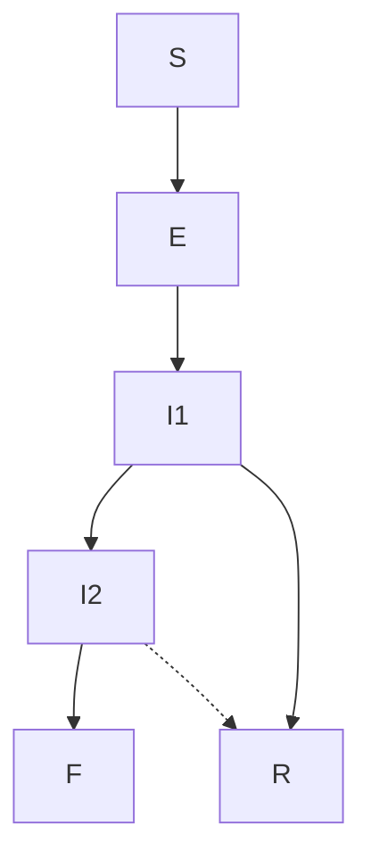
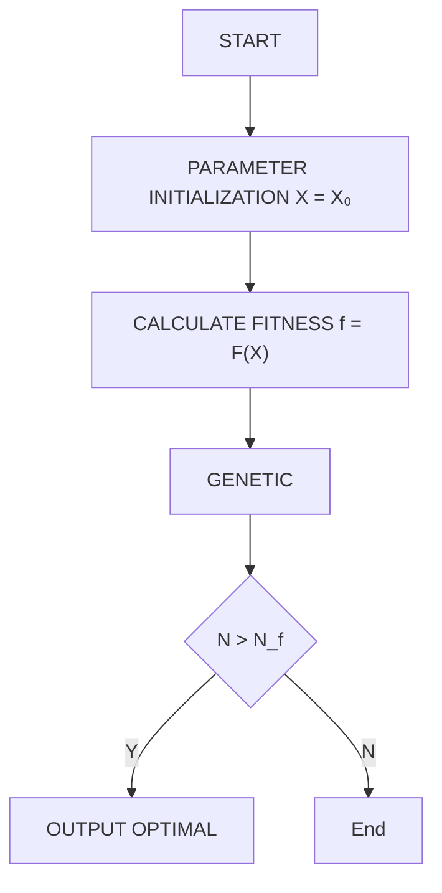
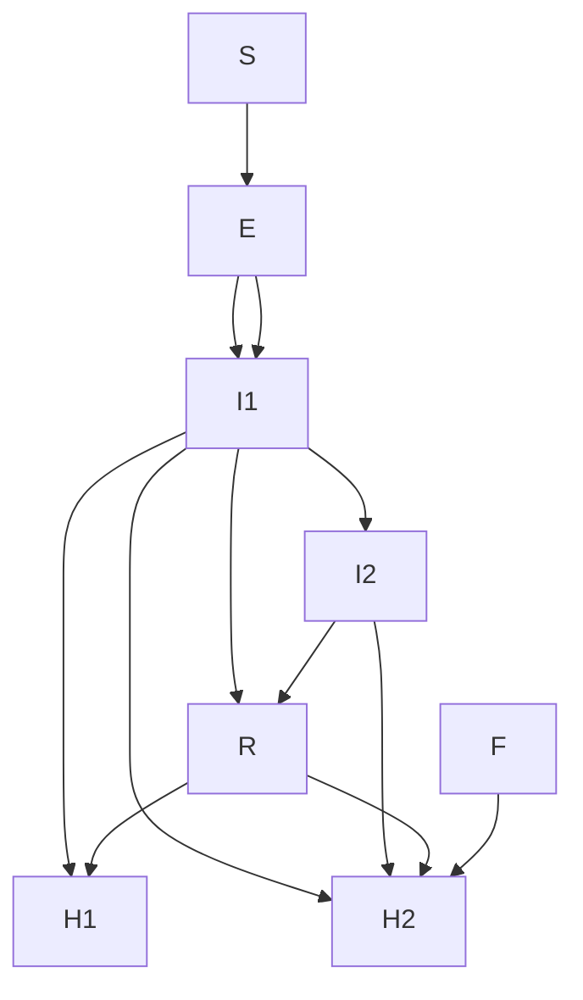
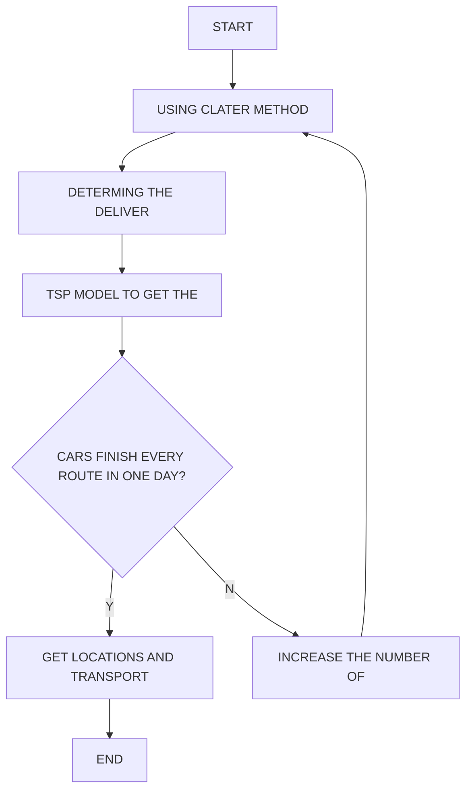

## Team Control Number

For office use only

T1

T2

T3

T4

## 34317

Problem Chosen

A

For office use only

F1

F2

F3

F4

## Summary

“Ebola is a major global crisis that demands a massive and immediate global response. No country or organization can defeat Ebola alone.”

H.E. Ban Ki-moon, the UN Secretary-General.

As a number of Global Village, we do our best to help eradicate Ebola.

First, we develop a stage-structured model of Ebola Propagation. In the model, we consider the susceptible, the exposed, the infected whose disease is not advanced, the infected whose disease is serious, the removed and the dead. The model is good at predicting near future cases’ number but fails in predicting far future cases’ number. Then we take hospital into consideration and add 7 more parameters, then we do simulation once again. Finally, we get a better result that the model well predicts the future cases. For example, the model predicts there are 4000 total cases and 2500 death cases in Guinea, 9509 total cases and 4166 death cases in Liberia, 12556 total cases and 3933 death cases in Sierra Leone up to April,1st, 2015.

Second, we determine the locations of delivery. We invoke clustering method to divide the most serious region, namely, West Africa into three parts, Guinea, Liberia and Sierra Leone. According to locations of provincial capital, we use clustering method once again to divide a country into several clusters. Then we adopt P-Center Method to determine a location of delivery in each cluster. We find there are two kinds of ways to choose. One is one-way route and the other is circular route. As for one-way route, we think it is time-consuming and energy-consuming. So we decide to use circular route. The circular route, in some ways, is a little bit similar to TSP problem, we use mix integer programming to find an optimal circular route by Lingo Software and each location of delivery has two optimal circular routes. The result is that there are 3 locations of delivery in Guinea, 1 location of delivery in Liberia and 1 location of delivery in Sierra Leone.

Third, we know from the stage-structured model that Ebola cannot stop spreading by itself. Since we are going to eradicate Ebola, we must use medicine and vaccine to stop Ebola. Medicine mainly influences the number of the susceptible while vaccine mainly influences the number of the infected whose disease is not advanced, in this way, we can eradicate Ebola. As for speed of manufacturing, we consider there is a linear equation between the speed and time because the amount of medicine is too rare to meet the requirement of patients. And this situation continues until the requirement is met. We can calculate the speed by the parameter in the linear equation. And we allocate medicine to different places by ratio of the infected number in that place to the number in three West African countries. Thus, we successfully stop Ebola from spreading.

Keywords: SEIIRF Model TSP Model Clustering Method Ebola Evaluating

## A BATTLE WITHOUT GUN AND SMOKE

## — THE CONFRONTATION WITH EBOLA

## Content

## Ⅰ Introduction.

1.1 Aims are Changing now..  
1.2 Our Understanding of the Words ..  
1.3 Decompose the Problem and Our Tasks 2

## Ⅱ Background – Behavior Change is Key to the Eradication of Ebola.

## Ⅲ Assumptions And Justifications.

## Ⅳ SEIIRF Model for Ebola propagation

4.1 Introduction.....  
4.2 Symbols and Definitions..  
4.3 Construction of the Model . .6  
4.4 Results are Not So Reasonable . .8  
4.5 Refresh the Values of Parameters.. .8  
4.6 Advanced Model . ..10  
4.7 Results are Reasonable .13  
4.8 Prediction of the Future .... ..14

## Ⅴ Model of Locations of Delivery... .18

5.1 What is Emergency Supplies ... ..18  
5.2 Assumptions and Justifications ... ..19  
5.3 Clustering Method, A Way to Determine Regions for Medicine Delivery...20  
5.4 Results of Clustering Method .21  
5.5 Principle of Fairness .22  
5.6 Principle of Efficiency .22  
5.7 Determine Delivery Locations in the Three West African Countries ...........23

## Ⅵ Model of Delivery System .23

6.1 Introduction... .23  
6.2 Symbols and Definitions.... .24  
6.3 TSP Model – Well-Planned Routes.. .24  
6.4 Daily Demand for Medicine . .25

## Ⅶ Model Implementation of three Countries ..26

7.1General algorithm .. ..26  
7.2 Application of Algorithm . ..27

7.2.1 Application in Guinea ... ..27  
7.2.2 Application in Liberia .29  
7.2.3 Sierra Leone .. ..30

## Ⅷ Model of the Quantity of the Medicine Needed and Manufacturing Speed .........31

8.1 Introduction.. ..31  
8.2 Assumptions and Justifications.. ..32  
8.3 symbols and definitions .. ..32  
8.4 How Fast Need We Produce Medicine and Vaccine.. .32  
8.5 The Quantity of the Medicine Needed .35

## Ⅸ Other Factors We Think Are Important .35

## Ⅹ Extension of Models . .36

10.1 Optimization of Coverage to Determine Delivery Locations .. ..36  
10.2 A No-boundary Scheme .. ..37

## Ⅺ Sensitivity analysis. ..38

11.1 Sensitivity Analysis of SEIIRF Model. .38  
11.2 Sensitivity Analysis of Model of the Speed to Produce Medicine........... ..39

## Ⅻ Conclusion ..40

11.1 Strengths and Weaknesses.. ..40  
11.2 Overall Results .. ..41

## Ⅰ Introduction

Ebola, a familiar but strange word to us. When the Ebola virus out broke in West Africa and caused plenty of deaths, no one would imagine the disastrous scene without mercy. And, of course, no one believes the word ‘Ebola’ just originated from a peaceful and beautiful river – Ebola River in Congo. Contrary to its attracting meaning, it is true that the Ebola virus do take lots of victims’ lives away. Countries all over the world, thus, have taken strategies, more specifically, distribute health works to disease-torn countries, speed up the development of medicine and establish feasible delivery systems to contain Ebola propagation.

## 1.1 Aims are changing now

The battle against Ebola will cost us heavily for sure, but human beings are not easily defeated. Although Ebola virus is fatal, we have methods. The WMA (World Medical Association) has announced that they have developed medicine to cure Ebola. At one level, the medicine is a milestone for us human beings in fighting Ebola, but at another it is the result of human nature. We know calling the command center to take away the sick is equally hard. It is our duty, in the interests of our own and the public good, to pick up the phone, but the reality is that, if we do, we may never hug our sister again. We can visit her in the treatment center and talk across two fences. The fortunate will be reunited. For the rest, the future is the body bag.[1] Ebola will not end without the medicine. Thanks to appearance of the medicine, we are gradually going out of confusion and turning to fight back in this smokeless battle. Many previous articles that mainly focus on how Ebola propagation or how difficult to contain Ebola are now may less important than those on how to effectively delivery medicine to most-need regions like West Africa. Accurate location with effective medicine – Ebola’s doomsday and we do our job to make it come true – considering propagation process, medicine needed, delivery systems, locations of delivery and manufacturing speed of vaccine or drug and so on.

## 1.2 Our understanding of the words

The problem requires us to de several jobs to evaluate Ebola. We think it is necessary for us to come to an understanding of some words in the problem.

Spread of the Disease: We consider this sub-problem as a requirement to analyze Ebola propagation process and predict future cases, including total cases and death cases in the three West African countries and what influence that new medicine will bring to us. As for Ebola cases in other countries, such as in the United States or in The United Kingdom, good health condition and developed facilities can contain the cases well, so in this paper, we mainly discuss Ebola cases in West Africa.

Locations of Delivery: How to understand the word ‘locations’ is the key to this sub-problem. We also have some criteria to choose ‘locations’ – easy to deliver medicine, cover most people or environment-friendly to build? Here, we regard ‘locations’ as places that have features of easy and time-saving in medicine delivering, being equal to all people in a region.

Possible Feasible Delivery Systems: We think this sub-problem needs us to design a route that can not only cover all places which are in need of medicine but also provide vehicles a fastest way to send medicine. Besides, delivery systems can allocate medicine to different places properly.

The Quantity of the Medicine Needed: There are several understandings of the word ‘quantity’, like amount of medicine to cure all Ebola patients or amount of medicine needed every day to keep serious patients from dying. Our understanding of this word is the total amount of medicine needed to cure patients whose disease is not advanced until there is no more patients appear. So it is a dynamic and time-varying number until cases stops increasing.

Speed of manufacturing of the vaccine or medicine: In our opinion, this sub-problem needs us to decide how fast a factory have to produce medicine when amount of medicine is too rare to cure patients and what changes a factory should obey when there is enough medicine for patients. As for vaccine, we consider it is similar to medicine.

Other factors: Something we forget to consider in our model but also important for Ebola evaluating. We will find them during the process of establishing models

## 1.3 Decompose the Problem and Our Tasks

To totally understand the problem better and know what we should to deal with Ebola, decompose it is needed to us. According to the steps needed in process of achieving our goal that accurate location with effective medicine, we deem the problem ‘Eradicating Ebola’ can be divided into five parts:

+ Propagation mechanism of Ebola virus.  
+ Accurate locations for medicine to be delivered like disease-torn countries in West Africa.  
Effective transportation including amount of medicine needed in a place.  
+ Total amount of medicine needed to cure Ebola patients until cases stops increasing.

## + Vaccine or drug manufacturing speed

When the problem is unequivocal, we start to make it clear that what we need to do and how to do it. Since we have separated the problem into parts, we can deal with these parts one by one. Here the problem requires us do and our tasks are:

 Build a model to reflect the condition we face now and make prediction of the future if medicine or hospital or other factors play roles in Ebola propagation process.  
 Find some best delivery places according to our own understanding of word ‘locations’  
 Design a delivery system both good in medicine transportation and medicine allocation.  
 Speed to produce medicine and total quantity needed to eradicate Ebola  
 Other critical factors we consider important to optimize the eradication of Ebola

## Ⅱ Background – Behavior Change is Key to the Eradication of Ebola

As the number of Ebola cases and deaths grows in West Africa, many remain unaware of its deadly impact, causes and treatment options, or lack thereof. Let people know the harm of the diseases is of great importance both in the developing world and, more specifically, on the African continent.

Unfortunately, in remote districts of these three African countries – Guinea, Liberia and Sierra Leone few of the local have heard Google or ABC News or other TV media and say nothing of getting access of the newest Ebola news. Once the people who are seeing their family members get sick and die tend to believe an invisible killer who are from hell. Getting correct information about Ebola prevention and treatment to local communities throughout West Africa must become a higher priority, and we must begin to address it in culturally appropriate and innovative ways.[2]

Besides, human nature is another factor of Ebola spreading unimpededly, though great efforts have been made to find and quarantine Ebola patients. Like we introduced in Instruction, although talk of changing behavior is easy, when we think about the sort of behavior that needs to change, we realize it’s very hard. How many of us could bear to watch our mother die without holding her hand, and then allow her body to be sprayed with chlorine, removed in a double body bag from the house, be loaded on to the back of a pick-up truck with several others, and taken to the cemetery for rapid interment with little more than a cursory prayer?[1]

We must have to realize that change awareness and human nature is quite hard. The most effective way is to find medicine if we want to win the battle against Ebola. Here is the time for medicine cure – the WMA have announced that they could.

## Ⅲ Assumptions And Justifications

①Overlook the changing of population caused by natural birth rate and death rate.

Compared to the influence of Ebola to the population, natural birth rate and death rate have little impact. Also, the total natural growth of number of population is not large in the period of the spread.

②There is no population flow among areas.

Since the outbreak of Ebola, the immigration among different districts and countries play a role can be ignored in terms of the change of the population. In addition, the flow rate of people may decrease in case of the infection of disease.

We list more and detailed assumptions in the following section when using them.

## Ⅳ SEIIRF model for Ebola propagation

## 4.1 Introduction

The ongoing Ebola outbreak surprises us both in size and complexity. At the very beginning of 2015, many scientists and other people, like us students, are still fighting against Ebola in different ways, such as developing medicine, propagating health care and predicting the spread of Ebola. In this section, we apply SEIIRF Model to evaluate the spread of Ebola. Thanks to a previous article [5], we can use this model appropriately, however, as time goes by, values of parameters stated in that article may not convinced enough anymore for that article just used data from October,2014 to November, 2014 to calculate values of parameters and then tested the model with data in December, 2014. If we still use the values of parameters in that article, we find it is far from accuracy of data in January, 2015. So we find a method – Genetic Algorithm to refresh the value of parameters by using data from October, 2014 to December, 2014 and the renewed SEIIRF Model well fits the data of January $1 ^ { \mathrm { s t } } .$ , 2015 to February $3 ^ { \mathrm { r d } }$ , 2015.

## 4.2 Symbols and Definitions

There are some symbols appear in the model. We show them below:

table4.1: symbols in the model

<table><tr><td>SYMBOL</td><td>DEFINITION</td><td>UNITS</td></tr><tr><td> $\beta_1$ </td><td>Transmission Parameter For First Stage Of Illness (Not In Hospital)</td><td> $people^{-1} days^{-1}$ </td></tr><tr><td> $\frac{\beta_2}{\beta_1}$ </td><td>Ratio Of Infectiveness In First Vs. Second Of Stage Of Illness (Not In Hospital)</td><td>Unitless</td></tr><tr><td> $\frac{\beta_F}{\beta_1}$ </td><td>Ratio Of Infectiveness In First Stage Vs. Funeral Transmission (Not In Hospital)</td><td>Unitless</td></tr><tr><td> $\alpha^{-1}$ </td><td>Average Incubation Period</td><td>Days</td></tr><tr><td> $\gamma_1^{-1}$ </td><td>Length Of First Stage Of Illness (Not In Hospital)</td><td>Days</td></tr><tr><td> $\gamma_2^{-1}$ </td><td>Length Of Second Stage Of Illness (Not In Hospital)</td><td>Days</td></tr><tr><td> $\gamma_F^{-1}$ </td><td>Time From Death Until Burial</td><td>Days</td></tr><tr><td> $\delta_1\delta_2$ </td><td>Overall Mortality Rate (Fraction) (Not In Hospital)</td><td>Unitless</td></tr><tr><td> $\delta_2$ </td><td>Mortality Rate (Fraction) Among Those In Second Stage Of Illness (Not In Hospital)</td><td>Unitless</td></tr></table>

## 4.3 Construction of the Model

To adequately reflect the propagation of Ebola and transmission of Ebola, we should take real conditions in life into consideration.

To begin with, we show our model as a form of figure.

flowchart

figure 4.1: Stage-Structured Model of Ebola propagation

We can get information from the figure 4.1. There are six stages in the whole propagation of Ebola. We also call this model as Stage-Structured Model,

+ S represents the fraction of the population which is susceptible.  
4 E represents the fraction of the population which is exposed.  
+ $I _ { 1 }$ represents the fraction of the population which is infected and remain in first stage (such as fever, headache, sore throat, muscle aches and other milder symptoms which often progress to diarrhea and vomiting).  
+ $I _ { \imath }$ represents the fraction of the population which is infected and deteriorate to second stage (such as hemorrhaging and multi-organ failure).  
+ R represents the fraction of the population which is recovered. And  
+ F represents the fraction of the population who have died and are in the process of being buried.

The corresponding equations of Figure 4.1 are

$$
\left\{ \begin{array}{l} \frac {d S}{d t} = - \left(\beta_ {I} I _ {1} + \beta_ {2} I _ {2} + \beta_ {F} F\right) S \\ \frac {d E}{d t} = \left(\beta_ {I} I _ {1} + \beta_ {2} I _ {2} + \beta_ {F} F\right) S - \alpha E \\ \frac {d I _ {1}}{d t} = \alpha E - \gamma_ {1} I _ {1} \\ \frac {d I _ {2}}{d t} = \delta_ {1} \gamma_ {1} I _ {1} - \gamma_ {2} I _ {2} \\ \frac {d F}{d t} = \delta_ {2} \gamma_ {2} I _ {2} - \gamma_ {F} F \\ \frac {d R}{d t} = (1 - \delta_ {1}) \gamma_ {1} I _ {1} + (1 - \delta_ {2}) \gamma_ {2} I _ {2} \end{array} \right.
$$

In the equations we consider the infected $( I _ { 1 } { \mathrm { a n d } } I _ { 2 } )$ and the dead ( F ) all have ability to infect the susceptible. In fact, when our relatives get sick, we still contact with the in daily life, and it is not surprise for us to think that human nature play an important role in Ebola propagation – just as we have talked in introduction. How many of us could bear to watch our mother die without holding her hand, and then allow her body to be sprayed with chlorine, removed in a double body bag from the house, be loaded on to the back of a pick-up truck with several others, and taken to the cemetery for rapid interment with little more than a cursory prayer? Moreover, the exposed E are mainly form the susceptible $( \beta _ { I } I _ { 1 } + \beta _ { 2 } I _ { 2 } + \beta _ { F } F ) S$ and then have chances to turn to first stage if they show symptoms $( \alpha E )$ . And number of people in first stage $I _ { 1 }$ are mainly from the exposed $( \alpha E )$ and then part of them $( \delta _ { 1 } \gamma _ { 1 } I _ { 1 } )$ turn to second stage and the rest of them $( 1 - \delta _ { 1 } ) \gamma _ { 1 } I _ { 1 }$ get recovered. Thus number of people in second stage are mainly from first stage $( \delta _ { 1 } \gamma _ { 1 } I _ { 1 } )$ and some of them die. So the dead is the result of people $( \delta _ { 2 } \gamma _ { 2 } I _ { 2 } )$ in second stage and their bodies $( \gamma _ { _ { F } } F )$ exist until being buried.

Then, to measure the total cases and death cases of Ebola, We invoke

$$
y _ {C} = \int_ {0} ^ {t} \alpha E (t) d t
$$

$$
y _ {D} = \int_ {0} ^ {t} \delta_ {2} \gamma_ {2} I _ {2} (t) d t
$$

In these equations, $y _ { c }$ means total cases (or cumulate cases) and $y _ { D }$ means death cases. And E(t) means number of people begin to get sick and have symptoms so $y _ { c }$ is the time integral of E(t) . While $\gamma _ { 2 } I _ { 2 } ( \mathrm { t } )$ is number of people who no longer in second stage anymore, $\delta _ { 2 } \gamma _ { 2 } I _ { 2 } ( \mathrm { t } )$ means number of dead people. So $y _ { D }$ is the time integral of $\delta _ { 2 } \gamma _ { 2 } I _ { 2 } ( \mathrm { t } )$ .

## 4.4 Results are Not So Reasonable

The article[5] adopts Least Square Method to figure out values of parameters. Unfortunately, under the values of parameters, although the calculated curve fits quite well to real data in Guinea from October 1st, 2014 to December 31st, 2014, we fail to fit the calculated curve well to real data in Guinea when time reaches on January $1 ^ { \mathrm { s t } }$ , 2015, namely, the values of parameters in that article may ‘outdated’. So we do not show them here because they are not worthy enough.

So, we adopt genetic algorithm combined with least square method to calculate our new values of parameters.

## 4.5 Refresh the Values of Parameters

Genetic algorithm combined with least square method is used by us to find out new parameters values. Here flow diagram of Genetic algorithm is

flowchart

figure4.2: flow chart of Genetic Algorithm combined with least square method

In the flow diagram, de define $X = \left[ { \beta _ { 1 } , \beta _ { 2 } } / { \beta _ { 1 } , \beta _ { _ { F } } } / { \beta _ { 1 } , \alpha , \gamma _ { 1 } , \gamma _ { 2 } , \gamma _ { _ { F } } , \delta _ { 1 } \delta _ { 2 } , \delta _ { 2 } } \right]$ and fitness $f = F ( \mathbf { X } ) = \left| \sum _ { t \in t _ { c } } [ y _ { C } ( t ) - C _ { 0 } ( t ) ] \right| + \left| \sum _ { t \in t _ { c } } [ y _ { D } ( t ) - D _ { 0 } ( t ) ] \right|$ . Where $t _ { c }$ is length of time from October $1 ^ { \mathrm { s t } } ,$ , 2014 to December $3 1 ^ { \mathrm { s t } } .$ , 2014. And $C _ { 0 } ( t )$ denotes real total cases in a country updated every day within time length $t _ { c }$ while $D _ { 0 } ( t )$ denotes real death cases in a country updated every day within time length $t _ { c }$ .

By now, we have method to find each parameter’s value by using data from

October, 2014 to December, 2014. Then we use these new values to calculate a curve to fit real data in Guinea.

Here the results are:

scatterplot

| Time from October 1st | Total cases |
| --------------------- | ----------- |
| 0                     | 1150        |
| 5                     | 1250        |
| 10                    | 1350        |
| 15                    | 1450        |
| 20                    | 1550        |
| 25                    | 1650        |
| 30                    | 1750        |
| 35                    | 1850        |
| 40                    | 1950        |
| 45                    | 2050        |
| 50                    | 2150        |
| 55                    | 2250        |
| 60                    | 2350        |
| 65                    | 2450        |
| 70                    | 2550        |
| 75                    | 2650        |
| 80                    | 2750        |
| 85                    | 2850        |
| 90                    | 2950        |
| 95                    | 3050        |
| 100                   | 3150        |
| 105                   | 3250        |
| 110                   | 3350        |
| 115                   | 3450        |
| 120                   | 3550        |

line chart

| Time from October 1st | Data used for fitting | Data not used for fitting |
| --------------------- | --------------------- | ------------------------- |
| 0                     | 700                   | -                         |
| 10                    | 800                   | -                         |
| 20                    | 900                   | -                         |
| 30                    | 1000                  | -                         |
| 40                    | 1100                  | -                         |
| 50                    | 1200                  | -                         |
| 60                    | 1300                  | -                         |
| 70                    | 1400                  | -                         |
| 80                    | 1500                  | -                         |
| 90                    | 1600                  | 1700                      |
| 100                   | -                     | 1800                      |
| 110                   | -                     | 1900                      |
| 120                   | -                     | -                         |

figure4.3: test of the calculated curves

We can see from the figures 4.3 that in about first 90 days, namely, date from Oct.1st, 2014 to Dec.31st, 2014, the model fits well to the real data of Guinea from WHO website. Both $y _ { c }$ and $y _ { D }$ reflect accurate number of cases, respectively.

However, as New Year begins, real data has tendency of becoming less rapidly increasing while our prediction is out of accuracy although our curve is much better than that calculated in the article we refer to. We do not use this curve to predict cases in Liberia and Sierra Leone.

## 4.6 Advanced Model

After refreshing the values of parameters, we are still not satisfied with the curve we calculate. Data talks, we should try our best to make our model considerable. To improve the model we discussed in former section, we not only use more data from WHO website to calculate our parameters, but also consider other factors impact on Ebola spreading, like additional parameters and changing of parameters’ values if people receive treatment or get infected in hospital. There is a pie chart showing the proportion of getting infected in different ways (data of Sierra Leone).

pie chart

| Category | Percentage (%) |
| :--- | :--- |
| Funerals | 10.4 |
| Hospitals | 17.6 |
| Community | 72 |

figure4.4: pie chart proportion of getting infected in different ways

There are 17.6% of healthy people in Sierra Leone get Ebola because of hospital. it is a factor important enough for us to take it into consideration when we evaluate Ebola propagation.

First, let us get an accessible way to additional parameters and their meanings in this advanced model.

table4.2: additional parameters and meanings in this advanced model

<table><tr><td>SYMBOL</td><td>DEFINITION</td><td>UNITS</td></tr><tr><td> $\beta_1\beta_H$ </td><td>Transmission Parameter For First Stage Of Illness (In Hospital)</td><td> $people^{-1} days^{-1}$ </td></tr><tr><td> $\beta_2\beta_H$ </td><td>Transmission Parameter For Second Stage Of Illness (In Hospital)</td><td> $people^{-1} days^{-1}$ </td></tr><tr><td> $h_1^{-1}$ </td><td>Length Of First Stage Of Illness (From Moment Of Symptoms Appearing To Go To Hospital)</td><td>Days</td></tr><tr><td> $h_2^{-1}$ </td><td>Length Of Second Stage Of Illness (From Moment Of Symptoms Appearing To Go To Hospital)</td><td>Days</td></tr><tr><td> $y_3^{-1}$ </td><td>Length Of First Stage Of Illness (In Hospital)</td><td>Days</td></tr><tr><td> $y_4^{-1}$ </td><td>Length Of Second Stage Of Illness (In Hospital)</td><td>Days</td></tr><tr><td> $\delta_{1H}\delta_{2H}$ </td><td>Overall Mortality Rate (Fraction) (In Hospital)</td><td>Unitless</td></tr><tr><td> $\delta_{2H}$ </td><td>Mortality Rate (Fraction) Among Those In Second Stage Of Illness (In Hospital)</td><td>Unitless</td></tr></table>

The reason why we add these parameters is that if hospital plays a role in people’s daily life, people will have another access to cure Ebola. When people feel uncomfortable, they may choose to go to hospital for doctors’ help. Thus, ${ h _ { 1 } } ^ { - 1 } , ~ { h _ { 2 } } ^ { - 1 }$ , ${ y _ { 3 } } ^ { - 1 }$ and ${ y _ { 4 } } ^ { - 1 }$ are generated to denote different length of time in or not in hospital. By the way, $\beta _ { 1 } \beta _ { H } , ~ \beta _ { 2 } \beta _ { H } , ~ \delta _ { 1 H } \delta _ { 2 H }$ and $\delta _ { 2 H }$ are introduced to explain the model more considerably.

We show our advanced model as a form of figure

flowchart

figure4.5: advanced stage-structured model of ebola propagation

The advanced equations of this model are

$$
\left\{ \begin{array}{l} \frac {d S}{d t} = - \left[ \beta_ {I} \left(I _ {1} + \beta_ {H} H _ {1}\right) + \beta_ {2} \left(I _ {2} + \beta_ {H} H _ {2}\right) + \beta_ {F} F \right] S \\ \frac {d E}{d t} = \left[ \beta_ {I} \left(I _ {1} + \beta_ {H} H _ {1}\right) + \beta_ {2} \left(I _ {2} + \beta_ {H} H _ {2}\right) + \beta_ {F} F \right] S - \alpha E \\ \frac {d I _ {1}}{d t} = \alpha E - \gamma_ {1} I _ {1} - h _ {1} I _ {1} \\ \frac {d I _ {2}}{d t} = \delta_ {1} \gamma_ {1} I _ {1} - \gamma_ {2} I _ {2} - h _ {2} I _ {2} \\ \frac {d H _ {1}}{d t} = h _ {1} I _ {1} - \gamma_ {3} H _ {1} \\ \frac {d H _ {2}}{d t} = h _ {2} I _ {2} + \delta_ {1 H} \gamma_ {3} H _ {1} - \gamma_ {4} H _ {2} \\ \frac {d F}{d t} = \delta_ {2} \gamma_ {2} I _ {2} + \delta_ {2 H} \gamma_ {4} H _ {2} - \gamma_ {F} F \\ \frac {d R}{d t} = (1 - \delta_ {1}) \gamma_ {1} I _ {1} + (1 - \delta_ {2}) \gamma_ {2} I _ {2} + (1 - \delta_ {1 H}) \gamma_ {3} H _ {1} + (1 - \delta_ {2 H}) \gamma_ {4} H _ {2} \end{array} \right.
$$

Where $H _ { 1 }$ and $H _ { \sb 2 }$ mean number of people in hospital who are in first stage and in second stage, respectively. While $I _ { 1 } , \ I _ { 2 }$ mean the number of people not in hospital who are in first stage and in second stage, respectively. And  S , E , F and R have the same meanings as we talked before.

In this group of equations, the susceptible are not only vulnerable to the sick outside ( ${ } . \beta _ { I } I _ { 1 } S$ or $\beta _ { 2 } I _ { 2 } S )$ , but also to the patients in hospital $( \beta _ { 1 } \beta _ { H } H _ { 1 } S$ or $\beta _ { 2 } \beta _ { { \scriptscriptstyle H } } H _ { 2 } S )$ . Different from what we explained in 3.4, the infected who are in first stage have another way to go – hospital $\left( { { h _ { 1 } } { I _ { 1 } } } \right)$ . And the infected who are in second stage do $( h _ { 2 } I _ { 2 } )$ , too. For the infected in hospital, they may die or recover.

## 4.7 Results are Reasonable

First, we should better to find additional parameters’ values. Similarly, we use genetic algorithm combined with least square method that we have introduced above to calculate values. But there is a little difference at this moment is that

$$
X = \left[ \beta_ {1}, \beta_ {2} / \beta_ {1}, \beta_ {F} / \beta_ {1}, \alpha , \gamma_ {1}, \gamma_ {2}, \gamma_ {F}, \delta_ {1} \delta_ {2}, \delta_ {2}, \beta_ {H}, h _ {1}, h _ {2}, \gamma_ {3}, \gamma_ {4}, \delta_ {1 H}, \delta_ {2 H} \right].
$$

We calculate all parameters in Guinea are:

table4.3: all parameters in Guinea

<table><tr><td>PARAMETER</td><td>VALUE</td><td>PARAMETER</td><td>VALUE</td></tr><tr><td> $\beta_1$ </td><td>0.04</td><td> $\gamma_1$ </td><td>0.26</td></tr><tr><td> $\beta_2 / \beta_1$ </td><td>2.37</td><td> $\beta_H$ </td><td>0.48</td></tr><tr><td> $\beta_F / \beta_1$ </td><td>1.27</td><td> $h_1$ </td><td>0.43</td></tr><tr><td> $\alpha$ </td><td>0.42</td><td> $h_2$ </td><td>0.55</td></tr><tr><td> $\delta_1\delta_2$ </td><td>0.19</td><td> $\gamma_3$ </td><td>0.20</td></tr><tr><td> $\delta_2$ </td><td>0.58</td><td> $\gamma_4$ </td><td>0.11</td></tr><tr><td> $\gamma_F$ </td><td>0.46</td><td> $\delta_{1H}$ </td><td>0.49</td></tr><tr><td> $\gamma_2$ </td><td>0.70</td><td> $\delta_{2H}$ </td><td>0.81</td></tr></table>

And curves in Guinea are :  

scatterplot

| Time from October 1st | Total cases |
| --------------------- | ----------- |
| 0                     | 1150        |
| 10                    | 1300        |
| 20                    | 1500        |
| 30                    | 1700        |
| 40                    | 1850        |
| 50                    | 2000        |
| 60                    | 2150        |
| 70                    | 2300        |
| 80                    | 2450        |
| 90                    | 2600        |
| 100                   | 2750        |
| 110                   | 2900        |
| 120                   | 3100        |

line chart

| Time from October 1st | Death |
| --------------------- | ----- |
| 0                     | 700   |
| 10                    | 800   |
| 20                    | 900   |
| 30                    | 1000  |
| 40                    | 1100  |
| 50                    | 1200  |
| 60                    | 1300  |
| 70                    | 1400  |
| 80                    | 1500  |
| 90                    | 1600  |
| 100                   | 1700  |
| 110                   | 1800  |
| 120                   | 1900  |

figure 4.6: Test of Calculated Curves (Guinea)

We can see from the figure 4.6, our curves fit much better if we take hospital into consideration and add more parameters than the article we refer to. The curves can fit real data from January 1st, 2015 to February 3rd, 2015 in Guinea both in total cases and death cases. So we trust these two curves.

## 4.8 Prediction of the Future

Since we have found curves to fit real data well, our next job is to use the curves to predict number of total cases and death cases in Guinea in the near future. We draw a figure based on the figures that we have showed above. We lengthen the time axis to predict future cases until end of April, 2015.

line chart

| Time from October 1st | Predict total cases | Data used for fitting | Data not used for fitting |
| --------------------- | ------------------- | --------------------- | ------------------------- |
| 0                     | 1200                | 750                   | -                         |
| 10                    | 1300                | 800                   | -                         |
| 20                    | 1400                | 900                   | -                         |
| 30                    | 1500                | 1000                  | -                         |
| 40                    | 1600                | 1100                  | -                         |
| 50                    | 1700                | 1200                  | -                         |
| 60                    | 1800                | 1300                  | -                         |
| 70                    | 1900                | 1400                  | -                         |
| 80                    | 2000                | 1500                  | -                         |
| 90                    | 2100                | 1600                  | -                         |
| 100                   | 2200                | 1700                  | 2800                      |
| 110                   | 2300                | -                     | 2900                      |
| 120                   | 2400                | -                     | -                         |
| 130                   | 2500                | -                     | -                         |
| 140                   | 2600                | -                     | -                         |
| 150                   | 2700                | -                     | -                         |
| 160                   | 2800                | -                     | -                         |
| 170                   | 2900                | -                     | -                         |
| 180                   | 3000                | -                     | -                         |

figure 4.7: prediction of future cases in Guinea

From the figure 4.7, the curves deliver us information about Guinea that number of total cases and death cases is still growing, and total cases grow a little bit faster than death cases grow. Number of total cases will reach to nearly 4000 after 180 days and death cases will reach to about 2500 after 180 days. However, number of cases is much less than a condition without hospital and medicine (see figure 4.7). After all, we just have medicine to cure Ebola patients whose disease is not advanced. As for serious patients, the only endeavor we can do is supportive treatment and pray.

Besides, we calculate parameters and curves of Liberia and Sierra Leone, we see curves also fit well to real data.

The parameters of Liberia:

table4.4: parameters of Liberia

<table><tr><td>PARAMETER</td><td>VALUE</td><td>PARAMETER</td><td>VALUE</td></tr><tr><td> $\beta_1$ </td><td>0.19</td><td> $\gamma_1$ </td><td>0.28</td></tr><tr><td> $\beta_2 / \beta_1$ </td><td>2.06</td><td> $\beta_H$ </td><td>0.23</td></tr><tr><td> $\beta_F / \beta_1$ </td><td>1.97</td><td> $h_1$ </td><td>0.44</td></tr><tr><td> $\alpha$ </td><td>0.45</td><td> $h_2$ </td><td>0.73</td></tr><tr><td> $\delta_1\delta_2$ </td><td>0.18</td><td> $\gamma_3$ </td><td>0.12</td></tr><tr><td> $\delta_2$ </td><td>0.63</td><td> $\gamma_4$ </td><td>0.84</td></tr><tr><td> $\gamma_F$ </td><td>0.46</td><td> $\delta_{1H}$ </td><td>0.31</td></tr><tr><td> $\gamma_2$ </td><td>0.92</td><td> $\delta_{2H}$ </td><td>0.79</td></tr></table>

The curves of Liberia:

line chart

| Time from November 1st | Total cases |
| ---------------------- | ----------- |
| 0                      | 6500        |
| 10                     | 6800        |
| 20                     | 7100        |
| 30                     | 7600        |
| 40                     | 7700        |
| 50                     | 7900        |
| 60                     | 8100        |
| 70                     | 8300        |
| 80                     | 8500        |
| 90                     | 8700        |

line chart

| Time from November 1st | Death |
| ---------------------- | ----- |
| 0                      | 2700  |
| 10                     | 2800  |
| 20                     | 3000  |
| 30                     | 3150  |
| 40                     | 3250  |
| 50                     | 3350  |
| 60                     | 3450  |
| 70                     | 3550  |
| 80                     | 3650  |
| 90                     | 3750  |

figure4.8: Test of Calculated Curves (Liberia)

We can see from the figure 4.8 that curves also fit well to real data of Liberia.

The parameters Sierra Leone:

table4.5: parameters Sierra Leone:

<table><tr><td>PARAMETER</td><td>VALUE</td><td>PARAMETER</td><td>VALUE</td></tr><tr><td> $\beta_1$ </td><td>0.29</td><td> $\gamma_1$ </td><td>0.26</td></tr><tr><td> $\beta_2 / \beta_1$ </td><td>2.43</td><td> $\beta_H$ </td><td>0.11</td></tr><tr><td> $\beta_F / \beta_1$ </td><td>2.25</td><td> $h_1$ </td><td>0.48</td></tr><tr><td> $\alpha$ </td><td>0.46</td><td> $h_2$ </td><td>0.79</td></tr><tr><td> $\delta_1\delta_2$ </td><td>0.14</td><td> $\gamma_3$ </td><td>0.71</td></tr><tr><td> $\delta_2$ </td><td>0.54</td><td> $\gamma_4$ </td><td>0.84</td></tr><tr><td> $\gamma_F$ </td><td>0.49</td><td> $\delta_{1H}$ </td><td>0.49</td></tr><tr><td> $\gamma_2$ </td><td>0.81</td><td> $\delta_{2H}$ </td><td>0.76</td></tr></table>

The curves of Sierra Leone:

line chart

| Time from November 1st | Total cases |
| ---------------------- | ----------- |
| 0                      | 4800        |
| 5                      | 5200        |
| 10                     | 5600        |
| 15                     | 6000        |
| 20                     | 6400        |
| 25                     | 6800        |
| 30                     | 7200        |
| 35                     | 7600        |
| 40                     | 8000        |
| 45                     | 8400        |
| 50                     | 8800        |
| 55                     | 9200        |
| 60                     | 9600        |
| 65                     | 10000       |
| 70                     | 10400       |
| 75                     | 10800       |
| 80                     | 11200       |
| 85                     | 11600       |

line chart

| Time from November 1st | Death (Predict Value) | Data used for fitting | Data not used for fitting |
| ---------------------- | --------------------- | --------------------- | ------------------------- |
| 0                      | 1050                  | 1100                  | -                         |
| 10                     | 1200                  | 1250                  | -                         |
| 20                     | 1400                  | 1500                  | -                         |
| 30                     | 1700                  | 1800                  | -                         |
| 40                     | 2100                  | 2150                  | -                         |
| 50                     | 2600                  | 2700                  | -                         |
| 60                     | 2900                  | -                     | 3000                    |
| 70                     | -                     | -                     | 3100                    |
| 80                     | -                     | -                     | 3200                    |
| 90                     | -                     | -                     | 3300                    |

figure4.9: test of calculated curves (Sierra Leone)

We can see from the figure that curves also fit well to real data of Sierra Leone.Because of limited time, we cannot do prediction job for Liberia and Sierra Leone. But we strongly believe if we have enough time, we can predict future data precisely by using these 16 parameters with consideration of hospital. Here we must say sorry to people who live in Liberia and Sierra Leone.

## Ⅴ Model of Locations of Delivery

Locations of delivery, by definition, it is the place to give out medicine to somewhere is in emergency. Ebola outbreak in West Africa covers a terrified curtain to people live there. People who enveloped in the curtain, in some ways, really need effective medicine delivered to accurate region, otherwise, sadly, there are only body bags waiting for them. So determine delivery locations are quite necessary. Considering total cases and current condition at the moment when medicine is successfully manufactured in these three diseases-torn countries, we use several methods and criteria to judge where are the relatively good places both have minimal cost and best treatment.

## 5.1 What is Emergency Supplies

At first, it is needed for us to have a clear understand of what are emergency supplies, like the medicine to cure Ebola. Different from normal supplies, emergency supplies are used to control bombshells when an emergency happens or used fo evacuation, rescue and repair after an emergency happened while normal supplies are just used in daily life. More specifically, differences between them are shown as the table below:

table5.1: differences between two supplies[3]

<table><tr><td>ASPECTS</td><td>NORMAL SUPPLIES</td><td>EMERGENCY SUPPLIES</td></tr><tr><td>Aims</td><td>Maximize Profile And Minimize Cost</td><td>Consider Both Fair And Efficiency</td></tr><tr><td>Formation</td><td>Factory, Distribution Center And Customer</td><td>Supplies Collection Point, Delivery Place And Supplies Demand Point</td></tr><tr><td>Property</td><td>Permanent</td><td>Temporary</td></tr><tr><td>Scheme</td><td>Divide Into Long-Term, Medium-Term And Short-Term</td><td>Urgency, Make Tread-Off Decision At Once</td></tr><tr><td>Balance Between Efficiency And Optimization</td><td>Think A Lot Of Optimization</td><td>Think A Lot Of Efficiency</td></tr><tr><td>Delivery Mode</td><td>Return And Tour</td><td>Return</td></tr></table>

Besides, there are some other characteristics of emergency supplies. Take the medicine developed by the WMA for example:

i. Uncertainty: because we cannot predict when next Ebola outbreak happens and how terrible death it may bring to victims, so emergency supplies have uncertainties of amount of need and region of giving out.

ii. Irreplaceability: emergency supplies are special in special conditions and are irreplaceable. Like the medicine to cure Ebola, if we do not have the medicine, nothing can effectively cure Ebola patient.

iii. Timeliness: emergency supplies play their role at a certain period and if we miss the very moment, emergency supplies will lose their value. Like the medicine cannot revive already-dead Ebola patients

iv. Hysteresis: emergency supplies (or medicine) always delivered later than a disaster happened.

Thus, our goal is to filtrate several most-needed delivery locations in a country. In detail, we filtrate the delivery locations accord to clustering method and some principles.

## 5.2 Assumptions and Justifications

## i. All delivery location lies in the provincial capitals of the prefectures.

It is evident that the capitals is easy to receive medicine that from developed countries. Namely, the delivery locations are supposed to have quick access to harbors or airports. Meanwhile, they have good public facilities status, road conditions and communication and they are plenty of power, water, heat and gas supply.

## ii. Drug-need areas are concentrated on capitals of the prefectures, namely, we send the drug to capitals and do not consider the lower level of administrative areas.

From the size of prefectures, we know they are not large and it is easy for capitals to deliver drug to its lower level of administrative areas. Also, capitals are representative places to an Ebola-hit region. Because of its advanced development and high population density, the more infected people lived in the capitals.

## iii. We overlook the cost when constructing delivery locations and the spending in storage of drugs.

Ebola outbreak in these countries and we should pay more attention to people’s health and lives and we should construct delivery locations as soon as it is needed. Actually, the speed of producing drugs is hard to satisfy the intense situation and we need to deliver the drug to the need as soon as possible.

## 5.3 Clustering Method, A Way to Determine Regions for Medicine Delivery

We have a relatively clear understanding why the delivery locations have to be places in the prefecture where the provincial capital is located. However, we still have too many delivery locations to build just because of limited foundation in African countries. Thus, to maximal effect of delivery locations with consideration of limited money and other factors that we talked above, we have to make choice among different delivery locations and filtrate some of the delivery locations as ‘last winners’.

We deem two or more major cities in a same country as a ‘city group’ if they are close in distance. It is of little meaning to build delivery locations in each of these cities because we can transmit emergency supplies to each cities conveniently in a short time. It is too dense to build delivery locations in a ‘city group’. So we adopt clustering method to find out ‘city groups’ to divide a country into several regions.

According to the reticular distance (The reticular distance is the distance following the road network using main roads (primary, secondary, tertiary and few track/Trail)), we classify cities as different groups. Here our steps are:

First we consider all cities in a certain country are independent to each other, namely, no groups contain two or more cities. Find reticular distance between every two cities and construct a distance matrix $\mathbf D _ { ( 0 ) } , \ \mathbf D _ { ( 0 ) }$ is a symmetric matrix.  
 Second, find the minimum element in $\mathbf { D } _ { ( 0 ) }$ and we call it $D _ { \kappa L }$ , then gather $G _ { k }$ and $G _ { \scriptscriptstyle L }$ into a new group, $G _ { u }$ , that is, $G _ { \scriptscriptstyle M } = \left\{ G _ { \scriptscriptstyle k } , G _ { \scriptscriptstyle L } \right\} . ~ ( { \cal D } _ { \scriptscriptstyle K L }$ is the distance between $G _ { k }$ and $G _ { \cal L } , \ G _ { k }$ and $G _ { L }$ are two groups.)  
Third, calculate the distance between new group $G _ { u }$ that generated in second step and other group $G _ { j }$ . Here recurrence formula is

$$
D _ {M J} = \min _ {x _ {i} \in G _ {M}, x _ {j} \in G _ {J}} d _ {i j} = \min \left\{\min _ {x _ {i} \in G _ {K}, x _ {j} \in G _ {J}} d _ {i j}, \min _ {x _ {i} \in G _ {L}, x _ {j} \in G _ {J}} d _ {i j} \right\} = \min \left\{D _ {K J}, D _ {L J} \right\}
$$

Refresh distance matrix $\mathbf { D } _ { ( 0 ) }$ by gathering the row where $G _ { k }$ lies in and the column where $G _ { L }$ lies in into a new row and new column, so we get a new distance matrix  D(1) . $\mathbf { D } _ { ( 1 ) }$

 Last, repeat the second step until all cities are gathered into a group.

When all steps are done, we will successfully find how many ‘city groups’ in a country.

## 5.4 Results of Clustering Method

When finish all the steps we described above, we get three clustering pictures of Guinea, Liberia and Sierra Leone and we can use them to accomplish the following task. Here we give Liberia’ clustering results one picture. The other two countries’ district-dividing situation present in the Appendix.

bar chart

| Location          | Value |
| ----------------- | ----- |
| Maryland          | 65    |
| Grand Kru         | 75    |
| River Gee         | 145   |
| Grand Gedeh       | 190   |
| Rivercess         | 65    |
| Grand Bassa       | 110   |
| Sinoe             | 115   |
| Nimba             | 90    |
| Bong              | 160   |
| Lofa              | 200   |
| Grand Cape Mount | 90    |
| Gbarpolu          | 40    |
| Bomi              | 60    |
| Margibi           | 25    |
| Montserrado       | 20    |

figure5.1: Clustering Picture of Liberia

Once we have found ‘city groups’, we have another job to determine how many ‘city groups’ we need and which city in a ‘city group’ should be a delivery location. There are two principles we may need to comply with, one is principle of fairness, and the other is principle of efficiency.

## 5.5 Principle of Fairness

When a disaster occurs, it not only causes significant property damage but causes a lot of casualties with time going by. We hold an opinion that every life is equal. We cannot ignore the trapped or the patient of Ebola just because they are small in number or the cost of rescue. Providing our hands to everyone who needs help is a symbol of respect life and humanitarianism. Moreover, it enhances the country's sense of trust and identity.

For this kind of principle, we invoke P-Center model to illustrate our delivery locations choosing. Often cities are made up by many communities and other compositions, and there always have people live there. Thus, when we determine a delivery place in a region, life equality is our priority. We use equations to demonstrate the principal.

$$
\begin{array}{l} P = \min \left\{Z \right\} \\ Z = \sum_ {i \in I} \sum_ {j \in J} D _ {i j} y _ {i j} \\ \end{array}
$$

Where  i denotes a destination of medicine transportation,  j denotes a delivery place in a region. And $D _ { i j }$ means distance between destination  i and a delivery place j . And $y _ { i j } = 1$ denotes we have to send medicine to destination  i while $y _ { i j } = 0$ denotes there is no need to do this. So $Z = \sum _ { i \in I } \sum _ { j \in J } D _ { i j } y _ { i j }$ means total distance we have to cover if there are places need medicine. If a region has even need of medicine, the delivery place often in geographical center of the region.

## 5.6 Principle of Efficiency

According to population, risks and importance of different regions, we deem these regions of different ‘value’. Then different amount of emergency supplies are allocated to different delivery locations. Only in this way can we utilize the emergency supplies well and response as soon as possible if happens an emergency.

For this kind of principle, we invoke P-median model to illustrate our delivery locations choosing. When we determine a delivery place in a region, efficiency of delivering is our priority. We use equations to demonstrate the principal.

$$
\begin{array}{l} Q = \min \{Y \} \\ Y = \sum_ {i \in I} \sum_ {j \in J} w _ {i} D _ {i j} y _ {i j} \\ \end{array}
$$

Where  i , j , $D _ { i j }$ and $y _ { i j }$ have same meanings as those in principle of fairness. And $w _ { i }$ denotes the number of Ebola patients in a place, that is, the more people get infected by Ebola, the larger $w _ { i }$ is. Thus, $Y = \sum _ { i \in I } \sum _ { j \in J } w _ { i } D _ { i j } y _ { i j }$ means total ‘distance’ we have to cover if there are places needing medicine. The reason why we use ‘distance’ is that we take $w _ { i }$ into consideration, so ‘distance’ is not the proper distance that we comprehend in daily life. Usually the delivery place is nearer to a more serious place in a region.

## 5.7 Determine Delivery Locations in the Three West African Countries

Considering emergency of Ebola outbreak in a region, we find ‘city groups’ in Guinea, Liberia and Sierra Leone with criteria of delivering medicine within one day by trucks following the certain route (we will talk it in later part). If delivering time is more than one day, we use clustering method to find other ‘city groups’ to meet the criteria. Then we add the principals we showed above and finally determine delivery place(s) in Guinea, Liberia and Sierra Leone. During estimating process, we give different weight to the principle of fairness and the principle of efficiency. We endow more weight to the principle of fairness than the principle of efficiency because considering we can send medicine within one day, so advantages in time in different places may not play a main role in delivery locations choosing. Primarily, we consider fairness.

## Ⅵ Model of Delivery System

## 6.1 Introduction

In the model of locations of delivery, we have determined some best delivery locations in a country to fit all the need that we put forward. However, only having delivery locations is far from a perfect project to distribute medicine to people who need it most, an effective and considerable delivery strategy is required, or a well-organized delivery system is required.

We define delivery system is made up by well-planned routes to allocate medicine and scientific amount of medicine to distribute to every needed places in every day.

## 6.2 Symbols and Definitions

<table><tr><td>SYMBOL</td><td>DEFINITION</td></tr><tr><td> $c_{ij}$ </td><td>The Distance Between Two Points</td></tr><tr><td>j</td><td>End Point</td></tr><tr><td>i</td><td>Start Point</td></tr><tr><td> $x_{ij}$ </td><td>A Route From A Delivery Place To A Destination</td></tr><tr><td> $H_1$ </td><td>Number Of Patients In Hospital Who Are In First Stage</td></tr></table>

## 6.3 TSP Model – Well-Planned Routes

Once happens certain scales of Ebola outbreaks, medicine have to be sent to cities or villages as soon as possible. Thanks to TSP (traveling salesman problem) Model, we structure an optimized route for trucks to transport medicine quickly.

We introduce a 0-1 integer variable $x _ { i j } ( i \neq j ) \colon x _ { i j } = 1$ denotes there is a route from point  i to point  j while $x _ { i j } = 0$ denotes there is no route from point  i to point  j . The TSP Model can be expressed a group of equations.

$$
\min \sum_ {i = 1} ^ {n} \sum_ {j = 1} ^ {n} c _ {i j} x _ {i j}
$$

$$
s. t. \left\{ \begin{array}{l} \sum_ {j = 1} ^ {n} x _ {i j} = 1, \quad i = 1, 2, \dots , n, j \neq i, \\ \sum_ {i = 1} ^ {n} x _ {i j} = 1, \quad j = 1, 2, \dots , n, i \neq j, \\ x _ {i j} = 0, 1, \quad i, j = 1, 2, \dots , n, \\ \text {no subcycle} \end{array} \right.
$$

Where $\sum _ { j = 1 } ^ { n } x _ { i j } = 1$ 1ijx  means there must have a start point  i if we want to consider  i as a point in route while $\sum _ { i = 1 } ^ { n } x _ { i j } = 1$ means there must have an end point j if we want to consider j as a point in route. And ‘no subcycle’ means we must cover all points in a certain region, namely, all trucks will cover a route that contains all cities which are in emergency of Ebola outbreak. Moreover, to well describe ‘no subcycle’, we add another variable $u _ { i } ( i = 1 , 2 , \cdots , n )$ and additional constraint condition:

$$
u _ {i} - u _ {j} + n x _ {i j} \leq n - 1, f o r u _ {i}, u _ {j} \geq 0, i = 1, 2, \dots , n, j = 2, 3, \dots , n, i \neq j
$$

By now, we have established a model for us to construct a best route for trucks.

## 6.4 Daily Demand for Medicine

A good delivery system requires precise amount of medicine needed by places every day. We should develop a method to evaluate quantity of medicine we need a day by exploring number of patient in different places.

We introduce an assessment standard called urgency index prob(i) to depict how much medicine a place need in one day. The expression of  prob(i) is

$$
\operatorname{prob} (\mathrm{i}) = \frac {H _ {1} \text {in a certain place in one day}}{H _ {1} \text {in three countries in one day}}
$$

Where $H _ { 1 }$ has same meaning as that we have talked in Ebola propagation model, namely, $H _ { 1 }$ means number of patients in hospital who are in first stage (such as fever, headache, sore throat, muscle aches and other milder symptoms which often progress to diarrhea and vomiting). There two reasons why we use $H _ { 1 }$ to describe the urgency index, one is the WMA has announced their medicine can cure patients whose disease is not advanced, the other is that patients in first stage have great possibility to become more serious and step into second stage (such as hemorrhaging and multi-organ failure), we need to stop them from worsening.

If we have a certain amount of medicine (we will discuss the amount needed later), we can distribute different amount of medicine to different places to meet patients’ requirement.

## Ⅶ Model Implementation of three Countries

## 7.1General algorithm

In the last part, we have discussed the models and, in fact, we are supposed to combine these models to use in specific situations. Here we give the general algorithm to determine the delivery locations and the transport route.

flowchart

figure7.1: general algorithm to determine the delivery locations and route

## 7.2 Application of Algorithm

By exploring maps from WHO website of different Ebola cases in different places, then adopting TSP Model, we find some routes not only can cover all places that we have to send medicine to, but also consider places with more Ebola cases as more dangerous places and send medicine to the places within less time.

## 7.2.1 Application in Guinea

Since the area is approximately 245857 square kilometers and we must assure the route solved by the TSP model is not too long, in specific, we considered that one car can cover the distance in one day.

## Step 1: only one delivery location

Use the principles which are needed to determine the location, we calculate the delivery location lies in DABOLA. The maximum distance among DABOLA and other prefectures is 585km.

Then use the results of the cluster method, we divided other prefectures into two parts and DABOLA is in respond for the distribution of drugs to them. Thus, we need to solve tow TSP problems.

## Step 2: solve the distance route

Use the TSP model, we solve the route and use the picture shows the results:

map with connected lines

| Location | Confirmed Cases |
| --- | --- |
| BOKE | 1-5 |
| TEL IMELI | 6-20 |
| PITA | 21-100 |
| MAMOU | 101-500 |
| TOUGUE | 501-4000 |
| DINGUIRAYE | 1-5 |
| SIGUIIRI | 6-20 |
| KOUNGUSSA | 21-100 |
| FANNAH | 101-500 |
| KISSUUGOU | 501-4000 |
| BEROUANE | 1-5 |
| BEVLA | 6-20 |
| GUECHDUO | 21-100 |
| MACENTA | 101-500 |
| N° ZERIKORE | 501-4000 |
| YAMOU | 1-5 |
| FORKARIAH | 6-20 |
| DUBRJA | 21-100 |
| FRIA | 6-20 |
| BORTA | 1-5 |
| KOUNDARA | 6-20 |
| LABE | 1-5 |
| ZELGUMA | 6-20 |
| TOUGUE | 1-5 |
| KOOBIA | 6-20 |
| MALI | 1-5 |
| KOUNDARA | 6-20 |
| BORTA | 6-20 |
| FORKARIAH | 6-20 |
| DUBRJA | 6-20 |
| FRIA | 6-20 |
| BORTA | 6-20 |
| KOUNDARA | 6-20 |
| LABE | 6-20 |
| ZELGUMA | 6-20 |
| TOUGUE | 6-20 |
| KOOBIA | 6-20 |
| MALI | 6-20 |
| KOUNDARA | 6-20 |
| BORTA | 6-20 |
| FORKARIAH | 6-20 |
| DUBRJA | 6-20 |
| FRIA | 6-20 |
| BORTA | 6-20 |
| KOUNDARA | 6-20 |
| LABE | 6-20 |
| ZELGUMA | - |
| TOUGUE | - |
| KOOBIA | - |
| MALI | - |
| KOUNDARA | - |
| BORTA | - |
| FORKARIAH | - |
| DUBRJA | - |
| FRIA | - |
| BORTA | - |
| KOUNDARA | - |
| LABE | - |
| ZELGUMA | - |
| TOUGUE | - |
| KOOBIA | - |
| MALI | - |
| KOUNDARA | - |
| BORTA | - |
| FORKARIAH | - |
| DUBRJA | - |
| FRIA | - |
| BORTA | - |
| KOUNDARA | - |
| LABE | - |
| ZELGUMA | - |

figure7.2: one delivery location in guinea

In the map, A and B represent the two route and the distances of them are 1213.8km and 1548.2km. Considering the velocity of vehicles is 80km/h, and it will cost more than 12 hours to finish one route and it is not reasonable for the relief of the disease. Therefore, only one location is not appropriate.

## Step3: adjust the number of delivery locations

According to the result of cluster results, it is better to divide the prefectures into 3 clusters. Then calculate the 3 different locations, cut every cluster into 2 smaller parts and repeat step2. We get the map:

map with connected lines and markers

| Location | Confirmed Cases |
| :--- | :--- |
| B | 1–5 |
| C | 6–20 |
| D | 21–100 |
| E | 101–500 |
| F | 501–4000 |

figure7.3: three delivery locations in guinea

In the map, A, B, C, D, E and represent the two route and the distances of them show in the table:

<table><tr><td>A</td><td>B</td><td>C</td><td>D</td><td>E</td><td>F</td></tr><tr><td>752.2</td><td>686.6</td><td>578.0</td><td>546.5</td><td>640.4</td><td>701.2</td></tr></table>

Vehicles can pass through the distance in one day. We conclude that 3 cluster is enough for Guinea.

And the delivery locations are: DUBREKA, KOUROUSSA, and MACENTA.

The route is listed:

table7.1: the six routes

<table><tr><td>A</td><td>DUBREKA→FRIA→BOKE→BOFFA→CONAKRY→FORECARIAH→COYAH→DUBREKA</td></tr><tr><td>B</td><td>DUBREKA→TELIMELE→PITA→DALABA→KINDIA→DUBREKA</td></tr><tr><td>C</td><td>KOUROUSSA→FARANAH→DABOLA→KOUROUSSA</td></tr><tr><td>D</td><td>KOUROUSSA→SIGUIRI→KANKAN→KOUROUSSA</td></tr><tr><td>E</td><td>MACENTA→GUECKEDOU→KISSIDOUGOU→KEROUANE→MACENTA</td></tr><tr><td>F</td><td>MACENTA→BEYLA→LOLA→NZEREKORE→YOMOU→MACENTA</td></tr></table>

## 7.2.2 Application in Liberia

In terms of area, Liberia is smaller than Guinea and its area is 111370 square kilometers. Following the algorithm, like the steps in the analysis of Guinea, and we find only one deliver center is proper for the area.

Here the results are:

map with connected lines

| Location | Confirmed Cases |
| --- | --- |
| BOMI | 1-5 |
| BONG | 6-20 |
| BOR | 21-100 |
| BORGAN | 101-500 |
| BORGAL | 501-4000 |
| BORGAL | 1-5 |
| BORGAL | 6-20 |
| BORGAL | 21-100 |
| BORGAL | 101-500 |
| BORGAL | 501-4000 |
| BORGAL | 1-5 |
| BORGAL | 6-20 |
| BORGAL | 21-100 |
| BORGAL | 101-500 |
| BORGAL | 501-4000 |
| BORGAL (A) | Confirmed Cases |
| BORGAL (B) | Confirmed Cases |
| BORGAL (C) | Confirmed Cases |
| BORGAL (D) | Confirmed Cases |
| BORGAL (E) | Confirmed Cases |
| BORGAL (F) | Confirmed Cases |
| BORGAL (G) | Confirmed Cases |
| BORGAL (H) | Confirmed Cases |
| BORGAL (I) | Confirmed Cases |
| BORGAL (J) | Confirmed Cases |
| BORGAL (K) | Confirmed Cases |
| BORGAL (L) | Confirmed Cases |
| BORGAL (M) | Confirmed Cases |
| BORGAL (N) | Confirmed Cases |
| BORGAL (O) | Confirmed Cases |
| BORGAL (P) | Confirmed Cases |
| BORGAL (Q) | Confirmed Cases |
| BORGAL (R) | Confirmed Cases |
| BORGAL (S) | Confirmed Cases |
| BORGAL (T) | Confirmed Cases |
| BORGAL (U) | Confirmed Cases |
| BORGAL (V) | Confirmed Cases |
| BORGAL (W) | Confirmed Cases |
| BORGAL (X) | Confirmed Cases |
| BORGAL (Y) | Confirmed Cases |
| BORGAL (Z) | Confirmed Cases |
| BORGAL (W) | Confirmed Cases |
| BORGAL (X) | Confirmed Cases |
| BORGAL (Y) | Confirmed Cases |
| BORGAL (Z) | Confirmed Cases |

figure7.4: one location in Liberia

In the map, A, and B represent the two route and the distances of them show in the table:

<table><tr><td>A</td><td>B</td></tr><tr><td>869.0</td><td>715.6</td></tr></table>

Therefore, the deliver location is Grand Bassa.

## 7.2.3 Sierra Leone

In terms of area, Sierra Leone is the smallest among the three countries and its area is 71740 square kilometers.

Just like what we have done before, we apply the algorithm.

Here present the result:

map with connected lines

| Location | Confirmed Cases Range |
| --- | --- |
| FRAVRA | 1-5 |
| KONKOLILI | 1-5 |
| KONO | 1-5 |
| FUJEHUN | 1-5 |
| BONTHE | 1-5 |
| BONTHE | 1-5 |
| BONTHE | 1-5 |
| BONTHE | 1-5 |
| BONTHE | 1-5 |
| BONTHE | 1-5 |
| BONTHE | 1-5 |
| BONTHE | 1-5 |
| BONTHE | 101-500 |
| BONTHE | 101-500 |
| BONTHE | 101-500 |
| BONTHE | 101-500 |
| BONTHE | 101-500 |
| BONTHE | 101-500 |
| BONTHE | 101-500 |
| BORNEA | 1-5 |
| BOMBALI | 1-5 |
| KOI NADUGU | 1-5 |
| KONKOLILI | 1-5 |
| KONO | 1-5 |
| FUJEHUN | 1-5 |
| BONTHE | 1-5 |
| BONTHE | 1-5 |
| BONTHE | 1-5 |
| BONTHE | 1-5 |
| BONTHE | <501-4000 |

figure7.5: Sierra Leone

In the map, A, and B represent the two route and the distances of them show in the table:

<table><tr><td>A</td><td>B</td></tr><tr><td>411.4</td><td>616.9</td></tr></table>

Therefore, the deliver location is Tonkolili.

## Ⅷ Model of the Quantity of the Medicine Needed and Manufacturing Speed

## 8.1 Introduction

In this section, we consider the quantity of the medicine needed and speed of manufacturing of the vaccine or drug together because the manufacturing speed will impact the number of the susceptible, the infected who are in first stage and the recovered. The reason is that if the susceptible are vaccinated, they will hardly get infected by Ebola, and the infected once receive drug they can recover day by day. So the recovered is more than before as we regard the vaccinated people and cured people as the recovered.

## 8.2 Assumptions and Justifications

., Amount of medicine and vaccine that are produced everyday increase linearly with time when the medicine or vaccine is rare. Because the medicine or vaccine is newly developed by scientists and still in testing stage, so manufactures will not produce a large-scale of this kind of medicine or vaccine at first. So we consider amount of medicine and vaccine that are produced everyday increase linearly with time rather than exponentially with time.  
The infected do not have ability of allopathic medicines. The Ebola virus are relatively stable, namely, variation is not common in Ebola virus. So we consider Ebola virus do not have ability of allopathic medicines.

## 8.3 symbols and definitions

<table><tr><td>SYMBOL</td><td>DEFINITION</td></tr><tr><td> $V_1$ </td><td>Speed Of Producing Medicine</td></tr><tr><td> $V_2$ </td><td>Speed Of Producing Vaccine</td></tr><tr><td> $b_1$ </td><td>Initial Inventory Of Medicine</td></tr><tr><td> $b_2$ </td><td>Initial Inventory Of Vaccine</td></tr><tr><td> $k_1$ </td><td>‘Manufacturing Acceleration’ Of Medicine Per Day</td></tr><tr><td> $k_2$ </td><td>‘Manufacturing Acceleration’ Of Vaccine Per Day</td></tr><tr><td> $λ_i$ </td><td>Urgency Index</td></tr><tr><td> $λ_h^{-1}$ </td><td>Course Of Treatment Of The Medicine</td></tr></table>

## 8.4 How Fast Need We Produce Medicine and Vaccine

We have talked that Amount of medicine and vaccine produced everyday increase linearly with time in assumption, so we have equations to express the amount that produced per day.

$$
\text { Medicine } V _ {1} = k _ {1} t + b _ {1}
$$

$$
\text { Vaccine } \quad V _ {2} = k _ {2} t + b _ {2}
$$

Where $b _ { 1 }$ and $b _ { 2 }$ denote initial inventory of medicine and vaccine, respectively.

And $k _ { 1 } , \ k _ { 2 }$ mean ‘manufacturing acceleration’ of medicine and vaccine per day.

We show the relationship between $V _ { 1 }$ and time  t .

line chart

| Time from February 1st | Speed of the medicine producing |
| ---------------------- | -------------------------------- |
| 0                      | 10                               |
| 20                     | 120                              |
| 40                     | 60                               |
| 60                     | 20                               |
| 80                     | 5                                |
| 100                    | 2                                |
| 120                    | 1                                |

figure8.1: speed of producing medicine

From the figure 8.1, we get information that when medicine is rare, the amount of medicine produced everyday increases linearly with time until all the patients who are in first stage can get the medicine, and this condition happens nearly 25 days after the medicine is used in the public. Then the amount of medicine that is produced everyday will drop with the number of patients who are in first stage. Namely, we have more specific equations to explain $V _ { 1 }$ .

$$
m e d i c i n e V _ {1} = \left\{ \begin{array}{l l} k _ {1} t + b _ {1}, & V _ {1} <   H _ {1} \\ H _ {1}, & V _ {1} > H _ {1} \end{array} \right.
$$

When medicine and vaccine are used in the public, equations of the susceptible, the infected in first stage and the recover we have shown in the advanced model in sectionⅣ may change (marked in red).

$$
\left\{ \begin{array}{l} \frac {d S}{d t} = - \left[ \beta_ {I} \left(I _ {1} + \beta_ {H} H _ {1}\right) + \beta_ {2} \left(I _ {2} + \beta_ {H} H _ {2}\right) + \beta_ {F} F \right] S - \lambda_ {i} V _ {2} \\ \frac {d H _ {1}}{d t} = h _ {1} I _ {1} - \gamma_ {3} H _ {1} - \lambda_ {i} V _ {1} \lambda_ {h} \\ \frac {d R}{d t} = (1 - \delta_ {1}) \gamma_ {1} I _ {1} + (1 - \delta_ {2}) \gamma_ {2} I _ {2} + (1 - \delta_ {1 H}) \gamma_ {3} H _ {1} + (1 - \delta_ {2 H}) \gamma_ {4} H _ {2} + \lambda_ {i} V _ {2} \end{array} \right.
$$

Where $\lambda _ { i }$ is the urgency index that we have described in section 6.4, namely, $\lambda _ { \mathfrak { i } } = p r o b ( \mathrm { i } ) = { \frac { H _ { 1 } \ i n \ a \ c e r t a i n \ p l a c e \ i n \ o n e \ d a y } { H _ { 1 } \ i n \ t h r e e \ c o u n t r i e s \ i n \ o n e \ d a y } } . { \mathrm { W e \ d i s t r i b u t e \ m e d i c i n e \ w i t h \ c r i t e r i a n } } = { \frac { H _ { 1 } \ a \ x i s t } { H _ { 1 } \ a n \ t h r e e \ c o u n t r i e s \ i n \ o n e \ d a y } } .$ that we have described in section 6.4, so $\lambda _ { _ i } V _ { _ 2 }$ means number of the susceptible who are vaccinated and have antibody to against Ebola, thus, can hardly get infected. And $\lambda _ { _ i } V _ { _ 1 } \lambda _ { _ h }$ means number of the infected who are in first stage get recovered because of the medicine, ${ \lambda _ { h } } ^ { - 1 }$ means course of treatment of the medicine. And $\lambda _ { i } V _ { 2 }$ means the number of the susceptible who will hardly get infected because of the vaccine. Then we draw a figure to express changing of total cases growing with time in the condition of using medicine.

line chart

| Time from November 1st | Guinea | Liberia | Sierra Leone |
| ---------------------- | ------ | ------- | ------------ |
| 0                      | 1000   | 6500    | 4800         |
| 30                     | 1500   | 7500    | 7000         |
| 60                     | 2000   | 8000    | 9000         |
| 90                     | 2500   | 8500    | 10500        |
| 120                    | 3000   | 8800    | 11500        |
| 150                    | 3300   | 9000    | 12000        |
| 180                    | 3400   | 9000    | 12000        |
| 210                    | 3400   | 9000    | 12000        |

figure 8.2: Changing of Total Cases Growing with Time When Using Medicine

As for vaccine, it generates its effect mainly among the susceptible. Since number of the susceptible is much much larger than amount of vaccine, we ignore the effect generated by the vaccine. From the figure, we can see the medicine is used after 90 days form initial time, that is, we can figure out that the medicine is used from Feb.1st, 2015. And 50 days after using the medicine, number of total cases will not increase, which means the medicine has its positive impact on Ebola containing.

The parameters in our calculating process are $b _ { 1 } = 5$ (we produce 5 units of medicine per day at the beginning of producing) and $k _ { 1 } = 5$ (we produce 5 more

units of medicine per day).

As for vaccine, we ignore it in our calculating process for it is much much less in number compared to number of the susceptible.

## 8.5 The Quantity of the Medicine Needed

We use integral computation to find the quantity of the medicine we need.

So total needed amount is

$$
w = \int_ {0} ^ {t} V _ {1} (t) d t
$$

Use parameters we have calculated in last section, we draw a figure to show the quantity of the medicine.

line chart

| Time from February 1st | Total quantity of the medicine |
| ---------------------- | ------------------------------ |
| 0                      | 0                              |
| 20                     | 1500                           |
| 40                     | 2500                           |
| 60                     | 3000                           |
| 80                     | 3200                           |
| 100                    | 3300                           |
| 120                    | 3350                           |

figure8.3: Changing of Quantity of The Medicine

So we need about 3400 units of medicine to cure the patient who are in first stage in the three west African countries.

If we develop better medicine that can cure patients in second stage in the future, we believe the quantity of medicine can decrease.

## Ⅸ Other Factors We Think Are Important

In our first model –SEIIRF model and its advanced model, we didn’t consider other two factors that we think are necessary to discuss. One is control of Ebola spreading in hospitals, and the other is control of Ebola spreading in funerals.

If we control of Ebola spreading in hospital, there will be less healthy people get infected. We regard a hospital as a ‘huge’ patient with strong ability of infection. We must take measures to reduce the ability of infection. The figure shown below delivers us information that hoe the total cases in Guinea will be like if we reduce 50% and 90% of the ability down.

line chart

| Time from February 1st | 100%  | 50%   | 10%   |
| ---------------------- | ----- | ----- | ----- |
| 0                      | 3150  | 3150  | 3150  |
| 10                     | 3300  | 3250  | 3220  |
| 20                     | 3450  | 3350  | 3270  |
| 30                     | 3600  | 3450  | 3290  |
| 40                     | 3750  | 3500  | 3300  |
| 50                     | 3900  | 3520  | 3310  |
| 60                     | 4150  | 3550  | 3320  |

figure9.1: changing of total cases in guinea if we control Ebola spreading in hospitals

We can see from the figure, if we take strategies to control Ebola spreading in hospitals, total cases will reduce greatly and significantly.

Then if we control Ebola spreading in funerals, what will happen? There is a figure will tell us.

line chart

| Time from February 1st | 0%    | 50%   | 90%   |
| ---------------------- | ----- | ----- | ----- |
| 0                      | 3150  | 3150  | 3150  |
| 10                     | 3300  | 3300  | 3280  |
| 20                     | 3450  | 3420  | 3380  |
| 30                     | 3600  | 3550  | 3500  |
| 40                     | 3750  | 3700  | 3650  |
| 50                     | 3900  | 3850  | 3750  |
| 60                     | 4150  | 4050  | 3800  |

figure9.2: changing of total cases in guinea if we control Ebola spreading in funerals

Controlling Ebola spreading in funerals maybe are not as good as in hospitals. But at least, it does its positive effect on reducing total cases in the future.

## Ⅹ Future Improvement

## 10.1 Optimization of Coverage to Determine Delivery Locations

Since we are introduced one method and two principles in delivery places choosing, now we can easily make a decision on where to build a delivery place in a certain region. However, as a designer, we must be more considerable if we have more time to do our design. Unfortunately, time is limited, here we just introduce you another principle that is worthwhile to consider – principle of optimization of coverage. When a disaster occurs, we will generally distribute emergency supplies which are relatively near to the place that happens the disaster as fast as possible. Considering the disaster, like Ebola, is usually of great impact on the local and of tremendous harm, we sometimes need to allocate and transport more emergency supplies to this area. Thus, when we choose to delivery places we must take it into consideration that the delivery places can cover as many emergency-supplies-need regions as possible simultaneously. So when an emergency happens in an area that covered by a delivery place, emergency supplies, like the medicine, can be sent in time.

Here the equations of the principle are

$$
\begin{array}{l} X = \max \{A \} \\ A = \sum_ {i \in I} \sum_ {j \in J} w _ {i} c _ {i j} y _ {i j} \\ \end{array}
$$

Where i , $j$ , $w _ { i }$ and $y _ { i j }$ have same meanings as those in principle of fairness.

And we call $c _ { i j }$ degree of coverage.

$$
c _ {i j} = \left\{ \begin{array}{l l} 1, & t \geq t _ {m} \\ \frac {t - t _ {1}}{t _ {m} - t _ {1}}, & t _ {1} \leq t \leq t _ {m} \\ 0, & t \geq t _ {m} \end{array} \right.
$$

Where $t _ { 1 }$ is minimum time of a truck to arrive at a destination while $t _ { { \scriptscriptstyle m } }$ is maximum time of a truck to arrive at a destination. In our model of delivery places choosing, $t _ { { \scriptscriptstyle m } }$ is no longer than one day. From expression of $c _ { i j }$ , we can see the degree of coverage increases with time going by, which is consistent with reality.

## 10.2 A No-boundary Scheme

In our paper, the models of locations and TSP apply in three countries (Sierra Leone, Liberia and Guinea) respectively. We consider there is no contact among these Ebola-hit countries and the delivery locations distributed in three countries and every countries delivery locations only send needed drug to itself.

However, we human beings should unit to eradicate the Ebola in the face of such serious situation. Therefore, we are better to combine the three countries tightly and arrange the delivery locations and transportation system without considering the boundary and political problems.

So a no-boundary scheme can be developed to quickly get rid of the trouble of

Ebola.

## Ⅺ Sensitivity analysis

## 11.1 Sensitivity Analysis of SEIIRF Model

We get some parameters through the method of least squares fitting in the model to predict the spread of Ebola,. To test the effect of changing parameters, we will produce a sensitivity analysis that shows whether our model is properly sensitive to these variations.

In the following section, we will analyze the sensitivity of total cases of patients, according to Average Incubation Period $\alpha ^ { - 1 }$ , Length Of First Stage Of Illness (Not In Hospital) $\gamma _ { 1 } ^ { - 1 }$ , Transmission Parameter For First Stage Of Illness (Not In Hospital)

$\beta _ { 1 }$ respectively. In specific, we modified parameter $( \beta _ { 1 } , \ \alpha \ , \ \gamma _ { 1 } )$ by $\pm 1 0 \%$ respectively and observe the change of total cases.

line chart

| Date | -10% | 0% | +10% |
|---|---|---|---|
| 2/1 | 3120 | 3120 | 3120 |
| 2/7 | 3220 | 3220 | 3220 |
| 2/13 | 3320 | 3320 | 3320 |
| 2/19 | 3400 | 3400 | 3420 |
| 2/25 | 3500 | 3520 | 3540 |
| 3/3 | 3600 | 3620 | 3640 |
| 3/9 | 3680 | 3720 | 3760 |
| 3/15 | 3780 | 3820 | 3880 |
| 3/21 | 3860 | 3920 | 3980 |
| 3/27 | 3940 | 4020 | 4100 |
| 4/2 | 4020 | 4120 | 4240 |

figure11.1: the impact of $\lvert \beta _ { \rvert }$ to the total cases

From the picture above we can get the result that the total cases of patients change little with the change of $\beta _ { 1 }$ . So this proves the slight fluctuations of $\beta _ { 1 }$ can be ignored and the results we conclude in the above models are reliable.

bar chart

| Date | -10% | 0% | +10% |
|---|---|---|---|
| 2/1 | 3200 | 3200 | 3200 |
| 2/7 | 3300 | 3300 | 3300 |
| 2/13 | 3400 | 3400 | 3400 |
| 2/19 | 3500 | 3500 | 3500 |
| 2/25 | 3600 | 3600 | 3600 |
| 3/3 | 3700 | 3700 | 3700 |
| 3/9 | 3800 | 3800 | 3800 |
| 3/15 | 3900 | 3900 | 3900 |
| 3/21 | 4000 | 4000 | 4000 |
| 3/27 | 4100 | 4100 | 4100 |
| 4/2 | 4200 | 4200 | 4200 |

figure11.2: the impact of $\gamma _ { 1 }$ to the total cases

As the figure shows, the total cases stay relatively stable in different result generated from different $\gamma _ { 1 }$ . Therefore, the total cases we use is exact enough.

## 11.2 Sensitivity Analysis of Model of the Speed to Produce Medicine

We change initial speed of the production of medicine $b _ { 1 }$ and total cases of patients are shown in the following the figure:

line chart

| Time from February 1st | b₁=3   | b₁=4   | b₁=5   | b₁=6   | b₁=7   |
| ---------------------- | ------ | ------ | ------ | ------ | ------ |
| 0                      | 2900   | 2900   | 2900   | 2900   | 2900   |
| 20                     | 3300   | 3250   | 3200   | 3150   | 3100   |
| 40                     | 3500   | 3400   | 3350   | 3250   | 3200   |
| 60                     | 3600   | 3450   | 3400   | 3300   | 3250   |
| 80                     | 3650   | 3500   | 3450   | 3350   | 3300   |
| 100                    | 3650   | 3500   | 3450   | 3350   | 3300   |

figure11.3: the impact of $\cdot b _ { \mathrm { _ 1 } }$ to the total cases

From the picture above, we find that if the speed $b _ { 1 }$ is relatively small, the influence of the change of $b _ { 1 }$ is larger compared to bigger $b _ { 1 }$ . In addition, we find that cases increase with the increase of initial speed and the trend is expected. In all, the results are stable.

## Ⅻ Conclusion

## 11.1 Strengths and Weaknesses

Now we will analyze the strengths and weaknesses of models in our paper:

## SEIIRF Model

## Strengths

1. The results of model conform to the reality well, such as the prediction of the number of patient cases.  
2. We considered three ways of the spread of Ebola which are relatively comprehensive and more groups of people which are representative to the disease search.

## Weaknesses

1. There are more parameters in the model and it may bring negative influence to the sensitivity.  
2. Due to lack of data, we do not study spatial distribution of Ebola.

## Model of Locations of Delivery and Delivery System

## Strengths

1. We use TSP model which is relatively simple but effective to solve the delivery system.  
2. We develop a general algorithm to determine the transportation locations and system.

## Weaknesses

1. Because the limit of time, we do not solve the the no-boundary scheme which is presented in the part of future improvement.

## Model of the Speed to Produce Medicine

## Strengths

1. We calculated the model on quantitative analysis.

## Weaknesses

1. The speed to producing drug grow linearly and this process maybe too ideally

## 11.2 Overall Results

Up to now, we have accomplished all our tasks. And here we give the overall results of all our models.

Above all, we develop basic SEIIRF model and then improve this model to predict the spread of Ebola, and finally the model confirms to the reality which we test it using collected data. Then, we establish a general algorithm to solve the delivery locations and design delivery system. In specific, we get the locations of delivery and the certain route of transportation system through cluster analysis and TSP model. Also, the length of all routes is suitable for the delivery of drug. With the route, we can distribute drug according to urgency index which is relevant to the proportionality of the patients. Considering the specific speed of producing the drug, we simulate the situation and get the conclusion that in 50 days, we can eradicate Ebola. After that, we consider other factors, such as control of Ebola spreading in hospitals and in funerals, and the situation can be relieved greatly. At last, we test the sensitivity of our model and it shows that they are stable.

## LETTER

To: Professors of the World Medical Association

From: Team # 34317

Date: February 9, 2015

Subject: A Battle against Ebola

Ebola, a familiar but strange word to us. No one can imagine the name ‘Ebola’ just originates from a little river - Ebola River in Congo. Contrary to its attracting meaning, it is true that the Ebola virus do take lots of victims’ lives away. Fighting against Ebola is now a worldwide battle. We human beings need to unit together and offer helps to each other. Besides, we are really appreciate those doctors in the MSF who fight against Ebola day and night in West Africa.

We also do our best to evaluate Ebola spreading in West Africa. We use models to predict future cases in Guinea, Liberia and Sierra Leone. First, we use real data to calculate a curve for usage of prediction. Then we use newest data in the WHO website to test the curve. We find the curve can predict well and be trusted. Then, we use this curve to predict future cases including total cases and death cases. And we find that if we use medicine, total cases and death cases will decrease a lot.

Then we design a method to find some best delivery places in Guinea, Liberia and Sierra Leone that can allocate medicine quickly to places where Ebola outbreaks. Moreover, we offer you schemed routes both are time-saving and able to caver most places for vehicles to transport emergency supplies.

At last, we calculate out the quantity of the medicine needed and the speed of manufacturing medicine and vaccine. We take two conditions into consideration. One is the condition that if medicine is too rare to help most people, the medicine factories should gradually increase their output, and the other condition is that if medicine is enough for the infected, the amount of medicine should decrease with time. The total amount of medicine is 3400 units.

Besides, we have done other jobs to evaluate Ebola, you can see our paper for details.

Yours sincerely

Team # 34317

## ⅩⅢ Reference

[1]http://www.theguardian.com/commentisfree/2014/dec/29/2015-ebola-eradicated-ep idemic-west-africa  
[2]http://www.huffingtonpost.com/darius-mans/behavior-change-is-key-to\_b\_575270 4.html  
[3] Tzeng, G H.,Cheng, H. J., and Huang, T. D. Multi-objective optimal planning for designing relief delivery systems. Transportation Research Part E: Logistics and Transportation Review, 2007,43(6),673-686.  
[4] http://www.diva-gis.org/datadown  
[5] Marisa C. Eisenberg, Joseph N.S. Eisenberg, Jeremy P. D'Silva, Eden V. Wells.” Modeling surveillance and interventions in the 2014 Ebola epidemic” The Lancet Infectious Diseases(2015).  
[6] Chen zhi-zong, “Major events multi-objective decision model of facility location of emergency rescue”, MANAGEMENT SCIENCES IN CHINA(2006).  
[7] PANG Hai-yun, LIU Nan, WU Qiao, “Decision-making model for transportation and distribution of emergency materials and its modified particle swarm optimization algorithm” Control and Decision(2012).  
[8] ZHU Jian-ming, HUANG Jun,” Randomized Algorithm for Vehicle Routing Model for Medical Supplies in Large-Scale Emergencies”, OPERATIONS RESEARCH AND MANAGEMENT SCIENCE(2010).  
[9] Liu Fang, “A brief introduction to the U.S. Strategic National Stockpile”, Mil Med Sci. Vol 38, No.11, 2014.  
[10] http://maps.who.int/MapJournal/?appid=5b29178821dd4584b78dcb18d280326a  
[11] Gu Yong, ”Based on the mechanism of the prevention and control infectious disease emergency supplies demand analysis”, Journal of Wuhan University of Technology, 2010.