For office use only

T1 \_\_\_\_

T2 \_\_\_\_

T3 \_\_\_\_

T4 \_\_\_\_

Team Control Number

34985

Problem Chosen

D

For office use only

F1 \_\_\_\_

F2 \_\_\_\_

F3 \_\_\_\_

F4 \_\_\_\_

## 2015

## Mathematical Contest in Modeling (MCM/ICM) Summary Sheet

## A Particle Swarm Optimization of an Iterative Function Map for Sustainable Development in Zambia

Our team's objective was to find a way to model sustainability of a country, and then use our model and research to create a 20-year sustainable development plan for one of the countries on the UN 48 Least Developed Countries (LDC) list. Therefore, we first wanted to be able to quantitatively determine sustainability, which is affected not just by environmental health but also by human well-being and overall wealth. We devised two metrics for sustainability - the Socioeconomic Development Index $D$ (based on inequality-accounted income distribution, health, and education) and the Ecological Impact Index $E$ (based on pollution and non-renewable energy consumption). We plotted these two metrics against each other and found a strong negative correlation. Underdeveloped countries tended to have low human-economic development and high ecosystem health, while developed countries leaned towards high socioeconomic development but low ecosystem health. However, a true measure of sustainability can only be obtained from these two supporting values only if the desire for environmental responsibility is known so that the two factors can be accordingly weighted; we found true sustainability to be defined by $\frac{D + \alpha E}{1 + \alpha}$ , where $\alpha$ represents the importance ICM places on environmental sustainability.

Our team decided to look at Zambia, an underdeveloped country in sub-Saharan Africa, and design a 20 year plan for sustainable development. The Socioeconomic Development Index and the Ecosystem Impact Index were expanded to include Zambia-specific human and environmental factors on a function map that related number of factors, as seen below. To evaluate this map, we iterated over the functions each year for twenty years with cost inputs from the ICM going towards variable values in the map. We then ran a Particle Swarm Optimization on the iterative function map using data from Zambia in order to find the best distribution of monetary investment for sustainable development. In addition, we developed a 2-dimensional cellular automata model that allows the ICM to pinpoint which geographic locations within the country the investments should be focused in. We graphed cost vs. sustainability with varying values of (α), and found budget plans for the ICM and Zambia’s government to optimize development and give Zambia “most bang for their buck”.

```mermaid
graph TD
  A["Socioeconomic Development Index"] --> B["Education"]
  A --> C["Health Care Expenditures"]
  A --> D["Doctors"]
  A --> E["Advertisements"]
  A --> F["Contraceptives"]
  A --> G["Life Expectancy"]
  A --> H["Walth"]
  A --> I["Tourism"]
  A --> J["Agriculture"]
  A --> K["Mining"]
  A --> L["Copper"]
  A --> M["Cobalt"]
  A --> N["Cobalt"]
  A --> O["Solar"]
  A --> P["Dams"]
  Q["Ecological Impact Index"] --> R["Pollution"]
  Q --> S["Resource Consumption"]
  Q --> T["Non-Renewable"]
  Q --> U["Renewable"]
  Q --> V["Hydropower"]
  Q --> W["Coal"]
  Q --> X["Solar"]
```

flowchart

# A Particle Swarm Optimization of an Iterative Function Map for Sustainable Development in Zambia

Team # 34985

February 9, 2015

## Contents

1 Problem Statement 3  
2 Plan of Attack 3  
3 Assumptions 3  
4 Environmental Resource Management Model 4

4.1 Quantifying Pollution 4  
4.2 Strengths and Weaknesses 5

5 Development for Better Life Quality 6

5.1 Human Development Index 6  
5.2 Socioeconomic Development Index 6  
5.3 Strengths and Weaknesses 7

6 Ecological-Economic Trade off 8

7 20-year plan for Zambia 9

7.1 Population Growth and Economic Development ..... 10  
7.2 Iterated Function Map 11  
7.3 Function Map Justification 12

7.3.1 Disease and Health 12  
7.3.2 Wealth 13

7.4 Nelder-Mead, Powell, and Genetic Optimization ..... 13  
7.5 Particle Swarm Optimization 13  
7.6 Evaluating the 20-year Plan ..... 15

7.6.1 Strengths and Weaknesses ..... 16

7.7 Sensitivity Analysis 16

8 Conclusion 17

References 18

Appendix A Equations for Iterated Function Map 19

## 1 Problem Statement

With the United Nations (UN) predicting that the world's population will be over 9 billion by 2050, the strain on the Earth's finite resources will be significant. Concerns regarding the balance of human needs with ecosystem health have drawn attention to the concept of sustainable development. The International Conglomerate of Money (ICM) has asked us to help them understand how positive economic development can be achieved while still ensuring the sustainable consumption of resources so that the environment will not be compromised for future generations. The solution proposed within this paper will offer an insight to these problems.

## 2 Plan of Attack

Our objective is to develop a metric to determine the sustainability of a given country and then quantify the trade-off between maintaining ecosystem health and economic develop. To determine the most effective mathematical model for this system, we will first create a 2-part metric in order to assess the country's ecological responsibility and socioeconomic development (the two main pillars of sustainability). Then, we will design a Zambia specific 20 year sustainable development plan by optimizing microeconomic and macroeconomic models of sustainability indicators. Lastly, we will project and evaluate the effect of the plan with our 2 part metric.

## 3 Assumptions

- Based on Kuznet's Curve hypothesis, we assumed only air pollution to be important in quantifying net pollution of a developing country [1]. Because there is no readily available data for water/ground pollution in most countries, this allowed us to quantify the relationship between pollution and our Ecological Impact Index.  
- There are numerous trends in worldwide development of countries based on a variety of indicators (GDP, population, industry, etc.). Because these relationships generally hold true, we assume Zambia will follow these trends. This allowed for relationship quantification between a number of indicators based on world wide data to predict Zambian growth, based on an initial seed that is Zambia's current values for each indicator.  
- We assume that ICM funding over 20 years follows a discrete model rather than continuous (i.e. funding for Zambia is paid for incrementally over the course of 20 years). This allows us to simplify our optimization model by only optimizing a finite number of resource allocations instead of infinite over the twenty year period.  
- While effects of money may be semi-erratic, we assumed a deterministic instead of probabilistic effect of ICM spending. This allowed us to create a solvable and reproducible optimization function that gives a distribution of resource allocation based on an input spending cost by the ICM and desire for Ecological over Developmental growth.

- Because industry growth and decay in Zambia is small [2], we assumed Zambia's net change in industry size to be 0 (i.e. only redistribution of wealth between industries would occur) without ICM funding. This allowed us to quantify the effect of ICM spending in Zambia and help use determine what measures would give the ICM the most bang for their buck.  
- Zambia is politically stable with little history of political corruption when receiving external funding. Thus, we assume that ICM funding was not squandered, and used in full for the programs ICM allotted the money for. This allowed us to quantify the effect of ICM spending on sustainable development.

## 4 Environmental Resource Management Model

## 4.1 Quantifying Pollution

A final measurement of the ecological aspect of sustainability would be a weighted pollution index. Since not all pollutants damage the environment and peoples health as much as others, each would be individually weighted by a value indicative of the its current yearly damage on the environment. Global warming potential, or GWP, is a measure of how much heat - which damages the environment through global warming - is entrapped in the environment due to an atmospheric pollutant [3]. GWPs of various greenhouse gases are calculated based on the amount of heat they trap relative to the amount of heat trapped by the same mass of CO2 gas (whose GWP is normalized to 1) over a specified time frame [4]. The Intergovernmental Panel on Climate Change (IPCC) and Kyoto Protocol both use GWP measures as the de facto standard to measure emission damage when creating environmental policy [5]. We used the standard 100-year GWP values, shown below for the air pollutants that we were able to get country emission data for:

<table><tr><td colspan="4">Global Warming Potentials (IPCC 2013) [6]</td></tr><tr><td>Pollutant</td><td>100-year GWP</td><td>Pollutant</td><td>100-year GWP</td></tr><tr><td>Carbon Dioxide (CO2)</td><td>1</td><td>Hydrofluorocarbons</td><td>12400</td></tr><tr><td>Methane (CH4)</td><td>28</td><td>Perfluorocompounds</td><td>11100</td></tr><tr><td>Nitrous Oxide (N2O)</td><td>265</td><td>Sulfur Hexafluoride</td><td>23500</td></tr></table>

For each country, we calculated pollution as:

$$
P o l l u t i o n = \sum_ {p} ^ {\text { Pollutants }} A _ {p} * W _ {p} \tag {1}
$$

where A is amount of pollutant p emitted per capita and W is the damage-based weighting of that pollutant based on normalized GWP data.

choropleth map

| Country | Ecological Index |
| --- | --- |
| Canada | High |
| United States | High |
| Mexico | High |
| Brazil | High |
| Argentina | High |
| Colombia | High |
| Peru | High |
| Venezuela | High |
| Chile | High |
| Ecuador | High |
| Bolivia | High |
| Paraguay | High |
| Uruguay | High |
| Costa Rica | High |
| Panama | High |
| Guyana | High |
| Haiti | High |
| Kenya | High |
| Tanzania | High |
| Uganda | High |
| Nigeria | High |
| Ethiopia | High |
| Laos | High |
| Cambodia | High |
| Myanmar | High |
| Pakistan | High |
| Bangladesh | High |
| Sri Lanka | High |
| Vietnam | High |
| Philippines | High |
| Indonesia | High |
| Malaysia | High |
| Singapore | High |
| Hong Kong | High |
| Taiwan | High |
| Hong Kong | High |
| New Zealand | High |
| Australia | High |
| New Zealand | High |
| United Arab Emirates | High |
| Israel | High |
| United Kingdom | High |
| Germany | High |
| France | High |
| Italy | High |
| Spain | High |
| Portugal | High |
| Greece | High |
| Turkey | High |
| Turkey | Low |
| Iran | Low |
| Iraq | Low |
| Yemen | Low |
| Oman | Low |
| Oman | Low |
| Qatar | Low |
| Kuwait | Low |
| Bahrain | Low |
| Qatar | Low |
| Jordan | Low |
| Lebanon | Low |
| Lebanon | Low |
| Jordan | Low |
| Jordan | Low |
| Jordan | Low |
| Jordan | Low |
| Jordan | Low |
| Jordan | Low |
| Jordan | Low |
| Jordan | Low |
| Jordan | Low |
| Jordan | Low |
| Jordan | Low |
| Jordan | Low |
| Jordan | Low |
| Jordan | Low |
| Jordan | Medium |
| Jordan | Medium |
| Jordan | Medium |
| Jordan | Medium |
| Jordan | Medium |
| Jordan | Medium |
| Jordan | Medium |
| Jordan | Medium |
| Jordan | Medium |
| Jordan | Medium |
| Jordan | Medium |
| Jordan | Medium |
| Jordan | Medium |
| Jordan | Medium |
| Jordan | Medium |

Figure 1: Worldwide view of country Ecological Impact Index ( $D_{i}$ ) values

Finally, we combined the pollution data with normalized nonrenewable energy use per capita data equally, transformed the sum onto a $[0,1]$ scale, and subtract the new value from 1 to find an Ecological Impact Index $E_{i}$ per country i. Therefore, low $E_{i}$ represents high pollution and nonrenewable energy consumption, and vice versa for a high $E_{i}$ . We ran our Ecological Impact Index on all countries with available pollution and energy use data. Countries colored grey have missing data.

## 4.2 Strengths and Weaknesses

Our metric for ecological impact of a country, $E_{i}$ , is both easily calculable (for it is, in essence, a measure of $CO_{2}$ equivalence and Non-renewable energy consumption) and encompasses all of the primary environmental impacts of a developing country, based on the Kuznet Curve. Because the Kuznet Curve has been extensively studied in literature and is a widely accepted relationship, we know our model for $E_{i}$ is sound for the effect of development on pollution.

Regarding weaknesses, this metric overlooks ground and water pollution in favor of air pollution. Because some underdeveloped countries suffer from a lack of clean water, this model should be readjusted (if sufficient data exists) to incorporate water pollution and better model $E_{i}$ .

## 5 Development for Better Life Quality

## 5.1 Human Development Index

The Human Development Index, or HDI, is a composite measurement used to measure the quality of life in countries around the world. The HDI consists of real GDP per capita, life expectancy, adult literacy and years of schooling, which are combined to give a single value between 0 and 1. However, a major weakness of the HDI is that it uses GDP per capita while taking no account of income distribution [7]. This signifies that, if income in unevenly distribution, then the GDP per capita is a misleading and inaccurate measure of the financial well being of the people.

## 5.2 Socioeconomic Development Index

To make up for the flaws of the HDI, we decided to use an inequality-adjusted measurement of monetary well-being. We defined the function $I(x)$ as the purchasing power (income in terms of local commodities), with $x \in (0,1)$ being the income distribution percentile. We accounted for income inequality in an adjusted income distribution by multiplying $I(x)$ for each x with a weight of 1 - x. We summed this value, $I(x)(1 - x)$ , for all x.

line chart

| x     | Theoretical Income Distribution I(x) | Adjusted Income Distribution (1-x)I(x) |
|-------|----------------------------------------|----------------------------------------|
| 0.00  | 0.00                                   | 0.00                                   |
| 0.05  | ~0.05                                  | ~0.02                                  |
| 0.10  | ~0.10                                  | ~0.04                                  |
| 0.15  | ~0.15                                  | ~0.06                                  |
| 0.20  | ~0.20                                  | ~0.08                                  |
| 0.25  | ~0.25                                  | ~0.10                                  |
| 0.30  | ~0.30                                  | ~0.12                                  |
| 0.35  | ~0.35                                  | ~0.14                                  |
| 0.40  | ~0.40                                  | ~0.16                                  |
| 0.45  | ~0.45                                  | ~0.18                                  |
| 0.50  | ~0.50                                  | ~0.20                                  |
| 0.55  | ~0.55                                  | ~0.22                                  |
| 0.60  | ~0.60                                  | ~0.24                                  |
| 0.65  | ~0.65                                  | ~0.26                                  |
| 0.70  | ~0.70                                  | ~0.28                                  |
| 0.75  | ~0.75                                  | ~0.30                                  |
| 0.80  | ~0.80                                  | ~0.32                                  |
| 0.85  | ~0.85                                  | ~0.34                                  |
| 0.90  | ~0.90                                  | ~0.36                                  |
| 0.95  | ~0.95                                  | ~0.38                                  |
| 1.00  | ~1.00                                  | ~0.40                                  |

Figure 2: Graph of the theoretical income distribution $I(x)$ and adjusted income distribution $A(x)$

We also define $E$ as the average years of education and $LE$ as the average life expectancy. This results in a final adjusted economic development function $D_{i}$ for any given country $i$ of:

$$
D _ {i} = \frac {2}{5} \log \mathrm{Norm} (\int I (x) (1 - x)) + \frac {2}{5} \mathrm{Norm} (L E) + \frac {1}{5} \mathrm{Norm} (E) \tag {2}
$$

where Norm indicates data normalization with respect to worldwide maxima and minima, a procedure utilized by the Human Development Index (HDI) [8]. We weighted education less, because the number of years of education has less of a factor on socioeconomic development than life expectancy and income, and years of education already shares a strong correlation with those two values.

We ran our Socioeconomic development Index on all countries with available income distribution, life expectancy and years of education data. Countries colored grey have missing data.

heatmap

| Country | Development Index |
| --- | --- |
| United States | High (Yellow) |
| Canada | High (Yellow) |
| Mexico | High (Yellow) |
| Brazil | High (Orange) |
| Argentina | High (Orange) |
| Germany | High (Orange) |
| France | High (Orange) |
| United Kingdom | High (Orange) |
| Italy | High (Orange) |
| Spain | High (Orange) |
| Russia | High (Orange) |
| China | High (Orange) |
| India | High (Orange) |
| Japan | High (Orange) |
| Australia | High (Yellow) |
| South Africa | High (Orange) |
| Nigeria | High (Orange) |
| Egypt | High (Orange) |
| Saudi Arabia | High (Orange) |
| Iran | High (Orange) |
| Iraq | High (Orange) |
| Afghanistan | High (Orange) |
| Yemen | High (Orange) |
| Oman | High (Orange) |
| Kuwait | High (Orange) |
| Israel | High (Orange) |
| Lebanon | High (Orange) |
| Jordan | High (Orange) |
| Turkey | High (Orange) |
| Iran | High (Orange) |
| Iraq | High (Orange) |
| Algeria | High (Orange) |
| Morocco | High (Orange) |
| Tunisia | High (Orange) |
| Georgia | High (Orange) |
| Armenia | High (Orange) |
| Azerbaijan | High (Orange) |
| Guyana | High (Orange) |
| Syria | High (Orange) |
| Ukraine | High (Orange) |
| Russia | High (Orange) |
| Canada | High (Orange) |
| United States of America | High (Orange) |
| China | High (Orange) |
| India | High (Orange) |
| Brazil | High (Orange) |
| Indonesia | High (Orange) |
| Philippines | High (Orange) |
| Vietnam | High (Orange) |
| Thailand | High (Orange) |
| Malaysia | High (Orange) |
| Singapore | High (Orange) |
| New Zealand | High (Orange) |
| Sweden | High (Orange) |
| Norway | High (Orange) |
| Denmark | High (Orange) |
| Finland | High (Orange) |
| Iceland | High (Orange) |
| Greenland | Low (Gray) |
| Antarctica | Low (Gray) |
| South Korea | Low (Gray) |
| Greenland | Low (Gray) |
| Iceland | Low (Gray) |
| South Korea | Low (Gray) |
| Greenland | Low (Gray) |
| Iceland | Low (Gray) |
| South Korea | Low (Gray) |
| Greenland | Low (Gray) |
| Iceland | Low (Gray) |
| South Korea | Low (Gray) |
| Greenland | Low (Gray) |
| Iceland | Low (Gray) |
| South Korea | Low (Gray) |
| Greenland | Low (Gray) |
| United States of America | Low (Gray) |
| China | Low (Gray) |
| India | Low (Gray) |
| Brazil | Low (Gray) |
| Mexico | Low (Gray) |
| Argentina | Low (Gray) |
| Colombia | Low (Gray) |
| Peru | Low (Gray) |
| Venezuela | Low (Gray) |
| Ecuador | Low (Gray) |
| Bolivia | Low (Gray) |
| Paraguay | Low (Gray) |
| Uruguay | Low (Gray) |
| Chile | Low (Gray) |
| Costa Rica | Low (Gray) |
| Panama | Low (Gray) |
| Guatemala | Low (Gray) |
| Nicaragua | Low (Gray) |
| El Salvador | Low (Gray) |

Figure 3: Worldwide view of country Development Index ( $D_{i}$ ) values

## 5.3 Strengths and Weaknesses

Our model, by accounting for income inequality and share of income by percentile, gives more weight to a fair distribution of wealth throughout the country, valuing equality over mean income. Additionally, because we integrate economic share and inequality within the same integral, we provide a more inclusive metric for measuring wealth than by separately calculating GDP and inequality, before combining values. Thus, when this measure is combined with education and health, we have a more effective measure of the evect of wealth on the daily socioeconomic well-being of the populus. Thus, increasing this metric increases not just money but overall health and well-being.

Regarding weaknesses, because this model combines economy and well being into one value, it can be seen as weak compared to two values. However, it is more efficient to optimize one value than two, so having a sound one value metric is necessary for these purposes. Second, because this metric only combines three sources of information (albeit the three we value as most important), additional values unaccounted for by this metric will have an umeasured effect on the country's health and well being.

## 6 Ecological-Economic Trade off

A.  

scatterplot

| Socioeconomic Development Index | Ecological Impact Index | Group              |
| ------------------------------ | ------------------------ | ------------------ |
| 0.1                            | 0.85                     | Underdeveloped Nation |
| 0.2                            | 0.75                     | Other Nation       |
| 0.3                            | 0.70                     | Other Nation       |
| 0.4                            | 0.65                     | Other Nation       |
| 0.5                            | 0.60                     | Other Nation       |
| 0.6                            | 0.55                     | Other Nation       |
| 0.7                            | 0.50                     | Other Nation       |
| 0.8                            | 0.45                     | Other Nation       |
| 0.9                            | 0.40                     | Other Nation       |
| 0.1                            | 0.85                     | Underdeveloped Nation |
| 0.2                            | 0.75                     | Underdeveloped Nation |
| 0.3                            | 0.70                     | Underdeveloped Nation |
| 0.4                            | 0.65                     | Underdeveloped Nation |
| 0.5                            | 0.60                     | Underdeveloped Nation |
| 0.6                            | 0.55                     | Underdeveloped Nation |
| 0.7                            | 0.50                     | Underdeveloped Nation |
| 0.8                            | 0.45                     | Underdeveloped Nation |
| 0.9                            | 0.40                     | Underdeveloped Nation |

bar chart

| Category | Blue Bar | Orange Bar |
|---|---|---|
| Economic | 32 | 70 |
| Ecological | 76 | 50 |

Figure 4: Tradeoff dynamics. A: Socioeconomic Development Index ( $D_{i}$ vs. Ecological Impact Index $E_{i}$ for any given country iB: Mean Index levels for underdeveloped vs. other nations.

It is very difficult to optimize a country's sustainability because there is often a trade off between environmental protection and industrial development. This is highlighted in Figure 4 below, where nations from the UN's list of the 48 Least Developed Countries (LDC) list [9] are clustered in the top left corner - representing low environmental damage and low human well-being. In comparison, more developed countries seem to have better life quality but much worse impact on the ecosystem. Therefore we can hypothesize that as countries develop, they follow the relatively negative trend between $D_i$ and $E_i$ . An ideal configuration - perfect sustainability - would be at the point (1, 1), where a country is both economically sustainable and environmentally sustainable.

We ranked the top 10 countries and compared it to the most recent Society Sustainability Index (SSI) rankings provided by the Sustainable Society Foundation (SSF) [10], a worldwide non-profit organization that was established with the objective of aiding countries in sustainable development. The SSI is based on the definition of sustainability described in the Brundtland Commission's 1987 United Nations General Assembly Report Our Common Future: "sustainable development is development that meets the needs of the present without compromising the ability of future generations to meet their own needs" [11]. The SSI includes 3 well-being dimensions: Human, Environmental and Economic Well-being. Similarly, our measure of sustainability includes an Ecological Impact (similar to the Environmental Well-being) and a Socioeconomic Development Index, which is comprised of elements from the SSI's Human Well-being Index (education, life expectancy). The SSF has stated that development towards sustainability requires an integrated approach that simultaneously focuses on Human Well-being and Environmental Well-being, and that from an anthropocentric point of view, Economic Well-being (GDP, etc.) should be just a means to achieve these goals $[12]$ .

Only countries that both we and the SSF had data for were ranked. As seen in the table below, seven out of the top ten countries as determined by our Socioeconomic Development Index are found on the top ten rankings list of the SSF Human Well-being Index. Seven out of the top ten countries as determined by our Ecological Impact Index are also found on the top ten rankings list of the SST Environmental Well-being Index. We can see that the metrics we have created creates results that affirms the results of UN accepted rankings. Our sustainability model has a clear, easy-to-understand basis in trends historically followed by countries as they change from underdeveloped countries to developed countries.

<table><tr><td colspan="4">Top 10 Most Sustainable Countries</td></tr><tr><td>Our  $D_i$ </td><td>SSF Human Well-being</td><td>Our  $E_i$ </td><td>SSF Enviro. Well-being</td></tr><tr><td>Norway</td><td>Finland</td><td>Haiti</td><td>Nepal</td></tr><tr><td>Iceland</td><td>Iceland</td><td>Ethiopia</td><td>Mozambique</td></tr><tr><td>Australia</td><td>Germany</td><td>Mozambique</td><td>Zambia</td></tr><tr><td>Switzerland</td><td>Japan</td><td>Tanzania</td><td>Tanzania</td></tr><tr><td>Netherlands</td><td>Sweden</td><td>Nepal</td><td>Kenya</td></tr><tr><td>Ireland</td><td>Denmark</td><td>Kenya</td><td>Cameroon</td></tr><tr><td>Sweden</td><td>Norway</td><td>Nigeria</td><td>Ethiopia</td></tr><tr><td>Denmark</td><td>Austria</td><td>Togo</td><td>Tajikistan</td></tr><tr><td>Germany</td><td>Hungary</td><td>Bangladesh</td><td>Benin</td></tr><tr><td>Finland</td><td>Ireland</td><td>Zambia</td><td>Haiti</td></tr></table>

## 7 20-year plan for Zambia

Zambia, an underdeveloped, landlocked country in sub-Saharan Africa, is one of the 48 least developed nations, and currently has a $D_{i} = .339$ and $E_{i} = .742$ . In this section, we propose a set of programs, policies and aid that could be funded by the ICM in order to promote sustainable development in Zambia over 20 years. Key features we must consider in developing Zambia include [2]:

• High fertility and birth rates  
- Poor health care and high mortality rates  
• Significantly understaffed doctors  
- Rampant levels of HIV/AIDS (over $15\%$ of the population)  
- High income disparity (the top 10% control 47% of the income, GINI coefficient = 0.6)  
- Agriculture, mining, and tourism form a significant portion of Zambian industry

Our plan is built off of the two indices we created to represent sustainability, so that we can find how these features directly impact $D_{i}$ and $E_{i}$ .

## 7.1 Population Growth and Economic Development

Knowing where to focus money and aid in a developing country is quintessential to the efficiency of country development. In order to optimize the ICM's "bang per buck" ratio, we created an automata model designed to determine optimal aid location with respect to both population density and wealth.

It is a known fact that wealth distribution and population dynamics are intertwined. To model the growth of population and wealth over time, we created a paired system of iterated microeconomic and agent-based behavioral functions to define the rules of a 2-dimensional Cellular Automata, looking at the effect of various starting paradigms. We modeled the diffusion of both wealth and population as cofactors of each other, based on an adjusted version of Epstein's agent-based sugarscape model for social simulation [13].

$$
\frac {d W}{d t} = \frac {d G i v e n}{d t} + \frac {d R e c e i v e d}{d t} \tag {3}
$$

$$
\frac {d P}{d t} = \frac {d G r o w t h}{d t} + \frac {d M i g r a t i o n}{d t} \tag {4}
$$

Approximating $\frac{d}{dt}$ with $\frac{\Delta}{\Delta t}$ and setting $\Delta t = 1$ , we can translate the paired differentials for $W(t)$ and $P(t)$ into a system of iterated functions to calculate Population and Wealth of a country through Cellular Automata. These iterative functions can be written as shown below, with $B_{R}$ Birth Rate and LE = Life Expectancy. Both $B_{R}(W_{n})$ and $LE(W_{n})$ are functions of wealth, such that $B_{R}(W_{n})$ is a calculated best fit logarithmic curve, and $LE = LE(W_{n})$ is the Preston curve for life expectancy as a function of national GDP (Appendix A) [14]. Thus, we can write our iterative equations as follows:

$$
W _ {n + 1} = (1 - 8 \epsilon) W _ {n} + \epsilon \sum_ {i = 0} ^ {\text { neighbors }} W _ {n, i} \tag {5}
$$

$$
P _ {n + 1} = P _ {n} + P _ {n} (B _ {R} (W _ {n}) - \frac {1}{L E (W _ {n})}) + \Delta M i g r a t i o n \tag {6}
$$

where

$$
\Delta M i g r a t i o n = \beta P _ {n} (1 - \frac {W _ {n}}{\sum W _ {n , i}}) - \beta \sum^ {\textit {n e i g h b o r s}} \frac {W _ {n}}{\sum W _ {n , j}} P _ {n, i} \tag {7}
$$

In this case, $\epsilon$ represents the coefficient of employment (the percentage of wealth that is distributed via employment of a cell's neighbors), and $\beta$ represents the coefficient of migration (the percentage of the population that migrates each iteration). In essence, wealth is given to each neighbor as a fraction of current wealth, and population grows as both a function of itself and a function of migration. Net migration is based off of the migration percentage $\beta$ of the population that exit the cell and enter the neighboring cells, in proportion with which neighbors have the highest wealth per person (GDP/capita). Equations 5 and 7 include summations of a cell's neighbors, which represent the value of the entire neighborhood. The results of our cellular automata model over the course of 20 years are shown in Figure 5.

  
Figure 5: Comparison of two seeds: random and biased wealth distribution with even initial population distribution. For the red-blue gradients on the wealth and population automata, red indicates higher values of wealth and population while blue indicates lower values.

Figure 5 shows the results of both a random initial wealth distribution and biased initial wealth distribution (concentrated in the bottom right corner) after 10 and 20 years, allowing us to see the spatial-economic equilibrium of wealth as a function of time. We see the natural segregation of wealth, and the corresponding segregation of population density, over the course of time, indicating natural increase in wealth inequality given no external factors.

Therefore, we can see that wealth segregates itself to areas of lower population, thus increasing income disparity. To counter this with external aid, we need to focus our efforts on areas of increased poverty, which will adjust the seed distribution from biased (right) to more random (left), allowing for greater impact of monetary funds throughout Zambia.

A further suggestion is to introduce a progressive tax, which could be beneficial for Zambia due to its uneven wealth distribution [15]. This income inequality is reflected in Zambia's low $D_{i}$ value. By implementing this progressive tax, we find that income disparity could be reduced and national GDP could be increased, and so we suggest looking further into a progressive taxation plan for increased Zambian development.

## 7.2 Iterated Function Map

Through the cellular automata model, we can geographically locate where the ICM should focus its efforts. However, we also need to know in exactly what factors of Zambia's economy and society the ICM can invest in. To accurately help plan Zambia's 20 year plan for development, we created a map of the main factors that influence the Socioeconomic

```mermaid
graph TD
  A["Socioeconomic Development Index"] --> B["Education"]
  A --> C["Life Expectancy"]
  A --> D["Health Care Expenditures"]
  A --> E["Doctors"]
  A --> F["Advertisements"]
  A --> G["Contraceptives"]
  A --> H["HIV"]
  A --> I["Wealth"]
  A --> J["Tourism"]
  A --> K["Agriculture"]
  A --> L["Jobs"]
  A --> M["Mining"]
  A --> N["Copper"]
  A --> O["Cobalt"]
  A --> P["Cobalt"]
  A --> Q["Cobalt"]
  A --> R["Solar"]
  A --> S["Dams"]
  A --> T["Hydropower"]
  A --> U["Renewable"]
  A --> V["Non-Renewable"]
  A --> W["Resource Consumption"]
  A --> X["Pollution"]
  A --> Y["Ecological Impact Index"]
  Z["COST"] --> B
  Z --> C
  Z --> D
  Z --> E
  Z --> F
  Z --> G
  Z --> H
  Z --> I
  Z --> J
  Z --> K
  Z --> L
  Z --> M
  Z --> N
  Z --> O
  Z --> P
  Z --> Q
  Z --> R
  Z --> S
```

flowchart

Figure 6: $D_{i}$ and $E_{i}$ with regards to features of Zambia, in terms of cost.

and Ecological Indices of Zambia. The factors in the map are interdependent, so we need to build off of past iteration data as it is iterated over time. Thus we have resultant map that serves as a function map that allows us to quantify each index is indirectly a function of individual program cost. Given a budget that we must effectively spend over 20 years, we must find the optimal distribution of invested funds to the resources in the map. We will investigate four techniques (Genetic Algorithm, Nelder-Mead Search, Powell Search, and Particle Swarm Optimization) to find the best investment distribution.

## 7.3 Function Map Justification

## 7.3.1 Disease and Health

Zambia remains one of the top 10 HIV/AIDS killing zones in the world, with an average of 45,000 HIV related deaths recorded each year, and a prevalence of over $13.5\%$ of the current population (over 980,000 people) [16]. HIV infected people often have weakened immune systems and thus can easily fall prey to infectious diseases such as tuberculosis. As a result, Zambia only has a life expectancy of 48 years, far below the world average, even when adjusted for Zambia's poverty and lack of resources. More significantly, the average citizen in Zambia at birth has a healthy life expectancy (HALE) of only 40 years [17].

Our goal is to implement programs in Zambia that can increase average life expectancy and decrease the prevalence of HIV. Using data from the World Health Organization and World Bank [17] [2], we developed a relationship that quantified life expectancy as a function of each variable linked to it in the map (HIV prevalence, Health Care Expenditures, Education, etc.). These equations are derived through best fits of linearized relationship trends, and are found in Appendix A.

## 7.3.2 Wealth

Zambia is a struggling economy with great income disparity [18]. This is a significant reason as to why they rank so low in development. With the goal in mind to increase the sustainable development of Zambia, we modeled wealth's effect on both $E_{i}$ and $D_{i}$ indeces in the sustainability-cost map (Figure 6) through a number of relationships. Intuitively, wealth increases with employment (jobs) and decreases with HIV prevalence [19]. Wealth also increases with renewable resource use, for it is the wealth saved from renewable energy that would otherwise have been spent on fossil fuel imports. Above wealth, we see the $E_{i}$ is decreased with increased wealth, for increased wealth (when funneled into non renewables) causes increased resource consumption and pollution. The $D_{i}$ index, intuitively, increases with wealth and income equality. The equations for each relationship are found in Appendix A.

## 7.4 Nelder-Mead, Powell, and Genetic Optimization

Both Nelder-Mead and Powell optimization methods start with a random distribution of investment money into various resources in the map, and proceed to optimize our investment by iteratively generating better distributions that we hoped would allow for more successful sustainable development $[20]$ $[21]$ . Optimization using both of these algorithms for our iterative function map had the same two major flaws: both methods quickly find and lock to local optima, and neither of these methods are meant to be bounded, which reduces their ability to converge and therefore further decreased their effectiveness.

To combat the weaknesses of Nelder-Mead and Powell's optimization, we implemented a genetic algorithm to maximize the Sustainability measure of an investment distribution, where:

$$
S (i n v e s t m e n t s) = \frac {D _ {i} + \alpha * E _ {i}}{1 + \alpha} \tag {8}
$$

In this case, $\alpha$ is the country's desire for environmental responsibility. The genetic algorithm, because it is based on crossover and mutation of seed chromosomes, was able to be bounded and was more effective than both Nelder-Mead and Powell's method at finding global optima; however, it was far too slow to be useful in collecting the data we wanted for proper analysis. Therefore, we decided to forgo genetic algorithm based optimization.

## 7.5 Particle Swarm Optimization

Lastly, we set out to implement particle swarm optimization. This method works by initializing a set of particles to random positions in the investment distribution search space, each of with is attracted to both the optimal investment distribution it has found and the most optimal investment distribution any particle has found. The complex search and swarm behavior of the particles that results has been shown to be more efficient and successful at finding global optima than genetic algorithms for various applications [22]. Indeed, we found that by setting the size of the swarm to 128 particles, we were able to converge to optima faster than the genetic algorithm, and these optima were more likely to be the global optima.

Using the Particle Swarm Optimization, we found the optimal investment distributions and sustainability for varying values of investment and $\alpha$ . Due to processing power and time constraints, we split the 20 year plan into two 10 year plans instead of the year-by-year annual plans we had hoped to create. Figure 7 shows the relationship between investment and the resulting sustainability.

line chart

| ICM Financial Investment | α = 0.5 | α = 1.0 | α = 1.5 |
| --- | --- | --- | --- |
| 0 | 0.320 | 0.328 | 0.332 |
| 1E+09 | 0.327 | 0.330 | 0.334 |
| 2E+09 | 0.330 | 0.333 | 0.336 |
| 3E+09 | 0.332 | 0.334 | 0.337 |
| 4E+09 | 0.334 | 0.335 | 0.338 |
| 5E+09 | 0.335 | 0.336 | 0.339 |
| 6E+09 | 0.336 | 0.337 | 0.340 |
| 7E+09 | 0.337 | 0.338 | 0.341 |
| 8E+09 | 0.338 | 0.339 | 0.342 |
| 9E+09 | 0.339 | 0.340 | 0.343 |
| 1E+09 | 0.340 | 0.341 | 0.344 |
| 1.5E+09 | 0.341 | 0.342 | 0.345 |
| 2E+09 | 0.342 | 0.343 | 0.346 |
| 2.5E+09 | 0.343 | 0.344 | 0.347 |
| 3E+09 | 0.344 | 0.345 | 0.348 |
| 3.5E+09 | 0.345 | 0.346 | 0.349 |
| 4E+09 | 0.346 | 0.347 | 0.350 |
| 4.5E+09 | 0.347 | 0.348 | 0.351 |
| 5E+09 | 0.348 | 0.349 | 0.352 |
| 5.5E+09 | 0.349 | 0.350 | 0.353 |
| 6E+09 | 0.350 | 0.351 | 0.354 |
| 6.5E+09 | 0.351 | 0.352 | 0.355 |
| 7E+09 | 0.352 | 0.353 | 0.356 |
| 7.5E+09 | 0.353 | 0.354 | 0.357 |
| 8E+09 | 0.354 | 0.355 | 0.358 |
| 8.5E+09 | 0.355 | 0.356 | 0.359 |
| 9E+09 | 0.356 | 0.357 | 0.360 |
| 9.5E+09 | 0.357 | 0.358 | 0.361 |
| 1E+10 | 0.358 | 0.359 | 0.362 |
| 1.1E+10 | 0.359 | 0.360 | 0.363 |
| 1.2E+10 | 0.360 | 0.361 | 0.364 |
| 1.3E+10 | 0.361 | 0.362 | 0.365 |
| 1.4E+10 | 0.362 | 0.363 | 0.366 |
| 1.5E+10 | 0.363 | 0.364 | 0.367 |
| 1.6E+10 | 0.364 | 0.365 | 0.368 |
| 1.7E+10 | 0.365 | 0.366 | 0.369 |
| 1.8E+10 | 0.366 | 0.367 | 0.370 |
| 1.9E+10 | 0.367 | 0.368 | 0.371 |
| 2E+10 | 0.368 | 0.369 | 0.372 |
| ... | ... | ... | ... |
| ... | ... | ... | ... |
| ... | ... | ... | ... |
| ... | ... | ... | ... |
| ... | ... | ... | ... |
| ... | ... | ... | ... |
| ... | ... | ... | ... |
| ... | ... | ... | ... |
| ... | ... | ... | ... |
| ... | ... | ... | ... |
| ... | ... | ... | ... |
| ... | ... | ... | ... |
| ... | ... | ... | ... |
| ... | ... | ... | ... |
| ... | ... | ... | ... |
| ... | ... | ... | ... |
| ... (continued) | ... | ... | ... |
| ... (continued) | ... | ... | ... |
| ... (continued) | ... | ... | ... |
| ... (continued) | ... | ... | ... |
| ... (continued) | ... | ... | ... |
| ... (continued) | ... | ... | ... |
| ... (extended) | ... | ... | ... |
| ... (extended) | ... | ... | ... |
| ... (extended) | ... | ... | ... |
| ... (extended) | ... | ... | ... |
| ... (extended) | ... | ... | ... |
| ... (extended) | ... | ... | ... |
| ... (longer) | ... | ... | ... |
| ... (longer) | ... | ... | ... |
| ... (longer) | ... | ... | ... |
| ... (longer) | ... | ... | ... |
| ... (longer) | ... | ... | ... |
| ... (longer) | ... | ... | ... |
| ... (longer) | ... | ... | ... |
| ... (longer) | ... | ... | ... |
| ... (longer) | ... | ... | ... |
| ... (longer) | ... | ... | ... |
| ... (longer) | ... | ... | ... |
| <longer > | <longer | <longer | <longer |
| <longer (continued) | <longer (continued) | <longer (continued) | <longer |
| <longer (extended) | <longer (extended) | <longer (extended) | <longer |
| <longer (extended) | <longer (extended) | <longer (extended) | <longer |
| <longer (extended) | <longer (extended) | <longer (extended) | <longer |
| <longer (extended) | <longer (extended) | <longer (extended) | <longer |

Figure 7: Effect of alpha on resulting sustainability. The black line represents an example budget/investment of 1.2 billion dollars.

For different values of investment, there will be different sustainability level outcomes depending on the $\alpha$ value. At any given investment, it would be most beneficial in terms of ecosystem preservation to choose the plan with the highest resulting sustainability level, but this would depend on the government of Zambia's desire for environmental responsibility and their preference for the corresponding investment distribution. For example, given an investment of 1.2 billion dollars (see vertical line in Figure 7), the following investment distributions are optimal:

bar chart

| Category | 0.5 | 0.5 | 1 | 1 | 1.5 | 1.5 |
| --- | --- | --- | --- | --- | --- | --- |
| Contraceptives |  |  |  |  |  |  |
| Health | 42000000 |  | 32000000 |  | 29000000 |  |
| Education | 46000000 | 5000000 | 28000000 | 14000000 | 24000000 | 29000000 |
| Agriculture | 13500000 |  |  |  |  |  |
| Mining |  |  |  |  |  |  |
| Tourism | 12500000 |  |  |  |  |  |
| Solar | 2500000 |  |  |  |  |  |

Figure 8: Amount of money that should be invested based on the $\alpha$ level. Solid represents the first 10 years of the plan and striped represents the second 10 years. These numbers are based on a 1.2 billion dollar budget.

## 7.6 Evaluating the 20-year Plan

In evaluating our plan over the course of 20 years, we graph the trends in total sustainability (S) vs. time (t) for the optimal resource allocation plan as determined by Particle Swarm Optimization. The resulting graph demonstrates trends in $D_{i}$ , $E_{i}$ and S as functions of time.

line chart

| x  | Blue Line | Red Line | Green Line |
|----|-----------|----------|------------|
| 0  | 0.0       | 0.0      | 0.0        |
| 1  | 0.5       | 0.4      | 0.3        |
| 2  | 1.0       | 0.8      | 0.6        |
| 3  | 1.5       | 1.2      | 0.9        |
| 4  | 2.0       | 1.6      | 1.2        |
| 5  | 2.5       | 2.0      | 1.5        |
| 6  | 3.0       | 2.4      | 1.8        |
| 7  | 3.5       | 2.8      | 2.1        |
| 8  | 4.0       | 3.2      | 2.4        |
| 9  | 4.5       | 3.6      | 2.7        |
| 10 | 5.0       | 4.0      | 3.0        |
| 11 | 5.2       | 4.2      | 3.1        |
| 12 | 5.3       | 4.3      | 3.2        |
| 13 | 5.4       | 4.4      | 3.3        |
| 14 | 5.5       | 4.5      | 3.4        |
| 15 | 5.6       | 4.6      | 3.5        |
| 16 | 5.7       | 4.7      | 3.6        |
| 17 | 5.8       | 4.8      | 3.7        |
| 18 | 5.9       | 4.9      | 3.8        |
| 19 | 6.0       | 5.0      | 3.9        |
| 20 | 6.1       | 5.1      | 4.0        |

line chart

| x  | Series 1 | Series 2 | Series 3 |
|----|----------|----------|----------|
| 0  | 0.8      | 0.8      | 0.8      |
| 5  | 0.6      | 0.6      | 0.6      |
| 10 | 0.4      | 0.4      | 0.4      |
| 15 | 0.2      | 0.2      | 0.2      |
| 20 | 0.0      | 0.0      | 0.0      |

line chart

| x  | Blue Line | Red Line | Green Line |
|----|-----------|----------|------------|
| 0  | 4.0       | 2.0      | 1.0        |
| 5  | 8.0       | 4.0      | 2.0        |
| 10 | 12.0      | 6.0      | 3.0        |
| 15 | 11.0      | 6.5      | 4.0        |
| 20 | 9.0       | 7.0      | 5.0        |

Figure 9: $D_{i}$ , $E_{i}$ and $S$ trends over time, respectively. Blue represents $\alpha = 0.5$ , red represents $\alpha = 1$ , and green represents $\alpha = 1.5$ .

The trends in Figure 9 give us some insight on what to expect with an optimized financial investment distribution at different levels of $\alpha$ and an example budget of \$1.2 billion. All three scenarios cause a rapid increase in socioeconomic development, and as a result, there is an increase in sustainability as well. However, this comes at a cost - a decrease in the ecological index $E_{i}$ . After around 10-12 years, socioeconomic growth tapers off and sustainability stabilizes to a value higher than it was before. The ecological index begins to increase. These trends show that for an underdeveloped country to undergo efficient and sustainable development, factors of the socioeconomic index $D_{i}$ such as wealth, life expectancy and education must first increase positively at the expense of the environment. Then, once overall sustainability reaches a plateau higher than its initial value, ecosystem health can slowly be improved. Overall, we would recommend following the $\alpha = 0.5$ trajectory for the first 10 years, and then placing more emphasis on environmental impact by following the $\alpha = 1.5$ trajectory to ensure more growth in overall sustainability.

## 7.6.1 Strengths and Weaknesses

The major strength of our team's 20-year plan is that it successfully models a complex iterative network of relationships between a variety of factors, all of which are quantified in terms of cost. This allows us to algorithmically choose an optimal distribution of resources based on ICM funding and allow the ICM to maximize "bang for the buck" return on investment with regards to how sustainable they desire development to be. By being able to combine and uncouple socioeconomic and environmental factors, our model demonstrates versatility and maximizes use of a variety of input factors uniquely tailored to Zambia, in order to both successfully ans sustainably enhance Zambia's growth.

On the other hand, a weakness of the model is that it is calibrated on two iterations of 10 year long periods. This is due to constraints in computer processing power and time limitations while devising the 20-year plan. However, given greater computing power, we envision our model being used to create yearly ICM investment distribution plans to maximize the overall increase in both socioeconomic and ecological sustainability over 20 years for Zambia. Another weakness is that since we do not include import or exports in our model, total wealth does not increase as much as it would had we accounted for imports and exports. This would affect the value of our socioeconomic development index.

## 7.7 Sensitivity Analysis

It is a necessity of any strong model that it be tolerant to a small amount of error in its inputs. For our model, this could result from incorrect population caps for job growth, Zambia not following world trends exactly regarding fit relationships, slight over or under budgeting by the ICM, etc. Such errors could cause a poorly written algorithm to return incorrect, and very poorly affected results. Thus, to test our model's sensitivity, we intentionally created small sources of error in our data and compared the results to the results using unmodified seed data.

One error we introduced was the introduction of a higher population cap in the agricultural sector by 10%. We would believe this to have an impact in the increase in the number of total agriculture jobs, but little to no impact in the total economic and developmental indices, because our algorithms should have compensated for this cost elsewhere in the Zambian sustainability-cost web. We found the agricultural jobs increased by around 7.6% but the overall $E_{i}$ and $D_{i}$ indices only were affected by -0.2 and 0.1 percent respectively. Similar values (-0.3 and 0.4% were found when the process was repeated with the mining industry.

To further test the robustness of our model, we introduced a second error: not accounting for solar energy in the calculation for wealth. In doing so, we believe that our algorithm should instead account for renewable energy with hydroelectric power, maintaining near constant values of $E_{i}$ and $D_{i}$ . The results matched our expectations: our program instead added dams instead of solar panels, accounting for a -0.2% in $D_{i}$ and no change in $E_{i}$ . These values make sense, for wealth should decrease with higher expenses of energy with dams than with solar panels.

Overall, we find that our model successfully deals with errors in input and demonstrates solid robustness, matching expected behaviour with only fractions of a percent error, which are understandable because small input errors are only a fraction of a percent of the total sustainability metric.

## 8 Conclusion

We have modeled sustainability and devised a 20-year sustainable development plan for Zambia based on our findings. First, we devised two metrics to quantify the sustainability of a country: the Socioeconomic Development Index $D_{i}$ and the Ecological Impact Index $E_{i}$ . We found that these two indices have a negative correlation - better human-economic life quality resulted in lower ecosystem health. Therefore, we had to devise a 20-year plan that maximized economic expansion but also maintained a high level of environmental preservation. To see where to concentrate our aid geographically we used coupled differential equations to represent a wealth-population dynamic and implemented a two-dimensional cellular automata model. Then we created a personalized sustainability map for Zambia that included factors specific to the country. We found correlations between each of the factors by linearizing exponential and logarithmic relationships found from historical data. Finally we optimized this model using a particle swarm optimization and graphed financial investment vs. sustainability for varying desires for environmental responsibility. Therefore, the ICM can identify which highly effective strategies and programs to be implemented for a successful 20 years of sustainable development in Zambia.

## References

[1] M. Tucker. Carbon Dioxide Emissions and Global GDP. Ecological Economics, 15(3):215–223, 1995.  
[2] World Bank Indicator Data. Retrieved from: http://data.worldbank.org/indicator.  
[3] L.D. Danny Harvey. A guide to global warming potentials (GWPs). Energy Policy, 106(28):11812–11817, 2009.  
[4] D. Albritton, R. Derwent, I. Isaksen, M. Lal, and D. Wuebbles. Radiative forcing of climate change. Climate Change 1995, The Science of Climate Change, pages 118–131, 1996.  
[5] S. J. Smith and M. L. Wigley. Global warming potentials: Climatic implications of emissions reductions. Climate Change, 44(4):445-457, 2000.  
[6] G. Myhre, D. Shindell, F. M. Bréon, W. Collins, J. Fuglestvedt, J. Huang, D. Koch, J. F. Lamarque, D. Lee, B. Mendoza, T. Nakajima, A. Robock, G. Stephens, T. Takemura, and H. Zhang. 2013: Anthropogenic and Natural Radiative Forcing in Report of the Intergovernmental Panel on Climate Change. Cambridge University Press, Cambridge, United Kingdom, 2013.  
[7] Elizabeth A. Stanton. The Human Development Index: A History. Working Paper Series, 2007.  
[8] Milorad Kovacevic. Review of HDI Critiques and Potential Improvements. UNRP Human Development Research Paper, 2010.  
[9] UN list of Least Developed Countries. Retrieved from: http://unctad .org/en/pages/aldc/Least%20Developed%20Countries/UNlistofLeast DevelopedCountries.aspx.  
[10] Geurt van de Kerk and Arthur Manuel. A comprehensive index for a sustainable society: The SSI – the Sustainable Society Index. Ecological Economics, 66(2-3):228–242, 2008.  
[11] Brundtland Commission. World Commission on Environment and Development: Our Common Future. Oxford University Press, 1987.  
[12] Measuring wellbeing and progress towards sustainability. Retrieved from: http://ec.europa.eu/environment/beyond\_gdp/download/factsheets/bgdp\_vessi.pdf.  
[13] R. Axtell J.M. Epstein. Growing Artificial Societies: Social Science from the Bottom. UpMIT Press, Cambridge, MA, 1996.  
[14] Samuel H. Preston. The Changing Relation between Mortality and Level of Economic Development. Population Studies, 29(2):231–248, 1975.  
[15] Geurt van de Kerk and Arthur Manuel. The Case for a Progressive Tax: From Basic Research to Policy Recommendations. Ecological Economics, 25(4):165–190, 2011.  
[16] Major problems facing Zambia today. Retrieved from: http://www.africaw.com/major-problemsfacingzambiatoday.  
[17] World Health Statistics 2010. Retrieved from: http://www.who.int/gho/publications/world\_health\_statistics/EN\_WHS10\_Full.pdf.  
[18] Zambia Institute for Policy Analysis & Research. The distribution of household income and the middle class in Zambia. 2013.  
[19] HIV Impact on Economic Growth. Retrieved from: http://www.un.org/esa/population/publications/AIDSimpact/91\_CHAP\_VIII.pdf.  
[20] J. A. Nelder and R. Mead. A simplex method for function minimization. The Computer Journal, 1965.  
[21] M. J. D. Powell. An efficient method for finding the minimum of a function of several variables without calculating derivatives. The Computer Journal, 1964.

[22] R. Hassan, B. Cohanim, O. de Weck, and G. Venter. A comparison of particle swarm optimization and the genetic algorithm. AIAA multidisciplinary design optimization specialist conference, 2005.

A Equations for Iterated Function Map

<table><tr><td>#</td><td>Feature</td><td>Inputs</td><td>Equation</td></tr><tr><td>1</td><td>Life Expectancy</td><td>x = Doctor Population Density (per 1000)</td><td> $5.058ln(x) + 65.02$ </td></tr><tr><td>2</td><td>% Use of Contraceptive</td><td>x = Years of Education</td><td> $2.07x + 27.54$ </td></tr><tr><td>3</td><td>Years of Educa-tion</td><td>x = Government HIV Health Care Expendi-ture per capita</td><td> $1.4856ln(X) + 9.9122$ </td></tr><tr><td>3</td><td>Life Expectancy</td><td>x = Total Health Care Spending per capita</td><td> $5.8066ln(x) + 33.7923$ </td></tr><tr><td>4</td><td>Birth Rate</td><td>x = GDP per capita</td><td> $.070428 - 5.62ln(x)$ </td></tr><tr><td>5</td><td>Life Expectancy</td><td>x = GDP per capita</td><td> $6.6354ln(x) + 10.754$ </td></tr><tr><td>6</td><td>Total Energy Consumption</td><td>x = Wealth per capita, P = population</td><td> $1.41812x^{0.7587} * (1.628 * 10^{-6}) * P$ </td></tr><tr><td>7</td><td> $HIV_{n+1}$ </td><td> $HIV_n = total \# HIV in yr. n, U = Contra-ceptive Use$ </td><td> $HIV_n + HIV_n * (5.51 * 10^{-9}(P - HIV_n)(1 - .9 * U)) - 0.02455 * HIV_n$ </td></tr><tr><td>8</td><td>Non-Renewable Energy Use</td><td>Total Energy, Renewable</td><td>Total Energy Consump-tion - Renewable</td></tr><tr><td>9</td><td>Hydropower</td><td>x = Total Wealth</td><td> $(3.1536 * 10^{-10}) * x$ </td></tr><tr><td>10</td><td> $Pop_{n+1}$ </td><td> $Pop_n = total pop. in yr. n, x = Wealth per capita$ </td><td> $(-1.316ln(x) + 14.576)(.01)*Pop_n + Pop_n$ </td></tr><tr><td>11</td><td> $Wealth_{n+1}$ </td><td> $Wealth_n = total wealth in yr. n, x=Hydropower, J = jobs$ </td><td> $Wealth_n(1 - 0.06 * HIV_n) + (1.58 * 10^8) * x + 7000 * J$ </td></tr><tr><td>12</td><td>Jobs</td><td>M = # of Mining jobs, T = # of Tourism jobs, A = # of Agriculture jobs</td><td> $\frac{150000}{1+2e^{-(2.9*10^{-6})*M}} + \frac{150000}{1+4.7692e^{-D_iT*(7.5*10^{-6})}} + \frac{125000}{1+\frac{2}{3}*e^{-(2.4*10^{-6})*A}}$ </td></tr></table>

The equations in the above table were derived through linearized plots of data extracted from Worldbank and WHO, giving net relationship trends between each variable connected by an arrow in the Figure 6 map