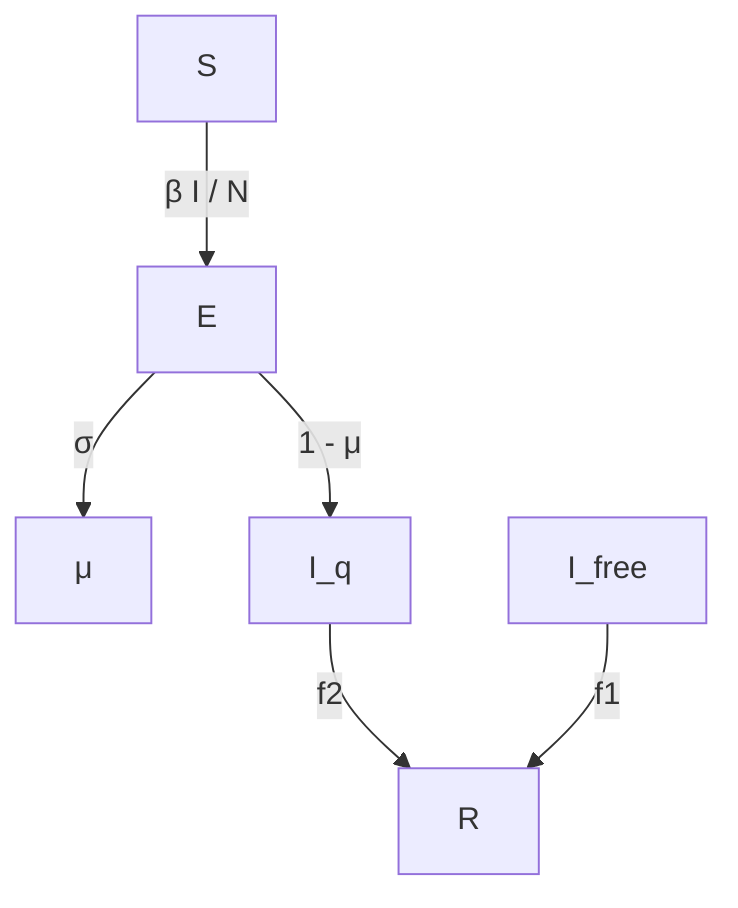

For office use only

T1

T2

T3

T4

## 35532

Problem Chosen

A

For office use only

F1

F2

F3

F4

## 2015 Mathematical Contest in Modeling (MCM) Summary Sheet

## Summary

The complex epidemic of Zaire ebolavirus has been affecting West Africa. A series of realistic, sensible, and useful mathematical model about Ebola of spreading and medication delivery are developed to eradicating Ebola.

First, we divide the spreading of disease into three periods: naturally spreading period, spreading period with isolation but without effective medications and spreading period with effective medications. We develop a SEIR (susceptible-exposed-infectious-recovered) model to simulate the spread of the disease in the primary period. Then the model are improved to a SEIQR (susceptible-exposed-infectious-quarantined-recovered) model to adapt to the second and third period and to predict the future trends in Guinea, Sierra Leone and Liberia.

According to our plan, drugs are delivered to countries in need separately by air, then to medical centers by highway and be used for therapy of patients there. To solve the problem of location decision of medical centers, which belongs to a set covering problem, we developed a multi-objective optimization model. The model’s goal is minimizing the numbers of medical centers and total patients’ time cost on the road on the condition that all of patients can be sent a medical center in time. We solved the model with genetic algorithm, and get an approximate optimal solution with 7 medical centers.

Then we built a logistic block growth model to describe the changing speed of drugs manufacturing. Comparing it with the SEIIR model, we considered the two situations: one is in severe shortage of drugs, the other is relatively sufficient in drugs. We built two optimization models for the two situations. The optimization goal is minimizing the number of the infectious and minimizing of death cases and the number of infectious individuals, respectively. The decision variables is the drug allocation for every country, and the constraint conditions is drug production.

Finally, by a comprehensive analysis, we made a six-month drug delivery plan for Guinea, Liberia and Sierra Leone, and predict the spreading trends of Ebola in the next six month with the efficient medication’s blockage.

The sensitivity analysis of our models has pointed out that the transmission rate and the initial value setting will affect the result greatly. We find that the speed of drug manufacturing’s growth rate may control of the epidemic. The minimum daily output of drugs $G _ { { _ m } }$ must greater than 4000. Otherwise ,the epidemic will be out of control.

## Introduction

## Problem background

A complex epidemic of Zaire Ebola virus (EBOV) has been affecting West Africa since approximately December 2013, with first cases likely occurring in southern Guinea [1] and facilitating several transmission chains to progress essentially unchecked in the region and to cross porous borders with neighboring Sierra Leone and Liberia and seed a limited outbreak in Nigeria via commercial airplane on 20 July 2014 [2]. Then the number of new cases appear an exponential growth. While public health interventions have been introduced in all affected countries, the numbers of infected cases and deaths from EBOV continue to increase due to the loss of effective medication. A total of 22,495 cases, with 8,981 deaths, have been reported to the World Health Organization as of 4 February 2015[3].

## Our work

Since new anti-Ebola drug has been developed, a realistic, sensible, and useful mathematical model about drug allocation and delivery is necessary. Depending on the goal, we divide the spread of disease into three periods: naturally spreading period, spreading period with intervention and spreading period with effective medications. And then we develop a SEIR (susceptible-exposed-infectious-recovered) model to simulate the spread of the disease in the primary period, based on the changing trend of the numbers of infected cases and deaths. Finally, the model are improved to a SEIIR (susceptible-exposed-infectious-isolated-recovered) model to adapt to the second and third period and to predict the future trends in Guinea, Sierra Leone and Liberia.

A delivery system include two main parts: numbers and locations of medical central delivering drugs decision and drug allocation of every medical center. For this reason, an evaluation system of every country’s long-term epidemic situation, two multi-objective optimization are built separately. We developed a detailed plan via our models.

## Symbols and definitions

(1) Symbol for SEIIR model with effective medication

<table><tr><td>Symbol</td><td>definitions</td></tr><tr><td>S</td><td>susceptible individuals</td></tr><tr><td>E</td><td>exposed individuals</td></tr><tr><td>I</td><td>infectious individuals</td></tr><tr><td> $I_{isolated}$ </td><td>isolated infectious individuals</td></tr><tr><td> $I_{free}$ </td><td>non- isolated infectious individuals</td></tr><tr><td>R</td><td>recover and survive individuals</td></tr><tr><td>D</td><td>death case</td></tr><tr><td>N</td><td>total population of the area</td></tr><tr><td>β</td><td>The transmission rate of EBOV</td></tr><tr><td>1/σ</td><td>the average durations of incubation.</td></tr><tr><td>1/γ</td><td>the average durations of infectiousness</td></tr><tr><td>f</td><td>the case fatality rate</td></tr><tr><td>μ</td><td>the ratio of new non-isolated infective patients</td></tr><tr><td>f1</td><td>the non- isolated individuals fatality rate</td></tr><tr><td>f2</td><td>the isolated individuals fatality rate</td></tr><tr><td>G(t)</td><td>number of drug supply</td></tr></table>

(2)Symbol for model II

<table><tr><td>Symbol</td><td>definitions</td></tr><tr><td>p</td><td>the number of capitals of first-level administrative divisions in a country</td></tr><tr><td>q</td><td>the number of medical centers for EVD set in a country;</td></tr><tr><td> $V = \{v_1, v_2, \cdots, v_i, \cdots, v_p\}$ </td><td>the set of capitals</td></tr><tr><td> $X = \{x_1, x_2, \cdots, x_j, \cdots, x_q\}$ </td><td>the set of medical centers</td></tr><tr><td>d(x,y)</td><td>he shortest distance from x to y</td></tr><tr><td> $h_i$ </td><td>the metric of quantity of drug needed of the i th administrative in the coming period</td></tr><tr><td> $R_n$ </td><td>the population of thenth administrative division</td></tr><tr><td> $M_n$ </td><td>the area of thenth administrative division</td></tr><tr><td> $r_n :$ </td><td>the population of the main city of thenth administrative division.</td></tr><tr><td> $m_n :$ </td><td>the area of the main city of thenth administrative division.</td></tr><tr><td> $B_n$ </td><td>the temperature of thenth administrative division</td></tr><tr><td> $I_n$ </td><td>the Infected people number of thenth administrative division is represented</td></tr><tr><td> $F_n$ </td><td>open degree of Ebola treatment centers</td></tr><tr><td> $C_n$ </td><td>the temperature of the nth administrative division</td></tr><tr><td> $F_n$ </td><td>open degree of Ebola treatment centers</td></tr><tr><td> $c_{open}$ </td><td>the number of open ETCs in the country</td></tr><tr><td> $c_{all}$ </td><td>the number of cities in the country</td></tr><tr><td> $E_n$ </td><td>The economy of the n th country</td></tr><tr><td> $J_n$ </td><td>The education level of the n th country i</td></tr><tr><td>K</td><td>age coefficient</td></tr></table>

## (3)Symbol for model III

<table><tr><td>Symbol</td><td>definitions</td></tr><tr><td> $G$ </td><td>The average daily production of drugs.</td></tr><tr><td> $G_m$ </td><td>the maximum production rate of the drugs.</td></tr><tr><td> $rt$ </td><td>growth trends in drug production speed</td></tr><tr><td> $P_{t_n}$ </td><td>the aggregate of drug</td></tr><tr><td> $t_n$ </td><td>the first day of the time period of drug delivery.</td></tr><tr><td> $T_p$ </td><td>the time period of drug delivery</td></tr><tr><td> $I_{i,free}$ </td><td>the number of non-isolated infectious individuals</td></tr><tr><td> $G_i(t)$ </td><td> $i$ th country’s number of the drug</td></tr><tr><td> $N_i$ </td><td> $i$ th country’s the total population</td></tr><tr><td> $D_i$ </td><td> $i$ th country’s death cases</td></tr></table>

## Assumptions

1. In early transmission period, EBOV spread in absence of control interventions.  
2. The average duration of the incubation and infectious period were fixed to previous estimates  
from an outbreak of the same EBOV subtype in Congo in 1995 $( 1 / \sigma \ = 5 \ . 3$ days and $1 / \gamma \ =$  
5 .61 days) [3].  
3. Infection only occurs between the patients who are not isolated and susceptible.

4. Even if without effective medication, the mortality rate of isolated patients is lower than that of free patients.  
5. People who have recovered from Ebola will obtain the long-term immunity against Ebola.  
6. Only being sent to medical center and isolated, affected people have the chance to receive therapy.  
7. Ignoring patient’s different condition, the quantity of the medicine needed by all affected people whose disease is not advanced during the whole therapy is equal to one portion of drugs.  
8. The population of the region we study is a constant  
9. The transmission only occurs btween only the susceptible and the infective.  
10. Patients isolated will not affect the suspective. In other word,their effective contact rate equals to zero.  
11 .The medication only refers to drugs used therapy of Ebola, not include vaccine.  
12. If affected people want to accept therapy, they must get to a medical center set as delivering medication.  
13. If a patient in whom symptoms of Ebola has appeared don’t get a medical central (usually the nearest medical center) in 24 hours, the new medication won’t affect his disease.  
14. We set all the medical centers at the capitals of first-level administrative divisions.  
15. We use the capital of an administrative division as a representation of the administrative

## Model I

## SEIR model

After transmission of the virus, susceptible individuals  enter the exposed class  before they become infectious individuals that either recover and survive or die .

Fig.1 shows the process.

flowchart

Fig.1 the process of the model

According to the it，people can be divided into four class:

the susceptible (  ), who are susceptible to infection.  
the exposed( ), who are affected but in the incubation.  
the infectious (  ), who are infected and have the symptom.  
the recovered( ), who recover or survive.

The total population of the area is , and

$$
N = S + E + I + R,
$$

according to the assumption 8. Numbers of all kinds of people in the initial time are shown as follows:

$$
S (0) = S _ {0} > 0, E (0) = E _ {0} > 0, I (0) = I _ {0} > 0, R (0) = R _ {0} = 0
$$

Let $\beta$ be the contact rate in absence of control interventions. $S / N$ is the proportion of the

susceptible in total population. Hence, the effective contact rate is $\beta S / N$ , and in a unit of time, the number of new patients is $\beta S I / N$ .In other words, the rate of change in the number of the susceptible is

$$
\frac {d S}{d t} = - \frac {\beta S}{N}. \tag {1}
$$

We assumed that $\sigma E$ is the number of people newly entering the infectious. Therefore, $1 / \sigma$ is the average durations of incubation. As for the number of people newly entering the exposed every day, it can be calculated as follows:

$$
\frac {d E}{d t} = \frac {\beta S I}{N} - \sigma E \tag {2}
$$

In the same manner, we calculate the increment of the infective people:

$$
\frac {d I}{d t} = \sigma E - \gamma I,
$$

Where $\gamma$ is sum of natural cure rate and mortality of the infectious. $1 / \gamma$ can be seen the average durations of infectiousness. Suppose the case fatality rate is given by $f$ , then $( 1 - f ) \gamma I$ is the number of death per day. Thus, the changing rate of recovery case and death case with time can be represented as follows respectively:

$$
\frac {d R}{d t} = (1 - f) \gamma I, (3)
$$

$$
\frac {d D}{d t} = f \gamma I.
$$

From the above analysis results, We described the early transmission of EBOV as a SEIR (susceptible-exposed-infectious-recovered) dynamics model.

## Result

The average duration of the incubation and infectious period were fixed to previous estimates from an outbreak of the same EBOV subtype in Congo in 1995 $( 1 / \sigma = 5 . 3 $ days and $1 / \gamma \ = 5 . 6 1$ ${ \mathsf { d a y s } } )$ .The other parameter has been given by Chowell et al [4]. All important parameters’ value are listed in Table 1.

Table 1. Parameter estimates for the 2014 EBOV outbreak

<table><tr><td>Parameter</td><td>Guinea</td><td>Sierra Leone</td><td>Liberia</td></tr><tr><td>The average durations of incubation, 1/σ</td><td>5.3</td><td>5.3</td><td>5.3</td></tr><tr><td>the average durations of infectiousness, 1/γ</td><td>5.61</td><td>5.61</td><td>5.61</td></tr><tr><td>Transmission rate, β</td><td>0.27</td><td>0.43</td><td>0.29</td></tr><tr><td>Case fatality rate, f</td><td>0.75</td><td>0.49</td><td>0.69</td></tr><tr><td>Date of appearance of first infectious case, T</td><td>2 December 2013</td><td>19 Apr 2014</td><td>16 Apr 2014</td></tr></table>

Based on facts, we set the initial numbers of all kinds of as follows:

$$
S (0) = N - E _ {0} - I _ {0}, E (0) = 1 0, I (0) = 1, R (0) = 0
$$

Due to the complexity of the system of differential equations, we can’t gain its analytical solution. Therefore, we solve it numerically ode toolbox in MATLAB 2014B for three country (Guinea, Sierra Leone and Liberia) and compare the results with data in the early EBOV transmission period (shown in Fig.2), since EBOV spread in absence of control interventions in that stage.

line chart

| t   | Deaths (Observed) | Deaths (Simulation) |
| --- | ----------------- | ------------------- |
| 0   | 0                 | 0                   |
| 10  | ~50               | ~50                 |
| 20  | ~200              | ~200                |
| 30  | ~400              | ~400                |
| 40  | ~600              | ~600                |
| 50  | ~1500             | ~1500               |
| 60  | ~2000             | ~2000               |
| 70  | ~3200             | ~3200               |

line chart

| Time (s) | Deaths (Observed) | Deaths (Simulation) |
| -------- | ----------------- | ------------------- |
| 0        | 0                 | 0                   |
| 10       | 0                 | 0                   |
| 20       | 0                 | 0                   |
| 30       | 0                 | 0                   |
| 40       | 200               | 200                 |
| 50       | 1200              | 1200                |
| 60       | 2500              | 2500                |
| 70       | 3200              | 3200                |
| 80       | 3700              | 3700                |

Fig 2. Dynamics of 2014 EBOV outbreaks in Guinea, Sierra Leone and Liberia.

Outbreak data for Guinea, Sierra Leone and Liberia were based on the cumulative numbers of reported tota cases (confirmed, probable and suspected) and deaths from the World Health Organization (WHO) [5].

As we can see, The model fits the reported data of cases and deaths in Guinea, Sierra Leone and Liberia well.

## SEIIR model

Generally, when the affected people is much enough, it will draw the attention of the government, and the epidemic will be declared as a public health emergency. So does EVBO. According to WHO’s suggestion [6], the first measurement that government should take is isolate the patients, which will impede the spreading of epidemic apparently. The SEIR (susceptible-exposed-infectious-recovered) model fit the early spreading of the disease, but it don’t consider this point. Therefore, there needs to be a improvement for the it. To achieve this goal, we develop a new SEIIR(susceptible-exposed-infectious-quarantined -recovered) model based on the SEIR model, considering the isolated people and without efficient medication.

In this model, as transmission of the virus, susceptible individuals enter the exposed class E

before they become insolated infectious individuals $I _ { i s o l a t e d }$ or uncontrolled infectious

individuals $I _ { f r e e }$ that either recover and survive  or die . Fig.3 shows the process.

flowchart

The total population:

$$
N = S + E + I _ {f r e e} + I _ {i s o l a t e d} + R
$$

Considering the assumption 10, formulas (1) changes as follows:

$$
\frac {d S}{d t} = - \frac {\beta S I _ {f r e}}{N},
$$

Similarly, formula (2) and (3)

$$
\frac {d E}{d t} = \frac {\beta S I _ {f r e e}}{N} - \sigma E,
$$

$$
\frac {d I _ {\text { free }}}{d t} = \sigma \mu E - \gamma I _ {\text { free }}, (7).
$$

And the numbers of isolated patients’ changing rate is:

$$
\frac {d I _ {\text { isolated }}}{d t} = \sigma (1 - \mu) E - \gamma I _ {\text { isolated }}, \tag {8}
$$

The coefficient in Formula (7) and (8) represents the ratio of new non-isolated infective patients in new infective patients, since not all of patients are willing to be isolated out of different reason. The value of mainly depends on the development level of medical system.

Suppose that:

$$
(1 - \mu) > \mu ;
$$

If all the patients in isolation can be cured, all the infective patients will be willing to be isolated, and $\mu = 0$ ;

The lower the mortality of isolated patients is, the smaller the value of $\mu$ is.

According to it, we can describe the relationship between $\mu$ and $f _ { 2 }$ with a function:

$$
\mu = e ^ {- f _ {2}}
$$

Obviously, the mortality of isolated patients $f _ { 1 }$ is much lower that of non-isolated patient $f _ { 2 }$ .

${ \bf S } 0 ,$ the recovered people can be divided into two parts according to being isolated or not. Thus, the changing rate of recovery case and death case with time can be represented as follows respectively:

$$
\frac {d R}{d t} = (1 - f _ {1}) \gamma I _ {\text { free }} + (1 - f _ {2}) \gamma I _ {\text { isolated }}
$$

$$
\frac {d D}{d t} = f _ {1} \gamma I _ {\text { free }} + f _ {2} \gamma I _ {\text { isolated }}
$$

For the initial value, $S ( 0 ) > 0 , E ( 0 ) = E _ { 0 } > 0 , I _ { i s o l a t e d } ( 0 ) > 0 I _ { f r e e } ( 0 ) > 0 , R ( 0 ) > 0$

Simulation Result:

According to the report of WHO, the fatality rate of Ebola range from 0.6 to 0.8. Let $f _ { 1 } = 0 . 8$ and $f _ { 2 } = 0 . 6$ while other coefficient unchanged.

Due to the naturally spreading stage before isolation measures being taken, we set the initial value with the data in the $1 0 0 ^ { \mathrm { t h } }$ day as follows:

$$
S _ {0} = 1 2 2 1 9 5 7 6, E _ {0} = 2 2 0 9, I _ {0, f r e e} = 8 2 2, I _ {0, q u a r a n t i n e d} = 8 2 2, R _ {0} = 9 7 1, D _ {0} = 2 9 1 2
$$

In the same manner, we get a numerical solution by using the ode toolbox in Matlab201.The results shows in Fig.4.

line chart

| time / day | naturally spread | controlled spread |
| ---------- | ---------------- | ---------------- |
| 100        | 0                | 0                |
| 105        | 0                | 0                |
| 110        | 0                | 0                |
| 115        | 0                | 0                |
| 120        | 0                | 0                |
| 125        | 0                | 0                |
| 130        | 0                | 0                |
| 135        | 0                | 0                |
| 140        | 0                | 0                |
| 145        | 0                | 0                |
| 150        | 120000           | 20000            |

line chart

| time / day | naturally spread | controlled spread |
| ---------- | ---------------- | ----------------- |
| 100        | 3000             | 2000              |
| 110        | 4000             | 2500              |
| 120        | 6000             | 3500              |
| 130        | 9000             | 4500              |
| 140        | 13000            | 5500              |
| 150        | 22000            | 7500              |

Fig.4 the result of SEIIR model

The SEIIR model indeed shows the blockage of isolation to the Ebola’s spreading.

## SEIIR model with effective medication

Now since the World Medical Association has developed a new medication which could stop Ebola and cures patients whose disease is not advanced. Outside of isolation , we can eradicate Ebola with the mediation, which has more effect on Ebola’s spreading. Base on this former work, we improve our model once again and get the SEIIR model with effective medication.

The model can be described by a system of differential equations as follows

$$
\frac {d S}{d t} = - \frac {\beta S I _ {f r e e}}{N},
$$

$$
\frac {d E}{d t} = \frac {\beta S I _ {f r e e}}{N} \sigma E,
$$

$$
\frac {d I _ {\text {free}}}{d t} = \sigma \mu E - \gamma I _ {\text {free}},
$$

$$
\frac {d I _ {\text { isolated }}}{d t} = \sigma (1 - \mu) E - \gamma I _ {\text { isolated }} - M (t),
$$

$$
\frac {d R}{d t} = \left(1 - f _ {1}\right) \gamma I _ {\text {free}} + \left(1 - f _ {2}\right) \gamma I _ {\text {isolated}} + M (t),
$$

$$
\frac {d D}{d t} = f _ {1} \gamma I _ {\text { free }} + f _ {2} \gamma I _ {\text { isolated }} - M (t),
$$

$$
S (0) > 0, E (0) = E _ {0} > 0, I _ {i s o l a t e d} (0) > 0, I _ {f r e e} (0) > 0, R (0) > 0
$$

Where is the number of people who can receive the medication in a unit of time.

According assumption 12, the M(t) have no effect on the changing rate of $I _ { f r e e }$ . And other parameters and coefficients’ definition are the same as before.

In addition, as increase, more and more patients will be being isolated, in other word,

becomes smaller. The results shows in Fig.5.  

The SEIIR model with effective medication indeed shows the blockage of isolation to the Ebola’s spreading.

## Model II

Since the new medication still cannot be manufactured on a large scale, which indicates a shortage of the drug, a feasible delivery system is necessary based on epidemic situation of countries and districts.

The setting of the delivery system can be divided into two main parts:

the medical center number and location decision  
and the medication allocation for every affected countries and districts.

## Number and location decision

## Assumption:

Affected people must get to a medical center within a specified time because the new medication can only cure patients whose disease is not advanced. According to Wikipedia, we assume that if a patient in whom symptoms of Ebola has appeared don’t get a medical central (usually the nearest medical center) in 24 hours, the new medication won’t affect his disease. Accounting for the poor transport facilities in West Africa and convenience of drug managing, we set all the medical centers at the capitals of first-level administrative divisions.

We simplify the distance from everywhere in an administrative division to a medical center as the distance from the capital of the administrative division to the medical center. In other words, we use the capital of an administrative division as a representation of the administrative. It’s feasible because most of people in the West Africa tend to gather in several big cities.

## Model:

Generally, the aid work in the charged of some international organizations, like WHO, They, rather than every country separately, assign the medical workers and allocate the medication and other medical source.

Therefore, the new medication is delivered to countries in need separately by air, then to medical centers by highway and be used for therapy of patients there.

Our first goal is decide the number and locations of medical centers.

Due to the assumption, there must be at least one medical center within a specified distance from every administrative division to ensure patients can get to a medical center. This suggests the number and location decision is a set covering problem. In set covering problems, the objective is to minimize the number or cost of facility location such that a specified level of coverage is obtained.

To describe the issue more clearly, we define some parameters as follows: $p$ , the number of capitals of first-level administrative divisions in a country; $q$ , the number of medical centers for EVD set in a country;

$V = \left\{ \nu _ { 1 } , \nu _ { 2 } , \cdots , \nu _ { i } , \cdots , \nu _ { p } \right\}$ , the set of capitals;

$X = \left\{ x _ { 1 } , x _ { 2 } , \cdots x _ { j } \cdots , x _ { q } \right\}$ , the set of medical centers;

$d ( x , y )$ , the shortest distance from x to  ;

Due to the assumption,

$$
X \subset V.
$$

Therefore,

$$
x _ {j} \in V, j = 1, 2, \dots , q.
$$

Then we let $d ( \nu _ { i } , X _ { q } )$ be the distance from the th administrative division to the nearest medical central:

$$
d (v _ {i}, X _ {q}) = \min _ {1 \leq j \leq q} \left\{d (v _ {i}, x _ {j}) \right\}.
$$

If there is a medical central in it,

$$
d (v _ {i}, X _ {q}) = 0
$$

Suppose that the distance patients can moved within 24h is $\lambda$ , because the assumption,

$$
\max _ {1 \leq i \leq p} \left\{d \left(v _ {i}, X _ {q}\right) \right\} \leq \lambda .
$$

Considering that healthcare works, financial resources and devices are limited, we should minimize the number of medical centers for EVD,  ,on the premise of meeting the coverage requirement.

In addition, administrative division’s need in medication vary from each other. Obviously, the larger an administrative division’s quantity of the medicine needed, the closer the nearest medical center should be. So, we also should

$$
\mathrm{Min} \sum_ {1} ^ {p} h _ {i} d (v _ {i}, X _ {q}),
$$

Where $h _ { i }$ is the metric of quantity of drug needed of the  i th administrative in the coming period.

In next part, we will clarify how to calculate $h _ { i }$ .

To sum up, We model the problem about medical centers number and location decision with multi-objective optimization. The formulas of this model is

$$
\operatorname{Min} \sum_ {i = 1} ^ {p} h _ {i} d (v _ {i}, X _ {q})
$$

Min q

$$
s. t. \max _ {1 \leq i \leq p} \left\{d \left(v _ {i}, X _ {q}\right) \right\} \leq \lambda
$$

$$
X _ {q} = \left\{x _ {1}, x _ {2}, \dots , x _ {q} \right\}
$$

$$
x _ {j} \in V, f o r i = 1, 2, \dots , q
$$

## Solution:

Without loss of generality, we take the most seriously effected Sierra Leone for example and locate medical centers for it.

The Republic of Sierra Leone is composed of four regions: the Northern Province, Southern Province, the Eastern Province, and the Western Area. The first three provinces are further divided into 12 districts. Fig.6 shows it.

text_image

Koinadugu
Bombali
Kono
L Kambia
Port Loko
Tonkolili
Moyamba
Bo
Kailahun
Kenema
Bonthe
Pujehun
1 - Western Area Urban
2 - Western Area Rural
Fig.6 The 12 districts and 2 areas of Sierra Leone.

According to our model, we replace every district with its capital (the western area be seen as a district and Freetown is its capital). So , the value of equals 13.

We search and calculate the shortest path and distance between any two capitals via google map, and the results be shown in Table 2.

<table><tr><td colspan="13">Table 2 :the shortest path and distance between any two capitals</td><td></td></tr><tr><td></td><td>Kailahun</td><td>Kenema</td><td>Koidu</td><td>Makeni</td><td>Kambia</td><td>PortLoko</td><td>Kabala</td><td>Magburaka</td><td>Bo</td><td>Bonthe</td><td>Moyamba</td><td>Pujehun</td><td>Freetown</td></tr><tr><td>Kailahun</td><td>0</td><td>112</td><td>46.4</td><td>204</td><td>353</td><td>300</td><td>321</td><td>179</td><td>169</td><td>261</td><td>284</td><td>222</td><td>417</td></tr><tr><td>Kenema</td><td>112</td><td>0</td><td>113</td><td>192</td><td>330</td><td>227</td><td>309</td><td>167</td><td>68.5</td><td>149</td><td>173</td><td>110</td><td>305</td></tr><tr><td>Koidu</td><td>46.4</td><td>113</td><td>0</td><td>159</td><td>308</td><td>253</td><td>276</td><td>133</td><td>162</td><td>256</td><td>253</td><td>213</td><td>340</td></tr><tr><td>Make ni</td><td>204</td><td>192</td><td>159</td><td>0</td><td>152</td><td>97.7</td><td>118</td><td>26.8</td><td>133</td><td>217</td><td>124</td><td>206</td><td>185</td></tr><tr><td>Kambia</td><td>353</td><td>330</td><td>308</td><td>152</td><td>0</td><td>51.1</td><td>269</td><td>176</td><td>263</td><td>298</td><td>181</td><td>337</td><td>126</td></tr><tr><td>Port Loko</td><td>300</td><td>227</td><td>253</td><td>97.7</td><td>51.1</td><td>0</td><td>216</td><td>122</td><td>210</td><td>244</td><td>128</td><td>284</td><td>119</td></tr><tr><td>Kabala</td><td>321</td><td>309</td><td>276</td><td>118</td><td>269</td><td>216</td><td>0</td><td>105.9</td><td>144</td><td>334</td><td>242</td><td>323</td><td>302</td></tr><tr><td>Magburaka</td><td>179</td><td>167</td><td>133</td><td>26.8</td><td>176</td><td>122</td><td>105.9</td><td>0</td><td>108</td><td>191</td><td>100</td><td>216</td><td>208</td></tr><tr><td>Bo</td><td>169</td><td>68.5</td><td>162</td><td>133</td><td>263</td><td>210</td><td>144</td><td>108</td><td>0</td><td>82.4</td><td>106</td><td>75.3</td><td>174.66</td></tr><tr><td>Mattr u jong</td><td>261</td><td>149</td><td>256</td><td>217</td><td>298</td><td>244</td><td>334</td><td>191</td><td>82.4</td><td>0</td><td>130</td><td>98.5</td><td>237</td></tr><tr><td>Moyamba</td><td>284</td><td>173</td><td>253</td><td>124</td><td>181</td><td>128</td><td>242</td><td>100</td><td>106</td><td>130</td><td>0</td><td>179</td><td>114</td></tr><tr><td>Pujeh un</td><td>222</td><td>110</td><td>213</td><td>206</td><td>337</td><td>284</td><td>323</td><td>216</td><td>75.3</td><td>98.5</td><td>179</td><td>0</td><td>312</td></tr><tr><td>Freet own</td><td>417</td><td>305</td><td>340</td><td>185</td><td>126</td><td>119</td><td>302</td><td>208</td><td>174.66</td><td>237</td><td>114</td><td>312</td><td>0</td></tr></table>

(unit: kilometer)  
(source: google earth)

As for the value of , accounting for the time of preliminary judgment and poor transport facilities, a reasonable value is 92.1km.

Measuring the need of every district $h _ { i }$

Table.3 the revolution of city

<table><tr><td></td><td colspan="2">h</td><td colspan="2">h</td><td>h</td></tr><tr><td>Kailahun</td><td>0.512665</td><td>Koinadugu</td><td>0.379487</td><td>Kambia</td><td>0.341398</td></tr><tr><td>Kenema</td><td>0.553363</td><td>Tonkolili</td><td>0.294881</td><td>Port Loko</td><td>0.53602</td></tr><tr><td>Kono</td><td>0.22831</td><td>Bo</td><td>0.504783</td><td>Pujehun</td><td>0.334563</td></tr><tr><td>Bombali</td><td>0.441547</td><td>Bonthe</td><td>0.271492</td><td>Western Area</td><td>0.436276</td></tr><tr><td>Moyamba</td><td>0.505654</td><td></td><td></td><td></td><td></td></tr></table>

This optimal problem belongs to the NP-hard problems that can’t be solved in polynomial time. So, we can only get the approximate solution with a heuristic, such as genetic algorithm, simulated annealing and so on. Here, we select the genetic algorithm and write a program with Matlab2014.

Running the program repeatedly, we obtain a relatively good results and make our plan: There are seven mental centers located in Kailahun, Makeni, Kambia, Kabala, Bo, Moyamba and Freetown respectively. The Fig. 7 shows the scope that every mental center manages.

text_image

Koinuugu
Boribali
Kamblani
Port Loko
Tonkolili
Kono
Kalahun
1 - Western Area Urban
2 - Western Area Rural
Moyamba
Bo
Kenema
Bonthe
Pujehun
1 - Western Area Urban
2 - Western Area Rural
Fig.7 locations of medical centers in Sierra Leone

## Part III

## 1. Specify evaluation norms

As for the evaluation the Susceptible standard for Each region, there are mainly aspects that count: Population density, Temperature, Humidity, the situation of current disease infection, Open or under construction，economy，National Education and age. What follows in the section will hammer at accounting for the eight aspects.

##  Population density:

Population density undoubtedly accounts for key proportion in the demand level of the drug evaluation. Because Ebola is a spirited contagion disease, not only patients but also corpses can be the source of infection. Therefore, if the population density is high, the rate of spread disease will be fast in general situation. However, in some area, the pollution density of the area is low, but almost people live in a central city (in fact, the pollution density of the city is high), we deal with data preprocessing, making the aspect more reasonable evaluation model. The pollution density of the area could be calculated as follows:

$$
a _ {1 n} = \frac {R _ {n}}{M _ {n}}
$$

$R _ { n }$ the pollution of the number n area.

$M _ { n }$ the acreage of the number n area.

The pollution density of the main city in the area could be calculated as follows:

$$
a _ {2 n} = \frac {r _ {n}}{m _ {n}}
$$

the pollution of the main city number n area . $r _ { n }$

the acreage of the main city number n area. $m _ { n }$

We define a new population density which could be calculated as follows:

$$
A _ {n} = a _ {1 n} \cdot b _ {1} + a _ {2 n} \cdot b _ {2} + \frac {\left(a _ {2 n} - a _ {1 n}\right)}{a _ {2 n}} \cdot b _ {3}
$$

$$
b _ {1} + b _ {2} + b _ {3} = 1
$$

The numerical value depend on the . $( a _ { 2 n } - a _ { 1 n } )$

By the above calculation, the population density in the evaluation of the model is more reasonable and accurate.

##  Temperature

Form the past Information and data, the Ebola usually outbreak in the summer ,but in the winter, the entire epidemic have been more effective control, and the status of major outbreaks in Africa is the lower latitudes area, which shows that the temperature is an important aspects in the demand level of the drug evaluation.

The temperature of the area is:

$$
B _ {n}
$$

##  Humidity

Ebola outbreak in the areas which the annual precipitation is high and harmonious, especially in the tropical rain forest areas with high coverage. The World Health Organization's report shows that humid climate is conducive to the spread of the virus, therefore, we choose the humidity as an aspects in the evaluation model.

The temperature of the area is

$$
C _ {n}
$$

##  current disease infection

Current infection situation has a great impact on the future of the epidemic. The country who has large number of infected persons face the challenges in future, and need support from World Health Organization. Every patient will require substantial and large investment Because Ebola is highly infectious diseases. Therefore, we believe that using the number of patients to measure a country's entire national epidemic of severe is reasonable.

The Infected people number of the area is

$$
I _ {n}
$$

##  Open or under construction

As we all know, controlling the flow of people is an effective measure to prevent further deterioration of infectious diseases, On the one hand, under construction can control the spread of infection to uninfected areas, on the other hand, it have the ability to reduce the risk of infection of healthy people in infected area.

In a country, some cities under opening while some cities under closing (we only consider the large cities of the country).

We define Open coefficient which could be calculated as follows:

$$
F _ {n} = \frac {c _ {o p e n}}{c _ {a l l}}
$$

$c _ { o p e n }$ ： the number of open cities in the country

： the number of all cities in the country. $c _ { a l l }$

##  Economy

In general situation, the more backward economy countries is the more difficult to control the disease is. Therefore, the economic situation of a country is an important indicator to determine the national level in the medical facilities. The lower the country's GDP means the more difficult to control Ebola infection because of under-developed Medical infrastructure. We use the GDP per capita as the aspects to show the economy of the area.

The economy of the area is：

$$
E _ {n}
$$

##  National Education [7]

Cremation in Africa do not comply with the local traditions, which is an important reason for the large-scale outbreak of Ebola. Ebola can spread through the corpses which lead a large number of people infected at the funeral. According to the survey, the higher the education level is, the greater the proportion of accept cremation. Therefore, we choose each country received higher education as a measure of the proportion of the country's level of education.

The national education of the area is：

$$
J _ {n}
$$

##  Age[8]

According to the report of the World Health Organization, the probability of illness in young adults over the age of 14 is three times the age of 14, the probability of illness aged 65 or older is four times the age of 14. Thus, we can see that the higher proportion of the population over the age of 14 is, the greater the overall probability of illness is.

We define age coefficient which could be calculated as follows:

$$
K = \frac {K _ {1 4 \sim 6 5} + K _ {6 5}}{K _ {a l l}}
$$

## Model

## Introduction:

TOPSIS (technique for order performance by similarity to ideal solution) is a useful technique in dealing with multiattribute or multi-criteria decision making (MADM/MCDM) problems in the real world[9]. It helps decision maker organize the problems to be solved, and carry out analysis, comparisons and rankings of the alternatives. Accordingly, the selection of a suitable alternative(s) will be made. However, many decision making problems within organizations will be a collaborative effort. Hence, this model will extend TOPSIS to evaluate the demand of the drug. A complete and efficient procedure for decision making will then be provided.

 Step one

Since the different factors have greatly different in magnitude, we should normalized the value of this factors. the normalized value $X _ { i j } ^ { k }$ of the decision matrix X can be any linear-

scale transformation to keep . $0 \leq X _ { i j } ^ { k } \leq 1$

We consider that the normalized value of is the value of the corresponding element $X _ { i j } ^ { k }$ $X _ { i j } ^ { k }$ divided by the operation of its column elements, i.e., vector normalization, then (take the factor as example).

$$
X _ {m 1} ^ {k} = \frac {A _ {n}}{\sqrt {A _ {1} ^ {2} + A _ {2} ^ {2} + \cdots + A _ {n} ^ {2}}}
$$

 Step two: Construct decision matrix X

The structure of the matrix can be expressed as follows:

$$
X = \left[ \begin{array}{c c c c c c} X _ {1} & X _ {2} & \dots & X & \dots & X _ {n} \\ x _ {1} & X _ {1 1} ^ {k} & X _ {1 2} ^ {k} & \dots & X _ {1 j} ^ {k} & \dots & X _ {1 n} ^ {k} \\ x _ {2} & X _ {2 1} ^ {k} & X _ {2 2} ^ {k} & \dots & X _ {2 j} ^ {k} & \dots & X _ {2 n} ^ {k} \\ \vdots & \vdots & \dots & \vdots & \dots & \vdots \\ x _ {i} & X _ {i 1} ^ {k} & X _ {i 2} ^ {k} & \dots & X _ {i j} ^ {k} & \dots & X _ {i n} ^ {k} \\ \vdots & \vdots & \dots & \vdots & \dots & \vdots \\ x _ {m} & X _ {m 1} ^ {k} & X _ {m 2} ^ {k} & \dots & X _ {m j} ^ {k} & \dots & X _ {m n} ^ {k} \end{array} \right]
$$

Where $x _ { i }$ denotes the alternative , $\imath { = } 1 , 2 { , } { \cdots } , m \ \backslash \ X _ { i }$ represents the attribute or criterion ,

$$
j = 1, 2, \dots , n;
$$

In the model, $x _ { i }$ means different country, and $X _ { i }$ means different factors in the evaluation.

Observe that we can also set the outcomes of qualitative attributes from each alternative as discrete values, e.g., 1 to 10 or linguistics values, so that the quantitative values will be placed in the above decision matrix. For example, current disease infection is a factor which we can’t evaluate it directly, we can use some Index to show it[10].

 Step three

Determine the ideal and negative ideal solutions  and . $V _ { k } ^ { + } \mathrm { a n d } V _ { k } ^ { - }$

$$
V _ {k} ^ {+} = \left\{X _ {1} ^ {k +}, \dots , X _ {n} ^ {k +} \right\} = \left\{\left(\max _ {i} X _ {i j} ^ {k} \mid j = 1, 2, \dots , m\right) \right\}
$$

$$
V _ {k} ^ {-} = \left\{X _ {1} ^ {k -}, \dots , X _ {n} ^ {k -} \right\} = \left\{\left(\min _ {i} X _ {i j} ^ {k} \mid j = 1, 2, \dots , m\right) \right\}
$$

 Step four

Calculate the separation measure from the ideal and the negative ideal solutions, $S _ { i } ^ { + }$ and $S _ { i } ^ { - }$ , respectively, for the group.

$$
S _ {i} ^ {+} = \sqrt {\sum_ {j = 1} ^ {n} (v _ {i j} ^ {k} - v _ {j} ^ {k +}) ^ {2}}, \text {   for   alternative   } i, i = 1, \dots , m
$$

$$
S _ {i} ^ {-} = \sqrt {\sum_ {j = 1} ^ {n} \left(v _ {i j} ^ {k} - v _ {j} ^ {k +}\right) ^ {2}}, \text {   for   alternative   } i, i = 1, \dots , m
$$

 Step five

Calculate the relative closeness C to the ideal solution for the group.

Calculate the relative closeness to the ideal solution and rank the alternatives in descending order. The relative closeness of the th alternative $A _ { i }$ with respect to positive idea solution can be expressed as

$$
C = \frac {S _ {i} ^ {-}}{S _ {i} ^ {+} + S _ {i} ^ {-}}, i = 1, \dots , m
$$

Where $0 \leq C \leq 1$ The larger the index value, the better the performance of the alternative.

## 2. Collect data

To evaluate of every districts, Many data is needed, we can find every district’s data needed for our specific evaluation norms by searching from the website，like Wikipedia and WHO. We finally conclude the relative statistics of those areas and list them in a form.

Table4:the data of the different district

<table><tr><td></td><td>Population density</td><td>Open coefficient</td><td>Temperature (°C)</td><td>Humidity (%)</td><td>Current disease situation</td></tr><tr><td>Kailahun</td><td>458.1595</td><td>100</td><td>24</td><td>94</td><td>4</td></tr><tr><td>Kenema</td><td>4697.336</td><td>100</td><td>23</td><td>94</td><td>4</td></tr><tr><td>Kono</td><td>2618.687</td><td>0</td><td>21</td><td>87</td><td>3</td></tr><tr><td>Bombali</td><td>267.3536</td><td>100</td><td>26</td><td>81</td><td>2</td></tr><tr><td>Kambia</td><td>281.6377</td><td>50</td><td>24</td><td>94</td><td>3</td></tr><tr><td>Port Loko</td><td>860.1828</td><td>100</td><td>22</td><td>89</td><td>5</td></tr><tr><td>Koinadugu</td><td>299.7132</td><td>50</td><td>22</td><td>69</td><td>4</td></tr><tr><td>Tonkolili</td><td>1740.713</td><td>0</td><td>23</td><td>83</td><td>4</td></tr><tr><td>Bo</td><td>266.1477</td><td>100</td><td>23</td><td>94</td><td>4</td></tr><tr><td>Bonthe</td><td>1248.725</td><td>50</td><td>24</td><td>91</td><td>1</td></tr><tr><td>Moyamba</td><td>392.2557</td><td>100</td><td>23</td><td>93</td><td>4</td></tr><tr><td>Pujehun</td><td>1176.208</td><td>50</td><td>25</td><td>89</td><td>3</td></tr><tr><td>Western Area</td><td>25996.65</td><td>50</td><td>26</td><td>81</td><td>5</td></tr></table>

Note :1.the unit of the population denisty is People /per km  
Then we use the data to calculate the $h$ with TOPSIS, and the results has been shown Table 3.

## The effect on $\beta$ of external factors

By analysis, we find that $\beta$ not only is associated with the nature of the epidemic but also affected by some external factors. These factors include population density, temperature, humidity, current epidemic situation ,open degree of ETC, economy, national education and age. Hence, $\beta$ vary from country to country. Some of these factors are change with time, which result $\beta$ changing with time. If we want to develop different reasonable long-term delivery system for different countries, evaluating the external factor’s impact on $\beta$ is needed. For the same reason, we can estimate the effect of external facts on $\beta$ with TOPSIS. We define a influence coefficient .usually, is non-negative, and as it increase, $\beta$ also appear a growth.

The first four factors: population density, temperature, humidity, the current epidemic situation are defined as before. Obviously, their addition will result in increment of C. the other factors are redefined or defined as follows:

##  Open degree of ETC(Ebola treatment centers)

Considering there are many ETCs in a country, we redefine the open degree of ETC: $h _ { i }$

which could be calculated as follows:

$$
F _ {n} = \frac {c _ {a l l}}{c _ {o p e n}}
$$

Where $c _ { o p e n }$ is the number of open ETCs in the country,

$c _ { a l l }$ is the number of cities in the country.

##  Economy

In general situation, the more undeveloped a country is, the more difficult to control the epidemic is. Therefore, the economic situation of a country, measured by GDP per capital is an important indicator to determine the medical treatment level.

The economy of the  th country is represented by：

$$
E _ {n}
$$

##  National Education

Cremation do not comply with the local traditions in Africa, which is an important reason for the large-scale outbreak of Ebola. Ebola can spread through the corpses which lead a large number of people infected at the funeral. According to the survey, the higher the education level is, the greater the proportion of accept cremation is. Therefore, we choose the proportion of people received higher education in each country as a measure of the country's education level,

whose increment results increment of $\beta$

The education level of the  th country is represented by：

$$
J _ {n}
$$

##  Age

According to the report of the World Health Organization, the probability of being infected Ebola of young adults over the age of 14 is three times child below the age of 14, and the probability of poeple aged 65 or older is four times. Thus, we can see that the higher

proportion of the population over the age of 14 is, the greater the $\beta$ will be. We define age

coefficient which could be calculated as follows:

$$
K = \frac {K _ {1 4 \sim 6 5} + K _ {6 5}}{K _ {a l l}}
$$

Then we can use TOPSIS to estimate the variation of $\beta$ .

Considering the epidemic mainly spread in Sierra Leone, Guinea and Liberia, we select their data to solve our models and decide their drug allocation.

By searching online carefully, we final get data needed from the website of World Bank.

Table 5: the data of the three country

<table><tr><td></td><td>current disease situation</td><td>Temperature (°C)</td><td>Humidity (%)</td><td>Open coefficient</td><td>Economy (dollar)</td><td>education (% of all)</td><td>age</td><td>Population density</td></tr><tr><td>Guinea</td><td>2917</td><td>27</td><td>75</td><td>25</td><td>492</td><td>38.13</td><td>57.69</td><td>45.5</td></tr><tr><td>Liberia</td><td>8622</td><td>25</td><td>91</td><td>50</td><td>297</td><td>45.16</td><td>57.11</td><td>35.5</td></tr><tr><td>Sierra Leone</td><td>10518</td><td>27</td><td>85</td><td>85</td><td>366</td><td>26.44</td><td>58.44</td><td>79.4</td></tr></table>

Note: the unit of the population is People /per km  
After calculating ,the results are shown in Table

Table 6 the initial influence coefficient of three country

<table><tr><td></td><td>C</td></tr><tr><td>Guinea</td><td>0.28615361</td></tr><tr><td>Liberia</td><td>0.467444301</td></tr><tr><td>Sierra Leone</td><td>0.728861892</td></tr></table>

C will be used later.

## Part IV

## Assumptions

(1).Ebola drug production in the world can reach $5 \times 1 0 ^ { 7 }$ doses every year[14], we can calculate the increment rate of production speed with this data.  
(2).The maximal amount of drugs produced per day can finally reach $2 \times 1 0 ^ { 5 }$ doses every year.  
(3). Each patient needs 1 portion to rehabilitation, and each portion contain 10 doses drug.  
(4) Assumed that the drug distributed in every period of drug delivery are be used evenly every day.

## Model:

## Drug production model based logisitic.

## Because

✓ This model meets these characteristic that the production in initial time is small, then sharp increase in the mid-production .and production in the finally time is large and stable.  
 the derivative of drug production rate increases at first and then decreases to zero.

Therefore, we assume that the relationship between the drug production and time meets the logistic growth model, and the following equation can be listed:

$$
\frac {d G}{d g} = r t \left(1 - \frac {G}{G _ {m}}\right)
$$

$$
G (t _ {0}) = 1 0 0
$$

:the daily production of drugs, namely the production speed.

$G _ { \scriptscriptstyle m }$ : the maximal production speed of drugs.

: growth rate of drug production speed.

## amount of the drug delivered every time

Our drug delivery plan think that there is only a drug delivery in a period of drug delivery $T _ { p }$ . Let $T = 1 4 d a y s$ , Which is reasonable because it can save cost and don’t cause delay to the Ebola’s controlling.

Because drugs’ transporting need a certain period of time, and the drug output everyday, so we need to calculate the aggregate of drug which is the based of delivery.

$$
P _ {t _ {n}} = \int_ {t _ {n}} ^ {t _ {n} + T _ {p}} G d t
$$

$t _ { n }$ ：the first day of the time period of drug delivery.

$T _ { p }$ : the period of drug delivery

## Delivery model

According to former analysis, drug production and drug demand change over time.

Comparing the drug production model and drug demand models, we can divide the whole duration into two stage: stage severely short in drugs and stage relative sufficient in drugs. now, we choose the 150th days as a time node.150th days ago, we faced with a severe drug shortage, and our purposes is to control the increment rate of the infectious .After 150th days, the production of the drugs achieve the certain number and the purpose become to reduce the number of death every day.

## Delivery model at the stage severely short in drugs

## Nonlinear programming model

In the first stage of drug manufacturing, Because of the great shortage in drug, many patients can’t get effective medical treatment, and the increment of the infectious and deaths are both high.

In this moment, we should give priority to the decrement of the increment of the infectious to make the epidemic becoming under the control as soon as possible which will benefit later epidemic controlling.

Hence, For the first stage of drug manufacturing, we build a nonlinear programming model:

the optimization goal which is minimizing the number of the infection sources of all countries:

$$
\mathrm{Min} \sum_ {i = 1} ^ {k} I _ {i, f r e e}, i = 1, 2, \dots , k
$$

Where  is the number of countries needing drug assistance, and $I _ { i , f r e e }$ is the average number of infectious individuals non-isolated of the i th country in a period of drug delivery.

the decision variables is the drug allocation distributed for each country noted by $G _ { i } ( t )$ , it refers the doses of drugs needed by the  th country.  
the resistant condition is actual number of drugs.

$$
\sum_ {i = 1} ^ {k} G _ {i} (t) = P _ {t _ {n}}, i = 1, 2, \dots , k
$$

Therefore, a Nonlinear programming optimization model of drug distribution is modeled as follows:

$$
\mathrm{Min} \sum_ {i = 1} ^ {k} I _ {i, f r e e},
$$

$$
\sum_ {i = 1} ^ {k} G _ {i} (t) = P _ {t _ {n}}, i = 1, 2, \dots , k
$$

$$
i = 1, 2 \dots , k.
$$

## delivery model at the stage relatively sufficient in drugs

As time goes on, the speed of drug manufacturing grows rapidly. After a period of time, the speed of drugs become high enough to meet the need of every countries to control disease. In the moment, our goal become to minimize death cases every day with the number of the infectious stable. So, a multi-objective optimization model will be developed next based on the former model for the second stage.

Our goal can be described as follows:

$$
\text { Min } \sum_ {i = 1} ^ {k} \frac {d D _ {i}}{d t},
$$

Where $\frac { d D _ { i } } { d t }$ is the average death cases per day in a period of drug delivery.

And

$$
\text { Min } \sum_ {i = 1} ^ {k} I _ {i, f r e e},
$$

At least making it stable.

And there are two constraint condition,

one is the drug amount restriction:

$$
\sum_ {i = 1} ^ {k} G _ {i} (t) = P _ {t _ {n}}, i = 1, 2, \dots , k.
$$

The other is to consider the fairness to some extent:

$$
\left(\frac {I _ {i , f r e e}}{N _ {i}} - \frac {1}{k} \sum_ {i = 1} ^ {k} \frac {I _ {i , f r e e}}{N _ {i}}\right) / \frac {1}{k} \sum_ {i = 1} ^ {k} \frac {I _ {i , f r e e}}{N _ {i}} <   0. 2 \tag {11}
$$

## Where

$N _ { i }$ is th country’s the total population.

$\frac { I _ { i , f r e e } } { N _ { i } }$ Ii,free is th country’s percent of infectious individuals. $\frac { 1 } { k } \sum _ { i = 1 } ^ { k } \frac { I _ { i , f r e e } } { N _ { i } }$ Ii, free is average percent

of uncontrolled infectious individuals.

This shows the ration of difference between the proportion of patients non-isolated in all the population and the mean value of all the countries to the mean value of all the countries is less 20%. This will make the drug distribution is more evenly.

The multi-objective optimization model can be described by following formulas:

$$
\begin{array}{l} \min \sum_ {i = 1} ^ {k} D _ {i}, \\ \min \sum_ {i = 1} ^ {k} I _ {i, f r e e} \\ s. t. \sum_ {i = 1} ^ {k} G _ {i} (t) = P _ {t _ {n}} \\ \end{array}
$$

$$
\left(\frac {I _ {i , f r e e}}{N _ {i}} - \frac {1}{k} \sum_ {i = 1} ^ {k} \frac {I _ {i , f r e e}}{N _ {i}}\right) / \frac {1}{k} \sum_ {i = 1} ^ {k} \frac {I _ {i , f r e e}}{N _ {i}} <   0. 2
$$

$$
\left(\frac {D _ {i , f r e e}}{N _ {i}} - \frac {1}{k} \sum_ {i = 1} ^ {k} \frac {D _ {i , f r e e}}{N _ {i}}\right) / \frac {1}{k} \sum_ {i = 1} ^ {k} \frac {D _ {i , f r e e}}{N _ {i}} <   0. 2
$$

$$
- G _ {i} (t) <   0
$$

## Results & analysis

In the Drug production model, the formula $( 1 - G / G _ { m } )$ represent the resistance from the finite ability to manufacture drug. Obviously, as goes on, becomes larger ， and $( 1 - G / G _ { m } )$ becomes smaller ，the increment of manufacturing speed of drugs depend both on them. According to the assumption (1) and (2), and supposed that at the $1 0 0 ^ { \mathrm { t h } }$ day, the manufacturing speed of drugs reaches the maximum, we can know that the maximal manufacturing speed of drugs

$$
G _ {m} = 2 \times 1 0 ^ {5}.
$$

And we solved the model with ode toolbox in Matlab2014 numerically. The result is shown in Fig.8.

Since the epidemic mainly spread in Guinea, Liberia, Sierra Leone, we consider the situation where all the drugs are provided to these three country, and make a half-of-year drug delivery plan and predict the spreading trend in the half of year with the SEIIR model with efficient medication.

Suppose we start to distribute the drug from the $1 0 0 ^ { \mathrm { t h } }$ day since the epidemic spread. Table.7

shows the value of parameters that moment.

Table 7 the value of parameters that moment

<table><tr><td></td><td> $S_0$ </td><td> $E_0$ </td><td> $I_{0,free}$ </td><td> $I_{0,isolated}$ </td><td> $R_0$ </td><td> $D_0$ </td></tr><tr><td>Guinea</td><td>12181398</td><td>4775</td><td>639</td><td>1209</td><td>243</td><td>1910</td></tr><tr><td>Liberia</td><td>4129792</td><td>9215</td><td>1228</td><td>2333</td><td>453</td><td>3686</td></tr><tr><td>Sierra Leone</td><td>6223952</td><td>7799</td><td>1042</td><td>1079</td><td>475</td><td>3199</td></tr></table>

In our plan, the period of drug delivery is 14 days, therefore, we will make the new delivery plan every 14 days. As we know from the former analysis, within the half of year, the value of $\beta$ vary from country to country and will change with time. Due to this, to recalculate the value of $\beta$ after a certain period time is also needed. We recalculate $\beta$ with the TOSIS mentioned above every month.

Solving the optimization model with optimization toolbox in Matlab2014. We get our delivery plan for six month shown as following table and figure.

<table><tr><td colspan="8"> </td></tr><tr><td></td><td>Infected case</td><td>Death case</td><td>portion</td><td></td><td>Infected Case</td><td>Death case</td><td>portion</td></tr><tr><td>Guinea</td><td>8380</td><td>2865</td><td>108</td><td>Guinea</td><td>8730</td><td>2984</td><td>456</td></tr><tr><td>Liberia</td><td>19334</td><td>5529</td><td>235</td><td>Liberia</td><td>23986</td><td>5769</td><td>679</td></tr><tr><td>Sierra Leone</td><td>15586Infected case</td><td>4798Death case</td><td>345portion</td><td>Sierra Leone</td><td>16142Infected case</td><td>5032Death case</td><td>589portion</td></tr><tr><td>Guinea</td><td>16661</td><td>3284</td><td>685</td><td>Guinea</td><td>6905</td><td>3367</td><td>986</td></tr><tr><td>Liberia</td><td>21805</td><td>6169</td><td>891</td><td>Liberia</td><td>18954</td><td>6398</td><td>1278</td></tr><tr><td>Sierra Leone</td><td>16142</td><td>5648</td><td>981</td><td>Sierra Leone</td><td>13834</td><td>5781</td><td>1189</td></tr><tr><td colspan="8"></td></tr><tr><td></td><td>Infected case</td><td>Death case</td><td>portion</td><td></td><td>Infected case</td><td>Death case</td><td>portion</td></tr><tr><td>Guinea</td><td>4101</td><td>3475</td><td>1230</td><td>Guinea</td><td>1771</td><td>3586</td><td>1580</td></tr><tr><td>Liberia</td><td>8747</td><td>6430</td><td>1806</td><td>Liberia</td><td>2767</td><td>6529</td><td>2209</td></tr><tr><td>Sierra Leone</td><td>8639</td><td>5863</td><td>1698</td><td>Sierra Leone</td><td>3910</td><td>5965</td><td>2497</td></tr></table>

The figures show the spreading trends of the Ebola in the three country in the next half of year.

The tables show the total death cases and total infected cases at the moments delivering drugs .and the portions delivered to three country every time. According to the assumption (3), a portion of drugs equals to ten doses of drugs which can be used to cure one patient totally.

## Conclusion

The isolation method and drug intervention can effectively control the EBOV spreading. And Drug manufacturing can also influence epidemic control. The difference between each country will cause the epidemic situation is different. So making epidemic control Strategy need consider a great deal.

Considering many factors including isolated method, drug intervention, geographical conditions, the differences between different countries, the characteristics of the spread of the virus, we build those models.

Model I can forecast the Infectious disease situation. Model II can determine the location of drug station. Model III can make the optimal choice of each country's number of drug. All of these help eradicating Ebola.

## Model extending

In SEIIR with effective drug intervention model, we assume that medication only refers to drugs used therapy of Ebola, not include vaccine; Medications only work on patients but the vaccine can be used for individuals who live in the Susceptible area . Now we consider drugs and vaccines can simultaneously supply. The vaccines production is  dose per day. The drug production is  dose per day. Vaccine is able to let the individual to produce antibodies against the virus. So this formula (1) can be rewritten as

$$
\frac {d S}{d t} = - \frac {\beta S I _ {f r e e}}{N} - F (t).
$$

At the same time putting the immune into the survivor population, then this formula (3) can be rewritten as

$$
\frac {d R}{d t} = (1 - f _ {1}) \gamma I _ {\text {free}} + (1 - f _ {2}) \gamma I _ {\text {isolated}} + M (t) + F (t).
$$

SEIIR with effective drug intervention model was extended to SEIIR with effective drug and Vaccine intervention model. At the same time  Consistent with the Logistic block growth model，then

$$
\frac {d F}{d g} = r _ {1} t \left(1 - \frac {F}{F _ {m}}\right),
$$

$$
F (t _ {0}) = 1 0 0.
$$

$F _ { m }$ is maximum of the vaccines production rate，  is vaccines production growth rate.

## Sensitivity Analysis

## SEIIR with effective drug intervention model

 There are some coefficients related to properties of the virus in SEIIR with effective drug intervention model:

$1 / \sigma$ : The average durations of incubation,

$1 / \gamma$ : the average durations of infectiousness,

$\beta$ : the transmission rate.

We analysis the effect of the three factors on the death case by changing them.

Table 8:the three factors on the death case

<table><tr><td></td><td>Initial value</td><td>Changed value</td><td>Changed percent</td></tr><tr><td> $1/\sigma$ </td><td>5.3</td><td>6</td><td>13.21%</td></tr><tr><td>the death case</td><td>119556</td><td>124870</td><td>4.44%</td></tr><tr><td> $1/\gamma$ </td><td>5.61</td><td>6.3</td><td>12.31%</td></tr><tr><td>the death case</td><td>119556</td><td>131690</td><td>10.15%</td></tr><tr><td> $\beta$ </td><td>0.27</td><td>0.5</td><td>46%</td></tr><tr><td>the death case</td><td>119556</td><td>9343221</td><td>681.4%</td></tr></table>

line chart

| Beta | total death cases (x 10^6) |
| ---- | -------------------------- |
| 0.0  | 0.0                        |
| 0.1  | 0.0                        |
| 0.2  | 0.0                        |
| 0.3  | 0.0                        |
| 0.4  | 0.0                        |
| 0.5  | 1.0                        |
| 0.6  | 5.0                        |
| 0.7  | 8.0                        |
| 0.8  | 9.0                        |
| 0.9  | 9.5                        |
| 1.0  | 9.5                        |

Fig. 9: The $\beta$ changes, and death cases

The table 8 shows that $\beta$ is the factor which has the greatest effect on the death case among the properties, and fig.9 shows the result graphicall

In conclusion, $\beta$ is a key factors to control Ebola, we can take some measures, such as control the population density, isolation and so on, to reduce it.

## (2) Change the $E _ { 0 }$

When solving the models, we have set initial values of the initial susceptive $S _ { 0 }$ ,exposed $E _ { 0 }$ ,infectious $I _ { 0 }$ ,etc. As for $S _ { 0 } , I _ { 0 }$ , we can get relatively data from the data statistics of WHO.

line chart

| E0   | total death cases |
| ---- | ----------------- |
| 0    | 0                 |
| 100  | 200000            |
| 200  | 400000            |
| 300  | 600000            |
| 400  | 800000            |
| 500  | 1000000           |
| 600  | 1200000           |
| 700  | 1400000           |
| 800  | 1600000           |
| 900  | 1800000           |
| 1000 | 2000000           |

But we only can inaccurate $E _ { 0 }$ by estimation. So it is necessary to evaluate the effectiveness by changing $E _ { 0 }$ and observing the change of result. We change $E _ { 0 }$ from 10 to 1000 by step of 10.

As we can see from $f i g$ . 10, the death case increases related to $E _ { 0 }$ increases. In conclusion, the $E _ { 0 }$ can affect the result greatly. When we set model for predicting the future trend, we should determine the value of $\beta$ , $E _ { 0 }$ based on the reality situation , which will make the finally forecasting more accurate.

## (2) delivery systems model

When we build the drug delivery systems model, we use the Logistic block growth model describe the change of drug production speed with time. It’s a reasonable assumption. However, in the real world ,the relationship between the output of drug and time may vary from it. Not only that, the coefficients and $G _ { { \scriptscriptstyle m } }$ can also influent the results ( r is the increase speed of output growth rate; $G _ { { _ m } }$ is the maximum daily output).Similarly, we study their influence by changing the value of them separately,

## The sensitivity to .

The results of sensitivity analysis to is shown on Table.9.

Table 9

<table><tr><td>r</td><td>The days use to control</td><td>The death case</td></tr><tr><td>50</td><td>250</td><td>629128</td></tr><tr><td>100(100%)</td><td>162(35.3%)</td><td>124870(80.1%)</td></tr><tr><td>200(400%)</td><td>102(59.2%)</td><td>272934(56.6%)</td></tr></table>

From the Table 2, we find an obvious phenomenon that the bigger the value is ,the earlier the situation become under control.

## The sensitivity to $G _ { m }$

The $G _ { { \scriptscriptstyle m } }$ have been changed from 100 to 10000 by step of 100.

We see the needed time to make the epidemic under the control is changed with the change of $G _ { { \scriptscriptstyle m } }$ in the Fig.11

line chart

| Drug / dose | required time / day (x 10^4) |
| ----------- | ---------------------------- |
| 0           | 3.6                          |
| 1000        | 2.5                          |
| 2000        | 1.5                          |
| 3000        | 0.8                          |
| 4000        | 0.3                          |
| 5000        | 0.1                          |
| 6000        | 0.05                         |
| 7000        | 0.02                         |
| 8000        | 0.01                         |
| 9000        | 0.005                        |
| 10000       | 0.002                        |

Fig.11

Epidemic controlling is very sensitive to the maximal daily output. The more the maximum daily output is, the less the death case is less. When the maximal daily output is under 4000 dose per day, the drug production can’t meet the need of epidemic controlling. When the maximum daily output is smaller, it is more difficult to control the epidemic and the death cases become high.

Therefore, a way to control the epidemic and reduce the death cases is maximize the output every day and improve the increase speed of output growth rate.

## Weakness and strengths

## Weakness:

In model 1, according to the sensitivity analysis, the simulation results depend on largely the initial values of parameters and coefficients. But some values of the parameters can be only estimated, which can be inaccurate. In addition, the virus has a large probability of mutation, and some parameters will changed which we ignored, which will decrease the validity of the model.

In model 2, to simplify the problem, we set all the medical centers at the capitals of districts.

And when calculating the shortest distance, we represent a district with its capital .

In model 3, we build the optimization model without considering the vaccine.

## Strengths

In model 1, we considered the influence of isolated people and improved our basic model through adding isolated people and drug intervention, which make the simulation more real and effective. The reasonable setting of the parameter ( ) , will bring the model the ability of selfregulation.

In model 2, when choosing locations of medical centers, considering the drug distribution point will not change once selected, we get our result from a long-term perspective. Which will make the results more reasonable.

In model 3, we building a logistic block growth model about drug production. This model is reasonable. We consider two situations. The one is the condition of severe lacking drug, other one is the condition of relatively sufficient drug. At last we assume the disease is under control when the growth rate of infectious individuals develop into zero.

## Letter for the world medical association

To the world medical association,

Ebola has received wide attention of people all over the world since 2014, and until now, the situation of the Ebola in Africa is still not optimistic. Recently, the number of the infected people appeared an increment again. With the coming warm rainy season, we must pay attention to the development trend of Ebola disease.

To prevent the spread of epidemic, we propose the following suggestion Based on our study:

## National measures to control the epidemic infection

Build strong and effective isolation to prevent deterioration of the condition, and focus on the patient in the incubation to avoid them a new source of infection before being isolated.

Provide the public with the right to preventive methods by publicity, and reduce large gatherings in the public.

The government should popularize cremation, even take lethal force cremation for death for Ebola patients with known.

The government should control the regional migration.

## For description of drug distribution

Because the drug is in shortage, the need of each country medicines cannot be met. Therefore:

Before drug production reach a certain amount, according to the different circumstances of each country and a reasonable prediction, we set a drug delivery system whose purpose is the overall controlled objectives, and the overall distribution of the situation is adjusted every two weeks.

After drug production speed reach the necessary requirement .we use minimazing the number of deaths as the target for distribution.

If you want to know more detailed analysis and the data, welcome to read our paper.

We wish that Ebola will be controlled soon.

Yours sincerely

## References

[1] Baize S, Pannetier D, Oestereich L, et al. Emergence of Zaire Ebola virus disease in Guinea[J]. New England Journal of Medicine, 2014, 371(15): 1418-1425.  
World Health Organization: Ebola Virus Disease, West Africa –Update on 27.July 2014. 2014.  
[2] Gire S K, Goba A, Andersen K G, et al. Genomic surveillance elucidates Ebola virus origin and transmission during the 2014 outbreak[J]. Science, 2014, 345(6202): 1369-1372.  
[3] Ebola Situation Report - 4 February 2015  
http://apps.who.int/ebola/en/ebola-situation-report/situation-reports/ebola-situation-report-4- february-2015  
Chowell G, Hengartner N W, Castillo-Chavez C, et al. The basic reproductive number of Ebola and the effects of public health measures: the cases of Congo and Uganda[J]. Journal of Theoretical Biology, 2004, 229(1): 119-126.  
[4] Althaus C L. Estimating the reproduction number of Zaire ebolavirus (EBOV) during the 2014 outbreak in West Africa[J]. arXiv preprint arXiv:1408.3505, 2014.  
[5] Lekone, P. E. & Finkenstadt, B. F. 2006 Statistical inference in a stochastic epidemic SEIR model with control intervention: Ebola as a case study. Biometrics 62, 1170– 7.doi:10.1111/j.1541-0420.2006.00609.x.  
[6] Hand hygiene for health workers caring for Ebola patients http://www.who.int/entity/csr/disease/ebola/hand-hygiene/en/index.html  
[7] Owen S H, Daskin M S. Strategic facility location: A review[J]. European Journal of Operational Research, 1998, 111(3): 423-447.  
[8] Ebola Situation Report - 4 February 2015 http://apps.who.int/ebola/en/ebola-situation-report/situation-reports/ebola-situation-report-4- february-2015  
[9] S.M. Belenson, K.C. Kapur, An algorithm for solving multicriterion linear programming problems with examples, Operational Research Quarterly 24 (1) (1973) 65–77.  
[10] C.L. Hwang, K. Yoon, Multiple Attribute Decision Making, Springer-Verlag, Berlin, 1981.  
[11] introduction about ebola http://www.who.int/csr/disease/ebola/en/  
[12] National Education Data.worldbank.com  
[13] Ebola Situation Report - 4 February 2015 http://apps.who.int/ebola/en/ebola-situation-report/situation-reports/ebola-situationreport-4-february-2015  
[14] WHO approves Ebola trial drug http://english.cntv.cn/2014/08/13/VIDE1407889322218675.shtml