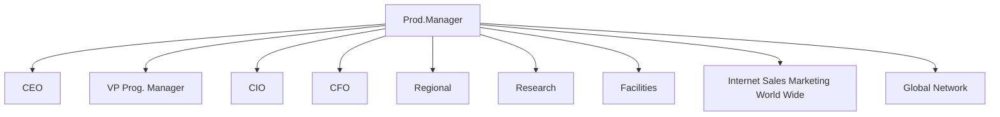
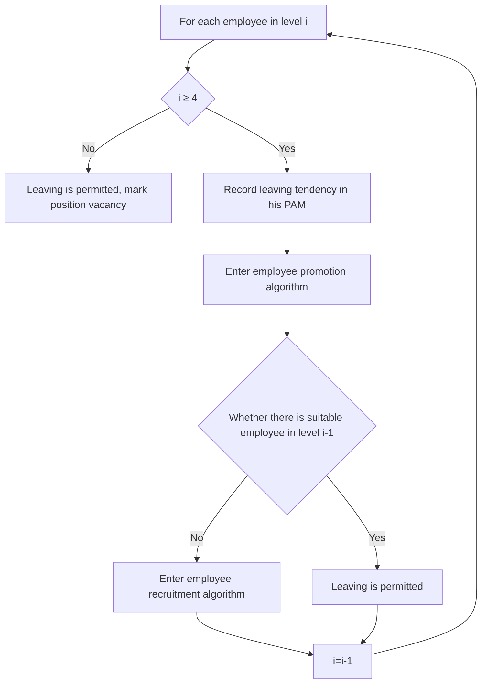
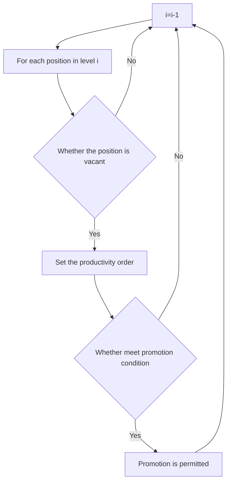
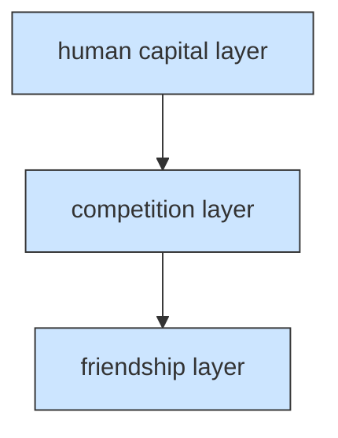

For office use only

T1

T2

T3

T4

## 35778

Problem Chosen

C

For office use only

F1

F2

F3

F4

# 2015 Mathematical Contest in Modeling (MCM) Summary Sheet

(Attach a copy of this page to your solution paper.)

# Human Capital Dynamic Network Model of Team Science

## Summary

As an indispensable part of team science, managing human capital in organizations directly determines the company’s productivity. This paper tries to combine network model with team science.

Firstly, build the human capital static network: we use ICM’s 370 positions as nodes, the affiliations and cooperative relationships as edges. For different nodes of position, we define some quantified values that can reflect basic attributes of the position based on proper assumptions. By building the Post Archives Matrix(PAM), we can record the internal attributes of each position. This matrix can be really helpful to simulate the real conditions. For every edge (????, ????), the value is 1 if and only the node ???? and node ???? have the working relationship. Then we put forward the relationship compactness calculation method, which combines affiliation and cooperative relationship, and this is applied to quantify team performance.

Secondly, build the human capital dynamic network model: we regard employees’ demission, promotion and recruitment as the main causes of network evolution and internal churn in the company. Based on the real conditions and some reasonable assumptions, we designed three evolution driving algorithms. For demission algorithm, there are two conditions: if the employee who wants to leave is in low level, he can dismiss directly; if he is in middle level, promotion and recruitment algorithm must be called to fill the position. What’s more, we consider carefully about the declination of working enthusiasm and the increasing in churn rate for surrounding people when there is one employee churn. For promotion algorithm, we determine the promotion conditions for different level to realize the layer-by-layer promotion of internal employees. Besides, promotion is always in priority to recruitment. For recruitment algorithm, we regard the 2/3 of the vacant position as recruitment plan and we build the on-position time vector to represent delaying effects.

Thirdly, focusing on the issues that the supervisor needs us to consider, we draw the conclusions: in the next two years, the recruitment and training cost are 26.22σ and 140.15σ; When the churn rate reaches 25% and 35%, working rate is steadily below 80% and bring some negative effects such as the declining of company performance and employees’ enthusiasm; The no-external recruitment policy is beneficial to maintain the company performance and working rate, but we still have to admit that it will cause the declining of enthusiasm of middle-level employees.

Finally, we regard friendships, competition and Human Capital as three network layers to describe the connection compactness in the whole team. By using the main statistical indicators (such as the average length of path), we draw the conclusion that multilayer network can reflect internal connections more precisely and comprehensively than human capital network.

## Contents

## 1 Introduction 1

1.1 Problem analysis  
1.2 Literature review  
1.3 Terminology and definitions 2  
1.4 Our work 2

## 2 Human Capital Evolution Network Model 3

2.1 Model overview and concepts definition 3  
2.2 Human capital static network model  
2.2.1 The main assumptions of static human capital network model 4  
2.2.2 The definition of node and edge 4  
2.2.3 Node attributes in the network . 6  
2.2.4 The input and initialization of static network model. 6  
2.2.5 Output of static network model . 7

2.3 Three evolution driving algorithm 7  
2.3.1 Employee dismission algorithm 7  
2.3.2 Employee promotion algorithm 9  
2.3.3 Employee recruitment algorithm . . 10

2.4 Simulation results of the model . . 10  
2.4.1 Prediction for ICM’s budget requirements 10  
2.4.2 Effects of the changing churn rate 12  
2.4.3 Effects of no external recruitment of middle-level employees . . 13

## 3 Multilayer Network Model 16

3.1 The multilayer network for ICM 16  
3.2 The analysis of multilayer network . . 17

## 4 Sensitivity Analysis 17

4.1 Uncertain effects produced by stochastic simulation . . 18  
4.2 Subjective effects produced by some coefficients 18

## 5 Conclusion 18

5.1 Strengths 19  
5.2 Weaknesses 19

## 1 Introduction

Human capital is an intangible asset, it is relatively abstract and it’s meaning develops with the development of our society. Pierre Bourdieu offers a nuanced conceptual alternative to human capital that includes cultural capital, social capital, economic capital, and symbolic capital[1]. Human capital, when viewed from a time perspective, consumes time in one of key activities:

• Knowledge (activities involving one employee);  
Collaboration (activities involving more than 1 employee);  
Processes (activities specifically focused on the knowledge and collaborative activities generated by organizational structure-such as silo impacts, internal politics, etc.);  
Absence(annual leave, sick leave, holidays,etc.).

As the complexity of the workplace continues to grow, organizations increasingly depend on teams. Building an organization filled with good, talented, well-trained people is one of the keys to success. More and more people gradually begin to realize its charming power. So it is extremely important for the HR office to assign employee to positions appropriate to their talents and experience. These positions are just the efficient communication systems to facilitate development of innovative ideas and quality products (commodities or services).But how to manage the human capital has always been a great challenge.

## 1.1 Problem analysis

We focus on a more practical problem on the Information Cooperative Manufacturing (ICM) organiza tion of 370 people, which is in a highly competitive market place.

Now, the actual situation of the organization: only 85% of its 370 positions are filled at any time. Considering different position layers in which people are required to have certain years of experience, the low quality employees often stay with the company for a full career. However, mid-level positions suffer much higher turnover, and it’s often the case that churn seems to diffuse from former employees to others, so they are critical ones when consider the position changes. As for the CEO, the ratio of their salary to worker is approximately 10 times. Besides, in terms of time, the earlier an employee gains the loyalty, the more productive is the organization. What’s more, the annual evaluation based on performance is judged by the supervisor rather than the HR office.

## Our tasks:

Build a human capital network model of ICM organization’s personnel situation that can identify dynamic processes to get certain influence such as the cost, the direct and indirect effects on organization’s productively with a certain churn rate as well as simulate or predict what will happen with a changed churn rate.  
Build a multilayer ncetwork that can connect our Human Capital network to other organizational network layers such as information flow, trust, influence, and friendship.

## 1.2 Literature review

"Human capital" has been and continues to be criticized in numerous ways. Many researchers have engaged in defining and developing this concept ]. In the early days, it is an aggregate economic view of the human being acting within economies, which is an attempt to capture the social, biological, cultural and psychological complexity as they interact in explicit and/or economic transactions. Today, most theories attempt to break down human capital into one or more components for analysis -usually called "intangibles". Accordingly much more attention is paid to factors that led to success versus failure where human management is concerned. The role of leadership, talent, even celebrity is explored. How to make the best use of human capital in the organization, more specifically, to retain good people, keep them properly trained and placed in proper positions, and eventually target new hires to replace those leaving the organization has always been a challenge work.

Network has been widely used in various aspects, especially in natural science. For example, biological networks provide a mathematical analysis of connections found in ecological, evolutionary, and physiological studies, such as neural networks . In computer networks, networked computing devices pass data to each other along data connections (network links). As more and more people realized the power of the network, other complex networks, such as social network and business network forms the nascent field of network science . For instance, a social network is a social structure made up of a set of social actors (such as individuals or organizations) and a set of the dyadic ties between these actors. Since using network in social areas is newly developed, the theory is relatively scarce and many theories are more focused on how to establish the structure of the network rather than the function-the practical use. So it is a novel perspective to build a human capital network to study how the churn and recruit employee will affect the efficiency of the organization. And as teams have increasingly become a way of life in many organizations, using the new concept of team science to build a human network has little been discussed.

What’s more, our life is filled with all kinds of networks, if we do more research on these networks, we may find connection between them, especially a set of entities interact with each other in complicated patterns that can encompass multiple types of relationships,and it is important to take such"multilayer"features into account to try to improve our understanding of complex systems. So connect our Human Capital network to other organizational network layers such as information flow, trust, influence, and friendship is just our creative and challenging work.

## 1.3 Terminology and definitions

Churn: the resulting turbulence when people leaving for other jobs or retiring are replaced.  
Churn rate(turnover rate):a measure of the number of individuals or items moving out of a collective group over a specific period of time,and it can be defined as follows:

$$
\sigma_{CR}(\%) = \frac{2N_{R}}{(N_{S} + N_{E})}\times 100\%
$$

where, $N _ { R }$ is the number of employees resigned during the month, $N _ { S }$ is the number of employees at the start of the month and $N _ { E } \mathrm { i s }$ the total number of employees at the end of the month.

## 1.4 Our work

This paper tries to combine network model with team science to deal with management issues.In section 2, we build human capital network. Firstly, in part 2 we use ICM’s 370 positions as nodes, the affiliations and cooperative relationships as edges to build a human capital static network model. Then in part 3 we design three evolution driving algorithms respectively which make the network change with certain initial conditions as well as the development of algorithm in time dimension. Thirdly, focused on the issues that the supervisor need us to deal with, we revise our model’s initial parameters and algorithms. Finally ,in part 4 ,based on our simulation results, we solve the issues supervisor requires and analyze effects under different conditions. In section 3, after studying the theory of multilayer network, we regard friendships, competition and affiliation as three network layers to describe the connection compactness in the whole team. We also find that multilayer network can reflect internal connections more precisely and comprehensively than human capital network. In section 4, we do the sensitivity analysis for simulation methods and some parameters. In section 5, we draw the conclusion of our model and get our strength and weakness.

## 2 Human Capital Evolution Network Model

## 2.1 Model overview and concepts definition

From the perspective of the human resources department, we build the human capital network model to reflect the human capital as well as its changes of each level of employees. According to the requirements, our network should have the following functions:

The network can clearly show the distribution of different levels of employees in each divisions or offices as well as the internal leading and being led relationships, which is the basic structure of the promotion mechanism in the organization.  
Since it is a human capital network, we must pay more attention to the main factors that can affect the human capital, which includes: the ability an employee has had when he gets the position, the productive enthusiasm of the employee, the time an employee stays in certain position and the training he obtained.  
Our human capital network is an evolutive network model. It has three fundamental dynamic phenomena: employees’ internal promotion, employees’ demission and external recruitment.

The churn of the employee is especially worrying in ICM organization that the current churn rate is 18% per year. So we should emphatically consider the how the churn rate will directly and indirectly affect the total benefit and working rate (the effects on employees’ relationship and enthusiasm will also be considered). To better illustrate our human capital evolution network, the important elements and concepts are defined as follows:

Node: The nodes in the network model refer to 370 positions set up in the company. This is quite different from the nodes in a normal social network, which represents the actual person. In order to show the characteristic of these nodes more clearly, we build a matrix with 370 rows, and we call it "Post Archives Matrix" (denoted as PAM for the following illustration). In the matrix, each line represents a quantitative attribute of certain position. In order to satisfied the function, the quantitative attributes contains the level of position, the on-the-job condition of the position, working time and which division or office it belongs to.

Edge: Edge is the ditch that two points interact with each other. Focused on the present network that regard position as points, the two most direct connections are the affiliation in the division or the office and the leading and being led relationship between divisions. In order to reflect influence of individual jobs on team work, we establish the matrix with the size of 370 370 to reflect the affiliation of different positions, which will be analyzed in the following part of this paper about the discussion of the teamwork.

Factor: Based on the description of the problem and the reference given [7],the input factors of the evolution network model are the on-job-rate at the initial time and the churn rate, the output factors are the on-job-rate in the future , corporate performance, team work, the costs of recruitment and training , etc.

Corporate performance: Our company’s corporate performance is the summation of productivity in each position. In order to calculate changing performance, we consider that the maximum productivity is the summation of basic productivity in certain position and the individual experience. Moreover, the actual productivity is on the base of the maximum productivity and effected by the individual working enthusiasm as well as team work, which will be illustrated in detail in our model.

Minimum time unit: In our model, the minimum time unit is month, which is determined by the data given. So in each month, we will consider the number of people who submit the resignation, join the company and the people should be recruited by the company respectively as well as their enthusiasm in certain month to calculate the corporate performance in that month.

## 2.2 Human capital static network model

In order to obtain a network model with evolution function to assess the condition to human capital in the company, we first build a complete Human capital static network model. The reason we call it static is that our network needs multiple dimensions to reflect the condition in all aspects in a certain time for the company. This static network model is the basic of evolution network. In the meanwhile, it can be used to describe the state indicator in all aspects in each time frame.

## 2.2.1 The main assumptions of static human capital network model

As a network that reflects human capital, each node in the network represent a position and the number of position and the affiliation in the network are fixed.  
Based on the relative date of ICM in the question, we need to divide the employee in seven levels into different divisions and office. Here, we present a reasonable way of division, as is shown in Figure.1. The problem discussed in the following paper is based on this division structure.

```mermaid
graph TD
  A["CEO ★+☆+2× △"] --> B["Research ★+☆+2△"]
  A --> C["CIO* 2★+2★+4△+3○+3▼"]
  A --> D["CFO* 2★+2★+4△+3○+3▼"]
  A --> E["HR ★+☆+2△"]
  A --> F["VP ★+☆+2△"]
  A --> G["Facilities ★+☆+2△"]
  A --> H["Sales Marketing ★+☆+2△"]
    
  B --> I["Networks* 2◇+6○+6▽"]
  B --> J["Information* 2◇+6○+6▽"]
    
  C --> K["Prog. Manager* 2★+2◇+2△+4○+4▽"]
  C --> L["Prod. Manager* 2★+2◇+2△+4○+4▽"]
    
  D --> M["Plant Blue* 2◇+6○+6▽"]
  D --> N["Plant Green* 2◇+6○+6▽"]
    
  E --> O["Regional* 2◇+6○+6▽"]
  E --> P["World Wide* 2◇+6○+6▽"]
    
  F --> Q["Internet* 2◇+6○+6▽"]
    
  H --> R["Directer1 2◇+2○"]
  H --> S["Director2 ◇+2○+▽"]
    
  I --> T["BranchA* 3□+4○+7▽"]
  I --> U["BranchB* 2□+4○+8▽"]
    
  J --> V["BranchC* 2□+4○+8▽"]
  J --> W["BranchD* 2□+4○+8▽"]
    
  K --> X["BranchE* 2□+4○+8▽"]
  K --> Y["BranchF* 2□+4○+8▽"]
    
  L --> Z["BranchG* 2□+4○+8▽"]
    
  M --> AA["BranchH* 2□+4○+8▽"]
    
  N --> AB["BranchI* 2□+4○+8▽"]
    
  O --> AC["World Wide* 2◇+6○+6▽"]
    
  P --> AD["Internet* 2◇+6○+6▽"]
    
  Q --> AE["Directer4 ◇+2○+▽"]
    
  S --> AF["Directer5 ◇+2○+▽"]
    
  T --> AG["BranchA* 3□+4○+7▽"]
  T --> AH["BranchB* 2□+4○+8▽"]
    
  U --> AI["BranchC* 2□+4○+8▽"]
  U --> AJ["BranchD* 2□+4○+8▽"]
    
  V --> AK["BranchE* 2□+4○+8▽"]
    
  W --> AL["BranchF* 2□+4○+8▽"]
    
  X --> AM["BranchG* 2□+4○+8▽"]
    
  Y --> AN["BranchH* 2□+4○+8▽"]
    
  AB --> AO["BranchI* 2□+4○+8▽"]
    
  AC --> AP["BranchJ* 2□+4○+8▽"]
    
  AD --> AQ["BranchK* 2□+4○+8▽"]
    
  AE --> AR["Directer6 ◇+2○+▽"]
```

flowchart

Senior manager/Executive Junior manager/Executive □Experienced supervisor (Branch) Inexperienced supervisor (Division) Experienced employee Inexperienced employee Inexperienced employee

Figure 1: Staff distribution structure in each division

## 2.2.2 The definition of node and edge

Taking the reference to the data of the structure of the company and the level of employee given in the question, we know that the network we build need to reflect several internal relationships. So it is necessary to build a network divided by different factors and then make the assignment to nodes and edges.

Building the network just means defining nodes and edges in the network. The relationships in the company mainly have affiliation and the cooperative relationships: affiliation refers to the leading and being led relationships in divisions or between the division and its lower division; cooperative relationships refers to the cooperation of internal members in the same division, so we may as well regard that any two members have cooperative relationships in the same division. To simplify the problem, we consider the affiliations between divisions just the affiliation between two department managers. Considering that affiliation and the cooperative relationships exit simultaneously in the company, but the mutual correlation isn’t very osculating. Using reference on superposition principle in circuit field, we abstracted the two relationships networks independently.

## Static affiliation network in ICM

Taking the aeolotropism of affiliation into consideration, this network belongs to typical directed network; meanwhile, there is no Intensity difference in affiliation, so it can be regarded as unweighted network. This kind of network $G = ( V , E )$ can be formed by a node set V and a edge set E. The simplest way of showing affiliation is to represent direct connection in a matrix with a size of $3 7 0 \times 3 7 0$ .

If there is affiliation in position, we define the manager as source and people being managed as target. There are total three conditions: when the source points to the target, we record 1 in certain place in the matrix; when the target points to the source, we record -1; when there is no affiliation, we record 0 in certain place in the matrix.

The following Figure.2 is the affiliation network structure. In order to better reflect the main characteristic in each position, we count the degree of each position and directly reflect it in the radius of each point. The value of the degree reflects the importance of this point in the whole network. The relationship is shown in Figure.2.

flowchart

Figure 2: Static affiliation network in ICM

network graph

| Employee       | Connection Type |
| -------------- | ---------------- |
| employee1      | Exp.employee1    |
| employee2      | Exp.employee2    |
| employee3      | Exp.employee3    |
| employee4      | Exp.employee4    |
| employee5      | Exp.employee5    |
| employee6      | Exp.employee6    |
| employee7      | Exp.employee7    |
| employee8      | Exp.employee8    |
| employee9      | Exp.employee9    |
| employee10     | Exp.employee10   |
| employee11     | Exp.employee11   |
| employee12     | Exp.employee12   |
| employee13     | Exp.employee13   |
| employee14     | Exp.employee14   |
| employee15     | Exp.employee15   |
| employee16     | Exp.employee16   |
| employee17     | Exp.employee17   |
| employee18     | Exp.employee18   |
| employee19     | Exp.employee19   |
| employee20     | Exp.employee20   |
| employee21     | Exp.employee21   |
| employee22     | Exp.employee22   |
| employee23     | Exp.employee23   |
| employee24     | Exp.employee24   |
| employee25     | Exp.employee25   |
| employee26     | Exp.employee26   |
| employee27     | Exp.employee27   |
| employee28     | Exp.employee28   |
| employee29     | Exp.employee29   |
| employee30     | Exp.employee30   |
| employee31     | Exp.employee31   |
| employee32     | Exp.employee32   |
| employee33     | Exp.employee33   |
| employee34     | Exp.employee34   |
| employee35     | Exp.employee35   |
| employee36     | Exp.employee36   |
| employee37     | Exp.employee37   |
| employee38     | Exp.employee38   |
| employee39     | Exp.employee39   |
| employee40     | Exp.employee40   |
| employee41     | Exp.employee41   |
| employee42     | Exp.employee42   |
| employee43     | Exp_employee43  |
| employee44     | Exp_employee44  |
| employee45     | Exp_employee45  |
| employee46     | Exp_employee46  |
| employee47     | Exp_employee47  |
| employee48     | Exp_employee48  |
| employee49     | Exp_employee49  |
| employee50     | Exp_employee50  |
| employee51     | Exp_employee51  |
| employee52     | Exp_employee52  |
| employee53     | Exp_employee53  |
| employee54     | Exp_employee54  |
| employee55     | Exp_employee55  |
| employee56     | Exp_employee56  |
| employee57     | Exp_employee57  |
| employee58     | Exp_employee58  |
| employee59     | Exp_employee59  |
| employee60     | Exp_employee60  |
| employee61     | Exp_employee61  |
| employee62     | Exp_employee62  |
| employee63     | Exp_employee63  |
| employee64     | Exp_employee64  |
| employee65     | Exp_employee65  |
| employee66     | Exp_employee66  |
| employee67     | Exp_employee67  |
| employee68     | Exp_employee68  |
| employee69     | Exp_employee69  |
| employee70     | Exp_employee70  |
| employee71     | Exp_employee71  |
| employee72     | Exp_employee72  |
| employee73     | Exp_employee73  |
| employee74     | Exp_employee74  |
| employee75     | Exp_employee75  |
| employee76     | Exp_employee76  |
| employee77     | Exp_employee77  |
| employee78     | Exp_employee78  |
| employee79     | Exp_employee79  |
| employee80     | Exp_employee80  |
| employee81     | Exp_employee81  |
| employee82     | Exp_employee82  |
| employee83     | Exp_employee83  |
| employee84     | Exp_employee84  |
| employee85     | Exp_employee85  |
| employee86     | Exp_employee86  |
| employee87     | Exp_employee87  |
| employee88     | Exp_employee88  |
| employee89     | Exp_employee89  |
| employee90     | Exp_employee90  |
| employee91     | Exp_employee91  |
| employee92     | Exp_employee92  |
| employee93     | Exp_employee93  |
| employee94     | Exp_employee94  |
| employee95     | Exp_employee95  |
| employee96     | Exp_employee96  |
| employee97     | Exp_employee97  |
| employee98     | Exp_employee98  |
| employee99     | Exp_employee99  |
| employee100    | Exp_employee100  |

Figure 3: Static cooperation relationships network in ICM

## Static cooperation relationships network in ICM

For cooperation relationships in divisions or offices, since that there only exits four-team and fourteen-team two types, we can build a small network with a degree of one (there are edges between any two points) for discussion.

Considering that cooperation relationships has isotropy, this network belongs to typical undirected network; meanwhile, there are distinct Intensity differences in the network, so we regard it as weighted network. The intensity of cooperation relationship $\delta _ { i j }$ between position i and position j is affected by the intensity of affiliation $\alpha _ { i j }$ and the intensity friendship relationship. Similarly to the former method, these are record in a matrix with a size of $3 7 0 \times 3 7 0$ . Here, we define the intensity of affiliation $\alpha _ { i j }$ is related to the shortest length $d _ { i j m i n }$ of the two position in the affiliation network, the equation can be shown as follows:

$$
\alpha_ {i j} = \frac {d _ {m a x} - d _ {i j m i n}}{d _ {m a x}}
$$

Where, $d _ { m a x }$ is the maximum of the shortest length in the network. For example, as is shown in Figure.3, the shortest length between employee3 and Exp.employee6 is 4. And the maximum length of shortest way is 5 so the relatively relationship intensity is 0.2. The intensity friendship relationship value is fixed at the beginning, according the request, it will be affected by the churn of employee so that it may decrease. The equation of the intensity of cooperation relationshipteam1 is shown as follows:

$$
\delta_ {t e a m 1} = \sum_ {i = 1} ^ {n} \sum_ {j = 1} ^ {n} \alpha_ {i j} \times \beta_ {i j}
$$

where, n is the total number of nodes.

## 2.2.3 Node attributes in the network

In the following paper, our model is start from the perspective of HR office, so it is necessary to define the attribute of each node (position). Our processing method is:

Set the number of ICM employees in descending order according to seven levels: From 1 to 370.

Establish a Post Archives Matrix with 370 edges, and each edge reflects the working attributes in the position. The position attributes that will be used includes: division or offices the employee is in, the level of the position, salary, training cost, recruitment cost, churn rate, the number of changing times, working time in the position, working enthusiasm(working efficiency), basic productivity in the position, on-job condition and request for departure, etc.

In these attributes, some will be refreshed because of the change of employee (such as the working time in the position, working enthusiasm(working efficiency), basic productivity in the position, on-job condition and request for departure) while others will stay the same. In particular, the number of changing times will continue to add one each time there is a position change to record the position condition in details. Besides, working enthusiasm is quantized through the number vary from 0 to 1.

When there is change in position, we need to make some change in certain place in the Post archives matrix. We make the regulation: when the employee is promoted to new position, the original working time will not be retained. In other words, the working time will be record anew and this is in accord with the phenomenon that the employee will study some skills in order to adapt to the new position.

The effect caused by training is extremely important. The company spends a certain money for training, we think that this kind of training will bring two aspects of benefits: on the one hand, training can promote the level of productivity in present position, which provides theoretical support when calculate productivity when consider the effect of working time; on the other hand, training can facilitate the recovery of the employee’s efficiency τ and restraint the rise of churn rate $\nu .$ In each time period, the equation is:

$$
\tilde {v} = v - \xi_ {2} (v - 18 \%)
$$

$$
\tilde {\tau} = \tau + \xi_ {1} (1 - \tau)
$$

Where ${ \bf \mathcal { L } } _ { 1 }$ and $\xi _ { 2 }$ are the recovery coefficient which indicates changing rate of the relatively ideal value of employee’s efficiency per time unit and the churn rate.18% is the initial churn rate ascertained in the problem, and this value can be adjusted according to different conditions.

## 2.2.4 The input and initialization of static network model.

Based on the requirements and data given, it is quite convenient for us to initialize the main inputs. But there are still some phenomena and algorithms that only described qualitatively, so we need to make some reasonable assumptions for them.

Working rate: As is stated in the task, the present working rate is 85% and middle positions cannot be vacant, so we place the vacant position evenly in low level positions.

Churn rate: the given initial churn rate is 18% in the task, so we suppose that the churn rates in different levels are the same. In other words, the possibility of churn for each employee is 18% in a year.

Recruitment rate: the determined recruitment rate is set approximately as 2/3 of the vacant position, so that it has the negative feedback effect: when the number of churn employees rise, the number of recruitment employee will rise simultaneously. Besides, there is delaying effect in the process of recruitment and the specific algorithm will be illustrate in the following paper.

## 2.2.5 Output of static network model

Focused on human capital static network model, the main output can reflect the running condition of the company. We select the following datum as measurement index. The calculation of organization’s productivityφ: The company’s productivity is the sum of each employee’s productivity. Our performance is based on the following equations:

$$
\varphi = \vec {a} (\vec {b} + \mu \vec {c})
$$

where,

⃗a is the row vector that record the employee’s efficiency in Post Archives Matrix;

⃗b is the column vector that record the employee’s basic productivity in Post Archives Matrix;

⃗c is the column vector that record the employee’s working time in Post Archives Matrix;

µ a fixed coefficient that reflects the rise in employee ˛a´rs productivity per time unit.

Based on the calculation method above, we can find that the company’s productivity is affected by the churn directly and indirectly: on the one hand, the direct effect is that because there is adjustment in position, the working time will change and this is often regarded as the loss of working experience in the position in our real life; on the other hand, there are some indirect effects such as the decline in cooperation relationships and working enthusiasm caused by churn that can’t be ignored. At the same time, the churn rate will also rise. All these analyzed above will cause bad effect to the company.

## 2.3 Three evolution driving algorithm

After building the static network model, considering that our network model has the evolution characteristic in time dimension, we need to use evolution driving force to make the static network model develop and change. This is the source of churn in the organization.

There are three main drivers of evolution: the promotion of employees, the churn of employees and the recruitment of new employees externally. In the following section we will describe how these driving forces affect the evolution process of our network in details and then put it into operable and quantizable algorithm. Since the model is based on a series of bold assumptions, we will first propose our assumptions.

## 2.3.1 Employee dismission algorithm

Just as the CEO is panicked when hearing that the current churn rate is 18% per year, the toughest problem the company faces is the extremely high churn rate. So the churn of employee has become the primary driving force, thus must be given priority to consideration. On the one hand, because employees in high-middle-level positions often has he high working ability, so if they churn, the company will suffer direct effects of the lower of productivity in certain position as well as the rising of recruitment cost. On the other hand, apart from direct effects, there are still some indirect effects that can’t be ignored such as the rising of churn rate or the lower of working enthusiasm in other divisions or offices. What’s more, if the vacant position needs to be filled through internal promotion, there will be a series of changes in position, which can badly affect the benefit of company.

Aiming at ICM company, the employee churn algorithm is based on the following assumptions:

• The churn of employee is random, but throughout the year, the present churn rate is 18% (as is the case in issue 7), so we suppose the churn of employee is even throughout the year.  
If one employee put forward departure, it will cause bad effect to other employees in his division or office (as is the case in issue 2).  
The position change, including promotion, churn and recruitment is regarded to take place once a month (the data given with the unit of per month); this assumption is always valid in the following statement.  
As is stated in the task, the mid-level positions are critical one that need to be filled all the time. So we assume that employees in middle-low-level positions can leave the position directly but employees in middle-high-level positions must wait until there are new suitable substitutes.

Now we start to illustrate our employee dismission algorithm in detail. The churn of employee is random; here we use Monte Carlo Algorithm to simulate whether the employee will churn. Monte Carlo Algorithm is a method that uses random numbers to do the simulation experiment. It can be used to do the random observation of sampling in system we are studying, then we can do the observation statistics of the sample to obtained the possible development of system in the simulation condition.

In every month, we use Monte Carlo Algorithm to simulate whether an employee will churn and the expected churn rate is determined by the specific request in the task. Figure.4 is employee churn algorithm, the mainly steps are as follows:

flowchart

Figure 4: Employee dismission algorithm

Step 1: Traverse every employee from high level to low level to set the churn probability according to the requirement of the question. Use Monte Carlo Algorithm to simulate the churn condition. If he churns, enter step 2; if not, repeat step 1 to test next employee.

Step 2: For churned employee, first call Post Archives Matrix to read his level and record that he has churn tendency. Judge his level: if he is in low level then churn is permitted and return to step 1; if he is in high-middle level, then enter step 3.

Step 3: Given priority to promotion algorithm for the post mobilization in high-middle level position: if internal promotion can realize then churn is permitted meanwhile record vacancy in pre-promotion position; if not, call employee recruitment algorithm and the employee can only leave till meet the median of the certain recruitment time. After that, the position is filled with new worker, the archive is refreshed.

To make further illustration, the analysis above contains the record of Post Archives Matrix: when churn request is put forward, position records as churn put forward; when churn happens, the number of position changing time add one and others return to initial values. Besides, if there exit the changing in other positions caused by churn, similar adjustment should be made in original position.

## 2.3.2 Employee promotion algorithm

Every company will give priority to promote internal employee to higher position, because this can directly promote employees’ production enthusiasm. However, we must consider that only the employee with certain ability that required in a higher level position can be promoted, so that we can avoid undermining the overall strength of the employees in the company.

The promotion of employees is based on the following assumptions:

When one position is in vacancy, the HR office will first consider the promotion of internal employee rather than the external recruitment.  
Whether the employee will be promoted will be affected by two conditions, which are indispensable: for one thing, the employee’s synthetic ability meets the promotion standard; for another, there is vacancy in high level position. Once the employee meets these conditions, we consider that the employee is always willing to be promoted to higher position.  
The employee’s promotion is strictly according to the level (there are seven levels in total) given in the question, so there is no grade-skipping promotion. The employee’s is never restricted by present position, so they can be promoted to other divisions and positions.

Next, we will discuss the employee’s promotion strategy in details. Taking the promotion condition in assumption 2, we need to traverse the present position every month in order to promote the employee who meets the promotion condition to higher position to facilitate employees’ working enthusiasm. In view of the fact that the company has seven position levels, so we must first fill the position in higher level. In other words, we need to test the vacant position in descending order. The promotion has the priority that the internal promotion has preference to external recruitment. Since the promotion the caused by employee’s churn has been discussed in employee churn algorithm, here we just consider promotion mechanism when there are vacant position in our promotion algorithm. Figure.5 is the employee promotion algorithm, the mainly steps are as follows:

flowchart

Figure 5: Employee promotion algorithm

Step 1: Start from the highest position to check whether it is vacant. If it is vacant, enter the next level.

Step 2: In the lower level, rank the time of working time of employees who are still at position and have not put forward departure. Then select the maximum value and judge whether he meets the promotion condition. Promotion condition is regard as the employee’s maximum productivity meets the initial value in higher level.

Step 3: If meets the condition, then promotion is permitted and record vacancy in the present position; otherwise, promotion isn’t permitted so the position is still vacant. Then return to step 1 to repeat the same step in next position.

To make further illustration, the Post Archives Matrix must be record timely when there exit promotion: when meets the promotion condition, the vacant position is filled and the employee-changing number adds one, other numbers return to the initial value; In the meantime , there will be new vacant position in lower level, which will be tested whether this position can be filled timely.

## 2.3.3 Employee recruitment algorithm

When there is vacant position but no internal employee can be promoted to this position, company must take external recruitment strategy. In the question, the recruitment of employees in different levels needs different time, which is just the delaying effect of recruitment.

The recruitment is based on the following assumptions:

Since the median of recruitment time for employees in each level has been given, we consider that the company can always recruit suitable employees in certain time after the sending out of recruitment notice.  
The employee who is recruited should be with the lowest productivity in certain level.  
The number of the position that need recruitment should be in direct proportion to the number of present vacant position.

Next, we will illustrate the recruitment algorithm in details. Based on the churn and promotion algorithm, we finally take the recruitment algorithm. For high-middle level position, because that it isn’t permitted to be vacant, so if there is no one meets the promotion condition we will start the recruitment directly, which has been illustrated in churn algorithm. So here we will mainly illustrate recruitment algorithm in low level:

Step 1: After doing the churn and promotion algorithm, we sum up the vacant position condition in the company.

Step 2: Make use of the given recruitment rate to calculate the number of employees needed in different levels and then record it respectively in time vector which reflects the recruitment time. Each month, reduce one in this vector when there is recruitment plan in certain position and record the time value of the number of employee needs to be recruited in this month.

Step 3: Make initialization in Post Archives Matrix when the recruitment time reduces to zero, that means the position obtained new employee.

## 2.4 Simulation results of the model

## 2.4.1 Prediction for ICM’s budget requirements

Using our human capital evolution network model, we can commendably predict the budget requirements in recruitment and training in two years.

Parameters identification

The mainly parameters for the model has been given in the problem, so here we just identify a few parameters that are hard to quantify. We define these parameters to reflect the changes of employees’ efficiency and churn rate. According to our model, when $\xi _ { 1 } { = } 1 / 3 , \xi _ { 2 } { = } 1 / 3 , \varepsilon \% = 2 \%$ , we can simulate the on-the-job rate curve in next 100 months, as is shown in Figure.6. In the figure,it’s quite clearly that the working rate fluctuates around 85% at the beginning six months. Later there are some changes and finally becomes stable at 80%. This result is in accord with the real situation of ICM company.

line chart

| time/month | working rate |
| ---------- | ------------ |
| 0          | 0.85         |
| 10         | 0.83         |
| 20         | 0.80         |
| 30         | 0.82         |
| 40         | 0.79         |
| 50         | 0.81         |
| 60         | 0.79         |
| 70         | 0.80         |
| 80         | 0.81         |
| 90         | 0.79         |
| 100        | 0.82         |

Figure 6: The prediction of working rate

## Model results

Because we use the Monte Carlo algorithm, it is inevitable that there are some fluctuations. In order to deal with this problem, we simulate model 10 times to predict the cost of recruitment and training cost per month, as is shown in Figure.7, Figure.8. Calculate the average of ten simulation results , we obtain the conclusion that the budget requirements for recruitment is 26.22σ and the budget requirements for training is 140.15σ.

line chart

| time/month | recruiting target for per month/σ |
| ---------- | --------------------------------- |
| 1          | 6.3                               |
| 2          | 6.2                               |
| 3          | 6.1                               |
| 4          | 6.0                               |
| 5          | 5.9                               |
| 6          | 5.8                               |
| 7          | 5.7                               |
| 8          | 5.6                               |
| 9          | 5.5                               |
| 10         | 5.4                               |
| 11         | 5.3                               |
| 12         | 5.2                               |
| 13         | 5.1                               |
| 14         | 5.0                               |
| 15         | 4.9                               |
| 16         | 4.8                               |
| 17         | 4.7                               |
| 18         | 4.6                               |
| 19         | 4.5                               |
| 20         | 4.4                               |
| 21         | 4.3                               |
| 22         | 4.2                               |
| 23         | 4.1                               |
| 24         | 4.0                               |

Figure 7: The cost of recruitment per month

line chart

| time/month | training target for per month/σ |
| ---------- | ------------------------------- |
| 1          | 1.0                             |
| 2          | 1.2                             |
| 3          | 1.1                             |
| 4          | 1.3                             |
| 5          | 1.4                             |
| 6          | 1.5                             |
| 7          | 1.6                             |
| 8          | 1.7                             |
| 9          | 1.8                             |
| 10         | 2.0                             |
| 11         | 2.2                             |
| 12         | 2.4                             |
| 13         | 2.6                             |
| 14         | 2.8                             |
| 15         | 3.0                             |
| 16         | 2.8                             |
| 17         | 2.6                             |
| 18         | 2.4                             |
| 19         | 2.2                             |
| 20         | 2.0                             |
| 21         | 1.8                             |
| 22         | 1.6                             |
| 23         | 1.4                             |
| 24         | 1.2                             |

Figure 8: The cost of training per month

## Rationality Analysis

According to simulation results in recruitment cost, we find the cost is relatively stable in the beginning three months; this is affected by the hysteresis effect of low-level recruitment. Later, from the fifth month to the fifteenth month, recruitment cost fluctuates drastically, the standard deviation is 0.955 and the highest cost per month even reached to 2.9σ. We analysis that during this period the churn effect is remarkable and the system is transiting from a stable condition to another stable condition. After the fifteenth month, because the recruitment cost gradually becomes stable, the system enters a stable condition and the standard deviation is 0.156. It’s obvious from the simulation results that the training cost declines. We think that this is because every employee should be trained, so the working rate declines thus the training budget declines gradually and then reaches a stable value.

## 2.4.2 Effects of the changing churn rate

We know from the background, ICM suffers a lot from the increasing churn rate. On the one hand, the churn of employee will directly cause the declination of company’s performance; On the other hand, it can also cause indirect effects such as other employees’ working efficiency and churn rate which may cause the continue declination of the whole company performance. Then we suppose the churn rate reaches to 25% and 35% respectively to simulate the possible results to quantify the effects.

Parameter idendification

The initialization parameter is the same with the former one, we only need to make some adjustments for ICM’s churn rate to let it to 25% and 35% respectively.

Model results

In order to describe the costs of these higher turnover rates and indirect effects of these high churn rates, we select three indicators: working rate, company performance and average enthusiasm of the employee. Then we use our model to simulate the changes of these indicators in the following 100 months and the results are as follows:

When the churn rate is 25%, the working rate curve figure in the following 100 months is Figure.9, the scatter diagram of total company performance per month is Figure.13 and the working efficiency curve figure of ICM’s employee Figure.11.

line chart

| time/month | working rate when churn rate=25% |
| ---------- | -------------------------------- |
| 0          | 0.84                             |
| 10         | 0.80                             |
| 20         | 0.76                             |
| 30         | 0.78                             |
| 40         | 0.73                             |
| 50         | 0.76                             |
| 60         | 0.71                             |
| 70         | 0.76                             |
| 80         | 0.76                             |
| 90         | 0.76                             |
| 100        | 0.74                             |

Figure 9: Working rate when churn rate is 25%

line chart

| time/month | working rate when chum rate=35% |
| ---------- | ------------------------------- |
| 0          | 0.85                            |
| 10         | 0.80                            |
| 20         | 0.75                            |
| 30         | 0.70                            |
| 40         | 0.65                            |
| 50         | 0.68                            |
| 60         | 0.66                            |
| 70         | 0.67                            |
| 80         | 0.66                            |
| 90         | 0.68                            |
| 100        | 0.67                            |

Figure 10: Working rate when churn rate is 35%

When the churn rate is 35%, the working rate curve figure in the following 100 months is Figure.10 , the scatter diagram of total company performance per month is Figure.12 and the working efficiency curve figure of ICM’s employee is Figure.14.

line chart

| time/month | enthusiasm when churn rate=25% |
| ---------- | ------------------------------ |
| 0          | 1.0                            |
| 10         | 0.85                           |
| 20         | 0.87                           |
| 30         | 0.86                           |
| 40         | 0.85                           |
| 50         | 0.87                           |
| 60         | 0.86                           |
| 70         | 0.87                           |
| 80         | 0.88                           |
| 90         | 0.86                           |
| 100        | 0.87                           |

Figure 11: Working efficiency when churn rate isFigure 12: Working efficiency when churn rate is 25% 35%  

line chart

| time/month | enthusiasm when churn rate=25% |
| ---------- | ------------------------------- |
| 0          | 1.0                             |
| 10         | 0.85                            |
| 20         | 0.8                             |
| 30         | 0.82                            |
| 40         | 0.8                             |
| 50         | 0.81                            |
| 60         | 0.8                             |
| 70         | 0.81                            |
| 80         | 0.8                             |
| 90         | 0.8                             |
| 100        | 0.8                             |

When the churn rate is 25%: ICM’s working rate declines gradually. In the twelfth month, the working rate drops to below 80% and ultimately reaches to around 75%. The company performance is continues in adjacent month, there is obvious fluctuation at the beginning and gradually becomes stable. Ultimately, company performance reaches to around 179σ. In our model, employees’ enthusiasm is a parameter with the value between 0 to 1 and the higher the value, the effective the employee. So this is an indirect indicator of company performance. The result of our simulation is that employees’ working efficiency reaches to 0.87.

scatterplot

| time/month | benefit per month when churn rate=25%(/0) |
| ---------- | ---------------------------------------- |
| 0          | 195                                      |
| 5          | 194                                      |
| 10         | 193                                      |
| 15         | 192                                      |
| 20         | 191                                      |
| 25         | 190                                      |
| 30         | 189                                      |
| 35         | 188                                      |
| 40         | 187                                      |
| 45         | 186                                      |
| 50         | 185                                      |
| 55         | 184                                      |
| 60         | 183                                      |
| 65         | 182                                      |
| 70         | 181                                      |
| 75         | 180                                      |
| 80         | 179                                      |
| 85         | 178                                      |
| 90         | 177                                      |
| 95         | 176                                      |
| 100        | 175                                      |

scatterplot

| time/month | benefit per month when churn rate=-25% / 0 |
| ---------- | ------------------------------------------ |
| 0          | 195                                        |
| 5          | 182                                        |
| 10         | 168                                        |
| 15         | 164                                        |
| 20         | 160                                        |
| 25         | 158                                        |
| 30         | 156                                        |
| 35         | 154                                        |
| 40         | 152                                        |
| 45         | 150                                        |
| 50         | 148                                        |
| 55         | 146                                        |
| 60         | 148                                        |
| 65         | 150                                        |
| 70         | 152                                        |
| 75         | 154                                        |
| 80         | 156                                        |
| 85         | 158                                        |
| 90         | 160                                        |
| 95         | 162                                        |
| 100        | 164                                        |

Figure 13: Company performance when churn rateFigure 14: Company performance when churn rate is 25% is 35%

When the churn rate is 35%: ICM’s working rate declines faster than that of 25%. In the fourth month, the working rate drops to below 80% and ultimately reaches to around 67%. The company performance is continues in adjacent month, there is obvious fluctuation at the beginning and gradually becomes stable. Ultimately, company performance reaches to around 153σ. The result of our simulation is that employees’ working efficiency reaches to 0.81, which is lower than the former result.

Based on what we have discussed above, we can draw the conclusion: with the increasing of churn rate, the working rate declines, the whole company performance slips down and the employee’s enthusiasm drops down correspondingly. To be more distinct, the direct effect is that benefits of certain position declines and the indirect effect is that churn rate increases and the working enthusiasm declines in other divisions and offices. Caused by direct and indirect effects, the company performance continually declines. In other words, churn rate has positive feedback effect that can accelerate the declination of company performance.

## Rationality analysis

The results we get is basically in accord with actual conditions in the company: under the condition that the present management method is unchanged, the more the employee churn, the faster the declination is the company performance. Only when consider the employee’s enthusiasm, we initialize it as 1 at the beginning in our model and this can be a cause of fast declination of average employee enthusiasm at the beginning.

## 2.4.3 Effects of no external recruitment of middle-level employees

We know from the background, ICM suffers a lot from the increasing churn rate. On the one hand, the churn of employee will directly cause the declination of company’s performance; On the other hand, it can also cause indirect effects such as other employees’ working efficiency and churn rate, which may cause the continue declination of the whole company performance. Then we suppose the churn rate reaches to 25% and 35% respectively to simulate the possible results to quantify the effects. The ICM HR supervisor presents us higher request for our human capital network model: in two years, there is no external recruitment of middle-level employees and we just consider internal promotion. In this way, we must make some adjustment in churn algorithm, promotion algorithm and recruitment algorithm to adapt to new regulation.

Improvement for original algorithm

1) In churn algorithm, there is no extra effect for low-level employees. However, for middle-level emoployees, they must stay until the low-level employees are able to be promoted. In order to be accord with real case, middle-level employees’ efficiency ε% will decline to 2%, if they have leaving tendency.  
2) In recruitment algorithm, the company just recruit low-level employee. Under the condition that the recruitment employee is 2/3 of the vacant position, the recruitment of low-level employees will increase.

Parameter identification

The Initialization parameter is the same with the former one, we only need to make some adjustments for ICM’s churn rate, to let churn rate of middle-level employees to be 30% and others churn rate still maintains at 18%.

Model results

What are the effects for the HR health of the organization if we change the model? Here, we will describe the HR health in four indicators: working rate, company performance and average enthusiasm of middle-level employees and average change times of middle-level employees.

In order to make our simulation results directly reflect the effects of whether middle-level recruitment is permitted, we use control-variate method: that is we only change the recruitment method for middle-level position and other parameters such as churn rate stay the same. After ten times simulation, we calculate the average value of these main indicators per month to draw the gragh in order to analysis these indicators respectively.

line chart

| time/month | no external recruiting | external recruiting |
|---|---|---|
| 1 | 0.843 | 0.842 |
| 2 | 0.847 | 0.840 |
| 3 | 0.850 | 0.845 |
| 4 | 0.849 | 0.846 |
| 5 | 0.851 | 0.846 |
| 6 | 0.854 | 0.846 |
| 7 | 0.855 | 0.845 |
| 8 | 0.851 | 0.846 |
| 9 | 0.849 | 0.846 |
| 10 | 0.851 | 0.849 |
| 11 | 0.849 | 0.840 |
| 12 | 0.847 | 0.833 |
| 13 | 0.843 | 0.829 |
| 14 | 0.841 | 0.819 |
| 15 | 0.839 | 0.820 |
| 16 | 0.838 | 0.821 |
| 17 | 0.837 | 0.821 |
| 18 | 0.835 | 0.817 |
| 19 | 0.832 | 0.820 |
| 20 | 0.829 | 0.818 |
| 21 | 0.827 | 0.815 |
| 22 | 0.825 | 0.813 |
| 23 | 0.823 | 0.811 |
| 24 | 0.823 | 0.810 |

Figure 15: Working rate of two recruitment methods

Working rate: the working rate of two different recruitment methods in two years is shown in Figure.15. Comparing the two curves, we find that the working rate declines gradually from 85% and the working rate is higher if there is no external recruitment. From this result, we can draw the conclusion that taking the only-promotion method will decline the churn rate and this can do good to HR health.

line chart

| time/month | no external recruiting | external recruiting |
|---|---|---|
| 1 | 194.0 | 193.5 |
| 2 | 196.0 | 194.5 |
| 3 | 194.5 | 193.0 |
| 4 | 194.8 | 194.5 |
| 5 | 190.0 | 188.0 |
| 6 | 193.5 | 190.5 |
| 7 | 194.2 | 191.0 |
| 8 | 194.0 | 192.0 |
| 9 | 192.0 | 192.5 |
| 10 | 193.0 | 193.2 |
| 11 | 192.0 | 190.0 |
| 12 | 192.0 | 187.5 |
| 13 | 189.0 | 185.5 |
| 14 | 188.5 | 183.0 |
| 15 | 185.0 | 182.5 |
| 16 | 184.0 | 182.5 |
| 17 | 183.0 | 182.5 |
| 18 | 182.0 | 182.0 |
| 19 | 181.5 | 182.5 |
| 20 | 182.0 | 181.5 |
| 21 | 183.0 | 181.5 |
| 22 | 183.0 | 181.5 |
| 23 | 183.0 | 181.5 |
| 24 | 184.5 | 182.0 |

Figure 16: Company performance of two recruitment methods

Company performance: the company performance of two different recruitment methods in two years is shown in Figure.16. Comparing the two curves, we find that the company performance will gradually decrease and then become flat; there is no distinct difference in the company performance: there is just a little increase if there is no external recruitment. So if we use the recruitment method that middle-level employees only promoted internally, we can slightly improve the company performance and this is good to the HR health.

line chart

| time/month | no external recruiting | external recruiting |
|---|---|---|
| 1 | 0.99 | 0.99 |
| 2 | 0.97 | 0.97 |
| 3 | 0.97 | 0.97 |
| 4 | 0.93 | 0.92 |
| 5 | 0.94 | 0.93 |
| 6 | 0.94 | 0.94 |
| 7 | 0.94 | 0.94 |
| 8 | 0.94 | 0.95 |
| 9 | 0.95 | 0.95 |
| 10 | 0.93 | 0.93 |
| 11 | 0.91 | 0.91 |
| 12 | 0.88 | 0.89 |
| 13 | 0.87 | 0.88 |
| 14 | 0.86 | 0.88 |
| 15 | 0.85 | 0.87 |
| 16 | 0.84 | 0.87 |
| 17 | 0.85 | 0.87 |
| 18 | 0.85 | 0.87 |
| 19 | 0.85 | 0.87 |
| 20 | 0.86 | 0.88 |
| 21 | 0.86 | 0.88 |
| 22 | 0.86 | 0.89 |
| 23 | 0.87 | 0.89 |
| 24 | 0.87 | 0.89 |

Figure 17: Average enthusiasm of middle-level employees of two recruitment

Average enthusiasm of middle-level employees: the average enthusiasm of middle-level employees of two different recruitment methods in two years is shown in Figure.17. Comparing the two curves, we find that the average enthusiasm is quite close in the first ten months; after ten months, the average enthusiasm is higher if we hire the middle-level employees externally. This shows that if we use no-external recruitment method of middle-level employees, the average enthusiasm will decline. So HR office should pay attention to it.

line chart

| time/month | no external recruiting | external recruiting |
| ---------- | ---------------------- | ------------------- |
| 1          | 1.0                    | 1.0                 |
| 2          | 1.0                    | 1.0                 |
| 3          | 1.0                    | 1.0                 |
| 4          | 1.0                    | 1.0                 |
| 5          | 1.0                    | 1.0                 |
| 6          | 1.0                    | 1.0                 |
| 7          | 1.0                    | 1.0                 |
| 8          | 1.0                    | 1.0                 |
| 9          | 1.0                    | 1.0                 |
| 10         | 1.0                    | 1.1                 |
| 11         | 1.0                    | 1.2                 |
| 12         | 1.0                    | 1.3                 |
| 13         | 1.0                    | 1.3                 |
| 14         | 1.0                    | 1.4                 |
| 15         | 1.0                    | 1.4                 |
| 16         | 1.0                    | 1.5                 |
| 17         | 1.3                    | 1.5                 |
| 18         | 1.3                    | 1.6                 |
| 19         | 1.4                    | 1.6                 |
| 20         | 1.4                    | 1.7                 |
| 21         | 1.4                    | 1.7                 |
| 22         | 1.5                    | 1.8                 |
| 23         | 1.5                    | 1.8                 |
| 24         | 1.5                    | 1.8                 |

Figure 18: Average change times of middle-level employees of two recruitment

Average change times of middle-level employees: the average enthusiasm of middle-level employees of two different recruitment methods in two years is shown in Figure.18. Comparing the two curves: if we permit external recruitment of middle-level employees, the average enthusiasm of middle-level employees will increase. We consider that this is because if we use external method, it is more convenient for employees to transfer the position. From the perspective of HR health, it will better improve the stability of the position if we permit external recruitment for middle-level employees.

Based on what have discussed above, we can draw the conclusion: from several indicators such as working rate, company performance and average enthusiasm of middle-level employees and average change times of middle-level employees, we think that it is more beneficial for HR health if we use external method. Besides, although it may decrease the enthusiasm of some middlelevel employee, it can greatly increase the enthusiasm of low-level employee and the stability of middle-level group.

Rationality Analysis

The results is basically in accord with the real case. What’s more, the study in human capital fields also provide us following conclusions: if we use internal promotion method for middlelevel employees, it will do good to personnel decision; the employee who has been working in an organization for some time can get involved in the organizational culture so that they have higher integrating degree with the organization; internal promotion can provide opportunities for each employee and this can increase the working enthusiasm; it can reduce the cost.

## 3 Multilayer Network Model

## 3.1 The multilayer network for ICM

The single layer network can only include one aspect of a problem. However, the team performance is not only influenced by working relationship but many relationships in common life. The Human Capital network is a one-layer network reflecting the relationship between higher level and lower level. We add the friendship network and the competition network to the human capital network. Thus we get a multilayer network.

The multilayer network is based on the Networks office in ICM, which consists of two divisions of 7 people. The reason why not based on the whole company is the complexity is too huge, that the number of possible edges grows as O (n2(d+1)).[8] . $O \left( n ^ { 2 \left( d + 1 \right) } \right) . ^ { \left[ 8 \right] }$

The Human Capital network in this office has been established above. And the relationship in it won ˛a´rt change anytime. For the friendship network, the edges between two nodes $i , j$ stand for that i andj are good friends so they will attract each other. In other words, if i wants to leave ICM, j is one reason can hold i back. In the competition network, we assume the major competitions happen in peer group and all competitions are well to promote everyone to improve. The edges between two nodes $i , j$ stand for that i and j compete with each other. Obviously, proper competitions can improve team performance which will also hold employees to stay.

flowchart

Figure 19: The multilayer network for Networks office

Figure.19 shows the whole multilayer network structure, defined as $M = ( V _ { M } , E _ { M } , V , L )$ .The network M has a total of 14 nodes, every node represent a worker, $V = 1 , 2 , . . . , 1 4$ . Three layers are connected together, so the $L = ( L _ { 1 } , L _ { 2 } , L _ { 3 } )$ . We represent the Human Capital layer as $L _ { 1 }$ .he friendship layer as $L _ { 2 }$ and the competition layer as $L _ { 3 }$ . Each layer contains whole 14 nodes of V .The set $V _ { M }$ contains the whole nodes of the multilayer network.In this place it has 42 nodes. To extinguish every node in every layer, we use $\mathbf { \langle i , } L _ { j } \mathbf { ) t o }$ name the people i in the layer $L _ { j } . ~ E _ { M }$ show the set which contains whole edges in M . We show the edges that remain inside of a layer as solid lines and the edges that cross layers as dotted lines. The real meaning of the solid lines has been given above. And the cross-layers-edges only couple the same people in different layers. Which means two different people can’t "communicate" in different layers. Not every cross-layers-edge is drawn in the Figure.19 just to show the meaning. To define every edge, we use $( ( i , L _ { m } ) , ( j , L _ { n } ) )$ )to stand for the edge between node $( i , L _ { m } )$ )and node $( j , L _ { n } )$ .In ordinary graphs, adjacency matrices are often used to describe network. There are two methods to describe multilayer networks, the adjacency tensor and the supra-adjacency matrices[8]. The adjacency tensor is named as $A _ { i j L _ { m } L _ { n } }$ For every person i in the layer $L _ { m }$ and person $j$ in the layer $L _ { n } , A _ { i j L _ { m } L _ { n } }$ has a value of 1 if and only $( ( i , L _ { m } ) , ( j , L _ { n } ) ) { \in } E _ { M }$ , otherwise the value is 0. And to get the supra-adjacency matric, we should use tensor flattening to combine all aspects into one aspect. Then the supra-adjacency is just like normal adjacency matrices of ordinary graphs. In this paper, we define G1,G2,G3 as the adjacency matrices of every layer and $G _ { M }$ as the supra-adjacency matrices of the multilayer network.

## 3.2 The analysis of multilayer network

Some important basic characters such as node degrees, clustering coefficients, walks can be pretty helpful for analyzing the graph in general singer layer network. And these characters can also be used in multilayer by aggregating data from the different layers into a monolayer network. According to the reference[7] given by the question, team performance mainly affected by shared cognition. And shared cognition has positive correlation with the complexity of every aspect of the multilayer network. To explain this, we consider that:

In the Human Capital layer, more edges or bigger degrees means one person needs to work with more people. It can make people get more training to cooperate with others so that the team performance can improve quickly.  
In the friendship layer, bigger degree for a node means this person has great relations with people which will make him/she in well mood and not want to leave.  
In the competition layer, proper competition is the best policy to promote every teammate to work efficiently. Besides, cooperation walks along with competition, so that people can learn a lot about teamwork.

Table 1: Main characters for networks

<table><tr><td>The layer type</td><td>Average degree</td><td>Average cluster</td><td>Average path length</td><td>Graph density</td></tr><tr><td>The Human Capital layer</td><td>0.929</td><td>0</td><td>2.978</td><td>0.143</td></tr><tr><td>The friendship layer</td><td>0.86</td><td>0</td><td>1.632</td><td>0.11</td></tr><tr><td>The competition network</td><td>2.214</td><td>1</td><td>1</td><td>0.341</td></tr><tr><td>The multilayer network</td><td>3.214</td><td>0.638</td><td>1.571</td><td>0.484</td></tr></table>

Table.1 gives out the main character conclusions of three monolayer networks and the multilayer network. We can find that every character of the multilayer network shows more detail information than monolayer networks. Using multilayer network can simulate the social relations more clearly than only using one monolayer network. We draw conclusions:

The HR office should use more detail data in this multilayer network to simulate the influence of churn.  
The competition network is important in teams, the company can divide divisions more scientifically to make teams in well competition.

## 4 Sensitivity Analysis

Our algorithm use Monte Carlo random numbers and some coefficients determined by experience. This may bring to uncertainty effects and subjective effects. To analyze this influence we see these matters as independent variable and observe some important outcomes.

## 4.1 Uncertain effects produced by stochastic simulation

To observe the stochastic error produced by stochastic simulation. We use the working rate as the output and get the output in same situation by 6 times. Then take 6 groups $( a _ { 1 } , a _ { 2 } , a _ { 3 } , a _ { 4 } , a _ { 5 } , a _ { 6 } )$ into the formula.

$$
w = \frac {(a _ {1} + a _ {2} + a _ {3}) - (a _ {4} + a _ {5} + a _ {6})}{3}
$$

While the w represent the stochastic error. Figure.20 show us the stochastic error produced by the random process. The maximum of the error is under 0.015 which is small enough. So the stochastic error is under the limited range that we can assume it won ˛a´rt affect the output too much.

bar chart

| Time/month | The difference of working rate |
|---|---|
| 1 | -0.002 |
| 6 | 0.008 |
| 11 | 0.003 |
| 16 | 0.012 |
| 21 | 0.014 |
| 26 | 0.007 |
| 31 | 0.013 |
| 36 | 0.011 |
| 41 | -0.005 |
| 46 | -0.012 |
| 51 | -0.009 |
| 56 | -0.014 |
| 61 | -0.008 |
| 66 | -0.011 |
| 71 | -0.006 |
| 76 | -0.007 |
| 81 | -0.013 |
| 86 | -0.016 |
| 91 | -0.014 |
| 96 | 0.014 |

Figure 20: The stochastic error

line chart

| Time/month | 1.02 | 1.05 | 1.07 | 1.10 | 1.13 |
| --- | --- | --- | --- | --- | --- |
| 1 | 0.84 | 0.84 | 0.84 | 0.84 | 0.84 |
| 5 | 0.85 | 0.85 | 0.85 | 0.85 | 0.85 |
| 9 | 0.84 | 0.84 | 0.84 | 0.84 | 0.84 |
| 13 | 0.83 | 0.83 | 0.83 | 0.83 | 0.83 |
| 17 | 0.82 | 0.82 | 0.82 | 0.82 | 0.82 |
| 21 | 0.81 | 0.81 | 0.81 | 0.81 | 0.81 |
| 25 | 0.80 | 0.80 | 0.80 | 0.80 | 0.80 |
| 29 | 0.79 | 0.79 | 0.79 | 0.79 | 0.79 |
| 33 | 0.78 | 0.78 | 0.78 | 0.78 | 0.78 |
| 37 | 0.79 | 0.79 | 0.79 | 0.79 | 0.79 |
| 41 | 0.80 | 0.80 | 0.80 | 0.80 | 0.80 |
| 45 | 0.81 | 0.81 | 0.81 | 0.81 | 0.81 |
| 49 | 0.82 | 0.82 | 0.82 | 0.82 | 0.82 |
| 53 | 0.83 | 0.83 | 0.83 | 0.83 | 0.83 |
| 57 | 0.84 | 0.84 | 0.84 | 0.84 | 0.84 |
| 61 | 0.85 | 0.85 | 0.85 | 0.85 | 0.85 |
| 65 | 0.84 | 0.84 | 0.84 | 0.84 | 0.84 |
| 69 | 0.83 | 0.83 | 0.83 | 0.83 | 0.83 |
| 73 | 0.82 | 0.82 | 0.82 | 0.82 | 0.82 |
| 77 | 0.81 | 0.81 | 0.81 | 0.81 | 0.81 |
| 81 | 0.80 | 0.80 | 0.80 | 0.80 | 0.80 |
| 85 | 0.79 | 0.79 | 0.79 | 0.79 | 0.79 |
| 89 | 0.78 | 0.78 | 0.78 | 0.78 | 0.78 |
|  |  |  |  |  |  |
|  |  |  |  |  |  |
|  |  |  |  |  |  |
|  |  |  |  |  |  |
|  |  |  |  |  |  |
|  |  |  |  |  |  |
|  |  |  |  |  |  |
|  |  |  |  |  |  |
|  |  |  |  |  |  |
|  |  |  |  |  |  |
|  |  |  |  |  |  |
|  |  |  |  |  |  |
|  |  |  |  |  |  |
|  |  |  |  |  |  |
|  |  |  |  |  |  |
|  |  |  |  |  |  |
|  | nan | nan | nan | nan |  |

Figure 21: The working rate under different growth coefficient

## 4.2 Subjective effects produced by some coefficients

Because of the limited data some coefficients are determined by experience. In order to analyze the influence of these subjective effects, we choose two important coefficients to change slightly and observe what happen.

Change the attenuation coefficient produced by unsuccessful promotion of job When a worker is full filled with the condition of promotion, his working efficient will decline if he can’t get promoted. The attenuation coefficient is set as 0.95 by experience. We change this value into 0.90, 0.93, 0.95 and 0.97 to observe what happened to company performance. From the result we find that when the value is more than 0.93 the company performance didn’t change obviously.

Change the growth coefficient of turnoff rate produced by churn When a people leave company will lead to a churn, which will promote some people surrounding to have more possibility to leave. The growth coefficient is set as 1.02 by experience. We change this value into 1.05, 1.07, 1.10 and 1.13 to observe what happened to the working rate of company. A graph is given to describe the result. Figure.21 shows the change of working rate under different coefficient value. The values 1.02, 1.05, 1.07, 1.10 and 1.13 stand for the different number of the growth coefficient. We can find that when the value is more than 1.07 the output didn’t change obviously. That means the value set as 1.02 won ˛a´rt cause too much influence on the outcomes. So it is proper to set this value as 1.02.

## 5 Conclusion

As an indispensable part of team science, managing human capital in organizations directly determines the company’s productivity. This paper tries to combine network model with team science. Firstly, we use ICM’s 370 positions as nodes, the affiliations and cooperative relationships as edges to build a human capital static network model. In our model, we establish Post Archives Matrix to record the internal attributes of each position so that we can quantize some abstract concepts such as cooperative relationships reasonably. Secondly, we regard turnover, promotion and recruitment as main causes of network evolution and internal churn in the company. Then we design three evolution driving algorithms respectively which make the network change with certain initial conditions as well as the development of algorithm in time dimension. Thirdly, focused on the issues that the supervisor need us to deal with, we revise our model’s initial parameters and algorithms. Based on our simulation results, we obtain our predictions for these issues and analyze effects. Fourthly,after studying the theory of multilayer network, we regard friendships, competition and affiliation as three network layers to describe the connection compactness in the whole team. We also find that multilayer network can reflect internal connections more precisely and comprehensively than human capital network. Finally,we do the sensitivity analysis for simulation methods and some parameters

## 5.1 Strengths

We build a Post Archives Matrix to show the internal attributes of nodes. For one thing, we can use it to describe each position; For another, when an employee transfer from one position to another, he can bring the archives them him and initialize the original position.  
We consider the affiliations and cooperative relationships as edges to connect positions. Affiliations are the bridges for the company’s operation and cooperative relationships are the roll booster for team benefits. In the model, we combine these to relationships together and derive the equation of team work to qualify the connection compactness for a team.  
Network evolution is based on the connection and effects of three algorithms. There is an order in employees’ demission, promotion and recruitment. Based on the requirements, we determine a set of strategies for the real churn in ICM company and then use it solve the requests in the task.  
The details in algorithms are in accord with real conditions. We use it realize the reasonable quantification of abstract factors. For example, in order to describe the bad effects caused by churn employees, we quantify employees’ working enthusiasm and the changing churn rate. There is another example: we consider the effect of training and find that training can increase the working enthusiasm and at the same time decrease the demission possibility.

## 5.2 Weaknesses

Different divisions’ effects and operation in ICM company should be regarded as another network to study. Considering the lacking of conditions and the time for us is limited, we don’t make further study in this aspect.  
Our model doesn’t consider the effects of the employees who retire or leave their position temporarily.

## References

[1] The Forms of Capital: English version published 1986 in J.G. Richardson’s Handbook for Theory and Research for the Sociology of Education, pp. 241-258.  
[2] Spence, Michael (1973). "Job Market Signaling". Quarterly Journal of Economics 87(3): 355- 374. doi:10.2307/1882010.  
[3] The Forms of Capital: English version published 1986 in J.G. Richardson’s Handbook for Theory and Research for the Sociology of Education, pp. 241-258.  
[4] Paolo Magrassi (2002) "A Taxonomy of Intellectual Capital", Research Note COM-17-1985, Gartner.  
[5] Proulx, S. R.; Promislow, D. E. L.; Phillips, P. C. (2005). "Network thinking in ecology and evolution". Trends in Ecology and Evolution 20 (6): 345-353.doi:10.1016/j.tree.2005.04.004. PMID 16701391.  
[6] Borgatti, Stephen P.; Mehra, Ajay; Brass, Daniel J.; Labianca, Giuseppe (2009). "Network Analysis in the Social Sciences". Science 323(5916): 892-895. doi:10.1126/science.1165821.  
[7] E. Salas, N.J. Cooke, and M.A. Rosen. (2008). On Teams, Teamwork, and Team Performance: Discoveries and Developments. Human Factors: The Journal of the Human Factors and Ergonomics Society June 2008 vol. 50 no. 3 540-547.  
[8] Mikko Kivel a, Alexandre Arenas, Marc Barthelemy, James P. Gleeson, YamirMoreno, Mason A. Porter. (2013). Multilayer Networks, J. Complex Networks, 2(3):203-271 (2014); arXiv preprint arXiv:1309.7233, 2013.  
[9] Hellmann T, Staudigl M. Evolution of social networks[J]. European Journal of Operational Research, 2014, 234(3): 583-596.  
[10] Long Q. Three-dimensional-flow model of agent-based computational experiment for complex supply network evolution[J]. Expert Systems with Applications, 2015, 42(5): 2525-2537.  
[11] Garc´lła-Herrero S, Mariscal M A, Guti´l˛errez J M, et al. Using Bayesian networks to analyze occupational stress caused by work demands: Preventing stress through social support[J]. Accident Analysis, 2013, 57: 114-123.