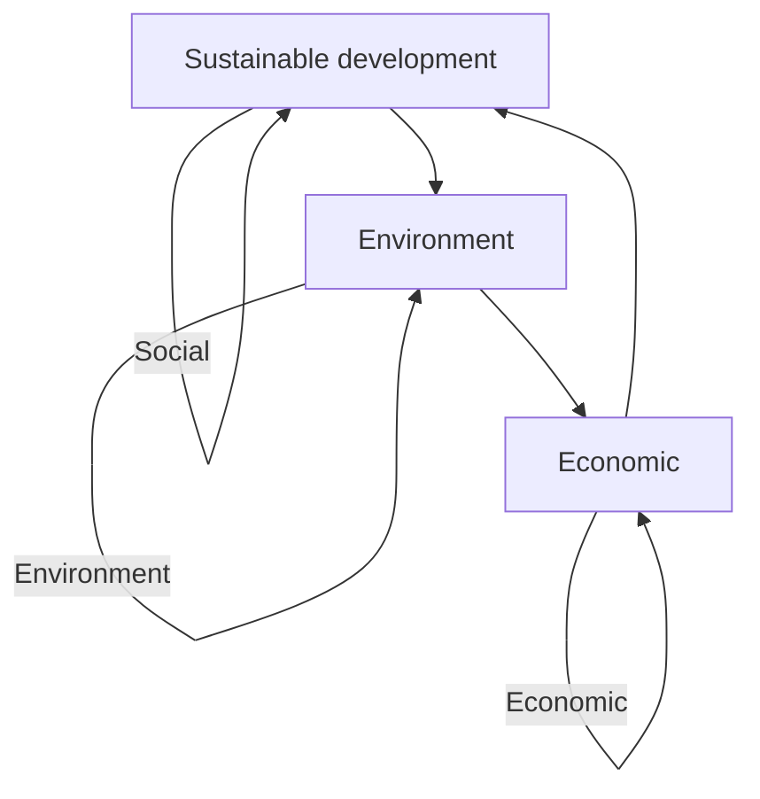
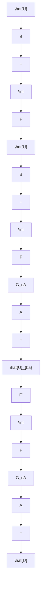

For office use only

T1

T2

T3

T4

## 35780

Problem Chosen

D

For office use only

F1

F2

F3

F4

## 2015 Mathematical Contest in Modeling (ICM) Summary

Sheet (Attach a copy of this page to your solution paper.)

## Sustainability? Responsibility!

Sustainability is a comprehensive concept to describe a pattern of development without losing coordination or over consuming resources. Our research is divided into three steps: assessing and forecasting sustainability, formulating development plan, and involving external factors.

Firstly, an Entropy-GE Matrix is adopted to create a measurement of sustainability and a state equation constructed from Lanchester’s Equation is employed to forecast trends of sustainability. We set up a Sustainable Development Indicator system and normalize data of indicators. Aiming at assessing comprehensive performances, we adopt an Entropy-GE Matrix to establish concepts of Development Index (DI), Cooperation Index (CI) and a final score. Based on Lanchester’s Equation, we furthermore construct a state equation to forecast sustainability. In our result of 10 countries’ rankings on sustainability in 2013, America occupies the first place with a score 0.161 while Congo is the last with a score 1.142. As for another result, we obtain a 20-year forecast for three sample countries (America, China, Congo).

Secondly, we study on effectiveness of control elements c , b in control matrices and utilize a dynamic programming method to design a 20-year plan for Congo. Using the concept of state space from control engineering, we convert effects of a plan on sustainable development into effects of control matrices on the state equation. In a case study on Congo, the control variate method is adopted to analyze effectiveness of ${ \mathfrak { c } } _ { \mathrm { { i } } } , \ { \mathrm { b } } _ { \mathrm { { i } } }$ , and dynamic programming is applied to obtain a 20-year optimal plan. With the plan, DI and CI of Congo will dramatically increase in following 20 years. In order to specify our plan, development activities and their effectiveness scores are studied. In the plan for Congo, an economic activity of technical support is strongly recommended.

Thirdly, effects from external factors are considered in our model. By adding an external control matrix consists of Gaussian random numbers to the state equation, we can simulate effects of external factors on sustainable development of Congo. In the result, although external perturbation can cause fluctuation on performances, our plan can still guarantee a rising trend of sustainable development.

Finally, we analyze the stability of our model with a OAT/OFAT method and its result demonstrates that our model can undergo disturbance in a certain extent. Besides, we conclude the strength and weakness of our model.

## Contents

## 1 Introduction 1

## 2 Assumption 2

## 3 A Model for Sustainability 2

3.1 Sustainable Development Indicators (SDI) 3  
3.2 A Measurement of Sustainability . . . . 3

3.2.1 Data Normalization . . . 4  
3.2.2 The Comprehensive Performance . . . 5  
3.2.3 Development Index and Coordination Index . . . . . . 6  
3.2.4 A GE-Matrix to Score Sustainability . . . . . 7

3.3 A Forecast on Sustainability . . . . 8

3.3.1 Mechanism of Lanchester’s Equation . . . . . 8  
3.3.2 Our State Equation . . . . . 8

3.4 Results . . . 9

3.4.1 Country Rankings . . . . . 9  
3.4.2 A 20-Year Forecast . . . . . 9

## 4 A Sustainable Development Plan 10

4.1 Adding Control into the State Equation 11

4.1.1 Direct and Indirect Control Matrices . . . . . 11  
4.1.2 Effectiveness of Control Elements . . . . . 12

4.2 A Dynamic Programming Solution . . 13  
4.3 Development Activities in Practice 13  
4.4 A Case Study on Congo . . . . 14

4.4.1 Adjusting Control Elements . . . . . 14  
4.4.2 20-year Forecasts with(out) Plan-controlling . . . . . . . . . . 15  
4.4.3 The Plan in Practice . . . 16

## 5 External Effects 17

5.1 Adding a Perturbation Matrix to State Equation 17  
5.2 A Revised Forecast on Congo 17

## 6 Stability Analysis 18

## 7 Strength and Weakness 19

7.1 Strength 19

7.1.1 Hierarchy . . . . . 19  
7.1.2 Quantification . . . . 19  
7.1.3 Intersectionality . . . . . 19

7.2 Weakness 20

## References 21

## Introduction

1

The concept of Sustainable Development (SD) was derived from forest management in early 12th to 16th centuries[1]. In recent decades, with the continuous development of modern society, the concept of SD evolved and was broadened. It was not until 1987 had this concept been defined by the United Nations World Commission on Environment and Development in its report Our Common Future defines sustainable development. The report defines:" Sustainable development is development that meets the needs of the present without compromising the ability of future generations to meet their own needs"[2]. While this is the most commonly used definition, it is not the only one. A pragmatic version with economic nuances was formulated by the OECD Environment Committee which considers that sustainable development means "maximizing the net benefit of the economic development, while maintaining the dimensions of quality and production at the level of the resources over time"[3]. To measure the progress of sustainability, sets of Sustainable Development Indicators (SDI) have been created by many organizations include World Bank, World Resource Institute, Worldwatch Institute etc[4]. At present, problems like over increased population, poverty, shortage of energy resources, and environmental pollution remain to be crucial global issues. Without effective ways to solve these problems, they will finally cause disasters to earth environment and lead to human society collapse. Hence, SD has its unprecedented significance in today’s world.

To create a more sustainable world, the International Conglomerate of Money (ICM) is interested in investing developing countries. Therefore, following tasks are to be accomplished:

A measurement to characterize sustainability of a country is needed. By considering various factors like environmental quality and social status, the model should clearly extinguish sustainable countries from unsustainable ones.  
A 20 year sustainable development plan should be created to help a Least Developed Country (LDC) to gain a more sustainable future.  
• The effect our 20-year plan has on the sustainability measure of the selected country should be evaluated.

According to existent materials, various sets of SDIs have been created by different countries, organizations, as well as researchers. Among them, the most well-known one is the standard published by Eurostat aims at monitoring the progress towards sustainable development strategy in EU countries. Over 100 Indicators used are divided into three categories: social, environmental and economic[5], as shown in Figure 1. Other studies also consider wider perspectives, for example, cultural diversity and cultural well-being by Jelena Zlatar etc. in 2014[6]. However, there is still not a global consensus of indicators used to measure SD. In line with various SDIs, studies use models and measurements to comment on sustainability of a country or a region. For instance, Liu Dan constructs an evaluation index system of resource-based city sustainable development using a BP neural network model and a genetic algorithm . Jiali Huang uses eco-8] logical network analysis (ENA) to quantify the growth and development of Beijing city .

To give advises for future policies and investments to improve sustainability, researchers have done many qualitative analysis. Anthony Crabbe concludes three strategies: charitable strategy, network strategy and social business strategy to enhance regional sustainability . Vatroslav

flowchart

Figure 1: Three aspects in SDI system

Zovko elaborate impacts GNI index and education have on future development[10]. However, most of the previous work lack quantitative analysis; therefore the advises they provide could not give decision makers strong and clear instructions on policy making and plan designing. On this stage, a better model for development planning is valueable.

Considering the existent research, our research focus on sustainability measurement, sustainability forecast, as well as sustainability control and adjustment. Detail work is as follow:

1) We create our own system of Sustainable Development Indicators and provide with a measurement of sustainability based on the entropy theory and the GE-Matrix.  
2) We also conduct a way to forecast sustainability using Lanchester’s Equation and theory of the state equation.  
3) We study the control and adjustment a plan can have on the sustainability by doing further deduction on the state equation and acase study on Congo.  
4) Further work in our research focuses on effects from external influence of the system.

## Assumption

## 2

## We assume that effects of external factors on our model obey the Gaussian Distribution.

We made this assumption based on reality, because the kinds of external effects considered in our study (e.g. climate change, international aids) seldom have abnormal strong impacts on the original model. Under this assumption, we can easily quantify the external effects in our study.

## A Model for Sustainability

## 3

In this section, we first set up a system of Sustainable Development Indicators (SDI). Subsequently, we provide a complete measurement to score a country’s sustainability. Next, we provide a method to forecast sustainability. Finally, the results of country rankings and a 20-year forecast are demonstrated.

## 3.1 Sustainable Development Indicators (SDI)

In order to give a well-rounded description of Sustainable development, a series of indicators is used, which are called Sustainable Development Indicators (SDI). Since there is no global consensus of how SDI should be selected, we therefore choose the indicators based on 3 principles:

The indicators should be as comprehensive as possible to include most parts which are effective to sustainability.  
The indicators had better be easy to be controlled and regulated through government policies and feasible plans.  
The indicators which have already been tested reasonable in existent researches have a priority.

Based on these three principles, we construct a group of indicators in 3 levels, shown in Table1. The first level contains three widely acknowledged aspects, namely environmental, social and economic. The second level contains 9 sub-aspects, three for each layer. On choosing sub-aspects, we considered three most stressed global problems in nowadays under each aspects(Since the economic aspect only have two levels, the way to choose its sub-aspects is combined with the way of choosing third layer indicators).For example, ... Finally, to choose the third level indicators, we identified them from following 3 resources:

(a) More than 100 indicators are identified by Eurostat[11] with a focus on 12 headline indicators. These indicators have been used to monitor the EU Sustainable Development Strategy for over 10 years.  
(b) 52 international indicators constructed by Liyin Shen to evaluate sustainable urbanization. The realiability has been tested through the author’s case study of China[12]  
(c) 37 indicators concluded by Jelena Zlatar from studies on SDI from 2001 to 2012 in aspects include environmental social and economic[6].

Among these resources, we pick indicators that appear twice which meanwhile belong to one sub-aspect. Importantly, in order to provide convenience for decision makers, we also consider indicators which do not appear twice but can be easily controlled by policy, for example, edu cation expense percentage in GDP. After all, we construct a SDI system which will be used as the foundation of our model.

## 3.2 A Measurement of Sustainability

We provide a complete way to measure sustainability. To start with, data normalization ways are introduced. Then the Entropy Method is adopted to determine weight of indicators and calculate comprehensive performances on environmental, social, and economic aspects . Consequently, we defined Development Index and Coordination Index to describe sustainable development of a country. Finally, a GE-Matrix is used to score sustainability.

Table 1: Indicator system for sustainable development

<table><tr><td>Level1</td><td>Level2</td><td>Level3</td></tr><tr><td rowspan="6">Environment</td><td rowspan="3">Population</td><td>Population growth</td></tr><tr><td>Population density</td></tr><tr><td>The aging rate</td></tr><tr><td rowspan="2">Resources</td><td>Forest rents in GDP</td></tr><tr><td>Energy use per capita</td></tr><tr><td>Pullotion</td><td> $CO_{2}$  emission per capita</td></tr><tr><td rowspan="8">Social</td><td rowspan="3">Health</td><td>Life expectancy</td></tr><tr><td>Mortality rate</td></tr><tr><td>Health expenditure per capita</td></tr><tr><td rowspan="2">Education</td><td>Tertiary school enrollment rate</td></tr><tr><td>Education spend in GDP</td></tr><tr><td rowspan="3">Livelihood</td><td>Depth of the food deficit</td></tr><tr><td>Improved water source with access</td></tr><tr><td>Household expenditure per capita</td></tr><tr><td rowspan="3">Economic</td><td>Per Capita GDP</td><td></td></tr><tr><td>Inflation</td><td></td></tr><tr><td>Tertiary industry rate</td><td></td></tr></table>

## 3.2.1 Data Normalization

Considering that data of SDI measured on different scales, it is necessary to a standardize them into a notionally common scale. Therefore all data in our research need to be adjusted before used in models.

All the 17 indicators we study on can be divided into three categories while normalizing: positive indicators which exert positive effect on sustainability, negative indicators which do negative effect on sustainability, and special indicators. In our model, assume that n $( n { = } 1 7 )$ indicators and m samples of countries are considered. In following equations, $x _ { i j } \ ( x _ { i j } > 0 )$ represents the original value of indicator i for sample country j, where $( i { = } 1 , 2 , . . . , n )$ and $( j { = } 1 , 2 , . . . , m )$ . $r _ { i j }$ is the proximity of $x _ { i j }$ towards the relatively best value of indicator i among all samples. For values of positive indicators, bigger is better. Thus, following equation is obtained:

$$
r _ {i j} = \frac {x _ {i j}}{m a x _ {j} (x _ {i j})}
$$

where $m a x _ { j } ( x _ { i j } )$ is the best value of positive indicator i, which means the maximum value of indicator i among all m sample countries. Oppositely, as for absolute value of negative indicators, smaller is better. Hence, we have:

$$
r _ {i j} = \frac {\min _ {j} (x _ {i j})}{x _ {i j}}
$$

where $m i n _ { j } ( x _ { i j } )$ is the best value of negative indicator i, which means the minimum value of indicator i among all m sample countries. Based on Equation (3.2.1)-(3.2.1), we get the normalized value $f _ { i j }$ of positive or negative indicator i for sample j:

$$
f _ {i j} = \frac {r _ {i j}}{\sum_ {j = 1} ^ {m} r _ {i j}}
$$

However, there are special indicators which can not be categorized into positive or negative indicators. One condition is that the best value of the indicator is a fixed one or original values of the indicator are negative or 0. When the value is 0, we replace it with 0.0001, which has little impact on the final result. The other condition is that the normalized value of one indicator is effected by other indicators. There are 3 special indicators in our SDI system and their normalization processes are as follows:

## 1) Inflation (annual %)

Because the value of inflation can be negative (equivalent to deflation in a positive value) and the best value of inflation is 0, its normalization equation can be expressed as:

$$
f _ {I N F} = 1 - \frac {| I N F |}{| I N F | _ {\mathrm{max}}}
$$

where $f _ { I N F }$ is the normalized value of inflation; INF is the original value of inflation; $| I N F | _ { \operatorname* { m a x } }$ is the maximum absolute value among all samples.

## 2) Population Density (per/km2)

According to research by Alberto Martilli , both overhigh and overlow population density harm social development, and are negative to environment and energy efficiency. The proper population density should be 60-100 per/ km2. Another study from Hao Hu, Karima Nigmatulina[14] also suggests that when population density is under 100 per/ $\mathrm { k m ^ { 2 } }$ , the diseases transmission can be cut into a lower speed. The normalization equation is:

$$
f _ {D P} = 1 - \left| \frac {D P - D P _ {A P}}{| \Delta D P | _ {\mathrm{max}}} \right|
$$

where $f _ { D P }$ characterizes the normalized value of population density; $D P$ is the original value of population density; $D P _ { A P }$ is the best value of population density; $| \Delta D P | _ { \operatorname* { m a x } } ~ \mathrm { r e p - }$ resents the maximum absolute difference between $D P$ and $D P _ { A P }$ .

## 3) Population Growth (%)

On referring to J.V. Ross’s research[15], population growth is related to population density and its normalized way is:

$$
f _ {P G} = \left\{ \begin{array}{l l} \frac {1}{| P G - | \frac {D P - D P _ {A P}}{D P} | | + 1} & D P \leq D P _ {A P} \\ \frac {1}{| P G + | \frac {D P - D P _ {A P}}{D P} | | + 1} & D P > D P _ {A P} \end{array} \right.
$$

where $f _ { P G }$ is the normalized value of population growth and P G is its original value.

## 3.2.2 The Comprehensive Performance

The Entropy Method is derived from thermodynamics and is later introduced to telecommunication, energy, finance and other disciplines . Previous studies have successfully used this [16] method to determine the weight of a group of indicators which are used for evaluation

The Entropy Method suits for our study because our original data of indicators are trivial therefore hard to analyze. By adopting a Entropy Method, we can process the data (after normalization) into three main variables, representing environmental, social, and economic aspects;

hence the analysis on data can be easier to approach and clearer to understand.

To start with, the entropy value $H _ { i }$ of indicator i is obtained by Equation (3.2.2)

$$
H _ {i} = - k \sum_ {j = 1} ^ {m} f _ {i j} \cdot \ln f _ {i j}
$$

$$
w h e r e \quad i = 1, 2, 3, \dots , n; \quad k = \frac {1}{\ln m}
$$

Accordingly, we determine the weight $w _ { i }$ of indicator i by Equation (3.2.2)

$$
w _ {i} = \frac {1 - H _ {i}}{\sum_ {i = 1} ^ {n} (1 - H _ {i})}
$$

Hence, the comprehensive performance of sample $j$ by considering indicators 1 to n can be defined as

$$
F _ {j} = \sum_ {i = 1} ^ {n} w _ {i} \cdot f _ {i j}
$$

Since our SDI system set up in Section 2.1 has three main aspects, we accordingly get three $F \mathbf { s }$ to describe the comprehensive performance of a country $( j$ omitted in the equation) on environmental (en), social (so), and economic (ec) aspects. Descriptions are shown in Equation (1)

$$
F _ {e n} = \sum_ {i = 1} ^ {n _ {e n}} w _ {i (e n)} \cdot f _ {i j (e n)} \quad i = 1, 2, \dots , n _ {e n}
$$

$$
F _ {s o} = \sum_ {i = 1} ^ {n _ {s o}} w _ {i (s o)} \cdot f _ {i j (s o)} \quad i = 1, 2,..., n _ {s o} \tag {1}
$$

$$
F _ {e c} = \sum_ {i = 1} ^ {n _ {e c}} w _ {i (e c)} \cdot f _ {i j (e c)} \quad i = 1, 2, \dots , n _ {e c}
$$

## 3.2.3 Development Index and Coordination Index

Sustainable development is a concept which requires both development and coordination. To be coordinated requires a country to improve itself not only in one aspect but in all aspects at the same time. In our model, we use a Development Index (DI) to depict a overall development status and a Coordination Index (CI) to depict the consistency and coordination of development among environmental (en), social (so), and economic (ec) aspects. Both index are based on comprehensive performance on aspects (en, so, ec). It is only when DI and CI are both high can we consider a country to be a sustainable one.

Here we define Development Index (DI) to be

$$
D I = \mathbf {C F}
$$

$$
w h e r e \quad \mathbf {C} = \left[ \begin{array}{l} \gamma_ {1} \\ \gamma_ {2} \\ \gamma_ {3} \end{array} \right] ^ {T}; \quad \mathbf {F} = \left[ \begin{array}{l} F _ {e n} \\ F _ {s o} \\ F _ {e c} \end{array} \right] \tag {2}
$$

The parameters $\gamma _ { 1 } , \gamma _ { 2 }$ , and $\gamma _ { 3 }$ in C show weight of $F _ { e n } , F _ { s o } , F _ { e c }$ when composing DI.

The Coodination Index (CI) is defined as[17]:

$$
C I = 1 - \frac {S}{\bar {F}}
$$

$$
w h e r e \quad S = \sqrt {\frac {1}{3} [ (F _ {e n} - \bar {F}) ^ {2} + (F _ {s o} - \bar {F}) ^ {2} + (F _ {e c} - \bar {F}) ^ {2} ]} \tag {3}
$$

$$
\bar {F} = \frac {1}{3} (F _ {e n} + F _ {s o} + F _ {e c})
$$

S is the standard deviation of the three performance values, and $\bar { F }$ is the arithmetic mean value of the three.

## 3.2.4 A GE-Matrix to Score Sustainability

The GE-Matrix (McKinsey Matrix) is originally used in evaluating competitiveness and attractiveness of a company in a two-dimensional frame. The matrix can provide company with management and development strategies. Here we consider to use GE-Matrix to depict sustainability of countries.

Although there are difference between companies and countries in operation, management, and profit perspectives, a fairly reasonable analogy can still be made. On the one hand, company attractiveness describes the strength of a company to make profit; correspondingly, country Development Index describes strength of a country on development. On the other hand, both company competitiveness and country Coordination Index reflect a well-rounded capacity. Hence, a GE-Matrix is adopted. Figure $2 ^ { [ 1 \breve { 2 } ] }$ shows the matrix we adopt. Both DI and CI can be classified [18] in to three levels according to research by Li, Zhang, and Song  as shown in Table 2.

heatmap

| Development Index (DI) | Coordination Index (CI) | Value |
| :--- | :--- | :--- |
| VII | 0.25 | 0.90 |
| IV | 0.25 | 0.65 |
| VIII | 0.65 | 1.00 |
| V | 0.65 | 0.65 |
| VI | 0.85 | 0.80 |
| I | 0.25 | 0.25 |
| II | 0.65 | 0.65 |
| III | 0.90 | 0.25 |

Table 2: Classification of DI and CI

<table><tr><td>DI</td><td>Development level</td></tr><tr><td>0-0.5</td><td>Weak development</td></tr><tr><td>0.5-0.8</td><td>Medium development</td></tr><tr><td>0.8-1</td><td>Strong development</td></tr><tr><td colspan="2"></td></tr><tr><td>CI</td><td>Coordination level</td></tr><tr><td>0-0.5</td><td>Weak coordination</td></tr><tr><td>0.5-0.8</td><td>Medium coordination</td></tr><tr><td>0.8-1</td><td>Strong coordination</td></tr></table>

Figure 2: A GE-Matrix to evaluate Development Index and Coordination Index

With DI value y and CI value x of a country in any given year, we can determine a position (x, y) in our GE-Matrix. The distance between $( x , y )$ and the best position (1, 1) is regarded as our sustainability score of a country in one year. The lower the score is, the more sustainable a country is.

## 3.3 A Forecast on Sustainability

We provide a method to forecast sustainability of a country by using Lanchester’s Equation. Initially, the mechanism of Lanchester’s Equation is introduced. Later, we develop this equation into our own use and provide with a state equation.

## 3.3.1 Mechanism of Lanchester’s Equation

Lanchester’s Equation is originally used in combat to assess loss of soldiers from both sides[19] It is a nonlinear first order differential equation which can obtain dynamic changes of the system under different war strategies. The equation is described as

$$
\left\{ \begin{array}{l l} \frac {d x}{d t} = - a y - \alpha x + u (t) \\ \frac {d y}{d t} = - b x - \beta y + v (t) \end{array} \right.
$$

where a and b are attack strength from one side to the other; α and $\beta$ are loss of soldiers due to reasons other than attacks; $u ( t )$ and $v ( t )$ represent supplement of soldiers.

## 3.3.2 Our State Equation

We know that Lanchester’s Equation provides a model for war, but we "buy" it a new coat of peace in our model. We use it to obtain the dynamic process of sustainability and forecast sustainability changes. This new coat fits well since Lanchester’s Equation can provide an equation to characterize not only effect on self aspect,but also effects of interaction among all aspects and effects from outside of the system.

Take the social aspect from our SDI system as an example, it contains 3 second level aspects (health, education, livelihood) and 8 third level indicators (life expectancy, education spend, health expenditure etc.). All the third level indicators reflect citizen’s living quality in a country. However, the living quality will also be effected by environment (forest coverage, co2 emission etc.) and country economics (inflation, GDP per capita etc.). Lanchester’s Equation embodies the interaction among environmental, social ,and economic aspects clearly.

Moreover, there are effects from outside of a country like ICM provided programs and aids. Therefore, we compare outsider effects on country sustainability $\hat { U } _ { i } ( t )$ to soldier supplement in original Lanchester’s Equation. We use fitting method to get coefficient $\beta _ { i }$ . We therefore get our Lanchester’s Equation equation

$$
\left\{ \begin{array}{l} \frac {d F _ {e n} (t)}{d t} = \alpha_ {1 1} F _ {e n} (t) + \alpha_ {1 2} F _ {s} o (t) + \alpha_ {1 3} F _ {e c} (t) + \beta_ {1} \hat {U} _ {1} (t) \\ \frac {d F _ {s} o (t)}{d t} = \alpha_ {2 1} F _ {e n} (t) + \alpha_ {2 2} F _ {s} o (t) + \alpha_ {2 3} F _ {e c} (t) + \beta_ {2} \hat {U} _ {2} (t) \\ \frac {d F _ {e c} (t)}{d t} = \alpha_ {3 1} F _ {e n} (t) + \alpha_ {3 2} F _ {s} o (t) + \alpha_ {3 3} F _ {e c} (t) + \beta_ {3} \hat {U} _ {3} (t) \end{array} \right.
$$

Using denotation ways from state space theory, we get the state equation

$$
\frac {d \mathbf {F}}{d t} = \mathbf {A} \mathbf {F} + \mathbf {B} \hat {\mathbf {U}}
$$

$$
w h e r e \quad \mathbf {F} = \left[ \begin{array}{l} F _ {e n} \\ F _ {s o} \\ F _ {e c} \end{array} \right] \quad \mathbf {A} = \left[ \begin{array}{l l l} \alpha_ {1 1} & \alpha_ {1 2} & \alpha_ {1 3} \\ \alpha_ {2 1} & \alpha_ {2 2} & \alpha_ {3 2} \\ \alpha_ {3 1} & \alpha_ {3 2} & \alpha_ {3 3} \end{array} \right] \quad \mathbf {B} = \left[ \begin{array}{l} \beta_ {1} \\ \beta_ {2} \\ \beta_ {3} \end{array} \right] \quad \hat {\mathbf {U}} = \left[ \begin{array}{l} \hat {U} _ {1} \\ \hat {U} _ {2} \\ \hat {U} _ {3} \end{array} \right] ^ {\mathbf {T}} (4)
$$

In Equation (3.3.2)-(4), $F _ { x } \left( x = e n , s o , e c \right)$ denotes the comprehensive performance of a country on aspect x. F is comprehensive performance to measure sustainability of a country; A is a system matrix which describes interaction among the three aspects; elements in $\hat { \textbf { U } }$ describe effects from outside of a country; B is an input matrix to control a country’s capacity on adjusting to outside effects. In our first stage study, BUˆ is ignored.

On adopting Equation (4), we convert discrete time $T$ to continuous time t.

$$
t = k T \qquad k = 1, 2, 3, \dots n
$$

That is to say, we can obtain continuous data from original inputting discrete data. Hence, the dynamic change of sustainability and possible future value of comprehensive performance F on environmental, social, and economic aspects can be got.

## 3.4 Results

## 3.4.1 Country Rankings

We acquired original data from World Bank Database[20]. The data cover all 17 indicators in our SDI system. Ten sample countries are selected from 5 different continents and covers both developed countries and developing countries. Based on our model in Section 2.2, sustainability scores of sample countries in year 2013 are calculated. The rankings are shown in Table 3. The lower the score is, the more sustainable a country is; hence the United States ranks the highest among all the countries, and Congo ranks the lowest.

Table 3: 2013 Sustainability rankings of 10 countries

<table><tr><td>Rank</td><td>Country</td><td>Fen</td><td>Fso</td><td>Fec</td><td>DI</td><td>CI</td><td>Score</td></tr><tr><td>1</td><td>U.S.</td><td>0.378</td><td>0.343</td><td>0.439</td><td>0.876</td><td>0.897</td><td>0.161</td></tr><tr><td>2</td><td>U.K.</td><td>0.164</td><td>0.277</td><td>0.386</td><td>0.625</td><td>0.672</td><td>0.499</td></tr><tr><td>3</td><td>Brazil</td><td>0.085</td><td>0.050</td><td>0.056</td><td>0.144</td><td>0.761</td><td>0.889</td></tr><tr><td>4</td><td>China</td><td>0.122</td><td>0.213</td><td>0.035</td><td>0.279</td><td>0.408</td><td>0.932</td></tr><tr><td>5</td><td>South Africa</td><td>0.147</td><td>0.053</td><td>0.057</td><td>0.195</td><td>0.494</td><td>0.951</td></tr><tr><td>6</td><td>Bangladesh</td><td>0.015</td><td>0.012</td><td>0.006</td><td>0.025</td><td>0.635</td><td>1.041</td></tr><tr><td>7</td><td>Central Africa</td><td>0.020</td><td>0.015</td><td>0.005</td><td>0.030</td><td>0.521</td><td>1.082</td></tr><tr><td>8</td><td>Cambodia</td><td>0.022</td><td>0.010</td><td>0.007</td><td>0.030</td><td>0.517</td><td>1.084</td></tr><tr><td>9</td><td>Nepal</td><td>0.023</td><td>0.016</td><td>0.004</td><td>0.032</td><td>0.478</td><td>1.100</td></tr><tr><td>10</td><td>Congo</td><td>0.023</td><td>0.014</td><td>0.003</td><td>0.031</td><td>0.396</td><td>1.142</td></tr></table>

## 3.4.2 A 20-Year Forecast

We use data from 2009-2013 to forecast the comprehensive performances on environmental, social, and economic aspects for different countries based on the model introduced in section 2.3. An analytical-least square method and function ODE45 are used to determine the coefficients in our forecast model. We therefore picked three countries (the US, China, Congo) as representatives of countries from three classes: countries already have good performances, countries which have a low performance but is improving, and countries which maintain a low performance now and in future. A 20-year prediction of three sample countries are shown in Figures 3-4.

line chart

| Year | US(Fso) | US(Fec) | China(Fec) | US(Fen) | China(Fso) | China(Fen) | Congo(Fen) | Congo(Fso) | Congo(Fec) |
|------|---------|---------|------------|---------|------------|------------|------------|------------|------------|
| 2015 | 0.45    | 0.45    | 0.38       | 0.38    | 0.13       | 0.03       | 0.03       | 0.02       | 0.01       |
| 2035 | 0.50    | 0.49    | 0.41       | 0.39    | 0.24       | 0.06       | 0.06       | 0.01       | 0.01       |

Figure 3: Forecast on comprehensive performances of three countries

line chart

| Country | Year | Coordination Index (CI) | Development Index (DI) |
|---|---|---|---|
| US | 2009 | 0.9 | 0.75 |
| US | 2029 | 0.9 | 0.93 |
| China | 2009 | 0.41 | 0.24 |
| China | 2029 | 0.41 | 0.5 |
| Congo | 2029 | 0.03 | 0.01 |

Figure 4: The GE-Matrix for sustainability of three countries

In Figure 3, comprehensive performances on environmental, social and economic aspects of the US, China and Congo are embodied. We can discover that the economic performance of China will rise largely in 20 years comparing to others.

A comprehensive view of our 20-year prediction is shown in Figure 4 under the frame of a GE-Matrix. On referring to classification ways in Table 2, we notice that the United States has a strong performance in coordination and a medium performance in development at present; in 20 years, its development will be strengthen while its coordination will remain a high standard. Moreover, we noticed that China is developing towards an imbalanced direction. Its coordination remains weak in 2029. As for Congo, situation worse in 2029 since both index will go towards zero.

Therefore, countries like China should adjust its policies towards a better direction rather than focusing on economic development; countries like Congo needs more aids on all aspects.

## A Sustainable Development Plan

4

In this section, we create a model to describe a sustainable development plan on a country by adding control elements into the state equation. The optimal result of the model is obtained by using dynamic programming. At last, we do a case study on Congo.

## 4.1 Adding Control into the State Equation

We add control from the plan to our original state equation by direct and indirect control matrices. The mechanism of this control is explained in details by effectiveness of control elements in matrices.

## 4.1.1 Direct and Indirect Control Matrices

This control measure is developed on the base of our original state equation (Equation (4)). In order to add effects of control from the plan to the system matrix A, we discrete original state equation as below

$$
\frac {d \mathbf {F}}{d t} = \frac {\mathbf {F _ {k + 1}} - \mathbf {F _ {k}}}{T}
$$

Therefore the state equation (Equation (4)) is converted into

$$
\left[ \begin{array}{c} F _ {e n} \\ F _ {s o} \\ F _ {e c} \end{array} \right] _ {k + 1} = \left[ \begin{array}{c c c} 1 + \alpha_ {1 1} T & \alpha_ {1 2} T & \alpha_ {1 3} T \\ \alpha_ {2 1} T & 1 + \alpha_ {2 2} T & \alpha_ {3 2} T \\ \alpha_ {3 1} T & \alpha_ {3 2} T & 1 + \alpha_ {3 3} T \end{array} \right] \left[ \begin{array}{c} F _ {e n} \\ F _ {s o} \\ F _ {e c} \end{array} \right] _ {k} + \left[ \begin{array}{c} \beta_ {1} \\ \beta_ {2} \\ \beta_ {3} \end{array} \right] \left[ \hat {U} _ {1}   \hat {U} _ {2}   \hat {U} _ {3} \right] _ {k}
$$

which equals to

$$
\mathbf {F} _ {\mathrm{k} + 1} = \bar {\mathbf {A}} \mathbf {F} _ {\mathrm{k}} + \mathbf {B} \hat {\mathbf {U}} _ {\mathrm{k}} \tag {5}
$$

The discrete equation above clearly indicates that system matrix A¯ and input matrix B both have effects of control on comprehensive performances $F _ { i } \mathbf { s }$ . In addition, $F _ { i }$ values are bigger than zero; meanwhile, the bigger the values are, the more favorable the result is. Overall, we can control a country’s sustainable development trend by controlling A¯ and control a country’s capacity on adjusting to outside effects by controlling B .

A sustainable development plan is used to change a country’s sustainable development trend, so the mathematical description of state equation after adding the plan is created as

$$
\mathbf {F} ^ {\prime} = \left(\mathbf {G} _ {\mathbf {c A}} \mathbf {A} \mathbf {F} + \mathbf {U} _ {\mathbf {b A}}\right) + \mathbf {B} \hat {\mathbf {U}} \tag {6}
$$

Figures 5-6 are flowcharts of change of $\mathbf { F ^ { \prime } }$ before and after executing the plan.

flowchart

Figure 5: Flowchart of F’s change before executing the plan  
Figure 6: Flowcharts of F ’s change after executing the plan

GcA is an indirect control matrix, since the plan can indirectly exerts control by using GcA to influent system matrix A. Here we ignore elements in $\mathbf { G _ { c A } }$ which have coupled effects on A. Therefore

$$
\mathbf {G} _ {\mathbf {c A}} = \left[ \begin{array}{l l l} c _ {1} & 0 & 0 \\ 0 & c _ {2} & 0 \\ 0 & 0 & c _ {3} \end{array} \right] \tag {7}
$$

where $c _ { i } \mathbf { s }$ are indirect control elements from the plan. Properties of $c _ { i }$ are shown in Table 4.

Table 4: Effects of the plan according to $c _ { i }$ and $\alpha _ { i j }$

<table><tr><td></td><td> $c_i < 1$ </td><td> $c_i > 1$ </td></tr><tr><td> $\alpha_{ij} < 1$ </td><td>Plan reduces original negative effect</td><td>Plan enhances original negative effect</td></tr><tr><td> $\alpha_{ij} > 1$ </td><td>Plan reduces original positive effect</td><td>Plan enhances original positive effect</td></tr></table>

$\mathbf { U _ { b A } }$ represents direct control from the plan. With direct control, plans or policies focusing on one aspect only exert influence on that aspect. Hence, $\mathbf { U _ { b A } }$ equals to a proportion of the original comprehensive performance F. The proportion is characterized by a direct control matrix $\mathbf { G _ { b A } }$ as follow

$$
\mathbf {U} _ {\mathrm{bA}} = \mathbf {G} _ {\mathrm{bA}} \mathbf {F} = \left[ \begin{array}{c c c} b _ {1} & 0 & 0 \\ 0 & b _ {2} & 0 \\ 0 & 0 & b _ {3} \end{array} \right] \left[ \begin{array}{l} F _ {e n} \\ F _ {s o} \\ F _ {e c} \end{array} \right] \tag {8}
$$

Eventually, the state equation after adding a control plan is expressed as

$$
\mathbf {F} ^ {\prime} = \left(\mathbf {G} _ {\mathrm{cA}} \mathbf {A} + \mathbf {G} _ {\mathrm{bA}}\right) \mathbf {F} + \mathbf {B} \hat {\mathbf {U}} = \mathbf {G} _ {\mathbf {A}} \mathbf {F} + \mathbf {B} \hat {\mathbf {U}} \tag {9}
$$

## 4.1.2 Effectiveness of Control Elements

The 6 control elements $b _ { i } \mathbf { s }$ and $c _ { i } \mathbf { s }$ are interacted with each other when exerting effects on sustainable performance $\mathbf { F } ,$ and therefore the effect caused by single element is hard to observe. We use the control variate method to discuss effects on comprehensive performances $( F _ { e n } .$ , $F _ { s o } , F _ { e c } )$ and Sustainability Score when each control elements change in a certain degree. This discussion provides a foundation for plan-solving.

Under a special condition when ICM do not offer any aids, the indirect control matrix $\mathbf { G _ { c A } }$ becomes an identity matrix and the direct control matrix $\mathbf { U _ { b A } }$ becomes a null matrix. Therefore, the two matrices do not effect system matrix A, and the state equation (Equation (6)) becomes identical with the one without plan (Equation (5)).

Under a normal condition with aids, we discuss $c _ { i }$ by setting

$$
\left\{ \begin{array}{l} c _ {i} = 1 \pm k \cdot p \\ c _ {j} = 1, \quad i \neq j \\ b _ {i} = 0 \end{array} \right.
$$

where k represents interval quantities; $p$ represents interval length. We discuss $b _ { i }$ by setting

$$
\left\{ \begin{array}{l} b _ {i} = k \cdot p \cdot \alpha_ {j j} \\ b _ {j} = 0, \quad i \neq j \\ c _ {i} = 1 \end{array} \right.
$$

where k represents interval quantities and p represents interval length.

## 4.2 A Dynamic Programming Solution

In order to give the result of an optimal 20-year plan, we have to choose a suitable method to solve our model. Our plan making problem is indeed a multistage decision making problem; therefore, a dynamic programming algorithm is adopted.

1) Stage and stage variables n  
We divide the 20-year plan into 4 stages; every 5 years is a stage n. k represents the time unit of year  
2) State variables S  
The state variables are $F _ { e n } , F _ { s o } , F _ { e c }$ . Index DI and CI can be calculated via them.

3) Decision variables X

Decision variables are expressed as $\mathbf { G _ { A } } = \mathbf { G _ { c A } } \mathbf { A } + \mathbf { G _ { b A } }$ , which includes control elements $c _ { i }$ and $b _ { i } ~ ( i { = } 1 , 2 , 3 )$ . Value range of control elements are determined by effectiveness analysis on them.

4) Strategy

A strategy is a set of decisions. Expressed as $\{ \mathbf { G _ { A } ( 1 ) } , \mathbf { G _ { A } ( 2 ) } , \mathbf { G _ { A } ( 3 ) } , \mathbf { G _ { A } ( 4 ) } , \}$

5) State transition function

The state transition function in stage i is $F ^ { \prime } = G _ { A } ( i ) F + B \hat { U }$ . In addition, initial values of state variables in stage n equals to final values of state variables in stage n 1.

6) Value function V

A value function is a quantitative indicator of how good the process is. Here value function $V _ { n }$ represents a sum of every year sustainability scores in stage n.

$$
V = \sum_ {n = 1} ^ {4} V _ {n} = \sum_ {n = 1} ^ {4} \sum_ {k = 1} ^ {5} S c o r e _ {n k} (s _ {n}, x _ {n})
$$

represents the value function of the entire process.

## 4.3 Development Activities in Practice

Concrete policies and aids are crucial for an effective sustainable development plan, while all of them should consider both development and coordination at the same time. So when creating a 20-year sustainable development plan, the effectiveness of specific development activities should be evaluated first. Only in this way can we clarify how the plan acts in matrix $\mathbf { G _ { A } }$ and B, and whether it performs well or badly. There are many development activities bringing direct or indirect benefits through programs, policies, and aids which can be provided by ICM.

Sharifzadegan and Gollar[22] used the method of Strategic Environmental Assessment (SEA) to assess a strategic plan and different development activities. With the help of this research we can obtain Table 5 which reveals development activities and their score of effectiveness in detail.

Table 5: Development activities and their scores of effectiveness

<table><tr><td></td><td>development activities</td><td>score</td></tr><tr><td rowspan="6">environmental</td><td>The reduction of air pollution in the civic and residential areas</td><td>0.20</td></tr><tr><td>Protecting the agricultural lands and forests</td><td>0.23</td></tr><tr><td>The reduction of air pollution</td><td>0.13</td></tr><tr><td>Transferring the obtrusive industries to the industrial towns</td><td>0.13</td></tr><tr><td>Preventing from contamination of the water resources</td><td>0.17</td></tr><tr><td>No damaging to the protected areas</td><td>0.13</td></tr><tr><td rowspan="8">social</td><td>Strengthening the infrastructure</td><td>0.04</td></tr><tr><td>Improve the sewage disposal</td><td>0.12</td></tr><tr><td>Create sustainable communities and recognize urban growth</td><td>0.18</td></tr><tr><td>Renewal of informal settlements</td><td>0.26</td></tr><tr><td>Accessibility to public transportation systems</td><td>0.12</td></tr><tr><td>Control housing and offer residential use</td><td>0.07</td></tr><tr><td>Improve road infrastructures and built new roads</td><td>0.14</td></tr><tr><td>Guarantee water supply by new water supply company and pipes</td><td>0.07</td></tr><tr><td rowspan="6">economic</td><td>Transferring the obtrusive industries to the industrial towns</td><td>0.19</td></tr><tr><td>Using the huge social and accumulated capital for the expansion of the employment</td><td>0.13</td></tr><tr><td>Investment in local companies</td><td>0.16</td></tr><tr><td>Technical support</td><td>0.23</td></tr><tr><td>Provide measures to amend by the home occupation and cottage industry regulations</td><td>0.10</td></tr><tr><td>Finances this organization</td><td>0.19</td></tr></table>

In order to give concrete form of a plan using the development activities in the table, a series of work should be done:

Step 1 We can analyze the effects each one of control elements $b _ { i } , c _ { i }$ have on the comprehensive performance F using method in section 3.1.2.  
Step 2 Subsequently we use dynamic programming as indicated in section 3.2 to determine the optimal value of control elements $b _ { i } , c _ { i }$  
Step 3 The importance rankings of environmental, social and economic aspects and the score of activities under each aspect can collectively determine the activities’ strength in the plan.

## 4.4 A Case Study on Congo

In this part, we will do a case study on Congo (Democratic Republic of the Congo), one of the Least Developed Countries (LDC). According to our previous result in Figure 4, Congo’sp Development Index and the Coordination Index are nearly going to be zero by 2029. (Congo is in a deep crisis!) Thus, receiving aids from ICM will be like clutching at straws for Congo.

To start with, we give quantitative analysis on effects control elements have in a Congo case. Subsequently we obtain a new 20-year forecast with a plan-controlling for Congo and compare it with the forecast without plan. Finally, some practical development activities are provided within the plan.

## 4.4.1 Adjusting Control Elements

By using data collected from the World Bank Database[20] and adopting a control variate method introduced in section 3.1.2, we can get effects each control element has on comprehensive performances as well as DI and CI of Congo. Partial results are shown in Figures 7-10.

line chart

| Year | C₁     | C₂     | C₃     | C₄     | C₅     |
|------|--------|--------|--------|--------|--------|
| 2012 | 0.0270 | 0.0270 | 0.0270 | 0.0270 | 0.0270 |
| 2014 | 0.0265 | 0.0265 | 0.0265 | 0.0265 | 0.0265 |
| 2016 | 0.0263 | 0.0263 | 0.0263 | 0.0263 | 0.0263 |
| 2018 | 0.0262 | 0.0262 | 0.0262 | 0.0262 | 0.0262 |
| 2020 | 0.0261 | 0.0261 | 0.0261 | 0.0261 | 0.0261 |

Figure 7: Effects on Congo’s DI when $c _ { 1 }$ changes

line chart

| Year | b₁     | b₁+4%  | b₁+2%  | b₁     | b₁-2%  | b₁-4%  |
|------|--------|--------|--------|--------|--------|--------|
| 2012 | 0.027  | 0.027  | 0.027  | 0.027  | 0.027  | 0.027  |
| 2014 | 0.0265 | 0.0275 | 0.027  | 0.0265 | 0.0265 | 0.0265 |
| 2016 | 0.026  | 0.028  | 0.0275 | 0.026  | 0.0255 | 0.0255 |
| 2018 | 0.026  | 0.029  | 0.028  | 0.026  | 0.0245 | 0.0245 |
| 2020 | 0.026  | 0.0305 | 0.0285 | 0.026  | 0.024  | 0.0235 |

Figure 8: Effects on Congo’s DI when $b _ { 1 }$ changes

line chart

| Year | C1-5% | C3-5% | no change | C2-5% | C1+5% |
|------|-------|-------|-----------|-------|-------|
| 2012 | 0.0270 | 0.0270 | 0.0270    | 0.0270 | 0.0270 |
| 2014 | 0.0266 | 0.0266 | 0.0266    | 0.0266 | 0.0266 |
| 2016 | 0.0264 | 0.0264 | 0.0264    | 0.0264 | 0.0264 |
| 2018 | 0.0262 | 0.0262 | 0.0262    | 0.0262 | 0.0262 |
| 2020 | 0.0261 | 0.0261 | 0.0261    | 0.0261 | 0.0261 |

Figure 9: Effects on Congo’s DI when $c _ { i }$ changes 5%

line chart

| Year | no change | b₁-2% | b₂-2% | b₃-2% | b₂+2% | b₁+2% |
|------|-----------|-------|-------|-------|-------|-------|
| 2012 | 0.027     | 0.027 | 0.027 | 0.027 | 0.027 | 0.027 |
| 2014 | 0.0265    | 0.0265| 0.0265| 0.0265| 0.0265| 0.027 |
| 2016 | 0.026     | 0.026 | 0.026 | 0.026 | 0.026 | 0.027 |
| 2018 | 0.0255    | 0.0255| 0.0255| 0.0255| 0.0255| 0.0275|
| 2020 | 0.025     | 0.025 | 0.025 | 0.025 | 0.025 | 0.028 |
| 2021 | 0.0245    | 0.0245| 0.0245| 0.0245| 0.0245| 0.0285|

Figure 10: Effects on Congo’s DI when $b _ { i }$ changes 2%

Figures 7-8 indicates effects $c _ { 1 }$ and $b _ { 1 }$ have on the Development Index when $c _ { 1 }$ changes $\pm 5 \%$ and $\pm 1 0 \%$ and when $b _ { 1 }$ changes $\pm 2 \%$ and $\pm 4 \%$ . We can observe that $b _ { 1 }$ has lager impact on DI than $c _ { 1 }$ has. Moreover, both $c _ { 1 }$ and $b _ { 1 }$ do positive effects on DI, that is to say, DI increases when either $c _ { 1 }$ or $b _ { 1 }$ increases.

From Figures 9-10, clear comparisons among indirect control elements $c _ { i } \mathbf { s }$ as well as among direct control elements $b _ { i } \mathbf { s }$ are embodied. Among three $c _ { i } \mathbf { s } , \ : c _ { 2 }$ has the largest impact on DI; among three $b _ { i } \mathbf { s } , b _ { 1 }$ has the largest impact. While among all 6 elements, only $c _ { 2 }$ does negative effects on DI.

## 4.4.2 20-year Forecasts with(out) Plan-controlling

Using the dynamic programming method introduced in Section 3.2 and based on our model added control elements, we therefore get a brand new forecast on Congo’s sustainability in 20 years, comparing to the original forecast made in section 2.4.2. The detailed comparisons of forecasts with and without a plan are shown in Figures 11-12.

In Figure 11, full lines are predictions of performances with a plan; dotted lines are those without a plan. All performances increases impressively after 20 years of plan controlling. According to Figure 12, the development direction is a complete changeover after adding a plan. Without a plan, Congo is predicted to have index approximate to zero in 2029; however, with a plan, Congo is expected to reach a medium level on both development and coordination in 2033.

line chart

| Year | F_so (plan) | F_en (plan) | F_ec (plan) | F_en (en) | F_so (enc) |
|------|-------------|-------------|-------------|-----------|------------|
| 2016 | ~0.02       | ~0.01       | ~0.01       | ~0.01     | ~0.01      |
| 2020 | ~0.05       | ~0.03       | ~0.02       | ~0.02     | ~0.01      |
| 2024 | ~0.15       | ~0.08       | ~0.04       | ~0.03     | ~0.01      |
| 2028 | ~0.25       | ~0.15       | ~0.07       | ~0.05     | ~0.01      |
| 2032 | ~0.40       | ~0.35       | ~0.10       | ~0.08     | ~0.01      |

Figure 11: Forecasts of Congo on performance with(out) a plan

line chart

| Year | Coordination Index (CI) | Development Index (DI) |
| :--- | :--- | :--- |
| 2029 | 0.01 | 0.01 |
| 2013 | 0.38 | 0.02 |
| 2009 | 0.40 | 0.02 |
| 2018 | 0.50 | 0.03 |
| 2023 | 0.50 | 0.12 |
| 2028 | 0.50 | 0.27 |
| 2033 | 0.50 | 0.57 |

Figure 12: Forecasts of Congo with(out) a plan shown in the GE-Matrix

## 4.4.3 The Plan in Practice

On adopting steps mentioned in Section 3.3 on the Congo case, we find out that economic has the greatest importance on Congo’s sustainable development, social places a second. Hence following development activities (selected from Table 5)are recommended in our plan (Shown in Table 6):

Table 6: Activities for plan on Congo’s sustainable development

<table><tr><td>Recommended level</td><td>Development activities</td></tr><tr><td>1</td><td>Technical support (ec)</td></tr><tr><td>2</td><td>Finances this organization (ec)Renewal of informal settlements (so)</td></tr><tr><td>3</td><td>Create sustainable communities and urban growth (so)Protecting the agricultural lands and forests (en)Preventing from contamination of the water resources (en)</td></tr></table>

## External Effects

## 5

## 5.1 Adding a Perturbation Matrix to State Equation

While a country can accept aid from ICM to improve its sustainability, the country may also be influenced by external uncertain factors. Some external factors (e.g. foreign investment, glob alization)exert positive effects on sustainability; others (e.g. climate change, natural disasters) exert negative effects.

In Equation (6), the external effects are described by the external effect matrix $\hat { \mathbf { B U } }$ . BUˆ is commonly respected as a random matrix; its elements obey a normal distribution where $\mu = 0$ and σ is determined by effect degree. Since elements in row i of $\hat { \mathbf { B U } }$ are in proportion to $F _ { i } ,$ , here we let

$$
\mathbf {B} \hat {\mathbf {U}} = \hat {\mathbf {A}} \mathbf {F}
$$

where $\hat { \bf A }$ is a perturbation matrix of $\mathbf { F } ;$ elements $\hat { \alpha } _ { i j }$ in $\hat { \bf A }$ are perturbation increments and $\hat { \alpha } _ { i j } \sim N ( 0 , \sigma )$ . Therefore, the final expression of the state equation is obtained as

$$
\mathbf {F} ^ {\prime} = \left(\mathbf {G} _ {\mathrm{cA}} \mathbf {A} + \mathbf {G} _ {\mathrm{bA}} + \hat {\mathbf {A}}\right) \mathbf {F} \tag {10}
$$

## 5.2 A Revised Forecast on Congo

By setting $\sigma = 0 . 4$ , we can obtain a revised forecast on Congo. The revised control elements are shown in Table 7. And a new forecast result of Congo after adding external perturbation influences are shown in Figure 13.

Table 7: 20 years’ optimal control scheme for Congo

<table><tr><td>Control Elements</td><td>2014~2018</td><td>2019~2023</td><td>2024~2028</td><td>2029~2033</td></tr><tr><td> $c_1$ </td><td>0.05</td><td>0.05</td><td>0.05</td><td>0.05</td></tr><tr><td> $c_2$ </td><td>-0.1</td><td>0</td><td>0.05</td><td>0.1</td></tr><tr><td> $c_3$ </td><td>0.5</td><td>0.4</td><td>0.4</td><td>0.35</td></tr><tr><td> $b_1$ </td><td>-0.1</td><td>-0.08</td><td>-0.04</td><td>-0.02</td></tr><tr><td> $b_2$ </td><td>0.05</td><td>0.02</td><td>0</td><td>-0.03</td></tr><tr><td> $b_3$ </td><td>0.5</td><td>0.5</td><td>0.5</td><td>0.45</td></tr></table>

In Figure 13, performances vary drastically in some years, which indicates that external factors increase the difficulty of forecasting. When $\sigma = 0 . 4$ , the overall increasing tendency of performances is still good, which proves that our development plan on Congo is still a favorable one. However, when $\sigma \geq 0 . 5$ , some performances will decrease to a negative value and have drastic fluctuation. In conclusion, our development plan for Congo can only undergo external effects on a certain extent.

line chart

| Year | F_so | F_en | F_ec |
|------|------|------|------|
| 2015 | 0.02 | 0.02 | 0.01 |
| 2020 | 0.06 | 0.05 | 0.01 |
| 2025 | 0.14 | 0.10 | 0.03 |
| 2030 | 0.32 | 0.25 | 0.06 |
| 2035 | 0.41 | 0.30 | 0.08 |

Figure 13: Forecasts of Congo on performances with external perturbation

## Stability Analysis

## 6

It is obvious that the development pattern of a country always changes, and the Linear Timeinvariant Systems can never completely describe the change of SDI though it is capable of revealing the tendency. Thus, we do stability analysis on our model.

In section 3, sensitivity analysis is used to analyze the effectiveness of control elements $b _ { i }$ and $c _ { i } .$ With a similar processing mode,we can use sensitivity analysis to assess the stabilityof our model. We add disturbance to system parameter $\alpha _ { i j }$ , and observe how the outputs deviate from expectations. Here, a OAT/OFAT method[?] is used. Uncertainty $D _ { i j }$ is derived from $\alpha _ { i j }$ with following equation:

$$
D _ {m i j} = \frac {1}{k} \sum_ {k} \left| \frac {F _ {m} (\alpha_ {i j} , k) - F _ {m} (\alpha_ {i j} ^ {\prime} , k)}{F _ {m} (\alpha_ {i j} , k)} \right| \quad m = e n, s o, e c \tag {11}
$$

Taking $\alpha _ { 1 2 }$ as an example, we set $\alpha _ { i j } = ( 1 + \eta ) \alpha _ { i j } ^ { \prime } , ( \eta = - 0 . 3 , - 0 . 2 5 , . . . , 0 . 0 3 )$ and $k \mathbf { \Psi } =$ $2 0 1 4 , 2 0 1 5 , . . . , 2 0 1 8 .$ , and get a sensitivity analysis result shown in Figure 14.

Obviously, although variation of $\alpha _ { 1 2 }$ causes deviation of outputs, the deviation becomes stable while variation of $\alpha _ { 1 2 }$ becomes greater. When change rate of $\alpha _ { 1 2 }$ belows 30%, the outputs change less than 11%. This shows that our model has stability to endure disturbance or calculating error to a certain extent.

line chart

| η | Fen | Fso | Fec |
| --- | --- | --- | --- |
| -0.3 | 0.018 | 0.109 | 0.090 |
| -0.25 | 0.024 | 0.107 | 0.092 |
| -0.2 | 0.026 | 0.106 | 0.093 |
| -0.15 | 0.031 | 0.105 | 0.094 |
| -0.1 | 0.034 | 0.104 | 0.095 |
| -0.05 | 0.036 | 0.103 | 0.096 |
| 0.0 | 0.000 | 0.101 | 0.098 |
| 0.05 | 0.043 | 0.101 | 0.100 |
| 0.1 | 0.047 | 0.100 | 0.101 |
| 0.15 | 0.051 | 0.099 | 0.102 |
| 0.2 | 0.055 | 0.098 | 0.103 |
| 0.25 | 0.059 | 0.097 | 0.104 |
| 0.3 | 0.063 | 0.095 | 0.105 |

Figure 14: Two dimensional concentration distribution under Gaussian model

## Strength and Weakness

7

## 7.1 Strength

## 7.1.1 Hierarchy

We embody the concept, sustainability of a country, in three specific indexes. They are environmental, social and economic, which can be regarded as the second level. Far more, every index in the second level consist of several indexes with statistical significance like life expectancy, inflation and forest coverage rate from World Bank Data. These data serves as the third level. More statistical data we collect, more correctly will we estimate a country.

## 7.1.2 Quantification

Our model standardizes statistical data with different dimension. Then, two scientific index called DI and CI are made to illustrate a country’s development and coordination degree. They can provide information which suggests organizations what they should pay attention to and how to deal with it. Meanwhile, countries can also be ranked by them and countries in crisis will come into notice.

## 7.1.3 Intersectionality

To describe the process of adjusting a country in poor into good condition is a difficult task. We creatively use the Principle of Control to represent adjustment measures. The input of system can be regarded as a country’s initial situation while the output as situation after adjustment. The changes in controlling matrix are equivalent to assistance and policies. Environmental factors play a role as nonhomogeneous item.

## 7.2 Weakness

We’d better conduct more sufficient quantitative analysis on how specific strategies are connected with the direct changes on the abstract performance of sustainability. This requires us to collect more research data on a wider range.

## References

[1] Ina Ehnert: Sustainable Human Resource Management: A Conceptual and Exploratory Analysis from a Paradox Perspective; Springer, 2009; pp. 35-36  
[2] Brundtland Commission (1987). "Report of the World Commission on Environment and Development". United Nations.  
[3] Danut Mosteanu,Elisabeta-Emilia HALMAGHI.TheSustainable Development-Human Development.Management and Economics, 2014, 73(1):106-113.  
[4] Paula Bocarova,Stanislav Kolosta.Assessment of sustainable development in the EU 27 using aggregated SD index.Ecological Indicators, 2015, 73(48):699-705.  
[5] Viorel Cornescu,Roxana Adam.Considerations regarding the role of indicators used in the analysis and assessment of sustainable development in the E.U.Procedia Economics and Finance, 2014(8):10-16.  
[6] Zeljka Tonkovic, Jelena Zlatar.Sustainable Development in Island Communities: The Case Study of Postira.European Countryside, 2014(3):254-269.  
[7] Liu Dan.Resource-based city sustainable development ability evaluation method utilizing BP neural network.Journal of Chemical and Pharmaceutical Research, 2014, 8(6):488-494.  
[8] Jiali Huang, Bobert Ulanowicz.Ecological Network Analysis for Economic Systems:Growth and Development and Implications for Sustainable Development.PLOS ˛a ˛aONE, 2014, 9(6):1-9.  
[9] Anthony Crabbe.Three Strategies for Sustainable Design in the Developing World.Design Issue, 2012, 28(2):6-12.  
[10] Vatroslav Zovko.EXPLORATION OF THE FUTURE - A KEY TO SUSTAINABLE DEVELOPMENT.Interdisciplinary Description of Complex Systems, 2013, 11(1):98- 107.  
[11] E.U. Eurostat Sustainable Development Indicators. [2015-2-6]. http://ec.europa.eu/eurostat/web/sdi/indicators.  
[12] Liyin Shen ,Jingyang Zhou,Martin Skitmore,Bo Xia.Application of a hybrid Entropy-´lCMcKinsey Matrix method in evaluating sustainable urbanization: A China case study.Cities, 2015(42):186-194.  
[13] Alberto Martilli .An idealized study of city structure, urban climate,energy consumption, and air quality.Urban Climate, 2014(10):430-466.  
[14] Hao Hu, Karima Nigmatulina, Philip Eckhoff.The scaling of contact rates with population density for the infectious disease models.Mathematical Biosciences, 2014(244):125-134.  
[15] J.V.Ross.A note on density dependence in population models.Ecological Modelling, 2009(20):3274-3474.  
[16] Zhihong Zhou,Yi Yun,Jingnan Sun.Entropy method for determination of weight of evaluating indicators in fuzzy synthetic evaluation for water quality assessment.Journal of Environment Sciences, 2006, 18(5):1020-1023.  
[17] CI Zhang, W. . Evaluation of urban sustainable development based on entropy. Journal of Xiamen University: Arts & Social Sciences, 2004 162(2), 105´lC119.  
[18] Li, Y., Zhang, K. S., Song, N., Chen, L. Comparison of Two Analytical Approach es in the Assessment of Urban Sustainable Development. Huanjing Kexue yu Jishu, 2012,35(8), 199´lC205.  
[19] Yan Cheng,Jin Zhou,Zhenwei Wang. Variational Lteration Solution for a Class of Lanchester Equation.Mathematics in Practice and Theory, 2013.1, 43(1):233-237.  
[20] World Bank.World Bank Open Data: free and open access to data about development in countries around the globe.[2015-2-6].http://data.worldbank.org/.  
[21] M.H.Sharigzadegan, P.J.Gollar, H.Azizi.Assessing the strategic plan of tehran by sustainable development approach, using the method of "Strategic Environmental Assess ment (SEA)".Procedia Engineering, 2011(21):186-195.  
[22] J. Campbell, et al. (2008), Photosynthetic Control of Atmospheric Carbonyl Sulfide During the Growing Season, Science 322: 1085-1088