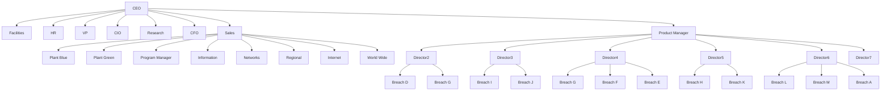
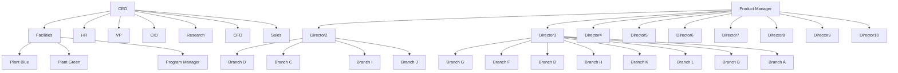

## Team Control Number

For office use only

T1

T2

T3

T4

## 37075

Problem Chosen

C

For office use only

F1

F2

F3

F4

## 2015 Mathematical Contest in Modeling (MCM) Summary Sheet Organizational Churn: A Roll of the Dice?

Network science is essential in many interdisciplinary studies due to its potential to deal with complex systems. Since the organization of ICM forms a network structure, network science can be utilized to analyze dynamic processes within the company, e.g. the diffusion effects of organizational churn.

In this paper, we construct a Human Capital network according to the hierarchical structure of ICM and create a simple yet effective model to capture the dynamic processes, which includes organizational churn, promotion and recruitment. For organizational churn, we propose and implement our probabilistic churn model inspired by Bayesian learning principles, which estimates and updates the likelihood of individual churn using the Beta-Binomial distribution. Then we develop three promotion measures based on working experience, inclination to churn, and closeness centrality. Moreover, we propose several means of controlling the recruitment rate from the HR manager's perspective, and further define some key concepts for evaluation, such as dissatisfaction and productivity.

Through extensive simulations, we show that our model is flexible enough to encompass most features of the current situation and yield convincing productivity and cost results. We further extend our model to scenarios with higher churn rates, and discover an interesting fact that higher churn rates lead to lower productivity-cost ratios. In an extreme case with no recruitment, we discover differentiated HR health degeneration among different offices over two years through visualization.

Ultimately, we incorporate methods from team science and approaches from multilayer networks in our context to combine Human Capital network with other network layers and discuss how to improve our estimation on organizational churn.

In summary, our model is powerful and reliable for various types of human capital dynamic processes. Nevertheless, there are some existing problems such as simulation volatility which introduces extra computational costs.

## Organizational Churn: A Roll of the Dice?

## Contents

1 Introduction 2  
2 Fundamental Assumptions 2  
3 Preliminaries 3

3.1 Constructing Human Capital Network . . 3  
3.2 Terms and Mathematical Notations . 4

4 Models 5

4.1 Modeling Staff Churn . . 5  
4.2 Modeling HR Manager’s Reactions . .  
4.3 Model Functions 8

5 Simulations 9

5.1 Task 1: Simulations under Current Situation 9  
5.2 Task 2: Defining Productivity and Testing Churn Influences . . 10  
5.3 Task 3: Budget Calculation . 11  
5.4 Task 4: Changing Churn Rate 13  
5.5 Task 5: Pure Promotion and HR Health 14  
5.6 Comparing among Strategies 15

6 Task 6: Extension - Team Science and Multilayers 16

6.1 Incorporating Team Science . . 16  
6.2 Incorporating Multilayer Networks 17

7 Sensitivity Analysis 18  
8 Strengths and Weaknesses 19

8.1 Strengths . . 19  
8.2 Weaknesses 19

## 9 Conclusion

20

## 1 Introduction

Network science has gained its popularity in management science. Modeling issues on human resource organization is, at root, modeling on its networks. In this problem, we need to consider a specific phenomena, churn, in ICM company. To fulfill this, we decompose the problem into several steps:

• Build up a human capital network structure using information provided. Use it as framework for further analysis.  
• Design a model capturing the mechanism of churn effect and design reasonable reactions of the HR manager. Estimate organizational productivity and costs.  
• Analyze the sustainability of the network under different churn rates, and estimate its effects.  
• Set up measures for company health and test effects of various changes. Point out heuristics for the HR manager accordingly.  
• Incorporate ideas from team science into the model and point out the possibilities of analyzing from multilayer view.  
• Implement sensitivity test and analyze model strengths and weaknesses.

## 2 Fundamental Assumptions

• No staff naturally retire or get fired. Each staff member makes a decision whether to leave or not.  
• The staff members have latent characteristics unknown to the HR manager(and us) which might influence the decision process.  
• Beyond the visible organizational structure, there exists a Human Capital network.  
• A staff member’s monthly decision ("to leave" or "to stay") acts as a piece of information and flows through the Human Capital network.  
• Individuals digest received information through a learning process. This learning mechanism will affect their decisions.  
• The HR manager can affect the number of people in the positions via different combined uses of promotion and recruitment. A combined use of promotion and recruitment, in this paper, is called a "strategy".

## 3 Preliminaries

## 3.1 Constructing Human Capital Network

First, we merge the table and graph given in the problem by assigning levels of positions to entries based on several reasonable assumptions:

• Every senior/junior manager has a clerk in his office for administrative tasks.  
• The level of position of a staff member tend to be higher if his office is closer to the CEO in the organizational graph.  
• The level of position of a manager cannot be lower than someone whose office belongs to a lower tier in the organization graph.

Thus we can get the following allocation table for the 370 positions:

<table><tr><td>Tier</td><td>level Position</td><td>1</td><td>2</td><td>3</td><td>4</td><td>5</td><td>6</td><td>7</td><td>Total</td></tr><tr><td>1</td><td>CEO</td><td>2</td><td>0</td><td>0</td><td>0</td><td>0</td><td>0</td><td>2</td><td>4</td></tr><tr><td rowspan="7">2</td><td>Research</td><td>1</td><td>0</td><td>0</td><td>0</td><td>2</td><td>0</td><td>1</td><td>4</td></tr><tr><td>CIO</td><td>1</td><td>2</td><td>0</td><td>0</td><td>8</td><td>0</td><td>3</td><td>14</td></tr><tr><td>CFO</td><td>1</td><td>2</td><td>0</td><td>0</td><td>8</td><td>0</td><td>3</td><td>14</td></tr><tr><td>HR</td><td>0</td><td>1</td><td>0</td><td>0</td><td>2</td><td>0</td><td>1</td><td>4</td></tr><tr><td>VP</td><td>2</td><td>0</td><td>0</td><td>0</td><td>0</td><td>0</td><td>2</td><td>4</td></tr><tr><td>Facilities</td><td>1</td><td>0</td><td>0</td><td>0</td><td>2</td><td>0</td><td>1</td><td>4</td></tr><tr><td>Sales Marketing</td><td>1</td><td>0</td><td>0</td><td>0</td><td>2</td><td>0</td><td>1</td><td>4</td></tr><tr><td rowspan="9">3</td><td>Networks</td><td>0</td><td>1</td><td>1</td><td>0</td><td>11</td><td>0</td><td>1</td><td>14</td></tr><tr><td>Information</td><td>0</td><td>1</td><td>1</td><td>0</td><td>11</td><td>0</td><td>1</td><td>14</td></tr><tr><td>Program Manager</td><td>0</td><td>1</td><td>1</td><td>0</td><td>6</td><td>5</td><td>1</td><td>14</td></tr><tr><td>Production Manager</td><td>1</td><td>1</td><td>0</td><td>0</td><td>10</td><td>0</td><td>2</td><td>14</td></tr><tr><td>Plant Blue</td><td>0</td><td>1</td><td>1</td><td>0</td><td>6</td><td>5</td><td>1</td><td>14</td></tr><tr><td>Plant Green</td><td>0</td><td>1</td><td>1</td><td>0</td><td>6</td><td>5</td><td>1</td><td>14</td></tr><tr><td>Regional</td><td>0</td><td>1</td><td>1</td><td>0</td><td>6</td><td>5</td><td>1</td><td>14</td></tr><tr><td>World Wide</td><td>0</td><td>1</td><td>1</td><td>0</td><td>6</td><td>5</td><td>1</td><td>14</td></tr><tr><td>Internet</td><td>0</td><td>1</td><td>1</td><td>0</td><td>6</td><td>5</td><td>1</td><td>14</td></tr><tr><td>4</td><td>Director</td><td>0</td><td>6</td><td>6</td><td>0</td><td>6</td><td>0</td><td>6</td><td>24</td></tr><tr><td>5</td><td>Branch</td><td>0</td><td>0</td><td>11</td><td>25</td><td>12</td><td>120</td><td>0</td><td>168</td></tr><tr><td></td><td>Total</td><td>10</td><td>20</td><td>25</td><td>25</td><td>110</td><td>150</td><td>30</td><td>370</td></tr></table>

\*1:Senior Manager 2:Junior Manager 3:Experienced Supervisor 4:Inexperienced Supervisor 5:Experienced Employee 6:Inexperienced Employee 7:Administrative Clerk

Table 1: The distribution of staff in different positions

We begin to build the human capital network in ICM. Define $V ( G ) = \{ v _ { 1 } , v _ { 2 } , . . . v _ { 3 7 0 } \}$ as the set of all positions. Each node denotes one position. Define $E ( G )$ as the set of edges in the network. $( v _ { i } , v _ { j } ) \in E ( G )$ if at least one of the following holds:

• i and $j$ are in the same office. Here one entry in the organization graph is considered as an office, whether it consists of two divisions or only four staff members.

• i is the head of an office and $j$ is the head of the directly-related upper office or the opposite. Here the staff member in the highest level of position within an office is considered as the head of the office, such as the junior manager in Networks office and the experienced supervisor in Branch office.

• i and j are both senior managers.

$G = \{ V ( G ) , E ( G ) \}$ defines the graph of Human Capital network. We then visualize this network in Figure 1.

```mermaid
graph TD
  A["Node 1"] --> B["Node 2"]
  A --> C["Node 3"]
  A --> D["Node 4"]
  A --> E["Node 5"]
  A --> F["Node 6"]
  A --> G["Node 7"]
  A --> H["Node 8"]
  A --> I["Node 9"]
  A --> J["Node 10"]
  A --> K["Node 11"]
  A --> L["Node 12"]
  A --> M["Node 13"]
  A --> N["Node 14"]
  A --> O["Node 15"]
  A --> P["Node 16"]
  A --> Q["Node 17"]
  A --> R["Node 18"]
  A --> S["Node 19"]
  A --> T["Node 20"]
  A --> U["Node 21"]
  A --> V["Node 22"]
  A --> W["Node 23"]
  A --> X["Node 24"]
  A --> Y["Node 25"]
  A --> Z["Node 26"]
  A --> AA["Node 27"]
  A --> AB["Node 28"]
  A --> AC["Node 29"]
  A --> AD["Node 30"]
  A --> AE["Node 31"]
  A --> AF["Node 32"]
  A --> AG["Node 33"]
  A --> AH["Node 34"]
  A --> AI["Node 35"]
  A --> AJ["Node 36"]
  A --> AK["Node 37"]
  A --> AL["Node 38"]
  A --> AM["Node 39"]
  A --> AN["Node 40"]
  A --> AO["Node 41"]
  A --> AP["Node 42"]
  A --> AQ["Node 43"]
  A --> AR["Node 44"]
  A --> AS["Node 45"]
  A --> AT["Node 46"]
  A --> AU["Node 47"]
  A --> AV["Node 48"]
  A --> AW["Node 49"]
  A --> AX["Node 50"]
  A --> AY["Node 51"]
  A --> AZ["Node 52"]
  A --> BA["Node 53"]
  A --> BB["Node 54"]
  A --> BC["Node 55"]
  A --> BD["Node 56"]
  A --> BE["Node 57"]
  A --> BF["Node 58"]
  A --> BG["Node 59"]
  A --> BH["Node 60"]
  A --> BI["Node 61"]
  A --> BJ["Node 62"]
  A --> BK["Node 63"]
  A --> BL["Node 64"]
  A --> BM["Node 65"]
  A --> BN["Node 66"]
  A --> BO["Node 67"]
  A --> BP["Node 68"]
  A --> BQ["Node 69"]
  A --> BR["Node 70"]
  A --> BS["Node 71"]
  A --> BT["Node 72"]
  A --> BU["Node 73"]
  A --> BV["Node 74"]
  A --> BW["Node 75"]
  A --> BX["Node 76"]
  A --> BY["Node 77"]
  A --> BZ["Node 78"]
  A --> CA["Node 79"]
  A --> CB["Node 80"]
```

flowchart

Figure 1: Information Network in ICM

Utilizing this network as a frame, we delve into our main part of modeling.

## 3.2 Terms and Mathematical Notations

In order to be clear and consistent through the paper, we now settle down some terms and mathematical notations:

• Level: level of positions, such as managers, supervisors or employees.  
• Abbreviations: we assign each level an abbreviation: SE-Senior Executive, JE - Junior Executive, ES - Experienced Supervisor, IS - Inexperienced Supervisor, EE - Experienced Employee, IE - Inexperienced Employee, AC - Administrative Clerk  
• t: time is discrete and the minimum time interval is one month.  
• $\Omega ^ { ( t ) }$ : the set of people who leave the company at the end of t.  
• $\Theta ^ { ( t ) }$ : the set of people who are recruited the company at the beginning of t.

• $\Gamma ^ { ( t ) } ;$ the set of people who work in the company at the beginning of t after recruitment. It’s obvious that the relation $\Gamma ^ { ( t + 1 ) } = \dot { \Gamma } ^ { ( t ) } \bigcup \Theta ^ { ( t + 1 ) } \big \backslash \dot { \Omega } ^ { ( t ) }$ holds.  
• $f ^ { ( t ) }$ : the mapping from $\Gamma ^ { ( t ) }$ to $V ( G )$ , which maps individual $i \in \Gamma ^ { ( t ) }$ to his position $f ^ { ( t ) } ( i ) \in V ( \mathsf { \bar { G } } )$ at time t. $f ^ { ( t ) - 1 }$ is the inverse mapping.  
• $d ( u , v )$ : the distance between two nodes $u , v \in V ( G )$ , defined by the length of the shortest path connecting u and v in the graph.  
$d _ { i j } ^ { ( t ) }$ : the distance between two individuals i, $\boldsymbol { j } \in \Gamma ^ { ( t ) }$ at $t ,$ defined by $d ( f ^ { ( t ) } ( i ) , f ^ { ( t ) } ( j ) )$ .

## 4 Models

We construct our analysis by modeling the dynamic processes of staff churn, promotion and recruitment. Our probabilistic model for staff churn inspired by Bayesian learning principles, which estimates and updates the likelihood of individual churn using the Beta-Bernoulli distribution. Next, we develop three promotion measures. Moreover, we propose several means of controlling the recruitment rate.

## 4.1 Modeling Staff Churn

## 4.1.1 Preliminaries

In recent studies, Bayesian learning has been used to analyze information aggregation in social networks[1], in which individuals modify their decision based on previous outcomes of other individuals in the network.

For the sake of explaining our intuition, consider a simple Bayesian learning process. Suppose an random variable $u \in \{ 0 , 1 \}$ is drawn from a Bernoulli distribution, where $p$ is unknown:

$$
u \sim \text { Bernoulli } (u; p) = p ^ {u} (1 - p) ^ {1 - u} \tag {1}
$$

Assume an observer wants to estimate the parameter $p$ by drawing multiple $u ^ { \prime } s$ . The individual has a prior estimation $f ( \boldsymbol p )$ on $p ,$ which is described as a Beta distribution1

$$
f (p) = \operatorname{Beta} (p; \alpha , \beta) = \frac {p ^ {\alpha - 1} (1 - p) ^ {\beta - 1}}{\mathrm{B} (\alpha , \beta)} \tag {2}
$$

where $\mathrm { B } ( \alpha , \beta )$ is the normalization constant. When seeing an outcome of $u = 1$ , the observer updates his prior according to the Bayes’ la $\begin{array} { r }  \begin{array} { r } { \begin{array} { r } { \omega ^ { 2 } : \tilde { f ( p ) } \sim ( p ^ { \alpha - 1 } ( 1 - p ) ^ { \beta - 1 } ) \cdot p \sim } \end{array} } \end{array} \end{array}$ $p ^ { \alpha } ( 1 - p ) ^ { \beta - 1 }$ , which can be viewed as increasing α by 1. Similarly, the observer increases β by 1 if an outcome of $u = 0$ is seen. A simple analysis will show that if the number of observations reaches infinity, $\alpha / \beta \to p ,$ , whereas the Beta distribution in this case reduces to a Dirac delta function $\delta ( x - p )$ , indicating that the observer’s estimation converges to the correct $p ,$ regardless of the original prior.

## 4.1.2 Modeling the Churn Rate

In light of this, we introduce a novel method to model the churn rate, which is conceptually similar to the above Bayesian learning process. Specifically, we view leaving the position as a decision making process: suppose an individual i decides whether to leave or to stay in a particular month t based on a random variable $u _ { i } ^ { ( t ) } \in \{ 0 , 1 \}$ , where $u _ { i } ^ { ( t ) } = 0$ $u _ { i } ^ { ( t ) } = 1$ indicates to stay.

$u _ { i } ^ { ( t ) }$ is drawn as follows: First, we assume two hyperparameters $\alpha _ { i } ^ { ( t ) }$ and $\beta _ { i } ^ { ( t ) }$ for $i ,$ and draw $p _ { i } ^ { ( t ) } \sim \mathrm { B e t a } ( \alpha _ { i } ^ { ( t ) } , \beta _ { i } ^ { ( t ) } ) .$ ; then we draw $u _ { i } ^ { ( t ) } \sim$ Bernoulli $( p _ { i } ^ { ( t ) } )$ ; finally, we determine i is to stay if $u _ { i } ^ { ( t ) } = 1 ;$ to leave otherwise.

Integrating out the random variable $p _ { i } ^ { ( t ) }$ , we notice that the distribution of $u _ { i } ^ { ( t ) }$ is a specification of the Beta-Binomial distribution3 with mean $\alpha / ( \alpha + \beta )$ and variance $( \alpha \grave { \beta } ) / ( ( \alpha + \beta ) ^ { 2 } )$ , which has some nice properties for modeling the churn process: on the one hand, we can easily estimate $i ^ { \prime } { \bf s }$ probability to leave, which is equal to ${ \hat { \beta _ { i } ^ { ( t ) } } } / ( \alpha _ { i } ^ { ( t ) } + \beta _ { i } ^ { ( t ) } ) ;$ on the other hand, an increase in $\alpha _ { i }$ decreases $i \prime \mathrm { s }$ tendency to leave, while an increase in $\beta _ { i }$ increases the tendency to stay. However, three problems remain: How to determine the prior $\alpha _ { i }$ and $\beta _ { i } ?$ How to update the hyperparameters? How to take the network structure into account? We will explain these problems in the following paragraphs.

Determining the Prior Given a churn rate $p ,$ we can easily model the effect of a churn rate of p per year by setting $\beta / ( \alpha + \beta ) = p / 1 2$ . We further observe that the variance of the Beta distribution is $\frac { \alpha \beta } { ( \alpha + \beta ) ^ { 2 } ( \alpha + \beta + 1 ) }$ (α + β)2(α + β + 1) αβ , so that larger $( \alpha + \beta )$ leads to smaller variance, indicating better estimation of $p ,$ and more knowledge to the company status. Thus, it is safe to assume that people on high level positions have a larger $( \alpha + \beta )$ compared to others, and their decisions are less volatile.

Updating α(t)i $\alpha _ { i } ^ { ( t ) }$ and $\beta _ { i } ^ { ( t ) }$ We notice that in ICM, an individual is more likely to churn if he is connected to other individuals who have churned. This can be described as a learning process for the individual: each month, he observes the decision made by other individuals in last month. For every observation of "to stay", the individual increases his $\alpha ;$ for every observation of "to leave", the individual increases his $\beta .$ We normalize the update values, so that every month, an individual’s $( \alpha + \beta )$ increases by 1.

Information Reduction The impact of churn information vary upon the distances be tween the source and destination. From an individual’s perspective, the resignation of someone in the same department should have a greater impact than that of someone from another department. We take this into account by reducing the update value of the hyperparameters. Empirically, we reduce the update by $d ^ { 2 }$ if the information takes at least d steps to transmit.

## 4.1.3 An Algorithm for the Churn Model

To summarize, we introduce an algorithm for this process. For every individual i:

• Sample the churn result for month t using hyperparameters $\alpha _ { i , t }$ and $\beta _ { i , t }$ , and determine whether to stay or to leave;  
• If i decides to stay, initialize two variables αˆ and $\hat { \beta }$ for update;  
• For every individual j in $\Gamma ^ { ( t ) } \backslash \Theta ^ { ( t ) }$ (individuals who stays), update $\begin{array} { r } { \hat { \alpha } = \hat { \alpha } + \frac { 1 } { { d _ { i j } ^ { \left( t \right) } } } ; } \end{array}$ (  
• For every individual j in $\Omega ^ { ( t ) }$ , update $\begin{array} { r } { \hat { \beta } = \hat { \beta } + \frac { 1 } { d _ { i j } ^ { ( t ) } } ; } \end{array}$ d ( t ) ;  
• Update α(ti $\begin{array} { r } { \alpha _ { i } ^ { ( t + 1 ) } = \alpha _ { i } ^ { ( t ) } + \frac { \hat { \alpha } } { \hat { \alpha } + \hat { \beta } } } \end{array}$ α $\begin{array} { r } { \beta _ { i } ^ { ( t + 1 ) } = \beta _ { i } ^ { ( t ) } + \frac { \hat { \beta } } { \hat { \alpha } + \hat { \beta } } } \end{array}$

## 4.2 Modeling HR Manager’s Reactions

After modeling the churn process, we need to consider the strategic process of filling the vacancy from the perspective of the HR manager, which combines promotion strategies and recruitment strategies. Since recruiting a higher level position usually requires more time and money compared to promoting a low-level staff and then recruiting new staff for that vacancy, a rational HR manager would always prefer promoting to recruiting whenever possible. This allows us to consider these two aspects separately.

## 4.2.1 Promotion Models

We summarize some basic rules for promotion:

• The HR manager does not read the annual evaluation report, thus does not know anything about the matching between staff and positions. In this way, he will not consider changing staff within one level.  
• His first choice is to promote someone that has reached the experience requirement to fill the vacancy. If no person is qualified and recruiting resources are permitted, he will then post recruitment need for this position on the next.  
• If during the time the recruitment need is posted, he finds that there is one person’s experience has reached the requirement. He will directly promote the first such person and cancel the recruitment post.  
• He will not promote a clerk because recruiting an inexperienced employee is cheaper and less time-consuming than recruiting a clerk. In other words, a "naive" manager never promotes a clerk.

Under current situations, the HR manager has no knowledge about the capabilities of an employee, nor their probability to leave. Therefore, to make the promotion process fair, the HR manager should choose the employee on the lower level with the longest working experiences. Hence, we have the following strategy:

Experience Oriented For a vacancy on level $l ~ \ : \ : ( l < 6 )$ , select the employee on level l + 1 with longest working experiences; the employee should also satisfy the promotion requirements. If nobody is available, start recruiting.

If the HR manager happens to learn the churn model previously mentioned, he can make inference on the probability of churn of an individual, thus introducing a slight improvement over the experience oriented model:

Dissatisfaction Oriented For a vacancy on level l $( l < 6 )$ , select the employee with the largest β/α(or the highest churn probability) among all the employees on level l + 1 who satisfy the promotion requirements. If nobody is available, start recruiting.

The HR manager can also take the Human Capital network structure into consideration by promoting the employee with the largest centrality:

Centrality Oriented For a vacancy on level l, select the employee with the largest closeness centrality(tends to be greater when the employee is in the middle of the network) from the qualified employees on level $l + 1$ . If nobody is available, start recruiting.

## 4.2.2 Recruitment Models

We make the following assumptions on the recruiting strategies:

• The HR manager has a maximum possible effort to recruit. He cannot post more recruitment than this maximum because of his ability and resource limits. The maximum effort is not affected when there is vacancy in HR office.  
• When the number of vacant positions is higher than the maximum effort, he ranks the vacant positions from higher level to lower level, and only try to recruit the positions with the highest levels. In other words, he will prioritize recruiting a manager over recruiting an employee.  
• He can only renew his recruitment post over a length of period, e.g. quarterly or semi-annually.

Thus, the HR manager has two direct means to increase the recruitment rate: he can either increase the resource limits, so that more people will be recruited in a fixed time period, or simply increase the frequency of the renewal of his recruit post. Also, the HR can control the promotion rate by setting different thresholds for promotion, which is also an indirect method of controlling recruitment.

## 4.3 Model Functions

Till now, our models have already encompassed a large variety of mentioned features in ICM company, including:

• The information web captures how "churn" diffuses among staff members.  
• The risk of churn can be identified in early stage by observing each staff member’s $\beta / \alpha$ . The higher $\beta / \alpha$ is, the more likely the staff member chooses to leave.

• The resignation of a staff member will increase the $\beta$ parameter of other employees, thus increasing their chance of resigning.  
• We cover the fact that churn rates for middle managers are higher than other levels of positions by allowing different priors α and $\beta$ for different levels.  
• The HR manager can choose recruitment effort, recruitment time period, and pro motion threshold to control the recruitment flow.

Matching between staff members and positions is one aspect that our model currently does not encompass. However, it can be incorporated by adding more assumptions about staff’s skill classifications. We will not highlight it in this paper.

## 5 Simulations

## Added Assumptions for Simulations

In order to get reasonable simulation results, we set some parameters. This, on the one hand, offers ease for simulations, while on the other land, does not lose its closeness to reality. Our added assumptions for parameters are listed below:

• The required experience for seven levels are 48 months, 48 months, 24 months, 24 months, 12 months, 0 month respectively (from higher level to lower level).  
• The time period for updating the recruitment post is 6 months.  
• The α and $\beta$ for different levels of positions are144, 120, 64, 48, 32, 24, 24 (from higher level to lower level).  
• The maximum recruiting effort for the HR manager is 9% of 370 (average of 8%- 10%) for most cases. Any change in this parameter will be mentioned.  
• All the data given related to recruiting time, recruiting cost, annual salary and training cost are deterministic.

## 5.1 Task 1: Simulations under Current Situation

In this section, we first present our basic simulation results of current situation. Figure 2 shows the churn rate in different level of positions in 50 simulations. The churn rate of middle-manager (JE, ES and IS) is roughly 30% and the churn rate for other positions (SE, EE, IE and AC) is around 15%. The overall churn rate of the company is relatively stable at 18%, which can accurately depict the current situation of ICM.

Another feature of ICM is that churn rate is steadily increasing. 4The simulation result in Figure 3 does exhibit similar trend. We show the overall churn rate in next five years. In spite of a couple of outliers, the major trend can be easily seen in the boxplot. The median value of churn rate has shown a slow but steady increase, from 18% in the first year to 20% in the fifth year.

box plot

| Level of Position | Churn rate |
| --- | --- |
| SE | 0.123457 |
| SE | 0.234568 |
| SE | 0.345679 |
| ... | nan |
| AS | 0.456789 |
| AS | 0.56789 |
| AS | 0.678901 |
| ... | nan |
| EC | 0.789012 |
| EC | 0.890123 |
| EC | 0.901235 |
| ... | nan |
| EE | 0.156789 |
| EE | 0.26789 |
| EE | 0.378901 |
| ... | nan |
| IM | 0.234568 |
| IM | 0.345679 |
| IM | 0.456789 |
| ... | nan |
| AK | 0.345679 |
| AK | 0.456789 |
| AK | 0.56789 |
| ... | nan |
| AL | 0.456789 |
| AL | 0.56789 |
| AL | 0.678901 |
| ... | nan |
| MA | 0.789012 |
| MA | 0.890123 |
| MA | 0.901235 |
| ... | nan |
| MA | 0.156789 |
| MA | 0.26789 |
| MA | 0.378901 |
| ... | nan |
| ANM | 0.234568 |
| ANM | 0.345679 |
| ANM | 0.456789 |
| ... | nan |
| ANM | 0.345679 |
| ANM | 0.456789 |
| ANM | 0.56789 |
| ... | nan |
| B | 0.345679 |
| B | 0.456789 |
| B | 0.56789 |
| ... | nan |
| B | 0.456789 |
| B | 0.56789 |
| B | 0.678901 |
| ... | nan |
| AC | 0.456789 |
| AC | 0.56789 |
| AC | 0.678901 |
| ... | nan |
| AC | 0.56789 |
| AC | 0.678901 |
| AC | 0.789012 |
| ... | nan |
| ACM | 0.56789 |
| ACM | 0.678901 |
| ACM | 0.789012 |
| ... | nan |
| ACM | 0.678901 |
| ACM | 0.789012 |
| ACM | 0.890123 |
| ... | nan |
| ACN | 0.678901 |
| ACN | 0.789012 |
| ACN | 0.890123 |
| ... | nan |
| ACN | 0.789012 |
| ACN | 0.890123 |
| ACN | 0.901235 |
| ... | nan |
| ACN | 0.156789 |
| ACN | 0.234568 |
| ACN | 0.345679 |
| ACN | 0.456789 |
| ACN | 0.56789 |
| ACN | 0.678901 |
| ... | nan |
| ACN | 0.345679 |
| ACN | 0.456789 |
| ... | nan |
| ACN | 0.456789 |
| ACN | 0.56789 |
| ... | nan |
| ACN | 0.56789 |
| ... | nan |
| ACN | 0.6789 |

Figure 2: Churn Rates of Different Levels  

box plot chart

| Year   | Churn rate |
| ------ | ---------- |
| Year1  | 0.18       |
| Year1  | 0.19       |
| Year1  | 0.20       |
| Year2  | 0.19       |
| Year2  | 0.20       |
| Year3  | 0.20       |
| Year4  | 0.20       |
| Year5  | 0.21       |

Figure 3: Overall Churn Rates in Next Five Years

## 5.2 Task 2: Defining Productivity and Testing Churn Influences

To define a metric to measure this company’s organizational productivity, we start from the individual level. This metric should incorporate the following three aspects:

Position Level People in different levels surely make different contribution to the over all performance of a company. We reasonably assume the relative average annual salary of i’s level, $S _ { i } ^ { ( t ) }$ can properly reflect his actual level contribution.

Training experience Experience in his current position contributes to one’s productivity. We use the training cost the company spent on the individual since he began working $T _ { i } ^ { ( t ) } * t _ { i } ^ { ( t ) }$

Dissatisfaction An individual more unsatisfied with current situation tends to work less inefficiently, leading to lower productivity. We calculate i’s dissatisfaction $\sigma _ { i } ^ { ( t ) }$ as:

$$
\sigma_ {i} ^ {(t)} = \sum_ {\tau = t - t _ {i} ^ {(t)} + 1} ^ {t - 1} e ^ {- (\tau - (t - 1))} \sum_ {j \in \Omega^ {(\tau)}} \frac {1}{d _ {i j} ^ {(\tau) 2}}
$$

We normalize $\sigma _ { i } ^ { ( t ) }$ to the form of $\frac { 1 } { 1 + \alpha \ln { ( 1 + \sigma _ { i } ^ { ( t ) } ) } } ,$ ence of dissatisfaction. We set $\alpha = 0 . 1$ in the following calculation in this part. We will carry on sensitivity analysis regarding to this parameter in later section. People tend to forget past event at a fast speed[?]. So the exponential term in this expression can depict the decline of memory.

Incorporating the three components, the productivity of an individual i at time t is:

$$
p _ {i} ^ {(t)} = \frac {1}{1 + \alpha \ln (1 + \sigma_ {i} ^ {(t)})} (S _ {i} ^ {(t)} + T _ {i} ^ {(t)} * t _ {i} ^ {(t)})
$$

To calculate organizational productivity, we use weighted sum of individual’s productivity. The weight $w _ { i } ^ { ( t ) }$ is determined by information network structure. An individual in an important position weighs more. Here we use closeness centrality to reflect this importance. So organizational productivity is defined by:

$$
P ^ {(t)} = \sum_ {i \in \Gamma^ {(t)}} w _ {i} ^ {(t)} * p _ {i} ^ {(t)} = \sum_ {i \in \Gamma^ {(t)}} p _ {i} ^ {(t)} \sum_ {v \in V (G) \backslash f ^ {(t) - 1} (i)} \frac {d (v , f ^ {(t) - 1} (i))}{3 7 0 - 1}
$$

Using this measure, we can track the dynamic change of organizational productivity. We can distinguish two kinds of effect associated with an individual’s resignation:

Direct Effect The productivity of resigned individuals.

Indirect Effect The loss of productivity caused by the increase of dissatisfaction of the remaining staff in this company after the resignation.

$$
D E ^ {(t)} = \sum_ {i \in \Omega^ {(t)}} w _ {i} ^ {(t)} * p _ {i} ^ {(t)}
$$

$$
I E ^ {(t)} = \sum_ {i \in \Gamma^ {(t)} \backslash \Omega^ {(t)}} w _ {i} ^ {(t)} * (\frac {1}{1 + \alpha \ln (1 + e ^ {- 1} \sigma_ {i} ^ {(t)})} - \frac {1}{1 + \alpha \ln (1 + \sigma_ {i} ^ {(t + 1)})}) (S _ {i} ^ {(t)} + T _ {i} ^ {(t)} * t _ {i} ^ {(t)})
$$

We now calculate the loss of organizational productivity associated with a person’s resignation and decompose it into direct and indirect effect. We run our simulations over next five years for 50 times and average the results for presentation in Figure 4.

It is obvious that direct and indirect effect on organizational productivity closely follow the number of resigned staff. An individual’s resignation will cause about 20-unit direct effect and 25-unit indirect effect. Total organizational productivity is 2000-2500 units monthly, so a person’s resignation costs 2% of total organizational productivity.

Another observation is the ratio between indirect and direct effect. In the simulations, the former is larger than the later with a stable ratio. The parameter α can reflect how a person view the resignation of another individual and we will return to it later.

## 5.3 Task 3: Budget Calculation

We now consider the budget of the company related to human capital. The budget con sists of three components: staff salaries, recruitment cost and training cost. To make calculation easier, as we assumed before, all individuals in the same position level have the same salary and training cost, and recruitment cost is uniform in each position level. All costs are incurred uniformly distributed across the corresponding time span.

  
Figure 4: Effect on Organizational Productivity

We run simulations of the company and show the calculated cost below:

line chart

| Time (month) | Recruitment cost (σ) |
| ------------ | -------------------- |
| 6            | 9.0                  |
| 12           | 6.8                  |
| 18           | 7.4                  |
| 24           | 7.5                  |
| 30           | 7.3                  |
| 36           | 7.4                  |
| 42           | 6.4                  |
| 48           | 7.5                  |
| 54           | 7.0                  |
| 60           | 8.2                  |

line chart

| Time (month) | Training cost (€) |
| ------------ | ----------------- |
| 6            | 36.0              |
| 12           | 35.8              |
| 18           | 35.7              |
| 24           | 36.5              |
| 30           | 37.0              |
| 36           | 37.1              |
| 42           | 36.7              |
| 48           | 37.1              |
| 54           | 37.0              |
| 60           | 37.0              |

Figure 5: Budget Calculation for Next Five Years

The costs presented in Figure 5 are calculated every six months. On average the recruitment cost and training cost is approximately 7σ and 37σ every six months respec tively. However, they are only a small fraction of total cost, as we have not reported salary cost here, which accounts for the largest part.

## 5.4 Task 4: Changing Churn Rate

In this part, we run simulations of ICM under different churn rates. We assume an increase in average churn rate from current 18% to 25% and 35%. To achieve this goal, we can simply adjust the β-to-α ratio: for a churn rate of 25% per year, we let $\beta / \alpha =$ 0.25/12 = 0.02083; for 35% per year, we let $\beta / \alpha = 0 . 3 5 / 1 2 = 0 . 0 \bar { 2 9 } 1 6 .$ .

We run simulations fifty times under each churn rate and take average. Figure 6 shows our results.5 The line charts reflect the evolution of staff number, monthly organizational productivity and monthly cost over next 20 years under different churn rates. The trends of three company’s characteristics are quite clear. The company sustains 80% of its positions, namely around 300 staff members, under 18% churn rate over a long time span. However, its staff number declines dramatically during the first six years if churn rate increases to 25% or 35%. Then it gradually becomes stable and settles down at approximately 60% and 40% full status of positions.

line chart

The Evolution of Number of Staff in Next Twenty Years
| The Evolution of Monthly Organizational Productivity in Next Twenty Years | Churn Rate=18% | Churn Rate=25% | Churn Rate=35% |
|---|---|---|---|
| 0 | 296 | 296 | 296 |
| 2 | 294 | 294 | 294 |
| 4 | 292 | 292 | 292 |
| 6 | 290 | 290 | 290 |
| 8 | 288 | 288 | 288 |
| 10 | 286 | 286 | 286 |
| 12 | 284 | 284 | 284 |
| 14 | 282 | 282 | 282 |
| 16 | 280 | 280 | 280 |
| 18 | 278 | 278 | 278 |
| 20 | 276 | 276 | 276 |

Figure 6: Evolution of the Company in Next Twenty Years Under Different Churn Rates

The trend also applies to organizational productivity and cost. Under high churn rate, more people leave the company, leading to both higher direct and indirect effect. Organizational productivity decreased by around 30% and 50%. Although high churn rates incur higher recruitment cost, it is minor compared with the large decline on salary and training cost resulted from fewer staff. Cost decreases by nearly 20% and 40%.

To sustain in current percentage of status, HR manager should change the recruitment strategy. In our baseline simulations of current situation, we assume the time period for updating recruitment post is 6 months and recruitment effort is 9%. Now we need to change these two parameters to fill in the gap quickly. We change updating interval to 4 months and recruitment effort to 8.3% under 25% churn rate and 3 months and 9% under 35% churn rate to sustain 80% full status of positions. Figure 7 shows the distribution of the results from ten simulations:

Under new promotion strategies, ICM can roughly sustain 80% capacity. Its monthly cost presents no significant change. However, organizational productivity varies a lot. It decreases by more than 10% under high churn rate, even if the staff number remains the same. If we use organizational productivity per unit cost as an indicator of the company’s efficiency on using money, we can see from the last boxplot that the company is running more efficiently under lower churn rate.

box plot

| Monthly Organizational Productivity | Number of Employees |
| ----------------------------------- | ------------------- |
| 18%                                 | 300                 |
| 25%                                 | 290                 |
| 35%                                 | 305                 |

box plot

| Monthly Organizational Productivity / Monthly Cost | Min | Q1 | Median | Q3 | Max |
| --- | --- | --- | --- | --- | --- |
| -------------------------------------------------- | --- | -- | ------ | -- | --- |
| 18% | 40 | 42 | 43.5 | 45 | 46 |
| 25% | 39 | 41 | 43 | 44 | 46 |
| 35% | 42 | 43 | 44 | 45 | 46 |

box plot

| Group | Min  | Q1   | Median | Q3   | Max  |
|-------|------|------|--------|------|------|
| 18%   | 2200 | 2400 | 2500   | 2600 | 2800 |
| 25%   | 2100 | 2300 | 2400   | 2500 | 2700 |
| 35%   | 2100 | 2300 | 2400   | 2500 | 2700 |

box plot

| Percentage | Median | Lower Quartile | Upper Quartile |
| ---------- | ------ | -------------- | -------------- |
| 18%        | 8.5    | 8.0            | 8.7            |
| 25%        | 8.1    | 7.9            | 8.2            |
| 35%        | 7.5    | 7.4            | 7.6            |

Figure 7: Comparison of Different Churn Rate under New Promotion Strategy

## 5.5 Task 5: Pure Promotion and HR Health

Having set up several scenarios to evaluate the impact of different churn rates, we now apply our methodology to help us identity the impact on human resource health with no external recruiting. Apparently, with a alarming churn rate, recruiting nobody will definitely result in a decrease in the number of employees, cost, and productivity, so our emphasis will be on the number of employees in different offices. We modify our model to eliminate external recruitment(thus allowing only churn and promotion), and estimate the percentage of the employees in the offices. For better estimation, we assume a uniformly random distribution on the years of experience for the employees, so that one-fourth of the employees in each level are qualified to promote.

We visualize our results in Figure 8. We found that the offices in tiers 1 and 2 sustains good health, whereas offices in lower tiers suffer significant reduction in HR health. This conclusion is rather counter-intuitive at first sight, since middle managers tend to have a higher churn rate, but quite plausible given that low-level positions are not supplied by recruitment, whereas high-level positions can be sustained by promotion. We report that the number of remaining employees after 2 years is around 204 people, which is close to the theoretical value6.

  
(b) After 12 months

(a) Initially  

flowchart

(c) After 18 months

flowchart

(d) After 24 months  
Figure 8: HR health in different periods. Darker colors indicate a office with higher percentage of employees. White indicates a 50 percentage.

## 5.6 Comparing among Strategies

Now we aim to improve the current situation by adopting some alternative strategies. Currently, when deciding which one to promote among all qualified candidates, HR manager will choose the one with the longest working time (Experience). We consider two other ways discussed before: selection by centrality within the information network (Centrality) and selection by likelihood to leave (Likelihood). We still use closeness centrality defined in previous sections.

<table><tr><td colspan="2">Different Strategies</td><td>Year2</td><td>Year4</td><td>Year6</td><td>Year8</td><td>Year10</td></tr><tr><td>Experience</td><td>Staff Number</td><td>313.0</td><td>310.7</td><td>304.9</td><td>298.8</td><td>292.9</td></tr><tr><td rowspan="2">Centrality</td><td>Staff Number</td><td>311.1</td><td>307.5</td><td>302.0</td><td>295.7</td><td>290.0</td></tr><tr><td>Increase(%)</td><td>-0.60%</td><td>-1.04%</td><td>-0.94%</td><td>-1.01%</td><td>-0.99%</td></tr><tr><td rowspan="2">Likelihood</td><td>Staff Number</td><td>311.1</td><td>309.1</td><td>308.4</td><td>303.7</td><td>300.6</td></tr><tr><td>Increase(%)</td><td>-0.62%</td><td>-0.52%</td><td>1.16%</td><td>1.64%</td><td>2.61%</td></tr><tr><td>Experience</td><td>Productivity</td><td>2574.9</td><td>2706.2</td><td>2698.5</td><td>2651.7</td><td>2612.8</td></tr><tr><td rowspan="2">Centrality</td><td>Productivity</td><td>2589.3</td><td>2789.0</td><td>2878.6</td><td>2897.0</td><td>2916.8</td></tr><tr><td>Increase(%)</td><td>0.56%</td><td>3.06%</td><td>6.67%</td><td>9.25%</td><td>11.63%</td></tr><tr><td rowspan="2">Likelihood</td><td>Productivity</td><td>2577.8</td><td>2759.3</td><td>2872.8</td><td>2886.0</td><td>2904.0</td></tr><tr><td>Increase(%)</td><td>0.11%</td><td>1.96%</td><td>6.46%</td><td>8.84%</td><td>11.14%</td></tr></table>

Table 2: Comparison among Different Strategies

From Table 2, we can easily compare different promotion strategies. The staff number declines under all three strategies, which is consistent with the steadily increasing churn rate. But the staff number under Likelihood strategy is 2.61% higher after ten years compared with that under Experience. Besides, both Centrality and Likelihood strategies can increase organizational productivity by more than 11% in Year10. So changing promotion strategy can contribute to the improvement of human capital management.

## 6 Task 6: Extension - Team Science and Multilayers

To fulfill the HR’s vision, we manage to apply team science and discoveries from multiplayer network research into our model.

## 6.1 Incorporating Team Science

Recent studies on team performance have pointed out many possibilities to rigorously model teamwork[7]. There are many established findings from team science that can be merged into our models. The two most prospective ones are related to "shared cognition" and "team training". Here we point out the possibilities and define some of them informally. Incorporating them rigorously needs more modifications.

## 6.1.1 Shared Cognition

Shared cognition has been stressed by many researchers to be one of the crucial factors that shape the team performance [3]. In order to work more efficiently, team members must predict what other teammates are going to do and what they need to do so, so that they can select actions consistent and coordinated with those of their teammates. [6]

Shared cognition can form within different kinds of teams. In our context, a reasonable choice is an office. Staff working within an office share the same goal and shared cognition can positively contribute to its performance. Different measures have been developed to scientifically measure shared cognition[3]. We can take advantage of these measures to design an extension of our models. Especially when given empirical data (the time and numerical shared cognition), we can estimate the shared cognition growth using established models. We won’t go into details on these measures or empirical methods. Instead, we put forward one possible measure within our context.

Consider an office O with several individuals. We assume team cognition is separable and additive and focus on interpersonal relation in pairs. Define $t ( i , j )$ as the length i and j has been working together. We can then use $\sum _ { i \in O } w _ { i } \sum _ { j \in O \backslash \{ i \} } t ^ { 2 } ( i , j )$ as a measure of shared cognition. The squared term can reflect the increasing speed of forming cognition and the weight reflect the relative importance.

Another possibility is to use network related concepts. We can define that two individuals are connected if their co-working time is larger than a certain threshold. Then we can calculate measures such as the average degree in this network. Similarly, we can attach a weight to each edge based on how long individuals have been working together and build a weighted graph.

## 6.1.2 Team Training

Another concept that we can potentially utilize in our models is team training. Currently, HR manager does not offer any training to the "team" or "office" as a whole. Like offering individual’s training, we can take into account the team training. Being trained as a team can improve team members’ understanding of each other’s roles, promote teamwork and enhance team performance[4]. We can view team training as an accelerator of team cognition development. So we can multiply the team cognition measure we developed before by a function of team training to reflect this effect.

Adding this process will not directly affect the dynamic process of staff’s leaving and HR manager’s filling vacancy. However, it will affect the productivity of the company by promoting the efficiency of teamwork. effect may change the decision making of HR manager with the aim to maximize organizational productivity per unit of cost.

## 6.2 Incorporating Multilayer Networks

In this section, we will explore the progress made by recent studies about multilayer networks[5] and apply this concept to our company context to help HR achieve better human resource management.

In previous sections, we have formulated a model based on the office organizing structure. This network describes how the information flows among all individuals. However, interpersonal relationship is much more complicated. On the one hand, people are consistently entering and leaving the company, causing a change of structure in the network. On the other hand, people have different types of interaction, such as:

• People in the same office work as a team and usually cooperate with each other more frequently.  
• People can be close friends with each other regardless of their positions.  
• People can have trust in his/her supervisors, and vice versa.

These interaction networks can provide us with more information, while shedding some light on more complex problems and enabling better solutions to problems that we are currently dealing with. Since we lack data on other layers of networks, it is impossible to implement a simulations. Hence, we provide some rules for connecting the information with other layers, as well as some solutions for better churn rate analysis.

Network based on position Since the information network is already based on position, such networks can be easily connected by introducing coupling edges. A simple example is the supervision networks, which is a tree structure among different positions. Since supervision in office is a strong relationship, information transmitted through supervision is stronger than the average information network. Another example is the teammate relationship, where information is transmitted more frequently.

Network based on people Some relationships - such as friendship and trust - depend on people. Friendship allows for the transmission of more personal information, and trust enables directed transmission of information. Both increase the information intensity, for one tends to accept advice from friends and mentors more often. However, people can switch positions or leave the company, so maintaining a static network is unfeasible. One approach, however, is to introduce direct cross-layer links with length zero from a person node to a position node. A qualified HR manager should track the personposition relationship and modify the structure of the network when necessary.

Now let us assume that we have incorporated teammate, friendship and trust relationship layers to our information network. We provide some improvements over our previous solution to churn rate analysis and productivity estimation.

• Churn information can now also transmit along other layers of networks;  
• We reduce our time slice from one month to a week, which allows more frequent information transmission between friends and teammates;  
• We increase the impact of turnover decisions made by trusted individuals;  
• We take friendship into account when calculating shared cognition, where friends in the same office tend to have increased shared cognition, and hence productivity.

## 7 Sensitivity Analysis

In this section, we implement sensitivity analysis for our model. Specifically, we test the sensitivity of parameter α, which we define in calculating productivity. The value of α is previously 0.1. Now we test the effects when its value is changed to $0 . 0 5 , 0 . 0 6 , . . . , 0 . 1 0 ,$ 0.11,..., 0.15. Figure 9 show the results.

box plot

| α    | Average monthly organizational productivity (median) | Average monthly organizational productivity (IQR) | Average indirect effect /direct effect ratio |
|------|--------------------------------------------------|--------------------------------------------------|---------------------------------------------|
| 0.05 | ~2850                                            | ~2700–2900                                      | ~1.5                                        |
| 0.06 | ~2700                                            | ~2600–2800                                      | ~1.7                                        |
| 0.07 | ~2800                                            | ~2700–2900                                      | ~2.0                                        |
| 0.08 | ~2750                                            | ~2650–2850                                      | ~2.3                                        |
| 0.09 | ~2700                                            | ~2600–2800                                      | ~2.5                                        |
| 0.10 | ~2800                                            | ~2750–2950                                      | ~3.5                                        |
| 0.11 | ~2750                                            | ~2700–2850                                      | ~3.2                                        |
| 0.12 | ~2750                                            | ~2700–2850                                      | ~3.3                                        |
| 0.13 | ~2750                                            | ~2700–2850                                      | ~3.4                                        |
| 0.14 | ~2750                                            | ~2700–2850                                      | ~3.5                                        |
| 0.15 | ~2750                                            | ~2700–2850                                      | ~3.8                                        |

Figure 9: Sensitivity Analysis on Parameter α

As we can see, the productivity is insensitive to our parameter α. A 50% change in α will bring no more than 5% change in calculated productivity in most cases.

It is quite different if we look into the ratio between indirect effect and direct effect. It is actually sensitive to the change of α. When α changes from 0.05 to 0.25, the median value of the ratio changes from less than 2 to nearly 4. However, we have valid reasons for this. Consider how this parameter acts in our model. It is actually a reflection of the psychological impact intensity for how the dissatisfaction in job affects a person’s productivity. This impact, in reality, can come from shared cognition, the closeness be tween staff members, company morale and other subtle influence. Quite an amount of research has been done for tracking these influences.[8]. So some empirical research may help when we want to determine the actual level of this parameter.

## 8 Strengths and Weaknesses

## 8.1 Strengths

• Simplicity: Our measures are based on easily understood principles and there are simple ways to compute them. In addition, we make minimum assumptions on individual characteristics: only α and β are required for inference.

• Parameters: Most of our strategies are non-parametric, and the parameters of the churn model have nice properties, allowing for simple but effective parameter estimation, reducing the need of tuning to a minimum.

• Coverage: Our model and measures are capable of simulating various scenarios associated with different churn rates, recruiting and/or promoting strategies.

• Flexibility: Our model can be easily incorporated with other assumptions. For example, if we assume that an individual accumulates dissatisfaction even without external influence, our model can be modified to cover this assumption simply by increasing the β-to-α ratio every time period.

• Appealing simulation results: Simulation results of our model are very appealing. Not only do them effectively reflect the current situation, but they present insightful predictions for the effect of changes on company situation. In the case of Task 4, we discovered that higher churn rates leads to lower productivity-cost ratio.

• Heuristics for HR: HR can gain considerable heuristics from our paper, e.g. how to change recruiting strategies to sustain a required number of positions, and how to reduce churn rates by providing incentives for those who are likely to churn.

## 8.2 Weaknesses

• Simulation volatility: Although our model has nice statistical properties, results generated by different simulations suffer high volatility. One possible remedy is to increase the sampling time, which reduces outcome variance at the cost of computational resources.

• Unrealistic assumptions: Some of our measures are based on unrealistic foundations, e.g. productivity increases linearly with training costs, employees have no inclination towards different positions, etc., which results in imperfect characterization for the corresponding problem.

• Incomplete assumptions: There are also some other perspectives where we fail to consider, such as the positive effects of team cognition on productivity.

## 9 Conclusion

We constructed a Human Capital network using given organizational structure. Building on this network, we devised a model to capture the dynamic process of ICM, including churn, promotion and recruitment. We simulated current situation of ICM company and got rather stable churn rate and vacancy rate. The results well reproduced the high churn rate of middle managers and the steadily increasing churn rate.

We then defined productivity, decompose the effect of churn into direct and indirect effect and compare their relative size. We also calculate the budget ICM is facing over a long time span. Next, we apply our model to different situations: increase of churn rate and change of promotion strategies. ICM fails to sustain current capacity. Promoting according to likelihood to leave will increase staff number by 2.6% and increase productivity by 11.1%, compared with promoting according to experience currently.

Several potential ways to enrich the model were explored. Shared cognition and team training from team science were discussed. Some concepts related to multilayer network were applied in this context for better depicting the organizational network. We finally evaluated our model by carrying sensitivity analysis and presenting its strengths and weaknesses. We hold expectations that our model can provide heuristic insights for managing human capital in organization.

## References

[1] Daron Acemoglu, Munther A Dahleh, Ilan Lobel, and Asuman Ozdaglar. Bayesian learning in social networks. The Review of Economic Studies, 78(4):1201–1236, 2011.  
[2] Christopher M Bishop et al. Pattern recognition and machine learning, chapter 2, volume 4. springer New York, 2006.  
[3] Janis A Cannon-Bowers and Eduardo Salas. Reflections on shared cognition. Journal of Organizational Behavior, 22(2):195–202, 2001.  
[4] Nancy J Cooke, Eduardo Salas, Preston A Kiekel, and Brian Bell. Advances in measuring team cognition. Team cognition: Understanding the factors that drive process and performance, pages 83–106, 2004.  
[5] Mikko Kivelä, Alex Arenas, Marc Barthelemy, James P Gleeson, Yamir Moreno, and Mason A Porter. Multilayer networks. Journal of Complex Networks, 2(3):203–271, 2014.  
[6] John E Mathieu, Tonia S Heffner, Gerald F Goodwin, Eduardo Salas, and Janis A Cannon-Bowers. The influence of shared mental models on team process and performance. Journal of applied psychology, 85(2):273, 2000.  
[7] Eduardo Salas, Nancy J Cooke, and Michael A Rosen. On teams, teamwork, and team performance: Discoveries and developments. Human Factors: The Journal of the Human Factors and Ergonomics Society, 50(3):540–547, 2008.  
[8] Martin EP Seligman and Mihaly Csikszentmihalyi. Positive psychology: An introduction., volume 55. American Psychological Association, 2000.