<table><tr><td colspan="2">For office use only</td></tr><tr><td>T1</td><td>____</td></tr><tr><td>T2</td><td>____</td></tr><tr><td>T3</td><td>____</td></tr><tr><td>T4</td><td>____</td></tr></table>

Problem Chosen

Team Control Number 37284  
C

<table><tr><td colspan="2">For office use only</td></tr><tr><td>F1</td><td>____</td></tr><tr><td>F2</td><td>____</td></tr><tr><td>F3</td><td>____</td></tr><tr><td>F4</td><td>____</td></tr></table>

# Human Capital Management in Organizations

Information Cooperative Manufacturing(ICM) is an organization of 370 people, who is facing the challenging issue related to effectively managing its human capital. In this paper, we establish models to help figuring out the problem.

Firstly, we build a static human capital network. To begin with, there are three kinds of relationships: the relationship among people, the relationship among positions, the relationship between people and positions. Then we use a bipartite graph to indicate the assignment of positions. After matching people and position, it forms a static human capital network. In addition, we define loyalty and intimacy to measure the probability of churn. These two indices consider two situations: people churn by their own reason and people churn by others’ influence.

Secondly, we take time into consideration and get a dynamic network. We first analyze the change of loyalty and intimacy. Loyalty is influenced by the relation of the time that people works in the same position and the mean time of promotion. In addition, it will increase if the employees get promoted. Intimacy is influenced by two employees’ disparity of position levels. Next, we simulate the churn in the dynamic process. After that, we describe the cost, which consists of the direct cost and indirect cost. More specifically, they are related to the number of working people and the organizational structure. Besides, we using genetic algorithm to get the optimal assignment——minimizing the cost.

In general, the dynamic process can be divided to three circulatory parts. The first one is to use computer simulation to simulate the churn and recruitment of employees. The second part is the change of loyalty and intimacy which is determined by the change of network. And the third one is to use the Genetic Algorithm to get the optimal assignment to minimize the cost and this is the only part that HR manager can intervene.

Thirdly, we apply the model to solve three questions, which are corresponding to Task (3)(4)(5). For (3), the cost of recruitment is 38.2 and the cost of training is 127.08 over the next two years. For (4), if the churn rate is 25%, the organization can sustain 80% full status. The recruitment is 22% and the total cost is 617.64 . If the churn rate is 35%, the organization can sustain 80% full status. The recruitment is 31% and the total cost is 533.66 . A higher churn rate will decrease the direct cost but it will cause unsteadiness of the organizational structure, which is the indirect effect. For (5), a higher churn rate in middle levels (junior manager and experienced supervisor) will provide more chance for people to promote. As a result, it can refresh the organizational structure and improve people’s cohesion to the organization.

Fourth, we analyze the parameters in our paper. We identify the parameters determined by data or experience and the parameters determined by experiments. After analyzing, we let the number of population, the iteration times, the mutation rate and the crossover rate to 200, 2000, 0.4 and 0.1 respectively, which are suitable parameters in the Genetic Algorithm.

Finally, we introduce the concept of team science and focus on the information flow. We add the information network to our human capital network and it comes into being a multi-layers network, which can make our analysis more comprehensive and reasonable.

## 1. Introduction

As we all know, an organization filled with good, talented, well-trained people is more prone to success. Actually, people often leave for other jobs or retire and then may be replaced, which forms a fluid network of human capital. Information Cooperative Manufacturing(ICM), an organization of 370 people, who are facing the challenging issue related to effectively managing its human capital. And now, we write this paper to help them figure out this problem.

In this paper, we first build three networks independently: the network among people, the network among position and the bipartite graph between people and positions. Next we put them together and get a human capital network. Then considering the time, we build a dynamic human capital network to indicate the dynamic process of human capital. In the meantime, we use the Genetic Algorithm to get the optimal matching and then manage the human capital. After that, we apply our model to answer the Task (3), (4), (5). Finally, we discuss the team science and multi-layers network in HR management.

In section 3, considering the relation among people without the influence of positions, we first build a network among people and define two indices: loyalty and intimacy. Loyalty is an index to indicate the probability of staying in the organization. Its initial value is determined by organization culture and staff’s own expectations. Intimacy represents the following probability with connected people who have churned. Its initial value is determined by the time of know and the similarity of interest of two individuals. Next we build a position network to indicate the relationship among the positions. Then, we build a bipartite graph to measure the matching of people and positions. Finally, putting three graphs together and we get a human capital network.

In section 4, we take time into account and get a dynamic human capital network. Then we analyze the change of loyalty and intimacy with the dynamic process. After that, we describe the process of churn and how the network changes. Finally, under the principle of minimizing the cost, we use Genetic Algorithm to assign people to the positions.

In section 5, we apply the model to solve three Tasks. The first one is to calculate the budget requirements for both recruiting and training over the next two years. The second one is to analyze the influence of changing annual churn rate. The third one is to discuss the impact on the HR health of the organization under the situation that the churn rate of middle levels is higher than that of lower levels.

In section 6, we analyze the parameters in our paper. There are two kinds of parameter: one is determined by data and another is determined by experiments. We describe how to choose the better parameters.

In section 7, we introduce the concept of team science and focus on the information flow. We add the information network to our human capital network and it comes into being a multi-layers network, which can make our analysis more comprehensive and reasonable.

## 2. Assumptions and Justification

(1) The longer time an individual works, the more experienced they are. We assume that the years that people work in ICM is proportional to their knowledge and abilities. It is hard for us to measure the people’s knowledge and abilities, so we use the work years in the company to measure their abilities. Since people must have several years of experience before they move up into the higher management-level, it is suitable for us to consider working time.  
(2) No employee is fired. In the operation of ICM, marginal and poor employees are allowed to stay because ICM always worries about being shorted-handed.  
(3) The time unit in this paper is one month. The human capital network is dynamic and companies often take one month as time unit. For example, an employee who hands his notice on February ${ 1 0 } ^ { \mathrm { t h } }$ and it will become effective in March 1st.  
(4) The influence of churn will work in the next month. If a person churned in this month, we assume the person who connected to him or her dos not know before. Therefore, they cannot churn together and he or she may be influenced in the next month.  
(5)ICM will have the maximum output when 85% of its 370 positions filled. Actually, many

companies do not have 100% of its positions filled. On the one hand, an organization should have some vacant higher position to motivate employees to work harder. On the other hand, some vacant position can avoid repeating work and overstaffing. Usually, ICM has 85% of its 370 position filled at any time. So it is suitable for us to assume that the organization have the maximum output under this situation.

(6) We make a Hypothesis of Economic Man. That is to say, we assume that all the people want to pursue a high position just because of the higher salary. So we divide the positions into six levels according to the salary. In this paper, we have no clues about people’s ambitions, expectations, abilities, knowledge, so we only use salary to measure their willing. Also, it is hard to say the belonging relationship between departments. Hence, we use the salary levels to define the level of position.  
(7) The organization need to pay the recruitment cost for a new person but need not to pay the training cost for him in the beginning. And the organization should pay the training cost for the qualified staff every year. We assume that the people in the organization should be trained every year to improve their abilities and neglect the training cost of new people because we think the recruitment cost contains that cost in the beginning.

## 3. The human capital network

Actually, a human capital network contains many factors, such as people, position, the matching between people and position, the relationship among people, the relationship among position, factors influencing their relationship and so on.

In this part, we first discuss the network among people and positions respectively and the matching relationship between people and positions. Then we synthetize three independent part and form an integrated static human capital network. Finally, we introduce the concept of time stamp to build a dynamic human capital network.

## 3.1 The network among people

In the human capital network, the relationship between people can be friendship, leadership or others. In the people network, we do not take the leadership(position) into account. Namely, there is friendship among people which dos not relate to the business. In the network of friendship, we just consider the intimacy among people. If the intimacy between A and B is high and A churned in the last month, B is more likely to churn in this month. Therefore, it is necessary or us to build a model to describe the influence of others’ churn.


<details>
<summary>flowchart</summary>

```mermaid
graph TD
  A["User Icon"] --> B["User Device"]
  A --> C["User Server"]
  A --> D["User Laptop"]
  A --> E["User Data"]
  A --> F["User Data"]
  A --> G["User Data"]
  A --> H["User Data"]
  A --> I["User Data"]
  A --> J["User Data"]
  A --> K["User Data"]
  A --> L["User Data"]
  A --> M["User Data"]
  A --> N["User Data"]
  A --> O["User Data"]
  A --> P["User Data"]
  A --> Q["User Data"]
  A --> R["User Data"]
  A --> S["User Data"]
  A --> T["User Data"]
  A --> U["User Data"]
  A --> V["User Data"]
  A --> W["User Data"]
  A --> X["User Data"]
  A --> Y["User Data"]
  A --> Z["User Data"]
```
</details>

Figure 1: The intimacy among people

The network is a tuple G=（V，E）, whereV is the set of nodes and E is the set of edges that connect pairs of nodes. The nodes mean people working in ICM and the edges mean there is a relationship between two nodes.

There are two situations that people may churn the organization (including leave for other jobs and retire).

(1) Employees churn because their own reasons.  
(2) Employees churn because the people they were connected to have churned before.

We assume the influence of churned people will work in the next month. That is to say, if A churned in this month and B is connected to A. And then if B wants to churn under the influence of A, he only can churn in the next month. When discussing the fluid of human capital network, we should measure the probability of churn.

In get further discussion, we define two indices: loyalty( ) and intimacy( ).

Loyalty refers to people’s inner character, which means the probability of retaining in the organization. More specifically, the loyalty of a person is , and the probability for he or she to churn is1- . In this part, we know that many factors will influence the value of , such as the ratio of working time and mean time of moving up into the higher position, the culture of organization, the expectation of the employee and so on. Since many inner character will not change, we define the initial loyalty as :

$$
\alpha^ {(0)} = F (c, e)
$$

Where: F means a function.

c means the factor cause by organization culture;

e means the expectation discrepancy factor.

Of course, the loyalty will change with the change of position levels and the years retaining in the same position level. We will discuss it in the following dynamic process section.

Intimacy refers to the influence among people, which is an exterior character determined by relationship. The intimacy between people may be influenced by many factors, such as the know of time, the distance of working departments, the discrepancy of position levels, the similarity of interest and so on. In this paper, we define the initial intimacy as:

$$
\beta_ {i j} ^ {(0)} = F (\mathrm{t} _ {i j}, \mathrm{s} _ {i j})
$$

Where: $\mathfrak { t } _ { i j }$ represents the time of know between person i and person $j$ .

$\mathrm { \mathsf { S } } _ { i j }$ represents the similarity between person i and person j .

Similarly, the intimacy will change with the change of the gap between people’s position level. And we also discuss it in the dynamic process.

After giving the definition of loyalty and intimacy, we can take a look at the network.


<details>
<summary>flowchart</summary>

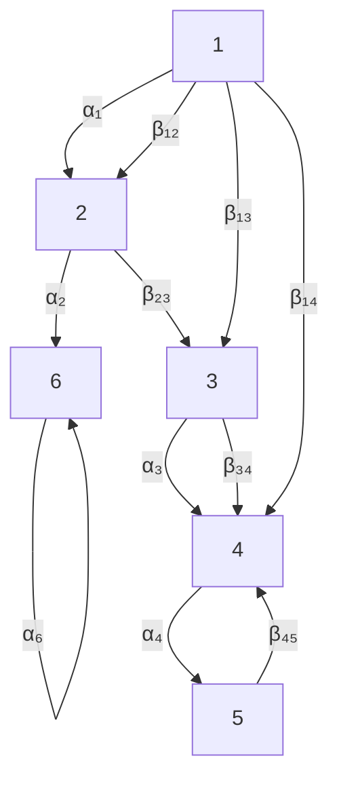
</details>

Figure 2: The network of loyalty and intimacy

As shown in Figure 2, we can clearly see the relationship between two people and the description of and . At the beginning, the initial loyalty and intimacy consist of a initial network. As time goes on, the network changes in the dynamic process. Every month, it is a static network and has new loyalty and intimacy. The dynamic process will be discussed in the following part.

## 3.2 The network among position

Obviously, the relationship of positions can form a tree network. In this problem, we regards there are six levels of positions in ICM organization, which refers to the level of salary. The highest level is senior manager and the lowest level is administrative clerk and inexperienced employee.


<details>
<summary>flowchart</summary>

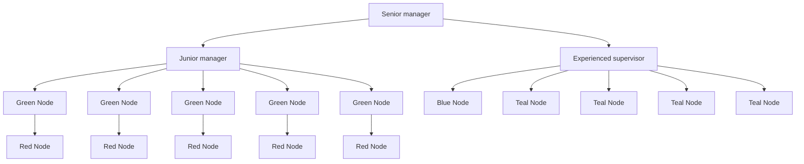
</details>

Figure 3: A tree network of positions

In the position network, the nodes mean positions. Additionally, the solid line with arrow represents the belonging relation and the dash line means the adjustment of position. In a whole, this graph indicates the level structure among positions and the adjustment from one position to another one.

If a person moves up into a higher position, the loyalty and intimacy will change. Hence, we use the position network to analyze the influence on loyalty and intimacy with the change of positon.

For the change of loyalty, we define a transformation matrix to describe the influence of position changes.

$$
T = \left[ \begin{array}{c c c c} t _ {1 1} & t _ {1 2} & \dots & t _ {1 m} \\ t _ {2 1} & t _ {2 2} & \dots & t _ {2 m} \\ \vdots & \vdots & \ddots & \vdots \\ t _ {m 1} & t _ {m 2} & \dots & t _ {m m} \end{array} \right]
$$

Where: $t _ { i j }$ means the change of loyalty if people move from level  i position to level  j position

m means the quantity of position level

For example, an employee has an initial loyalty $\alpha ^ { ( \mathrm { t } _ { 0 } ) }$ at time $t _ { 0 }$ and he moves from position i to j in the next month. According to the influence brought by position change, we can get his new loyalty.

$$
\alpha_ {t _ {1}} = \alpha^ {(t _ {0})} \bullet t _ {i j}
$$

The adjustment of position can also bring some change to the intimacy. However, we wil discuss it in section 4.2.

## 3.3 The bipartite graph between people and positions

We have introduced the graph among people and positions respectively. It is time to take a look at the graph between staff and positions. Each person in ICM can take a wide range of positions, and it is a problem for HR manager to assign these jobs to staff. We can use a bipartite graph[4] [5] to describe this problem.

In general, there are two sets which represent staff and occupations. The edge matching an employee to an occupation means this person is assigned to this position by HR manager. In addition, each edge has a value which indicates the cost if this person take this job. It is vivid to show in the following figure.


<details>
<summary>flowchart</summary>

```mermaid
graph TD
    subgraph U
  u1["u1"] --> v1["v1"]
  u2["u2"] --> v2["v2"]
  u3["u3"] --> v3["v3"]
  u4["u4"] --> v4["v4"]
  u5["u5"] --> v5["v5"]
  u1 --> v6["v6"]
  u2 --> v7["v7"]
  u3 --> v8["v8"]
  u4 --> v9["v9"]
  u5 --> v10["v10"]
  u1 --> v11["v11"]
  u2 --> v12["v12"]
  u3 --> v13["v13"]
  u4 --> v14["v14"]
  u5 --> v15["v15"]
  u1 --> v20["v20"]
  u2 --> v21["v21"]
  u3 --> v22["v22"]
  u4 --> v23["v23"]
  u5 --> v24["v24"]
  u1 --> v30["v30"]
  u2 --> v31["v31"]
  u3 --> v32["v32"]
  u4 --> v33["v33"]
  u5 --> v34["v34"]
  u1 --> v40["v40"]
  u2 --> v41["v41"]
  u3 --> v42["v42"]
  u4 --> v43["v43"]
  u5 --> v44["v44"]
  u1 --> v50["v50"]
  u2 --> v51["v51"]
  u3 --> v52["v52"]
  u4 --> v53["v53"]
  u5 --> v54["v54"]
  u1 --> v60["v60"]
  u2 --> v61["v61"]
  u3 --> v62["v62"]
  u4 --> v63["v63"]
  u5 --> v64["v64"]
  u1 --> v70["v70"]
  u2 --> v71["v71"]
  u3 --> v72["v72"]
  u4 --> v73["v73"]
  u5 --> v74["v74"]
  u1 --> v80["v80"]
  u2 --> v81["v81"]
  u3 --> v82["v82"]
  u4 --> v83["v83"]
  u5 --> v84["v84"]
  u1 --> v90["v90"]
  u2 --> v91["v91"]
  u3 --> v92["v92"]
  u4 --> v93["v93"]
  u5 --> v94["v94"]
  u1 --> v100["v100"]
  u2 --> v101["v101"]
  u3 --> v102["v102"]
  u4 --> v103["v103"]
  u5 --> v104["v104"]
  u1 --> v110["v110"]
  u2 --> v111["v111"]
  u3 --> v112["v112"]
  u4 --> v113["v113"]
  u5 --> v114["v114"]
  u1 --> v120["v120"]
  u2 --> v121["v121"]
  u3 --> v122["v122"]
  u4 --> v123["v123"]
  u5 --> v124["v124"]
  u1 --> v130["v130"]
  u2 --> v131["v131"]
  u3 --> v132["v132"]
  u4 --> v133["v133"]
  u5 --> v134["v134"]
  u1 --> v140["v140"]
  u2 --> v141["v141"]
  u3 --> v142["v142"]
  u4 --> v143["v143"]
  u5 --> v144["v144"]
  u1 --> v150["v150"]
  u2 --> v151["v151"]
  u3 --> v152["v152"]
  u4 --> v153["v153"]
  u5 --> v154["v154"]
  u1 --> v200["v200"]
  u2 --> v201["v201"]
  u3 --> v202["v202"]
  u4 --> v203["v203"]
  u5 --> v204["v204"]
```
</details>

Figure 4: The match between employees and occupations

Where: U is the set of employees;

V is the set of positions. In the ICM, there are seven kinds of positons. In addition, we added a virtual vertex $\nu _ { 8 }$ in $V$ , and the person who connects to that vertex means that he is under training.

$u _ { i }$ is the employee $i$ .

$\nu _ { i }$ is the i kind of position.

The value of each edge means the cost of assigning person i to position $j$ .

The edge connecting $u _ { i }$ to $\nu _ { i }$ means $u _ { i }$ can be assigned to $\nu _ { i }$ and the blue edge means the decision finally made by the HR manager.

It is worth mentioning the characters of our bipartite graph. Firstly, there may not exist a perfect matching(every vertex in U is connect to different vertices in $\mathsf { V } )$ . In our graph, not all people may have a job and not all jobs are taken by people. Secondly, the vertices in occupational set represents levels of position, so many staff can connect to the same vertex in V.

Finally, we use a bipartite graph to describe the problem of job assignment. In this way, once we determine the cost of each assignment and the possibility of each matching, we can get the best matching plan.

## 3.4 The human capital network

In section 3.1 to 3.3, we introduce three graphs respectively: the friendship network among people, the network among positions and the matching graph between staff and positions. Now we put three graphs together and then get a static human capital network. It is shown in the figure below.


<details>
<summary>flowchart</summary>

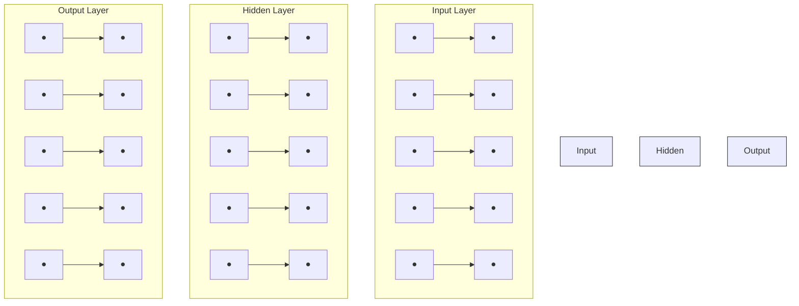
</details>

Figure 5: A static human capital network

In this network, we can see the relationship among people and also the relationship among the positions. Additionally, it can indicate the matching between staff and positions. According to this network, we can see the static human capital network and it will be the basic of managing the human capital in organizations.

## 4. The dynamic human capital network

## 4.1 The frame of the model

In order to identify dynamic processes within our Human Capital network, we take time into consideration to form a dynamic human capital network.

In the assumption, we define one month to be the time unit. Now we add the time stamp to the static human capital network and get a dynamic one shown in figure $6 .$


<details>
<summary>flowchart</summary>

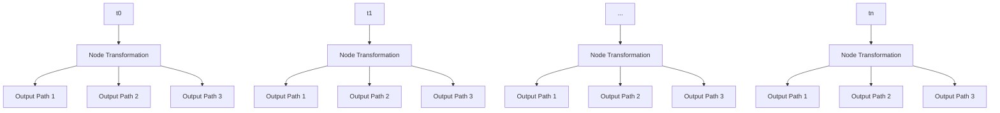
</details>

Figure 6: A dynamic human capital network

In the picture, there are several levels. In detail, every layer indicates a human capital network at a specific time. It contains the set of people, the set of positions and the matching relation between individuals and positions. As time goes by, the content in each level changes and a dynamic human capital network generates.

More specifically, there are three kinds of change in the network.

(1) No people churn and no new recruited people. The HR manager can adjust the matching between people and positions to influence the whole network.  
(2) Some people churn and the connections between some retaining employees and churned employees disappear. Then the HR should decide to recruit new employees to fill with the positions. Of course, he also can adjust the retaining people’s positions to minimize the cost and maximum the output.  
(3) Some people join in the organization and there are some new connections in the network among people. Then the HR manager should assign them into the vacant positions.

## 4.2 The change of loyalty and intimacy in the dynamic process

In the dynamic process, the loyalty will change with the change of position levels and the years retaining in the same position level. We can define the change of loyalty as:

(1) Retaining in the same position level

$$
\alpha = \alpha^ {(0)} \cdot d ^ {\left\lfloor \frac {n}{1 2} - \mu \right\rfloor}
$$

Where:  d means the change proportion of loyalty as years goes on.

n means the number of months that the employee stay in the same position.

means the mean years to promotion at a specific position

The loyalty of an employee will decrease if his working time in one position is more than the mean promotion years. Similarly, the loyalty of an employee will increase if his working time in one position is less than the mean promotion years.

(2) Position adjustment


<details>
<summary>flowchart</summary>

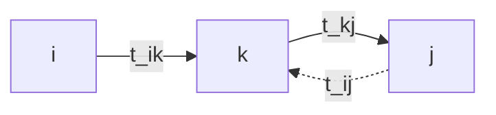
</details>

Figure 7: The change of loyalty when position changes

$$
\alpha = \alpha^ {(0)} \bullet t _ {i j}
$$

Where: $t _ { i j }$ means the change proportion of loyalty moving from position i to position j .

Consider the skip of promotion, we define that:

$$
t _ {i j} = t _ {i k} \bullet t _ {k j}
$$

Similarly, the intimacy will change with the change of the gap between people’s position

level. There are three kinds of situations that may change the intimacy:


<details>
<summary>bar chart</summary>

| Level | Person | Intimacy Increase | Intimacy Decrease | Intimacy Keeps the Same |
|-------|--------|-------------------|-------------------|--------------------------|
| Senior manager | Person A | Low | Low | Low |
| Experienced supervisor | Person A | Medium | Medium | Medium |
| Inexperienced employee | Person B | Low | Low | Low |
| Shorten | Person A | Medium | High | High |
| Shorten | Person B | Medium | Medium | Medium |
| Enlarge | Person A | High | High | High |
| Enlarge | Person B | Low | Low | Low |
| Unchanged | Person A | Medium | Medium | Medium |
| Unchanged | Person B | Medium | Low | Low |
</details>

Figure 8: The intimacy changes in different situations

## (1)The position gap enlarges

If a person is promoted and another one stay in the same positon, their intimacy will decrease because they have fewer common topics or the person at a lower position envies another with a higher position.

## (2)The position gap shortens

If the employee with a lower position is promoted to the same position level as another with a higher position, their intimacy will increase because they have more chance to contact each other.

## (3)The position gap stays the same

If two persons all stay in the old position or they are promoted with a same grade, their intimacy will not change.

So we use the gap between people’s position levels to calculate the change of intimacy. The intimacy $\beta$ is defined as:

$$
\beta_ {i j} = \beta_ {i j} ^ {(0)} \cdot \frac {\left(\Delta l _ {o l d} + 1\right)}{\left(\Delta l _ {n e w} + 1\right)}
$$

Where: $\Delta l _ { o l d }$ represents the primary difference between the level of person i and $j$ .

$\Delta l _ { n e w }$ represents the new difference between the level of person i and $j$ .

The gap between position levels of position can be given as:

Table 1: The levels of positions

<table><tr><td>Position</td><td>Level</td></tr><tr><td>Administrative clerk, Inexperienced employee</td><td>1</td></tr><tr><td>Experienced employee</td><td>2</td></tr><tr><td>Inexperienced supervisor</td><td>3</td></tr><tr><td>Experienced supervisor</td><td>4</td></tr><tr><td>Junior manager</td><td>5</td></tr><tr><td>Senior manager</td><td>6</td></tr></table>

And the gap between position levels is:

$$
\Delta l = \left| l _ {p _ {i}} - l _ {p _ {j}} \right|
$$

Where: $l _ { p _ { i } }$ means the level of position i .

## 4.3 The calculation of loyalty

As we mentioned in section 3.1, Loyalty is influenced by many factors. If a person is promoted by HR manager, his loyalty may be change. Also, if a person stay at one position too long and have little expectation to be promoted, his loyalty may drop. Now we discuss the calculation about the change.

At time t , we define the loyalty of employee k as $\alpha _ { k } ^ { ( t ) }$ and let

$$
\partial^ {(t)} = [ \alpha_ {1} ^ {(t)}, \alpha_ {2} ^ {(t)}, \dots , \alpha_ {n} ^ {(t)} ]
$$

Then we define a matrix $A _ { N \times M } ^ { ( t ) }$ to indicate the assignment of jobs. The element $a _ { \mathrm { i j } } ^ { \mathrm { ( t ) } }$ is defined as:

$$
a _ {i j} ^ {(t)} = \left\{ \begin{array}{l l} 1 & \text {   if   employ   } i \text {   is   at   position   } j \\ 0 & \text {   if   employ   } i \text {   is   not   at   position   } j \end{array} \right.
$$

Let function  diag[M] as

$$
\operatorname{diag} [ M ] = \left\{ \begin{array}{l l} M _ {i j} & \text { if   } i = j \\ 0 & \text { if   } i \neq j \end{array} \right.
$$

According to the calculation of matrix, we can get:

$$
\partial^ {(t)} = \partial^ {(t - 1)} \operatorname{diag} \left[ A ^ {(t - 1)} T A ^ {(t) \mathrm{T}} \right] \quad \text { where } t \geq 1
$$

Where T is the matrix we introduced in section 3.2 and $A ^ { ( \mathrm { t } ) ^ { \mathrm { T } } }$ is the transpose of $A ^ { ( 1 ) }$ .

In order to give a more intuitionistic expression, we show an example to illustrate these formulas. In the following graph, there are four positions and two employees. At time t 1 , they are at position 4 and position 3 and the corresponding loyalty is 0.95 and 0.92. At time t , they all get promoted. Then we can calculate their loyalty at time t .


<details>
<summary>flowchart</summary>

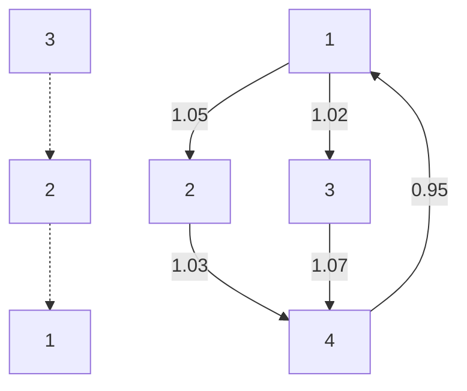
</details>

Figure 9: The calculation of loyalty when promoted

According to the figure, we know:

$$
\partial^ {(t - 1)} = [ 0. 9 5, 0. 9 2 ], A ^ {(t - 1)} = \left[ \begin{array}{c c c c} 0 & 0 & 0 & 1 \\ 0 & 0 & 1 & 0 \end{array} \right]
$$

$$
A ^ {(t)} = \left[ \begin{array}{l l l l} 0 & 1 & 0 & 0 \\ 1 & 0 & 0 & 0 \end{array} \right], T = \left[ \begin{array}{c c c c} 1 & 0 & 0 & 0 \\ 1. 0 5 & 1 & 0 & 0 \\ 1. 0 2 & 1 & 1 & 0 \\ 1. 0 7 & 1. 0 3 & 1 & 1 \end{array} \right]
$$

Then we can get their loyalty at time t :

$$
\partial^ {(t)} = \partial^ {(t - 1)} \operatorname{diag} \left[ A ^ {(t - 1)} T A ^ {(t) T} \right] = [ 0. 9 5, 0. 9 2 ] \cdot \operatorname{diag} \left(\left[ \begin{array}{l l l l} 0 & 0 & 0 & 1 \\ 0 & 0 & 1 & 0 \end{array} \right] \left[ \begin{array}{c c c c} 1 & 0 & 0 & 0 \\ 1. 0 5 & 1 & 0 & 0 \\ 1. 0 2 & 1 & 1 & 0 \\ 1. 0 7 & 1. 0 3 & 1 & 1 \end{array} \right] \left[ \begin{array}{l l} 0 & 1 \\ 1 & 0 \\ 0 & 0 \\ 0 & 0 \end{array} \right]\right)
$$

$$
= [ 0. 9 5, 0. 9 2 ] \left[ \begin{array}{c c} 1. 0 3 & 0 \\ 0 & 1. 0 2 \end{array} \right] = [ 0. 9 7 8 5, 0. 9 3 8 4 ]
$$

## 4.4 Organizational churn in dynamic process

In every month, we know every individual’s loyalty, which may be adjusted by the regulation of position or the churn of connected people. According to the loyalty, we can simulate the organizational churn.

There are two reasons may lead to people’s churn.

(1) People want to churn for their own reasons, which are not influenced by connecting people. Loyalty will identify this situation.  
(2) People want to churn because of connecting people’s influence. For this reason, we take both loyalty and intimacy into account.

The whole process can be described as follows.

In the first month, people may churn according to their initial loyalty, which leads to the change of human capital network. Then in the following month, we should calculate two kinds of probability for each employee. The first one is the churn probability influenced by connected people who has churned in the last month.

$$
P _ {i} = \sum_ {j} (1 - \alpha_ {i}) \beta_ {i j}
$$

Where: $\alpha _ { i }$ is the loyalty of employee i ;

j is the person who connected to i and churned in the last month.

$\beta _ { i j }$ is the intimacy between employee i and j ;

The second one is loyalty. We simulate the change of human capital network according to their loyalty like the first month. Actually, we calculate two kinds of probability can effectively distinguish the churn caused by their own wills or others’ influence. As the time goes by, it forms the dynamic process of within the human capital network.

In the network among people, the dynamic process can be described in the figure 10.


<details>
<summary>flowchart</summary>

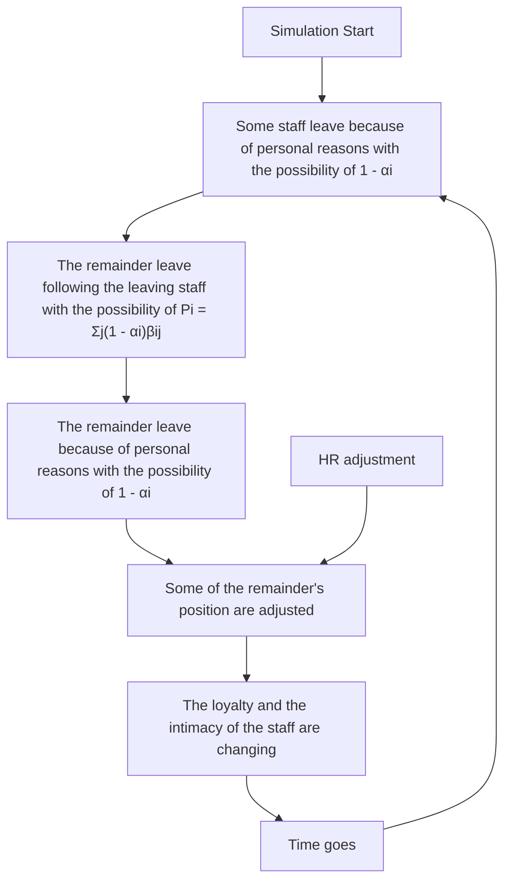
</details>

Figure 10: Dynamic process of the change of human capital network

## 4.5 The productivity and cost

As we all know, the task of HR is maximize the output and minimize the cost. Maximizing the profit is the most important principle of all profit organization. Then, we discuss the productivity and cost.

## 4.5.1 Productivity

In this paper, we assume the output is related to the rate of on-the-job and the organizational structure. In the provided data we know ICM usually has only 85% of its 370 positions filled at any time. So we assume that under this situation the organization can operate effectively and make maximum output.

There are two factors will influence the output

(1)The number of employees  
(2)The structure of the organization

A good organizational means every level has moderate people. If the organization has too many senior and junior mangers and few employees, the productivity will not be high because few people do the direct production work. Similarly, if the organization has too many inexperienced employees and experienced employees, the operation of the organization will not be good because few people assign job and consider the overall plan. In conclusion, keep 85% of every level’s position filled will be the best.

Considering two factors, we can get the productivity of the organization.

$$
Y = \sum_ {i = 1} ^ {6} \lambda_ {i} \cdot S _ {i} \cdot n _ {i} - \sum_ {i = 1} ^ {6} \sigma_ {i} \cdot S _ {i} \cdot \left| n _ {i} - \tilde {n} _ {i} \right|
$$

Where: $\lambda _ { i }$ is a coefficient, $\lambda _ { i } \cdot S _ { i }$ means the output produced by people who are in i position level. We assume people’s output is proportional to their salary.

$\sigma _ { i }$ is a coefficient, $\sigma _ { i } \cdot S _ { i }$ means the loss of output if the number of on-the -job staff is larger or smaller than the optimal number.

$n _ { i }$ means the number of staff who are now on-the-job in i position level.

$\tilde { n } _ { i }$ means the optimal number of staff who are now on-the-job in  i position level.

Obviously, this equation is comprised of two parts. The first part is related to the number of employees, which means more workers will produce more. This is the direct effects caused by the dynamic processes within the human capital network. The second part is related to the structure of the organization. A good structure will produce more. Once the structure become unbalanced, including redundant or vacant, it will bring some negative effects to the output. And this is the indirect effects caused by the dynamic processes within the human capital network.

## 4.5.2 Cost

Considering that the provided data dos NOT contain the staff’s output, we cannot use the maximum profit to measure an optimal human capital. Therefore, in the paper, we set our target as minimize the cost.

In section 4.1, we mention the loss of unbalanced organizational structure. Actually, it also can be regarded as cost, which caused by unbalanced structure. In general, the cost contains several parts.

(1) The cost of organizational structure  
(2) The cost of salary, training and recruitment.

Then, we can get the total cost( C ) as:

$$
C = C _ {1} + C _ {2}
$$

Where: $C _ { 1 }$ means the annual cost of organizational structure.

$C _ { 2 }$ means the annual cost of salary, training and recruitment.

Obviously, we can have:

$$
C _ {1} = \sum_ {i = 1} ^ {6} \sigma_ {i} \cdot S _ {i} \cdot \left| n _ {i} - \tilde {n} _ {i} \right|
$$

When calculating the cost of every individual, we assume that they all need be trained every year. Then we can have

$$
C _ {2} = \sum_ {i = 1} ^ {6} S _ {i} \cdot n _ {i} + \sum_ {i = 1} ^ {6} r _ {i} \cdot n _ {i} ^ {\text { new }} + \sum_ {i = 1} ^ {6} k _ {i} \cdot n _ {i} ^ {\text { old }}
$$

Where: $k _ { i }$ means the average annual training cost of position level i .

$r _ { i }$ means the average annual recruitment cost of position level i .

${ n _ { i } } ^ { n e w }$ means the number of new staff of position level  i .

oldn ${ n _ { i } } ^ { o l d }$ means the number of the old on-the-job staff of position level i

As a HR manager, his job is managing the human capital with comprehensive consideration of direct cost and indirect cost.

## 4.6 Optimize the management of human capital

In the section 3.3, we have built a bipartite to indicate the matching of people and positions. According to section 4.2, we know the cost of every matching. And then our target is to minimize the total cost and get the optimal human capital structure. Now, we use Genetic Algorithm to assign positions.

A typical genetic algorithm requires two aspects[6]:

(1)A genetic representation  
(2)The definition of fitness function

Now, we apply this algorithm to our assignment problem. First, we give the concrete explanation of these two aspects.

## (1)The representation of chromosome

The represent of chromosome is the basic of Genetic Algorithm[7]. As we know, the chromosomes are the units that indicate people’s character. In our model, a valid chromosome is an effective assignment of positions. We use the following indices:

Table 2: The meanings of indexes

<table><tr><td>Index</td><td>Meaning</td></tr><tr><td>0</td><td>people are new recruited and still under training</td></tr><tr><td>1-6</td><td>People in six position levels relation to their salary, higher is better</td></tr><tr><td>N</td><td>The people are not in the organization now.</td></tr><tr><td>D</td><td>The people departed from the organization</td></tr></table>

Then, the chromosome is a series of numbers. The $i ^ { t h }$ bit stands for that the level of position of the $i ^ { t h }$ person.


<details>
<summary>flowchart</summary>

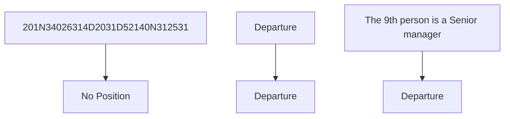
</details>

Figure 11: The chromosome we defined

## (2)The Fitness Function

The fitness function is to evaluate the fitness of an individual whether it can suit to the environment. That is to say, this function is used as an elimination criterion. In our model, we can use total cost as the fitness function.

The Genetic Algorithm(GA) process contains four steps: Initialization, Selection, Genetic operators, Termination. It is an iterative process and each process represents a generation. With the finite numbers of iteration, the algorithm can produce an approximate optimal solution[8].

## Initialization

At this stage we define the number of population (N), mutation rate, crossover rate, fitness function. Then it will produce the initial individuals. In our model, we produce the chromosome of positions at time $t _ { 0 }$ .

## Selection

We use the fitness function to select the first N individuals which are better fit to the environment. It is worth mentioning that a chromosome will be eliminated immediately if the structure is unreasonable. For example, there are only 25 positions in level 3. However, the number of $" 3 "$ is more than 25 in the chromosome. As a result, we eliminate this chromosome.

## Genetic operators

There are two main operations, mutation and crossover, which are the methods to produce new individuals.

Mutation in GA is that a gene of a chromosome changes to any other possible gene with a possibility. In our model, changing a gene represents the promotion of a person. So the number should increase when the gene is under mutation.

Crossover in GA is that two chromosomes exchange their genes with each other at the same position at their chromosomes. In our model, we only take promotion into account. Hence, the exchange can only happen when the person who has the lower position get exchanged with the

<table><tr><td colspan="2">chromosomes</td><td colspan="2">mutation</td><td colspan="2">crossover</td></tr><tr><td>.</td><td>.</td><td>.</td><td>.</td><td>.</td><td>.</td></tr><tr><td>.</td><td>.</td><td>.</td><td>.</td><td>.</td><td>.</td></tr><tr><td>.</td><td>.</td><td>.</td><td>.</td><td>.</td><td>.</td></tr><tr><td>0</td><td>0</td><td>0</td><td>0</td><td>0</td><td>0</td></tr><tr><td>3</td><td>1</td><td>4</td><td>1</td><td>3</td><td>1</td></tr><tr><td>5</td><td>3</td><td>5</td><td>3</td><td>5</td><td>5</td></tr><tr><td>N</td><td>N</td><td>N</td><td>N</td><td>N</td><td>N</td></tr><tr><td>6</td><td>4</td><td>6</td><td>4</td><td>6</td><td>4</td></tr><tr><td>1</td><td>2</td><td>1</td><td>3</td><td>1</td><td>2</td></tr><tr><td>2</td><td>5</td><td>2</td><td>5</td><td>2</td><td>5</td></tr><tr><td>4</td><td>6</td><td>4</td><td>6</td><td>4</td><td>6</td></tr><tr><td>D</td><td>D</td><td>D</td><td>D</td><td>D</td><td>D</td></tr><tr><td>.</td><td>.</td><td>.</td><td>.</td><td>.</td><td>.</td></tr><tr><td>.</td><td>.</td><td>.</td><td>.</td><td>.</td><td>.</td></tr><tr><td>.</td><td>.</td><td>.</td><td>.</td><td></td><td></td></tr><tr><td>A</td><td>B</td><td>A</td><td>B</td><td>A</td><td>B</td></tr></table>

same position with the higher position level.

Figure 12: Genetic operators

In the picture, the left are two chromosomes represent two individuals. In the middle, chromosome A has a mutation on one gene, which means that the person was promoted from level 3 to level 4, so does the chromosome B. On the right, chromosome B get the same gene with A at the red point, which means that the person was promoted form level 3 to level 5.

## Termination

With the finite times of iteration, the algorithm will come to termination. Finally, the individual with the highest fitness is an approximate optimal solution.

To give a more visual process, a flowchart is shown.


<details>
<summary>flowchart</summary>

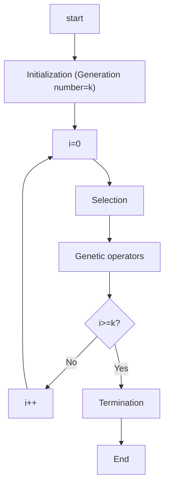
</details>

Figure 13: The flowchart of termination

To sum up, the whole process of managing human capital consists three parts:

(1) The change of loyalty and intimacy  
(2) The churn and recruitment of people

## (3) The assignment of HR manager

The first part can be calculated as the human capital network changes. The second part is dependent on computer simulation. The third part is the only one that we can intervene. We use the Genetic Algorithm to get the optimal assignment and do some adjustment. All in all, the whole model can be described as:


<details>
<summary>flowchart</summary>

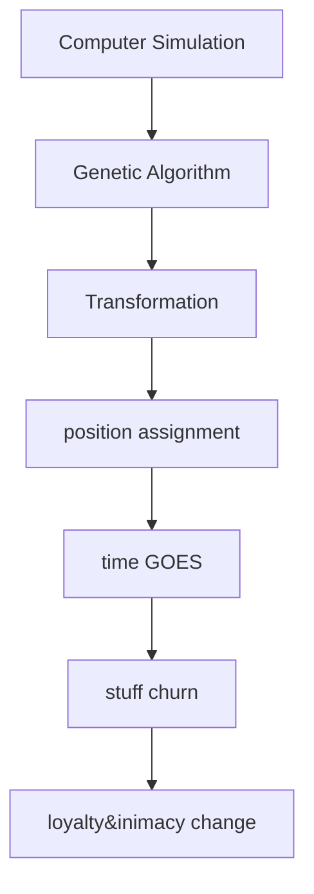
</details>

Figure 14: The pie of the whole model

## 5. Application of the Model

## 5.1 The organization’s budget requirements

According to the provided data, ICM usually has 85% of its 370 positions filled at any time and the HR office is actively hiring about 8-10% of its position. In addition, the current churn rate is 18%, which can keep the organization on an optimal structure.

The annual budget requirements for recruiting and training can be calculated as:

$$
B = \sum_ {i = 1} ^ {6} r _ {i} \cdot n _ {i} ^ {\text { new }} + \sum_ {i = 1} ^ {6} k _ {i} \cdot n _ {i} ^ {\text { old }}
$$

Where: $r _ { i }$ represents the cost of recruitment at position level i .

$k _ { i }$ represents the cost of training at position level i .

${ n _ { i } } ^ { n e w }$ represents the number of new employees at position level  i .

oldn ${ n _ { i } } ^ { o l d }$ represents the number of old employees(not new recruited)at level i .

Then, we start to find the number of churn people and new recruited people within next two year at any time. That is to say, we then use our model to clarify the concrete fluid of human capital network.

## Step1: Initialization

The initial rate of on-the-job is 85%. The hiring rate is 10%. The churn rate is 18%. And we regards 500 people are considered in the next two years. As for the initial connected relation we use a Random Graph to simulate. Since there is no data to calculate people’s initial loyalty and intimacy, we also give a random value. Then we set a parameter to multiply the loyalty and adjust the parameter to reach a churn rate of 18%.

## Step2: Simulation

After setting the initial value, we use the computer simulation to indicate process of “churn” and “recruit”. In this process, the change of loyalty and intimacy is calculated by our model which shown in section 3.5.2. In the simulation of this dynamic process, we can clearly see the churn people and new recruited people.

## Step3: Assignment

We use genetic algorithm to assign people to positions. In the genetic algorithm, we set the number of genes in one chromosome to be 500. In addition, let the number of population, the iteration times, the mutation rate and crossover rate to be 200, 2000, 0.4 and 0.1 respectively.

Using this method, after five times simulations, we calculate the average value and shown it in the following table.

Table 3: The data of simulation

<table><tr><td>Month</td><td>Churn follows others</td><td>Churn for own reasons</td><td>The number of recruitment</td><td>The accumulative cost of recruitment(σ)</td><td>The accumulative cost of training(σ)</td></tr><tr><td>1</td><td>0</td><td>11</td><td>1</td><td>0.12</td><td>5.88</td></tr><tr><td>2</td><td>3</td><td>6</td><td>4</td><td>0.60</td><td>11.59</td></tr><tr><td>3</td><td>1</td><td>6</td><td>1</td><td>0.90</td><td>17.24</td></tr><tr><td>4</td><td>0</td><td>4</td><td>1</td><td>1.50</td><td>22.82</td></tr><tr><td>5</td><td>0</td><td>5</td><td>3</td><td>3.30</td><td>28.33</td></tr><tr><td>6</td><td>0</td><td>4</td><td>2</td><td>4.70</td><td>33.84</td></tr><tr><td>7</td><td>0</td><td>5</td><td>3</td><td>8.30</td><td>39.33</td></tr><tr><td>8</td><td>1</td><td>1</td><td>1</td><td>8.42</td><td>44.91</td></tr><tr><td>9</td><td>1</td><td>8</td><td>3</td><td>9.72</td><td>50.31</td></tr><tr><td>10</td><td>0</td><td>10</td><td>5</td><td>11.28</td><td>55.55</td></tr><tr><td>11</td><td>1</td><td>4</td><td>3</td><td>12.60</td><td>60.80</td></tr><tr><td>12</td><td>1</td><td>6</td><td>4</td><td>15.30</td><td>65.94</td></tr><tr><td>13</td><td>0</td><td>2</td><td>1</td><td>15.90</td><td>71.22</td></tr><tr><td>14</td><td>0</td><td>7</td><td>3</td><td>17.22</td><td>76.39</td></tr><tr><td>15</td><td>0</td><td>6</td><td>4</td><td>18.42</td><td>81.55</td></tr><tr><td>16</td><td>1</td><td>4</td><td>2</td><td>19.62</td><td>86.59</td></tr><tr><td>17</td><td>1</td><td>2</td><td>1</td><td>20.22</td><td>91.63</td></tr><tr><td>18</td><td>1</td><td>3</td><td>2</td><td>21.62</td><td>96.63</td></tr><tr><td>19</td><td>0</td><td>2</td><td>3</td><td>24.62</td><td>101.69</td></tr><tr><td>20</td><td>0</td><td>3</td><td>9</td><td>26.94</td><td>106.74</td></tr><tr><td>21</td><td>1</td><td>3</td><td>6</td><td>29.66</td><td>111.94</td></tr><tr><td>22</td><td>0</td><td>9</td><td>6</td><td>33.50</td><td>117.03</td></tr><tr><td>23</td><td>1</td><td>5</td><td>2</td><td>34.70</td><td>122.08</td></tr><tr><td>24</td><td>1</td><td>4</td><td>5</td><td>38.20</td><td>127.08</td></tr><tr><td>total</td><td>14</td><td>120</td><td>75</td><td></td><td></td></tr></table>

According to the table, we can know the annual churn rate is approximate to 19% and the recruitment rate is 12%, which are close to the initial value 18% and 10%. Therefore, our simulation process is suitable. In the table, it is clear that the total cost of recruitment is 38.2 and the total cost of training is 127.08 . Hence, the organization’s budget requirements for both recruiting and training over the next years are 165.28 .

## 5.2 The influence of churn rate on full status rate for positions

If the ICM organization wants to sustain its 80% full status for positions under the change of annual churn rate, it will spend more to recruit people. In this part, we try to analyze the direct cost and indirect cost with the high churn rate.

## 5.2.1 Direct cost

In the section 4.5.2, the direct cost consists of three parts. Obviously, the direct cost is related to the churn rate, recruitment rate and the vacant positions’ level. If more people churn, we need to recruit more people to replace them and of course the cost will be high. Similarly, if more people in higher position levels churn, the cost will be higher that more people in lower position levels. We do the simulation as the churn rate changes. Then we get the annual direct cost.

Table 4: The change of cost following the churn rate

<table><tr><td>Churn rate (%)</td><td>Recruitment rate to sustain 80% full status</td><td>Cost of training (σ)</td><td>Cost of recruitment (σ)</td><td>Total cost (σ)</td></tr><tr><td>21</td><td>0.19</td><td>540</td><td>34.73</td><td>574.73</td></tr><tr><td>22</td><td>0.20</td><td>530</td><td>35.81</td><td>565.81</td></tr><tr><td>23</td><td>0.20</td><td>532</td><td>36.26</td><td>568.26</td></tr><tr><td>24</td><td>0.21</td><td>575</td><td>36.86</td><td>611.86</td></tr><tr><td>25</td><td>0.22</td><td>580</td><td>37.64</td><td>617.64</td></tr><tr><td>26</td><td>0.23</td><td>563</td><td>39.21</td><td>602.21</td></tr><tr><td>27</td><td>0.22</td><td>540</td><td>40.21</td><td>580.21</td></tr><tr><td>28</td><td>0.24</td><td>552</td><td>42.62</td><td>594.62</td></tr><tr><td>29</td><td>0.26</td><td>543</td><td>43.78</td><td>586.78</td></tr><tr><td>30</td><td>0.26</td><td>554</td><td>45.88</td><td>599.88</td></tr><tr><td>31</td><td>0.28</td><td>530</td><td>47.72</td><td>577.72</td></tr><tr><td>32</td><td>0.29</td><td>512</td><td>48.64</td><td>560.64</td></tr><tr><td>33</td><td>0.29</td><td>511</td><td>49.91</td><td>560.91</td></tr><tr><td>34</td><td>0.30</td><td>496</td><td>50.61</td><td>546.61</td></tr><tr><td>35</td><td>0.31</td><td>483</td><td>50.66</td><td>533.66</td></tr><tr><td>36</td><td>0.32</td><td>492</td><td>51.27</td><td>543.27</td></tr><tr><td>37</td><td>0.34</td><td>472</td><td>52.24</td><td>524.24</td></tr><tr><td>38</td><td>0.34</td><td>484</td><td>56.33</td><td>540.33</td></tr><tr><td>39</td><td>0.35</td><td>479</td><td>60.25</td><td>539.25</td></tr><tr><td>40</td><td>0.36</td><td>468</td><td>60.75</td><td>528.75</td></tr></table>

According to the table, we know that if the organization want to keep 80% full status for positions at a churn rate of 25%, the recruitment rate should be 22% and the direct cost is 617.64 . If the churn rate is 35%, the recruitment rate should be 31% and the direct cost is 533.66 .


<details>
<summary>line chart</summary>

| churn rate(%) | total cost |
| ------------- | ---------- |
| 21            | 570        |
| 23            | 565        |
| 25            | 615        |
| 27            | 580        |
| 29            | 595        |
| 31            | 600        |
| 33            | 560        |
| 35            | 540        |
| 37            | 525        |
| 39            | 535        |
</details>

Figure 15: The line chart of total cost

From the graph, we can see the direct cost first increases and then decreases as the increase of churn rate. It is rational because as the churn rate increases, more people will under recruitment. As a result, the salary cost will decrease.

## 5.2.2 Indirect cost

The indirect cost is the cost caused by unbalanced organizational structure. We have introduced it in section 4.5.2. Now we let the parameter $\sigma _ { i }$ as i , which means a vacancy of a higher level will bring more loss . Then we calculate the indirect cost.


<details>
<summary>line chart</summary>

| churn rate(%) | cost(σ) |
| ------------- | ------- |
| 21            | 90      |
| 23            | 90      |
| 25            | 90      |
| 27            | 100     |
| 29            | 110     |
| 31            | 130     |
| 33            | 150     |
| 35            | 180     |
| 37            | 180     |
| 39            | 180     |
</details>

Figure 16: The line chart of indirect cost

From the graph, we can see the indirect cost increase. If the more people churn, the positions will be vacant for a period of time. As a result, some new people will join the organization. Hence, the structure will not be stable. That is to say, the indirect cost will increase.

## 5.2.3 Comprehensive analysis and Conclusion

As the change of churn rate and recruitment rate, the rate of full status for positions will change. In the paper, our target is to make it sustain in 80% and also keep a better structure of organization. Then we analyze every situation when churn rate and recruitment rate changes from 0% to 40%.


<details>
<summary>area chart</summary>

| Churn Rate(%) | Feasible Region (%) | Subordinate Feasible Region (%) | Unfeasible Region (%) |
|---|---|---|---|
| 0 | 0 | 5 | 0 |
| 5 | 10 | 10 | 0 |
| 10 | 20 | 15 | 0 |
| 15 | 30 | 20 | 0 |
| 20 | 40 | 25 | 0 |
| 25 | 50 | 30 | 0 |
| 30 | 60 | 35 | 0 |
| 35 | 70 | 40 | 0 |
| 40 | 80 | 45 | 0 |
</details>

Figure 17: Situations of different churn and recruitment rates

In this picture, the circle means the rate of full status can be 80% and the structure is good under the recruitment rate and churn rate. The square means the rate of full status can be 80% but the structure is not good. The cross means the rate of full status cannot be 80%. Then, we draw the line according to the solution at each situation and get the corresponding region.

In conclusion, if the churn rate is 25%, ICM can sustain its 80 full status and the direct cost is 617.64 . Similarly, if the churn rate is 35%, the direct cost is 533.66 . A higher churn rate will decrease the direct cost but it will cause unsteadiness of the organizational structure, which is the indirect effect.

## 5.3 The HR health of the organization

In this part, we first define the HR health of the organization. It is related to the cohesion of staff, staff’s loyalty to the organization and the structure of human capital.

The churn rate is 30% in both junior managers and experienced supervisors. That is to say, there are many vacant high level positions. Without recruitment of junior managers and experienced supervisors, these positions can only be taken by qualified employees who are promoted. Then in next two years, the people in every position level will be:

Table 5: Numbers of employees of different positions

<table><tr><td>Position level</td><td>The number of employees</td><td>The number of churn employees</td><td>The number of people get promoted to this level</td><td>The number of people promoted</td><td>The number of recruited employees</td><td>The number of employees in two years</td></tr><tr><td>1</td><td>153</td><td>56</td><td>0</td><td>30</td><td>91</td><td>158</td></tr><tr><td>2</td><td>93</td><td>30</td><td>15</td><td>12</td><td>16</td><td>82</td></tr><tr><td>3</td><td>21</td><td>10</td><td>13</td><td>7</td><td>5</td><td>22</td></tr><tr><td>4</td><td>21</td><td>13</td><td>14</td><td>2</td><td>0</td><td>20</td></tr><tr><td>5</td><td>17</td><td>10</td><td>9</td><td>2</td><td>0</td><td>14</td></tr><tr><td>6</td><td>8</td><td>2</td><td>2</td><td>0</td><td>0</td><td>8</td></tr><tr><td>Sum</td><td>313</td><td>121</td><td>53</td><td>53</td><td>112</td><td>304</td></tr></table>

From the table, we know that the proportion of old people stay in the same position in level 1, 2 and 3 will be 43%, 55% and 19%. That is to say, people are less likely to stay on the same position and their loyalty will be improved. In addition, the new promotion rate in level 4 (experienced supervisor) and level 5(junior manager) is 66.7% and 53%. Namely, most people are just promoted to the higher level position. As a result, their loyalty will increase and they will have more motivation to work hard.

In conclusion, a higher churn rate in middle levels (junior manager and experienced supervisor) will provide more chance for people to promote. As a result, it can refresh the organizational structure and improve people’s cohesion to the organization.

## 6. The Analysis of Parameter

There are many parameters in our model, so it is necessary to give an analysis to these parameters. According to the assumption of our model, some parameters are abstract and determined by the data in reality. Others are selected by experiments.

## Parameters determined by data

Loyalty( ) and intimacy( ) are the parameters describing the inner character and the measurement of the relationship among people. There are abstract and we can use the daily performance of an employee to quantify these indices.

Transformation Matrix T is used as a measurement of the change of loyalty influenced by the change of position. Actually, it is also an empirical parameter, we can get this parameter according to the performance of employees who get promoted.

$\lambda _ { i }$ is a coefficient, which measures the relation between people’s salary and output. In the reality, it can be given by counting people’s effective output over the years.

$\sigma _ { i }$ is a coefficient, which indicates the degree of the loss of structure. Similarly, it is also an empirical parameter. We can set its value by listening to the idea of experienced experts.

## Parameters chosen by experiments

In this part, we mainly take the parameters in GA into account. Actually, many papers have discussed the parameters in GA. The parameters in GA are the number of population (N), Iteration Times(K), mutation rate(MR) and crossover rate(CR)

Number of population ( N ) is the number of population. Generally, the value of N is usually $2 0 \sim 2 0 0 ^ { [ 9 ] }$ . In this paper, we use  N  200 .

Iteration Times( K ) decides whether can we get the optimal solution. If we iterate few times, we may not get the optimal solution. On the contrary, if we iterate many times, it is time-consuming. When we choose iteration times in GA, we can do some experiments to choose a better value. Taking section 5.1 as an example, in the second month, we can get the following graph:


<details>
<summary>line chart</summary>

| Iteration Times (k) | Cost(σ) |
| ------------------- | ------- |
| 0                   | 5.88    |
| 1000                | 5.88    |
| 2000                | 5.88    |
</details>

Figure 18: Iteration times to get the optimal solution

From the picture above, we think K 1000 is a good point for GA to converge. We usually take twice, so we choose 2000 to be the value of K .

Mutation Rate( MR ) and Crossover Rate( CR ) also need to be determined by experiments. In our model, we fix one value at 0.1 and change another from 0 to 1. Then we can get the better MR and CR respectively according to the minimum iteration times.


<details>
<summary>line chart</summary>

| Rate | Crossover Rate (k) | Mutation Rate (k) |
|------|--------------------|-------------------|
| 0.0  | ~1200              | ~1100             |
| 0.1  | ~1100              | ~1050             |
| 0.4  | ~1300              | ~1200             |
| 0.5  | ~1400              | ~1300             |
</details>

Figure 19: The fluctuate of mutation and crossover rate

According to the picture, the minimum iteration times appear at the rate of 0.4 and 0.1 respectively. Hence, we choose MR  0.4 , CR  0.1 in our Genetic Algorithm.

## 7. Team Science and Multi-layer Networks

In the decision process of HR manager, there are many influenced factors. In the above part, we have discussed the potential influence of loyalty and intimacy on the organization. However, we do not take information flow into account, which is an important part in the team science[1][2]. Sharing cognition is very important in team science, which can form the information flow and run among people to form an information network.

The criterion of HR decision is team performance. The study of team science is to improve the team performance. If the information flows among people run smoothly, it will improve the team performance. On the contrary, if something hinders the flow of information, it will reduce the performance. In addition, effective information flow can reduce the obstacle in compatibility decision and concerted action, which is equal to improve the interaction among members.

As we all know, the organizational culture is the soft power. It would not only raise the team productivity, but would also advance the staff’s loyalty and intimacy. Obviously, a good information flow will contribute to forming a healthy organizational culture.

In section 3.4, we have discussed the human capital network. Actually, the network has two layers. According to the reference[3], we know about the multi-layers network. Taking information network into account, we can get a new multi-layers network, which consists of information network, relationship network and position network.


<details>
<summary>flowchart</summary>

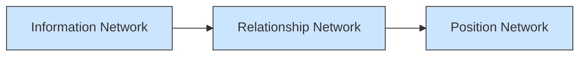
</details>

Figure 20: Multi-layers network

Instead of single-layer network, using this multi-layers network to analyze the human capital can be more comprehensive and reasonable.

## 8. Further Discussion

In reality, the structure of department in an organization has a significant impact on the analysis of managing human capital. Obviously, the individuals working in one department have more complex relationship, including both positive and negative relation. Considering the structure of department, we plan to do some further work:

When setting the initial value of loyalty and intimacy, we should analyze whether they are in one department. On the other hand, we should consider the influence of the leadership of department.

In the dynamic process of human capital network, we should also consider the adjustment from one department to another department, which are in the same level. Although the adjustment does not change the position level, but the adjustment on department will influence people’s intimacy.

Consider the organizational structure, we should take all department into account. in general, there are proper number of people in all departments that will bring maximum productivity because each department performs its own functions.

## 9. Strengths and Weaknesses

## 9.1 Strengths

1. We use three graphs to represent the relationship between staff and positions, and use time stamp to simulate the dynamic process. In addition, we combine computer simulation, HR adjustment (Using GA) and Transformation Matrix to our model to analyze the dynamic process of human capital network.

2. We set the loyalty and intimacy to identify the churn caused by people’s own relation or influenced by others. More specifically, we associate the change of loyalty and intimacy with the change of position. Then, we use the computer to simulate the churn of staff, which provides us an intuitive process.

3. Genetic Algorithm is an efficient way to get an approximate optional solution, which is used by us to assign the position to the employee. Since we do not take firing people and degrading into consideration, we modified the GA to better fit our model.

4. When discussing the cost, we divide it into two parts: the direct cost and the indirect cost. The direct cost is related to the number of employees and their levels. The indirect cost is related to the organizational structure.

## 9.2 Weaknesses

1. Due to the lacking of data, some values are based on the assumption we made. It may be different from the reality.

2. Because the organizational graph does not coordinate with the structure table, so we just use the structure table. We should also take organizational graph into account.

## Reference

[1] E. Salas, N.J. Cooke, and M.A. Rosen. (2008). On Teams, Teamwork, and Team Performance: Discoveries and Developments. Human Factors: The Journal of the Human Factors and Ergonomics Society June 2008 vol. 50 no. 3 540-547.  
[2] D. Stokols, K.L. Hall, B.K. Taylor, R.P. Moser (2008). The Science of Team Science: Overview of the Field and Introduction to the Supplement, Am J Prev Med 2008;35(2S): S77-S89  
[3] Mikko Kivelä, Alexandre Arenas, Marc Barthelemy, James P. Gleeson, Yamir Moreno, Mason A. Porter. (2013). Multilayer Networks, J. Complex Networks, 2(3):203-271 (2014); arXiv preprint arXiv:1309.7233, 2013  
[4] Bipartite graph Wikipedia http://en.wikipedia.org/wiki/Bipartite\_graph 7 February 2015  
[5] Giles R. The Strong Perfect Graph Theorem for a Class of Partitionable Graphs[J]. North-Holland Mathematics Studies, 1984:161–167.  
[6] Genetic algorithm https://en.wikipedia.org/wiki/Genetic\_algorithm 8 February 2015  
[7] Goldberg D E. The design of innovation: Lessons from and for competent genetic algorithms[J]. JASSS-THE JOURNAL OF ARTIFICIAL SOCIETIES AND SOCIAL SIMULATION, 2005, 8(3).  
[8] Bies R R, Muldoon M F, Pollock B G, et al. A Genetic Algorithm-Based, Hybrid Machine Learning Approach to Model Selection[J]. Journal of Pharmacokinetics and Pharmacodynamics, 2006, 33(2):195-221.  
[9] Wang Xiaohua, Yang Na. The parameter optimization estimation model based on genetic algorithm[J]. Electronic World, 2012, (24):118-119.