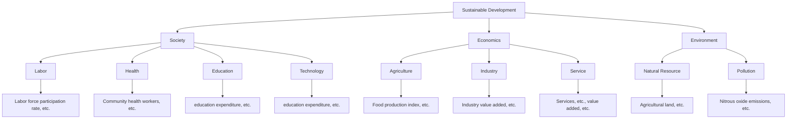
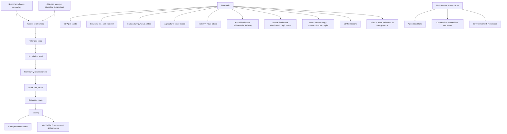

For office use only

T1

T2

T3

T4

Team Control Number

38996

Problem Chosen

D

For office use only

F1

F2

F3

F4

## 2015

## Mathematical Contest in Modeling (MCM/ICM) Summary Sheet

## Sustainable Development Evaluation System

## Summary

Sustainable development has attracted plenty of attention from all over the word for recent decades. While the definition of sustainable development is very comprehensive.

To evaluate sustainability of a country, devise an evaluation model for sustainable development. Based on our analysis of sustainable development, we depart the meaning of sustainable development into two dimension: social-economic development and environmentresource development. We design the index system by expanding ecological footprint into our model, and then we invoke entropy evaluation method and the subject-object weighting method based on CRITIC to derive the calculation process of two overall indices. By scaling the indices in coordinate system and calculate the direction by regression analysis, we devise the harmonious development (included angle between actual development direction and ideal development direction) and valid development (projection of actual development on standard development pattern) of a country to evaluate the sustainability thought two aspects. Their product, a hyperbolic sustainable distance, is the final result of our model, which represent the hyperbolic distance between the current development and goal development point. We show an implementation of our model that takes America, China, France, Nepal and South Africa as example. It turns out that America, France (the Best one) and South Africa are all sustainable, while the others are not. We also compare our model with other possible approaches, which turns out that our model is more appropriate for sustainable development.

We choose Nepal in our further investigation, where we invoke ARIMA model to forecast without intervention and system dynamics to forecast with intervention. Because of the limited data resources, we estimate the parameters of structure equations in each subsystem by Three-Stage Least Squares method, then we list the exact formulas of dynamic equations. After exploring the current development situation and geological characteristics of Nepal, we utilize sensitivity analysis and our forecast results to propose a sustainable development plan for Nepal, among which modernization program performs best according to our systemdynamics simulation results.

Finally, we discuss the strengths and weaknesses of our model.

## Contents

## 1. Introduction... 2

1.1. Background ......  
1.2. Our Work .. .. 2

## 2. Assumption ....... 3

## 3. Sustainability of a Country and Policy......... .. 4

3.1. Analysis of Sustainable Development . . 4  
3.2. Ecological Footprint . 5

3.2.1. Calculation..... 5  
3.2.2. Discussion on EF Model .

## 3.3. The Model .. 6

3.3.1. Index System .. 6  
3.3.2. Sustainability Measurement. . 8  
3.3.3. An Implementation of Our model .. .10  
3.3.4. Further Discussion. ..12

## 4. Sustainability Development Plan ..13

4.1. Current Situation and Forecast without intervention.. ..13  
4.2. Details of the Plan . ..14

4.2.1. Effectiveness Judgment by Sensitivity Analysis.. ..14  
4.2.2. Reasonability Judgment by Actual Conditions ..... .15  
4.2.3. Ultimate Plan for Sustainable development.. ..15

## 5. Dynamic Improvement.. ..16

5.1. System Dynamics and Structure Equations.. ..16  
5.2. Simulation Run and Results . ..18  
5.3. Conclusion...... ..19

## 6. Analysis of the Model . .19

6.1. Strengths .. ....19  
6.2. Weaknesses ....... ....20

## References.. ..20

## 1. Introduction

## 1.1.Background

Broadly speaking, Defined by the 1987 Brundtland Report Our Common World [1], sustainable development meets the needs of the present without compromising the ability of future generations to meet their own needs. Sustainable development can we developed into various aspect such as nature, society, ecology, policy and so on. To be specific, sustainable development is to balance the development of nature, society, ecology, population and economy.

In terms of the profound definition of sustainable development, scientist have already come up with some essential principal of sustainable develop, and they are principal of equality, principal of sustainability and principal of commonality. The principal of equality refers to the fair and equitable resources between generations, intergenerational equity allocation and utilization. While the principal of sustainability indicates that economic and social development of mankind cannot exceed the carrying capacity of resources and the environment. And the principal of commonality represents that although national sustainable development patterns are different, the principles of equality and sustainability are common.

Unfortunately, many developing countries are suffering from the unsustainable development as they lack sufficient international aids and technological path pattern to cope with the intense contradiction between the pressing needs of contemporary citizens and the responsibility of protecting the environment. Meanwhile, numerous international organizations do not equip with scientific enough methods to evaluate the sustainability of each country. Nor can they efficiently figure out which country is most worth providing aids to.

The International Conglomerate of Money (ICM) wants to use their extensive financial resources and influence to create a more sustainable world. They are particularly interested in developing countries, where they believe they can see the greatest results of their investments.

## 1.2.Our Work

We devise a mathematical model to measure the sustainability of given countries and policy after analyzing the concept of sustainable development. To be specific, we invoke the emergy based ecological footprint in our model after finding its drawbacks while measuring the sustainability of a country. Then we design a new evaluation system to perfect the objects that have been taken into consider. We also show our model results in a coordinate system so that they can be understood by any people who are interested in the issue but do not equip with much background knowledge. The model can tell when and how a country is sustainable or unsustainable explicitly. We also have some further discussion on approaches to sharpen our model.

Having devised a model for sustainability, we investigate Nepal from 48 LDC list. We first explore the current situation of Nepal by means of non-interference prediction with ARIMA model. Base on the results we derived from the analysis, we propose a 20-year sustainable development plan for Nepal, and the plan includes programs, policies, and a direction that indicates what ICM should do according to a specific state within Nepal.

We eventually devise a dynamic version of our model for the purpose to forecast the effect of each program and policy. The improved model comes back to the previous one if no programs or policies are carried out. We run the simulation each program and policy and draw the conclusion about which suggestions we had given are the highly effective strategies to be implemented by ICM.

Finally, we test the sensitivity of our model and discuss the strengths and weakness of our model.

## 2. Assumption

 The consumption of resources and production of waste are determined and can be measured by statistic method. As the consumption of resources and production of waste includes countless details which is hard to measure accurately, and the main purpose of our model is to measure the sustainability of a country or policy instead of measuring the explicit statistic data.  
 The country measured is relatively stable. That is to say, extremely dramatic change does not happen in the chosen country while we are measuring its sustainability. For example, devastating natural disasters and devastating war which might possibly exterminate the country will not be taken into consideration.  
 The economic state, demographics, resource consumption data and environment data of each the chosen country is available. The complicated situations in all developing country make it impracticable to investigate one by one, so we mainly focus on using these data to estimate whether a country is sustainably developing.  
The statistical data is valid. We suppose that the true value of every index locates right nearby the statistic data. Consequently, we assume that the data is believable.  
C The operating property and mechanism of a country is relatively independent from others. We hypothesize that every country all over the world respects the state sovereignty each other. In another word, the institutional structure and the operating mechanism within each country depends on the country itself only and will not be interfered by others. It is because every country has its sovereignty to determine which economic structure or political system to implement. And the inner political and economic structure will, to a great extent, determines various economic operating property and mechanism.

## 3. Sustainability of a Country and Policy

## 3.1. Analysis of Sustainable Development

Sustainable development should takes care of two basic concepts: the contemporary people’s need and their descendants’ ability to meet their needs. To meet the requirement, we should economize natural resource, protect the environment and develop our society and economic at the same time. What is more important is to keep these aspects in a relatively balanced relation and position. Only if we succeed in balance them all, can we satisfy contemporary needs without depriving our offspring of their ability to meet their needs in the future, and make sure of the development of our posterity without sacrificing contemporary social and economic development. In a word, three dimensions of human development (economic, society, and environment) should develop in a balance state.

Recall the fishing model which derives an ideal point of fishing amount. At this point, the fish will keep reproducing at a highest rate so that the entire fishing industry can keep doing so for a long time. We can actually regard this point as a situation that meets a sustainable development. It is because both contemporary people’s needs and the interest of their posterity are satisfied as much as possible. That is to say, with the highest reproduction of fish, people can get most amount of fish from fishing, and the entire ecosystem is protect from ecological degradation. In another word, the fish ecosystem and fishing economic (which fosters and flourishes social development) keeps a balance relationship. We can also say the three dimensions meet an equilibrium state at this good point.

It is, however, very hard to find this balanced point in reality. We can merely describe this situation in a fuzzy word. Therefore, we must clarify some main factors that typically contribute to these three dimensions.

To start with, we explore social development of a country. It is clear that the population (including gross, density, and rate of change), public service (including medical treatment and public health, telecom service, transport service, etc.), and culture (including education, science, and technology) all contribute to level of social development. The higher level of the public service and culture, the better social development, while the population is a crucial control variate that provides the average level of these two components above.

We also seek principal factors that represent the development of social economy, which is the foundation of social development. We invoke some basic results of economics, and we figure the principal elements as follow: Gross Domestic Product, added value of agriculture, industry (including heavy industry, manufacture, service, and investment), laboring population, technology and so on. The more prosperous these elements are, the better a country’s economy is.

Last but not least, we will discuss some variates that can well indicate the level of environment and natural resources consumption in Section 3.2 in detail.

Now we are discussing the relation between these aspects of a country’s development and sustainability. In terms of two meanings of sustainable development, we divide these aspects into two parts respectively. What calls for special attention is that the division is not absolutely clear, and we devise the division only for explanation purpose. For contemporary people, the essential needs are to promote the culture and boom the production as much and fast as possible, which can be explained by social and economy development. As for posterity, the amount of remained natural resources and the friendliness of environment at that time would definitely determine their ability to meet their needs.

## 3.2. Ecological Footprint

Ecological footprint (EF) is originally proposed by Rees (1992) and improved by Wackernagel [2] to measure the sustainability. According to the thought of ecological footprint, every individual or group of units can consume natural resources and produce waste back into ecology system. The natural resources consumption and produced waste can be converse into biologically productive area. Subtracting appropriated carrying capacity, the positive result indicates sustainable development while the negative one means the development is unsustainable and the ecology is in a deficit state (ecological deficit).

## 3.2.1. Calculation

The computational formula of ecological footprint is

$$
E F = N \times d f = \sum r _ {j} \times A _ {i} = \sum r _ {j} \times \frac {P _ {i} - I _ {i} - E _ {i}}{Y _ {i} \times N}, (j = 1, 2, \ldots)
$$

where ????is ecological footprint; $e f$ is per capita ecological footprint; ?? is consumption item; $Y _ { i }$ is per capita biologically productive area’s output for item ?? per annum; $A _ { i }$ is the conversed per capita biological productive area’s output for item ?? per annum; $P _ { i }$ is the production amount of item ?? per annum; $I _ { i }$ is the import volume of item $i ; E _ { i }$ is the export volume of item $i ; ~ N$ is population; and $r _ { j }$ is balance factor.

The computational formula of appropriated carrying capacity is

$$
E C = N \times e c = a _ {j} \times r _ {j} \times y _ {j}, (j = 1, 2, \dots)
$$

where $E C$ is total appropriated carrying capacity; ???? is per capita EC; $a _ { j }$ is per capita biologically productive area; $r _ { j }$ is equivalence factor; $y _ { i }$ is productive factor.

Let $A = E F - E C$ , then EF model evaluates the sustainability by value of ??. If $A < 0 ,$ , then the country is sustainable, otherwise unsustainable.

## 3.2.2. Discussion on EF Model

## The balance factor lacks enough explanation

From the computational formula, we find that the balancing factor represents ratio of the productivity of a certain biologically productive area to overall average productivity biologically productive area. That means different type of land with similar balance factor can replace each other. What’s more, the balance factors are constant which is obviously irrational.

## The calculation of EF may be extremely hard and may lead to huge error

For example, EF model converts the consumption of fossil fuel into the area that can absorb the ${ \mathrm { C O } } _ { 2 }$ produced by burning them. However, the waste gas produced while burning the fossil fuel is not merely limited to carbon dioxide, and ${ \mathsf { S } } 0 _ { 2 }$ is another important pollutant that cannot be neglected.

In order to make the computational process more accurate, we can invoke the thought of emergy analysis. Emergy analysis theory is original proposed by H. T. Odum (1988) [3] and its main idea is to converse every items considered into a single form, emergy which is measured by solar energy, so that enhance the accuracy of EF calculation, compared with the traditional one.

## Controversy representative of sustainability

Ecological footprint only takes the environmental and natural resources factor into consideration, but economic and social development are neglected. As a consequent, EF model is not necessarily sufficient to measure the sustainability of a country or policy. What’s more, EF model does not reflect the balance concept of sustainable development according to the analysis in Section 3.1.

In what follows, we devise a model for sustainable development that makes up the drawbacks of EF model and equips with strong visible and understandable results.

## 3.3. The Model

## 3.3.1. Index System

According to the analysis in Section 3.1, we divide diverse aspects of a country development level into two overall indices: SE (Society-Economy) indices and ER (Environment-natural Resources) indices. To measure these indices, we design an index system.

First, we invoke principal component analysis to create a set of each overall indices respectively. We rank all the indices decreasingly by sum of the first two principal component loadings. Then we choose the indices on the top of the list on condition that their practical implications are reasonable. Meanwhile, the process must make sure that each overall indices have approximate number of indices.

Second, we inverse the negative indices and scale all the chosen indices as follow:

$$
\mathrm{Positive:} x ^ {*} = \frac {x - x _ {\min}}{x _ {\max} - x _ {\min}},
$$

$$
\text { Negative: } x ^ {*} = \frac {x _ {\max} - x}{x _ {\max} - x _ {\min}}.
$$

For example, the carbon dioxide emissions is a negative index, so we inverse the statistic while scaling the data.

So far, we have attained all ?? indices we need. It follows that establishing the hierarchy system all these indices. We invoke some existing model (such as Cobb-Douglas production function) to devise a four-stage indices system. The indices system is showed in Figure 1. To clarify the calculation process of indices in level 2, we illustrate, for example, the agriculture index in detail.

flowchart

Figure 1 Index System

In case of industry, Cobb-Douglas production function has form

$$
Y = A L ^ {\alpha} K ^ {\beta} P ^ {1 - \alpha - \beta}
$$

where ??, ??, ??, ??, and ?? are industrial production, technology factor, labors, investment, and land input respectively. And $\alpha , \beta$ are parameter. As for agriculture case, the investment does not necessarily relate to agricultural output. Consequently, we devise the agricultural index which can be calculated by

$$
Y = A L ^ {\alpha} P ^ {1 - \alpha}
$$

where ??, ??, ??, ??, and ?? are industrial production, technology factor, labors, and land input respectively. And ?? are parameter whose value can be attained by regression analysis of historical data.

When it comes to the calculation from level 2 to level 3, we combine entropy evaluation method [5] and subjectivity-objectivity weighting method based on CRITIC [6] to devise the calculating process.

To start with, we define the information entropy as

$$
e _ {j} = - K \sum_ {i = 1} ^ {m} y _ {i j} \ln y _ {i j}
$$

where ?? = 1/ ln ?? is a constant relates to sample size ??. Let $d _ { j } = 1 - e _ { j }$ representing the valid value of information. Then we attain the initial weights of each index by normalize $d _ { j }$

$$
\omega_ {j} = \frac {d _ {j}}{\sum_ {j = 1} ^ {m} d _ {j}}.
$$

As the weighting system has a strong professional background, we cannot merely determine them by statistic method. Therefore, we invoke subjectivity-objectivity weighting method here. In terms of ICM’s exclusive financial resources and influence, we can invite numerous professional experts to evaluate these compound index, and create a weighting set $\overrightarrow { C _ { k } } = \left( c _ { k _ { 1 } } , c _ { k _ { 2 } } , \ldots , c _ { k _ { n } } \right)$ for $k = 1 , 2 , \dots , l$ where ?? is the size of CRITIC weighting set (including entropy weights). The entire calculation flow is showed in Table 1.

Step 1 Create the weighting set $\overrightarrow { C _ { k } } = \left( c _ { k _ { 1 } } , c _ { k _ { 2 } } , \ldots , c _ { k _ { n } } \right)$ ;

Step 2 Run Kendall’s consistency coefficient test [7] for each weighting proposal by CRITIC and entropy weights. If the result is significant, we accept the mean of weight set

$$
\vec {C} = \frac {1}{l} \sum_ {k = 1} ^ {l} \overrightarrow {C _ {k}},
$$

and go to Step 4;

Step 3 Let $C = \theta _ { 1 } C _ { 1 } + \theta _ { 2 } C _ { 2 } + \cdots + \theta _ { l } C _ { l } ,$ where $\theta _ { i } = \frac { \sigma _ { i } \displaystyle \sum _ { j } ( 1 - r _ { i j } ) } { \displaystyle \sum _ { i } \left( \sigma _ { i } \displaystyle \sum _ { j } ( 1 - r _ { i j } ) \right) } , ~ r _ { i j }$

the correlation coefficient of index $x _ { i }$ and $x _ { j }$ , and $\sigma _ { i }$ is the variance of index ????. $x _ { j } .$

Step 4 Run Spearman’s [8] post hoc test for rank correlation coefficient.

Table 1 The process of calculation of weighting process

So far we have finished our work in establishing the indices system. It follows Multidimensional scaling in a coordinate system.

## 3.3.2. Sustainability Measurement

According to the analysis of sustainable development in Section 3.1 and the indices system, we can further determine the accurate coordinate $A ( x , y )$ of each country for every particular year, as is showed in Figure 2. The vertical coordinate refers to ER indices and the horizon coordinate refers to SE indices. The higher the coordinate, the better performance it is. Recall that the data basket consist of several typical country all over the world, so the diagonal line actually represents the relatively balanced state of development. Consequently, we can reasonably treat the diagonal line $\overrightarrow { O S } = ( { \bf 1 } , { \bf 1 } )$ as an ideal development (standard sustainable development) pattern for every country. In this case, the ligature between a specific country and the goal development node ??, ${ \overrightarrow { A S } } =$ $( 1 - x , 1 - y )$ , is naturally an ideal development direction of a country itself.

As we have analyzed before, the sustainability refers to a benign development state of a country. To measure the sustainability of a country clearly, we demonstrate the result through two aspects.

line chart

| Year | SE Index | ER Index |
|------|----------|----------|
| 2009 | ~0.3     | ~0.8     |
| 2010 | ~0.4     | ~0.7     |
| 2011 | ~0.5     | ~0.6     |
| 2012 | ~0.6     | ~0.5     |

Figure 2 Sustainability Measurement

## Harmonious Development

Unfortunately, the ideal development is rare and hard to implement in reality. And actual development usually deviate from ideal one. Therefore, we have to evaluate the actual development direction by comparing with ideal one. We invoke regression analysis to estimate the direction vector of a certain period.

We can calculate each tangent angle much accurately by using Bézier spline function to fit a series of coordinates. Bézier spline function is much more precise at fitting an incontinuous function with smooth curvature, so it can perform better for this task and tell exact curvature (tangent angle) for every year. So it helps us to determine the exact time point if we are required to tell when a country is sustainable.

Harmonious development is the degree that a country’s development approaches to the ideal pattern. We measure the harmonious development as the magnitude of intersection angle ?? between ideal development direction and actual development direction. It depicts the degree that a country’s development direction deviate away from the ideal one. Figure 3 shows the relation between these two direction and the intersection angle. It is obvious that a small ?? indicates well harmonious development.

text_image

Ideal development direction
θ
θ₁
θ₂
θ₃
θ₄

Figure 3 Ideal development direction

It is worth noticing that the ideal development direction is always a vector in first quadrant. It means ER indices and SE indices should both goes optimized. It follows that a sustainable development direction should always point to the upper right corner in the

coordinate system.

##  Valid Development

Given that ideal development is hardly exist in reality, some countries might develop in an unhealthy way which runs more and more away from the standard sustainable development pattern. A perpendicular deviation, for example, should actually be treat as in vain in terms of valid development.

Valid development is the degree that a country’s development that can reflect on standard development pattern line. In another word, the valid development is the projection vector $\overrightarrow { O A ^ { \prime } }$ of actual development vector $\overrightarrow { O S }$ on vector $\overrightarrow { O A }$ (Figure 2). The module of $\overrightarrow { O A ^ { \prime } }$ is defined as valid development level.

In a similar way, we can define the potential development as module of vector ${ \overrightarrow { A ^ { \prime } S } } .$ . We can infer from its magnitude about the potential sustainable development in the future (in another word, the weakness of current development), and bigger its magnitude, the more passive the current development is.

## When and How

We have define two possible methods to evaluate sustainability so far, and each one will perform perfectly as we verify the concept of sustainable development. To combine these methods and make the meaning of our measurement standard more clear. We further develop these to method by multiplying them together, whose product $D _ { t }$ is a hyperbolic distance, and call it sustainable distance

$$
D _ {t} = \theta \cdot | \overrightarrow {A ^ {\prime} S} |,
$$

where ?? represents the time.

We have so far attained explicit evaluation system for sustainable development on condition that we determine a threshold value $D _ { 0 } = \pi / 3 \times 0 . 7 5 = 0 . 7 8 5 4$ for sustainable distance $D _ { t } .$ If the hyperbolic sustainable distance $D _ { t } \leq D _ { 0 }$ , then we assert that the country develops sustainably at that time, otherwise unsustainably. In this way, we can determine when and how a country is sustainable development.

## 3.3.3. An Implementation of Our model

As an illustration of our model, we choose 5 diverse countries (America, China, France, Nepal, and South Africa) to show our model’s performance. We will show some significant results with diagrams and explanation. We omit 4 indices in the implementation because of lacks of data for these indices.

## Missing Data

We use the data from the World Bank [9] to implement our model, among which there are a few missing data. In order to make sure that our model functions well and make full use of existing data. We invoke Multiple Imputation to supplement the missing data.

Based on Bayes estimation, Multiple Imputation treats the supplement data as random one, which we can derive from observed data. We invoke Monte Carlo method to create the simulate set of missing data with R 3.1.2 and package “mi” and “mice”.

## Sustainability of five countries

We evaluate the development of five countries from 2003 to 2012, and Figure 4 shows our implementation result, and we label the first year and the last year of our data in the figure to clarify the development direction of each country. Invoking regression analysis, we draw the development direction of each country, which implies the harmonious development. We can also draw an auxiliary diagonal line indicating the standard development pattern. Then we can evaluate the valid development of each country by projecting their center coordinate (mean coordinate) vector on the auxiliary line. It follows their hyperbolic distance from the ideal development.

scatterplot

| Country     | Year | SE Index | ER Index |
|-------------|------|----------|----------|
| China       | 2003 | ~0.45    | ~0.48    |
| China       | 2003 | ~0.48    | ~0.46    |
| China       | 2003 | ~0.49    | ~0.45    |
| China       | 2003 | ~0.50    | ~0.44    |
| China       | 2003 | ~0.51    | ~0.43    |
| China       | 2003 | ~0.52    | ~0.42    |
| China       | 2003 | ~0.53    | ~0.41    |
| China       | 2003 | ~0.54    | ~0.40    |
| China       | 2003 | ~0.55    | ~0.39    |
| China       | 2003 | ~0.56    | ~0.38    |
| China       | 2003 | ~0.57    | ~0.37    |
| China       | 2003 | ~0.58    | ~0.36    |
| China       | 2003 | ~0.59    | ~0.35    |
| China       | 2003 | ~0.60    | ~0.34    |
| China       | 2003 | ~0.61    | ~0.33    |
| China       | 2003 | ~0.62    | ~0.32    |
| China       | 2003 | ~0.63    | ~0.31    |
| China       | 2003 | ~0.64    | ~0.30    |
| China       | 2003 | ~0.65    | ~0.29    |
| China       | 2003 | ~0.66    | ~0.28    |
| China       | 2003 | ~0.67    | ~0.27    |
| China       | 2003 | ~0.68    | ~0.26    |
| China       | 2003 | ~0.69    | ~0.25    |
| China       | 2003 | ~0.70    | ~0.24    |
| China       | 2003 | ~0.71    | ~0.23    |
| China       | 2003 | ~0.72    | ~0.22    |
| China       | 2003 | ~0.73    | ~0.21    |
| China       | 2003 | ~0.74    | ~0.20    |
| China       | 2003 | ~0.75    | ~0.19    |
| China       | 2003 | ~0.76    | ~0.18    |
| China       | 2003 | ~0.77    | ~0.17    |
| China       | 2003 | ~0.78    | ~0.16    |
| China       | 2003 | ~0.79    | ~0.15    |
| China       | 2003 | ~0.80    | ~0.14    |
| China       | 2003 | ~0.81    | ~0.13    |
| China       | 2003 | ~0.82    | ~0.12    |
| China       | 2003 | ~0.83    | ~0.11    |
| China       | 2003 | ~0.84    | ~0.10    |
| China       | 2003 | ~0.85    | ~0.09    |
| China       | 2003 | ~0.86    | ~-        |
| China       | 2012 | ~8.5     | ~1.8     |
| China       | 2012 | ~8.6     | ~1.7     |
| China       | 2012 | ~8.7     | ~1.6     |
| China       | 2012 | ~8.8     | ~1.5     |
| China       | 2012 | ~8.9     | ~1.4     |
| China       | 2012 | ~9.0     | ~1.3     |
| China       | 2012 | ~9.1     | ~1.2     |
| China       | 2012 | ~9.2     | ~1.1     |
| China       | 2012 | ~9.3     | ~1.0     |
| Nepal       | 2012   | ~1.5     | ~7.8     |
| Nepal       | 2012   | ~1.6     | ~7.5     |
| Nepal       | 2012   | ~1.7     | ~7.2     |
| Nepal       | 2012   | ~1.8     | ~7.0     |
| Nepal       | 2012   | ~1.9     | ~6.8     |
| Nepal       | 2012   | ~2.0     | ~6.5     |
| Nepal       | 2012   | ~2.1     | ~6.2     |
| Nepal       | 2012   | ~2.2     | ~6.8     |
| Nepal       | 2012   | ~2.3     | ~7.5     |
| Nepal       | 2012   | ~2.4     | ~8.5     |
| Nepal       | 2012   | ~2.5     | ~9.5     |
| Nepal       | 2012   | ~2.6     | ~9.8     |
| Nepal       | 2012   | ~2.7     | ~9.9     |
| Nepal       | 2012   | ~2.8     | ~9.95    |
| Nepal       | 2012   | ~2.9     | ~9.98    |
| Nepal       | 2012   | ~3.0     | ~9.99    |
| Nepal       | 2012   | ~3.1     | ~9.995   |
| Nepal       | 2012   | ~3.2     | ~9.998   |
| Nepal       | 2012   | ~3.3     | ~9.999   |
| Nepal       | 2012   | ~3.4     | ~9.9995  |
| Nepal       | 2012   | ~3.5     | ~9.9998  |
| Nepal       | 2012   | ~3.6     | ~9.9999  |
| Nepal       | 2012   | ~3.7     | ~9.99995 |
| Nepal       | 2012   | ~3.8     | ~9.99998 |
| Nepal       | 2012   | ~3.9     | ~9.99999 |
| Nepal       | 2012   | ~4.0     | ~9.999995|
| Nepal       | 2012   | ~4.1     | ~9.999998|
| Nepal       | 2012   | ~4.2     | ~9.999999|
| Nepal       | 2012   | ~4.3     | ~9.9999995|
| Nepal       | 2012   | ~4.4     | ~9.9999998|
| Nepal       | 2012   | ~4.5     | ~9.9999999|
| Nepal       | 2012   | ~4.6     | ~9.99999995|
| Nepal       | 2012   | ~4.7     | ~9.99999998|
| Nepal       | 2012   | ~4.8     | ~9.99999999|
| Nepal       | 2012   | ~4.9     | ~9.999999995|
| Nepal       | 2012   | ~5.0     | ~9.999999998|
| Nepal       | 2012   | ~5.1     | ~9.999999999|
| Nepal       | 2012   | ~5.2     | ~9.9999999995|
| Nepal       | 2012   | ~5.3     | ~9.9999999998|
| Nepal       | 2012   | ~5.4     | ~9.9999999999|
| Nepal       | 2012   | ~5.5     | ~9.99999999995|
| Nepal       | 2012   | ~5.6     | ~9.99999999998|
| Nepal       | 2012   | ~5.7     | ~9.99999999999|
| Nepal       | 2012   | ~5.8     | ~$ \frac{a}{b} $, where $ \frac{a}{b} = \frac{c}{d} = \frac{d}{e}$. There are no labels provided in the image.

Figure 4 Implementation of five countries

Specifically, although America is in a bad ER situation (manifesting the bad performance in environment and natural resources development in the past), its development direction is heading right at ideal direction (the huge fluctuation in 2009 might because of economic depression), in another word, America develops harmoniously. The valid development is by and large okay for development in America. By means of calculation, the hyperbolic distance turns out $D _ { t } = 0 . 7 6 4 7 < D _ { 0 }$ , so we draw the conclusion that American development is sustainable in this period.

<table><tr><td>Country</td><td>America</td><td>China</td><td>France</td><td>Nepal</td><td>South Africa</td></tr><tr><td>Sustainable Distance</td><td>0.764749</td><td>1.401829</td><td>0.570225</td><td>1.114179</td><td>0.685853</td></tr></table>

Table 2 Sustainable Distance of five countries from 2003 to 2012

We invoke the same method to evaluate remaining countries’ development. It turns out that both France and South Africa develops sustainably. Meanwhile, by calculating the sustainable distance of each country (Table 2), we draw the conclusion that France is the most sustainable development country among these five countries. On the other hand,

China and Nepal are both unsustainable development countries, but the reasons are different. Chinese actual development direction diverge far away from the ideal sustainable development direction, and it results in the unsustainability of China. While both inharmonious direction and low valid development lead to Nepalese unsustainability. As Nepal is our choice from UN’s LDCs list, we suspend the discussion on Nepal here, and we will discuss on Nepal in Section 4 in detail.

## 3.3.4. Further Discussion

## The Dynamic Process of Our Model

To predict the sustainability of a country in coming 20 years, we classify the task into two situation: forecast without intervention & forecast with intervention.

The first situation is much handier than another one. We invoke time series analysis to cope with the prediction without intervention. To be specific, we forecast each index by Autoregressive Integrated Moving Average (ARIMA) Model [10], and then we use the predicted data to evaluate a country’s development sustainability. We will discuss the reason we invoke ARIMA model and implement this method in Section 4.1 and do some explanation. As for prediction with interference, we improve our model by utilizing the concepts of system dynamics [11] and structure equation modeling. We devise a dynamic system for all indices we have chosen, and we will describe the improved model in Section 5 in detail. We also implement the model to simulate and forecast some programs and policy.

## − Policy Sustainability

To evaluate a specific policy, we regard a policy as an intervention of a country’s running process. Hence we transform this task into forecast with intervention, which we have just mentioned above, and we will not repeat it again.

## Comparison with other Method

There are actually quite many methods that focus on evaluate sustainability. EF model, for instance, which we have discussed before our model, is a typical one, and we have already expand it to design our model. We are now make some comparison with other models.

To start with, we would like to mention some traditional statistical or artificial weighting methods such as principal component method, SVM (support vector machine), AHP (Analytic Hierarchy Process), and fuzzy synthetic evaluation model (FCEM). These methods are either too objective to explain with professional background knowledge or too subjective to make themselves convinced.

On the contrary, our model considers both subjective and objective factor, and our model has a strong professional (sustainability) background to support itself.

The other kind of methods invoke heuristic search algorithm such as ant colony algorithm, simulated annealing algorithm, GA (Genetic Algorithm), BP artificial neural network. These methods, however, are essentially improvement of random search. So the running results depend on something uncertain. What’s worse, heuristic search algorithm would possibly attain very inaccurate results, especially in high-dimension situation. As a result, heuristic search algorithm is hardly appropriate for measuring sustainability, let alone apply to forecast.

By contrast, our model is much more stable. We invoke a series of statistical significance test to ensure the rationality and reasonability of results and the result is certain as long as the data is valid. In addition, the implementation of our model is handy.

## 4. Sustainability Development Plan

Our choice is Nepal, and we implement our model using the data from the World Bank. In what follow, we will analyze the current situation of Nepal and the forecast result. And then we propose our plan for Nepal.

## 4.1. Current Situation and Forecast without intervention

We implement our model.

Figure 5 shows the Nepalese development from 2003 to 2012. We infer from the result that Nepal develops in a sustainable way, as the sustainable distance $D _ { t }$ is greater than the threshold value $D _ { 0 }$ . Further on, in order to propose a 20 years sustainable development plan, we need to firstly predict the development 20 years forward so that we can draw the plan according to it development trend.

As is mentioned in Section 3.3.4, we invoke ARIMA model to forecast each index for 20 years with R 3.1.2 and package “tseries” and “forecast”. The reason we invoke ARIMA model is the indices we consider are most nonstationary time series data. In addition, most of them are seasonal data such as added value of agriculture, which invalidate ARMA model. Consequently, ARIMA model turns out the best choice for forecast. As an example, we show the forecast result of GDP (per capita) in Figure 6. The grey color area and the light blue color area represent confidence level of 0.8 and 0.95 respectively.

line chart

| SE Index | ER Index |
| -------- | -------- |
| 0.10     | 0.79     |
| 0.14     | 0.73     |
| 0.15     | 0.76     |
| 0.15     | 0.74     |
| 0.18     | 0.67     |
| 0.20     | 0.64     |
| 0.22     | 0.63     |
| 0.23     | 0.62     |

Figure 5 Profile of Nepalese development

area chart

| x  | y    |
|----|------|
| 0  | 250  |
| 5  | 400  |
| 10 | 700  |
| 15 | 1000 |
| 20 | 1300 |
| 25 | 1600 |
| 30 | 1800 |

Figure 6 Forecast GDP (per capita) from ARIMA(0,1,0)

We can observe from the forecast result that Nepalese development trend are roughly pointing to lower right corner (environmental deterioration), and the trend is more and more fierce year by year (in another word, geometric progression trend). It means Nepalese development tends to scarify the environment to foster it social-economic development. And that is an omen of unsustainable development.

## 4.2. Details of the Plan

Here, we propose two criteria of sustainable development plan:

## Effective

In our model in task 1, various indices are included to determine when and how a country is sustainable. We will apply sensitivity analysis to obtain a set of indices which are more effective than others. That is to say, changing the value of these indices will effectively enhance the level of sustainable development. And our plan will base on that effective indices set.

## Reasonable

Plans that based on effective indices are not necessarily suitable for the chosen country. Hence we will judge a plan by various aspects such as costs, resources and political conditions. Only reasonable plans will be included in our final plan.

Now we introduce how we utilize the two criteria to derive the final plan.

## 4.2.1. Effectiveness Judgment by Sensitivity Analysis

Sensitivity analysis is always used to test the robustness of a model. And we invoke sensitivity analysis to evaluate the ability of each index to influence the results. In another word, we rank indices decreasingly by absolute value of difference quotient by index ?? of sustainable distance $D _ { t }$ as

$$
d _ {i} (D _ {t}) = \frac {D _ {t} (x + \Delta_ {i} x) - D _ {t} (x)}{\Delta_ {i} x},
$$

where ?? represents origin data, and $\Delta _ { i } x$ is the variation of index ??.

Using this approach, we obtain the effective indices list for Nepal (2003\~2012) in Table 3, and Figure 7 shows the result of each index.

<table><tr><td>16</td><td>CO2 emissions</td><td>4</td><td>education expenditure</td><td>19</td><td>access to electricity</td></tr><tr><td>7</td><td>Technology index</td><td>2</td><td>GINI coefficient</td><td>12</td><td>Services (added)</td></tr><tr><td>10</td><td>Industry (added)</td><td>11</td><td>Manufacturing (added)</td><td></td><td></td></tr></table>

Table 3 Effective indices list

Based on these influential index, we propose some possible directions for our final plan as follow:

Reduce $\mathrm { C O } _ { 2 }$ emissions (Index 16)  
Education program (Index 4)  
Modernization support (Indices 19 and 7)  
Effort to reduce the gap between the rich and poor (Index 2)  
Economic assistance (Indices 10, 11, 12)

  
Figure 7 Sensitivity of each index

## 4.2.2. Reasonability Judgment by Actual Conditions

Given that our model provides several rough directions of our plan, it remains to refine and substantiate them by reality. To this end we list some basic characteristic of Nepal: backward agricultural country, low and medium political stability (Nepalese Political Instability Index is 7.5 in 2009-2010)1, distinctive tourism resources (Mt Everest, Largest forest park in south Asia, lots of rare animals). In addition, Nepalese education plan in 1971 fastened the development of Education and the current education status has improved dramatically. Based on these cases, the draw a decision on possible solution in

Table 4.

<table><tr><td rowspan="2">Possible Direction</td><td colspan="3">Actual Requirement</td><td rowspan="2">Demands</td><td rowspan="2">Decision</td></tr><tr><td>Cost</td><td>Political stability</td><td>Resource</td></tr><tr><td>Reduce CO2 emissions</td><td>High</td><td>High</td><td>Medium</td><td>Low</td><td>Rejected</td></tr><tr><td>Education program</td><td>Flexible</td><td>Medium</td><td>-</td><td>Medium</td><td>Accepted</td></tr><tr><td>Modernization program</td><td>Flexible</td><td>Medium</td><td>-</td><td>High</td><td>Accepted</td></tr><tr><td>Reduce GINI index</td><td>High</td><td>Medium</td><td>Medium</td><td>High</td><td>Accepted</td></tr><tr><td>Economic assistance</td><td>High</td><td>Medium</td><td>Medium</td><td>High</td><td>Accepted</td></tr></table>

Table 4 Possible proposal trade-off

## 4.2.3. Ultimate Plan for Sustainable development

We propose our sustainable development plan (including programs and aids) for Nepal:

## 1. Education program

Nepalese secondary school enrollment rate is 65.82% in 2012. Although the education status of Nepal has progresses dramatically, the low-income, women, and indigenous people can hardly get equal access to education. This education program will provide access of education to these people and raise the secondary enrollment. And the program expects to enhance the education expenditure by 1.4% every year.

## 2. Modernization program

We propose a program that aims to support Nepalese modernization, especially infrastructural services. It will support Nepal to build a wide electricity reticulation system and telephone network, raising the proportion of access to electricity and telecom service. The program expects to increase the access to electricity (per capita) by 11.7% every year or the amount of telephone lines (per 100) by 14.8% every year.

## 3. Economic aid

As is mentioned above, Nepal has abundant tourism resources. This aid will support Nepal’s tourism and light industry, thus providing more job opportunity which reduces GINI index as well as promoting economic development. The aid project would provide 5.6% economic investment for Nepalese industry.

## 5. Dynamic Improvement

## 5.1. System Dynamics and Structure Equations

As is mentioned previously, we use system dynamics to improve our model so as to predict sustainability with intervention.

System Dynamics model is developed for predicting consequences of interactions among subsystems and analyzing the implications of different policies and programs [12]. In our case, sustainable development system consists of three subsystems: environmentresources (ER) system, society system, and economy system. These subsystems affect each other. For example, economic indices and environmental indices react to policy change. Meanwhile, they will impact on each other conversely. These interactions in dynamic system is complicated not only because they simultaneously involve various factors but also because they dynamically change over time. Therefore, System Dynamics is an appropriate approach to improve our model. Also, it is handy to analyze our suggestions for sustainability of country development.

We design the dynamic system for our indices and show the relationship between these indices in Figure 8. It is worthy noticing that because of the lack of data, the dynamic system is not complete. That is to say, the system is not closed, and we invoke regression analysis to remedy. To quantitatively calculate the interaction between indices, we invoke concept of structure equation modeling and use Three-Stage Least Squares (3SLS) to estimate the parameters in dynamic system equations with R 3.1.2 and package “systemfit”.

The parameter estimation result is showed in Table 5, where ??????-population; ????- birth rate; ???? -death rate; ??????- GDP per capita; ?????? -community health workers; ??????-secondary school enrollment rate; ????????-adjusted savings: education expenditure; ????????=road sector energy consumption per capita; ????-telephone lines; ????-access to electricity; ?????? -combustible renewables and waste; ?? -industry (added value); ?? - manufacturing (added value); ????????-labor force participation rate; ??-service (added value); ??-agriculture (added value); ????-agricultural land; ??????-food production index; ?????? -carbon dioxide emissions; ?????? -nitrous oxide emissions; ???????? -annua freshwater withdrawals domestic; ???????? -annual freshwater withdrawals industry;

????????-annual freshwater withdrawals agriculture.

flowchart

Figure 8 System dynamics of development

<table><tr><td>Economic Subsystem</td><td>Society Subsystem</td><td>Environment &amp; Resources Subsystem</td></tr><tr><td> $I = -4.1019 + 0.0804 * CRW$  $M = -31.7202 + 0.3703 \times LFPR$  $+ 0.0949RSEC$  $S = 73.3006 - 0.7910 \times LFPR$  $\Delta GDP = 170.5256 + 23.7031$  $\times A + 17.0251 \times I$  $+ 3.098 \times M$  $A = 46.2932 - 0.0319 \times AL$  $- 1.354 \times LPR$ </td><td> $POP = POP/1000 * (BR - DR)$  $BR = 34.1109 - 0.0183 \times GDP$  $DR = 6.7491 + 0.0799 \times DN$  $CHW = 11.0975 - 0.0714 \times SSER$  $SER = 24.9289 + 8.4137 \times ASEE$  $ASEE = 1.4993 + 0.0042 \times GDP$  $TL = -72.8756 + 1.0145 \times AE$  $- 0.0021 \times GDP$  $FPI = 887.6671 - 26.3282 \times AL$  $AE = 72.8242 + 0.0054 \times GDP$  $LFPR = 87.8768 - 0.0033 \times GDP$ </td><td> $RSEC = 0.6841 + 0.0342 \times GDP$  $AL = 30.0478 - 0.0010 \times GDP$  $+ 0.0090 \times I$  $CRW = 90.4809 + 0.0762 \times I$  $- 0.0093 \times GDP$  $CDE = 0.1249 - 0.0005 \times I$  $NOE = 1858.4 - 14.3 \times CRW$  $AFWD = 2.0305 - 0.0008 \times GDP$  $AFWI = 0.3366 - 0.0013 \times I$  $AFWA = 98.0524 - 0.0135 \times A$ </td></tr></table>

Table 5 Estimated equations of each subsystem

It is worth noticing that the simulation without intervention of our improved model should perform right identical to the forecast result in Section 4.1. We depict these two methods in one coordinate system in Figure 9. It turns out that our dynamic improvement is reasonable, and we can use the dynamic model to predict effects of each policy.

line chart

| x     | Simulation | Time Series |
|-------|------------|-------------|
| 0.08  | 0.79       | 0.79        |
| 0.13  | 0.73       | 0.76        |
| 0.18  | 0.64       | 0.64        |
| 0.23  | 0.61       | 0.61        |
| 0.28  | 0.60       | 0.59        |
| 0.33  | 0.59       | 0.58        |

Figure 9 Comparison to ARIMA model without intervention

## 5.2. Simulation Run and Results

We implement the improvement of our model by simulate our proposal one by one with MATLAB. We compare their sustainable distance by every five years with each other and finally determine the most effective proposal for ICM.

We apply the expectation achievement of each item in our plan (education program, modernization program, and economic aid) to the dynamic system, and then forecast the development line for 20 year. To make the simulation results comparable, we draw the development locus of each proposal in the same coordinate system in Figure 10, and we show the sustainable distance $D _ { t }$ of every five year in Table 6.

line chart

| x     | No change | Economic Aid | Education Program | Modernization Program |
|-------|-----------|--------------|-------------------|------------------------|
| 0.08  | 0.79      | 0.79         | 0.79              | 0.79                   |
| 0.13  | 0.73      | 0.73         | 0.76              | 0.76                   |
| 0.18  | 0.64      | 0.64         | 0.64              | 0.64                   |
| 0.23  | 0.61      | 0.61         | 0.61              | 0.61                   |
| 0.28  | 0.59      | 0.59         | 0.59              | 0.59                   |
| 0.33  | 0.58      | 0.58         | 0.58              | 0.58                   |

Figure 10 Simulation results of three programs compared with no intervention

<table><tr><td></td><td>2015</td><td>2020</td><td>2025</td><td>2030</td></tr><tr><td>No Intervention</td><td>0.852894</td><td>0.984006</td><td>0.964756</td><td>0.29873</td></tr><tr><td>Economic Aid</td><td>0.853072</td><td>0.984272</td><td>0.965149</td><td>0.299622</td></tr><tr><td>Education Program</td><td>0.852192</td><td>0.982975</td><td>0.96332</td><td>0.294641</td></tr><tr><td>Modernization Program</td><td>0.848138</td><td>0.977041</td><td>0.955021</td><td>0.272045</td></tr></table>

Table 6 Sustainable distance of each proposal (every five year)

The implementation result indicates different effect of each proposal. On the one hand, we observe from Figure 10 that modernization program develops in a more environmental friendly way, as the vertical coordinate of green line keeps higher than others. It follows that the harmonious development of modernization program is better. On the other hand, modernization program pushes the social-economic development forward most. It means the valid development improve most effectively by modernization program.

## 5.3. Conclusion

To sum up, as the modernization program performs better in both harmonious development and valid development, it deserves to perform better in minimizing the magnitude of sustainable distance. We compare the sustainable distance in Table 6 and assert that the modernization proposal produces the greatest effect on the sustainability measure of our model. So it is the most highly effective strategy to be implemented by ICM.

## 6. Analysis of the Model

## 6.1. Strengths

C Our model invokes and expand the concept of ecological footprint. We take economic development, social development, environment and natural resources development in to consider instead of merely environment and natural resources.  
The solving process is handy and the solution is stable. (see Section 3.3.4)  
The result of our model is visible and easy to understand. We demonstrate the result of our model in a coordinate system, and the result can be understood from the geometric relation easily. Consequently, anyone can comprehend the evaluation without any background knowledge.  
C Our model has a strong sense of professional background. Our model bases on both subjective and objective methods estimate the indices system, which provides professional support for our model.  
C Our model can be extended into higher dimension. As the coordinate system can extend into three or higher dimension, our model can explain the sustainability in a more explicit way.  
The dynamic improvement can be easily tracked year by year. The mechanism of

system dynamics offers a handy way to determine every crucial index.

## 6.2. Weaknesses

The model does not take devastating natural disasters and devastating war into consider. The model cannot forecast devastating disasters for a country, thus the sustainability is not necessarily exact in terms of these unpredictable factors.  
The statistical data used in implementing of model is not complete achievable. We cannot find all data we required for sustainability (4 indices). Fortunately, ICM’s extensive financial resources and influence would definitely help ICM to attain the data.  
The dynamic system can only explain the linear part of the indices system. We invoke 3SLS to solve the model which estimate the parameters by linear regression. Consequently, only linear part of indices relation are utilized in our simulation. Meanwhile, the dynamic system is not complete because of lack of data.

## References

[1] Burton I. Report on Reports: Our Common Future: The World Commission on Environment and Development[J]. Environment: Science and Policy for Sustainable Development, 1987, 29(5): 25-29.  
[2] Wackernagel M. An evaluation of the ecological footprint[J]. Ecological Economics, 1999, 31(3): 317-318.  
[3] Odum H T, Nilsson P O. Environmental Accounting--EMERGY and Environmental Decision Making[J]. Forest Science, 1997, 43(2): 305-305.  
[4] Zhang F Y, Pu L J, Zhang J. A modified model of ecological footprint calculation based on the theory of emergy analysis—Taking Jiangsu Province as an example[J]. Journal of Natural Resources, 2006, 21(4): 653-660.  
[5] Zou Z H, Yi Y, Sun J N. Entropy method for determination of weight of evaluating indicators in fuzzy synthetic evaluation for water quality assessment[J]. Journal of Environmental Sciences, 2006, 18(5): 1020-1023.  
[6] Diakoulaki D, Mavrotas G, Papayannakis L. Determining objective weights in multiple criteria problems: the CRITIC method[J]. Computers & Operations Research, 1995, 22(7): 763-770.  
[7] Hollon S D, Kendall P C. Cognitive self-statements in depression: Development of an automatic thoughts questionnaire[J]. Cognitive therapy and research, 1980, 4(4): 383- 395.  
[8] Fieller E C, Hartley H O, Pearson E S. Tests for rank correlation coefficients. I[J]. Biometrika, 1957: 470-481.  
[9] World Bank Data (http://data.worldbank.org )  
[10] Box J, Jenkins G M. Reinsel. Time Series Analysis, Forecasting and Control[J]. 1994.  
[11] Forrester J W. Industrial dynamics: a major breakthrough for decision makers[J]. Harvard business review, 1958, 36(4): 37-66.  
[12] Guo H C, Liu L, Huang G H, et al. A system dynamics approach for regional environmental planning and management: a study for the Lake Erhai Basin.[J]. Journal of Environmental Management, 2001, 61(1):93–111.  
[13] Deepak Raj Parajuli , Tapash Das. "Performanc e Of Community Schools In Nepal : A Macro Level Analysis". International Journal of Scientific and Technology Research. Retrieved 9 Feb 2015