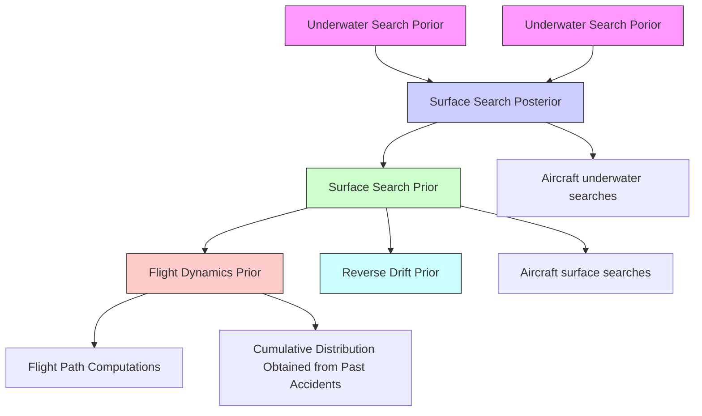

# Searching for a Lost Plane

February 10, 2015

## 1 Summary

The year 2014 witnessed a series of air disasters that resulted in huge loss of life, among them is the mysterious disappearance of Malaysia Airlines Flight 370 (MH370) in the Indian Ocean. Although the related countries spent great efforts on the crucial task of finding the plane, considering the vast space to search and the paucity of information, the plane is still not found. In past experiences, mathematical models played a leading role in helping find lost planes in open water. In this paper, we discuss mathematical models that can assist to find aircrafts lost in sea.

In order to build a mathematical model to assist the planning of a search for a lost plane considered to have crashed in open water, we first analyze the possible scenarios and propose our assumptions and hypothesis. Then we establish a collision model to predict the number of drifters resulting from the crash according to the type of the plane we are searching for. For the main part, we set up a search model based on Bayes' theorem, considering the behavior of the drifters resulted from the crash, the outcome of water surface search and underwater search sequentially to instruct further searching process. Moreover, the allocation of search areas to diverse search planes use branch and bound algorithm to optimize the possible result of the search process, both on the water surface and underwater. A simulation module is built to test our model using both fictional and real situations and to carry out the calculations.

Then we apply our model in the actual cases of Air France Flight 447 (AF447) and MH370, applying the real world data. Our recommended searching area for the AF447 case matches the location of the wreckage underwater, while for MH370 we predict its possible wreckage position based on accessible information.

Afterwards sensibility analysis is applied to our model, which shows that our model is stable and robust while ready to adapt to different situations. Last but not least, we discuss the strengths and weaknesses of the model.

In summary, Our model excels in terms of accuracy, efficiency, its value of application and robustness, although we can still improve it considering the computational complexity, some unrealistic assumptions and how to determine some of the parameters of the model.

Key Words: Bayesian theorem, searching, lost plane, branch-and-bound algorithm

## Contents

1 Summary.... 1  
2 Introduction 6  
3 Base Analysis 7

3.1 Type of Plane Crashed 7  
3.2 Type of Search Plane 7

4 Assumption and Hypothesis 8

4.1 Collision Model 8  
4.2 Simulation Module 8  
4.3 Water Surface Search Model 9  
4.4 Underwater Search Model 9  
4.5 Search Plan 9

5 Variable and Definition 10  
6 Establishing and Solving of Model 10

6.1 Collision Model 10

6.1.1 Air Disintegration 11  
6.1.2 Water Disintegration 11

6.2 System Module 12  
6.3 Overview on Search Model 13

6.3.1 Review on Bayesian Filtering Algorithm 13  
6.3.2 Steps of Search Plan 13

6.4 Water Surface Search Model 14

6.4.1 Surface Search Prior PDF for Impact Location ..... 14  
6.4.2 Surface Search Posterior PDF for Impact Location ..... 18

6.5 Underwater Search Model 19

6.5.1 Underwater Search Prior PDF for Impact Location ..... 19  
6.5.2 Phase I Searches ..... 19  
6.5.3 Underwater Search Posterior PDF after Phase I ..... 19  
6.5.4 Recursion 19

## 7 Allocation Model 21

7.1 Review on Algorithms 21  
7.2 Allocation of Search Planes 21

## 8 Applying of Model 22

8.1 Application on AF447 22  
8.1.1 Available Information 23  
8.1.2 Computation Process 23  
8.1.3 Computation Result 23

8.2 Prediction on MH370 24  
8.2.1 Review on Established Models 24  
8.2.2 Probability Distribution 26  
8.2.3 Computation Process 26

## 9 Sensitivity Analysis 27

9.1 The Number of Drifters 27  
9.2 The Number of Search Planes 28  
9.3 The Types of Search Planes ..... 28  
9.4 Weights in Computing Flight Dynamics PDF 29  
9.5 Weights in Computing Surface Search Prior PDF ..... 30  
9.6 Weights in Computing Underwater Search Prior PDF ..... 30

## 10 Strengths and Weaknesses 31

10.1 Strengths 31  
10.2 Weaknesses 31

11 Non-technical Paper for Press Conference 32

References 33

## 2 Introduction

Approaching its anniversary, the missing of Malaysia Airlines Flight 370 (MH370) on March 8, 2014 has become one of the mysteries in aviation history. The dark riddle also reminds the public of the tragedy of Air France Flight 447 (AF447), which disappeared over the South Atlantic during a night flight en route from Rio de Janeiro to Paris on June 1, 2009. It was nearly 2 years later when the plane wreckage was localized during the fourth phase of the sea searches.

With deepest condolences to the victims, authorities are pondering how to establish a more efficient and accurate maritime search and rescue (SAR) simulation system. It is based on calculation and prediction of flight dynamics, ocean models, substantial search consequence, etc. Currently, major difficulties lie in a paucity of data and scant knowledge of ocean geography (e.g. the largely uncharted bathymetry of the southern Indian Ocean's sea floor hampers the rescue of MH370 [1]).

Our goal is to construct a generic and reliable mathematic model corresponding to a lost plane, which is feared to have crashed in open water in the way to point B from point A. Weighing the factors mentioned above, we propose a useful search plan to pinpoint the disappeared aircraft. Specifically, we will do the following things in this paper:

- Establish a collision model to determine the number of drifters resulting from the crash.  
- Build simulation module to represent real movement of drifters in water.  
- Propose a search model based on Bayes' theorem, considering water surface search and underwater search sequentially to optimize on search areas.  
- Develop an allocation model to match search planes with search areas.  
- Employ the preceding approach in the case of finding AF447 at the fourth attempt to verify the credibility of our model.  
- Predict the possible location of MH370 wreckage with accessible data and offer advice to assist the further search effort.  
- Analyze the strengths and weaknesses inherent in the model and confirm the potential development direction.

## 3 Base Analysis

First of all, we will have an overall observation on the searching and dispatching problem in reality. Noting that there are many different types of planes for which we might be searching and that there are many different types of search planes, often equipped with diverse electronics or sensors, it is of great interest and significance to distinguish their influence on rescue.

## 3.1 Type of Plane Crashed

The type of the aircraft we are searching contributes to the number of drifters $^{1}$ produced by a crash into the sea $^{2}$ . Intuitively, the more debris drifting on the water surface, the easier the rescue will be.

- Size. It conforms to common sense that large planes give rise to more aircraft debris than small ones under the same conditions.  
- Passenger capacity. It is worth addressing that recovering bodies may be of more value. When we compute reverse drift (one of the key factors in the search plan), we do not have good models for the effect of leeway on certain type of aircraft debris, while bodies can be drifted back employing current estimates [3].  
- Materials. Aircraft materials vary with different parts of a plane as well as different types of planes. Materials determine density and mechanical behaviors such as intensity, tenacity and impact resistance.

## 3.2 Type of Search Plane

Sorts of search aircrafts available are helicopters (H) and fixed-wing aircrafts (F-W). They differ from each other mainly in search speed, voyage and search electronics and sensors. Specific examples are given to each type of search plane and their corresponding performances $[4]$ are listed in Table 1 for comparison.

We gain heuristics from the table that we should employ distinguished aircrafts for distinct search areas and targets. Optimal control over search forces is required to develop an efficient model. In addition, we note there are still subtle differences between specific aircraft models belonging to fixed-wing aircrafts. However, for the simplicity of our model, we retain the classification mentioned above.

Table 1: Comparison between Different Types of Search Planes

<table><tr><td>Example</td><td>Type</td><td>Search Speed (km/h)</td><td>Voyage (km)</td><td>Search Sensors</td></tr><tr><td>SH-60B</td><td>H</td><td>300</td><td>800</td><td>Sonar, Radar</td></tr><tr><td>P-3C</td><td>F-W</td><td>600</td><td>4000</td><td>Sonar, Radar,Magnetic anomaly detection,Photographic equipment</td></tr><tr><td>C-130H</td><td>F-W</td><td>600</td><td>3800</td><td>Radar</td></tr></table>

## 4 Assumption and Hypothesis

For the feasibility of calculation and simulation, we make the following assumptions:

## 4.1 Collision Model

- The plane is full-loaded.  
- The accidents can be classified into two situations according to disintegration situations: Air Disintegration and Water Disintegration.  
- In both disintegrations, the broken pieces are of the same size.  
- In water disintegration, we regard it as an ideal collision process and the impulse suffered by the aircraft in horizontal direction can be omitted.

## 4.2 Simulation Module

- The drifters have the same initial position, which is the impact location.  
- We do not distinguish drifters. That is, factors have equal impact on bodies and aircraft debris.  
- On the surface of the water, the floating movement is simulated merely based on data on currents and random motion exerted by computer.

\- Underwater parts are assumed to be static once they sink to the seafloor.

## 4.3 Water Surface Search Model

- The drifters have the same initial position, which is the impact location.  
- We do not distinguish drifters in aspect of their movement.  
- We do not distinguish drifters in their detection probability.  
- Drifters are assumed not to move during the search phase.

## 4.4 Underwater Search Model

- Underwater parts are assumed to be static once they sink to the seafloor.  
- Other assumptions are the same to those in water surface model.

## 4.5 Search Plan

- We cannot gather any signal from the crashed plane.  
- Search vehicles are restricted to aircrafts.  
- Different search capabilities of search planes are limited to search areas and detection rate.  
- Search capability does not vary under different weather condition.  
- Underwater detection capability is beyond the depth of seafloor.  
- The sensors are assumed to give no false target detection, while they may fail to call a detection when the target is present.  
- We replace the constraint of voyage with the limit to search areas.

## 5 Variable and Definition

Table 2: Variable and Definition

<table><tr><td> $N_0$ </td><td>Maximum amount of drifters</td></tr><tr><td>N</td><td>Actual amount of drifters</td></tr><tr><td>V</td><td>Volume of the plane</td></tr><tr><td>m</td><td>Total weight of the plane</td></tr><tr><td>α</td><td>Ratio of  $N_0$  to V</td></tr><tr><td>β</td><td>Degree of disintegration of the plane</td></tr><tr><td>v</td><td>Flight velocity when colliding</td></tr><tr><td>θ</td><td>Contact angle between the plane and water surface</td></tr><tr><td>I</td><td>Impulse suffered by the plane</td></tr><tr><td> $S_{i,j}$ </td><td>Certain point on water surface</td></tr><tr><td>D</td><td>Distance from emergency to impact location</td></tr><tr><td>F(D)</td><td>Cumulative fraction as a function of distance</td></tr><tr><td> $P_C(S_{i,j})$ </td><td>Probability of  $S_{i,j}$  as the impact location</td></tr><tr><td> $P_D(S_{i,j})$ </td><td>Probability of drifters at  $S_{i,j}$ </td></tr><tr><td> $P_W(S_{i,j})$ </td><td>Probability of wreckage at  $S_{i,j}$ </td></tr><tr><td> $P_{A_kD}(S_{i,j})$ </td><td>Detecting Probability of drifters at  $S_{i,j}$ </td></tr><tr><td> $P_{A_kW}(S_{i,j})$ </td><td>Detecting Probability of wreckage at  $S_{i,j}$ </td></tr></table>

## 6 Establishing and Solving of Model

Since we have formed an overall observation over the search problem, we strive to develop a series of models for a practical rescue plan.

## 6.1 Collision Model

We recognize that the total amount of drifters produced by the crash have large impact on the search difficulty. Hence, we deal with the counting of drifters in this subsection at first.

Using $N_{0}$ to represent the maximum amount of drifters resulting from plane crash $^{3}$ , it attributes to aircraft type, passengers onboard, etc. For rational simplification, it is assumed that the aircraft is full-loaded. Hence, we suppose that $N_{0}$ increases in direct proportion to the volume of the aircraft V, i.e.

$$
N _ {0} = \alpha V \tag {1}
$$

where $\alpha$ is the ratio of $N_{0}$ to V.

Using N to represent the actual amount of drifters resulting from plane crash, N is relevant to $N_{0}$ , flight velocity (v), contact angle ( $\theta$ ), disintegration situations, etc.

Disintegration situations are classified into two categories in our paper: planes break apart in the air and planes collide with the water as a whole, which connotes that the planes do not break apart until the interaction with water. For the convenience of expression, we name the former category as 'Air Disintegration', while the latter as 'Water Disintegration'. Then, the above situations are separately discussed about.

## 6.1.1 Air Disintegration

Assuming that degree of disintegration $^{4}$ remains constant to the whole plane and N is in direct proportion to it, we have

$$
N = \beta N _ {0} \tag {2}
$$

where $\beta$ is the degree of disintegration.

## 6.1.2 Water Disintegration

Above all, it is noted that $\beta$ is determined by the impulse suffered by the plane when it crashes into the water.

Then, we consider the situation that plane crashes into the water with mass m, flight velocity v and contact angle $\theta$ . The diagram of this situation is shown in Figure 1.

We have velocity expressions in vertical and horizontal direction as follows:

$$
\left\{ \begin{array}{l} v _ {x} = \cos \theta \\ v _ {y} = \sin \theta \end{array} \right. \tag {3}
$$

At the moment of collision, the time for vertical velocity reducing to zero is rather small when contrasting with that in horizontal direction. In this sense, the impulse suffered by the aircraft in horizontal direction can be omitted. Hence, we have:

$$
I = m v _ {y} = m v \sin \theta \tag {4}
$$

where $m$ is the total weight of the plane.

text_image

Total weight of plane: m
Volume of plane: V
Velocity of plane: v
θ
Contact angle
with water surface

Figure 1: The Diagram for Water Disintegration

Intuitively, we can expect positive correlations between $I$ and $\beta$ . We provide a further description:

- $\beta$ can be regarded as 0 when $I$ is inadequate.  
- There is a linear relationship between $I$ and $\beta$ when $I$ increases to certain level.  
- $\beta$ remains to be 1 when $I$ is large enough. In this situation, $N$ equals to $N_0$ .

Formally, we express the relationship as:

$$
\beta = \left\{ \begin{array}{l l} 0 & I \leqslant I _ {0} \\ \gamma (I - I _ {0}) & I _ {0} <   I <   I _ {0} + 1 / \gamma \\ 1 & I \geqslant I _ {0} + 1 / \gamma \end{array} \right. \tag {5}
$$

where $\gamma$ can be obtained from practical data.

Consequently, the situation of water disintegration also conforms to (2), i.e.

$$
N = \beta N _ {0}
$$

## 6.2 System Module

This system is designed to generate real scenarios of the crashed plane, including debris distribution and their subsequent movements. It is used to measure and correct our search model. In other words, it serves as the exact answer to the locations of the search targets from a dynamic perspective of view.

The assumptions are stated in 4.2. A critical point to be restated is that we utilize random motion given by computer, advertising self-consistent calculation.

## 6.3 Overview on Search Model

Our search model optimizes search areas, while the allocation of aircrafts is described in an independent allocation model.

## 6.3.1 Review on Bayesian Filtering Algorithm

The mathematical foundation of our model is rooted in classical Bayesian inference. The Bayesian approach is particularly suitable for combining in a rational manner heterogeneous non-Gaussian sensor observations with other sources of quantitative and qualitative information [6][7].

In Bayesian analysis any quantity that is not known is considered a random variable. The state of knowledge about such a random variable is expressed in the form of a probability density function (PDF). Any new information in the form of a probabilistic observation is combined with the prior PDF using the Bayes' theorem in order to update the state of knowledge and form a new posterior PDF. That PDF forms the quantitative basis on which all inferences, or control decisions are made. [1]

In a general search problem, the unknown variable is the target location $S_{i,j}$ . The analysis starts from determining a prior PDF of $S_{i,j}$ , that is, $P_{D}(S_{i,j})$ . The prior PDF incorporates accessible information (e.g. substantial search consequences). Detecting report gives the feedback of 'successful' and 'unsuccessful', characterized by B. Then, the posterior distribution $P_{D}(S_{i,j}|B)$ can be established recursively based on observations made from detecting tools.

In summary, the recursive estimation is performed with prediction and update in sequence.

## 6.3.2 Steps of Search Plan

Specifically, in this search problem provided by MCM, our computation procedure is summarized in the following flowchart, where 'NM' represents 'nautical mile').

As is illustrated in Figure 2, we can divide the search model into 'water surface search model' and 'underwater search model'.

flowchart

Figure 2: Summary of the Probability Distribution Computation

## 6.4 Water Surface Search Model

## 6.4.1 Surface Search Prior PDF for Impact Location

In this part, we aim to make out the prior PDF for impact location. The PDF comprises of flight dynamics prior and reverse drift prior.

## 6.4.1.1 Flight Dynamics Prior PDF

It is as well the combination of two distributions.

The first distribution is inferred from the aircraft's last known position (LKP). It is based on purely flight dynamics considerations about the maximum distance the aircraft could have feasibly traveled from the time of its last reported position to the time when a scheduled response from the Aircraft Communications Addressing and Reporting System (ACARS) was not received [3]. Then, we get a circular area. Additionally, we suppose each point with the circle has equivalent probability to serve as the impact location.

The foundation of the second distribution is an analysis on the collected data from nine commercial aircraft accidents including loss of control. It is conducted by the Russian Interstate Aviation Group [8]. Using the data, the cumulative distribution of distance traveled from the beginning of emergency to the impact location is plotted in Figure 3. In addition, we fit the function to be

$$
F (D) = 1 - \frac {2 2}{D ^ {2} + 2 2} \tag {6}
$$

scatterplot

| Distance (NM) | Value |
| ------------- | ----- |
| 0             | 0.0   |
| 2             | 0.1   |
| 4             | 0.45  |
| 6             | 0.67  |
| 8             | 0.78  |
| 10            | 0.89  |
| 12            | 0.89  |
| 14            | 0.89  |
| 16            | 0.89  |
| 18            | 0.99  |
| 20            | 0.99  |

Figure 3: Cumulative Distribution of Distance from Beginning of Emergency to Impact Location

When constructing the flight dynamic prior, we chose a mixture weighted by 50% for each distribution [3]. The distribution is shown in Figure 4.

heatmap

| Latitude  | Longitude | Value   |
| --------- | --------- | ------- |
| 15.50°N   | 171.50°E  | 0.0326  |
| 15.50°N   | 171.80°E  | 0.0293  |
| 15.50°N   | 172.10°E  | 0.026   |
| 15.50°N   | 172.40°E  | 0.0228  |
| 15.50°N   | 172.70°E  | 0.0195  |
| 15.50°N   | 173.00°E  | 0.0163  |
| 15.20°N   | 171.50°E  | 0.013   |
| 15.20°N   | 171.80°E  | 0.0113  |
| 15.20°N   | 172.10°E  | 0.0098  |
| 15.20°N   | 172.40°E  | 0.0085  |
| 15.20°N   | 172.70°E  | 0.0073  |
| 15.20°N   | 173.00°E  | 0.0063  |
| 14.90°N   | 171.50°E  | 0.0033  |
| 14.90°N   | 171.80°E  | 0.0033  |
| 14.90°N   | 172.10°E  | 0.0033  |
| 14.90°N   | 172.40°E  | 0.0033  |
| 14.90°N   | 172.70°E  | 0.0033  |
| 14.90°N   | 173.00°E  | 0.0033  |
| 14.60°N   | 171.50°E  | 0.0033  |
| 14.60°N   | 171.80°E  | 0.0033  |
| 14.60°N   | 172.10°E  | 0.0033  |
| 14.60°N   | 172.40°E  | 0.0033  |
| 14.60°N   | 172.70°E  | 0.0033  |
| 14.60°N   | 173.00°E  | 0.0033  |
| 14.30°N   | 171.50°E  | 0.0033  |
| 14.30°N   | 171.80°E  | 0.0033  |
| 14.30°N   | 172.10°E  | 0.0033  |
| 14.30°N   | 172.40°E  | 0.0033  |
| 14.30°N   | 172.70°E  | 0.0033  |
| 14.30°N   | 173.00°E  | 0.0033  |
| 14.00°N   | 171.50°E  | 0       |
| 14.00°N   | 171.80°E  |        |
| 14.00°N   | 172.10°E  |        |
| 14.00°N   | 172.40°E  |        |
| 14.00°N   | 172.70°E  |        |
| 14.00°N   | 173.00°E  |        |

Figure 4: Flight Dynamics Prior PDF

## 6.4.1.2 Reverse Drift Prior PDF

The reverse drift prior is based on data describing marine geography. Surface currents and winds are the primary factors.

We establish our model mainly on the simulation of currents. We utilize data collected from Ocean Surface Current Analyses - Real time (OSCAR) Project Office [9]. Accessible data includes mean currents condition (with a minimum period of 5 days) for each longitude and latitude, dating from 15 October, 1992 to 5 February, 2015 $^{4}$ .

To compute reverse drift in certain areas for a certain period of time, we use linear interpolation to process the data.

In addition to floating due to surface current, leeway (drift caused by wind) is accounted for. However, faced with scant data on winds, we are deterred to accomplish theoretical calculations (e.g. those presented in the Drift Group Report [10]). Noting that winds spill over their influence on currents, we assume that they affect the drifters' movements through currents.

The actual speed of the drifters is given as a quarter of the currents speed. The coefficient 0.25 is chosen in consideration of currents, winds, temperature, etc. In following this approach, the positions of the drifters can be drifted back to the initial crashing moment.

Thus, the total reverse probability distribution is the sum of the distributions produced from each position of spotted drifters.

## 6.4.1.3 Surface Search Prior PDF

To generate a rational surface search prior PDF, it is critical to carefully weigh the priors above. Our model recognize that the complexity of ocean geography and lack of data contribute to a high uncertainty inherent in the estimates of reverse drift prior PDF. We can give a further evidence of the difficulty in predicting the movement with currents, Figure 5 is depicted according to our system simulation. The trajectories of the hypothetical drifters are rather diverging.

In light of this uncertainty, we give a comparatively lower weight to estimates based on reverse drift.

The prior distribution before practical surface search is made to be a mixture of 70% of the flight dynamics prior PDF given in 6.4.1.1 and 30% of the reverse drift prior given in 6.4.1.2 [3]. The result of the calculation is shown in Figure 6.

text_image

Impact Location
10NM

Figure 5: Imagined Trajectories in System Simulation in Two Days

heatmap

| Latitude  | Longitude  | Value    |
| --------- | ---------- | -------- |
| 15.50°N   | 171.50°E   | 0.0008   |
| 15.20°N   | 171.80°E   | 0.0016   |
| 14.90°N   | 172.10°E   | 0.0024   |
| 14.60°N   | 172.40°E   | 0.0032   |
| 14.30°N   | 172.70°E   | 0.0048   |
| 14.00°N   | 173.00°E   | 0.0064   |

Figure 6: Surface Search Prior PDF for Impact Location

## 6.4.2 Surface Search Posterior PDF for Impact Location

After the release of the prior PDF given in 6.4.1, authorities are scheduled to assign and allocate aircraft to accomplish the first search phase. The substantial efforts provide information of the targets' location. In this part, we will calculate the posterior PDF in the surface search period through the application of Bayes' rule.

We have mentioned in 6.1 that the crash generates N drifters. Cells are divided in the search area with equal size.

According to the prior PDF, $P_{D}(S_{i,j})$ gives the probability that certain drifters are located in the search cell $S_{i,j}$ . Detecting report gives the feedback of 'successful' and 'unsuccessful', characterized by B. Here, we assumed that there are at most one drifter inside a cell. $P_{A_{k}D}(S_{i,j})$ gives the probability that the object would have been detected by search aircraft $A_{k}$ if it is located there.

Then, we compute the posterior probability $P_{D}(S_{i,j}|B)$ :

$$
P _ {D} (S _ {i, j} | B) = \frac {P (B | S _ {i , j}) P _ {D} (S _ {i , j})}{\sum_ {S _ {m , n} \in S} P (B | S _ {m , n}) P _ {D} (S _ {m , n})} \tag {7}
$$

where S is the whole search area in contemporary search phase.

A posterior PDF for the impact point is calculated in this fashion and the result is depicted in Figure 7.

heatmap

| Latitude  | Longitude | Value  |
| --------- | --------- | ------ |
| 15.50°N   | 171.50°E  | 0.004  |
| 15.20°N   | 171.80°E  | 0.008  |
| 14.90°N   | 172.10°E  | 0.016  |
| 14.60°N   | 172.40°E  | 0.024  |
| 14.30°N   | 172.70°E  | 0.032  |
| 14.00°N   | 173.00°E  | 0.04   |

Figure 7: Surface Search Posterior PDF for Impact Location

## 6.5 Underwater Search Model

Underwater search acts as the most valuable portion in the whole plan because it directly targets at the aircraft wreckage. Based on Bayes' theorem, the model turns to be a recursion, ended by the spot of wreckage.

## 6.5.1 Underwater Search Prior PDF for Impact Location

We form the underwater search prior through a mixture of 30% of the surface search posterior in Figure 7 and 70% of the flight dynamics prior in Figure 3 according to the Final Report. The surface search posterior is allocated a lower weight accounting for the uncertainty of currents. The PDF is plotted in Figure 8.

## 6.5.2 Phase I Searches

In this phase of search, underwater detections are performed in accordance to the prior PDF in 6.5.1. Moreover, we assume that water surface searches are not conducted any more. It is because the uncertainty caused by ocean geography is rather high and the location estimate will grow even more uncertain as time goes by.

It is expected that the aircraft wreckage can be localized in the first triage of underwater search. However, this strong expectation may not hold in reality. In this sense, we go on to compute posterior after phase I.

## 6.5.3 Underwater Search Posterior PDF after Phase I

$P_{C}(S_{i,j})$ is the probability $S_{i,j}$ is the impact location. Analogous to surface water search posterior PDF, we just replace $P_{D}(S_{i,j})$ , $P_{A_{k}D}(S_{i,j})$ with $P_{W}(S_{i,j})$ , $P_{A_{k}W}(S_{i,j})$ in (7).

The posterior PDF is plotted in Figure 9.

## 6.5.4 Recursion

Then, the PDF in 6.5.3 function as the prior PDF for Phase II searches. If the search ends up unsuccessful, posterior PDF after Phase II is required. The recursion continues until the wreckage is pinpointed or the procedure is suspended intentionally.

heatmap

| Latitude  | Longitude | Value   |
| --------- | --------- | ------- |
| 15.50°N   | 171.50°E  | 0.0399  |
| 15.20°N   | 171.80°E  | 0.0359  |
| 14.90°N   | 172.10°E  | 0.0319  |
| 14.60°N   | 172.40°E  | 0.0279  |
| 14.30°N   | 172.70°E  | 0.0239  |
| 14.00°N   | 173.00°E  | 0.016   |

Figure 8: Underwater Search Prior PDF for Impact Location

heatmap

| Latitude  | Longitude | Value    |
| --------- | --------- | -------- |
| 15.50°N   | 171.50°E  | 0.0019   |
| 15.20°N   | 171.80°E  | 0.0017   |
| 14.90°N   | 172.10°E  | 0.0015   |
| 14.60°N   | 172.40°E  | 0.0013   |
| 14.30°N   | 172.70°E  | 0.0011   |
| 14.00°N   | 173.00°E  | 0.0009   |

Figure 9: Underwater Search Posterior PDF for Impact Location

## 7 Allocation Model

Taking all data available as well as associated uncertainties into consideration, we have formed an analytic prediction of the debris distribution for next increment of search effort. Then, we are scheduled to deal with the allocation of search forces in this subsection.

On the foundation of Quicksort algorithm and branch-and-bound algorithm, our goal is to develop a method matching search planes with search cells.

## 7.1 Review on Algorithms

Quicksort is a sorting algorithm with the time complexity of $O(n \lg n)$ . It is an efficient divide and conquer algorithm, rearranging an array in ascending or descending order by recursive partition.

Branch-and-bound algorithm is a widely used algorithm for solving large scale NP-hard combinatorial optimization problems $[14]$ . For a maximization problem, the key idea of the branch-and-bound algorithm is:

- The maximum lower bound seen among all candidates examined so far are recorded.  
- If the upper bound for certain set of candidates (A) is smaller than the upper bound for some other set (B), then A may be safely discarded from the search.  
- The recursion stops when the current candidate set S increases to a single element, or when the upper bound for set S matches the lower bound. Either way, any element of S will be a maximum of the function within S. [15]

## 7.2 Allocation of Search Planes

We implement the task of allocating planes to certain search cells with the following steps:

\- Match planes with search areas. Rank the search areas based on updated PDF applying the Quicksort Algorithm in descending order. Meanwhile, rank the available search aircrafts based on their search capability also in descending order. Thus, search cells with larger PDFs will be allocated to better with a higher priority, which helps us to find a better solution earlier, instead of wasting time on inferior ones.

\- Optimize the allocating plan. Compute the cumulative probability of detection which is the sum of probabilities at each point and make it the objective function. Apply the branch-and-bound algorithm to fulfill the maximization task.

Take the water surface search as an example. The accessible search aircrafts are generally classified as of better detection capability and of minor detection capability. Figure 10 is depicted to show the allocation plan. (In the upper left corner, the larger rectangle accords with the better planes.)

heatmap

| Latitude  | Longitude | Value    |
| --------- | --------- | -------- |
| 15.50°N   | 171.50°E  | 0.008    |
| 15.20°N   | 171.80°E  | 0.0064   |
| 14.90°N   | 172.10°E  | 0.004    |
| 14.60°N   | 172.40°E  | 0.0024   |
| 14.30°N   | 172.70°E  | 0.0016   |
| 14.00°N   | 173.00°E  | 0        |

Figure 10: Allocation Plan of the Search Aircrafts

## 8 Applying of Model

As is described before, the previous model is concerned about the entire process of searching for a disappeared plane. In the former part of this section, we apply our model to the case of AF447, evaluating and analyzing the performance. Then, we propose a possible search plan for the further detection of MH370 on the basis of our model and accessible data.

## 8.1 Application on AF447

As is described before, the previous model is concerned about the entire process of searching for a disappeared plane. In the former part of this section, we apply our model to the case of AF447, evaluating and analyzing the performance. Then, we propose a possible search plan for the further detection of MH370 on the basis of our model and accessible data.

## 8.1.1 Available Information

The rescue work began on June 1, 2009. However, the aeroplane wreckage was finally localized on April 2, 2011. It was found about 6.5 NM from the last known position, at a depth of 3,900 meters, slightly to the left of the planned route [16].

The position, date and recovery time data can be referenced in the Final Report by BEA $[16]$ . In light of the uncertainty caused by ocean geography (as is stated in 6.4.1.3), the location estimate will grow even more uncertain as time goes by. Hence, we employ the data gathered from the initial search phase.

## 8.1.2 Computation Process

The process conforms to the procedure in Figure 1.

Flight Dynamics Prior has been worked out in 6.4.1.1. The distribution of the drifters obtained from Table 3 can be assumed as surface search posterior PDF. Then, we form the underwater search prior through a mixture of 70% of the flight dynamics prior and 30% of the surface search posterior, as it is in 6.5.1.

## 8.1.3 Computation Result

The underwater search prior PDF for the case of AF447 is shown in Figure 11. The point with the highest probability is selected as the 'predicted' impact location. In addition, the exact impact location is pointed out by the spot in the figure for comparison.

We can observe from the figure that the impact location is located in our suggestive area.

heatmap

| Latitude  | Longitude | Value   |
| --------- | --------- | ------- |
| 5.00°N    | 33.0°W    | 0.0326  |
| 4.10°N    | 32.2°W    | 0.0293  |
| 3.20°N    | 31.4°W    | 0.0228  |
| 2.30°N    | 30.6°W    | 0.0195  |
| 1.40°N    | 29.8°W    | 0.0163  |
| 0.50°N    | 33.0°W    | 0.013   |

Figure 11: Underwater Search Prior PDF for AF447

## 8.2 Prediction on MH370

## 8.2.1 Review on Established Models

The first difficulty in the MH370 search problem is that the last known position (LKP) cannot be absolutely determined. Hence, it could not enter the process in Figure 1.

A diversity of models have been established by experts to determine the flight path of MH370. However, their prediction outcomes prove to be quite diverging. Moreover, the robustness is poor.

The models are based on data from radar and satellite. Radar data suggests that the flight path of MH370 was rather erratic. Satellite data presents seven records on the position of MH370. Considering the principles of how the distance of the aeroplane from the satellite is established, the measuring results are actually seven circles on Earth surface.

With the uncertainty of flight path, search areas are experiencing violent changes. Besides, each suggestive plan tends to cover a vast area. As is shown in Figure 12 [17], different models proposed on different dates gives different search areas while each search covers a considerably large arching area.

text_image

Towed Pinger Locator Search & Seafloor Sonar Survey (4 April - 28 May)
Detected by sonobouy
Cocos Is. (Australia)
Location (area of uncertainty) of an event detected by hydrophone stations (not likely related to Flight 370)
Search areas 3 - 11 April
TPL search & seafloor sonar survey (inset)
Exmouth
RAAF Leamonth
Search areas 12 - 28 April
7th arc - Location (distance from satellite) of Flight 370 at the time of its last transmission (8:19 MYT; UTC+8:00)
Australia
Flight path / impact area calculations
18 March
28 March
3 April
Highest probability
Medium probability
Lowest probability
October
Ridge
Breaken
Search areas 28 March - 3 April
Amsterdam Is. (France)
Saint Paul Is. (France)
Search Areas 18 - 27 March
Sonobouy deployments
Hydrophone stations
Underwater search (commenced October 2014)
Initial (priority) search area
Wide area search
Satellite images of possible debris:
Thaichote (24 March)
Gaofen-1 (18 March)
Airbus (23 March)
Digital Globe (16 March)
Sources: Australia Maritime Safety Authority & Australian Transport Safety Bureau
Map by Andrew Heneen (December 2014). Licenciato: CC-BY-3.0

Figure 12: The Search for MH370

A critical question is to be raised: why are the search areas changing? In-depth analyses are performed on these models and we suppose the reasons to be:

- Besides of ping arc data, burst frequency offset (BFO) must be considered.  
- Data are excessively analyzed with sophisticated methods.  
- The scopes of application are restricted by the advanced models and algorithms.

## 8.2.2 Probability Distribution

In this part, we present a probability distribution based on constrained autopilot dynamics and data error optimization. The representation is shown in Figure 13.

text_image

Constrained
autopilot
dynamics
E85°
E75°
S09°
Data error
optimisation
MRC
Boundary
Area of interest on
0019 arc
Google earth

Figure 13: Representation of Probability Distribution

The above figure concerns about 0011 arc for constrained data error optimization (green) and autopilot dynamics (red), which are more probable. Area of interest on 0019 arc covers $80\%$ of probable paths from the two analyses at 0011 and consideration of the MRC approximate southern boundary. [18]

This analysis indicates that the total probability areas overlap between approximately $35\ ^{\circ}S$ and $39\ ^{\circ}S$ at 0011. The 6th arc between latitudes $32.5\ ^{\circ}S$ and $38.1\ ^{\circ}S$ covers 80% of the highest probability paths for both analyses. Extrapolating paths and limiting the southern boundary by the MRC intersection with the 7th arc provides an area between approximately $33.5\ ^{\circ}S$ and $38.3\ ^{\circ}S$ at 0019 (7th arc). [19]

## 8.2.3 Computation Process

To get access to the procedure described in Figure 1, we identify our flight dynamics prior PDF to be the probability distribution depicted in Figure 13. It is worth noting that these two distributions have common foundations to some extent.

With a paucity of data from substantial searches, we assume that search planes have no detection during the phase of surface search and underwater search. Thus, analogous to the steps in the preceding part this paper, we can get the prior PDF for underwater search. The PDF for each search is shown in Figure 14.

(a)Water Surface Search Prior PDF (b)Water Surface Search Posterior PDF  

heatmap

| Latitude | Longitude | Value    |
| -------- | --------- | -------- |
| 32°S     | 85°E      | 0.0006   |
| 32°S     | 87°E      | 0.0011   |
| 32°S     | 89°E      | 0.0017   |
| 32°S     | 91°E      | 0.0023   |
| 32°S     | 93°E      | 0.0034   |
| 32°S     | 95°E      | 0.0045   |
| 34°S     | 85°E      | 0.0051   |
| 34°S     | 87°E      | 0.0045   |
| 34°S     | 89°E      | 0.0034   |
| 34°S     | 91°E      | 0.0023   |
| 34°S     | 93°E      | 0.0017   |
| 34°S     | 95°E      | 0.0011   |
| 36°S     | 85°E      | 0.0017   |
| 36°S     | 87°E      | 0.0023   |
| 36°S     | 89°E      | 0.0034   |
| 36°S     | 91°E      | 0.0045   |
| 36°S     | 93°E      | 0.0051   |
| 36°S     | 95°E      | 0.0057   |
| 38°S     | 85°E      | 0.0017   |
| 38°S     | 87°E      | 0.0023   |
| 38°S     | 89°E      | 0.0034   |
| 38°S     | 91°E      | 0.0045   |
| 38°S     | 93°E      | 0.0051   |
| 38°S     | 95°E      | 0.0057   |
| 40°S     | 85°E      | 0.0017   |
| 40°S     | 87°E      | 0.0023   |
| 40°S     | 89°E      | 0.0034   |
| 40°S     | 91°E      | 0.0045   |
| 40°S     | 93°E      | 0.0051   |
| 40°S     | 95°E      | 0.0057   |
| 42°S     | 85°E      | 0.0017   |
| 42°S     | 87°E      | 0.0023   |
| 42°S     | 89°E      | 0.0034   |
| 42°S     | 91°E      | 0.0045   |
| 42°S     | 93°E      | 0.0051   |
| 42°S     | 95°E      | 0.0057   |

heatmap

(b)
| Latitude | 85°E | 87°E | 89°E | 91°E | 93°E | 95°E |
| :--- | :--- | :--- | :--- | :--- | :--- | :--- |
| 32°S | 0.000 | 0.000 | 0.000 | 0.000 | 0.000 | 0.000 |
| 34°S | 0.004 | 0.006 | 0.008 | 0.010 | 0.012 | 0.014 |
| 36°S | 0.008 | 0.012 | 0.014 | 0.016 | 0.018 | 0.020 |
| 38°S | 0.012 | 0.016 | 0.018 | 0.020 | 0.022 | 0.024 |
| 40°S | 0.016 | 0.020 | 0.022 | 0.024 | 0.026 | 0.028 |
| 42°S | 0.020 | 0.024 | 0.026 | 0.028 | 0.030 | 0.032 |

heatmap

| Latitude | Longitude | Value   |
| -------- | --------- | ------- |
| 32°S     | 85°E      | 0.0000  |
| 32°S     | 87°E      | 0.0000  |
| 32°S     | 89°E      | 0.0000  |
| 32°S     | 91°E      | 0.0000  |
| 32°S     | 93°E      | 0.0000  |
| 32°S     | 95°E      | 0.0000  |
| 34°S     | 85°E      | 0.0000  |
| 34°S     | 87°E      | 0.0000  |
| 34°S     | 89°E      | 0.0000  |
| 34°S     | 91°E      | 0.0000  |
| 34°S     | 93°E      | 0.0000  |
| 34°S     | 95°E      | 0.0000  |
| 36°S     | 85°E      | 0.0000  |
| 36°S     | 87°E      | 0.0000  |
| 36°S     | 89°E      | 0.0000  |
| 36°S     | 91°E      | 0.0000  |
| 36°S     | 93°E      | 0.0000  |
| 36°S     | 95°E      | 0.0000  |
| 38°S     | 85°E      | 0.0000  |
| 38°S     | 87°E      | 0.0000  |
| 38°S     | 89°E      | 0.0000  |
| 38°S     | 91°E      | 0.0000  |
| 38°S     | 93°E      | 0.0000  |
| 38°S     | 95°E      | 0.0000  |
| 40°S     | 85°E      | 0.0000  |
| 40°S     | 87°E      | 0.0000  |
| 40°S     | 89°E      | 0.0000  |
| 40°S     | 91°E      | 0.0000  |
| 40°S     | 93°E      | 0.0000  |
| 40°S     | 95°E      | 0.0000  |
| 42°S     | 85°E      | 0.0179  |
| 42°S     | 87°E      | 0.0179  |
| 42°S     | 89°E      | 0.0179  |
| 42°S     | 91°E      | 0.0179  |
| 42°S     | 93°E      | 0.0179  |
| 42°S     | 95°E      | 0.0179  |

heatmap

| Latitude | Longitude | Value    |
| -------- | --------- | -------- |
| 32°S     | 85°E      | 0.0002   |
| 32°S     | 87°E      | 0.0004   |
| 32°S     | 89°E      | 0.0006   |
| 32°S     | 91°E      | 0.0008   |
| 32°S     | 93°E      | 0.0010   |
| 32°S     | 95°E      | 0.0012   |
| 34°S     | 85°E      | 0.0004   |
| 34°S     | 87°E      | 0.0006   |
| 34°S     | 89°E      | 0.0008   |
| 34°S     | 91°E      | 0.0010   |
| 34°S     | 93°E      | 0.0012   |
| 34°S     | 95°E      | 0.0014   |
| 36°S     | 85°E      | 0.0006   |
| 36°S     | 87°E      | 0.0008   |
| 36°S     | 89°E      | 0.0010   |
| 36°S     | 91°E      | 0.0012   |
| 36°S     | 93°E      | 0.0014   |
| 36°S     | 95°E      | 0.0016   |
| 38°S     | 85°E      | 0.0008   |
| 38°S     | 87°E      | 0.0010   |
| 38°S     | 89°E      | 0.0012   |
| 38°S     | 91°E      | 0.0014   |
| 38°S     | 93°E      | 0.0016   |
| 38°S     | 95°E      | 0.0018   |
| 40°S     | 85°E      | 0.0010   |
| 40°S     | 87°E      | 0.0012   |
| 40°S     | 89°E      | 0.0014   |
| 40°S     | 91°E      | 0.0016   |
| 40°S     | 93°E      | 0.0018   |
| 40°S     | 95°E      | 0.0020   |
| 42°S     | 85°E      | 0.0012   |
| 42°S     | 87°E      | 0.0014   |
| 42°S     | 89°E      | 0.0016   |
| 42°S     | 91°E      | 0.0018   |
| 42°S     | 93°E      | 0.0020   |
| 42°S     | 95°E      | 0.0201   |

Figure 14: PDFs for MH370  
(c)Underwater Search Prior PDF (d)Underwater Search Posterior PDF

## 9 Sensitivity Analysis

In this section, we implement the sensitivity test for our models. Noting that the model is mostly dependent on the planes we are searching and the search planes accessible, we conduct three tests separately on the number of drifters $(N)$ , the total number of search planes, the types of search planes and the weights given to each prior.

The standard utilized to measure the robustness of our model is the probability that the aircraft wreckage can be localized (cumulative probability $\sum P_{A_{k}W}(S_{i,j})$ ).

## 9.1 The Number of Drifters

The actual number of drifters $(N)$ is directly relevant to the planes we are searching. We default N for three different numbers and list the value of $\sum P_{A_{k}W}(S_{i,j})$ in Table 3.

Table 3: Sensitivity Tests on the Number of Drifters

<table><tr><td>N</td><td>$ \sum P_{A_{k}W}(S_{i,j}) $</td></tr><tr><td>200</td><td>0.619</td></tr><tr><td>100</td><td>0.583</td></tr><tr><td>50</td><td>0.545</td></tr></table>

## 9.2 The Number of Search Planes

We give an increasing amount of search planes while supposing that they are of the same search capability. The corresponding parameters are assigned as: N = 200, limit of search areas are 10 cells (the area of per cell equals to $3.244NM^{2}$ , i.e. $11.128km^{2}$ ), $P_{A_{k}D}(S_{i,j}) = 0.8$ , $P_{A_{k}W}(S_{i,j}) = 0.4$

Then the value of $\sum P_{A_{k}W}(S_{i,j})$ is presented in Table 4.

Table 4: Sensitivity Tests on the Number of Search Planes

<table><tr><td>Number of Search Planes</td><td> $\sum P_{A_{k}W}(S_{i,j})$ </td></tr><tr><td>2</td><td>0.340</td></tr><tr><td>3</td><td>0.354</td></tr><tr><td>4</td><td>0.368</td></tr></table>

## 9.3 The Types of Search Planes

We assign different properties concerning on the capabilities of search planes. Nine sorts of aircrafts are tested and enumerated. The detailed setting is presented in Table 5.

As we dispatch two planes to conduct a phase of search task, we give some combinations of different planes to test our model. Accordingly, the value of $\sum P_{A_{k}W}(S_{i,j})$ is listed in Table 6.

We can observe from Table 3, Table 4 and Table 6 that with more drifters and more advanced search planes, the wreckage of the crashed plane tends to be pinpointed easier. Hence, the result of this experiment is consistent with our intuition.

Table 5: Types of Search Planes according to Search Capabilities

<table><tr><td>Serial Number</td><td>Limit of Search Area in cells</td><td> $P_{A_kD}(S_{i,j})$ </td><td> $P_{A_kW}(S_{i,j})$ </td></tr><tr><td>1</td><td>4</td><td>0.9</td><td>0.8</td></tr><tr><td>2</td><td>4</td><td>0.75</td><td>0.8</td></tr><tr><td>3</td><td>4</td><td>0.9</td><td>0.6</td></tr><tr><td>4</td><td>8</td><td>0.7</td><td>0.5</td></tr><tr><td>5</td><td>8</td><td>0.55</td><td>0.5</td></tr><tr><td>6</td><td>8</td><td>0.7</td><td>0.3</td></tr><tr><td>7</td><td>8</td><td>0.9</td><td>0.8</td></tr><tr><td>8</td><td>3</td><td>0.7</td><td>0.5</td></tr><tr><td>9</td><td>4</td><td>0.7</td><td>0.5</td></tr></table>

Table 6: Sensitivity Tests on the Types of Search Planes

<table><tr><td colspan="2">The Combinations of Types</td><td> $\sum P_{A_{k}W}(S_{i,j})$ </td></tr><tr><td>1</td><td>4</td><td>0.517</td></tr><tr><td>2</td><td>4</td><td>0.501</td></tr><tr><td>3</td><td>4</td><td>0.434</td></tr><tr><td>1</td><td>5</td><td>0.517</td></tr><tr><td>1</td><td>6</td><td>0.442</td></tr><tr><td>7</td><td>4</td><td>0.554</td></tr><tr><td>1</td><td>8</td><td>0.486</td></tr><tr><td>7</td><td>9</td><td>0.531</td></tr><tr><td>7</td><td>9</td><td>0.531</td></tr></table>

## 9.4 Weights in Computing Flight Dynamics PDF

In the previous part in this paper, we chose a mixture weighted by 50% for both the distribution based on LKP and the cumulative distribution of distance when constructing the flight dynamic prior. Here, we perform a test on the weights allocated for each distribution.

The value of $\sum P_{A_{k}W}(S_{i,j})$ is listed in Table 7.

Table 7: Sensitivity Tests on the Weights in Computing Flight Dynamics PDF

<table><tr><td>Distribution based on LKP</td><td>Cumulative Distribution of Distance</td><td> $\sum P_{A_kW}(S_{i,j})$ </td></tr><tr><td>30%</td><td>70%</td><td>0.520</td></tr><tr><td>50%</td><td>50%</td><td>0.516</td></tr><tr><td>70%</td><td>30%</td><td>0.508</td></tr></table>

## 9.5 Weights in Computing Surface Search Prior PDF

The prior distribution before practical surface search is made to be a mixture of 70% of the flight dynamics prior PDF and 30% of the reverse drift prior in 6.4.1. In this portion, we change the weights allocated, and calculate $\sum P_{A_{k}W}(S_{i,j})$ .

The calculation results are shown in Table 8.

Table 8: Sensitivity Tests on the Weights in Computing Surface Search Prior PDF

<table><tr><td>Flight Dynamics Prior</td><td>Reverse Drift Prior</td><td> $\sum P_{A_kW}(S_{i,j})$ </td></tr><tr><td>70%</td><td>30%</td><td>0.518</td></tr><tr><td>50%</td><td>50%</td><td>0.518</td></tr><tr><td>30%</td><td>70%</td><td>0.520</td></tr></table>

## 9.6 Weights in Computing Underwater Search Prior PDF

In 6.5.1, we form the underwater search prior through a mixture of 30% of the surface search posterior and 70% of the flight dynamics prior. Then, we will test the sensitivity of our model on the weight allocation.

The results are shown in Table 9.

Table 9: Sensitivity Tests on the Weights in Computing Underwater Search Prior PDF

<table><tr><td>Surface Search Posterior</td><td>Flight Dynamics Prior</td><td> $\sum P_{A_{k}W}(S_{i,j})$ </td></tr><tr><td>30%</td><td>70%</td><td>0.516</td></tr><tr><td>50%</td><td>50%</td><td>0.518</td></tr><tr><td>70%</td><td>30%</td><td>0.519</td></tr></table>

From Table 7, 8, and 9, we can conclude that our model is insensitive to the weights allocated to each prior. It is an appreciated conclusion that our model has good flexibility and reliability.

To sum, a series of experiments have been implemented to verify the credibility and universality of our model.

## 10 Strengths and Weaknesses

## 10.1 Strengths

- Accuracy. Our model can precisely predict the location of AF447 in a single underwater search. Comparing with the practical three phases of search, our model prove to be much more precise.  
- Efficiency. Besides of accuracy, our model deals with the problem in a relatively shorter period of time.  
- Application Value. As the model is prepared for actual rescue, we have to incorporate time and expense. With shorter decision time and less substantial searches, our model is of comparably higher practical value.  
- Robustness. It is shown in section 8 that the weights set in prior have little impact on the model. Hence, we need not worry about the divergence of the results with different parameters.

## 10.2 Weaknesses

- Computational complexity. If we default smaller area to a search cell or dispatch more search planes, the computation may beyond the ability of our computers.  
- Unrealistic assumptions. Some of our measures are based on unrealistic foundations, e.g. we do not distinguish drifters, however, in reality, bodies are used more to assist search.  
- Parameters. Some of our parameters are hard to determine such as the search ability. Moreover, the default of a few parameters is not in accordance with real conditions. For example, we will not just have two planes to complete the search.

## 11 Non-technical Paper for Press Conference

March 8, 2014 has become one of the darkest days in aviation history due to the missing of Malaysia Airlines Flight 370 (MH370). Approaching its anniversary, the mystery is still stretching, so is the grief. It is always sad to think about aircraft accidents. However, we should nerve ourselves to face the tragedies and ponder how to avert future aviation disappearing acts.

For a specific marine search problem, we have learnt sobering lessons from past accidents. Above all, scant knowledge of ocean geography often stymies efforts to conduct the search, especially for certain water areas. In the case of MH370, the largely uncharted bathymetry of the southern Indian Ocean's sea floor hampers the rescue. Hence, the primary task is to perform in-depth analyses on the natural conditions of targeted areas. Currents and leeway should be focused on.

Contemporarily, a few coastal ocean models have been developed, such as Global Navy Coastal Ocean Model (G-NCOM), HYbrid Coordinate Ocean Model (HYCOM) and Finite Volume Coastal Ocean Model (FVCOM). They have proved their advantages in certain cases. However, to obtain a more generic model, we base our model on precise data of currents incorporating various impact factors. It is proved to be quite precise in our verification process.

It is well worth noting that the location estimate will grow even more uncertain as time goes by. This leads to our resolution that the response and dispatch to the accidents should be acted in a timely fashion. On one hand the real-time track of the planes should function well and emergency plans should be carefully prepared. On the other hand, the search plan should be as efficient as possible.

Our modified search and rescue plan comprises of two parts: search plan and allocation plan. The former one targets at the optimization of search areas while the latter demonstrates the most proper allocation of search planes.

Our search plan is an application of the Bayesian decentralized data fusion algorithm which deals with tracking problems. The primary period of it is to conduct water surface search, that is, to detect bodies and aircraft debris. The search areas are determined by combining accessible flight velocity information at the last minutes and prediction made in accordance to past accidents. Our planes will rocket to the destination. It is a sorrowful task while it contributes a lot to the whole search. We can obtain possibility distribution from the position data of those drifters, which assists to work out the initial predicting position of the aircraft wreckage.

Then it comes to the period of underwater search. We dispatch aircrafts to probe the wreckage of the crashed plane which usually lies on the deep seafloor.

We have a dream that the wreckage can be localized at the first phase of search. However, if unfortunately, this strong expectation do not hold true in reality, we will correct and update our search project for further detection attempts.

Our allocation plan aims to match the most advanced search planes to those areas with the largest probabilities. We are grateful that we can get aid from other countries to conduct the rescue. Actually, the difficulties of search vary with different types of planes we are searching for. However, accessible to a diversity of search aircrafts equipped with various electronics and sensors, we can do the search with greater efficiency and accuracy.

Despite the fact that there are some assumptions and simplifications employed in the process of designing the plan, we have confidence on our plan. It is because we have verify it in the case of Air France Flight 447 ((AF447). It is known to the public that the flight disappeared on its way from Bio de Janeiro to Paris on June 1, 2009. It was not until April 2, 2011 when it was finally localized. Three phases of underwater search had been performed before the last successful assignment. It is really a long and painful time for both the relatives to the victims and the authorities. Nonetheless, using our modified plan, we could have achieved the ultimate goal in merely one search. In this sense, we have to apologize for our plan coming late.

We are dedicated to accomplish the search task as speedily as possible. Maybe this is the best way to rescue the survivors as well as to offer our guilty and condolence to those grieving relatives. No matter how the reality may upset us, we have the resolution to fight to the last. Only when the wreckage is pinpointed will we terminate our search efforts.

We must express our thanks for your past trust on our airlines. Our sorrow and guilty for the tragedy is beyond expressions. In addition to rescue plan, we will attach importance and devote resources to refine our preventive measures. It is our sincere hope that our search and rescue plan will never be put into practice as there no longer to be such tragedies.

## References

[1] Normile D. Lost at sea[J]. Science, 2014, 344(6187): 963-965.  
[2] et d'Analyses B E. Final report on the accident on 1st June 2009 to the Airbus A330-203 registered F-GZCP operated by Air France flight AF 447 Rio de Janeiro-Paris[J]. Ministere de l'Ecologie. du Developpement durable, des Transports et du Logement, Paris, 2012.  
[3] Stone L D, Keller C, Kratzke T M, et al. Search analysis for the location of the AF447 underwater wreckage[J]. METRON, report to BEA, 2011.  
[4] http://www.baike.com/wiki/MH370+%E8%88%AA%E7%8F%AD  
[5] Bourgault F, Furukawa T, Durrant-Whyte H F. Coordinated decentralized search for a lost target in a Bayesian world[C]//Intelligent Robots and Systems, 2003.(IROS 2003). Proceedings. 2003 IEEE/RSJ International Conference on. IEEE, 2003, 1: 48-53.  
[6] Stone L D, Streit R L, Corwin T L, et al. Bayesian multiple target tracking[M]. Artech House, 2013.  
[7] Statistical decision theory and Bayesian analysis[M]. Springer Science & Business Media, 1985.  
[8] Presentation MAK AF447 Briefing, Russian Interstate Aviation Group, 16 October 2009.  
[9] Data Download for Ocean Surface Currents.  
[10] Ollitrault M, Blanke B, Chen C, et al. Estimating the wreckage location of the Rio-Paris AF447[J]. 2010.  
[11] Quicksort. Wikipedia. http://en.wikipedia.org/wiki/Quicksort 8.  
[12] Sedgewick R. Implementing quicksort programs[J]. Communications of the ACM, 1978, 21(10): 847-857.  
[13] Skiena S S. The algorithm design manual: Text[M]. Springer Science & Business Media, 1998.  
[14] Clausen J. Branch and bound algorithms-principles and examples[J]. Department of Computer Science, University of Copenhagen, 1999: 1-30.  
[15] Branch-and-Bounds. Wikipedia. http://en.wikipedia.org/wiki/Branch\_and\_bound\_February 2015.  
[16] et d'Analyses B E. Final report on the accident on 1st June 2009 to the Airbus A330-203 registered F-GZCP operated by Air France flight AF 447 Rio de Janeiro-Paris[J]. Ministere de l'Ecologie. du Developpement durable, des Transports et du Logement, Paris, 2012.  
[17] Malaysia Airlines Flight 370. http://en.wikipedia.org/wiki/Malaysia\_Airlines\_Flight\_370.  
[18] Google Earth/ Flight path reconstruction group  
[19] Australian Transport Safety Bureau. 8 October 2014. Retrieved 15 November 2014.