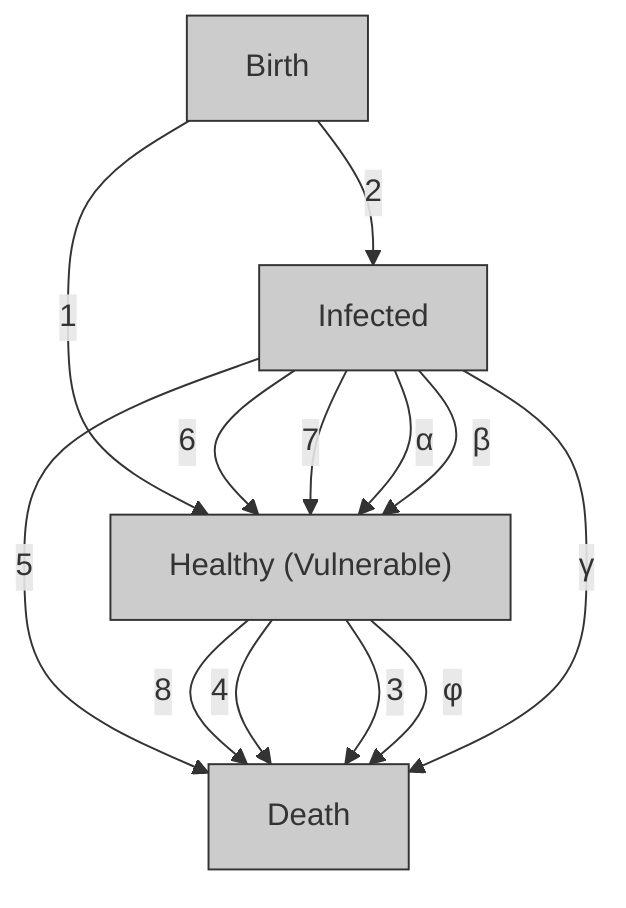
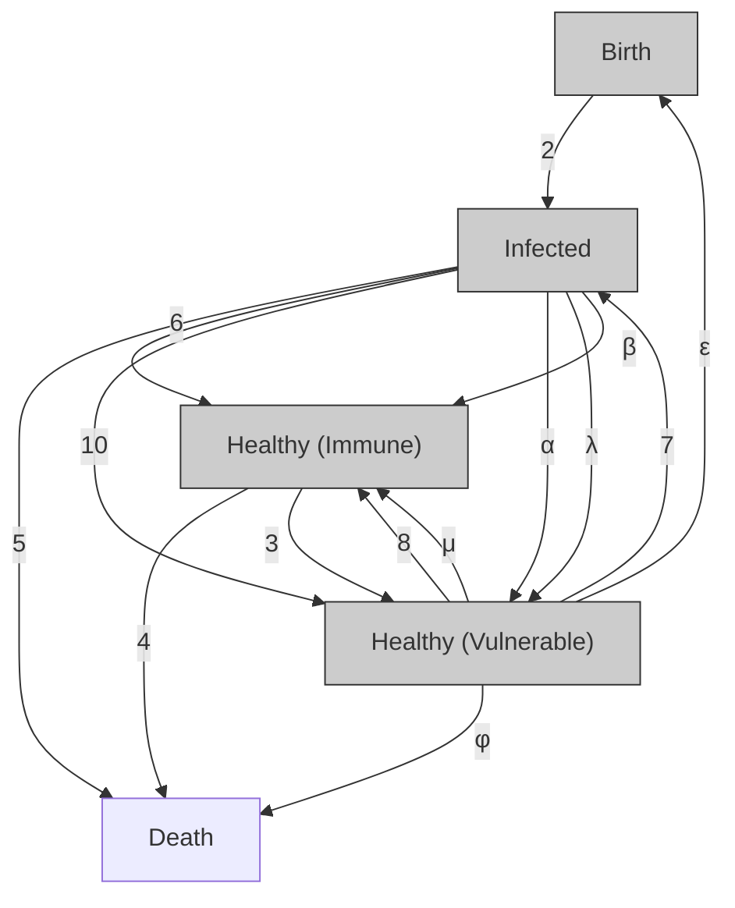

# Stochastic and Deterministic Models of the Eradication of Ebola in West Africa

## Summary

Herein we present stochastic and deterministic models for the current Ebola outbreak in West Africa. The general approach used for both models is to divide the population into three states, infected people, healthy vulnerable people, and healthy immune people. We then assign parameters representing the rates at which possible transitions between these states occur. This enables us to predict the spread of the Ebola virus for any initial conditions.

To verify the general approach, stochastic and deterministic predictions are compared with World Health Orgnisation (WHO) data for the most recent eighty-five days of the outbreak. To ensure the general method is robust, we investigate four regions: Guinea, Liberia, Sierra Leone, and West Africa as a whole. We estimate the state transition rate parameters using available statistics, and show that realistic parameter estimates result in predictions that have good agreement with known data. We then use both models to predict the future of the outbreak, assuming present conditions remain. This provides a basis with which to compare the effects of different treatment methods.

In our sensitivity analysis, we independently consider the effect of three treatment methods on the number of deaths caused by Ebola. The three treatment methods tested are: improvements in medical services, improvements in the quality and quantity of medicine, and distributing a vaccine. Stochastic simulations for several treatment regimes are performed over the short-term (six months), and mediumterm (two years). This enables us to determine the relative effectiveness of different treatment methods, and which nations should be targeted in the application. We then generalise the investigation using the deterministic model. By analysing the stability of fixed points in the model, we determine the relationship between parameters required to eradicate infections in the long-term. Qualitatively, key findings of the sensitivity analysis are:

• The most effective short-term strategy in all countries is producing a large quantity of improved medicine  
• The most efficient strategy for reducing medium-term deaths is to improve medical services to isolate infected patients  
• Short-term strategies will be most effective in Sierra Leone and Liberia  
• Medium-term strategies should target all three countries in the outbreak: Guinea, Sierra Leone, and Liberia  
• Although vaccination is less effective in the short and medium-term than other treatment methods in all countries, developing a vaccine is the only way to ensure that the virus can be eliminated in the long-term

These findings are used to produce recommendations of Ebola treatment strategy for the World Medical Association.

## 1 Introduction

We present two models to predict the current Ebola outbreak in West Africa. The general approach in both models is to divide the population into three states, infected people, vulnerable healthy people, and immune healthy people, and consider the transitions between these states. Based on this approach, we develop stochastic and deterministic mathematical models to predict the spread of the virus. These models are also used to assess the impact of potential treatment methods.

The models are validated using data on the number of Ebola cases and deaths provided by the World Health Organisation. Both models show good agreement for the outbreak in four regions, to prove the robustness of the approach. The models are then extended to predict the future evolution of the data, if current treatment practices are preserved into the future. This provides a basis against which the effects of different treatment options are assessed independently.

The stochastic model is used to predict the short-term and medium-term effects of three different Ebola treatment options. These options are an improvement in medical services, improvement in available medicines, and developing a vaccine. We compare the efficiency of each method in three countries by comparing the reduction of total deaths predicted in the model with the percentage change required from current treatment levels. We find that a large quantity of improved medicine is the most effective short-term solution, but medical services become more efficient in the medium term. In addition, we find that treatment in the short-term should be targeted to Sierra Leone and Liberia, but in the medium-term, it is equally important to treat Guinea. Following this analysis, we generalise to find the long-term impacts of different treatment using the deterministic model. We find that, although vaccines are less efficient in the short and medium-term, the only way to ensure complete eradication of Ebola in the long term is to develop a vaccine. These findings inform recommendations to the World Medical Association to optimise the treatment of Ebola.

## 1.1 Problem Approach

To address the problem of eradicating Ebola, we initially present a general model that provides accurate predictions of the evolution of the outbreak in West Africa based on current treatment practices. To do this, we produce a general method, and find parameters that match data provided by the World Health Organisation (2015a). Given an accurate model of the disease, we use it to isolate and predict the future impact of three different types of additional treatment:

• Improving medical services, for example improved quarantine, and increased numbers of doctor and hospitals  
• Improving medicine, for example that developed by the World Medical Association  
• Developing and distributing a vaccine

We perform this analysis in each of the three countries in the primary Ebola outbreak: Guinea, Liberia, and Sierra Leone. Although the general model permits greater subdivision, the lack of data for smaller regions confines the investigation to three regions. The analysis provides insight into which treatment methods are most effective, and which country would most benefit from them. Based on our results, we provide recommendations to the World Medical Association in letter form.

A general model for the spread of Ebola is created by classifying each member of the population into one of three states. These states are

• People who are infected with Ebola  
• Healthy people who are vulnerable to infection  
• Healthy people who are immune to infection

As the disease spreads, people in the affected areas undergo transitions between these three states. The generalised model is an open system, whereby total population can increase via births, and decrease via deaths. All possible state transitions are illustrated in Figure 1.

flowchart

Figure 1: Possible transitions between population states in an Ebola outbreak

As Figure 1 shows, each of the eight state transition is assigned a number and a rate parameter. The rate parameters are defined as the rate at which one person of the relevant state undergoes the state transition on a given day. They form the basis of the model, and are altered to model different conditions. A list of these parameters is provided in Table 1.

Table 1: State transition rate parameters used in the general Ebola model

<table><tr><td>Parameter</td><td>Description</td></tr><tr><td>α</td><td>The daily rate at which a healthy person is infected with Ebola</td></tr><tr><td>β</td><td>The daily recovery rate for a person with Ebola</td></tr><tr><td>ν</td><td>The daily vaccination rate per person</td></tr><tr><td>γ</td><td>The daily death rate per person for people infected with Ebola</td></tr><tr><td>φ</td><td>The daily death rate per person, for the healthy population</td></tr><tr><td>ε</td><td>The daily birth rate per person, assumed equal for both infected and healthy people</td></tr></table>

We define these parameters to represent the full set of possible transitions. The formulation is therefore sufficient to simulate the changes occurring in an Ebola outbreak. However, this interpretation relies on several assumptions, which are listed in Section 1.1.1.

## 1.1.1 Assumptions

• The Ebola outbreak is confined to Guinea, Liberia, and Sierra Leone. When developing the model, simulations of the spread of Ebola are performed for individual countries, and the spread of the virus as a whole. As the total number of cases and deaths from Ebola in other countries is small (eight deaths in Nigeria, as opposed to 1957 in Guinea (BBC 2015)), we assume that the entire outbreak occurs in Guinea, Liberia, and Sierra Leone

• Population change depends on births and deaths only. We assume that net migration in each of the three countries is zero, as it is likely to be small relative to the overall population

• The birth and death rates are constant. As the state transition parameters are constant, we must assume that the birth and death rate is constant. As the model’s calculations occur over a relatively short time, this is reasonable

• States are binary, and transition between states is instantaneous. We assume that each member of the population belongs to exactly one state at all times. This is reasonable for viral diseases such as Ebola. In addition, the severity of all cases is considered the same, which is reasonable when average data is used

• All people within a population are homogeneous. We assume that the spatial, gender, or age distributions do not affect the rate parameters. This enables the rate parameters to be held constant in the model

• The virus does not mutate. There is no transition from immunity to vulnerability, as the model considers the spread of the current strain of the Ebola virus

• Recovery from Ebola is complete and independent. We assume that people who have recovered from Ebola have the same likelihood of death as other healthy people, and that a person’s recovery from Ebola does not depend on anyone else. Although healthy doctors provide vital assistance, the overall effect of all healthy people on a patient’s recovery is negligible. In addition, we assume that antibodies generated in the recovery provide immunity from future infection. This is supported by Centers for Disease Control and Prevention (2014), which states that antibodies provide immunity from the same Ebola strain for at least ten years

• Infection with Ebola does not affect birth rate. As the cycle of a person’s infection with Ebola is likely to last for much less than nine months, we assume that the birth rate for people with Ebola is the same as the rest of the population

• The possibility of death or recovery is independent of the Ebola infection cycle. In order to model state transitions by constant rates, we assume that the likelihood of death or recovery is the same regardless of how long a patient has been infected. The infected state is an average stage that represents all stages of the disease, for example incubation, infectious, recovering, etc.

• The virus is transferred between living people. Although Ebola is commonly contracted via contact with deceased (World Health Organisation 2014a), our model assumes that these people transfer the disease while living. This does not affect overall rate of transmission. In addition, transmission between non-human species is neglected

• Treatment practices in place between 12 November 2014 and 5 February 2015 are constant. The models are developed based on data available from the World Health Organisation (WHO) between 12 November 2014 and 5 February 2015. The rate parameters therefore reflect the treatment practices available between these dates. Holding the rate parameters constant allows us to isolate variables when modelling new medicines and vaccines.

• Immunity is not passed on to the next generation. We assume that a survivor of Ebola cannot give birth to immune offspring. We also assume that healthy parents give birth to healthy offspring, and infected parents give birth to infected offspring

## 2 Mathematical Models

The problem interpretation described in Section 1.1 is solved using two mathematical models, a stochastic model and a deterministic model. The stochastic model provides a random simulation of the evolution of the disease, and simulates continuously in time. The deterministic model provides an analytical steady state solution, allowing analysis of fixed points and stability. Both models provide a means to model the evolution of the disease based on existing data, and predict future trends.

## 2.1 Stochastic Model

In the stochastic model, the probability of each transition occurring in a given timestep is calculated using the rate parameters, and then the evolution of the disease is simulated randomly. Definitions of parameters required for the stochastic model are given in Table 2.

Table 2: Parameters used in the stochastic model

<table><tr><td>Parameter</td><td>Description</td></tr><tr><td>n</td><td>The timestep number</td></tr><tr><td>dt</td><td>The timestep size, given as a fraction of one day</td></tr><tr><td> $P_n$ </td><td>The number of healthy, vulnerable people after n timesteps</td></tr><tr><td> $I_n$ </td><td>The number of infected people after n timesteps</td></tr><tr><td> $H_n$ </td><td>The number of healthy, immune people after n timesteps</td></tr></table>

The rate parameters in Table 1 provide a means of determining the probability that one event will occur in a given timestep. The timestep size, dt, is prescribed to ensure that a maximum of one transition of any type can occur in each timestep. In accordance with the eight transitions shown in Figure 1, the following shows the potential results of the subsequent timestep $n + 1$ , and the probability that each event occurs.

$$
\left(I _ {n + 1}, H _ {n + 1}, P _ {n + 1}\right) = \left\{ \begin{array}{l l} \left(I _ {n}, H _ {n}, P _ {n} + 1\right) & \text {w.p.} p _ {1} = \epsilon \left(P _ {n} + H _ {n}\right) \mathrm{d} t \\ \left(I _ {n} + 1, H _ {n}, P _ {n}\right) & \text {w.p.} p _ {2} = \epsilon I _ {n} \mathrm{d} t \\ \left(I _ {n}, H _ {n}, P _ {n} - 1\right) & \text {w.p.} p _ {3} = \phi P _ {n} \mathrm{d} t \\ \left(I _ {n}, H _ {n} - 1, P _ {n}\right) & \text {w.p.} p _ {4} = \phi H _ {n} \mathrm{d} t \\ \left(I _ {n} - 1, H _ {n}, P _ {n}\right) & \text {w.p.} p _ {5} = \gamma I _ {n} \mathrm{d} t \\ \left(I _ {n} - 1, H _ {n} + 1, P _ {n}\right) & \text {w.p.} p _ {6} = \beta I _ {n} \mathrm{d} t \\ \left(I _ {n} + 1, H _ {n}, P _ {n} - 1\right) & \text {w.p.} p _ {7} = \alpha I _ {n} P _ {n} \mathrm{d} t \\ \left(I _ {n}, H _ {n} + 1, P _ {n} - 1\right) & \text {w.p.} p _ {8} = \nu P _ {n} \mathrm{d} t \\ \left(I _ {n}, H _ {n}, P _ {n}\right) & \text {w.p.} 1 - \sum_ {i = 1} ^ {8} p _ {i} \end{array} \right. \tag {1}
$$

For example, transition one is the birth of one healthy, but not immune person. The rate parameter  provides the birth rate per person per day. In addition, we assume that all healthy people give birth to vulnerable healthy offspring. Therefore, the probability of a healthy birth occurring in a given timestep is given by multiplying  by the total number of healthy people, $\left( H _ { n } + P _ { n } \right)$ , and the fraction of one day for each timestep, dt. The result of this event is that the next timestep, $n + 1 ,$ , has one additional healthy person, i.e. $P _ { n + 1 } = P _ { n } + 1$ . The probabilities and outcomes of all other events are similarly determined (we note that the probability of transmission $p _ { 7 }$ depends on both the number of infected people and the number of vulnerable people). For the stochastic model to be valid, the timestep must be small enough such that

$$
\sum_ {i = 1} ^ {8} p _ {i} \leq 1, \tag {2}
$$

which ensures that a maximum of one event can occur each timestep.

Code to simulate this system is produced in Matlab. To generate the event for each timestep, a pseudo-random number $r \in [ 0 , 1 ]$ is generated. An event is selected if r lies within the cumulative probability range up to that event. To keep track of the total number of cases and deaths due to Ebola, a counter that increments whenever a relevant event occurs is used. The simulation process is repeated for the desired number of timesteps to completely simulate an Ebola outbreak for a given initial state $( I _ { 0 } , H _ { 0 } , P _ { 0 } )$ .

## 2.2 Deterministic Model

To implement the deterministic mode, we define $P _ { n } , I _ { n }$ , and $H _ { n }$ in the same way as for the stochastic model, where the timestep number n represents a number of days. We then define functions $f , g ,$ , and h containing difference equations for subsequent states. They are constructed using the same state transition rate parameters as the stochastic model. The difference equations are

$$
\left\{ \begin{array}{l} f (P _ {n}, I _ {n}, H _ {n}) := P _ {n + 1} = P _ {n} (1 + \epsilon - \phi - \nu - \alpha I _ {n}) + \epsilon H _ {n} \\ g (P _ {n}, I _ {n}, H _ {n}) := I _ {n + 1} = I _ {n} (1 + \epsilon - \gamma - \beta) + \alpha I _ {n} P _ {n} \\ h (P _ {n}, I _ {n}, H _ {n}) := H _ {n + 1} = H _ {n} (1 - \phi) + \beta I _ {n} + \nu P _ {n}. \end{array} \right. \tag {3}
$$

Unlike the stochastic model, the deterministic model only keeps track of the day-to-day number of people in each state. However, the system is easy to implement in Matlab, as randomness is not considered. Implementing the difference equations (3) in Matlab and iterating over n timesteps enables complete deterministic simulation of the Ebola outbreak for given initial conditions $( I _ { 0 } , H _ { 0 } , P _ { 0 } )$ .

## 2.3 Comparison of Models

Table 3 compares the relative strengths of the stochastic and deterministic models.

Table 3: Unique advantages of the stochastic and deterministic models

<table><tr><td>Stochastic</td><td>Deterministic</td></tr><tr><td>Randomness</td><td>Repeated simulation not required</td></tr><tr><td>State populations take integer values</td><td>Analytical steady state solutions</td></tr><tr><td>Timestep is effectively continuous</td><td>Less computational time</td></tr><tr><td>Separate accounting of all state transitions</td><td></td></tr></table>

In our analysis, we take advantage of the unique features of the stochastic and deterministic models. The stochastic model provides a means to generate plots different state transitions against time. This is used to compare with WHO data on the total number of Ebola cases and deaths. In addition, simulations using the stochastic model are used to perform sensitivity analysis on the parameters. This allows us to isolate the effect of different treatment practices. The deterministic model provides an analytical method to accurately analyse different types of steady state solution, and determines the relationship between rate parameters required to drive Ebola infections to zero.

## 3 Results - Predicting the Spread of Ebola

We present stochastic and deterministic solutions for the spread of Ebola. The models are verified using data for the number of deaths and total cases in the 85 days from 12 November 2014 to 5 February 2015, which is available from the World Health Organisation (2015a). The development of an accurate model then enables us to make modifications based on different treatment options.

## 3.1 Model Parameters

To simulate the outbreak, we require numerical values for

• State transition rate parameters: $\alpha , \beta , \nu , \gamma , \phi , \epsilon$  
• Initial conditions: $I _ { 0 } , H _ { 0 } , P _ { 0 }$

Where possible, we use realistic data to provide suitable estimates for these parameters. We predict the value of the parameters in all three countries independently, then combine them to produce a population-weighted average to model the outbreak as a whole. This method of prescribing the parameters provides a real-world basis for all state transitions in the model.

## 3.1.1 ν

As there is no current vaccine for Ebola (World Health Organisation 2015b) as of January 21 2015, we assume ν = 0 in the predictive model.

## 3.1.2 , φ

CountryMeters (2015) provides live population estimates, as well as data on the birth and death rates of each country. Table 4 gives this data for the three relevant countries on 5 February 2015.

Table 4: Live population statistics for February 5 2015 (CountryMeters 2015)

<table><tr><td>Country</td><td>Population</td><td>Birth Rate [ $ppl\ d^{-1}$ ]</td><td>Death Rate [ $ppl\ d^{-1}$ ]</td></tr><tr><td>Guinea</td><td>12,414,680</td><td>1,150</td><td>326</td></tr><tr><td>Liberia</td><td>4,615,917</td><td>425</td><td>121</td></tr><tr><td>Sierra Leone</td><td>6,404,599</td><td>626</td><td>191</td></tr><tr><td>Overall</td><td>23,436,196</td><td>2,201</td><td>638</td></tr></table>

The birth and death rate parameters,  and φ respectively, are determined by

$$
\epsilon = \frac {\text { Birth   Rate }}{\text { Population }}, \tag {4}
$$

and

$$
\phi = \frac {\text { Death   Rate }}{\text { Population }}. \tag {5}
$$

These give the rate at which one healthy person will give birth or die respectively. The initial population at 12 November 2014 is estimated by subtracting the net births over the 85 preceding days from the population given in Table 4,

$$
\text { Initial   Population } = \text { Final   Population } - 8 5 (\text { Birth   Rate } - \text { Death   Rate }). \tag {6}
$$

Performing these operations gives the results in Table 5.

Table 5: Population parameters for use in the model

<table><tr><td>Country</td><td> $\epsilon$ </td><td> $\phi$ </td><td>Initial Population</td></tr><tr><td>Guinea</td><td>9.3175e-5</td><td>2.6386e-5</td><td>12,343,779</td></tr><tr><td>Liberia</td><td>9.2567e-5</td><td>2.6392e-5</td><td>4,589,796</td></tr><tr><td>Sierra Leone</td><td>9.8295e-5</td><td>2.9981e-5</td><td>6,367,191</td></tr><tr><td>Overall</td><td>9.4455e-5</td><td>2.7369e-5</td><td>23,300,766</td></tr></table>

## 3.1.3 $I _ { 0 } , H _ { 0 } , P _ { 0 }$

The initial population found in Section 3.1.2 entirely consists of the three states of the general model, $I _ { 0 } , H _ { 0 } .$ , and $P _ { 0 }$ . To determine the initial population of each of the states, we consider WHO data for the number of Ebola cases from November 12 2014. This data is given in Table 6.

Table 6: WHO Ebola data for November 12 2014 (World Health Organisation 2015a)

<table><tr><td>Country</td><td>Total Cases</td><td>Total Deaths</td></tr><tr><td>Guinea</td><td>1,878</td><td>1,142</td></tr><tr><td>Liberia</td><td>6,822</td><td>2,836</td></tr><tr><td>Sierra Leone</td><td>5,368</td><td>1,169</td></tr><tr><td>Overall</td><td>14,068</td><td>5,147</td></tr></table>

To estimate $I _ { 0 } ,$ we assume that all reported cases that have not resulted in death are still infected, and therefore

$$
I _ {0} = \text { Total   Cases } - \text { Total   Deaths }. \tag {7}
$$

Although this neglects the possibility that a reported case has recovered from the virus, which would lead to overestimating $I _ { 0 } ,$ we accept the assumption. This is because the total number of infections is low relative to the total population, the WHO acknowledge that their statistics underestimate the Ebola epidemic (World Health Organisation 2014b), and that it is difficult to otherwise predict current infections from the data. Based on this assumption, we also have

$$
H _ {0} = 0, \tag {8}
$$

and

$$
P _ {0} = \text { Initial   Population } - I _ {0}. \tag {9}
$$

This gives the following values for the initial states.

Table 7: Initial states for the Ebola model

<table><tr><td>Country</td><td> $I_0$ </td><td> $P_0$ </td></tr><tr><td>Guinea</td><td>736</td><td>12,343,043</td></tr><tr><td>Liberia</td><td>3,986</td><td>4,585,810</td></tr><tr><td>Sierra Leone</td><td>4,199</td><td>6,362,992</td></tr><tr><td>Overall</td><td>8,921</td><td>23,291,845</td></tr></table>

## 3.1.4 $\alpha , \beta , \gamma$

The parameters $\alpha , \beta ,$ , and $\gamma$ are more difficult to determine from available data. $\mathrm { A s }$ an infected person will eventually transition to health or death, an important factor is the mortality rate of Ebola. An estimate of mortality rate, i.e. the likelihood of eventual death once infected, is given by

$$
\text { Mortality   Rate } = \frac {\text { Total   Deaths }}{\text { Total   Cases }}. \tag {10}
$$

For this calculation, we use the latest data, to reduce the proportion of ongoing cases. This data is given in Table 8.

Table 8: WHO Ebola data for February 5 2015 (World Health Organisation 2015a)

<table><tr><td>Country</td><td>Total Cases</td><td>Total Deaths</td><td>Mortality Rate</td></tr><tr><td>Guinea</td><td>2,986</td><td>1,947</td><td>0.65204</td></tr><tr><td>Liberia</td><td>8,745</td><td>3,746</td><td>0.42836</td></tr><tr><td>Sierra Leone</td><td>10,756</td><td>3,286</td><td>0.30550</td></tr><tr><td>Overall</td><td>22,487</td><td>8,979</td><td>0.39930</td></tr></table>

However, to determine the daily rate of death and recovery, we introduce another parameter, $T ,$ the disease residence time. This is the average number of days required for an infection to result in either death or recovery. Using this parameter, we can determine the daily rates of death $( \gamma )$ and recovery (β) among infected people, using

$$
\gamma = \frac {\text { Mortality   Rate }}{T}, \tag {11}
$$

and

$$
\beta = \frac {1 - \text { Mortality   Rate }}{T}. \tag {12}
$$

To determine α, the rate of disease transmission, we introduce the parameter K, the average number of healthy people to whom each infected person transmits the disease during the period they are infected. The parameter α is therefore given by

$$
\alpha = \frac {K}{T P _ {0}}. \tag {13}
$$

As there is no reliable data available to determine T and K, their values are prescribed to fit the WHO data. Doing this ensures that our model is accurate, and allowing K to come as part of the solution provides a prediction of the transmission rate in current conditions. The parameters shown in Table 9 result in suitable estimates of the final death and case counts post-simulation.

Table 9: Appropriate values of parameters

<table><tr><td>Country</td><td>K</td><td>T</td><td> $\alpha$ </td><td> $\beta$ </td><td> $\gamma$ </td></tr><tr><td>Guinea</td><td>0.90</td><td>45</td><td>1.6203e-9</td><td>7.7324e-3</td><td>1.4490e-2</td></tr><tr><td>Liberia</td><td>0.89</td><td>155</td><td>1.2521e-9</td><td>3.6880e-3</td><td>2.7636e-3</td></tr><tr><td>Sierra Leone</td><td>0.79</td><td>42</td><td>2.9561e-9</td><td>1.6536e-3</td><td>7.2739e-3</td></tr><tr><td>Overall</td><td>0.86</td><td>73</td><td>5.0992e-10</td><td>8.2775e-3</td><td>5.5022e-3</td></tr></table>

To determine if the calculated values of K are appropriate, we cite a study by Meltzer et al. (2015), which gives estimates for K in various situations:

• For hospitalised patients, $K = 0 . 1 2$  
• For home patients with effective isolation, $K = 0 . 1 8$  
• For home patients without effective isolation, K = 1.8 (Meltzer et al. 2015)

All average values of K predicted in Table 9 are therefore feasible based on combinations of current treatment techniques. To validate residence time T , we cite a survivor’s anecdote in which the patient first noticed symptoms after a ten day incubation, and reached their worst condition after sixteen days (Grant 2014). Assuming it takes a further sixteen days to recover fully gives T that corresponds closely to Table 9. However, considering the result of Liberia, we infer that an appropriate $T$ comes as an artefact of other aspects of the model, rather than from a physical basis.

## 3.2 Validation

The constant values of the parameters defined in Section 3.1 completely specify the constants required to implement both the stochastic and deterministic models. These are used in both models to produce simulations for the spread of Ebola over the WHO reporting period. These simulations are compared with the WHO data to validate the models.

## 3.2.1 Stochastic Model

To produce stochastic results, the Matlab simulation is run ten times for each of the four regions modelled. The simulation is run over 85 days to simulate the period from 12 November 2014 to 5

February 2015. The average number of cases and deaths at the end of the simulation are compared with WHO data to determine whether the model is accurate. Results are presented in Table 10. In the table, C and D represent the number of cases and deaths reported on February 5 2015 respectively, and subscripts M and W refer to the stochastic model and WHO data respectively. The parameter σ is the standard deviation of the ten simulation results.

Table 10: Results for February 5 2015 of stochastic simulations used to validate the model

<table><tr><td>Country</td><td> $C_M$ </td><td> $σ_C$ </td><td> $D_M$ </td><td> $σ_D$ </td><td> $C_W$ </td><td> $D_W$ </td><td> $| \frac{C_M - C_W}{σ_C} |$ </td><td> $| \frac{D_M - D_W}{σ_D} |$ </td></tr><tr><td>Guinea</td><td>3,053</td><td>110</td><td>1,957</td><td>50</td><td>2,986</td><td>1,947</td><td>0.61</td><td>0.20</td></tr><tr><td>Liberia</td><td>8,748</td><td>51</td><td>3,749</td><td>20</td><td>8,745</td><td>3,746</td><td>0.059</td><td>0.15</td></tr><tr><td>Sierra Leone</td><td>10,813</td><td>159</td><td>3,284</td><td>57</td><td>10,756</td><td>3,286</td><td>0.36</td><td>0.035</td></tr><tr><td>Overall</td><td>22,557</td><td>150</td><td>9,041</td><td>54</td><td>22,487</td><td>8,979</td><td>0.47</td><td>1.1</td></tr></table>

Note: ‘Overall’ in Table 10 represents the results of a separate simulation using parameters for the overall outbreak, not an arithmetic sum of results for each nation

Table 10 shows that the model predictions for total deaths and cases is very similar to the statistics reported by the WHO. The fact that the real value falls within half a standard deviation of the model prediction in five of the eight statistics, and that no result is more than 1.1 standard deviations away from the actual value. We therefore conclude that the parameters in Section 3.1 accurately model the Ebola outbreak in all cases.

Further validation is provided by plotting simulation results against day-to-day WHO data for deaths and cases. Examples are provided in Figure 2.

line chart

| Time [d] | WHO   | Simulations |
| -------- | ----- | ----------- |
| 0        | 1150  | 1150        |
| 10       | 1250  | 1240        |
| 20       | 1350  | 1340        |
| 30       | 1450  | 1440        |
| 40       | 1550  | 1540        |
| 50       | 1650  | 1640        |
| 60       | 1750  | 1740        |
| 70       | 1850  | 1840        |
| 80       | 1950  | 1940        |
| 90       | 2050  | 2040        |

(a) Guinea

line chart

| Time [d] | Total Deaths (WHO) | Total Deaths (Simulations) |
| -------- | ------------------ | -------------------------- |
| 0        | 2800               | 2800                       |
| 10       | 2950               | 2940                       |
| 20       | 3100               | 3090                       |
| 30       | 3250               | 3240                       |
| 40       | 3400               | 3390                       |
| 50       | 3550               | 3540                       |
| 60       | 3700               | 3690                       |
| 70       | 3750               | 3740                       |
| 80       | 3780               | 3770                       |
| 90       | 3800               | 3790                       |

(b) Liberia

line chart

| Time [d] | WHO   | Simulations |
| -------- | ----- | ----------- |
| 0        | 1200  | 1200        |
| 10       | 1400  | 1400        |
| 20       | 1600  | 1600        |
| 30       | 1800  | 1800        |
| 40       | 2000  | 2000        |
| 50       | 2200  | 2200        |
| 60       | 2400  | 2400        |
| 70       | 2600  | 2600        |
| 80       | 2800  | 2800        |
| 90       | 3000  | 3000        |

(c) Sierra Leone

line chart

| Time [d] | Total Deaths (WHO) | Total Deaths (Simulations) |
| -------- | ------------------ | -------------------------- |
| 0        | 5100               | 5100                       |
| 10       | 5400               | 5400                       |
| 20       | 6000               | 6000                       |
| 30       | 6700               | 6700                       |
| 40       | 7400               | 7400                       |
| 50       | 8100               | 8100                       |
| 60       | 8700               | 8700                       |
| 70       | 9100               | 9100                       |
| 80       | 9300               | 9300                       |
| 90       | 9400               | 9400                       |

(d) Overall  
Figure 2: Comparison of simulation results and WHO data for day-to-day death count in each region

As Figure 2 shows, the simulations track the WHO reported daily death count reasonably well. The model predictions produce a more linear trend than the WHO data as we assume the treatment practices (state transition rate parameters) are constant throughout the period. In addition, the WHO data is taken at irregular intervals, and each country updates their data on different dates. This suggests the WHO data points may not accurately display the underlying trend in disease spread. We therefore accept the predictions of the model are valid based on WHO data.

## 3.2.2 Deterministic Model

As the deterministic model only considers the population of the three states $I _ { n } , H _ { n }$ , and $P _ { n }$ , and does not account for state transitions, we cannot compare with WHO data. However, given the success of the stochastic model, we assume that the deterministic model matches WHO data if its results match the stochastic model. Table 11 shows the results for February 5 2015 of simulating the deterministic model with the parameters in Section 3.1. In the table, subscripts D and S denote the deterministic and stochastic models respectively.

Table 11: Comparison of stochastic and deterministic results for February 5 2015

<table><tr><td>Country</td><td> $I_S$ </td><td> $I_D$ </td><td> $H_S$ </td><td> $H_D$ </td><td> $P_S$ </td><td> $P_D$ </td></tr><tr><td>Guinea</td><td>640</td><td>618</td><td>457</td><td>438</td><td>12,412,178</td><td>12,411,344</td></tr><tr><td>Liberia</td><td>3,769</td><td>3,789</td><td>1,228</td><td>1,203</td><td>4,609,770</td><td>4,609,491</td></tr><tr><td>Sierra Leone</td><td>2,718</td><td>2,789</td><td>4,805</td><td>4,789</td><td>6,394,555</td><td>6,394,146</td></tr><tr><td>Overall</td><td>7,690</td><td>7,684</td><td>5,820</td><td>5,757</td><td>23,419,606</td><td>23,417,858</td></tr></table>

As expected, the deterministic model shows good agreement with the stochastic simulations if the same parameters are used in the model. A reason for the small discrepancy in the results is that the timestep used in each simulation is different. The stochastic model applies a near-continuous timestep, whilst the deterministic model is updated using a timestep of one day. The stochastic model also incorporates randomness, which creates deviations from deterministic results. An example of this is illustrated in Figure 3.

line chart

| Time [d] | Deterministic | Stochastic |
| -------- | ------------- | ---------- |
| 0        | 8900          | 8900       |
| 10       | 8750          | 8750       |
| 20       | 8600          | 8600       |
| 30       | 8450          | 8450       |
| 40       | 8300          | 8300       |
| 50       | 8150          | 8150       |
| 60       | 8000          | 8000       |
| 70       | 7850          | 7850       |
| 80       | 7700          | 7700       |
| 90       | 7600          | 7600       |

Figure 3: Comparison of number of infected patients over time for the overall virus, for both deterministic and stochastic models

Figure 3 shows that the stochastic models introduce random fluctuations about the underlying deterministic solution. We conclude that both the deterministic and stochastic models provide a means of accurately tracking the spread of Ebola. In our analysis of the predicted effects of possible treatment regimes, we use the predictions of both models.

## 4 Results - Predicting the Effect of Improved Treatment

To determine the effect of new treatment regimes, the February 5 2015 parameters given in Table 11 are used as initial states $( I _ { 0 } , H _ { 0 } , P _ { 0 } )$ to the model. We initially consider the projected spread of Ebola if the treatment regime in practice from 12 November 2014 to 5 February 2015 is maintained – that is, if the values of state transition rate parameters determined based on WHO data are held constant. The simulations are run in both the short-term (using the stochastic model), and the long term (using the deterministic model). We then independently change parameters based on our interpretations of different options to improve treatment. To provide targeted treatment, we perform the simulations in each of the three nations. The possible treatment options are described in Section 4.1.

## 4.1 Treatment Options

In our analysis, we consider three different treatment options. Each has a unique effect on the state transition rate parameters. The treatment options are

• Improving medical services  
• Improving medicine  
• Developing a vaccine

## 4.1.1 Improve Medical Services - Decrease α

Improved medical services entail improved quarantine procedures, for example by increasing medical staff, hospital space, or public education. Doing this will improve patient isolation, decreasingα the rate of Ebola transmission from infected to healthy people. If we assume that it is impossible to isolate a patient in the incubation stage, which lasts a quarter of infection residence time, data from Meltzer et al. (2015) provides a means of estimating the minimum K.

$$
K _ {\min} = 0. 7 5 (0. 1 2) + 0. 2 5 (1. 8) = 0. 5 4. \tag {14}
$$

As this is less than the model predictions in Table 9, there is scope to reduce the spread of the virus by improving medical services.

## 4.1.2 Improve Medicine - Decrease γ, Increase $\beta$

We define ‘medicine’ to incorporate all techniques available to reduce the mortality rate, including existing techniques such as providing intravenous nutrients, and newly developed drugs, for example by the World Medical Association. As the WMA medicine affects patients even in the early stages of infection, we assume that improving either the quality or quantity of medicine will decrease the average mortality of an infected patient. This increases the rate of recovery, $\beta ,$ , and decreases the rate of death from infection, γ. We consider the effects of a range of medicine effectiveness in our predictions. Changing the relevant parameters encompasses changes in the quantity of medicine, as well as the effectiveness of distribution systems.

## 4.1.3 Develop Vaccine - Increase ν

Developing a vaccine opens the possibility of transition from the vulnerable healthy state to the immune healthy state. This will decrease the rate of Ebola spread. To model a vaccine, we consider non-zero ν. As there is no vaccine available, we consider a range of different distribution speeds in our simulations. In our simulation ν is related to the number of successful vaccinations.

## 4.2 Sensitivity Analysis

Sensitivity analysis is performed using both the stochastic and deterministic models. Short and medium-term simulations of six months, one year, and two years are performed using the stochastic model. These are important to guide immediate prevention strategy, and some assumptions (e.g. immunity is retained) are more likely to hold in the short-term. Long-term steady state conditions are predicted using the deterministic model. Specifically, we seek combinations of rate parameters that drive the steady-state number of infections to zero.

## 4.2.1 Stochastic Model

Short-Term Projections Based on Current Treatment Levels Stochastic simulations are performed using the same rate parameters and February 5 2015 initial values to predict the total number of cases and deaths in each country over six months, one year, and two years at the current level of treatment. As with the initial modelling the average of ten simulations is taken. These results are presented in Table 12. In the table, C and D represent the number of new cases since February 5 2015. We change this convention as we no longer need to match WHO data, the initial states are better defined, and new cases provides a better indication of disease spread.

Table 12: Projection of Ebola spread at current level of treatment (new cases and new deaths)

<table><tr><td></td><td colspan="2">6 Months</td><td colspan="2">1 Year</td><td colspan="2">2 Years</td></tr><tr><td>Country</td><td>C</td><td>D</td><td>C</td><td>D</td><td>C</td><td>D</td></tr><tr><td>Guinea</td><td>2,049</td><td>1,441</td><td>3,625</td><td>2,549</td><td>6,093</td><td>4,201</td></tr><tr><td>Liberia</td><td>3,873</td><td>1,828</td><td>7,303</td><td>3,428</td><td>13,857</td><td>6,391</td></tr><tr><td>Sierra Leone</td><td>6,262</td><td>2,380</td><td>9,180</td><td>3,479</td><td>11,199</td><td>4,224</td></tr></table>

In our analysis, we consider ten percent changes in the relevant parameters, and other reasonable targets based on improved treatment methods. This is suitable for short term modelling, where large-scale changes are unlikely to be possible. We apply the stochastic model for each of the three nations, to determine which strategy is most useful in the short-term, and where they are optimally applied. In each case, data is the average of ten stochastic simulations.

Effect of Improving Medical Services To assess the impact of increasing medical services in an individual country over six months, one year, and two years, we consider two cases:

• A 10% decrease in transmissions per infected person, i.e. decreasing α by 10%  
• Decrease transmissions per infected person to the minimum, $K _ { \mathrm { m i n } } = 0 . 5 4$

All other parameters are held constant in the stochastic simulations, and once again an average of ten simulations is taken. The results are given in terms of the overall reduction in deaths or cases measured after the given period. Intermediate data processing is omitted for simplicity. The results are given in Table 13 and Table 14 respectively.

Table 13: Net change in cases and deaths if transmissions per infected person is decreased by 10%

<table><tr><td></td><td colspan="2">6 Months</td><td colspan="2">1 Year</td><td colspan="2">2 Years</td></tr><tr><td>Country</td><td>C</td><td>D</td><td>C</td><td>D</td><td>C</td><td>D</td></tr><tr><td>Guinea</td><td>-589</td><td>-280</td><td>-1,386</td><td>-771</td><td>-2,956</td><td>-1,780</td></tr><tr><td>Liberia</td><td>-576</td><td>-119</td><td>-1,359</td><td>-332</td><td>-3,491</td><td>-1,081</td></tr><tr><td>Sierra Leone</td><td>-1,323</td><td>-310</td><td>-2,672</td><td>-731</td><td>-4,395</td><td>-1,347</td></tr></table>

Table 14: Net change in cases and deaths if transmissions per infected person is decreased to the minimum, $K = 0 . 5 4$

<table><tr><td></td><td colspan="2">6 Months</td><td colspan="2">1 Year</td><td colspan="2">2 Years</td></tr><tr><td>Country</td><td>C</td><td>D</td><td>C</td><td>D</td><td>C</td><td>D</td></tr><tr><td>Guinea</td><td>-1,378</td><td>-654</td><td>-2,889</td><td>-1,667</td><td>-5,325</td><td>-3,288</td></tr><tr><td>Liberia</td><td>-1,898</td><td>-335</td><td>-4,196</td><td>-1,057</td><td>-9,562</td><td>-3,156</td></tr><tr><td>Sierra Leone</td><td>-3,440</td><td>-808</td><td>-5,901</td><td>-1,673</td><td>-7,912</td><td>-2,421</td></tr></table>

Effect of Improving Medicine To assess the impact of improving medicines, we consider:

• A 10% decrease in average mortality rate  
• Distribution of a new WMA medicine such that average mortality rate is decreased to $3 0 \%$ in all regions  
• Distribution of a new WMA medicine such that average mortality rate is decreased to 15% in all regions

The effects of mortality rate on the parameters $\beta$ and $\gamma$ are determined by Equations (11) and (12). Average simulation results are given in Table 15, Table 16 and Table 17 respectively. In these tables, any increases in cases occurring in some simulations are likely to be caused by randomness.

Table 15: Net change in cases and deaths if mortality rate is decreased by 10%

<table><tr><td></td><td colspan="2">6 Months</td><td colspan="2">1 Year</td><td colspan="2">2 Years</td></tr><tr><td>Country</td><td>C</td><td>D</td><td>C</td><td>D</td><td>C</td><td>D</td></tr><tr><td>Guinea</td><td>-116</td><td>-205</td><td>-311</td><td>-393</td><td>-199</td><td>-532</td></tr><tr><td>Liberia</td><td>+18</td><td>-193</td><td>+146</td><td>-304</td><td>-25</td><td>-676</td></tr><tr><td>Sierra Leone</td><td>+121</td><td>-175</td><td>-105</td><td>-380</td><td>-423</td><td>-575</td></tr></table>

Table 16: Net change in cases and deaths if the medicine decreases mortality rate to $3 0 \%$ in all regions

<table><tr><td></td><td colspan="2">6 Months</td><td colspan="2">1 Year</td><td colspan="2">2 Years</td></tr><tr><td>Country</td><td>C</td><td>D</td><td>C</td><td>D</td><td>C</td><td>D</td></tr><tr><td>Guinea</td><td>-23</td><td>-775</td><td>-124</td><td>-1,215</td><td>-586</td><td>-2,401</td></tr><tr><td>Liberia</td><td>-31</td><td>-571</td><td>-24</td><td>-1,022</td><td>+7</td><td>-1,896</td></tr><tr><td>Sierra Leone</td><td>+75</td><td>-3</td><td>-231</td><td>-147</td><td>-239</td><td>-178</td></tr></table>

Table 17: Net change in cases and deaths if the medicine decreases mortality rate to 15% in all regions

<table><tr><td></td><td colspan="2">6 Months</td><td colspan="2">1 Year</td><td colspan="2">2 Years</td></tr><tr><td>Country</td><td>C</td><td>D</td><td>C</td><td>D</td><td>C</td><td>D</td></tr><tr><td>Guinea</td><td>-15</td><td>-1,109</td><td>-151</td><td>-1,974</td><td>-748</td><td>-3,333</td></tr><tr><td>Liberia</td><td>-43</td><td>-1,196</td><td>+111</td><td>-2,221</td><td>+2</td><td>-4,159</td></tr><tr><td>Sierra Leone</td><td>+67</td><td>-1,188</td><td>+14</td><td>-1,743</td><td>+62</td><td>-2,168</td></tr></table>

Effect of Vaccination To assess the impact of distributing an effective vaccine, we consider:

• A vaccination distribution rate in which approximately 10% of the population will be successfully vaccinated in two years  
• A vaccination distribution rate in which approximately 30% of the population will be successfully vaccinated in two years  
• A vaccination distribution rate in which approximately 50% of the population will be successfully vaccinated in two years

The parameter ν is given by

$$
\nu = \frac {V}{7 3 0}, \tag {15}
$$

where V is the proportion of the population that is vaccinated in two years. This gives $\nu = 1 . 3 6 9 9 \mathrm { e } \mathrm { - } 4$ , $\nu = 4 . 1 0 9 6 \mathrm { e } \mathrm { - } 4$ , and $\nu = 6 . 8 4 9 3 \mathrm { e } \mathrm { - } 4$ for the three respective cases. Simulating the stochastic model with these parameters gives results shown in Table 18, Table 19, and Table 20.

Table 18: Net change in cases and deaths if a vaccine is introduced to approximately 10% of the population in two years

<table><tr><td></td><td colspan="2">6 Months</td><td colspan="2">1 Year</td><td colspan="2">2 Years</td></tr><tr><td>Country</td><td>C</td><td>D</td><td>C</td><td>D</td><td>C</td><td>D</td></tr><tr><td>Guinea</td><td>-149</td><td>-68</td><td>-451</td><td>-250</td><td>-1,578</td><td>-911</td></tr><tr><td>Liberia</td><td>-39</td><td>-32</td><td>-219</td><td>-36</td><td>-1,313</td><td>-347</td></tr><tr><td>Sierra Leone</td><td>-10</td><td>+25</td><td>-488</td><td>-130</td><td>-1,045</td><td>-315</td></tr></table>

Table 19: Net change in cases and deaths if a vaccine is introduced to approximately 30% of the population in two years

<table><tr><td></td><td colspan="2">6 Months</td><td colspan="2">1 Year</td><td colspan="2">2 Years</td></tr><tr><td>Country</td><td>C</td><td>D</td><td>C</td><td>D</td><td>C</td><td>D</td></tr><tr><td>Guinea</td><td>-246</td><td>-108</td><td>-965</td><td>-515</td><td>-2,688</td><td>-1,586</td></tr><tr><td>Liberia</td><td>-159</td><td>-52</td><td>-614</td><td>-138</td><td>-3,367</td><td>-943</td></tr><tr><td>Sierra Leone</td><td>-370</td><td>-60</td><td>-1,230</td><td>-302</td><td>-2,844</td><td>-849</td></tr></table>

Table 20: Net change in cases and deaths if a vaccine is introduced to approximately 50% of the population in two years

<table><tr><td></td><td colspan="2">6 Months</td><td colspan="2">1 Year</td><td colspan="2">2 Years</td></tr><tr><td>Country</td><td>C</td><td>D</td><td>C</td><td>D</td><td>C</td><td>D</td></tr><tr><td>Guinea</td><td>-310</td><td>-127</td><td>-1,054</td><td>-564</td><td>-3,363</td><td>-1,999</td></tr><tr><td>Liberia</td><td>-318</td><td>-55</td><td>-1,118</td><td>-215</td><td>-4,963</td><td>-1,463</td></tr><tr><td>Sierra Leone</td><td>-513</td><td>-76</td><td>-1,798</td><td>-477</td><td>-3,539</td><td>-1,033</td></tr></table>

Analysis We assume that the primary measure of an effective treatment is to prevent the highest number of total deaths. Therefore, to illustrate the most efficient treatment method, we plot the reduction in total deaths against the medium-term percentage change in current treatment conditions, for each nation and type of treatment. In lieu of cost data, we assume that treatment efficiency is proportional to the reduction in deaths per percentage change in treatment. When parameters are set to uniform values across all regions, percentage change is calculated based on the initial value for the particular region. For example, change in mortality due to medicine is determined with respect to values in Table 8. The resulting short-term (six months) and medium-term (two years) plots are shown in Figure 4 and Figure 5 respectively.

scatterplot

| Country       | Percentage Increase in Treatment [%] | Net Six-Month Reduction in Deaths |
| ------------- | ------------------------------------ | ---------------------------------- |
| Guinea        | 10                                   | 200                                |
| Guinea        | 30                                   | 600                                |
| Guinea        | 40                                   | 800                                |
| Guinea        | 50                                   | 1200                               |
| Guinea        | 75                                   | 1100                               |
| Liberia       | 10                                   | 150                                |
| Liberia       | 30                                   | 300                                |
| Liberia       | 40                                   | 650                                |
| Liberia       | 75                                   | 1200                               |
| Sierra Leone  | 10                                   | 300                                |
| Sierra Leone  | 30                                   | 800                                |
| Sierra Leone  | 50                                   | 1200                               |
| Sierra Leone  | 50                                   | 150                                |
| Medical Services | 10                                  | 250                                |
| Medical Services | 30                                  | 800                                |
| Medical Services | 40                                  | 350                                |
| Medicine      | 10                                  | 200                                |
| Medicine      | 30                                  | 600                                |
| Medicine      | 50                                  | 1200                               |
| Medicine      | 75                                   | 1200                               |
| Vaccine       | 10                                  | 50                                 |
| Vaccine       | 30                                  | 100                                |
| Vaccine       | 50                                  | 150                                |
| Vaccine       | 50                                  | 200                                |

Figure 4: Net short-term (six month) reduction in deaths vs. percentage increase in treatment for different nations and treatment methods

scatterplot

| Country       | Percentage Increase in Treatment [%] | Net Two-Year Reduction in Deaths |
| ------------- | ------------------------------------ | ---------------------------------- |
| Guinea        | 10                                   | 1800                               |
| Guinea        | 30                                   | 1600                               |
| Guinea        | 40                                   | 3200                               |
| Guinea        | 50                                   | 2000                               |
| Guinea        | 75                                   | 3300                               |
| Liberia       | 10                                   | 1000                               |
| Liberia       | 30                                   | 1600                               |
| Liberia       | 50                                   | 2200                               |
| Liberia       | 75                                   | 3300                               |
| Sierra Leone  | 10                                   | 600                                |
| Sierra Leone  | 30                                   | 900                                |
| Sierra Leone  | 50                                   | 1100                               |
| Sierra Leone  | 75                                   | 300                                |
| Medical Services | 10                                  | 1400                               |
| Medical Services | 30                                  | 2400                               |
| Medical Services | 50                                  | 2200                               |
| Medical Services | 75                                   | 4200                               |
| Medicine      | 10                                  | 700                                |
| Medicine      | 30                                  | 1900                               |
| Medicine      | 50                                  | 2400                               |
| Medicine      | 75                                   | 3300                               |
| Vaccine       | 10                                  | 500                                |
| Vaccine       | 30                                  | 1600                               |
| Vaccine       | 50                                  | 2000                               |
| Vaccine       | 75                                   | 3300                               |

Figure 5: Net medium term (two year) reduction in deaths vs. percentage increase in treatment for different nations and treatment methods

In these figures, treatments that appear above the dotted trendline are relatively efficient, and are therefore recommended for implementation. This is because they require a reduced percentage increase in treatment to achieve relatively greater reductions in death.

In the short-term results show that improving medicine and medical services are more efficient method of reducing deaths than vaccination. The most effective methods of reducing death in the short-term are medicines that substantially decrease the average mortality rate. For example, in Sierra Leone, an effective medicine can save 47% more lives in the short-term than the maximum possible improvement in medical services. These results are sensible considering the evolution of disease. The vaccine will not prevent many cases in the short-term, and more immediate treatment methods such as medicine are more effective in reducing short-term deaths. Also, the results show that greater efficiencies are attained when the short-term strategies are deployed in Sierra Leone. This is because it has a higher number of initial cases.

However, as the medicine does not cause significant reductions in the number of cases over two years, its effectiveness in reducing deaths is decreased in the medium-term relative to other treatment methods. As Figure 5 shows, vaccination becomes a more competitive treatment option in the medium-term, whilst improving medical services is still important. In addition, the efficiency of introducing the three treatment methods is similar in each nation. Health services and vaccinations have a strong effect in Guinea in gross and relative terms. This finding is important, as Guinea has by far the lowest proportion of cases of the three nations, and will be neglected if treatment is allocated according to this proportionality alone.

Based on this analysis, we recommend short-term provision of improved medical services and medicine, especially targeting affected areas in Sierra Leone. However, if research shows that the current Ebola strain is likely to last up to two years, vaccination becomes a viable strategy, and all nations should be targeted for improved medical services and medicine. It must be emphasised that this analysis does not determine the relative cost of each treatment method. Cost-benefit analysis is left to policy-makers with knowledge of the cost of each treatment method. The result is likely to be quite different from the conclusions expressed here.

## 4.2.2 Deterministic Model

Long-Term Projections Based on Current Treatment Levels Long-term projections of the evolution of the Ebola outbreak are performed using the deterministic model. Once again, the rate parameters used are the constant values found to accurately predict the disease in the WHO’s reporting period. Results are shown in Figure 6.

line chart

| Time [d] | n       |
| -------- | ------- |
| 0        | 0       |
| 1        | 900000  |
| 2        | 800000  |
| 3        | 700000  |
| 4        | 600000  |
| 5        | 800000  |
| 6        | 1300000 |

(a) Infected

line chart

| Time [d] | n (x 10^7) |
| -------- | ---------- |
| 0        | 0          |
| 1        | 1          |
| 2        | 2          |
| 3        | 4          |
| 4        | 8          |
| 5        | 12         |
| 6        | 17         |

(b) Immune

line chart

| Time [d] | Pn       |
| -------- | -------- |
| 0        | 2.4e7    |
| 1        | 3.2e7    |
| 2        | 2.4e7    |
| 3        | 2.8e7    |
| 4        | 2.6e7    |
| 5        | 2.7e7    |
| 6        | 2.7e7    |

(c) Vulnerable  
Figure 6: Long-term deterministic simulation of the overall virus

Using the numbers for the overall outbreak, we find that the number of infected and immune people diverge to infinity, whilst the number of vulnerable people is stable. The model therefore emphasises the urgent necessity of improving treatment. In particular, the first peak in the infected plot occurs after about 3000 days, so at minimum, medium-term strategies such as those suggested by the stochastic model are required. In addition to this, analysing the fixed points of the deterministic model provides insight into parameter relationships that drive long-term steady state number of infections to zero.

Fixed Point and Stability of Deterministic Model To analyse the long-term effects of changing the state transition rate parameters in a general outbreak, we consider the fixed points of the deterministic system. We then determine relationships between the parameters that lead to stable solutions that eradicate the virus. The structure of treatment can then be altered based on the results to produce a strategy that eradicates Ebola long-term.

To determine the fixed points of the system, we recall the deterministic difference equations (3),

$$
\left\{ \begin{array}{l} f (P _ {n}, I _ {n}, H _ {n}) := P _ {n + 1} = P _ {n} (1 + \epsilon - \phi - \nu - \alpha I _ {n}) + \epsilon H _ {n} \\ g (P _ {n}, I _ {n}, H _ {n}) := I _ {n + 1} = I _ {n} (1 + \epsilon - \gamma - \beta) + \alpha I _ {n} P _ {n} \\ h (P _ {n}, I _ {n}, H _ {n}) := H _ {n + 1} = H _ {n} (1 - \phi) + \beta I _ {n} + \nu P _ {n}. \end{array} \right.
$$

To determine the fixed points of this model, we solve the system

$$
\left\{ \begin{array}{l} P _ {n + 1} = P _ {n} \\ I _ {n + 1} = I _ {n} \\ H _ {n + 1} = H _ {n}, \end{array} \right. \tag {16}
$$

which gives

$$
\left\{ \begin{array}{l} P _ {n} (\epsilon - \phi - \nu) - \alpha I _ {n} P _ {n} + \epsilon H _ {n} = 0 \\ I _ {n} (\epsilon - \gamma - \beta) + \alpha I _ {n} P _ {n} = 0 \\ H _ {n} (- \phi) + \beta I _ {n} + \nu P _ {n} = 0. \end{array} \right. \tag {17}
$$

The system (17) has eight possible steady state solutions. These are summarised in Table 21. The table lists all possible steady state values for each of the states, and lists any conditions on the parameters that arise in each case.

Table 21: Fixed points of the deterministic model

<table><tr><td>Case</td><td>Steady state</td><td>Conditions</td><td>Description</td></tr><tr><td>1</td><td> $H_n=0$   $I_n=0$   $P_n=0$ </td><td>None</td><td>Ebola causes extinction in the region examined.</td></tr><tr><td>2</td><td> $H_n=H$   $I_n=0$   $P_n=0$ </td><td> $\epsilon=0$ </td><td>Everyone will be immune. This is only the case if there is no birth.</td></tr><tr><td>3</td><td> $H_n=0$   $I_n=I$   $P_n=0$ </td><td> $\gamma=\epsilon$  $\beta=0$ </td><td>Everyone will be infected. This is only the case if there is no recovery and the rates of birth and death of infected people are equal.</td></tr><tr><td>4</td><td> $H_n=0$   $I_n=0$   $P_n=P$ </td><td> $\nu=0$   $\epsilon=\phi$ </td><td>Everyone will be vulnerable. This is the case only if there is no vaccination.</td></tr><tr><td>5</td><td> $P_n=0$   $\phi H_n=\beta I_n$ </td><td> $\epsilon=0$   $\gamma=-\beta$ </td><td>No vulnerable person will remain. But since parameters are non-negative we have  $\beta=\gamma=0$ . Hence  $H_n=0$ , just like Case 3.</td></tr><tr><td>6</td><td> $I_n=0$   $\phi H_n=\nu P_n$ </td><td> $\epsilon=\phi$ </td><td>No infected person will remain, and a constant proportion of people will be immune.</td></tr><tr><td>7</td><td> $H_n=0$   $I_n=(\epsilon-\phi-\nu)/\alpha$   $P_n=(\gamma+\beta-\epsilon)/\alpha$ </td><td> $\beta(\phi+\nu-\epsilon)=\nu(\gamma+\beta-\epsilon)$   $\gamma+\beta\geq\epsilon$   $\phi+\nu\geq\epsilon$ </td><td>No immune person will remain, and a constant proportion of people will be infected.</td></tr><tr><td>8</td><td> $H_n=\frac{1}{\phi}[\frac{-\beta(\gamma+\beta-\epsilon)(\epsilon\nu+\phi(\epsilon-\gamma-\nu)}{\alpha(\epsilon\beta-\phi(\gamma+\beta-\epsilon))}]+\frac{\nu}{\alpha}(\gamma+\beta-\epsilon)]$   $I_n=\frac{(\gamma+\beta-\epsilon)(\epsilon\nu+\phi(\epsilon-\phi-\nu))}{\alpha(\epsilon\beta-\phi(\gamma+\beta-\epsilon))}$   $P_n=(\gamma+\beta-\epsilon)/\alpha$ </td><td> $0\(Each of the states will share a constant proportion of the total population.$ </td><td>Each of the states will share a constant proportion of the total population.</td></tr></table>

To eradicate the virus, we seek a fixed point solution such that $I _ { n } = 0 .$ . In addition, we aim to control the outbreak by varying the parameters $\alpha , \beta , \gamma ,$ , and $\nu ,$ as with the stochastic model. We do not consider Case 1, as it represents extinction, and does not depend on the parameters. Case 2 is also unrealistic, as it relies there being no births. Case 4 is also not considered, as it does not account for the possibility of vaccination. We therefore seek parameter values that lead to Case 6.

To determine these parameters, we consider the stability of the fixed point, and determine parameters that lead to a stable steady-state solution. By the Jury conditions (De Leenheer 2009), a fixed point is stable if

$$
| \mathrm{tr} (J) | <   1 + \det (J) <   2, \tag {18}
$$

where J is the Jacobian matrix associated with the difference equations. The Jacobian matrix for the system (3) is

$$
J = \left( \begin{array}{c c c} \partial f / \partial P _ {n} & \partial f / \partial I _ {n} & \partial f / \partial H _ {n} \\ \partial g / \partial P _ {n} & \partial g / \partial I _ {n} & \partial g / \partial H _ {n} \\ \partial h / \partial P _ {n} & \partial h / \partial I _ {n} & \partial h / \partial H _ {n} \end{array} \right) = \left( \begin{array}{c c c} 1 + \epsilon - \phi - \nu - \alpha I _ {n} & - \alpha P _ {n} & \epsilon \\ \alpha I _ {n} & 1 + \epsilon - \gamma - \beta + \alpha P _ {n} & 0 \\ \nu & \beta & 1 - \phi \end{array} \right). (1 9)
$$

The determinant and trace of J are

$$
\operatorname{tr} (J) = - \beta - \gamma - \nu + \alpha P _ {n} - \alpha I _ {n} + 2 \epsilon - 2 \phi + 3, \tag {20}
$$

and

$$
\det (J) = (1 - \phi) [ (- \beta - \gamma + \alpha P _ {n} + \epsilon + 1) (- \nu - \alpha I _ {n} + \epsilon - \phi + 1) + \alpha^ {2} P _ {n} I _ {n} ] + \epsilon (\beta \nu + \gamma \nu - \nu - \alpha \nu P _ {n} + \alpha \beta I _ {n} - \nu \epsilon) \tag {21}
$$

respectively. To analyse Case 6, we set $I _ { n } = 0$ and $\epsilon = \phi$ . Simplifying (20) and (21) based on this gives

$$
\operatorname{tr} (J) = - \beta - \gamma - \nu + \alpha P _ {n} + 3, \tag {22}
$$

and

$$
\det (J) = (\beta + \gamma - 1 - \alpha P _ {n} - \phi) (1 - \phi - \nu). \tag {23}
$$

Substituting these into the jury condition (18) gives a condition on the parameters that give a stable solution at the fixed point,

$$
- \beta - \gamma - \nu + \alpha P _ {n} + 3 <   (\beta + \gamma - 1 - \alpha P _ {n} - \phi) (1 - \phi - \nu) + 1 <   2. \tag {24}
$$

As $\beta , \gamma , \nu \leq 1$ , we have $\operatorname { t r } ( J ) \geq 0$ . Hence, we can neglect the absolute value signs in (24). As shown in Table 21, there are two equations that specify the three states, $I _ { n } = 0 $ , and $\phi H _ { n } = \nu P _ { n }$ . This gives us one degree of freedom to specify one other parameter to close the system. Crucially, a closed system is only possible if the third equation in the system relates $\phi$ and $\nu .$ As the death rate of healthy people $\phi$ is constant, we must select $\nu$ as the independent variable. Rearranging Equation (24) to derive a constraint on ν gives

$$
\nu > \frac {M (1 - \phi) - 1}{M} = 1 - \phi - \frac {1}{M}, \tag {25}
$$

where

$$
M = \beta + \gamma - 1 - \alpha P _ {n} - \phi . \tag {26}
$$

Although the initial analysis of the model requires $\epsilon = \phi$ , we can replicate the effect of non-constant birth and death rates with a separate assumption on the steady state population,

$$
\lim _ {n \rightarrow \infty} P _ {n} \rightarrow \infty . \tag {27}
$$

Equation (27) assumes that the population will eventually approach infinity, as will occur if birth rate is greater than death rate. As the steady state number of infections is zero in this case, there are no deaths due to Ebola, so the assumption is valid if the birth and death rates are assumed constant. We therefore have

$$
\lim _ {n \to \infty} \frac {1}{M} = \lim _ {P _ {n} \to \infty} \frac {1}{M} = 0. \tag {28}
$$

We therefore conclude that the condition that must be satisfied to produce a stable solution at the fixed point of Case 6 is

$$
\nu > 1 - \phi . \tag {29}
$$

As this condition does not contain $\alpha , \beta , \mathrm { o r } \gamma .$ , we reach the important conclusion that vaccination is the only way to ensure that Ebola is eradicated in the long-term. This assertion suggests that a vaccine must be developed for us to be sure that the Ebola outbreak in West Africa can be controlled.

## 5 Summary of Mathematical Modelling

## 5.1 Strengths and Weaknesses

Strengths and weaknesses of our approach that become apparent during the solution process are summarised below:

## Strengths Our model...

• is based on realistic mechanism of disease transfer  
• uses parameters that are based on empirical evidence  
• enables predictions of the evolution of the disease over any length of time  
• enables full accounting for the number of each transition and number of people in each state at any time  
• accurately predicts known trends in the outbreak in different regions, and accurate predictions are achieved with physically realistic values for the parameters  
• allows independent analysis of three different treatment options  
• enables an analytical solution for the relationships between parameters required to drive Ebola infections to zero  
• accounts for population growth which is important in long-term forecasts  
• simulates randomness in the disease spread (which can lead to divergent outcomes)

## Weaknesses Our model...

• relies on parameter estimates that are justified using anecdotal evidence (in particular K)  
• is validated against a short period relative to the entire Ebola outbreak  
• requires good estimates for initial conditions that are not necessarily available from the data  
• relies heavily on the accuracy of WHO data, which may be underestimated

## 5.2 Future Work

The modelling framework used in this analysis provides scope for future enhancement. The following tasks would reduce the assumptions made in this paper, to produce a better model of actual disease transmission:

• Obtaining necessary data to model smaller regions than entire nations  
• Allowing the state transition rate parameters to be expressed as functions of time, instead of constant values. This will allow better modelling of how disease treatment changes with time  
• Applying a cost function to different treatment options, then use the sensitivity analysis to determine the most efficient allocation of resources to reduce deaths  
• Increasing the scope of sensitivity analysis to cover all possible parameter changes

• Adding additional states to model the disease life cycle, for example incubation, infectious, recovering, and allowing transmission from deceased people. A disadvantage of adding states is that fixed point analysis becomes more difficult. Adding one extra state doubles the number of fixed points

• Increasing the complexity of the model by adding state transitions. For example, a transition from immune to vulnerable can be added to simulate virus mutation, and relaxing the assumption that infection guarantees future immunity. The state transition diagram would look like Figure 7. A disadvantage of this is that the rate parameters for the new transitions are difficult to determine

flowchart

Figure 7: A possible extension to the general model

## 5.3 Conclusion

Stochastic and deterministic models of the West African Ebola outbreak are presented. Both models are based on dividing the population into infected people, immune healthy people, and vulnerable healthy people, and assigning parameters to the rate of transition between these states. The numerical value of parameters are validated against WHO data for four regions from 12 November 2014 to 5 February 2015. We then extend the investigation to produce predictions of future spread of the virus under different treatment conditions. Short and medium-term numerical predictions are performed using the stochastic model, and an analytical general solution for long-term steady state conditions is performed using the deterministic model. The findings of these investigations inform recommendations of future treatment strategies. Qualitatively, the key findings are

• The most effective short-term strategy in all countries is producing a large quantity of improved medicine  
• The most efficient strategy for reducing medium-term deaths is to improve medical services to isolate infected patients  
• Short-term strategies will be most effective in Sierra Leone and Liberia  
• Medium-term strategies should target all three countries in the outbreak: Guinea, Sierra Leone, and Liberia  
• Although vaccination is less effective in the short and medium-term than other treatment methods in all countries, developing a vaccine is the only way to ensure that the virus can be eliminated in the long-term

## References

BBC 2015, Ebola: Mapping the outbreak, http://www.bbc.com/news/world-africa-28755033.  
Centers for Disease Control and Prevention 2014, Q&As on Transmission of Ebola Virus Disease, http://www.cdc.gov/vhf/ebola/transmission/qas.html.  
CountryMeters 2015, Current world population by country. Population data for every contry as of 2015, http://countrymeters.info/.  
De Leenheer, P 2009, Notes on the Jury conditions, http://math.oregonstate.edu/\~deleenhp/ teaching/spring09/MAP4484/notes-jury.pdf.  
Grant, K 2014, Survivors of Ebola outbreak in Nigeria share their stories, http://www.theglobeandmail. com / news / national / survivors - of - ebola - outbreak - in - nigeria - share - their - stories / article21985268/.  
Meltzer, MI, Atkins, CY, Santibanez, S, Knust, B, Petersen, BW, Ervin, ED, Nichol, ST, Damon, IK, and Washington, ML 2015, “Estimating the Future Number of Cases in the Ebola Epidemic – Liberia and Sierra Leone, 2014-2015”, MMWR Supplements, vol. 63, pp. 1–13.  
World Health Organisation 2014a, Ebola virus disease, http : / / www . who . int / mediacentre / factsheets/fs103/en/.  
World Health Organisation 2014b, Why the Ebola outbreak has been underestimated, http://www.who. int/mediacentre/news/ebola/22-august-2014/en/.  
World Health Organisation 2015a, Ebola data and statistics, http://apps.who.int/gho/data/view. ebola-sitrep.ebola-summary-latest?lang=en.  
World Health Organisation 2015b, Ebola vaccines, therapies, and diagnostics, http://www.who.int/ medicines/emp\_ebola\_q\_as/en/.  
Note: All sources accessed between February 5 and February 9 2015

## World Medical Association Letter

Dear World Medical Association,

We were interested to hear your recent announcement about the development of new medication to stop Ebola and cure infected patients. This is a welcome and important development in the humanitarian fight against the outbreak in West Africa. To assist the distribution of the new medicine, and planning future prevention measures, we performed investigations using mathematical modelling. We use two methods to simulate the spread of Ebola in Guinea, Liberia, and Sierra Leone. We use these models to determine the most suitable country to target in short-term and long-term distribution of the medicine. In addition, we analyse different treatment options in both short-term and long-term, to determine the optimal way for the WMA to direct its future endeavours. We present our findings in this letter.

The mathematical model that we have developed is based on data from the World Health Organisation (WHO). In our analysis, we simulate the spread of the outbreak from 12 November 2014 to 5 February 2015 using two methods. We find that both methods accurately predict the outbreak when considering four regions: Guinea, Liberia, Sierra Leone, and the West African region as a whole. This gives us confidence that our model accurate.

We then run the model forward to produce predictions of the disease spread from February 5 2015 onwards. A key finding of the simulation is that the overall current level of treatment is insufficient to control the virus in the long-term. If new measures are not implemented, the number of infections will increase out of control in approximately eight years time. This finding is why we are excited to learn of a newly developed medicine. We then amend the model to take into account the development of new medicine, as well as two alternative methods to mitigate the virus: improving health services, and developing and distributing a vaccine.

Based on the amendments to the original model, we develop short-term (six months), mediumterm (two years), and long-term recommendations for mitigating the virus. To develop short-term recommendations, we simulate the effect of different treatment options in each country, and compare the results with what would occur if treatment is not improved. After performing the short-term simulations, we produce the following recommendations for the quantity and distribution of the new medicine:

• The largest single strategy short-term reduction in deaths is achieved by distributing a large quantity of medicine in Liberia, although all nations would substantially benefit from the medicine  
• For a short-term strategy, medicine should be introduced in the highest quantity possible. The efficiency (deaths per increase in quantity of medicine) of using medicine is greatest when high quantities are distributed. This finding is consistent across all nations, but is especially important in Sierra Leone and Liberia  
• For a medium-term strategy, medicine’s efficiency does not change significantly with the quantity distributed. High quantities still result in larger reductions in deaths, but should be subject to cost-benefit analysis  
• To maximise death reduction in the medium-term, Liberia is the most important nation to target. However, it is also important to distribute high quantities of medicine in Guinea, despite its low relative incidence of Ebola

We also provide the following recommendations regarding treatment methods other than medicine:

• In the short-term, both improving medical services and vaccinations are less effective in reduce deaths from Ebola  
• However, in the medium-term, improving medical services is more efficient than distributing medicine, and vaccinations are more competitive  
• In the short to medium-term, Guinea will benefit most from vaccinations.

• In the short-term, Sierra Leone will benefit most from an improvement in medical services  
• In the long term, the only way to ensure that the Ebola virus is completely eradicated is by developing and distributing vaccines

Despite these specific recommendations, all regions will benefit from any of the treatment methods described. Our analysis also neglects the monetary cost of each treatment option. Should further information about these recommendations be desired, we can consult with relevant authorities to determine the most cost-effective treatment options. Nevertheless, we believe that these recommendations represent the most efficient way to implement medicine and other strategies to reduce the overall number of deaths from Ebola. We hope that they will prove useful in the ongoing quest to reduce the effects of Ebola.

Yours sincerely,

Team #40764