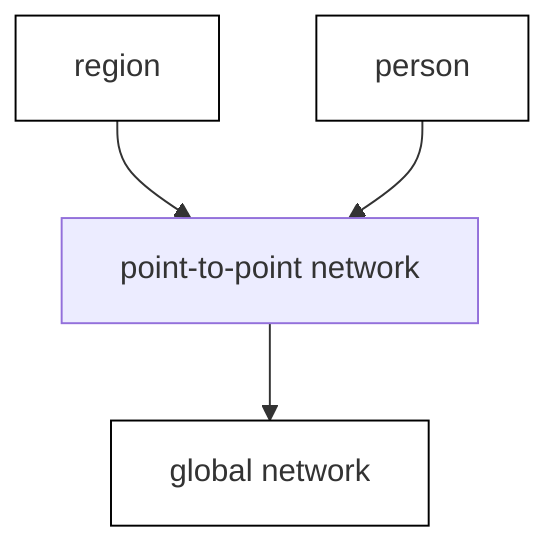
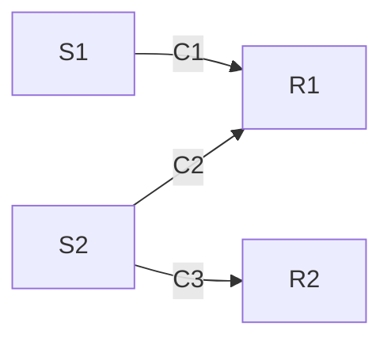
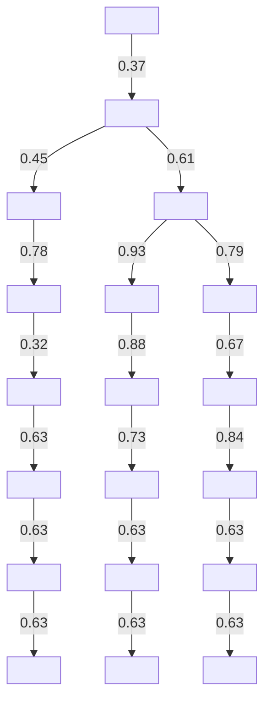

For office use only

T1

T2

T3

T4

Team Control Number

42220

Problem Chosen

D

For office use only

F1

F2

F3

F4

## 2016

## MCM/ICM

## Summary Sheet

(Your team's summary should be included as the first page of your electronic submission.)

## Analysis of Society’s Information Networks

With the development of technology, the situation of information flow becomes more complicated which has aroused widely concerns. In this paper, we establish a double-layer complex network model to measure the evolution and influence in society’s information networks.

In our double-layered complex network model, the inner layer is to analyze the situation of the information flow among a region. We specially take several factors such as inherent value of information, the media effect and personal subjective emotions into account to quantify the attributes of node and side. Optimizing the AsIC Model, we establish point to point model to simulate the flow of information in the network. In the outer layer, Based on the Reaction-Diffusion Model, we establish a global network model to correct the formulas of propagation probability and propagation delay by taking the distance factor into consideration.

Based on our constructed model, with the combination of the inherent value of the information and the efficiency of information flow, we first give out the method of qualifying news. According to the different condition of media usage, we obtain the proportion of different media in different areas based on regression analysis. Compared the simulation of propagation ratio in our network with the actual market share of a certain media, we find that the relative error is less than 10%. Based on our collecting data, we predict that the propagation probability will increase rapidly while the propagation delay will decrease around the year 2050. Meanwhile, the significance of inherent value of information will depress.

Later, based on Bounded Confidence Model, we establish an interaction model to analyze factors which influence the public interest and opinion through information networks. As a result, we get distribution function of public opinion to observe the change of public opinion. Through a piece of specific information, we find the public opinion changes rapidly in the beginning and finally into the stable state. Next, we analyze the influence of several factors in spreading information and public opinion. We get diagram after calculation to show the trend. For example, the propagation probability and change rate of opinion are proportional to information value while propagation delay is opposite.

Meanwhile, we adopt sensitivity analysis on different elements. We conclude that the model is more sensitive to Authority, later comes Influence, Activity and Willing.

Key words: double-layer complex network model, point to point model, Bounded Confidence Model, information flow

1. Introduction... .2

1.1 Background.  
1.2 Our work ....

2. Assumptions....

3. Task 1: Establish a Double-layer Complex Network . 3

3.1 Frame ...... 3  
3.2 Inner Layer:Information Flow over a Region ..

3.2.1 Index Extraction ....  
3.2.2 Information flow between two nodes.  
3.2.3 Coefficient calculation .

3.3 Outer Layer: Information Flow from Region to Region ..... 9  
3.4 Information Flow Situation ..... .10  
3.5 Sensitivity Analysis... 11

3.5.1 Change the Value of Index ..... 11  
3.5.2 Remove a Index.. .12

4. Application and Analysis 12

4.1 Task 1:Qualification of News..... .12  
4.2 Task 2:Predict the Information Communication Situation for Today . 13  
4.3 Task 3:Predict the situation around the year 2050. 15

4.3.1 Communication networks’ relationships ...... .15  
4.3.2 Communication networks’ capacities. .15

4.4 Task 4:Influence in Public Interest and Opinion . .16

4.4.1 Foundation of Model. .16  
4.4.2 Suggestions ..... .17

4.5 Task 5:Factors Influence in Spreading Information and Public Opinion .......... .18

4.5.1 Influence in Spreading Information . .18  
4.5.2 Influence in Public Opinion .18

5. Strengths and Weaknesses .19

5.1 Strengths..... .19  
5.2 Weaknesses ...... ..19

Reference ... .19

## 1. Introduction

## 1.1 Background

Nowadays, information is spread quickly in our daily life. Due to the development of technology, no matter the big events or the trivia, people have access to information quickly and conveniently. As a result, the information garbage is everywhere which influences our life. In order to manage and track the flow of information, people raise awareness of the importance of establishing a society information network.

Interested in information communication situation of social network, several methods have been adopted to describe it. Most models supposed that information is spread according to time sequence. For example, Independent Cascade Model[1] regards that propagation probability is same among nodes all the time which has no memory. Meanwhile, Linear threshold model[2] concentrates on cumulative probability which reflects the accepted ability of receiver. However, these models ignore such factors:

Attributes of nodes such as personal interests.  
Influence of inherent value of information in propagation.  
Propagation process is not synchronous.

Therefore, there is an urgent need for a complete scientific model. Based on it, we establish a double-layer complex network.

## 1.2 Our work

To further present our solutions, we arrange our paper as follow.

In section 2, we give out the reliable assumptions to simplify the model.  
In section 3, the double-layer network is constructed to analyze and forecast the information flow. The inner layer analyzes the information flow among a region. While the outer layer analyze the flow from region to region. Meanwhile, the sensitivity analysis is given out to validate our model.  
In section 4, we apply our model to solve a series of problem, such as qualification of news, prediction of information flow today and around the year 2050. Next, we establish a model to analyze the factors to influence the public interest and opinion. Later, we analyze the influence of different indexes in Spreading Information and Public Opinion.  
At last, we discuss the strengths and weaknesses of our model in detail.

## 2. Assumptions

The data we found is authentic and reliable.  
No invention of media in the time for prediction. That is to say, people use the same media as today, just the proportion of media changes.  
Ignore the firewall among countries which restrains the spread of information. The

information in the our network is not secret.

Due to the difference of development level is relatively little in a small area, we ignore the difference in media usage from a statistical point of view.  
C To simplify the model, we only consider six media to spread information which are newspaper, telegraph, radio, television, the Internet and mobile phone.  
The node spread the same message only once. That is to say，the in-degree of a node is no more than 1.

## 3. Task 1: Establish a Double-layer Complex Network

## 3.1 Frame

A large amount of factors ought to take into account to quantify the flow of information. For example, due to the difference in development level among countries, the way and speed of flow must be different. Also, with the Internet technology become more sophisticated, each person plays a more and more important role in spreading information instead of original media such as newspaper and television, which the objective factors such as personal interests should be taken into consideration.

Based on above analysis, we can see that a simple network cannot reflect the whole situation of the flow of information well. As a result, a complex network with multi-layers, whose layers have a certain interactions and independence, seems to be more reasonable.

Therefore, we come up with a double-layered network, global information network and point to point information network, which belongs to a complex network, to reflect the information flow more specifically.

The structure of our double-layer complex network is shown in Figure 1.

flowchart

Figure 1 A double-layer Network

The blue dots represent each person and small circle represents a region. The directed line represents the direction of information flow. The figure vividly indicates that the information originates from a node(source), then spread quickly over a region and at last spread the whole world. The internal and external factors which influence the information flow is analyzed in detail in next two sections.

## 3.2 Inner Layer: Information Flow over a Region

The process of information propagation can be divided into massive point to point cases. Each case has three entities: sender(S), receiver(R) and content(C). Figure 2 shows the relationship.

flowchart

Figure 2 Relationships of three entities in the diffusion process

The information spread from sender to receiver, each spread case carries a piece of information.

## 3.2.1 Index Extraction

In order to describe the flow of information specifically, we choose Twitter as an example. Based on the AsIC Model, to improve the accuracy of our model, we take the inherent value of information, the media effect and personal subjective emotions into consideration and give five indexes to analyze the information flow: Communication Media Effect, Sender Characteristic, Receiver Characteristic, Content Characteristic, Relation between Sender and Receiver. Suppose that node u as a sender, node v as a receiver.

 Communication Media Characteristic $( \phi _ { m } )$

From a historical perspective, the communication media change a lot. From newspaper, and radio in the early time to television, Internet, mobile phone and many other media nowadays. Information tends to spread more quickly and wide. Due to the difference in social developments, mainstream media of different regions varies a lot. Based on six media (newspaper, telegraph, radio, television, Internet and mobile phone), communication medium effect $\phi _ { m }$ is calculated as follows:

$$
\phi_ {m} = \sum_ {i} \lambda_ {i} \varphi_ {i} (i = N, T E L, R, T V, I, M) \tag {1}
$$

When N,TEL,R,TV,I is short for six media, newspaper, telegraph, radio, television the Internet and mobile phone respectively; where $\lambda _ { i }$ denotes the market share of $\mathrm { i } ^ { \mathrm { t h } }$ medium and $\varphi _ { i }$ denotes corresponding effect on spreading communication such as propagation speed and scope.

Base on the Analytic Hierarchy Process[3], we train the collected data and obtain the final weights as follows. The result has been approximated in order to simplify calculation.

Meanwhile, in a specific area we assume that $\lambda _ { i }$ and $\phi _ { m }$ is constant which represent the average level. The weight of different media is listed in Table 1.

Table 1 Different media and their effect on spreading communication

<table><tr><td>Medium</td><td>Weight</td><td>Medium</td><td>Weight</td></tr><tr><td>Newspaper</td><td>1</td><td>Television</td><td>2.5</td></tr><tr><td>Telegraphy</td><td>0.5</td><td>Internet</td><td>3</td></tr><tr><td>Radio</td><td>2</td><td>Mobile phone</td><td>3.5</td></tr></table>

 Sender Characteristic $( \phi _ { s } )$

Influence(F): Influence shows the importance degree of a node. It should be:

$$
\operatorname{In} F (u) = \lg (R T + 1) \tag {2}
$$

Where RT denotes the total number of forwarding times of a node.

Authority(A): It is defined as the ratio of in-degree divides out-degree which is calculated as follows:

$$
A (\mathrm{u}) = \lg \left(\frac {F O}{F R} + 1\right) \tag {3}
$$

Where FO denotes the number of fans while FR denotes the number of idol.

Activity(Ac):

$$
A c (u) = \lg (\frac {P O}{D} + 1) \tag {4}
$$

Where PO denotes total number of messages the user has been published. D denotes the number of the user’s active days.

We take normalized form membership functions for each index so that values of all the factors can be constrained between 0 and 1.The normalization is shown as follows:

$$
x _ {i} ^ {\prime} = \frac {x _ {i} - \min _ {1 \leq j \leq n} \left\{x _ {j} \right\}}{\max _ {1 \leq j \leq n} \left\{x _ {j} \right\} - \min _ {1 \leq j \leq n} \left\{x _ {j} \right\}} \tag {5}
$$

Where $x _ { i }$ and $x _ { _ i } ^ { \prime }$ respectively denotes the original value and the value after standardization.

 Receiver Characteristic( $\phi _ { \mathrm { R } } ~ ,$ )

Willing(W): The value of willing indicates the possible trend for receivers to spread the information(v) is calculated as follows:

$$
W (v) = \lg (\frac {R}{P} + 1) \tag {6}
$$

Where R denotes the number of retweet times. P denotes the number of original messages.

In the same way, normalize the index as $y _ { i } ^ { \ast }$ .

##  Content Characteristic $( \phi _ { \mathrm { c } } )$

Inherent value of content plays an important role in the information flow. For example, the funnier or more important message tends to spread more quickly. To evaluate such abstract idea, we quantify it for two aspects: the value of information content and the quality of presentation.

Luckily, the article in Journal of Information Engineering University[4] determines 5 indicators for the value of information content and 5 indicators for the quality of presentation. Specific indexes and their weights are shown in Table 2.

Table 2 Evaluation indexes and their weights

<table><tr><td>General indicator</td><td>Specific indicator</td><td>Weight</td></tr><tr><td rowspan="5">Inherent value(0.7)</td><td>Authenticity</td><td>0.318</td></tr><tr><td>Importance</td><td>0.174</td></tr><tr><td>Timeliness</td><td>0.247</td></tr><tr><td>Target</td><td>0.102</td></tr><tr><td>Confidentiality</td><td>0.159</td></tr><tr><td rowspan="5">Quality of presentation(0.3)</td><td>Clear scheme</td><td>0.203</td></tr><tr><td>Careful thinking</td><td>0.063</td></tr><tr><td>Accurate description</td><td>0.299</td></tr><tr><td>Concise expression</td><td>0.232</td></tr><tr><td>Comprehensive factors</td><td>0.203</td></tr></table>

We give out general formulas to calculate the above two aspects below:

$$
\varphi_ {\text { value }} = \sum_ {i = 1} ^ {5} \omega_ {i} \mu_ {i} \tag {7}
$$

$$
\varphi_ {q u a} = \sum_ {i = 6} ^ {1 0} \omega_ {i} \mu_ {i} \tag {8}
$$

$$
\phi_ {\mathrm{c}} = 0. 7 \times \varphi_ {\text { value }} + 0. 3 \times \varphi_ {\text { qua }} \tag {9}
$$

Where $\omega _ { i }$ denotes the weight of above 10 indicators respectively. $\mu _ { i }$ denotes the value of the corresponding index, which arranges from 0 to 9. $\varphi _ { \nu a l u e }$ denotes the value of information content and $\varphi _ { p r e }$ denotes the quality of presentation.

 Relation between Sender and Receiver $( \boldsymbol { \phi } _ { \mathrm { s , R } } )$

Interest similarity(Si): The message the user published indicates his or her interests which plays an important role in spreading information. TF-IDF model[5] is adopted to information retrieval and data mining. Sim-i(u,v) is:

$$
S i (u, v) = \frac {P \cdot Q}{| P | \times | Q |} \tag {10}
$$

where P and Q respectively file vector of uses u and v.

Structural similarity(Ss):It illustrates the similarity of circle of friends among users. The Jaccard Distance[6] is applied to the calculation:

$$
S s (u, v) = \frac {\left| N (u) \cap N (v) \right|}{\left| N (u) \cup N (v) \right|} \tag {11}
$$

Where $N ( \nu _ { i } )$ denotes the neighboring nodes of node $\nu _ { i }$ .

Closeness( $C L ( u , \nu ) ~ ,$ ):When the message contains information of receiver, it will be spread more easily. Define $C L ( u , \nu )$ as follows:

$$
C L (u, v) = \left\{ \begin{array}{l} 1, \text { when   the   message   of   } u \text {   mentions   } v \\ 0, \text { on   the   contrary } \end{array} \right. \tag {12}
$$

## 3.2.2 Information flow between two nodes

Based on above analysis, we establish eigenvector of node vector $( \phi _ { n } )$ and side vector $( \phi _ { e } )$ .These two vectors are shown as follows:

$$
\phi_ {n} = \left[ \begin{array}{l l l} \phi_ {S} & \phi_ {R} & \phi_ {C} \end{array} \right] ^ {T} \tag {13}
$$

$$
\phi_ {e} = \phi_ {S, R} \tag {14}
$$

To obtain the propagation probability, fundamentally function is calculated as follows:

$$
f (u, v, c) = k _ {1} \phi_ {m} + \alpha_ {1} ^ {T} \phi_ {n} + \alpha_ {2} ^ {T} \phi_ {e} \tag {15}
$$

Where $\phi _ { m }$ is a constant, $\alpha _ { 1 }$ denotes weight of nodes’ characteristic, $\alpha _ { 2 }$ denotes weight of sides’ characteristic. The weight represents how corresponding characteristic influence in propagation probability. $k _ { 1 }$ is the weight.

Based on Bayesian logistic function[7],the propagation probability is calculated:

$$
p (u, v, c) = \frac {1}{1 + I n (- f (u , v , c))} \tag {16}
$$

In the same way, propagation delay is calculated as follows:

$$
\tau (u, v, c) = k _ {2} \phi_ {m} + \beta_ {1} ^ {T} \phi_ {n} + \beta_ {2} ^ {T} \phi_ {e} \tag {17}
$$

Where $\phi _ { m }$ is constant, $\beta _ { 1 }$ and $\beta _ { 2 }$ respectively denotes weight of nodes and sides characteristics. $k _ { 2 }$ is the weight.

## 3.2.3 Coefficient calculation

In order to calculate the coefficient $k _ { i } , \alpha _ { i }$ and $\beta _ { i } ( \mathrm { i } \mathrm { = } 1 , 2 )$ , maximum likelihood estimate theory[8] is adopted as follows.

Taking time decay factor into account, the propagation probability decreases as time goes by. Accumulated propagation probability from node u to node v is defined as follows:

$$
F ((v, t _ {v}) \mid (u, t _ {u})) = \int_ {t _ {u}} ^ {t _ {v}} f (u, v, c) d t \tag {18}
$$

Where $t _ { i } ( i = u , \nu )$ denotes the time when node i spread the information.

Define $S ( ( \nu , t _ { \nu } ) | ( u , t _ { u } ) )$ as the probability of which node u will not spread the information to v before time $t _ { \nu }$ .

$$
S ((v, t _ {v}) \mid (u, t _ {u})) = 1 - F ((v, t _ {v}) \mid (u, t _ {u})) \tag {19}
$$

Determine a set $\boldsymbol { D } ^ { k } = \{ ( \nu _ { i } , t _ { i } ) , . . . , ( \nu _ { n } , t _ { n } ) \}$ to represents all the node and its spreading time. And the set $Q ^ { k } = \{ ( \nu _ { i } , t _ { i } ) \in D ^ { k } , t _ { i } \leq t \}$ denotes the nodes which spread information before time t. is defined as the information source of node $\mathbf { V } ,$ that is to say, the information spread from  to v.

The propagation of a piece of information $c ^ { k }$ is calculated as follows:

$$
f (c ^ {k}) = \prod_ {(v, t _ {v})} F ((v, t _ {v}) | (u, t _ {u})) \times \prod_ {\omega \in Q ^ {k} (v) \backslash p a r (v)} S ((v, t _ {v}) | (u, t _ {u})) \tag {20}
$$

So the propagation probability of all pieces of information in set $C = \{ c ^ { 1 } , c ^ { 2 } , . . . , c ^ { n } \}$ can be obtained in the following formula:

$$
f (C) = \prod_ {1 \leq k \leq n} f (c ^ {k}) \tag {21}
$$

To get the larger value of  , we set the object function:

$$
\min - \lg f (C) \tag {22}
$$

Train data through computer, we can finally obtain the value of coefficient $k _ { i } , \alpha _ { i }$ and $\beta _ { i } ( \mathrm { i } \mathrm { = } 1 , 2 )$ .

## 3.3 Outer Layer: Information Flow from Region to Region

As analyzed above, the development level is unbalanced on the Earth which influences the flow of information, so the nodes we choose must be representative. To simplify the model, we choose GDP per capita as the criteria, with data from the CJDBY.net[9], which is shown in Figure 3.

heatmap

| Country | Value Range |
|---|---|
| >400% | Purple |
| 200%-400% | Red |
| 100%-200% | Orange |
| 50%-100% | Yellow |
| 25%-50% | Light Blue |
| <25% | Blue |

Figure 3 GDP per capita

text_image

RUSSIA
NORTH
AUSTRAL
AVOCHEM
SOUTH PACIFIC
OCEAN
ATLANTAND
EUROPEAN
MALABETH
JAPAYA
INDIA
AFRICA
BUTTER
GULF
KAFIR
CHINESE & OCEAN
COCONOMEGO
MALABETH
JAPAYA
INDIA
AFRICA
BUTTER
GULF
KAFIR
CHINESE & OCEAN
COCONOMEGO
MALABETH
JAPAYA
INDIA
AFRICA
BUTTER
GULF
KAFIR
CHINESE & OCEAN
COCONOMEGO
MALABETH
JAPAYA
INDIA
AFRICULTURE
GULF
KAFIR
CHINESE & OCEAN
COCONOMEGO
MALABETH
JAPAYA
INDIA
AFRICA
BUTTER
GULF
KAFIR
CHINESE & OCEAN
COCONOMEGO
MALABETH
JAPAYA
INDIA
AFRICA
BUTTER
GULF
KAFIR
CHINESE & OCEAM
COCONOMEGO
MALABETH
JAPAYA
INDIA
AFRICA
BUTTER
GULF
KAFIR
CHINESE & OCEAM
COCONOMEGO
MALABETH
JAPAYA
INDIA
AFRICA
BUTTER
GULF
KAFIR
CHINESE & OCEAM
COCONOMEGO
MALABETH
JAPAYA

Figure 4 Global network

We can see that each of which has obvious difference GDP per capita is signed by a certain color. Apparently, the GDP per capita of America, Canada, Northern Europe and Australia(area with color of purple)is four times as big as the world’s average level. On the contrary, the one of area with dark blue color is relative low. According to development level and geography, we choose seven typical countries in Figure 4:America, Brazil, France, Congo, Russia, China and Austria.

In order to investigate the flow of information among nodes, we detail this phenomenon by applying the mechanism of two-dimensional reaction-diffusion model(R-D equation).

A scalar field $f ( \rho , \theta )$ and its gradient, whose magnitude is the maximum rate of change of f per unit length of the coordinate space at the given point, could be described below in polar coordinate system:

$$
V = \nabla [ f (\rho , \theta) ] = \frac {\partial f}{\partial \rho} \overrightarrow {e _ {\rho}} + \frac {1}{\rho} \frac {\partial f}{\partial \theta} \overrightarrow {e _ {\theta}} \tag {23}
$$

Therefore, this scalar field $f ( \rho , \theta )$ will transfer into a vector field V after derogating gradient. For a source flow, all the streamlines are straight lines emanating from a central point, as shown in Figure 5. Obviously, we see that the components in the radial and tangential directions are $\partial f / \partial \rho$ and $\partial f / \partial \theta$ , respectively, where $\partial f / \partial \theta = 0$ .

text_image

∂f/∂ρ
ρ
θ

Figure 5 A point source flow

According to the mechanism of reaction-diffusion model, the divergence of every point in this vector field V can be obtained easily :

$$
\begin{array}{l} d i v = d i v (\nabla f) = d i v \left(\frac {\partial f}{\partial \rho} \overrightarrow {e _ {\rho}}\right) \tag {24} \\ = \frac {1}{\rho} \frac {\partial}{\partial \rho} (\rho \cdot \frac {\partial f}{\partial \rho}) = \frac {1}{\rho} \frac {\partial f}{\partial \rho} + \frac {\partial^ {2} f}{\partial \rho^ {2}} \\ \end{array}
$$

Where : $\textmu m ( \bullet )$ denotes divergence while $\nabla ( \bullet )$ denotes gradient.

The second part in above equation, that is, $\partial ^ { 2 } f / \partial \rho ^ { 2 }$ , has little impacts on the final value. Here, for the convenience of calculations, we overlook this part.

$$
d i (\nabla f) \propto \frac {1}{\rho} \tag {25}
$$

And final conclusion could be draw that divergence of gradient of a scalar field is

inversely proportional to the radial distance.

Considering the fact that the further distance leads to weaker propagation of information, so we only take the link between a node and its neighboring node into account. Figure 4 shows the nodes chosen and its direct connect. The yellow line represents international information flow.

From above analysis, we assume that Communication Media Effect $( \phi _ { m } ) \mathrm { i s }$ a constant among a country which ignores the difference of development level among the range of countries. Meanwhile, the factor of distance is neglected in point to point information network as well.

To full present the reality, based on above model, we taken into distance between two countries and difference of $\phi _ { m }$ into account. It is a common sense that propagation of information between points is inversely proportional to their distance while the propagation delay is on the contrary. And the information flow is limited to relatively backward country. Compare the $\phi _ { m }$ between two countries and choose the lower value of $\phi _ { m }$ into calculation.

According to above assumption, together with the mechanism of reaction- diffsion $m o d e l ^ { [ 1 0 ] }$ , we suppose that the propagation of information happens from node  to n ode .The propagation probability $p _ { e x }$ and propagation delay $\tau _ { e x }$ between u and can be described as:

$$
\left\{ \begin{array}{l} p _ {e x} = k _ {1} \frac {p (u , v , c)}{d _ {u v}} \\ \tau_ {e x} = k _ {2} \cdot \tau (u, v, c) \cdot d _ {u v} \end{array} \right. \tag {26}
$$

Where : $d _ { u \nu }$ denotes the distance from node to node , and $k _ { 1 } , k _ { 2 }$ denotes the weight respectively.

## 3.4 Information Flow Situation

We have obtained the propagation probability and propagation delay from above analysis. Set up two sets: set K includes the nodes which have spread the information(including the information source) and set N includes all nodes except nodes in set K.

To express the information flow clearly ,there are mainly four steps as follows:

Step 1:Suppose the node $\alpha _ { 1 }$ as the information source and the number of all nodes is m. $K = \left\{ \alpha _ { 1 } \right\} . \tau _ { 1 } = 0 ( \tau _ { i }$ denotes the spread time from source to node i). $n = 1$ (n denotes the number of nodes in set K).  
C Step 2:Calculate the propagation probability $f ( \alpha _ { \mathrm { i } } , \alpha _ { i } )$ and propagation delay $\tau ( \alpha _ { \mathrm { i } } , \alpha _ { i } )$ between the node $\alpha _ { i }$ in set K and all their neighboring node $\alpha _ { j }$ in set N.  
Step $3 \mathrm { : I f } \ f ( \alpha _ { \mathrm { i } } , \alpha _ { { i } } ) > \gamma ( \gamma$ is a threshold, usually from 0.5 to 0.6), take node $\alpha _ { j }$ into set K. $n = n + 1$ , $\tau _ { j } = \tau _ { i } + \tau ( \alpha _ { i } , \alpha _ { j } )$ .Return to Step 2.  
Step 4:If there not exists a node v which $f ( u , \nu ) > \gamma$ and the last included node is $\alpha _ { p }$ .The conclusion is that $\tau _ { p }$ is the total propagation time $\tau , n / m$ is the total propagation ratio .

Figure 5 and 6 help visualize spread of information.  

radar chart

| Direction | Value |
|---|---|
| Up | 0.91 |
| Down | 0.73 |
| Up | 0.32 |
| Down | 0.26 |
| Left | 0.81 |
| Right | 0.43 |
| Left | 0.63 |
| Right | 0.91 |

Figure 5 Original network

flowchart

Figure 6 Information spreading network

The blue spots represents the nodes which have spread the information. As shown in the Figure 5,there is only one node in the beginning which is information source. Through the spread of information, as shown in Figure 6, the number of blue spots increases and new blue spots work as new ‘information source’ to spread information.

## 3.5 Sensitivity Analysis

## 3.5.1 Change the Value of Index

Based on our constructed model, we extract many indexes as the attributes of node and side. For the purpose of concise writing, we choose two representative indexes for detailed description which represents the attributes of node and side respectively.

line chart

| year | 0.9W  | W     | 1.1W  |
|------|-------|-------|-------|
| 1980 | 0.03  | 0.04  | 0.05  |
| 1982 | 0.03  | 0.04  | 0.05  |
| 1984 | 0.03  | 0.04  | 0.05  |
| 1986 | 0.03  | 0.04  | 0.05  |
| 1988 | 0.03  | 0.04  | 0.05  |
| 1990 | 0.03  | 0.04  | 0.05  |
| 1992 | 0.03  | 0.04  | 0.05  |
| 1994 | 0.03  | 0.04  | 0.05  |
| 1996 | 0.03  | 0.04  | 0.05  |
| 1998 | 0.03  | 0.04  | 0.05  |
| 2000 | 0.03  | 0.04  | 0.05  |
| 2002 | 0.03  | 0.04  | 0.05  |
| 2004 | 0.03  | 0.04  | 0.05  |
| 2006 | 0.03  | 0.04  | 0.05  |
| 2008 | 0.03  | 0.04  | 0.05  |
| 2010 | 0.03  | 0.04  | 0.05  |
| 2012 | 0.03  | 0.04  | 0.05  |
| 2014 | 0.03  | 0.04  | 0.05  |

Figure 7 Sensitivity analysis of W

line chart

| year | 0.9Si | Si   | 1.1Si |
|------|-------|------|-------|
| 1980 | 0.03  | 0.04 | 0.05  |
| 1982 | 0.03  | 0.04 | 0.05  |
| 1984 | 0.03  | 0.04 | 0.05  |
| 1986 | 0.03  | 0.04 | 0.05  |
| 1988 | 0.03  | 0.04 | 0.05  |
| 1990 | 0.03  | 0.04 | 0.05  |
| 1992 | 0.03  | 0.04 | 0.05  |
| 1994 | 0.03  | 0.04 | 0.05  |
| 1996 | 0.03  | 0.04 | 0.05  |
| 1998 | 0.03  | 0.04 | 0.05  |
| 2000 | 0.03  | 0.04 | 0.05  |
| 2002 | 0.03  | 0.04 | 0.05  |
| 2004 | 0.03  | 0.04 | 0.05  |
| 2006 | 0.03  | 0.04 | 0.05  |
| 2008 | 0.03  | 0.04 | 0.05  |
| 2010 | 0.03  | 0.04 | 0.05  |
| 2012 | 0.03  | 0.04 | 0.05  |
| 2014 | 0.03  | 0.04 | 0.05  |

Figure 8 Sensitivity analysis of Si

Figure 7 and Figure 8 show the sensitivity analysis of willing degree of receiver (attributes of node) and the interest similarity between the sender and receiver (attributes of side).The blue solid line represents the original trend of willing degree, the dashed lines represent adjusted trends of index; red one matches expanding value of index, while green one matches reducing influence of index.

It is obvious that the total trend of three lines in Figure 13 is all rising, which represents that the propagation ratio is in proportion to willing degree. Increasing the value of willing degree seems to help improve the flow of information.

The results of sensitivity analysis of Si is similar to the one of W. But the trend for Si is smoother which shows that our model is not sensitive to the interest similarity compared to

willing degree of receiver.

## 3.5.2 Remove a Index

To show the different influence degree of different indexes to the flow of information, we choose four indexes: Influence(F), Authority(A), Activity(Ac), Willing(W) as example.

Figure 9 shows the different propagation delay (when the propagation ratio reaches 10%) of the case when we remove one of above four indexes.

bar chart

| Condition | Propagation delay time |
| :--- | :--- |
| normal | 58 |
| lack F | 62 |
| lack A | 53 |
| lack Ac | 54 |
| lack W | 61 |

Figure 9 Sensitivity Analysis of Removing a index

We can conclude that the lack of Influence index and Willing index leads to increasing the propagation delay time. The difference between the case of lack F and the normal is larger than the case of lack W and the normal, which represents that F is more sensitive to our model than W. In the same way, the lack of Authority leads to decreasing the propagation delay time. Among all these four indexes, model is most sensitive to authority, later comes influence, Activity and Willing.

Meanwhile, the difference is relatively small which indicates the stability of our model.

## 4. Application and Analysis

After all equations are determined above, our model is final completed. So next, we concentrate on solving relative problems and giving out analysis as well.

## 4.1 Task 1: Qualification of News

Both the inherent value of the information itself and speed of information are vital to information propagation. News, a form of information which satisfies the law of information propagation, ought to be qualified from above two aspects. The inherent value of news are divided into the value of content and the quality of presentation which we have analyzed above. We will discuss the information flow efficiency in detail as below.

As we have analyzed above, the total propagation delay time and the total propagation ratio ,which reflects the flow efficiency, can be obtained through computer calculation. Quantify the efficiency $\phi _ { e f f }$ below:

$$
\phi_ {e f f} = \omega_ {1} \tau + \omega_ {2} \eta \tag {27}
$$

Where $\omega _ { i } ( i = 1 , 2 )$ denotes the weight. $\omega _ { 1 }$ is negative while $\omega _ { 2 }$ is positive.

In conclusion, the quality of news can be calculated as follows:

$$
\varphi_ {\text { q   u   a   l   i   t   y }} = \lambda_ {1} \phi_ {\text { e   f   f }} + \lambda_ {2} \phi_ {c} \tag {28}
$$

Where $\lambda _ { i } ( i = 1 , 2 )$ denotes the weight of $\mathrm { i } ^ { \mathrm { t h } }$ indicator. $\phi _ { e f f }$ denotes information flow efficiency and $\phi _ { c }$ denotes the inherent value which has been analyzed above.

For the different situation, we can set different threshold  .When $\varphi _ { q u a l i t y } > \theta$ ,the information can qualified as news.

## 4.2 Task 2: Predict the Information Communication Situation for Today

The market share of different media is an indicator to quantify the information communication. Change the weight $\lambda _ { \scriptscriptstyle N }$ into 1 in equation(1) and let $\lambda _ { i } = 0 ( \mathrm { i = T E L , R , T V , I , M } )$ to calculate the propagation ratio $\eta _ { N }$ ,which is analyzed in section 4.2. Compared $\eta _ { N }$ with the actual market share of newspaper, we come to analyze the error between our model and the reality. The market share forecast of other media is in the same way.

First, we give out the total trend in market share of six media plots as follows based on regression analysis. We choose two representative countries: America and China as study objects.

line chart

| year | newspaper | telegraph | radio | television | internet | phone |
|------|-----------|-----------|-------|------------|----------|-------|
| 1850 | 0.85      | 0.15      | -     | -          | -        | -     |
| 1870 | -         | -         | -     | -          | -        | -     |
| 1890 | -         | -         | -     | -          | -        | -     |
| 1910 | -         | -         | 0.1   | -          | -        | -     |
| 1930 | -         | -         | -     | -          | -        | -     |
| 1950 | -         | 0.25      | -     | -          | -        | -     |
| 1970 | -         | 0.25      | 0.4   | 0.0        | 0.0      | -     |
| 1990 | -         | 0.2       | 0.3   | 0.1        | 0.1      | -     |
| 2010 | 0.1       | 0.1       | 0.1   | 0.3        | 0.2      | 0.2   |
| 2020 | 0.1       | 0.0       | 0.1   | 0.3        | 0.2      | 0.2   |

Figure 10 Media Market Share in America

line chart

| year | newspaper | telegraph | radio | television | internet | phone |
| --- | --- | --- | --- | --- | --- | --- |
| 1890 |  |  |  |  |  |  |
| 1900 |  | 1.0 |  |  |  |  |
| 1910 |  |  |  |  |  |  |
| 1920 |  |  |  |  |  |  |
| 1930 |  |  |  |  |  |  |
| 1940 |  |  |  |  |  |  |
| 1950 |  |  |  |  |  |  |
| 1960 |  |  |  |  |  |  |
| 1970 |  |  |  |  |  |  |
| 1980 |  |  |  |  |  |  |
| 1990 |  |  |  |  |  |  |
| 2000 |  |  |  |  |  |  |
| 2010 |  |  |  |  |  |  |
| 2020 |  |  |  |  |  |  |

Figure 11 Media Market Share in China

The specific value of market share of different media is listed in Table 3 and Table 4.

Table 3 Media Market Share in America

<table><tr><td>Medium</td><td>Newspaper</td><td>Telegraph</td><td>Radio</td><td>Television</td><td>Internet</td><td>Phone</td></tr><tr><td>Weigh</td><td>0.09</td><td>0.01</td><td>0.04</td><td>0.32</td><td>0.27</td><td>0.27</td></tr></table>

Table 4 Media Market Share in China

<table><tr><td>Medium</td><td>Newspaper</td><td>Telegraph</td><td>Radio</td><td>Television</td><td>Internet</td><td>Phone</td></tr><tr><td>Weigh</td><td>0.12</td><td>0.02</td><td>0.07</td><td>0.29</td><td>0.25</td><td>0.25</td></tr></table>

We can see that the market share of traditional media such as newspaper and radio is descending all the time. On the contrary, the new media such as the Internet and mobile phone occupy more media share.

There are six media and seven regions, for concise writing, we choose the newspaper and the Internet of America for example. We collect data from a discussion paper from communic@tions Management Inc[11]and BBC news[12].

line chart

| years | value  |
| ----- | ------ |
| 1995  | 0.6    |
| 2000  | 0.49   |
| 2005  | 0.43   |
| 2010  | 0.39   |
| 2015  | 0.3    |

Figure 12 Market share of Newspaper

line chart

| year | Blue Line | Green Dashed Line |
| ---- | --------- | ----------------- |
| 2011 | 0.70      | -                 |
| 2012 | 0.71      | -                 |
| 2013 | 0.725     | -                 |
| 2014 | 0.74      | 0.74              |
| 2015 | 0.775     | 0.785             |

Figure 13 Market share of the Internet

Figure 12 shows the market share of newspaper while Figure 13 shows the one of the Internet. The blue full line represents the reality and the green dashed line represents the forecast based on the past data. Obviously, the green line is close to the blue one ,with the relative error is under 10%, shows that our model is reliable. The specific error is shown in Table 5.

Table 5 The Error in the Market Share of Different Media

<table><tr><td>Medium</td><td>True value</td><td>Forecast</td><td>Absolute Error</td><td>Relative Error</td></tr><tr><td>Newspaper</td><td>0.3</td><td>0.28</td><td>0.02</td><td>6.67%</td></tr><tr><td>Internet</td><td>0.773</td><td>0.785</td><td>0.12</td><td>1.55%</td></tr></table>

##  Example

To specify the information communication situation for today, we choose a important world event about the death of Bin Laden, which happens in May 1st, 2011. Based on our model, we calculate information value as the number of 8.3.

In order to reduce the amount of calculation, we choose to calculate the number of propagation nodes in one minute to verify our model. Following are our results.

```mermaid
graph TD
  A["Node"] --> B["Node"]
  A --> C["Node"]
  A --> D["Node"]
  A --> E["Node"]
  A --> F["Node"]
  A --> G["Node"]
  A --> H["Node"]
  A --> I["Node"]
  A --> J["Node"]
  A --> K["Node"]
  A --> L["Node"]
  A --> M["Node"]
  A --> N["Node"]
  A --> O["Node"]
  A --> P["Node"]
  A --> Q["Node"]
  A --> R["Node"]
  A --> S["Node"]
  A --> T["Node"]
  A --> U["Node"]
  A --> V["Node"]
  A --> W["Node"]
  A --> X["Node"]
  A --> Y["Node"]
  A --> Z["Node"]
  A --> AA["Node"]
  A --> AB["Node"]
  A --> AC["Node"]
  A --> AD["Node"]
  A --> AE["Node"]
  A --> AF["Node"]
  A --> AG["Node"]
  A --> AH["Node"]
  A --> AI["Node"]
  A --> AJ["Node"]
  A --> AK["Node"]
  A --> AL["Node"]
  A --> AM["Node"]
  A --> AN["Node"]
  A --> AO["Node"]
  A --> AP["Node"]
  A --> AQ["Node"]
  A --> AR["Node"]
  A --> AS["Node"]
  A --> AT["Node"]
  A --> AU["Node"]
  A --> AV["Node"]
  A --> AW["Node"]
  A --> AX["Node"]
```

flowchart

Figure 14 Information Spread Network

We obtained that the number of nodes is 89.According to the data from peixun.net[13],we know that there are 80 people re-post the information in Twitter, which is similar to our evaluation. From above example, we validate our model’s reliability.

## 4.3 Task 3: Predict the situation around the year 2050

There are seven regions, thus, for concise writing, we choose two representative regions, where United States and Congo respectively as our study objects.

## 4.3.1 Communication networks’ relationships

As time goes on, our society tends to information-overloaded, with more and more useless information around us. With the development of technology and minds changing, it is obviously that the inherent value of information itself decreases while the efficiency of information flow increases. To show the relationship between flow of speed of information( $\phi _ { e f f } )$ vs inherent value of information( $\phi _ { c }$ ), which have been quantified above, we define the ratio as follows:

$$
s = \frac {\phi_ {e f f}}{\phi_ {c}} \tag {29}
$$

line chart

| year | ratio |
| ---- | ----- |
| 1890 | 100   |
| 1910 | 80    |
| 1930 | 65    |
| 1950 | 50    |
| 1970 | 35    |
| 1990 | 25    |
| 2010 | 20    |
| 2030 | 15    |
| 2050 | 12    |
| 2060 | 10    |

Figure 15 Ratio changes in America

line chart

| year | ratio |
| ---- | ----- |
| 1890 | 160   |
| 1900 | 155   |
| 1910 | 145   |
| 1920 | 135   |
| 1930 | 138   |
| 1940 | 140   |
| 1950 | 142   |
| 1960 | 145   |
| 1970 | 148   |
| 1980 | 145   |
| 1990 | 135   |
| 2000 | 120   |
| 2010 | 100   |
| 2020 | 80    |
| 2030 | 60    |
| 2040 | 40    |
| 2050 | 30    |
| 2060 | 25    |

Figure 16 Ratio changes in Congo

Figure 15 shows the ratio changes in America. The line decreases quickly in the early time and reaches a plateau around the year 2030, which indicates the popularity rate of the Internet will be high and stable at that moment. The ratio will reach approximately the number of 14 around the year 2050. In the same way, Figure 16 shows trend of ratio changes in Congo, which is different from the one of America. The line declines slowly at first and falls faster in about the year 2020, and finally will reach the number of 30 around the year 2050, which is lower than the one of America. These figures indicate the difference of social development level.

## 4.3.2 Communication networks’ capacities

According to our constructed model, the total propagation time and the total propagation radio are the two indicators to evaluate networks’ capacities. The data are employed to train the network. Figure 11 and 12 show indicators and of two countries from the year 1860 to the year 2050 below. We assume that the quantitative value of propagation delay is the number of 1.

line chart

| year | propagation probability | propagation delay |
| ---- | ------------------------ | ------------------ |
| 1840 | 0.0                      | 0.9                |
| 1860 | 0.1                      | 0.8                |
| 1900 | 0.2                      | 0.7                |
| 1940 | 0.3                      | 0.65               |
| 1980 | 0.4                      | 0.6                |
| 2000 | 0.5                      | 0.5                |
| 2020 | 0.6                      | 0.4                |
| 2040 | 0.7                      | 0.1                |

Figure 17 Capacities changes in America

line chart

| year | propagation probability | propagation delay |
| ---- | ------------------------ | ------------------ |
| 1840 | 0.1                      | 1.0                |
| 1860 | 0.1                      | 0.9                |
| 1880 | 0.1                      | 0.8                |
| 1900 | 0.1                      | 0.7                |
| 1920 | 0.1                      | 0.7                |
| 1940 | 0.1                      | 0.7                |
| 1960 | 0.1                      | 0.7                |
| 1980 | 0.2                      | 0.7                |
| 2000 | 0.3                      | 0.7                |
| 2020 | 0.4                      | 0.6                |
| 2040 | 0.45                     | 0.5                |
| 2045 | 0.45                     | 0.5                |

Figure 18 Capacities changes in Congo

Figure 17 plots the variation trend for these two indicators of America. Propagation delay decreases while propagation probability increases on the contrary. There are two time point in the graph, the first one is around the year 1870 when the newspaper come to the world, which improve the spread of information extremely. The second one is the year around 2000 because of the rapid development of Internet technology. These two graphs indicate the history of media and its importance in spreading information. Figure 18 indicates the capacities in Congo changes in the same way.

To sum up, the global network capacity increases rapidly before the year 2050 and the developed countries reach a plateau while developing countries are still in their developing period.

## 4.4 Task 4: Influence in Public Interest and Opinion

## 4.4.1 Foundation of Model

In above analysis, we assume that Receiver Effect $( \phi _ { \mathrm { R } } )$ ,which represents the interest for an individual, is a constant of a node. However, the opinion of an individual is not static all the time. It will be influenced by the spread information or the opinion of its acquaintance and other factors. With the evolution of opinion of each individual, public interest and opinion can be obtained. To simplify the model, we only assume the opinion of an individual is influenced by the spread information.

Based on the Bounded Confidence $M o d e l ^ { [ 1 4 ] }$ ,we establish the public interest and opinion change model as follows. Define the opinion of node i in time t is $s _ { i } ( t ) , s _ { i } ( t ) \in [ 0 , 1 ]$ .When: $s _ { i } ( t ) = 0 . 5$ represents neutral point of view, $s _ { i } ( t ) > 0 . 5$ represents positive opinion, with the value more close to the number of 1,the opinion is more positive. The same way, $s _ { i } ( t ) < 0 . 5$ represents negative opinion. Threshold $\varepsilon$ is the maximum value for two nodes’ opinion differences to spread information. That is to say, when $\left| s _ { i } ( t ) - s _ { j } ( t ) \right| < \varepsilon$ ,information can be spread.

The changes in opinion are shown in the following formula:

$$
\left\{ \begin{array}{l} s _ {i} (t + 1) = s _ {i} (t) + \mu [ (s _ {j} (t) - s _ {i} (t) ] \\ s _ {j} (t + 1) = s _ {j} (t) + \mu [ (s _ {i} (t) - s _ {j} (t) ] \end{array} \right. \tag {30}
$$

Where $\mu$ is the weight. Usually, $\mu \in [ 0 . 1 ]$ .

Based on our double-layer network, with regard task 4,we only take the Internet as media. When the information spread in our network, $s _ { i } ( t )$ of each node i can be recorded. By means of statistical methods, we can finally get the average public interest and opinion $\phi _ { o }$ as follows:

$$
\phi_ {o} (t) = \frac {\sum_ {i \in M} s _ {i} (t)}{m} \tag {31}
$$

Where m denotes the total number of nodes in our network. Set M includes all the nodes in our network so that the value of $\phi _ { o }$ can reflect the public opinion comprehensively.

The change rate of public opinion is defined as $\frac { \hat { \sigma } \phi _ { 0 } ( t ) } { \hat { \sigma } t }$

##  Example

To simplify how public interest and opinion changed through information networks, we choose a important event which is about the China helped people in Africa combat Ebola virus.to spread in the network. The trend for he public interest and opinion $\phi _ { o }$ change is shown as follows:

line chart

| time (h) | public opinion |
| -------- | -------------- |
| 0.0      | 0.53           |
| 0.5      | 0.55           |
| 1.0      | 0.88           |
| 1.5      | 0.75           |
| 2.0      | 0.62           |
| 2.5      | 0.70           |
| 3.0      | 0.68           |
| 3.5      | 0.65           |
| 4.0      | 0.66           |
| 4.5      | 0.65           |
| 5.0      | 0.64           |

Figure 19 Public Opinion Changes

From above picture, we come to a conclusion that before the information spread, $\phi _ { o }$ is close to 0.5 which represents that the public opinion is neutral. Later in the early time of information spread, the changes of public opinion are extreme. As the time goes by, $\phi _ { o }$ tends to a constant(the number of 0.65)which represents the average public opinion.

## 4.4.2 Suggestions

Based on our constructed model above, we can give some suggestions to the government or relevant departments to manage the public interest and opinion on the Internet effectively.

Filter bad or false information when necessary. That is to say, reduce the value of threshold to restrain the spread.  
C The content of news information ought to be carefully selected. Based on our model to

qualify news in section 4.3, we can increases the value of threshold  to guarantee the quality of news.

Strengthen the construction of mainstream news website. Use mainstream voice to influence public opinion, which these websites are more credible and attracts more people.  
Besides, the Internet ought to actively interact with the traditional news media to manage public opinion.

## 4.5 Task 5: Factors Influence in Spreading Information and Public Opinion

With regard to task 5, we have analyzed information value, people’s initial opinion and bias, form of the message or its source, and the topology or strength of the information network in a region, country, or worldwide from our constructed model. For concise writing, we only analyze how information value spread information and influence public opinion.

## 4.5.1 Influence in Spreading Information

We have concluded that propagation probability and propagation delay are two indicators to show the information flow. In order to better illustrate the difference among countries, we choose America and China for example. Figure 20 and 21 show these two indicators’ change trend with time.

line chart

| information value | America | China |
| ----------------- | ------- | ----- |
| 0                 | 0.0     | 0.0   |
| 1                 | 0.05    | 0.02  |
| 2                 | 0.1     | 0.04  |
| 3                 | 0.18    | 0.08  |
| 4                 | 0.25    | 0.12  |
| 5                 | 0.32    | 0.18  |
| 6                 | 0.4     | 0.25  |
| 7                 | 0.48    | 0.35  |
| 8                 | 0.55    | 0.45  |
| 9                 | 0.6     | 0.55  |

Figure 20 Propagation Probability Changes

line chart

| information value | China | America |
| ----------------- | ----- | ------- |
| 0                 | 1.0   | 0.85    |
| 1                 | 0.95  | 0.82    |
| 2                 | 0.90  | 0.78    |
| 3                 | 0.85  | 0.72    |
| 4                 | 0.80  | 0.65    |
| 5                 | 0.75  | 0.58    |
| 6                 | 0.70  | 0.52    |
| 7                 | 0.65  | 0.45    |
| 8                 | 0.60  | 0.38    |
| 9                 | 0.55  | 0.32    |

Figure 21 Propagation Delay Changes

Horizontal axis is the information value, with its value ranges from 0 to 9 which have analyzed above. Propagation probability increases results from the increasing value of information. On the contrary, propagation delay decreases. These two graphs illustrates that the information with higher value can be spread more quickly and wide. Meanwhile, the propagation probability of China is lower than the one of America while the situation of propagation delay is on the contrary.

## 4.5.2 Influence in Public Opinion

The value of $\frac { \hat { \sigma } \phi _ { 0 } ( t ) } { \hat { \sigma } t }$ represents the influence in public opinion. The higher value indicates that the public opinion can be influenced more easily. Figure 22 shows the change of its value over time.

line chart

| information value | China | America |
| ----------------- | ----- | ------- |
| 0                 | 0.05  | 0.15    |
| 1                 | 0.06  | 0.16    |
| 2                 | 0.08  | 0.17    |
| 3                 | 0.12  | 0.20    |
| 4                 | 0.18  | 0.25    |
| 5                 | 0.25  | 0.30    |
| 6                 | 0.32  | 0.38    |
| 7                 | 0.40  | 0.45    |
| 8                 | 0.48  | 0.52    |
| 9                 | 0.50  | 0.55    |

Figure 22 Changes of Change rate

As is shown in the picture, we can conclude that the information with higher value can change the public opinion more easily, which has a greater influence in public opinion. Compare China with America, we can find that the change rate of America is relative higher than the one of China, mainly due to the different proportion of media and development level.

## 5. Strengths and Weaknesses

## 5.1 Strengths

The model combines several attributes of side and code such as the inherent value of information, personal interests, changes of media, which reflects the reality well.  
C Considering seven regions divided from the whole world into our double-layer network, our model is already comprehensive to some extent.

## 5.2 Weaknesses

The model is applied to well-constructed network such as Facebook or Twitter. It cannot reflect the random event very well.  
− Due to our complex model and amounts of indicators to calculate, it is inevitable to increase calculated amount which decreases the efficiency of network.  
− Because of several factors are not considered and the lack of data, our model are not enough to indicate the accurate situation which has a risk of error.

## Reference

[1] Independent Cascade Model http://www.sumankundu.info/articles/detail/How-To-Code-Independent-Cascade-Modelof-Information-Diffusion  
[2] Lagnier C, Denoyer L, Gaussier E, et al. Predicting information diffusion in social networks using content and user’s profiles. Advance in Information Retrieval. Berlin: Springer,2013:74-85.  
[3] Thomas L.Saaty, Decision making with analytic hierarchy process. Int. J. Services Sciences, Vol. 1, No. 1, 2008:83-97.  
[4] Liu Shuli, Han Zhonggeng, Song Liuyong et al. Comprehensive evaluation model of information value, Journal of Information Engineering University.V0l.8,No.a.Mar. 2007.  
[5] TF-IF Model https://en.wikipedia.org/wiki/Tf%E2%80%93idf  
[6] Jaccard Distance http://mathoverflow.net/questions/18084/is-the-jaccard-distance-a-distance  
[7] Bayesian logistic function http://web.cse.ohio-state.edu/\~kulis/teaching/788\_sp12/scribe\_notes/lecture6.pdf  
[8] In Jae Myung, Tutorial on maximum likelihood estimation, Journal of Mathematical Psychology,2003:90-100  
[9] Global GDP per capita http://lt.cjdby.net/thread-1966820-1-1.html  
[10] Reaction-diffusion model http://mrob.com/pub/comp/xmorphia/  
[11] Market share of the newspaper in America http://media-cmi.com/downloads/Sixty\_Years\_Daily\_Newspaper\_Circulation\_Trends\_0 50611.pdf  
[12] Market share of the Internet in America http://news.bbc.co.uk/2/hi/technology/8552410.stm  
[13] The situation of information flow about the death of Bin Laden http://www.peixun.net/view/49\_author.html  
[14] Wan Yan, Zhang han. Research on the dynamic model of public opinion in the mode of online comment. Journal of Beijing University of Posts and Telecommunications. V0l.14, No.4. Aug. 2012.