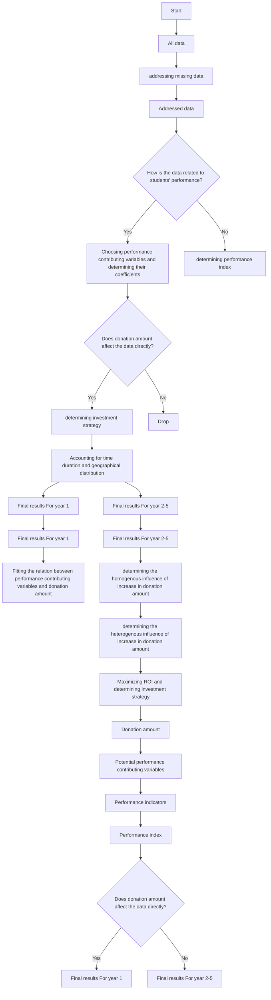

For office use only

T1

T2

T3

T4

Team Control Number

## 42939

Problem Chosen

C

For office use only

F1

F2

F3

F4

## 2016 Mathematical Contest in Modeling (MCM) Summary Sheet

(Attach a copy of this page to each copy of your solution paper.)

## Summary

In order to determine the optimal donation strategy, this paper proposes a datamotivated model based on an original definition of return on investment (ROI) appropriate for charitable organizations.

First, after addressing missing data, we develop a composite index, called the performance index, to quantify students’ educational performance. The performance index is a linear composition of several commonly used performance indicators, like graduation rate and graduates’ earnings. And their weights are determined by principal component analysis.

Next, to deal with problems caused by high-dimensional data, we employ a linear model and a selection method called post-LASSO to select variables that statistically significantly affect the performance index and determine their effects (coefficients). We call them performance contributing variables. In this case, 5 variables are selected. Among them, tuition & fees in 2010 and Carnegie High-Research-Activity classification are insusceptible to donation amount. Thus we only consider percentage of students who receive a Pell Grant, share of students who are part-time and student-to-faculty ratio.

Then, a generalized adaptive model is adopted to estimate the relation between these 3 variables and donation amount. We fit the relation across all institutions and get a fitted function from donation amount to values of performance contributing variables. Then we divide the impact of donation amount into 2 parts: homogenous and heterogenous one. The homogenous influence is modeled as the change in fitted values of performance contributing variables over increase in donation amount, which can be predicted from the fitted curve. The heterogenous one is modeled as a tuning parameter which adjusts the homogenous influence based on deviation from the fitted curve. And their product is increase in true values of performance over increase in donation amount.

Finally, we calculate ROI, defined as increase in performance index over increase in donation amount. This ROI is institution-specific and dependent on in crease in donation amount. By adopting a two-step ROI maximization algorithm, we determine the optimal investment strategy.

Also, we propose an extended model to handle problems caused by time duration and geographical distribution of donations.

# A Letter to the CFO of the Goodgrant Foundation

Dear Chiang,

Our team has proposed a performance index quantifying the students’ educational performance of each institution and defined the return of investment (ROI) appropriately for a charitable organization like Goodgrant Foundation. A mathematical model is built to help predict the return of investment after identifying the mechanism through which the donation generates its impact on the performance. The optimal investment strategy is determined by maximizing the estimated return of investment.

More specifically, the composite performance index is developed after taking all the possible performance indicators into consideration, like graduation rate and graduates’ earnings. The performance index is constructed to represents the performance of the school as well as the positive effect that a college brings to students and the community. From this point of view, our definition manages to capture social benefits of donation.

And then we adopt a variable selection method to find out performance contributing variables, which are variables that strongly affect the performance index. Among all the performance contributing variables we select, three variables which can be directly affected by your generous donation are kept to predict ROI: percentage of students who receive a Pell Grant, share of students who are part-time and student-to-faculty ratio.

We fitted a relation between these three variables and the donation amount to predict change in value of each performance contributing variable over your donation amount. And we calculate ROI, defined as increase in the performance index over your donation amount, by multiplying change in value of each performance contributing variable over your donation amount and each performance contributing variable’s effect on performance index, and then summing up the products of all performance contributing variables. The optimal investment strategy is decided after maximizing the return of investment according to an algorithm for selection.

In conclusion, our model successfully produced an investment strategy including a list of target institutions and investment amount for each institution. (The list of year 1 is attached at the end of the letter). The time duration for the investment could also be determined based on our model. Since the model as well as the evaluation approach is fully data-motivated with no arbitrary criterion included, it is rather adaptable for solving future philanthropic educational investment problems.

We have a strong belief that our model can effectively enhance the efficiency of philanthropic educational investment and provides an appropriate as well as feasible way to best improve the educational performance of students.

<table><tr><td>UNITID</td><td>names</td><td>ROI</td><td>donation</td></tr><tr><td>197027</td><td>United States Merchant Marine Academy</td><td>21.85%</td><td>2500000</td></tr><tr><td>102711</td><td>AVTEC-Alaska's Institute of Technology</td><td>21.26%</td><td>7500000</td></tr><tr><td>187745</td><td>Institute of American Indian and Alaska Native Culture</td><td>20.99%</td><td>2000000</td></tr><tr><td>262129</td><td>New College of Florida</td><td>20.69%</td><td>6500000</td></tr><tr><td>216296</td><td>Thaddeus Stevens College of Technology</td><td>20.66%</td><td>3000000</td></tr><tr><td>229832</td><td>Western Texas College</td><td>20.26%</td><td>10000000</td></tr><tr><td>196158</td><td>SUNY at Fredonia</td><td>20.24%</td><td>5500000</td></tr><tr><td>234155</td><td>Virginia State University</td><td>20.04%</td><td>10000000</td></tr><tr><td>196200</td><td>SUNY College at Potsdam</td><td>19.75%</td><td>5000000</td></tr><tr><td>178615</td><td>Truman State University</td><td>19.60%</td><td>3000000</td></tr><tr><td>199120</td><td>University of North Carolina at Chapel Hill</td><td>19.51%</td><td>3000000</td></tr><tr><td>101648</td><td>Marion Military Institute</td><td>19.48%</td><td>2500000</td></tr><tr><td>187912</td><td>New Mexico Military Institute</td><td>19.31%</td><td>500000</td></tr><tr><td>227386</td><td>Panola College</td><td>19.28%</td><td>10000000</td></tr><tr><td>434584</td><td>Ilisagvik College</td><td>19.19%</td><td>4500000</td></tr><tr><td>199184</td><td>University of North Carolina School of the Arts</td><td>19.15%</td><td>500000</td></tr><tr><td>413802</td><td>East San Gabriel Valley Regional Occupational Program</td><td>19.09%</td><td>6000000</td></tr><tr><td>174251</td><td>University of Minnesota-Morris</td><td>19.09%</td><td>8000000</td></tr><tr><td>159391</td><td>Louisiana State University and Agricultural &amp; Mechanical College</td><td>19.07%</td><td>8500000</td></tr><tr><td>403487</td><td>Wabash Valley College</td><td>19.05%</td><td>1500000</td></tr></table>

Yours Sincerely,

Team #42939

# An Optimal Strategy of Donation for Educational Purpose

Control Number: #42939

February , 2016

## Contents

## 1 Introduction 5

1.1 Statement of the Problem . 5  
1.2 Baseline Model 5  
1.3 Detailed Definitions & Assumptions . . 8

1.3.1 Detailed Definitions: 8

1.3.2 Assumptions: . . 9

1.4 The Advantages of Our Model 9

## 2 Addressing the Missing Values 9

## 3 Determining the Performance Index 10

3.1 Performance Indicators . 10  
3.2 Performance Index via Principal-Component Factors 10

## 4 Identifying Performance Contributing Variables via post-LASSO 11

## 5 Determining Investment Strategy based on ROI 13

5.1 Fitted Curve between Performance Contributing Variables and Donation Amount 14  
5.2 ROI(Return on Investment) 15

5.2.1 Model of Fitted ROIs of Performance Contributing Variables f ROIi . . . 15  
5.2.2 Model of the tuning parameter P 16  
5.2.3 Calculation of ROI 17

5.3 School Selection & Investment Strategy 18

## 6 Extended Model 18

6.1 Time Duration . 18  
6.2 Geographical Distribution 22

## 7 Conclusions and Discussion 22

## 8 Reference 23

## 9 Appendix 24

## 1 Introduction

## 1.1 Statement of the Problem

There exists no doubt in the significance of postsecondary education to the development of society, especially with the ascending need for skilled employees capable of complex work. Nevertheless, U.S. ranks only 11th in the higher education attachment worldwide, which makes the financial support from large charitable organizations necessary.

As it’s essential for charitable organizations to maximize the effectiveness of donations, an objective and systematic assessment model is in demand to develop appropriate investment strategies. To achieve this goal, several large foundations like Gates Foundation and Lumina Foundation have developed different evaluation approaches, where they mainly focus on specific indexes like attendance and graduation rate. In other empirical literature, a Forbes approach (Shifrin and Chen,2015) proposes a new indicator called the Grateful Graduates Index, using the median amount of private donations per student over a 10-year period to measure the return on investment. Also, performance funding indicators (Burke,2002, Cave,1997, Serban and Burke,1998,Banta et al,1996), which include but are not limited to external indicators like graduates’ employment rate and internal indicators like teaching quality, are one of the most prevailing methods to evaluate effectiveness of educational donations.

However, those methods also arise with widely acknowledged concerns (Burke,1998). Most of them require subjective choice of indexes and are rather arbitrary than data-based. And they perform badly in a data environment where there is miscellaneous cross-section data but scarce time-series data. Besides, they lack quantified analysis in precisely predicting or measuring the social benefits and the positive effect that the investment can generate, which serves as one of the targets for the Goodgrant Foundation.

In accordance with Goodgrant Foundation’s request, this paper provides a prudent definition of return on investment (ROI) for charitable organizations, and develops an original data-motivated model, which is feasible even faced with tangled cross-section data and absent time-series data, to determine the optimal strategy for funding. The strategy contains selection of institutions and distribution of investment across institutions, time and regions.

## 1.2 Baseline Model

Our definition of ROI is similar to its usual meaning, which is the increase in students’ educational performance over the amount Goodgrant Foundation donates (assuming other donations fixed, it’s also the increase in total donation amount).

First we cope with data missingness. Then, to quantify students’ educational performance, we develop an index called performance index, which is a linear composition of commonly used performance indicators.

Our major task is to build a model to predict the change of this index given a distribution of Goodgrant Foundation \$100m donation. However, donation does not directly affect the performance index and we would encounter endogeneity problem or neglect effects of other variables if we solely focus on the relation between performance index and donation amount. Instead, we select several variables that are pivotal in predicting the performance index from many potential candidates, and determine their coefficients/effects on the performance index. We call these variables performance contributing variables.

Due to absence of time-series data, it becomes difficult to figure out how performance contributing variables are affected by donation amount for each institution respectively. Instead, we fit the relation between performance contributing variables and donation amount across all institutions and get a fitted function from donation amount to values of performance contributing variables.

Then we divide the impact of donation amount into 2 parts: homogenous and heterogenous one. The homogenous influence is modeled as the change in fitted values of performance contributing variables over increase in donation amount (We call these quotients fitted ROI of performance contributing variable). The heterogenous one is modeled as a tuning parameter, which adjusts the homogenous influence based on deviation from the fitted function. And their product is the institution-specific increase in true values of performance contributing variables over increase in donation amount (We call these values ROI of performance contributing variable).

The next step is to calculate the ROI of the performance index by adding the products of ROIs of performance contributing variables and their coefficients on the performance index. This ROI is institution-specific and dependent on increase in donation amount. By adopting a two-step ROI maximization algorithm, we determine the optimal investment strategy.

Also, we propose an extended model to handle problems caused by time duration and geographical distribution of donations.

Note: we only use data from the provided excel table and that mentioned in the pdf file.

Table 1: Data Source

<table><tr><td>Variable</td><td>Dataset</td></tr><tr><td>Performance index</td><td>Excel table</td></tr><tr><td>Performance contributing variables</td><td>Excel table and pdf file</td></tr><tr><td>Donation amount</td><td>Pdf file</td></tr></table>

The flow chart of the whole model is presented below in Fig 1:

flowchart

Figure 1: Flow Chart Demonstration of the Model

## 1.3 Detailed Definitions & Assumptions

## 1.3.1 Detailed Definitions:

<table><tr><td>Name</td><td>Definition</td><td>Denotation</td></tr><tr><td>Donation amount</td><td>Total amount of donation institution j receive per year.</td><td> $X_j$ </td></tr><tr><td>Goodgrant Foundation&#x27;s donation (Increase in donation amount)</td><td>Amount of Goodgrant Foundation&#x27;s donation to institution j per year. (Assuming other donations fixed, it&#x27;s also the increase in total donation amount).</td><td> $\Delta X_j$ </td></tr><tr><td>Performance indicator</td><td>A variable used empirically or theoretically to evaluate students&#x27; educational performance of institution j</td><td> $Y_{1j}, Y_{2j}...Y_{mj}$ </td></tr><tr><td>Performance index</td><td>an index we develop to quantify students&#x27; educational performance of institution j</td><td>Y</td></tr><tr><td>Performance contributing variable</td><td>A variable that affects the performance index with statistical proof.</td><td> $F_1, ..., F_i$ </td></tr><tr><td>Performance contributing variable&#x27;s coefficient</td><td>Performance contributing variable&#x27;s coefficient/effect on the performance index</td><td> $\beta_1, ..., \beta_i$ </td></tr><tr><td>ROI of performance contributing variable</td><td>Change in value of performance contributing variable over increase in donation amount of institution j. (Product of the homogenous influence and the heterogenous influence)</td><td> $ROI_{1j}, ..., ROI_{ij}$ </td></tr><tr><td>Fitted ROIs of performance contributing variables</td><td>Change in fitted values of performance contributing variables over increase in donation amount. It is also the homogenous part of ROI of performance contributing variable. (Dependent on donation amount and increase in donation amount)</td><td> $fROI_{1j}, ..., fROI_{ij}$ </td></tr><tr><td>The tuning parameter</td><td>The heterogeneous part of ROI of performance contributing variable. (Institution-specific)</td><td> $P_{1j}, ..., P_{ij}$ </td></tr><tr><td>ROI of the performance index (also referred as ROI for simplicity)</td><td>Increase in the performance index over increase in donation amount of institution j</td><td> $ROI_j$ </td></tr></table>

## 1.3.2 Assumptions:

A1. Stability. We assume data of any institution should be stable without the impact from outside. To be specific, the key factors like the donation amount and the performance index should remain unchanged if the college does not receive new donations.

A2. Goodgrant Foundation’s donation (Increase in donation amount) is discrete rather than continuous. This is reasonable because each donation is usually an integer multiple of a minimum amount, like \$1m. After referring to the data of other foundations like Lumina Foundation, we recommend donation amount should be one value in the set below:

$$
\{5 0 0 0 0 0, 1 0 0 0 0 0 0, 1 5 0 0 0 0 0, \dots , 1 0 0 0 0 0 0 0 \}
$$

A3. The performance index is a linear composition of all given performance indicators.

A4. Performance contributing variables linearly affect the performance index.

A5. Increase in donation amount affects the performance index through performance contributing variables.

A6. The impact of increase in donation amount on performance contributing variables contains 2 parts: homogenous one and heterogenous one. The homogenous influence is represented by a smooth function from donation amount to performance contributing variables. And the heterogenous one is represented by deviation from the function.

## 1.4 The Advantages of Our Model

Our model exhibits many advantages in application:

• The evaluation model is fully data based with few subjective or arbitrary decision rules.

• Our model successfully identifies the underlying mechanism instead of merely focusing on the relation between donation amount and the performance index.

• Our model takes both homogeneity and heterogeneity into consideration.

• Our model makes full use of the cross-section data and does not need time-series data to produce reasonable outcomes.

## 2 Addressing the Missing Values

The provided datasets suffer from severe data missing, which could undermine the reliability and interpretability of any results. To cope with this problem, we adopt several different methods for data with varied missing rate.

For data with missing rate over 50%, any current prevailing method would fall victim to under- or over-randomization. As a result, we omit this kind of data for simplicity’s sake.

For variables with missing rate between 10%-50%, we use imputation techniques (Little and Rubin, 2014) where a missing value was imputed from a randomly selected similar record, and model-based analysis where missing values are substituted with distribution diagrams.

For variables with missing rate under 10%, we address missingness by simply replace missing value with mean of existing values.

## 3 Determining the Performance Index

In this section, we derive a composite index, called the performance index, to evaluate the educational performance of students at every institution.

## 3.1 Performance Indicators

First, we need to determine which variables from various institutional performance data are direct indicators of Goodgrant Foundation’s major concern – to enhance students’ educational performance.

In practice, other charitable foundations such as Gates Foundation place their focus on core indexes like attendance and graduation rate. Logically, we select performance indicators on the basis of its correlation with these core indexes. With this method, miscellaneous performance data from the excel table boils down to 4 crucial variables. C150\_4\_P OOLED\_SUP P and C200\_L4\_P OOLED\_SUP P , as completion rates for different types of institutions, are directly correlated with graduation rate. We combine them into one variable.M d\_earn\_wne\_p10 and gt\_25k\_p6, as different measures of graduates’ earnings, are proved in empirical studies (Ehrenberg,2004) to be highly dependent on educational performance. And RP Y \_3Y R\_RT \_SUP P , as repayment rate, is also considered valid in the same sense. Let them be $Y _ { 1 } , Y _ { 2 } , Y _ { 3 }$ and $Y _ { 4 }$ .

For easy calculation and interpretation of the performance index, we apply uniformization to all 4 variables, as to make sure they’re on the same scale (from 0 to 100).

## 3.2 Performance Index via Principal-Component Factors

As the model assumes the performance index is a linear composition of all performance indicators, all we need to do is determine the weights of these variables.

Here we apply the method of Customer Satisfaction Index model (Rogg et al,2001), where principal-component factors (pcf) are employed to determine weights of all aspects.

The pcf procedure uses an orthogonal transformation to convert a set of observations of possibly correlated variables into a set of values of linearly uncorrelated variables called principalcomponent factors, each of which carries part of the total variance. If the cumulative proportion of the variance exceeds 80%, it’s viable to use corresponding pcfs (usually the first two pcfs) to determine weights of original variables.

In this case, we’ll get 4 pcfs (named $P C F _ { 1 } , P C F _ { 2 } , P C F _ { 3 }$ and $P C F _ { 4 } )$ . First, the procedure provides the linear coefficients of $Y _ { m }$ in the expression of $P C F _ { 1 }$ and $P C F _ { 2 }$ . We get

$$
P C F _ {1} = a _ {1 1} Y _ {1} + a _ {1 2} Y _ {2} + a _ {1 3} Y _ {3} + a _ {1 4} Y _ {4}
$$

$$
P C F _ {2} = a _ {2 1} Y _ {1} + a _ {2 2} Y _ {2} + a _ {2 3} Y _ {3} + a _ {2 4} Y _ {4}
$$

$( a _ { k m }$ calculated as corresponding factor loadings over square root of factor $\mathrm { k ^ { \prime } s }$ eigenvalue) Then, we calculate the rough weights $c _ { m }$ for $Y _ { m }$ . Let the variance proportions $P C F _ { 1 }$ and $P C F _ { 2 }$ represent be $N _ { 1 }$ and $N _ { 2 }$ . We get $c _ { m } = ( a _ { 1 m } N _ { 1 } + a _ { 2 m } N _ { 2 } ) / ( N _ { 1 } + N _ { 2 } )$ (This formulation is justified because the variance proportions can be viewed as the significance of pcfs). If we let performance index= $( P C F _ { 1 } N _ { 1 } + P C F _ { 2 } N _ { 2 } ) / ( N _ { 1 } + N _ { 2 } ) , c _ { m }$ is indeed the rough weight of $Y _ { m }$ in terms of variance) Next, we get the weights by adjusting the sum of rough weights to 1:

$$
c _ {m} = c _ {m} / \left(c _ {1} + c _ {2} + c _ {3} + c _ {4}\right)
$$

Finally, we get the performance index, which is the weighted sum of the 4 performance indicator. Performance index $\scriptstyle \mathbf { \alpha = \sum _ { m } ( c _ { m } Y _ { m } ) }$

Table 2 presents the 10 institutions with largest values of the performance index. This ranking is highly consistent with widely acknowledged rankings, like QS ranking, which indicates the validity of the performance index.

Table 2: The Top 10 Institutions in Terms of Performance Index

<table><tr><td>Institution</td><td>Performance index</td></tr><tr><td>Los Angeles County College of Nursing and Allied Health</td><td>79.60372162</td></tr><tr><td>Massachusetts Institute of Technology</td><td>79.06066895</td></tr><tr><td>University of Pennsylvania</td><td>79.05044556</td></tr><tr><td>Babson College</td><td>78.99269867</td></tr><tr><td>Georgetown University</td><td>78.90468597</td></tr><tr><td>Stanford University</td><td>78.70586395</td></tr><tr><td>Duke University</td><td>78.27719116</td></tr><tr><td>University of Notre Dame</td><td>78.15843964</td></tr><tr><td>Weill Cornell Medical College</td><td>78.14334106</td></tr></table>

## 4 Identifying Performance Contributing Variables via post-LASSO

The next step of our model requires identifying the factors that may exert an influence on the students’ educational performance from a variety of variables mentioned in the excel table and the pdf file (108 in total, some of which are dummy variables converted from categorical variables).To achieve this purpose, we used a model called LASSO. A linear model is adopted to describe the relationship between the endogenous variable – performance index – and all variables that are potentially influential to it. We assign appropriate coefficient to each variable to minimize the square error between our model prediction and the actual value when fitting the data.

$$
\min _ {\beta} \frac {1}{J} \sum_ {j = 1} ^ {J} (y _ {j} - x _ {j} ^ {T} \beta) ^ {2}
$$

$\mathrm { w h e r e } \ J = 2 8 8 1 , x _ { j } = ( 1 , x _ { 1 j } , x _ { 2 j } , . . . , x _ { p j } ) ^ { T }$

However, as the amount of the variables included in the model is increasing, the cost function will naturally decrease. So the problem of over fitting the data will arise, which make the model we come up with hard to predict the future performance of the students. Also, since there are hundreds of potential variables as candidates. We need a method to identify the variables that truly matter and have a strong effect on the performance index.

Here we take the advantage of a method named post-LASSO (Tibshirani,1996). LASSO, also known as the least absolute shrinkage and selection operator, is a method used for variable selection and shrinkage in medium- or high-dimensional environment. And post-LASSO is to apply ordinary least squares (OLS) to the model selected by first-step LASSO procedure. In LASSO procedure, instead of using the cost function that merely focusing on the square error between the prediction and the actual value, a penalty term is also included into the objective function. We wish to minimize:

$$
\min _ {\beta} \frac {1}{J} \sum_ {j = 1} ^ {J} (y _ {j} - x _ {j} ^ {T} \beta) ^ {2} + \lambda | | \beta | | _ {1}
$$

where $\lambda | | \beta | | _ { 1 }$ is the penalty term. The penalty term takes the number of variables into consideration by penalizing on the absolute value of the coefficients and forcing the coefficients of many variables shrink to zero if this variable is of less importance. The penalty coefficient lambda determines the degree of penalty for including variables into the model. After minimizing the cost function plus the penalty term, we could figure out the variables of larger essence to include in the model.

We utilize the LARS algorithm to implement the LASSO procedure and cross-validation MSE minimization (Usai et al,2009) to determine the optimal penalty coefficient (represented by shrinkage factor in LARS algorithm). And then OLS is employed to complete the post-LASSO method.

line chart

| Shrinkage Factor s | Tuition&Fee2010 | Carnegie_HighResearchActivity | Carnegie_PublicRural | StudentToFaculty_ratio | PPTUG_EF | PCTPELL |
| ------------------ | --------------- | ----------------------------- | -------------------- | ----------------------- | -------- | ------- |
| 0.0                | 0               | 0                             | 0                    | 0                       | 0        | 0       |
| 0.2                | ~180            | ~0                            | ~0                   | ~-50                    | ~-50     | ~-100   |
| 0.4                | ~200            | ~50                           | ~0                   | ~-75                    | ~-75     | ~-150   |
| 0.6                | ~210            | ~75                           | ~50                  | ~-100                   | ~-100    | ~-175   |
| 0.8                | ~210            | ~100                          | ~75                  | ~-125                   | ~-125    | ~-190   |
| 1.0                | ~210            | ~125                          | ~100                 | ~-150                   | ~-150    | ~-200   |

Figure 2: LASSO path-coefficients as a function of shrinkage factor s

line chart

| Shrinkage Factor s | Cross-Validated MSE |
| ------------------ | ------------------- |
| 0.0                | 135                 |
| 0.05               | 50                  |
| 0.1                | 45                  |
| 0.15               | 42                  |
| 0.2                | 40                  |
| 0.25               | 39                  |
| 0.3                | 38                  |
| 0.35               | 37                  |
| 0.4                | 36                  |
| 0.45               | 36                  |
| 0.5                | 36                  |
| 0.55               | 36                  |
| 0.6                | 36                  |
| 0.65               | 36                  |
| 0.7                | 36                  |
| 0.75               | 36                  |
| 0.8                | 36                  |
| 0.85               | 36                  |
| 0.9                | 36                  |
| 0.95               | 36                  |
| 1.0                | 36                  |

Figure 3: Cross-validated MSE

Fig 2. displays the results of LASSO procedure and Fig 3 displays the cross-validated MSE for different shrinkage factors. As specified above, the cross-validated MSE reaches minimum with shrinkage factor between 0.4-0.8. We choose 0.6 and find in Fig 2 that 6 variables have nonzero coefficients via the LASSO procedure, thus being selected as the performance contributing variables. Table 3 is a demonstration of these 6 variables and corresponding post-LASSO results.

Table 3: Post-LASSO results

<table><tr><td rowspan="2"></td><td>Dependent variable:</td></tr><tr><td>performance_index</td></tr><tr><td>PCTPELL</td><td>-26.453*** (0.872)</td></tr><tr><td>PPTUG_EF</td><td>-14.819*** (0.781)</td></tr><tr><td>StudentToFaculty_ratio</td><td>-0.231*** (0.025)</td></tr><tr><td>Tuition&amp;Fees2010</td><td>0.0003*** (0.00002)</td></tr><tr><td>Carnegie_HighResearchActivity</td><td>5.667*** (0.775)</td></tr><tr><td>Constant</td><td>61.326*** (0.783)</td></tr><tr><td>Observations</td><td>2,880</td></tr><tr><td>R2</td><td>0.610</td></tr><tr><td>Adjusted R2</td><td>0.609</td></tr></table>

Note: PCTPELL is percentage of students who receive a Pell Grant;PPTUG\_EF is share of students who are parttime;Carnegie\_HighResearchActivity is Carnegie classifica tion basic: High Research Activity

The results presented in Table 3 are consistent with common sense. For instance, the positive coefficient of High Research Activity Carnegie classification implies that active research activity helps student’s educational performance; and the negative coefficient of Student-to-Faculty ratio suggests that decrease in faculty quantity undermines students’ educational performance. Along with the large R square value and small p-value for each coefficient, the post-LASSO procedure proves to select a valid set of performance contributing variables and describe well their contribution to the performance index.

## 5 Determining Investment Strategy based on ROI

We’ve identified 5 performance contributing variables via post-LASSO. Among them, tuition & fees in 2010 and Carnegie High-Research-Activity classification are quite insusceptible to donation amount. So we only consider the effects of increase in donation amount on percentage of students who receive a Pell Grant, share of students who are part-time and studentto-faculty ratio. We denote them with F1, F2 and F3, their post-LASSO coefficients with $\beta 1 , \beta 2$

and β3.

In this section, we first introduce the procedure used to fit the relation between performance contributing variables and donation amount. Then we provide the model employed to calculate fitted ROIs of performance contributing variables (the homogenous influence of increase in donation amount) and the tuning parameter (the heterogenous influence of increase in donation amount). Next, we introduce how to determine ROI. Lastly, we show how the maximization determines the investment strategy, including selection of institutions and distribution of investments.

## 5.1 Fitted Curve between Performance Contributing Variables and Donation Amount

Since we have already approximated the linear relation between the performance index with the 3 performance contributing variables, we want to know how increase in donation changes them. In this paper, we use Generalized Adaptive Model (GAM) to smoothly fit the relations. Generalized Adaptive Model is a generalized linear model in which the dependent variable depends linearly on unknown smooth functions of independent variables. The fitted curve of percentage of students who receive a Pell Grant is depicted below in Fig 4 (see the other two fitted curves in Appendix):

scatter plot

| Donation | PCTPELL |
| -------- | ------- |
| 0e+00    | 0.35    |
| 3e+08    | 0.25    |
| 6e+08    | 0.22    |
| 9e+08    | 0.24    |

Figure 4: GAM Approximation

A Pell Grant is money the U.S. federal government provides directly for students who need it to pay for college. Intuitively, if the amount of donation an institution receives from other sources such as private donation increases, the institution is likely to use these donations to alleviate students’ financial stress, resulting in percentage of students who receive a Pell Grant. Thus it is reasonable to see a fitted curve downward sloping at most part. Also, in common sense, an increase in donation amount would lead to increase in the performance index. This downward sloping curve is consistent with the negative post-LASSO coefficient of percentage of students who receive a Pell Grant (as two negatives make a positive).

## 5.2 ROI(Return on Investment)

## 5.2.1 Model of Fitted ROIs of Performance Contributing Variables $f R O I _ { i }$

scatter plot

| Donation | PCTPELL |
| -------- | ------- |
| 0e+00    | ~0.35   |
| 3e+08    | ~0.25   |
| 6e+08    | ~0.22   |
| 9e+08    | ~0.24   |

Figure 5: Demonstration of $f R O I _ { 1 }$

Again, we use fitted curve of percentage of students who receive a Pell Grant as an example. We modeled the blue fitted curve to represent the homogeneous relation between percentage of students who receive a Pell Grant and donation amount.

Recall fitted ROI of percentage of students who receive a Pell Grant $( f R O I _ { 1 } )$ is change in fitted values $( \Delta f )$ over increase in donation amount (∆X). So

$$
f R O I _ {1} = \Delta f / \Delta X
$$

According to assumption A2, the amount of each Goodgrant Foundation’s donation falls into a pre-specified set, namely, $\{ 5 0 0 0 0 0 , 1 0 0 0 0 0 0 , 1 5 0 0 0 0 0 , . . . , 1 0 0 0 0 0 0 0 \}$ . So we get a set of possible fitted ROI of percentage of students who receive a Pell Grant $( f R O I _ { 1 } )$ . Clearly, $f R O I _ { 1 }$ is dependent on both donation amount (X) and increase in donation amount $( \Delta X )$ . Calculation of fitted ROIs of other performance contributing variables is similar.

## 5.2.2 Model of the tuning parameter $P _ { i }$

Although we’ve identified the homogenous influence of increase in donation amount, we shall not neglect the fact that institutions utilize donations differently. A proportion of donations might be appropriated by the university’s administration and different institutions allocate the donation differently. For example, university with a more convenient and wellmaintained system of identifying students who need financial aid might be willing to use a larger portion of donations to directly aid students, resulting in a lower percentage of undergraduate students receiving Pell grant. Also, university facing lower cost of identifying and hiring suitable faculty members might be inclined to use a larger portion of donations in this direction, resulting in a lower student-to-faculty ratio.

These above mentioned reasons make institutions deviate from the homogenous fitted function and presents heterogeneous influence of increase in donation amount. Thus, while the homogenous influence only depends on donation amount and increase in donation amount, the heterogeneous influence is institution-specific.

To account for this heterogeneous influence, we utilize a tuning parameter $P _ { i }$ to adjust the homogenous influence. By multiplying the tuning parameter, fitted ROIs of performance contributing variables (fitted value changes) convert into ROI of performance contributing variable (true value changes).

$$
R O I _ {i} = f R O I _ {i} \cdot P _ {i}
$$

We then argue that $P _ { i }$ can be summarized by a function of deviation from the fitted curve $( \Delta h )$ , and the function has the shape shown in Fig 6.

The value of $P _ { i }$ ranges from 0 to 2, because $P _ { i }$ can be viewed as an amplification or shrinkage of the homogenous influence. For example, $P _ { i } { = } 2$ means that the homogeneous influence is amplified greatly. $P _ { i } = 0$ means that this homogeneous influence would be entirely wiped out. The shape of the function is as shown in Fig 6 because of the following reasons. Intuitively, if one institution locates above the fitted line, when deviation is small, the larger it is, the larger $P _ { i }$ is. This is because the institution might be more inclined to utilize donations to change that factor. However, when deviation becomes even larger, the institution grows less willing to invest on this factor. This is because marginal utility decreases. The discussion is similar if one institution initially lies under the fitted line. Thus, we assume the function mapping deviation to $P _ { i }$ is similar to Fig 6. deviation is on the x-axis while $P _ { i }$ is on the y-axis.

line chart

| x    | y     |
| ---- | ----- |
| -3.0 | 2.0   |
| -2.5 | 1.8   |
| -2.0 | 1.5   |
| -1.5 | 1.0   |
| -1.0 | 0.7   |
| -0.5 | 0.9   |
| 0.0  | 1.2   |
| 0.5  | 1.6   |
| 1.0  | 1.8   |
| 1.5  | 1.5   |
| 2.0  | 1.0   |
| 2.5  | 0.7   |
| 3.0  | 0.5   |

Figure 6: Function from Deviation to $P _ { i }$

In order to simplify calculation and without loss of generality, we approximate the function in Fig 6 by a set of linear segments, as is shown in Fig 7. The endpoints from left to right are respectively:

• (The minimum of deviations of all institutions, 2)  
• (Half of the minimum of deviations of all institutions, 4/3)  
• (Quarter of the minimum of deviations of all institutions, 2/3)  
• (0, 1)  
• (Quarter of the maximum of deviations of all institutions, 4/3)  
• (Half of the maximum of deviations of all institutions, 2/4)  
• (The minimum of deviations of all institutions, 0)

  
Figure 7: Approximated Function from Deviation to $P _ { i }$

## 5.2.3 Calculation of ROI

Recall that ROI is the increase in the performance index (∆Y ) over increase in donation amount (∆X).

$$
R O I = \Delta Y / \Delta X
$$

And since we already have the performance contributing variables’ coefficients/effects on the performance index $( \beta _ { i } )$ and change in values of performance contributing variables over increase in donation amount (ROIi). We get ROI simply by adding all performance contributing variables’ product of these two values. The mathematical deduction is as follows:

$$
\begin{array}{l} R O I = \Delta Y / \Delta X \\ = \sum_ {i = 1} ^ {3} \left(\beta_ {i} \cdot \Delta F _ {i} / \Delta X\right) (1) \\ = \sum_ {i = 1} ^ {3} \left(\beta_ {i} \cdot R O I _ {i}\right) (1) \\ { = } { \sum _ { i = 1 } ^ { 3 } ( \beta _ { i } \cdot P _ { i } \cdot f R O I _ { i } / \Delta X ) } \\ \end{array}
$$

$\beta _ { i }$ is the post LASSO regression coefficients; $f R O I _ { i }$ is fitted ROIs of performance contributing variables; $P _ { i }$ is a tuning parameter to adjust the fitted ROIs of performance contributing variables. As we can see, ROI is institution-specific and dependent on increase in donation amount (∆X). And because increase in donation amount is discrete, we get a finite set of possible ROI for every institution.

## 5.3 School Selection & Investment Strategy

The next step is to develop an optimal strategy including a list of institutions to be sponsored and the appropriate amount of money given to each institution. We adopt a two-step selection algorithm to find the global optimal allocation strategy.

Since we have a finite set of possible ROI for every institution. The first step is to compare ROI among each institution’s set. By maximizing ROI for each institution, we determine the optimal amount of investment on each institution if we invest.

Then, the next step is to rank all institutions with their respective maximal ROI. Given the budget constraint of money available (\$100m), we pick up the institutions with the largest potential to improve on the performance indicator, namely the largest maximal ROI, until we exhaust the budget.

By following the two-step selection algorithm, we can derive the optimal investment strategy. And the results for year 1 and geographical distribution of selected institutions are presented below in Table 4 and Fig 8.

Table 4: Investment Strategy of Year 1

<table><tr><td>UNITID</td><td>names</td><td>ROI</td><td>donation</td></tr><tr><td>197027</td><td>United States Merchant Marine Academy</td><td>21.85%</td><td>2500000</td></tr><tr><td>102711</td><td>AVTEC-Alaska&#x27;s Institute of Technology</td><td>21.26%</td><td>7500000</td></tr><tr><td>187745</td><td>Institute of American Indian and Alaska Native Culture</td><td>20.99%</td><td>2000000</td></tr><tr><td>262129</td><td>New College of Florida</td><td>20.69%</td><td>6500000</td></tr><tr><td>216296</td><td>Thaddeus Stevens College of Technology</td><td>20.66%</td><td>3000000</td></tr><tr><td>229832</td><td>Western Texas College</td><td>20.26%</td><td>10000000</td></tr><tr><td>196158</td><td>SUNY at Fredonia</td><td>20.24%</td><td>5500000</td></tr><tr><td>234155</td><td>Virginia State University</td><td>20.04%</td><td>10000000</td></tr><tr><td>196200</td><td>SUNY College at Potsdam</td><td>19.75%</td><td>5000000</td></tr><tr><td>178615</td><td>Truman State University</td><td>19.60%</td><td>3000000</td></tr><tr><td>199120</td><td>University of North Carolina at Chapel Hill</td><td>19.51%</td><td>3000000</td></tr><tr><td>101648</td><td>Marion Military Institute</td><td>19.48%</td><td>2500000</td></tr><tr><td>187912</td><td>New Mexico Military Institute</td><td>19.31%</td><td>500000</td></tr><tr><td>227386</td><td>Panola College</td><td>19.28%</td><td>10000000</td></tr><tr><td>434584</td><td>Ilisagvik College</td><td>19.19%</td><td>4500000</td></tr><tr><td>199184</td><td>University of North Carolina School of the Arts</td><td>19.15%</td><td>500000</td></tr><tr><td>413802</td><td>East San Gabriel Valley Regional Occupational Program</td><td>19.09%</td><td>6000000</td></tr><tr><td>174251</td><td>University of Minnesota-Morris</td><td>19.09%</td><td>8000000</td></tr><tr><td>159391</td><td>Louisiana State University and Agricultural &amp; Mechanical College</td><td>19.07%</td><td>8500000</td></tr><tr><td>403487</td><td>Wabash Valley College</td><td>19.05%</td><td>1500000</td></tr></table>

## 6 Extended Model

Currently, we have obtained a candidate list of institution with priority and appropriate amount of money for the donation to each institution in total. In this section, we incorporate other crucial elements into the baseline model.

## 6.1 Time Duration

One element is the time duration that the organization’s money should be provided. In this paper, we propose two methods for two scenarios. Scenario 1 is where we have new data of every past year as time goes by; and Scenario 2 is where we predict the trends and determine 5-year investment strategy only based on the original dataset.

text_image

Seattle
WASHINGTON
MONTANA
NORTH
DAKOTA
MINNESOTA
University of Minnesota...
WISCONSIN
CHICAGO
IOWA
ILLINOIS
INDIA
TRUAN State University
Wabash Valley College
The State University o...
New York
Suny at Fredonia
Boston
PENN
DENJ
United States Merchant...
New York
San Francisco
CALIFORNIA
O Las Vegas
Missouri
TENNESSEE
VIRGINIA
Virginia State Univers...
Iriszavik College
Los Angeles
East San Gabriel Valle
Institute of American ...
NEW MEXICO
Western Texas College
Marion Military Instit...
Houston
Louisiana State Univer...
Gulf of
Mexico
New College of Florida
Alaska
AVTEC

Figure 8: Geographical Distribution of Selected Institutions

In Scenario 1, we adopt a dynamic calibration method based on the outcome of institutions we have patronized. To be more specific, we first determine the investment strategy for the first year. And in year 2, we would have had access to new data of year 1. Then we apply the baseline model again with the new information or merged dataset. This would generate new results after the model learning from the latest behaviors of each institution and making the calibrations on the predicting patterns. Similarly, this updating method can be used in the donation years afterwards.

In Scenario 2, we adopt a partial calibration method based on the coefficients we calculate with the original dataset. According to assumption A1, we can simply treat status of institutions we have not patronized as fixed. And the only values changed are donation amounts and values of performance contributing variables of patronized institutions. This barely affects the post-LASSO procedure considering the large quantity of variables used in the process. However, this would lead to movement of points of patronized institutions in the scatterplots of performance contributing variables and donation amount. So we recommend to recalculate the fitted curve and ROI and determine the investment strategy for year 2. As for how to determine the movement of points, below is the procedure:

• Find the institutions you have patronized in year 1;  
• Add the amount you have patronized to their original donation amount;

$$
X ^ {\prime} = X + \Delta X
$$

• Calculate the values of performance contributing variables as follows:

$$
F _ {i} ^ {\prime} = F _ {i} + R O I _ {i} \cdot \Delta X
$$

The results for Scenario 2 are presented below in Table 5 to Table 8:

Table 5: Investment Strategy of Year 2

<table><tr><td>UNITID</td><td>names</td><td>ROI</td><td>donation</td></tr><tr><td>197027</td><td>United States Merchant Marine Academy</td><td>21.82%</td><td>2500000</td></tr><tr><td>102711</td><td>AVTEC-Alaska&#x27;s Institute of Technology</td><td>21.25%</td><td>7000000</td></tr><tr><td>187745</td><td>Institute of American Indian and Alaska Native Culture</td><td>20.93%</td><td>2000000</td></tr><tr><td>262129</td><td>New College of Florida</td><td>20.73%</td><td>6500000</td></tr><tr><td>216296</td><td>Thaddeus Stevens College of Technology</td><td>20.62%</td><td>3000000</td></tr><tr><td>229832</td><td>Western Texas College</td><td>20.23%</td><td>10000000</td></tr><tr><td>196158</td><td>SUNY at Fredonia</td><td>20.23%</td><td>5500000</td></tr><tr><td>234155</td><td>Virginia State University</td><td>20.02%</td><td>9000000</td></tr><tr><td>196200</td><td>SUNY College at Potsdam</td><td>19.74%</td><td>5000000</td></tr><tr><td>178615</td><td>Truman State University</td><td>19.64%</td><td>3000000</td></tr><tr><td>199120</td><td>University of North Carolina at Chapel Hill</td><td>19.52%</td><td>3000000</td></tr><tr><td>101648</td><td>Marion Military Institute</td><td>19.48%</td><td>2500000</td></tr><tr><td>187912</td><td>New Mexico Military Institute</td><td>19.31%</td><td>1500000</td></tr><tr><td>227386</td><td>Panola College</td><td>19.22%</td><td>9500000</td></tr><tr><td>434584</td><td>Ilisagvik College</td><td>19.19%</td><td>4500000</td></tr><tr><td>199184</td><td>University of North Carolina School of the Arts</td><td>19.18%</td><td>2500000</td></tr><tr><td>413802</td><td>East San Gabriel Valley Regional Occupational Program</td><td>19.13%</td><td>6000000</td></tr><tr><td>174251</td><td>University of Minnesota-Morris</td><td>19.07%</td><td>8000000</td></tr><tr><td>159391</td><td>Louisiana State University and Agricultural &amp; Mechanical College</td><td>19.07%</td><td>8500000</td></tr><tr><td>403487</td><td>Wabash Valley College</td><td>19.00%</td><td>500000</td></tr></table>

Table 6: Investment Strategy of Year 3

<table><tr><td>UNITID</td><td>names</td><td>ROI</td><td>donation</td></tr><tr><td>197027</td><td>United States Merchant Marine Academy</td><td>21.65%</td><td>2000000</td></tr><tr><td>102711</td><td>AVTEC-Alaska&#x27;s Institute of Technology</td><td>21.29%</td><td>7000000</td></tr><tr><td>187745</td><td>Institute of American Indian and Alaska Native Culture</td><td>21.01%</td><td>2000000</td></tr><tr><td>216296</td><td>Thaddeus Stevens College of Technology</td><td>20.99%</td><td>3500000</td></tr><tr><td>262129</td><td>New College of Florida</td><td>20.87%</td><td>6000000</td></tr><tr><td>229832</td><td>Western Texas College</td><td>20.42%</td><td>9500000</td></tr><tr><td>196158</td><td>SUNY at Fredonia</td><td>20.42%</td><td>5500000</td></tr><tr><td>234155</td><td>Virginia State University</td><td>20.32%</td><td>9000000</td></tr><tr><td>196200</td><td>SUNY College at Potsdam</td><td>20.27%</td><td>5000000</td></tr><tr><td>178615</td><td>Truman State University</td><td>20.06%</td><td>3000000</td></tr><tr><td>187912</td><td>New Mexico Military Institute</td><td>20.00%</td><td>2000000</td></tr><tr><td>101648</td><td>Marion Military Institute</td><td>19.96%</td><td>2500000</td></tr><tr><td>199120</td><td>University of North Carolina at Chapel Hill</td><td>19.93%</td><td>2500000</td></tr><tr><td>227386</td><td>Panola College</td><td>19.87%</td><td>9500000</td></tr><tr><td>434584</td><td>Ilisagvik College</td><td>19.87%</td><td>4500000</td></tr><tr><td>199184</td><td>University of North Carolina School of the Arts</td><td>19.73%</td><td>2500000</td></tr><tr><td>413802</td><td>East San Gabriel Valley Regional Occupational Program</td><td>19.69%</td><td>6000000</td></tr><tr><td>174251</td><td>University of Minnesota-Morris</td><td>19.25%</td><td>8000000</td></tr><tr><td>142179</td><td>Eastern Idaho Technical College</td><td>19.15%</td><td>1000000</td></tr><tr><td>159391</td><td>Louisiana State University and Agricultural &amp; Mechanical College</td><td>19.04%</td><td>7000000</td></tr><tr><td>403487</td><td>Wabash Valley College</td><td>3.16%</td><td>2000000</td></tr></table>

Table 7: Investment Strategy of Year 4

<table><tr><td>UNITID</td><td>names</td><td>ROI</td><td>donation</td></tr><tr><td>197027</td><td>United States Merchant Marine Academy</td><td>21.72%</td><td>2000000</td></tr><tr><td>102711</td><td>AVTEC-Alaska&#x27;s Institute of Technology</td><td>21.34%</td><td>6500000</td></tr><tr><td>187745</td><td>Institute of American Indian and Alaska Native Culture</td><td>21.25%</td><td>2000000</td></tr><tr><td>216296</td><td>Thaddeus Stevens College of Technology</td><td>21.15%</td><td>4000000</td></tr><tr><td>262129</td><td>New College of Florida</td><td>21.13%</td><td>6500000</td></tr><tr><td>196158</td><td>SUNY at Fredonia</td><td>20.98%</td><td>2500000</td></tr><tr><td>229832</td><td>Western Texas College</td><td>20.92%</td><td>10000000</td></tr><tr><td>234155</td><td>Virginia State University</td><td>20.80%</td><td>9000000</td></tr><tr><td>187912</td><td>New Mexico Military Institute</td><td>20.73%</td><td>3000000</td></tr><tr><td>101648</td><td>Marion Military Institute</td><td>20.68%</td><td>2500000</td></tr><tr><td>196200</td><td>SUNY College at Potsdam</td><td>20.66%</td><td>1500000</td></tr><tr><td>178615</td><td>Truman State University</td><td>20.37%</td><td>4000000</td></tr><tr><td>199184</td><td>University of North Carolina School of the Arts</td><td>20.15%</td><td>2000000</td></tr><tr><td>227386</td><td>Panola College</td><td>19.66%</td><td>10000000</td></tr><tr><td>434584</td><td>Ilisagvik College</td><td>19.52%</td><td>4500000</td></tr><tr><td>199120</td><td>University of North Carolina at Chapel Hill</td><td>19.45%</td><td>2000000</td></tr><tr><td>413802</td><td>East San Gabriel Valley Regional Occupational Program</td><td>19.45%</td><td>6000000</td></tr><tr><td>174251</td><td>University of Minnesota-Morris</td><td>19.36%</td><td>8000000</td></tr><tr><td>142179</td><td>Eastern Idaho Technical College</td><td>19.35%</td><td>1500000</td></tr><tr><td>159391</td><td>Louisiana State University and Agricultural &amp; Mechanical College</td><td>19.13%</td><td>7000000</td></tr><tr><td>111188</td><td>California Maritime Academy</td><td>18.98%</td><td>5500000</td></tr></table>

Table 8: Investment Strategy of Year 5

<table><tr><td>UNITID</td><td>names</td><td>ROI</td><td>donation</td></tr><tr><td>197027</td><td>United States Merchant Marine Academy</td><td>21.65%</td><td>2000000</td></tr><tr><td>102711</td><td>AVTEC-Alaska&#x27;s Institute of Technology</td><td>21.20%</td><td>6500000</td></tr><tr><td>187745</td><td>Institute of American Indian and Alaska Native Culture</td><td>21.20%</td><td>2500000</td></tr><tr><td>216296</td><td>Thaddeus Stevens College of Technology</td><td>21.05%</td><td>4000000</td></tr><tr><td>262129</td><td>New College of Florida</td><td>20.83%</td><td>6500000</td></tr><tr><td>196158</td><td>SUNY at Fredonia</td><td>20.78%</td><td>2500000</td></tr><tr><td>229832</td><td>Western Texas College</td><td>20.56%</td><td>10000000</td></tr><tr><td>234155</td><td>Virginia State University</td><td>20.34%</td><td>10000000</td></tr><tr><td>187912</td><td>New Mexico Military Institute</td><td>20.25%</td><td>3000000</td></tr><tr><td>101648</td><td>Marion Military Institute</td><td>20.21%</td><td>2500000</td></tr><tr><td>196200</td><td>SUNY College at Potsdam</td><td>20.03%</td><td>1500000</td></tr><tr><td>178615</td><td>Truman State University</td><td>20.00%</td><td>4000000</td></tr><tr><td>199184</td><td>University of North Carolina School of the Arts</td><td>19.76%</td><td>2000000</td></tr><tr><td>227386</td><td>Panola College</td><td>19.58%</td><td>10000000</td></tr><tr><td>434584</td><td>Ilisagvik College</td><td>19.48%</td><td>4500000</td></tr><tr><td>199120</td><td>University of North Carolina at Chapel Hill</td><td>19.46%</td><td>2000000</td></tr><tr><td>413802</td><td>East San Gabriel Valley Regional Occupational Program</td><td>19.61%</td><td>6000000</td></tr><tr><td>174251</td><td>University of Minnesota-Morris</td><td>19.48%</td><td>8000000</td></tr><tr><td>142179</td><td>Eastern Idaho Technical College</td><td>19.35%</td><td>500000</td></tr><tr><td>159391</td><td>Louisiana State University and Agricultural &amp; Mechanical College</td><td>18.95%</td><td>7000000</td></tr><tr><td>111188</td><td>California Maritime Academy</td><td>19.04%</td><td>5000000</td></tr></table>

By following above mentioned methods, it is viable to determine the time duration or the investment strategy across time dimension. This approach can effectively avoid waste on donations by calibrating or partially calibrating the baseline model.

## 6.2 Geographical Distribution

Another element that can be incorporated into the baseline model is the geographical distribution of donations. It matters in two ways.

First, regional equality often raises heated debate among citizens and demands appropriate treatment. Consequently, charitable organizations are supposed to avoid displaying clear pattern of regional disparity on donations. Second, according to decreasing marginal utility theory, it’s reasonable to diversify investment with respect to regions. Assuming graduates are more likely to get employed where their colleges are, the marginal utility of corresponding social benefits, such as more taxpayers, smaller crime rate, and increase in GDP, would decline as donations are centralized.

To deal with this factor, we can simply divide institutions to different geographical groups, split the donations and then apply the model to every group. Another proposed approach is to apply the baseline model with discounted ROI rather than the original definition. If the baseline model selects more than a predetermined number of institutions from a single region, we discount the ROI of these investments. For example, we could halve the ROI of excessive investments (Specific discounting method might need further exploration). Then we determine the strategy to maximize the sum of discounted ROI. In this manner, we could effectively alleviate regional related problems.

## 7 Conclusions and Discussion

Conclusions: This paper manages to develop a fully data-based model to produce a provident investment strategy that maximizing ROI. Our model exhibits a great potential in drawing the conclusions below:

• We formulate a performance index for each institution with principal component analysis and develop an appropriate concept for return of investment (ROI) for the charitable foundations like Goodgrant Foundation.  
• We identify three main performance contributing variables that generate a strong impact on the performance index with post-LASSO procedure: percentage of students who receive a Pell grant amount, the students that are part time and the student-to-faculty ratio.  
• We derive the relation between the performance contributing variables and donation amount from a GAM fitting model to predict ROI of performance contributing variables.  
• The final list of selected institutions and appropriate amount of donation is determined by a two-step selection algorithm.

Limitation and extensions: Though our model successfully produced an investment strategy, it can be improved in several ways:

• Since only cross-section data is available, our results of time duration of donation can be improved if we have access to time-series.  
• The post-LASSO selection only allows for a relatively simple linear model. A more general selection method is needed when applying to a complicated model.

## References

[1] Schifrin, M., Chen L. (2015). Top 50 ROI Colleges: 2015 Grateful Grads Index. http://www.forbes.com/sites/schifrin/2015/07/29/top50roicolleges2015gratefulgradsindex/#285011fc15cc/  
[2] Burke, J. C. (2002). Funding public colleges and universities for performance. SUNY Press.  
[3] Cave, M. (1997). The use of performance indicators in higher education: The challenge of the quality movement. Jessica Kingsley Publishers.  
[4] Serban, A. M., & Burke, J. C. (1998). Meeting the performance funding challenge: A ninestate comparative analysis. Public Productivity & Management Review, 157-176.  
[5] Banta, T. W., Rudolph, L. B., Van Dyke, J., & Fisher, H. S. (1996). Performance funding comes of age in Tennessee. The Journal of Higher Education, 23-45.  
[6] Burke, J. C. (1998). Performance funding indicators: Concerns, values, and models for state colleges and universities. New directions for institutional research, 1998(97), 49-60.  
[7] Little, R. J., & Rubin, D. B. (2014). Statistical analysis with missing data. John Wiley & Sons.  
[8] Ehrenberg, R. G. (2004). Econometric studies of higher education. Journal of econometrics, 121(1), 19-37.  
[9] Rogg, K. L., Schmidt, D. B., Shull, C., & Schmitt, N. (2001). Human resource practices, organizational climate, and customer satisfaction. Journal of management, 27(4), 431-449.  
[10] Tibshirani, R. (1996). Regression shrinkage and selection via the lasso. Journal of the Royal Statistical Society. Series B (Methodological), 267-288.  
[11] Usai, M. G., Goddard, M. E., & Hayes, B. J. (2009). LASSO with cross-validation for genomic selection. Genetics research, 91(06), 427-436.

## Appendix

scatter plot

| Donation | PPTUG_EF |
| -------- | -------- |
| 0e+00    | 1.00     |
| 3e+08    | 0.25     |
| 6e+08    | 0.05     |
| 9e+08    | 0.10     |

Figure 9: GAM Approximation of Share of Students Who Are Part-time vs Donation Amount

scatter plot

| Donation | Student/Faculty Ratio |
| -------- | --------------------- |
| 0e+00    | ~60                   |
| 3e+08    | ~20                   |
| 6e+08    | ~18                   |
| 9e+08    | ~17                   |
| >9e+08   | ~15                   |

Figure 10: GAM Approximation of Student-to-faculty Ratio vs Donation Amount