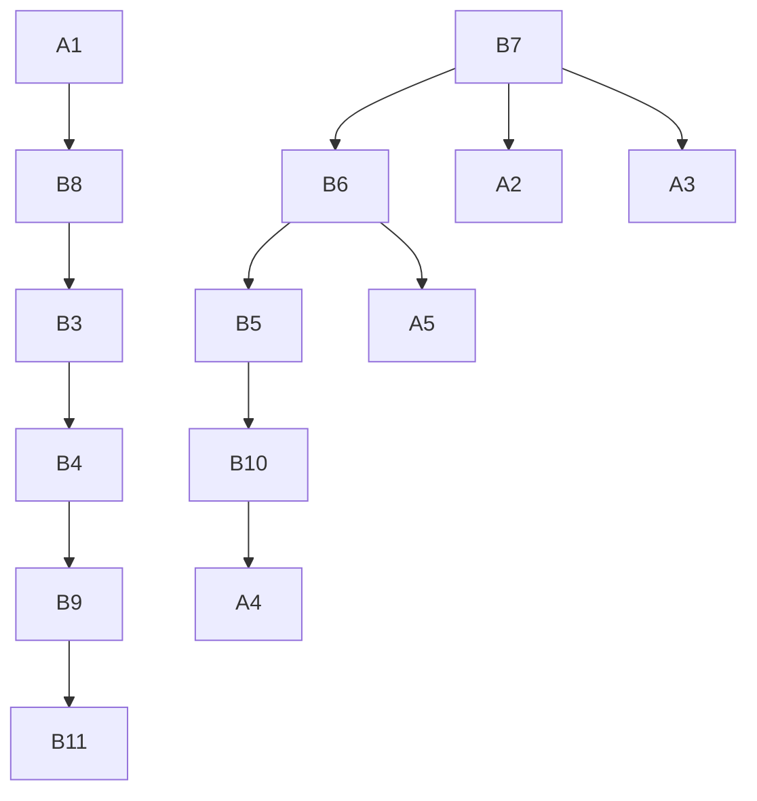
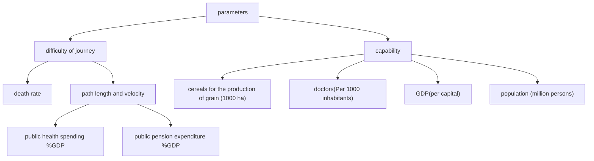

For office use only

T1

T2

T3

T4

Team Control Number

43181

Problem Chosen

F

For office use only

F1

F2

F3

F4

## 2016 ICM Summary Sheet

In recent months, Europe's migrant crisis has begun to unfold at an unprecedented pace, which becomes a matter of great concern. To help better understand and thus effectively deal with the problem, we established a Dual Goal Network Planning Model. Firstly, we quantify the factors that influence refugee’s migration routes. According to the refugee amount and geographical distribution features of their original countries, we then select five typical refugee exporting places and ten major refugee receiving countries. These routes are abstracted to a Networking Model for analysis. For each route, we put weighted values on its model parameters, establish the optimal objective function, find the optimal solution and acquire the optimal pattern of refugee migration. To improve the accuracy and applicability, we then revise and further optimize our model in two ways. Firstly, traffic conditions on each route are taken into account and an analysis of dynamic changes on receiving countries' capacity is conducted. Also, uncertain factors were eliminated while the most sensitive ones are retained to enlarge the model's scope of application. In the end, we make a set of policy proposals concerning refugee migration.

Firstly, we choose the distribution of refugees, transportation availability and capacity of refugee-receiving countries as three general factors which can influence the security and efficient movement of refugees. Each factor is determined by several metrics which can be easily detected. Firstly we use the quantity of refugees and major origins to describe the scope and distribution of refugees. Secondly we choose three parameters to evaluate the transportation availability of each route: the death rate of each migration routes, the distance between two countries (measured by the distance of accessible routes between two countries’ capitals), and the average time refugees drive the distance (adjusted with different time spend when crossing different countries’ borders). We set up a risk preference model to evaluate the objective function of the transportation availability and introduce Accessibility Index as an overall measurement. Thirdly, we analyze the capacity of refugee-receiving countries in two dimensions: we use principal component analysis (PCA) to combine five metrics into a new index to measure the refugees’ quality of prospective life in the receiving country, and we set the upper limit of capacity of receiving refugees according to countries’ population, economy, and unemployment rate.

Secondly, To find the optimal refugee movement, we first abstract refugee migration routes on maps based on several popular routes based on the popularity and volume of refugees they take. Then we define the optimal refugee movements as the maximum of living quality for refugees and the maximum of transportation availability. Also we set constrains that all refugees shall be settled and the amount of refugees in each country shall not exceed the upper limit of countries’ capacity. We then set up a Network Planning Model (NPM). But because the network model cannot effectively solve problems with multiple objective functions, we further included Weighted Model and Goal Program in our analysis. The results simulate the optimal strategy of refugees’ movement and the amount of refugees each country receives.

Thirdly, we include the traffic conditions on each route in our analysis. The dynamic changes on refugee-receiving countries' capacity resulted from the flooding of refugees and the cascading effects, which will alter the current optimal refugee movement, are also considered. The System Dynamics Model (SDM) displays the dynamic changes clearly. Non-governmental organizations (NGOs) increase the total resource supply and healthcare services. We put data into the model iteration and test if the optimal refugee is stable in two different situations.

Fourthly, we devise a set of policies based on the analysis of the results from our model. We also put the laws, cultural and religion constraints of the effected countries in to consideration. The role of NGO is not negligible and thus their significant impact on policy making is also included. In our report, we take the safety and health of refugees and local people as our priority, and put forward the optimal refugee movement pattern. We emphasis the importance of the establishment of a cooperation mechanism towards this crisis between EU countries, supporting the frontline countries, inhibiting refugees retention because of unilateral border-closing, and ect.

Finally, we analyze the impact of exogenous events on the optimal refugee movement. We make changes on the assumptions based on a specific exogenous event and the parameters shift correspondingly. We use stability analysis to test the stability of the movement between two sets of parameters in two different situations. According to the result of analysis, exogenous event will interrupt the relationship between two countries, and bring about barriers for the migration of refugees. This parameter is not included in our model, which provides basis to further optimize our model. Then we discuss the reasonable range for the scale of refugees in this model. We expand the total scale of refugees by a factor of 10. Then we exclude some irrelevant uncertainties and retain the major factors such as refugees’ adaptability in receiving countries. From model analysis, the results show that when the number of refugees reaches the upper limit of receiving countries, the model cannot make proper allocation for the remaining refugees, which also provides basis for further optimization.

In the end we conclude the strength and weakness of our model. By setting a ceiling, the model can prevent the flooding of refugee which is beyond the capability of the refugee-receiving countries to avoid some conflict. However, although we set a ceiling of the capability, when encountered with the overflow of the refugee, the model cannot offer a resolution to relocate the refugee properly. The policy of the countries and the culture difference can also influence the acceptance between countries which are not measured in our model. Also, the support and function of International government and NGO’s are not included in our model.

## Content

## 1 Introduction 3

1.1Background .  
1.2 Assumption 2

## 2 Model. 2

2.1 Parameters..  
2.2 Model of optimal refugee movement (Minimum cost network flow model) 4  
2.3Analysis of dynamic of the parameters.. 9

## 3.Policy report. 12

## 4 Extension. .. 13

4.1 Sensitivity to exogenous events .. .13  
4.2 Sensitivity to larger populations . .15

## 5 Conclusion . 17

5.1 Strength .17  
5.2 Weakness.. .17

## Policy recommendation letter to UN Secretary General and the Chief of Migration. 18

## Work cited. .. 19

## 1 Introduction

## 1.1Background

The largely and intensively rising number of people entering Europe in search of safety and a better life has captured the world’s attention with scenes of heartbreaking tragedy. There are more than a million migrants and refugees crossed into Europe in 2015, According to the UNHCR’s (United Nations High Commissioner for Refugees) estimates, however, around 366,000 illegal migrants have reached Europe this year, setting a record. At least 2,800 have died or disappeared during the journey.

Challenges are not only faced by those asylum-seekers, emigrating from Africa, the Middle East and Asia to the safe-haven countries, to choose the safe and efficient routes, but also faced by those countries to provide refugees with enough food, water, healthcare and other necessities. According to Bertrand Benoit and Nicholas Winning ( September 2015), in September 2015, seen as the most sought-after final destination in the EU migrant and refugee crisis, Germany has reached the brink of its capacities, and the Government in Berlin are criticized by the federal states, which are responsible for accommodation of refugees, for its inconsiderate approach to the crisis. Other countries including Greece and Italy are also struggling to cope with the influx, and creating division in the EU over how best to deal with resettling people. With the increasingly mounting resettlement burden lying on both sides, a model of effective policies and practices to help better facilitate the movement of refugees is thus needed.

In this problem, as members of International Coalition of Modelers, we are supposed to build a model of optimal refugee movement that would incorporate projected flows of refugees with consideration of transportation accessibility, safety of emigration routes and countries’ resource capacities. We are expected to establish our model on a set of parameters as metrics of the crisis and take the endogenous systemic dynamics of the crisis into account. The working model serves to support the optimal set of conditions with our proposals of a set of policies for optimal migration pattern. In addition, we modelers also embrace exogenous events that may result in substantial shifts in the volatile environment and consider the scalability and corresponding changes of the model.

## 1.2 Assumption

(1) Every refugee choose their route owing to their own desire depending on the condition of the refugee receiving country and the accessibility of the route. The choice they make would not be influenced by other factors like the family's desire or their friend's decision.  
(2) The difference of language between two countries have little influence on the choice of movement route.  
(3) The international organization has no restrict on the capability of the refugee-receiving country, which means when measuring the capability of the refugee country, we only consider its comprehensive national power.  
(4) There is no unexpected terrorism event and disasters that be of inconvenient significance on the choice of the refugee.  
(5) Once the refugees flood in, there would be no conflict between the local and the refugee that may cause the change of policy about the refugee-receiving countries attitude towards the refugee.  
(6) The death rate of the route which is the parameter of the accessibility index of the route results from the difficulty of the route objectively and the death rate has little connection with the lack of resources during the route.

## 2 Model

## 2.1 Parameters

We choose the distribution of refugees, transportation availability and capacity of refugee-receiving countries as three general factors which can influence the security and efficient movement of refugees. Each factor is determined by several

metrics which can be easily detected.

## a. Distribution of Refugee:

## (1) Quantity:

Obviously, the number of refugee is a priority in considering a refugee crisis. It measures the severity and scope of the crisis. (2) Origin:

Refugees from different region has different routes, this metric helps us establish the beginning of the movements.

The data of above-mentioned metrics are available from Frontex. They are basic parameters of the crisis. So it is not necessary to justify why they should be included.

## b. Transportation Accessibility:

In order to measure the difficulty of migration for refugees, the index of transportation accessibility is introduced, it is, in short, how easily from one place to another. In 1959, Hansen proposed the concept of transportation accessibility at first time, which was defined as the chance of acceptance of interactions between the nodes in a road network. In previous studies, the evaluation for transportation accessibility and the processes of calculation and modeling usually depended on space reduction. The overwhelming majority of researches abstracted different scales of the study areas as punctiform location, and put them as starting point and terminal point to evaluate the transportation accessibility. So we also abstract the countries in the refugee migration roadmap as nodes to measure the transportation accessibility between each country.

During the process of quantitative evaluation and research, according to the definition and major characteristics of transportation accessibility, the following three aspects will have a significant impact on the result:

(1) The transport we used (e.g. automobile, train and ship etc.).  
(2) The distance variables we adopted (e.g. actual distances, travel time and transport costs etc.) Time is the fundamental resistant factor during trips, transportation costs greatly depend on the transport time costs, so we usually evaluate space distances by using units of time.  
(3) The comprehension over available opportunities. For example, approaching economic centers can reduce the amount of time of work or other activities. But it is more appropriate to regard survival rate as opportunity in this problem. Because there is great difference over refugee survival rate between different routes, so survival rate can be not only distance variable but also an important indicator for measuring road section transportation accessibility.

## c. Accessibility Index

## (1) Death rate:

From 2015 January to August, more than 2300 refugees dead on the sea. An increasing number of them considered entering the Europe by land. The death rate might be the major concern when they project the migration route.

## (2) Transport distance& transport time:

All of them can indicate the cost of the route. However, as mentioned above, transport time is the best choice, especially in this case.

## (3) Accessibility Index

we combine death rate and time cost into one index. $T _ { i j }$ is transport time from i to j; $D _ { i j }$ is death rate from i to j; ?? measures the level of risk appetite. The bigger ??, the more tolerance of risk. We assume the ?? is equal to 1 for every refugee. So we define transport accessibility index by the formula below:

$$
A _ {i j} = \frac {T _ {i j}}{1 - \alpha D _ {i j}} \quad \alpha D _ {i j} <   1
$$

## Justification

  
Accessibility index<10  
10<Accessibility index<30  
Accessibility index>30

Figure 1 Accessibility of movement routes

In face of two choices, refugees undoubtedly choose the easy one. The accessibility of transportation can certainly influence the path and destination of the movement. It is reported that refugees are less likely to choose sea route, but land route. This phenomenon corresponds with the figure 1, while the land route is much more safe and convenient than sea route.

## d. Refugee-Receiving Countries’ Capacity

The capacity of refugee-receiving countries affects the intention of refugee. They are more likely to enter the countries which can meet their basic needs. The refugee-receiving country with high capacity can provide living resources in several aspects, such as food, water, health care. So we use principal component analysis (PCA) to combine five metrics into a new index to measure the refugees\` quality of prospective life in the receiving country. Similarly, a refugee-receiving cap is necessary. Limited by economy, food supply, land area, a country cannot accommodate endless refugees. So we need to derive a maximum value as the max capacity of receiving refugees.

## e. Using PCA to derive living quality index

## (1) GDP(per capita):

Gross domestic product (GDP) is a monetary measure of the value of all final goods and services produced in a period (quarterly or yearly). GDP per capita is often used as an indicator of living standards. Notably on the rationale that all citizens would benefit from their country's increased economic production as it leads to an increase in consumption opportunities which in turn increases the standard of living.

## (2) Cereal production Cereal:

As a kind of major grain, production represent country\`s ability of food supply. We use cereal production per capita as a metrics of per capita food availability which is valued most by starved refugees.

## (3) Pension spending:

Pension spending is defined as all cash expenditures (including lump-sum payments) on old-age and survivor pensions. This indicator is measured in percentage of GDP. It represents the welfare of the country. Apparently, the refugees are willing to access to high welfare country.

## (4) Healthcare spending:

Health spending is defined as the final consumption of health goods and services. It includes spending by public source on curative, rehabilitative and long-term care as well as medical goods such as pharmaceuticals. It also covers spending on public health and prevention programs , and on administration. This indicator is measured in percentage of GDP, in percentage of total expenditure on health, and in USD per capita.

## (5) Doctors:

This indicator is measured per 1 000 inhabitants. It indicates the proportion of doctors and measure the medical standard to some extent.

In order to get a single measurement of living quality, we use principal component analysis to do data dimension reduction.

## (6) Living quality index:

PCA is mathematically defined as an orthogonal linear transformation that transforms the data to a new coordinate system $( Y _ { 1 } , Y _ { 2 } , Y _ { 3 } \ldots \ldots )$ such that the greatest variance by some projection of the data comes to lie on the first coordinate, the second greatest variance on the second coordinate, and $Y _ { i } , Y _ { j }$ should be uncorrelated. So we had theprincipal below:

$$
\begin{array}{l} \left\{ \begin{array}{l} Y _ {1} = \mu_ {1 1} X _ {1} + \mu_ {1 2} X _ {2} + \dots + \mu_ {1 p} X _ {p} \\ Y _ {2} = \mu_ {2 1} X _ {1} + \mu_ {2 2} X _ {2} + \dots + \mu_ {2 p} X _ {p} \\ \qquad \qquad \qquad \dots \dots \\ Y _ {p} = \mu_ {p 1} X _ {1} + \mu_ {p 2} X _ {2} + \dots + \mu_ {p p} X _ {p} \end{array} \right. \\ v a r (Y _ {i}) = v a r \big (\mu_ {i} ^ {'} X \big) = \mu_ {i} ^ {'} \Sigma \mu_ {i} \\ \end{array}
$$

(1) $\mu _ { i } ^ { ' } \mu _ { i } = 1$

(2) $Y _ { i } , Y _ { j }$ should be uncorrelated $( i \neq j )$ .

(3) $Y _ { 1 }$ has the greatest variance in linear conversion of $X _ { 1 } , X _ { 2 } , X _ { 3 } , \ldots \ldots , X _ { p } .$ .

In this case, we use 5 columns of data matrix $X = ( X _ { 1 } , X _ { 2 } , X _ { 3 } , X _ { 4 } , X _ { 5 } )$ , to represent five features: GDP(per capita), Cereal production, Pension spending, Health care spending, Doctors. Then we got a new coordinate system by PCA, the $Y _ { 1 }$ inherit 81.2%possible variance from X. So the new index includes more than 80% information of original five features. It is very effective and can represent the original features. We defined $Y _ { 1 }$ as the living quality index.

## f. Maximum refugees receiving capacity

A country only has limited space and living resources, it cannot receive the number of refugees out of its capacity. Also too many refugees can evoke the dissatisfaction of local people, which leads to social unrest. When EU decided the refugee quota of each country, they took into account the population, economy, unemployment rate and etc. The quota coordinates roughly with the country\`s population, and some country set a percentage of population as upper limit. Therefore, we take the 0.5% population as maximum capacity of receiving refugees.

## Justification

bar-line hybrid chart

| Country        | Capacity | arrival |
| -------------- | -------- | ------- |
| Austria        | 3.4      | 2.2     |
| Belgium        | 3.0      | 0.5     |
| France         | 2.1      | 1.5     |
| Germany        | 2.8      | 3.5     |
| Greece         | 2.0      | 0.7     |
| Hungary        | 0.3      | 0.3     |
| Italy          | 1.8      | 1.0     |
| Spain          | 1.9      | 0.2     |
| Sweden         | 3.0      | 2.6     |
| Turkey         | 0.2      | 0.1     |
| United Kingdom | 2.1      | 0.1     |

Figure 2: Camparation of capacity and numbers of arrival

To justify the connection between the capability of the refugee-receiving country and the refugee that arrival the country, we models by the Spearman rank correlation coefficient which often denoted by the Greek letter $\rho$ (rho), is a nonparametric measure of statistical dependence between two variables. By calculating the date to get the value of $\tilde { \rho }$ (rho), in this case, $\rho$ (rho) stands for 0.6, which can assess how well the variables connected. In other words, it's reasonable to predict the distribution of the refugee by the capability of the refugee-receiving country.

## 2.2 Model of optimal refugee movement (Minimum cost network flow model)

## 2.2.1Model description

text_image

United Kingdom
Ireland
London
Belgium
Paris
France
Italy
Portugal
Madrid
Spain
Morocco
Algeria
Netherlands
Germany
Berlin
Czech Rep
Austria
Croatia
Tyrthoscan Sea
Tunisia
Mediterranean Sea
Egypt
Turkey
Syria
Iraq
Israel
Jordan
Lebanon
Georgia
Azerbaijan
Uzbekistan
Ukraine
Russia
Romania
Hungary
Serbia
Bulgaria
Greece
Montreal
Poland
Warsom
Dlovakia
Slovakia
Czech Rep
Prague
Belarus
Moscow
Mozka
Finland
Norway
Baltic Sea
Estonia
Latvia
Lithuania
Finland
Finland
Finland
Finland
Finland
Finland
Finland
Finland
Finland
Finland
Finland
Finland
Finland
Finland
Finland
Finland
Finland
Finland
Finland
Finland
Finland
Finland
Finland
Finland
Finland
Finland
Finland
Finland
Finland
Finland
Finland
Finland
Finland
Finland

Figure 3: Refugee movement routes

flowchart

Figure 4: Abstract of refugee movement routes

In order to have a better look at refugee movement, we abstract refugee migration route from Northern Africa and Mideast to Europe into figure 1. The starting points are $A _ { 1 } , A _ { 2 } , \ldots , A _ { 5 }$ which represent the largest source of refugees. Also they are the beginning of six refugees travel routes. The end points are $B _ { 1 } , B _ { 2 } , \ldots , B _ { 5 } \mathrm { o n }$ behalf of the European countries receiving a large number of refugees. The lines in the diagram represent the traffic routes between the two countries. But it length does not represent the distance between two countries, but the transport accessibility defined in task 1. We do not take multiple entry points into consider, and do some necessary but reasonable simplification, in order to facilitate the analysis.

We define the optimal refugee movements as confining the number of refugees and the largest number of refugees the countries can accommodation a certain period of time, the migration of refugees has the least difficulty and the most suitable conditions in ending points. Therefore, the optimal refugee movement model can be transformed into a certain least cost network planning (graph theory) model for constrained targets. We have proposed two criteria for the evaluation of the optimal objective-- both for the convenience of traffic, but also for suitable conditions in receiving countries. The simple graph theory cannot solve the problem of more than one objective function, so it is necessary to carry out the goal of planning, to weigh the merits of the program to consider multiple objectives. Our work contains two goals: one is finding the refugee movements with the least difficulty which equals to minimum total the accessibility index; the other one is all refugee arriving to the countries with the most suitable conditions, which is equivalent to maximum the total living quality index.

## 2.2.2 Assumption and symbol definition

<table><tr><td>Variable</td><td>Definition</td></tr><tr><td> $n_i$ </td><td>Number of refugees starting off from  $A_i$ </td></tr><tr><td> $m_j$ </td><td>Maximum refugees receiving capacity of $B_j$ </td></tr><tr><td> $c_j$ </td><td>Living quality index  $B_j$ </td></tr><tr><td> $a_{ij}$ </td><td>Transport accessibility index from  $A_i$  to $B_j$ </td></tr><tr><td> $x_{ij}$ </td><td>Volume of refugees migrate from  $A_i$  to $B_j$ </td></tr></table>

Table 1: Symbols

We use the number and the origin of refugees in 2015:

<table><tr><td></td><td>A1</td><td>A2</td><td>A3</td><td>A4</td><td>A5</td><td>total</td></tr><tr><td> $n_i (persons)$ </td><td>14078</td><td>157220</td><td>8645</td><td>680820</td><td>1764</td><td>14078</td></tr></table>

Table 2：the number and the origin of refugees in 2015

Living quality index is calculated by the data of five metrics in 2013. Considering the quality of a country would not change dramatically, it is appropriate to use this index for now. Maximum refugees receiving capacity is calculated by population data of 2015.

<table><tr><td></td><td>B1</td><td>B2</td><td>B3</td><td>B4</td><td>B5</td><td>B6</td><td>B7</td><td>B8</td><td>B9</td><td>B10</td><td>B11</td></tr><tr><td> $c_i$ </td><td>1.342</td><td>0.8039</td><td>0.0977</td><td>0.7795</td><td>0.4134</td><td>1.6790</td><td>0.2137</td><td>0.0588</td><td>0.9692</td><td>1.7171</td><td>0.0896</td></tr><tr><td> $m_i$ (persons)</td><td>42343</td><td>55892</td><td>318931</td><td>403055</td><td>55150</td><td>49465</td><td>301124</td><td>232966</td><td>48045</td><td>380273</td><td>316190</td></tr></table>

Table 3: Living quality index

## Transport accessibility matrix

According to transport accessibility index between two adjacent nodes, we can calculate the least transport accessibility between each pair of nodes by Floyd–Warshall algorithm. It is an algorithm for finding shortest paths in a weighted graph with positive or negative edge weights. Then we can get the adjacency matrix of the graph which store the least transport accessibility from each $A _ { i } ( i = 1 , 2 , . . . , 5 )$ to?? (j= 1,2,…,11):

$$
\mathbf {D} = \left[ \begin{array}{c} d _ {1 1} d _ {1 2} \dots \dots d _ {1 n} \\ d _ {2 1} d _ {2 2} \dots \dots d _ {2 n} \\ \dots \dots \\ d _ {n 1} d _ {n 2} \dots \dots d _ {n n} \end{array} \right]
$$

$$
\left\{ \begin{array}{l l} d _ {i i} = 0 \\ d _ {i j} = \infty & \text {if i,j is not incident} \\ d _ {i j} = \min c _ {i j} \end{array} \right.
$$

## Global programming model

Our programming model including following constraint:

(1) maximum refugees receiving capacity constraint of each country.  
(2) Number of refugees of each starting points  
(3) Maximum total living quality index  
(4) Minimum total the accessibility index

We can build the following model:

$$
\max \sum_ {j = 1} ^ {1 1} \sum_ {i = 1} ^ {5} x _ {i j} * c _ {j} \quad \min \sum_ {j = 1} ^ {1 1} \sum_ {i = 1} ^ {5} x _ {i j} * d _ {i j}
$$

s.t.

$$
\begin{array}{r l} \sum_ {i = 1} ^ {5} x _ {i j} \leq m _ {j} & j = 1, 2, \ldots , 1 1 \\ \sum_ {j = 1} ^ {1 1} x _ {i j} = n _ {i} & i = 1, 2, \ldots , 5 \end{array}
$$

## Model 1Weighted Model

$$
m i n w _ {1} * \sum_ {j = 1} ^ {1 1} \sum_ {i = 1} ^ {5} x _ {i j} * d _ {i j} ^ {\prime} + w _ {2} * \sum_ {j = 1} ^ {1 1} \sum_ {i = 1} ^ {5} x _ {i j} * c _ {j} ^ {\prime} \sum w _ {i} = 1
$$

We use $w _ { 1 }$ and $w _ { 2 }$ to distribute theallocation of Weights to two goals. Before doing this, we standardize the index, in order to reconcile the program goal and make their metrics and variance same. Therefore, the two factors can influence the object function in the same level.In this model we set

## Result 1:

Figure 5 shows the final distribution of refugees among European countries. Table shows the flows of refugees. For example, 14078 refugees arrive B8 from A1. It can be found that the refugees are more likely to go to the wealthy countries, this result reconciles with our common sense. The reason for this phenomenon is that the difference of the accessibility is more uniform, and the variance of the state power widens by several extreme values. Greece, Italy, Turkey are close to the starting point of the refugees, but not the refugees\` ideal definition in optimal model. Because their receiving capacity measured by living quality index is far less than the other countries

When making transportation a priority, the number of refugees entering Italy, Greece increases significantly. But the situation is not much of a change for countries with very good welfare and very poor countries, such as Sweden and Hungary. This situation can be applied to border closure times.

map with connection lines

| Country | Percentage (%) |
| --- | --- |
| Norway | 48045.100 |
| Finland | 42323.100 |
| Estonia | 403055.100 |
| Latvia | 403055.100 |
| Lithuania | 403055.100 |
| Belarus | 403055.100 |
| Ukraine | 48045.100 |
| Germany | 55892.100 |
| Poland | 48045.100 |
| Austria | 48045.100 |
| Hungary | 48045.100 |
| Moldova | 48045.100 |
| Romania | 48045.100 |
| Italy | 48045.100 |
| Croatia | 48045.100 |
| Greece | 48045.100 |
| Bulgaria | 48045.100 |
| Turkey | 48045.100 |
| Iraq | 48045.100 |
| Syria | 48045.100 |
| Lebanon | 48045.100 |
| Jordan | 48045.100 |
| Israel | 48045.100 |
| Tunisia | 48045.100 |
| Algeria | 48045.100 |
| Morocco | 48045.100 |
| Spain | 14078.604 |
| Portugal | 14078.604 |
| United Kingdom | 180183.606 |
| France | 177433.556 |
| Ireland | 177433.556 |
| Denmark | 180183.606 |
| Netherlands | 180183.606 |
| Belgium | 180183.606 |
| Poland | 180183.606 |
| Austria | 180183.606 |
| Hungary | 180183.606 |
| Slovakia | 180183.606 |
| Czech Republic | 180183.606 |
| Serbia | 180183.606 |
| Romania | 180183.606 |
| Greece | 180183.606 |
| Turkey | 180183.606 |
| Egypt | 180183.606 |
| Libya | 180183.606 |
| North Sea | 180183.606 |
| South Sea | 180183.606 |
| Baltic Sea | 180183.606 |
| Slovak Republic | 180183.606 |
| Russian Federation | 180183.606 |
| French Republic | 180183.606 |
| French Republic (South) | 180183.606 |
| French Republic (North) | 180183.606 |
| French Republic (North) | 180183.606 |
| French Republic (North) | 180183.606 |
| French Republic (North) | 180183.606 |
| French Republic (North) | 180183.606 |
| French Republic (North) | 177433.556 |
| French Republic (North) | 177433.556 |
| French Republic (North) | 177433.556 |
| French Republic (North) | 177433.556 |
| French Republic (North) | 177433.556 |
| French Republic (North) | 177433.556 |
| French Kingdom (France) | 177433.556 |
| United Kingdom (France) | 177433.556 |
| United Kingdom (France) | 177433.556 |
| United Kingdom (France) | 177433.556 |
| United Kingdom (France) | 177433.556 |
| United Kingdom (France) | 177433.556 |

Figure 5: Optimal movement pattern of Model 1

<table><tr><td></td><td>A1</td><td>A2</td><td>A3</td><td>A4</td><td>A5</td><td>total</td></tr><tr><td>B1</td><td>0</td><td>42343</td><td>0</td><td>0</td><td>0</td><td>42343</td></tr><tr><td>B2</td><td>0</td><td>0</td><td>0</td><td>55892</td><td>0</td><td>55892</td></tr><tr><td>B3</td><td>0</td><td>0</td><td>86453</td><td>10286</td><td>0</td><td>96739</td></tr><tr><td>B4</td><td>0</td><td>114877</td><td>0</td><td>288178</td><td>0</td><td>403055</td></tr><tr><td>B5</td><td>0</td><td>0</td><td>0</td><td>53386</td><td>1764</td><td>55150</td></tr><tr><td>B6</td><td>0</td><td>0</td><td>0</td><td>0</td><td>0</td><td>0</td></tr><tr><td>B7</td><td>0</td><td>0</td><td>0</td><td>0</td><td>0</td><td>0</td></tr><tr><td>B8</td><td>14078</td><td>0</td><td>0</td><td>0</td><td>0</td><td>14078</td></tr><tr><td>B9</td><td>0</td><td>0</td><td>0</td><td>48045</td><td>0</td><td>48045</td></tr><tr><td>B10</td><td>0</td><td>0</td><td>0</td><td>0</td><td>0</td><td>0</td></tr><tr><td>B11</td><td>0</td><td>0</td><td>0</td><td>125033</td><td>0</td><td>125033</td></tr></table>

Table 4: Optimal flows of refugees of Model 1

## Model 2 Goal Programming Model

Goal programming is a branch of multi-objective optimization. It can be thought of as an extension or generalization of linear programming to handle multiple, normally conflicting objective measures. Each of these measures is given a goal or target value to be achieved. Unwanted deviations from this set of target values are then minimized in an achievement function. The initial goal programming formulations ordered the unwanted deviations into a number of priority levels, with the minimization of a deviation in a higher priority level being infinitely more important than any deviations in lower priority levels.

Maximum total living quality index and minimum total the accessibility index are a couple of conflicting objective measures. So we calculated goal values of each of measures and set transport accessibility as first priority level. Then we use goal programming model to minimize the wanted deviations.

Step1 Calculatinggoal values of each of measures separately：

$$
m i n \sum_ {j = 1} ^ {1 1} \sum_ {i = 1} ^ {5} x _ {i j} * d _ {i j} = g _ {1}
$$

$$
m a x \sum_ {j = 1} ^ {1 1} \sum_ {i = 1} ^ {5} x _ {i j} * c _ {j} = g _ {2}
$$

Step 2 Model solving

$$
m i n z = p _ {1} * e _ {1} ^ {+} + p _ {2} * e _ {2} ^ {-}
$$

s.t.

$$
\sum_ {j = 1} ^ {1 1} \sum_ {i = 1} ^ {5} x _ {i j} * d _ {i j} - e _ {1} ^ {+} = g _ {1}
$$

$$
\begin{array}{l} \sum_ {j = 1} ^ {1 1} \sum_ {i = 1} ^ {5} x _ {i j} * c _ {j} + e _ {1} ^ {-} = g _ {2} \\ \sum_ {i = 1} ^ {5} x _ {i j} \leq m _ {j} \qquad j = 1, 2, \ldots , 1 1 \\ \sum_ {j = 1} ^ {1 1} x _ {i j} = n _ {i} \qquad i = 1, 2, \dots , 5 \\ \end{array}
$$

## Result 2:

When making transportation a priority, the number of refugees entering Italy, Greece increases significantly. But the situation is not much of a change for countries with very good welfare and very poor countries, such as Sweden and Hungary. This situation can be applied to border closure times.

map with connection lines

| Country | Percentage (%) |
| --- | --- |
| United Kingdom | 0, 0% |
| France | 270899, 84.9% |
| Spain | 14078, 6.04% |
| Italy | 24367,8.10% |
| Germany | 55892, 100% |
| Netherlands | 403033, 100% |
| Belgium | 403033, 100% |
| Poland | 48045, 100% |
| Austria | 42343, 100% |
| Czech Republic | 42343, 100% |
| Hungary | 42343, 100% |
| Slovakia | 42343, 100% |
| Romania | 42343, 100% |
| Serbia | 42343, 100% |
| Bulgaria | 55150,100% |
| Greece | 55150,100% |
| Turkey | 55150,100% |
| Morocco | 48045, 100% |
| Egypt | 48045, 100% |
| Norway | 48045, 100% |
| Finland | 48045, 100% |
| Denmark | 48045, 100% |
| United Kingdom (North Sea) | 0, 0% |
| Ireland | 0, 0% |
| Portugal (Madrid) | 0, 0% |
| Spain (Madrid) | 0, 0% |
| Tunisia (Turthienan Sea) | 0, 0% |
| Algeria | 0, 0% |
| Libya | 0, 0% |
| Ukraine | 42343, 100% |
| Belarus | 42343, 100% |
| Lithuania | 42343, 100% |
| Iceland (Kéchové) | 42343, 100% |
| Estonia (Baltic Sea) | 42343, 100% |
| Latvia (Lauté) | 42343, 100% |
| North Korea (Kéchové) | 42343, 100% |
| Canada (Kéchové) | 42343, 100% |
| Sweden (Kéchové) | 42343, 100% |
| Finland (Kéchové) | 42343, 100% |
| Denmark (Kéchové) | 42343, 100% |
| Iceland (Kéchové) | 42343, 100% |
| Finland (Kéchové) | 42343, 100% |
| Iceland (Kéchové) | 42343, 100% |
| Finland (Kéchové) | 42343, 100% |
| Iceland (Kéchové) | 42343, 100% |
| Finland (Kéchové) - Belgium | 42343, 100% |
| Finland (Kéchové) - Germany | 42343, 100% |
| Finland (Kéchové) - France | 42343, 100% |
| Finland (Kéchové) - Italy | 42343, 100% |
| Finland (Kéchové) - Spain | 42343, 100% |
| Finland (Kéchové) - Greece | 42343, 100% |
| Finland (Kéchové) - Turkey | 42343, 100% |
| Finland (Kéchové) - Egypt | 42343, 100% |
| Finland (Kéchové) - Germany (Kéchové) | 42343, 100% |
| Finland (Kéchové) - France (Kéchové) | 42343, 100% |
| Finland (Kéchové) - Italy (Kéchové) | 42343, 100% |
| Finland (Kéchové) - Spain (Kéchové) | 42343, 100% |
| Finland (Kéchové) - Greece (Kéchové) | 42343, 100% |
| Finland (Kéchové) - Turkey (Kéchové) | 42343, 100% |
| Finland (Kéchové) - Germany (Kéchové) | 42343, 100% |
| Finland (Kéchové) - France (Kéchové) | 42343, 100% |
| Finland (Kéchové) - Italy (Kéchové) | 48045, 100% |
| Finland (Kéchové) - Spain (Kéchové) | 48045, 100% |
| Finland (Kéchové) - Greece (Kéchové) | 48045, 100% |
| Finland (Kéchové) - Turkey (Kéchové) | 48045, 100% |
| Finland (Kéchové) - Germany (Kéchové) | 48045, 100% |
| Finland (Kéchové) - France (Kéchové) | 48045, 100% |
| Finland (Kéchové) - Italy (Kéchové) | 48045, 100% |
| Finland (Kéchové) - Spain (Kéchové) | 48045, 100% |

Figure 6: Optimal movement pattern of Model 2

<table><tr><td></td><td>A1</td><td>A2</td><td>A3</td><td>A4</td><td>A5</td><td>total</td></tr><tr><td>B1</td><td>0</td><td>0</td><td>0</td><td>42343</td><td>0</td><td>42343</td></tr><tr><td>B2</td><td>0</td><td>0</td><td>0</td><td>55892</td><td>0</td><td>55892</td></tr><tr><td>B3</td><td>0</td><td>142840</td><td>0</td><td>0</td><td>0</td><td>270899</td></tr><tr><td>B4</td><td>0</td><td>0</td><td>0</td><td>403055</td><td>0</td><td>403055</td></tr><tr><td>B5</td><td>0</td><td>0</td><td>0</td><td>53386</td><td>1764</td><td>55150</td></tr><tr><td>B6</td><td>0</td><td>0</td><td>0</td><td>0</td><td>0</td><td>0</td></tr><tr><td>B7</td><td>0</td><td>14380</td><td>8645</td><td>278099</td><td>0</td><td>243678</td></tr><tr><td>B8</td><td>14078</td><td>0</td><td>0</td><td>0</td><td>0</td><td>14078</td></tr><tr><td>B9</td><td>0</td><td>0</td><td>0</td><td>48045</td><td>0</td><td>48045</td></tr><tr><td>B10</td><td>0</td><td>0</td><td>0</td><td>0</td><td>0</td><td>0</td></tr><tr><td>B11</td><td>0</td><td>0</td><td>0</td><td>0</td><td>0</td><td>0</td></tr></table>

Table 5: Optimal flows of refugees of Model 1

## 2.3Analysis of dynamic of the parameters.

a. Dynamic of parameters resulting from the flooding the refugee.

## Model explanation

Leave the refugee's impact on the local out of consideration In building a network model is flawed. In fact, the excessive influx of refugees will have negative effects on both refugees and countries. The increase in refugees would dilute the local resources, benefits, and bring chaos to the receiving country. The change of living quality parameter value reflects the influence on the model. So we shall add the change into the model by adjusting the value of living quality for each stage according to the number of refugees pouring into the receiving country In the previous stage. We will take a month as a stage and at the end of each stage the refugee will move according to the value of living quality determined by the number of refugees at that stage to achieve a new optimal state. There will be 12 moves in one year in this way and we will take the distribution of the refugee after the last move as the final state of the optimal.

## Variable and symbol definition

As refugee movement is no longer restricted between $\mathrm { A _ { i } }$ and $\mathsf { B } _ { \mathrm { j } }$ , we use $\mathrm { P _ { i } } ( \mathrm { i } = 1 , 2 , \dots \dots , 1 6 ) \mathrm { t o }$ define all the countries. $( \mathrm { P _ { 1 } } = \mathrm { A _ { 1 } } , \ldots \ldots , \mathrm { P _ { 6 } } = \mathrm { B _ { 1 } } , \ldots \ldots \mathrm { P _ { 1 6 } } = \mathrm { B _ { 1 1 } }$ )and add time variable. So we need to redefine the index and the variables. The main variable that changes is ci, living quality.

<table><tr><td>Variable</td><td>Definition</td></tr><tr><td> $t$ </td><td>Month  $0 \leq t \leq 12$  ( $t = 0$  represents the initial situation)</td></tr><tr><td> $P_i$ </td><td>Country i</td></tr><tr><td> $p_i$ </td><td>Population of  $P_i$ </td></tr><tr><td> $N_i$ </td><td>Number of refugees starting off from  $P_i$ </td></tr><tr><td> $M_i$ </td><td>Maximum refugees receiving capacity of  $P_i$ </td></tr><tr><td> $m_i(t)$ </td><td>Number of refugees in  $P_i$  at t</td></tr><tr><td> $c_i(t)$ </td><td>Living quality index of  $P_i$  at t</td></tr><tr><td> $z_{1i}(t)$ </td><td>Cereal production per capita of  $P_i$  at t</td></tr><tr><td> $z_{2i}(t)$ </td><td>Number of doctors per capita of  $P_i$  at t</td></tr><tr><td> $z_{3i}(t)$ </td><td>GDP per capita of  $P_i$  at t</td></tr><tr><td> $z_{4i}(t)$ </td><td>Pension spending of GDP of  $P_i$  at t</td></tr><tr><td> $z_{5i}(t)$ </td><td>Health care spending of GDP of  $P_i$  at t</td></tr><tr><td> $a_{ij}$ </td><td>Transport accessibility index from  $P_i$  to  $P_j$ </td></tr><tr><td> $d_{ij}$ </td><td>The least transport accessibility between from  $P_i$  to  $P_j$ </td></tr><tr><td> $x_{ij}(t)$ </td><td>Volume of refugees migrate from  $P_i$  to  $P_j$ at t</td></tr></table>

Table 6: Symbols of Dynamic Model

The major changeable variable $\mathsf { c } _ { \mathrm { i } } ( \mathsf { t } )$ . It consists of five indies obtained by principal component analysis, so that it can be decomposed as a linear combination of five indicators.：

$$
c _ {i} (0) = - 4. 2 8 6 + 0. 5 1 5 z _ {1 i} (0) + 0. 1 3 2 z _ {2 i} (0) + 4. 4 0 3 * 1 0 ^ {- 5} z _ {3 i} (0) + 0. 1 z _ {4 i} (0) + 0. 2 4 z _ {5 i} (0)
$$

With large amount of refugee flooding in, resources in refugee-receiving countries would be diluted. In the premise of keeping the per capita amount the same, the denominator increases and parameter value must be decreased.

For example, the measurement of crop production $\mathbf { z } _ { \mathrm { 1 i } }$

$$
z _ {1 i} (t) = \frac {z _ {1 i} (0) * p _ {i}}{p _ {i} + m _ {i} (t)} = \frac {z _ {1 i} (0)}{1 + m _ {i} (t) / p _ {i}} = \frac {z _ {1 i} (0)}{1 + m _ {i} (t) / M _ {i}}
$$

As we defined $\mathsf { M } _ { \mathrm { i } } = 0 . 5 \% * \mathsf { p } _ { \mathrm { i } }$ :

$$
z _ {1 i} (t) = \frac {z _ {1 i} (0)}{1 + \frac {m _ {i} (t)}{M _ {i}} * 0.5\%}
$$

The formula illustrates that in previous models it is reasonable that we ignore the impact of refugee populations on the parameters. Because the value of ???? ?? $\mathrm { o f } \frac { m _ { i } ( t ) } { M _ { i } } * 0 . 5 \%$ ∗ 0.5% is between 0 and 0.5% , it brings little change to the value of z . However, $\mathbf { z } _ { \mathrm { 1 i } }$ we model structure of causal relationship taking the quantity of refugee and all elements by applying system dynamic model and find out that interaction between the quantity and various elements is far greater than we once imaged. According to model's estimated result, we adjust the formula that the quantity react on the per capital index as follows:

$$
z _ {1 i} (t) = \frac {z _ {1 i} (0)}{1 + \frac {m _ {i} (t)}{M _ {i}} * 1 . 5}
$$

Simultaneously, we prescribe that the linear combination between living quality and five indies stays the same, however, and add a penalty function that has negative connection with $\mathrm { { m } _ { i } ( t ) }$ . The penalty function means that owing to the increase of refugee, the living quality of refugee-receiving decrease accordingly. It stands for the number of refugee's influence apart from the previous five indies, such as the decrease of the public security, the degree of the resentment against the refugee etc. All in all, the difference of $\mathbf { c } _ { \mathrm { i } }$ at different time embody on the impact from $\mathrm { m } _ { \mathrm { i } }$ t towards $\mathbf { c } _ { \mathrm { i } }$ and the adjusted form of adjusted index function is:

$$
\begin{array}{r} c _ {i} (t) = - 4. 2 8 6 + 0. 5 1 5 z _ {1 i} (t) + 0. 1 3 2 z _ {2 i} (t) + 4. 4 0 3 * 1 0 ^ {- 5} z _ {3 i} (t) + \\ 0. 1 z _ {4 i} (t) + 0. 2 4 z _ {5 i} (t) + f (m _ {i} (t)) \end{array}
$$

## Model construction

We build an iteration model based on previous models.

## Step 1 Calculating the variables of first status (t=1).

In the first step, we use the same constraint with previous models: maximum refugees receiving capacity constraint of each country.

Number of refugees of each starting points

Maximum total living quality index

Minimum total the accessibility index

$$
m i n \sum_ {j = 6} ^ {1 6} \sum_ {i = 1} ^ {5} x _ {i j} (1) * c _ {j} ^ {\prime} (0) + \sum_ {j = 6} ^ {1 6} \sum_ {i = 1} ^ {5} x _ {i j} (1) * d _ {i j} ^ {\prime}
$$

s.t.

$$
\begin{array}{l} \sum_ {i = 1} ^ {5} x _ {i j} (1) \leq M _ {j} \quad j = 6, 7, \dots .., 1 6 \\ \sum_ {j = 6} ^ {1 6} x _ {i j} = N _ {i} \qquad i = 1, 2, \ldots , 5 \\ \end{array}
$$

## Step 2 Doing 11 times- iteration of the new constraint model

In this model, we assume the refugees would never come back to their starting points. So it is no need to concern about the constraint of the number of refugees from starting points. Instead we need to take into consider the migration among European countries.

So we got the constraint below.

$$
m i n \sum_ {j = 6} ^ {1 6} m _ {i} (t) * c _ {i} ^ {\prime} (t - 1) + \sum_ {j = 6} ^ {1 6} \sum_ {i = 6} ^ {1 6} x _ {i j} (t) * d _ {i j} ^ {\prime}
$$

s.t.

$$
\begin{array}{l} m _ {i} (t) \leq M _ {i} \qquad i = 6, 7, \ldots , 1 6 \\ \sum_ {j = 6} ^ {1 6} x _ {i j} (t) \leq m _ {i} (t - 1) \qquad i = 6, 7, \ldots , 1 6 \\ \sum_ {j = 6} ^ {1 6} x _ {j i} (t) - \sum_ {j = 6} ^ {1 6} x _ {i j} (t) + m _ {i} (t - 1) = m _ {i} (t) \quad i = 6, 7, \dots , 1 6 \\ \end{array}
$$

After 11 times- iteration, we got the final result of dynamic model.

## Result:

Figure 7 shows the final distribution of refugees among European countries. Comparing with the result of static model, the distribution of refugees is much more even. There are refugees in every country, although some of them have condition such as Turkey. Also there is no country receiving maximum number of refugees. So this model seems like more reasonable and closer to reality.

map with connection lines

| Country | Value (Percentage) |
| :--- | :--- |
| United Kingdom | 53.3% |
| Ireland | 168500 |
| London |  |
| Netherlands |  |
| Germany | 83.8% |
| France | 61.0% |
| Portugal |  |
| Spain | 5.67% |
| Morocco |  |
| Libya |  |
| Greece | 2.58% |
| Turkey |  |
| Syria |  |
| Iraq |  |
| Ukraine | 8.13% |
| Romania | 16.6% |
| Bulgaria | 77.3% |
| Hungary | 8.13% |
| Austria |  |
| Czech Republic |  |
| Poland | 67.7% |
| Denmark |  |
| Belgium |  |
| France |  |
| Italy | 5.14% |
| Rome |  |
| Kyrgyzstan Sea |  |
| Tunisia |  |
| North Sea |  |
| Norway |  |
| Finland |  |
| Estonia |  |
| Latvia |  |
| Lithuania |  |
| Belarus |  |
| Ukraine |  |
| Georgia |  |
| Azerbaijan |  |
| Uzbekistan |  |
| Turkmenistan |  |
| Iran |  |
| Israel |  |
| Jordan |  |
| Lebanon |  |
| Syria |  |
| Iraq |  |
| Egypt |  |
| Moldova |  |
| Slovakia |  |
| Austria |  |
| Hungary | 8.13% |
| Croatia |  |
| Greece |  |
| Bulgaria |  |
| Turkey |  |
| Mexico |  |
| Argentina |  |
| Argentina (Middle East) |  |
| Argentina (North East) |  |
| Argentina (West) |  |
| Argentina (East) |  |
Map data ©2016 Google, ORION-ME Terms Privacy Send feedback

Figure 7: Optimal refugee movement pattern of Dynamic Model

## b. Dynamic of parameters resulting from the intervention of both government and non-government agencies like NGO and WFP.

All refugee-receiving countries in the cluster have in common the geopolitical and military situation (interstate wars, intrastate or civil wars) which cause the break-out of the refugee movement. Previously, most people rely on the local government to ensure their fundamental rights and personal safety. However, owing to all kinds of reasons, especially the military situation the refugee receiving countries are supposed to faced with ,the local government cannot protect the refugee anymore, and the international institution are supposed to ensure the basic right of the refugee.

United Nations High Commissioner for Refugees(UNHCR), which is authorized by the United Nations, is in charge of leading and coordinating the international actions to protect the refugee and solve the problems worldwide. The UNHCR plays an extremely important role in coordinating the organization of international government and NGO's support towards the refugee.

With the intervention of the government, the parameter of the number of refugee would change accordingly, as the policy of the most refugee receiving country and UNHCR, the best solution to the problem of refugee is to repatriate them under the circumstance of such a big number of the population of the refugee. What's more, the government's intervention can significantly influence the parameters in connection with practicality of the optimal refugee movement, like cut the connection with another refugee receiving country, which cannot be quantized in the model.

With the intervention of the non-government agencies, firstly, the number of doctors would increase because NGO's role in improving the health care in the refugee camp. Secondly, the non-government supply basic resource for the refugee like food and water, which can reduce the need of the refugee for them on some degree. Once the parameter of doctors rate and the need of the refugee change, the balance of the resource's supply and need would change accordingly, the result is illustrated as follows(To estimate the result reasonably, we consider the doctor's rate increase by 5% and the need of food decrease by 20% with the intervention of the non-government agencies ):

## 3.Policy report

In this part, a set of policies are proposed to help support the optimal set of conditions ensuring the optimal migration pattern based on our previous model. The first and foremost standard to evaluate the effectiveness of policy is health and safety of the refugees and local people. We mainly use the change of parameters included in our model to analyze the working mechanism of each policy proposed. Policies directly changing the parameters then make a difference mainly on the accessibility of routes or the capacity of countries, which are two overall measurements of refugees’ health and safety conditions. Besides, we put the laws and cultural constraints of the effected countries in to consideration. The role of NGO is not negligible and thus their significant impact on policy-making is also included.

## a. Strengthen the construction of infrastructure and increase the supply of basic necessities and subsidies for refugees.

The scarcity of food, drinkable water, shelter and healthcare services are threatening the health and safety of the refugees. The increase of supply of necessities and infrastructures, like shelter and public healthcare services will increase the capacity of countries affected. Subsidies for refugees function as an alternative to improve the living conditions of immigrants. Therefore, for countries with a lot of immigrants flowing in, to increase the amount of food, clean water, shelter, public health service and fiscal spending on refugee subsidiaries are of great importance.

b. Devote more efforts to the patrol and rescue of refugees in Mediterranean area.

As a major cause for the death of refugees on the route, the boat-sinking on the Mediterranean should call for more attention from countries in Europe. Italy or Greece shall not be alone in the mission of patrolling and rescuing on the sea. The effort and expenses shall be shared among all countries and the patrolling area should be extended to the open seas and even the Middle East and North Africa coastal waters. In this way, the overall risk of immigrant routes can be lowered and the accessibility of routes improves. Then the health and safety conditions of refugees shall be safeguarded.

## c. Support the countries on the front line and inhibit unilateral border-closing.

Countries on the front line such as Greece and Italy are confronted with extremely difficult situation. Italy, Greece and other Mediterranean countries are standing at the frontlines. However, these countries are the least capable to handle such matters. These countries are now burdened with large amount of refugees while most of the countries have a rather low assessment of country capacity in our model. In this way, if the borders are blocked to other Western Europe countries, whose economic conditions are relatively good and have higher capacities to harbor refugees, then great amount of refugees will stranded in the front line countries. In the long run, more and more refugees detained shall bring about severe crisis in these countries. Therefore, support in various forms such as financial aid and border cooperation should be given to front line countries timely from other EU countries. From our model, if certain country closes the border to inhibit crossing, other countries shall be greatly affected. More refugees will be blocked in other countries than those countries capacity could bear. And the health and safety of refugees shall not be guaranteed for the optimal distribution pattern is disturbed. And if each country enhanced coordination and cooperation instead of blocking, the EU can absorb more people in need.

## d. Make changes to the current Dublin system, considering a fairly shared refugees plan.

The EU (European Union) system for handling refugees is crumbling. Under the EU's Dublin system for handling refugees, most responsibilities are placed to the first EU member state that migrants reach. Under this system, as many migrants arrived in Greece first, the welfare of Athens is greatly influenced so that it’s reasonable to suspend the Dublin rule. The system has further eroded for it becomes a barrier to achieve the optimal distribution of refugees for the optimal distribution of refugees should rely on both country’s accessibility and capacity. countries with higher capacity like German’s nod at asylum seekers leaving Hungary and moving northward reveals the Dublin system is a failure. Instead a fairy shared refugee acceptance plan according to the GDP, population, unemployment rate and other factors included in our model. The plan should be recognized by all the countries through negotiation, so that the optimal distribution pattern could better be achieved.

## e. Embrace multi-culture and care about the local people’s welfare.

European countries should not refuse to accept refugees for the sake of religion or cultural differences, but rather offer help to gap the bridge between different religions. The government should remain committed to protect the less fortunate and embrace multi-culture. In addition, the local people’s welfare should be cared about. The total amount of refugees in one country shall not break the ceiling, in which case the local people’s welfare will be greatly affected by the surge of refugees. Under the current economic situation with a slow recovery and high unemployment rates, the ceiling of every country’s capacity should be made clear in case too many immigrants who are overwhelming the state welfare and taking away jobs surged in one country at a time.

## 4 Extension

## 4.1 Sensitivity to exogenous events

Apart from endogenous systemic dynamics mentioned , exogenous events are also of great possibilities to occur and even alter the situation parameters in these environments of great volatiles. An exogenous event is one that comes from outside the model which is unexplained by the model but has a non-negligible significance on the model. We formulate the optimal refugee movement problem as optimum control problem, and the movement problem's result is determined by the basic parameters. We consider the exogenous event as an argument which has effect on the parameters of 2.1, and then cause the parameters of model change which can result in the choice of the refugee movement. For example, a major terrorist attack in Paris, while France has been linked to the Syrian refuge crisis, and has resulted in substantial shifts in the attitudes and policies of many European countries with respect to refugees. Additionally, the event raised concerns among local populations. Taking another event for example, Brussels, Belgium was placed in a lockdown after the Paris raids in attempts to capture possible terrorists. In fact, it's obvious that exogenous event, especially, political exogenous event can always be of non-negligible signification in our model's basic parameters. However, the impact of exogenous events change over the time resulting from not just the event itself, but also the impact on the relationship between the refugee's home country and the host country of refugee that the event cause, the solution raised to solve minimize the impact and even the role of nongovernment agencies (NGOs). To justify the influence of the parameters which would change according to the exogenous event, we modelers decide to standardize the influence by the result of the model in 2.2 with different set of parameters which is influenced by the exogenous event.

## Restatement of the problems:

## I. The parameters of the model likely shift or change completely in a major exogenous event

## 1.Unexpected political instability and conflict between countries：

## a) The country's GDP

Political and economic factors are supposed to impact on the refugee regime, although few studies have quantified such impact (Schmeidl, 2001) As 2.1 pointed out, the literature on refugees suggests that the main determinant factors to explain the refugee flows would be political and military, like inter and intra-State wars, civil wars, ethnic and religious strife, genocides and intervention wars (cf. Keely, 1996;Schmeidl, 2001; Castles & Miller, 2003). With an unexpected political instability and conflict between countries, which can may cause intervention wars, the international trade flows between each country would be faced non-neglected influence, as the statistics illustrated. For example, Israel - Lebanon conflict of 2006 caused losses of some 2.5 billion shekels ( \$600 million ), which counts for 0.5 percent of GDP that year.

## b) The policy and attitude of recipient countries

What's more, because the refugee is one who flees from fear of violence against his/her integrity and is usually a consequence of the State's incapacity to keep domestic security. Thus, if there is an unexpected political instability and conflict between countries break out, there is possibility that the number of the refugee that the recipient country accept to enter would not be as many as before based on the national security considerations. And even the recipient countries may prevent the refugee from entering, which will have a powerful influence on the refugee movement.

## Case and the model's calculation result:

We assume that there is a conflict between Hungary and Austria, and the policy is published that the undertake transfer between the two countries would not be allowed, which means that the refugee cannot reach Austria from Hungary anymore and vice versa.

In the case, the parameter of model of 2.2 would change accordingly which result in the change of the optimal refugee movement, if the road between Hungary and Austria would be cut off, relevant figures will change and the value of object function turns to 3.44204\*10^8 from 2.40966\*10^8. It show that the difficulty to get to the optimal refugee movement increase dramatically owing to the connection between two countries, somehow justify the influence of policy and attitude.

## c) The resources the recipient countries applied to the refugee based on the policy and attitude

There is always a conflict between the local and the refugee that the more resources the government put into helping the refugee, the less the welfare the local can get from the government. On the one hand, it obviously has an impact on the local welfare which is the basic parameter of model in 2.2. On the other hand, the culture of the recipient country and the local people's attitude towards the refugee both plays non-ignored role in the parameters of refugee movement. There are news about the conflict between the local and the refugee resulting from the distribution of resources between them. Because of the refugee, the restricted resources for the local cannot be as much as before which may cause the dissatisfaction.

## 2.Economic factors like unexpected economic crisis：

Economic factors can spark opposition and may lead to nationality conflict, revolutionary activity, or even the collapse of the state. Yet refugees, who have appeared in moderately wealthy and very wealthy states, are not primarily an economic phenomenon. Rather, refugee production originates in the nation-state as the mode of geopolitical organization" (Keely, 1996:1056). There is no doubt that if a country is faced with an unexpected economic crisis, its economy would suffer from great damage including all kinds of industry. From the macro view, the country's GDP would change according to the degree of the crisis. And from the micro view, economic crisis always cause the country sliding into a synchronised downturn, at the same time, the downturn force the government to induce the help they offer to the refugee which would cause the capability of the recipient country.

## 3.Unexpected environmental disasters：

Environment is the basic of the resources supplied to the refugee. Encountered with environmental disasters, the country's supply would change accordingly, for example, the per capita share of grain, the government's fund to maintain the basic living standards of refugee.

## II.The cascading effects on the movement of refugees in neighboring countries

In order to justify the cascading effects on the movement of refugees caused by the neighboring countries, we suppose a situation that the refugee from Libya move to Belgium and Austria, however, one day, the comprehensive nation strength becomes much worse than before which decrease the capability of Belgium on some degree. We assume the rate of decrease as 30%, then the number of refugee moving to Belgium and Austria is 42342 and 0, compared to the statistic in normal situation that the number of refugee moving to Belgium and Austria is 42342 and 55892. It can obviously show that the capability of a country is also a factor of the parameter which will change the optimal refugee movement.

## III.The immigration policies that you recommend be designed to be resilient to these types of events.

Provide stability and aid to improve peace and development in origin countries. In the long run, to prevent the total amount of refugees break the “ceiling” that the European countries could host, policies should focus on improving conditions in key African and Middle Eastern countries so that staying home is a more attractive option. Working to end the civil war in Libya, for example, or provide more stability and aid in other regions will help improve peace, stability and development in the Middle East and North Africa region. The EU should make effort to show capability and willingness to address the root cause.

## 4.2 Sensitivity to larger populations

Hypothesis: The crisis to a larger scale expand by a factor of 10.And we assume that the crisis scale accounts for the number of refugee needed to move in the model.

Restatement of the problems:

•Features of model that are not scalable to larger populations.

Actually, in our model, every recipient country has the capability (illustrated as follows) which indicates the number of refugee that is suitable for the government to offer help and restrict the maximum number(ceiling) of the refugee by 10% of the number of its country people. Once the number of refugee increases dramatically, with no influence on the parameters of the model, the optimal refugee movement would not change. However, owing to the restricted of persistent capability and maximum number of refugee the can hold, the operability of the optimal refugee movement would decrease according to the factor the expanding.

<table><tr><td>Country</td><td>Ceiling(10 thousand persons)</td><td>Capacity</td></tr><tr><td>Austria</td><td>8.46857</td><td>1.47121</td></tr><tr><td>Belgium</td><td>11.17844</td><td>0.78754</td></tr><tr><td>France</td><td>63.78614</td><td>-0.10862</td></tr><tr><td>Germany</td><td>80.611</td><td>0.50494</td></tr><tr><td>Greece</td><td>11.03</td><td>-0.05428</td></tr><tr><td>Hungary</td><td>9.893</td><td>-1.02787</td></tr><tr><td>Italy</td><td>60.22473</td><td>-0.23211</td></tr><tr><td>Spain</td><td>46.59323</td><td>-0.21417</td></tr><tr><td>Sweden</td><td>9.609</td><td>1.05212</td></tr><tr><td>Turkey</td><td>76.05462</td><td>-2.16383</td></tr><tr><td>United Kingdom</td><td>63.23794</td><td>-0.01492</td></tr></table>

Table 7: Different countries’ ceiling to receive refugees

•Parameters in the model change or become irrelevant when the scope of the crisis increases dramatically.

The parameters in the model is divided into two aspects as follows.

flowchart

Figure 8: Parameters in the model

Objectively，the dramatic increase of the number of refugee has little connection with the difficulty of journey and the capability of the recipient country. However, in fact, if the number of refugee becomes extremely large, there is no possibility for the recipient country to hold all the refugee. The optimal refugee movement calculated by the model may not of practical effect anymore. In other words, the increase of the refugee can have a non-neglected influence on the practical effect of the optimal refugee movement.

•New parameters need to be added to increase the time required to resolve refugee placement and justify the reasons.

New parameter: feasibility analysis of the optimal refugee movement which is measured by comparing the maximum number(ceiling) of refugee the recipient country can include and theoretical value the model calculates.

If the feasibility is too low, indicating that the ceiling is less than the theoretical value , we need to find another way to settle the refugee even asking for the help from international government and non-governmental organizations (NGOs).

•New issues that might arise in maintaining the health and safety of the refugee and local populations if resolution of the refugee integration is significantly prolonged.

If resolution of the refugee integration is significantly prolonged, for the refugee, the daily necessities may be in short, for the local, the flooding the refugee make the labor market is filled with people attempting to find a job to support themselves. It can decrease the possibility of getting their ideal job. On the other hand, for the local with long-time interaction with the refugee, the difference between two kinds of culture especially upon religion may cause conflict between them.

•Threshold of time where these new considerations are in play.

The new consideration can be in play during the movement of the refugee and the threshold can be the time they get to their destination. We assume that the refugee choose the optimal movement as the result of our model. Once they arrive their destination, they will soon find out that in the most desired destinations all the resources will reach maximum capacity the quickest, creating a cascade effect altering the parameters for the patterns of movement.

•Policies need to be in place to manage issues such as disease control, childbirth, and education.

Strengthen the role of NGO. In the crisis, NGO plays an important role to ensure the fundamental rights and personal safety of refugees. Many NGOs’ such as UNHCR help actually serve to improve capacity in least capable countries and bring more resources. Therefore, government should encourage and support the work of NGO, and especially strengthen NGOs’ roles in areas incapable of coping with current situation.

## 5 Conclusion

## 5.1 Strength

(1) In the model, we take into consideration of the condition of the route by measuring the death rate of the route and the length and heading velocity overall to guarantee that the model can measure the refugee's will to choose each route.  
(2) By setting a ceiling(the maximum number of the refugee the country can hold), the model can prevent the flooding of refugee which is beyond the capability of the refugee-receiving countries to avoid some conflict.  
(3) We assess the capability of the refugee-receiving countries by the statistic showing the comprehensive country power like cereals for the production of grain (1000 ha) and public health spending %GDP to guarantee that the more the capability, the more refugee the country can receive.

## 5.2 Weakness

(1) Although, we set a ceiling of the capability, when encountered with the overflow of the refugee, the model cannot offer a resolution to relocate the refugee properly.  
(2) Except the parameters mentioned, the policy of the countries and the culture difference can also influence the acceptance between countries which are not measured in our model.  
(3) The international government and the non-governmental organizations (NGOs) both play a extremely important role in the proper location of the refugee. However, their support and policy towards the refugee are not included in our model.

## Policy recommendation letter to UN Secretary General and the Chief of Migration

Dear UN Secretary General and the Chief of Migration,

In recent months, Europe's migrant crisis has begun to unfold at an unprecedented pace with human tragedies occurring on a daily basis. According to the UNHCR’s estimates, around 366,000 illegal migrants have reached Europe this year, setting a record. At least 2,800 have died or disappeared during the journey. To help better protect the health and safety of both refugees and local people, we devise a set of policies and our policy recommendations consist of three aspects:

For refugee receiving countries:

(1) Strengthen the construction of infrastructure and increase the supply of basic necessities and subsidies for refugees.  
(2) Devote more efforts to the patrol and rescue of refugees in Mediterranean area, especially on the Central Mediterranean route.  
(3) Support the countries on the front line and inhibit unilateral border-closing.  
(4) Make changes to the current Dublin system, considering a fairly shared refugees plan.  
(5) Embrace multi-culture and care about the local people’s welfare.

For NGO:

(1) Support the current work of NGOs from multiple aspects by sharing important information, offering financial aid and providing more human resources.  
(2) Encourage more NGOs to help in countries with lower capacities and resources and least capable regions.

For international community:

(1) Provide stability and aid to improve peace and development in origin countries.

(2) The international community should make comprehensive, the collective effort in response to the crisis.

To better facilitate the movement of refugees and help relieve the pressure on countries in Europe, please consider our policy recommendations. The safety and health of refugees are on your hands.

Yours sincerely

## Work cited

[1]Castles, Stephen. "Towards a sociology of forced migration and social transformation." sociology 37.1 (2003): 13-34.  
[2]Filizzola, Bernardo. "Populations and networks in the making of forced migration–the case of the International Migration System of the Refugees Dimitri Fazito1."  
[3]Keely, Charles B. "How nation-states create and respond to refugee flows."International Migration Review (1996): 1046- 1066.  
[4]Kendall, M. G.; Stuart, A. (1973). The Advanced Theory of Statistics, Volume 2: Inference and Relationship. Griffin. ISBN 0-85264-215-6.(Sections 31.19, 31.21)  
[5]Victor M Preciado, Michael Zargham, Chinwendu Enyioha, Ali Jadbabaie, and George Pappas. Optimal resource allocation for network protection: A geometric programming approach. IEEE Transactions on Control of Network Systems, 1(1):99–108, March 2014.