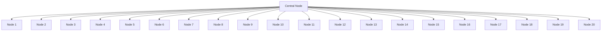
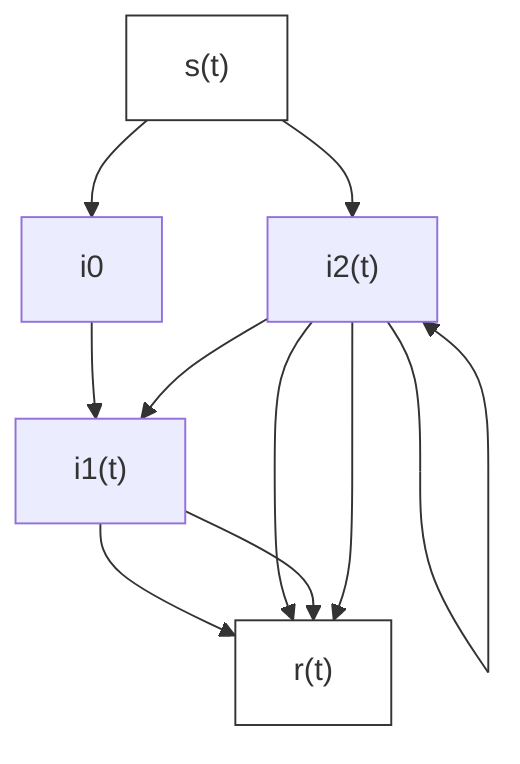
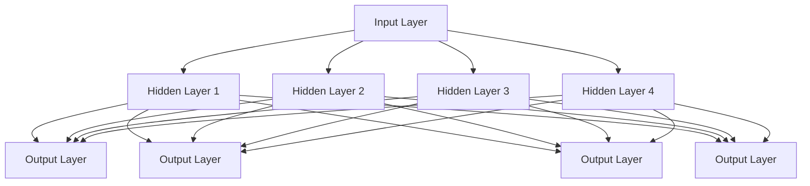
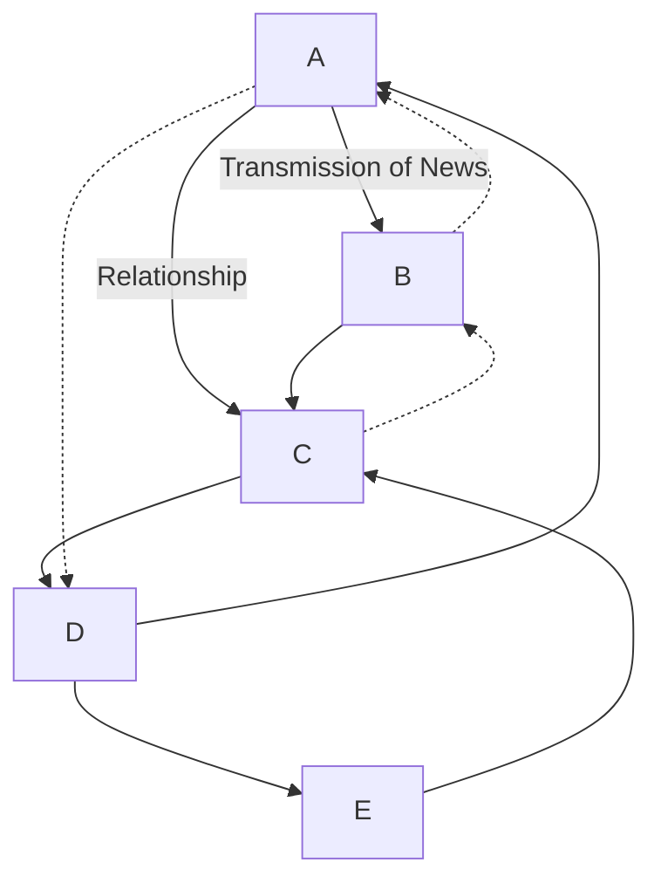
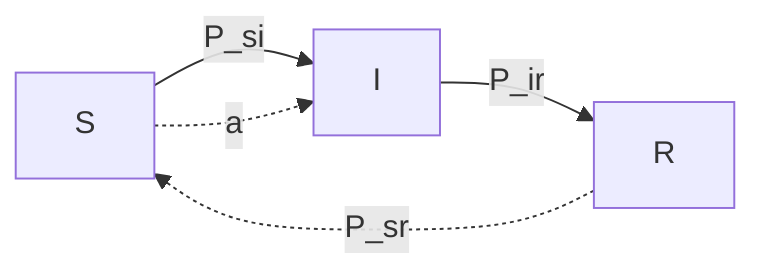

For office use only

T1

T2

T3

T4

Team Control Number

## 44173

Problem Chosen

D

For office use only

F1

F2

F3

F4

## 2016 Mathematical Contest in Modeling (MCM) Summary Sheet

(Attach a copy of this page to each copy of your solution paper.)

## How to Understand the Information

The flow of information has never been as easy or wide-ranging as it is today. This paper proposes some models to explore the relationship between speed/flow of information with inherent value of information.

First,to explore information flow, we build up a SIIR model which takes the media influence into consideration. This model is developed from the classical SIR model.We introduce the concept of hot transmission nodes to highlight the impact of media. We demonstrate our design with American media data. The results show that our model has a significant performance in validating predicted values of the characteristics of information network in 2050.

Second,the information filtering can be regarded as a classification problem. We design a radial basis function network to implement the information filtering. In order to solve sample noises and improve the computing performance,we decide to use K-means algorithm and RLS algorithm to implement our RBF network. We demonstrate our network in online news dataset ,with an training accuracy of 75.1%,and testing accuracy of 74.3%.we are satisfied that the accuracy rate with information filtering as news.

Third, We have only considered the social network in the Internet and build a social network SIR(SN-SIR) model to explore the problem-how public interest and opinion can be changed through network.It simulates in the standard dataset: Facebook social network dataset .By analyzing the factors which can implement our results,we can make a plan to determinate information propagation. Then,we take information values ,people ˛a´rs initial opinion and bias, form of the message or its source, and topology or other reasons into account and propose a detailed scheme.

Finally, effects of external factors are considered in our models.And we analyze the stability and sensitively of our models. Although there are some weakness in our models,the results still demonstrate that our model can undergo disturbance in certain extent.

## Contents

## 1 Introduction 3

1.1 Background 3  
1.2 Our Work . . 3

## 2 Assumptions 4

## 3 A SIIR Model of Information Flow 4

3.1 Social Network Information Dissemination 4

3.1.1 Social Network Information Dissemination Characteristics . 4  
3.1.2 Model Building . . 5

3.2 Calculating and Simplifying the Model 6

3.2.1 The Model Results 6  
3.2.2 Rationality validation And Sensitivity analysis . . . 7

3.3 Prediction 8

## 4 A Model of Information Filtering 11

4.1 Model Description 11  
4.2 Hybrid Learning Procedure For Networks . . 11  
4.3 Experiment . . 13  
4.4 Sensitively Analysis . . 13  
4.5 Conclusion . 13

## 5 A SN-SIR Model 14

5.1 The Way of Information Dissemination in Network 14  
5.2 A Model of Public Opinion Dissemination in Social Network . . 14

5.2.1 Model Building . . 15

5.3 Sensitivity Analysis and Model Validation . . 16

5.3.1 Model Validation 16  
5.3.2 Sensitivity, parameter validation analysis . . 17

5.4 Result Analysis 20

## 6 Analysis 21

6.1 Strengths . . 21  
6.2 Weaknesses 21

## 1 Introduction

## 1.1 Background

Broadly speaking, information is one of the important ways for us to perceive the outside world. Today it spreads quickly in tech-connected communication network. Sometimes it is due to the information finding its way to influential or central network nodes that accelerate its spread through social media. Our prevailing premise is that this cultural characteristic to share information (both serious and trivial) has always been three. At present, information propagation is exposed explosive growth.Beacause our social networks and medium are more and more complex.Without effective ways to solve these problems ,it will finally cause information propagation is more and more difficult to umderstand.Hence,our work has its unprecedented significance in world nowadays.

## 1.2 Our Work

This paper propose some models to explore the relationship between speed/flow of information with inherent value of information.

The Dilemma:

• An adaptive flow model is established with the consideration of the complex network changes.  
• Make use of the existing parameters to filter the information reasonably.  
• Reasonable analysis of influencing factors in the process of information transmission.

## The Approach:

• Firstˇc ˇnTo explore information flow, we build up a SIIR model which takes the special features if media influence into consideration. This model is developed from classical SIR model.  
• The Results show that our model has a significant performance in validate the value of prediction with real value. And then ,we predict the rate of daily contact in 2050.  
• Information filtering is regarded as classification problem. we design a radial basis function network to implement information filtering. In order to solve sample noise and computing performance, we decide to use K-means algorithm and RLS algorithm to implement our RBF network.  
• We have only considered the social network in the Internet and build a social network SIR(SN-SIR) to explore the problem ˛a´s how public interest an opinion can be changed through network ˛a´s.  
• We can make a plan to determinate information propagation. Then ,we take information value ,people ˛a´rs initial opinion and bias, form of the message or its source, and topology or other reasons into account and build a detailed scheme.

## 2 Assumptions

The accuracy of our models rely on certain key, simplifying assumptions. These assumptions are listed below:

• Do not consider factors such as natural birth,death,and population mobility.The total population keeps as a constant K.  
• Infected individuals once contact with susceptible individuals,Infected individuals change to susceptible individuals at a certain probability.  
• At a certain time,The number of individuals per unit time removing from the infected individuals is proportional to the number of patients.  
• The number of media is relatively fixed in the same period.

Under the above and basic assumptions, we can set out to construct our model.

## 3 A SIIR Model of Information Flow

Information is created by the social network users and transmits in the entire network.The result of transmission is that the receiver of the information translates into the transmitter and disseminate the information to others,or translates to the recovered one and does not transmit to others.Obviously, this transmission way is similar with the way Infectious diseases spread in the crowd. Based on the analysis of social network structure,we introduce the hot transmission node into network,and proposes an information transmission model based on the improved SIR model [1],which is simulated with the data-based Facebook social network.

## 3.1 Social Network Information Dissemination

## 3.1.1 Social Network Information Dissemination Characteristics

In this section,we propose a to explore a general model of information flow problems, which is not subjected to the limitations of the times and mediums of communication.

The total number of user nodes in social networks is denoted as N.The network is assumed to be an undirected graph and each node in the network may be in one of three states: susceptible(s), infected(i), or recovered(r).Nodes in state i have received the message and have the ability to transmit it.Nodes in state s have not received the message and have the possibility to receive it.Nodes in state r have received the message and will not transmit it any more.

There are a variety of mediums of communication,such as newspapers,televisions,the Internet and so on.Different mediums have different ability of transmission,but all of these mediums owe stronger ability than human beings.We consider media as the hot transmission nodes.Their contact rate is denoted as $\lambda _ { 1 }$ . Ordinary users in networks are considered as ordinary nodes.Their contact rate is denoted as $\lambda _ { 2 }$ .

The laws of Information dissemination of social networks with hot transmission nodes are as below:[2]

• Hot transmission nodes contact with other nodes with the contact rate x1,while ordinary nodes with the contact rate $\lambda _ { 2 }$ .  
• After nodes in state s received the information from nodes in state i,they change into recovered nodes in a probability of $\mu ,$ and into ordinary infected nodes in a probability of $1 - \mu .$ .  
• With the propagation of information,the proportion of three types of nodes will tend to be stable.

The schematic diagram of information dissemination of social networks with hot transmission nodes as shown in Figure 1, the solid line shows the information transmission between two points.

flowchart

flowchart

Figure 1: the Information Transmission of Atrioventricular Model Structure Diagrams  
Figure 2: the Improved SIR Model

## 3.1.2 Model Building

According to the characteristics of the transmission above,we can get the information transmission of atrioventricular model structure diagrams, as shown in Figure 1.

$i _ { 0 }$ is the proportion of hot transmission nodes in networks,which is usually fixed. $i ( t )$ is the proportion of ordinary infected nodes in the time of t,which consists of $i _ { 1 } ( t )$ ,the ordinary infected nodes generated by hot transmission nodes,and $i _ { 2 } ( t )$ ,the ordinary nodes infected nodes generated by ordinary infected nodes $. \lambda _ { 1 }$ is the contact rate of hot transmission nodes,while $\lambda _ { 2 }$ is the contact rate of ordinary infected nodes. $. r ( t )$ is the proportion of nodes in state ${ r } , \mu$ is the rate of Immune probability.[3] We can get the model as follows:

$$
\left\{ \begin{array}{l} \frac {d s (t)}{d t} = - \lambda_ {1} i _ {0} s (t) - \lambda_ {2} s (t) i (t) \\ \frac {d i (t)}{d t} = \mu \left[ \lambda_ {1} i _ {0} s (t) + \lambda_ {2} s (t) i (t) \right] \\ \frac {d r (t)}{d t} = (1 - \mu) \left[ \lambda_ {1} i _ {0} s (t) + \lambda_ {2} s (t) i (t) \right] \\ s (t) + i (t) + i _ {0} + r (t) = 1 \\ i _ {0} = i _ {1 0}, i (0) = i _ {2 0}, s (0) = s _ {0}, r (0) = r _ {0} \end{array} \right. \tag {1}
$$

## 3.2 Calculating and Simplifying the Model

## 3.2.1 The Model Results

Take the United States as an example,we obtain the statistical data of the circulation of newspapers, and numbers of users of radio, television, mobile phone and the Internet in different years.After analysis,we calculate the daily contact ratio of the five media,λi.We calculated the proportion of people contact with the different media group in all the population in the US. at that time.

$$
\lambda_ {1} = \sum_ {i = 1} ^ {N} \lambda i \mathbf {P} _ {i} \tag {2}
$$

We choose five years:1850,1930,1960,1996,2012,to calculate the model,and get the pictures of the change trend of the proportion of three kinds of nodes.

line chart

| time/days | Susceptible individuals | Recovered individuals | Infected individuals |
| --------- | ---------------------- | --------------------- | -------------------- |
| 83.88     | 50.02                  | -                     | -                    |
| 72.35     | -                      | -                     | 10.06                |

line chart

| time/days | Susceptible individuals | Recovered individuals | Infected individuals |
| --------- | ---------------------- | --------------------- | -------------------- |
| 64        | 54.55                  | 10.08                 | -                    |
| 68        | 66.04                  | 50.07                 | -                    |

Figure 3: 1850

Figure 4: 1930  

line chart

| time/days | Susceptible individuals | Recovered individuals | Infected individuals |
| --------- | ---------------------- | -------------------- | ------------------- |
| 60        | 59.29                  | 50.06                | 10.05               |

line chart

| time/days | Susceptible individuals | Recovered individuals | Infected individuals |
| --------- | ------------------------ | ---------------------- | --------------------- |
| 60        | 50.62                    | 9.897                  | -                     |
| 62        | 62.19                    | -                      | -                     |
| 90        | -                        | -                      | -                     |

Figure 5: 1960  
Figure 6: 1996

The simulation results show that,the number of individuals who have known the information is increasing,and the proportion of susceptible nodes is decreasing over time.If the time is long enough, information can spread throughout the entire network.By contrast,we can know that the average contact rate of infected nodes increases gradually,which shortens the period of information dissemination and expands the scope of information dissemination.

In conclusion,the improved information transmission model can reveal the inherent law of information transmission in social network more accurately.

line chart

| time/days | Susceptible individuals | Recovered individuals | Infected individuals |
| --------- | ------------------------ | ---------------------- | --------------------- |
| 62        | 50.3                     | 50.74                  | 10.3                  |

Figure 7: 2012

## 3.2.2 Rationality validation And Sensitivity analysis

In order to illustrate the model better , we investigate Facebook data and get the latest Facebook data on DMR website.Total number of Facebook daily active users is 1038 billionˇc ˇn26.7 percent of the Internet users in the US. that clicked a Facebook share button on blog posts they enjoyed.General users has 245 friends in average.Model parameters can be determined by the conditions and the initial value is as follows: $\lambda _ { 1 } = 1 0 0 0 , \lambda _ { 2 } = 2 4 5 , \mu = 7 3 . 3 \% , i _ { 0 } = 5 \times 1 0 - 7 ,$ $i ( 0 ) = 0 , s _ { 0 } = 1 , r ( 0 ) = 0 ,$ , we use Matlab to solve the Differential equations and get the figures of the change trend of the proportion of three kinds of nodes in Facebook.It can be seen that:

More than half of the users has received the message In less than 7 days.After ten days, about 70% of the users in the network have get the message.Eventually the ratios of the number of three kinds of nodes achieve stable.

The Influence of Parameters on the Information Dissemination 1.Contact rates of hot transmission nodes

By changing the daily contact rate of hot transmission nodes in social network,we can find the result in Figure5,After contrast,we know that with the increase of average daily contact rate of transmission nodes,the period of information dissemination has been shortened and the scope of information dissemination has been expanded.

line chart

| time/days | Susceptible individuals | Recovered individuals | Infected individuals |
| --------- | ------------------------ | ---------------------- | --------------------- |
| 6         | 7.155                    | 49.99                  | 6.131                 |
| 20        | 0                        | 75                     | 25                    |

Figure 8: facebook

line chart

| time/days | Susceptible individuals | Recovered individuals | Infected individuals |
| --------- | ------------------------ | --------------------- | -------------------- |
| 0         | 100                      | 0                     | 0                    |
| 5         | 100                      | 0                     | 0                    |
| 10        | 0                        | 75                    | 25                   |
| 15        | 0                        | 75                    | 25                   |
| 20        | 0                        | 75                    | 25                   |

line chart

| time/days | Susceptible individuals | Recovered individuals | Infected individuals |
| --------- | ---------------------- | -------------------- | ------------------- |
| 7         | 7.542                  | 50.07                | 6.516               |
| 10        | 10.04                  | 80                   | 30                  |

line chart

| time/days | Susceptible individuals | Recovered individuals | Infected individuals |
| --------- | ---------------------- | -------------------- | ------------------- |
| 6         | 6.928                  | 50.05                | 5.902               |
| 10        | 6.928                  | 50.05                | 5.902               |
| 10        | 10.03                  | 50.05                | 5.902               |

Figure 9: λ1 = 300

Figure $1 0 \colon \lambda _ { 1 } = 5 0 0$  
Figure 11: $\lambda _ { 1 } = 1 5 0 0$  

line chart

| time/days | Susceptible individuals | Recovered individuals | Infected individuals |
| --------- | ------------------------ | --------------------- | -------------------- |
| 16.29     | 50.4                     | 50.4                  | 50.4                 |

line chart

| time/days | Susceptible individuals | Recovered individuals | Infected individuals |
| --------- | ------------------------ | --------------------- | -------------------- |
| 4.555     | 0                        | 50.01                 | 0                    |

Figure 12: λ = 100  
Figure 13: $\lambda _ { 2 } = 4 0 0$

## 2.The Probability of the Immune

By changing the probability of the immune,we can find the result in pictures as bellow. The probability of the immune can impact the period of information dissemination,too.Reducing the probability of the immune can speed up the information transmission and shorten the period of information dissemination.

## 3.3 Prediction

We carry out the multiple regression analysis on data and make predictions,and get general changes of daily contact rate for each media.Figure14

With the changes of The times and the emergence of kinds of media,the proportion of each medium also changes over time.as is shown in Figure15

Considering the tendency of different media and changes of the way people get their news,combining with relevant information and data.We can find that:

line chart

| time/days | Susceptible individuals | Recovered individuals | Infected individuals |
| --------- | ------------------------ | ---------------------- | --------------------- |
| 5         | 100                      | 0                      | 0                     |
| 11        | 0                        | 65                     | 35                    |
| 11.36     | 0                        | 65                     | 34.84                 |

line chart

| time/days | Susceptible individuals | Recovered individuals | Infected individuals |
| --------- | ------------------------ | ---------------------- | -------------------- |
| 5         | 100                      | 0                      | 0                    |
| 8.459     | 0                        | 8.459                  | 14.84                |
| 4.541     | 0                        | 0                      | 0                    |
| 0         | 0                        | 0                      | 0                    |

Figure 14: $\mu = 0 . 6 5$

Figure 15: $\mu = 0 . 8 5$  

line chart

| Year | online/mobile | laptop/computer | TV | newspaper | radio |
| --- | --- | --- | --- | --- | --- |
| 1850 | 0 | 0 | 0 | 0 | 0 |
| 1860 | 0 | 0 | 0 | 10 | 0 |
| 1870 | 0 | 0 | 0 | 12 | 0 |
| 1880 | 0 | 0 | 0 | 14 | 0 |
| 1890 | 0 | 0 | 0 | 15 | 0 |
| 1900 | 0 | 0 | 0 | 16 | 0 |
| 1910 | 0 | 0 | 0 | 17 | 0 |
| 1920 | 0 | 0 | 0 | 18 | 0 |
| 1930 | 0 | 0 | 0 | 20 | 2 |
| 1940 | 0 | 0 | 2 | 25 | 7 |
| 1950 | 0 | 0 | 50 | 35 | 8 |
| 1960 | 0 | 0 | 85 | 38 | 8 |
| 1970 | 0 | 0 | 88 | 25 | 7 |
| 1980 | 0 | 0 | 85 | 35 | 6 |
| 1990 | 0 | 0 | 75 | 55 | 5 |
| 1999 | 0 | 5 | 65 | 50 | 4 |
| 2000 | 5 | 10 | 60 | 45 | 4 |
| 2012 | 35 | 35 | 55 | 35 | 3 |
| 2014 | 45 | 55 | 55 | 35 | 3 |
| 2016 | 75 | 85 | 55 | 35 | 3 |
| 2024 | 85 | 88 | 52 | 32 | 2.5 |
| 2032 | 88 | 89 | 51 | 31 | 2.3 |
| 2044 | 90 | 89 | 50 | 30 | 2.2 |
| 2056 | 92 | 89 | 48 | 28 | 2.1 |
| 2064 | - | - | - | - | - |
| 2072 | - | - | - | - | - |
| 2084 | - | - | - | - | - |

Figure 16: Change of Daily Contact Rate

1.Before the 19th century, the newspaper is the main access to gain news, and around 1950, the radio has a majority of users,.The data changes again in 1980, TV at this time holds the leading position.After that,the number of users of mobile phones, and the Internet is constantly rising.Besides,after 2000, the number rises quickly and clearly, and the Internet and the mobile phone gradually become the main tools to get news and messages in people’s daily lives.  
2.Users of newspapers, radio and television have decreased constantly.But in recent years the pace of decline has gradually slowed down.But after 2020, with the popularity of the Internet, the users number will tend to be saturated, although there is still a rising trend, but the rise has slowed.

In the case of 2050, we take the predict data into information ˛a´rs flow model, the situation of the information flow is shown as follows.

When only consider the changes of average daily contact rate of average daily contact rate,we can see that:

bar-line hybrid chart

| Year | radio | newspaper | TV | laptop/computer | online contact rate | 2 per. Mov. Avg. (online contact rate) | 2 per. Mov. Avg. (TV) | 2 per. Mov. Avg. (radio) |
|---|---|---|---|---|---|---|---|---|
| 2055 | 0.1 | 0.1 | 0.1 | 0.1 | 0.1 | 0.1 | 0.1 | 0.1 |
| 2050 | 0.1 | 0.1 | 0.1 | 0.1 | 0.1 | 0.1 | 0.1 | 0.1 |
| 2045 | 0.1 | 0.1 | 0.1 | 0.1 | 0.1 | 0.1 | 0.1 | 0.1 |
| 2040 | 0.1 | 0.1 | 0.1 | 0.1 | 0.1 | 0.1 | 0.1 | 0.1 |
| 2035 | 0.1 | 0.1 | 0.1 | 0.1 | 0.1 | 0.1 | 0.1 | 0.1 |
| 2030 | 0.1 | 0.1 | 0.1 | 0.1 | 0.1 | 0.1 | 0.1 | 0.1 |
| 2025 | 0.1 | 0.1 | 0.1 | 0.1 | 0.1 | 0.1 | 0.1 | 0.1 |
| 2020 | 0.1 | 0.1 | 0.1 | 0.1 | 0.1 | 0.1 | 0.1 | 0.1 |
| 2016 | 0.1 | 0.1 | 0.1 | 0.1 | 0.1 | 0.1 | 0.1 | 0.1 |
| 2015 | 0.1 | 0.1 | 0.1 | 0.1 | 0.1 | 0.1 | 0.1 | 0.1 |
| 2014 | 0.2 | 0.2 | 0.2 | 0.2 | 0.2 | 0.2 | 0.2 | 0.2 |
| 2012 | 0.2 | 0.2 | 0.2 | 0.2 | 0.2 | 0.2 | 0.2 | 0.2 |
| 2010 | 0.2 | 0.2 | 0.2 | 0.2 | 0.2 | 0.2 | 0.2 | 0.2 |
| 2008 | 0.2 | 0.2 | 0.2 | 0.2 | 0.2 | 0.2 | 0.2 | 0.2 |
| 2006 | 0.2 | 0.2 | 0.2 | 0.2 | 0.2 | 0.2 | 0.2 | 0.2 |
| 2004 | 0.2 | 0.2 | 0.2 | 0.2 | 0.2 | 0.2 | 0.2 | 0.2 |
| 2002 | 0.3 | 0.3 | 0.3 | 0.3 | 0.3 | 0.3 | 0.3 | 0.3 |
| 2000 | 0.3 | 0.3 | 0.3 | 0.3 | 0.3 | 0.3 | 0.3 | 0.3 |
| 1998 | 0.35 | 0.35 | - | - | - | - | - | - |
| 1996 | - | - | - | - | - | - | - | - |
| 1993 | - | - | - | - | - | - | - | - |
| 1990 | - | - | - | - | - | - | - | - |
| 1987-75-75-75-75-75-75-75-75-75-75-75-75-75-75-75-75-75-75-75-75-75-75-75-75-75-75-75-75-75-75-75-75-75-75, - |
| The data is presented in a long format with each row representing a specific year or period and the corresponding values for the series: 'radio' and 'newspaper'. The values for 'laptop/computer' and 'online contact rate' are estimated based on the provided code.

Figure 17: Change of The Proportion of Daily Contact Rate

line chart

| time/days | Susceptible individuals | Recovered individuals | Infected individuals |
| --------- | ------------------------ | ---------------------- | --------------------- |
| 0         | 100                      | 0                      | 0                     |
| 20        | 95                       | 5                      | 2                     |
| 40        | 70                       | 80                     | 5                     |
| 60        | 30                       | 90                     | 8                     |
| 80        | 5                        | 95                     | 10                    |
| 100       | 0                        | 95                     | 10                    |
| 120       | 0                        | 95                     | 10                    |

Figure 18: 2050

1.Compared with 2012,the speed of news propagation will keep going up in 2050.In less than 40 days,almost half of the people can acquire the news when it happens.While in 2012,nearly half of the people learn a message in 50 days.The speed of information transmission increased by about 25%.  
2.The transmission of the message gets into its stride at the 20th day in 2012.While in 2050,the transmission of the message starts at the 10th day.In 2050, by contrast, the begining of the transmission will be in advance,which is another sign of increasing of the information transmission speed.  
3.In 2012,the spread of information cycle lasts about 60 days,while in 2050,The spread of information cycle lasts about only 50 days,which means that in the same length of time, the amount of messages people contact will increase.And this portends that information capacity will be constantly increasing,with the development of communication tools .

From 2000,the number of people using social networks has increased,and the contact rate of ordinary nodes has changed,too.Ordinary nodes have more opportunity to change into hot transmission nodes,resulting to the proportion of hot transmission nodes in the whole heat has increased.So we boost the number of hot transmission nodes and the contact rate of ordinary nodes.The model adjusted is as follow:

line chart

| time/days | Susceptible individuals | Recovered individuals | Infected individuals |
| --------- | ----------------------- | --------------------- | -------------------- |
| 0         | 100                     | 0                     | 0                    |
| 10        | 95                      | 5                     | 2                    |
| 20        | 80                      | 20                    | 5                    |
| 30        | 50                      | 60                    | 8                    |
| 40        | 20                      | 85                    | 10                   |
| 50        | 5                       | 90                    | 10                   |
| 60        | 0                       | 90                    | 10                   |
| 70        | 0                       | 90                    | 10                   |
| 80        | 0                       | 90                    | 10                   |
| 90        | 0                       | 90                    | 10                   |
| 100       | 0                       | 90                    | 10                   |

Figure 19: 2050

Compare two results, the information transmission will accelerate again,and the transmission cycle will shorten again.Owing to this,information will exist in a shorter time, and a lot of information will become a fast-good-type messages,which is a kind of portrayal of real life.

## 4 A Model of Information Filtering

## 4.1 Model Description

The purpose of information filtering is to extract the information as news.Essentially, information filtering is a classification problem. We propose a radial basis function network(RBF) model[4]. In order to solve the samples noise and computing performance, we decide to use K-means algorithm and RLS algorithm implement network. We demonstrate our model using online news dataset.

## 4.2 Hybrid Learning Procedure For Networks

we develop a hybrid learning procedure for RBF networks.

First,we use K-means algorithm to train hidden layer. And then, RLS algorithm is checked to train output layer. We call The hybrid learning procedure as “”K-means RLS “”algorithm. The algorithm is divided to three steps:

• Input layer.  
The size of input layer is determined by the dimensionality of input vector $\mathbf { x , }$ which is denoted by $m _ { 0 }$ .

• Hidden layer.

1. The size of the hidden layer $, m _ { 1 }$ is determined by the proposed number of clusters,

flowchart

Output y Linear weights

Radial basis functions

Weights

Input x

K. Indeed, the parameter K may by viewed as a degree of freedom under the designer ˛a´rs control. As such, the parameter K holds the key to the model-selection problem and thereby controls not only the performance, but also computational complexity of network.

2. The cluster mean $\hat { \mu } _ { j }$ ,computed by the K-means algorithm working on the unlabeled sample $\mathbf { x } _ { i _ { i = 1 } } ^ { N }$ of input vectors, determines the center $x _ { j }$ in the Gaussian function $\phi ( \cdot , \mathbf { x } _ { j } )$ ) assigned to the hidden unit $j = 1 , 2 , \cdots , k$ .  
3. To simplify the design ,the same width, denoted by σ,is assigned to all the Gaussian functions in accordance with the spread of the centers discovered by the K-means algorithm ,as shown by

$$
\sigma = \frac {d _ {m a x}}{\sqrt {2 K}}
$$

,where K is the number of centers and $d _ { m a x }$ is the maximum distance between them. This formula ensures that the individual Gaussian units are not too peaked or too flat;both extreme conditions should be avoided in practice.

• Output layer.

Once the training of the hidden layer is completed, the training of the output layer can begin. Let the $K \times 1$ vector.

$$
\phi (\mathbf {x}) = \left( \begin{array}{c} \varphi (\mathbf {x} _ {i}, \mathbf {x} _ {1}) \\ \varphi (\mathbf {x} _ {i}, \mathbf {x} _ {2}) \\ \vdots \\ \varphi (\mathbf {x} _ {i}, \mathbf {x} _ {K}) \end{array} \right) \tag {3}
$$

denote the outputs of the K units in the hidden layer. This vector is produced in response to the stimulus $x _ { i } , i = 1 , 2 ,$ , N . Thus, insofar as the supervised training of the output layer is concerned,the training sample is defined by

$$
\Phi (i), d (i) _ {i = 1} ^ {N}
$$

,where $d _ { i }$ is desired response at the overall output of the RBF network for input $x _ { i } ,$ ,This training is carried out using the RLS algorithm. Once the network training is completed, testing of the whole network with data not seen before can begin

## 4.3 Experiment

We demonstrate out model in online news dataset[5].we pre-process dataset in term of filter Unnecessary factors. Our dataset is divided to two class , the number of shares more than 1400 is considered significant ˛a ˛a information. The number of information is 39240,we train our network using 27908 information, and then test with 11332 information.The considering factors as follows,

1) Days between the article publication and the dataset acquisition(non-predictive).  
2) Number of words in the title.  
3) Number of words in the content.  
4) Number of images.  
5) Number of videos.  
6) Number of keywords in the metadata.  
7) Data channel: lifestyle, entertainment , business, social media,tech,world.  
8) Was the article published on the weekend?  
9) Number of shares

The results of our network is given in table: Accuracy in train procedure is 75.1%.

<table><tr><td rowspan="2">sample</td><td rowspan="2">observed value</td><td colspan="3">predicted value</td></tr><tr><td>0</td><td>1</td><td>Accuracy Rate</td></tr><tr><td rowspan="3">Train</td><td>1</td><td>9077</td><td>3394</td><td>69.4%</td></tr><tr><td>1</td><td>2968</td><td>11869</td><td>80.0%</td></tr><tr><td>Rate</td><td>42.3%</td><td>56.8%</td><td>75.1%</td></tr><tr><td rowspan="3">test</td><td>0</td><td>3611</td><td>1663</td><td>68.5%</td></tr><tr><td>1</td><td>1249</td><td>4809</td><td>79.4%</td></tr><tr><td>Rate</td><td>42.9%</td><td>57.1%</td><td>74.3%</td></tr></table>

## 4.4 Sensitively Analysis

We draw a ROC curve graph to verify the sensitively of our network. The curve can cover most area. It indicate our network is sensitive.

In order to validate the stability of our network ˇc ˇnwe test our network in our dataset. The results is given in table as above. Accuracy in test procedure is 74.3%.The results show that out model can adapt to data-change, and filter information as news.

## 4.5 Conclusion

The RBF network adopt “”K-means RLS“” algorithm, which can improve the performance of computing. This algorithm has two characteristics: computational simplicity and acceleration convergence. The only suspect is the lack of the training of hidden layer and the training of output layer combined with the most criteria, which in the statistical sense to ensure the entire system of optimality. The only thing to doubt is not to p=optimize the training of hidden layer and output layer, so as to ensure the optimality of whole system in statistics. Using RBF network ,we can implement our information filtering efficiently.

## 5 A SN-SIR Model

To solve the problem of how public interest and opinion can be changed through information networks in the Internet,we model of social network mainly about public opinion based on SIR and complex network theory,and then we text the model performance by FaceBook’s social network datasets.

## 5.1 The Way of Information Dissemination in Network

In the social network ,the relationship between the user can be established only by both sides of the identity authentication .[7] So social network can be thought of as net which does not has directions and weight and use the users and the relation ship between users replaces nodes and edges,and topics or news spread along the edges.[8]

flowchart

Figure 20: The way of Public Opinion Dissemination in Social Network

## 5.2 A Model of Public Opinion Dissemination in Social Network

we classify nodes into three types as same as we define above,and assume that all nodes are susceptible in the beginning,but adding or changing some definition of factors are as follows.

• 1) $P _ { s i }$ is the rate of probability of node in state s turn to Node in state i when s contacts with i.

• 2)α is the rate of probability of node s turned to node i when s gets some public opinions but does not contact with i.  
• 3) $P _ { i r }$ is the rate of probability of node i turn to node r in state r when node i lose s interest about a public opinion and stops spreading the public opinion.  
• 4) $P _ { s r }$ is the rate of probability of node s trun to node r when s gets a public opinion it is not interested in and dose not want to spread the public opinion.  
• 5)k is the degree value of each node.

## 5.2.1 Model Building

It is a kind of dynamic procedure when we refer to the spread of social networking topic. Propaga of topic is influenced by one or more factors . The spread when a node in social network want to spread some opinions will be influenced by the ability of neighboring nodes. The greater the degree of spread of nodes,the better to public opinion spread in the network. Make a conclusion about the above knowable,and we get the model of node state transition in social network.[6]

On the basis of model of node state transition and theory about SIR,we build the public opin-

flowchart

ion transmission model in the social network is as followsˇcž

$$
\left\{ \begin{array}{l} \frac {d s (k , t)}{d t} = - p _ {s i} k s (k, t) \theta_ {t} - \alpha s (k, t) - p _ {s r} s (k, t) \\ \frac {d i (k , t)}{d t} = p _ {s i} k s k, t \theta_ {t} + \alpha s (k, t) - p _ {i r} s (k, t) \\ \frac {d r (k , t)}{d t} = p _ {s r} s k, t + p _ {i r} i k, t \\ s (k, t) + i (k, t) + r (k, t) = 1 \end{array} \right. \tag {4}
$$

In the above equation ${ \mathbf { } } , \theta ( t )$ signifies the probability of any edges can contact with nodes in state i at time of t,and its equation is as follows:

$$
\theta (t) = \frac {\sum_ {k} k P (k) i (k , t)}{<   k >} \tag {5}
$$

In the above equation ${ \mathbf { } } , P ( k )$ is the degree distribution function of social networksˇcz˙ < $k >$ is the average node degree of social networks.

## 5.3 Sensitivity Analysis and Model Validation

## 5.3.1 Model Validation

In order to validate the efficiency of public opinion topic transmission model which we proposed,we choose the standard data sets -“” Facebook social network dataset“”which includes 4039 nodes and 88234 sides to carry on our simulation experiment.[9]

1. The relation between the density of different nodes over time Assuming that there is only one communication node in the network and the rest areall nodes in state s .Set the total parameters of ( 1 ) as follows :

the external infection probability $P _ { s i } = 0 . 4 ;$

the internal infection probability $\alpha = 0 . 3 ;$

the immune probability $P _ { i r } = 0 . 2 ;$

the direct immune probability $P _ { s r } = 0 . 1$ .

The change relation between the density of each node and the spread of public opinion topic is shown in figure 3.From pictures below:

line chart

| t  | S(t) |
|----|------|
| 2  | 1.0  |
| 4  | 0.98 |
| 6  | 0.95 |
| 8  | 0.7  |
| 10 | 0.2  |
| 12 | 0.08 |
| 14 | 0.05 |
| 16 | 0.04 |
| 18 | 0.03 |
| 20 | 0.02 |
| 22 | 0.01 |
| 24 | 0.01 |
| 26 | 0.01 |
| 28 | 0.01 |
| 30 | 0.01 |

line chart

| t  | I(t) |
|----|------|
| 2  | 0.0  |
| 4  | 0.0  |
| 6  | 0.1  |
| 8  | 0.3  |
| 10 | 0.55 |
| 12 | 0.6  |
| 14 | 0.5  |
| 16 | 0.35 |
| 18 | 0.2  |
| 20 | 0.1  |
| 22 | 0.05 |
| 24 | 0.02 |
| 26 | 0.01 |
| 28 | 0.01 |
| 30 | 0.01 |

line chart

| t  | R(t) |
|----|------|
| 2  | 0.0  |
| 4  | 0.1  |
| 6  | 0.3  |
| 8  | 0.5  |
| 10 | 0.7  |
| 12 | 0.8  |
| 14 | 0.9  |
| 16 | 0.95 |
| 18 | 0.97 |
| 20 | 0.98 |
| 22 | 0.99 |
| 24 | 0.995|
| 26 | 0.997|
| 28 | 0.998|
| 30 | 1.0  |

we can see:

The density of the susceptible nodes have a tendency to attenuate until it is close to zero.The density of transmission node have a rapid growth in the initial stage,and it will decline rapidly after its peak until its tendency to zero.While the density of the immune node shows a quick growth at the beginning of the diffusion of a topic.It will become stable gradually after its peak and tend to be 1 in the end.

We can draw the conclusions as follows after our parameter verification of the social network.

• 1.Generally speaking ,the higher the value of an information is,the lower immunisation rates of the information will be ,the higher the internal infection rate will be. There will be more transmission nodes and less immune nodes in a short transmission-cycle time.Which means the more quickly the information spread,the more widely the range of users will cover.  
• 2.User ˛a´rs interests and prejudices can react on the immune probability and the infection rate,the higher the user’s interests in the message is,the lower the corresponding immune probability and direct immune immunisation rates will be ,and the infection rate will rise accordingly, when the message comes to the user, the speed of the spread will be faster, and as for a message, the more uses are interested in, the lower the corresponding immunity will be,the more people infected will be,the more transmission nodes will be, the faster the news propagation speed will be ,that is to say,the transmission will be faster if it owns more users interested in.

## 5.3.2 Sensitivity, parameter validation analysis

## 1.The influence of $P _ { s i }$

When $P _ { s i }$ is changed ,the variation trend of density fluctuation about nodes in state s and r is as followsˇcž

(1)Before the Internet reach steady state, with the increase of $P _ { s i }$ ,the density about nodes in state s is growth,but the density about nodes in state r is go down.The reason about this is the greater of $P _ { s i }$ ,the more number of nodes in state i transform into nodes in state sˇcz˙

(2)With the increase of $P _ { s i }$ ,the time of The spread of social network public opinion reaches a steady state is more longer.

(3)When $P _ { s i } { = } 0$ , social network information can still be propagated,this is different with previous research results.The reason about this is the connectivity of social networks is higher when it compare with traditional network and social network user can get public opinion from each other and other mode.

## 2,The influence of $P _ { i r }$

When $P _ { i r }$ is changed ,the variation trend of density fluctuation about nodes in state s and r is as followsˇcž

(1) When $P _ { i r } > 0 ,$ , before the Internet reach steady state, $P _ { i r }$ and the density about nodes in state s against each other and found a negative correlation,but Pir and the density about nodes in state r found a positive correlation.So,the value of $P _ { i r }$ is greater,the rate of probability of nodes

line chart

| t  | p_si = 0.9 | p_si = 0.6 | p_si = 0.3 | p_si = 0 |
|----|------------|------------|------------|----------|
| 2  | 0.0        | 0.0        | 0.0        | 0.0      |
| 4  | 0.0        | 0.0        | 0.0        | 0.0      |
| 6  | 0.1        | 0.1        | 0.1        | 0.1      |
| 8  | 0.7        | 0.6        | 0.6        | 0.5      |
| 10 | 0.75       | 0.65       | 0.6        | 0.5      |
| 12 | 0.7        | 0.6        | 0.55       | 0.4      |
| 14 | 0.65       | 0.55       | 0.5        | 0.3      |
| 16 | 0.6        | 0.5        | 0.45       | 0.2      |
| 18 | 0.55       | 0.45       | 0.4        | 0.1      |
| 20 | 0.5        | 0.4        | 0.35       | 0.05     |
| 22 | 0.45       | 0.35       | 0.3        | 0.02     |
| 24 | 0.4        | 0.3        | 0.25       | 0.01     |
| 26 | 0.35       | 0.25       | 0.2        | 0.0      |
| 28 | 0.3        | 0.2        | 0.15       | 0.0      |
| 30 | 0.2        | 0.1        | 0.1        | 0.0      |

line chart

| t  | p_si = 0 | p_si = 0.3 | p_si = 0.6 | p_si = 0.9 |
|----|----------|------------|------------|------------|
| 2  | 0.0      | 0.0        | 0.0        | 0.0        |
| 4  | 0.0      | 0.0        | 0.0        | 0.0        |
| 6  | 0.2      | 0.1        | 0.1        | 0.1        |
| 8  | 0.5      | 0.3        | 0.2        | 0.2        |
| 10 | 0.7      | 0.5        | 0.3        | 0.3        |
| 12 | 0.8      | 0.6        | 0.4        | 0.4        |
| 14 | 0.9      | 0.7        | 0.5        | 0.5        |
| 16 | 0.95     | 0.8        | 0.6        | 0.6        |
| 18 | 0.98     | 0.9        | 0.7        | 0.7        |
| 20 | 0.99     | 0.95       | 0.8        | 0.8        |
| 22 | 1.0      | 0.98       | 0.9        | 0.9        |
| 24 | 1.0      | 1.0        | 0.95       | 0.95       |
| 26 | 1.0      | 1.0        | 1.0        | 1.0        |
| 28 | 1.0      | 1.0        | 1.0        | 1.0        |
| 30 | 1.0      | 1.0        | 1.0        | 1.0        |

in state i turn to state r is higher.

(2) When $P _ { i r } = 0 ,$ , Pir increase rapidly in the early,gradually stabilized after get to the peak .The reason about this is when $P _ { i r } = 0 ,$ , nodes in state I Will always keep their state and do not switch to the state r.However,the density about nodes in stater !=0 because of the influence of Psr and some nodes in state s turn to stater.

line chart

| t  | p_ir = 0 | p_ir = 0.3 | p_ir = 0.6 | p_ir = 0.9 |
|----|----------|------------|------------|------------|
| 2  | 0.0      | 0.0        | 0.0        | 0.0        |
| 4  | 0.0      | 0.0        | 0.0        | 0.0        |
| 6  | 0.5      | 0.4        | 0.1        | 0.1        |
| 8  | 0.7      | 0.4        | 0.3        | 0.2        |
| 10 | 0.75     | 0.3        | 0.2        | 0.1        |
| 12 | 0.78     | 0.2        | 0.1        | 0.05       |
| 14 | 0.79     | 0.1        | 0.05       | 0.02       |
| 16 | 0.79     | 0.05       | 0.02       | 0.01       |
| 18 | 0.79     | 0.02       | 0.01       | 0.0        |
| 20 | 0.79     | 0.01       | 0.0        | 0.0        |
| 22 | 0.79     | 0.0        | 0.0        | 0.0        |
| 24 | 0.79     | 0.0        | 0.0        | 0.0        |
| 26 | 0.79     | 0.0        | 0.0        | 0.0        |
| 28 | 0.79     | 0.0        | 0.0        | 0.0        |
| 30 | 0.79     | 0.0        | 0.0        | 0.0        |

line chart

| t  | p_ir = 0 | p_ir = 0.3 | p_ir = 0.6 | p_ir = 0.9 |
|----|----------|------------|------------|------------|
| 2  | 0.0      | 0.0        | 0.0        | 0.0        |
| 4  | 0.0      | 0.0        | 0.0        | 0.0        |
| 6  | 0.0      | 0.0        | 0.0        | 0.0        |
| 8  | 0.2      | 0.5        | 0.7        | 0.8        |
| 10 | 0.2      | 0.7        | 0.8        | 0.9        |
| 12 | 0.2      | 0.8        | 0.9        | 0.95       |
| 14 | 0.2      | 0.9        | 0.95       | 0.98       |
| 16 | 0.2      | 0.95       | 0.98       | 0.99       |
| 18 | 0.2      | 0.98       | 0.99       | 0.995      |
| 20 | 0.2      | 0.99       | 0.995      | 0.998      |
| 22 | 0.2      | 0.995      | 0.998      | 0.999      |
| 24 | 0.2      | 0.998      | 0.999      | 0.9995     |
| 26 | 0.2      | 0.999      | 0.9995     | 0.9998     |
| 28 | 0.2      | 0.9995     | 0.9998     | 0.9999     |
| 30 | 0.2      | 1.0        | 1.0        | 1.0        |

## 3,The influence of α

When α is changed ,the variation trend of density fluctuation about nodes in state s and r is as follows.The figure shows that before the Internet reach steady state,as long as the value of ˛eÁ- further increase, the density about nodes in state i increases correspondingly,but the density about nodes in state r decrease all the time.This is mainly because the value of α is greater,the rate of probability of nodes in state s turn to state i is higher.

## 4,The influence of $P _ { s r }$

When $P _ { s r }$ is changed ,the variation trend of density fluctuation about nodes in state s and r is as follows.The figure shows that with the increase of $P _ { s r } ,$ the density about nodes in state r is growth,but the density about nodes in state i is go down. This is mainly because the value of $P _ { s r }$ is greater,the rate of probability of nodes in state s turn to state r directly without turn to state i is higher.

5,The influence of initial nodes degree k0 When k0 is changed ,the variation trend of density fluctuation about nodes in state s is as follows.And we can know that the value of k0 is greater,the speed of public opinion propagation is faster in social network.

line chart

| t  | α = 0  | α = 0.3 | α = 0.6 | α = 0.9 |
|----|--------|---------|---------|---------|
| 2  | 0.0    | 0.0     | 0.0     | 0.0     |
| 4  | 0.0    | 0.0     | 0.0     | 0.0     |
| 6  | 0.0    | 0.18    | 0.18    | 0.18    |
| 8  | 0.22   | 0.68    | 0.70    | 0.78    |
| 10 | 0.22   | 0.68    | 0.70    | 0.78    |
| 12 | 0.18   | 0.58    | 0.65    | 0.72    |
| 14 | 0.12   | 0.48    | 0.55    | 0.65    |
| 16 | 0.08   | 0.38    | 0.45    | 0.55    |
| 18 | 0.04   | 0.28    | 0.35    | 0.45    |
| 20 | 0.02   | 0.18    | 0.25    | 0.35    |
| 22 | 0.01   | 0.10    | 0.15    | 0.25    |
| 24 | 0.01   | 0.05    | 0.10    | 0.15    |
| 26 | 0.01   | 0.03    | 0.08    | 0.12    |
| 28 | 0.01   | 0.02    | 0.06    | 0.10    |
| 30 | 0.01   | 0.01    | 0.05    | 0.08    |

line chart

| t  | α = 0  | α = 0.3 | α = 0.6 | α = 0.9 |
|----|--------|---------|---------|---------|
| 2  | 0.0    | 0.0     | 0.0     | 0.0     |
| 4  | 0.0    | 0.0     | 0.0     | 0.0     |
| 6  | 0.1    | 0.1     | 0.1     | 0.1     |
| 8  | 0.5    | 0.3     | 0.2     | 0.1     |
| 10 | 0.8    | 0.5     | 0.3     | 0.2     |
| 12 | 0.9    | 0.6     | 0.4     | 0.3     |
| 14 | 0.95   | 0.7     | 0.5     | 0.4     |
| 16 | 0.98   | 0.8     | 0.6     | 0.5     |
| 18 | 0.99   | 0.9     | 0.7     | 0.6     |
| 20 | 1.0    | 0.95    | 0.8     | 0.7     |
| 22 | 1.0    | 0.98    | 0.9     | 0.8     |
| 24 | 1.0    | 0.99    | 0.95    | 0.9     |
| 26 | 1.0    | 1.0     | 0.98    | 0.95    |
| 28 | 1.0    | 1.0     | 1.0     | 1.0     |
| 30 | 1.0    | 1.0     | 1.0     | 1.0     |

line chart

| x  | p_sr = 0 | p_sr = 0.3 | p_sr = 0.6 | p_sr = 0.9 |
|----|----------|------------|------------|------------|
| 2  | 0.0      | 0.0        | 0.0        | 0.0        |
| 4  | 0.0      | 0.0        | 0.0        | 0.0        |
| 6  | 0.2      | 0.1        | 0.1        | 0.0        |
| 8  | 0.65     | 0.45       | 0.3        | 0.15       |
| 10 | 0.65     | 0.45       | 0.3        | 0.18       |
| 12 | 0.55     | 0.4        | 0.25       | 0.15       |
| 14 | 0.45     | 0.35       | 0.2        | 0.12       |
| 16 | 0.35     | 0.3        | 0.15       | 0.1        |
| 18 | 0.25     | 0.25       | 0.12       | 0.08       |
| 20 | 0.15     | 0.2        | 0.1        | 0.06       |
| 22 | 0.1      | 0.15       | 0.08       | 0.04       |
| 24 | 0.05     | 0.1        | 0.06       | 0.03       |
| 26 | 0.02     | 0.05       | 0.04       | 0.02       |
| 28 | 0.01     | 0.02       | 0.02       | 0.01       |
| 30 | 0.0      | 0.0        | 0.0        | 0.0        |

line chart

| t  | p_sr = 0 | p_sr = 0.3 | p_sr = 0.6 | p_sr = 0.9 |
|----|----------|------------|------------|------------|
| 2  | 0.0      | 0.0        | 0.0        | 0.0        |
| 4  | 0.0      | 0.0        | 0.0        | 0.0        |
| 6  | 0.1      | 0.1        | 0.1        | 0.1        |
| 8  | 0.3      | 0.4        | 0.5        | 0.6        |
| 10 | 0.5      | 0.6        | 0.7        | 0.8        |
| 12 | 0.6      | 0.7        | 0.8        | 0.85       |
| 14 | 0.7      | 0.8        | 0.85       | 0.9        |
| 16 | 0.75     | 0.85       | 0.9        | 0.92       |
| 18 | 0.8      | 0.9        | 0.92       | 0.94       |
| 20 | 0.85     | 0.92       | 0.94       | 0.96       |
| 22 | 0.9      | 0.94       | 0.96       | 0.97       |
| 24 | 0.92     | 0.96       | 0.97       | 0.98       |
| 26 | 0.94     | 0.97       | 0.98       | 0.99       |
| 28 | 0.96     | 0.98       | 0.99       | 0.995      |
| 30 | 0.98     | 0.99       | 1.0        | 1.0        |

line chart

| t  | k₀ = 600 | k₀ = 100 | k₀ = 10 |
|----|----------|----------|---------|
| 2  | 0.0      | 0.0      | 0.0     |
| 4  | 0.1      | 0.0      | 0.0     |
| 6  | 0.6      | 0.5      | 0.0     |
| 8  | 0.5      | 0.55     | 0.55    |
| 10 | 0.4      | 0.5      | 0.5     |
| 12 | 0.3      | 0.4      | 0.4     |
| 14 | 0.2      | 0.3      | 0.3     |
| 16 | 0.1      | 0.2      | 0.2     |
| 18 | 0.05     | 0.1      | 0.1     |
| 20 | 0.0      | 0.05     | 0.05    |
| 22 | 0.0      | 0.0      | 0.0     |
| 24 | 0.0      | 0.0      | 0.0     |
| 26 | 0.0      | 0.0      | 0.0     |
| 28 | 0.0      | 0.0      | 0.0     |
| 30 | 0.0      | 0.0      | 0.0     |

6,The influence of different node density changes over time

When the density about nodes in state $^ { \mathrm { ~ s , i ~ } }$ and r is changed, public opinion evolution trend over time is as follows.From the picture,we can kown that, no matter how the density about nodes in state $^ { \mathrm { ~ s , i ~ } }$ and r change with time, public opinion evolution trend are basically identical. This shows that the different value of nodes has similar behavior characteristics.

line chart

| t  | k₁ = 11 | k₂ = 33 | k₃ = 47 | k₄ = 102 |
|----|---------|---------|---------|----------|
| 1  | 1.0     | 0.7     | 0.6     | 0.4      |
| 4  | 0.8     | 0.6     | 0.5     | 0.4      |
| 7  | 0.1     | 0.1     | 0.1     | 0.1      |
| 10 | 0.0     | 0.0     | 0.0     | 0.0      |
| 13 | 0.0     | 0.0     | 0.0     | 0.0      |
| 16 | 0.0     | 0.0     | 0.0     | 0.0      |
| 19 | 0.0     | 0.0     | 0.0     | 0.0      |
| 22 | 0.0     | 0.0     | 0.0     | 0.0      |
| 25 | 0.0     | 0.0     | 0.0     | 0.0      |
| 28 | 0.0     | 0.0     | 0.0     | 0.0      |
| 30 | 0.0     | 0.0     | 0.0     | 0.0      |

line chart

| t  | k₁ = 11 | k₂ = 33 | k₃ = 47 | k₄ = 102 |
|----|---------|---------|---------|----------|
| 1  | 0.0     | 0.0     | 0.0     | 0.0      |
| 4  | 0.0     | 0.0     | 0.0     | 0.0      |
| 7  | 0.5     | 0.4     | 0.3     | 0.2      |
| 10 | 0.6     | 0.4     | 0.3     | 0.2      |
| 13 | 0.5     | 0.3     | 0.2     | 0.15     |
| 16 | 0.4     | 0.2     | 0.15    | 0.1      |
| 19 | 0.3     | 0.1     | 0.1     | 0.05     |
| 22 | 0.2     | 0.05    | 0.05    | 0.0      |
| 25 | 0.1     | 0.0     | 0.0     | 0.0      |
| 28 | 0.0     | 0.0     | 0.0     | 0.0      |
| 30 | 0.0     | 0.0     | 0.0     | 0.0      |

line chart

| t  | k₁ = 11 | k₂ = 33 | k₃ = 47 | k₄ = 102 |
|----|---------|---------|---------|----------|
| 1  | 0.0     | 0.0     | 0.0     | 0.0      |
| 4  | 0.0     | 0.0     | 0.0     | 0.0      |
| 7  | 0.2     | 0.1     | 0.1     | 0.05     |
| 10 | 0.5     | 0.3     | 0.25    | 0.15     |
| 13 | 0.7     | 0.45    | 0.35    | 0.2      |
| 16 | 0.85    | 0.55    | 0.4     | 0.25     |
| 19 | 0.9     | 0.65    | 0.45    | 0.28     |
| 22 | 0.95    | 0.7     | 0.5     | 0.3      |
| 25 | 0.98    | 0.7     | 0.5     | 0.3      |
| 28 | 0.99    | 0.7     | 0.5     | 0.3      |
| 30 | 1.0     | 0.7     | 0.5     | 0.3      |

## 5.4 Result Analysis

Using social network dataset to validate the patameters , we can draw the conclusions as follows.

(1)Generally speaking ,the higher the value of an information is , the lower immune probability of the information will be ,the higher the internal infection probability will be. There will be more nodes in state s and less nodes in state r in a short transmission-cycle time , which means the more quickly the information spread, the more widely the range of users will cover.  
(2)User ˛a´rs interests and prejudices can react on the immune probability and the infection rate .The higher the user’s interests in the message is , the lower the corresponding immune probability and direct immune rates will be ,and the infection rate will rise accordingly, when the message comes to the user, the speed of the spread will be faster, and as for a message, the more uses are interested in, the lower the corresponding immunity will be , and the more people infected will be , the more transmission nodes will be, the faster the news propagation speed will be ,that is to say , the transmission will be faster if it owns more users interested in.  
(3)In social network ,the source of the message can be divided into hot transmission nodes and normal transmission nodes as we discussed in the information flow model. Hot transmission nodes have larger infection rate and degree of value ,but normal transmission nodes that infection rate is lesser, degree of value is smaller than hot transmission nodes. Considering the influence of parameters, we parsed on the information dissemination model, when the news that come from hot transmission nodes have faster transmission speed and wider scope of news than ordinary nodes.  
(4) Using degree value of the nodes describes the different network topology and strength . Through transformation analysis of parameters, the degree of initial node in social networks

have an obvious impact on public opinion propagation velocity , and different nodes ˛a˝o distribution has a small impact.

## 6 Analysis

## 6.1 Strengths

• Our model invokes and expand the classical SIR model.

We take times ,Medium influence into consideration and develop a SIIR model to solve information flow problem. the external infection rate is taken into account.In order to adapt internet information flow,we propose a SIR model that base on social network in internet.

• The solving processing and solution is stable.

• The result of out model is visible and easy to understand.

We demonstrate our model using data, and the result can be understand from the experiments. Consequently , anyone can comprehend the evaluation without any background knowledge.

• Our model has a strong sense of professional background.

Our model based on both subjective and objective methods solve the information flow , information filtering ,and find the factors of influence information flow.

• Our model can be extended into higher dimension.

As an information filtering system can extend to take more dimension factors ,and then using our model to filter the information. Our model can explain the sustainability in a more explicit way.

• The dynamic prediction can be easily tracked.

The mechanism of our system dynamic offers handy to predict information flow and capacity.

## 6.2 Weaknesses

• The model does not take platformsˇc ˇnnetwork complexityˇc ˇnRegion influenceˇc ˇngovernment control and other factors into consider.

The model cannot accurately forecast information flow between different region or platform, thus the sustainability is not necessarily exact in terms of some uncontrollable factors.

• The statistical date used in implementing of model not complete achievable.

We cannot find all data we required for sustainability. Fortunately, ICM‘’s extensive Medium resources and influence would definitely help ICM to attain the data.

• The dynamic system can only explain the local part of information flow.

We invoke SIR to solve the model which is not fully simulate the formation dissemination of the real world.

## References

[1] Kai Zhu and Lei Ying ,Information Source Detection in the SIR Model: A Sample Path Based Approach  
[2] YanChao Zhang, Yun Liu,Hai FengZhang ,“A Information Transmission Based on the Online Social Network”, Journal of Physics,2011(5):60-66.  
[3] Ting Xu, Feng Zhu, “A SIR Model on the Scale-free n Networks”, Real Practice and Understanding of Mathematics, 2011,41(11)254-256ˇc˝o  
[4] Simon Haykin.Neural Networks and Learning Machines.  
[5] K. Fernandes, P. Vinagre and P. Cortez.A Proactive Intelligent Decision Support System for Predicting the Popularity of Online News. Proceedings of the 17th EPIA 2015 - Portuguese Conference on Artificial Intelligence, September, Coimbra, Portugal.  
[6] Zhu Sch. of Electr., Comput. & Energy Eng., Arizona State Univ., Tempe, AZ, USA  
[7] Yang Li,XiaoYan Wang,Kun Kun,The Study Based on the Security the Social Network [J].2012ˇc ˇn49ˇc´l7ˇcl’124-130.  
[8] Mo Mˇc ˇnWang D.Exploit of Online Social Networks With Semi-supervised Learning[C]Proceedings of IEEE World Congress on Computational Intelligenceˇc ˇn2010 18-23.  
[9] Danon Lˇc ˇnDiaz-Guilera Aˇc ˇnDuch Jˇc ˇnet al.Comparing Community Structure Identification[J].Journal of Statistical MechanicsˇcžTheory and Experimentˇc ˇn2005ˇc ˇn2005ˇc´l9ˇcl’.  
[10] YouFang Lin,TianYu Wang,Rui Tang.An Effective Social Network Community Find Model and Algorithm[J].Computer Research and Development2012ˇc ˇn49ˇc´l2ˇcl’ 337-345.  
[11] The Personal News Cycle: How Americans choose to get news https://www.americanpressinstitute.org/publications/reports/surveyresearch/personal-news-cycle/  
[12] http://hypertextbook.com/facts/2007/TamaraTamazashvili.shtml  
[13] http://www.pewresearch.org/fact-tank/2013/10/16/12-trends-shaping-digital-news/  
[14] http://www.people-press.org/2012/09/27/section-1-watching-reading-and-listeningto-the-news-3/