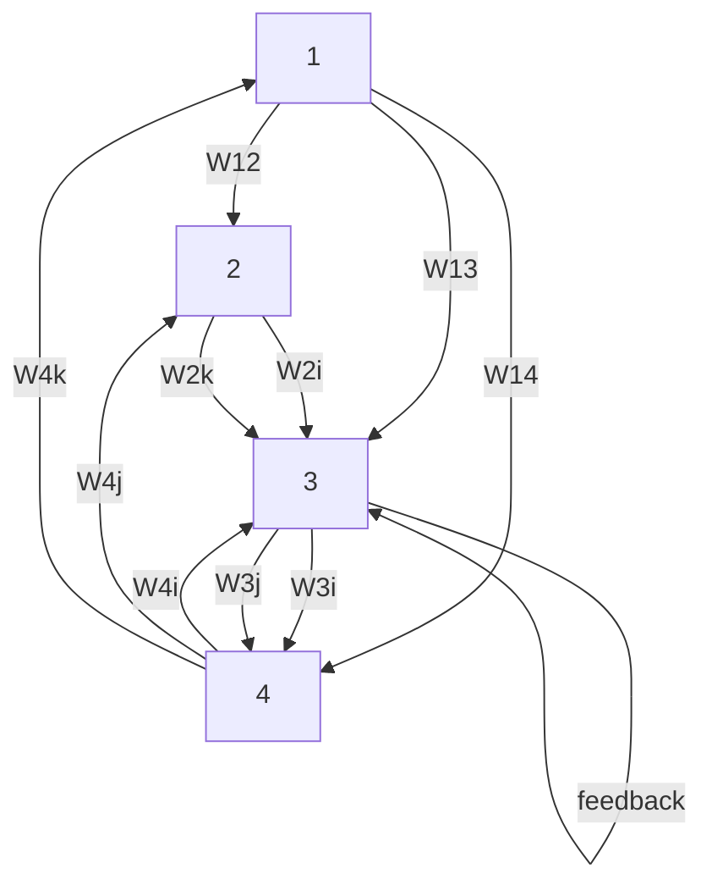

For office use only

T1

T2

T3

T4

## 44348

Problem Chosen

F

For office use only

F1

F2

F3

F4

# 2016 MCM/ICM Summary Sheet

# Towards A Hopeful Journey

The world is witnessing the largest refugee crisis since the horrors of World War II. Modeling refugee immigration, which is crucial to tackle the problem, is an intricate issue that should embrace the sophistication of social interrelated systems, and take into the consideration of refugee crisis on local conditions. Concerning the structure of refugee crisis and the routes of migration, with the official data in 2014, we construct a refugee migration model and build a feedback system using network analysis methodology and Cellular automaton to make precise simulation aiming to help figure out a set of efficient policies.

In the first place, we establish a set of metrics to consider the determinant factors in refugee migrations so that we define our measures and indexes, after which we set the start points of six given routes as six nodes, and choose 14 countries where most refugees gather to be the nodes in Africa and Central East. With the assumption that the refugees migrate nearer and nearer to Europe, we divide the nodes into 4 layers based on the distances from node to node using cluster analysis. In that way, the refugees migrate within the layers.

After that, we assume that refugees get limited information and initially build a random migration mode to determine the migrating factors between 2 nodes. And by Matlab simulation we get result indicating the main routes reaching Europe, but the numerical data is inconsistent with real data. Hence, we adjust our presumptions and revise our model.

xt, inspired by Gravity Model, we analyze the factors that affect the migration of refugees and integrate em into a comprehensive attraction index. By collecting and calculating the statistics, we figure out the eight between two nodes and the ratios of population distribution at the six start points 0.07:0.101:0.41:0.369:0.05), whose correlation coefficient with real data R=0.98. So we go on with revised odel to unravel the optimal flow distribution under different conditions and the measurement of weight om node to node backed by single-period simulation.

In addition, we expand the scale of nodes. Given that the feedback information of refugees in different periods and the maximum capacity in each node, we simulate the migration progress of refugees with Cellular Automaton and C++, and the ratios of 3 nodes are 0.0362:0.537:0.427, R=1. Therefore, we get to know about the influences of government and non-government organizations on refugee migration.

As for the policy, we attach significant importance to the empathy that the receiving population of each country must fit the present refugee condition. By scaling up our model, we find that the routes get saturated except for routes in North Africa and Central East, which may trigger the detention of refugees and eventually lead to illegal immigration. Meanwhile, we work out the relations between the stability and capacity of nodes by building a Cobweb Model. We find that the refugee flows tend to be more and more stable in nodes with bigger capacity. So we also propose to stabilize the flows, which contributes to better resource allocation and aid from GO and NGO.

Finally, we test the sensitivity of our model and conclude the strengths and weakness. The model is quite reliable in small scale but still needs advancement for larger and more precise simulation.

## Contents

## 1 Introduction 2

1.1 Background 2  
1.2 Our work 2

## 2 Metrics 2

## 3 Notations and Descriptions 3

## 4 Fundamental Assumptions 4

## 5 The Gravitational Refugee Movement Model 5

5.1 Initial Nodal weight analysis . 5  
5.2 Modified model added with gravitation theory . . 8

5.2.1 The relationship among the 6 routes 8  
5.2.2 Weight reanalysis and remodeling based on Gravity model . . 8  
5.2.3 Analysis on each factor 8  
5.2.4 An optimal route 10  
5.2.5 Preposition Resource . . 12

## 6 Dynamic changes and Refugees 12

6.1 Dynamic simulation model of refugee migration based on Cellular Automaton . 12  
6.2 Non-paroxysmal factors 13  
6.3 Accidental and irregular factors . 14

## 7 Scalability 15

## 8 The Policy Strategy with Cobweb Model 15

## 9 Influence of Exogenous Events 16

9.1 The outbreak of the diseases . 16  
9.2 Terrorist attack . 16  
9.3 How can our policy be resilient to Exogenous Events 16

## 10 Sensitivity Analysis 17

## 11 Evaluation of the Model 17

11.1 Strengths 17  
11.2 Weakness 17

## 12 Future Work 17

## References 18

## 1 Introduction

## 1.1 Background

One of the most stressful and potentially destabilizing social challenges facing Europe, or in a wider scope the whole world is the contemporary massive influx of refugees and migrants, which sparks tremendous pressure in the receiving societies. One in every 122 people in the world is currently either a refugee, internally displaced or seeking asylum because the ”world is a mess”[1], according to the head of the UN’s refugee agency. Despite the restrictive policies of border control, the flows and volumes of international migrants via various routines keep on scaling up and arriving in Europe disproportionately, as war, persecution and poverty continue to drive people away from their homes[2].

line chart

| Country | Year | Applicants |
| :--- | :--- | :--- |
| Germany | 2011 | 707,116 |
| Serbia and Kosovo since 2011 | 2011 | 362,353 |
| Sweden | 2011 | 308,275 |
| Turkey | 2011 | 286,770 |
| France | 2011 | 282,326 |
| Hungary | 2011 | 236,498 |
| Italy | 2011 | 193,514 |
| Britain | 2011 | 140,698 |
| Austria | 2011 | 128,827 |
| Switzerland | 2011 | 113,471 |
| Belgium | 2011 | 97,936 |
| Netherlands | 2011 | 89,557 |
| Norway | 2011 | 65,462 |
| Greece | 2011 | 44,761 |
| Poland | 2011 | 41,750 |
| Denmark | 2011 | 41,124 |
| Finland | 2011 | 36,244 |
| Bulgaria | 2011 | 35,402 |
| Spain | 2011 | 23,109 |
| Montenegro | 2011 | 8,892 |

Figure 1: Total number of asylum applicants in European countries[3]

From the charts we can see that the asylum applicants in European countries are increasing strikingly over the past 5 years, leaving pressing concern.

Worse still, dozens of men, women and children have been killed especially while walking on railway lines on the long trek through Macedonia, Serbia, Croatia and Hungary as well as taking perilous voyages over the Mediterranean and Aegean seas in their desperation to flee ravage and reach safety. , thus the true number of arrivals is a lot smaller than that of originals. According to the IOM (the International Organization for Migration), more than 3, 695 migrants are reported to have died trying to make the crossing in 2015[4]. Besides, among those who make way to their destinations, only a scarce proportion of requests are granted (32% in 2014)[5]

It has become strikingly crucial to deal well with the sophisticated refugee migration, which is a social process wel structured and organized as a socio-spatial system[6, 7].

## 1.2 Our work

• We first elaborate reasonable metrics on various factors that affect the movement of refugees with statistics and graphs from FRAN and UNHCR Online database, then we design our own evaluation system to measure the factors that have been taken into consideration using clustering methodology.  
• And we devise a comprehensive migration model based on the Gravity model and I. S. Lawry model to look for an optimum refugee movement taking account the factors listed as well as dynamically adjusting with changing refugee conditions so that they can possibly move from their countries of origin into safe haven countries, which is validated by data from Eurostat Media and 2014 Statistical Yearbook.  
• Besides, we present a policy to prioritize the optimal migration using fuzzy comprehensive evaluation method.  
• Finally, we make a sensitivity analysis and discuss the merits and demerits of our model including an evaluation on the scalability.

## 2 Metrics

Herein are the main factors influencing the refugee flows we take into consideration in our model.

## • Safety index

Safety comes the first in terms of migration. The recent surge of popular interest in and increasing public awareness of migrant deaths in the Mediterranean has turned the question of routine-related deaths into an urgent matter. Reports of migrants threatened by smugglers, forcibly held by police or killed by criminals were rare in the past but have been increasingly heard in the last few years. This rise appears to have coincided with the growth in trafficking and smuggling , so too the wider use of guns.The increased instability on the way to haven countries make many migrants panicked and threatened. On the other side, the war condition in migratory place also contributes to this index. To propose a safety index becomes crucial.And the measurement of this index defined as $S _ { i j } ^ { t }$ (from place i to place j) is calculated by our model in the following.

## • Environmental acceptance

The environmental acceptance $C _ { i j }$ is undoubtedly significant as refugees whom we assume to be sensible will compare the environment of the destination with that of the origin district i. Here, the environment acceptance is not merely referred to living environment or maximum capacity in country j but also include three main factors:

(1) Resource Abundance. Food supply and water availability is the basis of living. Besides,access to primary health-care, referral systems, specialized health services, psychosocial-medical units and child health support are all in need to cope with wound and trauma in a desired destination.

(2) Economic condition. The economic development level also determines whether the migrants can survive on.Education and communications systems, commercial installations are needed for the functioning of a community. Many indicators such as social well-being of people, job opportunity and so on are considered. As economist Amartya Sen points out, ”economic growth is one aspect of the process of economic development.”

In our model, we take GDP as the main indicator of economic condition.

(3) Religious and culture acceptance. Different communities have varied beliefs, which may lead to misunderstandings, conflicts and discrimination. Whether a culture is inclusive plays a role. In addition, as official languages, customs, ceremonies etc. vary from place to place, which might be a burden for communication between migrants and local people, thus cultural acceptance

Migration groups especially vulnerable ones, like children, unaccompanied and separated minors, pregnant and lactating mothers, the elderly, disabled and people look for a place of environmental acceptance, which has been limited due to the desire by refugees and migrants to continue on with their journey and an unwillingness to remain in unrest.

## • Transportation index

To transport from place i to place j, one needs to balance a comprehensive transportation cost with regard of time, distance and traffic condition related to the type of transportation etc..Thus a transportation index $C o n v _ { i }$ is defined.

## • Ratio of repatriation in period T

The quantity of refugees who get granted is limited in an entry point, thus the proportion of repatriates or rejectees are relatively too high, then refugees are less likely to take on a routine head for that node. Therefore, we also give a notation of $B ^ { t }$ representing the ratio of repatriation in a certain period T in order to better solve the refugee crisis problem.

## • Quantity of nodes

We premise that the quantity of refugees allowed to pass through an entry point is a constant, in this way, the total number of people who get granted is determined by the number of entry points (node in model). $P o i n t _ { i } ^ { j }$ is the $\scriptstyle { i ^ { t h } }$ entry point in place j. Evidently, the larger the number i, the larger pass probability will be for a certain group, which affects the choice of refugees.

Taking all those parameters and measures into account, we can step further to define a set of notations in designing a mathematical model.

## 3 Notations and Descriptions

Table 1.Notations and Descriptions we define in our model

<table><tr><td>Notations</td><td>Descriptions</td></tr><tr><td> $P_{ij}^{t}$ </td><td>Probability to migrate from node i to node j of refugees in year t</td></tr><tr><td> $Re_{ij}^{t}$ </td><td>Ratio of regional acceptance of group i in place j in year t</td></tr><tr><td> $R_{i}^{t}$ </td><td>Routine chosen by group i in year t</td></tr><tr><td> $S_{ij}^{t}$ </td><td>Index of safety dead from place i to place j in year t</td></tr><tr><td> $Cap_{ij}^{t}$ </td><td>Ratio of refugees in place i in year t</td></tr><tr><td> $Re_{i}^{t}$ </td><td>Index of the resource given to group i in year t</td></tr><tr><td> $P_{j}$ </td><td>Number of Entry points in place j</td></tr><tr><td> $T_{ij}$ </td><td>Required time for refugees to migrate from place i to place j</td></tr><tr><td> $Tr_{ij}^{T}$ </td><td>Transportation taken by refugees from place i to place j in period T</td></tr><tr><td> $N_{i}^{T}$ </td><td>Quantity of refugees migrating from place i in period T</td></tr><tr><td> $B^{T}$ </td><td>Ratio of refugees sent back in period T</td></tr><tr><td> $L_{ij}^{T}$ </td><td>Distance on land from place i to place j</td></tr><tr><td> $O_{ij}$ </td><td>Distance on the sea from place i to place j</td></tr><tr><td> $E_{i}$ </td><td>Economic condition in place i</td></tr><tr><td> $P_{ij}$ </td><td>Population density in place i</td></tr><tr><td> $C_{ij}$ </td><td>Ratio of environmental acceptance in place i compared with place j</td></tr><tr><td> $F_{i}$ </td><td>Quantity of refugees on routine i</td></tr><tr><td> $Conv_{i}$ </td><td>Convenience index to transport from place i to place j</td></tr><tr><td> $Mo_{i}$ </td><td>Mortality of refugees migrating from place i to place j</td></tr><tr><td> $Offi_{i}$ </td><td>Ratio of official acceptance in place j(mainly customs) for group i</td></tr><tr><td> $Point_{ij}$ </td><td>No. i entry point in place j</td></tr><tr><td> $M_{ij}^{T}$ </td><td>Comprehensive weight index of place j to attract group i in period T</td></tr></table>

## 4 Fundamental Assumptions

• Refugees migrate in groups, and each group is a unit with fixed number of individuals, whose physical, psychological and economic conditions are the same but vary from group to group. Given that the refugees are large in quantity, which burdens a lot to investigate their behaviour individually; refugees often take on a routine chosen by a leader within a group, and migrate together with family or community; besides, the migration of refugees is generally regional. Thus it is pragmatic to make such an assumption.  
• The migration of refugees is irreversible and there will be no ideal shield before arriving their destinations. That is to say, leave out the condition that a unit go back from where it has reached to, and take no account of those who stay halfway.  
• Refugees are sensible who can adjust their routines as well as the weight value according to different conditions at current node. Refugees are able to judge reasonably on verified routines with changing factors and decide on the probability based on the weight value of certain routine.  
• The migration of refugees is progressed step by step. Not all the refugees locate on coastlines, thus the routines head for coast are subroutines of main 6 routines.  
• The mortality is a constant on land and another on the sea. On the three routines across the west, central and east Mediterranean Ocean, the refugees migrate on the sea while on other routines on land, and the two transport differ with each other in risk coefficient.  
• Those who get their immigration granted are no longer refugees while those who enter Europe but are sent back for a lack of entrance permit are new refugees.  
• Migration occurs quarterly. FRONTEX-FRAN Quarterly provides a regular overview of irregular mi gration at the EU external borders, based on the irregular migration data exchanged among Member State border-control authorities[8]. So here we consider the migration as quarterly and one quarter defined as period T to picture out an irregular migration at EU level and to discuss on the trends and patterns.  
• The quantity of passed refugees are constant per node per period. The nodes vary from place to place, but the capacity for refugees of each node is same so that the total capacity for refugees in a place is only decided by the quantity of nodes.

• The quantity of entry points, distance on land and on the sea, the time needed to migrate with different transportation and convenience index to transport from one place to another, the ratio of official acceptance and that of environmental acceptance all remain as constants. This is basis of our model, the parameters listed above are not sensitive to time, if not so, the problem would possibly be a dead end.

Given those preconditions, we can set out to construct our model so as to figure out a safe and efficient routine for the refugees.

## 5 The Gravitational Refugee Movement Model

## 5.1 Initial Nodal weight analysis

• Node definition An abstraction of geographic division on earth, representing different countries, whose area share analogous trait, and whose trait is assumed to be the same regardless of the nuance within the area. And the metrics and assumptions apply to those nodes.

The resolution of a node can be modified according to the policy maker’s jurisdiction level, such as county, state and nation, etc. The 6 routines that refugees take locate between node and node. Each node has two states, which are saturated and unsaturated. The distinction between the two states is that the saturated nodes have passed the tipping point (threshold) and cannot receive any more refugees. People cannot stay in saturated nodes. These issues have been taken into consideration in the nodal weight analysis.

• Node selection Based on the statistics from Eurostat Database and UNHCR Historical Refugee Data we have selected and ranked the top 13 countries in Africa and Middle East where most refugees start their migration, as is shown in Figure2, and we choose them as representing nodes to make weight analysis.

Two things should be noted that the resource statistics we choose are all from 2014. For one thing, most of the data in 2015 is incomplete and for another, the latest complete official statistics is up to first half 2015, so we decide to use 2014 data, which has been verified officially by IOM, UNHCR and Eurostat etc. . Another is that as Uganda and Kenya, Pakistan and Afghanistan, Lebanon and Jordan are very close to each other on geologically, also smaller in territories, so we respectively consider those neighbouring countries as three nodes. In other words, we have altogether 11 nodes in our initial model, as is marked out in Figure3.

• Migratory Routes

(1)Western Mediterranean Route (WM)

From Algeria and Morocco to Spain, France and Italy

(2)Central Mediterranean Route (CM)

From Tunisia and Libya to Italy and Malta

(3)Eastern Mediterranean Route (EM)

From Turkey to the European Union via Greece, southern Bulgaria or Cyprus

(4)Western Balkan Route (WB)

From Greek-Turkish land or sea borders into Hungary

(5)Eastern Borders Route (EB)

From Ukraine to its European Union neighbours (Hungary, Poland, Slovakia)

(6)Circular Route (CAG)

From Albania to Greece

Given the six main migrating routes mapped out on BBC website, we assume those routes are the final routes that the 11 nodes eventually head for. And we choose western Mediterranean, central Mediterranean, Eastern Mediterranean, East Balkan, Albania, and border land between Lithuania and Poland as the starting points of those 6 routes, as is shown in Figure3.

bar chart

Asylum Applicants by Citizenship
| Country | Asylum applicants |
| :--- | :--- |
| Turkey | 1600000 |
| Pakistan | 1500000 |
| Lebanon | 1200000 |
| Iran | 1000000 |
| Ethiopia | 700000 |
| Jordan | 700000 |
| Kenya | 600000 |
| Chad | 500000 |
| Uganda | 400000 |
| Afghanistan | 350000 |
| Iraq | 300000 |
| Yemen | 300000 |
| South Sudan | 250000 |
| Sudan | 250000 |

Figure 2: Top 13 Refugee Origins

text_image

EB ROUTE
WB ROUTE
CAG ROUTE
EW ROUTE
CW ROUTE
WW ROUTE

Figure 3: Routes and Nodes

## • Classifying the distance using clustering analysis

We presume that the refugees in Africa tend to flee persecution, so as to say, within the emigration centers in a country, the refugees always head for the regions or centers within a circle area closer to Europe.

We collected route distance data from FRAN and ICMPD (see in figure4), then we divide the 11 nodes into 3 layers based on clustering methodology principles, in which the initial layer includes 3 nodes (Pakistan/Afghanistan, Uganda/Kenya and Yemen); the propagation layer includes 4 nodes (Turkey, Iran, Ethiopia and South Sudan); the terminal layer includes 4 nodes (South Sudan, Lebanon/Jordan, Chad and Iraq). Refugees migrate layer by layer, eventually they get to the 6 start points of the main routes reaching to Europe.

We calculate the average distance from 11 nodes to start points to get the approximate distance $d _ { i } ,$ respectively, but it should be noted that as EB route is far away from the location of refugees in our model, and it is very difficult for them to take on EB route and enter Europe, so we leave out EB route and it’s nodes as well. The formula is:

$$
d _ {i} = \frac {1}{5} \sum_ {k = 1} ^ {5} x _ {k}, i = 1, 2, \dots 1 1
$$

Then we make a matrix with all the distances:

$$
D = \left( \begin{array}{l l l l l l l l l l l} 4 6 3 0 & 4 0 6 0 & 3 4 7 0 & 2 8 4 0 & 2 8 8 0 & 3 5 2 0 & 3 2 2 2 & 1 4 1 0 & 2 3 7 0 & 2 3 3 3 & 2 3 4 0 \end{array} \right)
$$

The units are integrated into a whole cluster, whose height value are all zero, that is:

$$
H _ {i} = \left( \begin{array}{l l l l l l l l l l l l} 4 6 3 0 & 4 0 6 0 & 3 4 7 0 & 2 8 4 0 & 2 8 8 0 & 3 5 2 0 & 3 2 2 2 & 1 4 1 0 & 2 3 7 0 & 2 3 3 3 & 2 3 4 0 \end{array} \right)
$$

Set height value as $K _ { 1 }$ , and pick out the units, forming the first cluster:

$$
H _ {1} = \left( \begin{array}{l l l} 4 6 3 0 & 4 0 6 0 & 3 4 7 0 \end{array} \right)
$$

Set height value as $K _ { 2 }$ , and pick out the units, forming the second cluster:

$$
H _ {2} = \left( \begin{array}{l l l l} 2 8 4 0 & 2 8 8 0 & 3 5 2 0 & 3 2 2 2 \end{array} \right)
$$

Set height value as $K _ { 3 } .$ , and pick out the units, forming the third cluster:

$$
H _ {3} = \left( \begin{array}{c c c c} 1 4 1 0 & 2 3 7 0 & 2 3 3 3 & 2 3 4 0 \end{array} \right)
$$

Thus the 11 nodes are classified into 3 clusters.

## • Network of Nodes Analysis

Now we can get a network of the nodes analysis:

flowchart

Network flow diagram showing connections between countries and SPOTs, including EB, CAG, and WM SPOT nodes.

Figure 4: Network of nodes

Suppose that in a period circle T of a node, the original quantity of refugees starting out from that node is $N _ { j - 1 } ^ { T } ,$ and the formula comes as:

$$
N _ {j} ^ {T} = N _ {j - 1} ^ {T} + \sum_ {i = 1} ^ {K _ {j - 1}} N _ {i} ^ {T}
$$

That is, the total refugees starting out from a node is the original quantity plus the quantity of refugees from the former layer.

## • Initial direct simulation

Based on the network of nodes, we simulate the refugee flows directly using Matlab with the assumption that the weight values of migrating towards the nodes in the next layer are all the same for refugees located in the nodes within the first layer. Besides, the at the nodes within the last layer the refugees only choose three routines where the transportation and distance are optimums instead of taking on a long and tiring journey. The statistics are shown below.

<table><tr><td>Country</td><td>WM Spot</td><td>CM Spot</td><td>EM Spot</td><td>WB Spot</td><td>CAG Spot</td><td>Average</td><td>Clusters</td><td>Refugees</td></tr><tr><td>Pakistan/Afghanistan</td><td>5400</td><td>4700</td><td>3800</td><td>4500</td><td>4750</td><td>4630</td><td>3</td><td>1785792</td></tr><tr><td>Uganda/Kenya</td><td>4100</td><td>3700</td><td>3400</td><td>4400</td><td>4700</td><td>4060</td><td>3</td><td>385513</td></tr><tr><td>Yemen</td><td>3900</td><td>3300</td><td>2450</td><td>3600</td><td>4100</td><td>3470</td><td>3</td><td>257645</td></tr><tr><td>Turkey</td><td>3700</td><td>4400</td><td>3400</td><td>1600</td><td>1100</td><td>2840</td><td>2</td><td>1587374</td></tr><tr><td>Iran</td><td>3600</td><td>3000</td><td>2100</td><td>2800</td><td>2900</td><td>2880</td><td>2</td><td>982027</td></tr><tr><td>Ethiopia</td><td>3800</td><td>3300</td><td>2700</td><td>3800</td><td>4000</td><td>3520</td><td>2</td><td>659524</td></tr><tr><td>South Sudan</td><td>3250</td><td>2860</td><td>2600</td><td>3600</td><td>3800</td><td>3222</td><td>2</td><td>248152</td></tr><tr><td>Lebanon/Jordan</td><td>2100</td><td>1500</td><td>650</td><td>1200</td><td>1600</td><td>1410</td><td>1</td><td>1808181</td></tr><tr><td>Chad</td><td>2100</td><td>1900</td><td>2150</td><td>2800</td><td>2900</td><td>2370</td><td>1</td><td>452897</td></tr><tr><td>Iraq</td><td>2800</td><td>2500</td><td>2150</td><td>2000</td><td>2215</td><td>2333</td><td>1</td><td>271143</td></tr><tr><td>Sudan</td><td>2500</td><td>2000</td><td>1600</td><td>2900</td><td>2700</td><td>2340</td><td>1</td><td>244430</td></tr></table>

Figure 5: Distances from the nodes to 6 start points

line chart

| Time | actual condition | simulate condition |
| ---- | ---------------- | ------------------- |
| 1    | 0.0              | 0.2                 |
| 2    | 0.1              | 0.3                 |
| 3    | 0.4              | 0.35                |
| 4    | 0.35             | 0.2                 |
| 5    | 0.0              | 0.1                 |
| 6    | 0.0              | 0.0                 |

Figure 6: Initial Result

$$
\begin{array}{l} R = \left( \begin{array}{c c} 1. 0 0 0 0 & 0. 6 5 4 3 \\ 0. 6 5 4 3 & 1. 0 0 0 0 \end{array} \right) \\ P = \left( \begin{array}{c c} 1. 0 0 0 0 & 0. 1 5 8 6 \\ 0. 1 5 8 6 & 1. 0 0 0 0 \end{array} \right) \\ \end{array}
$$

After analyze R and P. We find that p>0.05 and R=0.6543. The result of initial model is inconsistent with our data, so we adjusted the routes using weighted approach, then we analyze the weighted value which is demonstrated as percentage. The nearer to 1 the percentage is, the better the result is. Therefore, our initial model doesn’t work well, and we right away modify it.

## 5.2 Modified model added with gravitation theory

## 5.2.1 The relationship among the 6 routes

We presume that the the refugees on the route to Greece include those who have already entered Greece. According to real data on IOM and Eurostat, the total refugees on route to Greece should have added with those on other routes which combine into the main Greece route.

$$
R _ {5} = a _ {1} R _ {1} + a _ {2} R _ {2} + a _ {3} R _ {3} + a _ {4} R _ {4}
$$

From the data before, we can estimate the number of refugees flowing into WB route.

<table><tr><td>Route</td><td>EM</td><td>CM</td><td>WB</td><td>CAG</td></tr><tr><td>Value</td><td>0.24316</td><td>0.39523</td><td>1</td><td>0.5</td></tr></table>

## 5.2.2 Weight reanalysis and remodeling based on Gravity model

Gravity model originates from the Gravity Theory, indicating the attraction between two related subjects. The basic formula is:

$$
M _ {i j} = \frac {P _ {i} P _ {j}}{D _ {i j} ^ {a}}, (a > 0)
$$

I is the interaction indicator, $P _ { i } P _ { j }$ is the product of populations of two cities, representing the mass product of two cities, D is the distance between two cities. This model is widely applied to measure the economic and financial attraction. I. S. Lowry also developed a regression model (Lowery, 1996) which shows that job opportunity attracts people to migrate from one place to another.

Now we are to measure the weight for the nodes inspired by those models to help refugees make better decision on migration. However, we revise our model by figuring out a comprehensive weight indicator to represent the attraction to people. To calculate the extent of immigration between the two areas, we apply the metrics developed above, including safety, environmental acceptance, transportation, resources, repatriation ratio and quantity of entry points. We take the logarithm on both sides of the equation, here comes the expression:

$$
\ln M _ {i j} = \ln P _ {i} + \ln P _ {j} - \ln D _ {i j} ^ {a} + K _ {a}, (K _ {a} i s a c o n s t a n t)
$$

The distance data from layer to layer in different nodes is illustrated as below, to which we refer to calculate $D _ { i j } ^ { a }$

bar chart

Distance from layer1 to layer2
| Country | Pakistan Afghanistan | Yemen | Uganda Kenya |
| :--- | :--- | :--- | :--- |
| Turkey | 3300 | 2800 | 4300 |
| Iran | 1400 | 1900 | 3900 |
| Ethiopia | 3900 | 1180 | 1000 |
| South Sudan | 4750 | 2100 | 800 |

Figure 7: Distance Layer1 to Layer2

bar chart

Distance from layer2 to layer3
| Country | Turkey | Iran | Ethiopia | South Sudan |
|---|---|---|---|---|
| Lebanon Jordan | 550 | 1750 | 2800 | 3050 |
| Chad | 2900 | 4000 | 2350 | 1500 |
| Iraq | 1000 | 1050 | 2700 | 3100 |
| Sudan | 2600 | 3000 | 1300 | 1000 |

Figure 8: Distance Layer2 to Layer3

Now add the variables derived from the metrics and notated above to $M _ { i j }$ , we get

$$
M _ {i j} ^ {t} = f (S _ {i j} ^ {t}, C o n v _ {i j} ^ {t}, B ^ {t}, C _ {i j}, P o i n t _ {i} ^ {j})
$$

## 5.2.3 Analysis on each factor

(1) $S _ { i j } ^ { t }$ :Safety index

$$
\begin{array}{l} S _ {i j} ^ {t} = 1 - \frac {x _ {2} c _ {1}}{L _ {i j}} + c _ {2} x _ {1} \\ x _ {1} = \left\{ \begin{array}{l l} 1 & \text { route   crosses   oceans } \\ 0 & \text { route   doesn't   cross   oceans } \end{array} \right. \\ x _ {2} = \left\{ \begin{array}{l l} 1 & \text { route   crosses   land } \\ 0 & \text { route   doesn't   cross   land } \end{array} \right. \\ \end{array}
$$

$^ * c _ { 1 }$ is danger coefficient, normally refers mortality on land routes and $c _ { 2 }$ is on sea’s

Mortality With FRAN and IOM (Fatal Journeys Tracking Lives lost in Migration, 2014), we collect the deaths data on 6 routes of refugees, here we give the mortality on the sea, which is $c _ { 2 }$

<table><tr><td></td><td>WM</td><td>CM</td><td>EM</td><td>TOTAL</td></tr><tr><td>Arrival</td><td>3845</td><td>150317</td><td>801919</td><td>956081</td></tr><tr><td>Deaths</td><td>100</td><td>2889</td><td>706</td><td>3695</td></tr><tr><td>Deaths Rate</td><td>0.02601</td><td>0.01922</td><td>0.00088</td><td>0.00386</td></tr></table>

Figure 9: Mortality on the sea

And $c _ { 1 }$ is figured out in a same way.

(2) $) C o n v _ { i j } ^ { t }$ :transportation convenience index

$$
C o n v _ {i j} ^ {t} = c _ {3} E _ {1} E _ {2} T r _ {i j}
$$

$$
T r _ {i j} = \left\{ \begin{array}{l l} 1 & \text { one   kind   of   transportation } \\ 2 & \text { two   kinds   of   transportation } \\ 3 & \text { three   kinds   of   transportation } \end{array} \right.
$$

$^ * c _ { 3 } \mathrm { i }$ is adjusting coefficient

(3) $B _ { i } ^ { t } \colon$ repatriation index

This indicator is determined by the ratio between the repatriated refugees and total migrating refugees of a country in a certain year t, the larger the ratio is, the lager $B _ { i } ^ { t }$ is.

$( 4 ) C _ { i j } ^ { t }$ : Environmental acceptance index

$$
C _ {i j ^ {t}} = c _ {4} \frac {R e _ {j}}{R e _ {i}} R e l _ {i j} ^ {t}
$$

(5) $P o i n t _ { i } ^ { j }$ : Entry point quantity

We suppose that the probability of receiving a refugee unit of each node is $p ,$ within a period T the quantity of granted refugees of each node is a constant. Once a node passes the tipping point (threshold), it reaches a saturated state and closes automatically. Now we test 6 countries whose receiving nodes differ with each other, but the maximum of granted migrants is the same for each node. Set the maximum as M, then the probability for a group to be received can be simplified as a Bernoulli Distribution:

$$
P = \left\{ \begin{array}{l l} p & n > K _ {L} \\ 0 & n <   K _ {L} \end{array} \right.
$$

If $n _ { i }$ units of refugees pass through the node, then

$$
P (x = n _ {i}) = \left\{ \begin{array}{l l} 0 & n _ {i} > K _ {L} \\ \left( \begin{array}{l} n _ {i} \\ K _ {L} \end{array} \right) & n _ {i} <   K _ {L} \end{array} \right.
$$

Taking our analysis of variables into serious consideration, we get a comprehensive formula:

$$
\ln M _ {i j} ^ {t} = \ln S _ {i j} ^ {t} + \ln C o n v _ {i j} ^ {t} - \ln B _ {a} ^ {t} + K _ {a}
$$

$^ { * } M _ { i j }$ is the weight index for a refugee group’s attraction to a node.

Meanwhile, the migrating refugees on each node in a period T is determined by the formula:

$$
N _ {j} ^ {T} = N _ {j - 1} ^ {T} + \sum_ {i = 1} ^ {K _ {j - 1}} N _ {i} ^ {T} (1 - M o _ {i j} ^ {T})
$$

Now we can figure out a revised network of nodes, marking the weight beside each route.

```mermaid
graph TD
  A["EM Spot"] --> B["EM Spot"]
  C["WM Spot"] --> D["WM Spot"]
  E["CM Spot"] --> F["CM Spot"]
  G["WB Spot"] --> H["WB Spot"]
  I["CAQ Spot"] --> J["CAQ Spot"]
  K["CAG Spot"] --> L["CAG Spot"]
  M["CBQ Spot"] --> N["CBQ Spot"]
  O["WB Spot"] --> P["WB Spot"]
  Q["E8 Spot"] --> R["E8 Spot"]
  S["EB Spot"] --> T["EB Spot"]
  U["Chad"] --> V["Chad"]
  W["Sudan"] --> X["Sudan"]
  Y["Turkey"] --> Z["Turkey"]
  AA["Iraq"] --> AB["Iraq"]
  AC["Miyoda"] --> AD["Miyoda"]
  AE["Uganda/Kenya"] --> AF["Uganda/Kenya"]
  AG["Yarian"] --> AH["Yarian"]
  AI["Pakistan/Afghanistan"] --> AJ["Pakistan/Afghanistan"]
  AK["South Sudan"] --> AL["South Sudan"]
  AM["China"] --> AN["China"]
```

flowchart

Figure 10: Revised network of nodes

Again we use Matlab calculation to see how the refugees can migrate from node to node, layer by layer. And Figure 11 and 12 is the propagation of refugees from node to node, the y axes stands for the proportion of population that one layer receive from the former layer.

stacked bar chart

First layer to Second layer
| Country | First Layer (Bottom) | First Layer (Top) | Second Layer (Bottom) | Second Layer (Top) |
| :--- | :--- | :--- | :--- | :--- |
| Turkey | 0.25 | 0.75 | 0.35 | 0.65 |
| Iran | 0.25 | 0.65 | 0.15 | 0.45 |
| Ethiopia | 0.0 | 0.15 | 0.15 | 0.15 |
| South Sudan | 0.0 | 0.0 | 0.05 | 0.05 |

Figure 11: Propagation L1 to L2

stacked bar chart

Second layer to Third layer
| Country | Sudan | Iraq | Chad | Lebanon |
|---|---|---|---|---|
| Turkey | 0.01 | 0.01 | 0.05 | 0.12 |
| Iran | 0.01 | 0.01 | 0.01 | 0.08 |
| Ethiopia | 0.03 | 0.04 | 0.25 | 0.67 |
| South Sudan | 0.01 | 0.01 | 0.15 | 0.69 |

Figure 12: Propagation L2 to L3

And Figure 13 is the propagation of refugees from the third layer to the start points head for Europe.

stacked bar chart

Third layer to the Start points
| Country | WM Spot | CM Spot | EM Spot | WB Spot | CAG Spot |
| :--- | :--- | :--- | :--- | :--- | :--- |
| Lebanon Jordan | 0.0 | 0.0 | 0.25 | 0.75 | 0.0 |
| Chad | 0.05 | 0.35 | 0.65 | 0.0 | 0.0 |
| Iraq | 0.0 | 0.0 | 0.15 | 0.85 | 0.0 |
| Sudan | 0.05 | 0.2 | 0.75 | 0.0 | 0.15 |

Figure 13: The ratio of refugees migrating from the third layer to the start points

Comparing the two groups of data, we find that the Correlation R equals to 0.9914 and P equals to $0 . 0 0 0 0 1 { < } 0 . 0 5$ . So we think this group of data is valid.

we found that this time the model copes well with real data, shown in Figure 14.The result is demonstrated below, line1 is the real data, line2 is revised modeling result, and line3 is the initial result. The y label is ratio between refugees at a node and total number, x label is 6 routes. Evidently, line1 and line2 coincide with each other well.

So we think that the improved gravity model can calculate the weight between the nodes more close to the real condition.And next we search for an optimal route of migration.

line chart

| X-axis | simulate condition | actual condition | initial simulate condition |
|---|---|---|---|
| 1 | 0.07 | 0.013 | 0.17 |
| 2 | 0.101 | 0.095 | 0.25 |
| 3 | 0.41 | 0.45 | 0.33 |
| 4 | 0.369 | 0.422 | 0.17 |
| 5 | 0.05 | 0.01 | 0.08 |
| 6 | 0.01 | 0.01 | 0.01 |

Figure 14: The results and comparison

## 5.2.4 An optimal route

• Aimed route

(1)High safety index, low mortality  
(2)High resource abundance index  
(3)High transportation convenience index, low cost  
(4)High match with environmental acceptance index of receiving country

• Multi-objective into single-objective

• Always choosing the nearest routes With safety ensured, refugees choose the nearest two routes so as to reduce the cost in the third layer, and in this case we calculate the weight of routes.  
• Weight of the importance of each aim In multi-objective planning, we set the safety index as $\vartheta _ { 1 }$ , and distance index as $\vartheta _ { 2 } .$ , so

$$
\vartheta_ {2} (1 - S _ {i j} ^ {t}) = \vartheta_ {2} c _ {2} x _ {1}
$$

## • Quantitative analysis

Then we make quantitative analysis of the attitudes of receiving countries according to the actual received refugees in each country.

$$
\left( \begin{array}{l l l l l} \sigma_ {1} & \sigma_ {2} & \sigma_ {3} & \sigma_ {4} & \sigma_ {5} \end{array} \right) = \left( \begin{array}{l l l l l} 1. 5 & 2. 0 & 5. 0 & 4. 7 5 & 1. 3 0 \end{array} \right)
$$

And the distance of each route is:

$$
L _ {i j} = \left( \begin{array}{c c c c c c} 0 & 0 & 6 5 0 & 1 2 0 0 & 0 & 0 \\ 0 & 3 7 0 0 & 3 4 0 0 & 0 & 0 & 0 \\ 0 & 0 & 2 1 5 0 & 2 0 0 0 & 0 & 0 \\ 0 & 2 0 0 0 & 1 6 0 0 & 0 & 0 & 0 \end{array} \right)
$$

Finally, all the factors related to route planning can be seen as:

$$
\eta_ {1} = \frac {\vartheta_ {2}}{L _ {i j}}
$$

With the analysis and our revised model we can choose the weight of last four nodes in the third layer to confirm the best route.

## • Differences resulting from different choices

Here we choose

$( { \bf 1 } ) \vartheta _ { 1 } = \vartheta _ { 2 } = 0 . 5$  
$( { \bf 2 } ) \vartheta _ { 1 } = 0 . 4 , \vartheta _ { 2 } = 0 . 6$  
$( { \bf 3 } ) \vartheta _ { 1 } = 0 . 6 , \vartheta _ { 2 } = 0 . 4$  
$( 4 ) \vartheta _ { 1 } = 0 . 3 , \vartheta _ { 2 } = 0 . 7$  
$( 5 ) \vartheta _ { 1 } = 0 . 7 , \vartheta _ { 2 } = 0 . 3$

Make weight analysis for those values and compare the results.

If taking safety first, and meeting the policies of every country, then choose the largest $\vartheta _ { 1 } = 0 . 7$ and we find out the best distribution of refugees on each route as Figure 15

line chart

| x | simulate condition | actual condition |
|---|---------------------|------------------|
| 1 | 0.0                 | 0.0              |
| 2 | 0.07                | 0.1              |
| 3 | 0.43                | 0.45             |
| 4 | 0.48                | 0.42             |
| 5 | 0.0                 | 0.0              |
| 6 | 0.0                 | 0.0              |

Figure 15: $\vartheta _ { 1 } = 0 . 7 , \vartheta _ { 2 } = 0 . 3$ the ratios of refugees on 6 routes

We find that in this case, the ratios of refugees on the six routes are 0.01, 0.07, 0.43, 0.48, 0.01, 0.00, indicating that the refugees tend to choose land routes. But as there are only 2 nodes among the last 4 nodes near to EB route, those choosing WM are large in quantity. According to IOM statistics, the mortality on WM, CM, EM route goes up by sequence, so it is safer for people to take WM and EB route.

line chart

| x | simulate condition | actual condition |
| --- | --- | --- |
| 1 | 0.2 | 0.0 |
| 2 | 0.17 | 0.1 |
| 3 | 0.3 | 0.45 |
| 4 | 0.31 | 0.42 |
| 5 | 0.0 | 0.0 |
| 6 | 0.0 | 0.0 |

Figure 16: $\vartheta _ { 1 } = 0 . 3 , \vartheta _ { 2 } = 0 . 7$ the ratios of refugees on 6 routes (Line1 is real data and line2 is the modeling result. )

If taking transportation convenience first, and meeting the policies of every country, then choose the largest $\vartheta _ { 2 } = 0 . 7$ and we find out the best distribution of refugees on each route in Figure 16.

We find that in this case, the ratios of refugees on the six routes are 0.20, 0.17, 0.30, 0.31, 0.01, 0.01, indicating that more people might take WM route. But as Spanish government has a strict control in migrants with low receiving quantity each year, hence not so many migrants take WM. CM takers increase because EM and WB route is relatively far away from the node.

## 5.2.5 Preposition Resource

So after considering these two kinds of condition,we think that plenty of resource prepared for the refugees and enough residence should be placed in Center Mediterranean route,West Mediterranean route and West Balkan route.Because whatever the condition is, there will still be huge number of people travelling through this route to their final destination.

## 6 Dynamic changes and Refugees

## 6.1 Dynamic simulation model of refugee migration based on Cellular Automaton

In the very beginning we have assumed that the flow of refugees occurs periodically. So suppose that there are nperiods every year, and the migration flow is a community of certain number of refugees. Thus each quarter the migration population is $\frac { 1 } { n } \%$ , and the migrating people influence the remaining ones. The model is shown as below:

flowchart

Figure 17: Dynamic Model

As is seen in the figure, node 1, 2, 3, 4 represents the area where refugees gather and start migration in Africa and Central East, and we can get the weight between different nodes with our model. Suppose that during the first quarter, the migration route is chosen by the weight values and the refugees migrate only from one node to another in a period. We add a coefficient $\begin{array} { r } { \delta \ = \ \frac { i } { L _ { i j } } } \end{array}$ L to unitize the distance between two nodes considering weight impact. Therefore, in the first period the migration population at the first node is $\textstyle { \frac { 1 } { n } } N _ { 1 } ^ { t _ { 0 } }$ , and the migration population towards other three nodes is $\begin{array} { r } { \frac { 1 } { n } N _ { 1 } ^ { t _ { 0 } } w _ { 1 i } , ( i = 1 , 2 , 3 ) } \end{array}$ , now the refugee population from the first node towards the second node is defined as:

$$
N _ {2} ^ {t _ {1}} = \sum_ {i = 1} ^ {k} \frac {1}{n} N _ {i} ^ {t _ {0}} w _ {i 2} + \frac {3}{4} N _ {2} ^ {t _ {0}}
$$

So in the second period we can estimate the refugee population at the second node. But due to the changing factors and indexes, the weight mat change from node 1 to node 2 as the population, capacity of refugees and the average available resource may change. We divide those changing factors into two categories:

## 6.2 Non-paroxysmal factors

## • Change in capacity and resources

Evidently, the resources and capability of a node is limited, the outs and ins of refugees affect the weight of other nodes where the people head for this node in next period. Take node 1 and 2 as an example, the population of node 2 in period $t _ { 0 }$ is $N _ { 2 } ^ { t _ { 0 } }$ , and now as the change of population leads to the change of inflow weight of other nodes, we set the comparative coefficient as π, the expression is:

$$
\pi = \frac {N _ {2} ^ {t _ {1}}}{N _ {2} ^ {t _ {0}}}
$$

## • Changed weight

So the weight after change is

$$
w _ {i 2} ^ {\prime} = \pi W _ {i 2} W _ {i 2} ^ {t _ {1}} = w _ {i 2} ^ {\prime} \frac {1}{\sum_ {i = 1} ^ {k} w _ {i 2} ^ {\prime}}
$$

Suppose that there are saturated and unsaturated states at each node, and the saturated receiving population is $N _ { L } ,$ if the refugees are more than $N _ { L }$ after $\textstyle { \frac { 1 } { n } }$ of the population have migrated out, the node closes, only allowing out. That is:

$$
\frac {n - 1}{n} N _ {i} ^ {t _ {j}} = \frac {n - 1}{n} (\frac {n - 1}{n} N _ {i} ^ {t _ {j - 1}} + \sum_ {k = 1} ^ {t} \frac {W _ {k i} ^ {t _ {j - 1}}}{n} N _ {k} ^ {t _ {j - 1}}) > N _ {L} ^ {i}
$$

In this way, we can foresee the change of population at a node in the next period when it is near tipping point.

## • Simulation of the refugee migration

Based on the formula, we simulate the process of migration with C++ only with non-paroxysmal factors, and we map the process out with JavaScript, from left to right, up to down, we can see the changing paths of refugees from Africa and Central East to Europe within same space of time and the change in population, which is indicated by change of size of the circle area.

  
Figure 18: Simulation of Refugee Migration only with non-paroxysmal factors

We suppose that the final destination of EM and CM route is Italy, the one of WM route is Spain and the one of WB is Greece and other European countries. By certain algorithm and data comparison we get the ratios as (0.00362, 0.537, 0.427), and the real data is (0.013, 0.545, 0.422), through computer calculation we find the correlation coefficient value is R = 1.0000

## 6.3 Accidental and irregular factors

## • The change in safety index on route

Environmental, military factors all make sense. The change in safety index can be adjusted by adding war factor $\beta$ and environmental factor γ

$$
B _ {i j} = \left\{ \begin{array}{l l} 0 & \text {   no   war   on   the   route   } \\ 1 & \text {   war   on   the   route   } \end{array} \right.
$$

In this case, the safety index is affected

$$
1 - S _ {i j} ^ {t} = (\frac {x _ {2} c _ {1}}{L _ {i j}} + c _ {2} x _ {1} + \beta_ {i j} c 4)
$$

Here we neglect the intensity and scale of the war, and $c _ { 4 }$ is related to the mortality in war. The definition of environmental factor is

$$
\gamma_ {i j} = \left\{ \begin{array}{l l} 0 & \text {normal weather} \\ c & \text {fair weather} \\ - c & \text {windy and rainy weather} \\ - 2 c & \text {snowy and freezing weather} \end{array} \right.
$$

This also affects the safety index

$$
1 - S _ {i j} ^ {t} = \left(\frac {x _ {2} c _ {1}}{L _ {i j}} + x _ {1} c _ {2} + \beta_ {i j} c _ {4}\right)
$$

## • The influence of GO and NGO

The funds and policies of governments can affect the capacity and resources of a node. NGO also provides humanistic help and medical-health aid.

(1)As for node i, the influence of GO policies is measured when $N _ { p }$ refugees migrate in or out and there are initially $N _ { i } ^ { t _ { j } }$ refugees who meet the condition that :

$$
\frac {n - 1}{n} (N _ {i} ^ {t _ {j}} + N _ {P}) > N _ {L} ^ {i}
$$

(2)If the condition is not met, the population migrating into a node impacts other refugees:

$$
N _ {i} ^ {t _ {j}} = N _ {i} ^ {t _ {j}} + N _ {P}
$$

Thus the comparative coefficient is:π $\begin{array} { r } { = \frac { N _ { i } ^ { t _ { j } } } { N _ { i } ^ { t _ { j - 1 } } } } \end{array}$ N t j − 1

As for NGO and GO involvement which might mitigate the refugee crisis, reducing the refugee population with $N _ { N G O }$ unchanged, so the weight of nodes change accordingly. And the actual population at each node is defined as:

$$
N _ {i} ^ {t _ {j}} = N _ {i} ^ {t _ {j}} - N _ {N G O}
$$

Other algorithms are same alike, we also assume that the influence on capacity of refugees from local governmental policies ranges from -0.2 to +0.2. We focus on the accidental factors and also simulate the migration as follows.

  
Figure 19: Simulation of Refugee Migration only with accidental factors

The left figure: $\begin{array} { r } { \frac { \Delta N } { N } = 2 0 \% , \beta _ { i j } = 0 , \gamma _ { i j } = c } \end{array}$

The ratio of three nodes are $\left( 0 . 0 3 0 7 , 0 . 4 7 5 , 0 . 4 9 4 \right)$ , so when the capacity of Greece increases by 20%, and the weather is fine, then the migration flow will change by 15.9%, indicating that the change in capacity can change the migration inflows.

The right figure: $\begin{array} { r } { \frac { { \bf \tilde { \Delta } } N } { N } = - 2 0 \% , \beta _ { i j } = 1 , { \bf \tilde { \Delta } } { \bf \tilde { \Delta } } { { \bf \tilde { \Delta } } } = 0 } \end{array}$

The ratio of three nodes are (0.0374, 0.562, 0.4006), so when the capacity of Greece decreases by 20%, and there are wars on the routes, the migration flow will change by 6.18%, the flows still increase because there are other migrants coming from other nodes who make up for the decrease.

## 7 Scalability

We apply our model to to Canada, America, and China to forecast the migration flows and check the scalability of our work. We add the nodes of Canada, America and China and some other nodes linked with them to the modeling system. Based on data from I-Map we estimate the value of the route between the nodes of China, Canada, America and other nodes. The initial distribution of the refugee is shown in the graph.

  
Figure 20: Simulation of Refugee Migration on a Larger Scale

According to the result, we find that there will be so many of refugees from Central East flowing into China while few heading for America and Canada (only 7 for Canada, and 51 for America).

So we find that our model can not illustrate the flow of the refugees well. Because:

• The Himalayas Because of the Himalayas mountains standing at the border of China, it will be much harder for the refugees to come into China. So when weighing the value of these nodes, we should take the topography into consideration.  
• The Atlantic Ocean we know that America and Canada is far from Northern Africa and Mid-east, and meanwhile the danger index also increases. So based on our revised Gravity model, the weight between the nodes of Africa, Mid-east and the nodes of America and Canada can be almost entirely ignored.

## 8 The Policy Strategy with Cobweb Model

• Enlarge the capacity and increase the resources in receiving countries

We expand the crisis to a large scale(by a factor of 10), and find that that our model can’t predict the flow of the actua migration very well. Now the population of refugee on each route is almost the same, and we add the six route to our modeling, but in vain.

We realize that we have presumed that the node stops working one it get saturated, and in our model the modes of EM and WB stop first. And the left refugees pour into other 4 nodes until all the nodes become saturated. Thus there will be lots of refugees tarried in neighbouring countries. That may help to explain the increasing illegal migration. Many refugees may stay around for the limited resources, leading extra refugee inflow. So when the scale expands up, the restricting factors we have listed can be useless, as the nodes always stay saturated, resulting in detention and the breakdown of the system layer by layer.

• Enlarge the capacity according to current situation to stabilize the population of migration flow

We need stable migration flow to quantify the distribution of resources for refugees. However, according to Cobweb Model, we find that change of capacity in a period will make the population change at each node. A large capacity of a node will actually make the flow of refugees through the node stable while a relatively small capacity of the node might cause the flow become more and more unstable

text_image

P
start point
N

Figure 21: Cobweb Model 1 NP=B

text_image

P
start point
N

Figure 22: Cobweb Model 2 NP=A (B>A)

Figure 21 and Figure 22 presents the relationship between the pass rate P and the pass refugee population N

• Enhance and promote international partnership and cooperation

When simulating the migration progress with our model, we find that some of the nodes may become saturated while other not, so enhancing international cooperation and partnership, distributing refugees after receiving them may be acceptable and reasonable.

• Indicate an official migration route

As all of us are searching for an optimal migrating route pattern that benefits both migrants and receivers, an official migration route should be announced to guide the migrants, leading to a better and safer journey.

## 9 Influence of Exogenous Events

## 9.1 The outbreak of the diseases

The outbreak of the illness like the newly found Zika virus will shut down some nodes, thus causing some changes in the weight between the nodes involved in the disease. As a result, the refugees will not only consider distance, the economic conditions etc. , but also the distribution situation of the disease, which will decrease the capacity of the nodes as well.

## 9.2 Terrorist attack

Terrorist attack generated from the increase of refugees will directly impart the receiving index of European countries, thus the resources provided for migrants and refugees will be in short and receiving population will soon decrease. In this case, there is a cascading effect which refers to the fact that a change in refugee policy of a country will affect the migration flow and the attitude towards refugees of its neighbouring countries as well as the inter-relationship among different nodes, leading to the change of refugee inflows in the whole node system.

## 9.3 How can our policy be resilient to Exogenous Events

In the first place, if we increase the capacity of refugees of different nodes according to present condition, we can ensure that there will be no sharp closing of node whenever it is emergency or not so that the migration of refugees at other nodes will not be affected.

Besides, when the cost on route is cut down, the migration population on CM or EU route increases so that the migration flows on 6 routes can be equalized. In this way, the weight of route choice can be placed mostly on destination, thus avoiding the capacity saturation of the nodes.

Lastly, enhancing international cooperation and partnership as well as adding official routes can help to create a better worl and give guidance to refugees, which is beneficial for resource allocation and optimization of all kinds of resources.

As a whole, our policy can adjust to the current situation to some extent.

## 10 Sensitivity Analysis

The migration of refugees not only relates to the countries we selected into our model but also involved with the other countries. Additionally, the migration of refugees involves quite a lot accidents and emergencies, which might lead to the change in refugee flows. Here we have taken the increase and decrease of nodes into consideration, but for we have also assigned weight to the migration on every route and established a feedback system based on our model, the change in node quantity only have effects on the population of initial refugees going on migration but not making big difference on the proportion of people heading for the final 6 routes. At the same time, when we balance the influences of various factors we tend to neglect the impact of certain incidents. For example, we assume that the safety index has little sensitivity to weather, capacity of some nodes wwill not change a lot regardless of policy change or NGO aid or emergencies during migration because we also build feedback system of refugee and as all the 6 routes eventually converge into EB route, the real time modeling result is not like to change a lot.

We also think about the influence of capacity of each node on our model, finding that when the capacity changes by a smal maigin ±5%, then the result of our model change by ±2%, but when the capacity changes beyond ±10%, then the result will deviate by larger than 4.7%.

## 11 Evaluation of the Model

## 11.1 Strengths

• We make cluster analysis and analytic hierarchy process on each sample country based on the distances between the country and the final destination, and we presume that the migration of refugees progresses from far way to nearby, which simplifies our calculation and coincides with real data.  
• We make random simulation model initially because we are not sure whether the refugees lack of information about routes, and we find it does not match real data, so we are sure that the migration is not random and we soon make refinement on our model.  
• We construct our basic model based upon the Gravity model, but we also make creative refinement about the attraction, and the result has been verified by real data, indicating that our model does have its value.  
• The basis of our third model is that the second revised Gravity Model simulates the refugee flows among different nodes well, which backs up our reliability. And we add the feedback flows in each node and simulates the real migration.  
• We use Cobweb Model to make our recommendation, and we figure out the relationship between the pass rate of the node and its capacity, thus our policy can be more convincing.

## 11.2 Weakness

• All the samples we choose are from Africa and Central East, so we almost leave out the refugee flow on EB route, but actually there must be some refugees taking EB route.  
• The distances in our model are approximated to be straight lines. We ignore the geological barriers on the routes, so there are some errors in calculating the distances.  
• We leave out the redistribution of refugee flows after they enter Europe, but only determine the acceptance ratio according to the receiving data of the countries.  
• We haven’t thought of the stowaways who enter Europe illegally as refugees, because we do not have the offical data source.

## 12 Future Work

Uncontrovertibly, there are many drawbacks in our model, such as the incomplete collection of relevant data and inaccurate estimation of the weight values, etc., we have to do a lot more to improve our work.

Firstly, we do not get the effective distance between two nodes. So we use linear distance instead, which can be misleading to some extent. For example, when we apply our model to predict the population of refugees flowing into China, we just get the wrong one because of the existence of Himalaya Mountains, whose geological features are almost covered up when we look on a planimetric map. The same goes with Canada and America. So we need to take more impact factors into consideration to get a better simulation.

Secondly, we do not get enough data in terms of testing our model with concerning the refugee crisis breaking out in Europe during 2014 and 2015. Hence it is hard for us to use effective data to back up our model as it is no doubt that the more rea statistics we have, the more helpful and reliable it can be in creating a better model.

Finally, we should try to get more information about the policy implemented by the countries involved in this crisis and the cascade effect that spread across the continent of Europe.And hopefully when we know exactly what the politicians are planning to do, we can propose more feasible strategies.

## References

[1] Number displaced worldwide hits record high - UN report http://www. bbc. com/  
[2] Charity appeals for help aiding desperate refugees http://www. dailyecho. co. uk/  
[3] Countries Under the Most Strain in the European Migration Crisis http://www. nytimes. com/  
[4] Six charts and a map that show where Europe’s refugees are coming from - and the perilous journeys they are taking http://www. independent. co. uk/  
[5] Migrant crisis: Migration to Europe explained in graphics http://www. bbc. com/  
[6] Kritz, Mary M. , and Hania Zlotnik. ”Global interactions: migration systems processes and policies. ”International migration systems, a global approach. Clarendon Press, Oxford, UK.1992.  
[7] Massey, D. , J. Arango, G. Hugo and A. Kouaouci, Worlds in motion, understanding international migration at the end of the millennium. Clarendon, Oxford, UK.1998.  
[8] Frontex Risk Analysis Network Quarterly Report http://frontex. europa. eu/publications/

## Dear Sir,

Upon hearing that the UN Commission is holding a policy strategy meeting to collect insights aiming to figure out a set of policies that ensures an optimal migration pattern for the refugees, I and my fellow colleagues are honored to engage in clearly communicating our role and scope of engagement in the refugee crisis response as an aspiration of the whole human race. We have been working with painstaking efforts so as to do something for the world concern of refugee crisis, and we do have some outcome by researching day and night these days, which we hope can be of help in providing a two way communication with the refugees and migrants already arrived as well as with the host communities will be essential to maintain social peace and ensuring mutual understanding in Europe.

Inspired by Gravity model, we provide a smart migration model that simulates the random flow of refugees, coinciding with real statistics and suiting the dynamic and sophisticated features of migrants in Europe. Based on the results of our model, we recommend some feasible policies for your reference.

The policy strategy and priorities will be based humanitarian needs for refugees and migrants arriving Europe. However, it also takes into account the increasing restrictions being placed on people entering Europe. As is shown in our modeling results, the oversaturation of refugees may lead to the problem of detention and illegal immigration as the receiving number in each European countries is limited. Once locked out, the resources and supplies will soon run out, thus triggering the extra inflow or illegal stay of refugees. So we strongly suggest that the humanitarian response and longer term accommodation, resources and services for migrants and refugees should be in abundance. Both GOs and NGOs ought to set a plan for providing certain kind of humanistic response such as basic material resources, health-care, and shelters.

Another determinant in refugee crisis is Partnership and Coordination between GO and GO, NGO and NGO, NGO and GO. Both groups are involved through advocacy activities, collection of donations and volunteering. Daily coordination meetings with the participation of UNHCR are taking place at the main border entry and exit points, and we highly recommend that other organizations follow the example

The proposed partnership and lead coordination role of different organizations will further enhance coordination to provide more thorough background information and break the culture division to an extent.

Best regards，

Sincerely