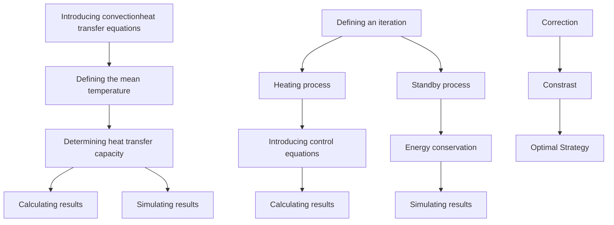

For office use only

T1

T2

T3

T4

## 44398

Problem Chosen

For office use only

F1

F2

F3

F4

## 2016 Mathematical Contest in Modeling (MCM/ICM) Summary Sheet

## Summary

A traditional bathtub cannot be reheated by itself, so users have to add hot water from time to time. Our goal is to establish a model of the temperature of bath water in space and time. Then we are expected to propose an optimal strategy for users to keep the temperature even and close to initial temperature and decrease water consumption.

To simplify modeling process, we firstly assume there is no person in the bathtub. We regard the whole bathtub as a thermodynamic system and introduce heat transfer formulas.

We establish two sub-models: adding water constantly and discontinuously. As for the former sub-model, we define the mean temperature of bath water. Introducing Newton cooling formula, we determine the heat transfer capacity. After deriving the value of parameters, we deduce formulas to derive results and simulate the change of temperature field via CFD. As for the second sub-model, we define an iteration consisting of two process: heating and standby. According to energy conservation law, we obtain the relationship of time and total heat dissipating capacity. Then we determine the mass flow and the time of adding hot water. We also use CFD to simulate the temperature field in second sub-model.

In consideration of evaporation, we correct the results of sub-models referring to some scientists’ studies. We define two evaluation criteria and compare the two sub-models. Adding water constantly is found to keep the temperature of bath water even and avoid wasting too much water, so it is recommended by us.

Then we determine the influence of some factors: radiation heat transfer, the shape and volume of the tub, the shape/volume/temperature/motions of the person, the bubbles made from bubble bath additives. We focus on the influence of those factors to heat transfer and then conduct sensitivity analysis. The results indicate smaller bathtub with less surface area, lighter personal mass, less motions and more bubbles will decrease heat transfer and save water.

Based on our model analysis and conclusions, we propose the optimal strategy for the user in a bathtub and explain the reason of uneven temperature throughout the bathtub. In addition, we make improvement for applying our model in real life.

## Enjoy a Cozy and Green Bath

## Contents

## 1 Introduction .......

1.1 Background. 4  
1.2 Literature Review . Z  
1.3 Restatement of the Problem .

## 2 Assumptions and Justification ........ 6

## 3 Notations.......

## 4 Model Overview......

## 5 Sub-model I : Adding Water Continuously ....... .8

5.1 Model Establishment. O

5.1.1 Control Equations and Boundary Conditions ...... 9  
5.1.2 Definition of the Mean Temperature.. ..11  
5.1.3 Determination of Heat Transfer Capacity . .11

5.2 Results.. ..13

5.2.1 Determination of Parameters . ..13  
5.2.2 Calculating Results ..14  
5.2.3 Simulating Results . ..15

## 6 Sub-model II: Adding Water Discontinuously ....... ..18

6.1 Heating Model. ..18

6.1.1 Control Equations and Boundary Conditions .......... ..18  
6.1.2 Determination of Inflow Time and Amount. ..19

6.2 Standby Model . ..20

6.2.1 Process Analysis . ..20  
6.2.2 Calculation of Parameters.. ..20

6.3 Results.. ..21

6.3.1 Determination of Parameters . ..21  
6.3.2 Calculating Results ..23

6.3.3 Simulating Results .. ..23

6.4 Conclusion .... ..27

## 7 Correction and Contrast of Sub-Models ........ .27

7.1 Correction with Evaporation Heat Transfer . .27

7.1.1 Correction Principle. ..27

7.1.2 Correction Results.. ..28

7.2 Contrast of Two Sub-Models. .30

7.2.1 Evaluation Criteria. ..30

7.2.2 Determination of Water Consumption .... ..30

7.2.3 Conclusion .. ..31

## 8 Model Analysis and Sensitivity Analysis ........ ..31

8.1 The Influence of Different Bathtubs .32

8.1.1 Different Volumes of Bathtubs. ..32

8.1.2 Different Shapes of Bathtubs.. ..34

8.2 The Influence of Person in Bathtub ..36

8.2.1 When the Person Remains Static in a Bathtub . ..36

8.2.2 When the Person Moves in a Bathtub . ..37

8.2.3 Results Analysis and Sensitivity Analysis. ..38

8.3 The Influence of Bubble Bath Additives . .42

8.4 The Influence of Radiation Heat Transfer . .44

8.5 Conclusion .... .45

## 9 Further Discussion..... ..45

9.1 Different Distribution of Inflow Faucets . .45

9.2 Model Application . .46

## 10 Strength and Weakness.... ..47

10.1 Strength .47

10.2 Weakness . .47

## Report ..... .49

## Reference .... ..50

## 1 Introduction

## 1.1 Background

Bathing in a tub is a perfect choice for those who have been worn out after a long day’s working. A traditional bathtub is a simply water containment vessel without a secondary heating system or circulating jets. Thus the temperature of water in bathtub declines noticeably as time goes by, which will influent the experience of bathing. As a result, the bathing person needs to add a constant trickle of hot water from a faucet to reheat the bathing water. This way of bathing will result in waste of water because when the capacity of the bathtub is reached, excess water overflows the tub.

An optimal bathing strategy is required for the person in a bathtub to get comfortable bathing experience while reducing the waste of water.

## 1.2 Literature Review

Korean physicist Gi-Beum Kim analyzed heat loss through free surface of water contained in bathtub due to conduction and evaporation [1]. He derived a relational equation based on the basic theory of heat transfer to evaluate the performance of bath tubes. The major heat loss was found to be due to evaporation. Moreover, he found out that the speed of heat loss depends more on the humidity of the bathroom than the temperature of water contained in the bathtub. So, it is best to maintain the temperature of bathtub water to be between 41 to 45 ℃ and the humidity of bathroom to be 95%.

When it comes to convective heat transfer in bathtub, many studies can be referred to. Newton's law of cooling states that the rate of heat loss of a body is proportional to the difference in temperatures between the body and its surroundings while under the effects of a breeze [2]. Claude-Louis Navier and George Gabriel Stokes described the motion of viscous fluid substances with the Navier–Stokes equations. Those equations may be used to model the weather, ocean currents, water flow in a pipe and air flow around a wing [3].

In addition, some numerical simulation software are applied in solving and analyzing problems that involve fluid flows. For example, Computational Fluid Dynamics (CFD) is a common one used to perform the calculations required to simulate the interaction of liquids and gases with surfaces defined by boundary conditions [4].

## 1.3 Restatement of the Problem

We are required to establish a model to determine the change of water temperature in space and time. Then we are expected to propose the best strategy for the person in the bathtub to keep the water temperature close to initial temperature and even throughout the tub. Reduction of waste of water is also needed. In addition, we have to consider the impact of different conditions on our model, such as different shapes and volumes of the bathtub, etc.

In order to solve those problems, we will proceed as follows:

Stating assumptions. By stating our assumptions, we will narrow the focus of our approach towards the problems and provide some insight into bathtub water temperature issues.  
Making notations. We will give some notations which are important for us to clarify our models.  
Presenting our model. In order to investigate the problem deeper, we divide our model into two sub-models. One is a steady convection heat transfer sub-model in which hot water is added constantly. The other one is an unsteady convection heat transfer sub-model where hot water is added discontinuously.  
Defining evaluation criteria and comparing sub-models. We define two main criteria to evaluate our model: the mean temperature of bath water and the amount of inflow water.  
Analysis of influencing factors. In term of the impact of different factors on our model, we take those into consideration: the shape and volume of the tub, the shape/volume/temperature of the person in the bathtub, the motions made by the person in the bathtub and adding a bubble bath additive initially.  
Model testing and sensitivity analysis. With the criteria defined before, we evaluate the reliability of our model and do the sensitivity analysis.  
Further discussion. We discuss about different ways to arrange inflow faucets. Then we improve our model to apply them in reality.  
Evaluating the model. We discuss about the strengths and weaknesses of our model.

## 2 Assumptions and Justification

To simplify the problem and make it convenient for us to simulate real-life conditions, we make the following basic assumptions, each of which is properly justified.

The bath water is incompressible Non-Newtonian fluid. The incompressible Non-Newtonian fluid is the basis of Navier–Stokes equations which are introduced to simulate the flow of bath water.  
All the physical properties of bath water, bathtub and air are assumed to be stable. The change of those properties like specific heat, thermal conductivity and density is rather small according to some studies [5]. It is complicated and unnecessary to consider these little change so we ignore them.  
There is no internal heat source in the system consisting of bathtub, hot water and air. Before the person lies in the bathtub, no internal heat source exist except the system components. The circumstance where the person is in the bathtub will be investigated in our later discussion.  
We ignore radiative thermal exchange. According to Stefan-Boltzmann’s law, the radiative thermal exchange can be ignored when the temperature is low. Refer to industrial standard [6], the temperature in bathroom is lower than 100℃, so it is reasonable for us to make this assumption.  
The temperature of the adding hot water from the faucet is stable. This hypothesis can be easily achieved in reality and will simplify our process of solving the problem.

## 3 Notations

Table 1 Notations

<table><tr><td>Symbols</td><td>Definition</td><td>Unit</td></tr><tr><td>h</td><td>Convection heat transfer coefficient</td><td> $\mathrm{W}/(\mathrm{m}^{2}\cdot\mathrm{K})$ </td></tr><tr><td>k</td><td>Thermal conductivity</td><td> $\mathrm{W}/(\mathrm{m}\cdot\mathrm{K})$ </td></tr><tr><td> $c_p$ </td><td>Specific heat</td><td> $\mathrm{J}/(\mathrm{kg}\cdot\mathrm{K})$ </td></tr><tr><td>ρ</td><td>Density</td><td> $\mathrm{kg}/\mathrm{m}^{2}$ </td></tr><tr><td>δ</td><td>Thickness</td><td>m</td></tr><tr><td>t</td><td>Temperature</td><td>°C、K</td></tr><tr><td>τ</td><td>Time</td><td>s、min、h</td></tr><tr><td> $q_m$ </td><td>Mass flow</td><td>kg/s</td></tr><tr><td>Φ</td><td>Heat transfer power</td><td>W</td></tr><tr><td>T</td><td>A period of time</td><td>s、min、h</td></tr><tr><td>V</td><td>Volume</td><td> $\mathrm{m}^{3}$ 、L</td></tr><tr><td>M、m</td><td>Mass</td><td>kg</td></tr><tr><td>A</td><td>Area</td><td> $\mathrm{m}^{2}$ </td></tr><tr><td>a、b、c</td><td>The size of a bathtub</td><td> $\mathrm{m}^{3}$ </td></tr></table>

where we define the main parameters while specific value of those parameters will be given later.

## 4 Model Overview

In our basic model, we aim at three goals: keeping the temperature as even as possible, making it close to the initial temperature and decreasing the water consumption.

We start with the simple sub-model where hot water is added constantly. At first we introduce convection heat transfer control equations in rectangular coordinate system. Then we define the mean temperature of bath water. Afterwards, we introduce Newton cooling formula to determine heat transfer capacity. After deriving the value of parameters, we get calculating results via formula deduction and simulating results via CFD.

Secondly, we present the complicated sub-model in which hot water is added discontinuously. We define an iteration consisting of two process: heating and standby. As for heating process, we derive control equations and boundary conditions. As for standby process, considering energy conservation law, we deduce the relationship of total heat dissipating capacity and time.

Then we determine the time and amount of added hot water. After deriving the value of parameters, we get calculating results via formula deduction and simulating results via CFD.

At last, we define two criteria to evaluate those two ways of adding hot water. Then we propose optimal strategy for the user in a bathtub.

The whole modeling process can be shown as follows.

flowchart

Fig.1 Modeling process

## 5 Sub-model I : Adding Water Continuously

We first establish the sub-model based on the condition that a person add water continuously to reheat the bathing water. Then we use Computational Fluid Dynamics (CFD) to simulate the change of water temperature in the bathtub. At last, we evaluate the model with the criteria which have been defined before.

## 5.1 Model Establishment

Since we try to keep the temperature of the hot water in bathtub to be even, we have to derive the amount of inflow water and the energy dissipated by the hot water into the air.

We derive the basic convection heat transfer control equations based on the former scientists’ achievement. Then, we define the mean temperature of bath water. Afterwards, we determine two types of heat transfer: the boundary heat transfer and the evaporation heat transfer. Combining thermodynamic formulas, we derive calculating results. Via Fluent software, we get simulation results.

## 5.1.1 Control Equations and Boundary Conditions

According to thermodynamics knowledge, we recall on basic convection heat transfer control equations in rectangular coordinate system. Those equations show the relationship of the temperature of the bathtub water in space.

We assume the hot water in the bathtub as a cube. Then we put it into a rectangular coordinate system. The length, width, and height of it is , and .

text_image

Z
O
c
b
Y
a
X

Fig.2 The water cube in the rectangular coordinate system

In the basis of this, we introduce the following equations [5]:

Continuity equation:

$$
\frac {\partial u}{\partial x} + \frac {\partial v}{\partial y} + \frac {\partial w}{\partial z} = 0 \tag {1}
$$

where the first component is the change of fluid mass along the X-ray. The second component is the change of fluid mass along the Y-ray. And the third component is the change of fluid mass along the Z-ray. The sum of the change in mass along those three directions is zero.

Moment differential equation (N-S equations):

$$
\rho (u \frac {\partial u}{\partial x} + v \frac {\partial u}{\partial y} + w \frac {\partial u}{\partial z}) = - \frac {\partial p}{\partial x} + \eta (\frac {\partial^ {2} u}{\partial x ^ {2}} + \frac {\partial^ {2} u}{\partial y ^ {2}} + \frac {\partial^ {2} u}{\partial z ^ {2}}) \tag {2}
$$

$$
\rho (u \frac {\partial v}{\partial x} + v \frac {\partial v}{\partial y} + w \frac {\partial v}{\partial z}) = - \frac {\partial p}{\partial y} + \eta (\frac {\partial^ {2} v}{\partial x ^ {2}} + \frac {\partial^ {2} v}{\partial y ^ {2}} + \frac {\partial^ {2} v}{\partial z ^ {2}}) \tag {3}
$$

$$
\rho \left(u \frac {\partial w}{\partial x} + v \frac {\partial w}{\partial y} + w \frac {\partial w}{\partial z}\right) = - g - \frac {\partial p}{\partial z} + \eta \left(\frac {\partial^ {2} w}{\partial x ^ {2}} + \frac {\partial^ {2} w}{\partial y ^ {2}} + \frac {\partial^ {2} w}{\partial z ^ {2}}\right) \tag {4}
$$

Energy differential equation:

$$
\rho c _ {p} (u \frac {\partial t}{\partial x} + v \frac {\partial t}{\partial y} + w \frac {\partial t}{\partial z}) = \lambda (\frac {\partial^ {2} t}{\partial x ^ {2}} + \frac {\partial^ {2} t}{\partial y ^ {2}} + \frac {\partial^ {2} t}{\partial z ^ {2}}) \tag {5}
$$

where the left three components are convection terms while the right three components are conduction terms.

Having derived those equations, we give the boundary conditions listed as follows:

In the inflow water area

$$
t = t _ {i n} \tag {6}
$$

On the top surface of bath water, it transfer heat directly into air without heat conduction, so we have

$$
- \lambda \frac {\partial t}{\partial z} = h _ {1} (t - t _ {\infty}) \tag {7}
$$

The range of the area suitable for (7) is

$$
0 <   x <   b, 0 <   y <   a, z = c \tag {8}
$$

On the front surface in Fig.2, the water transfer heat firstly with bathtub inner surfaces and then the heat comes into air. Hence we have

$$
- \lambda \frac {\partial t}{\partial x} = h _ {2} (t - t _ {x}) \tag {9}
$$

The range of the area suitable for (9) is

$$
0 <   y <   a, 0 <   z <   c, x = b \tag {10}
$$

On the right surface in Fig.2, the water also transfers heat firstly with bathtub inner surfaces and then the heat comes into air. The boundary condition here is

$$
- \lambda \frac {\partial t}{\partial y} = h _ {3} \left(t - t _ {y}\right) \tag {11}
$$

The range of the area suitable for (11) is

$$
0 <   x <   b, 0 <   z <   c, \mathrm{y} = a \tag {12}
$$

## 5.1.2 Definition of the Mean Temperature

To simplify the modeling process, we assume the bathtub and hot water in it as a constant temperature system. Thus the heat is equal in value to the enthalpy difference between inflow water and outflow water.

We let the total heat dissipation to be $Q$ and the mass flow of inflow water to be $q _ { m }$ . Recalling on the heat balance equation, we have

$$
q _ {m} c _ {p} \Delta t = Q \tag {13}
$$

where $c _ { p }$ is the specific heat of water which is constant according to our assumptions.

The temperature difference of heat transfer is

$$
\Delta t = t _ {\text { in }} - t _ {\text { out }} \tag {14}
$$

where $t _ { \mathrm { i n } }$ is the temperature of inflow water and $t _ { \mathrm { o u t } }$ is the temperature of outflow water.

Although the temperature is different from area to area, the difference is rather small which has been proved by some scientists [8]. So we substitute the mean temperature in the bathtub with the mean value of the inflow water and outflow water. That is

$$
t _ {\mathrm{f}} = \frac {t _ {\mathrm{in}} + t _ {\mathrm{out}}}{2} \tag {15}
$$

where $t _ { \mathrm { f } }$ is the mean temperature in the bathtub.

## 5.1.3 Determination of Heat Transfer Capacity

The real-life heat transfer process is a complicated mixed heat transfer problem which is shown as follows

text_image

Φ₁
Φ₂
Φ₂
Φ₂
t∞
t∞

Fig.3 The sketch of bathtub heat transfer

As we can see in the above figure, the hot water in a bathtub has six radiating surfaces. On top surface transfers heat directly with air. The other surfaces transfer heat firstly with bathtub inner surfaces. Then the heat conducts through the bathtub and be transferred into air.

As for the top radiating surface, we derive the amount of radiating heat $\Phi _ { 1 }$ with the aid of Newton cooling formula

$$
\Phi_ {1} = h A \left(t _ {\mathrm{f}} - t _ {\infty}\right) \tag {16}
$$

In reality, the bathtub manufacturers tend to add some layers of thermal insulation materials to decrease the heat loss. So the boundary of a bathtub is made up by different material layers.

text_image

t_f
h_1
k_1
δ_1
k_2
δ_2
h_2
t_∞
t_w1
t_w2
t_w3
Inside the tub
Layers of thermal
insulation materials
Outside the tub

Fig.4 The sketch of boundary heat transfer

In Fig.4, $k _ { 1 }$ and $k _ { 2 }$ are thermal conductivity of the inner and outer layer of thermal insulation materials. $\delta _ { 1 }$ and $\delta _ { 2 }$ are the thickness of the inner and outer layer of thermal insulation materials. The heat transfer coefficient between the hot water and inner surface of the bathtub is $h _ { \scriptscriptstyle 1 }$ . The heat transfer coefficient between air and outer surface of the bathtub is $h _ { 2 } \cdot \ t _ { \mathrm { w } 1 } , \ t _ { \mathrm { w } 2 }$ and $t _ { \mathrm { w } 3 }$ are the temperatures of three boundaries of the thermal insulation material layers.

According to heat conduction formula, we have

$$
\Phi_ {2} = \frac {t _ {\mathrm{f}} - t _ {\infty}}{\frac {1}{A} \left(\frac {1}{h _ {1}} + \frac {\delta_ {1}}{k _ {1}} + \frac {\delta_ {2}}{k _ {2}} + \frac {1}{h _ {2}}\right)} \tag {17}
$$

Hence the total heat dissipation capacity is

$$
\Phi = \Phi_ {1} + \Phi_ {2} \tag {18}
$$

## 5.2 Results

We first give the value of parameters based on others’ studies. Then we get the calculation results and simulating results via those data.

## 5.2.1 Determination of Parameters

After establishing the model, we have to determine the value of some important parameters.

As scholar Beum Kim points out, the optimal temperature for bath is between 41 and $4 5 \mathrm { { ^ \circ C I 1 } }$ . Meanwhile, according to Shimodozono’s study, 41℃ warm water bath is the perfect choice for individual health [2]. So it is reasonable for us to focus on 41℃\~45℃. Because adding hot water continuously is a steady process, so the mean temperature of bath water is supposed to be constant. We value the temperature of inflow and outflow water with the maximum and minimum temperature respectively.

The values of all parameters needed are shown as follows:

Table 2 The values of parameters

<table><tr><td>Parameters</td><td>Values</td><td>Unit</td></tr><tr><td> $t_{\text{in}}$ </td><td>45</td><td>°C</td></tr><tr><td> $t_{\text{out}}$ </td><td>41</td><td>°C</td></tr><tr><td> $t_{\text{f}}$ </td><td>43</td><td>°C</td></tr><tr><td> $t_{\infty}$ </td><td>25</td><td>°C</td></tr><tr><td> $\delta_1$ </td><td>0.64</td><td>mm</td></tr><tr><td> $\delta_2$ </td><td>30</td><td>mm</td></tr><tr><td> $h_1$ </td><td>10</td><td>W/(m2·K)</td></tr><tr><td> $h_1$ </td><td>300</td><td>W/(m2·K)</td></tr><tr><td> $k_1$ </td><td>0.19</td><td>W/(m·K)</td></tr><tr><td> $k_2$ </td><td>0.036</td><td>W/(m·K)</td></tr><tr><td> $c_p$ </td><td>4174</td><td>J/(kg·K)</td></tr><tr><td> $\phi$ </td><td>0.85</td><td>None</td></tr><tr><td> $\rho$ </td><td>992</td><td>kg/m3</td></tr><tr><td>M</td><td>320</td><td>kg</td></tr><tr><td>a*b*c</td><td>1.8*0.9*0.64</td><td>m3</td></tr><tr><td>V</td><td>0.32</td><td>m3</td></tr></table>

## 5.2.2 Calculating Results

Putting the above value of parameters into the equations we derived before, we can get the some data as follows

Table 3 The calculating results

<table><tr><td>Variables</td><td>Values</td><td>Unit</td></tr><tr><td> $A_1$ </td><td>1.05</td><td> $m^2$ </td></tr><tr><td> $A_2$ </td><td>2.24</td><td> $m^2$ </td></tr><tr><td> $Φ_1$ </td><td>189.00</td><td>W</td></tr><tr><td> $Φ_2$ </td><td>43.47</td><td>W</td></tr><tr><td> $Φ$ </td><td>232.47</td><td>W</td></tr><tr><td> $q_m$ </td><td>0.014</td><td>g/s</td></tr></table>

In this table, we find the whole amount of radiating heat of the bathtub is 232.47 W. Based on industrial standards, the bathtub we chose has capacity of 320L. The temperature of inflow and outflow water is designed to be 45 and 41℃, the mass flow turns out to be 0.014 (that is 0.84 ). Only this condition is satisfied can the temperature throughout the bathtub be kept as even as possible.

## 5.2.3 Simulating Results

It is quite unrealistic for us to compute the equations (1)-(5) because the N-S equation is coupled to the energy equation. In order to derive the temperature field, the velocity field is needed. Then introduce the boundary conditions, the temperature field is worked out. However, this method is so difficult that The Clay Mathematics Institute of Cambridge, Massachusetts (CMI) even sets prize to inspire people to solve it. So we have to employ Computational Fluid Dynamics (CFD) to simulate the temperature field based on those equations.

We will proceed as follows:

Step 1: Via Gambit software, we establish the three-dimensional model and divide meshes. Then we define the boundary type.  
Step 2: Using Fluent software to read and examine the meshes.  
Step 3: Defining solving model. We introduce Laminar Model to simulate the N-S equation and Energy Model to simulate the energy equation.  
Step 4: Defining the materials and correcting the corresponding physical property parameters.  
Step 5: Defining the boundary conditions.  
Step 6: Solving initialization.  
Step 7: Setting number of iterations.  
Step 8: The results are derived when the convergence conditions are met.

Applying the above steps in our first sub-model, the results turn out to be satisfying.

First of all, we divide meshes with the aid of Gambit software, which is shown in the following figure.

natural_image

3D diagram of a rectangular prism with a central slot and green mesh pattern, no text or symbols present

Fig.5 Divide meshes in Gambit

As is shown in Fig.5, we divide the hot water into 129600 meshes. Then we export the Mesh file then import it into Fluent and make corresponding settings. Afterwards, we begin to compute it by iteration. When the iteration is conducted for 379 times, the problem is nearly convergent. The curve of residual is shown in Fig.5.

line chart

| x    | continuity | x-velocity | y-velocity | z-velocity | energy | k      | epsilon |
| ---- | --------- | ---------- | ---------- | ---------- | ------ | ------ | ------- |
| 0    | 1e+01     | 1e+01      | 1e+01      | 1e+01      | 1e+01  | 1e+01  | 1e+01   |
| 50   | 1e-02     | 1e-02      | 1e-02      | 1e-02      | 1e-07  | 1e-02  | 1e-02   |
| 100  | 1e-03     | 1e-03      | 1e-03      | 1e-03      | 1e-07  | 1e-03  | 1e-03   |
| 150  | 1e-04     | 1e-04      | 1e-04      | 1e-04      | 1e-07  | 1e-04  | 1e-04   |
| 200  | 1e-05     | 1e-05      | 1e-05      | 1e-05      | 1e-07  | 1e-05  | 1e-05   |
| 250  | 1e-06     | 1e-06      | 1e-06      | 1e-06      | 1e-07  | 1e-06  | 1e-06   |
| 300  | 1e-07     | 1e-07      | 1e-07      | 1e-07      | 1e-07  | 1e-07  | 1e-07   |
| 350  | 1e-08     | 1e-08      | 1e-08      | 1e-08      | 1e-07  | 1e-08  | 1e-08   |
| 400  | 1e-09     | 1e-09      | 1e-09      | 1e-09      | 1e-07  | 1e-09  | 1e-09   |

Fig.6 The curve of residual

Combining specific boundary conditions, we have the temperature field throughout the bathtub. In reality, there are various ways of water inflow and outflow. We design the water to flow into the bathtub from left side and out of the bathtub from the right side.

We take the temperature field of two surfaces as examples.

  
Fig.7 (b) The temperature field of the side surface

where ‘the bottom surface’ means the $\mathsf { x } { \mathrm { - O - y } }$ surface while ‘the side surface’ is the y-O-z surface of the water cube in Fig2. The temperature shown in the legend is presented in Kelvin scale and the data should be expended to 100 times.

As we can see in the figures, the temperature in the bathtub is different from area to area, which decreases along the direction of water flow. However, the temperature fluctuates between 43 to $4 5 ~ \mathrm { { ^ \circ C } }$ (316-318 K). The highest temperature is that of inflow area because the adding water is the hottest. In addition, due to the stability of this model when a person adds hot water continually, the temperature of each area remains stable.

In conclusion, the temperature is not strictly even throughout the bathtub. It differs according to boundary conditions. However, the mean temperature of the whole water in the bathtub is stable.

By the way, because of the shortage of Fluent software in simulating small water flow, the temperature marked by different colors may differ a little. For example, in the legend, 44℃(317 K) corresponds with colors ranging from blue to orange. Actually, each color represents a different temperature between 44- 45 ℃ (317-318K). The changing tendency of colors strictly represents the changing tendency of the temperature.

## 6 Sub-model II: Adding Water Discontinuously

In order to establish the unsteady sub-model, we recall on the working principle of air conditioners. The heating performance of air conditions consist of two processes: heating and standby. After the user set a temperature, the air conditioner will begin to heat until the expected temperature is reached. Then it will go standby. When the temperature get below the expected temperature, the air conditioner begin to work again. As it works in this circle, the temperature remains the expected one.

Inspired by this, we divide the bathtub working into two processes: adding hot water until the expected temperature is reached, then keeping this condition for a while unless the temperature is lower than a specific value. Iterating this circle ceaselessly will ensure the temperature kept relatively stable.

## 6.1 Heating Model

## 6.1.1 Control Equations and Boundary Conditions

We focus on heating process at first. During this process, the hot water flows throughout the bathtub so we need to use N-S equation. We also have to introduce energy equation considering there is convective heat transfer in the flow.

Adding an unsteady term into basic N-S equation [3], we have

$$
\rho \left(\frac {\partial u}{\partial \tau} + u \frac {\partial u}{\partial x} + v \frac {\partial u}{\partial y} + w \frac {\partial u}{\partial z}\right) = - \frac {\partial p}{\partial x} + \eta \left(\frac {\partial^ {2} u}{\partial x ^ {2}} + \frac {\partial^ {2} u}{\partial y ^ {2}} + \frac {\partial^ {2} u}{\partial z ^ {2}}\right) \tag {19}
$$

The above equation is established along x-axis. The other two equations along y-axis and z-axis can be easily deduced so we omit them.

Similarly, we add unsteady term into energy equation and get

$$
\rho c _ {p} \left(\frac {\partial t}{\partial \tau} + u \frac {\partial t}{\partial x} + v \frac {\partial t}{\partial y} + w \frac {\partial t}{\partial z}\right) = \lambda \left(\frac {\partial^ {2} t}{\partial x ^ {2}} + \frac {\partial^ {2} t}{\partial y ^ {2}} + \frac {\partial^ {2} t}{\partial z ^ {2}}\right) \tag {20}
$$

As for the boundary conditions, (6)-(12) are also suitable for this model. Except those, there are two other conditions:

$$
\text { when } \tau = 0, \quad t = t _ {\mathrm{f}} \tag {21}
$$

$$
\text { when } \tau \rightarrow \tau_ {0}, t _ {\mathrm{f}} = t _ {\min} \tag {22}
$$

where $t _ { \mathrm { m i n } }$ is the minimum of mean temperature of bath water.

## 6.1.2 Determination of Inflow Time and Amount

The bathtub can be simplified as a water containment vessel, so the amount of inflow and outflow is the equal in value. Hence the mass of the bath water in a bathtub is constant. That is

$$
q _ {m} = q _ {\mathrm{in}} = q _ {\mathrm{out}} \tag {23}
$$

We let initial mean temperature of bath water to be $t _ { \mathrm { f 1 } }$ and the temperature of inflow water to be $t _ { \mathrm { i n } }$ . Frequently, the mean temperature will rise as hot water added, which leads the temperature of outflow to rise. We let the final temperature of outflow to be  out2t . $t _ { \mathrm { o u t } 2 }$

Both $t _ { \mathrm { f } 1 }$ and $t _ { \mathrm { o u t } 2 }$ are functions of time.

$$
t _ {\mathrm{f}} = f (\tau), t _ {\text { out }} = g (\tau) \tag {24}
$$

We assume the bath water in bathtub as a control volume, so the energy stored in bathtub is the difference between the energy of inflow and outflow. This can be seen in the following figure.

text_image

Φ
Φin
Φout

Fig.8 The transfer and storage of energy

The total heat dissipating capacity turns out to be

$$
Q _ {\mathrm{out}} = \int_ {T _ {1}} \Phi (\tau) d \tau \tag {25}
$$

We also derive that

$$
\Phi \left(t _ {\mathrm{f}}\right) = h A _ {1} \left(t _ {\mathrm{f}} - t _ {\infty}\right) + \frac {t _ {\mathrm{f}} - t _ {\infty}}{\frac {1}{A _ {2}} \left(\frac {1}{h _ {1}} + \frac {\delta_ {1}}{k _ {1}} + \frac {\delta_ {2}}{k _ {2}} + \frac {1}{h _ {2}}\right)} \tag {26}
$$

As the temperature of inflow water is higher than that of bath water in the bathtub, so the inflow will transfer heat into the bath water. The energy that bath water gets is equal in value to the enthalpy difference between inflow and outflow. Hence

$$
\Phi_ {\text { in }} = m c _ {p} \left(t _ {\mathrm{f} 2} - t _ {\mathrm{f} 1}\right) \tag {27}
$$

Referring to formula (15), we have

$$
t _ {\mathrm{f} 2} = \frac {t _ {\mathrm{in}} + t _ {\mathrm{out} 2}}{2} \tag {28}
$$

The enthalpy difference between inflow and outflow is very the energy added into bath water. That is

$$
Q = \int_ {T _ {1}} q _ {m} c _ {p} \left(t _ {\text { in }} - t _ {\text { out }}\right) d \tau \tag {29}
$$

According to energy conservation principle, it follows that

$$
Q = Q _ {\mathrm{in}} + Q _ {\mathrm{out}} \tag {30}
$$

When the temperature of bath water reaches $t _ { \mathrm { f } 2 }$ , the heating process is stopped. Based on these above relationships, we derive the time of adding hot water $T _ { 1 }$ and the corresponding amount of inflow $q _ { m }$ .

## 6.2 Standby Model

## 6.2.1 Process Analysis

After the heating process is finished, the mean temperature of bath water is $t _ { \mathrm { f } 2 }$ . In standby process, it is assumed to be put in a space of which the temperature is $t _ { \infty }$ and transfer heat into the space. Finally, the temperature decreases to a specific temperature $t _ { \mathrm { f l } }$ and the next iteration begins. During the standby process, the mean temperature of bath water is expressed by $t _ { \mathrm { f } }$ which is a function of time.

## 6.2.2 Calculation of Parameters

Throughout the whole process of cooling, the bath water transfer heat to the surroundings via convection or other ways. So that its internal energy is reduced as time goes by.

We take the whole bath water as a control volume and derive the energy balance equation:

$$
- \rho c _ {p} V \frac {d t}{d \tau} = h A (t - t _ {\infty}) \tag {31}
$$

The initial conditions are

$$
\text { when } \tau = 0, t = t _ {\mathrm{f2}} \tag {32}
$$

$$
\text { when } \tau \rightarrow \infty , t = t _ {\infty} \tag {33}
$$

According to before discussion and based on the surfaces of the control

volume, we have

$$
h A = h A _ {1} + \frac {1}{\frac {1}{A _ {2}} \left(\frac {1}{h _ {1}} + \frac {\delta_ {1}}{k _ {1}} + \frac {\delta_ {2}}{k _ {2}} + \frac {1}{h _ {2}}\right)} \tag {34}
$$

Then we integrating  over  in formula (31) and get

$$
t = t _ {\infty} + \left(t _ {\mathrm{f} 2} - t _ {\infty}\right) \exp \left(- \frac {h A}{\rho c _ {p} V} \tau\right) \tag {35}
$$

When the temperature decreases to $t _ { \mathrm { f l } }$ , the time of standby process turns out to be

$$
T _ {2} = - \frac {\rho c _ {p} V}{h A} \ln \frac {t _ {\mathrm{f} 1} - t _ {\infty}}{t _ {\mathrm{f} 2} - t _ {\infty}} \tag {36}
$$

The whole heat transfer capacity is

$$
Q = \rho c _ {p} V \left(t _ {\mathrm{f} 2} - t _ {\infty}\right) \left(1 - \exp \left(- \frac {h A}{\rho c _ {p} V} T _ {2}\right)\right) \tag {37}
$$

## 6.3 Results

## 6.3.1 Determination of Parameters

One of our goals is to keep the temperature even throughout the bathtub. So we firstly have to determine the value of corresponding parameters such as the initial temperature of inflow and outflow.

According to the data we use in the first sub-model, the temperature in the bathtub ranges between 41 to $4 5 ~ \mathrm { ^ \circ C }$ . In this sub-model, we still set the temperature of inflow water to be $t _ { \mathrm { i n } } = 4 5 \mathrm { ~ \textdegree C }$ . In order to give the user comfortable experience, we set the change of the mean temperature less than 1 ℃ .thus the lowest mean temperature $t _ { \mathrm { f 1 } } { = } 4 2 \ \mathrm { ~ \textdegree C }$ .While the highest mean temperature $t _ { \mathrm { f } 2 } { = } 4 3 \mathrm { ~ } \mathrm { ^ { \circ } C }$ . The expected mean temperature turns out to be $t _ { \mathrm { a } }$ $= 4 2 . 5 \mathrm { ^ \circ C }$ . In that way, the maximum change of the mean temperature is only 0.5℃.

The other parameters will change over time. The change value cannot be expressed by specific functions. So we need to analyze them according to our model. We first focus on the different temperatures during the heating process. The temperature of inflow remains stable. The temperature of outflow is stable for a while but begins to rise as hot water added. Meanwhile, the mean temperature also rises when the user adds hot water into the bathtub. The changing trend is shown as follows:

line chart

| τ     | t_in  | t_f   | t_out |
|-------|-------|-------|-------|
| 0     | t_in  | t_f1  | t_out1|
| T_c   | t_in  | t_f1  | t_out1|
| >T_c  | t_in  | t_f2  | t_out2|

Fig.9 The changing trend of different temperature

From the above picture, we can see that the mean temperature remains rising. After the added hot water arrives at the outflow side, the temperature of outflow begins to be influenced. We let $T _ { c }$ to represent the time between adding hot water and the temperature of outflow beginning to rise. This process can be divided into two parts:

When the time is shorter than $T _ { c } .$ , the temperature of outflow remains stable.  
When the time is longer than $T _ { c }$ , the temperature of outflow begins to rise.

Then we need to determine whether the time of adding hot water $T _ { 1 }$ is longer or shorter than $T _ { c }$ . Recalling on the first sub-model, we derive that the temperature of inflow is $4 5 \mathrm { ^ \circ C }$ while the temperature of outflow is $4 1 ^ { \circ } \mathrm { C }$ . Under such circumstance, the mean temperature turns out to remain $4 3 \mathrm { { ^ \circ C } }$ .

We assume the area that added hot water covers is in stable state. If we firstly suppose $T _ { 1 } > T _ { c }$ , the whole hot water is in stable state. This is alike the first sub-model where the mean temperature is $4 3 \mathrm { { ^ \circ C } }$ .However the expected mean temperature is $4 2 . 5 \mathrm { { ‰} }$ , higher than $4 3 \mathrm { { ^ \circ C } }$ . That means before $T _ { 1 }$ is longer than $T _ { c }$ , the mean temperature has reached $4 2 . 5 \mathrm { { ‰} }$ . So it is untrue for us to suppose $T _ { 1 } > T _ { c }$ . That is to say $T _ { 1 } < T _ { c }$ . Based on that, the initial temperature of outflow is equal to the value of the lowest mean temperature $t _ { o u t } = t _ { \mathrm { f 1 } } { = } 4 2 ^ { \circ } \mathrm { C }$ .Still, it is convenient for us to compute.

The value of corresponding parameters is listed in the following table.

Table 4 The value of corresponding parameters

<table><tr><td>Parameters</td><td>Value</td><td>Unit</td></tr><tr><td> $t_{\text{in}}$ </td><td>45</td><td>°C</td></tr><tr><td> $t_{\text{f1}}$ </td><td>42</td><td>°C</td></tr><tr><td> $t_{\text{f2}}$ </td><td>43</td><td>°C</td></tr><tr><td> $t_{\text{a}}$ </td><td>42.5</td><td>°C</td></tr><tr><td> $t_{\text{f}}$ </td><td>43</td><td>°C</td></tr><tr><td> $t_{\text{out}}$ </td><td>42</td><td>°C</td></tr></table>

## 6.3.2 Calculating Results

The relationship between mass flow $q _ { m }$ and the time of adding hot water $T _ { 1 }$ is

$$
1 2 5 2 2 T _ {1} q _ {m} - 2 3 2 T _ {1} - 1 3 3 3 0 0 8 = 0 \tag {38}
$$

Commonly, it will be better if the time of adding hot water is shorter. According to some data from the Internet, we make $T _ { 1 } = 3 \mathrm { m i n }$ . From formula (38)，we compute the mass flow $q _ { m } { = } 0 . 6 1 \mathrm { k g / s }$ . Putting these data into formulas (31)-(36), we find ${ T _ { 2 } } \mathrm { { = } } 5 9 1 4 s$ (approximately 1.64h).

Table 5 The calculating results

<table><tr><td>Parameters</td><td>Value</td><td>Unit</td></tr><tr><td> $T_1$ </td><td>3</td><td>min</td></tr><tr><td> $T_2$ </td><td>1.64</td><td>h</td></tr><tr><td>T</td><td>101.4</td><td>min</td></tr><tr><td> $q_m$ </td><td>0.61</td><td>kg/s</td></tr></table>

where T is the total time of an iteration.

## 6.3.3 Simulating Results

Because this sub-model is a three-dimensional problem, it is hard for us to simulate it by Fluent. The hot water of constant temperature flows into the bathtub and is mixed with the bath water, causing fluid convection. The temperature field is symmetric so that we can simplify it as a two-dimensional problem. Although there are heat insulating materials around the bathtub, the heat transfer coefficient of forced convection of water is much larger than that of natural convection of air and water. So it is reasonable for us to simplify the

problem as a two-dimensional one.

Considering the simulating by a computer takes too much time, we set the mass flow of the inflow water to be 0.04m/s. The residual curve of simulation is shown as follows.

line chart

| x    | continuity | x-velocity | y-velocity | energy |
| ---- | --------- | ---------- | ---------- | ------ |
| 0    | 1e+00     | 1e+00      | 1e+00      | 1e-08  |
| 100  | 1e-03     | 1e-03      | 1e-04      | 1e-07  |
| 200  | 1e-03     | 1e-03      | 1e-04      | 1e-07  |
| 300  | 1e-03     | 1e-03      | 1e-04      | 1e-07  |
| 400  | 1e-03     | 1e-03      | 1e-04      | 1e-07  |
| 500  | 1e-03     | 1e-03      | 1e-04      | 1e-07  |
| 600  | 1e-03     | 1e-03      | 1e-04      | 1e-07  |
| 700  | 1e-03     | 1e-03      | 1e-04      | 1e-07  |
| 800  | 1e-03     | 1e-03      | 1e-04      | 1e-07  |

Fig.10 The residual curve of simulation

The change of temperature field is present in the following four pictures.

heatmap

| Panel | Value |
| --- | --- |
| (a) =1s | 3.18 |
| (a) =1s | 3.18 |
| (a) =1s | 3.17 |
| (a) =1s | 3.17 |
| (a) =1s | 3.16 |
| (a) =1s | 3.16 |
| (a) =1s | 3.15 |
| (a) =1s | 3.15 |
| (a) =1s | 3.14 |
| (a) =1s | 3.14 |
| (a) =1s | 3.14 |
| (a) =1s | 3.13 |

(b) t=2s  
(c) t=10s

natural_image

Abstract red and orange curved shape on a blue background (no text or symbols)

(d) t=20s

natural_image

Abstract red and orange curved shape on blue background (no text or symbols)

(e) t=30s  
Fig.11 The change of temperature field

where the picture (a) is the complete representation of the temperature field while pictures (b)-(e) are partial representation of the temperature field. The temperature in the legend is presented in Kelvin scale and the data should be expended to 100 times.

From the figure of the residual curve of simulation, we can find that the residual changes periodically and the change is small, which indicates the stability of the simulating results. Limited to time, we simulate situations which only last for 30s.

The four pictures in Fig.11 shows the change of temperature field after the hot water is added. Because the water flows in specific velocity, it influences mainly the area in front of it. However, the area beside it is hardly affected and remains the primary temperature. As more hot water is added, the convective surface becomes larger and moves towards the exit. We can also find there is an obvious interface between the added hot water and the initial bath water. That indicates the difference of temperature of added water and bath water is supposed to be small.

In the standby process, the bath water is put in a space, cooling freely. Recalling on our calculating results before, it takes about 1.64h for the temperature of the whole bath water to decrease by 1℃. Since it is impossible for out computer to simulate the change over such long time, we shrink the size of bathtub. The boundary conditions remain unchanged. Shrinking the size to 1/100, we get the temperature field as following.

line chart

| x    | continuity | x-velocity | y-velocity | energy |
| ---- | --------- | ---------- | ---------- | ------ |
| 0    | 1e-05     | 1e-05      | 1e-05      | 1e-05  |
| 50   | 1e-06     | 1e-06      | 1e-06      | 1e-06  |
| 100  | 1e-07     | 1e-07      | 1e-07      | 1e-07  |
| 150  | 1e-07     | 1e-07      | 1e-07      | 1e-07  |
| 200  | 1e-07     | 1e-07      | 1e-07      | 1e-07  |
| 250  | 1e-07     | 1e-07      | 1e-07      | 1e-07  |
| 300  | 1e-07     | 1e-07      | 1e-07      | 1e-07  |

Fig.12 The residual curve of simulation

heatmap

| Time | Value |
|------|-------|
| t=3s | 3.18  |
| t=3s | 3.17  |
| t=3s | 3.16  |
| t=3s | 3.15  |
| t=3s | 3.14  |
| t=3s | 3.13  |
| t=15s| 3.18  |
| t=15s| 3.17  |
| t=15s| 3.16  |
| t=15s| 3.15  |
| t=15s| 3.14  |
| t=15s| 3.13  |

Fig.13 The temperature field

Compared to initial bathtub, although the size changes, the heat transfer remains the same. As is shown in the picture (a), when the time is short, the change of temperature of middle areas is small. That is because the main convection happens in boundary areas. As time goes by, the cooler areas spread towards the middle area, as is presented in picture (b). So that the temperature of other areas besides the middle begins to change. However, the change is small, most of which is less than 2℃. The lowest temperature occurs in four corners, being $4 0 ^ { \circ } \mathrm { C }$ approximately. After the mean temperature is lower than the expected value, the bathtub user needs to add hot water into the bathtub to reheat the water. This simulating result corresponds to the calculating result we derived before.

## 6.4 Conclusion

According to calculation and simulation, we basically determine the time of an iteration. The heating process lasts for 3 min while the mass flow is 0.61kg/s. the standby process lasts for 1.64h while the mean temperature decreases by 1℃. By simulating the two situations, we proof the validity of our model and explain why it is so slow for the temperature of bath water to decrease.

## 7 Correction and Contrast of Sub-Models

After establishing two basic sub-models, we have to correct them in consideration of evaporation heat transfer. Then we define two evaluation criteria to compare the two sub-models in order to determine the optimal bath strategy.

## 7.1 Correction with Evaporation Heat Transfer

Someone may confuse about the above results: why the mass flow in the first sub-model is so small? Why the standby time is so long? Actually, the above two sub-models are based on ideal conditions without consideration of the change of boundary conditions, the motions made by the person in bathtub and the evaporation of bath water, etc. The influence of personal motions will be discussed later. Here we introducing the evaporation of bath water to correct sub-models.

## 7.1.1 Correction Principle

According to Gi-Beum Kim’s studies, the heat transfer capacity is relative not only with boundary mixed heat transfer, but also with evaporation heat transfer. More importantly, the major heat loss is found to be due to evaporation [1]. In order to clarify our correction process more clearly, we briefly introduce his achievement and findings.

The evaporation heat transfer is related to the temperature of the bath water, the air humidity of the bathroom, the total thermal resistance, material properties and so on. The relationship is given as follows:

$$
\Phi = \int_ {t _ {0}} ^ {t} E A _ {f} \rho L \frac {M c _ {p} \delta}{\left(t _ {0} - t _ {\infty}\right) k A} d t \tag {39}
$$

where is the thermal resistance. is the area of heat transfer. is the latent heat of evaporation. $\delta$ is the thickness of materials. $A _ { f }$ is the area of free surface.  is the evaporation capacity.

The experimental formula that Gi-Beum Kim gives is

$$
E = (0. 3 7 + 0. 0 0 4 1 v) (0. 0 0 4 1 e ^ {t / 2 2. 0 0 9} - 0. 0 0 4) ^ {0. 8 8} (1 - \phi) ^ {0. 8 8} \tag {40}
$$

where  is the mean temperature of air and $\phi$ is the air humidity.

The experimental formula for the latent heat of evaporation  is

$$
L = (t + 2 7 3. 1 5) 3. 4 8 4 t ^ {- 0. 1 7 4} \tag {41}
$$

We let the evaporation heat transfer capacity to be $\Phi _ { \mathrm { s } }$ and the convection heat transfer capacity to be $\Phi _ { \mathrm { q } }$ . Then the total heat loss is

$$
\Phi_ {\mathrm{t}} = \Phi_ {\mathrm{s}} + \Phi_ {\mathrm{q}} \tag {42}
$$

Plugging the above formulas into sub-models, we obtain the precise results after being corrected.

## 7.1.2 Correction Results

Considering the model established by Gi-Beum Kim is similar with ours, so we can refer to his results to correct our sub-models. In his experiment, the bathtub has a capacity of 250L, which is close to the capacity of our bathtub. When the air humidity remains stable, he finds the change of mean temperature over time as follows [1]:

line chart

| Time /h | φ=0.80 | φ=0.85 | φ=0.90 | φ=0.95 |
| ------- | ------ | ------ | ------ | ------ |
| 0.0     | 43.0   | 43.0   | 43.0   | 43.0   |
| 0.5     | 42.5   | 42.7   | 42.8   | 42.9   |
| 1.0     | 41.8   | 42.0   | 42.3   | 42.6   |
| 1.5     | 41.0   | 41.3   | 41.8   | 42.3   |
| 2.0     | 40.2   | 40.6   | 41.3   | 42.0   |
| 2.5     | 39.5   | 39.9   | 40.8   | 41.7   |
| 3.0     | 38.8   | 39.2   | 40.3   | 41.4   |
| 3.5     | 37.8   | 39.2   | 39.7   | 41.1   |

Fig.14 Mean temperature change under different air humidity

As is vividly shown in Fig.14, the air humidity affects the mean temperature of bath water heavily. The more air humidity is, the smaller evaporation capacity will be, so that the main heat transfer comes from boundary convection heat transfer.

Commonly, the air humidity is high in bathroom but the air temperature is low. According to Fig.14 , we assume it takes 0.75 h (45 min ) for the temperature of bath water to decrease by 1℃.

Since we have obtained the convection capacity in before calculation, we can compute the evaporation capacity based on energy conservation. Then the total heat transfer capacity can be derived and the correction is to be conduct. The corrected results in listed in the following table.

Table 6 The corrected results

<table><tr><td>Parameters</td><td>Value</td><td>Unit</td></tr><tr><td> $\Phi_s$ </td><td>261.24</td><td>W</td></tr><tr><td> $\Phi_q$ </td><td>232.47</td><td>W</td></tr><tr><td> $\Phi_t$ </td><td>522.71</td><td>W</td></tr><tr><td> $q_{m1}$ </td><td>0.03</td><td>kg/s</td></tr><tr><td> $q_{m2}$ </td><td>0.63</td><td>kg/s</td></tr><tr><td> $T_1$ </td><td>3</td><td>min</td></tr><tr><td> $T_2$ </td><td>45</td><td>min</td></tr><tr><td>T</td><td>48</td><td>min</td></tr></table>

Let us analyze the corrected results. The mean temperature in the first submodel mainly depends on convective heat transfer capacity because it is in steady state. As for the second sub-model, the convection heat transfer hardly affects the heating process because the specific heat is large. The standby process is similar with the first sub-model, so it is affected by evaporation heat transfer.

## 7.2 Contrast of Two Sub-Models

Firstly we define two evaluation criteria. Then we contrast the two submodels via these two criteria. Thus we can derive the best strategy for the person in the bathtub to adopt.

## 7.2.1 Evaluation Criteria

We aim at three goals: keeping the temperature as even as possible, making it close to the initial temperature and decreasing the water consumption. Considering that, we define two criteria to evaluate the sub-models:

The average temperature of the water in bathtub. It is difficult to keep the temperature strictly even throughout the bathtub because convective heat transfer is an unsteady process. However, the difference in temperature of diverse area is rather small so we can use the average temperature to substitute the temperature of whole bathtub. With the aid of Gi-Beum Kim’s study, the optimal temperature ranges from 41 to 45℃[1].

Water consumption during a bath. According to data from the internet, the water consumption of bathing in a bathtub is four times as many as bathing with a shower [7]. So it is necessary for the bathtub users to decrease water consumption, not only for lower cost of bath but also for the responsibility to the environment.

## 7.2.2 Determination of Water Consumption

In the before discussion, we have derived the mass flow in the two submodels. Giving the bath time, it is easy to compute the total water consumption. Considering the bathtub is filled with same water capacity, the difference of water consumption is added hot water. So we only have to calculate the amount of added water in order to compare the sub-models.

We let the bath time to be $T _ { b }$ . Since the hot water is added consistently, the mass flow is a constant over time. So the total amount of added water is

$$
m _ {1} = T _ {b} q _ {m 1} \tag {43}
$$

As for the second sub-model, the hot water is only added during the heating process. So the mass flow in heating process is constant while that in standby process is zero. Then we have the total amount of added water in second sub-model

$$
m _ {2} = \left[ \frac {T _ {b}}{T} + 1 \right] T _ {1} q _ {m 2} \tag {44}
$$

where we use Gauss integral function. Because the bath time $T _ { b }$ may not be any multiple of the iteration time $T ,$ , we have to round the figure. No matter what period adding hot water reaches, we assume it as a complete iteration so that the actual iteration times need to be plus one.

To simplify our calculation, we set the bath time to be $T _ { b } = 4 8 \mathrm { m i n }$ , which is very an iteration time. Thus we find the amount of added water consumption in the first sub-model to be $m _ { \mathrm { 1 } } = 8 6 . 4 \mathrm { k g }$ , while that in the second sub-model to be $m _ { 2 } = 1 1 3 . 4 \mathrm { k g }$ .

## 7.2.3 Conclusion

In terms of the mean temperature of bath water, the temperature of the first sub-model is $4 3 \mathrm { { ^ \circ C } }$ while that of the second sub-model ranges from 42 to $4 3 ^ { \circ } \mathrm { C }$ . According to common sense, a person can hardly feel 1℃change of temperature. So both strategies of adding water are optimal for the person in a bathtub.

As the water consumption of the first sub-model is 84.6 kg, while that of the second sub-model is 113.4 kg. Considering our goal to decrease water consumption, it is obviously wise to choose adding hot water continually instead of adding water discontinuously.

In conclusion, we recommend the person in the bathtub to add hot water continually with mass flow being 0.03 kg/s. This strategy can not only ensure comfortable bath experience but also avoid wasting too much water.

## 8 Model Analysis and Sensitivity Analysis

The results of the model we establish before correspond with literature to huge extent. However, the model is based on an ideal situation that there is no person in bathtub. Still, the bathtub in our model is simplified as a cube.

In reality, things are quite different. The bathtub can be designed into various shapes and volumes and there is undoubtedly one person or more in the bathtub. The person in bathtub may have various shapes, volume and temperature. He / She is likely to make mangy motions during bath time. In addition, people tend to use a bubble bath additive while initially filling the bathtub to assist in cleansing, which may affect our model’s results as well.

So here we will conduct sensitivity analysis to determine the extent to which our model depends upon those influencing factors

# 8.1 The Influence of Different Bathtubs

Definitely, the difference in shape and volume of the tub affects the convection heat transfer. Examining the relationship between them can help people choose optimal bathtubs.

## 8.1.1 Different Volumes of Bathtubs

In reality, a cup of water will be cooled down rapidly. However, it takes quite long time for a bucket of water to become cool. That is because their volume is different and the specific heat of water is very large. So that the decrease of temperature is not obvious if the volume of water is huge. That also explains why it takes 45 min for 320 L water to be cooled by 1℃.

In order to examine the influence of volume, we analyze our sub-models by conducting sensitivity Analysis to them.

We assume the initial volume to be 280 L and change it by , , and  . With the aid of sub-models we established before, the variation of some parameters turns out to be as follows

Table7 Variation of some parameters

<table><tr><td>V</td><td> $A_1$ </td><td> $A_2$ </td><td> $T_2$ </td><td> $q_{m1}$ </td><td> $q_{m2}$ </td><td> $Φ_q$ </td></tr><tr><td>-15.00%</td><td>-5.06%</td><td>-9.31%</td><td>-12.67%</td><td>-2.67%</td><td>-14.14%</td><td>-5.80%</td></tr><tr><td>-12.00%</td><td>-4.04%</td><td>-7.43%</td><td>-10.09%</td><td>-2.13%</td><td>-11.31%</td><td>-4.63%</td></tr><tr><td>-8.00%</td><td>-2.68%</td><td>-4.94%</td><td>-6.68%</td><td>-1.41%</td><td>-7.54%</td><td>-3.07%</td></tr><tr><td>-5.00%</td><td>-1.67%</td><td>-3.08%</td><td>-4.16%</td><td>-0.88%</td><td>-4.71%</td><td>-1.92%</td></tr><tr><td>-2.00%</td><td>-0.67%</td><td>-1.23%</td><td>-1.65%</td><td>-0.35%</td><td>-1.89%</td><td>-0.76%</td></tr><tr><td>0.00%</td><td>0.00%</td><td>0.00%</td><td>0.00%</td><td>0.00%</td><td>0.00%</td><td>0.00%</td></tr><tr><td>2.00%</td><td>0.67%</td><td>1.22%</td><td>1.64%</td><td>0.35%</td><td>1.89%</td><td>0.76%</td></tr><tr><td>5.00%</td><td>1.66%</td><td>3.05%</td><td>4.09%</td><td>0.87%</td><td>4.71%</td><td>1.90%</td></tr><tr><td>8.00%</td><td>2.65%</td><td>4.87%</td><td>6.51%</td><td>1.40%</td><td>7.54%</td><td>3.03%</td></tr><tr><td>12.00%</td><td>3.96%</td><td>7.28%</td><td>9.71%</td><td>2.09%</td><td>11.31%</td><td>4.54%</td></tr><tr><td>15.00%</td><td>4.94%</td><td>9.08%</td><td>12.08%</td><td>2.60%</td><td>14.14%</td><td>5.66%</td></tr></table>

To show the relationship of different parameters and volume, we put the data in the following pictures.

line chart

| The change of the volume V/L | The change of T₂ | Convection heat transfer capacity Φ_s /W/(m²K) |
| ---------------------------- | ---------------- | --------------------------------------------- |
| 240                          | 35.0             | 210                                           |
| 250                          | 36.0             | 215                                           |
| 260                          | 37.5             | 220                                           |
| 270                          | 38.5             | 225                                           |
| 280                          | 40.0             | 230                                           |
| 290                          | 41.0             | 235                                           |
| 300                          | 42.5             | 240                                           |
| 310                          | 44.0             | 245                                           |
| 320                          | 45.0             | 250                                           |

Fig.15 The change of $T _ { \scriptscriptstyle 2 }$ and $\Phi _ { \mathrm { q } }$ over volume

line chart

| The change of the volume V/L | q_m1 (kg/s) | q_m2 (kg/s) |
| ---------------------------- | ----------- | ----------- |
| 240                          | 0.0282      | 0.0285      |
| 250                          | 0.02835     | 0.0286      |
| 260                          | 0.02855     | 0.02875     |
| 270                          | 0.0287      | 0.02885     |
| 280                          | 0.0289      | 0.02895     |
| 290                          | 0.0291      | 0.0291      |
| 300                          | 0.0293      | 0.0292      |
| 310                          | 0.0295      | 0.0293      |
| 320                          | 0.02975     | 0.02945     |

Fig.16 The change of $q _ { m 1 }$ and $q _ { m 2 }$ over volume

From the above figures, we can find when the bathtub volume is small, the volume of other parameters is small too. For example, as the volume decreases, the heat loss becomes less so that the mass flow of added water decreases correspondingly in the two sub-models.

In conclusion, smaller bathtub is a better choice for people in terms of saving more water resource. This can not only decrease the initial water consumption to fill the bathtub but also avoid adding too much hot water afterwards. Of course, it is unwise for taller or fatter people to choose a small bathtub.

## 8.1.2 Different Shapes of Bathtubs

When the volume is constant, different shapes of bathtub mainly affect surface area of bath water, influencing heat transfer consequently. So we convert the change of shapes into that of surface area.

Usually, there are bathtubs in shapes of round, ellipse, rectangular, heartshaped, rounded rectangle and so on [18]. We let the perimeter of the section of the bathtub to be  . The area of top surface and other surfaces is $A _ { 1 }$ and $A _ { 2 }$ . The parameters of different shapes of bathtubs are listed as follows.

Table 8 The parameters of different shapes

<table><tr><td>Shapes</td><td>Sketches</td><td> $A_1$ </td><td> $A_2$ </td></tr><tr><td>Round</td><td></td><td> $\pi r^2$ </td><td> $2\sqrt{\frac{\pi}{A_1}}V + A_1$ </td></tr><tr><td>Rectangle</td><td></td><td>ab</td><td> $\frac{2V}{A_1}(a+b)+A_1$ </td></tr><tr><td>Square</td><td></td><td> $a^2$ </td><td> $\frac{4V}{\sqrt{A_1}}+A_1$ </td></tr><tr><td>Rounded rectangle</td><td></td><td> $\pi r^2+ab$ </td><td> $\frac{V}{A_1}C+A_1$ </td></tr></table>

Recalling on the average inequality, we have

$$
2 \sqrt {\pi A _ {1}} \leq 4 \sqrt {A _ {1}} \leq \left(2 a + 2 \frac {A _ {1}}{a}\right) \tag {45}
$$

So the perimeter of rectangle is the largest while that of square being smaller and that of circle being the smallest. We assume the volume to be 280L and the area of the top surface $A _ { 1 } = 1 . 0 5 \mathrm { m } ^ { 2 }$ . The value of other parameters are shown in the following table.

Table 9 The value of other parameters

<table><tr><td>Shapes</td><td>Size/m</td><td> $A_2$ </td><td> $q_{m1}$ </td><td> $q_{m2}$ </td><td> $Φ_q$ </td><td> $T_2$ </td></tr><tr><td>Round</td><td>r=0.578</td><td>2.02</td><td>0.0293</td><td>0.5565</td><td>227.7</td><td>39.76</td></tr><tr><td>Rectangle I</td><td> $a_1=1.5,b_1=0.7$ </td><td>2.22</td><td>0.0295</td><td>0.5568</td><td>231.5</td><td>39.45</td></tr><tr><td>Rectangle II</td><td> $a_2=1.7,b_2=0.62$ </td><td>2.29</td><td>0.0296</td><td>0.5569</td><td>232.8</td><td>39.34</td></tr><tr><td>Square</td><td>a=1.025</td><td>2.14</td><td>0.0294</td><td>0.5567</td><td>230.0</td><td>39.57</td></tr><tr><td>Rounded rectangle</td><td>a=1.2,b=0.7,r=0.05</td><td>2.15</td><td>0.0294</td><td>0.5567</td><td>230.2</td><td>39.56</td></tr></table>

As the rounded rectangle is the most commonly shape of bathtubs, we choose it as the basic bathtub. Comparing it with other shapes, we derive the variation as follows.

Table 10 The variation compared to other shapes

<table><tr><td>Shapes</td><td>Rounded rectangle</td><td>Rectangle I</td><td>Rectangle II</td><td>Square</td><td>Round</td></tr><tr><td> $A_{2}$ </td><td>0.00%</td><td>3.26%</td><td>6.39%</td><td>-0.47%</td><td>-6.05%</td></tr><tr><td> $\Phi_{q}$ </td><td>0.00%</td><td>0.58%</td><td>1.14%</td><td>-0.08%</td><td>-1.08%</td></tr><tr><td> $q_{m1}$ </td><td>0.00%</td><td>0.34%</td><td>0.68%</td><td>0.00%</td><td>-0.34%</td></tr><tr><td> $q_{m2}$ </td><td>0.00%</td><td>0.02%</td><td>0.04%</td><td>0.00%</td><td>-0.04%</td></tr><tr><td> $T_{2}$ </td><td>0.00%</td><td>-0.27%</td><td>-0.53%</td><td>0.04%</td><td>0.51%</td></tr></table>

line chart

| Shape              | Φq/W  | The change of T2/mi |
| ------------------ | ----- | ------------------- |
| Round              | 227.8 | 39.8                |
| Rectangle I        | 231.5 | 39.4                |
| Rectangle II       | 233.0 | 39.3                |
| Square             | 230.0 | 39.6                |
| Rounded rectangle  | 230.2 | 39.6                |

Fig.17 The value of $\Phi _ { \mathrm { q } }$ and $T _ { \scriptscriptstyle 2 }$ of tubs in different shapes

From the above data, we conclude when the area of top surface $A _ { 1 }$ and volume are given, the area of side surface $A _ { 2 }$ in round bathtub is the smallest among different shapes. So the heat loss of bathtubs in round shape is the smallest. On the contrary, the area of side surface and heat loss of rectangle bathtubs are the largest. As for rectangle bathtubs, if the ratio of length to width $a / b$ becomes lager, the area of side surface will consequently increase, leading to the rise of heat loss. So that square bathtub is better than rectangle one in consideration of heat loss.

In conclusion, with regard to heat transfer, the round bathtub is best to choose while the square and rounded rectangle bathtub is less recommended. The rectangle bathtub is the least to choose.

In reality, however, the rounded rectangle bathtubs are more common instead of round bathtubs. That is because of the shape of human body and space of the bathroom. A round bathtub will cover more area in a bathroom.

## 8.2 The Influence of Person in Bathtub

To some extent, our model may be affected by the difference of people in a bathtub and motions they make. So it is necessary for us to investigate their influence further.

In consideration of our goal to avoid wasting too much water, we assume the bathtub is not completely filled with hot water before the person comes into it.

## 8.2.1 When the Person Remains Static in a Bathtub

Recalling on our biologic knowledge, human beings are warm-blooded animals whose average temperature remains around $3 7 ^ { \circ } \mathrm { C }$ . The change of $1 \mathrm { { } ^ { \circ } C }$ of average temperature means lot to a person. For example, when the temperature rises to 38℃, the person is diagnosed to have a fever. As for skin of human beings, it is made up of three layers: epidermal, dermis and hypodermis. The epidermal layer contacts directly to surroundings, so its temperature is close to the temperature of the surroundings. However, the temperature inside skins commonly remain around $3 7 \mathrm { ^ { \circ } C }$ .

To simplify the problem, we firstly assume the person in the bathtub remains stable without any motions. Under this circumstance, the skin transfer heat with bath water. According to convection heat transfer formula, we have

$$
\Phi_ {\mathrm{p}} = \frac {t _ {\mathrm{f}} - t _ {\mathrm{p}}}{\frac {1}{A _ {3}} \left(\frac {\delta_ {3}}{k _ {3}} + \frac {1}{h _ {3}}\right)} \tag {46}
$$

where $\Phi _ { \mathfrak { p } }$ is the heat transfer capacity and $A _ { 3 }$ is the average area of human skin. $\delta _ { 3 }$ is the thickness of skin. $h _ { 3 }$ is the convection heat transfer coefficient. $k _ { 3 }$ is the thermal conductivity of skin. $t _ { \mathfrak { p } }$ is the average temperature of human beings, which is commonly $3 7 ^ { \circ } \mathrm { C }$ .

text_image

Dermis Epidermis Bath water
t_p
t_f

Fig.18 Heat transfer through skin

where the orange curve represents the temperature trend.

The total heat transfer capacity is

$$
\Phi_ {\mathrm{t}} = \Phi_ {\mathrm{s}} + \Phi_ {\mathrm{q}} + \Phi_ {\mathrm{p}} \tag {47}
$$

Because the person remains static, so the value of is unchanged. As the bathtub is not completely full of hot water, the surface area of bath water will be creased after the person comes into the tub. We let the mass of the person to be $m _ { 3 } .$ , the density of the person to be $\rho _ { 3 }$ and the volume to be $V _ { 3 }$ . It is easy to calculate $V _ { 3 }$ after knowing $m _ { 3 }$ and $\rho _ { 3 }$ .

With the aid of formulas we get on the above, we can assume the volume to change and then correct it with surface area. Through this we can get the corrected results.

## 8.2.2 When the Person Moves in a Bathtub

Theoretically, the motions made by the person obviously affect heat transfer. When the person moves, the hot water will be stirred. So that the natural convection transfers into forced convection where the convection heat transfer coefficient will rise a lot. Meanwhile, the motion of bath water wil increase the surface area of convection, leading to more heat loss. According to heat transfer theory, the influence of motion caused by the person can be determined.

## 8.2.3 Results Analysis and Sensitivity Analysis

Professor Anand Mani sums up other scientists’ research outcome in his essay [10]. We choose some values from the data in his essay which are listed as follows.

Table 11 The value of some parameters

<table><tr><td>Parameters</td><td>Range</td><td>Value</td><td>Unit</td></tr><tr><td> $A_3$ </td><td>1.5~2 [11]</td><td>1.8</td><td>m2</td></tr><tr><td> $δ_3$ </td><td>2~3 [12]</td><td>2.5</td><td>mm</td></tr><tr><td> $c_{p3}$ </td><td>3300,3800,4200,3300 [13-16]</td><td>3800</td><td>J/(kg·K)</td></tr><tr><td> $k_3$ </td><td>0.3,0.21,0.5*,0.543 [17]</td><td>0.3</td><td>W/(m·K)</td></tr><tr><td> $ρ_3$ </td><td>1040,1050,1000,1100</td><td>1050</td><td>kg/m3</td></tr></table>

\* Combined Conductivity for dermal and epidermal layers.

The heat transfer coefficient differs a lot in natural convection and forced convection. We list those coefficients as follows.

Table 12 The heat transfer coefficients

<table><tr><td>Types</td><td>Coefficients</td><td>Ranges /Values</td><td>Unit</td></tr><tr><td rowspan="5">Natural convection</td><td>Coefficient of air</td><td>1~10</td><td></td></tr><tr><td>Coefficient of water</td><td>200~1000</td><td></td></tr><tr><td> $h_1$ </td><td>10</td><td>W/(m2·K)</td></tr><tr><td> $h_2$ </td><td>300</td><td></td></tr><tr><td> $h_3$ </td><td>300</td><td></td></tr><tr><td rowspan="5">Forced convection</td><td>Coefficient of air</td><td>20~100</td><td></td></tr><tr><td>Coefficient of water</td><td>1000~1500</td><td></td></tr><tr><td> $h_1$ </td><td>60</td><td>W/(m2·K)</td></tr><tr><td> $h_2$ </td><td>1100</td><td></td></tr><tr><td> $h_3$ </td><td>1100</td><td></td></tr></table>

Putting those data into the sub-models, we derive the following results.

Table 13 Results of two sub-models

<table><tr><td>Parameters</td><td>Static</td><td>Moving</td><td>Unit</td></tr><tr><td> $\Phi_s$ </td><td>261.24</td><td>261.24</td><td>W</td></tr><tr><td> $\Phi_q$ </td><td>238.95</td><td>1222.4</td><td>W</td></tr><tr><td> $\Phi_p$ </td><td>925.71</td><td>1168.5</td><td>W</td></tr><tr><td> $\Phi_t$ </td><td>1425.9</td><td>2652.1</td><td>W</td></tr><tr><td> $q_{m1}$ </td><td>0.0854</td><td>0.1588</td><td>kg/s</td></tr><tr><td> $q_{m2}$ </td><td>0.6314</td><td>0.7293</td><td>kg/s</td></tr><tr><td> $T_1$ </td><td>3</td><td>3</td><td>min</td></tr><tr><td> $T_2$ </td><td>13.63</td><td>7.33</td><td>min</td></tr><tr><td>T</td><td>16.63</td><td>10.33</td><td>min</td></tr></table>

The sub-models are heavily affected in consideration of person. The mass flow rises because more hot water is needed. The time of iteration becomes shorter, wasting more water resource. When the person moves in the bathtub, his /her motions will lead to forced convection. This will decrease the thermal resistance so that more heat will be lost. In conclusion, the more frequent and fiercer the motions are, the more hot water will be wasted.

Then we conduct sensitivity analysis to determine the relationship between the convection heat transfer coefficient and individual motions. Still, the relationship of volume of the person and the convection heat transfer area.

At first, we assume the personal mass to be 60 kg and the volume of the bathtub to be 320 L. Changing the mass by  , , , and , we can get the variation as follows.

Table 14 The variation of parameters over mass

<table><tr><td> $m_3$ </td><td> $\Phi_q$ </td><td> $T_2$ </td><td> $q_{m1}$ </td><td> $q_{m2}$ </td></tr><tr><td>-15.00%</td><td>-0.22%</td><td>0.18%</td><td>-0.18%</td><td>-0.03%</td></tr><tr><td>-12.00%</td><td>-0.17%</td><td>0.14%</td><td>-0.14%</td><td>-0.03%</td></tr><tr><td>-8.00%</td><td>-0.12%</td><td>0.09%</td><td>-0.09%</td><td>-0.02%</td></tr><tr><td>-5.00%</td><td>-0.07%</td><td>0.06%</td><td>-0.06%</td><td>-0.01%</td></tr><tr><td>-2.00%</td><td>-0.03%</td><td>0.02%</td><td>-0.02%</td><td>0.00%</td></tr><tr><td>0.00%</td><td>0.00%</td><td>0.00%</td><td>0.00%</td><td>0.00%</td></tr><tr><td>2.00%</td><td>0.03%</td><td>-0.02%</td><td>0.02%</td><td>0.00%</td></tr><tr><td>5.00%</td><td>0.07%</td><td>-0.06%</td><td>0.06%</td><td>0.01%</td></tr><tr><td>8.00%</td><td>0.12%</td><td>-0.09%</td><td>0.09%</td><td>0.02%</td></tr><tr><td>12.00%</td><td>0.17%</td><td>-0.14%</td><td>0.14%</td><td>0.03%</td></tr><tr><td>15.00%</td><td>0.22%</td><td>-0.18%</td><td>0.18%</td><td>0.03%</td></tr></table>

From the above figure, we find the heat transfer capacity and mass flow of added water are both in proportion to the personal mass. That is to say, those two parameters are positively correlated to personal volume while the volume of added water is negatively correlated to personal volume.

To show the relationship more vividly, we draw the variations in the following figure.

line chart

| The change of individual mass m₃ / kg | Convection heat transfer capacity Φq /W/(m²K) | The change of T₂ |
| -------------------------------------- | --------------------------------------------- | ---------------- |
| 50                                     | 1163                                          | 13.66            |
| 52                                     | 1163.5                                        | 13.65            |
| 54                                     | 1164                                          | 13.64            |
| 56                                     | 1164.5                                        | 13.63            |
| 58                                     | 1165                                          | 13.62            |
| 60                                     | 1165.5                                        | 13.61            |
| 62                                     | 1166                                          | 13.60            |
| 64                                     | 1167                                          | 13.59            |
| 66                                     | 1168                                          | 13.58            |
| 68                                     | 1169                                          | 13.57            |
| 70                                     | 1170                                          | 13.56            |

Fig.19 The variation of $\Phi _ { \mathrm { q } }$ and $T _ { 2 }$  

line chart

| The change of individual mass m₃ / kg | q_m1 (kg/s) | q_m2 (kg/s) |
| -------------------------------------- | ----------- | ----------- |
| 50                                     | 0.08529     | 0.08549     |
| 52                                     | 0.08531     | 0.08549     |
| 54                                     | 0.08536     | 0.08549     |
| 56                                     | 0.08539     | 0.08549     |
| 58                                     | 0.08543     | 0.08549     |
| 60                                     | 0.08546     | 0.08549     |
| 62                                     | 0.08549     | 0.08549     |
| 64                                     | 0.08552     | 0.08549     |
| 66                                     | 0.08556     | 0.08549     |
| 68                                     | 0.08559     | 0.08549     |
| 70                                     | 0.08560     | 0.08549     |

Fig.20 The variation of $q _ { m 1 }$ and $q _ { m 2 }$

We can find the change of those parameters to be relatively small, which indicates the personal volume affects minutely to the model. However, we ignore one factor: the contact area of the person and bath water. In order to conduct sensitivity analyze, we assume the contact area as a constant. Due to the limit of time, we do not investigate its influence further. But we deduce the area is positively correlated to personal volume.

In conclusion, if the personal mas and volume are small, the water consumption is small.

At last, we analyze the influence of personal motions. Because the motions mainly affect convection heat transfer coefficient, we change it by , , , and . The results is listed as follows.

Table 15 The variation of parameters

<table><tr><td> $h_3$ </td><td> $Φ_q$ </td><td> $T_2$ </td><td> $q_{m1}$ </td><td> $q_{m2}$ </td></tr><tr><td>-15.00%</td><td>-8.21%</td><td>8.00%</td><td>-7.40%</td><td>-2.15%</td></tr><tr><td>-12.00%</td><td>-6.55%</td><td>6.27%</td><td>-5.90%</td><td>-1.71%</td></tr><tr><td>-8.00%</td><td>-4.35%</td><td>4.08%</td><td>-3.92%</td><td>-1.14%</td></tr><tr><td>-5.00%</td><td>-2.71%</td><td>2.51%</td><td>-2.44%</td><td>-0.71%</td></tr><tr><td>-2.00%</td><td>-1.08%</td><td>0.98%</td><td>-0.98%</td><td>-0.28%</td></tr><tr><td>0.00%</td><td>0.00%</td><td>0.00%</td><td>0.00%</td><td>0.00%</td></tr><tr><td>2.00%</td><td>1.08%</td><td>-0.96%</td><td>0.97%</td><td>0.28%</td></tr><tr><td>5.00%</td><td>2.69%</td><td>-2.37%</td><td>2.42%</td><td>0.70%</td></tr><tr><td>8.00%</td><td>4.29%</td><td>-3.73%</td><td>3.87%</td><td>1.12%</td></tr><tr><td>12.00%</td><td>6.42%</td><td>-5.47%</td><td>5.79%</td><td>1.68%</td></tr><tr><td>15.00%</td><td>8.01%</td><td>-6.74%</td><td>7.22%</td><td>2.10%</td></tr></table>

From the above data, we conclude the convection heat transfer coefficient affects the model heavily, especially for the first sub-model. This indicates the stability of the second sub-model is better with less change based on the surroundings. Like before, we list the variation of parameters as follows.

line chart

| The change of h₃/(W/(m²K)) | Convection heat transfer capacity Φq/W/(m²K) | The change of T₂ |
| -------------------------- | ------------------------------------------- | ---------------- |
| 51                         | 2190                                        | 8.0              |
| 53                         | 2230                                        | 7.8              |
| 55                         | 2280                                        | 7.6              |
| 57                         | 2330                                        | 7.4              |
| 59                         | 2370                                        | 7.2              |
| 61                         | 2410                                        | 7.0              |
| 63                         | 2450                                        | 6.8              |
| 65                         | 2490                                        | 6.6              |
| 67                         | 2540                                        | 6.4              |
| 69                         | 2580                                        | 6.2              |

Fig. 21 The variation of $\Phi _ { \mathrm { q } }$ and $T _ { 2 }$  

line chart

| The change of h₃/(W/(m²K)) | q_m1 (kg/s) | q_m2 (kg/s) |
| -------------------------- | ----------- | ----------- |
| 50                         | 0.147       | 0.7         |
| 52                         | 0.149       | 0.7         |
| 54                         | 0.152       | 0.7         |
| 56                         | 0.155       | 0.7         |
| 58                         | 0.158       | 0.7         |
| 60                         | 0.160       | 0.7         |
| 62                         | 0.163       | 0.7         |
| 64                         | 0.165       | 0.7         |
| 66                         | 0.167       | 0.7         |
| 68                         | 0.169       | 0.7         |
| 70                         | 0.170       | 0.7         |

Fig.22 The variation of $q _ { m 1 }$ and $q _ { m 2 }$

We find the mass flow in two sub-models is positively correlated to heat transfer coefficient. The mass flow of added water in the first sub-model is affected minutely by the change of heat transfer coefficient. However, the mass flow in the second sub-model is affected heavily by the change. So we deduce if the person in a bathtub moves more fiercely, he/she will have to add more hot water to reheat the bath water.

## 8.3 The Influence of Bubble Bath Additives

According to thermodynamics knowledge, a factor can influence heat transfer in two opposite ways: adding heat transfer or decreasing heat transfer. The bubbles made by a bubble bath additive often float on the bath water.

Because the thermal conductivity of bubbles is little, those bubbles can be seen as a thermal insulation layer added between bath water and air. This layer restricts the direct convection of air and bath water so it brings about heat preservation. That indicates we can add bubble bath additives to decrease the amount of added hot water.

We let the thickness of layer of bubbles to be $\delta _ { 4 } ,$ , the thermal conductivity of bubbles to be $k _ { 4 } ,$ the convection heat transfer coefficient of the top surface of bubbles and air to be $h _ { 4 L }$ and that of the bottom of bubbles and bath water to be $h _ { 4 H }$ . This analysis can be better understood by the following figure.

text_image

Φ₄
h₄H → t∞ → Φ₄
Air
δ₄ Bubbles k₄
Bath water
h₄L → t_f

Fig.23 The sketch of bubbles affecting heat transfer

Here we analyze from two points: on one hand, the bubbles restrict the evaporation heat transfer. We assume the evaporation heat transfer decrease to 10%. On the other hand, adding bubbles adds a heat transfer process between the air and hot water. Recalling on our before analysis, the top surface is the main surface to lose heat. So covering bubbles on the top surface will decrease the heat loss heavily.

Based on thermodynamic knowledge, the convection heat transfer capacity is

$$
\Phi_ {4} = \frac {t _ {\mathrm{f}} - t _ {\infty}}{\frac {1}{A _ {4}} \left(\frac {1}{h _ {4 L}} + \frac {\delta_ {4}}{k _ {4}} + \frac {1}{h _ {4 H}}\right)} \tag {48}
$$

Then we correct the heat transfer capacity and then put corrected results into sub-models. We derive the value of parameters listed in the following table.

Table 16 The value of parameters

<table><tr><td>Parameters</td><td>Value</td><td>Unit</td></tr><tr><td> $t_{\text{f}}$ </td><td>43</td><td>°C</td></tr><tr><td> $t_{\infty}$ </td><td>25</td><td>°C</td></tr><tr><td> $\Phi'_{\text{s}}$ </td><td>23.2</td><td>W</td></tr><tr><td> $A_{4}$ </td><td>1.05</td><td>m2</td></tr><tr><td> $\delta_{2}$ </td><td>0.03</td><td>m</td></tr><tr><td> $h_{4L}$ </td><td>300,1100</td><td>W/(m2·K)</td></tr><tr><td> $h_{4H}$ </td><td>10,60</td><td>W/(m2·K)</td></tr><tr><td> $k_{4}$ </td><td>0.3</td><td>W/(m·K)</td></tr></table>

In consideration of the person in bathtub, we correct the above data. To show the influence of bubbles vividly, we compare the results with and without adding bubbles.

Table 17 Comparison of adding bubbles and no bubbles

<table><tr><td rowspan="2">Parameters</td><td colspan="2">Natural convection</td><td rowspan="2">Change</td><td colspan="2">Forced convection</td><td rowspan="2">Change</td></tr><tr><td>Adding bubbles</td><td>No bubbles</td><td>Adding bubbles</td><td>No bubbles</td></tr><tr><td> $\Phi_q$ </td><td>1061.8</td><td>1164.7</td><td>8.83%</td><td>1376.7</td><td>2390.9</td><td>42.42%</td></tr><tr><td> $T_2$ </td><td>17.87</td><td>13.63</td><td>-31.11%</td><td>13.86</td><td>7.33</td><td>-89.09%</td></tr><tr><td> $q_{m1}$ </td><td>0.065</td><td>0.085</td><td>23.53%</td><td>0.084</td><td>0.159</td><td>47.17%</td></tr><tr><td> $q_{m2}$ </td><td>0.604</td><td>0.631</td><td>4.28%</td><td>0.630</td><td>0.729</td><td>13.58%</td></tr></table>

From the above table, we find bubbles affect heat transfer heavily. They can not only decrease the heat transfer capacity, but also save hot water. Comparing the two sub-models, the change of parameters in the second submodel is larger. That indicates the second sub-model is more sensitive to bubbles.

In conclusion, adding bubble bath additives can slow down the process of bath water becoming cooler and avoid wasting too much water.

## 8.4 The Influence of Radiation Heat Transfer

In our before discussion, we ignore the influence of radiation heat transfer because we assume it to be very small to simplify our model. Now it is time for us to investigate the validity of this assumption.

According to Stefan-Boltzmann law, we have

$$
\Phi = \varepsilon_ {0} A _ {1} C _ {0} \left[ \left(\frac {t _ {\mathrm{f}} + 2 7 3 . 1 5}{1 0 0}\right) ^ {4} - \left(\frac {t _ {\infty} + 2 7 3 . 1 5}{1 0 0}\right) ^ {4} \right] \tag {49}
$$

Because only the top surface of bath water contacts directly with air, so we just take the top surface into consideration. Putting the parameters into formula (49), we derive the approximate value  . In reality, when a person takes bath in a bathtub, the total heat transfer capacity is 2652W. the variation of radiation heat transfer is merely 2.64% so that it can be ignored. That indicates the rationality of our assumption.

## 8.5 Conclusion

After having corrected our model and determined the influence of possible influencing factors, we finally propose our strategy for the user of bathtub to adopt. From point of

Table 18 Results under different situations

<table><tr><td>Situation</td><td>Sub-model</td><td> $q_m$ </td><td> $T_2$ </td><td>Water consumption*</td></tr><tr><td rowspan="2">Ideal</td><td>I</td><td>0.014</td><td rowspan="2">1.64h</td><td>85.18</td></tr><tr><td>II</td><td>0.61</td><td>109.8</td></tr><tr><td rowspan="2">Evaporation</td><td>I</td><td>0.03</td><td rowspan="2">45min</td><td>86.40</td></tr><tr><td>II</td><td>0.63</td><td>113.4</td></tr><tr><td rowspan="2">Shape</td><td>I</td><td>0.029</td><td rowspan="2">39.76min</td><td>74.40</td></tr><tr><td>II</td><td>0.557</td><td>100.3</td></tr><tr><td rowspan="2">Static</td><td>I</td><td>0.0854</td><td rowspan="2">13.63min</td><td>85.21</td></tr><tr><td>II</td><td>0.6314</td><td>113.6</td></tr><tr><td rowspan="2">Moving</td><td>I</td><td>0.1588</td><td rowspan="2">7.33min</td><td>98.42</td></tr><tr><td>II</td><td>0.7293</td><td>131.3</td></tr><tr><td rowspan="2">Bubbles</td><td>I</td><td>0.084</td><td rowspan="2">13.86min</td><td>84.97</td></tr><tr><td>II</td><td>0.630</td><td>113.4</td></tr></table>

\* water consumption is the amount of water during an iteration.

## 9 Further Discussion

In this part, we will focus on different distribution of inflow faucets. Then we discuss about the real-life application of our model.

## 9.1 Different Distribution of Inflow Faucets

In our before discussion, we assume there being just one entrance of inflow.

From the simulating outcome, we find the temperature of bath water is hardly even. So we come up with the idea of adding more entrances.

The simulation turns out to be as follows

natural_image

Thermal or pressure gradient visualization with a red-orange core and blue outer ring, no text or symbols present.

(a) One entrance

natural_image

Thermal or density heatmap visualization with two symmetrical red-blue regions and a rainbow gradient (no text or symbols)

(b) Two entrance

heatmap

| Value |
|---|
| 3.18 |
| 3.18 |
| 3.18 |
| 3.17 |
| 3.17 |
| 3.17 |
| 3.17 |
| 3.16 |
| 3.16 |
| 3.16 |
| 3.16 |
| 3.15 |
| 3.15 |
| 3.15 |
| 3.15 |
| 3.14 |
| 3.14 |
| 3.14 |
| 3.14 |
| 3.14 |
| 3.13 |

natural_image

Thermal or heat map visualization with red-orange gradient and blue background (no text or symbols)

(c) Five entrance

natural_image

Color gradient heatmap with a red square at the center and blue/green edges (no text or symbols)

(d) The whole side as entrance  
Fig.24 The simulation results of different ways of arranging entrances

From the above figure, the more the entrances are, the evener the temperature will be. Recalling on the before simulation outcome, when there is only one entrance for inflow, the temperature of corners is quietly lower than the middle area.

In conclusion, if we design more entrances, it will be easier to realize the goal to keep temperature even throughout the bathtub.

## 9.2 Model Application

Our before discussion is based on ideal assumptions. In reality, we have to make some corrections and improvement.

 Adding hot water continually with the mass flow of 0.16 kg/s. This way .

can ensure even mean temperature throughout the bathtub and waste less water.

The manufacturers can design an intelligent control system to monitor the temperature so that users can get more enjoyable bath experience.  
We recommend users to add bubble additives to slow down the water being cooler and help cleanse. The additives with lower thermal conductivity are optimal.  
The study method of our establishing model can be applied in other area relative to convection heat transfer, such as air conditioners.

## 10 Strength and Weakness

## 10.1 Strength

We analyze the problem based on thermodynamic formulas and laws, so that the model we established is of great validity.  
Our model is fairly robust due to our careful corrections in consideration of real-life situations and detailed sensitivity analysis.  
Via Fluent software, we simulate the time field of different areas throughout the bathtub. The outcome is vivid for us to understand the changing process.  
We come up with various criteria to compare different situations, like water consumption and the time of adding hot water. Hence an overall comparison can be made according to these criteria.  
Besides common factors, we still consider other factors, such as evaporation and radiation heat transfer. The evaporation turns out to be the main reason of heat loss, which corresponds with other scientist’s experimental outcome.

## 10.2 Weakness

Having knowing the range of some parameters from others’ essays, we choose a value from them to apply in our model. Those values may not be reasonable in reality.

Although we investigate a lot in the influence of personal motions, they are so complicated that need to be studied further.  
Limited to time, we do not conduct sensitivity analysis for the influence of personal surface area.

# Enjoy Your Bath Time

natural_image

A couple relaxing in a white bathtub in a bathroom, smiling and interacting (no visible text or symbols)

## Suggestions

In order to enjoy a comfortable bath with even temperature of bath water and without wasting too much water, we propose the following suggestions.

Adding hot water consistently

Using smaller bathtub if possible

Decreasing motions during bath

Using bubble bath additives

Arranging more faucets of inflow

## Why

From simulation results of real-life situations, we find it takes a period of time for the inflow hot water to spread throughout the bathtub. During this process, the bath water continues transferring heat into air, bathtub and the person in bathtub. The difference between heat transfer capacity makes the temperature of various areas to be different. So that it is difficult to get an evenly maintained temperature throughout the bath water.

## Reference

[1] Gi-Beum Kim. Change of the Warm Water Temperature for the Development of Smart Healthecare Bathing System. Hwahak konghak. 2006, 44(3): 270-276.  
[2] https://en.wikipedia.org/wiki/Convective\_heat\_transfer#Newton.27s\_law \_of\_cooling  
[3] https://en.wikipedia.org/wiki/Navier%E2%80%93Stokes\_equations  
[4] https://en.wikipedia.org/wiki/Computational\_fluid\_dynamics  
[5] Holman J P. 2002. Heat Transfer (9th ed.) New York: McGraw-Hill.  
[6] http://www.czs.gov.cn/html/zwgk/ztbd/ggfw/10265/10552/10565/10595/co ntent\_393852.html  
[7] http://www.kankanews.com/IClux/1353641549/2014-01-08/3645040.shtml  
[8] W. M. Kays, M. E. Crawford, B. Weigand. Convective Heat and Mass Fransfer  
[9] Shimodozono, Megumi；Matsumoto, Shuji；Ninomiya, Koji；Miyata, Ryuji； Ogata, Atsuko；Etoh, Seiji；Watanabe, Satoshi；Kawahira, Kazumi. Acute effects of a single warm-water bath on serum adiponectin and leptin levels in healthy men: A pilot study. International Journal of Biometeorology. 2012, 56(5): 933-939.  
[10]Anand Mani. Critical Evaluation of Current Skin Thermal Property Measurements.  
[11]Bennett, Howard (2014-05-25). "Ever wondered about your skin?". The Washington Post. Retrieved 2014-10-27.  
[12]https://en.wikipedia.org/wiki/Human\_skin#cite\_note-Bennett-8  
[13]Wang, Yunjian, Zhu Liang, Rosengart, Axel J. Targeted brain hypothermia induced by an interstitial cooling device in the rat neck: Experimental study and model validation. International Journal of Heat and Mass Transfer. 2008(51): 5662-5670.  
[14]Yang, Yang. Liu, Jing.Detection of Athersclerosis Through Mapping Skin Temperature Variation Caused by Carotid Atherosclerosis Plaques. Journal of Thermal Science and Engineering Applications. 2011(3).  
[15]Diller, K.R. and Hayes, J.L. A Finite Element Model of burn injury in blood perfused skin. Journal of Biomechanical Engineering. 1983(105): 300-307.  
[16]Mattix, Steven. Using skin heat transfer anisotropy as a diagnostic tool:  
Measurement of Skin Thermal Properties. 2010.  
[17]Kenneth R. Holmes. Thermal Conductivity Data for Specific Tissues and Organs for Humans and other Mammalian Species.  
[18]http://www.oppein.cn/news/3430  
[19]Cohen Myron, L. Measurement of the thermal properties of human skin. A Review. Journal of Investigative Dermatology, 69, 333-338.