Team Control Number

For office use only

T1

T2

T3

T4

## 46634

Problem Chosen

F

For office use only

F1

F2

F3

F4

2016

MCM/ICM

Summary Sheet

(Your team's summary should be included as the first page of your electronic submission.)

Type a summary of your results on this page. Do not include the name of your school, advisor, or team members on this page.

## Modeling to Refugees Policies Summary

With thousands of refugees moving across Europe and more arriving each day, considerable attention has been given to refugee integration policies and practices in many countries and regions. We build a series of models to explore the factors involved with facilitating the movement of refugees from their countries of origin into safe haven countries.

Firstly, we optimize the Control Variable algorithm to build a model to analyze the measures and parameters of the crisis. We set factors such as the psychological quality and faith of refugees, the resources and refugee policy of the refugee-receiving country, the refugees’ saturation of the refugee-receiving country and the natural disaster or terrorist. Finding out that every factor is of crucial importance, and the more favorable the conditions are, the more likely the refugees move to the safe countries.

Secondly, we use the index set above to analyze the flow of refugees. From the optimized Small World Network algorithm, we find that there are 637000 refugees arriving EU a year, among them, 311000 refugees will transfer via Eastern Mediterranean, 221000 refugees via West Mediterranean, 45000 refugees via West Balkans, 32000 refugees via Eastern Borders, 18000 refugees from Albania to Greece, and 10000 refugees via Central Mediterranean. And the transfer rate should be controlled below 50187 per month.

Thirdly, we consider the parameters set in task 1 are dynamic, finding out that our model is also applicative while we should adjust the details in our model.

Finally, we make a report to discuss our model in detail and raise the needed policy support. We analyze the impact of exogenous events as well. Meanwhile, we state the scalability of our model. Then we believe that our model can solve most of the problems.

In the end, we analyze the stability and sensitivity of model. We also conclude the strengths and weaknesses of our model. Further, the accuracy of our model needs improving.

## Introduction

##  Background

With hundreds of thousands of refugees moving across Europe and more arriving each day, considerable attention has been given to refugee integration policies and practices in many countries and regions. History has shown us that mass fleeing of populations occur as a result of major political and social unrest and warfare. These crises bring a set of unique challenges that must be managed carefully through effective policies. Events in the Middle East have caused a massive surge of refugees emigrating from the Middle East into safe haven countries in Europe and parts of Asia, often moving through the Mediterranean and into countries such as Turkey, Hungary, Germany, France, and UK. By the end of October 2015, European countries had received over 715,000 asylum applications from refugees. Hungary topped the charts with nearly 1,450 applications per 100,000 inhabitants, but with only a small percentage of those requests granted (32% in 2014), leaving close to a thousand refugees homeless per every 100K residents of the country. Europe has established a quota system that each country has agreed to take in a particular number of refugees, with the majority of the resettlement burden lying with France and Germany.

##  Our Work

Firstly, we optimize the Control Variable algorithm to build a model to analyze the measures and parameters of the crisis. We set the psychological quality of refugees, the faith of the refugees, the material and financial resources of the refugee-receiving country, the refugee policy of the refugee-receiving country, the refugees saturation of the refugeereceiving country and the natural disaster, terrorist as factors, finding out that every factor is important to the crisis, and the more favorable the conditions are, the more likely the refugees move to the safe countries.

Secondly, we use the index set above to analyze the flow of refugees. From the optimized Small World Network algorithm, we find that there are 637000 refugees arriving EU a year, among them, 311000 refugees will transfer via Eastern Mediterranean, 221000 refugees via West Mediterranean, 45000 refugees via West Balkans, 32000 refugees via Eastern Borders, 18000 refugees from Albania to Greece, and 10000 refugees via Central Mediterranean. And the transfer rate should be controlled below 50187 per month.

Thirdly, we consider the parameters set in task 1 are dynamic, finding out that our model is also applicable while we should adjust the details in our model.

Finally, we make a report to discuss our model in detail and raise the needed policy support. We analyze the impact of exogenous events as well. Meanwhile, we state the scalability of our model. Then we believe that our model can solve most of the problems.

## Assumptions

Ignore the slim refugees country. The countries that have few refugees or receive few refugees do not have much influence on our model.

Ignore the time of preparation for transfer. The time of preparation for transfer cannot determine its significance completely, and we take the time of preparation for transfer into consideration when we discuss the mutual reference of all work.

Table 1 shows the definitions of the symbols.  
Table 1 Symbol definition instruction

<table><tr><td>Symbol</td><td>Meaning</td></tr><tr><td> $F_1$ </td><td>the success rate of refugees arriving in safe-haven countries</td></tr><tr><td> $F^{(1)}_1$ </td><td>refugees&#x27; psychological diathesis of their own diathesis</td></tr><tr><td> $F^{(2)}_1$ </td><td>refugees&#x27; physical diathesis of their own diathesis</td></tr><tr><td> $F^{(3)}_1$ </td><td>refugees&#x27; cultural accomplishment of their own diathesis</td></tr><tr><td> $F^{(4)}_1$ </td><td>refugees&#x27; choice of route of their own diathesis</td></tr><tr><td> $F_2$ </td><td>the influence that countries&#x27; policy brings to refugees</td></tr><tr><td> $F^{(1)}_2$ </td><td>the religious policy of the country</td></tr><tr><td> $F^{(2)}_2$ </td><td>the number of refugees the country can feed</td></tr><tr><td> $F^{(3)}_2$ </td><td>financial and material resources of the country</td></tr><tr><td> $F^{(4)}_2$ </td><td>the policy of the country refugees passed</td></tr><tr><td> $F_3$ </td><td>the impact of some emergency events</td></tr><tr><td> $F^{(1)}_3$ </td><td>the threat of the terrorist in the route</td></tr><tr><td> $F^{(2)}_3$ </td><td>the threat of nature disaster in the route</td></tr><tr><td> $GS_{i,j}$ </td><td>Flag whether country i and country j have the same religion</td></tr><tr><td> $Sr_i$ </td><td>the saturation rate of the refugees in country i</td></tr><tr><td> $Sp_i$ </td><td>the contribution rate for refugees</td></tr><tr><td> $Ds_{ij}$ </td><td>the refugee mortality</td></tr><tr><td> $Pk_{ij}$ </td><td>the number of refugees from country i to country j</td></tr><tr><td> $G_{ij}$ </td><td>the cost of refugees from country i to country j</td></tr><tr><td> $Po^{(t)}_j$ </td><td>the instant resources of safe-haven country</td></tr><tr><td> $PN^{(t)}_j$ </td><td>the number of refugees that the safe-haven country can hold</td></tr><tr><td> $PK^{(t)}_j$ </td><td>the instant number of the safe-haven country j received</td></tr><tr><td> $Ha_{ij}$ </td><td>The degree of discrepancy on environment and Climate between refugee-exporting i and the safe-haven country j</td></tr><tr><td> $Hb_{ij}$ </td><td>The degree of discrepancy on religion and law between exporting country economic i and the safe-haven country j</td></tr><tr><td> $NG_{ij}$ </td><td>The degree of discrepancy on economic and culture between refugee-exporting i and the safe-haven country j</td></tr><tr><td> $(Hp)_{ij}$ </td><td>the transfer matrix of refugees from their country i to safe-haven country j</td></tr><tr><td> $Wa_{ij}$ </td><td>the conflict between refugee-exporting country i and the safe-haven country j</td></tr><tr><td> $Pd_{ij}$ </td><td>The relationship between two safe-haven country(i and j)</td></tr></table>

## Task 1: Metrics of refugee crises

We consider the influence factors of the movement of refugees from three aspects. Firstly, in order to arrive at the asylum safely, the diathesis, which includes psychological diathesis, physical diathesis, the cultural accomplishment of refugees and the refugees’ choice of routes, is significant. Being refugees is a cruel thing, which is a heavy blow. If refugees do not have great psychological diathesis, they might be breakdown during the movement. Therefore, they cannot arrive at the asylum safely. It will be hard for them to complete the migration as well if the refugees are not healthy enough since the movement always be hard and taking a long time. Moreover, In the process of movement, refugees will go through many different countries and regions, thus a better understanding of the countries’ language, customs and cultural characteristics will surely help to increase the probability of fleeing successfully. As for refugees, there is often more than one route. Therefore, the choice of route, which is made by refugees, influences the success rate of movement. Choosing a safe and suitable route will increase the success rate of movement. On the other hand, once the refugees chose an unsuitable dangerous route for themselves, it would reduce the success rate of movement. [1]

$$
F _ {1} = f \left(F _ {1} ^ {(1)} + F _ {1} ^ {(2)} + F _ {1} ^ {(3)} + F _ {1} ^ {(4)} + F _ {1} ^ {(5)}\right) \tag {1}
$$

$F ^ { ( 1 ) } .$ means psychological diathesis of refugees’ diathesis

$F _ { \mathrm { ~ \tiny ~ 1 ~ } } ^ { ( 2 ) }$ means physical diathesis of refugees’ diathesis

(3) $\boldsymbol { F } ^ { ( 3 ) }$ means the cultural accomplishment of refugees’ diathesis

$F _ { \mathrm { ~ 1 ~ } } ^ { ( 4 ) }$ means the refugees’ choice of route of refugees’ abilities

(5) $F _ { \mathrm { ~ \tiny ~ 1 ~ } } ^ { ( 5 ) }$ means the wealth of refugee

We rank the five factors of the refugees with 1 to 10 representing capacity from low to high, then we have

$$
F _ {1} = \alpha_ {1 1} F _ {1} ^ {(1)} + \alpha_ {1 2} F _ {1} ^ {(2)} + \alpha_ {1 3} F _ {1} ^ {(3)} + \alpha_ {1 4} F _ {1} ^ {(4)} + \alpha_ {1 5} F _ {1} ^ {(5)} \tag {2}
$$

For the contribution of these five factors，we are in accordance with the actual situation， then we have

$$
F _ {1} = 0. 6 F _ {1} ^ {(1)} + 0. 8 F _ {1} ^ {(2)} + 0. 4 F _ {1} ^ {(3)} + 0. 3 F _ {1} ^ {(4)} + 0. 2 F _ {1} ^ {(5)} \tag {3}
$$

Secondly, as for the influence of the countries and regions where they stopped over, we believe factors of refugees, including the religious policy of countries, the number of refugees the countries can accommodate, the country's financial and material resources, the national policies on refugee. Meanwhile, the religious policy of the country has a great influence, because a large part of refugees’ movement is for religious persecution. And the number of refugees the country can accommodate influences the movement of refugees as $\mathrm { w e l l } ^ { [ 2 ] }$ . For the current situation of highly developed information technology, most of the refugees will choose the best escape route, which is the most popular route. In this case, the countries which are on the most popular route will undertake more pressure. If those countries can accommodate a large number of refugees, they will be bound to increase the success rate of refugees’ movement, which is on the contrary will have a negative impact on the refugees’ escape. For the country's financial and material resources, it can directly affect the process of refugees’ movement. As for refugees, they need to get funding from the country on the route, and this support is bound to affect the movement. Moreover, it is equally important for policies towards refugees in those countries. If the country is kind for refugees, then it will be beneficial to the refugees fleeing. On the contrary, if the country is against helping refugees, it will bring adverse effect to refugees fleeing[3].

$$
F _ {2} = g \left(F _ {2} ^ {(1)} + F _ {2} ^ {(2)} + F _ {2} ^ {(3)} + F _ {2} ^ {(4)}\right) \tag {4}
$$

${ F ^ { ( 1 ) } } _ { 2 }$ means the religious policy of the country

$F ^ { ( 2 ) } { } _ { 2 }$ the number of refugees that the country can accommodate

$F ^ { ( 3 ) } { } _ { 2 }$ means the country's financial and material resources

(4) F $F ^ { ( 4 ) } { } _ { \gamma }$ means the national policy on refugee

We rank the four factors of the via countries，with 1 to 10 representative capacity from low to high，then we have

$$
F _ {2} = \alpha_ {2 1} F _ {2} ^ {(1)} + \alpha_ {2 2} F _ {2} ^ {(2)} + \alpha_ {2 3} F _ {2} ^ {(3)} + \alpha_ {2 4} F _ {2} ^ {(4)} \tag {5}
$$

For the contribution of these four factors, we are in accordance with the actual situation， then we have

$$
F _ {2} = 0. 9 F _ {2} ^ {(1)} + 0. 8 F _ {2} ^ {(2)} + 0. 5 F _ {2} ^ {(3)} + 0. 4 F _ {2} ^ {(4)} \tag {6}
$$

Thirdly, several external factors also have a certain impact on refugees’ movement. Meanwhile, the illness, nature disaster and the threat of terrorist on the route are important as well. From the point of the refugees’ safety, the impact of these factors on the refugees is more obvious.

$$
F _ {3} = h \left(F _ {3} ^ {(1)} + F _ {3} ^ {(2)}\right) \tag {7}
$$

(1) ${ F ^ { ( 1 ) } } _ { 3 }$ means the threat of the terrorist in the route

(2) $F _ { 3 } ^ { ( 2 ) }$ 3 means the illness, nature disaster in the route

We rank the two factors of the refugees with 10 to 1 representing capacity from low to high，then we have

$$
F _ {3} = \alpha_ {3 1} F _ {3} ^ {(1)} + \alpha_ {3 2} F _ {3} ^ {(2)} \tag {8}
$$

For the contribution of these two factors，we are in accordance with the actual situation， then we have

$$
F _ {3} = 0. 8 F _ {3} ^ {(1)} + 0. 8 F _ {3} ^ {(2)} \tag {9}
$$

Among the factors that we have discussed above, the refugees’ diathesis is the most direct, the policy countries refugees transfer through is the most important, the refugees’ movement in the route is the most intense. Then we have

$$
F = v \left(F _ {1} + F _ {2} + F _ {3}\right) \tag {10}
$$

$$
F = \alpha_ {1} F _ {1} + \alpha_ {2} F _ {2} + \alpha_ {3} F _ {3} \tag {11}
$$

$$
F = 0. 7 F _ {1} + 0. 8 F _ {2} + 0. 9 F _ {3} \tag {12}
$$

line chart

| Capacity/Ca | Mentality | Physical | Culture | Choice Ability | Resource |
| ----------- | --------- | -------- | ------- | -------------- | -------- |
| 0           | 1.5       | 1.5      | 2.0     | 2.0            | 2.0      |
| 1           | 2.5       | 2.5      | 2.5     | 2.5            | 2.5      |
| 2           | 3.5       | 3.5      | 3.0     | 3.0            | 3.0      |
| 3           | 4.5       | 4.5      | 3.5     | 3.5            | 3.5      |
| 4           | 5.5       | 5.5      | 4.0     | 4.0            | 4.0      |
| 5           | 6.5       | 6.5      | 4.5     | 4.5            | 4.5      |
| 6           | 7.5       | 7.5      | 5.0     | 5.0            | 5.0      |
| 7           | 8.5       | 8.5      | 5.5     | 5.5            | 5.5      |
| 8           | 9.5       | 9.5      | 6.0     | 6.0            | 6.0      |
| 9           | 10.5      | 10.5     | 6.5     | 6.5            | 6.5      |
| 10          | 11.5      | 11.5     | 7.0     | 7.0            | 7.0      |

Figure 1 Different factor influence

As indicated in Figure 1, the optimization of all parameters will improve the transfer rate of the refugees. But,the degree of ascension is not exactly the same. And as we can see, the physical quality is the first ,mentally quality is the second, the literacy is the third,the choise ability is the fourth,and the resource is the last.

3d scatter plot with a color gradient

| Region | Country Resource | Influence |
|--------|------------------|---------|
| 0      | 0                | 10      |
| 0      | 2                | 15      |
| 0      | 4                | 20      |
| 0      | 6                | 15      |
| 0      | 8                | 10      |
| 0      | 10               | 5       |
| 2      | 0                | 10      |
| 2      | 2                | 15      |
| 2      | 4                | 20      |
| 2      | 6                | 15      |
| 2      | 8                | 10      |
| 2      | 10               | 5       |
| 4      | 0                | 10      |
| 4      | 2                | 15      |
| 4      | 4                | 20      |
| 4      | 6                | 15      |
| 4      | 8                | 10      |
| 4      | 10               | 5       |
| 6      | 0                | 10      |
| 6      | 2                | 15      |
| 6      | 4                | 20      |
| 6      | 6                | 15      |
| 6      | 8                | 10      |
| 6      | 10               | 5       |
| 8      | 0                | 10      |
| 8      | 2                | 15      |
| 8      | 4                | 20      |
| 8      | 6                | 15      |
| 8      | 8                | 10      |
| 8      | 10               | 5       |
| 10     | 0                | 10      |
| 10     | 2                | 15      |
| 10     | 4                | 20      |
| 10     | 6                | 15      |
| 10     | 8                | 10      |
| 10     | 10               | 5       |

3d scatter plot with a color gradient

| Region | Space | Influence |
| --- | --- | --- |
| 0 | 0 | 0 |
| 0 | 1 | 10 |
| 0 | 2 | 20 |
| 0 | 3 | 15 |
| 0 | 4 | 10 |
| 0 | 5 | 5 |
| 0 | 6 | 0 |
| 0 | 7 | 5 |
| 0 | 8 | 10 |
| 0 | 9 | 15 |
| 0 | 10 | 20 |
| 1 | 0 | 0 |
| 1 | 1 | 5 |
| 1 | 2 | 10 |
| 1 | 3 | 15 |
| 1 | 4 | 20 |
| 1 | 5 | 15 |
| 1 | 6 | 10 |
| 1 | 7 | 5 |
| 1 | 8 | 0 |
| 1 | 9 | 5 |
| 1 | 10 | 10 |
| 2 | 0 | 0 |
| 2 | 1 | 5 |
| 2 | 2 | 10 |
| 2 | 3 | 15 |
| 2 | 4 | 20 |
| 2 | 5 | 15 |
| 2 | 6 | 10 |
| 2 | 7 | 5 |
| 2 | 8 | 0 |
| 2 | 9 | 5 |
| 2 | 10 | 10 |
| 3 | 0 | 0 |
| 3 | 1 | 5 |
| 3 | 2 | 10 |
| 3 | 3 | 15 |
| 3 | 4 | 20 |
| 3 | 5 | 15 |
| 3 | 6 | 10 |
| 3 | 7 | 5 |
| 3 | 8 | 0 |
| 3 | 9 | 5 |
| 3 | 10 | 10 |
| ... | ... | ... |
| ... | ... | ... |
| ... | ... | ... |
| ... | ... | ... |
| ... | ... | ... |
| ... | ... | ... |
| ... | ... | ... |
| ... | ... | ... |
| ... | ... | ... |
| ... | ... | ... |
| ... | ... | .../... |
| ... | ... | .../... |
| ... | ... | .../... |
| ... | ... | .../... |
| ... | ... | .../... |
| ... | ... | .../... |
| ... | ... | .../... |
| ... | ... | .../... |
| ... | ... | .../... |
| ... | ... | .../... |

Figure 2 Different paremeter 1  

3d scatter plot with a color gradient

| Region | Policy | Influence |
|--------|--------|---------|
| 0      | 0      | 10      |
| 0      | 2      | 5       |
| 0      | 4      | 0       |
| 0      | 6      | 5       |
| 0      | 8      | 10      |
| 0      | 10     | 15      |
| 2      | 0      | 10      |
| 2      | 2      | 5       |
| 2      | 4      | 0       |
| 2      | 6      | 5       |
| 2      | 8      | 10      |
| 2      | 10     | 15      |
| 4      | 0      | 10      |
| 4      | 2      | 5       |
| 4      | 4      | 0       |
| 4      | 6      | 5       |
| 4      | 8      | 10      |
| 4      | 10     | 15      |
| 6      | 0      | 10      |
| 6      | 2      | 5       |
| 6      | 4      | 0       |
| 6      | 6      | 5       |
| 6      | 8      | 10      |
| 6      | 10     | 15      |
| 8      | 0      | 10      |
| 8      | 2      | 5       |
| 8      | 4      | 0       |
| 8      | 6      | 5       |
| 8      | 8      | 10      |
| 8      | 10     | 15      |
| 10     | 0      | 10      |
| 10     | 2      | 5       |
| 10     | 4      | 0       |
| 10     | 6      | 5       |
| 10     | 8      | 10      |
| 10     | 10     | 15      |

Figure 4 Different paremeter 3

Figure 3 Different paremeter 2  

3d scatter plot with a color gradient

| Country Resource | Space | Influence |
| ---------------- | ----- | --------- |
| 0                | 0     | 0         |
| 0                | 2     | 2         |
| 0                | 4     | 4         |
| 0                | 6     | 6         |
| 0                | 8     | 8         |
| 0                | 10    | 10        |
| 2                | 0     | 2         |
| 2                | 2     | 4         |
| 2                | 4     | 6         |
| 2                | 6     | 8         |
| 2                | 8     | 10        |
| 2                | 10    | 12        |
| 4                | 0     | 4         |
| 4                | 2     | 6         |
| 4                | 4     | 8         |
| 4                | 6     | 10        |
| 4                | 8     | 12        |
| 4                | 10    | 14        |
| 6                | 0     | 6         |
| 6                | 2     | 8         |
| 6                | 4     | 10        |
| 6                | 6     | 12        |
| 6                | 8     | 14        |
| 6                | 10    | 16        |
| 8                | 0     | 8         |
| 8                | 2     | 10        |
| 8                | 4     | 12        |
| 8                | 6     | 14        |
| 8                | 8     | 16        |
| 8                | 10    | 18        |
| 10               | 0     | 10        |
| 10               | 2     | 12        |
| 10               | 4     | 14        |
| 10               | 6     | 16        |
| 10               | 8     | 18        |
| 10               | 10    | 20        |

Figure 5 Different paremeter 4

To make a further study, we made Figure 2-Figure7 to observe the influence of different parameters. And from the results, we can find the slight difference.

## Task 2: Flow of refugees

According to the information given in the task, we find that the refugees are mainly from Syria, Afghanistan, Eritrea, Kosovo and other area s. Their destinations are mainly countries such as Greece, Bulgaria, Italy, Spain, Malta and Cyprus. In this task, we mainly aim at the evaluation factors and parameters given in task 1, given the total number of refugees can be assumed, as well as the entry rate for each country at the entrance. To begin with, we identify the geographical relations between the 4 main refugee -exporting countries and the six refugee-receiving countries, the relations between the religious belief of these countries and taking the process from the entrance of the country transferring to other countries as a second shift into account [4].

Firstly, we consider the religious belief relations among the main refugee-exporting countries, the main refugee-receiving countries and second shifting countries. According to our assumption, religion is the decisive factor of the refugees’ movement, which means if their religions are different, there will not be transfer among the countries.

Table 2 The religious belief of the countries.

<table><tr><td>Country</td><td>Region</td><td>Country</td><td>Region</td></tr><tr><td>Greece</td><td>The Orthodox Eastern Church</td><td>Spain</td><td>The Catholicism (90%)</td></tr><tr><td>Italy</td><td>The Catholicism (90%)</td><td>Malta</td><td>The Catholicism</td></tr><tr><td>Bulgaria</td><td>The Orthodox Eastern Church (90%)The Mohammedanism (10%)</td><td>Cyprus</td><td>The Orthodox Church (50%)The Mohammedanism (50%)</td></tr></table>

Then we consider the main reason why the refugee countries have refugees. The main refugee countries are Syria, Afghanistan, Kosovo, Iraq, Albania, Pakistan, Eritrea, Nigeria, Serbia and Ukraine. Most of the countries which have experienced or are now enduring the war and conflict, and like the Eritrea become refugees exporter mainly because their citizen suffering long-term abuse. For Kosovo, it is the war that led to the long-term poverty, in this case , the refugees’ mental are likely to exist some problems, and other qualities of refugees may not that important of the refugees’ movement[5].

Afterwards, the financial and material resources of the refugee-receiving countries should take into account. As for the six refugee-receiving countries, Greece and Italy can accommodate more refugees, but the financial and material resources of the Bulgaria, Malta and Cyprus are slightly weaker. For the second shifting countries, Germany, Sweden, Switzerland and other countries are great power. And we give the essential information in Table3 to Table 6.

Table 3 The religious belief of the refugee-export countries.

<table><tr><td>Country</td><td>Region</td><td>Country</td><td>Region</td></tr><tr><td>Syria</td><td>The Mohammedanism(most)</td><td>Pakistan</td><td>The Mohammedanism</td></tr><tr><td>Afghanistan</td><td>The Mohammedanism</td><td>Kosovo</td><td>The Mohammedanism</td></tr><tr><td>Eritrea</td><td>The Mohammedanism (50%)The Christianity (50%)</td><td>Nigeria</td><td>The Mohammedanism (50%)The Christianity (50%)</td></tr><tr><td>Iraq</td><td>The Mohammedanism(most)The Christianity</td><td>Serbia</td><td>The Orthodox Eastern ChurchThe Christianity</td></tr><tr><td>Ukraine</td><td>The Orthodox Eastern Church(70%)The Mohammedanism (20%)The Buddhism</td><td></td><td>The Mohammedanism</td></tr></table>

Table 4 The religious belief of the refugee-receiving countries

<table><tr><td>Country</td><td>Region</td><td>Country</td><td>Region</td></tr><tr><td>Austria</td><td>The Catholicism</td><td>Finland</td><td>The Christianity</td></tr><tr><td>Belgium</td><td>The Christianity</td><td>Malta</td><td>The Catholicism</td></tr><tr><td>Luxembourg</td><td>The Catholicism (90%)</td><td>Poland</td><td>The Catholicism</td></tr><tr><td>Germany</td><td>The Christianity</td><td>Portugal</td><td>The Christianity</td></tr><tr><td>Spain</td><td>The Catholicism (90%)</td><td>Sweden</td><td>The Christianity</td></tr><tr><td>Bulgaria</td><td>the Orthodox Eastern Church The Mohammedanism (10%)</td><td>Cyprus</td><td>The Orthodox Church (50%) The Mohammedanism (50%)</td></tr><tr><td>Netherlands</td><td>The Catholicism The Protestant</td><td>Slovakia</td><td>The Catholicism (90%) The Christianity</td></tr><tr><td>Latvia</td><td>The Christianity the Orthodox Eastern Church The Luther Protestant</td><td>Romania</td><td>the Orthodox Eastern Church</td></tr></table>

Table 5 the GDP and Population of nations

<table><tr><td>Country</td><td>ADGP</td><td>Population</td><td>Country</td><td>ADGP</td><td>Population</td></tr><tr><td>Italy</td><td>33115</td><td>59685227</td><td>Greece</td><td>22055</td><td>10815197</td></tr><tr><td>Spain</td><td>29289</td><td>47265321</td><td>Malta</td><td>20852</td><td>452515</td></tr><tr><td>Cyprus</td><td>26389</td><td>1117000</td><td>Bulgaria</td><td>7033</td><td>7364570</td></tr></table>

Table 6 the GDP and Population of nations

<table><tr><td>Country</td><td>ADGP</td><td>Population</td><td>Country</td><td>ADGP</td><td>Population</td></tr><tr><td>Sweden</td><td>56956</td><td>9555893</td><td>Malta</td><td>20852</td><td>452515</td></tr><tr><td>Austria</td><td>47083</td><td>8032926</td><td>Portugal</td><td>20178</td><td>10487289</td></tr><tr><td>Netherlands</td><td>46142</td><td>16788973</td><td>Slovakia</td><td>16726</td><td>5410836</td></tr><tr><td>Finland</td><td>46098</td><td>5421827</td><td>Latvia</td><td>13899</td><td>2217000</td></tr><tr><td>Belgium</td><td>43686</td><td>11035948</td><td>Poland</td><td>13540</td><td>38186860</td></tr><tr><td>Germany</td><td>41513</td><td>80399300</td><td>Rumania</td><td>7934</td><td>20121641</td></tr><tr><td>Spain</td><td>29289</td><td>47265321</td><td>Bulgaria</td><td>7033</td><td>7364570</td></tr><tr><td>Cyprus</td><td>26389</td><td>1117000</td><td>Luxembourg</td><td>107206</td><td>537853</td></tr></table>

When it comes to the refugee policy of the refugee-receiving countries, for most of these countries are the members of EU, so most of their policies for refugees are loose. However, because some countries do not have a large population, receiving more refugees wil inevitably lead to its population imbalance and brings some social problems, so there will be a certain number of restrictions on the number of refugees[6].

```mermaid
graph TD
  A["Syria"] --> B["Bulgaria"]
  C["Afghanistan"] --> B
  D["Kosovo"] --> B
  E["Iraq"] --> B
  F["Pakistan"] --> B
  G["Eritrea"] --> B
  H["Nigeria"] --> B
  I["Serbia"] --> B
  J["Ukraine"] --> B
  K["Greece"] --> B
  L["Italy"] --> B
  M["Spain"] --> B
  N["Malta"] --> B
  O["Cyprus"] --> B
  P["Austria Luxembourg Malta Poland Spain"] --> B
  Q["Belgium Finland Germany Portugal Sweden"] --> B
  R["Bulgaria Cyprus"] --> B
  S["Slovakia"] --> B
  T["Latvi"] --> B
  U["Netherlands"] --> B
  V["Romania"] --> B
```

flowchart

Figure 6 Transfer Permission Situation

When considering external factors, we mainly think about refugees finish the transfer whether by land or by water. Because of the pirate and the stormy waves in the sea, the mortality of transferring by water is higher than by land.

$$
\left\{ \begin{array}{l} G S _ {i, j} = \chi (r e _ {i}, r e _ {j}) \\ i = 1, 2, \dots , 1 0; j = 1, 2, \dots 2 5. \end{array} \right. \tag {13}
$$

1 GS  ，means nation i and nation j have the same religion,

$G S _ { i , j } = 0$ ，means nation i and nation j have different religion

Define the saturation rate of the refugees:

$$
\left\{ \begin{array}{l} S r _ {i} = \frac {\text {Max} - r _ {i}}{\text {Num} _ {i}} \\ i = 1, 2, \dots , 1 0 \end{array} \right. \tag {14}
$$

$M a x _ { - } r _ { i }$ means the maximum number of refugees accepted by the refugee-receiving country

$N u m _ { i }$ means the population of the refugee-receiving country

Define the contribution rate of refugees,

$$
\left\{ \begin{array}{l} S p _ {i} = G D P _ {i} \cdot p _ {i} \\ i = 1, 2, \dots 2 5. \end{array} \right. \tag {15}
$$

$G D P _ { i }$ means annual GDP of the refugee-receiving country i

$p _ { i }$ means the contribution rate of refugees of the refugee-receiving country i

$p _ { i }$ is not only include economic strength of the refugee-receiving country i, but the refugee policy as well.

Define the refugee mortality，

$$
\left\{ \begin{array}{c} D s _ {i j} = D r _ {i j} \\ i = 1, 2, \dots , 1 0, j = 1, 2, \dots , 2 5. \end{array} \right. \tag {16}
$$

$D r _ { i j }$ only has two values，if the two countries i and j are connected by water , ${ D r _ { \mathrm { \Gamma } _ { i j } } } \mathrm { = } 0 . 0 8$

Or they are connected by land, $D r _ { i j } { = } 0 . 0 0 5$ .

Therefore the total number of refugees can be accommodated is

$$
A _ {s} = \sum_ {i = 1} ^ {1 0} \sum_ {j = 1} ^ {2 5} G S _ {i j} \cdot P k _ {i j} \tag {17}
$$

$$
\max A _ {s} = \sum_ {i = 1} ^ {6} \sum_ {j = 1} G S _ {i j} \cdot P k _ {i j}
$$

$$
\left\{ \begin{array}{l} \sum_ {j = 1} ^ {2 5} P k _ {i j} \leq \sum_ {j = 1} ^ {2 5} \text {Max} - r _ {i} = \sum_ {j = 1} ^ {2 5} \text {Num} _ {i} \cdot S r _ {i} \\ \sum_ {j = 1} ^ {2 5} P k _ {i j} \cdot G _ {i j} \leq S p _ {i} \\ i = 1, 2, \dots , 1 0. \end{array} \right. \tag {18}
$$

$P k _ { i j }$ means the number of refugees from the refugee-exporting country I to the refugeereceiving country j

$G _ { i j }$ means the cost of the refugee-receiving country i receive one refugee from the refugee country j

We calculate the number of refugees that transfer from refugee- exporting country(i) to the refugee-receiving country(j) $R n _ { i j }$ with formula

$$
\left\{ \begin{array}{l} R n _ {i j} = \max A _ {s} - D s _ {i j} \cdot S p _ {i} \frac {\text {Max} - r _ {i}}{\text {Num} _ {i}} \chi \left(G S _ {i, j}, p _ {i}\right) \\ i = 1, 2, \dots , 1 0; j = 1, 2, \dots 2 5. \end{array} \right. \tag {19}
$$

And then we can get the results with the help of MATLAB

Table 7 Number of Transfer

<table><tr><td></td><td>Greece</td><td>Bulgaria</td><td>Italy</td><td>Spain</td><td>Malta</td><td>Cyorys</td></tr><tr><td>Syria</td><td>16788</td><td>34534</td><td>25</td><td>24546</td><td>45245</td><td>45234</td></tr><tr><td>Afghanistan</td><td>12456</td><td>0</td><td>642</td><td>43643</td><td>42364</td><td>23462</td></tr><tr><td>Kosovo</td><td>567</td><td>345</td><td>234</td><td>45643</td><td>45624</td><td>22346</td></tr><tr><td>Iraq</td><td>1235</td><td>2456</td><td>0</td><td>12344</td><td>456</td><td>454</td></tr><tr><td>Albania</td><td>2346</td><td>0</td><td>0</td><td>245</td><td>45</td><td>0</td></tr><tr><td>Pakistan</td><td>0</td><td>45</td><td>0</td><td>4524</td><td>44</td><td>0</td></tr><tr><td>Eritrea</td><td>0</td><td>642</td><td>45</td><td>546</td><td>0</td><td>435</td></tr><tr><td>Nigeria</td><td>123</td><td>234</td><td>0</td><td>464</td><td>4325</td><td>0</td></tr><tr><td>Serbia</td><td>665</td><td>0</td><td>425</td><td>667</td><td>1245</td><td>345</td></tr><tr><td>Ukraine</td><td>0</td><td>0</td><td>0</td><td>45</td><td>452</td><td>0</td></tr></table>

As reached from the 2004’s and 2005’s data, we can predict the transfer rate with the number of refugees and the refugees transferred from refugee-exporting country (i) to the refugee-receiving country(j).and the average result is 50187 per month.

To show the results in detail, we show the transfer graph with the help of pajek.

radar chart

| Country | Value |
|---|---|
| Syria | 2450 |
| Cyprus | 1526 |
| Malta | 22100 |
| Spain | 46260 |
| Italy | 72500 |
| Greece | 7540 |
| Ukraine | 58400 |
| Serbia | 7210 |
| Nigeria | 7710 |
| Eritrea | 6450 |
| Pakistan | 710 |
| Iraq | 1450 |
| Kosovo | 1450 |
| Afghanistan | 1450 |
| Albania | 1110 |
| Bulgaria | 72500 |

Figure 7 Results of transfer

As we can see from the transfer graph, the transfer of refugees is a little sparse. And this can be explained plainly. Most of the transfer of refugees is influenced by the religion of the refugees, so it will be impossible for some refugees to transfer from a refugee-exporting country to a refugee-receiving country.

## Task 3: Dynamics of the Crisis

As time goes by, refugees themselves, the policy of the refugee-receiving countries or the external factors of the movement are not set in the stone. The refugees’ psychological diathesis, religious belief and wealth as well as the refugee-receiving countries’ financial and material resources and capability of refugees and the nature disaster will change over time. However, the refugees’ physical diathesis, the population and policy of the refugee-receiving country can be seen as fixed in a short time[7].

If the movement goes well, the refugees’ psychological diathesis will be better, but if it is not, their psychological diathesis will be worse. However, refugees’ wealth must be less during the movement. Also, their religious belief will be reformed gradually for necessity of themselves. Next, the refugee-receiving country’s financial and material resources and the capability of the refugee will change during the transfer time. If the refugees have gone to the so-called ideal destination, the ideal refugee-receiving country's financial and material resources, as well as the capacity to accommodate refugees will reduce. Besides, the impact of natural disasters, such as disease, weather and other natura l disasters, in the process of refugee transfer, is a stochastic process.

However, if the transportation, religion, policy and the financial and material resources of the refugee-receiving country suit the refugee country, it will increase the refugees’ saturation capacity of the refugee-receiving country. Nevertheless, if the refugee-receiving country's financial and material resources are relatively adequate and the amount of refugees received is little, it can increase the resource consumption of the refugees in the country, on the contrary, it can reduce the resource consumption. Among them the saturation capacity of the refugee-receiving country needs to be priority considered.

The $G S _ { i , j }$ between refugee-exporting country i and the refugee-receiving country j will change

$$
\left\{ \begin{array}{l} G S _ {i, j} = \chi (r e _ {i}, r e _ {j}) \oplus \chi (r p _ {i}, r p _ {j}) \\ i = 1, 2, \dots , 1 0, j = 1, 2, \dots , 2 5. \end{array} \right. \tag {20}
$$

where $\chi ( r e _ { i } , r e _ { j } )$ has same definition in task 2.

$\chi ( r p _ { i } , r p _ { j } )$ means if the refugee-exporting country i is reformed by the refugeereceiving country j, so $\chi ( r p _ { i } , r p _ { j } ) = 1$ ，or $\chi ( r p _ { i } , r p _ { j } ) = 0$ .

Denote the refugee-receiving country's financial and material resources by $P o _ { \ i } , \ = j = 1 , 2 , \cdots 2 5$ . the capability of the refugee-receiving country by $P N _ { \it _ { i } , j = 1 , 2 , \cdots 2 5 }$ . and the amount of received refuges of the refugee-receiving country by $P K _ { i } , { j = 1 , 2 , \cdots 2 5 }$ . then we have，

$$
\left\{ \begin{array}{l} P o _ {j} ^ {(t)} = P o _ {j} ^ {(0)} - \frac {P K _ {j} ^ {(t)}}{M a x _ {-} r _ {j}} \\ j = 1, 2, \dots , 2 5. \end{array} \right.
$$

$P o ^ { ( t ) }$ means the instant financial and material resources of the refugee-exporting country ${ P o } ^ { ( t ) }$ j means the instant financial and material resources of the refugee-exporting country ${ \cal P } o ^ { ( 0 ) }$ j means the financial and material resources of the refugee-exporting country $P o ^ { ( t ) } { } _ { j }$ means the instant financial and material resources of the refugee-exporting country $P o ^ { ( 0 ) }$ j means the financial and material resources of the refugee-exporting country $P K ^ { ( t ) }$ j means the instant amount of refugees that the refugee-exporting country recieived $M a x _ { - } r _ { j }$ means the refugees’ saturation capacity of the refugee-exporting country

$$
P N _ {j} ^ {(t)} = P N _ {j} ^ {(0)} - P K _ {j} ^ {(t)}, j = 1, 2, \dots , 2 5
$$

$P N _ { } ^ { ( t ) } { } _ { j }$ j means the instant refugees’ capability of refugee-exporting country

${ P o } ^ { ( 0 ) } { } _ { j }$ j means the refugees’ capability of the refugee-exporting country at the beginning

$P K { ^ { ( t ) } } _ { j }$ means the instant amount of refugees received by the refugee-exporting country

If we add the refugees from Canada, China and U.S, our model is applicable to a certain extent, since the factors that should be considered are the same. However, people in these three countries are relatively concentrated in their religious beliefs, and the traffic to the refugee-receiving countries in Europe is complex as well as they are all great nations of politics, economics and culture. As a result, their refugees’ movement is complicated[8].

With the help of pajek, we show the result modified in the Figure 8.

network graph

| Country/Region | Value |
| --- | --- |
| Nigeria | 58400 |
| Serbia | 7540 |
| Ukraine | 2110 |
| Greece | 17400 |
| Bulgaria | 12208 |
| Italy | 2210 |
| Spain | 2390 |
| Malta | 2480 |
| Cyprus | 1175 |
| Ireland | 678 |
| United Kingdom | 980 |
| Iceland | 560 |
| France | 230 |
| Sweden | 820 |
| Hungary | 450 |
| Austria | 340 |
| Norway | 320 |
| Finland | 340 |
| Germany | 120200 |
| Switzerland | 120200 |
| Denmark | 120200 |
| Belgium | 890 |
| Luxembourg | 2600 |
| Netherlands | 870 |
| Syria | 1536 |
| Afghanistan | 650 |
| Kosovo | 500 |
| Iraq | 450 |
| Albania | 42500 |
| Pakistan | 2110 |
| Eritrea | 58400 |
| Nigeria | 58400 |
| Ukraine | 17400 |
| Greece | 17400 |
| Bulgaria | 12208 |
| Italy | 2210 |
| Spain | 2390 |
| Malta | 2480 |
| Cyprus | 1175 |
| United Kingdom | 560 |
| France | 230 |
| Norway | 340 |
| Finland | 340 |
| Germany | 340 |
| Switzerland | 340 |
| Belgium | 340 |
| Luxembourg | 340 |
| Denmark | 340 |
| Netherlands | 340 |
| Syria | 340 |
| Afghanistan | 340 |
| Kosovo | 340 |
| Iraq | 340 |
| Albania | 340 |
| Pakistan | 340 |
| Eritrea | 340 |
| Nigeria | 58400 |
| Ukraine | 17400 |
| Greece | 17400 |
| Bulgaria | 12208 |
| Italy | 22108 |
| Spain | 2390 |
| Malta | 2480 |
| Cyprus | 1175 |
| United Kingdom | 560 |
| Iceland | 230 |
| France | 230 |
| Norway | 340 |
| Finland | 340 |
| Germany | 340 |
| Switzerland | 340 |
| Belgium | 340 |
| Luxembourg | 340 |
| Denmark | 340 |
| Netherlands | 340 |
| Syria | 340 |
| Afghanistan | 340 |
| Kosovo | 340 |
| Russia | 340 |
| Argentina | 340 |
| Uruguay | 340 |
| Canada | 340 |
| Mexico | 340 |
| Colombia | 340 |
| Peru | 340 |
| Ecuador | 340 |
| Bolivia | 340 |
| Paraguay | 340 |
| Uruguay (EU Gverige) | 340 |
| Uruguay (Eu Gverige) | 340 |
| Uruguay (EU Gverige) | 340 |
| Uruguay (EU Gverige) | 340 |
| Uruguay (EU Gverige) | 340 |
| Uruguay (EU Gverige) | 340 |
| Uruguay (EU Gverige) | 340 |
| Uruguay (EU Gverige) | 340 |
| Uruguay (EU Gverige) | 340 |
| Uruguay (EU Gverige) | 340 |

Figure 8 Results of transfer in detail

The graph shows the results that adding more conditions , and the results can explain the phenomenon that is difficult to explain in task2.

## Task 4: Policy to Support Refugee Model

Since the United Nations Commission requires us to give priority to the health and safety of the refugees and the local people, to the optimal conditions for the optimal migration model in this case, we adopt the method of loop analysis.

First of all, our ultimate goal is to ensure the health and safety of the refugees and the local people, as a result, we should choose the safe route and suitable refugee-receiving country. In order to ensure the health and safety of local people, we should try to control the transfer of the refugees in a suitable range. Meanwhile, the received refugees should be on the same level of religious belief and cultural attainments with the local people. In this case, we use the Space-time analysis of algorithm analysis, to find a balance between the amount of the transfer of refugees and refugee-receiving countries. Also, the consulates between the refugee-exporting country and the refugee-receiving country plays an important role, if the refugee-receiving country has a perfect consulate which will lead the balance to the higher level. On the contrary, if its consulate is not that good, the balance will be low. Besides, some non-governmental organizations also play an important part. On one hand, these organizations can ensure the refugees’ safe and basic needs. On the other hand, they can protect the local people of the refugee-receiving country. In addition, we need to consider whether it is suitable for refugees to live in the receiving country, the conflict of weather, eating habit and life style between two countries should be taken into account[9].

Another factor that should be considered is the policy of the refugee-receiving country. Firstly, whether the refugees’ religious belief and habits are illegal in receiving country and whether there are conflicts of laws between two countries. Under the circumstances, for ensuring the safety of the refugees and local people is the most significant thing, the amount of refugees that can transfer to the receiving country will be smaller and the speed of the movement can be slower.

We define

$$
\left\{ \begin{array}{l} H a _ {i j} = \phi \left(h _ {i j} ^ {(1)}, h _ {i j} ^ {(2)}, h _ {i j} ^ {(3)}, \dots\right) \\ i = 1, 2, \dots , 1 0, j = 1, 2, \dots , 2 5. \end{array} \right. \tag {22}
$$

means eating habit, life style and weather of the refugee-exporting country i and the $H a { ^ { ( 0 ) } } _ { i j }$ $h _ { \quad i j } ^ { ( \nu ) }$ ，if there is great conflict between refugee-exporting country i and the receiving country j，then $h _ { \mathrm { ~ } i j } ^ { ( \nu ) } = - 0 . 1$ ，or

$$
h _ {i j} ^ {(v)} = 0 \quad , \text {   finally   }
$$

$$
\left\{ \begin{array}{l} H a _ {i j} = \phi \left(h _ {i j} ^ {(1)}, h _ {i j} ^ {(2)}, h _ {i j} ^ {(3)}, \dots\right) = H a _ {i j} ^ {(0)} + \sum_ {v = 1} h _ {i j} ^ {(v)} \\ i = 1, 2, \dots , 1 0, j = 1, 2, \dots , 2 5. \end{array} \right. \tag {23}
$$

if $H a _ { i j } < 0$ ，then $H a _ { i j } = 0$ .

Define $H b _ { i j } = \chi \Big ( h b _ { i j } ^ { ( 1 ) } , h b _ { i j } ^ { ( 2 ) } , h b _ { i j } ^ { ( 3 ) } , \cdots \Big )$ ，means the comparison of religion, laws and other points between refugee-exporting country i and the refugee-receiving country j. For random $h _ { \quad i j } ^ { ( \nu ) }$ ，if there exist great conflict between refugee-exporting country i and refugeereceiving country j on this factor, then $H b _ { i j } = \chi \Big ( h b _ { i j } ^ { ( 1 ) } , h b _ { i j } ^ { ( 2 ) } , h b _ { i j } ^ { ( 3 ) } , \cdots \Big ) = 0$ ，or $H b _ { i j } = \chi \Big ( h b { ^ { ( 1 ) } } _ { i j } , h b { ^ { ( 2 ) } } _ { i j } , h b { ^ { ( 3 ) } } _ { i j } , \cdots \Big ) = 1$ .

We have the final transition probability matrix between i and j

$$
\left(H p\right) _ {i j} = \left(H a \cdot H b\right) _ {i j} = \left[ \begin{array}{c c c c} H p _ {1 1} & H p _ {1 2} & \dots & H p _ {1 v} \\ H p _ {2 1} & H p _ {2 2} & \dots & H p _ {2 v} \\ . & . & . & . \\ H p _ {v 1} & H p _ {v 2} & \cdot & H p _ {v v} \end{array} \right] \tag {24}
$$

Then we consider the impact of non-governmental organizations

Define $\begin{array} { r } { \left\{ { N G _ { i j } = \delta \Big ( n g ^ { { ( 1 ) } } { _ { i j } } , n g ^ { { ( 2 ) } } { _ { i j } } , n g ^ { { ( 3 ) } } { _ { i j } } , \cdots \Big ) } \right. } \\ { \left. { i = 1 , 2 , \cdots , 1 0 , j = 1 , 2 , \cdots , 2 5 } \right. . } \end{array}$ (25)

means non-governmental organizations which include economy, culture, sports and so on.

0 ng $n g ^ { ( 0 ) } { } _ { i j }$ ij preset value is 0，for ( ) v ijng $n g ^ { ( \nu ) } { } _ { i j }$ $n g ^ { ( \nu ) } { } _ { i j } = 0 . 0 1$ ， or ng $n g ^ { ( \nu ) } { } _ { i j } = 0$ ，final

$$
\left\{ \begin{array}{l} N G _ {i j} = \delta \left(n g _ {i j} ^ {(1)}, n g _ {i j} ^ {(2)}, n g _ {i j} ^ {(3)}, \dots\right) = N G _ {i j} ^ {(0)} + \sum_ {v = 1} n g _ {i j} ^ {(v)} \\ i = 1, 2, \dots , 1 0, j = 1, 2, \dots , 2 5. \end{array} \right. \tag {26}
$$

Take this factor into account in the transition probability matrix

$$
\left(H p\right) _ {i j} ^ {\prime} = \left(H p + N G\right) _ {i j} = \left[ \begin{array}{c c c c} H p _ {1 1} + N G _ {1 1} & H p _ {1 2} + N G _ {1 1} & \dots & H p _ {1 v} + N G _ {1 v} \\ H p _ {2 1} + N G _ {2 1} & H p _ {2 2} + N G _ {2 2} & \dots & H p _ {2 v} + N G _ {2 v} \\ . & . & . & . \\ H p _ {v 1} + N G _ {v 1} & H p _ {v 2} + N G _ {v 2} & \cdot & H p _ {v v} + N G _ {v v} \end{array} \right] = \left[ \begin{array}{c c c c} H p _ {1 1} ^ {\prime} & H p _ {1 2} ^ {\prime} & \dots & H p _ {1 v} ^ {\prime} \\ H p _ {2 1} ^ {\prime} & H p _ {2 2} ^ {\prime} & \dots & H p _ {2 v} ^ {\prime} \\ . & . & . & . \\ H p _ {v 1} ^ {\prime} & H p _ {v 2} ^ {\prime} & \cdot & H p _ {v v} ^ {\prime} \end{array} \right]
$$

With the help of MATLAB, we can calculate the matrix, and the results are as follows,

$$
\left(H p\right) _ {i j} ^ {\prime} = \left[ \begin{array}{c c c c} 0. 7 8 & 0. 1 1 & \dots & 0. 2 3 \\ 0. 4 4 & 0. 1 2 & \dots & 0 \\ . & . & . & . \\ 0. 6 6 & 0. 6 1 & . & 0. 2 5 \end{array} \right] \tag {27}
$$

From the results, we can find out that cultural restraint and religion have important influence to our movement of refugees, so we suggest that give priority to the cultural restraint and religion.

## Task 5: Exogenous Events

Taking exogenous events into consideration, some of the parameters like index of policies and regulations in our model may be significantly changed for these events happen suddenly. For example, once conflict break out between the refugees-exporting countries and the refugees-receiving countries, even the refugee-exporting countries make war on their neighbours and partners. In this case, the transfer from the refugee-exporting countries to these countries would be completely closed, and at the same time the refugees which belongs to refugee-exporting in these countries must be resettled in other countries. So it is mainly affected the saturated of the refugees receiving countries to other refugees receiving countries, which can instantly drop to zero. Surely, the policies of the refugees-treatment would also change. Compared with other factors, the most direct one is the external factors we have set, which can cause the increase of the death rate on some routes[10].

For the neighbour of refugees receiving countries, if the war break out between the refugee-exporting country and the receiving country, it will be a new receiving country. That’s because the refugees coming from exporting countries won’t come back to their hometown, and most of them will go to the neighbours of their living country. But the contradiction appears in that condition, the living country may put pressure on their neighbours to refuse the refugees.

Based on the above, we take more consideration of external factors in our model.

$$
\text { We   define   that } \quad \left\{ \begin{array}{l} W a _ {i j} = \vartheta \left(W a _ {i j} ^ {(1)}, W a _ {i j} ^ {(2)}, W a _ {i j} ^ {(3)}, \dots\right) \\ i = 1, 2, \dots , 1 0, j = 1, 2, \dots , 2 5. \end{array} \right. \tag {28}
$$

means the war, conflict and cold violence among the refugee-exporting countries i and the refugees receiving countries j, the preset value of ${ W a } _ { i j } ^ { ( 0 ) }$ ii is 0. And for $W a ^ { ( \nu ) } { } _ { i j }$ , if a lot impact exists in this factor between i and j, then $W a ^ { ( \nu ) } { } _ { i j } = 1$ , otherwise $W a _ { i j } ^ { ( \nu ) } = 0$ . If there is some $W a ^ { ( \nu ) } { } _ { i j } = 1$ , then, ${ W a _ { i j } = \mathcal { S } \Big ( W a ^ { ( 1 ) } } _ { i j } , W a ^ { ( 2 ) } { } _ { i j } , W a ^ { ( 3 ) } { } _ { i j } , \cdots \Big ) = 1 $ , and if all $W a ^ { ( \nu ) } { } _ { i j } = 0$ , then, ${ { W a } _ { i j } } = \mathcal { G } { { \left( { { W a } ^ { \left( 1 \right) } } _ { i j } , { W a } ^ { \left( 2 \right) } \right)} _ { i j } , { W a } ^ { \left( 3 \right) } } _ { i j } , \cdots   = 0$

We using the transfer matrix in task 4, like the foll

$$
\left(H p\right) _ {i j} ^ {"} = \left(f \left(H p ^ {\prime}, W a _ {i j}\right)\right) _ {i j} ^ {"} = \left[ \begin{array}{c c c c} f \left(H p _ {1 1} ^ {\prime}, W a _ {1 1}\right) & f \left(H p _ {1 2} ^ {\prime}, W a _ {1 2}\right) & \dots & f \left(H p _ {1 3} ^ {\prime}, W a _ {1 3}\right) \\ f \left(H p _ {2 1} ^ {\prime}, W a _ {2 1}\right) & f \left(H p _ {2 2} ^ {\prime}, W a _ {2 2}\right) & \dots & f \left(H p _ {2 v} ^ {\prime}, W a _ {2 v}\right) \\ . & . & . & . \\ f \left(H p _ {v 1} ^ {\prime}, W a _ {v 1}\right) & f \left(H p _ {v 2} ^ {\prime}, W a _ {v 3}\right) & . & f \left(H p _ {v v} ^ {\prime}, W a _ {v v}\right) \end{array} \right] \tag {29}
$$

Among them, if $ W a _ { i j } = 0 \ , f \left( H \boldsymbol { p _ { i j } ^ { \prime } } , W a _ { i j } \right) = H \boldsymbol { p _ { i j } ^ { \prime } } \ , \mathrm { i f } \ W a _ { i j } = 1 \ , f \left( H \boldsymbol { p _ { i j } ^ { \prime } } , W a _ { i j } \right) = 0$ .

We define that the number of refugees in receiving country j who come from exporting country i is $P K _ { i i } , i = 1 , 2 , \cdots , 1 0 ; j = 1 , 2 , \cdots 2 5 .$ . .

So, the amount of refugees which would be resettlement is

$$
\sum_ {i = 1} ^ {1 0} \sum_ {j = 1} ^ {2 5} W a _ {i j} \cdot P K _ {i j}. \tag {30}
$$

The pressure between the two exporting countries is: $P d _ { i i } 1 , 2 , \cdots 1 0 ; j = 1 , 2 , \cdots 2 5 .$

Then we can lead to conclusion:

$$
\left\{ \begin{array}{c} P d _ {i j} = W a _ {i j} \cdot \partial \left(p d _ {i j} ^ {(1)}, p d _ {i j} ^ {(2)}, \dots\right) \\ i = 1, 2, \dots , 1 0; j = 1, 2, \dots , 2 5. \end{array} \right. \tag {31}
$$

among this  v ijpd $p d _ { \ i j } ^ { ( \nu ) }$ means the connections of economic and diplomacy.

With the help of MATLAB, we get the two figures below.

3d scatter plot with a color gradient

| Policy | Space | Influence |
| ------ | ----- | --------- |
| 0      | 0     | 10        |
| 0      | 2     | 5         |
| 0      | 4     | 0         |
| 0      | 6     | 5         |
| 0      | 8     | 10        |
| 0      | 10    | 15        |
| 2      | 0     | 10        |
| 2      | 2     | 5         |
| 2      | 4     | 0         |
| 2      | 6     | 5         |
| 2      | 8     | 10        |
| 2      | 10    | 15        |
| 4      | 0     | 10        |
| 4      | 2     | 5         |
| 4      | 4     | 0         |
| 4      | 6     | 5         |
| 4      | 8     | 10        |
| 4      | 10    | 15        |
| 6      | 0     | 10        |
| 6      | 2     | 5         |
| 6      | 4     | 0         |
| 6      | 6     | 5         |
| 6      | 8     | 10        |
| 6      | 10    | 15        |
| 8      | 0     | 10        |
| 8      | 2     | 5         |
| 8      | 4     | 0         |
| 8      | 6     | 5         |
| 8      | 8     | 10        |
| 8      | 10    | 15        |
| 10     | 0     | 10        |
| 10     | 2     | 5         |
| 10     | 4     | 0         |
| 10     | 6     | 5         |
| 10     | 8     | 10        |
| 10     | 10    | 15        |

Figure 9 Different paremeter 5

3d scatter plot with a color gradient

| Country Resource | Policy | Influence |
| ---------------- | ------ | --------- |
| 0                | 0      | 10        |
| 0                | 2      | 8         |
| 0                | 4      | 6         |
| 0                | 6      | 4         |
| 0                | 8      | 2         |
| 0                | 10     | 0         |
| 2                | 0      | 10        |
| 2                | 2      | 8         |
| 2                | 4      | 6         |
| 2                | 6      | 4         |
| 2                | 8      | 2         |
| 2                | 10     | 0         |
| 4                | 0      | 10        |
| 4                | 2      | 8         |
| 4                | 4      | 6         |
| 4                | 6      | 4         |
| 4                | 8      | 2         |
| 4                | 10     | 0         |
| 6                | 0      | 10        |
| 6                | 2      | 8         |
| 6                | 4      | 6         |
| 6                | 6      | 4         |
| 6                | 8      | 2         |
| 6                | 10     | 0         |
| 8                | 0      | 10        |
| 8                | 2      | 8         |
| 8                | 4      | 6         |
| 8                | 6      | 4         |
| 8                | 8      | 2         |
| 8                | 10     | 0         |
| 10               | 0      | 10        |
| 10               | 2      | 8         |
| 10               | 4      | 6         |
| 10               | 6      | 4         |
| 10               | 8      | 2         |
| 10               | 10     | 0         |

Figure 10 Different paremeter 6

The comparison of the two figures indicates that our model fit the occurrence of exogenous events by the large, and if we adjust some parameters in our model, it will solve the problem more perfectly.

## Task 6: Scalability

In our initial model, we have considered the factor of the size of refugee, so if the size of refugees is enlarged, our model can be satisfied overall. But if this happens, the size of refugees will become the major subject of consideration. Therefore, each refugee-receiving country’s saturability of receiving refugee will be correspondingly increase to an extreme value. And for refugees-exporting country, its economic strength will not change much in a short time, so the corresponding inputs for each refugee will inevitably reduce .

In order to improve our model’s ability to deal with this situation of large-scale refugee, we need to increase the corresponding control element on the basis of the original. And most important of which is the model of transportation for the refugee to transfer, and the basic

living security for refugee in the destination of transfer, besides the relationships with local residents. Because on the basis of existing public infrastructure, in order to meet the requirements of the transfer of refugees on a larger scale, we must consider transportation infrastructure.

We define that $T r _ { i j } , i = 1 , 2 , \cdots , 1 0 , j = 1 , 2 , \cdots 2 5$ .,which denote the amount of traffic form the refugee-exporting country(i) to the refugee-receiving country(j),that is how many refugees that it can meet transferring from the refugee-exporting country(i) to the refugeereceiving country(j).Also defining $L s _ { i j } , i = 1 , 2 , \cdots , 1 0 , j = 1 , 2 , \cdots 2 5$ . which denote the basic livelihood of refugees than refugee-receiving country(j) can provide to the refugee-exporting country(i),that is how many refugees that the refugee-receiving country(j) can meet the basic livelihood for the refugee-export country. Define the conflict factor of the refugees with the local residents $C f _ { i j } , i = 1 , 2 , \cdots , 1 0 , j = 1 , 2 , \cdots 2 5$ . among them $0 \leq C f _ { i j } \leq 1$ .The greater the conflict factor the refugees with the local residents, the greater probability of conflict between the refugees and the local residents. And then the greater probability of conflict between the refugees and the local residents, the difficult that the refugee-receiving country(j) receive the refugees from the refugee-exploring country(i). So here planning the transfer route of the refugee rationally and making full use of the existing transport resources are becoming particularly important. In this case the competition for transfer of refugee is bound to produce, even conflict will be happened[11].

Finally, we define the existing number of refugees of refugee-exporting country(i) as $P n _ { i } , i = 1 , 2 , \cdots , 1 0$ ,the existing transportation resources available as $\mathrm { R e } _ { i } , i = 1 , 2 , \cdots , 1 0$ ,the probability of conflict between refugees as $C p _ { i } , i = 1 , 2 , \cdots , 1 0$ .In this case:

$$
\left\{ \begin{array}{l} C p _ {i} = \left(P n _ {i} - \mathrm{Re} _ {i}\right) \cdot \theta_ {i} \\ i = 1, 2, \dots , 1 0. \end{array} \right. \tag {32}
$$

Among them, $\theta _ { i }$ denote the the original quality of the citizens and nationals relations of refugee-exportING country(i).

Considering the threshold of time, we believe that to ensure the refugees to transfer before the collapse of the body or psychological breakdown is a threshold of time in this case. Of course, in order to control this threshold of time, we need to keep refugees psychological counseling and education, and arrange adequate medical resources to protect the basic medical needs of the refugees, and to strengthen their pease with the local population and refugees in distress with local ideas.

After analyzing the scalability of our model, we get the results that the stabilization change with the expansion of the scale.

line chart

| degree value of node | frequency distribution of degree value |
| --------------------- | ---------------------------------------- |
| 0                     | 85                                       |
| 1                     | 68                                       |
| 2                     | 50                                       |
| 3                     | 39                                       |
| 4                     | 36                                       |
| 5                     | 31                                       |
| 6                     | 29                                       |
| 7                     | 20                                       |
| 8                     | 15                                       |
| 9                     | 10                                       |
| 10                    | 8                                        |
| 11                    | 6                                        |
| 12                    | 5                                        |
| 13                    | 4                                        |
| 14                    | 3                                        |
| 15                    | 2                                        |
| 16                    | 2                                        |
| 17                    | 1                                        |
| 18                    | 1                                        |
| 19                    | 1                                        |
| 20                    | 1                                        |
| 21                    | 1                                        |
| 22                    | 1                                        |
| 23                    | 1                                        |
| 24                    | 1                                        |
| 25                    | 1                                        |
| 26                    | 1                                        |
| 27                    | 1                                        |
| 28                    | 1                                        |
| 29                    | 1                                        |
| 30                    | 1                                        |
| 31                    | 1                                        |
| 32                    | 1                                        |
| 33                    | 1                                        |
| 34                    | 1                                        |
| 35                    | 1                                        |
| 36                    | 1                                        |
| 37                    | 1                                        |
| 38                    | 1                                        |
| 39                    | 1                                        |
| 40                    | 1                                        |
| 41                    | 1                                        |
| 42                    | 1                                        |
| 43                    | 1                                        |
| 44                    | 1                                        |
| 45                    | 1                                        |
| 46                    | 1                                        |
| 47                    | 1                                        |
| 48                    | 1                                        |
| 49                    | 1                                        |
| 50                    | 1                                        |
| 51                    | 1                                        |

Figure 11 change of stabilization

It’s clear that our model is in point when the scale is less than then times, but when the scale is to 15 times, the stabilization is reduced to some extent.

## Stability and Sensitivity

Judging from the overall effect of our model, it is not only fit for the environment and area mentioned in the paper but also suited to most fields related to refugees, that is, our model has relatively wide range of applicability. After building refugees transfer model and the relationship of refugee-receiving country and refugee-exporting country referring the data of the two fields, we use them to study the quantities of the relationships and the influence of the evaluation objects, and the results turn out to be reasonable. So our model is practical and reliable.

Moreover, our model doesn’t depend on some certain data. As what is shown in Task 4, when the original data changes, the result of our model changes to a new one corresponding to reality. Regardless of we add some data into the model or remove some out, the results of the model will not have large fluctuations, which indicates the good stability and weak sensitivity of our model.

According to the assumption, we do not take time of preparation for the transfer into account. However, the time of preparation for the transfer has effect on both of the refugeereceiving countries and the refugee-exporting countries. In order to test the sensitivity of our model, we decided to take time of preparation for the transfer as a criterion and add it into our model. Let $t _ { i }$ to be the time of preparation for the transfer of refugee-exporting country. Taking $t _ { i }$ as a new criterion, we change other criterion’s weight and calculate the weighted incidence degree of each author again. From our point of view on the new result, although every refugee-exporting country weighted incidence degree changes a little after adding the time of preparation for the transfer, the change of their relative influence is rather small, indicating that our model has good sensitivity.

## Strengths

After building the refugees transfer model, we calculate the influence of each of the evaluation object. Further, in order to ensure the stability of the model, we circulate the calculation process and weigh every evaluation object according to the weighted incidence degree determined. Then we use our model to evaluate all the evaluation objects again, thus giving the effective strategy of transfer.

When analyzing of the transfer of the refugees, we promote the model to different fields rather than keep it in one area so that the model is endowed with higher reliability and wider range of applications. Besides, after establishing the refugees transfer model, we solve the problems from different perspectives, thus giving a full description of our model from other points of view.

## Weaknesses

In terms of statistics of data, sometimes it is not accurate enough in our model due to the limitations of resources and lack of statistical techniques, so there may be errors in the result.

Since there are many evaluation objects in our refugees transfer model, the transfer diagram would be rather disordered and difficult to study if all the evaluation objects are included in the refugees transfer model diagram. So we give schematic diagrams and uncompleted diagrams when analyzing as auxiliary description.

When discussing the scalability of the refugees transfer model, we find the number of the refugees is big while the cooperation between them is relatively little. As a consequence, the results of many evaluation objects are close under the evaluation index set in our model, lowering the persuasion of the results of our model.

## References

[1] Lubomyr,Y. Luciuk, Unintended Consequences in Refugee Resettlement: Post-War Ukrainian Refugee Immigration to Canada, The International Migration Review,1986,20(2): 467–482.  
[2] Geddes, A., Immigration and European integration: towards fortress Europe? , Refugee Survey Quarterly, 2001, 20(1): 229–229.  
[3] Gallya Lahav, Immigration and Politics in the New Europe, Reinventing Borders, 2004.  
[4] James Hollifield，Philip Martin，Pia Orrenius, Controlling Immigration: A Global Perspective (Third Edition),2014.  
[5] Liisa H. Malkki, Refugees and Exile: From "Refugee Studies" to the National Order of Things, Annual Review of Anthropology, 1995, 24: 495-523.  
[6] Eric Neumayer, Bogus Refugees? The Determinants of Asylum Migration to Western Europe , International Studies Quarterly, 2005, 49(3):389-410.  
[7] Roger Zetter, More Labels, Fewer Refugees: Remaking the Refugee Label in an Era of Globalization, Journal of Refugee Studies, 2007, 20(2):172-192.  
[8] Eleonore Kofman, Gender and International Migration in Europe: Employment, Welfare, and Politics, 2000  
[9] Alessandra Buonfinoa , Between unity and plurality: the politicization and securitization of the discourse of immigration in Europe, New Political Science, 2004, 26(1):23-49.  
[10] Anthony H. Richmond, Reactive Migration: Sociological Perspectives On Refugee Movements, Journal of Refugee Studies,1993,6(1):7-24.  
[11] Elizabeth Fussell, James R. Elliott, Introduction: Social Organization of Demographic Responses to Disaster: Studying Population—Environment Interactions in the Case of Hurricane Katrina, Organization & Environment,2014,22(4):379-394.

Dear Sir or Madam,

It is my pleasure to give policy recommendation to UN. As the factors that we have discussed, we find the refugees’ diathesis, country’s policy and external factors influence the movement of the refugees. Since the UN requires us to give priority to the health and safety of the refugees and the local people, we synthesize our result above and give our advice on policy about refugees.

Firstly, we suggest that give priority to the cultural restraint and religion, so we could have a policy that the receiving country should accept prior the refugees who have similar cultures and religious beliefs.

Secondly, we advise UN to establish a ‘safe zone’ as a buffer if there is a war between the refugee-exporting country and the refugee-receiving country. The ‘safe zone’ should be built at the boundary between the receiving country and its neighboring country (except the refugee country). During that time, UN should provide necessaries to the refugees.

Finally, doctors and psychologists should be dispatched by UN. For the refugees suffer much pressure both on their mental and physical and this kind of pressure can not be stay long time.

The policy recommendations above combine our results, we hope it sincerely that the advice can help refugees to come through the tough days!

Yours sincerely