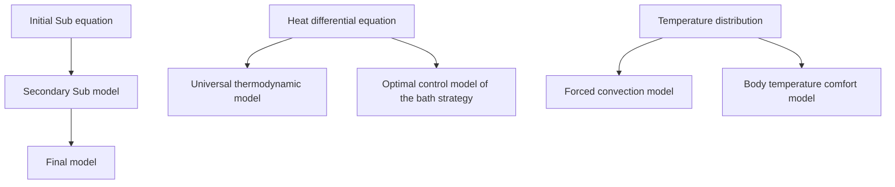
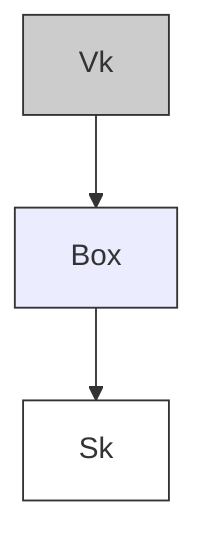

# 2016

# MCM/ICM

# Summary Sheet

## Keep It Warm

## Summary

Do you usually get annoyed with the cooling of water during a relaxing bath? In this paper, several models are proposed to solve the problem. Our efforts in building these models followed the path below.

Firstly, a universal thermodynamic model(UTM) of bath water is established by constructing two initial sub-equations named the Heat Differential Equation(HDE) and the Temperature Distribution(TD) respectively. Based on Fourier's law, the Stefan-Boltzmann law and the first law of thermodynamics, HDE is established, which also takes heat conduction, heat radiation and evaporation of water into account. Moreover, we get the numerical solution of TD by using the PDE tool of MATLAB, and fit its temperature distribution surface by the plane equation, whose goodness of fit is 0.931. The fitting equation is regarded as the approximate analytical solution.

Secondly, taking convection caused by human movement and comfort of water temperature into account, we developed an optimization control model for the bath strategy (OCM) based on UTM, which aims at the smallest water injection, the best temperature stability & the highest comfort level. We use the model(OCM) to optimize the two following strategies：i. Injecting hot water constantly at a certain flow; ii. Injecting hot water when temperature declines to $T _ { \mathrm { m i n } 1 }$ and stopping injecting when temperature increase to $T _ { \mathrm { m i n } 2 }$ . In strategy I, the optimal conditions are that the flow is $0 . 0 0 7 L \cdot s ^ { - 1 }$ and the temperature of water injection is 311.1K. The optimization proves efficient after extensive discussion; In strategy II, the upper and lower critical temperature and the temperature of water injection are 311.7K，311.7K & 313.1K respectively. It means that the hot water injection is a continuous process.

Thirdly, we modify UTM with the actual situation of bubble water to analyze the influence of bubble water towards the optimization, concluding that the heat diss ipating power of bubble water is 45.85% of that of normal hot water at 312K. By OCM, we get the optimal conditions as the flow is $0 . 0 0 4 L \cdot s ^ { - 1 }$ and the temperature of water injection is 311.9K , which shows that the efficiency of bubble water exceed greatly that of normal hot water.

Finally, we made error analysis of the factors like external environment etc. and did stability analysis of the geometric parameters of the bathtub & the parameters of human body. The sensitivities of the factors prove the models to be feasible and applicable.

## Contents

1 Introduction..

1.1 Restatement of the Problem .....  
1.2 Our Approach..

2 Assumptions with Justifications 2

2.1 About the Bathroom and Water .  
2.2 About the Human Body

3 Notations . Z

4 The Model.. D

4.1 Normal Thermodynamic Model of Water Temperature 6

4.1.1 The differential equation of water heat in the tub .. 6  
4.1.2 Thermodynamic analysis of bath process .10  
4.1.3 Temperature field distribution of the water in the tub .. .11  
4.1.4 The universal thermodynamic model of water ...... ..16

4.2 Forced convection model . 17

4.2.1 The introduction of forced convection source .17  
4.2.2 Effect of forced convection on the temperature ..... ..18

4.3 The human body comfort model . .20

4.3.1 Establish human body comfort model . .20  
4.3.2 Solution of human body comfort model .21

4.4 Optimized control model of bathing strategy .22

4.4.1 Strategy I ..... ..23  
4.4.2 Strategy II..... ..25  
4.4.3 Solution of the optimal control models of strategy I & II ...........27

4.5 Bubble bath . ..31

4.5.1 The effect of bubble water .. .31  
4.5.2 Effect of bubble water on optimal control strategy..... .32

5 Testing the Model.. ..34

5.1 Error Analysis . ..34

5.1.1 Various factors of external environment .34  
5.1.2 Various factors of water . ..35  
5.1.3 Various factors of human ..35  
5.1.4 Error in modeling and solving process .35

5.2 Sensitivity Analysis... ..36

5.2.1 Sensitivity to the shape and volume of the tub .37  
5.2.2 Sensitivity to the human parameters .. .37  
5.2.3 Sensitivity to the heat transfer rate .38

6 Conclusions .... ..38

6.1 Strengths and Weaknesses. .38

6.1.1 Strengths. ..38  
6.1.2 Weaknesses ... ..39

6.2 Comprehensive Results... ..39

6.3 Future Work ..40

7 Explanation ...... ..41

References .... ..42

## 1 Introduction

## 1.1 Restatement of the Problem

Taking a bath, can remove dirt, eliminate fatigue, promote blood circulation, improve sleep quality, and enhance metabolism. And by soaking in warm water, one can treat certain diseases and combat bacterium in some degrees.

The problem needs us to develop a mathematical model to finding out the best bathing strategy depends on the shape/volume of the tub, and the parameters and the motions of the person in the bathtub. This model aims at keeping the temperature even throughout the bathtub and as close as possible to the initial temperature without wasting too much water.

We need consider the following:

·Build a thermodynamic model of water in tub to describe the temperature in space and time in the following processes:

i. The process of filling the tub with hot water;  
ii. The natural cooling process of water;  
iii. The process of adding hot water.

·Consider the influences of the motions of people in tub, and analyze the results of this influences. We need to deal with the obstacle caused by the convection of water and the accompanying heat exchange.

·Find out the best control strategy to keep the temperature and save water as possible. The strategy depends on the parameters of tub, the degree of human movement, and the parameters of the human body.

·Discuss the difference between water and bubble bath water. We shall clarify how the bubble bath water influences the model and the strategy we have given.

·We need to provide a one-page non-technical explanation for users of the bathtub that describes our strategy. It shall explain why it is so difficult to get an evenly maintained temperature throughout the bath water and the advice according to our model.

## 1.2 Our Approach

We analyzed the problems above and consulted lots of literature, and then come up with the following approaches:

·We analyzed the problems above and consulted lots of literature, and then come up with the following approaches:

·We build a general thermodynamic model for water bath. This model is based on the Fourier law, the Newton cooling theorem, Stern-boltzmann's law, the heat conduction formula, and the first law of thermodynamics. And it includes:

I.Heat exchange between hot water and bathtub

II. Heat exchange between hot water and air,

III.Evaporation heat absorption of hot water,

IV.Heat absorption and heat release of human body,

V.Heat radiation of water,

VI. Heat of added hot water and heat carried away by the overflow.

·We build a distribution model for water in bathtub. This model is mainly based on the heat conduction equation and the Neumann boundary condition. Unfortunately, the model can only be solved by Matlab, and can't get accurate analytic function expression. So we build an approximate analytical model for water temperature distribution.  
·We build a forced convection model for the water in the bathtub. The motion of human body in the water will be the force of water. And the convection of water accelerates the heat exchange of water. So we quantify human motion, then build a model for forced convection heat exchanging. This model describes the redistribution of the water temperature under the influence of human motion.  
·We build an optimal control strategy model based on thermodynamics, water temperature distribution and forced convection. The model is mainly based on nonlinear multivariable optimal control, use it to get the optimal control strategy. We will provide two control strategies based on different aspects under this model.  
·We obtain the thermodynamic model for bubble bath water by improving general thermodynamic model. Based on this model, we discussed the effects of bubble bath water on the distribution and variation of water temperature, then analyzes the influence of the bubble bath water to the optimal control strategy. At the same time, we analyzed the advantages of bubble bath water.  
·We use the finite difference method to solve the partial differential equations and the piecewise differential equations.

## 2 Assumptions with Justifications

We make the following assumptions about the whole process in this paper to obtain a better model result.

## 2.1 About the Bathroom and Water

1. Assume that the air temperature and humidity in the bathroom is constant, not due to the Water vapor from man and bathtub. The temperature and humidity distribution of air is affected by many factors, this problem is very difficult. The other reason is that the discussion of air temperature and humidity not mean much.  
2. Without taking into account the wave generated by the motion of human and the adding of water, as well as the overflow caused by waves. The reason is that the water wave will be reflected back by the Inner wall of bathtub and leads multiple interference, it is very difficult to study this process. In addition, this mechanical process will not have a significant impact on the thermodynamic process of the bathtub-hot water-human system.  
3. Regardless of the time between the hot water comes out of the tap and enters the bathtub, which means that ignoring heat dissipation of water in the air. The reason is that the setting position of the tab should be as close as possible to the surface of the full water in the bathtub. That means the time for water to stay in the air is so short that the amount of heat dissipation in the air is negligible.  
4. Natural convection due to temperature gradient is negligible. Consider only the forced convection caused by the movement of the human. Because the temperature gradient of the bath water is not large enough to consider the natural convection of water caused by it.  
5. The convection of water inside the bath tub does not affect the current water temperature. The reason is that heat exchange caused by convective occurs only between the parts of the water in the bathtub, this process does not get heat exchange from the outside of the system, in other words, only water temperature distribution changed.  
6. The physical parameters such as the thermal conductivity, density and the bubble thickness are not changed with the addition of hot water and the loss of overflow water. Although the concentration of bubble water is bound to change with the addition and loss of water, the influence of bubble water concentration on other physical parameters is complicated and not clear, and the change of concentration is quite small for some parameters. Therefore, ignore the bubble water physical properties change over time

## 2.2 About the Human Body

7. Heat conductivity of human body is the constant value, it do not c hange with human posture and body temperature. Because the heat absorption and release of the human body is a complex process of biochemical reaction and physical process. Some factors like the metabolic heat generation, human sweat evaporation and the work done by exercise need to be considered. Since the thermodynamic process in the human body is too complicated and difficult to be analyze, considered the human body as a constant temperature heat source (maybe it’s endothermic), its thermal conductivity is a constant value.

8. Each part of the body surface temperature is a constant value. Because the distribution of body temperature is difficult to parameterized, and the body temperature of each part is slightly different(around $0 . 6 \mathrm { { \dot { C } } }$ ). Consider that all over the body surface, the temperatures are the same constant.  
9. Ignore the work of the forced convection generated by human motion. As the fluid, water can only work rely on its viscous force, and the viscous force is too smal to be taken into account.  
10. Considered the human motion as a series of discrete motion with the same amplitude and frequency. Although the motions can have a huge impact on the environment, such as the spatial distribution of water temperature, the movement of people is very irregular. So we use a simple physical quantity to describe the intensity and speed of human motion. For the magnitude of the motions, we will discuss it in detail in the 4.2 chapter.

## 3 Notations

All the variables and constants used in this paper are listed in Table1 and Table 2.

Table 1 Symbol Table–Constants

<table><tr><td>Symbol</td><td>Definition</td><td>Value</td></tr><tr><td> $T_0$ </td><td>Air temperature</td><td>298K</td></tr><tr><td>P</td><td>Saturated vapor pressure</td><td> $2.4\times10^{3}Pa$ </td></tr><tr><td>ρ</td><td>Density of water</td><td> $10^{3}kg\cdot m^{3}$ </td></tr><tr><td>μ</td><td>Molar mass of water</td><td> $18\times10^{-3}kg\cdot mol^{-1}$ </td></tr><tr><td>R</td><td>Universal gas constant</td><td> $8.31J\cdot mol^{-1}\cdot K^{-1}$ </td></tr><tr><td>c</td><td>Specific heat capacity of water</td><td> $4.2\times10^{3}J\cdot kg^{-1}\cdot K^{-1}$ </td></tr><tr><td>ε</td><td>Surface radiation coefficient of water</td><td>0.97</td></tr><tr><td>σ</td><td>Stefan-Boltzmann constant</td><td> $5.67\times10^{-8}W\cdot m^{-2}\cdot K^{-4}$ </td></tr></table>

Table 2 Symbol Table–Variables

<table><tr><td>Symbol</td><td>Definition</td><td>Units</td></tr><tr><td>Q</td><td>Internal energy of the water in the bathtub</td><td>J</td></tr><tr><td> $\overline{T}(t)$ </td><td>Average temperature of water at time t</td><td>K</td></tr><tr><td> $Q_{exchange}$ </td><td>Heat of heat exchange</td><td>J</td></tr><tr><td> $Q_{evaporation}$ </td><td>Heat of water evaporation</td><td>J</td></tr><tr><td> $Q_{body}$ </td><td>Heat absorbed by the body</td><td>J</td></tr><tr><td> $Q_{radiation}$ </td><td>Heat of radiation</td><td>J</td></tr><tr><td>T(x,y,z,t)</td><td>Distribution of temperature in time and space</td><td>K</td></tr><tr><td>u(T)</td><td>Water evaporation rate</td><td>m·s-1</td></tr><tr><td>k</td><td>Water flow</td><td>m3·s-1</td></tr><tr><td> $T_0'$ </td><td>The outlet water temperature</td><td>K</td></tr><tr><td> $S_k$ </td><td>The movement distance of the k th</td><td>m</td></tr><tr><td> $V_k$ </td><td>The volume distance of the k th</td><td>m3</td></tr><tr><td>F</td><td>Source of forced convection</td><td>m4</td></tr><tr><td> $k_b$ </td><td>Best water flow</td><td>m3·s-1</td></tr><tr><td> $T_b'$ </td><td>The best outlet water temperature</td><td>K</td></tr></table>

## 4 The Model

We establish an optimal control strategy model based on our normal thermodynamic model, forced convection model of water temperature and body temperature comfort model. Here are the relationship among the three models and equations.


<details>
<summary>flowchart</summary>


</details>

Figure 1: The relationship among the models and equations

According to our model, we propose two kinds of temperature control strategies and analyze their both advantages and shortages. In addition, the shape and volume of the tub, the temperature, flow and convection of tap water, the motions made by the person and some other parameters are extensively discussed in this section. The establishment and solution of our models are as follow.

## 4.1 Normal Thermodynamic Model of Water Temperature

In this section, we set up a normal thermodynamic model of water temperature in space and time, which is based on Fourier's law, Newton's law of cooling, the Stefan-Boltzmann law, the heat conduction equation and the first law of thermodynamics.

We use Newton's law of cooling, the Stefan-Boltzmann law and the first law of thermodynamics to solve the problem of the distribution of temperature with time. And we use heat conduction equation to solve the problem of the distribution of temperature with space. In our model, the heat transfer and the heat radiation are taken into account while the convection is ignored.

## 4.1.1 The differential equation of water heat in the tub

Considering the origin and destination of the infinitesimal of water heat in the tub, we get the differential equation as follows

$$
d Q = - d Q _ {\text {exchange}} - d Q _ {\text {evaporation}} - d Q _ {\text {body}} - d Q _ {\text {radiation}} + d Q _ {+ \text {water}} - d Q _ {- \text {water}} \tag {1}
$$

Here are the derivation and explanation of the equation by analyzing the heat of each part.

First of all, assuming the tub as a cube with length a, width b and height H. Then we set a three-dimensional Cartesian coordinate system originated from the bottom center of the tub and paralleled to its height, length and width. As we all know, the drain and overflow valve of the tub are often designed in the midpoint of the two short $\left( 0 , - \frac { a } { 2 } , H \right)$ and the drain is in $\left( 0 , \frac { a } { 2 } , H \right)$ .


<details>
<summary>text_image</summary>

Z
b
a
H
Y
X
</details>

Figure 2: the three-dimensional Cartesian coordinate system of the tub

To establish the model of water temperature over time, we firstly consider that the volume of water is changing over time. When the tub isn’t full, the volume of water is proportional to the time growth. Because we usually open the valve to the maximum when we are going to take a shower, the growth rate of the volume of water over time is the biggest flow of the valve. Then, when the volume is proper, people enter the tub and from then on, the volume can be regarded as constant approximately. Here comes the equation.

$$
V = \left\{ \begin{array}{l l} k _ {\max} t & 0 \leq t \leq \frac {V _ {0}}{k _ {\max}} \\ V _ {0} & t > \frac {V _ {0}}{k _ {\max}} \end{array} \right.
$$

Where, $V _ { 0 } = a b H - V _ { b o d y }$ , it means that the largest volume of water when the person is in the tub without overflow. $k _ { \mathrm { m a x } }$ is the largest flow of the valve.

By the definition of internal energy, we get the equation of the energy of water in the tub.

$$
Q = c \rho \bar {T} (t) \oiint_ {\Omega} d V \tag {2}
$$

Where, $\overline { { T } } ( t )$ is the average water temperature on space, which can be defined by

$$
\bar {T} (t) = \frac {\iiint_ {\Omega} T (x , y , z , t) \cdot d V}{\iiint_ {\Omega} d V} \tag {3}
$$

Then, we analyze different part of the heat exchange. The heat exchange is composed of heat transfer, heat radiation, convection, the inflow of hot water and the outflow of cold water. Here we discussed them except convection which is discussed in 4.2.

First, we analyze the heat loss due to heat exchange[5]. The loss is caused by the contact of water with the inner wall of the tub and air. According to the Fourier's law, the heat transfer power of per unit area is proportional to the temperature difference and to the thickness of the heat transfer medium. If we suppose that the thickness of the tub wall is constant and its material is homogeneous, the heat transfer power of per unit area is proportional to the temperature difference only. Thus we get the equation of the whole heat emission in unit time.

$$
d Q _ {\text { exchange }} = \left\{\iint_ {\Omega} h [ T (x, y, z, t) - T _ {0} ] d A + \iint_ {D} h ^ {\prime} [ T (x, y, z, t) - T _ {0} ] d A \right\} d t \tag {4}
$$

Where, h is the heat transfer coefficient of water when the medium is the tub wall. h is the heat transfer coefficient of water to air.

Secondly, we analyze the heat loss due to water evaporation. According to the surface molecular evolution rule and Dalton's law of evaporation, the evaporation rate per unit area is related to the liquid temperature, surface wind speed and humidity. Because of assumption 1, humidity is constant and the evaporation rate per unit area is related to the liquid temperature. Here comes the following equation.

$$
\left\{ \begin{array}{l} d Q _ {\text {evaporation}} = \left[ \iint_ {D} u (T) \cdot q _ {\text {gas}} d A \right] \cdot d t \\ u (T) = \frac {\rho}{P _ {0}} \left[ \frac {\mu}{2 \pi R T} \right] ^ {\frac {1}{2}} \bullet (1 - w) \end{array} \right. \tag {5}
$$

Where, $u \big ( T \big )$ is the rate of water evaporation per unit time and area;

T is the air temperature of the air to water surface;

P is the saturated vapor pressure of water at current temperature;

w is the relative humidity of air in the bathroom, which is constant according to assumption 1;

$\rho = 1 0 ^ { 3 } k g \cdot m ^ { - 3 }$ , which is the density of water ;

$\mu { = } 1 8 { \times } 1 0 ^ { - 3 } k g \cdot m o l ^ { - 1 }$ , which is the mole mass of water;

$R = 8 . 3 1 J \cdot m o l ^ { - 1 } \cdot k ^ { - 1 }$ , which is the universal gas constant;

Third, we analyze the heat loss due to people’s body [7]. To be specific, it describes the heat exchange of people’s body surface and water. We suppose that the body is fully immersed in water, so the contact area between body and water is the superficial area of the body. Because the heat exchange between the human body and the water is the heat transfer through the water flow, according to Newton cooling theorem, we get the heat infinitesimal equation of body’s absorption.

$$
d Q _ {\text { body }} = S _ {\text { body }} [ \bar {T} (t) - T _ {\text { body }} ] \cdot h _ {\text { body }} \cdot d t \tag {6}
$$

Where, $h _ { b o d y }$ is the heat transfer rate of human body and water. Because the similarity of the macroscopic physical properties between human body and water, $h _ { b o d y }$ can be substituted with heat transfer rate of water and water. $\overline { { T } } ( t )$ is the average water temperature in the tub. The reason to set this parameter is because the surface of human body is irregular, the temperature distribution between the contact surfaces is harder to formulate. Then we regard the average water temperature in the tub as that of the contact surfaces.

Fourth, we analyze the heat loss due to heat radiation [10]. To be specific, it describes that water dissipates heat in the form of electromagnetic radiation to the surrounding and the loss can be calculated by Trevor Boltzmann's law. Unfortunately, the law is set to describe the heat radiation of ideal black-body, while water isn’t totally suit. Thus we modify the law with a rate of heat radiation , and it is recorded that the rate of water is $\varepsilon = 0 . 9 7$ . we get the heat infinitesimal equation of the loss.

$$
d Q _ {\text { radiation }} = \left[ \oiint_ {\Omega} \varepsilon \sigma T ^ {4} (x, y, z, t) d A \right] d t \tag {7}
$$

Fifth, we analyze the heat increase due to the constant intake of hot water. According to the definition of the internal energy of water, we get the heat infinitesimal equation of the increase.

$$
d Q _ {+ w a t e r} = c \rho T _ {0} ^ {\prime} d V = c \rho T _ {0} ^ {\prime} k d t \tag {8}
$$

Sixth, we analyze the heat loss due to the overflow water. We assume the overflow water temperature as the temperature of the water near the outfall and get the heat loss equation.

$$
d Q _ {+ w a t e r} = c \rho T (0, \frac {a}{2}, H, t) d V = c \rho T (0, \frac {a}{2}, H, t) \cdot k d t \tag {9}
$$

To sum up, the origin and destination of the water heat in the tub are shown below.


<details>
<summary>text_image</summary>

Q+water
Qevaporation
Qbody
Q-radiation
Qexchange
Q-water
</details>

Figure 3: The origin and destination of heat

Combining the six equations of heat exchange [15], we get the universal differential equation of the internal energy of water over temperature in the tub.

$$
d Q = - d Q _ {\text { e   x   c   h   a   n   g   e }} - d Q _ {\text { e   v   a   p   o   r   a   t   i   o   n }} - d Q _ {\text { b   o   d   y }} - d Q _ {\text { r   a   d   i   a   t   i   o   n }} + d Q _ {\text { +   w   a   t   e   r }} - d Q _ {\text {-   w   a   t   e   r }}
$$

## 4.1.2 Thermodynamic analysis of bath process

In this section, according to the periodic change of the volume of water in the tub, we divide the water temperature in the tub over time into three stages:

First, the initial filling stage. In this stage, people inject water to the tub when people get into the tub while the water won’t overflow. Then we modify the heat loss due to the overflow water $d Q _ { - w a t e r }$ in the differential equation of water heat in the tub and get the function of the volume of water and the differential equation of the change of water internal energy as follow:

$$
\left\{ \begin{array}{c} V = k t \\ d Q = - d Q _ {\text {exchange}} - d Q _ {\text {evaporation}} - d Q _ {\text {radiation}} + d Q _ {+ \text {water}} \end{array} \right.
$$

Second, the natural cooling stage when the tub is full of water and body. In this stage, the volume is $V _ { 0 }$ . According to the assumption 2, we modify the heat increase due to the constant intake of hot water $d Q _ { + w a t e r }$ and the heat loss due to the overflow water $d Q _ { - w a t e r }$ in the differential equation of water heat in the tub and get the function of the volume of water and the differential equation of the change of water internal energy as follow:

$$
\left\{ \begin{array}{c} V = V _ {0} \\ d Q = - d Q _ {\text { e   x   c   h   a   n   g   e }} - d Q _ {\text { e   v   a   p   o   r   a   t   i   o   n }} - d Q _ {\text { b   o   d   y }} - d Q _ {\text { r   a   d   i   a   t   i   o   n }} \end{array} \right.
$$

Third, the reheating after hot water injection stage. In this stage, users are unsatisfactory with the water temperature in the tub and then open the tap again to mix the intake hot water with the previous water in the tub. Owing to the limitation of the volume of the tub, excess water overflows to keep the tub full. We get the function of the volume of water and the differential equation of the change of water internal energy as follow:

$$
\left\{ \begin{array}{c} V = V _ {0} \\ d Q = - d Q _ {\text {exchange}} - d Q _ {\text {evaporation}} - d Q _ {\text {body}} - d Q _ {\text {radiation}} + c \rho k T _ {0} ^ {\prime} d t - c \rho k T (0, \frac {a}{2}, H, t) \cdot d t \end{array} \right.
$$

## 4.1.3 Temperature field distribution of the water in the tub

In this section, we establish a model of the distribution of water temperature in the tub when injecting hot water again, and solve the model by the PDE tool of Matlab. However, the solution is difficult to be used in the following models, hence we use plane fitting in the numerical solution and fortunately. Then we find that the fitting degree is pretty high. So we use the fitting plane as approximate analytic solution of temperature field distribution of water. It greatly simplifies the difficulty of solving the model, at the same time, with good accuracy.

1. Temperature field distribution based on heat conduction equation

According to assumption 4, water temperature near the tap $( 0 , \frac { - a } { 2 } , H , t )$ is constant when injecting water. That is to say, here $( 0 , \frac { - a } { 2 } , H , t )$ is a constant temperature heat source, because whenever the water drop from the tap, the temperature is the same. Therefore, taken heat conduction equation into account, we use the following partial differential equations to describe the temperature field distribution of the water.

$$
\rho c \frac {\partial T}{\partial t} = \frac {\partial}{\partial x} (\lambda \frac {\partial T}{\partial x}) + \frac {\partial}{\partial y} (\lambda \frac {\partial T}{\partial y}) + \frac {\partial}{\partial z} (\lambda \frac {\partial T}{\partial z}) + q (0, \frac {- a}{2}, H, t)
$$

Where, $\alpha = \frac { \lambda } { \rho c } ( m ^ { 2 } / s )$ is thermal diffusion coefficient, is the thermal conductivity, $q ( 0 , \frac { - a } { 2 } , H , t )$ −a is the equivalent heat source at $( 0 , \frac { - a } { 2 } , H , t )$ .

The Neumann boundary [8] of the water in the tub can be formulated as:

$$
\begin{array}{l} \left\{ \begin{array}{l} - \lambda \frac {\partial T}{\partial x} = h \left[ T (\pm \frac {b}{2}, y, z, t) - T _ {0} \right] \\ - \lambda \frac {\partial T}{\partial y} = h \left[ T (x, \pm \frac {a}{2}, z, t) - T _ {0} \right] \quad B o u n d a r y \end{array} \right. \\ \left\{ \begin{array}{l} - \lambda \frac {\partial T}{\partial z} = h [ T (x, y, 0, t) - T _ {0} ] \\ - \lambda \frac {\partial T}{\partial z} = h ^ {1} [ T (x, y, H, t) - T _ {0} ] \end{array} \right. \\ \end{array}
$$

The starting conditions is $T ( x , y , z , 0 ) = T _ { 0 } ( x , y , z )$ .

$T _ { 0 } ( x , y , z )$ is the distribution of water temperature in the tub before the second

of rejecting hot water again.

## 2.The numerical solution of the heat conduction equation [9]

We solve the heat conduction model by the PDE tool of Matlab [13][14]. During the process, the starting condition is that the water temperature is 39 centigrade and distributed evenly. The reasons of setting such condition are as follow. First, people’s action will stir the water to a uniform distribution. On the other hand, it’s recorded that 39 centigrade is the most comfortable temperature for bathing. If the water temperature is lower than that, people will inject hot water to heat the water.

We set the temperature of the equivalent heat source 45 centigrade to solve the temperature field at 2.5s and 100s, here are the results:


<details>
<summary>heatmap</summary>

| X    | Y    | Value |
|------|------|-------|
| 0.0  | 0.0  | 40.0  |
| 0.1  | 0.1  | 40.5  |
| 0.2  | 0.2  | 41.0  |
| 0.3  | 0.3  | 41.5  |
| 0.4  | 0.4  | 42.0  |
| 0.5  | 0.5  | 42.5  |
| 0.6  | 0.6  | 43.0  |
| 0.7  | 0.7  | 43.5  |
| 0.8  | 0.8  | 44.0  |
| 0.9  | 0.9  | 44.5  |
| 1.0  | 1.0  | 45.0  |
| 1.1  | 1.1  | 44.5  |
| 1.2  | 1.2  | 44.0  |
</details>

Figure 4: Surface temperature field at 2.5s  


<details>
<summary>heatmap</summary>

| X    | Y    | Value |
|------|------|-------|
| 0.0  | 0.0  | 45.0  |
| 0.1  | 0.1  | 44.5  |
| 0.2  | 0.2  | 44.0  |
| 0.3  | 0.3  | 43.5  |
| 0.4  | 0.4  | 43.0  |
| 0.5  | 0.5  | 42.5  |
| 0.6  | 0.6  | 42.0  |
| 0.7  | 0.7  | 41.5  |
| 0.8  | 0.8  | 41.0  |
| 0.9  | 0.9  | 40.5  |
| 1.0  | 1.0  | 40.0  |
| 1.1  | 1.1  | 40.5  |
| 1.2  | 1.2  | 41.0  |
</details>

Figure 5: Surface temperature field at 100s

The arrow in the figure is the direction of heat transmission. We get the similarities and differences between the temperature distributions of 2.5s and 100s by comparing them.

## Similarities:

i. The heat always spread from the tap, and is gradually dispersed throughout the space. What’s more, temperature distribution is uniform at the end of the outlet. The reason is that the heat is gradually spreading from the inlet to the outlet, during the process, it disperses evenly in the plane, which is in accordance with the actual situation.

ii. At the start of injecting hot water, the water temperature near the inlet is keeping at approximately 45 centigrade, while near the out, the temperature is about 40 centigrade. The reason is that water is a poor conductor of heat. 2.5s and 100s are too short to transfer heat evenly. Thus the temperature near outlet doesn’t enhance obviously.

## Differences:

i. The distribution of water temperature at 100s is more even than that at 2.5s. Obviously, the longer time makes the heat transfer more adequate between the intake of water and the previous water in the tub.

ii. The total water temperature in the tub is higher at 100s, because the longer time makes bigger amount of hot water injection, enhancing the average water temperature in the tub.

iii. The spread of heat in y direction is uniform at 100s, because the whole level of water temperature and the distribution of water temperature gradually becomes stable over time. Moreover, the distribution of temperature in plane becomes uniform owing to heat transfer. Hence, the spread of heat in y direction is uniform. That means the distribution of the gradient in the Y axis is tend to decrease linearly with the value of y coordinate

## III. The approximate analytical solution

By means of linear fitting, we get the approximate analytic solution of temperature distribution in space. Because in the discussion of the universal thermodynamic model of the water temperature in the previous paper and the optima bath strategy and bubble bath, we all need the analytical solution of water temperature over time and space to do the further analysis and solution. Nevertheless, it’s more than hard to use the numerical solution of temperature field directly and to optimize the following models. Therefore, we carry out a simple function fitting to the distribution of the water temperature in space.

First of all, we observe the distribution surface of temperature in space, which is shown as follows.


<details>
<summary>3d area chart</summary>

| X    | Y    | Value |
|------|------|-------|
| 0.0  | 0.8  | 40.0  |
| 0.2  | 0.6  | 41.0  |
| 0.4  | 0.4  | 42.0  |
| 0.6  | 0.2  | 43.0  |
| 0.8  | 0.0  | 44.0  |
| 1.0  | -0.2 | 45.0  |
| 1.2  | -0.4 | 44.5  |
</details>

Figure 6: The distribution surface of temperature in space

Combined with the previous analysis, we firstly fit the above surfaces by plane fitting. In our opinion, the linear relationship in the subsequent model will be greatly simplified calculation, and the characteristic of linear, simple and clear has a good approximation to the real situation. Therefore, we select a number of discrete points on the surface of temperature distribution, and try to make the linear fitting to these points. The fitting plane is shown as follows

$$
\left\{ \begin{array}{l} T (x, y, z, 2. 5 s) = 4 4. 6 3 - 4. 2 9 4 y + 0. 0 8 3 2 8 x \\ 0 \leq y \leq 1. 3, - 0. 4 \leq x \leq 0. 4, 0 \leq z \leq 0. 4 9 \end{array} \right.
$$

The goodness of fit of this kind of fitting method is $R ^ { 2 } = 0 . 9 3 1$ , which shows a great fit for this distribution surface. Thus we determine to use the fitting method and the fitting plane is shown in Figure 7.


<details>
<summary>scatterplot</summary>

| x    | y    | z    |
| ---- | ---- | ---- |
| 0.0  | 0.0  | 44.0 |
| 0.1  | 0.1  | 43.5 |
| 0.2  | 0.2  | 43.0 |
| 0.3  | 0.3  | 42.5 |
| 0.4  | 0.4  | 42.0 |
| 0.5  | 0.5  | 41.5 |
| 0.6  | 0.6  | 41.0 |
| 0.7  | 0.7  | 40.5 |
| 0.8  | 0.8  | 40.0 |
| 0.9  | 0.9  | 39.5 |
| 1.0  | 1.0  | 39.0 |
| 1.1  | 1.1  | 38.5 |
| 1.2  | 1.2  | 38.0 |
</details>

Figure 7: The fitting plane

In addition, the tub is symmetrical at $y - o - z$ plane, so is the temperature distribution of abstract mathematical model. Moreover, it should be dispersed uniformly at $x - o - z$ plane. However, the temperature function $T ( x , y , z , 2 . 5 s )$ over x coordinate in the previous fitting plane generates from the error of taking discrete points. Thus the ideal model of the plane should be

$$
\left\{ \begin{array}{l} T (x, y, z, 2. 5 s) = 4 4. 6 3 - 4. 2 9 4 y \\ 0 \leq y \leq 1. 3, - 0. 4 \leq x \leq 0. 4, 0 \leq z \leq 0. 4 9 \end{array} \right.
$$

We extend the model to the water temperature distribution at any time, because 2.5s is the very moment when hot water flows into the tub continuously. And at 2.5s, the water temperature gradient is one of the largest, and the distribution is the most uneven. After this moment, the temperature will gradually distribute more evenly and the temperature surface also becomes more close to a plane. Therefore, it’s proper to use the distribution function to describe the water temperature distribution of the other moments after 2.5s. The distribution equation can be universally formulated as

$$
T (x, y, z, t) = C (t) - K (t) y \tag {10}
$$

Where $C ( t ) , \ K ( t )$ are the functions on time.

We should notice that $K \left( t \right) = - \nabla T \left( x , y , z , t \right)$ , which means negative gradient of temperature distribution function.

We set the average water temperature into formula (3) to get the following relationship:

$$
\overline {{{T}}} (t) = \frac {\iiint_ {\Omega} T (x , y , z , t) \cdot d V}{\iiint_ {\Omega} d V} = \frac {\int_ {- \frac {a}{2}} ^ {\frac {a}{2}} b H [ C (t) - K (t) y ] d y}{a b H} = C (t)
$$

Thus the model of the temperature distribution can be transformed in to

$$
T (x, y, z, t) = \overline {{{T}}} (t) - K (t) y \tag {11}
$$

On the other hand, The variance in the spatial distribution of the water temperature in the tub is

$$
D (T) = \frac {a ^ {2} K ^ {2} (t)}{1 2}
$$

Hence, we get the variance of water temperature at a moment with the realistic data or by programming to get a series of points randomly selected on the surface of the numerical simulation of temperature in 4.1.3.II. Then the temperature gradient equation of the moment is

$$
K (t) = \frac {2 \sqrt {3 D (T)}}{a} \tag {12}
$$

Unfortunately, with limited time, we don’t fit the function of $K { \big ( } t { \big ) }$ over time.

So K t  is given by an unknown function in the thermodynamic model of water. If time permits, we will surely fit it into a simple function.

## 4.1.4 The universal thermodynamic model of water

In this section, under the condition that water is in the absence of human movement interference, we get the model in time and space.

We take formula (11) into formula (4) and formula (9) and get:

$$
d Q _ {e x c h a n g e} = \left\{h \left[ \bar {T} (t) - T _ {0} \right] \left(a b + 2 a H + 2 b H\right) + h ^ {\prime} \left[ \bar {T} (t) - T _ {0} \right] a b \right\} d t
$$

$$
d Q _ {- w a t e r} = c \rho \left[ \bar {T} (t) - K (t) \cdot \frac {a}{2} \right] d V
$$

In addition, we note that the inner wall of the tub is smooth, and at the beginning of the design of the tub, we propose that coating the metal film on the surface of the tub can effectively reduce the heat radiation power of the water in the tub, just like thermos bottles. Thus we ignore the heat radiation of micro e lectromagnetic wave through the inner wall of the tub. At the same time, we take formula (11) into formula (7) and get:

$$
d Q _ {\text {radiation}} = \varepsilon \sigma \left\{\int_ {- \frac {a}{2}} ^ {\frac {a}{2}} b [ \overline {{T}} (t) - K (t) y ] ^ {4} d y \right\} d t = \frac {\varepsilon \sigma b}{5 K (t)} \left\{\left[ \overline {{T}} (t) + K (t) \cdot \frac {a}{2} \right] ^ {5} - \left[ \overline {{T}} (t) + K (t) \cdot \frac {a}{2} \right] ^ {5} \right\} d t
$$

At this time we simplify our universal thermodynamic model of water in a great degree. The mathematical model is given by the following equations:

$$
\left\{ \begin{array}{l} d Q = - d Q _ {\text {exchange}} - d Q _ {\text {evaporation}} - d Q _ {\text {body}} - d Q _ {\text {radiation}} + d Q _ {+ \text {water}} - d Q _ {- \text {water}} \\ d Q _ {\text {exchange}} = \left\{h \left[ \bar {T} (t) - T _ {0} \right] (a b + 2 a H + 2 b H) + h ^ {\prime} \left[ \bar {T} (t) - T _ {0} \right] a b \right\} d t \\ d Q _ {\text {evaporation}} = u a b q _ {\text {gas}} d t \\ d Q _ {\text {body}} = S _ {\text {body}} [ \bar {T} (t) - T _ {\text {body}} ] \cdot h _ {\text {body}} \cdot d t \\ d Q _ {\text {radiation}} = \frac {\varepsilon \sigma b}{5 K (t)} \left\{\left[ \bar {T} (t) + K (t) \cdot \frac {a}{2} \right] ^ {5} - \left[ \bar {T} (t) + K (t) \cdot \frac {a}{2} \right] ^ {5} \right\} d t \\ d Q _ {+ \text {water}} = c \rho T _ {0} ^ {\prime} d V = c \rho T _ {0} ^ {\prime} k d t \\ d Q _ {- \text {water}} = c \rho \left[ \bar {T} (t) - K (t) \cdot \frac {a}{2} \right] d V \\ Q = c \rho V (t) \cdot \bar {T} (t) \\ T (x, y, z, t) = \bar {T} (t) - K (t) y \end{array} \right. \tag {13}
$$

## 4.2 Forced convection model

In this section, we set up a model of convection [1][2] heat transfer of water caused by human movement. First we quantify the human movement’s influe nce on convection, so we define the forced convective cell, use this parameter to describe the human movement’s influence on convection and the temperature distribution. Then we set up a model of the forced convective cell’s influence on the temperature. This model is based on a partial large normal distribution function. Finally, we established a model of the human movement’s influence on the temperature distribution in the bathtub.

## 4.2.1 The introduction of forced convection source

Consider the case of an object $\mathrm { ( v o l u m e = } V _ { k } \quad$ ) moving $\mathrm { ( d i s t a n c e = } S _ { k } \mathrm { ) }$ in a bathtub. In essence, the principle of the movement of the object in water can cause the forced convection of water is: In the process of moving the object pushed a part of the water, while the other water filled to its original position, this process has caused the movement of water and water, to complete this action in the form of flow $( { \mathrm { F i g } } 8 )$ . As a result, the movement of the object causes the water to flow, while the convection of the water has a corresponding heat exchange.


<details>
<summary>flowchart</summary>


</details>

Figure 8: Forced convection cause by body

We abstract every movement of a person as an object in the water [6]. Because the movement of a person's bath is a process of moving one part of the body from one position to the other. This process will be pushed the moving path of the water, while the other water filled to its original position, resulting in convection. So we define human motion intensity as the forced convection cell. According to the assumption 11, we use k to mark the number of forced convection, its definition is as follows:

$$
\boldsymbol {F} _ {k} = \boldsymbol {S} _ {k} \cdot \boldsymbol {V} _ {k}
$$

Where, $V _ { k }$ is the volume of the moving part of the body during the k th movement, $S _ { k }$ is the distance of the moving part of the body during the k th movement

## 4.2.2 Effect of forced convection on the temperature

The movement of people to produce convection, the result of convection is to make the distribution of temperature in the water more balanced. Further considered, the forced convection source $F _ { _ k }$ through a non-negative function $f ( F _ { k } )$ so that the temperature of each point in the water is closer to the average temperature, so we got the formula:

$$
T _ {k + 1} (x, y, z, t) = T _ {k} (x, y, z, t) - f (F) \cdot \left[ T _ {k} (x, y, z, t) - \bar {T} (t) \right] \tag {14}
$$

After the effect of the k th forced convection source $F _ { _ k }$ , the distribution function of water temperature in space became $T _ { _ { k + 1 } } ( x , y , z , t )$ from $T _ { k } ( x , y , z , t )$ .

According to the formula (14), we obtain after a forced convection source affects, the resulting convection only changes the temperature distribution, and doesn’t cause a mutation of the $\mathrm { { \bf w a t e r } ^ { \prime } s }$ average temperature. This phenomenon is consistent with the hypothesis 6, which shows that the model is self-consistent and reasonable.

In addition, we put the water temperature as a function of space and time formula (11) into formula (14), temperature gradient satisfy the following relationship. This formula shows that the distribution of the temperature field is essentially the effect of human motion on the temperature gradient:

$$
K _ {k + 1} (t) = \left[ 1 - f \left(F _ {k}\right) \right] K _ {k} (t) \tag {15}
$$

Then, consider the form of function $f ( F _ { k } )$ . The result of the action of the human in the bathtub is to promote the mixing of cold water and hot water. Analysis shows that the action is more big, bigger source of forced convection, the influence of water temperature distribution is bigger, but the influence of temperature on forced convection source rate is not increased with the increase of uniform motion.

The influence rate $f ( F _ { k } )$ first increases with the growth of $F _ { k }$ slow growth, because too small $F _ { _ k }$ for the overall flow of water distribution is almost no impact,

When $F _ { k }$ is in this range, the rate of $f ( F _ { k } )$ is not sensitive to the value of $F _ { _ k }$ .

Subsequently, the impact rate of $f ( F _ { k } )$ with the rapid growth of $F _ { _ k }$ growth, that is, when the value of $F _ { k }$ and the total amount of water can be compared to the macro size, the size of $F _ { k }$ will be sensitive to the value of $f ( F _ { k } )$ .

Finally, the rate of impact of $f ( F _ { k } )$ with the growth of $F _ { k }$ slow growth, and closer to 1. Because when the $F _ { k }$ is large enough, the water can be fully mixed, the value of $f ( F _ { k } )$ will be very close to 1, but when the $F _ { _ k }$ continues to increase, the forced convection of the source of the water has been able to fully mixed the role has been very small.

The influence rate of $f ( F _ { k } )$ with the change of $F _ { k }$ should be shown in the following figure:


<details>
<summary>line chart</summary>

| Forced convection | Convective mixing ratio |
| ----------------- | ------------------------ |
| 0.0               | 0.0                      |
| 0.1               | 0.2                      |
| 0.2               | 0.5                      |
| 0.3               | 0.8                      |
| 0.4               | 0.9                      |
| 0.5               | 0.95                     |
| 0.6               | 0.98                     |
| 0.7               | 0.99                     |
| 0.8               | 0.995                    |
| 0.9               | 0.998                    |
| 1.0               | 1.0                      |
</details>

Figure 9: The variation of convective mixing rate over the forced convection

Based on the above analysis, we select the partial large state distribution function as the approximate analytic formula of ${ \bf \nabla } \cdot f ( F _ { k } )$ :

$$
f (F) = 1 - e ^ {- \left(\frac {F - F _ {a}}{F _ {b}}\right) ^ {2}}
$$

Where, $F _ { a }$ and $F _ { b }$ are all the constants to be determined, the units are $m ^ { 4 }$ . We will give the decisive factor of the constant through the following analysis.

Consider the case that the special $F _ { _ k }$ takes the special value, when $F _ { k } = 0$ , that person did not make any action, it is obvious that the water temperature distribution of the impact rate of 0, that is, $f ( 0 ) = 0$ , can be solved $F _ { a } = 0$ . When $F _ { k } = + \infty$ , the action is very large or even infinite, the water in the bathtub is fully mixed, the temperature distribution becomes very uniform, the mixing rate is infinitely close to 1, that is $\operatorname* { l i m } _ { F _ { k } \to + \infty } f ( F _ { \ k } ) = 1$ . Note that the equation is established, and the results of the model are consistent with the analysis.

In particular, when considering the forced convection source value is equal to the half volume of water in the bathtub multiplied by the value of the long side of the bathtub $F _ { _ k } = { \frac { 1 } { 2 } } V _ { 0 } a$ F side of the movement to the right side, back into the left half side, the moving distance is ${ \frac { 1 } { 2 } } a + { \frac { 1 } { 2 } } a = a$ . This process will make the water in the bathtub more fully mixed, because of the forced convection the distribution of temperature becomes more average. In fact, we can determine the influence rate by the test of the variance of the temperature before and after the experiment according to 4.1.3-3 and 4.2.2-2. In this, in order to facilitate the calculation of the subsequent model, we may wish to se $f ( \frac { 1 } { 2 } V _ { 0 } a ) = 9 5 \%$ , which can be obtained $F _ { _ a } = 0 . 1 9 1 3 7 8 m ^ { 4 }$ .

Here, we have established a concise and practical mathematical model for the effect of forced convection on human motion:

$$
\left\{ \begin{array}{l} F = S _ {k} V _ {k} \\ f (F) = 1 - e ^ {- \left(\frac {F}{F _ {b}}\right) ^ {2}} \\ T _ {k + 1} (x, y, z, t) = T _ {k} (x, y, z, t) - f (F) \cdot \left[ T _ {k} (x, y, z, t) - \overline {{T}} (t) \right] \end{array} \right.
$$

## 4.3 The human body comfort model

In this part, we establish and solve the model of human body's comfortable degree of thermal sensation. This model describes the human body's temperature perception of comfort, the comfort of this gives a quantitative results. In subsequent discussions, the body's temperature perception of comfort will also be used as a part of the bath strategy needs to be taken into account.

## 4.3.1 Establish human body comfort model

We have established the human comfort model by using the normal distribution.

We consider the human body has a specific optimum bath temperature, when the water temperature is higher than the temperature comfortable degree decline, and gradually feel the heat, even burn; when the water temperature is lower than the temperature of comfort will also decline, people will gradually feel the cold, even suffer from cold.

Because the normal distribution is widespread in nature, the unimodal normal distribution are consistent with the perception of comfort temperature In addition, when the temperature exceeds a certain value people will be burned, or temperature below a certain value people will get cold. At this time, the feelings of the people are not comfortable, so comfort should close to zero, the characteristic with normal distribution are in good agreement.

Therefore, we choose the normal distribution function to describe the distribution of the body's comfort with temperature, that is, the following expressions:

$$
\beta = \frac {1}{\sqrt {2 \pi} \cdot \sigma} \cdot e ^ {- \left(\frac {T _ {B} ^ {\prime} - \mu}{\sigma}\right) ^ {2}}
$$

Where, $\mu$ represents the most comfortable temperature of human body feeling, represents the standard deviation of the comfortable feeling degree of human body to the temperature.

## 4.3.2 Solution of human body comfort model

Taking into account the temperature of the most comfortable temperature in the vicinity of 2 times the standard deviation of the sum of the 95.45%, that is, when the temperature is not within this range, the cumulative amount of satisfaction of the cumulative amount of less than 4.55% of the total amount of comfort.

On the other hand, the data show that the human feelings to nociceptive temperature is 306K, human feel hot temperature is 318k, so the temperature outside the scope of this comfort will be very low, outside the scope of the comfortable cumulative value is at a rather low level.

May in this range of comfort for the cumulative value of the sum of 95.45%. Doing so for a reason: in statistics normal distribution of twice the standard deviation is often used as to judge whether an event is a small probability event, and in this article, in this article, it is considered that the water temperature above 318K or below 306K is unacceptable therefore can be equated to the small probability events in statistics. So it is reasonable to do so.

By the above analysis, we can get the following equations

$$
\left\{ \begin{array}{l} \frac {\int_ {306} ^ {318} d T _ {B} ^ {\prime}}{318 - 306} = \mu \\ \int_ {306} ^ {318} \beta d T _ {B} ^ {\prime} = 95.45 \% \end{array} \right.
$$

So we get the solution of the model of human body comfort:

$$
\beta = \frac {1}{3 \sqrt {2 \pi}} \cdot e ^ {- \frac {\left(T _ {B} ^ {\prime} - 3 1 2\right) ^ {2}}{9}}
$$

The above formula shows that the human body to feel the most comfortable temperature is 312K, and by the state distribution characteristics we can know, temperature range in 309 ,315K K  the cumulative comfort of total sum of 68.26%, temperature range in 303 ,321K K  total comfort reached 99.7% of the total. So we think that when the temperature is above 321K or below 303K is completely unacceptable, people will be burned or cold due to these temperatures.

In comparison with literature data, we found that the burn the body temperature of 47 degrees Celsius (320K) ,the relative error of the scald temperature predicted by the human body comfort model we have established is only ${ \frac { \left| 3 2 0 K - 3 2 1 K \right| } { 3 2 0 K } } \times 1 0 0 \% = 0 . 3 1 2 5 \%$ , indicating that the model coincide with the actual situation very well.

## 4.4 Optimized control model of bathing strategy

In this section, based on the models we established previously, we get the optimized control model of bathing strategy.

We note that the water temperature is reduced when users are in the bath, then they open the hot water faucet to heat the water. We need to develop a water injection scheme, to make the temperature of the water temperature maintained at a level which is close to the initial water temperature and won't get water temperature too high to decline the comfort of users or even hurt. Thus, we propose two kinds of injection scheme towards two different controlling ways:

1. Control artificially to make the water in the bathtub maintain a long-term comfortable temperature and hope that the operatio n is simple, so keep the tap a trickle.  
2. Control automatically. When the sensor accept the signal that the water temperature is reduced to a certain critical temperature, the tap is automatically

controlled to the maximum. When water temperature is picked up to a certain value, the faucet is turned off. The tap repeated this cycle before the end.

## 4.4.1 Strategy I

Constant flooding strategy: After users have entered the tub bath, the flow rate always keep constant in $k _ { b }$ which has a certain temperature of $T _ { b } ^ { \prime }$ to maintain the bath tub water temperature. This strategy makes it easy to operate, suitable for ordinary hot water supply system which needs manual operation, and the parameters to be optimized only be $k _ { b }$ and $T _ { b } ^ { \prime }$ . So this plan has considerable practical reference value for manual operation.

Now we need to optimize the strategy’s variable, to find the optimal water flow $k _ { b }$ and temperature of hot water injection $T _ { b } ^ { \prime }$ .

First, we show the optimization objective function. In view of the user who wishes to make water temperature when he get into the bath as close to the l temperature of he has taking the shower, which can be abstracted to a mathematical expression, make the average difference of initial temperature and the average temperature in period of time to be least, which can b show in the following expression.

$$
\min \frac {\int_ {0} ^ {t _ {m}} \left[ T _ {0} ^ {\prime} - \bar {T} (t) \right] d t}{t _ {m}}
$$

In addition, users do not want to waste too much water just for maintaining the water temperature, so the user will control the flow of water injection so that the waste water will be controlled, which can be abstracted in mathematical expression of the minimum of flow rate, the expression is as follows:

$$
\min k _ {b}
$$

In view of the added hot water temperature cannot be too high. As the high temperature is likely to affect user’s comfort, even scald users, so it’s necessary to consider the impact of hot water to the user's comfort. Clearly, in our optimization strategy, it should be ensure the comfort get a maximum under certain conditions, the expression is as follows:

$$
\max \quad \beta = \frac {1}{3 \sqrt {2 \pi}} \cdot e ^ {- \frac {\left(T _ {B} ^ {\prime} - 3 1 2\right) ^ {2}}{9}}
$$

Considering the above three factors, we get the final optimization objective

function:

$$
\min \quad \lambda_ {1} \cdot \frac {\int_ {0} ^ {t _ {m}} \left[ T _ {0} ^ {\prime} - \bar {T} (t) \right] d t}{t _ {m}} + \lambda_ {2} \cdot k _ {b} t _ {m} - \lambda_ {3} \cdot \frac {1}{3 \sqrt {2 \pi}} \cdot e ^ {- \frac {(T _ {B} ^ {\prime} - 3 1 2) ^ {2}}{9}}
$$

Where $\lambda _ { 1 } , \lambda _ { 2 } , \lambda _ { 3 }$ is the weight of temperature factor, water factor and comfort factor respectively, whose value can be determined by the user's preferences. Symbol on the third function is negative because we have done a minimization process in three factors, which means the smaller value the more excellent program.

Second, we give the optimization constraints. Considering the hot water faucet has a maximum of flow rate, we get the first constraint:

$$
0 <   k _ {b} <   k _ {\mathrm{max}}
$$

The temperature of injection water should be higher than the user's body temperature clearly. Otherwise users will dissipate heat in the water and feel cold. In addition, the temperature of boiling water which poured to should not make the user burn. As the second constraint:

$$
T _ {b o d y} \leq T _ {b} ^ {\prime} \leq T _ {h i g h e s t}
$$

Next we consider the constraints associated with the temperature, make the relationship between the average temperature and internal energy to be a third constraint:

$$
\overline {{T}} (t) = \frac {Q}{c \rho V _ {0}}
$$

The changes of the water temperature and the distribution of water is controlled by the universal thermodynamic model formula (13). Because of space limitations we just give the water heat differential equation here:

$$
d Q = - d Q _ {\text { e   x   c   h   a   n   g   e }} - d Q _ {\text { e   v   a   p   o   r   a   t   i   o   n }} - d Q _ {\text { b   o   d   y }} - d Q _ {\text { r   a   d   i   a   t   i   o   n }} + d Q _ {\text { +   w   a   t   e   r }} - d Q _ {\text {-   w   a   t   e   r }}
$$

Moreover, it should also consider the user’s normal bathing time, based on the life knowledge we take the longest bath time for 30 minutes, so we obtain a fifth constraint:

$$
t _ {m} = 1 8 0 0 s
$$

To sum up, we have established the optimal control model of a strategy 1 :

$$
\begin{array}{l} \min \quad \lambda_ {1} \cdot \frac {\int_ {0} ^ {t _ {m}} \left[ T _ {0} ^ {\prime} - \bar {T} (t) \right] d t}{t _ {m}} + \lambda_ {2} \cdot k _ {b} t _ {m} - \lambda_ {3} \cdot \frac {1}{3 \sqrt {2 \pi}} \cdot e ^ {- \frac {(T _ {B} ^ {\prime} - 3 1 2) ^ {2}}{9}} \\ s. t. \left\{ \begin{array}{l} 0 <   k _ {b} <   k _ {\max} \\ T _ {\text { body }} \leq T _ {b} ^ {\prime} \leq T _ {\text { highest }} \\ \overline {{T}} (t) = \frac {Q}{c \rho V _ {0}} \\ d Q = - d Q _ {\text { exchange }} - d Q _ {\text { evaporation }} - d Q _ {\text { body }} - d Q _ {\text { radiation }} + d Q _ {+ \text { water }} - d Q _ {- \text { water }} \\ t _ {m} = 1 8 0 0 s \end{array} \right. \\ \end{array}
$$

## 4.4.2 Strategy II

Temperature switch strategy: When the minimum temperature in the bath is reduced to a critical value $T _ { \mathrm { m i n 1 } }$ , the hot water with the temperature $T _ { b } ^ { \prime }$ is injected into the tub. When the minimum temperature in tub inclines to a certain value of $T _ { \mathrm { m i n } 2 }$ , the water injection stops. The tap switch repeated this cycle before the end. This strategy is based on the consideration of automation control, and the strategy essentially is a self-regulation of the hot water supply system towards the change of temperature in. The system can rely on the temperature sensor to accurately identify the current water temperature, and control the tap frequently to switch, so as to control the water temperature carefully. Thus the scheme is practical and meaningful.

Then we need to optimize the variate of the strategy and search the critical value of the temperature switch $T _ { \mathrm { m i n } 1 } \cdot T _ { \mathrm { m i n } 2 }$ and the temperature of the injection water $T _ { b } ^ { \prime }$ .

First, we propose the optimized objective function. Because the process is piecewise continuous, the temperature changes according to 2 different functions after opening and closing the switch. Then, the optimized objective function should also be piecewise continuous. Moreover, we note that users hope water temperature as close as possible to the initial temperature, then abstract the equation so as to render the mean value of the difference between the initial water temperature and the average water temperature at a certain time is minimum. The expression is as follows:

$$
\min \frac {\sum_ {i = 1} ^ {n} \int_ {t _ {i}} ^ {t _ {i + 1}} \left[ T _ {0} ^ {\prime} - \bar {T} (t) \right] d t}{\sum_ {i = 1} ^ {n} t _ {i}}
$$

Here, $\displaystyle \sum$ is for the 2 different equations at the situation after the opening and

closing of the switch.

To save water as much as possible, while the flow is a constant and the water consumption is in direct proportion to the time of the tap opening. If the first time to open the tap is $t _ { 1 }$ , then every interval of injection is $t _ { 2 k } - t _ { 2 k - 1 }$ . Here comes our following objective functions:

$$
\min \quad \sum_ {k = 1} ^ {\left[ \frac {n}{2} \right] + 1} \left(t _ {2 k} - t _ {2 k - 1}\right)
$$

Where, $\left[ { \frac { n } { 2 } } \right]$ means the integral part of $\frac { n } { 2 }$ n means the number of the tap operations.

In addition, we consider that the comfort level should be maximum under certain conditions. Here comes the following expression:

Considering three factors above comprehensively, we get the optimization objective function similar to strategy two:

$$
\min \quad \lambda_ {2} ^ {\prime} \frac {\sum_ {i = 1} ^ {n} \int_ {t _ {i}} ^ {t _ {i + 1}} \left[ T _ {0} ^ {\prime} - \bar {T} (t) \right] d t}{\sum_ {i = 1} ^ {n} t _ {i}} + \lambda_ {2} ^ {\prime} \cdot \sum_ {k = 1} ^ {\left[ \frac {n}{2} \right] + 1} \left(t _ {2 k} - t _ {2 k - 1}\right) - \lambda_ {3} ^ {\prime} \cdot \frac {1}{3 \sqrt {2 \pi}} \cdot e ^ {- \frac {\left(T _ {B} ^ {\prime} - 3 1 2\right) ^ {2}}{9}}
$$

Second, we propose the constraint conditions of optimization. Obviously, the temperature of the injection water should be higher than the user’s temperature. In addition, the injection water can’t scald the user. Moreover, the lower critical value $T _ { \mathrm { m i n 1 } }$ aren’t supposed to exceed the higher one $T _ { \mathrm { m i n } 2 }$ which should be lower than the temperature of the injection water $T _ { b }$ . Or the higher critical value is impossible to reach. Here comes the first constraint condition:

$$
T _ {b o d y} \leq T _ {\min 1} \leq T _ {\min 2} \leq T _ {b} \leq T _ {h i g h e s t}
$$

The second constraint condition is the relationship between the average temperature and the internal energy:

$$
\overline {{T}} (t) = \frac {Q}{c \rho V _ {0}}
$$

Finally, the water temperature change and distribution are controlled by the universal thermodynamic model of water (Eq. 4.1.4-1). However, the differential equation after the opening and closing of the switch is quite different. To unify the expression of these two processes, we set a 0-1 variable  .

$$
\left\{ \begin{array}{l l} \eta = 1 & k = 2 q - 1 \\ \eta = 0 & k = 2 q \end{array} \right.
$$

Where, $q = 1 , 2 , 3 , \cdots , \left[ \frac { n } { 2 } \right] + 1$ , it means that when the number of operation is odd, the tap is open and $\eta = 1$ , or conversely, $\eta = 0$ . So we can unify the temperature of the hot water injection and natural cooling process in the following form:

$$
d Q = - d Q _ {\text { e   x   c   h   a   n   g   e }} - d Q _ {\text { e   v   a   p   o   r   a   t   i   o   n }} - d Q _ {\text { b   o   d   y }} - d Q _ {\text { r   a   d   i   a   t   i   o   n }} + \eta \left(d Q _ {+ \text { w   a   t   e   r }} - d Q _ {- \text { w   a   t   e   r }}\right)
$$

To sum up, the optimal control model of strategy II is as follows:

$$
\min \quad \lambda_ {2} ^ {\prime} \frac {\sum_ {i = 1} ^ {n} \int_ {t _ {i}} ^ {t _ {i + 1}} \left[ T _ {0} ^ {\prime} - \bar {T} (t) \right] d t}{\sum_ {i = 1} ^ {n} t _ {i}} + \lambda_ {2} ^ {\prime} \cdot \sum_ {k = 1} ^ {\left[ \frac {n}{2} \right] + 1} \left(t _ {2 k} - t _ {2 k - 1}\right) - \lambda_ {3} ^ {\prime} \cdot \frac {1}{3 \sqrt {2 \pi}} \cdot e ^ {- \frac {\left(T _ {B} ^ {\prime} - 3 1 2\right) ^ {2}}{9}}
$$

$$
s. t. \left\{ \begin{array}{l} T _ {\text { body }} \leq T _ {\min 1} \leq T _ {\min 2} \leq T _ {b} \leq T _ {\text { highest }} \\ \overline {{T}} (t) = \frac {Q}{c \rho V _ {0}} \\ \left\{ \begin{array}{l l} \eta = 1 & k = 2 q - 1 \\ \eta = 0 & k = 2 q \end{array} \right. \\ d Q = - d Q _ {\text { exchange }} - d Q _ {\text { evaporation }} - d Q _ {\text { body }} - d Q _ {\text { radiation }} + \eta \left(d Q _ {\text { +water }} - d Q _ {\text {-water}}\right) \end{array} \right.
$$

## 4.4.3 Solution of the optimal control models of strategy I & II

In this section, we solve the optimal control models of strategy I & II by Matlab.

## I. Algorithm flow

For optimal control model, we adopt enumeration method to solve its optimal solution, and transform all partial differential equations and differential equations [3]which are nested inside model to difference equations and solve them.

Algorithm flow charts of strategy 1 and strategy 2 are as follow:

  
Figure 10: Algorithm flow charts

## II. Result of optimal control model of strategy 1

We get optimal parameter under the strategy 1 through programming the above program in MATLAB software:

$$
\left\{ \begin{array}{l} k _ {b} = 0. 0 0 7 L \cdot s ^ {- 1} \\ T _ {b} = 3 1 1. 1 K \end{array} \right.
$$

We also get the change curve of water average temperature $\overline { { T } } ( t )$ during user bathing when in optimal parameter, as shown in the graph.


<details>
<summary>line chart</summary>

| t/bath-time(s) | improved | normal |
| -------------- | -------- | ------ |
| 0              | 317      | 317    |
| 200            | 316.5    | 316.3  |
| 400            | 316      | 315.7  |
| 600            | 315.5    | 315    |
| 800            | 315      | 314.5  |
| 1000           | 314.5    | 314    |
| 1200           | 314      | 313.5  |
| 1400           | 313.5    | 313    |
| 1600           | 313      | 312.5  |
| 1800           | 312.5    | 312    |
</details>

Figure 11: The change curve of water average temperature

In the graph, the red curve is the temperature curve of normal hot water under condition of optimal strategy, the blue curve is the natural cooling curve of normal water. We can find directly the cooling speed under optimal parameter is lower than natural cooling curve. Then we explain quantitatively the validity of our model through several data.

Table 3: Average temperature data

<table><tr><td>T t</td><td>300</td><td>600</td><td>900</td><td>1200</td><td>1500</td><td>1800</td></tr><tr><td> $\overline{T_{\text{optimize}}}(t)$ </td><td>316.0650</td><td>315.1926</td><td>3143814</td><td>313.6271</td><td>312.9256</td><td>312.2413</td></tr><tr><td> $\overline{T_{\text{nature}}}(t)$ </td><td>315.9266</td><td>314.9203</td><td>313.9801</td><td>313.1016</td><td>312.2809</td><td>311.5501</td></tr></table>

Through the calculation we can get extra water requirement in strategy is 10.007 1800 12.6 L s s L    , the ratio between extra water requirement and bathing $0 . 0 0 7 L \cdot s ^ { - 1 } \times 1 8 0 0 s = 1 2 . 6 L$ water requirement is:

$$
\frac {12.6 L}{V _ {0}} \times 100 \% = \frac {12.6}{443.4} \times 100 \% = 2.84 \%
$$

After applying optimal strategy I, the temperature decrease to $4 . 7 6 \mathrm { ^ \circ C }$ from5 $. 4 5 \mathrm { ^ \circ C }$ ,

$$
\frac {\left| 5.45 - 4.76 \right|}{5.45} \times 100 \% = 12.66 \%
$$

As for comfort level aspect, the most comfortable water temperature satisfaction rate is

$$
\frac {\beta (3 1 1 . 1)}{\beta (3 1 2)} \times 100 \% = e ^ {- \frac {(3 1 1 . 1 - 3 1 2) ^ {2}}{9} + \frac {(3 1 2 - 3 1 2) ^ {2}}{9}} \times 100 \% = 91.39 \%
$$

To sum up, based on our optimal control model for water injection, we merely need 2.84% extra hot water to get a 12.66% optimization effect in temperature variation and 91.39% of the most comfortable water temperature satisfaction rate. These results shows that our model and strategy are of great effectiveness and practical reference value.

In addition, according to the forced convection model and the distribution model of temperature in space, we can get the data of the water temperature in time and space at any moment when bathing. According to assumption 12 combined with Eq.4.1.3-2 &4.2.2-2 and the definition of $f ( F )$ ,we get the distribution of water temperature in the tub at any moment when bathing:

$$
T (x, y, z, t) = \overline {{{T}}} (t) - e ^ {- \left(\frac {F}{F _ {b}}\right) ^ {2} \cdot \left(f _ {0} t - 1\right)} K (0) y \tag {15}
$$

Here, we assume human action frequency $f _ { 0 } = 1 H z$

Human motion range is 0.5m,the volume of the moving parts is 1/10 of the volume of the body, which is 6L. Thus we get the forced convection of human motion

$$
F = 0. 5 m \times 6 \times 1 0 ^ {- 3} m ^ {3} = 3 \times 1 0 ^ {- 3} m ^ {4}
$$

$F _ { b } = 0 . 1 9 1 3 7 8 m ^ { 4 }$ , which is mentioned at the end of 4.2.2

K 0 is the temperature gradient at the beginning of the hot water injection. We might as well set it the value of 2.5s, then $K ( 0 ) = 4 . 2 9 4$

Take these data into formula (15) , we have:

$$
T (x, y, z, t) = \overline {{T}} (t) - 4. 2 9 4 e ^ {- 2. 4 5 7 3 1 \times 1 0 ^ {- 4} (t - 1)} y
$$

Where, is determined Fig11.

## III. Result of optimal control model of strategy II

We get optimal parameter under the strategy II through programming the above program in MATLAB software:

$$
\left\{ \begin{array}{l} T _ {\min 1} = 3 1 1. 7 K \\ T _ {\min 2} = 3 1 1. 7 K \\ T _ {b} = 3 1 3. 1 K \end{array} \right.
$$

Amazingly, we get the result $T _ { \mathrm { m i n } 1 } = T _ { \mathrm { m i n } 2 }$ . Then we discuss deeply in the following aspects:

1. In this strategy, the upper and lower two critical temperatures are equal. In strategy 2, the best solution is that the time of turning the tap on and off is infinitely small. Thus degenerate to a continuous process in macroscopic.

1. In this strategy, $T _ { \mathrm { m i n } 1 } = T _ { \mathrm { m i n } 2 }$ means that every discrete process is infinitely small, every interval between the tap opening and closing is infinitely small, so it degenerates to a continuous process.  
2. Because we use the difference equation to replace the differential equation, the accuracy of the differential equation is not enough, otherwise we can solve this approximation in the continuous process of opening and closing the tap of the time ratio for further, and calculate the flow rate of the continuous addition of water. Because the model is a three-dimensional optimization with huge calculation. If Cyclic step is shorter in the difference equation, the calculation will increase in geometric progression. With the limitation of our computers, we can’t analyze more deeply.  
3. The optimal solution of strategy II is a continuous process of injection, however, the results are totally different with those of strategy I. Here is our guess: Although we set additional water consumption, temperature deviation, and comfort for the two strategies for the same weight, with different standardized ways of each factor, the results vary a lot.

## 4.5 Bubble bath

In this section, we get the universal thermodynamic model of bubble [4] water by modifying that of normal hot water , and get the effect of bubble water on optimal control strategy through the previous optimal control strategy.

## 4.5.1 The effect of bubble water

Bubble water has an impact on the thermodynamic process of the bathtub system, mainly because the bubble water has some different physical parameters and it brings a layer of air bubbles on the surface of the water. This bubble wil reduce the evaporation rate of water and will reduce the heat exchange power of water surface and air [11[]12].

As for the similarities and differences between bubble water and normal water

i. Their density and specific heat capacity are slightly different. However the concentration of bubble water is low, so we can ignore this difference.  
ii. The surface tension of bubble water can be 1.3-2.2 times of the tension of distilled water due to its different concentration. As we all know, the large surface tension reduces the escape rate of the molecules on the surface.  
iii. bubble water brings a layer of air bubbles on the surface of the water, which

is equivalent to add a thick layer of air insulation to the water in the bath and effectively prevent the evaporation of water at the same time.

In a word, $d Q _ { e v a p o r a t i o n }$ should be deleted from the heat differential equation of bubble water, because the bubble layer and its large surface tension coefficient can reduce the evaporation capacity in the tub greatly, $d Q _ { e v a p o r a t i o n }$ is inevitable to decline. Additionally, in the $d Q _ { e x c h a n g e }$ part of the heat conduction with the air will also be modified. Because the water doesn’t contact with air directly. Instead, the heat exchanges with the outside air through the bubble layer.

Considering these factors and formula (4) and formula (13), the expression after modifying the heat transfer between water and air is as follows:

$$
d Q _ {\text {exchange}} ^ {\prime} = \left\{h \left[ \bar {T} (t) - T _ {0} \right] (a b + 2 a H + 2 b H) + \frac {\lambda}{d _ {\text {air}}} \left[ \bar {T} (t) - T _ {0} \right] a b \right\} d t
$$

Add the two amendments to the differential equation of heat. We have:

$$
d Q = - d Q _ {\text { exchange }} ^ {\prime} - d Q _ {\text { body }} - d Q _ {\text { radiation }} + d Q _ {\text { +water }} - d Q _ {\text {-water}}
$$

After taking the expression above into formula (13), we get the universal thermodynamic model of bubble water.

Here we don’t solve the model. Instead, we contrast the natural heat dissipation power of the bubble water in the body's most comfortable temperature with the natural heat dissipation power of the normal hot water in this case, assuming the thickness of the bubble layer as 3cm.

$$
W _ {\text {water}} = \frac {d Q}{d t} = \frac {- d Q _ {\text {exchange}} ^ {\prime} - d Q _ {\text {body}} - d Q _ {\text {radiation}} - d Q _ {\text {evaporation}}}{d t} = - 6 7 1 0. 8 8 W
$$

$$
W _ {\text { bubble }} = \frac {d Q}{d t} = \frac {- d Q _ {\text { exchange }} ^ {\prime} - d Q _ {\text { body }} - d Q _ {\text { radiation }}}{d t} = - 3 0 7 6. 9 2 W
$$

Then we draw the conclusion that the heat dissipating power of bubble water in the tub is 45.85% of the original power, which shows that bubble water has good thermal insulation property. The improvement is because the air bubble layer separates the direct convective heat exchange between the air and the water surface. Heat transfer becomes based on Fourier’s law only.

## 4.5.2 Effect of bubble water on optimal control strategy

We take the universal thermodynamic model into optimal control strategy and solve it by Matlab:

$$
\left\{ \begin{array}{l} k _ {b} = 0. 0 0 4 L \cdot s ^ {- 1} \\ T _ {b} = 3 1 1. 9 K \end{array} \right.
$$

As is shown in Figure 12, the green curve is the curve of the temperature change over time under the conditions of the optimal strategy I, the red curve is the temperature curve of normal hot water under the condition of the optimal strategy I, the blue curve is the natural heat dissipating curve of normal water. The figure tells us that bubble water has the excellent performance in thermal insulation, if combined with the optimal control strategy, it can effectively keep the water warm in the bathtub.


<details>
<summary>line chart</summary>

| t/bath-time(s) | improved | normal | bubble |
| -------------- | -------- | ------ | ------ |
| 0              | 317      | 317    | 317    |
| 200            | 316.5    | 316.2  | 316.8  |
| 400            | 316      | 315.5  | 316.2  |
| 600            | 315.5    | 314.8  | 315.5  |
| 800            | 315      | 314.2  | 315    |
| 1000           | 314.5    | 313.5  | 314.5  |
| 1200           | 314      | 312.8  | 314    |
| 1400           | 313.5    | 312.2  | 313.5  |
| 1600           | 313      | 311.5  | 313    |
| 1800           | 312.5    | 311    | 312.5  |
</details>

Figure 12: Curves of temperature

If we replace normal water with bubble water in the tub, the optimal solution of our model is $0 . 0 0 4 L \cdot s ^ { - 1 } \times 1 8 0 0 s = 7 . 2 L$ which is 57.14% of the normal water.

In addition, 311.9K brings users a higher comfort level. Temperature change in bath tub declines from approximately 5.54℃ to no more than 2.91℃, the optimization rate reaches 47.47%.

To sum up, water bubble bath combined with a scientific way of injection can very effectively keep the water warm. The result is of practical reference value and provide a good theoretical model for the industry of hot spring, indoor swimming pool and so on.

## 5 Testing the Model

## 5.1 Error Analysis

In this part, we will analyze the factors that may cause the error of the solution. Many factors will influence the bath water temperature, including the outside environment factors(such as air temperature and humidity, air flow rate), the water itself (such as waves, drop, natural heat convection), human (do work, metabolic heat production). In addition to the influencing factors, the approximation and fitting used in the model building process, as well as the algorithm in the solving process. It will also bring errors.

## 5.1.1 Various factors of external environment

## I. Air temperature and humidity

In fact, in such a relatively closed bathroom, air humidity will rise with the evaporation of the water in the bathtub. The heat caused by the evaporation of water vapor increases the temperature of the air. But the temperature and humidity of the air in the bathroom is not uniform, and the influence of water on the air is difficult to be given by simple ordinary differential equations, which makes the error difficult to get the numerical value.

But after analysis, we know that the rise of air humidity inhibits the evaporation rate of water vapor, at the same time, the air temperature rise will reduce the difference in temperature between air and water, and then inhibits water heat exchange of air. In assumption 1 we ignore the change of air tempera ture and humidity. So without considering other cases, according to the results of the model, water cooling slightly faster than the actual, it means that the error of a value is above zero.

## II. Air flow

Compared with the change of air temperature and humidity, air flow's influence on the water temperature should be much smaller. Because the bathroom is relatively closed, in addition to the exhaust fan, there are no air source and sink. Since there is no air source and sink, the air flow in the bathroom is very small.

But as a part of the error, we need to analyze the air flow. Refer to the above discussion of the temperature and humidity, we know that the air flow inhibits water cooling. So without considering other cases, according to the results of the model, water cooling slightly faster than the actual, it means that the error of a value is above zero.

## 5.1.2 Various factors of water

## I. Waves

As a result of the movement of water injection or motions of human, the water m ust generate waves. Waves will increase the surface contact area of water and air, thus cooling speed up. On the other hand, waves will lead to the overflow under full water condition, and take away the heat. In fact the overflow is a very considerable value, it take away heat is relatively large, and the heat it takes away is also quite large. But according to assumption 2, we ignore the impact. So without considering other cases, according to the results of the model, water cooling slightly slower than the actual, it means that the error of a value is less than zero.

## II. Water drop process

Loss of heat will occurred in the dropping process of water. When it reaches the surface of the water, the temperature will be slightly lower than the outlet water temperature. That means the value of $T _ { 0 } ^ { \prime }$ is slightly larger than the actual value, the error of a value is above zero.

## III. Natural heat convection

Natural heat convection is generated by the temperature gradient, and the result is necessarily reduce the absolute value of the temperature gradient. That means the value of K t  is slightly larger than the actual value, the error of a value is above zero.

## 5.1.3 Various factors of human

## I. Human work to water

Human work to water, part of this energy change into the kinetic energy of the water flow, another part change into heat in the form of viscous resistance. This factor is actually a small heat source. That means the heat dissipation of water is slightly slower than the actual value, the error of a value is less than zero.

## II. Metabolic heat production

When the water temperature is lower than the body temperature, the body can be regarded as an independent heat source. So according to the results of the model, water cooling slightly slower than the actual, it means that the error of a value is less than zero.

## 5.1.4 Error in modeling and solving process

## I. Error of plane fitting to temperature distribution surface

Because the analytic form of the curved surface is unknown, we can’t evaluate the error caused by this fitting to $\overline { { T } } \left( t \right)$ . But we can get the average value of some points on the surface, then get the error by compared the average value with $\overline { { T } } \left( t \right)$ .

II. Error of the step size of the algorith m

We use enumeration method to solve the optimization model. In strategy one, the step size of $k _ { b }$ is 0.001, the step size of $T _ { b } ^ { \prime }$ is 0.1. In the optimal strategy we get, the error of $k _ { b }$ and $T _ { b } ^ { \prime }$ should be half of the step size, as shown in the following formula

$$
\left\{ \begin{array}{l} k _ {b} = (0. 0 0 7 0 \pm 0. 0 0 0 5) L \cdot s ^ {- 1} \\ T _ {b} ^ {\prime} = (3 1 1. 1 0 \pm 0. 0 5) K \end{array} \right.
$$

## 5.2 Sensitivity Analysis

Some inputs of our model may be hard to obtain or there may be some deviation in our inputs. So it's possible that these kinds of situation will influence the solution of our model. To understand the situations above, we implement a sensitivity analysis to test the robustness of our model. The analysis results show that our model does not exhibit a chaotic behavior and show good sensitivity.

Our sensitivity analysis will be based on factor variation method, in order to see how the result of the model changes when the input parameters change. We will analyze the following parameters:

1. The shape and volume of the tub  
2. Human's volume, surface area, comfortable temperature and the motion in the tub, etc.  
3. Heat transfer rate

We have obtained the optimal solution of the model. We will use this as a contrast to do sensitivity analysis. The parameters of the optimal solution are set as follows:

1. The height of the tub $\begin{array} { r } { H = 0 . 4 9 m } \end{array}$ , length $a = 1 . 3 m$ , width  
2. The heat transfer rate of tub $h = 4 2 . 8 W \big / m ^ { 2 } \cdot k$  
3. Body surface area $S { = } 1 . 9 m ^ { 2 }$  
4. The heat transfer rate of water $h _ { w a t e r } = 1 6 6 W / m ^ { 2 } \cdot k$

By these parameters, the solution is that，the rate of flow $k = 0 . 0 0 7 L / s$ ，the outlet water temperature ${ T _ { 0 } ^ { \prime } } = 3 1 1 . 1 k$ ,water consumption is 12.6 Liters(Assume that bath time is 30 minutes).It is the optimal bathing strategy with the least amount of water.

## 5.2.1 Sensitivity to the shape and volume of the tub

Change the shape and volume of the tub, observe the influence of the changes of each factor on the optimal bathing strategy. The sensitivity of the shape and volume of the tub by calculation is obtained, as shown in the following tables.

Table 4: Sensitivity of the shape and volume of the tub (for water consumption)

<table><tr><td></td><td>-5%</td><td>-3%</td><td>-1%</td><td>0</td><td>1%</td><td>3%</td><td>5%</td></tr><tr><td>a</td><td>-85.71%</td><td>-57.14%</td><td>-42.86%</td><td>0%</td><td>0%</td><td>28.57%</td><td>57.14%</td></tr><tr><td>b</td><td>-57.14%</td><td>-57.14%</td><td>-42.86%</td><td>0%</td><td>0%</td><td>14.29%</td><td>28.57%</td></tr><tr><td>H</td><td>-42.86%</td><td>-28.57%</td><td>-28.57%</td><td>0%</td><td>-14.29%</td><td>0%</td><td>0%</td></tr><tr><td>h</td><td>-42.86%</td><td>-42.86%</td><td>-28.57%</td><td>0%</td><td>-14.29%</td><td>0%</td><td>0%</td></tr></table>

Table 5: Sensitivity of the shape and volume of the tub (for water temperature)

<table><tr><td></td><td>-5%</td><td>-3%</td><td>-1%</td><td>0</td><td>1%</td><td>3%</td><td>5%</td></tr><tr><td>a</td><td>-0.03%</td><td>-0.03%</td><td>-0.03%</td><td>0%</td><td>0%</td><td>0%</td><td>0%</td></tr><tr><td>b</td><td>-0.03%</td><td>-0.03%</td><td>-0.03%</td><td>0%</td><td>0%</td><td>0%</td><td>0%</td></tr><tr><td>H</td><td>-0.03%</td><td>-0.03%</td><td>-0.03%</td><td>0%</td><td>0%</td><td>0%</td><td>0%</td></tr><tr><td>h</td><td>-0.03%</td><td>-0.03%</td><td>-0.03%</td><td>0%</td><td>0%</td><td>0%</td><td>0%</td></tr></table>

We can see that the water consumption is very sensitive to the parameters of the shape and volume of the tub in the context of 5%. It proves that the model we established is suitable for various shapes and volumes of the tub.

On the other hand, the water temperature is not very sensitive to the parameters of the shape and volume of the tub. But we can understand that the outlet temperature had great changes in the context $0 \mathrm { f } \pm 1 \%$ by analysis the data. That is to say, the temperature can not change too much，this shows that our model takes the person's comfort level into account, the model can produce good results.

## 5.2.2 Sensitivity to the human parameters

In the process of building model, some influencing factors of the optimal solution like body surface area varies from person to person. That cause changes in the optimal strategy. Take human body surface area as an example, and observe the effect on optimal bathing strategy. Sensitivity of the human parameters was obtained by calculating, as shown in the follow ing two tables.

Table 6: Sensitivity of the human parameters (for water consumption)

<table><tr><td></td><td>-5%</td><td>-3%</td><td>-1%</td><td>0</td><td>1%</td><td>3%</td><td>5%</td></tr><tr><td>S</td><td>28.57%</td><td>14.29%</td><td>0%</td><td>0%</td><td>-42.86%</td><td>-57.14%</td><td>-71.43%</td></tr></table>

Table 7: Sensitivity of the human parameters (for water temperature)

<table><tr><td></td><td>-5%</td><td>-3%</td><td>-1%</td><td>0</td><td>1%</td><td>3%</td><td>5%</td></tr><tr><td>S</td><td>0%</td><td>0%</td><td>0%</td><td>0%</td><td>-0.03%</td><td>-0.03%</td><td>-0.03%</td></tr></table>

We can see that the water consumption is very sensitive to the human parameters in the context $0 f \pm 5 \%$ . It proves that the model we established is suitable for people of various sizes.

## 5.2.3 Sensitivity to the heat transfer rate

Observation the influence of heat transfer rate on the optimal bathing strategy. Change the heat transfer rate, then taps out the sensitivity of the heat transfer rate , as shown in the following two tables.

Table 8: Sensitivity of the heat transfer rate (for water consumption)

<table><tr><td></td><td>-5%</td><td>-3%</td><td>-1%</td><td>0</td><td>1%</td><td>3%</td><td>5%</td></tr><tr><td> $h_{water}$ </td><td>28.57%</td><td>14.29%</td><td>14.29%</td><td>0%</td><td>-42.86%</td><td>-57.14%</td><td>-71.43%</td></tr></table>

Table 9: Sensitivity of the heat transfer rate (for water temperature)

<table><tr><td></td><td>-5%</td><td>-3%</td><td>-1%</td><td>0</td><td>1%</td><td>3%</td><td>5%</td></tr><tr><td> $h_{water}$ </td><td>-0.03%</td><td>-0.03%</td><td>0.03%</td><td>0%</td><td>0%</td><td>0%</td><td>0%</td></tr></table>

We can see that the water consumption is very sensitive to the heat transfer rate in the context of . It proves that no matter how much the effect of thermal conductivity made by bubble bath, the model we established is suitable.

## 6 Conclusions

## 6.1 Strengths and Weaknesses

## 6.1.1 Strengths

I. This model considers all the ways of heat flow, that is, heat conduction, convection and heat radiation, and the mathematical physics of the model is

improved.

II. This model includes a large number of parameters. These parameters include the shape and volume of the tub, the shape/volume/temperature of the person in the bathtub, and the motions made by the person in the bathtub, they have great practical value and a wide range of application  
III. The model is fit for the complex problem of the space distribution of temperature and convection. These fitting and approximation greatly reduce the difficulty of solving the model, and can get the results agree well with the real situation  
IV. This model also takes into account the user's bath feeling, and further improve the guiding significance of the model in the reality. In addition, according to this model, the effect of the optimal strategy has been obtained is obvious.  
V. For the error analysis and sensitivity of the model, we discuss each parameter. Sensitivity analysis results show that our model parameters have a wide range of application.  
VI. The forced convection is introduced into the model $( F = S _ { k } V _ { k } )$ ）to describe the strength of human motions, and a complete explanation on the principle and influence are given. It is highly innovative.

## 6.1.2 Weaknesses

I. This model takes into account too much factors, causing the solving process is tedious and the way to solve is difficult.  
II. One of the model parameters（Variable $F _ { b }$ in forced convection model）still needs to be determined by experiment, and it cannot be deduced from the existing physical constants.  
III. In this paper, the solution of the model is limited to the capacity of the computer, and it can't achieve higher accuracy。

## 6.2 Comprehensive Results

## I. Results of optimal control strategy

The result derived by solving an optimal solution is: when the flow of continuous injection of hot water is $k _ { b } = 0 . 0 0 7 L \cdot s ^ { - 1 }$ , and the water temperature is $T _ { b } = 3 1 1 . 1 K$ , This strategy can achieve the goal of keeping the temperature even throughout the bathtub and as close as possible to the initial temperature without wasting too much water, and the injected hot water temperature is kept in a very comfortable range. At this point, additional water requirement is . The ratio of the additional water requirement and the water demand of the bath is , the optimal rate for this strategy is 12.66% . After adding hot water, the most comfortable water temperature satisfactory rate is .The function of water temperature over time and space in the whole bath process is as follows:

$$
T (x, y, z, t) = \overline {{T}} (t) - 4. 2 9 4 e ^ {- 2. 4 5 7 3 1 \times 1 0 ^ {- 4} (t - 1)} y
$$

Where the relation curve of variance $\bar { T } ( t )$ has been given in the form of images and scattered points.

This series of results shows the effectiveness and the practical reference value of the optimal control model and optimization strategy.

## II. The situation of using the bubble water

Based on the thermodynamic model modified by bubble water, we obtain the overall heat dissipated at 312K degrees power after using the bubble is 3076.92W , This value is 45.85% times larger than the original. In addition, under the coordination of the optimal policy, adding additional hot water of  can make the temperature difference reach 46.79% , It shows that the bubble bath and the way of adding can be very effective to keep the water temperature

## 6.3 Future Work

I. The variance of the water in the bathtub is measured by the actual situation or A series of points were randomly selected on the 4.1.3. II temperature surface by programming for calculating or using the function  K t  in the simple function fitting expressions formula (11) $T ( x , y , z , t ) = \overline { { T } } ( t ) - K \left( t \right) y$ , and then we can get more accurate temperature distribution function in time and space.

II. By improving the algorithm and the use of more computing power compute to calculate the accurate optimized results. Especially for the calculation of strategy 2, it needs a powerful computer to make a further analysis, for example, solving the equivalent injection quantity of water injection in subsection by the strategy, etc.

III. We can also use this model to calculate the other bathtub, for instance the top view of the bathtub is sector, half elliptical sphere, etc.

## 7 Explanation

## Why it's so hard to enjoy a hot bath

Is your bathtub a spa-style tub with a secondary heating system and circulating jets? If not, then you will feel the water will gradually cool when you are taking a bath. That's right, it is extremely hard for the simple bathtub to keep constant temperature.

As we all know, if we want to keep the bath water temperature maintain a certain temperature, the only way is the injection of water. But in order to save water, we need to take a certain strategy. Some people will do that, inject water when you feel cold, stop adding hot water when you feel hot. But it seems a little hard to do that. We obtain the switching time, water temperature of the best strategy by the computer. Finally, it was found that time interval between water injection and off water is zero. Is means that this method is not as good as most people think about? Maybe it’s a good idea to try another method.

Some people will leave the tap running out of hot water, and then take a comfortable bath. In fact, this is the best way. So the problem comes, how fast to keep the hot water running, how high the temperature of hot water can keep the temperature of bathwater constant? Generally speaking, we need to consider the heat exchange between hot water and bath, heat exchange between hot water and air, evaporation heat absorption of hot water, heat absorption and heat release of human body and heat radiation of water. We also need to take the heat of adding hot water and the energy taken away by overflow into account. Let alone to consider these factors of the movement of people or bubble bath.


<details>
<summary>text_image</summary>

Q+water
Qevaporation
Qbody
Q-radiation
Qexchange
Q-water
</details>

In addition, personal preferences of hot water temperature settings are not necessarily the same. To give further consideration to the human body size, the volume and body surface area are different, the size, shape and material of each bathtub are different. Each of the above factors will affect the optimal bath strategy. More importantly, because the heat transfer process is continuous, so it makes the calculation complexity, and we also need to consider the data acquisition and the error of calculation. In a word, it's not easy to enjoy a hot bath.

## References

[1] Oronzio Manca,Sergio Nardini,Daniele icci. Numerical Analysis of Water Forced Convection in Channels with Differently Shaped Transverse Ribs. Journal of Applied Mathematics, 2011, Vol.2011, pp.1-25  
[2] Gheorghe Juncu. Unsteady conjugate forced convection heat/mass transfer in ensembles of Newtonian fluid spheres. International Journal of Heat and Mass Transfer, 2010, Vol.53 (13), pp.2780-2789  
[3] Li Liu,Xiaodong Li, Fang Q. Hu.Nonuniform-time-step explicit Runge–Kutta scheme for high-order finite difference method. Computers and Fluids,2014,Vol.105  
[4] Fang, Shah. The Effect of Surfactant Monolayers on the Heat Transfer Through Air/Water and Oil/Water Interfaces Using IR Imaging Technique. Journal of colloid and interface science, 1998, Vol.205 (2), pp.531-534  
[5] Xue-jun Zhang,Ke-qing Zheng,Ling-shi Wang,Wei Wang,Min Jiang,Sheng-ying Zhao. Analysis of ice slurry production by direct contact heat transfer of air and water solution. Journal of Zhejiang University SCIENCE A, 2013, Vol.14 (8), pp.583-588  
[6] Yoshihito Kurazumi,Tadahiro Tsuchikawa, Naoki Matsubara,Tetsumi Horikoshi. Effect of posture on the heat transfer areas of the human body. Building and Environment, 2007, Vol.43 (10), pp.1555-1565  
[7] Yoshihito Kurazumi,Tadahiro Tsuchikawa, Naoki Matsubara,Tetsumi Horikoshi. Convective heat transfer area of the human body. European Journal of Applied Physiology, 2004, Vol.93 (3), pp.273-285  
[8] Fajie Wang,Wen Chen,Yan Gu.Boundary element analysis of inverse heat conduction problems in 2D thin-walled structures. International Journal of Heat and Mass Transfer, 2015, Vol.91  
[9] J.-L.Battaglia,O.Cois,L.Puigsegur,A.Oustaloup.Solving an inverse heat conduction problem using a non-integer identified model. International Journal of Heat and Mass Transfer, 2001, Vol.44 (14), pp.2671-2680  
[10] Yasser Mahmoudi.Effect of thermal radiation on temperature differential in a porous medium under local thermal non-equilibrium condition .International Journal of Heat and Mass Transfer, 2014, Vol.76  
[11] J.R.Saylor,G.B.Smith,K.A.Flack.The effect of a surfactant monolayer on the temperature field of a water surface undergoing evaporation. International Journal of Heat and Mass Transfer, 2000, Vol.43 (17), pp.3073-3086  
[12] Rosario De Lisi,Stefania Milioto,Nicola Muratore. Thermodynamics of Surfactants, Block Copolymers and Their Mixtures in Water: The Role of the Isothermal Calorimetry. International Journal of Molecular Sciences, 2009, Vol.10 (7), pp.2873  
[13] YUAN Yirang .Finite difference method and analysis for three-dimensional semiconductor device of heat conduction. Institute of Mathematics, Science in China .Ser.A, 1996  
[14] Cheng Rong-Jun. Meshless analysis of three-dimensional steady-state heat Conduction problems. Ningbo Institute of Technology, 2005  
[15] SUN Shufen, YAN Jinfeng, XIA Nan, SUN Changhai .Development of a Model for Water and Heat Exchange Between the Atmosphere and a Water Body. Geophysical Fluid Dynamics (LASG) Institute of Atmospheric Physics Chinese Academy of Sciences, 2007

## Appendix

First: program list  
1.Spherical propagation of heat source  
```matlab
x=-2:.1:2;y=x;    % x=-1.4:0.1:2
[x,y]=meshgrid(x,y);
z=sqrt(16-x.^2-y.^2);
mesh(x,y,z)
hold on
z=z+2;
% mesh(x,y,z)
plot3(x,y,z,'r')
hold on
z=z+2;
mesh(x,y,z)
xlabel('x')
ylabel('y')
zlabel('z')
```

2.partial large-normal distribution  
```matlab
clear
clc
x=0:0.01:1;aj=0;qj=0.21829;
w=1-exp(-(((x-aj)/qj).^2);
plot(x,w)
xlabel('Forced convection')
ylabel('Convective mixing ratio')
```  
3. Solve the optimal water flow rate and optimal water temperature

```matlab
function [y,Tr,Te]=algorithm2()
clear
clc
t=0.5;y=1000;
dT=0.1;total=0;
sum=0;S=0;
a=1.3;b=0.8;H=0.49; %size of bathtub
c=4200;p=1000; %water-specific heat capacity, density
h=42.8;T0=298; %the volume of human body
S1=1.9;T1=310; %the temperature of human body
```

```matlab
Tb=306;h1=166;
q=2.4062*10^6;u=0.9824*10^(-3)/2;
m=5.67*10^(-8);k=0.15*10^(-3)*0.5/0.15;
k1=2.7;C0=0.4434*c*p;
C1=-a*h*(2*H+b);C2=-q*a*b*u;
C3=-h1*S1;C4=-a*b*m;
C5=c*p*k*Tb;C6=c*p*k;
x=[];
syms T;
while(Tb<318)
    C5=c*p*k*Tb;
    syms T Tc;
Tm=solve('-T*2.5157*10^3+2100*Tc+5.8969*10^(-8)*T^4+1.2885*10^5=0',T)
    Tsk=vpa(subs(Tm,Tc,Tb));
    Tsk=double(Tsk);
    xe=find(Tsk>250&Tsk<320);
    Ts=Tsk(xe);
    Tmin1=306;
    while(Tmin1<=Ts-1.1)
    Tmin2=306+dT;
    while(Tmin2<=Ts-1)
    Tk=Tmin1;
    T2=Tmin2;
    total=0;S=0;sum=0;
    while(Tk<=Tmin2)
    betak=(C1*(Tk-T0)+C2+C3*(Tk-T1)+C4*Tk^4+C5-C6*(Tk-0.5*a*k1))/C0;
    Tk1=Tk+betak;
    total=total+t;
    sum=sum+t;
    S=(317-Tk1)*t+S;
    if(betak<10^(-8))
    break;
    end
    Tk=Tk1;
    end
    Tk=T2;
    while(Tk>=Tmin1)
    betak=(C1*(Tk-T0)+C2+C3*(Tk-T1)+C4*Tk^4)/C0;
    Tk1=Tk+betak;
```

```matlab
sum=sum+t;
S=(317-Tk1)*t+S;
Tk=Tk1;
end
res=total/50+2*S/sum-100/(3*sqrt(2)*pi)*exp(-(Tb-312)^2/9);
if(y>res)
    y=res;
    Tr=Tmin1;
    Te=Tmin2;
    qw=[y Tr Te Ts Tb]
    end
    Tmin2=Tmin2+dT;
    end
    Tmin1=Tmin1+dT;
    end
    Tb=Tb+dT;
    end
end
```

4. Solve the relationship curve between the temperature of water bathtub and time

```matlab
function []=algorithm3()
    clear
    clc
    a=1.3;b=0.8;H=0.49;
    c=4200;p=1000;
    h=42.8;T0=298;
    S1=1.9;T1=310;
    h1=166;q=2.4062*10^6;
    u=0.9824*10^(-3)/2;m=5.67*10^(-8);
    k1=2.7;C0=0.4434*c*p;
    C1=-a*h*(2*H+b);C2=-q*a*b*u;
    C3=-h1*S1;C4=-a*b*m;
    beta_t=1;x=[];y=[];
    Tb=311.1;kb=0.007;
    k=kb*10^(-3);sum=0;Tk=317;C5=c*p*k*Tb;C6=c*p*k;C7=k1*h1*2.23;
    while(sum<1800)
    beta_k=(C1*(Tk-T0)+C2+C3*(Tk-T1)+C4*Tk^4+C5-C6*(Tk-0.5*a*k1))/C0;
    Tnext=Tk+beta_k;
    sum=sum+beta_t;
    x=[x,sum];
```

```matlab
y=[y,Tk];
Tk=Tnext;
end
plot(x,y,'r')
hold on
sum=0;beta_t=1;x=[];y=[];Tk=317;
while(sum<1800)
    beta_k=(C1*(Tk-T0)+C2+C3*(Tk-T1)+C4*Tk^4-C7)/C0;
    Tnext=Tk+beta_k;
    sum=sum+beta_t;
    x=[x,sum];
    y=[y,Tk];
    Tk=Tnext;
    end
    plot(x,y)
% axis([0 1800 306 318])
legend('improved','normal')
xlabel('t/bath-time(s)')
ylabel('T/average temperature of water(K)')
end
```

6. t=pi/2:pi/20:pi;  
```matlab
x=sin(t)*5;
y=cos(t)*5;
z=linspace(0,5,length(t));
X=meshgrid(x);
Y=meshgrid(y);
Z=[meshgrid(z)]';
surf(X,Y,Z)
xlabel('x'),ylabel('y'),zlabel('z')
axis equal
axis([0 6 -5 0 0 5])
for k=1:4
    view(-37.5,10*k)
end
hold on
[y,z]=meshgrid(-5:0,0:5); % 
x=zeros(length(y),length(y));
% mesh(x,y,z)
surf(x,y,z)
```

```matlab
hold on
[x,z]=meshgrid(0:5,0:5); % ---y=0
y=zeros(length(z),length(z));
% mesh(x,y,z)
surf(x,y,z)
hold on
alpha=-pi/2:pi/20:0; % --z=0
R=5;
x=R*cos(alpha);
y=R*sin(alpha);
plot(x,y,'-')
axis equal
fill([0,x],[0,y],'r');
```

Second: data list

1. The data of temperature curve for fitting

```javascript
x1=[0 0.1238 0.2476 0.3714 0.4952 0.619 0.7129 0.8667 1.052 1.176 1.3];
y1=[0.8 0.8 0.8 0.8 0.8 0.8 0.8 0.8 0.8 0.8 0.8];
z1=[44.3 44.17 43.73 43.08 42.34 41.68 41.09 40.58 40.02 39.79 39.67];
x2=[0 0.1857 0.3095 0.4333 0.5571 0.681 0.8048 0.9286 1.114 1.3];
y2=[0.318 0.381 0.381 0.381 0.381 0.381 0.381 0.381 0.381];
z2=[45.05 44.59 43.83 43 42.2 41.49 40.94 40.49 40.01 39.79];
x3=[0 0.1857 0.3714 0.4952 0.619 0.7429 0.8667 1.052 1.176];
y3=[0 0 0 0 0 0 0 0 0];
z3=[44.31 43.98 43.05 42.33 41.66 41.08 40.59 40.03 39.79];
x4=[0.0619 0.2476 0.3714 0.4952 0.619 0.7429 0.9286 1.114 1.3];
y4=[0.6095 0.6095 0.6095 0.6095 0.6095 0.6095 0.6095 0.6095];
z4=[44.64 44 43.27 42.49 41.77 41.16 40.45 39.97 39.75];
x5=[0 0.1857 0.3714 0.4952 0.619 0.7429 0.9286 1.114];
y5=[0.1905 0.1905 0.1905 0.1905 0.1905 0.1905 0.1905]
z5=[44.7 44.31 43.25 42.5 41.8 41.16 40.45 39.97];
x=[x1,x2,x3,x4,x5];
y=[y1,y2,y3,y4,y5];
z=[z1,z2,z3,z4,z5];
```