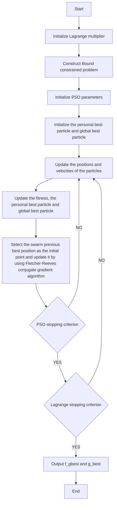

For	office	use	only

T1

T2

T3

T4

Team	Control	Number

47823

Problem	Chosen

C

For	office	use	only

F1

F2

F3

F4

## 2016

## MCM/ICM

## Summary Sheet

(Your team's summary should be included as the first page of your electronic submission.)

Type	a	summary	of	your	results	on	this	page.	Do	not	include	the	name	of	your	school,	advisor,	or	team	members	on	this

page.

We	develop	a	model	to	determine	an	optimal	investment	strategy	to	improve the	performance	of	undergraduate	students	in	the	US.	Our	model	has	three	parts:

In	 the	 first	 part,	 we	 collect	 data	 about	 the	 focus	 of	 other	 foundations’ investment	by	subjects	and	locations.	We	consider	the	charitable	identity	of	the Goodgrant	as	well.	Then	we	set	out	to	decide	our	focus,	which	is	to	invest	more on	 those	 schools	 with	 more	 minority	 races,	 lower	 educational	 performance, higher	debt	ratio	and	so	on.	In	this	part,	we	also	classify	the	data	into	two	groups, one	for	school	selecting,	and	another	for	ROI	determining.

In	 the	 second	 part,	 as	 a	 data	 extraction,	 we	 build	 a	 efficient	 and	 intuitive model	 to	 rank	 the	 candidate	 schools	 in	 accordance	 with	 the	 correlation	 of	 our focus,	 using	 the	 PCA	 method.	 After	 that,	 the	 top	 50	 schools	 are	 selected	 as	 our target	schools.

In	the	third	part，we	make	a	key	assumption	that	the	social	utility	of	a	school has	 logarithmic	 relationship	 with	 the	 earnings	 of	 graduated	 students	 and	 the graduation	rate.	More	over,	we	create	a	parameter	k to	denote	the	marginal	rate of	 substitution	 (MRS)	 between	 the	 two	 factors	 above.	 After	 that,	 we	 come	 to define	the	ROI	function	of	each	target	school	as	the	incremental	utility.

We	further	discuss	how	to	devise	the	best	strategy	with	several	methods. At last,	 we	 choose	 the	 improved	 PSO	 algorithm based	 on	 augmented	 Lagrange function.	 This	 algorithm	 is	 a	 typical	 method	 to	 solve	 the	 multivariable optimization	problem	with	constraint	conditions.	Then	we	offer	a	recommending list	by	the	cumulative	ROI	in	five	years. What’s	more,	our	model	is	broad	enough to	accommodate	any	non-linear	constraint	optimization	problem.

Finally,	 we	 change	 the	 numerical	 value	 of	 parameter	 k to	 examine	 the sensitivity	of	our	investment	strategy. The result	shows	that our	model	is	robust.

## The	Optimal	Investment	Strategy Based	on	the	Large-scale

## Non-linear	Constraint	Optimization	Methods

## Contents

1 Problem	Statement.. 3  
2 Planned	Approach . 3  
3 Assumptions.. 4  
4 Data	Analysis	and	Focus	Decision . 5

4.1 Data	Analysis . 5  
4.2 Focus	Decision ....... 6

5 School	Selecting. 8

5.1 Manual	Selection....... . 8  
5.2 PCA	Selection.. 8

5.2.1 Standardization... .. 8  
5.2.2 Calculation .... 9  
5.2.3 Principle	Components.. . 9  
5.2.4 PCA	Results.. 9

6 Strategy	Making.. .. 10

6.1 The	ROI	Function... .11  
6.2 Optimizing	the	Total	ROI. ... 12

6.2.1 Karush-Kuhn-Tucker	Conditions ..... .14  
6.2.2 PSO	Algorithm . .16  
6.2.3 Improved	 PSO	 algorithm	 based	 on	 augmented	 Lagrange function	(LA\_PSO\_GT) .. .16

7 Result .. ..16

7.1 Optimal	Investment	Strategy	and	Recommending	List.. .17

8 Testing	our	Model. ..18

8.1 Sensitivity	Analysis. ... 18  
8.2 Strengths . ... 19  
8.3 Weaknesses.. ... 19

9 Conclusion..... ..20

10 Letter	to	the	CFO	of	the	Goodgrant	Foundation .20  
11 References. .22  
12 Appendix	1:	Recommending	List... ..23  
13 Appendix	2	An	Introduction	to	the	Improved	PSO

Algorithm	Based on	Augmented	Lagrange	Function...... ..25

## 1 Problem	Statement

Private	foundations	are	created	by	an	individual,	family,	or	business	to	fulfill specific	charitable	missions.	Those	like	Gates	foundation	and	Lumina	foundation make	 great	 efforts	 to	 improve	 the	 quality	 of	 health	 and	 education	 in	 relatively poor	 areas.	 We	 must	 set	 big	 goals	 and	 spare	 no	 effort	 on	 the	 way	 because	 the world	won’t	get	better	by	itself.	The	Goodgrant,	one	of	the	 foundations,	intends to	 help	 improving educational	 performance	 of	 undergraduates	 attending colleges	and	universities	in	the	United	States. Given	its	potential	donation	of	100 million	dollars	per	year	in	 five	years,	what	is	 the	best	investment	strategy?	We are	tasked	with	creating	models	that	can	be	applied	in	the	universities	across	the nation.	The	solution	proposed	within	 this	paper	will	offer	an	insight	 to	use	 the big	data	and	will	objectively	devise	the	investment	strategy	including	the	target schools,	investment	amount	and	duration.

## 2 Planned	Approach

Our	objective	is	to	set	out	the	best	strategy	including	three	components:(1) target	 schools;(2)	 the	 investment	 amount	 per	 school;	 (3)	 the	 investment duration.	 And	 also	 we	 will	 offer	 an	 optimized	 and	 prioritized	 recommendation list	of	candidate	schools	based	on	each	school’s	return	on	investment	(ROI).

Faced	with	the	big	data	problem,	we	can’t	use	the	data	directly	because	of the	 limitation	 of	 our	 personal	 computers	 and	 the	 length	 of	 the	 contest.	 If	 the data	are	directly	applied,	the	computing	system	will	run	several	days	or	weeks. As	a	result,	the	data	selection	is	extremely	important,	which	will	also	reflect	the focus	of	the	foundation.	To	determine	the	most	effective	computing	system,	we divide	the	problem	into	three	parts	together	with	the	procedures	as	follows:

## Part	one:	Data	Analysis	and	Focus	Decision

1. We	 will	 give	 an	 analysis	 of	 the	 big	 data	 of	 the	 problem,	 which	 includes information	of	near	3000	schools.  
2. Based	 on	 the	 data	 given	 and	 the	 statistics	 of	 the	 focus	 of	 foundations collected	 from	 the	 Internet,	 we	 will	 decide	 the	 focus	 of	 the	 Goodgrant, avoiding	 duplicating	 the	 investment	 and	 focus	 of	 other	 large	 grant organizations.

## Part	two:	School	Selecting

1. Manual	 selection.	 We	 have	 taken	 some	 schools	 out	 of	 consideration	 for certain	 reasons	 (the reason	 will	 be	 explained	 below).	 For	 example,	 we exclude	 the	 schools	 located	 at	 NY,	 CA,	 WA	 and	 MA	 due	 to	 the	 large amount	of	existing	grant	foundations.  
2. PCA	 (principle	 component	 analysis)	 selection.	 According	 to	 part	 of	 the data,	 the	 PCA	 method	 can	 rank	 the	 candidate	 schools	 by	 the	 degree	 of correlation	of	our	focus.	The	top	50	schools	will	be	selected	out.

## Part	three:	Strategy	Making

1. Derive	 a	 ROI	 function	 that,	 given	 the	 year	 and	 a	 specific	 investment amount	 of	 a	 candidate	 school,	 can	 output	 the	 utility	 in	 an	 appropriate manner.	 The	 function	 is	 based	 on	 the	 graduation	 rate,	 earnings	 of graduated	students	and	so	on.

2. Utilize	 an	 optimization	 algorithm	 to	 maximize	 the	 total	 utility	 of	 the target	50	schools	(in	part	two	(2)),	return	the	amount	of	investment	and the	time	duration	per	school.

## 3 Assumptions

Due	 to	 limited	 data	 about	 the	 educational	 performance	 of	 the	 candidate schools,	 the	 performance	 of	 the	 undergraduate	 students	 and	 the	 specific distribution	of	other	grants	by	subjects,	races	and	locations,	we	use	the	following assumptions	to	complete	our	model.	These	simplified	assumptions	will	be	used through	our	paper	and	can	be	improved	with	more	reliable	data.

The	 statistics	 of	 the	 candidate	 schools	 can	 be	 regarded	 as	 constant within	 five	 years.	 This	 assumption	 is	 reasonable	 to	 a	 large	 extent because	 the	 identities	 of	 a	 specific	 college	 won’t	 change	 a	 lot	 in	 five years.  
! The	 school	 will	 devote	 all	 the	 funding	 received	 this	 year	 to	 improving the	students’	performance.  
The	appropriate	manner	to	measure	the	return	on	the	investment	is	the school’s	 incremental	 utility.	 The	 utility	 function	 must	 be	 concave $( \partial ^ { 2 } y / \partial x ^ { 2 } < 0 )$ .	If	not,	we	should	give	the	whole	100	million	to	one	college to	maximize	the	total	incremental	utility,	which	is	opposite	against	the common	sense.	And	it’s	reasonable	in	economic	consideration,	as	with the	capital	growth,	the	marginal	production	will	be	less	and	less.	So	we assume	 the	 utility	 function	 has	 this	 typical	 formulation $U _ { i } = \log \left( x \right)$ , where $U _ { i }$ is	the	utility,	 ? are	the	independent	variables.

Neglect	the	discount	rate	of	the	capital.	In	this	paper,	we	do	not	take	the

inflation	into	consideration.

Here	are	the	notations	and	their	meanings	in	our	paper:

<table><tr><td>Notation</td><td>Meaning</td></tr><tr><td>U</td><td>Social utility of the school</td></tr><tr><td>x</td><td>Amount of the investment</td></tr><tr><td>j</td><td>Time period (j =0,1,2,3,4,5)</td></tr><tr><td>m</td><td>Share of students earning over $25,000/year</td></tr><tr><td>M</td><td>Median earnings of students working and not enrolled 10 years after entry</td></tr><tr><td>N</td><td>Number of undergraduate degree-seeking students</td></tr><tr><td>k</td><td>MRS (marginal rate of substitution)</td></tr><tr><td>g</td><td>Graduation rate</td></tr><tr><td>λ,v</td><td>Lagrange multiplier</td></tr></table>

Table	1:	notation

## 4 Data	Analysis	and	Focus	Decision

Since	 we	 are	 tackling	 with	 a	 problem	 with	 big	 data,	 there	 is	 a	 diversity	 of inputs	 with	 different	 types.	 On	 the	 other	 hand,	 the	 inputs	 interact	 with	 each other	to	some	degree.	We	must	deeply	analyze	the	data	to	dig	out	the	meaning	of each	column	and	separate	them	in	different	groups.

After	 the	 analysis,	 we	 set	 out	 to	 collect	 the	 data	 of	 other	 large	 grant foundations，including	 their	 focus by	 different	 subjects,	 races and	 locations, together	 with	 other	 information	 available.	 Based	 on	 the	 data	 collected,	 we	 can determine	 the	 focus	 of	 the	 Goodgrant,	 which	 ensures the	 least	 degree	 of duplication.

## 4.1 Data	Analysis

We	 analyze	 the	 data	 in	 the	 attached	 Excel	 sheet	 Most	 Recent	 Cohorts	 Data. We	find	out	that	there	are	continuous	and	discrete	data.	The	continuous	data	can be	 separated	 into	 two	 groups,	 one	 for	 determining	 the	 focus	 as	 well	 as	 school selecting,	 another	 for	 measuring	 the	 school’s	 utility	 as	 well	 as	 determining	 the ROI.	So	at	last,	we	separate	them	into	three	components,	each	for	different	use.

<table><tr><td>Type and use</td><td>Variable</td></tr><tr><td rowspan="4">Continuous data for school selecting</td><td>SAT/ACT scores</td></tr><tr><td>PCIP (the distribution by subject)</td></tr><tr><td>UGDS_(the distribution by race)</td></tr><tr><td>PPTUG_EF(part-time ratio)PCTPELL(pell grant ratio)</td></tr><tr><td rowspan="3"></td><td>UG_25_abv(the percentage of students above 25)</td></tr><tr><td>GRAD_DEBT_MDN_SUPP(debt)</td></tr><tr><td>RPY_3YR_RT_SUPP(debt ratio)</td></tr><tr><td>Discrete data for school selecting</td><td>CONTRAL PBI ANNHI TRIBAL AANAPII HIS NANTI</td></tr><tr><td rowspan="4">Continuous data for determining the ROI</td><td>UGDS (the number of students)</td></tr><tr><td>C150 C200 (graduation rate)</td></tr><tr><td>md_earn_wne_p10(median of earnings)</td></tr><tr><td>gt_25k_p6(earnings above 25k ratio)</td></tr></table>

Table	2:	the	different	types	of	variables	and	their	use

## 4.2 Focus	Decision

First	of	all,	we	define	the	Goodgrant	as	a	charitable	organization	to	make	the world	 more	 equal.	 Based	 on	 this	 duty,	 the	 Goodgrant	 aims	 at	 helping	 those undergraduate	 students	 who	 are	 relatively	 poor,	 under	 debt,	 or	 has	 low SAT/ACT	 scores	 and	 those	 schools	 located	 at	 small	 cities,	 consisting of	 more minority	races,	with low	graduated	rate	and	so	on.

Secondly,	for	not	duplicating	other	organizations’	investment	and	focus,	we collect	 the	data	of	 the	distribution	of	1000	 foundations	by	location	and	subject. The	statistics	are	presented	below.

bar chart

Distribution of Grants from FC 1000 Foundations by Subject Area, 2012
| Subject Area | Grant Count |
| :--- | :--- |
| Health | 5,001,048,709 |
| Education | 4,969,633,975 |
| Human Services | 3,497,761,246 |
| Public Affairs/Society Benefit | 2,715,988,756 |
| Arts and Culture | 2,166,039,352 |
| Environment and Animals | 1,585,793,705 |
| International Affairs | 1,064,884,570 |
| Science and Technology | 605,611,213 |
| Religion | 468,397,837 |
| Social Science | 243,204,197 |
| Other | 31,649,337 |

Figure	1:	distribution	of	grants	from	FC	1000	foundations	by	subject	area [1] Source: http://data.foundationcenter.org/#/fc1000/subject:all/all/total/bar:amount/2012 We	 can	 see	 that	 most	 foundation	 invested	 in	 the	 following	 three	 subjects:

Health,	 Education	 and	 Human	 services	 from	 Figure	 1.	 We	 define	 these	 three subjects	 as	 strong	 subjects.	 Notice	 that	 we	 have	 already	 the	 PCIP	 data	 (the percentage	of	degree	awarded	in	different	subjects).	Compared	to	other	subjects, the	above	three	major	subjects	have	received	a	large	amount	of	grants.	Further, the	students	who	major	in	these	three	subjects	will	benefit	a	lot.	So	we	decide	to invest	less	on	these	three	subjects	but	more	on	other	subjects.

However,	 there	 is	 a	 problem	 behind	 the	 logic	 above.	 The	 large	 amount	 of capital	invested	on	these	three	subjects	doesn’t	mean	that	we	should	invest	less on	 them.	 We	 only	 consider	 the	 capital	 supply	 while	 neglecting the	 capital demand.	In	other	word,	the	financing	gap	really	counts.	However,	taking	capital demand	into	consideration will	make	the	problem	even	complex.	Also,	we	find	it difficult to	acquire the	data	of	capital	demand.	As	a	result,	we	only	consider	the supply	of	capital,	reluctantly.

Distribution of Grants from FC 1000 Foundations by Recipient Location, 2012  

bar chart

| State/Region | Value |
|---|---|
| New York | 3,106,867,447 |
| California | 2,924,735,635 |
| District of Columbia | 1,995,672,199 |
| Massachusetts | 1,370,486,600 |
| Texas | 998,227,314 |
| Maryland | 740,463,497 |
| Pennsylvania | 731,060,411 |
| Illinois | 643,285,180 |
| Georgia | 559,141,409 |
| Virginia | 526,742,707 |
| Michigan | 513,141,355 |
| North Carolina | 450,196,883 |
| Minnesota | 420,534,094 |
| Washington | 417,022,100 |
| Colorado | 411,517,352 |
| Ohio | 406,141,396 |
| Indiana | 381,674,797 |
| New Jersey | 330,456,060 |
| Florida | 320,771,982 |
| Missouri | 316,762,888 |
| Connecticut | 296,675,208 |
| Arkansas | 270,050,541 |
| Oregon | 214,688,930 |
| Nebraska | 196,816,532 |
| Tennessee | 184,984,468 |
| Arizona | 157,411,930 |
| Wisconsin | 150,846,649 |
| Oklahoma | 131,714,186 |
| Louisiana | 114,584,759 |

Figure	2:	distribution	of	grants	from	FC	1000	foundations	by	recipient	location  
Source:	http://data.foundationcenter.org/#/fc1000/subject:all/all/total/bar:amount/2012

Figure	 2	 tells	 us	 that	 most	 of	 the	 recipients	 are in	 four	 states:	 New	 York, California,	 District	 of	 Columbia	 and	 Massachusetts.	 Follow	 the	 focus	 of	 the Goodgrant,	we	decide	not	to	invest	on	these	four	states because	these	four	states are	 relatively	 wealthy	 and already have many	 foundations.	 However,	 the problem	also	exists	which	is	similar	to	the	above.

Here	 is	 a	 summary	 of our	 focus.	 We	 will	 invest	 more	 on	 schools	 which are/have:

1. Lower	SAT/ACT	scores  
2. Lower	percentage	of	students	who	receive	pell	grant  
3. Higher	percentage	of	minority	races  
4. Higher	percentage	of	degree	awarded	in	week	subjects  
5. Higher	part-time	ratio  
6. Higher	debt/loan

## 5 School	Selecting

Based	 on	 the	 data	 analysis	 and	 our	 focus	 explained	 above,	 we	 intend	 to reduce	the	number	of	candidate	schools	from	2977	to	500	by	manual selection and	PCA	selection.	The	smaller number	of	schools	will	make	the	algorithm	easier to	run in	the	next	part	“strategy	making”.

## 5.1 Manual Selection

According	 to	 the	 analysis	 and	 explanation	 above,	 we	 don’t	 invest	 on	 the schools	 in	 four	 states:	 New	 York,	 California,	 District	 of	 Columbia	 and Massachusetts.	 So	 we	 directly	 delete	 the	 schools	 in	 these	 four	 states	 from	 our candidate	sheet.	This	step	reduces	the	number	from	2977	to	2323.

## 5.2 PCA	Selection

In	this	part,	we	intend	to	rank	the	schools	based	on	the	correlation	between the	 school’s	 identities	 and	 our	 focus.	 Since	 we	 make	 use	 of	 68	 indicators	 with complex	interactions,	we	ought	to	extract	a	few	principle	indicators	(usually	3	or 4)	 from	 the	 original	 68	 ones.	 And	 give	 them	 different	 weights	 to	 computer	 the final	score	to	rank	the schools.

The	 PCA	 (principle	 component	 analysis)	 is	 an	 ideal method	 to	 tackle	 this problem	 with	 high	 efficiency [2].	 PCA	 uses	 linear	 equation	 to	 combine	 the original	 indicators,	 generating	 principle	 components $F _ { i }$ with	 the	 maximized variance.	 	 The	 variance	 of	 a	 component	 was	 defined	 as	 its	 amount	 of information.

## 5.2.1 Standardization

Firstly,	 we	 recognize	 that	 the	 original	 data	 are	 not	 complete.	 We	 use	 the mean	 value	 to fill	 up	 the	 data, where	 ? is	 the	 number	 of	 the	 school, ? is	 the number	 of	 the	 indicator.	 This	 treatment	 is	 reasonable	 because	 it	 doesn’t influence	the	result	[3].

$$
N U L L _ {j} = \frac {1}{n} \sum_ {i = 1} ^ {n} x _ {i j} = \overline {{{x}}} _ {j} \tag {1}
$$

$$
(i = 1, 2, \dots , n; j = 1, 2, \dots , p)
$$

Secondly,	we	use	the	equation	below	to	standardize	the	data:

$$
x _ {i j} ^ {*} = \frac {x _ {i j} - \overline {{x}} _ {j}}{\sqrt {\operatorname{Var} (x _ {j})}}
$$

$$
\operatorname{Var} \left(x _ {j}\right) = \frac {1}{n - 1} \sum_ {i = 1} ^ {n} \left(x _ {i j} - \bar {x} _ {j}\right) ^ {2} \tag {2}
$$

## 5.2.2	Calculation

We	 use	 the	 equation	 below	 to	 compute	 the	 covariance matrix	 where $i , j$ both	are	the	indicators	and	 ? are	the	data	after	standardization.

$$
r _ {i j} = \operatorname{cov} \left(x _ {i}, x _ {j}\right) = \frac {\sum \left(x _ {i} - \bar {x} _ {i}\right) \left(x _ {j} - \bar {x} _ {j}\right)}{n - 1} \tag {3}
$$

And	then	we	calculate	the	eigenvalue	and	eigenvector	of	the	covariance matrix:

Eigenvalue: $\lambda _ { _ i }$ ;	Eigenvector: $\Vec { a } _ { i } , ~ ( i { = } 1 , 2 , . . . , p )$

## 5.2.3 Principle	Components

The	 steps	 above	 can	 generate	 68	 principle	 components while	 we	 can	 only utilize	3	or	4	of	 the	components, which	have the	highest	contribution	rate.	The contribution	rate	can	be	calculated	by	the	equation:

$$
\text { Contribution   rate } = \frac {\lambda_ {i}}{\sum_ {i = 1} ^ {p} \lambda_ {i}} \tag {4}
$$

The	 sum	 of	 the	 contribution	 rate	 is	 denoted	 by	 ?,	 the	 cumulative	 contribution rate.	The	higher T,	the	more	information	contained	in	the	principle	components.

At	last,	we	can	sum	the	scores	of	the	principle	components	and	use	the	total score	to	rank	the	schools.

## 5.2.4 PCA	Results

We	set	the	cumulative	contribution	rate $T = 9 0 \%$ ,	the	2323	schools	and	68 indicators	 as	 inputs.	 And	 apply	 the	 PCA	 method	 to	 compute the	 score	 of	 the schools,	the	top	500	schools	will	go around	to	next	part.	Here	is	the	table	of	the top	ten	schools.

<table><tr><td>Rank</td><td>UNITID</td><td>INSTNM</td><td>PCA Score</td></tr><tr><td>1</td><td>244190</td><td>Widener University-Delaware Campus</td><td>32.87</td></tr><tr><td>2</td><td>227429</td><td>Paul Quinn College</td><td>30.15</td></tr><tr><td>3</td><td>138761</td><td>Andrew College</td><td>27.14</td></tr><tr><td>4</td><td>225575</td><td>Huston-Tillotson University</td><td>25.09</td></tr><tr><td>5</td><td>102270</td><td>Stillman College</td><td>24.99</td></tr><tr><td>6</td><td>140720</td><td>Paine College</td><td>21.81</td></tr><tr><td>7</td><td>447582</td><td>New River Community and Technical College</td><td>21.58</td></tr><tr><td>8</td><td>198862</td><td>Livingstone College</td><td>21.30</td></tr><tr><td>9</td><td>229063</td><td>Texas Southern University</td><td>20.43</td></tr><tr><td>10</td><td>233338</td><td>Richard Bland College of the College of William and Mary</td><td>20.21</td></tr></table>

Table	3:	top	ten	candidate	schools	by	PCA

In	the	table	above,	the	school	that	has	the	highest	PCA	scores	has	the	largest demand	 of	 grant	 based	 on	 our	 focus.	 Please	 notice	 that	 this	 is	 not	 the	 final recommending	 list	 of	 the	 schools,	 because	 we	 haven’t	 considered	 the	 ROI	 of these	 schools.	 After	 deriving	 the	 ROI	 function,	 we	 will	 offer	 a	 list	 based	 on	 the potential	 use	 of	 the	 investment.	 Further	 more,	 we	 will	 compare	 the	 difference between	the	PCA	rank	list	between	the	final	list	later.

Checking	 the	 statistics	 of	 the	 top	 school	 Widener	 University-Delaware Campus,	we	find	that	the	students	in	this	school	are	under	a	large	amount	of	debt. It	 is	 the	 main	 indicator	 pushing	 the	 school	 to	 the	 top	 one.	 To	 some	 degree,	 it reflects	that	our	model	is reasonable	and	efficient	 for	we	pay	attention	to	those schools	whose	students	are	under	much	debt.	On	another	hand,	our	PCA-ranking model	 has	 a	 clear,	 easy-to-understand	 basis	 in	 focus	 correlation	 measures	 and gives	 reasonably	 accurate	 results.	 It	 should	 be	 noted	 that	 we	 choose	 this approach	 to	 ranking	 schools	 over	 a	 much	 simpler	 approach	 such	 as	 simply summing	 the	 indicators	 for	 various	 reasons,	 one	 of	 which	 is	 that	 there	 are interactions	 between	 the	 indicators	 and	 PCA	 is	 skilled	 at	 solving	 this	 kind	 of problems.

## 6 Strategy	Making

The	 model	 we	 created	 in	 the	 sections	 above	 works	 well	 for	 selecting the target	schools.	In	this	part,	in	order	to	rank	the	target	schools	and	determine	the investment	strategy,	we	must	determine	the	return	on	investment	(ROI),	before this,	we	should	derive	a	utility	function	which	measures	the	contribution	of	the school	to	the	society.	ROI	is	defined	as	the	difference	between	the	utility	before and	after	the	investment.

The	utility	of	a	school	is	an	abstract	value,	and	it	has	no	real	unit	for	it’s	not money,	not	earnings	or	other	things.	And	the	input	x is	a	vector,	including four main	 factors,	 student	 number,	 graduated	 ratio,	 earnings	 of	 graduated	 students and	 the	 investment.	 The	 construct	 of	 x will	 be	 explained	 later.	 Here	 is	 the	 key assumption:	the	utility $U _ { i }$ and	the	inputs	x have	the	relationship	below:

$$
U _ {i} = \log (x) \tag {5}
$$

First	of	all,	the	utility	function	must	be	concave	for	two	reasons:

1. If	the	function	is	linear	or	convex,	the	best	strategy	is	to	give	the	whole 100	million	to	one	school	to	maximize	the	total	utility.  
2. The	 utility	 is	 a	 state	 value.	 If	 both	 a	 high	 state	 and	 a	 low	 state school receive	a	same	amount	of	investment,	the	low	state	school	will	generate more	 incremental	 utility.	 Because	 there	 are	 more	 opportunities	 to	 use the	money	and	more	things	to	be	improved	in	the	low	state	one.

Secondly,	 motivated	 by	 the	 utility	 function	 in	 microeconomics,	 we	 use	 the “log” relationship	 to	 determine	 the	 utility	 function. Although	 the	 relationship may	be	more	complex	in	real	life,	it	gives	us	reasonable	ROI	function	below	and works	well	with	our	model.

## 6.1 The	ROI	Function

Here	 we	 come	 to	 the	 ROI	 function,	 the	 function	 describes	 the	 relationship between	 investment	 and	 incremental	 utility.	 Once	 the	 ROI	 function	 is	 decided, we	can	make	the	investment	strategy	to	maximize	the	total	ROI.

Naturally,	the	ROI	function	is	the	difference	of	the	utility	function:

$$
R O I _ {i} = \Delta U _ {i} = \log \left(x _ {0} + \Delta x _ {i}\right) - \log \left(x _ {0}\right) \tag {6}
$$

We	can	plot	a	figure	to	describe	the	relationship:

line chart

| x     | U     |
|-------|-------|
| 0     | 0     |
| Δx    | ΔU    |
| >Δx   | >ΔU   |

Figure	3:	the	relationship	between	incremental	utility	and	investment

In	 Figure	 3	 and	 equation	 (6), $\Delta x _ { i }$ is	 the	 incremental	 amount	 of	 the	 inputs triggered by	 the	 investment.	 In	 the	 following	 steps,	 we	 will	 derive	 an explicit equation	of	x.

Firstly,	we	consider	the	number	of	the	students N,	median	of	earnings	after 10	years	M and	the	ratio	of	students	who	earn	more	than	25k	per	year	after	6 years m.	We	multiply	them	together	to	measure	the	total	earnings [4]:	 m⋅ M ⋅ N . The	 earnings	 measure	 one	 aspect	 of	 the	 utility,	 the	 higher	 it	 is,	 the	 higher	 the state	of	school	will	be.

Secondly,	we	 take	a	 deep	look	at	 the	graduation	 rate	g (same	 for	two	 year school	or	four	year	school).	This	indicator	measures	another	aspect	of	the	utility. It	also	has	a	positive	relationship	between	the	utility.	We	intend	to	combine	the two	aspects	together	but	the	units	are	not	equal.	Then,	we	define	a	constant	k to balance	 the	 unit.	 As	 a	 result,	 the	 utility	 function	 can	 be	 written	 as	 the	 form below:

$$
U _ {0} = \log (m \cdot M \cdot N + k \cdot g) \tag {7}
$$

Here	 all	 the	 variables	 are	 different	 for each	 school,	 for	 simplicity,	 we eliminate	the	subscript	i.

Take	the	investment	into	consideration,	the	utility	will	be:

$$
U _ {j} = \log (\sum_ {p = 0} ^ {j - 1} x _ {p} + x _ {j} + m \cdot M \cdot N + k \cdot g) \tag {8}
$$

where	 j represents	 the	 time	 period, $j = 1 , 2 , 3 , 4 , 5$ and $x _ { _ 0 } = 0 . \ x _ { _ 0 }$ is	 the	 initial investment	 the	 school	 received	 from	 other	 foundations	 or	 the	 government.	 In this	problem,	we	simply	assume $x _ { 0 } = 0$ because	of	the	limited	data.

At	last,	we	can	write	down	the	ROI	function:

$$
R O I = \left\{ \begin{array}{l} \log \left(x _ {j} + m \cdot M \cdot N + k \cdot g\right) - \log (m \cdot M \cdot N + k \cdot g) \dots j = 1 \\ \log \left(\sum_ {p = 0} ^ {j - 1} x _ {p} + x _ {j} + m \cdot M \cdot N + k \cdot g\right) - \log \left(\sum_ {p = 0} ^ {j - 2} x _ {p} + x _ {j - 1} + m \cdot M \cdot N + k \cdot g\right) \dots j = 2, 3, 4, 5 \end{array} \right. \tag {9}
$$

The	 ROI	 function	 above	 is	 dynamic	 with	 respect	 to	 time	 period.	 In	 other words,	 when	 time	 changes,	 the	 ROI	 function	 changes	 in	 response.	 To	 be	 more specific,	once we	invest	in a	school,	the	ROI	in	the	next	period	will decrease.	The larger	amount	of	investment	there	is,	the	lower	the	ROI	will	be.	This	character	of our	ROI	function	describes	the	real	situation	precisely,	which	makes	model	close to	the	reality.

## 6.2 Optimizing	the	Total	ROI

We	now	assign	100	million	dollars	to	50	target	schools	to	maximize	the	total

ROI.	Each	school’s	ROI	is	defined	in	Equation (9). We	use	the	equations	below	to simplify	the	form	of	our	ROI	function:

$$
c _ {j} = \sum_ {p = 0} ^ {j - 1} x _ {p} + m \cdot M \cdot N + k \cdot g \dots \dots j \geq 1 \tag {10}
$$

$$
c _ {_ o} = m \cdot M \cdot N + k \cdot g \dots\dotsj = 0
$$

The	utility	function	will	be:

$$
U _ {j} = \left\{ \begin{array}{l} \log \left(x _ {j} + c _ {j}\right) \dots \dots j \geq 1 \\ \log c _ {0} \dots \dots j = 0 \end{array} \right. \tag {11}
$$

The	ROI	function	will	be:

$$
R O I = \Delta U _ {j} = U _ {j} - U _ {j - 1} \tag {12}
$$

We	want	to	maximize	the	total	ROI,	the	function	can	be:

$$
\begin{array}{l} \sum_ {i} \sum_ {j} \Delta U _ {i j} \\ = \sum_ {i} \left[ \left(U _ {i 1} - U _ {i 0}\right) + \left(U _ {i 2} - U _ {i 1}\right) + \left(U _ {i 3} - U _ {i 2}\right) + \left(U _ {i 4} - U _ {i 3}\right) + \left(U _ {i 5} - U _ {i 4}\right) \right] \tag {13} \\ = \sum_ {i} (U _ {i 5} - U _ {i 0}) \\ = \sum_ {i} U _ {i 5} - \sum_ {i} U _ {i 0} \\ \end{array}
$$

The	result	is	really	exciting!	It	is	noted	that	the	ROI	of	one	school	in	different time	period	cancels	out	with	each	other.	As $\sum _ { i } U _ { i 0 }$ is	constant,	the	problem	will be	in	this	form:

$$
\begin{array}{l} \max \sum_ {i} U _ {i 5} = \sum_ {i} \log (x _ {i 1} + x _ {i 2} + x _ {i 3} + x _ {i 4} + x _ {i 5} + c _ {i 0}) \\ s. t. \left\{ \begin{array}{l} \sum_ {i} x _ {i 1} = 1 \times 1 0 ^ {8} \\ \sum_ {i} x _ {i 2} = 1 \times 1 0 ^ {8} \\ \sum_ {i} x _ {i 3} = 1 \times 1 0 ^ {8} i = 1, 2, \dots , 5 0; j = 1, 2, \dots , 5 \end{array} \right. \tag {14} \\ \left\{ \begin{array}{l} \sum_ {i} x _ {i 4} = 1 \times 1 0 ^ {8} \\ \sum_ {i} x _ {i 5} = 1 \times 1 0 ^ {8} \\ x _ {i j} \geq 0 \end{array} \right. \\ \end{array}
$$

The	 equations	 (14)	 are	 the	 final	 form	 of	 our	 model.	 Up	 to	 know,	 we	 have already	derived	a	mathematical	problem	of	 the	real	situation.	Now,	we	attempt to	choose	the	best	method	to	solve	the	optimization	problem.

## 6.2.1 Karush-Kuhn-Tucker	Conditions

At	 first,	 we	 set	 out	 to	 implement	 KKT conditions	 to	 solve	 the	 optimization problem [5].	For	the	problem	below:

$$
\begin{array}{l} \min f _ {0} (x) \\ f _ {i} (x) \leq 0, i = 1, 2, \dots \dots m \tag {15} \\ h _ {i} (x) = 0, i = 1, 2, \dots \dots p \\ \end{array}
$$

the	KKT conditions	are	presented	as	follows:

$$
\left\{ \begin{array}{l} \nabla f _ {0} \left(x ^ {*}\right) + \sum_ {i = 1} ^ {m} \lambda_ {i} ^ {*} \nabla f _ {i} \left(x ^ {*}\right) + \sum_ {i = 1} ^ {p} \nu_ {i} ^ {*} \nabla h _ {i} \left(x ^ {*}\right) = 0 \\ f _ {i} \left(x ^ {*}\right) \leq 0 \\ h _ {i} \left(x ^ {*}\right) = 0 \\ \lambda_ {i} ^ {*} \geq 0 \\ \lambda_ {i} ^ {*} f _ {i} \left(x ^ {*}\right) = 0 \end{array} \right. \tag {16}
$$

where $\lambda _ { _ i }$ is	Lagrange	multiplier	associated	with $f _ { i } ( x ) \leq 0$ ;

$\nu _ { _ i }$ is	Lagrange	multiplier	associated	with $h _ { \scriptscriptstyle i } ( x ) = 0$ .

For	our	problem,	we	can	easily	transform the	formulation into	the	standard form,	and	the	corresponding KKT	conditions	are:

$$
\left\{ \begin{array}{l} \forall i, \frac {1}{X _ {i 1} ^ {*} + X _ {i 2} ^ {*} + X _ {i 3} ^ {*} + X _ {i 4} ^ {*} + X _ {i 5} ^ {*}} - \sum_ {i = 1} ^ {m} \lambda_ {i} ^ {*} + \sum_ {i = 1} ^ {p} v _ {i} ^ {*} = 0 \\ x _ {i j} \geq 0 \\ \sum_ {i j} x _ {i j} = 1 \times 1 0 ^ {8}, j = 1, 2, 3, 4, 5 \\ \lambda_ {i} ^ {*} \geq 0 \\ \lambda_ {i} ^ {*} f _ {i} \left(x ^ {*}\right) = 0 \end{array} \right. \tag {17}
$$

flowchart

Figure	4:	flow	chart	of	the	LA\_PSA\_GT	algorithm

?????? $f _ { g b e s t }$ is	the	maximum	of	the	total	ROI	function

$g _ { b e s t }$ ????? is	vector	of	investment	amount	per	year

The	KKT	conditions	ensures	the	existence	of the	solutions. Solving	the	equations above,	we	will	absolutely	get	the	optimized	strategy.	However,	the	equations	are extremely	difficult	since	there	are	250	variables.	In	general,	the	KKT	method	is highly	 efficient dealing	 with small	 number	 of	 variables.	 So, as	 a	 result,	 the number	of	the	variable	is	 too	big	 for	us	 to	solve	 the	equation	when	it	comes	 to our	 problem.	 In	 other	 words,	 we	 are	 not	 able	 to	 create	 a	 program	 to	 solve	 the equations.	Consequently,	we	have	to	give	up	and	search	for	other	algorithms.

## 6.2.2 PSO Algorithm

The	PSO	(particle	swarm	optimization)	is	an	efficient	method,	imitating	the flying	path	of	a	bird	swarm.	PSO	algorithm uses	three	flying	principles,	collision avoidance, velocity	 matching	 and	 flock	 centering	 to	 search	 the	 extrema	 within the	 boundary	 conditions.	 The	 algorithm	 starts	 with	 a	 randomly	 initialized investment	vectors	and	iterate	them	until	reaching the	maximum	point [6].	We create	a	program	based	on the	PSO,	but	the	algorithm	takes a	very	long	time	to converge	and	does not	produce	the	optimal	values.	Therefore,	we	decide to	use another	method	to	improve	the	performance.

## 6.2.3 Improved	 PSO	 algorithm	 based	 on	 augmented	 Lagrange	 function

## (LA\_PSO\_GT)

We	search	for	other	literary	researches	and	decide	to	use	the	method	above. The	 algorithms	 utilize	 the	 augmented	 Lagrange	 function	 to	 change	 the optimization	problem	into	boundary constraint	optimization	problem.	After	that, the	 LA\_PSO\_GT	 combines	 Conjugate	 Gradient	 method	 and	 PSO	 algorithm together,	which	overcome	 the	defect	of	 the	length	of	 the	convergence	 time	and improves	the	computing	efficiency [7]. The	whole	procedures	will	be	attached	in the	appendix.	Above is the flow	chart	of	this	algorithm.

## 7 Result

After	running	the	program,	we	get	the	amount	of	investment	for	each	target school	in	each	year	and	the	ROI	in	five	years.

The	fitness	figure	of	the	algorithm	is	presented	below:

From	the	fitness	figure	below,	we	can	see	that	the	algorithm	converges after 50	iterations.	It	proves	that	our	method	is	efficient and	powerful.

line chart

| x    | fitness (×10²⁰) |
| ---- | --------------- |
| 0    | 6.0             |
| 10   | 1.0             |
| 20   | 0.5             |
| 30   | 0.2             |
| 40   | 0.1             |
| 50   | 0.05            |
| 60   | 0.03            |
| 70   | 0.02            |
| 80   | 0.01            |
| 90   | 0.01            |
| 100  | 0.01            |
| 110  | 0.01            |
| 120  | 0.01            |
| 130  | 0.01            |
| 140  | 0.01            |
| 150  | 0.01            |

Figure	5:	fitness	of	the	algorithm

For	 some	 schools,	 the	 investment	 is	 too	 small.	 For	 example,	 if	 only 1000 dollars is	invested	in	a	school	in	a	year,	it is	obviously	useless	in	real	situation. Therefore,	we	eliminate	 the	value	and	set	it	as	zero.	Although	we	don’t	use	 the whole	100	million,	but	the	utilization	rates	are all	above	99%.

## 7.1Optimal	Investment	Strategy	and	Recommending	List

Here	is	a	 table	of	 top	 ten	schools in	 the	 recommending	list	 ranked	by	 total ROI	 in	 five	 years,	 including	 the	 investment	 amount	 each	 year	 and	 the	 time duration.	The	full	table	of	all	target	schools	will	be	attached	in	appendix.

<table><tr><td>Rank</td><td>INSTNM</td><td>ROI</td><td>t</td><td>1</td><td>2</td><td>3</td><td>4</td><td>5</td></tr><tr><td>1</td><td>MacCormac College</td><td>2.22</td><td>4</td><td>13.62</td><td>0.17</td><td>0.00</td><td>5.69</td><td>4.78</td></tr><tr><td>2</td><td>Paul Quinn College</td><td>2.02</td><td>5</td><td>7.84</td><td>1.02</td><td>3.09</td><td>2.92</td><td>5.10</td></tr><tr><td>3</td><td>Andrew College</td><td>1.81</td><td>3</td><td>0.00</td><td>0.00</td><td>0.33</td><td>5.11</td><td>7.94</td></tr><tr><td>4</td><td>Bidwell Training Center Inc</td><td>1.80</td><td>4</td><td>0.18</td><td>0.00</td><td>7.18</td><td>0.66</td><td>0.75</td></tr><tr><td>5</td><td>Colorado Heights University</td><td>1.64</td><td>3</td><td>8.24</td><td>0.46</td><td>11.32</td><td>0.00</td><td>0.00</td></tr><tr><td>6</td><td>Tougaloo College</td><td>1.12</td><td>5</td><td>12.01</td><td>0.31</td><td>0.44</td><td>5.62</td><td>2.29</td></tr><tr><td>7</td><td>Brevard College</td><td>1.05</td><td>4</td><td>5.46</td><td>0.00</td><td>9.13</td><td>0.22</td><td>1.85</td></tr><tr><td>8</td><td>Paine College</td><td>0.98</td><td>4</td><td>0.00</td><td>0.98</td><td>3.48</td><td>6.12</td><td>0.43</td></tr><tr><td>9</td><td>Fisk University</td><td>0.90</td><td>5</td><td>8.84</td><td>1.49</td><td>0.70</td><td>0.71</td><td>0.14</td></tr><tr><td>10</td><td>Southeast Missouri Hospital College of Nursing and Health Sciences</td><td>0.84</td><td>4</td><td>2.38</td><td>1.32</td><td>0.00</td><td>5.59</td><td>3.80</td></tr><tr><td>...</td><td>...</td><td>...</td><td>...</td><td>...</td><td>...</td><td>...</td><td>...</td><td>...</td></tr><tr><td colspan="4">Utilization rate of funds in each year(%)</td><td>99.60</td><td>99.79</td><td>99.63</td><td>99.71</td><td>99.69</td></tr></table>

Table	4:	the	top	ten	schools	and	their	investment	amount	in	our	recommending	list  
(unit:million)[8]

As	 we	 can	 see	 in	 the	 recommending	 list,	 two	 of	 the	 schools,	 Paul	 Quinn

College	and Andrew	College are also	 the	 top	 ten	schools	in	 the	PCA	result.	Note that	 we	 use	 different	 data	 to	 rank	 the	 schools,	 it	 proves	 that	 the	 data	 has correlation.	 What’s	 more,	 it	 shows	 that	 two	 results	 are	 consistent	 with	 each other.	The	target	schools	are	those	with	high	ROI	and	worth	investmemt.

## 8 Testing	our	Model

To	 test	 our	 model	 whether	 it	 duplicates	 the	 investment	 and focus	 of	 Gates Foundation	 or	 not,	 we	 collect	 data	 of	 the	 investment	 distribution	 of	 the	 two foundations,	and	compare	them	to	our	recommending	list.

<table><tr><td>Rank</td><td>INSTNM</td><td>Investment amount (million)</td></tr><tr><td>1</td><td>Harvard University</td><td>24.14</td></tr><tr><td>2</td><td>University of Washington</td><td>16.42</td></tr><tr><td>3</td><td>Seattle University</td><td>15.80</td></tr><tr><td>4</td><td>Yale University</td><td>7.50</td></tr><tr><td>5</td><td>Texas Tech University</td><td>6.96</td></tr><tr><td>6</td><td>University of Michigan</td><td>6.85</td></tr><tr><td>7</td><td>Land-Grant Universities</td><td>4.95</td></tr><tr><td>8</td><td>University of Kentucky</td><td>4.50</td></tr><tr><td>9</td><td>Columbia University</td><td>3.78</td></tr><tr><td>10</td><td>Stanford University</td><td>3.25</td></tr></table>

Table	5:	the	top	ten	schools	ranked	by	Gates	Foundation’s	investment	amount

In	 the	 table	 above,	 we	 can	 see	 that	 Gates	 Foundation	 invested	 mostly	 on those	 well-known	 schools	 like	 Harvard and	 Yale.	 But	 none	 of	 these	 schools appear	in	our	recommending	list.	 It	proves	 that	our	model	efficiently	eliminate other	foundations’	investment	and	focus.

## 8.1Sensitivity	Analysis

In	 the	 process	 of	 determining	 the	 ROI	 function,	 we	 create	 a	 constant	 k to make	 the	 unit	 equal	 while	 this	 parameter	 lacks	 database.	 We	 use	 the	 ratio	 of mean	earnings	and	mean	graduation	rate	to	determine	the	value	of	k.	To	some degree,	k is	the	marginal	rate	of	substitution	between	the	two	factors.	How	does the	change	of	k influence	our	outputs?	We	analyze	the	standard	deviation	of	the invest	mount	caused	by	a	slightly	change	of	k.

<table><tr><td>Year</td><td>k-10%</td><td>k-5%</td><td>k+5%</td><td>k+10%</td></tr><tr><td>1</td><td>12.18%</td><td>5.33%</td><td>4.52%</td><td>9.51%</td></tr><tr><td>2</td><td>9.09%</td><td>4.25%</td><td>5.64%</td><td>11.88%</td></tr><tr><td>3</td><td>10.88%</td><td>6.37%</td><td>5.63%</td><td>13.28%</td></tr><tr><td>4</td><td>7.64%</td><td>3.29%</td><td>3.27%</td><td>13.33%</td></tr><tr><td>5</td><td>12.67%</td><td>4.90%</td><td>4.94%</td><td>7.41%</td></tr><tr><td>Mean value</td><td>10.49%</td><td>4.83%</td><td>4.80%</td><td>11.08%</td></tr></table>

Table	6:	the	standard	deviation	of	the	investment	amount	correspond	to	the	change	of	MRS	k From	 the	 table	 above,	 we	 can	 see	 that	 the	 influence	 of	k is	not	very	large,	and within	the	range	we	can	bear.

## 8.2 Strengths

1. Data	 classification.	 When	 faced	 with	 big	 data	 problems,	 the	 pattern classification	 is	 extremely	 useful	 and	 important.	 Based	 on	 this	 insight, our	model	firstly	implements a	data	classification,	separating	the	data	for two	major	purposes,	one	for	selection,	another	for	determining	the	ROI function.	By	this	means,	we	make	the most	use	of	the	data	attached.  
2. Data	extraction.	Our	model	utilizes	the	PCA	method	to	select	the	target schools	based	on	the	focus	of	our	foundation.	The	data	selection	is	also	an important	part	in	big	data	problem,	which	will	improve	the	efficiency	for further	data	processing.  
3. Reasonable	 ROI	 function.	 Another	 strength	 of	 our	 model	 is	 that	 we create	 an	 ROI	 function	 by	 analyzing	 the	 relationship	 between	 earnings and	graduation	rate.	Furthermore,	our	function	can	easily	be	modified	if other	researches	find	the	accurate	relationship.  
4. Suitable	algorithm. In	the	third	part,	we	derive	a	mathematical	problem to	 describe	 the	 strategy	 in	 a	 general	 form.	 In	 order	 to	 solve	 the	 math problem,	 we	 have	 tried	 several	 algorithms	 and	 finally	 decide	 to	 choose the	most	suitable	one.

## 8.3 Weaknesses

1. Data	vacancy.	There	are	too	many	vacancies	(NULL)	in	the	data	attached. And	we	 fill	in	 the	blanks	with	 the	mean	value	of	 this	column,	which	is	a main	source	of	errors.  
2. Parameter without	 database.	When	determining the	ROI	 function,	we create	 a	 constant	 k to	 balance	 the	 unit,	 where	 k is	 the	 marginal	 rate	 of substitution.	 The	 value	 k will	 influence	 our	 outputs	 to	 some	 degree.	 So we	made	a	sensitivity	analysis	to	study	the	influence	of	k.  
3. Algorithm	limitations.	Although	the	PSO	algorithm	is	a	suitable	method to	 compute	 our	 model,	 it	 has	 several	 limitations.	 The	 local	 search capacity	of	PSO	is	not	very	well,	so	the	accuracy	of	outputs	is limited.	On the	 other	 hand,	 the	 algorithms	 may	 converge	 too	 early	 before	 the particles	 find	 the	 global	 optimization	 points.	 Although	 the	 particles	 are

near	the	final	positions,	they	lack	the	capacity	to	jump	out	of	the	situation because	of	the	low	velocity.

## 9 Conclusion

We	have	been	asked	by	the	Goodgrant	Foundation	to	determine	the	optimal investment	strategy	base	on	the	potential	and	ROI	of	the	candidate	schools.	Since it	is	a	big	data	problem,	we	use	data	classification,	data	selection	as	pretreatment, after	which	we	decide	the	investment	focus	of	the	foundation	and	the	ROI	of	the schools.	Finally,	we	make	the	optimal	strategy	by	PSO	algorithm.

We	 deeply	analyze	 the	 types,	meanings,	and	interactions	 of	 the	 data.	Then, by	 deciding our	 focus	 for	 charitable	 meanings,	 we	 attempt	 to	 invest	 much	 on those	schools	with	more	minority	races,	low	SAT	scores,	high	debt ratio	and	so on.	We	want	to	help	those	schools	who	don’t	performance	well	as they have the highest	likelihood	of	producing	a	strong	positive	effect	on	student	performance.

Then,	 we	 select	 the	 target	 schools	 by	 PCA	 based	 on	 the	 key	 indicators	 we focused.	 PCA	 ranks	 the	 candidate	 schools	 by	 the	 correlation	 with	 our	 concern, and	we	select	the	top	50	of	them	as	target	schools.	After	that,	we	determine	an estimated	 ROI	 function	 to	 quantify	 the	 incremental	 utility	 of	 the	 schools	 that receive	our	investment	based on	the	earnings	and	graduate	rate.

Using	an	iterative,	multivariable,	machine-learning	algorithm,	we	are	able	to optimize	the	total	ROI	of	our	target	schools	in	five	years.	The	solutions	combine the	 investment	 amount	 and	 time	 duration	 of	 each	 school.	 Since	 we	 have	 the investment	amount	already,	we	can	calculate	the	cumulative	ROI	in	five	years	of each	school	and	offer	a	recommending	list.	The	top	schools	in	the	list	are	not	well known	 schools,	 but	 the	 schools	 in	 village,	 small	 cities	 and	 so	 on,	 which correspond	to	our	foundation’s	focus.

## 10 Letter	to	the	CFO	of	the	Goodgrant	Foundation

Dear	Mr.	Alpha	Chiang,

In	response	to	your	questions	regarding	the	optimal	investment	strategy	to improve	 the	 performance	 of	 undergraduate	 students,	 we	 are	 writing	 to	 inform you	of	our	work.

We	 first	 decide	 the	 focus	 of	 your	 foundation.	 Since	 your	 foundation	 is	 a charitable	 organization	 intending	 to	 improve	 the	 educational	 performance,	 we recommend	 you	 to	 invest	 on	 the	 schools	 whose	 students	 has	 lower	 SAT/ACT scores,	 under	 much	 debt,	 from	 minority	 races	 and	 so	 on.	 This	 concern	 reflects your	charitable	identity	and	has	the	higher	potential	to	improve	the	performance.

Then,	we	rank	the	schools	by	the	correlation	with	the	focus.	If	a	school	has	these characters	above,	it	will	come	first.

The	 most	 creative	 work	 is	 that	 we	 determine	 a	 reasonable	 ROI	 function based	 on	 the	 social	 utility.	 We	 use	 “utility”	 to	 measure	 the	 contribution	 of	 a school.	Firstly,	we	notice	that	if	a	school	have	more	students,	the	contribution	of the	 school	 is	 higher	 (assume	 other	 conditions	 are	 same).	 Because	 the	 school trains	 more	 students	 to	 workers.	 Secondly,	 we	 notice	 that	 the	 higher	 the earnings	of	graduated	students	are,	the	higher	the	utility	is.	So	we	multiply	the number	 of	 students	 and	 the	 median	 of earning	 together	 to	 measure	 the	 total earning.	Thirdly,	we	also	notice	 that	a	higher	utility	school	has	high	graduation rate.	Therefore,	we	add	the	earnings	and	the	graduation	rate	together	as	the	total inputs.	The	investment	amount	will	be	added	to	the	part	of	the	earnings.	Further more,	we	create	a	marginal	rate	of	substitution	to	measure	the	interaction	of	the two	factors.	We	can’t	find	the	accurate	value	of	the	MRS	but	can	be	modified	by deep	researches.

The	 ROI	 function	 is	 the	 incremental	 utility	 after	 the	 investment,	 which	 is easy	 to	 understand.	 And	 another	 point	 is	 that	 the	 utility	 function	 is	 concave, which	means	the	ROI	will	be	less	if	invest	more	on	a	school.	In	other	words,	if	we invest	the	same	amount	on	a	certain	school,	the	ROI	will	be	less	than	this	year.	So the	schools	with	less	earnings	and	lower	graduation	rate	have	large	ROI,	which means	 the	 potential	 of	 the	 effective	 use	 of	 funding	 is	 high.	 We	 think	 that	 this model	describe	the	real	situation	well.

Another	accomplishment	is	that	we	utilize	a	complex	algorithm	to	maximize the	total	ROI	of	the	target	schools.	The	algorithm	is	typically	useful	to	solve	the problem	to	determine	the	future	investment	amount	and	time	duration	for	each target	school.	Further	more,	our	algorithm	can	easily	be	changed	to	solve	other investment	 strategy	 making	 problems	 with	 different	 amount	 of	 donations	 and different	 ROI	 functions.	 In	 other	 word,	 we	 offer	 a	 general	 method	 to	 solve	 this kind	of	problems.

Almost	 none	 of	 our	 invested	 schools	 are	 well-known,	 which	 is	 consistent with	 our	 focus,	 because	 the	 well-known	 schools	 receive	 so	 much	 investment from	 other	 organizations	 like	 Gates	 Foundation.	 The	 complete	 investment strategy	is	attached	in	the	appendix.

To	summarize,	we	cling	to	the	belief	that	our	model	is	a	powerful	tool	to	help you	devise	the	best	investment	strategy,	including	the	amount	of	investment	and time	duration	per	school.

Yours,	sincerely

Team	47823

## 11 References

[1]Retrieved	January	31,	2016,	from http://data.foundationcenter.org/#/fc1000/subject:all/all/total/bar:amount/ 2012  
[2]Zhuo	Jinwu.	Application	of	Matlab	in	Mathematical	Modeling[M].	Beijing: Beihang	University	Press,2014:41.  
[3]Wan	Xinghuo,	Tan	Yili.	Problem	of	the	pretreatment	on	raw	data	with	PCA[J]. Chinese	Journal	of	Health	Statistics,	2005,22(5)：327-329.  
[4]Paul	Wachtel	.	The	Effect	of	Earnings	of	School	and	College	Investment Expenditures[J].	Review	of	Economics	&	Statistics,	1976,	58(58):326-331  
[5]Stephen	Boyd,	Lieven	Vandenberghe.	Convex	Optimization[M].	Cambridge: Cambridge	University	Press,2014  
[6]Yu	Shengwei.	Analysis	and	application	of	cases	of	Matlab	optimization algorithm[M].	Beijing:	Tsinghua	University	Press,2014:179.  
[7]Li	Desheng.	Improvement	and	Application	of	Particle	Swarm	Optimization Coupling	with	Classic	Optimization[D].Beijing:	Beijing	University	of	Civil Engineering	and	Architecture,	2014:	29-43.  
[8]Retrieved	January	31,	2016,	from http://www.gatesfoundation.org/How-We-Work/Quick-Links/Grants-Database #

12 Appendix	1:	Recommending	List

<table><tr><td>Rank</td><td>INSTNM</td><td>ROI</td><td>t</td><td>1</td><td>2</td><td>3</td><td>4</td><td>5</td></tr><tr><td>1</td><td>MacCormac College</td><td>2.22</td><td>4</td><td>13.62</td><td>0.17</td><td>0.00</td><td>5.69</td><td>4.78</td></tr><tr><td>2</td><td>Paul Quinn College</td><td>2.02</td><td>5</td><td>7.84</td><td>1.02</td><td>3.09</td><td>2.92</td><td>5.10</td></tr><tr><td>3</td><td>Andrew College</td><td>1.81</td><td>3</td><td>0.00</td><td>0.00</td><td>0.33</td><td>5.11</td><td>7.94</td></tr><tr><td>4</td><td>Bidwell Training Center Inc</td><td>1.80</td><td>5</td><td>0.18</td><td>0.00</td><td>7.18</td><td>0.66</td><td>0.75</td></tr><tr><td>5</td><td>Colorado Heights University</td><td>1.64</td><td>3</td><td>8.24</td><td>0.46</td><td>11.32</td><td>0.00</td><td>0.00</td></tr><tr><td>6</td><td>Tougaloo College</td><td>1.12</td><td>6</td><td>12.01</td><td>0.31</td><td>0.44</td><td>5.62</td><td>2.29</td></tr><tr><td>7</td><td>Brevard College</td><td>1.05</td><td>5</td><td>5.46</td><td>0.00</td><td>9.13</td><td>0.22</td><td>1.85</td></tr><tr><td>8</td><td>Paine College</td><td>0.98</td><td>5</td><td>0.00</td><td>0.98</td><td>3.48</td><td>6.12</td><td>0.43</td></tr><tr><td>9</td><td>Fisk University</td><td>0.90</td><td>6</td><td>8.84</td><td>1.49</td><td>0.70</td><td>0.71</td><td>0.14</td></tr><tr><td>10</td><td>Southeast Missouri Hospital College of Nursing and Health Sciences</td><td>0.84</td><td>5</td><td>2.38</td><td>1.32</td><td>0.00</td><td>5.59</td><td>3.80</td></tr><tr><td>11</td><td>Stillman College</td><td>0.83</td><td>3</td><td>0.00</td><td>1.95</td><td>2.75</td><td>6.29</td><td>0.00</td></tr><tr><td>12</td><td>Livingstone College</td><td>0.75</td><td>3</td><td>0.00</td><td>6.15</td><td>0.00</td><td>0.78</td><td>3.92</td></tr><tr><td>13</td><td>Leech Lake Tribal College</td><td>0.73</td><td>2</td><td>2.00</td><td>3.60</td><td>0.00</td><td>0.00</td><td>0.00</td></tr><tr><td>14</td><td>Virginia Union University</td><td>0.70</td><td>5</td><td>1.95</td><td>10.62</td><td>2.42</td><td>1.70</td><td>0.32</td></tr><tr><td>15</td><td>Widener University-Delaware Campus</td><td>0.69</td><td>3</td><td>0.00</td><td>2.02</td><td>0.11</td><td>1.98</td><td>0.00</td></tr><tr><td>16</td><td>University of South Carolina-Salkehatchie</td><td>0.66</td><td>5</td><td>2.10</td><td>2.58</td><td>0.25</td><td>0.30</td><td>1.28</td></tr><tr><td>17</td><td>Elizabeth City State University</td><td>0.66</td><td>5</td><td>3.26</td><td>8.59</td><td>6.22</td><td>2.30</td><td>4.88</td></tr><tr><td>18</td><td>Huston-Tillotson University</td><td>0.65</td><td>4</td><td>1.32</td><td>7.13</td><td>0.39</td><td>0.00</td><td>3.80</td></tr><tr><td>19</td><td>Edward Waters College</td><td>0.64</td><td>4</td><td>0.00</td><td>3.49</td><td>1.08</td><td>1.89</td><td>0.24</td></tr><tr><td>20</td><td>Claflin University</td><td>0.62</td><td>4</td><td>2.46</td><td>4.10</td><td>5.49</td><td>0.00</td><td>5.61</td></tr><tr><td>21</td><td>Sterling College</td><td>0.60</td><td>3</td><td>0.00</td><td>0.00</td><td>4.92</td><td>0.26</td><td>3.06</td></tr><tr><td>22</td><td>Olivet College</td><td>0.60</td><td>4</td><td>0.00</td><td>3.49</td><td>5.29</td><td>2.33</td><td>3.47</td></tr><tr><td>23</td><td>Ohio Valley University</td><td>0.51</td><td>2</td><td>1.35</td><td>0.00</td><td>3.40</td><td>0.00</td><td>0.00</td></tr><tr><td>24</td><td>Rust College</td><td>0.49</td><td>5</td><td>0.30</td><td>0.46</td><td>1.10</td><td>0.10</td><td>1.67</td></tr><tr><td>25</td><td>Culver-Stockton College</td><td>0.48</td><td>4</td><td>0.00</td><td>9.01</td><td>0.16</td><td>1.78</td><td>0.26</td></tr><tr><td>26</td><td>Bethany College</td><td>0.47</td><td>4</td><td>0.00</td><td>1.55</td><td>0.30</td><td>6.24</td><td>0.82</td></tr><tr><td>27</td><td>Greensboro College</td><td>0.46</td><td>4</td><td>0.00</td><td>0.43</td><td>5.36</td><td>0.11</td><td>4.16</td></tr><tr><td>28</td><td>Ottawa University-Ottawa</td><td>0.46</td><td>3</td><td>0.00</td><td>0.38</td><td>0.00</td><td>8.62</td><td>0.20</td></tr><tr><td>29</td><td>Webber International University</td><td>0.44</td><td>3</td><td>0.00</td><td>6.00</td><td>1.43</td><td>0.17</td><td>0.00</td></tr><tr><td>30</td><td>Bacone College</td><td>0.42</td><td>3</td><td>2.72</td><td>0.00</td><td>0.45</td><td>4.32</td><td>0.00</td></tr><tr><td>31</td><td>Dillard University</td><td>0.38</td><td>5</td><td>0.53</td><td>1.10</td><td>1.98</td><td>3.74</td><td>1.86</td></tr><tr><td>32</td><td>North Greenville University</td><td>0.38</td><td>5</td><td>2.10</td><td>0.20</td><td>3.70</td><td>0.26</td><td>9.26</td></tr><tr><td>33</td><td>Manor College</td><td>0.36</td><td>4</td><td>0.00</td><td>2.31</td><td>0.12</td><td>5.08</td><td>0.66</td></tr><tr><td>34</td><td>Newberry College</td><td>0.36</td><td>5</td><td>0.35</td><td>0.44</td><td>0.70</td><td>0.80</td><td>5.42</td></tr><tr><td>35</td><td>New River Community and Technical College</td><td>0.36</td><td>5</td><td>0.15</td><td>3.26</td><td>0.49</td><td>1.26</td><td>8.15</td></tr><tr><td>36</td><td>Orleans Technical Institute</td><td>0.31</td><td>4</td><td>0.89</td><td>1.19</td><td>0.00</td><td>0.16</td><td>0.36</td></tr><tr><td>37</td><td>Louisburg College</td><td>0.27</td><td>3</td><td>0.00</td><td>0.81</td><td>1.07</td><td>0.00</td><td>0.18</td></tr><tr><td>38</td><td>Bethune-Cookman University</td><td>0.21</td><td>3</td><td>8.43</td><td>1.15</td><td>0.00</td><td>0.78</td><td>0.00</td></tr><tr><td>39</td><td>Richard Bland College of the College of William and Mary</td><td>0.21</td><td>4</td><td>1.32</td><td>0.00</td><td>1.56</td><td>1.26</td><td>0.40</td></tr><tr><td>40</td><td>Chowan University</td><td>0.20</td><td>3</td><td>0.42</td><td>1.55</td><td>0.00</td><td>3.32</td><td>0.00</td></tr><tr><td>41</td><td>Alabama State University</td><td>0.16</td><td>5</td><td>1.69</td><td>0.00</td><td>0.54</td><td>5.06</td><td>1.28</td></tr><tr><td>42</td><td>Campbell University</td><td>0.12</td><td>5</td><td>2.59</td><td>0.61</td><td>6.94</td><td>0.10</td><td>5.85</td></tr><tr><td>43</td><td>Delaware State University</td><td>0.11</td><td>3</td><td>0.00</td><td>3.41</td><td>0.00</td><td>0.53</td><td>3.69</td></tr><tr><td>44</td><td>Texas Southern University</td><td>0.10</td><td>4</td><td>1.13</td><td>1.95</td><td>4.85</td><td>0.00</td><td>1.20</td></tr><tr><td>45</td><td>Cumberland University</td><td>0.09</td><td>3</td><td>0.37</td><td>0.00</td><td>0.11</td><td>2.02</td><td>0.00</td></tr><tr><td>46</td><td>Cochise College</td><td>0.09</td><td>2</td><td>2.61</td><td>2.36</td><td>0.00</td><td>0.00</td><td>0.00</td></tr><tr><td>47</td><td>Central State University</td><td>0.07</td><td>4</td><td>0.17</td><td>0.14</td><td>0.12</td><td>0.76</td><td>0.00</td></tr><tr><td>48</td><td>Alcorn State University</td><td>0.07</td><td>3</td><td>0.81</td><td>0.00</td><td>0.00</td><td>2.19</td><td>0.61</td></tr><tr><td>49</td><td>Saint Augustine's University</td><td>0.06</td><td>2</td><td>0.00</td><td>0.18</td><td>0.00</td><td>0.56</td><td>0.00</td></tr><tr><td>50</td><td>Chattanooga State Community College</td><td>0.02</td><td>2</td><td>0.00</td><td>1.83</td><td>0.65</td><td>0.00</td><td>0.00</td></tr><tr><td></td><td>Utilization rate of funds of each year (%)</td><td></td><td></td><td>99.60</td><td>99.79</td><td>99.63</td><td>99.71</td><td>99.69</td></tr></table>

## 13 Appendix	 2: An	 Introduction	 to	 the	 Improved	 PSO Algorithm	Based	on	Augmented	Lagrange	Function

(source:	 Li	 Desheng.	 Improvement	 and	 Application	 of	 Particle	 Swarm Optimization	Coupling	with	Classic	Optimization[D].Beijing:	Beijing	University	of Civil	Engineering	and	Architecture,	2014:	29-43.)

The	 algorithm	 attempts	 to	 solve	 the	 non-linear	 constraint	 optimization problem	below:

$$
\min: f (x)
$$

$$
s. t. \left\{ \begin{array}{l} c _ {i} (x) = 0, i = 1, 2, \dots , m _ {e} \\ c _ {j} (x) \geq 0, j = m _ {e + 1}, \dots , m \\ l \leq x \leq u \end{array} \right. \tag {1}
$$

For	 this	 problem,	 if	 there	 is	 not	 the	 constraint $l \leq x \leq u$ ,	 we	 can	 use	 the augmented	Lagrange	multiplier	method	to	solve	it. Given	the	Lagrange	multiplier vector $\lambda ^ { k }$ and	the	barrier	parameter	vector $\cdot \sigma ^ { k }$ ,	the	sub-problem	of	the	step	k	is:

$$
\min P \left(x, \lambda^ {k}, \sigma^ {k}\right) \tag {2}
$$

where:

$$
P (x, \lambda , \sigma) = f (x) - \sum_ {i = 1} ^ {m _ {e}} [ \lambda_ {i} c _ {i} (x) - \frac {1}{2} \sigma_ {i} (c _ {i} (x)) ^ {2} ] - \sum_ {i = m _ {e + 1}} ^ {m} \overline {{P}} _ {i} (x, \lambda , \sigma) \tag {3}
$$

$$
\overline {{{P}}} _ {i} (x, \lambda , \sigma) = \left\{ \begin{array}{l} \lambda_ {i} c _ {i} (x) - \frac {1}{2} \sigma_ {i} \left(c _ {i} (x)\right) ^ {2}, i f \lambda_ {i} - \sigma_ {i} c _ {i} (x) > 0 \\ \frac {1}{2} \lambda_ {i} ^ {2} / \sigma_ {i}, o t h e r w i s e \end{array} \right. \tag {4}
$$

If	 there	 is	 the	 boundary	 constraint $l \leq x \leq u$ in	 the	 non-linear	 constraint optimization	 problem,	 we	 modify	 the	 augmented	 Lagrange	 multiplier	 method above.	 We	 assume	 that	 we	 knew	 the	 Lagrange	 multiplier	 vector $\lambda ^ { k }$ and	 the barrier	parameter	vector $\sigma ^ { k }$ .	So	we	solve	the	sub-problem	in	step	k:

$$
\left\{ \begin{array}{l} \min P (x, \lambda^ {k}, \sigma^ {k}) \\ s. t. l \leq x \leq \mu \end{array} \right. \tag {5}
$$

The	 Lagrange	 multiplier	 method	 is	 accomplished	 by	 inside	 and	 outside to-tier	 construct.	 We	 solve	 the	 equations	 (5)	 inside	 the	 construct,	 generating	 a group	 of	 new	 initial	 variable.	 And	 modify	 the	 outside	 barrier	 parameter	 vector and	the	multiplier	vector.	Test	whether	satisfies	the	iteration	criterion	or	not.	 	 If not,	construct	the	sub-problem	in	the	next	iteration.	If	so,	stop	the	algorithm.

When	 initialing	 the	 multiplier	 vector $\lambda ^ { 0 }$ and	 the	 barrier	 parameter	 vector $\sigma ^ { 0 }$ ,	they	are	usually	set	as	positive	vector.	In	the	process	of	iteration,	we	use	the equations	below	to	modify	the	Lagrange	multiplier	vector $\lambda$ :

$$
\left\{ \begin{array}{l} \lambda_ {i} ^ {k + 1} = \lambda_ {i} ^ {k} - \sigma_ {i} ^ {k} c _ {i} (\overline {{x}} ^ {- k}), i = 1, 2, \dots m _ {e} \\ \lambda_ {i} ^ {k + 1} = \max \left\{\lambda_ {i} ^ {k} - \sigma_ {i} ^ {k} c _ {i} (\overline {{x}} ^ {- k}), 0 \right\}, i = m _ {e + 1}, \dots , m \end{array} \right. \tag {6}
$$

where ${ \overline { { X } } } ^ { k }$ is	 the	 solution	 of	 NO.k	 sub-problem	 (5),	 and	 we	 use	 the	 equation below	to	modify	the	barrier	parameter	vector:

$$
\sigma^ {k + 1} = \gamma \sigma^ {k} \tag {7}
$$

When $| | \overline { { c } } ( x ^ { k + 1 } ) | | _ { 2 } \leq \frac { 1 } { 4 } | | \overline { { c } } ( x ^ { k } ) | | _ { 2 }$ ,	we	set $\gamma = 1$ ;	if	not,	we	set $\gamma { \succ } 1$ (usually	10 or	100),	where:

$$
\left\| \bar {c} (x) \right\| _ {2} = \sqrt {\sum_ {i = 1} ^ {m _ {e}} \left(c _ {i} (x)\right) ^ {2} + \sum_ {i = m _ {e + 1}} ^ {m} \left(\min \left\{c _ {i} (x) , 0 \right\}\right) ^ {2}} \tag {8}
$$

Given	 an	 ?,	 the	 stopping	 criterion	 is $\begin{array} { r } { \| c ( x ) \| _ { 2 } \leq \varepsilon } \end{array}$ ,	 stop	 the	 iteration	 of Lagrange	multiplier	method. ${ \overline { { X } } } ^ { k }$ is	an	approximate	optimization	of	(1)

The	 specific	 process	 of	 the	 improved	 PSO	 algorithm	 based	 on	 augmented Lagrange	function:

Step	A:	initialize $\lambda ^ { 0 }$ and $\sigma ^ { 0 }$ ;

Step	B:	construct	boundary	constraint	optimization	problem	(5);

Step	C:	initialize	PSO	parameters,	including	initial	position	and	velocity;

Step	D:	compute	the	position $x _ { _ { j } } ( t + 1 )$ and	velocity $ { \boldsymbol \nu } _ { i } ( t + 1 )$ of	the	next	period;

Step	E:	update	the	personal best	particle $p _ { j }$ and	global	best	particle $p _ { g }$ ;

Step	F:	set $x _ { 0 } = p _ { g } , \gamma = 0 . 0 0 1 , e p s = 1 . 0 e - 3 , d _ { 0 } = - g _ { 0 } , k k = 0$

Step	G:	if	 ! $\mid d _ { k k }$ !≤ eps or $k k > 2$ ,	switch	to	Step	L,	or	switch	to	Step	H

Step	H: set = 1;

Step	I: $x _ { _ { k k + 1 } } = x _ { _ { k k } } + \alpha d _ { _ { k k } }$

Step	 J: $\mathrm { i f } f ( x _ { _ { k k + 1 } } ) < f ( x _ { _ { k k } } ) - \gamma \alpha d _ { _ 0 } d _ { _ 0 } ^ { T }$ ,	 switch	 to	 Step	 K,	 or	 set $\alpha = 0 . 5 { * \alpha }$ ,	 back to	Step	I;

Step	 K:	 compute $\beta _ { k k } = \frac { g _ { k k + 1 } ^ { T } g _ { k k + 1 } } { g _ { k k } ^ { T } g _ { k k } } , d _ { k k + 1 } = - g _ { k k + 1 } + \beta _ { k k } d _ { k k }$ gkk+1T gkk+1 , dkk+1 = − gkk+1 + kk dkk ,	 set	 kk = kk + 1 ,back	 to $k k = k k + 1$ Step	G;

Step	L: update pg = xkk $p _ { g } = x _ { k k }$

Step	M: judge	 the	PSO	stopping	criterion,	if	so,	switch	 to	Step	N,	or	back	 to Step	D;

Step	 N: judge	 the	 Lagrange	 multiplier	 stopping	 criterion,	 if	 so,	 stop	 the algorithm,	output	the	result,	or	switch	to	Step	O;

Step	 O: modify	 the	 Lagrange	 multiplier	 parameter ${ \lambda } ^ { k } , \sigma ^ { k }$ according	 to (6)\~(9)