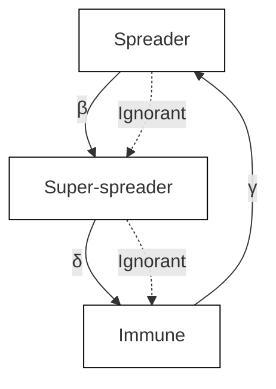
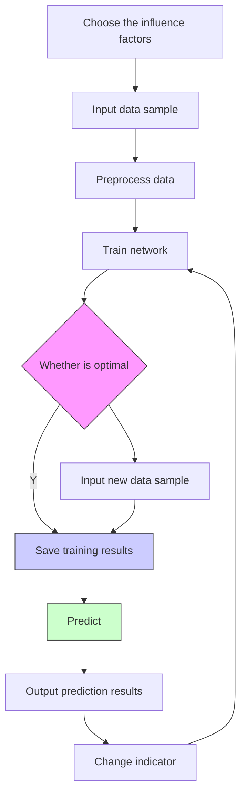
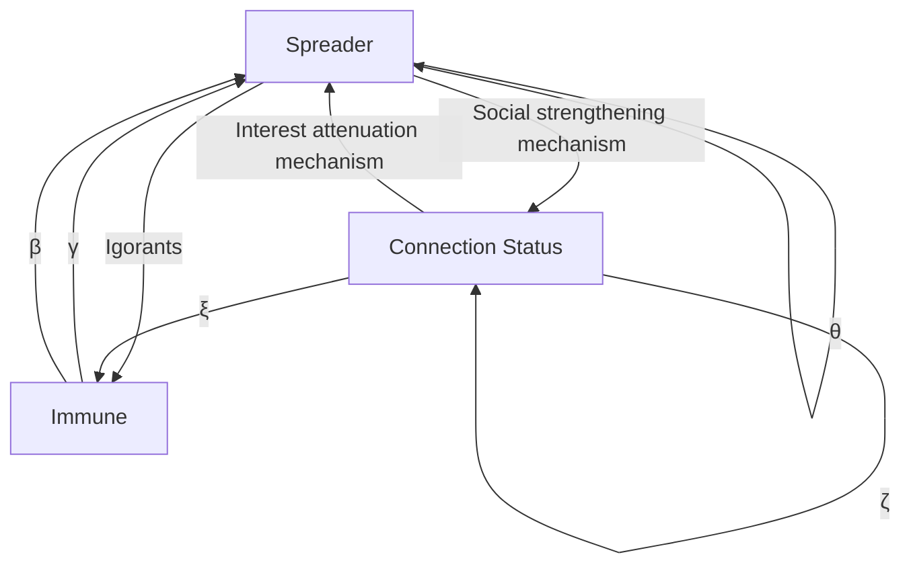

For office use only

T1

T2

T3

T4

## 47876

Problem Chosen

D

For office use only

F1

F2

F3

F4

# Abridge the Distance between Human Minds Research on Social Information Circulation

## Summary

Information circulation network is as complicated as the human brain, while brain with wisdom seeks to explore the mysteries of the information circulation network.

First, we establish a model of information circulation network (ICP). Then we establish five network topology graphs and qualitatively analyze evolution of five periods. Based on classical epidemic model, we introduce the super-spreader, which can effectively accelerate the circulation of information as the central node. The differential equations and their results give us reasonable circulation laws: the density of the spreader and the super-spreader rapidly increase at the beginning, then they reach a peak and decline rapidly; the ignorant density shows a rapid downward trend while the immune density generally increases.

We build the fuzzy comprehensive evaluation model (NF) to filter what qualifies as news. We propose audience awareness index (AAI) to indicate the inherent value of information. Then we use four given examples to test the model. Undoubtedly, the assassination of Abraham Lincoln was qualified as news; and so does the important person’s assassination today. As for information of Taylor’s style transition, it becomes news today, but it might not be news in 1860.

Then we use the neural network prediction model (ICNP) to predict the networks’ relationships and capacities. We get the node number and the node degree via previous data from three states in USA. And the results of ICNP model are: in the fifth period, node number of New York is 22535000, and its relative error is 15.32%; in the fifth period, node degree is 13533000, and its relative error is 20.58%. So it validates the reliability of ICP model. In around 2050, node number of New York is 34885000 and node degree is 23766000.

Finally, we build our model (PIINI) considering the interest attenuation mechanism and social strengthening mechanism. Taking the interaction of information circulation network and public interests into account, we establish differential equations similarly. And it comes to interaction laws: the density of the spreader and nodes in connection state rapidly increase at the beginning, they reach a peak and then decline rapidly. The ignorant density shows a rapid downward trend while the immune density generally increases.

As a part of ICM’s Information Analytics Division, we have accomplished the given assignments.

## Abridge the Distance between Human Minds Research on Social Information Circulation

## Content

1. Restatement of the Problem  
2. Introduction.  
3. Assumptions.. 2  
4. Justification of Our Approach.  
5. Symbol Descriptions.  
6. The Model.

6.1 Information circulation network model (ICN).

6.1.1 Topological Properties /  
6.1.2 The model construction. /  
6.1.3 To solve the model .

6.2 News filter model (NF) .. .8

6.2.1 Influential factors of audience’s awareness index ..... 8  
6.2.2 The model construction. 8  
6.2.3 The process to test the model. C

6.3 Information circulation network prediction model (ICNP) ..10

6.3.1 Influential factors .. .10  
6.3.2 The model construction. ..10  
6.3.3 To solve the model . .12

6.4 Public interest and information network interaction model (PIINI) .... ..12

6.4.1 The model construction. .13  
6.4.2 To solve the model . ..16

7. Sensitivity Analysis. 17  
8. Strengths and Weaknesses . 19  
9. Conclusions.. 19

References

Appendix (data and data source)

## 1. Restatement of the Problem

Information spread quickly in today’s tech-connected communications network; sometimes it is due to the inherent value of the information itself, and other times it is due to the information finding its way to influential or central network nodes that accelerate its spread through social media.

 Explore the flow of information and filter or find what qualifies as news.  
 Validate your model’s reliability.  
 Predict the communication networks’ relationships and capacities around the year 2050.  
 Explore how public interest and opinion can be changed through information networks in today’s connected world.  
Determine how information value, people’s initial opinion and bias, form of the message or its source, and the topology or strength of the information network in a region, country, or worldwide could be used to spread information and influence public opinion.

## Interpretation of these problems

We should build a model to indicate how information circulate in social network.  
 We should figure out an improved model to filter what qualifies as news based on first model.  
We should predict present network’s relationship and capacity to validate first model by using our model’s prediction ability, and predict future network’s relationship and capacity in around 2050.  
We should build another model to explore the interaction of public interest and information network.

## 2. Introduction

Social information circulation network is a very active research area. Building the social information circulation network is the hot area of complex network research. That research has very important value for understanding the dynamic behavior of the network.

## Previous work

In previous analysis, most of models are based on the classical epidemic model SI, SIS and SIR, etc. [1, 2] The IC model [3, 4] proposed by Jacob Goldenberg and the LT model [5] proposed by Mark Granovetter is most widely studied currently. And Jaewon

Yang and other researchers proposed a linear influence model [6] by the analysis of Twitter’s users’ behaviors.

From the aspect of social psychology, the mass information circulation process is placed in a environment affected by a variety of social forces and psychological factors. Massa described the analysis and prediction of perceived user behavior based on trust framework [7]. Jamali and other researchers [8] use TrustWalker model to predict behaviors’ of users. Josang $\mathrm { ~ A ~ } ^ { [ 9 ] }$ build a user trust prediction system to describe the development of trust between different users.

## 3. Assumptions

Table 1 assumptions

<table><tr><td></td><td>Assumptions</td></tr><tr><td>Overall</td><td>1) We do not take time delay during information circulation between two nodes into account.</td></tr><tr><td>ICN model</td><td>2) We think the public interest is consistent.3) We do not take social strengthening into account.4) We do not consider the difference between different information.5) We think the influence between two nodes will not affect our model.</td></tr><tr><td>NF model</td><td>6) We think the audience awareness is the only indicator of public interest and opinion.</td></tr><tr><td>ICNP model</td><td>7) We do not consider secondary factors.8) We think the network is universal around the world.</td></tr><tr><td>PIINI model</td><td>9) We do not consider secondary factors.</td></tr></table>

## 4. Justification of Our Approach

## ICN model

Dynamics of epidemic disease can effectively portray on the circulation characteristics of complex network, which is an important basis for the current network circulation dynamics. Super-spreader plays an important role in the information circulation network. On the basis of classical epidemic model we introduce of the superspreader and establish differential equations which can effectively portray information circulation network’s characteristics.

## NF model

News is objective report of what audiences are concerned about. The concept of audience awareness is vague, but we can qualitatively analyze audience awareness index has a positive influence on inherent value of information. The fuzzy comprehensive evaluation model can characterize the transition state between news and information. Therefore, it is appropriate to use NF model to filter what qualifies as news.

## ICNP model

Information circulation network is a complex and random system, influenced by many factors. Using the statistical forecasting model to predict might have defects especially when the sample data are not enough and when historical data are volatile. And we use BP neural network to build ICNP model, which can overcome this shortcoming.

## PIINI model

Strengthening social mechanism is an important distinction between the information circulation and the spread of disease. Social interest attenuation mechanism is also significant in information circulation network. Proposed PIINI model takes social interest attenuation and social strengthening into account, so it can be effectively and reasonably reveal laws in the information circulation network.

## 5. Symbol Descriptions

There are some major symbols appear in the model, as shown below:

Table 2 symbol descriptions

<table><tr><td>Index</td><td>Definition</td><td>Formula</td></tr><tr><td>Node number(N)</td><td>The number of nodes include connected and disconnected nodes.</td><td>--</td></tr><tr><td>Node degree(ki)</td><td>The degree of nodes is the number of connected nodes. And give adjacent matrix  $A = \left( a_{ij} \right)_{N \times N}$ .</td><td> $k_i = \sum_{j=1}^{N} a_{ij} = \sum_{j=1}^{N} a_{ji}$ </td></tr><tr><td>Node degree average ()</td><td>The average of all node degrees of the network.</td><td> $\langle k \rangle = \frac{1}{N} \sum_{i=1}^{N} k_i = \sum_{i=1}^{N} a_{ji}$ </td></tr><tr><td>Network density(D)</td><td>Network density is a symptom of network&#x27;s completeness.</td><td> $D = \frac{2L}{N(N-1)}$ </td></tr><tr><td>Clustering coefficient(Ci)</td><td>Clustering coefficient represent the probability of any two nodes being neighbors.  $E_i$  is the edges between node i and neighbors  $k_i$ .</td><td> $C_i = \frac{E_i}{\left( k_i (k_i - 1) \right)/2} = \frac{2E_i}{\left( k_i (k_i - 1) \right)}$ </td></tr></table>

Notes: we will explain other symbols when we use them.

## 6. The Model

## 6.1 Information circulation network model (ICN)

Social network is a complex network, which is composed of social individuals as well as the social relationships between individual members.[10] In the related social network research, researchers used $G = ( \textbf { } V , \textbf { } E , \textbf { } W \textbf { } )$ graph to build model. V is the set of network nodes; $E \subseteq V \times V$ is the set of relationships between social individuals; W is the weight of social individuals.

## 6.1.1 Topological Properties

Topological properties of network are irrelevant with size, location, shape and function of nodes. However, they are only relevant with number of nodes and the connection features between connected nodes.

In the research of social networks, directed graph has a better expressive ability and applicability, so we use a directed graph to characterize social networks. And based on this, we present the following indices.

## 6.1.2 The model construction

There are lots of classical epidemic models, such as SI, SIS, SIR, IC and LT. We take into account the central node (such as the Internet) has higher spreading function than ordinary spreader. We then introduce super-spreaders to our network to improve the SIR model. We divide the user into four parts: ignorant, spreader, super-spreader and immune. And the definition of these are as follows[11]:

Table 3 Four type of users

<table><tr><td>Types of users</td><td>Definition</td></tr><tr><td>Ignorant</td><td>The ignorant has not received any information from neighbors.</td></tr><tr><td>Spreader</td><td>The spreader receives information, the spreader will probably spread the information to neighbors.</td></tr><tr><td>Immune</td><td>The immune will not spread the information after receiving the information.</td></tr><tr><td>Super-spreader</td><td>The super-spreader is able to quickly deliver information to more people.</td></tr></table>

## The rules of information circulation

flowchart

Fig 1 the propagation rules of the model

The rules of information circulation are shown above. We can conclude the rules as follows:

+ If ignorant connects to a spreader, they will turn into spreader with a probability β.  
+ For publicity and other reasons, some spreaders will turn into super-spreader with a probability α.  
+ After contacting with other spreaders, the super-spreader will turn into the immune with probability δ.

\+ After contacting with other spreaders, immunes or super-spreaders, the spreader will turn into the immune with a probability γ.

## The information circulation network in five periods.

On the basis of the establishment of information circulation network model, considering the characteristics of modes information circulation in five periods, we list the network circulation information model in five periods as follows:

Table 4 the information circulation graph and characteristics

<table><tr><td>Periods</td><td>Modes</td><td>The information circulation graph</td><td>Characteristics</td></tr><tr><td>1870s</td><td>Newspaper &amp; Telegraph</td><td></td><td>(1)The number of node, the degree of node, internet density and clustering coefficient are small(2)"Newspaper office" node is regarded as super-spreaders and plays an important role in the information network.(3)The closeness of information circulation is poor. Regional links between users are strong.(4)Spreading flow is small and spreading speed is slow.</td></tr><tr><td>1920s</td><td>Radios</td><td></td><td>(1)Same to the first period, the number of node, the degree of node, internet density and clustering coefficient are small.(2)"Radio" node is regarded as super-spreaders and plays an important role in the information network.(3)The closeness of information circulation is poor. Regional links between users decrease.(4)Compared with first period, the spreading flow and spreading speed increase signally.</td></tr><tr><td>1970s</td><td>TV</td><td></td><td>(1)The number of node, and internet density are large, while the degree of node and the clustering coefficient are small.(2)"Television station" node is regarded as super-spreaders and plays an important role in the information network.(3)The closeness of information circulation is better. Regional links between users is poor.(4)Compared with second period, the spreading flow and spreading speed increase signally.</td></tr><tr><td>1990s</td><td>Internet</td><td></td><td>(1)The number of node, the degree of node, internet density and clustering coefficient are large.(2)The condition of super-spreader is inconspicuous.(3)The closeness of information circulation is well. Regional links between users is poor.(4)Compared with third period, the spreading flow and spreading speed increase signally.</td></tr><tr><td>2010s</td><td>Phone</td><td></td><td>(1)Compared with the fourth period, the number of node, the degree of node, internet density and clustering coefficient are larger.(2)Some nodes in internet are regarded as super-spreaders and play an important role in the information network.(3)The closeness of information circulation is well. Regional links between users is poor.(4)Compared with fourth period, the spreading flow and spreading speed increase signally.</td></tr></table>

Notes:  
 Which nodes do not enter the network are not shown in the graphs.  
 Solid circle represents the super-spreader, and dotted circle represents the spreader.

## The differential equation of information circulation network.

Based on three circulation principles, we build differential equations as follows:

$$
\left\{ \begin{array}{l} \frac {d I (t)}{d t} = - \beta I (t) \\ \frac {d S (t)}{d t} = - \alpha S (t) + \beta I (t) - \gamma S (t) \\ \frac {d J (t)}{d t} = \alpha S (t) - \delta J (t) \\ \frac {d R (t)}{d t} = \gamma S (t) + \delta J (t) \end{array} \right. \tag {1}
$$

In these equations, I(t) S(t) J(t) and R(t) respectively represent, at time t, the density of the unknown, the spreader, the super-spreader and the immune. The density of four types of users meets the condition of normalization: $I \left( t \right) + S \left( t \right) + J \left( t \right) + R \left( t \right) = 1$ . When $\alpha = 0 , ~ \delta = 0$ , this model will turn into classical SIR model. With the evolution of the system, when the number of spreaders is zero, the process stops and spread of network ends. And the network will only contain those who have not yet received any information and the immune who are transformed from the spreader and super-spreader.

## 6.1.3 To solve the model

We use Matlab 2014b software to solve differential equations. By means of numerical simulations, the number of configured nodes is 1000 in the network, the initial number of spreaders is 1.

In the initial stage, $S \left( t = 0 \right) = 1 / 1 0 0 0 , I \left( t = 0 \right) = 9 9 9 / 1 0 0 0 , J \left( t = 0 \right) = R \left( t = 0 \right) = 0$ , and we assume $\alpha = 0 . 1 , \beta = 0 . 7 , \delta = 0 . 5 , \gamma = 0 . 3 ^ { [ 1 7 ] }$ . Fig 1 shows general trends of four types of nodes’ density.

line chart

| T   | S(Spreader) | I(Ignorant) | J(Super-spreader) | R(Immune) |
| --- | ----------- | ----------- | ----------------- | --------- |
| 0   | 0.0         | 1.0         | 0.0               | 1.0       |
| 10  | 0.15        | 0.4         | 0.18              | 0.3       |
| 20  | 0.08        | 0.15        | 0.1               | 0.7       |
| 30  | 0.03        | 0.05        | 0.05              | 0.9       |
| 40  | 0.01        | 0.02        | 0.02              | 0.95      |
| 50  | 0.0         | 0.01        | 0.01              | 0.98      |
| 60  | 0.0         | 0.0         | 0.0               | 0.99      |
| 70  | 0.0         | 0.0         | 0.0               | 1.0       |

Fig 2 densities of different groups in the model

According to the analysis of fig 2, we can conclude:

+ Law one: Spreader’ density rapid increase at the initial stage. After it reaches a peak, it declines rapidly, until the spreader enters into the immune state.  
+ Law two: The evolutionary trend of super-spreaders like that of ordinary spreaders, and it also experiences an increase, and then decrease until it disappears. However, the curve changes gently. The peak density is also much smaller than ordinary spreaders. This shows that in the online social networks, super-spreaders are a small number of "star nodes."  
+ Law three: Ignorant density shows a rapid downward trend. And it eventually settles to a non-zero value. And that reflects the information circulation’s breadth and depth are limited and it is impossible to cover all users.  
+ Law four: The trend of immune density is opposite to that of the ignorant. It experiences a rapid increase stage and then gradually stabilizes to a value close to 1. Rapid increase of the immune density is mainly because spreaders and superspreaders continue turning into the immune state. And the increasing trend slows because there is no new spreader.  
H Law five: It is worth noting that, when information circulation stops, the density of the spreader and the super-spreader are equal to zero, but the density of the ignorant and the immune are not zero. It indicates that there are users who does not receive the information in the network. The size of information circulation has a certain limit, and it is impossible to “infect” all users.

## 6.2 News filter model (NF)

News is defined as a report for what audiences focus [12]. The dogs bite human beings is normal, while that human beings bite dogs will become news. The reason is we focus more on human beings biting dogs. So in the light of audience’s awareness, we define audience’s awareness index (AAI). By determining the value of AAI, we can filter what qualifies as news.

## 6.2.1 Influential factors of audience’s awareness index

The number of audiences, the political status of audiences and the influence of information have an influence on AAI [13]. And the analysis of these factors are as follows:

\+ The number of audiences

The number of audiences is the number of persons who are concerned about this information. The more the number of the audiences is, the higher the AAI is.

\+ The political status of audiences

Higher political status of audiences, the more it can arouse the audience's attention, so AAI will be higher.

\+ The influence of news

The higher the influence of news, the higher the value of AAI.

According to foregoing analysis, there are positive correlations between the AAI and these factors.

## 6.2.2 The model construction

In order to calculate, we build the fuzzy comprehensive evaluation model. First, we should determine index weight matrix. Then we improve the max min algorithm and the principal of maximum membership degree among evaluation results. We build the set of factors, the set of evaluation, membership function and the set of weight [13]. Last, we comprehensively evaluate AAI.

Step 1: Determine the set of evaluation object.

$$
P = \{\text { Information   to   be   evaluated } \}
$$

Step 2: Build the set of evaluation index.

$$
U = \left\{u _ {1}, u _ {2}, u _ {3} \right\}
$$

$u _ { 1 } , u _ { 2 } , u _ { 3 }$ is the number of audiences, the political status of audiences and the influence of news respectively.

Step 3: Determine the universe of evaluation degree.

Build a set of evaluation v，each level can correspond to a fuzzy subset。

$$
V = \left\{\mathrm{v} _ {1}, \mathrm{v} _ {2}, \mathrm{v} _ {3} \right\} = \{\mathrm{A}, \mathrm{B}, \mathrm{C} \}
$$

## Step 4: Calculate index weight

Use paired comparison method and 1-9 comparative scale to calculate index weight, we have A=[0.4,0.3,0.3]

## Step 5: Calculate fuzzy relationship matrix R

Evaluate U, and then figure out the membership degree. Finally get the fuzzy relationship matrix R.

## Step 6: Calculate the vector of fuzzy evaluation results B

Use the weighted average of fuzzy arithmetic operators $\mathbf { M } ( \bullet , \oplus )$ to determine index weight matrix A and fuzzy relationship matrix R, and the formula is:

$$
b _ {i} = \sum_ {i = 1} ^ {p} (a _ {i} \cdot r _ {i j}) = \min \left(1, \sum_ {i = 1} ^ {p} a _ {i} \cdot r _ {i j}\right), j = 1, 2, \dots m \tag {2}
$$

Synthesizing the A and R will get the vector of fuzzy evaluation results B. According to the definition, if Bs>Bt, the value of information s is higher than that of information t. The value of vector B is AAI.

## Step 7: Calculate the value of AAI

We use $\mathrm { C A A I } { = } ( \boldsymbol { B } _ { \mathrm { i } } ^ { ' } \cdot [ 3 , 2 , 1 ] ) / 3$ to indicate the value of AAI.

## 6.2.3 The process to test the model

We use the given four examples to test our model:

✓ Information a: country-turned-pop singer Taylor Swift’s possible engagement today.  
Information b: country-turned-pop singer Taylor Swift’s possible engagement in 1860.  
✓ Information c: an important person was assassinated today.  
 Information d: assassination of US President Abraham Lincoln in 1865.

Due to space limitations, the solution process omits steps 1-4. And according to step 5, we get the evaluation matrixes:

$$
R _ {\mathrm{a}} = \left( \begin{array}{l l l} 0. 1 & 0. 6 & 0. 3 \\ 0. 3 & 0. 5 & 0. 2 \\ 0. 5 & 0. 4 & 0. 1 \end{array} \right), \quad R _ {\mathrm{b}} = \left( \begin{array}{l l l} 0. 1 & 0. 4 & 0. 5 \\ 0. 1 & 0. 5 & 0. 4 \\ 0. 1 & 0. 5 & 0. 4 \end{array} \right), \tag {3}
$$

$$
R _ {\mathrm{c}} = \left( \begin{array}{l l l} 0. 6 & 0. 3 & 0. 1 \\ 0. 8 & 0. 2 & 0 \\ 0. 7 & 0. 2 & 0. 1 \end{array} \right), \quad R _ {\mathrm{d}} = \left( \begin{array}{c c c} 0. 8 & 0. 1 & 0. 1 \\ 1 & 0 & 0 \\ 0. 9 & 0. 1 & 0 \end{array} \right),
$$

We calculate the result of evaluation vector, and we have:

$$
\begin{array}{l} B _ {a} = [ 0. 3 0, 0. 5 4, B _ {b} = [ 0. 1 0, 0. 4 6, 0. 4 4 ], \\ B _ {c} = [ 0. 6 9, 0. 2 4, 0. 0 7 ], \quad B _ {d} = [ 0. 8 9, 0. 0 7, 0. 0 4 ] \\ \end{array}
$$

Then according to step 7, we have:

$$
\mathrm{CAAI} _ {\mathrm{a}} = 0. 7 1, \quad \mathrm{CAAI} _ {\mathrm{b}} = 0. 5 5, \quad \mathrm{CAAI} _ {\mathrm{c}} = 0. 8 7, \quad \mathrm{CAAI} _ {\mathrm{d}} = 0. 9 5
$$

According to previous analysis, the greater value of CAAI, the greater number of audiences will be concerned about given information. So there are more reasons to explain why this information is qualified as news. In this four examples, that the US president was assassinated undoubtedly became news; and so does the important person occurred today. As for information of Taylor transition style, it is still is a news today, but if it happened 1870, perhaps it will not be concerned about.

## 6.3 Information circulation network prediction model (ICNP)

Information circulation network is a complex and random system, influenced by many factors. Using the statistical forecasting model to predict might have defects especially when the sample data are not enough and when historical data are volatile. Therefore, we improve the ICN model by adding BP neural network prediction model to previous model to predict information circulation network’s node number and node degree.

## 6.3.1 Influential factors

Comprehensive analysis of factors that influence the spread of information networks is a prerequisite to improve ICN model by using its ability of prediction.

Based on the reality of social life and the complexity of finding data, we will select the following main factors:

 Level of regional economic development

The level of regional economic development is measured by regional GDP. The higher the level, the more beneficial to information circulation.

 Level of regional communication development

The level of regional communication development is measured by information communication technology development index (IDI) [15]. The larger the IDI, the more beneficial to information circulation.

 Level of regional education development

The level of regional education development is measured by education index (EI). The larger the EI, the more beneficial to information circulation.

## 6.3.2 The model construction

According to the foregoing ICN model, we will build ICNP model to predict the number of node and the degree of node. The number of node determine the size of network, and the degree of node determine the capacity of the network.

Similar to the general neural network model, our ICNP model’s prediction process is as follows:

flowchart

Fig 3 ICNP model’s prediction process

## Data preprocess

In this paper, data are normalized by using maximum and minimum normalization method. The data normalized formula is:

$$
X _ {i} = \frac {X - X _ {\min}}{X _ {\max} - X _ {\min}} \tag {4}
$$

## Determine the input number of neurons

According to Hurvich’s study, when sample data is less, if using ACI criteria, there will be great estimation bias. So, based on ACI criteria, Hurvich proposed AICC criteria specifically applicable to small samples. And the formula is :

$$
A I C C (m) = N \ln E + \frac {N + m}{N - m - 2} \tag {5}
$$

Among the formula:

$$
m = \left\{ \begin{array}{c} \frac {N}{2}, N = 2 0 \sim 4 0 \\ \frac {N}{3} \sim \frac {N}{2}, N = 4 0 \sim 1 0 0 \\ \frac {N}{\ln N}, N = 1 0 0 \sim 2 0 0 \end{array} \right. \tag {6}
$$

## 6.3.3 To solve the model

## Collect data

We collect from internet, and collect data in three states: California (CA), Texas (TX) and New York (NY) in USA. And these three states have top three largest population among fifty states in USA. The reason we choose these three states are because these data are easier to find and these data samples are larger.

The data and data source are shown in the appendix.

## Validate ICN model

We use data excluding the data from New York at fifth period. And then we use the ICNP model to predict the data in New York at fifth period and compare these data with present data to validate our ICN model.

Table 5 during the sample period prediction

<table><tr><td></td><td>From ICN model</td><td>From predict model</td><td>Relative error (%)</td></tr><tr><td>Number of node(person)</td><td>19541453</td><td>22535000</td><td>15.32</td></tr><tr><td>Degree of node(person)</td><td>11223538</td><td>13533000</td><td>20.58</td></tr></table>

## Predict future network’s relationships and capacities in 2050.

Table 6 during the sample period prediction

<table><tr><td></td><td>ICNP model</td></tr><tr><td>Number of node(person)</td><td>34885000</td></tr><tr><td>Degree of node(person)</td><td>23766000</td></tr></table>

## 6.4 Public interest and information network interaction model (PIINI)

In the process of social information circulation networks, the circulation of information affects individuals’ preferences. We also think that individuals’ different preferences affects information circulation networks. That is same as what question said that public interest can be changed through information networks. In the meantime, information value, people’s initial opinion and bias, form of the message or its source, and the topology or strength of the information network in a region, country, or worldwide could influence public opinion.

## 6.4.1 The model construction

Information circulation is intrinsically different from the characteristics of the spread of disease [17]. And its characteristics should consider a variety of factors. We consider only consider two factors: public interest decay and social strengthening effect Based on these two factors, we build PIINI model to reveal the interaction of public interest and information network.

## Public interest attenuation mechanism

The public interest decay mechanism refers to the public interest decreases when the times of receiving same information increase [18]. If users repeatedly received the same information from neighboring nodes, users will acquiesce in information being widely disseminated. Then there exists attenuation coefficient [19] which indicates users will gradually decrease their behavior of circulating information. Therefore, we introduce a saturation function to represent public interest attenuation coefficient:

$$
\zeta (m) = a - b e ^ {- \delta m} \tag {7}
$$

And a is the maximum attenuation rate, b is the adjustable coefficient, the  is public interest attenuation coefficient and m is the number of connected users. The saturation is a non-linear increasing function. When the maximum attenuation rate a = 1, b = 1 adjustable coefficient, as m increases and nonlinear growth, indicating that the loss of interest and forwarded into a connected state more and more users. When a = 1, b = 1, when m and increases, the number of users losing interest increases. As shown in fig 4.

line chart

| n  | δ=0.2 | δ=0.4 | δ=0.6 | δ=0.8 |
|----|-------|-------|-------|-------|
| 0  | 0.0   | 0.0   | 0.0   | 0.0   |
| 5  | 0.63  | 0.87  | 0.95  | 0.98  |
| 10 | 0.86  | 0.98  | 0.99  | 1.00  |
| 15 | 0.94  | 1.00  | 1.00  | 1.00  |
| 20 | 0.97  | 1.00  | 1.00  | 1.00  |
| 25 | 0.98  | 1.00  | 1.00  | 1.00  |
| 30 | 0.99  | 1.00  | 1.00  | 1.00  |
| 35 | 1.00  | 1.00  | 1.00  | 1.00  |
| 40 | 1.00  | 1.00  | 1.00  | 1.00  |

Fig 4 the mechanism of interest decay

## Social strengthening mechanism

Social strengthening have nonlinear cumulative effect which have a significant effect on public interest [20]. Because of this mechanism, an individual, users will be affected by neighbors’ cumulative effects before they adopt received opinions [21].

In our paper, we define the social strengthening mechanism as: the probability of a user’s behavior (including the acceptance and dissemination of information) will decrease while strengthening factor generated from neighbors’ discouragement. The larger the strengthening factor, the lower the probability of a user’s behavior (including the acceptance and dissemination of information). We use the following nonlinear function to explain the social strengthening mechanism.

$$
\xi (n) = \frac {\beta n}{1 + \eta n} \tag {8}
$$

$_ { \beta }$ indicates the probability of a user’s behavior (including the acceptance and dissemination of information), n indicates the number of connected node, is the strengthening factor, $0 < \eta < 1$ .

line chart

| n   | β=0.2 | β=0.4 | β=0.6 | β=0.8 |
| --- | ----- | ----- | ----- | ----- |
| 0   | 0.0   | 0.0   | 0.0   | 0.0   |
| 10  | 0.2   | 0.4   | 0.6   | 0.8   |
| 20  | 0.21  | 0.42  | 0.63  | 0.85  |
| 30  | 0.215 | 0.43  | 0.64  | 0.86  |
| 40  | 0.22  | 0.435 | 0.645 | 0.865 |
| 50  | 0.22  | 0.44  | 0.65  | 0.87  |
| 60  | 0.22  | 0.44  | 0.65  | 0.87  |
| 70  | 0.22  | 0.44  | 0.655 | 0.875 |
| 80  | 0.22  | 0.445 | 0.66  | 0.88  |

Fig 5 the social strengthening effect changed with $\beta$

As fig5 shows, the larger value of $_ { \beta }$ , the larger value of $n .$ In the meantime, the larger value of , the smaller value of $\dot { \boldsymbol { \xi } }$ .

line chart

| n   | η=0.2  | η=0.4  | η=0.6  | η=0.8  |
| --- | ------ | ------ | ------ | ------ |
| 0   | 0.0    | 0.0    | 0.0    | 0.0    |
| 10  | 0.67   | 0.4    | 0.28   | 0.22   |
| 20  | 0.8    | 0.44   | 0.3    | 0.23   |
| 30  | 0.85   | 0.46   | 0.31   | 0.23   |
| 40  | 0.88   | 0.47   | 0.31   | 0.23   |
| 50  | 0.9    | 0.47   | 0.31   | 0.23   |
| 60  | 0.91   | 0.48   | 0.31   | 0.23   |
| 70  | 0.92   | 0.48   | 0.31   | 0.23   |

Fig 6 the social strengthening effect changed with $\eta$

As fig 6 shows, when the probability $_ { \beta }$ is constant, the value of $\boldsymbol { \xi }$ will decrease when the value $\eta$ increases. It shows that by increasing the effect of socia strengthening, more users will stay in the unconnected state. And therefore the number of spreaders will decrease.

## Improve the information circulation model

The state of connection defined as a state that users have already received information but they are not sure whether to spread the information. And the information circulation rules are as follows:

+ If ignorant is concerned about received information, the ignorant will turn into spreader with a probability $\beta ;$ if ignorant is not concerned about received information, the will turn into the immune with a probability $\gamma$ .  
+ With times of circulation increasing, the spreader will gradually lose interest in transferring information to others and turn into the immune with a probability of $\xi$  
+ When the spreader meets with other spreader or immune, the spreader might not transfer the information with a probability of $\theta$ .

flowchart

Fig 7 the circulation rules of PIINI model

## The differential equations in PIINI model

I t( ) 、S t( ) 、C t( ) and R t( ) indicate the density of ignorant nodes, spreader nodes, nodes in connection state and immune nodes when node degree is k at time t. The equations are shown below:

$$
\left\{ \begin{array}{l} \frac {d I (t)}{d t} = - \beta I (t) \\ \frac {d S (t)}{d t} = \beta I (t) - (\theta + \gamma) S (t) - \zeta S (t) + \xi C (t) \\ \frac {d C (t)}{d t} = \zeta S (t) - \xi C (t) \\ \frac {d R (t)}{d t} = (\gamma + \theta) S (t) \end{array} \right. \tag {9}
$$

When $\gamma = 0 , \zeta = 0 , \xi = 0$ , this model will degenerate to classical model SIR.

## 6.4.2 To solve the model

We use Matlab 2014b software to solve differential equations. By means of numerical simulations, the number of configured nodes is 1000 in the network, the initial number of spreaders is 1.

And $S \left( t = 0 \right) = 1 / 1 0 0 0 \ , \ I \left( t = 0 \right) = 9 9 9 / 1 0 0 0 \ , \ J \left( t = 0 \right) = R \left( t = 0 \right) = 0$ and we assume $\alpha = 0 . 1 , \beta = 0 . 7 , \theta = 0 . 5 , \gamma = 0 . 3 , \xi = 0 . 3 , \zeta = 0 . 1 5 ^ { \ [ 1 7 ] }$ . Fig 8 shows general trends of four types of nodes’ density.

line chart

| T   | I(Ignorant) | S(Spreader) | C(Connection Status) | R(Immune) |
| --- | ----------- | ----------- | --------------------- | --------- |
| 0   | 1.0         | 0.0         | 0.0                   | 0.0       |
| 5   | 0.5         | 0.15        | 0.05                  | 0.2       |
| 10  | 0.2         | 0.1         | 0.05                  | 0.6       |
| 15  | 0.1         | 0.05        | 0.05                  | 0.8       |
| 20  | 0.05        | 0.02        | 0.02                  | 0.9       |
| 25  | 0.02        | 0.01        | 0.01                  | 0.95      |
| 30  | 0.01        | 0.0         | 0.0                   | 0.98      |
| 35  | 0.0         | 0.0         | 0.0                   | 0.99      |
| 40  | 0.0         | 0.0         | 0.0                   | 0.995     |
| 45  | 0.0         | 0.0         | 0.0                   | 0.998     |
| 50  | 0.0         | 0.0         | 0.0                   | 1.0       |

Fig 8 densities of different groups in the model

According to the analysis of fig 8, we can conclude:

+ Law one: Spreader’ density rapid increase at the initial stage. After it reaches a peak, it declines rapidly, until the spreader enters into the immune state.  
+ Law two: The evolutionary trend nodes in connection state like that of ordinary spreaders, and it also experiences an increase, and then decrease until it disappears. However, the curve changes gently. The peak density is also much smaller than ordinary spreaders. This indicates that in today’s online social network nodes in the connection state are a small part of all nodes. And this state of node will change quickly into the spreading state.

+ Law three: Ignorant density shows a rapid downward trend. And it eventually settles to a non-zero value. And that reflects the information circulation’s breadth and depth are limited and it is impossible to cover all users.  
H Law four: The trend of immune density is opposite to that of the ignorant. It experiences a rapid increase stage and then gradually stabilizes to a value close to 1. Rapid increase of the immune density is mainly because spreaders and superspreaders continue turning into the immune state. And the increasing trend slows because there is no new spreader.  
+ Law five: It is worth noting that, when information circulation stops, the density of the spreader and the super-spreader are equal to zero, but the density of the ignorant and the immune are not zero. It indicates that there are users who does not receive the information in the network. The size of information circulation has a certain limit, and it is impossible to “infect” all users.

This laws are similar with previous ICN model when the super-spreader is introduced.

According to previous research, the size of information circulation [17]:

$$
R = \sum_ {k} P (k) \left(1 - e ^ {- k \varphi (t = \infty)}\right) \tag {10}
$$

The formula indicates that the ultimate size of information circulation depends on the degree distribution P (k). And the node degree plays an important role. It also verify our ICNP model which uses node degree as a viable scientific indicator to measure information circulation network. We introduce the auxiliary function $\varphi ( t )$ . So we need to calculate $\varphi ( t = \infty )$ to indicate the size of information circulation.

## 7. Sensitivity Analysis

## The ICN model

In ICN model, we set the parameters of differential equations, and obtain a stable solution. And it successfully describes the process of information circulation. In order to test the stability of the model, we will change the value of $\alpha , \beta , \gamma , \delta ,$ and change is set to $\pm 5 \%$ to observe system’s stability status.

We change only one parameter every time, and other parameters remain unchanged. Due to space limitations, we only list sensitivity analysis to parameter $\beta$ with biggest change.

line chart

| T   | S(Spreader) | V(uncertain) | A(S-parasreader) | R(immune) |
| --- | ----------- | ----------- | ---------------- | --------- |
| 0   | 0.0         | 1.0         | 0.0              | 0.0       |
| 10  | 0.1         | 0.8         | 0.1              | 0.3       |
| 20  | 0.1         | 0.6         | 0.1              | 0.6       |
| 30  | 0.1         | 0.4         | 0.1              | 0.8       |
| 40  | 0.1         | 0.3         | 0.1              | 0.9       |
| 50  | 0.1         | 0.2         | 0.1              | 0.9       |
| 60  | 0.1         | 0.1         | 0.1              | 0.9       |
| 70  | 0.1         | 0.1         | 0.1              | 0.9       |

β=0.665

line chart

| T  | S(Preceptor) | V(logonant) | A(Super-pressor) | R(measure) |
|----|-------------|-------------|-------------------|------------|
| 0  | 0.1         | 1.0         | 0.1               | 0.1        |
| 10 | 0.2         | 0.4         | 0.15              | 0.8        |
| 20 | 0.1         | 0.1         | 0.1               | 0.95       |
| 30 | 0.05        | 0.05        | 0.05              | 0.98       |
| 40 | 0.02        | 0.02        | 0.02              | 0.99       |
| 50 | 0.01        | 0.01        | 0.01              | 0.995      |
| 60 | 0.005       | 0.005       | 0.005             | 0.998      |
| 70 | 0.002       | 0.002       | 0.002             | 0.999      |

β=0.700

line chart

| T  | S( crossover) | I( crossover) | A( crossover) | R( crossover) |
|----|--------------|--------------|--------------|--------------|
| 0  | 0.0          | 0.0          | 0.0          | 0.0          |
| 10 | 0.3          | 0.1          | 0.6          | 0.9          |
| 20 | 0.2          | 0.05         | 0.8          | 0.95         |
| 30 | 0.1          | 0.02         | 0.9          | 0.98         |
| 40 | 0.05         | 0.01         | 0.95         | 0.99         |
| 50 | 0.02         | 0.005        | 0.98         | 0.995        |
| 60 | 0.01         | 0.002        | 0.99         | 0.998        |
| 70 | 0.005        | 0.001        | 0.995        | 0.999        |

β=0.735  
Fig 9 the sensitivity analysis of β

According to fig 9, when adjust the value of parameters, the overall trend is consistent and the system can quickly reach a steady state, only the time of reaching the steady state is different. The larger the value of $\beta ,$ the faster the convergence.

For other parameters, by adjusting their values, change is not large. Through the above sensitivity analysis we validates our model is credible within a certain range of variation, which can be ignored.

## The PIINI model

Similar to the previous analysis, we change only one parameter every time, and other parameters remain unchanged, to examine whether the status of the entire system is stable. During experiments similar conclusions can be obtained that the system is not sensitive to change of parameters. So our model is credible.

## The ICNP model

We use the fit test to accomplish the error analysis. And coefficient of determination (R) is used in fit test to indicate the accuracy of our model. The bigger the R, the better the model results are. According to the fig 10, R is equal to 0.99, so the model is reliable.

  
Fig 10 the error analysis of ICNP model

Due to space limitations, we only discuss number of hidden layer nodes, and coefficient of determination and epoch. The sensitivity analysis result is shown in table 7.

Table 7 the sensitivity analysis of ICNP model

<table><tr><td>Node number</td><td>1</td><td>2</td><td>3</td><td>4</td><td>5</td><td>6</td><td>7</td><td>8</td><td>9</td><td>10</td><td>20</td><td>50</td></tr><tr><td>Relative error</td><td>0.62</td><td>0.49</td><td>0.34</td><td>0.14</td><td>0.28</td><td>0.31</td><td>0.24</td><td>0.47</td><td>0.52</td><td>0.22</td><td>0.24</td><td>0.77</td></tr><tr><td>R</td><td>0.74</td><td>0.89</td><td>0.85</td><td>0.91</td><td>0.87</td><td>0.85</td><td>0.82</td><td>0.69</td><td>0.86</td><td>0.62</td><td>0.59</td><td>0.71</td></tr><tr><td>Epoch</td><td>7</td><td>9</td><td>17</td><td>14</td><td>10</td><td>8</td><td>11</td><td>15</td><td>7</td><td>8</td><td>6</td><td>5</td></tr></table>

## 8. Strengths and Weaknesses

Table 8 strengths and weaknesses

<table><tr><td></td><td>Strengths</td><td>Weaknesses</td></tr><tr><td>ICN model</td><td>(1). Considering previous model, we take super-spreader into account.(2). The results of model conform to the reality well according to scond model results.</td><td>(1). Ignore influence between each nodes.(2). The result of differential equation is not stable.</td></tr><tr><td>NF model</td><td>(1). This model is simple, but universal and effective to solve given problem.</td><td>(1). The determination of index weight is subjective</td></tr><tr><td>ICNP model</td><td>(1). Compared with the statistical forecasting model, the ICNP has higher accuracy.(2). The ICNP model can successfully validate the first model.</td><td>(1). Collected sample data are not enough.</td></tr><tr><td>PIINI model</td><td>(1). The PIINI model can successfully indicate the interaction of public interest and information network.</td><td>(1). We only consider two major factors, but we ignore some other factors.</td></tr></table>

## 9. Conclusions

As a part of ICM’s Information Analytics Division, we have accomplished the given assignments. Here is the overall results of our paper.

Based on improved epidemic model, we established five network topology graphs and come to several information circulation laws: the density of the spreader and the super-spreader rapidly increase at the beginning, then they reach a peak and decline rapidly; the ignorant density shows a rapid downward trend while the immune density generally increases.

In NF model, we conclude that the assassination of Abraham Lincoln undoubtedly becomes news; and so does the important person’s assassination today. As for information of Taylor’s style transition, it becomes news today, but it might not be news in 1860.

The ICNP model validate the reliability of ICP model and predict many parameters in the information circulation network. And the results of ICNP model are: in the fifth period, node number of New York is 22535000, and its relative error is 15.32%; in the fifth period, node degree is 13533000, and its relative error is 20.58%; in around 2050, node number of New York is 34885000 and node degree is 23766000.

And we establish differential equations and solve them and we come to interaction laws: the density of the spreader and nodes in connection state rapidly increase at the beginning, they reach a peak and then decline rapidly. The ignorant density shows a rapid downward trend while the immune density generally increases.

## References

[1] Diekmann O, Heesterbeek J A P. Mathematical epidemiology of infectious diseases: model building, analysis and interpretation [M]. Wiley, 2000.  
[2] Girvan M, Callaway D S, Newman M E. Simple model of epidemics with pathogen mutation [J]. Physical Review E. 2002, 65 (3): 031915.  
[3] Goldenberg J, Libai B, Muller E. Talk of the network: A complex systems look at the underlying process of word-of-mouth [J]. Marketing letters. 2001, 12 (3):211–223.  
[4] Goldenberg J, Libai B, Muller E. Using complex systems analysis to advance marketing theory development: Modeling heterogeneity effects on new product growth through stochastic cellular automata [J]. Academy of Marketing Science Review.2001, 9 (3): 1–18.  
[5] Granovetter M. Threshold models of collective behavior [J]. American journal of sociology. 1978: 1420–1443.  
[6] Yang J, Leskovec J. Modeling information diffusion in implicit networks [C]. In Proceedings of the 10th International Conference on Data Mining. 2010: 599–608.  
[7] Massa P, Avesani P. Trust-aware Recommender Systems. Proceedings of the ACM conference on recommender systems, 2007, 17-24.  
[8] Jamali M, Ester M. TrustWalker: a random walk model for combining trust-based and itembased recommendation. Proceedings of the 15th ACMSIGKDD international conference on knowledge discovery and data mining, 2009, 397-406.  
[9] Josang A, Ismail R, Boyd C. A survey of trust and reputation systems for online service provision. Decision support systems,43(2), 2007, 618-644.  
[10] http://en.wikipedia.org/wiki/Social\_network.  
[11] YangR, WangB-H, Ren J. Epidemic spreading on heterogeneous networks with identical infectivity[J]. Physics Letters A,2007,364(3-4):189-193.Saito.  
[12] https://en.wikipedia.org/wiki/News.  
[13] https://en.wikipedia.org/wiki/Public\_opinion.  
[14] Yonghong Hu, Enhui He, Comprehensive evaluation metho[M].Beijing: Science Press, 2000: 167-188.  
[15] http://www.itu.int/zh/Pages/default.aspx.  
[16] http://www.undp.org/.  
[17] Chaosheng Tang, Online social network information propagation modeling and prediction of forwarding[D]Yanshan: Yanshan University,2014.  
[18] Liu Y, Xiao L, Liu X. Location Awareness in Unstructured Peer-to-peer Systems [J]. IEEE Transactions on Parallel and Distributed Systems, 2005,16(2):163-174.  
[19]Dashu Tang, Mingke He, Qingsong Meng, Based on Power Law Distribution and Small World Character unstructured P2P network searching method [J]. Computer Research and Development,

2007, 44(9): 1566-1571.

[20] Lü L, Chen D-B, Zhou T. The Small World Yields the Most Effective Information Spreading [J]. New Journal of Physics, 2011, 13(12): 123005.  
[21] Karrer B, Newman M E J. Message Passing approach For General Epidemic Models [J]. Physical Review E, 2010, 82(1): 016101.  
[22] Nekovee M, Moreno Y, Bianconi G. Theory of Rumor Spreading in Complex Social Networks [J]. Physica A: Statistical Mechanics and its Applications, 2007, 374(1): 457-470.

## Appendix (data and data source)

Table 8 Collection data

<table><tr><td></td><td colspan="3">1870s</td><td colspan="3">1920s</td><td colspan="3">1970s</td></tr><tr><td>Index</td><td>CA</td><td>TX</td><td>NY</td><td>CA</td><td>TX</td><td>NY</td><td>CA</td><td>TX</td><td>NY</td></tr><tr><td>IDI</td><td>1.2</td><td>0.9</td><td>0.8</td><td>1.3</td><td>1.2</td><td>1.1</td><td>2.1</td><td>1.9</td><td>1.7</td></tr><tr><td>EI</td><td>0.736</td><td>0.723</td><td>0.722</td><td>0.834</td><td>0.823</td><td>0.832</td><td>0.856</td><td>0.845</td><td>0.845</td></tr><tr><td>GDP(million US$)</td><td>1006</td><td>615</td><td>594</td><td>11492</td><td>7027</td><td>6788</td><td>46640.4</td><td>28522.2</td><td>27553.8</td></tr><tr><td>Number of node(person)</td><td>4574962</td><td>3067451</td><td>2418760</td><td>24465442</td><td>16403752</td><td>12934761</td><td>29943110</td><td>20076455</td><td>15830777</td></tr><tr><td>Degree of node(person)</td><td>2407875</td><td>1614448</td><td>1273032</td><td>4286735</td><td>2874198</td><td>2266376</td><td>5926493</td><td>3973634</td><td>3133308</td></tr></table>

Table 9 Collection data

<table><tr><td></td><td colspan="3"></td><td colspan="3"></td></tr><tr><td>Index</td><td>CA</td><td>TX</td><td>1990s</td><td>2010s</td><td>TX</td><td>NY</td></tr><tr><td>IDI</td><td>3.4</td><td>3.2</td><td>2.9</td><td>4.39</td><td>3.87</td><td>2.34</td></tr><tr><td>EI</td><td>0.876</td><td>0.877</td><td>0.867</td><td>0.968</td><td>0.976</td><td>0.987</td></tr><tr><td>GDP(million US$)</td><td>77734</td><td>47537</td><td>45923</td><td>193640</td><td>120743</td><td>115650</td></tr><tr><td>Number of node (person)</td><td>33978000</td><td>22781795</td><td>17964004</td><td>36961664</td><td>24782302</td><td>19541453</td></tr><tr><td>Degree of node (person)</td><td>10183745</td><td>6828065</td><td>5384096</td><td>21228751</td><td>14233594</td><td>11223538</td></tr></table>

## Data source:

http://news.bbc.co.uk/2/hi/technology/8552410.stm

https://www.census.gov

http://www.bea.gov/national/index.htm#gdp

http://www.people-press.org/2012/09/27/section-1-watching-reading-and-listening-to-the-news-3/

http://data.worldbank.org.cn/

http://www.undp.org/

http://www.itu.int/zh/Pages/default.aspx