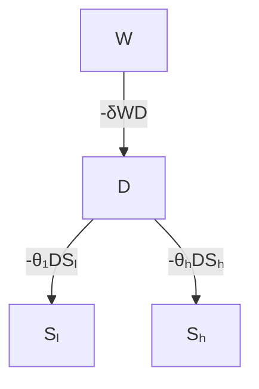
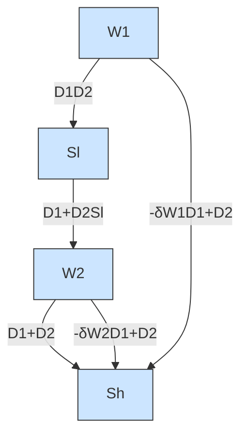

For office use only

T1

T2

T3

T4

Team Control Number

48573

Problem Chosen

B

For office use only

F1

F2

F3

F4

## 2016

## Mathematical Contest in Modeling (MCM/ICM) Summary Sheet

## Will We Survive in the Space Junk?

## summary

We aim to devise a model evaluating the performance of an ODR (Orbital Debris Removal) system and propose the best alternative. Conclusion is drawn about whether there exist profitable business chances illustrated in a time-dependent mode. Further analysis is conducted by AHP to assess the overall performance of ODR. We are also required to come up with a new method implementing collision avoidance activities.

The first model simulating the debris removal process is built on ordinary differential equations. This model serves as a basis for the profits model which generates the net gains as the difference of the ODR cost and total revenue. We conclude that it takes a private firm more than 50 years to benefit economically from this industry. Currently there is no profits to be made.

We extend the profits model to include the recycling activities of debris. Results show that it has smaller benefits than the non-recycled mode due to high recycling cost. Further extensions take varying sizes of debris and different types of cleaners into account. We conclude that using one type of cleaner makes more profits than using different types.

The third model utilizes AHP to choose the best alternatives in terms of overall performance based on five factors. The SpaDE ODR system is evaluated to be the most favorable one.Our sensitivity analysis demonstrates that our first debris removal model is robust to parameters changes. The AHP model is sensitive to the relative weights value of the five factors.

We additionally contrive a new method of collision avoidance. The advan tages of traditional ”box” method and the ”collisional probability” method are incorporated in our new method.

## Contents

## 1 Introduction . . 2

1.1 Background 2  
1.2 Restatement of the Problem 3  
1.3 Literature Review 4  
1.4 Results 4

## 2 Models . 4

2.1 Overview . 4  
2.2 Symbols 5  
2.3 Establishment 5  
2.4 Model II 8

## 3 Model Extension 11

3.1 What if launching different cleaners? . . 11  
3.2 Is there a commercial opportunity? . . . . 14

3.2.1 The Profit Motive . . . 14  
3.2.2 The Results . . . 15

3.3 What if recycling the debris? . . 15

## 4 Sensitivity Analysis . . 16

## 5 Evaluation Model . 18

5.1 Metrics 18  
5.2 Target Cleaner Selection 19

5.3 Analytic Hierarchy Process ( AHP ) . . . 19  
5.4 A proper approach to avoid collision . . 22

## 6 Strengths and Weaknesses 24

6.1 Strengths . . 24  
6.2 Weaknesses 24

## 7 Conclusions . . 25

## References . . 25

## Executive Summary 27

## 1 Introduction

## 1.1 Background

Ever since the first spacecraft Sputnik 1 was sent into space by human in 1957, there have been about 7100 spacecraft launched into space until now [1]. The problem arising with this augmenting number is the leftover debris in space resulting from explosions of defunct artificial satellites, collisions between spacecraft and so on. Currently the earth is surrounded by approximately 21,000 bits of debris larger than 10 cm and much more of it in smaller sizes [2]. Figure 1 shows the debris distribution in view of LEO (low earth orbit).

natural_image

Illustration of Earth from space with scattered white dots and a starry sky (no text or symbols)

Figure 1: LEO view

Large amount of debris poses an unneglectable threat on operating spacecraft since collisions with even a small piece of such debris will involve considerable energy and destroy the satellites [3]. Figure 2 illustrates the number of different types of debris from year 1956 to 2012. With the space debris issue becoming more and more alarming as people keep sending multipurpose satellites into space, a potential profitable opportunity exists for private firms to commercialize the space debris removal. Different ODR (Orbital Debris Removal) systems under developing which can be adopted by companies along with other factors such as risks, cost etc. should all be considered in this business mode [9].

line chart

| Year | Total Objects | Fragmentation Debris | Spacecraft | Mission-related Debris | Rocket Bodies |
| --- | --- | --- | --- | --- | --- |
| 1956 | 0 | 0 | 0 | 0 | 0 |
| 1958 | 0 | 0 | 0 | 0 | 0 |
| 1960 | 0 | 0 | 0 | 0 | 0 |
| 1962 | 500 | 0 | 0 | 0 | 0 |
| 1964 | 1000 | 0 | 0 | 0 | 0 |
| 1966 | 1500 | 500 | 0 | 0 | 0 |
| 1968 | 2000 | 1000 | 0 | 0 | 0 |
| 1970 | 2500 | 1500 | 0 | 0 | 0 |
| 1972 | 3000 | 2000 | 500 | 500 | 0 |
| 1974 | 3500 | 2500 | 1000 | 1000 | 500 |
| 1976 | 4000 | 3000 | 1500 | 1500 | 1000 |
| 1978 | 4500 | 3500 | 2000 | 2000 | 1500 |
| 1980 | 5000 | 4000 | 2500 | 2500 | 2000 |
| 1982 | 5500 | 4500 | 3000 | 3000 | 2500 |
| 1984 | 6000 | 5000 | 3500 | 3500 | 3000 |
| 1986 | 6500 | 5500 | 4000 | 4000 | 3500 |
| 1988 | 7000 | 6000 | 4500 | 4500 | 4000 |
| 1990 | 7500 | 6500 | 5000 | 5000 | 4500 |
| 1992 | 8000 | 7000 | 5500 | 5500 | 5000 |
| 1994 | 8500 | 7500 | 6000 | 6000 | 5500 |
| 1996 | 9000 | 8000 | 6500 | 6500 | 6000 |
| 1998 | 9500 | 8500 | 7000 | 7000 | 6500 |
| 2000 | 10000 | 9000 | 7500 | 7500 | 7000 |
| 2002 | 11567 | - | - | - | - |

Figure 2: Satellites around earth

## 1.2 Restatement of the Problem

We are required to build a mathematical model to judge whether a private firm can benefit from removing space debris via a certain method or combinations of different alternatives. The problem is analyzed into three parts:

• Build a model to simulate the debris elimination process and predict the effect of the orbital debris removal system.  
• Propose the best method using a mathematical criterion.  
• Provide innovative schemes for collision avoidance if no viable commercial opportunity exists.

## Notions to notice:

• The debris in this paper only includes the ones larger than 10 cm that can be traced and processed by the ”cleaner”. By ”debris” we refer to the manmade objects in orbit around the earth which no longer serve a useful pur pose [3]. The meteorite pieces are not contained in the problem domain.  
• In the commercial mode, the private firms only involve in business of debris removal but not in other filed-related industries such as satellites launching. In our problem domain, companies can only benefit from ODR systems.

## 1.3 Literature Review

Donald Kessler advanced a mathematical model in 1978 to predict the rate at which the debris belt might form. It was concluded that the debris flux would increase exponentially with time even though zero net input rate were maintained [4], which is referred to as the ”Kessler Syndrome” [5].This could be traced back as the first notion to address the space debris problem.

Ever since the concept has been put forward, numerous solutions have been proposed to deal with this issue. These technologies are mainly categorized as follows: the ground-based approaches to active debris removal and the passive de-orbit systems which are deployed at the end of life. For the ground based approaches, high powered laser systems can remove debris in the low earth orbit. In the passive de-orbit systems, inflatable balloons, inflatable tube membranes, suspendable tethers etc. are all simple and easily deployable drag systems that can hasten the speed of debris de-orbiting process [6].

## 1.4 Results

We use a system of ordinary differential equations to simulate the environment of the space from qualitative and quantitative perspectives, with ODR present or not. The results of modeling generate approximate amounts of debris and remaining spacecraft based on their initial numbers. We concluded that O-DR can help eliminate the debris while protecting the spacecraft effectively. The profits of different methods are calculated by subtracting the ODR systems’ cost from the total value of protected satellites. Next we use AHP (Analytic Hierarchy Process) to evaluate the performance of different ODR systems in regards to our pre-set essential factors. The result indicates the SpaDE ODR system to be the most favorable one. Our results show that given the best model, the debris removal industry will not make money in the current situation, but will be profitable in more than 50 years from now on.

## 2 Models

## 2.1 Overview

The space debris removal problem encompasses a multitude of factors. To simplify the description, we concentrate on the numerical perspective and study dynamics of the number of satellites and space debris orbiting the earth.

## Assumptions and Justifications

• There are only two types of satellites: in high orbit or low orbit.  
• All the destructive space debris is the same and evenly distributed around the earth.  
• The collision between a satellite and a debris is assumed to be a catastrophic one in which the satellite is destroyed into pieces. The number of debris generated in one collision is constant, regardless of the sizes of different spacecraft. The debris is of the same size.

## 2.2 Symbols

• t: time (measured in years)  
• $S _ { h } \colon$ satellite population in high orbit  
• $S _ { l } \colon$ satellite population in low orbit  
• $D \colon$ debris population  
• $\beta \colon$ collision coefficient between satellite and debris  
• α: number of satellites launched per year  
• γ : number of satellites expired per year  
• $\rho \colon$ proportion of retired satellites that turn into space debris  
• N: number of fragments when a satellite crashes  
• λ: natural growth rate of space debris

## 2.3 Establishment

## Assumptions and Justificaitons

• The earth is a close system. There is no space junk from outer space that enters into this system.  
• The debris will not decompose nor spontaneously fall into the earth’s atmosphere. It will always orbit the earth unless external impact exists.

• Among all types of space debris, we only concentrate on the relatively large objects, since there are hundreds of millions of debris in the space and not all of them are deadly to the satellites.

## (1) The satellite part

The change of satellite population can occur in three ways: new satellites that launched into space, retired satellites and satellites destroyed in the collision. The statistics show that in the past several decades since the launching technology became mature, the numbers of satellites launched each year are not remarkably different. So we treat the number launched α as constant and so is the number of retired satellites $\gamma .$ Therefore, by introducing a collision coefficient $\beta ,$ the dynamics of satellite population in high and low orbit can be depicted as

$$
\frac {d S _ {h}}{d t} = - \beta_ {h} D S _ {h} + \alpha_ {h} - \gamma_ {h} \tag {2.1}
$$

$$
\frac {d S _ {l}}{d t} = - \beta_ {l} D S _ {l} + \alpha_ {l} - \gamma_ {l} \tag {2.2}
$$

## (2) The debris part

Similar to the analysis above, we assume that space debris is created in three ways: the collision between satellite and debris, defunct satellites and natural growth rate of debris (caused by the collision among debris itself or boosters and dead spacecrafts). For simplicity, we also assume the number of fragment produced in collision to be the same, denoted by $\mathrm { N } ,$ and a fixed percentage of satellites transformed into space junk in the process of dying, denoted by $\gamma .$ We also hold the annual growth rate of space debris λ to be constant. So the dynamics of the debris population can be described as

$$
\frac {d D}{d t} = (\beta_ {h} S _ {h} + \beta_ {l} S _ {l}) D N + (\gamma_ {h} + \gamma_ {l}) \rho N + \lambda D \tag {2.3}
$$

By now we have constructed a system of ordinary differential equations with initial values

$$
\left\{ \begin{array}{l} \frac {d S _ {h}}{d t} = - \beta_ {h} D S _ {h} + \alpha_ {h} - \gamma_ {h} \\ \frac {d S _ {l}}{d t} = - \beta_ {l} D S _ {l} + \alpha_ {l} - \gamma_ {l} \\ \frac {d D}{d t} = (\beta_ {h} S _ {h} + \beta_ {l} S _ {l}) D N _ {1} + (\gamma_ {h} + \gamma_ {l}) \rho N _ {2} + \lambda D \\ S _ {h} (0) = S _ {h 0}, S _ {l} (0) = S _ {l 0} \\ D (0) = D _ {0} \end{array} \right.
$$

## (3) Test the Model

We use the data found on websites to test the validity of our model. Based on the initial values and the value of parameters, we can predict the number of satellites and debris in the future and see the consequence of increasing space debris.

• $S _ { h } \colon 0 . 4 8 2$ (measured in thousand, according to Satellite Database[1])  
• $\mathit { S } _ { l } \colon 0 . 5 8 9$ cYanlowb  
• $D \colon$ 21 (the relatively large objects, from Wikipedia)  
• $\beta _ { h } \colon$ 0.0000247 (calculated from the collisions occurred in recent years)  
• $\beta _ { l } \colon$ 0.0001213  
• $\alpha _ { h } \colon 0 . 0 3 4$ (according to Satellite Database[1])  
• $\alpha _ { l } \colon 0 . 1 1 2$  
• $\gamma _ { h } \colon 0 . 0 2 7$ (according to Satellite Database[1])  
• $\gamma _ { l } \colon 0 . 0 8 6$  
• $\rho \colon 0 . 1$ (calculated from Spacecraft Encyclopedia[10])  
• $N _ { 1 } \colon 1$ (in consideration of small and big collision)  
• $N _ { 1 } \colon 0 . 5$  
• λ: 0.05 (from Wikipedia)

line chart

| Time (year) | Spacecraft Number x 10³ | Debris Number x 10³ |
| ----------- | ------------------------ | -------------------- |
| 0           | 0.5                      | 0                    |
| 50          | 0.8                      | 0                    |
| 100         | 0.3                      | 2                    |
| 150         | 0                        | 4                    |

Figure 3: The satellite and debris population with ODR

## (4) Analysis and Conclusions

From the graph we can see the satellite population reaches its peak around 50th years in the future. Satellite population in low orbit grows faster in the next 40 years and gradually decreases with few satellites left in the orbit. Similarly, the satellite population in high orbit gradually drops to zero at a relatively small rate while the debris grows exponentially.

The result of our model is consistent with the Kessler syndrome [Kessler 1978], which means that the density of the objects around the earth will become so high in the future that the resulting debris cascade could make prospects for long-term viability of satellites in low earth orbit extremely low[Wikipedia]. The result also suggests that mitigating measures should be taken to restrict the increase of debris.

## 2.4 Model II

The model in the last section shows that when there is no removal measures, ”wandering” debris will continue to propagate through collisions, launches, explosions and the expiration of active satellites. With each passing day the risk of damage to active satellites increases. Therefore, to make sure satellites can survive in the next few decades, mitigating measures are indispensable.

First we aim at analyzing the effects the cleaning system has on the earth’s orbit. We assume that the system is composed of several cleaning machines operating in the space to de-orbit or recycle the objects surrounding the earth. Additionally, we’re not going to focus on different types of ”cleaners” in this section. All the cleaners launched into space are treated as identical. In this way, we can introduce the variable W and θ to denote the cleaner population and its cleaning efficiency. Similarly to satellite, the cleaner also face the risk of collision with space debris, or undergo machinery damage in the process of working. Let δ denote the machinery damage rate.

## (1)Additional assumptions

Without loss of generality, we have to make additional assumptions as follows:

• The machines are not fully occupied so that the number of debris removed per unit time is positively correlated with the debris population in the space.  
• The more debris the machine has removed, the larger the possibility of machinery damage, which means that the damage frequency is relevant to the debris population.  
• We neglect the debris produced by the cleaners themselves since the number of cleaners is very small compared to the satellite population, and the collision with debris can be ascribed to machinery damage.

## (2)Establishment & Test

By introducing ODR, the dynamics of satellite and debris population are undoubtedly different from that in the last section. Based on Model I, the effect of launching cleaners can also be represented in differential equations. We need to notice that ODR has no direct impact on the satellite population. It affects the satellite population by removing the debris in the space, thus the differential equations on the satellite part remain unchanged. The debris removed per unit time can be calculated as θW D, so on the debris part, equation (2.3) can be modified as

$$
\frac {d D}{d t} = (\beta_ {h} S _ {h} + \beta_ {l} S _ {l}) D N + (\gamma_ {h} + \gamma_ {l}) \rho N + \lambda D - \theta W D \tag {2.4}
$$

Considering the machinery damage of the cleaners, the cleaner population can be depicted as

$$
\frac {d W}{d t} = - \delta W D \tag {2.5}
$$

So the system of ordinary differential equations of introducing ODR is

$$
\left\{ \begin{array}{l} \frac {d S _ {h}}{d t} = - \beta_ {h} D S _ {h} + \alpha_ {h} - \gamma_ {h} \\ \frac {d S _ {l}}{d t} = - \beta_ {l} D S _ {l} + \alpha_ {l} - \gamma_ {l} \\ \frac {d D}{d t} = (\beta_ {h} S _ {h} + \beta_ {l} S _ {l}) D N _ {1} + (\gamma_ {h} + \gamma_ {l}) \rho N _ {2} + \lambda D - \theta W D \\ \frac {d W}{d t} = - \delta W D \\ S _ {h} (0) = S _ {h 0}, S _ {l} (0) = S _ {l 0} \\ D (0) = D _ {0} \end{array} \right.
$$

A diagram can be drawn to illustrate the structure of the system.

flowchart

Figure 4: The structure of the system

Based on the value of parameters, we can also simulate the satellite and debris population in the future and see the effect of ODR. The parameters related to cleaners are:

• $\theta : 4$ (calculated from the research on laser base[11])  
• W :0.02 (set according to research on laser base[11])  
• δ : 0.0011905 (calculated from the research on laser base[11])

Running the model by MATLAB, the development of this system is shown in the following figure.

line chart

| Time (year) | Spacecraft Number x 10³ | Debris Number x 10³ |
| ----------- | ------------------------ | -------------------- |
| 0           | 0.5                      | 0                    |
| 50          | 0.8                      | 0                    |
| 100         | 1.1                      | 1000                 |
| 150         | 0.7                      | 2000                 |

Figure 5: The satellite and debris population without ODR

## (3)Analysis and Conclusions

With the existence of ODR, we can see that the satellite population and debris population remain at the high level for more than 100 years. Compared to the ”do nothing” system, ODR has controlled the amount of debris to some extent and assured that more satellite can survive in the next few decades. From the figure we can also see that in the long run, the debris population still grows exponentially,. This may due to the fact that the cleaner will all eventually be damaged and the growth of debris is thereafter unrestricted.

The result of this model also shows that it is wise for us to launch cleaners continuously in order to keep the debris at a low level. Here we don’t take the specific number of cleaners into account; nevertheless, there exists the problem of how many cleaners should be launched, and we’ll show it in the later part.

## 3 Model Extension

## 3.1 What if launching different cleaners?

(1)Analysis of the Problem

In the last section we assume that all the debris is the same and there is only one type of cleaner that has the same cleaning efficiency. While in fact, ”no two snowflakes are the same”. The sizes of space debris are unlikely to be identical. We assume that there are two kinds of debris: large and small, denoted by $D _ { 1 }$ and $D _ { 2 }$ , and each has the same probability to hit the satellite. However, because of the difference in size, the efforts needed to de-orbit them are not the same.

Let $p _ { 1 }$ and $p _ { 2 }$ denote the removal coefficient ( i.e.efforts needed) for each type. Based on the second model, the number of debris removed per unit time is $- p \theta W D$ . Note that in the last section we do not take this parameter into account since we normalize average value $\overline { { p } } = 1$ . Thus we have $0 < p _ { 1 } < 1$ and $p _ { 2 } > 1$ .

Now we consider the specialization in cleaners. The heavy cleaners have the higher power and light cleaners have lower power. Our goal is to see whether this strategy is more effective in the removing system since both types are designed to have different functions. So the cleaning efficiency $\theta$ of these two types are different, $\theta _ { 1 } > \theta _ { 2 }$ ( 1 for heavy and 2 for light). Again we assume the each size of debris has the same distribution in the space. Then with the same damage rate, the system of ordinary differential equations with specialization in cleaners is

$$
\left\{ \begin{array}{l} \frac {d S _ {h}}{d t} = - \beta_ {h} (D _ {1} + D _ {2}) S _ {h} + \alpha_ {h} - \gamma_ {h} \\ \frac {d S _ {l}}{d t} = - \beta_ {l} (D _ {1} + D _ {2}) S _ {l} + \alpha_ {l} - \gamma_ {l} \\ \frac {d D _ {1}}{d t} = (\beta_ {h} S _ {h} + \beta_ {l} S _ {l}) (D _ {1} + D _ {2}) N _ {1} + (\gamma_ {h} + \gamma_ {l}) \rho_ {1} N _ {2} + \lambda D _ {1} - (\theta_ {1} W _ {1} + \theta_ {2} W _ {2}) p _ {1} D _ {1} \\ \frac {d D _ {2}}{d t} = (\beta_ {h} S _ {h} + \beta_ {l} S _ {l}) (D _ {1} + D _ {2}) N _ {1} + (\gamma_ {h} + \gamma_ {l}) \rho_ {2} N _ {2} + \lambda D _ {2} - (\theta_ {1} W _ {1} + \theta_ {2} W _ {2}) p _ {2} D _ {2} \\ \frac {d W _ {1}}{d t} = - \delta W _ {1} (D _ {l} + D _ {2}) \\ \frac {d W _ {2}}{d t} = - \delta W _ {2} (D _ {l} + D _ {2}) \end{array} \right.
$$

Also, we can use a diagram to illustrate the structure.

## (2)Test and Conclusions

• W : 0.005

flowchart

Figure 6: The structure of the system with different cleaners

• $W _ { 2 } \colon 0 . 0 1 5$  
• $D _ { 1 } \colon$ 5000 ( consistent with the current distribution )  
• $D _ { 2 } \colon$ 15000  
• $p _ { 1 } \colon 0 . 7$ ( larger debris are difficult to remove )  
• $p _ { 2 } \colon 1 . 2$  
• $\theta _ { 1 } \mathbf { : }$ 10 ( heavy cleaner has higher cleaning efficiency )  
• $\theta _ { \mathrm { 2 } } \mathrm { : }$ 3  
• $\rho _ { 1 } \colon 0 . 2 5$ ( consistent with the current distribution )  
• ρ2: 0.75 $\rho _ { 2 } \colon 0 . 7 5$

The result is shown in the following figure.

We can see from the figure that the specialization in cleaner indeed has somewhat positive effect on restricting the debris. The peak of the satellite population occurs in more than 100 years in the future, which is later than that in Model II, and the maximum is also larger. However, this result is not surprising since the specialization in cleaner may indeed increase the efficiency so that the overall debris population grows slower than that with identical cleaners.

Practically speaking, it is better for us to design machines for special use or aimed at different types of debris. A combination of different removing methods may also be the best choice in cleaning space debris.

line chart

| Time (year) | Spacecraft Number x 10³ (Sh) | Spacecraft Number x 10³ (SI) | Spacecraft Number x 10³ (D1) | Spacecraft Number x 10³ (D2) | Debris Number x 10³ (Sh) | Debris Number x 10³ (SI) | Debris Number x 10³ (D1) | Debris Number x 10³ (D2) |
| ----------- | ---------------------------- | ---------------------------- | ---------------------------- | ---------------------------- | ------------------------- | ------------------------- | ------------------------- | ------------------------- |
| 0           | 0.5                          | 0.6                          | 0.0                          | 0.1                          | 0                         | 0                         | 0                         | 0                         |
| 50          | 0.8                          | 1.8                          | 0.1                          | 0.0                          | 0                         | 0                         | 0                         | 0                         |
| 100         | 1.2                          | 2.7                          | 0.3                          | 0.2                          | 0                         | 0                         | 0                         | 0                         |
| 150         | 1.2                          | 1.0                          | 3.2                          | 2.5                          | 200                       | 150                       | 450                       | 250                       |

Figure 7: The satellite and debris population with specialization

## 3.2 Is there a commercial opportunity?

## 3.2.1 The Profit Motive

When it comes to whether a commercial opportunity exists in the world, profit is undoubtedly the most important factor that a firm will care about. No agency of a space-faring nation will want to commit huge amounts of funding for the removal of space objects. Here for private companies, there is a question: How can anyone make money with space debris? Space trash has little value compared to the tens or hundreds of millions of dollars needed to retrieve it. However, practical proposals state that an insurance premium can be imposed to finance the debris removal measures. To find the profit of the company, we need to make several assumptions in this industry:

• All the countries invest in the removal system and they share the same protection, since the governments of space-faring nations would benefit by allowing a private-sector company to remove debris.  
• We believe that in the long run, the income from cleaning the debris must equal to the value the firm has produced, and the value is measured in the number of satellite the firm has protected.  
• All the firms in this industry are identical. We can determine whether a commercial opportunity exists according to whether this industry is attractive enough.

Based on these assumptions, we can measure the profit by subtracting the cost from its income. Note that the cost is composed of three parts: research and development, production, maintenance cost. So we can compare the cost and revenue of the total industry to see if this industry is profitable now or in the future.

## 3.2.2 The Results

The profit of ODR can be calculated as

$$
\pi = (N _ {2} (t) - N _ {1} (t)) * V
$$

where $N _ { 2 } / N _ { 1 }$ is the satellite population with/without ODR and V denotes the average value of a satellite. $C ( t )$ is the cost function related to time.

Here we set number the cleaners W at the same level with that in Model II. Additionally, about \$100 - 200 million per year is required for maintenance [9]. We assume an additional cost of \$20 billion is required during the research and \$2 billion is required to produce and launch the cleaner. The replacement cost for the approximately 1071 active satellites in orbit today is estimated to be around \$109 million [ESA/ESOC, 2013]. We thus set $V = 0 . 1 \dot { 0 } 1$ .

It’s not hard to find that in the near future the research cost is so high that it’s impossible for the firms to make profits. When $t = 5 0 ,$ , from the result of Model 1 and Model 2 , $N _ { 1 } = 1 9 3 5 , N 2 = 2 6 7 9 , \pi ( 5 0 )$ is calculated to be \$75.14 billion. $C ( 5 0 ) = \mathfrak { H } 8 0$ billion. $C ( 5 0 ) > \pi ( 5 0 )$ . So in the $5 0 ^ { t h }$ year, the company will only suffer a little deficit.

When $t = 6 0 ,$ , the calculation shows that $N 1 = 1 7 7 1 , N 2 = 2 8 7 7$ . In the $6 0 ^ { t h }$ years, $\pi ( 6 0 )$ is calculated to be \$111.7 billion, $C ( 6 0 ) = 8 4 $ billion. So $C ( 6 0 ) < \pi ( 6 0 )$ , the firms can make a profit after 50 - 60 years.

Therefore, our calculation shows that the debris-cleaning industry will be profitable in future. So there indeed exist opportunities for private firms several decades after. But in the near future, it may be very risky for firm to enter the industry because the costs are too high.

## 3.3 What if recycling the debris?

We now consider the fact that not all the debris is useless. We use machine to recycle the debris and extract proportional value from the debris. Again we assume that debris is identical. Because of the effort to recycle the debris, the efficiency of the cleaner is obviously lower in terms of the number removed. Assume that in order to directly collect debris, the efficiency becomes half of its original value. Then the satellite and debris population are shown in the figure.

line chart

| Time (year) | Sh     | SI     | D      |
|-------------|--------|--------|--------|
| 0           | 0.5    | 0.6    | 0      |
| 50          | 0.8    | 1.6    | 0      |
| 100         | 0.7    | 0.3    | 2000   |
| 150         | 0      | 0      | 14000  |

Figure 8: The satellite and debris population with recycling

Similarly, in the $6 0 ^ { t h }$ year, the numbers of satellites $N _ { o }$ and $N _ { r }$ are 2,877 with ODR and 2,046 with recycle system. The debris population is 28.95 thousand without recycle and 168 thousand with recycle system. If we can find one object useful among a thousand, the relative value of recycle in the next 60 years is calculated as $( N _ { o } - N _ { r } ) * V - 0 . 0 0 1 V ( D _ { o } - D _ { r } ) < 0$ .

This means that the profit made from recycle is less than just removing them from space. More specifically, the debris are so useless that it’s not wise for us to recycle them in the near future.

## 4 Sensitivity Analysis

## (1) Collision rate: $\beta$

The collision rate between the debris and spacecraft is calculated according to the data available from the space agency. In the current situation, collision takes place nearly once per year, which is a comparatively small probability event. To make reasonable changes, we vary this data by a multiplication of 2 and 0.5 to test the influence of collision rate on the result.The first figure shows the result when $\beta$ is decreased to 0.5 times. The second shows the result when $\beta$ doubles.

We can see from the figures that when $\beta$ is smaller, satellites reach a higher peak at a postponed time and a lower peak appears at an advanced time with bigger β. These observations are in accordance with our hypothesis. Furthermore, the values of peaks do not change much with different ${ \bar { \boldsymbol { \beta } } } .$

line chart

| Time (year) | SH(Original Beta) | SL(Origin Beta) | SH(Half Beta) | SL(Half Beta) |
| ----------- | ----------------- | --------------- | ------------- | ------------- |
| 0           | 0.5               | 0.6             | 0.5           | 0.6           |
| 50          | 0.75              | 1.25            | 0.8           | 1.5           |
| 100         | 0.3               | 0.1             | 0.6           | 0.2           |
| 150         | 0.0               | 0.0             | 0.0           | 0.0           |

Figure 9: β is half of its original value

line chart

| Time (year) | SH(Original Beta) | SL(Origin Beta) | SH(Double Beta) | SL(Double Beta) |
|-------------|-------------------|-----------------|----------------|----------------|
| 0           | 0.5               | 0.6             | 0.5            | 0.6            |
| 50          | 0.75              | 1.25            | 0.65           | 1.0            |
| 100         | 0.3               | 0.1             | 0.1            | 0.05           |
| 150         | 0.0               | 0.0             | 0.0            | 0.0            |

Figure 10: $\beta$ doubles its original value

## (2)Numbers of Fragments Produced : N

The amount of debris produced in a collision is estimated according to the current data reported by detectors in space. This data is inevitably inaccurate since many pieces are lost because of the inability of tracing technique. We vary the amount of generated debris in one collision from the original 1000 to 1500, even 500,000 pieces. Results show that this factor exerts little influence on the final predicted number of spacecrafts.

In Model 2, the change of collision rate and the amount of debris produced in one collision has no specific effect on the cleaner factor. Results show that these two elements exert the same influence on the predicted number of spacecraft as they do in model 1.

## 5 Evaluation Model

## 5.1 Metrics

Generally, a space debris cleaner can be evaluated from 5 aspects, including cost, cleaning efficiency, production cycle, disturbance and life expectancy.

## (1)Cost

Undoubtedly, the total cost of a cleaner accounts for the majority percentage in the cleaner assessment. The cost consists of researching expense, producing cost and launching price. The researching expense is directly related to the number of qualified published paper $p _ { i }$ in a specific time period, since the more papers published, the larger amounts of money have been invested into the researching process. And in the aspect of producing, the total cost $c p _ { i }$ approximately equal to the cost of the main components. As to the launching expense, it is positively correlated to the weight z of the object.

$$
C _ {i} = p _ {i} + c p _ {i} + \varepsilon * z _ {i}
$$

## (2)Cleaning Efficiency

Cleaning efficiency refers to the number of debris it can deal with in a specific time period.

$$
E _ {i} = \frac {n}{t}
$$

## (3)Production Cycle

We divide the production cycle into two parts. One is the time it takes to building the main part of the cleaner, another part is the time to build the left part. According to the critical path theory, the producing time of the main part contribute the majority proportion of the whole production cycle.

$$
T _ {i} = t m a i n _ {i}
$$

## (4)Disturbance

Different cleaners may cause various environment disturbance. There is a degree for different cleaners that disturb the normal functional spacecraft while coping with the space debris.

## (5)Life Expectancy

Life expectancy defines the life span of the cleaner under normal condition.

## 5.2 Target Cleaner Selection

Here we collect data and determine the rank of four cleaners, they are spacebased laser radiation, SpaDE (Space Debris Elimination) program from NASA, space-based water jets, tethered space tug. These four approaches are frequently discussed in papers or websites.

Laser radiation is aimed at ablating the objects and provides an impulse to the debris causing it to de-orbit. SpaDE is a method that will push satellites into a lower orbit by using air bursts within the atmosphere. Space-based water jets uses water to make the debris deviate from its orbit. The tethered system is also a promising technology to de-orbit the space debris. From these alternatives, we can build a model to choose the most preferable approach.

## 5.3 Analytic Hierarchy Process ( AHP )

While evaluating different aspects of those cleaners, all the criteria need to be considered and we must avoid subjective judgment. So we prefer to use AHP to make the decision.

## (1)Obtain the Criteria Weight Vector

Determine the pairwise-comparison criteria judging matrix. In AHP, 1-9 method are used to represent the relatively importance between criteria. Constructing the judging matrix $A = ( a _ { i j } ) _ { n * n } ,$ , each element must satisfy following constraints:

$$
a _ {i j} > 0
$$

<table><tr><td>Goal</td><td>Criteria</td><td>Alternatives</td></tr><tr><td>Rank of the Cleaners</td><td>Cost Efficiency Production Cycle Disturbance Life Expectancy</td><td>Laser SpaDE Water Jet Tethered Tug</td></tr></table>

Table 1: Two-Layer Hierarchy Structure

$$
a _ {i i} = 1
$$

$$
a _ {i j} = \frac {1}{a _ {j i}}
$$

Calculate the eigenvalues and the corresponding eigenvectors. and Select the eigenvector $u = ( u _ { 1 } , u _ { 2 } , , u _ { n } ) ^ { T }$ with the maximum eigenvalue $\lambda _ { m a x }$ as the criteria weight vector and normalizing it as

$$
u _ {i} ^ {\prime} = \frac {u _ {i}}{\sum_ {j = 1} ^ {n} u _ {j}}
$$

## (2)Applying consistency checking

$\bullet \ C I = { \frac { \lambda _ { m a x } - n } { n - 1 } }$  
• Coincidence indicator table:

<table><tr><td>n</td><td>1</td><td>2</td><td>3</td><td>4</td><td>5</td><td>6</td><td>7</td><td>8</td><td>9</td></tr><tr><td>RI</td><td>0</td><td>0</td><td>0.58</td><td>0.90</td><td>1.12</td><td>1.24</td><td>1.32</td><td>1.41</td><td>1.45</td></tr></table>

We calculate the consistency ratio by $C R = { \frac { C I } { R I } } $ , if the calculating ratio is less than 0.1. Then we think the judging matrix is qualified and the eigenvector with the largest eigenvalue can be used as the weight vector; If not, the judging matrix need to be modified until the less-than condition is satisfied.

Determine the pairwise-comparison judging matrix between four cleaners in the respect of the five criteria. Repeating the above procedure and get five weight vectors which can be treated as relative grade vectors.

## (3)Analysis and result

Criteria Judging matrix

$$
A = \left[ \begin{array}{l l l l l} 1 & 1 & 5 & 7 & 2 \\ 1 & 1 & 7 & 5 & 1 \\ 1 / 5 & 1 / 7 & 1 & 1 / 5 & 1 / 9 \\ 1 / 7 & 1 / 5 & 5 & 1 & 1 / 3 \\ 1 / 2 & 1 & 9 & 3 & 1 \end{array} \right]
$$

The corresponding criteria weight vector is $u = ( 0 . 3 5 2 2 , 0 . 2 8 9 5 , 0 . 0 3 5 6 , 0 . 0 8 4 1 , 0 . 2 3 8 6 )$ . The grade vectors of four alternatives in the respect of five criteria is shown in the following figure.

bar chart

| Category | Laser | SpaDE | Water Jet | Tethered Tug |
| :--- | :--- | :--- | :--- | :--- |
| Cost | 0.06 | 0.24 | 0.65 | 0.06 |
| Efficiency | 0.20 | 0.66 | 0.05 | 0.10 |
| PC | 0.12 | 0.12 | 0.71 | 0.06 |
| Disturbance | 0.24 | 0.59 | 0.05 | 0.13 |
| Life Span | 0.52 | 0.22 | 0.04 | 0.22 |

The final score of four alternatives are

<table><tr><td>Rank</td><td>Method</td><td>Score</td></tr><tr><td>1</td><td>SpaDE</td><td>0.3812</td></tr><tr><td>2</td><td>Water Jet</td><td>0.2778</td></tr><tr><td>3</td><td>Laser</td><td>0.2279</td></tr><tr><td>4</td><td>Tethered Tug</td><td>0.1131</td></tr></table>

The result of AHP shows that cost plays a significant role in evaluating the candidate space debris cleaner followed by cleaning efficiency and SpaDE get the highest score in the evaluation process and have less variation with all criteria.

## (4)Sensitivity Analysis

We analyze how the pairwise-comparison matrix will influence the ranking of candidate space debris cleaners. According to our model currentlyit is very hard for the de-debris service company to make a money. So when developing a space debris cleaner, the most significant factor must be taken into consideration is the cost. Suppose in the future when de-debris business is far more profitable, the cost of the cleaner plays a less significant role in assessing one cleaner. So we modify the pairwise-comparison criteria matrix as:

$$
A = \left[ \begin{array}{l l l l l} 1 & 1 / 3 & 3 & 1 / 5 & 1 / 2 \\ 3 & 1 & 5 & 1 / 3 & 1 \\ 1 / 3 & 1 / 5 & 1 & 1 / 9 & 1 / 5 \\ 5 & 3 & 9 & 1 & 3 \\ 2 & 1 & 5 & 1 / 3 & 1 \end{array} \right]
$$

And the corresponding weight vector is $U = ( 0 . 0 9 2 0 , 0 . 2 0 1 2 , 0 . 0 3 9 6 , 0 . 4 8 4 1 , 0 . 1 8 3 1 )$

The result becomes:

<table><tr><td>Rank</td><td>Method</td><td>Score</td></tr><tr><td>1</td><td>SpaDE</td><td>0.4834</td></tr><tr><td>2</td><td>Laser</td><td>0.2639</td></tr><tr><td>3</td><td>Tethered Tug</td><td>0.1280</td></tr><tr><td>4</td><td>Water Jet</td><td>0.1248</td></tr></table>

The result is quite different from the original one, so the selection of the criteria matrix has considerable influence on the final result.

## 5.4 A proper approach to avoid collision

## (1)Assumptions

• The collision avoidance strategy can only be applied on trackable debris and for the minor debris we make the assumption that they will not cause catastrophic damage and we can adopt special protecting-shield to limit the damage.  
• Suppose the method we proposed can be achieved regardless of the technical difficulties.

## (2)Model

Due to the complicated environmental situation of the space, significant uncertainties exist in the rotating orbit of trackable debris. Before we can build a collision avoidance system, position measurement of the space objects is needed. We need to obtain the rotating orbit information of both debris and functional spacecraft so that we can make the conjunction analysis. Here is our method, combining the Box method and the collision probability method:

Define a box area $V _ { o }$ of each functional spacecraft. The length, width and height for this box area are $l _ { o } , w _ { o } ,$ ho respectively. This box is defined as ”outer box”. Based on the space object position measurement, predictions can be made about whether any debris will pass through this box. If debris exists, the control center will activate the level-one plan, keeping on surveilling the debris and offering detailed information.

Then calculate the position of both target spacecraft and debris based on the tracking data. Here $r$ is the orbit vector of this spacecraft or debris while $e$ is the error vector of the position of spacecraft or debris caused by environmental disturbance.

• The position vector of spacecraft: $R _ { s } = r _ { s } + e _ { s }$ .  
• The position vector of debris: $R _ { d } = r _ { d } + e _ { d } .$  
• Calculating the predicted minimum distance between spacecraft and debris.

$$
m d = | R _ {s} - R _ {d} |
$$

text_image

Surveilling Box
Inner Box
X
Y
Z

Figure 11: approach to avoid collision

If the minimum distance md is within the threshold , level-two plan will be activated. So it then adjusts the velocity of the spacecraft to change its orbit to avoid collision.

• Define another box area called inner box whose size is $l _ { i } , w _ { i } , h _ { i }$ respectively.  
• If the predicted data indicates that the debris will across the inner box, then the level-three plan, which is specified for the serious situation, will be activated. Much more emergent measurements will be adopted.  
• Based on the value of the spacecraft, we can classify the spacecraft into three categories: low value, commercial, high value. For different type of spacecraft, different box size and threshold is defined.

## 6 Strengths and Weaknesses

## 6.1 Strengths

• We apply scientific methods in approximating our model parameters. Such as the impact into spacecraft structure formula  
• Our model of the space debris removal process takes various factors into account.  
• Our debris removal models are insensitive to parameter changes.  
• We made extensions to our profit model that takes the additional debris recycling benefits into account.  
• We evaluate the ODR system in basically two scales: the pure profits aspect and the overall performance aspect  
• We come up with a new method to perform collision avoidance which takes advantage of existing alternatives, reducing costs and enhancing performance.

## 6.2 Weaknesses

• The exponential model simulating debris growth may be unrealistic.  
• The categorization of the earth orbits is rough, with only LEO and GEO separated.  
• The value setting in pairwise-comparison criteria matrix of AHP is a little sensitive to parameters value.

## 7 Conclusions

According to our model, if no action is taken, the turning point of the debris increasing and number of collision will come in few decades. On the contrary, if human being start to send space debris cleaner from now, the appearance of the turning point will be postponed significantly. Although the situation is emergent, the collision rate of spacecraft and debris is still at a low level currently. So, it is hard for one private company to make a money through ODR business in the short term. Moreover, our model predict it will not be profitable until at least 50 years later.

Our cleaner assessment model is based on Analytic Hierarchy Process, the pairwise-comparison criteria matrix defined including 5 criteria: cost, cleaning efficiency, production cycle, disturbance and life expectancy. In the paper we discuss four specific type including: space-based laser, SpaDE, water jet, tethered space tug. And it turns out SpaDE,conducted by NASA, is the best alternative.

As mentioned above that ODR business will not make profits in recent years, so collision avoidance method is preferred currently.We combine the strength of two separate collision method and build a new collision avoidance system. This method calculating the probability of collision in two ways based on the data of the trackable space object.

## References

[1] http://satellitedebris.net/Database  
[2] http://www.universetoday.com/42198/how-many-satellites-in-space/  
[3] Orbital Debris Frequently Asked Questions, Nasa Orbital Debris Program Office, 2012  
[4] D. Kessler and B. Cour-Palais, ”Collision frequency of artificial satellites: The creation of a debris belt”, J. Geophys. Res., vol. 83, no. 6, p. 2637, 1978.  
[5] D. Kessler, N. Johnson, J. Liou and M. Matney, ”The Kessler Syndrome: Implications to Future Space operations”,33rd Annual AAS Guidance and Control Conference, 2010.  
[6] J. Pelton, New Solutions for the Space Debris Problem.Springer International Publishing, 2015.  
[7] Nasa Orbital Debris Program Office, 2012  
[8] D. Gregory, J. Mergen and A. Ridley, ”Space Debris Elimination (SpaDE) Phase I Final Report”, NASA NIAC – 11- 11NIAC-0241, 2012.  
[9] S. Oliver and A. Pugliese, ”Active Debris Removal: A Business Opportunity?”, Toulouse Business School, 2015.  
[10] Spacecraft Encyclopedia http://claudelafleur.qc.ca/Spacecraftsindex.html  
[11] Laser Radiation for Cleaning Space Debrisfrom Lower Earth Orbits,W olfgang O. Schall

## Executive Summary

Space debris is becoming increasingly alarming as nations worldwide are sending more satellites into space. Issues concerning this problem deserve more attention and proper measures need to be taken. Currently there are two kinds of approaches that can be adopted: ”doing nothing” or concentrate on the problem now. The first approach will not cause obvious harm at present but future generations are at a risk of losing the space resources. The second approach is more advisable but a considerable cost is needed.

In order to know what we should do in this complex situation, we first construct several models to study the effect of space junk on several basic assump tions. From the analysis of the results, we find that the space will only contain space junk in the next few decade. We also find that with the ODR(Orbital Debris Removal) system,it will take about 50- 60 years for the numbers of satellites to decrease. Additionally, launching specialized cleaners may be a better idea.

Our calculations also show that it is hard for a private company to make profit in the near future, but there truly exist opportunities to make money several decades after. According to our model, the debris threat now is at a low level and the increasing rate of debris is at a low level. But the turning point will occur after about 50 years when debris start to grow exponentially and collision between spacecraft and debris become increasingly frequent. At that time, O-DR may begins to make money through finance from government or companies that own satellites.

We construct another model to evaluate different types space debris cleaner. This model takes five properties of the cleaner into consideration including: cost, cleaning efficiency, production cycle, disturbance and life expectancy. Each of these criteria is assigned with different weights. We treat Cost as the most important factor, followed by cleaning efficiency, life expectancy, disturbance, production cycle. And the result is shown is the following table:

<table><tr><td>Rank</td><td>Approach</td></tr><tr><td>1</td><td>SpaDE</td></tr><tr><td>2</td><td>Water Jet</td></tr><tr><td>3</td><td>Laser</td></tr><tr><td>4</td><td>Tethered Tug</td></tr></table>

We think SpaDe is the best approach considering the overall performance. The is determined based on the fact that cost is the main obstacle in removing space debris now. Removing space debris can make profits in future and contribute positively to the outer space environment. Therefore we strongly recommend the government finance the researches in this field to achieve more benefits both environmentally and economically.