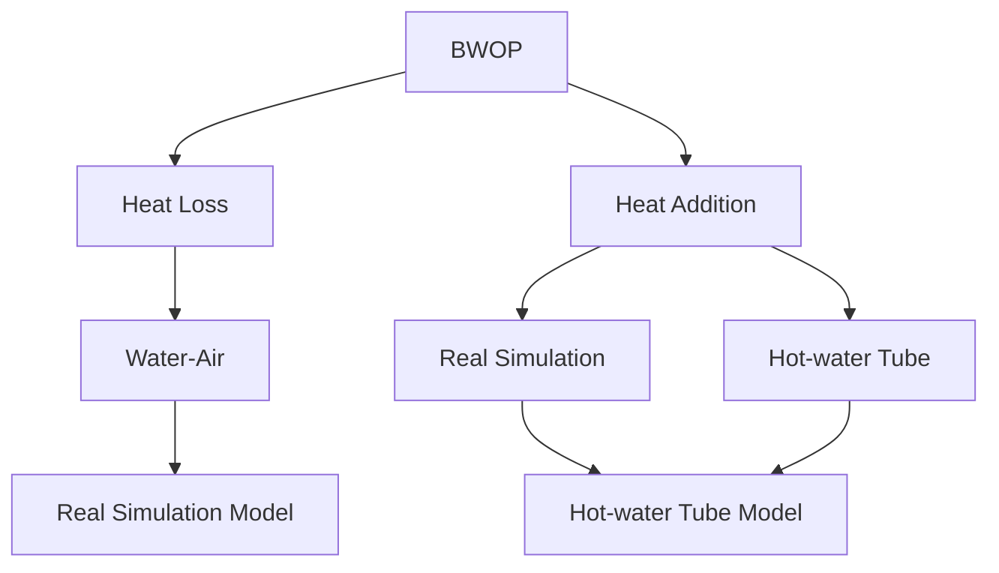
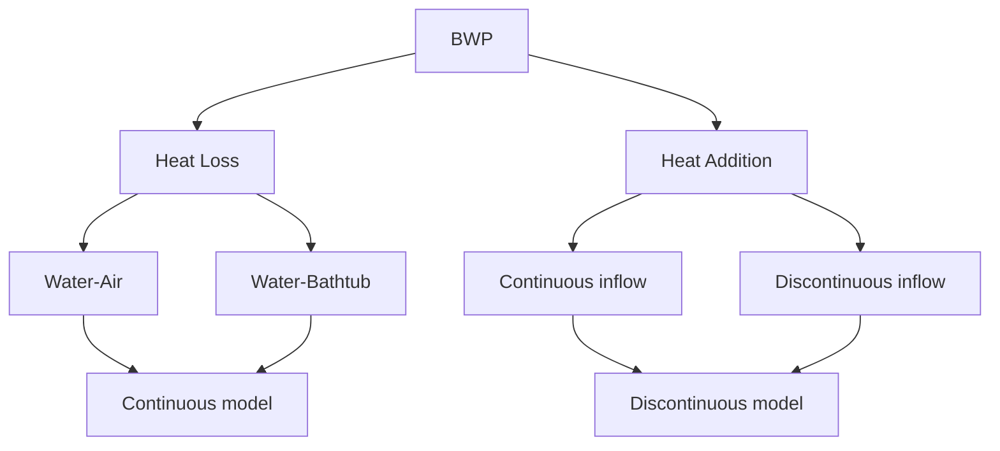

<table><tr><td>For office use only</td><td>Team Control Number</td><td>For office use only</td></tr><tr><td>T1</td><td>48649</td><td>F1</td></tr><tr><td>T2</td><td></td><td>F2</td></tr><tr><td>T3</td><td>Problem Chosen</td><td>F3</td></tr><tr><td>T4</td><td>A</td><td>F4</td></tr></table>

## 2016

# MCM/ICM

# Summary Sheet

# Summary

Based on the existing Finite Element Method (FEM) technique, we consider two models to analyze the temperature distribution in the bathtub, including without and with a person in it. Then, we build two inflow models, namely, the continuous inflow model and the discontinuous inflow model. At last, we employ Fuzzy Comprehensive Evaluation (FCE) to evaluate these two inflow models in order to find an optimal solution.

First, regarding the model without a person in the bathtub, we calculate the heat dissipation in the water-to-air heat convection and build a hot-water tube model for calculating the heat addition. What’s more, to find the temperature distribution in the bathtub, we simulate such model on ANSYS, which is a large-scale common finite element software.

Second, we consider the model with a person in the bathtub from two aspects, namely, the person in the still and the moving states. Specific to the moving state of person, we find that there exist two ways of dissipating heat, including the water-to-air heat convection and the water-to-bathtub heat conduction. Furthermore, we exploit MATLAB to find the temperature curve in natural cooling process. .

Third, based on the analysis of above two conditions, we propose to simulate on the continuous and discontinuous inflow models of the hot water. Besides, to find an optimal strategy, we evaluate these two models using fuzzy comprehensive evaluation (FCE), where the variables include the amount of needed water, the comfortable degree of user, the operation complexity and the operative difficulty index.

Fourth, to analyze the sensitivity of two models with and without person, we extensively change the velocity and the temperature of the hot inflow, the air temperature, the surface area, volume and material of the bathtub, and the volume of the person body.

At last, we further study the model for cleansing with a bubble bath additive. In this case, we vary the condition of the bubble to observe this model’s performance.

Team #48649

January 28，2014

## Abstract

Naturally a non-spa-style bathtub without a secondary heating system and circulating jet will get noticeably cooler after being filled with hot water. The water lose heat both to the air and to the bathtub. One want to keep warm by adding a constant trickle of hot water from the faucet. To handle fluid’s overflowing, the bathtub is designed in such a way that when the tub reached its capacity, excess water escapes through an overflow drain.

We build Bathtub without Person model (BWOP) to simulate the water temperature distribution without people inside, and Bathtub with Person (BWP) model to research the natural cooling process and to propose reasonable strategy for user to maintain the temperature. The simulation of BWOP mainly depends on the finite element method (FEM) using ANSYS, while the simulation of BWP mainly depends on the solving of the thermodynamic equation using MATLAB.

Keywords: Heat Convection, Heat Conduction, Finite Element Method, ANSYS

## Contents

1 Introduction.

1.1 Restatement of the Problem . ′

2 Assumptions and Justifications ... 4

3 Notations . 5

4 Model for bathtub without a person in it (BWOP model) 6

4.1 The calculation of the heat-transfer coefficient . 8

4.1.1 The heat-transfer coefficient between the water surface and the air . 8

4.1.2 The heat-transfer coefficient between the water and the water tube .. C

4.1.3 The heat-transfer coefficient between the hot water and the cube wall . 10

4.2 The heat dissipation between the water surface and the air .. 1 1

4.3 The heat addition between the water and the hot water tube .. 1

4.3.1 The heat exchange between the inside and the outside of the tube ... 11

4.3.2 The heat exchange between the water and the water tube 12

4.4 Simulation of BWOP model based on ANSYS . . 14

5 Model for bathtub with a person in it (BWP model) 17

5.1 Simulation of the temperature distribution if the person is still . 18

5.2 Heat dissipation in BWP model . 19

5.2.1 Water-Air heat convection . . 19

5.2.2 Water-Bathtub heat conduction . . 20

5.2.3 The total heat dissipation in the bathtub . 21

5.3 Simulation of BWP model with MATLAB . 21

5.4 Heat addition model . . 23

5.4.1 Continuous Inflow model (CI model) . .. 24

5.4.2 Discontinuous Inflow model (DCI model) . . 26

5.4.3 FCE of the two models . . 28

6 Sensitivity analysis. . 29

6.1 Sensitivity analysis for BWOP . . 29

6.1.1 Inflow Velocity . 29

6.1.2 Inflow Temperature . 31

6.1.3 Air Temperature .. . 32

6.1.4 Conclusion . . 34  
6.2 Sensitivity analysis for BWP . 34  
6.2.1 Different surface area of the bathtub .. 35  
6.2.2 Different volume of the bathtub. . 36  
6.2.3 Different material of the bathtub. . 37  
6.2.4 Different volume of person in the bathtub. .. 38  
6.2.5 Conclusion . . 38  
7 Model for Cleansing with a Bubble Bath Additive (CBBA model) . . 39  
8 Weakness and Strength . .. 40  
8.1 Strengths . 40  
8.2 Weaknesses.. . 41  
References... . 42  
Appendix... .. 43

## 1 Introduction

## 1.1 Restatement of the Problem

We are required to model the bathtub water’s temperature in space and time, which enables an individual to pick the best strategy in order to keep the temperature almost a constant in the bathtub. Besides, the temperature at any time is required to approach the initial state without wasting too much water.

By analysis, we proposed to decompose the problem into two sub-problems:

Build a model that can simulate the temperature of the bathtub in space and time.  
Propose an optimal strategy. The strategy should satisfy two conditions: waste the least water and let the user feel comfortable.

First, for generality, we set the velocity and temperature of inflow, the size and shape of bathtub variables. Then, we try to model the temperature inside. On one hand, the model needs to show the volume-average temperature. On the other hand, it is required to depict the distribution under the influence of heat loss and addition. Then we can change the inputs to do several simulations. Only using many simulation results can we build a relationship between input and output of the complexed thermodynamical system.

Second we seek to use the relationship getting from our simulation to find the best strategy for keeping the temperature. In our model, “best” doesn’t not only means “the least water” but “the most comfortable environment for the people” which put weight on the gradient of temperature and limit on the degree (to avoid scald).

At last, we try to adjust our model to different initial state such as the bathtub size and shape, the inflow temperature and the motions made by the people. We also take the bubble bath additive in to consideration.

## 2 Assumptions and Justifications

1) Water is stability, incompressible viscous liquid. The compressibility of the water is small enough to be ignored. The water is steady and viscous in cases that we will discuss later.  
2) The fluid matches the Boussinesq assumptions[1].

The fluid viscous dissipation can be ignored.

All the physical properties except density are constant

For density, we only consider its change in the body force entries in momentum equation, others can be considered as constant.

3) The volume of the air is infinite and the temperature of the air keeps constant. Compared to the volume of the water, the volume of the air is much bigger, thus we can think the air is infinite and even. Then we can ignore the heat transfer in the air and take as a constant. $t _ { a i r }$  
4) The temperature can be evenly distributed in bathtub at any time when a person is in it (BWP model). When a person settles in the bathtub to cleanse, if the temperature distribution is uneven, he will feel uncomfortable and then he must agitate the water to make the temperature evenly distribution.  
5) There doesn’t exist heat convection in the water when a person is in the bathtub (BWP model). From assumption 3 we can see, when the person is in the bathtub, the temperature is even in the water, thus there is no convection[2].  
6) The temperature of the bathtub is at a steady state at any time (BWP model). Heat dissipation can happen through the wall of the bathtub. When the water temperature and the air temperature remain unchanged, the bathtub temperature gradient will reach a steady state after time T. To simply the model, we take time T close to 0, that is, the temperature of the bathtub is at a steady state at any time.  
7) The bathtub walls and the bottom are adiabatic in BWOP model. In BWOP model, heat dissipation through the wall of the bathtub is relatively small. Thus to simply the model, we take the bathtub as adiabatic.  
8) All the model in the paper is at the state that the water filled the bathtub. In normal case, people will cleanse in tub with full water, so we just discuss such case and ignore the situation that the tub is unfilled.

## 3 Notations

Table 1: Constants

<table><tr><td>Symbol</td><td>Definition</td><td>Value</td><td>Units</td></tr><tr><td> $t_{air}$ </td><td>The temperature of the air</td><td>298</td><td>K</td></tr><tr><td> $\sigma$ </td><td>Stefan-Boltzmann constant</td><td> $5.67 \times 10^{-8}$ </td><td> $W/m^{2} \cdot K^{4}$ </td></tr><tr><td> $\alpha^{[3]}$ </td><td>Coefficient of cubical expansion</td><td> $\alpha = 1/t$ </td><td></td></tr><tr><td> $\nu_{air}$ </td><td>Kinematic viscosity of the air (313 K)</td><td> $15.69 \times 10^{6}$ </td><td> $m^{2}/s$ </td></tr><tr><td> $\nu_{water}$ </td><td>Kinematic viscosity of the water (313 K)</td><td> $6.56 \times 10^{-4}$ </td><td> $m^{2}/s$ </td></tr><tr><td> $\lambda_{air}^{[4]}$ </td><td>The thermal conductivity of the air(313 K)</td><td>0.02624</td><td> $W/m \cdot K$ </td></tr><tr><td> $\lambda_{w}$ </td><td>The thermal conductivity of the water (313 K)</td><td>0.64</td><td> $W/m \cdot K$ </td></tr><tr><td>c</td><td>The specific heat capacity of water</td><td>4.2</td><td> $kJ/kg \cdot K$ </td></tr></table>

<table><tr><td> $\mu$ </td><td>Dynamic viscosity coefficient of the water</td><td> $6.56 \times 10^{-4}$ </td><td> $Pa \cdot s$ </td></tr><tr><td> $Pr^{[5]}$ </td><td>Prandtl number</td><td>0.7~0.8</td><td></td></tr></table>

Table 2: Variables

<table><tr><td>Symbol</td><td>Definition</td><td>Units</td></tr><tr><td> $t_{water}$ </td><td>The temperature of the water in the bathtub</td><td>K</td></tr><tr><td> $t_{win}$ </td><td>The temperature of the inflow hot water</td><td>K</td></tr><tr><td> $t_{h}$ </td><td>The high threshold of the water temperature in the bathtub</td><td>K</td></tr><tr><td> $t_{l}$ </td><td>The low threshold of the water temperature in the bathtub</td><td>K</td></tr><tr><td> $A_{s}$ </td><td>The surface area of the water</td><td> $m^{2}$ </td></tr><tr><td> $A_{b}$ </td><td>The contact area of the water and the bathtub</td><td> $m^{2}$ </td></tr><tr><td> $A_{win}$ </td><td>The sectional area of the faucet</td><td> $m^{2}$ </td></tr><tr><td> $d_{b}$ </td><td>The thickness of the bathtub</td><td>m</td></tr><tr><td>V</td><td>The volume of the bathtub</td><td> $m^{3}$ </td></tr><tr><td> $\lambda_{b}$ </td><td>The thermal conductivity of the bathtub</td><td>W/m·K</td></tr><tr><td> $h_{air}$ </td><td>The heat transfer coefficient of the air</td><td>W/ $m^{2}$ ·K</td></tr><tr><td>τ</td><td>Time</td><td>s</td></tr><tr><td> $v_{in}$ </td><td>Inflow velocity</td><td>m/s</td></tr><tr><td> $Q_{in}$ </td><td>The heat transfer that goes into the water in unit time</td><td>kJ</td></tr><tr><td> $Q_{d}$ </td><td>The heat dissipation of the whole system in unit time</td><td>kJ</td></tr><tr><td>BWOP</td><td>Bathtub without a person in it model</td><td></td></tr><tr><td>BWP</td><td>Bathtub with a person in it model</td><td></td></tr><tr><td>CI</td><td>Continuous Inflow model</td><td></td></tr><tr><td>DCI</td><td>Discontinuous Inflow model</td><td></td></tr></table>

## 4 Model for bathtub without a person in it (BWOP model)

First we discuss the model when there is no person in the bathtub (BWOP model). By BWOP model, we can find the natural temperature distribution in the bathtub. Later (in next section) we will discuss the model for bathtub with a person in it (BWP model) based on the analysis of BWOP model.

We make the rule that the faucet is at the middle of the base side and the water outlet is

located at the middle of the opposite above side.

The BWOP model can be decomposed into two parts:

1) The heating process  
2) The heat dissipation process

In the heating process, the water goes into the bathtub from the faucet and overflow from the water outlet.

For calculation, as it’s difficult to find the exact mathematical solution for the distribution of the temperature in space and time, we simplify the BWOP model like this:

As Graph 1 shows, the addition of the hot water is equivalent to a hot water tube from faucet to the water outlet, which means, there is a water tube heater to reheat the water in the bathtub.

natural_image

3D rendering of a rectangular box with a diagonal line and two protruding rods, no text or symbols present.

Graph 1: The hot water tube model

However, later we will simulate the real model by ANSYS.

In the heat dissipation process, the heat dissipates in two ways: the heat transfer between the water surface and the air and the heat transfer between the water and the bathtub. Based on the assumption we can see that the bathtub walls and the bottom are adiabatic, so we only consider the heat dissipation between the water surface and the air.

The framework of BWOP model is like this:

flowchart

Graph 2: The framework of BWOP model

## 4.1 The calculation of the heat-transfer coefficient

There are many factors influence the heat transfer, we can introduce the heat-transfer coefficient to reflect the heat transfer condition between dielectric.

## 4.1.1 The heat-transfer coefficient between the water surface and the air

When the system is under a steady condition, the water keeps the same temperature, we denote it as $t _ { w a t e r }$ , the air temperature is $t _ { a i r }$ ,the qualitative temperature of the air is $t _ { { } _ { n } } = ( t _ { { } _ { w a t e r } } + t _ { { } _ { a i r } } ) / 2$ , and we can obtain the $\lambda _ { \mathrm { a i r } } , \nu _ { a i r } , \mathrm { P r }$ at $t _ { n }$ , then we can find the heattransfer coefficient between the water surface $h _ { \mathrm { a i r } }$ and the air as follows:

$$
G r = \frac {g \alpha (t _ {\text { water }} - t _ {\text { air }}) l _ {0} ^ {3}}{\nu_ {\text { air }} ^ {2}} \tag {4.1}
$$

$$
N u = 0. 5 4 R a ^ {\frac {1}{4}} \tag {4.2}
$$

$$
R a = G r \operatorname * {P r} \tag {4.3}
$$

$$
h _ {a i r} = N u \frac {\lambda_ {a i r}}{l _ {0}} \tag {4.4}
$$

$\nu _ { a i r }$ : Kinematic viscosity of the air, $m ^ { 2 } / s$

$\alpha$ : Coefficient of cubical expansion and $\alpha = 1 / t _ { n }$

$g$ : Gravitational acceleration, $m / s ^ { 2 }$

$l _ { 0 } \colon$ : The width of the bathtub,

$\lambda _ { a i r }$ : The thermal conductivity of the air, $W / m \cdot K$

: Nusselt number

: Rayleigh number

: Grashof number

: Prandtl number

## 4.1.2 The heat-transfer coefficient between the water and the water tube

The heat transfer between the water and the water tube mainly contains two parts[6]: Convection heat loss:

$$
Q _ {c} = h _ {\text { water }} A _ {o s} \left(t _ {\text { out }} - t _ {\text { w   a   t }}\right) _ {e} \tag {4.5}
$$

$$
A _ {o s} = 2 \pi r _ {o u t} l _ {t} \tag {4.6}
$$

Radiation heat loss:

$$
Q _ {r} = \varepsilon \sigma A _ {o s} (t _ {o u t} ^ {4} - t _ {w a t e r} ^ {4}) \tag {4.7}
$$

We can see the temperature of the outside of the water tube is low, and it is a process of heat transfer to water, so the radiation heat loss is quite small and we can ignore it. Thus only the convection heat loss should be taken into consideration. According to our assumptions, the system of the water heat transfer is under stability balance, so the heat transfer between the inside and the outside of the tube is equal to the heat transfer between the water and the water tube,

$$
Q _ {i o} = \frac {2 \pi \lambda_ {\text { tube }} l (t _ {i n} - t _ {o u t})}{\ln (\frac {r _ {o u t}}{r _ {i n}})} \tag {4.8}
$$

Thus, we can find the heat-transfer coefficient between the water and the water tube $h _ { w a t e r }$ :

$$
h _ {\text { water }} = \frac {Q _ {c}}{Q \ln (\frac {r _ {\text { out }}}{r _ {\text { in }}})} (t _ {\text { in }} - \frac {r _ {\text { in }}}{2 \pi \lambda_ {\text { tube }} l} - t _ {\text { water }}) A _ {\text { os }} \tag {4.9}
$$

$A _ { o s }$ : The outside surface area of the water tube, $m ^ { 2 }$

$t _ { o u t }$ : The temperature of the outside of the water tube,

$t _ { i n }$ : The temperature of the inside of the water tube,

$r _ { i n }$ : The water tube inside radius,

$r _ { o u t }$ : The water tube outside radius, m

$\lambda _ { t u b e }$ : The thermal conductivity of the tube, $W / m \cdot K$

: The length of the tube,

: Emissivity (between 0 and 1)

: Stefan-Boltzmann constant $5 . 6 7 \times 1 0 ^ { - 8 } W / m ^ { 2 } K ^ { 4 }$

## 4.1.3 The heat-transfer coefficient between the hot water and the cube wall

We can calculate the qualitative temperature of the hot water $t _ { { \scriptscriptstyle m } } = ( t _ { w i n } + t _ { w o u t } ) / 2$ and obtain $\lambda _ { \scriptscriptstyle w } , \nu _ { \scriptscriptstyle w a t e r } , \mathrm { P r } , \eta _ { f }$ at $t _ { m }$ , we can calculate the coefficient as follows:

$$
\mathrm{Re} = \frac {u d}{\nu_ {\text { water }}} \tag {4.10}
$$

$$
f = (0. 7 9 \ln \mathrm{Re} - 1. 6 4) ^ {- 2} \tag {4.11}
$$

$$
N u = \frac {(f / 8) \mathrm{RePr}}{1 . 0 7 + 1 2 . 7 (f / 8) ^ {\frac {1}{2}} (\mathrm{Pr} ^ {\frac {2}{3}} - 1)} \left(\frac {\eta_ {f}}{\eta_ {w}}\right) \tag {4.12}
$$

$$
h _ {h w a t e r} = N u \frac {\lambda_ {w}}{d} \tag {4.13}
$$

According to equation (4.10)-(4.13) we can obtain the heat-transfer coefficient between the hot water and the cube wall . $h _ { h w a t e r }$

$\nu _ { w a t e r }$ ：Kinematic viscosity of the water， $m ^ { 2 } / s$

: Friction coefficient of the inside of the cube

$\eta _ { f }$ : Dynamic viscosity at $t _ { m }$ , $P a \cdot s$

$\eta _ { \scriptscriptstyle { w } }$ : Dynamic viscosity at $t _ { i n }$ , Pa s

: The flow velocity of hot water, $m / s$

: The inside diameter of the tube,

## 4.2 The heat dissipation between the water surface and the air

At the water surface, there both exists convective heat transfer and radiative heat transfer. We ignore the thermal radiation of air from the heat dissipation, heat absorption and thermal transpiration. Then we can calculate the convective heat transfer and radiative heat transfer at unit time independently as follows:

Convection heat loss:

$$
Q _ {c} = h _ {\text { air }} A _ {s} \left(t _ {\text { water }} - t _ {\text { air }}\right) \tag {4.14}
$$

Radiation heat loss:

$$
Q _ {r} = \varepsilon \sigma A _ {s} (t _ {\text { water }} ^ {4} - t _ {\text { air }} ^ {4}) \tag {4.15}
$$

We can see the temperature of the water surface is low, so compared with the convection heat loss, the radiation heat loss is quite small and we can ignore it. Thus only the convection heat loss should be taken into consideration.

At the surface of water, consider the third boundary conditions:

$$
\left. - \lambda_ {w} \frac {\partial t}{\partial z} \right| _ {z = h} = h _ {a i r} (t _ {w a t e r} - t _ {a i r}) \tag {4.16}
$$

: The heat loss caused by convective heat transfer,

$Q _ { r }$ : The heat loss caused by radiative heat transfer,

$A _ { s }$ : The surface area of the water, $m ^ { 2 }$

$\lambda _ { _ w }$ : The thermal conductivity of the water, $W / m \cdot K$

: The depth of the water,

## 4.3 The heat addition between the water and the hot water tube

## 4.3.1 The heat exchange between the inside and the outside of the tube

The inflow hot water temperature in the tube is the hot water’s temperature, the outflow hot water temperature in the tube is equivalent to the temperature in the bathtub after mixture.

Thus the water qualitative temperature in the process is equivalent to the average of the inflow and outflow hot water temperature $t _ { { \scriptscriptstyle m } } = ( t _ { w i n } + t _ { w o u t } ) / 2$ .

Since the wall of the tube is thin and the capacity of it is small, the process that hot water passing the tube can be considered as free of inertia and lag. However, the thermal resistance of the tube can’t be ignored. So the temperature of the outside of the tube is not equal to the inside. According to law of the conservation of energy, we can calculate the temperature of the outside of the tube $t _ { o u t }$ as follows:

$$
c \rho Q (t _ {w i n} - t _ {w o u t}) = K A _ {i s} \Delta t \tag {4.17}
$$

$$
\frac {1}{K} = \frac {1}{h _ {\text { hwater }}} + \frac {\delta}{\lambda_ {\text { tube }}}, \tag {4.18}
$$

$$
\Delta t = \frac {t _ {\text {win}} + t _ {\text {wout}}}{2} - t _ {\text {out}} \tag {4.19}
$$

: The specific heat capacity of hot water, $k J / k g \cdot K$

$\rho$ : The density of hot water, $k g / m ^ { 3 }$

: Volume flowrate of the hot water, $m ^ { 3 } / s$

$A _ { i s }$ : The area of the inside wall of the cube, $m ^ { 2 }$

: Heat transfer coefficient, $W / m ^ { 2 } \cdot K$

$\delta$ : The thickness of the cube,

$h _ { h w a t e r }$ : The heat-transfer coefficient between the hot water and the cube wall, $W / m ^ { 2 } \cdot K$

$t _ { w i n }$ : The temperature of the inflow hot water,

$t _ { w o u t }$ : The temperature of the outflow hot water,

$\lambda _ { t u b e }$ : The thermal conductivity of the tube, $W / m \cdot K$

## 4.3.2 The heat exchange between the water and the water tube

The heat transfer between the water and the water tube can be considered as the natural convection. In the process of natural convection, the basic governing equations are equation of continuity, momentum conservation equation, energy conservation equation. This model is a three-dimensional heat-transfer process and there is no inner heat source, so based on the assumption, we can get the governing equations as follows:

Equation of continuity:

$$
\frac {\partial (\rho_ {w} u)}{\partial x} + \frac {\partial (\rho_ {w} v)}{\partial y} + \frac {\partial (\rho_ {w} w)}{\partial z} = 0 \tag {4.20}
$$

Momentum conservation equation:

$$
\rho_ {w} \left(\frac {\partial u}{\partial \tau} + u \frac {\partial u}{\partial x} + v \frac {\partial u}{\partial y} + w \frac {\partial u}{\partial z}\right) = - \frac {\partial P}{\partial x} + \mu_ {w} \left(\frac {\partial^ {2} u}{\partial x ^ {2}} + \frac {\partial^ {2} u}{\partial y ^ {2}} + \frac {\partial^ {2} u}{\partial z ^ {2}}\right) \tag {4.21}
$$

$$
\rho_ {w} \left(\frac {\partial v}{\partial \tau} + u \frac {\partial v}{\partial x} + v \frac {\partial v}{\partial y} + w \frac {\partial v}{\partial z}\right) = - \frac {\partial P}{\partial y} + \mu_ {w} \left(\frac {\partial^ {2} v}{\partial x ^ {2}} + \frac {\partial^ {2} v}{\partial y ^ {2}} + \frac {\partial^ {2} v}{\partial z ^ {2}}\right) \tag {4.22}
$$

$$
\rho_ {w} \left(\frac {\partial w}{\partial \tau} + u \frac {\partial w}{\partial x} + v \frac {\partial w}{\partial y} + w \frac {\partial w}{\partial z}\right) = - \rho_ {w} g - \frac {\partial P}{\partial z} + \mu_ {w} \left(\frac {\partial^ {2} w}{\partial x ^ {2}} + \frac {\partial^ {2} w}{\partial y ^ {2}} + \frac {\partial^ {2} w}{\partial z ^ {2}}\right) \tag {4.23}
$$

Energy conservation equation:

$$
\frac {\partial t _ {\text {water}}}{\partial \tau} + u \frac {\partial t _ {\text {water}}}{\partial x} + v \frac {\partial t _ {\text {water}}}{\partial y} + w \frac {\partial t _ {\text {water}}}{\partial z} = \frac {\lambda_ {w}}{\rho_ {w} c _ {w}} \left(\frac {\partial^ {2} t _ {\text {water}}}{\partial x ^ {2}} + \frac {\partial^ {2} t _ {\text {water}}}{\partial y ^ {2}} + \frac {\partial^ {2} t _ {\text {water}}}{\partial z ^ {2}}\right) \tag {4.24}
$$

Equation (4.19) -（4.23）form the governing equations in the process of the heat transfer between the water and the water tube. Continuous heat transfer process is steady process. In this case, the temperature won’t change with the time, that is:

$$
\frac {\partial t _ {w a t e r}}{\partial \tau} \underline {{=}} 0 \tag {4.25}
$$

This is the mathematical differential equation of the flow of the fluid, and then we consider the boundary conditions and initial conditions.

## Boundary conditions:

1) The tube is heat source and is continuous heat transfer process. The temperature of the outside of the tube’s boundary condition is obtained by calculation $t _ { o u t }$ .

2) The walls and the bottom of the bathtub can be considered to be adiabatic。

$$
- \lambda_ {w} \frac {\partial t _ {\text {water}}}{\partial z} \big | _ {z = 0} = 0 \tag {4.26}
$$

## Initial conditions:

1) The temperature of the water $t _ { w a t e r }$  
2) The gravitational acceleration g.  
3) The air temperature $t _ { a i r }$  
4) The temperature of the inflow and outflow hot water $t _ { w i n } \quad t _ { w o u t }$ twou

: The flow velocity of water at X-direction,  
: The flow velocity of water at Y-direction,  
: The flow velocity of water at Z-direction,  
$\mu _ { { } _ { w } }$ : Dynamic viscosity coefficient of the water, $P a \cdot s$

## 4.4 Simulation of BWOP model based on ANSYS

To simulate the BWOP model, we use finite element method (FEM) by ANSYS. However, when simulating, we don’t adopt the hot water tube model, as this model is only used to simplify the calculating. ANSYS can deal with the real case that the hot water come from the faucet and the excess water escapes through an overflow drain.

The finite element method (FEM): FEM is a numerical technique for finding approximate solutions to boundary value problems for partial differential equations. It uses subdivision of a whole problem domain into simpler parts, called finite elements, and variational methods from the calculus of variations to solve the problem by minimizing an associated error function. Analogous to the idea that connecting many tiny straight lines can approximate a larger circle, FEM encompasses methods for connecting many simple element equations over many small subdomains, named finite elements, to approximate a more complex equation over a larger domain[7].

ANSYSY: ANSYS is a large-scale common finite element software. It publishes engineering analysis software across a range of disciplines including finite element analysis, structural analysis, computational fluid dynamics, explicit and implicit methods, and heat transfer. In this paper, we use FLUENT function to analyze BWOP model. FLUENT is based on CFD (Computational Fluid Dynamics), which can simulate fluid flows in a virtual environment — for example, the fluid dynamics of ship hulls; gas turbine engines (including the compressors, combustion chamber, turbines and afterburners); aircraft aerodynamics; pumps, fans, HVAC systems, mixing vessels, hydrocyclones, vacuum cleaners, etc[8].

If the system reaches steady state, it should meet the conditions:

The bathtub is filled with water.  
The distribution of temperature doesn’t change with time

When the system reaches steady state, we use ANSYS to simulate the state of the system temperature-space phase graph. In the 3-D model analysis, we use Hex Dominant unit whose shape is like Graph 3. To adjust to the real size in Table 3 of the tub, we define the tub model as Graph 4.

Table 3: Size of the tub

<table><tr><td>cubage( $m^3$ )</td><td>height(m)</td><td>top-surface-size(m,m)</td><td>bottom-surface-size(m,m)</td></tr><tr><td>0.3</td><td>0.4</td><td>1.4(length),0.7(width)</td><td>1.0(length),0.5(width)</td></tr></table>

natural_image

3D geometric shape resembling a house or prism with a light purple face on top and white faces on the left (no text or symbols)

Graph 3: 3-D Hex Dominant model

natural_image

3D rendering of a white rectangular prism with a blue side panel, isolated on dark background (no text or symbols)

Graph 4: 3-D Bathtub model

Using the ANSYS mesh we get the mesh carve up graph for the bathtub as Graph 5.

natural_image

3D finite element mesh model of a rectangular block with visible crack patterns, displayed in grayscale (no text or symbols)

Graph 5: Mesh Carve up

Using FEM by ANSYS, we get the isothermal diagram both inside and outside the bathtub as Graph 6 and Graph 7.

heatmap

| Value       |
| ----------- |
| 3.18e+02    |
| 3.18e+02    |
| 3.18e+02    |
| 3.17e+02    |
| 3.17e+02    |
| 3.17e+02    |
| 3.17e+02    |
| 3.16e+02    |
| 3.16e+02    |
| 3.16e+02    |
| 3.16e+02    |
| 3.15e+02    |
| 3.15e+02    |
| 3.15e+02    |
| 3.15e+02    |
| 3.15e+02    |
| 3.14e+02    |
| 3.14e+02    |
| 3.14e+02    |
| 3.14e+02    |
| 3.14e+02    |
| 3.13e+02    |

Graph 6: The isothermal diagram of the intersecting surface

heatmap

| Value        |
| ------------ |
| 3.18e+02     |
| 3.18e+02     |
| 3.18e+02     |
| 3.17e+02     |
| 3.17e+02     |
| 3.17e+02     |
| 3.17e+02     |
| 3.16e+02     |
| 3.16e+02     |
| 3.16e+02     |
| 3.16e+02     |
| 3.15e+02     |
| 3.15e+02     |
| 3.15e+02     |
| 3.15e+02     |
| 3.15e+02     |
| 3.14e+02     |
| 3.14e+02     |
| 3.14e+02     |
| 3.14e+02     |
| 3.14e+02     |
| 3.13e+02     |

Graph 7: The isothermal diagram of the tub body from outside

Calculate the result we get statistic in table 4.

Table 4: Report on Volume Integral

<table><tr><td>Average tub-wall heat flux(W)</td><td>Average top surface heat flux(W)</td><td>Volume-average Temp(k)</td><td>Volume-Maximum Temp(K)</td><td>Volume-Minimum Temp(K)</td><td>Volume-average Temp(°C)</td></tr><tr><td>-0.06104</td><td>-1.3394727</td><td>313.1946</td><td>318.0238</td><td>312.9532</td><td>40.4178</td></tr></table>

From Graph 6 and Graph 7 we can obviously find that due to the heat loss to the air, the top surface of the water in bathtub holds lower temperature than other part inside. Also, it is lower than the volume-average temperature. From Graph 6, it is easy to see the temperature distribution across the intersecting surface. The inflow region from the faucet hold the highest degree and the temperature gets down sharply across the line from the faucet to the main body of the water.

From the two graphs, we can excitedly find that the main body of the water in bathtub holds stable and comfortable temperature, which will provide people with a great experience. The statistical data of the volume temperature also indicate that the average degree is about 40º-- the most suitable temperature for human beings in winter. Besides, the maximum point with 318º is limited to a small region around the faucet, it is in low possibility to scald people inside. Even if one touch it by accident, 45ºis much lower than adults’ bearing limit 55ºwhich guarantee the safety.

At last, from Graph 7 and data in Table 4, it is interesting to find that the heat loss by the tub-wall is much smaller than that by air. It is also realistic according to our reference.

## 5 Model for bathtub with a person in it (BWP model)

We have discussed the case of the temperature distribution in a bathtub without a person in it, and now we consider the case where a person is in the bathtub.

In BWP model, we first discuss the temperature distribution in the tub if the person is actionless. Based on this, we make the assumption that the temperature is evenly distributed in BWP model.

Then we discuss the heat dissipation process based on two sub-models: Water-Air heat convection and Water-Bathtub heat conduction. We simulate the process with MATLAB. Based on the analysis result, we propose two inflow model: Continuous Inflow model and Discontinuous Inflow model. Then we analysis the performance of each model by fuzzy comprehensive evaluation method (FCE) to find a better one.

Graph 8 shows the framework of BWP model:

flowchart

Graph 8: The framework of BWP model

## 5.1 Simulation of the temperature distribution if the person is still

Graph 9 shows the model of the bathtub when a person is cleaning. There will be some heat transfer between the water and the person, but it’s small enough to be ignored.

natural_image

3D rendered illustration of a cylindrical object with a spherical head, resting on a rectangular base (no text or symbols)

Graph 9: Bathtub model with person

Now we suppose the person keeps still, thus the temperature of water should distributes naturally. Graph 10 show the isothermal in the bathtub and Graph 11 show the temperature distribution on the body surface of the person.

heatmap

| Value     |
| --------- |
| 3.18e+02  |
| 3.18e+02  |
| 3.17e+02  |
| 3.17e+02  |
| 3.17e+02  |
| 3.16e+02  |
| 3.16e+02  |
| 3.16e+02  |
| 3.15e+02  |
| 3.15e+02  |
| 3.14e+02  |
| 3.14e+02  |
| 3.14e+02  |
| 3.14e+02  |
| 3.13e+02  |
| 3.13e+02  |
| 3.13e+02  |
| 3.12e+02  |

Graph 10: The isothermal diagram of the tub body with a person (We don’t show the person in the graph)

heatmap

| Value     |
| --------- |
| 3.18e+02  |
| 3.18e+02  |
| 3.17e+02  |
| 3.17e+02  |
| 3.17e+02  |
| 3.17e+02  |
| 3.16e+02  |
| 3.16e+02  |
| 3.16e+02  |
| 3.16e+02  |
| 3.15e+02  |
| 3.15e+02  |
| 3.15e+02  |
| 3.15e+02  |
| 3.14e+02  |
| 3.14e+02  |
| 3.14e+02  |
| 3.14e+02  |
| 3.14e+02  |
| 3.14e+02  |
| 3.14e+02  |
| 3.14e+02  |
| 3.14e+01  |
| 3.14e+02  |
| 3.14e+02  |
| 3.14e+02  |
| 3.14e+02  |
| 3.14e+02  |
| 3.14e+02  |
| 3.14e+02  |
| 3.14e+02  |
| ...       |

Graph 11: The isothermal diagram on the body surface of a person

From Graph 11 we can see that the temperature distributes unevenly on the body surface of the person if the person just settles down in the bathtub and keeps still. Thus the person will feel uncomfortable as his upper part of the body feel cool and the lower part of the body feels hot. However, in fact, if a person feel uncomfortable, he must agitate the water to make the temperature distributes more evenly. Based on the analysis, when dealing with BWP model, we can make the assumption that the temperature can be evenly distributed in bathtub at any time when a person is in it.

## 5.2 Heat dissipation in BWP model

As the temperature can be evenly distributed, we can make the rule：In time T, if some hot water flows into the bathtub, then the temperature distribution will get even immediately.

As we ignore the heat transfer between the water and the person, the dissipation of heat can be decomposed into two parts:

The heat exchange between the water surface and the air (Water-Air).  
The heat exchange between the water and the wall of the bathtub (Water-Bathtub)

Then we can get the total heat dissipation.

## 5.2.1 Water-Air heat convection

This process is similar to the case 4.2, the heat transfer in unit time between the water surface and the air in BWOP model. So we directly get the equation:

Convection heat loss:

$$
Q _ {c} = h _ {\text { air }} A _ {s} (t _ {\text { water }} - t _ {\text { air }}) \tag {5.1}
$$

The third boundary conditions:

$$
- \lambda_ {w} \left. \frac {\partial t}{\partial z} \right| _ {z = h} = h _ {a i r} (t _ {w a t e r} - t _ {a i r}) \tag {5.2}
$$

Suppose in this process, heat dissipation is $Q _ { 1 } = Q _ { c }$ .

## 5.2.2 Water-Bathtub heat conduction

Heat dissipation can also happen at the contact surface of the water and the wall of the bathtub. From the assumption we can see, there doesn’t exist convection in the water when the person is in the bathtub and the temperature of the bathtub at the steady state at any time. Thus the heat transfer process between the water and the bathtub should be a steady process.

The heat transfer between the water and the bathtub can be decomposed into two parts:

C The heat conduction between the water and the wall of the bathtub (Water-Bathtub process)  
The heat convection between the outside surface of the bathtub and the air (Bathtub-Air process).

Suppose in this process, heat dissipation in unit time is $Q _ { 2 }$ .

## 1) Water-Bathtub process

As the water temperature distributes evenly and the bathtub remains steady state, the heat transfer in Water-Bathtub process is a steady heat conduction process.

The equation of heat conduction[9]:

$$
Q _ {2} = \lambda_ {b} A _ {b} \frac {t _ {\text { water }} - t _ {b}}{d _ {b}} \tag {5.3}
$$

$\lambda _ { b }$ : The heat conductivity coefficient of the bathtub. In simulating, $\lambda _ { \nu } = 0 . 1 9 \mathrm { W } / \mathrm { m } \cdot \mathrm { K }$

$t _ { b }$ : The temperature of the outside of the bathtub.

$A _ { b }$ : The contact area of the water and the tub. In simulating, $A _ { b } = 1 . 5 3 m ^ { 2 }$

$d _ { b }$ : The thickness of the bathtub. $d _ { b } = 0 . 0 4 m$

## 2) Bathtub-Air process

The heat transfer between the bathtub and the air is similar to Water-Air case, which can be taken as 2-dimensional heat convection process.

Convection heat loss:

$$
Q _ {2} = h _ {\text { air } b} A _ {b} (t _ {b} - t _ {\text { air }}) \tag {5.4}
$$

$h _ { a i r b }$ : The convection coefficient of the contact surface between the air and the bathtub. In

simulating, $h _ { a i r b } = 5 \mathrm { \bf W } / \mathrm { \bf m } ^ { 2 } \cdot \mathrm { \bf K }$

## 5.2.3 The total heat dissipation in the bathtub

By the three models above, we can conclude that, when there is a person in the bathtub, the heat dissipation in unit time is ${ \cal Q } = { \cal Q } _ { 2 } + { \cal Q } _ { 1 }$

## 5.3 Simulation of BWP model with MATLAB

If there is no heating source, we simulate the Temperature-Time graph with MATLAB to find the thermal losses.

Graph 12 shows the heat loss caused by the heat convection between the water surface and the air.

line chart

| Time/min | Temperature/K |
| -------- | ------------- |
| 0        | 318           |
| 100      | 314           |
| 200      | 311           |
| 300      | 308           |
| 400      | 306           |
| 500      | 304           |
| 600      | 303           |
| 700      | 302           |
| 800      | 301.5         |
| 900      | 301           |
| 1000     | 300.5         |

Graph 12: Temperature curve of Water-Air heat transfer process

line chart

| Time/min | Temperature/K |
| -------- | ------------- |
| 0        | 318           |
| 500      | 316           |
| 1000     | 314           |
| 1500     | 312           |
| 2000     | 311           |
| 2500     | 310           |
| 3000     | 309           |

Graph 13: Temperature curve of Water-Bathtub heat transfer process

Graph 13 shows the heat loss only caused by the heat conduction between the water and the bathtub. We can find that the heat loss through the bathtub is much slower than the heat loss through the Water-Air surface, which is truthfulness as the thermal conductivity of the bathtub is much smaller than the convection coefficient of the surface between the water and the air.

line chart

| Time/min | Temperature/K |
| -------- | ------------- |
| 0        | 318           |
| 100      | 314           |
| 200      | 310           |
| 300      | 307           |
| 400      | 305           |
| 500      | 304           |
| 600      | 303           |
| 700      | 302           |
| 800      | 301.5         |
| 900      | 301           |
| 1000     | 300.5         |

Graph 14: Temperature curve of total heat transfer process

Graph 14 shows the total heat dissipation in BWP model which contains the Water-Air transfer and the Water-Bathtub transfer. We can see the curve is similar to the curve of the

Water-Air case, as most of the heat loss is dissipated through the water surface.

## 5.4 Heat addition model

Based on the former analysis of BWP model, we can find the heat dissipation Q in unit time. Our goal is to find an optimal strategy, so now we use two inflow model to simulate the inflow of water:

Continuous Inflow model (CI model)  
Discontinuous Inflow model (DCI model).

In CI model, the water flow into the bathtub with a constant trickle.

In DCI model, the water flow into the bathtub only when the temperature comes below a low threshold value and it will stop watering when the temperature reaches a high threshold value.

After discuss the two model, we use the fuzzy comprehensive evaluation to find a better strategy.

For normal case, we set the proper cleansing temperature as 313 K, the inflow water temperature as 318 K and the cleansing time as 40 min.

The evaluation criteria are:

1) The amount of water needed, Wn . We will calculate of each model later.  
2) The comfortable degree of the user,

We can see that people will feel comfortable when the water temperature keeps constant, if the temperature of the water changes frequently, people can feel uncomfortable. Thus we define the comfortable degree as the reciprocal of the standard deviation of the temperature.

$$
C d = \frac {1}{\sqrt {\frac {\sum_ {i = 1} ^ {n} (t _ {i} - \overline {{t}}) ^ {2}}{n}}} \tag {5.5}
$$

is the average temperature.

3) The operation complexity, $O c$

If the person always need to open or close the faucet, it will improve the operation complexity. Thus we define the operation complexity as the reciprocal of the operation period $T _ { o }$ :

$$
O c = \frac {1}{T _ {o}} (0 \leq O c \leq 1) \tag {5.6}
$$

4) The operative difficulty index

## 5.4.1 Continuous Inflow model (CI model)

In continuous influent model, we let the hot water go into the bathtub with a constant inflow velocity $\nu _ { i n }$ . When the bathtub is filled with water, excess water will escape through the overflow drain with an overflow velocity $\nu _ { o u t }$ . Now we make the rules:

C As the maximum of the volume of the bathtub is a constant, we can get that the overflow velocity is a constant and it’s equal to the inflow velocity. That is:

$$
v = v _ {i n} = v _ {o u t} \tag {5.7}
$$

When time  goes from $\tau _ { i } ^ { } \mathrm { ~ \scriptsize ~ t o ~ } \tau _ { i + 1 }$ , we think the hot water has been mixed evenly with the original water, so the temperature of the overflow water $t _ { w o u t }$ is equal to the temperature of the water at $\tau _ { i + 1 }$ . That is:

$$
t _ {w o u t} = t _ {w (i + 1)} \tag {5.8}
$$

Now we deeply discuss the CI model.

In the process of the continuous inflow of hot water, $\nu _ { i n }$ keeps constant, which also means, the heating capacity $Q _ { i n }$ is a constant. The heating capacity can be equal to the decrement of the thermal of the inflow hot water and the overflow water. That is[10]:

$$
Q _ {i n} = c _ {w} \rho_ {w} v _ {i n} A _ {w i n} (t _ {w i n} - t _ {w o u t}) \tag {5.9}
$$

The heating process is a steady heat transfer process and the heat go into the bathtub is absorbed by the water entirely. The heat absorbed is consumed in two ways:

Part of $Q _ { i n }$ is absorbed by the water to raise its temperature, represented by $Q _ { w t }$  
Another part of $Q _ { i n }$ is transferred to the air and the bathtub, which is equal to $Q$ .

When time  goes from $\tau _ { i }$ to $\tau _ { i + 1 }$ , by energy conservation equation:

$$
Q _ {i n} \Delta \tau = Q _ {d} \Delta \tau + c _ {w} \rho_ {w} V (t _ {w (i + 1)} - t _ {w (i)}) \tag {5.10}
$$

$t _ { w i n }$ : The temperature of the inflow hot water, $^ \circ C$

$t _ { w ( i ) }$ : The temperature of the water in the bathtub at time $\tau _ { i }$ , $^ \circ C$

V: The volume of the bathtub, $m ^ { 3 }$

$A _ { w i n }$ : The sectional area of the faucet, $m ^ { 2 }$

## 1) Find the amount of needed water

Suppose the person cleanses for $t _ { c }$ time and we can get the amount of the water needed (measured in volume) is:

$$
W n = v _ {i n} A _ {w i n} t _ {c} \tag {5.11}
$$

We set the proper water temperature that the people will feel comfortable as 313K. When the water temperature is at 313K, we control the inflow heat the same as the heat dissipation, thus the temperature can stay at the proper temperature.

From the graph 14 and calculation we can get:

Table 5: Water needed of CI model

<table><tr><td>Inflow velocity (m/min)</td><td>Water need ( $m^{3}$ )</td></tr><tr><td>16.2426</td><td>0.0735</td></tr></table>

We simulate the Continuous Inflow model with MATLAB and we get the temperature curve as Graph 15 shows.

line chart

| Time/min | Temperature/K |
| -------- | ------------- |
| 0        | 318           |
| 100      | 313           |
| 200      | 313           |
| 300      | 313           |
| 400      | 313           |
| 500      | 313           |
| 600      | 313           |
| 700      | 313           |
| 800      | 313           |
| 900      | 313           |
| 1000     | 313           |

Graph 15: Temperature curve of the continuous inflow process

## 2) The comfortable degree of user

By MATLAB, the standard deviation of the temperature is 0.09432.

Thus we can get $\mathrm { C d } _ { c t } { = } 1 0 . 6 0 2 1$ .

## 3) The operation complexity

Similarly, the person don’t need operate and the operation period is infinite.

$$
\mathrm{SoOc} _ {C I} = 1
$$

## 4) The operative difficulty index

In order to keep the temperature unchanged, the operative difficulty index  is high. We let $\eta { = } 1 0$

## 5.4.2 Discontinuous Inflow model (DCI model)

In DCI model, the hot water only inflow when the temperature comes below a low threshold value $t _ { l }$ and it will stop inflow when the temperature of the water comes above a high threshold value $t _ { h }$ . In a time period $\tau _ { p }$ , there are two stages: heating stage and cooling stage.

## Heating stage

When $t _ { w a t e r } \leq t _ { l }$ , the faucet is opened and the hot water inflow with a constant velocity $\nu _ { i n }$ for time $\tau _ { p 1 }$ . After time $\tau _ { p 1 }$ , the temperature of the water reaches the high threshold value $t _ { h }$ , thus the hot water stop inflowing.

This process is similar to the CI model, so we can get the equation directly:

$$
Q _ {i n} \tau_ {p 1} = Q _ {d} \tau_ {p 1} + c _ {w} \rho_ {w} V (t _ {w (\tau + \tau_ {p 1})} - t _ {w (\tau)}) \tag {5.9}
$$

$$
t _ {w (\tau + \tau_ {p 1})} = t _ {h} \tag {5.10}
$$

$$
t _ {w (\tau)} = t _ {l} \tag {5.11}
$$

is reference time.  t  $t _ { w ( \tau + \tau _ { p 1 } ) }$ is the temperature of the water after time $\tau _ { p 1 }$ .

## Cooling stage

The water will cool down from high temperature $t _ { h }$ to lower one $t _ { l }$ for time $\tau _ { p 1 }$ . This process is a natural cooling process. Without internal heat source, the thermal equation becomes:

$$
0 = Q _ {d} \tau_ {p 2} + c _ {w} \rho_ {w} V (t _ {w (\tau + \tau_ {p 1} + \tau_ {p 2})} - t _ {w (\tau + \tau_ {p 1})}) \tag {5.12}
$$

$$
t _ {w \left(\tau + \tau_ {p 1} + \tau_ {p 2}\right)} = t _ {w \left(\tau + \tau_ {p}\right)} = t _ {l} \tag {5.13}
$$

## 1) Find the amount of needed water

We set the low threshold value $: t _ { l } = 3 1 2 K$ , the high threshold value $t _ { h } = 3 1 4 K$ .

Temperature curve of the discontinuous inflow process  

line chart

| Time/min | Temperature/K |
| -------- | ------------- |
| 0        | 318           |
| 100      | 314           |
| 200      | 312           |
| 300      | 314           |
| 400      | 312           |
| 500      | 314           |
| 600      | 312           |
| 700      | 314           |
| 800      | 312           |
| 900      | 314           |
| 1000     | 312           |

Graph 16: Temperature curve of the discontinuous inflow process

By this graph we can get the amount of the water needed:

Table 6: Water needed of DCI model

<table><tr><td>Inflow velocity (m/min)</td><td>Water need ( $m^{3}$ )</td></tr><tr><td>25.67</td><td>0.0524</td></tr></table>

## 2) The comfortable degree of user

By MATLAB, the standard deviation of the temperature is 0.5961.

Thus we can get $\mathbf { C d } _ { D C I } { = } 1 . 6 7 7 5 7$ .

## 3) The operation complexity

By MATLAB, the operation period is 94min.

Thus we can get $\mathrm { O c } _ { D C I } { = } 0 . 0 1 0 6 4$

## 4) The operative difficulty index

It’s easy if the person just open the faucet with a relatively high water velocity, thus we set ;

## 5.4.3 FCE of the two models

FCE is a useful method for multiple criteria decision process. It determines the weights of each criterion based on the data only.

Based on the actual statistics of the 2 strategies, we get the values of each factor from section 5.4 and show them in Table 7.

Table 7: values of factors and allocations

<table><tr><td>Model</td><td>Water need ( $m^{3}$ )</td><td>The comfortable degree</td><td>operation complexity</td><td>operative difficulty index</td></tr><tr><td>CI</td><td>0.0735</td><td>10.0621</td><td>1</td><td>10</td></tr><tr><td>DCI</td><td>0.0524</td><td>1.67757</td><td>0.01064</td><td>1</td></tr></table>

From Table 7, we derive the ideal allocation as follows,

$$
u = (0. 0 5 2 4, 1 0. 6 0 2 1, 1, 1) \tag {5.14}
$$

The Fuzzy Evaluation Matrix (FEM)

We define

$$
r _ {i, j} = \frac {\left| a _ {i , j} - u _ {j} \right|}{\max \left\{a _ {i , j} \right\} - \min \left\{a _ {i , j} \right\}} \tag {5.15}
$$

We obtain the FEM

$$
R = \left\{ \begin{array}{c c c c} 0. 0 0 2 1 & 0 & 0 & 0. 9 0 4 5 \\ 0 & 0. 8 3 6 4 & 0. 0 9 9 4 & 0 \end{array} \right\} \tag {5.16}
$$

Also we define

$$
v _ {j} = \frac {S _ {j}}{\overline {{X}} _ {j}}, w _ {j} = \frac {V _ {j}}{\sum_ {i = j} ^ {4} V _ {j}} \tag {5.17}
$$

Then we get

$$
\omega = (0. 3, 0. 1 5, 0. 1 5, 0. 4) \tag {5.18}
$$

Result of the FCE

Define the relative deviation as

$$
F = R \times \omega^ {T} \tag {5.19}
$$

F measures the distance from a specific factor group to the ideal one, so the smaller F is, the better the strategy is. Then we get the final result shown in Table 8.

Table 8: FCE result for two strategies

<table><tr><td></td><td>F</td></tr><tr><td>CI</td><td>0.3624</td></tr><tr><td>DCI</td><td>0.1404</td></tr></table>

The result tells us that: the DCI model is better when we take all the factor into consideration. DCI model is economic and operable, which is very important for our users.

## 6 Sensitivity analysis

## 6.1 Sensitivity analysis for BWOP

Considering our simulation results on BWOP model, the heat loss by the bathtub-wall is less than 10 percent of that by water-air convection. In our further discussion on the model, we ignore this aspect and pay our attention to other parameters such as the air temperature, the inflow temperature and the inflow velocity. We choose four main criteria to evaluate the model: the average top surface heat flux, volume-average temperature, Volume-maximum temperature and volume-minimum temperature.

By using control variate method, we change the parameters from the best condition to see their effect on the four criteria. By doing simulation we get the result shown in Table 9, Table 10 and Table 11.

## 6.1.1 Inflow Velocity

Table 9: Results by Changing Inflow Velocity

<table><tr><td>Inflow Velocity (m/s)</td><td>Inflow Temp(K)</td><td>Air Temp(K)</td><td>Average top surface heat flux(W)</td><td>Volume-average Temp(K)</td><td>Volume-maximum Temp(K)</td><td>Volume-minimum Temp(K)</td></tr><tr><td>0.01</td><td>318</td><td>298</td><td>1.1590</td><td>310.3719</td><td>318.101</td><td>309.9957</td></tr><tr><td>0.02</td><td>318</td><td>298</td><td>1.4406</td><td>313.4178</td><td>318.024</td><td>312.9532</td></tr><tr><td>0.03</td><td>318</td><td>298</td><td>1.5651</td><td>314.7500</td><td>318.007</td><td>314.2474</td></tr><tr><td>0.04</td><td>318</td><td>298</td><td>1.6329</td><td>315.4771</td><td>318.003</td><td>314.9534</td></tr><tr><td>0.05</td><td>318</td><td>298</td><td>1.6765</td><td>315.9474</td><td>318.003</td><td>315.4104</td></tr></table>

line chart

| Inflow Velocity/(m/s) | Volume-average Temp | Volume-maximum Temp | Volume-minimum Temp |
| --------------------- | ------------------- | -------------------- | -------------------- |
| 0.01                  | 310.5               | 318.0                | 310.0                |
| 0.02                  | 313.5               | 318.0                | 313.0                |
| 0.03                  | 314.8               | 318.0                | 314.2                |
| 0.04                  | 315.5               | 318.0                | 315.0                |
| 0.05                  | 316.0               | 318.0                | 315.5                |

Graph 17: Temperature-Inflow Velocity graph

line chart

| Inflow Velocity/(m/s) | Heat Flux/W |
| --------------------- | ----------- |
| 0.01                  | 1.15        |
| 0.02                  | 1.45        |
| 0.03                  | 1.57        |
| 0.04                  | 1.63        |
| 0.05                  | 1.68        |

Graph 18: Average top surface heat-Inflow Velocity graph

From Table 9 and the corresponding graph we can notice that: the average top surface heat flux, the volume-average temperature and volume-minimum temperature have positive correlation with inflow velocity, and the raising rate goes down as the inflow velocity goes up for the maximum temperature is bounded. It is corresponding to our common sense that more hot water per second leads to a higher temperature. The heat flux of the top surface is also determined by the volume average temperature with air temperature fixed.

## 6.1.2 Inflow Temperature

Table 10: Results by Changing Inflow Temperature

<table><tr><td>Inflow Velocity (m/s)</td><td>Inflow Temp(K)</td><td>Air Temp(K)</td><td>Average top surface heat flux(W)</td><td>Volume-average Temp(K)</td><td>Volume-maximum Temp(K)</td><td>Volume-minimum Temp(K)</td></tr><tr><td>0.02</td><td>314</td><td>298</td><td>1.1525</td><td>310.3342</td><td>314.019</td><td>309.9626</td></tr><tr><td>0.02</td><td>316</td><td>298</td><td>1.2966</td><td>311.8761</td><td>316.025</td><td>311.4579</td></tr><tr><td>0.02</td><td>318</td><td>298</td><td>1.5652</td><td>313.4178</td><td>318.024</td><td>312.9532</td></tr><tr><td>0.02</td><td>320</td><td>298</td><td>1.5871</td><td>314.9596</td><td>320.026</td><td>314.4485</td></tr><tr><td>0.02</td><td>322</td><td>298</td><td>1.7287</td><td>316.5013</td><td>322.029</td><td>315.9438</td></tr></table>

Volume Temperature-Inflow Temperature graph  

line chart

| Inflow Temperature/K | Volume-average Temp | Volume-maximum Temp | Volume-minimum Temp |
| --------------------- | ------------------- | -------------------- | -------------------- |
| 314                   | 310                 | 314                  | 310                  |
| 322                   | 316                 | 322                  | 316                  |

Graph 19: Volume Temperature- Inflow Temperature graph

line chart

| Inflow Temperature/K | Heat Flux/W |
| -------------------- | ----------- |
| 314                  | 1.15        |
| 316                  | 1.30        |
| 318                  | 1.57        |
| 320                  | 1.59        |
| 322                  | 1.73        |

Graph 20: Average top surface heat - Inflow Temperature graph

From Table 10 and the corresponding graph we can notice that: the average top surface heat flux, the volume-average temperature, the volume-maximum temperature and volumeminimum temperature have positive correlation with inflow temperature, and the raising rate keeps still as the inflow velocity goes up. It is corresponding to our common sense that the hotter the inflow, the warmer the bathtub water. And different from the inflow velocity, all the criteria changes at almost direct proportion. That indicates adding hotter inflow is the most effective way to keep the bathtub warm. However, considering about people’s bearing capacity on water temperature and comfortability, the inflow temperature have to be bounded under 323K to avoid scald.

## 6.1.3 Air Temperature

Table 11: Results by Changing Air Temperature

<table><tr><td>Inflow Velocity (m/s)</td><td>Inflow Temp(K)</td><td>Air Temp(K)</td><td>Average top surface heat flux(W)</td><td>Volume-average Temp(K)</td><td>Volume-maximum Temp(K)</td><td>Volume-minimum Temp(K)</td></tr><tr><td>0.02</td><td>318</td><td>294</td><td>1.7287</td><td>312.5041</td><td>318.029</td><td>311.9438</td></tr><tr><td>0.02</td><td>318</td><td>296</td><td>1.5847</td><td>312.9596</td><td>318.026</td><td>312.4485</td></tr><tr><td>0.02</td><td>318</td><td>298</td><td>1.5652</td><td>313.4178</td><td>318.024</td><td>312.9532</td></tr><tr><td>0.02</td><td>318</td><td>300</td><td>1.2966</td><td>313.8762</td><td>318.022</td><td>313.4579</td></tr><tr><td>0.02</td><td>318</td><td>302</td><td>1.1525</td><td>314.3342</td><td>318.091</td><td>313.9625</td></tr></table>

Table

line chart

| Air Temperature/K | Volume-average Temp | Volume-maximum Temp | Volume-minimum Temp |
| ----------------- | ------------------- | ------------------- | ------------------- |
| 294               | 312.5               | 318.0               | 312.0               |
| 302               | 314.5               | 318.0               | 314.0               |

Graph 21: Volume Temperature - Air Temperature graph

line chart

| Air Temperature/K | heat flux/W |
| ----------------- | ----------- |
| 294               | 1.73        |
| 296               | 1.59        |
| 298               | 1.57        |
| 300               | 1.30        |
| 302               | 1.15        |

Graph 22: Average top surface heat - Air Temperature graph

From Table 11 and the corresponding graph we can notice that: the average top surface heat flux has negative correlation with air temperature. When the air gets warmer, the heat lass becomes small is realistic and that just indicates why we need bath heater in our bathroom to avoid us from getting cold. The volume-average temperature and volume-minimum temperature have positive correlation with air temperature, and the raising rate goes down as the inflow velocity goes up. It is corresponding to our common sense that once the heat loss gets smaller, the remaining water gets warmer which follows energy conservation law.

## 6.1.4 Conclusion

From all above we also notice that, all the parameters that have noticeable effect on the bathtub water temperature lead us to a better strategy. Combination of all the parameter will give us a great environment for bath. Also, it is happy to find that changing the parameter in a reasonable range will not do great harm to the final result, and the heating system is stable under most circumstances.

## 6.2 Sensitivity analysis for BWP

In the BWP model, the required hot flow is right corresponding to the total heat loss. As a result, we can research this criteria by observing the temperature-variation curve of the bathtub water. After finishing building the model with some fixed parameters, we look back to consider some more condition: different surface area of the bathtub, different volume of the bathtub, different material of the bathtub and different volume of person in the bathtub. Then we analyze the result below.

## 6.2.1 Different surface area of the bathtub

line chart

| Time/min | s=1.4m² | s=1.5m² | s=1.53m² | s=1.6m² | s=1.7m² |
| -------- | ------- | ------- | -------- | ------- | ------- |
| 0        | 318     | 318     | 318      | 318     | 318     |
| 100      | 314     | 314     | 314      | 314     | 314     |
| 200      | 310     | 310     | 310      | 310     | 310     |
| 300      | 308     | 308     | 308      | 308     | 308     |
| 400      | 306     | 306     | 306      | 306     | 306     |
| 500      | 304     | 304     | 304      | 304     | 304     |
| 600      | 302     | 302     | 302      | 302     | 302     |
| 700      | 301     | 301     | 301      | 301     | 301     |
| 800      | 300     | 300     | 300      | 300     | 300     |
| 900      | 299     | 299     | 299      | 299     | 299     |
| 1000     | 298     | 298     | 298      | 298     | 298     |

Graph 23: Temperature curve with different surface area of the bathtub

We try 5 different surface areas of the bathtub, and change the corresponding volume. Then we get the temperature-variation curve by simulating them all. From Graph 23 we can easily find that: the surface area of the bathtub have very small effect on the total heat loss. The model is stable with the surface area of the bathtub.

It is reasonable to get this result because both in our model and in the real world, heat loss by the bathtub is much smaller than that by air-water convention.

## 6.2.2 Different volume of the bathtub

Temperature curve with different volume of the bathtub  

line chart

| Time/min | V=230L | V=270L | V=300L | V=320L | V=350L |
| -------- | ------ | ------ | ------ | ------ | ------ |
| 0        | 318    | 318    | 318    | 318    | 318    |
| 100      | 314    | 314.5  | 315    | 315.5  | 316    |
| 200      | 310    | 311    | 312    | 313    | 314    |
| 300      | 307    | 309    | 310    | 311.5  | 312.5  |
| 400      | 305    | 307    | 308.5  | 309.5  | 310.5  |
| 500      | 304    | 306    | 307.5  | 308.5  | 309.5  |
| 600      | 303    | 305    | 306.5  | 307.5  | 308.5  |
| 700      | 302    | 304    | 305.5  | 306.5  | 307.5  |
| 800      | 301    | 303    | 304.5  | 305.5  | 306.5  |
| 900      | 300.5  | 302    | 303.5  | 304.5  | 305.5  |
| 1000     | 300    | 301    | 302.5  | 303.5  | 304.5  |

Graph 24: Temperature curve with different volume area of the bathtub

We try 5 different volume of the bathtub, and change the corresponding surface areas. Then we get the temperature-variation curve by simulating them all. From Graph 24 we can easily find that: compared with the surface area of the bathtub, the velocity have larger effect on the total heat loss. But after 10 hours the largest variation can just around 4K. The larger the volume, the slower the heat loss.

This result can be easily understood that: the volume of the bathtub (in this paper, the volume can also be regarded as the cubage) represents the volume of water. It is a common sense that a large amount of water refrigerate slow, and here it is also the case.

## 6.2.3 Different material of the bathtub

Temperature curve with different material of the bathtub  

line chart

| Time/min | cast iron λ=42 | acrylic λ=1.4 | steel λ=36 | porcelain λ=0.87 | wood λ=0.38 |
| -------- | -------------- | ------------- | ---------- | ---------------- | ----------- |
| 0        | 318            | 318           | 318        | 318              | 318         |
| 100      | 314            | 314           | 314        | 314              | 314         |
| 200      | 310            | 310           | 310        | 310              | 310         |
| 300      | 307            | 307           | 307        | 307              | 307         |
| 400      | 305            | 305           | 305        | 305              | 305         |
| 500      | 304            | 304           | 304        | 304              | 304         |
| 600      | 303            | 303           | 303        | 303              | 303         |
| 700      | 302            | 302           | 302        | 302              | 302         |
| 800      | 301            | 301           | 301        | 301              | 301         |
| 900      | 301            | 301           | 301        | 301              | 301         |
| 1000     | 301            | 301           | 301        | 301              | 301         |

Graph 25: Temperature curve with different material of the bathtub

We try 5 different material of the bathtub. Then we get the temperature-variation curve by simulating them all. From Graph 25 we can easily find that: the material of the bathtub have very small effect on the total heat loss. The model is stable with the material of the bathtub.

It is because of the same reason as the surface area of the bathtub that heat loss by the bathtub is much smaller than that by air-water convention.

## 6.2.4 Different volume of person in the bathtub

Temperature curve with different volume of person  

line chart

| Time/min | V=30L  | V=40L  | V=50L  | V=60L  | V=75L  |
| -------- | ------ | ------ | ------ | ------ | ------ |
| 0        | 318.0  | 318.0  | 318.0  | 318.0  | 318.0  |
| 100      | 314.5  | 314.2  | 314.0  | 313.8  | 313.5  |
| 200      | 311.5  | 311.2  | 311.0  | 310.8  | 310.5  |
| 300      | 309.5  | 309.2  | 309.0  | 308.8  | 308.5  |
| 400      | 307.5  | 307.2  | 307.0  | 306.8  | 306.5  |
| 500      | 306.0  | 305.8  | 305.5  | 305.2  | 305.0  |
| 600      | 304.5  | 304.2  | 304.0  | 303.8  | 303.5  |
| 700      | 303.5  | 303.2  | 303.0  | 302.8  | 302.5  |
| 800      | 302.5  | 302.2  | 302.0  | 301.8  | 301.5  |
| 900      | 301.5  | 301.2  | 301.0  | 300.8  | 300.5  |
| 1000     | 301.0  | 300.8  | 300.5  | 300.2  | 300.0  |

Graph 26: Temperature curve with different volume of person

We try 5 different volume of the people in the bathtub. Then we get the temperaturevariation curve by simulating them all. From Graph 26 we can easily find that: the material of the bathtub have larger effect on the total heat loss than the surface or the material of the bathtub. But is holds smaller effect than that of the volume of the bathtub. The larger the volume, the faster the heat loss is.

It is because of the same reason as the volume of the bathtub that a large amount of water refrigerate slow, and here the difference between volume of bathtub and that of people is just the volume of water.

## 6.2.5 Conclusion

As we consider various different conditions and analyze the result we can conclude that:

The system under this model is fairly stable with different variables.  
The volume of water is particularly an important influential factor on the heat loss.

This tells us that, with the bathtub volume fixed, we can give fairly stable evaluation on the system and also the best strategy for the user to enjoy their bath experience.

## 7 Model for Cleansing with a Bubble Bath Additive (CBBA model)

If the person used a bubble bath additive while initially filling the bathtub to assist in cleansing, then the heat dissipation through the water and the air will be influenced by the bubble layer. Thus we expand the CBBA model based on BWP model.

As Graph 27 shows, we modeled the bubble layer as a kind of porous medium that locates between the water surface and the air.

natural_image

3D rendering of a perforated metal plate with uniform holes (no text or symbols)

Graph 27: The diagram of the bubble layer

The medium has a different heat transfer coefficient $\lambda _ { b u b }$ . The heat transfer process between the water and the air through the air can be modeled as a heat conduction process. The heat conduction:

$$
Q _ {b u b} = \lambda_ {b u b} A _ {b u b} \frac {t _ {\text { water }} - t _ {b u b}}{d _ {b u b}} \tag {7.1}
$$

$Q _ { b u b }$ : Heat loss through the water surface by the bubble layer in unit time

$A _ { b u b }$ : The surface area of the bubble layer, which should be equal to the water surface $A _ { s }$ .

$t _ { b u b }$ : The upper surface temperature of the bubble layer, which can be equal to $t _ { a i r }$ .

$d _ { b u b }$ : The thickness of the bubble layer.

We change the heat transfer coefficient $\lambda _ { b u b }$ and get the total heat dissipation in natural cooling process as Graph 28 shows:

line chart

| Time/min | λ=0.5  | λ=0.7  | λ=1    |
| -------- | ------ | ------ | ------ |
| 0        | 318.0  | 318.0  | 318.0  |
| 100      | 316.5  | 316.0  | 315.5  |
| 200      | 315.0  | 314.0  | 313.0  |
| 300      | 313.5  | 312.0  | 310.5  |
| 400      | 312.0  | 310.5  | 308.0  |
| 500      | 310.5  | 309.0  | 306.0  |
| 600      | 309.0  | 307.5  | 304.5  |
| 700      | 307.5  | 306.0  | 303.0  |
| 800      | 306.5  | 304.5  | 302.0  |
| 900      | 305.5  | 303.5  | 301.5  |
| 1000     | 305.0  | 303.0  | 301.0  |

Graph 28: Temperature curve of bubble model with different heat transfer coefficient $\lambda _ { b u b }$

From the graph we can see the heat dissipation becomes slower with the bubble layer on the surface of the water. It is also clear that the dissipation rate becomes high as $\lambda _ { b u b }$ goes up. In other words, the bubble layer can be regarded as a thermal insulation layer.

## 8 Weakness and Strength

Like any model, our model has its own strengths and weaknesses. Some of major points are presented below.

## 8.1 Strengths

BWOP simulation using FEM by ANSYS returns very specific temperature distribution. Our BWOP model use FEM by ANSYS to simulate the 3-D flow field heat convection. Instead just working out some boundary formulas to get a theoretical result, ANSYS provides strong function to simulate the heat conduction between many finite elements. The result presents a clear temperature distribution with isothermal diagram and the statistical data. It can not only show us the temporary temperature of the water but to show the gradient visually. Even in BWP model, we use this method to simulate the temperature distribution across people’s body surface.  
−− Simplification of complexed thermal system by BWP model. The temperature of the water in bathtub can be simulated statically, however, if someone

is in the bathtub, then the system becomes abstrusely complexed to solve. Considering people’s motility, which is both a bad and a great condition, we can simplify the water model to a homogeneous body where temperature is the same everywhere. Using this simplification we can do many simulation and calculations. Due to people’s motility, this assumption is reasonable.

Offering discrete inflow model to reach a more realistic and operable result.

Apart adding from a constant trickle of hot water, we propose anther discrete strategy to adjust the temperature. As is always the case, people can’t control the inflow velocity precisely. Then the discrete approach offers users with a lazy and operable strategy. According to our experiment, the discrete approach can also make the water waste less.

## 8.2 Weaknesses

Some assumptions are not accurate enough.

The $3 ^ { \mathrm { t h } }$ assumption tells that the volume of the air is infinite and the temperature of the air keeps constant. But in a bathroom in real world, air close to the surface of hot water must have higher temperature, and that difference have an influence on the heat convection between water and air.  
The $4 ^ { \mathrm { t h } }$ assumption tells that the temperature can be evenly distributed in bathtub at any time when a person is in it. It is a great way to take this condition as an assumption to simplify the model. But is inevitably decrease the precision of the model. Different temperature attributions leads to different heat convections and also different final result.  
The $5 ^ { \mathrm { t h } }$ assumption tells that there doesn’t exist heat convection in the water when a person is in the bathtub (BWP model). It is also a great way to take this condition as an assumption to simplify the model. But this assumption changes the heat convection to heat conduction. Some deviation must appear in this process.

## References

[1]Gray, D.D., and Giorgin, A., The Validity of the Boussinesqe Approximation for Liquids and Gases [M], Int.J.Heat Mass Transfer, 1976, 19: 545-551  
[2]http://www.biocab.org/Heat\_Transfer.html  
[3]https://en.wikipedia.org/wiki/Stefan%E2%80%93Boltzmann\_constant  
[4]http://a.hiphotos.baidu.com/zhidao/pic/item/8ad4b31c8701a18b5f381c2c9f2f07082938fe86.jpg?q q-pf-to=pcqq.c2c  
[5]https://en.wikipedia.org/wiki/Prandtl\_number  
[6]https://en.wikipedia.org/wiki/Heat\_transfer#cite\_note-15  
[7]https://en.wikipedia.org/wiki/Finite\_element\_method  
[8]https://en.wikipedia.org/wiki/Ansys#ANSYS\_CFD.2C\_CFX  
[9]Abbott, J.M. Smith, H.C. Van Ness, M.M. (2005). Introduction to chemical engineering thermodynamics (7th ed.). Boston ; Montreal: McGraw-Hill. ISBN 0-07-310445-0  
[10]J.P.Holman，Heat Transfer 1990 ISBN-13: 978-0079093882

## Appendix

# Enjoying Making Your Own Spa-type Bathtub

# To all interested users

Have you ever suffered from the cooling water as you are enjoying the bath?

Have you ever dreamed about owning you own spa-type bathtub?

That is not a dream now! Taking several simple steps to make you own it now!

At first, find a pipe to draw hot water from faucet to the bottom of the bathtub which is opposite to the overflow drain. It is well recommended to be the bottom to maximize the utilization of your hot water (that is the best way to reduce the heat loss). During your enjoyment, you’ve get two different way to get your suitable temperature.

Strategy 1: If you want to have a sound sleep while enjoying your bath, then you’d better choose this strategy. Take a relatively long time to adapt your bathtub to our model, then you will get exact inflow per second for a given temperature (don’t worry about the complexity, you will just need to do this for ONE time). Set your faucet to get the given flow velocity (this step may be a little bit hard), then you may enjoy your sound sleep in warm water.

Strategy 2: If you feel troublesome to adapt to the model or you just don’t want to set the faucet precisely every time, it is OK for strategy 2. In this way, you don’t even need to know any parameter about your own bathtub and your faucet. Adjusting the faucet to guarantee the water from which will not be too hot to bear. Then maximize the flow until the bathtub get a little bit hot. Stop the faucet and enjoy your bath for a period of time until you feel a little bit cold. Repeat the operations and you can easily enjoy your bathing time.

Note 1: You may have to serious on the temperature of water from the faucet just to avoid scald. For Strategy 1, you’d better choose a temperature that you won’t feel very hot to keep your bathtub warm, or you may suffer from the hottest region during your sleep. For Strategy 2, it is OK to choose a higher temperature in order to reheat your bathtub fast, but you have to agitate the water rapidly to make the temperature distribute evenly.

Note 2: Pay attention to the temperature distribution if you want to stay still to recover from fatigue. The water somewhere mat not be warm as you think such that the hottest region must be around the pipe and the top surface of the water is commonly relatively cold. It takes time for heat to transfer from hot water to cold water, and during this period of time, the air cools the top surface. So it is really hard for our strategy to keep an evenly maintained temperature. You may just twist for a while to get them mixed to solve the problem. Be sure to remember this.