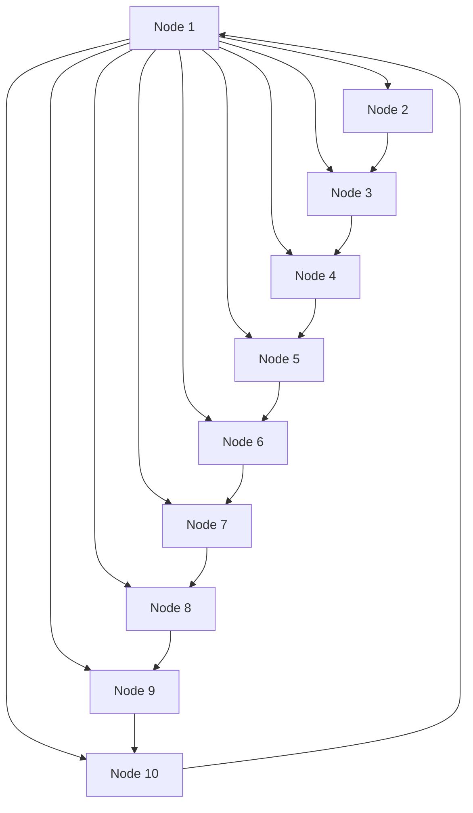
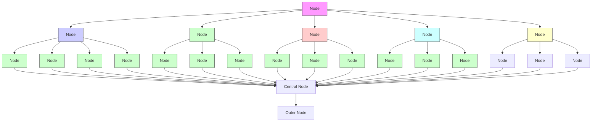
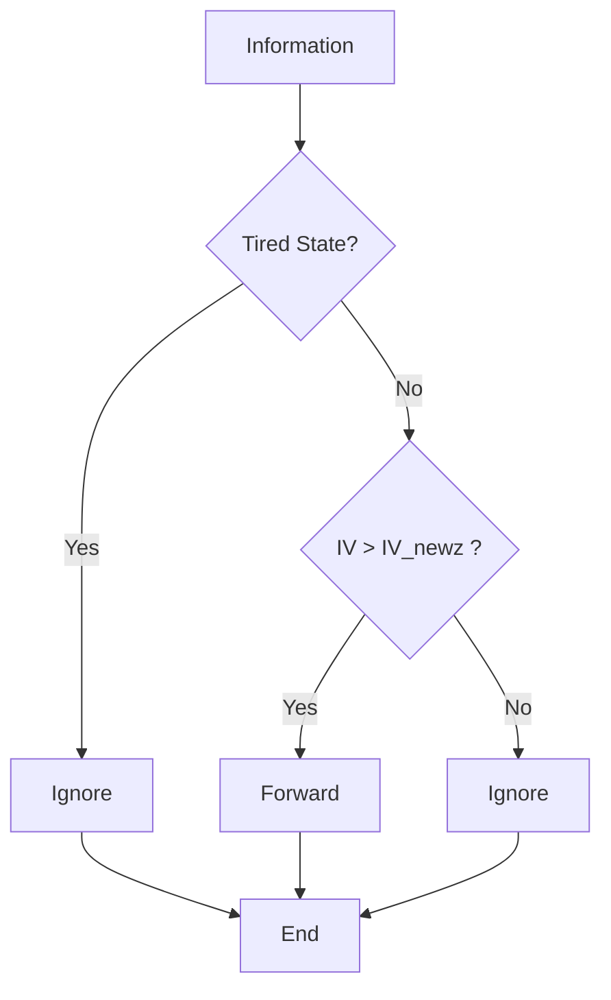
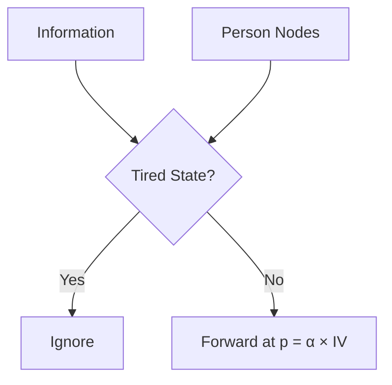
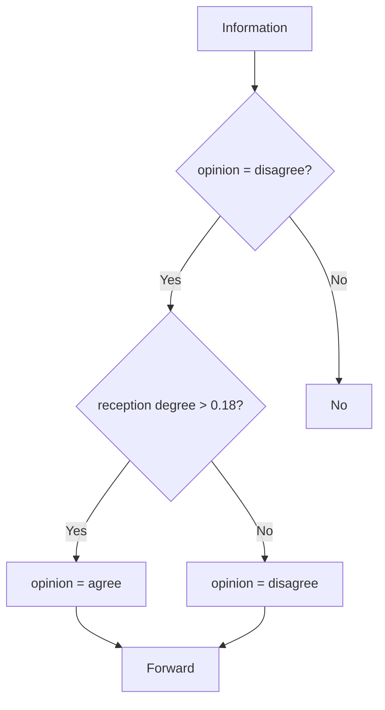

<table><tr><td colspan="2">For office use only</td><td>Team Control Number</td><td colspan="2">For office use only</td></tr><tr><td>T1</td><td>____</td><td>49436</td><td>F1</td><td>____</td></tr><tr><td>T2</td><td>____</td><td></td><td>F2</td><td>____</td></tr><tr><td>T3</td><td>____</td><td>Problem Chosen</td><td>F3</td><td>____</td></tr><tr><td>T4</td><td>____</td><td>D</td><td>F4</td><td>____</td></tr></table>

## 2016

## MCM/ICM

## Summary Sheet

## Who Moved My Opinion?

As society’s networks evolve, information becomes a new kind of property because of its great power to change public opinion. In our paper, we study the flow of information, the evolution of communication networks and the information’s influence on publics.

At the beginning, we describe the topologies of two types of communications which are Mass Communication and Interpersonal Communication. By combining these two types of communications, we construct the single-layer communication network which represents a certain communication technique. Then we study the six periods classified by the techniques and construct the multi-layer information networks based on the single-layer network.

Then we define the three attributes of information which are extremeness, entertainment and newness. By using the concept of Indifference Curve, we determine the inherent value of information based on its attributes. And we find the news according to the Pareto Principle.

Combining the multi-layer information networks and the inherent value of information, we construct the dynamic information flow model. This model is used to describe how information flows within our society’s networks.

In order to validate our models, we find data of a piece of news of BBC Tech and simulate the information flow in today’s society. We find that the real amount of received nodes are 44 and our model’s result is 43.85. Also, the standard error of received nodes’ amount is 4.63. So, the predict capacity and the reliability of our model is great.

We define the capacity as the user percentage, and the relations as the relative strength of networks. By introducing the Life-Cycle Theory, we build a prediction model to predict the relations and capacities of networks in 2050. We find that there will be 7 communication techniques at that time and the strongest network is a rising network whose capacity is 0.9611.

Later, we modify our information flow model by appending the opinion of people. Then we use this model to describe the mechanism of the change of public opinion based on Threshold Effect. Then we analyze the influence of four main parameters in our model and get three main conclusions: (1) Stubborn minorities. (2) Powerful media. (3) More homogeneous more efficient.

Finally, we give the strengths and weaknesses of our models.

## Contents

## 1. Introduction . 3

1.1 Problem Background 3  
1.2 Previous Research. 3  
1.3 Our Work. (

## 2. Assumptions and Justification.. /

## 3. Topology of Information Networks. /

3.1 Two Types of Communications .  
3.2 A Slice of Toast: Construct Single-Layer Network.  
3.3 Slices of Toast: Construct Multi-Layer Networks

## 4. Model of Inherent Value of Information 8

4.1 Attributes of Information 9  
4.2 The Inherent Value of Information. C  
4.3 Pick News out of Information. .10

## 5. The Dynamic Information Flow Model . ..10

5.1 The Forwarding Rules of Media Nodes.  
5.2 The Forwarding Rules of Person Nodes

## 6. How a BBC’s News Disseminated: Validate Our Model 12

6.1 Find Data for Simulation . .12  
6.2 Simulation. ..12  
6.3 Results.... ..13

## 7. The Evolution of Information Networks 13

7.1 Definitions of capacities and relationships of networks .14  
7.2 Emergence of a New Network .14  
7.3 The Peak of Different Networks .14  
7.4 Networks’ Evolution Based on Life-Cycle Theory. .14  
7.5 Prediction of Society’s Information Networks in 2050 .16

## 8. Change People’s Minds: An Opinion-Changing Model. .16

8.1 The Opinion of Publics . .17  
8.2 The Opinion-Changing Mechanism .17

## 9. Sensitivity analyses .. ..18

9.1 More people agree at first, more people agree at last . .18  
9.2 Want a bigger influence, go to find a media 19  
9.3 More Homogeneous, More Efficient 19  
9.4 Media Nodes vs. Person Nodes .20

## 10. Strengths and Weaknesses . .21

10.1 Strengths . .21  
10.2 Weaknesses .... ..21

## 11. References .22

## 1. Introduction

## 1.1 Problem Background

Under a certain network situation, the flow and the speed of information are influenced by two main factors: (1) The inherent value of information. (2) Whether the information is forwarded by big media. However, the evolution of the society’s information network never stops, which allows us to study the evolution of the society’s functions and structure by taking a historical perspective of flow of information.

In the paper, we have been asked to answer the following questions:

Establish models to describe the flow of information and find what makes news.  
Test our models’ reliability and prediction capability.  
Predict the relationships and capacities of 2050’s society information network.  
Define people’s opinion and use our models to find how publics’ interest and opinion can be changed by information.  
Test our model with the four aspects in the flow of information.

## 1.2 Previous Research

Scholars have been studying the society’s information networks for a long time. At the beginning, they use the epidemic model to describe the flow of information. In 1998, D.J.Watts and S.H.Strogatz establish WS Small World Model to show the flow of information and find that the speed of information is fastest in the Small World Model[1]. In 2002, Staniford S, Paxson V and Weaver N use the Random Constant Spread Model to study the information flow on the Internet [2]. D.J.Watts and P.S.Dodds find that the flow of information is easily influenced by the people who are easily influenced [3]. Also, there have been many experts studying the evolution of society’s information networks. In these researches, Ellision.N.B’s and Castells M ‘s work is impressive [4][5].

## 1.3 Our Work

We firstly build a single-layer information networks. Then we form a multi-layer networks by combining single-layer networks with the same nodes. After that, we define the information forward mechanism to allow information to flow in our networks. Secondly, we use a real information flow’s example to validate our model. We find data on the Facebook and use our model to simulate it. Thirdly, we explore the principle of the information networks’ evolution. Then we make a prediction of capacities and relationships in 2050.Fourthly, we model how people’s opinion be changed. According to the threshold effect, we give a certain mechanism of people changing their mind. Finally, we apply our models to analyze how information value, people’s initial opinion, information source and topology influence spread range and public opinion.

## 2. Assumptions and Justification

The information does not change when it flows within the social information networks. In the flow of information, the content of information may change randomly and it is nearly impossible to consider the random changes in the content of information.  
Information’s size is the same. In real world, the size of information will influence the time. However, the size will only change the time and will not influence the flow mode.  
The population does not change. The population changes the nodes. But it will not change the way in which information flows in the networks.  
Information’s value satisfies the Pareto Principle. The Pareto principle states the phenomenon that for many events, roughly 80% of the effects come from 20% of the causes [8]. We assume that the value of information also accords with it.  
Communication between people is directed. Although the relations of people are undirected, the information flow has a direction. Directed communication can describe the information flow better.  
People will forward information that is valuable and consistent with their opinion. In our daily life, people like the information of high inherent value and consistent opinion with them. In addition, they are also willing to share it.  
Once a new technique emerged, the network based on the former technique will begin to decay. Usually, the new technique is better than the old one. Thus people are more willing to use the new technique. The old technique will not decay right away in real world. But the time difference is usually small, so the assumption makes sense.

## 3. Topology of Information Networks

In this section, we will study the topology of information networks and construct multi-layer networks of information flow. First, we introduce two types of communications in information networks. Then we define the nodes and the edges in our models. Furthermore, we use these two types of communications to build a singlelayer network which represents the network of a certain kind of communication technique. Finally, we obtain the multi-layer networks with the consideration of several communication techniques being used at the same time.

## 3.1 Two Types of Communications

In the information networks, there are mainly two types of communications: Mass Communication and Interpersonal Communication. Mass Communications are the communications between media and the publics. And Interpersonal Communications are the communications between people. [6] We will discuss the two types of communications because they have significantly different topologies.

## 3.1.1 The Mass Communication

The Mass Communications developed quickly as technology improved. The first medium come with the emergence of newspaper, which created a brand new way for publics to gain information. With the inventions of the radio and television, media could reach a wider range of publics. And as Internet went into more and more households, media provided publics with varieties of information. One of the characters of Mass Communications is that a medium can reach many people in a star topology, so this kind of topology has a great ability of spreading information. Since media are connected, the topology of the Mass Communication is as follow:

flowchart

Figure 1. The topology of Mass Communication.

In this figure, dots represent publics and triangles represents media. Edges represent the communications between publics and media. Nowadays, these media include broadcasting companies such as ABC (American Broadcasting Corporation), newspapers such as The Times and webs that have relatively great influence.

## 3.1.2 The Interpersonal Communication

The Interpersonal Communications always exist in our society. The very simple example of Interpersonal Communications is speech. But as the techniques improved quickly, the Interpersonal Communications became rich in forms from speech, mail, telegraph, telephone to nowadays instant messages. Abundant techniques make Interpersonal Communications much stronger and more complex. The topology of Interpersonal Communications has random-like edges linking the person nodes. The figure below shows a topology of Interpersonal Communications.

```mermaid
graph TD
  A["Node"] --> B["Node"]
  B --> C["Node"]
  C --> D["Node"]
  D --> E["Node"]
  E --> F["Node"]
  F --> G["Node"]
  G --> H["Node"]
  H --> I["Node"]
  I --> J["Node"]
  J --> K["Node"]
  K --> L["Node"]
  L --> M["Node"]
  M --> N["Node"]
  N --> O["Node"]
  O --> P["Node"]
  P --> Q["Node"]
  Q --> R["Node"]
  R --> S["Node"]
  S --> T["Node"]
  T --> U["Node"]
  U --> V["Node"]
  V --> W["Node"]
  W --> X["Node"]
  X --> Y["Node"]
  Y --> Z["Node"]
```

flowchart

Figure 2. The topology of Interpersonal Communication.

## 3.1.3 Nodes

As we discussed above, we divide nodes into two types: one is media node, the other is person node. Media nodes represent the media that are the centers of Mass Communications. And person nodes represent publics. In our models, all of the nodes have four attributes:

The type. The type of a node shows that this node is whether a media node or person node.  
The degree. The degree of a node is the number of nodes that connect to this node.  
The state. A node can be in one of three states which are

## (1) unknown state

Unknown state means that the node has not received the information. In this state, this node will probably forward this information when receiving it again.

## (2) known state

Known state means that the node has once received the information and not forwarded it. Thus this node may forward this information when receiving it again just as it was in the unknown state.

## (3) Tired state

Tired state implies that the node has received and forwarded the information, so this node will not forward this information when receiving it again.

The reception. The reception is the number of messages that a node received.

So we mathematically define nodes in our models as

$$
V = \{v _ {1}, v _ {2}, v _ {3}, \dots , v _ {k}, \dots \}
$$

$$
v = \text { node } \{\text { type }, \text { degree }, \text { state }, \text { reception } \}
$$

where $k \in N .$ , type  {media, person}, degree  N,

$s t a t e \in \{ u n k n o w n , k n o w n , t i r e d \} \mathrm { a n d } r e c e p t i o n \in N .$

## 3.1.4 Edges

Edges in our model also have several attributes. As we assume that the communication is directed, an edge should indicate its start node and end node. In reality, different kinds of communication tools have different efficiency, so the edge also need to indicate its time which people should spend on transmitting information through this edge. Because we assumed that pieces of information have same sizes, the time spent on certain edge is the same for all information. In addition, the time of an edge include all the time from the start node’s reception to the end node’s reception. Thus we define our edges in our models as

$$
U = \left\{u _ {1}, u _ {2}, u _ {3}, \dots , u _ {k}, \dots \right\}
$$

$$
u = e d g e \{\text { startnode }, \text { endnode }, \text { time } \}
$$

where $k \in N .$ , startnode V, endnode $\in V$ , startnode ≠ endnode and time $> 0$ .

## 3.2 A Slice of Toast: Construct Single-Layer Network

In our paper, we define the network using the same technique such as telegram or mobile phone as a single-layer network.

In reality, there are many kinds of networks including Internet and mobile web. In each network, there are both mass communication and interpersonal communication. For example, many portal webs such as Yahoo and Google send information to their users, which represents mass communication. Also, people forward news in the Internet, which represents interpersonal communication.

In this case, a single-layer network can be shown as the graph below:

flowchart

Figure 3. The schematic diagram of a single-layer network.

In the graph, the triangles represent the media nodes and the dots represent the person nodes. The direction of the arrows means the direction of the flow of information. A single-layer network combines the both types of communications.

There are three kind of edges in the network:

## The edges between dots

The edges between dots mean the relationships between person nodes. In the form of mathematical model, it is:

$$
\vec {E} _ {1} = \left\{\left(v _ {i}, v _ {j}\right) i, j \in n \right\}
$$

n is the whole number of person nodes, $\nu _ { i }$ means the media nodes in the network.

## The edges between triangles

The edges between triangles mean the relationship between media nodes. In the form of mathematical model, it is:

$$
\vec {E} _ {2} = \{(u _ {i}, u _ {j}) i, j \in m \}
$$

m is the whole number of the media nodes, $u _ { i }$ means the media nodes in the network.

## The edges between dots and triangles

The edges between dots and triangles mean the relationship between media nodes and person nodes. In the form of mathematical model, it is:

$$
\vec {E} _ {3} = \left\{\left(u _ {i}, v _ {j}\right) i \in n, j \in m \right\}
$$

$\nu _ { j }$ means the media node in the network, $u _ { i }$ means the person nodes in the network.

## 3.3 Slices of Toast: Construct Multi-Layer Networks

In this part, we build multi-layer networks depending on the inventions of new revolutionary techniques and give a schematic diagram of it.

## 3.3.1 Six Periods

According to the single-layer network’s definition, each time when a new revolutionary technique comes out, there will be a new kind of network coming out. In our paper, we consider five techniques and six periods:

## Period before 1870:

In this period, there is no newspaper, telegraph or anything that can produce media nodes in the network. So in this network, information can only forward by person nodes.

In addition, the period before 1870 is a special period because there are only person nodes in the network, and the network coming out after 1870 are all have both person nodes and media nodes.

## Period around 1870:

In this period, the flow of information can only happen with newspaper, telegraph and talking, so the flow of information is slow and limited. The network now has the same topology with the single-layer network. However, the media nodes are few and the speed of edges is slow.

## Periods around 1920:

In this period, because the radios have become a normal electric appliance, so there is one more network which is depending on radios.

## Periods around 1970:

In this period, the televisions have been popular, so there is one more network which is depending on televisions.

## Periods around 1990:

In this period, people began to connect to the Internet, depending on the development of the Internet, there is one more network.

## Periods around 2010:

In this period, the mobile phones become a new way for people connecting to the world, which creates one new kind network called mobile web.

## 3.3.2 The Multi-Layer Networks

Depending on the six periods stated above, today’s social information network consists of five layers of network which include newspaper network, telegraph network, television network, the Internet and the mobile web. Here is the schematic diagram of the total social network:

```mermaid
graph TD
    subgraph Layer 1
  A["Node"] --> B["Node"]
  B --> C["Node"]
  C --> D["Node"]
  D --> E["Node"]
  E --> F["Node"]
  F --> G["Node"]
  G --> H["Node"]
  H --> I["Node"]
  I --> J["Node"]
  J --> K["Node"]
  K --> L["Node"]
  L --> M["Node"]
  M --> N["Node"]
  N --> O["Node"]
  O --> P["Node"]
  P --> Q["Node"]
  Q --> R["Node"]
  R --> S["Node"]
  S --> T["Node"]
  T --> U["Node"]
  U --> V["Node"]
  V --> W["Node"]
  W --> X["Node"]
  X --> Y["Node"]
  Y --> Z["Node"]
    end
    subgraph Layer 2
  A --> C
  C --> D
  D --> E
  E --> F
  F --> G
  G --> H
  H --> I
  I --> J
  J --> K
  K --> L
  L --> M
  M --> N
  N --> O
  O --> P
  P --> Q
  Q --> R
  R --> S
  S --> T
  T --> U
  U --> V
  V --> W
  W --> X
  X --> Y
  Y --> Z
    end
    style Layer 1 fill:#f9f,stroke:#333
    style Layer 2 fill:#bbf,stroke:#333
```

flowchart

Figure 4. The schematic diagram of the multi-layer communication networks.

Since every layer has similar topology, we just show three layers in the schematic diagram. The bottom layer is the network before 1870, in which information can only flow between person nodes. The second layer is the network based on newspaper and telegraph, in which information can flow between person nodes and media nodes. And the third network is the network based on television.

## 4. Model of Inherent Value of Information

In this section, by using the Indifference Curve, we determine the inherent value of information based on the three attributes of information.

## 4.1 Attributes of Information

The information is a message to be sent and received. In this part, we will define three attributes of the information.

## Extremeness

We define the information’s peculiarity of being beyond a norm in views or actions as the extremeness of information. For example, if the information contains something people can imagine in the normal live, the extremeness of the information is high and it is more valuable.

## Entertainment

We define the peculiarity of information’ ability to renew your health and spirits by enjoyment and relaxation. For example, if the information is about Tayler Swift, the information will be more valuable because it has a high degree of entertainment.

## Newness

We define the information’ peculiarity of being new and fresh.as the information’s newness [7] For example, if the information is about an event that just happens, the information will be more valuable.

The mathematic form of the attributes of information are:

$$
A = (a t t _ {1}, a t t _ {2}, a t t _ {3})
$$

In this equation, $a t t _ { 1 }$ means extremeness, $a t t _ { 2 }$ means entertainment, $a t t _ { 3 }$ means newness.

## 4.2 The Inherent Value of Information

As we assumed that the attributes of information will not change as it flows, inherent value, which is based on attributes of information, will not change too.

In order to define the inherent value of information, we introduce the concept of Indifference Curve. In microeconomics, an Indifference Curve is used to show the combinations of several goods with which a person has the same utility. Different Indifference Curves represent different utility levels where higher Indifferent Curve indicates higher utility. Also, people may have slight difference in preference, so the Indifference Curves vary from person to person. A typical Indifference Curve is usually to be: (1) Defined in the non-negative quadrant; (2) Negatively sloped; (3) Complete; (4) Transitive; (5) Strictly convex. [7]

According to the properties of Indifference Curve above, we can construct the Inherent Value Function:

$$
I V (a t t _ {1}, a t t _ {2}, a t t _ {3}, x, y, z) = a t t _ {1} ^ {x} a t t _ {2} ^ {y} a t t _ {3} ^ {z}
$$

$$
\text { where } a t t _ {1}, a t t _ {2}, a t t _ {3} \in [ 0, 1 ]
$$

$$
x, y, z \sim P.
$$

This function meets all the typical properties of an Indifference Curve. Thus it can be used to measure information’s inherent value based on its attributes. More explicitly, the higher the attributes are, the higher the value of information is. Parameters determine the shape of this Indifferent Curve together, so that these parameters reflect the preference of a certain person. And  is a probability distribution that follow.

## 4.3 Pick News out of Information

In this part, we will give a way to filter and find what qualifies as news depending on the inherent value and Pareto principle.

## 4.3.1 Pareto principle

The Pareto principle states the phenomenon that for many events, roughly 80% of the effects come from 20% of the causes. [8]

## 4.3.2 Model to filter what qualifies as news

According to our assumption that the news value also meets the Pareto principle, 20% of the news contains 80% of the total value of all the news in real world. In former section we defined the Inherent Value Function. As we assumed that information’s three attributes are uniform distributed from 0 to 1. So we just need to find the that divides the information into two parts. One part is the information whose inherent value is the top 20% of all information. And the other part is the information whose inherent value is the bottom 80%.

So we solve the equation:

$$
\iiint_ {a t t _ {1} a t t _ {2} a t t _ {3} \geq I V _ {\text { news }}} a t t _ {1} a t t _ {2} a t t _ {3} = 0. 2
$$

Where $I V _ { n e w s }$ is the threshold for information to become news.

The result of $I V _ { n e w s }$ is 0.2154. In the figure below, the volume above the $I V _ { n e w s }$ new curve is equal to 0.2, and the volume of the rest is equal to 0.8. This indicates that the information whose attributes point is higher than the $I V _ { n e w s }$ curve is news.

3d surface plot

| Entertainment | Newness | Extremeness |
| ------------- | ------- | ----------- |
| 0.2154        | 1       | 0.2154      |
| 0.2154        | 0.2154  | 1           |
| 0.2154        | 1       | 0.2154      |
| 0.2154        | 0.2154  | 1           |
| 0.2154        | 1       | 0.2154      |
| 0.2154        | 0.2154  | 1           |
| 0.2144        | 1       | 0.2154      |
| 0.2144        | 0.2154  | 1           |
| 0.2144        | 1       | 0.2154      |
| 0.2144        | 0.2154  | 1           |
| 0.2144        | 1       | 0.2154      |
| 0.2144        | 0.2254  | 1           |
| 0.2144        | 1       | 0.2254      |
| 0.2144        | 0.2254  | 1           |
| 0.2144        | 1       | 0.2254      |
| 0.2144        | 0.2254  | 1           |
| 0.2144        | 1       | 0.2254      |
| 0            | 1       | 0.2154      |
| 0            | 0.8     | 1           |
| 0            | 0.6     | 1           |
| 0            | 0.4     | 1           |
| 0            | 0.2     | 1           |
| 0            | 0       | 0.2154      |
| 0            | -0.2    | 1           |
| 0            | -0.4    | 1           |
| 0            | -0.6    | 1           |
| 0            | -0.8    | 1           |
| 0            | -1      | 0.2154      |
| 0            | -0.9    | 1           |
| 0            | -0.7    | 1           |
| 0            | -0.5    | 1           |
| 0            | -0.3    | 1           |
| 0            | -0.1    | 1           |
| -0.1          | -0.3    | 1           |
| -0.3          | -0.5    | 1           |
| -0.5          | -0.7    | 1           |
| -0.7          | -0.9    | 1           |
| -0.9          | -1      | 0.2154      |
| -1            | -0.9    | 1           |
| -1            | -0.7    | 1           |
| -1            | -0.5    | 1           |
| -1            | -0.3    | 1           |
| -1            | -0.1    | 1           |
| -1            | 0       | 0.2154      |
| -1            | -0.3    | 1           |
| -1            | -0.5    | 1           |
| -1            | -0.7    | 1           |
| -1            | -0.9    | 1           |
| -1            | -1      | 0.2254      |
| -2            | -0.9    | 1           |
| -3            | -0.7    | 1           |
| -4            | -0.5    | 1           |
| -5            | -0.3    | 1           |
| -6            | -0.1    | 1           |
| -7            | 0       | 0.2254      |
| -8            | -0.3    | 1           |
| -9            | -0.5    | 1           |
| -10           | -0.7    | 1           |
| -11           | -0.9    | 1           |
| -12           | -1      | 0.2354      |
| -13           | -0.9    | 1           |
| -14           | -0.7    | 1           |
| -15           | -0.5    | 1           |
| -16           | -0.3    | 1           |
| -17           | -0.1    | 1           |
| -18           | 0       | 0.2354      |
| -19           | -0.3    | 1           |
| -20           | -0.5    | 1           |
| -21           | -0.7    | 1           |
| -22           | -0.9    | 1           |
| -23           | -1      | 0.2354      |
| -24           | -0.9    | 1           |
| -25           | -0.7    | 1           |
| -26           | -0.5    | 1           |
| -27           | -0.3    | 1           |
| -28           | -0.1    | 1           |
| -29           | 0       | 0.2354      |
| -30           | -0.3    | 1           |
| -31           | -0.5    | 1           |
| -32           | -0.7    | 1           |
| -33           | -0.9    | 1           |
| -34           | -1      | 0.2354      |
| -35           | -0.9    | 1           |
| -36           | -0.7    | 1           |
| -37           | -0.5    | 1           |
| -38           | -0.3    | 1           |
| -39           | -0.1    | 1           |
| -40           | 0       | 0.2354      |
| -41           | -0.3    | 1           |
| -42           | -0.5    | 1           |
| -43           | -0.7    | 1           |
| -44           | -0.9    | 1           |
| -45           | -1      | 0.2354      |
| -46           | -0.9    | 1           |
| -47           | -0.7    | 1           |
| -48           | -0.5    | 1           |
| -49           | -0.3    | 1           |
| -50           | -0.1    | 1           |
| -51           | 0       | 0.2354      |
| -52           | -0.3    | 1           |
| -53           | -0.5    | 1           |
| -54           | -0.7    | 1           |
| -55           | -0.9    | 1           |
| -56           | -1      | 0.2354      |
|
| -57           | -0.9    | 1           |
| -58           | -0.7    | 1           |
| -59           | -0.5    | 1           |
| -60           | -0.3    | 1           |
| -61           | -0.1    | 1           |
| -62           | 0       | 0.2354      |
|
| -63           | -0.3    | 1           |
| -64           | -0.5    | 1           |
| -65           | -0.7    | 1           |
| -66           | -0.9    | 1           |
| -67           | -1      | 0.2354      |
|
| -68           | -0.9    | 1           |
| -69           | -0.7    | 1           |
| -70           | -0.5    | 1           |
| -71           | -0.3    | 1           |
| -72           | -0.1    | 1           |
| -73           | +0       | nan         |
| ... (additional values from visual space) are not provided in the code; they are estimated based on the provided code to generate the actual values from the code image output.

Figure 5. The division of information by $I V _ { n e w s }$ curve

## 5. The Dynamic Information Flow Model

By now we have constructed a multi-layer communication networks which is the base of information flow. In this part, we will construct a dynamic model indicating the processes of information flow. The decisions to forward information are made by individuals which are represented as nodes in our models, so the forwarding rules is related to nodes. Since we have two types of nodes in our models, we will introduce the forwarding rules of media nodes and person nodes relatively. However, the basic assumption of both kinds of forwarding rules is that the higher inherent value will make media and people more willing to forward information.

## 5.1 The Forwarding Rules of Media Nodes

As for media, the main purples of them is to find news and spread it to publics. So the basic forwarding rule of media nodes is to forward the information which satisfies the criterion of news.

Concretely, once a media node received the information, the media node will judge that if this information has been forwarded before. If not, the node will further judge this information by the criterion of news. If this information has not been forwarded and meets the criterion of news, the media node will forward it to all the nodes connected, otherwise ignore it. Thus we give the forwarding rules of media nodes:

flowchart

Figure 6. The forwarding rules of media nodes.

## 5.2 The Forwarding Rules of Person Nodes

Person nodes’ forwarding rules are slightly different from media nodes’. Because the publics are not so strict on spreading the information, any information has a chance to be transmitted. But, similarly, under the basic assumption that people will forward information of higher inherent value, the chance of the information being forwarded increases as its inherent value increases. Thus we define the forwarding probability as follow:

$$
p = \alpha \times I V
$$

Where is a parameter that depends on the publics’ preference, and is the inherent value that depends on the information.

Precisely, in our model, once a person node received the information, it will judge whether this information has been forwarded before. If not, it will send it through every connection at the probability of which is based on the inherent value. The forwarding rules of person nodes are:

flowchart

Figure 7. The forwarding rules of person nodes.

## 6. How a BBC’s News Disseminated: Validate Our Model

Since our model describes the whole information networks within the society, the exact data for our model is hard to find. So we focus on smaller networks which still can validate our model. Because every layer of the multi-layer networks is based on the same person nodes, we can simplify the simulation by using a single-layer network. The cost is just the time of edges becoming identical. Under this idea, we consider a small Internet network within Facebook networks whose data is accessible.

## 6.1 Find Data for Simulation

We choose a piece of news of BBC Tech and acquire data from its website [9] and BBC Tech’s Facebook account. [10]

The news we choose is Google achieves AI 'breakthrough' by beating Go champion which has 440 thousand views. And we find that the Facebook account of BBC Tech is followed by 200 thousand users. We also find the recently most widespread news of BBC Tech, CES 2016: First look at new gadgets on the show floors [11], whose followers reach 770 thousand.

## 6.2 Simulation

We follow two steps to simulate this piece of information’s flow.

## Step 1: Initialization

First, we initialize our networks.

With the data we found, we can estimate the network’s parameters. The BBC Tech is the only media node in the network. Then we consider the 770 thousand followers as the total person nodes and the 200 thousand users as the nodes that directly connect to the BBC Tech. The 440 thousand views can be the number of nodes that receive this news. Because of the limited computing resource, we scale down the real network on the scale of 1/10000. Thus we have 1 media node whose degree is 20 and 77 person nodes. The person nodes’ degrees obey a normal distribution, and the person nodes are randomly connected.

We test for several times, and find the proper parameters of initialization which are shown in the table below.

Table 1. The parameters for simulation

<table><tr><td>Parameters</td><td>Values</td></tr><tr><td>Distribution of degree of person nodes</td><td>N(2,0.6)</td></tr><tr><td>Distribution of degree of the media node</td><td>N(20,0.6)</td></tr><tr><td>time of edges</td><td>2h</td></tr><tr><td>extremeness</td><td>0.8</td></tr><tr><td>entertainment</td><td>0.8</td></tr><tr><td>newness</td><td>0.8</td></tr><tr><td>state of person nodes</td><td>unknown</td></tr><tr><td>state of the media node</td><td>tired</td></tr></table>

## Step 2: Simulation

We capture three figures showing the process of flow.

  
Figure 8. A simulation of information flow

At first, the information is sent by the media node. Then the person nodes are informed of this information gradually until the flow stops.

## 6.3 Results

We simulate for twenty times. The following table shows the important indicators of simulation results. The following figure illustrates the amount of nodes which received the information when the information’s flow stops.

Table 2. Indicators of simulation results

<table><tr><td>Indicators</td><td>Values</td></tr><tr><td>Real amount of received nodes</td><td>44</td></tr><tr><td>Average estimated amount of received nodes</td><td>43.85</td></tr><tr><td>Standard error of received nodes’ amount</td><td>4.63</td></tr></table>

line chart

| Experiments number | Amount of nodes receiving the information at last |
| ------------------ | ----------------------------------------------- |
| 0                  | 50                                              |
| 2                  | 45                                              |
| 4                  | 48                                              |
| 6                  | 43                                              |
| 8                  | 35                                              |
| 10                 | 45                                              |
| 12                 | 48                                              |
| 14                 | 35                                              |
| 16                 | 48                                              |
| 18                 | 43                                              |
| 20                 | 45                                              |

Figure 9. Simulation results of several times

According to the table and the figure, we can conclude that:

Our estimate amount of received nodes is very close to the real amount of received nodes, so our model’s prediction capability is pretty good.  
The standard error of received nodes’ amount is small, so our model is relatively reliable.

## 7. The Evolution of Information Networks

In this section, we will define the relationships and capacities of networks and then we will predict the relationship and capacities of the networks based on the emergence

of new network and life-cycle theory.

## 7.1 Definitions of capacities and relationships of networks

## Capacities of networks

We define the capacity of a network as the ratio of people using the network’s fundamental invention to get information. For example, the capacity of television network represents the ratio of people using televisions to get information. The mathematic form of the capacities are as follows:

$$
c a _ {i} (t) = \frac {p e o _ {i} (t)}{P O}
$$

In this equation, $c a _ { i } ( t )$ means the capacity of network i, $p e o _ { i } ( t )$ means the number of people using network i to get information, PO means the population, t means the time length after 1870.

## Relationships of networks

We define the relationships of networks as the relative capacities of different networks. For example, in 2020, the Internet’s capacity is 60% and the mobile web’s capacity is 75%, then the relationship between Internet and mobile web is that mobile web is strong than Internet.

## 7.2 Emergence of a New Network

There have been five revolutionary technique coming out in the history, which include newspaper, telegraph, television, Internet and mobile phone. The interval between the invention of two revolutionary techniques will decrease in exponential form [6]. Based on that, we define the emergence function of new networks as:

$$
y = \omega e ^ {\lambda t} \quad t \geq 0
$$

In this equation, y means the number of networks, t means the time length after 1870, and are the parameters of the function.

## 7.3 The Peak of Different Networks

For different networks, the peak of the capacity of them are usually very close to 100%. For example, total daily newspaper paid circulation as percentage of households is 120% in the US when the newspaper is in its golden age, and this means the newspaper’s peak capacity is 100% [12]. Also, the television capacity in 1980s is also very close to 100% in the US [6].

So in our paper we consider the peak of each network’s capacity as 100%.

## 7.4 Networks’ Evolution Based on Life-Cycle Theory

## 7.4.1 Life-Cycle Theory

Life-cycle theory is an economic theory which means after one product is invented, its sales volume will grow fast and when the sales volume arrives at its peak, it will decrease slowly. [13]The form of the change in the sales volume looks like the below schematic diagram:

line chart

| t    | sales volume |
| ---- | ------------ |
| 0    | 0            |
| Peak | High         |
| Low  | Low          |

Figure 10. The schematic diagram of a product’s sales volume

## 7.4.2 The Life-Cycle of Networks

As we assume before, when a new revolutionary technique is invented, the former network’s influence will decrease and it means the capacity of the former network begins to decrease. So the life-cycles of networks are just like the schematic diagram below:

line chart

| t    | Capacity |
| ---- | -------- |
| 0    | 0        |
| Peak | 100%     |
| Peak 2 | 100%     |
| Peak 3 | 100%     |

Figure 11. The schematic diagram of networks’ capacity

## 7.4.3 A Simplification of the Evolution of A Network

The evolution of a network will follow the life-cycle of the network. However, there is no need to consider the real life-cycle function of each network since it is too complicated. So we simplify the function in the following way:

## The function before the network arriving at its peak

We choose a linear function as the function before the network arriving at its peak because the linear function has the following advantages:

(1) The linear function can show the tendency of increasing.  
(2) The linear function is a steady function.  
(3) The linear function is simple.

The mathematic form of the linear function is:

$$
c a _ {i} (t) = \varsigma t + \xi
$$

In this equation, t means the time length after 1870, $c a _ { i } ( t )$ is the network’s capacity at t.

Since the former network will begin to decrease when a new technique is invented, the function will pass the point $( t _ { i - 1 } ^ { * } , 0 )$ and the point $( t _ { i } ^ { * } , c a _ { i } ) . ( t _ { i - 1 } ^ { * }$ means the time when network i emerges, $t _ { i } ^ { * }$ means the time when network i capacity arrives at its peak and $c a _ { i }$ means the peak capacity of network i.

## The function after the network arriving at its peak

Observing the schematic diagram of life cycle, we will find that the true function after the peak is a function with three features:

(1) The function value decrease with time;  
(2) The slope of the function increases with time.  
(3) The minimum value of the function is zero.

Basing on the features, we choose the Inverse Function, which form is:

$$
\left\{ \begin{array}{l} c a _ {i} (t) = k _ {i} / t \quad t \geq 0 \\ k _ {i} = c a _ {i} ^ {*} * t _ {i} ^ {*} \end{array} \right.
$$

In this equation, t means the time length after 1870, $c a _ { i } ( t )$ means the capacity of network i at t, $c a _ { i } ^ { * }$ means the peak capacity of network i, and $t _ { i } ^ { * }$ means the t when the network’s capacity begin to decrease (the time when a new technique is invented).

## 7.5 Prediction of Society’s Information Networks in 2050

## 7.5.1 The Numbers of Networks around 2050

As we have defined above, the numbers of network rely on the emergence of networks, which can be describe in the following equation:

$$
y = \omega e ^ {\lambda (t - 1 8 7 0)} \quad t \geq 1 8 7 0
$$

To confirm the value of and $\lambda$ , we collect the time of invention of new technique and then use the least square method [14] to fit the equation. Then we confirm that  is $e ^ { 0 . 0 0 4 3 1 }$ and   is 0.112. Then we can confirm that the networks around 2050 is 7 and the time they emerge are as follows:

Table 3. The time new network emerges

<table><tr><td>The new network number</td><td>Newnet 1</td><td>Newnet 2</td><td>Newnet3</td></tr><tr><td>Time</td><td>2030</td><td>2043</td><td>2055</td></tr></table>

## 7.5.2 The Relations and Capacities of Networks in 2050

Because the simplified life-cycle function’s confirmation just need different networks’ peaks, so we can get all the simplified life-cycle functions of the network basing on the result of network number in 2050 and the result of peak function.

So in 2050, the capacities of different networks are

Table 4. The capacities of different networks in 2050

<table><tr><td>Network</td><td>Newspaper</td><td>Radio</td><td>Television</td><td>Internet</td></tr><tr><td>Capacity</td><td>0.2778</td><td>0.5556</td><td>0.6667</td><td>0.7778</td></tr><tr><td>Network</td><td>Mobile Web</td><td>Newnet 1</td><td>Newnet 2</td><td>*</td></tr><tr><td>Capacity</td><td>0.8889</td><td>0.9611</td><td>0.5883</td><td>*</td></tr></table>

From the results above, we have the following conclusion of the networks’ relationships in 2050:

(1) There will be seven networks in 2050.  
(2) A kind of new technique’s capacity invented in 2030 will be 0.9611 in 2050 and it will be the biggest network in 2050.  
(3) There will be three main networks in 2050, which includes Internet, Mobile Web, and a new network based on the new technique invented in 2043.

## 8. Change People’s Minds: An Opinion-Changing Model

In this section, we introduce the Threshold Effect and modify the dynamic information flow model. Thus we can study the information’s influence on public oplinion.

## 8.1 The Opinion of Publics

In order to add the opinion of people into our model, we append a new attribute, the opinion, to nodes’ attributes. There are so many kinds of opinions in reality, but most of them can be divided into agreements and disagreements about a certain thing. We do not care what the thing exactly is, because we just need to study the change of people’s opinions. Thus the opinion is a binary variant.

From now on, nodes in our modified model can be expressed as

$$
V = \left\{v _ {1}, v _ {2}, v _ {3}, \dots , v _ {k}, \dots \right\}
$$

$\nu = n o d e \{ t y p e , ~ d e g r e e , ~ s t a t e , r e c e p t i o n , o p i n i o n \}$

where k  N, type  {media, person}, degree  N, state  {unknown, known, tired}, reception  N and opinion  {agreement, disagreement}.

## 8.2 The Opinion-Changing Mechanism

After constructing the information flow model, we can talk about the opinion changing mechanism based on it. With the concepts and theories of information influence on networks, we introduce the Threshold Effect. Then we build an opinionchanging mechanism.

## 8.2.1 Threshold Effect

This effect indicates that a person’s opinion will be influenced by the people around. And when the influence reaches a threshold, this person will follow the same opinion as people around him or her. Thus, as a person receives a kind of opinions more and more, the threshold is reached and this person changes himself or herself mind to agree with this information. According to the reference, the threshold of our model is 0.18. [3] Since we assumed that people are more willing to forward information which agrees with them, so the factors that influence the forwarding probability become the inherent value and the opinion of this node rather than only the inherent value as before.

## 8.2.2 Build Opinion-Changing Mechanism

According to the Threshold Effect, we construct the opinion-changing mechanism. At first, all the nodes have their own opinions about a thing. When the information containing a certain opinion about the same thing begins to spread in networks, any node receiving this information will be influenced. Then the node will firstly judge whether it changes its opinion or not by considering its initial opinion. Furthermore, it judges whether it forwards this information or not. With this mechanism, this information flows within the networks and influences people’s opinions.

Because opinion can influence the willingness of people to forward the information, we modify the forwarding probability as follow:

$$
p ^ {*} = p \times o p i n i o n
$$

$$
\text { where   opinion } = \left\{ \begin{array}{l} 1 \text { if   opinion } = \text { agreement } \\ 0 \text { if   opinion } = \text { disagreement } \end{array} \right.
$$

These equations show that a node will not forward the information that contains different opinion. And the forwarding probability is the same as if the node’s

opinion is the same as the information’s.

At last we give the flow chart of the opinion-changing mechanism below.

flowchart

Figure 12. The opinion-changing mechanism.

## 9. Sensitivity analyses

In this section, we change the value of parameters in our model and test the influence on the flow of the information. And we also test the influence on the final public opinion. We change four main parameters in our model, which includes the inherent value of information, people’s initial opinion, the topology of the society’s information network and the source of the information.

## 9.1 More people agree at first, more people agree at last

In real world, people’s initial opinion will influence the flow speed of information For example, if people all agree with the information, they may be more likely to forward it because they are more likely to like it. Also, the flow of information may also change public’s opinion. So we analyze the speed of the flow of information and the final public average opinion when initial public opinion changes. The result are as follows:

scatter plot

| Initial Average Public Opinion | Percentage of Nodes Receiving the Information |
| ------------------------------ | ----------------------------------------------- |
| 0.2                            | 0.96                                            |
| 0.3                            | 0.95                                            |
| 0.4                            | 0.97                                            |
| 0.5                            | 0.96                                            |
| 0.6                            | 0.95                                            |
| 0.7                            | 0.98                                            |
| 0.8                            | 0.96                                            |
| 0.9                            | 0.94                                            |
| 1.0                            | 0.93                                            |

scatter plot

| Initial Average Public Opinion | Final Average Public Opinion |
| ------------------------------ | ---------------------------- |
| 0.2                            | 0.4                          |
| 0.3                            | 0.5                          |
| 0.4                            | 0.6                          |
| 0.5                            | 0.7                          |
| 0.6                            | 0.8                          |
| 0.7                            | 0.9                          |
| 0.8                            | 0.8                          |

Figure 13. The analysis of initial public average opinion

From the result above, we can get the following conclusions:

The influence in flow of information and public’s final average opinion

(1) If more people agree with the information at first, more people will agree with the information at last.  
(2) The initial opinion will not influence the percentage of nodes receiving the information. It is not accorded with the fact a lot, but it is not a big problem.

Interesting finding: there are some people you cannot change.

From the figure, we can see that with the increasing of initial public average opinion, less people is changed. And it means that with there are some people you cannot change their opinion even many people agree with the information.

The practical significance of this finding is: in the real world, there are people who have a poor connection with the information network and this make them cannot receive the information outside, which will make their opinion difficult to change.

## 9.2 Want a bigger influence, go to find a media

As we have state above, the inherent value of the information will influence the flow of information and then it will influence public’s opinion. Since the three attributes we define in the inherent value of information is equal, we will just analyze the influence of extremeness. The result are as follows:

scatterplot

| att1 | Percentage of nodes receiving the information |
| ---- | --------------------------------------------- |
| 0.0  | 0.0                                           |
| 0.1  | 0.0                                           |
| 0.2  | 0.0                                           |
| 0.3  | 0.0                                           |
| 0.4  | 0.0                                           |
| 0.5  | 0.05                                          |
| 0.6  | 0.25                                          |
| 0.7  | 0.35                                          |
| 0.8  | 0.7                                           |
| 0.9  | 0.8                                           |
| 1.0  | 0.9                                           |

scatter plot

| att1 | Final Average Public Opinion |
|------|------------------------------|
| 0.0  | 0.5                          |
| 0.1  | 0.5                          |
| 0.2  | 0.5                          |
| 0.3  | 0.5                          |
| 0.4  | 0.5                          |
| 0.5  | 0.52                         |
| 0.6  | 0.54                         |
| 0.7  | 0.53                         |
| 0.8  | 0.57                         |
| 0.9  | 0.58                         |
| 1.0  | 0.60                         |

Figure 14. The analysis of information’s inherent value

From the result above, we can get the following conclusion:

## The influence in flow of information and public’s final average opinion

From the figure, we can see that the influence of inherent value in the flow of information and public’s opinion is similar. The bigger the inherent value of information is, the more the change of public’s opinion and the flow of information.

## Interesting finding: people’s opinions are changed suddenly.

We can find that when att1 arrive the value of 0.5, people’s opinion will suddenly change a lot, while at first public’s opinion nearly do not change.

The reason this happens is that when att1’s value is bigger than 0.5, the media nodes will begin to forward the information, and this result in much more people get the information and then public’s opinion is changed.

This inform us that in the real world, if you want you information have a big influence, you will have to find some media or important person who have many fans to help you. So if you want a big influence, go to find a media.

## 9.3 More Homogeneous, More Efficient

It is easy to think of that different topologies of information networks will lead to different ability of spreading information and changing publics’ opinions. So we adjust the standard deviation of degrees in order to find the influence of changing the topology of the networks.

scatter plot

| Standard Deviation of Degrees | Percentage of Nodes Receiving the Information |
| ----------------------------- | ---------------------------------------------- |
| 1                             | 0.9                                            |
| 2                             | 0.9                                            |
| 3                             | 0.9                                            |
| 4                             | 0.9                                            |
| 5                             | 0.9                                            |
| 6                             | 0.9                                            |
| 7                             | 0.9                                            |
| 8                             | 0.9                                            |
| 9                             | 0.9                                            |
| 10                            | 0.9                                            |

scatter plot

| Standard Deviation of Degree | Final Public Average Opinion |
| ----------------------------- | ---------------------------- |
| 1                             | 0.58                         |
| 2                             | 0.59                         |
| 3                             | 0.58                         |
| 4                             | 0.57                         |
| 5                             | 0.58                         |
| 6                             | 0.57                         |
| 7                             | 0.59                         |
| 8                             | 0.57                         |
| 9                             | 0.59                         |
| 10                            | 0.58                         |

Figure 15. Final public opinion vs. standard deviation of nodes’ degrees.

## The spread of information

As shown in the left of the figure 9, outliers become more as standard deviation increases. More seriously, some information even did not be forwarded, causing the percentage of nodes receiving the information being nearly zero. The reason is that the inhomogeneous connections between nodes give information a higher chance to be trapped in a little range. Thus information is not as easy to be spread as in a homogeneous topology.

## The opinion of the publics

As shown in the right of the figure 9, the same pattern as spread of information is found. It is because the information is harder to be spread in inhomogeneous networks, and opinions of publics sometimes cannot be influenced that much.

These two figures shows that the more homogeneous the networks are, the better the efficiency is. High-performance networks should be as homogeneous as they could be.

## 9.4 Media Nodes vs. Person Nodes

In order to study the difference of influence of media nodes and person nodes, we change the start node of the information.

scatterplot

| Information Source | Percentage of nodes receiving the information | Final Average Public Opinion |
| --- | --- | --- |
| person | 0.585 | 0.85 |
| person | 0.59 | 0.83 |
| person | 0.592 | 0.81 |
| person | 0.594 | 0.79 |
| person | 0.596 | 0.77 |
| person | 0.598 | 0.75 |
| person | 0.60 | 0.73 |
| person | 0.602 | 0.71 |
| person | 0.604 | 0.69 |
| person | 0.606 | 0.67 |
| person | 0.608 | 0.65 |
| person | 0.61 | 0.63 |
| person | 0.612 | 0.61 |
| person | 0.614 | 0.59 |
| person | 0.616 | 0.57 |
| person | 0.618 | 0.55 |
| person | 0.62 | 0.53 |
| person | 0.622 | 0.51 |
| person | 0.624 | 0.49 |
| person | 0.626 | 0.47 |
| person | 0.628 | 0.45 |
| person | 0.63 | 0.43 |
| person | 0.632 | 0.41 |
| person | 0.634 | 0.39 |
| person | 0.636 | 0.37 |
| person | 0.638 | 0.35 |
| person | 0.64 | 0.33 |
| person | 0.642 | 0.31 |
| person | 0.644 | 0.29 |
| person | 0.646 | 0.27 |
| person | 0.648 | 0.25 |
| person | 0.65 | 0.23 |
| person | 0.652 | 0.21 |
| person | 0.654 | 0.19 |
| person | 0.656 | 0.17 |
| person | 0.658 | 0.15 |
| person | 0.66 | 0.13 |
| person | 0.662 | 0.11 |
| person | 0.664 | 0.09 |
| person | 0.666 | 0.07 |
| person | 0.668 | 0.05 |
| person | 0.67 | 0.03 |
| person | 0.672 | 0.01 |
| person | 0.674 | -0.01 |
| person | 0.676 | -0.03 |
| person | 0.678 | -0.05 |
| person | 0.68 | -0.07 |
| person | 0.682 | -0.09 |
| person | 0.684 | -0.11 |
| person | 0.686 | -0.13 |
| person | 0.688 | -0.15 |
| person | 0.69 | -0.17 |
| person | 0.692 | -0.19 |
| person | 0.694 | -0.21 |
| person | 0.696 | -0.23 |
| person | 0.698 | -0.25 |
| person | 0.7 | -0.27 |
| person | 0.7 | -0.29 |
| person | 0.7 | -0.31 |
| person | 0.7 | -0.33 |
| person | 0.7 | -0.35 |
| person | 0.7 | -0.37 |
| person | 0.7 | -0.39 |
| person | 0.7 | -0.41 |
| person | 0.7 | -0.43 |
| person | 0.7 | -0.45 |
| person | 0.7 | -0.47 |
| person | 0.7 | -0.49 |
| person | 0.7 | -0.51 |
| person | 0.7 | -0.53 |
| person | 0.7 | -0.55 |
| person | 0.7 | -0.57 |
| person | 0.7 | -0.59 |
| person | 0.7 | -0.61 |
| person | 0.7 | -0.63 |
| person | 0.7 | -0.65 |
| person | 0.7 | -0.67 |
| person | 0.7 | -0.69 |
| person | 0.7 | -0.71 |
| person | 0.7 | -0.73 |
| person | 0.7 | -0.75 |
| person | 0.7 | -0.77 |
| person | 0.7 | -0.79 |
| person | 0.7 | -0.81 |
| person | 0.7 | -0.83 |
| person | 0.7 | -0.85 |
| person | 0.7 | -0.87 |
| person | 0.7 | -0.89 |
| person | 0.7 | -0.91 |
| person | 0.7 | -0.93 |
| person | 0.7 | -0.95 |
| media | — | — |
| media | — | — |
| media | — | — |
| media | — | — |
| media | — | — |
| media | — | — |
| media | — | — |
| media | — | — |
| media | — | — |
| media | — | — |
| media | — | — |
| media | — | — |
| media | — | — |
| media | — | — |
| media | — | — |
| media | — | — |
| media | — | — |
| media | — | — |
| media | — | — |
| media | — | — |
| media | — | — |
| media | — | — |
| media | — | — |
| media | — | — |
| media | — | — |
| media | — | — |
| media | — | — |
| media | — | — |
| media | — | — |
| media | — | — |
| media | — | — |
| media | — | — |
| media | — | — |
| media | — | — |
| media | — | — |
| media | — | — |
| media | — | — |
| media | — | — |
| media | — | — |
| media | — | — |
| media | — | — (not labeled) |

Figure 16. The influence of media nodes vs. person nodes

This figure shows that the different start nodes will significantly change the effect of information. If the information starts at a media node, it will always be spread to a wide range and change many people’s opinions. But if the information starts at a person node, it will be less effective and less steady.

This result can be very meaningful in reality. It indicates that the media have much more power in spreading information than a normal person. So controlling a country’s mainstream media can make you control its citizens’ minds. This phenomenon can be find in reality. A very typical example is North Korea where citizens’ opinions are strictly controlled. Citizens there have a biased view of world under this strict information control.

## 10.Strengths and Weaknesses

## 10.1 Strengths

The simulation result of our model is appealing. As we have shown before, almost all the simulation of our model is according with the real world situation. And this means our model is a goof tool to describe society’s information flow.  
Our model is steady. The results of our model is steady in our simulation. And this means using our model to describe the flow of information is feasible in most times.  
Proper to describe the evolution of society’s information networks. Since we divide the society’s information networks basing on the technique, considering the evolution of society’s network will be easy using our model.  
Introducing theories of different subjects. In our model, we introduce the Pareto Principle, Indifference Curve and the Life-cycle Theory. This makes our model more creative and impressive.

## 10.2 Weaknesses

Too many assumptions in the model. There are eight assumptions in our model, which will make our model too abstract.  
The data we use to test our model is small. This may result in the wrong answer. But as we show above, the characteristic of the information flow is similar to the real world situation. So this may not be a big problem of our model.

## 11.References

[1] Watts D J, Strogatz S H. Collective dynamics of ‘small-world’networks [J]. nature, 1998, 393(6684): 440-442.  
[2] Staniford S, Paxson V, Weaver N. How to Own the Internet in Your Spare Ti me[C]//USENIX Security Symposium. 2002: 149-167.  
[3] Watts D J, Dodds P S. Influentials, networks, and public opinion format on[J]. Journal of consumer research, 2007, 34(4): 441-458.  
[4] Ellison N B. Social network sites: Definition, history, and scholarship[J]. Journal of Computer‐Mediated Communication, 2007, 13(1): 210-230.  
[5] Castells M. The rise of the network society: The information age: Econo my, society, and culture[M]. John Wiley & Sons, 2011.  
[6] http://2012books.lardbucket.org/books/a-primer-on-communication-studies/s 15-media-technology-andcommunica.html  
[7] https://en.wikipedia.org/wiki/Indifference\_curve  
[8] https://en.wikipedia.org/wiki/Pareto\_principle  
[9] Watts D J, Dodds P S. Influentials, networks, and public opinion form ation[J]. Journal of consumer research, 2007, 34(4): 441-458.  
[10] http://www.bbc.com/news/technology-35420579  
[11] https://www.facebook.com/bbctechtent/  
[12] http://media-cmi.com/downloads/Sixty\_Years\_Daily\_Newspaper\_Circulati on\_Trends\_050611.pdf  
[13] https://en.wikipedia.org/wiki/Product\_life-cycle\_theory  
[14] Draper N R, Smith H, Pownell E. Applied regression analysis[M]. Ne w York: Wiley, 1966.