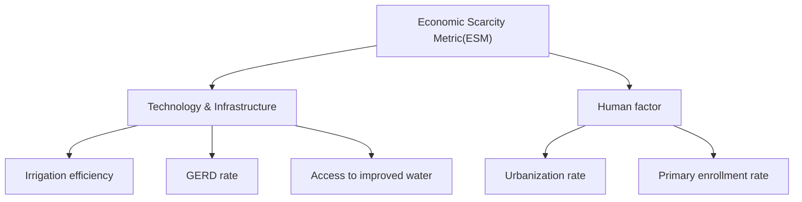

# 2016

# MCM/ICM

# Summary Sheet

## Summary

Our planet is getting thirstier and thirstier. Water scarcity has become an increasingly hard but urgent problem. To make contributions to solve the water problems, we proposed a metric model to identify the ability of each country to manage water scarcity, and offered solutions to a country considered water over-loaded.

First we developed our metric, Total Scarcity Metric, and divided it into Physical Scarcity Metric (affected by environmental factors and population) and Economic Scarcity Metric (affected by social factors other than population) by the two causes of water scarcity. The detailed factors were selected to make a difference. We made some adjustments to an indicator we found widely-used in the literatures, and determine Physical Scarcity Metric based on it. For Economic Scarcity Metric, we built a factor model with its weight calculated by Grey Relational Analysis. To combine them, we introduced a parameter revealing the relative emphasis between physical scarcity and economic scarcity of each country. Its value varies by countries, so it’s more proper to discuss it in the country level. Then we used data from 83 countries to verify our model, and found a similar water scarcity distribution compared to UN’s “World Scarcity Map”. By providing sensitivity analysis on ,we indicated the importance of its selection for each country.

Based on that result, we chose Pakistan for further analysis. First we discussed the possible factors accounting for its current water situation, including 2 environmental factors and 5 social factors. We made it clear how and what kind of scarcity they affect. To forecast the water situation in 2030 by our metric, we determined the predicted value of influential factors by Grey Forecasting Model and Regression Analysis with little error. We found Pakistan less susceptible to economic scarcity but more to physical scarcity at that time. Its total water scarcity will be alleviated.

Next, we devised an intervention plan to improve the ability of Pakistan to deal with its water scarcity. The plan is made up of physical scarcity plan and economic scarcity plan. Considering the impact of each policy, we analyzed the overall strengths and weaknesses in a larger context. To see how our plan performs, we ran our model again under some hypothesized settings. Although Pakistan performed better with our plan and its economic scarcity can be alleviated, it will still face water scarcity, especially physical water scarcity. In conclusion, Pakistan still has a long way to go.

## Contents

## 1 Introductions 2

## 2 General Assumptions and Variable Description 2

2.1 General Assumptions . . 2  
2.2 Variable Description 3

## 3 Total Scarcity Metric Model 3

3.1 Review of Literatures . 4  
3.2 Construction of PSM 6  
3.3 Construction of ESM 7  
3.4 Construction of TSM 10  
3.5 Verification and Sensitivity Analysis . . 10

## 4 Water Situation in Pakistan 12

4.1 The Reasons for Current Scarcity 12  
4.2 Forecasting the future situation 13

4.2.1 Assumptions 13  
4.2.2 Grey Forecasting Model . 14  
4.2.3 Regression Analysis 15  
4.2.4 Forecasting Results . . 15

## 5 Our Plan for Pakistan 16

5.1 Plan Statement . . 16  
5.2 How Our Plan Changes Water Scarcity . . 17

5.2.1 Hypothesized Settings . . 18  
5.2.2 The Performance 18  
5.2.3 Sensitivity Analysis 19

## 6 Conclusions 19

## 1 Introductions

The world’s water situation engenders little optimism. About one quarter of the world’s population is experiencing water scarcity. Moreover, water resources are unevenly distributed and extremely scarce in Africa and the Middle East. Water scarcity further incurs many international issues such as international conflicts, environmental refugees and disease caused by water pollution, making a more unstable world.

The current water shortage should be blamed on excessive activities of the human beings: (a) human’s demand on water resources is larger and larger with the increasing world population; (b) the over-exploitation on water resources speed up the depletion; (c) the water contamination worsens the water quality; (d) the excessive emission of greenhouse gas results in a warmer world and the frequent occurrence of extreme water. Historically, people had taken many measures to alleviate water shortage. Sprinkler irrigation and drip irrigation technology can greatly improve the use efficiency of water. Also people are trying to exploit potential water resources to make some contributions. But still, many countries face severe water scarcity.

Our objective is to develop an evaluation system to measure each country’s ability to provide clean water to meet the need of its citizens. It is consistent with the ability of managing the water scarcity, which is affected by environmental and social drivers. We try to find these drivers and provide effective water strategy for countries based on them.

In this paper, we develop a metric, named Total Scarcity Metric (TSM), to measure water scarcity for each country, and help Pakistan to handle its serious water situation. In our TSM model, we divide water scarcity into physical water scarcity and economic water scarcity, and develop corresponding metrics by different approaches. Then, we make a research on how and why water is scarce in Pakistan and forecast the future situation. Based on that, we design a plan for Pakistan and predict its performance.

We list our general assumptions in section 2, while some hypotheses for specific model are in section 4 and 5. We discuss our TSM model and its verification in section 3. In section 4, we analyze current and future water situation in Pakistan qualitatively and quantitatively. Our intervention plan is discussed in section 5, including its statement and future performance. Finally, we make the conclusion and discuss the strengths and weaknesses.

## 2 General Assumptions and Variable Description

## 2.1 General Assumptions

• The data we collect from online databases is accurate, reliable and mutually consistent. Because our data sources are all websites of international organizations, it’s reasonable to assume the high quality of their data.  
• In model verification, the indicator data from countries that we neglect has little impact on the calculation of the weights and the results.  
• Pakistan’s development will follow the numerous trends in worldwide development of countries based on various factors. This assumption enables us to predict Pakistan’s development using the result of relationship quantization among influential factors determined by worldwide data.  
• In the coming 15 years, Pakistan has a stable political environment. This assumption implies the minimal impact of political situation, terrorist activities and diplomatic disputes

on the development of Pakistan and the implementation of our plan. We can then forecast a stable trend of the influential factor of water scarcity.

• The total water withdrawal is made up of water withdrawal for agriculture, industrial and municipal use. It’s because water withdrawal for environmental use is insignificant compared to that for the other three sectors, and the corresponding data is lacking. Under this assumption, we can add the value of water withdrawal for the three sectors to get the total water withdrawal value.  
• For TSM model (model in section 3), we don’t consider time factor. Thus we can use the data available in the latest year to verify our model. But time is an important factor in our forecasting.  
• Besides these general assumptions, there are also hypotheses we make for the specific models. We will present and discuss them in section 4 and 5.

## 2.2 Variable Description

<table><tr><td>Abbreviation</td><td>Full Name</td><td>First appearing page</td></tr><tr><td>TSM</td><td>Total Scarcity Metric</td><td>2</td></tr><tr><td>PWS</td><td>Physical Water Scarcity</td><td>3</td></tr><tr><td>EWS</td><td>Economic Water Scarcity</td><td>3</td></tr><tr><td>PSM</td><td>Physical Scarcity Metric</td><td>3</td></tr><tr><td>ESM</td><td>Economic Scarcity Metric</td><td>3</td></tr><tr><td>HDI</td><td>Human Development Index</td><td>4</td></tr><tr><td>CR</td><td>Criticality Ratio</td><td>4</td></tr><tr><td>CI</td><td>Criticality Index</td><td>4</td></tr><tr><td>TRWR</td><td>Total RenewableWater Resources</td><td>4</td></tr><tr><td>IRWR</td><td>Internal Renewable Water Resources</td><td>6</td></tr><tr><td>CF</td><td>Climate Factor</td><td>6</td></tr><tr><td>WRI</td><td>World Resources Institute</td><td>6</td></tr><tr><td>IV</td><td>Interannual Variability</td><td>6</td></tr><tr><td>SV</td><td>Seasonal Variability</td><td>6</td></tr><tr><td>FO</td><td>Flood Occurrence</td><td>6</td></tr><tr><td>GRA</td><td>Grey Relational Analysis</td><td>6</td></tr><tr><td>ACR</td><td>Adjusted CR</td><td>6</td></tr><tr><td>WAPC</td><td>Water Availability per Capita</td><td>6</td></tr><tr><td>GRA</td><td>Grey Relational Analysis</td><td>6</td></tr><tr><td>GFM</td><td>Grey Forecasting Model</td><td>7</td></tr></table>

Table 1: Variable Description

## 3 Total Scarcity Metric Model

In this section, we construct a metric incorporating a country’s ability to provide improved water to meet the needs, named Total Scarcity Metric (TSM). It measures the ability to manage water scarcity for a country. A larger TSM implies a weaker ability for a country to handle the balance between improved water supply and demand, and a harder work for it to solve its water problem.

First we go through the definition of water scarcity. Intuitively, water scarcity is the lack of sufficient available water resources to meet the needs in a region.On the basis of its cause, water scarcity can be categorized into physical water scarcity and economic water scarcity. Physical water scarcity (PWS) is the result of inadequate water resources to satisfy the demand or use of a country or a region conditioned on the full use efficiency of these resources, while Economic water scarcity (EWS) is the scarcity rising from the incomplete use of water in a country or a region [1]. By these definitions, we think that EWS depends more on social factors incorporating the ability to fully utilize water, while some other social factors (e.g. population) and environmental factors (such as climate or topography), mainly affect PWS1. So it’s natural to divide the metric into two components. We name them Physical Scarcity Metric (PSM) and Economic Scarcity Metric (ESM), respectively. We hypothesize the increasing values of PSM and ESM mean worse scarcity situation.

## 3.1 Review of Literatures

Literatures provide a wide range of indicators measuring water scarcity. So before we conduct the construction of PSM and ESM, we go through these indicators, then choose three indicators that are most commonly used and related to the objectives and themes of this paper, to analyze their strengths and limitations.[2][3]

## The Falkenmark Indicator and its improved version

The Falkenmark Indicator[4] was defined as total annual renewable water resources per capita, which can be a measure of water scarcity. Table 2 shows the partition of water scarcity based on this indicator. The first and second column of the table show the two difference thresholds[5], where the second thresholds are more frequently used.

<table><tr><td>Original thresholds</td><td>Aapted Thresholds</td><td>The State of Water Scarcity</td></tr><tr><td>&gt;2000</td><td>&gt;1700</td><td>Water Sufficiency</td></tr><tr><td>1000-2000</td><td>1000-1700</td><td>Water Stress</td></tr><tr><td>600-1000</td><td>500-1000</td><td>Water Scarcity</td></tr><tr><td>&lt;600</td><td>&lt;500</td><td>Water Absolute Scarcity</td></tr></table>

Unit:m3/cap. Source:Perveen and James(2010)

Table 2: The Falkenmark Indicator.

Due to its extreme simplicity and the easy access to the data, the Falkenmark Indicator becomes the most widespread metric of water scarcity[6]. However, its main limitations are obvious: (a) it fails to take enough environmental and social factors into account, thus it’s not convincing even as an indicator of physical scarcity; (b) the identification of the thresholds is too arbitrary.

As an improvement on the Falkenmark Indicator, Ohlsson(1998) incorporated some social factors into his new index, the Social Water Stress Index[7] . He considered wealth, health and education level and thus used Human Development Index(HDI)2 as a weight of the Falkenmark Indicator.

## Criticality Ratio and Criticality Index

The Criticality Ratio (CR) determines "the ratio of water use to water availability in a watershed or country"(Alcamo et al.,1997 )[8], or equivalently, "the ratio of water withdrawals for human use to total renewable water resources" (Alcamo et al.,2000 )[9], i.e.

$$
C R = \frac {\text { Total   Water   Withdrawal }}{\text { Total   Renewable   Water   Resources(TRWR) }} \tag {1}
$$

The numerator of equation (1) is the withdrawal from surface water or groundwater for agricultural, industrial and municipal use, while the denominator includes surface runoff and groundwater recharge[3]. The threshold value of 0.4 is commonly used to determine the boundary of water stress. The larger CR value implies the more severe water situation.

As the Falkenmark Indicator, the intuition and calculation of CR are simple enough so that it can be demonstrated to the public. Furthermore, compared to the Falkenmark Indicator, it applies not only the water availability, but also the water use, which is determined by the water demands. Considering its drawbacks, (a) this ratio uses the more objective indicator, the water withdrawals, rather than the more subjective indicator, the water demands, so it may loss some power in measuring the water demands; (b) according to the definition of "water use", the ratio neglects the return flow of water, which is an important source of "actual" water use; (c) some other factors, such as population, are not incorporated, at least directly incorporated in it. Also there are literatures (e.g. Dow et al., 2005)[10] criticizing the setting of the threshold of 0.4.

The Criticality Index (CI) was proposed based on the work of Kulshreshtha (1993)[11], where he provided a metric table concerning Use-Availability ratio (%) and supply per capita(m3). In CI, the former is CR value and the latter is the water availability per capita (measured by the internal renewable water resources(IRWR) per capita). Table 3[3] displays the Kulshreshtha’s table adapted for CI, where the 4 different values shows 4 different levels of water scarcity.

CI provides a similarly simple but more accurate estimation of water scarcity than CR, because it considers water scarcity from both supply pressure and usage pressure of water, and adds the population factor into analysis. But other main drawbacks of CR still remain in CI.

<table><tr><td rowspan="2">Per Capita Water Availability [ $m^3$ ]</td><td colspan="4">CR Value</td></tr><tr><td>&lt;0.4</td><td>0.4-0.6</td><td>0.6-0.8</td><td>&gt;0.8</td></tr><tr><td>&lt;2000</td><td>2</td><td>3</td><td>4</td><td>4</td></tr><tr><td>2000-10000</td><td>1</td><td>2</td><td>3</td><td>4</td></tr><tr><td>&gt;10000</td><td>1</td><td>1</td><td>2</td><td>4</td></tr></table>

1-water surplus; 2-marginally vulnerable;  
3-water stress; 4-water scarcity. Source:Naf(2008)

Table 3: CI Value.

## IWMI Analysis

The IWMI Analysis conducted by the International Water Management Institute is a comprehensive analysis including the identification and forecast of water scarcity based on water supply and demand situation of a country, and grouping of these countries by their abilities to deal with water scarcity. To forecast the future, IWMI developed two scenarios only different in the water use in agricultural sector, then several settings regarding projected water use in three sectors are made based on the scenarios. IWMI chose CR to discriminate physical scarcity, while the growth of total water withdrawal was used to differentiate several levels of economic scarcity.[12]

This method contains an integrated analysis framework for forecasting the water scarcity by water supply and demand. Therefore, its analysis result, or "World Scarcity Map", is often quoted in literatures. However, this analysis is too intricate and complex to be understood and implemented. Besides, it relies much on personal judgements (especially in the setting of the future scenarios) and the access of data.

## 3.2 Construction of PSM

Taken all these indicators into consideration, (a)the Falkenmark Indicator is too "naive" for our analysis, that is, the factors it involves are far less sufficient to meet our needs; (b) the Social Water Stress Index is not applicable to measure PWS because the components of HDI have more closer effects on EWS; (c) the IWMI analysis framework is too complicate to handle, although its results are most convincing. We finally choose CR and CI as the starting point of our construction of PSM. Then we want to eliminate the drawbacks of CI as much as possible.

## Water use 6= water demand

We divide water demand into two components, the "object" component and the "subject" component. The "object" component is people’s actual use of water, thus can be measured by water use of people. The "subject" component concerns about the "efficiency" of water, thus is affected by social and economic factors, such as the relevant technology and infrastructures, and people’s awareness of water conservation. By combination of two components, we get the personal requirements to support their production and living, i.e. the water demand. Thus, we consider the "subject" component in the ESM, and remain the "object" component here. By this way, we completely incorporate water demand in our model.

## The neglect of reused water

We still consider not to involve the return flow of water, because (a)the quality of reused water varies by countries, some may be very poor; (b)it’s difficult to develop an indicator balancing between the correct expression of its meanings and the data availability. Besides, there exist literatures that neglected it but still performed well (e.g. Alcamo et al., 2000)[World Water in 2025].

## Insufficient factors

We make an adjustment on CR to alleviate this limitation. We develop a "climate factor"(CF) based on the linear combination of three indicators created by the World Resources Institute (WRI), Interannual Variability (IV), Seasonal Variability(SV) and Flood Occurrence(FO). All 3 indicators ranges from 0-5. 3 [13][14]

Based on the Grey Relational Analysis (GRA)4, we calculate the weight of the three indicators on CF, to give the equation (2):

$$
C F = \omega_ {1} F O + \omega_ {2} I V + \omega_ {3} S V, \tag {2}
$$

where $\omega _ { 1 } , \omega _ { 2 }$ and ω are the respective weight of three indicators, and their sum equals to 1. By equation (2), the increases in the value of IV, SV and FO, it lead to the larger value of CF, resulting in the worse and the more volatile climate condition for water supply. At the same time, larger value of CR implies more severe water resource situation. Therefore, we can multiple CF to the original CR gets the equation (3) for adjusted CR (ACR).

$$
A C R = C R \times C F = \frac {\text { Total   Water   Withdrawal }}{\text { TRWR }} \times C F \tag {3}
$$

## Adjustments for alternative water sources

We provide some discussions on two alternative water sources generated by human technology, rainfall harvesting technology, aquifers and desalinization plants. In some countries, both of them have become an important provider of additional water resources. But in most countries, the immature development of them restrains the application. Due to the data access limitation, we can only consider supply from desalinization plants in this paper. We add the desalinated water produced to the total renewable water resources per capita in the denominator side, then the equation (3) becomes

$$
A C R = \frac {\text { Total   Water   Withdrawal }}{\text { TRWR } + \text { Desalination   Water   Produced }} \times C F \tag {4}
$$

The value of CI is determined by the Table 4. Table 4 inherits the structure of Table 3, only changing the CR to ACR and the scales of corresponding thresholds. As shown in the table, countries with larger ACR values and lower water availability per capita (WAPC) values face severe physical scarcity, while those with lower ACR and larger WAPC values nearly have no water stress. We also see that ACR is more dominant than WAPC because countries with larger ACR and WAPC values are regarded as water scarcity countries, but those with lower ACR and WAPC values are only classified as marginally vulnerable countries or water stress countries.

<table><tr><td rowspan="2">Per Capita Water Availability [ $m^3$ ]</td><td colspan="4">ACR Value</td></tr><tr><td>&lt;0.8</td><td>0.8-1.2</td><td>1.2-1.6</td><td>&gt;1.6</td></tr><tr><td>&lt;2000</td><td>2</td><td>3</td><td>4</td><td>4</td></tr><tr><td>2000-10000</td><td>1</td><td>2</td><td>3</td><td>4</td></tr><tr><td>&gt;10000</td><td>1</td><td>1</td><td>2</td><td>4</td></tr></table>

1-water surplus; 2-marginally vulnerable;  
3-water stress;4-water scarcity.

Table 4: CI Value.

Actually, it’s hard to make a decision between ACR and CI. CI takes a comprehensive consideration on water scarcity, but it cannot have continuous values, so it may be hard to compare the performance among the countries that the same CI value. For ACR, it is a continuous indicator, but some factors, such as population, fail to be directly incorporated. So we present values of both indicators where we use the model. Particularly, we use CI as a measure of PSM for the model verification, while use ACR in the sensitivity analysis in section 4 and 5.

## 3.3 Construction of ESM

## Influence Factors

There are many social and economic factors affecting EWS, most of which can be categorized into the development of water technology and infrastructure, and people’s attitude to water saving. We build a factor model with the weight determined by the Grey Relational Analysis (GRA) to develop the ESM for a country. Figure 1 shows a map of main factors that influence the EWS.

We provide some definition for factors in Figure 1 (According to World Bank [World Bank website]) and interpret them.

flowchart

Figure 1: Main Factors of ESM

• Urbanization rate is the rate of urban population (i.e. people living in urban areas) to total population. Because urban people are obviously more aware of the importance of water conservation and have better water use habit than rural people, the increase of this indicator shows a less economic scarcity.  
• Primary enrollment rate is total number of students enrolled for primary education in their theoretical age, divided by the total population in that age group. It estimates the degree of population receiving basic education, which contains the education for water and water conservation.  
• Access to improved water refers to the percentage of the population using an improved drinking water source. It shows a country’s technology to transfer water resources to improved drinking water. It was also suggested by UN-Water to monitor the sustainable development of water.[15]  
• Irrigation efficiency is the ratio of irrigation water requirement per year to irrigation water withdrawal per year. It’s often referred to "water use efficiency" (e.g. FAO, 2012c)[16] in agriculture. Moreover, from the data of FAO[13], agriculture water withdrawal accounts for 60% of total. In some countries such as Pakistan, this number is over 90%. So the importance of irrigation efficiency to the total use efficiency cannot be neglected.  
• GERD rate is the Gross domestic Expenditure on Research & Development (or GERD) as a percentage of GDP[17]. It reflect the emphasis and development level on R&D, which can determine the technology and downstream infrastructure construction of water.

Recall that economic scarcity is a result of incomplete water use. So all these factor has a negative effect on ESM.

## Application of GRA

Because the correlation between each factors above and ESM is sophisticated and uncertain, and these correlations are interacting, it’s hard to analyze their effect on ESM if we consider approaches with perfect information. Grey Relational Analysis (GRA) is a branch of Grey System Theory. It can capture the implied interactions among factors, and indicate the grey relational grade of each factor. Then we can determine the weight of each factor based on the relative size of its grade. In this model, we follow the steps below to calculate the weight of each factor.

• Step 1: Normalization based on classification of factors. According to the goals and directions of their impact, factors can be divided into 3 types, "higher is better" factors, "lower is better" factors and "middle is better" factors. Our previous analysis implies that all our factors are "higher is better" factors, so we can normalize the observations of these factors by

$$
x _ {i j} \leftarrow \frac {x _ {i j} - m _ {j}}{M _ {j} - m _ {j}},
$$

where $x _ { i j }$ is the ith country observation on the jth factor and $M _ { j } ~ = ~ \operatorname* { m a x } _ { i } x _ { i j } , m _ { j } ~ =$ $\operatorname* { m i n } _ { i } { x _ { i j } }$ .

• Step 2: Choosing reference series. Reference series consist of optimal(best) value of each factor. Because all the factors are "higher is better" factors, we choose reference series $X _ { o } = \{ x _ { o 1 } , x _ { o 2 } , . . . , x _ { o k } \}$ with $x _ { o j } = 1$ for all factors $j = 1 , 2 , . . . , k .$ .

• Step 3: Computing grey rational coefficient $\xi _ { i } ( j )$ with respect to the ith country observation on the jth factor. The equation is

$$
\xi_ {i j} = \frac {\Delta_ {m i n} + \rho \Delta_ {m a x}}{\Delta_ {i j} + \rho \Delta_ {m a x}},
$$

where $\Delta _ { i j } = x _ { i j } - x _ { o j } , \Delta _ { m a x } = \operatorname* { m a x } _ { i } \operatorname* { m a x } _ { j } \Delta _ { i j } , \Delta _ { m i n } = \operatorname* { m i n } _ { i } \operatorname* { m i n } _ { j } \Delta _ { i j } ,$ , and resolution ratio $\rho$ is set 0.5 to optimally improve the significance of the difference among rational coefficients.

• Step 4: Calculating the rational grade of each factor on ESM by taking the average of its rational coefficient, that is,

$$
r _ {j} = \frac {1}{n} \sum_ {i = 1} ^ {n} \xi_ {i j},
$$

where n is the number of countries.

• Step 5: Computing the weight of each factor $j$ by

$$
\omega_ {j} = \frac {r _ {j}}{\sum_ {j = 1} ^ {k} r _ {j}}.
$$

Finally, the value of ESM of a country p can be obtained by

$$
E S M _ {p} = \sum_ {j = 1} ^ {k} \omega_ {j} x _ {p j}, \tag {5}
$$

ranging from 0 to 1. Recall that we hypothesize that larger value of ESM indicates worse water problem, so we need to make a change to equation (5).

$$
E S M _ {p} = 1 - \sum_ {j = 1} ^ {k} \omega_ {j} x _ {p j}. \tag {6}
$$

Equation (6) guarantees that the increasing value of the factors leads to the decreasing value of ESM, i.e. a better water situation.

## 3.4 Construction of TSM

To combine PSM and ESM, we use a parameter α to incorporate the relative importance of physical water scarcity(PWS) on total scarcity compared to economic water scarcity(EWS). α > 1 implies PWS is considered more crucial, α < 1 means EWS may be more important,and α = 1 gives PWS and EWS the same weight. With the help of α, the equation of TSM of a country p is given below:

$$
T S M _ {p} = \frac {E S M _ {p} + \alpha P S M _ {p} / 5}{1 + \alpha} \tag {7}
$$

if we use ACR as PSM5, or

$$
T S M _ {p} = \frac {E S M _ {p} + \alpha P S M _ {p} / 4}{1 + \alpha} \tag {8}
$$

if we use CI as PSM6.

α reflects the perspective of each country on the trade-off between PWS and EWS. Its value varies by countries so it’s not so meaningful to determine a "global" α value. Nevertheless, we suggest α = 1.1 be a good estimation value after verification. Besides, we’ll show several sensitivity analyses on α in the coming paper.

## 3.5 Verification and Sensitivity Analysis

## Verification

The data sources for our verification include World Bank[18], WRI[14], FAO[13] and UNESCO[17]. After the preprocessing of data, we obtain a data set of 83 countries and all factors mentioned previously to verify our model. We use the observations in the latest year, rather than in a single specific year, because there exists an astonishing data missing in all sources. We consider this data set sufficient for our verification, but more complete data is required if we want to determine the TSM for all countries more accurately.

We first provide the weights of the 5 factors in ESM model, and 3 components in the climate factor(CF),both calculated by the Grey Relational Analysis in Table 5.

<table><tr><td>ESM</td><td>Weight</td><td>PSM</td><td>Weight</td></tr><tr><td>Access to improved water</td><td>0.2655</td><td>Flood occurrence</td><td>0.302834</td></tr><tr><td>Urbanization rate</td><td>0.1840</td><td>Interannual variability</td><td>0.367241</td></tr><tr><td>Primary enrollment rate</td><td>0.2564</td><td>Seasonal variability</td><td>0.329925</td></tr><tr><td>Irrigation efficiency</td><td>0.1622</td><td></td><td></td></tr><tr><td>GERD</td><td>0.1319</td><td></td><td></td></tr></table>

Table 5: The Weights of Factors

Therefore, we calculate the PSM and ESM values for 83 countries by our model. Figure 2 shows the results, where a point represents a country. Note that PSM have only 4 values, so all points are on 4 horizontal lines. According to our analysis, lower PSM and ESM means slight water scarcity while higher PSM and ESM means severe water scarcity. We compute the weight of PSM and ESM using GRA, and get α ≈ 1.1, which implies that we should lay a little more emphasis on PSM(e.g. we consider Saudi Arabia face more scarcity then Mozambique).

scatterplot

| Country | ESM | PSM |
| --- | --- | --- |
| Japan | 0.1 | 1 |
| Belgium | 0.12 | 2 |
| Japan | 0.15 | 1 |
| Japan | 0.18 | 1 |
| Japan | 0.22 | 1 |
| Japan | 0.25 | 1 |
| Japan | 0.27 | 1 |
| Japan | 0.30 | 1 |
| Japan | 0.32 | 1 |
| Japan | 0.35 | 1 |
| Japan | 0.38 | 1 |
| Japan | 0.40 | 1 |
| Japan | 0.42 | 1 |
| Japan | 0.45 | 1 |
| Japan | 0.47 | 1 |
| Japan | 0.50 | 1 |
| Japan | 0.52 | 1 |
| Japan | 0.55 | 1 |
| Japan | 0.58 | 1 |
| Japan | 0.60 | 1 |
| Japan | 0.62 | 1 |
| Japan | 0.65 | 1 |
| Japan | 0.68 | 1 |
| Japan | 0.70 | 1 |
| Mozambique | 0.72 | 1 |
| Mozambique | 0.75 | 1 |
| Mozambique | 0.78 | 1 |
| Mozambique | 0.80 | 1 |
| Mozambique | 0.82 | 1 |
| Mozambique | 0.85 | 1 |
| Mozambique | 0.88 | 1 |
| Belgium | 0.12 | 2 |
| Belgium | 0.15 | 2 |
| Belgium | 0.18 | 2 |
| Belgium | 0.22 | 2 |
| Belgium | 0.25 | 2 |
| Belgium | 0.27 | 2 |
| Belgium | 0.30 | 3 |
| Belgium | 0.32 | 4 |
| Belgium | 0.35 | 4 |
| Belgium | 0.38 | 4 |
| Belgium | 0.40 | 3 |
| Belgium | 0.42 | 3 |
| Belgium | 0.45 | 2 |
| Belgium | 0.47 | 2 |
| Belgium | 0.50 | 4 |
| Belgium | 0.52 | 2 |
| Belgium | 0.55 | 2 |
| Belgium | 0.58 | 2 |
| Belgium | 0.60 | 2 |
| Belgium | 0.62 | 2 |
| Belgium | 0.65 | 2 |
| Belgium | 0.68 | 2 |
| Belgium | 0.70 | 2 |
| Tunisia | 0.12 | 4 |
| Tunisia | 0.15 | 4 |
| Tunisia | 0.18 | 4 |
| Tunisia | 0.22 | 4 |
| Tunisia | 0.25 | 4 |
| Tunisia | 0.27 | 4 |
| Tunisia | 0.30 | 4 |
| Tunisia | 0.32 | 4 |
| Tunisia | 0.35 | 4 |
| Tunisia | 0.38 | 4 |
| Tunisia | 0.40 | 4 |
| Tunisia | 0.42 | 4 |
| Tunisia | 0.45 | 4 |
| Tunisia | 0.47 | 4 |
| Tunisia | 0.50 | 4 |
| Tunisia | 0.52 | 4 |
| Tunisia | 0.55 | 4 |
| Tunisia | 0.58 | 4 |
| Tunisia | 0.60 | 4 |
| Tunisia | 0.62 | 4 |
| Tunisia | 0.65 | 4 |
| Tunisia | 0.68 | 4 |
| Tunisia | 0.70 | 4 |
| Tunisia | 0.72 | 4 |
| Tunisia | 0.75 | 4 |
| Tunisia | 0.78 | 4 |
| Tunisia | 0.80 | 4 |
| Tunisia | 0.82 | 4 |
| Tunisia | 0.85 | 4 |
| Tunisia | 0.88 | 4 |
| Pakistan | - | - |
| Pakistan | - | - |
| Pakistan | - | - |
| Pakistan | - | - |
| Pakistan | - | - |
| Pakistan | - | - |
| Pakistan | - | - |
| Pakistan | - | - |
| Pakistan | - | - |
| Pakistan | - | - |
| Pakistan | - | - |
| Pakistan | - | - (not labeled) |
| Pakistan | - | - (not labeled) |
| Pakistan | - | - (not labeled) |
| Pakistan | - | - (not labeled) |
| Pakistan | - | - (not labeled) |
| Pakistan | - | - (not labeled) |
| Pakistan | - | - (not labeled) |
| Pakistan | - | - (not labeled) |
| Pakistan | - | - (not labeled) |
| Pakistan | - | - (not labeled) |
| Pakistan | - | - (not labeled) |
| Pakistan | - | - (not labeled) |
| Pakistan | - | - (not labeled) |
| Pakistan | - | - (not labeled) |
| Pakistan | - | - (not labeled) |
| Pakistan | - | - (not labeled) |

Figure 2: PSM and ESM Results for 83 Countries  

heatmap

Water stress indicator (WSI) in major basins:
| Region | Slightly exploited | Moderately exploited | Heavily exploited | Over-exploited |
|---|---|---|---|---|
| North America | 0.85 | 0.72 | 0.65 | 0.45 |
| Europe | 0.92 | 0.88 | 0.75 | 0.55 |
| Asia | 0.98 | 0.95 | 0.82 | 0.68 |
| South America | 0.89 | 0.85 | 0.78 | 0.62 |
| Africa | 0.75 | 0.72 | 0.68 | 0.58 |
| Australia | 0.73 | 0.71 | 0.69 | 0.57 |
| Oceania | 0.71 | 0.69 | 0.67 | 0.56 |
| Central America | 0.87 | 0.84 | 0.79 | 0.61 |
| Middle East & North Africa | 0.86 | 0.83 | 0.77 | 0.59 |
| Southern Europe | 0.84 | 0.81 | 0.76 | 0.58 |
| Western Europe | 0.83 | 0.80 | 0.75 | 0.57 |
| Eastern Europe | 0.82 | 0.79 | 0.74 | 0.56 |
| Southeast Asia | 0.81 | 0.78 | 0.73 | 0.55 |
| North America | 0.85 | 0.82 | 0.76 | 0.63 |
| South America | 0.84 | 0.81 | 0.75 | 0.62 |
| Central America and South America | 0.83 | 0.80 | 0.74 | 0.61 |
| South America and Central America | 0.82 | 0.79 | 0.73 | 0.60 |
| Europe and Central America | 0.81 | 0.80 | 0.72 | 0.59 |
| North America and South America | 0.84 | 0.81 | 0.75 | 0.62 |
| South America and Central America | 0.83 | 0.80 | 0.74 | 0.61 |
| South America and Central America | 0.82 | 0.79 | 0.72 | 0.59 |
| South America and Central America | 0.81 | 0.78 | 0.71 | 0.58 |
| South America and Central America | 0.83 | 0.81 | 0.73 | 0.62 |
| South America and Central America | 0.82 | 0.80 | 0.71 | 0.59 |
| South America and Central America | 0.81 | 0.79 | 0.70 | 0.58 |
| South America and Central America | 0.83 | 0.81 | 0.72 | 0.61 |
| South America and Central America | 0.82 | 0.80 | 0.71 | 0.59 |
| South America and Central America | 0.81 | 0.79 | 0.70 | 0.58 |
| South America and Central America | 0.83 | 0.81 | 0.72 | 0.62 |
| South America and Central America | 0.82 | 0.80 | 0.71 | 0.59 |
| South America and Central America | 0.81 | 0.79 | 0.70 | 0.58 |
| South America and Central America | 0.83 | 0.81 | 0.72 | 0.61 |

Figure 3: UN Water Scarcity Map.Source:UNEP Website.

We use UN Water Scarcity Map(shown on Figure 3)[19]as the benchmark to verify our results. The comparison of the results in Figure 2 and Figure 3 indicates that our model performs quite good. Nearly half of the countries in Figure 2 having low PSM(=1,2) and low ESM(less than 0.4), which is similar to that of countries printed blue and yellow respectively in Figure 3. Sudan, Pakistan and Saudi Arabia is regarded water-scarce in our model, and these countries are basically printed the deepest color in Figure 3, showing water there is heavily or overexploited. Japan and Belgium has small values in PSM and ESM, which is consistent with their light color in UN’s map. But for some countries like Tunisia and Kenya, our result is not the same as UN’s result. It may because these two models have different angles.

## Sensitivity Analysis for α

We pick 8 countries (the points marked by the country names) in Figure 2 to make sensitivity analysis.These countries represent the variable degree of the combination of PWS and EWS iin the world. We change α from 0.5 to 1.5 and present the results in Figure 4. Taking Figure 2 and Figure 4 into account, (a)with α increases, countries with larger PSM tends to increase while those with larger ESM tends to decrease; (b)countries whose normalized PSM and ESM have insignificant difference are not sensitive to α, while those with large difference between them change significantly with respect to the value of α. These findings reminds us to choose those robust to α to analyze.

line chart

| α    | Mozambique | Belgium | Kenya | Israel | Tunisia | Pakistan | Sudan | Japan |
|------|------------|---------|-------|--------|---------|----------|-------|-------|
| 0.4  | 0.55       | 0.25    | 0.62  | 0.40   | 0.50    | 0.67     | 0.92  | 0.15  |
| 0.6  | 0.53       | 0.26    | 0.61  | 0.44   | 0.53    | 0.69     | 0.92  | 0.15  |
| 0.8  | 0.52       | 0.27    | 0.60  | 0.48   | 0.55    | 0.72     | 0.92  | 0.15  |
| 1.0  | 0.49       | 0.28    | 0.59  | 0.52   | 0.58    | 0.75     | 0.92  | 0.16  |
| 1.2  | 0.47       | 0.29    | 0.58  | 0.56   | 0.61    | 0.77     | 0.92  | 0.16  |
| 1.4  | 0.45       | 0.30    | 0.57  | 0.60   | 0.64    | 0.79     | 0.92  | 0.17  |
| 1.6  | 0.44       | 0.31    | 0.56  | 0.63   | 0.67    | 0.81     | 0.92  | 0.17  |

Figure 4: Sensitivity Analysis of α Using Data from 8 Countries

## 4 Water Situation in Pakistan

## 4.1 The Reasons for Current Scarcity

Pakistan, a country in the South Asia, is regarded as a water heavily and over-exploited country in Figure 3. In our model, its PSM=4(ACR=2.19) and ESM=0.5071, also indicating its heavy water scarcity. Its water scarcity is mainly manifested in:(a)Pakistan has a large population base and growth, and therefore a small water resources per capita; (b)many river basins are polluted, resulting in a low proportion of population accessible to improved water and large occurrence of water pollution diseases(e.g. dysentery); (c)people’s awareness of water conservation is lacking; and (d)it is hard to improve the current situation due to its economic development level.

We divide the reason for water scarcity into water resource environment and social factors.

## Water resource environment

Pakistan has a dry climate. The annual precipitation is less than 250 mm in two thirds of its area. Besides, Pakistan has an asymmetric distribution with more water in the west and less in the east .The water resources in Pakistan mainly come from the Indus, seasonal glacial meltwater(from the Himalayas) and monsoon rainfall. The main environmental factors causing damage to these sources include:

• The climate warming effect will speed up glacier melting process. It seems good to Pakistan because it increases the water resources. However, the truth is this increase can be easily defeated by the dark side of the effect, including:(a)it will increase the frequency of the occurrence of extreme weather. Data from FAO[13] monitor the increasing occurrence of natural disaster in the country. Besides, the Flood Occurance(FO) indicator of Pakistan(3.9) ranks among the highest, showing the frequent flood occurrence.(b) it will result in a faster depletion of water resources from glaciers in Pakistan. In general, it’ll cause the descending water availability and a more volatile climate, exacerbating physical water scarcity.  
• Land degradation, desertification and salinization. It will reduce water-holding capacity

of land, and thus decrease the available surface resources, making Pakistan more physically water-scarce.

## Social Factor

More than 1 billion people are living in less than 800 thousand square metres of its land, over half of which are rural population. Some factors play important roles in this country’s water scarcity:

• Population. The population growth of Pakistan is up to 2%, which means its population will double 25 years later. Its high growth will rapidly decrease the usable water resources per capita, and worsen the water scarcity. World Bank data[18] also shows that countries with large water scarcity have higher population growth(e.g. Sudan), and vice versa(e.g. USA).

• Pollution. In the industrial sector, 99% of polluted water containing harmful and even poisonous industries is discharged into rivers without necessary treatments[22].Besides, over half of cities in the country lack sewerage collecting system, where waste water is directly discharged to the land. But even with the system, only 10% of the sewage is treated effectively.[20]The increasingly serious pollution will reduce people’s access to clean water if related expenditure remains, resulting in more serious water scarcity.

• Water conservancy construction. The construction of water conservancy facilities such as dams and reservoir can reduce the seasonal variability of water resources and the possibility of flood occurrence, to alleviate the impact of climate conditions and physical water scarcity. But currently Pakistani authorities haven’t laid enough emphasis on water conservancy construction.

• Economic development. GDP per capita of Pakistan is about 1300 US dollars, lower than the global average. The low level of economic development limits its expenditure on education and R&D, thus gives little help to alleviate economic scarcity.

• Urbanization. Although the urbanization rate of Pakistan keeps an annually growth of 1% , the construction of the cities cannot adapt to the growing urban population. Particularly, Water resources in cities isn’t improved much compared to rural areas. If the problem with urbanization process cannot be solved, Pakistan cannot enjoy the alleviation of economic water scarcity provided by urbanization.

## 4.2 Forecasting the future situation

In this subsection, we forecast the future Total Scarcity Metric(TSM) value of Pakistan in 2030 based on the methodology stated in section 3. The key of our forecast model is how to deal with the uncertainty of environmental and social factors. Due to the complexity of the uncertainty, we apply two models, the Regression Model and Grey Forecasting Model(GFM) to predict the future value of factors. Still, there are factors that we consider unsuitable to apply these two models. The setting of this kind of factors is discussed in our assumptions coming next.

## 4.2.1 Assumptions

We make some assumptions below for our forecasting convenience.

1. The Climate Factor(CF) remains the same. Recall that CF is made up of Interannual Variability, Seasonal Variability and Flood Occurrence. As is previously analyzed, the value of these 3 indicators, especially Flood Occurrence, may increase due to the climate change, thus under this assumption our forecast will underestimate the PSM and then TSM. But because of the lack of time series of these indicators and their complex and indiscoverable determinant, we still make this assumption.  
2. The Total Renewable Water Resources(TRWR) and Internal Renewable Water Resources (IRWR) remain the same, and desalinated water produced is still 0. Because the previous data show little variability as well as increasing and decreasing trend, we consider it reasonable that these values won’t change in the future. Besides, the desalination technology requires huge initial investment so we consider Pakistan still unable to desalinate seawater.  
3. The Irrigation Efficiency remains the same. In Seckler et al.(1998)’s paper, they created two scenarios in 2025, and place an upper limit of 70% on irrigation efficiency under both scenarios[9]. So we consider Pakistan’s current value of irrigation efficiency, 74%, is too high to grow significantly. Under this assumption, our forecasting model might overestimate the ESM and then TSM.  
4. The 4 factors affecting ESM(other than irrigation efficiency) will keep the trend they already have. This assumption eliminates the possibility for occurring significant events on these factors(e.g. a breakthrough in water R&D on GERD rate). With its help, we can apply GM(1,1) model to these factors later.  
5. The growth of agricultural water withdrawal remains the same as the latest growth rate. This assumption implies there is no significant change in agricultural technology and industrial structure. The assumption enables us to eliminate the directional and numerical uncertainty of this indicator to predict its future value, despite the decreasing power of our forecast.  
6. The growth of industrial and municipal water withdrawal per capita only depend on GDP per capita. Actually, many factors may also determine each of them, such as industrial output and water price. But for the simplicity of regression, we have to sacrifice some accuracy.

## 4.2.2 Grey Forecasting Model

If a set of time series data has obvious trend, Grey Forecasting Model in the Grey System Theory can give a precise prediction even with few data(more than 4). Based on assumption 4, we apply GM(1,1) model, the most widely used Grey Forecasting Model, to forecast the value of 4 factors in ESM model, i.e. urbanization rate, primary enrollment rate, access to improved water and GERD rate. Our data is generated from World Bank[18]. For each factor, we use the data from 2004 to 2014 (11 observations), which is sufficient for GM(1,1) model.

The first 4 rows in Table 6 shows the predicted value in 2030 using GM(1,1) model, together with the respective value in 2014 and the forecast error. From the table, the forecast error is quite small, implying the good performance of the model. According to the results, in 2030, about half of people will live in cities, nearly all people can get improved water and nearly all kids can receive primary education. However, GERD rate will drop in the future, if Pakistani government remains its policy on R&D. The last row in Table 6 is calculated under assumption 3.

<table><tr><td>Factors</td><td>2030</td><td>Now</td><td>Error[%]</td></tr><tr><td>Access to improved water[m3]</td><td>94.48277003</td><td>90.9</td><td>0.018912</td></tr><tr><td>Urbanization rate[%]</td><td>45</td><td>37.428</td><td>0.058607</td></tr><tr><td>Primary enrollment rate[%]</td><td>97.20673933</td><td>72.46411</td><td>1.85</td></tr><tr><td>GERD rate[%]</td><td>0.020755812</td><td>0.29</td><td>4.09</td></tr><tr><td>Irrigation Efficiency</td><td>0.74</td><td>0.74</td><td>/</td></tr></table>

Table 6: Factor Prediction Results in ESM Mode

## 4.2.3 Regression Analysis

Assumption 5 enables us to use regression analysis to predict the value of industrial and municipal water withdrawal in 2030. First we regress industrial and municipal water withdrawal per capita(m3) on GDP per capita(2005US \$) using data from 169 countries7.The regression equations are as follows,

$$
\ln (I n d) = 6. 4 4 5 + 0. 7 1 9 \times \ln (G D P), R ^ {2} = 0. 3 1 6 7
$$

$$
\ln (M u n) = 9. 1 1 3 + 0. 4 8 2 9 \times \ln (G D P), R ^ {2} = 0. 4 1 0 5
$$

Then we make a prediction on Pakistan’s GDP per capita and population in 2030 by GM(1,1) model. Then we compute the industrial and municipal water withdrawal per capita(Ind and Mun in the above equation) by substituting the predicted per capita GDP value. Then we multiply Ind and Mun by the predicted population and get the predicted water withdrawal respectively, shown in the first 2 rows in Table 7. Under our forecast, industrial water withdrawal grows significantly. With the increasing GDP per capita, the value of industrial output is also increasing, requiring more water withdrawal for industrial sector. However, municipal water withdrawal drops, probably due to the change of people’s water habits for living. Other rows in Table 7 show the projected values of indicators mentioned in assumption 1,2 and 5.

<table><tr><td>Factors</td><td>2030</td><td>Now</td></tr><tr><td>Total Renewable Water Resources[km3]</td><td>246.8</td><td>246.8</td></tr><tr><td>Agricultural water withdrawal[km3]</td><td>202.3</td><td>172.4</td></tr><tr><td>Industrial water withdrawal[km3]</td><td>2.25</td><td>1.4</td></tr><tr><td>Municipal water withdrawal[km3]</td><td>6.43</td><td>9.65</td></tr><tr><td>Desalinated water produced[km3]</td><td>0</td><td>0</td></tr><tr><td>Climate Factor</td><td>2.953</td><td>2.95</td></tr><tr><td>Water Availability Per Capita [m3]</td><td>212</td><td>297.1</td></tr></table>

Table 7: Factor Prediction Results in PSM Mode

## 4.2.4 Forecasting Results

Using predicted or projected values in Table 6 & 7, we compute Pakistan’s Economic Scarcity Metric(ESM) and Physical Scarcity Metric(PSM) in 2030 and get CI=4(ACR=2.52) and ESM= 0.3395. We Compare it to current value: CI=4(ACR=2.19) and ESM=0.5071. Economic scarcity is mitigated significantly because most factors increase largely from now to 2030. Physical Scarcity is exacerbated because the increase of agricultural and industrial water withdrawal makes total withdrawal largely increase if we take ACR, and remain the same if we take CI.

To investigate the effect of $\alpha ,$ we make a sensitivity analysis based on equation (7)(where we take ACR to measure PSM), shown in Figure 5. It’s easy to find that for all $\alpha ,$ Pakistan’s TSM in 2030 is lower than that now, implying a better water situation at that time. But with α value increases, the gap becomes smaller, that is, water situation in 2030 becomes more serious while that now becomes less serious. This shows a "object" trend of moving the emphasis from physical scarcity to economic scarcity.

line chart

| α    | now  | 15 years later |
| ---- | ---- | -------------- |
| 0.0  | 0.51 | 0.34           |
| 0.5  | 0.49 | 0.39           |
| 1.0  | 0.48 | 0.42           |
| 1.5  | 0.47 | 0.44           |
| 2.0  | 0.46 | 0.45           |

Figure 5: Sensitivity Analysis in TSM Forecasting

## 5 Our Plan for Pakistan

## 5.1 Plan Statement

Based on our analysis, we put forward an intervention plan for Pakistan consisting of physical scarcity plan and economic scarcity plan. We only consider the influential drivers that need improving. For other factors such as irrigation efficiency(See Assumption 3 in section 4.2.1 for detail), we think their values now or in 2030 are already good for Pakistan.

## physical scarcity plan

1. Construct water conservancy facilities. Dams and reservoirs can store water, decrease its interannual and seasonal fluctuation and help to manage flood disaster. Thus, it can reduce the "climate factor" in our model and alleviate the water stress. However, it need great number of funds and may and lead to the even more asymmetric distribution of water resources.  
2. Water diversion project. The government should lay more emphasis on its West-to-East Water Diversion Project, to better mitigate the asymmetric spatial distribution of water.  
3. Develop seawater desalination technology. Seawater desalination can provide additional water supply, increasing total water resources. It can also produce salt resources. While alleviating physical water scarcity, the above measures also have many weaknesses. Firstly, each of them requires so huge investment that it’s likely that Pakistan need funds from other countries to support it. Secondly, each of them will impact the environment

negatively. Dams, reservoirs and water diversion project may alter the balance of water ecosystem in Pakistan and even neighboring countries. Seawater desalination will cause damage to organisms in the Indian Ocean[21]. Lastly, some measures(like seawater desalination) may give rise to the (territorial) dispute between Pakistan and its neighborhood.

4. Control the population growth to ease the decreasing trend of available water per capita and mitigate the physical water scarcity. China is a good reference, where the "One-Child" policy was implemented for several decades and made some progress in controlling population. But this policy may result in faster aging trend of population and some issues about human rights.

## economic scarcity plan

1. Strengthen the management in urbanization process to increase the water efficiency for municipal use and mitigate economic scarcity. Government should speed up the infrastructure construction such as traffic and medical facilities. Besides, those refugees moving into Pakistani cities from neighboring countries should be well placed. But in short term this policy is hard to make progress due to its backward development level.  
2. Intensify the pollution abatement to improve both people’s access to clean water and the efficiency of water use. Detailed policies include intensifying the supervision on sewage discharge, conducting advance evaluation on the pollution level of the industrial project,charging pollution tax. But the implementation of these policies may negatively influence the economic development.  
3. Increase the investment on education and R&D. This policy can improve people’s awareness of water savings and facilitate the development of water technology, to help ease economic scarcity. But it takes time before these policies work.  
4. Improve economic development level. It can provide funds to support other policies, so it’s the fundamental way to solve economic scarcity and even total scarcity. But it’s a quite comprehensive project and need to consider many factors. Facilitate industrial restructuring is a crucial policy. It not only facilitates economic development but only can reduce total water withdrawal by changing its distribution in three sectors.

In conclusion, our plan can improve the severe water situation in Pakistan. Besides, the division of physical scarcity and economic scarcity enables Pakistani policymakers to incorporate their personal view into the particular emphasis on either of them. But implementing our plan, or even some policies, may incur large expenditure, bad environmental influence or diplomatic disputes. Also some policies may either need a long time to work, or speed down the economic development, which may not be approved by current government.

## 5.2 How Our Plan Changes Water Scarcity

Now, we want to test the performance of our plan stated above by the our TSM model. Because of the complex uncertainty of influence factors in the future, we make several settings and discuss the performance under these settings.

## 5.2.1 Hypothesized Settings

We assume taking our plan will basically result in the change of the following factors. We choose not to embody some policies in our plan, because we consider they have a comprehensive and unmeasurable impact on the influential drivers.

1. Population growth. We take China for reference. Its population growth decreased from 2.7% to 0.5% in 40 years after its "One-Child" policy, implying an approximate 0.055% decrease per year. Thus we Pakistan’s population growth decreases by about 0.05% annually, to 1.36% in 2030. We consider this goal a little hard but possible for Pakistan.  
2. The three indicators in "climate factor". The construction of water conservancy facilities will reduce these three indicators. Considering the global average of them, we plan to reduce their values by 10% in 2030. Also it’s a difficult but possible goal.  
3. Desalination water produced. Near India Ocean, it’s possible for Pakistan to develop seawater desalination technology. Taking Israel and Saudi Arab for reference, we assume Pakistan develop desalination plant and its output in 2030 equals to the current level of Israel, 0.14km3 annually.  
4. GERD rate. Pakistan’s GERD in 2030 is predicted to be one-fortieth of the global average, mainly due to its decreasing trend from now on. Our plan intends to at least keep the current value, thus we set GERD rate to be 0.3%, slightly higher than the current value.  
5. Urbanization rate. Improving the urbanization process will increase urbanization rate. Note that without intervention, this indicator will increase from 37% to 45% approximately. We assume our plan will double this speed, increasing the value from 37% to 52%.

## 5.2.2 The Performance

Table 8 shows the summary of our estimation. For reference, we display a lower estimated value and a higher value for each indicator in the fourth and fifth column to investigate its sensitivity,as well as the value without intervention in the second.

<table><tr><td></td><td>W/O Our Plan</td><td>Project Value</td><td>Lower Value</td><td>Higher Value</td></tr><tr><td>population Growth[%]</td><td>2.1</td><td>1.36</td><td>1.08</td><td>1.70</td></tr><tr><td>Flood occurrence</td><td>3.9</td><td>3.51</td><td>3</td><td>3.7</td></tr><tr><td>Interannual variability</td><td>2.4</td><td>2.16</td><td>2</td><td>2.3</td></tr><tr><td>Seasonal variability</td><td>2.7</td><td>2.43</td><td>2.2</td><td>2.5</td></tr><tr><td>Desalinated water produced[km3]</td><td>0</td><td>0.14</td><td>0.05</td><td>1.033</td></tr><tr><td>Urbanization rate[%]</td><td>45</td><td>52</td><td>50</td><td>58</td></tr><tr><td>GERD rate[%]</td><td>0.0207</td><td>0.3</td><td>0.05</td><td>0.5</td></tr></table>

Table 8: Summary of The Estimation

Table 9 shows the impact of our settings on the three indicators, Water Availability per capita(WAPC), ACR and ESM. From the result, our plan can make a difference in all indicators making up TSM. Compared to other factors, the estimation on climate factor has a more significant impact. Most of the factors have a reasonable sensitivity in Table 8.

We combine all these together to obtain the performance of our plan. We get ESM=0.3179 and CI=4(ACR=2.26). Both ESM and ACR decreases compared to those without our plan(ESM=0.3395 & ACR=2.52), indicating our plan performs well in alleviating the water scarcity of Pakistan. But CI remains the same,so physical water scarcity situation still cannot get significantly improved.

<table><tr><td>Indicators</td><td>Influential Factors</td><td>W/O Our Plan</td><td>Projected Value</td><td>Lower Value</td><td>Higher Value</td></tr><tr><td> $WAPC(m^3)$ </td><td>Population Growth</td><td>213</td><td>226</td><td>250</td><td>220</td></tr><tr><td rowspan="2">CR</td><td>Climate Factor</td><td>2.52</td><td>2.27</td><td>2.02</td><td>2.37</td></tr><tr><td>Desalinated Water</td><td>2.5218</td><td>2.5204</td><td>2.5192</td><td>2.51</td></tr><tr><td rowspan="2">ESM</td><td>Urbanization Rate</td><td>0.33</td><td>0.32</td><td>0.3281</td><td>0.309745</td></tr><tr><td>GERD Rate</td><td>0.3383</td><td>0.3307</td><td>0.3373</td><td>0.3232</td></tr></table>

Table 9: Impact of Factor Settings

Therefore, Pakistan is still facing serious physical water scarcity even with our plan, but its economic water scarcity will be alleviated. In the near future, water will still be a crucial problem in Pakistan.

## 5.2.3 Sensitivity Analysis

Because TSM value depends on the selection of α, we compute TSM value with and without our plan with respective to α ∈ [0, 2], shown in Figure 6.

line chart

| α    | without measures | taking measures |
| ---- | ---------------- | --------------- |
| 0.0  | 0.34             | 0.32            |
| 0.5  | 0.39             | 0.36            |
| 1.0  | 0.42             | 0.38            |
| 1.5  | 0.44             | 0.39            |
| 2.0  | 0.45             | 0.40            |

Figure 6: Sensitivity Analysis in TSM with and without Our Plan

In Figure 6, both TSM value with and without intervention increase when α increases. In this case, the larger emphasis Pakistani policymakers lay on physical scarcity, the more vulnerable Pakistan will be. For all α value, TSM in 2030 with our plan is lower than that without intervention and the gap becomes larger for larger α.

## 6 Conclusions

In this paper, we modeled the ability to provide sufficient improved water for each country and assist Pakistan to management its water scarcity. First we divided our Total Scarcity Metric (TSM) into Physical Scarcity Metric and Economic Scarcity Metric. We developed PSM based on an indicator widely used in literatures, and built a factor model with its weight calculated by Grey Relational Analysis. When incorporating them, we introduced a parameter α to reveal the relative emphasis between physical scarcity and economic scarcity of each country. In the model verification, we used data from 83 countries and found the similar result compared to UN’s "World Scarcity Map". Among our samples, Sudan, Pakistan and Saudi Arab face the most severe water situation.

Based on our model and UN’s map, we chose Pakistan make a deep investigation on its water scarcity. We attributed its scarcity to 2 environmental factors and 5 social drivers and pointed out what kind of scarcity they affect. To show its water situation 15 years later (in 2030), we used our model to predict PSM and ESM values at that time under assumptions. During our prediction, we determined the predicted value of influential factors by Grey Forecasting Model and Regression Analysis. We found it less vulnerable to economic scarcity but more to physical scarcity in 2030, with the total scarcity mitigated.

To help Pakistan improve its management on water scarcity, we devised an intervention plan consisting of physical scarcity plan and economic scarcity plan. We analyzed the impact of the policies and the strengths and weaknesses of our plan in a larger context. To test the performance of our plan, we made some hypotheses and ran our model. It’s found that although our plan performed well in alleviating economic scarcity, Pakistan will still face physical scarcity. It still has a long way to go.

We applied a parameter α in the TSM model to reveal each country’s opinion on the relative importance and urgency of physical scarcity and economic scarcity. What factors influence the selection of this parameter? How to measure the "sizes" of these impacts? We are interested in these questions but fail to investigate them. So we hope further research can determine the selection rules for α value.

## Strengths

1. Our metric for the ability to manage water scarcity, TSM, and its two components, PSM and ESM are easily calculable and encompass nearly all drivers. Besides, the data required in TSM model is available in the database of international organizations. Thus it can be easily applied to identify water scarcity level for most countries.  
2. We apply Grey Relational Analysis to determine the weights in TSM model, which avoids the interference of human factors. Thus the model is objective and convincing.  
3. In the factor forecasting, both the Grey Forecasting Model and Regression Analysis we introduce have little error, implying a good performance of our prediction.

## Weaknesses

1. In our TSM model, if we choose CI to measure PSM,it’s hard to compare the performance of countries because CI only has discrete values. But if CR is chosen, the population factor cannot be directly considered in our model. In both situations some power of our model will be lost.  
2. We make many assumptions and hypotheses in future forecasting, many of which may deviate from reality. Although some of the bias may offset mutually, the accuracy of our model may be discounted due to them.  
3. Our sample for verification may not contain enough number of countries.

## References

[1] wikipedia,Retrieved from:https://en.wikipedia.org/wiki/Economic\_water\_scarcity  
[2] Rijsberman,Frank R,2006,Water scarcity: fact or fiction?,Agricultural water management,80(1):5–22.  
[3] Daniel Naf,2008,The Alcamo Water Scarcity Indicator,Retrieved from: http://www.realwwz.ch/system/files/download\_manager/globalisation\_of\_water\_resources\_ hs\_2008\_seminarar\_4a6ec8d26a40c.pdf.  
[4] Falkenmark, Malin and Lundqvist, Jan and Widstrand, Carl,1989,Macro-scale water scarcity requires micro-scale approaches,Natural resources forum,13(4):258–267.  
[5] Perveen, Shama and James, L Allan,2011,Scale invariance of water stress and scarcity indicators: Facilitating cross-scale comparisons of water resources vulnerability,Applied Geography,31(1):321–328.  
[6] Brown, Amber and Matlock, Marty D,2011,A review of water scarcity indices and methodologies,White paper,106.  
[7] Ohisson, L,2000,Water conflicts and social resource scarcity,Physics and Chemistry of the Earth, Part B: Hydrology, Oceans and Atmosphere,25(3):213–220.  
[8] Alcamo, Joseph and Döll, Petra and Kaspar, Frank and Siebert, Stefan,1997,Global change and global scenarios of water use and availability: an application of WaterGAP 1.0,Center for Environmental Systems Research (CESR), University of Kassel, Germany,1720.  
[9] Alcamo, J and Henrichs, T and Rosch, T,2000,World water in 2025: Global modeling and scenario analysis,World water scenarios analyses.  
[10] Dow, Kirstin and Carr, Edward R and Douma, Annelieka and Han, Gouyi and Hallding, Karl,Linking Water Scarcity to Population Movements.  
[11] Kulshreshtha, Surendra Nath and others,1993,World water resources and regional vulnerability: impact of future changes.  
[12] Seckler, David William and others,1998,World water demand and supply, 1990 to 2025: Scenarios and issues,19.  
[13] Food and Agriculture Organization Database,Retrieved from: http://www.fao.org/nr/water/aquastat/water\_res/index.stm.  
[14] World Resources Institute Database,Retrieved from:http://www.wri.org/.  
[15] UN-Water,2015,Metadata on Suggested Indicators for Global Monitoring of the Sustainable Development Goal 6 on Water and Sanitation,Retrieved from: http://www.unwater.org/fileadmin/user\_upload/unwater\_new/docs/Goal%206\_Metadata%20 Compilation%20for%20Suggested%20Indicators\_UN-Water\_v2015-12-16.pdf.  
[16] Steduto, Pasquale and Faurès, Jean-Marc and Hoogeveen,Jippe and Winpenny, Jim and Burke, Jacob,2012,Coping with water scarcity: an action framework for agriculture and food security.  
[17] Uneso Database,Retrieved from: http://www.unesc.net/portal/.  
[18] World Bank Database,Retrieved from:http://data.worldbank.org/.  
[19] UNEP Database,Retrieved from:http:/www.unep.orgdewavitalwaterjpg0222- waterstress-overuse-EN.jpg.  
[20] Azizullah, Azizullah and Khattak, Muhammad Nasir Khan and Richter, Peter and Häder, Donat-Peter,2011,Water pollution in Pakistan and its impact on public healthâA˘ Ta re-ˇ view,Environment International,37(2):479–497.  
[21] Lattemann, Sabine and Höpner, Thomas,2008,Environmental impact and impact assessment of seawater desalination,Desalination,220(1):1–15.  
[22] Azizullah Azizullah, Muhammad Nasir Khan Khattak,Peter Richter,Donat-Peter HÃd’der,2010,Water pollution in Pakistan and its impact on public health-A review,Environment International 37 (2011):479–497.