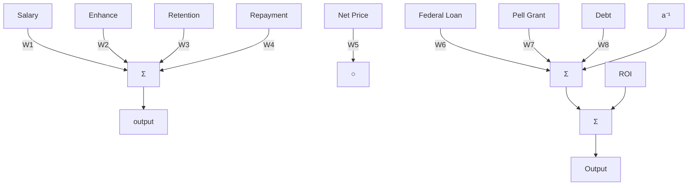

<table><tr><td colspan="3">Team Control Number</td></tr><tr><td>For office use only</td><td>50193</td><td>For office use only</td></tr><tr><td>T1</td><td></td><td>F1</td></tr><tr><td>T2</td><td></td><td>F2</td></tr><tr><td>T3</td><td>Problem Chosen</td><td>F3</td></tr><tr><td>T4</td><td></td><td>F4</td></tr></table>

## 2016

## MCM/ICM

## Summary Sheet

## An Educational Donation Mechanism Based On Data Insight Summary

Recent years, Big Data has become increasingly popular and the guidance of big data is required in many fields, including charitable field. In our paper, we construct a new ROI evaluation system for charitable organization using data mining methods to process data, and succeed in determining an optimal investment strategy for Goodgrant Foundation.

First, we operate on the data. We do data screening according to the integrity and redundancy of the information, deleting data with information less than the threshold, and merging different attributes using linear fitting and PCA. For the reserved attributes and schools, we do data imputation to fill the missing data based on K-means Clustering. Then we normalize all the data to make them comparable in the following analysis.

Second, we construct a ROI evaluation criteria, which is a ratio of output and input multiplying an adjustment coefficient, named “urgency”. The ratio reflects the benefits in related to the cost, while urgency reflects the demand for money which is an important factor should be considered by charitable organization. We use PCA to select attributes, letting salary, education quality and some others to represent output, tuition to represent input and Federal loan, debt and some others to represent urgency. Then, AHP is used to measure the importance between different factors and allocate weights.

Third, we put forward two kinds of model, basic model for one year and time series model for five year. Seeing the ROI as benefits from investment, we introduce the fluctuation of output as “risk”, imitating the concept of Modern Portfolio Theory in the financial sector to solve the problems. In the basic model, we develop a Mixed Integer Linear Programming Algorithm and succeed in finding 14 schools for the investment. Further, we consider the time factor and improve the model into a time series model, using MILP and Grey Prediction to determine the long-term investment strategy. 16 schools are chosen with different time duration and different amounts of money.

Finally, we make sensitivity analysis for our model, changing the amount of schools, the restriction for money, whether allocating the money equally or not and so on to analyze the different results of the output and to find the better parameters for ideal results.

To sum up, our model is a feasible and reasonable model with technical and data support. Because of the subjectivity, this model can be used flexibly after data training.

## Contents

## 1 Introduction 3

1.1 Background 3  
1.2 Overview of Our Work . . 3  
1.3 Assumptions 4

## 2 Data Processing 5

2.1 Data Screening 5  
2.2 Data imputation . 6  
2.3 Data Normalization . 8

## 3 ROI Evaluation System 9

3.1 Concept of ROI 9  
3.2 Using Grey Theory to predict ROI 12

## 4 Model Construction 13

4.1 Definition of Risk . 14  
4.2 Basic Model . . 14  
4.3 Results of basic model 15  
4.4 Time series model . 17  
4.5 Results of time series model 17

## 5 Sensitive analysis and validation 18

5.1 Risk-Return 18  
5.2 School number 18  
5.3 Policy of distribution 19

## 6 Future Work 20

## 7 Conclusion 21

7.1 Strengths . . 21  
7.2 weaknesses 21

## 1 Introduction

## 1.1 Background

If it were a decade ago, you would not image that the pageview of ”Facebook” can be more than millions in one minute; you would not image that when you open ”google maps”, all the travel information is already in the palm of your hand; you would not image that through data mining you can gain an insight into the development trend of an enterprise to guide your investment. Nowadays big data has penetrated into our work and lives, and has brought such huge changes. In turn, it has become particularly important for us to find useful information from the mass of data to guide our work and life.

As a special column from ”New York Times” in Feb., 2012 says, Big Data Era has come. In the commercial, economic and other areas, information will increasingly be made based on data and analysis, rather than based on experience and intuition. Also the field of charity is in the same case. In the past, it is more difficult to give money away intelligently than to earn it in the first place.[1] We do not know how to do the charitable giving rationally, thus, the calculation of ROI is also out of the question. But now new and faster information could make charitable giving more effective and efficient. Moreover, it provides a possibility to link charitable giving issues with the investment issues in the financial sector.

This article is about a charitable donation issue of universities in the U.S. We aim to design a measure system of the return on investment based on large quantities of data through data mining methods. To solve the problem, we will use the Portfolio Theory, Linear Programming, Grey Theory and some other methods to determine the optimal strategy in terms of dimension of time.

## 1.2 Overview of Our Work

First, we find a few key points in this question :

• The volume of data is large and of different types. How to do the normalization of the data.  
• Among the massive data, there are many missing data in the files, which contains less information and not easy to do batch processing.  
• How to classify the large amount of attributes of universities.  
• Different attributes focus on different aspects and how to judge their importance.  
• How to choose schools from the candidate list and how the allocate investment amount among them.  
• The charitable investment process lasts for 5 years, so time is an important factor which will influence our ROI criteria.

On the basis of above discussion, to determine the optimal investment strategy, we may boil down the tasks to the following four steps :

• First, we do data screening according to the integrity and usefulness of the information. For the retention attributes and schools, we use K-means clustering method to fill the missing data. And normalize all the data.  
• Second, we use PCA method to choose and classify different attributes. Then we use AHP method and knowledge of finance to construct ROI concept. And we use the ROI concept to process data, ranking the candidate schools.  
• Third, we introduce the concept of Modern Portfolio Theory and construct two models. In the basic model, we develop a Mixed Integer Linear Programming Algorithm to determine an optimal investment strategy. Further, we consider the time factor and improve the model into a timing model, using Dynamic Programming Algorithm and Grey Prediction to determine the long-term investment strategy.  
• Further analysis and discussion of the model.

## 1.3 Assumptions

• Ignore inflation and deflation of money and other time value of money. The value of money remains unchanged.  
• As a charitable organization, our aim is to improve educational performance and expect for more social benefits rather than gaining profit.  
• Our charitable donation is a comprehensive scholarship, not rewarding for the outstanding contributions in specific fields.  
• If we have different goals and strategies from other charitable organization, we believe it can reduce the possibility of duplication of investment to a great extend.  
• The object for evaluating and scholarship granting is school, not individual, though some individual information is included in our criteria. And it is business of school to allocate the money.  
• We focus on the fairness of our strategy so as to invest more schools regardless of the reputation of them.  
• Because of Marginal utility, we try not to invest large amount of money to one school.  
• In the timing model, we assume that the influence of other factors which are excluded outside the model can be ignored. That’s to say, future is predictable.

## 2 Data Processing

## 2.1 Data Screening

The amount of raw data is large, so we should first do data screening according to the integrity and usefulness of the information.

First, we do data screening on 7805 schools :

• We only consider the 2978 candidate schools in the file Problem C - IPEDS UID for Potential Candidate Schools, and match the schools with their 95 attributes in the file Problem C - Most Recent Cohorts Data (Scorecard Elements).xlsx.  
• Delete the schools which are not currently operating institution and which are on Heightened Cash Monitoring 2 by Department of Education, meaning that they encounter economic depression and lack students and which has no or very limited information about percentage of degrees awarded. It’s meaningless to invest on these schools.  
• Delete the schools of whom 50% of the attributes are ”NULL”. If the percentage of missing data exceeds 50%, the imputation will result in great error, which we treat as a threshold for missing data.[2]

Second, we do data screening on 95 attributes :

• We combine some binary variables together. For example, we delete the net price for different income classes and combine the total net price for public school and private school together, named as ”Net Price”. And we use the total retention rate for weighting to combine retention rate for full-time and part-time students together, named as ”Retention Rate”.  
• Though there are large quantities of missing data in ”SAT scores” and ”ACT scores”, we reserve the midpoint of them as categorical variables. High entrance requirements with SAT or ACT scores would indicate higher education quality, which we will treat differently from the low entrance requirements school in the following ROI evaluation system.  
• Besides, we reserve all the flag attributes like ”flag for Historically Black College and University”, ”flag for women-only college” and all the subject attributes like ”percentage of degrees awarded in Architecture And Related Services”, using them for the clustering and data imputation in the next step.  
• We delete location, age of students and some other information contributes less to our ROI evaluation system.

After data screening, there are about 2700 schools each with about 60 attributes in the candidate list.

## 2.2 Data imputation

In statistics, missing data occur when no data value is stored for the variable in an observation. Missing data are a common occurrence and can have a significant effect on the conclusions that can be drawn from the data.

• K-means Clustering

Many approaches are available for data imputation, such as Listwise Deletion, Mean Imputation, Regression Imputation and Multiple Imputation. Here we use K-means clustering imputation: first using complete and meaningful data in the files to combine schools with similarity together, and then using the means of these similar schools to fill the missing data.[2]. We can see it as an improved method for Mean Imputation.

Given a set of observations

$$
(x _ {1}, x _ {2}, \ldots , x _ {n})
$$

where each observation is a d-dimensional real vector, k-means clustering aims to partition the n observations into k sets

$$
S = \{S _ {1}, S _ {2}, \dots , S _ {k} \}
$$

so as to minimize the within-cluster sum of distance functions of each point in the cluster to the K center.[3] In other words, its objective is to find:

$$
\min \sum_ {i = 1} ^ {k} \sum_ {x \in S _ {i}} \left(x - \mu_ {i}\right) ^ {2} \tag {1}
$$

where $\mu _ { i }$ is the mean of points in $S _ { i }$ .

In the K-means algorithm, K is given in advance, but selecting the K value is very difficult. According to the theory of variance, we often determine the K value based on the $R ^ { 2 }$ statistic.[3]

$$
W _ {t} = \sum_ {i = 1} ^ {n _ {t}} (X _ {(i)} ^ {(t)} - \overline {{X}} ^ {(t)}) ^ {\prime} (X _ {(i)} ^ {(t)} - \overline {{X}} ^ {(t)}) \tag {2}
$$

$$
T = \sum_ {t = 1} ^ {k} \sum_ {i = 1} ^ {n _ {t}} (X _ {(i)} ^ {(t)} - \overline {{X}}) ^ {\prime} (X _ {(i)} ^ {(t)} - \overline {{X}}) \tag {3}
$$

$$
P _ {k} = \sum_ {t = 1} ^ {k} W _ {t} \tag {4}
$$

$$
B _ {k} = \sum_ {t = 1} ^ {k} n _ {t} (\overline {{X}} ^ {(t)} - \overline {{X}}) ^ {\prime} (\overline {{X}} ^ {(t)} - \overline {{X}}) \tag {5}
$$

$$
R ^ {2} = \frac {B _ {k}}{T} = 1 - \frac {P _ {k}}{T} \tag {6}
$$

The greater the proportion of sum of square between class is and the smaller the proportion of sum of square inner class is, the better K value is. So we choose the K value that maximize $R ^ { 2 }$ value.

• Variables Choosing In our data files, the missing data columns needed to be filled are listed as below :

Table 1: Missing data columns

<table><tr><td>Number</td><td>Variable Name</td><td>Number</td><td>Variable Name</td></tr><tr><td>1</td><td>Net Price</td><td>6</td><td>gt_25k_p6</td></tr><tr><td>2</td><td>Retention Rate</td><td>7</td><td>md_earn_wne_p10</td></tr><tr><td>3</td><td>GRAD_DEBT_MDN_SUPP</td><td>8</td><td>sd_earn_wne_p10</td></tr><tr><td>4</td><td>GRAD_DEBT_MDN10YR_SUPP</td><td>9</td><td>md_earn_wne_p6</td></tr><tr><td>5</td><td>RPY_3YR_RT_SUPP</td><td>10</td><td>sd_earn_wne_p6</td></tr></table>

These are all very important variables in our ROI evaluation system. For example, “Net Price“ is a measure of input of education, and “md earn wne p1“ means median earnings of students working and not enrolled 10 years after entry and is measure of output of education.

Having figured out on what variables to do data imputation, we should determine what variables should the imputation be based on. Following are some integral data columns for us to use :

Table 2: Integral data columns

<table><tr><td>Number</td><td>Variable Name</td><td>Number</td><td>Variable Name</td></tr><tr><td>1</td><td>PREDDEG</td><td>10</td><td>MENONLY</td></tr><tr><td>2</td><td>CONTROL</td><td>11</td><td>WOMENONLY</td></tr><tr><td>3</td><td>HBCU</td><td>12</td><td>PCIP_XXXXX</td></tr><tr><td>4</td><td>PBI</td><td>13</td><td>DISTANCEONLY</td></tr><tr><td>5</td><td>ANNHI</td><td>14</td><td>UGDS</td></tr><tr><td>6</td><td>TRIBAL</td><td>15</td><td>UGDS_XXXXX</td></tr><tr><td>7</td><td>AANAPII</td><td>16</td><td>PPTUG_EF</td></tr><tr><td>8</td><td>HSI</td><td>17</td><td>PCTFLOAN</td></tr><tr><td>9</td><td>NANTI</td><td>18</td><td>PCTPELL</td></tr></table>

By contrast, these variables are more integral and have significance to guide the imputation. For example, “PCIP XXXXX“ means Percentage of degrees awarded in different subjects (including 38 subjects), indicating the subjects composition of schools; “UGDS“ means the size of schools and “UGDS XXXXX“ means the percentage of students who are WHITE, BLACK, ASIAN and so on(including 9 different attributes), indicating the students composition of schools; and “PCT-FLOAN“ means percent of all federal undergraduate students receiving a federal student loan, indicating the students’ financial situation of schools.

So we can believe that it has a good description of every school to consider the above variables together. Then the similarity and dissimilarity of schools can be found.

• Clustering Output To simplify the model, we only do the K-means clustering once using all the data from integral data columns. We assume that the classification using all the integral variables is applicable to all the missing variables. And we choose the number of classes K from 3 to 8, ending up finding the optimal value is 5.

After clustering, we can believe that the schools in the same class have the maximum similarity. So, we use the means of data of no-missing-data schools from each missing variable column to fill the corresponding blanks of missing-data schools in the same class.

Following is the results of K-means clustering and an example of the imputation value of “md earn wne p10“ :

Table 3: Clustering Output and Imputation Value

<table><tr><td>Number</td><td>Size</td><td>md_earn_wne_p10</td></tr><tr><td>1</td><td>27</td><td>19655.56</td></tr><tr><td>2</td><td>5</td><td>24980.11</td></tr><tr><td>3</td><td>1151</td><td>31176.46</td></tr><tr><td>4</td><td>1499</td><td>40780.52</td></tr><tr><td>5</td><td>11</td><td>42063.64</td></tr></table>

From above table, the value of “md earn wne $\mathrm { \ p l 0 ^ { \ast \ast } }$ for each of the five classes is the means value of no-missing-data schools and what we should do next is to fill the value into blank in each class. The same approach is used in all the missing data columns. Up to now, we get the integral value of all the schools with all the attributes.

## 2.3 Data Normalization

After filling all the missing data, we should do the data normalization to facilitate the further analysis of the data. It can provide an approach for comparison of different kinds of data and reflect the combined results of different factors.

Here we use Min-max normalization, doing linear transformation of the raw data, mapping data set

$$
x = \{x _ {1}, x _ {2}, \ldots , x _ {n} \}
$$

into [0,1] interval. Let $x ^ { \prime }$ be the normalized value, the formula is :

$$
x ^ {\prime} = \frac {x - x _ {\min}}{x _ {\max} - x _ {\min}} \tag {7}
$$

While $x _ { \mathrm { m i n } } ^ { \prime } = 0$ and $x _ { \mathrm { m a x } } ^ { \prime } = 1$ . And all the data hereinafter is normalized data.

## 3 ROI Evaluation System

## 3.1 Concept of ROI

In this part, we focus our attention on how to determine the Return on Investment evaluation system. In the financial sector, ROI is the benefit to the investor resulting from an investment of some resource, which is a way of considering profits in relation to capital invested. According to the original concept, we use the available data to construct a new ROI evaluation system appropriate for our charitable organization. The formula is :

$$
R O I = \frac {\text { Output }}{\text { Input }} \times \text { Urgency } \tag {8}
$$

## 1. Output

Output is the measure of the quantity of education, in other words, effectiveness. Here we use four factors to measure Output : Salary After Graduation, Retention Rate, Repayment Ability and Education Enhance Rate. But why these four factors?

• First, there is low correlation among the four factors, each of which can be separated out as an impact indicator of Output. To illustrate the independence, and the relationship between different variables, we use Principal Component Analysis(PCA), which is a statistical procedure that uses an orthogonal transformation to convert a set of observations of possibly correlated variables into a set of values of linearly uncorrelated variables.[4] When some of the variables can explain a great percentage of the results, we can say these variables are strongly correlated and we can use the great one to represent others.

• Second, they are strongly related to Output of a school :

(a) Salary After Graduation(SAG) : measures the overall level of students. More salary means the students’ job can make more valuable output. So they can contribute more to the society when they receive the same amount of donation. There are three factors representing salary, “md earn wne p10”, “md earn wne p6” and “gt 25k p6”, meaning midpoint earning in 10 years, midpoint earning in 6 years and share of students earning over \$25,000 per year in 6 years. Similarly, using PCA to study the correlation between them and assign weights, we find that the three factors are strongly related and one of them, “md earn wne p6”, can explain 95% of the result. So we only use the value of “md earn wne p6” to represent Salary After Graduation.  
(b) Retention Rate(RR) : measures the utilization of the investment. On the one hand, the larger the retention rate is, the more students retained in schools will enjoy the investment. And on the other hand, higher retention rate means greater school spirit and learning atmosphere, which is worthy of investment. “Retention Rate” has been defined above.  
(c) Repayment Ability(RA) : measures the ability to contribute to the soci-

ety. There is difference between Salary After Graduation and this factor. The former emphasize the potential ability, while higher Repayment Ability shows that it is no longer subject to the debt or other burden in life, and have real ability to contribute to society. Here we use “RPY 3YR RT SUPP” to represent Repayment Ability.

(d) Education Enhance Rate(EER) : measures the education quality of schools. Here we use normalized data of “md earn wne $\mathbf { \Delta } _ { - \mathbf { p } 6 } ^ { \mathbf { \vec { \mathbf { \mu } } } , \vec { \mathbf { \Lambda } } }$ minus normalized data of “SAT scores” and then normalize it again to represent the Education Enhance Rate. Because the salary can reflect the level of students after graduation and the “SAT scores” can reflect the level before entry. As for the schools without “SAT scores”, this weight will be assigned to other three factors.

In order to get the overall evaluation index, we need to compute the weight of the four factors. In the following, analytical hierarchy process, abbreviated to AHP, will be applied to judge importance of the four factors. We compare the four factors by pairs and give the following matrix according to experience and intuition. (the columns indicate Salary After Graduation, Retention Rate, Repayment Ability and Education Enhance Rate from left to right)

$$
{\left[ \begin{array}{l l l l} 1 & 5 & 6 & 3 \\ 3 & 1 & 2 & \frac {1}{2} \\ 2 & \frac {1}{2} & 1 & \frac {1}{3} \\ \frac {1}{3} & \frac {1}{6} & \frac {1}{5} & 1 \end{array} \right]}
$$

Thus, we can figure out that the weight vector $V _ { 1 } = [ 0 . 5 7 6 ~ 0 . 1 2 5 ~ 0 . 0 7 7 ~ 0 . 2 2 2 ] .$ . Finally, in consistency check, the consistency index $C I = 0 . 0 1 1 3 < 0 . 1 0$ , which means that the weight determined by AHP is very reasonable [5].

As for the schools without “SAT scores”, we assign the weight of EER to other three factors and use the same AHP method. The weight vector is $V _ { 2 } = [ 0 . 7 4 1$ 0.161 0.098], also passing the consistency check.

AHP which we adopted here is the mostly widely used method in the evaluation of the weight, though its objectivity is pretty poor. Nevertheless, the weight defined by objective method cannot match its importance in practice completely. As to the subjective method, it can reflect difference of relative importance among the four indexes in spite of the subject process to define the indexes’ weight. Considering the evaluation of the importance of these four indexes is a subjective judgement, weight defining through the subjective method possesses more scientific rationality. So we utilize the more subjective AHP method rather than other more objective model to gain the weight.

Finally, the comprehensive calculation formula is described as :

$$
O u t p u t = \left\{ \begin{array}{c} V _ {1} \cdot \left[ \text {SAG RR RA EER} \right] ^ {T} \\ V _ {2} \cdot \left[ \text {SAG RR RA} \right] ^ {T} \end{array} \right. \tag {9}
$$

## 2. Input

Adding Input into the ROI formula, we can get a ratio considering profits in relation to capital invested, in other word, efficiency. It means given one dollar, schools with low Input and high Output can create more value. Here we only have one factor, “Net Price”(NP), to represent the Input. We believe that high tuition means the schools need high input to maintain daily routine. “Net Price” has been defined above.

There is a problem that the only factor in Input will have huge influence than the factors in the Output, resulting that the schools with lower tuition will get higher ROI. So we add a correction index $^ { \mathfrak { e } } \alpha ^ { \mathfrak { W } } \left( \alpha \in [ 0 , 1 ] \right)$ to verify the formula.

$$
I n p u t = (1 - \alpha) + \alpha \times N P \tag {10}
$$

Here we let $\alpha = 0 . 2 5$ .

## 3. Urgency

For finance issue, the definition of ROI with Input and Output is enough. But for this charitable issue, we add an correction index, “Urgency”, to make the definition more robust. Because charitable organization should donate money to the people who are the most eager for it. Here we use three factors to measure Urgency : Pell Grants, Federal Loan, Debt. Similarly, we choose these three indexes because of the independence and meaningfulness.

(a) Pell Grants(PG) : measures students’ degree of demand for funds in different schools. Here we use “PCTPELL”, percentage of undergraduates who receive a Pell Grant, to represent PG.  
(b) Federal Loan(FL) : have the similar meaning of PG. Here we use “PCT-FLOAN”, percent of all federal undergraduate students receiving a federal student loan to present it.  
(c) Debt : measures the degree of liability in different schools. There are two factors, “GRAD DEBT MDN SUPP” and “GRAD DEBT MDN10YR SUPP” related to Debt, but they are strongly related. So we choose “GRAD DEBT M DN SUPP”, median debt of completers, suppressed for n=30, to represent Debt.

Though three factors have very similar meaning, the PCA indicates they are independent, each explains 31%, 13%, 56% of the result. We use these three number as their importance in AHP, and get the final weight vector $V _ { 3 } = [ 0 . 2 5$ 0.25 0.50], the consistency index $C I = 0 . 0 0 8 9 < 0 . 1 0$ .

$$
U r g e n c y = V _ {3} \cdot \left[ \begin{array}{l l l} P G & F L & D e b t \end{array} \right] ^ {T} \tag {11}
$$

On the basis of the discussion above, we draw a picture to visually represent our ROI evaluation system.

flowchart

Figure 1: The model of ROI evaluation system

## 3.2 Using Grey Theory to predict ROI

On the following discussion, we have figured out what the ROI is, and how to calculate the ROI of schools for one year using given data. But the charitable donation will be given for 5 years. In the long run, we can use Grey Theory to predict the future ROI using the previous data.

Grey Theory focuses on model uncertainty and information insufficiency in analyzing and understanding systems via research on conditional analysis, prediction and decisionmaking[7]. This theory is applied mainly on in-complete and un-determinable problems. GM(1,1) is one of models of gray theory. which uses an accumulated generation operation(AGO) and some equations to produce an infinite grey sequences to predict the following data with observed data. Step 1. Let be a sequence of observed data

$$
X ^ {(0)} = (X ^ {(0)} (1), X ^ {(0)} (2), \dots \dots , X ^ {(0)} (n)) \tag {12}
$$

where $X ^ { ( 0 ) } ( i )$ represents the observed data with respect to time i. Step 2. Generate the first-order accumulated generating operation $( 1 - A G O )$ sequence $X ^ { ( 1 ) } ( i )$ based on the observed sequence $X ^ { ( 0 ) } ( i )$

$$
X ^ {(1)} = (X ^ {(1)} (1), X ^ {(1)} (2), \dots \dots , X ^ {(1)} (n)) \tag {13}
$$

where $X ^ { ( 1 ) } ( k )$ is formed as the following formula

$$
X ^ {(1)} (k) = \sum_ {i = 1} ^ {k} X ^ {(0)} (i) = X ^ {(1)} (k - 1) + X ^ {(0)} (k) \tag {14}
$$

Step 3. Establish the first-order differential equation of sequence $X ^ { ( 1 ) } ( k )$

$$
\frac {d X ^ {(1)}}{d t} + a X ^ {(1)} = u \tag {15}
$$

Step 4. Derive the estimated first-order AGO sequence

$$
\hat {X} ^ {(1)} (k + 1) = (X ^ {(0)} (1) - \frac {u}{a}) e ^ {- a k} + \frac {u}{a} \tag {16}
$$

Step 5. Let aˆ be a sequence of parameters where $\hat { a } = [ a , u ] ^ { T }$ , it can be solved as follow :

$$
\hat {a} = (B ^ {T} B) ^ {- 1} B ^ {T} Y _ {n} \tag {17}
$$

where

$$
B = \left[ \begin{array}{c c} - \frac {1}{2} (X ^ {(1)} (1) + X ^ {(1)} (2)) & 1 \\ - \frac {1}{2} (X ^ {(1)} (2) + X ^ {(1)} (3)) & 1 \\ \dots \dots . \\ - \frac {1}{2} (X ^ {(1)} (n - 1) + X ^ {(1)} (n)) & 1 \end{array} \right] \tag {18}
$$

and

$$
Y _ {n} = \left[ X ^ {(0)} (2), X ^ {(0)} (3), \dots \dots , X ^ {(0)} (n) \right] ^ {T} \tag {19}
$$

According to Grey Theory illustrated as above, we use the data of past 5 years, from 2009 to 2013, to predict the future ROI from 2016 to 2020. Following are some figures of outcome of Grey Prediction for different schools. We can see that complex trend can be fit with grey prediction and it’s better than Linear Fitting.

line chart

| Year | Value |
|---|---|
| 2008 | 0.01 |
| 2010 | 0.015 |
| 2011 | 0.017 |
| 2012 | 0.02 |
| 2013 | 0.023 |
| 2023 | 0.11 |

(a) Grey Predicting for Future ROI

line chart

| Year | Value  |
| ---- | ------ |
| 2008 | 0.055  |
| 2010 | 0.05   |
| 2012 | 0.045  |
| 2014 | 0.03   |
| 2016 | 0.02   |
| 2018 | 0.015  |
| 2020 | 0.01   |
| 2022 | 0.008  |
| 2024 | 0.007  |

(b) Grey Predicting for Future ROI  
Figure 2: general title.

## 4 Model Construction

The allocation strategy of the Goodgrant foundation given ROI and risk can be modeled as a mixed integer linear programming. At first, in the basic model, we ignore the time factor and suppose that we allocate all the fund in one period. The objective is to maximize the total return of the foundation, and constraints include the control of the risk, the minimize and maximize number of school is awarded, the minimize and maximize money a school can get and the size of school. We introduce a continuous decision variable to denote the fund each school received and a binary variable to indicate whether the school is invested or not. Then, in the complicated model, we take the time period into consideration. Finally, we give two recommendation list in term of both models respectively.

## 4.1 Definition of Risk

In financial sector, Modern Portfolio Theory was used to measure risk and benefits, drawing the Efficient Frontier of all the risky assets and find the Tangency Portfolio.[6] For an investment, risk is certainly attached to benefits. For charitable investment, there also exists risk, which will forbid investment reaching the optimal point though it does not bring any lost for you. Above we have discussed the ROI for charitable investment, which can be seen as benefits. Here we will define “risk” for our investment.

$$
r = \frac {\sigma_ {e}}{\mu_ {e}} \tag {20}
$$

In the formula, we use the concept of coefficient of variation. $\sigma _ { e }$ indicates the standard deviation of “md earn wne $\mathbf { \mathbf { \mathbf { p 6 } } } ^ { \mathbf { \nu } }$ , and $\mu _ { e }$ indicates the means of “md earn wne $\mathbf { \mathbf { \mathbf { p } } } 6 ^ { \mathbf { \mathbf { \mathbf { \mathbf { \mathbf { \mathbf { \mathbf { \mathbf } } } } } } } }$ . This variable is the only measure we can find of fluctuation of the Output, larger fluctuation of Output leads to larger risk. And using ratio form to indicate risk is to prevent the influence of the different amounts of Output itself. Then we use the concept of Modern Portfolio Theory, drawing risk-benefit plots, using Mixed Integer Linear Programming(MILP) to solve the problem.

## 4.2 Basic Model

Denote the list of candidate school is $i \in \mathbb { S } = \{ 1 , 2 , . . . , S \}$ , the constant and the variables are as following.

Table 4: constant

<table><tr><td> $ROI_{i}$ </td><td>ROI of school  $i, i \in \$$ </td></tr><tr><td> $r_{i}$ </td><td>risk of school  $i, i \in \$$ </td></tr><tr><td> $A_{i}^{max}$ </td><td>maximum investment in school  $i, i \in \$$ </td></tr><tr><td> $A_{i}^{min}$ </td><td>minimum investment in school  $i, i \in \$$ </td></tr><tr><td> $s_{i}$ </td><td>number of student in school  $i, i \in \$$ </td></tr><tr><td> $N^{max}$ </td><td>maximum investment school number</td></tr><tr><td> $N^{min}$ </td><td>minimum investment school number</td></tr><tr><td> $r^{max}$ </td><td>maximum acceptable risk</td></tr><tr><td> $S^{min}$ </td><td>minimum acceptable student number</td></tr><tr><td> $A$ </td><td>sum of the fund</td></tr></table>

Table 5: variable

<table><tr><td> $x_{i}$ </td><td>Investment of school  $i, i \in \$$ </td></tr><tr><td> $y_{i} \in \{0,1\}$ </td><td>State of school  $i$ , 0 means not the the prize list,1 means in the recommendation list ,0 means not in the recommendation list</td></tr></table>

The objective is to maximize the total return, since the ROI is define as rate of return, it yields:

$$
\max \sum_ {i \in \mathbb {S}} R O I _ {i} x _ {i} \tag {21}
$$

The sum of the money each school get should not exceed the total amount of the available money. The average risk of the allocation strategy should not beyond the maximum acceptable risk, we get:

$$
\sum_ {i \in \mathbb {S}} x _ {i} \leq A \tag {22}
$$

$$
\sum_ {i \in \mathbb {S}} r _ {i} x _ {i} \leq A \cdot r ^ {\max} \tag {23}
$$

The number of school that get some foundation should less that the maximum number $N ^ { m a x }$ and greater than minimum number $N ^ { m i n }$

$$
N ^ {\text { min }} \leq \sum_ {i \in \mathbb {S}} y _ {i} \leq N ^ {\text { max }} \tag {24}
$$

The basic logical constraints between $x _ { i }$ and $y _ { i }$ , i.e., $x _ { i } \geq 0$ , if and only if $y _ { i } = 1$ , if school i is invested, the amount of the money it gets should lies within the $A _ { i } ^ { m i n }$ and $A _ { i } ^ { m a x }$ , it yields:

$$
A _ {i} ^ {\text { min }} y _ {i} \leq x _ {i} \leq A _ {i} ^ {\text { min }} y _ {i} \quad \forall i \in \mathbb {S} \tag {25}
$$

Finally, if the school is too small, we wouldn’t chose it since the fund wouldn’t benefit enough students.

$$
s _ {i} y _ {i} \leq S ^ {\text { min }} \quad \forall i \in \mathbb {S} \tag {26}
$$

## 4.3 Results of basic model

In the model, $R O I _ { i }$ and $r _ { i }$ is derived from the pervious work, we set the minimum acceptable student number $S ^ { m i n }$ as 1000, the minimum fund $A _ { i } ^ { m i n }$ for the school which is chosen can get as 20000000, since the maximum foundation the school can get is related to the school’s student number, we set $A _ { i } ^ { m a x } = A _ { i } ^ { m i n } + b * s _ { i }$ where $b = 3 0 0 0$ . Finally, we define that the foundation must be awarded to at most 30 schools and at least 10 schools. Suppose the decision maker doesn’t care the risk so much, that is, the highest return is the only purpose, by using ILOG CPLEX 12.6 with python API, we get a list of schools that should be recommended according to our model (Ranking according to the ROI).

Table 6: Missing data columns

<table><tr><td>1</td><td>446604</td><td>Uta Mesivta of Kiryas Joel</td></tr><tr><td>2</td><td>133979</td><td>Florida Memorial University</td></tr><tr><td>3</td><td>385619</td><td>Everglades University</td></tr><tr><td>4</td><td>197018</td><td>United Talmudical Seminary</td></tr><tr><td>5</td><td>445708</td><td>Johnson Wales University-Charlotte</td></tr><tr><td>6</td><td>414823</td><td>Johnson Wales University-North Miami</td></tr><tr><td>7</td><td>161226</td><td>University of Maine at Farmington</td></tr><tr><td>8</td><td>216667</td><td>Washington Jefferson College</td></tr><tr><td>9</td><td>195128</td><td>The Sage Colleges</td></tr><tr><td>10</td><td>381617</td><td>Baker College of Port Huron</td></tr><tr><td>11</td><td>213251</td><td>Juniata College</td></tr><tr><td>12</td><td>196200</td><td>SUNY College at Potsdam</td></tr><tr><td>13</td><td>146427</td><td>Knox College</td></tr><tr><td>14</td><td>439288</td><td>Johnson Wales University-Denver</td></tr></table>

bar chart

| Category   | risk  | output | input | urgency |
| ---------- | ----- | ------ | ----- | ------- |
| 196200     | 0.68  | 0.82   | 0.93  | 0.57    |
| 445708     | 0.68  | 0.78   | 0.95  | 0.64    |
| 414823     | 0.68  | 0.78   | 0.95  | 0.64    |
| 161226     | 0.51  | 0.79   | 0.93  | 0.59    |
| 197018     | 0.85  | 0.90   | 0.91  | 0.62    |
| 195128     | 0.63  | 0.87   | 0.93  | 0.54    |
| 446604     | 2.30  | 0.93   | 0.91  | 0.62    |
| 133979     | 0.73  | 0.62   | 0.93  | 0.92    |
| 213251     | 0.67  | 0.94   | 0.95  | 0.51    |
| 146427     | 0.61  | 0.92   | 0.94  | 0.51    |
| 216667     | 0.57  | 0.91   | 0.95  | 0.52    |
| 439288     | 0.68  | 0.81   | 0.95  | 0.57    |
| 385619     | 0.95  | 0.74   | 0.95  | 0.79    |
| 381617     | 1.02  | 0.76   | 0.91  | 0.61    |

Figure 3: Factors of the investment schools

pie chart

ALLOCATION
| Category | Value | Percentage (%) |
|---|---|---|
| 1 | 196200 | 13 |
| 2 | 445708 | 9 |
| 3 | 414823 | 8 |
| 4 | 161226 | 8 |
| 5 | 197018 | 7 |
| 6 | 195128 | 7 |
| 7 | 446604 | 7 |
| 8 | 133979 | 6 |
| 9 | 213251 | 6 |
| 10 | 216667 | 6 |
| 11 | 439288 | 6 |
| 12 | 385619 | 6 |
| 13 | 6 | 6 |
| 14 | 381617 | 5 |

Figure 4: Allocation of the money

Figure(3) shows the factors of the ROI, including risk, output, input and urgency, of the schools that is selected by our model. Figure(4) shows the money allocation of each selected schools, the labels of both figures are the UNITID of the school.

## 4.4 Time series model

In the real situation, according to the requirement of the Goodgrant foundation, the total 1000000000 will be distributed to the schools in 5 years, so we modified our previous mixed integer problem and take the time series into consideration. Similarly, we induce the decision variables $\boldsymbol { x } _ { i } ^ { t }$ and $y _ { i } ^ { t } .$ , in which the time series $t \in \mathbb { T } = \{ 1 , 2 , 3 , 4 , 5 \}$ , corresponding to year 2016,2017,2018,2019,2020 respectively. The whole model is listed as follows:

$$
\max \sum_ {i \in \mathbb {S}} \sum_ {t \in \mathbb {T}} R O I _ {i} ^ {t} x _ {i} ^ {t} \tag {27}
$$

Subject to:

$$
\sum_ {i \in \mathbb {S}} \sum_ {t \in \mathbb {T}} x _ {i} ^ {t} \leq A \tag {28}
$$

$$
\sum_ {i \in \mathbb {S}} \sum_ {t \in \mathbb {T}} r _ {i} ^ {t} x _ {i} ^ {t} \leq A \cdot r ^ {\max} \tag {29}
$$

$$
N ^ {m i n} \leq \sum_ {i \in \mathbb {S}} y _ {i} ^ {t} \leq N ^ {m a x} \quad \forall t \in \mathbb {T} \tag {30}
$$

$$
A _ {i} ^ {\text { min }} y _ {i} ^ {t} \leq x _ {i} \leq A _ {i} ^ {\text { min }} y _ {i} ^ {t} \quad \forall t \in \mathbb {T}, \forall i \in \mathbb {S} \tag {31}
$$

$$
s _ {i} y _ {i} ^ {t} \leq S ^ {\text { min }} \quad \forall t \in \mathbb {T}, \forall i \in \mathbb {S} \tag {32}
$$

## 4.5 Results of time series model

The constants in the time series model is similar to the previous one with some minor adjustment, particularly, we set $A _ { i } ^ { m i n }$ as 5000000 and b as 8000, the value of $R O I _ { i } ^ { t }$ and $r _ { i } ^ { t }$ is determined by the previous calculation. By using IBM ILOG CPLEX, we solve the model, get the global optimal solution and receive the following result:

<table><tr><td rowspan="2">UNITID</td><td rowspan="2">INSTNM</td><td colspan="5">Investment in year i</td></tr><tr><td>2016</td><td>2017</td><td>2018</td><td>2019</td><td>2020</td></tr><tr><td>197018</td><td>United Talmudical Seminary</td><td>5000000</td><td>0</td><td>0</td><td>0</td><td>0</td></tr><tr><td>237066</td><td>Whitworth University</td><td>23696000</td><td>5000000</td><td>23696000</td><td>23696000</td><td>23696000</td></tr><tr><td>214157</td><td>Moravian College</td><td>5000000</td><td>5000000</td><td>0</td><td>0</td><td>0</td></tr><tr><td>165334</td><td>Clark University</td><td>5000000</td><td>5000000</td><td>5760000</td><td>23496000</td><td>23496000</td></tr><tr><td>213251</td><td>Juniata College</td><td>14224000</td><td>17024000</td><td>17024000</td><td>17024000</td><td>17024000</td></tr><tr><td>166018</td><td>Hampshire College</td><td>5000000</td><td>16744000</td><td>16744000</td><td>16744000</td><td>16744000</td></tr><tr><td>133979</td><td>Florida Memorial University</td><td>5000000</td><td>0</td><td>0</td><td>0</td><td>0</td></tr><tr><td>191968</td><td>Ithaca College</td><td>0</td><td>31232000</td><td>54616000</td><td>54616000</td><td>54616000</td></tr><tr><td>446604</td><td>Uta Mesivta of Kiryas Joel</td><td>5000000</td><td>0</td><td>0</td><td>0</td><td>0</td></tr><tr><td>217518</td><td>Roger Williams University</td><td>0</td><td>5000000</td><td>40224000</td><td>40224000</td><td>40224000</td></tr><tr><td>129242</td><td>Fairfield University</td><td>0</td><td>0</td><td>0</td><td>0</td><td>11656000</td></tr><tr><td>203085</td><td>Heidelberg University</td><td>13792000</td><td>5000000</td><td>5000000</td><td>11656000</td><td>0</td></tr><tr><td>121257</td><td>Pitzer College</td><td>0</td><td>0</td><td>13648000</td><td>13648000</td><td>13648000</td></tr><tr><td>195128</td><td>The Sage Colleges</td><td>18288000</td><td>5000000</td><td>18288000</td><td>18288000</td><td>18288000</td></tr><tr><td>130776</td><td>Western Connecticut State University</td><td>0</td><td>0</td><td>0</td><td>46472000</td><td>46472000</td></tr><tr><td>262086</td><td>Brandman University</td><td>0</td><td>5000000</td><td>5000000</td><td>34136000</td><td>34136000</td></tr><tr><td></td><td>sum of the money in the year</td><td>100000000</td><td>100000000</td><td>200000000</td><td>300000000</td><td>300000000</td></tr></table>

Figure 5: list of five years

From the result, we not only select the school but also determine in which years they should be invested in order to maximize the total revenue. In this way, we also, determine the investment period of each school. What’s more, since in our model, we don’t require that foundation is evenly distributed among five years, instead, we set a upper bound and a lower bound of the total investment in each year. We find that actually we should increase the money we invest as time pass by.

## 5 Sensitive analysis and validation

## 5.1 Risk-Return

In basic model, we change the maximum acceptable risk and analyze the max return, the result are as follow:

line chart

| max acceptable risk | max return |
| ------------------- | ---------- |
| 0.2                 | 4.0e7      |
| 0.3                 | 4.5e7      |
| 0.4                 | 4.8e7      |
| 0.5                 | 5.0e7      |
| 0.6                 | 5.2e7      |
| 0.7                 | 5.3e7      |
| 0.8                 | 5.4e7      |
| 0.9                 | 5.45e7     |
| 1.0                 | 5.45e7     |

Figure 6: Return-Risk

From the figure(6), we find that as the max acceptable risk become greater, the max return we can get also become greater, which conform to our expectation and reality. Moreover, when the max acceptable risk index is greater than about 0.82, the max return will not increase anymore.

## 5.2 School number

In the time series model, we change the number of the schools that should be chosen and analyze the max return, the result are as follow:

line chart

| awarded school number in each year | max return (x 10^8) |
| ---------------------------------- | ------------------- |
| 4                                  | 1.4                 |
| 6                                  | 1.55                |
| 8                                  | 1.65                |
| 10                                 | 1.7                 |
| 12                                 | 1.71                |
| 14                                 | 1.7                 |
| 16                                 | 1.69                |
| 18                                 | 1.67                |
| 20                                 | 1.65                |
| 22                                 | 1.62                |
| 24                                 | 1.59                |

Figure 7: Return-Number of selected School

From the figure(7), we find that as the number of the schools ought to be chosen in each year increases, the maximum return has a trend of rise first then fall. The optimal school number is about 12, which lies in our model’s school number constraint between 10 and 30, this prove that our list that is given before is valid.

## 5.3 Policy of distribution

When considering the time, how to allocate the fund properly is important, we test 4 basic policy and compare their results. In policy 1, all the money is distributed in the first year; in policy 2 ,the money is distributed evenly in the five years, that is 200000000 dollars per year; in policy 3, the money is distributed unevenly among years, but there is a constraint that confine the minimum and maximize amount of money that is distributed in each year; finally in policy 4, we can distributed the money in each year without any constraint. Our recommendation list is based on policy 3.

Table 7: return-policy

<table><tr><td>policy</td><td>max return</td><td>gap</td></tr><tr><td>1</td><td>54579267</td><td>0.689</td></tr><tr><td>2</td><td>157020989</td><td>0.107</td></tr><tr><td>3</td><td>169677616</td><td>0.035</td></tr><tr><td>4</td><td>175745328</td><td>-</td></tr></table>

From table(7), we find that policy 4 get the best result. But, in that situation, only 5000000 dollars are distributed in the first year and second year, which is not practical We also find that the gap between our policy, i.e. policy3 and policy 4 is only about 3.5% and we avoid the extreme bias among the years, so our model is valid.

## 6 Future Work

Due to limitation of time, lack of accessible data and experience in related field, our model is not robust based on the real world. And from the results we can see, the chosen university is not very ideal. We cannot figure out intuitively why we should invest them. So future work may process in this field.

• Invite experts to do the subjective evaluation.

In our model, there are many subjective methods such as AHP, choosing indexes for the variables, constraints for the variables. Some of the indexes are put forward by our own experience and intuition, and not very credible. Some others we do the sensitivity analysis, and also cannot find the good value. Maybe an experts can have a better view of the evaluation, verify our model and make a better use of it.

• Focus on different subjects and different students.

In our model, school is our object and we treat the school as a whole. We only use the information of subjects to do the clustering, not for the evaluating of the ROI. But nowadays, we should judge the level of a schools by its different subjects level, not the overall level. An investment of an outstanding subject may gain more valuable benefits and contributes to the development of the society. For example, in future work, we can include information of subjects into evaluation system and give more weights to the subjects such as Medical Science, IT, Ecology and so on. Besides, it’s more important to treat students as the object. We should focus more on the individual differences and the level of demand for different students.

• More data is needed.

First, more real data should be filled in the blank of the missing data, which can reduce the error resulting from the data imputation.

Second, we should find more data for more information of schools. For example, in our model, using tuition to present the input of schools is not credible, we should find the Financial Investment or investment of shareholder to see the input. Having more data means we can rethink whether the attributes we have selected are suitable and replaced the improper ones. Having more data means we can do more detailed analysis from the dimension of time.

Third, find more data of other charitable organization. Lumina’s goal is to increase the proportion of Americans with what it calls ”high-quality” degrees and credentials to 60 percent by the year 2025. And Gates foundation aims to help minority students and poor students enjoy good education. Because we have different goals and strategies from these two charitable organization, we believe it can reduce the possibility of duplication of investment. But only relying on the concept is not credible. We need more data of other charitable organization, on the one hand to study their investment strategy to improve ours, on the other hand to reduce the possibility of duplication of investment to a great extend.

## 7 Conclusion

In our paper, we have done lots of data processing work, put forward the ROI evaluation system for charitable organization and constructed two kinds of model, basic model for one year and time series model for five year. We use many theory and methods such as AHP, PCA, K-means clustering, MILP, Grey Theory and other financial theory to complete our work. Generally speaking, we are satisfied with our work.

Like any model, the one present above has its strengths and weaknesses. Some of the major points are presented below.

## 7.1 Strengths

• Integrity : We comprehensively use all of the data, either for evaluation, or for clustering, making evaluation criteria more credible. And our model is also integral with basic and time series form.  
• Technical Supporting : We use many theory and methods to support our work. And each one is used reasonably and properly.  
• Cross Fusion : We get inspiration from financial sector and use financial knowledge to support our mathematical model.  
• Flexible and Extendable : To include additional factors, the model could be extended to apply to many situation. And everyone can make different subjective assessment based on the specific circumstances.

## 7.2 weaknesses

• Lack of Data Support : This model requires a large amount of data, some of which is hard to obtain. We have no data to validate our model and our result is not very ideal.  
• Subjective : There are many subjective methods in the model and some of the indexes are put forward by our own experience and intuition, which are not very credible.  
• Simplifying Assumptions : Simplifying assumptions had to be made in order to create a solvable model. Thus, some valuable data and information are unable to use.  
• Neglect of Future Dynamics : In our model, we ignore the very fact that the dis tributed fund will affect the school’s performance and our evaluation in the following years. In reality, the fund allocation strategy should be based on the schools’ feedback and the response to the previous donation, so it actually a dynamic process.

## References

[1] Bernholz, Lucy. How Big Data Has the Potential To Transform Philanthropy: New and faster information could make charitable giving more effective and efficient, but it will require some hard decisions. Wall Street Journal, Eastern edition[New York, N.Y].16 Dec 2013: R.2.  
[2] Wu Sen, Feng Xiaodong, Shan Zhiguang. Missing Data Imputation Approach Based on Imcomplete Data Clustering. Chinese Journal of Computers,Vol.35(2012)  
[3] K-means Clustering, Wikipedia https://en.wikipedia.org/wiki/K-means clustering  
[4] P.T.harker. Alternative modes of questioning in the analytic hierarchy process, Math modeling,Vol.9,No.3-5(1987)  
[5] Jim Freeman. A User’s Guide to Principal Components. Journal of the Operational Research Society,2012,Vol.43(6)  
[6] Modern Portfolio Theory, Wikipedia https://en.wikipedia.org/wiki/Modern portfolio theory  
[7] Hsu L C. Applying the grey prediction model to the global integrated circuit industry. Technological Forecasting and Social Change, 2003, 70(6): 563-574.

Dear Mr. Alpha Chiang,

We are here to help you with choosing proper targets of donation. This letter will define our ROI, explain our optimal investment strategy and list methods used to calculate the ROI more accurate. Some colleges and universities recommended by our investment strategy will be pointed out at the end.

As we know, the main purpose of the Goodgrant Foundation is to help improve educational performance of undergraduates attending colleges and universities in the United States, and our definition of Return on Investment is based on this principle. Educational performance contains two implications: achievements in universities and contributions to the society.

Firstly, the measure of the performance in universities should be clarified. The premise of showing their endeavor in school is their economic foundations which is variant among the students. Those who are suffering from poverty have this congenital disadvantage that stops them from paying all their effort to the college life. So this factor should be considered in the measurement of ROI to reflect the effect of the Goodgrant Foundation to meliorate the performance in the school.

Secondly, the limited money should be spent on those colleges or universities that can enrich students better than others and the more different the performance students get after graduation and before entrance, the more powerful the university is to educate students. So the key point is to measure the average ability of students before entrances and after graduation and correctly calculating the difference to reflect the power of education of this school. As an organization of charity, the target is the contribution to the society rather than profit and the best contribution is to help colleges and universities output more and better students to the society. So evaluating the quality of the graduates is also important.

Our definition of ROI is based on the above views and the data provided. It is calculated based on the following formula:

$$
\mathrm{ROI} = \frac {\text {output}}{\text {input}} * \text {urgency}
$$

The output is the measurement of the effectiveness of education which is the weighted sum of four parts: salary after graduation, retention rate, repayment ability and education enhance rate. The education enhance rate is the difference of the average salary and average SAT scores because the SAT scores is the measurement of competence before entrance and salary reflects the capability after graduation. The urgency means the desire of students to get education. As a charity organization, helping those people who are in desperately need is the most fundamental principle. To measure how eager those students are for education, this urgency part is the combination of rate of got Pell Grants, rate of got Federal Loan and the total debt of the students. These three parts can preferably measure the will of asking for help. The input is to access the efficiency of the money that donated to this school. So this value is the net price of this college or university. The more output of educational performance exaltation and the less cost students need to pay, the more efficient this university is.

As the explanation of every part of ROI, the goal is evident, which high mark of ROI represents the good choice of donation targets with good contribution to society, effective use of private fund and great help to students in poverty. So the future donation targets should be determined by calculating our ROI or giving enough attention to urgency, efficiency and contribution. In addition, we also define the risk of assisting each school as the radio between the standard deviation of the wage and average wage, the risk is an important in allocating the money, especially when the decision maker is risk aversion.

With the definition of target above, various methods are used to guarantee the accuracy of ROI. Principal Component Analysis (PCA) is used to remove redundancy from the data. Cluster analysis and fill algorithm are employed to fill the missing data for further analysis. Analytic Hierarchy Process (AHP) is adopted to synthetically evaluate the effect of a sequence of independent variables. Gray prediction is working when predicting the future plan based on current situation. We build a mixed integer linear programming model to find the optimal fund allocation plan base on ROI and risk in the future year we derived from the previous definition and analysis. The model set maximize the total return as the objective with the constraints including the risk control as well as some distribution limitation. A basic model is first introduced followed by a more comprehensive model which consider the time series. By doing the sensitivity analysis, we assure the validation of our model. Finally, we get recommendation list of schools including the investment year of each school.

In summary, 16 colleges and universities are selected out of more than 3000 colleges and universities spread all over the America: United Talmudical Seminary, Whitworth University, Moravian College, Clark University, Juniata College, Hampshire College, Florida Memorial University, Ithaca College, Uta Mesivta of Kiryas Joel, Roger Williams University, Fairfield University, Heidelberg University, Pitzer College, The Sage Colleges, Western Connecticut State University, Brandman University. These schools are the optimal choice of donation based on our definition of ROI and the methods and models conducted. They are recommended because they are more efficient in education, less economic burden for the students and better average contributions to society than other schools. Although we derived a recommendation list of the plan in the successive 5 years, in the reality, the company should also take the feedback and performance of chosen schools into consideration to make a sounder and more reasonable decision. To know how the money distributed in details, please check our paper.

Wish our optimal investment strategy can inspire you at the key point of choosing the targets of donation. We are very eager to hear your opinion on our plan and to have more communication about investment strategy. We look forward to hearing from you.

Yours sincerely,

A group of modelers who are enthusiastic about donation