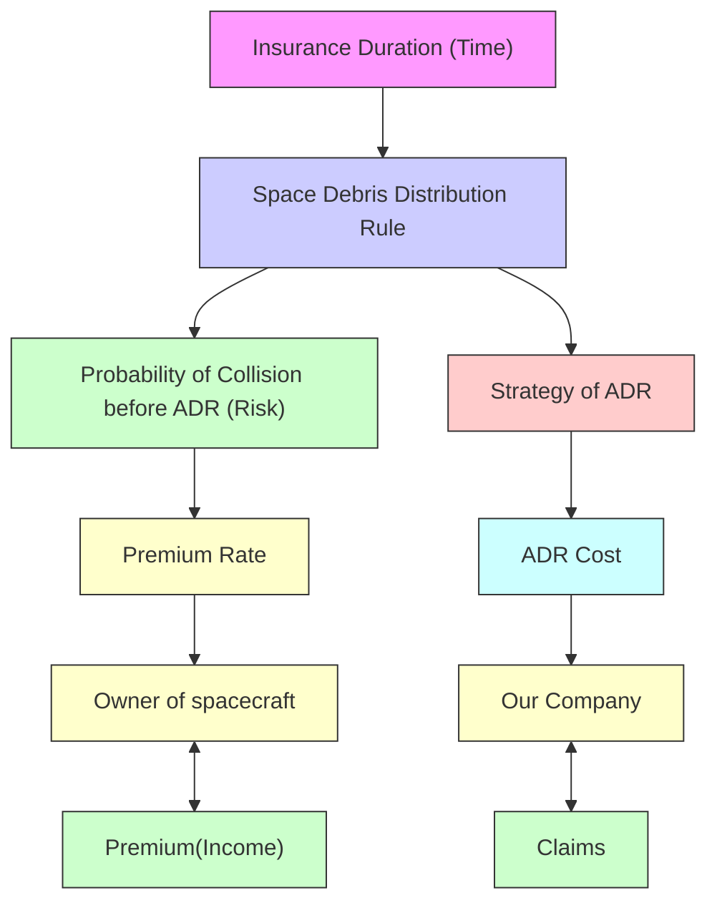

## 2016

## MCM/ICM

## Summary Sheet

(Your team's summary should be included as the first page of your electronic submission.)

Type a summary of your results on this page. Do not include the name of your school, advisor, or team members on this page.

## A New Space Debris Collisions Insurance Model

With the rapid increase of human aerospace activities, the population of space debris has become a universal concern.

We successfully find a commercial opportunity under the background of serious space debris population, and that is the space debris collision insurance service. The basic idea of this service is that if any debris collision cause damage to the spacecraft during the insurance duration, we will pay for the claims. Meanwhile, in order to reduce the risks of collision and losing money, we will carry out Active Debris Removal (ADR) measures by renting existing ADR technologies. The structure of whole service is demonstrated in fig.3.

To calculate the profit of our proposed service, we should know how much our income (premium) is and how much our cost (ADR cost and claims) is.

The premium and claims of this service is determined by the premium rate, which is closely related to the effective collision probability. Therefore, we build an analysis model based on Orbital Debris Engineering Model（ORDEM 2000）to anticipate the distribution and flux of space debris. By improving the method introduced by European Space Agency, and using it on the ORDEM 2000 data, we deduce the effective collision probability from the flux. Furthermore, to connect the effective collision probability with the premium rate, we establish a new insurance model which takes the special features of space debris into consideration.

The ADR cost is related to the two-steps strategy of ADR. Firstly, by analyzing the expression of effective collision probability, we set a size limit for the debris to be removed. Secondly, based on fuzzy comprehensive evaluation (FCE) method, we build a model to design the ADR strategy for removing the debris with certain range of size.

We simulate the whole insurance service via computer. The result indicates that our insurance service has a great profitability and business competitive.

Considering that the debris distribution data from ORDEM varies with time and those data determined both premium rate and ADR strategy, our model is a strongly time-dependent one.

We choose premium rate, insurance duration and fuzzy evaluation factor for sensitivity analysis, which show that our model is very robust and can deal with some important “What if?” scenarios.

## Content

1 Introduction 2

1.1 Background .. (  
1.2 Our Work .. (  
1.3 Symbol Description  
1.4 General Assumptions ... .4

2 Commercial Opportunity. 4

3 Space Debris Distribution Rule.

3.1 The Range. 5  
3.2 ORDEM 2000.. .5  
3.3 Distribution of Space Debris .6

3.3.1 General Rule of Space Debris Distribution ... 6  
3.3.2 Flux of Space Debris

4 Probability of Effective Collision Probability..

4.1 Annual Collision Probability.  
4.2 Effective Collision Probability .8

5 Premium Rate.

5.1 Traditional Model. 9  
5.2 Improved Model. ..10

6 Strategy of ADR . 11

6.1 First Step... .11  
6.2 Second Step: Fuzzy Comprehensive Evaluation . .12

6.2.1 The ADR Measures .. .12  
6.2.2 Implementation of Fuzzy Comprehensive Evaluation.... .12  
6.2.3 Conclusion.. .14

7 The Impact of Insurance Duration (Time). .14  
8 Model Implementation and Economy Validation .15  
9 “What If” and Sensitive Analysis 17  
10 Strengths and Weaknesses . .19

10.1 Strengths.. .19  
10.2 Weaknesses.. .19

References .. .20

Executive Summary.. .21

## 1 Introduction

## 1.1 Background

In 1957, the first man-made object was launched into space. From then on, more than 5,000 spacecraft had been launched to Earth-centered orbits of various heights. With the rapid increase of the human aerospace activities, the population of space debris has become more and more serious.

Space debris is any man-made object in orbit about the Earth which no longer serves a useful function. Such debris includes nonfunctional spacecraft, abandoned launch vehicle stages, mission-related debris and fragmentation debris [1].

Most space debris is moving very fast. It can reach speeds of 4.3 to 5 miles per second. Five miles per second is about 18,000 miles per hour. That's almost seven times faster than a bullet. Since it is moving so quickly, a tiny piece of orbital debris can cause a lot of damage. A piece of debris the size of a marble could hit as hard as a bowling ball going 300 miles per hour [2]. It is a severe potential danger especially to the International Space Station, space shuttles and other spacecraft with humans aboard. Today, there are more than 20,000 pieces of debris larger than a softball orbiting the Earth; 500,000 pieces of debris the size of a marble or larger; many millions of pieces of debris that are so small they can’t be tracked [1].

Dealing with these dangerous debris scientists have proposed numbers of methods，including water-jets, high energy lasers and large satellites designed to sweep up the debris and so on.


<details>
<summary>bubble chart</summary>

| x | y | size |
|---|---|------|
| 0.0 | 0.0 | 1000 |
| 0.1 | 0.1 | 950 |
| 0.2 | 0.2 | 900 |
| 0.3 | 0.3 | 850 |
| 0.4 | 0.4 | 800 |
| 0.5 | 0.5 | 750 |
| 0.6 | 0.6 | 700 |
| 0.7 | 0.7 | 650 |
| 0.8 | 0.8 | 600 |
| 0.9 | 0.9 | 550 |
| 1.0 | 1.0 | 500 |
</details>

Figure 1: Debris in Low Earth Orbit [3]


<details>
<summary>scatterplot</summary>

| x | y |
|---|---|
| 0.0 | 0.0 |
| 0.1 | 0.1 |
| 0.2 | 0.2 |
| 0.3 | 0.3 |
| 0.4 | 0.4 |
| 0.5 | 0.5 |
| 0.6 | 0.6 |
| 0.7 | 0.7 |
| 0.8 | 0.8 |
| 0.9 | 0.9 |
| 1.0 | 1.0 |
</details>

Figure 2: Debris in High Earth Orbit [3]

Considering the high expense and high risks of running spacecraft, most of the owners of the satellites tend to cover insurance for their spacecraft in the past decade. Therefore the market of space insurance has grown very large. The premium income for 2014 was closed to USD700m. The growth of orbit debris has compromised the safety of the satellites. Because of not fully considering the impact of increasing debris, the space insurance market is still volatile and reported a loss in 2013. And it was only marginally profitable to insurers in 2014 [4].

## 1.2 Our Work

We are asked to find out whether an economically attractive opportunity exist and develop a mode to determine the best alternative or combination of alternatives that a private firm could adopt as a commercial opportunity to address the space debris problem.

Since the rising population of space debris has strongly affected the safety of the spacecraft and most of insurers didn’t take this situation into consideration, a good commercial opportunity arose: debris collision space insurance. This insurance consists of two parts. One is that if any debris collision happens to the spacecraft during the insurance duration, we will pay for the claims. Another is that we take the initiative to carry out Active Debris Removal (ADR) to reduce the probability of debris collision which strongly influence the claims probability.

We firstly build a general insurance model. Then we establish a space debris distribution rule to estimate the risks and calculate premium rate. In order to decrease the claims, we will rent the existing technology of Active Debris Removal (ADR) and reduce the probability of debris collision. Besides, we use fuzzy comprehensive evaluation (FCE) method to build an alternatives choosing strategy to determine which ADR method to use.

We simulate the whole insurance service via computer. The data indicate that our insurance service has a great profitability and business competitive. We choose premium rate, insurance duration and fuzzy evaluation factor for sensitivity analysis, and results show that our model is very robust and can deal with some important “What if?” scenarios. In the last stage, we provide an executive summary.

## 1.3 Symbol Description

Table 1: Notation

<table><tr><td>Symbol</td><td>Meaning</td></tr><tr><td>q</td><td>expected value of debris</td></tr><tr><td>t</td><td>time</td></tr><tr><td>S</td><td>cross sectional area</td></tr><tr><td>F</td><td>flux of space debris</td></tr><tr><td> $\overline{F}$ </td><td>orbit average flux</td></tr><tr><td>T</td><td>time of a year</td></tr><tr><td>N</td><td>expected value of total debris impacts per unit area when spacecraft travel a year</td></tr><tr><td> $P_c$ </td><td>collision probability</td></tr><tr><td>j</td><td>index for the debris and meteoroids diameter range  $[D_{p,j} ... D_{p,j+1}]$ </td></tr><tr><td> $F_j$ </td><td>flux of debris and meteoroids in the diameter range  $[D_{p,j} ... D_{p,j+1}]$ </td></tr><tr><td> $D_t$ </td><td>space system (spacecraft or launch vehicle stage) maximum diameter</td></tr><tr><td> $D_{p,j}$ </td><td>debris diameter</td></tr><tr><td> $P_{c,yr}$ </td><td>annual collision probability</td></tr><tr><td> $\overline{F}_j$ </td><td>average flux of debris and meteoroids in the diameter range  $[D_{p,j} ... D_{p,j+1}]$ </td></tr><tr><td> $P_e$ </td><td>effective collision probability</td></tr><tr><td> $P_{in}$ </td><td>ineffective collision probability</td></tr><tr><td> $M_p$ </td><td>projectile mass (i.e. debris)</td></tr><tr><td> $V_{imp}$ </td><td>impact velocity (i.e. relative velocity between the projectile and target)</td></tr><tr><td> $M_t$ </td><td>target mass (i.e. the spacecraft)</td></tr><tr><td> $D_p$ </td><td>diameter of debris</td></tr><tr><td> $D_{p,c}$ </td><td>diameter threshold</td></tr><tr><td> $\left(\frac{A_p}{M_p}\right)_{std}$ </td><td>area-to-mass ratio,  $(\frac{A_p}{M_p})_{std} = 0.01\ m^2/kg$ </td></tr><tr><td> $\alpha$ </td><td>premium rate</td></tr><tr><td> $C_p$ </td><td>total claims</td></tr><tr><td> $C_z$ </td><td>total premium</td></tr><tr><td> $\beta$ </td><td>refers to total failure rate</td></tr><tr><td> $\hat{\beta}$ </td><td>the failure rate of the improved model</td></tr><tr><td>E</td><td>the expected profit</td></tr><tr><td> $\gamma$ </td><td>critical failure probability</td></tr></table>

## 1.4 General Assumptions

·The inclination angle of orbit does not affect the number of debris impacts.  
·The orbit altitude remains the same.  
·Only space debris will cause damage to spacecraft.  
·Do not take the research and development costs into consideration.  
·The number of insurance customers is big enough to satisfies the law of large numbers.

## 2 Commercial Opportunity

As discussed above, the rising space debris is a potential threaten to the safety of spacecraft. On the other hand, it is also a potential commercial opportunity for insurance company.


<details>
<summary>flowchart</summary>

```mermaid
graph TD
  A["Insurance Duration (Time)"] --> B["Space Debris Distribution Rule"]
  B --> C["Probability of Collision before ADR (Risk)"]
  C --> D["Premium Rate"]
  D --> E["Owner of spacecraft"]
  E --> F["Our Company"]
  F --> G["Cost"]
  G --> H["ADR Cost"]
  H --> I["Strategy of ADR"]
  I --> B
    style A fill:#f9f,stroke:#333
    style B fill:#ccf,stroke:#333
    style C fill:#cfc,stroke:#333
    style D fill:#fcc,stroke:#333
    style E fill:#cff,stroke:#333
    style F fill:#ffc,stroke:#333
    style G fill:#fcf,stroke:#333
    style H fill:#cff,stroke:#333
    style I fill:#ffc,stroke:#333
    linkStyle 0 stroke:#ff0000,stroke-width:2px
    linkStyle 1 stroke:#ff0000,stroke-width:2px
    linkStyle 2 stroke:#ff0000,stroke-width:2px
    linkStyle 3 stroke:#ff0000,stroke-width:2px
    linkStyle 4 stroke:#ff0000,stroke-width:2px
    linkStyle 5 stroke:#ff0000,stroke-width:2px
    linkStyle 6 stroke:#ff0000,stroke-width:2px
    linkStyle 7 stroke:#ff0000,stroke-width:2px
    linkStyle 8 stroke:#ff0000,stroke-width:2px
    linkStyle 9 stroke:#ff0000,stroke-width:2px
    linkStyle 10 stroke:#ff0000,stroke-width:2px
    linkStyle 11 stroke:#ff0000,stroke-width:2px
    linkStyle 12 stroke:#ff0000,stroke-width:2px
    linkStyle 13 stroke:#ff0000,stroke-width:2px
    linkStyle 14 stroke:#ff0000,stroke-width:2px
    linkStyle 15 stroke:#ff0000,stroke-width:2px
    linkStyle 16 stroke:#ff0000,stroke-width:2px
    linkStyle 17 stroke:#ff0000,stroke-width:2px
    linkStyle 18 stroke:#ff0000,stroke-width:2px
    linkStyle 19 stroke:#ff0000,stroke-width:2px
    linkStyle 20 stroke:#ff0000,stroke-width:2px
```
</details>

Figure 3: Model Schematic Diagram

Most of the insurers didn’t fully consider the impact of increasing debris when calculate the premium rate. Therefore it’s becoming more and more difficult to make money in the area of space insurance. At the same time, there are certain companies and space agency doing research on ADR in recent years，and several methods have been successfully developed.

Based on the situations above, we build a brand new space insurance mode, and verify this mode’s ability to make profits. To demonstrate our model better, we plot over a flowchart in Figure 3.

Suppose a satellite is planned to be launched into the space, and the owner of the satellite wants to cover insurance this spacecraft. Then we can offer him a space insurance serve which consists of two parts. One is that if any debris collision happens to the spacecraft during the insurance duration, we will pay for the claims. In order to reduce the collision risks, we will carry out Active Debris Removal (ADR) to reduce the probability of debris collision.

The premium and claims of this service, as shown in Figure3, is determined by the premium rate. Premium rate is related to the collision risk, and cost is determined by strategy of ADR. Finally they are both connected to the space debris distribution rule, which is influenced by the insurance duration, or time. The claims we might pay for is determined by premium rate and how much premium is.

## 3 Space Debris Distribution Rule

## 3.1 The Range

Generally, satellite orbit is divided into three categories, they are:

·Low Earth Orbit (LEO)：Its ground clearances rang from 200km to 2000km  
·Synchronous Orbit：Its ground clearances are around 35786km.  
·Highly Elliptical Orbit (HEO): Its ground clearances are beyond 20000km.

We only analyze the space debris environment in LEO and HEO and neglect the situation in HEO. The reasons we can do this are:

·The speed of spacecraft in HEO is much lower than in LEO  
·In HEO, the size of the spacecraft is much smaller compared with the distance between two spacecraft.  
·The amount of the spacecraft in HEO is much smaller than in LEO.

## 3.2 ORDEM2000

Orbital Debris Engineering Model (ORDEM) is developed by NASA Johnson Space Center in 1996 [5], designed to predict and analyze the debris environment [5]. The latest version of ORDEM is ORDEM 2000, incorporated in which is a large set of observational data (both in-situ and ground-based) that reflect the current debris environment. These data cover the object size range from 10 µm to 1 m and position range from low Earth orbit to synchronous orbit, and that’s exactly what we want [5].

Analytical techniques (such as maximum likelihood estimation and Bayesian statistics) are employed to determine the orbit populations used to calculate population fluxes and their

uncertainties.

The Debris Assessment Software (DAS) is a software based on ORDEM 2000, its operation interface is shown in figure 4.


<details>
<summary>text_image</summary>

DAS - project - [Science and Engineering Utilities]
File Edit View Window Help
Mission Editor Requirement Assessments Science and Engineering
Science and Engineering Utilities
On-Orbit Collisions
Debris Impacts vs. Orbit Altitude
Debris Impacts vs. Debris Diameter
Debris Impacts vs. Date
Analysis of Postmission Disposal Maneuvers
Orbit Evolution Analysis
Delta-V Postmission Maneuver Analysis
Delta-V Orbit to Orbit Transfer
Other Utilities
Debris Impacts vs. Orbit Altitude
Start 2005 yr
Duratio 10 yr
Avg. S/C X-Sectional 1 m^2
Inclinat: 28.5 deg
Type of Meteoroids & Orbital
Impactor Diameter .2 cm
10
5
Plot Type
Impact Rate vs Orbital Al
Number of Impacts vs Orbital A
cm
Add Remove
Plot Reset Help
For Help, press F1
</details>

Figure 4: DAS

## 3.3 Distribution of Space Debris

## 3.3.1 General Rule of Space Debris Distribution

Using the DAS, we can figure out how space debris distribution varies with altitude.

Figure 5 indicates the number (per year) of debris impacts, of each impactor size we expected. Numbers of debris impacts are given on a logarithmic (base 10) scale. Results are a function of altitude [6].

In this plot, we supposed the launch date is on 2016.01.01 and the duration lasts one year. It’s apparent that the smaller debris size is, the more debris are. Also, the number of debris varies with the height, and, particularly, the height of 700-1000 kilometers and 1400-1600 kilometers are two peaks indicating the hardest-hit areas.


<details>
<summary>line chart</summary>

| Altitude (km) | Diameter 0.20 (cm) | Diameter 0.50 (cm) | Diameter 1.00 (cm) | Diameter 10.00 (cm) | Diameter 5.00 (cm) |
| ------------- | ------------------ | ------------------ | ------------------ | ------------------- | ------------------ |
| 200.0         | -3.0               | -5.0               | -6.0               | -7.0                | -7.0               |
| 600.0         | -2.0               | -4.0               | -5.0               | -6.5                | -6.5               |
| 1000.0        | -1.5               | -3.5               | -4.5               | -6.0                | -6.0               |
| 1400.0        | -2.0               | -3.5               | -4.5               | -5.5                | -5.5               |
| 1800.0        | -2.5               | -4.0               | -5.5               | -6.5                | -6.5               |
| 2200.0        | -2.5               | -4.5               | -6.0               | -7.0                | -7.0               |
</details>

Figure 5

## 3.3.2 Flux of Space Debris

Flux of space debris is a relevant factor describing the distribution of the space debris. It can be defined as impacts/ unit time/ unit area. In ORDEM 2000 model, the flux is defined as [7]

$$
F = \frac {\partial^ {2} q}{\partial t \partial S} \tag {3.3.1}
$$

where:

q expected value of debris

t time

S cross sectional area

The orbit average flux is[7]:

$$
\bar {F} = \frac {N}{T} = \frac {\sum F}{T} \tag {3.3.2}
$$

where:

T time of a year

N expected value of total debris impacts per unit area when spacecraft travel a year

The flux of the debris is in direct proportion to the risk of being collide. The specific value of average flux can be obtained from the ORDEM 2000.

## 4 Probability of Effective Collision

## 4.1 Annual Collision Probability

As mentioned above, the collision probability is closely related to the flux of the debris. According to ESA Space Debris Mitigation Compliance Verification Guidelines, the collision probability can be simply expressed as[8]: $\mathrm { a s } ^ { [ 8 ] }$

$$
P _ {c} = \sum_ {j = 1} ^ {N} F _ {j} \frac {\pi}{4} (D _ {t} + D _ {p, j}) ^ {2} \tag {4.1.1}
$$

where:

$j$ index for the debris and meteoroids diameter range $\ d [ D _ { p , j } , \ D _ { p , j + I } ]$

$F _ { j }$ flux of debris and meteoroids in the diameter range $\displaystyle { \cal { I } } D _ { p , j , } D _ { p , j + I } ]$

$D _ { t }$ space system (spacecraft or launch vehicle stage) maximum diameter

$D _ { p , j }$ debris diameter

The term of $\frac { \pi } { 4 } ( D _ { t } + D _ { p , j } ) ^ { 2 }$ stands for the collision cross-sectional area, that is, the envelope of the maximum projected area of the space system and the area of the debris [8].

Considering the definition of the $F _ { j } , \ P _ { c }$ may regard as the sum of a serial expected. Because the output value of ORDEM 2000 is $\bar { F }$ , we change formula 3.4.1 into:

$$
P _ {c, y r} = \sum_ {j = 1} ^ {N} \bar {F} _ {j} \frac {\pi}{4} (D _ {t} + D _ {p, j}) ^ {2} \tag {4.1.2}
$$

where:

$\bar { F } _ { j }$ average flux of debris and meteoroids in the diameter range $[ D _ { p , j } , D _ { p , j + I } ]$

So, the $P _ { c , y r }$ become an annual collision probability.

From the formula we can find out that the probability is expressed as a form of sum. Every individual terms in the sum stands for the contribution of the debris with a size range from $D _ { p , j } \mathrm { t o } D _ { p , j + I }$ to the $P _ { c , y r }$ . This property is very useful to our next steps.

## 4.2 Effective Collision Probability

Considering the fact that not every collision will lead to severe damage, we define an concept of effective collision probability:

$$
P _ {e} = P _ {c, y r} - P _ {i n} \tag {4.2.1}
$$

The effective collision probability equals annual collision probability minus ineffective collision probability.

The main parameter to determine whether a collision is catastrophic, is the energy-to-mass ratio $\mathbf { ( E M R ) } ^ { [ 8 ] }$ :

$$
E M R = \frac {\frac {1}{2} M _ {p} V _ {i m p} {} ^ {2}}{M _ {t}} \tag {4.2.2}
$$

where:

$M _ { p }$ projectile mass (i.e. debris)

$V _ { i m p }$ impact velocity (i.e. relative velocity between the projectile and target)

$M _ { t }$ target mass (i.e. the spacecraft)

The threshold for a catastrophic collision $( E M R ) _ { c c }$ is usually assumed to $\mathsf { b e } ^ { [ 8 ] }$

$$
E M R \geq (E M R) c c = 4 0 J / g \tag {4.2.3}
$$

Plugging formula 4.2.2 into the equation 4.2.3 and a standard projectile we obtain:

$$
D _ {p} \geq \sqrt {\frac {8}{\pi} \left(\frac {A _ {p}}{M _ {p}}\right) _ {s t d} \frac {(E M R) c c M _ {t}}{V _ {i m p} {} ^ {2}}} = D _ {p, c} \tag {4.2.4}
$$

????

???? ????

Then we can calculate $P _ { i n }$ by:

$$
P _ {i n} = \sum_ {j = 1} ^ {N} \overline {{{F}}} _ {J} \frac {\pi}{4} (D _ {t} + D _ {p, j}) ^ {2} \tag {4.2.5}
$$

where $\begin{array} { r } { D _ { p , j } < \sqrt { \frac { 8 } { \pi } \biggl ( \frac { A _ { p } } { M _ { p } } \biggr ) _ { s t d } \frac { ( E M R ) c c ~ M _ { t } } { { V _ { i m p } } ^ { 2 } } } } \end{array}$ ???? ???? ????????

## 5 Premium Rate

## 5.1 Traditional Model

According to traditional insurance model, the premium we expect depends on the premium rate, which is [9]

$$
\alpha = \frac {C _ {p}}{C _ {\mathrm{z}}} \times 100 \% \tag{5.1.1}
$$

where:

?? premium rate

$C _ { p }$ total claims

$C _ { z }$ total premium

It’s obvious that $C _ { p } = C _ { z } \times \alpha$ (5.1.2)

Approximately, the premium rate can be also written as [9]:

$$
\alpha \approx (1. 2 \sim 1. 5) \beta \tag {5.1.3}
$$

where ?? refers to total failure rate.

Then we can get the expected value of the final profit E:

$$
E = C _ {z} \times (1 - \beta) - C _ {p} \times \beta \tag {5.1.4}
$$

What calls for special attention is that $\beta$ is not the actual failure probability $\beta ^ { * }$ . The $\beta ^ { * }$ depends on every aspect of launching procedure and the whole environment of the space. While $\beta$ comes from statistical method, that is, the total number of failure cases divided by the total number of spacecraft launched.

Due to the fact that the amount of the spacecraft launched is not large enough, the laws of large number fail. So $\beta$ usually differs a lot from $\beta ^ { * }$ . And that’s the reason why the space insurance market is still volatile and reported a loss in 2013. And it was only marginally profitable to insurers in $2 0 1 4 ^ { [ 5 ] }$ .

## 5.2 Improved Model

In our business model---debris collision insurance, we only pay for the claims when the failure is caused by debris collision. Therefore the tradition model does not suit well to our situation, and we need a new method to evaluate premium rate.

It’s rational to assume that our failure rate $\hat { \beta }$ is equal to $P _ { e }$ :

$$
\hat {\beta} = P _ {e} \tag {5.2.1}
$$

Internationally applied space insurance premium rate is about 8% [9]. According to ORDEM 2000 $P _ { c }$ ranges from $1 0 ^ { - 5 } { \sim } 1 0 ^ { - 3 }$ .Given that $1 0 ^ { - 3 }$ refers to the hardest-hit areas, so the premium rate here should be higher than other areas, and rate of change of premium rate should lower than other areas. Meanwhile our insurance only covers the damage caused by debris collision, so our premium rate should lower than generally applied insurance premium.

Fully considering those characters above, we establish a new premium rate model:

$$
\alpha = (8 + \log_ {1 0} \hat {\beta}) / 1 0 0 \tag {5.2.2}
$$

Figure 6 shows how premium rate changes with the failure rate $\hat { \beta }$ in our new premium model.


<details>
<summary>line chart</summary>

| probability of collision (x 10^-4) | insurance premium rate of our model |
| ---------------------------------- | ------------------------------------ |
| 0                                  | 0.03                                 |
| 1                                  | 0.04                                 |
| 2                                  | 0.045                                |
| 3                                  | 0.047                                |
| 4                                  | 0.048                                |
| 5                                  | 0.049                                |
| 6                                  | 0.0495                               |
| 7                                  | 0.05                                 |
| 8                                  | 0.05                                 |
| 9                                  | 0.05                                 |
| 10                                 | 0.05                                 |
</details>

Figure 6: Premium Rate Model

Now we suppose a critical failure probability ??. When ${ \hat { \beta } } > \gamma$ we then take ADR measures and make $\hat { \beta }$ smaller than ??, if not, we do not have to take any measures to reduce the collision probability $P _ { c }$ . Then the expected final profit E is

$$
E = C _ {z} \times (1 - \gamma) - C _ {p} \times \gamma - c o s t (\hat {\beta}, \gamma , t) \tag {5.2.3}
$$

where:

$$
\operatorname{cost} (\hat {\beta}, \gamma , t) = \text { value } (\text { strategy }) + \text { fee } (\text { strategy }, \hat {\beta}, \gamma , t) \tag {5.2.4}
$$

The $\boldsymbol { c o s t } \big ( \hat { \beta } , \gamma , t \big )$ represents the money we should pay for the ADR, including manufacturing costs (??????????) and launch costs $( f e e )$ . Because the ADR technologies we need has already exist, we don’t take research cost into consideration.

## 6 Strategy of ADR

By now, we have solved the problem of how much income (premium) we have.

How much cost we should pay for is the next question. This is shown in fig.7 .


<details>
<summary>flowchart</summary>

```mermaid
graph TD
  A["Insurance Duration (Time)"] --> B["Space Debris Distribution Rule"]
  B --> C["Probability of Collision before ADR (Risk)"]
  C --> D["Premium Rate"]
  D --> E["Owner of spacecraft"]
  E --> F["Our Company"]
  F --> G["Cost"]
  G --> H["ADR Cost"]
  H --> I["Strategy of ADR"]
  I --> J["Unknown?"]
    style A fill:#f9f,stroke:#333
    style F fill:#bbf,stroke:#333
    linkStyle 0 stroke:#000,stroke-width:2px
    linkStyle 1 stroke:#000,stroke-width:2px
    linkStyle 2 stroke:#000,stroke-width:2px
    linkStyle 3 stroke:#000,stroke-width:2px
    linkStyle 4 stroke:#000,stroke-width:2px
    linkStyle 5 stroke:#000,stroke-width:2px
    linkStyle 6 stroke:#000,stroke-width:2px
    linkStyle 7 stroke:#000,stroke-width:2px
    linkStyle 8 stroke:#000,stroke-width:2px
    linkStyle 9 stroke:#000,stroke-width:2px
    linkStyle 10 stroke:#000,stroke-width:2px
    linkStyle 11 stroke:#000,stroke-width:2px
    linkStyle 12 stroke:#000,stroke-width:2px
    linkStyle 13 stroke:#000,stroke-width:2px
    linkStyle 14 stroke:#000,stroke-width:2px
    linkStyle 15 stroke:#000,stroke-width:2px
    linkStyle 16 stroke:#000,stroke-width:2px
    linkStyle 17 stroke:#000,stroke-width:2px
    linkStyle 18 stroke:#000,stroke-width:2px
    linkStyle 19 stroke:#000,stroke-width:2px
    linkStyle 20 stroke:#000,stroke-width:2px
    linkStyle 21 stroke:#000,stroke-width:2px
    linkStyle 22 stroke:#000,stroke-width:2px
    linkStyle 23 stroke:#000,stroke-width:2px
    linkStyle 24 stroke:#000,stroke-width:2px
    linkStyle 25 stroke:#000,stroke-width:2px
    linkStyle 26 stroke:#000,stroke-width:2px
    linkStyle 27 stroke:#000,stroke-width:2px
    linkStyle 28 stroke:#000,stroke-width:2px
    linkStyle 29 stroke:#000,stroke-width:2px
    linkStyle 30 stroke:#000,stroke-width:2px
    linkStyle 31 stroke:#000,stroke-width:2px
    linkStyle 32 stroke:#000,stroke-width:2px
    linkStyle 33 stroke:#000,stroke-width:2px
    linkStyle 34 stroke:#000,stroke-width:2px
    linkStyle 35 stroke:#000,stroke-width:2px
    linkStyle 36 stroke:#000,stroke-width:2px
    linkStyle 37 stroke:#000,stroke-width:2px
    linkStyle 38 stroke:#000,stroke-width:2px
    linkStyle 39 stroke:#000,stroke-width:2px
    linkStyle 40 stroke:#000,stroke-width:2px
    linkStyle 41 stroke:#000,stroke-width:2px
    linkStyle 42 stroke:#000,stroke-width:2px
    linkStyle 43 stroke:#000,stroke-width:2px
    linkStyle 44 stroke:#000,stroke-width:2px
    linkStyle 45 stroke:#f9f,stroke-width:2px
    linkStyle 46 stroke:#f9f,stroke-width:2px
    linkStyle 47 stroke:#f9f,stroke-width:2px
    linkStyle 48 stroke:#f9f,stroke-width:2px
    linkStyle 49 stroke:#f9f,stroke-width:2px
    linkStyle 50 stroke:#f9f,stroke-width:2px
```
</details>

Figure 7: Model Schematic Diagram

The aim of ADR is to reduce the failure probability and claim probability.

We take two steps to achieve this goal. Firstly, we should determine a size limit for the debris to be removed. Secondly we should choose a suitable ADR strategy for removing the debris with certain range of size.

## 6.1 First Step

As discussed in Section 4, the collision probability is expressed as a form of sum:

$$
P _ {c, y r} = \sum_ {j = 1} ^ {N} \bar {F} _ {j} \frac {\pi}{4} (D _ {t} + D _ {p, j}) ^ {2} \tag {4.1.2}
$$

Every individual term in the expression stands for the contribution of the debris with a size range from Dp,j to Dp,j+1 to the ????,????. $D _ { p , j } \mathrm { t o } D _ { p , j + I } \mathrm { t o }$ $P _ { c , y r }$

In order to reduce the collision probability effectively, we can choose one or more terms in the expression who contributes the most to the probability. Usually, a large $\bar { F } _ { j }$ means a small $D _ { p , j } .$ , so the $\overline { { F } } _ { j } \frac { \pi } { 4 } ( D _ { t } + D _ { p , j } ) ^ { 2 }$ is not a monotone function.

We remove the terms with the biggest $\overline { { F } } _ { j } \frac { \pi } { 4 } ( D _ { t } + D _ { p , j } ) ^ { 2 }$ one by one, till the $P _ { e }$ becomes smaller than ??.

## 6.2 Second Step: Fuzzy Comprehensive Evaluation

With a certain range of the size of the debris decided, we should choose a suitable strategy of ADR to remove them. The fuzzy comprehensive evaluation is a good method to do so.

Fuzzy comprehensive evaluation method is a mathematical method to comprehensively evaluate things that are not easy to be clearly defined in the real world by using the thinking and methods of fuzzy mathematics. The method comprehensively evaluate systems by using fuzzy set theory of fuzzy mathematics. Through the fuzzy evaluation information about the priority of various alternatives can be achieved as a reference for decision makers to make decision [10]. Therefore we choose this method to achieve our goal.

## 6.2.1 The ADR Measures

Active Debris Removal (ADR) is a very effective solution to reduce the collision occurrence possibility. After a series of method comparison, we choose four kind of candidate ADR technologies.

·Ground-based Laser: Using high-powered laser pulses fired from the ground, the system would create a small plasma jet emanating from the piece of junk itself, essentially turning each piece of debris into its own laser-powered rocket that would remove itself from orbit [11].

·Space-based Laser: Using high-powered laser pulses fired from the space.

·Microsatellite: The microsatellite will use the camera equipped on it to track the space debris. Then it will grip the debris, slow down and fall into the atmosphere together.

·Large Satellite: The large satellite has several thin metal meshes which are thousands of meters. The mesh grip the debris with the robotic arm. When the mesh is full, it will be separated from the satellite and fall into the atmosphere with the debris it collects.

## 6.2.2 Implementation of Fuzzy Comprehensive Evaluation

We choose manufacture costs, cost of using, fitness (applicability to remove debris in certain size) and time consuming as evaluation factors.

The weight of each evaluation factor is

$$
\mathrm{A} = [ 0. 1 5, 0. 3 5, 0. 2, 0. 3 ]
$$

The judge decision-making Matrix is R. Then the calculation comes to: $B = A \cdot R .$

## Non-high-risk area:

## Small-sized Debris:

<table><tr><td></td><td>Cost of manufacture</td><td>Cost of using</td><td>Fitness</td><td>Time consuming</td></tr><tr><td>Ground-based Laser</td><td>0.7</td><td>1.0</td><td>0.8</td><td>0.8</td></tr><tr><td>Space-based Laser</td><td>0.2</td><td>0.6</td><td>0.7</td><td>0.6</td></tr><tr><td>Microsatellite</td><td>1.0</td><td>0.7</td><td>0.8</td><td>0.2</td></tr><tr><td>Large Satellite</td><td>0.2</td><td>0.5</td><td>0.5</td><td>0.5</td></tr></table>

Then, B = [0.855, 0.560, 0.615, 0.455]. The ground-based laser is the best method to remove small-sized debris. The microsatellite comes second.

## Medium-sized Debris:

With debris getting larger, both cost and time consuming for laser increase. Therefore:

<table><tr><td></td><td>Cost of manufacture</td><td>Cost of using</td><td>Fitness</td><td>Time consuming</td></tr><tr><td>Ground-based Laser</td><td>0.7</td><td>0.8</td><td>0.5</td><td>0.7</td></tr><tr><td>Space-based Laser</td><td>0.2</td><td>0.6</td><td>0.8</td><td>0.6</td></tr><tr><td>Microsatellite</td><td>1.0</td><td>0.7</td><td>0.3</td><td>0.2</td></tr><tr><td>Large Satellite</td><td>0.2</td><td>0.5</td><td>0.7</td><td>0.5</td></tr></table>

Then, B = [0.695, 0.580, 0.515, 0.460]. The ground-based laser is the best method to remove medium-sized debris.

## Large-sized Debris:

Microsatellites are not suitable for large debris, so we don’t take it into consideration.

<table><tr><td></td><td>Cost of manufacture</td><td>Cost of using</td><td>Fitness</td><td>Time consuming</td></tr><tr><td>Ground-based Laser</td><td>0.7</td><td>0.5</td><td>0.2</td><td>0.5</td></tr><tr><td>Space-based Laser</td><td>0.2</td><td>0.4</td><td>0.6</td><td>0.5</td></tr><tr><td>Large Satellite</td><td>0.2</td><td>0.4</td><td>0.8</td><td>0.5</td></tr></table>

Then, $B = [ 0 . 4 7 0 , 0 . 4 4 0 , 0 . 4 8 0 ]$ . The large satellite is the best method to remove large-sized debris.

## Hardest-hit areas (700-1000 kilometers and 1400-1600 kilometers from earth surface):

The debris number in this area are larger than in other areas, so the manufacture costs of microsatellite and the using costs of laser should be paid extra attention to.

## Small-sized Debris:

<table><tr><td></td><td>Cost of manufacture</td><td>Cost of using</td><td>Fitness</td><td>Time consuming</td></tr><tr><td>Ground-based Laser</td><td>0.4</td><td>0.5</td><td>0.8</td><td>0.4</td></tr><tr><td>Space-based Laser</td><td>0.2</td><td>0.4</td><td>0.7</td><td>0.4</td></tr><tr><td>Microsatellite</td><td>1.0</td><td>0.4</td><td>0.8</td><td>0.1</td></tr><tr><td>Large Satellite</td><td>0.2</td><td>0.5</td><td>0.5</td><td>0.4</td></tr></table>

Then, B = [0.515, 0.430, 0.480, 0.425]. The ground-based laser is the best method for removing small-sized debris. However, based on the fact that the debris number is very large in hardest-hit areas, the advantages of the ground-based laser are no longer obvious. The satellites may be more suitable for this situation.

## Medium-sized Debris:

<table><tr><td></td><td>Cost of manufacture</td><td>Cost of using</td><td>Fitness</td><td>Time consuming</td></tr><tr><td>Ground-based Laser</td><td>0.4</td><td>0.4</td><td>0.5</td><td>0.4</td></tr><tr><td>Space-based Laser</td><td>0.2</td><td>0.3</td><td>0.7</td><td>0.3</td></tr><tr><td>Microsatellite</td><td>1.0</td><td>0.4</td><td>0.3</td><td>0.1</td></tr><tr><td>Large Satellite</td><td>0.2</td><td>0.5</td><td>0.7</td><td>0.4</td></tr></table>

Then, B = [0.420, 0.385, 0.380, 0.465]. The large satellite is the best method to remove medium-sized debris.

## Large-sized Debris:

Microsatellites are not suitable for large debris, so we don’t take it into consideration.

<table><tr><td></td><td>Cost of manufacture</td><td>Cost of using</td><td>Fitness</td><td>Time consuming</td></tr><tr><td>Ground-based Laser</td><td>0.4</td><td>0.2</td><td>0.2</td><td>0.3</td></tr><tr><td>Space-based Laser</td><td>0.2</td><td>0.2</td><td>0.6</td><td>0.3</td></tr><tr><td>Large Satellite</td><td>0.2</td><td>0.4</td><td>0.8</td><td>0.3</td></tr></table>

Then, B = [0.260, 0.310, 0.420]. The large satellite is the best method to remove large-sized debris.

## 6.2.3 Conclusion

From the results above, we can come to a conclusion that laser has the best applicability in most situation. However laser is a little regionally restricted. Though large satellite has a high cost, it has the features as being large in capacity. A large satellite can bring 100 nets with it and is cost-effective.

## 7 The Impact of Insurance Duration (Time)

The debris distribution data from ORDEM varies with time and those data determined both

premium rate and ADR strategy, so our model is a strongly time- dependent one.

From the plot below, we can find that the number of debris impacts increases obviously with the time passing by. Which means that, if the satellite owners (our customers) buy a longer-duration insurance from us, then the collision probability will increase which leads to a higher premium.

The further analysis will be made in section 9.


<details>
<summary>line chart</summary>

| Starting Date (yr) | Diameter: 0.20 (cm) | Diameter: 0.50 (cm) | Diameter: 1.00 (cm) | Diameter: 5.00 (cm) | Diameter: 10.00 (cm) |
| --- | --- | --- | --- | --- | --- |
| 1980.0 | -2.4 | -3.6 | -4.6 | -5.4 | -5.6 |
| 1990.0 | -2.2 | -3.6 | -4.4 | -5.4 | -5.6 |
| 2000.0 | -2.0 | -3.6 | -4.2 | -5.4 | -5.6 |
| 2010.0 | -1.8 | -3.4 | -4.0 | -5.2 | -5.4 |
| 2020.0 | -1.8 | -3.2 | -3.8 | -5.0 | -5.2 |
| 2030.0 | -1.7 | -3.2 | -3.6 | -4.8 | -5.0 |
| 2040.0 | -1.6 | -3.1 | -3.4 | -4.6 | -4.8 |
| 2050.0 | -1.6 | -3.1 | -3.2 | -4.4 | -4.6 |
| 2060.0 | -1.5 | -3.0 | -3.0 | -4.2 | -4.4 |
| 2070.0 | -1.5 | -3.0 | -2.8 | -4.0 | -4.2 |
| 2080.0 | -1.4 | -2.9 | -2.6 | -3.8 | -4.0 |
| 2090.0 | -1.4 | -2.9 | -2.4 | -3.6 | -3.8 |
| 2100.0 | -1.4 | -2.8 | -2.2 | -3.4 | -3.6 |
| 2110.0 | -1.4 | -2.8 | -2.0 | -3.2 | -3.4 |
| 2120.0 | -1.4 | -2.8 | -1.8 | -3.0 | -3.2 |
| 2130.0 | -1.4 | -2.8 | -1.6 | -2.8 | -3.0 |
| 2140.0 | -1.4 | -2.8 | -1.4 | -2.6 | -2.8 |
| 2150.0 | -1.4 | -2.8 | -1.2 | -2.4 | -2.6 |
| 2160.0 | -1.4 | -2.8 | -1.0 | -2.2 | -2.4 |
| 2170.0 | -1.4 | -2.8 | -0.8 | -2.0 | -2.2 |
| 2180.0 | -1.4 | -2.8 | -0.6 | -1.8 | -2.0 |
| 2190.0 | -1.4 | -2.8 | -0.4 | -1.6 | -1.8 |
| 2200.0 | -1.4 | -2.8 | -0.2 | -1.4 | -1.6 |
| 2210.0 | -1.4 | -2.8 | 0.0 | -1.2 | -1.4 |
| 2220.0 | -1.4 | -2.8 | 0.2 | -1.0 | -1.2 |
| 2230.0 | -1.4 | -2.8 | 0.4 | -0.8 | -1.0 |
| 2240.0 | -1.4 | -2.8 | 0.6 | -0.6 | -0.8 |
| 2250.0 | -1.4 | -2.8 | 0.8 | -0.4 | -0.6 |
| 2260.0 | -1.4 | -2.8 | 1.0 | -0.2 | -0.4 |
| 2270.0 | -1.4 | -2.8 | 1.2 | 0.0 | -0.2 |
| 2280.0 | -1.4 | -2.8 | 1.4 | 0.2 | 0.0 |
| 2290.0 | -1.4 | -2.8 | 1.6 | 0.4 | 0.2 |
| 2300.0 | -1.4 | -2.8 | 1.8 | 0.6 | 0.4 |
| 2310.0 | -1.4 | -2.8 | 2.0 | 0.8 | 0.6 |
| 2320.0 | -1.4 | -2.8 | 2.2 | 1.0 | 0.8 |
| 2330.0 | -1.4 | -2.8 | 2.4 | 1.2 | 1.0 |
| 2340.0 | -1.4 | -2.8 | 2.6 | 1.4 | 1.2 |
| 2350.0 | -1.4 | -2.8 | 2.8 | 1.6 | 1.4 |
| 2360.0 | -1.4 | -2.8 | 3.0 | 1.8 | 1.6 |
| 2370.0 | -1.4 | -2.8 | 3.2 | 2.0 | 1.8 |
| 2380.0 | -1.4 | -2.8 | 3.4 | 2.2 | 2.0 |
| 2390.0 | -1.4 | -2.8 | 3.6 | 2.4 | 2.2 |
| 2400.0 | -1.4 | -2.8 | 3.8 | 2.6 | 2.4 |
| 2410.0 | -1.4 | -2.8 | 4.0 | 2.8 | 2.6 |
| 2420.0 | -1.4 | -2.8 | 4.2 | 3.0 | 2.8 |
| 2430.0 | -1.4 | -2.8 | 4.4 | 3.2 | 3.0 |
| 2440.0 | -1.4 | -2.8 | 4.6 | 3.4 | 3.2 |
| 2450.0 | -1.4 | -2.8 | 4.8 | 3.6 | 3.4 |
| 2460.0 | -1.4 | -2.8 | 5.0 | 3.8 | 3.6 |
| 2470.0 | -1.4 | -2.8 | 5.2 | 4.0 | 3.8 |
| 2480.0 | -1.4 | -2.8 | 5.4 | 4.2 | 4.0 |
| 2490.0 | -1.4 | -2.8 | 5.6 | 4.4 | 4.2 |
| 2500.0 | -1.4 | -2.8 | 5.8 | 4.6 | 4.4 |
| 2510.0 | -1 nan |  |  |  |  |
</details>

Figure 8

## 8 Model Implementation and Economy Validation

We implement our model successfully via MATLAB and DAS 2.0, and simulate three typical situations.

Firstly, we focus on the hardest-hit area.

Suppose that the owner of the satellite wants to buy insurance with a premium of 7.26million dollars (comes from calculation) and duration for 5 years. The satellite is 1m in length and 30kg in weight and costs half billion dollars. Assume that the collisions are independent from each other.

Here comes the diagram showing the flux of the different-sized debris:


<details>
<summary>line chart</summary>

| log[Diameter Threshold (cm)] | log[Number of Impacts] |
| --------------------------- | ---------------------- |
| -1.0                        | 0.0                    |
| -0.5                        | -1.5                   |
| 0.0                         | -3.0                   |
| 0.5                         | -4.0                   |
| 1.0                         | -4.5                   |
| 1.5                         | -5.0                   |
</details>

Figure 9

Based on the calculation, the $D _ { p , c }$ is 0.39cm and the effective probability of the collision is 0.695‰. We can figure out that the insurance premium rate is 4.84%.

Our company aims to cut down the probability by one order of magnitude. Based on our model, we are supposed to clean the debris range from 0.39cm to 1.24cm in size.

The result of fuzzy comprehensive evaluation indicates that we should choose ground-based lasers and large satellites to remove the debris in such size. After the ADR, the probability of the collision reduces to 0.0738‰.

In this situation, our company could earn 3.04 million dollars.

Then, we focus on the space station which runs above 400km.

Suppose that the space station is 4m in length and 20000kg in weight, which costs 100 billion dollars to build and launch. The owner of space station wants to buy insurance with a premium of 981 million dollars (comes from calculation) and duration for 5 years.


<details>
<summary>line chart</summary>

| log[Diameter Threshold (cm)] | log[Number of Impacts] |
| --------------------------- | ------------------------ |
| -1.0                        | -0.5                     |
| -0.5                        | -2.5                     |
| 0.0                         | -4.5                     |
| 0.5                         | -5.5                     |
| 1.0                         | -6.0                     |
| 1.5                         | -6.2                     |
| 2.0                         | -6.3                     |
</details>

Figure 10

Based on the calculation, the $D _ { p , c }$ is 7.15cm and the effective probability of the collision is 0.0188‰. The insurance premium rate is 3.27%.

Based on our model, we are supposed to clean the debris range from 7.15cm to 71.5cm in size.The result of fuzzy comprehensive evaluation indicates that we should choose large satellites to remove the debris in such size. After the ADR, the probability of the collision is down to 0.0016‰.

In this situation, our company could make a profit of 780 million dollars.

Finally, we move our attention to satellites which runs beyond the hardest-hit area. Other conditions are the same to the first situation mentioned above.

Here comes the debris distribution:


<details>
<summary>line chart</summary>

| log[Diameter Threshold (cm)] | log[Number of Impacts] |
| --------------------------- | ---------------------- |
| -1.0                        | 0.0                    |
| -0.5                        | -2.5                   |
| 0.0                         | -4.5                   |
| 0.5                         | -6.0                   |
| 1.0                         | -6.5                   |
| 1.5                         | -7.0                   |
</details>

Figure 11

In this situation, the $D _ { p , c }$ is 0.62cm and the effective probability of the collision is 0.0128‰. The insurance premium rate turns out to be 3.11%

Our company aims to cut down the probability by one order of magnitude. Based on our model, we are supposed to clean the debris range from 0.62cm to 1.96cm in size.The result of fuzzy comprehensive evaluation indicates that we should choose laser and microsatellite to remove the debris in such size. After the ADR, the probability of the collision is down to 0.0012‰.

In this situation, our company could make a profit of 3.66 million dollars.

In conclusion, our model has an impressing profitability. Besides, our insurance premium is much lower than other space insurance companies and shows a good competitiveness against other companies.

## 9 “ What If ” and Sensitive Analysis

There must be a lot of “What if” scenarios happen when the whole business is running. These “What if” scenarios can be reflected in the fluctuation of important parameter of our model.

Therefore, we will list three important “What if” scenarios and do sensitive analysis at the same time.

## Fluctuation in premium rate:

If the failure rate fluctuates, causing space insurance market to volatile. We should also make adjustment to the market to change our premium rate. In the meantime, the general trend of premium rate should keep the same. Shown in figure, our model can handle this situation well.


<details>
<summary>line chart</summary>

| probability of collision (x 10^-4) | data 7% | data 8% | data 9% | data 10% |
| ---------------------------------- | ------- | ------- | ------- | -------- |
| 0                                  | 0.02    | 0.03    | 0.04    | 0.05     |
| 1                                  | 0.03    | 0.04    | 0.05    | 0.06     |
| 2                                  | 0.035   | 0.045   | 0.055   | 0.065    |
| 3                                  | 0.037   | 0.047   | 0.057   | 0.067    |
| 4                                  | 0.038   | 0.048   | 0.058   | 0.068    |
| 5                                  | 0.039   | 0.049   | 0.059   | 0.069    |
| 6                                  | 0.0395  | 0.0495  | 0.0595  | 0.0695   |
| 7                                  | 0.04    | 0.05    | 0.06    | 0.07     |
| 8                                  | 0.04    | 0.05    | 0.06    | 0.07     |
| 9                                  | 0.04    | 0.05    | 0.06    | 0.07     |
| 10                                 | 0.04    | 0.05    | 0.06    | 0.07     |
</details>

Figure 12

## Variation in fuzzy evaluation factor:

If the technology is advanced, then all the fuzzy evaluation factors will change.

Because the judge decision-making matrix is based on the objective data, and the changes of weight of each evaluation factor lead to the changes of the whole strategies. It means that the profit will change obviously. We can’t expect the development of the technology which may cause the changes of the matrix. In a result, the whole evaluation will change greatly. This page will not focus on this.

## Variation in premium duration:

In the real world, the premium duration is not a constant value; it varies with the customers’ needs.

The real-life duration usually ranges from one year to ten years. Though our model is a strongly time-dependent one, the ten-year variation won’t affect our model much. The sensitive analysis proves this point directly.


<details>
<summary>line chart</summary>

| log[Diameter Threshold(cm)] | 3 years | 5 years | 7 years | 9 years |
| --------------------------- | ------- | ------- | ------- | ------- |
| -1.5                        | 2.5     | 2.4     | 2.3     | 2.2     |
| -1.0                        | 1.0     | 0.9     | 0.8     | 0.7     |
| -0.5                        | -2.0    | -2.1    | -2.2    | -2.3    |
| 0.0                         | -4.0    | -4.1    | -4.2    | -4.3    |
| 0.5                         | -5.5    | -5.6    | -5.7    | -5.8    |
| 1.0                         | -6.5    | -6.6    | -6.7    | -6.8    |
| 1.5                         | -7.0    | -7.1    | -7.2    | -7.3    |
| 2.0                         | -7.5    | -7.6    | -7.7    | -7.8    |
</details>

Figure 13

Based on the sensitive analysis, our model is very robust. It can face many sorts of challenges and make suitable strategy to deal with various situations.

## 10 Strengths and Weaknesses

Like any model, the one present above has its strengths and weakness. Some of the major points are presented below.

## 10.1 Strengths

## ·High accuracy

ORDEM 2000 has a large amount of data. The analysis and prediction is based on huge observation data.

## ·A better business model

We improved the model of the existing space insurance company from three aspects:

(1) Increased a reasonable collision estimation based on space debris model.  
(2) Designed a strategy to reduce the probabilities of the collision between satellites and debris.  
(3)Combine the insurance premium rate with the probabilities of the collision.

## ·Good flexibility

Thanks to the rational strategy, our model can deal with various kinds of situations.

## 10.2 Weakness

## ·Lack of data

Our model is lack of data about the cost of technological products. It means that our profits is evaluated from estimated data.

## ·Ignorance of the orbit inclination angle

In our model, we only considered parts of the parameters which are used to describe an orbit, and we ignored the influence of orbit inclination angle. The number of impacts in two orbits with the same altitude but different inclination might be different. This will change the prediction of our model.

## ·Not fully considering the development of technology

In our model, the cost for removing space debris is based on current level of technology. With the progress of technology, the cost will be lower. The effect of technology progress should be considered further.

## References

[1] Space Debris and Human Spacecraft, NASA:  
http://www.nasa.gov/mission\_pages/station/news/orbital\_debris.html  
[2] What Is Orbital Debris? , NASA:  
http://www.nasa.gov/audience/forstudents/k-4/stories/nasa-knows/what-is-orbital-debris-k4.html  
[3] Debris Photo, NASA:  
history.nasa.gov/columbia/debris\_pics.html  
[4] The $6 ^ { \mathrm { { t h } } }$ Annual International Conference, 26th February 2015, Moscow  
[5] Medic-Šaric, M, Rastija, V, Singh, V. K, et al. The new NASA Orbital Debris Engineering Model  
ORDEM2000[J]. Psychopharmacology & Therapeutic Values V, 2001, 473(1609-042X):309-313.  
[6] Debris Assessment Software User’s Guide, NASA:  
http://orbitaldebris.jsc.nasa.gov/mitigate/das.html  
[7] Sdunnus H, Beltrami P, Klinkrad H, et al. Comparison of debris flux models[C]. 34th COSPAR  
Scientific Assembly, 2002:1000–1005.  
[8] Space Debris Mitigation Compliance Verification Guidelines, ESA  
[9] Yilin Zhu. Foreign insurance of satellites[J]. Global missile and space,1987,08:34-37.  
[10] Shao C. The Implication of Fuzzy Comprehensive Evaluation Method in Evaluating Internal  
Financial Control of Enterprise[J]. International Business Research, 2009, 2(1):210.  
[11] Gound-Based Laser Cannot to Turn Space Debris into Self-powered Flaming De-orbiting Rockets:  
http://www.popsci.com/technology/article/2011-10/new-space-junk-scheme-turns-debris-small-plasma  
-rockets-remove-themselves-orbit

# Executive Summary

## Problem Background Statement

In 1957, the first man-made object was launched into space. From then on, more than 5,000 spacecraf had been launched to Earth-centered orbits of various heights. With the rapid increase of the human aerospace activities, the space debris problem has become more and more serious. Space debris includes nonfunctional spacecraft, fragmentation debris, etc. More than 500,000 pieces of debris are tracked as they orbit the Earth. They all travel at speeds up to 17,500 mph, fast enough for a relatively small piece of orbital debris to damage a satellite or a spacecraft.

“The greatest risk to space missions comes from non-trackable debris,” said Nicholas Johnson, NASA chief scientist for orbital debris.

## Problem Solution

Active Debris Removal (ADR) is a very effective solution to reduce the collision occurrence possibility. Many of the space agencies and companies have developed all sorts of ADR technologies. With the increasing number of space debris, the risk induced by space debris is getting higher and its damage might become huge, and the necessity and effectiveness of ADR have been recognized. Many of the space agencies and companies have developed all sorts of ADR technologies.

However, even though ADR is effective to lower the risk induced by space debris, ADR cost exceeds the benefit brought by ADR, it is hard to carry out ADR. In order to conquer this situation, we create a new business model, which can both provide commercial benefits and reduce the space debris.

## Business Model

Most of the owners of the satellites tend to cover insurance for their spacecraft in the past decade. Therefore the market of space insurance has grown very large. However，due to not fully considering the increasing debris, the space insurance market is still volatile and reported a loss in 2013. We create a new insurance model under all these backgrounds.

We offer the owners of satellites a special space insurance serve which consists of two parts. One is that if any debris collision happens during the insurance duration, we will pay for the claims. In order to reduce the risks of collision which will increase our claims, we will carry out ADR to reduce the probability of debris collision. The model is demonstrated in the figure below:


<details>
<summary>flowchart</summary>


</details>

Using the Matlab and the data from NASA, we did a simulation of our model. The result shows that our model has an impressing profitability and competitiveness against other insurance companies.

## Active Debris Removal Measurements

How to choose the suitable ADR methods among all developed ADR methods is a critical problem, both to our business model and all the space faring parties.

We build up a model to determine which ADR methods to be used, considering the manufacture costs, cost of using, applicability to remove the debris in certain size and time consuming of the methods.

Based on our model, we can come to a conclusion that laser has the best applicability in most situation. However laser is regionally restricted. Though large satellite has a high cost, it has the features as being large in capacity: a large satellite can bring 100 nets with it, so it is cost-effective.

## Action Recommendation

For the governments, improving space environment is extremely relevant to the space development. Nevertheless, the development costs and the running costs of ADR is very high. According to our work, we recommend high level policy makers to take the following actions:

· Raise the awareness of space debris problem. Prioritize the development of the laser ADR technology and large satellite ADR technology.  
· Provide policy support and fund subsidy for the private company related to space debris, such as our company. Encourage private company to participate in improving the space debris environment.