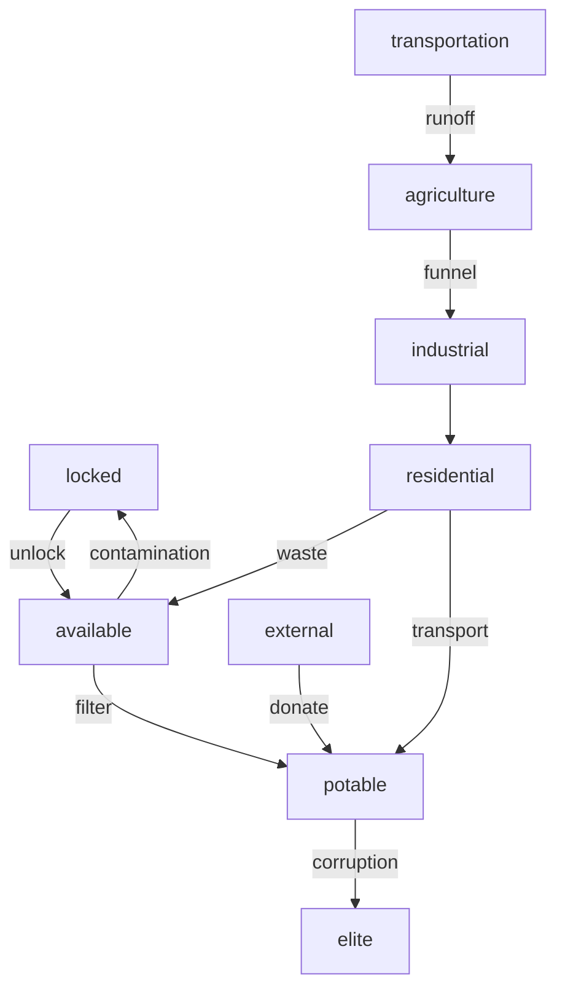
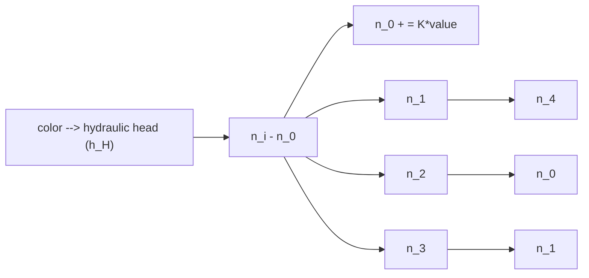
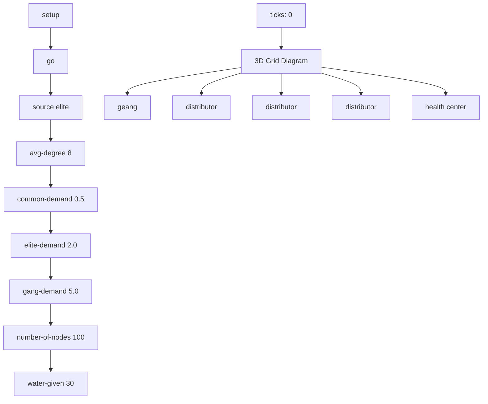

## 2016

## MCM/ICM

## Summary Sheet

(Your team's summary should be included as the first page of your electronic submission.)

Type a summary of your results on this page.

Do not include the name of your school, advisor, or team members on this page.

To address the “wicked problem” of water scarcity, our team adopted a three-pronged interdisciplinary approach combining theoretical mathematics, statistics, environmental science, physics, economics, cultural anthropology, geography, epidemiology, computational science, and history to perform a fresh analysis of global water scarcity. Using a systems-network model, an agent-based network model, and a particleoptimization model, we characterized current forms of water scarcity, both physical and economic, and analyzed possible interventions on a global scope. After gaining a comprehensive analysis of the sources of the water crisis in the poorest country in the western hemisphere, Haiti, we designed interventions that addressed this largely economic crisis in a culturally-aware manner. Beginning with a systems-network model created using Vensim, we characterized water flow across the global network, taking into account locked, available, and potable water storage and its agricultural, industrial, and residential uses. The resulting system of differential equations was then solved in specification to Haiti, creating a comparison of the effects of possible interventions, concluding that both physical and social infrastructure for transportation and dissemination of potable water ought to be prioritized. Next, optimizing the distribution of such water required considering societal structure and the behavior of individuals. To model this, we created an agent-based network customized to Haiti using NetLogo software, representing each individual as a node on the network connected to others by links. We compared various distribution methods using metrics grounded in mathematical philosophy like Rawlsian logic, concluding that building on existing distribution centers that employ locals is the most efficient way to tailor distribution to the entirety of the social network, especially in regards to future water scarcity. Then, we adopted a broader perspective to general groundwater collection. A groundwater flow analysis algorithm was constructed in Python that can determine water loss to the ocean and hydraulic head in any region. The outputs of this algorithm, as well as geographical and climactic data, were used as inputs in a particle swarm optimization algorithm to determine optimal solutions to provide clean water at the minimum cost. This analysis concluded that using localized rainwater collection is both sufficient and most cost-effective to meet Haiti’s needs. All three models were tested for sensitivity and robustness to ensure their broader viability, such that they can be adopted by organizations in any region to analyze local water demands and intervention possibilities.

# Where’s My Water? Global Water Scarcity and Haiti’s Water Crisis 2016 Interdisciplinary Contest in Modeling

Team 52849

Problem E

Page 1

January 2016

## 1 Introduction

## 1.1 Problem

According to the the United Nations, 1.6 billion people experience water scarcity. There are two components of water scarcity: economic and physical scarcity. Either the water exists in the region but money to clean or transport the water is lacking, or the supply of water in the region is less than the demand in the region.

In this paper, we use different models to determine a region’s ability to provide water on the basis of multiple factors. We aim to use these models to understand the behavior of a specific system currently and how it is projected to behave 15 years in the future. We then use this behavior to propose an intervention plan and apply our models with intervention plans to determine whether they are viable.

## 1.2 Analysis of the Problem

According to Dr. Brian Davidson of University of Melbourne, water management and distribution should be classified as a “wicked problem” (1). “Wicked problems,” he writes, “do not have a single, once-off, optimal solution. They have a temporary solution. And it is a solution that has to change over time in response to changing circumstances.”

This wicked problem is dependent on the interplay of multiple factors and thus is inherently interdisciplinary, as shown below.

<table><tr><td>Discipline</td><td>Relevance to Problem</td></tr><tr><td>Environmental Science</td><td>Affects how much water is “available” to take without hurting ecosystems and incurring environmental cost (can also be measured monetarily)</td></tr><tr><td>Economics</td><td>Monetary availability constrains the optimal solution</td></tr><tr><td>Cultural Anthropology, Psychology</td><td>Accurate assumptions of behavior behind models for the region, viability for solution/intervention plan to be adopted</td></tr><tr><td>Epidemiology</td><td>Disease affects demand and supply of water</td></tr><tr><td>History</td><td>Understanding the reasons for the current water crisis and past attempted solutions can help in understanding constraints of the region</td></tr></table>

To come up with viable models to create viable solutions, we must have models which not only take into account environmental, economic, cultural, psychological and epidemiological perspectives but which also are robust enough to adapt to changes in the systems they address.

## 1.3 General Metric

Multiple requirements must be met for a solution to be considered viable and effective, as measurable by the following general metric.

$$
s u c c e s s = (m _ {i} - m _ {s} - m _ {e}) + a s + b c
$$

where $m _ { s }$ and $m _ { e }$ represent the direct cost of the solution and the environmental cost of the solution respectively, $m _ { i }$ represents the money available to the region, s represents the ability of the solution to be self-sustainable, and c represents the ability of the solution to be culturally adopted/socially viable. These factors were considered in the formulation of each model, which each has its own metrics for effective comparison within model solutions.

## 2 Haiti: A Case of Extreme Economic Water Scarcity

Once, it was the wealthiest colony in the world. Now, 300 years later, it’s the poorest country in the western hemisphere with the lowest access rates to improved water and sanitation.

## 2.1 From Riches to Rags: The Historical Sources of Haiti’s Water Crisis

Haiti was once the world’s wealthiest colony, but a series of revolutions that made Haiti the world’s first free slave nation sparked Haiti’s present poverty and declining infrastructure. In exchange for Haitian freedom, France extorted an “independence debt” amounting to \$21 billion in today’s dollars. Experts say the crushing burden of the debt is the principal historic cause of Haiti’s underdevelopment, directly responsible for today’s grinding poverty, but as France continues to resist pressure to repay Haiti, there is little evidence of poverty in Haiti declining in the near future. (33) This fundamental inability of the Haitian government to significantly invest in water infras tructure will continue if the situation does not change. Moreover, water infrastructure destruction was perpetuated by a series of US-supported Haitian dictators that enforced water-controlling regimes, using militias to cut off pipe access to locals. (36) This lack of pipe access for water still persists, compounding reliance on external water sources.

## 2.2 Current Situation

  
Figure 1: A) The UNEP characterized multiple regions in Haiti as moderately exploited or overexploited based on Water Stress Indicators (WSI) in 2004. (5) B) According to the UNEP, “This 2008 update of the ‘Vital Water Graphics’ is aimed at giving an overview of the state of water resources in the world.” As shown, Haiti is the only country in the western hemisphere where less than 65% of the population has access to an improved water source. (6)

Haiti’s water crisis was exacerbated by the 2010 earthquake (which ruptured most remaining water piping systems) (8) and the cholera epidemic, compounding both physical and economic scarcity, such that Haiti now has the lowest rates of access to improved water and sanitation infrastructure in the western hemisphere (7). Moreover, water-borne diseases like cholera are the leading cause for mortality of children in Haiti, linked to 50% of overall deaths (9). This has drawn tens of thousands of non-governmental organizations (NGOs) to Haiti, which is now known as the “Republic of $\mathrm { N G O s ^ { \prime } }$ because there are more NGOs there per capita than anywhere else in the world, providing 80% of the country’s basic services (10). These organizations often alleviate short-term burdens, but since most do not train locals, they are often un-sustainable as other issues break out around the world and the NGOs Haitians have grown dependent on leave. Furthermore, due to the lack of coordination between NGOs, there is frequent duplication of work and inefficient use of resources (11). It’s clear that this model is inefficient and a longterm solution should involve coordination by a central authority. Because the current water and sanitation situation has evolved over decades of limited attention and resources, it will take a longterm, sustained effort to improve the situation. Sanitation and clean water is key in the long-term, although short-term methods also need to be improved until the former is fully developed.

## 2.2.1 Comparison of Current Common Interventions in Haiti (2)

<table><tr><td>Intervention</td><td>Cost</td><td>Maintenance</td><td>Sustainability</td><td>Culturally Accepted?</td><td>Impact</td></tr><tr><td>Water Sachets</td><td>$</td><td>none</td><td>none</td><td>yes</td><td>individual</td></tr><tr><td>Purification Tablets</td><td>$</td><td>none</td><td>none</td><td>yes</td><td>individual</td></tr><tr><td>Passive Solar Disinfection (in bottles)</td><td>$</td><td>low</td><td>high</td><td>yes</td><td>individual</td></tr><tr><td>Boiling</td><td>$$$</td><td>medium</td><td>medium</td><td>very</td><td>homes</td></tr><tr><td>In-Situ Filtration Wells</td><td>$$$</td><td>low</td><td>high</td><td>yes</td><td>commune</td></tr><tr><td>Chlorinators</td><td>$$$$</td><td>some</td><td>high</td><td>yes</td><td>commune</td></tr></table>

## 3 Models

## 3.1 Systems-Network Model


<details>
<summary>flowchart</summary>


</details>

Figure 2: We created a systems model for water usage systems using Vensim software (3). Global water systems involve agriculture, industry, and residential water usage, with adjustable rates based on inputted variables. This model can be customized to fit any region.

## 3.1.1 System Flow Based on Model

Change in agricultural water:

$$
\frac {d (a g r i c u l t u r a l)}{d t} = \frac {d (f u n n e l)}{d t} - \frac {d (r u n o f f _ {a})}{d t} - \frac {d (r u n o f f _ {l})}{d t}
$$

Change in industrial water:

$$
\frac {d (i n d u s t r i a l)}{d t} = \frac {d (t r a n s p o r t _ {i})}{d t} - \frac {d (c o n t a m i n a t i o n)}{d t} - \frac {d (w a s t e _ {i})}{d t}
$$

$$
\begin{array}{l} \text { Change   in   residential   water: } \\ \frac {d (\text {residential})}{d t} = \frac {d (\text {personalfiltration})}{d t} + \frac {d (\text {transport} _ {p})}{d t} - \frac {d (\text {waste} _ {r})}{d t} \\ \text { Change   in   locked   water: } \\ \frac {d (l o c k e d)}{d t} = \frac {d (c o n t a m i n a t i o n)}{d t} + \frac {d (r u n o f f _ {l})}{d t} - \frac {d (u n l o c k)}{d t} \\ \text { Change   in   available   water: } \\ \frac {d (a v a i l a b l e)}{d t} = \\ \frac {d (u n l o c k)}{d t} + \frac {d (w a s t e _ {i})}{d t} + \frac {d (w a s t e _ {r})}{d t} + \frac {d (r u n o f f _ {a})}{d t} - \frac {d (\tilde {f u n n e l})}{d t} - \frac {d (t r a n s p o r t _ {i})}{d t} - \frac {d (p e r s o n a l f i l t r a t i o n)}{d t} - \frac {d (f i l t e r)}{d t} \\ \text { Change   in   potable   water: } \\ \frac {d (p o t a b l e)}{d t} = \frac {d (f i l t e r)}{d t} + \frac {d (d o n a t e)}{d t} - \frac {d (t r a n s p o r t _ {p})}{d t} - \frac {d (c o r r u p t i o n)}{d t} \\ \end{array}
$$

## 3.1.2 Applied to Haiti

This network system of interaction allows for consideration of all possible factors involved in the water system, justifying the use of this systems model. By comparing the connectedness of each factor to the target variable (in Haiti’s case, residential water for drinking), the yield/change ratio of interventions in different areas can be compared for effectiveness.

Applied to Haiti, there is an economic crisis of potable water, specifically the drinking water that individuals receive. Thus, in relation to the system above, we must find a way to maximize the amount of water available for drinking.

Assumption: In Haiti, there is a large amount of available water (water that is currently not potable but which can be cleaned for use).

Justification: The water crisis in Haiti is mainly an economic one with regards to a lack of potable water for drinking, which contributes to the severe death rate caused by dehydration and compounded by cholera (7).

Assumption: Haiti’s current transportation rate of potable water is extremely low.

Justification: The country currently lacks a pipe system, so mass transportation to the public is very minimal, leaving most residents to rely on purchased external water sachets or barrels for consumption (8).

Assumption: In terms of drinking water wastage, waste rates cannot significantly change.

Justification: All water that humans drink is passed through the body at some point, and there is neither a need nor a way to change this bodily function.

Assumption: Haitian water corruption rates are non-negligible.

Justification: With high rates of gang violence and local corruption, especially compared to other countries, it is important to consider water lost to corruption which never makes it to the poor (33).

Assumption: Haitian water donation rates are high.

Justification: As the “Republic of NGOs,” water donation rates from external organizations are high (10).

## Determining Scarcity-Drivers

By integrating the differential equation for residential water, we find that:

$$
r e s i d e n t i a l = p e r s o n a l l y f i l t e r e d w a t e r + t r a n s p o r t e d w a t e r - w a s t e d w a t e r + C
$$

With regards to drinking water, water lost to waste cannot be changed, and the constant of in-

tegration representing current drinking water cannot be changed, so the relevant equation becomes:

$$
d r i n k i n g w a t e r = p e r s o n a l l y f i l t e r e d w a t e r + t r a n s p o r t e d w a t e r
$$

Using the rates from the network-system above, we get:

$$
d r i n k i n g w a t e r = r * e * A + t * P
$$

where r is personal filtration rate, e is personal filtration efficiency, A is available water, t is transportation rate, and P is potable water. Further substituting the integrated rates from the model, we get the following summary of the most relevant drivers of drinking water scarcity:

$$
d r i n k i n g w a t e r = r * e * A + t * (f * A + d * E - c)
$$

where f is filtration rate of available water, d is donation rate, E is external water, and c is loss to corruption.

## 3.1.3 Sensitivity: Comparing Scarcity-Driver Effects

This base equation allows us to determine the most effective interventions, based on two simple principles.

1) Increases in variables that are multiplied by fractions dampens the effect of the increase:

$$
(x) * \frac {1}{n} - > (x + c) * \frac {1}{n} = x * \frac {1}{n} + c * \frac {1}{n}
$$

2) Increases in variables that are multiplied by numbers greater than 1 amplifies the effect of the increase, which is further amplified based on the magnitude of the value:

$$
(x) * N - > (x + c) * N = x * N + c * N
$$

## 3.1.4 Solution Comparison Based on Yield Ratios

In order of highest yield/change ratio, interventions include:

1) Increase transportation of potable water to homes (ex: Pipes)

The systems variable with the greatest change in drinking water per small changes in magnitude is t, since it is amplified by P (which is in turn amplified by A and E)and not mitigated by any fractional rates. Moreover, as Haiti’s pipe situation is already known to be in shambles, modest increases in pipe access would significantly change the total transportation of water, further amplifying this effect.

2) Increase filtration of available water (ex: In-Situ Wells)

The filtration f is amplified by both t and A, so the second best intervention is to increase filtration of available water to drive up potable water rates. The only caveat here is that if corruption were to rise in the future such that $c > f * A + d * E$ , this intervention would be ineffective as the filtered water would never reach the general populace.

3)Increase prevalence and efficiency of personal filters (ex: LifeStraws)

For r and e, a small change results in a high change in yield magnitude due to the largeness of A. Changing filter efficiency may take a while on the scientific side, but spreading access to personal filters like LifeStraws will result in huge increases in drinking water due to the relative magnitude of A compared to e, which will always result in large values.

4) Increase donated water (ex: from NGO distribution of water sachets)

Increases in donations (d) are amplified by the coefficient of E, respectively. Unfortunately, in current Haiti, this is the level on the priority table that is frequently the main resort, but this reliance on external water cannot be self-sustainable or a practical long-term solution.

5) Decrease corruption (ex: use different distribution methods)

A decrease in corruption (c) is amplified by t to detract from public drinking water.

6) Changing the available amount of water has the least effect in Haiti

The systems-network indicates that in Haiti, a change in A will produce the least visible effect, as it is already very large and changes to it will be mitigated by all of the fractional rates it is multiplied by. This is consistent with the analysis that Haiti’s water crisis is primarily one of distribution and dissemination, and less so based on physical scarcity.

Broader Impacts: Water scarcity is not a localized issue. For example, the leading cause of death in Haiti is water-borne disease like cholera; with characteristic symptoms of dehydration and diarrhea, this is both exacerbated by and exacerbating of the lack of access to potable water. As the epidemic has spread to other countries, like the Dominican Republic, Honduras, and Mex ico, decreases in cholera spread will benefit other countries as well. Moreover, a transition from dependence on external sources of water to a utilization of the physical water present in Haiti will increase self-sustainability of Haiti and allow for increased stabilization of the global economy.

## 3.2 Algorithmic Approach

We begin with an algorithmic approach in order to minimize the cost of providing clean water to the entirety of the population. This allows us to better analyze available solutions for a region to combat water scarcity.

## 3.2.1 Assumptions

Assumption: Soil is homogeneous and isotropic.

Justification: Although this assumption does not fully reflect the true nature of soil compositions, it makes groundwater flow analysis a much more tractable problem. Error due to this assumption is mitigated by looking at average soil compositions and accounting for the pressure gradient and porosity changes in a column of groundwater.

Assumption: Topography of a region is a proxy for hydraulic head of groundwater.

Justification: Given that a region is not actively removing groundwater, the bedrock should approximately match the terrain due to the manner in which the ground is layered. This does not account for irregularities beneath the surface, but large irregularities will have minimal effect on groundwater flow because the main factor is hydraulic head.

Assumption: Water treatment costs are approximately consistent for most water.

Justification: Most water requires the same amount of resources to treat. The only exceptions are water with rare, harmful chemicals or extreme amounts of minerals. Most water does not contain such harmful chemicals, and water with high mineral content is accounted for in the desalination aspect of the model.

Assumption: Cost curves to treat water are approximately the same between countries.

Justification: The efficiency of treating water and the chemicals required to treat water are generally universal. The main difference between countries lies in the minimum wage in the country and other factors that affect the total cost only minimally.

## 3.2.2 Physical Scarcity Analysis

This section will first look at the water scarcity problem by determining the maximum water intake that incurs minimal environmental damage. It will begin by predicting the maximum possible water collection from various methods without environmental impact. Because the groundwater is recharged only by precipitation (excluding minimal infiltration from the ocean), the amount of rainwater in the region is a limiting factor in water collection. Trivially, the amount of water naturally entering the region every year is bounded by the annual rainfall in that region. If the water demand exceeds the annual rainfall, then the country is forced to use water flow from neighboring regions, desalination, or other expensive techniques. Our analysis will look only at the most popular methods and neglects future innovations, which we cannot predict as they do not yet exist.

Groundwater Availability In order to analyze this, we first looked at how much water is flowing into the ocean per year; this is considered wasted water because the cost of desalinating that water is far greater than that of treating the groundwater. So, our goal was to remove exactly as much water as is currently flowing into the ocean. This of course fluctuates due to the diffusion equation, but taking that amount of water from inland will decrease net outflow into the ocean (4). This will put minimal strain on ecosystems, as the water taken this way was lost to the ocean to begin with. First, we began by looking at how much water infiltrates the ground. This is given by (19) :

$$
I n f i l t r a t i o n = R a i n f a l l - E v a p o t r a n s p i r a t i o n - R u n o f f
$$

$$
w h e r e R u n o f f = R a i n f a l l * C o e f f i c i e n t _ {R u n o f f}
$$

Next, we imported topographical maps into Python and ran the following algorithm inspired by the diffusion equation to determine the amount of water flowing into the ocean.

Description of Groundwater Flow Algorithm


<details>
<summary>flowchart</summary>


</details>

Figure 3: Logic Diagram of Groundwater Flow Algorithm

For each pixel on an input topographical map, approximate the hydraulic head according to the input color. Now, iteratively apply the following:

For each pixel: look at the difference between it and it’s four neighbors $\left( n _ { i } - n _ { 0 } \right)$ . Sum this difference and denote it S. Next, set $n _ { 0 } = n _ { 0 } + k * S$ . where k is a constant determined by groundwater flow properties. If the pixel started as water and it receives water, reduce the hydraulic head of this pixel to 0 and move the water it received to a running total.

Return the total.

Rainwater Availability Only so much water can be collected directly from rain water as the amount of space and money required to collect certain amounts of rainwater may be infeasible.

However, taking development into account leads to more reasonable methods of collecting water. Roads and land that has been cleared for agriculture have very high runoff coefficients. This contributes to increased amounts of runoff, which causes increased erosion and predominantly flows to the ocean. Thus, the amount of rainwater that can feasibly be collected without harming the environment is a function of how much humans have developed the region. The amount of water that should be taken from a region is given by:

$$
R a i n f a l l * (c u r r e n t C o e f f i c i e n t _ {R u n o f f} - p r e v i o u s C o e f f i c i e n t _ {R u n o f f})
$$

Whether or not this amount can be obtained depends on the infrastructure of the region. Rain barrels would not cover enough area to collect this amount of water, but a combination of storm drains and other methods would.

Desalination Desalination is the most expensive of the methods. It requires considerably more energy because of the extreme salinity of ocean water. However, for coastal regions, water ob tained by desalination is considered a limitless resource. Our model will treat desalination as such.

## Water Collection Comparisons

Groundwater collection is a good method of water collection because one well takes groundwater from a large area. It is also fairly consistent as opposed to rainwater collection, which is very dependent upon the weather. But, the rate of collection from groundwater is limited by a myriad of factors including the storage coefficient, the cone of depression, and transmissibility.

Rainwater collection can provide great amounts of fresh water. But, it is limited by the amount of space required to collect this water and the lack of consistency in weather patterns. This method is relatively inexpensive.

Desalination is a good alternative for coastal regions because it is only limited by cost and energy requirements. There is consistency in the amount of water obtained at all times, but it is considerably more expensive than other methods.

## 3.2.3 Economic Scarcity Analysis

Rainwater collection has varying costs depending on the method of collection. Collecting the water using barrels would require that trucks collect the water for treatment. This has a high operation cost, but has a relatively low initial cost. Using pipes to transport water from storm drains would have a low operating cost, but would have a high initial cost due to the cost of adding infrastructure. We will treat the cost of collecting the rainwater as the cost of transporting that water through pipes because truck costs are dependent upon many variables including efficiency, route, and terrain. It costs 2.31 ∗ 10−6 $2 . 3 1 * 1 0 ^ { - 6 } \frac { \mathfrak { L } } { g a l * K m }$ to transport water in pipes (26).

Groundwater collection is extremely inexpensive. It has a low initial cost and takes water from a great area. The cost to collect groundwater is approximately .6\$ (20). This figure varies depending on the hydraulic head and the energy source.

Desalination cost is 1\$ per thousand gallons (23).

Water Treatment Cost Analysis The cost to treat 1000 gallons can be accurately modeled by the following equation (24) :

$$
\frac {. 6}{x + . 0 4} +. 7
$$

where x is in millions of gallons per day (MGD) and $x > . 1$ . Thus, the daily operation cost of a

water treatment plant, when operating on average water quality, is given by:

$$
(\frac {. 6}{x + . 0 4} +. 7) * x * 1 0 0 0
$$

## 3.2.4 Finding an Optimal Solution

Although our analysis has made many assumptions to simplify the problem, we decided to pick an optimization algorithm that could easily extend to versions of the problem that account for increased complexity and nonlinearity. The cost functions, water treatment costs, and water collection costs are predominantly nonlinear. Thus, finding the least expensive solution to the problem can be computationally expensive. In considering the inherent nonlinearity and high dimensionality of the problem, we elected to use a Particle Swarm Optimization algorithm. Using this algorithm on geographical, climactic, and theoretical input, a country can determine their cheapest solution to their water crisis. Unfortunately, there may not be a solution and in that case, the algorithm will return a cost higher than the country can afford.

## Particle Swarm Optimization

Given: constants, constraints, function to optimize

Output: optimal solution

1. Create q vectors that satisfy the constraints and are in the domain of the function. Let us call these vectors particles. Each particle is able to remember its current position, its best position, the current global optimum position, and its current velocity.

2. For each particle, update its velocity and position based on the following two equations:

$$
v _ {i + 1} = v _ {i} + c _ {1} * r _ {1} * (p _ {\text {best}} - p _ {\text {current}}) + c _ {2} * r _ {2} * (g l o b a l _ {\text {best}} - p _ {\text {current}})
$$

$$
p _ {i + 1} = p _ {i} + v i + 1
$$

where p is position (or vector value), c is a constant, r is a random number, and $g l o b a l _ { b e s t }$ is the best position obtained by any particle. Next, set iterations = iterations + 1.

If iterations < n, go to 2. Else, go to 3.

3. Return global optimum position and cost.

## 3.2.5 Applied to Haiti

When the algorithm was applied to Haiti, it determined that the minimum cost was approximately 10 million dollars a year using the method of rainwater collection, the most viable option for Haiti. This figure is a lower bound because it does not include yearly maintenance costs, initial infrastructure cost, or other implementation specific factors. For more details on calculations, please reference the algorithm implementations in the Appendix section. Since Haiti will not be able to provide this sum for themselves, international aid will be required to maintain such a system, indicating that the short term solution will require reliance on distribution as shown in the other models. To clarify, Haiti’s water is out of reach only due to economic, not physical, scarcity, as demonstrated by the model; water will not “run out” in the physical sense in the predictable future. Moreover, should the governmental financial situation improve, it is possible that Haiti may be able to adopt this as a long-term, self-sustaining method.

## 3.2.6 Sensitivity Analysis

The algorithm performs consistently under repeated trials. Modifications to cost values within a margin of error produced essentially the same solution, but with different end costs. The greatest factor that would affect the model, in addition to greater knowledge about underlying equations instead of approximations, is the addition of the initial costs. This could be easily implemented with a multiple year amortized loan structure, in which the company pays back a company over time.

## 3.3 Agent-Based Networks Approach

For regions where inadequate piping and abundant pollution prevent the independent acquirement of water, a distribution system of clean water must be implemented. Here it is imperative to understand the best method of distribution. Since many countries and regions have a complex social structure, this social structure must be taken into account when deciding how to fully optimize the distribution of water such that the people who are in need– the ’Common Man’– get their fair share.

Questions to consider: are the common men “connected” to one another? That is, one, do they physically interact and, two, are they even willing to distribute a portion of the water they receive to others? Is there a central power that has more connections to the common man? Is it accurate to assume that they will distribute the water they receive as well? Who is the most strategic member of this community to whom we can give a water source to who is not only physically connected to the people who need the water but whose ties to them are also weighty enough to guarentee fair distribution? The disemination of given water is entirely dependent upon individual decisions, hence why an agent-based model must be taken into account.

While the approach is general, a “general” model cannot be conceived. Each model of this type is inherently unique to each community, as the entire structure of the network is dependent upon the social structure of the community.

## Metrics

Mean Water

$$
m e a n w a t e r = \sum (w a t e r) _ {c} / n
$$

where waterc refers to the water each common man has and n refers to the number of common men. This is helpful for understanding the average amount of water each common man will receive; larger numbers are better than small. The output is in liters per common man.

Root Mean Squared Water

$$
\text { standardizedneed } = \operatorname{sqrt} \left(\sum \left(\text { demand } - \text { water }\right) _ {c _ {u}} ^ {2}\right) / n
$$

where (demand − water)c1 refers to the unmet need of each common man with need, $c _ { u } ,$ and n refers to the number of common men. The output is in liters per common man.

A standardized root mean squared equation was used to weight the neediest people higher, based on the fairness theory posited by Harvard professor of philosophy John Rawls. Rawls conducted a thought experiment known as the “veil of ignorance,” concluding that when determining fairness for society as a whole one must adopt the “maximin” principle, choosing to help the least well off in society to establish security so that the amount of hardship any one individual experiences is minimized (34). This also makes sense in context, since a lack of water that is dangerously/deadly high should be addressed before trying to bridge the gap for the slightly needy, to minimize deaths by dehydration. We weighted the least well off using this method such that a higher number was indicative of more unmet need, so smaller numbers indicate a better solution.

## 3.3.1 Applied to Haiti

Since most Haitian citizens lack independent access to potable water, external water is often necessary. (7) In attempts to meet these needs, NGOs often implement distribution systems of potable water, like distributing jugs of water using trucks (8). However, to optimize the distribution of such water, the network of the society must be taken into account.

For this purpose, an agent-based networks model was created in NetLogo (27), as shown below. As per the social structure of Haiti, in this model, nodes (the common people), gangs, the elite/local government, hospital centers, and distributors employed by hospital centers interact. Water is moved along the network. The amount of water a person chooses to give its connections are dependent on the weight of the connections, and each agent keeps a set constant amount of water, value given by user input.


<details>
<summary>flowchart</summary>


</details>

Figure 4: The user interface and structure of the Haitian specific agent based networks model

Assumption: The amount each group demands in relation to one another is gang >elite >common man

Justification: The amount that each member demands is exactly what causes the discrepancy in which water is given to a community but does not reach the people in need. Gangs will ’demand more than the elite since they are made up of more members.

Assumption: Connections between the local government, gangs, hospice centers, distributors employed by hospice centers, and the common people/citizens actually in need of water were weighted as follows:

Local Government - Common Man: Weak

Local Government - Gangs: Moderate

Gangs - Gangs: Strong

Gangs - Common Man: Weak Hospice Centers - Distributors: Strong Distributors - Common Man: Strong Common Man - Common Man: Moderate

Justification: The social inequalities perpetuated by the Duvalier regime persist to this day, compounding a large gap between the elites and the poor. Until the government has the financial resources to overcome the effects of France’s demanded debt, there is no evidence of governmental ability to fund large-scale social projects to decrease the wealth gap. (33). Furthermore, the language barrier between the general population, almost all of which speaks Creole, and the elites, who speak French, compounds this wealth gap in terms of job access and social mobility (35).

## Simulation 1: Current State

By creating this network based off of the social structure of Haiti, we can understand the behavior that occurs currently when water distribution is attempted through local distribution (36).

Testing was run under the parameters of an initial water amount given 30 L. We began by saying that the common man would keep some fraction of his water received, 0.5, and the elite and gangs would take slightly more, 0.6. By starting the water flow at the common source of the elite and seeing how it disseminates along the network, the common man only obtained, on average, 0.81 L out of the original 30 L – that is, 0.2%– of the total water given to the population.

This shows an important facet of short term solutions. Though infrastructure may be built in the long-term, in order for Haitians’ basic needs to be met short-term, distribution of water is likely necessary. However, one must take into account the social and cultural factors of Haitian society, as in this network model; current methods of giving to the people in power are not as effective as one would hope with all the money being put into obtaining and giving this water.

## Simulation 2: Future

We can adjust testing parameters to account for likely changes to happen to society in 15 years that would impact the network, such as population growth. According to the United Nations Department of Economic and Social Affairs’ World Population Prospects (the 2015 revision), the population of Haiti is predicted to increase by 17% in 15 years (28). To more accurately model Haiti in 15 years, this predicted population increase was taken into account in our simulations. We also ran simulations with a predicted 25% increase in population in the case that the number was an underestimation and to also test the robustness of our model.

Mean Water vs Population Size with Elite Distribution  


<details>
<summary>bar chart</summary>

| Population Growth | Mean Water L/person |
| :--- | :--- |
| None | 0.081 |
| 17% | 0.067 |
| 25% | 0.062 |
</details>

Figure 5: We simulated 100 runs of the model for each factor, with no population growth, 17% population growth (as predicted for Haiti), and 25% population growth (as an overestimate to measure robustness), with the currently used elite distribution method.

It is qualitatively observable that mean water per person decreases as the population increases. To quantify this, we ran a one-way ANOVA test yielding $\mathrm { F { = } 1 7 7 . 3 }$ and $\mathrm { p } { < } . 0 0 1$ , indicating that the differences are statistically significant. They were confirmed with a Tukey post hoc test with 0% vs 17% yielding $\mathrm { p } { < } . 0 1$ , 0% vs 25% yielding $\mathrm { p } { < } . 0 1$ , and 17% vs 25% yielding $\mathrm { p } { < } . 0 1$ , indicating that mean water decreases as the population grows with this distribution method, meaning that the method is predicted to lose efficiency. Thus, as Haiti is expected to increase in population, current methods will lose efficiency.

## 3.3.2 Intervention Plan

Since the current distribution strategy in place is ineffective and is only projected to decrease in efficiency over time, we propose a new strategy, based on the operations of Partners in Health in Haiti (29). Using a system of holistic care, founded on knowledge that improvement in well-being can only occur if all aspects of health are addressed, Partners in Health already employs locals in 12 hospitals across the country as community health workers (30). They visit hard-to-reach rural villages on a regular basis, administering medicine and care involving adequate nutrition and water, because all aspects of health must be addressed for patient improvement. Experts agree that this method of care distribution in Haiti has been one of the most effective methods (31) (32). We plan to piggyback on these existing systems of healthcare distribution to supplement their holistic care processes with water distribution.

With this new strategy implemented, additional assumptions need to be made about the behavior of groups/people.

Assumption: The hospital centers and distributors employed by the hospital centers will keep no fraction of the water for themselves, instead distributing all of it amongst their connections.

Justification: Hospitals and employed distributors only receive the water for the purpose of distributing it, it is their job to do so without taking any portion.

## Simulation 1: Current State Comparison

We compared the standardized needs using our intervention method to the original/current method in place.

  
Figure 7: In the figure on the left, the mean waters received are compared between distribution method A, the current method, and distribution method B, our proposed method. The higher mean water is indicative of a more favorable solution. As seen on the right, distribution method B also does a better job of minimizing the root mean squared need.

To confirm qualitative observations, we ran an unpaired t-test with df=198 for the mean water values, yielding t=175.3 and $\mathrm { p } { < } . 0 0 0 1$ . We ran another unpaired t-test on standardized need values, calculating a t value of 29.8, yielding $\mathrm { p } { < } . 0 0 0 1$ . Both tests support the alternative hypothesis that center distribution is more effective than elite-based distribution, both in terms of mean water, and in terms of addressing the least well off.

## Simulation 2: Future Comparison

To simulate future conditions wherein the population increases, we tested this strategy with increasing levels of number of nodes.

Mean Water vs Population Size with Center Distribution  


<details>
<summary>bar chart</summary>

| Population Growth | Mean Water L/person |
| :--- | :--- |
| None | 0.3 |
| 17% | 0.26 |
| 25% | 0.24 |
</details>

Mean Water versus Population Size by Distribution Method  


<details>
<summary>line chart</summary>

| % Population Growth | Elite Distribution (L/person) | Center Distribution (L/person) |
|---|---|---|
| 0% | 0.08 | 0.30 |
| 15% | 0.07 | 0.26 |
| 25% | 0.06 | 0.24 |
</details>

Figure 9: Comparison of resistance to population growth among the two methods

The results indicate that, while both methods are sensitive to population growth with each method working more effectively on smaller populations, in each scenario the center distribution method still has increased mean water among the populace as compared to elite distribution.

To confirm qualitative conclusions of relationship between the two methods with population growth, we ran a two-way ANOVA test on 100 runs each of the simulation with no population growth, 17% population growth (as predicted for Haiti), and 25% population growth (as an overestimate to measure robustness). For the ANOVA, we placed distribution method across rows and percent growth across columns. The test yielded a p-value across rows of $< . 0 0 0 1$ , across columns of $< . 0 0 0 1$ , and with rows x columns of $< . 0 0 0 1$ . This was confirmed using a Tukey post hoc test with 0% vs 17% yielding $\mathrm { p } { < } . 0 1$ , 0% vs 25% yielding $\mathrm { p } { < } . 0 1$ , and 17% vs 25% yielding $\mathrm { p } { < } . 0 1$ .

## 3.3.3 Sensitivity Analysis

## Environment

While the social structure of the network should remain the same in subenvironments of Haiti, the number of connections each person has to one another may vary in rural vs. more developed areas. To test the effect of this, we varied the average degree of the nodes (the number of connections each had to others).


<details>
<summary>bar chart</summary>

Mean Water versus Average Degree with Elite Distribution
| Average Degree | Mean Water L/person |
| :--- | :--- |
| 2 | 0.008 |
| 5 | 0.0642 |
| 10 | 0.0897 |
</details>

Figure 10: We simulated 100 runs of the model for each ??fill what we ran for degrees

We ran a one-way ANOVA test on the runs with varying degree among the elite distribution method, and found $\mathrm { F } { = } 5 1 5 9 . 0 6$ , yielding $\mathrm { p } { < } . 0 0 0 1$ . To corroborate our results, we used a Tukey post hoc test to determine $\mathrm { p } { < } . 0 1$ between every pair of means. This indicates that the interconnectivity of the people significantly affects the amount each receives using the current method.

The same tests on changes in average degree with the center distribution method yielded $\mathrm { p } { > } . 9$ , indicating no significant difference in values. This means that average degree had no significant impact on the average amount of water each person received, further emphasizing the robustness of our solution.

## 4 Intervention Plans Proposed

## 4.1 Short Term

Until Haiti is able to redirect its money into building stronger infrastructure, as recommended in the long term plan, the current short-term plan of distributing water should be optimized. As supported by the agent-based networks model and comparison between distribution methods, dissemination along the social network is optimized if water is distributed through existing health distribution centers that are uniquely able to access hard-to-reach areas. We hope to build on existing medical centers in the area with good reputations of care and a focus on holistic treatment, like Partners in Health hospitals and Haiti Health Ministries, that employ community health workers to distribute medicine, food, and water to hard-to-reach locals, which tend to be the poorest. This is viable as we are simply building upon pre-existing systems that distribute medicine through locally-employed and is thereby also self-sustaining.

## 4.2 Long Term

The solution that would yield the highest change, according to the systems and algorithmic model, was increasing the transportation of potable water to homes through piping systems. If not possible, the second best long-term solution would be to increase mass filtration through creating in-situ wells. Both of these, achievable by redirecting NGO help and donations towards this initiative and building on the proposed governmental DINEPA plan for water and sanitation(7), would make the region less susceptible to water scarcity.

## 5 Comparison of Strengths and Weaknesses

## 5.1 Systems Model

## 5.1.1 Strengths

The systems-based model accounts for water flow across the global network and takes into account a variety of physical and social factors. The model considers agricultural, industrial, and residential uses, any of which can be analyzed for maximization and specified to a location. It also allows for prioritization of different intervention areas based on their relative impacts on the desired outcome. Considering this amplification and dampening of factors is important as it allows for optimization of efforts.

## 5.1.2 Weaknesses

In situations of physical scarcity, large amounts of region-specific data are needed to draw specific conclusions from this model. Moreover, this model generalizes water systems into broad categories, but in some instances more specificity in terms of water usage may be necessary. In those cases, use of an agent-based model may be preferable.

## 5.2 Algorithmic Model

## 5.2.1 Strengths

This process takes into account multiple factors including groundwater flow and evapotranspiration rates. Additionally, it accounts for overall development in the region considers environmental factors. Another strength of the model is that it attempts to solve the cost problem with the demand problem in mind as opposed to solving demand with cost constraints. This first considers the population’s needs and ensures that any solution will satisfy the whole population. On the contrary, such a solution may not be obtainable due to economic scarcity, and the country must resort to other solutions. This benefits the model as it provides an accurate analysis of the situation and determines if a country can provide clean water for it’s people under economic and environmental constraints.

Likewise, if the algorithm reports that a country is unable to provide for it’s people due to physical scarcity, then the country can use a variation of the Groundwater Flow algorithm to determine how long they would be able to rely on overusing groundwater while the country finds an alternative solution. This can be done by simply incorporating wells into the Groundwater Flow algorithm and seeing how long before net groundwater flow into the ocean is approximately zero. Thus, the model allows the country to look at its abilities to collect water.

Additionally, although the model does not account for many underlying variables, the model can easily be extended to account for them. This allows the model to be applied for many purposes and gives it the ability to be improved upon. Someone attempting to find the solution would be able to do so with increased amounts of data at their disposal.

## 5.2.2 Weaknesses

The algorithm does not directly take environmental impact into account when determining the optimal solution. Instead, it is up to the user to determine whether or not a solution to the water scarcity problem is environmentally friendly. Assuming that the country wants to protect the environment, the country can choose how much they want to factor in the environment when looking for an optimal solution. This was done to make the problem more tractable and allow for discretion of the user, but causes the algorithm to not always produce the most environmentally friendly solution, too.

As with most complex problems, the quality of the solution depends greatly on the amount and quality of the data input into the algorithm. By using approximations or other assumptions, the accuracy of the solution decreases. But, provided that the approximations are good, the algorithm will still provide a solution that approximates the true solution well.

Finally, the algorithm used is a stochastic algorithm as opposed to a deterministic algorithm. This was done to preserve the ability to increase the complexity of the algorithm and account for great nonlinearity. Although it may not give the optimal solution, it is able to find a feasible solution (if one exists) in a reasonable amount of time. This is unlike its deterministic counterpart, which may render the problem intractable. However, the stochastic algorithm’s failure to guarantee the optimal solution makes it tractable.

## 5.3 Agent-Based Networks Model

## 5.3.1 Strengths

The agent-based networks model takes into account the individual decisions and factors that play a role in distribution of a resource. The model also considers unique social structure of a region to provide and optimize the short term solution of the dissemination of water. Since it is agentbased, it can track water flow on both a broad level and on an interpersonal level, allowing for sophisticated data analysis.

## 5.3.2 Weaknesses

The model must be adjusted to the social structure of the region in question. Additionally, since the model is agent-based and often involves over 100 nodes, simulations using this model are more time-consuming than those with the systems-network or algorithmic models.

## 6 Conclusions

The combination of the three models allowed us to address physical and social factors of water scarcity from multiple perspectives. While the algorithmic model focused on the raw numbers and data analysis, the systems and agent-based networks models allowed for social and behavioral factors to be taken into account as well. These factors are important because optimal solutions are only meaningful if they can be reasonably adopted by the target population. The synthesis of our work was not only the creation of a region-specific intervention plan for Haiti, which is currently highly in need, but also the creation of three powerful models which can be adopted by organizations in any region to analyze local water demands and intervention possibilities.

## References

[1] Davidson, Brian. “Wicked Problems Demand Adaptive Responses: How Does the Murray Darling Plan Stack Up?” The Conversation. N.p., 20 Dec. 2011. Web. 31 Jan. 2016.  
[2] “Sustainable Safe Water Solutions for Haiti.” Grand Valley State University, n.d. Web. 01 Feb. 2016.  
[3] Ventana Systems, Inc.. (2006). Vensim PLE Software, Ventana Systems Inc.. Retrieved at May 30, 2008, from the website temoa : Open Educational Resources (OER) Portal at http://www.temoa.info/node/3682  
[4] Summary of Differential Equations for Groundwater Flow. N.p.: Humboldt State University, n.d. PDF.  
[5] “Water Scarcity Map.” Vital Water Graphics. United Nations, n.d. Web. 31 Jan. 2016.  
[6] An Overview of the State of the World’s Fresh and Marine Waters. 2nd Edition, 2008. (http://www.unep.org/dewa/vitalwater/index.html).  
[7] Gelting, Richard et al. “Water, Sanitation and Hygiene in Haiti: Past, Present, and Future.” The American Journal of Tropical Medicine and Hygiene 89.4 (2013): 665–670. PMC. Web. 31 Jan. 2016.  
[8] Knox, Richard. Water In The Time Of Cholera: Haiti’s Most Urgent Health Problem. National Public Radio. 16 April 2012. Web.  
[9] Sentlinger, Katherine. “Water In Crisis - Spotlight Haiti.” The Water Project. N.p., n.d. Web. 31 Jan. 2016.  
[10] Edmonds, Kevin. “NGOs and the Business of Poverty in Haiti.” NACLA: Reporting on the Americas since 1967. North American Congress on Latin America, n.d. Web. 31 Jan. 2016.  
[11] US Army Corps. Water Resources Assessment of Haiti. Rep. N.p.: n.p., 1999. Print.  
[12] Haiti Physical Map. N.d. Maps. ¡i¿World and USA Maps¡/i¿. Web. 31 Jan. 2016.  
[13] “Recommended Runoff Coefficient Values Table.” Gwinnett County Government, n.d. Web. 31 Jan. 2016.  
[14] “Average Monthly Temperature and Rainfall in Haiti.” Climate Change Knowledge Portal. The World Bank Group, n.d. Web. 01 Feb. 2016.  
[15] “Springs - The Water Cycle.” US Geological Survey, n.d. Web. 01 Feb. 2016.  
[16] “Haiti.” The World Factbook. Central Intelligence Agency, n.d. Web. 01 Feb. 2016.  
[17] Dharmasena, P. B. “Estimating Runoff from Small Agricultural Lands.” (1992): n. pag. Web.  
[18] Hadden, and Minson. The Geology of Haiti: An Annotated Bibliography of Haiti’s Geology, Geography and Earth Science. Rep. N.p.: US Army Corps of Engineers, n.d. Print.  
[19] Abdullahi, Musa G. “Effect of Rainfall on Groundwater Level Fluctuation in Terengganu, Malaysia.” Journal of Geophysics Remote Sensing J Geophys Remote Sens 04.02 (2015): n. pag. Web.  
[20] “Water Wells for Haiti.” Haiti Reconstruction. N.p., n.d. Web. 01 Feb. 2016.  
[21] Hu, Xiaohui. “Particle Swarm Optimization.” N.p., n.d. Web. 01 Feb. 2016.  
[22] Computation of Long-term Annual Renewable Water Resources (RWR) by Country (in Km3/year, Average) - Haiti. Rep. N.p.: Food and Agriculture Organization of the United Nations, n.d. Print.  
[23] Masters, Gilbert. “Introduction to Environmental Science amp; Engineering.” N.p.: George Mason U, n.d. N. pag. Print.  
[24] Cost Estimating Processes. Rep. N.p.: Guadalupe-Blanco River Authority, n.d. Print.  
[25] Desalination: A National Perspective. Washington, D.C.: National Academies, 2008. Print.  
[26] “Glacial Icebergs: Sources of Freshwater.” Mission 2012 : Clean Water. N.p., n.d. Web. 01 Feb. 2016.  
[27] Wilensky, U. (1999). NetLogo. http://ccl.northwestern.edu/netlogo/. Center for Connected Learning and Computer-Based Modeling, Northwestern University, Evanston, IL.  
[28] “World Population Prospects - Haiti.” World Population Prospects. United Nations Department of Economic and Social Affairs, n.d. Web. 31 Jan. 2016.  
[29] “Community Health Workers: Making House Calls.” Partners in Health, n.d. Web. 01 Feb. 2016.  
[30] “Haiti.” Partners in Health, n.d. Web. 01 Feb. 2016.  
[31] Rich, Michael L., Ann C. Miller, Peter Niyigena, Molly F. Franke, Jean Bosco Niyonzima, Adrienne Socci, Peter C. Drobac, Massudi Hakizamungu, Alishya Mayfield, Robert Ruhayisha, Henry Epino, Sara Stulac, Corrado Cancedda, Adolph Karamaga, Saleh Niyonzima, Chase Yarbrough, Julia Fleming, Cheryl Amoroso, Joia Mukherjee, Megan Murray, Paul Farmer, and Agnes Binagwaho. “Excellent Clinical Outcomes and High Retention in Care Among Adults in a Community-Based HIV Treatment Program in Rural Rwanda.” JAIDS Journal of Acquired Immune Deficiency Syndromes 59.3 (2012): n. pag. Web.  
[32] Jerome, Gregory, and Louise C. Ivers. “Community Health Workers in Health Systems Strengthening: A Qualitative Evaluation from Rural Haiti.” Aids 24.Suppl 1 (2010): n. pag. Web.  
[33] Institute for Justice and Democracy in Haiti. Institute for Justice and Democracy in Haiti. Web. 26 July 2014. (http://www.ijdh.org/2010/03/topics/economy/restitution-ofhaitis-independence-debt/).  
[34] Rawls, John. A Theory of Justice. Revised ed. Cambridge: Harvard University Press, 1999.  
[35] DeGraff, Michel. Language Barrier in Haiti. Boston Globe. 16 June 2010. Accessed 1 February 2016.  
[36] Fass SM. “Political economy in Haiti: the drama of survival.” New Brunswick : transaction Books, 170. Quoted in Arnold AJ, 1990. Haiti’s misery amidst wretched poverty: political economy in Haiti: the drama of survival by Simon M. Fass. Caribbean Q. 1988;36:175–177.

## 7 Appendix

## 7.1 Algorithmic Water Flow Algorithm

```python
from __future__ import division
import numpy as np
import PIL, time
from PIL import Image
```

```javascript
startTime=time.time()
```

```python
FILENAME="haitirah.gif" image can be in gif jpeg or png format
im=np.asarray(Image.open(FILENAME).convert('RGB')) im=Image.open(FILENAME).convert('RGB')
startMatrix=im.load()
w=im.size[0]
h=im.size[1]
```

```python
def colorConvert(Tuple):
    if Tuple==(252,216,144):
    return 1525
    elif Tuple==(255,250,194):
    return 610
    elif Tuple==(130,199,80):
    return 153
    elif Tuple==(255,288,88):
    return 3050
    elif Tuple==(156,220,248):
    return 0
    elif Tuple==(0,0,0):
    return 150
    elif Tuple==(238,16,20):
    return 610
    elif Tuple==(224,231,148):
    return 305
    else:
    return 1
```

```python
def imageConvert(imageMatrix):
    newMatrix = []
    for i in range(w):
    newRow = []
    for j in range(h):
    newRow.append(colorConvert(imageMatrix[i,j]))
    newMatrix.append(newRow)
    return newMatrix

starter = imageConvert(startMatrix) startMat = []
```

```python
for i in starter:
    newRow=[]
    for j in i:
    newRow.append(j)
    startMat.append(newRow)

def changeInHeight(matrix, startI, startJ):
    coefficient=.01
    value=0
    value+=matrix[startI+1][startJ]-matrix[startI][startJ]
    value+=matrix[startI-1][startJ]-matrix[startI][startJ]
    value+=matrix[startI][startJ+1]-matrix[startI][startJ]
    value+=matrix[startI][startJ-1]-matrix[startI][startJ]
    return coefficient*value

waterGones=0
#50 km=58 pixels

def replenish(start, updaterMat):
    annualRain=1.4/36
    area=(1000*50/58)**2
    runoffCoefficient=.664*.7+.15*.036+.3*.6
    a=len(start)
    b=len(start[0])
    for i in range(a):
    for j in range(b):
    if updaterMat[i][j]!=0:
    updaterMat[i][j]+=area*annualRain*(1-runoffCoefficient)
    return updaterMat

def diffuse(startMatrix, prevMatrix, counter=False):
    a=len(startMatrix)
    b=len(startMatrix[0])
    waterGone=0
    newMatrix=[]
    newMatrix.append([0]*b)
    for i in range(1,a-1):
    newRow=[0]
    for j in range(1,b-1):
    newRow.append(prevMatrix[i][j]+changeInHeight(prevMatrix, i, j))
    newRow.append(0)
    newMatrix.append(newRow)
    newMatrix.append([0]*b)
    for i in range(a):
    for j in range(len(startMatrix[i])):
    if counter!=False:
    if startMatrix[i][j]==0:
```

```javascript
waterGone+=newMatrix[i][j]
newMatrix[i][j]=0
elif startMatrix[i][j]==0:
newMatrix[i][j]=0
return (newMatrix, waterGone)
```

```python
for i in range(36):
    thing=diffuse(starter, startMat, True)
    startMat=thing[0]
    waterGones+=thing[1]
    startMat=replenish(starter, startMat)
```

print(“Time:”, time.time()-startTime) print(“Ocean Loses:”, waterGones)

## 7.2 Particle Swarm

```python
from __future__ import division
"PSO/RPSO"
```

```txt
import math, random, itertools, time
```

```txt
Parameters
method='RPSO' PSO/RPSO
start=time.time()
rainMax=4.75*10**12
wellMax=4.11*10**7
```

```python
Gen Functions
def setSubtract(a,b):
    c=[]
    for i in a:
    if i not in b:
    c.append(i)
    return c
```

```python
def counter(board):
    count=0
    for i in board:
    for j in i:
    if j!=0:
    count+=1
    return count
```

```python
def particlePrinter(List):
    for i in List:
    print(i[0],i[1],i[4])
```

return

numberVars=3  
```python
def satisfiesConstraints(rainWaterCollection, wellWaterCollection, desalination, demand):
    a = rainWaterCollection + wellWaterCollection + desalination
    if a > demand and rainWaterCollection < rainMax and wellWaterCollection < wellMax and rainWaterCollection > 0 and wellWaterCollection > 0 and desalination > 0:
    return 1
    else:
    return 0
```

```python
def equation(rainWaterCollection, wellWaterCollection, desalination):
    dieselPrice=.97
    aveDistance=50
    a=rainWaterCollection+wellWaterCollection+desalination
    collectionCost=(7.2*365*dieselPrice/2400)*wellWaterCollection+5.141*.001*desalination
    transportationCost=(2.31*(.001**2))*a*aveDistance
    a/=1000000 puts into MGD
    treatmentCost=a*1000*((.6/(a+.04))+.7)
    return treatmentCost+collectionCost+transportationCost
```

bestParticleConfig=[[0, 0, [], [], []]]  
```python
def bestParticleUpdater():
    for i in Particles:
    if i[0];bestParticleConfig[0][0]:
    bestParticleConfig.pop()
    bestParticleConfig.append(tuple(i))
    return
```

```python
def ParticleInitializer():
    List = []
    for i in range(100):
    a = []
    for j in range(numberVars):
    a.append(random.randint(10**6, 10**9))
    currentParticleScore = equation(a[0], a[1], a[2])
    bestParticleScore = currentParticleScore
    bestParticlePos = a
    currentVelocity = [0] * numberVars
    List.append([currentParticleScore, bestParticleScore, bestParticlePos, currentVelocity, a])
    return List
```

```txt
Particles=ParticleInitializer()
bestParticleConfig.pop()
bestParticleConfig.append(tuple(Particles[0]))
```

```python
bestParticleUpdater()

def Velocity(Particle):
    inertialConstant=.7
    Constants=[.5, .5]
    rand1=random.random()
    rand2=random.random()
    if method=='PSO':
    Constants.append(0)
    rand3=0
    OtherParticle=bestParticleConfig
elif method=='RPSO':
    Constants.append(.5)
    Constants[1]*=-1
    rand3=random.random()
    OtherParticle=random.choice(Particles)
    while OtherParticle==Particle:
    OtherParticle=random.choice(Particles)
    actualAnswer=[]
    for i in range(numberVars):
    actualAnswer.append(inertialConstant*(Particle[3][i]+Constants[0]*rand1*(Particle[2][i]-Particle[4][i])+Particle[4][i])+Constants[2]*rand3*OtherParticle[3][i]))
    return actualAnswer

def inRange(particle):
    demand=365*3*10**6
    if satisfiesConstraints(particle[4][0],particle[4][1],particle[4][2], demand)==1:
    return particle
    else:
    x=random.randint(0,2)
    if particle[4][0];rainMax:
    particle[4][0]=rainMax
    if particle[4][1];wellMax:
    particle[4][1]=wellMax
    if particle[4][0]+particle[4][1]+particle[4][2];demand:
    particle[4][0]=rainMax
    particle[4][1]=wellMax
    if particle[4][0]+particle[4][1]+particle[4][2];demand:
    if demand-particle[4][0]-particle[4][1];0:
    particle[4][2]=demand-particle[4][0]-particle[4][1]
    for i in range(3):
    if particle[4][i];0:
    particle[4][i]=0
    return particle

def Swarm():
    for i in Particles:
```

```python
if i[0]==0:
    break
    vel=Velocity(i)
    pos=[]
    for j in range(numberVars):
    pos.append(i[4][j]+vel[j])
    i[3]=vel
    i[4]=pos
    i=inRange(i)
    i[0]=equation(i[4][0],i[4][1],i[4][2])
    if i[0];i[1]:
    i[1]=i[0]
    i[2]=i[4]
    bestParticleUpdater()
return
```

```ini
iterations=0
```

```python
while iterations:10000:
    Swarm()
    iterations+=1
    if iterations
    print(iterations)
```

```txt
print()
particlePrinter(bestParticleConfig)
print(bestParticleConfig)
```

```lua
print("",time.time()-start)
```

## 7.3 Agent-Based Model Code: Netlogo

```txt
extensions [ nw ]
breed [ nodes node ]; the “common man”
breed [ distributors distributor ]
breed [ centers center ]
breed [ elites elite ]
breed [ gangs gang ]
links-own [ weight ]
turtles-own [ water given demand total-weight ]
globals [ total-weight-var linear standard theoretical-min ]
directed-link-breed [active-links active-link]
```

```batch
to setup
clear-all
reset-ticks
setup-network
```

```clojure
;; give the water to the source depending on the user selected option
ask turtles [ set water 0 ]
if source = “elite” [
    ask elites[
    set water water-given
    set size 1 + 4 * sqrt(water)
    ]
]
if source = “centers”[
    ask centers[
    set water water-given
    set size 1 + 4 * sqrt(water)
    ]
]
end

to setup-network
create-nodes number-of-nodes [
    ;; don’t put any nodes too close to the edges
    setxy (random-xcor * 0.8) (random-ycor * 0.8)
    set color white
    set water 0
    set demand common-demand
]
let num-links (avg-degree * number-of-nodes) / 2
while [count links <num-links][
    ask one-of nodes[
    let choice (min-one-of (other nodes with [not link-neighbor? myself])
    [distance myself])
    if choice != nobody [ create-link-with choice ]
    ]
]
;; space out nodes
repeat 10
[ layout-spring turtles links 0.3 (world-width / (sqrt number-of-nodes)) 1 ]
;; people to people links are moderately strong
ask links[
    set weight 3
]
create-distributors 3[
    set label “distributor”
    setxy (random-xcor * 0.8) (random-ycor * 0.8)
    set color green
    while [count my-links <8][
    ;; distributor to people links are strong
    create-link-with one-of nodes with [not link-neighbor? one-of distributors] [ set weight 7 ]
]
```

```tcl
set demand 0
]
create-centers 1 [
    set label “health center”
    setxy (random-xcor * 0.8) (random-ycor * 0.8)
    set color red
    ;; center to distributor links are strong
    create-links-with distributors [ set weight 7 ]
    set demand 0
]
create-elites 1 [
    set label “elite”
    setxy (random-xcor * 0.8) (random-ycor * 0.8)
    set color yellow
    ;; create links with the people, same avg degree as them, but smaller weightage
    while [count my-links <avg-degree] [
    create-link-with one-of nodes [set weight 0.5]
    set demand elite-demand
]
create-gangs 2 [
    set label “gang”
    setxy (random-xcor * 0.8) (random-ycor * 0.8)
    set color orange
    ;; links to elite are strong
    create-links-with elites [ set weight 7 ]
    ;; links to other gangs are strong
    create-links-with other gangs [ set weight 7 ]
    ;; create links with the people, same avg degree as them, but smaller weightage
    while [ count my-links <avg-degree ] [
    create-link-with one-of nodes [set weight 0.5]
    ]
    set demand gang-demand
]
set-default-shape turtles “circle”
end

to go
flow-water
tick
end

to flow-water
ask turtles with [ water >0 and given != 1 ] [
    let giver self
    let recipients nw:turtles-in-radius 1
    ;; filters recipients to only those who don’t have the amount of water they need
    ifelse breed = centers []
```

[ set recipients recipients with [ water ; demand ] ]
;; centers can never receive
set recipients recipients with [ breed != centers ]
;; people only give to other people, not elite or gangs or distributors
if breed = nodes [
    set recipients recipients with [ breed = nodes ]
]
set total-weight-var 0
;; find the total weighted distance from the giver node to their recipients
ask recipients [
    set total-weight-var total-weight-var + nw:weighted-distance-to giver “weight”
]
set total-weight total-weight-var
;; give recipients a fraction of the giver’s water (after they have taken their demand) dependent upon the weight of their link
ask recipients [
    if [ water ] of giver >[ demand ] of giver [
    set water ([ water ] of giver - [ demand ] of giver ) * ( nw:weighted-distance-to giver “weight” / [ total-weight ] of giver )
    ]
]
if water >demand[
    set water demand
]
set given 1
];
;; to visually see who has how much water
ask turtles[
    set size 1 + 4 * sqrt(water)
]
;; measures of centrality
set linear 0
set standard 0
;; ask those who don’t have the amount they need
;; by how much they do not have it
;; for linear, sum these needs
;; for standardized need, add the squares of individual needs and square root at end
ask nodes with [ water ; demand ][
    set linear linear + ( demand - water )
    set standard standard + ( demand - water ) $^{2}$ ]
set theoretical-min common-demand * number-of-nodes - water-given
set linear ( linear - theoretical-min ) / number-of-nodes ;; average need not met per person
set standard sqrt(standard) / number-of-nodes ;; average need not met per person, amplifying the need unmet of the person with the maximum need unmet
end