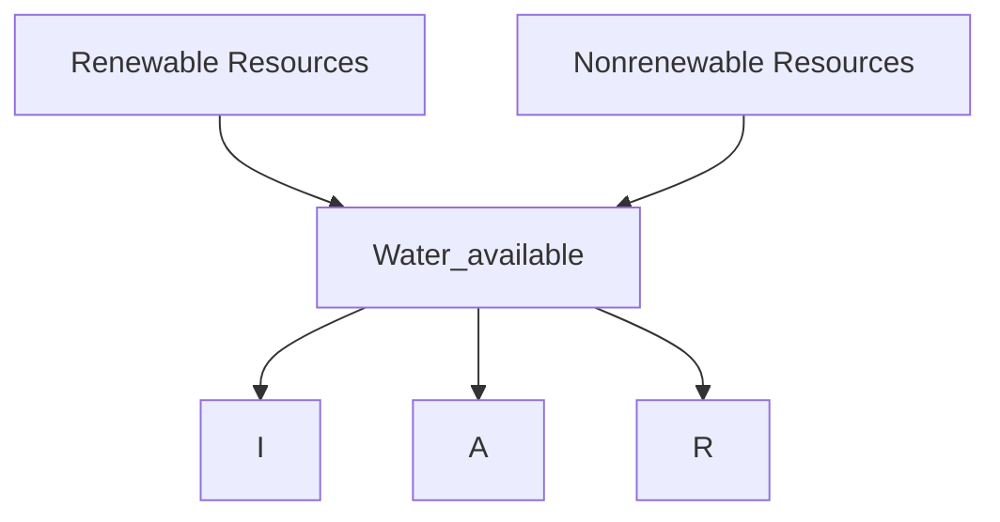
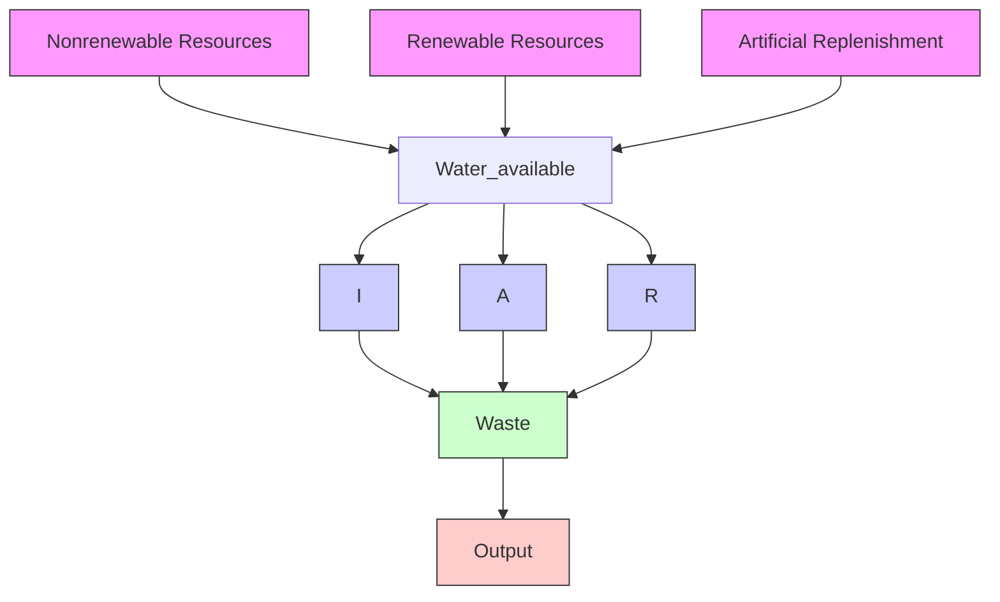
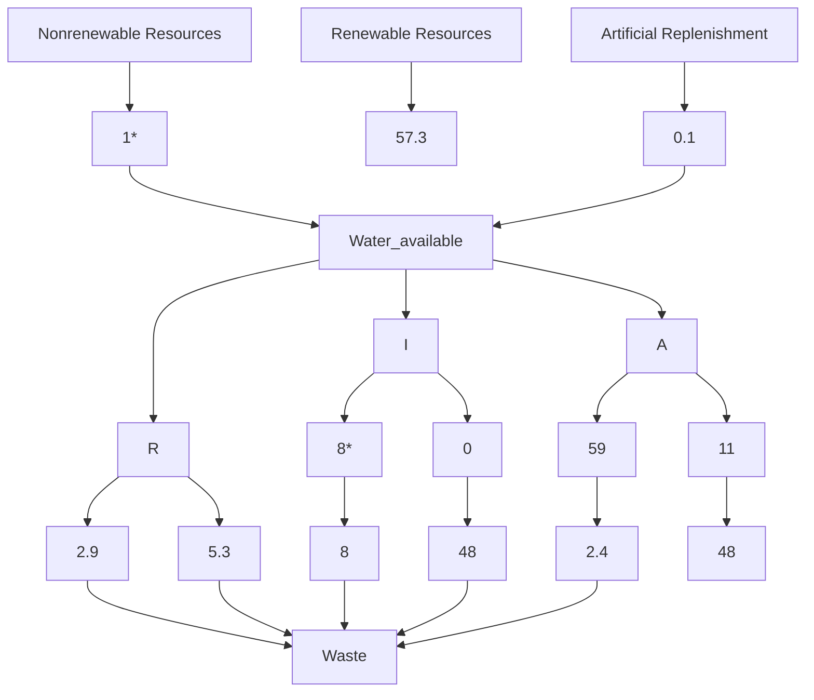

## 2016

## MCM/ICM

## Summary Sheet

(Your team's summary should be included as the first page of your electronic submission.)

Type a summary of your results on this page. Do not include the name of your school, advisor, or team members on this page.

Although readily available to many of the world’s citizens, clean water has become a scarce resource in much of the world. Rising consumption and over-withdrawal have critically stressed the water supply in developed and developing regions alike. The increasing frequency of droughts in California and the massive water deficits of large Arab cities such as Dubai are both indicators of this global problem. Continuing growth in population and the onset of climate change will only exacerbate this crisis in the years ahead. A study conducted by the United Nations Department of Economics and Social Affairs predicted that by 2025, approximately two-thirds of the world’s population will be living in water-stressed regions.

In modeling this complicated issue, we designed a flow model based on time constrained functions of withdrawal. These functions were associated to changing populations, GDP growth, and the effects of climate change. The demand functions were separated by sector (agricultural, residential, and industrial) and the supply functions by water source. This theoretical conception of the functions as inflow and outflow provided us with a general metric to measure water stress/scarcity; we termed this water deficit as equal to water consumed per year over the sustainable water resources available.

For our case study, we choose to investigate Egypt, because despite having well-developed infrastructure and pursuing sustainability efforts, the country still experiences water scarcity. In our research, we found Egypt’s current water deficit to be 102%. By 2030, we predict this could go as high as 161% if no actions are taken. We believe that with Egypt’s unchecked population growth, this scarcity has been driven by the country’s massively inefficient irrigation system and overreliance on agriculture. Thus, we focused our intervention plan on these decisive factors. Our proposal consists of:

1. Increasing irrigation efficiency (reducing net irrigation expenditures by 14km3/yr)  
2. Importing 10 million tonnes of crops per year by 2024  
3. Increasing residential and industrial renewal to 15km3/yr  
4. Strengthening the Nile Basin Initiative to protect against volatility  
5. Using short-term withdrawals of \~35km3 from the Nubian Aquifer to cover the current deficit

We predict that these measures will reduce Egypt’s water deficit to below 100% by 2020 and result in a sustainable 78% by 2030. Additionally, this will increase the available water resources by 40km3 in 2030 alone and will produce 484km3 over the fifteen year period. Ultimately, accomplishing these goals will require intensive infrastructure development and international cooperation.

## Contents

Introduction

The Water Scarcity Model 2

Analysis of the Model 8

Case Study: Egypt 9

Intervention Proposal 17

Conclusion 20

## 1 Introduction

Although inconceivable to many citizens of wealthy nations, in much of the developing world clean, drinkable water has become a scarce resource. Across the world, 2.4 billion people lack access to improved sanitation facilities and approximately 80% of waste water is dumped into primary water sources.i In addition to pollution and economic mismanagement, many regions of the world experience the water problems simply due the burdens of expanding populations coupled and the decreasing water supplies caused by climate change. The United Nations defines water stress as annual water supplies of less than 1700 m3 per person, water scarcity as less than 1000 m3 per person, and absolute water scarcity as less than 500 m3 per person. However, this relative lack of water available to a region’s population may have several different causes. The Food and Agriculture Organization identifies three main causes for such scarcity: a lack of fresh water of acceptable quality, a physical shortage of water; a shortage of access to the water services, due to the failure of responsible institutions to ensure reliable supply; a lack of adequate infrastructure to capture the water, due to financial constraints. The first case is known as physical scarcity; the latter two cases are known as economic scarcity.

However, despite never breaking into world headlines, the problem of water scarcity has been developing for quite some time. The United Nations declared the years from 2005 to 2015 to be  in order to raise awareness and lead actions to address these problems.ii Unfortunately, many of the programs goals were not achieved and the water scarcity problems are only expected to get worse. One study conducted through the UN program found that by 2025 approximately two thirds of the world population will be living in water stressed regions.iii Thus, today it is perhaps even more urgent to find solutions to water scarcity before the development of a global water crisis.

## 1.1 Problem Statement

As tasked by the International Clean Water Movement, this study focuses on using quantitative models and predictions to find sustainable solutions to water scarcity around the world. Specifically, we will focus on the case study of Egypt to illuminate the problems facing much of the developing world and create potential answers to those threats. This study has inherent challenges; not only is reliable data hard to obtain but mathematical predictions require difficult assumptions that may not always match the full dataset. Therefore, our intervention plan and recommendations have been tempered by our research and knowledge of the real world.

## 2 The Water Scarcity Model

Though the lack of clean water is viscerally real to the people living in water stressed regions, it can be difficult to capture with quantified data. Thus to facilitate proper analysis, careful definitions of the terms are necessary. First, we define water scarcity as the inability of a region to fulfill its population’s water requirements in a sustainable way. This can be measured by percent renewable water withdrawn (for our purposes we will refer to this as water deficit), calculated by dividing the actual water withdrawn in a given year by a region’s available renewable water resources.iv Therefore, a nation is either experiencing or heading towards water scarcity when percent renewable water withdrawn is negative. Using this metric we can make predictions and policy recommendations at the most simple level by analyzing the dynamics of water available (inflow or supply) and water withdrawn (outflow or demand).

## 2.1 Basic Model and Assumptions

To begin the analysis, we decided to look at water deficit in its most basic form, as a function of inflow and outflow. This conception gives us the general model of water withdrawal as an open flow system.

flowchart

In this model, we define the inflow to be the yearly renewable and nonrenewable water resources available $( k m ^ { 3 } / y r )$ and the outflow to be water usage per year $( k m ^ { 3 } / y r )$ . As stated we take the following as our indicator of water scarcity:

$$
W a t e r D e f i c i t = W _ {D} = \frac {o u t f l o w}{i n f l o w _ {r e n e w a b l e}}
$$

Because of this definition, it follows that any deficit over one is withdrawing nonrenewable water sources and is therefore unsustainable.

In modeling the usage of water with a flow model we make several key assumptions. First that consumed is removed from the system. This assumption may seem counterintuitive, because in real life water is never really destroyed but transformed through the hydrological cycle. Although on a worldwide scale water flow would behave as a closed flow network, for an individual country it is more akin to an open system. Secondly, we assume that the system flow continuously. Therefore all inflow is spent as outflow and no water is saved in “supply.” This likewise may seem counterintuitive, but is valid because water not used returns to system as renewable water inflow.

## 2.2 Refinements

Using this basic model as a starting point we now add key refinements that expand the accuracy and reliability of our model while allowing for real world data to be used. Our goal in these refinements is to separate and clarify all sources of inflow and outflow, which will later be modeled as functions of time.

## A. Representing Inflow and Outflow as the Sum of Several Functions

Now, we adopt a more realistic analysis and separate inflow and outflow into several variables. Specifically:

$$
I n f l o w = R e n e w a b l e + N o n r e n e w a b l e
$$

$$
O u t f l o w = I + A + R
$$

where I, A, and R are industrial, agricultural and residential water withdrawal respectively. The separation of inflow by renewability allows us to model the effects of over-withdrawal,

climate change and pollution over time. The equation for outflow is based on the delineation used by the UN Food and Agriculture Organization (FAO) to study what factors drive water withdrawal over time.v

To return to our measure of water scarcity, we can now use this model to further refine our calculations.

flowchart

$$
W _ {D} = \frac {I + A + R}{i n f l o w _ {r e n e w a b l e}} = \frac {I + A + R}{i n f l o w _ {t o t a l} - i n f l o w _ {n o n r e n e w a b l e}}
$$

## B. Adding Water Recycling and Artificial Replenishment

However, the previous model still considers all water withdrawn as consumed (removed from the system). To account for this we made further refinements by acknowledging that not all water withdrawn is wasted and that technologies enable artificially expanding the water supply. First, a portion of the water withdrawn by each sector is not fully consumed but is recycled back into the available water supply. These recycling ratios depend on the consumption sector (I, A, or R), the infrastructure of the region and, in the case of agriculture, the climate of the region. Secondly, through technologies such as desalination, damming rivers (creating strategic reservoirs), and renewing polluted waters, a region can synthetically increase its water inflow. This

flowchart

broad category will be referred to as artificial replenishment. To clarify the distinction between the two, water recycling is when used water is converted back into usable water and artificial replenishment is when an unusable water source is converted to usable water.

Introducing the new model’s components into our calculations of water deficit, we derive:

$$
W _ {D} = \frac {I - I _ {r e n} + A - A _ {r e n} + R - R _ {r e n}}{I n f l o w _ {r e n e w a b l e} + I n f l o w _ {a r t i f i c i a l}} = \frac {I _ {c o n} + A _ {c o n} + R _ {c o n}}{I n f l o w _ {r e n e w a b l e} + I n f l o w _ {a r t i f i c i a l}}
$$

Where $\mathrm { I _ { c o n } }$ is the amount of water consumed.

## 2.3 Functions of Withdrawal

Our goal now is to transition the general flow system in a combination of various functions of time. To accomplish we will discuss how the variable inputs into water deficit can be associated to the either the growth of population over time or climate change over time. As is standard, we decided to model population with a logistic model.

$$
P (t) = \frac {L}{1 + e ^ {- k (t - t _ {0})}}
$$

However, because climate change will affect separate regions differently, we cannot assume a general model that will apply in all cases. In order to incorporate this factor into a predictive water deficit model for a given region, a model of climate change specific to that region is required.

## A. Industrial Consumptionvi

Industrial usage of water is influenced by many factors: the size of factories, the products manufactured the efficiency of equipment, the technology used in the factories, and so on. Individually accounting for each of these factors is extremely difficult, and bordering on impossible given the lack of data. Therefore, we must search for a variable which is reasonably correlated to the volume of industrial water usage in a country. For the sake of simplicity, we used Gross Domestic Product (GDP) as our indicator. This is because GDP is a commonly measured variable which can reflect the total value of goods produced, and therefore should reflect the quantity of the products produced in industry. Assuming the efficiency of factories is constant, and the same goods are produced year after year, GDP should then be proportional to industrial water usage.

However, our data suggested that GDP was not proportional to industrial production. After further research, we found that industrial production only makes up a small percentage of GDP, and GDP is in fact not proportional to IP. For the sake of simplicity, however, we continued to work with the industrial water model including GDP. Given the principle of diminishing marginal returns, we made the assumption that over time GDP increases lead to a smaller increase in industrial water withdrawal. This yielded a logarithmic model:

$$
I (t) = a * \ln (G D P) + b
$$

Where a and b are some constants specific to a region’s industry type and water usage. We found this to be have good correlation with the data available, given a spread of twenty to thirty years. Thus for our fifteen year prediction it will be more than sufficient.

To account for the industrial water renewal is a more complicated and situational dependent figure. Certain industries have a much higher potential for renewal (that is, only if the infrastructure is in place) and others have almost no renewal capability. As the industrial makeup of each country is unique, it is impossible to create a general model of industrial renewal that will be applicable in every case. Therefore, when developing a region specific model assumptions must be made about industrial renewal in that area. Thus our general model for industrial water consumption is:

$$
I _ {c o n} = I (t) - I _ {r e n} (t) = a * \ln (G D P) + b - I _ {r e n} (t)
$$

## B. Agricultural Consumption

For much of the world’s water stressed regions, agriculture is a large drain on water resources. To model this, we found that agricultural water uses consist of three elements: irrigation withdrawals, livestock withdrawals, and aquaculture withdrawals [cite]. However, due to limited data for the latter two, and their relative significance compared to irrigation, we can assume that they are negligible. Therefore:

$$
A _ {c o n} = A W W - I r _ {r e n e w a l}
$$

where AWW represents agricultural water withdrawal and $\mathrm { { I r } _ { r e n e w a l } }$ represents the amount of agricultural drainage that is recycled back into the water supply.

Since we know that the total agricultural withdrawal is assumed to be irrigation alone, we can incorporate the Food and Agriculture Organization of the United Nations’ (FAO) irrigation model into our flow analysis.vii The ICU represents the amount of water that plants need for sustainment, and is given by the function:viii

$$
I C U = E T _ {c} - P - \Delta S
$$

Where ETc is the evapotranspiration (the sum of water lost due to evaporation and plant transpiration), P is the volume of precipitation and S is the soil moisture. We can now input the ICU function into our model, based on the fact that $A W W = I C U +$ $I r _ { w a s t e }$ , where $I r _ { w a s t e }$ is the amount of water lost in an irrigation system. This equation and the expanded equation are given here:

$$
A _ {c o n} = I C U + I r _ {w a s t e} - I r _ {r e n e w a l}
$$

$$
A _ {c o n} = E T _ {c} - P - \Delta S + I r _ {w a s t e} - I r _ {r e n e w a l}
$$

Now with a reliable formula for the agricultural consumption of water we can begin to associate that to developments over time. The ETc is equivalent to the crop yield multiplied by the evapotranspiration rate, which changes from one crop to another. The amount of crops grown in a region is a function of population size if one assumes that the amount of food trade is negligible (a valid assumption given the study is being conducted on a large water scarce region.) Similarly, the evapotranspiration rate is dependent not only on the types of crop grown but also climate. Therefore, given reliable models for population growth [p(t)] and climate change [cl(t)], we can reach the conclusion $E T _ { c } \propto f ( p ( t ) , c l ( t ) )$ . Likewise, the precipitation rates and soil moistures will also be associated with climate change over time. Therefore, $I C U \propto f ( p ( t ) , c l ( t ) )$ . Since changes in irrigation waste and renewal require infrastructure changes, we can assume that $I r _ { w a s t e }$ and $I r _ { r e n e w a l }$ will remain constant in a predictive model.

## C. Residential Consumptionix

To model the use of residential water consumption, we first assumed that it would be proportional to the population of any given region. This is reasonable, assuming that average consumption of water per capita would not change over time. However, we found that residential water use increased at a less than proportional rate to population, leading us to propose that residential water usage is instead linearly related to population, or:

$$
R (t) = a \cdot P (t) + b
$$

The assumption that average water per capita is constant presents particular problems with our understanding of the water usage in North America and Europe.

In fact in the developed world, residential water usage is significantly higher than developing nations, especially developing nations facing water scarcity. We believe this high rate is due to social and cultural factors and is not necessarily function of population over time. Therefore, at least in short run, it is perfectly safe to assume that the residential consumption will continue to be linear.

The renewal of used residential water relies on developed infrastructure to filter and purify sewage. Therefore, unless otherwise specified, we will assume the volume of residential waste renewed will be constant. This makes the final of residential water consumption:

$$
R _ {c o n} = R (t) - R _ {r e n} = a \cdot P (t) + b - R _ {r e n}
$$

## D. Inflow

In order to maintain generality, water inflow can be broken down any further than renewable, nonrenewable, and artificial. This is because every region has variety of different water sources that are unique to that area. However, broad insights can be gained by relating water sources to changes in time. By definition, renewable water resources will remain nearly constant over time barring climate change, overwithdrawal and pollution.x These can be incorporated into a region specific model, but given the variability of these factors over many regions it is unreasonable to produce a general model that will apply in every case. Similarly, nonrenewable water resources can be difficult to model in a general setting, but given that the “pool” of nonrenewable water is decreasing when it is withdrawn one can almost always assume it decreases as a function of time. Artificial water resources works in much the same way as the other inflows in that they will provide a constant supply in water unless there is some change made to infrastructure.

## 2.4 Final Model

To summarize all functions of our general theoretical model:

$$
W _ {D} = \frac {I _ {c o n} + A _ {c o n} + R _ {c o n}}{I n f l o w _ {r e n e w a b l e} + I n f l o w _ {a r t i f i c i a l}}
$$

$$
I _ {c o n} (t) = a * \ln (G D P) + b - I _ {r e n} (t) R _ {c o n} (t) = a \cdot P (t) + b - R _ {r e n}
$$

$$
A _ {c o n} (t) = E T _ {c} - P - \Delta S + I r _ {w a s t e} - I r _ {r e n e w a l}
$$

These functions essentially serve as rates of flow on the overflow model shown in 2.2. By manipulating these as functions of time we can conclude a general picture of where a region’s water usage is heading and, by using water deficit $\mathrm { ( W _ { D } ) }$ as an indicator, the effect that will have on water scarcity.

## 3 Analysis of the Model

Strengths: Our model of the Egyptian water deficit is desirable in many ways. First, it is structurally simple. It uses the strategy of divide and conquer to break up the complex variable of the nation’s water supply and demand into several simple sectors which can be more easily modeled. Supply is split into renewable and non-renewable sources, and the former is further split into natural and artificial sources. Demand is separated into agricultural, industrial, and residential sectors, each of which is split into consumption, renewal, and waste. The individual functions, due to their specificity, can be relatively simple functions involving a single variable within reason. This, in turn, can generate a final model relatively easily, in which future projections and estimates can be made.

Second, the model is very versatile. Different sectors of water and new modifying terms can be easily incorporated into the final equation, and since each sector has an independent equation, the model can be easily changed without having to modify most sectors. For example, after creating a model of Egyptian water usage, we decided to change the parabolic model initially used to estimate industrial water usage to a logistic model, which seemed more reasonable in that it would not eventually decrease. We were able to edit only the industrial model’s equation and leave everything else the same, saving manpower and time. We were also able to change irrigation efficiency, crop imports, etc. other statistics easily to determine their influence on water deficit over time.

Weaknesses: First, the lack of data markers caused models to be relatively weak and sensitive to data uncertainty. In the case of industrial and residential water usage models, both were created with merely 3 data points, and with approximated population data. With such scarcity, the r2 values cannot be used as an effective measure of whether the model correlates with actual data, also making it difficult to determine a best-fit model.

Second, the simplicity of the models sometimes leads to unreasonable scenarios, where water consumption or population becomes negative, which is clearly undesirable. For example, when population decreases to less than ൎ 49 million, our residential water consumption model returns a negative water usage, which is clearly unrealistic. Likewise, in our industrial consumption model, a nominal GDP of less than ൎ 6.65 billion USD will return a negative water usage. This is because our models are based on current data, without any consideration for conditions before or after the data points. Therefore, the ability for the models to predict future conditions may be speculative.

## 4 Case Study: Egypt

Egypt is suffering from one of the most chronic and long-term water scarcity problems in the world. Although Egyptian civilization has existed for thousands of years on the Nile, its recent population surge has created an unprecedented drain on the nation’s primary water source. Indeed, Egypt’s rampant overpopulation is the primary source of not only its environmental stress but also presents deep challenges to the country’s political and economic development. According to the CIA World Factbook, these factors combine to complicate the matter further. “A rapidly growing population (the largest in the Arab world), limited arable land, and dependence on the Nile all continue to overtax resources and stress society. The government has struggled to meet the demands of Egypt's population through economic reform and massive investment in communications and physical infrastructure.”xi

Despite the problems still facing Egypt, its government has historically taken the challenges of sustaining its water resources under the stress of a growing population very seriously. In response to continuous problems with unpredictable flooding and flow volume, the Egyptian government constructed the Aswan High Dam in 1970 to regulate and control the river. In its reservoir, Lake Nasser, the dam has the capacity to store 169 cubic kilometers, roughly triple the annual Egyptian water intake from the Nile.xii In addition, the Egyptian government has attempted several attempts to regulate the use of water in order to ensure that water resources are allocated efficiently.

However, management problems have been compounded in recent years by the political unrest starting with the Arab Spring in 2010. Following the ousting of President Hosni Mubarak, Egypt struggled through the Islamist regime of the Muslim Brotherhood and a period of direct military control until the election of Abdel Fattah Al Sisi in May 2014.xiii Although the political situation has stabilized and democratic institutions are being reintroduced, the civil disorder and governmental upheaval have undoubtedly created problems for Egyptian and international authorities attempting to monitor and manage water scarcity in the Nile River Valley.

The political disruptions have also had harmful effects on the international hydro-politics of the region. The Nile is a primary fresh water source for nearly eleven countries in Eastern Africa.xiv Three of them, Egypt, Sudan and Ethiopia are large arid countries facing the threat of unsustainable population growth in the near future.xv For much of the past fifty years, the usage of the Nile as a renewable water resource has been governed by the 1959 Agreement for the Full Utilization of the

between Sudan and Egypt. Both nations agreed to limit their water in take from the Nile to a constant volume as part of the construction process of the Aswan Dam.xvi Later in 1999, nine of the countries sharing the basin agreed to launch the Nile Basin Initiative (NBI), which established a regional council to cooperatively develop the river’s infrastructure.xvii However, taking advantage of the conflict in the past decade, Ethiopia began construction on the Grand Renaissance Dam prior to full NBI approval. Although, very recently Egypt succeeded in delaying the project until environmental studies are complete, the dam remains a threat to Egypt’s water security.xviii

line chart

| Year | Ethiopia | Egypt | Sudan |
|------|----------|-------|-------|
| 1960 | 22M      | 27M   | 8M    |
| 1970 | 30M      | 35M   | 10M   |
| 1980 | 35M      | 42M   | 14M   |
| 1990 | 48M      | 55M   | 20M   |
| 2000 | 65M      | 68M   | 28M   |
| 2010 | 95M      | 85M   | 38M   |

## 4.1 Current Situation by the numbers

## A. Physical Scarcity

Egypt’s main natural source of water, the Nile River, is described as heavily exploited, and Growing Blue claims that groundwater withdrawal in Egypt is currently 541.8% of recharge—a very unsustainable condition. With Egypt’s annual available water per capita at 663 m3 per person and decreasing, the nation has long been in a state of water scarcity. This is not because of lack of infrastructure; it is simply due to a dearth of freshwater sources, a physical water scarcity. Egypt has a low average precipitation and is mostly desert, reasons why the vast majority (>95%) of Egypt’s renewable freshwater comes from the 55.5 km3 annual flow of the Nile River while Egypt is permitted, under the 1959 Nile River Agreement. The problem with Egypt is not inability to process or capture water; there is simply not enough water.

## B. Economic Scarcity

To some extent, Egypt’s water scarcity is political and economic as well. For example, though the actual average flow of the Nile River entering the Aswan Dam averages 84 km3, a treaty allocates 18.5 km3 to Sudan and 10 km3 for natural loss of water flow. Egyptians have long been eager to change that allocation, given Egypt’s rapidly growing population. However, the number has remained constant to this day. In addition, the Nubian aquifer under most of Egypt contains vast amounts of freshwater, with as much as 150,000 km3 using current estimates; however, most of the usable freshwater is located as much as 1500 m deep, making it costly to use. Furthermore, Egypt’s irrigation systems are inefficient and lose large percentages of water through leakage and evaporation, which could be improved with better infrastructure, another way the water scarcity in Egypt can be fixed through economic means. Finally, Egypt may import crops and other materials to save its water, known as net virtual water import.

## C. Model Application

In order to apply our model to Egypt’s specific case we first tried to fit the data available to a general, theoretical flow system. This proved a simple task given the similarity of our equations to the data used by FAO AQUASTAT.xix The following chart shows data for 2005 overlaid onto our flow model:

flowchart

text_image

Key
Measured in km³/yr
W_D = 102%
*Nonran. Approximate
*Industrial+Water Power

## D. Defining Functions

Given the facts we collected about Egypt, we were able to collect data for water consumption, withdrawal, and other key statistics to create specific functions based off our model. After creating a specific model, we were able to make predictions on the future water deficit and demand in Egypt.

Inflow: First, we examined our model and decided to fix $W _ { i n f l o w }$ at 57.3 km3, ignoring yearly fluctuations of natural water sources. This greatly simplifies our model and is similar to the actual situation, where Egypt enjoys a steady supply of water from the Nile due to the Aswan dam’s ability to store and release water when needed. We will make this assumption because, as stated in the theoretical section, water resources are depleted by over-withdrawal, pollution, and climate change.

Though some renewable water resources, such as groundwater and lakes, can be deplete by over-withdrawal, flowing surface water, like the Nile River cannot. It is possible for nations upstream to deplete the river before it reaches Egypt, but such an event would be almost impossible to model with any accuracy.xx Similarly, studies on climate change are not conclusive on the effect of climate change on the flow of the Nile and therefore we do not feel we can make any realistic predictions without much more data (this will be discussed further later on). Finally, no data on the pollution of the Nile River over time was found and therefore we could not draw decisive model for how much pollution we can expect at any time in the future. Although not ideal, given the time and data constraints, this assumption is necessary to reach any conclusions.

Population: Using a model to generate population estimates for the next fifteen years is necessary, as it is the basis of our several of our water consumption models in specific sectors. We gathered data about the population of Egypt to fit our logistic model of population. The data spanned from 1962 to 2013, and yielded a function of:

$$
P (t) = \frac {1 5 4 . 5}{1 + e ^ {- 0 . 0 3 (t - 4 7 . 1)}}
$$

As shown in Appendix Figure 4.1, the model fits the actual growth curve of population quite closely. Compared to other Egyptian population estimates, our numbers are slightly lower than many predictions for the long range future, but our model certainly remains valid in the short run.

Industrial: The data on industrial usage of water has historically been unreliable and scarce in Egypt. Indeed, we found that estimates of water use in the year 2000 varied wildly from 4 cubic kilometers to 9.61 cubic kilometers, depending on different methods used for estimation. Given the fundamental inaccuracy of the data, we therefore decided to use one consistent set of data from a single source, a study of Egypt’s water supply, demand, and management policies conducted by Mansoura University in 1997. The data suggested that industrial water usage was increasing, yet the rate at which usage was increasing was slowing down. Given the data on industrial water usage from the years 1995, 2000, and 2010, we came up with the following logistic model on industrial water usage:

$$
I (t) = 3. 4 7 4 \ln (G D P) - 6. 5 8 2
$$

[This model is graphically displayed in Appendix Figure 4.2.]

Furthermore, our model’s predictions rely on an accurate prediction of GDP in the future. To simplify this task we assume that Egypt’s GDP will continue to grow at a 2% rate as it for the past 4 years. The reason for this slow growth is the political unrest in the Middle East, which we do not believe will recede any time in the near future.xxi

Agricultural: Due to the difficulty of finding sufficient data, we had to make a couple key assumptions about Egyptian agricultural water use. First, we must assume that due to the arid climate of Egypt the effect of precipitation and soil moisture on irrigation withdrawals will be negligible. Secondly we must assume that the crop yields are directly associated to population growth. These two assumptions are reasonable given Egypt’s situation and the short term over which we will be making these predictions.

We begin by solving for ICU using the complete 2005 dataset given by AQUASTAT.xxii Since we know the values for A(t), $\operatorname { I r } _ { \mathrm { r e n } }$ , and $\mathrm { I r } _ { \mathrm { w a s t e } } ,$ , this can completed solving the linear equation. For 2005 the ICU was $\mathrm { 4 5 k m ^ { 3 } } .$ . If we take our assumptions into account we can consider $\mathrm { I C U = E T _ { c } = c y ^ { \ast } }$ etr. Since the crop yield in 2005 was found to be 19.23 MT, we can say that the etr=2.34. Using a linear regression, crop yield was found to be equal to 0.262 times population in millions. Assuming that these coefficients remain static (as was done for Model 1) we conclude:

$$
I C U = 0. 2 6 2 * (2. 3 4 * p (t)) = 0. 6 1 3 p (t)
$$

$$
I _ {c o n} = 0. 6 2 3 p (t) + I _ {w a s t e} - I _ {r e n}
$$

Additionally, this function can be modified to account for climate change. Specifically, by increasing the evapotranspiration rate steadily over time and decreasing precipitation and soil moisture over time the increasing difficulty of growing crops in more severe weather is captured. This technique was adopted in Model 2.

Residential: Again, the dearth of data on residential water use in Egypt limits the accuracy and predictive abilities of our model. Using available data from Aquastat and other sources, we obtained data of the residential water usage in the years 1995, 2000, and 2013. Then, using our population model which has already been proven to very closely approximate actual population, we obtained population numbers for these years. Using this data, then, we obtained the following linear model on residential water usage:

$$
R (t) = 0. 3 0 2 9 \cdot P (t) - 1 4. 8 0 2
$$

Here, ܲሺݐሻ is our previously determined logistic model of population. It should be noted that due to the lack of data, the model has limited range of validity, and its correlation coefficient is artificially high; in fact, when population is below $\frac { 1 4 . 8 0 2 } { 0 . 3 0 2 9 } \approx$ 49 million, residential water usage becomes negative and the model is unrealistic. Nevertheless, the plot between residential water usage, predicted by this model, and actual usage is quite close for the given as shown in Appendix Figure 4.3.

## 4.2 Fifteen Year Predictions

Now that our models are established relative to Egyptian water consumption, we can make concrete predictions for the next fifteen years. We conducted three sets of predictions: the first based on a simple regression of water consumption to time (this will serve as a baseline for analysis); the second using our models and functions given that trends stay the same; and the third using our models and functions with the addition of factoring in predicted climate changes.

Baseline: We first assumed the total consumption of water was linearly correlated to the population: an increase in population would cause a proportional increase in water consumption. Although this assumption is an incredibly simple way to view water consumption, which is in fact influenced by population, economic growth, climate change, political unrest, etc. After visual examination of the data, however, it was found that water usage grew less than proportionally to population growth, which led to the idea of water consumption per capita decreasing as a function of time: ሺܽ െ ܾݐሻ. This led to the following model of water consumption:

$$
C (t) = (a - b t) \cdot P (t)
$$

In Egypt’s case these coefficients were found to be:

$$
C (t) = (1. 2 5 5 - 0. 0 0 7 t) * p (t)
$$

This produced the following data predictions (all values in km3/yr):

<table><tr><td>Year</td><td>Water Consumption</td><td>Sustainable Withdrawal</td><td>Nonrenewable Withdrawal</td><td>Water Deficit</td></tr><tr><td>2016</td><td>74.6</td><td>57.4</td><td>18.1</td><td>129.95%</td></tr><tr><td>2017</td><td>75.0</td><td>57.4</td><td>19.3</td><td>130.65%</td></tr><tr><td>2018</td><td>75.4</td><td>57.4</td><td>20.4</td><td>131.30%</td></tr><tr><td>2019</td><td>75.7</td><td>57.4</td><td>21.5</td><td>131.93%</td></tr><tr><td>2020</td><td>76.1</td><td>57.4</td><td>22.6</td><td>132.51%</td></tr><tr><td>2021</td><td>76.4</td><td>57.4</td><td>23.7</td><td>133.07%</td></tr><tr><td>2022</td><td>76.7</td><td>57.4</td><td>24.8</td><td>133.58%</td></tr><tr><td>2023</td><td>77.0</td><td>57.4</td><td>25.8</td><td>134.06%</td></tr><tr><td>2024</td><td>77.2</td><td>57.4</td><td>26.9</td><td>134.50%</td></tr><tr><td>2025</td><td>77.4</td><td>57.4</td><td>28.0</td><td>134.91%</td></tr><tr><td>2026</td><td>77.6</td><td>57.4</td><td>29.1</td><td>135.28%</td></tr><tr><td>2027</td><td>77.8</td><td>57.4</td><td>30.1</td><td>135.61%</td></tr><tr><td>2028</td><td>78.0</td><td>57.4</td><td>31.2</td><td>135.90%</td></tr><tr><td>2029</td><td>78.2</td><td>57.4</td><td>32.2</td><td>136.15%</td></tr><tr><td>2030</td><td>78.3</td><td>57.4</td><td>33.2</td><td>136.37%</td></tr></table>

In many ways this model is not reliable because it does not take into account the complexity of the factors that influence water consumption and the trends of those factors. Furthermore, it based on assumptions that hold in the short run but are not realistic in the long run. However, this model has some utility as a baseline to measure how taking multiple factors into account affects predictions.

Model 1: This model uses the functions developed to separate the factors driving water consumption over time without taking into account climate change. We intended this to serve as a starting point to further refine our model. Model 1 relies on two new assumptions:

i. All water recycling values remain constant.  
ii. All effects of climate change are disregarded (for now).

Our first assumption is valid given that in order for water recycling to increase, a region must improve its water infrastructure and have the necessary facilities to treat used water. This assumption is fine for our predictions given that we will account for improving recycling in our intervention plan and policy recommendations. The second assumption is not valid for accurate predictions, but by separating the effects of climate change from the current trends allows us to analyze the relative threat posed by each of these changes.

The following is the yearly water usage data produced by this model:

<table><tr><td>Year</td><td>Population</td><td>Sustainable Resources</td><td>Nonrenewable Withdrawal</td><td>Water Consumption</td><td>Water Deficit</td></tr><tr><td>2016</td><td>85.1</td><td>57.3</td><td>18.1</td><td>75.4</td><td>131.67%</td></tr><tr><td>2017</td><td>86.2</td><td>57.3</td><td>19.3</td><td>76.6</td><td>133.61%</td></tr><tr><td>2018</td><td>87.3</td><td>57.3</td><td>20.4</td><td>77.7</td><td>135.55%</td></tr><tr><td>2019</td><td>88.5</td><td>57.3</td><td>21.5</td><td>78.8</td><td>137.48%</td></tr><tr><td>2020</td><td>89.6</td><td>57.3</td><td>22.6</td><td>79.9</td><td>139.40%</td></tr><tr><td>2021</td><td>90.7</td><td>57.3</td><td>23.7</td><td>81.0</td><td>141.31%</td></tr><tr><td>2022</td><td>91.8</td><td>57.3</td><td>24.8</td><td>82.1</td><td>143.21%</td></tr><tr><td>2023</td><td>92.9</td><td>57.3</td><td>25.8</td><td>83.1</td><td>145.11%</td></tr><tr><td>2024</td><td>94.0</td><td>57.3</td><td>26.9</td><td>84.2</td><td>146.99%</td></tr><tr><td>2025</td><td>95.1</td><td>57.3</td><td>28.0</td><td>85.3</td><td>148.86%</td></tr><tr><td>2026</td><td>96.2</td><td>57.3</td><td>29.1</td><td>86.4</td><td>150.72%</td></tr><tr><td>2027</td><td>97.3</td><td>57.3</td><td>30.1</td><td>87.4</td><td>152.56%</td></tr><tr><td>2028</td><td>98.4</td><td>57.3</td><td>31.2</td><td>88.5</td><td>154.39%</td></tr><tr><td>2029</td><td>99.4</td><td>57.3</td><td>32.2</td><td>89.5</td><td>156.21%</td></tr><tr><td>2030</td><td>100.5</td><td>57.3</td><td>33.2</td><td>90.5</td><td>158.01%</td></tr></table>

Additionally, the water consumption can be further broken down by sector as shown below. In general his model predicts that population growth will continue to drive up water consumption, primarily because of agricultural demands, at a much higher rate than the baseline model predicts.

<table><tr><td>Year</td><td>Industrial Consumption</td><td>Agricultural Consumption</td><td>Residential Consumption</td></tr><tr><td>2016</td><td>13.1</td><td>55.15</td><td>7.2</td></tr><tr><td>2017</td><td>13.2</td><td>55.84</td><td>7.5</td></tr><tr><td>2018</td><td>13.2</td><td>56.54</td><td>7.9</td></tr><tr><td>2019</td><td>13.3</td><td>57.24</td><td>8.2</td></tr><tr><td>2020</td><td>13.4</td><td>57.93</td><td>8.6</td></tr><tr><td>2021</td><td>13.4</td><td>58.61</td><td>8.9</td></tr><tr><td>2022</td><td>13.5</td><td>59.30</td><td>9.3</td></tr><tr><td>2023</td><td>13.6</td><td>59.98</td><td>9.6</td></tr><tr><td>2024</td><td>13.6</td><td>60.65</td><td>9.9</td></tr><tr><td>2025</td><td>13.7</td><td>61.32</td><td>10.3</td></tr><tr><td>2026</td><td>13.8</td><td>61.99</td><td>10.6</td></tr><tr><td>2027</td><td>13.9</td><td>62.65</td><td>10.9</td></tr><tr><td>2028</td><td>13.9</td><td>63.31</td><td>11.2</td></tr><tr><td>2029</td><td>14.0</td><td>63.96</td><td>11.6</td></tr><tr><td>2030</td><td>14.1</td><td>64.60</td><td>11.9</td></tr></table>

Model 2: Building off Model 1, this model removes the constraint of ignoring climate change and implements its effects as discussed in section 4.1. Specifically the effect climate change would have agricultural water requirements was modeled by increasing the evapotranspiration rate steadily over time and decreasing precipitation and soil moisture over time. These models are based on the conclusion that increased temperatures would have both of those effects. Both of these changes cause agriculture to consume higher rates of water over time:

<table><tr><td colspan="2">Agricultural Consumption (km3/yr)</td></tr><tr><td>Model 1</td><td>Model 2</td></tr><tr><td>55.15</td><td>55.66</td></tr><tr><td>55.84</td><td>56.44</td></tr><tr><td>56.54</td><td>57.22</td></tr><tr><td>57.24</td><td>58.01</td></tr><tr><td>57.93</td><td>58.79</td></tr><tr><td>58.61</td><td>59.57</td></tr><tr><td>59.30</td><td>60.34</td></tr><tr><td>59.98</td><td>61.12</td></tr><tr><td>60.65</td><td>61.89</td></tr><tr><td>61.32</td><td>62.66</td></tr><tr><td>61.99</td><td>63.42</td></tr><tr><td>62.65</td><td>64.19</td></tr><tr><td>63.31</td><td>64.94</td></tr><tr><td>63.96</td><td>65.70</td></tr><tr><td>64.60</td><td>66.45</td></tr></table>

As shown by the chart above, factoring in the effects of climate changes has a relatively small effect on the agricultural water consumption in fifteen years of time. This increases the predicted water deficit in 2030 by 4%. Below is the final predictions produced by our model:

<table><tr><td>Year</td><td>Population</td><td>Sustainable Resources</td><td>Nonrenewable Withdrawal</td><td>Water Consumption</td><td>Water Deficit</td></tr><tr><td>2016</td><td>85.1</td><td>57.3</td><td>18.7</td><td>76.0</td><td>132.56%</td></tr><tr><td>2017</td><td>86.2</td><td>57.3</td><td>19.9</td><td>77.2</td><td>134.65%</td></tr><tr><td>2018</td><td>87.3</td><td>57.3</td><td>21.1</td><td>78.4</td><td>136.74%</td></tr><tr><td>2019</td><td>88.5</td><td>57.3</td><td>22.2</td><td>79.5</td><td>138.82%</td></tr><tr><td>2020</td><td>89.6</td><td>57.3</td><td>23.4</td><td>80.7</td><td>140.90%</td></tr><tr><td>2021</td><td>90.7</td><td>57.3</td><td>24.6</td><td>81.9</td><td>142.98%</td></tr><tr><td>2022</td><td>91.8</td><td>57.3</td><td>25.8</td><td>83.1</td><td>145.04%</td></tr><tr><td>2023</td><td>92.9</td><td>57.3</td><td>27.0</td><td>84.3</td><td>147.10%</td></tr><tr><td>2024</td><td>94.0</td><td>57.3</td><td>28.2</td><td>85.5</td><td>149.15%</td></tr><tr><td>2025</td><td>95.1</td><td>57.3</td><td>29.3</td><td>86.6</td><td>151.19%</td></tr><tr><td>2026</td><td>96.2</td><td>57.3</td><td>30.5</td><td>87.8</td><td>153.22%</td></tr><tr><td>2027</td><td>97.3</td><td>57.3</td><td>31.7</td><td>89.0</td><td>155.24%</td></tr><tr><td>2028</td><td>98.4</td><td>57.3</td><td>32.8</td><td>90.1</td><td>157.25%</td></tr><tr><td>2029</td><td>99.4</td><td>57.3</td><td>33.9</td><td>91.2</td><td>159.24%</td></tr><tr><td>2030</td><td>100.5</td><td>57.3</td><td>35.1</td><td>92.4</td><td>161.23%</td></tr></table>

## 4.3 Analysis of Results

Because it encompasses more of our knowledge and more of the complexity of the data we believe Model 2 is the most reliable and robust predictor. Thus we will use to reach some conclusions about the future of water scarcity crisis. When factoring in the total effects of an expanding population and negative climate changes, Egypt’s water deficit in 2030 will be 25% greater. Truly, if the Nile Basin is withdrawn continuously at a water deficit of 161%, the results will be an unprecedented water crisis. The primary driver of the potential catastrophe is the continued growth of agricultural water consumption. Unless Egypt can decrease this over time, there is little hope to prevent this disaster.

## 5 Intervention Proposal

Based on our modeling predictions and circumstantial analysis, we believe that Egypt can work towards decreasing its water deficit by means of infrastructure development and international cooperation. Since Egypt’s ability to support its population with its annual water resources is represented by the ratio between water withdrawal and inflow of renewable water resources, all recommendation for improvement should seek to reduce withdrawal or increase inflow. Therefore, we propose and subsequently explain the following courses of action for the Egyptian government:

1. Increase irrigation efficiency by both reducing waste and increasing renewal  
2. Replace a portion of domestic crop production with international imports  
3. Invest in industrial and residential water treatment and renewal programs  
4. Coordinate climate change response plans within the Nile Basin Initiative  
5. Cover the short-term water deficit with reserves from the Nubian Aquifer

## 5.1 Recommendations

The following are explanations of the specific points of our intervention plan.

Increase Irrigation Efficiency: Because irrigation is the primary use for agricultural water withdrawals, which in turn is the largest component of overall annual water consumption in Egypt, it should be targeted first in an initiative to conserve water. In areas that have recently been reclaimed for agricultural purposes, the government only condones drip and sprinkler irrigation methods, as they are more efficient with water in the sandy desert soil. In many of the older areas, however, farmers still use surface irrigation methods, which waste large amounts of water every year.xxiii To address this issue and encourage a complete transfer to drip and sprinkler irrigation systems, we suggest expanding the law enforced in the reclaimed areas to all of Egypt. This may require tax incentives and a grace period for the adjustment to take place, but the water savings are vital to fixing the deficit in the country’s water resources. Our objective in this conversion is to cut irrigation waste in half, from 14 km3 to 7 km3 by 2030. Given that many Californian farms that have employed the same drip technology have reported up to 66% decrease in water consumption from their original surface systems, and have even seen better crop performance accompany their water savings, we believe this is a reasonable goal.xxiv

Egypt renews most of its irrigation drainage through its multiple pumping stations located along the Nile, mostly near its delta. These stations are officially sanctioned to renew agricultural runoff and pump it back into the water supply of the river to be used for further irrigation. These pumping stations accounted for 7.5 km3 of water renewal in 2011.xxv However, Egypt’s Ministry of Water Resources and Irrigation estimates unofficial reuse to total 2-3 km3 and other estimates are as high as 4 km3. This illegal reuse of water is illegal but lightly enforced, as poor farmers cannot afford to develop pumping stations to safely recycle their agricultural runoff.xxvi If they had access to the same resources, they could theoretically reuse irrigation waste more efficiently and more safely. Therefore, we suggest that the government continues to invest in additional pumping facilities on top of establishing economic incentives in the form of tax breaks for poorer farmers to adopt the pumping system in order to increase this number to 18 km3 by 2030.

Crop Imports: One of the fundamental causes for Egypt’s water deficit is that people are expending resources trying to grow crops in a desert. While farming directly along the Nile is an efficient use of land and water, a farmer will have to expend significantly more water to cultivate crops the further out from the river he plants.

The idea in economics of comparative advantage may lend some insight into how Egypt should approach its agricultural production. Obviously the country cannot suspend farming operations; however, it could change its agricultural selfsufficiency model to a more internationally dependent one. Organizing trade agreements with other nations that are more environmentally suited for crop cultivation would allow for less of a need to grow crops domestically. Egypt could then expand other market sectors that rely less on water withdrawal. An example of a more efficient use of water would be aquaculture, in which fish hatcheries can be integrated into existing water bodies such as rice patties, irrigation tanks, and even the Nile by means of cages.xxvii While this is just one example, many options exist for Egypt to specialize in sectors that do not rely on heavy water expenditure, and can lead to the development of an export good used in trade for needed agricultural products.

Industrial and Residential Water Recycling: Egypt successfully renewed 6.9 km3 of industrial and residential water in 2005.xxviii However, we can still see significant progress in these areas with heightened investment in wastewater and industrial treatment facilities. While water treated in such plants may not be ideal for human consumption, it can easily be transferred to agricultural and further industrial uses given upgraded infrastructure. In order to achieve a sustainable water flow, we would like to see this renewal rate increase to approximately 15 km3 per year. While this would require major construction of more advanced facilities, it would significantly contribute to reducing Egypt’s water deficit.

Strengthen the Nile Basin Initiative: Given that climate change may affect volatility of the Nile River, Egypt and surrounding countries must place greater emphasis on establishing contingency agreements through the Nile Basin Initiative in order to develop courses of action in case water flow is drastically lower over any given period of time.xxix If countries upstream of Egypt decide to continue using the same amount of water in the event of a climate incident that impacts water levels, the nation could easily approach dangerous water scarcity. The most ideal solution to safeguard against such an event would be establishing a protocol for distributing the Nile’s water at a fixed ratio among the countries included in the agreement. This way, all nations bear the same level of burden rather than Egypt having unsustainable water shortages.

Nubian Aquifer: At the dawn of the century, the Nubian Aquifer contained approximately 260,000 km3 of water resources.xxx While a portion of that has been depleted over the years, enough still exists to sustain the region for the short-term. Therefore, Egypt can continue to withdraw their water deficit from this semirenewable resource until it can get on track with its renewal water plan. Ideally, after the nation fixes its water deficit and begins to rely more heavily on other sources and water savings plans, the aquifer will be able to begin replenishing via natural groundwater processes.

## 5.2 Modeled Impact

As can be seen in Appendix 5.1, each of the policy implementations was modeled by making adjustments to Model 2. If Egypt successfully implements our recommendations, by 2030 Egypt’s water deficit will return to a sustainable 78%. The effects of the recommendations were modeled as follows:

1. Increasing irrigation efficiency was modeled by gradual decreasing irrigation waste to 7 km3/yr and increasing recycled irrigation water to 18 km3/yr. This was found to increase the sustainable water supply to 14 km3/yr in 2030 and introduce an additional 119 km3 over the fifteen year period.

2. Increasing crop imports was found to have the greatest impact. By slowly increasing crop imports to 10 MT, and thereby decreasing the crop yield necessary to sustain the Egyptian population, approximately 25 $\mathrm { k m ^ { 3 } }$ would be saved in 2030 alone. Over the fifteen year span of the program it would save approximately 275 km3.  
3. Increasing water recycling was modeled by solely increasing the residential water renewed for mathematical simplicity. (The modeled is designed under the assumption that $\mathrm { I ( t ) { = } I _ { c o n } . ) }$ This simplification is mathematically equivalent to separating total renewal into sectors, but is easier to compute. This model was found to increase the water available by 11.2 $\mathrm { 5 m ^ { 3 } }$ in 2030 alone and nearly 90 km3 over the fifteen year period.  
4. In order to implement our plan, we require the withdrawal of 35 km3 of nonrenewable water resources by the year 2020, when Egypt will head below 100% water deficit. This is actually quite low considering that under the Model 2 with no intervention plan 35 $\mathrm { k m ^ { 3 } }$ of nonrenewable water was required for 2030 alone.

## 6 Conclusion

The current state of Egypt’s water deficit is very urgent: according to our definition, the water deficit has reached 102%. By using a flow model and breaking down water supply into natural and artificial factors, and separating demand into agricultural, industrial, and residential factors, we were able to model the water situation in Egypt with some precision. We assumed the volume of natural renewable water sources remains constant, while artificial and non-renewable water resources will change with demand. Then, we modeled population with a logistic model, which yielded a high $\mathrm { r ^ { 2 } }$ value of 0.9995. Using this model, we created a linear model for residential consumption which yielded an $\mathrm { r ^ { 2 } }$ value of 0.994. We initially also used a linear model for industrial consumption related to GDP, yet further examination of data suggested a logarithmic model would fit the model better. This logarithmic model had an $\mathrm { r ^ { 2 } }$ value of 0.994. Finally, we modeled agricultural consumption as a linear model of consumption, then added renewal and water recycling as modifying constants. This model states that if current recycling efficiencies and population growth trends continue, water deficit could run as high as 161% in fifteen years. With our intervention plan we were able to reduce water deficit to 78%.

For further work, we suggest collecting further data on different sectors of water consumption in Egypt. The added data will allow us to create a more suitable consumption model for different sectors, increasing the model’s accuracy and its ability to predict future conditions. More variables, such as urban population percentage, percentage of agriculture in GDP, distribution of income, nature of crops, etc. may be incorporated into future models to allow for a comprehensive view and more solutions for the water deficit in Egypt.

## Appendices

Figure 4.1 – Model of Egypt’s Population  

line chart

|   Year |   Actual Population (millions) |   Modeled Population (millions) |
|-------:|-------------------------------:|--------------------------------:|
|   1962 |                           30   |                            30   |
|   1967 |                           34   |                            34   |
|   1972 |                           38   |                            38   |
|   1977 |                           42   |                            42   |
|   1982 |                           47   |                            47   |
|   1987 |                           52.5 |                            52.5 |
|   1992 |                           58.5 |                            58.5 |
|   1997 |                           63   |                            63   |
|   2002 |                           68.5 |                            68.5 |
|   2007 |                           74.5 |                            74.5 |
|   2013 |                           81   |                            81   |
|   2014 |                           83   |                            83   |

Figure 4.2 – Model of Egypt’s GDP to Industrial Water Usage  

line chart

| Nominal GDP (billion USD) | Actual usage (km³) | Modeled usage (km³) |
| -------------------------- | ------------------ | ------------------- |
| 60                         | 7.5                | 7.5                 |
| 100                        | 9.5                | 9.5                 |
| 220                        | 12.0               | 12.0                |

Figure 4.3 – Egypt’s Residential Water Usage  
Population vs. residential water usage  

line chart

| Population (millions) | Municipal Water Usage (km³) |
| --------------------- | --------------------------- |
| 61                    | 3.7                         |
| 67                    | 5.3                         |
| 82                    | 10.0                        |

ne Model ‐  Simple Regre  
(3)d • (zz0o0 − ssZt) = (7)J

<table><tr><td>Year</td><td>Water Consumption</td><td>Water Resources*</td><td>Nonrenewable Withdrawal</td><td>Water Deficit</td></tr><tr><td>2016</td><td>74.6</td><td>57.4</td><td>18.1</td><td>129.95%</td></tr><tr><td>2017</td><td>75.0</td><td>57.4</td><td>19.3</td><td>130.65%</td></tr><tr><td>2018</td><td>75.4</td><td>57.4</td><td>20.4</td><td>131.30%</td></tr><tr><td>2019</td><td>75.7</td><td>57.4</td><td>21.5</td><td>131.93%</td></tr><tr><td>2020</td><td>76.1</td><td>57.4</td><td>22.6</td><td>132.51%</td></tr><tr><td>2021</td><td>76.4</td><td>57.4</td><td>23.7</td><td>133.07%</td></tr><tr><td>2022</td><td>76.7</td><td>57.4</td><td>24.8</td><td>133.58%</td></tr><tr><td>2023</td><td>77.0</td><td>57.4</td><td>25.8</td><td>134.06%</td></tr><tr><td>2024</td><td>77.2</td><td>57.4</td><td>26.9</td><td>134.50%</td></tr><tr><td>2025</td><td>77.4</td><td>57.4</td><td>28.0</td><td>134.91%</td></tr><tr><td>2026</td><td>77.6</td><td>57.4</td><td>29.1</td><td>135.28%</td></tr><tr><td>2027</td><td>77.8</td><td>57.4</td><td>30.1</td><td>135.61%</td></tr><tr><td>2028</td><td>78.0</td><td>57.4</td><td>31.2</td><td>135.90%</td></tr><tr><td>2029</td><td>78.2</td><td>57.4</td><td>32.2</td><td>136.15%</td></tr><tr><td>2030</td><td>78.3</td><td>57.4</td><td>33.2</td><td>136.37%</td></tr></table>

1 ‐  Climate Change not fact

<table><tr><td>year</td><td>p(t)</td><td>GDP (billions)</td><td>Inflow (ren)</td><td>Inflow (non)</td><td>inflow (art)</td><td>I(t)=I(con)</td><td>R(t)</td><td>R(ren)</td><td>R(con)</td><td>cropyield</td><td>ETR</td><td>ET_c</td><td>ICU</td><td>Ir(waste)</td><td>Ir(ren)</td><td>A(c0n)</td><td>Withdrawl</td><td>Water deficit</td></tr><tr><td>2010</td><td>78.15491</td><td>218.9</td><td>57.3</td><td>10.86438609</td><td>0.1</td><td>12.13805</td><td>8.871123</td><td>3.76</td><td>5.111123</td><td>20.47658731</td><td>2.34</td><td>47.91521</td><td>47.91521</td><td>14</td><td>11</td><td>50.91521</td><td>68.1643861</td><td>1.189605342</td></tr><tr><td>2011</td><td>79.30931</td><td>236</td><td>57.3</td><td>12.18309094</td><td>0.1</td><td>12.39935</td><td>9.220789</td><td>3.76</td><td>5.460789</td><td>20.7790385</td><td>2.34</td><td>48.62295</td><td>48.62295</td><td>14</td><td>11</td><td>51.62295</td><td>69.4830909</td><td>1.212619388</td></tr><tr><td>2012</td><td>80.46266</td><td>262</td><td>57.3</td><td>13.60261888</td><td>0.1</td><td>12.76243</td><td>9.570141</td><td>3.76</td><td>5.810141</td><td>21.08121771</td><td>2.34</td><td>49.33005</td><td>49.33005</td><td>14</td><td>11</td><td>52.33005</td><td>70.9026189</td><td>1.237393</td></tr><tr><td>2013</td><td>81.61446</td><td>272</td><td>57.3</td><td>14.78777309</td><td>0.1</td><td>12.89256</td><td>9.919021</td><td>3.76</td><td>6.159021</td><td>21.38298956</td><td>2.34</td><td>50.0362</td><td>50.0362</td><td>14</td><td>11</td><td>53.0362</td><td>72.0877731</td><td>1.258076319</td></tr><tr><td>2014</td><td>82.7642</td><td>277.44</td><td>57.3</td><td>15.90969913</td><td>0.1</td><td>12.96135</td><td>10.26728</td><td>3.76</td><td>6.507275</td><td>21.6842194</td><td>2.34</td><td>50.74107</td><td>50.74107</td><td>14</td><td>11</td><td>53.74107</td><td>73.2096991</td><td>1.27765618</td></tr><tr><td>2015</td><td>83.91135</td><td>282.9888</td><td>57.3</td><td>17.02926288</td><td>0.1</td><td>13.03015</td><td>10.61475</td><td>3.76</td><td>6.854748</td><td>21.98477355</td><td>2.34</td><td>51.44437</td><td>51.44437</td><td>14</td><td>11</td><td>54.44437</td><td>74.3292629</td><td>1.297194815</td></tr><tr><td>2016</td><td>85.05542</td><td>288.648576</td><td>57.3</td><td>18.14600121</td><td>0.1</td><td>13.09894</td><td>10.96129</td><td>3.76</td><td>7.201286</td><td>22.28451954</td><td>2.34</td><td>52.14578</td><td>52.14578</td><td>14</td><td>11</td><td>55.14578</td><td>75.4460012</td><td>1.31668414</td></tr><tr><td>2017</td><td>86.1959</td><td>294.4215475</td><td>57.3</td><td>19.25945599</td><td>0.1</td><td>13.16773</td><td>11.30674</td><td>3.76</td><td>7.546739</td><td>22.58332632</td><td>2.34</td><td>52.84498</td><td>52.84498</td><td>14</td><td>11</td><td>55.84498</td><td>76.559456</td><td>1.33611616</td></tr><tr><td>2018</td><td>87.33231</td><td>300.3099785</td><td>57.3</td><td>20.36917491</td><td>0.1</td><td>13.23653</td><td>11.65096</td><td>3.76</td><td>7.890956</td><td>22.88106453</td><td>2.34</td><td>53.54169</td><td>53.54169</td><td>14</td><td>11</td><td>56.54169</td><td>77.6691749</td><td>1.355482983</td></tr><tr><td>2019</td><td>88.46415</td><td>306.316178</td><td>57.3</td><td>21.47471225</td><td>0.1</td><td>13.30532</td><td>11.99379</td><td>3.76</td><td>8.23379</td><td>23.17760667</td><td>2.34</td><td>54.2356</td><td>54.2356</td><td>14</td><td>11</td><td>57.2356</td><td>78.7747123</td><td>1.374776828</td></tr><tr><td>2020</td><td>89.59094</td><td>312.4425016</td><td>57.3</td><td>22.57562958</td><td>0.1</td><td>13.37412</td><td>12.3351</td><td>3.76</td><td>8.575097</td><td>23.47282734</td><td>2.34</td><td>54.92642</td><td>54.92642</td><td>14</td><td>11</td><td>57.92642</td><td>79.8756296</td><td>1.393990045</td></tr><tr><td>2021</td><td>90.71223</td><td>318.6913516</td><td>57.3</td><td>23.67149654</td><td>0.1</td><td>13.44291</td><td>12.67473</td><td>3.76</td><td>8.914734</td><td>23.76660343</td><td>2.34</td><td>55.61385</td><td>55.61385</td><td>14</td><td>11</td><td>58.61385</td><td>80.9714965</td><td>1.413115123</td></tr><tr><td>2022</td><td>91.82754</td><td>325.0651787</td><td>57.3</td><td>24.76189147</td><td>0.1</td><td>13.51171</td><td>13.01256</td><td>3.76</td><td>9.252561</td><td>24.05881435</td><td>2.34</td><td>56.29763</td><td>56.29763</td><td>14</td><td>11</td><td>59.29763</td><td>82.0618915</td><td>1.432144703</td></tr><tr><td>2023</td><td>92.93642</td><td>331.5664822</td><td>57.3</td><td>25.84640208</td><td>0.1</td><td>13.5805</td><td>13.34844</td><td>3.76</td><td>9.588442</td><td>24.34934217</td><td>2.34</td><td>56.97746</td><td>56.97746</td><td>14</td><td>11</td><td>59.97746</td><td>83.1464021</td><td>1.45107159</td></tr><tr><td>2024</td><td>94.03844</td><td>338.1978119</td><td>57.3</td><td>26.92462611</td><td>0.1</td><td>13.64929</td><td>13.68224</td><td>3.76</td><td>9.922244</td><td>24.63807181</td><td>2.34</td><td>57.65309</td><td>57.65309</td><td>14</td><td>11</td><td>60.65309</td><td>84.2246261</td><td>1.469888763</td></tr><tr><td>2025</td><td>95.13317</td><td>344.9617681</td><td>57.3</td><td>27.99617185</td><td>0.1</td><td>13.71809</td><td>14.01384</td><td>3.76</td><td>10.25384</td><td>24.92489125</td><td>2.34</td><td>58.32425</td><td>58.32425</td><td>14</td><td>11</td><td>61.32425</td><td>85.2961718</td><td>1.488589387</td></tr><tr><td>2026</td><td>96.2202</td><td>351.8610035</td><td>57.3</td><td>29.06065874</td><td>0.1</td><td>13.78688</td><td>14.3431</td><td>3.76</td><td>10.5831</td><td>25.20969163</td><td>2.34</td><td>58.99068</td><td>58.99068</td><td>14</td><td>11</td><td>61.99068</td><td>86.3606587</td><td>1.507166819</td></tr><tr><td>2027</td><td>97.29911</td><td>358.8982236</td><td>57.3</td><td>30.11771787</td><td>0.1</td><td>13.85568</td><td>14.6699</td><td>3.76</td><td>10.9099</td><td>25.49236743</td><td>2.34</td><td>59.65214</td><td>59.65214</td><td>14</td><td>11</td><td>62.65214</td><td>87.4177179</td><td>1.525614623</td></tr><tr><td>2028</td><td>98.36953</td><td>366.076188</td><td>57.3</td><td>31.16699244</td><td>0.1</td><td>13.92447</td><td>14.99413</td><td>3.76</td><td>11.23413</td><td>25.77281659</td><td>2.34</td><td>60.30839</td><td>60.30839</td><td>14</td><td>11</td><td>63.30839</td><td>88.4669924</td><td>1.54392657</td></tr><tr><td>2029</td><td>99.43107</td><td>373.3977118</td><td>57.3</td><td>32.20813817</td><td>0.1</td><td>13.99327</td><td>15.31567</td><td>3.76</td><td>11.55567</td><td>26.05094064</td><td>2.34</td><td>60.9592</td><td>60.9592</td><td>14</td><td>11</td><td>63.9592</td><td>89.5081382</td><td>1.562096652</td></tr><tr><td>2030</td><td>100.4834</td><td>380.865666</td><td>57.3</td><td>33.24082377</td><td>0.1</td><td>14.06206</td><td>15.63441</td><td>3.76</td><td>11.87441</td><td>26.32664482</td><td>2.34</td><td>61.60435</td><td>61.60435</td><td>14</td><td>11</td><td>64.60435</td><td>90.5408238</td><td>1.580119088</td></tr></table>

L 2 ‐  Climate Change inc

<table><tr><td>t</td><td>year</td><td>p(t)</td><td>GDP (billions)</td><td>Inflow (ren)</td><td>Inflow (non)</td><td>inflow(art)</td><td>I(t)=I(con)</td><td>R(t)</td><td>R(ren)</td><td>R(con)</td><td>cropyield(nETR</td><td>ET_c</td><td>-P-DELTA(&#x27;ICU</td><td>lr(waste)</td><td>lr(ren)</td><td>A(con)</td><td>Withdrawl</td><td>Water deficit</td></tr><tr><td>48</td><td>2010</td><td>78.15491</td><td>218.9</td><td>57.3</td><td>10.88938609</td><td>0.1</td><td>12.13804853</td><td>8.871123</td><td>3.76</td><td>5.111123</td><td>20.47659</td><td>2.34</td><td>47.91521</td><td>0.025</td><td>47.94021</td><td>14</td><td>11</td><td>50.94021</td></tr><tr><td>49</td><td>2011</td><td>79.30931</td><td>236</td><td>57.3</td><td>12.28503854</td><td>0.1</td><td>12.39935169</td><td>9.220789</td><td>3.76</td><td>5.460789</td><td>20.77904</td><td>2.3425</td><td>48.6749</td><td>0.05</td><td>48.7249</td><td>14</td><td>11</td><td>51.7249</td></tr><tr><td>50</td><td>2012</td><td>80.46266</td><td>262</td><td>57.3</td><td>13.78302497</td><td>0.1</td><td>12.76242881</td><td>9.570141</td><td>3.76</td><td>5.810141</td><td>21.08122</td><td>2.345</td><td>49.43546</td><td>0.075</td><td>49.51046</td><td>14</td><td>11</td><td>52.51046</td></tr><tr><td>51</td><td>2013</td><td>81.61446</td><td>272</td><td>57.3</td><td>15.04814551</td><td>0.1</td><td>12.89255638</td><td>9.919021</td><td>3.76</td><td>6.159021</td><td>21.38299</td><td>2.3475</td><td>50.19657</td><td>0.1</td><td>50.29657</td><td>14</td><td>11</td><td>53.29657</td></tr><tr><td>52</td><td>2014</td><td>82.7642</td><td>277.44</td><td>57.3</td><td>16.25154132</td><td>0.1</td><td>12.96135071</td><td>10.26728</td><td>3.76</td><td>6.507275</td><td>21.68422</td><td>2.35</td><td>50.95792</td><td>0.125</td><td>51.08292</td><td>14</td><td>11</td><td>54.08292</td></tr><tr><td>53</td><td>2015</td><td>83.91135</td><td>282.9888</td><td>57.3</td><td>17.45407255</td><td>0.1</td><td>13.03014503</td><td>10.61475</td><td>3.76</td><td>6.854748</td><td>21.98477</td><td>2.3525</td><td>51.71918</td><td>0.15</td><td>51.86918</td><td>14</td><td>11</td><td>54.86918</td></tr><tr><td>54</td><td>2016</td><td>85.05542</td><td>288.648576</td><td>57.3</td><td>18.655269</td><td>0.1</td><td>13.09893936</td><td>10.96129</td><td>3.76</td><td>7.201286</td><td>22.28452</td><td>2.355</td><td>52.48004</td><td>0.175</td><td>52.65504</td><td>14</td><td>11</td><td>55.65504</td></tr><tr><td>55</td><td>2017</td><td>86.1959</td><td>294.4215475</td><td>57.3</td><td>19.8546642</td><td>0.1</td><td>13.16773369</td><td>11.30674</td><td>3.76</td><td>7.546739</td><td>22.58333</td><td>2.3575</td><td>53.24019</td><td>0.2</td><td>53.44019</td><td>14</td><td>11</td><td>56.44019</td></tr><tr><td>56</td><td>2018</td><td>87.33231</td><td>300.3099785</td><td>57.3</td><td>21.0517962</td><td>0.1</td><td>13.23652801</td><td>11.65096</td><td>3.76</td><td>7.890956</td><td>22.88106</td><td>2.36</td><td>53.99931</td><td>0.225</td><td>54.22431</td><td>14</td><td>11</td><td>57.22431</td></tr><tr><td>57</td><td>2019</td><td>88.46415</td><td>306.316178</td><td>57.3</td><td>22.2462084</td><td>0.1</td><td>13.30532234</td><td>11.99379</td><td>3.76</td><td>8.23379</td><td>23.17761</td><td>2.3625</td><td>54.7571</td><td>0.25</td><td>55.0071</td><td>14</td><td>11</td><td>58.0071</td></tr><tr><td>58</td><td>2020</td><td>89.59094</td><td>312.4425016</td><td>57.3</td><td>23.43745027</td><td>0.1</td><td>13.37411667</td><td>12.3351</td><td>3.76</td><td>8.575097</td><td>23.47283</td><td>2.365</td><td>55.51324</td><td>0.275</td><td>55.78824</td><td>14</td><td>11</td><td>58.78824</td></tr><tr><td>59</td><td>2021</td><td>90.71223</td><td>318.6913516</td><td>57.3</td><td>24.62507814</td><td>0.1</td><td>13.442911</td><td>12.67473</td><td>3.76</td><td>8.914734</td><td>23.7666</td><td>2.3675</td><td>56.26743</td><td>0.3</td><td>56.56743</td><td>14</td><td>11</td><td>59.56743</td></tr><tr><td>60</td><td>2022</td><td>91.82754</td><td>325.0651787</td><td>57.3</td><td>25.8086559</td><td>0.1</td><td>13.51170532</td><td>13.01256</td><td>3.76</td><td>9.252561</td><td>24.05881</td><td>2.37</td><td>57.01939</td><td>0.325</td><td>57.34439</td><td>14</td><td>11</td><td>60.34439</td></tr><tr><td>61</td><td>2023</td><td>92.93642</td><td>331.5664822</td><td>57.3</td><td>26.9877557</td><td>0.1</td><td>13.58049965</td><td>13.34844</td><td>3.76</td><td>9.588442</td><td>24.34934</td><td>2.3725</td><td>57.76881</td><td>0.35</td><td>58.11881</td><td>14</td><td>11</td><td>61.11881</td></tr><tr><td>62</td><td>2024</td><td>94.03844</td><td>338.1978119</td><td>57.3</td><td>28.16195862</td><td>0.1</td><td>13.64929398</td><td>13.68224</td><td>3.76</td><td>9.922244</td><td>24.63807</td><td>2.375</td><td>58.51542</td><td>0.375</td><td>58.89042</td><td>14</td><td>11</td><td>61.89042</td></tr><tr><td>63</td><td>2025</td><td>95.13317</td><td>344.9617681</td><td>57.3</td><td>29.33085527</td><td>0.1</td><td>13.71808831</td><td>14.01384</td><td>3.76</td><td>10.25384</td><td>24.92489</td><td>2.3775</td><td>59.25893</td><td>0.4</td><td>59.65893</td><td>14</td><td>11</td><td>62.65893</td></tr><tr><td>64</td><td>2026</td><td>96.2202</td><td>351.8610035</td><td>57.3</td><td>30.49404641</td><td>0.1</td><td>13.78688263</td><td>14.3431</td><td>3.76</td><td>10.5831</td><td>25.20969</td><td>2.38</td><td>59.99907</td><td>0.425</td><td>60.42407</td><td>14</td><td>11</td><td>63.42407</td></tr><tr><td>65</td><td>2027</td><td>97.29911</td><td>358.8982236</td><td>57.3</td><td>31.65114349</td><td>0.1</td><td>13.85567696</td><td>14.6699</td><td>3.76</td><td>10.9099</td><td>25.49237</td><td>2.3825</td><td>60.73557</td><td>0.45</td><td>61.18557</td><td>14</td><td>11</td><td>64.18557</td></tr><tr><td>66</td><td>2028</td><td>98.36953</td><td>366.076188</td><td>57.3</td><td>32.80176918</td><td>0.1</td><td>13.92447129</td><td>14.99413</td><td>3.76</td><td>11.23413</td><td>25.77282</td><td>2.385</td><td>61.46817</td><td>0.475</td><td>61.94317</td><td>14</td><td>11</td><td>64.94317</td></tr><tr><td>67</td><td>2029</td><td>99.43107</td><td>373.3977118</td><td>57.3</td><td>33.94555785</td><td>0.1</td><td>13.99326561</td><td>15.31567</td><td>3.76</td><td>11.55567</td><td>26.05094</td><td>2.3875</td><td>62.19662</td><td>0.5</td><td>62.69662</td><td>14</td><td>11</td><td>65.69662</td></tr><tr><td>68</td><td>2030</td><td>100.4834</td><td>380.865666</td><td>57.3</td><td>35.08215601</td><td>0.1</td><td>14.06205994</td><td>15.63441</td><td>3.76</td><td>11.87441</td><td>26.32664</td><td>2.39</td><td>62.92068</td><td>0.525</td><td>63.44568</td><td>14</td><td>11</td><td>66.44568</td></tr></table>

EL 2 ‐  Intervention

<table><tr><td>year</td><td>p(t)</td><td>GDP (billions)</td><td>Inflow (ren)</td><td>Inflow (non)</td><td>inflow (art)</td><td>I(t)=I(con)</td><td>R(t)</td><td>R(ren)+I(ren)</td><td>R(con)</td><td>cropyield(r crop imp</td><td>ETR</td><td>ET_c</td><td>P+delta(S)</td><td>ICU</td><td>Ir(waste)</td><td>Ir(ren)</td><td>A(con)</td><td>Withdrawl</td><td></td></tr><tr><td>2010</td><td>78.15491</td><td>218.9</td><td>57.3</td><td>10.96438609</td><td>0.1</td><td>12.13805</td><td>8.871123</td><td>3.76</td><td>5.111123</td><td>20.47659</td><td></td><td>2.34</td><td>47.91521</td><td>0.1</td><td>48.01521</td><td>14</td><td>11</td><td>51.01521</td><td>68.26439</td></tr><tr><td>2011</td><td>79.30931</td><td>236</td><td>57.3</td><td>12.43698614</td><td>0.1</td><td>12.39935</td><td>9.220789</td><td>3.76</td><td>5.460789</td><td>20.77904</td><td></td><td>2.345</td><td>48.72685</td><td>0.15</td><td>48.87685</td><td>14</td><td>11</td><td>51.87685</td><td>69.73699</td></tr><tr><td>2012</td><td>80.46266</td><td>262</td><td>57.3</td><td>14.01343105</td><td>0.1</td><td>12.76243</td><td>9.570141</td><td>3.76</td><td>5.810141</td><td>21.08122</td><td></td><td>2.35</td><td>49.54086</td><td>0.2</td><td>49.74086</td><td>14</td><td>11</td><td>52.74086</td><td>71.31343</td></tr><tr><td>2013</td><td>81.61446</td><td>272</td><td>57.3</td><td>15.35851793</td><td>0.1</td><td>12.89256</td><td>9.919021</td><td>3.76</td><td>6.159021</td><td>21.38299</td><td></td><td>2.355</td><td>50.35694</td><td>0.25</td><td>50.60694</td><td>14</td><td>11</td><td>53.60694</td><td>72.65852</td></tr><tr><td>2014</td><td>82.7642</td><td>277.44</td><td>57.3</td><td>16.64338351</td><td>0.1</td><td>12.96135</td><td>10.26728</td><td>3.76</td><td>6.507275</td><td>21.68422</td><td></td><td>2.36</td><td>51.17476</td><td>0.3</td><td>51.47476</td><td>14</td><td>11</td><td>54.47476</td><td>73.94338</td></tr><tr><td>2015</td><td>83.91135</td><td>282.9888</td><td>57.3</td><td>17.92888222</td><td>0.1</td><td>13.03015</td><td>10.61475</td><td>3.76</td><td>6.854748</td><td>21.98477</td><td></td><td>2.365</td><td>51.99399</td><td>0.35</td><td>52.34399</td><td>14</td><td>11</td><td>55.34399</td><td>75.22888</td></tr><tr><td>2016</td><td>85.05542</td><td>288.648576</td><td>57.3</td><td>12.72453679</td><td>0.1</td><td>13.09894</td><td>10.96129</td><td>4.51</td><td>6.451286</td><td>20.28452</td><td>2</td><td>2.37</td><td>48.07431</td><td>0.4</td><td>48.47431</td><td>13.5</td><td>11.5</td><td>50.47431</td><td>70.02454</td></tr><tr><td>2017</td><td>86.1959</td><td>294.4215475</td><td>57.3</td><td>9.874872411</td><td>0.1</td><td>13.16773</td><td>11.30674</td><td>5.26</td><td>6.046739</td><td>19.58333</td><td>3</td><td>2.375</td><td>46.5104</td><td>0.45</td><td>46.9604</td><td>13</td><td>12</td><td>47.9604</td><td>67.17487</td></tr><tr><td>2018</td><td>87.33231</td><td>300.3099785</td><td>57.3</td><td>7.014417496</td><td>0.1</td><td>13.23653</td><td>11.65096</td><td>6.01</td><td>5.640956</td><td>18.88106</td><td>4</td><td>2.38</td><td>44.93693</td><td>0.5</td><td>45.43693</td><td>12.5</td><td>12.5</td><td>45.43693</td><td>64.31442</td></tr><tr><td>2019</td><td>88.46415</td><td>306.316178</td><td>57.3</td><td>4.14270455</td><td>0.1</td><td>13.30532</td><td>11.99379</td><td>6.76</td><td>5.23379</td><td>18.17761</td><td>5</td><td>2.385</td><td>43.35359</td><td>0.55</td><td>43.90359</td><td>12</td><td>13</td><td>42.90359</td><td>61.4427</td></tr><tr><td>2020</td><td>89.59094</td><td>312.4425016</td><td>57.3</td><td>1.259270952</td><td>0.1</td><td>13.37412</td><td>12.3351</td><td>7.51</td><td>4.825097</td><td>17.47283</td><td>6</td><td>2.39</td><td>41.76006</td><td>0.6</td><td>42.36006</td><td>11.5</td><td>13.5</td><td>40.36006</td><td>58.55927</td></tr><tr><td>2021</td><td>90.71223</td><td>318.6913516</td><td>57.3</td><td>0</td><td>0.1</td><td>13.44291</td><td>12.67473</td><td>8.26</td><td>4.414734</td><td>16.7666</td><td>7</td><td>2.395</td><td>40.15602</td><td>0.65</td><td>40.80602</td><td>11</td><td>14</td><td>37.80602</td><td>55.66366</td></tr><tr><td>2022</td><td>91.82754</td><td>325.0651787</td><td>57.3</td><td>0</td><td>0.1</td><td>13.51171</td><td>13.01256</td><td>9.01</td><td>4.002561</td><td>16.05881</td><td>8</td><td>2.4</td><td>38.54115</td><td>0.7</td><td>39.24115</td><td>10.5</td><td>14.5</td><td>35.24115</td><td>52.75542</td></tr><tr><td>2023</td><td>92.93642</td><td>331.5664822</td><td>57.3</td><td>0</td><td>0.1</td><td>13.5805</td><td>13.34844</td><td>9.76</td><td>3.588442</td><td>15.34934</td><td>9</td><td>2.405</td><td>36.91517</td><td>0.75</td><td>37.66517</td><td>10</td><td>15</td><td>32.66517</td><td>49.83411</td></tr><tr><td>2024</td><td>94.03844</td><td>338.1978119</td><td>57.3</td><td>0</td><td>0.1</td><td>13.64929</td><td>13.68224</td><td>10.51</td><td>3.172244</td><td>14.63807</td><td>10</td><td>2.41</td><td>35.27775</td><td>0.8</td><td>36.07775</td><td>9.5</td><td>15.5</td><td>30.07775</td><td>46.89929</td></tr><tr><td>2025</td><td>95.13317</td><td>344.9617681</td><td>57.3</td><td>0</td><td>0.1</td><td>13.71809</td><td>14.01384</td><td>11.26</td><td>2.753838</td><td>14.92489</td><td>10</td><td>2.415</td><td>36.04361</td><td>0.85</td><td>36.89361</td><td>9</td><td>16</td><td>29.89361</td><td>46.36554</td></tr><tr><td>2026</td><td>96.2202</td><td>351.8610035</td><td>57.3</td><td>0</td><td>0.1</td><td>13.78688</td><td>14.3431</td><td>12.01</td><td>2.333098</td><td>15.20969</td><td>10</td><td>2.42</td><td>36.80745</td><td>0.9</td><td>37.70745</td><td>8.5</td><td>16.5</td><td>29.70745</td><td>45.82743</td></tr><tr><td>2027</td><td>97.29911</td><td>358.8982236</td><td>57.3</td><td>0</td><td>0.1</td><td>13.85568</td><td>14.6699</td><td>12.76</td><td>1.909901</td><td>15.49237</td><td>10</td><td>2.425</td><td>37.56899</td><td>0.95</td><td>38.51899</td><td>8</td><td>17</td><td>29.51899</td><td>45.28457</td></tr><tr><td>2028</td><td>98.36953</td><td>366.076188</td><td>57.3</td><td>0</td><td>0.1</td><td>13.92447</td><td>14.99413</td><td>13.51</td><td>1.48413</td><td>15.77282</td><td>10</td><td>2.43</td><td>38.32794</td><td>1</td><td>39.32794</td><td>7.5</td><td>17.5</td><td>29.32794</td><td>44.73655</td></tr><tr><td>2029</td><td>99.43107</td><td>373.3977118</td><td>57.3</td><td>0</td><td>0.1</td><td>13.99327</td><td>15.31567</td><td>14.26</td><td>1.055671</td><td>16.05094</td><td>10</td><td>2.435</td><td>39.08404</td><td>1.05</td><td>40.13404</td><td>7</td><td>18</td><td>29.13404</td><td>44.18298</td></tr><tr><td>2030</td><td>100.4834</td><td>380.865666</td><td>57.3</td><td>0</td><td>0.1</td><td>14.06206</td><td>15.63441</td><td>15</td><td>0.634415</td><td>16.32664</td><td>10</td><td>2.44</td><td>39.83701</td><td>1.1</td><td>40.93701</td><td>7</td><td>18</td><td>29.93701</td><td>44.63349</td></tr></table>

## Endnotes

i Josefina Maestu Unturbe, “A 10 Year Story – The Water for Life story 2005-2015 and Beyond,”  2015, http://www.unwaterbestpractices.org/WaterforLifeENG.pdf.  
ii Ibid.  
iii “Water Scarcity,” November 11th, 2014, http://www.un.org/waterforlifedecade/scarcity.shtml  
iv “Infographics on Water Resources and Uses,” 2014, http://www.fao.org/nr/water/aquastat/infographics/Infographics\_all\_eng.pdf.  
v FAO uses those three to delineate withdrawal’s throughout their data; here is an example. “Egypt,” , AQUASTAT, 2005, http://www.fao.org/nr/water/aquastat/countries\_regions/EGY/EGY-CP\_eng.pdf.  
vi A Review of Water Scarcity Indices and Methodologies, Amber Brown, Marty D. Matlock, Ph.D., P.E., C.S.E.  
vii Karen Franken and Virginie Gillet, “Irrigation water requirement and water withdrawal by country,” November 2012. http://www.fao.org/nr/water/aquastat/water\_use\_agr/index.stm.  
viii Ibid.  
ix Managing Water under Uncertainty and Risk—The United Nations World Water Development Report 4, Volume 1. UNESCO, WWAP, UN  
x “Infographics on Water Resources and Uses,” 2014, http://www.fao.org/nr/water/aquastat/infographics/Infographics\_all\_eng.pdf.  
xi “Egypt,” last updated January 27th, 2016, https://www.cia.gov/library/publications/the-world-factbook/geos/eg.html.  
xii “Aswan High Dam,” last updated May 9th, 2014, http://www.britannica.com/topic/Aswan-High-Dam.  
xiii Ibid.  
xiv “Blue Peace for the Nile,” , March 2013, http://www.strategicforesight.com/publication\_pdf/11374Nile%20concise.pdf.  
xv “Google Public Data and Visualization,” , from the World Bank, last updated January 12th , 2016, https://www.google.com/publicdata/explore?ds=d5bncppjof8f9\_&met\_y=sp\_pop\_totl&idim=country:E GY:SYR:SAU&hl=en&dl=en#!ctype=l&strail=false&bcs=d&nselm=h&met\_y=sp\_pop\_totl&scale\_y=li n&ind\_y=false&rdim=region&idim=country:EGY:ETH:SDN&ifdim=region&tstart=- 313009200000&tend=1391144400000&hl=en\_US&dl=en&ind=false.  
xvi Kefyalew Mekonnen “The Defects and Effects of Past Treaties and Agreements on the Nile River Waters,” http://www.ethiopians.com/abay/engin.html#1959.  
xvii “About Us,” 2016, http://www.nilebasin.org/index.php/about-us/nilebasin-initiative  
xviii Khalid Abdelaziz, “Egypt, Ethiopia, and Sudan sign new Gran Renaissance Dam Agreement,” December 29th, 2015 www.reuters.com/article/us-egypt-ethiopia-electricityidUSKBN0UC1B120151229.  
xix “Egypt,”  2005, http://www.fao.org/nr/water/aquastat/countries\_regions/EGY/EGY-CP\_eng.pdf.  
xx Khalid Abdelaziz, “Egypt, Ethiopia, and Sudan sign new Gran Renaissance Dam Agreement,” December 29th, 2015 www.reuters.com/article/us-egypt-ethiopia-electricityidUSKBN0UC1B120151229.  
xxi “GDP Growth,” 2016, http://data.worldbank.org/indicator/NY.GDP.MKTP.KD.ZG/countries/EG?display=graph.  
xxii “Egypt,”  2005, http://www.fao.org/nr/water/aquastat/countries\_regions/EGY/EGY-CP\_eng.pdf.  
xxiii Jim Kundell, “Water Profile of Egypt,” , July 16, 2010, http://www.eoearth.org/view/article/156938.  
xxiv Matt Weiser, “Flood Irrigation Still Common, but Drip Method is Gaining Ground” , February 16, 2014, http://www.sacbee.com/news/politicsgovernment/article2591279.html.  
xxvJessica Barnes, “Mixing Waters: The Reuse of Agricultural Drainage Water in Egypt,” 57 (November 2014): 181-191, doi:10.1016/j.geoforum.2012.11.019.  
xxvi Ibid.  
xxvii “Fisheries and Aquaculture Department: Egypt,” , accessed January 30, 2016, http://www.fao.org/fishery/countrysector/naso\_egypt/en. xxviii “Aquastat: Egypt,” , last modified 2014, http://www.fao.org/nr/water/aquastat/countries\_regions/EGY/index.stm.  
xxix “The Cooperative Framework Agreement for the River Nile Basin: An Overview,” , accessed February 1, 2016, http://www.nilebasin.org/index.php/about-us/the-nbcooperative-framework.  
xxx Khaled Abu-Zeid and Amr Abdel-Meguid, “Pioneering Action in Managing the Transboundary Nubian Sandstone Groundwater Aquifer,” , January 2006, Accessed January 30, 2016, http://water.cedare.int/cedare.int/files15/File2813.pdf.