For office use only

T1

T2

T3

T4

Team Control Number

54164

Problem Chosen

A

For office use only

F1

F2

F3

F4

## 2016

## MCM/ICM

## Summary Sheet

(Your team's summary should be included as the first page of your electronic submission.)

Type a summary of your results on this page. Do not include the name of your school, advisor, or team members on this page.

## Abstract

We present a user-friendly strategy for keeping the water in a bathtub as close as possible to a certain preferred temperature. This strategy consists in two main constituents: adjusting the hot water flow from the faucet to keep the bathtub temperature suitably high, and using hand motions to distribute the heat evenly throughout the bath water.

As for determining the necessary water flow, we first create a model that determines the temperature of the bath water at any point in time. We posit that the temperature of the water in the bath is dependent on the cooling due to the ambient temperature of the room, which obeys the proportionality given by Newton’s Law of Cooling; and the heating due to the added hot water from the faucet. Our model combines the temperature changes over time from these two entities into one consummate differential equation.

We determine the experimental constant of proportionality for Newton’s Law of Cooling by proposing that this constant itself is dependent on a combination of volume of the water and surface area exposed to the air. Taking experimental data from varied sources, including an experiment we conducted and documented over the time frame of the MCM competition, we were able to extrapolate values for the constant attributable to any bathtub given its volume and surface area exposed to air.

We then run a computer simulation to model the temperature changes over time in a standard bathtub with our differential equation, determining how much hot water needs to flow in to keep the total deviance over time of the temperature of the bath from a desired temperature at a minimum. We found the optimal flow rate for a standard bathtub at standard conditions to be 1.81 gallons/minute, or about 11% of the maximum flow rate.

Our model was able to predict optimal flow rates for many different combinations of volume, surface area, tub material, and additives. We found that more effective insulating materials led to lower optimal flow rates (less hot water needed), as did the addition of additives. Volume and surface area, surprisingly, showed no clear trend.

As for keeping the temperature roughly even in the bathtub, we suggest that the user swirl his hands counter-clockwise with respect to the faucet as shown in Figure 1. This is a simple yet effective way to distribute the heat acceptably evenly throughout the tub water.

As alternatives for those who do not wish to make their bath into an exercise session, we invented an original product (Home Jacuzzi) that is low-cost and aids in heating the water evenly.

## The Math Behind the Bath: A ”Cool” Investigation on Cooling

Team #54164

February 2016

## 1 Abstract

We present a user-friendly strategy for keeping the water in a bathtub as close as possible to a certain preferred temperature. This strategy consists in two main constituents: adjusting the hot water flow from the faucet to keep the bathtub temperature suitably high, and using hand motions to distribute the heat evenly throughout the bath water.

As for determining the necessary water flow, we first create a model that determines the temperature of the bath water at any point in time. We posit that the temperature of the water in the bath is dependent on the cooling due to the ambient temperature of the room, which obeys the proportionality given by Newton’s Law of Cooling; and the heating due to the added hot water from the faucet. Our model combines the temperature changes over time from these two entities into one consummate differential equation.

We determine the experimental constant of proportionality for Newton’s Law of Cooling by proposing that this constant itself is dependent on a combination of volume of the water and surface area exposed to the air. Taking experimental data from varied sources, including an experiment we conducted and documented over the time frame of the MCM competition, we were able to extrapolate values for the constant attributable to any bathtub given its volume and surface area exposed to air.

We then run a computer simulation to model the temperature changes over time in a standard bathtub with our differential equation, determining how much hot water needs to flow in to keep the total deviance over time of the temperature of the bath from a desired temperature at a minimum. We found the optimal flow rate for a standard bathtub at standard conditions to be 1.81 gallons/minute, or about 11% of the maximum flow rate.

Our model was able to predict optimal flow rates for many different combinations of volume, surface area, tub material, and additives. We found that more effective insulating materials led to lower optimal flow rates (less hot water needed), as did the addition of additives. Volume and surface area, surprisingly, showed no clear trend.

As for keeping the temperature roughly even in the bathtub, we suggest that the user swirl his hands counter-clockwise with respect to the faucet as shown in Figure 1. This is a simple yet effective way to distribute the heat acceptably evenly throughout the tub water.

As alternatives for those who do not wish to make their bath into an exercise session, we invented an original product (Home Jacuzzi) that is low-cost and aids in heating the water evenly.

## 1.1 Non-Technical Explanation

Why is it so difficult to keep the temperature of the water even throughout when taking a bath? In a standard single-faucet bathtub, hot water comes out of the faucet on only one side of the bath, leaving the other side of the bath colder until enough time passes for the temperature to even out. When left running, this might take more time than a user wants to wait for.

To further complicate things, hot water is also slightly less dense than cold water, and will thus be more concentrated on the surface of the bathtub than the bottom of the tub.

To make the temperature consistent, the easiest solution is to cup your hands and circulate the hot water from the side with the faucet to the other side of the tub, and also circulate the hot water from the water surface to the bottom of the top.

Another option, however, for those of us who don’t want to spend the duration of our bath flailing our arms, is to use our invention, ”Home Jacuzzi.” Our invention spans the length and width of the bathtub, and attaches onto the faucet. The hot water from the faucet is then funneled through the device towards the bottom of the tub, creating a Jacuzzi-like effect. The hot water then rises to the surface, mixing with the water above it and creating an evenly distributed, uniform temperature throughout the tub.

Now that we can keep the temperature consistent throughout the tub, we’re still left to figure out how high we should turn our faucet to keep the water from going cold.

Of course, turning it too high is a waste of water and, on top of that, can increase the temperature to uncomfortably high levels. Too low, and we get to wade around in lukewarm to cold waters that make us not want to take a bath at all. So we want to find the optimal flow rate on our faucet that gets our temperature to where we want it to be.

Not all bathtubs were created equal. The optimal flow rate isn’t a set rate for all bathtubs.

For the standard 60”x30”x14” bathtub, we suggest turning the faucet up to about a ninth of its max.

To conserve even more hot water, you even have the option of purchasing products like the ”Water Blanket” (”Water Blanket”) to keep the temperature of the bath warmer. Interestingly enough, even bubble bath can keep your bath water hotter for longer. And no, it’s not ”just for kids.”

## Contents

1 Abstract 1

1.1 Non-Technical Explanation .

2 Introduction 3

2.1 Background . . 3  
2.2 Restatement of Problem . . . 3

3 The Strategy 4

3.1 Distribution: A Simple Solution . . . 4  
3.2 Global Assumptions 4

4 Simulating Heat Transfer 5

4.1 Local Assumptions . . 5

4.1.1 Variable Nomenclature . 6

4.2 Creation of the Model 6

4.2.1 Cooling . . 6  
4.2.2 Experimental Data . . . 7  
4.2.3 Heating . . 12

4.3 Simulation Design 13

4.3.1 Selecting Optimal Flow Rate . . . 14  
4.3.2 Validation of Model 16

5 Sensitivity Analysis: Varying Bathtub Characteristics 16

5.1 Varying Surface Area Under Constant Volume 16  
5.2 Varying Volume Under Constant Surface Area 24  
5.3 Observations 32

5.4 Material of Bathtub 34  
5.5 Additives (bubble bath) 35

## 6 Conclusion 36

6.1 Results . 36  
6.2 Strengths of Model . 36  
6.3 Limitations of Model . 36  
6.4 Future Work/Discussion . 37  
6.5 Home Jacuzzi 37

## Appendices 39

A Experimental Design for Real-World Bathtub Data 39  
B Simulation Code 39

## 2 Introduction

## 2.1 Background

Baths, the best way we had to cleanse ourselves–until we became teens and discovered showers, at which point baths became ”uncool.” Yet, whenever we want to slow life down and relax a little, we can rest assured that the bath will always be there to ease our nerves. The health benefits of taking a bath are plentiful (”5 Reasons You Need To Take A Bath”), but no one wants to hop into a steaming hot tub only to find him or herself in cold or lukewarm water a half-hour later. Then, how can one keep a bath warm long enough to last a preferred duration? Most people own simple bathtubs, unequipped with secondary heating systems or circulating jets. Several factors can affect the temperature change of bath water, including:

• the surface area of water exposed to air  
• the volume of water that is being cooled  
• the surrounding air temperature  
• the rate of hot water flow into the bathtub  
• the material the bathtub is made out of (and how well it is able to provide insulation)  
• whether any additives are introduced to the water, such as a bubble bath solution

## 2.2 Restatement of Problem

A person has settled into a bathtub for a long, relaxing bath, only to find that after some time, the water has become noticeably cooler. In an attempt to salvage his satisfaction, he elects to turn on the faucet and let in some hot water to bring the temperature back up. Excess tub water leaves the tub through an overflow drain. Of course, he runs into a set of issues:

• The water in the tub is of inconsistent temperature, being hotter in some areas and cooler in others.  
• Turning the hot water flow too high is a waste of water (and money).

## 3 The Strategy

Our ”strategy” presented to the person in the tub will be a combination of the solutions to queries 1 and 2—the person will have to take action to evenly distribute the heat in the bathtub water, and the person will have to set the hot water flow in at a certain flow rate to keep the bathtub water hot.

## 3.1 Distribution: A Simple Solution

We begin by addressing query number ”1”. In a standard single-faucet bathtub, water flows from above on one side of the bathtub. Since hot water rises, more heat will be concentrated at the top of the bathtub. Because the faucet is only on one side of the tub, more heat will be concentrated on the side of the tub closest to the faucet. Therefore, we advise the person in the tub to cup his hands and make circles in the water as illustrated below:

```mermaid
graph TD
  A["Input"] --> B["Process"]
  B --> C["Output"]
    style A fill:#fff,stroke:#000
    style C fill:#fff,stroke:#000
    style B fill:#ff9999,stroke:#000
    style D fill:#ccc,stroke:#000
    style E fill:#66ccff,stroke:#000
    style F fill:#ffcc99,stroke:#000
    style G fill:#ff6666,stroke:#000
    style H fill:#ff6666,stroke:#000
    style I fill:#ff6666,stroke:#000
    style J fill:#ff6666,stroke:#000
    style K fill:#ff6666,stroke:#000
    style L fill:#ff9999,stroke:#000
    style M fill:#ffcc99,stroke:#000
    style N fill:#ffcc99,stroke:#000
    style O fill:#ffcc99,stroke:#000
    style P fill:#ffcc99,stroke:#000
    style Q fill:#ffcc99,stroke:#000
    style R fill:#ffcc99,stroke:#000
    style S fill:#ffcc99,stroke:#000
    style T fill:#ffcc99,stroke:#000
    style U fill:#ffcc99,stroke:#000
    style V fill:#ffcc99,stroke:#000
    style W fill:#ffcc99,stroke:#000
    style X fill:#ffcc99,stroke:#000
    style Y fill:#ffcc99,stroke:#000
    style Z fill:#ffcc99,stroke:#000
```


<details>
<summary>flowchart</summary>


</details>

Figure 1: Proposed strategy for equalizing the temperature of the water in any single-faucet bathtub.

## 3.2 Global Assumptions

• The standard bathtub is open and exposed to the air on the top surface, and built with acrylic material that is heavily insulated (”Bathtub Sizes”).  
• Heat loss through heavily insulated surfaces is negligible.  
• Heat loss through surfaces of poor insulation (thin glass, thin fiberglass) behaves as if that surface was directly exposed to air.  
• The person in the bathtub follows the suggestion in Figure 1, allowing us to assume that water temperature is consistent throughout the tub at any point in time.

• The temperature sensitivity of the human body is such that we begin noticing appreciable differences in temperature at $\pm 1 . 4 ^ { \circ } C$ from the original temperature (Davies et al. 171)  
• The target temperature for the bath water is human body temperature, which is approximately $3 7 ^ { \circ } C$ .  
• Since the person inside the tub is at thermal equilibrium with the water in the tub, we can treat the person’s body as an extension of the bathtub water.  
• Room temperature remains constant throughout the duration of the bath, at $2 1 ^ { \circ } C$ , the accepted value for ambient room temperature.  
• The faucet from which the hot water flows has a maximum flow rate of 16 gallons/min (”Bathtub Faucets”), and the person is able to toggle the faucet’s flow rate to any rate between 0 gallons/min and 16 gallons/min.  
• The hottest water we can release from the faucet has a temperature of $4 8 ^ { \circ } C$ to prevent injury from scalding (A.O. Smith Corporation 1). This will be the assumed temperature of the additional water from the faucet.  
• All bathtubs used in this paper for simulation and data are filled to the brim with the com bination of water and person.

## 4 Simulating Heat Transfer

To address our second query, we consider a thermodynamic system of five constituents: the water in the tub, the water entering and leaving the tub, the walls of the tub, the human in the tub, and the air outside the tub. Heat transfer with the human and the walls is negligible as justified in our global assumptions. Thus, we need only consider the cooling of the tub water due to the air outside, and the heating of the tub water due to the incoming hot water.

## 4.1 Local Assumptions

• The industry standard bathtub in America is $6 0 ^ { 3 3 } \times 3 0 ^ { 3 3 } \times 1 4 ^ { 3 3 }$ , which results in a volume of $6 0 \times 3 0 \times 1 4 = 2 5 , 2 0 0 \mathrm { { i n } ^ { 3 } }$ and surface area exposed to the air of $6 0 \times 3 0 = 1 , 8 0 0 \mathrm { i n ^ { 2 } }$ (”Bathtub Sizes”).  
• Since the majority of bathtubs in America are insulated, we assume that the bathtub that we are simulating is well insulated on all sides except for the top. Therefore, heat can only escape from the bathtub from the top surface.  
• Water cooling obeys Newton’s Law of Cooling closely enough to approximate a model for temperature over time.  
• The ambient temperature is $2 1 ^ { \circ } C$ .  
• The temperature of the hot water from the faucet is $4 8 ^ { \circ } C$ .

## 4.1.1 Variable Nomenclature

Below are the variables used throughout our model:

• k = cooling constant  
• T = temperature of the water minus ambient room temperature  
• $T _ { 0 }$ = initial temperature of the bathtub  
• t = time in minutes  
• $S A _ { E } =$ surface area exposed to air in square meters  
• V = volume in liters  
• Q = change in heat energy, in joules  
• m = mass of the water in the tub, in grams  
• $C _ { p }$ = specific heat of the water, in Joules per gram-degree $^ \circ C$

## 4.2 Creation of the Model

Since the temperature of the water is constantly being altered by the cooling due to the surrounding air temperature and the heating due to the incoming water flow, we created an equation to model the changes in temperature, based on Newton’s Law of Cooling and the specific heat capacity formula.

## 4.2.1 Cooling

The first part of the model accounts for the cooling of the water due to the temperature of the environment. We chose to model this cooling with Newton’s Law of Cooling, which states that the difference in temperature is directly proportional to the negative of the current temperature, or

$$
\frac {d T}{d t} = - k T \tag {1}
$$

where T is the temperature, and k is the cooling constant that is derived from experimentation. To derive the form we want our regression equation for our experimental data to be in, we solve our differential equation by integration with separation of variables:

$$
\frac {1}{T} d T = - k d t \tag {2}
$$

$$
\int \frac {1}{T} d T = \int - k d t \tag {3}
$$

$$
\ln (T) = - k t + C \tag {4}
$$

where C is a constant. Solving for T ,

$$
T = e ^ {- k t + C} = C e ^ {- k t} \tag {5}
$$

To solve for this constant of integration, C, we substitute in the initial temperature $T _ { 0 }$ of the water at time $t = 0$ .

$$
T _ {0} = C e ^ {- k \times 0} = C \times 1 \tag {6}
$$

giving us the regression equation form

$$
T = T _ {0} e ^ {- k t} \tag {7}
$$

Since k is dependent on the sum of physical conditions in each specific scenario, it can only be derived from experimental data. Then, to predict the value of k for our industry standard bathtub, we take sets of experimental data and analyze trends between them to extrapolate a value of k for our purposes.

## 4.2.2 Experimental Data

Water Beaker Cooling  


<details>
<summary>line chart</summary>

| Time (minutes) | 100mL | 300mL Beaker | 800mL Beaker |
| -------------- | ----- | ------------ | ------------ |
| 0              | 100   | 100          | 100          |
| 5              | 75    | 85           | 90           |
| 10             | 65    | 75           | 80           |
| 15             | 55    | 65           | 70           |
| 20             | 45    | 55           | 60           |
| 25             | 40    | 50           | 55           |
| 30             | 38    | 48           | 52           |
| 35             | 36    | 46           | 50           |
| 40             | 34    | 44           | 48           |
| 45             | 33    | 42           | 46           |
| 50             | 32    | 40           | 44           |
| 55             | 31    | 38           | 42           |
| 60             | 30    | 36           | 40           |
</details>

We created a graph to represent the data we found for temperature over time in 100mL, 300mL, and 800mL volumes of water (Gieseking). The ambient room temperature in this setting was $2 3 ^ { \circ } C$ We realized that it is wrong to model these data with exponential regressions that have horizontal asymptotes at $0 ^ { \circ } C$ . Instead, since logically the temperature of the water should approach—but never dip below—the room temperature, we create exponential regressions with horizontal asymp totes at $2 3 ^ { \circ } C$ instead. The easiest way to do this is to subtract $2 3 ^ { \circ } C$ from all points for the purpose of regression, and then modifying the regression equation to account for the difference. The results are as follows:


<details>
<summary>line chart</summary>

| Time (minutes) | 100mL | 300mL | 800mL | Expon. (800mL) | Expon. (300mL) | Expon. (100mL) |
| -------------- | ----- | ----- | ----- | -------------- | -------------- | -------------- |
| 0              | 77e-0.029x | 77e-0.036x | 77e-0.052x | 77e-0.029x     | 77e-0.052x     | 77e-0.052x     |
| 10             | 45e-0.036x | 45e-0.052x | 45e-0.076x | 45e-0.036x     | 45e-0.052x     | 45e-0.076x     |
| 20             | 30e-0.052x | 30e-0.076x | 30e-0.102x | 30e-0.076x     | 30e-0.102x     | 30e-0.128x     |
| 30             | 20e-0.076x | 20e-0.102x | 20e-0.128x | 20e-0.128x     | 20e-0.128x     | 20e-0.156x     |
| 40             | 15e-0.102x | 15e-0.128x | 15e-0.156x | 15e-0.156x     | 15e-0.156x     | 15e-0.184x     |
| 50             | 12e-0.128x | 12e-0.156x | 12e-0.184x | 12e-0.184x     | 12e-0.184x     | 12e-0.212x     |
| 60             | 10e-0.156x | 10e-0.184x | 10e-0.212x | 10e-0.212x     | 10e-0.212x     | 10e-0.240x     |
</details>

The resulting equations are:

$$
y = 7 7 e ^ {- 0. 0 2 9 x} + 2 3 \tag {8}
$$

$$
y = 7 7 e ^ {- 0. 0 3 6 x} + 2 3 \tag {9}
$$

$$
y = 7 7 e ^ {- 0. 0 5 2 x} + 2 3 \tag {10}
$$

for the 100mL beaker, 300mL beaker, and the 800mL beaker, respectively. Note that $2 3 ^ { \circ } C$ has been added to each equation to account for the shift.

It’s unreasonable to hope that data from small beakers alone can accurately predict the temperature changes in a large bathtub. However, we could not find any accessible experimental data for large volumes of water. This is likely due to the fact that when studying water cooling, most scientists will choose to use small quantities of water for convenience. Since it was difficult to obtain large-scale water cooling data, we performed our own experiment with a bathtub to obtain a k-value that pertains to our model. The procedure of our experiment can be found in Appendix A.

The results of our experiment are as follows:


<details>
<summary>line chart</summary>

| Time (minutes) | Temperature (°C) |
| -------------- | ---------------- |
| 0              | 37.0             |
| 5              | 36.5             |
| 10             | 36.0             |
| 15             | 35.8             |
| 20             | 35.4             |
| 25             | 35.1             |
| 30             | 34.9             |
| 35             | 34.7             |
| 40             | 34.5             |
| 45             | 34.2             |
| 50             | 33.9             |
| 55             | 33.6             |
| 60             | 33.2             |
</details>

The regression equation for our bathtub temperature versus time, then, is  


<details>
<summary>line chart</summary>

| Time (minutes) | temp   | Expon. (temp) |
| -------------- | ------ | ------------- |
| 0              | 16.0000 | 16.0000       |
| 60             | 12.0000 | 12.0000       |
</details>

which means our experimental k per minute is $\textstyle { \frac { 0 . 0 0 4 4 8 } { 6 0 } } = 0 . 0 0 0 0 7 5$ . However, this k was only relevant to our specific bathtub. In order to find k-values for bathtubs of varied volume and surface area, we needed to create a model for k.

We consider that there is a relationship between k and exposed surface area $( S A _ { E } )$ and volume (V ). Reasoning through the fact that k is to be a constant, we assumed that k should be unitless. Thus, when relating k to V and $S A _ { E }$ , k should be dependent on a power of V 2 $\frac { V ^ { 2 } } { S A _ { E } ^ { 3 } }$ to cancel the units of meters in the numerator and denominator.

The calculations for $S A _ { E }$ must take into account the fact that bathtubs are heavily insulated on five of six faces, but beakers are not. The effective $S A _ { E }$ of the bathtub, then, is its top surface’s area, or $5 5 \times 2 3 = 1 , 2 6 5 ~ \mathrm { i n ^ { 2 } }$ . The effective $S A _ { E }$ of the beakers are their total surface area, because of our assumption that thin glass provides virtually no insulation. Then, their $S A _ { E }$ is given by:

$$
S A _ {c y l i n d e r} = 2 \pi r ^ {2} + \pi r h \tag {11}
$$

where $r$ is the radius of the beaker and h is the height of the water in the beaker. Because the beakers were not filled in the experiments, we recalculate the effective heights with the following relationship:

$$
h = h _ {\text { beaker }} \times \frac {V _ {\text { water }}}{V _ {\text { beaker }}} \tag {12}
$$

giving us a surface area equation for the beakers of

$$
S A _ {c y l i n d e r} = 2 \pi r ^ {2} + r h _ {b e a k e r} \times \frac {V _ {w a t e r}}{V _ {b e a k e r}} \tag {13}
$$

Below is a table of V , SAE , V 2SA3 , $V , S A _ { E } , \frac { V ^ { 2 } } { S A _ { E } ^ { 3 } }$ V 2 and k values for our four data sets.

<table><tr><td> $SA_E$  (m)</td><td> $V$  (L)</td><td> $k$ </td></tr><tr><td>0.052150438</td><td>0.8</td><td>0.026259385</td></tr><tr><td>0.030787608</td><td>0.3</td><td>0.030316642</td></tr><tr><td>0.015707963</td><td>0.1</td><td>0.040508908</td></tr><tr><td>0.8161274</td><td>269.48527</td><td>0.000075</td></tr></table>

Proceeding, we test an exponential regression on the four sets of data relating k to $\frac { V ^ { 2 } } { S A _ { E } ^ { 3 } }$ First we tested $\frac { V ^ { 2 } } { S A _ { E } ^ { 3 } }$ ,


<details>
<summary>line chart</summary>

| V^2/SA^3 | K      |
| -------- | ------ |
| 0        | 0.04   |
| 10000    | 0.03   |
| 20000    | 0.025  |
| 40000    | 0.015  |
| 60000    | 0.01   |
| 80000    | 0.005  |
| 100000   | 0.002  |
| 120000   | 0.001  |
| 130000   | 0.001  |
</details>

which gave us an $R ^ { 2 }$ value of 0.99764. We then test $\big ( \frac { V ^ { 2 } } { S A _ { E } ^ { 3 } } \big ) ^ { 2 }$ V 2

K-value Regression  


<details>
<summary>scatterplot</summary>

| (V^2/SA^3)^2 | K     |
| ------------ | ------- |
| 0.0e+00      | 0.04    |
| 5.0e+09      | 0.03    |
| 1.0e+10      | 0.01    |
| 1.5e+10      | 0.00    |
</details>

which gave us an $R ^ { 2 }$ value of 0.996529. Seeing as this is worse, we test $\sqrt { \frac { V ^ { 2 } } { S A _ { E } ^ { 3 } } }$ ,

K-value Regression  


<details>
<summary>line chart</summary>

| square root of (V^2/SA^3) | K       |
| ------------------------- | ------- |
| 50                        | 0.04    |
| 75                        | 0.03    |
| 100                       | 0.025   |
| 150                       | 0.01    |
| 200                       | 0.005   |
| 350                       | 0.00    |
</details>

which gave us an $R ^ { 2 }$ value of 0.999294. Noticing improvement, we test $\sqrt [ 3 ] { \frac { V ^ { 2 } } { S A _ { E } ^ { 3 } } }$ V 2 SA3E noting a possible connection between the three dimensions our heat transfer acts in, and the third-degree root we $\frac { V ^ { 2 } } { S A _ { E } ^ { 3 } }$ V 2 take on our

K-value Regression  


<details>
<summary>line chart</summary>

| cubic root of V^2/SA^3 | K      |
| ---------------------- | ------ |
| 15                     | 0.04   |
| 18                     | 0.03   |
| 20                     | 0.025  |
| 30                     | 0.01   |
| 50                     | 0.00   |
</details>

which gives us the regression equation:

$$
k = 0. 3 8 5 3 8 7 1 9 0 1 9 7 6 8 1 e ^ {- 0. 1 6 7 0 8 1 9 3 7 8 5 7 6 2 2 3 \sqrt [ 3 ]{\frac {V ^ {2}}{S A _ {E} ^ {3}}}} \tag {14}
$$

This model fit the data with an accuracy of $R ^ { 2 } = 0$ .99929854436231100000, which was even better than the previous attempts. Using this model for $k ,$ we predict a k-value of 0.385387190197681 for our standard $6 0 ^ { 3 9 } \times 3 0 ^ { 3 9 } \times 1 4 ^ { , 3 }$ bathtub. Thus, our final equation for the change in temperature due to the environment is

$$
\frac {d T}{d t} = - 0. 3 8 5 3 8 7 1 9 0 1 9 7 6 8 1 T \tag {15}
$$

## 4.2.3 Heating

The second part of the model calculates the amount of heat added by the person as he turned on the water faucet to a certain flow rate. To achieve this, we used the specific heat capacity formula, which is

$$
\Delta Q = m C _ {p} T \tag {16}
$$

where $\Delta Q$ is the change in heat, m is mass, $C _ { p }$ is the specific heat capacity of water, and $T$ is the change in temperature. There are two instances of heat change resulting from the addition of hot water: heat is being added through the addition of hot water from the faucet, and heat is being removed through the drainage of excess water. The heat contributed by the water flowing in is given by the following equation:

$$
Q _ {1} = \frac {d m}{d t} C _ {p} T _ {\text { hot }} \tag {17}
$$

$Q _ { 1 }$ $\textstyle { \frac { d m } { d t } }$ in, and $T$ is the absolute temperature of the water flowing in (Kelvins).

The heat lost from excess water drainage is given by the following equation:

$$
Q _ {2} = \frac {d m _ {\text {lost}}}{d t} C _ {p} T _ {\text {lost}} \tag {18}
$$

where $Q _ { 2 }$ is the heat from the water draining out, dmlost is the mass flow rate of the water $\frac { d m _ { l o s t } } { d t }$ draining out, and $T _ { l o s t }$ is the absolute temperature of the water draining out (Kelvins). By our global assumption that temperature is consistent throughout the tub, we have that $T _ { l o s t }$ is simply the temperature of the tub, $T .$

Because the volume of water flowing in at any point in time is equivalent to the volume of water flowing out due to overflow, the mass flow rate out is equal to the mass flow rate in, or $\begin{array} { r } { \frac { d m _ { l o s t } } { d t } = \frac { d m } { d t } } \end{array}$ dmlost dm Then, the heat change of the water in the tub can be obtained by subtracting the above two equations:

$$
\Delta Q = \frac {d m}{d t} C _ {p} (T _ {h o t} - T) \tag {19}
$$

We also have that

$$
\Delta Q = m _ {t u b} C _ {p} T _ {t u b} \tag {20}
$$

Since $\Delta Q$ is common to both equations, we can substitute the expression $\begin{array} { r } { \frac { d m } { d t } C _ { p } ( T _ { h o t } - T ) } \end{array}$ for $\Delta Q$ in the second equation and solve for $T _ { t u b } ,$ which becomes:

## 4.3 Simulation Design

All that is left now is to combine the cooling and heating of the water to simulate the overall temperature change.

In order to simulate the cooling of the water when the person has not turned on the faucet, we use the Newton’s law differential obtained earlier:

$$
\frac {d T}{d t} = - 0. 3 8 5 3 8 7 1 9 0 1 9 7 6 8 1 T \tag {21}
$$

And to simulate the change in temperature due to the addition of hot water, we add the equation obtained in the previous section to the above:

$$
\frac {d T}{d t} = - 0. 3 8 5 3 8 7 1 9 0 1 9 7 6 8 1 T + \frac {d m}{d t} (T _ {h o t} - T) m _ {t u b} \tag {22}
$$

We used a computer program written in Python (code included in Appendix B) to simulate the change in temperature of the bathtub according to the differential equation over a period of 40 minutes. All units are converted to standard SI units in the simulation. The simulation accounts for the loss of heat to the environment, as well as the heating of the water due to the person operating the faucet. In order to achieve this, we set up a loop to run the simulation between time $t = 0$ minutes to $t = 4 0$ minutes, what we assumed to be the end of the bath. During each one-minute ”frame” in this interval, we calculated the new temperature of the water using the previous temperature with the two equations for change in temperature per minute calculated in the previous section.

The simulation will begin by applying the first equation to the temperature of the water every frame, since the hot water faucet is initially off. When the temperature of the water reaches a noticeably cooler temperature (of 1.4◦C below its initial temperature), the person will turn on the hot water, and the simulation will no longer apply the first equation, but instead the second equation, in order to account for the temperature gained from the hot water.

## 4.3.1 Selecting Optimal Flow Rate

In order to evaluate the results for the various flow rates, we used the deviance value, obtained by finding the sum of the squares of the differences between the ”current” temperature and the initial temperature every frame:

$$
\Delta_ {t o t a l} = \sum_ {n} ^ {N} (x _ {n} - \bar {x}) ^ {2} \tag {23}
$$

Comparing the deviance of every flow rate produces the following:


<details>
<summary>line chart</summary>

| Flow Rate (GPM) | Deviance |
| --------------- | -------- |
| 1.0             | 270.0    |
| 2.0             | 50.0     |
| 3.0             | 100.0    |
| 4.0             | 200.0    |
| 5.0             | 400.0    |
| 6.0             | 600.0    |
| 7.0             | 800.0    |
| 8.0             | 1000.0   |
| 9.0             | 1200.0   |
| 10.0            | 1400.0   |
| 11.0            | 1600.0   |
| 12.0            | 1750.0   |
| 13.0            | 1850.0   |
| 14.0            | 1950.0   |
| 15.0            | 2050.0   |
| 16.0            | 2150.0   |
</details>

Now, selecting the optimal flow rate is trivial. Since the optimal flow rate is characterized by the least difference from the original temperature, it is represented by the point indicated at the bottom of the graph, at (1.81, 10.179381314125882). This means that our optimal flow rate to be recommended to the person is 1.81 gallons/minute, which results in a total deviance of 10.179 from the original temperature of his bath. The following is a temperature vs. time graph of the simulation using the optimal flow rate of 1.81 gallons per minute. Note that the curve initially decreases, as the temperature of the water is only affected by the cooler temperature of the room. However, once the temperature of the water has dropped below $1 . 4 ^ { \circ } C$ from the initial temperature of $3 7 ^ { \circ } C ,$ the person turns on the hot water faucet which begins to increase the temperature of the water.

Temperature vs. Time @ Optimal Flow Rate 1.81GPM  


<details>
<summary>scatterplot</summary>

| Time (minutes) | Temperature (degrees Celsius) |
| -------------- | ----------------------------- |
| 0              | 36.9                          |
| 2              | 36.7                          |
| 4              | 36.5                          |
| 6              | 36.3                          |
| 8              | 36.1                          |
| 10             | 35.9                          |
| 12             | 35.8                          |
| 14             | 35.9                          |
| 16             | 36.0                          |
| 18             | 36.1                          |
| 20             | 36.2                          |
| 22             | 36.3                          |
| 24             | 36.4                          |
| 26             | 36.5                          |
| 28             | 36.6                          |
| 30             | 36.7                          |
| 32             | 36.8                          |
| 34             | 36.9                          |
| 36             | 37.0                          |
| 38             | 37.1                          |
| 40             | 37.2                          |
</details>

## 4.3.2 Validation of Model


<details>
<summary>line chart</summary>

| Time (minutes) | Temperature (degrees Celsius) |
| -------------- | ----------------------------- |
| 0              | 37.0                          |
| 10             | 36.0                          |
| 20             | 35.0                          |
| 30             | 34.5                          |
| 40             | 34.5                          |
</details>

To confirm that our cooling simulation accurately models what occurs in the real world, we ran the simulation on the circumstances of our real-world experiment in Appendix B. Fitting the temperatures predicted by the simulation to the actual experimentally obtained data, we find that the simulation is able to very accurately predict the temperatures at given points in time retroactively.

As a matter of fact, this differential simulation is even more accurate than the previous regression model we had obtained for the data:

$$
y = 1 6 e ^ {- 0. 0 0 4 4 8 x} + 2 1 \tag {24}
$$

as that regression led to an R-squared value of 0.97326, and the simulation gave an R-squared value of 0.999836.

While the relationship between temperature and time in this graph appears to be linear, it is still exponential–the very small k-value is what makes it appear linear. Indeed, there is a very slight, hardly noticeable curvature to the above graph.

## 5 Sensitivity Analysis: Varying Bathtub Characteristics

We now address query number ”3” by creating various bathtub designs, varying the surface areas exposed and volumes, to observe the effect of the surface area to volume ratio on the rate of cooling. The changes in surface area and volume change the k value, so we recalculate k for each case and test each bathtub design with our simulation.

## 5.1 Varying Surface Area Under Constant Volume

The standard bathtub model has a volume of 25, 200 $\mathrm { i n ^ { 3 } }$ (”Bathtub Sizes”), so we keep that volume constant while creating three other common bathtub designs. Using our model, we predict the optimal flow rate for following designs created using Autodesk Inventor, choosing flow rates with the lowest total deviance from initial temperature.


<details>
<summary>natural_image</summary>

3D rendering of a rectangular box with blue interior (no text or symbols)
</details>


<details>
<summary>line chart</summary>

| Flow Rate (GPM) | Deviance |
| --------------- | -------- |
| 1.0             | 270.0    |
| 2.0             | 30.0     |
| 3.0             | 100.0    |
| 4.0             | 200.0    |
| 5.0             | 400.0    |
| 6.0             | 600.0    |
| 7.0             | 800.0    |
| 8.0             | 1000.0   |
| 9.0             | 1200.0   |
| 10.0            | 1400.0   |
| 11.0            | 1600.0   |
| 12.0            | 1750.0   |
| 13.0            | 1850.0   |
| 14.0            | 1950.0   |
| 15.0            | 2050.0   |
| 16.0            | 2150.0   |
</details>

Standard bathtub model  
Dimensions (length x width x height): $6 0 ^ { 3 3 } \times 3 0 ^ { 3 3 } \times 1 4 ^ { 3 3 }$  
Surface area: 1, 800 $\mathrm { i n ^ { 2 } }$  
Volume: 25, 200 $\mathrm { i n ^ { 3 } }$  
The standard bathtub model has a predicted optimal flow rate of 1.81 gallons/minute and a deviance of $1 0 . 1 8 ^ { \circ } C ^ { 2 }$ .


<details>
<summary>natural_image</summary>

3D rendered gray cylinder with blue interior, no text or symbols visible
</details>


<details>
<summary>line chart</summary>

| Flow Rate (GPM) | Deviance |
| --------------- | -------- |
| 1.0             | 90.0     |
| 2.0             | 30.0     |
| 3.0             | 60.0     |
| 4.0             | 120.0    |
| 5.0             | 200.0    |
| 6.0             | 300.0    |
| 7.0             | 400.0    |
| 8.0             | 500.0    |
| 9.0             | 600.0    |
| 10.0            | 700.0    |
| 11.0            | 800.0    |
| 12.0            | 900.0    |
| 13.0            | 1000.0   |
| 14.0            | 1100.0   |
| 15.0            | 1200.0   |
| 16.0            | 1300.0   |
</details>

Circular bathtub model  
Dimensions (radius x height): $2 3 . 1 4 ^ { \mathfrak { n } } \times 1 5 ^ { \mathfrak { n } }$  
Surface area: 1, 680 $\mathrm { i n ^ { 2 } }$  
Volume: 25, 200 $\mathrm { i n ^ { 3 } }$  
The circular bathtub model has a predicted optimal flow rate of 1.61 gallons/minute and a deviance of $7 . 8 6 ^ { \circ } C ^ { 2 }$ .


<details>
<summary>natural_image</summary>

3D geometric shape resembling a tilted rectangular prism with blue interior and gray edges (no text or symbols)
</details>


<details>
<summary>line chart</summary>

| Flow Rate (GPM) | Deviance |
| --------------- | -------- |
| 1.0             | ~40.0    |
| 2.0             | ~10.0    |
| 3.0             | ~20.0    |
| 4.0             | ~40.0    |
| 5.0             | ~70.0    |
| 6.0             | ~110.0   |
| 7.0             | ~150.0   |
| 8.0             | ~200.0   |
| 9.0             | ~250.0   |
| 10.0            | ~300.0   |
| 11.0            | ~350.0   |
| 12.0            | ~400.0   |
| 13.0            | ~450.0   |
| 14.0            | ~500.0   |
| 15.0            | ~550.0   |
| 16.0            | ~600.0   |
</details>

Triangular bathtub model  
Dimensions (side1 x side2 x side3 x height): $5 7 . 0 2 ^ { \mathfrak { * } } \times 5 7 . 0 2 ^ { \mathfrak { * } } \times 8 0 . 6 4 ^ { \mathfrak { * } } \times 1 5 . 5 ^ { \mathfrak { * } }$  
Surface area: 1, 625.81 $\mathrm { i n ^ { 2 } }$  
Volume: 25, 200 $\mathrm { i n ^ { 3 } }$  
The triangular bathtub model has a predicted optimal flow rate of 1.95 gallons/minute and a deviance of $5 . 1 6 ^ { \circ } C ^ { 2 }$ .


<details>
<summary>natural_image</summary>

3D rendering of a rectangular box with a blue interior (no text or symbols)
</details>


<details>
<summary>line chart</summary>

| Flow Rate (GPM) | Deviance |
| --------------- | -------- |
| 0.0             | 9.0      |
| 4.8             | 1.5      |
| 16.0            | 32.0     |
</details>

Square bathtub model  
Dimensions (side x height): $3 9 . 6 9 ^ { \cdots } \times 1 6 ^ { \cdots }$  
Surface area: 1, 575 $\mathrm { i n } ^ { 2 }$  
Volume: 25, 200 $\mathrm { i n ^ { 3 } }$ The square bathtub model has a predicted optimal flow rate of 4.7 gallons/minute and a deviance of 1 $. 2 0 ^ { \circ } C ^ { 2 }$ .

## 5.2 Varying Volume Under Constant Surface Area

We also investigated the effect of volume on optimal flow rate. We construct four designs of varying volumes while keeping surface area constant at 1600 in2. Using our model, we predict the optimal flow rate for following designs, choosing flow rates with the lowest total deviance from initial temperature.


<details>
<summary>natural_image</summary>

3D rendered image of a circular blue object with a gray rim, resembling a container or basin (no text or symbols)
</details>


<details>
<summary>line chart</summary>

| Flow Rate (GPM) | Deviance |
| --------------- | -------- |
| 1.0             | 50.0     |
| 2.0             | 20.0     |
| 3.0             | 50.0     |
| 4.0             | 100.0    |
| 5.0             | 150.0    |
| 6.0             | 200.0    |
| 7.0             | 250.0    |
| 8.0             | 300.0    |
| 9.0             | 350.0    |
| 10.0            | 400.0    |
| 11.0            | 450.0    |
| 12.0            | 500.0    |
| 13.0            | 550.0    |
| 14.0            | 600.0    |
| 15.0            | 650.0    |
| 16.0            | 700.0    |
</details>

Hemisphere bathtub model

Dimensions (radius): $2 2 . 5 7 '$

Surface area: 1, 600 $\mathrm { i n ^ { 2 } }$

Volume: 24, 079.82 $\mathrm { i n ^ { 3 } }$

The hemisphere bathtub model has a predicted optimal flow rate of 1.58 gallons/minute and a deviance of $6 . 4 4 ^ { \circ } C ^ { 2 }$ .


<details>
<summary>natural_image</summary>

3D rendered image of a gray cylindrical object with a blue interior, no text or symbols visible
</details>


<details>
<summary>line chart</summary>

| Flow Rate (GPM) | Deviance |
| --------------- | -------- |
| 1.0             | 50.0     |
| 2.0             | 20.0     |
| 3.0             | 50.0     |
| 4.0             | 100.0    |
| 5.0             | 150.0    |
| 6.0             | 200.0    |
| 7.0             | 250.0    |
| 8.0             | 300.0    |
| 9.0             | 350.0    |
| 10.0            | 400.0    |
| 11.0            | 450.0    |
| 12.0            | 500.0    |
| 13.0            | 550.0    |
| 14.0            | 600.0    |
| 15.0            | 650.0    |
| 16.0            | 700.0    |
</details>

Oval bathtub model  
Dimensions (rectLength x rectWidth x arcRadius x height): $5 0 ^ { 9 9 } \times 2 3 . 4 ^ { \prime \prime } \times 1 1 . 7 ^ { \prime \prime } \times 1 5 ^ { \prime \prime }$  
Surface area: 1, 600 $\mathrm { i n } ^ { 2 }$  
Volume: 24, 000 $\mathrm { i n ^ { 3 } }$  
The oval bathtub model has a predicted optimal flow rate of 1.6 gallons/minute and a deviance of $6 . 6 7 ^ { \circ } C ^ { 2 }$ .


<details>
<summary>natural_image</summary>

3D rendering of a gray rectangular prism with a blue interior, no text or symbols present
</details>


<details>
<summary>line chart</summary>

| Flow Rate (GPM) | Deviance |
| --------------- | -------- |
| 1.0             | 150.0    |
| 2.0             | 50.0     |
| 3.0             | 150.0    |
| 4.0             | 300.0    |
| 5.0             | 500.0    |
| 6.0             | 700.0    |
| 7.0             | 900.0    |
| 8.0             | 1100.0   |
| 9.0             | 1300.0   |
| 10.0            | 1500.0   |
| 11.0            | 1600.0   |
| 12.0            | 1700.0   |
| 13.0            | 1800.0   |
| 14.0            | 1900.0   |
| 15.0            | 2000.0   |
| 16.0            | 2100.0   |
</details>

Quarter-circle bathtub model  
Dimensions (radius x height): 45 $. 1 4 ^ { \prime \prime } \times 1 4 ^ { \prime \prime }$  
Surface area: 1, 600 $\mathrm { i n ^ { 2 } }$  
Volume: 22, 400 $\mathrm { i n ^ { 3 } }$  
The quarter-circle bathtub model has a predicted optimal flow rate of 1.41 gallons/minute and a deviance of $9 . 0 0 ^ { \circ } C ^ { 2 }$ .


<details>
<summary>natural_image</summary>

3D rendering of a rectangular box with blue interior and gray edges (no text or symbols)
</details>


<details>
<summary>line chart</summary>

| Flow Rate (GPM) | Deviance |
| --------------- | -------- |
| 1.0             | 1000.0   |
| 2.0             | 50.0     |
| 3.0             | 100.0    |
| 4.0             | 300.0    |
| 5.0             | 600.0    |
| 6.0             | 900.0    |
| 7.0             | 1200.0   |
| 8.0             | 1500.0   |
| 9.0             | 1800.0   |
| 10.0            | 2100.0   |
| 11.0            | 2300.0   |
| 12.0            | 2400.0   |
| 13.0            | 2500.0   |
| 14.0            | 2600.0   |
| 15.0            | 2700.0   |
| 16.0            | 2800.0   |
</details>

Trapezoidal bathtub model  
Dimensions (topLength x topWidth x bottomLength x bottomWidth x height): $5 0 ^ { 3 9 } \times 3 2 ^ { 3 9 } \times 3 6 ^ { 3 9 } \times$ $2 4 ^ { \mathfrak { s } } \times 1 5 ^ { \mathfrak { s } }$  
Surface area: 1, 600 $\mathrm { i n ^ { 2 } }$  
Volume: 18, 200 $\mathrm { i n ^ { 3 } }$  
The trapezoid bathtub model has a predicted optimal flow rate of 2.15 gallons/minute and a deviance of $\mathrm { 9 . 3 5 ^ { \circ } C ^ { 2 } }$ .

## 5.3 Observations

We at first expected to discover a consistently increasing or decreasing trend between volume and optimal flow rate, and surface area and optimal flow rate. However, as we increment surface area under constant volume, we note that the optimal flow rate decreases, but then increases again, following no set pattern.

Constant Volume  


<details>
<summary>scatterplot</summary>

| Surface Area (sq.in) | Optimal Flow Rate (GPM) |
| -------------------- | ----------------------- |
| 1600                 | 1.6                     |
| 1625                 | 1.9                     |
| 1800                 | 1.8                     |
</details>

Similar fluctuation occurs as we vary volume under constant surface area.


<details>
<summary>scatter plot</summary>

| Volume (cubic in) | Optimal Flow Rate (GPM) |
| ----------------- | ----------------------- |
| 18000             | 2.1                     |
| 22500             | 1.4                     |
| 24000             | 1.6                     |
</details>

While increasing surface area does understandably increase the rate of cooling, the changes in temperature at any given moment also change how much the incoming hot water heats the water. Because of this, we can’t reliably use a trend to predict what the optimal flow rate is until we test the design with our simulation.

## 5.4 Material of Bathtub

Although bathtubs are typically made with material that provides very effective insulation, some tubs are made of less insulating material, such as fiberglass (”Bathtubs”). To test the impact of the insulating material on the rate of cooling, we can use our simulation with the total surface area of the tub instead of just the surface area of water exposed to the air. This is due to our global assumption that heat loss through heavily insulated surfaces is negligible, but heat loss through poorly insulated surfaces is equivalent to direct heat loss to surrounding air.

Using the standard bathtub model with fiberglass material, the total surface area is $6 , 1 2 0 \ \mathrm { i n } ^ { 2 }$ . However, only five of the sides are made with insulating material while the top is still exposed to the air. We assume the fiberglass material insulates $\frac { 1 } { 8 }$ as well as acrylic material does. Different builds of fiberglass will have different insulation properties, so we select this one simply to show the effect. To account for the insulation, we use an adjusted additional surface area of $2 , 3 4 0 \mathrm { i n } ^ { 2 }$ , which is the surface area of the five sides with a multiplier of ${ \frac { 1 } { 8 } } ;$ , added to the $1 , 8 0 0 ~ \mathrm { i n } ^ { 2 }$ of the exposed top surface. The volume is kept the same as the standard model at 25, 200 $\mathrm { i n ^ { 3 } }$ .


<details>
<summary>line chart</summary>

| Flow Rate (GPM) | Deviance |
| --------------- | -------- |
| 0.0             | 4000.0   |
| 1.0             | 3000.0   |
| 2.0             | 2000.0   |
| 3.0             | 1500.0   |
| 4.0             | 1000.0   |
| 5.0             | 500.0    |
| 6.0             | 250.0    |
| 7.0             | 150.0    |
| 8.0             | 100.0    |
| 9.0             | 150.0    |
| 10.0            | 250.0    |
| 11.0            | 350.0    |
| 12.0            | 450.0    |
| 13.0            | 550.0    |
| 14.0            | 650.0    |
| 15.0            | 750.0    |
| 16.0            | 850.0    |
</details>

The predicted optimal flow rate is 7.52 gallons/minute, with a deviance of $1 . 9 2 \ ^ { \circ } C ^ { 2 }$ . The flow rate of a tub made of fiberglass material is higher than the standard tub design created with acrylic material, which had a predicted optimal flow rate of 1.81 gallons/minute and a deviance of $1 0 . { \dot { 1 } } 8 \ { } ^ { \circ } C ^ { 2 }$ . The increased flow rate in less insulating material is expected, as the lower insulation results in greater heat loss over time.

## 5.5 Additives (bubble bath)

To address the last of our queries, we consider the effects of adding a substance like bubble bath to the water.

Bubble bath solutions provide additional insulation to the water through the layer of bubbles on the surface of the water. The insulation decreases the rate of cooling of the water. The amount of insulation provided by the bubble bath is dependent on the specific type of bubble bath, the amount of bubble bath used, etc. Thus we choose a particular insulation value of bubble bath as example. We assume the bubble bath has an insulation factor of .95, and so account for the insulation by multiplying the surface area of the water exposed to air by the insulation factor, to get a surface area of 1 $, 7 1 0 ~ \mathrm { i n } ^ { 2 }$ .

Using this value for surface area in our simulation and the standard volume of $2 5 , 2 0 0 ~ \mathrm { i n } ^ { 3 } .$ , we obtain a predicted flow rate of 1.58 gallons/minute and a deviance of $8 . 7 5 ~ ^ { \circ } C ^ { 2 }$ . The original standard bathtub model without bubble bath additive had a predicted optimal flow rate of 1.81 gallons/minute and a deviance of $1 0 . 1 8 \ ^ { \circ } C ^ { 2 }$ .

The flow rate with bubble bath additive decreased, which is expected as the layer adds insulation and reduces the rate of cooling.


<details>
<summary>line chart</summary>

| Flow Rate (GPM) | Deviance |
| --------------- | -------- |
| 1.0             | 100.0    |
| 2.0             | 50.0     |
| 3.0             | 100.0    |
| 4.0             | 200.0    |
| 5.0             | 300.0    |
| 6.0             | 400.0    |
| 7.0             | 500.0    |
| 8.0             | 600.0    |
| 9.0             | 700.0    |
| 10.0            | 800.0    |
| 11.0            | 900.0    |
| 12.0            | 1000.0   |
| 13.0            | 1100.0   |
| 14.0            | 1200.0   |
| 15.0            | 1300.0   |
| 16.0            | 1400.0   |
</details>

## 6 Conclusion

## 6.1 Results

For a standard bathtub $6 0 ^ { 3 3 } \times 3 0 ^ { 3 3 } \times 1 4 ^ { 3 3 }$ in size in a room of temperature $2 1 ^ { \circ } C$ , we suggest for the person to turn the faucet to a flow rate of 1.81 gallons/minute.

## 6.2 Strengths of Model

• Our model is able to accurately and retroactively determine the temperature cooling of a relatively large body of water, and was confirmed by the data in our experiment in Appendix A.  
• Our model is also able to conclusively produce a specific numerical optimal flow rate given parameters of the standard bathtub, using the deviance rating.  
• Additionally, our model is able to accommodate bathtubs of different shapes and dimensions, given their surface areas and volumes, as well as other materials and additives.

## 6.3 Limitations of Model

Many assumptions were necessary to simplify the problem enough so that it could be tackled.

• Firstly, our model assumes that the strategy provided in ”A Simple Solution” ensures that the water heats perfectly evenly and instantaneously. In reality, unless the person is extremely skilled at wading the water, the temperature of the water will still not be exactly the same at every point in the bathtub, fluctuating due to convection currents.

• Secondly, the ambient room temperature is assumed to remain constant, but in reality, the ambient temperature should also increase as a result of the heat loss from the water, but to model this requires consideration of other external factors including the dimensions of the room and any possible air currents.  
• The strategy we suggest has the user flailing his arms constantly throughout the duration of the bath; in reality this is not plausible given that a bath is meant to be a relaxing experience. We address this issue more closely in ”Future Work.”

## 6.4 Future Work/Discussion

Much work has already been done in an effort to keep bath water from cooling over time. Be sides heat-preserving films like bubble bath, there even exists a ”Water Blanket” product that insulates the top surface of the bathtub to reduce heat loss (”Water Blanket”). Such a product is understandably a reasonable investment for one who wants to keep his bath water hotter for longer.

But we can do better.

The glaring issue with our strategy is that nobody wants to swirl their arms for his entire bath time. Even with a product like the ”Water Blanket,” hot water will still rise to the top of the bath and the bottom of the bathtub will have disproportionately cooler water.

We decided to lay out a prototype design of our own original invention theorized during this MCM competition, a cost-efficient product that will keep the temperature on the bottom of the tub as hot as the top. This product also doubles as a converter from standard bathtub to Jacuzzi-esque hot tub with water jets.

## 6.5 Home Jacuzzi

The following constructions were rendered using Autodesk Inventor.


<details>
<summary>text_image</summary>

2
1
B
Ø4.00
R12.00
Ø3.00
R7.50
R8.00
R12.00
45.00
22.50
2.50
7.00
R1.50
4.00
5.00
20.00
15.00
25.00
SECTION
</details>

Figure 2: A blueprint of the dimensions for our product.

Our product is a low-tech tubing that connects to the faucet of any standard bathtub and, at this stage of development, fits the dimensions of the standard bathtub.


<details>
<summary>natural_image</summary>

3D rendered blue mechanical component with two U-shaped grooves and a vertical cylindrical shaft (no text or symbols)
</details>

Figure 3: The product.


<details>
<summary>natural_image</summary>

3D rendering of a rectangular basin filled with blue liquid, no text or symbols visible
</details>

Figure 4: Our product in use with a standard bathtub.

The water from the faucet then flows out not directly down into the tub, but instead through the tube and out the horizontal holes, heating the bottom of the tub before the top. The hot water from the bottom then rises to the top, as in any bathtub. This counteracts the loss of heat at the surface of the tub to equalize the temperature in the tub.

The jets of water exiting the holes also create the effect of Jacuzzi jets without the high costs of installing actual Jacuzzi jets.

## Appendices

## A Experimental Design for Real-World Bathtub Data

## Materials

• Bathtub in the shape of a rectangular prism, insulated on five faces and exposed to the air on the top surface  
• Thermometer

## Procedure

First, we use the thermometer to record the ambient temperature of the room in Celsius. We also record the dimensions of the bathtub, calculating surface area and volume. We turn on the faucet to the max heat setting and fill the tub to its volume capacity. When this is done, we use the thermostat to record the initial temperature of the water in the tub. From then on, we record the temperature again once every minute for 60 minutes. The independent variable was time, while the dependent variable was temperature of the water in Celsius.

## Data

Ambient room temperature = 21◦C

Dimensions of bathtub = 55 × 23 × 13 , which yields a volume of 16, 455 $\mathrm { i n ^ { 3 } }$ and a surface area of 1265 $\mathrm { i n ^ { 2 } }$ .

The rest of the data is included in the body of the paper as a graph.

## B Simulation Code

```txt
#!/usr/bin/python
```

import l o g g i n g

import math

import o s

import s y s

import time

import p y g al

i f l e n ( s y s . a r g v ) < 3 :

pr int ” Usage : %s <s u r f a c e area > <volume>” % s y s . argv [ 0 ]

```python
print "____where____surface_area_is_in_square_inches"
print "____and_volume_is_in_cubic_inches"
sys.exit(1)

surface_area = float(sys.argv[1])
volume = float(sys.argv[2])
filename = "SA%s_V%s" % (int(surface_area), int(volume))
points = []

BATH_DURATION = 40
INITIAL_TEMPERATURE = 37
HOTWATER_TEMPERATURE = 48
ROOM_TEMPERATURE = 21
AREA, HEIGHT = surface_area, volume * 1.0 / surface_area

logdir = "logs"
outdir = "output"
for folder in [logdir, outdir]:
    if not (os.path.exists(folder) and os.path.isdir(folder)):
    os.mkdir(folder)

def default_logger(msg):
    print "[%(time)s]_%(msg)s" % { "time": time.asctime(),\
    "msg": msg }

def log_to_file(filename):
    def func(msg):
    fout = open(filename, "a+")
    fout.write("%s\n" % ("[(time)s]_%(msg)s" % \
    { "time": time.asctime(), "msg": msg })) 
    fout.close()
    return func

def room_cool(temperature, frame):
    VOLUME = AREA * HEIGHT * 0.0163871
    SURFACE_AREA = AREA * 0.00064516
    K = 0.385387190197681 * math.e ** (-0.167081937857622 \
    * pow(pow(VOLUME, 2) / pow(SURFACE_AREA, 3), 1.0 / 3))

    dT = -1 * K * (temperature - ROOM_TEMPERATURE) * 60

    return dT

def water_heat(temperature, flow_rate):
    Cp = 4.179 # specific heat of water
    flow_rate_mass = flow_rate * 3785.4118 # mass(g) of water
```

```python
tub_mass = AREA * HEIGHT * 16.3870640693 # mass (g) of tub

dT = flow_rate_mass * (HOTWATER_TEMPERATURE - temperature) \
/ tub_mass

return dT

def run_simulation (flow_rate=1, log=default_logger):
    frame = 0
    deviance = 0.0
    temperature = INITIAL_TEMPERATURE
    WATER_RUNNING = False

    while frame < BATHLDURATION:
    dT_cool = room_cool(temperature, frame)
    temperature += dT_cool
    if abs(temperature - INITIAL_TEMPERATURE) > 1.4 \
    and not(WATER_RUNNING):
    WATER_RUNNING = True
    dT_heat = water_heat(temperature, flow_rate) if \
    WATER_RUNNING else 0
    temperature += dT_heat
    if WATER_RUNNING:
    E1 = INITIAL_TEMPERATURE
    E2 = temperature
    deviance += (INITIAL_TEMPERATURE \
    - temperature) ** 2
    frame += 1

    return deviance

for x in range(1600, 1, -1):
    flow_rate = x / 100.0
    log = log_to_file("logs/" + filename + ".log")
    deviance = run_simulation (flow_rate=flow_rate, log=log)
    points.append((flow_rate, deviance))

minimum = (9999999, 9999999)

for point in points:
    x, y = point
    minx, miny = minimum
    if y < miny:
    minimum = (x, y)

log_to_file("logs/" + filename + ".log") ("minimum: %s" % str(minimum))
```

```python
chart = pygal.XY(stroke=True)
chart.title = "Optimal_Flow_Rate_(SA:_%s, _V:_%s)" % \
(int(surface_area), int(volume))
chart.x_title = "Flow_Rate_(GPM)"
chart.y_title = "Deviance"
chart.add("Bathtub", points)
chart.add("Minimum", [{ "value": minimum, "label": str(minimum) }])
chart.render_to_png("output/" + filename + ".png")
sys.exit(0)
```

## References

[1] ”5 Reasons You Need To Take A Bath Tonight (No Matter How Busy You Are).” Prevention. N.p., n.d. Web. 31 Jan. 2016.  
[2] A.O. Smith Corporation. ”TEMPERATURE ADJUSTMENT - RESIDENTIAL ELECTRIC.” (n.d.): n. pag. Web. 31 Jan. 2016. ¡http://www.hotwater.com/lit/bulletin/bulletin31.pdf¿.  
[3] ”Bathtub Faucets.” Faucet.com. N.p., n.d. Web. 01 Feb. 2016.  
[4] ”Bathtub Material Review by Bathtub Experts.” Select the Right Bathtub Material. N.p., n.d. Web. 31 Jan. 2016.  
[5] ”Bathtub Sizes. Standard Bathtub Dimensions.” Bathtub Sizes. Standard Bathtub Dimensions. N.p., n.d. Web. 31 Jan. 2016.  
[6] ”Bathtubs.” Buying Guide: at The Home Depot. N.p., 06 Sept. 2013. Web. 01 Feb. 2016.  
[7] Davies, S N et al. “Facial Sensitivity to Rates of Temperature Change: Neurophysiological and Psychophysical Evidence from Cats and Humans.”The Journal of Physiology 344 (1983): 161–175. Print.  
[8] Gieseking, Elizabeth. ”Newton’s Law of Cooling: An Experimental Investigation.” Jim Wilson, n.d. Web. 31 Jan. 2016.  
[9] ”Other Differential Equations.” Newton’s Law of Cooling. N.p., n.d. Web. 31 Jan. 2016.  
[10] ”Water Blanket.” Aquablanket. N.p., n.d. Web. 31 Jan. 2016.