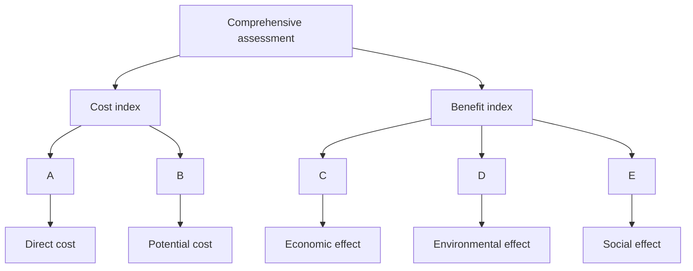

<table><tr><td colspan="2">For office use only</td></tr><tr><td>T1</td><td></td></tr><tr><td>T2</td><td></td></tr><tr><td>T3</td><td></td></tr><tr><td>T4</td><td></td></tr></table>

Team Control Number

# 55069

Problem Chosen

# A

For office use only

<table><tr><td>F1</td><td></td></tr><tr><td>F2</td><td></td></tr><tr><td>F3</td><td></td></tr><tr><td>F4</td><td></td></tr></table>

# 2017 MCM/ICM Summary Sheet

# The Rehabilitation of the Kariba Dam

Recently, the Institute of Risk Management of South Africa has just warned that the Kariba dam is in desperate need of rehabilitation, otherwise the whole dam would collapse, putting 3.5 million people at risk. Aimed to look for the best strategy with the three options listed to maintain the dam, we employ AHP model to filter factors and determine two most influential criteria, including potential costs and benefits. With the weight of each criterion worked out, our model demonstrates that option 3 is the optimal choice.

According to our choice, we are required to offer the recommendation as to the number and placement of the new dams. Regarding it as a set covering problem, we develop a multi-objective optimization model to minimize the number of smaller dams while improving the water resources management capacity. Applying TOPSIS evaluation method to get the demand of the electricity and water, we solve this problem with genetic algorithm and get an approximate optimal solution with 12 smaller dams and determine the location of them.

Taking the strategy for modulating the water flow into account, we construct a joint operation of dam system to simulate the relationship among the smaller dams with genetic algorithm approach. We define four kinds of year based on the Kariba’s climate data of climate, namely, normal flow year, low flow year, high flow year and differential year. Finally, these statistics could help us simulate the water flow of each month in one year, then we obtain the water resources planning and modulating strategy.

The sensitivity analysis of our model has pointed out that small alteration in our constraints (including removing an important city of the countries and changing the measurement of the economic development index etc.) affects the location of some of our dams slightly while the number of dams remains the same. Also we find that the output coefficient is not an important factor for joint operation of the dam system, for the reason that the discharge index and the capacity index would not change a lot with the output coefficient changing.

# Contents

# 1 Overview..

1.1 Background..   
1.2 Restatement of the Problem..   
1.3 Literature Review .. .2

# 2 Assumptions and Justifications.

# 3 Notation . 3

# 4 Model Overview ..

# 5 Model Theory...

5.1 Determination of the Number and Location of the Dams ............. .. 5   
5.2 Joint operation of dam system model.. .9

# 6 Model Implementation and Results . 11

6.1 The Number and Location..   
6.2 The Strategy of Modulating Water Flow.. ..14

# 7 Sensitivity Analysis. 15

7.1 The Model of Determination of the Number and Location..... ..15   
7.2 The Model of Modulating Water Flow .. .17

# 8 Further discussion . 17

# 9 Strengths and Weaknesses . .18

9.1 Strengths .. ..18   
9.2 Weaknesses.. ..19

# 10 Conclusion 19

# 11 The Evaluation of Three Options.. .20

11.1 Establish a Hierarchical Model.. ..20   
11.2 Analysis and Results .. ..21

# 1 Overview

# 1.1 Background

A Zambezi River Authority conference was held in March 2014, engineers warned that the foundations of the dam had weakened and there was a possibility of dam failure unless repairs were made.

On 3 October 2014 the BBC reported that “The Kariba Dam is in a dangerous state. Opened in 1959, it was built on a seemingly solid bed of basalt. However, in the past 50 years, the torrents from the spillway have eroded that bedrock, carving a vast crater that has undercut the dam’s foundations, engineers are now warning that without urgent repairs, the whole dam will collapse. If that happened, a tsunami-like wall of water would rip through the Zambezi valley, reaching the Mozambique border within eight hours. The torrent would overwhelm Mozambique’s Cahora Bassa Dam and knock out 40% of southern Africa’s hydroelectric capacity. Along with the devastation of wildlife in the valley, the Zambezi River Authority estimates that the live of 3.5 million people are at risk.”

On February 2015, Engineers have started on a R3.3bn rescue marathon to prevent the “catastrophic failure” of the Kariba Dam. According to a World Bank special report on the beleaguered structure-one of the biggest man-made dams in the world-a potential wall collapse threatens the lives of about 3-million people living on the Zambezi River floodplain between the hydro scheme on the Zambia-Zimbabwe border and the Mozambique coast. [1]

# 1.2 Restatement of the Problem

We are required to provide an overview of potential costs and benefits with the three options already listed. Then we need to establish a model to determine the number and placement of the new dams when removing the Kariba dam along the Zambezi River. The same overall water management capabilities are also needed. In addition, we should consider emergency water flow situations and restrictions regarding the locations and time, so that we could give out the strategy for modulating the water flow through our new multiple dam system.

In order to solve those problems, we will proceed as follows:

Build a model to determine the number and location of the multiple dams.   
Give the corresponding strategy of modulating water flow in different conditions.

In our model, we first establish a multi-objective model and use genetic algorithm determine the number and location of the multiple dams. There are two goals improving the water resources management capacity and reducing the cost. Besides, we add some constraints such as water balance, water level, safety and water protection. We choose twenty suitable dam sites and employ the genetic algorithm to solve the optimal problem to determine the number and the location.

After determining the number and location of the dams, we construct our joint operation of dam system model and employ the genetic algorithm to solve the problem based on the thought of dynamic programming. According to the Kariba’s climate data for about 30 years, we abstract normal flow year, low flow year, high flow year and differential year. We use them to work out the water resources planning and scheduling strategy. The construction of the discharge index and the capacity index benefits an analysis and evaluation for joint operation of the dam system’s performance in different month and year.

# 1.3 Literature Review

Dating back to 2004, the United States removed 72 dams in total, which created a historical record. Therefore, it is high time for us to focus on the construction of dams concerning their number and placement. Plenty of researchers have already made a number of notable papers to address these problems

Alfer Weber (1909) first proposed a framework for location problem, which is an allocation question with respect to space resource. Among the three classical location model, set covering problem is a significant branch of siting issues. They explored a multi-objective location model to tackle problems with siting optimal points. In their model, maximizing coverage rate in order to satisfy every place’s need is the target function, the concentric point and the capacity restrictions are constraint conditions. Thus, they could convert the optimization problem to the mixed integer linear programming question.

After the set covering model was established, we can optimize our choice of siting the dams. Then several scientists were devoted to building an optimal operation model to provide a reasonable balance between safety and balance. They begin to figure out how the multiple dam system would benefit or affect each other within its system. Masse(1940) first illustrated the concept of it; their main computing method was to optimize water modulating strategy during dispatching period.

Further studies are carried out about different methods to investigate the optimal operation model, including dynamic programming algorithm and neural network algorithm based on improved computer technique. Also, there is much theoretical analysis about location problem since 1990. John Current and Morton O'Kelly(1992) suggested using a modified version of the set covering location model, which still didn’t take the reality into account.

# 2 Assumptions and Justifications

To simplify our problems, we make the following basic assumptions, each of which is properly justified.

The dam system is built downstream in the valley of the Kariba Dam. Because it’s more convenient to build and also with less cost, which can be easily implemented.   
The cost of the dam is mostly the same. Owing to the fact that the length of the canyon is not large（24km）,geological conditions and climate conditions are mostly the same.

Each dam’s water supply is mostly the same. Taking into account of safe operation of the entire multi-dam system, we should make the burden of each dam to be the same as much as possible.   
 The water quality of the dam system is the average of the water quality between the two reservoirs. The river is flowing, so the water quality is mostly similar.   
Water of the dams downstream only comes from dams upstream and natural precipitation. According to Google Maps, there are no tributaries near the canyon. Also with the principle of conservation of water, the formula should be maintained.

# 3 Notation

<table><tr><td>Abbreviation</td><td>Description</td></tr><tr><td> $Y = \{ y_1, y_2, \cdots y_m \}$ </td><td>The set of cities</td></tr><tr><td> $X = \{ x_1, x_2, \cdots x_n \}$ </td><td>The set of dams</td></tr><tr><td> $d(y_i, X_n)$ </td><td>The distance from the  $i_{th}$  city to the nearest smaller dam</td></tr><tr><td> $Ele_i$ </td><td>The electricity demand of  $i_{th}$  city</td></tr><tr><td> $Wat_i$ </td><td>The water demand of  $i_{th}$  city</td></tr><tr><td> $W(t,i)$ </td><td>The discharge amount of the  $i_{th}$  dam at the end of period t,</td></tr><tr><td> $Z(t,i)$ </td><td>The total amount of water released during period t</td></tr><tr><td> $T(t,i)$ </td><td>The amount of natural water in period t</td></tr><tr><td> $V_{ij}$ </td><td>The volume in the  $j_{th}$  period of the  $i_{th}$  dam</td></tr><tr><td> $Q_{ij}$ </td><td>The inflow in the  $j_{th}$  period of the  $i_{th}$  dam</td></tr><tr><td> $q_{ij}$ </td><td>The discharge volume in the  $j_{th}$  period of the  $i_{th}$  dam</td></tr><tr><td> $QJ_{ij}$ </td><td>The runoff volume between the  $i_{th}$  dam and the  $(i-1)_{th}$  dam</td></tr><tr><td> $S_{ij}$ </td><td>The actual water supply  $i_{th}$  dam in the  $j_{th}$  period</td></tr><tr><td> $D_{ij}$ </td><td>The planned water supply of the  $i_{th}$  dam in the  $j_{th}$  period</td></tr><tr><td> $H_{ij}$ </td><td>The hydraulic head of  $i_{th}$  dam in the  $j_{th}$  period</td></tr><tr><td> $K_i$ </td><td>The fore-voltage factor of the  $i_{th}$  dam</td></tr><tr><td> $\lambda_t$ </td><td>The discharge flow indicators in the  $t_{th}$  period</td></tr><tr><td> $\mu_t$ </td><td>The storage capacity indicators in the  $t_{th}$  period</td></tr></table>

# 4 Model Overview

To provide a detailed analysis of the option (3)-removing the Kariba dam and newly building ten to twenty smaller dams. We need to determine the number and location of the multiple dams first. And on that basis we must establish a model to modulate the water flow through the multiple dam system to adapt to different situations. A reasonable balance between safety and cost of our strategy is also needed.

Our first model allows us to determine the number and the location of the multiple dams. We regard the optimal problem as a set covering problem and establish a multi-objective model to solve the problem. There are two goals, namely improving water resources management capacity and reducing the cost. And there are also some constraints including water balance, water level, safety, water resources protection and number constraints. On the account that the optimal problem is difficult to solve in polynomial time, so we use genetic algorithm to get the solution.

After determining the numbers and the location, we establish a joint operation of dam system model to gain a strategy about modulating water flow in different condition. Though it’s also a multi-objective problem, it is different from the previous model. We use the maximization of economic and social benefits as the objective and set some constraints, such as water balance, reservoir capacity and discharge flow constraints. We use genetic algorithm to get the

modulating strategy in different conditions.

In conclusion, we use programming and heuristic algorithm to solve the problem of building dams and the modulating strategy. It’s relatively easy to achieve and it has a significant guidance for the reality.

# 5 Model Theory

# 5.1Determination of the Number and Location of the Dams

# 5.1.1 Establishment of the model

The construction of dams needs to consider many aspects, while at the same time it is subject to economic, social, environmental constraints and other factors. In order to obtain the proper number of dams and their location, we establish a multi-objective model.

# The Objective

Improve Water Resources Management Capacity

The purpose of building smaller dams instead of larger dams is to manage water resources better, mainly to satisfy dweller’s demand for the electricity consumption and water consumption (Including agricultural, industrial and domestic water) of the neighboring cities. Demand may vary between cities, but it is clear that for cities with greater demand, the dam should be built closer to them. so we get that

$$
\min \sum_ {i = 1} ^ {m} E l e _ {i} d (y _ {i}, X _ {n})
$$

$$
\min \sum_ {i = 1} ^ {m} W a t _ {i} d (y _ {i}, X _ {n})
$$

Reduce the Cost

On the basis of ensuring the water supply and power supply, we should minimize the cost of our plan. The whole cost consists of the removal of the Kariba dam and building new smaller dams. Since the cost of removal is fixed, so we only consider the variable cost(building cost), which is only related to the number of dams. So we should minimize the quantity of the smaller dams.

min n

# The Constraints

Water Balance

$$
W (t, i) = W (t - 1, i) + \sum_ {k \in \pi (i)} Z (t, k) + T (t, i)
$$

，  and $T ( t , i )$ represent the discharge amount of the $i _ { t h }$ dam at the end of period t, the total amount of water released during period t and the amount of natural water in period t respectively.  denotes the set of all higher dams of $i _ { t h }$ dam. If  is empty, the corresponding summation is zero.[2]

# Water Level

The water level in the dam area should be kept between the dead water level and the limited water level in the flood season. Dead Water Level, namely the lowest water level that allows a reservoir to fall off under normal operating conditions. Flood limited water level is the requirements of control over flood to limit reservoirs’ water storage.

$$
D W L \leq W L \leq F W L
$$

# Safety

The construction of multiple smaller dams is at least as safe as the original larger dams. The safety considerations for dam construction mainly include reducing the probability of dam failure, thereby reducing damage to dams downstream and enhancing resistance ability to extreme weather.

$$
S a f e t y _ {s d} \geq S a f e t y _ {B d}
$$

$S a f e t y _ { s d }$ represents the safety of multiple dams system, while $S a f e t y _ { B d }$ denotes the safety of the existing Kariba dam.

# Water Resources Protection

The construction of smaller dams should require a higher degree of protection for the water resources as the replacement of the existing dam.

$$
W R P _ {s d} \geq W R P _ {B d}
$$

$W R P _ { s d }$ represents the environment protection of the multiple dams system, while $W R P _ { B d }$ denotes the environment protection of the existing Kariba dam.

# Number

The number of small dams should be greater than ten and less than twenty. Option 3 is replacing the Kariba dam with a series of ten to twenty smaller dams.

To ensure the continuity of the model establishment, the parameters of the constraints will be described in the next part. And in the sixth section, we will clarify how to calculate the demand of electricity( $E l e _ { i } ~ )$ ,the demand of the water( $W a t _ { i } ~ )$ ,the safety of different dams and the

environment protection of different dams.

To sum up, we model the problem about smaller dams’ number and location decision with multi-objective optimization. The formulas of this model is

$$
\min \sum_ {i = 1} ^ {m} E l e _ {i} d (y _ {i}, X _ {n})
$$

$$
\min \sum_ {i = 1} ^ {m} W a t _ {i} d (y _ {i}, X _ {n})
$$

min n

$$
S. t. \quad W (t, i) = W (t - 1, i) + \sum_ {k \in \pi (i)} Z (t, k) + T (t, i)
$$

$$
D W L \leq W L \leq F W L
$$

$$
\text { Safety } _ {s d} \geq \text { Safety } _ {B d}
$$

$$
W R P _ {s d} \geq W R P _ {B d}
$$

$$
1 0 \leq n \leq 2 0 (n = 1 0, 1 1, 1 2 \dots .. 2 0)
$$

# 5.1.2 The Parameter of the Constraints

# The Demand of Electricity

The power demand of a city is mainly related to its economic and demographic factors. Our paper uses the city's latest available GDP data as the representative of its economic factors, and the total urban population as the representative of its demographic factor.

The GDP of the $i _ { t h }$ city is .The population of the $i _ { t h }$ city is $p o p _ { i }$ .

# The Demand of Water

The water consumption of residents is mainly affected by residents' income, water price and other factors. Since within a country, the price difference is relatively small, so here we ignore the price difference.. Therefore, the water consumption of urban residents is mainly affected by the income of residents, We use the city's GNI to represent its urban residents. The GNI of the $i _ { t h }$ city is $G N I _ { i }$ .

# The Safety of Dams and the Kariba Dam[3]

For the safety of dam construction, our paper mainly consider the index of risk loss as the agent of its safety indicators.

For a single Big dam, its Risk Loss Index(RLI) $R ^ { B d }$ equals to P multiply  . P is the failure probability of the dam beyond the current code standard. For example, the current code specifies that if a dam's seismic safety standard is 50 years beyond 10%, the probability of failure exceeding the current code specification is $0 . 1 \mathrm { ~ / ~ } 5 0 = 0 . 0 0 2 . \mathrm { N }$ is the life loss of dam failure (we can convert economic loss into life loss in a certain percentage). We use the Dekay & McClelland method to calculate the loss. Thus, the RLI of the Kariba dam is

$$
R ^ {B d} = P (K) \cdot N (K).
$$

For multiple dam system, the RLI of the $j _ { t h }$ dam is

$$
R _ {j} = P (j) \cdot N (j) + \sum_ {l = j + 1} ^ {n} P (l \mid j) \cdot P (j) \cdot N (l)
$$

and the RLI of the multiple dam system is

$$
R ^ {s d} = \sum_ {j = 1} ^ {n} R _ {j} ^ {s d}
$$

The safety of the multiple dam system should be greater than or at least equal to the safety of the existing Kariba dam. So we get that $R ^ { s d } \leq R ^ { B d }$ , that is to say $\sum _ { i = 1 } ^ { n } R _ { i } ^ { s d } \leq P ( K ) \cdot N ( K )$ .And n is an integer greater than ten and less than twenty

The water resources protection of dams

According to the International Commission On Large Dams(ICOLD), there are three goals of water resources management[4]

 Improved management of the water supply   
 Improved water quality in our rivers   
 Improved environmental conditions in the watershed

Since there are few branches in the Kariba Gorge, we mainly consider the management of the water supply and the water quality.

According to the constraints, the water supply of the multiple-dam system should be greater than the big dam. That is to say

$$
W S _ {s d} \geq W S _ {B d}
$$

$W S _ { s d }$ equals to the number of the smaller dams multiply the water supply of a smaller dam, while $W S _ { B d }$ represents the water supply of the Kariba Dam.

Besides, the water quality of the multiple-dam system should be greater than the Kariba dam.

$$
W Q _ {s d} \geq W Q _ {B d},
$$

$W Q _ { s d }$ represents the expected average water quality of the Lake Kariba if the authority adopt the option three, while $W Q _ { B d }$ represents the present water quality of the Lake Kariba.

# 5.2 Joint Operation of Dam System Model

Joint operation of dam system can utilize the differences between dam capacity and hydrologic condition, so that we develop a joint compensation effect for the dam group and make full use of water resources. Compared with the traditional single large dam, the dam group establish on the basis of multi –dam system, which could help us take advantage of water resources for our social benefits, including economic and social benefits. Therefore, it is necessary to establish an effective water resources dispatching scheme.

In order to better express our model，we let  indicates the number of dams， $j = 1 . . . T$

denotes the cycle of water dispatching， $V _ { i j }$ illustrates the $i _ { t h }$ dam’s water storage during the period.[5] $j _ { t h }$

# The Objective

The hydropower station mainly bring about economic and social benefits. But obviously, hydropower station can bring magnificent economic benefits. Among them, the most direct indication is the dam power generation. Therefore, taking the reservoir power generation as the revelation of economic benefit.

$$
I _ {e} = \sum_ {i = 1} ^ {n} \sum_ {j = 1} ^ {T} K _ {i} * q _ {i j} * H _ {i j} * \Delta t
$$

$q _ { i j }$ is the discharge flow of the $i _ { t h }$ dam in the $j _ { t h }$ period， $H _ { i j }$ is the hydraulic head of $i _ { t h }$ dam in the $j _ { t h }$ period，  is the force-voltage factor of the $i _ { t h }$ dam，  is the time period.

In addition to creating enormous economic benefits, a large dam can also bring huge social benefits. Through the construction of dams, it can meet the need of a large number of industrial and agricultural water, also the domestic water.

$$
I _ {s} = \sum_ {i = 1} ^ {n} \sum_ {i = 1} ^ {T} (S _ {i j} - D _ {i j})
$$

$S _ { i j }$ is the actual water supply $i _ { t h }$ dam in the $t _ { { \scriptscriptstyle t h } }$ stage， $D _ { i j }$ is water demand or planned water supply of the $i _ { t h }$ dam in the $t _ { t h }$ stage.

Therefore, we should make full use of water resources so as to make the economic and social benefits as large as possible.[6]

$$
I = \max (I _ {e} + I _ {s})
$$

# The Constraints

Water Balance

$$
V _ {i, (t + 1)} = V _ {i t} + \left(Q _ {i t} - q _ {i t}\right) \cdot \Delta t - L _ {i t}
$$

$$
Q _ {i, (t + 1)} = q _ {(i - 1), t} + Q J _ {i t}
$$

$Q _ { i t } \setminus q _ { i j }$ are the average inflow into the dam and discharge volume in the $t _ { { \scriptscriptstyle t h } }$ period of the $i _ { t h }$ dam, $L _ { \dot { u } }$ is the evaporation and leakage loss. $Q J _ { i t }$ is the runoff volume between the $i _ { t h }$ dam and the $j _ { t h }$ dam.

Capacity of the Dam

To prevent floods and droughts，The capacity of each dam must be limited.

$$
V \min _ {i} \leq V _ {i t} \leq V \max _ {i}
$$

、  are the upper and lower limit of the $i _ { t h }$ dam’s water storage，namely the dead capacity and the flood control capacity.

Discharge Flow Constraint

In order to keep the normal life standard and to maintain the downstream ecological water use, we must ensure the certain discharge of water, we employ  to indicate the minimal discharge of water. Because of the limitation of the dam itself and the purpose of flood control, there need to be a maximal discharge capacity constraint

$$
q \min _ {i} \leq q _ {i t} \leq q \max _ {i}
$$

In conclusion, in order to make economic benefit and social benefit as large as possible while satisfying the constraint conditions, we need to develop water resources optimized dispatching scheme.

$$
\max I = \sum_ {i = 1} ^ {n} \sum_ {j = 1} ^ {T} K _ {i} * q _ {i j} * H _ {i j} * \Delta t + \sum_ {i = 1} ^ {n} \sum_ {i = 1} ^ {T} \left(S _ {i j} - D _ {i j}\right)
$$

$$
s. t. \left\{ \begin{array}{c} V _ {i, (t + 1)} = V _ {i t} + \left(Q _ {i t} - q _ {i t}\right) * \Delta t - L _ {i t} \\ Q _ {i, (t + 1)} = q _ {(i - 1), t} + Q J _ {i t} \\ V \min _ {i} \leq V _ {i t} \leq V \max _ {i} \\ q \min _ {i} \leq q _ {i t} \leq q \max _ {i} \end{array} \right.
$$

、  are the interval-type variable， 、  correspond to meet the basic industrial and agricultural water、domestic water and ecological water，they are the dead water level. For safety considerations such as flood control， 、  are the maximal water level.

We let  to be the of  ,  is the optimum interval of $q _ { i t . } . ^ { [ 7 ] }$

$$
\lambda_ {i t} = \left\{ \begin{array}{c} 1 - (V f _ {i} - V _ {i t}) / (V f _ {i} - V \min _ {i}), V \min _ {i} \leq V _ {i t} \leq V f _ {i} \\ 1, V f _ {i} \leq V _ {i t} \leq V F _ {i} \\ 1 - (V _ {i t} - V F _ {i}) / (V \max _ {i} - V F _ {i}), V F _ {i} \leq V _ {i t} \leq V \max _ {i} \\ 0, e l s e \end{array} \right.
$$

$$
\lambda_ {t} = \frac {1}{N} \sum_ {i = 1} ^ {N} \lambda_ {i t}
$$

$$
\mu_ {i t} = \left\{ \begin{array}{c} 1 - (q f _ {i} - q _ {i t}) / (q f _ {i} - q \min _ {i}), q \min _ {i} \leq q _ {i t} \leq q f _ {i} \\ 1, q f _ {i} \leq q _ {i t} \leq q F _ {i} \\ 1 - (q _ {i t} - q F _ {i}) / (q \max _ {i} - q F _ {i}), q F _ {i} \leq q _ {i t} \leq q \max _ {i} \\ 0, e l s e \end{array} \right.
$$

$$
\mu_ {t} = \frac {1}{N} \sum_ {i = 1} ^ {N} \mu_ {i t}
$$

# 6 Model Implementation and Results

# 6.1The Number and Location

Measuring the demand of the nearby city

TOPSIS (Technique for Order Preference by Similarity to an Ideal Solution) is a commonly used and effective method in multi-objective decision analysis. Hence ,we employ this model and then investigate extended TOPSIS to evaluate the demand of electricity and water of each city.

Then we use the data to calculate the demand of the electricity and water with TOPSIS, and part of the results is shown in Table 1.

Table 1 The Demand of Electricity and Water 

<table><tr><td></td><td>Electricity demand</td><td>Water demand</td></tr><tr><td>Chongwe</td><td>0.11946089</td><td>0.11547689</td></tr><tr><td>Kafue</td><td>0.23850413</td><td>0.26352475</td></tr><tr><td>Luangwa</td><td>0.0341398</td><td>0.0994167</td></tr><tr><td>Lusaka</td><td>0.559806</td><td>0.64089</td></tr><tr><td>Choma</td><td>0.12199417</td><td>0.24991764</td></tr><tr><td>Livingstone</td><td>0.29028867</td><td>0.12028768</td></tr><tr><td>Monze</td><td>0.1492781</td><td>0.1832683</td></tr></table>

# Calculate the shortest distance from each dam to each city

The dam should be built in the valley of the river fully, because the project is small with low cost. Moreover, the construction of small dams is mainly to replace the larger dam, so the small dam should be constructed mainly in the downstream of the Kariba dam in the canyon. Figure 1 is the suitable site for building dams.

text_image

Satellite map with labeled locations and a red diagonal line indicating a route or path, alongside a zoomed-in view of the mountainous terrain.

Figure 1 The Suitable Gorge for Building Dams

With respect to the option 3 that we need to construct 10 to 20 small dams, considering the geological factors around the dam, we first select the suitable location of the 20 dams.

According to our model, we use the distance from the dam to the center of the city as a representative of the distance to the city. A total of 25 cities are selected close to the Kariba gorge, including 15 cities in Zambia, 10 cities in Zimbabwe. We search and calculate the shortest distance and path of each dam to the city through Google maps, and the results of some small dams to the cities are shown in Table 2.

Table 2 The Distance Between the Dams and the City(Part) 

<table><tr><td></td><td>Dam 1(Km)</td><td>Dam 8</td><td>Dam 16</td><td>Dam 20</td></tr><tr><td>Chongwe</td><td>130.47</td><td>123.44</td><td>118.31</td><td>117.87</td></tr><tr><td>Lusaka</td><td>133.78</td><td>128.50</td><td>125.76</td><td>122.72</td></tr><tr><td>Kafue</td><td>104.12</td><td>102.64</td><td>98.91</td><td>97.73</td></tr><tr><td>Monze</td><td>141.19</td><td>143.32</td><td>146.46</td><td>146.49</td></tr></table>

# The Data of Other Factors

At the same time, we collect the data of other related factors through the Zambia National Bureau of Statistics, the World Bank, the World Commission on Dams and other institutions to gain the relevant statistics.

Table 3 The Data of Other Factors 

<table><tr><td></td><td>DWL</td><td>NWL</td><td>FWL</td><td>BFWL</td><td>RLI</td><td>WS</td><td>WQ</td></tr><tr><td>Kariba</td><td>475.5</td><td>484.6</td><td>490</td><td>476.7</td><td>9000</td><td>608.5</td><td>19</td></tr><tr><td>Multiple</td><td>382</td><td>408</td><td>412</td><td>385</td><td> $\sum_{i=1}^{n} R_i^{sd}$ </td><td> $WS^e \cdot n$ </td><td> $WQ^e$ </td></tr></table>

Under normal circumstances the water level should be higher than the dead water level, and lower than the normal position. But before the flood season, the water level is lower than the limit of water level.

# The numbers and the location

This optimal problem belongs to the NP-hard problem. We can’t solve it in polynomial time. So we can only use heuristic algorithms such as artificial neural networks, genetic algorithm, simulated annealing to obtain the approximate solution. In this paper, we select the genetic algorithm to solve the problem.

We run the program repeatedly, and finally get a relatively good result and determine our number and location of the dams. There should be 12 smaller dams in the Kariba Gorge. Besides, we select the optimal 12 dam location to maximize our objective function from 20 appropriate dam sites. The sixth and twelfth site locations are listed in the Table 4

Table 4 The Location of the Dam 

<table><tr><td></td><td>The 6th smaller dam</td><td>The 12th smaller dam</td></tr><tr><td>Longitude</td><td> $28.831345^{\circ}E$ - $28.832703^{\circ}E$ </td><td> $28.849015^{\circ}E$ - $28.850422^{\circ}E$ </td></tr><tr><td>Latitude</td><td> $16.417931^{\circ}S$ - $16.418605^{\circ}S$ </td><td> $16.371407^{\circ}S$ - $16.371123^{\circ}S$ </td></tr></table>

At the same time, we will also mark the location of the small dam on the map, we put the location of the sixth and twelfth dam on the map. We can see it on the Figure 2 and Figure 3

text_image

黄比西河
黄比西河
黄比西河
黄比西河

Figure 2 The Location of the 6th Dam

text_image

Aerial photo of a river with visible Chinese text labels and two red directional arrows indicating flow or movement.

Figure 3 The Location of the 12th Dam

# 6.2The Strategy of Modulating Water Flow

Traditional optimization algorithm mostly belongs to the convex optimization category. It demands a unique global optimal solution, which is often used in practical applications. A number of heuristic intelligent algorithm, for example genetic algorithm etc.These methods show that the algorithm can work out satisfactory results for solving the optimization problem. Employing joint operation of dam system model, we use genetic algorithm and Matlab2014 for the solution.[8]

By running the genetic algorithm and adjusting the parameters, we obtain a relatively satisfactory result, and then develop a joint operation of dam system model.(The picture of the results is shown in the appendix part four.)

Normal Flow Year：Take the climate and hydrological conditions of the average of nearly 5 years to simulate normal climatic conditions.

In normal years, the water resources dispatching of the dam system shows obvious seasonal difference. In the dry season from June to September, the discharge of each reservoir reaches the bottom line. Compared with the middle and lower reaches of the river, upper and middle reaches of water resources and reserves are relatively abundant, therefore, still a lot of water could be scheduled downstream. But until the rainy season from November to March, the precipitation intensity and the discharge of each dam are very large. The results show that the discharge index and storage capacity index perform better in May and October, which are in the optimum range, while the other month are all above 0.7, this is a satisfactory result.

Low Flow Year: The monthly precipitation is taken as the highest value in the past 30 years, simulating the more serious flood threat..

When the annual precipitation decreases, each dam discharge is significantly lower, but the discharge index and the capacity index is still above 0.7, which reflects the joint operation of dam system still has obvious effect to resist abnormal weather like the drought condition.

High Flow Year：The monthly precipitation is taken as the highest value inthe past 30 years, simulating the more serious flood threat.

When the annual precipitation has increased significantly, then the reservoir’s discharge would increase. While the discharge of the rainy season increases a lot, but in dry season the increase range is smaller, which makes the discharge capacity index and volume index increase significantly from May to September. Although the index decreases significantly in November and February the figure are more than 0.7, is still relatively satisfactory.

Differentiation Year：The precipitation from May to September is taken as the lowest value in the past 30 years, the precipitation from October to April was taken as the highest value in the past 30 years. So that we could simulate drought, flood significantly differentiated condition..

When confronted with the differentiation year where there comes rainy season when the precipitation increases and the dry season when the precipitation decreases all come about in one year. The discharge flow of each reservoir expands seasonally, which makes the discharge index and storage capacity index of each month decrease, and it is more obvious in the rainy season. Which can not be ignored is that the discharge flow indicators and storage capacity indicators remained at 0.7 or more.[9]

# 7. Sensitivity Analysis

# 7.1 The Model of Determination of the Number and Location

Remove an important city of both countries

In the questions we discussed above，we have selected 15 cities in Zambia，10 cities in Zimbabwe to specify the number and placement of the newly built smaller dams. Among the sensitivity analysis, we remove important cities of the two countries, thus, we could see whether this movement would influence the number and placement of constructing dams.

In our analysis, we leave out Lusaka (The capital city of Zambia) and Harare(The capital city of Zimbabwe) from our original cities, yet, we still use the multi objective optimization model and genetic algorithm we already established to calculate the number and placement of smaller dams. We discover that the optimal number of constructing dams is also 12, but the location of each dam is slightly changed. Just the fourth and the eleventh dam’s place changes a lot, while other dam’s place just changes a little. Therefore, we list the location of the fourth and the eleventh dam’s site in Table 5.

To sum up, the influence of removing bigger cities is not that much. Still in accordance with our former model, we could also draw the conclusion that large cities exert magnificent impact on the selection of the dam’s location. Hence, putting larger cities into our model while constructing dams is an appropriate choice.

Table 5 The Location of 4th Dam and 11th Dam 

<table><tr><td></td><td>4</td><td>11</td></tr><tr><td>longitude</td><td> $28.8442536^{\circ}E - 28.843764^{\circ}E$ </td><td> $28.813760^{\circ}E - 28.815164^{\circ}E$ </td></tr><tr><td>latitude</td><td> $16.395876^{\circ}S - 16.396158^{\circ}S$ </td><td> $16.475824^{\circ}S - 16.476281^{\circ}S$ </td></tr></table>

# Change the measurement of the economic development index

In the model we have discussed before, we mainly employ the current GDP of each city as a measure of the economic development, which is also used as one of the indicators to measure the water and electricity demand. Here, we will use its GDP growth rate as an agent indicator for the city's economic development, and change its GDP growth rate to observe whether it has the impact on the number and location of the construction of dams.

Our paper first use economic growth data of the city to measure its water and electricity demand, and then float up and down of the basis, the maximum change is up to 8%. The impact of economic growth on the number of dams is shown in Table 6.

Table 6 The Sensitivity of the GDP growth rate 

<table><tr><td>GDP growth rate</td><td>Number</td><td>Change</td><td>Change ratio</td></tr><tr><td>0%</td><td>12</td><td>0</td><td>0%</td></tr><tr><td>+2%</td><td>12</td><td>0</td><td>0%</td></tr><tr><td>-2%</td><td>12</td><td>0</td><td>0%</td></tr><tr><td>+4%</td><td>13</td><td>1</td><td>8.3%</td></tr><tr><td>-4%</td><td>12</td><td>0</td><td>0%</td></tr><tr><td>+6%</td><td>13</td><td>1</td><td>8.3%</td></tr><tr><td>-6%</td><td>11</td><td>1</td><td>-8.3%</td></tr><tr><td>+8%</td><td>14</td><td>2</td><td>16.67%</td></tr><tr><td>-8%</td><td>10</td><td>2</td><td>-16.67%</td></tr></table>

From the table above we can see that the changing of the economic growth rate for the number of the building small dam is relatively small. Even reaching to 8% changes, building two more small dams from the original can meet the demand of electricity and water. While Zambia and Zimbabwe are African countries, so that they are in a relatively poor condition. Due to the lack of economic development momentum, the change in its economic growth in the future is relatively small. Therefore, it is a reasonable choice of constructing 12 dams.

Alteration in the economic growth rate has little impact on the position of dams. Basing on the fact that Kariba gorge is about 34.9 kilometers, and we only need to build 10 to 20 small dam in the canyon, also small dams need to maintain a certain distance, so that the small dam’s location is relatively stable and the change is not great.

In conclusion, we can see that the representative index of its economic development is reasonable. Despite the fact that the figure floats up and down, its influence on the number and location of small dams is relatively small. It also shows that the model we established in the previous paper about the location and quantity of small dams is robust and has good adaptability to the reality.

# 7.2 The Model of Modulating Water Flow

Output coefficient is a comprehensive benefit coefficient which reflects water-turbine generator set’s overall efficiency. It equals to turbine efficiency, generator efficiency, transfer efficiency multiply invariant constant 9.81. Its value is up to the scale of Hydropower Station Dam. For Large hydropower station the value is about 8.5.For media hydropower station the value is about 8-8.5. While for small hydropower station the value is about 6.0-8.0. Multiply the coefficient, water-head and water-flow and the answer will be the unit’s output.

We analyze the change of output coefficient’s influence on the joint operation of dam system in the Table 7.

Table 7 The Sensitivity of the Output Coefficient 

<table><tr><td></td><td colspan="2">Normal flow year</td><td colspan="2">Low flow year</td><td colspan="2">Rich flow year</td><td colspan="2">Differentiation year</td></tr><tr><td>K</td><td>λ</td><td>μ</td><td>λ</td><td>μ</td><td>λ</td><td>μ</td><td>λ</td><td>μ</td></tr><tr><td>-15%</td><td>1.7%</td><td>-0.4%</td><td>4.1%</td><td>-1.2%</td><td>0.8%</td><td>0.2%</td><td>0.5%</td><td>1.1%</td></tr><tr><td>-10%</td><td>0.0%</td><td>0.6%</td><td>0.9%</td><td>0.0%</td><td>1.4%</td><td>-0.9%</td><td>1.2%</td><td>-2.3%</td></tr><tr><td>-5%</td><td>0.3%</td><td>1.2%</td><td>-2.3%</td><td>0.5%</td><td>0.0%</td><td>-0.4%</td><td>0.7%</td><td>1.0%</td></tr><tr><td>0%</td><td>0.0%</td><td>0.0%</td><td>0.0%</td><td>0.0%</td><td>0.0%</td><td>0.0%</td><td>0.0%</td><td>0.0%</td></tr><tr><td>5%</td><td>0.0%</td><td>-0.3%</td><td>1.4%</td><td>-0.7%</td><td>0.0%</td><td>1.3%</td><td>-0.8%</td><td>2.1%</td></tr><tr><td>10%</td><td>-1.0%</td><td>-1.1%</td><td>0.0%</td><td>-0.5%</td><td>3.3%</td><td>2.2%</td><td>-1.7%</td><td>0.3%</td></tr><tr><td>15%</td><td>2.5%</td><td>0.2%</td><td>-1.2%</td><td>3.1%</td><td>2.8%</td><td>-1.2%</td><td>0.9%</td><td>3.3%</td></tr></table>

We could see from the Table 7 that,output coefficient  change about  would bring about  and $\mu$ change for about only  . This indicates that output coefficient  is not an important factor for joint operation of the dam system.

# 8. Further Discussion

Take the future benefits into account. Reservoir operation not only has the current economic and social benefits, but also has the economic and social benefits in the future The future economic benefits can be expressed by the total energy storage at the end of the dispatching cycle, the greater the total energy storage, the more the potential for future development. The social benefits in the future can be illustrated as the total capacity in the last scheduling period. Generally speaking, the more water storage in the reservoir, the more able to meet the needs of future generations.

$$
I _ {e} = \sum_ {i = 1} ^ {n} \sum_ {j = 1} ^ {T} \left[ K _ {i} * q _ {i j} * H _ {i j} * \Delta t + \left(h _ {(i - 1), j} - h _ {i, j}\right) \left(Q _ {i j} - q _ {i j}\right) \right]
$$

$$
I _ {s} = V _ {T} + \sum_ {i = 1} ^ {n} \sum_ {i = 1} ^ {T} (S _ {i j} - D _ {i j})
$$

$h _ { i j }$ illustrates the water level of $i _ { t h }$ dam in the $j _ { t h }$ period, $V _ { T }$ indicates the dam’s water storage in the end of the dispatching period.

Increase ecological benefits：Most people pay more attention to the traditional functions of power generation, flood control, water supply and so on. We will further consider the ecological benefits of the reservoir. We do not take the ecological flow as a constraint, but consider it as one of the scheduling objectives, but there are many difficulties.

$$
I _ {e n} = \sum_ {i = 1} ^ {n} \sum_ {j = 1} ^ {T} f (V _ {i j}, Q _ {i j}, q _ {i j}, d e _ {i j})
$$

$d e _ { i j }$ is the ecological water requirement of the $i _ { t h }$ dam in the $j _ { t h }$ period.

In order to avoid the large change of the reservoir water level, which could lead to the change of the geological condition, and even cause the reservoir earthquake. So we will increase the constraint condition. $\left| h _ { i t } - h _ { i , ( t + 1 ) } \right| \leq \delta _ { i }$ ,in which $\delta _ { i }$ is the allowable variation of reservoir water level.

# 9 Strengths and Weaknesses

# 9.1 Strengths

 Our models are robust while the parameters changes. That is to say, a slight change of parameter will not cause a significant change of the results.   
Our models can be well applied in other places and we just need to change a little the specific conditions.   
Based on different situation, we develop the corresponding modulating strategy and make

a relative comprehensive plan. This can provide a specific guidance for the ZRA.

Our data comes from the official website such as Central Statistical Office, Zambia, which is believable.

# 9.2 Weaknesses

 Our model didn’t consider the economic, social and environment benefits in the future. We mainly focus on the current benefits. But in fact, future prospects is important for sustainable development. So we add it to the further discussion and hope we can solve it in the future.   
There are not much data regarding the demand of the electricity and water. So the analysis of the demand may be not exhaustive and it may have some deviations. But it didn’t affect the results significantly.   
The data of some parameters is forecast data because we don’t build the dams. However, based on the sensitivity analysis, they will not make a great difference if parameters are slightly changed.

# 10 Conclusion

Through the establishment of three models, we evaluate the three plans respectively. First,we select the number and location of the dam, then plan the joint operation of the dam system. We consider the comprehensive evaluation of three options from five aspects: direct cost, potential cost, economic benefits, environmental benefits and social benefits. Through the AHP analysis, we draw the conclusion that option three is a relatively good solution.

Then, we establish a multi-objective optimization model to determine the number and location of the dams. We let the water resources management capacity and cost to be the objective function, and let the water balance function, water level limit, the protection of water resources and the number to be the constraints. We also use genetic algorithm to solve the problem and find that the 12 dam is a relatively satisfactory results, and determine their geographic location.

After determining the number and location of the dam, we established a joint operation model of dam system. We let the economic and social benefits as the goal, water balance function and flow limitation to be the constraints. Considering four different year type, we use genetic algorithm to solve and determine the corresponding scheduling scheme, Also,the sensitivity results show that the joint operation of dams can be well adapted to different climatic conditions.

Finally, we make an objective analysis of the advantages and disadvantages of the model and make an attempt to further expand the model in order to make our model and method more successful.

# 11 The Evaluation of Three Options

South Africa had just warned that the dam was in desperate need of rehabilitation. The reasons may as follows :

Forcing people who dwell downstream to evacuate since the heavy rain might lead to a release of water from the dam.   
Basing on a seemingly solid bed of basalt，the Kariba Dam has been eroded by the torrents from the spillway, which could give rise to severe collapse without urgent repairs.

With the three options already given, we adopt AHP model using two most influential criterion to provide a brief overview of potential costs and benefits.

Jery Stedinger and Pete Loucks（February 1982）[10]thought that evaluation criterion of dam should include reliability ,resiliency, and vulnerability criteria; Mohamed Rami Mahmoud and Luis A. Garcia (July 2000) [11] propose different multicriteria evaluation methods for the Red Bluff diversion dam. With the help of the current literatures, we develop AHP model considering these main factors.

# 11.1 Establish a Hierarchical Model

# Cost Index

Chengxinwen (2008) [12] proposed the components of the cost while constructing operating or repairing. In addition, the expense of rebuilding the Kariba Dam is significantly greater than just repairing the existing one. The factors below are of great importance.

Direct cost(Demolition[A1] 、 Construction[A2] 、 Operation[A3] 、 Maintenance andmanagement expense[A4])  
Potential cost(Dam failure loss[B1]、Flowage damage[B2])

# Benefit Index

Replacing the bigger dams with ten to twenty smaller dams could bring about advantages and disadvantages. Our goal is to seek out whether it is beneficial or not to removing the Kariba dam. We divide the benefit index into three main categories below:[ 13]

Economic effect (Irrigation[C1]、Water-supply[C2]、Power generation[C3]、Navigation benefits[C4])   
Environmental effect (Climate change[D1]；Alteration in river ecosystem[D2])   
Social effect (Flood control benefit[E1]；Drought resistance benefit[E2])

Through above analysis of the three main criterion, which affect evaluation significantly, hierarchy figure is shown in

flowchart

Figure 4 Hierarchy figure

In Figure 4 we let the Direct cost to be Index A;Potential cost to be Index B;Economic effect to be Index C;Environmental effect to be Index D;Social effect to be index E;We divide these index into more specific index(namely A1 A2 A3 etc.) and we show that above.

# 11.2 Analysis and Results

We construct comparison matrix by comparison method of 1-7，then we get the weights of each index.(Complete matrix of project hierarchy can be seen in the appendix.)[14]

Table 8 Pairwise Comparison Matrix of Hierarchy II-III 

<table><tr><td>Comprehensive impact</td><td>Direct cost</td><td>Potential cost</td><td>Weight</td></tr><tr><td>Direct cost</td><td>1</td><td>4</td><td>0.8</td></tr><tr><td>Potential cost</td><td>1/4</td><td>1</td><td>0.2</td></tr></table>

Table 9 Pairwise Comparison Matrix of Hierarchy II-III 

<table><tr><td>Comprehensive impact</td><td>Economic effect</td><td>Environmental effect</td><td>Social effect</td><td>Weight</td></tr><tr><td>Economic effect</td><td>1</td><td>2</td><td>5</td><td>0.2908</td></tr><tr><td>Environmental effect</td><td>1/2</td><td>1</td><td>3</td><td>0.1545</td></tr><tr><td>Social effect</td><td>1/5</td><td>1/3</td><td>1</td><td>0.0547</td></tr></table>

Consistency ratio：0.0961

With the five index. only the Economic and Environment effect are positive. Moreover, from above tables, we know that all Consistency Test is right.

We could draw conclusions from the weight that the direct cost is of great importance to constructing a dam, potential cost has close relationship to repairing a dam; Also, we could gain better economic and navigation effect when we choose option 3.[15]

Due to the index and results above, we arrive at a conclusion that option 3 is our best choice to concerning the potential cost and benefit.

# Reference

[1] http://www.zaraho.org.zm/hydrology/lake-levels   
[2]Grigier J C and Stedinger J R. Algorithms for network programming. Wiley-interscience publication, 1980   
[3] Dekay M L， Mcclelland G H. Predicting loss of life in cases of dam failure and flash flood[J]. Risk analysis， 1993， 13(2):193-205   
[4] http://www.icold-cigb.org/GB/dams/dams\_and\_environment.asp   
[5]Ayvaz MT (2009a) Application of Harmony Search algorithm to the solution of groundwater management models. Adv Water Resour 32:916–924   
[6]Chang L C， Chang F J． Multi-objective evolutionary algorithm for operating parallel reservoir system [J]． Journal of Hydrology，2009，377：12-20．   
[7]Approved consolidated baseline and monitoring methodology ACM0002   
[8] http://www.zaraho.org.zm/   
[9] http://worldweather.wmo.int/en/city.html?cityId=966   
[10] Larkin, P. A., Maybe you can't get there from hcre: Hi\tory of research in relation to management of kicific Salmon. J. Fish. Res. Board Can.. 36(1). 98-106,1979.   
[11] Tecle, A., 1992. Selecting a multicriterion decision making techniquefor watershed resources management. Water Resources Bulletin 28(1), 129–140.   
[12] Larkin, P. A., Maybe you can't get there from hcre: Hi\tory of research in relation to management of kicific Salmon. J. Fish. Res. Board Can.. 36(1). 98- 106, 1979.   
[13] Loucks, D. P., J. R.Stedinger. and D. A. Hiuth. \\.crfer Hr.courre Systems Planning and Analysis, Rent\~cc-Hall. Engleu-ood Cliffs. New Jersev. 1981.   
[14] Mark, R. K., and D. E. Stuart-Alexander. D\~sa\*tcr as a ncccssclry part of benefit-cost analyses. Sclrnrr. 197, I ItrO. 1977.   
[15] Velikanov, A. K., The aspects of lonp-tcnr, water re- sources planning as applied to the integr\~ted regional development problem, Collahor. Pap. CP-37-l. 11-11, In>[. for Appl. Systems Anal., Laxenburg, Austria. Mnv 1979.

# Appendix

Part1: Comparison matrix of criterion hierarchy

Table 10 Pairwise comparison matrix of hierarchy II-III 

<table><tr><td>Comprehensive impact</td><td>Direct cost</td><td>Potential cost</td><td>Weight</td></tr><tr><td>Direct cost</td><td>1</td><td>4</td><td>0.8</td></tr><tr><td>Potential cost</td><td>1/4</td><td>1</td><td>0.2</td></tr></table>

Table 11 Pairwise comparison matrix of hierarchy II-III 

<table><tr><td>Comprehensive impact</td><td>Economic effect</td><td>Environmental effect</td><td>Social effect</td><td>Weight</td></tr><tr><td>Economic effect</td><td>1</td><td>2</td><td>5</td><td>0.2908</td></tr><tr><td>Environmental effect</td><td>1/2</td><td>1</td><td>3</td><td>0.1545</td></tr><tr><td>Social effect</td><td>1/5</td><td>1/3</td><td>1</td><td>0.0547</td></tr></table>

Consistency ratio：0.0961

Table 12 Pairwise comparison matrix of hierarchyIII-IV 

<table><tr><td>Comprehensive impact</td><td>Demolition expense</td><td>Construction expense</td><td>Operation expense</td><td>Maintenance Management expense</td><td>Weight</td></tr><tr><td>Demolition</td><td>1</td><td>1/9</td><td>1/2</td><td>3</td><td>0.0403</td></tr><tr><td>Construction</td><td>9</td><td>1</td><td>4</td><td>9</td><td>0.2672</td></tr><tr><td>Operation</td><td>2</td><td>1/4</td><td>1</td><td>4</td><td>0.0728</td></tr><tr><td>Maintenance management</td><td>1/3</td><td>1/9</td><td>1/4</td><td>1</td><td>0.0197</td></tr></table>

Consistency ratio: 0.0405

Table 13 Pairwise comparison matrix of hierarchy III-IV 

<table><tr><td>Comprehensive impact</td><td>Dam failure loss</td><td>Flowage damage</td><td>Weight</td></tr><tr><td>Dam failure loss</td><td>1</td><td>1/5</td><td>0.0167</td></tr><tr><td>Flowage damage</td><td>5</td><td>1</td><td>0.0833</td></tr></table>

Consistency ratio：0.0122

Table 14 Pairwise comparison matrix of hierarchy III-IV 

<table><tr><td>Comprehensive impact</td><td>Irrigation</td><td>Water-supply</td><td>Power generation</td><td>Navigation benefits</td><td>Weight</td></tr><tr><td>Irrigation</td><td>1</td><td>3</td><td>1/5</td><td>2</td><td>0.0466</td></tr><tr><td>Water-supply</td><td>1/3</td><td>1</td><td>1/9</td><td>1/4</td><td>0.0143</td></tr><tr><td>Power</td><td>5</td><td>9</td><td>1</td><td>8</td><td>0.1968</td></tr><tr><td>Navigation</td><td>1/2</td><td>4</td><td>1/8</td><td>1</td><td>0.0331</td></tr></table>

Consistency ratio：0.0684

Table 15. Pairwise comparison matrix of hierarchy III-IV 

<table><tr><td>Comprehensive impact</td><td>Climate change</td><td>Alteration in river ecosystem</td><td>Weight</td></tr><tr><td>Climate change</td><td>1</td><td>2</td><td>0.1030</td></tr><tr><td>Alteration</td><td>1/2</td><td>1</td><td>0.0513</td></tr></table>

Consistency ratio：0.0674

Table 16. Pairwise comparison matrix of hierarchy III-IV 

<table><tr><td colspan="2">Comprehensive impact</td><td>Flood benefit</td><td>control</td><td>Drought benefit</td><td>resistance</td><td>Weight</td></tr><tr><td>Flood benefit</td><td>control</td><td>1</td><td></td><td>3</td><td></td><td>0.0410</td></tr><tr><td>Drought benefit</td><td>resistance</td><td>1/3</td><td></td><td>1</td><td></td><td>0.0137</td></tr></table>

Consistency ratio：0.021

Part2: Comparison matrix of project hierarchy 

<table><tr><td>A1</td><td>Op1</td><td>Op2</td><td>Op3</td><td>A2</td><td>Op1</td><td>Op2</td><td>Op3</td><td>A3</td><td>Op1</td><td>Op2</td><td>Op3</td></tr><tr><td>Op1</td><td>1</td><td>1/6</td><td>2</td><td>Op1</td><td>1</td><td>1/10</td><td>2</td><td>Op1</td><td>1</td><td>1/3</td><td>2</td></tr><tr><td>Op2</td><td>6</td><td>1</td><td>8</td><td>Op2</td><td>10</td><td>1</td><td>11</td><td>Op2</td><td>3</td><td>1</td><td>2</td></tr><tr><td>Op3</td><td>1/2</td><td>1/8</td><td>1</td><td>Op3</td><td>1/2</td><td>1/11</td><td>1</td><td>Op3</td><td>1/2</td><td>1/2</td><td>1</td></tr><tr><td>A4</td><td>Op1</td><td>Op2</td><td>Op3</td><td>B1</td><td>Op1</td><td>Op2</td><td>Op3</td><td>B2</td><td>Op1</td><td>Op2</td><td>Op3</td></tr><tr><td>Op1</td><td>1</td><td>2</td><td>3</td><td>Op1</td><td>1</td><td>2</td><td>4</td><td>Op1</td><td>1</td><td>4</td><td>6</td></tr><tr><td>Op2</td><td>1/2</td><td>1</td><td>2</td><td>Op2</td><td>1/2</td><td>1</td><td>2</td><td>Op2</td><td>1/4</td><td>1</td><td>3</td></tr><tr><td>Op3</td><td>1/3</td><td>1/2</td><td>1</td><td>Op3</td><td>1/4</td><td>1/2</td><td>1</td><td>Op3</td><td>1/6</td><td>1/3</td><td>1</td></tr><tr><td>C1</td><td>Op1</td><td>Op2</td><td>Op3</td><td>C2</td><td>Op1</td><td>Op2</td><td>Op3</td><td>C3</td><td>Op1</td><td>Op2</td><td>Op3</td></tr><tr><td>Op1</td><td>1</td><td>1/2</td><td>1/3</td><td>Op1</td><td>1</td><td>1/3</td><td>1/4</td><td>Op1</td><td>1</td><td>1/2</td><td>3</td></tr><tr><td>Op2</td><td>2</td><td>1</td><td>1/2</td><td>Op2</td><td>3</td><td>1</td><td>1/2</td><td>Op2</td><td>2</td><td>1</td><td>4</td></tr><tr><td>Op3</td><td>3</td><td>2</td><td>1</td><td>Op3</td><td>4</td><td>2</td><td>1</td><td>Op3</td><td>1/3</td><td>1/4</td><td>1</td></tr><tr><td>C4</td><td>Op1</td><td>Op2</td><td>Op3</td><td>D1</td><td>Op1</td><td>Op2</td><td>Op3</td><td>D2</td><td>Op1</td><td>Op2</td><td>Op3</td></tr><tr><td>Op1</td><td>1</td><td>1/2</td><td>2</td><td>Op1</td><td>1</td><td>4</td><td>1/2</td><td>Op1</td><td>1</td><td>4</td><td>1/2</td></tr><tr><td>Op2</td><td>2</td><td>1</td><td>3</td><td>Op2</td><td>1/4</td><td>1</td><td>1/7</td><td>Op2</td><td>1/4</td><td>1</td><td>1/8</td></tr><tr><td>Op3</td><td>1/2</td><td>1/3</td><td>1</td><td>Op3</td><td>2</td><td>7</td><td>1</td><td>Op3</td><td>2</td><td>8</td><td>1</td></tr><tr><td>E1</td><td>Op1</td><td>Op2</td><td>Op3</td><td>E2</td><td>Op1</td><td>Op2</td><td>Op3</td><td></td><td></td><td></td><td></td></tr><tr><td>Op1</td><td>1</td><td>1/2</td><td>1/6</td><td>Op1</td><td>1</td><td>1/2</td><td>1/4</td><td></td><td></td><td></td><td></td></tr><tr><td>Op2</td><td>2</td><td>1</td><td>1/8</td><td>Op2</td><td>2</td><td>1</td><td>1/3</td><td></td><td></td><td></td><td></td></tr><tr><td>Op3</td><td>6</td><td>8</td><td>1</td><td>Op3</td><td>4</td><td>3</td><td>1</td><td></td><td></td><td></td><td></td></tr></table>

Part three :the data of model of determination of number and location

<table><tr><td></td><td>Population</td><td>GDP(million)</td><td>Temperature</td></tr><tr><td>Chongwe</td><td>187,969</td><td>255.14913</td><td>21 degree Celsius</td></tr><tr><td>Kafue</td><td>242,754</td><td>344.49221</td><td>20 degree Celsius</td></tr><tr><td>Luangwa</td><td>25,294</td><td>30.58854</td><td>23 degree Celsius</td></tr><tr><td>Lusaka</td><td>1,742,979</td><td>2,495.607</td><td>22 degree Celsius</td></tr><tr><td>Choma</td><td>244,180</td><td>301.31812</td><td>24 degree Celsius</td></tr><tr><td>Livingstone</td><td>142,034</td><td>245.37794</td><td>25 degree Celsius</td></tr><tr><td>Monze</td><td>195,921</td><td>331.22012</td><td>22 degree Celsius</td></tr></table>

<table><tr><td></td><td>GNI</td><td>Water price (Kwacha/cubic meter)</td><td>Rainfall (mm/month)</td><td>Maize production</td></tr><tr><td>Chongwe</td><td>1458.71</td><td>3.36</td><td>71.37</td><td>41087.25</td></tr><tr><td>Kafue</td><td>1578.43</td><td>3.13</td><td>65.34</td><td>29217.6</td></tr><tr><td>Luangwa</td><td>1630.4</td><td>3.45</td><td>68.3</td><td>27087.15</td></tr><tr><td>Lusaka</td><td>2354.2</td><td>4.72</td><td>105.375</td><td>24348</td></tr><tr><td>Choma</td><td>1832.7</td><td>3.16</td><td>78.15</td><td>68898.109</td></tr><tr><td>Livingstone</td><td>1966.8</td><td>3.93</td><td>125.9125</td><td>21868.851</td></tr><tr><td>Monze</td><td>1959.2</td><td>3.54</td><td>89.87</td><td>58577.337</td></tr></table>

Part four: the model of modulating of water flow

The climate and hydrology of Kariba area

bar_line

Kariba
30-year period
| Month | Mean Total Rainfall (°C) | Mean Max. Temperature (°C) | Mean Min. Temperature (mm) |
|---|---|---|---|
| Jan | 24.5 | 31.2 | 175 |
| Feb | 20.8 | 31.1 | 172 |
| Mar | 16.3 | 31.4 | 165 |
| Apr | 7.9 | 30.7 | 135 |
| May | 0.5 | 28.8 | 95 |
| Jun | 0.0 | 26.3 | 65 |
| Jul | 0.0 | 26.4 | 65 |
| Aug | 0.0 | 29.1 | 90 |
| Sep | 0.0 | 32.8 | 145 |
| Oct | 6.8 | 35.2 | 185 |
| Nov | 12.5 | 34.1 | 187 |
| Dec | 22.7 | 31.9 | 175 |

<table><tr><td>Month</td><td>Mean Daily Minimum Temperature</td><td>Mean Daily Maximum Temperature</td><td>Mean Total Rainfall</td><td>Mean Number of Rain Days</td></tr><tr><td>Jan</td><td>21.8</td><td>31</td><td>191.6</td><td>16</td></tr><tr><td>Feb</td><td>21.4</td><td>30.8</td><td>157.7</td><td>13</td></tr><tr><td>Mar</td><td>20.7</td><td>31.2</td><td>112.5</td><td>10</td></tr><tr><td>Apr</td><td>18.5</td><td>30.5</td><td>30</td><td>3</td></tr><tr><td>May</td><td>14.3</td><td>28.5</td><td>4.2</td><td>1</td></tr><tr><td>Jun</td><td>11.2</td><td>26.3</td><td>1</td><td>0</td></tr><tr><td>Jul</td><td>11.1</td><td>26.3</td><td>0.6</td><td>0</td></tr><tr><td>Aug</td><td>13.9</td><td>28.9</td><td>0.1</td><td>0</td></tr><tr><td>Sep</td><td>19.1</td><td>32.9</td><td>0.6</td><td>0</td></tr><tr><td>Oct</td><td>23.2</td><td>35.1</td><td>17.8</td><td>2</td></tr><tr><td>Nov</td><td>23.4</td><td>33.9</td><td>74.4</td><td>7</td></tr><tr><td>Dec</td><td>22.1</td><td>31.3</td><td>175</td><td>14</td></tr></table>

The reservoir levels

line

| Date       | R-Curve | 1995/96 | 2010/11 | 2011/12 | 2012/13 | 2013/14 | 2014/15 | 2015/16 | 2016/17 |
|------------|---------|---------|---------|---------|---------|---------|---------|---------|---------|
| OCT        | 488.50  | 477.5   | 486.0   | 485.5   | 485.0   | 484.5   | 484.0   | 479.5   | 479.0   |
| NOV        | 488.50  | 477.0   | 485.5   | 485.0   | 484.5   | 484.0   | 483.5   | 479.0   | 478.5   |
| DEC        | 487.50  | 476.5   | 485.0   | 484.5   | 484.0   | 483.5   | 483.0   | 478.5   | 478.0   |
| JAN        | 486.50  | 476.0   | 484.5   | 484.0   | 483.5   | 483.0   | 482.5   | 478.0   | 477.5   |
| FEB        | 485.50  | 476.5   | 484.0   | 483.5   | 483.0   | 482.5   | 482.0   | 477.5   | 477.0   |
| MAR        | 484.00  | 477.0   | 483.5   | 483.0   | 482.5   | 482.0   | 481.5   | 477.0   | 476.5   |
| APR        | 486.00  | 477.5   | 485.0   | 484.5   | 485.0   | 483.5   | 482.0   | 478.0   | -       |
| MAY        | 487.50  | 477.5   | 486.0   | 486.0   | 486.5   | 485.0   | 482.5   | 479.0   | -       |
| JUN        | 488.50  | 477.5   | 487.0   | 486.5   | 487.0   | 486.0   | 483.0   | 480.5   | -       |
| JUL        | 488.50  | 477.5   | 486.5   | 486.0   | 486.5   | 485.5   | 482.5   | 479.5   | -       |
| AUG        | 488.50  | 477.5   | 486.0   | 485.5   | 486.0   | 485.0   | 482.0   | 479.0   | -       |
| SEP        | 488.50  | 477.0   | 486.0   | 485.0   | 485.5   | 484.5   | 481.5   | 479.0   | -       |
| Full Supply| -       | -       | -       | -       | -       | -       | -       | -       | -       |
| Rule Curve| -       | -       | -       | -       | -       | -       | -       | -       | -       |
| Minimum Operating Level (2016/17 upto 13/01/17) |
| Minimum Operating Level (2016/17) |
| Minimum Operating Level (2016/17) |
| Minimum Operating Level (2016/17) |
| Minimum Operating Level (2016/17) |
| Minimum Operating Level (2016/17) |
| Minimum Operating Level (2016/17) |
| Minimum Operating Level (2016/17) |
| Minimum Operating Level (2016/23 upto Jan-17) |
| Minimum Operating Level (2016/23) |
| Minimum Operating Level (2016/23) |
| Minimum Operating Level (2016/23) |
| Minimum Operating Level (2016/23) |
| Minimum Operating Level (2016/23) |
| Minimum Operating Level (2016/23) |
| Minimum Operating Level (2016/23) |
| Minimum Operating Level (2016/23) < Minimum Operating Level (2016/23) |
| Minimum Operating Level (2016/23) < Minimum Operating Level (2016/23) < Maximum Operating Level (2016/23) < Minimum Operating Level (2016/23) < Maximum Operating Level (2016/23) < Minimum Operating Level (2016/23) < Maximum Operating Level (2016/23) < Maximum Operating Level (2016/23) < Maximum Operating Level (2016/23) < Maximum Operating Level (2016/23) < Maximum Operating Level (2016/23) < Maximum Operating Level (2016/23) < Maximum Operating Level (2016/23) < Maximum Operating Level (2016/<nl>

The strategy

 Normal flow year   

line

| month | dam 1 | dam 6 | dam 12 |
|-------|-------|-------|--------|
| 0     | 5.0   | 4.3   | 3.2    |
| 2     | 6.7   | 5.8   | 4.4    |
| 4     | 5.5   | 4.8   | 3.8    |
| 6     | 4.0   | 3.0   | 2.5    |
| 8     | 3.0   | 1.2   | 0.8    |
| 10    | 3.5   | 2.0   | 1.5    |
| 12    | 5.5   | 4.0   | 3.0    |

line

| month | lambda | u    |
|-------|-------|------|
| 1     | 0.76  | 0.78 |
| 2     | 0.82  | 0.80 |
| 3     | 0.90  | 0.90 |
| 4     | 1.00  | 0.95 |
| 5     | 1.00  | 1.00 |
| 6     | 0.85  | 0.90 |
| 7     | 0.80  | 0.85 |
| 8     | 0.82  | 0.80 |
| 9     | 1.00  | 0.95 |
| 10    | 1.00  | 1.00 |
| 11    | 0.85  | 1.00 |
| 12    | 0.90  | 0.90 |

 Low flow year

line

| month | dam 1 | dam 6 | dam 12 |
|-------|-------|-------|--------|
| 0     | 6.0   | 4.5   | 3.2    |
| 2     | 7.0   | 6.2   | 4.5    |
| 4     | 5.5   | 4.8   | 3.0    |
| 6     | 3.5   | 3.5   | 2.0    |
| 8     | 2.5   | 1.8   | 1.0    |
| 10    | 4.0   | 2.5   | 1.5    |
| 12    | 6.0   | 4.0   | 3.0    |

line

| month | lambda | u     |
|-------|-------|-------|
| 1     | 0.83  | 0.85  |
| 2     | 0.75  | 0.79  |
| 3     | 1.00  | 1.00  |
| 4     | 1.00  | 1.00  |
| 5     | 0.95  | 0.95  |
| 6     | 0.80  | 0.83  |
| 7     | 0.79  | 0.80  |
| 8     | 0.83  | 0.87  |
| 9     | 1.00  | 1.00  |
| 10    | 1.00  | 1.00  |
| 11    | 0.87  | 0.95  |
| 12    | 0.81  | 0.83  |

 High flow year   

line

| month | dam 1 | dam 6 | dam 12 |
|-------|-------|-------|--------|
| 0     | 6.5   | 4.5   | 3.5    |
| 2     | 7.0   | 6.0   | 5.0    |
| 4     | 6.0   | 5.0   | 4.0    |
| 6     | 4.0   | 3.0   | 2.0    |
| 8     | 2.0   | 1.0   | 1.0    |
| 10    | 5.0   | 3.0   | 2.0    |
| 12    | 6.0   | 4.5   | 3.5    |

line

| month | lamda  | u     |
|-------|--------|-------|
| 1     | 0.83   | 0.84  |
| 2     | 0.75   | 0.79  |
| 3     | 0.93   | 1.00  |
| 4     | 0.88   | 0.92  |
| 5     | 0.80   | 0.86  |
| 6     | 0.75   | 0.80  |
| 7     | 0.77   | 0.81  |
| 8     | 0.80   | 0.85  |
| 9     | 0.89   | 0.92  |
| 10    | 0.86   | 0.90  |
| 11    | 0.79   | 0.84  |
| 12    | 0.76   | 0.79  |

 Differentiation year   

line

| month | dam 1 | dam 6 | dam 12 |
|-------|-------|-------|--------|
| 0     | 6.5   | 4.5   | 3.5    |
| 2     | 7.0   | 6.0   | 5.0    |
| 4     | 6.0   | 5.0   | 4.0    |
| 6     | 3.0   | 2.5   | 2.0    |
| 8     | 2.0   | 1.5   | 1.0    |
| 10    | 5.0   | 4.0   | 3.0    |
| 12    | 6.0   | 5.0   | 4.0    |

line

| month | lambda | u     |
|-------|-------|-------|
| 1     | 0.83  | 0.84  |
| 2     | 0.75  | 0.79  |
| 3     | 0.93  | 1.00  |
| 4     | 0.88  | 0.92  |
| 5     | 0.80  | 0.86  |
| 6     | 0.75  | 0.80  |
| 7     | 0.77  | 0.81  |
| 8     | 0.80  | 0.85  |
| 9     | 0.89  | 0.92  |
| 10    | 0.86  | 0.90  |
| 11    | 0.79  | 0.84  |
| 12    | 0.76  | 0.79  |

