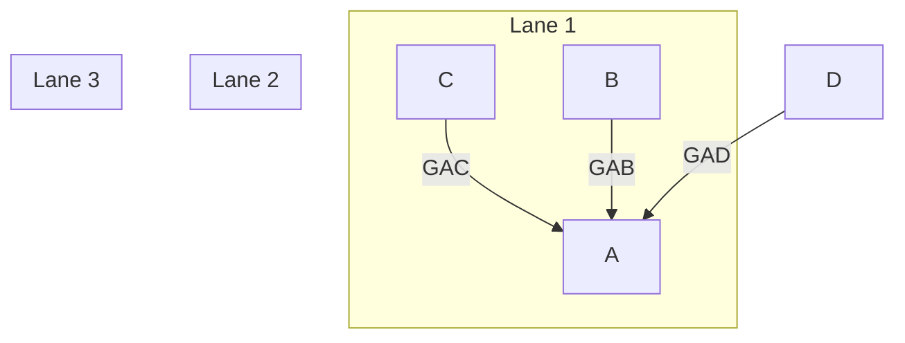
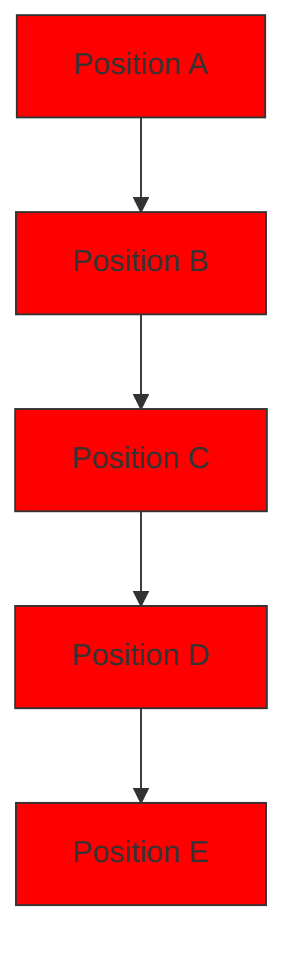

<table><tr><td colspan="2">For office use only</td></tr><tr><td>T1</td><td></td></tr><tr><td>T2</td><td></td></tr><tr><td>T3</td><td></td></tr><tr><td>T4</td><td></td></tr></table>

Team Control Number

55278

Problem Chosen

C

For office use only

<table><tr><td>F1</td><td></td></tr><tr><td>F2</td><td></td></tr><tr><td>F3</td><td></td></tr><tr><td>F4</td><td></td></tr></table>

2017

MCM/ICM

Summary Sheet

# The Effects of Self-Driving Cooperating Vehicles on Traffic Capacity of Highways

Summary

We propose an innovative model based on cellar automata to analyze the effects of self-driving cooperating vehicles on highway traffic capacity. We extend the traditional cellar automata used for traffic analysis to increase the flexibility of our model, so that it can deal with complex dynamics of self-driving vehicles.

Based on the extended cellar automata, we first model the car generation process using Poisson distributions. This model generates specified volume of vehicles on a segment of highway. Our car generation model distinguishes the traffic volumes during peak hours and nonpeak hours. Then we model the behaviors of vehicle-following and lane-changing. In this part, we consider the cooperation between self-driving vehicles and interaction between self-driving and human-driven vehicles. Finally, we propose a probability model to analyze the behavior of traffic flow at highway intersections.

We verify the feasibility of our model by running various simulations. Our model is tested with different percentages of self-driving cars, different lane numbers and traffic volumes. We find that self-driving cars can stabilize the performance of traffic system when the lane number and traffic volume change.

Then we apply our model to the data of four highways in the Greater Seattle area. Our results show that the traffic capacity increases with rising percentage of self-driving cooperating vehicles. The average velocity of traffic flow doubles when the percentage increasing from 10% to 50%. And in most cases an equilibria exists after 60%. We also test the effects of dedicated lanes for self-driving cars. We suggest using 70% as a dividing point for whether to use dedicated lanes or not. When the percentage of self-driving vehicles is higher than 70% percent, dedicated lanes can be helpful. We also compare the performance during peak hours with average performance during a whole day, and find that self-driving cars significantly speed up peak-hour traffic flows.

Finally, we analyze the effect of potential error of self-driving system. We find that defects of self-driving system can degrade the benefit to traffic capacity. We also do sensitivity analysis of various parameters, including probability of lane-changing and parameters in the vehicle dynamics, to prove the robustness of our model.

Keywords: traffic capacity; cellar automata; self-driving; cooperating vehicles

# The Effects of Self-Driving Cooperating Vehicles on Traffic Capacity of Highways

January 24, 2017

# Contents

# 1 Introduction 3

1.1 Literature Review 4   
1.2 Assumptions . . 4

# 2 The Models 4

2.1 Basic Settings of Cellar Automata . . 4   
2.2 Notations . . 5

2.2.1 Introducing Acceleration into Cellar Automata . . . . . 5   
2.2.2 Attributes of a Cell . . . . 6

2.3 Generation Model . 6   
2.4 Vehicle-Following Model . . 8

2.4.1 The follower car is Human Driven . . . . 8   
2.4.2 Self-Driving Vehicle Follows a Human Driven Vehicle . . . . . . . . 9   
2.4.3 Following Model For Two Self-Driving Vehicles . . . . . . 9

2.5 Lane-Changing Model 10   
2.6 Intersection Model 10

# 3 Analyzing the Model by Simulation 12

3.1 Criteria 12   
3.2 Effects of Percentage of Self-Driving Vehicles . . 12   
3.3 Effects of Lane Number 13   
3.4 Effects of Dedicated Lanes for Self-Driving Cars . . 14   
3.5 Effects of Traffic Volume 15

# 4 Apply to the Real Data 15

4.1 Percentage of Self-Driving Vehicles . . 16

4.1.1 Average Velocity During a Whole Day . . . . . . . . 16

4.1.2 Average Velocity During Peak Hours . . 17

4.1.3 Traffic Density . . . . 17

4.1.4 Average Velocity at Intersections . . . . 18

4.2 Dedicated Lanes . . 19

5 Sensitivity Analysis 19

5.1 Lane-Changing Probability Pc . . 19

5.2 Coefficients α, β, and γ in Vehicle Following Model 20

5.3 Error of Self-Driving Systems . . 20

6 Conclusion 22

7 The Letter 24

# 1 Introduction

Self-driving is a technology with growing importance in these years. 2016 is the tipping point for excitement in self-driving cars. In October Tesla announced that all of its new vehicles now had the hardware to drive fully autonomously. All that’s left is developing the software. Also, as mobile communication becomes ubiquitous, it is easy to build connections among self-driving vehicles to form cooperative driving systems.

Nowadays traffic jam almost disturbs the daily life of every urban citizen. The arising of self-driving cooperating vehicles has long been a hope to increase the traffic capacity without enlarging the roads, since these vehicles have more accurate control, better sense and prediction of the behavior of ambient vehicles than human-driven ones. In this paper, we make a quantitative and qualitative analysis of the impact on traffic capacity of these newly emerging vehicles.

We establish a traffic flow model based on cellar automata to simulate highway traffic flow. We extend the traditional cellar automata to taking into account acceleration values of vehicles. This extension brings much flexibility when modeling the traffic flow, and enable us to test the impact of more detailed control rules for self-driving cooperating cars.

Our model can be divided into four parts. First, we propose a traffic generation model based on Poisson distributions. This model captures variance of traffic counts during peak travel hours and the non-peak hours. Then, we model the behavior of vehicle-following, which defines how a car acts according the car running before it. Different rules are applied to distinguish the cooperation between two self-driving cars, and interactions between self-driving and human-driven cars. Then, we design a lanechanging model for vehicle movement across lanes. Finally, we build an intersection model to describe how vehicles change from one highway to another through interchanges.

Then we analyze the feasibility of our model by running simulations with different percentage of self-driving vehicles, different number of lanes and different daily traffic volumes. Under all these simulations our model produces reasonable results, which is consistent with the properties of self-driving vehicles.

After that we apply the provided data. We analyze how the highway capacity changes with the percentage of self-driving cars. Results shows that a equilibria exists at around 50% to 70%. We also study the effect of dedicated lanes for self-driving vehicles, and propose a strategy to allocate such lanes.

Finally, we do sensitive analysis on some parameters in our model. We also consider what if self-driving systems are not perfect. In other words, these autonomous vehicles may not mature enough and new risk can be introduced. We simulate the inaccuracy of a self-driving system by random acceleration and deceleration with a small probability. Results shows that such inaccuracy can degrade the benefit of self-driving vehicles.

# 1.1 Literature Review

Using cellar automata to analyze traffic flow is widely used by many researchers[1, 2]. This approach has been proved effective to analyze real traffic flow data, and it’s easy to implement. However, none of them consider the scenario with self-driving cars. Their human-driven models lack flexibility to adapt to self-driving vehicles.

On the other hand, studies of self-driving vehicles start up just in recent years. Most of the researches are done by using continuous models with complex simulation softwares, and focus on the dynamics of self-driving vehicles and the interactions of several vehicles[3, 4]. But how self-driving technology will influence an entire highway traffic flow is still not answered.

Some researchers in civil and environmental engineering believe that self-driving technology can increase highway capacity and reduce air pollution[5]. But they didn’t provide quantitative analysis.

In this paper, we propose a brand new cellar automata system which models the impact of self-driving vehicles on highway traffic flow. We extend the traditional traffic flow methods by adding dynamics of self-driving vehicles. We analyze our model with simulations and successfully verify its feasibility. Finally we apply our model to real data and provide constructive advice on traffic management for self-driving cars.

# 1.2 Assumptions

• Each highway is a straight line without bending.   
• Self-driving cars can communicate real time data with each other, including velocity and acceleration.   
• Self-driving cars do not need response time to take action as human drivers do.   
• Human driven vehicles do not communicate with any other vehicle.   
• The width of each lane is only enough for one single vehicle.   
• All vehicles are in the same size.   
• A car change to another highway through interchanges in intersections, without crossing any traffic flow.   
• All human-driven cars are identical and all self-driving cars are identical.

# 2 The Models

# 2.1 Basic Settings of Cellar Automata

Cellar Automata has been a widely used model for traffic flow analysis[1]. The road is divided into cells, each cell can have one car or no car on it. A cell also records the current velocity of the car on it, if any. In cellar automata, positions, time, velocity and acceleration are all discrete. The state of a cell is updated according to its current state and current states of its surrounding cells. We apply different updating rules to distinguish the behaviors of self-driving and human-driven cars in our models.

# 2.2 Notations

<table><tr><td>Symbol</td><td>Meaning</td></tr><tr><td>s</td><td>An indicator representing the car type on a cell</td></tr><tr><td>v</td><td>Current velocity of a car</td></tr><tr><td> $v_{\text{new}}$ </td><td>The newly updated value of v after each iteration</td></tr><tr><td>a</td><td>Current acceleration of a car</td></tr><tr><td> $a_{\text{new}}$ </td><td>The newly updated value of a after each iteration</td></tr><tr><td>N</td><td>Daily traffic count of a highway segment</td></tr><tr><td>n</td><td>Newly arriving vehicles in a highway segment in one second</td></tr><tr><td>p</td><td>Number of peak hours.</td></tr><tr><td>q</td><td>Percentage of self-driving cars</td></tr><tr><td>G</td><td>Distance between two cars in the vehicle-following model</td></tr><tr><td> $v_p$ </td><td>Speed of the preceding vehicle in vehicle-following model</td></tr><tr><td> $a_p$ </td><td>Acceleration of preceding car in vehicle-following model</td></tr><tr><td> $T_r$ </td><td>Response time for a human driver to take action</td></tr><tr><td> $V_{min}$ </td><td>Minimum velocity allowed on a highway</td></tr><tr><td> $V_{max}$ </td><td>Maximum velocity allowed on a highway</td></tr><tr><td> $λ_{peak}$ </td><td>Rate parameter of Poisson distribution for car generation during peak hours</td></tr><tr><td> $λ_{non-peak}$ </td><td>Rate parameter of Poisson distribution for car generation during non-peak hours</td></tr><tr><td> $T_{rh}$ </td><td>Response time for a human driver</td></tr><tr><td> $T_{rs}$ </td><td>Response time for a self-driving car</td></tr><tr><td> $T_{inter}$ </td><td>Time needed to transfer from one highway to another through an interchange</td></tr><tr><td> $μ_{ij}$ </td><td>Probability of Crossing Interchanges in Intersection Model</td></tr><tr><td> $P_a$ </td><td>Acceleration probability when G &gt;  $G_S$ </td></tr><tr><td> $P_d$ </td><td>Deceleration probability when G &gt;  $G_S$ </td></tr><tr><td> $P_c$ </td><td>Probability of lane-changing</td></tr><tr><td>α,β,γ</td><td>Coefficients in vehicles following rules (See 2.4.2 and 2.4.3 for details)</td></tr></table>

# 2.2.1 Introducing Acceleration into Cellar Automata

Most cellar automata used for traffic analysis, however, only consider the velocity of vehicles[1, 2, 6], without considering accelerations. Whenever the velocity changes, it can only increase or decrease by a fixed value. This is nature for human-driven cars, since human drivers have no accurate data about the behavior of ambient vehicles, they tend to be careful. Also, a human driver has no accurate perception of acceleration, so a cellar automata considering only velocity of cars is enough.

However, researchers of self-driving use acceleration as an important variable in their analysis[3, 7, 8]. In the case of self-driving cooperating vehicles, a fixed acceleration can be a limitation due to their self-driving and cooperating properties.

• Self-Driving Autonomous vehicles are often equipped with accurate sensors[9], complex control system and even artificial intelligence technology. They can control acceleration accurately. Thus they can steer more flexibly and fearlessly than human-driven ones.   
• Cooperating These vehicles can share data including their current acceleration[4], and with these data, they can take more accurate actions to avoid collision as well as make full use of the space of highway. Considering acceleration in our model make more complex cooperating rules possible.

Thus, we extend the traditional cellar automata traffic flow model by adding acceleration as an attribute of a cell.

# 2.2.2 Attributes of a Cell

In our model, a cell represent a 4 meter long space on a single lane, and each cell can only contain one car at a time. A cell has three attributes,

1. An integer s ranging from 0 to 2 (inclusive) to represent the car type. 0 for no car, 1 for human-driven, and 2 for self-driving.

2. Current velocity v a car.

3. Current acceleration a of a car.

Only when s is non-zero does the other two attributes make sense.

In each step of the simulation, a car moves forward by v cells, and v is updated by adding a and bounded by $V _ { m i n }$ and $V _ { m a x } ,$ the speed limitations of highway. Rules are applied to update a according to the states of surrounding cells. For human-driven and self-driving vehicles we have different rules. Specific updating rules are introduced in following sections.

# 2.3 Generation Model

We need a model to generate cars for each highway segment. Poisson distribution is appropriate for this task[10]. It expresses the possibility of number of events occurring in a fixed interval of time. Instead of using one Poisson distribution for all time during the day, we use two for peak hours and non-peak hours respectively. Our generation model also controls the percentage of self-driving cars on the way.

Assuming that there are p peak hours in a day and 8% of the daily traffic volume occurs during peak travel hours. With the data of daily vehicle counts, we can calculate the average number of newly arriving cars in one second in each highway segment.

$$
\lambda_ {p e a k} = \frac {0 . 0 8 N}{3 6 0 0 p}, \quad \lambda_ {n o n - p e a k} = \frac {0 . 9 2 N}{3 6 0 0 (2 4 - p)}
$$

Suppose the arrival of vehicles follows Poisson distribution, then $\lambda _ { p e a k }$ and $\lambda _ { n o n - p e a k }$ are unbiased estimation for the rate parameters. Thus each second we can sample from

the Poisson distributions

$$
P _ {p e a k} (n) = \frac {\lambda_ {p e a k} ^ {n}}{n !} e ^ {- \lambda_ {p e a k}}, P _ {n o n - p e a k} (n) = \frac {\lambda_ {n o n - p e a k} ^ {n}}{n !} e ^ {- \lambda_ {n o n - p e a k}}
$$

as the number of newly entered vehicles into a highway segment in our simulation, during peak hours and non-peak hours respectively.

By adjusting $p ,$ we can control the average frequency of vehicles arriving at peak hours, i.e. $\lambda _ { p e a k } .$ . Since the proportion of peak hour traffic count is fixed at 8%, when $p$ is bigger, these 8% vehicles can arrive at a relatively low frequency. We will simulate with different values of $p$ to test the influence of peak and average traffic volume on our model. The following figure shows how $\lambda _ { p e a k }$ and $\lambda _ { n o n - p e a k }$ vary with respect to $p ,$ when the daily traffic count is 200, 000.

line

| Peak Hours | peak | non-peak |
| ---------- | ---- | -------- |
| 1          | 4.5  | 1.1      |
| 2          | 1.2  | 1.2      |
| 3          | 0.8  | 1.2      |
| 4          | 0.6  | 1.3      |
| 5          | 0.5  | 1.3      |
| 6          | 0.4  | 1.4      |
| 7          | 0.3  | 1.5      |
| 8          | 0.3  | 1.6      |
| 9          | 0.3  | 1.7      |
| 10         | 0.3  | 1.8      |

Figure 1: Car Arriving Frequency (N=200,000)

From Figure 1, when $p = 1$ , we have about 2 newly arriving cars each second on average during peak hours, and about 1 during non-peak hours. As the number of peak hours increase, the traffic density during peak hours decreases and that during non-peak hours increases.

For each car generated from the Poisson distributions, it will be a self-driving car with a probability of $q ,$ and a human-driven one with a probability of 1 − q. As we adjust $q ,$ different percentage of self-driving cars will be on the way.

We set the initial velocity v of a newly arriving vehicle as 20m/s, which is a relatively low value. Setting the initial speed slow does not hurt the following simulation, because if the traffic density is low, a higher velocity is allowed, and the vehicle will speed up soon according to our following model. The initial value of acceleration a is calculated according to state of ambient vehicles, using the rules introduced in the vehicle-following model.

# 2.4 Vehicle-Following Model

Vehicle-Following model defines the behavior of two cars on the same lane, one running after another. We call the car running in the front preceding car, and the other car follower car.

The vehicle-following model defines how the follower car changes its velocity and acceleration according to the status of the preceding car. We consider three different cases:

1. The follower car is human driven.   
2. The follower car is self-driving and preceding car is human driven.   
3. Both cars are self-driving.

In each case, we define a rule to update the velocity and acceleration of the follower car.

# 2.4.1 The follower car is Human Driven

When the follower car is human driven, the driver can only try to keep a safe distance with the preceding car, since a human driver needs longer response time than self-driving cars to react when the preceding car decelerates suddenly. Here’s the safe distance of a human driven follower car

$$
G _ {S} = T _ {r h} v
$$

where $T _ { r h }$ stands for response time of a human driver. According to the Two Second Rule[11], $T _ { r h } = 2 s$ is an appropriate setting, which will be used in our simulation.

Human drivers tend to be careful due to potential human error when changing speed. Thus their acceleration is a fixed value. In every second, they can either increase or decrease the velocity by one unit, which is also a convention taken by previous cellar automata based traffic flow analysis.

Thus the behavior of a human-driven cars can be divided into two cases:

• When the current distance $G \leq G _ { S } ,$ , the driver decelerates.   
• When $G > G _ { S } ,$ the driver can accelerate with a probability $P _ { a }$ and decelerate with a probability $P _ { d } ,$ and keep the velocity unchanged otherwise. Here $P _ { a } + P _ { d } \leq 1$ . The values of $P _ { a }$ and $P _ { d }$ will be specify later.

When decelerating, the velocity decreases by 1, i.e. $v _ { n e w } = \operatorname* { m a x } ( V _ { m i n } , v - 1 )$ . When accelerating, the velocity increases by 1 and bounded by the maximum velocity of highway, i.e. $v _ { n e w } = \operatorname* { m i n } ( v + 1 , V _ { m a x } )$ .

Finally let’s specify values of $P _ { a }$ and $P _ { d }$ . When a car runs fast, the human driver tends to slow down. Thus as current velocity v increases, $P _ { a }$ decreases and $P _ { d }$ increases. Each cell is 4 meters long, the maximum speed allowed is 60 miles, which is about 7 cells per second. The following table shows values of $P _ { a }$ and $P _ { d }$ for different $v ^ { \prime } \mathrm { s }$ .

Table 1: Acceleration and Deceleration Probabilities when $G > G _ { S }$ 

<table><tr><td>v</td><td>1</td><td>2</td><td>3</td><td>4</td><td>5</td><td>6</td><td>7</td></tr><tr><td> $P_a$ </td><td>1</td><td>0.9</td><td>0.8</td><td>0.7</td><td>0.5</td><td>0.2</td><td>0</td></tr><tr><td> $P_d$ </td><td>0</td><td>0.1</td><td>0.2</td><td>0.2</td><td>0.3</td><td>0.4</td><td>0.6</td></tr></table>

# 2.4.2 Self-Driving Vehicle Follows a Human Driven Vehicle

Even if self-driving vehicle cannot communicate with the preceding human driver, their sensors can still detect the real time velocity of human-driven car and make a reaction immediately. Thus the response time is much shorter than a human driver. The safe distance in this case is still measured by $G _ { S } = T _ { r s } v _ { . }$ , but here $T _ { r s }$ can take a smaller value than the human response time $T _ { r h }$ . We’ll use $T _ { r s } = 1 s$ in our simulation.

Unlike human drivers, self-driving cars equipped with accurate controller have large flexibility in the control of acceleration, they can adjust their acceleration value constantly. In every second, we have the updating rules for its velocity and acceleration

$$
v _ {\mathrm{new}} = \left\{ \begin{array}{l l} \min (V _ {\max}, v + a), & a \geq 0 \\ \max (V _ {\min}, v + a), & a <   0 \end{array} \right.
$$

$$
a _ {\mathrm{new}} = \alpha (G - G _ {S}) + \beta (v _ {p} - v)
$$

The acceleration of a self-driving car depends on the current distance $G ,$ safe distance $G _ { S } ,$ current velocity v and velocity of the preceding vehicle $v _ { p }$ . α and $\beta$ are positive coefficients depicting how much the acceleration depends on $\left( G - G _ { S } \right)$ and velocity difference $( v - v _ { p } )$ . When $G$ is greater than $G _ { S } ,$ the distance is too large thus an acceleration is favorable. Conversely when $G < G _ { S }$ the car should slow down. The second term $\beta ( v _ { p } - v )$ favors acceleration when the self-driving car is slower than preceding human-driven car, and deceleration when it is faster.

# 2.4.3 Following Model For Two Self-Driving Vehicles

When both vehicles are self-driving, they can communicate velocity and acceleration constantly. They still need a safe distance $G _ { S } = T _ { r s } v$ . Since two cooperating cars can communicate, the follower car can get the accurate real time acceleration of preceding car $a _ { p }$ . Taking $a _ { p }$ into account when updating the acceleration provides further flexibility for a self-driving car.

The updating rules[3] for the follower car are

$$
v _ {\mathrm{new}} = \left\{ \begin{array}{l} \min (V _ {\max}, v + a), a \geq 0 \\ \max (V _ {\min}, v + a), a <   0 \end{array} \right.
$$

$$
a _ {\mathrm{new}} = \alpha (G - G _ {S}) + \beta (v _ {p} - v) + \gamma a _ {p}
$$

Adding the term $\gamma a _ { p } ,$ when the preceding car wants to accelerate $( a _ { p } > 0 )$ or decelerate $( a _ { p } < 0 )$ , the follower car will immediately take corresponding action. Thus this rule makes use of the communication between two self-driving cooperating cars.

# 2.5 Lane-Changing Model

Besides adjusting its speed and acceleration, each car has a chance to move to the neighboring lane. A lane-changing can happen only when

• Current distance with the preceding car is less than the safe distance.   
• The cell on the neighboring lane is empty and distances with preceding and follower cars in the neighboring lane are safe.

Formally, in the case of Figure 2, if ${ \cal G } _ { A B } \le { \cal G } _ { S _ { A B } } ,$ then car A can change to lane 1 when $G _ { A C } > G _ { S _ { A C } }$ and $G _ { A D } > G _ { S _ { A D } }$ . Here $G _ { A C }$ is the distance between car $A$ and $C ,$ and $G _ { A B }$ is the distance between car A and B. $G _ { S _ { A B } } , G _ { S _ { A C } }$ and $G _ { S _ { A D } }$ are safe distances between A and $B ,$ A and $C ,$ and A and D respectively. They are defined in the same way as vehicle-following model, according to the categories of the cars.

flowchart

Figure 2: Conditions for Lane-Changing

When only one neighboring lane satisfies the condition, the car changes to that lane with a probability $P _ { c } .$ . When both left and right lanes satisfies the condition, the car changes to either lane with a probability $P _ { c } / 2$ .

Lane-changing happens before the velocity and acceleration update in the vehiclefollowing model. After lane-changing, the velocity and acceleration of a vehicle are updated according to the rules in the vehicle-following model.

# 2.6 Intersection Model

Most high way intersections are based on interchanges, a structure that allows highway to pass through the junction without directly crossing any traffic stream. Thus in an intersection, a car in one highway can move to another highway without waiting for a traffic light. We will use cloverleaf interchange in our model, since it is the most widely used one. Figure 3 shows the traffic flow on a cloverleaf interchange. A car in Position A on Lane 2 can move to Position B on Lane 3 or Position C on Lane 4. Similarly, a car can enter Lane 2 from Position D on Lane 3 and Position E on Lane 4. The traffic flow on Lane 1 has a similar interaction with traffic flow on Lane 3 and Lane 4.

flowchart

Figure 3: Cloverleaf Interchange

Because there’s no crossing through the traffic stream, we can assume the car disappears from one highway and appears on another one after a period of time.

With this assumption, we introduce 8 parameter $\mu _ { i j }$ and $\mu _ { j i } ,$ for all $i \in \{ 1 , 2 \} , j \in$ $\{ 3 , 4 \}$ , to represent the probability of cars moving from Lane i to Lane $j ,$ and from Lane j to Lane i respectively. Assuming all these movements across the interchange takes time $T _ { \mathrm { i n t e r } }$ . We summarize the rules for intersection crossing as follows

• When a car arrives at the intersection, with probability $\mu _ { i j . }$ , its movement from Lane i to Lane $j$ starts.   
• If the movement starts and $T _ { \mathrm { i n t e r } }$ seconds pass after that, check if the destination position on Lane $j$ is empty. If so, put the car on that position with its old velocity and update its acceleration with the rules in the vehicle-following model. Otherwise, the car has to wait until the position becomes empty.

The intersection model is simulated by running four cellar automata using vehiclefollowing rules and lane-changing rules, and the intersection rules defined above. Details are deferred to the simulation part.

# 3 Analyzing the Model by Simulation

We analyze how the highway capacity varies in our model when the percentage of self-driving vehicles, number of lanes and traffic volume change. We run the simulation on a highway segment of 250 cells long, which is 1000 meters. Each simulation runs for a traffic flow of 24 hours, using the generation model to generate vehicles.

The simulation results shows that self-driving vehicles increases the highway capacity. We also compare the effects of self-driving vehicles with other factors.

# 3.1 Criteria

To evaluate the traffic capacity, we need some criteria. In our simulations, we mainly use average passing time and traffic density.

• Whole-Day Average Passing Time The average time for a vehicle to pass the 250- cell long highway segment.   
• Peak-Hour Average Passing Time The average time for a vehicle to pass the 250- cell long highway segment during peak hours.   
• Traffic Density Number of vehicles on the 250-cell long highway segment. This value will change with time as the cars run in and out the highway. So for each combination of model parameters, we can obtain a curve of traffic density varying with time. Since the traffic load is a time dependent value, we can further use it to analyze the stability of a traffic flow.

# 3.2 Effects of Percentage of Self-Driving Vehicles

We run the cellar automata on a highway segment, varying the percentage of selfdriving vehicles to observe the change of highway capacity. The highway segment has 3 lanes on both directions. We fixed the daily traffic volume at 100, 000, with 50, 000 on each direction. The lane-changing probability $P _ { c } = 0 . 5$ . Number of peak hours in the generation model is $p = 1$ . We calculate the average time to pass through the highway segment and traffic load. Figure 4 and Figure 5 show the results.

We have following observations when the self-driving percentage increases.

• Average passing time reduces: As the percentage of self-driving vehicles increases, the average passing time during peak hours decreases sharply at first, and reach a equilibria at around 70%. Self-driving vehicles can increase the traffic capacity by more accurate control and cooperating. The benefit is tiny when the percentage of self-driving car is low. Because cooperation is difficult with few self-driving cars on the road.   
• Peak-hour pressure is alleviated Self-driving cars reduce the difference between peak-hour passing time and whole-day passing time. In Figure 4, as the percentage of driving cars increases, the blue curve and black curve get closer. This reveal an important advantage of self-driving cars, that they are flexible enough to deal with peak hours.

line

| percentage of self-driving cars (%) | whole day | peak hours |
| ---------------------------------- | --------- | ---------- |
| 0                                  | 54        | 94         |
| 10                                 | 51        | 68         |
| 20                                 | 50        | 59         |
| 30                                 | 49        | 55         |
| 40                                 | 48        | 52         |
| 50                                 | 47        | 50         |
| 60                                 | 46        | 48         |
| 70                                 | 45        | 46         |
| 80                                 | 44        | 45         |
| 90                                 | 43        | 44         |
| 100                                | 42        | 43         |

Figure 4: Average Passing Time

line

| percentage of self-driving cars (%) | whole day | peak hours |
| ----------------------------------- | --------- | ---------- |
| 0                                   | 65        | 205        |
| 10                                  | 60        | 140        |
| 20                                  | 58        | 125        |
| 30                                  | 57        | 115        |
| 40                                  | 56        | 108        |
| 50                                  | 55        | 108        |
| 60                                  | 55        | 102        |
| 70                                  | 54        | 100        |
| 80                                  | 53        | 98         |
| 90                                  | 53        | 97         |
| 100                                 | 52        | 95         |

Figure 5: Traffic Density

• The space capacity of highway increases: In Figure 5, as the percentage of selfdriving cars increases, average number of vehicles on the 250-cell highway segment reduces. When self-driving percentage is low, cars on the road moves slowly, as indicated in Figure 4. Thus, traffic jam is easy to arise, which result in many cars being stuck on the road. With more self-driving cars, traffic jam can be relief. Again, the impact of self-driving car is more obvious during peak hours.

# 3.3 Effects of Lane Number

We run simulations with 3, 4 and 5 lanes on both directions respectively. The daily traffic volume is 100, 000, with 50, 000 on each direction and number of peak hours $p = 1$ . The lane-changing probability $P _ { c } = 0 . 5$ . And the self-driving percentage is 50%.

We also test the effects of lane number with different self-driving percentage. We simulate lane numbers 3, 4 and 5 with self-driving percentage 30% and 70%.

We have two important observations based on Figure 6 and Figure 7.

• More lanes can speed up traffic flow: Both during the whole day and peak hours, adding lanes to the highway shorten the average passing time. This is consistent with our intuition. Because with more lanes on the highway, cars have more freedom to change lane when the current lane is too crowded.   
• Self-driving reduces the impact of lane number: Both in Figure 6 and Figure 7, as self-driving percentage increases, the three curves get closer to each other. When most of the cars are self-driving, adding more lanes to the highway make small difference.

line

| percentage of self-driving cars (%) | 3 lanes | 4 lanes | 5 lanes |
| ---------------------------------- | ------- | ------- | ------- |
| 30                                 | 48.8    | 46.9    | 46.2    |
| 50                                 | 47.3    | 45.9    | 45.3    |
| 70                                 | 45.3    | 45.0    | 44.4    |

Figure 6: Impact of Lane Number (Whole Day)

line

| percentage of self-driving cars (%) | 3 lanes | 4 lanes | 5 lanes |
| ---------------------------------- | ------- | ------- | ------- |
| 30                                 | 54.5    | 49.5    | 47.8    |
| 50                                 | 49.8    | 46.8    | 45.8    |
| 70                                 | 46.2    | 44.2    | 43.8    |

Figure 7: Impact of Lane Nmber (Peak Hours)

# 3.4 Effects of Dedicated Lanes for Self-Driving Cars

This section we discuss how our model reacts to dedicated lanes for self-driving cars. To test the effects of dedicated lanes, we modify the generation model and lane-changing model.

• Generation Model When a self-driving car is generated, we put it to one of the dedicated lanes.   
• Lane-Changing Model A self-driving car cannot change to a non-dedicated lane.

line

| percentage of self-driving cars (%) | 0 dedicated lanes | 1 dedicated lanes | 2 dedicated lanes | 3 dedicated lanes |
| ----------------------------------- | ----------------- | ----------------- | ----------------- | ----------------- |
| 30                                  | 46.5              | 46.8              | 47.5              | 54.8              |
| 50                                  | 45.2              | 45.5              | 46.0              | 48.5              |
| 70                                  | 44.0              | 44.2              | 44.5              | 45.8              |

Figure 8: Impact of Dedicated Lanes (Whole Day)

line

| percentage of self-driving cars (%) | 0 dedicated lanes | 1 dedicated lanes | 2 dedicated lanes | 3 dedicated lanes |
| ---------------------------------- | ----------------- | ----------------- | ----------------- | ----------------- |
| 30                                 | 48                | 48                | 51                | 79                |
| 50                                 | 46                | 45                | 46                | 49                |
| 70                                 | 44                | 43                | 43                | 43                |

Figure 9: Impact of Dedicated Lanes (Peak Hours)

With these modifications, run the simulation with 5 lanes on both directions. The daily traffic volume is 100, 000, with 50, 000 on each direction. The number of peak hours $p = 1$ . The lane-changing probability $P _ { c } = 0 . 5$ . We increase the dedicated lanes from 1 to 3 and calculate the average passing time, when self-driving percentage is 30%, 50% and 70% respectively.

From Figure 8 and Figure 9, when the percentage of self-driving vehicles are small, dedicated lanes may hurt the traffic capacity, especially during the peak hours. For example, in Figure 9, when there are only 30% of self-driving cars, 3 dedicated lines results in an average passing time of 80s, which is much slower than other cases.

However, as the percentage of self-driving cars arises, dedicated lane can improve the performance by a little. For example, in Figure 9, when 70% are self-driving, any number of dedicated lanes outperforms no dedicated lane strategy.

# 3.5 Effects of Traffic Volume

Different daily traffic volume from 100, 000 to 500, 000 are tested. The traffic volume are distributed to both directions equally. Each direction has 5 lanes. The lane-changing probability $P _ { c } = 0 . 5$ . Fix the number of peak hours $p = 1$ . Simulations are done for 30%, 50% and 70% of self-driving cars.

line

| percentage of self-driving cars (%) | 100000 vehicles | 200000 vehicles | 300000 vehicles | 400000 vehicles | 500000 vehicles |
| ----------------------------------- | --------------- | --------------- | --------------- | --------------- | --------------- |
| 30                                  | 60              | 50              | 110             | 130             | 185             |
| 50                                  | 55              | 48              | 65              | 75              | 95              |
| 70                                  | 50              | 48              | 55              | 55              | 60              |

Figure 10: Impact of Traffic Volume (Whole Day)

line

| percentage of self-driving cars (%) | 100000 vehicles | 200000 vehicles | 300000 vehicles | 400000 vehicles | 500000 vehicles |
| ---------------------------------- | --------------- | --------------- | --------------- | --------------- | --------------- |
| 30                                 | 55              | 120             | 185             | 200             | 210             |
| 50                                 | 50              | 65              | 110             | 170             | 175             |
| 70                                 | 45              | 50              | 65              | 65              | 80              |

Figure 11: Impact of Traffic Volume (Peak Hours)

The impact of traffic volume reduces as percentage of self-driving cars increases. Thus self-driving cars can maintain the highway capacity well even when the traffic is quite heavy.

# 4 Apply to the Real Data

We apply our model to the provided data of Interstates 5, 90, and 405, as well as State Route 520. We test how traffic capacity of these roads changes with the percentage of self-driving cars. We also analyze the feasibility of dedicated lanes, and give suggestions based on our analysis.

# 4.1 Percentage of Self-Driving Vehicles

We run simulation for each segment on the data sheet, study the impact of selfdriving vehicles on highway capacity during the whole day and during peak hours. Though self-driving vehicles do not increase the highway capacity a lot on average during the day, but they have a significant impact during the peak hours.

# 4.1.1 Average Velocity During a Whole Day

In the data sheet, 224 highway segments are listed. These segments belong to four roads, Interstates 5, 90, and 405 and State Route 520. For each segment and its corresponding daily traffic count, we test the average velocity vi, i = 1, 2, ..., 224 of cars passing through the segment during a day. Then we calculate the average velocity for each road, by averaging vi’s of the segments belonging to the road.

line

| percentage of self-driving cars (%) | Route 5 | Route 90 | Route 405 | Route 520 |
| ---------------------------------- | ------- | -------- | --------- | --------- |
| 0                                  | 14.0    | 12.0     | 13.0      | 10.0      |
| 10                                 | 17.0    | 15.0     | 16.0      | 14.0      |
| 20                                 | 20.0    | 18.0     | 19.0      | 17.0      |
| 30                                 | 21.5    | 20.0     | 21.0      | 19.5      |
| 40                                 | 23.5    | 22.0     | 23.0      | 21.0      |
| 50                                 | 24.5    | 23.0     | 24.0      | 22.0      |
| 60                                 | 25.5    | 24.5     | 25.0      | 23.5      |
| 70                                 | 26.5    | 25.5     | 26.0      | 25.0      |
| 80                                 | 27.5    | 27.0     | 27.5      | 27.0      |
| 90                                 | 28.0    | 27.5     | 27.5      | 27.5      |
| 100                                | 28.5    | 28.0     | 28.5      | 28.0      |

Figure 12: Average Traffic Flow Velocity During a Whole Day

On each road, the average velocity increases with percentage of self-driving vehicles. As the percentage of self-driving cars increases from 10% to 50%, the average velocity increases rapidly. However, when the percentage changing from 50% to 90%, the average velocity only increases by a little. An equilibria is reached at around 80%.

The average velocity increases most markedly when percentage of self-driving vehicles changes from 0% to 10%, and from 10% to 20%.

# 4.1.2 Average Velocity During Peak Hours

Average velocities of each road during peak hours are calculated in the same way as 4.1.1.

line

| percentage of self-driving cars (%) | Route 5 | Route 90 | Route 405 | Route 520 |
| ----------------------------------- | ------- | -------- | --------- | --------- |
| 0                                   | 7.0     | 5.0      | 6.0       | 4.0       |
| 10                                  | 12.0    | 8.0      | 11.0      | 7.0       |
| 20                                  | 16.0    | 12.0     | 14.0      | 11.0      |
| 30                                  | 18.0    | 15.0     | 17.0      | 14.0      |
| 40                                  | 20.0    | 19.0     | 20.0      | 18.0      |
| 50                                  | 23.0    | 23.0     | 22.0      | 22.0      |
| 60                                  | 25.0    | 25.0     | 24.5      | 25.0      |
| 70                                  | 26.0    | 25.5     | 25.5      | 25.5      |
| 80                                  | 27.0    | 27.0     | 27.0      | 27.0      |
| 90                                  | 27.5    | 27.5     | 27.5      | 27.5      |
| 100                                 | 28.0    | 28.0     | 28.0      | 28.0      |

Figure 13: Average Traffic Flow Velocity During Peak Hours

Compared with Figure 12, we found self-driving has a more significant impact for peak hour traffic flow. The average velocities on all four roads experience a huge increase as self-driving percentage increases. For example, when the percentage increases from 10% to 50%, average velocity on Route 5 increases by about 10m/s, and by about 5m/s when the percentage increases from 50% to 90%. An equilibria is reached at around 70%.

# 4.1.3 Traffic Density

We calculated the average traffic density of the four highways. We record how many traffic are there on each road per second when doing the simulation in 4.1.1 and 4.1.2. Then we calculate the average number of cars per second per kilometer.

From Figure 14 and Figure 15 self-driving cars help reduce the traffic density of each road. Again, the impact is more significant during the peak hours. In Figure 15, the traffic density decreases rapidly when the percentage of self-driving is low. From 10% to 50%, the traffic density reduces by half. While from 50% to 90%, there’s no significant change. An equilibria is reached at around 50%.

line

| percentage of self-driving cars (%) | Route 5 | Route 90 | Route 405 | Route 520 |
| ---------------------------------- | ------- | -------- | --------- | --------- |
| 0                                  | 63      | 62       | 57        | 52        |
| 10                                 | 60      | 61       | 54        | 49        |
| 20                                 | 58      | 59       | 52        | 48        |
| 30                                 | 57      | 56       | 51        | 48        |
| 40                                 | 56      | 55       | 50        | 47        |
| 50                                 | 55      | 54       | 49        | 46        |
| 60                                 | 54      | 53       | 48        | 45        |
| 70                                 | 53      | 52       | 47        | 44        |
| 80                                 | 53      | 51       | 46        | 43        |
| 90                                 | 52      | 50       | 45        | 43        |
| 100                                | 52      | 49       | 44        | 42        |

Figure 14: Impact of Self-Driving Cars on Traffic Density (Whole Day)

line

| percentage of self-driving cars (%) | Route 5 | Route 90 | Route 405 | Route 520 |
| ---------------------------------- | ------- | -------- | --------- | --------- |
| 0                                  | 205     | 205      | 205       | 195       |
| 10                                 | 140     | 150      | 140       | 135       |
| 20                                 | 120     | 125      | 115       | 110       |
| 30                                 | 110     | 105      | 105       | 100       |
| 40                                 | 105     | 100      | 100       | 95        |
| 50                                 | 105     | 95       | 95        | 90        |
| 60                                 | 100     | 90       | 90        | 85        |
| 70                                 | 95      | 85       | 85        | 80        |
| 80                                 | 95      | 85       | 85        | 80        |
| 90                                 | 95      | 85       | 85        | 80        |
| 100                                | 90      | 80       | 80        | 75        |

Figure 15: Impact of Self-Driving Cars on Traffic Density (Peak Hours)

# 4.1.4 Average Velocity at Intersections

We apply the intersection model to simulate the traffic flow at the mile post 152.72 to 155.18 of Interstate 5 highway, where it intersects with Interstate 405 (mile post 0 to 0.09). We calculate the average velocity of vehicles during the whole day. Each vehicle running through mile post 152.72 to 155.18 on Interstate 5, or on mile post 0 to 0.09 on Interstate 405 may cross the interchange or not, with all the probabilities in the intersection model being 50%. We set $T _ { i n t e r } ,$ , the time to cross interchange, as 10s. We get similar result as in straight results.

line

| percentage of self-driving cars (%) | Route 5 | Route 405 | Intersection of Route 5 and Route 405 |
| ----------------------------------- | ------- | --------- | ------------------------------------- |
| 0                                   | 13.8    | 12.9      | 11.7                                  |
| 10                                  | 16.9    | 15.8      | 13.9                                  |
| 20                                  | 20.0    | 18.9      | 17.0                                  |
| 30                                  | 21.5    | 20.8      | 19.5                                  |
| 40                                  | 23.5    | 22.8      | 21.0                                  |
| 50                                  | 24.5    | 23.8      | 22.0                                  |
| 60                                  | 25.5    | 24.8      | 23.3                                  |
| 70                                  | 26.5    | 25.8      | 25.0                                  |
| 80                                  | 27.5    | 27.3      | 26.0                                  |
| 90                                  | 27.8    | 27.5      | 26.8                                  |
| 100                                 | 28.0    | 27.8      | 27.8                                  |

Figure 16: Simulation of Highway Intersection

# 4.2 Dedicated Lanes

line

| percentage of self-driving cars (%) | 0 dedicated lanes | 1 dedicated lanes | 2 dedicated lanes |
| ---------------------------------- | ----------------- | ----------------- | ----------------- |
| 0                                  | 14.0              | 10.0              | 6.0               |
| 10                                 | 17.0              | 13.0              | 9.0               |
| 20                                 | 20.0              | 16.0              | 11.0              |
| 30                                 | 21.5              | 18.0              | 14.0              |
| 40                                 | 23.5              | 21.0              | 17.0              |
| 50                                 | 24.5              | 23.0              | 22.0              |
| 60                                 | 25.5              | 24.5              | 24.5              |
| 70                                 | 26.5              | 25.5              | 25.5              |
| 80                                 | 27.5              | 26.5              | 27.5              |
| 90                                 | 27.5              | 28.0              | 28.5              |

Figure 17: Impact of Dedicated Lanes (Whole Day)

line

| percentage of self-driving cars (%) | 0 dedicated lanes | 1 dedicated lanes | 2 dedicated lanes |
| ---------------------------------- | ----------------- | ----------------- | ----------------- |
| 0                                  | 9.0               | 6.0               | 3.0               |
| 10                                 | 12.0              | 10.0              | 7.0               |
| 20                                 | 16.0              | 14.0              | 11.0              |
| 30                                 | 18.0              | 17.0              | 14.0              |
| 40                                 | 20.0              | 19.0              | 17.0              |
| 50                                 | 23.0              | 22.0              | 22.0              |
| 60                                 | 25.0              | 24.0              | 24.0              |
| 70                                 | 26.0              | 25.0              | 25.0              |
| 80                                 | 27.0              | 26.0              | 27.0              |
| 90                                 | 28.0              | 28.0              | 28.0              |

Figure 18: Impact of Dedicated Lanes (Peak Hours)

We pick the data of Interstate 5 to analyze effects of dedicated lanes. Figure 17 and Figure 18 show the average velocity of Interstate 5 with different number of dedicated lanes for self-driving cars.

When self-driving cars take a small proportion, dedicated lanes do not help to increase the average velocity a lot. However, when most vehicles are self-driving, for example 70%, dedicated lanes become necessary.

# 5 Sensitivity Analysis

We analyze the sensitivity of some parameters in our model. We run simulations on a 250-cell long high way segment with 5 lanes, and no dedicated lane. The daily traffic count is 100, 000. With this setting, we analyze how the parameters in our model influences our conclusion. The results show that our model is quite robust.

# 5.1 Lane-Changing Probability $P _ { c }$

In our previous experiments, the default value of $P _ { c }$ is 0.5. So when the distance G between two cars is less than safe distance $G _ { S } ,$ , the follower car will change to another lane with probability 50%. Here we test the impact of self-driving cars on highway capacity with different $P _ { c } ^ { \prime } \mathbf { s }$ .

When $P _ { c } = 0 . 2 ,$ the cars tend to stay on the same lane even if it is crowded. Thus the average passing time for a car is longer. While $P _ { c } ~ = ~ 0 . 8 ,$ , the cars change lanes frequently to make use of spare spaces, so the average passing time is shorter. However, the differences with $P _ { c } = 0 . 5$ are small.

line

| percentage of self-driving cars (%) | Pc=0.2 | Pc=0.5 | Pc=0.8 |
| ----------------------------------- | ------ | ------ | ------ |
| 0                                   | 56.5   | 54.0   | 50.8   |
| 10                                  | 53.0   | 51.0   | 48.2   |
| 20                                  | 51.8   | 49.8   | 47.3   |
| 30                                  | 50.5   | 48.8   | 46.7   |
| 40                                  | 49.5   | 48.0   | 46.2   |
| 50                                  | 48.8   | 47.5   | 46.0   |
| 60                                  | 47.8   | 46.8   | 45.5   |
| 70                                  | 47.0   | 46.2   | 45.0   |
| 80                                  | 46.2   | 45.5   | 44.5   |
| 90                                  | 45.2   | 44.8   | 44.0   |
| 100                                 | 44.5   | 44.0   | 43.5   |

Figure 19: Sensitivity of Lane-Changing Probability

# 5.2 Coefficients $\alpha , \beta ,$ and $\gamma$ in Vehicle Following Model

Recall that $\alpha , \beta$ and $\gamma$ are coefficients used in the update of the acceleration of selfdriving vehicles in Section 2.4.2 and 2.4.3. Our default setting is $\alpha = \beta = \gamma = 1$ . Recall the updating rule

$$
a _ {\mathrm{new}} = \alpha (G - G _ {S}) + \beta (v _ {p} - v) + \gamma \alpha_ {p}
$$

Thus α control how much the acceleration depends on distance. $\beta$ controls the impact of relative speed. And $\gamma$ controls the impact of acceleration of the preceding car. When α is bigger, the follower car tends to keep a safe distance. When $\beta$ is bigger, the follower car tries to catch up the speed of the preceding car. And when $\gamma$ is big, the follower car will accelerate synchronously with the preceding car.

We test different combinations of $\alpha , \beta$ and $\gamma .$ . The results are shown in Figure 20. We see a tiny speed up of traffic flow when they are larger.

# 5.3 Error of Self-Driving Systems

In our model, we assume self-driving cars are perfect. They don’t introduce any new risk. However, as a newly emerging technology, self-driving today is not mature enough. On June 30, 2016, a fatal crash of self-driving Tesla was reported. The driver was killed. Thus, it is necessary to test how system error will affect the performance of self-driving cars.

Sensitivity of Alpha, Beta and Gamma   

line

| percentage of self-driving cars (%) | alpha=1,beta=1,gamma=1 | alpha=2,beta=1,gamma=1 | alpha=1,beta=2,gamma=1 | alpha=1,beta=1,gamma=2 | alpha=2,beta=2,gamma=2 |
| ----------------------------------- | ---------------------- | ---------------------- | ---------------------- | ---------------------- | ---------------------- |
| 0                                   | 53.5                   | 50.8                   | 49.8                   | 52.2                   | 47.8                   |
| 10                                  | 50.8                   | 48.8                   | 48.2                   | 49.8                   | 47.0                   |
| 20                                  | 49.5                   | 47.5                   | 46.8                   | 48.5                   | 45.5                   |
| 30                                  | 48.5                   | 46.5                   | 46.0                   | 47.5                   | 45.0                   |
| 40                                  | 47.8                   | 46.0                   | 45.5                   | 47.0                   | 44.5                   |
| 50                                  | 47.2                   | 45.8                   | 45.0                   | 46.5                   | 44.2                   |
| 60                                  | 46.5                   | 45.5                   | 44.8                   | 46.0                   | 44.0                   |
| 70                                  | 46.0                   | 45.2                   | 45.0                   | 45.5                   | 43.8                   |
| 80                                  | 45.5                   | 44.8                   | 44.5                   | 45.0                   | 43.5                   |
| 90                                  | 44.8                   | 44.2                   | 43.8                   | 44.5                   | 43.2                   |
| 100                                 | 43.8                   | 43.5                   | 43.2                   | 43.8                   | 43.0                   |

Figure 20: Sensitivity of $\alpha , \beta$ and γ

We introduce self-driving system error by making self-driving cars accelerate or decelerate by 1 unit both with a probability of 10%. The result is shown in Figure 21. As we can see, such inaccurate acceleration and deceleration will degrade the performance, resulting longer passing time compared with perfect self-driving systems.

Impact of Self-Driving System Error   

line

| percentage of self-driving cars (%) | perfect self-driving | random acceleration with 10% probability | random deceleration with 10% probability |
| ----------------------------------- | ------------------- | ----------------------------------------- | ----------------------------------------- |
| 0                                   | 53.8                | 56.8                                      | 57.8                                      |
| 10                                  | 50.8                | 52.8                                      | 53.4                                      |
| 20                                  | 49.6                | 51.6                                      | 52.2                                      |
| 30                                  | 48.6                | 50.4                                      | 51.0                                      |
| 40                                  | 47.8                | 49.4                                      | 50.2                                      |
| 50                                  | 47.2                | 48.6                                      | 49.6                                      |
| 60                                  | 46.6                | 47.8                                      | 48.6                                      |
| 70                                  | 46.0                | 47.0                                      | 47.2                                      |
| 80                                  | 45.4                | 46.2                                      | 46.4                                      |
| 90                                  | 44.8                | 45.4                                      | 45.6                                      |
| 100                                 | 44.0                | 44.6                                      | 44.8                                      |

Figure 21: Impact of Self-Driving System Error

# 6 Conclusion

In this paper, we build a model to analyze the impact of self-driving cars on highway capacity. We analyze our models with many simulations. And finally we apply our model to the data of four real highway. Here we conclude our interesting findings.

• Self-driving vehicles can increase highway capacity. As the percentage of selfdriving cars increases, the traffic flow proceeds with higher velocity, and lower space density.   
• Dedicated lanes for self-driving cars are not necessary when the percentage of selfdriving cars is low, while dedicated lanes can increase the capacity by a little when the percentage is higher than 70%.   
• Self-driving vehicles can reduce the impact of lane number and traffic volume. When most of the cars are self-driving, the velocity of a traffic flow do not change a lot with these factors.

# References

[1] K. Nagel and M. Schreckenberg, “A cellular automaton model for freeway traffic,” Journal De Physique I, vol. 12, pp. 2221–2229, 1992.   
[2] D. Ren, Y. Du, Y. Wang, and L. Huang, “Analysis of traffic flow based cellar automata,” 1997.   
[3] B. Van Arem, C. J. Van Driel, and R. Visser, “The impact of cooperative adaptive cruise control on traffic-flow characteristics,” IEEE Transactions on Intelligent Transportation Systems, vol. 7, no. 4, pp. 429–436, 2006.   
[4] L. D. Baskar, B. De Schutter, and H. Hellendoorn, “Model-based predictive traffic control for intelligent vehicles: Dynamic speed limits and dynamic lane allocation,” in Intelligent Vehicles Symposium, 2008 IEEE. IEEE, 2008, pp. 174–179.   
[5] A. R. Pinjari, B. Augustin, and N. Menon, “Highway capacity impacts of autonomous vehicles: An assessment,” Centre for Urban Transportation Research. Florida, USA, 2013.   
[6] S. Benjaafar, K. Dooley, and W. Setyawan, “A sensitivity study of the effectiveness of active debris removal in leo,” vol. 64, no. 2-3, pp. 236–243, 2007.   
[7] P. Tientrakool, Y.-C. Ho, and N. F. Maxemchuk, “Highway capacity benefits from using vehicle-to-vehicle communication and sensors for collision avoidance,” in Vehicular Technology Conference (VTC Fall), 2011 IEEE. IEEE, 2011, pp. 1–5.   
[8] L. Zhao and J. Sun, “Simulation framework for vehicle platooning and carfollowing behaviors under connected-vehicle environment,” Procedia-Social and Behavioral Sciences, vol. 96, pp. 914–924, 2013.

[9] Y. Yin, M. A. Miller, and S. E. Shladover, “Assessment of the applicability of cooperative vehicle-highway automation systems to freight movement in chicago,” in Transportation Research Board 2004 Annual Meeting.(http://database. path. berkeley. edu/reports/index. cgi, 2004.   
[10] D. L. Gerlough and A. Schuhl, Use of Poisson distribution in highway traffic. Eno Foundation for Highway Traffic Control, 1955.   
[11] W. K. Seymour and E. J. Bertothy, Driver’s Manual. Connecticut Department of Motor Vehicles, 2016.

# 7 The Letter

Dear Officials,

It’s our honor to help you with analyzing the effects of allowing self-driving, cooperating vehicles on capacity of highways in the Greater Seattle area. We are writing this letter to report our latest findings.

We have built a novel Cellar Automata Model to analyze the effects of allowing selfdriving, cooperating cars on Interstates 5, 90, and 405, as well as State Route 520 in Thurston, Pierce, King and Snohomish counties. By running simulations with different percentage of self-driving vehicles, different number of lanes and different daily traffic volumes, we analyze the feasibility of our model and then apply it to the real data. The results show that self-driving and cooperating cars can increase highway capacity. In other words, they can relieve the stress of traffic jams.

The capacity of highway increases markedly when there are 10% self-driving vehicles, and reach an equilibria at around 70%. Specifically, the average velocity of traffic flow increases with the arising percentage of self-driving vehicles. Also, the traffic density on the road decreases with more self-driving vehicles.

These vehicles are equipped with accurate sensors and intelligent control systems. So they require shorter safe distance with other vehicles and have higher flexibility of acceleration and deceleration. These properties enable them to make full use of the space on highways and accelerate the overall traffic flow.

What’s more, these vehicles can communicate with each other and share data including velocity and acceleration. Such communication makes the synchronous actions between two vehicles possible and eliminate potential collisions even when two cars are very close to each other. They can also test the real time velocity of ambient vehicles, and adjust their own speed accordingly.

Based on our analysis, we provide some suggestions to better manage and exploit self-driving vehicles:

1. Popularize self-driving vehicles, even only a little bit. Our analysis shows most benefit to traffic capacity happens when the percentage of self-driving increases from 0% to 50%. Since self-driving vehicles are not very popular now, huge improvement can be achieved even increase the number of these vehicles by a little.

2. Do not hurry to build dedicated lanes for self-driving cars. Our simulations suggest that dedicated lanes can only be helpful when the percentage of self-driving cars is high enough, for example 70%. Allocating dedicated lanes can increase the overhead and can be expensive. Since few self-driving vehicles are on the road today, such dedicated lanes may even hurt the traffic system by making other lanes for human-driven cars too crowded.

We believe our model is useful for management of self-driving cars in the future. You’re welcome to contact us at any time for further cooperation.

Yours Sincerely,

Team# 55278