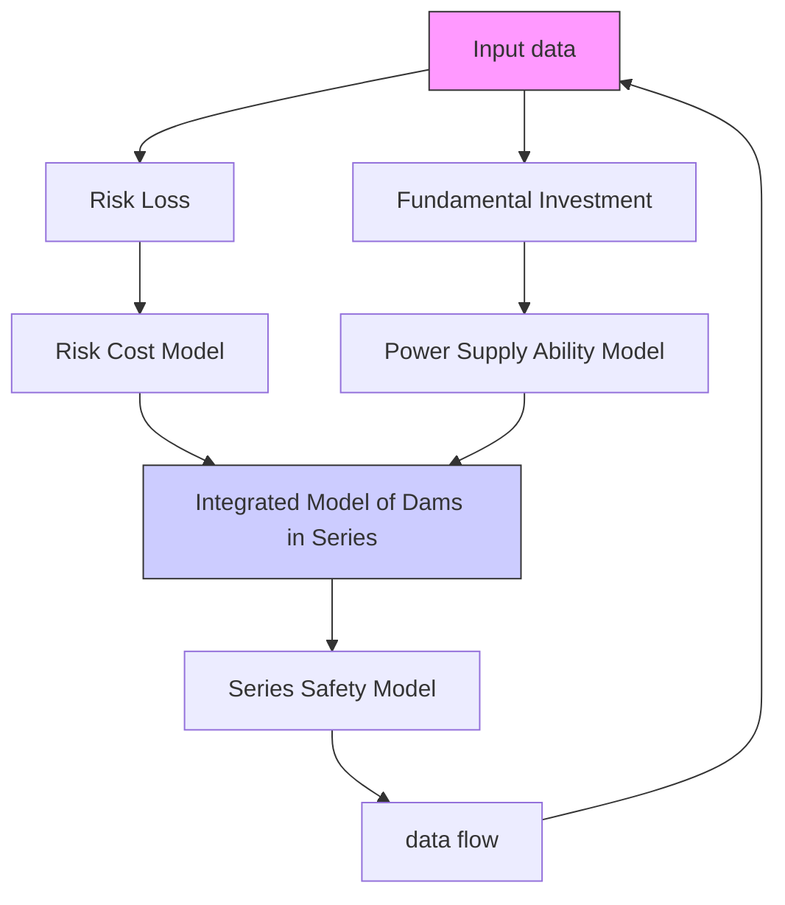

For office use only

T1

T2

T3

T4

Team Control Number

# 55280

Problem Chosen

# A

For office use only

F1

F2

F3

F4

2017

MCM/ICM

Summary Sheet

# iMoDs: A Treatment to the Kariba Dam

# Summary

Located on the Zambezi River, the Kariba Dam holds back the world’s largest reservoir. After so many years, despite efforts to slow its structural problems, the Kariba Dam is in great danger.

To address this situation, our paper provides a detailed analysis of one option, removing the Kariba Dam and replacing it with a series of ten to twenty smaller dams along the river. We propose a model iMoDS(Integrated Model of Dams in Series) to fully analyze different aspects, such as the number, placement, and height of the new dams. In the meantime, we can set the total water management capabilities as same as the existing dam, providing protection and water management options for Lake Kariba.

We first analyze the water flow using Manning formula which helps us to analyze a single dam. After that, we simulate a dam in real life with 3ds MAX, show the simplified dam model on it and derive its storage capacity and building cost.

iMoDS model consists of three main submodels, Risk Cost Model, Power Supply Ability Model, and Series Safety Model. For explanation, there is a figure which connects all related parts together.

Risk Cost Model aims at every single dam. It implements risk analysis, using acceptable risk ratio, Pf . Thus, it can make a good balance between cost and safety.

Power Supply Ability Model also aims at every single dam, the sum of which measures the benefits our dam system can produce.

Series Safety Model measures how safe the whole system is, based on an ideal distribution of dams along a river.

Then we use AHP to analyze these three submodels and propose iMoDS.

To get enough data, we surveyed the literature and other sources. Using genetic algorithm to determine the number and placement, we further solve each dam’s height.

Another section of our paper discusses strategies for addressing several situations, including the balance between safety and costs, protection for Lake Kariba, guidances for emergency water flow situations and extreme water flows.

In the end, we make sensitivity analysis and discuss strengths and weaknesses.

Keywords: dam series; water flow; risk analysis; integrated model; dam control strategy

# iMoDs: A Treatment to the Kariba Dam

January 23, 2017

# Contents

# 1 Introduction 3

1.1 Problem Background . 3   
1.2 Our Work . . 3

# 2 Assumptions 4

# 3 Nomenclature 4

# 4 Statement of our Model 4

4.1 Behavior of Water Flow . . 5   
4.2 Analysis of A Single Dam 5   
4.3 iMoDS: Integrated Model of Dams in Series . . 7

4.3.1 Prerequisites . . . . 7   
4.3.2 Risk Cost Model 8   
4.3.3 Series Safety Model . . . . . 9   
4.3.4 Power Supply Ability Model . . . . 10   
4.3.5 Integration . . . . . . 10   
4.3.6 Ranking Submodels with AHP . . . . 11

# 5 Implementation 12

5.1 Data . 12   
5.2 Number and placement of the new dams 13

5.2.1 Whole Procedures 13   
5.2.2 Determining the number and placement by genetic algorithm . . . 13   
5.2.3 Determining the height of each dam . . . . 15

# 6 Strategies 16

6.1 A Balance Between Safety and Costs . . 16

6.2 Protection for Lake Kariba . . 17   
6.3 Guidance for Emergency Water Flow Situations 17   
6.4 Guidance for Extreme Water Flows . . 18

# 7 Model Analysis 19

7.1 Sensitivity Analysis . . 19

7.1.1 Impact of Planned Working Years N for a Dam . . . . . . . . . . . . 19   
7.1.2 Impact of Extreme Condition ratio α . . . . 19

7.2 Strengths and Weaknesses . 20

7.2.1 Strengths . . . . . . 20   
7.2.2 Weaknesses . . 20

# 8 Conclusion 20

# Brief Assessment Report 21

Option 1: Repairing the existing Kariba Dam . 21   
Option 2: Rebuilding the existing Kariba Dam 22   
Option 3: Removing the Kariba Dam and replacing it with a series of ten to twenty smaller dams along the Zambezi River . . 22

# Appendices 24

# Appendix A Implemented Genetic Algorithm 24

# Appendix B Fitness Function 24

# 1 Introduction

# 1.1 Problem Background

Over fifty years ago, a giant was born on the Zambezi river, along the border between Zimbabwe and Zambia. It provides the two countries with a huge amount of hydropower. The world’s largest reservoir is held by it. This giant was named as Kariba Dam.


<details>
<summary>natural_image</summary>

Exterior view of a large concrete dam spanning a reservoir, surrounded by green hills and vegetation (no signage or text visible)
</details>

Figure 1: Kariba Dam

Kariba Dam is a double curvature concrete arch dam with 128 metres (420 ft) tall and 579 metres (1,900 ft) long. It was designed to have six spillway gates, which have a discharge capacity of 9500m3/s. Total storage, or overall water management capabilities, is up to $1 8 0 . { \dot { 6 } } k m ^ { 3 } .$ . [1].

Kariba was designed as a single prupose hydropower project, but as it turned out both fishery and tourism bacame important benifits [1]. Since it was built, this dam is more a landmark than an actual dam for tourists. This area provides them with water sports and sufficient wildlife resources. Not to mention the fact that Kariba water helps develop the industry of agriculture and fishing. Every coin has two sides. Despite these economical benefits, there are other great environmental impacts, like population displacement and resettlement, and drowned vegetation. [2]

However, such a great construction is in great danger and dire need of maintenance. Kariba is threatned by severe droughts, which has lowered the reservoir’s volume to twelve percent of the capacity. What makes the situation more complicated is that if we refill the reservoir, then the dam is very likely to collapse. Due to unexpected floods and climate changes, the dam seems to be greatly dangerous.

# 1.2 Our Work

To address this situation, we have three different options: repairing, rebuilding, or removing the existing Kariba Dam and replacing it with a series of ten to twenty smaller

dams along the Zambezi River.

In this paper, we focus on the last option and provide a detailed analysis of it. We propose an integrated model of dams in series. This model not only recommends the number and placement of the dams along the Zambezi River, but also make a balacne between safety and costs. Our system have the same overall water management capabilities as the existing Kariba Dam while providing greater levels protection and water management options for Lake Kariba.

In Section.2, we state several basic assumptions. Section.3 contains the nomenclature used in model statement. Section.4 provides sufficient details about our model. Section.5 carrys out experiment and analysis about our proposed model. Section.6 provides detailed strategies dealing with several conditions. At last, we further study our model in Section.7 and make some conclusions in Section.8.

# 2 Assumptions

Our model makes the following assumptions:

1. In the phase of modeling, we don’t consider extreme conditions on the river, like waterfalls, water cutoff seasons. Because these conditions require extremely big data. They are even unnecessary for in real life dams have dynamic strategies to handle them. We will discuss emergency water flow situations in another Section.   
2. Other existing dams are ignored. They are not as big as Kariba Dam. Few data about other dams on the river are accessible, especially thier effects on runoff of the river and slope of its hydraulic grade line. This assumption is flexible because it only affects the input data of the river, but not our model.   
3. We simplifies the water flow into an open-channel flow. Open-channel flow has a free surface. Based on this assumption, we are able to estimate the average velocity of the river’s water flow.

# 3 Nomenclature

In this paper we use the nomenclature in Table.1 to descibe our model. Other symbols that are used only once will be described later.

# 4 Statement of our Model

In this section, we will discuss all details about our model. This model takes several fields into consideration, ranging from liquid flow theory to economy. To begin with, we first investigate the behavior of water flow. Then we provide our integrated model of dams in series. This model makes a great balance between safety and costs.

Table 1: Nomenclature 

<table><tr><td>Symbol</td><td>Definition</td></tr><tr><td>i</td><td>theithdam in a series of small dams</td></tr><tr><td>Xi</td><td>Distance from the river&#x27;s beginning to dam i</td></tr><tr><td>Series(X)</td><td>Value of safety evaluation under a series of dams</td></tr><tr><td>Supply(Xi)</td><td>Value of power supply ability at dam i</td></tr><tr><td>Risk(Xi)</td><td>Risk Cost of dam i</td></tr><tr><td>Pf</td><td>Acceptable risk ratio</td></tr><tr><td>Q(Xi;t)</td><td>Volumetric flow rate at time t for dam i</td></tr><tr><td>k(Xi)</td><td>Slope of the hydraulic grade line at dam i</td></tr><tr><td>N</td><td>Planned working years for a dam</td></tr><tr><td>n</td><td>Number of small dams</td></tr><tr><td>M</td><td>Overall water management</td></tr><tr><td>L</td><td>Length of the Zambezi River</td></tr><tr><td>d</td><td>The width of the Zambezi River</td></tr><tr><td>α</td><td>Extreme Condition ratio</td></tr><tr><td>h(Xi)</td><td>The height of a dam i</td></tr></table>

# 4.1 Behavior of Water Flow

In our model, we need to calculate power supply ability of each dam. One of the key variables is the average velocity of water flowing when it reaches a dam. We have assumed the water flow in the Zambezi river to be a channel flow. Thus, we can employ an empirical formula, the Manning formula, to estimate this velocity. [3]

$$
v = \frac {k}{n} R _ {h} ^ {2 / 3} S ^ {1 / 2} \tag {1}
$$

where:

• v is the cross-sectional average velocity;   
• n is the Gauckler-Manning coefficient;   
• $R _ { h }$ is the hydraulic radius $( L ; f _ { t } , m ) ;$   
• S is the slope of the hydraulic grade line or the linear hydraulic head loss $( L / L ) ;$   
• k is a conversion factor between SI and English units.

This formula can be obtained by use of dimensional analysis. With this formula, it is easy to find that when water flow reaches a dam, its average velocity only depends on the channel slope S and hydraulic radius $R _ { h }$ .

# 4.2 Analysis of A Single Dam

Figure.2 is the simulation of a dam in real life. We determine a reservoir’s storage capacity based on this model. In the literature, Cone method [4] is a common method. Its formula is:

$$
C A (X _ {i}) = \sum_ {i = 0} ^ {n} \frac {1}{3} (A _ {i} + A _ {i + 1} + \sqrt {A _ {i} \times A _ {i + 1}}) \times \triangle L _ {i}
$$


<details>
<summary>natural_image</summary>

3D architectural rendering of a building interior with labeled dimensions (d, h), showing structural layout and floor plan (no text or symbols beyond labels)
</details>

Figure 2: A Simulation of a dam with 3ds MAX

where:

• $V$ is the capacity of reservoir;   
• $A _ { i }$ is the area of ith cross section;   
• $\triangle L _ { i }$ is the gap between ith and i+1th cross section.

For simplicity, we further consider that a reservoir has the areas enclosed by contours in Figure.2, which is colored in black. We use the parameter d to denote the width of the river. Thus, we derive the capacity formula:

$$
\begin{array}{l} C A (X _ {i}) = \frac {1}{3} (\frac {1}{2} d \times h + d \times h) \times \frac {h (X _ {i})}{k (X _ {i})} \\ = \frac {h (X _ {i}) ^ {2}}{3 k (X _ {i})} (\frac {3}{2} d) \\ = \frac {h \left(X _ {i}\right) ^ {2} d}{2 k \left(X _ {i}\right)} \tag {2} \\ \end{array}
$$

The other key measurement is a dam’s building cost.

A basic function contains two parts, construction cost and other unavoidable cost. Construction cost is linear to the volume of the dam. To calculate this volume, we need the bottom width. Actually it is linear to the pressure $P _ { a } = \rho g h \left[ 5 \right]$ .

Note that here we calculate the volume of the dam, but not the volume of the reservoir that is calculated by Equation.2.

Finally, it is reasonable to simplify other cost to a constant $\beta ,$ , because every construc-

tion work has its initial cost. And there is a safety factor for compressive stress σ [5].

$$
\begin{array}{l} C o s t (X _ {i}) = \lambda \frac {\rho g h (X _ {i}) \times d \times h (X _ {i})}{2 \sigma} + \beta \\ = \lambda \frac {\rho g d h (X _ {i}) ^ {2}}{2 \sigma} + \beta \tag {3} \\ \end{array}
$$

where λ a is volume-to-expense coefficient.

# 4.3 iMoDS: Integrated Model of Dams in Series

After investigating water’s behavior when it reaches a dam and a single dam, we further proposed an integrated model of dams in series. This model consists of three main parts, Risk Cost Model, Power Supply Ability Model, and Series Safety Model. As illustrated in Figure.3, our model works as an integrated machine which evaluate both a single dam and the whole group. Basically, we can regard it as a nonlinear programming method. Three main parts work as three features derived from different fields. They are also assigned with different weights according to their own contribution to the whole system.

# 4.3.1 Prerequisites

# 1. $Q ( X _ { i } ; t )$

The value of $Q ( X _ { i } ; t )$ is volumetric flow rate at time t for dam i. In our modeling phase, for simplication we replace $Q ( X _ { i } ; t )$ with $Q ( X _ { i } ; \bar { t } )$ to denote the annual average volumetric flow rate. In our paper, d remains the same, so volumetric flow rate upstream is greater than the one downstream.

Later we will further discuss and provide specific guidance for extreme water flows ranging from maximum expected discharges to minimum expected discharges.


<details>
<summary>flowchart</summary>


</details>

Figure 3: Overview of Integrated Model of Dams in Series

2. k(Xi) = dElevation(x) | $\begin{array} { r } { 2 . \ k ( X _ { i } ) = \frac { \mathrm { d } E l e v a t i o n ( x ) } { \mathrm { d } x } | _ { x = X _ { i } } } \end{array}$

The placement of each dam is described by the distance from the river’s starting point, $X _ { i }$ . We set the slope of the hydraulic grade line at dam i as the value of $k ( X _ { i } )$ .

More details about $k ( X _ { i } )$ will be discussed in Section.5.1.

# 4.3.2 Risk Cost Model

As Figure.3 shows, Risk Loss and Fundamental Investment determine the output of Risk Cost Model. To build a dam, there are two key factors that we should keep in mind: cost and safety. However, before we try to find an equilibrium between them, we have to change it into a math problem. Here we combine them based on risk analysis, a widely used theory in economics. Based on this theory, we numerically determine the safety loss and fundamental cost with an acceptable risk ratio. Because acceptable risk ratio measures the extent that a person focus more on safety than merely cost.

Cost - Fundamental Investment Cost reveals how feasible a dam project is. Investors always expect to spend less money while maintaining the same water management ability. A ground truth is that investors must spend more money while paying more attention on safety. Thus, $P _ { f }$ is negatively related to the cost. Its exponent is set by experiment. Slightly modify Equation.3, then it is the equation we need here:

$$
\text { Fundamental   Investment } = \frac {\operatorname{Cost} (X _ {i})}{P _ {f} ^ {1 . 1}} \tag {4}
$$

Given $P _ { f }$ , Equation.4 can measure one dam’s fundamental investment.

Safety - Risk Loss Safety reveals how environmental-friendly a dam project is. Projects that pay less attention on safety will result in a high possibility of collaspe. We call it Risk Loss. Equation.5 is the evaluation model. $[ 1 - ( \bar { 1 } - \bar { P } _ { f } ) ^ { N } ]$ is the probability distribution that measures the possibility to collapse. So, we define the loss at dam i as:

collapse probability \* (1+ indirect damage index)\*Volumetric flow rate

$$
\text { Risk   Loss } = [ 1 - (1 - P _ {f}) ^ {N} ] \alpha (1 + \lambda) Q (X _ {i}; \bar {t}) \tag {5}
$$

where α is an coefficent that reveals how likely and serious a river is to suffer from extreme conditions.

This method contributes to the evolution of risk-based dam safety assessment methods.

$$
\operatorname{Risk} \left(X _ {i}\right) = \text { Risk   Loss } + \text { Fundamental   Investment }
$$

Figure.4 shows the function of $P _ { f }$ and Risk Value. Curves with different colors denote different value of $\alpha .$ . From top to bottom, each time α is decreased by 0.05.


<details>
<summary>line</summary>

| Pf (Acceptable Risk Ratio) | α=0.50 | α=0.55 | α=0.60 | α=0.65 | α=0.70 | α=0.75 | α=0.80 | α=0.85 | α=0.90 | α=0.95 | α=1.00 |
| -------------------------- | ------ | ------ | ------ | ------ | ------ | ------ | ------ | ------ | ------ | ------ | ------ |
| 0.00                       | 2.0    | 2.0    | 2.0    | 2.0    | 2.0    | 2.0    | 2.0    | 2.0    | 2.0    | 2.0    | 2.0    |
| 0.01                       | 1.2    | 1.3    | 1.4    | 1.5    | 1.6    | 1.7    | 1.8    | 1.9    | 2.0    | 2.1    | 2.2    |
| 0.02                       | 1.5    | 1.7    | 1.9    | 2.1    | 2.3    | 2.5    | 2.7    | 2.9    | 3.1    | 3.3    | 3.5    |
| 0.03                       | 1.8    | 2.1    | 2.4    | 2.7    | 3.0    | 3.3    | 3.6    | 3.9    | 4.2    | 4.5    | 4.8    |
| 0.04                       | 2.1    | 2.5    | 2.9    | 3.3    | 3.7    | 4.1    | 4.5    | 4.9    | 5.3    | 5.7    | 6.1    |
| 0.05                       | 2.4    | 2.9    | 3.4    | 3.9    | 4.4    | 4.9    | 5.4    | 5.9    | 6.4    | 6.9    | 7.4    |
| 0.06                       | 2.7    | 3.3    | 3.9    | 4.5    | 5.0    | 5.6    | 6.1    | 6.7    | 7.3    | 7.9    | 8.5    |
| 0.07                       | 3.0    | 3.7    | 4.4    | 5.1    | 5.7    | 6.3    | 6.9    | 7.6    | 8.3    | 8.9    | 9.6    |
| 0.08                       | 3.3    | 4.1    | 4.9    | 5.7    | 6.4    | 7.1    | 7.8    | 8.6    | 9.3    | 10.0   | 10.8   |
| 0.09                       | 3.6    | 4.5    | 5.4    | 6.3    | 7.1    | 7.9    | 8.7    | 9.6    | 10.5   | 11.3   | 12.2   |
| 0.10                       | 3.9    | 4.9    | 6.1    | 7.1    | 8.1    | 9.1    | 10.1   | 11.2   | 12.3   | 13.4   | 14.6   |
</details>

Figure 4: Given the same $X _ { i } ,$ the function of $P _ { f }$ and Risk Value with different α

Observation 1 For each curve, it is strictly decreasing on the left while increasing on the right.

Illustraion Risk Value is not a monotonic function because Risk Loss is a monotonically increasing function of $P _ { f }$ while Fundamental Investment is a monotonically decreasing function of $P _ { f }$ .

Observation 2 Compared with different curves, the larger α is, the higher Risk Cost is, with the extreme point moving left.

Illustraion If the coefficient α is larger, then it reveals that for a same $P _ { f }$ the government has to handle higher potential losses. Thus, to balance the fundamental cost and safety, the government will have a lower $P _ { f }$ . That’s exactly what our function reveals.

# 4.3.3 Series Safety Model

Our system removes the Kariba Dam and replaces it with a series of ten to twenty smaller dams. In this model, our goal is to assess a series of dams along the river and give a mark. Researches show that if dams are built uniformly on a river, then this dam system can be operated to produce greater benefits than operating a single large dam.

To quantify safety based on locations, we consider two factors involved. One is the average distance between two neighbouring dams. The other is the degree of even distribution. Here we bring in and modify Pearson Chi-Square test to represent it. The more even this distribution is, the safer we consider this system is. Thus, we get the following formula.

$$
\text { Series } (X) = \frac {\overline {{d}}}{e ^ {\sum_ {i = 1} ^ {n - 1} \frac {(d _ {i} - \overline {{d}}) ^ {2}}{\overline {{d}} ^ {2}}}} \tag {6}
$$

where d is the average distance between two neighbouring dams.

# 4.3.4 Power Supply Ability Model

Kariba was designed as a single-purpose hydropower project. Embarking on any hydropower generation project, it is essential to calculate its amount of hydropower. In our model, the last part is to estimate this kind of economic benefits. If we sum up the power supply of each dam, this model can numerically calculate our new system’s hrdropower supply. Based on the hydropower equation [6], intuitively we get Equation.7 which is a function of the hydraulic head and rate of fluid flow.

How much work a unit of water can do depends on its weight times the head. And the power available from a dam can be measured by the density of water, acceleration due to gravity, the flow rate, and the height of fall.

$$
\operatorname{Supply} \left(X _ {i}\right) = \eta \rho g h \left(X _ {i}\right) Q \left(X _ {i}; \bar {t}\right) \tag {7}
$$

where:

• η is the dimensionless efficiency of the turbine;   
• $\rho$ is the density of water in kilograms per cubic metre;   
• g is the acceleration due to gravity.

# 4.3.5 Integration

Based on previous illustrations, we are able to integrate all these features together.

• Series(X) Positively related to the safety level. The higher Series(X)’s score is, the better our system is.   
• $R i s k ( X _ { i } )$ There is an equilibrium between investment and loss which reaches the lower bound of this model. We always want to save money while ensuring safety. So, the lower ${ \cal R } i s k ( X _ { i } ) ^ { \prime } { \bf s }$ score is, the better our system is.   
• $S u p p l y ( X _ { i } )$ Positively related to power supply. The higher Supply(Xi)’s score is, the better our system is.

To make all features equal, we need feature scaling, or data nomalization, because these features all have a broad range of values. If we don’t process thier value, the result of our integrated model may be governed by one of them. In our model, we implement rescaling method. This method rescale the range of features to sacle the range in [0, 1]. The general formula is like this:

$$
x ^ {\prime} = \frac {x - \min (x)}{\max (x) - \min (x)}
$$

where:

• x is an original value;   
• $x ^ { ' }$ is the normalized value.

After resacling, normalized $S e r i e s ( X _ { i } )$ , $R i s k ( X _ { i } ) ,$ , and $S u p p l y ( X _ { i } )$ is $S e r i e s { ( X _ { i } ) } ^ { \prime } .$ , ${ \mathit { R i s k } } ( X _ { i } ) ^ { ' }$ , and $S u p p l y ( X _ { i } ) ^ { ' }$ respectively. As we can see, $R i s k ( X _ { i } )$ is negatively related. Thus we modify it to be positively related by a modified rescaling method.

$$
\operatorname{Series} (X) ^ {\prime} = \operatorname{Series} (X) \times \frac {n - 1}{L}
$$

$$
\operatorname{Risk} \left(X _ {i}\right) ^ {\prime} = \min \left(\operatorname{Risk} \left(X _ {i}\right)\right) / \operatorname{Risk} \left(X _ {i}\right)
$$

$$
S u p p l y (X) ^ {\prime} = S u p p l y (X) \times \frac {n - 1}{L}
$$

In our model, the goal is to minimize the Final Value. Thus, we scale $S u p p l y ( X _ { i } )$ and $S e r i e s ( X )$ into $[ - 1 , 0 ]$ . Write our model into a nonlinear programming form then we get the Integrated Model of Dams in Series:

$\mathbf { m a x } \quad \mathrm { F i n a l ~ V a l u e } = S e r i e s { ( X ) } ^ { ' } + \sum _ { i = 1 } ^ { n } R i s k { ( X _ { i } ) } ^ { ' } + \sum _ { i = 1 } ^ { n } S u p p l y { ( X _ { i } ) } ^ { ' }$

$\mathbf { s . t } \quad X _ { i } \leq L , \qquad \forall X _ { i } \in [ 1 , n ]$

$$
\sum_ {i = 1} ^ {n} C A (X _ {i}) \geq M
$$

$$
1 0 \leq n \leq 2 0, \quad n \in \mathbb {Z}
$$

$$
X _ {i} \geq 0, \quad \forall X _ {i} \in [ 1, n ]
$$

where:

$$
\text { Final   Value } = \operatorname{Series} (X) ^ {\prime} + \sum_ {i = 1} ^ {n} \operatorname{Risk} \left(X _ {i}\right) ^ {\prime} + \sum_ {i = 1} ^ {n} \operatorname{Supply} \left(X _ {i}\right) ^ {\prime}
$$

$$
= \frac {\overline {{d}}}{e ^ {\sum_ {i = 1} ^ {n - 1} \frac {(d _ {i} - \overline {{d}}) ^ {2}}{\overline {{d}} ^ {2}}}} \times \frac {n - 1}{L} + \sum_ {i = 1} ^ {n} \min (R i s k (X _ {i})) / \{\frac {C o s t (X _ {i})}{P _ {f} ^ {1 . 1}} +
$$

$$
[ 1 - (1 - P _ {f}) ^ {N} ] \alpha (1 + \lambda) Q (X _ {i}; \bar {t}) \} + \sum_ {i = 1} ^ {n} \rho g \eta L k (X _ {i}) Q (X _ {i}; \bar {t})
$$

# 4.3.6 Ranking Submodels with AHP

The analytic hierarchy process (AHP) is a structured technique for organizing and analyzing complex decisions, based on mathematics and psychology. Our goal is to rank previous three submodels and assign weights to iMoDS model.

Table 2: AHP production 

<table><tr><td>Feature</td><td>Weight</td></tr><tr><td>Risk Cost</td><td>0.5403</td></tr><tr><td>Series Safety</td><td>0.3478</td></tr><tr><td>Power Supply Ability</td><td>0.1119</td></tr></table>

Table.2 shows the result of AHP. We then assign them to the model derived in Sec-

tion.4.3.5:

$\begin{array} { r l } { \mathbf { m a x } } & { \mathrm { F i n a l ~ V a l u e } = 0 . 3 5 S e r i e s \left( { X } \right) ^ { \prime } + 0 . 5 4 \displaystyle \sum _ { i = 1 } ^ { n } R i s k \big ( { X } _ { i } \big ) ^ { \prime } + 0 . 1 1 \displaystyle \sum _ { i = 1 } ^ { n } S u p p l y \big ( { X } _ { i } \big ) ^ { \prime } } \\ { \mathrm { s . t } \quad X _ { i } \leq L , \quad } & { \forall X _ { i } \in [ 1 , n ] } \end{array}$

$$
\sum_ {i = 1} ^ {n} C A (X _ {i}) \geq M
$$

$$
1 0 \leq n \leq 2 0, \quad n \in \mathbb {Z}
$$

$$
X _ {i} \geq 0, \quad \forall X _ {i} \in [ 1, n ]
$$

# 5 Implementation

# 5.1 Data

We tried to find some existing dataset about dams, but failed. Thus, in this paper we ourselves analyzed many textual data and figures from reliable sources and experiment with them. Google Earth provide us with the elevation profile of the Zambezi River. We use Matlab to fit a curve which is shown in Figure.5. The set of blue spots is the raw data while the red curve represents the river’s elevation. This curve is fitted as an eighth-power polynomials.

f (Xi) relies on these data.


<details>
<summary>line</summary>

| X    | Altitude |
| ---- | -------- |
| 0    | 1050     |
| 500  | 980      |
| 1000 | 500      |
| 1500 | 350      |
| 2000 | 50       |
| 2500 | 0        |
</details>

Figure 5: The red curve represents the river’s elevation. X-Axis is the distance from the river’s source while Y-Axis is altitude.

Thanks for the basin analysis [7], we are able to analyze the river’s flow data. Figure.6(a) and Figure.6(b) show the Zambezi River mean annual river flow.

$Q ( X _ { i } ; \bar { t } )$ relies on these data.


<details>
<summary>text_image</summary>

Kitwe
Zambia
Malawi
Lilongwe
Lusaka
Harare
Lizhambwa
Zimbabwe
Bulawayo
Beira
Kariba Dam
</details>


<details>
<summary>line</summary>

| x /km | y /km | z /m |
|-------|-------|------|
| 20    | 1000  | 1000 |
| 30    | 800   | 800  |
| 40    | 600   | 600  |
| 50    | 400   | 400  |
| 60    | 200   | 200  |
| 70    | 100   | 100  |
| 80    | 50    | 50   |
| 90    | 25    | 25   |
| 100   | 10    | 10   |
| 110   | 5     | 5    |
| 120   | 2     | 2    |
| 130   | 1     | 1    |
| 140   | 0     | 0    |
</details>

(a) 2D version. It includes surrounding coun-(b) 3D version. It includes the river’s elevation tries and cities. changes.   
Figure 6: Zambezi River’s mean annual river flow. The violet, pink, and yellow bands represents the upstream, midstream, and downstream, respectively. Width of each band measures the value of mean annual river flow.

# 5.2 Number and placement of the new dams

# 5.2.1 Whole Procedures

1. Set all small dams to have equal height;   
2. Use heuristic algorithm, like generic algorithm, to run iMoDS model;   
3. Based on the set $\{ X _ { i } \}$ which is found in Step 2, use Equation.8 to reset each one’s height.   
4. Test constraint by Equation.9. If it doesn’t meet, tune {Xi} and go to Step 3.

# 5.2.2 Determining the number and placement by genetic algorithm

The optimization of a dam group is high dimensional, multilevel, and nonlinear. Classical algorithm that solves linear programming problems are impossible to find the global optimum. Heuristic algorithm, however, can solve this optimization problem. Genetic algorithm(GA), based on a antural selection process that mimics biological evolution, is one of them.

In this section, we give an analysis about the number and placement of dams, and also provide a recommendation. However, if the height of each dam is dynamic, it will be a problem of over 20 dimensions. For simplification we assume that each small dam is in equal size.

Because of the simplification, $h ( X _ { i } )$ is a constant. The whole evaluation is sensitive to the variables, $\{ X i \} , P _ { f }$ and n. To find the optimal solution, we use genetic algorithm to simulate the evaluation process. Codes are listed in Appendices.

Weights of three key features have been provided by AHP. Risk Cost dominates the other two features. To maximum $\frac { \operatorname* { m i n } { R i s k ( X _ { i } ) } } { R i s k ( X _ { i } ) }$ and meet the constraint, total water management M , the algorithm will select $P _ { f }$ to an optimal value which has been introduced in Figure.4, i.e., locating dams to relatively gentle slopes. Although Power Supply takes a small weight, the value will greatly increase when the dam is on a steep terrain. Finally, Series is more likely to let these dams in a evenly distribution. Considering the interaction between three features, the final placement shows like Figure.7.


<details>
<summary>area</summary>

| n  | x/km | altitude/m |
|----|------|------------|
| 10 | 0    | ~1100      |
| 10 | 500  | ~1000      |
| 10 | 1000 | ~600       |
| 10 | 1500 | ~400       |
| 10 | 2000 | ~200       |
| 11 | 0    | ~1100      |
| 11 | 500  | ~950       |
| 11 | 1000 | ~550       |
| 11 | 1500 | ~350       |
| 11 | 2000 | ~150       |
| 12 | 0    | ~1100      |
| 12 | 500  | ~850       |
| 12 | 1000 | ~450       |
| 12 | 1500 | ~250       |
| 12 | 2000 | ~100       |
| 13 | 0    | ~1100      |
| 13 | 500  | ~750       |
| 13 | 1000 | ~350       |
| 13 | 1500 | ~150       |
| 13 | 2000 | ~50        |
| 14 | 0    | ~1100      |
| 14 | 500  | ~650       |
| 14 | 1000 | ~250       |
| 14 | 1500 | ~75        |
| 14 | 2000 | ~25        |
| 15 | 0    | ~1100      |
| 15 | 500  | ~550       |
| 15 | 1000 | ~150       |
| 15 | 1500 | ~35        |
| 15 | 2000 | ~7         |
| 16 | 0    | ~1100      |
| 16 | 500  | ~450       |
| 16 | 1000 | ~25        |
| 16 | 1500 | ~45        |
| 16 | 2000 | ~8         |
| 17 | 0    | ~1100      |
| 17 | 500  | ~35        |
| 17 | 1000 | ~7         |
| 17 | 1500 | ~35        |
| 17 | 2000 | ~3         |
| 18 | 0    | ~1100      |
| 18 | 500  | ~25        |
| 18 | 1000 | ~3         |
| 18 | 1500 | ~2         |
| 18 | 2000 | ~2         |
| 19 | 0    | ~1100      |
| 19 | 500  | ~7         |
| 19 | 1000 | ~2         |
| 19 | 1500 | ~2         |
| 19 | 2000 | ~2         |
| 20 | 0    | ~1100      |
| 20 | 500  | ~3         |
| 20 | 1000 | ~2         |
| 20 | 1500 | ~2         |
| 20 | 2000 | ~2         |
</details>

Figure 7: Best placement of new dams with different quantity of dams

Figure.8 shows that when $n = 1 3$ and $P _ { f } = 0 . 0 0 2 4$ , the evaluation reaches the peak value, or the optimal value. It is cogent for our model.

This result is convincing. If the quantity of dams n increases, then:

1. $\sum { \frac { \operatorname* { m i n } ( R i s k ( X _ { i } ) ) } { R i s k ( X _ { i } ) } }$ min(Risk(Xi))Risk(X ) decreases. Although the height of each dam is smaller, sum of ini- Risk(Xi) tial cost $\beta$ increases.   
2. $\sum S u p p l y ( X _ { i } )$ increases and then decreases. With n increasing, the ideal hydropower supply goes higher. But when n goes to large, Series(X) will restrict it to goes

Table 3: Accurate placement of dams when $n = 1 3$ and $P _ { f } = 0 . 0 0 2 4$ 

<table><tr><td>Order of Dam</td><td>Distance  $X_i/m$ </td><td>Elevation/m</td></tr><tr><td>1</td><td>288.3</td><td>1160.2</td></tr><tr><td>2</td><td>494.5</td><td>1136.3</td></tr><tr><td>3</td><td>664.4</td><td>1084.55</td></tr><tr><td>4</td><td>810.0</td><td>1057</td></tr><tr><td>5</td><td>843</td><td>932</td></tr><tr><td>6</td><td>879</td><td>790</td></tr><tr><td>7</td><td>954</td><td>651</td></tr><tr><td>8</td><td>1160</td><td>638</td></tr><tr><td>9</td><td>1323</td><td>520</td></tr><tr><td>10</td><td>1552</td><td>468</td></tr><tr><td>11</td><td>1729</td><td>453</td></tr><tr><td>12</td><td>1924</td><td>257</td></tr><tr><td>13</td><td>2098</td><td>195</td></tr></table>


<details>
<summary>line</summary>

| n  | Risk Cost | Power Supply | 0.5Cost+0.5Supply |
|----|-----------|--------------|-------------------|
| 10 | 0.7       | 0.3          | 0.5               |
| 11 | 0.65      | 0.35         | 0.51              |
| 12 | 0.6       | 0.44         | 0.53              |
| 13 | 0.58      | 0.49         | 0.54              |
| 14 | 0.55      | 0.50         | 0.52              |
| 15 | 0.5       | 0.49         | 0.5               |
| 16 | 0.45      | 0.47         | 0.48              |
| 17 | 0.4       | 0.44         | 0.46              |
| 18 | 0.35      | 0.41         | 0.43              |
| 19 | 0.3       | 0.38         | 0.4               |
| 20 | 0.25      | 0.36         | 0.33              |
</details>

Figure 8: Trend of Final Value with n increasing

lower.

3. Series(X) is not relevant to the quantity of n.

Thus, in this decision-making process, there is an equilibrium between ten and twenty. We find that it is $\mathbf { n = 1 3 }$ with $\mathbf { P _ { f } } = \mathbf { 0 . 0 0 2 4 }$ .

Table.3 shows the optimal result of this new dam system. From dam 1 to dam $^ { 1 3 , }$ we recommend each dam’s placement. Note that Distance $X _ { i }$ denotes the distance from the river’s source to dam i. Due to the restriction in this nonlinear programming, the overall water management capacities is the same as the existing Kariba Dam.

# 5.2.3 Determining the height of each dam

Here we eliminate the assumption that each small dam is in equal size. If we refer to Section.4.2, the height of a dam is really a key factor to the final evaluation as it influences the system’s risk cost and power supply that these dams can totally provide. It is critical to determine the height of each dam so that the system’s final value can be optimized. Given $P _ { f } ,$ a single dam’s contribution to the whole system(iMoDS model) is a function of one variable, $h ( X _ { i } )$ . So we can ignore Series $( X _ { i } )$ . To optimize the contribution, let the


<details>
<summary>bar_line</summary>

| Year | Area (m) |
| :--- | :--- |
| 1990 | 27.7 |
| 1994 | 29.2 |
| 1998 | 30.3 |
| 2002 | 32.1 |
| 2006 | 38.2 |
| 2010 | 40 |
| 2014 | 42 |
| 2018 | 37.9 |
| 2022 | 27.6 |
| 2026 | 26.1 |
| 2030 | 25.8 |
| 2034 | 25.4 |
| 2038 | 24.6 |
(2098,195) (1924,257) (1729,453) (1552,468) (1323,520) (1060,638) (954,651) (879,790) (843,932) (810,1057) (664,1084) (494,1136) (228,1160) (494,1136) (27.7m)
</details>

Figure 9: Placement of 13(optimal quantity) dams along the Zambezi River. Each dam is labelled with its height. The blue areas are each dam’s corresponding reservoirs.

differential equation to be zero:

$$
S u p p l y (X _ {i}) ^ {\prime} - R i s k (X _ {i}) ^ {\prime} = 0
$$

$$
\eta \rho g Q (X _ {i}; \bar {t}) - \lambda \frac {2 \rho g d h (X _ {i})}{2 \sigma P _ {f} ^ {1 . 1}} = 0
$$

$$
h (X _ {i}) = \frac {\eta \sigma P _ {f} ^ {1 . 1}}{\lambda d} Q (X _ {i}; \bar {t}) \tag {8}
$$

We can find that with $Q ( X _ { i } ; \bar { t } )$ increasing, the best $h ( X _ { i } )$ increases. However, there is a constraint to $h ( X _ { i } )$ .

$$
\sum_ {i = 1} ^ {n} C A (X _ {i}) = \sum_ {i = 1} ^ {n} \frac {h (X _ {i}) ^ {2} d}{2 k (X _ {i})} \geq M \tag {9}
$$

1. If our optimal $\{ X _ { i } \}$ meets the constraint, Equation.9, then it is the final result.   
2. Else, we can slightly modify $X _ { i }$ to meet the constraint.

Thus, Final Value of iMoDS model and each dam’s height are both determined by $\{ X _ { i } \}$ .

Figure.9 is our final result of placement and number.

# 6 Strategies

# 6.1 A Balance Between Safety and Costs

Our new multiple dam system is modeled based on three key factors, Risk Cost, Power Supply, and Series Safety. Risk Cost fully considers the balance between safety and costs by acceptable risk ratio $P _ { f }$ . Series Safety further investigates the safety of a dam group. Thus, our system is well-balanced. What’s more, we also take benefits into consideration.

# 6.2 Protection for Lake Kariba

Now we take the ability of protecting Lake Kariba into consideration. In the former section, we degenerate this factor to the total volume of the reservoirs. However, we find it is reasonable to evaluate it with the relative distance between a reservoir and the lake. We finally determined to use a gentle Gaussian curve to give a weight of each dam.

$$
\text { Protection } = \sum_ {i = 1} ^ {n} C A (X _ {i}) N (X _ {\text { Lake }}, \sigma^ {2}) \tag {10}
$$

where $X _ { L a k e }$ is the location of Lake Kariba, σ is a fitting factor.

To as greatly as possible increase the total Protection to the River, we can build dams near the lake with more capacity,i.e., stronger ability of management of the water.

When it is the period of the dry season, the lower dams near Lake Kariba should start to reserve water and higher dams start to discharge water untill this season passes. On the contrary, when it is the wet season, the behavior of dams near the lake are opposite to the former condition.

We also need to consider the ecosystem of the lake, so dams near the lake need to be designed carefully to minimize the damage to the environment.

# 6.3 Guidance for Emergency Water Flow Situations

Emergency water flow situation(i.e. flooding and prolonged low water conditions) can generate catastrophe. Flood water may wash away any cities downstream and cause considerable loss of life. Extreme low water conditions could destory many fields of a country. To ensure the safety of our new dam system, we will provide the ZRA managers with specific guidance.

The aim of this guidance is prevent an uncontrolled release of water from reservoirs.

For flood control, our objective is to maintain as much control over flows entering the system above a critical flood-prone reach as possible. [8]

Method Filling the upper reserviors first and emptying the lower reservoirs first.

An illustration of this method has been studied [9]. Flood storage at the reservoir close to upstream provides greater flood controlability than the lower reservoirs.

However, an exception is that if the lower reservoir’s outflow capacity is restricted, then it is better to fill the lower reservoir first to increase head on the outlet. In this way we can increase the release capacity from the entire sistem to the downstream channel capacity. This exception is prepared for some extremely serious floods.

For prolonged low water conditions, our objective is to maintain the river runoff.

Method Emptying the reservoirs from lower ones to higher ones

In this kind of periods, the river’s natural runoff is considerably smaller than annual water runoff. We must take advantage of the dam system’s capability of dynamic scheduling. In other owrds, we maintain the river’s minimum runoff by compensative regulation. Empty the reservoirs downstream first can avoid people’s water shortage while enabling reservoirs upstream to store water.

# 6.4 Guidance for Extreme Water Flows

In our previous analysis, we use $Q ( X _ { i } ; \bar { t } )$ to denote the annual water flow. However in real life, $Q ( X _ { i } ; t )$ should be a function of time t. Along the Zambezi River there is a dry season and a wet season.

# 1. Dry Season

It is clear that the dam system need to discharge in dry season. First, we suppose that dry season lasts for time T . At the beginning of the dry season all reservoirs have reached their full capacities. Second, we introduce three parameters,p, k, and m. p denotes the speed of discharging. k denotes the rate of lost water because of evaporation and washing away. m is the amount of remaining water. The problem is then simplified as an expression of discharging all reserved water during the dry season with some speed.

$$
\frac {\mathrm{d} m}{\mathrm{d} t} = - p - k m
$$

Solve this function, we get:

$$
m = \frac {c e ^ {- k t} - p}{k}
$$

$\operatorname { L e t } m ( 0 ) = M , m ( T ) = 0$

$\mathrm { T h e n } p = { \frac { M k e ^ { - k T } } { 1 - e ^ { - k T } } }$ Then p = 1 − e−kT M ke−kT

Now we qualitatively analyze this discharging speed. Because the water in the upper reservoirs is shared by all the terrain along the river. On the contrary, the water of the reservoirs downstream is only used by relatively small terrain. It is reasonable that in the dry season, the reservoirs upstream have a larger speed than those downstream. And the average speed of the whole system is p.

# 2. Wet Season

It has a high rainfall in wet season, so we need to charge reservoirs to avoid great increment of the level of riverway and prepare for the next dry season. We can assume that rainfall is uniformly distributed along the whole river. The upper reservoirs must start to store water first. Because if a reservoir downstream first to start storing water, $Q ( X _ { i } ; t )$ will be too large and leads to great risk and waste of water.

# 7 Model Analysis

# 7.1 Sensitivity Analysis

Our iMoDS model contains several parameters. We determine some of the parameters through least square fitting, some of them by knowledge in the literature, and other methods. In this section, we would like to produce a sensitibity analysis to show whether our model is sensitive to different values of parameters.

We will study the impact of two importnant parameters in our model.

# 7.1.1 Impact of Planned Working Years N for a Dam


<details>
<summary>line</summary>

| Pf (Acceptable Risk Ratio) | N=50   | N=60   | N=70   | N=80   | N=90   | N=100  |
| -------------------------- | ------ | ------ | ------ | ------ | ------ | ------ |
| 0.00                       | 1.6    | 1.5    | 1.4    | 1.3    | 1.2    | 1.1    |
| 0.01                       | 0.5    | 0.6    | 0.7    | 0.8    | 0.9    | 1.0    |
| 0.02                       | 1.2    | 1.3    | 1.4    | 1.5    | 1.6    | 1.7    |
| 0.03                       | 1.8    | 1.9    | 2.0    | 2.1    | 2.2    | 2.3    |
| 0.04                       | 2.2    | 2.3    | 2.4    | 2.5    | 2.6    | 2.7    |
| 0.05                       | 2.4    | 2.5    | 2.6    | 2.7    | 2.75   | 2.8    |
| 0.06                       | 2.5    | 2.6    | 2.7    | 2.75   | 2.8    | 2.85   |
| 0.07                       | 2.6    | 2.7    | 2.75   | 2.8    | 2.85   | 2.9    |
| 0.08                       | 2.65   | 2.75   | 2.8    | 2.85   | 2.9    | 2.95   |
| 0.09                       | 2.7    | 2.8    | 2.85   | 2.9    | 2.95   | 3.0    |
| 0.10                       | 2.75   | 2.85   | 2.9    | 2.95   | 3.0    | 3.05   |
</details>

Figure 10: Given the same $X _ { i } ,$ the function of $P _ { f }$ and Risk Value with different N

N is set to be 50 and not changed ever since. In the literature, a dam over 50 years old is defined to be dangerous. The Kariba Dam is one of them. We vary this value from 50 to 100 by 10. Figure.10 proves that the trends of Risk Loss remains to be the same. Therefore, we come to the conclusion that our model is not sensitive to N.

# 7.1.2 Impact of Extreme Condition ratio α

Figure.4 shows the sensitivity analysis of α. To avoid repetition, we don’t illustrate it here again.

# 7.2 Strengths and Weaknesses

# 7.2.1 Strengths

1. Use accurate data of the Zambezi River. From the very beginning of our analysis, we emphasize on mining useful data. Only with these dependable data, we can conclude that the model we built is appropriate.   
2. Design a novel and innovative evaluation rules of dam construction. We used methods across disciplines to give an integrated evaluation function of dams. AHP and GA are leveraged in our simulation which can provide reliable results of the model.   
3. Use fancy visualization to display our model.

# 7.2.2 Weaknesses

1. Heuristic algorithm has randomness. Because of the high dimensional constraint, we used GA as our simulation algorithm. We cannot always get the optimal results for the sites selection   
2. Some real water conditions are omitted. We simplified the river as an open channel. However, the real condition is much more complex. It will also influence the construction cost and safety evaluation.   
3. Lacking details of the trade-off function. We paid an emphasis on the balance between cost and safety. Though we have added power supply to our model, it still lacks other benefits of dam construction.

# 8 Conclusion

Our papaer provides a detailed analysis of removing the Kariba Dam and replacing it with a series of ten to twenty smaller dams along the river. Before introducing the model, we analyze water flow and a single dam. Then our model iMoDS is proposed. It takes safety, cost, and benefits into consideration and makes a balance of them. Three submodels, Risk Cost Model, Power Supply Ability Model, and Series Safety Model, form the integrated model.

We use real data to give a recommendation as to the number, placement, and height of the new dams. For this is a high dimensional problem, we implement GA to find a global optimum result.

Strategies are fully discussed. Balance between safety and costs have been inlcuded in the integrated model. Protection for Lake Kariba uses Gaussian curve to give a weight of each dam. And two guidances include specific instructions of the dam group when facing these conditions.

# Brief Assessment Report

The Kariba Dam, which was opened in 1959 and held back the world’s largest reservoir, has been working for over 50 years and faces the possibility of callapse. Also serving as a major supply of Zambia and nearby contries’ electricity, it is in dire need of maintenance. To deal with this situation, there are three major options available to the Zambezi River Authority (ZRA). For each option, we will access its potential cost nemurically and provide other aspects of information.

In the literature, the rate of failure for dams has been studied. With Bayesian analysis approach, researchers [10] evaluated the dam failure rate uncertainty. They found universal failure rate to be steady and got the value of $3 \times 1 0 ^ { - 4 } ,$ . However, we investigate the whole life cycle of a dam. Its failure rate [11] should be a function of time t, denoted as FR(T)

$$
F R (T) = \left\{ \begin{array}{l l} 3 \times 1 0 ^ {- 4} & \text { if } 0 \leq T <   5 0 \text { years } \\ 1 - e ^ {- (\frac {t + 1 4 3 . 6 7}{1 0 0}) ^ {3}} & \text { if } T \geq 5 0 \text { years } \end{array} \right. \tag {11}
$$


<details>
<summary>line</summary>

| year | rate of failure |
| ---- | --------------- |
| 0    | 0.03            |
| 10   | 0.03            |
| 20   | 0.03            |
| 30   | 0.03            |
| 40   | 0.03            |
| 50   | 0.03            |
| 60   | 0.13            |
</details>

Figure 11: A Dam’s Failure Rate

Figure.11 shows a dam’s failure rate with the change of years.

# Option 1: Repairing the existing Kariba Dam

Once mechanized systems supplant natural ones, they must be managed in perpetuity, or else they break down [12]. In the past fifties years, the torrents has been consistantly eroding the dam’s structure. The first option is to repair this existing giant.

Potential Cost One report [13] said that expected cost will be \$294 million this time. However, repair can handle current situation but never eliminate the potential danger. Thus, we explore an expectation of future failure rate by modifying Equation.11

$$
F R _ {r e p a i r} (t) = 1 - e ^ {- \left(\frac {t + 1 4 3 . 6 7}{1 0 0}\right) ^ {3}}, \tag {12}
$$

where t = how many years have passed since last repair.

Thus, given a specific year Y and annual cost of repair C, the potential costs will be:

$$
2 9 4 + C \times \int_ {0} ^ {Y - 2 0 1 7} F R _ {\text { repair }} (t) \mathrm{d} t \tag {13}
$$

Benefits Repair significantly saves the construction period.It doesn’t affect hydro power supply which is generated from the reservior.

Shortcomings Potential danger to collapse. High repair rate with high cost each time.

# Option 2: Rebuilding the existing Kariba Dam

Potential Cost Rebuilding such a giant dam is extremely expensive. According to Kariba Dam - Case Study [1], the project was built in two stages. The total cost of two stages amounted to \$1.8 billion. To know how much it will cost now, we estimate it with The Consumer Price Index(CPI) [14]. CPI for the 1950’s was 27.2 while current CPI is about 241.4. Thus, the total cost of rebuilding is about 241.4/27.2 × \$1.8 = \$15.975 billion.

Also we calculate future cost: given a specific year Y and annual cost of repair C, the potential costs will be:

$$
7 4 4 0 + C \times \int_ {0} ^ {Y - 2 0 1 7} F R (t) \mathrm{d} t \tag {14}
$$

Benefits No severe potential danger any more. No need to repair very often.

Shortcomings A long period of time under construction. Lack of a Dam, affecting hydro power supply, and protection for Lake Kariba.

# Option 3: Removing the Kariba Dam and replacing it with a series of ten to twenty smaller dams along the Zambezi River

Potential Costs The construction cost can be described as:

$$
\text { Construction   cost } = k * \text { capacity } + \text { basic   cost }
$$

Considering that the total capacity of these small dams is equal to the capacity of Kariba Dam, the construction cost of Option 3 is close to n times of basic cost plus the cost of Option 2, where n is the number of these small dams. Here we suppose that the basic cost is 10% of the total construction cost and the cost of removing Kariba Dam is about 15% of the total construction cost, thus, the total construction cost is about \$15.975∗ (1 + 10% ∗ n + 15%) = \$34.363 to \$50.321 billion.

Let n = 13, the cost of the solution we give in our model is about \$39.139 billion.

Benefits Strengthen the ability to handle emergency water flow, protect Lake Kariba, and adjust water flow between seasons.

Shortcomings It costs most in these 3 options, and it brings in new problems of coordinating and control in a dam system.

# References

[1] “Kariba dam-case study,” World Commission on Dams, 2010. [Online]. Available: http://202.120.0.1/cache/1/03/nanjing-school.com/ 897d9a2a02069bb2075b729dd8c33afb/World\_Commission\_on\_Dams\_2000\_Case\_ Study\_Kariba\_Dam\_Final\_Report\_November\_2000-2etc5lv.pdf   
[2] “Kariba dam,” Wikipedia. [Online]. Available: https://en.wikipedia.org/wiki/ Kariba\_Dam   
[3] “Manning formula,” Wikipedia. [Online]. Available: https://en.wikipedia.org/ wiki/Manning\_formula   
[4] “Determination of reservoir storage capacity,” Education. [Online]. Available: http://www.slideshare.net/chingtonymbuma/ determination-of-reservoir-storage-capacity   
[5] Z. W.-y. YANG Qiang, WU Hao, “Stress evaluation in finite element analysis of dams,” Engineering Mechanics(In Chinese), vol. 23(1), pp. 69–73, 2006.   
[6] “Hydropower,” Wikipedia. [Online]. Available: https://en.wikipedia.org/wiki/ Hydropower   
[7] “The zambezi river basin : A multi-sector investment opportunities analysis - basin development scenarios,” World Bank, 2010. [Online]. Available: https: //openknowledge.worldbank.org/handle/10986/2959   
[8] J. G. Jay R. Lund, “Some derived operating rules for reservoirs in series or in parallel,” Journal of Water Resources Planning and Management, vol. 125(3), pp. 143–153, 1999.   
[9] J.Kelman and J.P.DAMAZIO, “The determination of flood control volumes in a multireservoir system,” Journal of Water Resources Planning and Management, vol. 25(3), pp. 337–344, 1989.   
[10] J. Vail, F. Ferrante, and J. Mitman, “Generic failure rate evaluation for jocassee dam,” UNITED STATES NUCLEAR REGULATORY COMMISSION, 2010. [Online]. Available: https://www.nrc.gov/docs/ML1303/ML13039A084.pdf   
[11] “Bathtub curve,” Wikipedia. [Online]. Available: https://en.wikipedia.org/wiki/ Bathtub\_curve   
[12] J. Leslie, “One of africa’s biggest dams is falling apart,” The New Yorker, 2016. [Online]. Available: http://www.newyorker.com/tech/elements/ one-of-africas-biggest-dams-is-falling-apart   
[13] “Zambia, zimbabwe to start kariba dam repairs in early 2017,” REUTERS AFRICA, 2016. [Online]. Available: http://af.reuters.com/article/zambiaNews/ idAFL5N17T1OI   
[14] N. G. Mankiw, Principles of macroeconomics. Cengage Learning, 2014.

# Appendices

# Appendix A Implemented Genetic Algorithm

```matlab
n=13;% need adjust
B_sub1=[zeros(n,1);0.00001];
%B_sub1 means the VLB of the Xi
B_sub2=[ones(n,1)*2100;0.1];
%B_sub2 means the VUB of the Xi
B=[B_sub1,B_sub2];
% constraint of Xi
initPop=initializega(n,B,'fitness');
[x endPop,bPop,trace]=ga(B,'fitness',[],initPop,[1e-6 1 1],
'maxGenTerm',10000,'normGeomSelect',...
[0.08],'arithXover',[2],'nonUnifMutation',[2 10000 3]);
%3000 generations
xx=sort(x(1:14));
% sites selection sorts as ascending order
x=[xx,x(15)];
% the last one is the evaluation value 
```

# Appendix B Fitness Function

```matlab
function[sol,eval]=fitness(sol,~)
n=13;
x=sol(1,1:n+1);
xx=sort(x(1:n));
x=[xx,x(n+1)];
p1=0;
p2=0;
cc=0;
N=50;
Ca=300;
BB=6000;
aa1=400;
rr=0.8;
pp=1005;
yy=0.5;
l=200;
Cmin=2e6;
Pm=1e8;
% above are the constant parameter setting
wei=[0.12,0.54,0.34];
% wei means the weight of three key function
for i=1:n
    k=my(x(i));
    Q=my2(x(i));
    R=(1-(1-x(n+1))^N)*Q*aa1*(1+rr);
    C=((Ca/n)*k+BB)*(1/(x(n+1))^1.1);
    Power=Q*pp*yy*k*l*9.8/1000;
    p1=p1+Power;
    p2=p2+C+R;
end
p1=p1/Pm
p2=Cmin/p2 
```

```julia
for j=1:n-1
cc=cc+((x(n)-x(1))/(n-1)-(x(j+1)-x(j))^2;
end
Sa=((x(n)-x(1))/exp(cc/((x(n)-x(1))/(n-1))^2))/2100
eval=p1*wei(1)+Sa*wei(3)+p2*wei(2)
end 
```