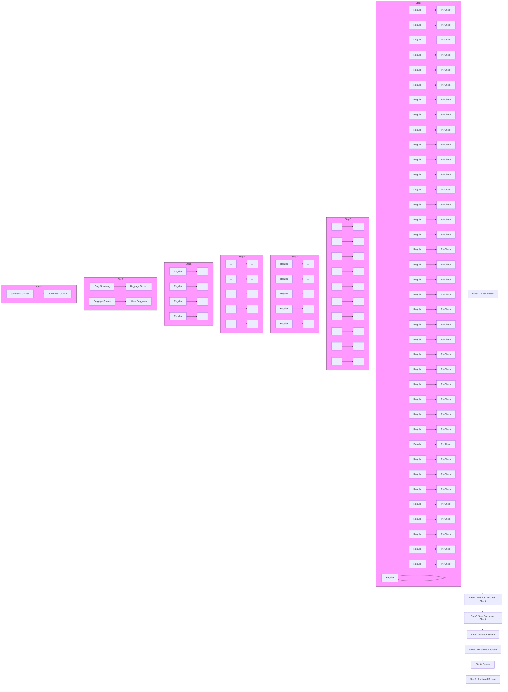
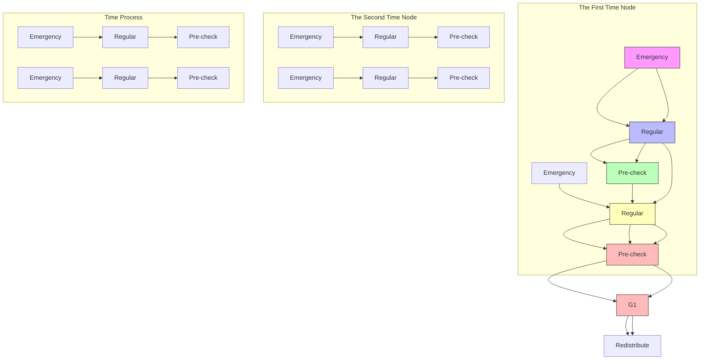
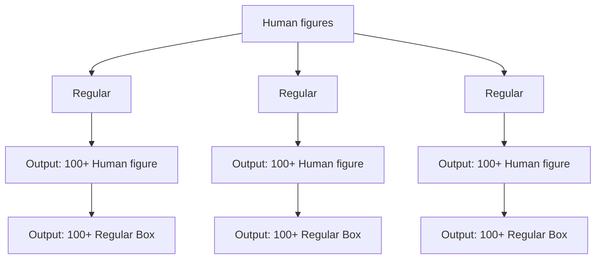

For office use only

T1

T2

T3

T4

Team Control Number

55285

Problem Chosen

D

For office use only

F1

F2

F3

F4

2017

MCM/ICM

Summary Sheet

# Analysis and Optimization to the Process of Airport Security Check

Summary

Security check is essential to the safety of airline passengers. However, it is also a time consuming process. Passengers have to wait in lines, get ID check, prepare the belongings and get screening inspection and sometimes it even takes hours of time to finish. Besides, the variance of the waiting time in the checkpoints line is also very high, which is difficult for passengers to decide when to reach the airport. Therefore, we are required to figure out the potential issues and make some modifications to the current process that can reduce the average waiting time and its variance.

We develop the basic model to simulate the current situation of American airports’ security check and study the properties of Pre-Check policy. Though more ‘Pre-Check’ passengers can help alleviate congestion to some degree, the time in the process of wait for screening is the overwhelming majority of the time spent in security check. It occupy over 98% of total time during rush hours. In addition, we also plot the distribution of different total waiting time, and find that it is nearly a uniform distribution over several hours. The variance is hence too high for passengers to predict their total waiting time.

Based on this conclusion, we mainly build two efficient modification models to optimize the current situation. The first one is ‘multi-passenger linkage model of belongings preparation (MPL)’. It shows that if the airport opens up a small zone for several passengers to prepare for screening at the same time, the average time and variance will obviously decrease. The other one is ‘priority-based queuing model (PBQ)’. It suggests airports to set some appropriate time interval limits to provide passengers who is to take off with great convenience without increasing the average time. Besides, it can encourage people not to arrive at airports so early that aggravate congestion.

We also speculate about the TSA’s latest institution for the elderly and children, but it does not make much contribution. At last, we consider the Chinese cultural norms and apply our model to Chinese airports. We construct the cut-in-line model. The result shows that MPL and PBQ models can still keep their high effectiveness. In other word, our models have high stability, high error-tolerant rate and extensive applicability.

Keywords: Security Check; Poisson Distribution; Gaussian Distribution; Queuing Meth ods

# Analysis and Optimization to the Process of Airport Security Check

January 24, 2017

## Contents

## 1 Restatement of the Problem 3

1.1 Background 3

1.1.1 An Overview of the Problem . . . . 3  
1.1.2 The Process of Security Check . . . . . 3

1.2 literature review . 3  
1.3 The Task at Hand 4

## 2 Model Assumptions and Notations 4

2.1 Assumptions and Justifications 4  
2.2 Notations . 5

## 3 The Basic Model of Security Checkpoints 6

3.1 The Design of the Model . 6  
3.2 Sub Models 6

3.2.1 Inflow Model . . . 6  
3.2.2 Attributes Generation Model . . . . 6  
3.2.3 Queuing Model . . . . 7  
3.2.4 Screening Model . . . . 7

3.3 The Result of the Model 8

3.3.1 The Distribution of the Total Time T 8  
3.3.2 The proportion of the Time Spent in Different Steps . . . . . . . . 8  
3.3.3 The Influence of the Ratio of Pre-Check Passengers and Regular Passengers . . 8  
3.3.4 The Influence of the Ratio of Pre-Check Lanes and Regular Lanes . 10

## 4 Modifications to the Current Process 10

4.1 Multi-passenger Linkage Model of Belongings Preparation . . 11

4.1.1 The Design of MPL Model . . . . . 11  
4.1.2 The Effectiveness of MPL Model . . . . 11

4.2 Priority-based Queuing Model 12

4.2.1 The Design of PBQ Model . . . . . 12  
4.2.2 The Effectiveness of PBQ Model . . . . 13

4.3 Model of Special Population . . 14

4.3.1 The Design of SP Model . . . . 14  
4.3.2 The Effectiveness of SP Model . . . 15

## 5 Model Evaluation & Sensitivity Analysis 15

5.1 The Cut-in-line Model 15  
5.2 The Sensitivity of MPL Model . . 16  
5.3 The Sensitivity of PBQ Model . . 17

## 6 Conclusion 18

6.1 Strengths and Weaknesses 18

6.1.1 Strengths . . . . 18  
6.1.2 Weaknesses . . 18

6.2 Suggestions to the Security Manager . . . 18  
6.3 Future Plans 19

## Appendices 20

## Appendix A Simulation Code 20

## 7 Other figures 30

7.1 Figures in ‘Modifications to the Current Process’ 30  
7.2 Figures in ‘Model Evaluation & Sensitivity Analysis’ . . 30

## 1 Restatement of the Problem

## 1.1 Background

## 1.1.1 An Overview of the Problem

In recent years, as the threat of terrorism is upgrading, American society has attached great significance to the security of the airport. A key part of the security measures at the airport is security checkpoints, where the passengers and their belongings should be inspected for dangerous objects. However, if the passengers takes a long time to pass the security checkpoints, there will be a negative impact on the customers’ feelings, then the interests of the airlines can be influenced.

There are two major problems in Chicago’s O’Hare international airport and other American airports. First, it is annoying that there are sometimes over-long queues at the airports, but we cannot give an explanation or a prediction. Second, the variance of waiting time is high, that is to say, it is difficult for the travelers to find a suitable time to reach the airport without being unnecessarily early or missing the plane. Therefore it makes great sense to solve the congestion problem.

## 1.1.2 The Process of Security Check

The process of security check can be decomposed into following processes:

• Arriving process: Passengers are assigned at the beginning of our model.

• Process of waiting at the checkpoints: Passengers wait at the checkpoints in Zone A and then move to the subsequent queue in Zone B.

• ID check process: Passengers get the identification check in this process.

• Process of waiting for screening: Passengers wait in lanes for screening.

• Preparing process: After reaching the front of the line, passengers place their belongings, including their jackets, liquid containers, computers and so on.

• Screening process: Passengers get screened by the millimeter scanner while the goods are scanned by the X-ray, then they retrieve their belongings.

• Additional inspection process: If the passengers fail in the screening process, they should get additional inspections in Zone D.

## 1.2 literature review

To simplify the problem and facilitate the implementation of computer language, researchers treat time as a discrete variable in the analysis of a single-server queuing system at first[1]. After that, some people have applied Queuing Theory to the dynamic allocation of airport security resources, which used pure Markov chain, discontinuous Markov process, Poisson process, statistical properties of transition probability equation and the birth and death process[2] [3]. What’s more, some other people try to achieve a goal of virtual queuing instead of real one in order to get a smoother distribution of arriving passengers[4]. We expect to find some convenient and intuitive modifications for the airport security based on the previous wisdom and some necessary math knowledge like Queuing Theory, Probability and Statistics[5].

## 1.3 The Task at Hand

• Construct a mathematical model to simulate the situation of the current security checkpoints and find an explanation for the phenomenon of congestion.  
• Propose some modifications to improve the current process.  
• Take the various behaviors of travelers into consideration, then discuss the influence of those factors on the model.  
• On the basis of the model, give some policy and procedural suggestions to ameliorate the situation of the security checkpoints.

## 2 Model Assumptions and Notations

## 2.1 Assumptions and Justifications

In order to simplify the course of modeling and draw some reasonable conclusions from our model, we make assumptions as follows:

• The excel data can embody the overall level of the airport to some degree. We use the differential method to calculate out the mean value and the standard deviation of the time consumed in different processes.  
• The intervals of the passengers’ arrivals obey Poisson distribution. Because the time when a passenger arrives is unrelated to that of the last passenger, therefore we assume that the intervals of the passengers’ arrivals obey Poisson distribution. The mean values of the distribution are obtained from the excel data.

• The time of ID check and millimeter wave scanning obeys Gaussian distribution. In this two processes, we suppose that the staff of the airport are skillful, that is to say the time cost in these processes fluctuates around a mean value. Thus we assume that they obey Gaussian distribution. The mean values and the standard deviations are also calculated out according to the excel data.

• The time interval of two examinations is 11s to pass the X-ray scanning and the time interval between two placements is 2s. According to the excel data, we can see that the interval is sometimes around 2s and sometimes around 11s. We interpret it as: in one time of examination, the inspector inspects several pieces of luggage. There are time intervals between each examinations.

• All of the passengers know the rules of the airport. They will go to the back of the shortest queue after arrival.

• There are no emergency incidents happened in the airport. What we discuss is the airport in order and it is clear that any emergency incident can break the order of any airport.  
• Pre-Check passengers can choose to go through the regular passage of security check when the Pre-Check passage is crowded. As for Pre-Check passengers, it takes them the same time either in Pre-Check passages or in regular passages.  
• The time of preparing the belongings is $1 5 \pm 5 + 5 X$ s in the Pre-Check passage, while it is $4 5 \pm 1 0 + 5 X$ s in the ordinary passage. This is based on our experiments. X is the number of the pieces of luggage.  
• In our model, there are 4 ID checkpoints in Zone A and 4 checking lanes in Zone B.  
• We do not take the transiting time between different stations into consideration.

## 2.2 Notations

Here we list the symbols and notations used in this paper, as shown in Table 1. Some of them will be defined later in the following sections.

Table 1: Notations

<table><tr><td>Symbol</td><td>Description</td></tr><tr><td> $t_a$ </td><td>the time interval between two passengers&#x27; arrivals</td></tr><tr><td> $t_p$ </td><td>the time interval between two Pre-Check passengers&#x27; arrivals</td></tr><tr><td> $t_r$ </td><td>the time interval between two regular passengers&#x27; arrivals</td></tr><tr><td> $t_{waitA}$ </td><td>the time of waiting at Zone A</td></tr><tr><td> $t_{waitB}$ </td><td>the time of waiting at Zone B</td></tr><tr><td> $t_{check}$ </td><td>the time of identification check</td></tr><tr><td> $\sigma_{check}$ </td><td>the standard deviation of  $t_{check}$ </td></tr><tr><td> $t_{xray}$ </td><td>the time of X-ray scanning</td></tr><tr><td> $t_{milli}$ </td><td>the time of millimeter wave scanning</td></tr><tr><td> $t_{pre}$ </td><td>the time of preparing</td></tr><tr><td> $\sigma_{pre}$ </td><td>the standard deviation of  $t_{pre}$ </td></tr><tr><td> $t_{screening}$ </td><td>the time of screening</td></tr><tr><td>T</td><td>the total time of the security check of a single person</td></tr><tr><td> $T_{avg}$ </td><td>the total time of the security check process of a group of people</td></tr><tr><td> $\sigma_T$ </td><td>the standard deviation of  $T_{avg}$ </td></tr><tr><td> $T_r$ </td><td>the total time consumed by regular passengers</td></tr><tr><td> $T_p$ </td><td>the total time consumed by Pre-Check passengers</td></tr><tr><td> $\sigma_{Tr}$ </td><td>the standard deviation of  $T_r$ </td></tr><tr><td> $\sigma_{Tp}$ </td><td>the standard deviation of  $T_p$ </td></tr><tr><td> $N_{prepare}$ </td><td>the number of passengers preparing their belongings</td></tr><tr><td> $R_{passenger}$ </td><td>the ratio of  $t_p$  to  $t_r$ </td></tr><tr><td> $R_{lane}$ </td><td>the ratio of Pre-Check lanes to regular lanes</td></tr><tr><td> $R_{oyp}$ </td><td>the percentage of people over 70 or under 12</td></tr><tr><td> $R_{cut}$ </td><td>the percentage of people who cut in line</td></tr></table>

## 3 The Basic Model of Security Checkpoints

In this section, we develop the basic model to explain the current situation of American airports. The basic model simulates the processes mentioned in Section 1.1.2. Then we discover that the process of waiting for screening is the most time consuming. The Pre-Check policy of TSA is effective, but we need to find more strategies to solve the problem.

## 3.1 The Design of the Model

In order to demonstrate our basic model clearly, we divide it into the four following sub models.

• Inflow model: This model is designed to simulate the random arrivals of the passengers.  
• Sub model two: Attributes generating model: In this model, we attribute different properties to the passengers that will influence the time length of security check.  
• Queuing model: This model studies the process of waiting in lines.  
• Screening model: The preparing process and the screening process are discussed in this model.

## 3.2 Sub Models

## 3.2.1 Inflow Model

The inflow model simulates the stochastic arrivals of passengers at the entrance of the airport. According to the excel data, we can obtain that the average time interval of passengers’ arrivals. We can assume that the arrival of each passenger obeys Poisson distribution in Equation (1). λ is the average time interval between the arrivals of two passengers according to the excel data, and N is the number of seconds between the arrivals of two passengers in our stochastic process.

$$
P (t = N) = e ^ {- \lambda} \frac {\lambda^ {N}}{N !} \tag {1}
$$

## 3.2.2 Attributes Generation Model

After a passenger is assigned in the program, we give some relevant attributes to the passengers, including the time for ID check, the time for millimeter wave scanning, the pieces of luggage they carry, the time for preparing the personal belongings and whether the passenger has enrolled in ‘Pre-Check’. We assume that the first two factors obey Gaussian distribution in Equation (2). Then we calculate the mean value and the standard deviation of the first three affecting factors. Those of the fourth one are given in the assumptions.

$$
t _ {i} = \frac {1}{\sigma_ {i} \sqrt {2 \pi}} e ^ {- \frac {(x - \mu_ {i}) ^ {2}}{2 \sigma_ {i} ^ {2}}} \tag {2}
$$

The mean value and the standard are listed in Table 2

Table 2: the Attributes of the Generated Passengers and Their Mean Values and Standard Deviations

<table><tr><td>Attributes( $t_i$ )</td><td>Mean Value( $\mu_i/s$ )</td><td>Standard Deviation( $\sigma_i/s$ )</td></tr><tr><td> $t_{check}$ </td><td>11.31</td><td>3.70</td></tr><tr><td> $t_{milli}$ </td><td>11.64</td><td>5.82</td></tr><tr><td> $t_{pre\_r}$ </td><td>45</td><td>10</td></tr><tr><td> $t_{pre\_p}$ </td><td>15</td><td>5</td></tr></table>

## 3.2.3 Queuing Model

After the arrival of the passengers, they will automatically go to the back of the shortest queue. Then, we use a queuing model to simulate the process that the passengers are waiting in lines. We treat each waiting line of the airport as a queue in our program. The first passenger added to the queue will be the first to get out as Figure 1 demonstrates.

At the front of the queue, the rate of removing each passenger from the queue is determined in the attribute generation model.


<details>
<summary>flowchart</summary>


</details>

Figure 1: The Queuing Model

## 3.2.4 Screening Model

When the passengers finished queuing, they first begin to prepare their belongings. Then the passengers and their belongings are scanned respectively. The time cost in this process should be the maximum of the millimeter wave scanning time $t _ { m i l l i }$ and the

X-ray scanning time $t _ { x r a y } .$

$$
t _ {\text { screening }} = \max \left[ t _ {\text { milli }}, t _ {\text { xray }} \right] \tag {3}
$$

## 3.3 The Result of the Model

We use c++ to realize the model programmatically and get a set of virtue data, then we process the data to see the cause of congestion.

## 3.3.1 The Distribution of the Total Time T

First we want to figure out how T , the total time consumed in the security check distribute among the travelling populations. We pick out 31678 samples, obtain their total times, and plot Figure 2. According to Figure 2, the total time distribute very uniformly among the populations. That is to say, the probability of the different total time is similar. That explains why it is difficult for passengers to find a suitable time to arrive at the airport.


<details>
<summary>histogram</summary>

| Statistic       | Value   |
| --------------- | ------- |
| Entries         | 31678   |
| Mean            | 518.6   |
| RMS             | 269.2   |
</details>

Figure 2: The Distribution of the Total Time

## 3.3.2 The proportion of the Time Spent in Different Steps

Then we consider the proportion of the time consumed in different steps, and draw figure 3. We can see that the time of waiting for screening is very large in proportion to the rest of time. That is the main reason for the congestion of the airport.

## 3.3.3 The Influence of the Ratio of Pre-Check Passengers and Regular Passengers

From Figure 4 and Figure 5 we can view that the curve is in the shape of letter $' \mathrm { S } ^ { \prime } .$ . The $T _ { a v g }$ converges to a constant as the percentage of Pre-Check passengers grows. This is easy to understand.

Percentage of Time Spent on Each Process  


<details>
<summary>pie chart</summary>

| Category | Value |
|---|---|
| Slice 1 | 0.25 |
| Slice 2 | 0.08 |
| Slice 3 | 0.04 |
</details>

C Waiting at ID Checkpoints 0.11% C ID Check 0.30%  
Waiting for Screening 98.11% Preparing for Screening 0.66%  
Screening 0.75% C Additional Screening 0.07%

Highcharts.com

Figure 3: The Percentage of Time in Different Process  


<details>
<summary>scatterplot</summary>

| Equation | y = A/(1+exp(-B*(x-C)^D))+E |
| -------- | -------------------------- |
| Adj. R-Squ | 0.99315                    |
| Value    | Standard E                 |
| Average Wa A | 617.58024                  |
| Average Wa B | 0.005                      |
| Average Wa C | 0.09962                   |
| Average Wa D | 3.0284                     |
| Average Wa E | 196.41502                  |
</details>

Figure 4: The Total Time Curves of Different $R _ { p a s s e n g e r s }$


<details>
<summary>line chart</summary>

| R_passenger | σ_T (s) |
| ----------- | ------- |
| 0           | 250     |
| 2           | 260     |
| 4           | 350     |
| 6           | 450     |
| 8           | 500     |
| 10          | 550     |
</details>

Figure 5: The Standard Deviation Curves of Different $R _ { p a s s e n g e r s }$

We know that the more Pre-Check passengers, the smaller average time. Therefore, $T _ { a v g }$ will finally converge to the value when everyone can use Pre-Check lane and spend less time, just like the $' \mathrm { S } '$ curve of the Natural Growth Model (NGM) in biolagy. We try to use one function of the NGM, Equation (4), to fit the data. The correlation coefficient of the fitting is 0.99, which confirms our thoughts.

$$
y = A / (1 + \exp (- B (x - C) ^ {D})) + E \tag {4}
$$

## 3.3.4 The Influence of the Ratio of Pre-Check Lanes and Regular Lanes

First, we study the influence of the $R _ { l a n e . }$ , the ratio of Pre-Check lanes and Regular lanes. We consider the three different conditions, when the $R _ { l a n e }$ is 1:3, 2:2 and 3:1. Our purpose is to find an optimal ratio to satisfy the following two requirements:

1. Minimize the waiting time.  
2. When the ratio of the Pre-Check and Regular passengers varies, the variance can be controlled in a small range.

For every condition, we change $R _ { p a s s e n g e r }$ and test the average waiting time. Then we plot the figure and set $R _ { p a s s e n g e r }$ as x-axis and the average waiting time t as y-axis to see the tendency in different conditions.

As is shown in Figure 6 and Figure 7 , when $R _ { l a n e }$ is 1:3, the average waiting time and its variance is rather small and stable when we change a series of different $R _ { p a s s e n g e r } .$ That is to say, the ratio set by the airport is reasonable.


<details>
<summary>line chart</summary>

| R_passenger | T_avg (s) for R_lane=1:3 | T_avg (s) for R_lane=2:2 | T_avg (s) for R_lane=3:1 |
| ----------- | ------------------------ | ------------------------ | ------------------------ |
| 0           | ~300                     | ~300                     | ~300                     |
| 2           | ~400                     | ~600                     | ~1500                    |
| 4           | ~500                     | ~900                     | ~2500                    |
| 6           | ~600                     | ~1200                    | ~3500                    |
| 8           | ~700                     | ~1400                    | ~4500                    |
| 10          | ~800                     | ~1600                    | ~5500                    |
</details>

Figure 6: The Total Time Curves of Different $R _ { l a n \epsilon }$

## 4 Modifications to the Current Process

According to the first model, the allocation of the four lanes and the percentage of Pre-Check passengers are both optimal, however, congestion still happens at the airport. Thus, we need to find more strategies to improve the institution of security check. In this section, we build three extra models to modify the current process, which are:


<details>
<summary>line chart</summary>

| R_passenger | R_lane=1:3 | R_lane=2:2 | R_lane=3:1 |
| ----------- | ---------- | ---------- | ---------- |
| 0           | 200        | 200        | 200        |
| 1           | 250        | 400        | 800        |
| 2           | 300        | 600        | 1500       |
| 3           | 350        | 800        | 2200       |
| 4           | 400        | 1000       | 2800       |
| 5           | 450        | 1100       | 3200       |
| 6           | 500        | 1200       | 3500       |
| 7           | 550        | 1250       | 3600       |
| 8           | 600        | 1300       | 3700       |
| 9           | 650        | 1350       | 3800       |
| 10          | 700        | 1400       | 3900       |
</details>

Figure 7: The Standard Deviation Curves of Different $R _ { l a n e }$

• Multi-passenger linkage model of belongings preparation (MPL model)  
• Priority-based queuing model(PBQ model)  
• Model of special population (SP model)

## 4.1 Multi-passenger Linkage Model of Belongings Preparation

## 4.1.1 The Design of MPL Model

As is mentioned in Section 3, congestion mostly happens in the process of waiting for screening. In the previous model, a passenger cannot begin preparing his or her belongings until the last passenger finishes preparing. It is obvious that we can save more time in this process. Therefore, we make the following improvements.

Suppose every checkpoint can allow $N _ { p r e p a r e }$ passengers to prepare their belongings at the same time. Once a passenger finished preparing and started the screening process, another passenger at the front of the waiting line can join the preparing process. In this linkage process, we can guarantee that there are always several passengers preparing their belongings together. Though the preparing time of a certain passenger does not decline, the waiting time of other passengers is lessened.

## 4.1.2 The Effectiveness of MPL Model

Then we are to find the optimal $N _ { p r e p a r e }$ that can reduce the waiting time while the preparing area is not very crowded. $\mathrm { A s }$ is shown in Figure 8 and Figure 9, we can see that when $N _ { p r e p a r e } = 3 _ { , }$ , the total time $T _ { a v g }$ is significantly reduced. When the $N _ { p r e p a r e }$ reaches 4 and $5 ,$ the change is not obvious but the area is more crowded. Therefore, we can conclude that three-passenger linkage model is the best strategy. After the MPL modification, we draw the proportion of the time in different processes again. As is shown in Figure 11, the time consumed in the process of waiting for screening is reduced from 98.11% to 57.21%.


<details>
<summary>line chart</summary>

| t_a (s) | Nprepare=2 | Nprepare=3 | Nprepare=4 | Nprepare=5 | Nprepare=6 | NoPrepare |
| ------- | ---------- | ---------- | ---------- | ---------- | ---------- | --------- |
| 0       | 5000       | 4500       | 6000       | 4500       | 4500       | 6000      |
| 1       | 3000       | 2500       | 5000       | 2500       | 2500       | 5000      |
| 2       | 1500       | 1000       | 3500       | 1000       | 1000       | 3500      |
| 3       | 500        | 250        | 2000       | 250        | 250        | 2000      |
| 4       | 100        | 50         | 1500       | 50         | 50         | 1500      |
| 5       | 10         | 10         | 1000       | 10         | 10         | 1000      |
</details>


<details>
<summary>line chart</summary>

| ta (s) | Nprepare=2 | Nprepare=3 | Nprepare=4 | Nprepare=5 | Nprepare=6 | NoPrepare |
| ------ | ---------- | ---------- | ---------- | ---------- | ---------- | --------- |
| 0      | 3200       | 2800       | 2700       | 2600       | 2500       | 3600      |
| 1      | 2000       | 1800       | 1700       | 1600       | 1500       | 2800      |
| 2      | 1000       | 800        | 700        | 600        | 500        | 2000      |
| 3      | 500        | 300        | 200        | 150        | 100        | 1500      |
| 4      | 100        | 50         | 50         | 50         | 50         | 1000      |
| 5      | 50         | 25         | 25         | 25         | 25         | 800       |
</details>

Figure 8: The Total Time Curves of Different Figure 9: The Standard Deviation Curve of Nprepare Different Nprepare  


<details>
<summary>pie chart</summary>

Percentage of Time Spent on Each Process
| Process | Percentage (%) |
| :--- | :--- |
| Waiting at ID Checkpoints | 0.11 |
| ID Check | 0.30 |
| Waiting for Screening | 98.11 |
| Preparing for Screening | 0.66 |
| Screening | 0.75 |
| Additional Screening | 0.07 |
</details>


<details>
<summary>pie chart</summary>

Percentage of Time Spent on Each Process
| Process | Percentage (%) |
| :--- | :--- |
| Waiting at ID Checkpoints | 3.00 |
| ID Check | 6.31 |
| Waiting for Screening | 57.21 |
| Preparing For Screening | 18.05 |
| Screening | 13.47 |
| Additional Screening | 1.96 |
Highcharts.com
</details>

Figure 10: The Percentage of Time in Differ- Figure 11: The Percentage of Time in Different Process before MPL modification ent Process after MPL modification

## 4.2 Priority-based Queuing Model

## 4.2.1 The Design of PBQ Model

In this model, we divide the four lanes of security check into the following kinds: one Pre-Check lane, two regular lanes and one emergency lane. In the attributes generation process, we add a new property into the attributes, $t _ { a d } ,$ the time between the arrivals of the passengers to the departure of the airplane. Based on this attribute, we divide the passengers into three priorities. We set two time intevals $t _ { a d 1 }$ and $t _ { a d 2 }$ . Passengers whose $t _ { a d }$ is under $t _ { a d 1 }$ are of the first priority, whose one is between $[ t _ { a d 1 } , t _ { a d 1 } + t _ { a d 2 } ]$ are of the second priority and the rest are of the third priority. The relevant groups of people are called the priority group, the regular group and the over-punctual group.

For different priorities, passengers enjoy different policies. For the priority group, passengers can use the emergency lane immediately. For the regular group, passengers cannot go pass the emergency lane until they have been waiting at the airport for a period of $t _ { a d 1 }$ . When a period of $t _ { a d 2 }$ has passed, the passengers of the over-punctual group can make use of the emergency lane. This policy can not only guarantee that the one in an urgent can get aboard in the first time, but also warn people not to arrive unnecessarily early. Figure 12 discribes this new modification.


<details>
<summary>flowchart</summary>


</details>

Figure 12: The PBQ Model

## 4.2.2 The Effectiveness of PBQ Model

We investigate the average time consumed in the whole process of different groups under PBQ modification. We change $t _ { a , }$ , the arrival time interval between two passengers and observe the trend of the curves. Then we compare it with that without PBQ modification. According to Figure 13 and Figure 23, at the peak flow of passengers $( t _ { a } < 1 s )$ , $T _ { a v g }$ and its standard deviation of the first group are significantly


<details>
<summary>line chart</summary>

| ta (s) | Before PBQ Modification | After PBQ Modification(All Passengers) | After PBQ Modification(Both Prior and Regular Passengers) | After PBQ Modification(Prior Passengers) | After PBQ Modification(Regular Passenger) |
| ------ | ------------------------ | -------------------------------------- | ---------------------------------------------------------- | --------------------------------------- | ---------------------------------------- |
| 1      | 120                      | 110                                    | 85                                                         | 20                                      | 130                                      |
| 2      | 40                       | 30                                     | 20                                                         | 10                                      | 20                                       |
| 3      | 0                        | 0                                      | 0                                                          | 0                                       | 0                                        |
| 4      | 0                        | 0                                      | 0                                                          | 0                                       | 0                                        |
| 5      | 0                        | 0                                      | 0                                                          | 0                                       | 0                                        |
| 6      | 0                        | 0                                      | 0                                                          | 0                                       | 0                                        |
</details>


<details>
<summary>line chart</summary>

| ta (s) | Before PBQ Modification | After PBQ Modification(All Passengers) | After PBQ Modification(Both Prior and Regular Passengers) | After PBQ Modification(Prior Passengers) | After PBQ Modification(Regular Passenger) |
| ------ | ------------------------ | -------------------------------------- | ---------------------------------------------------------- | ---------------------------------------- | ---------------------------------------- |
| 1      | 78                       | 75                                     | 76                                                         | 14                                       | 78                                       |
| 2      | 30                       | 25                                     | 28                                                         | 8                                        | 12                                       |
| 3      | 5                        | 5                                      | 6                                                          | 2                                        | 3                                        |
| 4      | 1                        | 1                                      | 1                                                          | 0                                        | 1                                        |
| 5      | 0                        | 0                                      | 0                                                          | 0                                        | 0                                        |
| 6      | 0                        | 0                                      | 0                                                          | 0                                        | 0                                        |
</details>

Figure 13: The Total Time curves under PBQ Figure 14: The Total Time curves under PBQ Model of Different Groups Model of Different Groups

We programme to implement this modification and draw the figure of $T _ { a v g }$ as a function of $t _ { a d 1 }$ and $t _ { a d 2 }$ to find out the optimal parameters $t _ { a d 1 }$ and $t _ { a d 2 }$ .

According to Figure 15 and Figure 16, we can conclude that PBQ model has the following properties.

As is shown in Figure 15, the average time of the three groups does not change much as the parameters change. That is to say, when $t _ { a d 1 }$ and $t _ { a d 2 }$ are set unsuitably, which do not match the relevant flow volumn of passengers, it does not have negative effects. But, if we set suitable parameters, the screening speed of the first two groups can be accelerated. In other words, the rate of fault tolerance is strong.


<details>
<summary>heatmap</summary>

| t_ad1 [min] | t_ad2 [min] | T_avg [min] |
| --- | --- | --- |
| 35 | 70 | 27 |
| 35 | 60 | 26 |
| 35 | 50 | 25 |
| 35 | 40 | 24 |
| 35 | 30 | 23 |
| 35 | 20 | 22 |
| 35 | 10 | 21 |
| 35 | 0 | 20 |
| 40 | 70 | 27 |
| 40 | 60 | 26 |
| 40 | 50 | 25 |
| 40 | 40 | 24 |
| 40 | 30 | 23 |
| 40 | 20 | 22 |
| 40 | 10 | 21 |
| 40 | 0 | 20 |
| 45 | 70 | 27 |
| 45 | 60 | 26 |
| 45 | 50 | 25 |
| 45 | 40 | 24 |
| 45 | 30 | 23 |
| 45 | 20 | 22 |
| 45 | 10 | 21 |
| 45 | 0 | 20 |
| 50 | 70 | 27 |
| 50 | 60 | 26 |
| 50 | 50 | 25 |
| 50 | 40 | 24 |
| 50 | 30 | 23 |
| 50 | 20 | 22 |
| 50 | 10 | 21 |
| 50 | 0 | 20 |
| 55 | 70 | 27 |
| 55 | 60 | 26 |
| 55 | 50 | 25 |
| 55 | 40 | 24 |
| 55 | 30 | 23 |
| 55 | 20 | 22 |
| 55 | 10 | 21 |
| 55 | 0 | 20 |
| 60 | 70 | 27 |
| 60 | 60 | 26 |
| 60 | 50 | 25 |
| 60 | 40 | 24 |
| 60 | 30 | 23 |
| 60 | 20 | 22 |
| 60 | 10 | 21 |
| 60 | 0 | 20 |
</details>

Figure 15: The figure of $T _ { a v g }$ of the first two groups  


<details>
<summary>3d bar chart</summary>

| t_sd2 [min] | T_avg [min] |
| ----------- | ----------- |
| 70          | 35.2        |
| 60          | 35.4        |
| 50          | 35.6        |
| 40          | 35.8        |
| 30          | 36.0        |
| 20          | 36.2        |
| 10          | 36.4        |
| 0           | 36.6        |
| 10          | 36.8        |
| 20          | 37.0        |
| 30          | 36.8        |
| 40          | 36.6        |
| 50          | 36.4        |
| 60          | 36.2        |
</details>

Figure 16: The figure of $T _ { a v g }$ of the three groups

It is obvious that in Figure 16, if the sum of $t _ { a d 1 }$ and $t _ { a d 2 }$ is a constant, the average time of the first two groups, the priority group and the regular group do not change much. When the sum gets smaller, the average time gets smaller as well. This is because with the decrease of the $t _ { a d 1 }$ and $t _ { a d 2 }$ , the number of passengers decreases as well, which means the number of passengers who can make use of the emergency lane is reduced.

Therefore, we can set the ratio of $t _ { a d 1 }$ and $t _ { a d _ { 2 } }$ according to the ratio of the passengers numbers of the two groups. This means that we can improve the utilization rate of the current resources. Besides, this phenomenon also shows that the model accords to the reality.

## 4.3 Model of Special Population

## 4.3.1 The Design of SP Model

In actual situation, the elderly and children are less likely to bring dangerous objects, and they usually do not bring luggage with them as well. According to the website of TSA[6], they have implemented a policy to reduce the time of security inspection of the elderly over 75 and the children under 12. They claim that those people will no longer removing shoes and light outerwear.

We build the model of special population to simulate this situation. We assume that neither the elderly nor the children will bring luggage with them. In this situation, according to Equation (3), the time of screening equals to the time of body scanning.

We set the percentage as 0, 10%, 20%, 30%, respectively. In each condition, we study how $T _ { a v g }$ , the average total time changes as a function of $t _ { a } ,$ the time interval between two passengers’ arrivals.

## 4.3.2 The Effectiveness of SP Model

As is shown in Figure 17 and Figure 18, the four curves of 0, 10%, 20%, 30% are similar. The change in $T _ { a v g }$ brought by this institution is subtle. That is to say, TSA’s new policy on the official website is not as effective.


<details>
<summary>scatterplot</summary>

| Royp   | ta (s) | T_avg (s) |
|--------|--------|-----------|
| 0%     | 0.5    | 4500      |
| 0%     | 1.0    | 3500      |
| 0%     | 1.5    | 2500      |
| 0%     | 2.0    | 1500      |
| 0%     | 2.5    | 500       |
| 0%     | 3.0    | 100       |
| 10%    | 0.5    | 4400      |
| 10%    | 1.0    | 3400      |
| 10%    | 1.5    | 2400      |
| 10%    | 2.0    | 1400      |
| 10%    | 2.5    | 600       |
| 10%    | 3.0    | 150       |
| 20%    | 0.5    | 4300      |
| 20%    | 1.0    | 3300      |
| 20%    | 1.5    | 2300      |
| 20%    | 2.0    | 1300      |
| 20%    | 2.5    | 550       |
| 20%    | 3.0    | 145       |
| 30%    | 0.5    | 4200      |
| 30%    | 1.0    | 3200      |
| 30%    | 1.5    | 2200      |
| 30%    | 2.0    | 1200      |
| 30%    | 2.5    | 450       |
| 30%    | 3.0    | 135       |
| Royp=30%            | 0.5    | 4450      |
| Royp=30%            | 1.0    | 3450      |
| Royp=30%            | 1.5    | 2450      |
| Royp=30%            | 2.0    | 1250      |
| Royp=30%            | 2.5    | 580       |
| Royp=30%            | 3.0    | 128       |
| Royp=30%            | 3.5    | 17        |
| Royp=30%            | 4.0    | 18        |
| Royp=30%            | 4.5    | 19        |
| Royp=30%            | 5.0    | 2         |
</details>


<details>
<summary>scatterplot</summary>

| Royp | t_a (s) | σ_T (s) |
| --- | --- | --- |
| 0% | 0.5 | 2700 |
| 0% | 0.6 | 2600 |
| 0% | 0.7 | 2500 |
| 0% | 0.8 | 2400 |
| 0% | 0.9 | 2300 |
| 0% | 1.0 | 2200 |
| 0% | 1.1 | 2100 |
| 0% | 1.2 | 2000 |
| 0% | 1.3 | 1900 |
| 0% | 1.4 | 1800 |
| 0% | 1.5 | 1700 |
| 0% | 1.6 | 1600 |
| 0% | 1.7 | 1500 |
| 0% | 1.8 | 1400 |
| 0% | 1.9 | 1300 |
| 0% | 2.0 | 1200 |
| 0% | 2.1 | 1100 |
| 0% | 2.2 | 1000 |
| 0% | 2.3 | 900 |
| 0% | 2.4 | 800 |
| 0% | 2.5 | 700 |
| 0% | 2.6 | 600 |
| 0% | 2.7 | 500 |
| 0% | 2.8 | 400 |
| 0% | 2.9 | 300 |
| 0% | 3.0 | 200 |
| 0% | 3.1 | 100 |
| 0% | 3.2 | 50 |
| 0% | 3.3 | 25 |
| 0% | 3.4 | 15 |
| 0% | 3.5 | 10 |
| 0% | 3.6 | 5 |
| 0% | 3.7 | 2 |
| 0% | 3.8 | 1 |
| 0% | 3.9 | 1 |
| 0% | 4.0 | 1 |
| 0% | 4.1 | 1 |
| 0% | 4.2 | 1 |
| 0% | 4.3 | 1 |
| 0% | 4.4 | 1 |
| 0% | 4.5 | 1 |
| 0% | 4.6 | 1 |
| 0% | 4.7 | 1 |
| 0% | 4.8 | 1 |
| 0% | 4.9 | 1 |
| 0% | 5.0 | 1 |
| 10% | - | - |
| 10% | - | - |
| 10% | - | - |
| 10% | - | - |
| 10% | - | - |
| 10% | - | - |
| 10% | - | - |
| 10% | - | - |
| 10% (Royp) | - | - |
| Royp | - | - |
| Royp | - | - |
| Royp | - | - |
| Royp | - | - |
| Royp | - | - |
| Royp | - | - |
| Royp | - | - |
| Royp | - | - |
| Royp | - | - |
| Royp | - | - (Royp) |
| Royp | - | - (Royp) |
| Royp | - | - (Royp) |
| Royp | - | - (Royp) |
| Royp | - | - (Royp) |
| Royp | - | - (Royp) |
| Royp | - | - (Royp) |
| Royp | - | - |
| Royp | - | - |
| Royp | - | - |
| Royp | - | - |
| Royp | - | - |
| Royp | - | - |
| Royp | - | - |
| Royp | - | - |
| Royp | - | - |
| Royp | - | - |
</details>

Figure 17: The Total Time Curves of Differ- Figure 18: The Standard Deviation Curve of ent $R _ { o y p }$ Different R $R _ { o y p }$

## 5 Model Evaluation & Sensitivity Analysis

We operate the model in the condition of Chinese airport to test its sensitivity. We build a cut-in-line model to describe the situation of China. Then we test the sensitivity of modification models in Chinese airports.

## 5.1 The Cut-in-line Model

In this model, we consider some special factors under China’s reality, including:

• In China, the threat of terrorism is not as severe, hence the rules in Chinese airports are not strict as those in America. The passengers do not need to take off their clothes and shoes.  
• The passengers will attach much importance to personal efficiency and there exists the phenomenon of cutting in lines.

Therefore, we make the relevant alternations to our model:

• The preparing time of all Chinese people is the same as Pre-Check passengers in the American model.  
• When a passenger is generated, we give two additional attributes to him or her. One is whether the passenger will cut in lines or not. The other is the position the passenger cut in. We assume that the probability of jumping into each position in front of the passenger is the same. This process is shown in Figure 19.


<details>
<summary>flowchart</summary>


</details>

Figure 19: The Process of Cutting Lines

## 5.2 The Sensitivity of MPL Model

We investigate the sensitivity of MPL Model in Chinese situation. Under the different rate of cutting in lines, we observe the difference brought by the model. According to Figure 20 and Figure 21, the total time and its variance can still be significantly reduced.


<details>
<summary>line chart</summary>

| ta (s) | 5% Average Time without MPL Model | 10% Average Time without MPL Model | 15% Average Time without MPL Model | 5% Average Time with MPL Model | 10% Average Time with MPL Model | 15% Average Time with MPL Model |
| ------ | ---------------------------------- | ----------------------------------- | ----------------------------------- | ------------------------------ | ------------------------------- | ------------------------------- |
| 1      | 190                                | 105                                 | 190                                 | 105                            | 105                             | 105                             |
| 2      | 160                                | 40                                  | 160                                 | 40                             | 40                              | 40                              |
| 3      | 130                                | 0                                   | 130                                 | 0                              | 0                               | 0                               |
| 4      | 100                                | 0                                   | 100                                 | 0                              | 0                               | 0                               |
| 5      | 80                                 | 0                                   | 80                                  | 0                              | 0                               | 0                               |
| 6      | 60                                 | 0                                   | 60                                  | 0                              | 0                               | 0                               |
| 7      | 40                                 | 0                                   | 40                                  | 0                              | 0                               | 0                               |
| 8      | 20                                 | 0                                   | 20                                  | 0                              | 0                               | 0                               |
</details>


<details>
<summary>line chart</summary>

| t_a (s) | 5% Variance without MPL Model | 10% Variance without MPL Model | 15% Variance without MPL Model | 5% Variance with MPL Model | 10% Variance with MPL Model | 15% Variance with MPL Model |
| ------- | ----------------------------- | ------------------------------ | ------------------------------ | -------------------------- | --------------------------- | --------------------------- |
| 1       | 115                           | 110                            | 112                            | 75                         | 70                          | 72                          |
| 2       | 90                            | 85                             | 92                             | 40                         | 35                          | 38                          |
| 3       | 60                            | 55                             | 62                             | 10                         | 8                           | 9                           |
| 4       | 30                            | 25                             | 32                             | 2                          | 1                           | 1                           |
| 5       | 10                            | 5                              | 12                             | 0                          | 0                           | 0                           |
| 6       | 2                             | 1                              | 3                              | 0                          | 0                           | 0                           |
| 7       | 0                             | 0                              | 0                              | 0                          | 0                           | 0                           |
| 8       | 0                             | 0                              | 0                              | 0                          | 0                           | 0                           |
</details>

Figure 20: The Total Time Curves under M- Figure 21: The Standard Deviation Curves PL Model in Chinese Situation under MPL Model in Chinese Situation

## 5.3 The Sensitivity of PBQ Model

We test the sensitivity of PBQ Model in Chinese situation. Under the different rate of cutting in lines, we observe the difference brought by the model. According to Figure 22 and Figure 23, the average time of the priority group and its variance can be significantly reduced, while the average time of all the passengers keeps the same as that without the model. This is the same as that in America. From Figure 24, we can view that after the modification of PBQ model, the rate of cutting in lines does not make sense to the average consumed time.


<details>
<summary>line chart</summary>

| t_a (s) | 5% Average Time Before PBQ Modification | 15% Average Time Before PBQ Modification | 5% Average Time After PBQ Modification(All Passengers) | 15% Average Time After PBQ Modification(All Passengers) | 5% Average Time After PBQ Modification(Prior Passengers) | 15% Average Time After PBQ Modification(Prior Passengers) | 5% Average Time After PBQ Modification(Regular Passengers) | 15% Average Time After PBQ Modification(Regular Passengers) | 5% Average Time After PBQ Modification(Prior and Regular Passengers) | 15% Average Time After PBQ Modification(Proir and Regular Passengers) |
| ------- | -------------------------------------- | ---------------------------------------- | ----------------------------------------------------- | ----------------------------------------------------- | ------------------------------------------------------ | ------------------------------------------------------ | ------------------------------------------------------ | ------------------------------------------------------ | -------------------------------------------------------- | -------------------------------------------------------- |
| 1       | 125                                    | 120                                      | 105                                                   | 95                                                    | 80                                                     | 70                                                     | 60                                                     | 50                                                     | 40                                                     | 30                                                     |
| 2       | 80                                     | 70                                       | 60                                                    | 50                                                    | 40                                                     | 30                                                     | 20                                                     | 15                                                     | 10                                                     | 8                                                      |
| 3       | 20                                     | 15                                       | 10                                                    | 8                                                     | 5                                                      | 4                                                      | 2                                                      | 2                                                      | 1                                                      | 1                                                      |
| 4       | 5                                      | 4                                        | 3                                                     | 2                                                     | 1                                                      | 1                                                      | 1                                                      | 1                                                      | 1                                                      | 1                                                      |
| 5       | 2                                      | 2                                        | 1                                                     | 1                                                     | 1                                                      | 1                                                      | 1                                                      | 1                                                      | 1                                                      | 1                                                      |
| 6       | 1                                      | 1                                        | 1                                                     | 1                                                     | 1                                                      | 1                                                      | 1                                                      | 1                                                      | 1                                                      | 1                                                      |
</details>


<details>
<summary>line chart</summary>

| T_a (s) | 5% Variance Before PBQ Modification | 15% Variance Before PBQ Modification | 5% Variance After PBQ Modification(All Passengers) | 15% Variance After PBQ Modification(All Passengers) | 5% Variance After PBQ Modification(Prior Passengers) | 15% Variance After PBQ Modification(Prior Passengers) | 5% Variance After PBQ Modification(Regular Passengers) | 15% Variance After PBQ Modification(Regular Passengers) | 5% Variance After PBQ Modification(Prior and Regular Passengers) | 15% Variance After PBQ Modification(Prior and Regular Passengers) |
| ------- | ----------------------------------- | ------------------------------------ | -------------------------------------------------- | -------------------------------------------------- | -------------------------------------------------- | -------------------------------------------------- | -------------------------------------------------- | -------------------------------------------------- | -------------------------------------------------------- | -------------------------------------------------------- |
| 1       | 78                                  | 75                                   | 40                                                 | 38                                                 | 22                                                 | 20                                               | 20                                               | 18                                               | 20                                                     | 18                                                     |
| 2       | 10                                  | 8                                    | 10                                                 | 9                                                  | 10                                                 | 8                                                | 8                                                | 6                                                | 10                                                     | 8                                                      |
| 3       | 5                                   | 4                                    | 5                                                  | 4                                                  | 5                                                  | 4                                                | 4                                                | 3                                                | 5                                                      | 4                                                      |
| 4       | 2                                   | 2                                    | 2                                                  | 2                                                  | 2                                                  | 2                                                | 2                                                | 2                                                | 2                                                      | 2                                                      |
| 5       | 1                                   | 1                                    | 1                                                  | 1                                                  | 1                                                  | 1                                                | 1                                                | 1                                                | 1                                                      | 1                                                      |
| 6       | 0                                   | 0                                    | 0                                                  | 0                                                  | 0                                                  | 0                                                | 0                                                | 0                                                | 0                                                      | 0                                                      |
</details>

Figure 22: The Total Time Curves under P- Figure 23: The Standard Deviation Curves BQ Model in Chinese Situation under PBQ Model in Chinese Situation  


<details>
<summary>heatmap</summary>

Prior and Regular Passengers' Average Waiting Time of Different R_cut After PBQ Modification
| R_cut | t_a [second] | T_avcl2 [min] |
| :--- | :--- | :--- |
| 0.0 | 1.4 | 80 |
| 0.05 | 1.3 | 75 |
| 0.1 | 1.2 | 70 |
| 0.15 | 1.1 | 65 |
| 0.2 | 1.0 | 60 |
| 0.25 | 0.9 | 55 |
| 0.5 | 0.8 | 50 |
| 0.6 | 0.7 | 45 |
| 0.7 | 0.6 | 40 |
| 0.8 | 0.5 | 35 |
| 0.9 | 0.4 | 30 |
| 1.0 | 0.3 | 25 |
| 1.1 | 0.2 | 20 |
| 1.2 | 0.1 | 15 |
| 1.3 | 0.0 | 10 |
| 1.4 | -0.1 | 5 |
The chart is a heatmap displaying the average waiting time of different R_cut values after PBQ modification. The color scale ranges from 80 to 0, indicating the magnitude of waiting time at each R_cut value. There is no explicit numerical data provided in the image.
</details>

Figure 24: Prior and Regular Passengers’ Average Waiting Time of Different $R _ { c u t }$ After PBQ Modification

To conclude, both MPL model and PBQ are as effective in China as that in America. That is to say, our model can also be applied to Chinese airports with a few modifications.

## 6 Conclusion

## 6.1 Strengths and Weaknesses

## 6.1.1 Strengths

Our models are adaptable to different conditions. Both MPL and PBQ models can still provide stable efficiency improvement though there may be some impacts.

PBQ model has strong fault tolerance. Though we may not get the exact optimal time interval $t _ { a d 1 }$ and $t _ { a d 2 } ,$ the modification is still able to reduce a lot of time, especially when we meet the extreme peak flow.

Our models have broad application prospect. PBQ model can not only reduce the urgent people’s waiting time, but also encourages people not to arrive at airport too early. This can decline the pressure during peak flow.

## 6.1.2 Weaknesses

Our models ignore the probability of emergent incident, thus our models only work in a peaceful environment.

In the SP model, we just consider the old and the young as another ‘PreCheck’ passenger, this may be improper.

In the Cut-in-line model, we assume that the occurrence probability of the cutting in line is constant, this may be a little different from reality.

## 6.2 Suggestions to the Security Manager

According to our simulation result, we have the following recommendations for the security managers.

• Pre-Check policy is indeed effective in accelerating the process, and the ratio of Pre Check lanes and regular lanes is optimal. Therefore we should keep the suitable ratio and advertise the advantages of Pre-Check policy.  
• The airports can add a small zone between the screening machine and the waiting lanes, which can allow 3 passengers to prepare for screening in advance at the same time.  
• The airports can set up some time limit intervals for security check as PBQ model, to reduce the waiting time of the passengers who is going to takeoff. This policy can also encourage passengers not to arrive too early, so that congestion during fastigia can be alleviated. What’s more, the length of the time intervals $t _ { a d 1 }$ and $t _ { a d 2 }$ and the number of passengers in the priority group flow are directly related.  
• It is not necessary for TSA to consider adjusting policy to the old and the young too much, because this modification will not provide passengers with much help.

• For Chinese airports, cutting in lines will not influence the effectiveness of the two models, therefore we can also apply these two models to Chinese airports.

## 6.3 Future Plans

Our present PBQ model has fixed total peak passenger flow, in the future, we try to use the passenger generating time to decide the duration of peak period, MPL can study the linkage condition and time node at a fixed peak time, make more objective evaluations on its performance.

Make the occurrence probability of the cutting in line be related to the congestion level, in the real condition, more crowded the airport is, more cut-in-line phenomenon will take place.

## References

[1] T. Meisling, “Discrete-time queuing theory,” Operations Research, vol. 6, no. 1, pp. 96–105, 1958.  
[2] G. Yang, Z. Min, Z. Hang, and L. Yue, “Research on dynamic allocations of airport security check resources,” Aeronautical Computing Technology, vol. 46, no. 5, 2016.  
[3] R. de Lange, I. Samoilovich, and B. van der Rhee, “Virtual queuing at airport security lanes,” European Journal of Operational Research, vol. 225, no. 1, pp. 153 – 165, 2013.  
[4] M. Bevilacqua and F. E. Ciarapica, “Analysis of check-in procedure using simulation: A case study,” in 2010 IEEE International Conference on Industrial Engineering and Engineering Management, Dec 2010, pp. 1621–1625.  
[5] X. He, Stochastic process and queuing theory. Hunan University Press, 2010.  
[6] http://www.portofportland.com/Notices/PDX\_TSA\_75over\_Scrng\_01\_BLT.htm.

## Appendices

## Appendix A Simulation Code

Our simulation codes written in C++:  
```cpp
#include<cstdio>
#include<cmath>
#include<iostream>
#include<fstream>

using namespace std;

const int Files = 4;

string filename[Files] = { "A", "B", "E", "F" };

double stringToSecond(string &str) {
    int now = 0;
    double min = 0, sec = 0;
    while (str[now] != ':') {
    min = min * 10 + str[now++] - 48;
    }
    now++;
    while (str[now] != '.') {
    sec = sec * 10 + str[now++] - 48;
    }
    return min * 60 + sec;
}

void work(ifstream &inFile, ofstream &outFile) {
    double second[100], difference[100];
    int n = 0;
    string str;
    while (inFile >> str) {
    second[n++] = stringToSecond(str);
    outFile << second[n - 1] << endl;
    }
    double sum = 0;
    for (int i = 1; i < n; ++i) {
    difference[i] = second[i] - second[i - 1];
    sum += difference[i];
    }
    double ave = sum / (n - 1);
    sum = 0;
    for (int i = 1; i < n; ++i) {
    sum += (difference[i] - ave) * (difference[i] - ave);
    }
    double vari = sum / (n - 2);
    outFile << "average: " << ave << endl;
    outFile << "variance: " << vari << endl;
    outFile << "standard deviation: " << sqrt(vari) << endl;
}

int main() {
    ifstream inFile;
    ofstream outFile;
    for (int i = 0; i < Files; ++i) {
```

```javascript
inFile.open(filename[i] + ".txt");
outFile.open(filename[i] + "_out.txt");
work(inFile, outFile);
inFile.close();
outFile.close();
}
return 0;
}
```

```cpp
#include<cstdio>
#include<cmath>
#include<ctime>
#include<cstdlib>
#include<iostream>
#include<queue>
#include<fstream>
#include<algorithm>

using namespace std;

double gaussrand(double E, double V) {
    static double V1, V2, S;
    static int phase = 0;
    double X;
    if (phase == 0) {
    do {
    double U1 = (double)rand() / RAND_MAX;
    double U2 = (double)rand() / RAND_MAX;
    V1 = 2 * U1 - 1;
    V2 = 2 * U2 - 1;
    S = V1 * V1 + V2 * V2;
    } while (S >= 1 || S == 0);
    X = V1 * sqrt(-2 * log(S) / S);
    }
    else X = V2 * sqrt(-2 * log(S) / S);
    phase = 1 - phase;
    return X * V + E;
}

double U_Random() {
    double f;
    f = (float)(rand() % 100);
    return f/100;
}

double possion(double Lambda) {
    double k = 0;
    long double p = 1.0;
    long double l = exp(-Lambda);
    while (p >= 1) {
    double u = U_Random();
    p *= u;
    k += 1;
    }
    return k-1;
}

const double AgeSeed = 0.0;
const double VIPErrorRatio = 0.01;
const double PaxErrorRatio = 0.03;
```

```c
const double VIPArrivalSeed = 4;
const double PaxArrivalSeed = 6;
const int VIPIDCheck = 1;
const int PaxIDCheck = 3;
const double IDCheckSeed_E = 11.3125;
const double IDCheckSeed_S = 3.70079;
const double VIPRemoveThingsSeed_E = 15.0;
const double VIPRemoveThingsSeed_S = 5.0;
const double PaxRemoveThingsSeed_E = 40.0;
const double PaxRemoveThingsSeed_S = 10.0;
const int VIPLanes = 1;
const int PaxLanes = 3;
const double BaggagePrepareSeed = 5.0;
const double BaggageCheckSeed_1 = 11.0;
const double BaggageCheckSeed_2 = 2.0;
const double BodyCheckSeed_E = 11.6;
const double BodyCheckSeed_S = 5.8;
const double ZoneDTime_E = 120.0;
const double ZoneDTime_S = 20.0;
const double RatioBinOne = 0.2;
const double RatioCinOne = 0.1;
const double RatioCinTwo = 0.2;

double FastigiumTime = VIPArrivalSeed * 2160;
double FirstPoint, SecondPoint;
int ContainMost = 3;
const int Times = 5;
const int AllNumber = 10000;
int Number = 0, VIPNumber = 0, PaxNumber = 0;
int NumberKind_1 = 0, NumberKind_2 = 0;

bool isSrand = false;

int baggageRand() {
    return rand() % 4;
}

struct HumanBeings {
    int waitKind;
    bool isVIP;
    bool isError;
    double zoneDTime;
    double arrivalTime;
    double IDCheckTime;
    double removeThingsTime;
    double baggageCheckTime;
    double bodyCheckTime;
    double departTime;
    int baggageNumber;
    HumanBeings() {
    if (!isSrand) {
    srand((unsigned)time(NULL));
    isSrand = true;
    }
    IDCheckTime = gaussrand(IDCheckSeed_E, IDCheckSeed_S);
    baggageNumber = baggageRand();
    baggageCheckTime = BaggageCheckSeed_1 + BaggageCheckSeed_2 * baggageNumber;
    bodyCheckTime = gaussrand(BodyCheckSeed_E, BodyCheckSeed_S);
    departTime = 0; isError = false;
    if (IDCheckTime < 0) IDCheckTime = 0;
    if (baggageCheckTime < 0) baggageCheckTime = 0;
```

```txt
if (bodyCheckTime < 0) bodyCheckTime = 0;
}
HumanBeings(const HumanBeings &other) {
    waitKind = other.waitKind;
    isVIP = other.isVIP;
    isError = other.isError;
    zoneDTime = other.zoneDTime;
    arrivalTime = other.arrivalTime;
    IDCheckTime = other.IDCheckTime;
    removeThingsTime = other.removeThingsTime;
    baggageCheckTime = other.baggageCheckTime;
    bodyCheckTime = other.bodyCheckTime;
    departTime = other.departTime;
    baggageNumber = other.baggageNumber;
}
void produce(bool VIPCheck, double &lastTime) {
    isVIP = VIPCheck;
    if (isVIP) {
    if ((double)rand() / RAND_MAX < VIPErrorRatio) {
    isError = true;
    zoneDTime = gaussrand(ZoneDTime_E, ZoneDTime_S);
    }
    else isError = false;
    arrivalTime = posson(VIPArrivalSeed) + lastTime;
    removeThingsTime = gaussrand(VIPRemoveThingsSeed_E, VIPRemoveThingsSeed_S) + (double)rand() {
    if ((double)rand() / RAND_MAX < PaxErrorRatio) {
    isError = true;
    zoneDTime = gaussrand(ZoneDTime_E, ZoneDTime_S);
    }
    else isError = false;
    arrivalTime = posson(PaxArrivalSeed) + lastTime;
    removeThingsTime = gaussrand(PaxRemoveThingsSeed_E, PaxRemoveThingsSeed_S) + (double)rand() {
    baggageNumber = 0;
    removeThingsTime = gaussrand(VIPRemoveThingsSeed_E, VIPRemoveThingsSeed_S);
    baggageCheckTime = BaggageCheckSeed_1;
    }
    if (arrivalTime < FirstPoint) {
    double r = (double)rand() / RAND_MAX;
    if (r < RatioCinOne) waitKind = 3;
    else if (r < RatioCinOne + RatioBinOne) waitKind = 2;
    else waitKind = 1;
    }
    else if (arrivalTime < SecondPoint) {
    double r = (double)rand() / RAND_MAX;
    if (r < RatioCinTwo) waitKind = 3;
    else waitKind = 2;
    }
    else waitKind = 3;
    if (waitKind == 1) NumberKind_1++;
    if (waitKind == 2) NumberKind_2++;
    if (zoneDTime < 0) zoneDTime = 0;
    if (removeThingsTime < 0) removeThingsTime = 0;
    lastTime = arrivalTime;
    }
}*human;

void produceHuman() {
```

```txt
double lastTime = 0;
while (lastTime < FastigiumTime) {
    human[Number++].produce(true, lastTime);
    VIPNumber++;
}
Number--;
lastTime = 0;
while (lastTime < FastigiumTime) {
    human[Number++].produce(false, lastTime);
    PaxNumber++;
}
}

double max(double &a, double &b) {
    if (a > b) return a;
    return b;
}

double swap(HumanBeings &a, HumanBeings &b) {
    HumanBeings c = a;
    a = b;
    b = c;
}

ofstream output("test.txt");

void adjustQueue(queue<int> &a, queue<int> &b, int sign) {
    if (a.size() <= b.size()) return;
    int qa[a.size()], qb[a.size()], qd[a.size()];
    int suma = 0, sumb = 0, sumd = 0;
    while (!a.empty()) {
    qa[suma++] = a.front();
    a.pop();
    }
    while (!b.empty()) {
    qb[sumb++] = b.front();
    b.pop();
    }
    for (int i = sumb + 2; i < suma; ++i) {
    int loc = qa[i];
    if (i - sumd > sumb + 1 && (sign == 0 || human[loc].waitKind == sign)) {
    qb[sumb++] = loc;
    qd[sumd++] = i;
    }
    }
    int nowd = 0;
    for (int i = 0; i < suma; ++i) {
    if (i != qd[nowd] || nowd == sumd) a.push(qa[i]);
    else nowd++;
    }
    for (int i = 0; i < sumb; ++i) b.push(qb[i]);
}

void simulation(int vipIDCheck, int vipLanes, int paxIDCheck, int paxLanes) {
    int sumIDCheck = vipIDCheck + paxIDCheck;
    int sumLanes = vipLanes + paxLanes;
    int nowPoint = 1;
    double nowTime = 0;
    queue<int> IDCheckQueue[sumIDCheck];
    double IDCheckLastDepartTime[sumIDCheck] = {0};
    queue<int> LanesQueue[sumLanes];
```

```txt
double LanesLastDepartTime[sumLanes] = {0};
int lastQueue[sumLanes][ContainMost];
int sumLastQueue[sumLanes] = {0};
double lastDepartTime[sumLanes] = {0};
double lastEnterTime[sumLanes] = {0};
queue<int> zoneDQueue;
double zoneDDepartTime = 0;

for (int loc = 0; loc < Number; ++loc) {
    output << loc << ": " << endl;
    output << '\t' << "IDCheckQueue: "; for (int i = 0; i < sumIDCheck; ++i) output << IDCheckQueue[i].input;
    output << '\t' << "LanesQueue: "; for (int i = 0; i < sumLanes; ++i) output << LanesQueue[i].input;
    output << '\t' << "lastQueue: "; for (int i = 0; i < sumLanes; ++i) output << sumLastQueue[i].input;
    nowTime = human[loc].arrivalTime;
    human[loc].departTime = nowTime;
    for (int i = 0; i < sumIDCheck; ++i) {
    while (!IDCheckQueue[i].empty()) {
    int loc = IDCheckQueue[i].front();
    double dt = max(IDCheckLastDepartTime[i], human[loc].departTime) + human[loc].input;
    if (dt <= nowTime) {
    IDCheckQueue[i].pop();
    IDCheckLastDepartTime[i] = dt;
    human[loc].departTime = dt;

    int x = Number, y = 0;
    if (human[loc].isVIP) {
    for (int j = 0; j < sumLanes; ++j) {
    if (LanesQueue[j].size() < x) {
    x = LanesQueue[j].size();
    y = j;
    }
    }
    }
    else {
    for (int j = vipLanes; j < sumLanes; ++j) {
    if (LanesQueue[j].size() < x) {
    x = LanesQueue[j].size();
    y = j;
    }
    }
    }
    LanesQueue[y].push(loc);
    }
    else break;
    }
    if (IDCheckQueue[i].empty()) IDCheckLastDepartTime[i] = nowTime;
}

if (nowTime > SecondPoint && nowPoint == 2) {
    nowPoint = 3;
    for (int i = sumIDCheck - 2; i >= 0; --i)
    adjustQueue(IDCheckQueue[i], IDCheckQueue[sumIDCheck - 1], nowPoint);
    adjustQueue(IDCheckQueue[2], IDCheckQueue[1], 0);
    adjustQueue(IDCheckQueue[1], IDCheckQueue[2], 0);
    adjustQueue(IDCheckQueue[0], IDCheckQueue[1], 0);
    adjustQueue(IDCheckQueue[0], IDCheckQueue[2], 0);
}
else if (nowTime > FirstPoint && nowPoint == 1) {
    nowPoint = 2;
    for (int i = sumIDCheck - 2; i >= 0; --i)
    adjustQueue(IDCheckQueue[i], IDCheckQueue[sumIDCheck - 1], nowPoint);
}
```

```txt
adjustQueue(IDCheckQueue[2], IDCheckQueue[1], 0);
adjustQueue(IDCheckQueue[1], IDCheckQueue[2], 0);
adjustQueue(IDCheckQueue[0], IDCheckQueue[1], 0);
adjustQueue(IDCheckQueue[0], IDCheckQueue[2], 0);
}

int x = Number, y = 0, temp = 1;
if (human[loc].waitKind == nowPoint) temp = 0;
if (human[loc].isVIP) {
    for (int i = 0; i < sumIDCheck - temp; ++i) {
    if (IDCheckQueue[i].size() < x) {
    x = IDCheckQueue[i].size();
    y = i;
    }
    }
}
else {
    for (int i = vipIDCheck; i < sumIDCheck - temp; ++i) {
    if (IDCheckQueue[i].size() < x) {
    x = IDCheckQueue[i].size();
    y = i;
    }
    }
}
IDCheckQueue[y].push(loc);

for (int i = 0; i < sumLanes; ++i) {
    bool flag1 = true;
    bool flag2 = true;
    while (flag1 || flag2) {
    flag1 = flag2 = false;
    while (!LanesQueue[i].empty()) {
    int loc = LanesQueue[i].front();
    double dt = max(LanesLastDepartTime[i], human[loc].departTime);
    if (sumLastQueue[i] < ContainMost && dt <= nowTime) {
    flag2 = true;
    dt = max(dt, lastEnterTime[i]);
    LanesLastDepartTime[i] = dt;
    human[loc].departTime = dt + human[loc].removeThingsTime;

    LanesQueue[i].pop();
    int j = sumLastQueue[i] - 1;
    for (; j >= 0; --j) {
    if (j == -1) break;
    if (human[lastQueue[i][j]].departTime > human[loc].departTime) last
    else break;
    }
    sumLastQueue[i]++;
    lastQueue[i][j + 1] = loc;
    }
    else break;
    }
    while (sumLastQueue[i]) {
    int loc = lastQueue[i][0];
    double dt = max(human[loc].departTime, lastDepartTime[i]);
    if (dt <= nowTime) {
    flag1 = true;
    human[loc].departTime = dt + max(human[loc].baggageCheckTime, human[loc].lastEnterTime[i] = dt;
    lastDepartTime[i] = dt + human[loc].bodyCheckTime;
    if (human[loc].isError) zoneDQueue.push(loc);
```

```javascript
sumLastQueue[i]--;
    for (int k = 0; k < sumLastQueue[i]; ++k) lastQueue[i][k] = lastQueue[i];
    }
    else break;
    }
    }
}

// Deal with the tail.
for (int i = 0; i < sumIDCheck; ++i) {
    while (!IDCheckQueue[i].empty()) {
    int loc = IDCheckQueue[i].front();
    double dt = max(IDCheckLastDepartTime[i], human[loc].departTime) + human[loc].IDCheckQueue[i].pop();
    IDCheckLastDepartTime[i] = dt;
    human[loc].departTime = dt;

    int x = Number, y = 0;
    if (human[loc].isVIP) {
    for (int j = 0; j < sumLanes; ++j) {
    if (LanesQueue[j].size() < x) {
    x = LanesQueue[j].size();
    y = j;
    }
    }
    }
    else {
    for (int j = vipLanes; j < sumLanes; ++j) {
    if (LanesQueue[j].size() < x) {
    x = LanesQueue[j].size();
    y = j;
    }
    }
    }
    LanesQueue[y].push(loc);
    }
}

for (int i = 0; i < sumLanes; ++i) {
    if (!sumLastQueue[i] || LanesQueue[i].empty()) continue;
    do {
    while (sumLastQueue[i] < ContainMost) {
    if (!LanesQueue[i].empty()) {
    int loc = LanesQueue[i].front();
    double dt = max(LanesLastDepartTime[i], human[loc].departTime);
    dt = max(lastEnterTime[i], dt);
    LanesLastDepartTime[i] = dt;
    human[loc].departTime = dt + human[loc].removeThingsTime;

    LanesQueue[i].pop();
    int j = sumLastQueue[i] - 1;
    for (; j >= 0; --j) {
    if (j == -1) break;
    if (human[lastQueue[i][j]].departTime > human[loc].departTime) lastQueue[i] else break;
    }
    lastQueue[i][j + 1] = loc;
    sumLastQueue[i]++;
}
```

```txt
else break;
}
int loc = lastQueue[i][0];
double dt = max(human[loc].departTime, lastDepartTime[i]);

human[loc].departTime = dt + max(human[loc].baggageCheckTime, human[loc].bodyCheckTime);
lastEnterTime[i] = dt;
lastDepartTime[i] = dt + human[loc].bodyCheckTime;
if (human[loc].isError) zoneDQueue.push(loc);
sumLastQueue[i]--;
for (int k = 0; k < sumLastQueue[i]; ++k) lastQueue[i][k] = lastQueue[i][k + 1];
} while (sumLastQueue[i]);
}

//Zone D
while (!zoneDQueue.empty()) {
    int loc = zoneDQueue.front();
    double dt = max(human[loc].departTime, zoneDDepartTime) + human[loc].zoneDTime;
    human[loc].departTime = dt;
    zoneDDepartTime = dt;
    zoneDQueue.pop();
}

ofstream outFileAve[3];
ofstream outFileStd[3];

void assessment(double sumAve[][2], double sumVar[][2]) {
    double sumVIP[2] = {0}, sumPax[2] = {0}, sumAll[2] = {0};
    int humanVIP[2] = {0}, humanPax[2] = {0};
    for (int i = 0; i < Number; ++i) {
    double a = human[i].arrivalTime;
    double d = human[i].departTime;
    int k = human[i].waitKind;
    if (k != 3) {
    if (human[i].isVIP) sumVIP[k - 1] += d - a;
    if (!human[i].isVIP) sumPax[k - 1] += d - a;
    if (human[i].isVIP) humanVIP[k - 1]++;
    if (!human[i].isVIP) humanPax[k - 1]++;
    sumAll[k - 1] += d - a;
    }
    }
    double aveVIP[2];
    double avePax[2];
    double aveAll[2];
    for (int i = 0; i < 2; ++i) {
    aveVIP[i] = sumVIP[i] / humanVIP[i];
    avePax[i] = sumPax[i] / humanPax[i];
    aveAll[i] = sumAll[i] / (humanVIP[i] + humanPax[i]);
    sumVIP[i] = sumPax[i] = sumAll[i] = 0;
    }
    for (int i = 0; i < Number; ++i) {
    double a = human[i].arrivalTime;
    double d = human[i].departTime;
    int k = human[i].waitKind;
    if (k != 3) {
    if (human[i].isVIP) sumVIP[k - 1] += (d - a - aveVIP[k - 1]) * (d - a - aveVIP[k - 1]) * (d - a - avePax[k - 1]) * (d - a - avePax[k - 1]) * (d - a - aveAll[k - 1]);
    }
    }
}
```

```txt
double varVIP[2];
double varPax[2];
double varAll[2];

for (int i = 0; i < 2; ++i) {
    varVIP[i] = sumVIP[i] / (humanVIP[i] - 1);
    varPax[i] = sumPax[i] / (humanPax[i] - 1);
    varAll[i] = sumAll[i] / (humanVIP[i] + humanPax[i] - 1);
    sumAve[0][i] += aveVIP[i]; sumAve[1][i] += avePax[i]; sumAve[2][i] += aveAll[i];
    sumVar[0][i] += varVIP[i]; sumVar[1][i] += varPax[i]; sumVar[2][i] += varAll[i];
}

// output << aveVIP << endl;

bool cmp(const HumanBeings &a, const HumanBeings &b) {
    return a.arrivalTime < b.arrivalTime;
}

int main() {
    outFileAve[0].open("statisticsV2/VIP_Ave.txt");
    outFileAve[1].open("statisticsV2/Pax_Ave.txt");
    outFileAve[2].open("statisticsV2/All_Ave.txt");
    outFileStd[0].open("statisticsV2/VIP_Std.txt");
    outFileStd[1].open("statisticsV2/Pax_Std.txt");
    outFileStd[2].open("statisticsV2/All_Std.txt");

    for (int i = 0; i < 3; ++i) {
    for (SecondPoint = FastigiumTime / 9 * 5; SecondPoint < FastigiumTime / 9 * 7; SecondPoint < FirstPoint)
    outFileAve[i] << '\t' << SecondPoint;
    outFileStd[i] << '\t' << SecondPoint;
    }
    outFileAve[i] << endl;
    outFileStd[i] << endl;
    }
    for (FirstPoint = FastigiumTime / 9 * 2; FirstPoint < FastigiumTime / 9 * 4; FirstPoint += FirstPoint)
    for (int i = 0; i < 3; ++i) {
    outFileAve[i] << FirstPoint;
    outFileStd[i] << FirstPoint;
    }
    for (SecondPoint = FastigiumTime / 9 * 5; SecondPoint < FastigiumTime / 9 * 7; SecondPoint < FirstPoint)
    cout << SecondPoint << endl;
    double sumAve[3][2] = {0};
    double sumVar[3][2] = {0};
    for (int i = 0; i < Times; ++i) {
    human = new HumanBeings[AllNumber];
    Number = VIPNumber = PaxNumber = 0;
    NumberKind_1 = NumberKind_2 = 0;
    produceHuman();
    sort(human, human + Number, cmp);

    simulation(VIPIDCheck, VIPLanes, PaxIDCheck, PaxLanes);
    assessment(sumAve, sumVar);
    delete [] human;
    }
    for (int i = 0; i < 3; ++i) {
    outFileAve[i] << '\t' << (sumAve[i][0] * NumberKind_1 + sumAve[i][1] * NumberKind_2 + sumAve[i][1] + sumAve[i][1] * NumberKind_2 + sumAve[i][1] + sumAve[i][1] * NumberKind_2 + sumAve[i][1] + sumAve[i][1] * NumberKind_2 + sumAve[i][1] * NumberKind_2 + sumAve[i][1] * NumberKind_2 + sumAve[i][1] * NumberKind_2 + sumAve[i][1] * NumberKind_2 + sumAve[i][1] * NumberKind_2 + sumAve[i][1] * NumberKind_2 + sumAve[i][1] * NumberKind_2 + sumAve[i][1] *
    }
    for (int i = 0; i < 3; ++i) {
    outFileAve[i] << endl;
    outFileStd[i] << endl;
    }
}
```

```txt
}
for (int i = 0; i < 3; ++i) {
    outFileAve[i].close();
    outFileStd[i].close();
}
return 0;
}
```

## 7 Other figures

## 7.1 Figures in ‘Modifications to the Current Process’


<details>
<summary>3d bar chart</summary>

| t_ad2 [min] | σ_t [min] | t_ad1 [min] |
| ----------- | --------- | ----------- |
| 70          | 12.5      | 60          |
| 60          | 12.0      | 55          |
| 50          | 11.5      | 50          |
| 40          | 11.0      | 45          |
| 30          | 10.5      | 40          |
| 20          | 10.0      | 35          |
| 10          | 9.5       | 30          |
| 0           | 9.0       | 25          |
| -10         | 8.5       | 20          |
| -20         | 8.0       | 15          |
| -30         | 7.5       | 10          |
| -40         | 7.0       | 5           |
| -50         | 6.5       | 0           |
| -60         | 6.0       | -5          |
| -70         | 5.5       | -10         |
</details>

Figure 25: Standard Deviations of Different Advance Time of the First Two Groups  


<details>
<summary>3d bar chart</summary>

| t_ad2 [min] | σ_T [min] | t_ad1 [min] |
| ----------- | --------- | ----------- |
| 20          | 20.4      | 60          |
| 25          | 20.8      | 55          |
| 30          | 21.2      | 50          |
| 35          | 21.6      | 45          |
| 40          | 21.8      | 40          |
| 45          | 21.6      | 35          |
| 50          | 21.4      | 30          |
| 55          | 21.2      | 25          |
| 60          | 21.0      | 20          |
| 65          | 20.8      | 15          |
| 70          | 20.6      | 10          |
</details>

Figure 26: Standard Deviations of Different Advance Time of All the Groups

## 7.2 Figures in ‘Model Evaluation & Sensitivity Analysis’


<details>
<summary>heatmap</summary>

| R_cut | t_a [second] | σ_1+0 [min] |
|-------|--------------|-------------|
| 0.00  | 1.4          | 0           |
| 0.05  | 1.3          | 10          |
| 0.10  | 1.2          | 20          |
| 0.15  | 1.1          | 30          |
| 0.20  | 1.0          | 40          |
| 0.25  | 0.9          | 50          |
| 0.30  | 0.8          | 60          |
| 0.35  | 0.7          | 70          |
| 0.40  | 0.6          | 60          |
| 0.45  | 0.5          | 50          |
| 0.50  | 0.4          | 40          |
| 0.55  | 0.3          | 30          |
| 0.60  | 0.2          | 20          |
| 0.65  | 0.1          | 10          |
| 0.70  | 0.0          | 0           |
| 0.75  | -0.1         | -10         |
| 0.80  | -0.2         | -20         |
| 0.85  | -0.3         | -30         |
| 0.90  | -0.4         | -40         |
| 0.95  | -0.5         | -50         |
| 1.00  | -0.6         | -60         |
| 1.05  | -0.7         | -70         |
| 1.10  | -0.8         | -60         |
| 1.15  | -0.9         | -50         |
| 1.20  | -1.0         | -40         |
| 1.25  | -1.1         | -30         |
| 1.30  | -1.2         | -20         |
| 1.35  | -1.3         | -10         |
| 1.40  | -1.4         | 0           |
</details>

Figure 27: Prior and Regular Passengers’ Standard Deviations of Different Advance Time After PBQ Modification


<details>
<summary>heatmap</summary>

| R_cut | 0.5 | 0.6 | 0.7 | 0.8 | 0.9 | 1.0 | 1.1 | 1.2 | 1.3 | 1.4 |
| --- | --- | --- | --- | --- | --- | --- | --- | --- | --- | --- |
| t_s [second] | 0.5 | 0.6 | 0.7 | 0.8 | 0.9 | 1.0 | 1.1 | 1.2 | 1.3 | 1.4 |
| T_sw [min] | 0 | 20 | 40 | 60 | 80 | 100 | 20 | 40 | 60 | 80 |
| (Data not extractable as discrete values; image contains only color scale for T_sw) | ... | ... | ... | ... | ... | ... | ... | ... | ... | ... |
</details>

Figure 28: Average Waiting Time of Different $R _ { c u t }$ after PBQ Modification


<details>
<summary>heatmap</summary>

Average Waiting Time of Different R_cut Before PBQ Modification
| R_cut | 0.5 [second] | 0.6 [second] | 0.7 [second] | 0.8 [second] | 0.9 [second] | 1.0 [second] | 1.1 [second] | 1.2 [second] | 1.3 [second] | 1.4 [second] |
| :--- | :--- | :--- | :--- | :--- | :--- | :--- | :--- | :--- | :--- | :--- |
| 0.05 | 100 | 80 | 60 | 40 | 20 | 100 | 80 | 60 | 40 | 20 |
| 0.1 | 100 | 80 | 60 | 40 | 20 | 100 | 80 | 60 | 40 | 20 |
| 0.15 | 100 | 80 | 60 | 40 | 20 | 100 | 80 | 60 | 40 | 20 |
| 0.2 | 100 | 80 | 60 | 40 | 20 | 100 | 80 | 60 | 40 | 20 |
| 0.25 | 100 | 80 | 60 | 40 | 20 | 100 | 80 | 60 | 40 | 20 |
</details>

Figure 29: Average Waiting Time of Different $R _ { c u t }$ before PBQ Modification

Standard Deviations of Different Advance Time After PBQ Modification  


<details>
<summary>heatmap</summary>

| R_cut | t_a [second] | σ_T [min] |
|-------|--------------|---------|
| 0.00  | 1.4          | 70      |
| 0.05  | 1.3          | 60      |
| 0.10  | 1.2          | 50      |
| 0.15  | 1.1          | 40      |
| 0.20  | 1.0          | 30      |
| 0.25  | 0.9          | 20      |
| 0.30  | 0.8          | 10      |
| 0.35  | 0.7          | 0       |
| 0.40  | 0.6          | 0       |
| 0.45  | 0.5          | 0       |
| 0.50  | 0.4          | 0       |
| 0.55  | 0.3          | 0       |
| 0.60  | 0.2          | 0       |
| 0.65  | 0.1          | 0       |
| 0.70  | 0.0          | 0       |
| 0.75  | -0.1         | 0       |
| 0.80  | -0.2         | 0       |
| 0.85  | -0.3         | 0       |
| 0.90  | -0.4         | 0       |
| 0.95  | -0.5         | 0       |
| 1.00  | -0.6         | 0       |
| 1.05  | -0.7         | 0       |
| 1.10  | -0.8         | 0       |
| 1.15  | -0.9         | 0       |
| 1.20  | -1.0         | 0       |
| 1.25  | -1.1         | 0       |
| 1.30  | -1.2         | 0       |
| 1.35  | -1.3         | 0       |
| 1.40  | -1.4         | 0       |
</details>

Figure 30: The Standard Deviations of Different $R _ { c u t }$ after PBQ Modification

Standard Deviations of Different Advance Time Before PBQ Modification  


<details>
<summary>heatmap</summary>

| R_cut | t_a [second] | σ_T [min] |
| --- | --- | --- |
| 0.00 | 1.4 | 70 |
| 0.05 | 1.3 | 60 |
| 0.10 | 1.2 | 50 |
| 0.15 | 1.1 | 40 |
| 0.20 | 1.0 | 30 |
| 0.25 | 0.9 | 20 |
| 0.30 | 0.8 | 10 |
| 0.35 | 0.7 | 0 |
| 0.40 | 0.6 | 0 |
| 0.45 | 0.5 | 0 |
| 0.50 | 0.4 | 0 |
| 0.55 | 0.3 | 0 |
| 0.60 | 0.2 | 0 |
| 0.65 | 0.1 | 0 |
| 0.70 | 0.0 | 0 |
| 0.75 | -0.1 | 0 |
| 0.80 | -0.2 | 0 |
| 0.85 | -0.3 | 0 |
| 0.90 | -0.4 | 0 |
| 0.95 | -0.5 | 0 |
| 1.00 | -0.6 | 0 |
| 1.05 | -0.7 | 0 |
| 1.10 | -0.8 | 0 |
| 1.15 | -0.9 | 0 |
| 1.20 | -1.0 | 0 |
| 1.25 | -1.1 | 0 |
| 1.30 | -1.2 | 0 |
| 1.35 | -1.3 | 0 |
| 1.40 | -1.4 | 0 |
| 1.45 | -1.5 | 0 |
| 1.50 | -1.6 | 0 |
| 1.55 | -1.7 | 0 |
| 1.60 | -1.8 | 0 |
| 1.65 | -1.9 | 0 |
| 1.70 | -2.0 | 0 |
| 1.75 | -2.1 | 0 |
| 1.80 | -2.2 | 0 |
| 1.85 | -2.3 | 0 |
| 1.90 | -2.4 | 0 |
| 1.95 | -2.5 | 0 |
| 2.00 | -2.6 | 0 |
| 2.05 | -2.7 | 0 |
| 2.10 | -2.8 | 0 |
| 2.15 | -2.9 | 0 |
| 2.20 | -3.0 | 0 |
| 2.25 | -3.1 | 0 |
| 2.30 | -3.2 | 0 |
| 2.35 | -3.3 | 0 |
| 2.40 | -3.4 | 0 |
| 2.45 | -3.5 | 0 |
| 2.50 | -3.6 | 0 |
| 2.55 | -3.7 | 0 |
| 2.60 | -3.8 | 0 |
| 2.65 | -3.9 | 0 |
| 2.70 | -4.0 | 0 |
| 2.75 | -4.1 | 0 |
| 2.80 | -4.2 | 0 |
| 2.85 | -4.3 | 0 |
| 2.90 | -4.4 | 0 |
| 2.95 | -4.5 | 0 |
| 3.00 | -4.6 | 0 |
| 3.05 | -4.7 | 0 |
| 3.10 | -4.8 | 0 |
| 3.15 | -4.9 | 0 |
| 3.20 | -5.0 | 0 |
| 3.25 | -5.1 | 0 |
| 3.30 | -5.2 | 0 |
| 3.35 | -5.3 | 0 |
| 3.40 | -5.4 | 0 |
| 3.45 | -5.5 | 0 |
| 3.50 | -5.6 | 0 |
| 3.55 | -5.7 | 0 |
| 3.60 | -5.8 | 0 |
| 3.65 | -5.9 | 0 |
| 3.70 | -6.0 | 0 |
| 3.75 | -6.1 | 0 |
| 3.80 | -6.2 | 0 |
| 3.85 | -6.3 | 0 |
| 3.90 | -6.4 | 0 |
| 3.95 | -6.5 | 0 |
| 4.00 | -6.6 | nan |
| ... | ... | ... |
| ... | ... | ... |
| ... | ... | ... |
| ... | ... | ... |
| ... | ... | ... |
| ... | ... | ... |
| ... | ... | ... |
| ... | ... | ... |
| ... | ... | ... |
| ... | ... | ... |
| ... | ... | ... |
| ... | ... | ... |
| ... | ... | ... |
| ... | ... | ... |
| ... | ... | ... |
| ... | ... | ... |
| ... | ... | ... |
| ... | ... | ... |
| ... | ... | ... |
| ... | ... | ... |
</details>

Figure 31: The Standard Deviations of Different $R _ { c u t }$ before PBQ Modification