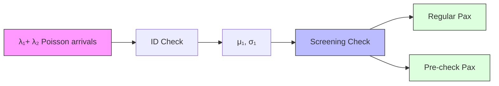
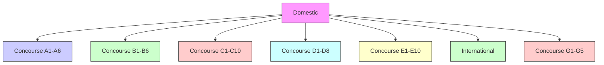

<table><tr><td colspan="2">For office use only</td></tr><tr><td>T1</td><td></td></tr><tr><td>T2</td><td></td></tr><tr><td>T3</td><td></td></tr><tr><td>T4</td><td></td></tr></table>

Team Control Number

55295  
Problem Chosen  
D  
For office use only

<table><tr><td>F1</td><td></td></tr><tr><td>F2</td><td></td></tr><tr><td>F3</td><td></td></tr><tr><td>F4</td><td></td></tr></table>

## 2017 Mathematical Contest in Modeling (MCM/ICM) Summary Sheet

# Breezing Through Security Checkpoints: an Intelligent Airport with Smart Scheduling

Summary

In order to improve the performance of airport security check while preserving the same security standards, we model and refine this process. We run extensive simulations to analyze performance of our model. Specifically,

For task (a), we model the airport security process with a queueing network. We get the parameters of the queueing network model by fitting the data in the provided data sheet to different distributions. We validate our model by simulating it with the real world parameter combination and comparing its output against data collected from airport passengers. We identify three bottlenecks in our model: lack of sufficient ID check points; exclusive assignment of screening check points to passengers; the presence of suspicious passengers.

For task (b), we propose three routing algorithms to optimize the throughput and variance of the airport: greedy algorithm, backpressure algorithm, and drift-plus-penalty algorithm. The best one of these algorithms achieves high throughput that is close to optimal and relatively low variance in waiting time. Besides, our proposed routing algorithm manages to retain passenger satisfaction while scheduling. We also explore the optimal ratio of different kinds of check points and test the robustness of modified models.

For task (c), we analyze the impact of different cultures and traveler types and run simulation to see the reaction of our model. The cultures we analyze are collectivist cultures, individualist cultures. The types of travelers we analyze are family-based travelers and tech-based travelers. We also propose accommodations to these special situations.

For task (d), we propose both globally applicable and locally applicable policies to airport security managers. Our policies are based on our analysis of different cultures and types of travelers as well as our analysis of our routing algorithms.

Keywords: Queueing Networks; Routing Algorithms; Lyapunov Optimization

# Breezing Through Security Checkpoints: an Intelligent Airport with Smart Scheduling

Team # 55295

## Summary

In order to improve the performance of airport security check while preserving the same security standards, we model and refine this process. We run extensive simulations to analyze performance of our model. Specifically,

For task (a), we model the airport security process with a queueing network. We get the parameters of the queueing network model by fitting the data in the provided data sheet to different distributions. We validate our model by simulating it with the real world parameter combination and comparing its output against data collected from airport passengers. We identify three bottlenecks in our model: lack of sufficient ID check points; exclusive assignment of screening check points to passengers; the presence of suspicious passengers.

For task (b), we propose three routing algorithms to optimize the throughput and variance of the airport: greedy algorithm, backpressure algorithm, and drift-plus-penalty algorithm. The best one of these algorithms achieves high throughput that is close to optimal and relatively low variance in waiting time. Besides, our proposed routing algorithm manages to retain passenger satisfaction while scheduling. We also explore the optimal ratio of different kinds of check points and test the robustness of modified models.

For task (c), we analyze the impact of different cultures and traveler types and run simulation to see the reaction of our model. The cultures we analyze are collectivist cultures, individualist cultures. The types of travelers we analyze are family-based travelers and tech-based travelers. We also propose accommodations to these special situations.

For task (d), we propose both globally applicable and locally applicable policies to airport security managers. Our policies are based on our analysis of different cultures and types of travelers as well as our analysis of our routing algorithms.

Keywords: Queueing Networks; Routing Algorithms; Lyapunov Optimization

## Contents

## 1 Introduction 1

## 2 Basic Analysis of the problem 1

2.1 Single Queueing Nodes 1  
2.2 Parameter Settings 2  
2.3 Rate Stability 3  
2.4 Measures of Performance 3

## 3 Models 4

3.1 Tandem $M / G / c$ Queueing Model 4  
3.2 Queueing Network Model 5

## 4 Simulations and Bottleneck Detection 6

4.1 Simulation Setup 6  
4.2 Validating Our Model 6  
4.3 Simulation Evaluation 7

## 5 Modifications to the Process 9

5.1 Greedy Routing Based on Backlogs 9  
5.2 Lyapunov Drift and Backpressure-Based Routing 10  
5.2.1 Lyapunov Optimization for Queueing Networks ..... 10  
5.2.2 The Performance of Backpressure Routing 11  
5.3 Drift-Plus-Penalty Algorithm 13  
5.3.1 Drift-Plus-Penalty 13  
5.3.2 The Performance of Drift-Plus-Penalty Algorithm ..... 14

## 6 Sensitivity Analysis 14

6.1 Modeling Different Situations 15  
6.1.1 Collectivist Cultural Norms 15  
6.1.2 Individualist Cultural Norms ..... 15  
6.1.3 Family-based Travelers 16  
6.1.4 Tech-based Travelers 16

6.2 Impact of Various Situations 16

6.2.1 Collectivist Cultural Norms ..... 16  
6.2.2 Individualist Cultural Norms ..... 17  
6.2.3 Family-based Travelers 17  
6.2.4 Tech-based Travelers 18

6.3 Accommodation for Situations 18

## 7 Conclusion 19

7.1 Conclusion of the Problem 19  
7.2 Policy Proposal 19  
7.3 Strength and Weakness of Our Model 19  
7.4 Future Application of Models 20

## 1 Introduction

Security has been of first priority in transportation activities that involve people since the beginning of the century. A series of time-consuming security check processes are necessary to ensure the security of all passengers aboard. But passengers are complaining about waiting for security check in extremely long queues. It is quite challenging to improve the performance of airport security check systems while preserving the current security standards.

In this paper, we try to model this security check process and refine the model. Our main contributions are as follows:

1. We model the security check process with a queueing network. We validate our model by simulating it with real-world parameter combinations and comparing its result with real world data. We identify lack of sufficient ID check points, exclusive assignment of screening check points, presence of suspicious passengers as three bottlenecks in the model.  
2. We propose and implement three routing algorithms to optimize our basic model. We simulate our model with these algorithms and analyze their performance. We find that the proposed backpressure algorithm achieves throughput close to optimal and a relatively low variance in waiting time.  
3. We analyze the sensitivity of our model by considering the impacts of cultural norms and passenger types. We analyze how the output of our model changes with respect to different norms and passengers, and propose accommodations to these situations.

## 2 Basic Analysis of the problem

## 2.1 Single Queueing Nodes

M/G/1 Queue: We adopt M/G/1 queue[1](shown in Figure 1(a)) in our model.

- $M$ : the arrival times of the passengers follow a Poisson distribution  
- $G$ : the service times follow an arbitrary probability distribution  
• 1: there is only one check point available

The arrivals are determined by a Poisson process with rate parameter $\mu$ . Job service time has a normal distribution with parameter $\mu$ and $\sigma$ .

M/G/c Queue: We also adopt M/G/c queue(shown in Figure 1(b)) in our model, which is a generalization of the M/G/1 queue. c represents the number of check points. The arrival time of passengers follows a Poisson distribution with rate parameter $\lambda$ . Job service time follows a normal distribution with parameter $\mu$ and $\sigma$ .

FIFO: The queue obeys a first-come, first-served discipline. A single check point serves customers one at a time from the front of the queue. When the service is complete,

  
Figure 1: Single Queueing Nodes  
the customer leaves the queue and the number of customers in the system reduces by one.

## 2.2 Parameter Settings

Before the simulation, we set basic parameters of the probability distribution in queueing node based on the data in the data sheet. We use the EstimatedDistribution function of Mathematica to determine probability distributions and estimate parameters. The average interval for the arrival time of regular and pre-check passengers follows exponential distribution with parameter $\frac{1}{\lambda_{1}}$ and $\frac{1}{\lambda_{2}}$ respectively. And the average rate of ID check service in zone A and baggage and body screening follow normal distribution with parameters $(\mu_{1},\sigma_{1})$ and $(\mu_{2},\sigma_{2})$ . Besides, we assume the time for regular passengers to remove shoes, belts, light jackets and computers from their bags follows a normal distribution with the parameters $(\mu_{4},\sigma_{4})$ . Thus the average rate of baggage and body screening for regular customer follows normal distribution with parameters $(\mu_{3},\sigma_{3})$ , where $\mu_{3}=\mu_{2}+\mu_{4}$ and $\sigma_{3}=\sqrt{\sigma_{2}^{2}+\sigma_{4}^{2}}$ . The normal distribution $(\mu_{3},\sigma_{3})$ and the normal distribution $(\mu_{4},\sigma_{4})$ are independent to each other. The specific numbers are in Table 1.

<table><tr><td>Symbol</td><td>Definition</td><td>value</td></tr><tr><td> $\lambda_1$ </td><td>Rate of regular passenger arrivals</td><td>4.63476</td></tr><tr><td> $\lambda_2$ </td><td>Rate of pre-check passenger arrivals</td><td>6.52921</td></tr><tr><td> $(\mu_1, \sigma_1)$ </td><td>Mean and variance of ID check service time</td><td>(0.186875, 0.0612029)</td></tr><tr><td> $(\mu_2, \sigma_2)$ </td><td>Mean and variance of screening service time for pre-check passengers</td><td>(0.507639, 0.158551)</td></tr><tr><td> $(\mu_3, \sigma_3)$ </td><td>Mean and variance of screening service time for regular passengers</td><td>(2.507639, 0.524536)</td></tr></table>

Table 1: The Parameters in the Problems


<details>
<summary>bar-line hybrid chart</summary>

| Arriving time interval(min) | Time 1 | Time 2 | Time 3 | Time 4 |
| --------------------------- | ------ | ------ | ------ | ------ |
| 0.0                         | 3.0    | 6.0    | 6.0    | 1.0    |
| 0.1                         | 1.0    | 1.0    | 6.0    | 1.0    |
| 0.2                         | 1.0    | 1.0    | 2.0    | 1.0    |
| 0.3                         | 1.0    | 1.0    | 2.0    | 1.0    |
| 0.4                         | 1.0    | 1.0    | 1.0    | 1.0    |
| 0.5                         | 1.0    | 1.0    | 1.0    | 1.0    |
| 0.6                         | 1.0    | 1.0    | 1.0    | 1.0    |
| 0.7                         | 1.0    | 1.0    | 1.0    | 1.0    |
| 0.8                         | 1.0    | 1.0    | 1.0    | 1.0    |
| 0.9                         | 1.0    | 1.0    | 1.0    | 1.0    |
| 1.0                         | 1.0    | 1.0    | 1.0    | 1.0    |
</details>

Figure 2: The Fitting Results from Mathematica

The distribution of service time in different check points s not identical in real life. In order to simulate the differences among check points, we keep the variance of normal distribution $\sigma_{k}$ unchanged(k=1,2,3), and uniformly generate $\mu_{k_{i}}$ of normal distribution between $\mu_{k}-\sigma_{k}$ and $\mu_{k}+\sigma_{k}$ .

## 2.3 Rate Stability

Due to the cost of hiring employees and maintaining the machine, it is impossible for airport to set up infinite check points. But the airport makes sure that the number of check points satisfies the need of passengers and the number of passengers waiting in queue will not grow larger over time.

Let $Q(t)$ represent the contents of a single queueing node defined at time slots $t \in \{0, 1, 2, \ldots\}$ . $Q(t)$ is a stochastic process according to probability law. A queueing node is rate stable[2] if $\lim_{t \to \infty} \frac{E\{|Q(t)|\}}{t} = 0$ . Rate stability ensures the queue will not keep growing over time. $a(t)$ represents the number of new passengers that arrive on slot $t$ and $b(t)$ represents the number of passengers the check point of the queue can serve on slot $t$ . $Q(t)$ is rate stable if

$$
\limsup _ {t \to \infty} \frac {1}{t} \sum_ {\tau = 0} ^ {t - 1} \left[ a \left(\tau\right) - b \left(\tau\right) \right] \leq 0.
$$

We stipulate that the number of check points satisfies rate stability while the ratio of check points between the regular and pre-check passengers is 3:1. Therefore we set the number of check points as shown in Table 2.

<table><tr><td>zone</td><td>regular</td><td>pre-check</td></tr><tr><td>ID check(zone A)</td><td>3</td><td>1</td></tr><tr><td>Screening(zone B)</td><td>12</td><td>4</td></tr></table>

Table 2: The Number of Service Counters

## 2.4 Measures of Performance

Throughput and variance of average waiting time are two main measures in the security check system. They are defined as follows.

Throughput: The average number of passengers that pass the security check system in per unit time. The per unit time here is set as minute.

Variance: Suppose the waiting time for regular passenger is $X_{1}$ and the waiting time for pre-check passenger is $X_{2}$ . The percentage of regular passengers is p. The variance of system is defined as

$$
p \mathbb {E} \left[ (X _ {1} - \mathbb {E} (X _ {1})) ^ {2} \right] + (1 - p) \mathbb {E} \left[ (X _ {2} - \mathbb {E} (X _ {2})) ^ {2} \right]
$$

Throughput measures the security check system's capacity on a collective level while variance of waiting time measures the fairness on an individual level.

## 3 Models

In this section, we first present our models in details. The first model is an optimal but unpractical model, which serves as a comparison and aims to provide modification insights. The second one models the queueing networks of real security checking system in an airport.

<table><tr><td>Symbol</td><td>Definition</td></tr><tr><td> $\lambda$ </td><td>The rate parameter for the exponential distribution</td></tr><tr><td> $\mu$ </td><td>The mean value parameter for the normal distribution</td></tr><tr><td> $\sigma$ </td><td>The rate parameter(squared scale) for the normal distribution</td></tr><tr><td> $N$ </td><td>The number of check points</td></tr><tr><td> $Q_{a}^{(c)}(t)$ </td><td>The backlogs at queueing node  $a$  for passenger  $c$  at time  $t$ </td></tr><tr><td> $\mu_{ab}^{(c)}(t)$ </td><td>The transmitting rate from queueing node  $a$  and queueing node  $b$  for passenger  $c$  at time  $t$ </td></tr><tr><td> $L(t)$ </td><td>The Lyanpnov function at time  $t$ </td></tr><tr><td> $\Delta(t)$ </td><td>The Lyanpnov drift at time  $t$ </td></tr><tr><td> $V$ </td><td>The control parameter in drift-plus-penalty algorithm</td></tr></table>

Table 3: Notations

## 3.1 Tandem M/G/c Queueing Model

We first present an ideal model, the tandem M/G/c model. This model realizes the maximum throughput but is not feasible in the real life. We will later compare the performance of this ideal model with that of practical model to evaluate the latter and make modification.

As Figure 3 demonstrates, two M/G/c queues are in a tandem array. The first M/G/c queueing node denotes the queues of ID check (Zone A) and there are $N_{A}$ check points. Similarly, the second M/G/c queue denotes the queues of baggage and body screening (Zone B) and there are $N_{B}$ check points. All check points are accessible to both regular passengers and pre-check passengers and the only difference is that the pre-check passengers are likely to spend less time at Zone B.


<details>
<summary>flowchart</summary>


</details>

Figure 3: Tandem M/G/c Queueing Model

Tandem M/G/c queueing model achieves the optimal performance. All check points in the same zone are busy as long as there are passengers waiting in queue. As for other models, a check point in one queueing node is idle when passengers are waiting before the line in another queueing node when a zone have more than one queueing node. In this way, tandem M/G/c model avoids unnecessary waiting time and attain the maximum throughput.

However, tandem M/G/c model is unpractical. For one thing, the single queue at every zone can be extremely long, which is hard to keep order. For another, access to every check points for both regular passengers and pre-check customers is feasible. Particularly, screening check points at zone B have different check process for these two kinds of passengers and it's impossible to mix two process together.

Therefore, tandem M/G/c model has achieved maximum throughput but is unpractical in real life. This model is used for comparison with real-life model and provide insights for modifications later.

## 3.2 Queueing Network Model

Now we introduce queueing network model which models the security check in real-life airports. Queueing networks are systems in which a number of queues are connected by customer routing. Similar to BCMP networks[3], our queueing network models are open networks with very general service time which follows the normal distribution.

The queueing network in real-life airport is illustrated in Figure 4. Every queueing node is an M/G/1 queueing, for there is one queue for every check point. Regular passengers and pre-check passengers are separate from each other in the entire process of security check. Every queueing node at zone A directs to its corresponding queueing nodes at zone B. We use $N_{A1}$ and $N_{A2}$ to denote the number of queueing node in Zone A for regular passengers and pre-check passengers respectively and use $N_{B1}$ and $N_{B2}$ to denote the number of queueing node in Zone B for regular passengers and pre-check passengers respectively.

```mermaid
graph TD
  A["ID Check"] --> B["Regular Pax"]
  A --> C["Screening Check"]
  D["Pre-check Pax"] --> E["Regular Pax"]
  D --> F["Screening Check"]
  G["IDA"] --> H["Regular Pax"]
  G --> I["Screening Check"]
  J["IDA"] --> K["Regular Pax"]
  J --> L["Screening Check"]
  M["IDA"] --> N["Regular Pax"]
  M --> O["Screening Check"]
  P["IDA"] --> Q["Regular Pax"]
  P --> R["Screening Check"]
  S["IDA"] --> T["Regular Pax"]
  S --> U["Screening Check"]
  V["IDA"] --> W["Regular Pax"]
  V --> X["Screening Check"]
  Y["IDA"] --> Z["Regular Pax"]
  Y --> AA["Screening Check"]
```


<details>
<summary>flowchart</summary>


</details>

Figure 4: Queueing Network Model

We will later modify the topology of queueing networks and apply different routing algorithms in queueing networks to achieve larger throughput and smaller variance in the queueing system.

## 4 Simulations and Bottleneck Detection

## 4.1 Simulation Setup

We run massive simulations on the queueing network model using the data from the real airports to validate the queueing network model.

We simulate both the tandem M/G/c network and queueing networks model. The simulation data is generated based on the probability distribution that we obtain from the data sheet. We set 1000 people to pass the system in every simulation and collect statistics of length of the queue, throughput, average, and variance of waiting time.

We also consider the presence of suspicious passengers in the security check system in simulation. Every suspicious passenger appears with a probability of $\frac{1}{1000}$ and the queue will be stuck for 10 min. We test the robustness of queueing system by adding the presence of suspicious passengers.

## 4.2 Validating Our Model

To validate our model, we simulate the model using real-world parameter combinations and compare the result with real-world data provided by airport passengers.

Specifically, we get the number of daily passengers of 5 biggest airports in the US from their official website [4][5][6][7][8]. We then assume that the arrival time of passengers follow the Poisson distribution, and therefore we can calculate the mean arrival rate of passengers by dividing the total number of passengers with the time length of a day. Besides, we get the mean waiting time of passengers from [9]. Other parameters are set after the Bangkok International Airport, which is shown in Figure 5. After that, we simulate our model using the corresponding arrival time distribution. The result of our simulation is shown in Table 4.


<details>
<summary>flowchart</summary>


</details>

Figure 5: Bangkok International Airport Security Check System

<table><tr><td>Airport</td><td>daily arrival passengers</td><td>average waiting time from websites(minute)</td><td>average waiting time calculated by model(minute)</td></tr><tr><td>Chicago O&#x27;Hare International(ORD)</td><td>2,000,000</td><td>40 – 60</td><td>79.0155</td></tr><tr><td>Hartsfield-Jackson Atlanta International(ATL)</td><td>260,000</td><td>10 – 20</td><td>42.9196</td></tr><tr><td>Los Angeles International(LAX)</td><td>205,000</td><td>20 – 30</td><td>32.5824</td></tr><tr><td>John F. Kennedy International(JFK)</td><td>156,000</td><td>10 – 20</td><td>16.8958</td></tr><tr><td>San Francisco International(SFO)</td><td>137,000</td><td>1 – 10</td><td>9.4987</td></tr></table>

Table 4: Result of Validation Process

We can see from Table 4 that the resulting average waiting time of our model is generally close to the real average waiting time and thus our model is valid in real life. The discrepancy between the model output and the ground truth can be explained as follows. The number of check points of our model is far less than that of the real case. Since the real number of check points is unavailable online, so we have to estimate the number from the fact that the waiting queue of clients is at least rate stable(as is discussed in section 2.3). That is, $\lambda \leq c \cdot \mu$ , where $\lambda$ is the arrival time, $\mu$ is the service rate(estimated from Excel data), and $c$ is the number of check points. $c$ obtained in this way is very likely to be far smaller than the real number of check points since real airports deploy more check points to deal with large number of passengers. In all, the inaccurate estimation of number of check points contributes to the discrepancy.

## 4.3 Simulation Evaluation

We now evaluate the simulation results given the parameters in our problem and analyze the bottleneck in current security check system.

The lack of sufficient ID check points for pre-check passengers is a bottleneck in the queueing network model. From section 3.2, we see that the length of ID check queue for pre-check passengers grows quickly. However, the high speed of screening check point for pre-check passengers keeps the average waiting time for pre-check passengers much smaller than that of regular passengers. The imbalanced allocation of resource incurs congestion in the security system for pre-check users. Deploying one more ID check point for pre-check passengers, which is an effective but luxurious solution to the limit of ID check point, may not meet the approval due to the heavy cost.

The exclusive assignment of screening check points to some specific group of passengers is another bottleneck. In this model, every ID check point only connects to 4 screening check points for the convenience of managing passengers and these 4 check points are exclusively used by passengers from the previous ID check point. In section 3.2, 4 screening queues from the same ID check points for regular passengers suffer from long queue while screening queues from other ID check points have much shorter queue.

Since the service time is not identical for every check point, a passenger from fast ID check points is possible to be directed to slow screening check points. In consequence, there might be certain screening check points suffering from long waiting queues and the separation of screening check points for regular customers results in the waste of resource.


<details>
<summary>area chart</summary>

| Time/min | PreIDQ0 | RegScreenQ02 | RegIDQ0 | RegScreenQ03 | RegIDQ1 | RegScreenQ10 | RegIDQ2 | RegScreenQ11 | PreScreenQ00 | RegScreenQ12 | PreScreenQ01 | RegScreenQ02 | RegScreenQ20 | PreScreenQ03 | RegScreenQ21 | RegScreenQ00 | RegScreenQ22 | RegScreenQ01 | RegScreenQ23 |
| -------- | ------- | ------------ | ------- | ------------ | ------- | ------------ | ------- | ------------ | ------------ | ------------ | ------------ | ------------ | ------------ | ------------ | ------------ | ------------ | ------------ | ------------ | ------------ |
| 0        | 0       | 0            | 0       | 0            | 0       | 0            | 0       | 0            | 0            | 0            | 0            | 0            | 0            | 0            | 0            | 0            | 0            | 0            | 0            |
| 50       | 75      | 5            | 5       | 5            | 5       | 5            | 5       | 5            | 5            | 5            | 5            | 5            | 5            | 5            | 5            | 5            | 5            | 5            | 5            |
| 100      | 85      | 15           | 15      | 15           | 15      | 15           | 15      | 15           | 15           | 15           | 15           | 15           | 15           | 15           | 15           | 15           | 15           | 15           | 15           |
| 150      | 25      | 25           | 25      | 25           | 25      | 25           | 25      | 25           | 25           | 25           | 25           | 25           | 25           | 25           | 25           | 25           | 25           | 25           | 25           |
| >175     | ~0      | ~0           | ~0      | ~0           | ~0      | ~0           | ~0      | ~0           | ~0           | ~0           | ~0           | ~0           | ~0           | ~0           | ~0           | ~0           | ~0           | ~0           | ~0           |
</details>

Figure 6: The Number of PAX in Queue in Queueing Network Model


<details>
<summary>line chart</summary>

| Time/min | Max number of PAXin a queue |
| -------- | --------------------------- |
| 0        | 0                           |
| 50       | 60                          |
| 100      | 20                          |
| 150      | 15                          |
| 200      | 0                           |
</details>


<details>
<summary>line chart</summary>

| Time /min | ID Check Queue | Screening Check Queue |
| --------- | -------------- | ---------------------- |
| 0         | 4              | 22                     |
| 10        | 5              | 18                     |
| 20        | 6              | 16                     |
| 30        | 5              | 17                     |
| 40        | 6              | 19                     |
| 50        | 5              | 21                     |
| 60        | 4              | 22                     |
| 70        | 5              | 18                     |
| 80        | 4              | 15                     |
| 90        | 5              | 16                     |
| 100       | 6              | 17                     |
| 110       | 5              | 14                     |
| 120       | 4              | 12                     |
| 130       | 3              | 8                      |
</details>

Figure 7: The Longest Queue with Suspicious Passenger  
Figure 8: The Number of PAX in Queue in Tandem M/G/c Queueing Model

The presence of suspicious passengers is the third bottleneck of this model. After analyzing Figure 6 and 7, the outline of 6 is the maximum number of passengers in a queue without the presence of suspicious people. Contrasting the Figure 7 with the outline of Figure 6, there is a suspicious passenger showing up at 88 minutes, which results in the rising slope increases for 15 minutes, and the maximum value is larger. At 152 minutes, another suspicious passenger arrives, which results in the maximum number of a queue keeping for 10 minutes instead of decreasing as in Figure 6. By comparing the figures, we find that the presence of suspicious passengers will influence the stability of the system. In the airport, the suspicious passengers are more likely to be detected when the security check is strict especially in festivals or after certain events. So the influence of suspicious passengers should be considered as one of the bottlenecks of queueing network model.

These bottleneck of queueing networks model all result from the plain structure of security check system and oversimple queueing rules. In Figure 8, passengers wait in front of every queue node during the whole process and thus all the check points are working all the time. The results of tandem M/G/1 network model in Figure 8 show that the balance of all the queueing system enables the system to make full use of resource.

We will modify the security checking system to achieve a more efficient use of resources in the next section.

## 5 Modifications to the Process

In this section we will introduce modifications for the bottleneck detected in the previous section. We implement different routing algorithms and optimize the ratio of two kinds of passengers in order to achieve larger throughput and smaller variance.

## 5.1 Greedy Routing Based on Backlogs

We allow the queueing nodes to direct to more queueing nodes in this section. Previous model have bottleneck where the queueing nodes corresponding to one node are busy and queueing nodes corresponding to another node are idle. Enabling passengers to make choice among more check points will make better use of the resource of check points by avoiding wastes. As Figure 9 demonstrated, both kinds of passengers are still prohibited to enter the check points of each for the privilege of the pre-check passengers, but all check points in zone B are accessible to passengers from the check point for passengers of the same kind in zone A.

```mermaid
graph TD
    subgraph ID_Check[ID Check]
  A1["○"] --> B1["○"]
  A2["○"] --> B2["○"]
  A3["..."] --> B3["○"]
  A4["○"] --> B4["○"]
    end
    subgraph Screening_Check[Screening Check]
  C1["○"] --> D1["○"]
  C2["○"] --> D2["○"]
  C3["..."] --> D3["○"]
  C4["○"] --> D4["○"]
    end
    subgraph Pre_check_Pax_Pre_check_Pax["Pre-check_Pax[Pre-check Pax]"]
  E1["○"] --> F1["○"]
  E2["..."] --> F2["○"]
  E3["○"] --> F3["○"]
    end
  A1 --> B1
  A2 --> B2
  A3 --> B3
  A4 --> B4
  A5 --> B5
  B1 --> C1
  B2 --> C2
  B3 --> C3
  B4 --> C4
  B5 --> C5
  B6 --> C6
  B7 --> C7
  B8 --> C8
  B9 --> C9
  B10 --> C10
  B11 --> C11
  B12 --> C12
  B13 --> C13
  B14 --> C14
  B15 --> C15
  B16 --> C16
  B17 --> C17
  B18 --> C18
  B19 --> C19
  B20 --> C20
  B21 --> C21
  B22 --> C22
  B23 --> C23
  B24 --> C24
  B25 --> C25
  B26 --> C26
  B27 --> C27
  B28 --> C28
  B29 --> C29
  B30 --> C30
  B31 --> C31
  B32 --> C32
  B33 --> C33
  B34 --> C34
  B35 --> C35
  B36 --> C36
  B37 --> C37
  B38 --> C38
  B39 --> C39
  B40 --> C40
  B41 --> C41
  B42 --> C42
  B43 --> C43
  B44 --> C44
  B45 --> C45
  B46 --> C46
  B47 --> C47
  B48 --> C48
  B49 --> C49
  B50 --> C50
    style ID_Check fill:#f9f,stroke:#333
    style Screening_Check fill:#ccf,stroke:#333
```


<details>
<summary>flowchart</summary>


</details>

Figure 9: The Queueing Network in Greedy Routing Based on Backlogs

We apply greedy routing based on the backlogs of the queueing node. The amount of total passengers waiting in queue nodes n are denoted as the backlog $Q_{n}(t)$ . Every passenger makes the locally optimal choice of choosing the queueing node with the least queue backlog.

The results are illustrated in the Figure 10. The greedy algorithm achieves a much smaller queue size of less than 16 compared to the original model in section 3.2. Also, the total time required for all passengers to pass the line is much less. The throughput is 7.148PAX/min and the variance of waiting time is $103.427min^{2}$ . The queueing system in greedy algorithm has better performance than the original model.


<details>
<summary>bar chart</summary>

| Time /min | Number of PAXin queue |
| --------- | --------------------- |
| 0         | 4                     |
| 5         | 10                    |
| 10        | 15                    |
| 15        | 6                     |
| 20        | 9                     |
| 25        | 7                     |
| 30        | 16                    |
| 35        | 14                    |
| 40        | 9                     |
| 45        | 6                     |
| 50        | 4                     |
| 55        | 5                     |
| 60        | 3                     |
| 65        | 2                     |
| 70        | 4                     |
| 75        | 10                    |
| 80        | 1                     |
| 85        | 1                     |
| 90        | 1                     |
| 95        | 2                     |
| 100       | 1                     |
| 105       | 1                     |
| 110       | 1                     |
| 115       | 1                     |
| 120       | 2                     |
</details>

— RegID0 — RegScreen7  
RegID1 RegScreen8  
RegID2 RegScreen9  
— RegScreen0 — RegScreen10  
— RegScreen1 — RegScreen11  
— RegScreen2 — PreID0  
— RegScreen3 — PreScreen0  
RegScreen4 PreScreen1  
— RegScreen5 — PreScreen2  
RegScreen6 PreScreen3  
Figure 10: The Number of PAX in Queue in Greedy Routing Based on Backlogs

## 5.2 Lyapunov Drift and Backpressure-Based Routing

## 5.2.1 Lyapunov Optimization for Queueing Networks

Consider a queueing network with N queueing nodes in discrete time slots t in $\{0,1,2,\ldots\}$ . On each slot, routing and transmission scheduling decisions are made in an effort to deliver passenger to destination. Let $Q_{n}^{(c)}(t)$ , where c can be both regular and pre-check passengers, be the current amount of passenger in node n, also called the queue backlog. The queue backlogs from one slot to the next satisfies the following for all $n \in \{1,\ldots,N\}$ , $c \in \{regular,pre-check\}$ :

$$
Q _ {n} ^ {(c)} (t + 1) \leq \max \left[ Q _ {n} ^ {(c)} (t) - \sum_ {b = 1} ^ {N} \mu_ {n b} ^ {(c)} (t), 0 \right] + \sum_ {a = 1} ^ {N} \mu_ {a n} ^ {(c)} (t) + A _ {n} ^ {(c)} (t)
$$

where $A_{n}^{(c)}(t)$ is the random amount of passengers that exogenously arrives to node n on slot t, and $\mu_{ab}^{(c)}(t)$ is the transmission rate allocated to passenger c on link $(a,b)$ on slot t. Note that $\mu_{ab}^{(c)}(t)$ may be more than the amount of passengers c that is actually transmitted on link $(a,b)$ on slot t. This is because there may not be enough backlog in node a.

The backpressure algorithm[10] is designed by choosing transmission and routing variables to greedily minimize a bound on the drift of a Lyapunov function. Specifically, define $Q(t) = Q_n^{(c)}(t)$ as the matrix of current queue backlogs. Define the Lyapunov function

$$
L (t) = \frac {1}{2} \sum_ {i = 1} ^ {N} \sum_ {c} Q _ {i} ^ {(c)} (t) ^ {2}.
$$

This function is a scalar measure of the total queue backlog in the network. Note that this is a sum of the squares of queue backlogs. Thus the backlogs in every Queues are small if the Lyanpnov function is small. Then the Lyapunov drift is defined as the change in

this function from one slot to the next:

$$
\Delta (t) = \mathbb {E} \left\{L (t + 1) - L (t) | Q (t) \right\}.
$$

We intend to minimize the Lyapunov drift so as to minimize the total queue backlog in the network as time goes by.

We transform the equation using the inequality of backlog from one slot to another slot

$$
\Delta (t) \leq B + \sum_ {n = 1} ^ {N} \sum_ {c} Q _ {i} ^ {(c)} (t) \mathbb {E} \left\{\lambda_ {n} ^ {(c)} (t) + \sum_ {a = 1} ^ {N} \mu_ {a n} ^ {(c)} (t) - \sum_ {b = 1} ^ {N} \mu_ {n b} ^ {(c)} (t) | Q (t) \right\},
$$

where $B$ is a finite constant and $\left(\lambda_n^{(c)}(t)\right)$ is passenger arrival rate matrix. Since $B$ and $\left(\lambda_n^{(c)}(t)\right)$ is constant, we maximize the following terms to minimizing the Lyanpnov drift

$$
\sum_ {a = 1} ^ {N} \sum_ {b = 1} ^ {N} \sum_ {c} \mu_ {a b} ^ {(c)} (t) [ Q _ {a} ^ {(c)} (t) - Q _ {b} ^ {(c)} (t) ].
$$

The weight $Q_{a}^{(c)}(t)-Q_{b}^{(c)}(t)$ is called the current differential backlog of c between nodes a and b. Thus, we want to choose decision variables $\left(\mu_{ab}^{(c)}(t)\right)$ so as to maximize the above weighted sum, where weights are differential backlogs.

Clearly we should not send data in a direction of negative differential backlog, and so we should choose $\mu_{ab}^{(c)}(t)=0$ whenever the differential backlog is negative. Further, given $\mu_{ab}^{(c)}(t)$ for a particular link $(a,b)$ , the optimal $\mu_{ab}^{(c)}(t)$ are chosen as follows: first find $c_{ab}^{opt}(t)$ that maximize the differential backlog for link $(a,b)$ . If this maximizing differential backlog is negative, assign $\mu_{ab}^{(c)}(t)=0$ for both kinds of passengers. Else, allocate the full link rate $\mu_{ab}(t)$ to the passengers $c_{ab}^{opt}(t)$ , and zero rate to the other passengers on this link. With this choice, our aim is to maximize

$$
\sum_ {a = 1} ^ {N} \sum_ {b = 1} ^ {N} \mu_ {a b} W _ {a b} (t) (t), \quad w h e r e \quad W _ {a b} (t) = \max \left[ Q _ {a} ^ {c _ {a b} ^ {o p t (t)}} (t) - Q _ {b} ^ {c _ {a b} ^ {o p t (t)}} (t) \right]
$$

choosing $\mu(ab)$ is called the max-weight algorithm. It maximizes a linear sum of transmission rates, where the weights $W_{ab}(t)$ correspond to differential backlogs. The back-pressure algorithm uses the max-weight decisions for $\mu_{ab}(t)$ , and then chooses routing variables $\left(\mu_{ab}^{(c)}(t)\right)$ via the maximum differential backlog as described above.

## 5.2.2 The Performance of Backpressure Routing

Now we apply the backpressure routing to the queueing network model. The transmitting rate $\mu_{ab}^{(c)}(t)$ has an inverse relationship with the current serving time of queueing node a. Except the rules in 5.2.1, pre-check passengers are able to queue before the check points for regular passengers. However, they receive the same check process and spend the same time as the regular passengers. This assumption is reasonable, for pre-check passengers have rights to go to regular check points when their own check points are too busy. The diagram of the queueing network is illustrated in Figure 11.


<details>
<summary>flowchart</summary>

```mermaid
graph TD
    subgraph ID Check
  A1["Input Node"] --> B1["Regular Pax"]
  A2["Input Node"] --> B2["Regular Pax"]
  A3["Input Node"] --> B3["Regular Pax"]
  A4["Input Node"] --> B4["Regular Pax"]
  A5["Input Node"] --> B5["Regular Pax"]
  A6["Input Node"] --> B6["Regular Pax"]
  A7["Input Node"] --> B7["Regular Pax"]
  A8["Input Node"] --> B8["Regular Pax"]
  A9["Input Node"] --> B9["Regular Pax"]
  A10["Input Node"] --> B10["Regular Pax"]
  A11["Input Node"] --> B11["Regular Pax"]
  A12["Input Node"] --> B12["Regular Pax"]
  A13["Input Node"] --> B13["Regular Pax"]
  A14["Input Node"] --> B14["Regular Pax"]
  A15["Input Node"] --> B15["Regular Pax"]
  A16["Input Node"] --> B16["Regular Pax"]
  A17["Input Node"] --> B17["Regular Pax"]
  A18["Input Node"] --> B18["Regular Pax"]
  A19["Input Node"] --> B19["Regular Pax"]
  A20["Input Node"] --> B20["Regular Pax"]
  A21["Input Node"] --> B21["Regular Pax"]
  A22["Input Node"] --> B22["Regular Pax"]
  A23["Input Node"] --> B23["Regular Pax"]
  A24["Input Node"] --> B24["Regular Pax"]
  A25["Input Node"] --> B25["Regular Pax"]
  A26["Input Node"] --> B26["Regular Pax"]
  A27["Input Node"] --> B27["Regular Pax"]
  A28["Input Node"] --> B28["Regular Pax"]
  A29["Input Node"] --> B29["Regular Pax"]
  A30["Input Node"] --> B30["Regular Pax"]
  A31["Input Node"] --> B31["Regular Pax"]
  A32["Input Node"] --> B32["Regular Pax"]
  A33["Input Node"] --> B33["Regular Pax"]
  A34["Input Node"] --> B34["Regular Pax"]
  A35["Input Node"] --> B35["Regular Pax"]
  A36["Input Node"] --> B36["Regular Pax"]
  A37["Input Node"] --> B37["Regular Pax"]
  A38["Input Node"] --> B38["Regular Pax"]
  A39["Input Node"] --> B39["Regular Pax"]
  A40["Input Node"] --> B40["Regular Pax"]
  A41["Input Node"] --> B41["Regular Pax"]
  A42["Input Node"] --> B42["Regular Pax"]
  A43["Input Node"] --> B43["Regular Pax"]
  A44["Input Node"] --> B44["Regular Pax"]
  A45["Input Node"] --> B45["Regular Pax"]
  A46["Input Node"] --> B46["Regular Pax"]
  A47["Input Node"] --> B47["Regular Pax"]
  A48["Input Node"] --> B48["Regular Pax"]
  A49["Input Node"] --> B49["Regular Pax"]
  A50["Input Node"] --> B50["Regular Pax"]
  A51["Input Node"] --> B51["Regular Pax"]
  A52["Input Node"] --> B52["Regular Pax"]
  A53["Input Node"] --> B53["Regular Pax"]
  A54["Input Node"] --> B54["Regular Pax"]
  A55["Input Node"] --> B55["Regular Pax"]
  A56["Input Node"] --> B56["Regular Pax"]
  A57["Input Node"] --> B57["Regular Pax"]
  A58["Input Node"] --> B58["Regular Pax"]
  A59["Input Node"] --> B59["Regular Pax"]
  A60["Input Node"] --> B60["Regular Pax"]
  A61["Input Node"] --> B61["Regular Pax"]
  A62["Input Node"] --> B62["Regular Pax"]
  A63["Input Node"] --> B63["Regular Pax"]
  A64["Input Node"] --> B64["Regular Pax"]
  A65["Input Node"] --> B65["Regular Pax"]
  A66["Input Node"] --> B66["Regular Pax"]
  A67["Input Node"] --> B67["Regular Pax"]
  A68["Input Node"] --> B68["Regular Pax"]
  A69["Input Node"] --> B69["Regular Pax"]
  A70["Input Node"] --> B70["Regular Pax"]
  A71["Input Node"] --> B71["Regular Pax"]
  A72["Input Node"] --> B72["Regular Pax"]
  A73["Input Node"] --> B73["Regular Pax"]
  A74["Input Node"] --> B74["Regular Pax"]
  A75["Input Node"] --> B75["Regular Pax"]
  A76["Input Node"] --> B76["Regular Pax"]
  A77["Input Node"] --> B77["Regular Pax"]
  A78["Input Node"] --> B78["Regular Pax"]
  A79["Input Node"] --> B79["Regular Pax"]
  A80["Input Node"] --> B80["Regular Pax"]
  A81["Input Node"] --> B81["Regular Pax"]
  A82["Input Node"] --> B82["Regular Pax"]
  A83["Input Node"] --> B83["Regular Pax"]
  A84["Input Node"] --> B84["Regular Pax"]
  A85["Input Node"] --> B85["Regular Pax"]
  A86["Input Node"] --> B86["Regular Pax"]
  A87["Input Node"] --> B87["Regular Pax"]
  A88["Input Node"] --> B88["Regular Pax"]
  A89["Input Node"] --> B89["Regular Pax"]
        A90["Pre-check Pax"]
    end
    subgraph Screening Check
    direction TB
    C1((C)) -- 0.0000
    C2((C)) -- 0.0000
    C3((C)) -- 0.0000
    C4((C)) -- 0.0000
    C5((C)) -- 0.0000
    C6((C)) -- 0.0000
    C7((C)) -- 0.0000
    C8((C)) -- 0.0000
    C9((C)) -- 0.0000
    C10((C)) -- 0.0000
    C11((C)) -- 0.0000
    C12((C)) -- 0.0000
    C13((C)) -- 0.0000
    C14((C)) -- 0.0000
    C15((C)) -- 0.0000
    C16((C)) -- 0.0000
    C17((C)) -- 0.0000
    C18((C)) -- 0.0000
    C19((C)) -- 0.0000
    C20((C)) -- 0.0000
    C21((C)) -- 0.0000
    C22((C)) -- 0.0000
    C23((C)) -- 0.0000
    C24((C)) -- 0.0000
    C25((C)) -- 0.0000
    C26((C)) -- 0.0000
    C27((C)) -- 0.0000
    C28((C)) -- 0.0000
    C29((C)) -- 0.0000
    C30((C)) -- 0.0000
    C31((C)) -- 0.0000
    C32((C)) -- 0.0000
    C33((C)) -- 0.0000
    C34((C)) -- 0.0000
    C35((C)) -- 0.0000
    C36((C)) -- 0.0000
    C37((C)) -- 0.0000
    C38((C)) -- 0.0000
    C39((C)) -- 0.0000
    C40((C)) -- 0.0000
    C41((C)) -- 0.0000
    C42((C)) -- 0.0000
    C43((C)) -- 0.0000
    C44((C)) -- 0.0000
    C45((C)) -- 1.5x1.5x1.5x1.5x1.5x1.5x1.5x1.5x1.5x1.5x1.5x1.5x1.5x1.5x1.5x1.5x1.5x1.5x1.5x1.5x1.5x1.5x1.5x1.5x1.5x1.5s1.
    style ID Check fill:#f9f,stroke:#333
    style Screening Check fill:#bbf,stroke:#333
```
</details>

Figure 11: The Queueing Network in Backpressure Routing

Figure 12 demonstrates the results of the backpressure routing. Compared to Figure 10 in greedy routing, the longest queue is the same. Although more queues are likely to have the long queues, this result from shorter service time of these check point. The graph also shows that it takes less time for all passengers to pass the security check systems than greedy routing. The throughput is 7.328PAX/min, which is closer to 7.673PAX/min of the optimal models than greedy routing. The variance of waiting time is $84.971min^{2}$ , smaller than that of greedy routing.


<details>
<summary>stacked bar chart</summary>

| Time /min | IDCheck0 | IDCheck1 | IDCheck2 | IDCheck3 | ScreenCheck0 | ScreenCheck1 | ScreenCheck2 | ScreenCheck3 | ScreenCheck4 | ScreenCheck5 | ScreenCheck6 | ScreenCheck7 | ScreenCheck8 | ScreenCheck9 | ScreenCheck10 | ScreenCheck11 | ScreenCheck12 | ScreenCheck13 | ScreenCheck14 | ScreenCheck15 |
| --- | --- | --- | --- | --- | --- | --- | --- | --- | --- | --- | --- | --- | --- | --- | --- | --- | --- | --- | --- | --- |
| 0 | 0 | 0 | 0 | 0 | 0 | 0 | 0 | 0 | 0 | 0 | 0 | 0 | 0 | 0 | 0 | 0 | 0 | 0 | 0 | 0 |
| 10 | 0 | 0 | 0 | 0 | 0 | 0 | 0 | 0 | 0 | 0 | 0 | 0 | 0 | 0 | 0 | 0 | 0 | 0 | 0 | 0 |
| 20 | 0 | 0 | 0 | 0 | 0 | 0 | 0 | 0 | 0 | 0 | 0 | 0 | 0 | 0 | 0 | 0 | 0 | 0 | 0 | 0 |
| 30 | 0 | 0 | 0 | 0 | 0 | 0 | 0 | 0 | 0 | 0 | 0 | 0 | 0 | 0 | 0 | 0 | 0 | 0 | 0 | 0 |
| 40 | 0 | 0 | 0 | 0 | 0 | 0 | 0 | 0 | 0 | 0 | 0 | 0 | 0 | 0 | 0 | 0 | 0 | 0 | 0 | 0 |
| 50 | 0 | 0 | 0 | 0 | 0 | 0 | 0 | 0 | 0 | 0 | 0 | 0 | 0 | 0 | 0 | 0 | 0 | 0 | 0 | 0 |
| 60 | 0 | 0 | 0 | 0 | 0 | 0 | 0 | 0 | 0 | 0 | 0 | 0 | 0 | 0 | 0 | 0 | 0 | 0 | 0 | 0 |
| 70 | 0 | 0 | 0 | 0 | 0 | 0 | 0 | 0 | 0 | 0 | 0 | 0 | 0 | 0 | 0 | 0 | 0 | 0 | 0 | 0 |
| 80 | 0 | 0 | 0 | 0 | 0 | 0 | 0 | 0 | 0 | 0 | 0 | 0 | 0 | 0 | 0 | 0 | 0 | 0 | 0 | 0 |
| 90 | 0 | 0 | 0 | 0 | 0 | 0 | 0 | 0 | 0 | 0 | 0 | 0 | 0 | 0 | 0 | 0 | 0 | 0 | 0 | 0 |
| 110 |  | \ | \ | \ | \ | \ | \ | \ | \ | \ | \ | \ | \ | \ | \ | \ | \ | \ | \ | \ |
| 120 |  | \ | \ | \ | \ | \ | \ | \ | \ | \ | \ | \ | \ | \ | \ | \ | \ | \ | \ | \ |
| 130 |  | \ | \ | \ | \ | \ | \ | \ | \ | \ | \ | \ | \ | \ | \ | \ | \ | \ | \ | \ |
</details>

Figure 12: The Number of PAX in Queue in Backpressure Routing

The robustness of the queueing networks improves when suspicious passengers pass the system. As illustrated in Figure 13a, where the dash line denotes the arrival of the suspicious passengers, the longest line is almost the same as the outline of Figure 12 and the queueing networks are rather stable. The queueing network is almost immune to the suspicious passengers.

We also explore the optimal ratio between regular and pre-check passengers(Figure 14). We adjust the ratio of check points in zone B, where exists most of the long queues and we have 16 check points in the zone B. The throughput increases sharply at first and then fluctuates around 7.3 while the variance of average waiting time goes directly down with the increase of check points for regular passengers. 13 check points for regular passengers is a proper choice for the queueing system in backpressure algorithm, for it maintains a relatively small variance as well as the largest throughput.


<details>
<summary>line chart</summary>

| Time/min | Max number of PAX in a queue |
| -------- | ---------------------------- |
| 0        | 2                            |
| 10       | 8                            |
| 20       | 10                           |
| 30       | 18                           |
| 40       | 18                           |
| 50       | 17                           |
| 60       | 19                           |
| 70       | 17                           |
| 80       | 16                           |
| 90       | 14                           |
| 100      | 12                           |
| 110      | 10                           |
| 120      | 8                            |
| 130      | 6                            |
| 140      | 2                            |
</details>

(a) Backpressure Routing


<details>
<summary>line chart</summary>

| Time/min | Maxnumber of PAXin a queue |
| -------- | -------------------------- |
| 0        | 2                          |
| 10       | 9                          |
| 20       | 12                         |
| 30       | 16                         |
| 40       | 18                         |
| 50       | 20                         |
| 60       | 18                         |
| 70       | 16                         |
| 80       | 12                         |
| 90       | 10                         |
| 100      | 6                          |
| 110      | 5                          |
| 120      | 8                          |
| 130      | 13                         |
| 140      | 10                         |
| 150      | 5                          |
</details>

(b) Drift-Plus-Penalty Algorithm

Figure 13: The Longest Queue in the Network(The Dash Line Denotes the Arrival of Suspicious Passengers)  


<details>
<summary>line chart</summary>

| Number of TSA regular check points | Throughput PAX/min |
| ---------------------------------- | ------------------- |
| 0                                  | 6.2                 |
| 2                                  | 7.0                 |
| 4                                  | 7.2                 |
| 6                                  | 7.2                 |
| 8                                  | 7.1                 |
| 10                                 | 7.3                 |
| 12                                 | 7.0                 |
| 14                                 | 7.4                 |
</details>


<details>
<summary>line chart</summary>

| Number of TSA regular check points | Variance/min² |
| ----------------------------------- | ------------- |
| 0                                   | 0             |
| 2                                   | 20            |
| 4                                   | 30            |
| 6                                   | 40            |
| 8                                   | 45            |
| 10                                  | 50            |
| 12                                  | 75            |
| 14                                  | 150           |
| 15                                  | 250           |
</details>

Figure 14: Throughput and Variance of Different Ratio Between Regular and Pre-check Check Points(16 Check Points in total)

## 5.3 Drift-Plus-Penalty Algorithm

## 5.3.1 Drift-Plus-Penalty

We intend to reduce the number of pre-check passengers to enter the check points compared to the previous routing algorithm under the same rule. Previous routing algorithm requires the pre-check passengers to enter the check points for regular customers to achieve larger throughput and smaller variance. Since the pre-check passengers pay extra money for better-service, they may be reluctant to receive the security check like the regular customers. Therefore, we improve the previous routing algorithm.

$Vpenalty(t)$ term is introduced to the Lyapunov drift in the previous backpressure routing. Instead of taking a control action to minimize a bound on $\Delta(t)$ , we minimize a bound the following drift-plus-penalty expression:

$$
\Delta (t) + V \mathbb {E} \left\{p e n a l t y (t) \right\}
$$

where $V \geq 0$ is a parameter that represents an “importance weight” on how much we emphasize to reduce the number of the pre-check passengers to enter the check point for regular passengers.

In the same way that minimizing a bound on $\Delta(t)$ leads to an expression $\Delta(t) \leq B$ , minimizing a bound on the drift-plus-penalty leads to an expression of the form:

$$
\Delta (t) + V \mathbb {E} \left\{p e n a l t y (t) \right\} \leq B + V p ^ {*},
$$

where $p^{*}$ is the optimal time average penalty.

## 5.3.2 The Performance of Drift-Plus-Penalty Algorithm

We apply the drift-plus-penalty algorithm in the problem. Let V = 0.5 and penalty $(t) = \frac{1}{2} \left( Q_{a} \left( t^{(c)} \right) - Q_{b}^{(c)} \left( t \right) \right)$ when we transmit pre-check passengers from queueing node a to queueing node b.

The results of drift-plus-penalty algorithm are demonstrate in Figure 15. The backlogs are larger than the backpressure routing as some queue reach over 14 and the largest backlog attain 20. Also, it takes more time for all passengers to pass the security check. The throughput of the system is 7.224PAX/min and the variance of waiting time is $149.880min^{2}$ , both of the result are worse off compared to the backpressure routing. This algorithm sacrifice the throughput and variance of waiting time to maintain the right of pre-check users.


<details>
<summary>stacked bar chart</summary>

| Time /min | Number of PAXin queue |
| --------- | --------------------- |
| 0         | 8                     |
| 5         | 10                    |
| 10        | 12                    |
| 15        | 13                    |
| 20        | 14                    |
| 25        | 15                    |
| 30        | 16                    |
| 35        | 15                    |
| 40        | 14                    |
| 45        | 13                    |
| 50        | 12                    |
| 55        | 11                    |
| 60        | 10                    |
| 65        | 9                     |
| 70        | 8                     |
| 75        | 7                     |
| 80        | 6                     |
| 85        | 5                     |
| 90        | 4                     |
| 95        | 3                     |
| 100       | 2                     |
| 105       | 1                     |
| 110       | 1                     |
| 115       | 1                     |
| 120       | 1                     |
| 125       | 1                     |
| 130       | 1                     |
| 135       | 1                     |
| 140       | 1                     |
</details>


<details>
<summary>bar chart</summary>

| Category | IDCheck0 | IDCheck1 | IDCheck2 | IDCheck3 | ScreenCheck0 | ScreenCheck1 | ScreenCheck2 | ScreenCheck3 | ScreenCheck4 | ScreenCheck5 | ScreenCheck6 | ScreenCheck7 | ScreenCheck8 | ScreenCheck9 | ScreenCheck10 | ScreenCheck11 | ScreenCheck12 | ScreenCheck13 | ScreenCheck14 | ScreenCheck15 |
| --- | --- | --- | --- | --- | --- | --- | --- | --- | --- | --- | --- | --- | --- | --- | --- | --- | --- | --- | --- | --- |
| Bar Chart | - | - | - | - | - | - | - | - | - | - | - | - | - | - | - | - | - | - | - | - |
</details>

Figure 15: The Number of PAX in Queue in Drift-Plus-Penalty Algorithm

We also look into the robustness of the queueing networks when suspicious passengers enter security check system. Figure 13b illustrates the longest queue in the security check system and the dash line means the time when the suspicious passengers pass. Only a small increase in slope shows up in Figure 13b compared to the outline of Figure 15 and the increase diminishes quickly in less than 5 minutes. This means the queue length of are less susceptible to this kind of emergency case.

We explore the optimal ratio between regular and pre-check passengers(Figure 16). As most long queues exist in zone B, we intend to adjust the ratio of check points in zone B. Suppose we have 16 check points in the zone B. The throughput increases sharply at first and then fluctuates around 7.2 while the variance of average waiting time goes directly down with the increase of check points for regular passengers. We choose 11 check points for regular passengers, which lead to a relatively small variance as well as a large throughput.

## 6 Sensitivity Analysis

We perform sensitivity analysis on our model by considering the cultural impacts on the parameters. More specifically, we examine several different cultural norms and model them as changes to input parameters of our model. Then we are able to tell the exact impacts of different cultural norms by comparing the performance metrics of our model under different parameter combinations.


<details>
<summary>line chart</summary>

| Number of TSA regular check points | Throughput (PAXmin) |
| ----------------------------------- | --------------------- |
| 0                                   | 6.0                   |
| 2                                   | 6.8                   |
| 4                                   | 7.1                   |
| 6                                   | 7.2                   |
| 8                                   | 7.1                   |
| 10                                  | 7.0                   |
| 12                                  | 7.4                   |
| 14                                  | 7.3                   |
</details>


<details>
<summary>line chart</summary>

| Number of TSA regular check points | Variance/min² |
| ----------------------------------- | ------------- |
| 0                                   | 0             |
| 2                                   | 40            |
| 4                                   | 50            |
| 6                                   | 70            |
| 8                                   | 90            |
| 10                                  | 110           |
| 12                                  | 180           |
| 14                                  | 240           |
| 15                                  | 320           |
</details>

Figure 16: Throughput and Variance of Different Ratio Between Regular and Pre-check Check Points(16 Check Points in total)

## 6.1 Modeling Different Situations

We will present the modeling of four different situations(including those in different cultural norms and different types of traveler) in this section. The evaluation of the impacts of these situations will be provided in section 6.2. The accommodation to these situations will be provided in section 6.3.

## 6.1.1 Collectivist Cultural Norms

Switzerland is a country whose Power Distance Index(PDI), an indicator that expresses the public's general acceptance towards inequalities, is lower than that of most countries [11]. Believing that inequalities among people should be minimized, Swiss people tend to prioritize collective efficiency, which motivates us to model their willingness to sacrifice personal gains for the good of the public.

We change the control parameter V of the drift-plus-penalty model to describe such willingness. As is discussed in section 5.3.1, V stands for the penalty of scheduling a pre-check passenger to regular check points, a decision that will improve the global throughput and variance but cost the pre-check passenger more time. A passenger from collectivist cultures(as those in Switzerland) may readily follow the schedule and thus has a small control parameter.

## 6.1.2 Individualist Cultural Norms

In contrast to what was believed by Chinese a thousand years ago, individual efficiency is the dominating factor in the code of conduct of Chinese today. The act of cutting in line, carried out by those who desperately seek individual efficiency, can be observed in some airports in China. This leads us to model the act of skipping by adding new queueing rules to our model.

As is shown in section 2.1, our model naturally supports the first-in-first-out queueing rule. To model the skipping acts, a new passenger can now go to the head of the queue. The probability of a passenger going to the head of a queue is 30%, a value estimated from daily life experience.

## 6.1.3 Family-based Travelers

Familial relationships are cherished in almost all cultures. Flying with family members to some fascinating destinations is a good choice of spending vacations as well as enhancing family ties. This traveling situation motivates us to model the family-based travelers with different passenger arrival distribution.

In the previous discussion, we have mentioned that our model assumes the arriving passengers are a Poisson flow(section 2.1). The family-based travelers do not follow the Poisson distribution since they arrive at the same time, which is a safe assumption. Also, we assume that family-based travelers from the same family will process through the same check point and that they are always consecutive in a queue.

## 6.1.4 Tech-based Travelers

Our last proposed situation consists of travelers who turn to modern communication technology for an accurate estimation of waiting time. A growing number of airports collect the queueing information in the airport and push estimated waiting time to passengers through mobile apps. In this way, the passengers are aware of the queueing situations and are able to better arrange their trips to the airport. We model this type of travelers using different arrival distribution.

Similar to the situation in section 6.1.3, with a-prior knowledge, the arriving passengers do not follow poisson distribution. We therefore model the arrival time of these travelers as a random variable following a normal distribution whose parameters are estimated through life experiences: the mean value of this distribution is 30 minutes before the departure time, and the variance depends on the accuracy of the information provided by the airport.

## 6.2 Impact of Various Situations

## 6.2.1 Collectivist Cultural Norms

We change the control parameter from 0.1 to 1.0 and measure the performance metrics of our model. The result of this experiment is shown in Figure 17.


<details>
<summary>line chart</summary>

| Penalty factor | Variance (min²) | Throughput (PAX/min) |
| -------------- | --------------- | -------------------- |
| 0.0            | 1250            | 7.5                  |
| 0.2            | 500             | 7.3                  |
| 0.4            | 300             | 7.2                  |
| 0.6            | 150             | 7.1                  |
| 0.8            | 150             | 6.8                  |
| 1.0            | 50              | 4.5                  |
</details>

Figure 17: System variance and throughput with respect to control parameter V

We can see that the throughput of the system shrinks and that the variance increases as the control parameter grows, which means both the performance and the stability of the system deteriorates if passengers favor individual efficiency too much.

## 6.2.2 Individualist Cultural Norms

We run our model with skipping queueing rule for 10 times and calculate the averaged performance metrics. Table 5 shows the variance and the throughput of the cutting-in-line system and the normal system.

<table><tr><td></td><td>Variance( $min^2$ )</td><td>Throughput(PAX/min)</td></tr><tr><td>Non-cutting</td><td>96.024</td><td>7.575</td></tr><tr><td>Cutting</td><td>43.622</td><td>7.690</td></tr></table>

Table 5: Averaged variance and throughput of systems

We can see that the system which allows cutting in line has better variance and slightly better throughput than the system that does not. This is because cutting in line increases the waiting time of passengers after the person who skips, but does not necessarily increase the waiting time of the person who leaves last, and therefore does not necessarily deteriorate throughput.

## 6.2.3 Family-based Travelers

We add family-based travelers to our model and simulate the model for different percentages of family-based travelers in all passengers. Figure 18 shows the variance and throughput of the system with respect to different ratios.


<details>
<summary>line chart</summary>

| Percentage of family PAX | Variance (min²) |
| ------------------------ | --------------- |
| 0.0                      | 100             |
| 0.1                      | 100             |
| 0.2                      | 1200            |
| 0.3                      | 350             |
| 0.4                      | 400             |
| 0.5                      | 450             |
| 0.6                      | 500             |
| 0.7                      | 550             |
</details>


<details>
<summary>line chart</summary>

| Percentage of family PAX | Control group | With family checkpoint | W/o family checkpoint |
| ------------------------ | ------------- | ---------------------- | --------------------- |
| 0.1                      | 5.5           | 5.5                    | 5.5                   |
| 0.3                      | 5.4           | 5.0                    | 4.5                   |
| 0.7                      | 5.6           | 2.5                    | 1.2                   |
</details>

Figure 18: System variance and throughput with respect to family-based travelers' ratio

We see from Figure 18 that the family-based travelers hurt the performance metrics of the airport. The more family-based travelers, the more the metrics will deteriorate. To accommodate large number of family-based travelers, a check point that specially designed for them can be deployed. This kind of check points can help improve variance and throughput when the number of family-based travelers is large. We will give detailed explanation for this kind of special check points at section 6.3.

## 6.2.4 Tech-based Travelers

We simulate our model on different arrival distributions described earlier in section 6.1.4. Figure 19 illustrates how variance and throughput of our model change with respect to the standard variance of the arrival distribution.


<details>
<summary>line chart</summary>

| σ of arrival normal distribution | Variance (min²) | Throughput (PAX/min) |
| --------------------------------- | --------------- | -------------------- |
| 10                                | 350             | 6.40                 |
| 12                                | 450             | 5.80                 |
| 14                                | 550             | 5.20                 |
| 16                                | 480             | 5.60                 |
| 18                                | 520             | 5.00                 |
</details>

Figure 19: System variance and throughput with respect to the variance of arrival distribution

Basically, Figure 19 tells us that if passengers arrive more intensely in a given time period, then the security check process will have better performance. So if the airport provides more accurate information such that the passengers can correctly estimate their arriving time, the airport will have better throughput and lower variance.

## 6.3 Accommodation for Situations

In this section, we will provide some accommodations that correspond to the previous situations we have discussed.

1. Collectivist cultural norms: people from collectivist cultures favor collective efficiency more. The airport can deploy a scheduling algorithm like that in section 5.3.1 to optimize global throughput and variance.  
2. Individualist cultural norms: for the sake of passenger's satisfaction, the airport should strictly forbid cutting in line despite its potential help in lower the variance of waiting time.  
3. Family-based travelers: deploying a special check point for family members can help. The special check point only serves family-based travelers and mainly focus on the parents when doing identification check, which implies shorter service time for the whole family. Figure 18 shows that this special check point helps improve throughput and variance.  
4. Tech-based travelers: the airport should encourage the passengers to use the mobile app that provides information about queueing in the airport. The airport should also try to collect as accurate data as possible to help passengers better estimate their arriving time.

## 7 Conclusion

## 7.1 Conclusion of the Problem

We model the problem as a queueing network and identify lack of sufficient ID check points, exclusive assignment of screening check points, presence of suspicious passengers as three bottlenecks of the system. We refine the model by applying greedy routing algorithm, backpressure algorithm, drift-plus-penalty algorithm to optimize passenger scheduling process. We implement and simulate our model and find that the backpressure algorithm is close to optimal scheduling and is practical in real airports. We also explore the optimal ratio of different kinds of check points and test the robustness of modified models. We perform sensitivity analysis of our model by considering the impacts of different cultural norms and different types of travelers. We also propose several policies that may help airports deal with the inflow of passengers in various situations.

## 7.2 Policy Proposal

We propose the following policies:

1. Globally applicable:

(a) Deploy backpressure algorithm discussed in section 5.3.1 to optimize passenger scheduling.  
(b) Push accurate airport queueing information to passengers through mobile apps.  
(c) Strictly forbid cutting in line for the sake of passengers' satisfaction.  
(d) The ratio of pre-check check points and regular check points should be carefully chosen(based on arriving rate of passengers, the percentage of pre-check passengers, etc).

2. Locally applicable:

(a) Airports in countries influenced by collectivist cultures can deploy drift-plus-penalty algorithm with small control factor to improve throughput and variance of passengers.  
(b) When operate in traveling season, airports can deploy a temporary check point for family-based travelers to enhance throughput and decrease variance.

## 7.3 Strength and Weakness of Our Model

Strength:

1. Requiring little change to current security check process  
2. Achieving throughput of passengers close to optimal  
3. Retaining passenger satisfaction while scheduling passengers

4. Consistent good performance regardless of the distribution of arriving times

## Weakness:

1. Requiring external intervention to achieve good performance  
2. Not taking the distances among check points into consideration  
3. Limited performance metrics  
4. Using imprecise estimated parameter from a small data set

## 7.4 Future Application of Models

Our proposed model can also be generalized into fields like:

1. communication systems: our scheduling algorithm can be used to schedule the transportation of data packets in order to improve throughput and reduce variance.  
2. logistics networks: our models correctly reflect the queueing process and transportation process of logistics networks. The optimization approaches mentioned in our model can also be applied in this field.  
3. queueing hardware: in hardware systems, several queueing devices may need to compete to use the bus to send their data to destinations. The scheduling algorithm in our model can be used to optimize the throughput and variance of such systems.

## References

[1] J. P. C. Kleijnen, S. M. Sanchez, T. W. Lucas, and T. M. Cioppa, “State-of-the-art review: A user’s guide to the brave new world of designing simulation experiments,” Informs Journal on Computing, vol. 17, no. 3, pp. 263–289, 2005.  
[2] M. J. Neely, “Stochastic network optimization with application to communication and queueing systems,” Synthesis Lectures on Communication Networks, vol. 3, no. 1, p. 211, 2010.  
[3] F. Baskett, K. M. Chandy, R. R. Muntz, and F. G. Palacios, "Open, closed, and mixed networks of queues with different classes of customers," Journal of the ACM, vol. 22, no. 2, pp. 248–260, 1975.  
[4] “Chicago oarhare international(ord).” http://www.airport-ohare.com/.  
[5] "Hartsfield-jackson atlanta international(atl)." http://www.atl.com/.  
[6] "Los angeles international(lax)." http://www.lawa.org/welcomeLAX.aspx.  
[7] "John f. kennedy international(jfk)." http://www.airport-jfk.com/.  
[8] "San francisco international(sfo)." https://www.flysfo.com/.  
[9] "My TSA." https://apps.tsa.dhs.gov/mytsa/wait\_times\_detail.aspx.  
[10] L. Tassiulas and A. Ephremides, “Stability properties of constrained queueing systems and scheduling policies for maximum throughput in multihop radio networks,” conference on decision and control, vol. 37, no. 12, pp. 1936–1948, 1992.  
[11] "Country comparison." https://geert-hofstede.com/countries.html.