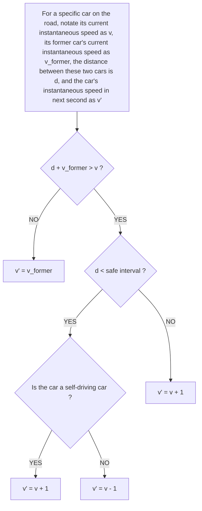

<table><tr><td colspan="2">For office use only</td></tr><tr><td>T1</td><td></td></tr><tr><td>T2</td><td></td></tr><tr><td>T3</td><td></td></tr><tr><td>T4</td><td></td></tr></table>

Team Control Number

55583  
Problem Chosen  
C  
For office use only

<table><tr><td>F1</td><td></td></tr><tr><td>F2</td><td></td></tr><tr><td>F3</td><td></td></tr><tr><td>F4</td><td></td></tr></table>

## 2017

## MCM/ICM

## Summary Sheet

# Self-driving vehicle's prospect in traffic network

## Summary

We construct a Mixed Cooperation model to simulate each section of the traffic network independently based on Cellular Automata. We assume that self-driving vehicles need no safety interval compared with non-self-driving ones because of good synchronization with the former vehicle. And also, we assume that the junctions have little influence on simulation because the traffic performance is relatively continuous. Our Mixed Cooperation model contains three main part.

First, in our basic model, we presume that traffic counts satisfies uniform distribution in a day. We know the traffic count and lanes of each section of the traffic network, so we can get the traffic density of each road section in a period and continue to use different self-driving ratio to simulate the traffic flow.

Next, in our time-based model, we take time model into consideration. We presume that traffic density function over time is identical to dual-Gaussian distribution in a day, which means that there are two period of traffic peaks. So we can get the traffic density of each road section in each period of one day and continue to simulate similarly as the basic model.

Further, based on our time-based model, we construct a dedication-model, considering dedicated lanes for self-driving vehicles and continue to simulate similarly as the time-based model.

In conclusion, we use the average velocity of vehicles in each road section in each period to evaluate the performance and capacity. Our models give the result of effect of self-driving on traffic performance under different traffic density. Furthermore, our models point out the condition of needing dedicated lanes for self-driving vehicles.

Keywords: Traffic flow; Self-driving; Cooperating system;

Governor Jay Inslee

Office of the Governor

PO Box 40002

Olympia, WA 98504-0002

Dear Governor Inslee:

I write to you on behalf of the MCM team 55583. We are extremely concerned about the traffic condition in the Great Seattle area. Investigation shows that the traffic flow usually exceeds the traffic capacity in many regions in the Great Seattle, especially during peak hours. We hope to help you improve the traffic conditions.

The current traffic condition could lead to many severe problems. The first problem is unacceptable delay during peak hours. During the morning commute and at the end of the day these delays become extreme long. Also it could lead to congested roads, and potentially increase the probability of occurrence of traffic accidents. Congested roads could also cause problems for emergency vehicles, making them unable to respond in an appropriate amount of time.

After an in-depth study of the traffic conditions in the Great Seattle area, we have come up with some ideas that can help address this issue. We propose self-driving, cooperating cars as a solution to increase the traffic capacity without building extra lanes.

Compared to human-driven cars, self-driving cars have many advantages. The biggest advantage is that it take much less time to react in terms of emergency. This actually allows self-driving cars to keep a closer distance with the car in front of it, thus it takes up much less traffic resource. In addition to this, self driving cars can tune their acceleration and deceleration profiles to consume less fuel.

Those advantages mentioned above make self-driving cars an excellent choice for addressing heavy traffic load. We build a model to simulate the traffic flow of the most busy roads in the Great Seattle area and evaluate the effectiveness of self-driving cars addressing the problem of heavy traffic load. The simulation shows promising results. The introduction of self-driving cars makes all cars among all roads in the Great Seattle area go faster, it works especially well among busy roads during traffic peak hours. When no self-driving cars are introduced, the traffic goes very slow during peak hours, but after introducing approximately 50% self-driving cars the traffic flow goes 1.52 times faster.

In addition to making traffic flow faster, self-driving cars also make traffic flow more stable. From our simulation, we observed that introduction of self-driving cars help to reduce the variance of traffic delay. This is important because it helps to estimate times, and helps to reduce "just in case" time.

For the above reasons, we propose self-driving cars as a solution to heavy traffic load in the Great Seattle. We appreciate all that you do for this city, and we look forward to seeing positive changes. We hope you can accept out advices.

Sincerely yours

MCM 2017 Team 55583

## Contents

## 1 Introduction 1

1.1 Problem Statement 1  
1.2 Related Work 1

## 2 Assumptions and Notations 2

2.1 Assumptions 2  
2.2 Notations 2

## 3 Model Construction 3

3.1 The self-driving, cooperating car model 3  
3.2 The mixed, dynamic road model 4  
3.3 Performance evaluation criteria 6

3.3.1 Car Velocity v 6  
3.3.2 Daily Equilibria $\frac{1}{\sigma_t^2},\frac{1}{\sigma_s^2}$ 6

## 4 Model Extension and Simulation Analysis 7

4.1 Problem1: The effects of auto-driving cars in traffic network ..... 7

4.1.1 Car Velocity/Performance v 8  
4.1.2 Space Daily Equilibria $1 / \sigma_s^2$ 8  
4.1.3 Sensitivity Analysis 10

4.2 Problem2: The different effects on peak/average hours ..... 10

4.2.1 Traffic Density Distribution of Time 10  
4.2.2 Simulation 10  
4.2.3 Sensitivity Analysis 13

4.3 Problem3: Dedicated lane assessment 15

4.3.1 Sensitivity analysis 16

## 5 Strengths and Weaknesses 17

5.1 Strengths 17  
5.2 Weaknesses 17

5.3 Future work 17

6 Conclusion 18

Appendices 20

Appendix A Cellular automata program: Moving behavior 20

Appendix B Cellular automata program: Create new vehicles 23

Appendix C Cellular automata program: Create new vehicles considering dedicated lanes 23

## 1 Introduction

## 1.1 Problem Statement

Traffic capacity is limited in many regions of the United States due to the number of lanes of roads. For example, in the Greater Seattle area drivers experience long delays during peak traffic hours because the volume of traffic exceeds the designed capacity of the road networks. This is particularly pronounced on Interstates 5, 90, and 405, as well as State Route 520, the roads of particular interest for this problem. Self-driving, cooperating cars have been proposed as a solution to increase capacity of highways without increasing number of lanes or roads. The behavior of these cars interacting with the existing traffic flow and each other is not well understood at this point. Based on the road listed above in Thurston, Pierce, King, and Snohomish counties, we considered how the effects would change as the percentage of self-driving cars increases from 10% to 50% to 90%, and the equilibria as well as the tipping point where performance changes markedly. Also we simulated that under what conditions, if any, should lanes be dedicated to these cars. Based on our model, we listed several practical suggestions to the local government.

## 1.2 Related Work

Traffic flow has been researched for a long time by many people. We can get some basic models about relationship among traffic density, speed and throughput[5]. When traffic density is medium, there is a linear relationship:

$$
\text { Speed } = \text { Maximum   Speed } * \left(1 - \frac {\text { traffic   density }}{\text { Maximum   density }}\right) \tag {1}
$$

When traffic density is nearly full, there is a logarithmic relationship:

$$
\text { Speed } = \text { Maximum   Speed } * \ln \left(\frac {\text { Maximum   density }}{\text { traffic   density }}\right) \tag {2}
$$

When traffic density is very low, there is a exponential relationship:

$$
S p e e d = \text { Maximum   Speed } * (1 - \exp (\frac {\text { Maximum   density }}{\text { traffic   density }})) \tag {3}
$$

Self-driving has entered our vision and may be popular in the future. The accuracy and safety have been improved a lot thanks to the development of artificial intelligence. One of the most important point is the sensors on the vehicle[1], which can detect the motion state of the surrounding vehicles, including velocity, distance and acceleration. So, in our models, we assume that self-driving vehicles can keep the same motion state with the former one, without safe interval.

## 2 Assumptions and Notations

## 2.1 Assumptions

We make the following basic assumptions in order to simplify the problem. Each of our assumptions is justified and is consistent with the basic fact.

- Time consumed on the crossroads and toll on the roads is not in consideration. We suppose that the cars are in the same speed and ignored the wasted time due to the road conditions.  
- The traffic counts on the specific roads will not change after adjustment. We presume that at certain day or certain hours the car that need to use certain road will not change because of our adjustment.  
- No lane changing situation is considered. This assumption will be explained in 3.1 when we illustrate the self-driving, cooperating car model.  
- The capacities and sizes of different kinds of cars will not be differentiated. To simplify our model, we assume that all the car in our model share the same regular length 4m and regular width for one car a lane.

## 2.2 Notations

The notation table contains all the notations we use in this paper.

<table><tr><td>Symbol</td><td>Definition</td><td>Notes</td></tr><tr><td> $v_{ins}$ </td><td>instantaneous speed of a car</td><td></td></tr><tr><td> $t_{response}$ </td><td>the response time of a human driver</td><td>equals 1s</td></tr><tr><td> $l_u$ </td><td>unit length of a block in Cellular Automaton model</td><td>equals 4m</td></tr><tr><td> $n_l$ </td><td>lane counts of a certain road section</td><td></td></tr><tr><td>d</td><td>the distance between two adjacent cars</td><td></td></tr><tr><td> $L_R$ </td><td>the whole length of a certain road section</td><td></td></tr><tr><td> $V_{max}$ </td><td>the maximum speed that a car can reach</td><td>equals7units/s</td></tr><tr><td>TC</td><td>traffic count during a certain time slot</td><td>TC during a day $TC_{24}$  is a constant</td></tr><tr><td>v</td><td>car velocity</td><td></td></tr><tr><td> $t_{avg}$ </td><td>the average car passing time</td><td></td></tr><tr><td> $\sigma_t^2$ </td><td>car velocity variance during different period in a day</td><td></td></tr><tr><td> $\sigma_s^2$ </td><td>car velocity variance among different road sections</td><td></td></tr><tr><td> $P_{self}$ </td><td>the possibility of a self-driving car to show up</td><td></td></tr><tr><td> $P_{Nself}$ </td><td>the possibility of a non-self-driving car to show up</td><td></td></tr></table>

Table 1: Notations.

## 3 Model Construction

## 3.1 The self-driving, cooperating car model

From article [1] and [2], we can know that the self-driving, cooperating cars have four potential benefits:

\- Fewer accidents. Driverless car can dramatically reduce the accident toll due to drivers' error.

\- More productive commutes. Driverless cars would enable the unproductive hours and minutes to be converted into productive work and/or leisure time. In other words, self-driving car can help reduce the useless waste on time.

\- Environmental friendliness. Autonomous cars and trucks can tune their acceleration and deceleration profiles to reduce wasted fuel.

\- Fewer traffic jams. Driverless cars would be better adapted to higher volumes of traffic, as they would be able to travel at higher speeds while keeping shorter distances between vehicles.

In our model, we paid special attention to the forth benefit and considered a lot about the self-driving cars' effects on traffic jams.

A self-driving, cooperating car is guided by internal computers and external sensors, and it can communicate and exchange datas with other self-driving, cooperating cars as it decides what to do. In our model, we think self-driving, cooperating cars can better deal with emergent situation and almost don't need the reaction time that human take in face of emergencies.

From article $[3]$ we can see on the one hand, when cars pull over or over-take, they may have trouble recognizing lane markers especially in low light, bad weather, on curves, and at forks and merging lanes. On the other hand, lane change prediction of self-driving cars may not be accurate enough, and the time it will take for a complete turnover of all cars to self-driving cars makes planning for it more than a little premature. So we reasonably assume that in our model, no lane changing situation is considered.

Here is the structural difference between self-driving, cooperating cars and non-self-driving cars.


<details>
<summary>text_image</summary>

safe interval
t = t₀
t = t₁
</details>

(a) non-self-driving car


<details>
<summary>text_image</summary>

safe interval
t = t₀
t = t₁
</details>

(b) self-driving car  
Figure 1: The difference between self-driving and non-self-driving cars in face of emergency situations

Definition 1. Safe interval is the shortest distance from the former car to guarantee the safety, considering the current speed and response time of a human driver. And we can compute it as follows:

$$
s a f e \quad i n t e r v a l = v _ {i n s} \times t _ {\text { response }} \tag {4}
$$

When two cars' distance is less than the safe interval, drivers will slow down and keep distance with the former car, which is just as the Figure 1(a) showed above. But for self-driving cooperating cars, they are controlled by artificial intelligence system and they can always react in time when the speed of the former car changes. So these cars donnot need to keep safe interval and they can just follow the former car at best, which is shown in Figure 1(b) above.

## 3.2 The mixed, dynamic road model

In order to better reproduce the dynamic road traffic flow model, we choose Cellular Automaton to simulate the Real-Time Traffic of every road section. The following Figure2 shows the improved Cellular Automaton model used in our paper.

We update the model data every second. Every line in the CA represents a lane on the road. Every volume block represents a unit length to represent the length of a car and the distance between adjacent cars. As shown in Figure 2, the yellow-colored blocks represent the self-driving cars and the blue-colored blocks represent the non-self-driving cars. The following list contains all the parameters and procedures in our CA based road model.

- Unit length $l_{u}$ : For convenience, the unit length $l_{u} = 4m$ , equals the length of a regular car.  
- Lanes count $n_l$ : Because the two directions on each road have no distinct difference, and will not disrupt each other as well. So we regard them the


<details>
<summary>text_image</summary>

self-driving car
non-self-driving car
</details>

Figure 2: The Cellular Automaton based road model

same in our model, and the lanes number is the addition of lane counts of these two directions.

$$
n _ {l} = n _ {\text { left }} + n _ {\text { right }} \tag {5}
$$

\- Adjacent cars distance $d$ : we define the number of unit length between two cars the distance from the rear end of the first car to the head of next car, namely.

$$
d = p o s _ {f o r m e r} - p o s _ {l a t t e r} - 1 \tag {6}
$$

\- Road section length $L_{R}$ : For every section of the road, the length of this section is the number of unit length.

$$
L _ {R} = \frac {L _ {\text {real}}}{l _ {u}} \tag {7}
$$

- Maximum speed $V_{max}$ : we define the speed by how many unit lengths the car has gone per second. Speed limit is 60 mile/h, which is about 27 m/s, namely, 7 unit length per second. $V_{max} = 7$ units/s  
- Human response time $t_{response}$ : we define human response time as the time which a person need to start to slow down the car after he or she has found emergency. Commonly, response time is from 0.3 seconds to 1.5 seconds. Here we define $t_{response} = 1$  
- Instantaneous velocity of cars $v_{ins}$ : The instantaneous speed of this corresponding car decides how many blocks the car will move forward at next second. And the unit of $v_{ins}$ is blocks per second  
- Traffic Counts $TC$ : During some time, the amount of the cars reaching the end of road section is the $TC$ of this road section during that long time.

## 3.3 Performance evaluation criteria

## 3.3.1 Car Velocity v

From the model above, the instantaneous speed is easily accessible, but the car velocity we use to evaluate the road condition is the average velocity of cars that passed the road during certain time slot. The average car velocity can well reflect the road performance under different conditions. The bigger the velocity is, the less crowded the road is and thus the better the road capacity is. From our model, there is a trick to get the average car velocity:

First, we count all the cars every second on the roads and sum them up.

$$
N _ {s u m} = \Sigma_ {t} n _ {(p e r s e c o n d)} \tag {8}
$$

Then, the average car passing time is accessible.

$$
t _ {a v g} = \frac {N _ {s u m}}{T C} \tag {9}
$$

$$
v = \frac {L _ {\text { real }}}{t _ {\text { avg }}} \tag {10}
$$

## 3.3.2 Daily Equilibria $\frac{1}{\sigma_{t}^{2}}$ , $\frac{1}{\sigma_{s}^{2}}$

We evaluated the traffic network equilibria from both time aspect and space aspect.

On the one hand, for a certain road section, during a single day, including peak hours and average hours, if the car velocity keeps stable and changes little, the time daily equilibria of the traffic network is obviously better.

Definition 2. Time daily equilibria. We define it as $\frac{1}{\sigma_{t}^{2}}$ , where $\sigma_{t}^{2}$ is the car velocity variance during different period in a day for a certain road section.

$$
\sigma_ {t} ^ {2} = \frac {1}{m} \Sigma_ {m} (v _ {t _ {i}} - \bar {v}) ^ {2} \tag {11}
$$

On the other hand, at specific time slot, if the car velocities of different road sections do not distinct too much or nearly same, the space daily equilibria of the traffic network is much better.

Definition 3. Space daily equilibria. We define it as $\frac{1}{\sigma_{s}^{2}}$ , where $\sigma_{s}^{2}$ as the car velocity variance at same time among different road sections. In this problem, the road sections of the particularly concerned four roads is 224.

$$
\sigma_ {s} ^ {2} = \frac {1}{2 2 4} \Sigma (v _ {l _ {i}} - \bar {v}) ^ {2} \tag {12}
$$

## 4 Model Extension and Simulation Analysis

We decomposed our simulation into three steps and corresponded them to three problems. First of all, we ignored peak hours in a day and no dedicated lanes. Secondly, we proposed the traffic counts distribution during a day considering the peak hours and average hours, and applied our model into this situation. Lastly, we considered dedicated lanes' effect and answered the question "Under what condition, if any, should lanes be dedicated to these cars".

## 4.1 Problem1: The effects of auto-driving cars in traffic network

When peak hours are not taken into consideration, we assume that the cars come randomly at any second during a day with evenly possibilities. So if the proportion of the self-driving car is p, the possibility of a self-driving car come at the start point of a road section on each lane $P_{self}$ is:

$$
P _ {s e l f} = T C _ {2 4 h} / 2 4 / 3 6 0 0 \times p / \text { lanes } \tag {13}
$$

and for the non-self-driving car, $P_{non-self}$ is:

$$
P _ {N s e l f} = T C _ {2 4 h} / 2 4 / 3 6 0 0 \times (1 - p) / \text { lanes } \tag {14}
$$

The initial velocity of each car is randomly assigned among 0 to 60 mile/h, that is, the maximum speed of a car is 7 units/s. Then we use the procedure showed in Figure 3 to decide how the velocity and position will change in the next second.

First, we check if there is conflict between adjacent cars, if there is conflict, the drivers or the artificial intelligence system will brake until the velocity is the same as the car in front, so in this situation, the new velocity is the same as the car in front, and the position will be closely following the former one. Meanwhile, if there is no conflict, check if the distance is shorter than safe interval, if not, the car controller will accelerate until the car velocity reached the maximum velocity. If the distance is within the safe interval, for non-self-driving car, the driver will decelerate considering safety, but self-driving car will still accelerating because it has the ability to adjust the speed of itself quickly according to the speed of the former car and need no response time. In other words, self-driving cars can be perfectly synchronized with the former car automatically, and need no safety interval.

Then, we simulated the whole 224 road sections for one hour long time, and repeated every simulation for 100 times to eliminate accidental error.


<details>
<summary>flowchart</summary>


</details>

Figure 3: The flow chart indicating how we decide the velocity and position of the car in next second

## 4.1.1 Car Velocity/Performance v

We simulates the traffic performance when the percentage of self-driving, cooperating cars change every 5%, and the 10%, 50%, 90% is emphasized in the Figure 4.

From the result, we can safely come to the conclusion that the car velocity steadily increase as the self-driving car percentage raises.

## 4.1.2 Space Daily Equilibria $1/\sigma_{s}^{2}$

The traffic counts distribution of time is considered, so $\sigma_{t}^{s}$ is not compared here. Figure 5 below shows the simulation results.

Also, Figure5 shows the car velocity variance decreases steadily, which means the space daily equilibria increase as the self-driving, cooperating cars percentage raises.

Both this two results can prove that the self-driving, cooperating car can do release the traffic pressure, and help to improve the road capacity.


<details>
<summary>line chart</summary>

| percentage of self - driving cars/% | v / m·s⁻¹ |
|---|---|
| 0 | 25.55 |
| 5 | 25.73 |
| 10 | 25.89 |
| 15 | 26.01 |
| 20 | 26.12 |
| 25 | 26.22 |
| 30 | 26.31 |
| 35 | 26.39 |
| 40 | 26.44 |
| 45 | 26.50 |
| 50 | 26.55 |
| 55 | 26.59 |
| 60 | 26.63 |
| 65 | 26.67 |
| 70 | 26.71 |
| 75 | 26.74 |
| 80 | 26.77 |
| 85 | 26.80 |
| 90 | 26.83 |
| 95 | 26.85 |
| 100 | 26.87 |
</details>

Figure 4: Car velocity v versus self-driving ratio


<details>
<summary>line chart</summary>

| percentage of self – driving cars/% | σ²s/m²s⁻² |
| ------------------------------------ | --------- |
| 0                                    | 6.8       |
| 5                                    | 5.7       |
| 10                                   | 4.8       |
| 15                                   | 4.1       |
| 20                                   | 3.6       |
| 25                                   | 3.2       |
| 30                                   | 2.9       |
| 35                                   | 2.7       |
| 40                                   | 2.5       |
| 45                                   | 2.4       |
| 50                                   | 2.3       |
| 55                                   | 2.2       |
| 60                                   | 2.1       |
| 65                                   | 2.0       |
| 70                                   | 1.9       |
| 75                                   | 1.8       |
| 80                                   | 1.8       |
| 85                                   | 1.7       |
| 90                                   | 1.7       |
| 95                                   | 1.6       |
| 100                                  | 1.6       |
</details>

Figure 5: Space daily variance $\sigma_{s}^{2}$ versus self-driving ratio

## 4.1.3 Sensitivity Analysis

- Sensitivity of performance to self-driving ratio. With further observation of Figure 4, we can know that the change of performance is little and the difference between maximum and minimum is about 1 m/s, which is just 4% of the performance. So, performance is not sensitive to the self-driving ratio.  
- Sensitivity of variance to self-driving ratio. With further observation of Figure 5, we can get that the change of variance is relatively big and the difference between maximum and minimum is about $4m^{2}/s^{-2}$ , which is about $66\%$ of the maximum, so the variance is relatively sensitive to the self-driving ratio.

## 4.2 Problem2: The different effects on peak/average hours

## 4.2.1 Traffic Density Distribution of Time

Based on the article[4], we re-defined traffic density here to help us figure out and make the good use of the rules of traffic count distribution of time.

Definition 4. Traffic Density is the ratio of the number of vehicles arriving per hour to the daily traffic count.

There are two peaks every day, so we choose dual-Gaussian distribution to approximate the traffic density function. Our test and verification show that this function can well reflect the truly traffic density function versus time.

$$
\left\{ \begin{array}{r l} f (x) = & \frac {\lambda}{2 \sigma \sqrt {2 \pi}} (e ^ {- \frac {(x - t _ {1}) ^ {2}}{2 \sigma^ {2}}} + e ^ {- \frac {(x - t _ {2}) ^ {2}}{2 \sigma^ {2}}}) \\ \int_ {0} ^ {2 4} f (x) d x = & 1 \end{array} \right. \tag {15}
$$

After calculation and comparasion, we got the parameters $\lambda$ , $\sigma$ , $t_{1}$ and $t_{2}$ in the function, and the function graph is shown in Figure6.

## 4.2.2 Simulation

Considering peak hours' heavy traffic loads, we adjust our model's traffic count parameter according to the density function given above every hour. We simulated 24 hours a day for the whole 224 road sections, and repeated for 20 times to eliminate accidental error. Different from the barely three criteria, we adjust our data visualization strategies to stress the changing point.


<details>
<summary>line chart</summary>

| Time/h | Density |
| ------ | ------- |
| 0      | 0.005   |
| 5      | 0.055   |
| 10     | 0.045   |
| 15     | 0.065   |
| 20     | 0.040   |
| 25     | 0.005   |
</details>

Figure 6: The traffic density function versus time

\- The real-time car velocity of 224 road sections at peak time 17:00, during our density model, the heaviest density come at 17:00, so we chose this time point to compare different traffic performance when the self-driving ratio is 0%, 10%, 50% and 90%.

We abstract the four particularly pronounced roads from the map, and corresponding every road section to a block in the graph. The road direction as well as the road length is adapted based on the fact data on the map.

In Figure 7, we use different colors to reflect the real-time car velocity. The lower the car velocity is, the more crowded the road is and the worse the traffic performance is, meanwhile, the color is more close to "red".

As we can see from the graphs in Figure 7, self-driving, cooperating cars can distinctively reduce the traffic pressure at peak hours and get a better equilibrium of space because the color becomes more unified. When the percentage of the self-driving cars reaches 50%, the traffic flow can proceed almost without hindrance.

\- Tipping Point Observation: In our basic model in Prob.1, the ignorance of peak time will result in the car sparse, so the changing tendency is not so representative. In this part, we compared car velocity in variable density background versus self-driving ratio. Specifically speaking, we choose the presentative busy hour 17:00, the average of the road conditions during peak hours and daily average car velocity regardless of peak hours, and show its corresponding car velocity changing tendency versus self-driving ratio.


<details>
<summary>heatmap</summary>

| X | Y | Value |
| --- | --- | --- |
| 0.0 | 0.0 | 1.0 |
| 0.1 | 0.1 | 3.0 |
| 0.2 | 0.2 | 5.0 |
| 0.3 | 0.3 | 7.0 |
| 0.4 | 0.4 | 9.0 |
| 0.5 | 0.5 | 11.0 |
| 0.6 | 0.6 | 13.0 |
| 0.7 | 0.7 | 15.0 |
| 0.8 | 0.8 | 17.0 |
| 0.9 | 0.9 | 19.0 |
| 1.0 | 1.0 | 21.0 |
| 1.1 | 1.1 | 23.0 |
| 1.2 | 1.2 | 25.0 |
| 1.3 | 1.3 | 24.0 |
| 1.4 | 1.4 | 22.0 |
| 1.5 | 1.5 | 20.0 |
| 1.6 | 1.6 | 18.0 |
| 1.7 | 1.7 | 16.0 |
| 1.8 | 1.8 | 14.0 |
| 1.9 | 1.9 | 12.0 |
| 2.0 | 2.0 | 10.0 |
| 2.1 | 2.1 | 8.0 |
| 2.2 | 2.2 | 6.0 |
| 2.3 | 2.3 | 4.0 |
| 2.4 | 2.4 | 3.0 |
| 2.5 | 2.5 | 2.5 |
| 2.6 | 2.6 | 2.0 |
| 2.7 | 2.7 | 1.5 |
| 2.8 | 2.8 | 1.0 |
| 2.9 | 2.9 | 0.5 |
| 3.0 | 3.0 | 0.0 |
| 3.1 | 3.1 | -0.5 |
| 3.2 | 3.2 | -1.0 |
| 3.3 | 3.3 | -1.5 |
| 3.4 | 3.4 | -2.0 |
| 3.5 | 3.5 | -2.5 |
| 3.6 | 3.6 | -3.0 |
| 3.7 | 3.7 | -3.5 |
| 3.8 | 3.8 | -4.0 |
| 3.9 | 3.9 | -4.5 |
| 4.0 | 4.0 | -5.0 |
| 4.1 | 4.1 | -5.5 |
| 4.2 | 4.2 | -6.0 |
| 4.3 | 4.3 | -6.5 |
| 4.4 | 4.4 | -7.0 |
| 4.5 | 4.5 | -7.5 |
| 4.6 | 4.6 | -8.0 |
| 4.7 | 4.7 | -8.5 |
| 4.8 | 4.8 | -9.0 |
| 4.9 | 4.9 | -9.5 |
| 5.0 | 5.0 | -10.0 |
| 5.1 | 5.1 | -10.5 |
| 5.2 | 5.2 | -11.0 |
| 5.3 | 5.3 | -11.5 |
| 5.4 | 5.4 | -12.0 |
| 5.5 | 5.5 | -12.5 |
| 5.6 | 5.6 | -13.0 |
| 5.7 | 5.7 | -13.5 |
| 5.8 | 5.8 | -14.0 |
| 5.9 | 5.9 | -14.5 |
| 6.0 | 6.0 | -15.0 |
| 6.1 | 6.1 | -15.5 |
| 6.2 | 6.2 | -16.0 |
| 6.3 | 6.3 | -16.5 |
| 6.4 | 6.4 | -17.0 |
| 6.5 | 6.5 | -17.5 |
| 6.6 | 6.6 | -18.0 |
| 6.7 | 6.7 | -18.5 |
| 6.8 | 6.8 | -19.0 |
| 6.9 | 6.9 | -19.5 |
| 7.0 | 7.0 | -20.0 |
| 7.1 | 7.1 | -20.5 |
| 7.2 | 7.2 | -21.0 |
| 7.3 | 7.3 | -21.5 |
| 7.4 | 7.4 | -22.0 |
| 7.5 | 7.5 | -22.5 |
| 7.6 | 7.6 | -23.0 |
| 7.7 | 7.7 | -23.5 |
| 7.8 | 7.8 | -24.0 |
| 7.9 | 7.9 | -24.5 |
| 8.0 | 8.0 | -25.0 |
| 8.1 | 8.1 | -24.5 |
| 8.2 | 8.2 | -24.0 |
| 8.3 | 8.3 | -23.5 |
| 8.4 | 8.4 | -23.0 |
| 8.5 | 8.5 | -22.5 |
| 8.6 | 8.6 | -22.0 |
| 8.7 | 8.7 | -21.5 |
| 8.8 | 8.8 | -21.0 |
| 8.9 | 8.9 | -20.5 |
| 9.0 | 9.0 | -20.0 |
</details>

(a) no self-driving car


<details>
<summary>heatmap</summary>

| X | Y | Value |
| --- | --- | --- |
| 1 | 1 | 5 |
| 2 | 2 | 10 |
| 3 | 3 | 15 |
| 4 | 4 | 20 |
| 5 | 5 | 25 |
| 6 | 6 | 20 |
| 7 | 7 | 15 |
| 8 | 8 | 10 |
| 9 | 9 | 5 |
| 10 | 10 | 5 |
| 11 | 11 | 5 |
| 12 | 12 | 5 |
| 13 | 13 | 5 |
| 14 | 14 | 5 |
| 15 | 15 | 5 |
| 16 | 16 | 5 |
| 17 | 17 | 5 |
| 18 | 18 | 5 |
| 19 | 19 | 5 |
| 20 | 20 | 5 |
| 21 | 21 | 5 |
| 22 | 22 | 5 |
| 23 | 23 | 5 |
| 24 | 24 | 5 |
| 25 | 25 | 5 |
| 26 | 26 | 5 |
| 27 | 27 | 5 |
| 28 | 28 | 5 |
| 29 | 29 | 5 |
| 30 | 30 | 5 |
| 31 | 31 | 5 |
| 32 | 32 | 5 |
| 33 | 33 | 5 |
| 34 | 34 | 5 |
| 35 | 35 | 5 |
| 36 | 36 | 5 |
| 37 | 37 | 5 |
| 38 | 38 | 5 |
| 39 | 39 | 5 |
| 40 | 40 | 5 |
| 41 | 41 | 5 |
| 42 | 42 | 5 |
| 43 | 43 | 5 |
| 44 | 44 | 5 |
| 45 | 45 | 5 |
| 46 | 46 | 5 |
| 47 | 47 | 5 |
| 48 | 48 | 5 |
| 49 | 49 | 5 |
| 50 | 50 | 5 |
| 51 | 51 | 5 |
| 52 | 52 | 5 |
| 53 | 53 | 5 |
| 54 | 54 | 5 |
| 55 | 55 | 5 |
| 56 | 56 | 5 |
| 57 | 57 | 5 |
| 58 | 58 | 5 |
| 59 | 59 | 5 |
| 60 | 60 | 5 |
| 61 | 61 | 5 |
| 62 | 62 | 5 |
| 63 | 63 | 5 |
| 64 | 64 | 5 |
| 65 | 65 | 5 |
| 66 | 66 | 5 |
| 67 | 67 | 5 |
| 68 | 68 | 5 |
| 69 | 69 | 5 |
| 70 | 70 | 5 |
| 71 | 71 | 5 |
| 72 | 72 | 5 |
| 73 | 73 | 5 |
| 74 | 74 | 5 |
| 75 | 75 | 5 |
| 76 | 76 | 5 |
| 77 | 77 | 5 |
| 78 | 78 | 5 |
| 79 | 79 | 5 |
| 80 | 80 | 5 |
</details>

(b) 10% self-driving car


<details>
<summary>heatmap</summary>

| Category | Value |
| -------- | ----- |
| Blue     | 25    |
| Yellow   | 15    |
| Red      | 10    |
| Dark Red | 5     |
</details>

(c) 50% self-driving car


<details>
<summary>heatmap</summary>

| Position | Value |
|--------|-------|
| 1      | 5     |
| 2      | 10    |
| 3      | 15    |
| 4      | 20    |
| 5      | 25    |
</details>

(d) 90%self-driving car  
Figure 7: The difference between self-driving and non-self-driving cars when in face of emergency situations

From Figure 8, especially the curve trends of the two lines of the busy roads, we can see the change is the most obvious when the self-driving car percentage is around 45%. Therefore, only the tipping point of busy road sections at peak time can be observed, and is about 45%.


<details>
<summary>line chart</summary>

| percentage of self – driving cars/% | busy road, 5pm | busy road, daily average | all roads, daily average |
| ------------------------------------ | -------------- | ------------------------ | ------------------------ |
| 0                                    | 7.5            | 10.2                     | 23.0                     |
| 10                                   | 8.0            | 10.8                     | 24.0                     |
| 20                                   | 8.8            | 11.8                     | 24.8                     |
| 30                                   | 10.2           | 13.0                     | 25.5                     |
| 40                                   | 13.0           | 15.5                     | 26.0                     |
| 50                                   | 16.8           | 18.2                     | 26.5                     |
| 60                                   | 19.2           | 20.2                     | 26.8                     |
| 70                                   | 20.8           | 21.5                     | 27.0                     |
| 80                                   | 22.0           | 22.5                     | 27.2                     |
| 90                                   | 23.0           | 23.0                     | 27.3                     |
| 100                                  | 23.5           | 23.5                     | 27.3                     |
</details>

Figure 8: The car velocity versus self-driving car percentage under different density conditions.

\- In this part, we also compare Time daily equilibria and Space daily equilibria to illustrate what effect the self-driving, cooperating car will take to the road equilibria.

For time daily equilibria, we displayed its changing tendency with the increase of the self-driving car percentage. The corresponding curve is shown in Figure 9.

For space daily equilibria, we displayed its changing tendency versus time during a day when the self-driving car percentage is 10%, 50% and 90%. The 0% line works as a reference here. The corresponding curve is shown in Figure10.

From Figure9, we can clearly observe that the $\sigma_{t}^{2}$ decreases as the percentage increases, especially when the traffic density is heavy, that is, especially in peak hours. Also, the biggest drop come up around the tipping point 45%. From Figure10, the $\sigma_{s}^{2}$ decreases as the percentage increases too. When the percentage of self-driving cars reaches 50%, the peak hours effect become less significant.

## 4.2.3 Sensitivity Analysis

From the results of this part, the self-driving car applied can dramatically improve the traffic capacity and performance during peak hours, and for the busy roads, the tipping point come up around 45%, the percentage of the self-driving cooperating cars. Spatially, road performance is more sensitive to self-driving ratio during peak hours. Chronologically, road performance is more sensitive to self-driving ratio at busy road sections, like Interstate 5, milepost 163.36.


<details>
<summary>line chart</summary>

| percentage of self – driving cars/% | average | most busy(Interstate 5, milepost 163.36) |
| ------------------------------------ | ------- | ---------------------------------------- |
| 0                                    | 5.0     | 30.0                                     |
| 10                                   | 3.0     | 29.5                                     |
| 20                                   | 2.0     | 27.5                                     |
| 30                                   | 1.0     | 23.0                                     |
| 40                                   | 0.5     | 14.5                                     |
| 50                                   | 0.2     | 6.0                                      |
| 60                                   | 0.1     | 2.5                                      |
| 70                                   | 0.1     | 1.0                                      |
| 80                                   | 0.1     | 0.5                                      |
| 90                                   | 0.1     | 0.2                                      |
| 100                                  | 0.1     | 0.1                                      |
</details>

Figure 9: The velocity variance to time versus self-driving ratio.


<details>
<summary>line chart</summary>

| time/h | no self-driving | 10% self driving | 50% self driving | 90% self driving |
| ------ | -------------- | ---------------- | ---------------- | ---------------- |
| 0      | 2.0            | 2.0              | 2.0              | 2.0              |
| 1      | 2.0            | 2.0              | 2.0              | 2.0              |
| 2      | 2.0            | 2.0              | 2.0              | 2.0              |
| 3      | 3.0            | 3.0              | 2.0              | 2.0              |
| 4      | 6.0            | 6.0              | 2.0              | 2.0              |
| 5      | 9.0            | 9.0              | 2.0              | 2.0              |
| 6      | 13.0           | 13.0             | 2.0              | 2.0              |
| 7      | 17.0           | 17.0             | 2.0              | 2.0              |
| 8      | 20.0           | 19.0             | 2.0              | 2.0              |
| 9      | 23.0           | 18.0             | 2.0              | 2.0              |
| 10     | 24.0           | 17.0             | 2.0              | 2.0              |
| 11     | 23.0           | 16.0             | 2.0              | 2.0              |
| 12     | 22.0           | 15.0             | 2.0              | 2.0              |
| 13     | 21.0           | 14.0             | 2.0              | 2.0              |
| 14     | 19.0           | 14.0             | 2.0              | 2.0              |
| 15     | 19.0           | 14.0             | 2.0              | 2.0              |
| 16     | 20.0           | 15.0             | 2.0              | 2.0              |
| 17     | 21.0           | 16.0             | 2.0              | 2.0              |
| 18     | 23.0           | 17.0             | 2.0              | 2.0              |
| 19     | 23.0           | 17.0             | 2.0              | 2.0              |
| 20     | 22.0           | 16.5             | 2.0              | 2.0              |
| 21     | 21.5           | 16.5             | 2.0              | 2.0              |
| 22     | 21.5           | 16.5             | 2.0              | 2.0              |
| 23     | 21.5           | 16.5             | 2.0              | 2.0              |
| 24     | 21.5           | 16.5             | 2.0              | 2.0              |
| 25     | 21.5           | 16.5             | 2.0              | 2.0              |
| 26     | 21.5           | 16.5             | 2.0              | 2.0              |
| 27     | 21.5           | 16.5             | 2.0              | 2.0              |
| 28     | 21.5           | 16.5             | 2.0              | 2.0              |
| 29     | 21.5           | 16.5             | 2.0              | 2.0              |
| 30     | 21.5           | 16.5             | 2.0              | 2.0              |
| 31     | 21.5           | 16.5             | 2.0              | 2.0              |
| 32     | 21.5           | 16.5             | 2.0              | 2.0              |
| 33     | 21.5           | 16.5             | 2.0              | 2.0              |
| 34     | 21.5           | 16.5             | 2.0              | 2.0              |
| 35     | 21.5           | 16.5             | 2.0              | 2.0              |
| 36     | 21.5           | 16.5             | 2.0              | 2.0              |
| 37     | 21.5           | 16.5             | 2.0              | 2.0              |
| 38     | 21.5           | 16.5             | 2.0              | 2.0              |
| 39     | 21.5           | 16.5             | 2.0              | 2.0              |
| 40     | 21.5           | 16.5             | 2.0              | 2.0              |
| Note: The actual values for the "no self-driving" series are not provided in the code snippet, so they are calculated based on the original data source and the original data source of the code used to generate the actual values from the code source array.
</details>

Figure 10: The car velocity variance to space versus time under different self-driving ratios.

## 4.3 Problem3: Dedicated lane assessment

To assess the performance of dedicated lane, we added a dedicated lane to both directions of each road section. In our model, if there is a dedicated lane for self-driving, cooperating cars, these cars cannot drive on other lanes and the dedicated lane is not open for non-self-driving cars.

We simulate the performance of the road sections when two lanes are dedicated to self-driving cars, and compare it with the performance without dedicated lanes.

The average car velocity performance is shown in Figure 11.


<details>
<summary>line chart</summary>

| percentage of self – driving cars/% | average road, no dedicated lane | average road, one dedicated lane |
| ------------------------------------ | -------------------------------- | -------------------------------- |
| 0                                    | 23.0                             | 16.5                             |
| 10                                   | 24.0                             | 18.9                             |
| 20                                   | 24.7                             | 21.1                             |
| 30                                   | 25.3                             | 23.0                             |
| 40                                   | 25.8                             | 24.5                             |
| 50                                   | 26.1                             | 25.4                             |
| 60                                   | 26.3                             | 26.1                             |
| 70                                   | 26.5                             | 26.5                             |
| 80                                   | 26.6                             | 26.6                             |
| 90                                   | 26.7                             | 26.7                             |
| 100                                  | 26.7                             | 26.7                             |
</details>

Figure 11: The car velocity versus self-driving ratio when there are lanes dedicated to self-driving cars.

Also, the space daily equilibria performance is shown in Figure 12. To better represent the effects of self-driving cars, we chose the busy road to simulate instead of average road condition.

From the two figures, we can see, when the self-driving cooperating cars percentage is less than 68%, the roads without dedicated lines have relatively better capacity and performance. However, when the percentage reaches 68%, the roads with two dedicated liens have relatively better capacity and performance.

Also, we can find that when the percentage reaches 95% or more, the performance of roads with dedicated lanes declined at the same time. We think, it is because we limited the self-driving car on the dedicated lanes, and it may result in the over-crowded dedicated lanes for self-driving cars. In this situation, add more lanes dedicated to self-driving, cooperating cars may get performance improve. But we did not simulate it, because of the simulation time cost.


<details>
<summary>line chart</summary>

| percentage of self – driving cars/% | busy road, no dedicated lane | busy road, one dedicated lane |
| ------------------------------------ | ----------------------------- | ------------------------------ |
| 0                                    | 7.2                           | 4.8                            |
| 10                                   | 7.8                           | 5.4                            |
| 20                                   | 8.6                           | 6.2                            |
| 30                                   | 10.2                          | 7.4                            |
| 40                                   | 13.0                          | 10.0                           |
| 50                                   | 16.8                          | 13.8                           |
| 60                                   | 19.2                          | 18.0                           |
| 70                                   | 20.8                          | 21.2                           |
| 80                                   | 22.0                          | 22.8                           |
| 90                                   | 23.0                          | 23.5                           |
| 100                                  | 23.5                          | 23.5                           |
</details>

Figure 12: The car velocity versus self-driving car percentage when there are lanes dedicated to self-driving cars.

## 4.3.1 Sensitivity analysis

For dedicated lanes, here we only allocate one on each road section in each direction. But we find something within our expectation. The performance is sensitive to dedicated lane number when self-driving ratio is lower than 68% because, the dedicated lanes have robbed the capacity of other lanes to serve self-driving cars, so the common lanes become more busy. Although the performance is improved by allocating a dedicated lane to each road section in each direction when self-driving ratio is higher than 68%, the performance changes little. The reason is that we only allocate one dedicated lane for self-driving vehicles and the dedicated lane becomes busy when self-driving ratio is high.

## 5 Strengths and Weaknesses

## 5.1 Strengths

Our model take time, space, self-driving ratio, traffic density and dedicated lanes into consideration. Based on the analysis above, we list strengths of our model as follows:

\- Extensibility. Our models deal with each road section independently, so we can extend them easily. For instance, given the traffic density function of time over the whole year, we can get the effect of self-driving-ratio on the traffic during a whole year. Furthermore, we can modify the moving behavior in 4.1 to construct a more complicated but more practical model. Such as adding lane changing situation into consideration as the technology improved.

\- Exactness. Our models deal with time using second as a unit, so, in fact, we monitor how vehicles move in a second, which improves the accuracy a lot. In addition, in our time-based model, thetraffic density function of time during a day has a second-level accuracy better than minute-level or hour-level.

\- Stability. Our models have some undetermined factors, like the initial speed of a vehicle. But we have verified that the results of many tests under the same conditions have little fluctuation, which means a great stability.

## 5.2 Weaknesses

\- Junctions are ignored. Actually, what happens in the junction between two road sections is very complex. We have observed that the two adjacent road sections have different traffic counts, which means loss or gain of traffic counts. If we could consider the initial condition and final condition based on the junction parts, we are likely to get a more accurate model of the whole traffic network.

\- Switching lanes is ignored. Actually, for non-self-driving vehicles, switching lanes is possible. If we try considering switching lanes, we also need to distinguish the left lanes and right lanes and vehicles can not cross the line between this two kinds of lanes.

## 5.3 Future work

First, take junctions into consideration for higher exactness of the whole traffic network. In our model, we can extend it by recording the final condition of current road section and using it as the initial condition of the adjacent road section.

Second, take switching lanes into consideration. In our model, we can modify the moving behavior of non-self-driving and self-driving vehicles, and add switching behavior into it.

Finally, in fact, how to determine a path over the whole road network is also different for non-self-driving and self-driving. Self-driving vehicles probably know the performance of each road section, and could select a path which costs least, while non-self-driving vehicles probably choose a path which is shortest physically but may cost more. If we add the way of searching a path into our models, they could be more practical and strong.

Since the time is limited, we are sorry that we implement little of the future work. But the future work is really worth considering. We suppose that the model can become more practical after the future work has been done.

## 6 Conclusion

From the simulation analysis of the model we proposed, self-driving, cooperating cars can do be regarded as a solution to increase capacity of highways without increasing number of lanes or roads. In particular, when the percentage of self-driving cars increases, the performance of the road capacity and performance increase as well. Especially for peak hours and busy road sections. From our simulation, we find, for busy road or on peak hours, the capacity of the roads improve dramatically when the percentage of the self-driving, cooperating car is around 45%. And, we find, when the self-driving-car ratio reached 68% or more, dedicating two lanes to self-driving cars can help to further improve the road capacity. But when the ratio reaches 95% or more, two dedicated lanes is not enough, the crowded car on the dedicated lanes will lower the performance.

## References

[1] Araujo, Luis, Katy Mason, and Martin Spring. "Self-driving cars." A case study in making new markets, London, UK: Big Innovation Centre 9 (2012).  
[2] Urmson, Chris. "Self-driving cars and the urban challenge." IEEE Intelligent Systems 23.2 (2008).  
[3] Foley, Emily. "Self-Driving Cars."  
[4] MuÃśoz, Laura, et al. "Traffic density estimation with the cell transmission model." American Control Conference, 2003. Proceedings of the 2003. Vol. 5. IEEE, 2003.

[5] Serge Hoogendoorn, Victor Knoop. "The transport system and transport policy." Chapter 7 "Traffic flow theory and modelling."

## Appendices

# Appendix A Cellular automata program: Moving behavior

Here is part of MATLAB simulation programs we used in our model.

Moving behavior  
```matlab
function [plaza,v,vmax,traffic_count]=move_forward(plaza,v,vmax,plazalength,cc);
[L,W]=size(plaza);% length and lane numbers
gap=zeros(L,W);
count=cc;
t_response=1;%response time 1s
v_pre=0;
for lanes=2:W-1;
    temp=find(plaza(1:L,lanes)>=1);
    nn=length(temp);% The number of the cars in the lane
    for k=1:nn;
    i=temp(k);
    if(k==nn)
    gap(i,lanes)=999;
    continue;
    end
    gap(i,lanes)=temp(k+1)-temp(k)-1;
    end
end

for lanes=2:W-1;
    temp=find(plaza(1:L,lanes)>0);
    nn=length(temp);
    temp=flipud(temp);%from end
    if(nn>0)
    i=temp(1);
    pos=i+v(i,lanes);
    temp(1)=pos;
    v_pre=v(i,lanes);
    if(plaza(i,lanes)==1)%common car need to consider safety
    if(pos>plazalength)
    count=count+1;
    plaza(i,lanes)=0;
    v(i,lanes)=0;
    vmax(i,lanes)=0;
    else
    plaza(pos,lanes)=plaza(i,lanes);
    v(pos,lanes)=min(v(i,lanes)+1,vmax(i,lanes));
    vmax(pos,lanes)=vmax(i,lanes);
    plaza(i,lanes)=0;
    v(i,lanes)=0;
    vmax(i,lanes);
    end
```

```matlab
end
if (plaza(i,lanes)==2)%Self-driving car speed up
    if (pos>plazalength)
    count=count+1;
    plaza(i,lanes)=0;
    v(i,lanes)=0;
    vmax(i,lanes)=0;
    else
    plaza(pos,lanes)=plaza(i,lanes);
    v(pos,lanes)=min(v(i,lanes)+1,vmax(i,lanes));
    vmax(pos,lanes)=vmax(i,lanes);
    plaza(i,lanes)=0;
    v(i,lanes)=0;
    vmax(i,lanes)=0;
    end
end
end

for k=2:nn;%from end
    i=temp(k);
    j=temp(k-1);
    if (v(i,lanes)<=j-i-1)%no conflict
    pos=i+v(i,lanes);
    temp(k)=pos;
    safety_dis=v(i,lanes)*t_response;
    if (plaza(i,lanes)==1)%common car need to consider safety
    if (safety_dis>gap(i,lanes))%not safe
    %disp('not safe');
    if (pos>plazalength)
    count=count+1;
    plaza(i,lanes)=0;
    v_pre=max(v(i,lanes)-1,1);
    v(i,lanes)=0;
    vmax(i,lanes)=0;
    else
    plaza(pos,lanes)=plaza(i,lanes);
    v(pos,lanes)=max(v(i,lanes)-1,1);
    vmax(pos,lanes)=vmax(i,lanes);
    plaza(i,lanes)=0;
    v_pre=v(i,lanes);
    v(i,lanes)=0;
    vmax(i,lanes)=0;
    end
    else%if safe, accelerate
    %disp('safe');
    if (pos>plazalength)
    count=count+1;
    plaza(i,lanes)=0;
    v_pre=v(i,lanes);%record the v before moving
    v(i,lanes)=0;
    vmax(i,lanes)=0;
    else
    plaza(pos,lanes)=plaza(i,lanes);
    v(pos,lanes)=min(v(i,lanes)+1,vmax(i,lanes));
    vmax(pos,lanes)=vmax(i,lanes);
```

```matlab
plaza(i,lanes)=0;
v_pre=v(i,lanes);%record the v before moving
v(i,lanes)=0;
vmax(i,lanes)=0;
end

end

if(plaza(i,lanes)==2)%self-driving car accelerate
    if(pos>plazalength)
    %plaza(pos,lanes)=plaza(i,lanes);
    %v(pos,lanes)=min(v(i,lanes)+1,vmax(i,lanes));
    %vmax(pos,lanes)=vmax(i,lanes)
    count=count+1;
    plaza(i,lanes)=0;
    v_pre=v(i,lanes);
    v(i,lanes)=0;
    vmax(i,lanes)=0;
    else
    plaza(pos,lanes)=plaza(i,lanes);
    v(pos,lanes)=min(v(i,lanes)+1,vmax(i,lanes));
    vmax(pos,lanes)=vmax(i,lanes);
    plaza(i,lanes)=0;
    v_pre=v(i,lanes);
    v(i,lanes)=0;
    vmax(i,lanes)=0;
    end

end

else% conflict
pos=j-1;%move next to the former car
temp(k)=pos;
if(pos>plazalength)
    count=count+1;
    plaza(i,lanes)=0;
    v_pre=v(i,lanes);
    v(i,lanes)=0;
    vmax(i,lanes)=0;
    else
    plaza(pos,lanes)=plaza(i,lanes);
    if(j<=plazalength)
    v(pos,lanes)=v(j,lanes);
    else
    v(pos,lanes)=v(i,lanes);
    end
    %v(pos,lanes)=v(i,lanes);
    vmax(pos,lanes)=vmax(i,lanes);
    plaza(i,lanes)=0;
    v_pre=v(i,lanes);
    v(i,lanes)=0;
    vmax(i,lanes)=0;
    end

end

end

end

traffic_count=count;
```

end

# Appendix B Cellular automata program: Create new vehicles

Here is part of our simulation programs we used in our model.

Generate new vehicles  
```matlab
function [plaza,v,vmax]=new_cars(plaza_1,v_1,vmax_1,probc,probv,max_speed);
[L,W]=size(plaza_1);
plaza=plaza_1;
v=v_1;
vmax=vmax_1;
for lanes=2:W-1;
    if(rand<=probc) %generate a car for a lane according to time distribution
    %disp(rand);
    if(rand<probv(1)) %generate a self-driving vehicle in possibility p
    plaza(1,lanes)=2;
    vmax(1,lanes)=max_speed;
    v(1,lanes)=round(rand*7)+1;%random initial speed
    else %generate a non-self-driving vehicle in possibility 1-p
    plaza(1,lanes)=1;
    vmax(1,lanes)=max_speed;
    v(1,lanes)=round(rand*7)+1;%random initial speed
    end
    end
end
```

# Appendix C Cellular automata program: Create new vehicles considering dedicated lanes

Here is part of our simulation programs we used in our model.

Generate new vehicles  
```matlab
function [plaza,v,vmax]=new_cars(plaza_1,v_1,vmax_1,probc,probv,max_speed,dedicated_n
[L,W]=size(plaza_1);
plaza=plaza_1;
v=v_1;
vmax=vmax_1;
for lanes=2:W-1;
if (lanes<2+dedicated_num)%dedicated lanes for self-driving
    if (rand<(probc*(W-2)/dedicated_num*probv(1)))
```

```matlab
plaza(1,lanes)=2;
vmax(1,lanes)=max_speed;
v(1,lanes)=round(rand*7)+1;
end
else %common lanes for non-self-driving vehicles
if(rand<(probc*(W-2)/(W-2-dedicated_num)*(1-probv(1)))
plaza(1,lanes)=1;
vmax(1,lanes)=max_speed;
v(1,lanes)=round(rand*7)+1;
end
end
end
end
```