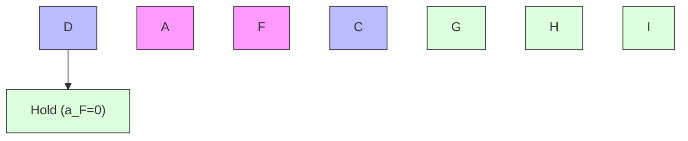
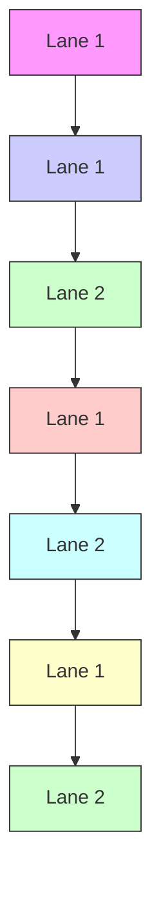
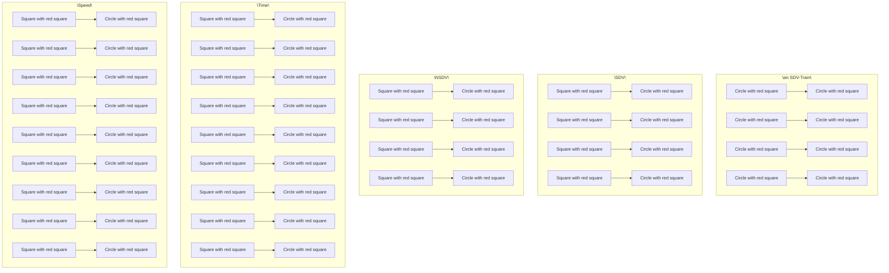

<table><tr><td>For office use only</td><td>Team Control Number</td><td>For office use only</td></tr><tr><td>T1</td><td>55585</td><td>F1</td></tr><tr><td>T2</td><td></td><td>F2</td></tr><tr><td>T3</td><td>Problem Chosen</td><td>F3</td></tr><tr><td>T4</td><td>C</td><td>F4</td></tr></table>

2017 MCM/ICM Summary Sheet

# Highway Traffic Flow Model with Self-Driving Vehicles Based on Cellular Automata

Summary

With the increasing lack of transportation capacity and the growth of self-driving vehicle(SDV) industry, an evaluation should be made to find out the influence on traffic when more and more nonself-driving-vehicles(NSDV) are replaced by SDVs while few studies were done on the interactions between SDVs and NSDVs and the cooperations among SDVs themselves.

We choose cellular automata(CA) model to evaluate this problem after a careful study and comparison of different kinds of traffic flow models in the past few decades. In order to take the relationships of SDVs and NSDVs into consideration, we improve the traditional CA model which emphasizes on status and rules of changes, by redesigning these two factors. Before building a CA model, discretization should be done first. By learning the average length, speed, acceleration of running vehicles on highway and the reaction time of human beings, the size of a cell and the time length of a turn are decided. After making assumptions and simplifying the problem, two interrelated CA models are covered in this paper to simulate the changeable traffic: the Following Model and the Multilane Traffic Model.

The Following Model is designed to simulate how a vehicle follows another in a single lane. Rules for NSDVs and SDVs are different from each other: For an NSDV, the driver’s reaction time and psychological characteristics are considered; For an SDV, the rules are based on the sharing of information with other SDVs and the joint decision making. Specifically, we create a new conception ’SDV-Train’ to simulate the cooperations among SDVs.

The Multilane Traffic Model is based on the Following Model. In this model, besides following, we try to find out when and how should a vehicle change a lane. Two main parameters are involved in this model: Lane-Changing Motivation (LCM) and Lane-Changing Secuirty (LCS). LCM depends on whether changing a lane can increase the speed and LCS shows the whether it is safe when lanechanging. Only when both LCM and LCS are satisfied, may a vehicle change its lane. Details of these two parameters vary between SDVs and NSDVs considering the huge difference between an automatic control system and a human driver. A two-step turning method is specially made for this model in correspondence with the real world.

After building and making improvements to the model, we write programs to simulate it and get huge volumes of data. We analyze and visualize the data using Matlab, showing strong correlations among three parameters: the average speed, the traffic flow and the percentage of the SDVs running on the road. The increasing number of SDVs has great influence on the traffic flow which almost triples when all the NSDVs are replaced by SDVs. Also, we find that a special lane for SDVs (SDV Lane) should be built when the percentage reaches a certain level.

Based on the correlations we get in analysis, we apply our model to the Great Seattle area by comparing the real data and the data we gain from simulations. We find that the lack of traffic capacity in this area is huge. Although adding SDVs to the street can reduce this lack, it is not a cure. We believe a comprehensive method should be applied in this area including setting a SDV Lane and broadening highways in some particularly narrow parts.

Keywords: Traffic Flow Model; Self-Driving Vehicle; Cellular Automata

## Contents

## 1 Introduction 1

## 2 Simplifications and Assumptions of the Problem 1

2.1 Features of the Highway . .  
2.2 Features of Vehicles . 2  
2.3 Special Features of NSDVs . . 3  
2.4 Special Features of SDVs . 3

## 3 Choice and Basic Settings of the Model 3

3.1 Choice of the Model . 3  
3.2 Discretization 4  
3.3 Basic Settings 4

## 4 Details of the Model 4

4.1 Following Model 4  
4.1.1 Variables . . 5  
4.1.2 Following Rules for NSDVs . 6  
4.1.3 Following Rules for SDVs . . 7

4.2 Multilane Traffic Model 9

4.2.1 Variables . . 9

4.2.2 General Rules of Changing Lanes 10

4.2.3 Lane-Changing Rules for NSDVs . . 10

4.2.4 Lane-Changing Rules for SDVs . . 12

## 5 Analysis of the Results Obtained from the Model Simulation 13

5.1 Results of Following Model 13  
5.2 Results of the Multilane Traffic Model 15  
5.3 SDV Lane . 16

## 6 Appliance of the Model 17

## 7 Sensitivity Analysis 18

7.1 Choice of the Parameters in LCP 18  
7.2 Different Speed Limit . 18

## 8 Conclusions 19

## 9 Strengths and weaknesses 19

9.1 Strengths . . . 19  
9.2 Weaknesses 19

## 10 A Letter 20

## Appendices 22

## 1 Introduction

Built in the 20th century, many highways were designed to meet the transportation demands at that time. With the boom of population, urbanization and economy, the need of transportation grows rapidly in the new century. Nowadays, highways in the Great Seattle area can no longer meet people’s need and traffic delays can be seen everywhere during peak hours. However, at this time building more roads or adding lanes in this area is extremely difficult and expensive. In order to increase the capacity of highways without increasing the number of lanes or roads, allowing selfdriving vehicles(SDVs) to run on the road should be taken into consideration. A model is needed to evaluate SDVs’ influence on the traffic flow.

We proposed to decompose this problem into three parts:

Build a model that can simulate the traffic flow in different percentage of SDVs and non-selfdriving vehicles (NSDVs), number of lanes and traffic volume.  
Use the model to find the equilibria or tipping points and apply the model to the provided data.  
Based on the data, decide whether there are some conditions where lanes should be dedicated to SDVs and how the policy should be changed.

Firstly, we use cellular automata(CA) to simulate the traffic flow when there is only one lane. This model is called the Following Model. In our model, we rule the way each cell behaves by simplifying the behaviors of vehicles in real life, like when a vehicle will slow down or speed up. We use different rules for SDVs and NSDVs in our model to simulate the cooperations among SDVs, interactions between SDVs and NSDVs, unpredictability of human-beings and other factors.

Based on the Following Model we built, we put separate parrel lanes together and add new rules to simulate the traffic flow on a multilane highway. This is the Multilane Traffic Model. After simplifying the behaviors of real vehicles’ changing lanes, we make rules on when and how a cell move across lanes. Both the motivation and the safety concern are considered. Furthermore, we make special rules to simulate human behaviors and cooperations among SDVs including the form of a chain of SDVs called the SDV-Train.

Secondly, using real-life parameters, we run the CA model and get a large number of data. By analyzing the data, we find several interesting features of the mixed traffic flow. The correlations among the average speed, the traffic flow and the percentage of SDVs are strong. These three parameters influence each other in their own way. When there are many lanes, the situation changes and more interesting phenomena are found including the relationships between the efficiency of each line and the percentage of SDVs. After comparison, we find out when and how to build a special lane for SDVs (SDV Lane).

Thirdly, we compared our data with real data in the Great Seattle area. We find that there is indeed a great lack of traffic capacity in this area. After changing NSDVs to SDVs, the traffic capacity increases and even triples but we believe the traffic situation in this area is still not abundant. More methods including broaden a few parts of the current highway and setting a SDV Lane should be taken into consideration.

## 2 Simplifications and Assumptions of the Problem

## 2.1 Features of the Highway

## 1. Straight Road

A highway in this model should be straight or its degree of curvature can be ignored [1]. A vehicle’s speed and other conditions does not change because of the shape of the road.

2. The number of lanes should remain constant for a long period.  
3. The highway is in good condition and the traffic flow is not affected by the rough road.  
4. No pedestrian, animal or any form of obstacle can be found on the highway so the traffic flow would not be blocked.  
5. Weather changes and illumination difference during different time is not taken into consideration.  
6. Rules for SDV Lane

If a SDV Lane is set, all SDVs should run in this line while none of the NSDVs may run in it.  
• Only one SDV Lane can be set in our model considering the width of the highway is limited.  
The SDV Lane will be placed on the edge of the road to prevent a separation of lanes for NSDVs.

7. The width of each lane is 12 feet.

8. The speed limit of all highways is 60mph.

## 2.2 Features of Vehicles

1. In this model, only average length, speed, acceleration and other features of vehicles are used. Although there is a great diversity among different vehicles, this difference can be ignored and the result of the model would not be greatly affected.  
2. All vehicles obey traffic laws. The violation of traffic laws does great harm to the driver’s health, public security as well as the speed of total traffic flow. As a result, these circumstances would not occur in our model:

a vehicle exceeds the speed limit;  
a vehicle stops for no reason;  
a vehicle runs in an emergency lane or on the shoulder for no reason;  
a vehicle changes its lane but

– its turning light is not turned on in advance;  
– the vehicle behind it shows its intention to change the lane;

two vehicles run side by side in one lane;  
the distance between two vehicles in the same lane is too short.

3. Traffic accident is not taken into consideration. Details of its influence will be discussed in Section 9.2.  
4. Average daily traffic flow is used in this model. Traffic flow varies in different days, so an average level should be used to simplify this model.  
5. Horn is not used in our model. On highway, the influence of a horn is limited because the distance between two vehicles is too long for a complicated sound signal to be heard and understood clearly.

## 2.3 Special Features of NSDVs

## 1. Uncertainty of the estimation of distance and speed

Compared with computer systems, human drivers are more likely to make mistakes, especially when it comes to the evaluation of distance and speed. Therefore, human drivers tend to slow down the vehicle and choose not to change a lane when they cannot estimate the distance clearly even when other vehicles are out of the minimum safe distance.

## 2. Longer reaction time

Human drivers need more time to decelerate and start their vehicle compared with self-driving ones especially on the highway [2].

## 2.4 Special Features of SDVs

## 1. Short reaction time

SDVs are controlled by computer systems which run fast and can stay active for the whole time. With modern technology, it is easy for an SDV to perceive the outside world and make reactions accordingly in a short time.

## 2. Cooperations among SDVs

The system of an SDV is connected to the Internet, therefore information of all the SDVs on a road is shared. With more information, a network decision-making system can be built which is mentioned in previous studies [3].

## 3. Mature technology

The technology of self-driving is mature enough and no malfunction of SDVs’ guiding, driving and decision-making system is taken into consideration in this model. If an accident does happen to an SDV’s system, this SDV should be labeled as an NSDV.

## 4. Interactions between an NSDV and an SDV

As discussed in Section 3, for a human driver, there is no difference between an SDV and an NSDV that he or she encounters on the street, for SDVs would make less mistakes than NSDVs and would not cause more trouble to human drivers.

## 3 Choice and Basic Settings of the Model

## 3.1 Choice of the Model

In the past few decades, with the development of transportation, a great variety of models simulating the traffic were built and improved, among which Continuous Medium model and CA model are the most popular ones. Lighthill and Whitham firstly put forward the concept of continuous medium model, while shortly afterwards Richards also put forward it independently, therefore it is also named LWR model [4]. LWR model mainly focuses on the macroscopic homogeneity and stability of the traffic flow. However, in this problem, the cooperations between SDVs and the reactions between an SDV and an NSDV must be further discussed, which makes it hard for us to adapt the LWR model, because LWR model neglects the interactions between different particles in the flow. After careful comparison, we find that traditional CA model with modifications can be used in this problem.

In real life, the action of a vehicle taken by both human drivers and computer systems depends on the status of the vehicle itself and the surrounding traffic, which is similar to the rules of CA, which is originally discovered in the 1940s by Stanislaw Ulam and John von Neumann [5]. The basic idea of CA is that it starts with a set of cells with status. A simple set of rules are created that the status are updated depending on the status of the cell and its neighbors. With multiple iterations, CA models can simulate the movement of complex objects. Changes are made to the status and the rules of the original CA model in order, ensuring that this model can work for a mixture of SDVs and NSDVs. In order to make a CA model, discretization should be done first to almost all variables.

## 3.2 Discretization

In our CA models, each vehicle is regarded as a cell with its own status. Besides, each lane is also divided into cells that can contain the vehicles while time is divided into small units(turns).

## 1. Size of a cell

The average length of vehicle in U.S. is a bit longer than 4 meters. As every cell represents a vehicle, the length of the cell should be the same as the average length. To simplify the calculation, we use

$$
1 c e l l = 4 m \tag {3.1}
$$

## 2. Time unit

As the results of Triggs, T. J. and Harris, W. G’s work shows, the average reaction time for drivers is around 1.5 seconds [2]. In one turn of the CA model, a vehicle makes one action, so 1.5 seconds is a good choice for our CA model’s time unit.

$$
1 \text { turn } = 1. 5 s \tag {3.2}
$$

## 3.3 Basic Settings

## 1. Speed

The speed limit of road is 60mph, which is 10cell per turn, using Eqn. (3.1) and Eqn. (3.2). Because CA model is discretized, the speed is regarded as a natural number from 0 to 10 in our model.

## 2. Acceleration

According to the assumption , the speed of a vehicle should change step by step. In our model, the speed can only change 1cell in a turn. Use Eqn. (3.1) and Eqn. (3.2), the acceleration of a vehicle is $2 . 6 7 m / s ^ { \overline { { 2 } } } .$ , which is in line with daily experience.

## 3. Minimum Safe Following Distance(MinSFD)

A vehicle should not get too close to the vehicle ahead to prevent accident when running on a high way. Minimum Safe Following Distance(MinSFD) is designed to make sure that a normal vehicle running at a certain speed can stop before collision.

## 4 Details of the Model

In our CA models, rules are made to simulate vehicles’ movement. Among all kinds of movements, two types of vehicle’s actions are the most important ones: following and lane-changing. The Following Model and the Multilane Traffic Model are made to simulate these two types of actions.

## 4.1 Following Model

The Following Model simulates the flow of vehicles in a single lane on the highway. Large quantities of single-lane traffic flow models have been developed, the most famous one of which is the NaSch(NS) model. Kai Nagel and Michael Schreckenberg built this CA model for highway traffic in 1992 [6]. Their model’s simulations show a transition from laminar traffic flow to start-stop waves with increasing vehicle density. In real life, SDVs’ behavior is different from the non-self-driving ones, so our modifications for the NaSch model are mainly focused on the SDVs.

## 4.1.1 Variables

Table 1: Main Variables Used in the Following Model

<table><tr><td>Variable</td><td>Definition</td><td>Unit</td></tr><tr><td> $d_i$ </td><td>Distance between vehicle No. i and the start point</td><td>cell</td></tr><tr><td> $\Delta d_i$ </td><td>Distance between vehicle No. i and the vehicle ahead of it</td><td>cell</td></tr><tr><td> $v_i$ </td><td>Speed of vehicle No.i</td><td>cell/time step</td></tr><tr><td> $a_i$ </td><td>Whether vehicle No.i is accelerating or not</td><td>unitless</td></tr><tr><td> $b_i$ </td><td>Status of the back light of vehicle No.i</td><td>unitless</td></tr><tr><td> $t_i$ </td><td>Type of vehicle No.i</td><td>unitless</td></tr><tr><td> $D_{min}(v)$ </td><td>MinSFD between two vehicleswhen the latter one&#x27;s speed is v</td><td>cell</td></tr><tr><td> $D_{max}(v)$ </td><td>Maximum distance between two vehicles when the latter one&#x27;s speed is v and the action of the former one can be ignored</td><td>cell</td></tr><tr><td> $P_{1,i}$ </td><td>Possibility of a human driver to decelerate out of caution</td><td>unitless</td></tr></table>


<details>
<summary>flowchart</summary>

```mermaid
graph TD
  A["Point A"] -->|v_A| Delta["Δ d_A"]
  Delta --> B["Point B"]
  B --> C["Point C"]
  C --> D["Point D"]
    style A fill:#f9f,stroke:#333
    style B fill:#bbf,stroke:#333
    style C fill:#bfb,stroke:#333
    style D fill:#ffb,stroke:#333
    note right of A: SDV
    note right of B: Back Light On b_i=1
    note right of D: Back Light Off b_i=0
```
</details>

Figure 1: Diagram of Main Variables Used in the Following Model

Main variables used in the Following Model are shown in Tab. 4.1.1 and Fig. 1. Specifically, Eqn. (4.3) shows the functions for the status of the back light and the vehicle type separately:

$$
b _ {i} = \left\{ \begin{array}{l l} 0, & \text { the   back   light   of   vehicle   No. } i \text { is   off } \\ 1, & \text { the   back   light   of   vehicle   No. } i \text { is   on } \end{array} \right. \tag {4.3}
$$

$$
t _ {i} = \left\{ \begin{array}{l l} 0, & \text { vehicle   No. } i \text { is   an   NSDV } \\ 1, & \text { vehicle   No. } i \text { is   an   SDV } \end{array} \right.
$$

For an NSDV, no light signal shows whether it is accelerating or not, which parameter $a _ { i }$ indicates. However, this information is shared among self-driving ones, which is what Eqn. (4.4) shows:

$$
a _ {i} = \left\{ \begin{array}{l l} 0, & \text { vehicle   No. } i \text {   is   not   accelerating } \\ 1, & \text { vehicle   No. } i \text {   is   accelerating } \end{array} \right. \tag {4.4}
$$

## 4.1.2 Following Rules for NSDVs

## Deceleration

As we discussed in part 1 and part 2 of Section 2.4, human driver need more time to react and they sometimes choose to slow down to maintain a longer following distance out of caution. In this Following Model, if vehicle No.i is Non-Self-Driving, a possibility function $P _ { 1 , i }$ is made for it to simulate the two factors mentioned above. For an NSDV A, Eqn. (4.5) shows the function, in which B represents the first vehicle that is in front of A.

$$
P _ {1, A} = \left\{ \begin{array}{l l} P _ {1} 1, & b _ {B} = 1 \wedge \Delta d _ {A} > D _ {\min} (v _ {A}) \wedge \Delta d _ {A} <   D _ {\max} (v _ {A}) \\ P _ {1} 2, & b _ {B} = 0 \wedge \Delta d _ {A} > D _ {\min} (v _ {A}) \wedge \Delta d _ {A} <   D _ {\max} (v _ {A}) \\ P _ {1} 3, & v _ {A} = 0 \\ 0, & \text { other   cases } \end{array} \right. \tag {4.5}
$$

In calculation, we use the results got from pervious works [7] [8]:

$$
P _ {1} 1 = 0. 9 4, P _ {1} 2 = 0. 5 0, P _ {1} 3 = 0. 2 0 \tag {4.6}
$$

In short, there is a rate for NSDVs to decelerate under certain circumstances. As shown in Lane 1 in Fig. 2, for an NSDV $\mathbf { A } ,$ every turn a random number R between 0 and 1 is given in the Following Model, and:

$$
P _ {1, A} \geqslant R \Rightarrow v _ {A} = v _ {A} - 1, b _ {A} = 1
$$

Besides this effect, if there is another vehicle within vehicle A’s MinSFD, A has to decelerate and turn its back light on. That is:

$$
\Delta d _ {A} \leqslant D _ {\min} (v _ {A}) \Rightarrow v _ {A} = v _ {A} - 1, b _ {A} = 1
$$

And this is Lane 2 in Fig. 2.


<details>
<summary>table</summary>

| Lane   | A→v_A | B→v_A | A→v_A | B→v_A |
|--------|-------|-------|-------|-------|
| Lane 1 | Yes   | Yes   | Yes   | Yes   |
| Lane 2 | Yes   | Yes   | Yes   | Yes   |
| Lane 3 | Yes   | Yes   | Yes   | Yes   |
| Lane 4 | Yes   | Yes   | Yes   | Yes   |
| Lane 5 | Yes   | Yes   | Yes   | Yes   |
</details>

Figure 2: Following Rules for NSDVs

## Acceleration

If NSDV A does not decelerate because of $P _ { A }$ , and vehicle B is

– far away, or  
– not decelerating and out of A’s MinSFD

then A will accelerate, which are shown separately in Lane 3 and Lane 4 in Fig. 2. That is:

$$
\begin{array}{l} P _ {1, A} <   R \wedge \left(\Delta d _ {A} > D _ {\max} (v _ {A}) \vee \left(b _ {B} = 0 \wedge \Delta d _ {A} > D _ {\min} (v _ {A})\right)\right) \\ \Rightarrow v _ {A} = v _ {A} + 1, b _ {A} = 0 \\ \end{array}
$$

Hold

On other circumstances, an NSDV holds its speed,which is shown in Lane 5 of Fig. 2:

$$
[ O t h e r C i r c u m s t a n c e s ] \Rightarrow b _ {A} = 0.
$$

## 4.1.3 Following Rules for SDVs

According to the discussion in part 1 and part 2 of Section 2.4, SDVs have short reaction time and they can cooperate with each other. Considering that an accident happens right in front of a straight line of vehicles, all vehicles should decelerate in order to keep the MinSFD. If they are controlled by human beings whose reaction time cannot be ignored, vehicles will decelerate one by one but with a delay. However, if all vehicles are self-driving ones, they can decelerate at the same time, thanks to the cooperating system. It is the same for the acceleration process, because $a _ { i }$ can be known for all SDVs,which is mentioned in Section 4.1.1.

Another factor is that the way changes to calculate minimum safe following distance between two SDVs which one follows another closely, because all SDVs share the information of speed and other parameters of the SDVs in front of them, which is mentioned in part 2 of Section 2.4. As is also assumed in part 3 of Section 2.4, malfunction of the self-driving system is not taken into consideration in this model. The two adjacent SDVs can decelerate at the same time if emergency happens, so that the MinSFD for an SDV can be calculated following Eqn. (4.7), in which the Braking Distance of the former can be removed. No collision between SDVs will happen when all information is shared and decisions are made cooperatively.

$$
B r a k i n g D i s t a n c e _ {E} = D _ {m i n} (m a x (v _ {E} - 2, 0))
$$

$$
D _ {\min (S D V - S D V)} \left(v _ {A}\right) = \max \left(D _ {\min} \left(v _ {A}\right) - \text { BrakingDistance } _ {E} + 1, 1\right) \tag {4.7}
$$

In Eqn. (4.7) E is the SDV ahead of A.

With the change of $D _ { m i n ( S D V - S D V ) } ,$ , the distance between SDVs can be shortened and therefore a row of pure SDVs can be formed. When all the distances between two consecutive SDVs are their $D _ { m i n ( S D V - S D V ) }$ , this chain of SDVs can be called a SDV-Train. For an SDV A, if it is in an SDV-Train, let F be the SDV in the front of the train. The three vehicles in Lane 4 from Fig. 3 form a typical SDV-Train.


<details>
<summary>diagram</summary>

| Lane   | State | Acceleration |
|--------|-------|--------------|
| Lane 1 | A     | V_A          |
| Lane 1 | V_A   |              |
| Lane 2 | A     | V_A          |
| Lane 2 | C     |              |
| Lane 3 | A     | V_A          |
| Lane 3 | E     |              |
| Lane 4 | A     | V_A          |
| Lane 4 | I     |              |
| Lane 4 | F     |              |
</details>

Figure 3: Following Rules for SDVs: Acceleration

## Acceleration

An SDV accelerates under 4 conditions:

1. it follows a vehicle B, and their distance is longer than $D _ { m a x } ( v _ { A } )$ , that is:

$$
\Delta D _ {A} \geqslant D _ {\max} (v _ {A}) \Rightarrow v _ {A} = v _ {A} + 1; b _ {A} = 0; a _ {A} = 1;
$$

which is the situation in Lane 1 in Fig. 3;

2. it follows an NSDV C, whose back light is off and their distance is longer than the MinSFD of A, that is:

$$
t _ {C} = 0 \land b _ {C} = 0 \land \Delta D _ {A} \geqslant D _ {\min} (v _ {A}) \Rightarrow v _ {A} = v _ {A} + 1; b _ {A} = 0; a _ {A} = 1;
$$

which is the situation in Lane 2 in Fig. 3;

3. it follows an SDV E, and their distance is longer than the $D _ { m i n ( S D V - S D V ) }$ of A, that is:

$$
t _ {E} = 1 \land \Delta D _ {A} > D _ {m i n (S D V - S D V)} (v _ {A}) \Rightarrow v _ {A} = v _ {A} + 1; b _ {A} = 0; a _ {A} = 1;
$$

which is the situation in Lane 3 in Fig. 3;

4. it is in a ’SDV-Train’, and the first SDV F in train accelerates, that is:

$$
\Delta D _ {A} = D _ {\min (S D V - S D V)} (v _ {A}) \wedge a _ {F} = 1 \Rightarrow v _ {A} = v _ {A} + 1; b _ {A} = 0; a _ {A} = 1.
$$

which is the situation in Lane 4 in Fig. 3.

## Deceleration


<details>
<summary>diagram</summary>

| Lane   | Event Type | Deceleration |
|--------|------------|--------------|
| Lane 1 | A → vA      | Deceleration |
| Lane 1 | C →        | Deceleration |
| Lane 2 | A → vA      | Deceleration |
| Lane 2 | E →        | Deceleration |
| Lane 3 | A → vA      | Deceleration |
| Lane 3 | I →        | Deceleration |
| Lane 3 | F →        | Deceleration |
</details>

Figure 4: Following Rules for SDVs: Deceleration

An SDV decelerates under 3 conditions:

1. it follows an NSDV C, and their distance is shorter than the MinSFD of A, that is:

$$
t _ {C} = 0 \land \Delta D _ {A} \leqslant D _ {m i n} (v _ {A}) \Rightarrow v _ {A} = v _ {A} - 1; b _ {A} = 1; a _ {A} = 0;
$$

which is the situation in Lane 1 in Fig. 4;

2. it follows an SDV E, and their distance is shorter than the $D _ { m i n ( S D V - S D V ) }$ of A, that is:

$$
t _ {E} = 1 \land \Delta D _ {A} \leqslant D _ {\min (S D V - S D V)} (v _ {A}) \Rightarrow v _ {A} = v _ {A} - 1; b _ {A} = 1; a _ {A} = 0;
$$

which is the situation in Lane 2 in Fig. 4;

3. it is in a ’SDV-Train’, and the first SDV F in train decelerates, that is:

$$
\Delta D _ {A} = D _ {m i n (S D V - S D V)} (v _ {A}) \wedge b _ {F} = 1 \Rightarrow v _ {A} = v _ {A} - 1; b _ {A} = 1; a _ {A} = 0.
$$

which is the situation in Lane 3 in Fig. 4.

Hold

On other circumstances, an SDV holds its speed:

$$
[ O t h e r C i r c u m s t a n c e s ] \Rightarrow b _ {A} = 0; a _ {A} = 0.
$$

Two different situations are shown in Fig. 5:


<details>
<summary>flowchart</summary>


</details>

Figure 5: Following Rules for SDVs: Hold

## 4.2 Multilane Traffic Model

On multilane highways, vehicles tend to stay on its own lane, which is the same as the Following Model mentioned above in Section 4.1. However, under certain circumstances, drivers change their lanes. The Multilane Traffic Model is designed on the basis of the Following Model to simulate this lane-changing action [9]. Because of SDVs’ cooperation with each other and the formation of SDV-Trains, SDVs’ rules of changing lanes vary with NSDVs’.

## 4.2.1 Variables

Table 2: Additional Variables Used in the Multilane Traffic Model

<table><tr><td>Variable</td><td>Definition</td><td>Unit</td></tr><tr><td> $\Delta d_{i,j}$ </td><td>Distance between vehicle No. i and vehicle No.j</td><td>cell</td></tr><tr><td> $c_i$ </td><td>Status of the turning lights of vehicle No.i</td><td>unitless</td></tr><tr><td> $l_i$ </td><td>Number of lane which vehicle No.i is on</td><td>unitless</td></tr><tr><td> $P_{2,i}$ </td><td>Possibility of a human driver of vehicle No.i to change the lane when condition allows</td><td>unitless</td></tr></table>

Besides variables listed in Tab. 4.1.1, additional variables used in the Multilane Traffic Model are listed in Tab. 4.2.1 and Fig. 6. Specifically, Eqn. (4.8) shows the function for the status of vehicle No.i’s turning lights:

$$
c _ {i} = \left\{ \begin{array}{l l} 0, & \text { turning   lights   of   vehicle   No. } i \text { are   off } \\ 1, & \text { the   right   turning   light   of   vehicle   No. } i \text { is   on } \\ - 1, & \text { the   left   turning   light   of   vehicle   No. } i \text { is   on } \end{array} \right. \tag {4.8}
$$


<details>
<summary>text_image</summary>

C
vC
IC=2
ΔdA,E
Lane 1
F
VF
E
VE
Lane 2
C
vC
A
VA
B
VB
Both Lights Off
ci=0
Right Light On
ci=1
Left Light On
ci=-1
</details>

Figure 6: Diagram of Additional Variables Used in the Multilane Traffic Model

## 4.2.2 General Rules of Changing Lanes

As we assumed in part 2 of Section 2.2, drivers only change their lane when necessary:

1. The vehicle on the same lane ahead is not far away and is running much slower;  
2. The traffic condition on the lane beside is better.

This is called Lane-Changing Motivation(LCM). After the satisfaction of LCM, two steps should be done when a vehicle’s driver wants to change the lane:

1. turn on the turning light when the condition permits;  
2. change the lane when it is safe.

During this process, Lane-Changing Security(LCS) must be taken into consideration.

In short, only when both LCM and LCS are satisfied, may a vehicle change its lane.

## 4.2.3 Lane-Changing Rules for NSDVs

As showed in Fig. 6, B is the vehicle ahead of A and C is behind A. Three of them are all in the same lane. Only left-turning is discussed below because turning right is the same. Both E and F are in A’s left lane. E is the vehicle ahead and F is the vehicle behind.

LCM of NSDV

As mentioned in Section 4.2.2, there are two components of LCM:

– B is running slower than A and not far away;  
– E is running faster or far away.

So,

$$
L C M _ {A} = \left(\Delta d _ {A, B} <   D _ {\max} (v _ {A}) \wedge v _ {B} <   v _ {A}\right) \wedge \left(\Delta d _ {A, E} > D _ {\max} (v _ {A}) \vee v _ {E} > v _ {A}\right) \tag {4.9}
$$

Some of the circumstances are shown in Fig. 7.


<details>
<summary>diagram</summary>

| Lane   | Direction | Value |
|--------|-----------|-------|
| Lane 1 | A         | V_A   |
| Lane 1 | B         | V_B   |
| Lane 1 | E         | V_E   |
| Lane 2 | A         | V_A   |
| Lane 2 | B         | V_B   |
| Lane 2 | E         | V_E   |
</details>

Figure 7: LCM for NSDVs under Certain Conditions

## LCS of NSDV

Three parts of LCS should be taken into consideration:

– B and E are not in A’s MinSFD ;  
– A will not be in F’s MinSFD after A’s changing lane;  
– C’s left turning light is off.

That is:

$$
L C S _ {A} = \Delta d _ {A, B} > D _ {\min} (v _ {A}) \wedge \Delta d _ {A, E} > D _ {\min} (v _ {A}) \wedge \Delta d _ {A, F} > D _ {\min} (v _ {F}) \wedge c _ {C} \neq - 1 \tag {4.10}
$$

A few of the circumstances are shown in Fig. 8.


<details>
<summary>flowchart</summary>

```mermaid
graph TD
    subgraph Lane 1
  A1[" Lane 1 "] --> B1[" Lane 2 "]
  B1 --> C1[" "]
  C1 --> D1[" "]
  D1 --> E1[" "]
  E1 --> F1[" "]
  F1 --> G1[" "]
    end

    subgraph Lane 2
  A2[" Lane 2 "] --> B2[" Lane 2 "]
  B2 --> C2[" "]
  C2 --> D2[" "]
  D2 --> E2[" "]
  E2 --> F2[" "]
    end

  Dmax[" D_max(v_A) "] --> Dmin[" D_min(v_A) "] --> LCSA[" LCS_A "]
  LCSA --> X[" × "]
  Dmin --> VEA[" V_E "]
  VEA --> BA[" B "]
  BA --> VB[" VB "]
  VB --> X
  X --> Cc["-1"]
  Cc --> ✓[ ✓ ]
    
    style Lane 1 fill:#f9f,stroke:#333
    style Lane 2 fill:#bbf,stroke:#333
    note right of Cc: c_c = -1
```
</details>

Figure 8: LCS for NSDVs under Certain Conditions

• Lane-Changing Possibility(LCP).

Even when both LCM and LCS are satisfied, a human driver may not change a lane to make the vehicle run faster [9]. To simulate this statistical randomness of physiological characteristics, function $P _ { 2 , i }$ is introduced in the Multilane Traffic Model. As Eqn.(4.11) shows, there is a possibility for an NSDV to change its lane and it varies upon three different circumstances, considering B as the vehicle in front of A in the same lane.

$$
P _ {2, A} = \left\{ \begin{array}{l l} P _ {2} 1, & b _ {B} = 1 \wedge \Delta d _ {A} > D _ {\min} (v _ {A}) \wedge \Delta d _ {A} <   D _ {\max} (v _ {A}) \\ P _ {2} 2, & b _ {B} = 0 \wedge \Delta d _ {A} > D _ {\min} (v _ {A}) \wedge \Delta d _ {A} <   D _ {\max} (v _ {A}) \\ P _ {2} 3, & v _ {A} = 0 \\ 0, & \text { other   cases } \end{array} \right. \tag {4.11}
$$

Let R be a random number between 0 and 1, and LCP follows Eqn. (4.12):

$$
L C P _ {A} = \left(P _ {2, A} \geqslant R\right) \tag {4.12}
$$

Total Effect of LCM, LCS and LCP

As Section 4.2.2 mentioned, there are two steps to change a lane: turn on the turning light and take the turn. That is:

$\mathrm { S T E P 1 } \colon L C M _ { A } \land L C S _ { A } \land L C P _ { A } \Rightarrow c _ { A } = - 1 ;$

${ \mathrm { S T E P } } 2 \colon L C M _ { \cal A } \wedge L C S _ { \cal A } \wedge c _ { \cal A } = - 1 \Rightarrow r _ { \cal A } = r _ { \cal A } - 1 ; c _ { \cal A } = 0 .$

## 4.2.4 Lane-Changing Rules for SDVs

Compared with NSDVs, SDVs can share information with each other and Lane-Changing Rules for SDVs should be changed. The rules are almost the same as those in 4.1.3:

1. The calculation of MinSFD should be changed as Eqn. (4.13) shows:

$$
D _ {\min (A, B)} ^ {*} (v _ {A}) = \left\{ \begin{array}{l l} D _ {\min (S D V - S D V)} (v _ {A}), & \text { both   A   and   B   are   SDV } \\ D _ {\min} (v _ {A}), & \text { other   circumstances } \end{array} \right. \tag {4.13}
$$

2. An SDV-Train can be formed and in this case the whole train can change a lane at the same time;

3. An SDV does not have an LCP.

Therefore, for an SDV, Eqn. (4.9) and Eqn. (4.10) should be modified to Eqn. (4.14) and Eqn. (4.15):

$$
\begin{array}{l} L C M _ {A} = \left(\Delta d _ {A, B} <   D _ {\max} (v _ {A}) \wedge v _ {B} <   v _ {A}\right) \wedge \left(\Delta d _ {A, E} > D _ {\max} (v _ {A}) \vee v _ {E} > v _ {A}\right) \\ \begin{array}{l} \Delta w _ {A, E} > B \max \left(c _ {A}\right) + c _ {E} > c _ {A}) \\ \forall c _ {B} = - 1 \wedge t _ {B} = 1 \vee c _ {G} = - 1 \end{array} \tag {4.14} \\ \end{array}
$$

$$
L C S _ {A} = \Delta d _ {A, B} > D _ {\min (A, B)} ^ {*} (v _ {A}) \wedge \Delta d _ {A, E} > D _ {\min (A, E)} ^ {*} (v _ {A}) \wedge \Delta d _ {A, F} > D _ {\min (A, F)} ^ {*} (v _ {F}) \wedge \left(c _ {C} \neq - 1 \vee t _ {C} = 1\right) \tag {4.15}
$$

In Eqn. (4.14) and Eqn. (4.15), the definitions of vehicle B,C,E,F are the same as those in . Vehicle G is the first SDV in A’s SDV-Train. Some of the circumstances are shown in Fig. 9 and Fig. 10. And the 2-step procedure for an SDV to change a lane is:

$\mathrm { S T E P } 1 \colon L C M \wedge L C S \Rightarrow c _ { A } = - 1 ;$

${ \mathrm { S T E P } } 2 \colon L C M \land L C S \land c _ { A } = - 1 \Rightarrow r _ { A } = r _ { A } - 1 ; c _ { A } = 0 .$


<details>
<summary>flowchart</summary>


</details>


<details>
<summary>flowchart</summary>

```mermaid
graph TD
  A["Lane 1"] --> B["Line 2"]
  B --> C["Line 1"]
  C --> D["Line 2"]
  D --> E["Line 1"]
  E --> F["Line 2"]
    style A fill:#f9f,stroke:#333
    style B fill:#ccf,stroke:#333
    style C fill:#cfc,stroke:#333
    style D fill:#fcc,stroke:#333
    style E fill:#ffc,stroke:#333
    style F fill:#fcc,stroke:#333
    subgraph Lane 1
  G["IC"] --> H["VC"] --> I["A"] --> J["VA"] --> K["B"] --> L["VB"] --> M["E"] --> N["VE"] --> O["√"]
    end
    subgraph Lane 2
  P["IC"] --> Q["VC"] --> R["A"] --> S["VA"] --> T["B"] --> U["VB"] --> V["E"] --> W["VE"] --> X["√"]
    end
    G <-->|D_max(V_A)| Y["LCS_A"]
    H <-->|D_min(V_A)| Y
    I <-->|Δd_A,E<Δd_min(V_A)| Y
    J <-->|Δd_A,E<Δd_min(V_A)| Y
    K <-->|Δd_A,E<Δd_min(V_A)| Y
    L <-->|Δd_A,E<Δd_min(V_A)| Y
    M <-->|Δd_A,E<Δd_min(V_A)| Y
    N <-->|Δd_A,E<Δd_min(V_A)| Y
    O <-->|Δd_A,E<Δd_min(V_A)| Y
    P <-->|Δd_A,E<Δd_min(V_A)| Y
    Q <-->|Δd_A,E<Δd_min(V_A)| Y
    R <-->|Δd_A,E<Δd_min(V_A)| Y
    S <-->|Δd_A,E<Δd_min(V_A)| Y
    T <-->|Δd_A,E<Δd_min(V_A)| Y
    U <-->|Δd_A,E<Δd_min(V_A)| Y
    V <-->|Δd_A,E<Δd_min(V_A)| Y
    W <-->|Δd_A,E<Δd_min(V_A)| Y
    X <-->|Δd_A,E<Δd_min(V_A)| Y
    Y <-->|C_C=-1, t_C=0| Z["✓"]
```
</details>

Figure 9: LCM for SDVs under Certain Conditions  
Figure 10: LCS for SDVs under Certain Conditions

## 5 Analysis of the Results Obtained from the Model Simulation

After programming according to our CA models, we get a large number of data from simulations using parameters in real life. Matlab and other softwares are used to calculate and visualize the data, showing many good features as follows:

## 5.1 Results of Following Model


<details>
<summary>text_image</summary>

SDV
NSDV
Time
Δ d=22 cell
Δ d=10 cell
an SDV-Train
</details>

Figure 11: One of the Results of Following Model Simulation

Fig. 11 shows one of the results of the Following Model, in which each dot represents a vehicle and each line represents the lane during different time. The time difference between two adjacent lane is one turn. As time goes by, all vehicles run forward with different speed. We can find that in this simulation, the distance between two NSDVs are much longer than that between two SDVs, which is in line with the MinSFD we set. An SDV-Train is also found in the simulation, saving the space on the road and speeding up the traffic flow.

After calculating and summarizing the data, we found strong correlations among the average speed of all vehicles, the percentage in SDVs of all vehicles and the overall traffic flow, which is shown in a three dimension map in Fig. 12. In this figure each data point represents an average of 6 simulations based on same parameters.


<details>
<summary>scatterplot</summary>

| Traffic Flow (vehicle/h) | Average Speed (mph) | Percentage of SDVs |
| ------------------------ | ------------------- | ------------------ |
| 0                        | 60                  | 1400               |
| 50                       | 55                  | 1200               |
| 100                      | 50                  | 1000               |
| 200                      | 45                  | 800                |
| 400                      | 40                  | 600                |
| 600                      | 35                  | 400                |
| 800                      | 30                  | 200                |
| 1000                     | 25                  | 100                |
| 1200                     | 20                  | 50                 |
</details>

Figure 12: Correlations Among Average Speed, the Percentage of SDVs and the Traffic Flow

As we can find in Fig. 12, all data points fit to a continuous smooth surface, showing that the higher the percentage of SDVs is, the faster all vehicles run and the larger the traffic flow is, the lower the average speed is. These two features are consistent with common sense. Another interesting feature is that the decreasing trend of speed related to the traffic flow is stongly influenced by the percentage of SDVs. Some typical curves of that are shown in Fig. 13. Also, we can find that there is a maximum traffic flow for each percentage of SDVs, which is shown in detail in Fig. 14.


<details>
<summary>line chart</summary>

| Traffic Flow (vehicle/h) | Average Speed (mph) for P_SDV=0% | Average Speed (mph) for P_SDV=10% | Average Speed (mph) for P_SDV=50% | Average Speed (mph) for P_SDV=70% | Average Speed (mph) for P_SDV=90% |
| ------------------------ | --------------------------------- | ---------------------------------- | ---------------------------------- | ---------------------------------- | ---------------------------------- |
| 0                        | 60                                | 60                                 | 60                                 | 60                                 | 60                                 |
| 200                      | 55                                | 55                                 | 55                                 | 55                                 | 55                                 |
| 400                      | 15                                | 15                                 | 15                                 | 15                                 | 15                                 |
| 600                      | 15                                | 15                                 | 15                                 | 15                                 | 15                                 |
| 800                      | 15                                | 15                                 | 15                                 | 15                                 | 15                                 |
| 1000                     | 15                                | 15                                 | 15                                 | 15                                 | 15                                 |
| 1200                     | 15                                | 15                                 | 15                                 | 15                                 | 15                                 |
</details>

Figure 13: Relationship between Average Speed and the Traffic Flow under Certain Ratios of SDVs


<details>
<summary>line chart</summary>

| Percentage of SDVs | Maximum Traffic Flow (vehicle/h) |
| ------------------ | --------------------------------- |
| 0                  | 400                               |
| 20                 | 450                               |
| 40                 | 550                               |
| 60                 | 650                               |
| 80                 | 800                               |
| 100                | 1250                              |
</details>

Figure 14: Relationship between Maximum Traffic Flow and Percentage of SDVs

In Fig. 13, we can see clearly that the percentage of SDVs makes a great difference on the traffic. As the blue curve shows, only when the traffic flow is below 200 vehicles per hour is the average speed above 50mph. When the traffic flow is around 400 vehicles per hour, the average speed maintains at 15mph and a larger traffic flow would not get through when all vehicles are NSDVs. From the green curve we can see that the situation changes dramatically when the percentage of SDVs increases. At the percentage of 90% the average speed stays higher than 50mph when the traffic flow is up tp 600 vehicles per hour and the maximum traffic flow is about 950 vehicles per hour which is more than twice of that when there is no SDV on the road.

Also in Fig. 13, tipping points where the slope of the curve changes greatly are marked as red crosses. Before these points, the average speed changes slowly as the traffic flow grows while after these points, the speed drops rapidly and soon reach its lowest. When the speed is lower than about 14mph, equilibria are found. When too many vehicles are running on the road, a traffic jam is formed, therefore the speed maintains at a low level.

The relationship between the maximum traffic flow and the percentage of SDVs is shown in Fig. 14. As we can see, the maximum traffic flow is almost a continuous function of the percentage, indicating the great influence of traffic flow by the appearance of SDVs: the maximum traffic flow almost triples when the percentage is 100%.

## 5.2 Results of the Multilane Traffic Model


<details>
<summary>flowchart</summary>


</details>

Figure 15: One of the Results of the Multilane Traffic Model Simulation

In Fig. 15 is one of the results of the Following Model where lane-changing is taken into consideration. This is a highway of 4 lanes. In section A of Fig. 15, an overtaking happens in the Multilane Traffic Model. This situation cannot happen in the Following Model according to our rules. In section B of Fig. 15, we can find that an SDV chooses to change its lane to form a longer SDV-Train. Lane-changing and overtaking occur when a vehicle wants to speed up, but whether their influence on the traffic flow is positive or not is complicated, which will be discussed afterwards.

Obviously, a highway with more lanes has a larger total traffic flow, which is shown in Fig. 16. The total flow is almost proportional to the number of lanes, which is in line with common sense. We can also find that more vehicles can travel through when more SDVs are on the road. This is the same as the results of the Following Model in Section 5.1.

The relative traffic flow per lane is interesting, which is shown in Fig. 17. In this figure, the y-axis shows the car flow per lane divided by this number of the situation when there is only 1 lane. We can find that before 50%, the efficiency of each lane decreases as the number of lanes increases. This phenomenon is corresponding to the study in Bridges and Transmission Line Structures [10], suggesting that the lane-changing and overtaking of a human driver interfere the fluency of the traffic flow, resulting in a slow down and the decrease of the lane efficiency. Lane-changing and overtaking happens more frequently when there are more lanes, so it is natural that the efficiency goes down as the number of lanes goes up.


<details>
<summary>line chart</summary>

| Percentage of SDVs | 1 lane | 2 lanes | 3 lanes | 4 lanes | 5 lanes |
| ------------------ | ------ | ------- | ------- | ------- | ------- |
| 0                  | 150    | 300     | 500     | 650     | 850     |
| 100                | 500    | 1000    | 1500    | 2100    | 2700    |
</details>

Figure 16: Relationships Between Total Traffic Flow and the Percentage of SDVs


<details>
<summary>line chart</summary>

| Percentage of SDVs | 1 lane | 2 lanes | 3 lanes | 4 lanes | 5 lanes |
| ------------------ | ------ | ------- | ------- | ------- | ------- |
| 0                  | 1.0000 | 0.9950  | 0.9940  | 0.9930  | 0.9920  |
| 10                 | 1.0000 | 0.9920  | 0.9910  | 0.9890  | 0.9870  |
| 20                 | 1.0000 | 0.9880  | 0.9860  | 0.9830  | 0.9790  |
| 30                 | 1.0000 | 0.9850  | 0.9820  | 0.9780  | 0.9730  |
| 40                 | 1.0000 | 0.9830  | 0.9790  | 0.9750  | 0.9710  |
| 50                 | 1.0000 | 0.9820  | 0.9780  | 0.9740  | 0.9720  |
| 60                 | 1.0000 | 0.9830  | 0.9790  | 0.9750  | 0.9730  |
| 70                 | 1.0000 | 0.9850  | 0.9810  | 0.9770  | 0.9750  |
| 80                 | 1.0000 | 0.9870  | 0.9830  | 0.9780  | 0.9760  |
| 90                 | 1.0000 | 0.9890  | 0.9850  | 0.9790  | 0.9770  |
| 100                | 1.0055 | 1.0065  | 1.0045  | 1.0035  | 1.0125  |
</details>

Figure 17: Relationships Between Relative Traffic Flow Per Lane and the Percentage of SDVs

In our study, the situation is a bit different from the result in Bridges and Transmission Line Structures [10] because SDVs are added on the road and their behaviors are different from those of NSDVs. As we can see in Fig. 17, the efficiency reaches its lowest when the percentage of SDVs is about 50%, suggesting that there are as many SDVs as NSDVs on the road when the efficiency is the lowest. This is mainly because the formation and collapse of SDV-Trains happen frequently when both SDVs and NSDVs try to change their lanes to gain more speed. Their motivations conflict with each other and these lead to a great interfere to the traffic flow. The form and reform of SDV-Trains take time and SDVs’ speed change a lot during these sections, which result in the decrease of the efficiency. This situation happens most frequently when the number of SDVs and that of NSDVs are almost the same, explaining the peak at 50%.

The reason for the rise of efficiency when the percentage of SDVs is higher than 50% is that NSDVs that interfere SDV-Trains will become fewer as the ratio of SDVs rises. When this percentage is close to 100%, almost all vehicles on the road are SDVs and a long SDV-Train can be formed even from the beginning to the end of the road. With the short MinSFD between SDVs in an SDV-Train, the efficiency raises rapidly and it is even higher than that of the situation when there is only one lane, because adjustments to form a longer SDV-Train are easily made on a multilane highway full of SDVs while no adjustment can be made on a single-lane road.

## 5.3 SDV Lane


<details>
<summary>line chart</summary>

| Possibility of SDVs | 1 lane | 2 lanes | 3 lanes | 4 lanes | 5 lanes |
| ------------------- | ------ | ------- | ------- | ------- | ------- |
| 0                   | 200    | 300     | 400     | 500     | 700     |
| 10                  | 250    | 350     | 450     | 550     | 750     |
| 20                  | 300    | 400     | 500     | 600     | 800     |
| 30                  | 350    | 450     | 550     | 650     | 850     |
| 40                  | 400    | 500     | 600     | 700     | 900     |
| 50                  | 450    | 550     | 650     | 750     | 950     |
| 60                  | 500    | 600     | 700     | 800     | 1000    |
| 70                  | 550    | 650     | 750     | 850     | 1050    |
| 80                  | 600    | 700     | 800     | 900     | 1100    |
| 90                  | 650    | 750     | 850     | 950     | 1150    |
| 100                 | 700    | 800     | 900     | 1000    | 1200    |
</details>

Figure 18: The Influence of Setting an SDV Lane

As shown in Fig. 18, the solid lines represent the relationships between average traffic flow and percentage of SDVs running on a multilane highway with 1 SDV Lane. When the percentage of SDVs is low, the flow is lower than that of the original one with the same number of lanes, because in this situation, the using rate of the SDV Lane is too low. Specifically, when the percentage is 0, the traffic flow equals to the flow of highway with one less lane as the SDV Lane is empty. When the percentage rises, the traffic flow increases and soon it is higher than that of the orginal one. After this point, the setting of a SDV Lane brings benefit to the transportation capacity. The fall of the curve when the percentage is high is reasonable because we assumed in Section 2.1 that all SDVs should run in only one SDV lane, resulting a traffic jam and a waste of space on the non-SDV Lanes.

## 6 Appliance of the Model


<details>
<summary>line chart</summary>

| Mileage(DECR) (mile) | Average Traffic Flow Per Hour (vehicle/hour) |
| ------------------- | ------------------------------------------- |
| 100                 | 3800                                        |
| 110                 | 5000                                        |
| 120                 | 5000                                        |
| 130                 | 4000                                        |
| 140                 | 6500                                        |
| 150                 | 5000                                        |
| 160                 | 5000                                        |
| 170                 | 4000                                        |
| 180                 | 3800                                        |
| 190                 | 5000                                        |
| 200                 | 3800                                        |
| 210                 | 1500                                        |
| 220                 | 1200                                        |
</details>


<details>
<summary>line chart</summary>

| Mileage(INCR) (mile) | The actual situation | Simulation: P_DSV=100% | Simulation: P_DSV=50% | Simulation: P_DSV=0% |
| ------------------- | -------------------- | ---------------------- | --------------------- | --------------------- |
| 100                 | ~3000                | ~5000                  | ~2000                 | ~1500                 |
| 110                 | ~2500                | ~5000                  | ~2000                 | ~1500                 |
| 120                 | ~3000                | ~5000                  | ~2000                 | ~1500                 |
| 130                 | ~4000                | ~5000                  | ~2500                 | ~1500                 |
| 140                 | ~4500                | ~6500                  | ~2500                 | ~1500                 |
| 150                 | ~4500                | ~6500                  | ~2500                 | ~1500                 |
| 160                 | ~5000                | ~6500                  | ~2500                 | ~1500                 |
| 170                 | ~4500                | ~6500                  | ~2500                 | ~1500                 |
| 180                 | ~4500                | ~6500                  | ~2500                 | ~1500                 |
| 190                 | ~4500                | ~6500                  | ~2500                 | ~1500                 |
| 200                 | ~3500                | ~3500                  | ~2500                 | ~1500                 |
| 210                 | ~2500                | ~3500                  | ~2500                 | ~1500                 |
| 220                 | ~1500                | ~3500                  | ~2500                 | ~1500                 |
</details>

Figure 19: Appliance of Our Model on Interstate 5

We apply our model on Interstates 5, 90, 402 and State Route 520 by comparing the real average traffic flow and the results of simluations, as Fig. 19 and Fig. 20 show. In the figure, much higher than the red curve, the black curve represents the actual situation, one that represents the simulation without SDVs, indicating that the transportation need in the Great Seattle is way beyond the transportation capacity now. The rules for speed limit and the safe following distance cannot be followed as the figure suggest, which may result in serious traffic accidents even fatal ones.


<details>
<summary>line chart</summary>

| x  | Black Line | Blue Line | Red Line |
|----|------------|-----------|----------|
| 0  | 1000       | 2000      | 1000     |
| 5  | 3000       | 2000      | 1000     |
| 10 | 3500       | 2000      | 1000     |
| 15 | 2500       | 2000      | 1000     |
| 20 | 2000       | 2000      | 1000     |
| 25 | 1500       | 2000      | 1000     |
</details>


<details>
<summary>line chart</summary>

| x  | Black Line | Green Line | Blue Line | Red Line |
|----|------------|------------|-----------|----------|
| 0  | 3500       | 4000       | 2000      | 1500     |
| 5  | 3000       | 3500       | 2000      | 1500     |
| 10 | 3500       | 5500       | 2500      | 1500     |
| 15 | 4000       | 4000       | 2500      | 1500     |
| 20 | 3500       | 4000       | 2500      | 1500     |
| 25 | 3000       | 4000       | 2500      | 1500     |
| 30 | 2500       | 4000       | 2500      | 1500     |
</details>


<details>
<summary>line chart</summary>

| x    | y     |
| ---- | ----- |
| 0    | 1000  |
| 1    | 1500  |
| 2    | 1200  |
| 3    | 1400  |
| 4    | 1300  |
| 5    | 1600  |
| 6    | 1800  |
| 7    | 2200  |
| 8    | 2500  |
| 9    | 2300  |
| 10   | 2000  |
| 11   | 1800  |
| 12   | 1500  |
| 13   | 1200  |
| 14   | 1000  |
</details>


<details>
<summary>line chart</summary>

| Interstate 90 | INCR (Black Line) | INCR (Blue Line) | INCR (Red Line) |
| ------------- | ----------------- | ---------------- | --------------- |
| 0             | 0                 | 0                | 0               |
| 5             | 3000              | 2000             | 1000            |
| 10            | 3500              | 2000             | 1000            |
| 15            | 2500              | 2000             | 1000            |
| 20            | 2000              | 2000             | 1000            |
| 25            | 1500              | 2000             | 1000            |
</details>


<details>
<summary>line chart</summary>

| Interstate 405 | Black Line | Green Line | Blue Line | Red Line |
| -------------- | ---------- | ---------- | --------- | -------- |
| 0              | 3000       | 4000       | 2000      | 1500     |
| 10             | 4000       | 5000       | 2500      | 1500     |
| 20             | 3500       | 4000       | 2000      | 1500     |
| 30             | 2500       | 4000       | 1500      | 1500     |
</details>


<details>
<summary>line chart</summary>

| State Route | Value |
| ----------- | ----- |
| 0           | 1000  |
| 1           | 1500  |
| 2           | 1200  |
| 3           | 1400  |
| 4           | 1300  |
| 5           | 1600  |
| 6           | 2200  |
| 7           | 2500  |
| 8           | 2300  |
| 9           | 2000  |
| 10          | 1800  |
| 11          | 2100  |
| 12          | 1500  |
| 13          | 1000  |
</details>

Figure 20: Appliance of Our Model on Interstates 90, 402 and State Route 520

In order to reduce traffic congestion and traffic accidents, changing from NSDVs to SDVs has been considered, which is shown in Fig. 19 and Fig. 20. As the green curve suggests, if all the vehicles are SDVs, the traffic capacity of these 4 roads can basically reach the need. This shows that the lack of traffic capacity can be reduced by not completely solved by SDVs and a vast varieties of different methods including broadening the road should be taken into consideration. From Fig. 19 and Fig. 20, we can find out that only a small part of the road has extremely high traffic flow, so broaden this few parts is feasible. Another way to enlarge the traffic capacity is to set a SDV Lane. Fig. 18 suggests that when the percentage of SDVs is larger than about 30%, a SDV Lane should be built to speed up the traffic.

## 7 Sensitivity Analysis

As the parameters in LCP of NSDVs which is mentioned in 4.12 may be hard to obtain or there might be some uncertainty, the choice of LCPs might influence the result of out model. Also, we need to find out whether our model specifically fit the situation where the speed limit is 60 mph by changing the maximum speed in our model to see whether the result will be thoroughly different. To test the robustness and specificity of our model, a sensitivity analysis is implemented, testing our model with various LCPs and speed limit. The analysis proves that our model does not behave randomly and has good sensitivity.

## 7.1 Choice of the Parameters in LCP

The LCP shows the statistical randomness of a car driver’s choice influenced by his or her psychological characteristics to change the lane when the condition permitted. Because the hardness to obtain the accurate LCP, we assume the $P _ { 2 } 1 , P _ { 2 } 2$ and $P _ { 2 } 3$ as 0.8, 0.4 and 0.1, in our model. By changing the parameters by 15%, our model produces the data of a 3-lane road in the following Tab. 3 which shows that the result will not be changed greatly by the choice of parameters in $\mathrm { L C P }$ reflecting the robustness of our model.

Table 3: the Influence of the Changing of the Parameters in LCP in 3-lane Road

<table><tr><td></td><td> $P_{2}1$ </td><td> $P_{2}2$ </td><td> $P_{2}3$ </td><td>Changing Proportion</td><td>Average Time</td><td>Deviation of time</td></tr><tr><td>Origin</td><td>80.0%</td><td>40.0%</td><td>10.0%</td><td>0.0%</td><td>405.5</td><td>0.0%</td></tr><tr><td> $P_{2}1 \uparrow$ </td><td>92.0%</td><td>40.0%</td><td>10.0%</td><td>+15.0%</td><td>406.4</td><td>+0.22%</td></tr><tr><td> $P_{2}1 \downarrow$ </td><td>68.0%</td><td>40.0%</td><td>10.0%</td><td>-15.0%</td><td>405.1</td><td>-0.10%</td></tr><tr><td> $P_{2}2 \uparrow$ </td><td>80.0%</td><td>46.0%</td><td>10.0%</td><td>+15.0%</td><td>406.8</td><td>+0.32%</td></tr><tr><td> $P_{2}2 \downarrow$ </td><td>80.0%</td><td>34.0%</td><td>10.0%</td><td>-15.0%</td><td>404.3</td><td>-0.30%</td></tr><tr><td> $P_{2}3 \uparrow$ </td><td>80.0%</td><td>40.0%</td><td>12.0%</td><td>+15.0%</td><td>407.4</td><td>+4.7%</td></tr><tr><td> $P_{2}3 \downarrow$ </td><td>80.0%</td><td>40.0%</td><td>8.0%</td><td>-15.0%</td><td>402.3</td><td>-7.9%</td></tr></table>

## 7.2 Different Speed Limit

Speed limit is the maximum speed that a vehicle on the road can reach, as we assumed in part 2 of Section 2.2, no exceed speed is allowed. Different speed limit will show the unique character of different roads. In light traffic, the average time it takes for a car passing the roads should be changed by the speed limit. And in Tab. 4, we can find that our model performs quite well and shows great specificity to different kind of road, showing the specificity of our model.

Table 4: the Influence of the Changing of the Speed Limit

<table><tr><td>the Speed Limit</td><td>Changing Proportion</td><td>Average Time(turns)</td><td>Deviation of Time</td></tr><tr><td>10 cell/turn(Original)</td><td>0.0%</td><td>107.7</td><td>0.0%</td></tr><tr><td>5 cell/turn</td><td>-50.0%</td><td>204.3</td><td>+89.7%</td></tr><tr><td>15 cell/turn</td><td>+50.0%</td><td>79.2</td><td>-26.5%</td></tr></table>

## 8 Conclusions

To find how the percentage of SDVs impacts on the traffic flow and whether a valid solution exists to increase capacity of highways to the most extent, we formulate a model based on CA with two parts: the Following Model and the Multilane Traffic Model. In the Following Model, we consider the difference between how SDVs and NSDVs gain, decide upon and react to information. Information sharing among SDVs and physiological characteristics of NSDVs are simulated. In the Multilane Traffic Model, when and how SDVs and NSDVs change a lane are discussed thoroughly and many situations in real life are taken into consideration. With the simulation by computers, we conclude some useful features and suggestions:

1. Traffic flow becomes larger as the percentage of SDVs grows. Thanks to the short reaction time and the coordination between SDVs, they can make the best choice to run faster. In terms of simulated data, the traffic flow almost triples when all NSDVs are replaced by SDVs.  
2. Tipping points are found in the relationship of average speed and traffic flow. Equilibria are formed when traffic jam occur. The percentage of SDVs change the position of tipping points and equilibria.  
3. When the percentage of SDVs comes up to 30%, it is more efficient to increase the capacity of highways to set up an SDV Lane.  
4. The traffic flow in real life is much larger than the expected one, suggesting a huge lack of traffic capacity. Although the result gained from case of all SDVs can fairly satisfy it, we suggest that the government advocate SDVs.

## 9 Strengths and weaknesses

## 9.1 Strengths

1. The statistical randomness of human mental states and the interactions between SDVs and NSDVs are taken into consideration;  
2. Following and lane-changing rules are designed fully corresponding to the traffic rules while specially rules are made for SDVs to make full use of the coordination among them;  
3. Our model is fairly robust to the changes in parameters based on sensitivity analysis, which means a slight change in parameters will not cause a significant change in the result;  
4. The model is capable of simulating the situation in real life. The results also agree with common sense and life experience.

## 9.2 Weaknesses

1. Some of our assumptions are highly ideal and not very scientific, such as the length of vehicles and the value of acceleration.  
2. Factors involved in human judgments may be over-simplified.  
3. The speed of a vehicle is discrete in our model and has limitations, which is not closely corresponding to the situation in real life.  
4. We have ignored traffic accidents in this model. Although it happens at a very low rate, the occurrence of the accidents has its own effect on the traffic flow.

## 10 A Letter

To the Governor Office of Washington State:

Last century witnesses the glory of development in the Great Seattle area as the boom of population, urbanization and the growth of industry bring this area prosperity. However, the increase of transportation capacity in this area can no longer keep pace with the development of the economy, as broadening roads in a developed urban agglomeration is limited, resulting in long delays during peak hours on highways. As the technology of self-driving vehicles is continuously improved at a rapid speed nowadays, there is no wonder that in the near future vehicles with self-driving functions will be put into the market and will soon occupy the road. Considering this trend, our team develop a model showing how self-driving vehicles will change our road network.


<details>
<summary>map chart</summary>

| Region | Value |
| --- | --- |
| Shohomish | 96 |
| Okinawa | 94 (8.87, 96.75) |
| Tanaka | 92 |
| Tanaka | 91 (14.27, 92.24) |
| Tanaka | 90 |
| Tanaka | 89 |
| Tanaka | 88 |
| Tanaka | 87 |
| Tanaka | 86 |
| Tanaka | 85 |
| Tanaka | 84 |
| Tanaka | 83 |
| Tanaka | 82 |
| Tanaka | 81 |
| Tanaka | 80 |
| Tanaka | 79 |
| Tanaka | 78 |
| Tanaka | 77 |
| Tanaka | 76 |
| Tanaka | 75 |
| Tanaka | 74 |
| Tanaka | 73 |
| Tanaka | 72 |
| Tanaka | 71 |
| Tanaka | 70 |
| Tanaka | 69 |
| Tanaka | 68 |
| Tanaka | 67 |
| Tanaka | 66 |
| Tanaka | 65 |
| Tanaka | 64 |
| Tanaka | 63 |
| Tanaka | 62 |
| Tanaka | 61 |
| Tanaka | 60 |
| Tanaka | 59 |
| Tanaka | 58 |
| Tanaka | 57 |
| Tanaka | 56 |
| Tanaka | 55 |
| Tanaka | 54 |
| Tanaka | 53 |
| Tanaka | 52 |
| Tanaka | 51 |
| Tanaka | 50 |
| Tanaka | 49 |
| Tanaka | 48 |
| Tanaka | 47 |
| Tanaka | 46 |
| Tanaka | 45 |
| Tanaka | 44 |
| Tanaka | 43 |
| Tanaka | 42 |
| Tanaka | 41 |
| Tanaka | 40 |
| Tanaka | 39 |
| Tanaka | 38 |
| Tanaka | 37 |
| Tanaka | 36 |
| Tanaka | 35 |
| Tanaka | 34 |
| Tanaka | 33 |
| Tanaka | 32 |
| Tanaka | 31 |
| Tanaka | 30 |
| Tanaka | 29 |
| Tanaka | 28 |
| Tanaka | 27 |
| Tanaka | 26 |
| Tanaka | 25 |
| Tanaka | 24 |
| Tanaka | 23 |
| Tanaka | 22 |
| Tanaka | 21 |
| Tanaka | 20 |
| Tanaka | 19 |
| Tanaka | 18 |
| Tanaka | 17 |
| Tanaka | 16 |
| Tanaka | 15 |
| Tanaka | 14 |
| Tanaka | 13 |
| Tanaka | 12 |
| Tanaka | 11 |
| Tanaka | 10 |
| Tanaka | 9 |
| Tanaka | 8 |
| Tanaka | 7 |
| Tanaka | 6 |
| Tanaka | 5 |
| Tanaka | 4 |
| Tanaka | 3 |
| Tanaka | 2 |
| Tanaka | 1 |
| Panamaohta Tarrimaia | 92 (7.85, 94.00) |
| Panamaohta Tarrimaia | 91 (7.63, 93.00) |
| Panamaohta Tarrimaia | 90 (6.30, 92.00) |
| Panamaohta Tarrimaia | 89 (5.00, 91.00) |
| Panamaohta Tarrimaia | 88 (3.00, 90.00) |
| Panamaohta Tarrimaia | 87 (1.00, 90.00) |
| Panamaohta Tarrimaia | 86 (2.00, 90.00) |
| Panamaohta Tarrimaia | 85 (3.00, 90.00) |
| Panamaohta Tarrimaia | 84 (5.00, 90.00) |
| Panamaohta Tarrimaia | 83 (1.00, 90.00) |
| Panamaohta Tarrimaia | 82 (2.00, 90.00) |
| Panamaohta Tarrimaia | 81 (3.00, 90.00) |
| Panamaohta Tarrimaia | 80 (5.00, 90.00) |
| Panamaohta Tarrimaia | 79 (1.00, 90.00) |
| Panamaohta Tarrimaia | 78 (2.00, 90.00) |
| Panamaohta Tarrimaia | 77 (3.00, 90.00) |
| Panamaohta Tarrimaia | 76 (5.00, 90.00) |
| Panamaohta Tarrimaia | 75 (1.00, 90.00) |
| Panamaohta Tarrimaia | 74 (2.00, 90.00) |
| Panamaohta Tarrimaia | 73 (3.00, 90.00) |
| Panamaohta Tarrimaia | 72 (5.00, 90.00) |
| Panamaohta Tarrimaia | 71 (1.00, 90.00) |
| Panamaohta Tarrimaia | 70 (2.00, 90.00) |
| Panamaohta Tarrimaia | 69 (3.00, 90.00) |
| Panamaohta Tarrimaia | 68 (5.00, 90.00) |
| Panamaohta Tarrimaia | 67 (1.00, 90.00) |
| Panamaohta Tarrimaia | 66 (2.00, 90.00) |
| Panamaohta Tarrimaia | 65 (3.00, 90.00) |
| Panamaohta Tarrimaia | 64 (5.00, 90.00) |
| Panamaohta Tarrimaia | 63 (1.00, 90.00) |
| Panamaohta Tarrimaia | 62 (2.00, 90.00) |
| Panamaohta Tarrimaia | 61 (3.00, 90.00) |
| Panamaohta Tarrimaia | 60 (5.00, 91.52) |
| Panamaohta Tarrimaia | 59 (1.52, 92.52) |
| Panamaohta Tarrimaia | 58 (3.52, 93.52) |
| Panamaohta Tarrimaia | 57 (5.52, 94.52) |
| Panamaohta Tarrimaia | 56 (1.52, 95.52) |
| Panamaohta Tarrimaia | 55 (3.52, 96.52) |
| Panamaohta Tarrimaia | 54 (5.52, 97.52) |
| Panamaohta Tarrimaia | 53 (1.52, 98.52) |
| Panamaohta Tarrimaia | 52 (3.52, 99.52) |
| Panamaohta Tarrimaia | 51 (5.52, 101.52) |
| Panamaohta Tarrimaia | 50 (1.52, 111.52) |
| Panamaohta Tarrimaia | 49 (3.52, 121.52) |
| Panamaohta Tarrimaia | 48 (5.52, 131.52) |
| Panamaohta Tarrimaia | 47 (1.52, 141.52) |
| Panamaohta Tarrimaia | 46 (3.52, 151.52) |
| Panamaohta Tarrimaia | 45 (5.52, 161.52) |
| Panamaohta Tarrimaia | 44 (1.52, 171.52) |
| Panamaohta Tarrimaia | 43 (3.52, 181.52) |
| Panamaohta Tarrimaia | 42 (5.52, 191.52) |
| Panamaohta Tarrimaia | 41 (1.52, 211.52) |
| Panamaohta Tarrimaia | 40 (3.52, 221.52) |
| Panamaohta Tarrimaia | 39 (5.52, 231.52) |
| Panamaohta Tarrimaia | 38 (1.52, 241.52) |
| Panamaohta Tarrimaia | 37 (3.52, -441.52) |
| Panamaohta Tarrimaia | 36 (6.52, -461.52) |
| Panamaohta Tarrimaia | 35 (11.52, -481.52) |
| Panamaohta Tarrimaia | 34 (3.52, -461.52) |
| Panamaohta Tarrimaia | 33 (6.52, -481.52) |
| Panamaohta Tarrimaia | 32 (13.52, -461.52) |
| Panamaohta Tarrimaia | nan |
</details>

Our model is based on cellular automata model which was first introduced into traffic by Kai Nagel and Michael Schreckenberg in 1992. We make several changes to this model because the interactions between self-driving ones and non-self-driving ones and the cooperations between the self-driving ones must be considered. This model can be divided into two parts: the Following Model and the Multilane Traffic Model.

We design the Following Model to simulate how a vehicle behaves when following another one. Self-driving ones’ control system run faster as human beings need time to react. Another difference between them is that the information can be shared among computers but human drivers can only get the information from nearby ones. These features are all considered in our Following Model. In this model, human mind’s psychological characteristics also have influences. An interesting thing of this model is that a chain of self-driving vehicles can form a train to save time.

The Multilane Traffic Model is designed based on the Following Model. In this model, we add features of lane-changing and overtaking. The motivation to change a lane and the safety of this action are carefully considered. With lane-changing, a train of pure self-driving vehicles is easier to form. However, changing lanes interferes the traffic flow and its influence is complicated.

After building and improving our models, we write programs to simulate it. We find strong connections among the average speed, the traffic flow and the percentage of self-driving vehicles, showing that auto systems do benefit our society. We think the state should invest more in technology companies especially in those developing self-driving technology. Researches on this should also be supported and funded by the state government.

After comparing the data with the real world, we find that the Great Seattle area really suffers from the lack of traffic capacity. Almost all parts of the roads are not wide enough for transportation needs, suggesting that overspeed and the neglect of safe following distance occur frequently. As the figure shows, although self-driving technology can triple the capacity, some of roads will still be jammed. The widening of highways or redesigning of the road-network in these area is an urgency for the state.

Another result we obtained from this model is when and how we should set lanes dedicated to self-driving ones. According to our data, we suggest that a special lane only for self-driving vehicles should be set up when more than 30% of vehicles running on the highway are equipped with welfdriving systems.

We hope our model can help you understand the influence of self-driving vehicles on the traffic flow. We believe the traffic conditions in Washington State will become better after the introduction of scientific and longtime policies. For more details please read our paper.

Yours sincerely

Team #55585

## Reference

[1] H. T. Officials and A. A. O. S. H. Officials, “A policy on geometric design of highways and streets, 1994,” 2001.  
[2] th., “Reaction time of drivers to road stimuli.,” Drivers, 1982.  
[3] V. Bond and A. Thurlow, “Sae panel: Will people trust self-driving cars?,” Automotive News, 2013.  
[4] M. Treiber and A. Kesting, The LighthillWhithamRichards Model. Springer Berlin Heidelberg, 2013.  
[5] S. Wolfram and A. J. Mallinckrodt, “Cellular automata and complexity,” Computers in Physics, vol. 9, no. 1, p. 55, 1995.  
[6] N. Kai and M. Schreckenberg, “A cellular automaton model for freeway traffic,” Journal of Physics I France, vol. 2, no. 12, pp. 2221–2229, 1992.  
[7] W. Knospe, A. Schadschneider, M. Schreckenberg, and L. Santen, “Towards a realistic microscopic description of highway traffic,” Journal of Physics A General Physics, vol. 33, no. 48, p. L477, 2000.  
[8] G. Hong-xia, The dynamical characteristics and nonlinear density waves with consideration of naviga tion. PhD thesis, Shanghai University, 2006.  
[9] J. C. Deutsch, C. R. Santhosh-Kumar, M. Rickert, K. Nagel, M. Schreckenberg, and A. Latour, “Two lane traffic simulations using cellular automata,” Physica A Statistical Mechanics & Its Applications, vol. 231, no. 4, pp. 534–550, 1995.  
[10] L. G. Jaeger and B. Bakht, “Multiple presence reduction factors for bridges,” in Bridges and Transmission Line Structures, 2015.

## Appendices

Appendix A: Matlab Program for Visualization  
```matlab
clear all
clc
hold on;
grid on;
A=importdata('data.txt');
r=A(:,1);
s=A(:,2);
e=A(:,3);
f=A(:,4);
l1=A(:,5);
l2=A(:,6);
f1=f/(l1+12)*l1/24;
f2=f/(l1+12)*l2/24;

B=importdata('1st_res_lane1.txt');
d(:,1)=B(:,1);
B=importdata('1st_res_lane2.txt');
d(:,2)=B(:,1);
B=importdata('1st_res_lane3.txt');
d(:,3)=B(:,1);
B=importdata('1st_res_lane4.txt');
d(:,4)=B(:,1);
B=importdata('1st_res_lane5.txt');
d(:,5)=B(:,1);

d(:,:,)=d(:,:,)/(1000*1.5)*3600;
road(:)=[90 405 520];
length(:)=[25 30 13];
for mi=1:2
    for mj=1:3

    c=0;
    clear m md gca;
    for i=1:1:224
    if (r(i)==road(mj))
    for t=s(i):0.1:e(i)
    c=c+1;
    m(c,1)=t;
    if mi==1
    m(c,2)=f1(i);
    else
    m(c,2)=f2(i);
    end
    for p=0:2:100
    if mi==1
    md(c,p+1)=d((100-p)/2+1,l1(i));
    else
    md(c,p+1)=d((100-p)/2+1,l2(i));
    end
    end
    end
    end
    end
    subplot(2,3,(mi-1)*3+mj);
    hold on;

set(gca,'xLim',[0,length(mj)]);
```

```matlab
plot(m(:,1),m(:,2),'k-','LineWidth',1.2);

plot(m(:,1),md(:,100+1),'g-');
plot(m(:,1),md(:,50+1),'b-');
plot(m(:,1),md(:,0+1),'r-');

if (mj==1) & (mi==1)
    ylabel('DECR', 'FontSize', 14);
end
if (mj==1) & (mi==2)
    ylabel('INCR', 'FontSize', 14);
end
if (mi==2) & (mj==1)
    xlabel('Interstate 90', 'FontSize', 14);
end
if (mi==2) & (mj==2)
    xlabel('Interstate 405', 'FontSize', 14);
end
if (mi==2) & (mj==3)
    xlabel('State Route 520', 'FontSize', 14);
end
end
end
```

Appendix B: C++ Program for Simulation  
```cpp
/*
*Multi-lane model with change lane simulation
*Using cell automata and certain rules
*The situation of the Lanes or statistic collection
*22-1-2016
*/
*/
#include <iostream>
#include <fstream>
#include <algorithm>
#include <random>
#include <ctime>
#include <fstream>
using namespace std;

//Switch button of output lanes/collect data
//#define output_lanes
#define statistic_collect

//Error class
class Cannot_produce_car {}

ofstream out;
ofstream crash("crash_msg");

const int dedicated_lane = 0;
int *tempremain;
int safe_space_max[11], safe_space_min[11], appear = 1, safe_space_maxax, total_time;
int road_length = 1000;
int lane_num = 3;
int p1, p2, p3, cp1, cp2, cp3;
int appear_speed_low, appear_speed_high, kindpossibility;

//Class of every cell in the CA Model
class Cars {
    friend istream & operator >> (istream & is, Cars & rc) {
```

```cpp
is >> rc.kind >> rc.speed;
return is;
}
friend ostream & operator << (ostream & os, Cars & rc) {
    //os << "(" << rc.kind << ", " << rc.speed << ")";
    os << rc.kind;
    return os;
}
public:
int speed;
int kind; //0:no car, 1:non_self_driving, 2:self_driving
int light;
int timer;
int turning_light;
Cars(int _speed = 0, int _kind = 0, int _light = 0, int _timer = 0, int _turning = 0):speed(_speed), kind(_kind), light(_light), timer(_timer), turning_light(_turning)
{}   
};
Cars **roadnew, **roadold;
```

```cpp
void initialize() {
    //initialize
    cout << "Please input the total time:" << endl;
    cout << "Please input the number of lanes" << endl;
    cout << "Please input the length of the road: " << endl;
    cout << "Please input the min/max safe_space of every speed:" << endl;
    cout << "Please input the possibility appearance of the cars and the possibility of the car to be a non-self-driving car: possibility(0-100), speedrange(0-10),
    kindpossibility(0-100)" << endl;
    cout << "Please input the possibility of p1 p2 p3:(0-100) " << endl;
    cout << "Please input the change lane possibility cp1 cp2 cp3:(0-100)" << endl;
    //cout << "Do we need to initialize the road?[y/n]" << endl;
    //cout << "If yes, please input the initialization:[kind(0-2) speed(0-10)] (example 1 2 0 0 7 1)" << endl;
    system("pause");
    cout << "Make sure that you have closed the in.in file" << endl;
    system("pause");

    ifstream in("in.in");

    in >> total_time;
    clog << total_time << endl;
    out << "total_time = " << total_time << endl;
    in >> lane_num >> road_length;
    clog << lane_num << " " << road_length << endl;
    out << "lane_num = "<< lane_num << " " << "road_length = " << road_length << endl;

    for (int i = 0; i != 11; ++i) {
    in >> safe_space_min[i] >> safe_space_max[i];
    clog << safe_space_min[i] << " " << safe_space_max[i] << endl;
    }

    in >> appear >> kindpossibility;
    clog << appear << " " << kindpossibility << endl;

    in >> p1 >> p2 >> p3;
    clog << p1 << " " << p2 << " " << p3 << endl;

    in >> cp1 >> cp2 >> cp3;
    clog << cp1 << " " << cp2 << " " << cp3 << endl;

    /*char c;
    in >> c;
    clog << c << endl;
```

```txt
if (c == 'Y' || c == 'y') {
    for (int i = 0; i != road_length; ++i) in >> roadold[i];
}*/

//Find the car exactly ahead of the car input
inline int direction_cal(int aimlane, int num, Cars **r) {
    for (int t = num + 1; t != road_length; ++t) {
    if (r[aimlane][t].kind) return t;
    }
    return 2 * road_length;
}

//Clear up the array of roadnew
inline void cleanup() {
    for (int i = 0; i != lane_num; ++i)
    for (int j = 0; j != road_length; ++j)
    roadnew[i][j] = Cars();
}

//Find the first car of a SDV-Train
int findthefirst(int aimlane, int num) {
    int first = 2 * road_length;
    for (int i = num + 1; i != road_length; ++i) {
    if (roadold[aimlane][i].kind == 2) first = i;
    else if (roadold[aimlane][i].kind == 1) break;
    }
    return first;
}

//Find the car exactly behind the car input
int findnext(int aimlane, int num) {
    for (int i = num - 1; i >= 0; --i) {
    if (roadold[aimlane][i].kind != 0) return i;
    }
    return 0;
}

//Judge the number input
inline int iscar(int lane, int num) {
    if (num >= road_length) return 0;
    else return roadold[lane][num].kind;
}

//Produce a car at the beginning of the road, according to the appearing rate and the possibility of the kind of the cars
void produce() {
    int kind;
    int able = 0;

    for (able = 0; able < lane_num; ++able) {
    if (appear >= (rand() + 301) % 301) {
    if (dedicated_lane == 0) kind = (kindpossibility >= (rand() + 101) % 101) ? 1 : 2;
    else {
    if (able < lane_num - dedicated_lane && kindpossibility < rand() % 101)
    continue;
    if (able >= lane_num - dedicated_lane && kindpossibility >= rand() % 101)
    continue;
    kind = (able <= lane_num - dedicated_lane) ? 1 : 2;
    }

    //The tempremain array ensures the possibility of the kind of the car that is produced at the beginning
    if (tempremain[able]==0) tempremain[able] = kind;
    kind = tempremain[able];
```

```lisp
if (roadold[able][0].kind == 0) {
    int thislane = able;
    int find = direction_cal(thislane, 0, roadold);
    int speed_up_bound = 0;

    if (find > road_length) speed_up_bound = 11;
    else if (kind == 1) {
    for (speed_up_bound = 0; speed_up_bound <= 10; ++speed_up_bound) {
    if (find < safe_space_min[speed_up_bound]) break;
    }
    }
    else if (roadold[thislane][find].kind == 1) {
    for (speed_up_bound = 0; speed_up_bound <= 10; ++speed_up_bound) {
    if (find < safe_space_min[speed_up_bound]) break;
    }
    }
    else if (roadold[thislane][find].kind == 2) {
    for (speed_up_bound = 0; speed_up_bound <= 10; ++speed_up_bound) {
    if (find < safe_space_min[speed_up_bound] - safe_space_min[roadold[thislane][find].speed] + 2 * roadold[thislane][find].speed + 1) break;
    }
    }
    }
    if (speed_up_bound <= 0) continue;
    else {
    tempremain[able] = 0;
    int speed = (rand() + speed_up_bound) % speed_up_bound;
    if (speed > 0) --speed;
    roadold[thislane][0].kind = kind;
    roadold[thislane][0].speed = speed;
    roadold[thislane][0].light = 0;
    roadold[thislane][0].timer = 1;
    }
    }
    }
}

//Get the value of LCS
bool change_lane_safety(int nowlane, int aimlane, int num, Cars**r) {
    bool ans = false;
    int kind = r[nowlane][num].kind, speed = r[nowlane][num].speed;
    int light = 0;
    int turning_light = r[nowlane][num].turning_light;
    int find = direction_cal(nowlane, num, r);
    int delta = find - num;
    int next = findnext(nowlane, num);
    int aimlaneahead = direction_cal(aimlane, num-1, r);
    int aimlanenext = findnext(aimlane, num+1);

    if (kind == 1) {
    if (delta >= safe_space_min[speed] && aimlaneahead - num >= safe_space_min[speed]
    && num - aimlanenext >= safe_space_min[r[aimlane][aimlanenext].speed]) {
    if (r[nowlane][next].turning_light != aimlane - nowlane) {
    ans = true;
    }
    else ans = false;
    }
    }
    else if (kind == 2) {
    bool t1 = false, t2 = false, t3 = false;
    if (!iscar(nowlane, find)) t1 = true;
    else if (iscar(nowlane, find) == 1) {
```

```lisp
t1 = (delta >= safe_space_min[speed]) ? true : false;
}
else {
    t1 = (delta >= safe_space_min[speed] - safe_space_min[r[nowlane][find].speed] + 1 + 2 * r[nowlane][find].speed) ? true : false;
}
if (!iscar(aimlane, aimlaneahead)) t2 = true;
else if (iscar(aimlane, aimlaneahead) == 1) {
    t2 = (aimlaneahead - num >= safe_space_min[speed]) ? true : false;
}
else {
    t2 = (aimlaneahead - num >= safe_space_min[speed] - safe_space_min[r[aimlane][aimlaneahead].speed] + 2 * r[aimlane][aimlaneahead].speed + 1) ? true : false;
}
if (!iscar(aimlane, aimlanenext)) t3 = true;
else if (iscar(aimlane, aimlanenext) == 1) {
    t3 = (num - aimlanenext >= safe_space_min[r[aimlane][aimlanenext].speed]) ? true : false;
}
else {
    t3 = (num - aimlanenext >= safe_space_min[r[aimlane][aimlanenext].speed] - safe_space_min[speed] + 2 * speed + 1) ? true : false;
}
if (t1 && t2 && t3) ans = true;
}
return ans;
}

//Get the value of LCM
bool change_lane_motivation(int nowlane, int aimlane, int num, Cars **r) {
    //No car can change lane to the dedicated lane for SDVs
    if (aimlane >= lane_num - dedicated_lane) return false;

    int kind = r[nowlane][num].kind, speed = r[nowlane][num].speed;
    int light = 0;
    int turning_light = r[nowlane][num].turning_light;
    int find = direction_cal(nowlane,num, r);
    int delta = find - num;
    int aimlaneahead = direction_cal(aimlane, num, r);

    if (delta > safe_space_max[speed]) return false;
    if (kind == 1) {
    if ((aimlaneahead > safe_space_max[speed] || r[aimlane][aimlaneahead].speed >= speed) &&
    r[nowlane][find].speed < speed) return true;
    return false;
    }
    else {
    if (r[nowlane][find].kind == 1) {
    if ((aimlaneahead > safe_space_max[speed] || r[aimlane][aimlaneahead].speed >= speed) &&
    r[nowlane][find].speed < speed) return true;
    return false;
    }
    else {
    if (r[nowlane][find].turning_light == aimlane - nowlane) {
    return true;
    }
    else return false;
    }
}
//Whether a car is on the road
inline bool validlane(int lane) {
    return (lane >= 0 && lane < lane_num);
```

```txt
//The main function of this program
int main() {
    //Get a seed for the random function
    srand(time(NULL));

    //Initialize the data by the input in the file in.in
    initialize();

#ifdef output_lanes
    out.open("lanes.txt");
#endif // output_lanes

    //simulate
    //0:no car, 1:non_self_driving, 2:self_driving
    //Light : -1 means slow down, 0 means hold, 1 means speed up
    out << "kind: 0 is no car, 1 is non-self-driving car,
    2 is self-driving car" << endl;
    out << "total number of passing car \t possibility of kind
    \t average time " << endl;

#ifdef statistic_collect
    //Collect the data of different lane number, appearing possibility
    and possibility of kind
    for (lane_num = 4; lane_num <= 5; ++lane_num) {
    switch (lane_num) {
    case 1:
    out.open("1.txt");
    break;
    case 2:
    out.open("2.txt");
    break;
    case 3:
    out.open("3.txt");
    break;
    case 4:
    out.open("4.txt");
    break;
    case 5:
    out.open("5.txt");
    break;
    }

    roadnew = new Cars*[lane_num];
    roadold = new Cars*[lane_num];
    for (int i = 0; i != lane_num; ++i) {
    roadnew[i] = new Cars[road_length];
    roadold[i] = new Cars[road_length];
    }

    for (int changeappear = 6; changeappear <= 300; changeappear += 6) {
    for (int changekindpossibility = 0; changekindpossibility <= 100;
    changekindpossibility += 2) {
    appear = changeappear;
    kindpossibility = changekindpossibility;

    clog << "appear = " << appear << "\tkindpossibility = " <<
    kindpossibility << endl;

    for (int tot = 0; tot < 6; ++tot) {
    clog << "tot = " << tot << endl;
#endif // statistic_collect

#ifdef output_lanes
    roadnew = new Cars*[lane_num];
```

```c
roadold = new Cars*[lane_num];
for (int i = 0; i != lane_num; ++i) {
    roadnew[i] = new Cars[road_length];
    roadold[i] = new Cars[road_length];
}
#endif // output_lanes

tempremain = new int[lane_num];

for (int i = 0; i != lane_num; ++i) {
    tempremain[i] = 0;
}

int cnt_car = 0;
double timer_all = 0;

for (int i = 0; i != total_time; ++i) {

    //clear up roadnew
    clearance();

    //Produce new cars on 0 position of each lane
    produce();

#ifdef output_lanes
    for (int nowlane1 = 0; nowlane1 < lane_num; ++nowlane1) {
    for (int t = 0; t != road_length; ++t) {
    out << roadold[nowlane1][t] << "\t";
    }
    out << endl;
    }
    out << endl;

#endif // output_lanes

    //Change the speed, and turning light of all the cars on the road
    for (int change_lane = 0; change_lane < lane_num; ++change_lane) {
    for (int j = road_length - 1; j >= 0; --j) {
    int kind = roadold[change_lane][j].kind, speed =
    roadold[change_lane][j].speed;
    int light = 0;
    int find = direction_cal(change_lane, j, roadold);
    int delta = find - j;
    int timer = roadold[change_lane][j].timer;
    int turning_light = roadold[change_lane][j].turning_light;

    //The situation of empty cell
    if (kind == 0) roadnew[change_lane][j] = roadold[change_lane][j];
    //The situation of NSDVs
    else if (kind == 1) {
    ++timer;
    int possibility;

    if (delta > road_length) possibility = 0;
    else if (safe_space_min[speed] <= delta
    && roadold[change_lane][find].light == -1
    && delta < safe_space_max[speed]) possibility = p1;
    else if (safe_space_min[speed] <= delta
    && roadold[change_lane][find].light >= 0
    && delta < safe_space_max[speed]) possibility = p2;
    else if (speed == 0) possibility = p3;
    else possibility = 0;

    //Change the turning light
    if (turning_light == 0) {
    for (int changeto = change_lane - 1;
    changeto <= change_lane + 1; changeto += 2) {
```

```txt
if (!validlane(changeto)) continue;

bool lcm = change_lane_motivation(change_lane,
changeto, j, roadold),
lcs = change_lane_safety(change_lane, changeto, j, roadold);

if (lcm && lcs) {
    turning_light = changeto - change_lane;
    int next = findnext(change_lane, j);
    if (kind == 2) {
    if (roadold[change_lane][next].kind == 2) {
    roadold[change_lane][j].turning_light = turning_light;
    }
    }
    }
}

//Change the speed of NSDVs
if (delta > road_length) {
    if (speed < 10) ++speed;
    light = 1;
}
else if (possibility >= ((rand() + 101) % 101)
    || delta < safe_space_min[speed]) {
    if (speed > 0) --speed;
    light = -1;
}
else if (delta > safe_space_max[speed] ||
(!roadold[change_lane][find].light && delta > safe_space_min[speed])) {
    if (speed < 10) ++speed;
    light = 1;
}
else if (delta == safe_space_min[speed]) {
    light = 0;
}
//Output the crashing information
if (j + speed < road_length &&
roadnew[change_lane][j + speed].kind != 0) {
    cerr << "non-self-driving car crash on sth"
    when i = " << i << " j = " << j << endl;
    crash << "appear = " << appear << " kindpossibility = "
    << kindpossibility
    << "time = " << i << " lane = " << change_lane << " j = "
    << j << " non-self-driving car crash on kind = "
    << roadnew[change_lane][j + speed].kind << endl;
}

roadnew[change_lane][j] = Cars();

if (j + speed >= road_length) {
    ++cnt_car;
    timer_all += timer;
}
if (j + speed < road_length) {
    if (speed == 0) light = -1;
    roadnew[change_lane][j + speed] =
    Cars(speed, kind, light, timer, turning_light);
}
//The situation of SDVs
else if (kind == 2) {
    ++timer;
    int next = findnext(change_lane, j);
    if (turning_light == 0) {
    for (int changeto = change_lane - 1;
```

```solidity
changeto <= change_lane + 1; changeto += 2) {
    if (!validlane(changeto)) continue;
    bool lcm = change_lane_motivation(change_lane, changeto, j, roadold),
    lcs = change_lane_safety(change_lane, changeto, j, roadold);
    if (lcm && lcs) {
    turning_light = changeto - change_lane;
    int next = findnext(change_lane, j);
    if (kind == 2) {
    if (roadold[change_lane][next].kind == 2) {
    roadold[change_lane][j].turning_light = turning_light;
    }
    }
    }
}

//Change the speed of SDVs
if (delta > road_length) {
    if (speed < 10) ++speed;
    light = 1;
    if (roadold[change_lane][next].kind == 2) {
    roadold[change_lane][j].light = 1;
    }
}
else if (roadold[change_lane][find].kind == 1) {
    if (delta > safe_space_min[speed]) {
    if (speed < 10) ++speed;
    light = 1;
    if (roadold[change_lane][next].kind == 2) {
    roadold[change_lane][j].light = 1;
    }
    }
    else if (delta < safe_space_min[speed]) {
    if (speed > 0) --speed;
    light = -1;
    if (roadold[change_lane][next].kind == 2) {
    roadold[change_lane][j].light = -1;
    }
    }
    else {
    light = 0;
    if (roadold[change_lane][next].kind == 2) {
    roadold[change_lane][j].light = 0;
    }
    }
}
else if (roadold[change_lane][find].kind == 2) {
    int first = findthefirst(change_lane, j);
    if (delta > safe_space_min[speed])
    - safe_space_min[roadold[change_lane][find].speed]
    + 2 * roadold[change_lane][find].speed + 1) {
    if (speed < 10) ++speed;
    light = 1;
    if (roadold[change_lane][next].kind == 2) {
    roadold[change_lane][j].light = 1;
    }
    }
}
else if (delta == safe_space_min[speed])
- safe_space_min[roadold[change_lane][find].speed]
+ 2 * roadold[change_lane][find].speed + 1) {
    if (roadold[change_lane][find].light == 1) {
    if (speed < 10) ++speed;
    light = 1;
    if (roadold[change_lane][next].kind == 2) {
    roadold[change_lane][j].light = 1;
    }
}
```

```lisp
else if (roadold[change_lane][find].light == 0) {
    light = 0;
    if (roadold[change_lane][next].kind == 2) {
    roadold[change_lane][j].light = 0;
    }
}
else {
    if (speed > 0) --speed;
    light = -1;
    if (roadold[change_lane][next].kind == 2) {
    roadold[change_lane][j].light = -1;
    }
}
else {
    if (speed > 0) --speed;
    light = -1;
    if (roadold[change_lane][next].kind == 2) {
    roadold[change_lane][j].light = -1;
    }
}
//Output the crashing information
if (j + speed < road_length
&& roadnew[change_lane][j + speed].kind != 0) {
    cerr << "self-driving car crash on sth when i = " << i << " and j = " << j << endl;
    crash << "appear = " << appear
    << " kindpossibility = " << kindpossibility
    << " time = " << i << " lane = " << change_lane << " j = "
    << j << " self-driving car crash on kind = "
    << roadnew[change_lane][j + speed].kind;
}

roadnew[change_lane][j] = Cars();

if (j + speed >= road_length) {
    ++cnt_car;
    timer_all += timer;
}
if (j + speed < road_length) {
    if (speed == 0) light = -1;
    roadnew[change_lane][j + speed]
    = Cars(speed, kind, light, timer, turning_light);
}
}

//Change lane
for (int change_lane = 0; change_lane < lane_num - dedicated_lane; ++change_lane) {
    for (int j = road_length - 1; j >= 0; --j) {
    int kind = roadnew[change_lane][j].kind,
    speed = roadnew[change_lane][j].speed;
    int light = 0;
    int find = direction_cal(change_lane, j, roadnew);
    int delta = find - j;
    int turning_light = roadnew[change_lane][j].turning_light;

    if (kind != 0) {
    if (turning_light != 0) {
    int changepossibility = 0;
    }
}
```

```cpp
// Initialize the possibility of changing lane
if (find >= road_length) changepossibility = 0;
else if (safe_space_min[speed] <= delta
&& roadnew[change_lane][find].light == -1
&& delta < safe_space_max[speed]) changepossibility = cp1;
else if (safe_space_min[speed] <= delta
&& roadnew[change_lane][find].light >= 0
&& delta < safe_space_max[speed])
changepossibility = cp2;
else if (speed == 0) changepossibility = cp3;
else changepossibility = 0;

if (change_lane_motivation(change_lane, change_lane + turning_light, j, roadnew)
&& change_lane_safety(change_lane, change_lane + turning_light, j, roadnew)) {
    if (roadnew[change_lane + turning_light][j].kind != 0);
    // cerr << "change_lane crash" << endl;
    else {
    if (kind == 1 && changepossibility < (rand() % 101))
    continue;
    roadnew[change_lane + turning_light][j]
    = roadnew[change_lane][j];
    roadnew[change_lane + turning_light][j].turning_light = 0;
    roadnew[change_lane][j] = Cars();

#ifdef output_lanes
    clog << "yes, change lane when i = "
    << i << " j = " << j << endl;

#endif // output_lanes

    }
    }
    else roadnew[change_lane][j].turning_light = 0;
    }
    }
    }
    Cars **tmp = roadold;
    roadold = roadnew;
    roadnew = tmp;
}

#ifdef statistic_collect
    out << cnt_car << "\t" << kindpossibility << "\t"
    << timer_all / cnt_car << endl;
    clog << cnt_car << "\t" << kindpossibility << "\t"
    << timer_all / cnt_car << endl;
    delete[]tempremain;
    }
    }
}

out.close();

for (int i = 0; i < lane_num; ++i) {
    delete[]roadold[i];
    delete[]roadnew[i];
}
delete[]roadold;
delete[]roadnew;
}

#endif //statistic_collect

#ifdef output_lanes
```

```cpp
for (int i = 0; i < lane_num; ++i) {
    delete[]roadold[i];
    delete[]roadnew[i];
}

delete[]roadold;
delete[]roadnew;
#endif // output_lanes

system("pause");
crash.close();

return 0;
}
```