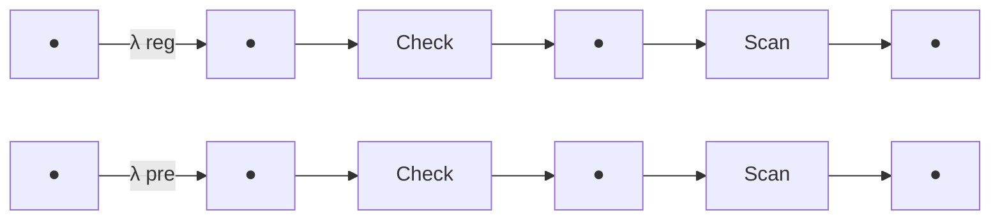

## 2017

## MCM/ICM

## Summary Sheet

(Your team's summary should be included as the first page of your electronic submission.)

Type a summary of your results on this page. Do not include the name of your school, advisor, or team members on this page.

Passengers arrive at TSA security screening at seemingly random times, and the uncertainty in their arrival along with TSA inefficiencies can cause abnormally long and varying wait times. A major problem the agency must confront is the improvement of passenger throughput while maintaining a strict standard of security. Our solution consists of four main parts: a queuing model describing the security screening, a method of simulation for theory verification and experimentation, the application of these results to cost-benefit analysis, and modifications to the model to account for different traveler characteristics.

We decided that a reasonable measure for TSA inefficiency was the average time a passenger spent waiting in line. The queuing model was formulated by expressing the relationship between wait times in the queue recursively. We used kernel density estimation and exponential fitting to estimate distributions on the random variables involved in the model. We obtained explicit expressions for passenger wait times, which we used to reason about the system behavior as the number of passengers and arrival rates varied.

Using the above framework we developed a method for simulation that used dynamic programming to sample arrival times of passengers within the security system. The simulation numerically verified the results of the theory and allowed for further experimentation with varying parameters. The results of these experiments gave us insights on where the TSA procedure could be optimized and the passenger experience improved.

We applied cost-benefit analysis to the efficiency-cost tradeoff that TSA must consider when staffing employees and screening passengers. We found an optimal allocation of resources that maximized profit rate by plotting a profit objective function against the different configurations of TSA employees.

Finally, we considered distinctions between travelers and how they might affect the activity in the queuing system and each other's wait times as a result. We investigated alternative methods to order passengers in queue and found that this approach was not as successful as we expected.

Using a diverse array of techniques, we were able to successfully model the flow of passengers through airport security, identify bottlenecks in the screening process, and suggest improvements to the current procedure. As our world becomes more interconnected and airline activity increases, TSA will have to confront the issue of passenger throughput inefficiency. The use of mathematical models will undoubtedly become an invaluable tool in optimizing efficiency while maintaining passenger safety.

# Reducing Wait Times at Airport Security

Team 56632

January 24, 2017

## Abstract

In this report, we develop and employ a queuing model for lines and servicing at TSA security in order to identify bottlenecks in the procedure and suggest improvements. We model the influx of passengers as a Poisson process, allowing us to sample from an exponential distribution to simulate inter-arrival times. To find probabilistic distributions on the service time spent in security stations, we take a nonparametric approach, using kernel density estimation to obtain probability densities from the given data. Using recurrence concepts from our queuing network, we develop a simulation method via dynamic programming as a means to verify the theoretical results and conduct further experiments. We apply these results to a cost-benefit analysis, which we use to identify the optimal allocation of TSA resources. Additionally, we consider different cultural norms regarding passenger interaction in queues, and add complexity in our model to account for them. These tools allow us to perform experiments, which are realistic within reason, and give suggestions for improvement in a manner justified by both the given and researched data.

## Contents

## 1 Introduction 3

1.1 Outline 3  
1.2 Main Assumptions 3

## 2 A Queuing Model 4

2.1 Obtaining Probability Densities 5

2.1.1 Exponential Fitting 5  
2.1.2 Kernel Density Estimation 6

2.2 Writing Down a Recurrence 8

2.2.1 Definitions and Derivations 8  
2.2.2 Average Wait Time Values 10

## 3 The Simulation 11

3.1 A Dynamic Programming Method 11  
3.1.1 Pseudo code.... 12  
3.2 Comparison to the Model 12

## 4 Evaluation/Results 13

4.1 Bottlenecks in Passenger Throughput 13

4.1.1 ID Check Station 13  
4.1.2 Scan Station 15

4.2 Variance in Passenger Wait Time 15

4.3 Modifications to the Model 16

4.3.1 Cost-Benefit Analysis 16  
4.3.2 Sensitivity Analysis 18

## 5 Improving the Model 19

5.1 Traveler Characteristics 19  
5.2 Different Queuing Disciplines 19  
5.3 Arrival Rate Regulation 19  
5.4 Improving Profit Measure 19

## 6 Conclusion 19

## 7 Bibliography 21

## 1 Introduction

In this report, we present a model and simulation to optimize TSA security lines with respect to passenger throughput and variance in wait times. Specifically, we study the relationship between the number of ID check and scan stations and arrival rate to identify bottlenecks in the security process. We also define a cost measure to determine the optimal number of service stations. Further, we explore the implementation of a “virtual queue” and varying passenger traveling speeds and how they impact these bottlenecks. Our model provides the TSA valuable information for reducing wait time and variance in security lines, while maintaining the same standards of safety and security.

## 1.1 Outline

Our objective is to develop and implement a model to explore the flow of passengers through airport security, identify bottlenecks in the current process, and suggest modifications. To realize this objective we will proceed as follows:

- Formulate a queuing model to explore passenger wait times as a measure of inefficiency.  
- Implement a simulation method to verify the theoretical framework and perform experiments to gain further insights.  
- Analyze simulation results to identify the optimal allocation of resources according to a cost-benefit analysis.  
- Make modifications to the model based on cost-benefit analysis and cultural differences. Incorporate more complexity in the model to account for these considerations.

## 1.2 Main Assumptions

Queuing systems are probabilistic in nature and as a result are difficult to describe and predict. In order to quantify the uncertainty in waiting times, it is necessary to make some simplifying assumptions. Listed below are several of the main assumptions we make regarding how we view the problem. Throughout the remainder of this paper we introduce additional assumptions as they become relevant.

\- Transit times between stations and queues are negligible. We assume that the time spent moving from a queue to a station or a station to a queue is negligible. This is a reasonable assumption in that most TSA checkpoints are relatively compact.

- Queues operate on the “First In First Out” (FIFO) discipline. This principle states that the first person to line up in a queue will be the first person to be served.  
- All employees are identical in terms of competency at their job. We assume that all TSA employees are equally capable. This isn't entirely realistic because some workers are better at their jobs than others; however, this distinction doesn't serve to provide any further meaningful insights into the problem.  
- Passenger wait times are an accurate measure of throughput efficiency. Large passenger wait times in queues are the result of inefficiencies in the TSA screening process. Passenger throughput (given as passengers per unit time) is inversely proportional to time spent in the system by each passenger. Thus, maximizing passenger throughput is essentially the same as minimizing wait time.

## 2 A Queuing Model

We model the airport security line as 2 nearly-identical parallel queuing networks with the FIFO discipline depicted below. The network with green entities corresponds to the TSA precheck lane and the network with blue entities corresponds to passengers in the regular lane. Both networks are comprised of a queue, $Q_{1}$ , leading to a server $S_{1}$ (ID check station), leading to another queue $Q_{2}$ , leading to another server $S_{2}$ (scan station, which includes mm wave scan, carry on screening, and extra screening if necessary). A pre-determined fraction of people will queue in the precheck lane while the rest will queue in the regular lane.

flowchart

Figure 1: A schematic of the queuing model. The superscripts “pre” and “reg” stand for “precheck” and “regular”, respectively.

Assumption 1: Time spent in additional screening (Zone D) was included in the “Time to get scanned property” column in the given data file.

Remark. Data was given as total time until picking up scanned property (column H), which would be done after the additional Zone D screening. This implies that column H incorporates any time spent in Zone D.

Assumption 2: For the first version of our model, we assume that the system includes only the top row in Figure 1, and that there is only one service spot at each of $S_{1}$ (ID check) and $S_{2}$ (scan station). Later on we will remove this assumption.

Remark. In order to explicitly solve the recurrence relations we develop later on, it suffices to assume that service stations $S_{1}$ and $S_{2}$ each can only service one entity at a time. When we eventually take a dynamic programming approach, we will vary the number of ID check and scan stations and select a configuration which optimizes the cost-benefit tradeoff (See “Cost-Benefit Analysis” section).

## 2.1 Obtaining Probability Densities

## 2.1.1 Exponential Fitting

Depicted below are histograms of the passenger inter-arrival times extracted from the given data file. They strongly resemble the shape of an exponential probability density, motivating the next key assumption.

bar chart

| Wait Time (sec) | Count |
| --------------- | ----- |
| 0               | 25    |
| 5               | 9     |
| 10              | 4     |
| 15              | 5     |
| 20              | 3     |
| 25              | 2     |
| 30              | 3     |
| 35              | 1     |
| 40              | 0     |
| 45              | 0     |
| 50              | 0     |
| 55              | 0     |
| 60              | 0     |

bar chart

| Wait Time (sec) | Count |
| --------------- | ----- |
| 0-5             | 21    |
| 5-10            | 12    |
| 10-15           | 7     |
| 15-20           | 3     |
| 20-25           | 1     |
| 25-30           | 0     |
| 30-35           | 0     |
| 35-40           | 0     |
| 40-45           | 0     |
| 45-50           | 0     |
| 50-55           | 1     |
| 55-60           | 1     |
| 60-65           | 0     |
| 65-70           | 0     |
| 70-75           | 1     |
| 75-80           | 0     |
| 80-85           | 0     |
| 85-90           | 0     |

Figure 2: The exponential fit (using Matlab's expfit function) to the inter-arrival times of precheck (left) and regular (right) passengers overlaid onto the corresponding histograms.

Assumption 3: The inter-arrival times are distributed i.i.d. exponential with rate $\lambda^{reg} = 12.9$ and $\lambda^{pre} = 9.2$ (seconds per passenger).

Remark. We chose to model the incoming passengers as a Poisson Process, since the histogram of the inter-arrival times resembles an exponential distribution, a defining characteristic of the inter-arrival times of a Poisson Process. The estimate for the rate parameter $\lambda$ we used was the sample mean of the inter-arrival times, as given by maximum likelihood estimation $^{[5]}$ .

## 2.1.2 Kernel Density Estimation

We define the following random variables.

$T_{\mathrm{total}}^{(j)} \doteq$ The total time entity $j$ spends at TSA check in.

$T_{Q_i}^{(j)} \doteq$ The wait time of entity $j$ in queue $i$ .

$S_{i}^{(j)} \doteq$ The time spent of entity $j$ in service $i$ .

$A_{j} \doteq$ The arrival time of entity $j$ .

$I_{j} \doteq$ The inter-arrival time between passenger $j - 1$ and $j$ .

The $A_{j}$ 's can be written as sums of the first $j$ inter-arrival times, which we assumed to be distributed i.i.d. exponential. To find the distributions on the $S_{i}^{(j)}$ , we perform kernel density estimation on the given data using Matlab's ksdensity function for estimation of a density over a positive support.

bar chart

| Time (sec) | Count | Probability Density |
| ---------- | ----- | ------------------- |
| 0-5        | 4     | 0.00                |
| 5-10       | 3     | 0.09                |
| 10-15      | 2     | 0.07                |
| 15-20      | 1     | 0.03                |
| 20-25      | 0     | 0.01                |
| 25-30      | 0     | 0.00                |
| 30-35      | 0     | 0.00                |
| 35-40      | 0     | 0.00                |
| 40-45      | 0     | 0.00                |

Figure 3: The kernel density estimate of both regular and precheck passenger time spent in service station 1 (ID check) overlaid onto the corresponding histogram.

line chart

| Time (sec) | X-Ray Scan | mm Wave Scan | Combined Scan |
| ---------- | ---------- | ------------ | ------------- |
| 0          | 0.13       | 0.01         | 0.00          |
| 5          | 0.12       | 0.11         | 0.11          |
| 10         | 0.08       | 0.10         | 0.11          |
| 15         | 0.06       | 0.08         | 0.08          |
| 20         | 0.04       | 0.06         | 0.06          |
| 25         | 0.03       | 0.04         | 0.04          |
| 30         | 0.02       | 0.03         | 0.03          |
| 35         | 0.01       | 0.02         | 0.02          |
| 40         | 0.01       | 0.01         | 0.01          |
| 45         | 0.01       | 0.01         | 0.01          |
| 50         | 0.01       | 0.01         | 0.01          |
| 55         | 0.01       | 0.01         | 0.01          |
| 60         | 0.01       | 0.01         | 0.01          |
| 65         | 0.01       | 0.01         | 0.01          |
| 70         | 0.01       | 0.01         | 0.01          |

bar-line hybrid chart

| Time (sec) | Count | Probability Density |
| ---------- | ----- | ------------------- |
| 0-5        | 3     | 0.02                |
| 5-10       | 1     | 0.01                |
| 10-15      | 3     | 0.03                |
| 15-20      | 4     | 0.04                |
| 20-25      | 7     | 0.035               |
| 25-30      | 2     | 0.025               |
| 30-35      | 1     | 0.015               |
| 35-40      | 3     | 0.01                |
| 40-45      | 1     | 0.005               |
| 45-50      | 1     | 0.002               |
| 50-55      | 1     | 0.001               |
| 55-60      | 1     | 0.0005              |
| 60-65      | 1     | 0.0002              |
| 65-70      | 1     | 0.0001              |
| 70-75      | 1     | 0.00005             |
| 75-80      | 1     | 0.00002             |
| 80-85      | 1     | 0.00001             |
| 85-90      | 1     | 0.000005            |
| 90-95      | 1     | 0.000002            |
| 95-100     | 1     | 0.000001            |
| 100-105    | 1     | 0.0000005           |
| 105-110    | 1     | 0.0000002           |
| 110-115    | 1     | 0.0000001           |
| 115-120    | 1     | 0.00000005          |
| 120-125    | 1     | 0.00000002          |
| 125-130    | 1     | 0.00000001          |
| 130-135    | 1     | 0.000000005         |
| 135-140    | 1     | 0.000000002         |

Figure 4: The kernel density estimate of precheck (left) vs. regular (right) passenger time spent in service station 2 (scanning).

Assumption 4: Time spent in the scan station is smaller for precheck passengers since they do not need to remove as many personal items.

Remark. This is a reasonable assumption, as precheck passengers pay an extra fee in order to exercise this privilege.

To find the distribution on the time spent in service station 2 (scanning) for precheck passengers, we noted that since they don't have to remove personal items, the time they spend in the scanning station, $S_2^{\mathrm{pre}}$ is the maximum of the time spent in the mm wave scan and the time spent on luggage scanning. For instance, if the luggage finishes scanning first, then as soon as the passenger exits the mm wave scan, they can immediately pick up their luggage and go.

$X \doteq$ Time spent in the mm wave scan.

$W \doteq$ Time spent scanning a piece of luggage.

$$
Y \doteq 2. 2 6 \cdot W
$$

$$
S _ {2} ^ {\text { pre }} \doteq \max (X, Y)
$$

Since the provided data file reports the times that each piece of luggage exits the scan machine, we must multiply the random variable representing this time by the number of bags that the average passenger carries on. According to the TSA, a passenger brings 2.26 bags on average [10].

Assumption 5: $X$ and $Y$ are independent.

Remark. This is a reasonable assumption, as scan times for luggage machines and mm wave scan machines don't influence each other.

We estimate the distributions on X and Y using kernel density estimation (depicted in the left plot of Figure 4 by the dotted densities). To obtain the distribution on $S_{2}^{pre}$ , we write

$$
\begin{array}{l} F _ {S} (s) \doteq P (S _ {2} ^ {\mathrm{pre}} \leq s) \\ = P (\max (X, Y) \leq s) \\ = P (X \leq s, Y \leq s) \\ = F _ {X} (s) F _ {Y} (s) \\ \end{array}
$$

where the last equality follows from independence. Taking the derivative to obtain the density on $S_{2}^{pre}$ , we have

$$
f _ {S} (s) \doteq \frac {d}{d s} F _ {S} (s) = f _ {X} (s) F _ {Y} (s) + f _ {Y} (s) F _ {X} (s)
$$

This density was computed and plotted as the green curve against the kernel density estimates of $f_{X}$ and $f_{W}$ on the left plot in Figure 4.

## 2.2 Writing Down a Recurrence

## 2.2.1 Definitions and Derivations

We define the total time spent by passenger $n$ in the system as the sum of time spent in the queues and the service stations.

$$
T _ {\text { total }} ^ {(n)} = T _ {Q _ {1}} ^ {(n)} + T _ {Q _ {2}} ^ {(n)} + S _ {1} ^ {(n)} + S _ {2} ^ {(n)} \tag {1}
$$

We define the wait times in the first queue $\{T_{Q_{1}}^{(i)}\}_{i\geq1}$ recursively. The time that passenger i spends in queue 1 is the time at which they arrive subtracted from the time at which passenger i-1 leaves the first service station. The latter quantity can be written as the sum of the following quantities of the previous passenger: arrival time, time spent in line, and time spent getting serviced. This recurrence relation is illustrated below.

$$
\begin{array}{l} T _ {Q _ {1}} ^ {(1)} = 0 \\ T _ {Q _ {1}} ^ {(2)} = A _ {1} + T _ {Q _ {1}} ^ {(1)} + S _ {1} ^ {(1)} - A _ {2} \\ T _ {Q _ {1}} ^ {(n)} = A _ {n - 1} + T _ {Q _ {1}} ^ {(n - 1)} + S _ {1} ^ {(n - 1)} - A _ {n} \\ \end{array}
$$

:

Assumption 6: When passengers arrive at either queue, there is always someone in line to wait behind (except in the case of the first passenger to arrive).

Remark. In our definition for the $T_{Q_{1}}^{(i)}$ 's, we should be taking the max of the expression displayed above and 0, since we could possibly have $A_{i} > A_{i-1} + T_{Q_{1}}^{(i-1)} + S_{1}^{(i-1)}$ , i.e. passenger i arrives after passenger i - 1 leaves the service station. This would lead to a negative waiting time. However, omitting the max operation allows for an explicit solution to the recurrence $T_{Q_{1}}^{(n)}$ and simplifies calculations immensely. Later on we will remove this assumption.

Solving the recurrence, we obtain an explicit form for the time passenger $n$ waits in queue 1,

$$
T _ {Q _ {1}} ^ {(n)} = \left(\sum_ {i = 1} ^ {n - 1} S _ {1} ^ {(i)}\right) - A _ {n} + A _ {1}
$$

Note that $A_{n}$ can be written as a sum of interarrival times $\{I_j\}_{j=1}^n$ distributed i.i.d. exponential(λ), so that the expectation of $T_{Q_1}^{(n)}$ is given by

$$
\begin{array}{l} \mathbb {E} (T _ {Q _ {1}} ^ {(n)}) = \mathbb {E} \Bigl (A _ {1} - A _ {n} + \sum_ {i = 1} ^ {n - 1} S _ {1} ^ {(i)} \Bigr) \\ = \mathbb {E} \Big (A _ {1} - \sum_ {i = 1} ^ {n} I _ {i} + \sum_ {i = 1} ^ {n - 1} S _ {1} ^ {(i)} \Big) \\ = \lambda - \sum_ {i = 1} ^ {n} \lambda + \sum_ {i = 1} ^ {n - 1} \mathbb {E} (S _ {1} ^ {(i)}) \\ \end{array}
$$

$$
= \lambda (1 - n) + \mathbb {E} (S _ {1} ^ {(1)}) (n - 1)
$$

where the third equality follows from linearity of expectations and since $A_{1}$ and $I_{i}$ are distributed $\exp (\lambda)$ . Simplifying, we have

$$
\mathbb {E} (T _ {Q _ {1}} ^ {(n)}) = (n - 1) (\mathbb {E} (S _ {1} ^ {(1)}) - \lambda) \tag {2}
$$

Remark. This expression makes sense intuitively since if the expected service time per customer, $\mathbb{E}(S_{1}^{(1)})$ , is large relative to time per passenger arrival, $\lambda$ , then the line will build up, so the expected time spent waiting in the first queue grows with n, the number of passengers. We also note an inconsistency in the expression, namely that it can be negative as it is currently written. In reality, time can never be negative. This negativity is a result of Assumption 6, since we don't take the max of the quantity and 0 in our calculations. This remark is applicable to all boxed equations (5), (6), and (7). Once Assumption 6 is removed in section 3, the times will be strictly non-negative.

Similarly, we can express the time spent waiting in queue 2 recursively, and solve for $T_{Q_{2}}^{(n)}$ . The process is very similar to that of $T_{Q_{1}}^{(n)}$ , so we omit the calculations and go straight to the final expression.

$$
T _ {Q _ {2}} ^ {(n)} = \left(\sum_ {i = 1} ^ {n - 1} S _ {2} ^ {(i)} - \sum_ {i = 1} ^ {n} T _ {Q _ {1}} ^ {(i)}\right) + A _ {1} + S _ {1} ^ {(1)} - A _ {n} - S _ {1} ^ {(n)}
$$

By the linearity of expectations and since $S_1^{(1)} \stackrel{(d)}{=} S_1^{(n)}$ ,

$$
\mathbb {E} (T _ {Q _ {2}} ^ {(n)}) = \Big (\sum_ {i = 1} ^ {n - 1} \mathbb {E} (S _ {2} ^ {(i)}) - \sum_ {i = 1} ^ {n} \mathbb {E} (T _ {Q _ {1}} ^ {(i)}) \Big) + \lambda (1 - n)
$$

Plugging in (2) for $\mathbb{E}(T_{Q_1}^{(n)})$ and simplifying using the i.i.d. assumption of the $S_{(2)}^{(i)}$ 's, we have

$$
\mathbb {E} (T _ {Q _ {2}} ^ {(n)}) = (n - 1) \Big (\mathbb {E} (S _ {2} ^ {(1)}) - \frac {1}{2} \cdot (E (S _ {1} ^ {(1)}) - \lambda) - \lambda \Big) \tag {3}
$$

Thus, the expected total time that passenger i spends in TSA checking is

$$
\mathbb {E} (T _ {\text { total }} ^ {(n)}) = \mathbb {E} (T _ {Q _ {1}} ^ {(n)}) + \mathbb {E} (T _ {Q _ {2}} ^ {(n)}) + \mathbb {E} (S _ {1} ^ {(1)}) + \mathbb {E} (S _ {2} ^ {(1)}) \tag {4}
$$

where $\mathbb{E}(T_{Q_1}^{(n)})$ and $\mathbb{E}(T_{Q_2}^{(n)})$ are given by (2) and (3).

## 2.2.2 Average Wait Time Values

To compute the average time that any passenger spends waiting in queue 1, $T_{Q_1}^{\mathrm{avg}}$ , we take the average of the waiting times. This will yield an expression in terms of the $T_{Q_1}^{(i)}$ 's, which are random variables. We then take the expectation to obtain the average time spent in the queue.

$$
\begin{array}{l} T _ {Q _ {1}} ^ {\mathrm{avg}} \doteq \mathbb {E} \left(\frac {1}{n} \sum_ {i = 1} ^ {n} T _ {Q _ {1}} ^ {(i)}\right) \\ = \frac {1}{n} \sum_ {i = 1} ^ {n} (i - 1) \left(E \left(S _ {1} ^ {(1)}\right) - \lambda\right) \\ \end{array}
$$

where the last equality follows from (2). Simplifying, we have

$$
\boxed {T _ {Q _ {1}} ^ {\text { avg }} = \frac {n - 1}{2} (E (S _ {1} ^ {(1)}) - \lambda)} \tag {5}
$$

A similar calculation that yielded average wait time for queue 1 will give

$$
\boxed {T _ {Q _ {2}} ^ {\text { avg }} = \frac {n - 1}{2} \cdot (\mathbb {E} (S _ {2} ^ {(1)}) - \frac {1}{2} \mathbb {E} (S _ {1} ^ {(1)}) - \frac {1}{2} \lambda)} \tag {6}
$$

To find the average total waiting time, we combine the average waiting times (5) and (6) with expression (1).

$$
\boxed {T _ {\text { total }} ^ {\text { avg }} = T _ {Q _ {1}} ^ {\text { avg }} + T _ {Q _ {2}} ^ {\text { avg }} + \mathbb {E} (S _ {1} ^ {(1)}) + \mathbb {E} (S _ {2} ^ {(1)})} \tag {7}
$$

We compute the boxed expressions (5), (6), and (7) to compare with the simulation in the following section. This will serve to validate our method of simulation.

## 3 The Simulation

## 3.1 A Dynamic Programming Method

In the previous section, assumptions on the number of ID check and scan stations were made in order to simplify calculations. As a result we were able to obtain explicit formulas. In the following section we no longer make this simplifying assumption and instead denote

$$
\begin{array}{l} c \doteq \text {Number of service spots at check stations} \\ k \doteq \text {Number of service spots at scan stations} \\ n \doteq \mathrm{Numberofpassengers} \\ \end{array}
$$

We denote the number of passengers by $n$ even though our model isn't restricted to any finite number of passengers. For the sake of the simulation, we sample for $n$ passengers, where $n$ can be made arbitrarily large.

Every passenger has an arrival time, a start/end time for the ID checking process, and a start/end time for the scanning process. Since our expression for these times is recursive, we take a dynamic programming approach to fill out a 2-D array, whose rows represent time events and whose columns represent passengers.

Since inter-arrival times are distributed i.i.d. exponential( $\lambda$ ), we simulate arrival times by keeping a running sum of i.i.d. exponential random variables. Since there are c spots for ID checking, we inspect the ID check leaving times of the previous c passengers to determine which is most readily available. If the arrival time of the current passenger exceeds this quantity, then the passenger can directly enter one of the ID check spots. Otherwise they must wait until a spot opens up. The start time for the scan process is computed similarly using k, the number of scan stations, in place of c. The end times for both service stations are computed by sampling from the kernel density estimates for the service times and adding these to the start times.

To compute the average waiting times, we take the difference between service start times and the times at which passengers start waiting, which is either their arrival time or their ID check end time depending on the service for which they are in queue. We then take the average over all passengers and return this result. A more concise set of instructions is given below as pseudo code.

## 3.1.1 Pseudo code

## Algorithm 1 TSA Security Simulation

Result: a vector representing the average time spent in queues and the entire system.

First, initialize a two dimensional array with 5 rows and $\max(c,k)+n$ columns. Each row represents either passenger arrival time, time entering check station, time exiting check station, time entering scan station, or time exiting scan station (finished).

for $i \in \{\max(c, k), \ldots, n\}$ do $\text{Arrival}^{(i)} = \text{Arrival}^{(i-1)} + \text{sample}_{\exp(\lambda)}$ $\text{Check}_{\text{start}}^{(i)} = \max(\text{Arrival}^{(i)}, \min(\text{Check}_{\text{end}}^{(i-c)}, \ldots, \text{Check}_{\text{end}}^{(i-1)}))$ $\text{Check}_{\text{end}}^{(i)} = \text{Check}_{\text{start}}^{(i)} + \text{sample}_{\text{id check}}$ $\text{Scan}_{\text{start}}^{(i)} = \max(\text{Check}_{\text{end}}^{(i)}, \min(\text{Scan}_{\text{end}}^{(i-k)}, \ldots, \text{Scan}_{\text{end}}^{(i-1)}))$ $\text{Scan}_{\text{end}}^{(i)} = \text{Scan}_{\text{start}}^{(i)} + \text{sample}_{\text{scan}}$

end

$$
T _ {Q _ {1}} ^ {\text { avg }} = \frac {1}{n} \cdot \text { sum } (\text { Check } _ {\text { start }} - \text { Arrival })
$$

$$
T _ {Q _ {2}} ^ {\text { avg }} = \frac {1}{n} \cdot \text { sum } (\text { Scan } _ {\text { start }} - \text { Check } _ {\text { end }})
$$

$$
T _ {\mathrm{Total}} ^ {\mathrm{avg}} = \frac {1}{n} \cdot \mathrm{sum} (\mathrm{Scan} _ {\mathrm{end}} - \mathrm{Arrival})
$$

return $(T_{Q_1}^{\mathrm{avg}}, T_{Q_2}^{\mathrm{avg}}, T_{\mathrm{Total}}^{\mathrm{avg}})$

## 3.2 Comparison to the Model

We implemented the simulation described above in Matlab and compared the simulated average waiting times with their explicit formulas which were derived in the previous section, namely, expressions (3), (6), and (7).

line chart

| Number of Passengers | Simulated | Theoretical |
| --------------------- | --------- | ----------- |
| 0                     | 300       | 300         |
| 500                   | 600       | 600         |
| 1000                  | 1200      | 1200        |
| 1500                  | 1700      | 1700        |
| 2000                  | 2200      | 2200        |
| 2500                  | 2800      | 2800        |
| 3000                  | 3500      | 3500        |
| 3500                  | 4500      | 4000        |
| 4000                  | 5200      | 4500        |
| 4500                  | 5500      | 4800        |

line chart

| Number of Passengers | Simulated | Theoretical |
| --------------------- | --------- | ----------- |
| 0                     | 0         | 0           |
| 500                   | 5000      | 5000        |
| 1000                  | 10000     | 10000       |
| 1500                  | 15000     | 15000       |
| 2000                  | 20000     | 20000       |
| 2500                  | 25000     | 25000       |
| 3000                  | 30000     | 30000       |
| 3500                  | 35000     | 35000       |
| 4000                  | 40000     | 40000       |
| 4500                  | 45000     | 45000       |

Figure 5: Plot of the average time spent in queues 1 (left) and 2 (right). Simulated and theoretical time averages are depicted in blue and orange respectively.

Figure 5 shows the calculated results from our model against the simulated results. It appears that they follow the same trend on average as the number of passengers increases from 50 to 4050. As a result, we are more inclined to believe the results obtained from using our simulation in the proceeding experiments. The simulation also seems to vary from the theoretical results more drastically in the waiting time for queue 1. However, looking at the scale on which these waiting times are plotted, we reason that we see this relatively large variance because the waiting times for queue 1 are much smaller in magnitude than those for queue 2. The plot of simulated versus theoretical values for total time spent in the system is omitted since it is essentially the sum of the above two plots and as a result, follows the same trend.

## 4 Evaluation/Results

## 4.1 Bottlenecks in Passenger Throughput

From our model we identified two major bottlenecks in the flow of passengers through airport security: ID check stations and scan stations. Through simulation we investigated how the number of service spots at each station affects the total time a passenger waits.

## 4.1.1 ID Check Station

The first bottleneck a passenger experiences upon reaching airport security is the ID check station. Both TSA precheck and regular passengers receive service at the same rate from this station and therefore, when investigating this bottleneck we considered only one service distribution. However, TSA precheck and regular passengers arrive at different rates to this station, so we investigated how varying arrival rates and the number of check stations would affect the wait time in the checking queue. The results from our simulation can be seen below.

line chart

| Arrival Rate (sec/passenger) | c = 1     | c = 2     | c = 3     | c = 4     |
| ---------------------------- | --------- | --------- | --------- | --------- |
| 0                            | 10^5      | 10^5      | 10^5      | 10^5      |
| 5                            | ~10^4     | ~10^3     | ~10^2     | ~10^1     |
| 10                           | ~10^3     | ~10^2     | ~10^1     | ~10^0     |
| 15                           | ~10^2     | ~10^1     | ~10^0     | ~10^-1    |
| 20                           | ~10^2     | ~10^1     | ~10^0     | ~10^-2    |
| 25                           | ~10^2     | ~10^1     | ~10^0     | ~10^-2    |
| 30                           | ~10^2     | ~10^1     | ~10^0     | ~10^-2    |
| 35                           | ~10^2     | ~10^1     | ~10^0     | ~10^-3    |
| 40                           | ~10^2     | ~10^1     | ~10^0     | ~10^-4    |

line chart

| Arrival Rate (sec/passenger) | k = 1 | k = 2 | k = 3 | k = 4 |
| ---------------------------- | ----- | ----- | ----- | ----- |
| 0                            | 10^5  | 10^5  | 10^5  | 10^5  |
| 5                            | 10^4  | 10^4  | 10^4  | 10^4  |
| 10                           | 10^2  | 10^2  | 10^2  | 10^2  |
| 15                           | 10^1  | 10^1  | 10^1  | 10^1  |
| 20                           | 10^0  | 10^0  | 10^0  | 10^0  |
| 25                           | 10^0  | 10^0  | 10^0  | 10^0  |
| 30                           | 10^0  | 10^0  | 10^0  | 10^0  |
| 35                           | 10^0  | 10^0  | 10^0  | 10^0  |
| 40                           | 10^0  | 10^0  | 10^0  | 10^0  |

Figure 6: Plot of wait time spent in ID check queue for various values of c (left) and k (right).

The average wait time of a passenger in the checking queue appears to be independent of the number of scanning stations, k, an intuitive result. However, there is a clear relationship between the number of open spots at the ID check station, c, and the average wait time of a passenger in the ID check queue. The wait time undergoes a significant transition, decreasing drastically, as the arrival rate of passengers slows ( $\lambda$ increases). Using the queuing model described previously, the $\lambda$ value at which this transition takes place can be estimated by the following relation.

$$
\lambda = \frac {\mathbb {E} (S _ {1} ^ {(i)})}{c} \tag {8}
$$

Remark. This relation can be understood as the condition for when the average arrival rate $(\lambda)$ is equal to the average service rate $(\mathbb{E}(S_{1}^{(i)})/c)$ . When passengers arrive faster than they are being serviced at the ID check stations, a queue forms, causing a bottle neck on passenger throughput. Conversely, when passengers are serviced more quickly than they arrive, a queue becomes less likely to form. In the case of c = 1, this is equivalent to setting the expected waiting time in $Q_{1}$ given by (2) equal to 0.

The estimated $\lambda$ transition values given by (8) are plotted as vertical lines on the same plot in Figure 6. One can see that these points correspond very closely to the observed transitions from our simulation.

## 4.1.2 Scan Station

The second bottleneck a passenger will experience in airport security is the scan station. We conducted an analysis similar to the one we performed on the first bottleneck. Unlike the ID check station, TSA precheck and regular passengers experience different service rates at this station; however, the general trend remains the same. The results from our simulation of regular passengers can be seen below.

line chart

| Arrival Rate (sec/passenger) | c = 1     | c = 2     | c = 3     | c = 4     |
| ---------------------------- | --------- | --------- | --------- | --------- |
| 0                            | 100000    | 100000    | 100000    | 100000    |
| 5                            | 100000    | 100000    | 100000    | 100000    |
| 10                           | 100000    | 100000    | 100000    | 100000    |
| 15                           | 100000    | 100000    | 100000    | 100000    |
| 20                           | 10000     | 10000     | 10000     | 10000     |
| 25                           | 100       | 100       | 100       | 100       |
| 30                           | 1         | 1         | 1         | 1         |
| 35                           | 1         | 1         | 1         | 1         |
| 40                           | 1         | 1         | 1         | 1         |

line chart

| Arrival Rate (sec/passenger) | k = 1     | k = 2     | k = 3     | k = 4     |
| ---------------------------- | --------- | --------- | --------- | --------- |
| 0                            | 10^5      | 10^4      | 10^0      | 10^-1     |
| 5                            | 10^5      | 10^4      | 10^0      | 10^-1     |
| 10                           | 10^5      | 10^4      | 10^0      | 10^-1     |
| 15                           | 10^5      | 10^2      | 10^0      | 10^-1     |
| 20                           | 10^5      | 10^1      | 10^0      | 10^-1     |
| 25                           | 10^4      | 10^1      | 10^0      | 10^-1     |
| 30                           | 10^2      | 10^1      | 10^0      | 10^-2     |
| 35                           | 10^2      | 10^1      | 10^0      | 10^-2     |
| 40                           | 10^2      | 10^1      | 10^0      | 10^-2     |

Figure 7: Plot of average time spent in the regular scan queue with varying arrival rates for various values of c (left) and k (right).

The average wait time of a passenger in the scanning station is dependent on both c and k. We observe that the concept of $\lambda$ transition values, discussed above in the first bottleneck, are important as they mark significant transitions in $T_{Q_{2}}^{(n)}$ , where the analogous values are given by

$$
\lambda = \frac {\mathbb {E} (S _ {2} ^ {(i)})}{c} \tag {9}
$$

## 4.2 Variance in Passenger Wait Time

Increasing passenger throughput and decreasing wait times is only part of the story when it comes to improving airport security. Equally important is reducing the variance in passenger wait times to ensure that passengers know generally how long security lines will be. Using our simulation, we investigated how the number of check stations $(c)$ and scan stations $(k)$ affected the variance of passenger wait times in queues. We found that the number of check stations had a larger effect on the variance of wait times in both queues than the number of scan stations.

line chart

| Arrival Rate (sec/passenger) | Variance (sec²) for c = 1 | Variance (sec²) for c = 2 | Variance (sec²) for c = 3 | Variance (sec²) for c = 4 |
| ---------------------------- | -------------------------- | -------------------------- | -------------------------- | -------------------------- |
| 0                            | 9.5e8                      | 1.5e8                      | 0.5e8                      | 0.0e8                      |
| 5                            | 4.0e8                      | 0.5e8                      | 0.0e8                      | 0.0e8                      |
| 10                           | 1.0e8                      | 0.0e8                      | 0.0e8                      | 0.0e8                      |
| 15                           | 0.0e8                      | 0.0e8                      | 0.0e8                      | 0.0e8                      |
| 20                           | 0.0e8                      | 0.0e8                      | 0.0e8                      | 0.0e8                      |
| 25                           | 0.0e8                      | 0.0e8                      | 0.0e8                      | 0.0e8                      |
| 30                           | 0.0e8                      | 0.0e8                      | 0.0e8                      | 0.0e8                      |
| 35                           | 0.0e8                      | 0.0e8                      | 0.0e8                      | 0.0e8                      |
| 40                           | 0.0e8                      | 0.0e8                      | 0.0e8                      | 0.0e8                      |

line chart

| Arrival Rate (sec/passenger) | Variance (sec²) for c = 1 | Variance (sec²) for c = 2 | Variance (sec²) for c = 3 | Variance (sec²) for c = 4 |
| ---------------------------- | -------------------------- | -------------------------- | -------------------------- | -------------------------- |
| 0                            | 2.7                        | 4.8                        | 5.8                        | 6.2                        |
| 5                            | 2.7                        | 4.8                        | 5.8                        | 6.2                        |
| 10                           | 2.7                        | 3.0                        | 3.0                        | 3.0                        |
| 15                           | 1.5                        | 1.5                        | 1.5                        | 1.5                        |
| 20                           | 0.8                        | 0.8                        | 0.8                        | 0.8                        |
| 25                           | 0.3                        | 0.3                        | 0.3                        | 0.3                        |
| 30                           | 0.1                        | 0.1                        | 0.1                        | 0.1                        |
| 35                           | 0.0                        | 0.0                        | 0.0                        | 0.0                        |
| 40                           | 0.0                        | 0.0                        | 0.0                        | 0.0                        |

Figure 8: Plot of variance of passenger wait times spent in check station queue (left) and scan station queue (right) for various values of c and constant k = 1.

As seen in the plots above, the variance in passenger wait times spent in either queue decreases as arrival rate increases. Major transitions occur at the same $\lambda$ transition values given by (8).

## 4.3 Modifications to the Model

## 4.3.1 Cost-Benefit Analysis

In this section we confront the optimization problem of balancing the cost of employing TSA workers with the benefit of increasing passenger flow. Following the events of September 11, TSA began to include a \$6.60 security fee per one-way-trip in the year 2017 [3]. The fee goes to funding the TSA's airport security measures. In other words, increasing passenger throughput while limiting security costs can be profitable for TSA. In order to investigate this relationship, we describe an objective function for TSA profit using the following variables.

$$
C _ {p} \doteq \text { September   11   fee   per   one - way - trip }
$$

$$
C _ {t} \doteq \text { The   cost   of   a   Transportation   Security   Officer(TSO) }.
$$

$$
T _ {\text { total }} \doteq \text { Average   time   spent   from   entering   to   leaving   the   system. }
$$

Remark. In the ATL Hartsfield-Jackson airport, a TSO makes on average 18.5 dollars an hour. Converting this salary into units relevant to our calculations, the average TSO makes 0.0005139 dollars per second [9]. In addition, we assume that 1 TSO is required to operate an ID check station, and that 3 TSOs are required to operate a scan station: one for the mm wave scan, one for the X-Ray, and one for auxiliary help.

Assumption 7: The only cost for running a TSA security check point is to employ TSA workers.

Remark. There are other costs including management, machine maintenance, and training of TSOs, but these costs per employee are marginal compared to employee salary.

Finally, we define TSA profit rate, P, as the difference in the rate at which TSA gains money through the September 11 fee and the rate at which TSA loses money by staffing employees. Combining the terms defined above in this way yields a measure of profit, P, whose units are dollars per second.

$$
P = \frac {C _ {p}}{T _ {\mathrm{total}}} - (c + 3 k) \cdot C _ {t}
$$

As in section 3, c and k refer to the number of spots at ID check stations and scan stations, respectively. We wish to find the parameters c and k which maximize this objective function. Using the dynamic programming approach described in section 3, we sample values for $T_{total}$ , compute P for different values of c and k, and plot the resulting heat maps below.

heatmap

| Scan Stations (k) | 1 | 2 | 3 | 4 | 5 | 6 | 7 | 8 | 9 | 10 |
|---|---|---|---|---|---|---|---|---|---|---|
| Check Stations (c) | -0.15 | -0.1 | -0.05 | 0 | 0.05 | 0.1 | 0.05 | 0.05 | 0.1 | 0.1 |
| 1 | -0.15 | -0.1 | -0.05 | 0 | 0.05 | 0.1 | 0.05 | 0.05 | 0.1 | 0.1 |
| 2 | -0.15 | -0.1 | -0.05 | 0 | 0.05 | 0.1 | 0.05 | 0.05 | 0.1 | 0.1 |
| 3 | -0.15 | -0.1 | -0.05 | 0 | 0.05 | 0.1 | 0.05 | 0.05 | 0.1 | 0.1 |
| 4 | -0.15 | -0.1 | -0.05 | 0 | 0.05 | 0.1 | 0.05 | 0.05 | 0.1 | 0.1 |
| 5 | -0.15 | -0.1 | -0.05 | 0 | 0.05 | 0.1 | 0.05 | 0.05 | 0.1 | 0.1 |
| 6 | -0.15 | -0.1 | -0.05 | 0 | 0.05 | 0.1 | 0.05 | 0.05 | 0.1 | 0.1 |
| 7 | -0.15 | -0.1 | -0.05 | 0 | 0.05 | 0.1 | 0.05 | 0.05 | 0.1 | 0.1 |
| 8 | -0.15 | -0.1 | -0.05 | 0 | 0.05 | 0.1 | 0.05 | 0.05 | 0.1 | 0.1 |
| 9 | -0.15 | -0.1 | -0.05 | 0 | 0.05 | 0.1 | 0.05 | 0.05 | 0.1 | 0.1 |
| 10 | -0.15 | -0.1 | -0.05 | 0 | 0.05 | 0.1 | 0.05 | 0.05 | 0.1 | 0.1 |
The data is a heatmap with a color scale ranging from -0.15 to +0.1, indicating the rate of change in $/sec for each scan station and scan station number (k). The color values are estimated based on the visual intensity of the heatmap.

heatmap

| Scan Stations (k) | 1 | 2 | 3 | 4 | 5 | 6 | 7 | 8 | 9 | 10 |
| --- | --- | --- | --- | --- | --- | --- | --- | --- | --- | --- |
| Check Stations (c) | 10 | 9 | 8 | 7 | 6 | 5 | 4 | 3 | 2 | 1 |
| Check Stations (c) | 9 | 8 | 7 | 6 | 5 | 4 | 3 | 2 | 1 | 0 |
| Check Stations (c) | 8 | 7 | 6 | 5 | 4 | 3 | 2 | 1 | 0 | -0.05 |
| Check Stations (c) | 7 | 6 | 5 | 4 | 3 | 2 | 1 | 0 | -0.05 | -0.08 |
| Check Stations (c) | 6 | 5 | 4 | 3 | 2 | 1 | 0 | -0.05 | -0.08 | -0.08 |
| Check Stations (c) | 5 | 4 | 3 | 2 | 1 | 0 | -0.05 | -0.08 | -0.08 | -0.08 |
| Check Stations (c) | 4 | 3 | 2 | 1 | 0 | -0.05 | -0.08 | -0.08 | -0.08 | -0.08 |
| Check Stations (c) | 3 | 2 | 1 | 0 | -0.05 | -0.08 | -0.08 | -0.08 | -0.08 | -0.08 |
| Check Stations (c) | 2 | 1 | 0 | -0.05 | -0.08 | -0.08 | -0.08 | -0.08 | -0.08 | -0.08 |
| Check Stations (c) | 1 | 0 | -0.05 | -0.08 | -0.08 | -0.08 | -0.08 | -0.08 | -0.08 | -0.08 |

Figure 9: Profit as a function of the number of ID check and scan stations for TSA precheck (left) and Regular passengers (right).

For the TSA precheck line, the most cost-efficient layout is to have 3 checking stations and 3 scanning stations to achieve a rate of P = 0.140 dollars per second. For the regular security line, the most cost-efficient layout is to have 2 checking stations and 3 scanning stations, yielding a profit rate of P = 0.083 dollars per second. TSA precheck gives the TSA a 68.6% gain in revenue per passenger compared to regular screening.

## 4.3.2 Sensitivity Analysis

Our other modification is the introduction of virtual queuing, a method first implemented in call centers for minimizing perceived wait times $[7]$ . After a passenger checks in for their flight, the airline assigns them an arrival time and a window around this time to enter the security process. The assigned boarding time instructs the passenger when to arrive at the first queue. The passenger now has more free time to shop at airport businesses instead of physically waiting in line. Virtual queuing not only allows for the reduction in perceived wait time but also for the implementation of non-FIFO disciplines.

We distinguish between two types of travelers: slow and fast (inexperienced and experienced), whose service times are multiplied by a predetermined factor. We define a new discipline, Priority, to describe the use of the virtual queue to group passengers of similar experience levels together, so that all slow passengers go first, followed by the quick passengers. This is done in contrast to the previous discipline, in which passengers of varying speeds arrive randomly.

line chart

| Fraction Population Slow | FIFO Discipline | Priority Discipline |
| ------------------------ | --------------- | ------------------- |
| 0.0                      | 10^1            | 10^1                |
| 0.2                      | 10^2            | 10^3                |
| 0.4                      | 10^2            | 10^4                |
| 0.6                      | 10^4            | 10^5                |
| 0.8                      | 10^4            | 10^5                |
| 1.0                      | 10^5            | 10^5                |

line chart

| Fraction Population Slow | FIFO Discipline | Priority Discipline |
| ------------------------ | --------------- | ------------------- |
| 0.0                      | 100             | 100                 |
| 0.2                      | 1000            | 100000              |
| 0.4                      | 10000           | 1000000             |
| 0.6                      | 100000          | 10000000            |
| 0.8                      | 1000000         | 10000000            |
| 1.0                      | 10000000        | 10000000            |

Figure 10: Plots of time (left) and variance (right) versus the fraction of fast passengers for the Priority (orange) and FIFO disciplines (blue).

In Figure 10, we plot wait time vs. the fraction of slow passengers. Contrary to our initial hypotheses, the Priority discipline generally led to both longer average total wait time and higher variance. A possible explanation is that if slow people go first, they cause fast passengers to wait longer in line, increasing the average overall time waiting.

In reality, inexperienced travelers (slow) are more likely to come early as they are new to the security process while experienced travelers (fast) are likely to come late. Thus, they will naturally group up into something similar to the conditions of our Priority discipline simulation. Because our simulations suggest that this decreases passenger throughput, airports can use virtual queuing and new disciplines to ensure a more uniform distribution of passengers to avoid bottlenecks.

## 5 Improving the Model

## 5.1 Traveler Characteristics

In our model and modifications, we only account for travelers we deem slow and fast based on traveling experience. However, we can get more nuanced results by creating a system to profile people based on a variety of features like age, walking speed, families, etc. Perhaps there would be an optimal solution in creating different lanes designed for different types of travelers.

## 5.2 Different Queuing Disciplines

We only considered the FIFO and Priority disciplines for our simulation. We can further explore new disciplines and ways of organizing passenger populations. These disciplines could possibly lead to more effective virtual queuing.

## 5.3 Arrival Rate Regulation

Due to the nature of airport scheduling, it is unlikely that arrival rates follow a consistent Poisson distribution throughout the course of a day $[2]$ . Virtual queuing gives us greater control over the arrival rate ( $\lambda$ ) variation, because we set the passenger arrival times. In our simulations we show that total wait time and its variance is largely characterized by the fluctuation in $\lambda$ . Therefore, we can explore methods to regulate the arrival rate while ensuring all passengers make their flight.

## 5.4 Improving Profit Measure

There were many sources of cost and revenue which were not included in the construction of our profit measure. Some examples are machine maintenance, employee management, and variance in passenger wait times.

## 6 Conclusion

Our solution to the problem of excessive waiting times in airport security required the use of a diverse collection of techniques from the fields of statistics and computer science. The uncertainty in the dynamics of the TSA security check were described by a queuing network and simulated with the use of dynamic programming. The results of our simulations helped to indicate an optimal number of security officers to employ in order to maximize profit rate, while the sensitivity analysis hinted that our initial intuitions about line ordering based on passenger experience were flawed. We further identified where we could make our model more powerful by considering things such as traveler characteristics, creative queuing disciplines, and arrival time regulation. The real world continues to present all sorts of interesting problems for mankind to think about and develop mathematical tools to solve. Our attempt to gain insight into this problem closely follows this narrative, illustrating and verifying the importance of bringing theory to application and curiosity to exploration.

## References

[1] Chen, Hong, David D. Yao. “Fundamentals of Queuing Networks: Performance, Asymptotics, and Optimization.” New York: Springer, 2001. Print.  
[2] Dorton, Stephen L. "Analysis of Airport Security Screening Checkpoints using Queuing Networks and Discrete Event Simulation: A Theoretical and Empirical Approach." Embry-Riddle Scholarly Commons (2011): n. pag. Embry-Riddle Aeronautical University, 2011. Web.  
[3] Gillen, David, William G. Morrison. “Aviation security: Costing, pricing, finance and performance.” Journal of Air Transport Management 48 (2015): 1-12. Web. 21 Jan. 2017.  
[4] Bowman, A. W., Adelchi Azzalini. “Applied smoothing techniques for data analysis: the kernel approach with S-Plus illustrations.” Oxford: Clarendon Press, 1997. Print.  
[5] Casella, George, and Roger L. Berger. “Statistical inference.” Australia: Thomson Learning, 2002. Print.  
[6] Jacobson, Sheldon H., Arash Khatibi, Ge Yu. “When should TSA PreCheck be offered at no cost to travelers?” Journal of Transportation Security (2016): 1-7. Web. 21 Jan. 2017.  
[7] Lange, Robert De, Ilya Samoilovich, Bo Van Der Rhee. “Virtual queuing at airport security lanes.” European Journal of Operational Research 225.1 (2013): 153-65. Web. 21 Jan. 2017.  
[8] TranSafety. “Study Compares Older and Younger Pedestrian Walking Speeds.” USRoads. N.p., n.d. Web. 22 Jan. 2017.  
[9] “Transportation Security Officer (TSO) Job Offering.” USAJOBS. Transportation Security Administration, n.d. Web. 21 Jan. 2017.  
[10] “TSA releases 2015 statistics.” Transportation Security Administration. Department of Homeland Security, 21 Jan. 2016. Web. 21 Jan. 2017.