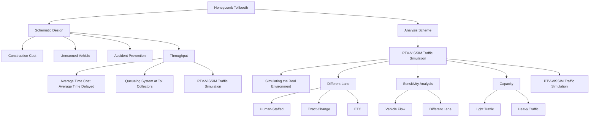
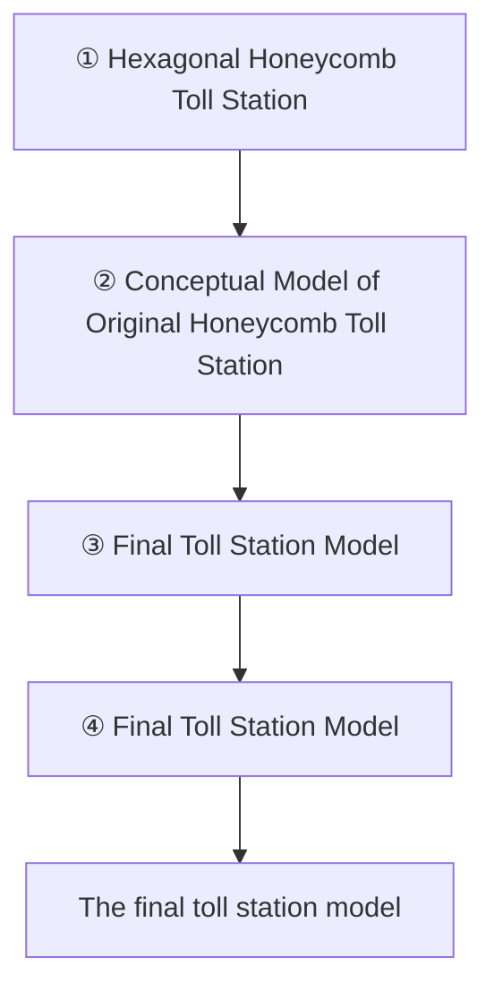
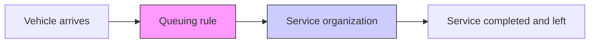
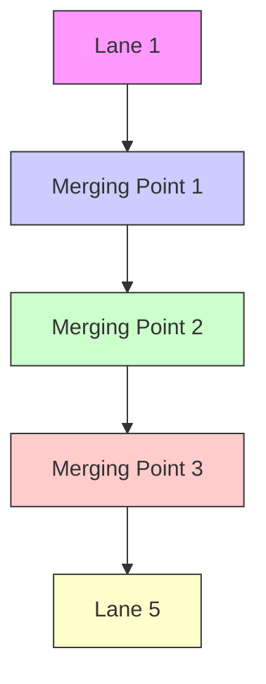
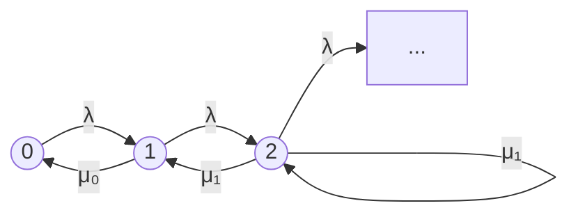
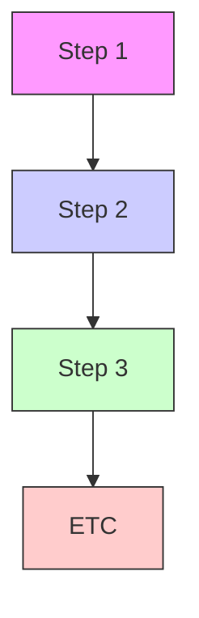
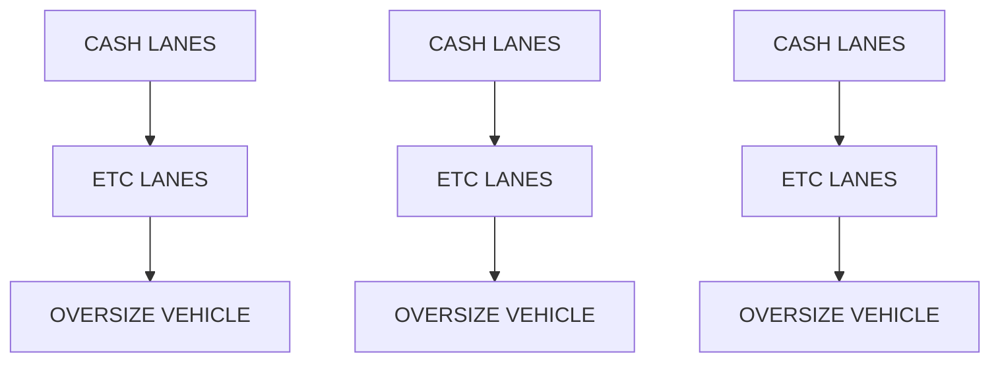
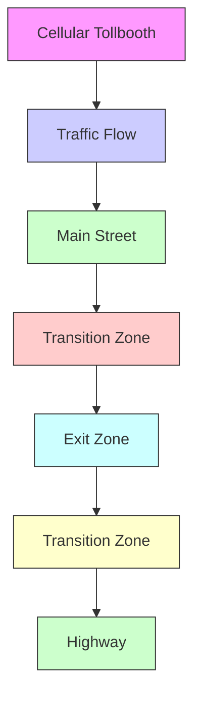

# 2017

# MCM/ICM

# Summary Sheet

(Your team's summary should be included as the first page of your electronic submission.)

Type a summary of your results on this page. Do not include the name of your school, advisor, or team members on this

page.

# A New Type of Toll Plaza Based on Bionics-Honeycomb

# Summary

In this paper, we analyze the performance of commonly used toll plaza based on our proposed mathematical model. A new improved toll plaza is proposed to reduce the cost, decrease the probability of collision at the merging point and increase the throughput.

The distribution of our proposed tollbooths resembles the honeycomb. At the center of each regular hexagonal honeycomb, there are two tollbooths, which serve two separated vehicle streams. The vehicles in these two separated streams are merged in advance before they continue their journey on the highway. Due to the specific pattern of the new toll plaza, the total area can be reduced significantly. Meanwhile, the average wasted time caused by queuing can be diminished, which means that the throughput will be raised. Additionally, by splitting the merging procedure into two stages, the possibility of accidents can also be decreased.

The main contributions of this paper are as follows:

(1) The new designed cellular architecture can greatly reduce the construction area compared with traditional linear distributed toll gates.   
(2) We analyze the throughput of toll plazas by means of the queuing theory. To verify our theory, we simulate the behavior of the large number of vehicles passing the toll plaza with the help of PTV-VISSIM. Simulation results show that the ideal cellular distributed toll booths have better results compared with traditional toll stations, especially when the traffic flow is heavy, the average travel time reduced by about 55% and the average delay time of each lane is reduced by about 70%.   
(3) We analyze the influence of the proportions of different types of tollbooths to our design. According to relevant documents, the impact of exact-change tollbooths is similar to manual tollbooths, so we only consider two kinds of tollbooths: human-staffed tollbooths and E-ZPass tollbooths. PTV-VISSIM simulation results show that full ETC tollbooth is 8 times faster than full MTC tollbooth.   
(4) We simulate the performance of the cellular toll plaza under different traffic throughput. Simulation results show that the average transit time remains at about 11 seconds under different throughputs from 0 to 2000 (Unit: veh / h). We can infer that this model is not sensitive to traffic flow variations and has strong robustness which is suitable for practical construction.   
(5) To further reduce the possibility of accident, we improve the cellular tollbooth concept model: make the transition zone more smooth and arrange different kinds of tollbooths more equitable.   
(6) For self-driving vehicles, in the center of the toll plaza, we reserve special E-ZPass tollbooths, which match the characteristics of autonomous vehicles: safer and faster.

Electronic toll collection and autonomous vehicles are the trends of modern transportation, our new designed model can improve the performance of toll plaza in the aspects of cost, throughput and accident prevention.

# I. Introduction

# 1.1 Problem Background

With the number of vehicles increasing, expressway is confronted with great traffic pressure, especially at the toll plaza. The congestion problem at the toll station becomes more and more serious due to the outdated design. Related research found that 36% of the total travel time in China is delay time caused by tolling [1]. In addition, as a vehicle-intensive place, toll plaza has become an accident-prone section because of the drivers' improper operation [2].

With the widespread use of Electronic Toll Collection (ETC) and E-ZPass, the efficiency of toll collection has been improved significantly and further the congestion at the toll plaza is released. However, due to the high speed of the vehicles passing through the toll plaza, the probability of collision in the merging zone is increased. Moreover, the construction of future toll plaza is very expensive. Considering above factors, it is necessary to design new toll plaza to improve its throughput, reduce the cost of construction and decrease the possibility of collision in the merging zone.

In this paper, we design a toll station model based on bionics-honeycomb as shown in Figure 1.1. The hexagonal tiling creates a partition with equal-sized cells, while minimizing the total perimeter of the cells. Known in geometry as the honeycomb conjecture, this was given by Jan Brożek and proved much later by Thomas Hales [3]. Cellular Structure is widely used in many aspects of life. For example, the base stations of mobile communications are distributed like the honeycomb. In our new designed toll plaza model, the tollbooths are located in the center of each regular hexagonal.


<details>
<summary>natural_image</summary>

Two-panel image showing bees interacting with a honeycomb: one on the left, the other on the right (no text or symbols)
</details>

Figure 1.1 Honeycomb

# 1.2 Notations Description

Total time cost: The average time interval for a vehicle from the beginning point of the detection area to the ending point of the detection area is the total time cost.

Theoretical time cost: If there is only one vehicle in the system and that vehicle is not limited by the control signal, the time interval for that vehicle from the beginning point of the detection area to the ending point of the detection area is the theoretical time cost.

Time delayed: The difference between the total time cost and the theoretical time cost is the Time delayed.

L: the number of lanes in each direction of the highway.

B: the total number of tollbooths in each direction.

# 1.3 Our Work

With the popularization of ETC equipment and autonomous vehicles, the MTC lanes will be totally replaced by the ETC lanes in the next 20 years, which will increase the road capacity and decrease the time cost by each car passing through the toll station.

At present the traditional design of toll stations covers a large area, and the cost of construction is high. With the raise of the vehicles' speed, there will be congestions at the merging point, which may increase the possibility of accident.

① We designed a cellular toll booth model, designed its shape, size and merge. In order to make the cellular toll booth more adaptable to practical application, we escalated from the aspects of the area, the throughput, the accident prevention, the hybrid lane and the only ETC lane, self-driving vehicle and so on.

② Through the analysis of the toll station area model, we quantified how much we could reduce the toll station area.   
③ We use the VISSIM to simulate whether the cellular toll station can gather and distribute traffic in batches, and reduce the average travel time and average delay time of vehicle merging.   
④ We use the VISSIM to analyze the traffic capacity of the cellular toll station in the mixed (artificial charge, ETC, change) lane, pure ETC-type toll lane, both for heavy traffic flow and light flow.   
⑤ We improved our design from 3 different aspects.   
⑥ We analyzed the influence of the traffic flow to the capacity of the toll station.   
⑦ We analyzed whether the toll station can meet the need of the autonomous vehicles.


<details>
<summary>flowchart</summary>


</details>

Figure 1.2 Design evolution diagram

# II. General Assumption

The arrival of vehicles obeys the Poisson distribution;   
In general, the traffic of ETC toll stations should be much heavier than the traffic of other types of toll station.   
All toll stations are ETC or E-ZPass unless otherwise specified.   
There is no ramp or other exits near the tollbooth. We do not consider the possibility of additional vehicle access, only consider the vehicles already on the main road.   
The service procedure of the toll stations and the merging procedure of the vehicles after the tollbooths are both queuing system. They follow the principle of first come first served.

# III. Design Scheme of Honeycomb-like Toll plaza

In traditional toll plazas, there are always more tollbooths than the incoming lanes of traffic. A toll plaza consists of the fan-out area before the barrier toll, the toll barrier itself, and the fanin area after the toll barrier. The toll barriers are often constructed in a straight line placed across the highway, perpendicular to the direction of traffic flow. So the area of toll plaza is pretty large. To reduce the area of the toll plaza and further save the construction cost, we design a new toll plaza based on the structure of the honeycomb. In addition, by splitting the merging procedure into two stages, our new designed toll plaza can reduce the probability of collision, in contrast with the traditional emerging procedure, where large number of vehicles concentrate into the highway simultaneously. The evolution of our design is shown in Figure 3.1, where we smooth the transition zone to avoid sharp turn and add some reserved tollbooths in the middle for autonomous vehicles.


<details>
<summary>flowchart</summary>


</details>

Figure 3.1 Evolutionary process

# IV. Model Design

# 4.1 Estimated Cost of the Toll Plaza

The cost of building a toll station mainly includes the construction cost of the road surface and the construction cost of the toll booth. We assess its area and try to minimize it. Toll booths total area S can be divided into the area of the transition zone and the area of toll gates.

We assume that the number of the toll gates is $\mathrm { n } _ { \mathrm { t } }$ ,the number of the lanes of the highway is $\mathrm { n } _ { \mathrm { l } } .$ , the width of the lane is $\mathbf { w } _ { \mathrm { l } } ,$ , the tangential offset width is $\mathrm { w } _ { 0 } ,$ the design speed is $\mathbf { V } ,$ the length of the transition zone is ${ \mathrm { l } } _ { \mathrm { t } } ,$ the width of the toll gates is $\mathbf { w _ { t } } .$ , the area of the traditional toll station are $\mathsf { S } _ { \mathrm { T 1 } }$ and $\mathsf { S } _ { \mathsf { C } 1 }$ ,respectively, the area of the transition zone are $\mathrm { S } _ { \mathrm { T } 2 }$ and $\mathrm { S } _ { \mathrm { C } 2 }$ , respectively.


<details>
<summary>text_image</summary>

Cellular Tollbooth
Traffic Flow
W1
Wt
Symbol
w: Width of the toll gate
w: Width of the lane
w0: Tangential offset width
l: Length of the transition zone
It
W0
Highway Transition Zone Entry Zone Charging Zone Exit Zone Transition Zone Highway
</details>

Figure 4.1 Symbol explanation

# 4.1.1 Comparison of the Area of the Charging Zone

The area of the traditional toll station:

$$
S _ {T 1} = 2 l _ {t} n _ {l} (w _ {t} + w _ {l})
$$

The area of the cellular toll station:

$$
S _ {C 1} = \frac {n _ {l}}{2} (l _ {t} (w _ {t} + 2 w _ {l}) + w _ {l} l _ {t})
$$

The difference in the area of the charging zone:

$$
\varDelta S _ {1} = S _ {T 1} - S _ {C 1} = \frac {1}{2} w _ {t} l _ {t} n _ {l} + \frac {3}{2} w _ {l} l _ {t} n _ {l} > 0
$$

# 4.1.2 Comparison of the Area of the Transition Zone

The area of the traditional toll station:

$$
w _ {o} = n _ {t} (w _ {l} + w _ {t}) - n _ {l} w _ {l}
$$

$$
l _ {t} = \frac {w _ {o} v ^ {2}}{6 0} = \frac {v ^ {2}}{6 0} (n _ {t} w _ {l} + n _ {t} w _ {t} - n _ {l} w _ {l})
$$

$$
S _ {T 2} = \frac {1}{2} (n _ {t} (w _ {l} + w _ {t}) + n _ {l} w _ {l}) l _ {t} = \frac {v ^ {2}}{1 2 0} (n _ {t} ^ {2} w _ {l} ^ {2} + n _ {t} ^ {2} w _ {t} ^ {2} + 2 n _ {t} ^ {2} w _ {l} w _ {t} - n _ {l} ^ {2} w _ {l} ^ {2})
$$

The area of the cellular toll station:

$$
w _ {o} = \left(\frac {n _ {t}}{2} - n _ {l}\right) \cdot \frac {w _ {l}}{2}
$$

$$
l _ {t} = \frac {w _ {o} v ^ {2}}{6 0} = \frac {1}{6 0} w _ {l} v ^ {2} \left(\frac {n _ {t}}{2} - n _ {l}\right)
$$

$$
S _ {C 2} = \frac {1}{2} \Bigl (\frac {n _ {t}}{2} + n _ {l} \Bigr) w _ {l} l _ {t} = \frac {1}{1 2 0} \Bigl (\frac {n _ {t} ^ {2}}{4} - n _ {l} ^ {2} \Bigr) w _ {l} ^ {2} v ^ {2}
$$

The difference in the transition zone:

$$
\varDelta S _ {2} = S _ {T 2} - S _ {C 2} = \frac {v ^ {2}}{1 2 0} \Bigl (\frac {3}{4} n _ {t} ^ {2} w _ {l} ^ {2} + n _ {t} ^ {2} w _ {t} ^ {2} + 2 n _ {t} ^ {2} w _ {l} w _ {t} \Bigr) > 0
$$

# 4.1.3 Comparison of the Total Area

From the equations above, we can learn that the cellular toll station can significantly save space compared with traditional toll station. The effect can be seen in Figure 4.2 intuitively.


<details>
<summary>text_image</summary>

The Extra Area
</details>

Figure 4.2 Area comparison

# 4.2 Analyzation of the Throughput of Toll Plazas

In our model, we consider the entire process of tolling as the operation of two serially connected queuing systems. First, the process of vehicles passing through the toll booths and queuing in front of the toll booths is treated as a queuing system, and the process of vehicles passing through the merging points at the exit of the toll station as the second queuing system. Next, we will start from a briefly introduction to the queuing theory.

# 4.2.1 A Brief Introduction of the Queueing Model

Queueing theory is the mathematical study of waiting lines, or queues. In queueing theory, a model is constructed so that queue lengths and waiting time can be predicted. Queueing theory is generally considered a branch of operations research because the results are often used when making business decisions about the resources needed to provide a service [4].


<details>
<summary>flowchart</summary>


</details>

Figure 4.3 Elements of a queueing model

# 4.2.2 Queueing System at Toll Collectors

In reality, when vehicles enter the toll station, the drivers will head to a toll gate according to certain principles, such as the distance to each toll gate, the number of vehicles waiting in the queue. But in our model, the arrival interval of vehicles at each toll gate follows exponential distribution. Meanwhile, the time cost by each vehicle in the toll gate also follows exponential distribution. In addition, it is clear that each toll gate can handle only one lane at each time, so that although toll booths have multiple toll booths, there is still only one set of toll collection facilities for each toll gate. Although in our model there are two toll gates at each toll island, this is not contrary to the aforementioned principles.

In summary, we believe that each toll gate can be considered as an M/M/1 queuing system.

# 4.2.3 Queueing System at Merging Points

Based on the Burke's theorem，If the arrival time and service time of a M/M/1 queuing model is a Poisson process with parameters λ, the departure process of the queuing model is also a Poisson process [5]. The output of the toll booth is a Poisson process; therefore, the arrival intervals of the merging points are also Poisson processes.

The existing road design guidelines stipulate that lane merging can only be started from the right side of the vehicle's driving direction and only one lane can be merged at a time [6]. According to this provision, and also to simplify the model, we will divide the lanes into two types. Type I doesn’t pass through any merging point, but type II does. The number of type I equals to L-1, because there exists one lane, even it directly connects to the highway, but it needs to merge with all lanes at its right side, such as lane 4 in the figure 4.4.

For the type I lanes, the vehicles can directly drive pass through them, we consider the time cost equals to number of merging points multiplies the time cost passing each of them, that is, $( B - L ) \times ( 1 / \mu _ { 0 } ) = ( B - L ) / \mu _ { 0 }$ and $( B / 2 - L ) \times ( 1 / \mu _ { 0 } ) = ( B - 2 L ) / 2 \mu _ { 0 }$ , where B is the number of the toll gates, L is the number of the lanes of highway, $\mu _ { 0 }$ is the service rate at a merging point when the merging conflict doesn’t occur. The total possibility of these lanes, for the traditional toll station is $( L \mathrm { - } I ) / B ,$ , for our cellular toll station is $( L { - } I ) / ( B / 2 )$ .

For the type II lanes, the possibility of vehicles driving on these roads are $( B { - } L { + } I ) / B$ and $( B - 2 L + 2 ) / B$ , respectively. Besides, for the k-th merging point, the arrival possibility is the sum of the possibility of one lane plus the possibility of the (k-1)-th merging point, that is, $( k { + } l ) / B$ and $2 ( k { + } l ) / B$ , respectively. Take the merging pattern shown in the figure 4.4 as the example, the possibility of the merging point 1 equals to lane 1 plus lane 2, that is, $I / B + I / B { = } 2 / B$ , and the merging point 2 equals to lane 3 plus merging point 1, that is, 1/B+2/B=3/B. As for the traffic flow, we can similarly obtain the value of merging point k, equals to $( k { + } l ) \phi / B$ , where Φ is the total traffic flow.


<details>
<summary>flowchart</summary>


</details>

Figure 4.4 Merging points at the transition zone

To simplify the model, we don’t distinguish between two lanes which merges at the same merging point, that is, the time a vehicle passes through a single merging point is independent of the lane in which it is located, only in relation to the state of the other lane. If there is no vehicle on the other lane, or a vehicle on the other lane but it stops to avoid the merging conflict, this vehicle can complete the merging process without deceleration, we define the time cost at this process as $1 / \mu _ { 0 }$ . Otherwise, this vehicle needs to stop and wait, the time cost is defined as $1 / \mu _ { 1 }$ .

In summary, the arrival rate of the queueing system at merging points follows the exponential distribution (i.e. a Poisson process), but the service rate is a general function, therefore, that is a M/G/1 queueing model.

# 4.3 Calculation

From the previous section, we have obtained the queueing model corresponding to our design. Then, we will substitute the specific parameter to those formulas to calculate the average time cost passing through the traditional or the cellular toll station, and make comparison of their throughput.

# 4.3.1 Parameter Assignment

#  B: Number of tollbooths

In reality, the number of toll gates depends on the traffic flow, type of vehicles, etc. However, to simplify our model, we make it equals to 8. We need to notice that even there is two toll gates at one toll island and we take the strategy of pre-merging to half the lanes after the entry of the toll station, but these won't affect the number of the toll gates, which is the maximum number of vehicle the toll station can serve at the same time.

 L: Number of lanes of highway

Toll merging zone at the exit of the toll plaza is directly connected to the highway，to ensure the number of lanes of the highway is greater than that of the exit of the charging zone, we take 3 as the value of L.

$\mu _ { \mathrm { T } } :$ Service rate of a tollbooth

At present, the electronic toll system widely installed, to enable our system to adapt to future trends, we take its service rate as 1200 ???? $\iota / h [ 7 ]$ .

 $\mu _ { 0 } \mathrm { : }$ The service rate at a merging point when the merging conflict doesn’t occur.

$\mu _ { 0 }$ is the service rate when the merging conflict doesn’t occur, or occurs but the other vehicle stop and wait. Meanwhile, we also take it as the service rate when a vehicle directly heads for a lane of the highway without passing any merging point. The average speed of vehicles on the highway is 60mph [7], therefore the length of the merging point should be the length of a normal vehicle plus a safe distance, which is six times the length of a normal vehicle [7], thus the length of the merging point is $1 5 \mathrm { f t } + 6 \times 1 5 \mathrm { f t } = 1 0 5 \mathrm { f t }$ . Then the average time for a vehicle passing a merging point equals to the length of it divided by the speed of the vehicle, which is $1 0 5 \mathrm { f t } \div 6 0 \mathrm { m p h } = 1 . 1 9 3 2 s$ ，take value of its reciprocal as the value of $\mu _ { 0 }$ , and convert it to the one hour, we can derive $3 6 0 0 ( { \mathrm { s / h } } ) \div 1 . 1 9 3 2 s \ = 3 0 1 7 . 1 { \mathrm { v e h / h } }$ .

 $\mu _ { 1 }$ : The service rate at a merging point when the merging conflict occurs.

Applied for the vehicle which parks to avoid the other vehicle when two vehicles reach the merging point at the same time. the avoiding car will park temporarily, and wait for the front car, then accelerate the vehicle and continue driving. When starting again, the vehicle will start at 0 m $/ \mathbf { \nabla } \mathbf { s } ,$ and the vehicle safe distance is only one times the length of the vehicle [7]. According to the displacement formula $s = 0 . 5 a t ^ { 2 }$ ，we can derive the formula $\mathrm { t } = \sqrt { 2 s / \mathrm { a } }$ ， and the average acceleration of the vehicle is $6 . 5 \mathrm { f t } / s ^ { 2 } [ 1 ]$ ，Substitute the parameters into the formula, we can obtain the value $\sqrt { 2 ( 1 5 f t + 1 5 f t ) \div 6 . 5 ( f t / s ^ { 2 } ) } = 3 . 0 3 8 2 s$ ，similarly, we take the reciprocal and convert to one hour, the result is the value of $\mu _ { 1 }$ , which is $3 6 0 0 ( s / h ) / 3 . 0 3 8 2 s = 1 1 8 4 . 9 v e h / h$ .

# 4.3.2 Time Cost at Toll Gates

Based on the formula for calculating the arrival rate of each lane given above, we can calculate the average time spent by each vehicle in the toll booth according to the formula [8]. For the traditional toll station, the following equation is obvious; For the cellular toll station, since the divergence before entering the toll gate, so each toll gate is facing the same traffic flow as one lane of the traditional toll station. The formula is shown below:

$$
W _ {T} = \frac {1}{\mu_ {T} - \frac {\Phi}{B}}
$$

Where:

${ \sf W } _ { \mathrm { T } }$ is the time cost passing through the toll gate.

$\mu _ { \mathrm { T } }$ is the service rate of toll gates.

Φ is the traffic flow.

B is the number of toll gates.

# 4.3.3 Time Cost at Merging Points


<details>
<summary>flowchart</summary>


</details>

Figure 4.5 State transition of a birth-death process

The merge process at each merge point is essentially a Birth-Death Process，figure 4.5 describes the state transition of this process in the form of a Markov chain. In this process, each state follows the rule that the sum of the transit-in probability equals to the sum of the transitout probability [5], and the probability sum of all events is 1. Therefore，we have the equations below:

$$
\left\{ \begin{array}{l} \lambda P _ {0} = \mu_ {0} P _ {1} \\ \lambda P _ {1} + \mu_ {0} P _ {1} = \lambda P _ {0} + \mu_ {1} P _ {2} \\ \lambda P _ {n} + \mu_ {1} P _ {n} = \lambda P _ {n - 1} + \mu_ {1} P _ {n + 1}, n \geq 2 \\ \sum_ {i = 0} ^ {\infty} P _ {i} = 1 \end{array} \right.
$$

Where:

$\mathrm { P _ { n } } , n \in N$ is the possibility of n vehicles in the system.

λ is the arrival rate of a merging point.

$\mu _ { 0 }$ is the service rate at a merging point when the merging conflict doesn’t occur.

$\mu _ { 1 }$ is the service rate at a merging point when the merging conflict occurs.

Solve the equations above, we can obtain the following set of equations:

$$
\left\{ \begin{array}{l} P _ {0} = \left(1 + \frac {\lambda}{\mu_ {0}} + \frac {2 \lambda \mu_ {1}}{\mu_ {0} ^ {2} \mu_ {1} - \lambda \mu_ {0} ^ {2} + \lambda \mu_ {0} \mu_ {1} - \lambda^ {2} \mu_ {0}}\right) ^ {- 1} \\ P _ {1} = \frac {\lambda}{\mu_ {0}} P _ {0} \\ P _ {n} = \frac {2 \lambda^ {2}}{\mu_ {0} ^ {2} + \lambda \mu_ {0}} \Big (\frac {\lambda}{\mu_ {1}} \Big) ^ {n - 2} P _ {0}, n \geq 2 \end{array} \right.
$$

According to the probability obtained above, we can calculate the expected number of vehicles in the whole queuing system:

$$
L _ {s} (\lambda) = \sum_ {i = 1} ^ {\infty} i P _ {i} = \frac {\lambda}{\mu_ {1} - \lambda} + \frac {\lambda \mu_ {1} - \lambda \mu_ {0}}{\lambda \mu_ {1} - \lambda \mu_ {0} + \mu_ {0} \mu_ {1}}
$$

Where:

$\mathtt { L } _ { s } ( \lambda )$ is the expected value of the vehicle in the system, also called the average queue length.

According to the Little's Law[5], we obtain the formula below:

$$
L _ {s} = \lambda W _ {s}
$$

We can get the average time of each vehicle staying in the queuing system:

$$
W _ {s} (\lambda) = \frac {L _ {s}}{\lambda} = \frac {1}{\mu_ {1} - \lambda} + \frac {\mu_ {1} - \mu_ {0}}{\lambda \mu_ {1} - \lambda \mu_ {0} + \mu_ {0} \mu_ {1}}
$$

Where:

${ \sf W } _ { s } ( \lambda )$ is the average waiting time for vehicles in the system at a merge point

# 4.3.4 Total Time Cost

According to the assumption shown above, the traffic flow at the k-th merging point in a traditional toll station is:

$$
\frac {(k + 1) \Phi}{B}, k = 1, 2, \dots , B - L + 1
$$

The possibility of arrival of corresponding k-th merging point is:

$$
\frac {k + 1}{B}, k = 1, 2, \dots , B - L + 1
$$

According to the formula shown above, the total time cost at the merging point is:

$$
W _ {M T} = \frac {L - 1}{B} \cdot \frac {B - L}{\mu_ {0}} + \frac {B - L + 1}{B} \sum_ {k = 1} ^ {B - L} \frac {k + 1}{B} W _ {s} \left(\frac {k + 1}{B} \Phi\right)
$$

Where:

$W _ { \mathrm { M T } }$ is the average of the time spent by each vehicle at the merging point in a traditional toll station:

L is the number of the lanes of the highway.

Adding the time cost ${ \sf W } _ { \mathrm { T } }$ passing through each toll gate obtained above, we can calculate the average time cost $\mathsf { W } _ { \mathrm { A T } }$ passing through the whole toll station:

$$
W _ {\mathrm{AT}} = W _ {T} + W _ {M T} = \frac {1}{\mu_ {T} - \frac {\Phi}{B}} + \frac {L - 1}{B} \cdot \frac {B - L}{\mu_ {0}} + \frac {B - L + 1}{B} \sum_ {k = 1} ^ {B - L} \frac {k + 1}{B} W _ {s} \left(\frac {k + 1}{B} \Phi\right)
$$

Where:

$\mathsf { W } _ { \mathrm { A T } }$ is the average time cost of each vehicle passing through the toll booth.

But in our design, since the traffic flow merges in advance, the traffic flow of each lane becomes twice the previous lane, and the number of lanes reduce by half To simplify the calculation, we may assume that B is always even, so that the traffic flow at the k-th merging point is:

$$
\frac {2 (k + 1) \Phi}{B}, k = 1, 2, \ldots , \frac {B}{2} - L + 1
$$

The probability of the arrival of the corresponding k-th merging point is:

$$
\frac {2 (k + 1)}{B}, k = 1, 2, \ldots , \frac {B}{2} - L + 1
$$

The total time is：

$$
W _ {M I} = \frac {2 L - 2}{B} \cdot \frac {B - 2 L}{2 \mu_ {0}} + \frac {B - 2 L + 2}{B} \sum_ {k = 1} ^ {\frac {B}{2} - L} \frac {2 (k + 1)}{B} W _ {s} \left(\frac {2 (k + 1)}{B} \Phi\right)
$$

Where:

$\sf { W _ { M I } }$ is the average of the time spent by each vehicle in the cellular toll booths at the merging point.

For cellular toll booths, all lanes will be merged in advance, we need to calculate additional time $\mathtt { W _ { E x } }$ cost at the pre-merging process,:

$$
W _ {E x} = W \left(\frac {2 \Phi}{B}\right)
$$

Similarly, together with the time cost shown above, we obtain the average time cost $\mathsf { W } _ { \mathrm { A I } }$ for each vehicle passing through the toll station:

$$
W _ {\mathrm{AI}} = W _ {T} + W _ {M I} + W _ {E x}
$$

Which is

$$
W _ {\mathrm{AI}} = \frac {1}{\mu_ {T} - \frac {\Phi}{B}} + \frac {2 \mathrm{L} - 2}{\mathrm{B}} \cdot \frac {B - 2 L}{2 \mu_ {0}} + \frac {\mathrm{B} - 2 \mathrm{L} + 2}{\mathrm{B}} \sum_ {k = 1} ^ {\frac {B}{2} - L} \frac {2 (k + 1)}{B} W _ {s} \left(\frac {2 (k + 1)}{B} \Phi\right) + W _ {s} \left(\frac {2 \Phi}{B}\right)
$$

Substitute the specific parameters into $\mathsf { W } _ { \mathrm { M I } }$ and $\mathsf { W } _ { \mathrm { A I } }$ to calculate and plot, the comparison results shown in Figure 4.5：


<details>
<summary>line</summary>

| Traffic Flow (veh/h) | Traditional Tollbooths | Improved Tollbooths |
| --------------------- | ---------------------- | ------------------- |
| 0                     | 31.0                   | 28.5                |
| 200                   | 33.0                   | 29.5                |
| 400                   | 35.0                   | 30.5                |
| 600                   | 38.0                   | 32.0                |
| 800                   | 42.0                   | 33.5                |
| 1000                  | 48.0                   | 35.0                |
| 1200                  | 68.0                   | 37.5                |
</details>

Figure 4.6 Comparison under different traffic flow

# 4.4 Improve the Accident Prevention Ability

# 4.4.1 Hierarchical Merge Pattern

Traditional tollbooth has only one merging point at the end of the transition zone, increasing the possibility of being overcrowded. But for in our cellular tollbooth, there are bends in the cellular, keeping the speed of vehicles within a safe range. Therefore, we can decrease the possibility of these two kinds of accident:

(1) Traffic accidents caused by excessive speed;   
(2) Traffic congestion caused by overcrowding.

The figures shown below describe our Pre-merging pattern and the traditional only-one merging pattern.


<details>
<summary>flowchart</summary>

```mermaid
graph LR
    A["Traffic Flow"] --> B["Cellular Tollbooth"]
    B --> C["Charging Zone"]
    C --> D["Exit Zone"]
    D --> E["Transition Zone"]
    E --> F["Highway"]
    style B fill:#f9f,stroke:#333
    note right of B Legends
        Pre-merging point
        Vehicles incorporate with a low acceleration at these points, ensuring the security
    end
```
</details>

Figure 4.7 This merging patern has high security


<details>
<summary>text_image</summary>

Traditional Tollbooth
Legends
Merging point
Many lanes merge at this point,
causing high possibility of merging conflict
Traffic Flow
Highway Transition Zone Charging Zone Transition Zone Highway
</details>

Figure 4.8 high possibility merging conflict

# 4.4.2 A Gentle Design of the Transition Zone

The gradient rate of the transition zone is set according to the design speed and the tangential offset width, and different countries have different standards, the maximum ratio of US standard is 1:20, and the minimum is 1:8 [9].

Therefore, we further improve the model, by changing the rate of cross-section of the toll station to improve safety, the improved model is as follows:


<details>
<summary>natural_image</summary>

Pure electrical circuit lines without any symbols
</details>

Figure 4.9 Improved design I

# 4.4.3 More Suitable for ETC Technology

Toll stations typically include a different set of charging models: conventional (humanstaffed) tollbooths, exact-change (automated) tollbooths, and electronic toll collection booths. Vehicles near the entrance to the toll plaza often encounter traffic accidents due to the choice of different access routes, the location of different types of toll booths is also critical to safety.

Due to large-scale promotion of ETC technology, the ways vehicles enter and exit the toll station, the ways vehicles drive through the toll station are different from the traditional charging pattern, which increase the possibility of accidents. A computational experiments show that gates associated to higher risk traffic flows, e.g. traffic directed to ETC, gates which approaches the toll station at speeds significantly above the average, should be locate in a central position with respect to other gate types. [10]. So, we add two ETC lanes in the middle of the new toll station。


<details>
<summary>flowchart</summary>


</details>

Figure 4.10 Improved design II

# 4.5 The influence of autonomous vehicles

As smart cars are non-cash payment, when compared to the traditional toll station, the cellular toll stations can better meet the needs of smart car. In this section, we first analyze the principle and characteristics of autonomous vehicles, then, according to the principle and characteristics of them, we optimized the cellular toll station model.

# 4.5.1 The Characteristics of Autonomous Vehicles

（1）Since the autonomous car are uncontrolled, they need to be equipped with automatic payment system, that is, ETC equipment. Therefore, they can pass through the toll station quickly.   
（2）Self-driving vehicles can improve road safety in one way or another. autonomous vehicles are equipped with sensing systems, which helps sensing the environment, based on the information about the road, vehicle location, and obstacles, the vehicle can steer and control the speed automatically. Therefore, they have a better control of the vehicle distance, brake, etc. which can reduce possibility of the occurrence of traffic accidents at the toll station. Besides, the driver's own factors (such as bad mood, disputes with the toll station service staff, etc.) will not affect the vehicle's safety [11].   
（3）Vehicles at the junction of the toll station convergence can be more orderly，which avoids the occurrence of congestion and maximize the efficiency of cellular toll stations.

# 4.5.2 Our Solution

(1) In the future, there are more autonomous vehicles, since these vehicles are all equipped with ETC equipment, the cellular toll booths must increase the number of automatic toll lanes, reducing the number of manual toll lanes to maximize the efficiency. Our design can provide perfect service for those cars. As shown in the figure 4.10, the MTC lanes will be located at the sides of the toll station, and the straight lanes for Large vehicles are in the middle，reducing the inconvenient for the large vehicles. Meanwhile, as the autonomous vehicles are easy to steer, the rest lanes are all ETC lanes. When the autonomous vehicles enter the global market, the proportion of vehicles equipped with ETC will increase greatly.


<details>
<summary>flowchart</summary>


</details>

Figure 4.11 Next generation tollbooth for autonomous vehicle

(2) According to the queueing model and the simulation result from VISSIM, the throughput of the toll station increases accompanies with the increase of the number of the ETC lanes. As the autonomous vehicles are all non-cash payment, when compared with the traditional toll station, the cellular design is more suitable.

# V. Analysis of our Design

# 5.1 Using VISSIM Simulation to Find the Difference of These Two Tollbooths.

# 5.1.1 Basic Data for Simulation

We use PTV-VISSIM 4.3 to do this simulation. Because there is no special configuration for other traffic simulation design(such as road connections, car route selection , deceleration belt and the design of tollbooths), so there are no more other detailed explanation about the parameter, and you can find more information at [12]. We set the speed of the vehicle through the ETC deceleration belt is 24km/h and deceleration speed is $2 m / s ^ { 2 }$ .We refer to “The vehicles’ speed reduces to 24km/h when passing ETC lane” at literature[13].

# （1）Establish VISSIM backplane


<details>
<summary>flowchart</summary>


</details>

Figure 5.1 Conceptual design model and simulation


<details>
<summary>text_image</summary>

Traditional Tollbooth
Traffic Flow
Highway Transition Zone Charging Zone Transition Zone Main Street
Traditional Plaza
Transition Zone
Main Street
</details>

Figure 5.2 Traditional design model and simulation

# （2）Design traffic composition and proportion


<details>
<summary>text_image</summary>

Traffic Composition
No.: 1
Name: Default
Vehicle Type
Rel. Flow
Des. Speed
100, Car
0.980
50 (48.0, 58.0)
200, HGV
0.020
50 (48.0, 58.0)
New...
Edit...
Delete
Cat. converter temp. dist.:
Cooling water temp. dist.:
OK
Cancel
Desired Speed Distribution
48.0 km/h
58.0 km/h
48.0
Undo
OK
Cancel
</details>

Figure 5.3 Traffic composition and vehicle velocity distribution

# （3）Other important description

We totally did two simulations, and you can find details in the table below:

Table 5.1 Simulation content 

<table><tr><td>Simulation times</td><td colspan="2">The first simulation</td><td colspan="2">The second Simulation</td></tr><tr><td>Tollbooth pattern</td><td>Traditional Tollbooth</td><td>Honeycomb Tollbooths</td><td>Traditional Tollbooth</td><td>Honeycomb Tollbooths</td></tr><tr><td>Main street</td><td>3</td><td>3</td><td>3</td><td>3</td></tr><tr><td>Toll lane</td><td>8</td><td>8</td><td>8</td><td>8</td></tr><tr><td>ETC</td><td>2</td><td>2</td><td>0</td><td>0</td></tr><tr><td>ETC lane position</td><td>Bottom Road</td><td>The center two lanes</td><td>0</td><td>0</td></tr></table>

Q: Why only consider ETC and artificial charges in the simulation, but do not consider the exact-change toll pattern？

A: According to the literature [17], the capacity of tollbooths in the United States, MTC (Only pre-sale tickets) 500veh/h, exact-change toll(Collect some coins) 500veh/h. This time only to simulate the above situation, if we consider all the charge pattern, our model will be too complicated. You can find section 5.2 for details.

Q: Why not consider autonomous vehicles?

A: Because autonomous vehicles don’t need driver. The main solution is to install an ETC device on an automatic car. Ignoring the difference in this simulation, the specific impact of autonomous vehicles on the tollbooth is described in section 4.5.

Q: How to explain the great difference between the result of the queueing model and the result of the VISSIM simulation?

A: VISSIM software has taken a lot of factors into consideration. Therefore, compared with the pure theoretical derivation, VISSIM is more practical.

Q: How to explain the great change at the traffic flow 2000veh/h.

A: Both two kinds of toll station have their maximum capacity. Therefore, there will be a great change for the total time cost and the time delayed. We can't eliminate the error between VISSUM and the reality, however, this won't affect our analysis.

# 5.1.2 Simulation Conclusion

# (1) Sensitivity Analysis of Traffic Flow in Honeycomb Tollbooths

According to Fig. 1, Compared with the traditional tollbooth, honeycomb tollbooth is not sensitive to the traffic flow and has strong robustness. It is suitable for practical construction.

Simulation results show that the average transit time remains at about 11 seconds under different throughputs from 0 to 2000 (Unit: veh / h). We can infer that this model is not sensitive to traffic flow variations and has strong robustness which is suitable for practical construction.


<details>
<summary>line</summary>

| Traffic Flow (veh/h) | Traditional Tollbooths | Improved Tolbooths |
| --------------------- | ---------------------- | ------------------ |
| 500                   | 10                     | 10                 |
| 1000                  | 10                     | 10                 |
| 1500                  | 10                     | 10                 |
| 2000                  | 12                     | 12                 |
| 2500                  | 53                     | 23                 |
| 3000                  | 57                     | 24                 |
</details>


<details>
<summary>line</summary>

| Traffic Flow (veh/h) | Traditional Tollbooths | Improved Tolbooths |
| --------------------- | ---------------------- | ------------------ |
| 500                   | 0                      | 0                  |
| 1000                  | 0                      | 0                  |
| 1500                  | 1                      | 0                  |
| 2000                  | 2                      | 1                  |
| 2500                  | 45                     | 12                 |
| 3000                  | 48                     | 13                 |
</details>

Figure 5.4 Traffic capacity changed with traffic flow

Table 5.2 Honeycomb Tollbooths(All ETC) 

<table><tr><td>Traffic flow (veh/h)</td><td>Average time(s)</td><td>Car number (veh)</td><td>Delay time(s)</td><td>Stop time(s)</td><td>Stop number</td></tr><tr><td>500</td><td>10.778</td><td>42.778</td><td>0.056</td><td>0.000</td><td>0.000</td></tr><tr><td>1000</td><td>10.900</td><td>88.222</td><td>0.144</td><td>0.000</td><td>0.000</td></tr><tr><td>2000</td><td>11.500</td><td>180.111</td><td>0.633</td><td>0.000</td><td>0.006</td></tr><tr><td>2100</td><td>11.567</td><td>189.556</td><td>0.667</td><td>0.000</td><td>0.001</td></tr><tr><td>2200</td><td>20.133</td><td>173.778</td><td>9.256</td><td>2.700</td><td>0.541</td></tr><tr><td>2500</td><td>22.878</td><td>184.556</td><td>12.033</td><td>3.933</td><td>0.621</td></tr><tr><td>3000</td><td>23.444</td><td>177.000</td><td>12.578</td><td>4.522</td><td>0.723</td></tr></table>

Table 5.3 Traditional tollbooth(All ETC) 

<table><tr><td>Traffic flow (veh/h)</td><td>Average time(s)</td><td>Car number (veh)</td><td>Delay time(s)</td><td>Stop time(s)</td><td>Stop number</td></tr><tr><td>500</td><td>10.078</td><td>43.000</td><td>0.056</td><td>0.000</td><td>0.000</td></tr><tr><td>1000</td><td>10.200</td><td>88.444</td><td>0.100</td><td>0.000</td><td>0.000</td></tr><tr><td>2000</td><td>12.078</td><td>174.556</td><td>1.911</td><td>0.767</td><td>0.173</td></tr><tr><td>2100</td><td>13.267</td><td>179.667</td><td>3.078</td><td>1.378</td><td>0.283</td></tr><tr><td>2200</td><td>47.178</td><td>146.889</td><td>36.422</td><td>22.567</td><td>1.944</td></tr><tr><td>2500</td><td>51.222</td><td>145.000</td><td>40.444</td><td>24.367</td><td>2.331</td></tr><tr><td>3000</td><td>57.100</td><td>151.333</td><td>46.933</td><td>30.878</td><td>2.201</td></tr></table>

# （2）When the toll station is all configured ETC, we can get:

①The throughput of the two toll stations is almost the same in light traffic.   
②Honeycomb tollbooth is better than traditional tollbooth in heavy traffic, when traffic flow is 2500veh/h. The VISSIM simulation results show that the honeycomb tollbooth is 55% larger than the traditional tollbooth on total time cost, and about 70% on time delay.   
③The simulation results are in good agreement with the results of queuing theory.

It is shown that the queuing theory model is very reasonable to measure the throughput of the honeycomb tollbooth.

# （2）Two ETC and six MTC, we can get:

①The throughput of the two toll stations is almost the same in light traffic(<400veh/h)   
②The traffic capacity of honeycomb tollbooths will decrease in heavy traffic(>900veh/h).   
③The traffic flow between 400 veh/h and 900 veh/h honeycomb tollbooths is stronger than the traditional tollbooth.


<details>
<summary>line</summary>

| Traffic Flow (veh/h) | Traditional Tollbooths | Improved Tolbooths |
| --------------------- | ---------------------- | ------------------ |
| 200                   | 41                     | 49                 |
| 400                   | 51                     | 52                 |
| 600                   | 58                     | 54                 |
| 800                   | 61                     | 59                 |
| 1000                  | 61                     | 65                 |
| 1200                  | 62                     | 72                 |
</details>


<details>
<summary>line</summary>

| Traffic Flow (veh/h) | Traditional Tollbooths | Improved Tolbooths |
| --------------------- | ---------------------- | ------------------ |
| 200                   | 0                      | 1                  |
| 400                   | 2                      | 1.5                |
| 600                   | 5.5                    | 3                  |
| 800                   | 7                      | 6                  |
| 1000                  | 7.5                    | 12                 |
| 1200                  | 8                      | 18                 |
</details>

Figure 5.5 Average travel time and average time delay (Two ETC and six MTC)

Table 5.4 Honeycomb Tollbooths (Two ETC and six MTC) 

<table><tr><td>Traffic flow (veh/h)</td><td>Average time(s)</td><td>Car number (veh)</td><td>Delay time(s)</td><td>Stop time(s)</td><td>Stop number</td></tr><tr><td>200.000</td><td>48.622</td><td>16.444</td><td>0.889</td><td>0.100</td><td>0.031</td></tr><tr><td>400.000</td><td>51.600</td><td>32.000</td><td>1.267</td><td>0.178</td><td>0.058</td></tr><tr><td>600.000</td><td>54.211</td><td>48.667</td><td>2.511</td><td>0.411</td><td>0.108</td></tr><tr><td>800.000</td><td>59.144</td><td>65.222</td><td>5.156</td><td>1.144</td><td>0.259</td></tr><tr><td>1000.000</td><td>64.111</td><td>78.778</td><td>10.900</td><td>2.922</td><td>0.573</td></tr><tr><td>1200.000</td><td>71.567</td><td>84.889</td><td>18.556</td><td>5.644</td><td>0.986</td></tr></table>

Table 5.5 Traditional tollbooth (Two ETC and six MTC) 

<table><tr><td>Traffic flow (veh/h)</td><td>Average time(s)</td><td>Car number (veh)</td><td>Delay time(s)</td><td>Stop time(s)</td><td>Stop number</td></tr><tr><td>200.000</td><td>40.922</td><td>16.111</td><td>0.000</td><td>0.056</td><td>0.042</td></tr><tr><td>400.000</td><td>50.822</td><td>32.111</td><td>1.522</td><td>0.322</td><td>0.159</td></tr><tr><td>600.000</td><td>58.389</td><td>44.000</td><td>5.433</td><td>0.600</td><td>0.220</td></tr><tr><td>800.000</td><td>60.967</td><td>43.889</td><td>6.922</td><td>0.422</td><td>0.176</td></tr><tr><td>1000.000</td><td>60.989</td><td>43.778</td><td>7.056</td><td>0.367</td><td>0.148</td></tr><tr><td>1200.000</td><td>61.867</td><td>43.889</td><td>7.689</td><td>0.456</td><td>0.169</td></tr></table>

# 5.1.3 Simulation example


<details>
<summary>natural_image</summary>

Diagram of a multi-lane road intersection with colored markers indicating points of interest (no text or symbols present)
</details>

Figure 5.6 Circulation of traffic


<details>
<summary>natural_image</summary>

Diagram of a tunnel with colored blocks and directional arrows indicating flow or movement (no text or symbols)
</details>

Figure 5.7 Congestion occurs in merging

# 5.2 The influence of different proportions tollbooth

# 5.2.1 Model Simplify

According to the data in [14], there is no great difference between the influence of MTC tollbooths and the influence of exact-change tollbooths, thus we can omit that difference and only take MTC into consideration. In the rest part of the paper, we combine the MTC method and the exact-change method into cash method.

Table 5.6 Throughput of each lane in the US[14] 

<table><tr><td>Charging type</td><td>Throughput per lane (veh/h)</td></tr><tr><td>MTC system</td><td>425</td></tr><tr><td>Exact-change</td><td>500</td></tr><tr><td>Low speed ETC system</td><td>1200</td></tr><tr><td>High speed ETC system</td><td>1800</td></tr></table>

# 5.2.2 Result Analysis

# （1）Sensitivity Analysis of Impact of Cellular Toll Station on Capacity

The capacity of cellular toll stations is more sensitive to the proportion of ETC lanes. There is a possible scenario that when decreasing the number of ETC lanes, the total time cost increases rapidly.


<details>
<summary>line</summary>

| Number of ETC Lanes | Total Time Cost (sec) | Time Delayed (sec) |
| ------------------- | --------------------- | ------------------ |
| 0                   | 81                    | 19                 |
| 1                   | 76                    | 16                 |
| 2                   | 70                    | 12                 |
| 3                   | 60                    | 8                  |
| 4                   | 50                    | 6                  |
| 5                   | 45                    | 5                  |
| 6                   | 35                    | 4                  |
| 7                   | 20                    | 2                  |
| 8                   | 12                    | 1                  |
</details>

Figure 5.8 The influence of the number of ETC lanes

Table 5.7 Comparison under different number of ETC lanes 

<table><tr><td>ETC/MTC</td><td>Total time (sec)</td><td>cost</td><td>Number of vehicle per lane (veh)</td><td>Time delayed (sec)</td><td>Time cost on parking (sec)</td><td>on Parking (sec)</td><td>Number of</td></tr><tr><td>0\8</td><td>80.689</td><td></td><td>276.111</td><td>19.078</td><td>4.089</td><td></td><td>0.712</td></tr><tr><td>1\7</td><td>76.111</td><td></td><td>283.556</td><td>16.500</td><td>4.622</td><td></td><td>0.744</td></tr><tr><td>2\6</td><td>66.378</td><td></td><td>286.667</td><td>11.922</td><td>3.344</td><td></td><td>0.586</td></tr><tr><td>3\5</td><td>57.167</td><td></td><td>288.889</td><td>8.311</td><td>2.011</td><td></td><td>0.386</td></tr><tr><td>4\4</td><td>49.633</td><td></td><td>289.333</td><td>6.478</td><td>1.544</td><td></td><td>0.308</td></tr><tr><td>5\3</td><td>42.611</td><td></td><td>290.111</td><td>5.578</td><td>1.278</td><td></td><td>0.259</td></tr><tr><td>6\2</td><td>34.722</td><td></td><td>290.667</td><td>4.844</td><td>0.633</td><td></td><td>0.111</td></tr><tr><td>7\1</td><td>18.778</td><td></td><td>292.111</td><td>1.456</td><td>0.467</td><td></td><td>0.071</td></tr><tr><td>8\0</td><td>10.822</td><td></td><td>292.667</td><td>0.111</td><td>0.000</td><td></td><td>0.000</td></tr></table>

（2）The lower the proportion of cash charges, the smaller average transit time and average delay.   
（3）With the increase in the number of ETC lanes, the average number of vehicles per lane increased at the same time, improve the road utilization.

（4）When 8 ETC non-cash lanes are opened, the cellular toll station allows all cars on the lane to pass through without parking or waiting in queue..   
（5）8 ETC lanes are 8 times faster than 8 cash lanes.

# 5.3 Strengths and Weaknesses

# 5.3.1 Strengths

(1) Cellular toll stations greatly save land area and reduce construction costs.   
(2) Cellular toll stations adopt the pre-merging strategy, preventing the overcrowding.   
(3) Cellular toll stations can force deceleration, preventing the accident caused by the speed difference between the ETC lanes and MTC lanes.   
(4) Through a large number of VISSIM traffic simulation data, we successfully obtained the simulation result, and the result is identical to the result of the queueing model. Simulation results show that the ideal cellular distributed toll booths have better results compared with traditional toll stations, especially when the traffic flow is heavy, the average travel time reduced by about 55% and the average delay time of each lane is reduced by about 70%.   
(5) Through the VISSIM simulation, we obtained the results can't directly obtain from the queueing model, which is toll station with both ETC and MTC lanes, making up for the shortcomings of the model can't be applied to reality.

# 5.3.2 Weakness

(1) The length of the vehicles must be taken into the consideration for the reason that some long vehicle can't pass through the cellular.   
(2) Because there is no toll station model in VISSIM4.3, we refer to a large number of references to determine the average speed of the vehicle through the toll station, and simulate the process through the deceleration zone model.   
(3) Because the actual traffic composition ratio of the actual data and speed acceleration is not easy to obtain, resulting in traffic simulation is not close to reality.   
(4) In the simulation, the difference between the exact-change lane and the manual lane is neglected.

# VI. Conclusion

With the popularization of ETC equipment and autonomous vehicles, the MTC lanes will be totally replaced by the ETC lanes in the next 20 years, which will increase the road capacity and decrease the time cost by each car passing through the toll station.

At present the traditional design of toll stations covers a large area, and the cost of construction is high. With the raise of the vehicles' speed, there will be congestions at the merging point, which may increase the possibility of accident.

In order to solve these problems, we put forward a new design of cellular toll stations. This design is inspired by the honeycomb. The tollbooths are located at the center of each regular hexagon. Thanks to this special structure, the cost of construction can be significantly reduced. Meanwhile, by pre-merging the traffic flow inside the toll station, the expected time cost by vehicles in the merging procedure can be diminished extraordinarily. In addition, by appropriate design, the probability of collision at the emerging points can be decreased.

# Letter

Dear New Jersey Turnpike Administration:

It is my pleasure to give policy recommendation to New Jersey Turnpike Authority. We have developed a new design of toll station system，This kind of design can solve many problems caused by the increase of ETC service and autonomous car,

According to our information, New Jersey's freeway mileage is more than 321 kilometers, ranked fifth among the US. Meanwhile, the ETC utilization rate of toll stations of New Jersey has exceeded 80%. In the future, with the popularity of ETC equipment, the use of ETC in the toll station may further increase. While the commercial layout of autonomous vehicles is accelerating, in the next 20 years there may be a large number of autonomous vehicles on the road, which increases the speed passing through the toll station. Therefore, your problem might be: “How to guarantee the road capacity of toll station?”,” How to lead the traffic flow to converge at the exit?”,” How to ensure the safety of vehicles?”.


<details>
<summary>flowchart</summary>

```mermaid
graph LR
    A["Traffic Flow"] --> B["Cellular Tollbooth"]
    B --> C["Charging Zone"]
    C --> D["Exit Zone"]
    D --> E["Transition Zone"]
    E --> F["Highway"]
    style B fill:#f9f,stroke:#333
    note right of B Legends
        Pre-merging point
        Vehicles incorporate low acceleration at these points, ensuring the security
    end
```
</details>

We come up with a cellular toll booth design, whose conceptual model is shown above. This design has four main advantages：

(1) Through the analyzation of the toll station area, we can know that cellular architecture can reduce the construction area about 50% compared with... with the same number of tollbooths (8 as an example).   
(2) We simulate a large number of actual situation with the use of PTV-VISSIM. Simulation results show that the ideal cellular distributed tollbooths have better performances compared with traditional toll stations, especially when the traffic flow is heavy. That is the average travel time reduced by about 55% and the average delay time of each lane was reduced by about 70%.   
(3) According to PTV-VISSIM simulation: full ETC tollbooth is 8 times faster than full MTC tollbooth.   
(4) We simulate the performance of the cellular toll plaza under different traffic throughput. Simulation results show that the average transit time remains at about 11 seconds under different throughputs from 0 to 2000 (Unit: Veh / h). We can infer that this model is not sensitive to traffic flow variations and has strong robustness which is suitable for practical construction.

In order to give you a more intuitive view of the advantages of our cellular toll station, we make a comparison diagram for you，The black part shown below is our design with 8 toll gates, while the blue par is the traditional design.


<details>
<summary>text_image</summary>

The Extra Area
</details>

Furthermore, in order to make you understand the advantages of the cellular toll station with more ETC lanes. We make the diagram shown below, where the blue solid line stands for the performance of the traditional design and the red dashed line is our design. From the diagram, we can learn that the time cost passing through the cellular toll station is lower than the traditional one under the heavy traffic flow.


<details>
<summary>line</summary>

| Traffic Flow (veh/h) | Traditional Tollbooths | Improved Tolbooths |
| --------------------- | ---------------------- | ------------------ |
| 500                   | 10                     | 10                 |
| 1000                  | 10                     | 10                 |
| 1500                  | 10                     | 10                 |
| 2000                  | 12                     | 12                 |
| 2500                  | 55                     | 23                 |
| 3000                  | 58                     | 24                 |
</details>


<details>
<summary>line</summary>

| Traffic Flow (veh/h) | Traditional Tolbooths | Improved Tolbooths |
| --------------------- | --------------------- | ------------------ |
| 500                   | 0                     | 0                  |
| 1000                  | 0                     | 0                  |
| 1500                  | 0                     | 0                  |
| 2000                  | 2                     | 1                  |
| 2500                  | 37                    | 12                 |
| 3000                  | 48                    | 13                 |
</details>

Thank you again for taking the time to read our suggestions. We sincerely hope that the cellular toll station can solve the problem of congestion!

Best Regards,

Sincerely

# VII. References

[1]Wang Dianhai. Traffic flow theory [M].Beijing: China Communications Press.2002.   
[2]Wu Xiaowu. Study on Traffic Safety of Toll Station of Expressway [D].Chang’an Universi ty,2004.   
[3]Honeycomb.https://en.wikipedia.org/wiki/Honeycomb.   
[4]Queueing theory, https://en.wikipedia.org/wiki/Queueing\_theory.   
[5]Gross D. Fundamentals of queueing theory[M]. John Wiley & Sons, 2008.   
[6]The Washington State Department of Transportation design manual, chapter 1210, Geometric Plan Elements.   
[7]Manual H C. Highway capacity manual[J]. Washington, DC, 2000.   
[8]Hock, Ng Chee, Queueing Modeling Fundamentals, Wiley, New York, 1996.   
[9]Cheng J, Jiang P. Design of Toll Collection Station for Quanzhou to Xiamen Freeway[J]. Journal of Highway & Transportation Reseach Andk Development, 1995.   
[10] Pratelli A, Schoen F. Multi-Toll-Type Motorway Stations Optimal Layout[C]// Urban Transport XII. Urban Transport and the Environment in the 21st Century. 2006.   
[11] Sivak M, Schoettle B. Road safety with self-driving vehicles: General limitations and road sharing with conventional vehicles[J]. 2015.   
[12]PTV Vissim. http://vision-traffic.ptvgroup.com/en-us/products/ptv-vissim/.   
[13] Liu L, Weng J, Rong J. Simulation Based Mixed ETC/MTC Freeway Toll Station Capacity[C]// 19th ITS World Congress. 2012.   
[14]Ding Chuangxin. Study on Capacity of High - grade Highway Toll Station [D]. Kunming University of Science and Technology,2005.

# VIII. Appendix

# 8.1 Figure

We have design 3D model of our honeycomb tollbooths.


<details>
<summary>natural_image</summary>

3D diagram of a microfluidic chip or channel structure with no visible text or symbols
</details>

Figure 8.1 3D model I   


<details>
<summary>natural_image</summary>

3D diagram of parallel green and yellow electronic components on a gray background (no text or symbols)
</details>

Figure 8.2 3D model II