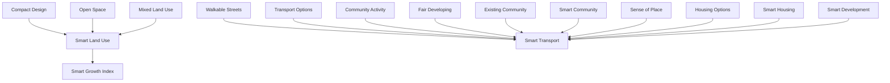
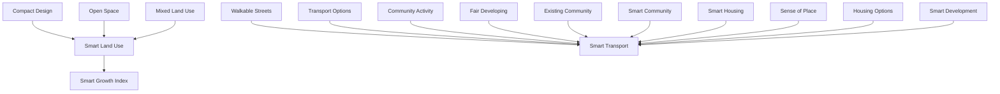

For office use only

T1

T2

T3

T4

# 61502

Problem Chosen

E

For office use only

F1

F2

F3

F4

## A Tale of Two Smart Cities: Development of a Smart Growth Index

The objective of this model was to design an easy-to-use index that is capable of grading a city’s smart growth based on basic principles of sustainability. Because the ten principles of smart growth were established to include the three E’s of sustainability (environmental sustainability, economic prosperity, and social equity) this model incorporated all ten principles into five unique metrics based on the intersectionality of core ideas (top right figure).

These metrics analyze a city’s: land use, housing, community, development plans, and transportation. The metrics themselves are determined using simple measures of widely available data. The sum of these metrics is reported as the Smart Growth Index (SGI) for any developed city.

Sacramento, California (United States) and Edinburgh, Scotland (United Kingdom) were analyzed with the model to serve as regional benchmarks. Both cities were selected because each currently has smart growth principles incorporated into their city growth plans. After an initial analysis of both cities, new smart growth initiatives were developed and new model inputs were projected. These initiatives were aimed specifically towards each city to improve their overall SGI score (bottom right figure).

The two cities both scored well initially with SGI scores of 44.7 and 54.9, respectively. After implementing the proposed initiatives, the SGI scores increased to 55.5 and 66.5, respectively. A 50% increase in population was also analyzed and, assuming that each city follows the new initiatives, each SGI metric is expected to increase.

To provide a wide a range of potential cities, this model makes some simplifying assumptions:

Selected metrics, and their measures, are the closest way to quantify a complex system of interconnected issues and variables.  
A simple, wide ranging, and robust model is preferred over a detail oriented model that requires hard to obtain, city specific data.  
Data inputted by individuals/cities is assumed to be unbiased and entered without the goal of manipulating model results.

flowchart

Process flow for model creation

radar chart

| Category             | Sacramento US | Edinburgh UK | Sacramento US (New Initiatives) | Edinburgh UK (New Initiatives) |
| -------------------- | ------------- | ------------ | ------------------------------- | ------------------------------ |
| Smart Land Use       | 10.0          | 12.0         | 13.0                            | 11.0                           |
| Smart Community     | 8.0           | 9.0          | 7.0                             | 8.0                            |
| Smart Development    | 14.0          | 15.0         | 13.0                            | 14.0                           |
| Smart Housing        | 6.0           | 7.0          | 5.0                             | 6.0                            |
| Smart Transportation| 5.0           | 6.0          | 4.0                             | 5.0                            |

Current and Projected Results for the analyzed cities

## 1.0 Introduction

As urbanization and population increases, the need for sustainable growth plans become essential. Smart growth is an ideology of development that aims to increase the environmental sustainability of growing cities, while simultaneously improving their economic prosperity and social equity (also known as the three E’s of sustainability). However, due to variances in population, growth, and geography, a custom smart growth plan must be derived for each city. These unique plans make measuring the success of a spectrum of smart growth plans difficult as there is currently no indexing model. Ideally, any modelled index created to rank a city’ smart growth would be based on simple principles and easily available data.

## Principles of Smart Growth

As mentioned above, there are ten basic principles that Smart Growth development is founded on (Smart Growth Network, 2006):

1. Mix land uses  
2. Take advantage of compact design  
3. Create a range of housing opportunities and choices  
4. Create walkable neighborhoods  
5. Foster distinctive, attractive communities with a strong sense of place  
6. Preserve open space, farmland, natural beauty, and critical environmental areas  
7. Direct development towards existing communities  
8. Provide a variety of transportation choices  
9. Make development decisions predictable, fair, and cost effective  
10. Encourage community and stakeholder collaboration in development decisions

Analyzing the above principles reveals a level of intersectionality of core ideas. By grouping principles together, five metrics can be created: smart land use, obtainable housing, alternative transportation, strong sense of community, and community involvement. For the remainder of this report these metrics will be referred to as: Smart Land Use, Smart Housing, Smart

Transport, Smart Community, and Smart Development. Because these principles are the foundation of Smart Growth it naturally makes sense that they can, in some form, be used as a ranking/indexing tool for any given Smart Growth plan.

## 1.1 Objective

The objective of this model is to design an easy to use index that is capable of grading a city’s smart growth based on the founding principles of smart growth and data that can be easily obtained. For this report, two cities from separate continents were analyzed: Sacramento, California, United States & Edinburgh, Scotland, United Kingdom. This model is meant to be used as a comparative tool between developed cities. The results of the model are to be quantitative measurements; however, their main purpose should be as a qualitative guide to identifying what aspects of sustainability a community can improve in. So, this model will serve as a metric to measure the effects of policy change and other governmental implementations. This objective will be accomplished by calibrating the created model to two medium sized cities that are attempting to grow in a smart fashion.

## 2.0 Methodology

The distinguishing mark of this report's model comes from its derivation. Because smart growth is characterized by its ten principles, this model incorporated each of these ten principles to measure the success of smart growth. The ten principles of smart growth were categorized into five metrics which were used to determine how smart a city was growing (Figure 2.1).

flowchart

Figure 2.1-Process flow for the creation of the Smart Growth Index model. The model incorporated all ten principles of smart growth and grouped them together into five metrics. The sum of these metrics is the overall Smart Growth Index. (Illustration by Contestant, 2017).

This model outputs a cumulative Smart Growth Index (SGI) value that ranges across a traditional grading system of 0-100 (where 100 is the highest possible level of Smart Growth). This SGI value is the sum of scores from the five metrics mentioned previously:

$$
\begin{array}{l} S G I = S m a r t L a n d U s e + S m a r t C o m m u n i t y + S m a r t D e v e l o p m e n t \\ + S m a r t H o u s i n g + S m a r t T r a n s p o r t a t i o n \\ \end{array}
$$

Each of the metrics were assumed to have the same importance, so each is weighed evenly in the above equation. Each metric can have an output between the range of 0-20, meaning the highest possible smart growth rating would have a rating of 20 for each metric, which then sums to 100.

To better understand the model as a whole, a greater knowledge of each metric and its derivation is required.

## 2.1 City Smart Growth Index

As Figure 2.1 shows, this report’s model combines similar smart growth principles into metrics. This was accomplished with an intersectionality matrix (Appendix Table A-1), which was created by analyzing the definitions of each principle and checking for similarities between them. Once the matrix was built, principles could be grouped together based on their definitions and the interpretation of how they could be implemented within communities. This method led to the following principles being grouped into the following metrics in Table 2.1:

Table 2.1- Separation of pillars into five metrics of smart growth.

<table><tr><td>Metric</td><td>Smart Land Use</td><td>Smart Community</td><td>Smart Development</td><td>Smart Housing</td><td>Smart Transportation</td></tr><tr><td>Smart Growth Principle(s)</td><td>1, 2, 6</td><td>5, 7</td><td>9, 10</td><td>3</td><td>4, 8</td></tr></table>

Data for each metric, and subsequent measures, was obtained from different public/governmental agencies so when multiple sources were required for a sentence, the in-text citation will follow ASCE’s citation format: (Author1, Year1; Author2, Year2;...).

## 2.1.1 Smart Land Use Development Metric

The Smart Land Use metric accounts for a city’s plan to integrate mixed land use to better allow for vertical building and preservation of open space. To quantify this metric, this report focused on one population related measure and one land related measure: population density and area of parkland per 1000 residents.

The main measure that accounts for mixed land use and compact building design is population density (US Census Bureau, 2012; City of Edinburgh Council, 2013). This model assumes that, in regards to smart growth, a greater population density indicates more people in vertical buildings. Also, this report assumes that population density will be its greatest near central hubs of commercial and business zones. To normalize this measure, the city of interest should be compared to the maximum population density found in the region. In this case, the city of Los Angeles was used to normalize Sacramento’s value while Glasgow, Scotland, United Kingdom was used to normalize Edinburgh’s value (US Census Bureau, 2012; Office for National Statistics, 2014). A current issue with this measure is that the closer a residential zone is to a business or commercial zone the more expensive the property (Palm, 2014). As a result, an immediate connection between Smart Housing and Smart Land Use can be seen.

To account for the preservation of open space, the SGI model uses the measure of park area per 1000 residents (Trust for Public Land, 2016; City of Edinburgh Council, 2010). The greater this value the greater physical emphasis a city has for its open space. Similar to population density these values were normalized. However, they were normalized in relation to one location:

Honolulu, Hawaii. Honolulu was chosen due to available data and its position as the highest amount of open area for a similar population density (Trust for Public Land, 2016).

$$
S m a r t L a n d U s e = \frac {\frac {\rho_ {c i t y}}{\rho_ {r e g i o n m a x}} + \frac {A _ {p a r k}}{A _ {r e g i o n m a x}}}{2}
$$

Where:

$$
\rho_ {c i t y} = \text { population   density   of   city,   population / mi } ^ {2}
$$

$$
\rho_ {\text { region   max }} = \text { maximum   population   density   for   region,   population / mi } ^ {2}
$$

$$
A _ {p a r k} = \text { area   of   park   within   the   city,   acres   of   park / 1000   people }
$$

$$
A _ {\text { region   max }} = \text { median   area   of   park   for   region,   acres   of   park / 1000   people }
$$

## 2.1.2 Smart Community Metric

The Smart Community metric accounts for the sense of pride and place that a community has. Due to the qualitative nature of these aspects, the largest challenge for this metric was determining what data would be capable of expressing a community's sense of self. Sources were scarce for determining if a city was developing properly or creating good communities.

However, this model ultimately decided to use the following measures: crime rate and percent of annual budget that it applied to restoration and city maintenance projects (rather than construction of new properties).

As mentioned, quantifying values such as a community's sense of place is difficult and subjective, but this model attempt to account for pride by the crime rate (Numbeo, 2017). This measure is used because it is the closest indication of whether or not the community was safe and if people felt safe using other community amenities such as public transportation. This measure is being used in a very simple way for a very complex issue. Crimes are not always indicative of pride, and are sometimes a matter of necessity/survival. However, given the time constraints placed on this model, crime is the selected measure.

The city budgets were also inspected to determine if city officials were developing existing communities rather than new projects (City of Sacramento, 2017; City of Edinburgh Council, 2017). The budget details were analyzed from city reports and manually gone through to determine which listed projects were for restoration and maintenance. Any city projects regarding city upgrades, utility maintenance or repair, cultural developments, and environmental resources were determined to be positively influencing the community.

$$
C o m m u n i t y M e t r i c = \frac {C i + B d}{2}
$$

Where:

$$
C i = \text { city's   crime   index }
$$

$$
B d = \text { percent   of   city's   budget   spent   on   remediation } = \frac {\text { Remediation   Budget }}{\text { Overall   Budget }}
$$

## 2.1.3 Smart Development Metric

The Smart Development metric accounts for level of engagement in a community, the fairness of decision making, and the push for renewable energy sources. As a result, three measures were used for this metric: voter turnout, government corruption, poverty, and projected percentage for renewable energy sources.

Voter turnout for each city was measured to relate the percent of population who are involved with city planning and development (Sacramento County, 2016; UKPolitical, 2015). High voter turnout translates to more involved community members who are capable of influencing the growth of their city to best suit themselves.

Countrywide corruptness was found to determine if developers in an area were prone to conducting policies and projects in the best interest of communities (Transparency International, 2017). For this measure, higher scores translated to less corruption, which is assumed to lead to more conducive city planning. This is the only measure for this model that does not utilize individual city data. Instead data was found on a country basis as an existing transparency index. This however, is not expected to influence the model because country governments are still responsible for major policies which can have direct effects on individual cities.

The last measure that incorporates the ten principles for smart development was the poverty index of each city (City-Data, 2013; City of Edinburgh Council, 2013). If a city maintained a low level of poverty, the community was thriving and indicated proper development practices.

Outside of the ten principles of smart growth, this model factored in a measure of renewable energy (SMUD, 2010; City of Edinburgh Council, 2017). A sustainable city should be capable of implementing renewable energy sources from the local environment. If renewable energy was projected to increase, then the city developers were assumed to have good intentions in regards to the environment and their citizens.

$$
D e v e l o p m e n t M e t r i c = \frac {C r + V + R e + (1 - P)}{4}
$$

Where:

???? = government transparency by country

???? = percent voter turnout of city

???? = use of renewables

???? = percent poverty of city

## 2.1.4 Smart Housing Metric

The smart housing metric is the simplest of the five, as it only incorporates one principle of smart growth (range of housing options). However, this model still finds this metric to be equally important as the other four. This importance is based on the idea that people of all working groups are required to build a sustainable and thriving city. To quantify this metric, the following two measures were used: percentage of residents who own their home and percentage of the homeless population compared to the city population.

This metric assumes that the greater the percent of home ownership the more housing options a city has (US Census Bureau, 2015; The City of Edinburgh Council, 2014). The larger percentage of home ownership within a city was related to more opportunities for a varying population to afford housing. This is a large simplifying assumption, similar to the crime rate earlier, that has the potential to lead to negative impacts if used incorrectly or if Smart Development is not a high graded metric. While this report does not deal with the issue, gentrification of low-income neighborhood is a serious threat to sustainable cities. It is important to remember the egalitarian mindset when developing cities, and that all types of people are needed to make a truly great community.

Besides the ownership percentage, city scores were negatively affected by a homelessness measure (Focus Strategies, 2015; Scottish Government, 2015). The metric score would decrease with a greater homeless population, and illustrated the need for a larger housing range and community outreach.

$$
H o u s i n g M e t r i c = \frac {O n - H}{2}
$$

Where:

???? = % of owner occupied residences

???? = homeless population percentage of city

## 2.1.5 Smart Transportation Metric

The Transportation Metric rates the quality of transportation choices offered in each city. Percentages of different transportation methods were examined for each city to quantify the various transportation choices. Examining the use of alternative forms of transportation rather than alternative forms offered illustrates the success of a city to promote alternative forms of transportation. The metric takes into account a public transportation measure and a walking measure.

Cities are able to achieve a higher score as they stray away from individual vehicular transportation. The metric excludes other forms of sustainable transportation (bicycling, carpooling, etc.) due to availability of data. Census data provided percentage values for commuting of ages 16 and up (US Census Bureau, 2015; The City of Edinburgh Council, 2013).

$$
T r a n s p o r t a t i o n M e t r i c = \frac {P t + W}{2}
$$

Where:

???? = commute using public transportation

???? = commute by walking

## 2.2 Model Tests, Validation, Details

Due to the time limitation of this report, only a brief testing of the model was completed. Only two metrics were tested in two cities within the United States. Both Smart Housing and Smart Transportation were tested in Los Angeles, California and New York City, New York. Los Angeles was chosen as a test city because of its poor transportation system and low housing options (US Census Bureau, 2015). New York city was chosen because it has similar housing options but a much greater public transportation system (US Census Bureau, 2015). The homeless measurement is assumed negligible in these due to the magnitude of their total

populations. The results of this testing showed that at least two of our metrics conform to expected values (Figure A-1).

If this model were to be used in anyway other than as a qualitative comparison, a more complete and thorough model validation technique would be required. Also, the overall detail of this model can be significantly increased with the addition of more metric measures and data. Each metric has the potential to be broken down and analyzed at a much deeper level, however the basic inputs allow the model to be used over a wider range of potential cities which increases the overall robustness. This report and model favors robustness over detail.

Lastly, it is very important to note the level of interconnection between each metric. Because the principles show intersectionality, the metrics do as well. This means that if one metric can be improved, others will increase naturally as well. This degree of inter-model connection was too difficult to incorporate so it is important that individual data being input is reviewed in regards to the rest of the data set. This should be a focus when analyzing any city with this model. For this report, recommended initiatives will be ranked in order of importance based on their potential impact to the overall model.

## 3.0 Current Growth Plans

The following section will discuss the current growth plans for each city and how they compare to the ten pillars of smart growth. Each city will be evaluated in terms of smart growth and model results will be used to interpreted the success of each city.

## 3.1 Sacramento, US

The development plan for Sacramento is stated in the 2035 General Plan (City of Sacramento, 2017). Sacramento is a very progressive city in California, US. As such, the general plan highlights several smart city growth techniques for future development. The 2035 plan has now been in effect for almost 10 years, so while the city is not expected to have reached all of their goals, their current data should show how well the plan is performing.

After inspection, the growth plan for the City of Sacramento has several noticeable smart growth techniques proposed. The city recognizes that public transportation is lacking, and its plan outlines measures to improve infrastructure to support public transportation growth. The city plan also aims to develop the renewable energy portfolio in order to reduce greenhouse gas emissions. Park restoration is also inspected in the plans, the Sacramento River runs through the town and has many riverfront park projects to be developed in the future, as well as existing parks to be maintained. Housing development is also highlighted in the report, and the city planners have recognized that mixed use space is extremely valuable, due to the inability to expand into neighboring agricultural lands. Three stages of residential area have been identified as, light, medium and highly dense neighborhoods. The highest density neighborhoods are to be configured with mixed commercial property as well as residential. In the interest of having walkable streets, the city planners have decided to remove obstructions to paths such as road barriers. Sacramento also takes pride in historic buildings within the city, and plan to renovate and reuse existing structures. The city plan mentions outreach to the community which will build community ties and interest in the city’s development, which is crucial to smart city growth.

Based on the above information and available data, inputs for the SGI model were created and tabularized (Table A-2). Results for Sacramento’s current growth plan are shown in section 3.3.

## 3.2 Edinburgh, UK

Edinburgh’s current development plan is explained in the Strategic Development Plan approved in 2013 and covers up to 2032 (The Strategic Development Planning Authority, 2013). Edinburgh is a known smart city in Europe, however some studies report that this appointment is based on limited smart growth principles (Zygiaris, 2012). Similar to Sacramento, Edinburgh’s plan has been in effect for more than five years, so while the city is not expected to have reached all of their goals, their current data should show how well the plan is performing.

Edinburgh’s main focus is to promote economic growth and achieve an urban village concept. The urban village concept focuses on mixed land use with sustainable developments. There is not much discussion involving how this will be accomplished given their population density. As the city continues to grow, increases in land for housing and employment have been set aside and in an attempt to develop previously used land. These areas will be in close vicinity to each other to shorten commute and promote alternative methods of transportation. Congested transportation infrastructure is to be remedied by increasing the frequency and area of operation of public transportation. This includes extending tram routes, increasing bus schedule hours, and increasing walking and cycling paths. Improvements are planned for the wastewater treatment facility as well as implementing renewable energy infrastructure in forms of eco-parks.

Based on the above information and available data, inputs for the SGI model were created and tabularized (Table A-2). Results for Edinburgh’s current growth plan are shown in Section 3.3.

## 3.3 Success of Current Strategies

Using model results, the success of the current city strategies will be analyzed in this section. The developmental plans for both cities are currently in effect and values were used within the index to determine each of the city’s progress. Sacramento achieved an overall score of 44.7, while Edinburgh achieved 54.9, both scored out of 100. The cities had comparable scores within each matrix, with the exception being transportation. Due to Sacramento’s large use of cars, public transportation was not relied upon as heavily as it is in Europe. However, future plans for the city will attempt to improve the use of public transportation for city residents. The following Figure 3.1 displays the results for the Smart Growth Index.

stacked bar chart

| City | Smart Land Use | Smart Community | Smart Development | Smart Housing | Smart Transportation |
| :--- | :--- | :--- | :--- | :--- | :--- |
| Sacramento | 9.2 | 11.2 | 13.2 | 9.3 | 1.0 |
| Edinburgh | 8.3 | 13.0 | 13.1 | 11.6 | 8.7 |

Figure 3.1- Model results showing current smart growth metrics for both cities. Each of the five subsections are scored out of 20 points, leading to a possible score of 100. (Illustration generated by Infogr.am, 2017)

## 3.3.1 Sacramento Model Evaluation

The following section will evaluate Sacramento’s score with the Smart City Index. Sacramento achieved a 9.2 for smart land use when factoring in population density and park area. Compared to the region’s largest population density (Los Angeles, California, US), Sacramento scored fairly high and was assumed to have a greater mixture of land use due to the population density.

The land use metric was decreased due to having a small amount of park area per population. The city achieved a community metric score of 11.2. The city’s overall budget utilized 67% of funds towards projects classified as developing current communities. Sacramento’s large crime rate negatively affected the score and shifted the average down. Sacramento’s highest score of 13.2 was in smart developing. The city’s high score was heavily influenced by the large amount of government transparency and a large voter turnout population. The addition of implementing renewable energy allowed for Sacramento to increase its average but was brought down by a substantial amount of the population being below the poverty line. A value of 9.3 for the housing opportunities was calculated. Less than 50% of the population owned homes, representing a need for a larger range of affordable housing. Homelessness affected the score only minimally due to the low homeless population in Sacramento. Sacramento’s lowest score was 1.4 for the transportation metric. Only 7.2% of the population used public transportation or walked; this displays a great need for improvement in access and availability in public transportation.

## 3.3.2 Edinburgh Model Evaluation

This section evaluates the strengths and weaknesses of Edinburgh, UK, with respect to the Smart Growth Index. The first metric evaluates smart land use for the city. Edinburgh scored 8.3 in this measure due to its low available park space for citizens. The population density scored at roughly half of the maximum observed in the region, showing that land use can be improved through taller structures of mixed use, however the city is not overly crowded currently. The second metric refers to the sense of community the city encourages. A score of 13.0 was calculated, and was mostly influenced by the city’s low rate of crime. The City Budget reflected that 60% of the funds were spent on community development which aided in smart growth. In the metric for smart development, Edinburgh scored 13.1. The city had a high rate of transparency in the government and voter turnout which led to higher scores. The poverty rate was almost identical to Sacramento’s at 22% and the renewable energy goals were very similar as well. In terms of smart housing opportunities, Edinburgh scored 11.6, two points higher than Sacramento. This score is higher due to a 10% increase of homeowners in Edinburgh, which relates to the range of housing options for citizens. Both cities had similar homeless populations, which totaled be less than 1% of their population. Analyzing the performance of the final metric, Smart Transportation, Edinburgh is the clear winner with almost 30% of the population using public transportation and a much larger walking population. Europe is known to have better public transportation than the US, therefore the traveling culture is very different, and leads to smarter communities when compared with the SGI.

## 4.0 Proposed Smart Growth Strategy

The following section will describe the smart growth initiatives for each city, divided into Smart Growth metrics developed in this model.

## 4.1 City of Sacramento Initiatives

Sacramento scored well in the SGI for a US city, however obvious shortfalls can be addressed to improve the score. Primarily, smart transportation is a key factor which needs improvement. However, due to a culture dominated by driving, this will be difficult to implement and will need years of community outreach to address. Initiatives have been organized in the following sections, and are aimed at improving the SGI scores for Sacramento.

## 4.1.1 Smart Land Use Initiatives

With regards to smart land use, Sacramento has the capacity to allow for a higher population density. This must be achieved through mixed land use development or risk the city becoming overcrowded. The city can also pursue increased park space through restoring riverfront property. This will allow for more usable space for citizens and allow for more walking trails between districts within the city. If Sacramento increases mixed land use through smart development practices such as business fronts at street levels with residential space above, the population density can safely grow and allow for a decrease in car usage due to a higher walking population.

## 4.1.2 Smart Community Initiatives

Sacramento has an appropriate budget, aimed at city developments and normal operation and maintenance costs. The budget should reflect the need for more public transportation options, as well as other smart development options. With an increasing population, the community may see a slight increase in crime, so as with all large cities, neighborhood watch and other security measures should be advertised. Developers should also target defunct buildings for renovation into mixed use structures providing business and housing opportunities.

## 4.1.3 Smart Development Initiatives

To increase the smart development score, Sacramento can focus on increasing its renewable portfolio to include more solar energy generation through incentive programs aimed at encouraging developers to implement photovoltaic panels on their buildings. The key issue in increasing the development score is to be wary of the risk of gentrification, which could push lower socioeconomic households out of communities. Developers should focus on offering different options for housing that could provide for a wide range of families. Incentives for a wide range of housing developments could encourage the city to grow in a smart fashion.

## 4.1.4 Smart Housing Initiatives

Sacramento can increase the smart housing score by offering a wide range of housing options. Business and residential mixed use buildings will allow for increased scores in other metrics as well. A stratification of housing options in a single apartment complex would provide housing for a diversity of families as well as increase the sense of community.

## 4.1.5 Smart Transportation Initiatives

The transportation metric for Sacramento was the most detrimental to the SGI score. This is due to the low population of public transportation users and safe walking spaces available. The model suggests that a large effort is needed to address this problem in Sacramento. This metric will be aided through the development of mixed land use communities as well as an overhaul of the transportation system. Transportation studies are recommended for the city to reduce the use of single passenger cars and encourage the use of public transportation. If the transportation system became more accessible and convenient for users, the public may decrease the use of cars, which can also reduce the greenhouse gas emissions for the city.

## 4.2 City of Edinburgh Initiatives

The City of Edinburgh currently has evenly distributed scores along each of the five metrics. To continue their growth towards a smart city, improvements across all metrics would help improve their overall score.

## 4.2.1 Smart Land Use Initiatives

As Edinburgh grows, it will require more housing and employment opportunities. Increased mixed land use will allow for a larger population density and decrease the need for car use. Development should focus on already existing infrastructure and new construction should be aimed towards previously used land (applying the infill ideology). The use of brownfield land, or decrepit industrial properties, could potentially require remediation measures to be taken before development proceeds.

## 4.2.2 Smart Community Initiatives

Edinburgh’s budget towards existing infrastructure has room to grow. Funds should go towards transportation, overall operation and maintenance of the city, remediation of potential housing/employment land, and sustainability. Crime rate should aim to stay the same but could potentially grow with the increased population density. Public vigilance is encouraged to promote a safe community. Eco-Park attractions can provide outreach for citizens who are interested in learning sustainable living habits and measures which will also increase the smart community metric score.

## 4.2.3 Smart Development Initiatives

Government transparency and voter turnout is relatively high in Edinburgh and should aim to stay or grow above current values. Edinburgh’s location along the coast allows for the use of renewable energy sources in wind and wave energy. Currently, a fifth of the population is below the poverty line, therefore mixed land developments which aim to house a diversity of incomes as well as provide business opportunities could increase the smart development score as well as other metrics (Scottish Government, 2016).

## 4.2.4 Smart Housing Initiatives

Housing ownership can be increased with a variety of housing options within the same region. Mixed land use will make neighborhoods more appealing to invest in. Student housing opportunities throughout the city will allow for more diverse communities and will lead to smaller impacts with a seasonally varying population.

## 4.2.5 Smart Transportation Initiatives

Edinburgh currently has a large percentage using public transportation or other forms of alternative transportation. To encourage an increase in smart transportation methods, bus and train routes require growth and increased operation. An increase of biking and walking paths will make the city more accessible. Implementing mix land use development should also decrease the reliance on cars.

## 4.3 Estimated Results of New Smart Growth Plans

Applying the new smart growth initiatives to both cities, new model inputs were estimated (Table 4.1). A brief justification for each input change is included.

Table 4.1- Model inputs for Sacramento and Edinburgh before and after applying the new smart growth initiatives. Justification for each change is included.

<table><tr><td rowspan="2"></td><td rowspan="2">Metric and measures</td><td colspan="2">Sacramento</td><td colspan="2">Edinburgh</td><td rowspan="2">Justification</td></tr><tr><td>Current</td><td>New Growth Plan</td><td>Current</td><td>New Growth Plan</td></tr><tr><td rowspan="2">Smart Land Use</td><td>City Density (Population/mi2)</td><td>4764</td><td>7146</td><td>4688</td><td>7032</td><td>Increased population by 50%, original max population densities remain constant</td></tr><tr><td>Park Area (acres)</td><td>11.50</td><td>12.08</td><td>10.25</td><td>10.76</td><td>Increased parkland by 5%, park space is limited in cities</td></tr><tr><td rowspan="2">Smart Community</td><td>Crime Index</td><td>45.1%</td><td>42.9%</td><td>71.3%</td><td>67.7%</td><td>Increase in crime rates due to population growth lead to the decrease of the crime index by 5%</td></tr><tr><td>Smart Budget</td><td>67.3%</td><td>70.0%</td><td>58.8%</td><td>70.0%</td><td>Both cities pushed to spend 70% of budget on smart development on existing infrastructure</td></tr><tr><td rowspan="4">Smart Development</td><td>Transparency</td><td>76.0%</td><td>76.0%</td><td>81.0%</td><td>81.0%</td><td>Constant due to acceptable levels found currently</td></tr><tr><td>Voter Turnout</td><td>74.5%</td><td>74.5%</td><td>72.9%</td><td>72.9%</td><td>Voter turnout is outstanding therefore no change</td></tr><tr><td>Renewable Energy</td><td>37.0%</td><td>50.0%</td><td>30.0%</td><td>50.0%</td><td>Renewable goals pushed to optimistic levels for the future of 50%</td></tr><tr><td>Poverty Percentage</td><td>22.8%</td><td>17.8%</td><td>22.0%</td><td>17.0%</td><td>Decreased by 5% in both cities due to smart growth measures</td></tr><tr><td rowspan="2">Smart Housing</td><td>Ownership</td><td>47.2%</td><td>57.2%</td><td>59.0%</td><td>69.0%</td><td>Increased homeownership by 10% in both cities due to increased range of home availability</td></tr><tr><td>Homelessness</td><td>0.6%</td><td>0.6%</td><td>0.8%</td><td>0.8%</td><td>Cannot completely mitigate due to individual circumstances, already very low percentages</td></tr><tr><td rowspan="2">Smart Transportation</td><td>Public Transportation Use</td><td>4.0%</td><td>14.0%</td><td>27.2%</td><td>37.2%</td><td>Increase by 10% for both cities due to focus on public transportation outreach and improvements. Sacramento cannot expect similar levels of usage due to cultural differences</td></tr><tr><td>Walking Population</td><td>3.2%</td><td>18.2%</td><td>16.2%</td><td>31.2%</td><td>Increased by 15% for both cities due to mix land use options allowing for convenience for walking</td></tr></table>

Given the new inputs above, the results of the model show significant increases for both cities (Figure 4.1). Sacramento achieved a new overall score of 55.5, while Edinburgh achieved 66.5, both scored out of 100.

radar chart

| Category             | Sacramento US | Edinburgh UK | Sacramento US (New Initiatives) | Edinburgh UK (New Initiatives) |
| -------------------- | ------------- | ------------ | ------------------------------- | ------------------------------ |
| Smart Land Use       | 9.0           | 8.5          | 12.5                            | 11.0                           |
| Smart Community      | 4.0           | 4.5          | 6.0                             | 7.0                            |
| Smart Development    | 10.0          | 10.5         | 11.0                            | 12.0                           |
| Smart Housing        | 3.0           | 3.5          | 4.0                             | 5.0                            |
| Smart Transportation | 1.0           | 1.5          | 2.0                             | 3.0                            |

Figure 4.1- Results before and after the implementation of new smart growth initiatives. Both cities increased their overall SGI value by at least 10 points. The largest change for both cities was an increase in the transportation metric.

## 5.0 Rank of Initiatives

The following section will rank the initiatives, by metric, based on most and least potential for the future growth plans.

## 5.1 Sacramento

1. Smart Large potential for growth, however, difficult due to cultural stigma of Transportation: personal use cars.  
2. Smart Housing: Difficult to effect homelessness population. Ownership can change by providing a range of housing options.

3. Smart Community: Difficult to achieve a larger allocation of budget towards smart growth. Crime index can change the most, however may remain constant.  
4. Smart Land Use: Difficult to achieve more parkland with limited space. Population density is susceptible to overcrowding, could be alleviated with proper development.  
5. Smart Least affected in future growth plan. Focus on renewable energy portfolio Development: and reduce poverty with smart city development.

## 5.2 Edinburgh

1. Smart Land Use: Land use has the most potential for change, may be difficult to achieve due to declining land space available for parks. Score heavily reliant on city density.  
2. Smart Housing: Difficult to increase home ownership with a large student population present. Still room to improve this score, unable to affect homeless population.  
3. Smart Great public transportation system in place, increase usage by hours of Transportation: operation and city routes. Mixed use land development will increase walkable neighborhoods.  
4. Smart Community: Cannot increase city budget past a certain threshold. Crime rates are related to the population and uncertain.  
5. Smart Least potential for growth. Improve renewable energy portfolio. Development:

## 5.3 Comparison

The largest difference between the two cities are in the land use and transportation metrics. Sacramento has a different culture regarding drivers, and citizens are generally unwilling to use public transportation unless it is very convenient. Because of this, the transportation initiatives received the highest priority for Sacramento. As Figure 4.1 shows, any increase in transportation greatly increases Sacramento’s SGI score. And because of the interconnection between all of the metrics, a change in one area will naturally lead to increases in others.

Land use in Edinburgh has the lowest score, however an increase in the score may be difficult for both cities due to the availability of new potential park lands. Because of this, the initiative involving “infilling” and the remediation of brownfield land should be aggressively applied.

The two cities were very similar in housing, community, and development. Both cities are well developed and have already implemented smart growth initiatives for the development of the community. There is housing available in both cities, however the accessibility is limited for a wide range of housing needs, therefore both cities need to improve housing diversity.

Finally, these initiative rankings should not be static. As cities develop, new needs arise and take priority. Because of this, it is imperative that communities are constantly communicating and

identifying the most urgent needs. This model reports an SGI value based solely on future plans and current/projected data, however the future is uncertain and elastic responses are necessary.

## 6.0 Population Model 2050

In order to support the growth of a 50% increase in population, initiatives focus on the development of amenities for citizens. Public transportation will grow with the population, leading to reduced traffic and greenhouse gas emissions. Land use and housing are also designed to improve smart city growth as well as provide a wide range of accessibility for citizens. A focus on mixed land use development will provide business opportunities and meet housing needs, as well as provide walkable neighborhoods. Sacramento will have difficulties increasing the public transportation usage, however the city should still strive to increase the score in this metric. Edinburgh is a well-rounded smart community, but still has room for growth in the SGI. Overall the model is expected to favor population growth for both cities, as long as cities implement and follow the recommended smart growth initiatives.

## 7.0 Strength and Weaknesses of Model

The Smart Growth Index presented in this report was designed to be a measuring tool for developing cities. Two cities that are attempting to implement smart growth planning were analyzed to provide a benchmark to other cities. Any city using this model should aim to score an equal or greater SGI value than the presented cities.

The main strength of this model is that any city with general population data and growth plans can measure their SGI. The normalization of parameters to regional values also makes the model more robust and adaptable. Also, the required data consists of simple measurements that developed or developing cities can obtain.

While the simplicity of this model makes it easy to use and robust, the assumptions used prevent the model from offering a detailed analysis of a city’s smart growth plan. Currently only five are used to calculate the SGI, which means that cities would only need to improve one facet of their growth plans to improve their overall SGI. This manipulation could lead to wrongful use or a false sense of smart growth. However, as mentioned previously, this is the trade-off that this model was designed to make.

Goals for the continued development of this model would aim to improve the detail of the results while maintaining the overall robustness. Additional parameters could be added to more accurately describe each metric. Also, further research and model runs would reveal whether or not an equal ranking of the metrics and measures is appropriate.

A sensitivity analysis was run on the five metrics. All the measures within each metric were altered by 10% and 20% and a new score for each metric was obtained. Changing the measures illustrated a linear relationship between them and their metric score. All of the metrics except for Smart Development had an equally proportionate response to the measure change. Changes in Smart Development measures had less effect on the total metric score and is most likely due to having more factors than the other metrics.

## 8.0 References

Anderson, D. (2010). “Edinburgh City Local Plan”. City of Edinburgh Council, Edinburgh.

Caragliu, A., Bo, C. D., and Nijkamp, P. (2011). “Smart Cities in Europe.” Journal of Urban Technology, 18(2), 65–82.

Chourabi, H., Nam, T., Walker, S., Gil-Garcia, J. R., Mellouli, S., Nahon, K., Pardo, T. A., and Scholl, H. J. (2012). “Understanding Smart Cities: An Integrative Framework.” 2012 45th Hawaii International Conference on System Sciences.

City-data. (2013). “Sacramento, California (CA) Poverty Rate DataInformation about poor and low income residents.” Sacramento, California (CA) poverty rate <http://www.city-data.com/poverty/poverty-Sacramento-California.html> (Jan. 23, 2017).

City of Edinburgh Council. (2011). “Census 2011.” <http://www.edinburgh.gov.uk/info/20247/edinburgh\_by\_numbers/1002/census\_2011> (Jan. 23, 2017).

City of Edinburgh Council. (2011). “Open Space Strategy” <http://www.edinburgh.gov.uk/> (Jan. 23, 2017).

City of Edinburgh Council. (2010). “Parks and Green Spaces”, <http://www.edinburgh.gov.uk/info/20064/parks\_and\_green\_spaces> (Jan. 23, 2017).

City of Edinburgh Council. (2013). “Poverty & Inequality - City of Edinburgh Council”, <http://www.edinburghopendata.info/pages/poverty-inequality> (Jan. 23, 2017).

City of Edinburgh Council. (2014). “2011 Census: Housing”, <http://www.edinburgh.gov.uk/> (Jan. 23, 2017).

City of Edinburgh Council. (2017). “Sustainable economy.” Sustainable Energy Action Plan,

City of Sacramento. (2016). "Land Use Amendment". City of Sacramento, <http://www.cityofsacramento.org/> (Jan. 23, 2017).

City of Sacramento. (2017). "City General Plan". City of Sacramento, <http://www.cityofsacramento.org/> (Jan. 23, 2017).

Excel. (2013). “Microsoft Excel for Windows.” Computer Software. (Jan. 23, 2017).

Focus Strategies. (2015). “Sacramento County and Incorporated Cities Homeless Count and Survey Report”. Sacramento Steps Forward.

Infogram. (2017). Charts and Maps Creator. <https://infogr.am/> (Jan. 23, 2017).

Numbeo. (2017). “Crime and Poverty Rates.” (n.d.). Numbeo. <https://www.numbeo.com/> (Jan. 23, 2017).  
Office of National Statistics (2014). “Home - Office for National Statistics”, <https://www.ons.gov.uk/> (Jan. 23, 2017).  
Palm, M., Gregor, B., Wang, H., and Mcmullen, B. S. (2014). “The trade-offs between population density and households׳ transportation-housing costs.” Transport Policy, 36, 160– 172.  
SMUD (2010). Renewable Energy Portfolio. <https://www.smud.org/en/about-smud/environment/renewable-energy/renewable-energyportfolio.htm> (Jan. 23, 2017).  
Sacramento County (2016). Voter Turnout. <http://sacresults.e-cers.com/resultsVoterTurnout.aspx> (Jan. 23, 2017).  
Scotland Shelter (2016). “Local Area Statistics.” Shelter Scotland, <http://scotland.shelter.org.uk/housing\_policy/key\_statistics/local\_authority\_statistics> (Jan. 23, 2017).  
Scottish Government. (2013). Recorded Crime in Scotland, 2012-13. <http://www.gov.scot/News/Releases/2013/06/recorded-crime-in-scotland18062013> (Jan. 23, 2017).  
Smart-Cities. (2014). “European smart cities.” european smart cities. <http://www.smart-cities.eu/> (Jan. 23, 2017).  
Smart Growth Network. (2006). "This is Smart Growth" EPA.  
Strategic Development Planning Authority. (2013). “Strategic Development Plan 2013”. (Jan. 23, 2017).  
Transparency International. (2017). Table of Results Corruptions Perceptions Index 2015. Transparency International - The Global Anti-Corruption Coalition, <http://www.transparency.org/cpi2015#results-table> (Jan. 23, 2017).  
The Trust for Public Land “2016 City Park Facts. (2016). The Trust for Public Land, <http://www.tpl.org/2016-city-park-facts> (Jan. 23, 2017).  
UK Political (2015). “UK Political Info | easy access to political and electoral data”, <http://www.ukpolitical.info/> (Jan. 23, 2017).  
US Census Bureau. (2010). “US Census Bureau 2010 Census.” California 2010, <https://www.census.gov/2010census/> (Jan. 23, 2017).

US Census Bureau. (2015). “2015 Data Profiles.” American Community Survey Office, <http://www.census.gov/acs/www/data/data-tables-and-tools/data-profiles/2015/> (Jan. 23, 2017).

Zygiaris, S. (2012). “Smart City Reference Model: Assisting Planners to Conceptualize the Building of Smart City Innovation Ecosystems.” Journal of the Knowledge Economy, 4(2), 217– 231.

## A. Appendix

Table A-1- Intersectionality matrix of the ten principles of smart growth.

<table><tr><td></td><td colspan="10">Principle Intersectionality</td></tr><tr><td>Principle</td><td>1</td><td>2</td><td>3</td><td>4</td><td>5</td><td>6</td><td>7</td><td>8</td><td>9</td><td>10</td></tr><tr><td>1</td><td>X</td><td>X</td><td>X</td><td>X</td><td>X</td><td>X</td><td></td><td></td><td>X</td><td>X</td></tr><tr><td>2</td><td>X</td><td>X</td><td>X</td><td></td><td></td><td>X</td><td></td><td></td><td>X</td><td>X</td></tr><tr><td>3</td><td></td><td>X</td><td>X</td><td></td><td></td><td></td><td></td><td></td><td>X</td><td></td></tr><tr><td>4</td><td>X</td><td>X</td><td>X</td><td>X</td><td></td><td></td><td></td><td>X</td><td></td><td></td></tr><tr><td>5</td><td>X</td><td></td><td></td><td></td><td>X</td><td></td><td>X</td><td></td><td></td><td>X</td></tr><tr><td>6</td><td>X</td><td>X</td><td></td><td></td><td>X</td><td>X</td><td>X</td><td>X</td><td></td><td>X</td></tr><tr><td>7</td><td></td><td></td><td>X</td><td>X</td><td>X</td><td>X</td><td>X</td><td>X</td><td></td><td>X</td></tr><tr><td>8</td><td></td><td></td><td></td><td>X</td><td></td><td></td><td></td><td>X</td><td>X</td><td>X</td></tr><tr><td>9</td><td></td><td></td><td>X</td><td></td><td></td><td></td><td></td><td></td><td>X</td><td>X</td></tr><tr><td>10</td><td></td><td></td><td></td><td></td><td></td><td></td><td></td><td></td><td>X</td><td>X</td></tr></table>

stacked bar chart

| City | Smart Housing (%) | Smart Transportation (%) |
| :--- | :--- | :--- |
| Los Angeles | 7.4 | 2.8 |
| New York City | 6.4 | 13.3 |
| Sacramento | 9.3 | 1.4 |
| Edinburgh | 11.6 | 8.7 |

Figure A-1- Brief model test of two metrics across four cities (Infogr.am, 2017).

Table A-2- Raw data input for model.

<table><tr><td colspan="4">Smart Land Use</td></tr><tr><td></td><td>Units</td><td>Sacramento</td><td>Edinburgh</td></tr><tr><td>City Density</td><td>population/mis</td><td>4764</td><td>4688</td></tr><tr><td>Max Region Density</td><td></td><td>8092</td><td>8844</td></tr><tr><td>Park Area</td><td>Acres of park/1000 peep</td><td>11.5</td><td>10.25</td></tr><tr><td>Median Area (constant)</td><td></td><td>34.3</td><td>34.3</td></tr><tr><td>SLUD Index</td><td></td><td>46%</td><td>41%</td></tr><tr><td>Multiplied</td><td></td><td>9.2</td><td>8.3</td></tr><tr><td colspan="4">Smart Community</td></tr><tr><td></td><td>Sacramento</td><td colspan="2">Edinburgh</td></tr><tr><td>Crime Index</td><td></td><td>45%</td><td>71%</td></tr><tr><td>Smart Budget Percent</td><td></td><td>67%</td><td>59%</td></tr><tr><td>SC Index</td><td></td><td>56.%</td><td>65.%</td></tr><tr><td>Multiplied</td><td></td><td>11.2</td><td>13.0</td></tr><tr><td colspan="4">Smart Development</td></tr><tr><td></td><td>Sacramento</td><td colspan="2">Edinburgh</td></tr><tr><td>Transparency</td><td></td><td>76%</td><td>81%</td></tr><tr><td>Voter Turnout</td><td></td><td>75%</td><td>73%</td></tr><tr><td>Renewable Energy</td><td></td><td>37%</td><td>30%</td></tr><tr><td>Poverty Percentage</td><td></td><td>22.80%</td><td>22%</td></tr><tr><td>SD Index</td><td></td><td>66.18%</td><td>65.49%</td></tr><tr><td>Multiplied</td><td></td><td>13.2</td><td>13.1</td></tr><tr><td colspan="4">Smart Housing</td></tr><tr><td></td><td>Sacramento</td><td colspan="2">Edinburgh</td></tr><tr><td>Ownership</td><td></td><td>47.20%</td><td>59.00%</td></tr><tr><td>Homelessness</td><td></td><td>0.5543%</td><td>0.8156%</td></tr><tr><td>SH Index</td><td></td><td>46.64%</td><td>58.18%</td></tr><tr><td>Multiplied</td><td></td><td>9.3</td><td>11.6</td></tr><tr><td colspan="4">Smart Transportation</td></tr><tr><td></td><td>Sacramento</td><td colspan="2">Edinburgh</td></tr><tr><td>Public Trans Use</td><td></td><td>4.00%</td><td>27.20%</td></tr><tr><td>Walking Pop.</td><td></td><td>3.20%</td><td>16.20%</td></tr><tr><td>ST Index</td><td></td><td>7.20%</td><td>43.40%</td></tr><tr><td>Multiplied</td><td></td><td>1.4</td><td>8.7</td></tr><tr><td>TOTAL</td><td>44.5</td><td colspan="2">54.7</td></tr></table>