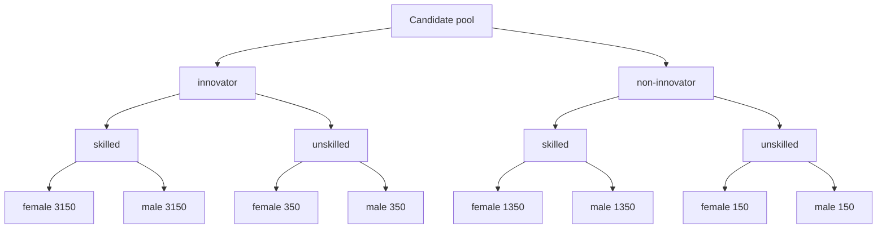
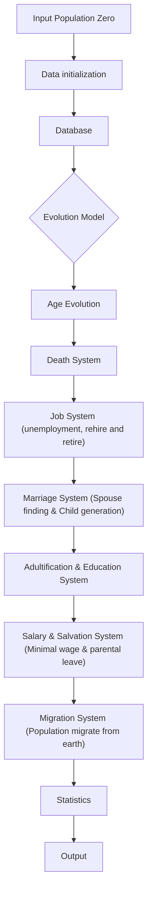
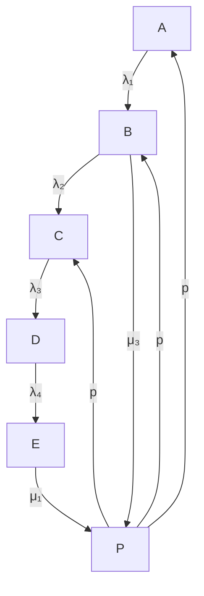
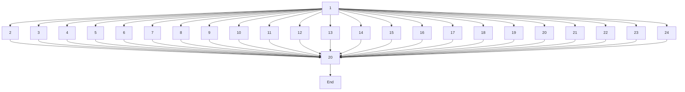

For office use only

T1 \_\_\_\_

T2 \_\_\_\_

T3 \_\_\_\_

T4 \_\_\_\_

Team Control Number

64486

Problem Chosen

F

For office use only

F1 \_\_\_\_

F2 \_\_\_\_

F3 \_\_\_\_

F4 \_\_\_\_

2017 ICM Summary Sheet

## Society Planning: Model, Simulation And Visualization

## Summary

This paper presents a model to maximize both the economic output and job satisfaction for the workforce with sustainability in the scope. We build a self-adaptive system and define its dynamics. We run simulations of the system with real-world census data(PUMS 2015[1]) to find out the optimal feasible solution. Based on the solution, we propose strategies to improve the living conditions of human immigrants on Mars. Our model has capabilities to deal with issues of population scalability, social development modality and evolution dynamics.

To address the problem of creating an optimal economic-workforce-education system, we decompose it into six sub-problems.

First, we constructed a parameter frame that integrates variables related to three aspects: income, education and social equality. We include basic parameters that exist in the census database, from which we derive metrics that reveal the characteristics of the society. Through an Analytical Hierarchy Process, we identify the critical parameters, among which the Happiness Index is an important comprehensive evaluation of citizens well-being.

Second, we formulate criteria to select 10000 immigrants for Population Zero. In comparison to the selected group, we generate a random sample by extracting data from PUMS 2015 database of 1,618,489 U.S. citizens. We study the demographics of both the selected group and the random sample. The selected group shows an obvious advantage in building a successful society.

Third, we construct a model to simulate the dynamic evolution of Population Zero. Consisting of various systems such as job, marriage, child generation, education, salary, salvation and migration system, this model evolves like our real world. We discuss one sample result in details using demographics, economics and Happiness Index.

In addition, we use this model to find the equilibrium point between two contradictory goals of faster economic development and better social welfare. By implementing a Principle Component Analysis on the demographic data, we define the key elements of a successful society as high average family income, high minimum wage and low standard deviation of income. We solve the three-objective optimization problem by Elite Genetic Algorithm. We find that the optimal minimum wage is \$33526 per year, and the optimal parental leave pay is \$50200 per year.

Next, we merge the models of income, education and social equality into a global model to and test it in different social groups. We identify the subgroups as professional labors and unskilled workers. The we build a non-linear programming model to decide the resources allocation strategy among different subgroups. We find that maximizing the parental leave pay will not reduce the minimum wage and average income significantly.

Finally, we study the effect of immigrant waves from the view of complex network theory. We generate a scale-free complex network with small world property to represent the interpersonal relationship among all individuals including Mars residents and new immigrants. Our model shows strategy of 10000 migrants every ten years are sustainable, and capable of dealing with a large number of refugees from Earth.

## 1 Policy Recommendation

## Honored Director of LIFE,

Thank you for hiring and trusting us. We have seen the great success of planned communities that are built across Earth. However, after detailed investigation and deliberate consideration, we find that labor management and society plan of the existing experimental communities can be further optimized. Therefore, we feel obliged to recommend the optimal strategies to LIFE to ensure the successful launch of project UTOPIA:2100. Our recommendations are based on precise modeling and computer simulation based on real-world data, thus we are confident of our proposals.

We study the problem both on a micro and macro level. We consider 3 important balancing factors: economy, education, and equality in the vision of sustainability. We have run a 2000-year simulation and validated the robustness of our model. Here we suggest a series of strategies.

Select Educated Immigrants In terms of economic development, we propose that LIFE recruit more immigrants who own bachelor degree or higher, and increase the ratio of citizens under 40. Individual with strong innovation ability should be granted privilege in the selection procedure. Our model shows higher ratio of innovator and higher average education level contribute to faster growth of GDP.

Maximize Minimum Wage Higher minimum wage results in lower standard deviation of income but lower average income. Nevertheless, concerns about the negative effect of high minimum wage on GDP is unnecessary. Although average income decreases as the minimum wage grows, the change is negligible. The slight negative effect can also be compensated by recruiting skilled labor from Earth.

We define a Happiness Index to evaluation the citizens attitude toward life in Mars. Lower variance of family income leads to higher Happiness Index but lower Net Domestic Product. We balance the two factors and find the equilibrium point, at which the minimum wage is around \$31708 less than the average personal income. We recommend that minimum wage should be around \$33526 and increase as economy grows.

Emphasize Education The significance of education is amplified by its correlation with the economic development. Since higher education level leads to higher income and better education of the children, emphasis on education of Population Zero incurs a virtuous circle. If education of the first generation is insufficient, chain reaction will lead to a cascade and finally the downfall of Population Zero.

Increase Parental Leave Pay We suggest that LIFE offer parental leave to both fathers and mothers to maintain the equality and maximize the birthrate. Since population need to expand on Mars to create more active labor forces, encouraging birth giving by implementing high parental leave pay is beneficial to the long term development on Mars.

Eliminate Discrimination In our complex network model, we find that larger scale of population and closer relationship among individuals contribute to higher economic growth speed. Discrimination between local residents of Mars and new immigrants from Earth should be eliminated, since marriages between individuals of the two group is fundamental to the stability of population.

Robustness Of Our Model We compare samples of Population Zero with randomly added noises on database. Results show the optimal strategies do not vary much. Since we do not consider the limitation of natural resources on Mars, our model may be less effective in modelling a large scale of population. Health care is not considered, which means additional models should be integrated to our simulation.

We hope that our suggestions are useful for LIFE and the UTOPIA:2100 will be a successful beginning of migration to Mars.

Sincerely,

Team 64486

## Contents

1 Policy Recommendation 1  
2 Introduction 4  
3 Parameter Definition And Specific Outcomes 4

3.1 PUMS Database 4  
3.2 Three-tier Basic Parameter System 4  
3.3 Derived Index System 5

3.3.1 Income Factor 5  
3.3.2 Education Factor 6  
3.3.3 Equality Factor 6

3.4 Evaluation Metrics 6

4 Population Zero: PUMS Dempgraphics And Immigrants Selection 8

4.1 Random Sample Of 10000 People 8  
4.2 Selection Criteria And Algorithm 8  
4.3 Comparison Between Population Zero And The Random Sample ..... 9

4.3.1 Demographic Distributions 9

5 Evolution Model and Dynamic System 11

5.1 Model Structure and Overview Of Sample Results ..... 11  
5.2 Assumptions and Mathematical Expression For Each System ..... 11  
5.3 Job System 12  
5.4 Education System 13  
5.5 Marriage System 13  
5.6 New Individuals: Child born And Migration System 13

5.6.1 Newly Born Children 13  
5.6.2 Migration System 14

6 Trade-offs And Social Equilibrium 15

6.1 Additional Assumptions And Constraints 15  
6.2 Policy For Balance Between Minimum Wage And High Productivity ..... 15  
6.3 Best Childcare And Parental Leave Strategy 16

7 Model's Function For Different Groups 18

7.1 Outcomes Across Different Subgroups 18  
7.2 Major Subgroup Identification 18  
7.3 Best Allocation Strategy 19

8 Interpersonal Relationship Network And New Immigrants 20

8.1 Generation Of Interpersonal Network 20  
8.2 Stationary Increment Model And Impact Of Immigration Waves 21

9 Migration Plan Analysis 21

9.1 Influences By Choosing Different Migration Year 21  
9.2 Phased Over and One-Year Migration 22

10 Robustness Analysis 23

## 11 Strengths and Weaknesses 23

11.1 Strengths 23  
11.2 Weaknesses 23

## References 24

## A Appendix 26

A.1 MATLAB Script Of Evolution Model 26

## 2 Introduction

Background In this year of 2095, a series of short-term planned living experiments have been completed on Mars. A group of 10000 people, called Population Zero, will migrate to Mars. Besides all the advanced technologies that make life on Mars possible, an optimal strategy regarding workforce, economy and education should be designed to facilitate the development of Population Zero.

Restatement and Clarification Our team is bound to construct a policy model, which include a set of policy recommendations that will create a sustainable life-plan. To find out the optimal strategies, we need to build models, run simulations and present the visualized results. Our model should be scalable, multi-tiered and dynamic. However, trade-offs should be made if two objectives contradict, and the 3 balancing factors are income, education and equality.

We aim to solve the following problems:

- Define a set of parameters and metrics and clarify their relations.  
- Select a group of 10000 citizens as Population Zero and analyze the demographic characteristics. Decide the selection criteria that make UTOPIA:2100 a well-functioning society.  
- Define the key elements of a successful society in a 10-year period. Find out the equilibrium between the optimal minimum wage and salary distribution. Find out the optimal parental leave pay.  
- Identify the major subgroups of your workforce, and identify their main priorities. Adjust our models to balance the needs of different subgroups. Maximize the priority outcomes without sharply reducing the global outcomes.  
- Build a sustainable Small World network model and define the dynamics of evolution. Analyze the impact of immigration phased over the next 100 years.  
- Test the scalability of our network model. Consider a much larger population. Study the robustness of the model.

## 3 Parameter Definition And Specific Outcomes

## 3.1 PUMS Database

The American Community Survey (ACS) Public Use Microdata Sample (PUMS)[1] files are a set of 284 different untabulated records including population and housing unit records with individual information such as relationship, sex, educational attainment, and employment status, et cetera. It is convenient for people who are looking for accessibility to inexpensive data for research projects. However, there is a thing worth noting that PUMS does not contain information of people under 16 years old.

## 3.2 Three-tier Basic Parameter System

In order to quantify the characteristics of Population Zero, we clarify the fundamental parameters that would be applied in our models. The parameters are classified according to the objects they describe and the aspect of the outcomes they contribute to.

There are 3 tiers of parameters, which deliver quantitative information about Population Zero on individual level, family level and societal level respectively. In each tier, important factors related to income, education and equality are adopted as parameters. The Fig.1 below illustrates a clear structure of predominate parameters whose detailed information is in Tab.1.

```mermaid
graph TD
  A["Individual"] --> B["Personal Savings Rate"]
  A --> C["Real Personal Income"]
  A --> D["Weekly Working Hours"]
  A --> E["Annual Family Expenditure"]
  A --> F["Annual Family Income"]
  A --> G["Family Childcare Expenditures Rate"]
  A --> H["Childcare Budget"]
  A --> I["Education Budget"]
  A --> J["Education Development Level"]
  A --> K["Ethnicity Ratio"]
  A --> L["Gini Coefficient of Income Equality"]
  A --> M["Minimum Wage"]
  A --> N["Number of Minimum Wage Worker"]
  A --> O["Sex Ratio"]
  A --> P["Unemployment Rate"]
    
  Q["Societal"] --> R["Income"]
  Q --> S["Education"]
  Q --> T["Equality"]
    
  U["GDP or Happiness"] --> V["Income"]
  U --> W["Education"]
  U --> X["Equality"]
    
  B --> V
  C --> V
  D --> V
  E --> V
  F --> V
  G --> V
  H --> V
  I --> V
  J --> V
  K --> V
  L --> V
  M --> V
  O --> V
    
    style A fill:#f9f,stroke:#333
    style Q fill:#ccf,stroke:#333
    style S fill:#cfc,stroke:#333
    style T fill:#fcc,stroke:#333
```


<details>
<summary>flowchart</summary>


</details>

Figure 1: Hierarchy Figure

## 3.3 Derived Index System

To simplify the 3-tier basic parameter, we design a comprehensive index system to present a more detailed quantitative description of Population Zero and try to reveal the relation or dependency among the parameters.

## 3.3.1 Income Factor

From individual level, personal income, personal savings rate are most important parameters. The relationship between them are as follows, according to U.S. Bureau of Economic Analysis[2]

$$
D P I = R P I * \left(1 - r _ {t a x}\right) \tag {1}
$$

where RPI is real personal income(adjusted for inflation, but in our model equals to personal income), DPI is disposable personal income, $r_{tax}$ is tax rate.

$$
r _ {s} = \frac {D P I - P C E}{D P I} \tag {2}
$$

where $PCE$ is personal consumption expenditure, $r_s$ is personal saving rate. $r_s < 0$ indicates that his income can't meet his expenditure thus in bad condition. If $r_s \geq 0$ and is low, then he is in good condition and there is no need for him to worry about future. If $r_s \geq 0$ and is high, then he is in good condition but has to worry about his future.

From household level, child care takes a large proportion of family expenditure.

$$
r _ {c e} = \frac {F _ {c}}{F _ {e x p}} \tag {3}
$$

where $r_{ce}$ is childcare expenditures rate, $F_{c}$ is average family childcare expenditure, $F_{exp}$ is average family expenditure.

From societal level, GDP and NDP are most essential outcomes.

$$
G D P = \alpha * P * (1 - r _ {u n}) \tag {4}
$$

where $\alpha$ is average workforce productivity which is related to working hours and creative activity involved in producing innovations, P is the total number of people, $r_{un}$ is unemployment rate.

$$
N D P = G D P - W _ {\text { min }} * P _ {m w w} - B _ {c c} \tag {5}
$$

where $W_{min}$ is minimum wage, $P_{mww}$ is the number of minimum wage workers, $B_{cc}$ is annual childcare budget.

## 3.3.2 Education Factor

Present education level(EDL) of a population can be calculate by following formulation[3]

$$
E D L = \left(\frac {Y _ {\text { ave } , s}}{1 5} + \frac {Y _ {\text { exp } , s}}{1 8}\right) * 0. 5 \tag {6}
$$

where $Y_{ave,s}$ is “expected years of schooling” (Number of years a child of school entrance age can expect to spend in a given level of education) and “Mean years of schooling” (Average number of completed years of education of a population [25 years and older]).

## 3.3.3 Equality Factor

Given a continuous probability distribution function of income $p_{in}(x)$ , where $p_{in}(x)dx$ is the fraction of the population with income x to $x + dx$ , then the Gini coefficient[4] is half of the relative mean absolute difference:

$$
G _ {s e} = \frac {1}{2 \mu} \int_ {- \infty} ^ {\infty} \int_ {- \infty} ^ {\infty} p (x) p (y) | x - y | d x d y \tag {7}
$$

where $\mu$ is the mean of the distribution $\mu = \int_{-\infty}^{\infty} x p(x) dx$ and the lower limits of integration may be replaced by zero when all incomes are positive.

## 3.4 Evaluation Metrics

The frequency of words related to the topic “a well-being society” in the Social Science Research Network database[5] effectively reflects the importance of factors contributing to a successful society. According to the word frequency, we allocate different weights to the factors in our model. To better visualize the most concerned factors, we generated a word cloud as shown in Fig.2.


<details>
<summary>text_image</summary>

groups
Education
people
competition
social
cultural
behavior
religious
systems
political
rights
cultural
ways
interests
national
change
possible
social
many
behavior
also
individuals
policies
members
others
economies
society
human
ocean
life
country
class
likely
make
world
government
often
different benefits
</details>

Figure 2: Word cloud: the figure shows equality is the most concerned factor.

Table 1: Parameter List

<table><tr><td>Name</td><td>Symbol</td><td>Type</td><td>Tier</td><td>Factor</td><td>Dict[6]</td><td>Unit</td></tr><tr><td>Active Labor Force Ratio</td><td> $r_{al}$ </td><td>Numerical</td><td>Societal</td><td>Income</td><td></td><td></td></tr><tr><td>Age</td><td>A</td><td>Numerical</td><td>Individual</td><td>Equality</td><td>AGEP</td><td>Year</td></tr><tr><td>Annual Family Expenditure</td><td> $F_{exp}$ </td><td>Numerical</td><td>Family</td><td>Income</td><td></td><td>$</td></tr><tr><td>Annual Family Income</td><td> $H_{in}$ </td><td>Numerical</td><td>Family</td><td>Income</td><td>FINCP</td><td>$</td></tr><tr><td>Average Age</td><td> $A_{avg}$ </td><td>Numerical</td><td>Societal</td><td>Income</td><td></td><td>Year</td></tr><tr><td>Average Educational Attainment</td><td> $Y_{ave,s}$ </td><td>Class</td><td>Societal</td><td>Education</td><td>SCHL</td><td></td></tr><tr><td>Childcare Budget</td><td> $B_{cc}$ </td><td>Numerical</td><td>Societal</td><td>Equality</td><td></td><td>$</td></tr><tr><td>Disposable Personal Income</td><td>DPI</td><td>Numerical</td><td>Individual</td><td>Income</td><td></td><td>$</td></tr><tr><td>Education Budget</td><td> $M_{eb}$ </td><td>Numerical</td><td>Societal</td><td>Education</td><td></td><td>$</td></tr><tr><td>Education Development Level</td><td>EDL</td><td>Numerical</td><td>Societal</td><td>Education</td><td></td><td></td></tr><tr><td>Ethnicity</td><td> $S_{eth}$ </td><td>Class</td><td>Individual</td><td>Equality</td><td>ACN1P</td><td></td></tr><tr><td>Ethnicity Ratio</td><td> $r_{er}$ </td><td>Numerical</td><td>Societal</td><td>Equality</td><td></td><td></td></tr><tr><td>Expected Years of Schooling</td><td> $Y_{exp,s}$ </td><td>Numerical</td><td>Societal</td><td>Education</td><td></td><td></td></tr><tr><td>Family Childcare Expenditure</td><td> $F_c$ </td><td>Numerical</td><td>Family</td><td>Equality</td><td></td><td>$</td></tr><tr><td>Family Size</td><td> $N_{fs}$ </td><td>Interger</td><td>Family</td><td>Income</td><td>NPF</td><td>Person</td></tr><tr><td>Family Type</td><td> $S_{ft}$ </td><td>Class</td><td>Family</td><td>Income</td><td>FES</td><td></td></tr><tr><td>Gender</td><td>G</td><td>0-1Variable</td><td>Individual</td><td>Equality</td><td>SEX</td><td></td></tr><tr><td>Gini Coefficient of Income Equality</td><td> $G_{ie}$ </td><td>Numerical</td><td>Societal</td><td>Equality</td><td></td><td></td></tr><tr><td>Making Childcare Payment Rate</td><td> $r_{cp}$ </td><td>Percent</td><td>Family</td><td>Equality</td><td></td><td></td></tr><tr><td>Marital status</td><td> $S_{ms}$ </td><td>Class</td><td>Individual</td><td>Equality</td><td>MAR</td><td></td></tr><tr><td>Minimum Wage</td><td> $W_{min}$ </td><td>Numerical</td><td>Societal</td><td>Income</td><td></td><td>$</td></tr><tr><td>Number of Minimum Wage Worker</td><td> $P_{mww}$ </td><td>Interger</td><td>Societal</td><td>Income</td><td></td><td>Person</td></tr><tr><td>Occupation</td><td> $S_{oc}$ </td><td>Class</td><td>Individual</td><td>Income</td><td>OCCP</td><td></td></tr><tr><td>Parental Leave Pay</td><td>PLP</td><td>Numerical</td><td>Societal</td><td>Equality</td><td></td><td>$</td></tr><tr><td>Personal Consumption Expenditures</td><td>PCE</td><td>Numerical</td><td>Individual</td><td>Income</td><td></td><td>$</td></tr><tr><td>Personal Savings Rate</td><td> $r_s$ </td><td>Percent</td><td>Individual</td><td>Income</td><td></td><td></td></tr><tr><td>Population</td><td>P</td><td>Integer</td><td>Societal</td><td>Income</td><td></td><td>Person</td></tr><tr><td>Real Personal Income</td><td>RPI</td><td>Numerical</td><td>Individual</td><td>Income</td><td>PINCP</td><td>$</td></tr><tr><td>Sex Ratio</td><td> $r_{sr}$ </td><td>Numerical</td><td>Societal</td><td>Equality</td><td></td><td></td></tr><tr><td>Tax Payment Percentage</td><td> $r_{tax}$ </td><td>Percent</td><td>Individual</td><td>Income</td><td></td><td></td></tr><tr><td>Unemployment Rate</td><td> $r_{un}$ </td><td>Percent</td><td>Societal</td><td>Equality</td><td></td><td></td></tr><tr><td>Weekly Working Hours</td><td> $t_w$ </td><td>Numerical</td><td>Individual</td><td>Income</td><td>WKHP</td><td>Hour</td></tr></table>

Through the Analytical Hierarchy Process(AHP), we define two sets of weights when calculating GDP Index and Happiness respectively. Starting from the first criteria of the hierarchy figure(Fig.1), we structure comparison matrix by Comparison Method of 1-9[7]. Then, we get the weights of income factor, education factor and equality factor to Happiness Index, as is shown in Tab.2. By calculating the weights of three factors in hierarchy II, we get the maximum eigenvalue is 3.0044, consistency ratio $CR = 0.0043$ , which meets AHP's consistency ratio requirement.

Following the above procedures and adjusting comparison matrix until every matrix's consistency ratio $CR \leq 0.1$ , we obtain two set of weights. Due to limitation of paper page, other pairwise comparison matrix is not appended. Finally, all the weights are shown in Tab.3 and Tab.4. They can used to evaluate GDP Index and Happiness Index of Population Zero.

Table 2: Comparison matrix of happiness hierarchy I-II

<table><tr><td>Happiness</td><td>Income</td><td>Education</td><td>Equality</td><td>Weight</td></tr><tr><td>Income</td><td>1</td><td>2</td><td>1/5</td><td>0.247</td></tr><tr><td>Education</td><td>1/2</td><td>1</td><td>1/6</td><td>0.202</td></tr><tr><td>Equality</td><td>5</td><td>6</td><td>1</td><td>0.550</td></tr></table>

Table 3: Criteria weights of hierarchy I-II

<table><tr><td>Factor</td><td>GDP</td><td>Happiness</td></tr><tr><td>Income</td><td>0.462</td><td>0.299</td></tr><tr><td>Education</td><td>0.373</td><td>0.259</td></tr><tr><td>Equality</td><td>0.165</td><td>0.442</td></tr></table>

Table 4: Criteria weights of hierarchy II-III

<table><tr><td>Name</td><td>GDP</td><td>Happiness</td><td>Factor</td></tr><tr><td>Annual Family Expenditure</td><td>0.134</td><td>0.123</td><td>Income</td></tr><tr><td>Annual Family Income</td><td>0.145</td><td>0.107</td><td>Income</td></tr><tr><td>Minimum Wage</td><td>0.061</td><td>0.176</td><td>Income</td></tr><tr><td>Number of Minimum Wage Worker</td><td>0.155</td><td>0.083</td><td>Income</td></tr><tr><td>Personal Savings Rate</td><td>0.048</td><td>0.184</td><td>Income</td></tr><tr><td>Real Personal Income</td><td>0.397</td><td>0.142</td><td>Income</td></tr><tr><td>Weekly Working Hours</td><td>0.060</td><td>0.185</td><td>Income</td></tr><tr><td>Education Budget</td><td>0.399</td><td>0.462</td><td>Education</td></tr><tr><td>Education Development Level</td><td>0.601</td><td>0.538</td><td>Education</td></tr><tr><td>Childcare Budget</td><td>0.133</td><td>0.131</td><td>Equality</td></tr><tr><td>Ethnicity Ratio</td><td>0.129</td><td>0.173</td><td>Equality</td></tr><tr><td>Family Childcare Expenditures Rate</td><td>0.144</td><td>0.141</td><td>Equality</td></tr><tr><td>Gini Coefficient of Income Equality</td><td>0.252</td><td>0.252</td><td>Equality</td></tr><tr><td>Sex Ratio</td><td>0.127</td><td>0.214</td><td>Equality</td></tr><tr><td>Unemployment Rate</td><td>0.215</td><td>0.089</td><td>Equality</td></tr></table>

## 4 Population Zero: PUMS Demgraphics And Immigrants Selection

## 4.1 Random Sample Of 10000 People

To study the demographics of the potential Population Zero members, we extract data from PUMS database, which contains personal data of 1618489 individuals, and carry out data mining. Regarding the limitation of computational power, analyzing the whole data set is inconvenient and unnecessary. Instead, we first generate a sample of 10000 immigrants totally randomly using SAS, SQL Server. We suppose that every individual has an equal opportunity to be selected as a member of Population Zero.

## 4.2 Selection Criteria And Algorithm

To build a peaceful, cooperative, egalitarian society of Utopia:2100, we select members of Population Zero under certain criteria. We believe that an ideal society should be balanced and harmonic, which can be specified as:


<details>
<summary>flowchart</summary>


</details>

Figure 3: Selection Criteria

- We define innovators as individual under 40 and own bachelor degrees or higher. Since Population Zero will migrate to a new and undeveloped environment, innovation will be vital to help them adapt to the uncertainties and changeability in the Martian habitation. Innovators should outnumber producers. We set the innovator-to-producer ratio as 7:3.  
- Building the Martian habitation need skilled labor. We define "skilled labor" as individuals working for more than 35 hours per week. We have a strong preference for skilled labor when selecting members, therefore we set the skilled-to-unskilled labor ratio as 9:1.  
- In order to maximize the birth rate, we set the male-female ratio as exactly 1:1.  
- To ensure the stability of the society, we require citizens to migrate together with their spouses. Citizens will not be selected if their spouses are not eligible for Population Zero Program, and children should migrate with their parents.  
- In consideration of equality, the selection process is based on a non-biased policy, i.e. other individual differences such as ethnicity, characteristics, and sexual orientation will not be considered.

Based on the criteria, we classify the candidates and tag them as 4 different types, and then select a particular number of each type to join the Population One. The classification procedure and the numbers of each type are specified in Fig.3.

After this procedure, we filter out those candidates whose spouses are not in the selected Population Zero and check if their spouses can take the place of another candidate. If not, the those candidates will be substituted.

## 4.3 Comparison Between Population Zero And The Random Sample

In order to validate our selection criteria, we compare the demographics of the random sample and Population Zero. We find that Population Zero's advantages are apparent in regard to income, education and equality.

## 4.3.1 Demographic Distributions

As is show in Fig.4 and Fig.5, Population Zero has a higher average annual income and a lower standard deviation of 46844.11 dollars, compared to 52043.95 of the random sample. We believe that higher income and smaller income difference alleviate inequality and increase citizens' happiness to an extend.

From Fig.6 and Fig.7, we can not tell a huge difference between the random sample and Population Zero. Since working hour per week centers near 40 hours/week, we find this criterion unnecessary.

Population Zero have a higher average education level(shown in Fig.8 and Fig.9), since we have a strong preference for innovators, who own bachelor degrees or higher.


<details>
<summary>histogram</summary>

| PINCP Range       | Density     |
| ----------------- | ----------- |
| 0e+00 - 2e+05     | 1.5e-05     |
| 2e+05 - 4e+05     | 1.2e-05     |
| 4e+05 - 6e+05     | 8.0e-06     |
| 6e+05 - 8e+05     | 5.0e-06     |
| 8e+05 - 1e+06     | 3.0e-06     |
| 1e+06 - 1.2e+06   | 2.0e-06     |
| 1.2e+06 - 1.4e+06 | 1.5e-06     |
| 1.4e+06 - 1.6e+06 | 1.0e-06     |
| 1.6e+06 - 1.8e+06 | 8.0e-07     |
| 1.8e+06 - 2.0e+06 | 6.0e-07     |
| 2.0e+06 - 2.2e+06 | 4.0e-07     |
| 2.2e+06 - 2.4e+06 | 3.0e-07     |
| 2.4e+06 - 2.6e+06 | 2.0e-07     |
| 2.6e+06 - 2.8e+06 | 1.5e-07     |
| 2.8e+06 - 3.0e+06 | 1.0e-07     |
| 3.0e+06 - 3.2e+06 | 5.0e-08     |
| 3.2e+06 - 3.4e+06 | 2.0e-08     |
| 3.4e+06 - 3.6e+06 | 1.0e-08     |
| 3.6e+06 - 3.8e+06 | 5.0e-09     |
| 3.8e+06 - 4.0e+06 | 2.0e-09     |
| 4.0e+06 - 4.2e+06 | 1.0e-09     |
| 4.2e+06 - 4.4e+06 | 5.0e-10     |
| 4.4e+06 - 4.6e+06 | 2.0e-10     |
| 4.6e+06 - 4.8e+06 | 1.0e-10     |
| 4.8e+06 - 5.0e+06 | 5.0e-11     |
| 5.0e+06 - 5.2e+06 | 2.0e-11     |
| 5.2e+06 - 5.4e+06 | 1.0e-11     |
| 5.4e+06 - 5.6e+06 | 5.0e-12     |
| 5.6e+06 - 5.8e+06 | 2.0e-12     |
| 5.8e+06 - 6.0e+06 | 1.0e-12     |
| 6.0e+06 - 6.2e+06 | 5.0e-13     |
| 6.2e+06 - 6.4e+06 | 2.0e-13     |
| 6.4e+06 - 6.6e+06 | 1.0e-13     |
| 6.6e+06 - 6.8e+06 | 5.0e-14     |
| 6.8e+06 - 7.0e+06 | 2.0e-14     |
| 7.0e+06 - 7.2e+06 | 1.0e-14     |
| 7.2e+06 - 7.4e+06 | 5.0e-15     |
| 7.4e+06 - 7.6e+06 | 2.0e-15     |
| 7.6e+06 - 7.8e+06 | 1.0e-15     |
| 7.8e+06 - 8.0e+06 | 5.0e-16     |
| 8.0e+06 - 8.2e+06 | 2.0e-16     |
| 8.2e+06 - 8.4e+06 | 1.0e-16     |
| 8.4e+06 - 8.6e+06 | 5.0e-17     |
| 8.6e+06 - 8.8e+06 | 2.0e-17     |
| 8.8e+06 - 9.0e+06 | 1.0e-17     |
| 9.0e+06 - 9.2e+06 | 5.0e-18     |
| 9.2e+06 - 9.4e+06 | 2.0e-18     |
| 9.4e+06 - 9.6e+06 | 1.0e-18     |
| 9.6e+06 - 9.8e+06 | 5.0e-19     |
| 9.8e+06 - 1.0e+07 | 2.0e-19     |
| Note: The actual values may vary due to the random nature of the data generation process shown in the code above the code provided in the code.
</details>

Figure 4: Random sample: distribution of annual income


<details>
<summary>histogram</summary>

| PINCP Range       | Density     |
| ----------------- | ----------- |
| 0e+00 - 1e+05     | 1.5e-05     |
| 1e+05 - 2e+05     | 1.0e-06     |
| 2e+05 - 3e+05     | 5.0e-07     |
| >3e+05            | <1.0e-07   |
</details>

Figure 5: Population Zero: distribution of annual income


<details>
<summary>histogram</summary>

| WKHP Range | Density |
| ---------- | ------- |
| 0 - 5      | 0.00    |
| 5 - 10     | 0.00    |
| 10 - 15    | 0.00    |
| 15 - 20    | 0.00    |
| 20 - 25    | 0.03    |
| 25 - 30    | 0.02    |
| 30 - 35    | 0.01    |
| 35 - 40    | 0.02    |
| 40 - 45    | 0.35    |
| 45 - 50    | 0.21    |
| 50 - 55    | 0.04    |
| 55 - 60    | 0.06    |
| 60 - 65    | 0.02    |
</details>

Figure 6: Random sample: distribution of weekly working hour


<details>
<summary>histogram</summary>

| WKHP Range | Density |
| ---------- | ------- |
| 0 - 5      | 0.00    |
| 5 - 10     | 0.00    |
| 10 - 15    | 0.00    |
| 15 - 20    | 0.00    |
| 20 - 25    | 0.01    |
| 25 - 30    | 0.00    |
| 30 - 35    | 0.01    |
| 35 - 40    | 0.03    |
| 40 - 45    | 0.23    |
| 45 - 50    | 0.07    |
| 50 - 55    | 0.08    |
| 55 - 60    | 0.02    |
| 60 - 65    | 0.01    |
</details>

Figure 7: Population Zero: distribution of weekly working hour


<details>
<summary>histogram</summary>

| SCHL Range | Density |
| ---------- | ------- |
| 0 - 1      | 0.01    |
| 1 - 2      | 0.005   |
| 2 - 3      | 0.002   |
| 3 - 4      | 0.001   |
| 4 - 5      | 0.001   |
| 5 - 6      | 0.001   |
| 6 - 7      | 0.001   |
| 7 - 8      | 0.001   |
| 8 - 9      | 0.002   |
| 9 - 10     | 0.003   |
| 10 - 11    | 0.005   |
| 11 - 12    | 0.01    |
| 12 - 13    | 0.02    |
| 13 - 14    | 0.03    |
| 14 - 15    | 0.04    |
| 15 - 16    | 0.2     |
| 16 - 17    | 0.25    |
| 17 - 18    | 0.1     |
| 18 - 19    | 0.2     |
| 19 - 20    | 0.1     |
| 20 - 21    | 0.2     |
| 21 - 22    | 0.1     |
| 22 - 23    | 0.08    |
| 23 - 24    | 0.03    |
| 24 - 25    | 0.01    |
</details>

Figure 8: Random sample: distribution of education level


<details>
<summary>histogram</summary>

| SCHL Range | Density |
| ---------- | ------- |
| 15 - 16    | 0.0     |
| 16 - 17    | 0.0     |
| 17 - 18    | 0.0     |
| 18 - 19    | 0.0     |
| 19 - 20    | 0.2     |
| 20 - 21    | 0.6     |
| 21 - 22    | 1.6     |
| 22 - 23    | 0.2     |
| 23 - 24    | 0.0     |
| 24 - 25    | 0.0     |
</details>

Figure 9: Population Zero: distribution of education level


<details>
<summary>histogram</summary>

| AGEP Range | Density |
| ---------- | ------- |
| 0-5        | 0.0000  |
| 5-10       | 0.0000  |
| 10-15      | 0.0000  |
| 15-20      | 0.0120  |
| 20-25      | 0.0210  |
| 25-30      | 0.0220  |
| 30-35      | 0.0190  |
| 35-40      | 0.0180  |
| 40-45      | 0.0230  |
| 45-50      | 0.0240  |
| 50-55      | 0.0260  |
| 55-60      | 0.0230  |
| 60-65      | 0.0210  |
| 65-70      | 0.0180  |
| 70-75      | 0.0120  |
| 75-80      | 0.0080  |
| 80-85      | 0.0040  |
| 85-90      | 0.0020  |
| 90-95      | 0.0010  |
| 95-100     | 0.0005  |
</details>

Figure 10: Random sample: distribution of age


<details>
<summary>histogram</summary>

| AGEP Range | Density |
| ---------- | ------- |
| 20-25      | 0.02    |
| 25-30      | 0.04    |
| 30-35      | 0.05    |
| 35-40      | 0.04    |
| 40-45      | 0.03    |
| 45-50      | 0.01    |
| 50-55      | 0.005   |
| 55-60      | 0.002   |
| 60-65      | 0.001   |
| 65-70      | 0.0005  |
| 70-75      | 0.0002  |
| 75-80      | 0.0001  |
| 80-85      | 0.00005 |
| 85-90      | 0.00002 |
| 90-95      | 0.00001 |
| 95-100     | 0.000005|
</details>

Figure 11: Population Zero: distribution of age

In terms of age distribution, we believe a younger group have a stronger ability to innovate and reproduce, which will be important for new Mars residents. Population Zero has an obvious advantage over the random sample. Besides, Sex ratio is adjusted to the optimal 1:1 to maximize birthrate.

We draw funnel charts and pyramid charts to analyze the if gender affects education level. We find that male have higher degrees in general, and the selected Population Zero show less difference between male and female regarding education level, which makes marriage easier and improves equality.

## 5 Evolution Model and Dynamic System

As we have thoroughly discussed the methods and variables to describe the features of Population Zero, we need to know how these variables change with time. Therefore, a dynamic evolution model is required.

## 5.1 Model Structure and Overview Of Sample Results

Here we present the general algorithm and a sample result of one-hundred-year evolution shown in Fig.12. Our model starts with the Population Zero data and the evolution part provides the social environment for each person. This evolution model is close to reality because it simulates a lot of natural process including job, marriage, education, etc. Systems which describe aforementioned process is discussed in detail in Sec 4.3.1.

In the first five years after Population Zero's arrival on Mars, young and unmarried migrants give birth to children, which causes the “boomer generation I”(Fig.12(b),(g)) and the population grows. However, after the first ten years, there is no newly born child, meanwhile part of migrants pass away. Therefore, the population and GDP decrease. The situation is generally getting worse in the first sixty years(Fig.12(a),(e)). After that, most migrants from Population Zero pass away and “baby boomer generation I” with its echo “baby boomer generation II-III” reaches a relatively stable stage of population evolution(Fig.12(a),(g)). After approximately year 60, population and GDP started to rise with fluctuation, according to our 200-year evolution simulation result.

Apart from the sample results shown in the Fig.12, our model provides statistical data on education, working hours and occupation distribution. In addition, this model enables us to keep track on the marriage relationship and father(mother)-child relationship which is helpful for future racial and genetic research.

## 5.2 Assumptions and Mathematical Expression For Each System

After our effective selection procedure, Population Zero are now prepared to construct a whole new city on Mars. We simulate their evolution by MATLAB programming, and test whether our selection criteria are truly beneficial to their new life on Mars.

Our model and simulation are based on the following assumptions:

- Residents only die off naturally. Foods are sufficiently supplied and there is no diseases and natural catastrophe which causes death irregularly. The death probability as a logistic function of age is defined as $p = 1 / (1 + \exp(-0.15(x - 70)))$  
- Every employed citizen has tax obligation. We set the unemployment rate at $5\%$ according to the estimation method proposed by Blanchard et al(2010).[9]  
- To ensure the well-being and equality of the society, we design a social security system, which requires the minimum annual wage to be \$5000. Social relief fund is offered to non-labor individuals.  
- In our ideal situation, wealth is redistributed more equitably among society. We set the tax rate at 0.15, which will be a reasonable number according to Maniquet and Neumann(2016)[10].

<table><tr><td colspan="4">Sample in database</td></tr><tr><td>Column</td><td>data</td><td>Explanation</td><td>Unit</td></tr><tr><td>1</td><td>10976</td><td>ID</td><td>No unit</td></tr><tr><td>2</td><td>20</td><td>AGEP*</td><td>(Years old)</td></tr><tr><td>3</td><td>2</td><td>SEX*</td><td>1=M, 2=F</td></tr><tr><td>4</td><td>18</td><td>SCHL*</td><td>(1,2,...,24)</td></tr><tr><td>5</td><td>50000</td><td>Productivity*</td><td>($/year)</td></tr><tr><td>6</td><td>42</td><td>WKHP*</td><td>Hrs/week</td></tr><tr><td>7</td><td>5</td><td>RAC1P*</td><td>No unit</td></tr><tr><td>8</td><td>3</td><td>MAR*</td><td>No unit</td></tr><tr><td>9</td><td>2540</td><td>OCCP*</td><td>No unit</td></tr><tr><td>10</td><td>48000</td><td>Income</td><td>($/year)</td></tr><tr><td>11</td><td>0</td><td>Flag Of Death(FOD)</td><td>0=no risk, 1=in risk, 2=dead</td></tr><tr><td>12</td><td>1</td><td>Flag Of Need of spouse(FON)</td><td>0=no need, 1=in need</td></tr><tr><td>14</td><td>2</td><td>Flag Of Working status(FOW)</td><td>0=laid off, 1=employed, 2=parental leave</td></tr><tr><td>15</td><td>11003</td><td>Spouse&#x27;s ID</td><td>No unit</td></tr><tr><td>17</td><td>1</td><td>Flag Of Marriage status(FOM)</td><td>0=single, 1=married</td></tr><tr><td>18-20</td><td>11253</td><td>Child&#x27;s ID</td><td>No unit</td></tr><tr><td>21</td><td>0.6</td><td>Happiness Index</td><td>No unit</td></tr><tr><td>22</td><td>2</td><td>Number of Children</td><td>No unit</td></tr><tr><td>24</td><td>8992</td><td>Father&#x27;s ID</td><td>No unit</td></tr><tr><td>25</td><td>9001</td><td>Mother&#x27;s ID</td><td>No unit</td></tr></table>

\*: Corresponding data of Population Zero can be found in PUMS database.


<details>
<summary>flowchart</summary>


</details>


<details>
<summary>line chart</summary>

| Year | AL    | D     | AD    | M     | F     | W     | un    | reh   | ret   | GDP (x10^8) | NDP (x10^8) |
|------|-------|-------|-------|-------|-------|-------|-------|-------|-------|-------------|-------------|
| 0    | 10000 | 10000 | 10000 | 10000 | 10000 | 10000 | 0.05  | 0.05  | 0.05  | 5.0         | 5.0         |
| 20   | 9500  | 9500  | 9500  | 9500  | 9500  | 9500  | 0.05  | 0.05  | 0.05  | 4.5         | 4.5         |
| 40   | 8500  | 8500  | 8500  | 8500  | 8500  | 8500  | 0.05  | 0.05  | 0.05  | 3.5         | 3.5         |
| 60   | 7500  | 7500  | 7500  | 7500  | 7500  | 7500  | 0.05  | 0.05  | 0.05  | 2.5         | 2.5         |
| 80   | 6500  | 6500  | 6500  | 6500  | 6500  | 6500  | 0.05  | 0.05  | 0.05  | 2.5         | 2.5         |
| 100  | 5500  | 5500  | 5500  | 5500  | 5500  | 5500  | 0.05  | 0.05  | 0.05  | 2.5         | 2.5         |
</details>


<details>
<summary>line chart</summary>

| Year | sex ratio(M/F) | newly born children | average productivity(S) | happiness |
|------|----------------|---------------------|------------------------|---------|
| 0    | 1.0            | 1000                | 5.0                    | 0.0     |
| 20   | 1.0            | 750                 | 5.0                    | 0.7     |
| 40   | 0.95           | 600                 | 4.5                    | 0.8     |
| 60   | 1.0            | 500                 | 5.5                    | 0.85    |
| 80   | 0.95           | 400                 | 6.0                    | 0.9     |
| 100  | 0.9            | 300                 | 7.0                    | 0.9     |
</details>

Figure 12: Database structure, algorithm and a sample result of the model.(a)population of certain kind of people each year(AL=alive,D=dead,AD=adult,M=male,F=female,W=people whose income under minimal wage); (b)sex ratio of male/female each year; (c)rate of unemployment(un), rehire(reh) and retire(ret) each year; (d)population of newly born children each year; (e)Gross Domestic Product(GDP) and Net Domestic Product(NDP) each year; (f)GDP per capita each year; (g)histogram of age distribution of Population Zero(start) and population after 100 years(end); (h) Average happiness index each year; All person's information in Population Zero corresponds to a person in reality(Data source:[1]); Other parameters: minimal wage 5000\$/year; Parental leave pay is 40000\$/year; retirement age is 65; rate of natural unemployment is 5%; NO migration from earth after year 0;

- Effective functioning of the society needs active labor force, retirement age is 65 in our simulation. Referring to information provided by National Academy of Social Insurance[11], we believe it is reasonable.  
- Parental leave is allowed. Parents who have newly-born children are granted a one-year leave with a subsidy of 40000 dollars.

Based on the assumptions and the notations system in Task 1, we present our algorithm and its mathematical expression. We denote the ith individual as $P_{i}$ . Every individual has 6 attributes: individual ID number $ID_{i}$ , education level $S_{ed,i}$ , sex $G_{i}$ , age $A_{i}$ , annual income $P_{ri,i}$ and marital status $S_{ma,i}$ . We define 6 vectors to store the information of the living individuals. It is worth noting that the length of the vectors changes after every iteration when the population changes, which we will elaborate in Sec 5.5.

## 5.3 Job System

A person's job is his role in society. Most people spend up to forty or more hours each week in paid employment. Some exceptions are non-labor force population including children (under 18), retirees (above 65), and people with disabilities. Labor population is comprised of unemployed (with a rate $r_{re}$ of finding a job again) and employed (with a rate $r_{un}$ of losing job) workforce. Unskilled (with a rate $r_{dis}$ to become disabled) and professional are defined by their age and education and working hours. The type of job of each employee and income is determined by his education level and age. Specifically, income is determined by the following function $I = r_{tex} \times Norm(NDPP_{mean}, NDPP_{\sigma}) \times (1 + \frac{SCHL-18}{18}) \times (1.5 - \frac{|A-35}{100})$ where $NDPP_{mean}$ and $NDPP_{\sigma}$ are mean value and standard deviation of productivity last year. This function is modified if some of the parameters are irrelevant in order to run this complex simulation program quicker on our personal computer.

## 5.4 Education System

It has been argued that high rates of education are essential for countries to be able to achieve high levels of economic growth[12]. Therefore, we grant everyone in our model equal access to education opportunities no matter they are rich or pool, no matter they are male or female. However, where they are going to end their education depends on their personal experience. And we use normal distribution to describe his probability to finish education at different stages. The normal distribution is determined by mean value and standard deviation of EDL(SCHL) last year.

## 5.5 Marriage System

It is widely quoted that “love is a chemical reaction”. In our system, we stipulate that the closer two individuals of opposite sexes are, the more likely the “chemical reaction” will occur, and they will found a marriage relationship. We define the distance between two individual as

$$
d _ {i j} = \sqrt {(A _ {i} - A _ {j}) ^ {2} + (P _ {r i , i} - P _ {r i , j}) ^ {2}} \tag {8}
$$

We generate an adjacent matrix to record the distance between every 2 individuals and initialize a path matrix to record marriage relationships. Suppose there are m males and n females in Population Zero. When a marriage occurs between $P_{i}$ and $P_{j}$ , the element $p_{ij}$ in matrix P will become 1. We define the marriage probability between a male adult and a female adult as

$$
P r _ {m a r, i j} = 1 - \frac {d _ {i j}}{d _ {m a x}} \tag {9}
$$

We first find out the 2 individuals $P_{i}$ and $P_{j}$ with the highest possibility to get married, turn $p_{ij}$ in matrix P to 1 and let $Pr_{mar,iq} = 0$ and $Pr_{mar,pj} = 0$ , where $0 \leq m$ and $0 \leq n$ . In the next iteration, the repeat the same steps. Under this marriage mechanism, we simulate the process with MATLAB and our code is attached in the Appendix. We input a sample of 10000 selected members of Population Zero, and we get the result after 100 iterations, which are interpreted as a 100-year evolution.

To have a clear view of marriage and parenthood relationship among citizens, we present an a visualization of family network of 40 citizens(Fig.13). Citizen ID are shown as the number in circle. Apparently, marriage linkages are far more sparse than parent hood linkages. It might be caused by our evolution mechanism: in our model, one marriage may generate more than 2 babies.

## 5.6 New Individuals: Child born And Migration System

New population come from 2 sources: newly born children of residents on Mars and new immigrant from Earth. We discuss their mechanism respectively.

## 5.6.1 Newly Born Children

Once marriage relationship is established between 2 individuals[8], the couple are granted the right to give births to children. Every couple expect to have 2 children throughout their life. The couple are able to give birth if and only if both of the husband and the wife are between 19 and 40 years old. Every couple has 20-year child-bearing period and expect to have 2 children in total, thus they have a probability of 0.1 to give birth to a baby every year. In further consideration, pregnancy will be more dangerous if the wife is above 35. According to van Kooij et al(1996)[13], pregnancy rate is age-dependent. We adjust the pregnancy probability according to the wife's age. The new probability density function of age $A_{i}$ is


<details>
<summary>network graph</summary>

| Node | Value |
|---|---|
| 1 | 800 |
| 2 | 795 |
| 3 | 842 |
| 4 | 791 |
| 5 | 799 |
| 6 | 843 |
| 7 | 763 |
| 8 | 795 |
| 9 | 795 |
| 10 | 742 |
| 11 | 749 |
| 12 | 676 |
| 13 | 671 |
| 14 | 673 |
| 15 | 669 |
| 16 | 669 |
| 17 | 503 |
| 18 | 503 |
| 19 | 503 |
| 20 | 595 |
| 21 | 595 |
| 22 | 595 |
| 23 | 595 |
| 24 | 595 |
| 25 | 595 |
| 26 | 595 |
| 27 | 595 |
| 28 | 595 |
| 29 | 595 |
| 30 | 595 |
| 31 | 595 |
| 32 | 595 |
| 33 | 595 |
| 34 | 595 |
| 35 | 595 |
| 36 | 595 |
| 37 | 595 |
| 38 | 595 |
| 39 | 595 |
| 40 | 595 |
| 41 | 595 |
| 42 | 595 |
| 43 | 595 |
| 44 | 595 |
| 45 | 595 |
| 46 | 595 |
| 47 | 595 |
| 48 | 595 |
| 49 | 595 |
| 50 | 595 |
| 51 | 595 |
| 52 | 595 |
| 53 | 595 |
| 54 | 595 |
| 55 | 595 |
| 56 | 595 |
| 57 | 595 |
| 58 | 595 |
| 59 | 595 |
| 60 | 600 |
| 61 | 600 |
| 62 | 600 |
| 63 | 600 |
| 64 | 600 |
| 65 | 600 |
| 66 | 600 |
| 67 | 600 |
| 68 | 600 |
| 69 | 600 |
| 70 | 600 |
| 71 | 600 |
| 72 | 600 |
| 73 | 600 |
| 74 | 600 |
| 75 | 600 |
| 76 | 600 |
| 77 | 600 |
| 78 | 600 |
| 79 | 600 |
| 80 | 600 |
| 81 | 600 |
| 82 | 600 |
| 83 | 600 |
| 84 | 600 |
| 85 | 600 |
| 86 | 600 |
| 87 | 600 |
| 88 | 600 |
| 89 | 600 |
| 90 | 600 |
| 91 | 600 |
| 92 | 600 |
| 93 | 600 |
| 94 | 600 |
| 95 | 600 |
| 96 | 600 |
| 97 | 600 |
| 98 | 600 |
| 99 | 600 |
|100 | -742 (between nodes) for the top node in the graph. The bottom node contains multiple red arrows indicating direction of connections or transitions. Values are explicitly labeled on the graph edges.
</details>

Figure 13: Family Network:The red bidirectional arrows represent marriages and the grey directional arrows show the parenthood.


<details>
<summary>line chart</summary>

| Year | Marriage Ratio |
| ---- | -------------- |
| 0    | 0.0            |
| 10   | 0.2            |
| 20   | 0.3            |
| 30   | 0.4            |
| 40   | 0.6            |
| 50   | 0.7            |
| 60   | 0.7            |
| 70   | 0.7            |
| 80   | 0.7            |
| 90   | 0.7            |
| 100  | 0.7            |
</details>

Figure 14: Marriage ratio increases in the first 60 years and moves to a stabilization.

$$
f (A) = - 1. 8 7 5 \times 1 0 ^ {- 4} A ^ {2} - 6. 1 4 \times 1 0 ^ {- 3} A \tag {10}
$$

$f(A)$ satisfies

$$
\begin{array}{l} \int_ {2 0} ^ {4 0} f (A) \mathrm{d} A = 1 \\ \int_ {2 0} ^ {4 0} A f (A) \mathrm{d} A = 2 \\ \end{array}
$$

Newly born children are designated a citizen ID simultaneously, attributes are added according to the following rules:

- A baby has a $50\%$ probability to be male or female.  
- Child’s ethnicity is the same as his/her father.

\- Children under 18 have NULL value in attributes of income, marital status and education level. Once they turn 19, they are allocated a random value of the attributes in a certain probability, which is dependent on their parent's attributes.

## 5.6.2 Migration System

New immigrants from Earth have their original attribute, and they may contribute to the diversity of the population on Mars. Meanwhile, they may also increase the burden on the welfare system.

Marriage relationship may be established between a new immigrant and a member of Population Zero or a Mars-born adult. The marriage linkages are built based on the same rules as stated above. New immigrants are allowed to get married to a Mars resident right after they arrive on Mars, no time lag is considered.

## 6 Trade-offs And Social Equilibrium

We have built models of evolution and relationship network in the previous sections. By inputting different parameters into the model and simulation, we obtain varied outcomes, which provide vital information for deciding the optimal strategies of economics, education, and governance policies on Mars.

## 6.1 Additional Assumptions And Constraints

Our model is capable of simulating more than 2000 years of Population Zero's evolution, which we have validated. Nonetheless, adjustments of constraints and parameters should be made every 10 years to ensure the population's healthy development.

Since the population is self-adaptive, changes of parameters may be caused by internal factors or external manipulation. In our analysis, we divide the impact factors into 2 categories: endogenous and exogenous influences.

- Residents on Mars are not allowed to return to Earth.  
- When the population on Mars is below 1000, a group of 10000 immigrants from Earth must be sent to Mars.  
- If the number of newly born children is below 60, parental leave pay will be raised by 20% and the pregnancy probability will be raised by 10%.

## 6.2 Policy For Balance Between Minimum Wage And High Productivity

Instead of searching for the global optimum, we aim to find out the local optimum of the minimum wage near \$25000 per year, which is almost half of the average annual income. The minimum wage must be lower than the average annual income and within a reasonable range, thus global optimization of the minimum wage is unnecessary.

We input different value of minimum wages and find that it is negatively correlative with the Net Domestic Product, as is shown in Fig.15.

Through the Analytical Hierarchy Process in Section3.4, we find that the standard deviation of personal income has the greatest influence on the Happiness Index. We define the optimal minimum wage and salary distribution that minimize the standard deviation of personal income. For simplicity, we take family as the vital unit. In our model, “family” is defined as a couple with or without children under 18. Based on our previous simulation, we count the number of families.

Consider the Mars city of families which has been divided into 5 economic brackets: class A, B, C, D, and E according to their economic condition. The annual income of each class according to the following distribution: Each year families move among the 5 classes with certain probability, the class transition chart

Table 5: Distribution Of Annual Family Income ( $W_{min}$ is the minimum wage)

<table><tr><td>Class</td><td>A</td><td>B</td><td>C</td><td>D</td><td>E</td></tr><tr><td>Income($)</td><td> $W_{min}$ </td><td>35000</td><td>60000</td><td>85000</td><td>160000</td></tr><tr><td>Proportion</td><td>5%</td><td>20%</td><td>45%</td><td>25%</td><td>10%</td></tr><tr><td>Cumulative Proportion</td><td>5%</td><td>25%</td><td>70%</td><td>75%</td><td>100%</td></tr></table>

below specifies the process: $\lambda_{1}$ ration of Class A families transit to Class B, et cetera.


<details>
<summary>line chart</summary>

| Net Domestic Product | 7      | 8      | 9      | 10 Years |
| -------------------- | ------ | ------ | ------ | -------- |
| 10,000               | 17,500,000 | 17,500,000 | 17,500,000 | 16,500,000 |
| 20,000               | 13,500,000 | 13,500,000 | 13,500,000 | 12,500,000 |
| 30,000               | 10,500,000 | 10,500,000 | 10,500,000 | 9,500,000 |
| 40,000               | 5,500,000 | 5,500,000 | 5,500,000 | 4,500,000 |
</details>

Figure 15: The NDP-minimum wage curve from the 7th to 10th year of evolution


<details>
<summary>flowchart</summary>


</details>

Figure 16: Class Transition Of Family Class

Suppose that the transition state is stable, i.e. the proportion of each class is constant (denoted as the Class capital letter), we have

$$
\lambda_ {1} A = \mu_ {4} B \tag {11}
$$

$$
\lambda_ {1} A + \mu_ {3} C = (\lambda_ {2} + \mu_ {4}) B \tag {12}
$$

$$
\lambda_ {2} A + \mu_ {2} C = (\lambda_ {3} + \mu_ {3}) C \tag {13}
$$

$$
\lambda_ {3} A + \mu_ {1} C = (\lambda_ {4} + \mu_ {2}) C \tag {14}
$$

$$
\lambda_ {4} A = \mu_ {1} B \tag {15}
$$

Our objective is to increase the minimum wage and average income, but decrease the standard deviation. Denote the family income of Class k as $x_{k}$ and the proportion of each Class as $n_{k}$ respectively, we have the objective function

$$
\max Z _ {1} = \sum_ {k = 1} ^ {5} x _ {k} n _ {k} \tag {16}
$$

$$
\min Z _ {2} = \sqrt {\sum_ {k = 1} ^ {5} (x _ {k} - A V G) ^ {2} n _ {k}} \tag {17}
$$

$$
\max Z _ {3} = W _ {\min} \tag {18}
$$

The calculation of $n_{k}$ is also specified in Tab.6 The problem of finding the equilibrium point between high quality of life and optimal minimum wage is deducted to a multi-objective optimization. Using a controlled elitist genetic algorithm[14], we find out the optimal solution, Fig.17 gives detailed information about all the feasible solutions after 50 iterations. And the optimal feasible solution is $(Z_{1}, Z_{2}, Z_{3}) = (65234, 9848, 33526)$

## 6.3 Best Childcare And Parental Leave Strategy

We are interested in deciding the optimal parental leave pay. We continue to use the model in section 6.2 to carry out the computational optimization. We assume that parental leave pay will be given to both the mother and father. Therefore, we add an additional class P to represent families that are in a parental leave status and receive a fixed parental leave pay. The State Transition Chart should be altered, as is shown in Fig.18.

Table 6: Calculation Of $n_{k}$

<table><tr><td>Class</td><td>A</td></tr><tr><td>Income($)</td><td> $W_{min}$ </td></tr><tr><td>Adjusted Proportion</td><td> $n_1 = 5\% - 5\%\lambda_1 + 20\%\mu_4$ </td></tr><tr><td>Class</td><td>B</td></tr><tr><td>Income($)</td><td>35000</td></tr><tr><td>Adjusted Proportion</td><td> $n_2 = 20\% - 20\%\left(\lambda_2 + \mu_4\right) + 5\%\lambda_1 - 45\%\mu_3$ </td></tr><tr><td>Class</td><td>C</td></tr><tr><td>Income($)</td><td>60000</td></tr><tr><td>Adjusted Proportion</td><td> $n_3 = 45\% - 45\%\left(\lambda_3 + \mu_3\right) + 20\%\lambda_2 - 25\%\mu_2$ </td></tr><tr><td>Class</td><td>D</td></tr><tr><td>Income($)</td><td>85000</td></tr><tr><td>Adjusted Proportion</td><td> $n_4 = 25\% - 25\%\left(\lambda_4 + \mu_2\right) + 5\%\lambda_3 - 45\%\mu_1$ </td></tr><tr><td>Class</td><td>E</td></tr><tr><td>Income($)</td><td>160000</td></tr><tr><td>Adjusted Proportion</td><td> $n_5 = 10\% + 25\%\textcircled{-} 10\%\mu_1$ </td></tr></table>


<details>
<summary>scatterplot</summary>

| Standard deviation of income | x (×10⁴) | y (×10⁴) |
| ---------------------------- | -------- | -------- |
| 0                            | 3.5      | 2.2      |
| 0                            | 3.0      | 2.4      |
| 0                            | 2.5      | 2.6      |
| 0                            | 2.0      | 2.8      |
| 0                            | 1.5      | 2.9      |
| 0                            | 1.0      | 2.7      |
| 0                            | 0.5      | 2.5      |
| 0                            | 0.0      | 2.3      |
| 0                            | -0.5     | 2.1      |
| 0                            | -1.0     | 1.9      |
| 0                            | -1.5     | 1.7      |
| 0                            | -2.0     | 1.5      |
| 0                            | -2.5     | 1.3      |
| 0                            | -3.0     | 1.1      |
| 0                            | -3.5     | 0.9      |
| 0                            | -4.0     | 0.7      |
| 0                            | -4.5     | 0.5      |
| 0                            | -5.0     | 0.3      |
| 0                            | -5.5     | 0.1      |
| 0                            | -6.0     | -0.1     |
| 0                            | -6.5     | -0.3     |
| 0                            | -7.0     | -0.5     |
| 0                            | -7.5     | -0.7     |
| 0                            | -8.0     | -0.9     |
| 0                            | -8.5     | -1.1     |
| 0                            | -9.0     | -1.3     |
| 0                            | -9.5     | -1.5     |
| 0                            | -10.0    | -1.7     |
| 0                            | -10.5    | -1.9     |
| 0                            | -11.0    | -2.1     |
| 0                            | -11.5    | -2.3     |
| 0                            | -12.0    | -2.5     |
| 0                            | -12.5    | -2.7     |
| 0                            | -13.0    | -2.9     |
| 0                            | -13.5    | -3.1     |
| 0                            | -14.0    | -3.3     |
| 0                            | -14.5    | -3.5     |
| 0                            | -15.0    | -3.7     |
| 0                            | -15.5    | -3.9     |
| 0                            | -16.0    | -4.1     |
| 0                            | -16.5    | -4.3     |
| 0                            | -17.0    | -4.5     |
| 0                            | -17.5    | -4.7     |
| 0                            | -18.0    | -4.9     |
| 0                            | -18.5    | -5.1     |
| 0                            | -19.0    | -5.3     |
| 0                            | -19.5    | -5.5     |
| 0                            | -20.0    | -5.7     |
| 0                            | -20.5    | -5.9     |
| 0                            | -21.0    | -6.1     |
| 0                            | -21.5    | -6.3     |
| 0                            | -22.0    | -6.5     |
| 0                            | -22.5    | -6.7     |
| 0                            | -23.0    | -6.9     |
| 0                            | -23.5    | -7.1     |
| 0                            | -24.0    | -7.3     |
| 0                            | -24.5    | -7.5     |
| 0                            | -25.0    | -7.7     |
| 0                            | -25.5    | -7.9     |
| 0                            | -26.0    | -8.1     |
| 0                            | -26.5    | -8.3     |
| 0                            | -27.0    | -8.5     |
| 0                            | -27.5    | -8.7     |
| 0                            | -28.0    | -8.9     |
| 0                            | -28.5    | -9.1     |
| 0                            | -29.0    | -9.3     |
| 0                            | -29.5    | -9.5     |
| 0                            | -30.0    | -9.7     |
| 0                            | -30.5    | -9.9     |
| 0                            | -31.0    | -10.1    |
| 0                            | -31.5    | -10.3    |
| 0                            | -32.0    | -10.5    |
| 0                            | -32.5    | -10.7    |
| 0                            | -33.0    | -10.9    |
| 0                            | -33.5    | -11.1    |
| 0                            | -34.0    | -11.3    |
| 0                            | -34.5    | -11.5    |
| 0                            | -35.0    | -11.7    |
| 0                            | -35.5    | -11.9    |
| 0                            | -36.0    | -12.1    |
| 0                            | -36.5    | -12.3    |
| 0                            | -37.0    | -12.5    |
| 0                            | -37.5    | -12.7    |
| 0                            | -38.0    | -12.9    |
| 0                            | -38.5    | -13.1    |
| 0                            | -39.0    | -13.3    |
| 0                            | -39.5    | -13.5    |
| 0                            | -40.0    | -13.7    |
| 0                            | -40.5    | -13.9    |
| 0                            | -41.0    | -14.1    |
| 0                            | -41.5    | -14.3    |
| 0                            | -42.0    | -14.5    |
| 0                            | -42.5    | -14.7    |
| 0                            | -43.0    | -14.9    |
| 0                            | -43.5    | -15.1    |
| 0                            | -44.0    | -15.3    |
| 0                            | -44.5    | -15.5    |
| 0                            | -45.0    | -15.7    |
| 0                            | -45.5    | -15.9    |
| 0                            | -46.0    | -16.1    |
| 0                            | -46.5    | -16.3    |
| 0                            | -47.0    | -16.5    |
| 0                            | -47.5    | -16.7    |
| 0                            | -48.0    | -16.9    |
| 0                            | -48.5    | -17.1    |
| 0                            | -49.0    | -17.3    |
| 0                            | -49.5    | -17.5    |
| 0                            | -50.0    | -17.7    |
| 0                            | -50.5    | -17.9    |
| 0                            | -51.0    | -18.1    |
| 0                            | -51.5    | -18.3    |
| 0                            | -52.0    | -18.5    |
| 0                            | -52.5    | -18.7    |
| 0                            | -53.0    | -18.9    |
| 0                            | -53.5    | -19.1    |
| 0                            | -54.0    | -19.3    |
| 0                            | -54.5    | -19.5    |
| 0                            | -55.0    | -19.7    |
| 0                            | -55.5    | -19.9    |
| 0                            | -56.0    | -20        |
| 0                            | -56.5    | nan        |
| Note: The x values are estimated based on the provided code format for context detection.
</details>


<details>
<summary>scatterplot</summary>

| Minimum wage | X (×10⁴) | Y (×10⁴) |
| ------------ | -------- | -------- |
| 3            | 2.5      | 2.5      |
| 3            | 2.0      | 2.0      |
| 3            | 1.5      | 1.5      |
| 3            | 1.0      | 1.0      |
| 3            | 2.5      | 2.5      |
| 3            | 4.0      | 4.0      |
| 3            | 6.0      | 6.0      |
| 3            | 8.0      | 8.0      |
| 4            | 2.5      | 2.5      |
| 4            | 2.0      | 2.0      |
| 4            | 1.5      | 1.5      |
| 4            | 1.0      | 1.0      |
| 4            | 2.5      | 2.5      |
| 4            | 4.0      | 4.0      |
| 4            | 6.0      | 6.0      |
| 4            | 8.0      | 8.0      |
| 5            | 2.5      | 2.5      |
| 5            | 2.0      | 2.0      |
| 5            | 1.5      | 1.5      |
| 5            | 1.0      | 1.0      |
| 5            | 2.5      | 2.5      |
| 5            | 4.0      | 4.0      |
| 5            | 6.0      | 6.0      |
| 5            | 8.0      | 8.0      |
| 6            | 2.5      | 2.5      |
| 6            | 2.0      | 2.0      |
| 6            | 1.5      | 1.5      |
| 6            | 1.0      | 1.0      |
| 6            | 2.5      | 2.5      |
| 6            | 4.0      | 4.0      |
| 6            | 6.0      | 6.0      |
| 6            | 8.0      | 8.0      |
| 7            | 2.5      | 2.5      |
| 7            | 2.0      | 2.0      |
| 7            | 1.5      | 1.5      |
| 7            | 1.0      | 1.0      |
| 7            | 2.5      | 2.5      |
| 7            | 4.0      | 4.0      |
| 7            | 6.0      | 6.0      |
| 7            | 8.0      | 8.0      |
| 8            | 2.5      | 2.5      |
| 8            | 2.0      | 2.0      |
| 8            | 1.5      | 1.5      |
| 8            | 1.0      | 1.0      |
| 8            | 2.5      | 2.5      |
| 8            | 4.0      | 4.0      |
| 8            | 6.0      | 6.0      |
| 8            | 8.0      | 8.0      |
</details>


<details>
<summary>scatterplot</summary>

| Average family income | x (×10⁴) | y (×10⁴) |
| --------------------- | -------- | -------- |
| 7.5                   | 3.0      | 4.0      |
| 6.5                   | 2.5      | 3.5      |
| 5.5                   | 2.0      | 3.0      |
| 4.5                   | 1.5      | 2.5      |
| 3.5                   | 1.0      | 2.0      |
</details>

Figure 17: The 3 axes show the data of standard deviation, minimum wage and average family income respectively.

Furthermore, considering that higher parental leave pay $M_{pl}$ may promote birth giving, we define p as the as a function of $M_{pl}$

$$
p = \frac {1}{\pi} \arctan (x - 5 5 0 0 0) + 0. 5 \tag {19}
$$

The result is presented in Fig.19. We find the interesting facts that

- Parental leave pay doesn't affect average family income much. It can be explained that if wealthy family start a parental leave, families in lower class have more opportunity to move upward since the standard deviation need to be minimized.  
- Higher parental leave pay leads to lower minimum wage, since minimizing the standard deviation is also one of the objectives. Meanwhile, average income are maximized so the decrease in the minimum wage is not sharp.  
- We find the minimum of standard deviation \$9806.001651, and the correspondent parental leave pay


<details>
<summary>flowchart</summary>


</details>

Figure 18: Families of Class A,B,C,D,E have equal chance to transit to parental leave


<details>
<summary>line chart</summary>

| Parental leave pay ($) | Average income | Standard deviation | Minimum income |
| ---------------------- | -------------- | ------------------ | -------------- |
| 3                      | 5              | 8.5                | 3.8            |
| 4                      | 5              | 3.5                | 2.5            |
| 5                      | 5              | 1.0                | 2.0            |
| 6                      | 5              | 3.5                | 1.5            |
</details>

Figure 19: Average income, and standard deviation and minimum wage change by parental leave pay.

\$50200 per person for both the father and mother. This provides important evidence for our parental leave strategy.

## 7 Model's Function For Different Groups

## 7.1 Outcomes Across Different Subgroups

Our model function differently across age, education level. Fig20 shows that young people and old people are slight happier than middle age people. Because middle age people have to work and take care of their children and old parents. Fig21 shows that people with education level like a regular high school diploma are less happier. Because they have to unskilled work for longer hours but getting lower payment. Therefore, we find that our model function much more different across age and education.


<details>
<summary>line chart</summary>

| Age | Happiness |
| --- | --------- |
| 0   | 0.82      |
| 5   | 0.87      |
| 10  | 0.76      |
| 15  | 0.92      |
| 20  | 0.84      |
| 25  | 0.85      |
| 30  | 0.77      |
| 35  | 0.78      |
| 40  | 0.80      |
| 45  | 0.75      |
| 50  | 0.76      |
| 55  | 0.83      |
| 60  | 0.77      |
| 65  | 0.80      |
| 70  | 0.81      |
| 75  | 0.82      |
| 80  | 0.81      |
| 85  | 0.80      |
| 90  | 0.79      |
| 95  | 0.78      |
| 100 | 0.78      |
</details>

Figure 20: Happiness across age


<details>
<summary>line chart</summary>

| Year | Happiness |
| ---- | --------- |
| 0    | 0.700     |
| 1    | 0.750     |
| 2    | 0.800     |
| 3    | 0.980     |
| 4    | 1.000     |
| 5    | 0.980     |
| 6    | 0.920     |
| 7    | 0.800     |
| 8    | 0.720     |
| 9    | 0.820     |
| 10   | 0.720     |
| 11   | 0.780     |
| 12   | 0.700     |
| 13   | 0.720     |
| 14   | 0.680     |
| 15   | 0.700     |
| 16   | 0.720     |
| 17   | 0.680     |
| 18   | 0.720     |
| 19   | 0.680     |
| 20   | 0.780     |
| 21   | 0.880     |
| 22   | 0.940     |
| 23   | 0.920     |
| 24   | 0.880     |
</details>

Figure 21: Happiness across education

## 7.2 Major Subgroup Identification

There are a variety of way to categorize the workforce of a country. For example, workforce is can be divided into subcategories like professional and unskilled workforce, male and female workforce, agricultural and non-agricultural workforce. Since UTOPIA:2100 is an egalitarian society, there is no difference in productivity between male and female workforce in our model. Moreover, field of workforce is not involved due to the simplification of our model. Finally, our model function differently across age and education which are criteria to identify skilled workforce and unskilled workforce. Therefore, the predominate subgroups of workforce in our model are professional workforce, unskilled workforce and unemployed workforce.

Professional workforce is the specialized part of the labor force with advanced education and earns a large income. There is no need for them to worry about how to make a living. Hence, they require more time off and parental leave to enhance the sense of happiness.

Unskilled workforce is generally characterized by a lower educational attainment, such as a high school diploma and typically results in smaller wages. And their main priority is work hours, disability care, child care, and minimum wage.

Their priorities are shown in Tab.7 and

Table 7: Added Parameters

<table><tr><td>Symbol</td><td>Description</td></tr><tr><td> $r_{dc}$ </td><td>Disability Care Budget Rate</td></tr><tr><td> $N_{plo}$ </td><td>Paid Leave Off Days Per Year</td></tr></table>

## 7.3 Best Allocation Strategy

With the consideration of identified subgroups, we adjust our model by changing evaluation method and providing improved allocation strategies. Previously, our model take all the workforce as a whole which ignored the difference between subgroups' priorities. To maximum global outcome, limited resources like education budget, childcare budget should be allocated wisely to where it is more needed. To simplify this strategy model, we consider two-subgroup two-resource situation. We add such assumptions:

- There are only two limited resources.  
• There are only two subgroups.  
- Resources like education opportunity and child care budget are limited.

$$
\min z = \left(G _ {p} - G _ {a}\right) + \lambda_ {1} * \left(x _ {1, 1} - x _ {2, 1}\right) ^ {2} + \lambda_ {2} * \left(x _ {1, 2} - x _ {2, 2}\right) ^ {2} \tag {20}
$$

s.t.

$$
x _ {1, 1} + x _ {1, 2} \leq R e _ {1} \tag {21}
$$

$$
x _ {2, 1} + x _ {2, 2} \leq R e _ {2} \tag {22}
$$

$$
a _ {1, 1} * x _ {1, 1} + a _ {1, 2} * x _ {2, 1} + a _ {2, 1} * x _ {1, 2} + a _ {2, 2} * x _ {2, 2} = G _ {a} \tag {23}
$$

where

$$
\lambda_ {1} \geq 0, \lambda_ {2} \geq 0 \tag {24}
$$

In the nonlinear programming formulation above, $G_{p}$ is global outcome obtained previously, $G_{a}$ is adjusted global outcome, $Re_{i}$ is $i$ th resource concerning subgroup's priority, $x_{i,j}$ is the amount of $i$ th resource allocated to $j$ th subgroup, $\lambda_{i}$ is penalty coefficient of $i$ th resource allocation inequality. Inequation (21) and (22) are resource constrains which mean that the sum of amount of resources allocated to each subgroup should be no more than present resources amount. $\lambda_{i}$ ensures that the difference of resource allocated to each group should not be too large, or it will affect the value of objective function. The optimal solution $(x_{1,1}, x_{1,2}, x_{2,1}, x_{2,2})$ is the best resource allocation strategy.

## 8 Interpersonal Relationship Network And New Immigrants

In section 5.6.2, we have presented a family network of 40 citizen. In this section, we apply complex network theory to analyze the employment, marriage and parenthood relationship.

## 8.1 Generation Of Interpersonal Network

Based in the complex network theory, we generate a interpersonal network to study the impact of immigrants. Social networks have the "small world" property, which means one can find a short path along the links between most pairs of nodes[15]. According to Watts and Strogatz(1998)[16], social networks display a degree of clustering higher than expected for random networks. In our synthesized social network on Mars, the degree distribution contains important information about the nature of the network and its social representation. Many large networks follow a scale-free power-law distribution[17], which is also an important attribute of the network in our model.

We define the nodes in the network as the individuals of the population, and the edges as any kind of interpersonal relationship(employment, friendship and teacher-student relationship et cetera) except for marriage and parenthood. We will later combine this network with the family network we have constructed in section 5.6.2.

Indeed, the interpersonal network constantly expands by the addition of new immigrants to the database, as well as the addition of new internal links representing new linkages to Mars residents that are already part of the database. The topological properties of the network are determined by the dynamical and growth processes defined by our assumptions. Fig.22 shows the connection of individual with ID number 1 to 24 in the 10th year of evolution.


<details>
<summary>flowchart</summary>


</details>

Figure 22: 24-people linkage graph


<details>
<summary>histogram</summary>

| age range | proportion |
| --------- | ---------- |
| 10-11     | 0.001      |
| 11-12     | 0.002      |
| 12-13     | 0.003      |
| 13-14     | 0.005      |
| 14-15     | 0.008      |
| 15-16     | 0.012      |
| 16-17     | 0.020      |
| 17-18     | 0.030      |
| 18-19     | 0.040      |
| 19-20     | 0.050      |
| 20-21     | 0.060      |
| 21-22     | 0.070      |
| 22-23     | 0.080      |
| 23-24     | 0.090      |
| 24-25     | 0.100      |
| 25-26     | 0.110      |
| 26-27     | 0.120      |
| 27-28     | 0.130      |
| 28-29     | 0.140      |
| 29-30     | 0.150      |
| 30-31     | 0.160      |
| 31-32     | 0.170      |
| 32-33     | 0.180      |
| 33-34     | 0.190      |
| 34-35     | 0.200      |
| 35-36     | 0.210      |
| 36-37     | 0.220      |
| 37-38     | 0.230      |
| 38-39     | 0.240      |
| 39-40     | 0.250      |
| 40-41     | 0.260      |
| 41-42     | 0.270      |
| 42-43     | 0.280      |
| 43-44     | 0.290      |
| 44-45     | 0.300      |
| 45-46     | 0.310      |
| 46-47     | 0.320      |
| 47-48     | 0.330      |
| 48-49     | 0.340      |
| 49-50     | 0.350      |
| 50-51     | 0.360      |
| 51-52     | 0.370      |
| 52-53     | 0.380      |
| 53-54     | 0.390      |
| 54-55     | 0.400      |
| 55-56     | 0.410      |
| 56-57     | 0.420      |
| 57-58     | 0.430      |
| 58-59     | 0.440      |
| 59-60     | 0.450      |
| 60-61     | 0.460      |
| 61-62     | 0.470      |
| 62-63     | 0.480      |
| 63-64     | 0.490      |
| 64-65     | 0.500      |
| 65-66     | 0.510      |
| 66-67     | 0.520      |
| 67-68     | 0.530      |
| 68-69     | 0.540      |
| 69-70     | 0.550      |
| 70-71     | 0.560      |
| 71-72     | 0.570      |
| 72-73     | 0.580      |
| 73-74     | 0.590      |
| 74-75     | 0.600      |
| 75-76     | 0.610      |
| 76-77     | 0.620      |
| 77-78     | 0.630      |
| 78-79     | 0.640      |
| 79-80     | 0.650      |
| 80-81     | 0.660      |
| 81-82     | 0.670      |
| 82-83     | 0.680      |
| 83-84     | 0.690      |
| 84-85     | 0.700      |
| 85-86     | 0.710      |
| 86-87     | 0.720      |
| 87-88     | 0.730      |
| 88-89     | 0.740      |
| 89-90     | 0.750      |
| 90-91     | 0.760      |
| 91-92     | 0.770      |
| 92-93     | 0.780      |
| 93-94     | 0.790      |
| 94-95     | 0.800      |
| 95-96     | 0.810      |
| 96-97     | 0.820      |
| 97-98     | 0.830      |
| 98-99     | 0.840      |
| 99-100    | 0.850      |
</details>

Figure 23: Age distribution: The proportion of different age groups has "pulse", because children under 16 are not included in Population Zero. There is a 16-year age gap between the first generation of Mars-born babies and the youngest immigrants of Population Zero.

Network Dynamics We assume that residents and immigrants of the same occupation and education level establish a immediate relationship. Edeges should also be added is an individual is linked to another individual's mother and father at the same time.

We initialize the network with all the individuals in Population Zero with 0 edges. We link the individuals following the connection rules. Certain parameters that describe the network should be specified.

Linkage Graph Matrix The linkage matrix is

$$
\underline {{{G}}} = \left( \begin{array}{c c c c} f _ {1 1} & f _ {1 2} & \dots & f _ {1 n} \\ \vdots & \vdots & \ddots & \vdots \\ f _ {n 1} & f _ {n 2} & \dots & f _ {n n} \end{array} \right) \tag {25}
$$

where $f_{ij}$ is a 0-1 variable that record if there is a relationship between individual i and j, $f_{ii} = 0$ .

Average Degree $k_{i}$ is the degree of node i,

$$
<   k > = \frac {1}{N} \sum_ {i = 1} ^ {N} k _ {i} \tag {26}
$$

Since individuals who are well-connected usually have a better access to information and resources, we assume that an individual with high degree is in good financial condition, and an society with high average degree is wealthy.

Connectivity We denote the connectivity of the graph as $c(G)$ , we assume that a link graph matrix with higher degree represents a society with higher equality.

## 8.2 Stationary Increment Model And Impact Of Immigration Waves

In this scenario, we assume that a group of 10000 immigrants are sent to Mars every 10 years, and no children under 16 are included in the group, for it is too dangerous to bring children on a space trip. This result in a discontinuous age distribution in Fig.23.

To alleviate retro-gradation tide effect, we sent immigrant from Earth to Mars every 16 years when the birth rate is low. We compare the distribution of node degree on the 10th, 100th year of evolution.

## 9 Migration Plan Analysis

As LIFE has planned additional migration phase over the next 100 years, it is important to study how population evolve after new migrants settled in Mars under different migrational plan.

## 9.1 Influences By Choosing Different Migration Year

Given a total number of migrants, if we want to optimize our plan on phases, we have to study how one group of migrants influence the evolving process. Specifically, we study the following plan: ten thousand migrants same as Population Zero migrate in year 10, 20, 30, 40, 50. We find that migration plan of migrating in year 10, 30 have relative high population and GDP when combined society come to a stable state(Fig.24(a),(b)). This result shows the significance of immigrants of children at age 1-15. As aforementioned feature of PUMS database in Sec. 4.3.1, we find that immigrants who are able to give birth to children have mostly impact on evolution. The reason is that those immigrants arriving at year 10 and 30 filling the blank of the age gap of Population Zero because they give another "baby boomer generation" between the original age gap(Fig.24(c)).


<details>
<summary>line chart</summary>

| Year | none   | 10     | 20     | 30     | 40     | 50     |
|------|--------|--------|--------|--------|--------|--------|
| 0    | 1.0    | 2.0    | 2.0    | 2.0    | 2.0    | 2.0    |
| 50   | 0.5    | 1.5    | 1.5    | 1.5    | 1.5    | 1.5    |
| 100  | 0.3    | 1.2    | 1.2    | 1.2    | 1.2    | 1.2    |
| 150  | 0.2    | 1.0    | 1.0    | 1.0    | 1.0    | 1.0    |
</details>

(a)


<details>
<summary>line chart</summary>

| Year | none       | 10         | 20         | 30         | 40         | 50         |
|------|------------|------------|------------|------------|------------|------------|
| 0    | 4.0e8      | 7.5e8      | 7.5e8      | 7.5e8      | 7.5e8      | 7.5e8      |
| 50   | 1.5e8      | 4.0e8      | 4.0e8      | 4.0e8      | 4.0e8      | 4.0e8      |
| 100  | 1.0e8      | 5.0e8      | 5.0e8      | 5.0e8      | 5.0e8      | 5.0e8      |
| 150  | 0.5e8      | 6.0e8      | 6.0e8      | 6.0e8      | 6.0e8      | 6.0e8      |
</details>

(b)


<details>
<summary>bar chart</summary>

| age | None | 10 |
| --- | --- | --- |
| 0-5 | 0.0 | 0.08 |
| 5-10 | 0.16 | 0.0 |
| 10-15 | 0.0 | 0.11 |
| 15-20 | 0.0 | 0.0 |
| 20-25 | 0.21 | 0.0 |
| 25-30 | 0.0 | 0.13 |
| 30-35 | 0.0 | 0.13 |
| 35-40 | 0.0 | 0.13 |
| 40-45 | 0.0 | 0.13 |
| 45-50 | 0.29 | 0.12 |
| 50-55 | 0.0 | 0.0 |
| 55-60 | 0.0 | 0.0 |
| 60-65 | 0.0 | 0.0 |
| 65-70 | 0.03 | 0.02 |
| 70-75 | 0.03 | 0.02 |
| 75-80 | 0.01 | 0.01 |
| 80-85 | 0.0 | 0.0 |
| 85-90 | 0.0 | 0.0 |
| 90-95 | 0.0 | 0.0 |
| 95-100 | 0.0 | 0.0 |
</details>

(c)  
Figure 24: Results of different migrantional plan.(a)Population diagram of Population Zero with ten thousands migrants in year 10, 20, 30, 40 and 50; (b)GDP diagram of UTOPIA:2100 in year 10, 20, 30, 40 and 50;(c) Age distribution in year 50 of UTOPIA:2100 in comparison with no migration

## 9.2 Phased Over and One-Year Migration

Given a number of population to be moved, we generally have two options: to move phased over or to move in one year. Specifically, we mainly study following plan to move 50000 people to Mars:

- Option 1: Phased Over Move 10000 migrants every ten year to Population Zero with the first group of migrants arrived in year 10 and the last in year 50  
- Option 2: Move In One Year Move 50000 migrants in year 50.

Using the evolution model, we find that option 1 is much better than option2 both on population and GDP in two hundred year range(Fig.25). There are two reasons. One is that option 1 shorten the gap "baby boomer generation" and therefore reach to stable stage of population quicker as we discussed in Sec9.1. The other is that part of the migrants arrived in year 50 can hardly find a job since the number of job offered is proportional to GDP last year.


<details>
<summary>line chart</summary>

| Year | opt1     | opt2     |
|------|----------|----------|
| 0    | 10000    | 10000    |
| 50   | 45000    | 58000    |
| 100  | 35000    | 30000    |
| 150  | 32000    | 20000    |
| 200  | 30000    | 15000    |
</details>

(a)


<details>
<summary>line chart</summary>

| Year | opt1       | opt2       |
|------|------------|------------|
| 0    | 0.5e9      | 0.5e9      |
| 50   | 1.5e9      | 2.2e9      |
| 100  | 1.3e9      | 1.0e9      |
| 150  | 1.6e9      | 0.8e9      |
| 200  | 1.7e9      | 0.7e9      |
</details>

(b)


<details>
<summary>line chart</summary>

| Year | opt1     | opt2     |
|------|----------|----------|
| 0    | 4.5e4    | 4.5e4    |
| 50   | 3.8e4    | 3.5e4    |
| 100  | 4.8e4    | 4.2e4    |
| 150  | 6.0e4    | 5.0e4    |
| 200  | 7.0e4    | 6.0e4    |
</details>

(c)  
Figure 25: Results of option 1 and option 2 to move 50000 migrants to UTOPIA:2100.(a)Population diagram;(b)GDP diagram;(c) GDP per person diagram

## 10 Robustness Analysis

To testify the robustness of our model, we add noise to different initial values and calculate the mean and standard deviation of statistical outcomes[18]. Results are shown in the Tab.8.

Table 8: Result for robustness analysis at 1% random noise of initial value (mean and standard value at year 50 of 30 independent runs); IP for initial population, MW for minimal wage, PLP for parental leave pay. Unbiased parameters: IP=10000; MW=5000; PLP=40000; Other parameters: retire age is 65; rate of natural unemployment is 5%; no migration from earth after year 0

<table><tr><td rowspan="2">1% noise</td><td colspan="2">GDP</td><td colspan="2">GDP per person</td><td colspan="2">Happiness</td><td colspan="2">Edu. level</td><td colspan="2">Final Population</td></tr><tr><td>mean</td><td>std</td><td>mean</td><td>std</td><td>mean</td><td>std</td><td>mean</td><td>std</td><td>mean</td><td>std</td></tr><tr><td>Unbiased</td><td> $1.38 * 10^8$ </td><td> $0.18 * 10^8$ </td><td> $3.58 * 10^4$ </td><td> $0.39 * 10^4$ </td><td>0.745</td><td>0.134</td><td>15.3</td><td>0.4</td><td> $4.98 * 10^3$ </td><td> $0.39 * 10^3$ </td></tr><tr><td>IP</td><td> $1.35 * 10^8$ </td><td> $0.21 * 10^8$ </td><td> $3.46 * 10^4$ </td><td> $0.47 * 10^4$ </td><td>0.715</td><td>0.115</td><td>15.4</td><td>0.6</td><td> $4.97 * 10^3$ </td><td> $0.34 * 10^3$ </td></tr><tr><td>MW</td><td> $1.34 * 10^8$ </td><td> $0.25 * 10^8$ </td><td> $3.52 * 10^4$ </td><td> $0.52 * 10^4$ </td><td>0.789</td><td>0.571</td><td>15.5</td><td>0.4</td><td> $4.83 * 10^3$ </td><td> $0.41 * 10^3$ </td></tr><tr><td>PLP</td><td> $1.37 * 10^8$ </td><td> $0.17 * 10^8$ </td><td> $3.52 * 10^4$ </td><td> $0.35 * 10^3$ </td><td>0.715</td><td>0.059</td><td>15.3</td><td>0.4</td><td> $5.03 * 10^3$ </td><td> $0.42 * 10^3$ </td></tr></table>

## 11 Strengths and Weaknesses

## 11.1 Strengths

- We take a lot of basic and derived parameters into consideration and establish a comprehensive evaluation system which can reflect various aspects of a society. What's more, AHP is implemented to build a metric.  
- We extract parameters' data we defined as much as possible from PUMS database which makes our numerical results more reliable.  
- Our system consists of job, marriage, child generation, education, salary, salvation and migration system. Therefore this model evolves like our real world.  
- When we build our model, we intentionally make our model easy to adjust to further research requirements such as complex network research of epidemic or family tree analysis of genetic diseases, which enables this model to provide strategies for our home.

## 11.2 Weaknesses

- The values of some parameters are determined subjectively, since we can not find related essays to refer. Those values may not be reasonable in reality, especially on Mars.  
- The database used in our model are partly extracted from given websites and partly generated by computer. Therefore, some results of model may not be repeated on other databases, even though the database is quiet large already.  
- In our job system, we ignore the job competition. This might be reasonable in short term but fail to model the unemployment situation in long run.

## References

[1] Public Use Microdata Sample (PUMS), census bureau of united states, http://www2.census.gov/programs-surveys/acs/data/pums/2015/1-Year/  
[2] U.S. Bureau of Economic Analysis, Personal Saving Rate [PSAVERT], retrieved from FRED, Federal Reserve Bank of St. Louis; https://fred.stlouisfed.org/series/PSAVERT, January 23, 2017.  
[3] Huebler, Friedrich (14 June 2013). "Education indicators in the HDI: Expected years of schooling and mean years of schooling". UNESCO Institute for Statistics. Archived from the original on 2014-10-08.  
[4] Sen, Amartya (1977), On Economic Inequality (2nd ed.), Oxford: Oxford University Press  
[5] Social Science Research Network(SSRN)https://ssrn.com/en/  
[6] PUMS data dictionary http://www2.census.gov/programs-surveys/acs/tech\_docs/pums/data\_dict/PUMSDataDict15.pdf  
[7] Saaty, T.L. (2008) Decision making with the analytic hierarchy process, Int. J. Services Sciences, Vol. 1, No. 1, pp.8398.  
[8] U.S. Census Bureau, Current Population Survey, Annual Social and Economic Supplements, 1955, 1960, 1965 and 1970 to 2016  
[9] Blanchard O, Gal J. Labor markets and monetary policy: A New Keynesian model with unemployment[J]. American economic journal: macroeconomics, 2010, 2(2): 1-30.  
[10] Maniquet F, Neumann D. For Online Publication Well-Being, Poverty and Labor Income Taxation: Theory and Application to Europe and the US[J]. 2016.  
[11] What is the Social Security Retirement Age? National Academy of Social Insurance Website  
[12] Eric A. Hanushek (2005). Economic outcomes and school quality. International Institute for Educational Planning. ISBN 978-92-803-1279-9. Retrieved 21 October 2011.  
[13] Roelof J. van Kooij, Caspar W.N. Looman, Johannes D.F. Habbema, Marinus Dorland, Egbert R. te Velde, Age-dependent decrease in embryo implantation rate after in vitro fertilization, Fertility and Sterility, Volume 66, Issue 5, November 1996, Pages 769-775, ISSN 0015-0282, http://dx.doi.org/10.1016/S0015-0282(16)58634-8.  
[14] Deb, Kalyanmoy. Multi-Objective Optimization Using Evolutionary Algorithms. John Wiley Sons, 2001.  
[15] Kleinberg J. The small-world phenomenon: An algorithmic perspective[C]Proceedings of the thirty-second annual ACM symposium on Theory of computing. ACM, 2000: 163-170.  
[16] Watts D J, Strogatz S H. Collective dynamics of small-world networks[J]. nature, 1998, 393(6684): 440-442.  
[17] Santos F C, Pacheco J M. Scale-free networks provide a unifying framework for the emergence of cooperation[J]. Physical Review Letters, 2005, 95(9): 098104.

[18] Nissen, Volker, and Jrn Propach. "On the robustness of population-based versus point-based optimization in the presence of noise." IEEE Transactions on Evolutionary Computation 2.3 (1998): 107-119.

## A Appendix

## A.1 MATLAB Script Of Evolution Model

## Notes:

- Due to the page limit and file limit, we can not provide every script of each simulation because they have slight differences to meet different task requirements. However, the codes of main part of our model stays the same. The following script is one version consists of all system described in our paper. Readers may modified few lines to get all the simulations mentioned in our paper.  
- Because this model based on probability calculations in marriage decision and Death system, same input in this model may have different results. However, the mean value of many runs should not vary far from the simulation results presented on our paper.

```matlab
clear all;
close all;
clc;
tic
database=xlsread('D:\mcmcode\database.xlsx');
%----
%INITIALIZE constants
taxratio=0.15;
wage=5000;
parentincome=44000;
maxyear=50;
count=1;
rate_u=0.05;%rate of unemployment %probability of unemp.(regardless of edu)
age_retire=65; %retire age
rate_re=0.75; %rehire % probab. if rehire.
mig_times=0;
%
%----
%INITIALIZE DATA

[num_introw,num_intcol]=size(database);
for i=1:num_introw
    %initialize FOM
    if database(i,8)>=2
    database(i,17)=0;
    else
    database(i,17)=1;
    end
    %initialize FOD
    if database(i,2)<=50
    database(i,11)=0;
    else
    database(i,11)=1;
    end
    %initialize FOW
    if database(i,2)<=18%age<18
    database(i,14)=3;%3=child;
    else
    database(i,14)=1;%1= work 2=paretalleave 3=child 0 = unempol
end
    %initialize FON need of marriage 1=in need 0=no need
    if database(i,2)>18 && database(i,2)<33 && database(i,17)==0
```

```matlab
database(i,12)=1;
else
database(i,12)=0;
end

end
%initialize income
database(:,10)=database(:,5);
%----
%initial data stat
age_ave(1)=mean(database(:,2));
age_std(1)=std(database(:,2));
edu_ave(1)=mean(database(:,4));
edu_std(1)=std(database(:,4));
temp=0;
temp=find(database(:,3)==1);
[temp_row,temp_col]=size(temp);
num_male(1)=temp_row;
num_female(1)=num_intro-num_male(1);

temp=0;
temp=find(database(:,2)>18);
[temp_row,temp_col]=size(temp);
num_adult(1)=temp_row;% adult and alive
adult=database(temp(:,1),1);%id of adults
eco_tot(1)=sum(database(adult(:,1),5));%total production
eco_ave(1)=eco_tot(1)/num_adult(1);
eco_std(1)=std(database(adult(:,1),5));
%sex_ratio(1)=num_male/num_female(1);

temp=0;
temp=find(database(:,5)<wage);
temp=temp(find(database(temp(:,1),14)~=3),1);%not child
[temp_row,temp_col]=size(temp);
num_wage(1)=temp_row;
num_live(1)=num_intro;
num_dead(1)=0;
num_child(1)=0;
num_par(1)=0;
ndp(1)=eco_tot(1)-wage*num_wage(1)-parentincome*num_par(1);

age_matrix_ini=database(:,2);
age_x=1:1:100;
age_num_ini=hist(age_matrix_ini,age_x);
age_num_ini=age_num_ini/num_intro;
migrants=database;
migrants(1,25)=0;

for t=2:maxyear
    t;
    %----
    %find people alive
    livepeople=find(database(:,11)<2);
    [live_row,live_cow]=size(livepeople);
    num_live(t)=live_row;
    %----
    %initialize num tracker
```

```matlab
num_dead(t)=0;
num_un(t)=0;
num_re(t)=0;%re for rehire
num_tx(t)=0;%tx for tuixiu(retire)
num_child(t)=0;
num_par(t)=0;
% for people alive
%age+1
database(livepeople(:,1),2)=database(livepeople(:,1),2)+1;
%=====================
for i=1:live_row
    id=livepeople(i,1);
    %----
    %renew FOD
    if database(id,2)>50
    database(id,11)=1;
    end
    %----
    %death penalty
    if database(id,11)==1;
    temp_rand=rand();
    %dig=database(id,2);
    temp_live=1/(1+exp(-0.3*(database(id,2)-75)));
    if temp_rand<temp_live%then dead
    database(id,11)=2;
    num_dead(t)=num_dead(t)+1;
    end
    end
end
%=====================
%find people still alive
stlivepeople=find(database(:,11)<2);
[stlive_row,stlive_cow]=size(stlivepeople);
num_live(t)=stlive_row;
%=====================
%JOB experience
%=====================
for i=1:stlive_row
    id=stlivepeople(i,1);
    %----
    %lose job naturally
    if database(id,14)==1
    temp_rand=rand;
    if temp_rand<rate_u
    database(id,14)=0;
    num_un=num_un+1;
    end
    end
    %gain job naturally
    if (database(id,14)==0 && database(id,2)<=age_retire)
    temp_rand=rand;
    if temp_rand<rate_re
    database(id,14)=1;
    num_re=num_re+1;
    end
end
```

```matlab
%retire num_tx for the sake of avoiding duplication of variable's
%name
if (database(id,2)>age_retire &&database(id,14)==1)
    database(id,14)=0;
    num_tx(t)=num_tx(t)+1;
end
%----
end
%----
%marrige and child generate
%----
%find target list
temp=0;
temp=find(database(:,12)==1);
malistmale=temp(find(database(temp(:,1),3)==1),1);
[temp_row,temp_col]=size(malistmale);
num_ls_male=temp_row;

temp=0;
temp=find(database(:,12)==1);
malistfemale=temp(find(database(temp(:,1),3)==2),1);
[temp_row,temp_col]=size(malistfemale);
num_ls_female=temp_row;
num_mar=min([num_ls_male,num_ls_female]);
if num_mar>0
%----
%distance calculation
mal_eco=database(malistmale(:,1),10);
fem_eco=database(malistfemale(:,1),10);
mal_age=database(malistmale(:,1),2);
fem_age=database(malistfemale(:,1),2);
for i=1:num_ls_male
    for j=1:num_ls_female
    distance(i,j)=sqrt((mal_eco(i)-fem_eco(j))^2+(mal_age(i)-fem_age(j))
    ^2);
    end
end
distance=distance/(max(max(distance)));
for i=1:num_ls_male
    for j=1:num_ls_female
    mar_p(i,j)=1-distance(i,j);
    end
end
%find partner
while max(max(mar_p))~=0
    [mar_row,mar_col]=find(mar_p==max(max(mar_p)));
    temp_rand=rand();
    if temp_rand>mar_p(mar_row,mar_col)
    %marrige
    [temp_row,temp_col]=size(mar_row);
    if temp_row>1
    mar_row=mar_row(1);
    mar_col=mar_col(1);
    end
    mar_p(mar_row,:)=0;
    mar_p(:,mar_col)=0;
    temp_rand=rand();
    if temp_rand<0.33%one child
```

```matlab
childnum=1;
elseif (temp_rand>=0.33 &temp_rand<=0.66)
    childnum=2;
else
    childnum=3;
end

for child_index=1:childnum
    %generate children
    %generateid
    %insident=1
    [temp_row,temp_col]=size(database);
    database(temp_row+1,1)=temp_row+1;
    database(temp_row+1,2)=1;

    %parents
    database(temp_row+1,24)=malistmale(mar_row,1);%FATER id
    database(temp_row+1,25)=malistfemale(mar_col,1);%mother id
    %generate racial
    temp_rand=rand();
    if temp_rand<=0.5
    database(temp_row+1,7)=database(malistmale(mar_row,1),7);
    else
    database(temp_row+1,7)=database(malistfemale(mar_col,1),7);
    end
    %generate gender
    temp_rand=rand();
    if temp_rand<=0.5
    database(temp_row+1,3)=1;
    else
    database(temp_row+1,3)=2;
    end

    database(temp_row+1,11)=0;%FOD
    database(temp_row+1,12)=0;%FON
    database(temp_row+1,14)=3;%FOW
    database(temp_row+1,17)=0;%FOM
    %parents
    database(malistmale(mar_row,1),17+child_index)=temp_row+1;
    database(malistmale(mar_row,1),15)=malistfemale(mar_col,1);%
    database(malistfemale(mar_col,1),17+child_index)=temp_row+1;
    database(malistfemale(mar_col,1),15)=malistmale(mar_row);%
    %stat
    num_child(t)=num_child(t)+1;
end

database(malistmale(mar_row,1),12)=0;%FON
database(malistmale(mar_row,1),14)=2;
database(malistmale(mar_row,1),17)=1;
database(malistfemale(mar_col,1),12)=0;%FON
database(malistfemale(mar_col,1),14)=2;
database(malistfemale(mar_col,1),17)=1;
database(malistmale(mar_row,1),22)=childnum;
database(malistfemale(mar_col,1),22)=childnum;
num_par(t)=num_par(t)+2;
else %clear relation prob
mar_p(mar_row,mar_col)=0;
end
```

```matlab
end
temp=0;
temp=find(database(stlivepeople(:,1),2)==33);
database(stlivepeople(temp(:,1),1),12)=0;
%====================
%18 years old transition
%====================
temp=0;
temp=find(database(stlivepeople(:,1),2)==18);
grow=stlivepeople(temp(:,1),1);%grow =citizen id

[temp_row,temp_col]=size(grow);
for i=1:temp_row
    schl=floor(normrnd(21,3));
    if schl<1
    schl=1;
    end
    if schl>24
    schl=24;
    end
    while (schl<1 || schl>24)
    schl=floor(normrnd(21,3));
    end
    database(grow(i,1),4)=schl;%schl for 18
    database(grow(i,1),5)=normrnd(eco_ave(t-1),eco_std(t-1))*(1+(schl-18)/18);%
    productivity%not considering age
    if database(grow(i,1),5)<0
    database(grow(i,1),)
    end

    database(grow(i,1),12)=1;%fon
    database(grow(i,1),14)=1;%fow
end
%====================
%Income calculation *wage
[temp_row,temp_col]=size(stlivepeople);
for i=1:temp_row
    if database(stlivepeople(i,1),5)<wage
    database(stlivepeople(i,1),10)=wage;
    else
    database(stlivepeople(i,1),10)=database(stlivepeople(i,1),5);
    end
    if database(stlivepeople(i,1),14)==2 %parent leave situation
    database(stlivepeople(i,1),10)=parentincome;%INCOME= PI
    database(stlivepeople(i,1),14)=1;%FOW=1 (work) not parentleave any more
    end
end
%====================
%====================
%datastat

age_ave(t)=mean(database(stlivepeople(:,1),2));
age_std(t)=std(database(stlivepeople(:,1),2));

edu_ave(t)=mean(database(stlivepeople(:,1),4));
edu_std(t)=std(database(stlivepeople(:,1),4));

temp=0;
```

```matlab
temp=find(database(stlivepeople(:,1),3)==1);
[temp_row,temp_col]=size(temp);
num_male(t)=temp_row;
num_female(t)=num_live(t)-num_male(t);

temp=0;
temp=find(database(stlivepeople(:,1),2)>18);
[temp_row,temp_col]=size(temp);
num_adult(t)=temp_row;

adult=database(stlivepeople(temp(:,1),1));
eco_tot(t)=sum(database(adult(:,1),5));%total production
eco_ave(t)=eco_tot(t)/num_adult(t);
eco_std(t)=std(database(adult(:,1),5));

hap_ave(t)=mean(database(adult(:,1),4)./24*0.5+database(adult(:,1),22)
./3*0.2+0.3*(abs(database(adult(:,1),5)-wage))./database(adult(:,1),5));

sex_ratio(t)=num_male(t)/num_female(t);

temp=0;
temp=find(database(stlivepeople(:,1),5)<wage);
temp=temp(find(database(stlivepeople(temp(:,1),1),4)~=3),1);%not child
[temp_row,temp_col]=size(temp);
num_wage(t)=temp_row;
ndp(t)=eco_tot(t)-wage*num_wage(t)-parentincome*num_par(t);
ratio_un(t)=num_un(t)/num_adult(t);
ratio_re(t)=num_re(t)/num_adult(t);
ratio_tx(t)=num_tx(t)/num_adult(t);
count=count+1;
if num_adult(t)<50
    break;
end

%migrataion system
if (mod(t,10)==1 && mig_times<5)
    [temp_row,~]=size(database);
    k=1;
    for i=temp_row+1:temp_row+500
    database(i,1)=i;

    for j=1:25
    database(i,j)=migrants(k,j);
    end
    k=k+1;

    end
    mig_times=mig_times+1;

end

t=1:count;
num_un(1)=nan;
num_re(1)=nan;
num_tx(1)=nan;
hap_ave(1)=nan;
```

```matlab
toc
subplot(4,2,1)
plot(t,num_live,'o-');hold on;
plot(t,num_dead,'d-');hold on;
plot(t,num_adult,'+-');hold on;
plot(t,num_male,'*-');hold on;
plot(t,num_female,'square-');hold on;
plot(t,num_wage,'.-')
h=legend('AL','D','AD','M','F','W');
set(h,'FontSize',6)

subplot(4,2,2)
plot(t,sex_ratio,'o-');
subplot(4,2,3)
plot(t,ratio_un,'o-');hold on;
plot(t,ratio_re,'d-');hold on;
plot(t,ratio_tx,'+-')
legend('un','reh','ret')
subplot(4,2,4)
plot(t,num_child,'o-');hold on
subplot(4,2,5)
plot(t,eco_tot,'-');hold on;
plot(t,ndp,'-');
legend('GDP','NDP')
subplot(4,2,6)
plot(t,eco_ave,'-');
subplot(4,2,7)
plot(t,hap_ave,'-');
%age_hist
age_matrix=database(stlivepeople(:,1),2);
[temp_row,temp_col]=size(stlivepeople);
age_x=1:1:100;
age_num=hist(age_matrix,age_x);
age_num=age_num/temp_row;
bar([age_num_ini',age_num]','grouped');hold on;
legend('start','end')
axis([0,100,0,(max(age_num)+0.05)])
subplot(4,2,8)
plot(t,hap_ave,'-');
```