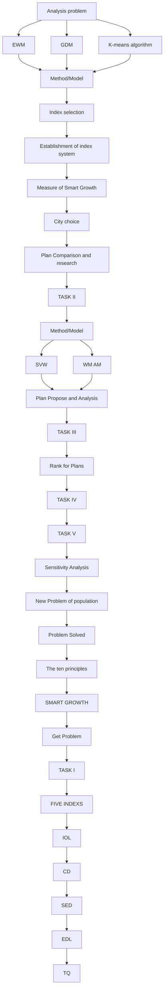
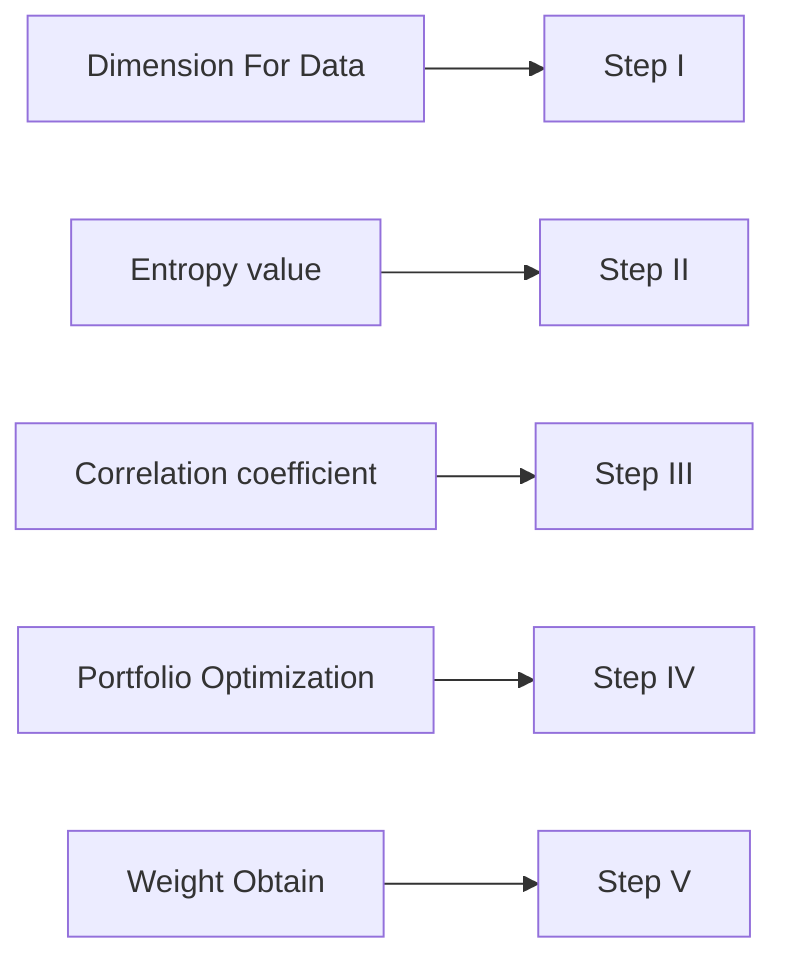
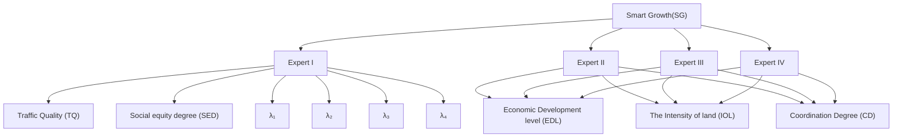

<table><tr><td></td><td colspan="2">Team Control Number</td></tr><tr><td>For office use onlyT1____T2____T3____T4____</td><td>65123Problem ChosenE</td><td>For office use onlyF1____F2____F3____F4____</td></tr></table>

# Smart Growth Theories in City Design

## Summary

With the development of global urbanization, urban planning has been a hot spot of most concern. Since the traditional urban sprawl plan has been gradually unable to meet the development needs of the city, smart growth is proposed in 1990’s. In this paper, a series of methods are developed to help to implement smart growth theories into city design.

In task 1, based on the gathered abundant data about smart growth of city, 25 indi cators are selected by principal component analysis. Then we construct a new three-level indicator system, where the first level has 1 indicator, the second level has 5 indicators and the third level has 25 indicators to evaluate the success degree of the smart growth. Moreover, we use the entropy weight method (EWM) to get weight vector of the indicators in the third level and the group decision making method (GDM) to get the weight vector of indicators in the second-class. Meanwhile, the standard of the success of the smart growth is obtained through K-means algorithm. A metric system which include the intensity of land, social equity degree, traffic quality, coordination degree and economic development level, is eventually built to measure the success of smart growth of a city.

In task2, Pittsburgh and Ningguo are selected to research their current growth plan. Through the metric proposed in Task 1, the strengths and weaknesses of the current growth plan of selected cities is measured.

In task3, our smart growth plan is developed based on the index value of the cities. Then the support vector machine (SVM) and weighted moving average method(WMAM) are adopted to predict the change of indicators. The combined prediction model is subsequently adopted to minimize the prediction error. Eventually, by comparing the indicator between current city plan and our smart growth plan, we can see the success of our smart growth plan.

In task4, the single effect of the individual initiatives is evaluated by our metric to rank the potential. The result shows that the most potential to the success degree of the smart growth is the initiative of the economic development in Ningguo, while in Pittsburgh is the initiative of improving land intensive rate.

In task5, since the population structure between the two cites is different, two different population growth models(PGM) are adopted to predict the change of the population. The growth rate calculated by PGM demonstrates that our plan can adjust adaptively to satisfied the increasing need of population.

Finally, we analyze the strengths and weaknesses of the methods we proposed in this paper. The research can also satisfy the need of the ICM and make reasonable growth theories into city design.

## Contents

## 1 Introduction ....

1.1 Background.. . 3  
1.2 Problem Statement and Analysis 3

## 2. Assumption and Symbol Explanation ........

2.1 Assumption.. 4  
2.2 Symbol Explanation........

## 3.Task 1 .

3.1 Data Pre-processing 4  
3.2 Primary Indicator System........  
3.3 Weighting Models of Evaluation Indicators ..  
3.4 Comprehensive Evaluation Index .. .10  
3.5 Metric of Smart Growth. .12

## 4 Task 2 ..... 13

4.1 Growth Plan of Selected Cities ........ .13  
4.2 City Index Evaluation . .14  
4.3 Analysis of Current Growth Plan.. .14

## 5 Task 3 ..... 14

5.1 Our Smart Growth Plan(SGP) . .14  
5.2 The Prediction Models for Evaluation. .15  
5.3 The Evaluation of Our Smart Growth Plan .16

## 6 Task 4 ... 17

6.1 Ranking the Individual Initiatives..  
6.2 Comparing the Initiatives of Two Cities.. .18

## 7 Task 5 ... .18

7.1 The Adaptable Plan For Pittsburgh .19  
7.2 The Adaptable Plan For Ningguo .. .19

## 8. Sensitivity Analysis .... .. 20

## 9. Strengths and Weaknesses ...... .21

9.1 Strengths ..21  
9.2 Weaknesses... .21

## References ..... .. 21

## Appendix ......... .22

## 1 Introduction

## 1.1 Background

In recent years, urbanization has become an inevitable trend. It has been predicted that by 2050, about 66 percent of the world's population will be added to the city. [1] Consequently, formulating suitable urban plans have become a concern of governments. At an earlier time, some cities chose ‘urban sprawl’ strategy, namely, just like standing pancake. Urban sprawl is a special form of suburbanization. It includes the marginal expansion of the existing urbanization areas with very low population density, occupying land that has never been developed. Gradually, many problems were exposed when urban sprawl was carried out, such as environmental pollution, the land in excess consumption, High-cost infrastructure construction, etc.

In view of those problems, the concept of smart growth was proposed by Geoff Allderson. Ten principles for smart growth are proposed subsequently in [2]. SG is a means to curb continued urban sprawl and reduce the loss of farmland surrounding urban centers. It will make the town or city approach a more economically prosperous, socially equitable, and environmentally sustainable place.

## 1.2 Problem Statement and Analysis

Since smart growth is essential to urban construction, it is significant to propose an efficient method to give plans to meet the principle for smart growth in this problem. Therefore, index system is needed to evaluate the success of smart growth of a city firstly. Two specific cities are selected to evaluate the effect of their growth plans through index system. Then we have to propose feasible plans to help the growth of our selected cities. To measure the success of our plans, the index system is needed in a second time. Moreover, the potential of the individual initiatives should be ranked in this problem. Eventually, we need to explain in what ways our plan supports this level of growth if the population will increase by an additional 50% by 2050.

Through the above analysis, the flow chart of this paper is shown in fig.1 as fellows.

flowchart

Fig.1 The flow chart in this paper

## 2. Assumption and Symbol Explanation

## 2.1 Assumption

 The government policy will not change in the short term.  
 The data source is actual and reliable.  
 Neglect the explosive changes when forecasting over the few decades.  
 Score matrix given by experts is not affected by subjective factors.

## 2.2 Symbol Explanation

<table><tr><td>Symbol</td><td>Definition</td></tr><tr><td>SDSG</td><td>the success degree of smart growth of a city</td></tr><tr><td>IOL</td><td>The intensity of land</td></tr><tr><td>SED</td><td>The social equity degree</td></tr><tr><td>EDL</td><td>The economic development level</td></tr><tr><td>TQ</td><td>The traffic quality</td></tr><tr><td>CD</td><td>The coordination degree</td></tr><tr><td> $J(c_k)$ </td><td>the sum of squares of the distances from the sort center</td></tr><tr><td> $w_i$ </td><td>The weight of the i-th secondary indicator</td></tr></table>

## 3.Task 1

## 3.1 Data Pre-processing

## 3.1.1 Data Collection

Collecting sufficient data is the basis of developing a complete index system. We searched the database and found 88 indicators of two cities firstly. The data of Pittsburgh in Pa is from city data 1 and the data of Ningguo which is located in Anhui, China are from National Bureau of Statistics of the People's Republic of China 2. Then we searched the data of the ten cities which is used to set standards by clustering.

## 3.1.2 Data Filling

The availability of data is an essential issue. No measures, regardless of its value, can provide efficient assessments if based on unreliable or untruthful data. Consequently, it is essential to ensure the continuity and authenticity of the research data. Nevertheless, some data is missing because not all data is provided in the website.

To ameliorate this situation, four methods are proposed to complete the data, which are as follows,

− If the indicator values are smooth, previous data can be adopted to replace it.  
If the data before and after can be obtained, the average value can be taken as the missing.  
If two groups are similar, then the missing data in one group can be replaced by the value of the same location in the other group.

The interpolation method is used in data fitting.

## 3.2 Primary Indicator System

## 3.2.1 Select primary indicators by PCA

88 initial indicators are selected firstly to represent the smart growth of cities. Because there are a great deal of indicators related to smart growth, the method of PCA (Principal Component Analysis) is adopted to reduce the number of primary indicators. The selection of the initial 88 indicators for smart growth is based on 3E’s principles and 10 principles.

3E’s principles refers to Economically prosperous(EP), socially Equitable(SEQ), and Environmentally sustainable(ESU). Namely, keep economy sustained and steady, guarantee the right to fair and ensure environmental protection if the government adopt smart growth strategy.

Since the smart growth was presented in 1990’s, the ten principles for smart growth (SGP) have been proposed [2]. The SGP is also adopted as reference principles in our index selection. The SGP is mainly as follows:

(1) Mix land uses.  
(2) Take advantage of compact building design.  
(3) Create a range of housing opportunities and choices.  
(4) Create walkable neighborhoods.  
(5) Foster distinctive, attractive communities with a strong sense of place.  
(6) Keep open space, farmland, natural beauty, and critical environmental areas.  
(7) Strengthen and direct development towards existing communities.  
(8) Provide a variety of transportation choices.  
(9) Make development decisions predictable, fair, and cost effective.

(10) Encourage community and stakeholder collaboration in development decisions.

From the aforementioned selections, the initial selection of the primary indicators is selected. Then the method of PCA is adopted to reduce the number of the indicator. Eventually, 25 indicators are obtained as our primary indicators. Primary indicators are shown as in Tab. 1.

Tab.1 Framework of sustainability indicators

<table><tr><td>Indicator</td><td>Unit</td><td>Explanation</td><td>Type</td></tr><tr><td>Diversity of land use:  $x_{1}$ </td><td>-</td><td>It represents the structure of the land use.</td><td>1,6</td></tr><tr><td>Floor area ratio:  $x_{2}$ </td><td>Percent</td><td>Building density is appeared in this indicate.</td><td>2</td></tr><tr><td>Land-use ratio:  $x_{3}$ </td><td>Percent</td><td>It reflects the quantity of land use degree.</td><td>2</td></tr><tr><td>Urban Characteristics:  $x_{4}$ </td><td>-</td><td>It represents the characteristics of the city in culture, nature, and history etc.</td><td>5</td></tr><tr><td>Public green space:  $x_{5}$ </td><td>Sq. M</td><td>It denotes the groups of green belt such as residential area, parks etc.</td><td>6</td></tr><tr><td>Land occupation:  $x_{6}$ </td><td>Sq. M</td><td>It denotes the actual control of the land area of the city.</td><td>ESU</td></tr><tr><td>Per capita water consumption:  $x_{7}$ </td><td>Ton</td><td>It refers to the average daily water consumption of each people.</td><td>ESU</td></tr><tr><td>Industrial waste gas emis-sion:  $x_{8}$ </td><td>ppm</td><td>It presents the gas emissions from the factory.</td><td>ESU</td></tr><tr><td>Industrial solid waste emission:  $x_{9}$ </td><td>Kilo-tons</td><td>It presents the solid emissions from the factory.</td><td>ESU</td></tr><tr><td>Wastewater discharge:  $x_{10}$ </td><td>Ton/day</td><td>It is defined as an indicator to evaluate the quantity of wastewater.</td><td>ESU</td></tr><tr><td>Collaboration in development: CID</td><td>-</td><td>It reflects the collaboration in developing decisions.</td><td>7,10</td></tr><tr><td>Gini Coefficient: G</td><td>-</td><td>It represents the degree of fairness in the income distribution.</td><td>SEQ</td></tr><tr><td>Employment rate of male and female:  $x_{11}$ </td><td>Percent</td><td>It reflects the different employment opportunities that result from gender</td><td>SEQ</td></tr><tr><td>School attendance Rate:  $x_{12}$ </td><td>Percent</td><td>Education equity is represented by this indicator.</td><td>SEQ</td></tr><tr><td>Housing subsidy:  $x_{13}$ </td><td>Dollar</td><td>It denotes the amount of housing grants for low-income people.</td><td>SEQ ,3</td></tr><tr><td>Crimes rate:  $x_{14}$ </td><td>Percent</td><td>It represents the ratio of the perpetrators to the total population.</td><td>SEQ, 5</td></tr><tr><td>Economic efficient index: EEI</td><td>-</td><td>It reflects the effectiveness of urban economic development</td><td>EP</td></tr><tr><td>Economic structure index: ESI</td><td>-</td><td>The economic structure of city is presented in this indicator.</td><td>EP</td></tr><tr><td>Economic cost index: ECI</td><td>-</td><td>It reflects the cost of economic development in cities.</td><td>EP</td></tr><tr><td>Gross Domestic Product: GDP</td><td>Dollar</td><td>It is the core indicator of city economic accounting.</td><td>EP</td></tr><tr><td>Per capita fiscal expenditure:  $x_{15}$ </td><td>Dollar</td><td>Assessing government administration cost</td><td>EP 9</td></tr><tr><td>Pedestrian street area:  $x_{16}$ </td><td>Sq. M</td><td>It indicates whether people have the suitable footpath.</td><td>4</td></tr><tr><td>Per capita amount of cars:  $x_{17}$ </td><td>unit</td><td>It refers to the average level of ownership of vehicles in cities.</td><td>8</td></tr><tr><td>Transportation diversity:  $x_{18}$ </td><td>-</td><td>It represents the diversity of urban transport.</td><td>8</td></tr><tr><td>Density of road network:  $x_{19}$ </td><td> $km^{-1}$ </td><td>It reflects the development level of urban transportation.</td><td>8</td></tr></table>

In this table, the Type value between 1-10 represents this indicator which reflects SGP. EP reflects the economically prosperous in 3E’s principle, while SEQ means socially Equitable. And ESU means environmentally sustainable.

## 3.2.2 Data normalization

Since the dimensions of the 25 indicators are different, the data can’t be directly compared. To normalized the data, all the data is converted to number between 0 and 1.

Comparing these 25 indicators, the indexes can be classified as three types, costtype index, benefit-type index and moderate-type index. Among the three classes of indexes, the smaller the cost-type index is, the better the success degree of smart growth is. The benefit-type index is opposite. Moderate-type index is better when it closer to a specific value. Due to the different contribution of the indexes, the three types of data are normalized in different ways as follows.

$Q _ { j } \in$ cost-type index

Let $x _ { i j }$ denote the $j - t h$ index of the $i - t h \mathrm { c i t y }$ , it can be expressed as [3]

$$
x _ {i j} = \frac {x _ {j} ^ {\max} - x _ {i j}}{x _ {j} ^ {\max} - x _ {j} ^ {\min}}, i = 1, \dots , 2 5; j = 1, 2
$$

where

$$
x _ {j} ^ {\max} = \max \left\{x _ {1}, x _ {2} \right\}
$$

$$
x _ {j} ^ {\min} = \min \left\{x _ {1}, x _ {2} \right\}
$$

and $\boldsymbol { x } _ { j } ^ { \mathrm { m a x } }$ is the largest value of $Q _ { j } \mathrm { \Pi } , x _ { j } ^ { \mathrm { m i n } }$ is the smallest value of $Q _ { j }$ .

$Q _ { j } \in$ benefit-type index

$$
x _ {i j} = \frac {x _ {i j} - x _ {j} ^ {\mathrm{min}}}{x _ {j} ^ {\mathrm{max}} - x _ {j} ^ {\mathrm{min}}}, i = 1, 2, \dots 2 3; j = 1, 2
$$

$Q _ { j } \in$ Moderate-type index

$$
x _ {i j} = \left\{ \begin{array}{c c} 1 - \frac {s _ {1} - d _ {i j}}{\max \left\{s _ {1} - d _ {j} ^ {\min} , d _ {j} ^ {\max} - s _ {2} \right\}} & d _ {i j} <   s _ {1} \\ 1 & d _ {i j} = s _ {1} \\ 1 - \frac {d _ {i j} - s _ {2}}{\max \left\{s _ {2} - d _ {j} ^ {\min} , d _ {j} ^ {\min} - s _ {2} \right\}} & d _ {i j} > s _ {1} \end{array} \right.
$$

where $s _ { 1 }$ is the best value of the indicator $Q$ .

## 3.2.3 Quantification of qualitative indicators

Some qualitative indicators are used in our primarily indicators. Therefore, it is essential to propose a suitable metric to quantify indicators. Fuzzy evaluation [4] is adopted to solve this problem. In this model, we let denote evaluation set. And is weight set, which is obtained by AHP. is a set of comments made up of comments such as good, worse and etc. The relationship between and is described by fuzzy evaluation matrix  . The comprehensive evaluation model  is given by

$$
P = A \circ R = \left(p _ {1}, p _ {2}, p _ {3} \dots p _ {n}\right)
$$

Note that $p _ { n } = \lor \left( a _ { i } \land r _ { i j } \right) \quad j = 1 , 2 , \cdots n \ . r _ { i j }$ is calculated by $W . \wedge$ represents the minimum between $a _ { i j }$ and $r _ { i j }$ .And represents the maximum in $\left( a _ { i j } \wedge r _ { i j } \right)$ .

Let F denote the set of score, the evaluation score $Z$ is calculated ultimately by the following formula.

$$
Z = P \cdot F
$$

## 3.3 Weighting Models of Evaluation Indicators

Weighting models is essential to evaluate the different contribution of the indicators. Consequently, two weighting models are adopted to calculated the weight vector in this section.

## 3.3.1 Weighting Model Based on Entropy Weight Method(EWM)

Since the current indicators are not uniformed, the target treatment is needed to reduce the dimension of indicators firstly. In this paper, we adopt the entropy weight method based on correlation coefficient to solve this problem. The detailed algorithm is shown as follows in fig.2.

flowchart

Fig.2 The flow of calculation weights of indicators using EWM

For the data of indicator involved in the table, we first get a matrix as follow:

$$
X _ {i j} = \begin{array}{c} \text {index} I _ {1} \\ \vdots \\ \text {index} I _ {m} \end{array} \left[ \begin{array}{c c c c} X _ {1 1} & X _ {1 2} & & X _ {1 n} \\ X _ {2 1} & X _ {2 2} & & X _ {2 n} \\ \vdots & \vdots & \vdots \\ X _ {m 1} & X _ {m 2} & & X _ {m n} \end{array} \right]
$$

Step Ⅰ：

The indicators of participation in the evaluation of the $\mathrm { L B } { \cdot } \mathrm { t y p e } ^ { 3 }$ and the SB-type. For the different index values we use the following two formulas for normalization.

$$
X _ {i j} ^ {*} = \left\{ \begin{array}{l l} X _ {i j} / \max X _ {i j} & \text { for   LB } \\ \min X _ {i j} / X _ {i j} & \text { for   SB } \end{array} \right.
$$

Step Ⅱ：

Let $P _ { i j }$ denote the ratio of each indicator, it can be calculated by the following formula:

$$
P _ {i j} = \frac {X _ {i j}}{\sum_ {j = 1} ^ {m} x _ {i j}}
$$

where the entropy value $e _ { i }$ is obtained by the following formula:

$$
e _ {i} = - k \sum_ {j = 1} ^ {m} p _ {i j} \ln p _ {i j}
$$

Step Ⅲ：

The correlation coefficient is calculated as

$$
r (E, S) = \frac {\sum_ {i = 1} ^ {n} \left(e _ {i} - \bar {e}\right) \left(s _ {i} - \bar {s}\right)}{\sqrt {\sum_ {i = 1} ^ {n} \left(e _ {i} - \bar {e}\right) ^ {2}} \sqrt {\sum_ {i = 1} ^ {n} \left(s _ {i} - \bar {s}\right) ^ {2}}}
$$

where S denotes the standard index entropy obtained by clustering a large amount of data.

## Step Ⅳ：

Through this step, an optimization model, which is shown as below, is used to make the entropy weight.

$$
\max = \sum_ {k = 1} ^ {m} r _ {k} W _ {k}
$$

$$
s. t. \left\{ \begin{array}{l} \sum_ {k = 1} ^ {m} W _ {k} = 1 \\ W _ {k} \geq 0, k = 1.. m \end{array} \right.
$$

According to the optimization model aforementioned, we can get the final weight . Since the correlation entropy is proportional to the weight, the final determined weight has a good positive correlation with the entropy in the modified optimization model.

The specific indicator weight based on the data will be presented in Section 4.1.

## 3.3.2 Weighting Model Based on Group Decision Making Method

In order to complete the synthesis of indicators, we use consistent judgment matrix (GDM) for each primary indicators for weighting. We get the indicators in the above text and the GDM for this evaluation is given as below (cf. Fig.3):

flowchart

Fig.3. The GDM for determine planning scheme of city

For each expert, we obtain a consistent complementary judgment matrix, which is scored according to the expert's experience with the indicator according to the scoring table. Matrixes are shown as below:

$$
E ^ {(\mathrm{I})} = \begin{array}{c} C 1 \\ C 2 \\ C 4 \\ C 5 \end{array} \left( \begin{array}{l l l l l} 0. 5 & 0. 1 & 0. 2 & 0. 7 & 0. 3 \\ 0. 9 & 0. 5 & 0. 4 & 0. 6 & 0. 2 \\ 0. 8 & 0. 6 & 0. 5 & 0. 3 & 0. 1 \\ 0. 3 & 0. 4 & 0. 7 & 0. 5 & 0. 2 \\ 0. 7 & 0. 8 & 0. 9 & 0. 8 & 0. 5 \end{array} \right) \quad E ^ {(\mathrm{II})} = \begin{array}{c} C 1 \\ C 2 \\ C 4 \\ C 5 \end{array} \left( \begin{array}{l l l l l} C 1 & C 2 & C 3 & C 4 & C 5 \\ C 1 & C 2 & C 3 & C 4 & C 5 \\ C 2 & C 3 & C 4 & C 5 \end{array} \right)
$$

$$
E ^ {(\mathrm{III})} = \begin{array}{c} C 1 \\ C 2 \\ C 4 \\ C 5 \end{array} \left( \begin{array}{l l l l l} 0. 5 & 0. 6 & 0. 4 & 0. 2 & 0. 4 \\ 0. 4 & 0. 5 & 0. 1 & 0. 3 & 0. 1 \\ 0. 6 & 0. 9 & 0. 5 & 0. 4 & 0. 2 \\ 0. 8 & 0. 7 & 0. 6 & 0. 5 & 0. 2 \\ 0. 6 & 0. 9 & 0. 8 & 0. 8 & 0. 5 \end{array} \right) \quad E ^ {(\mathrm{IV})} = \begin{array}{c} C 1 \\ C 2 \\ C 4 \\ C 5 \end{array} \left( \begin{array}{l l l l l} C 1 & C 2 & C 3 & C 4 & C 5 \\ C 1 & C 2 & C 3 & C 4 & C 5 \\ C 2 & C 3 & C 4 & C 5 \end{array} \right)
$$

We can obtain the weights by solving the eigenvectors of the above matrix.

According to the group decision-making method, the final weight can be obtained by combining the weight of experts and the weight of judgment matrix using the following equation：

$$
W ^ {*} = \sum_ {i = 1.. 4} \lambda_ {i} W ^ {(i)}
$$

where the result of the can be seen in the fellows.

$$
W ^ {(1)} = (0. 1 0 4 9 0. 1 5 0 2 7 0. 2 1 3 7 0. 2 6 7 5 0. 2 6 3 5) ^ {T}, W ^ {(I I)} = (0. 1 3 7 0 0. 2 6 3 8 0. 1 3 8 1 0. 1 9 4 4 0. 2 6 6 7) ^ {T},
$$

$$
W ^ {(\mathrm{III})} = (0. 1 0 0 0 0. 1 4 8 1 0. 1 4 9 6 0. 2 8 8 5 0. 3 1 3 7) ^ {T}, W ^ {(\mathrm{IV})} = (0. 1 2 6 0 0. 2 3 4 6 0. 2 2 8 3 0. 2 0 1 7 0. 2 0 9 4) ^ {T}
$$

The reliability of the weight is checked by the following method：

 Through the consistency test, the consistency index value which should tend to zero is $C I = \left( \lambda _ { \operatorname* { m a x } } - n \right) / \left( n - 1 \right)$ .  
We calculated the consistency ratio $C R = C I / R I$ , When $n = 1 , . . . , 2 0$ ,the value of RI is given as ,where the numbers in brackets indicate .

Through the method aforementioned, the weight vector of second-class indicator is eventually calculated. The specific value of the weight vector is shown in section 3.4.2.

## 3.4 Comprehensive Evaluation Index

## 3.4.1 Determination of Second-class index

Five second-class indicators are identified after selecting a set of comprehensive and effective primary indicators and determining the reasonable weights, including The Intensity of land (IOL), Coordination degree(CD), Social equity degree (SED), Economic development level (EDL) and Traffic Quality (TQ). Especially, these five second-class indicators will be used to evaluate five dimensions of the smart growth city.

The Intensity of land (IOL), is the most important index of smart growth. IOL mainly contains five primary indicators. It’s mainly used to reflect the efficiency of land using, the diversity of land using and the rationality of land planning, etc.

 Coordination degree(CD)is consisted of resource coordination degree, ecological coordination degree, cooperation and coordination degree. On the one hand, it reflects the resources and ecological carrying capacity. On the other hand, it mirrors communication and cooperation between governments and stakeholders.  
Social equity degree (SED) considers the gap between the rich and poor, protection of socially vulnerable groups (e.g. women, children, the poor). Moreover, it also takes the safety into account.  
Economic development level (EDL) is related to the quality of and the number of economic development. What’s more, per capita fiscal expenditure also is considered.it can measure cost effective degree.  
Traffic Quality (TQ) expresses the regional level of patency. At the same time, TQ contains streets that People can walk freely.

The composition of the second-class indicators and the weight composition are

Tab.2 The weight of second-class indicator

<table><tr><td>Second-class indicator</td><td>Primary indicator and weight</td><td>Second-class indicator</td><td>Primary indicator and weight</td></tr><tr><td rowspan="5">The Intensity Of land (IOL)(26.7%)</td><td>Diversity of land use (10%)</td><td rowspan="4">Traffic Quality (TQ)(10.5%)</td><td>Pedestrian street area (23%)</td></tr><tr><td>Floor area ratio (15%)</td><td>Per capita amount of cars (24%)</td></tr><tr><td>Land-use ratio (15%)</td><td>Transportation diversity (27%)</td></tr><tr><td>Urban Characteristics (29%)</td><td>Density of road network (26%)</td></tr><tr><td>Public green space (31%)</td><td rowspan="6">Coordination Degree (CD)(26.4%)</td><td>Land occupation (10%)</td></tr><tr><td rowspan="5">Social equity degree (SED)(15.0%)</td><td>Gini Coefficient (13%)</td><td>Per capita water consumption (15%)</td></tr><tr><td>Employment rate of male and female (23%)</td><td>Industrial waste gas emission (18%)</td></tr><tr><td>School attendance Rate (23%)</td><td>Industrial solid waste emission (13%)</td></tr><tr><td>Housing subsidy (20%)</td><td>Wastewater discharge (16%)</td></tr><tr><td>Crimes rate (21%)</td><td>Collaboration in development (28%)</td></tr><tr><td rowspan="3">Economic Development level (EDL)(21.4%)</td><td>Economic efficient index (14%)</td><td rowspan="2" colspan="2">Gross Domestic Product (19%)</td></tr><tr><td>Economic structure index (26%)</td></tr><tr><td>Economic cost index (14%)</td><td colspan="2">Per capita fiscal expenditure (27%)</td></tr></table>

## 3.4.2 Determination of First-Class Index

Based on the indicator system and weight method aforementioned, a comprehensive index is proposed to measure the success degree of smart growth (SDSG) of a city. The indicator system is used to provide the essential second-class indicators, while the weight method is adopted to evaluate the weights of the SGSD. Let SGSD denote the success degree of smart growth. The function of SGSD can be represented by

$$
S D S G = w _ {1} * I O L + w _ {2} * S E D + w _ {3} * T Q + w _ {4} * C D + w _ {5} * E D L
$$

where $w _ { i }$ is the weight of th second-class indicator. The specific weights are as follows.

$$
w = \left[ \begin{array}{l l l l l} 0. 2 6 7 & 0. 1 5 0 & 0. 1 0 5 & 0. 2 6 4 & 0. 2 1 4 \end{array} \right]
$$

Through the above analysis, a three-level comprehensive evaluation system is established. The three levels of evaluation indicators are shown in Fig.4

```mermaid
graph TD
  A["Smart Growth"] --> B["Intensity of land (IOL)"]
  A --> C["Traffic Quality (TQ)"]
  A --> D["Coordination Degree"]
  A --> E["Social Equity Degree (SED)"]
  B --> F["Public green space"]
  B --> G["Diversity of land use"]
  B --> H["Urban Characteristics"]
  B --> I["Land-use ratio"]
  B --> J["Floor area ratio"]
  C --> K["Density of road network"]
  C --> L["Pedestrian street area"]
  C --> M["Transportation diversity"]
  C --> N["Per capita amount of cars"]
  D --> O["Land occupation"]
  D --> P["Water consumption"]
  D --> Q["Industrial waste gas emission"]
  D --> R["Industrial solid waste emission"]
  D --> S["Wastewater discharge"]
  E --> T["Economic cost"]
  E --> U["Economic structure"]
  E --> V["Gross Domestic Product"]
  E --> W["Economic efficient"]
  E --> X["Per capita fiscal expenditure"]
  E --> Y["Housing subsidy"]
  E --> Z["Employment rate of male and female"]
  E --> AA["School attendance Rate"]
  E --> AB["Crimes rate"]
  D --> AC["Collaboration in development"]
  D --> AD["Industrial solid waste emission"]
  D --> AE["Gini Coefficient"]
```

flowchart

Fig.4. Three-level indicator system diagram

From the fig.4, we can see that the indicator of our system diagram is divided into three levels. Through the indicator system we established, the efficient metric is set up to measure the success of the smart growth degree.

## 3.5 Metric of Smart Growth

## 3.5.1 Standard Setting Based on K-means Algorithm(KA)

Although three-levels of evaluation has been established aforementioned, a suitable standard is still needed to assess the success degree of smart growth in cites. Consequently, KA (K-means Clustering Algorithm) is adopted to make a reasonable standard. In this algorithm, the data set includes 25 second-class indicators. And denotes the number of the data subset, which is 3 in our method. The data objects are organized into 3 partitions by KA. Let $\mu _ { k }$ denote the sort center of the partitions, the sum of squares of the distances from the sort center is represented by

$$
J \left(c _ {k}\right) = \sum_ {x _ {i} \in C _ {k}} \left\| x _ {i} - \mu_ {k} \right\| ^ {2}
$$

where $\boldsymbol { J } \left( \boldsymbol { c } _ { k } \right)$ denotes the sum of squares of the distances from the sort center. The goal of the PCA is to solve the following optimization problem.

$$
\begin{array}{l} \min = \sum_ {k = 1} ^ {3} \sum_ {i = 1} ^ {1 0} d _ {k i} \left\| x _ {i} - \mu_ {k} \right\| ^ {2} \\ s. t. d _ {k i} = \left\{ \begin{array}{l l} 1 & x _ {i} \in c _ {i} \\ 0 & x _ {i} \notin c _ {i} \end{array} \right. \\ \end{array}
$$

## 3.5.2 The Standard of Smart Growth(SG)

According to the KA aforementioned, the standard of SG is obtained eventually in this section. For each index, two class centers are calculated by clustering ten cities data firstly. Then the mean of the indicator centers is used as the standard boundary. The standard of smart growth is shown in fig.4.

bar chart

| Category | Value |
|---|---|
| Normal | 0.413241 |
| Good | 0.741231 |
| Excellent | 1 |
| Standard of CD | (not labeled) |

bar chart

| Category | Value |
|---|---|
| Normal | 0 |
| Good | 0.320014 |
| Excellent | 0.621321 |
| Standard of IOL | 1 |

bar chart

| Category | Value |
|---|---|
| Normal | 0.256321 |
| Good | 0.723512 |
| Excellent | 1 |

radar chart

| Category                     | Super Line | Bottom Line |
| ---------------------------- | ---------- | ----------- |
| Coordination Degree (CD)      | 0.741      | 0.413       |
| The Intensity of land (IOL)   | 0.621      | 0.320       |
| Economic Development level (EDL) | 0.723      | 0.256       |
| Traffic Quality (TQ)          | 0.611      | 0.342       |
| Social equity degree (SED)     | 0.526      | 0.234       |

bar chart

| Category | Value |
| --- | --- |
| 0 | 0.234012 |
| 1 | 0.526321 |
| 2 | 0.234012 |
| 3 | 0.526321 |
| 4 | 0.234012 |
| 5 | 0.526321 |
| 6 | 0.234012 |
| 7 | 0.526321 |
| 8 | 0.234012 |
| 9 | 0.526321 |
| 10 | 0.234012 |
| 11 | 0.526321 |
| 12 | 0.234012 |
| 13 | 0.526321 |
| 14 | 0.234012 |
| 15 | 0.526321 |
| 16 | 0.234012 |
| 17 | 0.526321 |
| 18 | 0.234012 |
| 19 | 0.526321 |
| 20 | 0.234012 |
| 21 | 0.526321 |
| 22 | 0.234012 |
| 23 | 0.526321 |
| 24 | 0.234012 |
| 25 | 0.526321 |
| 26 | 0.234012 |
| 27 | 0.526321 |
| 28 | 0.234012 |
| 29 | 0.526321 |
| 30 | 0.234012 |
| 31 | 0.526321 |
| 32 | 0.234012 |
| 33 | 0.526321 |
| 34 | 0.234012 |
| 35 | 0.526321 |
| 36 | 0.234012 |
| 37 | 0.526321 |
| 38 | 0.234012 |
| 39 | 0.526321 |
| 40 | 0.234012 |
| 41 | 0.526321 |
| 42 | 0.234012 |
| 43 | 0.526321 |
| 44 | 0.234012 |
| 45 | 0.526321 |
| 46 | 0.234012 |
| 47 | 0.526321 |
| 48 | 0.234012 |
| 49 | 0.526321 |
| 50 | 0.234012 |
| 51 | 0.526321 |
| 52 | 0.234012 |
| 53 | 0.526321 |
| 54 | 0.234012 |
| 55 | 0.526321 |
| 56 | 0.234012 |
| 57 | 0.526321 |
| 58 | 0.234012 |
| 59 | 0.526321 |
| 60 | 0.234012 |
| 61 | 0.526321 |
| 62 | 0.234012 |
| 63 | 0.526321 |
| 64 | 0.234012 |
| 65 | 0.526321 |
| 66 | 0.234012 |
| 67 | 0.526321 |
| 68 | 0.234012 |
| 69 | 0.526321 |
| 70 | 0.234012 |
| 71 | 0.526321 |
| 72 | 0.234012 |
| 73 | 0.526321 |
| 74 | 0.234012 |
| 75 | 0.526321 |
| 76 | 0.234012 |
| 77 | 0.526321 |
| 78 | 0.234012 |
| 79 | 0.526321 |
| 80 | 0.234012 |
| 81 | 0.526321 |
| 82 | 0.234012 |
| 83 | 0.526321 |
| 84 | 0.234012 |
| 85 | 0.526321 |
| 86 | 0.234012 |
| 87 | 0.526321 |
| 88 | 0.234012 |
| 89 | 0.526321 |
| 90 | 0.234012 |
| 91 | 0.526321 |
| 92 | 0.234012 |
| 93 | 0.526321 |
| 94 | 0.234012 |
| 95 | 0.526321 |
| 96 | 0.234012 |
| 97 | 0.526321 |
| 98 | 0.234012 |
| 99 | 0.526321 |

bar chart

| Category | Value |
|---|---|
| Good | 0.611012 |
| Excellent | 1 |
| Standard of TQ | (not labeled) |

bar chart

Success Degree of Smart Growth(SDSG):
| Category | Value |
|---|---|
| Normal | 0.320269 |
| Good | 0.659415 |
| Excellent | 1 |

Fig.5. The Standard of Smart Growth

The standard of each index is described in bar chart, which can evaluate the second class indicator qualitatively through interval. We use qualitative descriptions such as normal, good and excellent to measure the success of the city in an indicator. Normal means that the city has not realized smart growth in this area. And good means that the city has some success of SG in this area. Excellent is used to describe when city has grea success of SG. Combining five second-class indexes, the radar diagram is adopted to describe the overall success of city in smart growth. The standard line is also shown in the fig.5.

## 4 Task 2

## 4.1 Growth Plan of Selected Cities

In this paper, Pittsburgh in Pa, US and Ningguo in Anhui, China are selected as examples to analyze the smart growth problem. There are about 322,450 people living in Pittsburgh. It is known as both "the Steel City" for its more than 300 steel-related businesses, and as the "City of Bridges" for its 446 bridges. The total population of Ningguo are 383,800 people. The area is 2487 square kilometers. As shown in fig.6, the left is Pittsburgh and Ningguo is on the right.

text_image

RDC Industrial Bank
Pittsburgh Zone
PPA Aquarah
Monokoh
Wen Millha
100%
100%
100%
100%
100%
100%
100%
100%
100%
100%
100%
100%
100%
100%
100%
100%
100%
100%
100%
100%
100%
100%
100%
100%
100%
100%

text_image

Satellite map image showing a region with labeled geographical areas and road networks, including Chinese place names.

Fig.6. The satellite map of the selected city

The governments of two cities both have developed growth plans.

The plan of Ningguo is as follows.

 Develop special industries and high-tech enterprises.

 Promote agricultural industrialization, specialization.  
 Strengthen the construction of transport facilities.  
 Make every citizen has the right to equal access to education.  
 Enhance the city characteristics.

And the below is the plan of Pittsburgh.

 Let people live in renovated homes and enjoy its parks, shops, and churches.  
 Protect and restore the ecological environment.  
 Reduce air pollution, water pollution, solid pollution.  
 Maintain economic prosperity and development.

## 4.2 City Index Evaluation

Based on the index system in section3.4 and the proposed standards in section3.5, the indexes which can reflect five dimensions of the city is calculated. The result is shown in fig.7 as fellows.

radar chart

| Category | Ningguo (IOL) | Pittsburgh (IOL) |
| :--- | :--- | :--- |
| Coordination Degree(CD) | 0.413 | 0.521 |
| Social equity degree (SED) | 0.234 | 0.526 |
| Economic Development level (EDL) | 0.256 | 0.723 |
| Traffic Quality (TQ) | 0.342 | 0.611 |
| The Intensity of land (IOL) | 0.320 | 0.521 |
| IOL | 0.380 | 0.521 |
| TQ | 0.432 | 0.611 |
| SED | 0.324 | 0.724 |
| CD | 0.345 | 0.536 |
| EDL | 0.211 | 0.663 |
The chart displays a radar chart comparing the normalized intensity of land (IOL) between Ningguo and Pittsburgh across five categories: Coordination Degree(CD), Social equity degree(SED), Economic Development level(EDL), Traffic Quality(TQ), and EOL. Legend indicates that solid lines represent Bottom Line, dashed lines represent Super Line.

Fig.7. The index value of the selected city

The specific analysis associated with the diagram is described in section4.3. The brown line in radar means the second-level indicator of Pittsburgh, while the blue line means the second-level indicator of Ningguo. Moreover, the bottom line means the pass line of the indicator, while the super line means the excellent line of the indicators.

## 4.3 Analysis of Current Growth Plan

After grasping the plan we searched in section4.1 and the result in section4.2, we can have a detailed analysis about our selected cities.

Firstly, as we can see from fig.7. In general, the indicator values of Pitts-burgh are larger than the Ningguo. The reason is that Pittsburgh is more developed than Ningguo. It’s economy and Society is more prosperous and equitable. Apart from this, the environment and Transport of Pittsburgh are more sustainable and convenient.

Specifically speaking, the values of five indicators of Ningguo are generally small, especially in coordination degree and economic development level. Its social equity degree (SED) and traffic quality (TQ) is at an average level. The intensity of land is just on the bottom line. Although the government of Ningguo developed a growth plan, it is not very perfect. It’s growth plan includes developing industry, agriculture, tertiary industry, ensuring fairness, keeping the city characteristics. It not involve with environmental protection, intensive use of urban land, infrastructure construction and so on. All these lead to the low level of smart growth of Ningguo.

Pittsburgh 's indicator values are relatively high. Social equity degree (SED)and traffic quality (TQ) are outstanding. This is largely related to its growth policy. Pittsburgh pays more attention to human, the ecological environment and economy. scientific plan makes Pittsburgh meet the smart growth principles relatively successfully.

## 5 Task 3

## 5.1 Our Smart Growth Plan(SGP)

Considering current growth plans of two cities still have room for improvement, we develop a series of smart growth plans for the two cities.

The growth plan includes in Pittsburgh is shown as following.

1. Improve the land intensive rate to achieve an annual land use growth of 1%.  
2. Optimize the economic development structure, so that the economic efficiency index increases per year by 2%.  
3. Encourage community and stakeholder collaboration in development decisions.

For Ningguo, due to its low level of smart growth, we proposed a more detailed plan. The plan for Ningguo is as following.

1. To improve the intensity of land, the Ningguo government should encourage the construction of high-rise residential. it can increase the floor area ratio and improve space utilization efficiency.  
2. To increase coordination degree, the Ningguo government should strengthen the control of the factory and cultivate environmental awareness of residents.  
3. To push on the economic development, we recommend the Ningguo government to expand investment, encourage the development of small and medium enterprises.  
4. To promote the social equity, the Ningguo government should increase protection of vulnerable groups, such as increase child welfare.  
5. To ameliorate traffic quality, the government should improve road network density appropriately and ensure the smooth flow of roads.

## 5.2 The Prediction Models for Evaluation

## 5.2.1 Prediction Model Based On Support Vector Machine(SVM)

SVM is a new machine learning algorithm proposed by V.Vapnik et.al. of AT&TBell Lab. This method is used to estimate the relationship between input and output of a system according to a given sample, which can be used to forecast the change time of the index.

There are many subprograms in SVM. And SVR learning method is adopted to find the mapping function between time and indicator firstly, for this problem is a prediction problem. Similarly, there are multiple SVR methods in machine learning algorithm. Since epsilon-SVR has remarkable performance, it is selected to predict the change of indicators. The procedure of our epsilon-SVR is as follows.

Firstly, let time set $\mathbf { \xi } _ { t _ { i } }$ denote the time of the i th year, then let $x _ { i }$ denote the index value for th year. SVR is designed to find a function $x _ { i } ^ { ' } { = } \mathbf { f } \left( t _ { i } \right)$ that gives reasonable prediction index value. The error between $x _ { i }$ and $x _ { i } ^ { \ ' }$ is in an acceptable threshold through SVR algo rithm. The function to be determined is as follows:

$$
x _ {i} ^ {\prime} = f (t) = w ^ {T} \psi (t) + \gamma
$$

In this formula, $\psi \left( x \right)$ is a kernel function of the feature vector, is a weighting vector and $\gamma$ means the bias term. In our method, Radial Basis Function(RBF) is adopted as our kernel, for it has outstanding performances in the vast majority of occasions. Year information data of two cities is inputted as train data in SVR, while the indicator value is used as train label. Then the SVR system is employed to predict $\psi$ and $\gamma$ in the formula above. The cross-validation will be adopted to validate the effect of our train model.

There are many parameters in SVR system, which can affect the performance of the prediction. The cost parameter C, which default value is 1, is used in C-SVC, epsilon-SVR, and nu-SVR. And the gamma parameter $\mathbf { g }$ set gamma in kernel function. The RBF kernel is determined as fellows

$$
\psi (x) = e ^ {- g ^ {*} | u - v | ^ {2}}
$$

Grid search algorithm is adopted to find the best parameters in predict model. After determined the ranges and the steps of the gird search, the best parameters will be tested to find the best combination. In our method, the search ranges are $\left[ 2 ^ { - 8 } \quad 2 ^ { 8 } \right]$ in steps of $2 ^ { 0 . 8 }$ for both parameter C and parameter g. In our method, Libsvm[5] is used to realize the algorithm of the SVM. The result of grid search is shown in fig.8.

heatmap

| log2c | log2g | Value |
| --- | --- | --- |
| -7 | -2 | 0.14 |
| -6 | -2 | 0.48 |
| -4 | -2 | 0.15 |
| -2 | -2 | 0.36 |
| 0 | -2 | 0.48 |
| 2 | -2 | 0.19 |
| 4 | -2 | 0.16 |
| 6 | -2 | 0.15 |
| 8 | -2 | 0.16 |
| 3 | 0 | 0.19 |
| 4 | 0 | 0.17 |
| 5 | 0 | 0.15 |
| 6 | 0 | 0.16 |
| 7 | 0 | 0.19 |
| 3 | 0 | 0.3 |
| 4 | 0 | 0.3 |
| 5 | 0 | 0.3 |
| 6 | 0 | 0.3 |
| 7 | 0 | 0.3 |
| 3 | 0 | 0.48 |
| 4 | 0 | 0.48 |
| 5 | 0 | 0.48 |
| 6 | 0 | 0.48 |
| 7 | 0 | 0.48 |
| 3 | -2 | 0.145 |
| 4 | -2 | 0.145 |
| 5 | -2 | 0.145 |
| 6 | -2 | 0.145 |
| 7 | -2 | 0.145 |
| 3 | -2 | 0.195 |
| 4 | -2 | 0.195 |
| 5 | -2 | 0.195 |
| 6 | -2 | 0.195 |
| 7 | -2 | 0.195 |
| 3 | -2 | 0.195 |
| 4 | -2 | 0.195 |
| 5 | -2 | 0.195 |
| 6 | -2 | 0.195 |
| 7 | -2 | 0.195 |
| 3 | -2 | 0.195 |
| <fcel>6 | -2 | 0.195 |
| <fcel>7 | -2 | 0.195 |
| <fcel>3 | -2 | 0.195 |
| <fcel>4 | -2 | 0.195 |
| <fcel>5 | -2 | 0.195 |
| <fcel>6 | -2 | 0.195 |
| <fcel>7 | -2 | 0.195 |
| <fcel>3 | -2 | 0.195 |
| <fcel>6 | -2 | 0.195 |
| <fcel>7 | -2 | 0.195 |
| <fcel>3 | -2 | 0.195 |
| <fcel>6 | -2 | 0.195 |
| <fcel>7 | -2 | 0.195 |
| <fcel>3 | -8 | 0.195 |
| <fcel>6 | -8 | 0.195 |
| <fcel>7 | -8 | 0.195 |
| <fcel>3 | -8 | 0.195 |
| <fcel>6 | -8 | 0.195 |
| <fcel>7 | -8 | 0.195 |
| <fcel>3 | -8 | 0.195 |
| <fcel>6 | -8 | 0.195 |
| <fcel>7 | -8 | <nl> |

Fig.8. The result of the grid search method on SVM

From the fig.8, we can see that the train model has outstanding performance when the parameter $c = 2 ^ { 4 }$ and $\mathrm { g } = 2 ^ { - 3 }$ .

## 5.2.2 Prediction Model Based On Time Series Forecasting

Owing to most of data we selected is aged, and future data is unknown. $\operatorname { I t } { \boldsymbol { \mathbf { \mathit { s } } } }$ necessary to establish a suitable forecasting model. In there, time series forecasting model is selected. It is based on weighted moving average method (WMAM). The function of WMAM can be represented by

$$
\begin{array}{l} \hat {x} _ {t + 1} = \lambda_ {0} x _ {t} + \lambda_ {1} x _ {t - 1} + \dots + \lambda_ {N - 1} x _ {t - N + 1} \\ s. t \left\{ \begin{array}{c} \sum_ {i = 0} ^ {N - 1} \lambda_ {i} = 1 \\ \lambda_ {0} \geq \lambda_ {1} \geq \dots \geq \lambda_ {N - 1} \geq 0, i = 0, 1, \dots N - 1 \end{array} \right. \\ \end{array}
$$

where $\lambda _ { i }$ is the weight of statistical data $x _ { t - i }$ .

## 5.2.3 Combination of Prediction Model(CPM)

To combine the advantage of SVM and WMAM in prediction, CPM is adopted to predict the future index value. Let $l _ { i }$ denote the weighting factor of th predict model. The value of $l _ { i }$ can be estimated by solving the following optimization

$$
\begin{array}{l} \min J = \sum_ {t = 1} ^ {N} \sum_ {i = 1} ^ {m} \sum_ {j = 1} ^ {m} l _ {i} l _ {j} e _ {i t} e _ {j t}, \\ s. t. \sum_ {i = 1} ^ {m} l _ {i} = 1. \\ \end{array}
$$

where denotes the combining quadratic sum of predict of error, $e _ { i t }$ denotes the predict error of the th predict model.

## 5.3 The Evaluation of Our Smart Growth Plan

According to our combined prediction model, we can predict the success degree of smart growth the future of the two cities under the current and our plan. The results are shown below.

line chart

| Year | New Plan for P | Current Plan for P | New Plan for N | Current Plan for N |
|------|----------------|--------------------|----------------|--------------------|
| 2016 | 0.6            | 0.6                | 0.3            | 0.2                |
| 2018 | 0.6            | 0.6                | 0.3            | 0.2                |
| 2020 | 0.6            | 0.6                | 0.3            | 0.2                |
| 2022 | 0.6            | 0.6                | 0.3            | 0.2                |
| 2024 | 0.6            | 0.6                | 0.3            | 0.2                |
| 2026 | 0.6            | 0.6                | 0.3            | 0.2                |
| 2028 | 0.6            | 0.6                | 0.3            | 0.2                |
| 2030 | 0.6            | 0.6                | 0.3            | 0.2                |

Fig.9 The evaluation diagram of smart growth plan

The values of horizontal axis respect time, and the values of vertical axis respect the degree of smart growth. The yellow solid line is new plan for Pittsburgh. The black solid line is the current plan for Pittsburgh. The yellow dotted line is new plan for Ningguo. The black dotted line is current plan for Ningguo.

From fig.9 we can see that our plan is more successful to achieving smart growth in general. Due to the degree of smart growth (SDSG) in Pittsburgh is very high, it is difficult to have a higher rate of increase. Therefore, our plan for Pittsburgh is better than its current plan. But the effect is not so obvious. The effect of our plan in Ningguo is apparent. Although the degree of smart growth (SDSG) is not very high, its rate of rise is very fast. This reflects our plan for Ningguo is very effective. In the first few years, Pittsburgh is in rapid growth period. The degree of SGDG increases very rapidly. This is because investment intensity in the first year.

## 6 Task 4

## 6.1 Ranking the Individual Initiatives

Owing to many aspects of two cities are needed to be improved and the governments does not have so much money to implement each initiatives. So we must rank the individual initiatives within our redesigned smart growth plan as the most potential to the least potential. There, we still adopt combined forecasting model to evaluate the success of the individual initiatives for each cities. With this method, forecasting results are obtained in fig 10 and fig.11.

bar-line hybrid chart

| Year | Initiatives 1 | Initiatives 2 | Initiatives 3 | Current plan |
|------|---------------|---------------|---------------|--------------|
| 2016 | 0.05          | 0.05          | 0.05          | 0.05         |
| 2018 | 0.15          | 0.15          | 0.15          | 0.06         |
| 2020 | 0.10          | 0.10          | 0.10          | 0.06         |
| 2022 | 0.15          | 0.15          | 0.15          | 0.06         |
| 2024 | 0.10          | 0.10          | 0.10          | 0.06         |
| 2026 | 0.15          | 0.15          | 0.15          | 0.06         |
| 2028 | 0.10          | 0.10          | 0.10          | 0.06         |
| 2030 | 0.15          | 0.15          | 0.15          | 0.06         |

Fig.10 The evaluation diagram of smart growth plan in Pittsburgh

line chart

| Year | Initiatives 1 | Initiatives 2 | Initiatives 3 | Current plan | Initiatives 4 | Initiatives 5 |
|------|---------------|---------------|---------------|--------------|---------------|---------------|
| 2016 | ~0.05         | ~0.05         | ~0.05         | ~0.02        | ~0.01         | ~0.01         |
| 2018 | ~0.05         | ~0.05         | ~0.05         | ~0.02        | ~0.01         | ~0.01         |
| 2020 | ~0.05         | ~0.05         | ~0.05         | ~0.02        | ~0.01         | ~0.01         |
| 2022 | ~0.05         | ~0.05         | ~0.05         | ~0.02        | ~0.01         | ~0.01         |
| 2024 | ~0.05         | ~0.05         | ~0.05         | ~0.02        | ~0.01         | ~0.01         |
| 2026 | ~0.05         | ~0.05         | ~0.05         | ~0.02        | ~0.01         | ~0.01         |
| 2028 | ~0.05         | ~0.05         | ~0.05         | ~0.02        | ~0.01         | ~0.01         |
| 2030 | ~0.05         | ~0.05         | ~0.05         | ~0.02        | ~0.01         | ~0.01         |

Fig.11 The evaluation diagram of smart growth plan in Ningguo

As we can see from the fig.10 and fig.11, the values of horizontal axis respect time, and the values of vertical axis respect the degree of smart growth (SDSG). Considering every individual initiative alone, the line values respect SDSG of three individual initiatives. The values of histogram respect difference between every individual initiative and the current plan.

We consider every individual initiative alone. If the difference of SDSG of each in dividual initiative is lager, the better is the plan’s improvement. It means this plan is effective. Fig.10 is the result of ranking the individual initiatives in Pittsburgh. We can find 3-th initiative (improve the land intensive rate) is the most potential. The 2-th initiative (optimize the economic development structure) is the least potential. The 1-th initiative is second potential.

Fig.11 is the result of ranking the individual initiatives in Ningguo. The 3-th initiative (push on the economic development) is the most potential. The 2-th initiative (strengthen the control of the factory and cultivate environmental awareness of residents.) is the second potential. The 1-th initiative (increase the floor area ratio and Improve space utilization efficiency.) is the third potential. The 4-th initiative (protect vulnerable groups, such as increase child welfare.) is the fourth potential. The 5-th initiative (improve road network density appropriately and ensure the smooth flow of roads.) is the fifth potential.

## 6.2 Comparing the Initiatives of Two Cities

Different cities have different surroundings. Therefore not only the plans of Pittsburgh and Ningguo are different, but also the rankings are not the same. We put the economic development in the first place in Ningguo. While improving the land intensive rate is the most potential in Pittsburgh. The least potential is also not the same. The least potential of Ningguo is improve road network density appropriately and ensure the smooth flow of roads. The least potential of Pittsburgh optimize the economic development structure.

## 7 Task 5

Considering that different cities have different urban population growth pattern, dif ferent population growth models are made for cities like Pittsburgh and Ningguo. Then different measures are made to improve our plan when the population growth rate is increasing . The prediction of population growth are shown in fig.12 as follows.

line chart

| Year | Ningguo | Pittsburgh |
| ---- | ------- | ---------- |
| 1996 | 17      | 8          |
| 1998 | 17      | 12         |
| 2000 | 19      | 13         |
| 2002 | 23      | 18         |
| 2004 | 27      | 21         |
| 2006 | 31      | 22         |
| 2008 | 37      | 23         |
| 2010 | 39      | 23         |
| 2012 | 41      | 23         |
| 2014 | 42      | 24         |
| 2016 | 46      | 25         |

Fig.12. The population growth of two cities

## 7.1 The Adaptable Plan For Pittsburgh

Pittsburgh is a city with a smart growth plan. It has a suitable population growth mode. Population growth rate is an essential factor for the smart growth of a city. The function that predict the population growth model can then be presented by

$$
P (t) = P (0) (1 + r) ^ {t}
$$

where the P t( ) means year population of this city, and r is the rate of population growth. For Pittsburgh, as the population increase to 50% in 2050, which means the population of Pittsburgh is 450,000.

The calculation can be obtained for our scheme, along with the change in the growth rate. By planning the rule adaptively, SDSG can maintain a good growth trend like the fig.13.

Considering the method aforementioned, the plan is proposed as follows.

 Limit the expansion of cities building. And make Coordination Degree (CD) add a scalar 0.3% on the basis of the original amount  
 Improve the economic structure, an increase of 1% on the original basis  
 Strict control of land occupation rate, making the value of an annual rate of 1.2% increase

According to the data shown in the graph, we can see that in the next few decades, the impact of population growth on the indicators of Pittsburgh city is not significant. And we assert that our plans are well suited to this type of city like Pittsburgh city.

radar chart

| Year | CD   | IOL  | TQ   | EDL  | SED  |
|------|------|------|------|------|------|
| 2016 |      |      |      |      |      |
| 2026 |      |      |      |      |      |
| 2036 |      |      |      |      |      |
| 2046 |      |      |      |      |      |
| 2050 |      |      |      |      |      |

Fig 13. Dynamic change of SDSG in decades with 50% population till 2050 in Pittsburgh City

## 7.2 The Adaptable Plan For Ningguo

Ningguo is a city with a large population and a rapid population growth (see in the Fig.8). Considering the fact of Ningguo, a population growth model (PGM) is proposed

to meet the problem as below.

$$
\frac {1}{p (t)} = \frac {1}{P _ {0}} - b \ln t
$$

Where the is a parameter who depends on the population of recent years. And we get it 0.32. So, we can adjust the plan for the next 40 years according to this parameter in order to adapt to the increasing population.

Then considering the plan mentioned above. We propose the following strategy.

 Increase the intensity of economic control, on the basis of an increase of 1.05%  
 Improve traffic, increase the density of road network, the TQ index value increased by 0.32%  
Improve the coordination between the government and enterprises, promote socia equity, so that the degree of coordination indicators to some extent, an increase of 0.11%

Then 4 decades of Ningguo indicators change figure as shown below, we can see that through make a tendency to improve for some of the guidelines of Ningguo plan, can effectively improve the rapid growth of the population defects. At the same time we can assert that our plan can be well suited to the type of city like Ningguo city with very high rate of population growth .

radar chart

| Year | Category | Value |
|------|----------|-------|
| 2016 | CD       | 1     |
| 2016 | IOL      | 1     |
| 2016 | TQ       | 1     |
| 2016 | EDL      | 1     |
| 2016 | SED      | 1     |
| 2026 | CD       | 1     |
| 2026 | IOL      | 1     |
| 2026 | TQ       | 1     |
| 2026 | EDL      | 1     |
| 2026 | SED      | 1     |
| 2036 | CD       | 1     |
| 2036 | IOL      | 1     |
| 2036 | TQ       | 1     |
| 2036 | EDL      | 1     |
| 2036 | SED      | 1     |
| 2046 | CD       | 1     |
| 2046 | IOL      | 1     |
| 2046 | TQ       | 1     |
| 2046 | EDL      | 1     |
| 2046 | SED      | 1     |
| 2050 | CD       | 1     |
| 2050 | IOL      | 1     |
| 2050 | TQ       | 1     |
| 2050 | EDL      | 1     |
| 2050 | SED      | 1     |

Fig 14. Dynamic change of SDSG in decades with 50% population till 2050 in Ningguo City

In conclusion, the growth rate calculated by PGM demonstrates that our plan can ad just adaptively to satisfied the increasing need of population.

## 8. Sensitivity Analysis

In this section, we make the sensitivity analysis about the parameter and $g$ , which is based on support vector machine(SVM) prediction model. The sensitivity analysis of the SVM is shown as fellows in fig.15.

3d line chart

| log2g | log2c | MSE |
|-------|-------|-----|
| -5    | -5    | 0.1 |
| -5    | -4    | 0.2 |
| -5    | -3    | 0.3 |
| -5    | -2    | 0.4 |
| -5    | -1    | 0.5 |
| -5    | 0     | 0.6 |
| -5    | 1     | 0.7 |
| -5    | 2     | 0.8 |
| -5    | 3     | 0.9 |
| -5    | 4     | 1.0 |
| -4    | -5    | 0.1 |
| -4    | -4    | 0.2 |
| -4    | -3    | 0.3 |
| -4    | -2    | 0.4 |
| -4    | -1    | 0.5 |
| -4    | 0     | 0.6 |
| -4    | 1     | 0.7 |
| -4    | 2     | 0.8 |
| -4    | 3     | 0.9 |
| -4    | 4     | 1.0 |
| -3    | -5    | 0.1 |
| -3    | -4    | 0.2 |
| -3    | -3    | 0.3 |
| -3    | -2    | 0.4 |
| -3    | -1    | 0.5 |
| -3    | 0     | 0.6 |
| -3    | 1     | 0.7 |
| -3    | 2     | 0.8 |
| -3    | 3     | 0.9 |
| -3    | 4     | 1.0 |
| -2    | -5    | 0.1 |
| -2    | -4    | 0.2 |
| -2    | -3    | 0.3 |
| -2    | -2    | 0.4 |
| -2    | -1    | 0.5 |
| -2    | 0     | 0.6 |
| -2    | 1     | 0.7 |
| -2    | 2     | 0.8 |
| -2    | 3     | 0.9 |
| -2    | 4     | 1.0 |
| -1    | -5    | 0.1 |
| -1    | -4    | 0.2 |
| -1    | -3    | 0.3 |
| -1    | -2    | 0.4 |
| -1    | -1    | 0.5 |
| -1    | 0     | 0.6 |
| -1    | 1     | 0.7 |
| -1    | 2     | 0.8 |
| -1    | 3     | 0.9 |
| -1    | 4     | 1.0 |
| 0     | -5    | 0.1 |
| 0     | -4    | 0.2 |
| 0     | -3    | 0.3 |
| 0     | -2    | 0.4 |
| 0     | -1    | 0.5 |
| 0     | 0     | 0.6 |
| 0     | 1     | 0.7 |
| 0     | 2     | 0.8 |
| 0     | 3     | 0.9 |
| 0     | 4     | 1.0 |
| 1     | -5    | 0.1 |
| 1     | -4    | 0.2 |
| 1     | -3    | 0.3 |
| 1     | -2    | 0.4 |
| 1     | -1    | 0.5 |
| 1     | 0     | 0.6 |
| 1     | 1     | 0.7 |
| 1     | 2     | 0.8 |
| 1     | 3     | 0.9 |
| 1     | 4     | 1.0 |
| 2     | -5    | 0.1 |
| 2     | -4    | 0.2 |
| 2     | -3    | 0.3 |
| 2     | -2    | 0.4 |
| 2     | -1    | 0.5 |
| 2     | 0     | 0.6 |
| 2     | 1     | 0.7 |
| 2     | 2     | 0.8 |
| 2     | 3     | 0.9 |
| 2     | 4     | 1.0 |
| 3     | -5    | 0.1 |
| 3     | -4    | 0.2 |
| 3     | -3    | 0.3 |
| 3     | -2    | 0.4 |
| 3     | -1    | 0.5 |
| 3     | 0     | 0.6 |
| 3     | 1     | 0.7 |
| 3     | 2     | 0.8 |
| 3     | 3     | 0.9 |
| 3     | 4     | 1.0 |
| Note: The actual values for log2g and log2c are not provided in the code snippet, so they are estimated based on the provided code.

Fig.15 The sensitivity analysis of SVM predict model

In there, MSE denotes the mean square error, which reflects the accuracy of the train mod el, means the logarithm of the parameter g and $\log _ { 2 } c$ means the logarithm of the parameter g. As is shown in figure, the accuracy of the train model is changed by c and g.

## 9. Strengths and Weaknesses

## 9.1 Strengths

 Adopt objective weighting method (entropy weight method) and the subjective (group decision making method). More effective weights are obtained.  
 Employing combined prediction model combines the advantages of two prediction models, eliminates shortcomings in a certain extent and improves prediction accuracy.  
 Using radar diagram reflects advantages and disadvantages of a city in the development process. The results are displayed more vividly.

## 9.2 Weaknesses

 Although we have try our best. Time is finite, and some data are missed. As a result, the missing data can still bring the errors in evaluation.  
 Some of the parameters are based on common sense because few data are available.

## References

[1] COMAP. (2017). ICM Problems.zip.  
http://www.comap.com/undergraduate/contests/mcm/contests/2017/problems/2017\_ MCM-ICM\_Problems.zip  
[2] EPA, “Smart Growth: A Guide to Developing and Implementing Greenhouse Gas Reductions Programs.” 2011.  
http://www.sustainablecitiesinstitute.org/Documents/SCI/Report\_Guide/Guide\_EPA\_SmartGrowth GHGReduction\_2011.pdf  
[3] Wei-Xiang XU, Quan-shou ZHANG. An Algorithm of Meta-Synthesis Based on the Grey The ory and Fuzzy Mathematics [J].Systems engineering theory and practice, 2001,(4): 114-119  
[4] Zhang Lingying. A Fuzzy Evaluation method for Subjective Index Appraisal[J]. Systems Engineering Theory & Practice.  
[5] Libsvm: the code of SVR from http://www.csie.ntu.edu.tw/\~cjlin/libsvm/ for machine learning.  
[6] Chuanglin Fang, Deli Wang.The Comprehensive Measurement and Promotion Path of Urbanization Development Quality in China[J].Institute of Geographic Sciences and Natural Resources Research, Chinese Academy of Sciences. Geographical Research.2011.11:1931-1946.  
[7] Altas, Nur Esin., & Ozsoy, A. (1998). Spatial Adaptability and Flexibility as Parameters of User Satisfaction for Quality Housing. Building and Environment, 33, 315-323.  
[8] Angelidou, Margarita . (2014). Smart city policies: A spatial approach. Cities, 41, S3–S11.  
[9] Belanche, Daniel., Casaló, Luis V., & Orús, Carlos .(2016). City attachment and use of urban services: Benefits for smart cities. Cities, 50, 75–81.  
[10]Budde.P., Rassia, S.Th., & Pardalos., P.M. (eds.). (2014). Cities for Smart Environmental and Energy Futures. Energy Systems. Heildeberg: Springer  
[11] Heng, Chye Kiang., & Malone-Lee, L.C. (2010) Density and Urban Sustainability: An Exploration of Critical Issues. In Ng, Edward. Designing High-Density Cities for Social and Environmental Sustainability (pp.41-52). UK and USA: Earthscan.  
[12] Smith, Carl., Clayden, A., & Dunnet, N. (2008). Residential Landscape Sustainability. Oxford UK: Blackwell Publishing.  
[13] Song, Yan.(2005). Smart Growth and Urban Development Pattern: A Comparative Study. In ternational Regional Science Review, 28, 239.  
[14] Spreiregen, Paul D, 1965, Urban Design: The Architecture of Towns and Cities, Mc-Graw,Hill, New York.  
[15] Thomas, Randall, 2003, Sustainable Urban Design- an Environmental Approach, Spon Press,New York  
[16] Turner, Matthew A.,(2007). A simple theory of smart growth and sprawl. Journal of Urban Economics, 61, 21–44.  
[17] Udy, John, 2004, Man Makes the City, Urban Development and Planning, Trafford Publishing, Canada.  
[18] Zahnd, Markus, 1999, Perancangan Kota Secara Terpadu, Penerbit Kanisius, Yogyakarta.  
[19] Hodgkinson, Steve. (2011). Is Your City Smart Enough?. Reference Code: OI00130-007., Ovum.  
[20] Johnson, Matthew, 1993, Housing Culture, Traditional Architecture in an English Landscape, UCL Press, London  
[21] Jucevicius, Robertas., Patašiene, I., & Patašius, M. (2014).Digital dimension of smart city: critical analysis. Procedia - Social and Behavioral Sciences, 156, 146–150.  
[22] Kostof, Spiro. (1991). The City Shaped, Urban Patterns and Meanings Through Histo ry.London: Thames and Hudson.  
[23] Lawson, Bryan. (2010). The Social and Psychological Issues of High-Density City Space. In Ng, Edward.Designing High-Density Cities for Social and Environmental Sustainability (pp.282- 292). UK and USA: Earthscan.

## Appendix

The code of the grid search in SVM

gridsearch.m

function[mse,bestc,bestg]=gridsearch(train\_label,train,cmin,cmax,gmin,gmax,v,cstep,gstep,msestep)

%% about the parameters of SVM

if nargin < 10

msestep = 0.06;

end

if nargin < 8

cstep = 0.8;gstep = 0.8;

end

if nargin < 7

v = 5;

end

if nargin < 5

gmax = 8;gmin = -8;

end

if nargin < 3

cmax = 8;cmin = -8;

end

%% X:c Y:g cg:acc

[X,Y] = meshgrid(cmin:cstep:cmax,gmin:gstep:gmax);

[m,n] = size(X);cg = zeros(m,n);eps = 10^(-4);

%% record acc with different c & g,and find the bestacc with the smallest c

bestc = 0;bestg = 0;mse = Inf;basenum = 2;

h=waitbar(0,'please wait...');

for i = 1:m

for j = 1:n

cmd = ['-v ',num2str(v),' -c ',num2str( basenum^X(i,j) ),' -g ',num2str( basenum^Y(i,j) ),' -s 3 -p 0.01'];

cg(i,j) = svmtrain(train\_label, train, cmd);

if cg(i,j) < mse

mse = cg(i,j);bestc = basenum^X(i,j);bestg = basenum^Y(i,j);

end

if abs( cg(i,j)-mse )<=eps && bestc > basenum^X(i,j)

mse = cg(i,j);bestc = basenum^X(i,j);bestg = basenum^Y(i,j);

end

waitbar(((i-1)\*m+j)/(m\*n));

end

end