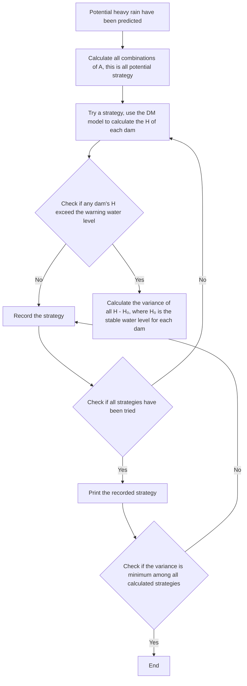
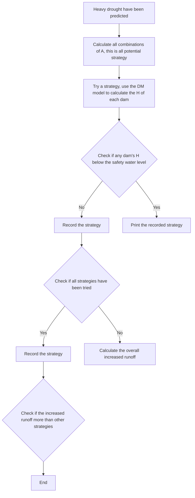

<table><tr><td>For office use only</td><td>Team Control Number</td><td>For office use only</td></tr><tr><td>T1</td><td rowspan="2">65448</td><td>F1</td></tr><tr><td>T2</td><td>F2</td></tr><tr><td>T3</td><td>Problem Chosen</td><td>F3</td></tr><tr><td>T4</td><td>A</td><td>F4</td></tr></table>

# 2017 Mathematical Contest in Modeling (MCM) Summary Sheet

(Attach a copy of this page to each copy of your solution paper.)

# Abstract

The Kariba Dam on the Zambezi River is confronted with foundation errosion and control limitation currently, so a strategy to maintain water management on the Zambezi River is of great value for the whole Zambezi basin. Based on the detailed data provided by World Bank, we conduct the assessment of three options (repairing the dam, rebuilding the dam or replacing the dam with several smaller dams along the river) and provide a reasonable and detailed model to construct a new dam system with some emergency strategies.

To begin with, a brief assessment report with potential costs and benefits is offered according to abundant references and reliable data. The evaluation of repairing the Kariba Dam is completed refering to the Kariba Dam Rehabilitation Project in the charge of World Bank, while the assessment of rebuilding the dam is realized following the actual capital investment expenditure of the Stage 1 of the Kariba Project. And the assessment of replacing the dam is carefully estimated according to the model to construct the new dam system.

Then, we concentrate on the establishment of the model for new dam system.

Firstly, a Hydrodynamic Model (HM) of the Zambezi River is established in order to estimate the flowing and depth situation of the river. The model is constructed based on flow conservation and energy conservation, which separately producing continuity equation and energy conservation equation, taking the normal water cycles and on-way resistance into account. Moreover, we obtain the numerical solution of the Hydrodynamic Model with Mathematica, and get the approximate current velocity curve and river depth curve along the river.

Secondly, the site selection and number confirmation of the new dams is realized according to the flowing and depth situation estimated by HM, geological data and hydrological data. The indexes for evaluation are determined after consulting professional literatures, and Grey Relation Grade Analysis is utilized in the selection among candidate sites so that all the indexes can be considered comprehensively and objectively.

Thirdly, a Difference Model (DM) of the Zambezi River with a dam system is established to provide sufficient details for the confirmation of dam construction and modulating strategies. We separate the river into several segments by the dams. A difference approximation of HM is applied to describe each segment of the river. A hydraulic emprical formula is utilized to determine the discharges of the dam. In this way, the recurrence formulas can be obtained to easily determine the runoff and river depth along the river with given environmental and initial conditions.

Fourthly, the type of each dam is confirmed with corrected DM, with the overall water management capabilities, protection and water management options for Lake Kariba evaluated and special topograph considered. Considering the loss of energy in collision, tributaries and the runoff variation with rainfall at headstram and tributaries, DM is corrected to adapt to the reality. With the results calculated by corrected DM, the type of each dam is confirmed balancing the safety and costs. Each type of dam has three gears of discharges, which increases the water management options.

Finally, the strategies to handle such emergency water flow situations as flooding and drought are designed with the new dam system established above. When solving a known catastrophe, the exhaustive method is utilized to rule out the best strategies which realized by the gear variation of the dam. It is validated that the new dam system can handle most extreme conditions and the method we adopted to establish the strategy is of low sensibility considering reasonable errors.

# A Multi-Dam System Design for Zambezi River

January 24, 2017

# Contents

# 1 Assessment Report of Three Options 1

1.1 Repairing the Existing Kariba Dam . . .

1.1.1 Institutional Project Support (estimated cost US\$69.6 million) . . . 1   
1.1.2 Plunge Pool Reshaping (estimated cost US\$100.0 million) . . .   
1.1.3 Spillway Refurbishment (estimated cost US\$124.6 million) . . .   
1.1.4 Benefits

1.2 Rebuilding the Existing Kariba Dam . .   
1.3 Removing the Kariba Dam & Replacing It with A Series of Ten to Twenty Smaller Dams Along the Zambezi River . . 2

2 Introduction 2

2.1 Restatement of the problem . . 2   
2.2 Our Approach . . 3

3 General Assumption 4

4 Notations 4   
5 The Model 5

5.1 Hydrodynamic Model of the Zambezi River . . 5

5.1.1 Continuity Equation . . 5   
5.1.2 Energy Conservation Equation . . . 6   
5.1.3 Boundary Condition and Initial Condition . 6   
5.1.4 Calculation of the Model . . 7

5.2 Selection System of the Dam Site . . 8

5.2.1 Evaluation indexes . . 9   
5.2.2 Candidate Site . . . 9   
5.2.3 Grey Relation Grade Analysis . . 10

5.3 Difference Model of the Dam System . . 11

5.3.1 Equations in the River (Without the Dam) . . . . 12   
5.3.2 Equations in the Dam Region . . . 13   
5.3.3 Recurrence Formulas . . 13

5.4 Dam Construction & Manipulating System . . 14

5.4.1 Confirm the Parameters of Different Dam Types . . 14   
5.4.2 Confirm the Type Selection of Each Dam 14   
5.4.3 Evaluate the Protection & Water Management Options for Lake Kariba . . . . . 17   
5.4.4 Strategies to Handle Emergency Water Flow Situations . . 17

6 Testing the model 19

6.1 Error analysis . . 19   
6.2 Sensitivity Analysis . . 20

6.2.1 Sensitivity Analysis for Hi . . . . 20   
6.2.2 Sensitivity Analysis for hi . . . . 20

6.2.3 Sensitivity Analysis for $Q _ { i }$ . . . 21

6.3 Conclusion . . 21

6.3.1 Strengths and weaknesses . . 21

6.3.2 Future Work . . 22

# Appendices 23

# 1 Assessment Report of Three Options

# 1.1 Repairing the Existing Kariba Dam

1 At present, the foundation of the Kariba Dam is gradually undermined by scouring and erosion of water, so that operations are limited to only three of the six, non-adjacent gates. The Kariba Dam is also suffering frequent maintenance operations and potential limitations on the operational control of the reservoir. Therefore, plunge pool reshaping and spillway refurbishment are necessities. What is more, institutional project support are also significant to ensure the project running smoothly.

# 1.1.1 Institutional Project Support (estimated cost US\$69.6 million)

1 Institutional project support mainly provides overall management, supervision, professional consultant, comprehensive assessment and risk evaluation for the project.

# 1.1.2 Plunge Pool Reshaping (estimated cost US\$100.0 million)

1 Financing in the component is primarily utilized for goods, works and consultants services, which is constituted with four parts: a. Plunge Pool Reshaping Civil Works Contract: The measures are required to reshape the plunge pool through excavation of the downstream face and north and south bank sides of the pool; b. Additional Engineering Studies; c. Monitoring Services Contract; d. Visibility & Communications.

# 1.1.3 Spillway Refurbishment (estimated cost US\$124.6 million)

1 Financing in the component is mainly used for goods, works and non-consulting services associated with the refurbishment of the spillway, which is composed of two parts: a. Spillway Refurbishment Contract: The works will be conducted at one gate at a time, in a sequenced manner starting with the gates that today show the largest need for rehabilitation; b. Additional Engineering Studies.

# 1.1.4 Benefits

1 Besides the elimination of potential danger and operational limitation which is mentioned above, the repairing of the dam also reinforce the integrated infrastructure platform within the Zambezi River basin. The benefits through avoided disaster and continued power production are substantial, considering the estimated 3 million people living in the potential impact area and the economic value in excess of US\$8 billion.

# 1.2 Rebuilding the Existing Kariba Dam

2 After 50 years of operation serving the southern African region, the geological conditions under the Kariba dam have been changed with the scouring and erosion of the water, so that the initial design of the dam is not appropriate for the new conditions. In this way, rebuilding the dam is a reasonable alternative to replace and even reinforce the function of the old one, and Lake Kariba is also utilized as a reservior. The financing of the project will be primarily utilized for civil engineering works and electrical and mechanical works.

• Civil Engineering Works (estimated cost US\$729.1 million): The component will include the costs of access roads, township, dam wall, south bank power station and engineering fees.   
• Electrical and Mechanical Works (estimated cost US\$380.6 million): The component will include the costs of generation plant and equipment, transmission system and engineering fees.

The rebuilt dam can be designed to suit the new geological conditions and eliminate the overwhelming erosion confronted in the previous design. The benefits through avoided frequent maintenance of the dam and improved manipulating capability are substantial, given the lifespan and significance of the dam for the approximately 3 million local residents.

# 1.3 Removing the Kariba Dam & Replacing It with A Series of Ten to Twenty Smaller Dams Along the Zambezi River

During the construction of the Kariba Dam, the dam suffered from three huge floodings exceeding the design flood. And the dam became broken quickly in fifty years, which was quite shorter than the designed lifespan.1 All these facts figure out that more dams should be constructed on the Zambezi River in order to prevent the unexpected floodings. In this way, replacing the Kariba Dam with a series of ten to twenty smaller dams is an alternative which are more likely to balance the costs and safety.

As a series of so many dams is quite rare in the world, the costs can only be estimated approximately by the number and size of the dams. Financing of the project is mainly utilized for dam construction and relevant institutional project support.

• Dam Construction (estimated cost US\$860 million): The costs of the dam construction are assumed to increase exponentially with the dam size increasing. Therefore, the costs of different dam types (which are introduced in the following model) are listed in Table 1. According to the following model, eight III dams and two IV dams are constructed, which cost US\$860 million.   
• Institutional Project Support (estimated cost US\$69.6 million).

<table><tr><td>Types of dam</td><td>The area of Reservoir/ $m^{2}$ </td><td>Warning water level $H_{mi}/m$ </td><td>Costs/million US$</td></tr><tr><td>I</td><td> $1 \times 10^{8}$ </td><td>60</td><td>10</td></tr><tr><td>II</td><td> $1 \times 10^{7}$ </td><td>50</td><td>1</td></tr><tr><td>III</td><td> $1 \times 10^{6}$ </td><td>40</td><td>0.8</td></tr><tr><td>IV</td><td> $1 \times 10^{5}$ </td><td>30</td><td>0.6</td></tr></table>

Table 1: Costs of different dam types

The construction of the dam system can balance between the safety and costs and have excellent functions to prevent unexpected floodings, whose benefits through avoided catastrophe is substantial, considering the powerful water management capabilities and more abundant hydropower.

# 2 Introduction

# 2.1 Restatement of the problem

Kariba Dam, constructed in 1955-59, with a storage capacity of $1 8 0 k m ^ { 3 } ,$ , is one of the largest dams in Africa. Now it is in dire need of maintenance. The Zambezi River Authority (ZRA) faces three available options to address this situation:

• (Option 1) Repairing the existing Kariba Dam;   
• (Option 2) Rebuilding the existing Kariba Dam;   
• (Option 3) Removing the Kariba Dam and replacing it with a series of ten to twenty smaller dams along the Zambezi River.

On the one hand, we need to briefly assess all the three options above and provide an overview of potential costs and benefits associated with each option.

On the other hand, the problem needs us to conduct a detailed analysis on option 3. We need to give a recommendation on how to design a new system of dam. The new system must meet following requirements:

• Having the same overall water management capabilities as the existing Kariba Dam, In our report, we use the total live storage of reservoirs in front of dams which marks the ability of a dam system to dynamically regulate the water flows within the basin to describe the overall water management capabilities.   
• Providing the same or greater levels of protection and water management options for Lake Kariba. For Lake Kariba, the more stable the inflow is with the variation of seasons, the better conditions like fishing conditions Lake Kariba can provide for local people. So our new dam system is expected to make the inflow of Lake Kariba more stable than the original Kariba Dam.   
• Properly addressing known or predicted normal water cycles.   
• Having the ability to handle emergency water flow situations including flooding and prolonged low water conditions. Extreme conditions derive from abnormal rainfall. When rainfall of some region increases sharply, our dam system is expected to be adjusted to make sure that no region is flooded as possible and when some regions experience prolonged drought our system should be adjusted to provide more runoff for that region as possible.

In our main report, we are required to provide:

• The number and placement of the new dams along the Zambezi River.   
• A guidance to the ZRA managers that explains and justifies the actions that should be taken to properly handle emergency water flow situations.   
• Information about the location and last time for a specific extreme condition in our guidance.

# 2.2 Our Approach

Based on the detailed data provided by World Bank, we conduct the assessment of three options, and provide a reasonable and detailed model to construct a new dam system with some emergency strategies.

To begin with, we offer a brief assessment report with potential costs and benefits according to abundant references and reliable data. We complete the evaluation of repairing the Kariba Dam refering to the Kariba Dam Rehabilitation Project in the charge of World Bank, while we realize the assessment of rebuilding the dam following the actual capital investment expenditure of the Stage 1 of the Kariba Project. And the assessment of replacing the dam is carefully estimated according to the model to construct the new dam system.

Then, we concentrate on the establishment of the model for new dam system.

Firstly, we establish a Hydrodynamic Model (HM) of the Zambezi River in order to estimate the flowing and depth situation of the river. The model is constructed based on flow conservation and energy conservation, which separately producing continuity equation and energy conservation equation, taking the normal water cycles and on-way resistance into account. Moreover, we obtain the numerical solution of the Hydrodynamic Model with Mathematica, and get the approximate current velocity curve and river depth curve along the river.

Secondly, we realize the site selection and number confirmation of the new dams according to the flowing and depth situation estimated by HM, geological data and hydrological data. We determine the evaluation indexes after consulting professional literatures, and Grey Relation Grade Analysis is utilized in the selection among candidate sites so that all the indexes can be considered comprehensively and objectively.

Thirdly, we establish a Difference Model (DM) of the Zambezi River with a dam system to provide sufficient details for the confirmation of dam construction and modulating strategies. We separate the river into several segments by the dams. A difference approximation of HM is applied to describe each segment of the river. We utilize a hydraulic emprical formula to determine the discharges of the dam. In this way, the recurrence formulas can be obtained to easily determine the runoff and river depth along the river with given environmental and initial conditions.

Fourthly, the type of each dam is confirmed with corrected DM, with the overall water management capabilities, protection and water management options for Lake Kariba evaluated and special topograph considered. Considering the loss of energy in collision, tributaries and the runoff variation with rainfall at headstram and tributaries, we correct DM to adapt to the reality. With the results calculated by corrected DM, we confirm the type of each dam balancing the safety and costs. Each type of dam has three gears of discharges, which increases the water management options.

Finally, the strategies to handle such emergency water flow situations as flooding and drought are designed with the new dam system established above. When solving a known catastrophe, we utilize the exhaustive method to rule out the best strategies which realized by the gear variation of the dam. It is validated that the new dam system can handle most extreme conditions and the method we adopted to establish the strategy is of low sensibility considering reasonable errors.

# 3 General Assumption

• All dams are double curvature concrete arch dams and each dam is built with a hydropower station and a reservoir, in consistence with the original Kariba Dam.   
• The costs of the dams have positive correlation with the size of the dams.   
• The water is forced by on-way resistance, which is proportial to current velocity and the coefficient is a constant.   
• The evaporation exists anytime and is approximately a constant.

# 4 Notations

<table><tr><td>Notations</td><td>Definitions</td></tr><tr><td>x</td><td>The distance away from the headstream</td></tr><tr><td>L</td><td>The width of the river</td></tr><tr><td>h</td><td>The river depth</td></tr><tr><td>v</td><td>Current velocity</td></tr><tr><td>ρ</td><td>The density of the water</td></tr><tr><td>q</td><td>Rainfall</td></tr><tr><td>δ</td><td>Evaporation</td></tr><tr><td>k</td><td>on-way resistance coefficient</td></tr><tr><td>Q</td><td>Runoff</td></tr><tr><td>H</td><td>The depth of the reservoir attached to dam</td></tr><tr><td>θ</td><td>The gate opening of the dam</td></tr><tr><td>b</td><td>The width of the gate hole</td></tr><tr><td>A</td><td>The outflow coefficient of the dam</td></tr></table>

# 5 The Model

# 5.1 Hydrodynamic Model of the Zambezi River

In this section, we establish a hydrodynamic model of the current velocity and river depth which vary with the space and time, which is based on flow conservation and energy conservation. When the current velocity and river depth at the headstream is given, the whole Zamberi River can be depicted with the current velocity and river depth anywhere and anytime.

# 5.1.1 Continuity Equation

Considering a short segment of the river from x to $x + \Delta x$ (x and $x + \Delta x$ are all the distances away from the headstream), the flow conservation is given by

$$
Q _ {i n} + q _ {\text { r   a   i   n }} - q _ {\text { e   v   a   p   o   r   a   t   i   o   n }} - Q _ {\text { o   u   t }} = \rho \Delta V \tag {1}
$$

where

• $Q _ { i n }$ is the quantity of water flowing into the segment,   
• $q _ { r a i n }$ is the rainfall quantity of the segment,   
• qevaporation is the evaporation quantity of the segment,   
• $Q _ { o u t }$ is the quantity of water flowing out of the segment,   
• $\rho$ is the density of water,   
• V is the volume of water in this segment.

Qin, qrain, qevaporation, $Q _ { o u t }$ and $\Delta V$ in the time period of $\Delta t$ can be written as

$$
Q _ {i n} = \rho L (x) h (x, t) v (x, t) \Delta t \tag {2}
$$

$$
q _ {\text { rain }} = \rho q (x) L (x) \Delta x \Delta t \tag {3}
$$

$$
q _ {\text { evaporation }} = \rho \delta (x) L (x) \Delta x \Delta t \tag {4}
$$

$$
Q _ {o u t} = \rho L (x + \Delta x) h (x + \Delta x, t) v (x + \Delta x, t) \Delta t \tag {5}
$$

$$
\Delta V = L (x) \Delta x [ h (x, t + \Delta t) - h (x, t) ] \tag {6}
$$

The flow conservation equation turns into

$$
\begin{array}{l} \rho [ q (x) - \delta (x) ] L (x) \Delta x \Delta t + \rho [ L (x) h (x, t) v (x, t) - L (x + \Delta x) h (x + \Delta x, t) v (x + \Delta x, t) ] \Delta t \tag {7} \\ = \rho L (x) \Delta x [ h (x, t + \Delta t) - h (x, t) ] \\ \end{array}
$$

After simplification, the equation is given by

$$
- \frac {\partial [ L (x) h (x , t) v (x , t) ]}{\partial x} + [ q (x) - \delta (x) ] L (x) = L (x) \frac {\partial h (x , t)}{\partial t} \tag {8}
$$

which is the continuity equation of the river.

# 5.1.2 Energy Conservation Equation

Also considering a short segment of the river from x to $x + \Delta x$ (x and $x + \Delta x$ are all the distances away from the headstream), and neglecting the variation of the pressure with $x ,$ the energy conservation is written as

$$
W _ {\text { gravity }} + W _ {\text { resistance }} = \Delta T _ {\text { water }} + \Delta T _ {\text { rain }} + \Delta T _ {\text { evaporation }} \tag {9}
$$

where

• $W _ { g r a v i t y }$ is the work done by the gravity of water,   
• $W _ { r e s i s t a n c e }$ is the work done by the on-way resistance,   
• $\Delta T _ { w a t e r }$ is the change of kinetic energy of the water in the segment,   
• $\Delta T _ { r a i n }$ is the change of kinetic energy of rain in the segment,   
• $\Delta T _ { e v a p o r a t i o n }$ is the change of kinetic energy of water evaporated from the segment.

$W _ { g r a v i t y }$ and $\Delta T _ { w a t e r }$ in the time period of $\Delta t$ is given by

$$
\begin{array}{l} W _ {\text { gravity }} = - \rho g L (x) h (x, t) v (x, t) \Delta t \Delta y (10) \\ \Delta T _ {\text {water}} = \frac {1}{2} \rho L (x) h (x, t) v (x, t) \Delta \left(v ^ {2}\right) \Delta t (11) \\ = \frac {1}{2} \rho L (x) h (x, t) v ^ {2} (x, t) \Delta t (\frac {\partial v}{\partial t} \Delta t + \frac {\partial v}{\partial x} \Delta x) \\ \end{array}
$$

Assuming that the on-way resistance per volume is proportional to the current velocity, which is

$$
F _ {r} = k v (x, t) \tag {12}
$$

$W _ { r e s i s t a n c e }$ is expressed as

$$
W _ {\text { resistance }} = - k L (x) h (x, t) v (x, t) \Delta x \Delta t \tag {13}
$$

Supposing that the initial velocity of rain in the river is approximately zero, $\Delta T _ { r a i n }$ is given by

$$
\Delta T _ {\text { rain }} = \frac {1}{2} \rho q (x) v ^ {2} (x, t) \Delta x \Delta t \tag {14}
$$

Neglecting the velocity of vapour evaporated from the river, $\Delta T _ { e v a p o r a t i o n }$ is given by

$$
\Delta T _ {\text { evaporation }} = - \frac {1}{2} \rho \delta (x) v ^ {2} (x, t) \Delta x \Delta t \tag {15}
$$

Thus, the energy conservation equation after simplification is

$$
- g h (x, t) y ^ {\prime} (x) - k h (x, t) = h (x, t) v (x, t) \frac {\partial v}{\partial x} + h (x, t) \frac {\partial v}{\partial t} + \frac {1}{2} [ q (x) - \delta (x) ] v (x, t) \tag {16}
$$

# 5.1.3 Boundary Condition and Initial Condition

In order to solve the above two equations, the boundary condition and initial condition of the river should be given. Boundary conditions refer to the current velocity and river depth at the headstream, which can be measured in reality. Initial condition refer to the current velocity and river depth anywhere along the river when $t = 0 ,$ , which can also be provided by hydrological stations.

In our model, the current velocity and river depth at the headstream are assumed to be constant, which is

$$
\left\{ \begin{array}{l} v (0, t) = v _ {0} \\ h (0, t) = h _ {0} \end{array} \right. \tag {17}
$$

The initial depth is also supposed to be consistent along the river, while the inital current velocity is set to have the distribution of free falling movement, which can be written as

$$
\left\{ \begin{array}{l} v (x, 0) = \sqrt {v _ {0} ^ {2} + 2 g [ y (0) - y (x) ]} \\ h (x, 0) = h _ {0} \end{array} \right. \tag {18}
$$

# 5.1.4 Calculation of the Model

The hydrodynamic equations of the river are all partial different equations and approximately impossible to get the analytical solution, so we should obtain all the values of the known parameters in the equations so that we can get the numerical solution of the equations.

We observe the Zambezi River in Google Earth and acquire the altitude variations along the river, which gives $y ( x )$ with interpolation. The curve of $y ( x )$ (altitude variation) is shown in Figure 1.


<details>
<summary>line</summary>

| Distance From Headstream /km | Height /m |
| ---------------------------- | --------- |
| 0                            | 1020      |
| 500                          | 980       |
| 1000                         | 480       |
| 1500                         | 320       |
| 2000                         | 50        |
</details>

Figure 1: Altitude variation

The width of the Zambezi River is almost constant along the river, which means $L ( x ) = L .$

The runoff, rainfall and evaporation along the river are obtained from the data provided by World Bank,3 which determines $v _ { 0 } , h _ { 0 } , q ( x ) , \delta ( x )$ .In order to simplify the calculation, $\delta ( x )$ is taken as a constant δ, which is the annual average evaporation. The rainfall data is provided by some hydrological stations, so the data is discrete, which is shown in Figure 1. In order to acquire the rough data of rainfall anywhere along the river, we try to fit the data points of rainfall and obtain the analysis formula, which is shown in Figure 2-6.


<details>
<summary>line</summary>

| Distance/km | Oct  | Nov  | Dec  |
|-------------|------|------|------|
| 500         | 20   | 70   | 165  |
| 600         | 15   | 85   | 170  |
| 800         | 10   | 75   | 175  |
| 1000        | 15   | 70   | 155  |
| 1800        | 25   | 90   | 190  |
| 2200        | 45   | 180  | 260  |
</details>

Figure 2: Spring rainfall


<details>
<summary>line</summary>

| Distance/km | Jan  | Feb  | Mar  |
| ----------- | ---- | ---- | ---- |
| 500         | 245  | 180  | 175  |
| 600         | 180  | 160  | 90   |
| 900         | 200  | 180  | 110  |
| 1000        | 165  | 140  | 75   |
| 1900        | 200  | 190  | 115  |
| 2200        | 255  | 215  | 200  |
</details>

Figure 3: Summer rainfall


<details>
<summary>line</summary>

| Distance/km | Apr  | May  | Jun  |
| ----------- | ---- | ---- | ---- |
| 500         | 70   | 45   | 35   |
| 1000        | 25   | 5    | 5    |
| 2000        | 30   | 5    | 5    |
| 2200        | 50   | 5    | 5    |
</details>

Figure 4: Fall rainfall


<details>
<summary>line</summary>

| Distance/km | Jul  | Aug  | Sep  |
|-------------|------|------|------|
| 500         | 30   | 25   | 15   |
| 600         | 0    | 0    | 0    |
| 1000        | 0    | 0    | 5    |
| 2200        | 5    | 5    | 10   |
</details>

Figure 5: Winter rainfall


<details>
<summary>bar_line</summary>

| Distance From The Headstream (km) | Annual Rainfall (mm) |
|---|---|
| 100 | 1200 |
| 800 | 820 |
| 1500 | 710 |
| 1600 | 830 |
| 1700 | 900 |
| 2000 | 1060 |
The chart includes a line graph overlaying the bars, suggesting a trend or comparison between the two variables. The x-axis represents distance from the headstream in kilometers, and the y-axis represents annual rainfall in millimeters. The data is presented in a single column format.
</details>

Figure 6: The annual rainfall along the river and the fitting curve

Considering the data all above and some scientific constants (such as g and k), all the known parameters can be given:

$\bullet g = 9 . 8 m / s , k = 1 . 0 \times 1 0 ^ { - 6 } k g \cdot m ^ { - 3 } \cdot s ^ { - 1 }$   
$\bullet v _ { 0 } = 1 0 m / s , h _ { 0 } = 2 0 m , L = 1 k m , \delta = 3 . 2 \times 1 0 ^ { - 9 } m / s$

After a few approximation and estimation, the trend of the current velocity and depth along the river from the initial time to the ending time can be obtained, which is shown in Figure 7-8. According to the results, the trend of the current velocity and depth will approach a stable state as the time goes.


<details>
<summary>line</summary>

| Distance From The Headstream | Velocity of Blueflow |
| ---------------------------- | -------------------- |
| 0                            | 0                    |
| 1                            | 1                    |
| 2                            | 2                    |
| 3                            | 3                    |
| 4                            | 4                    |
| 5                            | 5                    |
| 6                            | 6                    |
| 7                            | 7                    |
| 8                            | 8                    |
| 9                            | 9                    |
| 10                           | 10                   |
| 11                           | 11                   |
| 12                           | 12                   |
| 13                           | 13                   |
| 14                           | 14                   |
| 15                           | 15                   |
| 16                           | 16                   |
| 17                           | 17                   |
| 18                           | 18                   |
| 19                           | 19                   |
| 20                           | 20                   |
| 21                           | 21                   |
| 22                           | 22                   |
| 23                           | 23                   |
| 24                           | 24                   |
| 25                           | 25                   |
| 26                           | 26                   |
| 27                           | 27                   |
| 28                           | 28                   |
| 29                           | 29                   |
| 30                           | 30                   |
| 31                           | 31                   |
| 32                           | 32                   |
| 33                           | 33                   |
| 34                           | 34                   |
| 35                           | 35                   |
| 36                           | 36                   |
| 37                           | 37                   |
| 38                           | 38                   |
| 39                           | 39                   |
| 40                           | 40                   |
| 41                           | 41                   |
| 42                           | 42                   |
| 43                           | 43                   |
| 44                           | 44                   |
| 45                           | 45                   |
| 46                           | 46                   |
| 47                           | 47                   |
| 48                           | 48                   |
| 49                           | 49                   |
| 50                           | 50                   |
| 51                           | 51                   |
| 52                           | 52                   |
| 53                           | 53                   |
| 54                           | 54                   |
| 55                           | 55                   |
| 56                           | 56                   |
| 57                           | 57                   |
| 58                           | 58                   |
| 59                           | 59                   |
| 60                           | 60                   |
| 61                           | 61                   |
| 62                           | 62                   |
| 63                           | 63                   |
| 64                           | 64                   |
| 65                           | 65                   |
| 66                           | 66                   |
| 67                           | 67                   |
| 68                           | 68                   |
| 69                           | 69                   |
| 70                           | 70                   |
| 71                           | 71                   |
| 72                           | 72                   |
| 73                           | 73                   |
| 74                           | 74                   |
| 75                           | 75                   |
| 76                           | 76                   |
| 77                           | 77                   |
| 78                           | 78                   |
| 79                           | 79                   |
| 80                           | 80                   |
| 81                           | 81                   |
| 82                           | 82                   |
| 83                           | 83                   |
| 84                           | 84                   |
| 85                           | 85                   |
| 86                           | 86                   |
| 87                           | 87                   |
| 88                           | 88                   |
| 89                           | 89                   |
| 90                           | 90                   |
| 91                           | 91                   |
| 92                           | 92                   |
| 93                           | 93                   |
| 94                           | 94                   |
| 95                           | 95                   |
| 96                           | 96                   |
| 97                           | 97                   |
| 98                           | 98                   |
| 99                           | 99                   |
| Note: The y-values are not explicitly labeled in the code. The x-values are the labels for the data series. There is only one data series in this case. The y-values are estimated based on the provided code.
</details>

Figure 7: Current Velocity


<details>
<summary>line</summary>

| Distance from the HeadStream | Depth of River |
| ---------------------------- | -------------- |
| 0                            | 0              |
| 1                            | 20             |
| 2                            | 40             |
| 3                            | 60             |
| 4                            | 80             |
| 5                            | 100            |
| 6                            | 80             |
| 7                            | 60             |
| 8                            | 40             |
| 9                            | 20             |
| 10                           | 0              |
</details>

Figure 8: River Depth

# 5.2 Selection System of the Dam Site

The site selection of the dams is significant in dam construction, which directly decides the function and lifespan of the dams. As many parameters of river have been obtained in previous calculation, we can evaluate the location from many aspects, so that a scientific and objective selection system of the dam site can be established based on Grey Relation Grade Analysis.4

# 5.2.1 Evaluation indexes

In order to smooth the channel and acquire the maximum hydropower resources, the dams should be established in the regions with steep terrain gap, large river depth and much rainfall, where the huge quantity of water and rapid current may make the channel so turbulent as to threaten the safety of transportation and residents nearby, yet ensuring the abundant hydropower resources at the same time. The situation is similar when the current acceleration is enormous.5

In addition to this, some special topographies are appropriate for dam construction. Lakes can be utilized as a natural reservior for the dam, pocket-like lowlands can contribute to water management and valleys can eliminate the construction amount.5

What is more, the smaller width the channel has, the lower the construction cost is.5

In this way, the following indexes are considered for the site selection:

• Terrain gap: y0(x), the derivative of $y ( x ) ,$   
• River depth h(x) in stable state;   
• Rainfall q(x);   
• Current acceleration $\frac { \partial v ( x , t ) } { \partial t }$   
• Lakes;   
• Pocket-like lowlands;   
• Valleys;   
• River width L(x) (which can be obtained from the map).

The topographic indexes are evaluated by checking whether the suitable topography exists. If the appropriate topography exists, the relevant index is 1; if not, zero.

# 5.2.2 Candidate Site

Several candidate sites should be determined to optimize the site selection. According to the relief map, rainfall, river depth calculated by the hydrodynamic model, considering the distances between adjacent dams, 26 advantageous sites are selected as candidate sites, which is shown in Figure 9.


<details>
<summary>text_image</summary>

Satellite map image with numbered red markers indicating specific locations along a cyan route, surrounded by green terrain.
</details>

Figure 9: Candidate sites

# 5.2.3 Grey Relation Grade Analysis

Because of the complex interaction between these parameters, we finally choose Grey Relation Grade Analysis to confirm the selection system.

Firstly, index weight should be obtained. The concrete steps are:

Step 1: Determine the reference data series as an ideal comparison standard. In our system, the largest value of each metric (river width is taken minus) constitutes the reference sequence.

$$
X _ {0} = \left(x _ {0} (1), x _ {0} (2), \dots , x _ {0} (m)\right) \tag {19}
$$

Step 2: Calculate the absolute difference value of each parameter sequence and the reference sequence of the corresponding elements,as $\Delta _ { i } ( j ) = | x _ { i } ( j ) - x _ { 0 } ( j ) |$ . In the formula, i represents the number of candidate sites; j is the number of metrics; $x _ { 0 } ( j )$ means the reference data in the metric.

Step 3: Confirm $a = \underset { 1 \leqslant i \leqslant n 1 \leqslant i \leqslant m } { m i n } \{ \Delta { i } ( j ) \}$ and $b = \mathop { m a x } _ { 1 \leqslant i \leqslant n 1 \leqslant i \leqslant m } \{ \Delta _ { i } ( j ) \}$ .

Step 4: Calculate the correlation coefficient as:

$$
f _ {i} (j) = \frac {a + b \lambda}{\Delta_ {i} (j) + b \lambda} \tag {20}
$$

where resolution coefficient $\lambda \in ( 0 , 1 )$ , commonly using 0.5.

Step 5: Calculate the correlation degree.

$$
r _ {j} = \frac {1}{n} \sum_ {i = 1} ^ {n} f _ {i} (j) \tag {21}
$$

Step 6: Calculate the weight of each measure standard.

$$
r _ {j} ^ {\prime} = \frac {r _ {j}}{r _ {1} + r _ {2} + \cdots + r _ {m}} \tag {22}
$$

Step 7: Build the evaluation model.

$$
Z _ {i} = r _ {1} ^ {\prime} x _ {i} (1) + r _ {2} ^ {\prime} x _ {i} (2) + \dots + r _ {m} ^ {\prime} x _ {i} (m) \tag {23}
$$

Based on the data we got above, we can solve the model and obtain the following results (Figure 10).


<details>
<summary>bar</summary>

| Locations | Value  |
| --------- | ------ |
| 0         | 0.83   |
| 1         | 0.83   |
| 2         | 0.89   |
| 3         | 0.85   |
| 4         | 0.86   |
| 5         | 0.86   |
| 6         | 0.87   |
| 7         | 0.90   |
| 8         | 0.89   |
| 9         | 0.82   |
| 10        | 0.85   |
| 11        | 0.84   |
| 12        | 0.89   |
| 13        | 0.84   |
| 14        | 0.82   |
| 15        | 0.81   |
| 16        | 0.83   |
| 17        | 0.82   |
| 18        | 0.83   |
| 19        | 0.82   |
| 20        | 0.86   |
| 21        | 0.84   |
| 22        | 0.84   |
| 23        | 0.84   |
</details>

Figure 10: Results of Grey Relation Grade Analysis

As shown in Figure 11-12, the following 11 sites are selected to constructed dams, considering the costs and the distances clustering between adjacent dams.


<details>
<summary>text_image</summary>

North-Western Copperbelt
Kavompo
Zambia
Central
Eastern
Malawi
Niassa
Lilongwe
Western
Lusaka Lusaka
Lake Cahora, Dava
Southern
Lake Kuriba
Caprivvi
DF
F
Tarare
Zimbabwe
Manica
Mozambique
Sofala
Kamanga Delta
Kamanga Chakwa
Zambezia
</details>

Figure 11: Dam sites in terrain map


<details>
<summary>line</summary>

| Distance From Headstream /km | Height /m |
| ---------------------------- | --------- |
| 200                          | 1020      |
| 400                          | 980       |
| 600                          | 900       |
| 700                          | 850       |
| 800                          | 750       |
| 900                          | 600       |
| 1200                         | 450       |
| 1400                         | 380       |
| 1600                         | 350       |
| 1700                         | 250       |
| 1850                         | 120       |
| 2200                         | 10        |
</details>

Figure 12: Dam sites in altitude map

# 5.3 Difference Model of the Dam System

When the dam system is considered in the Zambezi River, the Hydrodynamic Model with partial differential equations is too complex to describe the influences of the dam system, making it impossible to obtain the changes of the river in a bearable time. Therefore, the simplification of the model should be introduced, which is difference model of the dam system, providing recurrence formulas to calculate the runoff of the river with dam system.

The dams are numbered from 1 to 11, and the time is seperated into $j$ time periods of T . For the ith dam in the jth time period,

• $Q _ { ( i + 1 ) j }$ is the river flux flowing out of the dam. Specially, $Q _ { 1 j }$ represents the flux at the headstream;   
• $Q _ { i j } ^ { \prime }$ is the river flux flowing into the dam;

• $q _ { i j }$ is the rainfall flux density in the dam region and the region between the dam and previous one;   
• $\delta _ { i j }$ is the evaporation flux density in the dam region and the region between the dam and previous one;   
• $\Delta y _ { i }$ is the altitude changes between the dam and previous one;   
• $l _ { i }$ is the distance between the dam and the previous one;   
• $h _ { i j }$ is the river depth in the region between the dam and the previous one;   
• $H _ { i j }$ is the water depth of the reservior attached to the dam;   
• $S _ { i }$ is the area of the reservior attached to the dam;   
• $H _ { 0 i }$ is the dead water level of the reservior attached to the dam (dead water level is the minimum water level which the reservoir is allowed to drawdown).


<details>
<summary>flowchart</summary>

```mermaid
graph LR
    A["S_{i-1}"] -->|Q_{i-1,j'}| B["Dam i-1"]
    B --> C["i"]
    C --> D["S_i"]
    D -->|Q_{i+1,j'}| E["Dam i"]
    F["Rainfall q_{ij}"] --> A
    G["Tributary q'_i"] --> D
    H["Evaporation δ_{ij}"] --> F
    I["Water level: h_{ij}"] --> C
    J["Water level: H_{ij}"] --> D
```
</details>

Figure 13: Diagram describing the situation of the river with dam system

# 5.3.1 Equations in the River (Without the Dam)

As is written in the Hydrodynamic Model, the continuity equation (based on the flow conservation) can be written as

$$
\left(q _ {i j} - \delta_ {i j}\right) l _ {i} L + Q _ {i j} - Q _ {i j} ^ {\prime} = l _ {i} L \frac {\Delta h _ {i}}{\Delta t} \tag {24}
$$

In the time period of T , $\begin{array} { r } { \frac { \Delta h _ { i } } { \Delta t } = \frac { h _ { i ( j + 1 ) } - h _ { i j } } { T } } \end{array}$ −hij

Neglecting the variation of v in time period of T , the energy conservation equation is given by

$$
\rho L h _ {i j} v T g \Delta y _ {i} - \rho k h _ {i j} L v T l _ {i} = \frac {1}{2} \rho (q _ {i j} - \delta_ {i j}) L l _ {i} T v ^ {2} + \frac {1}{2} \rho L h _ {i j} v T \Delta (v ^ {2}) \tag {25}
$$

where v and $\Delta ( v ^ { 2 } )$ can be expressed by $Q _ { i j }$ and $Q _ { i j } ^ { \prime }$ .

$$
v = \frac {Q _ {i j} + Q _ {i j} ^ {\prime}}{2 h _ {i j} L} \tag {26}
$$

$$
\Delta (v ^ {2}) = \frac {Q _ {i j} ^ {\prime 2} - Q _ {i j} ^ {2}}{h _ {i j} ^ {2} L ^ {2}} \tag {27}
$$

After simplification, the equations in the river without the dam are

$$
\left\{ \begin{array}{l} (q _ {i j} - \delta_ {i j}) l _ {i} L + Q _ {i j} - Q _ {i j} ^ {\prime} = l _ {i} L \frac {h _ {i (j + 1)} - h _ {i j}}{T} \\ 2 h _ {i j} ^ {2} L ^ {2} g \Delta y _ {i} - 2 k h _ {i j} ^ {2} L ^ {2} l _ {i} = Q _ {i j} ^ {\prime 2} - Q _ {i j} ^ {2} + \frac {1}{2} (q _ {i j} - \delta_ {i j}) L (Q _ {i j} + Q _ {i j} ^ {\prime}) l _ {i} \end{array} \right. \tag {28}
$$

# 5.3.2 Equations in the Dam Region

As is written in the Hydrodynamic Model, the continuity equation (based on the flow conservation) can be written as

$$
\left(q _ {i j} - \delta_ {i j}\right) S _ {i} + Q _ {i j} ^ {\prime} - Q _ {(i + 1) j} = S _ {i} \frac {\Delta H _ {i}}{\Delta t} \tag {29}
$$

In the time period of T , ∆Hi∆t $\begin{array} { r } { T , \frac { \Delta H _ { i } } { \Delta t } = \frac { H _ { i ( j + 1 ) } - H _ { i j } } { T } } \end{array}$

According to Hydraulics textbook, $Q _ { ( i + 1 ) j }$ has the following relation with $H _ { i j } ! ^ { 6 }$

$$
Q _ {(i + 1) j} = A _ {i} \left(H _ {i j} - H _ {0 i}\right) ^ {\frac {3}{2}} \tag {30}
$$

where the $A _ { i }$ is the outflow coefficient determined by the width $b _ { i }$ of the gate hole and the relative gate opening θ of the dam. According to the emprical formula, $A _ { i }$ can be given by

$$
A _ {i} = 2. 7 6 7 4 \theta b _ {i} \tag {31}
$$

# 5.3.3 Recurrence Formulas

Concluding the equations above, the recurrence formulas of the river with dam systems can be obtained.

$$
\left\{ \begin{array}{l} Q _ {i j} ^ {\prime} = \frac {- \frac {1}{2} g L l _ {i} + \sqrt {\frac {1}{4} g ^ {2} L ^ {2} l _ {i} ^ {2} - 4 (\frac {1}{2} g L Q _ {i j} l _ {i} - Q _ {i j} ^ {2} + 2 k h _ {i j} ^ {2} L ^ {2} l _ {i} - 2 h _ {i j} ^ {2} L ^ {2} g \Delta y _ {i})}}{2} \\ Q _ {(i + 1) j} = A _ {i} (H _ {i j} - H _ {0 i}) ^ {\frac {3}{2}} \\ h _ {i (j + 1)} = \frac {(q _ {i j} - \delta_ {i j}) l _ {i} L + Q _ {i j} - Q _ {i j} ^ {\prime}}{l _ {i} L} T + h _ {i j} \\ H _ {i (j + 1)} = \frac {(q _ {i j} - \delta_ {i j}) S _ {i} + Q _ {i j} ^ {\prime} - A _ {i} (H _ {i j} - H _ {0 i}) ^ {\frac {3}{2}}}{S _ {i}} T + H _ {i j} \end{array} \right. \tag {32}
$$

In this way, when the known parameters are confirmed, the river with dam system can be depicted with $Q _ { i j } , Q _ { i j } ^ { \prime } , h _ { i j } , H _ { i j }$ . All the known parameters are listed below.

• $Q _ { 1 j } \colon$ the river flux at the headstream;   
• $Q _ { ( i + 1 ) 0 } \colon$ the initial river flux flowing out of the dam;   
• $h _ { i 0 } { : }$ the initial river depth in the region between the dam and the previous one;   
• $H _ { i 0 } { \mathrm { : } }$ : the initial water depth of the reservior attached to the dam;   
• $q _ { i j } \colon$ the rainfall along the river;   
• $\delta _ { i j } \mathbf { \dot { \cdot } }$ the evaporation along the river;   
• $\Delta y _ { i }$ is the altitude changes between the dam and previous one;   
• $l _ { i }$ is the distance between the dam and the previous one;   
• $S _ { i } { : }$ the area of the reservior attached to the dam;   
• $A _ { i } { \mathrm { : } }$ the outflow coefficient of the dam;   
• $H _ { 0 i } { \mathrm { : } }$ the dead water level of the reservior attached to the dam;   
• $L \colon$ the width of the river;   
• $g \colon$ the acceleration of gravity;   
• k: the on-way resistance coefficient;   
• $T \colon$ the time scale.

# 5.4 Dam Construction & Manipulating System

As the number and placement of the new dams have been confirmed, the size of dams and manipulating strategy should be assigned so that the dam systems can have good performance and handle emergency water flow situations. The concrete steps to design the size of dams and manipulating strategy are listed below:

Step 1: Confirm the parameters of different dam types.

Step 2: Confirm the type selection of each dam.

Step 3: Evaluate the protection and water management options for Lake Kariba.

Step 4: Strategies to handle emergency water flow situations.

# 5.4.1 Confirm the Parameters of Different Dam Types

According to the standard of Water Conservancy Engineering, the dams can be categoried into several types according to the capacity of the reservior attached.7 As shown in Table 2, four appropriate types of dam are selected considering the reality of the Zambezi River and the relevant parameters have been confirmed.

<table><tr><td>Types of dam</td><td>The area of Reservoir/ $m^2$ </td><td>A</td><td>Warning water level $H_{mi}/m$ </td></tr><tr><td>I</td><td> $1 \times 10^8$ </td><td>33θ</td><td>60</td></tr><tr><td>II</td><td> $1 \times 10^7$ </td><td>27θ</td><td>50</td></tr><tr><td>III</td><td> $1 \times 10^6$ </td><td>16θ</td><td>40</td></tr><tr><td>IV</td><td> $1 \times 10^5$ </td><td>11θ</td><td>30</td></tr></table>

Table 2: Parameters of different dam types

Where θ is the relative gate opening of the dam. In order to simplify the manipulation of the dam, it is assumed that there are three gears of the gate opening, which means θ can be taken as 0.25, 0.5, 1.0. In normal situation, θ is taken as 0.5.


<details>
<summary>text_image</summary>

Reservoir with size S
double curvature concrete
arch dam
b
Live
storage
H
H₀
</details>

Figure 14: Diagram of the dam

# 5.4.2 Confirm the Type Selection of Each Dam

The new dams should be established to protect the river’s basin from the floods and drought, so it seems that the dam with largest reservior is the best choice. However, the cost of one large dam is equal to that of many small dams. Therefore, we should take a reasonable balance between safety and costs, which can be completed with the Difference Model of the Dam System. When each dam size has been confirmed, $H _ { i j } , h _ { i j } , Q _ { i j } , Q _ { i j } ^ { \prime }$ can be determined, which means a certain series of dam size will correspond to a certain river situation.

However, the main tributaries are neglected in the Difference Model of the Dam System, which play an important role in the river system. Therefore, we correct the model by detecting the main tributaries and adding them into the model. According to the terrain map of the basin, which is shown in Figure 15, the main tributaries distribute at the region between the dam $A$ and $B , B$ and $C , F$ and $G , H$ and $I , J$ and $K .$ . Their runoff are marked as $\bar { q } _ { 2 j } ^ { \prime } , q _ { 3 j } ^ { \prime } , q _ { 7 j } ^ { \prime } , q _ { 9 j } ^ { \prime } , q _ { 1 1 j } ^ { \prime }$ . The runoff will be added into the flux flowing into the relevant dam. For example, the flux flowing into the 2nd dam will be $Q _ { 2 j } ^ { \prime } + q _ { 2 j } ^ { \prime }$ .


<details>
<summary>text_image</summary>

North Eastern Copperbelt
Koompo Central Eastern Malawi
Zambia
Western Lusaka
Southern Lavu Keriba
Capriya
Zimbabwe
Savango Delta
Eastern Kilongwe
Lake Selkara de Asa
Tauralo
Manica
Sofala
Mozambique
</details>

Figure 15: Tributaries

In addition to this, the loss of mechanical energy when the flow collides with the banks and bottom of the river, so a loss coefficient $\beta$ should be included in the energy conservation equation, which is

$$
Q _ {i j} ^ {\prime} = \frac {- \frac {1}{2} g L l _ {i} + \sqrt {\frac {1}{4} g ^ {2} L ^ {2} l _ {i} ^ {2} - 4 (\frac {1}{2} g L Q _ {i j} l _ {i} - Q _ {i j} ^ {2} + 2 k h _ {i j} ^ {2} L ^ {2} l _ {i} - 2 h _ {i j} ^ {2} L ^ {2} g \beta \Delta y _ {i})}}{2} \tag {33}
$$

Before calculating the best type selection with the Difference Model of the Dam System, all the known parameters should be confirmed. It is assumed that the rainfall and evaporation in a certain region is constant in the time period we have concerned, which means $q _ { i j } = q _ { i } , \delta _ { i j } = \delta _ { i }$ . The dead water level of each dam is supposed to be constant, which means $H _ { 0 j } = H _ { 0 }$ . Apparently, the rainfall will influence the runoff at the headstream and tributaries, so it is reasonable to suppose that

$$
\left\{ \begin{array}{l} Q _ {1 j} = Q _ {1} + \alpha (q _ {1} - \delta_ {1}) \\ q _ {2 j} ^ {\prime} = q _ {2} ^ {\prime} + \alpha (q _ {2} - \delta_ {2}) \\ q _ {3 j} ^ {\prime} = q _ {3} ^ {\prime} + \alpha (q _ {3} - \delta_ {3}) \\ q _ {7 j} ^ {\prime} = q _ {7} ^ {\prime} + \alpha (q _ {7} - \delta_ {7}) \\ q _ {9 j} ^ {\prime} = q _ {9} ^ {\prime} + \alpha (q _ {9} - \delta_ {9}) \\ q _ {1 1 j} ^ {\prime} = q _ {1 1} ^ {\prime} + \alpha (q _ {1 1} - \delta_ {1 1}) \end{array} \right. \tag {34}
$$

where $Q _ { 1 } , q _ { 2 } ^ { \prime } , q _ { 3 } ^ { \prime } , q _ { 7 } ^ { \prime } , q _ { 9 } ^ { \prime } , q _ { 1 1 } ^ { \prime }$ are separately the runoff at the headstream and each tributary, α is the constant coefficient.

$\Delta y _ { i }$ and $l _ { i }$ can be easily determined by the geographical data mentioned above, which is included in the Appendix. $Q _ { 1 } , h _ { i 0 } , H _ { i 0 } , q _ { i }$ and $\delta _ { i }$ can be decided by the above hydrologcial $\mathtt { d a t a } , { } ^ { 3 }$ where it is assumed that $h _ { i 0 } = h _ { 0 } , H _ { i 0 } = H _ { 0 } , \delta _ { i } = \delta _ { 0 } , q _ { i }$ is supposed to obey the distribution concluded from the rainfall data.Li is presented in the appendices. Other known parameters are listed below:

$\bullet Q _ { 1 } = 5 0 0 m ^ { 3 } / s , h _ { 0 } = 2 0 m , H _ { 0 } = 2 0 m , T = 6 0 s$   
$\bullet \ q _ { 2 } ^ { \prime } = 1 5 0 m ^ { 3 } / s , q _ { 3 } ^ { \prime } = 1 0 0 m ^ { 3 } / s , q _ { 7 } ^ { \prime } = 5 0 m ^ { 3 } / s , q _ { 9 } ^ { \prime } = 1 2 0 m ^ { 3 } / s , q _ { 1 1 } ^ { \prime } = 8 0 m ^ { 3 } / s$   
$\bullet \ g = 9 . 8 m / s ^ { 2 } , k = 1 \times 1 0 ^ { - 6 } k g \cdot m ^ { 3 } \cdot s ^ { - 1 } , \alpha = 3 \times 1 0 ^ { 9 } , \beta = 1 0 ^ { - 3 }$

With all the known parameters confirmed, we can calculate the best type selection with the corrected Difference Model of the Dam System. It is obvious that the smallest dam is cheapest, so we choose IV type for each dam at first except the 11th one and the 7th one. At the site of the 11th dam, the Cahora Bassa $\mathrm { D a m } ^ { 8 }$ has been constructed, which is a I-type dam, so the 11 th dam is selected as I type. The 7th dam is located at the previous Kariba Dam, but the new geological condition after errosion is not suitable for a I-type dam, so II type is selected considering the huge capacity of Lake Kariba. Then we calculate the situation of the river (with 90000 iterations, which means 3 months for the model). According to the calculation, the situation of the river will approach a stable state with time goes. If $H _ { i j }$ at the stable state is higher than the warning water level at one dam, the dam type will be upgraded for one grade. The procedure will be repeated until all $H _ { i j }$ at the stable state are lower than the corresponding warning water level. However, another restriction should be satisfied by the final type selection:

• $\begin{array} { r } { \sum _ { i = 1 } ^ { 1 1 } S _ { i } H _ { m i } \geqslant V _ { L a k e } , } \end{array}$ , which means the total capacity of the reserviors attached to new dams should be larger than the capacity of previous Lake Kariba $( V _ { L a k e } )$ . The total capacity represents the overall water management capabilities of the dam system. The restriction means the new dam system has the same and even higher overall water management capabilities than the Kariba Dam.

The detailed procedure is shown in the Figure 16.


<details>
<summary>flowchart</summary>

```mermaid
graph TD
    A["Initialize the dam system with the smallest type"] --> B["Using our DM Model to calculate the Waterlevel of the new dam system"]
    B --> C{Check if all H < Hm}
    C -->|No| D["Choose a bigger type for the new dam"]
    D --> E["Choose a dam which has the minimum H - Hm and whose type is not I"]
    E --> F{Check if ∑Si(Hmi - Hoi) > V}
    F -->|Yes| G["The types of each dam in the dam system has been calculated"]
    F -->|No| H["End"]
```
</details>

Figure 16: Diagram of the Type Selection of Each Dam

The selection result is presented in Table 3.

<table><tr><td>Dam</td><td>A</td><td>B</td><td>C</td><td>D</td><td>E</td><td>F</td><td>G</td><td>H</td><td>I</td><td>J</td><td>K</td></tr><tr><td>Types of Dam</td><td>III</td><td>III</td><td>III</td><td>III</td><td>III</td><td>III</td><td>III</td><td>IV</td><td>I</td><td>IV</td><td>III</td></tr></table>

Table 3: Types of each dam

# 5.4.3 Evaluate the Protection & Water Management Options for Lake Kariba

The protection for Lake Kariba can be evaluated with the water level fluctuation of Lake Kariba between rainy season and dry season. The smaller the fluctuation is, the better protection is offered for the lake. The water level in rainy season and dry season can be easily calculated with the corrected Difference Model of the Dam System. $h _ { i 0 }$ and $H _ { i 0 }$ are set as the stable value with normal rainfall and $q _ { i }$ has been determined by the corresponding rainfall data of rainy season and dry season. The calculation result is taken as the final result after 90000 iterations, because it is observed that for large reservoirs like Kariba, the instantaneous and daily peak flows are not important, as these can be stored in the reservoir.

As shown in Fig , we can find that the fluctuation decreases with the new dam system, proving that the new dam system provides the better production for Lake Kariba.

In addition to this, the discharge of the dam is provided with 3 gears, so that elaborate water management can be realized with the new dam system. Therefore, the new dam system has more water management options.

# 5.4.4 Strategies to Handle Emergency Water Flow Situations

The emergency water flow situations include the flooding and drought, which are both common in the Zambezi River’s basin, so different strategies should be designed to handle the two emergency water flow situations.

# Flooding

The flooding caused by extreme large rainfall is assumed to occur at the region between the 2nd dam and the 4th one for three months, which is typical for the river’s basin according to the data provided by World Bank.3 $q _ { i }$ in the flooding region is set as the rainfall of approximately 24mm per twelve hours, which can be categoried as heavy rain. The runoff distribution without modulating along the river is shown in Figure 17. The exhaustive method is utilized to test all combinations of $A _ { i }$ (which means the changes of the dam gear) for the combination which obtains the minimum variance of all $H _ { i } - H _ { i 0 }$ . The minimum variance of all $H _ { i } - H _ { i 0 }$ means that the reserviors attached to dams have minimum fluctuation during the flooding, which will protect the residents from danger and economic loss. The concrete procedure is shown in Figure 18.


<details>
<summary>bar</summary>

| Dam | Normal (Q(m³/s)) | Flooding (Q(m³/s)) |
|---|---|---|
| 1 | 800 | 800 |
| 2 | 800 | 800 |
| 3 | 1200 | 1200 |
| 4 | 1550 | 2300 |
| 5 | 1550 | 2300 |
| 6 | 1550 | 2300 |
| 7 | 1550 | 2300 |
| 8 | 200 | 200 |
| 9 | 200 | 200 |
| 10 | 550 | 550 |
| 11 | 550 | 550 |
| 12 | 850 | 850 |
</details>

Figure 17: Runoff distribution without regulating


<details>
<summary>flowchart</summary>


</details>

Figure 18: Diagram of the strategy selection for flooding

The best combination of the dam gears is presented in Table 4.

<table><tr><td>Dam</td><td>1</td><td>2</td><td>3</td><td>4</td><td>5</td><td>6</td><td>7</td><td>8</td><td>9</td><td>10</td><td>11</td></tr><tr><td>A</td><td>4</td><td>8</td><td>16</td><td>16</td><td>16</td><td>16</td><td>16.5</td><td>5.5</td><td>16.5</td><td>8</td><td>8</td></tr></table>

Table 4: Best combination of Ai

The regulated reservior depth is shown in the Figure 19, compared with the unregulated reservior depth.


<details>
<summary>bar</summary>

| Dam | Unregulated | Regulated |
| --- | --- | --- |
| 1 | 32 | 41 |
| 2 | 39 | 39 |
| 3 | 54 | 38 |
| 4 | 54 | 38 |
| 5 | 54 | 38 |
| 6 | 54 | 38 |
| 7 | 31 | 40 |
| 8 | 21 | 30 |
| 9 | 20 | 60 |
| 10 | 31 | 30 |
| 11 | 32 | 36 |
</details>

Figure 19: Regulated reservior depth comparing with the unregulated reservior depth

# Drought

The drought caused by extreme small rainfall is assumed to occur along the whole river for three months. $\delta _ { i }$ in the drought region is set as the rainfall of approximately 1100mm per year, which can be categoried as heavy rain. The runoff distribution without modulating along the river is shown in Figure 20. The exhaustive method is utilized to test all combinations of $A _ { i }$ (which means the changes of the dam gear) for the combination which obtains the maximum increased runoff. The increased runoff is more signicant in drought, which will protect the residents from danger and economic loss. The concrete procedure is shown in Figure 21.


<details>
<summary>bar</summary>

| Dam | Normal (Q(m³)) | Drought (Q(m³)) |
|---|---|---|
| 1 | 790 | 450 |
| 2 | 790 | 450 |
| 3 | 1210 | 540 |
| 4 | 1540 | 580 |
| 5 | 1530 | 580 |
| 6 | 1530 | 580 |
| 7 | 1530 | 580 |
| 8 | 200 | 180 |
| 9 | 200 | 180 |
| 10 | 540 | 300 |
| 11 | 540 | 300 |
| 12 | 830 | 320 |
</details>

Figure 20: Runoff distribution without regulating


<details>
<summary>flowchart</summary>


</details>

Figure 21: Diagram of the strategy selection for drought

The best combination of the dam gears is that each dam is set as the maximum $A _ { i }$ . The regulated runoff is shown in the Figure 22, compared with the unregulated runoff.


<details>
<summary>bar</summary>

| Dam | Unregulated (Q/m³/s) | Regulated (Q/m³/s) |
|---|---|---|
| 1 | 450 | 460 |
| 2 | 450 | 460 |
| 3 | 540 | 550 |
| 4 | 570 | 590 |
| 5 | 570 | 590 |
| 6 | 570 | 590 |
| 7 | 570 | 590 |
| 8 | 180 | 270 |
| 9 | 180 | 270 |
| 10 | 290 | 370 |
| 11 | 290 | 370 |
| 12 | 310 | 400 |
</details>

Figure 22: Regulated reservior depth comparing with the unregulated reservior depth

# 6 Testing the model

# 6.1 Error analysis

In this part, we will analyze relevant factors that might cause error in our model.

• The mechanical energy loss of water: In fact, the mechanical energy loss water in each segment is very complex, which is relevant to the topographic feature in the segment. However, we have neglected the complexity.   
• ResistenceïijŽIn fact, the on-way resistance coefficient k in each segment is closely related with the curve of the channel in the segment, which is neglected by us.   
• Evaporation along the river and the runoff of tributaries and headstream: Accurate data is not available so that we roughly estimate it.

# 6.2 Sensitivity Analysis

In our model, some inputs are not precise enough for the lack of actual data about Zambezi basin and some parameters are difficult to obtain directly. Those inputs or parameters may influence the result of our calculation, so we implement a sensitive analysis to test the robustness of our model.

In fact, we cannot obtain the real value of the inputs $Q _ { 1 } , H _ { i 0 } , h _ { i 0 }$ and parameter α with the data we have. Sensitivity Analysis is primarily conducted on these inputs and parameters.

# 6.2.1 Sensitivity Analysis for $H _ { i }$

<table><tr><td></td><td>-5%</td><td>-3%</td><td>-1%</td><td>0%</td><td>1%</td><td>3%</td><td>5%</td></tr><tr><td> $h_{i0}$ </td><td>2.9281%</td><td>2.9767%</td><td>3.0253%</td><td>0%</td><td>3.0738%</td><td>3.1223%</td><td>3.1706%</td></tr><tr><td> $H_{i0}$ </td><td>7.5529%</td><td>3.7451%</td><td>1.8459%</td><td>0%</td><td>4.2614%</td><td>7.6778%</td><td>11.4852%</td></tr><tr><td> $Q_{00}$ </td><td>3.0475%</td><td>3.0483%</td><td>3.0492%</td><td>0%</td><td>3.0500%</td><td>3.0508%</td><td>3.0517%</td></tr><tr><td> $\alpha$ </td><td>2.9252%</td><td>2.9749%</td><td>3.0247%</td><td>0%</td><td>3.0745%</td><td>3.1242%</td><td>3.1739%</td></tr></table>

Table 5: Sensitivity Analysis for $H _ { i }$

All the percentage presented on the table represents the maximum fluctuation among $H _ { i }$ . Therefore, $H _ { i }$ is not sensitive to the value of $Q _ { 1 } , H _ { i 0 } , h _ { i 0 }$ and α.

# 6.2.2 Sensitivity Analysis for $h _ { i }$

<table><tr><td></td><td>-5%</td><td>-3%</td><td>-1%</td><td>0%</td><td>1%</td><td>3%</td><td>5%</td></tr><tr><td> $h_{i0}$ </td><td>5.0000%</td><td>3.0000%</td><td>1.0000%</td><td>0%</td><td>1.0000%</td><td>3.0000%</td><td>5.0000%</td></tr><tr><td> $H_{i0}$ </td><td>0.2140%</td><td>0.1309%</td><td>0.0445%</td><td>0%</td><td>0.0453%</td><td>0.1382%</td><td>0.2341%</td></tr><tr><td> $Q_{0}0$ </td><td>0.0432%</td><td>0.0259%</td><td>0.0086%</td><td>0%</td><td>0.0086%</td><td>0.0259%</td><td>0.0432%</td></tr><tr><td> $\alpha$ </td><td>0.0169%</td><td>0.0102%</td><td>0.0034%</td><td>0%</td><td>0.0034%</td><td>0.0102%</td><td>0.0170%</td></tr></table>

Table 6: Sensitivity Analysis for $h _ { i }$

All the percentage presented on the table represents the maximum fluctuation among $h _ { i }$ . Therefore, $h _ { i }$ is not sensitive to the value of $Q _ { 1 } , H _ { i 0 } , h _ { i 0 }$ and α.

# 6.2.3 Sensitivity Analysis for $Q _ { i }$

<table><tr><td></td><td>-5%</td><td>-3%</td><td>-1%</td><td>0%</td><td>1%</td><td>3%</td><td>5%</td></tr><tr><td> $h_{i}0$ </td><td>0.5677%</td><td>0.4539%</td><td>0.3403%</td><td>0%</td><td>0.2267%</td><td>0.1133%</td><td>0.0000%</td></tr><tr><td> $H_{i}0$ </td><td>26.3961%</td><td>16.2663%</td><td>5.7108%</td><td>0%</td><td>5.2538%</td><td>16.6129%</td><td>28.3529%</td></tr><tr><td> $Q_{0}0$ </td><td>5.0000%</td><td>3.0000%</td><td>1.0000%</td><td>0%</td><td>1.0000%</td><td>3.0000%</td><td>5.0000%</td></tr><tr><td> $\alpha$ </td><td>5.5439%</td><td>3.3332%</td><td>1.1134%</td><td>0%</td><td>1.1156%</td><td>3.3538%</td><td>5.6011%</td></tr></table>

Table 7: Sensitivity Analysis for $Q _ { i }$

All the percentage presented on the table represents the maximum fluctuation among $Q _ { i }$ . It can be seen that $Q _ { i }$ is sensitive to $H _ { i 0 } ,$ , namely the faint error of the initial depth of the reservior attached to the dam may lead to the great changes of $Q _ { i } ,$ so the initial value of $H _ { i 0 }$ should be taken as the stable value calculated in normal condition to control the potential error of $Q _ { i }$

# 6.3 Conclusion

# 6.3.1 Strengths and weaknesses

# Strengths:

• We have got the sufficient topographic data of the river and build hydrodynamic model model to calculate the velocity and depth distribution of the river. So we have a detailed and comprehensive description of the Zambezi River.   
• We consult many professional literatures to determine the evaluation indexes of site selection of dams. And we use grey relation analysis and k-means clustering combined with these multiple indexes to pick out optimal sites from candidates. So our selection is reasonable.   
• We use difference model to simplify the calculation of the river and considered the influence both tributaries and evaporation. As long as we have enough data to set precise inputs we can predict the dynamical process of the river. It is of great importance and convenience for us to do further discussion about dams.   
• After consulting relevant literature, we have relative knowledge of dams including types, relevant parameters, function and building cost in practical situation. Based on this we set four types of dams to be selected for each site and finally confirm them by balancing safety and costs. Through this our dam system owns more water management options.

# Weaknesses:

• On the one hand, insufficient data of the runoff of Zambezi River’s tributaries and headstream and the evaporation of its basin trigger the indeterminacy of the inputs of our equation. On the other hand, some parameters in our equation like the coefficient of on-way resistance is hard to get directly. So actually the solution of our equation may be not fully consistent with actual data numerically.   
• We do not have enough consideration of geological conditions of Zambezi basin when confirming the sites of dams and the analysis for social and ecological impact of the project is also insufficient.

# 6.3.2 Future Work

Since we still have some weaknesses in our current work, future efforts are needed to better work out this problem.

Firstly, more sufficient data of runoff of Zambezi RiverâA˘ Zs tributaries and headstream and the ´ evaporation of its basin will be needed in order to do more accurate calculation of the river.

Secondly, more geological knowledge will be needed and more civilian and ecological factors will be considered in order to make more scientific and reasonable site selection of dams.

Thirdly, more rainfall and evaporation data of Zambezi basin are needed to better predict the extreme conditions and provide more detailed and comprehensive guidance for the new dam system.

Finally, we will try to generalize our model and approach in this problem to more multi-dam systems after more polishment.

# References

[1] World Bank: International Development Association Project Appraisal Document on A Proposed Credit in the Amount of SDR 5.6 Million and A Proposed Swedish Grant in the Amount of US\$25 Million to the Republic of Zambia for A Kariba Dam Rehabilitation Project, 2014.11.   
[2] World Bank: Kariba Dam, Zambia and Zimbabwe, 2000.11.   
[3] World Bank: The Zambezi River Basin: A Multi-Sector Investment Opportunities Analysis   
[4] Zhang YaGuan, Xue ShiMing, Kuang ChongYi, Chen Gong: Relation grade analysis of grey theory and comprehensive evaluation of introduced forage of winter-free farmland in the north of Yunnan subtropics. ISSN 1004-5759   
[5] Wang Liwen: The function and site selection of reservior dams   
[6] Zhou Zhihao: Water Resources and Hydropower Planning, China High Education Press.   
[7] E.M. Welson: Engineering Hydrology, Palgrave Macmillan, 1990.   
[8] Wikipedia: Cahora Bassa Dam.

# Appendices

<table><tr><td>District</td><td>Oct</td><td>Nov</td><td>Dec</td><td>Jan</td><td>Feb</td><td>Mar</td><td>Apr</td><td>May</td><td>Jun</td><td>Jul</td><td>Aug</td><td>Sep</td><td>Year</td></tr><tr><td>1</td><td>20</td><td>71</td><td>164</td><td>243</td><td>180</td><td>173</td><td>71</td><td>45</td><td>37</td><td>28</td><td>27</td><td>15</td><td>1074</td></tr><tr><td>2</td><td>12</td><td>78</td><td>174</td><td>197</td><td>180</td><td>108</td><td>26</td><td>7</td><td>5</td><td>3</td><td>3</td><td>3</td><td>796</td></tr><tr><td>4</td><td>17</td><td>84</td><td>172</td><td>179</td><td>159</td><td>90</td><td>18</td><td>3</td><td>1</td><td>0</td><td>0</td><td>1</td><td>724</td></tr><tr><td>6</td><td>18</td><td>68</td><td>156</td><td>164</td><td>139</td><td>76</td><td>24</td><td>5</td><td>1</td><td>0</td><td>0</td><td>2</td><td>653</td></tr><tr><td>9</td><td>26</td><td>90</td><td>191</td><td>195</td><td>187</td><td>113</td><td>28</td><td>2</td><td>1</td><td>0</td><td>0</td><td>2</td><td>835</td></tr><tr><td>13</td><td>46</td><td>178</td><td>259</td><td>254</td><td>216</td><td>195</td><td>50</td><td>3</td><td>1</td><td>0</td><td>1</td><td>6</td><td>1209</td></tr></table>

Table 8: Rainfalls along the River


<details>
<summary>text_image</summary>

DEMOCRATIC REPUBLIC
OF CONGO
TANZANIA
ANGOLA
ZAMBIA
LUNNA
Lake Muersu
Lake Tungangaka
Mbuyo
RUMARALI
SONGWEI, II 8.10
NORAM
LOWUR FEFU
Mazoa
Lake Mokani/
Nevon/
Nyana
Lichinge
MALAWI
LILONGWE
MOZAMBIQUE
KAFUE GORGE LIFER
KAHBA GORGE LOWER
KAHBA NORTH
KAHBA SOUTH
KAFUE GORGE LIFER
KAHBA NORTH
KHOL ORUNITED
KAFUE GORGE LIFER
KAHBA NORTH
KHOL ORUNITED
KAFUE GORGE LIFER
KAHBA NORTH
KHOL ORUNITED
KAFUE GORGE LIFER
KAHBA NORTH
KHOL ORUNITED
KAFUE GORGE LIFER
KAHBA NORTH
KHOL ORUNITED
KAFUE GORGE LIFER
KAHBA NORTH
</details>

Figure 23: Distrcts in Table 8

<table><tr><td>District</td><td>1</td><td>2</td><td>4</td><td>6</td><td>9</td><td>13</td></tr><tr><td>Mean Distance From the Headstream</td><td>417</td><td>786</td><td>557</td><td>1029</td><td>1888</td><td>2261</td></tr></table>

Table 9: Locations of Distance in 8

<table><tr><td>Potential Locations</td><td>Distance from the Headstream</td><td>Lat/Long</td></tr><tr><td>1</td><td>120</td><td> $13^{\circ}8'S$   $23^{\circ}2'E$ </td></tr><tr><td>2</td><td>150</td><td> $13^{\circ}9'S$   $23^{\circ}3'E$ </td></tr><tr><td>3</td><td>420</td><td> $16^{\circ}1'S$   $23^{\circ}6'E$ </td></tr><tr><td>4</td><td>738</td><td> $17^{\circ}0'S$   $25^{\circ}9'E$ </td></tr><tr><td>5</td><td>806</td><td> $17^{\circ}8'S$   $26^{\circ}1'E$ </td></tr><tr><td>6</td><td>818</td><td> $17^{\circ}8'S$   $26^{\circ}5'E$ </td></tr><tr><td>7</td><td>820</td><td> $17^{\circ}7'S$   $26^{\circ}6'E$ </td></tr><tr><td>8</td><td>825</td><td> $17^{\circ}5'S$   $26^{\circ}7'E$ </td></tr><tr><td>9</td><td>828</td><td> $17^{\circ}4'S$   $26^{\circ}9'E$ </td></tr><tr><td>10</td><td>860</td><td> $17^{\circ}6'S$   $26^{\circ}5'E$ </td></tr><tr><td>11</td><td>880</td><td> $18^{\circ}0'S$   $26^{\circ}4'E$ </td></tr><tr><td>12</td><td>882</td><td> $18^{\circ}2'S$   $26^{\circ}6'E$ </td></tr><tr><td>13</td><td>885</td><td> $18^{\circ}3'S$   $26^{\circ}6'E$ </td></tr><tr><td>14</td><td>886</td><td> $18^{\circ}3'S$   $26^{\circ}6'E$ </td></tr><tr><td>15</td><td>940</td><td> $17^{\circ}6'S$   $27^{\circ}2'E$ </td></tr><tr><td>16</td><td>946</td><td> $17^{\circ}3'S$   $27^{\circ}5'E$ </td></tr><tr><td>17</td><td>1208</td><td> $16^{\circ}7'S$   $28^{\circ}9'E$ </td></tr><tr><td>18</td><td>1215</td><td> $16^{\circ}8'S$   $28^{\circ}1'E$ </td></tr><tr><td>19</td><td>1217</td><td> $16^{\circ}1'S$   $28^{\circ}0'E$ </td></tr><tr><td>20</td><td>1408</td><td> $15^{\circ}8'S$   $30^{\circ}6'E$ </td></tr><tr><td>21</td><td>1420</td><td> $15^{\circ}8'S$   $30^{\circ}3'E$ </td></tr><tr><td>22</td><td>1683</td><td> $15^{\circ}4'S$   $32^{\circ}9'E$ </td></tr><tr><td>23</td><td>1695</td><td> $15^{\circ}5'S$   $32^{\circ}5'E$ </td></tr><tr><td>24</td><td>1715</td><td> $15^{\circ}0'S$   $33^{\circ}3'E$ </td></tr><tr><td>25</td><td>1720</td><td> $15^{\circ}2'S$   $33^{\circ}5'E$ </td></tr><tr><td>26</td><td>1885</td><td> $16^{\circ}2'S$   $34^{\circ}4'E$ </td></tr></table>

Table 10: Potiential locations for New Dam system

<table><tr><td>Locations</td><td>Terrain gap</td><td>River Flow Acceleration</td><td>Rainfall</td><td>Depth</td><td>Valley</td><td>Lake</td><td>Pocket-like lowlands</td><td>Width of river</td></tr><tr><td>1</td><td>-0.758387</td><td>0.068707535</td><td>0.494863</td><td>27.9938</td><td>0</td><td>0</td><td>0</td><td>0.228625733</td></tr><tr><td>2</td><td>-0.188707</td><td>0.008492897</td><td>0.482928</td><td>28.1081</td><td>0</td><td>0</td><td>0</td><td>0.269829219</td></tr><tr><td>3</td><td>-0.131455</td><td>0.005840917</td><td>0.390808</td><td>36.9643</td><td>0</td><td>0</td><td>0</td><td>0.255940496</td></tr><tr><td>4</td><td>-0.371262</td><td>0.020843327</td><td>0.317614</td><td>34.1216</td><td>0</td><td>0</td><td>0</td><td>0.89091976</td></tr><tr><td>5</td><td>-5.36119</td><td>0.2854</td><td>0.306918</td><td>27.3157</td><td>1</td><td>0</td><td>0</td><td>0.105767626</td></tr><tr><td>6</td><td>-6.34961</td><td>0.310580549</td><td>0.305212</td><td>25.2888</td><td>1</td><td>0</td><td>0</td><td>0.231204181</td></tr><tr><td>7</td><td>-7.41301</td><td>0.353306423</td><td>0.304933</td><td>24.5147</td><td>1</td><td>0</td><td>0</td><td>0.153765839</td></tr><tr><td>8</td><td>-11.478</td><td>0.446515611</td><td>0.304242</td><td>22.6366</td><td>1</td><td>0</td><td>0</td><td>0.089243799</td></tr><tr><td>9</td><td>-9.88432</td><td>0.4206</td><td>0.303832</td><td>21.0487</td><td>1</td><td>0</td><td>1</td><td>0.247277304</td></tr><tr><td>10</td><td>0.47558</td><td>0.028870209</td><td>0.299668</td><td>21.4808</td><td>1</td><td>0</td><td>0</td><td>0.108070299</td></tr><tr><td>11</td><td>-7.05964</td><td>0.251578098</td><td>0.297263</td><td>19.8484</td><td>1</td><td>0</td><td>0</td><td>0.160722158</td></tr><tr><td>12</td><td>-6.57593</td><td>0.2306</td><td>0.29703</td><td>19.5294</td><td>0</td><td>0</td><td>1</td><td>0.207333801</td></tr><tr><td>13</td><td>-11.3948</td><td>0.400920723</td><td>0.296685</td><td>18.8262</td><td>0</td><td>0</td><td>1</td><td>0.209334368</td></tr><tr><td>14</td><td>-5.43244</td><td>0.178947925</td><td>0.294446</td><td>18.6609</td><td>0</td><td>0</td><td>1</td><td>0.137633864</td></tr><tr><td>15</td><td>-0.47327</td><td>0.00114481</td><td>0.290952</td><td>18.5564</td><td>0</td><td>0</td><td>1</td><td>0.359885441</td></tr><tr><td>16</td><td>-3.90212</td><td>0.1113</td><td>0.290395</td><td>18.4459</td><td>0</td><td>1</td><td>0</td><td>2.133441296</td></tr><tr><td>17</td><td>-2.5892</td><td>0.075096648</td><td>0.279359</td><td>20.4907</td><td>0</td><td>1</td><td>1</td><td>0.425886964</td></tr><tr><td>18</td><td>-3.36631</td><td>0.099757025</td><td>0.279419</td><td>20.1174</td><td>0</td><td>0</td><td>0</td><td>0.553183045</td></tr><tr><td>19</td><td>-3.4093</td><td>0.1</td><td>0.27944</td><td>20.0102</td><td>0</td><td>0</td><td>0</td><td>0.392962291</td></tr><tr><td>20</td><td>-1.23203</td><td>0.03221616</td><td>0.288379</td><td>22.0094</td><td>0</td><td>0</td><td>1</td><td>0.193799965</td></tr><tr><td>21</td><td>-3.68041</td><td>0.108738542</td><td>0.2894</td><td>21.7235</td><td>0</td><td>0</td><td>0</td><td>0.502505624</td></tr><tr><td>22</td><td>-1.40594</td><td>0.038844327</td><td>0.325444</td><td>25.1723</td><td>1</td><td>1</td><td>1</td><td>0.140411027</td></tr><tr><td>23</td><td>-3.64917</td><td>0.1039</td><td>0.327711</td><td>24.7095</td><td>1</td><td>0</td><td>0</td><td>0.178182111</td></tr><tr><td>24</td><td>-3.88742</td><td>0.108105599</td><td>0.331611</td><td>23.4029</td><td>0</td><td>0</td><td>1</td><td>0.126866802</td></tr><tr><td>25</td><td>-4.08962</td><td>0.1137</td><td>0.33261</td><td>23.0711</td><td>0</td><td>0</td><td>0</td><td>0.106678572</td></tr><tr><td>26</td><td>-1.69058</td><td>0.032759026</td><td>0.370861</td><td>23.4115</td><td>0</td><td>0</td><td>1</td><td>0.715017666</td></tr></table>

Table 11: Metric for determine the Dams’ Locations

<table><tr><td>Locations</td><td>Distance from the Headstream</td><td>Lat/Long</td></tr><tr><td>A</td><td>120</td><td> $13^{\circ}8'S$   $23^{\circ}2'E$ </td></tr><tr><td>B</td><td>420</td><td> $16^{\circ}1'S$   $23^{\circ}6'E$ </td></tr><tr><td>C</td><td>738</td><td> $17^{\circ}0'S$   $25^{\circ}9'E$ </td></tr><tr><td>D</td><td>806</td><td> $17^{\circ}8'S$   $26^{\circ}1'E$ </td></tr><tr><td>E</td><td>825</td><td> $17^{\circ}5'S$   $26^{\circ}7'E$ </td></tr><tr><td>F</td><td>885</td><td> $18^{\circ}3'S$   $26^{\circ}6'E$ </td></tr><tr><td>G</td><td>1208</td><td> $16^{\circ}7'S$   $28^{\circ}9'E$ </td></tr><tr><td>H</td><td>1408</td><td> $15^{\circ}8'S$   $30^{\circ}6'E$ </td></tr><tr><td>I</td><td>1683</td><td> $15^{\circ}4'S$   $32^{\circ}9'E$ </td></tr><tr><td>J</td><td>1715</td><td> $15^{\circ}0'S$   $33^{\circ}3'E$ </td></tr><tr><td>K</td><td>1885</td><td> $16^{\circ}2'S$   $34^{\circ}4'E$ </td></tr></table>

Table 12: Locations of Dams in the New Dam System