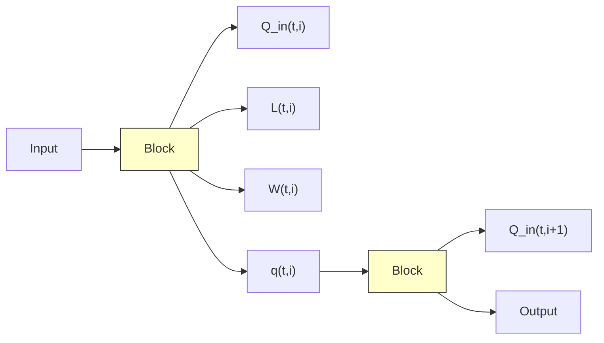
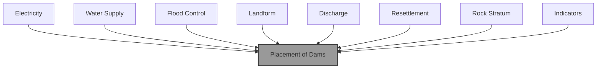
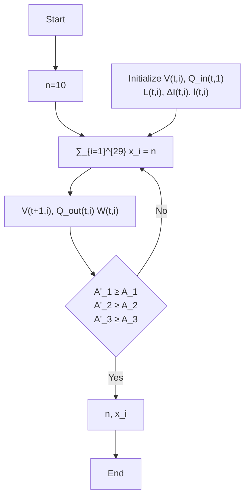

# 2017 MCM Summary Sheet

# Joint Force in Managing Zambezi River Abstract

Owing to the report put forward by the Institution of Risk Management of South Africa, the Kariba dam badly needs maintenance. The three options Zambezi River Authority provided might address the problem. Our modeling group make assessments to the three options and provides feasible plans to replace the former Kariba dam with several smaller dams. The requirements are satisfied in this paper.

With regard to requirement 1, we list factors of costs and benefits in advance. Then, we categorize potential cost into two parts, direct cost and indirect cost. With relative profiles, the two categories are quantized. However, the benefits of the three options can hardly be quantified. So we take advantage of fuzzy synthetic evaluation method and work out the relative levels of benefits in the three options. Finally, the return on investment (ROI) is calculated. Based on that, we can safely draw conclusion that option 1 is more economically efficient in a short period. But in the long term, option 3 appears to have more potential profits.

When it comes to requirement 2, we establish the water balance equation on both reservoirs and channels at the basis of analysis on water transference. Afterwards, we divide the water management capacities into 3 categorizes, the ability against flood, the ability for water supply and ability for electricity generation. Based on analysis to water management, the multi-dam system of versatile functions is proposed innovatively. Considering the actual factors in selecting dam sites, we screen out 29 possible locations. After then, the number and placement of the new dams is determined using optimization model. In order to lower the cost, we set our goal as the minimum number of dams. Along with the restraints of water balance equation and greater water management capacity, we complete optimization. As is shown in our results, 14 dams should be built as alternative to Kariba dam. Finally, error analysis is attached to our model.

For the sake that the new multi-dam system can function well under various circumstance, we set our system in three conditions, normal water circles, long-term drought and outburst flood. Particle swarm optimization (PSO) is adopted repeatedly to optimize the control of water discharge. Compare the result to the actual adjustments made by Kariba dam, we can conclude that the new multi-dam system can provide greater level of protection and water management options. Apart form this, we make thorough evaluations towards optimization scheme and distil general strategy in each condition. At last, we apply sensitivity analysis to conditions under long-term drought and outburst flood. The regulation limits are given under extreme conditions.

Last but not least, we take extreme disasters into consideration and use Monte Carlo method to make assessments. The result suggests the new system have a better resistance against disasters. Also, we list the overall strengths and weaknesses of our model as well as the further work.

Keywords: return on investment, water balance equation, particle swarm optimization, Monte Carlo method

# Content

# 1. Introduction.....

1.1. Background . .2   
1.2. Our Tasks.. .2

# 2. General Assumptions .... 3

# 3. Notions and Symbol Description ..... 3

# 4. Maintenance, Reconstruction, or Multi-dams?..

4.1. Potential cost of each option . .4   
4.2. Benefits of each option. 5   
4.3. ROI to each option . 5

# 5. Establishment of Water Balance Equation.....

5.1. Reservoirs.. 6   
5.2. Channels ..

# 6. Water management Capacity of Dam system ....... .7

6.1. The Ability against Flood . .8   
6.2. The Ability to Provide Useful Water . .8   
6.3. The Ability to Generate Electricity . .8   
6.4. Water Management Capacity in Multi-Dam System .8

# 7. Where to Build the Dams? .... .8

7.1. Select Candidate Locations with Principles.. .9   
7.2. Find the Optimal Solution based on Optimization Model. 10   
7.3. Result Analysis . .12   
7.4. Error analysis .. .12

# 8. Strategy for Modulating the Water Flow Based on PSO... ..13

8.1. Addressing the Normal Water Cycles. 13   
8.2. Strategy for Emergency Water Flow Situations.. 15

8.2.1. Long-term Drought . .15   
8.2.2. Outburst Flood . .16

# 9. Sensitivity Analysis .... .18

9.1. Sensitivity to Long-Term Drought. .18   
9.2. Sensitivity to Outburst Flood. .18

# 10. Estimation to the Resistance against Disasters of Multi-Dam System Based on Theory of Monte Carlo.. .19

# 11. Future Work ... .20

# 12. Strengths and Weaknesses.... .21

12.1. Strengths ..21   
12.2. Weaknesses .. ..21

# 13. Conclusion .. .21

# References & Appendix .......... .23

# 1. Introduction

# 1.1. Background

# 1.1.1. Summary to the Kariba Dam

The Kariba dam is a double curvature concrete arch dam locating between Zambia and Zimbabwe. It is a dam built upon Zambezi river in Kariba Gorge of the Zambezi river basin. The dam is huge with a size of 128 meters high and 579 meters long. Because of Kariba dam, the Lake Kariba is formed. Kariba Lake has 280 kilometers in length and holds 185 cubic kilometers volume of water.

The double curvature concrete arch dam was designed by Coyne et Bellier and constructed between 1955 and 1959 by Impresit of Italy at a cost of \$135,000,000 for the first stage with only the Kariba South power cavern. Because of political issues on the total cost of the dam, the whole construction is not completed until 1977.

# 1.1.2. Hydrology of Zambezi River

With 2750 kilometers of total length, 135 square kilometers of catchment area and 16 thousand cubic kilometers per second of annual runoff, Zambezi river is the second largest river in Africa. Zambezi river has a large water system and many branches. The tributaries in separate sides have asymmetric developments. The channel upstream is narrow and flow rate there is slow. Some swamps are distributed along the river. When it comes to the midstream, the water runs through the valley and floodplains. The flowing speed depends mainly on the width of channel. In the lower reaches, the river flows through plains and slows down. The water supply in the downstream is abundant and the flow rate varies greatly with the precipitation. The downstream is the main part for transportation.

# 1.2. Our Tasks

Since Kariba dam badly needs maintenance, the Zambezi River Authority puts forward three options, repairing the existing dam, rebuilding the existing dam and replacing Kariba dam with a series of smaller dams. What we should do is to make assessments to each option and provide detail information of option 3. Here are our tasks:

• Make evaluations to the three options in different aspects, including costs, time required, feasibility, capacity against natural disasters, functions served, etc. Details and specific reasons are attached to the assessments.   
• Establish principles and models for selecting proper construction sites. Make analysis to the current situation of Zambezi river basin and determine the aspects to be considered.   
• Build a model to estimate the capacity of the new multi-dam system. Make evaluations to the stability and capacity against extreme water flows and natural disasters. A guidance is about to provided for ZRA managers to justify the actions when handling emergencies.   
• Make analysis and assessment of our models, find the strength and weakness of them and make future predictions.

# 2. General Assumptions

We make the following assumptions to complete our model through this paper. Further improvements of these simplified assumptions will be achieved later with more reliable data.

• Neglect the expansion and contraction of water. If not, it will make the solving process more complex. The changing in the volume of water caused by temperature has a limited influence on the results. Therefore, it is meaningless to introduce expansion and contraction into our system.   
• The data we used in our models are reliable and accurate. Since the optimization to the problem and the strategy worked out are all based on the actual data.   
• Zambezi river will either change its channel or dry up in a long period.   
• The other existing dams in Zambezi river have no effects on the discussion in this paper. Without the interception of the other dams, the research can be simplified.   
• Constructions of dams in multi-dam system are completed at the same time.

# 3. Notions and Symbol Description

We will define the following variables here as they are widely used throughout our paper. Additional variables may be defined later, but will be confined to a particular section.

<table><tr><td>Symbols</td><td>Definitions</td><td>Symbols</td><td>Definitions</td></tr><tr><td> $C_d$ </td><td>direct cost</td><td> $S(t,i)$ </td><td>the storage of the  $i^{th}$  channel</td></tr><tr><td> $C_i$ </td><td>indirect cost</td><td> $S_{min}^i$ </td><td>minimum channel storage</td></tr><tr><td> $C_p$ </td><td>potential cost</td><td> $S_{max}^i$ </td><td>maximum channel storage</td></tr><tr><td>ROI</td><td>Return on investment</td><td> $I_{in}(t,i)$ </td><td>water inflow from the upper channel</td></tr><tr><td> $V(t,i)$ </td><td>water storage capacity of  $i^{th}$  reservoir</td><td> $\Delta I(t,i)$ </td><td>water imported from surrounding area</td></tr><tr><td> $V_{min}^i$ </td><td>dead storage of the  $i^{th}$  reservoir</td><td> $l(t,i)$ </td><td>internal loss of water in channel</td></tr><tr><td> $V_{max}^i$ </td><td>maximum storage of the  $i^{th}$  reservoir</td><td> $q(t,i)$ </td><td>discharge of water downstream</td></tr><tr><td> $V_{flood}$ </td><td>flood control capacity</td><td> $q_{max}^i$ </td><td>maximum discharge amount</td></tr><tr><td> $Q_{in}(t,i)$ </td><td>water inflow of the  $i^{th}$  reservoir</td><td> $A_1$ </td><td>flood control capacity</td></tr><tr><td> $Q_{out}(t,i)$ </td><td>discharge of the  $i^{th}$  reservoir</td><td> $A_2$ </td><td>water supply capacity</td></tr><tr><td> $L(t,i)$ </td><td>internal loss of reservoir</td><td> $A_3$ </td><td>generating capacity</td></tr><tr><td> $W(t,i)$ </td><td>water for external use</td><td> $R^2$ </td><td>channel flow variance</td></tr></table>

# 4. Maintenance, Reconstruction, or Multi-dams?

Due to a report proposed by the Institute of Risk Management of South Africa in 2015, Kariba dam, which is located in the midstream of Zambezi river, is in dire need of maintenance. Owing to the urgent situation, the Zambezi River Authority puts forward mainly 3 options. Firstly, repairing the existing Kariba dam; Secondly, reconstruct Kariba dam; Thirdly, replace Kariba dam with a series of smaller dams along Zambezi river. In order to make specific assessments to the three options, firstly, we list the relevant factors of costs and benefits.

Table 1: Relevant factors of costs and benefits 

<table><tr><td colspan="2">Cost</td><td rowspan="2">Benefit</td></tr><tr><td>Static cost</td><td>Potential cost</td></tr><tr><td>Labor forceMaterialEquipment</td><td>Refurbishment of associated projectsLoss of resource benefitsInflationLoan interests</td><td>IrrigationElectricity generationFlood controlShipping</td></tr></table>

Considering the upper elements, we have to quantify every factor to figure out the cost and benefits. However, the actual data can hardly be found. Therefore, we should study on the two parts separately.

# 4.1. Potential cost of each option

Table 2: Costs for the Reconstruction of Kariba Dam 

<table><tr><td>Item</td><td>Cost</td></tr><tr><td>Reconstruction of Kariba Dam</td><td>US$342 million</td></tr><tr><td>Maintenance of Kariba dam</td><td>US$220 million</td></tr><tr><td>Loss of water resource benefits during reconstruction</td><td>US$2031 million</td></tr></table>

The values in table 2 [1] specifically states that repairing the Kariba dam requires 220 million dollars and rebuilding the Kariba dam requires 342 million dollars. We set these costs to be direct cost. The table also mentions extra loss during construction is 2031 million dollars, we set it to be indirect cost. The data does not reveal the indirect cost of repairing Kariba dam, but the profiles we gathered shows the time required is approximately 2 years, while time required for reconstruction is 10 years. Therefore, we can assume that the indirect cost of maintenance is 1 /5 of that of reconstruction, nearly 406.2 million dollars. With regard to the establishment of multiple dams, there are less data available. The direct cost of building 10 to 20 small dams is similar to the cost of rebuilding, but a shorter period for construction, nearly 4 years. Therefore, the direct cost of multi-dam system is 342 million dollars and the indirect cost is about 812.4 million dollars. We mark potential cost as $C _ { p }$ , direct cost as $C _ { d }$ and indirect

cost as $C _ { i } ,$ so $C _ { p } = C _ { d } + C _ { i }$ .

According to the analysis we made above, we determine that the potential cost of option1 is 626.2 million dollars, the potential cost of option2 is 2373 million dollars and the potential cost of option3 is 1154.4 million dollars.

# 4.2. Benefits of each option

The profiles do not provide specific values measuring the benefits of the three options. We decide to assess the three options with fuzzy synthetic evaluation method [2]. The steps are introduced as follows:

• Defining the set of factors   
• Defining the set of evaluation grades   
• Endowing the weights to each factor

$$
U = \{\text { irrigation } u _ {1}, \text { electricity   generation } u _ {2}, \text { flood   control } u _ {3}, \text { shipping } u _ {4} \} \tag {1}
$$

$$
V = \{\text { excellent } v _ {1}, \text { good } v _ {2}, \text { average } v _ {3}, \text { bad } v _ {4}, \text { very   bad } v _ {5} \} \tag {2}
$$

$$
A = \{0. 2, 0. 2 5, 0. 3 5, 0. 2 \} \tag {3}
$$

Afterwards, we determine the fuzzy evaluation matrix $\mathtt { R } _ { 1 } , \mathtt { R } _ { 2 }$ and $\mathsf { R } _ { 3 }$ . The results are shown below:

Option1: [0.18,0.48,0.315,0.025,0]; Grade is good

Option2: [0.2,0.56,0.228,0.012,0]; Grade is good

Option3: [0.23,0.64,0.13,0,0]; Grade is good

The grades of the three options are all good. For distinction, the weight of evaluation for good is selected as the grades measuring benefits. Therefore, the grades to the three options are 0.48, 0.56 and 0.515.

# 4.3. ROI to each option

With comprehensive consideration of the discuss in potential cost and benefits, we figure out the comparison between the three options. Mark the greatest as 1, the rest are scaled sown. The results are shown in Table 3:

Table 3: Comparison of the three options regarding potential cost and benefits 

<table><tr><td></td><td>Option1</td><td>Option2</td><td>Option3</td></tr><tr><td>Potential cost</td><td>0.264</td><td>1</td><td>0.486</td></tr><tr><td>Benefits</td><td>0.75</td><td>0.875</td><td>1</td></tr></table>

With of help of the return on investment concept in economic, we can make the following definition:

$$
\mathrm{ROI} = \frac {\text { Benefits }}{\text { Potential   cost }} \tag {4}
$$

ROI of the three options are 2.84, 0.875 and 2.06. Therefore, at this stage, option 1 is of greater economic efficiency. However, in the long term, we can not determine the life span and efficiency after maintenance. As a result, what we can conclude is option 1 is more effective considering recent return on investment. If considering the tradeoff between cost and benefits, option 3 stands out.

# 5. Establishment of Water Balance Equation

In order to study on the capability of water resource management, the river discharge problem comes first. We consider the whole river as a string and the dams cut the string into segments (channels) and nodes (reservoirs). The changes in water quantity during transmission can be calculated by formulating the water balance equation of reservoirs and channels [3]. For convenience, we depict the following diagram:


<details>
<summary>flowchart</summary>


</details>

Figure 1: Illustration to water cycle in dams

# 5.1. Reservoirs

Water can be accumulated and reserved in reservoirs created by dams. First of all, mark the water storage capacity of $i ^ { t h }$ reservoir as $V ( t , i )$ . Then, the water balance equation can be stated as follows:

$$
V (t + 1, i) = V (t, i) + Q _ {i n} (t, i) - Q _ {o u t} (t, i) - L (t, i) - W (t, i) \tag {5}
$$

Where $V ( t + 1 , i )$ and $V ( t , i )$ stand for the water storage at the time of t+1 and t. $Q _ { i n } ( t , i )$ refers to the water inflow of the $i ^ { t h }$ reservoir form upper reach. $Q _ { o u t } ( t , i )$ stands for the discharge of the $i ^ { t h }$ reservoir to lower reaches. $Q _ { g e } ( t , i )$ is the part in discharge that is used to generate electricity and $O ( t , i )$ is the rest that are drained directly. $L ( t , i )$ is the internal loss of reservoir, the majority of which are loss through evaporation and permeation. $W ( t , i )$ represents the part of water for external use, including agriculture, industry and domestic water.

Owing to the limit in reservoir’s scale and serviceability, the restraints are listed as follows:

• Restraints of $V ( t , i )$

We should guarantee that the water storage is smaller than the reservoir’s maximum storage volume and greater than its dead storage capacity, which is presented as follows:

$$
V _ {\text { min }} ^ {i} \leq V (t, i) \leq V _ {\text { max }} ^ {i} \tag {6}
$$

Where $V _ { m i n } ^ { i }$ refers to the dead storage capacity and $V _ { m a x } ^ { i }$ refers to the maximum storage volume. The maximum storage volume can be categorized into two parts. $V _ { m a x 1 }$ stands for the maximum water allowed to store under normal circumstances. $V _ { m a x 2 }$ stands for the maximum water for use through flooding. Therefore, $V _ { f l o o d } = V _ { m a x 2 } - V _ { m a x 1 }$ represents the flood control capacity needs to be retained.

• Restraint of $Q _ { o u t } ( t , i )$

There are two ways for discharge, one is direct drainage, named flow capacity, the other is water drained off during electricity generation, named discharge capacity. For each kind of drainage, the restraint can be states as follows:

$$
O (t, i) \leq O _ {\max} ^ {i} (h) \tag {7}
$$

$$
Q _ {g e} (t, i) \leq O _ {g e m a x} ^ {i} (h) \tag {8}
$$

Where h is the water level, $O _ { m a x } ^ { i } ( h )$ and $O _ { g e m a x } ^ { i } ( h )$ are the maximum flow capacity and maximum discharge capacity if the $i ^ { t h }$ dam, Both of which are related to the water level.

# 5.2. Channels

We mark the channel storage of the $i ^ { t h }$ channel is $S ( t , i )$ at i moment. The water balance equation of the $i ^ { t h }$ channel is presented in the following expression:

$$
S (t + 1, i) = S (t, i) + I _ {i n} (t, i) + \Delta I (t, i) - q (t, i) - l (t, i) \tag {9}
$$

Where $I _ { i n } ( t , i )$ is the water inflow from the upper channel, $q ( t , i )$ refers to the discharge of water downstream, $\Delta I ( t , i )$ is water imported from surrounding area. $l ( t , i )$ is the internal loss of water in channels. Both $\Delta I ( t , i )$ and $l ( t , i )$ are related to the hydrology and length of channel. In this paper, we only focus on the channels in Zambezi river.

• Restraint of $q ( t , i )$

$$
S _ {\text { min }} ^ {i} \leq S (t, i) \leq S _ {\text { max }} ^ {i} \tag {10}
$$

Where $S _ { m a x } ^ { i }$ is the maximum channel storage, $S _ { m i n } ^ { i }$ is the minimum channel storage to prevent it form drying up.

• Restraint of $I _ { o u t } ( t , i )$

$$
q (t, i) \leq q _ {m a x} ^ {i} \tag {11}
$$

Where $q _ { m a x } ^ { i }$ is the maximum discharge amount.

# 6. Water management Capacity of Dam system

According to option 3 put forward by ZRA, we should establish a new multi-dam system to replace the existing Kariba dam. The newly-built system should be prior to the existing dam or at least has the same capacity with Kariba dam. To fulfil our purpose, firstly, we have to figure out the meaning of water management capacity. According to profiles of ZRA [4][5], we found that the main task of ZRA is to allocate water to the power stations on the dam and other users. Therefore, we could restate the task with three points:

² Adjust the water flow capacity for emergencies like floods.   
² Transfer the water in reservoirs to meet daily request   
² Adjust the water discharge capacity to meet the requirement in electricity

generation

According to Expression (1) in 4.1, what we need to do is to change the value of one of the variables to achieve predicted water management capacity.

The three kinds of water management capacities are sequentially marked as $A _ { 1 }$ (the ability against flood), $A _ { 2 }$ (the ability to provide useful water), $A _ { 3 }$ (the ability to generate electricity). Since they are all related to the controllable quantity of water, we can use the related water quantity to represent capacities.

# 6.1. The Ability against Flood

In order to take precautions against flood, every reservoir would reserve a certain degree of water to adjust the storage capacity. The more space it reserves, the more capable it will be in flood control. As a result, the flood control capacity can be represented as follows:

$$
A _ {1} = V _ {\text { max2 }} - V (t) = V _ {\text { flood }} + V _ {\text { max1 }} - V (t) \tag {12}
$$

Where ? ? refers to the water storage before the flood control.

# 6.2. The Ability to Provide Useful Water

In this part, the water storage is used for agriculture, industry and domestic water. But the water remains should greater than the dead storage $V _ { m i n }$ . The water supply capacity is stated as follows:

$$
A _ {2} = W (t) \tag {13}
$$

# 6.3. The Ability to Generate Electricity

The generating capacity is proportional to quantity of water used to generate electricity $Q _ { g e } ( t )$ . The generating capacity can be stated in the following expression:

$$
A _ {3} = Q _ {g e} (t) \tag {14}
$$

# 6.4. Water Management Capacity in Multi-Dam System

With regard to the discussion of single dam system above, the three capacities of multidam system can be formulated as follows:

$$
A _ {1} ^ {\prime} = \sum_ {i = 1} ^ {n} V _ {\max 2} (i) - V (t, i) \tag {15}
$$

$$
A _ {2} ^ {\prime} = \sum_ {i = 1} ^ {n} W (t, i) \tag {16}
$$

$$
A _ {3} ^ {\prime} = \sum_ {i = 1} ^ {n} Q _ {g e} (t, i) \tag {17}
$$

Where $1 \leq i \leq n , 1 0 \leq n \leq 2 0$ .

Above all, in order to satisfy the assignment that the new system of dams should have the same overall water management capabilities as the existing Kariba, we can conclude the restraints to the following expressions:

$$
\left\{ \begin{array}{c} A _ {1} ^ {\prime} \geq A _ {1} \\ A _ {2} ^ {\prime} \geq A _ {2} \\ A _ {3} ^ {\prime} \geq A _ {3} \\ V (t + 1, i) = V (t, i) + Q _ {i n} (t, i) - Q _ {o u t} (t, i) - L (t, i) - W (t, i) \\ S (t + 1, i) = S (t, i) + I _ {i n} (t, i) + \Delta I (t, i) - q (t, i) - l (t, i) \end{array} \right. \tag {18}
$$

Variables in upper expressions have already been defined. We set $0 \leq i \leq n . \ i = 0$ refers to the case that there only existing the former Kariba dam, in which we can figure out the value of $A _ { 1 } , A _ { 2 }$ and $A _ { 3 }$ . In case $1 \leq i \leq n , { A _ { 1 } } ^ { \prime } , { A _ { 2 } } ^ { \prime }$ and ${ A _ { 3 } } ^ { \prime }$ can be worked out.

# 7. Where to Build the Dams?

In section 5, we determine the relationship between water management capability and water discharge. However, let along the water discharge, we should take the surrounding situations into consideration when establishing multi-dam systems. When we begin selecting the siting of dams, there are many factors should be considered with. Therefore, we divide the establishment of multi-dam system into 2 parts: a) Select possible locations to land dams (greater than 20); (b) Analyze combinations of potential locations to make the capacity of multi-dam system balanced the existing Kariba dam.

According to the data we gathered [6], we mainly employ 4 indicators for site selection. The four indicators are Discharge, Landform, Resettlement and Rock Stratum. Incorporate with the water discharge, the principles for selection are depicted in Figure 2:


<details>
<summary>flowchart</summary>


</details>

Figure 2: Principles in site selection

# 7.1. Select Candidate Locations with Principles

We have collected the information of population distribution, topography and flood Frequency [7]. Specific data is attached in appendix. After then, we make integral assessments based on the principles. We choose 29 possible locations, marked from 1 to 29. Some potential dams also exist in our choices (20 is Batoka Gorge, 23 is Devil’s Gorge). The latitude and longitude of both the 29 possible sites and Kariba dam is presents in the following table:

Table 4: Latitude and longitude information of possible sites 

<table><tr><td>1</td><td>2</td><td>3</td><td>4</td><td>5</td><td>6</td></tr><tr><td>14.17°S, 23,20°E</td><td>14.44°S, 23,17°E</td><td>14.70°S, 23.05°E</td><td>14.99°S, 22.96°E</td><td>15.25°S, 22.97°E</td><td>15.51°S, 23.08°E</td></tr><tr><td>7</td><td>8</td><td>9</td><td>10</td><td>11</td><td>12</td></tr><tr><td>15.77°S, 23.18°E</td><td>16.11°S, 23.26°E</td><td>16.25°S, 23.24°E</td><td>16.32°S, 23.29°E</td><td>16.60°S, 23.50°E</td><td>16.85°S, 23.83°E</td></tr><tr><td>13</td><td>14</td><td>15</td><td>16</td><td>17</td><td>18</td></tr><tr><td>17.14°S, 24.05°E</td><td>17.44°S, 24.22°E</td><td>17.53°S, 24.59°E</td><td>17.56°S, 24.97°E</td><td>17.78°S, 25.26°E</td><td>17.86°S, 25.52°E</td></tr><tr><td>19</td><td>20</td><td>21</td><td>22</td><td>23</td><td>24</td></tr><tr><td>17.88°S, 25.85°E</td><td>17.92°S, 26.13°E</td><td>17.94°S, 26.39°E</td><td>18.01°S, 26.77°E</td><td>17.96°S, 27.95°E</td><td>17.73°S, 27.22°E</td></tr><tr><td>25</td><td>26</td><td>27</td><td>28</td><td>29</td><td>Kariba Dam</td></tr><tr><td>17.52°S, 27.38°E</td><td>17.35°S, 27.60°E</td><td>17.03°S, 27.80°E</td><td>16.86°S, 28.07°E</td><td>16.68°S, 28.36°E</td><td>16.52°S, 28.76°E</td></tr></table>

With analysis to the possible sites, we find that the landforms can be categorized into 3 classes:

• Highland at upper reach of Victoria Fall, marked as area A.   
• Steep terrain by the midstream, marked as area B.   
• Plain between Gwayi Confluence and Kariba dam, marked as area C.

Because of the differences in landforms, the dams built can serve different major functions. Flood hits area A frequently, so the dams built here need a greater $V _ { f l o o d }$ . Area B is steep, which benefits the electricity generation. The storage capacity of dams here is comparatively smaller. Area C is close to human active areas, so the dams in area C are mainly designed for water usage in agriculture, industry and domestic water. Therefore, we divide Zambezi river into three domains, Flood control, Electricity generation and Water supply. For convenience, they are sequentially abbreviated as subsystem1, subsystem 2 and subsystem 3, which is shown as follows:


<details>
<summary>text_image</summary>

Flood Control
Electricity Generation
Water Supply
ZRA
(overall coordination)
Subsystem 1
(Flood Control)
Subsystem 1
(Water Supply)
Subsystem 3
(Electricity Generation)
</details>

Figure 3: Subsystems in Zambezi river

# 7.2. Find the Optimal Solution based on Optimization Model

What we should do is to build 10 to 20 dams within 29 candidate locations. Therefore, we have to find the best solutions with optimization. We set the optimization goal to the minimum number of dams to built. The restraints of optimization are the number of dams, water management capacity, limits in reservoir storage capacity and channel storage capacity, etc.

According the discussion above, the optimization model can be formulated as below:

$$
\min \sum_ {i = 0} ^ {2 9} X _ {i} \tag {19}
$$

$$
s. t. \left\{ \begin{array}{l} V (t + 1, i) = V (t, i) + Q _ {i n} (t, i) - Q _ {o u t} (t, i) - L (t, i) - W (t, i) \\ S (t + 1, i) = S (t, i) + I _ {i n} (t, i) + \Delta I (t, i) - q (t, i) - l (t, i) \\ \sum_ {i = 1} ^ {n} \left[ V _ {\max 2} (i) - V (t, i) \right] \cdot X _ {i} \geq A _ {1} \\ \sum_ {i = 1} ^ {n} W (t, i) \cdot X _ {i} \geq A _ {2} \\ \sum_ {i = 1} ^ {n} Q _ {g e} (t, i) \cdot X _ {i} \geq A _ {3} \\ X _ {i} V _ {\min} ^ {i} \leq X _ {i} V (t, i) \leq X _ {i} V _ {\min} ^ {i} \\ 1 0 \leq \sum_ {i = 0} ^ {2 9} X _ {i} \leq 2 0 \\ X _ {i} = 0 o r 1 \end{array} \right. \tag {20}
$$

Where $X _ { i }$ is a 0-1 variable. In case $X _ { i } = 1$ , spot i is selected to construct a dam. Case $X _ { i } = 0$ represents the opposite. What’s more, $0 \leq i \leq 2 9$ . The parameters remains are introduced in 5.1 and 5.2.

For the sake of quantitative planning, profiles related to the dam construction are gathered. With synthetically consideration with data of Kariba dam, we design the dams in three subsystems reasonably. The relevant parameters are stated in Table 5:

Table 5: Parameters of dams in subsystems 

<table><tr><td></td><td> $W/m^{3}$ </td><td> $\overline{V}/km^{3}$ </td><td> $V_{min}/km^{3}$ </td><td> $V_{max}/km^{3}$ </td></tr><tr><td>Dam in Subsystem 1</td><td> $0.06\times10^{6}$ </td><td>12.2</td><td>7.4</td><td>20</td></tr><tr><td>Dam in Subsystem 2</td><td> $0.15\times10^{6}$ </td><td>11.6</td><td>4.4</td><td>13.2</td></tr><tr><td>Dam in Subsystem 3</td><td> $0.376\times10^{6}$ </td><td>11.2</td><td>8</td><td>15</td></tr><tr><td>Kariba Dam</td><td> $3\times10^{6}$ </td><td>115.8</td><td>51</td><td>180.6</td></tr></table>

Where ? is adjustable water volume, ? is average capacity, $V _ { m i n }$ is minimum water storage and $V _ { m a x }$ is maximum capacity. The related data of discharge in target areas are listed as follows:

Table 6: Discharge in target areas   
unit: ?A/? 

<table><tr><td>Sub basin</td><td>Discharge in Sub basin</td><td>Total water discharge so far</td></tr><tr><td>Lungue Bungo</td><td>114</td><td>1129</td></tr><tr><td>Luanginga</td><td>69.4</td><td>1198</td></tr><tr><td>Kwando/Chobe</td><td>0</td><td>1198</td></tr><tr><td>Barotse</td><td>-17.6</td><td>1180</td></tr><tr><td>Kariba</td><td>206</td><td>1386</td></tr></table>

For each combination of $X _ { i } ,$ , we simulate the water quantity in each stage using MATLAB to determine whether the water management capacity reaches its standard. The flowchart below describes our algorithm:


<details>
<summary>flowchart</summary>


</details>

Figure 4: Algorithm in simulating combinations of $X _ { i }$ measuring water management

Step 1: Initialize n to 0

Step 2: Go through $x _ { i }$ and find every combination satisfying the sum of $x _ { i }$ is n

Step 3: Initialize $\mathrm { V ( t , i ) } , Q _ { i n } ( t , 1 ) , L ( t , i )$ and $\Delta I ( t , i ) , l ( t , i )$ and calculate relative $\mathrm { v ( t } + 1 , \mathrm { i } ) , Q _ { o u t } ( t , i ) , W ( t , i )$ with water balance equation

Step 4: Figure out $A _ { 1 } ^ { \prime } , A _ { 2 } ^ { \prime }$ and $A _ { 3 } ^ { \prime }$ and make comparison with $A _ { 1 } , A _ { 2 }$ and $A _ { 3 }$ to ensure that the overall capacity of the new multidam is greater than Kariba dam

Step 5: According to the result of comparison , if accepted, print out the relative combination of $x _ { i }$ and n, end. If rejected, $n = n + 1$ , go to Step 2

# 7.3. Result Analysis

With compilation of MATLAB, we can find the optimal locations to build dams. 14 dams are required here, the codes of them are 3, 4, 6, 9, 10, 15, 17, 19, 21, 22, 24, 26, 28, 29. They are marked on the map shown in Figure 5:


<details>
<summary>text_image</summary>

ANGOLA
LUNGUE BUNGO
UPPER ZAMBEZI
LUNGUE BUNGO
CUANDO
LUANGINGA
CUANDO/CHOBE
NAMIBIA
Zambesi
Kabompo
Kabompo
BAROTSE
KAFUE
MUPATA
TETE
Shire River & Lake Malawi/
NIASSA/NYASA
LUANGWA
MALAWI
ZAMB DEC
</details>

Figure 5: Placement of multi-dam system

Since the results are worked out under the restraint of water management capacity, we could safely draw the conclusion that the overall water management capacity of new multidam system is greater than that of the existing Kariba dam.

# 7.4. Error analysis

In order to prove the accuracy of our model, we bring the data up to 2008 into it. We figure out the discharge downstream of Kariba dam and compare it to the statistical data to complete our error analysis. We collect actual data for 12 months and the results are shown below:

Table 7: Error analysis of model 1 

<table><tr><td>Month</td><td>Actual value</td><td>Estimate value</td><td>Absolute error</td><td>Fractional error</td></tr><tr><td>Jan</td><td>2436.8</td><td>2529.1</td><td>92.3</td><td>3.79%</td></tr><tr><td>Feb</td><td>1042.2</td><td>1124.2</td><td>82</td><td>7.87%</td></tr><tr><td>Mar</td><td>905.8</td><td>1001.6</td><td>95.8</td><td>10.58%</td></tr><tr><td>April</td><td>1162.7</td><td>1243.6</td><td>80.9</td><td>6.96%</td></tr><tr><td>May</td><td>1368.8</td><td>1426.1</td><td>57.3</td><td>4.19%</td></tr><tr><td>Jun</td><td>1111.2</td><td>1011.45</td><td>99.75</td><td>8.98%</td></tr><tr><td>Jul</td><td>1228.6</td><td>1312.1</td><td>83.5</td><td>6.80%</td></tr><tr><td>Aug</td><td>1075.5</td><td>1111.7</td><td>36.2</td><td>3.37%</td></tr><tr><td>Sep</td><td>981.9</td><td>991.4</td><td>9.5</td><td>0.97%</td></tr><tr><td>Oct</td><td>875.9</td><td>901.2</td><td>25.3</td><td>2.89%</td></tr><tr><td>Nov</td><td>1047.9</td><td>951.6</td><td>96.3</td><td>9.19%</td></tr><tr><td>Dec</td><td>1364.4</td><td>1400.6</td><td>36.2</td><td>2.65%</td></tr></table>

According to the last two columns in Table 7, we find that the maximum error is 10.58%, the average error is 5.68%. From our perspectives, the errors may result from the lack of evaporation and infiltration in actual data. Therefore, we could safely draw conclusion that the

errors in our model is acceptable.

# 8. Strategy for Modulating the Water Flow Based on PSO

In spite of the great water management capacity of the new multi-dam system, the system itself is complex. Comparing to a single dam, it appears to be more difficult in managing a multi-dam system. Therefore, it is necessary for us to work out the mechanism of water management under various circumstances. Depending on researches on different situations, we work out an appropriate regulation strategy for ZRA to better operate on and manage the multidam system.

# 8.1. Addressing the Normal Water Cycles

The Zambezi river has explicit withered water period and high water period. Without regulation and control to the water discharge, the water flow will vary greatly via seasons. What’s more, since the large geographical breadth of Zambezi river, the time monsoon season starts varies, which leads to the time fluctuations in high water periods. As a result of this, the measures taken by the dams may vary at the same time period.

Under normal water cycles, the drainage and storage of water in each dam should be adapted to narrow down the differences in seasonal water flow. The discharge should be regulated in a steady level. For this sake, we establish the channel flow variance $R ^ { 2 }$ to describe the level of water flow stability. The definition of $R ^ { 2 }$ are given as follows:

$$
R ^ {2} = \frac {1}{n - 1} \sum_ {k = 1} ^ {n} [ S (k, i) - \bar {S} (i) ] ^ {2} \tag {21}
$$

Where $S ( k , i )$ stands for the water discharge of the $i ^ { t h }$ channel in month k. n refers to the month to be studied. $\bar { S } ( i )$ is the mean discharge in month n. The purpose of our water transfer scheme is to narrow down the value of $R ^ { 2 }$ .

The programming model are formulated as follows:

$$
\min R ^ {2} = \frac {1}{n - 1} \sum_ {k = 1} ^ {n} [ S (k, 0) - \bar {S} (0) ] ^ {2} \tag {22}
$$

$$
\left\{ \begin{array}{l} V _ {m i n} ^ {i} \leq V (k, i) \leq V _ {m a x} ^ {i} \\ Q _ {o u t m i n} ^ {i} \leq Q _ {o u t} (t, i) \leq Q _ {o u t m a x} ^ {i} \\ V (k + 1, i) - V (k, i) = + Q _ {i n} (k, i) - Q _ {o u t} (k, i) - L (k, i) - W (k, i) \\ S _ {m i n} ^ {i} \leq S (k, i) \leq S _ {m a x} ^ {i} \\ q _ {m i n} ^ {i} \leq q (k, i) \leq q _ {m a x} ^ {i} \\ S (k + 1, i) = S (k, i) + I _ {i n} (k, i) + \Delta I (k, i) - q (k, i) - l (k, i) \end{array} \right. \tag {23}
$$

As is shown in the objective function, in case $S ( k , 0 )$ , the discharge of a segment of channel downstream is studied, through which we can easily make comparison to the discharge under control of the existing Kariba dam.

For quantitative calculation, we find statistics of the discharge of each segment of channels as a function of month in normal years. In order to find the optimal solutions, Particle Swarm Optimization (PSO) [8] is adopted to simulate the changes in water storage of different reservoirs. With multiple calculations compiled by MATLAB, we successfully work out the comparatively better adjustment scheme. The fitness function curve is shown in Figure 6.


<details>
<summary>line</summary>

| times | fitness |
| ----- | ------- |
| 0     | 5.58    |
| 10    | 5.32    |
| 20    | 5.20    |
| 30    | 5.16    |
| 40    | 5.14    |
| 50    | 5.13    |
| 60    | 5.12    |
| 70    | 5.12    |
| 80    | 5.12    |
| 90    | 5.12    |
| 100   | 5.12    |
| 110   | 5.12    |
| 120   | 5.12    |
| 130   | 5.12    |
| 140   | 5.12    |
| 150   | 5.12    |
</details>

Figure 6: Fitness function curve of adjustment scheme

The water allocation scheme of the three subsystems is listed in Table 8:

Table 8: Water allocation scheme of subsystems in normal years   
Unit: $k m ^ { 3 }$ 

<table><tr><td>Month</td><td>Oct</td><td>Nov</td><td>Dec</td><td>Jan</td><td>Feb</td><td>Mar</td></tr><tr><td>Subsystem 1</td><td>-0.09476</td><td>-0.09083</td><td>-0.10001</td><td>-0.09535</td><td>0.062192</td><td>0.062201</td></tr><tr><td>Subsystem 2</td><td>0.001557</td><td>-0.00644</td><td>-0.00673</td><td>-0.01244</td><td>0.055984</td><td>0.055952</td></tr><tr><td>Subsystem 3</td><td>-0.0585</td><td>-0.05369</td><td>-0.0446</td><td>-0.05871</td><td>0.049746</td><td>0.049742</td></tr><tr><td>Month</td><td>April</td><td>May</td><td>Jun</td><td>Jul</td><td>Aug</td><td>Sep</td></tr><tr><td>Subsystem 1</td><td>0.060934</td><td>0.058666</td><td>0.060161</td><td>-0.09978</td><td>-0.09523</td><td>-0.09389</td></tr><tr><td>Subsystem 2</td><td>0.05598</td><td>0.049408</td><td>0.051366</td><td>-0.00733</td><td>-0.01196</td><td>-0.00999</td></tr><tr><td>Subsystem 3</td><td>0.048205</td><td>0.049725</td><td>0.048489</td><td>-0.04715</td><td>-0.04637</td><td>-0.05335</td></tr></table>

The values in Table 8 represents the variance in the reservoirs’ monthly storage. For example, -0.09476 means the subsystem 1 has to decrease water storage by 0.09476 in October. In other words, the net water discharge here is 0.09476 ??A. It is noteworthy that the data for quantitative calculation is collected in normal years. When handling a specific year, we cannot directly put the values shown in Table 8 into practice, even through there is proved no extreme situations. However, tentative treatment is given under normal water cycles. The reservoir should store water in Jul, Aug, Set, Oct, Nov, Dec and Jan. In the rest of months, water storage should be reduced.

The comparison in adjustment between the new multi-dam system and Kariba dam is depicted in Figure 7:


<details>
<summary>line</summary>

| Month | Kariba Dam | Mluti-Dam System |
|-------|------------|------------------|
| Oct   | 800        | 1000             |
| Nov   | 1000       | 1100             |
| Dec   | 1300       | 1200             |
| Jan   | 2400       | 1700             |
| Feb   | 1000       | 1900             |
| Mar   | 800        | 1500             |
| April | 1100       | 1200             |
| May   | 1300       | 1300             |
| Jun   | 1100       | 1200             |
| Jul   | 1200       | 1200             |
| Aug   | 1100       | 1100             |
| Sep   | 1000       | 1100             |
</details>

Figure 7: Comparisons under normal water cycles

From Figure 7, we can find that in the new multi-dam system, the changes in discharge appears to be more steady, which proves that our strategy is practical.

# 8.2. Strategy for Emergency Water Flow Situations

Zambezi river basin suffers from natural disasters frequently, the major of them are longterm drought and outburst flood. In order to deal with these emergencies, we should make further adjustments to our system.

# 8.2.1. Long-term Drought

During the long-term drought period, the discharge of the whole river is generally reduced. Our adjustments are made to satisfy the need that the water supply in the downstream is abundant. As a result, we build the programming objective as follows:

$$
\max \{\min S (k, 0) \} \tag {24}
$$

The restraints are the same with that of Expression (23). With the data we gathered about Zambezi river in dry years, we can easily make calculations. Similar to that in 7.1, with multiple times of simulations using PSO, the water allocation schemes of each subsystem is shown in Table 9:

Table 9: Water allocation schemes of each subsystem in drought period Unit: $k m ^ { 3 }$ 

<table><tr><td>Drought</td><td>Oct</td><td>Nov</td><td>Dec</td><td>Jan</td><td>Feb</td><td>Mar</td></tr><tr><td>Subsystem 1</td><td>-0.27787</td><td>1.026436</td><td>-1.04203</td><td>0.249226</td><td>-0.65067</td><td>0.191609</td></tr><tr><td>Subsystem 2</td><td>-0.07421</td><td>-2.17294</td><td>0.475582</td><td>-0.37972</td><td>-0.24793</td><td>-0.35295</td></tr><tr><td>Subsystem 3</td><td>-0.90204</td><td>0.130651</td><td>-0.86552</td><td>-0.98385</td><td>0.050967</td><td>0.220654</td></tr><tr><td>Drought</td><td>April</td><td>May</td><td>Jun</td><td>Jul</td><td>Aug</td><td>Sep</td></tr><tr><td>Subsystem 1</td><td>1.299811</td><td>2.357025</td><td>-0.40244</td><td>-1.58494</td><td>0.123439</td><td>0.352689</td></tr><tr><td>Subsystem 2</td><td>-0.00116</td><td>-1.46258</td><td>-0.49026</td><td>0.023731</td><td>0.056262</td><td>-0.25739</td></tr><tr><td>Subsystem 3</td><td>0.393705</td><td>0.38105</td><td>0.300223</td><td>0.421971</td><td>-1.20925</td><td>-1.44345</td></tr></table>

With analysis of the values in Table 9, we find that during the drought period, subsystem 1 is always in discharge state while subsystem 3 is always in impounding state. When drought happens, the river is under prolonged low water conditions. Here are our strategies:

² Drain the water in subsystem 1 downstream, which provides sufficient water

for electricity generation in subsystem 2.

² Subsystem 3 should manage to store water to meet the needs of water supply downstream. At the meantime, the water level downstream is kept in certain state to satisfy the shipping requirements.

With Comparison of the water management results under the circumstance of multi-dam system and Kariba dam, we can depict the differences in the following chart:


<details>
<summary>line</summary>

| month | Kariba Dam | Mluti-Dam System |
|-------|------------|------------------|
| 1     | 200        | 950              |
| 2     | 250        | 1050             |
| 3     | 300        | 900              |
| 4     | 950        | 1250             |
| 5     | 950        | 950              |
| 6     | 950        | 1050             |
| 7     | 950        | 1050             |
| 8     | 950        | 900              |
| 9     | 950        | 950              |
| 10    | 950        | 950              |
| 11    | 950        | 950              |
| 12    | 950        | 950              |
</details>

Figure 8: Comparison between multi-dam system and Kariba dam facing with drought

As is shown in Figure 8, we can safely draw the conclusion that the multi-dam system has a better water management capacity under drought conditions over that of Kariba dam. What’s more, the results indicate that when facing with long-term drought, the multi-dam system holds enough water to survive the drought periods.

# 8.2.2. Outburst Flood

When it comes to outburst flood upstream, the discharge of the following channels will meet a sudden rise. If one segment of channels holds water more than its channel storage capacity, the water will spill out and results to the extension of flood-affected areas. Therefore, the water in channels should be reduced to prevent water form spilling out and finally diminish the chance of destructive flood. As a result, the programming objective is stated as follows:

$$
\min \{\max S (k, 0) \} \tag {25}
$$

The restraints are the same with that in 7.1. We bring the historical data related to flooding into our model and make multiple calculations with the help of PSO. The results are shown in Table 10:

Table 10: Water allocation schemes of each subsystem in flooding period Unit: $k m ^ { 3 }$ 

<table><tr><td>Flooding</td><td>Oct</td><td>Nov</td><td>Dec</td><td>Jan</td><td>Feb</td><td>Mar</td></tr><tr><td>Subsystem 1</td><td>1.835305</td><td>3.04317</td><td>1.9973</td><td>3.626824</td><td>3.837354</td><td>3.491875</td></tr><tr><td>Subsystem 2</td><td>-0.50768</td><td>-0.8993</td><td>1.028984</td><td>-0.20848</td><td>0.832249</td><td>1.573858</td></tr><tr><td>Subsystem 3</td><td>0.791538</td><td>-0.06238</td><td>0.148498</td><td>1.03733</td><td>3.084586</td><td>3.713995</td></tr><tr><td>Flooding</td><td>April</td><td>May</td><td>Jun</td><td>Jul</td><td>Aug</td><td>Sep</td></tr><tr><td>Subsystem 1</td><td>5.391049</td><td>5.664352</td><td>5.628686</td><td>1.062068</td><td>0.740065</td><td>2.635967</td></tr><tr><td>Subsystem 2</td><td>1.5882</td><td>0.417108</td><td>-1.76944</td><td>-0.04835</td><td>-0.60331</td><td>-0.3279</td></tr><tr><td>Subsystem 3</td><td>2.946934</td><td>3.021101</td><td>2.829153</td><td>2.481431</td><td>2.735348</td><td>0.025019</td></tr></table>

Table 10 shows that when flood reaches, Subsystem 1 needs to keep storing water to decrease the direct discharge of flood so that reduce the stress of the following dams. Subsystem 2 should drain water in advance to receive the redundant water which can not be stored by subsystem 1. Also, dams in subsystem 3 should take advantage of storage capacities to diminish the water pulled downstream.

The comparison of water management capacity between multi-dam system and Kariba dam is plotted as follows:


<details>
<summary>line</summary>

| month | Kariba Dam (m³/s) | Mluti-Dam System (m³/s) |
|---|---|---|
| 1 | 1200 | 1900 |
| 2 | 1200 | 2000 |
| 3 | 1600 | 2000 |
| 4 | 2000 | 2300 |
| 5 | 3400 | 2500 |
| 6 | 3800 | 2700 |
| 7 | 4300 | 2900 |
| 8 | 4000 | 2600 |
| 9 | 3200 | 2500 |
| 10 | 1700 | 2400 |
| 11 | 1300 | 2400 |
| 12 | 1200 | 2200 |
</details>

Figure 9: Comparison between multi-dam system and Kariba dam facing with Flood

As is depicted in Figure 9, under the control of multiple dams, the effects caused by flood are comparatively smaller, and the flood peak is lower. Therefore, we can draw the conclusion that multi-dam system can significantly reduce the loss caused by flood and waterlog.

The strategy introduced above demonstrates that when flood happens, we should take full consideration of the storage capacity of dams to partake the strass in channels. Apart form this, in more detail, we can make full use of channel storage capacity to control the flood. The multidam system actually conducive to this. The strategy is specifically discussed as follows:

² When the flood comes, the first dam makes full use of its storage to store the flood. At the meantime, the following dams quickly drain water downstream to lower the water level itself and that of the upper channels.   
² While water level of the first dam reaches its warning line, water in the first dam should be quickly pulled down to the sequential dams. At this point, the second dam stops draining water and utilize both the storage itself and the storage capacity of the upper channels.   
² So as follow. Make full use of every storage capacity of both dams and channels to control the flood. With this strategy, the entire system can deal with more serious flood.

Our strategy is depicted in the following graphs:


<details>
<summary>text_image</summary>

Flood
Stage 1
</details>


<details>
<summary>text_image</summary>

Flood
Stage 2
</details>

Figure 10: Illustration to our strategy

# 9. Sensitivity Analysis

In this part, based on the actual data, we manually increase the severity of drought and flood and analyze the changes in water downstream after the system regulation.

# 9.1. Sensitivity to Long-Term Drought

We decrease the actual data on water discharge during drought period. The decreasement are 100 $m / s ^ { 2 }$ , $1 5 0 m / s ^ { 2 }$ and $2 0 0 m / s ^ { 2 }$ . The changes in the water discharge downstream is depicted in the following figure:


<details>
<summary>line</summary>

| Month | Flow (Red) | Flow (Yellow) | Flow (Green) | Flow (Blue) |
|-------|------------|---------------|--------------|-------------|
| 0     | 930        | 830           | 160          | 280         |
| 1     | 750        | 780           | 250          | 100         |
| 2     | 870        | 850           | 150          | 270         |
| 3     | 840        | 940           | 150          | 270         |
| 4     | 860        | 950           | 150          | 70          |
| 5     | 870        | 820           | 390          | 340         |
| 6     | 740        | 810           | 160          | 70          |
| 7     | 760        | 790           | 170          | 50          |
| 8     | 690        | 790           | 280          | 210         |
| 9     | 740        | 790           | 160          | 120         |
| 10    | 740        | 900           | 290          | 50          |
| 11    | 740        | 870           | 220          | 50          |
| 12    | 840        | 790           | 170          | 50          |
</details>

Figure 11: Sensitivity analysis to long-term drought

As is shown in Figure 11, we find that if we increase the severity of drought, the water discharge is lowered. What should be mentioned there is there is a sharp change when decreasing water discharge from $1 0 0 m / s ^ { 2 }$ to $1 5 0 m / s ^ { 2 }$ , which means that the decreasement of $1 5 0 m / s ^ { 2 }$ is approaching the limits when facing with long-term drought.

# 9.2. Sensitivity to Outburst Flood

We increase the actual data on water discharge during flood period. The incensement here are $1 0 0 m / s ^ { 2 }$ , $2 0 0 m / s ^ { 2 }$ and $3 0 0 m / s ^ { 2 }$ . The changes in the water discharge downstream is represented as follows:


<details>
<summary>line</summary>

| Month | +300 | +200 | +100 | 0 |
|-------|------|------|------|---|
| 1     | 1700 | 1100 | 700  | 350 |
| 2     | 1550 | 1080 | 650  | 340 |
| 3     | 1600 | 1050 | 680  | 345 |
| 4     | 1650 | 980  | 660  | 360 |
| 5     | 1700 | 1100 | 670  | 180 |
| 6     | 1720 | 1100 | 680  | 360 |
| 7     | 1710 | 1090 | 685  | 280 |
| 8     | 1650 | 1050 | 680  | 260 |
| 9     | 1700 | 1100 | 685  | 330 |
| 10    | 1720 | 1105 | 690  | 190 |
| 11    | 1550 | 1105 | 685  | 335 |
| 12    | 1620 | 1105 | 685  | 370 |
</details>

Figure 12: Sensitivity analysis to outburst flood

As is shown in Figure 12, with the increase in flood, the water discharge downstream rises sharply and quickly reaches the maximum of channel storage capacity. In conclusion, when approaching the limit of maximum water treatment, our model is comparatively sensitive.

# 10. Estimation to the Resistance against Disasters of Multi-Dam

# System Based on Theory of Monte Carlo

Owing to the fact that earthquakes and flood frequently hit Zambezi river basin, we make estimations to resistance against disasters of both the Kariba dam and the multi-dam system.

Since the existence of disaster is normally unpredictable and lack of regular patterns, we can hardly adopt analytic method to estimate the resistance against disasters. The Monte Carlo method makes use of a random number generator to simulate the happen of a disaster through either direct or indirect sampling. The probability of occurrence of disasters is determined through the historical data on the frequency and severity of the target disaster. After repeating independent sampling for times, we can simulate a similar situation. The practice has showed that after 50 to 300 times of simulations, the distributions function could always be determined convergence [9].

Assuming that the probability of occurrence of disaster t is $P ( t )$ , relatively, the probability of dam collapse is marked as $P ( y )$ . Therefore, the risk rate of dam when facing with disasters can be represented as follows:

$$
P _ {v} = P (t) \cdot P (y) \tag {26}
$$

According to historical data, parameter can be given as follows:

Table 11: Parameters in determining risk rate of dam when facing with earthquake 

<table><tr><td>Earthquake</td><td>Under magnitude 3</td><td>Magnitude 4-5</td><td>Magnitude 6-7</td><td>Magnitude 8-9</td><td>Above magnitude 9</td></tr><tr><td>Probability of occurrence</td><td>54.40%</td><td>39.5%</td><td>5%</td><td>1%</td><td>0.10%</td></tr><tr><td>Damage to dam</td><td>0</td><td>0</td><td>20%</td><td>80%</td><td>100%</td></tr><tr><td>Flood</td><td>1 in 1-year</td><td>1 in 10-year</td><td>1 in 100-year</td><td>1 in 1000-year</td><td>1 in 10000-year</td></tr><tr><td>Probability of occurrence</td><td>67.90%</td><td>25%</td><td>6%</td><td>1%</td><td>0.01%</td></tr><tr><td>Damage to dam</td><td>0</td><td>0</td><td>3%</td><td>10%</td><td>30%</td></tr></table>

Table 12: Parameters in determining risk rate of dam when facing with flood

The subsystems we designed distribute in three separate regions. The earthquake can only cause damage to one of the three regions. Also, when serious flood comes, the subsystem upstream can provide alarms to subsystem in midstream. When the dams in subsystem 1 are damaged by flood, the dams in the midstream could quickly drain water to lower the loss. Base on the analysis and data collected, we simulate the situation when disaster comes with the help of MATLAB. The results are shown as follows:


<details>
<summary>scatter</summary>

| Damage caused by earthquake | Damage caused by flood |
| ----------------------------- | ---------------------- |
| 0                             | 0.0                    |
| 1                             | 0.2                    |
| 2                             | 0.4                    |
| 3                             | 0.6                    |
| 4                             | 0.8                    |
| 5                             | 1.0                    |
| 6                             | 1.2                    |
| 7                             | 1.4                    |
| 8                             | 1.6                    |
| 9                             | 1.8                    |
| 10                            | 2.0                    |
| 11                            | 2.2                    |
| 12                            | 2.4                    |
| 13                            | 2.6                    |
| 14                            | 2.8                    |
| 15                            | 3.0                    |
| 16                            | 3.2                    |
| 17                            | 3.4                    |
| 18                            | 3.6                    |
| 19                            | 3.8                    |
| 20                            | 4.0                    |
| 21                            | 4.2                    |
| 22                            | 4.4                    |
| 23                            | 4.6                    |
| 24                            | 4.8                    |
</details>

Figure 13: Simulation to situation of disasters using Monte Carlo method

As is shown in Figure 13, after 1000 times of independent sampling, the red dots represent the damage to Kariba dam caused by earthquakes and Flood. The blue stars represent the damage to the new multi-dam system caused by disasters. From the results, we can safely draw the conclusion that the damage caused by earthquakes is more severe than that of Flood. Since the multi-dam system is more flexible in controlling water storage, the overall resistance against natural disasters is obviously better than the existing Kariba dam.

# 11. Future Work

Since the limitations on time and data, there are several factors missed in our model. In the near future, we will make the following adjustments:

• Make estimations to the effects on ecosystem. Since Zambezi river basin is rich in biodiversity, the constructions cannot avoid impacts on the living species. How to limit the influences on local species should be taken into consideration.   
• Reschedule the locations of some dams. Some countries are in bad needs of benefits of dams. The layout of multi-dam system may also be changed according to specific needs of certain countries.   
• The sewage regulation capacity should be considered. Owing to the fact that there are many factories along Zambezi river and the pollution problem generally draws people’s

attention, the multi-dam system should have a better sewage regulation capacity to meet the needs of sustainable development.

# 12. Strengths and Weaknesses

# 12.1.Strengths

• Our strategy has a better overall capability than the existing dam. No matter what situation the multi-dam system is facing with, the overall water management capacity is prior to that of the existing Kariba dam, as is shown in section 7.   
• We take extreme water conditions into consideration. We provide detailed guidance to ZRA managers handling long-term drought and outburst flood. Graphs are also provided in this paper.   
• Our model is practical and reliable. We do sensitivity analysis and error analysis to test the accuracy of our model. Based on the outcomes, we safely draw the conclusion that the simulation in our model fits the actual situations.

# 12.2.Weaknesses

• The data we obtained is limited. Because the time limit, we are unable to search for more comprehensive data. Therefore, our research is restricted in comparatively smaller range.   
• We neglect some aspects that plays a role in site selection. For example, ecology is also crucial in determining the locations. The construction may lead to some extinctions of local species. What’s more, human resettlement and influences related to it should also be taken into consideration.

# 13. Conclusion

In response to the report that alarms the maintenance of Kariba dam, ZRA are in favor of three options, including repairing the existing dam, rebuilding Kariba dam and replacing Kariba dam with a series of smaller dams. We follow the requirements put forward by ZRA and several efforts are made towards this.

Firstly, we briefly make assessments to the 3 options. Both the costs and benefits are analyzed in detail. ROI is adopted in this paper to measure the benefits. Also, specific data are provided in this section and a reasonable method is introduced.

Secondly, for the prerequisite, we establish the water balance equations of both reservoirs and channels. Formulas are given orderly in section 5. Followed by this, the water management capacity is measured in section 6, with the establishment of optimization model. The water management is specifically categorized into 3 parts, the ability against flood, the ability for water supply and the ability for electricity generation.

Thirdly, we choose the appropriate locations to build dams. First of all, we select 29 candidate sites and provide their accurate locations in longitude and latitude. Then, specific parameters of dams in our multi-dam system is given. Since different sub basins have different characteristics, the dams built there serve different major functions. Therefore, the multi-dam system can be divided into 3 subsystems, one for flood control, one for electricity generation and the rest one is designed for water supply. Finally, we determine 14 locations to build dams.

In the following part, we investigate into the newly build multi-dam system and specifically provide strategies under various circumstances. Firstly, we address the normal water cycle. Afterwards, extreme conditions are taken into consideration. Both long-term drought and outburst flood are included. We provide strategies when facing with such emergencies in detail. What’s more, guidance is provided for ZRA managers that explains the actions and managements should be taken to deal with emergency water flows. Additionally, comparisons between multi-dam system and Kariba dam are provided.

Last but not least, sensitivity analysis and error analysis are attached to our model. We predict our future works and specifically state the merits and shortcomings.

# References

[1] L. Gottschalk, Hydrological extremes, 1st ed. Wallingford: IAHS, 1999.   
[2] S. Si and Z. Sun, Mathematical Modeling Algorithms and Applications, 2nd ed. Beijing: National Defense Industry Press, 2016.   
[3] Z. Wang, "Study on Dispatching of Water Quality and Quantity in Gate Dam Group on Shaying River", HYDROCHINA Xibei Engineering Corporation, Xi'an, vol. 1006- 2610201401-0001-06, no. 1, 2014.   
[4] UNEP-IETC, Planning and Management of Lakes and Reservoirs: An Integrated Approach to Eutrophication, 1st ed. Newsletter and Technical Publications, 1999.   
[5]"Zambezi River Authority", En.wikipedia.org. [Online]. Available: https://en.wikipedia.org/wiki/Zambezi\_River\_Authority. (Accessed: 23- Jan- 2017).   
[6] J. Mou, "Expert system for selection of dam site: Introduction to site selector (DDS)", China Academic Journal Electronic Publishing House, pp. 15-17.   
[7] V. Alavian, M. Wishart, L. Croneborg, R. Dankova, K. Kim and L. Pierre-Charles, The Zambezi River basin, 1st ed. Washington, DC: The Wolrd Bank, Water Resources Management, Africa Region, 2010.   
[8] S Yu, Analysis and Applications of Optimization with Matlab, 1st ed. Beijing: Tsinghua University Press, 2014.   
[9] R. Jiao, "Study on multi objective risk analysis model and application of reservoir flood control", master, Zhengzhou University, 2004.

# Appendix

# 1.PROGRAM

①MATLAB program of PSO   
```matlab
function apso
    Lb=2.592e-3*[-7.8*5 -1.6*3 -3.8*6 -7.8*5 -1.6*3 -3.8*6 -7.8*5 -1.6*3 -3.8*6 -7.8*5 -1.6*3 -3.8*6 -7.8*5 -1.6*3 -3.8*6 -7.8*5 -1.6*3 -3.8*6 -7.8*5 -1.6/3 -3.8*6 -7.8*5 -1.6*3 -3.8*6 -7.8*5 -1.6*3 -3.8*6 1; Ub=2.592e-3*[4.8*5 7.2*3 3.2*6 4.8*5 7.2*3 3.2*6 4.8*5 7.2*3 3.2*6 4.8*5 7.2*3 3.2*6 4.8*5 7.2*3 3.2*6 4.8*5 7.2*3 3.2*6 4.8*5 7.2 * 3 3.2*6 4.8*5 7.2*3 3.2*6 4.8*5 7.2*3 3.2*6 4.8*5 7.2*3 3.2*6 4.8*5 7.2*3 3.2*6 4.8*5 7.2*3 3.2*6]; para=[1000 150 0.95]; [gbest,fmin]=pso_mincon(@cost,@constraint,Lb,Ub,para); Bestsolution=gbest fmin function f=cost(deltaV) [Q,V]=ditui(deltaV); f=var(Q); function [g,geq]=constraint(deltaV) [Q,V]=ditui(deltaV); a=V(:,1)-20*5; b=V(:,2)-13.2*3; c=V(:,3)-15*6; d=7.4*5-V(:,1); e=4.4*5-V(:,2); f=8*5-V(:,3); g=[a' b' c' d' e' f']; geq=[]; function [gbest,fbest]=pso_mincon(fhandle,fnonlin,Lb,Ub,para) if nargin<=4, para=[20 150 0.95]; end n=para(1); time=para(2); gamma=para(3); scale=abs(Ub-Lb); if abs(length(Lb)-length(Ub))>0, disp('Constraints must have equal size'); return end 
```

```matlab
alpha=0.2;
beta=0.5;
best=init_pso(n,Lb,Ub);
fbest=1.0e+100;
for t=1:time,
    for i=1:n,
    fval=Fun(fhandle,fnonlin,best(i,:));
    if fval<=fbest,
    gbest=best(i,:);
    fbest=fval;
    end
    end
    alpha=newPara(alpha,gamma);
    best=pso_move(best,gbest,alpha,beta,Lb,Ub);
    str=strcat('Best estimates:gbest=',num2str(gbest));
    str=strcat(str,' iteration'); str=strcat(str,num2str(t));
    disp(str);
    fitness1(t)=fbest;
    plot(fitness1,'r','Linewidth',2)
    grid on
    hold on
    title('ÊÊÓ|¶È')
end
function [guess]=init_pso(n,Lb,Ub)
ndim=length(Lb);
for i=1:n,
    guess(i,1:ndim)=Lb+rand(1,ndim).*(Ub-Lb);
end
function ns=pso_move(best,gbest,alpha,beta,Lb,Ub)
n=size(best,1); ndim=size(best,2);
scale=(Ub-Lb);
for i=1:n,
    ns(i,:)=best(i,:)+beta*(gbest-best(i,:))+alpha.*randn(1,ndim).*scale;
end
ns=findrange(ns,Lb,Ub);
function ns=findrange(ns,Lb,Ub)
n=length(ns);
for i=1:n,
    ns_tmp=ns(i,:);
    I=ns_tmp<Lb;
    ns_tmp(I)=Lb(I); 
```

```matlab
J=ns_tmp>Ub;
ns_tmp(J)=Ub(J);
ns(i,:) = ns_tmp;
end
function alpha=newPara(alpha,gamma);
alpha=alpha*gamma;
function z=Fun(fhandle,fnonlin,u)
z=fhandle(u);
z=z+getconstraints(fnonlin,u);
function Z=getconstraints(fnonlin,u)
PEN=10^15;
lam=PEN; lameq=PEN;
Z=0;
[g,geq]=fnonlin(u);
for k=1:length(g),
    Z=Z+ lam*g(k)^2*getH(g(k));
end
for k=1:length(geq),
    Z=Z+lameq*geq(k)^2*geteqH(geq(k));
end
function H=getH(g)
if g<=0,
    H=0;
else
    H=1;
end
function H=geteqH(g)
if g==0,
    H=0;
else
    H=1;
end 
```

# ②Objective function

```matlab
function y=fitness_flood(deltaV)
[Q,V]=ditui_flood(deltaV);
y=max(Q);

function y=fitness_drought(deltaV)
[Q,V]=ditui_drought(deltaV);
y=-min(Q);

function y=fitness(deltaV) 
```

[Q,V]=ditui(deltaV);

y=var(Q-I);

# ③Recursive function

```matlab
function [Q0,V]=ditui_flood(deltaV)
    deltaI=2.592e-3*[-69.900000000000,25.800000000000,-166.600000000000;-
75.400000000000,10.800000000000,-66.600000000000;-75.400000000000,-34,-
160.10000000000,-75.40000000000, -83.10000000000, -162.5000000000, -
75.4000000001, -138.900000001, -136.600001111, -53.511111111, -
629.711111111, -138.91111111, -53.51111111, -629.71111111, -138.9111111, -53.5111111, -629.7111111, -138.911111, -53.51111 
```

```matlab
function [Q0,V]=ditui_drought(deltaV)
deltaI=2.592e-3*[-119.90000000000,-24.200000000000,-
216.60000000000;-125.40000000000,-39.200000000000,-116.60000000000;
125.40000000000,-84,-210.10000000000;-125.40000000000,-
133.10000000000,-212.50000000000;-125.40000000000,-188.9000000000
186.6000000000; -186.6.6.6.6.6.6.6.6.6.6.6.6.6.6.6.6.6.6.6.6.6.6.6.6.6.6.6.6.6.6.6.6.6.6.6.6.6.6.6.6.6.6.6.6 7
70.6.6.6.6.6.6.6.6.6.6.6.6.6.6.6.6.6.6.6.6.6.6.6 89.8.8 89.8 89 89 89 89 89 89 89 89 89 89 89 89 89 89 89 89 89 89 89 89 89 89 89 89 89 89 89 89 89 89 89 89 89 89 
```

```csv
80.2000000000000; -118.400000000000, -60.200000000000, -52.000000000000;];
in_put=2.592e-3*[-39.300000000000, -
26.200000000000, 34.70000000000, 198.1000000000, 364.900000000, 1063.70
0000000, 839.40000000, 308.5000000, 120.3000000, 43.500000, 43.5
12, 2.69999999999999, -34.300000, 12, 2.69999999999999, -34.30000, 12, 2.69999999999999, -34.3, 12, 2.69999999999999, -34.3, 12, 2.6999999999999, -34.3, 12, 2.699999999999, 12, 2.6999999, 12, 2.6999999, 12, 2.6999999, 12, 2.699999, 12, 2.699999, 12, 2.69 
```

```matlab
Qout(k,3)=Qin(k,3)-deltaV(3*(k-1)+3);
Q0(k)=Qout(k,3);
V(k+1,3)=V(k,3)+deltaV(3*(k-1)+3);
V(k+1,2)=V(k,2)+deltaV(3*(k-1)+2);
V(k+1,1)=V(k,1)+deltaV(3*(k-1)+1);
end 
```

④Constraint function   
```matlab
function [c, ceq]=constrain_flood(deltaV)
[Q, V]=ditui_flood(deltaV);
a=V(:, 1)-20*5;
b=V(:, 2)-13.2*3;
c=V(:, 3)-15*6;
d=7.4*5-V(:, 1);
e=4.4*5-V(:, 2);
f=8*5-V(:, 3);
c=[a' b' c' d' e' f'];
ceq=[];
function [c, ceq]=constrain_drought(deltaV)
[Q, V]=ditui_drought(deltaV);
a=V(:, 1)-20*5;
b=V(:, 2)-13.2*3;
c=V(:, 3)-15*6;
d=7.4*5-V(:, 1);
e=4.4*5-V(:, 2);
f=8*5-V(:, 3);
c=[a' b' c' d' e' f'];
ceq=[];
function [c, ceq]= constrained(deltaV)
[Q, V]=ditui(deltaV);
a=V(:, 1)-20*5;
b=V(:, 2)-13.2*3;
c=V(:, 3)-15*6;
d=7.4*5-V(:, 1);
e=4.4*5-V(:, 2);
f=8*5-V(:, 3);
c=[a' b' c' d' e' f'];
ceq=[]; 
```

2.TABLES 

<table><tr><td>Sub basin</td><td>Discharge in Sub</td><td>Total water discharge</td></tr><tr><td>Kambompo</td><td>273</td><td>273</td></tr><tr><td>Upper Zambezi</td><td>742</td><td>1015</td></tr><tr><td>Lungue Bungo</td><td>114</td><td>1129</td></tr><tr><td>Luanginga</td><td>69.4</td><td>1198</td></tr><tr><td>Kwando/Chobe</td><td>0</td><td>1198</td></tr><tr><td>Baotse</td><td>-17.6</td><td>1180</td></tr><tr><td>Kariba</td><td>206</td><td>1386</td></tr><tr><td>Kafue</td><td>372</td><td>1758</td></tr><tr><td>Mupata</td><td>54</td><td>1812</td></tr><tr><td>Luangwa</td><td>518</td><td>1330</td></tr><tr><td>Tete</td><td>1193</td><td>3523</td></tr><tr><td>Shire and Lake</td><td>498</td><td>4021</td></tr><tr><td>Zambezi Delta</td><td>113</td><td>4134</td></tr></table>

The annual flow 

<table><tr><td>Upper Zambezi</td><td>Oct</td><td>Nov</td><td>Dec</td><td>Jan</td><td>Feb</td><td>Mar</td></tr><tr><td>Drought</td><td>110.7</td><td>123.8</td><td>184.7</td><td>348.1</td><td>514.9</td><td>1213.7</td></tr><tr><td>Average</td><td>161.5</td><td>213.3</td><td>477.9</td><td>1149.8</td><td>2206.9</td><td>2968.7</td></tr><tr><td>Upper Zambezi</td><td>April</td><td>May</td><td>Jun</td><td>Jul</td><td>Aug</td><td>Sep</td></tr><tr><td>Drought</td><td>989.4</td><td>458.5</td><td>270.3</td><td>193.5</td><td>152.7</td><td>115.7</td></tr><tr><td>Average</td><td>2595.4</td><td>1069</td><td>532.9</td><td>358.9</td><td>257.8</td><td>186.1</td></tr></table>

<table><tr><td>Bungo</td><td>Oct</td><td>Nov</td><td>Dec</td><td>Jan</td><td>Feb</td><td>Mar</td></tr><tr><td>Drought</td><td>129.4</td><td>139.1</td><td>200</td><td>363.4</td><td>530.2</td><td>1242.6</td></tr><tr><td>Average</td><td>183.6</td><td>235.2</td><td>507.8</td><td>1235</td><td>2403</td><td>3342.1</td></tr><tr><td>Bungo</td><td>April</td><td>May</td><td>Jun</td><td>Jul</td><td>Aug</td><td>Sep</td></tr><tr><td>Drought</td><td>1038.7</td><td>495.9</td><td>299.2</td><td>219</td><td>173.1</td><td>132.7</td></tr><tr><td>Average</td><td>2893.1</td><td>1214.5</td><td>613.2</td><td>409.4</td><td>293.7</td><td>212.7</td></tr></table>

<table><tr><td>Luanginga</td><td>Oct</td><td>Nov</td><td>Dec</td><td>Jan</td><td>Feb</td><td>Mar</td></tr><tr><td>Drought</td><td>140.8</td><td>148.4</td><td>209.3</td><td>372.7</td><td>539.5</td><td>1260.2</td></tr><tr><td>Average</td><td>197.1</td><td>248.5</td><td>526.1</td><td>128.7</td><td>2522.6</td><td>3569.8</td></tr><tr><td>Luanginga</td><td>April</td><td>May</td><td>Jun</td><td>Jul</td><td>Aug</td><td>Sep</td></tr><tr><td>Drought</td><td>1068.8</td><td>518.7</td><td>316.8</td><td>234.6</td><td>185.5</td><td>147.3</td></tr><tr><td>Average</td><td>3074.7</td><td>1303.2</td><td>662.2</td><td>440.2</td><td>315.6</td><td>228.9</td></tr><tr><td>Cuando/Chobe</td><td>Oct</td><td>Nov</td><td>Dec</td><td>Jan</td><td>Feb</td><td>Mar</td></tr><tr><td>Drought</td><td>155.7</td><td>161.8</td><td>223.2</td><td>388</td><td>556.7</td><td>1279.3</td></tr><tr><td>Average</td><td>228.5</td><td>276.6</td><td>553.4</td><td>1316.8</td><td>2555.6</td><td>3604.4</td></tr><tr><td>Cuando/Chobe</td><td>April</td><td>May</td><td>Jun</td><td>Jul</td><td>Aug</td><td>Sep</td></tr><tr><td>Drought</td><td>1084.9</td><td>533.8</td><td>331.7</td><td>248.5</td><td>198.4</td><td>162.2</td></tr><tr><td>Average</td><td>3109.8</td><td>1337</td><td>695.2</td><td>475.5</td><td>350.9</td><td>262.9</td></tr></table>

<table><tr><td>Baroste</td><td>Oct</td><td>Nov</td><td>Dec</td><td>Jan</td><td>Feb</td><td>Mar</td></tr><tr><td>Drought</td><td>266.6</td><td>259.2</td><td>275.3</td><td>389.6</td><td>500.6</td><td>730.5</td></tr><tr><td>Average</td><td>294.2</td><td>304.1</td><td>437.6</td><td>715</td><td>1324.8</td><td>2398.4</td></tr><tr><td>Baroste</td><td>April</td><td>May</td><td>Jun</td><td>Jul</td><td>Aug</td><td>Sep</td></tr><tr><td>Drought</td><td>1047.9</td><td>1018</td><td>480.7</td><td>333.5</td><td>274.8</td><td>237.1</td></tr><tr><td>Average</td><td>3157.3</td><td>2534.5</td><td>1427.6</td><td>738.2</td><td>474.7</td><td>357.8</td></tr></table>

<table><tr><td>Kariba (regulated)</td><td>Oct</td><td>Nov</td><td>Dec</td><td>Jan</td><td>Feb</td><td>Mar</td></tr><tr><td>Drought</td><td>199.7</td><td>231.8</td><td>302.9</td><td>927.2</td><td>913.2</td><td>901.4</td></tr><tr><td>Average</td><td>875.9</td><td>1047.9</td><td>1364.4</td><td>2436.8</td><td>1042.2</td><td>905.8</td></tr><tr><td>Kariba (regulated)</td><td>April</td><td>May</td><td>Jun</td><td>Jul</td><td>Aug</td><td>Sep</td></tr><tr><td>Drought</td><td>897.6</td><td>893.8</td><td>891.8</td><td>893.2</td><td>897.5</td><td>902.1</td></tr><tr><td>Average</td><td>1162.7</td><td>1368.8</td><td>1111.2</td><td>1228.6</td><td>1075.5</td><td>981.9</td></tr></table>

<table><tr><td>Kariba(unregulated)</td><td>Oct</td><td>Nov</td><td>Dec</td><td>Jan</td><td>Feb</td><td>Mar</td></tr><tr><td>Drought</td><td>200</td><td>292.6</td><td>215.2</td><td>327.1</td><td>464</td><td>725.2</td></tr><tr><td>Average</td><td>386.7</td><td>402.3</td><td>817.4</td><td>126.5.3</td><td>207.3.2</td><td>248.5.3</td></tr><tr><td>Kariba(unregulated)</td><td>April</td><td>May</td><td>Jun</td><td>Jul</td><td>Aug</td><td>Sep</td></tr><tr><td>Drought</td><td>136.9.8</td><td>122.4.3</td><td>473.5</td><td>296.4</td><td>344.6</td><td>335.1</td></tr><tr><td>Average</td><td>292.7.6</td><td>261.2.4</td><td>165.7.4</td><td>910.1</td><td>605</td><td>490.4</td></tr></table>

<table><tr><td>Mupata (regulated)</td><td>Oct</td><td>Nov</td><td>Dec</td><td>Jan</td><td>Feb</td><td>Mar</td></tr><tr><td>Drought</td><td>1093.3</td><td>1095.6</td><td>1109.2</td><td>1136.9</td><td>1179.5</td><td>1179.2</td></tr><tr><td>Average</td><td>1149.3</td><td>1296.6</td><td>1619.7</td><td>2741.1</td><td>1419</td><td>1455</td></tr><tr><td>Mupata (regulated)</td><td>April</td><td>May</td><td>Jun</td><td>Jul</td><td>Aug</td><td>Sep</td></tr><tr><td>Drought</td><td>1102.9</td><td>1101.3</td><td>1314.8</td><td>1147</td><td>668.1</td><td>194.7</td></tr><tr><td>Average</td><td>1738.3</td><td>1888.8</td><td>1714.3</td><td>1632.6</td><td>1392.1</td><td>1277.7</td></tr></table>

<table><tr><td>Mupata(unregulated)</td><td>Oct</td><td>Nov</td><td>Dec</td><td>Jan</td><td>Feb</td><td>Mar</td></tr><tr><td>Drought</td><td>254.1</td><td>340.1</td><td>282</td><td>440.5</td><td>643.6</td><td>967.9</td></tr><tr><td>Average</td><td>550.6</td><td>527</td><td>1031.2</td><td>1639.8</td><td>2635.1</td><td>3211.8</td></tr><tr><td>Mupata(unregulated)</td><td>April</td><td>May</td><td>Jun</td><td>Jul</td><td>Aug</td><td>Sep</td></tr><tr><td>Drought</td><td>1613.2</td><td>1441.6</td><td>614.6</td><td>390.8</td><td>409.2</td><td>382</td></tr><tr><td>Average</td><td>3705</td><td>3275.7</td><td>2174.1</td><td>1331.9</td><td>929.9</td><td>726.3</td></tr></table>

<table><tr><td>Kabompo</td><td>Oct</td><td>Nov</td><td>Dec</td><td>Jan</td><td>Feb</td><td>Mar</td></tr><tr><td>Drought</td><td>73.4</td><td>80.5</td><td>104.2</td><td>190.6</td><td>204.8</td><td>339.8</td></tr><tr><td>Average</td><td>82</td><td>102.8</td><td>203.3</td><td>354.5</td><td>532.9</td><td>664.6</td></tr><tr><td>Kabompo</td><td>April</td><td>May</td><td>Jun</td><td>Jul</td><td>Aug</td><td>Sep</td></tr><tr><td>Drought</td><td>230.9</td><td>125.5</td><td>90</td><td>80.5</td><td>72.2</td><td>60.4</td></tr><tr><td>Average</td><td>558.4</td><td>270</td><td>166.7</td><td>137.3</td><td>113.8</td><td>89.8</td></tr></table>

<table><tr><td>Upper Zambezi</td><td>Oct</td><td>Nov</td><td>Dec</td><td>Jan</td><td>Feb</td><td>Mar</td></tr><tr><td>Drought</td><td>37.3</td><td>43.3</td><td>80.5</td><td>157.5</td><td>310.1</td><td>873.9</td></tr><tr><td>Average</td><td>79.5</td><td>110.5</td><td>274.6</td><td>795.3</td><td>1674</td><td>2304.1</td></tr><tr><td>Upper Zambezi</td><td>April</td><td>May</td><td>Jun</td><td>Jul</td><td>Aug</td><td>Sep</td></tr><tr><td>Drought</td><td>758.5</td><td>333</td><td>180.3</td><td>113</td><td>80.5</td><td>55.3</td></tr><tr><td>Average</td><td>2037</td><td>799</td><td>366.2</td><td>221.6</td><td>144</td><td>96.3</td></tr></table>

# 3.GRAPH


<details>
<summary>line</summary>

| Location              | Elevation (m) |
| --------------------- | ------------- |
| Ngonye Falls          | 1000          |
| Katima Mulilo Rapids  | 950           |
| Chobe Swamps         | 920           |
| Mambova Rapids        | 910           |
| Katombora Rapids      | 900           |
| Victoria Falls        | 880           |
| Batoka Gorge          | 750           |
| Chimamba Rapids        | 600           |
| Gwayi Confluence      | 450           |
</details>

1990)


<details>
<summary>text_image</summary>

20° E
25° E
30° E
35° E
10° S
D. R. CONGO
TANZANIA
ANGOLA
ZAMBIA
Lake Malawi
10° S
15° S
Elevation (masl)
2902
2500
2000
1500
1000
500
1
NAMIBIA
Fluvial network
Wetlands/Floodplains
Victoria Falls
Zambezi sampling sites
Lakes/Reservoirs
Kafue sampling sites BOSTWANA
Kabora Basasu Reservoirs
Mazoe
Shire Wetlands
MOZAMBIQUE
20° S
20° E
25° E
30° E
35° E
</details>


<details>
<summary>text_image</summary>

Zambezi River Authority
Batoka Gorge
NAMIBIA
BOTSWANA
KATOWEDRA BARRAGE
(Raurice Sah)
BOTTERIA FALLS
BORTH BANK
100 MW
BATOKA GORGE
(1500 MW)
BOTTSBURG
800
700
600
500
400
300
200
100
DISTANCE FROM VICTORIA FALLS (KILOMETRES)
ZAMBIA
DEVIL'S GORGE
(1240 MW)
ZIMBABWE
Devils Gorge
EXISTING HYDRO-ELECTRIC
POWER ON THE KAFUE RIVER
STEZNI TEZNI DAM
Ravonwei
Gali
KEFUE GAN
900 MW
250 km
KRIBA
KRIBA DAM
KRIBA GORGE
KRIBA GORGE
KRIBA GORGE
KRIBA GORGE
KRIBA GORGE
KRIBA GORGE
KRIBA GORGE
KRIBA GORGE
KRIBA GORGE
KRIBA GORGE
KRIBA GORGE
KRIBA GORGE
KRIBA GORGE
KRIBA GORGE
KRIBA GORGE
KHATWA BAGSA
2000 MW
KRIBA GORGE
KRIBA GORGE
KRIBA GORGE
KRIBA GORGE
KRIBA GORGE
KRIBA GORGE
KRIBA GORGE
KRIBA GORGE
KRIBA GORGE
KRIBA GORGE
KRIBA GORGE
KRIBA GORGE
KRIBA GORGE
KRIBA GORGE
KVATWA BAGSA
2000 MW
KRIBA GORGE
KRIBA GORGE
KRIBA GORGE
KRIBA GORGE
KRIBA GORGE
KRIBA GORGE
KRIBA GORGE
KRIBA GORGE
KRIBA GORGE
KRIBA GORGE
KRIBA GORGE
KRIBA GORGE
KRIBA MUPATA GORGE
KRIBA MUPATA GORGE
KRIBA MUPATA GORGE
KRIBA MUPATA GORGE
KRIBA MUPATA GORGE
KRIBA MUPATA GORGE
KRIBA MUPATA GORGE
KRIBA MUPATA GORGE
KRIBA MUPATA GORGE
KRIBA MUPATA GORGE
KRIBA MUPATHUA BAGSA
2000 MW
</details>

Figure 3.6: Protected Areas Associated with Lake Kariba   


<details>
<summary>text_image</summary>

Zambia Communal Lancs
Sivonga
Sinezongwe
Binga
Urungwe Safari Areas
Figure 3 §.1 Protected Areas Associated with _ake Kariba
1' 1
</details>